# Ms-113

### [1r\[1\]](https://cdn.wittgensteinnachlass.com/2000px/webp/Ms-113/1r.webp)

## IX. Philosophische Grammatik.

### [1v\[1\]](https://cdn.wittgensteinnachlass.com/2000px/webp/Ms-113/1v.webp)

… der Funktion einen strengen Sinn hat, so muß sie sich in einer _Definition_ ausdrücken, die das Funktionszeichen mit der Tabelle als gleichbedeutend erklärt.

### [1v\[2\]](https://cdn.wittgensteinnachlass.com/2000px/webp/Ms-113/1v.webp)

29.11.1931

Wenn Leute sagen, der Satz „es ist wahrscheinlich, daß p eintreffen wird” sage etwas über das Ereignis p, so vergessen sie, daß es auch wahrscheinlich bleibt, wenn das Ereignis p _nicht_ eintrifft.

### [1v\[3\]](https://cdn.wittgensteinnachlass.com/2000px/webp/Ms-113/1v.webp)

Wir sagen mit dem Satz „p wird wahrscheinlich eintreffen” zwar etwas über die Zukunft, aber nicht etwas „_über_ das Ereignis p”, wie die grammatische Form der Aussage uns glauben macht.

### [1v\[4\]](https://cdn.wittgensteinnachlass.com/2000px/webp/Ms-113/1v.webp)

Wenn ich nach dem Grund einer Behauptung frage, so ist die Antwort auf diese Frage nicht für den Gefragten & eben _diese_ Handlung (die Behauptung), sondern allgemein gültig.

### [1v\[5\]](https://cdn.wittgensteinnachlass.com/2000px/webp/Ms-113/1v.webp),[2r\[1\]](https://cdn.wittgensteinnachlass.com/2000px/webp/Ms-113/2r.webp)

Wenn ich sage: „das Wetter deutet auf Regen”, sage ich etwas über das zukünftige Wetter? Nein, sondern über das gegenwärtige, mit Hilfe eines Gesetzes welches das Wetter zu einer Zeit mit dem Wetter zu einer späteren Zeit in Verbindung bringt. Dieses Gesetz muß bereits vorhanden sein, & mit seiner Hilfe fassen wir gewisse Aussagen über unsere Erfahrung zusammen. – Aber dasselbe könnte man dann auch für historische Aussagen behaupten. Aber es war ja auch vorschnell, zu sagen, der Satz „das Wetter deutet auf Regen” sage nichts über das zukünftige Wetter. Das kommt darauf an, was man darunter versteht „etwas über etwas auszusagen”. Der Satz sagt eben seinen Wortlaut! Er sagt nur etwas über die Zukunft in einem Sinn, in welchem seine Wahr- & Falschheit gänzlich unabhängig ist von dem, was in der Zukunft geschehen wird.

### [2r\[2\]](https://cdn.wittgensteinnachlass.com/2000px/webp/Ms-113/2r.webp)

Wenn wir sagen „das Gewehr zielt jetzt auf den Punkt P, so sagen wir nichts darüber, wohin der Schuß treffen wird.

Der Punkt auf den es zielt, ist ein _geometrisches_ Hilfsmittel zur Angabe seiner Richtung. Daß wir gerade dieses Mittel verwenden, hängt allerdings mit gewissen Erfahrungen zusammen (Wurfparabel, etc.), aber diese treten jetzt nicht in die Beschreibung der Richtung ein.

### [2r\[3\]](https://cdn.wittgensteinnachlass.com/2000px/webp/Ms-113/2r.webp),[2v\[1\]](https://cdn.wittgensteinnachlass.com/2000px/webp/Ms-113/2v.webp),[3r\[1\]](https://cdn.wittgensteinnachlass.com/2000px/webp/Ms-113/3r.webp),[3v\[1\]](https://cdn.wittgensteinnachlass.com/2000px/webp/Ms-113/3v.webp),[3v\[2\]](https://cdn.wittgensteinnachlass.com/2000px/webp/Ms-113/3v.webp)

Ramsey definiert x = y als

<math display="block">
  <mo>(</mo>
  <msub>
    <mtext>φ</mtext>
    <mi>e</mi>
  </msub>
  <mo>)</mo>
  <mspace width="0.3em"/>
  <mtext>∙</mtext>
  <msub>
    <mtext>φ</mtext>
    <mi>e</mi>
  </msub>
  <mi>x</mi>
  <mspace width="0.3em"/>
  <mtext>≡</mtext>
  <msub>
    <mtext>φ</mtext>
    <mi>e</mi>
  </msub>
  <mi>y</mi>
</math>

Aber nach den Erklärungen, die er über seine Funktionszeichen „<math class="stacked" display="inline"><msub><mtext>φ</mtext><mi>e</mi></msub></math>” gibt ist <math class="stacked" display="inline"><mo>(</mo><msub><mtext>φ</mtext><mi>e</mi></msub><mo>)</mo><mspace width="0.3em"/><mtext>∙</mtext><msub><mtext>φ</mtext><mi>e</mi></msub><mi>x</mi><mspace width="0.3em"/><mtext>≡</mtext><msub><mtext>φ</mtext><mi>e</mi></msub><mi>x</mi></math> die Aussage: „jeder Satz ist sich selbst äquivalent

”<math class="stacked" display="inline"><mo>(</mo><msub><mtext>φ</mtext><mi>e</mi></msub><mo>)</mo><mspace width="0.3em"/><mtext>∙</mtext><msub><mtext>φ</mtext><mi>e</mi></msub><mi>x</mi><mspace width="0.3em"/><mtext>≡</mtext><msub><mtext>φ</mtext><mi>e</mi></msub><mi>y</mi></math> die Aussage: „jeder Satz ist jedem Satz äquivalent”.

Er hat also mit seiner Erklärung nichts andres erreicht, als was die zwei Definitionen

x = x ≝ Tautologie

x = y ≝ Kontradiktion

bestimmen. (Das Wort „Tautologie” kann hier durch jede beliebige Tautologie ersetzt werden und das gleiche gilt für „Kontradiktion”) Soweit ist nichts geschehen als Erklärungen der zwei verschiedenen Zeichenformen x = x & x = y zu geben. Diese Erklärungen können natürlich durch zwei Klassen von Erklärungen z.B. a = ab = bc = c | } = Taut. | | a = bb = cc = a | } = Cont. ersetzt werden. Nun aber schreibt Ramsey „(∃x,y) ∙ x ≠ y” d.h. „(∃x,y) ∙ ~(x = y)”, – dazu hat er aber gar kein Recht: denn was bedeutet in diesem Zeichen das „x = y”? . Es ist ja weder das Zeichen „x = y” welches ich in der Definition oben gebraucht habe, noch natürlich das „x = x” in der vorhergehenden Definition. Also ist es ein noch unerklärtes Zeichen. Um übrigens die Müßigkeit jener Definitionen einzusehen lese man sie (wie sie der Unvoreingenommene lesen würde) so: Ich erlaube, statt des Zeichens „Taut.”, dessen Gebrauch wir kennen, das Zeichen „a = a” oder „b = b” etc. zu setzen; & statt des Zeichens „Cont.” („~Taut.”) die Zeichen „a = b”, „a = c”, etc. Woraus übrigens hervorgeht, daß (a = b) = (c = d) = (a ≠ a) = etc.! Es braucht wohl nicht gesagt zu werden, daß ein so definiertes Gleichheitszeichen nichts mit demjenigen zu tun hat welches wir zum Ausdruck einer Ersetzungsregel brauchen. Ich kann nun „(∃x,y) ∙ x ≠ y” natürlich wieder erklären; etwa als a ≠ a ․⌵․ a ≠ b ․⌵․ b ≠ b ․⌵․ b ≠ c ․⌵․ a ≠ c diese Erklärung aber ist eigentlich Humbug & ich sollte unmittelbar schreiben (∃x,y) ∙ x ≠ y ≝ Taut. (D.h. das Zeichen auf der linken Seite würde mir als ein neues – unnötiges – Zeichen für „Taut.” gegeben.) Denn wir dürfen nicht vergessen daß nach der Erklärung „a = a”, „a = b”, etc. unabhängige Zeichen sind & nur insofern zusammenhängen als eben die Zeichen „Taut.” & „Cont.”. Die Frage ist hier die nach der Nützlichkeit der „extensiven” Funktionen, denn die Ramsey'sche Erklärung des Gleichheitszeichens ist ja so eine Bestimmung durch die Extension. Welcher Art ist nun die extensive Bestimmung einer Funktion? Sie ist offenbar eine Gruppe von Definitionen. Z.B. die:

fa = p Def

fb = q Def

fc = r Def

Diese Definitionen erteilen uns die Erlaubnis statt der uns bekannten Sätze „p”, „q”, „r” die Zeichen „fa”, „fb”, „fc” zu setzen. Zu sagen, durch diese drei Definitionen werde die Funktion f(ξ) bestimmt sagt gar nichts, oder dasselbe, was die drei Definitionen sagen. Denn die Zeichen „fa”, „fb”, „fc” sind Funktion & Argument nur, sofern es auch die Wörter „Ko(rb)”, „Ko(pf)” & „Ko(hl)” sind. (Es macht dabei keinen Unterschied, ob die „Argumente” „rb”, „pf”, „hl” sonst noch als Wörter gebraucht werden, oder nicht.) (Welchen Zweck also die Definitionen haben können, außer den, uns irrezuführen, ist schwer einzusehn.) Das Zeichen „(∃x) ∙ fx” heißt zunächst gar nichts; denn die Regeln für Funktionen im alten Sinn des Wortes gelten ja hier nicht. Für diese wäre eine Definition fa = … Unsinn. Das Zeichen „(∃x) ∙ fx” ist, wenn keine ausdrückliche Erklärung dafür gegeben wird, nur wie ein Rebus zu verstehen, in welchem auch die Zeichen eine Art uneigentliche Bedeutung haben. Jedes der Zeichen „a = a”, „a = c”, etc. in den Definitionen (a = a) ≝ Taut., etc. ist ein _Wort_. Der Endzweck der Einführung der extensiven Funktionen war übrigens, die Analyse von Sätzen über unendliche Extensionen & dieser Zweck ist verfehlt, da eine extensive Funktion durch eine Liste von Definitionen eingeführt wird.

### [3v\[3\]](https://cdn.wittgensteinnachlass.com/2000px/webp/Ms-113/3v.webp),[4r\[1\]](https://cdn.wittgensteinnachlass.com/2000px/webp/Ms-113/4r.webp)

Wenn man wissen will was „2 + 2 = 4” heißt, muß man fragen, wie wir es (erhalten), es ausrechnen. Es steht dann für uns auf gleicher Stufe mit 125 × 372 für welches die Berechnung offenbar wesentlich ist. Wir betrachten dann den Vorgang der Berechnung als das Wesentliche & diese Betrachtungsweise ist die des gewöhnlichen Lebens, wenigstens was die Zahlen anbelangt für die wir eine Ausrechnung bedürfen. Wir dürfen uns ja nicht schämen die Zahlen & Rechnungen so aufzufassen wie sie die alltägliche Arithmetik jedes Kaufmanns auffaßt. Wir rechnen dann 2 + 2 = 4 und überhaupt die Regeln des kleinen Einmal-Eins gar nicht aus sondern nehmen sie – sozusagen als Axiome – an & rechnen nur _mit ihrer Hilfe_. Wir könnten aber natürlich auch 2 + 2 = 4 ausrechnen & die Kinder tun es auch durch Abzählen. Gegeben die Ziffernfolge 1 2 3 4 5 6, ist die Ausrechnung:

11 | 22 | 13 | 24.

### [4r\[2\]](https://cdn.wittgensteinnachlass.com/2000px/webp/Ms-113/4r.webp),[4v\[1\]](https://cdn.wittgensteinnachlass.com/2000px/webp/Ms-113/4v.webp)

01.12.1931

Die Erklärung von (∃x) ∙ φx als einer logischen Summe & (x) ∙ φx als logischem Produkt kann natürlich nicht aufrecht erhalten werden. Sie hing mit einer falschen Auffassung der logischen Analyse zusammen indem ich etwa dachte das logische Produkt für ein bestimmtes (x) ∙ φx werde sich schon einmal finden. – Es ist natürlich richtig daß (∃x) ∙ φx irgendwie als logische Summe funktioniert & (x) ∙ φx als Produkt, ja in _einer_ Verwendungsart der Worte „alle” & „einige” ist meine alte Erklärung richtig nämlich – z.B. – in dem Falle „alle primären Farben finden sich in diesem Bild” oder „alle Töne der C-Dur-Tonleiter kommen in diesem Thema vor”. In Fällen aber wie „alle Menschen sterben ehe sie 200 Jahre alt werden” stimmt meine Erklärung nicht. Daß nun aber (∃x) ∙ φx als logische Summe funktioniert ist darin ausgedrückt daß es aus φa & aus φa ⌵ φb folgt, also in den Regeln.

(∃x) ∙ φx : φa = φa &

(∃x) ∙ φx : φa⌵φb = φa⌵φb

### [4v\[2\]](https://cdn.wittgensteinnachlass.com/2000px/webp/Ms-113/4v.webp)

Aus diesen Regeln ergeben sich dann die Grundgesetze Russells

φx ․⊃․ (∃Z)․φZ &

φx⌵φy ․⊃․ (∃Z)․φZ als Tautologien.

### [4v\[3\]](https://cdn.wittgensteinnachlass.com/2000px/webp/Ms-113/4v.webp),[5r\[1\]](https://cdn.wittgensteinnachlass.com/2000px/webp/Ms-113/5r.webp)

Das Wesen des „logischen Gesetzes” ist es ja, daß es im Produkt mit irgend einem Satz diesen Satz ergibt. Und man könnte den Kalkül Russells auch mit Erklärungen beginnen von der Art:

p⊃p:q = q

p:p⌵q = p etc.

Für (∃x) ∙ φx, etc. brauchen wir auch die Regeln

(∃x)φx⌵ψx = (∃x) φx ⌵ (∃x)ψx

(∃x,y) φx ∙ ψy ․⌵․ (∃x) φx ∙ ψx = (∃x) φx ∙ (∃x) ψx

Jede solche Regel ist ein Ausdruck der Analogie zwischen (∃x) φx & einer logischen Summe.

### [5r\[2\]](https://cdn.wittgensteinnachlass.com/2000px/webp/Ms-113/5r.webp)

02.12.1931

Definitionen zur Abkürzung:

(∃x) φx: ~(∃x,y) φx ∙ φy ≝ (εx) φx

(∃x,y) φx ∙ φy: ~(∃x,y,z) φx ∙ φy ∙ φz ≝ (εx,y) φx ∙ φy

_u.s.w._

(Ɛx) φx ≝ (Ɛx) φx

(Ɛx,y) φx ∙ φy = (Ɛ∣∣x) φx = (Ɛ2x) φx

_u.s.w._

### [5r\[3\]](https://cdn.wittgensteinnachlass.com/2000px/webp/Ms-113/5r.webp),[5v\[1\]](https://cdn.wittgensteinnachlass.com/2000px/webp/Ms-113/5v.webp),[6r\[1\]](https://cdn.wittgensteinnachlass.com/2000px/webp/Ms-113/6r.webp)

Man kann zeigen, daß

(Ɛ∣∣x) φx . (Ɛ∣∣∣x) ψx . ~ (∃x) φx . ψx

․⊃․ (Ɛ

∣∣∣∣∣x) φx ⌵ ψx

eine Tautologie ist. Hat man damit den arithmetischen Satz 2 + 3 = 5 demonstriert? Natürlich nicht. Man hat auch nicht gezeigt daß (Ɛ∣∣x) φx ∙ (Ɛ∣∣∣x)

ψx ∙ Ind ∙ ․⊃․

(Ɛ∣∣∣∣∣x)

(Ɛ∣∣ + ∣∣∣x) φx ∙ ψx tautologisch ist denn von einer Summe „ ∣∣ + ∣∣∣” war in unsern Definitionen noch gar keine Rede. (Ich werde die Tautologie zur Abkürzung in der Form „Ɛ∣∣ ∙ Ɛ∣∣∣

⊃ Ɛ∣∣∣∣∣” schreiben.) Wenn nun die Frage ist, welche Anzahl von Strichen rechts von „⊃” bei gegebener linker Seite das ganze zu einer Tautologie machen, so kann man diese Zahl finden, man kann auch finden daß sie im vorigen Fall ∣∣ + ∣∣∣ ist aber genausogut daß sie ∣ + ∣∣∣∣ oder ∣ + ∣∣∣ + ∣ ist, denn sie ist dies alles. Man kann aber auch eine Induktion finden die zeigt daß – algebraisch ausgedrückt – Ɛn ∙ Ɛm ․⊃․ Ɛn + m tautologisch wird. Dann habe ich z.B. ein Recht Ɛ17 ∙ Ɛ28 ․⊃․ Ɛ17 + 28 als Tautologie anzusehen. Aber ist nun dadurch die Gleichung 17 + 28 = 45 gegeben? Keineswegs! Dies muß ich mir vielmehr nun erst ausrechnen. Es hat nun auch Sinn nach dieser allgemeinen Regel Ɛ2 ∙ Ɛ3 ⊃ Ɛ5 als Tautologie hinzuschreiben; wenn ich, (sozusagen), noch nicht weiß was 2 + 3 ergeben wird; denn 2 + 3 hat nur sofern Sinn als es noch ausgerechnet werden muß. Daher hat die Gleichung ∣∣ + ∣∣∣

= ∣∣∣∣∣ nur dann einen Witz, wenn das Zeichen „∣∣∣∣∣” so wiedererkannt wird wie das Zeichen „5”; nämlich unabhängig von der Gleichung.

### [6r\[2\]](https://cdn.wittgensteinnachlass.com/2000px/webp/Ms-113/6r.webp)

Zu sagen „4 Gegenstände und 4 Gegenstände sind 8 Gegenstände” heißt nichts; & ebensowenig „4 Äpfel & 4 Äpfel = 8 Äpfel”, außer wenn damit der Erfahrungssatz ausgesprochen sein soll, daß 8 Äpfel auf dem Tisch liegen, wenn man zuerst 4 & dann nocheinmal 4 hingelegt hat. Die Gleichung der Arithmetik, dagegen, heißt 4 + 4 = 8. Ihre Ziffern sind wesentlich unbenannt. Sie sind es auch dann, wenn man mit den Fingern, mit Strichen, oder den Kugeln der Rechenmaschine rechnet, denn dann sind diese Dinge nicht das _worüber_ etwas ausgesagt wird sondern die Zeichen. Es ist also Unsinn zu fragen, ob vier Gegenstände auch dann 2 + 2 Gegenstände sind, wenn nicht je 2 unter einen Begriff fallen.

### [6r\[3\]](https://cdn.wittgensteinnachlass.com/2000px/webp/Ms-113/6r.webp),[6v\[1\]](https://cdn.wittgensteinnachlass.com/2000px/webp/Ms-113/6v.webp)

Mein Standpunkt unterscheidet sich dadurch vom Standpunkt der Leute die heute über die Grundlagen der Arithmetik schreiben, daß ich es nicht nötig habe einen bestimmten Kalkül z.B. den des Dezimalsystems zu verachten. Einer ist für mich so gut wie der andere. Einen besondern Kalkül gering zu achten ist so, als wollte man Schach spielen ohne wirkliche Figuren weil das zu wenig abstrakt, zu speziell sei. Soweit es auf die Figuren _nicht_ ankommt sind eben die einen so gut wie die andern. Und soweit ein Spiel sich von dem andern doch unterscheidet ist eben ein Spiel so gut, d.h. so interessant, wie das andere. Keines aber ist sublimer als das andre.

### [6v\[2\]](https://cdn.wittgensteinnachlass.com/2000px/webp/Ms-113/6v.webp)

Welches ist der Beweis von Ɛ∣∣ ∙ Ɛ∣∣∣

․⊃․ Ɛ∣∣∣∣∣ der der Ausdruck unseres Wissens ist, daß dies ein richtiger logischer Satz ist? Er macht offenbar davon Gebrauch, daß man (∃x)… als logische Summe behandeln kann. Wir übersetzen etwa von dem Symbolismus

(„Wenn in jedem Quadrat ein Stern ist so, sind zwei im ganzen Rechteck”) in den Russell'schen. Und es ist nicht, als gäben wir mit der Tautologie in dieser Schreibweise einer Meinung Ausdruck, die uns plausibel erscheint & (die) der Beweis dann bestätigt; sondern, was uns plausibel erscheint ist, daß dieser Ausdruck eine Tautologie (ein Gesetz der Logik) ist.

### [7r\[1\]](https://cdn.wittgensteinnachlass.com/2000px/webp/Ms-113/7r.webp)

Wenn man in der Logik scheinbar mehrere verschiedene Universen betrachtet (wie Ramsey), so betrachtet man in Wirklichkeit verschiedene Spiele. Die Erklärung eines „Universums” würde z.B. in Ramseys Fall einfach die Definition (∃x) φx ≝ φa⌵φb⌵φc⌵φd sein.

### [7r\[2\]](https://cdn.wittgensteinnachlass.com/2000px/webp/Ms-113/7r.webp)

Man könnte übrigens wirklich eine Notation für (∃x) ∙ φx einführen in der man es durch ein Zeichen „φα⌵φβ⌵φγ⌵ …” ersetzt & dürfte dann damit rechnen wie mit einer logischen Summe; es müßten aber die Regeln vorgesehen sein nach denen ich diese Notation immer in die von „(∃x) ∙ φx” zurücknehmen kann & die also das Zeichen „φa⌵φb⌵φc⌵…” von dem einer logischen Summe unterscheiden. Der Zweck dieser Notation wäre nur der, in gewissen Fällen leichter mit (∃x) φx rechnen zu können.

### [7r\[3\]](https://cdn.wittgensteinnachlass.com/2000px/webp/Ms-113/7r.webp)

Der Satz „die Relation R verbindet zwei Gegenstände mit einander” wenn das soviel heißen soll, wie „R ist eine zweistellige Relation” ist ein Satz der Grammatik.

### [7r\[4\]](https://cdn.wittgensteinnachlass.com/2000px/webp/Ms-113/7r.webp),[7v\[1\]](https://cdn.wittgensteinnachlass.com/2000px/webp/Ms-113/7v.webp)

Ich sagte früher, es sei Unsinn zu sagen: „4 Äpfel & 4 Äpfel = 8 Äpfel”, aber das war falsch; denn diese Gleichung ist eine Ersetzungsregel die ich verwende wenn ich nicht das Zeichen „4 + 4” durch „8” sondern das Zeichen „4 Äpfel & 4 Äpfel” durch „8 Äpfel” ersetzte. Man muß sich aber davor hüten zu glauben „4 Äpfel & 4 Äpfel = 8 Äpfel” ist die konkrete Gleichung, dagegen 4 + 4 = 8 der abstrakte Satz wovon die erste Gleichung nur eine spezielle Anwendung ist. Sodaß zwar die Arithmetik der Äpfel viel weniger allgemein ist als die eigentliche allgemeine, aber eben in ihrem beschränkten Bereich (für Äpfel) gälte. – Es gibt aber keine „Arithmetik der Äpfel”, denn „4 Äpfel & 4 Äpfel = 8 Äpfel” ist nicht ein Satz, der von Äpfeln handelt. Man kann sagen daß in dieser Gleichung das Wort „Äpfel” keine Bedeutung hat. (Wie man es überhaupt von dem Zeichen in einer Zeichenregel sagen kann, die seine Bedeutung bestimmen hilft.)

### [7v\[2\]](https://cdn.wittgensteinnachlass.com/2000px/webp/Ms-113/7v.webp)

03.12.1931

Die Zahlen sind der Mathematik nicht fundamental, wie ich seinerzeit glaubte.

### [7v\[3\]](https://cdn.wittgensteinnachlass.com/2000px/webp/Ms-113/7v.webp),[8r\[1\]](https://cdn.wittgensteinnachlass.com/2000px/webp/Ms-113/8r.webp)

Die 0 ist keine der Kardinalzahlen denn „es ist ein Mensch im Zimmer” ist vereinbar mit „es sind 2 Menschen im Zimmer” & das mit „es sind 3 Menschen im Zimmer” u.s.f.; dagegen ist der Satz „es ist kein (0) Mensch im Zimmer” mit dem ersten der früheren Reihe nicht vereinbar.

### [8r\[2\]](https://cdn.wittgensteinnachlass.com/2000px/webp/Ms-113/8r.webp),[8v\[1\]](https://cdn.wittgensteinnachlass.com/2000px/webp/Ms-113/8v.webp),[9r\[1\]](https://cdn.wittgensteinnachlass.com/2000px/webp/Ms-113/9r.webp)

Die Reihe von Sätzen (∃x): aRx ∙ xRb

(∃x,y): aRx ∙ xRy ∙ yRb

(∃x,y,z): aRx ∙ xRy ∙ yRz ∙ zRb u.s.f.

kann man sehr wohl so ausdrücken:

_„es gibt ein Glied zwischen a & b”_

_„es gibt 2 Glieder zwischen a & b”_

_etc._

und kann das etwa schreiben

(∃1x) aRxRb, (∃2x) aRxRb, etc.

Es ist aber klar daß zum Verständnis dieser Ausdrücke die obere Erklärung nötig ist weil man sonst nach Analogie von (∃2x) ∙ φx = (∃x,y) φx ∙ φy glauben könnte (∃2x) aRxRb sei gleichbedeutend einem Ausdruck (∃x,y) aRxRb ∙ aRyRb. Ich könnte natürlich auch statt „(∃x,y)F(x,y)” schreiben „(∃2x,y)F(x,y)”. Aber die Frage wäre nun: was habe ich dann unter „(∃3x,y)F(x,y)” zu verstehen? Aber hier läßt sich eine Regel geben; & zwar brauchen wir eine die uns in der Zahlenreihe beliebig weiter führt. Z.B. die: (∃3x,y)F(x,y) = (∃x,y,z):F(x,y) ∙ F(x,z) ∙ F(y,z) (∃4x,y)F(x,y) = (∃x,y,z,u):F(x,y) ∙ F(x,z) … es folgen die Kombinationen zu zwei Elementen. u.s.f.. Es könnte aber auch definiert werden (∃3x,y) ∙ F(x,y) = (∃x,y,z)F(x,y) ∙ F(y,x) ∙ F(x,z) ∙ F(z,x) ∙ F(y,z) ∙ F(z,y)

_u.s.f._

„(∃3x) ∙ F(xy) entspräche etwa dem Satz der Wortsprache „F(x,y) wird von 3 Dingen befriedigt” & auch dieser Satz bedürfte einer Erklärung um eindeutig zu werden.

Soll ich nun sagen, daß in den verschiedenen Fällen das Zeichen „3” eine andere Bedeutung hat? Drückt nicht vielmehr das Zeichen „3” das aus, was den verschiedenen Interpretationen gemeinsam ist? Warum hätte ich es sonst gewählt. Es gelten ja auch die gleichen Regeln von dem Zeichen „3” in dieser & in jener Verwendung. Es ist nach wie vor durch 2 + 1 zu ersetzen; etc.. Allerdings aber ist ein Satz nach dem Vorbild von Ɛ∣∣ ∙ Ɛ∣∣∣

⊃ Ɛ∣∣∣∣∣ nun keine Tautologie. 2 Menschen die mit einander in Frieden leben & 3 weitere Menschen die miteinander im Frieden leben geben nicht 5 Menschen die mit einander in Frieden leben. Aber das heißt nicht daß nun 2 + 3 nicht 5 ist. Vielmehr läßt sich die Addition nur nicht so anwenden.

Mit andern Worten die Zeichen von der Form (∃1x,y)F(x,y), (∃2x,y)F(x,y) (∃3x,y)F(x,y) etc. haben die Multiplizität der Kardinalzahlen wie die Zeichen (∃1x) φx, (∃2x) φx, etc. & wie auch die Zeichen (ε1x) φx, (ε2x) φx etc..

### [9r\[2\]](https://cdn.wittgensteinnachlass.com/2000px/webp/Ms-113/9r.webp),[9v\[1\]](https://cdn.wittgensteinnachlass.com/2000px/webp/Ms-113/9v.webp),[10r\[1\]](https://cdn.wittgensteinnachlass.com/2000px/webp/Ms-113/10r.webp),[10v\[1\]](https://cdn.wittgensteinnachlass.com/2000px/webp/Ms-113/10v.webp),[11r\[1\]](https://cdn.wittgensteinnachlass.com/2000px/webp/Ms-113/11r.webp),[11v\[1\]](https://cdn.wittgensteinnachlass.com/2000px/webp/Ms-113/11v.webp)

Von einem Teil meines Gesichtsfeldes zu sagen, er habe keine Farbe, ist Unsinn; ebenso – natürlich auch – zu sagen, er habe Farbe (oder eine Farbe). Wohl aber hat es Sinn zu sagen, er habe nur _eine_ Farbe (sei einfärbig oder _gleichfärbig_), er habe mindestens zwei Farben, nur zwei Farben, u.s.w.. Ich kann also in dem Satz „dieses Viereck in meinem Gesichtsfeld hat mindestens zwei Farben” statt „zwei” nicht „eine” substituieren. Oder auch: „das Viereck hat nur eine Farbe” heißt nicht – analog (∃x) φx ∙ ~(∃x,y) φx ∙ φy – „das Viereck hat eine Farbe, aber nicht zwei Farben”. Ich rede hier von dem Fall, in dem es sinnlos ist zu sagen, „der Teil des Raumes habe keine Farbe”. Wenn ich die gleichfärbigen (einfärbigen) Flecke in dem Viereck zähle so hat es übrigens Sinn zu sagen es seien keine solchen vorhanden, wenn die Farbe des Vierecks sich kontinuierlich ändert. Es hat dann natürlich auch Sinn zu sagen in dem Viereck sei „ein gleichfärbiger Fleck oder mehrere” & auch, das Viereck habe eine Farbe aber nicht zwei Farben. – Von diesem Gebrauch aber des Satzes „das Viereck hat keine Farbe” sehe ich jetzt ab & spreche von einem System in welchem, daß ein Viereck eine Farbe hat, selbstverständlich genannt wird also, richtig ausgedrückt, in welchem dieser Satz Unsinn ist. Wenn man den Satz selbstverständlich nennt, so meint man eigentlich das, was eine grammatische Regel ausdrückt, die die Form der Sätze über den Gesichtsraum, z.B., beschreibt. Wenn man nun die Zahlangabe der Farben im Viereck mit dem Satz „in dem Viereck ist eine Farbe” beginnt, dann darf das natürlich nicht der Satz der Grammatik über die ‚Färbigkeit’ des Raumes sein. Was meint man wenn man sagt „der Raum ist färbig”? (Und eine sehr interessante Frage: welcher Art ist diese Frage?) Nun man sieht etwas zur Bestätigung herum & blickt auf die verschiedenen Farben um sich her & möchte etwa sagen: wohin ich schaue ist eine Farbe. Oder: Es ist doch alles färbig, alles sozusagen angestrichen. Man denkt sich hier die Farben im Gegensatz zu einer Art (von) Farblosigkeit, die aber bei näherem Zusehen wieder zur Farbe wird. Wenn man übrigens zur Bestätigung sich umsieht so schaut man vor allem auf ruhige & einfärbige Teile des Raumes & lieber nicht auf bewegte unklar gefärbte (fließendes Wasser, Schatten etc.). Muß man sich dann gestehen daß man eben alles Farbe nennt was man sieht, so will man es nun als eine Eigenschaft des Raumes an & für sich (nicht mehr der Raumteile) aussagen daß er färbig sei. Das heißt aber vom Schachspiel zu sagen daß es das Schachspiel sei & es kann nun nur auf eine Beschreibung des Spiels hinaus laufen. Und nun kommen wir zu einer Beschreibung der räumlichen Sätze; aber ohne eine Begründung, & als müßte man sie mit einer andern Wirklichkeit in Übereinstimmung bringen. Zur Bestätigung des Satzes „der Gesichtsraum ist färbig” sieht man sich (etwa) um & sagt: das hier ist schwarz & schwarz ist eine Farbe; das ist weiß & weiß ist eine Farbe; u.s.w. „Schwarz ist eine Farbe” aber faßt man so auf wie „Eisen ist ein Metall”, (oder vielleicht besser „Gips ist eine Schwefelverbindung”). Mache ich es sinnlos zu sagen ein Teil des Gesichtsraumes habe keine Farbe so wird die (Frage nach der) Analyse der Angabe der Zahl der Farben in einem Teil des Gesichtsraumes ganz ähnlich der der Angabe der Zahl der Teile eines Vierecks, etwa, daß ich durch Striche in begrenzte Flächenteile teile.

Auch hier kann ich es als sinnlos ansehen zu sagen, das Viereck „bestehe aus 0 Teilen”. Man kann daher nicht sagen es bestehe „aus einem oder mehreren Teilen” oder es „habe mindestens einen Teil”. Denken wir uns den speziellen Fall eines Vierecks, das durch parallele Striche geteilt ist. Daß dieser Fall sehr speziell ist macht (uns) nichts denn wir halten ein Spiel nicht für weniger bemerkenswert, weil es nur eine sehr beschränkte Anwendung hat.

Ich kann hier die Teile entweder so zählen wie es gewöhnlich geschieht, & dann heißt es nichts zu sagen es seien 0 Teile vorhanden. Ich könnte aber auch eine Zählung denken die den ersten Teil sozusagen als selbstverständlich ansieht & ihn nicht zählt oder als 0 & die nur die Teile zählt die hinzugeteilt wurden. Anderseits könnte man sich ein Herkommen denken nach dem Soldaten in Reih & Glied immer mit der Anzahl gezählt werden welche über einen Soldaten angetreten sind (etwa indem die Anzahl der möglichen Kombinationen des Flügelmannes & eines andern Soldaten der Reihe angegeben werden soll). Aber auch ein Herkommen könnte existieren wonach die Anzahl der Soldaten immer um 1 größer als die wirkliche angegeben wird. Das wäre etwa ursprünglich geschehen um einen bestimmten Monarchen über die wirkliche Zahl zu täuschen, dann aber habe es sich als Zählweise für Soldaten eingebürgert. (Akademisches Viertel). Die Anzahl der verschiedenen Farben in einer Fläche könnte auch durch die Anzahl der möglichen Kombinationen zu zwei Gliedern angegeben werden. Und dann kämen für diese Angabe nur die Zahlen <math class="stacked" display="inline"><mfrac><mrow><mi>n</mi><mspace width="0.3em"/><mtext>∙</mtext><mspace width="0.3em"/><mo>(</mo><mi>n</mi><mspace width="0.3em"/><mtext>‒</mtext><mspace width="0.3em"/><mtext>1)</mtext></mrow><mrow><mn>2</mn></mrow></mfrac></math> in Betracht & es wird dann sinnlos von 2 oder 4 Farben in einer Fläche zu reden, wie jetzt von √2 oder i Farben. Ich will sagen daß nicht die Kardinalzahlen wesentlich primär & die – nennen wir's – Kombinationszahlen 1, 3, 6, 10, etc. sekundär sind. Man könnte auch eine Arithmetik der Kombinationszahlen konstruieren & diese wäre in sich so geschlossen wie die Arithmetik der Kardinalzahlen. Aber ebenso natürlich kann es eine Arithmetik der geraden Zahlen oder der Zahlen 1 3 4 5 6 7 – – – geben. Es ist natürlich das Dezimalsystem zur Schreibung dieser Zahlenarten ungeeignet.

### [11v\[2\]](https://cdn.wittgensteinnachlass.com/2000px/webp/Ms-113/11v.webp),[12r\[1\]](https://cdn.wittgensteinnachlass.com/2000px/webp/Ms-113/12r.webp),[12v\[1\]](https://cdn.wittgensteinnachlass.com/2000px/webp/Ms-113/12v.webp),[13r\[1\]](https://cdn.wittgensteinnachlass.com/2000px/webp/Ms-113/13r.webp)

Wie soll man nun den Satz auffassen „diese Hüte haben die gleiche Größe” oder „diese Stäbe haben die gleiche Länge” oder „diese Flecke haben die gleiche Farbe”? Soll man sie in der Form schreiben: „(∃L)La ∙ Lb”? Aber wenn das in der gewöhnlichen Weise gemeint wird also mit den gewöhnlichen Regeln gebraucht wird, so müßte es ja dann Sinn haben zu schreiben „(∃L)La” also „der Fleck a hat eine Farbe”, „der Stab hat eine Länge”. Ich kann freilich „(∃L)La ∙ Lb” für „a & b sind gleichlang” schreiben, wenn ich nur weiß & berücksichtige daß (∃L)La sinnlos ist; aber dann wird die Notation irreführend & verwirrend („eine Länge haben”, „einen Vater haben”). – Wir haben hier den Fall den wir in der gewöhnlichen Sprache oft so ausdrücken: „Wenn a die Länge L hat so hat b auch L”; aber hier hätte der Satz „a hat die Länge L” gar keinen Sinn, oder doch nicht als Aussage über a, & der Satz lautet richtiger „nennen wir die Länge von a ‚L’ so ist die Länge von b auch L” & ‚L’ ist eben hier wesentlich eine Variable. Der Satz hat übrigens die Form eines Beispiels, eines Satzes, der als Beispiel zum allgemeinen Satz dienen kann & man würde etwa auch fortfahren: „wenn z.B. a 5 m lang ist so hat b auch 5 m, u.s.w.”. – Zu sagen „die Stäbe a & b haben die gleiche Länge” sagt nämlich gar nichts über die Länge jedes Stabes; denn es sagt auch nicht, „daß jeder der beiden eine Länge hat”. Der Fall hat also gar keine Ähnlichkeit mit dem: „A & B haben den gleichen Vater” & „der Name des Vaters von A & B ist ‚N’”, wo ich einfach für die allgemeine Bezeichnung den Eigennamen einsetze. ‚5 m’ ist aber nicht der Name der betreffenden Länge, von der zuerst nur gesagt wurde daß a & b sie beide besäßen. Wenn es sich um Längen im Gesichtsfeld handelt können wir zwar sagen die beiden Längen seien gleich aber wir können sie im allgemeinen nicht mit einer Zahl „benennen”. – Der Satz „ist L die Länge von a, so hat auch b die Länge L” schreibt seine Form nur als eine von der Form des Beispiels derivierte Form hin. Und man könnte den allgemeinen Satz auch wirklich durch eine Anführung von Beispielen mit einem „u.s.w.” ausdrücken. Und es ist eine Wiederholung desselben Satzes wenn ich sage: „a & b sind gleichlang; ist die Länge von a L so ist die Länge von b auch L; ist a 5 m lang so ist auch b 5 m lang, ist a 7 m so ist b 7 m u.s.w.”. Die dritte Fassung zeigt schon daß in dem Satz nicht das „und” zwischen zwei Formen steht wie in „(∃x) φx ∙ ψx” so daß man auch „(∃x) φx” & „(∃x) ψx” schreiben dürfte. Nehmen wir als Beispiel auch den Satz „in den beiden Kisten sind gleichviel Äpfel”. Wenn man diesen Satz in der Form schreibt „es gibt eine Zahl, die die Zahl der Äpfel in beiden Kisten ist” so kann man auch hier nicht die Form bilden: „es gibt eine Zahl die die Zahl der Äpfel in dieser Kiste ist” oder „die Äpfel in dieser Kiste haben eine Zahl”. Schreibe ich <math class="stacked" display="inline"><mo>(</mo><mo>∃</mo><mtext>x)</mtext><mspace width="0.3em"/><mtext>φx</mtext><mspace width="0.3em"/><mtext>∙</mtext><mspace width="0.3em"/><mtext>~</mtext><mo>(</mo><mo>∃</mo><mtext>x,</mtext><mtext>y)</mtext><mspace width="0.3em"/><mtext>φx</mtext><mspace width="0.3em"/><mtext>∙</mtext><mspace width="0.3em"/><mtext>φy</mtext><mspace width="0.3em"/><mo>=</mo><mspace width="0.3em"/><mo>(</mo><msub><mo>∃</mo><mi>n</mi></msub><mtext>1x)</mtext><mspace width="0.3em"/><mtext>φx</mtext><mspace width="0.3em"/><mo>=</mo><mspace width="0.3em"/><mtext>φ1</mtext></math> etc., so könnte man den Satz „die Anzahl der Äpfel in beiden Kisten ist die gleiche” schreiben: „(∃n) φn ∙ ψn”. „(∃n) φn” aber wäre kein Satz.

### [13r\[2\]](https://cdn.wittgensteinnachlass.com/2000px/webp/Ms-113/13r.webp),[13v\[1\]](https://cdn.wittgensteinnachlass.com/2000px/webp/Ms-113/13v.webp)

Denken wir uns eine Rechenmaschine die anstatt mit Kugeln, mit Farben in einem Streifen rechnet. Und während wir jetzt auf unserm Abakus mit Kugeln oder den Fingern die Farben in einem Streifen zählen, so würden wir dann die Kugeln auf einer Stange oder die Finger an unsrer Hand mit Farben in einem Streifen zählen. Wie aber müßte diese Farbenrechenmaschine konstruiert sein um funktionieren zu können? Wir brauchten ein Zeichen dafür daß keine Kugeln an der Stange sitzen. Man muß sich den Abakus als ein Gebrauchsinstrument denken & als Mittel der Sprache. Und so wie man etwa 5 durch die fünf Finger einer Hand darstellen kann (man denke an eine Gebärdensprache) so würde man es durch den Streifen mit 5 Farben darstellen. Aber für die 0 brauche ich ein Zeichen sonst habe ich die nötige Multiplizität nicht. Nun, da kann ich entweder die Bestimmung treffen daß die Fläche schwarz die Null bezeichnen soll (dies ist natürlich willkürlich & die einfärbige rote Fläche täte es ebensogut) oder aber die einfärbige Fläche soll 0 bezeichnen die zweifärbige 1 etc. Es ist ganz gleichgültig welche Bezeichnungsweise ich wähle. Und man sieht hier wie sich die Mannigfaltigkeit der Kugeln auf die Mannigfaltigkeit der Farben in einer Fläche projiziert.

### [13v\[2\]](https://cdn.wittgensteinnachlass.com/2000px/webp/Ms-113/13v.webp),[14r\[1\]](https://cdn.wittgensteinnachlass.com/2000px/webp/Ms-113/14r.webp)

Denken wir uns Jemand, der alle Formen in diesem Zimmer beschreibt indem er sie mit ebenflächigen geometrischen Formen vergleicht. Gibt es in diesem Zimmer nur solche Formen? Nein. – Muß der, der die Formen unter dem Gesichtspunkt der ebenflächigen Körper beschreibt behaupten, es gäbe nur solche Formen im Zimmer? Auch nicht. Kann man sagen daß das einseitig ist weil er alle Formen durchgängig nach diesem Schema auffaßt? Und sollte es ihn in dieser Auffassung irre machen wenn er bemerkt daß auch runde Körper vorhanden sind? Nein. Es wäre auch irreführend den ebenflächigen Körper ein „Ideal” zu nennen dem sich die Wirklichkeit nur mehr oder weniger nähert. Aber die Geometrie der ebenflächigen Körper könnte man mit Bezug auf diese Darstellungsweise eine normative Wissenschaft nennen. (Eine die das Darstellungsmittel darstellt; gleichsam eine, die die Meßgläser eicht.)

### [14r\[2\]](https://cdn.wittgensteinnachlass.com/2000px/webp/Ms-113/14r.webp),[14v\[1\]](https://cdn.wittgensteinnachlass.com/2000px/webp/Ms-113/14v.webp),[15r\[1\]](https://cdn.wittgensteinnachlass.com/2000px/webp/Ms-113/15r.webp),[15v\[1\]](https://cdn.wittgensteinnachlass.com/2000px/webp/Ms-113/15v.webp),[16r\[1\]](https://cdn.wittgensteinnachlass.com/2000px/webp/Ms-113/16r.webp),[16r\[2\]](https://cdn.wittgensteinnachlass.com/2000px/webp/Ms-113/16r.webp),[16v\[1\]](https://cdn.wittgensteinnachlass.com/2000px/webp/Ms-113/16v.webp)

Die Schwierigkeit daß „(∃n) ∙ φn” sinnlos ist könnte man übrigens aus dem Weg schaffen indem man es bedeuten läßt, daß φ eine Anzahl größer als 0 hat. Was nur zeigt daß hier keine wirkliche Schwierigkeit gelegen hatte, oder doch keine die jetzt weggeräumt ist. Die eigentliche Schwierigkeit liegt nämlich im Begriff des ‚(∃n)’ & allgemein des ‚(∃x)’. Ursprünglich stammt diese Notation vom Ausdruck unsrer Wortsprache her „es gibt ein … von der & der Eigenschaft”. Und was hier an Stelle der Punkte steht ist etwa „Buch meiner Bibliothek” oder „Ding (Körper) in diesem Zimmer”, „Wort in diesem Brief” u.s.w.. Man denkt dabei an Gegenstände die man der Reihe nach durchgehen kann. Durch einen so oft verwendeten Prozeß der Sublimierung wurde diese Form dann zu der „es gibt einen Gegenstand für welchen …” & hier dachte man sich ursprünglich auch die Gegenstände der Welt ganz analog den ‚Gegenständen’ im Zimmer (nämlich den Tischen, Stühlen, Büchern etc.). Obwohl es ganz klar ist daß die Grammatik diese (∃x) etc. in vielen Fällen eine ganz andere ist als im primitiven & als Paradigma dienenden Fall. Besonders kraß wird die Diskrepanz zwischen dem ursprünglichen Bild & dem worauf die Notation nun angewendet werden soll wenn ein Satz „in diesem Viereck sind nur zwei Kreise” wiedergegeben wird durch die Form „es gibt keinen Gegenstand der die Eigenschaft hat ein Kreis in diesem Viereck aber weder der Kreis a noch der Kreis b zu sein” oder „es gibt nicht drei Gegenstände die die Eigenschaft haben ein Kreis in diesem Viereck zu sein”. Der Satz „es gibt nur zwei Dinge die Kreise in diesem Viereck sind” (analog gebildet dem Satz „es gibt nur zwei Menschen die diesen Berg erstiegen haben”) klingt verrückt; & mit Recht, d.h. es ist nichts damit gewonnen daß wir den Satz „in diesem Viereck sind zwei Kreise” in jene Form pressen vielmehr hilft uns das nur zu übersehen daß wir die Grammatik dieses Satzes nicht klargestellt haben. Zugleich aber gibt hier die Russellsche Notation einen Schein von Exaktheit der manchen glauben macht, die Probleme seien dadurch gelöst, daß man den Satz auf die Russellsche Form gebracht hat. (Es ist das ebenso gefährlich wie der Gebrauch des Wortes „wahrscheinlich” ohne weitere Untersuchung darüber wie das Wort in diesem speziellen Fall gebraucht wird. Auch das Wort „wahrscheinlich” ist, aus leicht verständlichen Gründen, mit einer Idee der Exaktheit verbunden.) In allen den Fällen: „Einer der vier Füße dieses Tisches hält nicht”, „Es gibt Engländer mit schwarzen Haaren”, „Auf dieser Wand ist ein Fleck”, „die beiden Töpfe haben das gleiche Gewicht”, „Auf beiden Seiten stehen gleichviel Wörter” – wird in der Russellschen Notation das „(∃…)…” gebraucht; & jedesmal mit anderer Grammatik. Damit will ich also sagen daß mit einer Übersetzung so eines Satzes aus der Wortsprache in die Russellsche Notation nicht viel gewonnen ist. Will man den Satz „unter φ & ψ fallen gleichviele Gegenstände” in übersichtlicher Notation schreiben so ist man vor allem versucht ihn in der Form „φn ∙ ψn” zu schreiben. Und ferner empfindet man das nicht als logisches Produkt von φn & ψn, so daß es also auch Sinn hätte zu schreiben φn ∙ ψ5 – sondern es ist wesentlich daß nach ‚φ’ & ‚ψ’ der gleiche Buchstabe folgt & φn & ψn ist eine Abstraktion aus logischen Produkten φ4 ∙ ψ4, φ5 ∙ ψ5, etc., nicht selbst ein logisches Produkt.

(Es würde also auch nicht aus φn ∙ ψn φn folgen. ‚φn ∙ ψn’ verhält sich vielmehr zu einem logischen Produkt ähnlich wie der Differentialquotient zu einem Quotienten.) Es ist so wenig ein logisches Produkt, wie die Photographie einer Familiengruppe eine Gruppe von Photographien ist. Darum kann uns also die Form „φn ∙ ψn” irreführen & es wäre vielleicht eine Schreibweise der Art <math class="stacked" display="inline"><mspace width="0.3em"/><mtext>φ</mtext><mover><mrow><mi>n</mi><mspace width="0.3em"/><mtext>∙</mtext><mspace width="0.3em"/><mtext>ψn</mtext></mrow><mo>‾</mo></mover></math> vorzuziehen, aber auch „(∃n) φn ∙ ψn” wenn die Grammatik dieses Zeichens festgelegt ist. Man kann dann festlegen (∃n) φn = taut. was soviel heißt wie (∃n) φn ∙ p = p.

Also (∃n) φn⌵ψn = taut., (∃n) φn⊃ψn = taut. (∃n) φn ❘ ψn = cont. etc. φ1 ∙ ψ1 ∙ (∃n) φn ∙ ψn = φ1 ∙ (∃n) φn ∙ ψn

φ2 ∙ ψ2 ∙ (∃n) φn ∙ ψn = φ2 ∙ (∃n) φn ∙ ψn

_etc. ad inf._

Und überhaupt sind die Rechnungsregeln für (∃n) φn ∙ ψn daraus abzuleiten daß man schreiben kann (∃n) φn ∙ ψn = φ0 ∙ ψ0 ⌵ φ1 ∙ ψ1 ⌵ φ2 ∙ ψ2 ⌵ φ3 ∙ ψ3 ⌵ u.s.w. ad inf..

Es ist klar daß dies keine logische Summe ist, da „u.s.w. ad inf.” kein Satz ist. Die Notation (∃n) φn ∙ ψn ist aber auch nicht unmißverständlich; denn man könnte sich wundern warum man hier statt φn ∙ ψn nicht Φn sollte setzen können & dann sollte ja „(∃n) Φn” nichtssagend werden. Das klärt sich natürlich auf wenn man auf die Notation ~(∃x) φx für φ0, (∃x) ∙ φx ∙ ~(∃x,y) φx ∙ φy für φ1, etc. zurückgeht beziehungsweise auf <math class="stacked" display="inline"><mo>(</mo><msub><mo>∃</mo><mi>n</mi></msub><mtext>0x)</mtext><mspace width="0.3em"/><mtext>φx</mtext></math> für φ0, <math class="stacked" display="inline"><mo>(</mo><msub><mo>∃</mo><mi>n</mi></msub><mtext>1x)</mtext><mspace width="0.3em"/><mtext>φx</mtext></math> für φ1 etc.. Denn dann ist zu unterscheiden zwischen <math class="stacked" display="inline"><mo>(</mo><msub><mo>∃</mo><mi>n</mi></msub><mtext>1x)</mtext><mspace width="0.3em"/><mtext>φx</mtext><mspace width="0.3em"/><mtext>∙</mtext><mspace width="0.3em"/><mo>(</mo><msub><mo>∃</mo><mi>n</mi></msub><mtext>1x)</mtext><mspace width="0.3em"/><mtext>ψx</mtext></math> & <math class="stacked" display="inline"><mo>(</mo><msub><mo>∃</mo><mi>n</mi></msub><mtext>1x)</mtext><mspace width="0.3em"/><mtext>φx</mtext><mspace width="0.3em"/><mtext>∙</mtext><mspace width="0.3em"/><mtext>ψx</mtext></math>.

Und geht man auf (∃n) φn ∙ ψn über so bedeutet das <math class="stacked" display="inline"><mo>(</mo><mo>∃</mo><mtext>n)</mtext><mo>:</mo><mspace width="0.3em"/><mo>(</mo><msub><mo>∃</mo><mi>n</mi></msub><mtext>nx)</mtext><mspace width="0.3em"/><mtext>φx</mtext><mspace width="0.3em"/><mtext>∙</mtext><mspace width="0.3em"/><mo>(</mo><msub><mo>∃</mo><mi>n</mi></msub><mtext>nx)</mtext><mspace width="0.3em"/><mtext>ψx</mtext></math> (welches nicht nichtssagend ist) & nicht <math class="stacked" display="inline"><mo>(</mo><mo>∃</mo><mtext>n)</mtext><mo>:</mo><mspace width="0.3em"/><mo>(</mo><msub><mo>∃</mo><mi>n</mi></msub><mtext>nx)</mtext><mspace width="0.3em"/><mtext>φx</mtext><mspace width="0.3em"/><mtext>∙</mtext><mspace width="0.3em"/><mtext>ψ</mtext><mi>x</mi></math> welches nichtssagend ist.

### [16v\[3\]](https://cdn.wittgensteinnachlass.com/2000px/webp/Ms-113/16v.webp),[17r\[1\]](https://cdn.wittgensteinnachlass.com/2000px/webp/Ms-113/17r.webp)

Die Worte „gleichzahlig”, „längengleich”, „gleichfärbig”, etc. haben ähnliche aber verschiedene Grammatik. – In allen Fällen liegt die Auffassung des Satzes als eine endlose logische Summe nahe deren Glieder die Form φn ∙ ψn haben. Außerdem hat jedes dieser Worte mehrere verschiedene Bedeutungen d.h. könnte selbst wieder durch mehrere Wörter mit verschiedener Grammatik ersetzt werden. Denn „gleichzahlig” heißt etwas anderes, wenn es auf Striche angewandt wird die gleichzeitig im Gesichtsraum sind, als wenn es sich auf die Äpfel in zwei Kisten bezieht; & „gleichlang” auf den Gesichtsraum angewandt ist verschieden von „gleichlang” im Euklidischen Raum; & die Bedeutung von gleichfarbig hängt von dem Kriterium ab das wir für die Gleichfarbigkeit annehmen.

### [17r\[2\]](https://cdn.wittgensteinnachlass.com/2000px/webp/Ms-113/17r.webp),[17v\[1\]](https://cdn.wittgensteinnachlass.com/2000px/webp/Ms-113/17v.webp)

Wenn es sich um Flecke im Gesichtsraum handelt die wir zugleicherzeit sehen so hat das Wort „gleichlang” verschiedene Bedeutung jenachdem die Strecken unmittelbar angrenzend oder von einander entfernt sind. In der Wortsprache hilft man sich da oft mit dem Wort „es scheint”.

### [17v\[2\]](https://cdn.wittgensteinnachlass.com/2000px/webp/Ms-113/17v.webp)

Die Gleichzahligkeit wenn es sich um eine Anzahl von Strichen handelt „die man übersehen kann” ist eine andere als die welche nur durch Zählen der Striche festgestellt werden kann.

### [17v\[3\]](https://cdn.wittgensteinnachlass.com/2000px/webp/Ms-113/17v.webp)

Verschiedene Kriterien der Gleichzahligkeit. I & II die Zahl die man unmittelbar erkennt, III das Kriterium der Zuordnung, IV hier muß man beide Klassen zählen, V man erkennt das gleiche Muster. (Das sind natürlich nicht die einzigen Fälle.)

### [17v\[4\]](https://cdn.wittgensteinnachlass.com/2000px/webp/Ms-113/17v.webp)

Im Fall der Längengleichheit im Euklidischen Raum mag man sagen, sie bestehe darin daß beide Strecken die gleiche Zahl von cm messen, beide 5 cm beide 10 cm, etc. Wenn es sich aber um die Längengleichheit zweier Strecken im Gesichtsraum handelt, so gibt es hier nicht eine Länge 𝓁 die beide haben.

### [18r\[1\]](https://cdn.wittgensteinnachlass.com/2000px/webp/Ms-113/18r.webp)

Man möchte sagen: zwei Stäbe müssen immer entweder gleichlang oder verschieden lang sein. Aber was heißt das? Es ist natürlich eine Regel der Ausdrucksweise. „In den zwei Kisten müssen entweder gleichviel Äpfel oder verschiedene Anzahlen sein”. Das Anlegen zweier Maßstäbe an je eine Strecke soll die Methode sein wie ich herausfinde, ob die beiden Strecken gleichlang sind: sind sie aber gleich lang wenn die beiden Maßstäbe gerade nicht angelegt sind? Wir würden in diesem Fall sagen, wir wissen nicht ob die beiden während dieser Zeit gleich oder verschieden lang sind. Aber man könnte auch sagen, sie haben während dieser Zeit keine Längen oder etwa keine numerischen Längen.

### [18r\[2\]](https://cdn.wittgensteinnachlass.com/2000px/webp/Ms-113/18r.webp)

Ähnliches wenn auch nicht das gleiche gilt von der Zahlengleichheit.

### [18r\[3\]](https://cdn.wittgensteinnachlass.com/2000px/webp/Ms-113/18r.webp),[18v\[1\]](https://cdn.wittgensteinnachlass.com/2000px/webp/Ms-113/18v.webp)

Es gibt hier die Erfahrung daß wir eine Anzahl Punkte sehen deren Anzahl wir nicht unmittelbar sehen können die wir aber während des Zählens überblicken können so daß es Sinn hat zu sagen sie haben sich während des Zählens nicht verändert. Anderseits aber gibt es auch den Fall einer Gruppe von Gegenständen oder Flecken die wir nicht übersehen können während wir sie zählen so daß es hier das frühere Kriterium daß die Gruppe sich während des Zählens nicht verändert nicht gibt.

### [18v\[2\]](https://cdn.wittgensteinnachlass.com/2000px/webp/Ms-113/18v.webp)

16.02.1932

Wenn man bei geschlossenen Augen ein Flimmern sieht, unzählige Lichtpünktchen die kommen & verschwinden, – wie man es etwa beschreiben würde – so hat es keinen Sinn hier von einer ‚Anzahl’ der zugleich gesehenen Pünktchen zu reden. Und man kann nicht sagen „es sind immer eine bestimmte Anzahl von Lichtpünktchen da, wir wissen sie bloß nicht”; dies entspräche einer Regel die dort angewandt wird, wo von einer Kontrolle dieser Anzahl gesprochen werden kann.

### [18v\[3\]](https://cdn.wittgensteinnachlass.com/2000px/webp/Ms-113/18v.webp),[19r\[1\]](https://cdn.wittgensteinnachlass.com/2000px/webp/Ms-113/19r.webp),[19v\[1\]](https://cdn.wittgensteinnachlass.com/2000px/webp/Ms-113/19v.webp)

Russells Erklärung der Gleichzahligkeit ist aus verschiedenen Gründen ungenügend. Aber die Wahrheit ist daß man in der Mathematik keine solche Erklärung der Gleichzahligkeit braucht. Hier ist überhaupt alles falsch aufgezäumt. Was uns verführt, die Russellsche, oder Fregesche, Erklärung anzunehmen, ist der Gedanke, zwei Klassen von Gegenständen (Äpfeln in zwei Kisten) seien gleichzahlig, wenn man sie einander 1–1 zuordnen _könne_. Man denkt sich die Zuordnung als eine Kontrolle der Gleichzahligkeit. Und hier macht man in Gedanken wohl noch eine Unterscheidung zwischen Zuordnung & Verbindung durch eine Relation; & zwar wird die Zuordnung zur Verbindung was die „geometrische” Gerade zu einer wirklichen ist, eine Art idealer Verbindung; einer Verbindung die quasi von der Logik vorgezeichnet ist & durch die Wirklichkeit nun nachgezogen werden kann. Es ist die Möglichkeit aufgefaßt als eine schattenhafte Wirklichkeit. Dies hängt dann wieder mit der Auffassung von „(∃x) ∙ φx” als Ausdruck der Möglichkeit von φx zusammen. „φ & ψ sind gleichzahlig” (ich werde dies schreiben „S(φ ∙ ψ)” oder auch einfach „S”) soll ja aus „φ5 ∙ ψ5” folgen; aber aus φ5 ∙ ψ5 folgt nicht daß φ & ψ durch eine 1–1 Relation R verbunden sind (dies werde ich „π(φ,ψ)” oder „π” schreiben.). Man hilft sich indem man sagt es bestehe dann eine Relation der Art „x = a ∙ y = b ․⌵․ x = c ∙ y = d ․⌵․ u.s.w.”

### [19v\[2\]](https://cdn.wittgensteinnachlass.com/2000px/webp/Ms-113/19v.webp),[20r\[1\]](https://cdn.wittgensteinnachlass.com/2000px/webp/Ms-113/20r.webp),[20v\[1\]](https://cdn.wittgensteinnachlass.com/2000px/webp/Ms-113/20v.webp)

Aber, erstens, warum definiert man dann nicht gleich S als das Bestehen einer _solchen_ Relation. Und wenn man darauf antwortet, diese Definition würde die Gleichzahligkeit bei unendlichen Anzahlen nicht einschließen so ist zu sagen daß dies nur auf eine Frage der „Eleganz” hinausläuft, da ich letzten Endes für endliche Zahlen meine Zuflucht doch zu den „extensionalen” Beziehungen nehmen müßte. Aber diese führen uns auch zu nichts: denn, zu sagen, zwischen φ & ψ bestehe eine Beziehung – z.B. – der Form x = a ∙ y = b ⌵ x = c ∙ y = d sagt nichts andres als (∃x,y) φx ∙ φy ∙ ~(∃x,y,z) φx ∙ φy ∙ φz: (∃x,y) ψx ∙ ψy ∙ ~(∃x,y,z) ψx ∙ ψy ∙ ψz.

(Was ich in der Form schreibe <math class="stacked" display="inline"><mo>(</mo><msub><mo>∃</mo><mi>n</mi></msub><mtext>2x)</mtext><mspace width="0.3em"/><mtext>φx</mtext><mspace width="0.3em"/><mtext>∙</mtext><mspace width="0.3em"/><mo>(</mo><msub><mo>∃</mo><mi>n</mi></msub><mtext>2x)</mtext><mspace width="0.3em"/><mtext>ψx</mtext></math>.

Und, zu sagen, zwischen φ & ψ bestehe _eine_ der Beziehungen x = a ∙ y = b; x = a ∙ y = b ․⌵․ x = c ∙ y = d; etc. etc., heißt nichts andres als, es bestehe eine der Tatsachen φ1 ∙ ψ1; φ2 ∙ ψ2; etc. etc.. Nun hilft man sich mit der größereren Allgemeinheit indem man sagt, zwischen φ & ψ bestehe irgend eine 1–1 Relation & vergißt daß man dann doch für die Bezeichnung dieser Allgemeinheit die Regel festlegen muß nach welcher „irgend eine Relation” auch die Relationen der Form x = a ∙ y = b etc. einschließt. Dadurch daß man mehr sagt kommt man nicht drum herum das Engere zu sagen das in dem Mehr vorhanden sein soll. (Die Logik läßt sich nicht betrügen.) In dem Sinne von S also in welchem S aus φ5 ∙ ψ5 folgt, wird es durch die Russellsche Erklärung nicht erklärt. Vielmehr braucht man da eine Reihe von Erklärungen

φ0 ∙ S = φ0 ∙ ψ0 = ψ0 ∙ S

φ1 ∙ S = φ1 ∙ ψ1 = ψ1 ∙ S

} – – – α

etc. ad inf.

Dagegen wird π als Kriterium der Gleichzahligkeit gebraucht & kann natürlich _in einem andern Sinne von S_ auch S gleichgesetzt werden. (Und man kann dann nur sagen: Wenn in Deiner Notation S = π ist dann bedeutet S nichts andres als π.) Es folgt zwar nicht π aus φ5 ∙ ψ5 wohl aber φ5 ∙ ψ5 aus π ∙ φ5.

π ∙ φ5 = π ∙ φ5 ∙ ψ5 = π ∙ ψ5

u.s.w.

Also kann man schreiben

π ∙ φ0 = π ∙ φ0 ∙ ψ0 = π ∙ φ0 ∙ S

π ∙ φ1 = π ∙ φ1 ∙ ψ1 = π ∙ φ1 ∙ S

} – – – β

π ∙ φ2 = π ∙ φ2 ∙ ψ2 = π ∙ φ2 ∙ S

u.s.w. ad inf.

Und dies kann man dadurch ausdrücken daß man sagt die Gleichzahligkeit folge aus π. Und man kann auch die Regel geben

π ∙ S = π

die mit den Regeln, oder _der_ Regel, β & der Regel α übereinstimmt.

### [20v\[2\]](https://cdn.wittgensteinnachlass.com/2000px/webp/Ms-113/20v.webp)

Wenn Einer sagt „der Gesichtsraum ist farbig”, so schauen wir uns um & schauen uns die Farben um uns an, als wenn er gesagt hätte „schau Dir dieses Buch an”, oder „schau Dir die Form dieser Vase an”.

### [20v\[3\]](https://cdn.wittgensteinnachlass.com/2000px/webp/Ms-113/20v.webp),[21r\[1\]](https://cdn.wittgensteinnachlass.com/2000px/webp/Ms-113/21r.webp)

Wenn Einer konstatieren wollte „der Gesichtsraum ist farbig”, so wären wir versucht ihm zu antworten: „Wir können ihn uns ja gar nicht anders vorstellen (denken)”. Oder: „Wenn er nicht färbig wäre so wäre er in dem Sinne verschieden vom Gesichtsraum wie ein Klang von einer Farbe.” Richtiger aber könnte man sagen: er wäre dann eben nicht was wir „Gesichtsraum” nennen. In der Grammatik wird auch die Anwendung der Sprache beschrieben; das was man den Zusammenhang zwischen Sprache & Wirklichkeit nennen möchte. Wäre er aber nicht beschrieben so wäre einerseits die Grammatik unvollständig anderseits könnte sie aus dem Beschriebenen nicht vervollständigt werden. In dem Sinn in welchem wir ihn uns nicht anders denken können, ist die „Färbigkeit” in der Definition des Begriffs Gesichtsraum d.h. in der Grammatik des Wortes „Gesichtsraum” enthalten.

### [21r\[2\]](https://cdn.wittgensteinnachlass.com/2000px/webp/Ms-113/21r.webp)

Es läßt sich kein rationaler Grund angeben weshalb wir denken müssen.

### [21r\[3\]](https://cdn.wittgensteinnachlass.com/2000px/webp/Ms-113/21r.webp),[21v\[1\]](https://cdn.wittgensteinnachlass.com/2000px/webp/Ms-113/21v.webp)

Die Regel „Aus π folgt S” also π ∙ S = π könnte man auch ganz gut weglassen; die Regel β tut denselben Dienst. Schreibt man S in der Form φ0 ∙ ψ0 ․⌵․ φ1 ∙ ψ1 ․⌵․ φ2 ∙ ψ2 ․⌵․ … ad inf. so kann man mit grammatischen Regeln die der gewohnten Sprache entsprechen leicht π ∙ S = π ableiten. Denn

(φ0 ∙ ψ0 ․⌵․ φ1 ∙ ψ1 etc. ad inf.) ∙ π = φ0 ∙ ψ0 ∙ π ⌵ φ1 ∙ ψ1 ∙ π ⌵ etc. ad inf.) = φ0 ∙ π ⌵ φ1 ∙ π ⌵ φ2 ∙ π ⌵ etc. ad inf. = π ∙ (φ0⌵φ1⌵φ2⌵ etc. ad inf. = π. Der Satz „φ0⌵φ1⌵φ2⌵ etc. ad inf.” muß als Tautologie behandelt werden.

### [21v\[2\]](https://cdn.wittgensteinnachlass.com/2000px/webp/Ms-113/21v.webp),[22r\[1\]](https://cdn.wittgensteinnachlass.com/2000px/webp/Ms-113/22r.webp)

∙∙∙∙∙∙∙ | ∙∙∙∙∙∙∙∙∙ Man kann den Begriff der Gleichzahligkeit so auffassen daß es keinen Sinn hat von zwei Gruppen von Punkten Gleichzahligkeit oder das Gegenteil auszusagen wenn es sich nicht um zwei Reihen handelt deren eine zum mindesten einem Teil der andern 1–1 zugeordnet ist. Zwischen solchen Reihen kann darum nur von einseitiger oder gegenseitiger Inklusion die Rede sein. Und diese hat eigentlich mit besondern Zahlen so wenig zu tun wie die Längengleichheit oder Ungleichheit im Gesichtsraum mit Maßzahlen. Die Verbindung mit den Zahlen _kann_ gemacht werden, muß aber nicht gemacht werden. Wird die Verbindung mit der Zahlenreihe gemacht, so wird die Beziehung der gegenseitigen Inklusion der Längengleichheit der Reihen zur Beziehung der Zahlengleichheit. Aber nun folgt nicht nur ψ5 aus π ∙ φ5 sondern auch π aus φ5 ∙ ψ5. Das heißt hier ist S = π.

### [22r\[2\]](https://cdn.wittgensteinnachlass.com/2000px/webp/Ms-113/22r.webp)

Der Philosoph spürt Wechsel im Stil einer Ableitung, an denen der Mathematiker von heute, mit seinem stumpfen Gesicht ruhig vorübergeht. – Eine höhere Sensibilität ist es eigentlich, was den Mathematiker der Zukunft von dem heutigen unterscheiden wird; & _die_ wird die Mathematik – gleichsam – stutzen; weil man dann mehr auf die absolute Klarheit als auf ein Erfinden neuer Spiele bedacht sein wird.

### [22r\[3\]](https://cdn.wittgensteinnachlass.com/2000px/webp/Ms-113/22r.webp),[22v\[1\]](https://cdn.wittgensteinnachlass.com/2000px/webp/Ms-113/22v.webp)

Regel & Erfahrungssatz. Ist eine Regel ein Erfahrungssatz – etwa über den Gebrauch der Sprache? Ist eine Regel des Schachspiels ein Satz darüber wie die Menschen seit dem Ereignis der Erfindung des Schachspiels es gespielt haben; d.h. etwa mit so geformten Figuren gezogen haben. Denn wenn davon die Rede ist daß die Menschen das Schachspiel so gespielt haben so muß das Schachspiel so definiert sein daß es Sinn hat davon auszusagen es sei anders gespielt worden. Sonst nämlich gehören die Regeln zur Definition des Schachspiels. Daß jemand der Regel … gemäß spielt das ist eine Erfahrungstatsache oder: „A spielt der Regel … gemäß”, „die meisten Menschen spielen der Regel … gemäß”, „niemand spielt der Regel … gemäß” sind Erfahrungssätze. Die Regel ist kein Erfahrungssatz sondern nur der Teil eines solchen Satzes.

_17.02.1932_

_&_

Die Regel ist die Festsetzung der Maßeinheit,, & der Erfahrungssatz sagt, wie lang ein Gegenstand ist. (Und hier sieht man wie logische Gleichnisse funktionieren, denn die Festsetzung der Maßeinheit ist wirklich eine grammatische Regel & die Angabe einer Länge in dieser Maßeinheit ein Satz, der von der Regel Gebrauch macht.)

### [22v\[2\]](https://cdn.wittgensteinnachlass.com/2000px/webp/Ms-113/22v.webp),[23r\[1\]](https://cdn.wittgensteinnachlass.com/2000px/webp/Ms-113/23r.webp)

Wenn man die Regel dem Satz beifügt, so ändert sich der Sinn des Satzes nicht. Wenn die Definition des Meters die Länge des Pariser Urmeters ist, so sagt der Satz „dieses Zimmer ist 4 m lang” dasselbe wie „dieses Zimmer ist 4 m lang & 1 m = die Länge des Pariser Urmeters”. Die Legende zu einer Landkarte ist so eine Anweisung zum Gebrauch – oder zum Verständnis – einer Beschreibung.

### [23r\[2\]](https://cdn.wittgensteinnachlass.com/2000px/webp/Ms-113/23r.webp)

Das Lehren der Philosophie hat dieselbe ungeheure Schwierigkeit welche der Unterricht in der Geographie hätte wenn der Schüler eine Menge falsche & viel zu einfache Vorstellungen über den Lauf & Zusammenhang der Flüsse & Gebirge mitbrächte.

### [23r\[3\]](https://cdn.wittgensteinnachlass.com/2000px/webp/Ms-113/23r.webp)

Diese Legende sagt jedenfalls nichts über die Geographie des Landes aus. Sowenig wie der Satz „1 m ist die Länge des Urmeters in Paris” etwas über die Länge eines Gegenstandes aussagt.

### [23r\[4\]](https://cdn.wittgensteinnachlass.com/2000px/webp/Ms-113/23r.webp),[23v\[1\]](https://cdn.wittgensteinnachlass.com/2000px/webp/Ms-113/23v.webp)

Ferner muß sich die Regel auf die Anwendung in der Beschreibung (der Wirklichkeit) beziehen. Denn was hat es für einen Sinn von einem Stab zu sagen „das ist das Urmeter” wenn sich diese Aussage nicht auf Messungen mit dem Metermaß bezieht.

Insofern könnten wir uns die Regel jedem Satz beigefügt denken. Die Regel ist eine Art vorgezeichneter Route; ein vorgezeichneter Weg. Man könnte sich in einem Wald Spazierwege markiert denken, zu dem Zweck daß sich die Menschen über Spaziergänge im Wald verständigen können. Aber täte es für diesen Zweck nicht auch irgendein Koordinatensystem?

### [23v\[2\]](https://cdn.wittgensteinnachlass.com/2000px/webp/Ms-113/23v.webp),[24r\[1\]](https://cdn.wittgensteinnachlass.com/2000px/webp/Ms-113/24r.webp)

18.02.1932

Die Menschen sind tief in den philosophischen i.e. grammatischen Konfusionen eingebettet. Und sie daraus zu befreien setzt voraus, daß man sie aus den ungeheuer mannigfachen Verbindungen herausreißt in denen sie gefangen sind. Man muß sozusagen ihre ganze Sprache umgruppieren. – Aber diese Sprache ist ja so entstanden weil Menschen die Neigung hatten – & haben – _so_ zu denken. Darum geht das Herausreißen nur bei denen die in einer instinktiven Auflehnung gegen die Sprache leben. Nicht bei denen, die ihrem ganzen Instinkt nach in _der_ Herde leben die diese Sprache als ihren eigentlichen Ausdruck geschaffen hat.

### [24r\[2\]](https://cdn.wittgensteinnachlass.com/2000px/webp/Ms-113/24r.webp)

Die Regel möchte ich ein Instrument nennen.

### [24r\[3\]](https://cdn.wittgensteinnachlass.com/2000px/webp/Ms-113/24r.webp)

„Die Grammatik aufklären” heißt sie in die Form eines Spiels mit Regeln bringen.

### [24r\[4\]](https://cdn.wittgensteinnachlass.com/2000px/webp/Ms-113/24r.webp)

Ein Spiel könnte so gehen: man macht faustgroße Kugeln aus Lehm & rollt sie in der & der Weise etc. Die Angabe daß es faustgroße Kugeln sein sollen entspricht ganz der Angabe daß ein ‚Haufen’ Sand dort & dort ist; & man sieht daß die besondere Unbestimmtheit dieser Angabe sehr wohl in Regeln eintreten kann.

### [24r\[5\]](https://cdn.wittgensteinnachlass.com/2000px/webp/Ms-113/24r.webp),[24v\[1\]](https://cdn.wittgensteinnachlass.com/2000px/webp/Ms-113/24v.webp)

Ich will jemandem die Form eines Linienzugs beschreiben & gebe zuerst die Regel (der Darstellung) abcd | ↗↘→←. Die Regel ist ein Teil seines Apparates; der besondere Satz – etwa a a c b d d ist ein andrer Teil. Es ist als wäre der letztere ein Einsatzstück & die Regel ein für viele Fälle vorbereiteter Grundbestandteil. Denn, können wir nicht wirklich statt ‚a a c b d d’ schreiben abcd | ↗↘→← und so für jeden Satz des Systems den Regelteil wiederholen? Und gäbe es dann außer diesen Sätzen noch die Regel abcd | ↗↘→←?

### [24v\[2\]](https://cdn.wittgensteinnachlass.com/2000px/webp/Ms-113/24v.webp)

Das zeigt übrigens die Beweglichkeit des Begriffs der Sprache; denn hier hätten wir eine Sprache ohne Grammatik da die Grammatik den Sätzen beigefügt ist.

### [24v\[3\]](https://cdn.wittgensteinnachlass.com/2000px/webp/Ms-113/24v.webp)

Wenn eine Regel ein Satz ist, dann wohl einer, der von den Wörtern der Sprache handelt. Aber was sagt so ein Satz von den Wörtern aus? Daß sie in dem & dem Zusammenhang gebraucht werden? Aber von wem & wann? Oder, daß jemand wünscht daß sie so gebraucht werden? Und wer? – Vielmehr ist die Regel von allen diesen Aussagen ein Teil.

### [24v\[4\]](https://cdn.wittgensteinnachlass.com/2000px/webp/Ms-113/24v.webp),[25r\[1\]](https://cdn.wittgensteinnachlass.com/2000px/webp/Ms-113/25r.webp)

Verhält es sich mit einer Grammatischen Regel wie mit einem Gesetz im Staat? Ist es nicht von so einem Gesetz wahr, daß es nichts darüber aussagt was geschieht noch auch sagt daß jemand wünscht daß so & so gehandelt werde. Aber _könnte_ nicht ein Gesetz immerhin so geschrieben werden: „der König befiehlt, daß …”; & könnte man eine Regel der Grammatik eventuell auch so geben? Nein. Denn dann könnte die Regel, dem Satz von dessen Worten sie gilt beigefügt nicht diesen Satz ergeben.

### [25r\[2\]](https://cdn.wittgensteinnachlass.com/2000px/webp/Ms-113/25r.webp),[25v\[1\]](https://cdn.wittgensteinnachlass.com/2000px/webp/Ms-113/25v.webp),[26r\[1\]](https://cdn.wittgensteinnachlass.com/2000px/webp/Ms-113/26r.webp)

20.02.1932

Die Regel „links gehen!” oder einfach ein Pfeil. Wie, wenn ich mir in meinem Zimmer einen Pfeil an die Wand malte, – wäre der auch der Ausdruck eines Gesetzes, wie es der Pfeil auf einem Bahnhof wohl sein könnte? Um ihn zu einem Gesetz zu machen, gehört doch noch der übrige Apparat dessen einer Teil der Pfeil nur ist. (Sraffa) Ein Ingenieur baut eine Brücke; er schlägt dazu in mehreren Handbüchern nach; in technischen Handbüchern & in juridischen. Aus den einen erfährt er daß die Brücke zusammenbrechen würde wenn er dieses Teil schwächer machen würde als etc. etc.; aus den andern daß er eingesperrt würde wenn er sie so & so bauen würde. – Stehen nun die beiden Bücher nicht auf gleicher Stufe? – Das kommt drauf an was für eine Rolle sie in seinem Leben spielen. Das juridische Handbuch kann ja für ihn einfach ein Buch über die Naturgeschichte der ihn umgebenden Menschen sein. Vielleicht muß er auch ein Buch über das Leben der Biber nachschlagen um zu erfahren wie er die Brücke streichen muß daß die Biber sie nicht annagen. – Gibt es aber nicht noch eine andere Weise die Gesetze zu betrachten? Fühlen wir nicht sogar deutlich, daß wir sie nicht so betrachten? – Ist dies nicht die gleiche Frage wie: – Ist ein Vertrag nur die Feststellung daß es für die Parteien nützlich ist so & so zu handeln. Fühlen wir uns nicht in manchen Fällen (wenn auch nicht in allen) auf andre Weise „durch den Vertrag gebunden”? – Kann man nun sagen: „Wer sich durch einen Vertrag oder ein Gesetz gebunden fühlt stellt sich irrtümlicher Weise das Gesetz als einen Menschen (oder Gott) vor der ihn mit physischer Gewalt zwingt”? Nein; denn wenn er handelt als ob ihn jemand zwänge so ist doch seine Handlung jedenfalls Wirklichkeit & auch die Vorstellungsbilder die er etwa dabei hat sind nicht Irrtümer; & er braucht sich in nichts irren & kann doch handeln wie er handelt & sich auch vorstellen, was er sich etwa vorstellt. Die Worte „der Vertrag bindet mich” sind zwar eine bildliche Darstellung & daher mit der gewöhnlichen Bedeutung des Wortes „binden” ein falscher Satz; aber richtig aufgefaßt sind sie wahr (oder können es sein) & unterscheiden einen Fall von dem in welchem der Vertrag mir bloß sagt was zu tun mir nützlich ist. Und wenn man etwas gegen die Worte einwendet „der Vertrag (oder das Gesetz) bindet mich”, so kann man nichts sagen gegen die Worte: „ich _fühle_ mich durch den Vertrag gebunden”.

### [26r\[2\]](https://cdn.wittgensteinnachlass.com/2000px/webp/Ms-113/26r.webp)

Der Sinn der Sprache ist nicht durch ihren Zweck bestimmt. Oder: was man den Sinn, die Bedeutung, in der Sprache nennt, ist nicht ihr Zweck.

### [26r\[3\]](https://cdn.wittgensteinnachlass.com/2000px/webp/Ms-113/26r.webp),[26v\[1\]](https://cdn.wittgensteinnachlass.com/2000px/webp/Ms-113/26v.webp),[27r\[1\]](https://cdn.wittgensteinnachlass.com/2000px/webp/Ms-113/27r.webp),[27v\[1\]](https://cdn.wittgensteinnachlass.com/2000px/webp/Ms-113/27v.webp)

Die Regel – wie ich sie verstehe – ist wie ein Weg in einem Garten. Oder wie die vorgezeichneten Felder auf einem Schachbrett oder die Linien einer Tabelle. Von diesen Linien etc. wird man nicht sagen, daß sie uns etwas mitteilen (obwohl sie ein Teil einer Mitteilung sein können – ja auch selbst Mitteilungen). Ich lege in einer Abmachung mit jemandem eine Regel fest. In dieser Abmachung teile ich ihm etwa die Regel (einer künftigen Darstellung) mit. Ich sage ihm etwa: „der Plan den ich Dir von meinem Haus zeichne ist im Maßstab 1 : 10”. Das ist eigentlich ein Teil der Beschreibung des Hauses. Und wenn ich schreibe ~p ∙ (~~p = p) so ist das wirklich ähnlich, wie wenn ich dem Plan den Maßstab beifüge. Ich könnte auch so sagen: Ich will nur das mitteilen, was der Satz der Sprache mitteilt; & die Regel ist nichts als ein Hilfsmittel _dieser_ Mitteilung (so wie ich sie, die Regel verstehe). Schon deshalb darf die Regel nicht selbst eine Mitteilung sein; denn sonst würde der Sinn des Satzes irgendwie zugleich den Sinn der Mitteilung über den Sprachgebrauch beinhalten. Wir müssen uns vergegenwärtigen wie wir in der Philosophie, d.h. beim Klären grammatischer Fragen, wirklich von Regeln reden; – damit wir auf der Erde bleiben & nicht nebelhafte Konstruktionen machen. Ich gebe z.B. Regeln wie:

(∃x) φx⌵φa⌵φb = (∃x).φx

oder

~~p = p

oder ich sage, daß es sinnlos ist von einem „rötlichen grün” zu reden oder von einem „schwärzlichen schwarz”, oder ich sage daß „a = a” sinnlos ist, oder beschreibe eine Notation die dieses Gebilde & „(∃x) x = x” vermeidet oder sage, es habe keinen Sinn zu sagen, etwas „scheine rot zu scheinen” oder es habe Sinn zu sagen daß im Gesichtsraum eine krumme Linie aus geraden Stücken zusammengesetzt sei, oder es habe den gleichen Sinn zu sagen „der Stein falle weil er von der Erde angezogen werde” & „der Stein _müsse_ fallen, weil er von der Erde etc.”. Ich biete dem Verwirrten eine Regel an & er nimmt sie an. Ich könnte auch sagen: ich biete ihm eine Notation an. 21.02.1932 Wie schaut nun so eine Notation aus? Nun, in den meisten Fällen werde ich Sätze der alten Notation (etwa der Wortsprache) in die entsprechenden Sätze der neuen Schreibweise übersetzen; etwa indem ich schreibe

alt (∃x,y). φ(x,y) … (∃x,y). φ(x,y).x ≠ y … | neu (∃x,y). φ(x,y) ․⌵․ (∃x). φ(x,x) (∃x,y) φ(x,y)

_etc._

Die Regel entspricht aber in gewissem Sinne dem was man eine „Annahme” genannt hat. Sie ist quasi ein Satzradikal (chemisch gesprochen). Und es ist charakteristisch für die Art unserer Untersuchung, daß wir uns nicht für die Sätze interessieren die mit diesem Radikal gebildet werden (können). Im Mittelpunkt der Betrachtung steht die Regel; nicht daß ich sie jemandem anbiete, nicht daß jemand sie benützt, etc. Sie könnte, glaube ich, verglichen werden dem Plan eines Hauses „Ich meine einer Zeichnung die als Plan eines Hauses gebraucht werden kann, der aber kein existierendes Haus entspricht & von der auch nicht gesagt wird daß ihr einmal eines entsprechen soll, etc..

### [27v\[2\]](https://cdn.wittgensteinnachlass.com/2000px/webp/Ms-113/27v.webp),[28r\[1\]](https://cdn.wittgensteinnachlass.com/2000px/webp/Ms-113/28r.webp)

Das Rätselhafte am Kontinuum ist wie das Rätselhafte der Zeit für Augustinus dadurch bedingt daß wir durch die Sprache verleitet werden ein Bild auf sie anzuwenden das nicht paßt. Die Mengenlehre behält das unpassende Bild des Diskontinuierlichen bei, aber sagt diesem Bilde Widersprechendes von ihm aus mit der Idee mit Vorurteilen zu brechen. Während in Wirklichkeit darauf hingewiesen werden sollte daß dieses Bild eben nicht paßt & daß man es allerdings nicht strecken kann ohne es zu zerbrechen aber ein neues & in gewissem Sinne dem alten ähnliches brauchen kann.

### [28r\[2\]](https://cdn.wittgensteinnachlass.com/2000px/webp/Ms-113/28r.webp),[28v\[1\]](https://cdn.wittgensteinnachlass.com/2000px/webp/Ms-113/28v.webp),[29r\[1\]](https://cdn.wittgensteinnachlass.com/2000px/webp/Ms-113/29r.webp)

Die Beschreibung einer neuen etwa übersichtlicheren Notation (denn auf die Übersichtlichkeit kommt es uns an) ist dann von der gleichen Art wie die Beschreibung einer jener Sprachen die die Kinder erfinden oder von einander lernen worin z.B. jeder Vokal der gewöhnlichen Sprache verdoppelt & zwischen die Teile der Verdoppelung ein b gestellt wird. Hier sind wir ganz nah an's Spiel herangekommen. So eine Beschreibung oder ein Regelverzeichnis kann man als Definiens des Namens der Sprache oder des Spiels auffassen. Denken wir auch an die Beschreibung des Zeichnens, Konstruierens, irgend einer Figur etwa eines Sternes (welches auch in Spielen eine Rolle spielt). Sie lautet etwa so: „Man zieht eine Gerade von einem Punkt A nach einem Punkt B, etc. etc.”. Diese Beschreibung könnte ich offenbar auch durch eine Vorlage d.h. Zeichnung ersetzen. Das was hier irrezuführen scheint ist ein Doppelsinn des Wortes „Beschreibung” wenn man einmal von der Beschreibung eines wirklichen Hauses oder Baumes etc. spricht, einandermal von der Beschreibung einer Gestalt, Konstruktion etc., einer Notation, eines Spiels. Worunter aber eben nicht ein Satz gemeint ist der sagt daß ein solches Spiel irgendwo wirklich gespielt oder eine solche Notation wirklich verwendet wird; vielmehr steht die Beschreibung statt der hier gebrauchten Wörter „ein solches Spiel” & „eine solche Notation”. Die Beschreibung einer Notation fängt man charakteristischer Weise oft mit den Worten an: „Wir _können_ auch so schreiben: …”. Man könnte fragen: „was ist das für eine Mitteilung ‚wir können …’” etc.. Man schreibt auch etwa: „übersichtlicher wird unsere Darstellung wenn wir statt … schreiben … & die Regeln geben …”; & hier stehen die Regeln in einem Satz. 22.02.1932 Welcher Art sind die Sätze die in einem Kochbuch stehen: „Man nehme 1 kg Mehl etc.”? (Hier kann man allerdings auch von falschen Anweisungen reden; wenn etwa die Vorschrift zum Braten des Fleisches so wäre daß ihre Befolgung das Verkohlen des Fleisches zur Folge hätte)

### [29r\[2\]](https://cdn.wittgensteinnachlass.com/2000px/webp/Ms-113/29r.webp)

Denken wir uns etwa ein Bild einen Boxer in bestimmter Kampfstellung darstellend. Dieses Bild kann nun dazu gebraucht werden um jemandem mitzuteilen wie er stehen, sich halten, soll; oder wie er sich nicht halten soll; oder wie ein bestimmter Mann dort & dort gestanden ist; etc. etc.. Man könnte dieses Bild ein Satzradikal nennen.

### [29r\[3\]](https://cdn.wittgensteinnachlass.com/2000px/webp/Ms-113/29r.webp)

Die Grammatik des Wortes „dort & dort”.

### [29r\[4\]](https://cdn.wittgensteinnachlass.com/2000px/webp/Ms-113/29r.webp)

Ich bewege mich noch immer nicht frei genug in der tatsächlichen Verwendung der Sprache umher. Ich bin noch immer zu sehr von vorgefaßten Schemata beeinflußt, – noch zu steif.

### [29r\[5\]](https://cdn.wittgensteinnachlass.com/2000px/webp/Ms-113/29r.webp)

‚Regel’ ist in demselben Sinne ein Begriff mit verschwommenen Rändern, wie ‚Blatt’ oder ‚Stiel’ oder ‚Tisch’, etc..

### [29v\[1\]](https://cdn.wittgensteinnachlass.com/2000px/webp/Ms-113/29v.webp)

Wenn man eine Notation beschreibt, sagt man etwa: „ich will in diesem Buch statt „p oder q” „p⌵q” schreiben”, & das ist natürlich ein kompletter Satz. Das aber was ich ‚Regel’ nennen will & etwa „p oder q ․ = . p⌵q” geschrieben wird, ist keiner. – Was ich ‚Regel’ nenne, soll nichts von einer bestimmten (oder auch unbestimmten) Zeit oder einem Ort der Anwendung enthalten, sich auf keine bestimmten (oder unbestimmten) Personen beziehen; sondern nur Instrument der Darstellung sein. Wir sagen nun: „wir gebrauchen die Wörter ‚rot’ & ‚grün’ in solcher Weise daß es als sinnlos gilt (kontradiktorisch ist) zu sagen am selben Ort sei zu gleicher Zeit rot & grün”. Und dies ist natürlich ein Satz, Erfahrungssatz über unsere tatsächliche Sprache.

### [29v\[2\]](https://cdn.wittgensteinnachlass.com/2000px/webp/Ms-113/29v.webp),[30r\[1\]](https://cdn.wittgensteinnachlass.com/2000px/webp/Ms-113/30r.webp)

25.02.1932

Welcher Art nun sind die Regeln, welche sagen daß die & die Zusammenstellungen von Wörtern keinen Sinn haben? Sind sie von der Art derjenigen Vorschriften, welche etwa sagen, daß es keine Spielstellung im Schach ist, wenn zwei Figuren auf dem gleichen Feld stehen, oder wenn eine Figur auf der Grenze zwischen zwei Feldern steht, etc.? Diese Sätze sind wieder wie gewisse Handlungen, wie wenn man etwa ein Schachbrett aus einem größeren Stück karierten Papiers herausscheidet. Sie ziehen eine Grenze. Was heißt es denn zu sagen: „diese Wortzusammenstellung heißt nichts”. Von einem Namen kann man sagen „diesen Namen habe ich niemandem gegeben” & das Namengeben ist eine bestimmte Handlung (Umhängen eines Täfelchens).

Denken wir an die Darstellung einer Reise auf der Erde durch eine Linie in der Projektion

der zwei Halbkugeln & daß wir sagen: ein Linienstück das auf der Zeichenebene die Grenzbreite der Projektionen verläßt ist in dieser Darstellung sinnlos. Man könnte auch sagen: nichts ist darüber ausgemacht worden.

### [30r\[2\]](https://cdn.wittgensteinnachlass.com/2000px/webp/Ms-113/30r.webp),[30v\[1\]](https://cdn.wittgensteinnachlass.com/2000px/webp/Ms-113/30v.webp)

Wer etwas dagegen hat, daß man sagt die Regeln der Grammatik seien Spielregeln hat in dem Sinne recht, daß das was das Spiel zum Spiel macht, die Konkurrenz von Spielern, der Zweck der Unterhaltung & Erholung in der Grammatik abwesend ist, etc.. Aber niemand wird leugnen, daß das Studium des Wesens der Spielregeln für das Studium der Grammatischen Regeln nützlich sein muß, da _irgend_ eine Ähnlichkeit zweifellos besteht. Es ist überhaupt besser ohne ein gefaßtes Urteil oder Vorurteil über die Analogie zwischen Grammatik & Spiel & nur getrieben von dem sicheren Instinkt daß hier eine Verwandtschaft vorliegt die Spielregeln zu betrachten. Und hier wieder soll man einfach berichten, was man sieht & nicht fürchten daß man damit eine wichtige Anschauung untergräbt, oder auch, seine Zeit mit etwas Überflüssigem verliert. Man sieht dann vor allem wie der Begriff des Spiels & damit der Spielregel ein an den Rändern verschwimmender ist. Ferners sieht man etwa Folgendes wenn man die Regeln z.B. des Schachspiels betrachtet: Es gibt hier Sätze die die Züge der einzelnen Figuren beschreiben, allgemeiner ausgedrückt Regeln über Spielhandlungen. Dann aber gibt es doch die Sätze die die Grundstellung beschreiben & solche die das Schachbrett beschreiben.

### [31r\[1\]](https://cdn.wittgensteinnachlass.com/2000px/webp/Ms-113/31r.webp)

Eine sehr interessante Erwägung über die Stellung des Zahlbegriffs in der Logik ist die: Wie ist es mit dem Zahlbegriff, wenn ein Volk keine Zahlwörter besitzt sondern sich statt dieser _immer_ eines Abakus bedient etwa einer Russischen Rechenmaschine?

(Nichts wäre interessanter als die Arithmetik dieser Menschen zu untersuchen & man verstünde wirklich daß hier kein Unterschied zwischen 20 & 21 existiert.)

### [31r\[2\]](https://cdn.wittgensteinnachlass.com/2000px/webp/Ms-113/31r.webp),[31v\[1\]](https://cdn.wittgensteinnachlass.com/2000px/webp/Ms-113/31v.webp),[32r\[1\]](https://cdn.wittgensteinnachlass.com/2000px/webp/Ms-113/32r.webp),[32v\[1\]](https://cdn.wittgensteinnachlass.com/2000px/webp/Ms-113/32v.webp)

Ich nehme an daß dieses Haus nicht in einer halben Stunde zusammenstürzen wird. Wann nehme ich das an? Die ganze Zeit? & was ist dieses Annehmen für eine Tätigkeit? Heißt das annehmen nicht (wieder) zweierlei? Einmal bezeichnet es eine hypothetische psychologische Disposition; einmal den Akt des Denkens, Ausdrückens, jenes Satzes. Im ersten Sinne ist das Kriterium dafür daß ich jene Annahme mache das, was ich sonst sage, fühle & tue; im andern Sinn, daß ich einen Satz sage der wieder ein Glied einer Rechnung ist. Nun sagt man: „Du mußt aber doch einen Grund haben das anzunehmen sonst ist die Annahme ungestützt & wertlos (erinner Dich daran daß wir zwar auf der Erde stehen, die Erde aber nicht wieder auf irgend etwas; & Kinder glauben sie müsse fallen wenn sie nicht gestützt ist). Nun ich habe auch Gründe zu meiner Annahme. Sie lauten etwa: daß das Haus schon jahrelang gestanden hat aber nicht so lang daß es schon baufällig sein könnte etc. etc.. _Was_ ein Grund _wofür_ ist (was als Grund wofür gilt) kann von vornherein angegeben werden & beschreibt einen Kalkül in welchem eben das eine ein Grund des andern ist. Soll aber nun ein Grund für diesen ganzen Kalkül gegeben werden so sehen wir daß er fehlt. Fragt man aber ob der Kalkül also eine willkürliche Annahme ist, so ist die Antwort daß er es sowenig ist wie die Furcht vor dem Feuer oder einem wütenden Menschen, der sich uns nähert. Wenn man nun sagt: gewiß sind doch die Regeln der Grammatik, nach denen wir vorgehen & operieren nicht willkürlich, so müßte man zur Antwort fragen: Gut also, warum denkt denn ein Mensch wie er denkt? warum geht er denn durch diese Denkhandlungen? (gefragt ist hier natürlich nach den _Gründen_, nicht Ursachen). Nun, da lassen sich Gründe in dem Kalkül angeben; & ganz zum Schluß ist man dann versucht zu sagen: „es ist eben sehr wahrscheinlich, daß sich das Ding jetzt so verhalten wird, wie es sich immer verhalten hat”, – oder dergleichen. Eine Redensart, die den Anfang des Raisonnements verhüllt & hier eine ähnliche Rolle spielt, wie der Schöpfer am Beginn der Welt, der zwar in Wirklichkeit nichts erklärt aber ein den Menschen akzeptabler Anfang ist. Das was so schwer einzusehen ist, ist, daß, _solange_ wir ein Wahr-Falsch-Spiel spielen, eine Änderung der Grammatik uns nur von einem solchen zu einem andern führen kann, aber nicht von etwas Wahrem zu etwas Falschem. Und wenn wir anderseits aus dem Bereich dieser Spiele heraustreten, so nennen wir es eben nicht mehr Grammatik & zu einem Widerspruch mit der Wirklichkeit kommen wir wieder nicht.

### [32v\[2\]](https://cdn.wittgensteinnachlass.com/2000px/webp/Ms-113/32v.webp),[33r\[1\]](https://cdn.wittgensteinnachlass.com/2000px/webp/Ms-113/33r.webp)

Denken wir uns die Tätigkeit in einem Haus in einer Werkstätte. Da wird gehobelt, gesägt, gestrichen, etc. etc.; & außerdem gibt es da eine Tätigkeit die man rechnen nennt & die sich scheinbar von allen den andern unterscheidet, besonders, was den Grund anbelangt. Wir machen da etwa ein Bild. Die Tätigkeit des Rechnens (Zeichnens etc.) verbindet Teile der andern Tätigkeit. Er setzt aus, rechnet etwas, dann mißt er & arbeitet mit dem Hobel weiter. Er setzt auch manchmal aus um das Hobelmesser zu schleifen; aber ist diese Tätigkeit analog der andern des Kalkulierens? – „Aber Du glaubst doch auch daß mehr Kessel explodieren würden, wenn die Kessel nicht berechnet würden”. „Ja, ich glaube es; – aber was will das sagen?” Folgt daraus, daß weniger _sein_ werden? Und was ist denn die Grundlage dieses Glaubens? Wenn man nun nach dem Grund einer einzelnen Denkhandlung (Kalkülhandlung) frägt, so erhält man als Antwort die Auseinandersetzung eines Systems dem die Handlung angehört.

### [33r\[2\]](https://cdn.wittgensteinnachlass.com/2000px/webp/Ms-113/33r.webp)

Die Menschen welche kein Bedürfnis nach Durchsichtigkeit ihrer Argumentation haben, sind für die Philosophie verloren.

### [33r\[3\]](https://cdn.wittgensteinnachlass.com/2000px/webp/Ms-113/33r.webp),[33v\[1\]](https://cdn.wittgensteinnachlass.com/2000px/webp/Ms-113/33v.webp),[34r\[1\]](https://cdn.wittgensteinnachlass.com/2000px/webp/Ms-113/34r.webp)

Wenn man fragt „warum gibst Du Eier in diesen Teig”, so ist die Antwort etwa „weil der Kuchen dann besser schmeckt”. Also, man hört eine Wirkung & sie wird als Grund gegeben. Wenn ich dem Holzblock eine bestimmte Form geben will, so ist der Hieb der richtige der diese Form erzeugt. – Ich nenne aber nicht das Argument das richtige, das die erwünschten Folgen hat. Vielmehr nenne ich die Rechnung falsch obwohl die Handlungen die dem Resultat entspringen zum gewünschten Ende geführt haben. (Ich mach' den Haupttreffer & er will mich belehren). Das zeigt, daß die Rechtfertigungen in den beiden Fällen verschieden sind, & also „Rechtfertigung” Verschiedenes in beiden bedeutet. In einem Fall kann man sagen: „Wart nur, Du wirst schon sehen, daß das Richtige (d.h. hier Gewünschte) herauskommt”; im andern ist dies keine Rechtfertigung.

_26.02.1932_

Wenn man nun von der Willkürlichkeit der grammatischen Regeln spricht, so kann das nur bedeuten, daß es die Rechtfertigung, die _in_ der Grammatik als solche gilt, nicht _für_ die Grammatik gilt. Und wenn man das Rechnen aber nicht das Kochen dem Spiel vergleicht, so ist es eben aus diesem Grund. Das ist aber auch der Grund, warum man das Kochen keinen Kalkül nennen würde. Wie ist es aber mit dem Aufräumen eines Zimmers, oder dem Ordnen eines Bücherschrankes, – oder dem Stricken eines bestimmten Musters? Diese Dinge kommen dem Spiel in irgend einer Weise näher. Ich glaube, der Grund, warum man das Kochen kein Spiel zu nennen versucht ist, ist der: Es gibt natürlich auch für das Kochen Regeln, aber „Kochen” bezeichnet nicht wesentlich eine Tätigkeit, nach diesen Regeln, sondern eine Tätigkeit die ein bestimmtes Resultat hat. Es ist z.B. eine Regel daß man Eier 3 Minuten lang kocht um weiche Eier zu erhalten, wird aber durch irgendwelche Umstände das gleiche Ergebnis durch ein 2 Minuten langes Kochen erreicht so sagt man nun nicht „das heißt dann nicht ‚weiche Eier kochen’”. Dagegen heißt „Schachspielen” nicht die Tätigkeit die ein bestimmtes Ergebnis hat, sondern dieses Wort bedeutet eine Tätigkeit die nach gewissen Regeln ausgeführt wird. Die Regeln der Kochkunst hängen mit der Grammatik des Wortes „kochen” anders zusammen als die Regeln des Schachspiels mit der Grammatik des Wortes „Schach spielen” & als die Regeln des Multiplizierens mit der Grammatik des Wortes „multiplizieren”.

### [34r\[2\]](https://cdn.wittgensteinnachlass.com/2000px/webp/Ms-113/34r.webp),[34v\[1\]](https://cdn.wittgensteinnachlass.com/2000px/webp/Ms-113/34v.webp),[35r\[1\]](https://cdn.wittgensteinnachlass.com/2000px/webp/Ms-113/35r.webp),[35v\[1\]](https://cdn.wittgensteinnachlass.com/2000px/webp/Ms-113/35v.webp)

27.02.1932

Die Regeln der Grammatik sind so (d.h. in demselben Sinne) willkürlich wie die Wahl einer Maßeinheit. Aber das kann doch nur heißen daß sie von der Länge des zu Messenden unabhängig ist. Und daß nicht die Wahl der einen Einheit ‚wahr’ der andern ‚falsch’ ist, wie die Angabe der Länge wahr oder falsch ist. Was natürlich nur eine Bemerkung über die Grammatik des Wortes „Längeneinheit” ist. Man ist versucht die Regeln der Grammatik durch Sätze zu rechtfertigen von der Art: „Aber es gibt doch wirklich 4 primäre Farben” & gegen die Möglichkeit dieser Rechtfertigung die nach dem Modell der Rechtfertigung eines Satzes durch den Hinweis auf seine Verifikation gebaut ist richtet sich das Wort, daß die Regeln der Grammatik willkürlich sind. Kann man aber nicht doch in irgend einem Sinne sagen, daß die Grammatik der Farbwörter die Welt wie sie tatsächlich ist charakterisiert? Man möchte sagen: kann ich nicht wirklich vergebens nach einer fünften primären Farbe suchen? – (Und wenn man suchen kann, dann ist ein Finden denkbar.) Nimmt man nicht die primären Farben zusammen, weil sie eine Ähnlichkeit haben oder zum mindesten die Farben im Gegensatz z.B. von Formen oder Tönen weil sie eine Ähnlichkeit haben? Oder habe ich wenn ich diese Einteilung der Welt als die richtige hinstelle schon eine vorgefaßte Idee als Paradigma im Kopf? Von der ich dann etwa nur sagen kann: „ja, das ist die Weise wie wir die Dinge betrachten”, oder „wir wollen eben ein solches Bild (von der Wirklichkeit) machen”. Wenn ich nämlich sage: „die primären Farben haben doch eine bestimmte Ähnlichkeit mit einander” – woher nehme ich den Begriff dieser Ähnlichkeit? D.h.: habe ich hier eine Funktion „x ähnlich mit y” in die ich die Farben als Argumente einsetzen kann? Ist nicht so, wie der Begriff „primäre Farbe” nichts andres ist als „blau oder rot oder grün oder gelb”, auch der Begriff jener Ähnlichkeit nur durch die vier Farben gegeben? Ja, sind sie nicht die gleichen! – Ja, könnte man denn auch rot, grün & kreisförmig zusammenfassen? Warum nicht?! Die Wichtigkeit in einem Spiel liegt darin, daß wir dieses Spiel spielen. Daß wir _diese_ Handlungen ausführen. Es verliert seine Wichtigkeit nicht dadurch daß es selbst nicht wieder eine Handlung in einem andern (übergeordneten) Spiel ist. Warum nenne ich die Regeln des Kochens nicht willkürlich; & warum bin ich versucht die Regeln der Grammatik willkürlich zu nennen? Weil das Kochen durch seinen Zweck definiert ist dagegen der Gebrauch der Sprache nicht. Darum ist der Gebrauch der Sprache in einem gewissen Sinne autonom in dem das Kochen & Waschen es nicht ist. Denn wer sich beim Kochen nach andern als den richtigen Regeln richtet kocht schlecht; aber wer sich nach andern Regeln als denen des Schach richtet spielt _ein anderes Spiel_ & wer sich nach andern grammatischen Regeln richtet als den & den spricht darum nichts Falsches sondern von etwas Anderm.

### [35v\[2\]](https://cdn.wittgensteinnachlass.com/2000px/webp/Ms-113/35v.webp),[36r\[1\]](https://cdn.wittgensteinnachlass.com/2000px/webp/Ms-113/36r.webp)

Die Stellung der Spielregeln zu den Sätzen. Eine Regel verhält sich zu einem Erfahrungssatz ähnlich wie die Zeichnung die die innern Charakteristika eines Wohnhausplanes hat zu der Beschreibung welche sich einer solchen Zeichnung bedient & welche sagt daß so ein Haus dort & dort existiere. Der Respekt den man vor den Regeln des Schachspiels – etwa – hat entspringt daher daß die Spiele die diese Regeln charakterisieren uns in vielerlei Beziehung gemäß sind. Denken wir uns aber ich erfände ein Spiel das ich etwa „Abrakadabra” nenne & gebe dafür die Regel: „Man lege einen Feldstein in eine viereckige Kiste nagle die Kiste zu & werfe mit einem andern Stein nach ihr” – gewiß hat dieses Gebilde auch das Recht eine Regel genannt zu werden. Man wird nur fragen „was soll das alles? wozu sollen wir das machen?” Aber auf solche Fragen geben ja auch die Schachregeln keine Antwort. Aber in dem Fall der eben gegebenen Regel fällt das Wort „Man lege … & werfe” auf, nämlich die imperative Form; man möchte fragen: warum soll ich … legen etc., oder in welchem Fall? Was muß mein Zweck sein damit ich das tun soll? Das heißt der Imperativ scheint uns hier unsinnig. Aber er ist es ebensowenig wie in einer gewöhnlichen Spielregel. Nur sieht man hier klar daß man es nicht mit einem kompletten Satz zu tun hat. Höchstens mit der Definition von „Abrakadabra”; nämlich: „Abrakadabra spielen” heißt einen Feldstein in eine Kiste legen etc.

### [36r\[2\]](https://cdn.wittgensteinnachlass.com/2000px/webp/Ms-113/36r.webp),[36v\[1\]](https://cdn.wittgensteinnachlass.com/2000px/webp/Ms-113/36v.webp)

Statt der Zeichnung allein die zur Beschreibung eines bestimmten Hauses dienen kann könnte man sich auch die unangewandte Beschreibung eines Haushaltes etwa die Einteilung eines ganzen Tages denken, von welcher Beschreibung die Planzeichnung einen Teil bilden würde.

Das entspräche etwa der Beschreibung des Schachbretts & der Figuren & der erlaubten Züge & etwas Ähnliches gibt es auch in der Grammatik.

### [36v\[2\]](https://cdn.wittgensteinnachlass.com/2000px/webp/Ms-113/36v.webp)

Das Schema: Ding-Eigenschaft. Man sagt: eine Handlung habe eine Eigenschaft! Etwa die der Schnelligkeit; oder die der Güte!

### [36v\[3\]](https://cdn.wittgensteinnachlass.com/2000px/webp/Ms-113/36v.webp)

Die Gleichung p ∙ q = p zeigt eigentlich den Zusammenhang des Folgens & der Wahrheitsfunktionen.

### [36v\[4\]](https://cdn.wittgensteinnachlass.com/2000px/webp/Ms-113/36v.webp)

„In den Regeln _darf_ kein Widerspruch sein”, das klingt so wie eine Vorschrift: „in einem Benzinmotor darf das Zahnrad auf der Kurbelwelle nicht lose sitzen”. Man erwartet sich dann eine Begründung: weil sonst … Im ersten Falle könnte diese Begründung aber nur lauten: weil es sonst kein Regelverzeichnis ist. Es ist eben wieder ein Fall der grammatischen Struktur die sich logisch nicht begründen läßt.

### [36v\[5\]](https://cdn.wittgensteinnachlass.com/2000px/webp/Ms-113/36v.webp)

28.02.1932

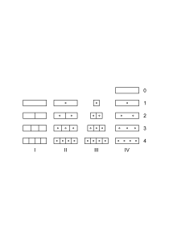

### [37r\[1\]](https://cdn.wittgensteinnachlass.com/2000px/webp/Ms-113/37r.webp)

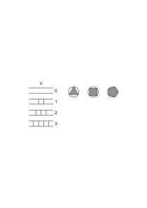

Es hat keinen Sinn von einem schwarzen Zwei-Eck im weißen Kreis zu reden; und dieser Fall ist analog dem: es ist sinnlos zu sagen, das Viereck bestehe aus 0 Teilen (keinem Teil). Hier haben wir etwas wie eine untere Grenze des Zählens noch ehe wir die Eins erreichen. Gibt es auch einen Fall in welchem es eine obere Grenze gibt? Ich glaube schon; z.B. den der Flächen regelmäßiger Körper. Aber muß ich so weit gehen, kann ich nicht willkürlich so ein System festsetzen?

### [37r\[2\]](https://cdn.wittgensteinnachlass.com/2000px/webp/Ms-113/37r.webp),[37v\[1\]](https://cdn.wittgensteinnachlass.com/2000px/webp/Ms-113/37v.webp)

Ist Teile zählen in I das Gleiche wie Punkte zählen in IV? Und worin besteht der Unterschied? Man kann das Zählen der Teile in I auffassen als ein Zählen von Vierecken. Dann kann man aber auch sagen „in dieser Zeile ist _kein_ Viereck”; & dann zählt man nicht _Teile_. Es beunruhigt uns die Analogie zwischen dem Zählen der Punkte & der Teile & das Auslassen dieser Analogie (anderseits). Darin, die ungeteilte Fläche als „Eins” zu zählen ist etwas Seltsames; dagegen finden wir keine Schwierigkeit darin die einmal geteilte als Bild der 2 zu sehen. Man möchte hier viel lieber zählen „0, 2, 3, etc.”. Und dies entspricht der Satzreihe: „das Viereck ist ungeteilt”, „das Viereck ist in 2 Teile geteilt”, etc..

### [37v\[2\]](https://cdn.wittgensteinnachlass.com/2000px/webp/Ms-113/37v.webp)

Wenn es sich um verschiedene Farben handelt dann kann man sich den Standpunkt denken auf dem man nicht sagt, wir haben hier zwei Farben sondern, es ist hier ein Unterschied der Farben; die Betrachtungsweise die in rot, grün, gelb überhaupt nicht 3 sieht. Und die zwar eine Reihe, etwa: rot; blau, grün; gelb, schwarz, weiß; etc. als solche erkennt, sie aber nicht mit der Reihe ∣; ∣∣; ∣∣∣; etc. in Verbindung bringt, oder nicht so, daß sie ∣ dem Glied rot zuordnet.

### [37v\[3\]](https://cdn.wittgensteinnachlass.com/2000px/webp/Ms-113/37v.webp),[38r\[1\]](https://cdn.wittgensteinnachlass.com/2000px/webp/Ms-113/38r.webp)

Von dem Standpunkt von dem es ‚seltsam’ ist die ungeteilte Fläche als 1 zu zählen ist es aber auch nicht natürlich die einmal geteilte als 2 zu zählen. Denn das tut man wenn man sie als zwei Vierecke auffaßt also von dem Standpunkt, von welchem man die ungeteilte sehr wohl als ein Viereck zählen konnte. Faßt man aber das erste Viereck in I als die ungeteilte Fläche auf, so erscheint das zweite als Ganzes mit einer Teilung (einem Unterschied); & Teilung heißt hier nicht notwendigerweise Teilungsstrich. Sondern das worauf ich mein Augenmerk richte sind die Unterschiede & hier gibt es eben eine Reihe von weniger zu mehr Unterschieden oder Übergängen. Ich werde dann die Vierecke in I numerieren „0, 1, 2, etc.”.

### [38r\[2\]](https://cdn.wittgensteinnachlass.com/2000px/webp/Ms-113/38r.webp),[38v\[1\]](https://cdn.wittgensteinnachlass.com/2000px/webp/Ms-113/38v.webp)

Das geht nun, wo die Farben in einem Streifen an einander grenzen wie etwa im Schema

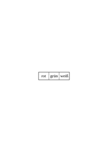.

Anders ist es aber wenn die Anordnung

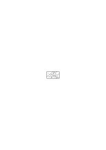

ist; oder

.

Freilich könnte ich auch jedes dieser beiden Schemata einem Schema

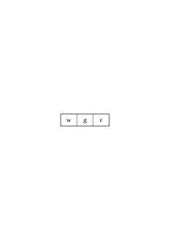

zuordnen; Schemata wie

einem Schema

.

etc.; & das ist eine korrekte Betrachtungsweise, aber doch eine künstliche. Das Natürlichste ist die Reihe der Schemata ⋎ aufzufassen als <math display="inline"><mspace width="0.3em"/><mo>|</mo><mspace width="0.3em"/><mo>|</mo><mspace width="0.3em"/><mo>|</mo><mi>A</mi><mspace width="0.3em"/><mo>|</mo><mspace width="0.3em"/><mo>|</mo><mi>A</mi><mspace width="0.3em"/><mo>|</mo><mspace width="0.3em"/><mo>|</mo><mi>B</mi><mspace width="0.3em"/><mo>|</mo><mi>A</mi><mspace width="0.3em"/><mo>|</mo><mspace width="0.3em"/><mo>|</mo><mi>B</mi><mspace width="0.3em"/><mo>|</mo><mspace width="0.3em"/><mo>|</mo><mi>C</mi><mi>A</mi><mspace width="0.3em"/><mo>|</mo><mspace width="0.3em"/><mo>|</mo><mi>B</mi><mspace width="0.3em"/><mo>|</mo><mspace width="0.3em"/><mo>|</mo><mi>C</mi><mspace width="0.3em"/><mo>|</mo><mspace width="0.3em"/><mo>|</mo><mi>D</mi><mspace width="0.3em"/><mo>|</mo><mspace width="0.3em"/><mo>|</mo><mspace width="0.3em"/><mo>|</mo><mtext>etc.</mtext></math>. Und hier kann man nun das erste Schema mit ‚0’ bezeichnen das zweite mit ‚1’ das dritte aber etwa mit 3, wenn man an alle möglichen Unterschiede denkt, & das vierte dann mit 6. Oder man nennt das dritte Schema 2 (wenn man sich bloß um eine Anordnung kümmert) & das vierte 3.

### [38v\[2\]](https://cdn.wittgensteinnachlass.com/2000px/webp/Ms-113/38v.webp)

Man kann die Teiligkeit des Vierecks

beschreiben indem man sagt: es ist in 5 Teile geteilt, oder: es sind 4 Teile davon abgetrennt worden, oder: es hat das Teilungsschema ABCDE, oder: man kommt durch alle Teile indem man 4 Grenzen passiert, oder: das Viereck ist geteilt (d.h. in 2 Teile) der eine Teil wieder geteilt & beide Teile dieser Teilung geteilt, etc. Ich will zeigen daß nicht nur _eine_ Methode besteht die Teiligkeit zu beschreiben.

### [38v\[3\]](https://cdn.wittgensteinnachlass.com/2000px/webp/Ms-113/38v.webp),[39r\[1\]](https://cdn.wittgensteinnachlass.com/2000px/webp/Ms-113/39r.webp)

Wenn man die Unterschiede (der Farben) zählen will so wird man, wie gesagt etwa die Zusammenstellungen je zweier Farben zählen; man ist aber dann auch versucht von einem Mehrfarbenunterschied zu sprechen, der sich etwa zum einfachen Unterschied verhält wie Raumwinkel zum Flächenwinkel. Es ist also grün-rot ein Unterschied aber auch grün-rot-blau. Und hier ist es nun schwer diesen nicht einen dreifachen Unterschied zu nennen.

### [39r\[2\]](https://cdn.wittgensteinnachlass.com/2000px/webp/Ms-113/39r.webp)

Man kann das Viereck von vorhin immer auch _so_ geteilt auffassen

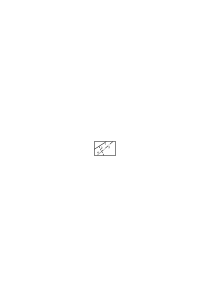

& dann sagen es sei 4 mal geteilt. Und kann insofern den Unterschied grün-blau-rot einen doppelten Unterschied nennen & meinen daß das ganze Feld einmal & ein Teil nocheinmal geteilt ist.

### [39r\[3\]](https://cdn.wittgensteinnachlass.com/2000px/webp/Ms-113/39r.webp)

Man wird sich aber vielleicht auch enthalten den Unterschied überhaupt mit einer Zahl zu bezeichnen sondern sich ganz an die Schemata A, AB, ABC, etc. halten. Oder es auch so schreiben

1, 12, 123, etc. oder was auf das gleiche hinauskommt: 0, 01, 012, etc. Diese kann man sehr wohl auch Zahlzeichen nennen.

### [39r\[4\]](https://cdn.wittgensteinnachlass.com/2000px/webp/Ms-113/39r.webp),[39v\[1\]](https://cdn.wittgensteinnachlass.com/2000px/webp/Ms-113/39v.webp)

Die Schemata:

A, AB, ABC, etc.; 1, 12, 123, etc.; ∣, ∣∣, ∣∣∣ etc.; , |, | | , ||| , etc.; 0, 1, 2, 3, etc.; 1, 2, 3 etc.; 1, 12, 121323, etc., etc. sind alle gleich fundamental.

### [39v\[2\]](https://cdn.wittgensteinnachlass.com/2000px/webp/Ms-113/39v.webp)

Die ganze Schwierigkeit kommt ja von der Darstellung der Schemata

<math display="block">
  <mtext>❘</mtext>
  <mtext>❘</mtext>
  <mtext>❘</mtext>
</math>

etc. | durch die Schemata | <math display="inline"><mtext>❘</mtext><mtext>❘</mtext><mtext>❘</mtext></math>

etc.

und zwar ordnet man _so_ zu:

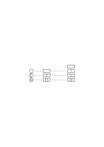

### [39v\[3\]](https://cdn.wittgensteinnachlass.com/2000px/webp/Ms-113/39v.webp)

Die Schemata <math display="inline"><mo>,</mo><mo>|</mo><mo>,</mo><mspace width="0.3em"/><mo>|</mo><mspace width="0.3em"/><mo>|</mo><mo>,</mo><mspace width="0.3em"/><mo>|</mo><mo>|</mo><mo>|</mo></math> etc. sind die Zahlenreihe 0, 1, 2, 3, etc. Hätte man statt der Schemata <math display="inline"><mo>,</mo><mo>|</mo><mo>,</mo><mo>|</mo><mo>|</mo><mo>,</mo></math> etc. die Schemata ∣, ∣∣, ∣∣∣, etc. benützt, das sind die Kardinalzahlen ohne Null, so wäre hier die Schwierigkeit nicht aufgetreten. Man wundert sich nun darüber daß das Zahlenschema mit welchem man Soldaten in einer Kaserne zählt nicht auch für die Teile eines Vierecks gelten soll. Aber das Schema der Soldaten in der Kaserne ist <math display="inline"><mo>,</mo><mo>|</mo><mo>,</mo><mo>|</mo><mo>|</mo><mo>,</mo></math> etc., das der Teile des Vierecks <math display="inline"><mo>,</mo><mo>|</mo><mo>,</mo><mo>|</mo><mo>|</mo></math> etc. Keines ist im Vergleich zum anderen primär.

### [39v\[4\]](https://cdn.wittgensteinnachlass.com/2000px/webp/Ms-113/39v.webp),[40r\[1\]](https://cdn.wittgensteinnachlass.com/2000px/webp/Ms-113/40r.webp)

Vergleiche einfach die beiden Reihen:

| | | A

| | A | | B

| A | | B | | C

A | | B | | C | | D

etc. | und | <math display="inline"><mspace width="0.3em"/><mtext>∙</mtext><mspace width="0.3em"/><mtext>∙</mtext><mspace width="0.3em"/><mtext>∙</mtext><mspace width="0.3em"/><mtext>∙</mtext><mspace width="0.3em"/><mtext>∙</mtext><mspace width="0.3em"/><mtext>∙</mtext></math>

etc.

& entscheide, wie sie einander zugeordnet werden sollen, – wie sie einander entsprechen –! Da ist offenbar die Versuchung groß den Punkten die Buchstaben zuzuordnen so daß <math display="inline"><mspace width="0.3em"/><mtext>∙</mtext></math> dem A entspricht, dann aber bleibt die 0 unbesetzt; – es ist aber auch möglich die Zuordnung anders zu machen.

### [40r\[2\]](https://cdn.wittgensteinnachlass.com/2000px/webp/Ms-113/40r.webp)

Es kann der Reihe

| | | A

| | A | | B

| A | | B | | C

etc. | offenbar die Reihe | <math display="inline"><mspace width="0.3em"/><mtext>∙</mtext><mspace width="0.3em"/><mtext>∙</mtext><mspace width="0.3em"/><mtext>∙</mtext><mspace width="0.3em"/><mtext>∙</mtext><mspace width="0.3em"/><mtext>∙</mtext><mspace width="0.3em"/><mtext>∙</mtext></math>

etc.

zugeordnet werden aber auch die Reihe

<math display="block">
  <mspace width="0.3em"/>
  <mtext>∙</mtext>
  <mspace width="0.3em"/>
  <mtext>∙</mtext>
  <mspace width="0.3em"/>
  <mtext>∙</mtext>
  <mspace width="0.3em"/>
  <mtext>∙</mtext>
  <mspace width="0.3em"/>
  <mtext>∙</mtext>
  <mspace width="0.3em"/>
  <mtext>∙</mtext>
  <mtext>etc</mtext>
  <mn>.</mn>
</math>

### [40r\[3\]](https://cdn.wittgensteinnachlass.com/2000px/webp/Ms-113/40r.webp),[40v\[1\]](https://cdn.wittgensteinnachlass.com/2000px/webp/Ms-113/40v.webp)

Beiläufig & irreführend ausgedrückt: ich kann die Teile zählen aber auch die Teile die mehr als einer vorhanden sind. Richtiger ist es schon zu sagen: „ich kann die Teile zählen, aber auch die Teilstriche”; nur muß man dann wissen was man in einem Fall

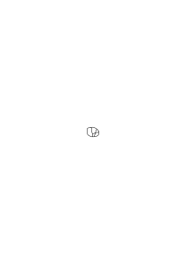

einen Teilstrich nennt. Ich kann die Reihe der Teilungsschemata sowohl mit der Reihe 1, 2, 3 etc. als auch mit der Reihe 0, 1, 2, 3 etc. vergleichen. Zähle ich die Teile so gibt es in meiner Zahlenreihe keine 0 denn die Reihe

_| | | A_

_| | A | | B_

_| A | | B | | C_

_| | | etc._

fängt mit einem Buchstaben an, während <math display="inline"><mo>,</mo><mspace width="0.3em"/><mtext>∙</mtext><mo>,</mo><mspace width="0.3em"/><mtext>∙</mtext><mspace width="0.3em"/><mtext>∙</mtext></math> etc. nicht mit einem Punkt anfängt. Ich kann dagegen auch mit dieser Reihe alle Tatsachen der Teilung darstellen, nur „zähle ich dann nicht die Teile”.

### [40v\[2\]](https://cdn.wittgensteinnachlass.com/2000px/webp/Ms-113/40v.webp),[41r\[1\]](https://cdn.wittgensteinnachlass.com/2000px/webp/Ms-113/41r.webp)

Könnte man auch eine Zahlenart den Kardinalzahlen entgegensetzen deren Reihe der der Kardinalzahlen ohne der 5 entspräche? Oh ja; nur wäre diese Zahlenart zu _nichts_ zu brauchen, wozu die Kardinalzahlen es sind. Und die 5 fehlt diesen Zahlen nicht wie ein Apfel den man aus einer Kiste voller Äpfel herausgenommen hat & wieder hineinlegen kann, sondern die 5 fehlt dem Wesen dieser Zahlen; sie _kennen_ die 5 nicht (wie die Kardinalzahlen die Zahl ½ nicht kennen). Angewendet wurden also diese Zahlen (wenn man sie so nennen will) in einem Fall, in dem die Kardinalzahlen (mit der 5) nicht mit Sinn angewendet werden könnten. (Zeigt sich hier nicht die Unsinnigkeit des Geredes von der „Grundintuition”?)

### [41r\[2\]](https://cdn.wittgensteinnachlass.com/2000px/webp/Ms-113/41r.webp)

Denken wir daran was daraus würde wenn ich dem Schema

_| | | A_

_| | A | | B_

_| A | | B | | C_

_etc._

das Schema

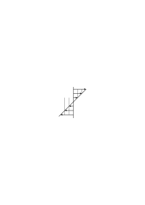

zuordnen wollte.

### [41r\[3\]](https://cdn.wittgensteinnachlass.com/2000px/webp/Ms-113/41r.webp)

29.02.1932

Regeln der Grammatik die eine „Verbindung zwischen Sprache & Wirklichkeit” herstellen, & solche die es nicht tun. Von der ersten Art etwa: „diese Farbe nenne ich ‚rot’”, – von der zweiten: „~~p = p”. Aber über diesen Unterschied besteht ein Irrtum: der Unterschied scheint prinzipieller Art zu sein; & die Sprache wesentlich etwas dem eine Struktur gegeben, & was dann der Wirklichkeit aufgepaßt wird.

### [41r\[4\]](https://cdn.wittgensteinnachlass.com/2000px/webp/Ms-113/41r.webp)

Die Philosophen, welche sagen: „nach dem Tod wird ein zeitloser Zustand eintreten”, oder „mit dem Tod tritt ein zeitloser Zustand ein”, & nicht merken, daß sie im zeitlichen Sinne „nach” & „mit” & „tritt ein” gesagt haben & daß die Zeitlichkeit in ihrer Grammatik liegt.

### [41r\[5\]](https://cdn.wittgensteinnachlass.com/2000px/webp/Ms-113/41r.webp),[41v\[1\]](https://cdn.wittgensteinnachlass.com/2000px/webp/Ms-113/41v.webp),[42r\[1\]](https://cdn.wittgensteinnachlass.com/2000px/webp/Ms-113/42r.webp)

„Das Viereck hat eine Farbe & nur _eine_”. Der erste Teil des Satzes darf dann nicht die grammatische Aussage der Färbigkeit sein. („Ich kann in dieser Fläche 3 Farben _unterscheiden_”.) Ich weiß selbst nicht, _was_ mir an dieser Sache noch unverständlich ist, worin mein Problem liegt, & doch ist noch eins. Es ist etwas noch nicht klar! Unrichtig ausgedrückt, aber so wie man es zunächst ausdrücken würde, lautet das Problem: „warum kann man sagen ‚es gibt 2 Farben auf dieser Fläche’ & nicht: ‚es gibt _eine_ Farbe auf dieser Fläche’?” Oder: Wie muß ich die grammatische Regel ausdrücken, daß ich nicht mehr versucht bin Unsinniges zu sagen & daß sie mir selbstverständlich ist? Wo liegt der falsche Gedanke, die falsche Analogie, durch die ich verführt werde, die Sprache unrichtig zu gebrauchen? Wie muß ich die Grammatik darstellen daß diese Versuchung wegfällt? Ich glaube, daß die Darstellung durch die Reihen

_| | | A_

_| | A | | B_

_| A | | B | | C_

_u.s.w._

und

<math display="block">
  <mspace width="0.3em"/>
  <mtext>∙</mtext>
  <mspace width="0.3em"/>
  <mtext>∙</mtext>
  <mspace width="0.3em"/>
  <mtext>∙</mtext>
</math>

u.s.w.

die Unklarheit hebt. Es kommt alles darauf an ob ich mit einer Zahlenreihe zähle die mit 0 anfängt oder mit einer die mit 1 anfängt. So ist es auch, wenn ich die Längen von Stäben oder die Größen von Hüten zähle. Wenn ich mit Zählstrichen zähle so könnte ich sie dann so schreiben:

,

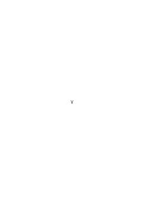,

,

etc. um zu zeigen daß es auf den Richtungs**unterschied** ankommt & der einfache Strich der 0 entspricht (d.h. der Anfang ist).

### [42r\[2\]](https://cdn.wittgensteinnachlass.com/2000px/webp/Ms-113/42r.webp)

(Der aufregende Charakter der grammatischen Unklarheit.)

### [42r\[3\]](https://cdn.wittgensteinnachlass.com/2000px/webp/Ms-113/42r.webp)

Der Sinn eines Satzes ist nicht pneumatisch, sondern ist das, was auf die Frage nach der Erklärung des Sinnes zur Antwort kommt. Und – oder – der eine Sinn unterscheidet sich vom andern wie die Erklärung des einen von der Erklärung des andern.

### [42r\[4\]](https://cdn.wittgensteinnachlass.com/2000px/webp/Ms-113/42r.webp)

Welche Rolle der Satz im Kalkül spielt, das ist sein Sinn.

### [42r\[5\]](https://cdn.wittgensteinnachlass.com/2000px/webp/Ms-113/42r.webp)

Der Sinn steht also nicht _hinter_ ihm (wie der psychische Vorgang der Vorstellungen etc.).

### [42r\[6\]](https://cdn.wittgensteinnachlass.com/2000px/webp/Ms-113/42r.webp),[42v\[1\]](https://cdn.wittgensteinnachlass.com/2000px/webp/Ms-113/42v.webp)

Welche Sätze aus ihm folgen & aus welchen Sätzen er folgt, das macht seinen Sinn aus. Daher auch die Frage nach seiner Verifikation eine Frage nach seinem Sinn ist.

### [42v\[2\]](https://cdn.wittgensteinnachlass.com/2000px/webp/Ms-113/42v.webp),[43r\[1\]](https://cdn.wittgensteinnachlass.com/2000px/webp/Ms-113/43r.webp)

Wende das auf einen Satz an, wie etwa „es wird niemals Menschen mit zwei Köpfen geben”. Dieser Satz scheint irgendwie in's Unendliche Unverifizierbare zu reichen & sein Sinn von jeder Verifikation unabhängig zu sein. Aber wenn wir seinen Sinn erforschen wollen, so meldet sich ganz richtig die Frage: Können wir die Wahrheit eines solchen Satzes je wissen & _wie_ können wir sie wissen & welche Gründe können wir haben was der Satz sagt anzunehmen & abzulehnen? Nun wird man vielleicht sagen: es ist ja nach dem Sinn gefragt worden; nicht danach, ob & wie man ihn wissen kann. Aber die Antwort auf die Frage „wie kann man diesen Satz wissen?” ist nicht eine psychologische sondern sagt, aus welchem andern Satz er folgt, gehört also zur Grammatik des erstern. Und die Gründe, die möglich sind den Satz anzunehmen sind nicht persönliche Angelegenheiten sondern Teile des Kalküls zu dem der Satz gehört. Wenn ich frage: wie _kann_ ich den Satz „jemand ist im Nebenzimmer” verifizieren, oder wie kann ich herausfinden, daß jemand im Nebenzimmer ist, so ist etwa eine Antwort „indem ich in's Nebenzimmer gehe & ihn sehe”. Wenn nun gefragt wird „wie _kann_ ich in's Nebenzimmer kommen, wenn die Türe versperrt ist”, so ist dieses „kann” ein anderes als das erste: Die erste Frage nach der Möglichkeit (der logischen) hatte eine Erklärung über den Satzkalkül zur Antwort, daß nämlich dieser Satz aus jenem folgt; die zweite Frage war eine nach der physikalischen Möglichkeit & hatte einen Erfahrungssatz zur Antwort: daß man, etwa, die Mauer nicht durchbrechen könne weil sie zu stark sei, dagegen die Tür mit einem Sperrhaken öffnen könne. Beide Fragen nun sind in gewissem Sinn aber nicht im gleichen Fragen nach der Verifikation. Und, indem man die erste Art mit der zweiten verwechselt glaubt man, die Frage nach der Verifikation sei für den Sinn ohne Belang. Die Gründe für die Annahme eines Satzes sind nicht zu verwechseln mit den Ursachen der Annahme. Jene gehören zum Kalkül des Satzes.

### [43r\[2\]](https://cdn.wittgensteinnachlass.com/2000px/webp/Ms-113/43r.webp),[43v\[1\]](https://cdn.wittgensteinnachlass.com/2000px/webp/Ms-113/43v.webp)

Die Ursachen, warum wir einen Satz glauben wären bei der Frage, was es denn ist, was wir glauben, allerdings irrelevant, aber nicht so die Gründe, die ja mit dem Satz intern verwandt sind & uns sagen, wer er ist.

### [43v\[2\]](https://cdn.wittgensteinnachlass.com/2000px/webp/Ms-113/43v.webp)

Und der Sinn des Satzes ist ja nicht etwas, was wir erforschen & vielleicht zum Teil unerforschlich ist. So daß wir später erst noch einmal darauf kommen könnten, daß dieser Satz von andern Wesen als wir sind auf eine andere Art gewußt werden kann. So daß er _dieser_ Satz mit _diesem_ Sinn bliebe, dieser Sinn aber Eigenschaften hätte, die wir jetzt nicht ahnen. Der Satz, oder sein Sinn, ist nicht das pneumatische Wesen, was sein Eigenleben hat & nun Abenteuer besteht, von denen wir nichts zu wissen brauchen. Wir hätten ihm quasi Geist von unserm Geist eingehaucht – seinen Sinn – aber nun hat er sein Eigenleben – wie unser Kind – & wir können ihn (nur) erforschen & mehr oder weniger verstehen.

### [43v\[3\]](https://cdn.wittgensteinnachlass.com/2000px/webp/Ms-113/43v.webp)

Der Instinkt führt einen richtig, der zur Frage führt: Wie kann man so etwas wissen; was für einen Grund können wir haben das anzunehmen; aus welchen Erfahrungen würden wir so einen Satz ableiten; etc.

### [43v\[4\]](https://cdn.wittgensteinnachlass.com/2000px/webp/Ms-113/43v.webp),[44r\[1\]](https://cdn.wittgensteinnachlass.com/2000px/webp/Ms-113/44r.webp)

Der Sinn ist keine Seele des Satzes. Er muß, soweit wir an ihm interessiert sind, sich gänzlich ausmessen lassen, sich ganz in Zeichen offenbaren.

### [44r\[2\]](https://cdn.wittgensteinnachlass.com/2000px/webp/Ms-113/44r.webp)

Wenn man nun fragt: hat es Sinn zu sagen „es wird _nie_ das & das geben”? – Nun, welche Evidenz gibt es dafür; & was folgt daraus? – Denn wenn es keine Evidenz dafür gibt – nicht daß wir noch nicht imstande waren sie zu kriegen – sondern daß keine im Kalkül _vorgesehen_ wurde, dann ist damit der Charakter dieses Satzes bestimmt. Wie das Wesen einer Zahlenart dadurch, daß kein Vergleich zwischen ihr & gewissen Rationalzahlen möglich ist.

### [44r\[3\]](https://cdn.wittgensteinnachlass.com/2000px/webp/Ms-113/44r.webp)

Übrigens: Eine Zahl die heute auf bewußte Weise mittels des Fermatschen Satzes definiert ist, wird dadurch nicht geändert daß der Beweis dieses Satzes oder des Gegenteils gefunden wird. Denn der Kalkül dieser Zahl weiß von dieser Lösung des Problems nichts (& wird auch dann nichts von ihr wissen).

### [44r\[4\]](https://cdn.wittgensteinnachlass.com/2000px/webp/Ms-113/44r.webp),[44v\[1\]](https://cdn.wittgensteinnachlass.com/2000px/webp/Ms-113/44v.webp)

„Ich werde nie einen Menschen mit 2 Köpfen sehen” – man glaubt, durch diesen Satz irgendwie in die Unendlichkeit zu reichen. Quasi zum mindesten eine Eisenbahn dorthin gelegt zu haben, wenn wir auch noch nicht die ganze Strecke bereist haben. Es liegt da die Idee zu Grunde, daß z.B. das Wort „nie” die Unendlichkeit bereits mitbringe, da das eben seine Bedeutung ist. Es kommt darauf an: Was kann ich mit so einem Satz tun; denn, auf die Frage „was bedeutet er?” kommt ja wieder ein Satz zur Antwort, & der führt mich solange nicht weiter, als ich aus der Erklärung nichts über die Züge erfahre, die ich mit den Figuren machen darf. (Als ich, sozusagen, nur immer wieder die gleiche Konfiguration vor mir sehe & keine anderen die ich aus ihr bilden kann.) So höre ich z.B. daß keine Erfahrung diesen Satz beweisen kann & das beruhigt mich über seine unendliche Bedeutung.

### [44v\[2\]](https://cdn.wittgensteinnachlass.com/2000px/webp/Ms-113/44v.webp)

Manche Philosophen (oder wie man sie nennen soll) leiden an dem was man „loss of problems”, „Problemverlust” nennen kann. Es scheint ihnen dann alles ganz einfach & es scheinen keine tiefen Probleme mehr zu existieren, die Welt wird weit & flach & verliert jede Tiefe; & was sie schreiben wird unendlich seicht und trivial. Russell & H. G. Wells haben dieses Leiden.

### [44v\[3\]](https://cdn.wittgensteinnachlass.com/2000px/webp/Ms-113/44v.webp),[45r\[1\]](https://cdn.wittgensteinnachlass.com/2000px/webp/Ms-113/45r.webp)

Aus keiner Evidenz folgt, daß dieser Satz wahr ist. – Ja aber ich kann doch _glauben_, daß er wahr ist! Aber was heißt das: „glauben daß das der Fall ist”? Reicht etwa dieser Glaube in die Unendlichkeit; fliegt er der Verifikation voran? – Was heißt es, das glauben? Diesen Satz mit bestimmten Gefühlen sagen? ist es ein bestimmtes Benehmen? denn etwas andres kann es doch nicht sein. – Und dann interessiert es uns nur insofern, als es ein Kalkulieren mit dem Satz ist.

### [45r\[2\]](https://cdn.wittgensteinnachlass.com/2000px/webp/Ms-113/45r.webp)

Es gibt so viel verschiedene Allgemeinheiten als es verschiedene Zahlarten gibt.

### [45r\[3\]](https://cdn.wittgensteinnachlass.com/2000px/webp/Ms-113/45r.webp)

Darum nützt es nichts zur Klärung das Wort „alle” zu gebrauchen, wenn man seine Grammatik in _diesem_ Fall noch nicht kennt.

### [45r\[4\]](https://cdn.wittgensteinnachlass.com/2000px/webp/Ms-113/45r.webp),[45v\[1\]](https://cdn.wittgensteinnachlass.com/2000px/webp/Ms-113/45v.webp)

01.03.1932

Ein einfaches Sprachspiel ist z.B. dieses: Man spricht zu einem Kind (es kann aber auch ein Erwachsener sein) indem man das elektrische Licht in einem Raum andreht: „Licht”, dann, indem man es abdreht: „Finster”; & tut das etwa mehrere male mit Betonung & variierenden Zeitlängen. Dann geht man etwa in das Nebenzimmer dreht von dort aus das Licht im ersten an & ab & bringt das Kind dazu daß es mitteilt ob es licht oder finster ist. Soll ich da nun „licht” & „finster” ‚Sätze’ nennen?! Nun, wie ich will. – – Und wie ist es mit der ‚Übereinstimmung mit der Wirklichkeit’?

### [45v\[2\]](https://cdn.wittgensteinnachlass.com/2000px/webp/Ms-113/45v.webp)

Wenn ich bestimmte einfache Spiele beschreibe, so geschieht es nicht um mit ihnen nach & nach die wirklichen Vorgänge der Sprache – oder des Denkens – aufzubauen, was nur zu Ungerechtigkeiten führt, – sondern ich stelle die Spiele als solche hin, & lasse sie ihre aufklärende Wirkung auf die besondern Probleme ausstrahlen.

### [45v\[3\]](https://cdn.wittgensteinnachlass.com/2000px/webp/Ms-113/45v.webp)

Ich habe ein Bild mit verschwommenen Farben & komplizierten Übergängen. Ich stelle ein einfaches mit klar geschiedenen Farben aber mit dem ersten verwandtes daneben. Ich sage nicht daß das erste eigentlich das zweite sei; aber ich lade den Andern ein das einfache anzusehen & verspreche mir davon daß gewisse Beunruhigungen für ihn verschwinden werden.

### [45v\[4\]](https://cdn.wittgensteinnachlass.com/2000px/webp/Ms-113/45v.webp),[46r\[1\]](https://cdn.wittgensteinnachlass.com/2000px/webp/Ms-113/46r.webp)

(Hängt meine Art des Denkens mit dem Zerfall der großen Staaten in kleine unabhängige mit dem Respektieren der Minoritäten zusammen?)

### [46r\[2\]](https://cdn.wittgensteinnachlass.com/2000px/webp/Ms-113/46r.webp)

Man könnte oben sagen: „die Worte ‚licht’, ‚finster’ sind hier als Sätze gemeint & sind nicht einfach Wörter”. Das heißt sie sind hier nicht so gebraucht, wie wir sie in der gewöhnlichen Sprache gebrauchen (obwohl wir tatsächlich auch oft _so_ sprechen). Aber wenn ich plötzlich ohne sichtbaren Anlaß das Wort „licht” isoliert ausspreche, so wird man allerdings sagen: „was heißt das? das ist doch kein Satz” oder: „Du sagst ‚licht’, nun was soll's damit?”

Das Aussprechen des Wortes „licht” ist in diesem Fall sozusagen noch kein (kompletter) Zug des Spiels which we expect the other to play.

### [46r\[3\]](https://cdn.wittgensteinnachlass.com/2000px/webp/Ms-113/46r.webp)

Wie unterscheidet sich nun „licht” wenn es den Wunsch nach Licht ausdrückt von „licht” wenn es konstatiert daß es im Zimmer licht ist? Daß wir es in jedem Fall anders _meinen_? Und worin besteht das? In bestimmten Vorgängen die das Aussprechen begleiten, oder in einem bestimmten Benehmen, das ihm vorangeht, eventuell es begleitet, & ihm folgt?

### [46r\[4\]](https://cdn.wittgensteinnachlass.com/2000px/webp/Ms-113/46r.webp),[46v\[1\]](https://cdn.wittgensteinnachlass.com/2000px/webp/Ms-113/46v.webp)

Wenn ein Mann im Ertrinken „Hilfe” schreit, – konstatiert er die Tatsache, daß er Hilfe bedarf? daß er ohne Hilfe ertrinken wird? – Dagegen gibt es den Fall in dem man, quasi, sich beobachtend sagt „ich hätte (oder: habe) jetzt den Wunsch nach …”.

### [46v\[2\]](https://cdn.wittgensteinnachlass.com/2000px/webp/Ms-113/46v.webp)

Ich sage das Wort „Licht!”, – der Andere fragt mich: „was meinst Du?” – Und ich sage: „Ich meinte, Du sollst Licht machen”. – Wie war das, als ich es _meinte_? Sprach ich den „kompletten Satz” in der Vorstellung unhörbar aus oder den entsprechenden in einer andern Sprache? (Ja, das _kann_ vorkommen oder auch nicht.) Die Fälle die man alle mit dem Ausdruck „ich meinte” zusammenfaßt sind _sehr mannigfach_.

### [46v\[3\]](https://cdn.wittgensteinnachlass.com/2000px/webp/Ms-113/46v.webp)

Nun kann man ruhig annehmen: ‚ich meinte, Du solltest Licht machen’ heißt, daß mir dabei ein Phantasiebild von Dir in dieser Tätigkeit vorgeschwebt hat, & ebensogut: der Satz heißt, daß mir dabei die Worte des vollständigen Satzes in der Phantasie gegenwärtig waren, oder daß eins von diesen beiden der Fall war, – nur muß ich wissen daß ich damit eine Festsetzung über die Worte „ich meinte” getroffen habe & eine engere als die ist welche dem tatsächlichen allgemeinen Gebrauch des Ausdrucks entspricht.

### [47r\[1\]](https://cdn.wittgensteinnachlass.com/2000px/webp/Ms-113/47r.webp)

Wenn das Meinen für uns irgendeine Bedeutung, Wichtigkeit, haben soll so muß dem System der Sätze ein System der Meinungen zugeordnet sein, _was immer_ für Vorgänge die Meinungen sein sollen.

### [47r\[2\]](https://cdn.wittgensteinnachlass.com/2000px/webp/Ms-113/47r.webp),[47v\[1\]](https://cdn.wittgensteinnachlass.com/2000px/webp/Ms-113/47v.webp),[48r\[1\]](https://cdn.wittgensteinnachlass.com/2000px/webp/Ms-113/48r.webp)

Inwiefern stimmt nun das Wort „Licht” im obigen Symbolismus oder Zeichenspiel mit einer Wirklichkeit überein, – oder nicht überein? Wie gebrauchen wir überhaupt das Wort übereinstimmen? – Wir sagen „die beiden Uhren stimmen überein”, wenn sie die gleiche Zeit zeigen, „die beiden Maßstäbe stimmen überein”, wenn gewisse Teilstriche zusammenfallen, „die beiden Farben stimmen überein” wenn etwa ihre Zusammenstellung uns angenehm ist. Wir sagen „die beiden Längen stimmen überein” wenn sie gleich sind, aber auch wenn sie in einem von uns gewünschten Verhältnis stehen. Und daß sie „übereinstimmen” heißt dann nichts andres, als daß sie in diesem Verhältnis – etwa 1 : 2 – stehen. So muß also in jedem Fall erst festgesetzt werden, was unter „Übereinstimmung” zu verstehen ist. – So ist es nun auch mit der Übereinstimmung einer Längenangabe mit einer Länge. Wenn ich sage: „dieser Stab ist 2 m lang”, so kann ich z.B. erklären, wie man nach diesem Satz mit einem Maßstab die Länge des Stabes kontrolliert, wie man etwa nach diesem Satz einen Meßstreifen für den Stab erzeugt. Und ich sage nun der Satz stimmt mit der Wirklichkeit überein, wenn der auf diese Weise konstruierte Meßstreifen mit dem Stab übereinstimmt. Diese Konstruktion eines Meßstreifens illustriert übrigens was ich in meinem Buch damit meinte daß der Satz bis an die Wirklichkeit herankommt. – Man könnte das auch so klar machen: Wenn ich die Wirklichkeit daraufhin prüfen will ob sie mit einem Satz übereinstimmt, so kann ich das auch so machen daß ich sie nun beschreibe & sehe ob der gleiche Satz herauskommt. Oder: ich kann die Wirklichkeit nach grammatischen Regeln in die Sprache des Satzes übersetzen & nun im Land der Sprache den Vergleich durchführen. Als ich nun dem Andern erklärte: „Licht” (indem ich Licht machte), „Finster” (indem ich auslöschte) hatte ich auch sagen können & mit genau derselben Bedeutung „das ist ‚Licht’” (wobei ich Licht mache) & „das ist ‚Finster’” etc., und auch ebensogut: „das stimmt mit ‚Licht’ überein”, „das stimmt mit ‚Finster’ überein”.

### [48r\[2\]](https://cdn.wittgensteinnachlass.com/2000px/webp/Ms-113/48r.webp)

02.03.1932

Es kommt eben wieder auf die Grammatik des Wortes „Übereinstimmung” an, auf seinen Gebrauch. Und hier liegt die Verwechslung mit ‚Ähnlichkeit’ nahe in dem Sinn in dem zwei Personen einander ähnlich sind wenn ich sie leicht miteinander verwechseln kann. Ich kann auch wirklich nach der Aussage über die Gestalt eines Körpers eine Hohlform konstruieren in die nun der Körper paßt oder nicht paßt, jenachdem die Beschreibung richtig oder falsch war, & die konstruierte Hohlform gehört dann in dieser Auffassung noch zur Sprache (die bis an die Wirklichkeit herankommt).

### [48r\[3\]](https://cdn.wittgensteinnachlass.com/2000px/webp/Ms-113/48r.webp)

Aber auch die Hohlform macht kein finsteres Gesicht, wenn der Körper nicht in sie paßt.

### [48r\[4\]](https://cdn.wittgensteinnachlass.com/2000px/webp/Ms-113/48r.webp),[48v\[1\]](https://cdn.wittgensteinnachlass.com/2000px/webp/Ms-113/48v.webp)

Behauptung, Annahme, Frage. Man kann auf dem Schachbrett einen Zug in einer Schachpartie machen, – aber auch während eines Gesprächs über ein Schachproblem zur Illustration oder wenn man jemand das Spiel lehrt, – etc.. Man sagt dann auch etwa: „angenommen, ich zöge _so_ …”. So ein Zug hat Ähnlichkeit mit dem was man in der Sprache ‚Annahme’ nennt. Ich sage etwa „im Nebenzimmer ist ein Dieb”, – der Andre fragt mich „woher weißt Du das?” & ich antworte: „oh ich wollte nicht sagen daß wirklich ein Dieb im Nebenzimmer ist, ich habe es nur in Erwägung gezogen”. – Möchte man da nicht fragen: _Was_ hast Du erwogen? wie Du Dich benehmen würdest wenn ein Dieb da wäre, oder was für ein Geräusch es machen würde, oder was er Dir wohl stehlen würde? Freges Anschauung könnte man so wiedergeben: daß die Annahme (so wie er das Wort gebraucht) das ist, was die Behauptung daß p der Fall ist mit der Frage ob p der Fall ist gemeinsam hat.

### [48v\[2\]](https://cdn.wittgensteinnachlass.com/2000px/webp/Ms-113/48v.webp)

Kann man statt der Frage „ist p der Fall” den Satz setzen: „ich möchte wissen ob p der Fall ist”? (Und wie ist es mit _dieser_ Frage? – –)

### [48v\[3\]](https://cdn.wittgensteinnachlass.com/2000px/webp/Ms-113/48v.webp),[49r\[1\]](https://cdn.wittgensteinnachlass.com/2000px/webp/Ms-113/49r.webp)

Wie ist es mit den Sätzen eines Romans? Wenn man sich immer mit Hilfe des Fregeschen Symbolismus ausdrückte, sollte man da das Behauptungszeichen vor die Sätze der „Brüder Karamasov” schreiben, oder nicht?

### [49r\[2\]](https://cdn.wittgensteinnachlass.com/2000px/webp/Ms-113/49r.webp)

Es gibt wirkliche Annahmen, die wir eben durch Sätze von der Form „angenommen p wäre (oder: ist) der Fall” ausdrücken. Aber solche Sätze nennen wir nicht vollständig & sie scheinen sehr ähnlich den Sätzen der Form „wenn p der Fall ist, …”.

### [49r\[3\]](https://cdn.wittgensteinnachlass.com/2000px/webp/Ms-113/49r.webp)

Erinnern wir uns daran, daß es keinen Sinn hat zu sagen „(es schneit) oder (regnet es?)” Wenn ich die Behauptung daß p der Fall ist „⊢p” schreibe, die Frage ob p der Fall ist „?p” & den Wunsch, daß p der Fall sein möge „!p”, so kann man also nicht schreiben „(⊢p) ⌵ (?p)”.

### [49r\[4\]](https://cdn.wittgensteinnachlass.com/2000px/webp/Ms-113/49r.webp)

Und welcher Art ist ein Satz wie der vorige „Erinnern wir uns daran …”? Oder, wenn sich Einer eine mögliche Situation, etwa ihrer Seltsamkeit wegen, notiert? Oder: die Erzählung eines Witzes?

### [49r\[5\]](https://cdn.wittgensteinnachlass.com/2000px/webp/Ms-113/49r.webp)

Ist nun aber eine solche Annahme _ein Teil_ einer Behauptung? Ist das nicht als sagte man, die Frage ob p der Fall ist, sei ein Teil der Behauptung, daß p der Fall ist?

### [49v\[1\]](https://cdn.wittgensteinnachlass.com/2000px/webp/Ms-113/49v.webp)

Ist es aber nicht auffällig daß wir es in unsern gewöhnlichen philosophisch-grammatischen Problemen nie damit zu tun haben, ob sie sich auf Behauptungen oder Fragen beziehen? (Etwa in dem Problem von Idealismus & Realismus)

### [49v\[2\]](https://cdn.wittgensteinnachlass.com/2000px/webp/Ms-113/49v.webp)

Übrigens tritt der Unterschied zwischen dem, was man Sätze der Mathematik nennt & Erfahrungssätzen zu Tage, wenn man bedenkt, ob es Sinn hat zu sagen: „ich wünschte 2 × 2 wäre 5!”

### [49v\[3\]](https://cdn.wittgensteinnachlass.com/2000px/webp/Ms-113/49v.webp)

Und, daß das Problem der Behauptung, Frage & Annahme in anderm Zusammenhang nicht auftritt hängt wohl auch damit zusammen, daß jeder Frage eine Behauptung & eine Annahme entspricht. Und irgendwie ist die Lösung, daß wir uns nur für Kalküle interessieren & psychische Begleiterscheinungen die nicht zum Kalkül gehören uns nicht angehen.

### [49v\[4\]](https://cdn.wittgensteinnachlass.com/2000px/webp/Ms-113/49v.webp),[50r\[1\]](https://cdn.wittgensteinnachlass.com/2000px/webp/Ms-113/50r.webp)

08.03.1932

Wenn das Wort „Übereinstimmung mit der Wirklichkeit” gebraucht wird, dann nicht als metalogischer Ausdruck sondern als Teil eines Kalküls, als Teil der gewöhnlichen Sprache. Man kann etwa sagen: Im Sprachspiel „Licht!”, „Finster!” kommt der Ausdruck „Übereinstimmung mit der Wirklichkeit” nicht vor.

### [50r\[2\]](https://cdn.wittgensteinnachlass.com/2000px/webp/Ms-113/50r.webp)

10.03.1932

Wenn es so etwas gäbe wie eine Annahme im Sinne Freges, müßte dann nicht die Annahme daß p der Fall ist gleich der sein daß ~p der Fall ist?

### [50r\[3\]](https://cdn.wittgensteinnachlass.com/2000px/webp/Ms-113/50r.webp)

In dem Sinn in welchem die Frage „ist p der Fall?” die gleiche ist wie „ist p nicht der Fall?”.

### [50r\[4\]](https://cdn.wittgensteinnachlass.com/2000px/webp/Ms-113/50r.webp)

Es ist sinnlos von einer Frage zu sagen, sie sei wahr oder falsch; ihr ein ~ vorzusetzen (nämlich der Frage als solcher); zu sagen sie stimme (oder stimme nicht) mit der Wirklichkeit überein.

### [50r\[5\]](https://cdn.wittgensteinnachlass.com/2000px/webp/Ms-113/50r.webp)

In dem Sprachspiel „LichtFinster” kommt keine Frage vor. – Aber wir könnten es auch mit Fragen spielen.

### [50r\[6\]](https://cdn.wittgensteinnachlass.com/2000px/webp/Ms-113/50r.webp),[50v\[1\]](https://cdn.wittgensteinnachlass.com/2000px/webp/Ms-113/50v.webp)

Man hat natürlich das Recht ein Behauptungszeichen zu verwenden, wenn man es im Gegensatz etwa zu einem Fragezeichen gebraucht. Irreleitend ist es nur wenn man meint daß die Behauptung nun aus zwei Akten bestehe dem Erwägen & dem Behaupten (Beilegen des Wahrheitswertes oder dergl.) & daß wir diese Akte nach dem geschriebenen Satz ausführen ungefähr wie wir nach Noten Klavier spielen. Mit dem Klavierspielen nach Noten ist nun allerdings das laute, oder auch leise, Lesen nach dem geschriebenen oder gedruckten Satz zu vergleichen & ganz analog, aber nichts, was wir denken nennen. Ist also z.B. ein Behauptungszeichen im geschriebenen Satz, so wird wieder ein Behauptungs**zeichen** im gelesenen sein (etwa die Betonung oder der Stimmfall). Aber nicht, als ob im geschriebenen Satz das Zeichen, im Gedachten aber die Bedeutung anwesend wäre. –

### [50v\[2\]](https://cdn.wittgensteinnachlass.com/2000px/webp/Ms-113/50v.webp)

Eine Sprache (ich meine eine Sprechart) ist denkbar in der es keine Behauptungssätze gibt sondern nur Fragen & die Bejahung & Verneinung.

### [50v\[3\]](https://cdn.wittgensteinnachlass.com/2000px/webp/Ms-113/50v.webp),[51r\[1\]](https://cdn.wittgensteinnachlass.com/2000px/webp/Ms-113/51r.webp)

Welche Rolle spielen falsche Sätze in einem Sprachspiel? Ich glaube, es gibt verschiedene Fälle. I. Einer hat die Signallaternen an einer Straßenkreuzung zu beobachten & einem andern zu sagen welche Farben sie zeigen. Er verspricht sich dabei & sagt die falsche Farbe. II. Es werden meteorologische Beobachtungen gemacht & nach gewissen Regeln aus ihnen das Wetter für den nächsten Tag vorhergesagt. Die Vorhersage trifft ein oder nicht. Im ersten Fall kann man sagen, er spielt falsch; im zweiten nicht –.

### [51r\[2\]](https://cdn.wittgensteinnachlass.com/2000px/webp/Ms-113/51r.webp)

Man wird hier (nämlich) von einer Frage geplagt die etwa so lautet: gehört die Verifikation noch mit zum Sprachspiel?

### [51r\[3\]](https://cdn.wittgensteinnachlass.com/2000px/webp/Ms-113/51r.webp)

Wie schaut die Verifikation aus, – wie geht sie vor sich? I. Jemand sagt mir: „Du siehst jetzt eine rote Kugel auf Dich zufliegen.” II. „Wenn Du Dich umdrehst wirst Du jemand hinter Dir stehn sehn.” III. „Wenn der Zeiger der Uhr auf 4 stehen wird, wirst Du an dieser Stelle des Zimmers ein Licht sehen.” IV. „Wenn Du diesen Stab messen wirst, so wirst Du finden, daß er 1 m lang ist.”

### [51v\[1\]](https://cdn.wittgensteinnachlass.com/2000px/webp/Ms-113/51v.webp)

Ich weiß nicht ob ich es je geschrieben habe, daß ich die Methode, einer grammatischen Betrachtung eine Anzahl Beispiele voranzustellen in der Mittelschule von einem Professor namens Heinrich Groag (einem Juden) gelernt habe.

### [51v\[2\]](https://cdn.wittgensteinnachlass.com/2000px/webp/Ms-113/51v.webp)

Wenn ich die Dinge mit so trüben Augen sehe wie sie der gewöhnliche Mensch alle Tage sieht, kann ich auch nichts sagen was die Menschen aus ihrer gewöhnten Betrachtungsweise herausreißen kann.

### [51v\[3\]](https://cdn.wittgensteinnachlass.com/2000px/webp/Ms-113/51v.webp)

18.04.1932

_Glauben_

Hiermit verwandt: erwarten, hoffen, fürchten, wünschen. Aber auch: zweifeln, suchen, etc. Man sagt: „Ich habe ihn von 5–6 Uhr erwartet”, „ich habe den ganzen Tag gehofft, er werde kommen”, „in meiner Jugend habe ich gewünscht …”, etc.. Daher falscher Vergleich mit in der Zeit amorphen Zuständen (Zahnschmerz, das Hören eines Tones, etc.) – (obwohl diese unter sich wieder verschieden sind).

### [52r\[1\]](https://cdn.wittgensteinnachlass.com/2000px/webp/Ms-113/52r.webp)

Was heißt es nur: „ich glaube, er wird um 5 Uhr kommen”? oder: „er glaubt N werde um 5 Uhr kommen”? Nun, woran erkenne ich, daß er das glaubt? Daran, daß er es sagt? oder aus seinem übrigen Verhalten? oder aus beiden? Danach wird man dem Satz „er glaubt …” verschiedenen Sinn geben können.

### [52r\[2\]](https://cdn.wittgensteinnachlass.com/2000px/webp/Ms-113/52r.webp)

Hat es einen Sinn zu fragen: „Woher weißt Du, daß Du das glaubst?” Und ist etwa die Antwort: „ich erkenne es durch Introspektion”? In _manchen_ Fällen wird man so etwas sagen können, in manchen aber nicht.

### [52r\[3\]](https://cdn.wittgensteinnachlass.com/2000px/webp/Ms-113/52r.webp)

Es hat einen Sinn, zu fragen: „liebe ich sie wirklich? mache ich mir das nicht nur vor?” Und der Prozeß der Introspektion ist hier das Aufrufen von Erinnerungen, das Vorstellen möglicher Situationen & der Gefühle die man hätte etc.

### [52r\[4\]](https://cdn.wittgensteinnachlass.com/2000px/webp/Ms-113/52r.webp)

Introspektion nennt man einen Prozeß des _Schauens_ im Gegensatz zum _Sehen_.

### [52r\[5\]](https://cdn.wittgensteinnachlass.com/2000px/webp/Ms-113/52r.webp),[52v\[1\]](https://cdn.wittgensteinnachlass.com/2000px/webp/Ms-113/52v.webp)

„Woher weiß ich, daß ich das glaube?”, „wie weiß ich, daß ich Zahnschmerzen habe?”: in mancher Beziehung sind diese Fälle ähnlich.

### [52v\[2\]](https://cdn.wittgensteinnachlass.com/2000px/webp/Ms-113/52v.webp)

Man konstruiert hier nach dem Schema: „Woher weißt Du, daß jemand im andern Zimmer ist?” – „Ich habe ihn drin singen gehört”. „Ich weiß daß ich Zahnschmerzen habe, weil ich es fühle” ist nach diesem Schema konstruiert & heißt nichts. Vielmehr: ich habe Zahnschmerzen = ich fühle Zahnschmerzen = ich fühle, daß ich Zahnschmerzen habe (ungeschickter & irreführender Ausdruck). „Ich weiß, daß ich Zahnschmerzen habe” sagt dasselbe nur noch ungeschickter, es sei denn daß unter „ich habe Zahnschmerzen” eine Hypothese verstanden wird. Wie in dem Fall: „ich weiß daß die Schmerzen vom schlechten Zahn herrühren & nicht von einer Neuralgie.

### [52v\[3\]](https://cdn.wittgensteinnachlass.com/2000px/webp/Ms-113/52v.webp)

Denken wir auch an die Frage „Wie merkst Du daß Du Zahnschmerzen hast?” oder gar „wie merkst Du daß Du fürchterliche Zahnschmerzen hast?” (Dagegen: „wie merkst Du, daß Du Zahnschmerzen bekommen wirst”.)

### [52v\[4\]](https://cdn.wittgensteinnachlass.com/2000px/webp/Ms-113/52v.webp),[53r\[1\]](https://cdn.wittgensteinnachlass.com/2000px/webp/Ms-113/53r.webp)

(Hierher gehört die Frage: welchen Sinn hat es von der Verifikation des Satzes ‚ich habe Zahnschmerzen’ zu reden? Und hier sieht man deutlich daß die Frage „wie wird dieser Satz verifiziert” von einem Gebiet der Grammatik zum andern ihren Sinn ändert.)

### [53r\[2\]](https://cdn.wittgensteinnachlass.com/2000px/webp/Ms-113/53r.webp)

Man könnte nun die Sache so (falsch) auffassen: Die Frage „Wie weißt Du daß Du Zahnschmerzen hast” wird darum nicht gestellt weil man dies von den Zahnschmerzen (selbst) aus erster Hand erfährt, während man, daß ein Mensch im andern Zimmer ist, aus zweiter Hand, etwa durch ein Geräusch, erfährt. Das eine weiß ich durch unmittelbare Beobachtung, das andere erfahre ich indirekt. Also: „Wie weißt Du, daß Du Zahnschmerzen hast” – „Ich weiß es, weil ich sie habe” – „Du entnimmst es daraus, daß Du sie hast; aber mußt Du dazu nicht schon wissen, daß Du sie hast?”. – – Der Übergang von den Zahnschmerzen zur Aussage „ich habe Zahnschmerzen” ist eben ein ganz anderer als der vom Geräusch zur Aussage „in diesem Zimmer ist jemand”. Das heißt die Übergänge gehören ganz andern Sprachspielen an.

### [53v\[1\]](https://cdn.wittgensteinnachlass.com/2000px/webp/Ms-113/53v.webp)

Ist, daß ich Zahnschmerzen habe, _ein Grund_ zur Annahme, daß ich Zahnschmerzen habe?

### [53v\[2\]](https://cdn.wittgensteinnachlass.com/2000px/webp/Ms-113/53v.webp)

(Man kann die Philosophen dadurch verwirren, daß man nicht bloß da Unsinn spricht wo auch sie es tun, sondern auch solchen den zu sagen sie sich scheuen (würden).)

### [53v\[3\]](https://cdn.wittgensteinnachlass.com/2000px/webp/Ms-113/53v.webp)

Erschließt man aus der Wirklichkeit einen Satz? Also etwa „aus den wirklichen Zahnschmerzen, darauf, daß man Zahnschmerzen hat”? Aber das ist doch nur eine unkorrekte Ausdrucksweise; es müßte heißen: man schließt daß man Zahnschmerzen hat daraus, daß man Zahnschmerzen hat (Offenbarer Unsinn).

### [53v\[4\]](https://cdn.wittgensteinnachlass.com/2000px/webp/Ms-113/53v.webp),[54r\[1\]](https://cdn.wittgensteinnachlass.com/2000px/webp/Ms-113/54r.webp)

21.04.1932

„Warum glaubst Du, daß Du Dich an der Herdplatte verbrennen wirst?” Hast Du Gründe für diesen Glauben, & brauchst Du Gründe? Hast Du diese Gründe – gleichsam – immer bei Dir, wenn Du es glaubst? Und glaubst Du es immer – ausdrücklich – wenn Du Dich etwa wehrst die Herdplatte anzurühren? Meint man mit ‚Gründen des Glaubens’ dasselbe wie mit ‚Ursachen des Glaubens’ (Ursachen des Vorgangs des Glaubens)?

### [54r\[2\]](https://cdn.wittgensteinnachlass.com/2000px/webp/Ms-113/54r.webp)

22.04.1932

Was für einen Grund habe ich anzunehmen daß mein Finger, wenn er den Tisch berühren, einen Widerstand spüren wird? Was für einen Grund zu glauben daß dieser Bleistift sich nicht schmerzlos durch meine Hand stecken läßt? Wenn ich dies frage melden sich hundert Gründe die einander gar nicht zu Wort kommen lassen wollen. „Ich habe es doch selbst ungezählte Male erfahren; & ebensooft von ähnlichen Erfahrungen gehört; wenn es nicht so wäre, würde …; etc.”.

### [54r\[3\]](https://cdn.wittgensteinnachlass.com/2000px/webp/Ms-113/54r.webp)

Glaube ich, wenn ich auf meine Türe zugehe ausdrücklich daß sie sich öffnen lassen wird, – daß dahinter ein Zimmer & nicht ein Abgrund sein wird, etc.?

### [54r\[4\]](https://cdn.wittgensteinnachlass.com/2000px/webp/Ms-113/54r.webp)

Setzen wir statt des Glaubens den Ausdruck des Glaubens. –

### [54r\[5\]](https://cdn.wittgensteinnachlass.com/2000px/webp/Ms-113/54r.webp)

Was heißt es, etwas aus einem bestimmten Grunde glauben? Entspricht es, wenn wir statt des Glaubens den Ausdruck des Glaubens setzen, dem, daß Einer den Grund sagt ehe er das Begründete sagt?

### [54v\[1\]](https://cdn.wittgensteinnachlass.com/2000px/webp/Ms-113/54v.webp)

„Hast Du es aus diesen Gründen geglaubt” ist dann eine ähnliche Frage wie: „hast Du, als Du mir sagtest 25 × 25 sei 625 die Multiplikation wirklich ausgeführt?”

### [54v\[2\]](https://cdn.wittgensteinnachlass.com/2000px/webp/Ms-113/54v.webp)

23.04.1932

Die Frage „warum glaubst Du das” könnte bedeuten: „aus welchen Gründen leitest Du das jetzt ab (hast Du es jetzt abgeleitet)”; aber auch: „welche Gründe kannst Du mir nachträglich für diese Annahme angeben”.

### [54v\[3\]](https://cdn.wittgensteinnachlass.com/2000px/webp/Ms-113/54v.webp)

Ich könnte also unter ‚Gründen’ zu einer Meinung tatsächlich nur das verstehen was der Andere sich vorgesagt hat ehe er zu der Meinung kam. Die Rechnung die er tatsächlich ausgeführt hat.

### [54v\[4\]](https://cdn.wittgensteinnachlass.com/2000px/webp/Ms-113/54v.webp),[55r\[1\]](https://cdn.wittgensteinnachlass.com/2000px/webp/Ms-113/55r.webp)

Frage ich jemand: „warum glaubst Du, daß diese Armbewegung einen Schmerz mit sich bringen wird?”, & er antwortet: „weil sie ihn einmal hervorgebracht & einmal nicht hervorgebracht hat”, so werde ich sagen: „das ist doch kein Grund zu Deiner Annahme”. Wie nun wenn er mir darauf antwortet: „oh doch!; ich habe diese Annahme noch immer gemacht wenn ich diese Erfahrung gemacht hatte”? Da würden wir doch sagen: „Du scheinst mir die Ursache (psychologische Ursache) Deiner Annahme anzugeben, aber nicht den Grund”.

### [55r\[2\]](https://cdn.wittgensteinnachlass.com/2000px/webp/Ms-113/55r.webp)

„Warum glaubst Du, daß das geschehen wird?” – „Weil ich es zweimal beobachtet habe”. Oder: „Warum glaubst Du, daß das geschehen wird?” – „Weil ich es mehrmals beobachtet habe; & es geht offenbar so vor sich: …” (es folgt eine Darlegung einer umfassenden Hypothese). Aber diese Hypothese, dieses Gesamtbild muß Dir einleuchten. Hier geht die Kette der Gründe _nicht_ weiter. – (Eher könnte man sagen daß sie sich schließt.)

### [55r\[3\]](https://cdn.wittgensteinnachlass.com/2000px/webp/Ms-113/55r.webp),[55v\[1\]](https://cdn.wittgensteinnachlass.com/2000px/webp/Ms-113/55v.webp)

Man möchte sagen: Wir schließen nur dann aus der früheren Erfahrung auf die zukünftige, wenn wir die Vorgänge verstehen (im Besitze der richtigen Hypothese sind). Wenn wir den richtigen, tatsächlichen, Mechanismus zwischen den beiden beobachteten Rädern annehmen. Aber denken wir doch nur: Was ist denn das Kriterium dafür daß unsere Annahme die richtige ist? – Das Bild & die Daten überzeugen uns & führen uns nicht wieder weiter – zu andern Gründen.

### [55v\[2\]](https://cdn.wittgensteinnachlass.com/2000px/webp/Ms-113/55v.webp)

Wir sagen: „diese Gründe sind überzeugend”; und dabei handelt es sich nicht um Prämissen aus denen das _folgt_ wovon wir überzeugt wurden.

### [55v\[3\]](https://cdn.wittgensteinnachlass.com/2000px/webp/Ms-113/55v.webp)

Wenn man sagt: „die gegebenen Daten sind insofern Gründe zu glauben p werde geschehen, als dies aus den Daten zusammen mit dem angenommenen Naturgesetz folgt”, – dann kommt das eben darauf hinaus zu sagen, das Geglaubte folge aus den Daten _nicht_, sondern komme vielmehr einer neuen Annahme gleich.

### [55v\[4\]](https://cdn.wittgensteinnachlass.com/2000px/webp/Ms-113/55v.webp),[56r\[1\]](https://cdn.wittgensteinnachlass.com/2000px/webp/Ms-113/56r.webp)

Wenn man nun fragt: wie _kann_ aber frühere Erfahrung ein Grund zur Annahme sein, es werde später das & das eintreffen, – so ist die Antwort: welchen allgemeinen Begriff vom Grund zu solch einer Annahme haben wir denn? Diese Art Angabe über die Vergangenheit nennen wir eben Grund zur Annahme es werde das in Zukunft geschehen. – Und wenn man sich wundert, daß wir ein solches Sprachspiel spielen, dann berufe ich mich auf die _Wirkung_ einer vergangenen Erfahrung (daß ein gebranntes Kind das Feuer fürchtet).

### [56r\[2\]](https://cdn.wittgensteinnachlass.com/2000px/webp/Ms-113/56r.webp)

Wer sagt, er ist durch Angaben über Vergangenes nicht davon zu überzeugen daß in Zukunft etwas geschehen wird, der muß etwas anderes mit dem Wort „überzeugen” meinen als wir es tun. – Man könnte ihn fragen: Was willst Du denn hören? Was für Angaben nennst Du Gründe um, das zu glauben? Was nennst Du „überzeugen”? Welche Art des „Überzeugens” erwartest Du Dir. – Wenn _das_ keine Gründe sind, was sind denn Gründe? – Wenn Du sagst, das sind keine Gründe, so mußt Du doch angeben können was der Fall sein müßte, damit wir mit Recht sagen könnten, es seien Gründe für unsern Glauben vorhanden. ‚Keine Gründe’ –: im Gegensatz wozu?

### [56r\[3\]](https://cdn.wittgensteinnachlass.com/2000px/webp/Ms-113/56r.webp)

Denn wohlgemerkt: Gründe sind hier nicht Sätze aus denen das Geglaubte _folgt_.

### [56r\[4\]](https://cdn.wittgensteinnachlass.com/2000px/webp/Ms-113/56r.webp),[56v\[1\]](https://cdn.wittgensteinnachlass.com/2000px/webp/Ms-113/56v.webp)

Aber nicht als ob man sagen könnte: Für's Glauben genügt eben weniger, als für das Wissen. – Denn hier handelt es sich nicht um eine Annäherung an das logische Folgen.

### [56v\[2\]](https://cdn.wittgensteinnachlass.com/2000px/webp/Ms-113/56v.webp)

Irregeführt werden wir durch die Ausdrucksweise: „Das ist ein guter Grund zu unserer Annahme, denn er macht das Eintreffen des Ereignisses wahrscheinlich”. Hier ist es, als ob wir nun etwas weiteres über den Grund ausgesagt hätten, was seine Zugrundelegung rechtfertigt, während mit dem Satz, daß dieser Grund das Eintreffen wahrscheinlich macht nichts gesagt ist, wenn nicht, daß dieser Grund dem bestimmten Standard des guten Grundes entspricht, – der Standard aber nicht begründet ist.

### [56v\[3\]](https://cdn.wittgensteinnachlass.com/2000px/webp/Ms-113/56v.webp)

Ein guter Grund ist einer der _so_ aussieht.

### [56v\[4\]](https://cdn.wittgensteinnachlass.com/2000px/webp/Ms-113/56v.webp)

„Das ist ein guter Grund, denn er macht das Eintreffen wahrscheinlich” erscheint uns so wie: „das ist ein guter Hieb, denn er macht den Gegner kampfunfähig”.

### [56v\[5\]](https://cdn.wittgensteinnachlass.com/2000px/webp/Ms-113/56v.webp)

Man möchte sagen: „ein guter Grund ist er nur darum weil er das Eintreffen _wirklich_ wahrscheinlich macht”. Weil er sozusagen wirklich einen Einfluß auf das Ereignis hat, also quasi einen erfahrungsmäßigen.

### [57r\[1\]](https://cdn.wittgensteinnachlass.com/2000px/webp/Ms-113/57r.webp)

“Warum nimmst Du an daß er besserer Stimmung sein wird, weil ich Dir sage daß er gegessen hat? ist denn das ein Grund?” – „Das ist ein guter Grund, denn das Essen hat erfahrungsgemäß einen Einfluß auf seine Stimmung.” Und das könnte man auch so sagen: „Das Essen macht es wirklich wahrscheinlicher, daß er guter Stimmung sein wird”. Wenn man aber fragen wollte: „Und ist alles das, was Du von der früheren Erfahrung vorbringst, ein guter Grund, anzunehmen daß es sich auch diesmal so verhalten wird”, so kann ich nun nicht sagen: ja, denn das macht das Eintreffen der Annahme wahrscheinlich. Ich habe oben meinen Grund mit Hilfe des Standards für den guten Grund gerechtfertigt; jetzt kann ich aber nicht den Standard rechtfertigen.

### [57r\[2\]](https://cdn.wittgensteinnachlass.com/2000px/webp/Ms-113/57r.webp)

Wenn man sagt „die Furcht ist begründet”, so ist nicht wieder begründet, daß wir das als guten Grund zur Furcht ansehen. Oder vielmehr: es kann hier nicht wieder von einer Begründung die Rede sein.

### [57r\[3\]](https://cdn.wittgensteinnachlass.com/2000px/webp/Ms-113/57r.webp),[57v\[1\]](https://cdn.wittgensteinnachlass.com/2000px/webp/Ms-113/57v.webp)

24.04.1932

„Wie weißt Du daß das wirklich der Grund ist, weswegen Du es glaubst” – das ist als fragte ich: „wie weißt Du daß es _das_ ist, was Du glaubst”. Denn er gibt nicht die Ursache seines Glaubens an, die er nur vermuten könnte, sondern beschreibt einen _Vorgang von Operationen_, die zu dem Geglaubten führen (& etwa geführt haben). Einen Vorgang der seiner Art nach zu dem des Glaubens gehört. – Der Unterschied zwischen der Frage nach der Ursache & der Frage nach dem Grund des Glaubens ist etwa so, wie der zwischen der Frage: „was ist die physikalische Ursache davon, daß Du da bist” & der Frage: „auf welchem Wege bist Du hergekommen”. – Und hier sieht man sehr klar wie auch die Angabe der Ursache als Angabe eines Weges aufgefaßt werden kann, aber in ganz anderem Sinne.

### [57v\[2\]](https://cdn.wittgensteinnachlass.com/2000px/webp/Ms-113/57v.webp),[58r\[1\]](https://cdn.wittgensteinnachlass.com/2000px/webp/Ms-113/58r.webp)

„Man kann die Ursache einer Erscheinung nur vermuten” (nicht _wissen_). – Das muß ein Satz der Grammatik sein. Es ist nicht gemeint daß wir ‚mit dem besten Willen’ die Ursache nicht wissen können. Der Satz ist insofern ähnlich dem: „wir können in der Zahlenreihe, so weit wir auch zählen, kein Ende erreichen”. Das heißt: von einem „Ende der Zahlenreihe” kann keine Rede sein; & dies ist – irreführend – in das Gleichnis gekleidet von Einem der wegen der großen Länge des Weges das Ende nicht erreichen kann. – So gibt es einen Sinn in dem ich sagen kann: „ich kann die Ursache dieser Erscheinung nur vermuten d.h.: es ist mir noch nicht gelungen sie (im gewöhnlichen Sinn) ‚festzustellen’. Also im Gegensatz zu dem Fall, in dem es mir gelungen ist, wo ich also die Ursache weiß. – Sage ich nun aber, als metaphysischen Satz: „ich kann die Ursache immer nur vermuten”, so heißt das: ich will im Falle der Ursache immer nur von ‚vermuten’ & nicht von ‚wissen’ sprechen um so Fälle verschiedener Grammatik von einander zu unterscheiden. (Das ist also so wie wenn ich sage: ich will in einer Gleichung das Zeichen „ = ” & nicht das Wort „ist” gebrauchen.). Was also an unserem ersten Beispiel falsch ist, ist das Wort „nur”, aber freilich gehört das eben ganz zu dem Gleichnis das schon im Gebrauch des Wortes „können” liegt.

### [58r\[2\]](https://cdn.wittgensteinnachlass.com/2000px/webp/Ms-113/58r.webp),[58v\[1\]](https://cdn.wittgensteinnachlass.com/2000px/webp/Ms-113/58v.webp)

„Wie weißt Du, daß Du es aus diesem Motiv getan hast?” – „Ich erinnere mich daran, es darum getan zu haben.” – „_Woran_ erinnerst Du Dich? Hast Du es Dir damals gesagt; oder erinnerst Du Dich an die Stimmung in der Du warst; oder daran, daß Du Mühe hattest, einen Ausdruck Deines Gefühls zu unterdrücken?” Und wenn man etwa einen Ausdruck seines Gefühls nur mit Mühe unterdrückt hat, – wie war das? Hatte man sich ihn damals leise vorgesagt? etc. etc..

### [58v\[2\]](https://cdn.wittgensteinnachlass.com/2000px/webp/Ms-113/58v.webp)

Das Motiv ist nicht eine Ursache ‚von innen gesehen’! Das Gleichnis von innen & außen ist hier – wie so oft – gänzlich irreleitend. – Es ist von der Idee der Seele (eines Lebewesens) im Kopfe (als Hohlraum vorgestellt) hergenommen. Aber diese Idee ist darin mit andern unvereinbaren vermengt, wie die Metaphern in dem Satz: „der Zahn der Zeit der alle Wunden heilt etc.”.

### [58v\[3\]](https://cdn.wittgensteinnachlass.com/2000px/webp/Ms-113/58v.webp)

Der Vorgang einer Erkenntnis in einer Wissenschaftlichen Untersuchung (in der Experimentalphysik etwa) ist freilich nicht der einer Erkenntnis im Leben außerhalb des Laboratoriums; aber er ist ein _ähnlicher_ & kann neben den andern gestellt diesen beleuchten.

### [59r\[1\]](https://cdn.wittgensteinnachlass.com/2000px/webp/Ms-113/59r.webp)

Nach den Gründen zu einer Annahme gefragt _besinnt_ man sich auf diese Gründe. Geschieht hier dasselbe, wie wenn man über die Ursachen eines Ereignisses nachdenkt?

### [59r\[2\]](https://cdn.wittgensteinnachlass.com/2000px/webp/Ms-113/59r.webp)

27.04.1932

Wie kann man Vorbereitungen zum Empfang von etwas eventuell Existierendem treffen, – in dem Sinn in welchem Russell & Ramsey das (immer) tun wollten? Man bereitet etwa die Logik für die Existenz von vielstelligen Relationen vor, oder für die Existenz einer unendlichen Anzahl von Gegenständen. –

### [59r\[3\]](https://cdn.wittgensteinnachlass.com/2000px/webp/Ms-113/59r.webp),[59v\[1\]](https://cdn.wittgensteinnachlass.com/2000px/webp/Ms-113/59v.webp)

Nun kann man doch für die Existenz eines Dinges vorsorgen: Ich mache z.B. ein Kästchen um den Schmuck hineinzulegen, der vielleicht einmal gemacht werden wird. – Aber hier kann ich doch sagen, was der Fall sein muß, – welcher Fall es ist, für den ich vorsorge. Ich kann diesen Fall jetzt so gut beschreiben [Dieser Fall läßt sich jetzt so gut beschreiben, wie, nachdem er schon eingetreten ist; & auch dann wenn er nie eintritt.] (Lösung mathematischer Probleme.) Dagegen sorgen Russell & Ramsey für eine eventuelle Grammatik vor.

### [59v\[2\]](https://cdn.wittgensteinnachlass.com/2000px/webp/Ms-113/59v.webp),[60r\[1\]](https://cdn.wittgensteinnachlass.com/2000px/webp/Ms-113/60r.webp)

Man denkt einerseits, daß es die Mathematik mit der Art der Funktionen zu tun hat & ihren Gegenständen von deren Anzahlen sie handelt. Aber man will sich nicht durch die uns jetzt bekannten Funktionen binden lassen & man weiß nicht ob jemals eine gefunden werden wird die 100 Argumentstellen hat; also muß man vorsorgen & eine Funktion konstruieren die alles für die 100-stellige Relation vorbereitet, wenn sich eine finden sollte. – Was heißt es aber überhaupt: „es finden sich (oder: es gibt) eine 100-stellige Relation? Welchen Begriff haben wir von ihr? oder auch von einer 2-stelligen? – Als Beispiel einer 2-stelligen Relation gibt man etwa das zwischen Vater & Sohn. Aber welche Bedeutung hat dieses Beispiel für die weitere logische Behandlung der 2-stelligen Relationen? Sollen wir uns jetzt statt jedes „aRb” vorstellen „a ist der Vater des b”? – Wenn aber nicht, ist dann das Beispiel, oder irgend eins überhaupt, essentiell? Spielt dieses Beispiel nicht die gleiche Rolle wie eines in der Arithmetik, wenn ich jemandem 3 × 6 = 18 an 3 Reihen zu je 6 Äpfeln erkläre? Hier handelt es ich um unsern Begriff der _Anwendung_. – Man hat etwa die Vorstellung von einem Motor, der erst leer geht & dann eine Arbeitsmaschine treibt.

### [60r\[2\]](https://cdn.wittgensteinnachlass.com/2000px/webp/Ms-113/60r.webp)

Aber was gibt die Anwendung der Rechnung? Fügt sie ihr einen neuen Kalkül zu? dann ist sie ja jetzt eine _andere_ Rechnung. Oder gibt sie ihr in irgend einem, der Mathematik (Logik) wesentlichen, Sinne Substanz? Wie kann man dann überhaupt, auch nur zeitweise, von der Anwendung absehen?

### [60r\[3\]](https://cdn.wittgensteinnachlass.com/2000px/webp/Ms-113/60r.webp)

Nein, die Rechnung mit Äpfeln ist wesentlich dieselbe, wie die mit Strichen oder Ziffern. Die Arbeitsmaschine setzt den Motor fort, aber die Anwendung (in diesem Sinne) nicht die Rechnung.

### [60r\[4\]](https://cdn.wittgensteinnachlass.com/2000px/webp/Ms-113/60r.webp),[60v\[1\]](https://cdn.wittgensteinnachlass.com/2000px/webp/Ms-113/60v.webp)

Wenn ich nun sage: „die Liebe ist ein Beispiel einer 2-stelligen Relation”, – sage ich hier etwas über die Liebe aus?

Natürlich nicht. Ich gebe eine Regel für den Gebrauch des Wortes „Liebe” & will etwa sagen, daß wir _dieses_ Wort z.B. so gebrauchen.

### [60v\[2\]](https://cdn.wittgensteinnachlass.com/2000px/webp/Ms-113/60v.webp)

Nun hat man aber doch das Gefühl, daß mit dem Hinweis auf die 2-stellige Relation ‚Liebe’ in die Hülse des Relationskalküls Sinn gesteckt wurde. – Denken wir uns eine geometrische Demonstration statt an einer Zeichnung oder an analytischen Symbolen an einem Lampenzylinder vorgenommen. Inwiefern ist hier von der Geometrie eine Anwendung gemacht? Tritt denn der Gebrauch des Glaszylinders als Lampenglas in die geometrische Überlegung ein? Und tritt der Gebrauch des Wortes Liebe in einer Liebeserklärung in meine Überlegungen über die 2-stelligen Relationen ein?

### [60v\[3\]](https://cdn.wittgensteinnachlass.com/2000px/webp/Ms-113/60v.webp)

Wir haben es mit verschiedenen Verwendungen, Bedeutungen, des Wortes „Anwendung” zu tun. „Die Multiplikation wird in der Division angewandt”; „der Glaszylinder wird in der Lampe angewandt”; „die Rechnung ist auf diese Äpfel angewandt”.

### [60v\[4\]](https://cdn.wittgensteinnachlass.com/2000px/webp/Ms-113/60v.webp),[61r\[1\]](https://cdn.wittgensteinnachlass.com/2000px/webp/Ms-113/61r.webp)

Hier kann man nun sagen: Die Arithmetik ist ihre eigene Anwendung. Der Kalkül ist seine eigene Anwendung. Wir können nicht in der Arithmetik für eine grammatische Anwendung vorsorgen. Denn ist die Arithmetik nur ein Spiel, so ist für sie auch ihre Anwendung nur ein Spiel, & entweder das gleiche Spiel (dann führt es uns nicht weiter), oder ein anderes – & dann konnten wir das schon in der _reinen_ Arithmetik betreiben.

### [61r\[2\]](https://cdn.wittgensteinnachlass.com/2000px/webp/Ms-113/61r.webp)

Wenn also der Logiker sagt, er habe für eventuell existierende 6-stellige Relationen in der Arithmetik vorgesorgt, so können wir fragen: Was wird denn nun zu dem, was Du vorbereitet hast, hinzukommen, wenn es seine Anwendung findet? Ein neuer Kalkül? – aber den hast Du ja eben nicht vorbereitet. Oder etwas, was den Kalkül nicht tangiert? – dann interessiert uns das nicht & der Kalkül, den Du uns gezeigt hast ist uns Anwendung genug.

### [61r\[3\]](https://cdn.wittgensteinnachlass.com/2000px/webp/Ms-113/61r.webp),[61v\[1\]](https://cdn.wittgensteinnachlass.com/2000px/webp/Ms-113/61v.webp)

Die unrichtige Idee ist, daß die Anwendung eines Kalküls in der Grammatik der wirklichen Sprache, ihm eine Realität zuordnet, eine Wirklichkeit gibt, die er früher nicht hatte.

### [61v\[2\]](https://cdn.wittgensteinnachlass.com/2000px/webp/Ms-113/61v.webp)

Aber, wie gewöhnlich in unserem Gebiet, liegt hier der Fehler nicht darin, daß man etwas Falsches glaubt sondern darin daß man auf eine irreführende Analogie hinsieht.

### [61v\[3\]](https://cdn.wittgensteinnachlass.com/2000px/webp/Ms-113/61v.webp)

Was geschieht denn, wenn die 6-stellige Relation gefunden wird? Wird quasi ein Metall gefunden, das nun die gewünschten (vorher beschriebenen) Eigenschaften (das richtige spezifische Gewicht, die Festigkeit, etc.) hat? Nein; ein _Wort_ wird gefunden, das wir tatsächlich in unsrer Sprache so verwenden, wie wir etwa den Buchstaben R verwendet haben. „Ja, aber dieses Wort hat doch Bedeutung & „R” hatte keine! Wir sehen also jetzt daß dem „R” etwas entsprechen kann”. Aber die Bedeutung des Wortes besteht ja nicht darin, daß ihm etwas entspricht. Außer etwa, wo es sich um Namen & benannten Gegenstand handelt, aber da setzt der Träger des Namens nur den Kalkül fort, also die Sprache. Und es ist _nicht_ so, wie wenn man sagt: „diese Geschichte hat sich tatsächlich zugetragen, sie war nicht bloße Fiktion”.

### [62r\[1\]](https://cdn.wittgensteinnachlass.com/2000px/webp/Ms-113/62r.webp)

Das alles hängt auch mit dem falschen Begriff der logischen Analyse zusammen den Russell, Ramsey & ich hatten. So daß man auf eine endliche logische Analyse der Tatsachen wartet, wie auf eine chemische von Verbindungen. Eine Analyse, durch die man dann etwa eine 7-stellige Relation wirklich findet, wie ein Element, das tatsächlich das spezifische Gewicht 7 hat.

### [62r\[2\]](https://cdn.wittgensteinnachlass.com/2000px/webp/Ms-113/62r.webp)

Die Grammatik ist für uns ein reiner Kalkül. (Nicht die Anwendung eines auf die Realität.)

### [62r\[3\]](https://cdn.wittgensteinnachlass.com/2000px/webp/Ms-113/62r.webp),[62v\[1\]](https://cdn.wittgensteinnachlass.com/2000px/webp/Ms-113/62v.webp)

28.04.1932

„Es gibt nur 4 rote Dinge, aber die bestehen nicht aus 2 & 2, weil es keine Funktion gibt, die sie zu je zweien unter einen Hut bringt.” Das hieße den Satz 2 + 2 = 4 etwa so auffassen: Wenn auf einer Fläche 4 Kreise zu sehen sind, so haben je zwei von ihnen immer eine

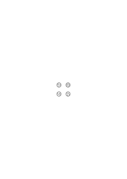

bestimmte Eigentümlichkeit mit einander gemein; sagen wir etwa ein Zeichen innerhalb des Kreises. (Dann sollen natürlich auch je 3 der Kreise ein Zeichen gemeinsam haben, etc.). Denn wenn ich überhaupt etwas über die Wirklichkeit annehme, warum nicht _das_? Das „axiom of reducibility” ist wesentlich von keiner andern Art. In diesem Sinne könne man sagen, daß zwar 2 & 2 immer 4 ergeben, aber 4 nicht immer aus 2 & 2 besteht. (Nur durch die gänzliche Vagheit & Allgemeinheit des Reduktionsaxioms werden wir zu dem Glauben verleitet, als handle es sich hier (wenn überhaupt um einen sinnvollen Satz) um mehr als eine willkürliche Annahme zu der kein Grund vorhanden ist. Drum ist es hier & in allen ähnlichen Fällen äußerst klärend, diese Allgemeinheit, die die Sache ja doch nicht mathematischer macht, ganz fallen zu lassen & statt ihrer ganz spezialisierte Annahmen zu machen.)

### [62v\[2\]](https://cdn.wittgensteinnachlass.com/2000px/webp/Ms-113/62v.webp),[63r\[1\]](https://cdn.wittgensteinnachlass.com/2000px/webp/Ms-113/63r.webp)

Man möchte sagen: 4 muß nicht immer aus 2 & 2 bestehen, aber es kann, wenn es wirklich aus Gruppen besteht aus 2 & 2 wie aus 3 & 1 etc. bestehen; aber nicht aus 2 & 1 oder 3 & 2, etc., & so bereiten wir eben alles für den Fall vor daß 4 in Gruppen zerlegbar ist. Aber dann hat es eben die Arithmetik gar nicht mit der Wirklichen Zerlegung zu tun, sondern nur mit jener Möglichkeit der Zerlegung. Die Behauptung könnte ja auch die sein, daß von einer Gruppe von 4 Punkten auf dem Papier, immer je zwei durch einen Strich verbunden sind. Denken wir gar an die Annahme, um je zwei solche Gruppen von 2 Punkten sei in der Welt immer ein Kreis gezogen.

### [63r\[2\]](https://cdn.wittgensteinnachlass.com/2000px/webp/Ms-113/63r.webp)

Dazu kommt nun, daß, z.B., die Aussage, daß in einem weißen Viereck zwei schwarze Kreise zu sehen sind, nicht die Form „(∃x,y) etc.” hat. Denn gebe ich den Kreisen Namen, dann beziehen sich diese Namen gerade auf die Orte der Kreise & ich kann nicht von ihnen sagen, sie seien entweder in dem einen oder dem andern Viereck. Ich kann wohl sagen: „in beiden Vierecken zusammen sind 4 Kreise”, aber das heißt nicht, daß ich von jedem einzeln sagen kann daß er im einen oder andern Viereck sei. Denn der Satz „dieser Kreis ist in diesem Viereck” ist im angenommenen Fall sinnlos.

### [63r\[3\]](https://cdn.wittgensteinnachlass.com/2000px/webp/Ms-113/63r.webp),[63v\[1\]](https://cdn.wittgensteinnachlass.com/2000px/webp/Ms-113/63v.webp)

Was bedeutet nun der Satz „in den 2 Vierecken _zusammen_ sind 4 Kreise”? Wie konstatiere ich das? Indem ich die Zahlen in beiden addiere? Die Zahl der Kreise in beiden Vierecken zusammen, _bedeutet_ also dann das Resultat der Addition der beiden Zahlen. – Oder ist es etwa das Resultat einer besondern Zählung die durch beide Vierecke geht; oder die Zahl von Strichen die ich erhalte, wenn ich einen Strich einem Kreis zuordne ob er nun in einem _oder_ im andern Viereck ist. Man kann nämlich sagen: „jeder

Strich ist entweder einem Kreis zugeordnet der in dem einen, oder einem Kreis der in dem andern Viereck steht”, aber nicht: „dieser Kreis steht entweder in diesem oder im andern Viereck”, wenn „dieser Kreis” eben durch seine Lage charakterisiert ist. _Dies_ kann nur dann _hier_ sein, wenn „dies” & „hier” nicht dasselbe bedeuten. Dagegen kann _dieser_ Strich einem Kreis in diesem Viereck zugeordnet sein, denn er bleibt dieser Strich, auch wenn er einem Kreis im andern Viereck zugeordnet ist.

### [63v\[2\]](https://cdn.wittgensteinnachlass.com/2000px/webp/Ms-113/63v.webp),[64r\[1\]](https://cdn.wittgensteinnachlass.com/2000px/webp/Ms-113/64r.webp)

Sind in diesen beiden Kreisen zusammen 9 Punkte oder 7? Wie man es gewöhnlich versteht, 7. Aber muß ich es so verstehen? Warum soll ich nicht die Punkte, die beiden Kreisen gemeinsam angehören doppelt zählen:

Anders ist es, wenn man fragt: „wieviel Punkte sind innerhalb der stark ausgezogenen Grenze?

Denn hier kann ich sagen: es sind 7 in dem Sinne in welchem in den Kreisen 5 & 4 sind.

### [64r\[2\]](https://cdn.wittgensteinnachlass.com/2000px/webp/Ms-113/64r.webp)

Man könnte nun sagen: die Summe von 4 & 5 nenne ich die Zahl, welche die, unter den Begriff φx⌵ψx fallenden Gegenstände haben, wenn (Е4x) φx ∙ (Е5x) ψx .Ind. der Fall ist. Und zwar heißt das nun nicht, daß die Summe von 4 & 5 nur in der Verbindung mit Sätzen von der Art (∃4x) ∙ φx etc. verwendet werden darf, sondern es heißt: Wenn Du die Summe von n & m bilden willst, setze die Zahlen links von „․⊃․” in die Form (∃nx) φx ∙ (∃mx) ψx etc. ein, & die Zahl die rechts stehen muß um aus dem ganzen Ausdruck eine Tautologie zu machen, ist die Summe von m & n. Dies ist also eine Additionsmethode, & zwar eine äußerst umständliche.

### [64r\[3\]](https://cdn.wittgensteinnachlass.com/2000px/webp/Ms-113/64r.webp)

Vergleiche: „Wasserstoff & Sauerstoff geben zusammen Wasser” – „2 Punkte & 3 Punkte geben zusammen 5 Punkte”.

### [64r\[4\]](https://cdn.wittgensteinnachlass.com/2000px/webp/Ms-113/64r.webp),[64v\[1\]](https://cdn.wittgensteinnachlass.com/2000px/webp/Ms-113/64v.webp)

Bestehen denn z.B. 4 Punkte in meinem Gesichtsfeld die ich „als 4”, nicht „als 2 & 2 sehe”, aus 2 & 2? Ja, was heißt das? Soll es heißen, ob sie in irgend einem Sinne in Gruppen von je 2 Punkten geteilt waren? Gewiß nicht. (Denn dann müßten sie ja wohl auch in allen andern denkbaren Weisen geteilt sein.) Heißt es, daß sie sich in Gruppen von 2 & 2 teilen _lassen_? also, daß es _Sinn hat_, von solchen Gruppen in den vieren zu reden? – Jedenfalls entspricht doch das dem Satz „2 + 2 = 4”, daß ich nicht sagen kann die Gruppe der 4 Punkte die ich gesehen habe, habe aus getrennten Gruppen von 2 & 3 Punkten bestanden. Jeder wird sagen: das ist unmöglich, _denn_ 3 + 2 = 5. (Und „unmöglich” heißt hier „unsinnig.”)

### [64v\[2\]](https://cdn.wittgensteinnachlass.com/2000px/webp/Ms-113/64v.webp)

„Bestehen 4 Punkte aus 2 & 2” kann eine Frage nach einer physikalischen oder optischen Tatsache sein; dann ist es nicht die Frage der Arithmetik. Die arithmetische Frage könnte aber allerdings in der Form gestellt werden: „_Kann_ eine Gruppe von 4 Punkten aus getrennten Gruppen von je 2 Punkten bestehen”.

### [64v\[3\]](https://cdn.wittgensteinnachlass.com/2000px/webp/Ms-113/64v.webp),[65r\[1\]](https://cdn.wittgensteinnachlass.com/2000px/webp/Ms-113/65r.webp),[65v\[1\]](https://cdn.wittgensteinnachlass.com/2000px/webp/Ms-113/65v.webp),[66r\[1\]](https://cdn.wittgensteinnachlass.com/2000px/webp/Ms-113/66r.webp),[66v\[1\]](https://cdn.wittgensteinnachlass.com/2000px/webp/Ms-113/66v.webp)

„Wie kann man Vorbereitung für etwas eventuell Existierendes treffen” heißt: Wie kann man die Arithmetik auf eine Logik aufbauen, in der man im speziellen noch Resultate einer Analyse der Sätze erwartet, & dabei für alle eventuellen Resultate durch eine Konstruktion a priori aufkommen wollen? – Man will sagen: „Wir wissen nicht, ob es sich nicht herausstellen wird, daß es keine Funktionen mit 4 Argumentstellen gibt, oder daß es nur 100 Argumente gibt die in Funktionen einer Variablen sinnvoll eingesetzt werden können. Gibt es z.B. (die Annahme scheint immerhin möglich) nur eine solche Funktion F & 4 Argumente a, b, c, d, & hat es in diesem Falle Sinn zu sagen ‚2 + 2 = 4’, da es keine Funktionen gibt um die Teilung in 2 & 2 zu bewerkstelligen?” Und nun, sagt man sich, werden wir für alle eventuellen Fälle vorbauen. Aber das heißt natürlich nichts: Denn einerseits baut der Kalkül nicht für eine eventuelle Existenz vor, sondern er konstruiert sich die Existenz, die er überhaupt braucht. Anderseits sind die scheinbaren hypothetischen Annahmen über die logischen Elemente (den logischen Aufbau) der Welt nichts andres, als Angaben der Elemente eines Kalküls; & die können freilich auch so getroffen werden daß es darin ein 2 + 2 nicht gibt. Treffen wir etwa Vorbereitungen für die Existenz von 100 Gegenständen, indem wir 100 Namen einführen & einen Kalkül mit ihnen. Und nehmen wir jetzt an es werden wirklich 100 Gegenstände gefunden. Aber wie ist das, wenn jetzt den Namen Gegenstände zugeordnet werden, die ihnen früher nicht zugeordnet waren? ändert sich jetzt der Kalkül? was hat diese Zuordnung überhaupt mit ihm zu tun? Erhält er durch sie mehr Wirklichkeit? Oder gehörte er früher bloß zur Mathematik, jetzt aber zur Logik? – Was ist das für eine Frage: „gibt es 3-stellige Relationen”, „gibt es 1000 Gegenstände”? Wie ist das zu entscheiden? – Aber es ist doch Tatsache, daß wir eine 2-stellige Relation angeben können, etwa die Liebe, & eine 3-stellige, etwa die Eifersucht, aber, vielleicht, nicht eine 27-stellige! – Aber was heißt es „eine 2-stellige Relation angeben”? Das klingt ja so, als würden wir auf ein Ding hinweisen & sagen „siehst Du, da ist so ein Ding” (wie wir es nämlich vorher beschrieben haben). Aber so etwas findet ja gar nicht statt (der Vergleich von dem Hinweisen ist gänzlich falsch). „Die Beziehung der Eifersucht kann nicht in zweistellige Beziehungen aufgelöst werden”: das klingt ähnlich wie: „Alkohol kann nicht in Wasser & eine feste Substanz zerlegt werden”. Liegt das nun in der Natur der Eifersucht? (Vergessen wir nicht: der Satz „A ist wegen B auf C eifersüchtig” kann ebensowenig zerlegt werden wie der: „A ist wegen B auf C nicht eifersüchtig”.) Das worauf man hinweist ist etwa die Gruppe der Leute A, B & C. – „Aber wenn nun Lebewesen plötzlich den 3-dimensionalen Raum kennen lernten, nachdem sie bisher nur die Ebene kannten aber in ihr doch eine 3-dimensionale Geometrie entwickelt hätten?!” Würde diese Geometrie nun geändert, würde sie inhaltsreicher? – „Ja, aber ist es denn nicht so, als hätte ich mir z.B. einmal beliebige Regeln gesetzt die es mir verböten in meinem Zimmer bestimmte Wege zu gehen, die ich, was die physikalischen Hindernisse betrifft ohne weiteres gehen könnte, – & als würden dann physikalische Bedingungen eintreten etwa Möbel in das Zimmer gestellt die mich nun zwängen mich nach den Regeln zu bewegen die ich mir erst willkürlich gegeben hatte? Wie also der 3-dimensionale Kalkül noch ein Spiel war, da gab es eigentlich noch keine 3 Dimensionen; denn das x, y, z gehorchten nur den Regeln weil ich es so wollte; jetzt, wo wir sie mit den wirklichen 3 Dimensionen gekuppelt haben, _können_ sie sich nicht mehr anders bewegen.” Aber das ist eine bloße Fiktion. Denn hier handelt es sich nicht um eine Verbindung mit der Wirklichkeit, die nun die Grammatik in ihrer Bahn hält! Die „Verbindung der Sprache mit der Wirklichkeit”, etwa durch die hinweisenden Definitionen, macht die Grammatik nicht zwangsläufig (rechtfertigt die Grammatik nicht). Denn diese bleibt immer nur ein frei im Raume schwebender Kalkül, der nur erweitert, aber nicht gestützt werden kann. Die „Verbindung mit der Wirklichkeit” erweitert nur die Sprache aber zwingt sie zu nichts. Wir reden von der Auffindung einer 27-stelligen Relation: aber einerseits kann mich keine Entdeckung zwingen, (das Zeichen &) den Kalkül der 27-stelligen Relation zu gebrauchen; andrerseits kann ich diesen Kalkül selbst mittels dieser Notation beschreiben.

### [66v\[2\]](https://cdn.wittgensteinnachlass.com/2000px/webp/Ms-113/66v.webp)

Daß das axiom of infinity nicht ist, wofür Russell es gehalten hat, daß es weder ein Satz der Logik noch auch – wie es da steht – ein Satz der Physik ist, ist klar. Ob der Kalkül damit in eine ganz andre Umgebung gebracht (in ganz anderer „Interpretation”) irgend eine praktische Anwendung finden könnte, weiß ich nicht. Von den logischen Begriffen z.B. von dem (oder: einem) der Unendlichkeit könnte man sagen: ihre Essenz beweise ihre Existenz.

### [66v\[3\]](https://cdn.wittgensteinnachlass.com/2000px/webp/Ms-113/66v.webp)

„Angenommen, ich glaubte, es gäbe überhaupt nur eine Funktion & die 4 Gegenstände die sie befriedigen. Später komme ich darauf, daß sie noch von einem fünften Ding befriedigt wird; ist jetzt das Zeichen ‚4’ sinnlos geworden?” – Ja, wenn _im Kalkül_ die 4 nicht existiert, dann ist ‚4’ sinnlos.

### [66v\[4\]](https://cdn.wittgensteinnachlass.com/2000px/webp/Ms-113/66v.webp),[67r\[1\]](https://cdn.wittgensteinnachlass.com/2000px/webp/Ms-113/67r.webp),[67v\[1\]](https://cdn.wittgensteinnachlass.com/2000px/webp/Ms-113/67v.webp)

29.04.1932

Wenn man sagt es wäre möglich mit Hilfe der Tautologie (Е2x) φx ∙ (Е3x) ψx ∙ Ind ․⊃․ (Е5x) φx⌵ψx …

_A)_

zu addieren, so wäre das folgendermaßen zu verstehen: Zuerst ist es möglich nach gewissen Regeln herauszufinden, daß (Еx) φx ∙ (Еx) ψx ∙ Ind ․⊃․ (Еx,y) φx⌵ψx ∙ φy⌵ψy tautologisch ist. (Еx) φx ist eine Abkürzung für (Еx) φx ∙ ~(Еx,y) φx ∙ φy. Ich werde ferner Tautologien der Art A zur Abkürzung so schreiben: (Е) ∙ (Е) ⊃ (Е). So geht also aus den Regeln hervor daß (Еx)(Еx) ⊃ (Еx,y), (Еx,y)(Еx) ⊃ (Еxyz) und andere Tautologien. Ich schreibe „und andere” & nicht „u.s.w. ad inf.” weil man mit diesem Begriff noch nicht operieren muß. Unser Kalkül braucht überhaupt noch nichts von der Bildung einer Reihe ‚(Еx)’, ‚(Еxy)’, ‚(Еxyz)’, _etc._ zu wissen sondern kann einfach einige, etwa drei, dieser Zeichen einführen ohne das „u.s.w.”. Wir können nun einen Kalkül mit einer endlichen Reihe von Zeichen einführen indem wir eine Reihenfolge gewisser Zeichen festsetzen, etwa die der Buchstaben des Alphabets, & schreiben (Еa)(Еa) ⊃ (Еab) (Еab)(Еa) ⊃ (Еabc) (Еab)(Еab) ⊃ (Еabcd) u.s.w. bis zum z.

Die rechte Seite (rechts von „⊃”) kann man dann aus der linken durch einen Kalkül der Art finden: <math class="stacked" display="inline"><mspace width="0.3em"/><mi>a</mi><mspace width="0.3em"/><mi>b</mi><mspace width="0.3em"/><mi>c</mi><mspace width="0.3em"/><mi>d</mi><mspace width="0.3em"/><mi>e</mi><mspace width="0.3em"/><mi>f</mi><mspace width="0.3em"/><mn>.</mn><mspace width="0.3em"/><mn>.</mn><mspace width="0.3em"/><mn>.</mn><mspace width="0.3em"/><mn>.</mn><mspace width="0.3em"/><mn>.</mn><mspace width="0.3em"/><mi>z</mi><mspace width="0.3em"/><mi>a</mi><mspace width="0.3em"/><mi>b</mi><mspace width="0.3em"/><mo>-</mo><mspace width="0.3em"/><mo>-</mo><mspace width="0.3em"/><mo>-</mo><munder><mrow><mo>-</mo><mspace width="0.3em"/><mo>-</mo><mspace width="0.3em"/><mi>a</mi><mspace width="0.3em"/><mi>b</mi><mspace width="0.3em"/><mi>e</mi></mrow><mo>_</mo></munder><mspace width="0.3em"/><mi>a</mi><mspace width="0.3em"/><mi>b</mi><mspace width="0.3em"/><mi>c</mi><mspace width="0.3em"/><mi>d</mi><mspace width="0.3em"/><mi>e</mi><mtext>B)</mtext></math>

Dieser Kalkül ergäbe sich aus den Regeln zur Bildung der Tautologien als eine Vereinfachung. – Dieses Gesetz der Bildung eines Reihenstückes aus zwei andern vorausgesetzt, kann ich für das erste nun die Bezeichnung „Summe der beiden andern” einführen & also definieren: a + a ≝ ab a + ab ≝ abc u.s.w. bis z.

Hätte man an einigen Beispielen die Regel des Kalküls B erklärt, so könnte man auch diese Definitionen als Spezialfälle einer allgemeinen Regel betrachten & nun Aufgaben stellen von der Art: „abc + ab = ?”

Es liegt nun nahe die Tautologie

α) (Е ab)(Е ab) ⊃ (Е abcd) mit der Gleichung

β) ab + ab = abcd zu verwechseln. – Aber diese ist eine Ersetzungsregel jene ist keine Regel, sondern eben eine Tautologie. Das Zeichen „⊃” in α entspricht in keiner Weise dem „ = ” in β. Man vergißt daß das Zeichen „⊃” in α ja nicht sagt daß die beiden Zeichen rechts & links von ihm eine Tautologie ergeben. Dagegen könnte man einen Kalkül konstruieren in welchem die Gleichung ξ + η = ζ als eine Transformation erhalten wird aus der Gleichung:

γ) (Еξ(Еη) ⊃ (Еζ) = Taut.

### [67v\[2\]](https://cdn.wittgensteinnachlass.com/2000px/webp/Ms-113/67v.webp),[68r\[1\]](https://cdn.wittgensteinnachlass.com/2000px/webp/Ms-113/68r.webp)

Sodaß ich also sozusagen ζ = ξ + η erhalte, wenn ich ζ aus der Gleichung γ herausrechne.

### [68r\[2\]](https://cdn.wittgensteinnachlass.com/2000px/webp/Ms-113/68r.webp)

30.04.1932

Wie tritt der Begriff der Summe in diese Überlegungen ein? – Im ursprünglichen Kalkül der etwa feststellt, daß die Form (Еξ)(Еη) ⊃ (Еζ)

(δ

z.B. tautologisch wird für ξ = xy, η = x & ζ = xyz ist von Summierung nicht die Rede. – Dann bringen wir ein Zahlensystem in den Kalkül (etwa das System abcd … z). Und endlich definieren wir die Summe zweier Zahlen als diejenige Zahl ζ welche die Gleichung γ löst.

### [68r\[3\]](https://cdn.wittgensteinnachlass.com/2000px/webp/Ms-113/68r.webp)

(Wenn wir statt „(Еx)(Еx) ⊃ (Еx,y)” schrieben: „(Еx)(Еx) ⊃ (Еx + x)”, so hätte das keinen Sinn; es sei denn, daß die Notation von vornherein nicht

λ) „(Еx) etc.”, „(Еxy) etc.”, „(Еxyz) etc.”, lautet sondern

κ) „(Еx) etc.”, „(Еx + x) etc.”, „(Еx + x + x) etc.”.

Denn warum sollten wir plötzlich statt „(Еxy) (Еx) ⊃ (Еxyz)” schreiben

„(Еxy) (Еx) ⊃ (Еxy + x)”? das wäre nur eine Verwirrung der Notation. – Nun sagt man: Es vereinfacht doch das Hinschreiben der Tautologie sehr, wenn man in der rechten Klammer gleich die Ausdrücke der beiden linken hinschreiben kann. Aber diese Schreibweise ist ja noch gar nicht erklärt; ich weiß ja nicht, was (Еxy + x) bedeutet, daß nämlich (Еxy + x) = (Еxyz).

### [68v\[1\]](https://cdn.wittgensteinnachlass.com/2000px/webp/Ms-113/68v.webp)

Wenn man aber von vornherein die Notation „(Еx)”, „(Еx + x)”, „(Еx + x + x)” so hätte vorerst nur der Ausdruck „(Еx + x + x + x)” Sinn, aber nicht „(Е(x + x) + (x + x))”. Die Notation κ ist auf einer Stufe mit ι. Daß sich in der Form δ eine Tautologie ergiebt kann man etwa kurz durch das Ziehen von Verbindungslinien kalkulieren also:

(Еxy) (Еxy) ⊃ (Еxyzu) & analog

(Еx + x) (Еx + x) ⊃ (Еx + x + x + x).

Die Bögen entsprechen nur der Regel, die in jedem Fall für die Kontrolle der Tautologie gegeben sein muß. Von einer Addition ist hier noch keine Rede. Die tritt erst ein, wenn ich mich entschließe z.B. – statt „xyzu” „xy + xy” zu schreiben, & zwar in Verbindung mit einem Kalkül der nach Regeln die Ableitung einer Ersetzungsregel „xy + xy = xyzu” erlaubt. Addition liegt auch dann nicht vor wenn ich in der Notation κ schreibe „(Еx)(Еx) ⊃ (Еx + x)”, sondern erst wenn ich zwischen „x + x” & „(x) + (x)” unterscheide & schreibe

_**)**_

(x) + (x) = (x + x).

### [68v\[2\]](https://cdn.wittgensteinnachlass.com/2000px/webp/Ms-113/68v.webp),[69r\[1\]](https://cdn.wittgensteinnachlass.com/2000px/webp/Ms-113/69r.webp)

Ich kann „die Summe von ξ und η” („ξ + η”) als die Zahl ζ definieren (oder: „den Ausdruck” – wenn wir uns scheuen das Wort Zahl zu gebrauchen) – ich kann „ξ + η” als die Zahl ζ definieren, die den Ausdruck δ tautologisch macht; – man kann aber auch „ξ + η” , z.B., durch den Kalkül B definieren (unabhängig von dem der Tautologien) & nun die Gleichung (Еξ)(Еη ⊃ (Еξ + η) = Taut. _beweisen_.

### [69r\[2\]](https://cdn.wittgensteinnachlass.com/2000px/webp/Ms-113/69r.webp),[69v\[1\]](https://cdn.wittgensteinnachlass.com/2000px/webp/Ms-113/69v.webp)

Eine Frage, die sich leicht einstellt ist die: müssen wir die Kardinalzahlen in Verbindung mit der Notation (∃x,y,…) φx ∙ φy… einführen? Ist der Kalkül der Kardinalzahlen irgendwie an den mit den Zeichen „(∃x,y,…) φx ∙ φy…” gebunden? Ist etwa der letztere die einzige, & vielleicht wesentlich einzige, Anwendung der Kardinalzahlen? Was die „Anwendung der Kardinalarithmetik auf die Grammatik” betrifft so kann man auf das verweisen was wir über den Begriff der Anwendung eines Kalküls gesagt haben. – Man könnte nun unsere Frage auch so stellen: Kommen die Kardinalzahlen in den Sätzen unserer Sprache immer hinter dem Zeichen ∃ vor: wenn wir uns nämlich die Sprache in die Russellsche Notation übersetzt denken? Diese Frage hängt unmittelbar mit der zusammen: Wird das Zahlzeichen in der Sprache immer als Charakterisierung eines Begriffes – einer Funktion – gebraucht? Die Antwort darauf ist, daß unsere Sprache die Zahlzeichen immer in Verbindung mit Begriffswörtern gebraucht – daß aber diese Begriffswörter unter sich gänzlich verschiedenen grammatischen Systemen angehören (was man daraus sieht daß das eine in Verbindungen Bedeutung hat in denen das andre sinnlos ist) so daß die Norm die sie zu Begriffswörtern macht für uns uninteressant wird. Eine ebensolche Norm aber ist die Schreibweise „(∃x,y…) etc.”; sie ist die direkte Übersetzung einer Norm unserer Wortsprachen nämlich des Ausdrucks „es gibt …”, eines Sprachschemas in das unzählige logische Formen gepreßt sind.

### [69v\[2\]](https://cdn.wittgensteinnachlass.com/2000px/webp/Ms-113/69v.webp)

Übrigens ist das Zahlzeichen, jetzt in einem andern Sinne, nicht mit ∃ verbunden: insofern nämlich „(∃3x)…” nicht in „(∃2 + 3x)…” enthalten ist.

### [69v\[3\]](https://cdn.wittgensteinnachlass.com/2000px/webp/Ms-113/69v.webp),[70r\[1\]](https://cdn.wittgensteinnachlass.com/2000px/webp/Ms-113/70r.webp)

Es besteht eine Versuchung die Form der Gleichung für die Form von Tautologien & Kontradiktionen zu halten & zwar darum weil es scheint als könne man sagen x = x ist selbstverständlich wahr (&) x = y selbstverständlich falsch. Eher noch kann man natürlich sagen, daß x = x die Rolle einer Tautologie spielt, als x = y die der Kontradiktion, da ja alle richtigen (und „sinnvollen”) Gleichungen der Mathematik von der Form x = y sind. Man könnte x = x eine degenerierte Gleichung nennen (Ramsey nannte sehr richtig Tautologien & Kontradiktionen degenerierte Sätze) & zwar eine richtige degenerierte Gleichung (den Grenzfall einer Gleichung). Denn wir gebrauchen Ausdrücke der Form x = x wie richtige Gleichungen, wobei wir uns vollkommen bewußt sind, daß es sich um degenerierte Gleichungen handelt. Im gleichen Fall sind Sätze in geometrischen Beweisen wie etwa: „der ∢α ist gleich dem ∢β, der ∢γ ist sich selbst gleich, …”.

Man könnte nun einwenden daß richtige Gleichungen der Form x = y auch Tautologien dagegen falsche Kontradiktionen sein müßten weil man ja die richtige Gleichung muß beweisen können & das, indem man die beiden Seiten der Gleichung transformiert bis eine Identität x = x herauskäme. Aber obwohl durch diesen Prozeß die erste Gleichung als richtig erwiesen ist & insofern die Identität x = x das Endziel der Transformationen war so ist sie nicht das Endziel in dem Sinne als hätte man durch die Transformationen der Gleichung ihre richtige Form geben wollen, wie man einen krummen Gegenstand zurechtbiegt, & als habe sie nun in der Identität diese vollkommene Form (endlich) erreicht. Man kann also nicht sagen: die richtige Gleichung ist ja _eigentlich_ eine Identität. Sie ist eben _keine_ Identität.

### [70r\[2\]](https://cdn.wittgensteinnachlass.com/2000px/webp/Ms-113/70r.webp),[70v\[1\]](https://cdn.wittgensteinnachlass.com/2000px/webp/Ms-113/70v.webp),[71r\[1\]](https://cdn.wittgensteinnachlass.com/2000px/webp/Ms-113/71r.webp),[71v\[1\]](https://cdn.wittgensteinnachlass.com/2000px/webp/Ms-113/71v.webp)

01.05.1932

Wenn wir von den mittels „ = ” konstruierten Funktionen (x = a ⌵ x = b etc.) absehen so wird nach Russells Theorie 5 = 1, wenn es keine Funktion gibt die nur von einem Argument oder nur von 5 Argumenten befriedigt wird. Dieser Satz scheint natürlich auf den ersten Blick unsinnig; denn, wie kann man dann sinnvoll sagen daß es keine solchen Funktionen gibt. Russell müßte sagen, daß man die beiden Aussagen, daß es Fünfer- & Einserfunktionen gibt nur dann getrennt machen kann, wenn wir in unserem Symbolismus eine Fünfer- & eine Einserklasse haben. Er könnte etwa sagen, daß seine Auffassung richtig sei, weil ich, ohne das Paradigma der Klasse 5 im Symbolismus, gar nicht sagen könne eine Funktion werde von 5 Argumenten befriedigt. –D.h., daß aus der Existenz des Satzes „(∃Φ): (Е1x) ∙ Φx” seine Wahrheit schon hervorgeht. – Man scheint also sagen zu können: schau auf diesen Satz, dann wirst Du sehen, daß er wahr ist. Und in einem für uns irrelevanten Sinn ist das auch möglich: Denken wir uns etwa auf die Wand eines Zimmers mit roter Farbe geschrieben: „in diesem Zimmer befindet sich etwas Rotes”. – Dieses Problem hängt damit zusammen daß ich in der hinweisenden Definition von dem Paradigma (Muster) nichts aussage sondern nur mit seiner Hilfe Aussagen mache; daß es zum Symbolismus gehört & nicht einer der Gegenstände ist, auf den ich ihn anwende. Ist z.B. „1 Fuß” definiert als die Länge eines bestimmten Stabes in meinem Zimmer & ich würde etwa statt „diese Tür ist 6 Fuß hoch” sagen: „diese Tür hat sechsmal diese↗ Länge (wobei ich auf den Einheitsstab zeige”, – dann könnte man nicht (etwa) sagen: der Satz „es gibt einen Gegenstand von 1 Fuß Länge” beweist sich selbst, denn ich könnte diesen Satz gar nicht aussprechen, wenn es keinen Gegenstand von dieser Länge gäbe”, denn vom Einheitsstab kann ich nicht aussagen daß er 1 Fuß lang sei. (Wenn ich nämlich statt „1 Fuß” das Zeichen „diese↗ Länge” einführe, so hieße die Aussage daß der Einheitsstab die Länge 1 Fuß hat: „dieser Stab hat diese Länge” (wobei ich beidemale auf den gleichen Stab zeige).) So kann man von der Gruppe der Striche welche etwa als Paradigma der 3 steht nicht sagen es bestehe aus 3 Strichen. „Wenn jener Satz nicht wahr ist, so gibt es diesen Satz gar nicht” – das heißt: „wenn es diesen Satz nicht gibt, so gibt es ihn nicht”. Und ein Satz kann das Paradigma im andern nie beschreiben, sonst ist es eben nicht Paradigma. Wenn die Länge des Einheitsstabes durch die Längenangabe „1 Fuß” beschrieben werden kann, dann ist er nicht das Paradigma der Längeneinheit, denn sonst müßte jede Längenangabe mit seiner Hilfe gemacht werden.

### [71v\[2\]](https://cdn.wittgensteinnachlass.com/2000px/webp/Ms-113/71v.webp)

Ein Satz „~(∃φ): (Еx) ∙ φx” muß, wenn wir ihm überhaupt einen Sinn geben von der Art dessen sein: „es gibt keinen Kreis auf dieser Fläche der nur einen schwarzen Fleck enthält”. (Ich meine: er muß einen ähnlich _bestimmten_ Sinn haben; & nicht vag bleiben wie er in der Russellschen Logik & in meiner Abhandlung wäre. Wenn nun aus den Sätzen „~(∃φ): (Еx) φx” … (ρ & ~(∃φ): (Еx,y) φx ∙ φy … (σ

folgt, daß 1 = 2 ist, so ist hier mit „1” & „2” nicht das gemeint, was wir sonst damit meinen, denn die Sätze ρ und σ würden in der Wortsprache lauten: „es gibt keine Funktion, die nur von einem Ding befriedigt wird” & „es gibt keine Funktion die nur von 2 Dingen befriedigt wird”. Und dies sind nach den Regeln unserer Sprache Sätze mit verschiedenem Sinn.

### [71v\[3\]](https://cdn.wittgensteinnachlass.com/2000px/webp/Ms-113/71v.webp)

Man ist versucht zu sagen: „Um „(∃x,y) ∙ φx ∙ φy” ausdrücken zu können brauchen wir 2 Zeichen „x” & „y”. Aber das heißt nichts. Was wir dazu _brauchen_ ist vielleicht Papier & Feder; & der Satz heißt sowenig wie: „um ‚p’ auszudrücken brauchen wir ‚p’.”

### [72r\[1\]](https://cdn.wittgensteinnachlass.com/2000px/webp/Ms-113/72r.webp),[72v\[1\]](https://cdn.wittgensteinnachlass.com/2000px/webp/Ms-113/72v.webp)

05.05.1932

„Welchen Sinn hat ein Satz der Art ‚(∃n) 3 + n = 7’?” Man ist hier in einer seltsamen Schwierigkeit: einerseits empfindet man es als Problem, daß der Satz die Wahl zwischen unendlich vielen Werten von n hat, andrerseits scheint uns der Sinn des Satzes in sich gesichert & nur für uns (etwa) noch zu erforschen da wir doch „wissen was ‚(∃x) ∙ φx’ bedeutet”. Wenn Einer sagte, er wisse nicht was „(∃n) 3 + n = 7” bedeute, so würde man ihm antworten: „aber Du weißt doch was dieser Satz sagt: 3 + 0 = 7 ⌵ 3 + 1 = 7 ⌵ 3 + 2 = 7 und so weiter!” Aber darauf kann man antworten: „Ganz richtig – der Satz ist also keine logische Summe, denn die endet nicht mit ‚und so weiter’ & das worüber ich nicht klar bin ist eben diese Satzform ‘φ(0) ⌵ φ(1) ⌵ φ(2) ⌵ u.s.w.’ und Du hast mir nur statt der ersten unverständlichen Satzform eine zweite gegeben & zwar mit dem Schein als gäbest Du mir etwas Altbekanntes, nämlich eine Disjunktion.” Wenn wir nämlich meinen daß wir doch unbedingt „(∃n) etc.” verstehen so denken wir zur Rechtfertigung an andre Fälle des Gebrauchs der Notation „(∃…)…” beziehungsweise der Ausdrucksform „es gibt …” unserer Wortsprache. Darauf kann man aber nur sagen: Du _vergleichst_ also den Satz „(∃n)…” mit jenem Satz „es gibt ein Haus in dieser Stadt welches …”, oder „es gibt zwei Fremdwörter auf dieser Seite”. Aber mit dem Vorkommen der Worte „es gibt” in diesen Sätzen ist ja die Grammatik dieser Allgemeinheit noch nicht bestimmt. Und dieses Vorkommen weist auf nichts andres hin als eine gewisse Analogie in den Regeln. Wir werden also ruhig diese Regeln von vorne untersuchen können ohne uns von der Bedeutung von „(∃…)…” in andern Fällen stören zu lassen

### [72v\[2\]](https://cdn.wittgensteinnachlass.com/2000px/webp/Ms-113/72v.webp),[73r\[1\]](https://cdn.wittgensteinnachlass.com/2000px/webp/Ms-113/73r.webp),[73v\[1\]](https://cdn.wittgensteinnachlass.com/2000px/webp/Ms-113/73v.webp)

Wir werden uns zuerst fragen müssen: Ist der mathematische Satz bewiesen? & wie? Denn der Beweis gehört zur Grammatik des Satzes! – Daß das so oft nicht eingesehen wird kommt daher daß wir hier wieder auf der Bahn einer uns irreführenden Analogie denken. Es ist wie gewöhnlich in diesen Fällen eine Analogie aus unserm naturwissenschaftlichen Denken. Wir sagen z.B. „dieser Mann ist vor 2 Stunden gestorben” & wenn man uns fragt „wie läßt sich das feststellen”, so können wir eine Reihe von Anzeichen (Symptomen) dafür angeben. Wir lassen aber auch die Möglichkeit dafür offen daß etwa die Medizin bis jetzt unbekannte Methoden entdeckt die Zeit des Todes festzustellen & das heißt: Wir können solche mögliche Methoden auch jetzt schon beschreiben, denn nicht ihre Beschreibung wird entdeckt sondern es wird nur experimentell festgestellt ob die Beschreibung den Tatsachen entspricht. So kann ich z.B. sagen: eine Methode besteht darin die Quantität des Hämoglobins im Blut zu finden denn diese nehme mit der Zeit nach dem Tode nach dem & dem Gesetze ab. Das stimmt natürlich nicht aber, wenn es stimmte so würde sich dadurch an der von mir erdichteten Beschreibung nichts ändern. Nennt man nun die medizinische Entdeckung „die Entdeckung eines Beweises dafür, daß der Mann vor 2 Stunden gestorben ist” so muß man sagen daß diese Entdeckung an der Grammatik des Satzes „der Mann ist vor 2 Stunden gestorben” nichts ändert. Die Entdeckung ist die Entdeckung daß eine bestimmte Hypothese wahr ist (oder: mit den Tatsachen übereinstimmt). Diese Denkweise sind wir nun so gewöhnt, daß wir den Fall der Entdeckung eines Beweises in der Mathematik unbesehen für den gleichen oder einen ähnlichen halten. Mit Unrecht: denn, kurz gesagt, den mathematischen Beweis konnte man nicht beschreiben ehe er gefunden war. Der ‚medizinische Beweis’ hat die Hypothese die er bewiesen hat nicht in einen neuen Kalkül eingegliedert & ihm also keinen neuen Sinn gegeben; der mathematische Beweis gliedert den mathematischen Satz in einen neuen Kalkül ein, er verändert seine Stellung in der Mathematik. Der Satz mit seinem Beweis gehört einer andern Kathegorie an als der Satz ohne den Beweis. (Der unbewiesene mathematische Satz – Wegweiser der mathem. Forschung Anregung zu mathematischen Konstruktionen.)

### [73v\[2\]](https://cdn.wittgensteinnachlass.com/2000px/webp/Ms-113/73v.webp),[74r\[1\]](https://cdn.wittgensteinnachlass.com/2000px/webp/Ms-113/74r.webp),[74v\[1\]](https://cdn.wittgensteinnachlass.com/2000px/webp/Ms-113/74v.webp)

06.05.1932

„Alle Zahlen haben vielleicht die Eigenschaft ε”. Wieder ist die Frage: was ist die Grammatik dieses allgemeinen Satzes? Denn damit ist uns nicht gedient, daß wir die Verwendung des Ausdrucks „alle …” in andern grammatischen Systemen kennen. Sagt man: „Du weißt doch was es heißt! es heißt: _ε_(0) ∙ _ε_(1) ∙ _ε_(2) u.s.w.” so ist damit wieder nichts erklärt; außer, daß der Satz _kein_ logisches Produkt ist. Und man wird, um die Grammatik des Satzes verstehen zu lernen, fragen: Wie gebraucht man diesen Satz? Was sieht man als Kriterium seiner Wahrheit an? Was ist seine Verifikation? Wenn keine Methode vorgesehen ist um zu entscheiden ob der Satz wahr oder falsch ist, ist er ja zwecklos & d.h. sinnlos. Aber hier kommen wir nun zur Illusion, daß allerdings eine solche Methode der Verifikation vorgesehen ist die sich nur einer menschlichen Schwäche wegen nicht durchführen läßt. Diese Verifikation besteht darin daß man alle (unendlich vielen) Glieder des Produktes ε(0) ∙ ε(1) ∙ ε(2)… auf ihre Richtigkeit prüft. Hier wird logische mit physischer Unmöglichkeit verwechselt. Denn dem Ausdruck „alle Glieder des unendlichen Produktes auf ihre Richtigkeit prüfen” glaubt man Sinn gegeben zu haben weil man das Wort „unendlich viele” für die Bezeichnung einer riesig großen Zahl hält. Und bei der „Unmöglichkeit die unendliche Zahl von Sätzen zu prüfen” schwebt uns die Unmöglichkeit vor eine sehr große Anzahl von Sätzen zu prüfen wenn wir etwa nicht die nötige Zeit haben. Erinnere Dich daran, daß, in dem Sinne, in welchem es unmöglich ist eine unendliche Anzahl von Sätzen zu prüfen, es auch unmöglich ist das zu versuchen. – Wenn wir uns mit den Worten „Du weißt doch was ‚alle …’ heißt” auf die Fälle berufen in welchen diese Redeweise gebraucht wird, so kann es uns doch nicht gleichgültig sein wenn wir einen Unterschied zwischen diesen Fällen & dem Fall sehen für welchen der Gebrauch der Worte gerechtfertigt werden sollte. – (Gewiß), wir wissen was es heißt, „eine Anzahl von Sätzen auf ihre Richtigkeit prüfen” & gerade auf dieses Verständnis berufen wir uns ja wenn wir verlangen man solle nun auch den Ausdruck „unendlich viele Sätze …” verstehen. Aber ist denn der Sinn des ersten Ausdrucks von der Erfahrung die mit ihm verknüpft ist unabhängig? Und gerade diese Erfahrungen fehlen ja in der Verwendung (dem Kalkül) des zweiten Ausdrucks, es sei denn daß ihm solche Erfahrungen zugeordnet werden, die von den ersten grundverschieden sind.

### [74v\[2\]](https://cdn.wittgensteinnachlass.com/2000px/webp/Ms-113/74v.webp)

„Alle Punkte dieser Fläche sind weiß”. Wie verifizierst Du das? – dann werde ich wissen was es heißt.

### [74v\[3\]](https://cdn.wittgensteinnachlass.com/2000px/webp/Ms-113/74v.webp),[75r\[1\]](https://cdn.wittgensteinnachlass.com/2000px/webp/Ms-113/75r.webp)

„Den mathematischen Satz kann man sich vorstellen als ein Lebewesen, das selbst weiß, ob es wahr oder falsch ist. (Zum Unterschied von den empirischen Sätzen.) Der mathematische Satz weiß selbst, daß er wahr oder daß er falsch ist. Wenn er von allen Zahlen handelt, so muß er auch schon alle Zahlen übersehen. Wie der Sinn, so muß auch seine Wahrheit oder Falschheit in ihm liegen.”

### [75r\[2\]](https://cdn.wittgensteinnachlass.com/2000px/webp/Ms-113/75r.webp)

„Es ist als wäre die Allgemeinheit eines Satzes ‚(n) ∙ ε(n)’ nur eine Anweisung auf die eigentliche, wirkliche, mathematische Allgemeinheit eines Satzes. Gleichsam nur eine Beschreibung der Allgemeinheit, nicht diese selbst. Als bilde der Satz nur auf rein äußerliche Weise ein Zeichen, dem erst von innen Sinn gegeben werden muß.”

### [75r\[3\]](https://cdn.wittgensteinnachlass.com/2000px/webp/Ms-113/75r.webp)

„Wir fühlen: Die Allgemeinheit, die die mathematische Behauptung hat, ist anders als die Allgemeinheit des Satzes der bewiesen ist.”

### [75r\[4\]](https://cdn.wittgensteinnachlass.com/2000px/webp/Ms-113/75r.webp)

„Man könnte sagen: ein mathematischer Satz ist der Hinweis auf einen Beweis.”

### [75r\[5\]](https://cdn.wittgensteinnachlass.com/2000px/webp/Ms-113/75r.webp)

Wie wäre es, wenn ein Satz seinen Sinn selber nicht ganz erfaßte. Wenn er sich quasi selber zu hoch wäre? – Und das nehmen eigentlich die Logiker an.

### [75r\[6\]](https://cdn.wittgensteinnachlass.com/2000px/webp/Ms-113/75r.webp),[75v\[1\]](https://cdn.wittgensteinnachlass.com/2000px/webp/Ms-113/75v.webp)

Den Satz, der von allen Zahlen handelt kann man sich nicht durch ein endloses Schreiten verifiziert denken, denn wenn das Schreiten endlos ist so führt es ja eben nicht zu einem Ziel. Denken wir uns eine unendlich lange Baumreihe, & ihr entlang damit wir sie inspizieren können einen Weg. Sehr gut, so muß dieser Weg endlos sein. Aber wenn er endlos ist, so heißt das, daß man ihn nicht zu Ende gehen kann. D.h., er bringt mich _nicht_ dazu die Reihe zu übersehen. Der endlose Weg hat nämlich nicht ein „unendlich fernes” Ende, sondern kein Ende.

### [75v\[2\]](https://cdn.wittgensteinnachlass.com/2000px/webp/Ms-113/75v.webp)

Man kann auch nicht sagen: „Der Satz kann alle Zahlen nicht sukzessive erfassen, so muß er sie durch den Begriff fassen”, – als ob das faute de mieux so wäre: „Weil er es _so_ nicht kann, muß er es auf andre Weise tun.” Aber ein sukzessives Erfassen ist schon möglich nur führt es eben nicht zur Gesamtheit. Diese liegt: _nicht_ auf dem Weg den wir schrittweise gehn, & nicht: am unendlich fernen Ende dieses Weges. (Das alles heißt nur „ε(0) ∙ ε(1) ∙ ε(2) ∙ u.s.w.” ist nicht das Zeichen eines logischen Produkts.)

### [75v\[3\]](https://cdn.wittgensteinnachlass.com/2000px/webp/Ms-113/75v.webp),[76r\[1\]](https://cdn.wittgensteinnachlass.com/2000px/webp/Ms-113/76r.webp),[76v\[1\]](https://cdn.wittgensteinnachlass.com/2000px/webp/Ms-113/76v.webp)

„Alle Zahlen können nicht _zufällig_ eine Eigenschaft ε besitzen; sondern nur ihrem Wesen (als Zahlen) nach.” – Der Satz „die Menschen, welche rote Nasen haben sind gutmütig” hat auch dann nicht denselben Sinn wie der Satz „die Menschen welche Wein trinken sind gutmütig” wenn die Menschen welche rote Nasen haben eben die sind die Wein trinken. Dagegen: wenn die Zahlen m, n, o der Umfang eines mathematischen Begriffs f sind, so daß also fm ∙ fn ∙ fo der Fall ist, dann hat der Satz welcher sagt, daß die Zahlen die f befriedigen die Eigenschaft ε haben den gleichen Sinn wie „ε(m) ∙ ε(n) ∙ ε(o)”. Denn die beiden Sätze „f(m) ∙ f(n) ∙ f(o)” & „ε(m) ∙ ε(n) ∙ ε(o)” lassen sich, ohne daß wir dabei den Bereich der Grammatik verlassen, in einander umformen. Sehen wir uns nun den Satz an: „alle n Zahlen welche der Bedingung F(ξ) genügen, haben zufälligerweise die Eigenschaft ε.” Da kommt es drauf an ob die Bedingung F(ξ) eine mathematische ist. Ist sie das, nun dann kann ich ja aus F(x) ε(x) ableiten, wenn auch über die Disjunktion der n Werte von F(ξ). (Denn hier gibt es eben eine Disjunktion). Hier werde ich also nicht von einem Zufall reden. – Ist die Bedingung eine nicht-mathematische, so wird man dagegen vom Zufall reden können. Z.B. wenn ich sage: alle Zahlen die ich heute auf den Omnibussen gelesen habe waren zufällig Primzahlen. (Dagegen kann man natürlich nicht sagen: „die Zahlen 17, 3, 5, 31, sind zufällig Primzahlen”, ebensowenig wie: „die Zahl 3 ist zufällig eine Primzahl”.) „Zufällig” ist wohl der Gegensatz von „allgemein ableitbar”; aber man kann sagen: der Satz „17, 3, 5, 31 sind Primzahlen” ist allgemein ableitbar so sonderbar das klingt, wie auch der Satz 2 + 3 = 5. Sehen wir nun zu unserm ersten Satz zurück, so fragen wir wieder: wie soll denn der Satz „alle Zahlen haben die Eigenschaft ε” gemeint sein? wie soll man ihn denn wissen können? denn diese Festsetzung gehört ja zur Festsetzung seines Sinnes! Das Wort „zufällig” deutet doch auf eine Verifikation durch sukzessive Versuche & dem widerspricht daß wir nicht von einer endlichen Zahlenreihe reden.

### [76v\[2\]](https://cdn.wittgensteinnachlass.com/2000px/webp/Ms-113/76v.webp)

In der Mathematik sind Beschreibung & Gegenstand äquivalent. „Die fünfte Zahl der Zahlenreihe hat diese Eigenschaften” sagt _dasselbe_ wie „5 hat diese Eigenschaften”. Die Eigenschaften eines Hauses _folgen_ nicht aus seiner Stellung in einer Häuserreihe; dagegen sind die Eigenschaften einer Zahl die Eigenschaften einer Stellung.

### [76v\[3\]](https://cdn.wittgensteinnachlass.com/2000px/webp/Ms-113/76v.webp),[77r\[1\]](https://cdn.wittgensteinnachlass.com/2000px/webp/Ms-113/77r.webp)

Welche seltsame Frage: „kann man sich eine endlose Baumreihe denken?”! Wenn man von einer ‚endlosen Baumreihe’ spricht, so wird doch, was man meint, mit den Erfahrungen zusammenhängen, die man „das Sehen der Baumreihe”, „das Zählen einer Baumreihe”, „das Messen einer Baumreihe”, etc. nennt. „Können wir uns eine unendliche Baumreihe denken”! Gewiß, wenn wir festgesetzt haben, was darunter zu verstehen ist; d.h.: wenn wir diesen Begriff mit all dem in Verbindung gebracht haben, mit den Erfahrungen die für uns den Begriff der Baumreihe bestimmen. Was ist das Kriterium in der Erfahrung dafür daß eine Baumreihe unendlich ist? denn daraus werde ich sehen wie diese Aussage zu verstehen ist. Oder gibst Du mir kein solches Kriterium, – was fange ich dann mit dem Begriff „unendliche Baumreihe” an? Was hat dieser Begriff etwa mit dem zu tun was ich sonst eine Baumreihe nenne? Oder meintest Du am Ende doch nur: eine ungeheuer lange Baumreihe?!

### [77r\[2\]](https://cdn.wittgensteinnachlass.com/2000px/webp/Ms-113/77r.webp),[77v\[1\]](https://cdn.wittgensteinnachlass.com/2000px/webp/Ms-113/77v.webp),[78r\[1\]](https://cdn.wittgensteinnachlass.com/2000px/webp/Ms-113/78r.webp)

„Aber wir kennen doch eine Erfahrung wenn wir eine Baumreihe entlang gehen die wir das Aufhören der Reihe nennen können. Nun, eine endlose Baumreihe ist eine solche an der wir diese Erfahrung nie machen.” – Aber was bedeutet hier „nie”? Ich kenne eine Erfahrung die ich mit den Worten beschreibe: „er hat in dieser Stunde nie gehustet” oder „er hat in seinem Leben nie gelacht”. Von einer entsprechenden Erfahrung kann nicht gesprochen werden wenn sich das „nie” nicht auf ein Zeitintervall bezieht. Die Analogie läßt uns also hier wieder im Stich & ich muß von neuem untersuchen wie das Wort „nie” in diesem Falle sinnvoll verwendet werden kann. – Solche Verwendungen lassen sich nun allerdings finden aber sie sind eben eigens auf ihre Regeln zu untersuchen. Es kann z.B. der Satz daß eine Baumreihe unendlich lang ist (oder der, daß wir _nie_ zu einem Ende kommen werden) ein Naturgesetz von der Art des Trägheitsgesetzes sein das ja sagt ein Körper bewege sich unter bestimmten Umständen mit konstanter Geschwindigkeit in einer Geraden; & hier könnte ja auch gesagt werden die Bewegung werde unter diesen Umständen _nie_ enden. Fragt man nach der Verifikation so eines Satzes so kann man vor allem sagen daß er falsifiziert wird, wenn die Bewegung (die Baumreihe) zu einem Ende kommt – von einer Verifikation kann hier keine Rede sein, & das heißt daß wir es mit einer grundverschiedenen Art von Satz (oder mit einem Satz in einem andern Sinn dieses Wortes) zu tun haben. Ich will natürlich nicht sagen, daß dies die einzige sinnvolle Verwendung des Ausdrucks „unendliche Baumreihe” oder des Wortes „nie” (in alle Ewigkeit) sei. Aber jede dieser Verwendungen muß eigens beschrieben werden & hat ihre eigenen Gesetze. Es nützt uns nichts daß wir eine Redeform fertig in unserer gewöhnlichen Sprache vorfinden weil diese Sprache jedes ihrer Wörter in den verschiedensten Bedeutungen gebraucht & daß wir den Gebrauch des Wortes in einem Fall verstehen erspart uns nicht die Untersuchung seiner Grammatik in einem andern. So meinen wir etwa: „es ist doch gewiß möglich sich ein unendlich langes Leben vorzustellen, denn unendlich lang lebt der, der einfach nie stirbt”. Aber der Gebrauch des Wortes „nie” ist eben _gar_ nicht so einfach.

### [78r\[2\]](https://cdn.wittgensteinnachlass.com/2000px/webp/Ms-113/78r.webp),[78v\[1\]](https://cdn.wittgensteinnachlass.com/2000px/webp/Ms-113/78v.webp),[79r\[1\]](https://cdn.wittgensteinnachlass.com/2000px/webp/Ms-113/79r.webp)

Reden wir nun von einem endlosen Leben im Sinne einer Hypothese (vergl. Trägheitsgesetz) &, der es lebt, wählt nach einander aus den Brüchen zwischen 1 & 2, 2 & 3, 3 & 4 etc.. ad inf. einen beliebigen Bruch aus & schreibt ihn auf. Erhalten wir so eine „Selektion aus allen jenen Intervallen”? Nein, denn sein Wählen hat kein Ende. Es hat keinen Sinn jemals von ihm zu sagen, er habe die Selektion beendet. Kann ich aber nicht sagen, daß doch alle Intervalle an die Reihe kommen müssen, da ich keines nennen kann das nicht an die Reihe käme? Aber daraus, daß er jedes Intervall einmal erreichen wird, folgt doch nicht daß er alle einmal erreicht haben wird. Denn, wenn wir das Wort erreichen so verwenden, daß „er etwas zu einer bestimmten Zeit erreicht” (d.h. in diesem grammatischen Zusammenhang), dann heißt, daß er „jedes Intervall einmal erreicht” etwa: daß er das erste nach der ersten Sekunde, das zweite nach der zweiten, das dritte nach der dritten erreicht _u.s.w._ ad inf. Es wird also hier ein Gesetz mit dem Ausdruck u.s.w. ad inf. gegeben. Dann hieße aber, daß er alle Intervalle erreicht, daß er sie zu einer bestimmten Zeit erreicht, der Prozeß also zu einem Ende kommt, was der ersten Annahme widerspricht. Folgert man also daraus daß er jedes Intervall erreicht, daß er sie alle erreicht, so verwendet man das Wort „erreicht” das zweitemal in ganz anderer Weise! „Denken wir uns aber nun einen Mann der im Auswählen aus den Intervallen eine immer größere Übung bekäme, so daß er zur ersten Wahl eine Stunde zur zweiten eine halbe, zur dritten ein Viertel brauchte, u.s.w. ad inf. Dann würde der ja in zwei Stunden mit der ganzen Arbeit fertig!” Stellen wir uns einmal den Vorgang vor. Das Auswählen bestünde etwa im Aufschreiben des Bruches also in einer Bewegung der Hand. Diese Bewegung würde nun immer schneller; so schnell sie aber auch wird so gibt es immer ein letztes Intervall das in einer bestimmten Zeit von ihr erledigt wird. Die Überlegung unseres Einwands beruhte auf der Bildung der Summe 1 + ½ + ¼ + … aber die ist ja ein _Grenzwert_ von Summen & keine Summe in dem Sinne dieses Wortes, in welchem z.B. 1 + ½ + ¼ eine Summe ist. Wenn ich sagte „er braucht eine Stunde zur ersten Wahl eine halbe Stunde zur zweiten ein Viertel zur dritten u.s.w. ad inf.” so hat diese Angabe nur solange Sinn als ich _nicht_ nach der Geschwindigkeit des Wählens im Zeitpunkte t = 2 frage, denn für diesen ergibt unsere Rechnung _keinen_ Wert (denn den Wert c = ∞ gibt es hier für uns nicht, da wir ihm keine Erfahrung zugeordnet haben). Für jeden Punkt _vor_ t = 2 liefert mir mein Gesetz eine Geschwindigkeit ist also soweit brauchbar & in Ordnung. Der Fehlschluß liegt also erst im Satz „dann würde er in 2 Stunden mit der Arbeit fertig”. (Soweit man dies einen Fehlschluß nennen darf, da ja der Satz für diesen Fall sinnlos ist.)

### [79r\[2\]](https://cdn.wittgensteinnachlass.com/2000px/webp/Ms-113/79r.webp),[79v\[1\]](https://cdn.wittgensteinnachlass.com/2000px/webp/Ms-113/79v.webp)

Denken wir uns nun die Hypothese jemand werde unter gewissen Umständen die Ziffern der Zahl π (etwa im Sechsersystem) würfeln. Diese Hypothese ist also ein Gesetz, mit dessen Hilfe ich für jeden Wurf die Zahl der geworfenen Augen ausrechnen kann. Wie aber, wenn wir die Hypothese dahin modifizierten daß jemand unter gewissen Umständen _nicht_ die Ziffern von π werfen werde! Sollte das nicht auch einen Sinn haben? Wie aber kann man je wissen daß diese Hypothese richtig ist da er ja zu jeder gegebenen Zeit π gemäß geworfen haben mag & die Hypothese dadurch doch nicht widerlegt ist. Aber das heißt doch eben daß wir es hier mit einer andern _Art_ von Hypothese zu tun haben; mit einer Satzart für die in ihrer Grammatik keine Falsifikation _vorgesehen_ ist. Und es steht mir frei das „Satz” oder „Hypothese” oder ganz anders zu nennen, wenn ich will. (π ist kein Bruch sondern ein Gesetz nach welchem Brüche gebildet werden.)

### [79v\[2\]](https://cdn.wittgensteinnachlass.com/2000px/webp/Ms-113/79v.webp)

07.05.1932

Die Unendlichkeit der Zeit ist keine Ausdehnung.

### [79v\[3\]](https://cdn.wittgensteinnachlass.com/2000px/webp/Ms-113/79v.webp),[80r\[1\]](https://cdn.wittgensteinnachlass.com/2000px/webp/Ms-113/80r.webp)

Wenn wir fragen: „worin besteht die Unendlichkeit der Zeit” so wird man uns sagen: „darin, daß kein Tag der letzte ist, daß auf jeden Tag wieder ein Tag folgt”. Hier werden wir aber wieder verleitet die Sache durch eine Analogie falsch zu sehen. Wir vergleichen nämlich etwa die Folge der Tage mit der Folge von Ereignissen (in der Zeit) z.B. den Schlägen einer Uhr. Wir machen dann manchmal die Erfahrung daß 4 Schlägen ein fünfter folgt. Hat es nun auch Sinn von der Erfahrung zu reden daß auf vier Tage ein fünfter folgt? Und kann man sagen: „siehst Du, ich habe es Dir vorhergesagt: es wird auf den vierten noch einer folgen”? (So gut könnte man sagen, es sei eine Erfahrung daß auf den vierten gerade der fünfte folgt & kein andrer.) Wir reden hier aber nicht von der Vorhersage, es werde die Sonne nach dem vierten Tag sich so wie bisher bewegen; _das_ ist eine echte Vorhersage. Nein, in unserm Fall handelt es sich nicht um eine Vorhersage, kein Ereignis wird prophezeit sondern wir sagen etwa: daß es Sinn hat in bezug auf jeden Sonnenauf- & untergang von einem nächsten zu sprechen. Denn die Bedeutung der Bezeichnung eines Zeitmaßes ist ja an ein Geschehnis gebunden: den Umlauf eines Zeigers, die Bewegung der Erde etc. etc.; sagen wir aber „auf jede Stunde folgt eine nächste”, & haben wir die Stunde etwa durch den Umlauf eines bestimmten Zeigers (als Paradigma) definiert, so wollen wir mit jener Aussage dennoch nicht prophezeien, daß sich dieser Zeiger in alle Ewigkeit so weiterdrehen wird; – wir wollen aber sagen: daß er sich „immer so weiterdrehen _kann_”; und das ist eben eine Aussage über die Grammatik unserer Zeitbestimmungen.

### [80r\[2\]](https://cdn.wittgensteinnachlass.com/2000px/webp/Ms-113/80r.webp),[80v\[1\]](https://cdn.wittgensteinnachlass.com/2000px/webp/Ms-113/80v.webp)

„Regellose unendliche Dezimalzahl”. Die Auffassung ist immer die, als ob wir nur Wörter unserer Umgangssprache zusammenzustellen brauchten & die Zusammenstellung hätte damit einen Sinn, den wir jetzt eben erforschen müßten – wenn er uns nicht gleich ganz klar sein sollte. Es ist als wären die Wörter Ingredienzen einer chemischen Verbindung, die wir zusammenschütten, sich mit einander verbinden lassen, & nun müßten wir eben die Eigenschaften der (betreffenden) Verbindung untersuchen. Wer sagte, er verstünde den Ausdruck „regellose unendliche Dezimalzahl” nicht, dem würde geantwortet: „das ist nicht wahr, Du verstehst ihn sehr gut! weißt Du nicht was die Worte „regellos”, „unendlich” & „Dezimalzahl” bedeuten?! – Nun dann verstehst Du auch ihre Verbindung.” Und mit dem „Verständnis” ist hier gemeint, daß er diese Wörter in gewissen Fällen anzuwenden weiß & etwa eine _Vorstellung mit ihnen verbindet_! In Wirklichkeit tut der, welcher diese Worte zusammenstellt & nun fragt „was bedeutet das” etwas Ähnliches wie die kleinen Kinder die ein Papier mit regellosen Strichen bekritzeln, es dem Erwachsenen zeigen & fragen: „was ist das?”

### [80v\[2\]](https://cdn.wittgensteinnachlass.com/2000px/webp/Ms-113/80v.webp)

„Eine regellose unendliche Dezimalzahl kann man sich z.B. erzeugt denken, daß endlos gewürfelt wird & die Zahl der Augen jedesmal eine Dezimalstelle ist”. Aber wenn endlos gewürfelt wird kommt ja eben kein endgültiges Resultat heraus.

### [80v\[3\]](https://cdn.wittgensteinnachlass.com/2000px/webp/Ms-113/80v.webp)

Stellen wir uns vor daß ein Mann, der unendlich lange Zeit gelebt hat, weil er nie geboren wurde sagt: „Jetzt schreibe ich die letzte Ziffer von π hin, nämlich die 3 Einer”. Er hatte an jedem Tag seines Lebens eine Ziffer hingeschrieben & niemals damit angefangen; jetzt ist er fertig geworden.

### [80v\[4\]](https://cdn.wittgensteinnachlass.com/2000px/webp/Ms-113/80v.webp),[81r\[1\]](https://cdn.wittgensteinnachlass.com/2000px/webp/Ms-113/81r.webp)

„Nur der Menschliche Intellekt kann das nicht erfassen, ein höherer könnte es!” Gut, dann beschreibe mir die Grammatik des Ausdrucks „höherer Intellekt”; was kann ein solcher erfassen & was nicht & unter welchen Umständen sage ich daß ein Intellekt etwas erfaßt? Du wirst dann sehen, daß die Beschreibung des Erfassens das Erfassen selbst ist. (Vergleiche: Lösung eines mathematischen Problems.)

### [81r\[2\]](https://cdn.wittgensteinnachlass.com/2000px/webp/Ms-113/81r.webp),[81v\[1\]](https://cdn.wittgensteinnachlass.com/2000px/webp/Ms-113/81v.webp)

Nehmen wir an wir würfen mit einer Münze „Kopf & Adler” & teilen nun eine Strecke AB nach folgender Regel: „Kopf” sagt: <math class="stacked" display="inline"><mfrac linethickness="0"><mrow><mtext>AB</mtext></mrow><mrow><mtext>├</mtext><mtext>─</mtext><mtext>─</mtext><mtext>─</mtext><mtext>─</mtext><mo>|</mo><mtext>─</mtext><mo>|</mo><mo>|</mo><mo>|</mo><mo>|</mo><mo>|</mo><mtext>─</mtext><mtext>┤</mtext></mrow></mfrac></math> nimm die linke Hälfte & teile sie, wie der nächste Wurf vorschreibt. „Adler” sagt: nimm die rechte Hälfte etc. Durch fortgesetztes Würfeln erzeuge ich dann Schnittpunkte die sich in einem immer kleineren Intervall bewegen. Beschreibt es nun die Lage eines Punktes, wenn ich sage, es solle der sein, dem sich bei fortgesetztem Würfeln die Schnitte unendlich nähern? Hier glaubt man etwa einen Punkt bestimmt zu haben, der einer regellosen unendlichen Dezimalzahl entspricht. Aber die Beschreibung bestimmt doch _ausdrücklich_: _keinen_ Punkt; es sei denn daß man sagt, daß die Worte „Punkt auf dieser Strecke” auch „einen Punkt bestimmen”. Wir verwechseln hier die Vorschrift des Würfelns mit der mathematischen Vorschrift, etwa Dezimalstellen der √2 zu erzeugen. Diese mathematischen Vorschriften _sind_ die Punkte. D.h. es lassen sich zwischen diesen Vorschriften Beziehungen finden, die in ihrer Grammatik den Beziehungen „größer” & „kleiner” zwischen zwei Strecken analog sind & daher mit diesen Worten bezeichnet werden. Die Vorschrift Stellen der √2 auszurechnen ist das Zahlzeichen der irrationalen Zahl selbst; und ich rede hier von einer „Zahl” weil ich mit diesen Zeichen (_gewissen_ Vorschriften zur Bildung von Rationalzahlen) ähnlich rechnen kann wie mit den Rationalzahlen selbst. Will ich also analog sagen die Vorschrift des endlosen Halbierens nach Kopf & Adler bestimme einen Punkt, eine Zahl, so müßte das heißen, daß diese Vorschrift als Zahlzeichen d.h. analog andern Zahlzeichen gebraucht werden kann. Das ist aber natürlich nicht der Fall. Sollte diese Vorschrift einem Zahlzeichen entsprechen so höchstens (sehr entfernt) dem unbestimmten Zahlwort „einige” denn sie tut nichts als eine Zahl offen zu lassen. Mit einem Wort ihr entspricht nichts anderes als das ursprüngliche Intervall AB.

### [81v\[2\]](https://cdn.wittgensteinnachlass.com/2000px/webp/Ms-113/81v.webp),[82\[1\]](https://cdn.wittgensteinnachlass.com/2000px/webp/Ms-113/82.webp)

Kann man den Begriff des „Satzes” festlegen? oder die allgemeine Form des Gesetzes? – Warum nicht! Wie man ja auch den Begriff Zahl festlegen könnte, etwa durch das Zeichen „[0, ξ, ξ + 1]”. Es steht mir ja frei nur das Zahl zu nennen & so steht es mir auch frei eine analoge Vorschrift zur Bildung von Sätzen oder Gesetzen zu geben & das Wort „Satz” oder „Gesetz” als ein Äquivalent dieser Vorschrift zu gebrauchen. Wehrt man sich dagegen & sagt es sei doch klar daß damit nur gewisse Gesetze von andern abgegrenzt worden seien, so antworte ich: Ja, Du kannst freilich nicht eine Grenze ziehen, wenn Du von vornherein entschlossen bist keine anzuerkennen! – Sollen die „Sätze” den unendlichen logischen Raum erfüllen, so kann von keiner allgemeinen Satzform die Rede sein. Es frägt sich dann natürlich: Wie gebrauchst Du nun das Wort „Satz”? im Gegensatz wozu? – Etwa im Gegensatz zu „Wort”, „Satzteil”, „Buchtitel”, „Erzählung” etc..

### [82r\[2\]](https://cdn.wittgensteinnachlass.com/2000px/webp/Ms-113/82r.webp),[82v\[1\]](https://cdn.wittgensteinnachlass.com/2000px/webp/Ms-113/82v.webp),[83r\[1\]](https://cdn.wittgensteinnachlass.com/2000px/webp/Ms-113/83r.webp)

„Unendlich kompliziertes Gesetz”, „unendlich komplizierte Konstruktion”. („Es glaubt der Mensch, wenn er nur Worte hört, es müsse sich dabei auch etwas denken lassen”.) „Die Lage aller Primzahlen muß doch irgendwie vorausbestimmt sein. Wir rechnen sie nur sukzessive aus, aber sie sind alle schon bestimmt. Gott kennt sie sozusagen alle. Und dabei scheint es doch möglich daß sie nicht durch ein Gesetz bestimmt sind. –” – Immer wieder das Bild von der Bedeutung eines Wortes als einer vollen Kiste, deren Inhalt uns mit ihr & in ihr verpackt gebracht wird & den wir nur zu untersuchen haben. – Was wissen wir denn von den Primzahlen? Wie ist uns denn dieser Begriff überhaupt gegeben? Treffen wir nicht selbst die Bestimmungen über ihn? Und wie seltsam daß wir dann annehmen es müssen Bestimmungen über ihn getroffen sein die wir nicht getroffen haben. Aber der Fehler ist begreiflich. Denn wir gebrauchen das Wort „Primzahlen” & es lautet ähnlich wie „Kardinalzahlen”, „Quadratzahlen”, „Gerade Zahlen” etc. So denken wir, es wird sich ähnlich gebrauchen lassen, vergessen aber, daß wir ganz andere – _andersartige_ – Regeln für das Wort „Primzahl” gegeben haben & kommen nun mit uns selbst in einen seltsamen Konflikt. – Aber wie ist das möglich? die Primzahlen sind doch die uns wohlbekannten Kardinalzahlen, – wie kann man dann sagen der Begriff der Primzahl sei in anderem Sinne ein Zahlbegriff als der, der Kardinalzahl? Aber hier spielt uns wieder die Vorstellung einer „unendlichen Extension” als einem Analogon zu den uns bekannten „endlichen” Extensionen einen Streich. Der Begriff Primzahl ist freilich mit Hilfe des Begriffes Kardinalzahl erklärt aber nicht „die Primzahlen” mit Hilfe „der Kardinalzahlen”; und den Begriff Primzahl _haben wir_ in wesentlich anderer Weise aus dem Begriff Kardinalzahl abgeleitet als, etwa, den Begriff Quadratzahl. (Wir können uns also nicht wundern wenn er sich anders benimmt.) Man könnte sich sehr wohl eine Arithmetik denken die – sozusagen – beim Begriff Kardinalzahl sich nicht aufhält sondern gleich zu dem der Quadratzahl übergeht (diese Arithmetik wäre natürlich nicht so anzuwenden wie die unsere). Aber der Begriff „Quadratzahl” hätte dann nicht den Charakter den er in unserer Arithmetik hat, daß er nämlich wesentlich ein Teilbegriff sei, daß die Quadratzahlen wesentlich ein Teil der Kardinalzahlen seien; sondern sie wären eine komplette Reihe mit einer kompletten Arithmetik. Und nun denken wir uns dasselbe für die Primzahlen gemacht! Da würde es klar daß diese nun in einem andern Sinne „Zahlen” seien, als z.B. die Quadratzahlen; & als die Kardinalzahlen.

### [83r\[2\]](https://cdn.wittgensteinnachlass.com/2000px/webp/Ms-113/83r.webp),[83v\[1\]](https://cdn.wittgensteinnachlass.com/2000px/webp/Ms-113/83v.webp)

Hat es einen Sinn zu sagen: „Ich habe so viele Schuhe, als eine Wurzel der Gleichung x³ + 2x ‒ 3 = 0 Einheiten hat”? Hier könnte es scheinen als hätten wir eine Notation, der wir es eventuell nicht ansehen können ob sie Sinn hat oder nicht. Wenn der Ausdruck „die Wurzel der Gleichung F(x) = 0” eine Beschreibung im Russellschen Sinne wäre, so hätte der Satz „ich habe n Äpfel & n + 2 = 6” einen andern Sinn als der: „ich habe 4 Äpfel”. Wir habe in dem ersten Satz ein außerordentlich lehrreiches Beispiel dafür, wie eine Notation auf den ersten Blick einwandfrei erscheinen kann, nämlich so, als verstünden wir sie, & daß wir in Wirklichkeit einen unsinnigen Satz nach Analogie eines sinnvollen gebildet haben & nur _glauben_ die Regeln des ersteren zu übersehen. So ist „ich habe n Schuhe & n² = 4” ein sinnvoller Satz; aber nicht: „ich habe n Schuhe & n² = 2”.

### [83v\[2\]](https://cdn.wittgensteinnachlass.com/2000px/webp/Ms-113/83v.webp)

Gleichungen sind eine Art von Zahlen. (D.h. sie können den Zahlen ähnlich behandelt werden.)

### [83v\[3\]](https://cdn.wittgensteinnachlass.com/2000px/webp/Ms-113/83v.webp),[84r\[1\]](https://cdn.wittgensteinnachlass.com/2000px/webp/Ms-113/84r.webp)

Die Ausdrücke „die Kardinalzahlen”, „die reellen Zahlen” sind außerordentlich irreführend außer wo sie als Teil einer Bestimmung verwendet werden wie in „die Kardinalzahlen von 1 bis 100”, etc.. „Die Kardinalzahlen” gibt es nicht sondern nur „Kardinalzahlen” & den Begriff, die Form, „Kardinalzahl”. Nun sagt man: „die Zahl der Kardinalzahlen ist kleiner als die der reellen Zahlen” & denkt sich man könnte die beiden Reihen etwa nebeneinander schreiben (wenn wir nicht schwache Menschen wären) & dann würde die eine im Endlosen enden während die andere in's wirklich Unendliche über sie hinaus liefe. Aber das ist alles Unsinn. Wenn von einer Beziehung die man nach Analogie „größer” & „kleiner” nennen kann, die Rede sein kann, dann nur zwischen den Formen ‚Kardinalzahl’ & ‚reelle Zahl’. Was eine Reihe ist erfahre ich dadurch, daß man es mir erklärt & nur so weit, als man es erklärt. Eine endliche Reihe wurde mir durch Beispiele der Art 1, 2, 3, 4 erklärt eine endlose durch Zeichen der Art „1, 2, 3, 4, u.s.w.” oder „1, 2, 3, 4 …”.

### [84r\[2\]](https://cdn.wittgensteinnachlass.com/2000px/webp/Ms-113/84r.webp)

Der Konflikt in welchem wir uns in logischen Betrachtungen immer wieder befinden ist wie der Konflikt zweier Personen die mit einander einen Vertrag abgeschlossen haben dessen letzte Formulierungen in leicht mißdeutbaren Worten niedergelegt sind, wogegen die Erläuterungen zu diesen Formulierungen alles in unmißverständlicher Weise erklären. Die eine der beiden Personen nun hat ein kurzes Gedächtnis, vergißt die Erläuterungen immer wieder, mißdeutet die Bestimmungen des Vertrages & kommt fortwährend in Schwierigkeiten. Die andere muß immer von frischem an die Erläuterungen im Vertrag erinnern & die Schwierigkeit wegräumen.

### [84r\[3\]](https://cdn.wittgensteinnachlass.com/2000px/webp/Ms-113/84r.webp),[84v\[1\]](https://cdn.wittgensteinnachlass.com/2000px/webp/Ms-113/84v.webp)

Man kann sagen, daß die Eigenschaften einer bestimmten Zahl nicht vorauszusehen sind. Man sieht sie erst wenn man zu ihr kommt. Das Allgemeine ist die Wiederholung einer Operation. Jedes Stadium dieser Wiederholung hat seine Individualität. Nun ist es nicht etwa so, daß ich durch die Operation von einer Individualität zur andern fortschreite. So daß die Operation das Mittel wäre um von einer zur andern zu kommen. Gleichsam das Vehikel das bei jeder Zahl anhält, die man nun betrachten kann. Sondern die dreimalige Operation +1 erzeugt & _ist_ die Zahl drei.

(Im Kalkül sind Prozeß & Resultat einander äquivalent.)

### [84v\[2\]](https://cdn.wittgensteinnachlass.com/2000px/webp/Ms-113/84v.webp)

Wie unterscheidet sich ein unendlich kompliziertes Gesetz vom Fehlen eines Gesetzes?

### [84v\[3\]](https://cdn.wittgensteinnachlass.com/2000px/webp/Ms-113/84v.webp)

Ehe ich aber nun von „allen diesen Individualitäten” oder „der Gesamtheit dieser Individualitäten” sprechen wollte, müßte ich mir _gut_ überlegen welche Bestimmungen ich in diesem Falle für den Gebrauch der Worte „alle” & „Gesamtheit” gelten lassen will!

### [84v\[4\]](https://cdn.wittgensteinnachlass.com/2000px/webp/Ms-113/84v.webp)

(Vergessen wir nicht: Die Überlegungen der Mathematiker über das Unendliche sind doch lauter endliche Überlegungen. Womit ich nur meine daß sie ein Ende haben.)

### [85r\[1\]](https://cdn.wittgensteinnachlass.com/2000px/webp/Ms-113/85r.webp)

„Angenommen, ich schneide eine Strecke dort, wo kein rationaler Punkt (keine rationale Zahl) ist.” Aber kann man denn das? Von was für Strecken sprichst Du? – „Aber, wenn meine Meßinstrumente fein genug wären so könnte ich mich doch durch fortgesetzte Bisektionen einem gewissen Punkt unbegrenzt nähern.” – Nein, denn ich könnte ja eben niemals erfahren ob mein Punkt ein solcher ist. Meine Erfahrung wird immer nur sein, daß ich ihn bis jetzt nicht erreicht habe. „Aber wenn ich nun mit einem absolut genauen Rüstzeug die Konstruktion der √2 durchgeführt hätte & mich nun dem erhaltenen Punkt durch Bisektion nähere, dann _weiß_ ich doch daß dieser Prozeß den konstruierten Punkt niemals erreichen wird.” – Aber das wäre doch sonderbar, wenn so die eine Konstruktion der andern sozusagen etwas vorschreiben könnte! Und so ist es ja auch nicht. Es ist sehr leicht möglich daß ich bei der ‚genauen’ Konstruktion der √2 zu einem Punkt komme, den die Bisektion, sagen wir nach 100 Stufen erreicht; – aber dann werden wir sagen: unser Raum ist nicht Euklidisch! –

### [85r\[2\]](https://cdn.wittgensteinnachlass.com/2000px/webp/Ms-113/85r.webp)

Der „Schnitt in einem irrationalen Punkt” ist ein Bild & ein irreführendes Bild.

### [85r\[3\]](https://cdn.wittgensteinnachlass.com/2000px/webp/Ms-113/85r.webp)

Sind durch den Schnitt einer Strecke die Resultate aller Bisektionen die sich dem Schnittpunkt nähern sollen vorausbestimmt? Nein.

### [85v\[1\]](https://cdn.wittgensteinnachlass.com/2000px/webp/Ms-113/85v.webp)

In dem vorigen Beispiel, in dem ich mich bei der sukzessiven Einschränkung eines Intervalls durch Bisektionen einer Strecke von den Ergebnissen des Würfelns leiten ließ hätte ich ebensowohl das Anschreiben eines Dezimalbruches vom Würfeln leiten lassen können. So bestimmt auch die Beschreibung „endloser Vorgang des Wählens zwischen 1 & 0” beim Anschreiben eines Dualbruches kein Gesetz. Man möchte etwa sagen: Die Vorschrift des endlosen Wählens zwischen 0 & 1 in diesem Fall könnte durch ein Symbol „<math class="stacked" display="inline"><mtext>0˙</mtext><mfrac linethickness="0"><mrow><mtext>000…</mtext></mrow><mrow><mn>111</mn></mrow></mfrac></math> ad inf.” wiedergegeben werden. Wenn ich aber ein Gesetz so andeute: „0˙001001001 … ad inf.”, so ist es nicht das endliche Reihenstück als Spezimen der unendlichen Reihe, was ich zeigen will, sondern die aus ihm entnehmbare Gesetzmäßigkeit. Aus „<math class="stacked" display="inline"><mtext>0˙</mtext><mfrac linethickness="0"><mrow><mtext>000…</mtext></mrow><mrow><mtext>111…</mtext></mrow></mfrac></math> ad inf.” entnehme ich aber _kein_ Gesetz, sondern gerade den Mangel eines Gesetzes.

### [85v\[2\]](https://cdn.wittgensteinnachlass.com/2000px/webp/Ms-113/85v.webp)

Es gibt unendlich viele Kardinalzahlen weil _wir_ dieses unendliche System konstruieren & es das der Kardinalzahlen nennen. Es gibt auch ein Zahlensystem „1, 2, 3, 4, 5, viele” & auch eines: „1, 2, 3, 4, 5.” Und warum sollte ich das nicht auch ein System von Kardinalzahlen nennen? (und also ein endliches).

### [85v\[3\]](https://cdn.wittgensteinnachlass.com/2000px/webp/Ms-113/85v.webp),[86r\[1\]](https://cdn.wittgensteinnachlass.com/2000px/webp/Ms-113/86r.webp)

Wenn man wissen will was der Ausdruck „das Maximum einer Kurve” bedeutet, so frage man sich: wie findet man es? – Was anders gefunden wird ist etwas anderes. Man definiert es als den Punkt der Kurve der höher liegt als alle andern & hat dabei wieder die Idee daß es nur unsere menschliche Schwäche ist die uns verhindert alle Punkte der Kurve einzeln durchzugehen & den höchsten unter ihnen auszuwählen. Und dies führt zu der Meinung daß der höchste Punkt unter einer endlichen Anzahl von Punkten wesentlich dasselbe ist wie der höchste Punkt einer Kurve & daß man hier eben auf zwei verschiedene Methoden das gleiche findet wie man auf verschiedene Weise feststellt daß jemand im Nebenzimmer ist: anders etwa, wenn die Tür geschlossen ist & wir zu schwach sind sie zu öffnen & anders wenn wir hinein können. Aber, wie gesagt, menschliche Schwäche liegt dort nicht vor wo die scheinbare Beschreibung der Handlung „die wir nicht ausführen können” sinnlos ist. Es würde freilich nichts schaden ja sehr interessant sein die Analogie zwischen dem Maximum einer Kurve & dem Maximum (in anderm Sinne) einer Klasse von Punkten zu sehen solange uns die Analogie nicht das Vorurteil eingibt es liege im Grunde beidemale dasselbe vor.

### [86r\[2\]](https://cdn.wittgensteinnachlass.com/2000px/webp/Ms-113/86r.webp),[86v\[1\]](https://cdn.wittgensteinnachlass.com/2000px/webp/Ms-113/86v.webp)

Es ist der gleiche Fehler unserer Syntax, der den geometrischen Satz „die Strecke läßt sich durch einen Punkt in zwei Teile teilen” als die gleiche Form darstellt wie den Satz: „die Strecke ist unbegrenzt teilbar”; sodaß man scheinbar in beiden Fällen sagen kann: „nehmen wir an die mögliche Teilung sei ausgeführt”. „In zwei Teile teilbar” & „unbegrenzt teilbar” haben eine gänzlich verschiedene Grammatik. Man operiert fälschlich mit dem Worte „unendlich” wie mit einem Zahlwort; weil beide in der Umgangssprache auf die Frage „wieviele …” zur Antwort kommen.

### [86v\[2\]](https://cdn.wittgensteinnachlass.com/2000px/webp/Ms-113/86v.webp),[87r\[1\]](https://cdn.wittgensteinnachlass.com/2000px/webp/Ms-113/87r.webp)

„Das Maximum ist doch aber höher, als jeder beliebige andre Punkt der Kurve.” Aber die Kurve besteht ja nicht aus Punkten sondern ist ein Gesetz dem Punkte gehorchen. Oder auch: ein Gesetz nach dem Punkte konstruiert werden können. Wenn man nun fragt: „welche Punkte”, so kann ich nur sagen: „nun, z.B. die Punkte P, Q, R, etc.”. Und es ist einerseits so, daß keine Anzahl von Punkten gegeben werden kann von denen man sagen könnte, sie seien alle Punkte die auf der Kurve liegen, daß man anderseits auch nicht von einer solchen Gesamtheit von Punkten reden kann, die nur wir Menschen nicht aufzählen können, die sich aber beschreiben läßt & die man die Gesamtheit aller Punkte der Kurve nennen könnte eine Gesamtheit die für uns Menschen zu groß wäre. Es gibt ein Gesetz einerseits & Punkte auf der Kurve anderseits – aber nicht „_alle_ Punkte der Kurve”. Das Maximum liegt höher als irgendwelche Punkte der Kurve die man etwa konstruiert, aber nicht höher als eine Gesamtheit von Punkten; es sei denn, daß das Kriterium hiervon, & also der Sinn dieser Aussage, wieder nur die Konstruktion aus dem Gesetz der Kurve ist.

### [87r\[2\]](https://cdn.wittgensteinnachlass.com/2000px/webp/Ms-113/87r.webp),[87v\[1\]](https://cdn.wittgensteinnachlass.com/2000px/webp/Ms-113/87v.webp),[88r\[1\]](https://cdn.wittgensteinnachlass.com/2000px/webp/Ms-113/88r.webp)

Das Gewebe der Irrtümer auf diesem Gebiet ist natürlich ein sehr kompliziertes. Es tritt z.B. noch die Verwechslung zweier verschiedener Bedeutungen des Wortes „Art” hinzu. Man gibt nämlich zu daß die unendlichen Zahlen eine andre _Art_ Zahlen sind als die endlichen aber man mißversteht nun worin hier der Unterschied verschiedener Arten besteht. Daß es sich nämlich hier nicht um die Unterscheidung von Gegenständen nach ihren Eigenschaften handelt, wie wenn man rote Äpfel von gelben unterscheidet sondern um verschiedene logische Formen. – So versucht Dedekind eine unendliche Klasse zu _beschreiben_; indem er sagt es sei eine die einer echten Teilklasse ihrer selbst ähnlich ist. Hierdurch hat er scheinbar eine Eigenschaft angegeben die die Klasse haben muß um unter den Begriff ‚unendliche Klasse’ [Frege!!!] zu fallen. Denken wir uns nun die Anwendung dieser Definition. Ich soll also in einem bestimmten Fall untersuchen, ob eine Klasse endlich ist oder nicht, etwa ob eine bestimmte Baumreihe endlich oder endlos ist. Ich nehme also der Definition folgend eine Teilklasse dieser Baumreihe & untersuche ob sie der ganzen Klasse ähnlich (d.h. 1–1 koordinierbar) ist! (Hier fängt gleichsam schon Alles an zu lachen.) Das heißt ja gar nichts: denn, nehme ich eine „endliche Klasse” als Teilklasse, so muß ja der Versuch sie der ganzen Klasse 1 zu 1 zuzuordnen eo ipso mißlingen; & mache ich den Versuch an einer unendlichen Teilklasse, – aber das heißt ja schon erst recht nichts, denn wenn sie unendlich ist, kann ich den Versuch dieser Zuordnung gar nicht machen. – Das, was man im Fall einer endlichen Klasse Zuordnung aller ihrer Glieder mit andern nennt ist etwas ganz anderes, als das was man z.B. eine Zuordnung aller Kardinalzahlen mit allen Rationalzahlen nennt. Die beiden Zuordnungen, oder, was man in den zwei Fällen mit diesem Wort bezeichnet, gehören verschiedenen logischen Kathegorien an. Und es ist nicht die „unendliche Klasse” eine Klasse die mehr Glieder gewöhnlichen Sinn des Wortes „mehr” enthält als die endlichen. Und wenn man sagt daß eine unendliche Zahl größer ist als eine endliche so macht das die beiden nicht vergleichbar, weil in dieser Aussage das Wort „größer” _eine_ _andere Bedeutung hat_, als etwa im Satz 5 > 4! Die Definition gibt nämlich vor daß aus dem Gelingen oder Mißlingen des Versuchs eine wirkliche Teilklasse der ganzen Klasse zuzuordnen hervorgeht daß sie unendlich bezw. endlich ist. Während es einen solchen entscheidenden Versuch gar nicht gibt. – ‚Unendliche Klasse’ & ‚endliche Klasse’ sind verschiedene logische Kathegorien, was von der einen Kathegorie sinnvoll ausgesagt werden kann, kann es nicht von der andern.

### [88r\[2\]](https://cdn.wittgensteinnachlass.com/2000px/webp/Ms-113/88r.webp),[88v\[1\]](https://cdn.wittgensteinnachlass.com/2000px/webp/Ms-113/88v.webp)

(Welches Kriterium gibt es dafür, daß die irrationalen Zahlen komplett sind? Sehen wir uns eine irrationale Zahl an: Sie läuft entlang einer Reihe rationaler Näherungswerte. Wann verläßt sie diese Reihe? Niemals. Aber sie kommt allerdings auch niemals zu einem Ende. Angenommen wir hätten die Gesamtheit aller irrationalen Zahlen mit Ausnahme einer einzigen. Wie würde uns diese abgehen? Und wie würde sie nun – wenn sie dazukäme, die Lücke füllen? – Angenommen es wäre π. Wenn die irrationale Zahl durch die Gesamtheit ihrer Näherungswerte gegeben ist, so gäbe es bis zu _jedem_ beliebigen Punkt eine Reihe, die mit der von π übereinstimmt. Allerdings kommt für jede solche Reihe ein Punkt der Trennung. Aber dieser Punkt kann beliebig weit „draußen” liegen, so daß ich zu jeder Reihe, die π begleitet, eine finden kann, die es weiterbegleitet. Wenn ich also die Gesamtheit der irrationalen Zahlen habe, außer π, & nun π einsetze so kann ich keinen Punkt angeben, an dem π nun wirklich nötig wird, es hat an _jedem_ Punkt einen Begleiter, der es vom Anfang an begleitet. Auf die Frage „wie würde uns π abgehen”, müßte man antworten: π, wenn es eine Extension wäre, würde uns niemals abgehen. D.h., wir könnten niemals eine Lücke bemerken, die es füllt. Wenn man uns fragte: „aber hast Du auch einen unendlichen Dezimalbruch, der die Ziffer m an der r-ten Stelle hat & n an der s-ten etc.?” wir könnten ihm immer dienen.)

### [88v\[2\]](https://cdn.wittgensteinnachlass.com/2000px/webp/Ms-113/88v.webp)

„Die gesetzmäßig fortschreitenden unendlichen Dezimalbrüche sind noch ergänzungsbedürftig durch eine unendliche Menge ungeordneter unendlicher Dezimalbrüche, die ‚unter den Tisch fielen’, wenn wir uns auf die _gesetzmäßig erzeugten beschränkten_.” Wo ist so ein nicht gesetzmäßig erzeugter unendlicher Dezimalbruch? Und wie können wir ihn vermessen? Wo ist die Lücke die er auszufüllen hätte?

### [88v\[3\]](https://cdn.wittgensteinnachlass.com/2000px/webp/Ms-113/88v.webp),[89r\[1\]](https://cdn.wittgensteinnachlass.com/2000px/webp/Ms-113/89r.webp)

08.05.1932

Wie ist es wenn man die verschiedenen Gesetze der Bildung von Dualbrüchen durch die Menge der endlichen Kombinationen der Ziffern 0 & 1 sozusagen kontrolliert? – Die Resultate eines Gesetzes durchlaufen die endlichen Kombinationen & die Gesetze sind daher, was ihre Extensionen anlangt komplett, wenn _alle_ endlichen Kombinationen durchlaufen werden.

### [89r\[2\]](https://cdn.wittgensteinnachlass.com/2000px/webp/Ms-113/89r.webp)

Wenn man sagt: zwei Gesetze sind identisch, wenn sie auf jeder Stufe das gleiche Resultat ergeben so erscheint uns das wie eine ganz allgemeine Regel. In Wirklichkeit aber hat dieser Satz verschiedenen Sinn jenachdem was das Kriterium dafür ist, daß sie auf jeder Stufe das gleiche Resultat liefern. (Denn die supponierte allgemein anwendbare Methode des endlosen Probierens gibt es ja nicht!) Wir decken also die verschiedensten Bedeutungen mit einer von einer Analogie hergenommenen Redeweise & glauben nun wir hätten die verschiedensten Fälle in einem System vereinigt.

### [89r\[3\]](https://cdn.wittgensteinnachlass.com/2000px/webp/Ms-113/89r.webp),[89v\[1\]](https://cdn.wittgensteinnachlass.com/2000px/webp/Ms-113/89v.webp)

(Die Vorschriften die den irrationalen Zahlen entsprechen, gehören insofern alle der gleichen Type an, als sie ja alle schließlich Vorschriften zur sukzessiven Erzeugung von Dezimalbrüchen sein müssen. Die gemeinsame Dezimalnotation bedingt, in gewissem Sinne, eine gemeinsame Type.) Man könnte das auch so sagen: Beim Approximieren durch fortgesetzte Zweiteilung kann man sich _jedem_ Punkt der Strecke durch _rationale_ Zahlen nähern. Es gibt keinen Punkt dem man sich nur durch irrationale Schritte einer bestimmten Type nähern könnte. Dies ist natürlich nur, in andere Worte gekleidet die Erklärung daß wir unter irrationaler Zahl einen unendlichen Dezimalbruch verstehen. Und diese Erklärung wieder ist weiter nichts als eine beiläufige Erklärung der Dezimalnotation etwa mit einer Andeutung daß wir Gesetze unterscheiden die periodische Dezimalbrüche liefern & andere.

### [89v\[2\]](https://cdn.wittgensteinnachlass.com/2000px/webp/Ms-113/89v.webp),[90r\[1\]](https://cdn.wittgensteinnachlass.com/2000px/webp/Ms-113/90r.webp)

Die Mengenlehre sucht das Unendliche auf eine allgemeinere Art zu fassen als es die Untersuchung der Gesetze der reellen Zahlen kann. Sie sagt, daß das wirklich Unendliche mit dem mathematischen Symbolismus überhaupt nicht zu fassen ist, & daß es also nur beschrieben & nicht dargestellt werden kann. Die Beschreibung würde es etwa so erfassen, wie man eine Menge von Dingen, die man nicht alle in der Hand halten kann in einer Kiste verpackt trägt. Sie sind dann unsichtbar & doch wissen wir, daß wir sie tragen (gleichsam indirekt). Man könnte von dieser Theorie sagen, sie kaufe die Katze im Sack. Soll sich's das Unendliche in seiner Kiste einrichten, wie es will. Darauf beruht auch die Idee, daß man logische Formen _beschreiben_ kann. In so einer Beschreibung werden die Strukturen & etwa zuordnende Relationen in verpacktem Zustand präsentiert & so sieht es aus als könne man von einer Struktur reden ohne sie in der Sprache selber wiederzugeben. So verpackte Begriffe dürfen wir allerdings verwenden, aber unsere Zeichen haben ihre Bedeutung dann über Definitionen, die eben die Begriffe so verhüllt haben & gehen wir diesen Definitionen nach so werden die Strukturen wieder enthüllt.

### [90r\[2\]](https://cdn.wittgensteinnachlass.com/2000px/webp/Ms-113/90r.webp)

Es geht, sozusagen, die Logik nichts an, wieviele Äpfel vorhanden sind, wenn von „allen Äpfeln” geredet wird; dagegen ist es anders mit den Zahlen: für die ist sie einzeln verantwortlich.

### [90r\[3\]](https://cdn.wittgensteinnachlass.com/2000px/webp/Ms-113/90r.webp)

„Es gibt einen Punkt in dem die beiden Kurven einander schneiden.” Wie weißt Du das? Wenn Du es mir sagst werde ich wissen was der Satz „es gibt …” für einen Sinn hat.

### [90r\[4\]](https://cdn.wittgensteinnachlass.com/2000px/webp/Ms-113/90r.webp),[90v\[1\]](https://cdn.wittgensteinnachlass.com/2000px/webp/Ms-113/90v.webp)

Wenn in den Diskussionen über die Beweisbarkeit der mathematischen Sätze gesagt wird es gäbe wesentlich Sätze der Mathematik deren Wahrheit oder Falschheit unentschieden bleiben müsse, so bedenken, die es sagen, nicht daß solche Sätze, _wenn_ wir sie gebrauchen können & „Sätze” nennen wollen, ganz andere Gebilde sind, als was sonst „Satz” genannt wird: denn der Beweis ändert die Grammatik des Satzes. Man kann wohl ein & dasselbe Brett einmal als Windfahne, ein andermal als Wegweiser verwenden; aber das feststehende nicht als Windfahne & das bewegliche nicht als Wegweiser. Wollte jemand sagen „es gibt auch bewegliche Wegweiser” so würde ich ihm antworten: „Du willst wohl sagen ‚es gibt auch bewegliche _Bretter_’; & ich sage nicht, daß das bewegliche Brett unmöglich irgendwie verwendet werden kann, – nur nicht als Wegweiser”. Das Wort Satz, wenn es hier überhaupt Bedeutung haben soll, ist äquivalent einem Kalkül & zwar jedenfalls dem in welchem p ⌵ ~p = Taut. ist (das „Gesetz des ausgeschlossenen Dritten” gilt). Soll es nicht gelten, so haben wir den Begriff des Satzes geändert. Aber wir haben damit keine Entdeckung gemacht (etwas gefunden das ein Satz ist & dem & dem Gesetz nicht gehorcht) sondern eine neue Festsetzung getroffen ein neues Spiel angegeben.

### [91r\[1\]](https://cdn.wittgensteinnachlass.com/2000px/webp/Ms-113/91r.webp)

„Wenn ich die Zahlenreihe durchlaufe, so komme ich entweder einmal zu einer Zahl von der Eigenschaft ε oder niemals”. Der Ausdruck „die Zahlenreihe durchlaufen” ist Unsinn; außer es wird ihm ein Sinn _gegeben_, der aber die vermutete Analogie mit dem „Durchlaufen der Zahlen von 1 bis 100” aufhebt.

### [91r\[2\]](https://cdn.wittgensteinnachlass.com/2000px/webp/Ms-113/91r.webp)

Sind die Variablen von derselben Art in den Gleichungen: x² + y² + 2xy = (x + y)² x² + 3x + 2 = 0 x² + ax + b = 0 x² + xy + z = 0 ?

Das kommt auf die Verwendung dieser Gleichungen an. – Aber der Unterschied zwischen № 1 & № 2 (wie sie gewöhnlich gebraucht werden) ist nicht einer der Extension der Werte die sie befriedigen. Wie beweist Du den Satz „№ 1 gilt für alle Werte von x & y” & wie den Satz „Es gibt Werte von x die № 2 befriedigen”. Soviel Analogie in diesen Beweisen ist soviel Analogie ist im Sinn der beiden Sätze.

### [91r\[3\]](https://cdn.wittgensteinnachlass.com/2000px/webp/Ms-113/91r.webp),[91v\[1\]](https://cdn.wittgensteinnachlass.com/2000px/webp/Ms-113/91v.webp)

„A ist mein Ahne” das heißt: „A ist mein Vater, oder der Vater meines Vaters, oder der Vater des Vaters meines Vaters, oder u.s.w.”. Wohl aber dadurch haben wir nur ein Satzzeichen für ein anderes gesetzt, den Sinn aber noch nicht bestimmt, denn wir haben ihn ja nicht – wie es leicht scheint – auf den uns bekannten Sinn einer logischen Summe zurückgeführt. – Ich werde also weiter fragen: „Wie weiß man daß das A ein Ahne des B ist?” denn das heißt: „in welchen Fällen will ich sagen, A sei ein Ahne des B”, oder auch: „was verstehe ich unter einem „Ahnen des B”. Nenne ich so jeden der eine bestimmte Eigenschaft hat die unserer Erfahrung nach in der Familie des B erblich ist? Wenn das die Definition ist so kann ich etwa von einem Menschen feststellen, daß er _kein_ Ahne des B ist. Oder aber ist der Satz so aufzufassen, daß es eine Feststellung daß Einer _kein_ Ahne des B ist, nicht gibt (daß diese Feststellung also in unserer Grammatik nicht vorgesehen wurde) sondern nur die, daß jemand Ahne des B ist: dann aber haben wir es mit einer ganz andern Satzart zu tun als im ersten Fall. (Erinnere Dich übrigens daran daß unter den Eigenschaften die in der Familie des B erblich sind natürlich nicht die sein darf, ‚ein Ahne des B oder B zu sein’ & vergleiche Russells Definition von „R*”.)

### [91v\[2\]](https://cdn.wittgensteinnachlass.com/2000px/webp/Ms-113/91v.webp),[92r\[1\]](https://cdn.wittgensteinnachlass.com/2000px/webp/Ms-113/92r.webp)

Aber kann ich nicht von einer Gleichung sagen: „Ich weiß sie stimmt für einige Substitutionen nicht – ich erinnere mich nicht, für _welche_ –; ob sie aber allgemein nicht stimmt, das weiß ich nicht”? – Aber was meinst Du damit, wenn Du sagst, Du weißt das? Wie weißt Du es? Hinter den Worten „ich weiß …” ist ja nicht ein bestimmter Geisteszustand der der Sinn dieser Worte wäre. Was kannst Du mit diesem Wissen anfangen? denn das wird zeigen worin dieses Wissen besteht. Kennst Du eine Methode um festzustellen daß die Gleichung allgemein ungiltig ist? Erinnerst Du Dich daran, daß die Gleichung für einige Werte von x zwischen 0 & 1000 nicht stimmt? Hat Dir jemand bloß die Gleichung gezeigt & gesagt er habe Werte für x gefunden die, die Gleichung nicht befriedigen & weißt Du vielleicht selbst nicht wie man dies für einen gegebenen Wert konstatiert? etc. etc.

### [92r\[2\]](https://cdn.wittgensteinnachlass.com/2000px/webp/Ms-113/92r.webp),[92v\[1\]](https://cdn.wittgensteinnachlass.com/2000px/webp/Ms-113/92v.webp)

Die Ausdrucksweise: m = 2n ordne eine Klasse einer ihrer echten Subklassen zu, kleidet einen einfachen Sinn durch Heranziehung einer irreführenden Analogie in eine paradoxe Form. (Und statt sich dieser paradoxen Form als etwas Lächerlichem zu schämen, brüstet man sich eines Sieges über alte Vorurteile des Verstandes.) Es ist genau so als stieße man die Regeln des Schach um & sagte, es habe sich gezeigt, daß man Schach auch ganz anders spielen könne. So verwechselt man erst das Wort „Zahl” mit einem Begriffswort wie „Apfel”, spricht dann von einer „Anzahl der Anzahlen” & sieht nicht daß man in diesem Ausdruck nicht beidemal das gleiche Wort „Anzahl” gebrauchen sollte; & endlich hält man es für eine Entdeckung daß die Anzahl der geraden Zahlen die gleiche ist wie die der geraden & ungeraden.

### [92v\[2\]](https://cdn.wittgensteinnachlass.com/2000px/webp/Ms-113/92v.webp)

Weniger irreführend ist es, zu sagen „m = 2n gibt die Möglichkeit der Zuordnung jeder Zahl mit einer andern” als „m = 2n ordnet alle Zahlen anderen zu”. Aber auch hier muß erst die Grammatik die Bedeutung des Ausdrucks „Möglichkeit der Zuordnung” lehren.

### [92v\[3\]](https://cdn.wittgensteinnachlass.com/2000px/webp/Ms-113/92v.webp),[93r\[1\]](https://cdn.wittgensteinnachlass.com/2000px/webp/Ms-113/93r.webp)

Wenn zwei Pfeile in derselben Richtung zeigen, ist es dann nicht absurd diese Richtungen „gleich _lang_” zu nennen, weil, was in der Richtung des einen Pfeiles liegt, auch in der des andern liegt. – Die Allgemeinheit von m = 2n ist ein Pfeil der der Operationsreihe entlang weist. Und zwar kann man sagen, der Pfeil weist in's Unendliche; aber heißt das, daß es ein Etwas, das Unendliche, gibt, auf das er – wie auf ein Ding – hinweist? – Der Pfeil bezeichnet gleichsam die Möglichkeit der Lage von Dingen in seiner Richtung. Das Wort Möglichkeit ist aber irreführend, denn, was möglich ist, wird man sagen, soll eben nun wirklich werden. Auch denkt man dabei immer an zeitliche Prozesse & schließt **da**raus, daß die Mathematik nichts mit der Zeit zu tun hat, daß die Möglichkeit in ihr bereits Wirklichkeit ist. Die „unendliche Reihe der Kardinalzahlen” oder „der Begriff der Kardinalzahl” ist nur so eine Möglichkeit, wie aus dem Symbol „[0, ξ, ξ + 1]” klar hervorgeht. Dieses Symbol selbst ist ein Pfeil dessen Feder die „0”, dessen Spitze „ξ + 1” ist. Es ist möglich von Dingen zu reden die in der Richtung des Pfeils liegen, aber irreführend oder absurd, von allen möglichen Lagen der Dinge in der Pfeilrichtung als einem Äquivalent dieser Richtung selbst zu reden. Wenn ein Scheinwerfer Licht in den unendlichen Raum wirft, so beleuchtet er allerdings alles, was in der Richtung seiner Strahlen liegt aber man soll nicht sagen, er beleuchtet die Unendlichkeit.

### [93r\[2\]](https://cdn.wittgensteinnachlass.com/2000px/webp/Ms-113/93r.webp),[93v\[1\]](https://cdn.wittgensteinnachlass.com/2000px/webp/Ms-113/93v.webp)

Die Mengenlehre wenn sie sich auf die menschliche Unmöglichkeit eines direkten Symbolismus des Unendlichen beruft führt dadurch die denkbar krasseste Mißdeutung ihres eigenen Kalküls ein. Es ist freilich eben diese Mißdeutung die für die Erfindung dieses Kalküls verantwortlich ist. Aber der Kalkül an sich ist natürlich dadurch nicht als etwas Falsches erwiesen (höchstens als etwas Uninteressantes) & es ist sonderbar, zu glauben daß dieser Teil der Mathematik durch irgend welche philosophische (oder mathematische) Untersuchungen gefährdet ist. (Ebenso könnte das Schachspiel durch die Entdeckung gefährdet werden daß sich Kriege zwischen zwei Armeen nicht so abspielen wie der Kampf auf dem Schachbrett.) Was der Mengenlehre verloren gehen muß ist vielmehr die Atmosphäre von Gedankennebeln die den bloßen Kalkül umgibt. Also die Hinweise auf einen der Mengenlehre zu Grunde liegenden fiktiven Symbolismus der nicht in ihrem Kalkül verwendet wird, & dessen scheinbare Beschreibung in Wirklichkeit Unsinn ist. (In der Mathematik können wir alles fingieren nur nicht einen Teil unseres Kalküls.)

### [93v\[2\]](https://cdn.wittgensteinnachlass.com/2000px/webp/Ms-113/93v.webp),[94r\[1\]](https://cdn.wittgensteinnachlass.com/2000px/webp/Ms-113/94r.webp),[94v\[1\]](https://cdn.wittgensteinnachlass.com/2000px/webp/Ms-113/94v.webp),[95r\[1\]](https://cdn.wittgensteinnachlass.com/2000px/webp/Ms-113/95r.webp)

Verschiedene Verwendung des Wortes „können” in den Sätzen: „in dieser Richtung können 3 Dinge liegen” & „in dieser Richtung können unendlich viele Dinge liegen”. Welchen Sinn, d.h. welche Grammatik, könnte nun so eine Ausdrucksweise haben? Man könnte z.B. sagen: „in der natürlichen Zahlenreihe 1, 2, 3, 4, … können auf die „1” unendlich viele Ziffern folgen”; das heißt dasselbe wie: „die Operation + 1 darf immer wieder (oder: ohne Ende) gebraucht werden. Wenn also z.B. Einer nach der Ziffer 100 die Ziffer 100 + 1 anschreibt so hat er nach jener Regel das Recht dazu. Dagegen hat es hier keinen Sinn zu sagen: „wenn es erlaubt ist unendlich viele Ziffern hinzuschreiben, so schreiben wir unendlich viele Ziffern hin (oder versuchen es)!”. Ich würde, den, der das sagt, darauf hinweisen daß „unendlich viele” nicht als Zahlwort gebraucht ist; daß in die Form „ich schreibe n Ziffern” statt dem n eingesetzt werden darf. Daß also was ich erlaube nicht ist _eine_ bestimmte Anzahl von Ziffern hinzuschreiben (nämlich eine Anzahl die etwa „unendlich viele” hieße denn so habe ich keine der Ziffern genannt) sondern: daß man in dem Anschreiben von Ziffern nach der gegebenen Regel soweit gehen darf als man will, wie weit das auch sein mag. Ich darf dann natürlich auch nicht sagen: „ich kann in dem Anschreiben der Ziffern soweit gehen als ich will, aber nicht bis zur Anzahl Unendlich”, weil ja von so einer Ziffer „Unendlich” _gar keine Rede ist_ (da ich keine solche eingeführt habe). „Es können … unendlich viele Ziffern folgen” könnte also besser gesagt werden: „Es können … unendlich Ziffern folgen”. „Unendlich” wird hier also adverbial gebraucht. Analog, wenn ich sage, eine Division erzeuge einen unendlichen Dezimalbruch so gibt es nicht ein Resultat der Division das „unendlicher Dezimalbruch” heißt in dem Sinn in welchem die Zahl 0˙142 ein Resultat von 1 : 7 ist. Die Division liefert nicht als Endresultat eine Dezimalzahl oder eine Anzahl von Dezimalzahlen – vielmehr kann man nicht von „ihrem Endresultat” reden; & sie liefert endlos Dezimalbrüche; nicht „einen endlosen Dezimalbruch”. „Endlos” wird adverbial gebraucht. Denken wir uns nun folgenden Fall: Ich hätte eine besondere Art Würfel konstruiert & würde nun voraussagen: „ich werde mit diesem Würfel die Stellen von π würfeln”. Diese Aussage ist von anderer Form als die scheinbar analoge: „ich werde mit diesem Würfel die ersten 10 Stellen von π würfeln”. Denn im zweiten Fall gibt es einen Satz „ich werde in einer Stunde die ersten 10 Stellen von π gewürfelt haben” während dieser Satz unsinnig (nicht falsch) wird, wenn ich in ihm statt „die ersten 10 Stellen” „die Stellen” setze. Würde ich nun sagen: „es ist möglich mit einem Würfel unendlich oft zu würfeln” so könnte das heißen „es ist jede beliebige Anzahl von Würfen möglich, denkbar” & nicht, es sei eine bestimmte Anzahl von Würfen denkbar die „unendlich” hieße. „Unendlich oft” hieße „beliebig oft”, & zu sagen: „wenn Du unendlich oft würfeln kannst, so tue es”, hieße: „wenn Du beliebig oft werfen kannst, so tue es”. (Diener: „Und wann pflegen der Herr Baron zu speisen?” Neuer Reicher: „Ich speise, wann vornehme Herren speisen”. Diener: „Vornehme Herren speisen zu verschiedenen Zeiten.” Neuer Reicher: „So werde ich auch zu verschiedenen Zeiten speisen”.) Im Satz „es ist jede beliebige Anzahl von Würfen möglich” kann „möglich” soviel heißen wie „logisch möglich” oder, („denkbar”) & dann ist er eine Regel, kein Erfahrungssatz, & von analoger Art, wie die Regel „auf 1 können endlos Ziffern folgen”. Wir könnten ihn aber auch als eine Art Erfahrungssatz auffassen, eine Art Hypothese: dann aber wäre er die Art Hypothese für welche keine Verifikation vorgesehen ist, aber eine Falsifikation, & er wäre also ein Satz von andrer Art (‚Satz’ in einem andern Sinne) als der Erfahrungssatz: „es sind mit diesem Würfel 3 Würfe möglich”. Dieser– im Gegensatz zu der _Regel_ „es sind 3 Würfe denkbar” – würde etwa sagen: „der Würfel wird nach 3 Würfen noch brauchbar sein”; die Hypothese „es sind mit diesem Würfel unendlich viele Würfe möglich würde sagen: „so oft man auch würfelt, dieser Würfel wird nicht abgenützt werden”. Daß dies Sätze von verschiedener Art sind sieht man sehr klar, wenn man an den unsinnigen Befehl „würfle unendlich oft” oder „würfle ad infinitum” denkt, im Gegensatz zum sinnvollen: „würfle 3 mal”. Denn für den Befehl ist die Kontrolle seiner Ausführung wesentlich.

### [95r\[2\]](https://cdn.wittgensteinnachlass.com/2000px/webp/Ms-113/95r.webp)

09.05.1932

Damit, daß gesagt wird, daß aus der unendlichen Hypothese „(n) ∙ (∃nx) φx” (wie ich sie, der Kürze wegen jetzt schreiben will) jeder beliebige Satz (∃nx) φx folgt & sie selbst aus keinem logischen Produkt dieser Sätze, ist natürlich noch gar nichts über den weiteren Gebrauch dieses Spiels gesagt.

### [95r\[3\]](https://cdn.wittgensteinnachlass.com/2000px/webp/Ms-113/95r.webp),[95v\[1\]](https://cdn.wittgensteinnachlass.com/2000px/webp/Ms-113/95v.webp),[96r\[1\]](https://cdn.wittgensteinnachlass.com/2000px/webp/Ms-113/96r.webp)

Vergleichen wir die Sätze: „ich richte meine Handlungsweise darauf ein daß dieser Zustand noch 2 Jahre dauern wird” & „ich richte meine Handlungsweise drauf ein daß dieser Zustand ewig dauern wird.” – Hat der Satz Sinn: „ich glaube (oder erwarte, oder hoffe) daß es die unendliche Zeit hindurch so bleiben wird”? –

Man kann sagen: „ich mache Vorbereitungen für die nächsten 3 Tage” oder 10 Jahre, etc., & auch „ich mache Vorbereitungen auf unbestimmte Zeit”; – aber auch: „auf unendliche Zeit”? Wenn ich „Vorbereitungen auf unbestimmte Zeit treffe” dann läßt sich gewiß ein Zeitraum angeben für den ich jedenfalls keine Vorbereitungen mehr mache. D.h., aus dem Satz „ich mache Vorbereitungen für unbestimmte Zeit” folgt nicht jeder beliebige Satz von der Form: „ich mache Vorbereitungen für n Jahre”. Denken wir gar an den Satz: „ich _vermute_ daß dieser Zustand ohne Ende andauern wird”! Oder an den komischen Klang der Widerlegung: „Du hast gesagt, dieses Uhrwerk werde immer so weitergehen, – nun es steht _jetzt_ schon”. Wir fühlen, daß ja doch auch jede endliche Vorhersage einer zu langen Gangdauer durch die Tatsache widerlegt wäre, & die Widerlegung daher in irgend einem Sinn mit der Behauptung inkommensurabel sei. – Es ist nämlich Unsinn, zu sagen: „das Uhrwerk ist nicht unendlich weiter gelaufen, sondern nach zehn Jahren stehen geblieben” (oder, noch komischer: „…, sondern schon nach zehn Jahren stehen geblieben”). Wie seltsam, wenn man sagte: „Es gehört große Kühnheit dazu etwas auf 100 Jahre vorauszusagen; – aber welche Kühnheit muß dazugehören um etwas auf unendliche Zeit vorauszusagen, wie es Newton im Trägheitsgesetz getan hat!” „Ich glaube, das wird immer so weitergehn” – „Ist es nicht genug (for all practical purposes) wenn Du sagst, Du glaubst, es werde noch 100000 Jahre so weiter gehen?” – Wir müssen nämlich fragen: kann es Gründe zu diesem Glauben geben? Welches sind sie? Welches sind die Gründe zur Annahme daß die Uhr noch 1000 Jahre lang weitergehen wird; welches, die Gründe für die Annahme daß sie noch 10000 Jahre gehen wird; – & welches nun die Gründe zur unendlichen Annahme?! – Das ist es ja, was den Satz „ich vermute, daß es endlos so weitergehen wird” so komisch macht; wir wollen fragen: warum vermutest Du das? Wir wollen nämlich sagen, daß es sinnlos ist zu sagen, man vermute das, weil es sinnlos ist, von Gründen so einer Vermutung zu reden. Denken wir an den Satz: „dieser Komet wird sich in einer Parabel von der Gleichung … bewegen”. Wie wird dieser Satz gebraucht? Er kann nicht verifiziert werden; d.h.: _wir_ haben keine Verifikation in seiner Grammatik für ihn vorgesehen (das heißt natürlich nicht, daß man nicht sagen kann, er sei wahr; denn „p ist wahr” sagt dasselbe wie „p”). Der Satz kann uns nun dazu bringen, bestimmte Beobachtungen zu machen. Aber für die hätte es immer auch eine endliche Vorhersage getan. Er wird auch gewisse Handlungen bestimmen. Z.B. könnte er uns davon abhalten den Kometen an dem & dem Ort zu suchen. Aber auch dazu hätte eine endliche Angabe genügt. Die Unendlichkeit der Hypothese besteht nicht in ihrer _Größe_ sondern in ihrer Unabgeschlossenheit.

### [96r\[2\]](https://cdn.wittgensteinnachlass.com/2000px/webp/Ms-113/96r.webp),[96v\[1\]](https://cdn.wittgensteinnachlass.com/2000px/webp/Ms-113/96v.webp)

Wenn man vom Begriff ‚Unendlichkeit’ redet, muß man sich daran erinnern, daß dieses Wort viele verschiedene Bedeutungen hat, & daran, von welcher wir jetzt gerade reden. Ob z.B. von der Unendlichkeit einer Zahlenreihe & der Kardinalzahlen insbesondere. Wenn ich z.B. sage: ‚unendlich’ sei eine Charakteristik einer Regel, so beziehe ich mich auf _eine_ bestimmte Bedeutung des Worts. Wir könnten aber sehr wohl sagen, ein kontinuierlicher Farbenübergang sei ein Übergang „durch unendlich viele Stufen”, wenn wir nur nicht vergessen daß wir hier die Bedeutung des Ausdrucks „unendlich viele Stufen” durch die Erfahrung des Farbenübergangs _neu_ definieren. (Wenn auch nach Analogie mit anderen Gebrauchsweisen des Wortes „unendlich”.)

### [96v\[2\]](https://cdn.wittgensteinnachlass.com/2000px/webp/Ms-113/96v.webp)

(Die besondere Beruhigung welche eintritt, wenn wir einem Fall, den wir für einzigartig hielten, andere Fälle an die Seite stellen können, tritt in unseren Untersuchungen immer wieder ein, wenn wir zeigen, daß ein Wort nicht nur eine Bedeutung (oder nicht nur zwei) hat, sondern in fünf oder sechs verschiedenen gebraucht wird.)

### [96v\[3\]](https://cdn.wittgensteinnachlass.com/2000px/webp/Ms-113/96v.webp),[97r\[1\]](https://cdn.wittgensteinnachlass.com/2000px/webp/Ms-113/97r.webp),[97v\[1\]](https://cdn.wittgensteinnachlass.com/2000px/webp/Ms-113/97v.webp),[98r\[1\]](https://cdn.wittgensteinnachlass.com/2000px/webp/Ms-113/98r.webp)

Wenn wir sagen möchten, die Unendlichkeit ist eine Eigenschaft der Möglichkeit nicht der Wirklichkeit, – oder: das Wort „unendlich” gehöre immer zum Wort „möglich”, und dergleichen, so kommt das darauf hinaus, zu sagen: das Wort „unendlich” sei immer ein Teil einer _Regel_. Wir wehren uns gegen die Auffassung des Unendlichen, als einer ungeheuren Größe. (Die wir merkwürdigerweise ohne Schwierigkeit erfassen, während eine große endliche Zahl zu groß sein kann, um von uns hingeschrieben zu werden. Gleichsam, als könnten wir uns zwar durch die Reihe der endlichen Zahlen nicht durcharbeiten, aber wohl von außen herum zum Unendlichen gelangen.) Denken wir uns, wir erzählten jemandem: „gestern kaufte ich mir ein Lineal mit unendlichem Krümmungsradius”. Aber hier kommt doch das Wort „unendlich” in einer Beschreibung der Wirklichkeit vor. – Aber ich kann doch nie die Erfahrung haben, die mich berechtigte zu sagen, daß das Lineal wirklich den Radius unendlich hat, da der Radius 100¹⁰⁰ km es gewiß auch schon tut. – Wohl, aber dann kann ich eben auch nicht die Erfahrung haben die mich berechtigt, zu sagen, das Lineal sei _gerade_. Und die Worte „gerade” (oder ein andermal „parallel”) & „unendlich” sind im _gleichen_ Fall. Ich meine: Wenn das Wort „gerade” oder „parallel”, oder „längengleich” etc. etc. in einem Erfahrungssatz stehen darf, dann auch das Wort „unendlich”. „Unendlich ist nur die Möglichkeit” heißt: „‚unendlich’ ist ein Zusatz zu ‚u.s.w.’”. Und soweit es dies ist, gehört es in eine Regel, ein Gesetz. In die Beschreibung der Erfahrung gehört es nur soweit nicht, als man unter „Erfahrung die einem Gesetz entspricht” eine endlose Reihe von Erfahrungen meint. – Das Wort „unendlich ist nur die Möglichkeit, nicht die Wirklichkeit” ist irreleitend. Man kann sagen: „unendlich ist _hier_ nur die Möglichkeit”. – Und man fragt mit Recht: Was ist denn an dieser Hypothese (vom Lauf des Kometen z.B.) unendlich? ist an dieser Annahme, an diesem Gedanken etwas ungeheuer groß?! Denken wir uns, die Fee im Märchen sagte: „Du wirst so viel Goldstücke erhalten, als Du Dir wünscht, aber Du darfst nur einmal wünschen”. – Ist ihr Versprechen nicht erfüllt, wenn ich kriege, was ich mir wünsche? Und war meine Wahl nicht unbeschränkt? Wäre der Fall nicht ein anderer gewesen, wenn sie dem Betrag eine Grenze gesetzt hätte, wie weit immer sie sie auch gezogen hätte? Kann ich nun nicht sagen: die Freiheit, die mir die Fee gelassen hat, war unendlich? Und ist damit nicht eine Wirklichkeit beschrieben? – Wenn nun Einer sagt: „Nein, die Freiheit der Wahl ist nur eine Möglichkeit”, so vermengt er die Aussage: daß mir die Fee eine unendliche Freiheit gelassen hat, – welche keine Regel der Grammatik ist –, mit der Regel, die mir erlaubt, in Übereinstimmung mit dem Versprechen der Fee eine beliebige Zahl von Goldstücken zu nennen. Man könnte das auch so sagen: wenn der Begriff der Unendlichkeit in der Beschreibung der Realität angewendet wird, so ist in solchen Beschreibungen nicht von ‚unendlichen Linealen’ die Rede, sondern etwa von Linealen mit unendlichem Krümmungsradius; & nicht von ‚unendlich vielen Goldstücken’ sondern etwa von der unendlichen Freiheit die mir Einer läßt, mir Goldstücke zu wünschen. Wenn wir sagen: „die Möglichkeit der Bildung von Dezimalstellen in der Division 1 : 3 ist unendlich”, so stellen wir damit keine Naturtatsache fest, sondern geben eine Regel des Kalküls. Sage ich aber: „ich lasse Dir die unendliche Freiheit, so viele Stellen zu bilden als Du willst, ich werde Dich nicht hindern” so stelle ich damit nicht die Regel eines Kalküls auf sondern mache eine Vorhersage. “Ja, aber doch nur als Beschreibung einer Möglichkeit” – Nein, einer Wirklichkeit! aber _natürlich_ nicht der von „unendlich vielen Stellen”; das wäre doch gerade der grammatische Fehler den wir vermeiden müssen. Und es bleibt natürlich in diesen Erfahrungssätzen „unendlich” die Eigenschaft einer Regel, wenn man es so ausdrücken will & das heißt nichts anderes als daß es auch hier durch „u.s.w. ad inf.” wiedergegeben werden kann & zugleich ist das auch alles was damit gemeint ist wenn man sagt: die Unendlichkeit sei ein Prädikat der Möglichkeit.

### [98r\[2\]](https://cdn.wittgensteinnachlass.com/2000px/webp/Ms-113/98r.webp),[98v\[1\]](https://cdn.wittgensteinnachlass.com/2000px/webp/Ms-113/98v.webp)

(Wenn man sagt, daß dieses Gebiet unseres Gegenstands außerordentlich schwer ist, so ist das insofern nicht wahr, als nicht etwa von außerordentlich schwer vorstellbaren oder komplizierten Dingen die Rede ist, sondern nur insofern, als es außerordentlich schwer ist, an den unzähligen Fallen die hier in der Sprache für uns aufgestellt sind vorbeizukommen.)

### [98v\[2\]](https://cdn.wittgensteinnachlass.com/2000px/webp/Ms-113/98v.webp)

Es gibt ein Gefühl: „In der Mathematik kann es nicht Wirklichkeit & Möglichkeit geben. Alles ist auf _einer_ Stufe. Und zwar in gewissem Sinne _wirklich_.” – Und das ist richtig. Denn Mathematik ist ein Kalkül: & der Kalkül sagt von keinem Zeichen, daß es nur _möglich_ wäre, sondern er hat es nur mit den Zeichen zu tun mit denen er _wirklich_ operiert. (Vergleiche die Begründung der Mengenlehre mit der Annahme eines möglichen Kalküls mit unendlichen Zeichen.)

### [98v\[3\]](https://cdn.wittgensteinnachlass.com/2000px/webp/Ms-113/98v.webp)

Der Schnittpunkt zweier Kurven ist nicht das gemeinsame Glied zweier Klassen von Punkten sondern der Durchschnitt zweier Gesetze. Es sei denn daß man die erste Ausdrucksweise, sehr irreführend, durch die zweite definiert.

### [98v\[4\]](https://cdn.wittgensteinnachlass.com/2000px/webp/Ms-113/98v.webp)

„Einmal wird die Welt untergehen” eine unendliche Hypothese.

### [98v\[5\]](https://cdn.wittgensteinnachlass.com/2000px/webp/Ms-113/98v.webp)

Was wir im physikalischen Raum denken, ist nicht das Primäre, das wir nur mehr oder weniger erkennen können; sondern, was vom physikalischen Raum wir erkennen können, zeigt uns wie weit das Primäre reicht & wie wir den physikalischen Raum zu deuten haben.

### [99r\[1\]](https://cdn.wittgensteinnachlass.com/2000px/webp/Ms-113/99r.webp)

Angenommen in einem Spiel lautete eine Spielregel: „Man schreibe einen Bruch auf, der zwischen 0 & 1 liegt”; ist diese Regel nicht ganz verständlich? braucht hier eine Einschränkung gegeben zu werden? (Oder die Regel: „man schreibe eine Zahl auf die größer als 100 ist”)

### [99r\[2\]](https://cdn.wittgensteinnachlass.com/2000px/webp/Ms-113/99r.webp)

Der Satz: daß einmal – in der unendlichen Zukunft – ein Ereignis (z.B. der Weltuntergang) eintreten werde, hat eine gewisse formale Ähnlichkeit mit dem was wir Tautologie nennen.

### [99r\[3\]](https://cdn.wittgensteinnachlass.com/2000px/webp/Ms-113/99r.webp)

Das Unendliche konkurriert mit dem Endlichen nicht. Es ist das, was wesentlich kein Endliches ausschließt. Man denkt, eine große Zahl sei dem Unendlichen doch näher als eine kleine. Der Raum hat keine Ausdehnung, nur die räumlichen Gegenstände sind ausgedehnt. Die Unendlichkeit ist eine Eigenschaft des Raumes. (Und das zeigt, daß sie keine unendliche Ausdehnung ist.)

### [99r\[4\]](https://cdn.wittgensteinnachlass.com/2000px/webp/Ms-113/99r.webp)

Die unendliche Teilbarkeit besteht darin, daß jede beliebige endliche Anzahl von Teilen denkbar ist (aber keine unendliche).

### [99r\[5\]](https://cdn.wittgensteinnachlass.com/2000px/webp/Ms-113/99r.webp),[99v\[1\]](https://cdn.wittgensteinnachlass.com/2000px/webp/Ms-113/99v.webp)

Wenn man sagt: „der Raum ist unendlich teilbar”, so heißt das eigentlich: der Raum besteht nicht aus einzelnen Dingen (Teilen).

Die unendliche Teilbarkeit bedeutet in gewissem Sinne, daß der Raum nicht teilbar ist, daß eine Teilung _ihn_ nicht tangiert. Daß er damit nichts zu tun hat: _Er_ besteht nicht aus Teilen. Er sagt gleichsam zur Realität: Du kannst in mir machen was Du willst. (Du kannst in mir sooft geteilt sein, als Du willst.) Der Raum gibt der Wirklichkeit eine unendliche Gelegenheit der Teilung. (Und darum steht in der ersten Klammer von „(n) ∙ (∃nx) φx” nur _ein_ Buchstabe. Offenbar nur eine Gelegenheit, nichts anderes. Wir denken zu wenig daran, daß das Zeichen wirklich nicht mehr bedeuten kann, als wir es bedeuten lassen.)

### [99v\[2\]](https://cdn.wittgensteinnachlass.com/2000px/webp/Ms-113/99v.webp)

Sehen wir einen kontinuierlichen Farbenübergang eine kontinuierliche Bewegung, dann sehen wir _keine_ Teile, _keine_ Sprünge (nicht „unendlich viele”; außer ich _gebe_ diesem Ausdruck jetzt diese Bedeutung).

### [99v\[3\]](https://cdn.wittgensteinnachlass.com/2000px/webp/Ms-113/99v.webp)

Die Annahme der Unentscheidbarkeit setzt voraus, daß zwischen den beiden Seiten einer Gleichung, sozusagen, eine unterirdische Verbindung besteht; daß die Brücke nicht in Symbolen geschlagen werden kann. Aber dennoch besteht: denn sonst wäre die Gleichung sinnlos. – Aber die Verbindung besteht nur, wenn _wir_ sie durch Symbole gemacht haben. Der Übergang ist nicht durch eine dunkle Spekulation hergestellt, von andrer Art als das was er verbindet. (Wie ein dunkler Gang zwischen zwei lichten Orten.)

### [99v\[4\]](https://cdn.wittgensteinnachlass.com/2000px/webp/Ms-113/99v.webp),[100\[1\]](https://cdn.wittgensteinnachlass.com/2000px/webp/Ms-113/100.webp)

Wenn Brouwer die Anwendung des Satzes vom ausgeschlossenen Dritten in der Mathematik bekämpft, so hat er recht, soweit er sich gegen ein Vorgehen richtet, das den Beweisen empirischer Sätze analog ist. Man kann in der Mathematik nie etwas auf _die_ Art beweisen: Ich habe 2 Äpfel auf dem Tisch liegen gesehen; jetzt ist nur einer da; also hat A einen Apfel gegessen. Man kann nämlich nicht durch Ausschließung gewisser Möglichkeiten eine neue beweisen, die nicht durch die von uns gegebenen Regeln schon in jener Ausschließung liegt. In sofern gibt es in der Mathematik keine echten Alternativen. Wäre die Mathematik die Untersuchung von erfahrungsmäßig gegebenen Aggregaten so könnte man durch die Ausschließung eines Teils das Nichtausgeschlossene beschreiben & hier wäre der nicht ausgeschlossene Teil der Ausschließung des andern nicht äquivalent.

### [100r\[2\]](https://cdn.wittgensteinnachlass.com/2000px/webp/Ms-113/100r.webp)

Die Betrachtungsweise: daß ein logisches Gesetz, weil es für ein Gebiet der Mathematik gilt, nicht notwendig auch für ein anderes gelten müsse, ist in der Mathematik gar nicht am Platz, ihrem Wesen ganz entgegen. Obwohl manche Autoren gerade das für besonders subtil halten, & entgegen den Vorurteilen.

### [100r\[3\]](https://cdn.wittgensteinnachlass.com/2000px/webp/Ms-113/100r.webp),[100v\[1\]](https://cdn.wittgensteinnachlass.com/2000px/webp/Ms-113/100v.webp)

Man wundert sich darüber, daß „zwischen den überall dicht liegenden rationalen Punkten” noch die irrationalen Platz haben. (Welche Verdummung!) Was zeigt eine Konstruktion, wie die des Punktes √2? Zeigt sie diesen Punkt, wie er doch noch zwischen den rationalen Punkten Platz hat? Sie zeigt, daß der durch die Konstruktion _erzeugte_ Punkt, nämlich als Punkt _dieser_ Konstruktion, _nicht rational_ ist. – Und was entspricht dieser Konstruktion in der Arithmetik? Etwa eine Zahl, die sich _doch_ noch zwischen die rationalen Zahlen hineinzwängt? Ein Gesetz, das nicht vom Wesen der rationalen Zahl ist.

### [100v\[2\]](https://cdn.wittgensteinnachlass.com/2000px/webp/Ms-113/100v.webp)

Die Erklärung des Dedekindschen Schnittes gibt vor anschaulich zu sein, wenn gesagt wird: Es gibt 3 Fälle: entweder hat die Klasse R ein erstes Glied & L kein letztes etc.. In Wahrheit lassen sich zwei dieser 3 Fälle gar nicht vorstellen. Außer wenn die Wörter „Klasse”, „erstes Glied”, „letztes Glied” gänzlich ihre anscheinend beibehaltenen alltäglichen Bedeutungen wechseln. Das Gleichnis vom Schnitt sollte doch wohl die Arithmetischen Verhältnisse erklären & nicht einzig & allein durch sie erklärt werden können, wodurch es irreführend & überflüssig wird. Wenn man nämlich, starr darüber daß Einer von einer Klasse von Punkten redet, die rechts von einem gegebenen Punkt liegt & keinen Anfang hat, sagt: gib uns doch ein Beispiel so einer Klasse, so zieht er das von den rationalen Zahlen hervor! Aber hier ist ja gar keine Klasse von Punkten im alltäglichen Sinn!

### [100v\[3\]](https://cdn.wittgensteinnachlass.com/2000px/webp/Ms-113/100v.webp),[101r\[1\]](https://cdn.wittgensteinnachlass.com/2000px/webp/Ms-113/101r.webp)

„m > n” kann ich allerdings definieren als (∃x) m ‒ n = x aber dadurch habe ich es in keiner Weise analysiert. Man denkt nämlich, daß durch die Verwendung des Symbolismus „(∃…)…” eine Verbindung hergestellt ist zwischen „m > n” & andern Sätzen von der Form „es gibt …” vergißt aber daß damit zwar eine gewisse Analogie betont ist aber nicht mehr da das Zeichen „(∃…)…” in unzählig vielen verschiedenen ‚Spielen’ gebraucht wird (wie es eine ‚Dame’ im Schach- & im Damespiel gibt). Wir müssen also erst die Regeln wissen wie es _hier_ verwendet wird. Und da wird sofort klar, daß diese Regeln hier mit den Regeln für die Subtraktion zusammenhängen. Denn wenn wir – wie gewöhnlich – fragen: „wie weiß ich, d.h. woraus geht es hervor, daß es eine Zahl x gibt die der Bedingung m ‒ n = x genügt”, so kommen darauf die Regeln für die Subtraktion zur Antwort. Und nun sehen wir daß wir mit unserer Definition nicht viel gewonnen haben. Ja wir hätten gleich als Erklärung von m > n die Regeln angeben können, nach welchen man so einen Satz – z.B. im Falle 32 > 17 – überprüft.

### [101r\[2\]](https://cdn.wittgensteinnachlass.com/2000px/webp/Ms-113/101r.webp)

Wenn ich sage: „für jedes n gibt es ein δ, das die Funktion kleiner macht als n”, so muß ich mich auf ein allgemeines arithmetisches Kriterium beziehen, das anzeigt, wann F(δ) < n ist.

### [101r\[3\]](https://cdn.wittgensteinnachlass.com/2000px/webp/Ms-113/101r.webp),[101v\[1\]](https://cdn.wittgensteinnachlass.com/2000px/webp/Ms-113/101v.webp)

Wenn ich wesentlich keine Zahl hinschreiben kann ohne ein Zahlensystem so muß sich das auch in der allgemeinen Behandlung der Zahl wiederspiegeln. Das Zahlensystem ist nicht etwas Minderwertiges – wie eine russische Rechenmaschine – das nur für Volksschüler Interesse hat, während die höhere, allgemeine Betrachtung davon absehen kann.

### [101v\[2\]](https://cdn.wittgensteinnachlass.com/2000px/webp/Ms-113/101v.webp)

Es geht auch nichts von der Allgemeinheit der Betrachtung verloren, wenn ich die Regeln die Richtigkeit & Falschheit von m > n (also seinen Sinn) bestimmen etwa im Dezimalsystem gebe. Ein System brauche ich ja doch & die Allgemeinheit ist dadurch gewahrt daß man die Regeln gibt nach denen von einem System in ein anderes übersetzt wird.

### [101v\[3\]](https://cdn.wittgensteinnachlass.com/2000px/webp/Ms-113/101v.webp)

Wenn Du wissen willst was der Ausdruck „Stetigkeit einer Funktion” bedeutet, schau den Beweis der Stetigkeit an der wird ja zeigen was er beweist. Aber sieh nicht das Resultat an, wie es in Prosa hingeschrieben ist & auch nicht wie es in der Russellschen Notation lautet, die ja bloß eine Übersetzung des Prosaausdrucks ist; sondern richte Deinen Blick dorthin wo im Beweis noch gerechnet wird. Denn der Wortausdruck des angeblich bewiesenen Satzes ist meist irreführend, denn er verschleiert das eigentliche Ziel des Beweises, das in diesem mit voller Klarheit zu sehen ist.

### [101v\[4\]](https://cdn.wittgensteinnachlass.com/2000px/webp/Ms-113/101v.webp),[102r\[1\]](https://cdn.wittgensteinnachlass.com/2000px/webp/Ms-113/102r.webp)

Der Beweis der Beweisbarkeit eines Satzes wäre der Beweis des Satzes selbst. Dagegen gibt es etwas, was wir den Beweis der Relevanz nennen könnten. Das wäre z.B. der Beweis der mich davon überzeugt, daß ich die Gleichung 17 × 38 = 456 nachprüfen _kann_, noch ehe ich es getan habe. Woran erkenne ich nun, daß ich 17 × 38 = 456 überprüfen kann, während ich das beim Anblick eines Integralausdrucks vielleicht nicht weiß? Ich erkenne offenbar daß er nach einer bestimmten Regel gebaut ist & auch, wie die Regel zur Lösung der Aufgabe an dieser Bauart des Satzes haftet. Der Beweis der Relevanz ist dann etwa eine Darstellung der allgemeinen Form der Lösungsmethode etwa der Multiplikationsaufgaben die die Allgemeine Form der Sätze erkennen läßt deren Kontrolle sie möglich macht. Ich kann dann sagen ich erkenne, daß diese Methode auch diese Gleichung nachprüft obwohl ich die Nachprüfung noch nicht vollzogen habe.

### [102r\[2\]](https://cdn.wittgensteinnachlass.com/2000px/webp/Ms-113/102r.webp)

Wenn man den Menschen lehrt einen Schritt zu machen, so gibt man ihm damit die Möglichkeit irgend eine Strecke zu gehen.

### [102r\[3\]](https://cdn.wittgensteinnachlass.com/2000px/webp/Ms-113/102r.webp),[102v\[1\]](https://cdn.wittgensteinnachlass.com/2000px/webp/Ms-113/102v.webp)

Es ist schwer sich von der extensiven Auffassung ganz frei zu machen: So denkt man: „Ja, aber es muß doch eine innere Beziehung zwischen x³ + y³ und z³ bestehen, da doch zum mindesten die Extensionen dieser Ausdrücke, wenn ich sie nur kennte, das Resultat einer solchen Beziehung darstellen müßten.” Etwa: „Es müssen doch entweder _wesentlich alle_ Zahlen die Eigenschaft ε haben, oder nicht; da doch _alle_ Zahlen die Eigenschaft haben, oder nicht; wenn ich auch nicht wissen kann welches der Fall ist.

### [102v\[2\]](https://cdn.wittgensteinnachlass.com/2000px/webp/Ms-113/102v.webp)

Wo man fragen kann, kann man auch suchen, & wo man nicht suchen kann, kann man auch nicht fragen. Und auch nicht antworten. (Das ist der Vorschlag einer Festsetzung für den Gebrauch der Wörter „fragen”, „antworten”, „suchen”.)

### [102v\[3\]](https://cdn.wittgensteinnachlass.com/2000px/webp/Ms-113/102v.webp),[103r\[1\]](https://cdn.wittgensteinnachlass.com/2000px/webp/Ms-113/103r.webp)

10.05.1932

Wenn von Beweisen der Relevanz (& ähnlichen Dingen der Mathematik) geredet wird so geschieht es immer, als hätten wir, abgesehen von den einzelnen Operationsreihen die wir Beweise der Relevanz nennen noch einen ganz scharfen umfassenden Begriff so eines Beweises oder überhaupt eines mathematischen Beweises. Während in Wirklichkeit dieses Wort wieder in vielen mehr oder weniger verwandten Bedeutungen angewandt wird (wie etwa die Wörter „Volk”, „König”, „Religion” etc., siehe Spengler.) Denken wir nur an die Rolle, die in der Erklärung so eines Wortes ein Beispiel spielt. Denn wenn ich erklären will, was ich unter „Beweis” verstehe, werde ich auf Beispiele von Beweisen zeigen müssen, wie ich bei der Erklärung des Wortes „Apfel” auf Äpfel zeigen werde. Mit der Erklärung des Wortes Beweis verhält es sich nun wie mit der des Wortes „Zahl”: ich kann das Wort „Kardinalzahl” erklären, indem ich auf Beispiele von Kardinalzahlen weise, ja ich kann geradezu für dieses Wort das Zeichen „1, 2, 3, u.s.w. ad inf.” gebrauchen; ich kann anderseits das Wort „Zahl” erklären indem ich auf verschiedene Zahlenarten hinweise; aber dadurch werde ich den Begriff „Zahl” nun nicht so scharf fassen wie früher den der Kardinalzahl, es sei denn daß ich sagen will daß nur diejenigen Gebilde die wir heute als Zahlen bezeichnen den Begriff „Zahl” konstituieren. Dann aber kann man von keiner neuen Konstruktion sagen sie sei die Konstruktion einer Zahlenart. Das Wort Beweis aber wollen wir ja so gebrauchen daß es nicht einfach durch eine Disjunktion gerade heute üblicher Beweise definiert wird sondern in Fällen gebrauchen von denen wir uns heute „noch gar keine Vorstellung machen können”. Soweit der Begriff des Beweises _scharf_ gefaßt ist, ist er es durch einzelne Beweise oder durch Reihen von Beweisen (den Zahlenreihen analog) & das müssen wir bedenken, wenn wir mit voller Exaktheit über Beweise der Relevanz, der Widerspruchsfreiheit etc. etc. reden wollen.

### [103r\[2\]](https://cdn.wittgensteinnachlass.com/2000px/webp/Ms-113/103r.webp),[103v\[1\]](https://cdn.wittgensteinnachlass.com/2000px/webp/Ms-113/103v.webp)

Man kann sagen: Ein Beweis der Relevanz wird den Kalkül des Satzes auf den er sich bezieht _ändern_. Einen Kalkül mit diesem Satz _rechtfertigen_ kann er nicht; in dem Sinn in welchem die Ausführung der Multiplikation 17 × 23 das Anschreiben der Gleichung 17 × 23 = 391 rechtfertigt. Wir müßten nur dem Wort „rechtfertigen” ausdrücklich jene Bedeutung geben. Dann darf man aber nicht glauben, daß die Mathematik, ohne diese Rechtfertigung, in irgend einem allgemeineren & allgemein feststehenden Sinne unerlaubt, oder mit einem Dolus behaftet sei. (Das wäre ähnlich als wollte Einer sagen: „der Gebrauch des Wortes ‚Steinhaufen’ ist im Grunde unerlaubt, ehe wir nicht offiziell festgelegt haben, wieviel Steine einen Haufen machen”. Durch so eine Festlegung würde der Gebrauch des Wortes „Haufen” modifiziert, aber nicht in irgend einem allgemein anerkannten Sinne, ‚gerechtfertigt’. Und wenn eine solche offizielle Definition gegeben würde so wäre dadurch nicht der Gebrauch den man früher von dem Wort gemacht hat, als unrichtig gekennzeichnet.)

### [103v\[2\]](https://cdn.wittgensteinnachlass.com/2000px/webp/Ms-113/103v.webp),[104r\[1\]](https://cdn.wittgensteinnachlass.com/2000px/webp/Ms-113/104r.webp)

Der Beweis der Kontrollierbarkeit von 17 × 23 = 391 ist ‚Beweis’ in einem andern Sinne dieses Worts, als der, der Gleichung selbst. (Der Müller mahlt, der Maler malt: beide …). Die Kontrollierbarkeit der Gleichung ersehen wir aus ihrem Beweis in analoger Weise, wie die Kontrollierbarkeit des Satzes „die Punkte A & B

sind nicht durch eine Windung der Spirale getrennt” aus der Figur. Und man sieht auch schon daß der Satz der die Kontrollierbarkeit aussagt ‚Satz’ in einem andern Sinne ist als der dessen Kontrollierbarkeit behauptet wird. Und hier kann man wieder nur sagen: Sieh' Dir den Beweis an, dann wirst Du sehen _was_ hier bewiesen wird, was „der bewiesene Satz” genannt wird.

### [104r\[2\]](https://cdn.wittgensteinnachlass.com/2000px/webp/Ms-113/104r.webp)

Kann man sagen daß wir zu jedem Schritt eines Beweises eine frische Intuition brauchen? (Individualität der Zahlen.) Es wäre etwa so: Ist mir eine allgemeine (variable) Regel gegeben, so muß ich immer von neuem erkennen, daß diese Regel auch _hier_ angewendet werden kann (daß sie auch für _diesen_ Fall gilt). Kein Akt der Voraussicht kann mir diesen Akt der _Einsicht_ ersparen. Denn tatsächlich ist die Form, auf die die Regel angewandt wird, bei jedem neuen Schritte eine neue. – Es handelt sich aber hier nicht um einen Akt der _Einsicht_ sondern um einen Akt der _Entscheidung_.

### [104r\[3\]](https://cdn.wittgensteinnachlass.com/2000px/webp/Ms-113/104r.webp)

Der sogenannte Beweis der Relevanz steigt die Leiter zu seinem Satz nicht hinauf, denn dazu _muß_ man jede Stufe nehmen, sondern zeigt nur daß die Leiter in der Richtung zu jenem Satz führt. D.h.: es gibt keinen Ersatz für das Durchlaufen jeder Stufe. (In der Logik gibt es kein Surrogat.) Es ist auch der Pfeil der die Richtung weist kein Surrogat für das Durchschreiten aller Stufen bis zum bestimmten Ziel.

### [104v\[1\]](https://cdn.wittgensteinnachlass.com/2000px/webp/Ms-113/104v.webp)

Ich sagte: Wo man nicht suchen kann, da kann man auch nicht fragen, und d.h.: wo es keine logische Methode des Findens gibt, da kann auch die Frage keinen Sinn haben. – Nur wo eine Methode der Lösung ist, ist ein Problem (d.h. natürlich nicht: „nur wo die Lösung gefunden ist, ist ein Problem”). D.h.: dort wo die Lösung des Problems nur von einer Art Offenbarung erwartet werden kann, ist auch kein Problem. Einer Offenbarung entspricht keine Frage. – Diese Sätze sind nur verkappte Erklärungen eines Gebrauches der Worte „Problem”, „Frage” etc.. (Frage nach der Erfahrung eines „sechsten” Sinnes den wir nicht haben (Suchen nach einer neuen Sinneserfahrung).)

### [104v\[2\]](https://cdn.wittgensteinnachlass.com/2000px/webp/Ms-113/104v.webp)

(Es ist beinahe unglaublich, wie ein Problem durch die irreführenden Ausdrucksweisen, die Generation auf Generation rundherumstellt, gänzlich, auf Meilen, blockiert wird, so daß es beinahe unmöglich wird, dazuzukommen.)

### [104v\[3\]](https://cdn.wittgensteinnachlass.com/2000px/webp/Ms-113/104v.webp),[105r\[1\]](https://cdn.wittgensteinnachlass.com/2000px/webp/Ms-113/105r.webp),[105v\[1\]](https://cdn.wittgensteinnachlass.com/2000px/webp/Ms-113/105v.webp)

„Wird die Gleichung von irgendwelchen Zahlen befriedigt?”; „sie wird von Zahlen befriedigt”; „sie wird von allen Zahlen (von keiner Zahl) befriedigt”. Hat Dein Kalkül Beweise? und welche? daraus erst wird man den Sinn dieser Sätze & Fragen entnehmen können. Ich kann den Ausdruck „die Gleichung G ergibt die Lösung L” nicht eindeutig anwenden, solange ich keine Methode der Lösung besitze; weil „ergibt” eine Struktur bedeutet, die ich ohne sie zu kennen nicht bezeichnen kann. Denn das heißt das Wort „ergibt” zu verwenden ohne seine Grammatik zu kennen. Ich könnte aber auch sagen: Das Wort „ergibt” hat andere Bedeutung wenn ich es so verwende daß es sich auf eine Methode der Lösung bezieht & eine andere wenn dies nicht der Fall ist. Es verhält sich hier mit „ergibt” ähnlich wie mit dem Wort „gewinnen” (oder „verlieren”) wenn das Kriterium des „Gewinnens” einmal ein bestimmter Verlauf der Partie ist (hier muß ich die Spielregeln kennen um sagen zu können ob Einer gewonnen hat) oder ob ich mit Gewinnen etwas meine was sich etwa durch „zahlen müssen” ausdrücken ließe. Wenn wir „ergibt” im ersten Sinne anwenden, so heißt „die Gleichung ergibt L”: wenn ich die Gleichung nach gewissen Regeln transformiere so erhalte ich L. So wie die Gleichung 25 × 25 = 620 besagt, daß ich 620 erhalte, wenn ich auf 25 × 25 die Multiplikationsregeln anwende. Aber diese Regeln müssen mir nun schon gegeben sein, ehe das Wort „ergibt” Bedeutung hat, & ehe die Frage einen Sinn hat, ob die Gleichung L ergibt.

### [105v\[2\]](https://cdn.wittgensteinnachlass.com/2000px/webp/Ms-113/105v.webp)

Der Fermatsche Satz hat keinen strengen Sinn, solange ich nach der Auflösung der Gleichung durch Kardinalzahlen nicht _suchen_ kann. Und „suchen” heißt: systematisch suchen. Es ist kein Suchen, wenn ich im unendlichen Raum nach einem Gegenstand umherirre. – An unserer Schwierigkeit ist natürlich die falsche Auffassung der Variablen schuld: die Auffassung, als _verträte_ die Variable Zahlen (& zwar einer Klasse, Liste, von Zahlen), während sie nichts vertritt sondern ist was sie ist. Verträte sie Zahlen, dann brauchte allerdings nur 5³ + 7³ = 9³ Sinn zu haben & der Sinn der allgemeinen Sätze über die Form x³ + y³ = z³ folgte daraus. Aber da die Variable autonom ist, so hat der Satz in welchem sie vorkommt erst dann Sinn, wenn er nach seinen eigenen Prinzipien kontrollierbar ist, wie die Zahlengleichung nach dem ihrigen.

### [105v\[3\]](https://cdn.wittgensteinnachlass.com/2000px/webp/Ms-113/105v.webp),[106r\[1\]](https://cdn.wittgensteinnachlass.com/2000px/webp/Ms-113/106r.webp)

Es genügt also nicht zu sagen „p ist beweisbar”, sondern es muß heißen: beweisbar nach einem bestimmten System. Und zwar behauptet der Satz nicht, p sei beweisbar nach dem System S, sondern nach _seinem_ System, dem System von p. Daß p dem System S angehört, das läßt sich nicht behaupten (das muß sich zeigen). – Man kann nicht sagen, p gehört zum System S; man kann nicht fragen, zu welchem System p gehört; man kann nicht das System von p suchen. p verstehen, heißt, sein System kennen. Tritt p scheinbar von einem System in das andere über, so hat in Wirklichkeit p seinen Sinn gewechselt.

### [106r\[2\]](https://cdn.wittgensteinnachlass.com/2000px/webp/Ms-113/106r.webp)

Würde denn aus dem Allen nicht das Paradox folgen: daß es in der Mathematik keine schweren Probleme gibt; weil, was schwer ist, kein Problem ist? Was folgt ist, daß das „schwere mathematische Problem” d.h. das Problem der mathematischen Forschung zur Aufgabe „25 × 25 = ?” nicht in dem Verhältnis steht wie etwa ein akrobatisches Kunststück zu einem einfachen Purzelbaum (also einfach in dem Verhältnis sehr leicht zu sehr schwer) sondern daß es ‚Probleme’ in verschiedenen Bedeutungen des Wortes sind.

### [106r\[3\]](https://cdn.wittgensteinnachlass.com/2000px/webp/Ms-113/106r.webp)

Man könnte erklären: „Was man anfassen kann ist ein Problem. – Nur wo ein Problem sein kann, kann etwas behauptet werden.”

### [106r\[4\]](https://cdn.wittgensteinnachlass.com/2000px/webp/Ms-113/106r.webp),[106v\[1\]](https://cdn.wittgensteinnachlass.com/2000px/webp/Ms-113/106v.webp)

14.05.1932

Welcher Art ist der _Satz_ „die 3-Teilung des Winkels mit Zirkel & Lineal ist unmöglich”? Doch wohl von derselben wie: „in der Reihe der Winkelteilungen F(n) kommt keine F(3) vor, wie in der Reihe der Kombinationszahlen <math class="stacked" display="inline"><mfrac><mrow><mi>n</mi><mspace width="0.3em"/><mtext>∙</mtext><mspace width="0.3em"/><mo>(</mo><mi>n</mi><mspace width="0.3em"/><mtext>‒</mtext><mspace width="0.3em"/><mtext>1)</mtext></mrow><mrow><mn>2</mn></mrow></mfrac></math> keine 4”. Aber welcher Art ist _dieser_ Satz? Von der des Satzes: „in der Reihe der Kardinalzahlen kommt ½ nicht vor”. Das ist offenbar eine (überflüssige) Spielregel, etwa wie die: im Damespiel kommt keine Figur vor die „König” genannt wird. Und die Frage, ob eine Dreiteilung möglich ist, ist dann die, ob es eine Dreiteilung im Spiel gibt, ob es eine Figur im Damespiel gibt, die „König” genannt wird; & etwa eine ähnliche Rolle spielt, wie der Schachkönig. Diese Frage wäre natürlich einfach durch eine Bestimmung zu beantworten, aber sie würde kein Problem, keine Rechenaufgabe stellen. Hätte also einen anderen Sinn, als eine, deren Antwort lautete: ich werde es mir ausrechnen, ob es so etwas gibt. (Etwa: „ich werde ausrechnen, ob es unter den Zahlen 5, 7, 18, 25 eine gibt, die durch 3 teilbar ist.”) Ist nun die Frage nach der Möglichkeit der 3-Teilung des Winkels von dieser Art? Ja, – wenn man im Kalkül ein allgemeines System hat um, etwa, die Möglichkeit der n-Teilung zu berechnen.

### [106v\[2\]](https://cdn.wittgensteinnachlass.com/2000px/webp/Ms-113/106v.webp)

Warum nennt man _diesen_ Beweis, den Beweis _dieses_ Satzes? Der Satz ist ja kein Name, sondern gehört als Satz einem Sprachsystem an: Wenn ich sagen kann „es gibt keine 3-Teilung” so hat es Sinn zu sagen „es gibt keine 4-Teilung” etc. etc. Und ist _dies_ ein Beweis des ersten Satzes (ein Teil seiner Syntax), so muß es also entsprechende Beweise (oder Gegenbeweise) für die andern Sätze des Satzsystems geben, denn sonst gehören sie nicht zu demselben System.

### [106v\[3\]](https://cdn.wittgensteinnachlass.com/2000px/webp/Ms-113/106v.webp),[107r\[1\]](https://cdn.wittgensteinnachlass.com/2000px/webp/Ms-113/107r.webp)

Der bewiesene mathematische Satz hat in seiner Grammatik zur Wahrheit hin ein Übergewicht. Ich kann um den Sinn von 25 × 25 = 625 zu verstehen fragen: wie wird dieser Satz bewiesen. Aber ich kann nicht fragen wie wird – oder würde – sein Gegenteil bewiesen denn es hat keinen Sinn vom Beweis des Gegenteils von 25 × 25 = 625 zu reden. Will ich also eine Frage stellen die von der Wahrheit des Satzes unabhängig ist so muß ich von der _Kontrolle_ seiner Wahrheit nicht von ihrem Beweis oder Gegenbeweis reden. Die Methode der Kontrolle entspricht dem, was man den Sinn des mathematischen Satzes nennen kann. Die Beschreibung dieser Methode ist allgemein & bezieht sich auf ein System von Sätzen, etwa den Sätzen der Form a × b = c.

### [107r\[2\]](https://cdn.wittgensteinnachlass.com/2000px/webp/Ms-113/107r.webp),[107v\[1\]](https://cdn.wittgensteinnachlass.com/2000px/webp/Ms-113/107v.webp)

Wenn ich a + (b + c) = (a + b) + c negiere, so hat das nur Sinn wenn ich etwa sagen will: es ist nicht a + (b + c) = (a + b) + c sondern = (a + 2b) + c . Denn es fragt sich: was ist der Raum in welchem ich den Satz negiere; wenn ich ihn abgrenze ausschließe, wovon? Die Kontrolle von 25 × 25 = 625 ist die Ausrechnung von 25 × 25 die Berechnung der rechten Seite; – kann ich nun a + (b + c) = (a + b) + c errechnen, das Resultat (a + b) + c ausrechnen? Je nachdem man es als berechenbar oder unberechenbar betrachtet ist es beweisbar oder nicht. Denn ist der Satz eine Regel, der jede Ausrechnung folgen muß, ein Paradigma, dann hat es keinen Sinn von einer Ausrechnung der Gleichung zu reden; so wenig wie von der einer Definition. Das was die Ausrechnung möglich macht ist das System, dem der Satz angehört & das auch die Rechenfehler bestimmt die sich bei der Ausrechnung machen lassen. Z.B. ist (a + b)² = a² + 2ab + b² & nicht = a² + ab + b²; aber (a + b)² = ‒ 4 ist kein möglicher Rechenfehler in diesem System.

### [107v\[2\]](https://cdn.wittgensteinnachlass.com/2000px/webp/Ms-113/107v.webp)

Sofern man die Unmöglichkeit der 3-Teilung als eine physische Unmöglichkeit darstellen kann, indem man z.B. sagt: „Versuch' nicht den Winkel in 3 gleiche Teile zu teilen, es ist hoffnungslos!”, insofern beweist der „Beweis der Unmöglichkeit” diese _nicht_. Daß es _hoffnungslos_ ist, die Teilung zu versuchen, das hängt mit physikalischen Tatsachen zusammen.

### [107v\[3\]](https://cdn.wittgensteinnachlass.com/2000px/webp/Ms-113/107v.webp)

Man kann nicht sagen: „ich werde ausrechnen _daß_ es so ist”, sondern „_ob_ es so ist”. Also ob _so_, oder anders.

### [107v\[4\]](https://cdn.wittgensteinnachlass.com/2000px/webp/Ms-113/107v.webp),[108r\[1\]](https://cdn.wittgensteinnachlass.com/2000px/webp/Ms-113/108r.webp)

Ich könnte ja auch ganz beiläufig sagen: „25 × 64 = 160, 64 × 25 = 160; das beweist, daß a × b = b × a ist” (& diese Redeweise ist nicht vielleicht lächerlich & falsch; sondern man muß sie nur recht deuten). Und man kann richtig daraus schließen: also läßt sich „a ∙ b = b ∙ a” in _einem_ Sinne berechnen. Und ich will sagen: _Nur_ in dem Sinne in welchem die Ausrechnung so eines Beispiels Beweis des algebraischen Satzes genannt werden kann, ist der Induktionsbeweis ein Beweis dieses Satzes. Nur insofern kontrolliert er den algebraischen Satz. (Er kontrolliert seine Struktur nicht seine Allgemeinheit.)

### [108r\[2\]](https://cdn.wittgensteinnachlass.com/2000px/webp/Ms-113/108r.webp)

(Die Philosophie prüft nicht die Kalküle der Mathematik, sondern nur, was die Mathematiker über diese Kalküle sagen.)

### [108r\[3\]](https://cdn.wittgensteinnachlass.com/2000px/webp/Ms-113/108r.webp)

„Ich habe ausgerechnet, daß es keine Zahl gibt welche …”. – In welchem Rechnungssystem kommt diese Rechnung vor? – Dies wird uns zeigen in welchem Satzsystem der errechnete Satz ist. (Man fragt auch: „wie rechnet man _so etwas_ aus?”)

### [108r\[4\]](https://cdn.wittgensteinnachlass.com/2000px/webp/Ms-113/108r.webp),[108v\[1\]](https://cdn.wittgensteinnachlass.com/2000px/webp/Ms-113/108v.webp),[109r\[1\]](https://cdn.wittgensteinnachlass.com/2000px/webp/Ms-113/109r.webp)

„Ich habe gefunden, daß es so eine Zahl gibt”.

„Ich habe ausgerechnet, daß es keine solche Zahl gibt.” Im ersten Satz darf ich nicht „keine” statt „eine” einsetzen. – Und wie, wenn ich im zweiten statt „keine” „eine” setze? Nehmen wir an die Rechnung ergibt nicht den Satz „~(∃n) etc.” sondern „(∃n) etc.”. Hat es dann etwa Sinn zu sagen: „nur Mut! jetzt mußt Du _einmal_ auf eine solche Zahl kommen, wenn Du nur lang genug probierst”? _Das_ hat nur Sinn, wenn der Beweis nicht „(∃n) etc.” ergeben, sondern dem Probieren Grenzen gesteckt hat, also etwas ganz anderes geleistet hat. D.h., das, was wir den Existenzsatz nennen, der uns eine Zahl suchen lehrt, hat zum Gegenteil nicht den Satz „(n) ∙ etc.” sondern einen Satz der sagt, daß in dem & dem Intervall keine Zahl ist die …. Man kann sagen: das Gegenteil des bewiesenen Satzes ist das was statt seiner durch einen bestimmten Rechenfehler im Beweis bewiesen worden wäre. Was ist das Gegenteil des bewiesenen? – Dazu muß man auf den Beweis schauen. – Es ist hier nicht, wie im Fall des Beweises, daß keine oder eine der Zahlen a b c d die Eigenschaft _ε_ hat; & diesen Fall hat man immer als Vorbild vor Augen. Hier könnte ein Irrtum darin bestehen, daß ich glaube c hätte die Eigenschaft &, nachdem ich den Irrtum eingesehen hätte, wüßte ich daß _keine_ der Zahlen die Eigenschaft hat. Die Analogie bricht eben hier zusammen. Wenn nun z.B. der Beweis daß ~(∃n) etc. eine Induktion ist, die zeigt, daß, soweit ich auch gehe, eine solche Zahl nicht vorkommen kann, so ist das Gegenteil dieses Beweises (ich will einmal diesen Ausdruck gebrauchen) nicht der Existenzbeweis in unserem Sinne. (Das hängt damit zusammen, daß ich nicht in jedem Kalkül in dem ich Gleichungen gebrauchen, eo ipso auch die Verneinungen von Gleichungen gebrauchen darf. Denn 3 × 3 ≠ 7 heißt nicht, daß die Gleichung „3 × 3 = 7” nicht vorkommen soll wie etwa die Gleichung „3 × 3 = sin”, sondern die Verneinung ist eine Ausschließung innerhalb eines von vornherein bestimmten Systems. Eine Definition kann ich nicht verneinen, wie eine nach Regeln abgeleitete Gleichung.) Sagt man, das Intervall im Existenzbeweis sei nicht wesentlich, da ein andres Intervall es auch getan hätte, so heißt das natürlich nicht, daß das Fehlen einer Intervallangabe es auch getan hätte. – Der Beweis der Nichtexistenz hat zum Beweis der Existenz nicht das Verhältnis eines Beweises von p zum Beweis des Gegenteils. Man sollte glauben, in den Beweis des Gegenteils von „(∃n) etc.” müßte sich eine Negation einschleichen können durch die irrtümlicherweise „~(∃n) etc.” bewiesen wird. Gehen wir doch einmal, umgekehrt, von den Beweisen aus & nehmen wir an, sie wären uns ursprünglich gezeigt worden & man hätte uns dann gefragt: was beweisen diese Rechnungen? Sieh auf die Beweise & entscheide _dann_, was sie beweisen.

### [109r\[2\]](https://cdn.wittgensteinnachlass.com/2000px/webp/Ms-113/109r.webp),[109v\[1\]](https://cdn.wittgensteinnachlass.com/2000px/webp/Ms-113/109v.webp)

Die Methode der Kontrolle der Wahrheit entspricht dem Sinn des mathematischen Satzes. Kann von so einer Kontrolle nicht die Rede sein, dann fällt die Analogie der „mathematischen Sätze” mit dem was wir sonst Satz nennen zusammen. So gibt es eine Kontrolle für die Sätze der Form „<math class="stacked" display="inline"><mo>(</mo><mo>∃</mo><mtext>κ</mtext><mo>)</mo><mfrac linethickness="0"><mrow><mi>n</mi></mrow><mrow><mi>m</mi></mrow></mfrac><mspace width="0.3em"/><mtext>…</mtext></math>” & „<math class="stacked" display="inline"><mtext>~</mtext><mo>(</mo><mo>∃</mo><mtext>κ</mtext><mo>)</mo><mfrac linethickness="0"><mrow><mi>n</mi></mrow><mrow><mi>m</mi></mrow></mfrac><mspace width="0.3em"/><mtext>…</mtext></math>”, die sich auf Intervalle beziehen. Denken wir nun an die Frage: „hat die Gleichung x² + ax + b = 0 eine reelle Lösung”. Hier gibt es wieder eine Kontrolle & die Kontrolle scheidet zwischen den Fällen (∃…) etc. & ~(∃…) etc.. Kann ich aber in demselben Sinne auch fragen & kontrollieren „ob die Gleichung eine Lösung hat”? es sei denn daß ich diesen Fall wieder mit andern in ein System bringe.

### [109v\[2\]](https://cdn.wittgensteinnachlass.com/2000px/webp/Ms-113/109v.webp)

(In Wirklichkeit konstruiert der „Beweis des Hauptsatzes der Algebra” eine neue Art von Zahlen.)

### [109v\[3\]](https://cdn.wittgensteinnachlass.com/2000px/webp/Ms-113/109v.webp),[110r\[1\]](https://cdn.wittgensteinnachlass.com/2000px/webp/Ms-113/110r.webp)

Der „Satz der Mathematik” welcher durch eine Induktion bewiesen ist –, so aber, daß man nach dieser Induktion nicht in einem System von Kontrollen suchen kann, – ist nicht Satz in dem Sinne in welchem es die Antwort auf eine mathematische Frage ist. „Jede Gleichung G hat eine Wurzel”. Und wie, wenn sie keine hat? können wir diesen Fall beschreiben, wie den, daß sie keine rationale Lösung hat? Was ist das Kriterium dafür daß eine Gleichung keine Lösung hat? Denn dieses Kriterium muß gegeben sein, wenn die mathematische _Frage_ einen Sinn haben soll & wenn das was die Form eines Existenzsatzes hat, „Satz” im Sinne der Antwort auf eine Frage sein soll. (Worin besteht die Beschreibung des Gegenteils; worauf stützt sie sich; auf welche Beispiele, & wie sind diese Beispiele mit einem besonderen Fall des bewiesenen Gegenteils verwandt? Diese Fragen sind nicht etwa nebensächlich, sondern absolut wesentlich.) (Die Philosophie der Mathematik besteht in einer genauen Untersuchung der mathematischen Beweise – nicht darin daß man die Mathematik mit einem Dunst umgibt.)

### [110r\[2\]](https://cdn.wittgensteinnachlass.com/2000px/webp/Ms-113/110r.webp)

„Wie kommt es, daß ich diesen Satz (der Geometrie oder Arithmetik) nicht eigens beweisen muß, sondern daß er durch den allgemeinen Beweis schon bewiesen ist?” Aber Du mußt ihn ja beweisen, – indem Du nämlich den besondern Satz hinschreibst, denn das Übrige ist nur, was allen Beweisen solcher Sätze gemeinsam ist. (Du mußt diesen euklidischen Satz für jedes Dreieck von neuem beweisen nur besteht allerdings das Besondere dieses Beweises nur in der Zeichnung dieses Dreiecks das das Übrige durch die allgemeine Form (den euklidischen Beweis) schon vorgesehen ist.)

### [110r\[3\]](https://cdn.wittgensteinnachlass.com/2000px/webp/Ms-113/110r.webp),[110v\[1\]](https://cdn.wittgensteinnachlass.com/2000px/webp/Ms-113/110v.webp),[111r\[1\]](https://cdn.wittgensteinnachlass.com/2000px/webp/Ms-113/111r.webp)

3 × 2 = 5 + 1

3 × (a + 1) = 3 + (3 × a) = (5 + b) + 3 = 5 + (b + 3) Warum nennst Du denn diese Induktion den Beweis dafür daß (n) : n > 2 ․⊃․ 3 × n ≠ 5?! – Nun, siehst Du denn nicht daß der Satz, wenn er für n = 2 gilt, auch für n = 3 gilt, & dann auch für n = 4, & daß es immer so weiter geht? (Was erkläre ich denn, wenn ich das Funktionieren des induktiven Beweises erkläre?) Du nennst ihn also einen Beweis für „f(2) ∙ f(3) ∙ f(4) ∙ u.s.w.” ist er aber nicht vielmehr die Form der Beweise für „f(2)” &, „f(3)” & „f(4)” u.s.w.? Oder kommt das auf eins hinaus? Nun, wenn ich die Induktion den Beweis _eines_ Satzes nenne dann darf ich es nur, wenn das nichts anderes heißen soll, als daß sie jeden Satz einer gewissen Form beweist. (Und mein Ausdruck bedient sich der Analogie vom Verhältnis der Sätze „alle Säuren färben Lackmuspapier rot”, „Schwefelsäure färbt Lackmuspapier rot”.) Denken wir nun jemand sagte „prüfen wir nach ob f(n) für alle n gilt” & nun fängt er an die Reihe zu schreiben: 3 × 2 = 5 + 1 3 × (2 + 1) = (3 × 2) + 3 = (5 + 1) + 3 = 5 + (1 + 3) 3 × (2 + 2) = (3 × (2 + 1)) + 3 = (5 + (1 + 3)) + 3 = 5 + (1 + 3 + 3)

& nun bricht er ab & sagt: „ich sehe schon daß es für alle n gilt”. – So hat er also eine _Induktion_ gesehen! Aber hatte er denn nach einer Induktion _gesucht_? Er hatte ja gar keine Methode um nach ihr zu suchen. Und hätte er nun keine entdeckt, hätte er damit eine Zahl gefunden die der Bedingung nicht entspricht? – Die Regel der Kontrolle kann ja nicht lauten: sehen wir nach, ob sich eine Induktion findet, oder ein Fall für den das Gesetz nicht gilt. – Wenn das Gesetz vom ausgeschlossenen Dritten nicht gilt, so heißt das nur, daß unser Ausdruck nicht mit einem Satz zu vergleichen ist.

### [111r\[2\]](https://cdn.wittgensteinnachlass.com/2000px/webp/Ms-113/111r.webp)

Wenn wir sagen die Induktion beweise den allgemeinen Satz so denken wir: sie beweist daß dieser Satz & nicht sein Gegenteil wahr ist. Welches wäre aber das Gegenteil des Bewiesenen? Nun, daß (∃n)~fn der Fall ist. Damit verbinden wir zwei Begriffe: den einen den ich aus meinem gegenwärtigen Begriff des Beweises von (n)f(n) herleite & einen andern der von der Analogie mit (∃x) φx hergenommen ist. (Wir müssen ja bedenken, daß „(n) ∙ fn” kein Satz ist, solange ich kein Kriterium seiner Wahrheit habe; & dann nur den Sinn hat, den ihm dieses Kriterium gibt. Ich konnte freilich schon ehe ich das Kriterium hatte etwa nach einer Analogie zu (x) ∙ fx ausschauen.) Was ist nun das Gegenteil von dem was die Induktion beweist? Der Beweis von (a + b)² = a² + 2ab + b² rechnet diese Gleichung aus im Gegensatz etwa zu (a + b)² = a² + 3ab + b². Was rechnet der Induktionsbeweis aus?

### [111r\[3\]](https://cdn.wittgensteinnachlass.com/2000px/webp/Ms-113/111r.webp),[111v\[1\]](https://cdn.wittgensteinnachlass.com/2000px/webp/Ms-113/111v.webp),[112r\[1\]](https://cdn.wittgensteinnachlass.com/2000px/webp/Ms-113/112r.webp)

Die Gleichungen: 3 + 2 = 5 + 1, 3 × (a + 1) = (3 × a) + 3, (5 + b) + 3 = 5 + (b + 3) im Gegensatz also etwa zu 3 + 2 = 5 + 6, 3 × (a + 1) = (4 × a) + 2 etc. Aber dieses Gegenteil entspricht ja nicht dem Satz (∃x) φx. – Ferner ist nun mit jener Induktion im Gegensatz jeder Satz von der Form ~f(n) nämlich der Satz „~f(2)”, „~f(3)” u.s.w.; d.h. die Induktion ist _das Gemeinsame_ in der Ausrechnung von f(2), f(3), u.s.w.. aber sie ist nicht die Ausrechnung „aller Sätze der Form f(n)”, da ja nicht eine Klasse von Sätzen in dem Beweis vorkommt die ich „alle Sätze der Form f(n)” nenne. Jede Einzelne nun von diesen Ausrechnungen ist die Kontrolle eines Satzes von der Form f(n). Ich konnte nach der Richtigkeit dieses Satzes fragen & eine Methode zu ihrer Kontrolle anwenden, die durch die Induktion nur auf eine einfache Form gebracht war. Nenne ich aber die Induktion „den Beweis eines allgemeinen Satzes”, so kann ich nach der Richtigkeit dieses Satzes nicht fragen (sowenig wie nach der Richtigkeit der Form der Kardinalzahlen). Denn was ich Induktionsbeweis nenne, gibt mir keine Methode zur _Prüfung_, ob der allgemeine Satz richtig oder falsch ist; diese Methode müßte mich vielmehr lehren auszurechnen (zu prüfen), ob sich für einen bestimmten Fall eines Systems von Sätzen eine Induktion bilden läßt oder nicht. (Was so geprüft wird, ist, ob alle n, die oder jene Eigenschaft haben, wenn ich so sagen darf; aber nicht, ob alle sie haben, oder ob es einige gibt die sie nicht haben. Wir rechnen z.B. aus, daß die Gleichung x² + 3x + 1 = 0 keine rationalen Lösungen hat (daß es keine rationale Zahl gibt die …) & nicht die Gleichung x² + 2x + ½, dagegen die Gleichung x² + 2x + 1 = 0, etc..)

### [112r\[2\]](https://cdn.wittgensteinnachlass.com/2000px/webp/Ms-113/112r.webp)

Daher wir es seltsam empfinden, wenn uns gesagt wird, die Induktion beweise den allgemeinen Satz; da wir das richtige Gefühl haben, daß wir ja in der Sprache der Induktion die allgemeine Frage gar nicht hätten stellen können. Da uns ja nicht zuerst eine Alternative gestellt war (sondern nur zu sein schien solange uns ein Kalkül mit endlichen Klassen vorschwebte). Die Frage nach der Allgemeinheit hatte vor dem Beweis noch gar keinen Sinn, also ist sie auch keine Frage, denn die Frage hätte nur Sinn gehabt, wenn eine allgemeine Methode der Entscheidung bekannt war, _ehe_ der besondere Beweis bekannt war. Denn der Induktionsbeweis entscheidet nichts..

### [112r\[3\]](https://cdn.wittgensteinnachlass.com/2000px/webp/Ms-113/112r.webp),[112v\[1\]](https://cdn.wittgensteinnachlass.com/2000px/webp/Ms-113/112v.webp)

Wenn gesagt wird: „der Satz ‚(n) ∙ fn’ folgt aus der Induktion” heißt nur: jeder Satz der Form f(n) folge aus der Induktion; &: der Satz (∃n)~fn widerspreche der Induktion heiße nur: jeder Satz der Form ~f(n) werde durch die Induktion widerlegt, kann man sich damit zufrieden geben aber wird jetzt fragen: Wie gebrauchen wir den Ausdruck „der Satz (n) f(n)” richtig? Was ist seine Grammatik? (Denn daraus, daß ich ihn in gewissen Verbindungen gebrauche folgt nicht, daß ich ihn überall dem Ausdruck „der Satz (x) φx” analog gebrauche.)

### [112v\[2\]](https://cdn.wittgensteinnachlass.com/2000px/webp/Ms-113/112v.webp),[113r\[1\]](https://cdn.wittgensteinnachlass.com/2000px/webp/Ms-113/113r.webp),[113v\[1\]](https://cdn.wittgensteinnachlass.com/2000px/webp/Ms-113/113v.webp)

Denken wir es stritten sich Leute darüber ob in der Division 1 : 3 lauter Dreier im Quotienten herauskommen müßten; sie hätten aber keine Methode wie dies zu entscheiden sei. Nun bemerkt Einer von ihnen die induktive Eigenschaft von 1 : 3 = 0˙31 & sagt: jetzt weiß ich's, es müssen lauter Dreien im Quotienten stehen. Die Andern hatten an _diese_ Art der Entscheidung nicht gedacht. Ich nehme an es habe ihnen unklar etwas von einer Entscheidung durch Stufenweise Kontrolle vorgeschwebt & daß sie diese Entscheidung freilich nicht herbeiführen könnten. Halten sie nun an ihrer extensiven Auffassung fest so ist allerdings durch die Induktion eine Entscheidung herbeigeführt, denn die Induktion zeigt für jede Extension des Quotienten daß sie aus lauter Dreien besteht. Lassen sie aber die extensive Auffassung fallen so entscheidet die Induktion nichts. Oder nur das was die Ausrechnung von 1 : 3 = 0˙31 entscheidet: natürlich, daß ein Rest bleibt der gleich dem Dividenden ist. Aber mehr nicht. Und nun kann es allerdings eine richtige Frage geben nämlich: ist der Rest der bei dieser Division bleibt gleich dem Dividenden & diese Frage ist jetzt an der Stelle der alten extensionalen getreten & ich kann natürlich den alten Wortlaut beibehalten, aber er ist jetzt außerordentlich irreleitend denn sie läßt es immer so erscheinen als wäre die Erkenntnis der Induktion nur ein Vehikel das uns in die Unendlichkeit tragen kann. (Das hängt auch damit zusammen daß das Zeichen „u.s.w.” sich auf eine interne Eigenschaft des Reihenstückes das ihm vorhergeht bezieht & nicht auf seine Extension.) Die Frage „gibt es eine rationale Zahl die die Wurzel von x² + 3x + 1 = 0 ist” ist freilich durch eine Induktion entschieden: – aber hier habe ich eben eine Methode konstruiert um Induktionen zu bilden; & die Frage hat ihren Wortlaut nur, weil es sich um eine Konstruktion von Induktionen handelt. D.h. die Frage wird durch eine Induktion entschieden, wenn ich nach dieser Induktion fragen konnte. Wenn mir also ihr Zeichen von vornherein auf ja & nein bestimmt war so daß ich rechnerisch zwischen ihnen entscheiden konnte wie z.B. ob der Rest in 5 : 7 gleich oder ungleich dem Dividenden sein wird. (Die Verwendung der Ausdrücke „alle …” & „es gibt …” für diese Fälle hat eine gewisse Ähnlichkeit mit der Verwendung des Wortes „unendlich” im Satz „heute habe ich ein Lineal mit unendlichem Krümmungsradius gekauft”.)

### [113v\[2\]](https://cdn.wittgensteinnachlass.com/2000px/webp/Ms-113/113v.webp)

Was man anfassen kann, ist ein Problem.

### [113v\[3\]](https://cdn.wittgensteinnachlass.com/2000px/webp/Ms-113/113v.webp)

Kenne ich die Regeln der elementaren Trigonometrie, so kann ich den Satz sin 2x = 2 sin x cos x kontrollieren aber nicht den Satz <math class="stacked" display="inline"><mtext>sin</mtext><mspace width="0.3em"/><mi>x</mi><mspace width="0.3em"/><mo>=</mo><mspace width="0.3em"/><mi>x</mi><mspace width="0.3em"/><mtext>‒</mtext><mfrac><mrow><mtext>x³</mtext></mrow><mrow><mtext>3!</mtext></mrow></mfrac><mspace width="0.3em"/><mo>+</mo><mfrac><mrow><mtext>x⁵</mtext></mrow><mrow><mtext>5!</mtext></mrow></mfrac><mspace width="0.3em"/><mtext>…</mtext></math>. Das heißt aber, daß der sinus der elementaren Trigonometrie & der sinus der höheren Trigonometrie verschiedene Begriffe sind. Die beiden Sätze stehen gleichsam auf zwei verschiedenen Ebenen. In der ersten kann ich mich bewegen, so weit ich will, ich werde nie zu dem Satz auf der höheren Ebene kommen. Der Schüler dem das Rüstzeug der elementaren Trigonometrie zur Verfügung stände & von dem die Überprüfung der Gleichung <math class="stacked" display="inline"><mtext>sin</mtext><mspace width="0.3em"/><mi>x</mi><mspace width="0.3em"/><mo>=</mo><mspace width="0.3em"/><mi>x</mi><mspace width="0.3em"/><mtext>‒</mtext><mfrac linethickness="0"><mrow><mtext>x³</mtext></mrow><mrow><mtext>3!</mtext></mrow></mfrac><mtext>…</mtext></math> verlangt würde, fände das, was er zur Bewältigung dieser Aufgabe braucht eben nicht vor. Er kann die Frage nicht nur, nicht beantworten, sondern er kann sie auch nicht verstehen. (Sie wäre wie die Aufgabe, die der Fürst im Märchen dem Schmied stellt: ihm einen „Klamank” zu bringen. Busch Volksmärchen)

### [113v\[4\]](https://cdn.wittgensteinnachlass.com/2000px/webp/Ms-113/113v.webp)

16.05.1932

Man könnte sagen: In der Geometrie der Euklidischen Elemente kann man nach der 3-Teilung des Winkels nicht suchen, weil es sie nicht gibt – & nach der 2-Teilung nicht, weil es sie gibt.

### [113v\[5\]](https://cdn.wittgensteinnachlass.com/2000px/webp/Ms-113/113v.webp),[114r\[1\]](https://cdn.wittgensteinnachlass.com/2000px/webp/Ms-113/114r.webp)

In der Welt der Euklidischen Elemente kann ich ebensowenig nach der 3-Teilung des Winkels fragen, wie ich nach ihr suchen kann. Es ist von ihr einfach nicht die Rede.

### [114r\[2\]](https://cdn.wittgensteinnachlass.com/2000px/webp/Ms-113/114r.webp)

Wir müssen übrigens hier eine Unterscheidung zwischen gewissen Arten von Fragen machen, eine Unterscheidung die wieder zeigt daß, was wir in der Mathematik „Frage” nennen von dem verschieden ist, was wir im alltäglichen Leben so nennen. Wir müssen unterscheiden zwischen einer Frage „wie teilt man den Winkel in zwei gleiche Teile” & der Frage „ist _diese_ Konstruktion die Halbierung des Winkels”. Die Frage hat nur Sinn in einem Kalkül der uns eine Methode zu ihrer Lösung gibt; nun kann uns ein Kalkül sehr wohl eine Methode zur Beantwortung der einen Frage geben aber nicht zur Beantwortung der andern. Euklid z.B. lehrt uns nicht nach der Lösung seiner Probleme suchen sondern gibt sie uns & beweist daß es die Lösungen sind. Das ist aber keine psychologische oder pädagogische Angelegenheit sondern eine mathematische. D.h. der _Kalkül_ (den er uns gibt) ermöglicht es uns nicht nach den Konstruktionen zu suchen. Und ein Kalkül der es ermöglicht ist eben ein _anderer_. (Vergleicht auch Methoden des Integrierens mit denen des Differenzierens; etc.)

### [114r\[3\]](https://cdn.wittgensteinnachlass.com/2000px/webp/Ms-113/114r.webp),[114v\[1\]](https://cdn.wittgensteinnachlass.com/2000px/webp/Ms-113/114v.webp)

17.05.1932

Ich kann nicht fragen, ob die 4 unter den Kombinationszahlen vorkommt, wenn dieses mein Zahlensystem ist. Und nicht, ob ½ unter den Kardinalzahlen vorkommt, oder zeigen daß es nicht eine von ihnen ist außer wenn ich „Kardinalzahlen” einen Teil eines Systems nenne, welches auch ½ enthält. (Ebensowenig kann ich aber auch sagen oder beweisen daß 3 eine der Kardinalzahlen ist.) Die Frage heißt vielmehr etwa so: „Geht die Division 1 : 2 in ganzen Zahlen aus”, & das läßt sich nur fragen in einem System worin das Ausgehen & das Nichtausgehen vorkommt. (Die _Ausrechnung_ muß Sinn haben.)

Bezeichnen wir mit „Kardinalzahlen” nicht einen Teil der rationalen Zahlen, so können wir nicht ausrechnen ob <math class="stacked" display="inline"><mfrac><mrow><mn>81</mn></mrow><mrow><mn>3</mn></mrow></mfrac></math> eine Kardinalzahl ist, sondern ob die Division 81 : 3 ausgeht oder nicht.

### [114v\[2\]](https://cdn.wittgensteinnachlass.com/2000px/webp/Ms-113/114v.webp),[115r\[1\]](https://cdn.wittgensteinnachlass.com/2000px/webp/Ms-113/115r.webp),[115v\[1\]](https://cdn.wittgensteinnachlass.com/2000px/webp/Ms-113/115v.webp),[116r\[1\]](https://cdn.wittgensteinnachlass.com/2000px/webp/Ms-113/116r.webp)

Statt des Problems der 3-Teilung des Winkels mit Lineal & Zirkel können wir nun ein ganz entsprechendes aber viel übersichtlicheres untersuchen. Es steht uns ja frei die Möglichkeiten der Konstruktion mit Lineal & Zirkel weiter einzuschränken. So können wir z.B. die Bedingung setzen, daß sich die Öffnung des Zirkels nicht verändern läßt. Und wir können festsetzen daß die einzige Konstruktion die wir kennen – oder besser: die unser Kalkül kennt – diejenige ist die man zur Halbierung einer Strecke AB benützt nämlich:

(Das könnte z.B. tatsächlich die primitive Geometrie eines Volkes sein. Und für sie gälte das was ich über die Gleichberechtigung der Zahlenreihe „1, 2, 3, 4, 5, viele” mit der Reihe der Kardinalzahlen gesagt habe. Überhaupt ist es für unsere Untersuchungen ein guter Trick, sich die Arithmetik oder Geometrie eines primitiven Volks auszumalen. Ich will diese Geometrie das System α nennen & fragen: „ist die 3-Teilung der Strecke im System α möglich?” Welche 3-Teilung ist in dieser Frage gemeint? – denn davon hängt offenbar der Sinn der Frage ab. Ist z.B. die physikalische 3-Teilung gemeint? d.h. die 3-Teilung durch Probieren & Nachmessen. In diesem Falle ist die Frage vielleicht zu bejahen. Oder die optische Dreiteilung? d.h. die Teilung deren Resultat drei gleichlang aussehende Teile sind? Wenn wir z.B. durch ein verzerrendes Medium sehen so ist es ganz leicht vorstellbar daß uns die Teile

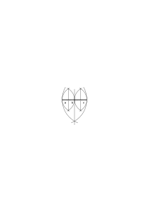

a, b & c gleichlang erscheinen. Nun könnte man die Resultate der Teilungen im System α nach der Zahl der erzeugten Teile durch die Zahlen 2, 2², 2³, u.s.w. darstellen; & die Frage ob die 3-Teilung möglich ist könnte bedeuten: ist eine der Zahlen in dieser Reihe = 3. Diese Frage kann freilich nur gestellt werden wenn die 2, 2², 2³ etc. in einem andern System (etwa den Kardinalzahlen) eingebettet sind; nicht, wenn sie selbst unser Zahlensystem sind; denn dann kennen wir – oder unser System – eben die 3 nicht. – Aber wenn unsere Frage lautet ist eine der Zahlen 2, 2², 2³, etc. gleich ³ so ist hier eigentlich von einer _3-Teilung_ der Strecke nicht die Rede. Immerhin kann die Frage nach der Möglichkeit der 3-Teilung so aufgefaßt werden. – Eine andere Auffassung erhalten wir nun wenn wir dem System α ein System β hinzufügen worin es die Streckenteilung

nach Art dieser Figur gibt.

Es kann nun gefragt werden: ist die Teilung β in 108 Teile eine Teilung der Art α? Und diese Frage könnte wieder auf die hinauslaufen: ist 108 eine Potenz von 2? aber sie könnte auch auf eine andere Entscheidungsart hinweisen (einen andern Sinn haben) wenn wir die Systeme α & β zu einem geometrischen Konstruktionssystem verbinden

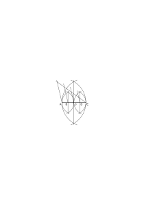

so zwar, daß es sich nun in diesem System beweisen läßt, daß die beiden Konstruktionen die gleichen Teilungspunkte B, C, D „liefern müssen”. <math display="inline"><mi>A</mi><mtext><mi>B</mi></mtext><mspace width="0.3em"/><mtext>├</mtext><mtext>─</mtext><mtext>┼</mtext><mtext>─</mtext><mtext>┼</mtext><mtext>─</mtext><mtext>┼</mtext><mtext>─</mtext><mtext>┼</mtext><mtext>─</mtext><mtext>┼</mtext><mtext>─</mtext><mtext>┼</mtext><mtext>─</mtext><mtext>┼</mtext><mtext>─</mtext><mtext>┤</mtext><mspace width="0.3em"/><mi>a</mi><mi>b</mi><mi>c</mi></math> Denken wir nun es hätte Einer im System α eine Strecke AB in 8 Teile geteilt, nehme diese nun zu den Strecken a, b, c zusammen & fragte: ist das eine 3-Teilung. (Wir könnten uns den Fall übrigens leichter mit einer größeren Anzahl ursprünglicher Teile vorstellen die es möglich macht, 3 gleichlang aussehende Gruppen von Teilen zu bilden.) Die Antwort auf diese Frage wäre der Beweis daß 2³ nicht durch 3 teilbar ist; oder der Hinweis darauf daß sich die Teile a, b, c wie 1:3:4 verhalten. Und nun könnte man fragen: habe ich also im System α nicht doch einen Begriff von der 3-Teilung, nämlich der Teilung, die die Teile a, b, c im Verhältnis 1:1:1 hervorbringt? Gewiß, ich habe nun einen neuen Begriff ‘3-Teilung einer Strecke’ eingeführt; wir könnten ja sehr wohl sagen daß wir durch die 8-Teilung der Strecke AB die Strecke CB <math display="inline"><mi>A</mi><mi>C</mi><mtext><mi>B</mi></mtext><mspace width="0.3em"/><mtext>├</mtext><mtext>─</mtext><mtext>┼</mtext><mtext>─</mtext><mtext>┼</mtext><mtext>─</mtext><mtext>┼</mtext><mtext>─</mtext><mtext>┼</mtext><mtext>─</mtext><mtext>┼</mtext><mtext>─</mtext><mtext>┼</mtext><mtext>─</mtext><mtext>┼</mtext><mtext>─</mtext><mtext>┤</mtext></math> in 3 gleiche Teile geteilt haben wenn das eben _heißen_ soll: wir haben eine Strecke erzeugt die aus 3 gleichen Teilen besteht.

### [116r\[2\]](https://cdn.wittgensteinnachlass.com/2000px/webp/Ms-113/116r.webp),[116v\[1\]](https://cdn.wittgensteinnachlass.com/2000px/webp/Ms-113/116v.webp)

Die Perplexität in der wir uns bezüglich des Problems der 3-Teilung befanden war etwa die: Wenn die 3-Teilung des Winkels unmöglich ist – logisch unmöglich – wie kann man dann überhaupt nach ihr fragen? Wie kann man das logisch Unmögliche beschreiben & nach seiner Möglichkeit sinnvoll fragen? D.h., wie kann man _logisch_ nicht zusammenpassende Begriffe zusammenstellen (gegen die Grammatik, also unsinnig) & sinnvoll nach der Möglichkeit dieser Zusammenstellung fragen? – Aber dieses Paradox fände sich ja wieder wenn man frägt: „ist 25 × 25 = 620?” da es doch _logisch_ unmöglich ist daß diese Gleichung stimmt, ich kann ja nicht beschreiben wie es wäre wenn – – –. Ja, der Zweifel ob 25 × 25 = 620 (oder der ob es = 625 ist) hat eben den Sinn, den die Methode der Prüfung ihm gibt. Und die Frage nach der Möglichkeit der 3-Teilung hat den Sinn, den die Methode der Prüfung ihr gibt. Es ist ganz richtig: wir stellen uns hier nicht vor, oder beschreiben, wie es ist, wenn 25 × 25 = 620 ist, & das heißt eben, daß wir es hier mit einer andern (logischen) Art von Frage zu tun haben als etwa der: „ist diese Straße 620 oder 625 m lang?”

### [116v\[2\]](https://cdn.wittgensteinnachlass.com/2000px/webp/Ms-113/116v.webp)

(Wir sprechen von einer „_Teilung des Kreises_ in 7 Teile” & von einer Teilung eines Kuchens in 7 Teile.)

### [116v\[3\]](https://cdn.wittgensteinnachlass.com/2000px/webp/Ms-113/116v.webp),[117r\[1\]](https://cdn.wittgensteinnachlass.com/2000px/webp/Ms-113/117r.webp)

Man ist geneigt zu glauben daß die Notation, die eine Reihe durch Anschreiben einiger Glieder mit dem Zeichen u.s.w. darstellt wesentlich unexakt ist im Gegensatz zur Angabe des allgemeinen Gliedes. Dabei vergißt man daß die Angabe des allgemeinen Gliedes sich auf eine Grundreihe bezieht, welche nicht wieder durch ein allgemeines Glied beschrieben sein kann. So ist 2n + 1 das allgemeine Glied der ungeraden Zahlen _wenn_ n die Kardinalzahlen durchläuft, aber es wäre Unsinn zu sagen n sei das allgemeine Glied der Reihe der Kardinalzahlen. Wenn man diese Reihe erklären will so kann man es nicht durch Angabe des „allgemeinen Gliedes n” sondern natürlich nur durch eine Erklärung der Art 1, 1 + 1, 1 + 1 + 1, u.s.w.. Und es ist natürlich kein wesentlicher Unterschied zwischen dieser Reihe & der: 1, 1 + 1 + 1, 1 + 1 + 1 + 1 + 1, u.s.w. die ich ganz ebensogut als Grundreihe hätte nehmen können (sodaß dann das allgemeine Glied der Kardinalzahlreihe <math class="stacked" display="inline"><mfrac><mrow><mi>n</mi><mspace width="0.3em"/><mtext>‒</mtext><mspace width="0.3em"/><mn>1</mn></mrow><mrow><mn>2</mn></mrow></mfrac></math> gelautet hätte).

### [117r\[2\]](https://cdn.wittgensteinnachlass.com/2000px/webp/Ms-113/117r.webp)

(Frege hätte noch gesagt: „es gibt vielleicht Völker, die in der Kenntnis der Kardinalzahlenreihe nicht über die 5 hinausgekommen sind (& etwa das Übrige der Reihe nur in unbestimmter Form sehen) aber diese Reihe existiert unabhängig von uns”. Existiert das Schachspiel unabhängig von uns oder nicht? –)

### [117r\[3\]](https://cdn.wittgensteinnachlass.com/2000px/webp/Ms-113/117r.webp),[117v\[1\]](https://cdn.wittgensteinnachlass.com/2000px/webp/Ms-113/117v.webp)

Den Mathematiker muß es bei meinen mathematischen Ausführungen grausen, denn seine Schulung hat ihn immer davon abgelenkt sich Gedanken & Zweifeln, wie ich sie aufrolle, hinzugeben. Er hat sie als etwas verächtliches ansehen lernen & hat um eine Analogie aus der Psychoanalyse (dieser Absatz erinnert an Freud) zu gebrauchen einen Ekel vor diesen Dingen erhalten, wie vor etwas Infantilem. D.h., ich rolle alle jene Probleme auf, die etwa ein Knabe beim Lernen der Arithmetik, etc. als Schwierigkeiten empfindet & die der Unterricht unterdrückt ohne sie zu lösen. Ich sage also zu diesen unterdrückten Zweifeln: ihr habt ganz recht, fragt nur, & verlangt nach Aufklärung!

### [117v\[2\]](https://cdn.wittgensteinnachlass.com/2000px/webp/Ms-113/117v.webp)

Die Wirkung einer in die Sprache aufgenommen falschen Analogie: Sie bedeutet einen ständigen Kampf & Beunruhigung (quasi einen ständigen Reiz). Es ist, wie wenn ein Ding aus der Entfernung ein Mensch zu sein scheint weil wir dann gewisses nicht wahrnehmen & in der Nähe sehen wir daß es ein Baumstumpf ist. Kaum entfernen wir uns ein wenig & verlieren die Erklärungen aus dem Auge, so erscheint uns _eine_ Gestalt, sehen wir darauf hin näher zu, so sehen wir eine andere; nun entfernen wir uns wieder, etc., etc.

### [117v\[3\]](https://cdn.wittgensteinnachlass.com/2000px/webp/Ms-113/117v.webp)

(Ich kann der Aufgabe der 3-Teilung des Winkels in einem größern System ihren Platz bestimmen, aber nicht im System der Euklidischen Elemente nach ihrer Lösbarkeit fragen. In welcher _Sprache_ sollte ich denn danach fragen? in der Euklidischen? – Und ebensowenig kann ich in der Euklidischen Sprache nach der Möglichkeit der 2-Teilung des Winkels im Euklidischen System fragen. Denn das würde in dieser Sprache auf eine Frage nach der Möglichkeit schlechthin hinauslaufen, welche immer Unsinn ist.)

### [117v\[4\]](https://cdn.wittgensteinnachlass.com/2000px/webp/Ms-113/117v.webp)

(*Die Klassifikationen der Philosophen & Psychologen: sie klassifizieren Wolken nach ihrer Gestalt.)

### [118r\[1\]](https://cdn.wittgensteinnachlass.com/2000px/webp/Ms-113/118r.webp)

Es ist unmöglich Entdeckungen neuartiger Regeln zu machen, die von einer uns bekannten Form (etwa dem sinus eines Winkels) gelten. Sind es neue Regeln, so ist es nicht die alte Form.

### [118r\[2\]](https://cdn.wittgensteinnachlass.com/2000px/webp/Ms-113/118r.webp),[118v\[1\]](https://cdn.wittgensteinnachlass.com/2000px/webp/Ms-113/118v.webp)

Man faßt die Periodizität eines Bruches z.B. ⅓ so auf, als _bestünde_ sie darin, daß etwas was man die Extension des unendlichen Dezimalbruchs nennt nur aus Dreiern besteht & daß die Gleichheit des Restes dieser Division mit dem Dividenden nur das _Anzeichen_ für diese Eigenschaft der unendlichen Extension sei. Oder aber man korrigiert diese Meinung dahin, daß nicht eine unendliche Extension diese Eigenschaft habe sondern eine unendliche Reihe endlicher Extensionen; & hierfür sei wieder die Eigenschaft der Division ein Anzeichen. Man kann nun sagen: die Extension mit einem Glied sei 0˙3, die mit 2 Gliedern 0˙33, mit dreien 0˙333 u.s.w.. Das ist eine _Regel_ & das „u.s.w.” bezieht sich auf die Regelmäßigkeit & die Regel könnte auch geschrieben werden „[0˙3, 0˙ξ, 0˙ξ3]”. Das, was aber durch die Division <math class="stacked" display="inline"><munder><mrow><mn>1</mn></mrow><mo>_</mo></munder><mspace width="0.3em"/><mo>:</mo><mspace width="0.3em"/><mn>3</mn><mspace width="0.3em"/><mo>=</mo><mspace width="0.3em"/><mtext>0˙</mtext><mn>3</mn><munder><mrow><mn>1</mn></mrow><mo>_</mo></munder></math> bewiesen ist, ist _diese_ Regelmäßigkeit im Gegensatz zu einer andern, nicht die Regelmäßigkeit im Gegensatz zur Unregelmäßigkeit. Die periodische Division also <math class="stacked" display="inline"><munder><mrow><mn>1</mn></mrow><mo>_</mo></munder><mspace width="0.3em"/><mo>:</mo><mspace width="0.3em"/><mn>3</mn><mspace width="0.3em"/><mo>=</mo><mspace width="0.3em"/><mtext>0˙</mtext><mn>3</mn><munder><mrow><mn>1</mn></mrow><mo>_</mo></munder></math> (im Gegensatz zu 1 : 3 = 0˙31) beweise _eine_ Periodizität der Quotienten d.h. sie _bestimmt_ die Regel (die Periode), legt sie fest, aber ist nicht ein Anzeichen dafür daß eine Regelmäßigkeit „vorhanden ist”. _Wo_ ist sie denn vorhanden? Etwa in den bestimmten Entwicklungen, die ich auf diesem Papier gebildet habe. Aber das sind doch nicht „die Entwicklungen”. (Hier werden wir irregeführt von der Idee der nicht aufgeschriebenen idealen Extensionen die ein ähnliches Unding sind wie die idealen nicht gezogenen geometrischen Geraden die wir gleichsam nur in der Wirklichkeit nachziehen wenn wir sie zeichnen.) Wenn ich sagte „das ‚u.s.w.’ bezieht sich auf die Regelmäßigkeit” so unterschied ich es von dem ‚u.s.w.’ in „er las alle Buchstaben: a, b, c, u.s.w.”. Wenn ich sage: „die Extensionen von 1 : 3 sind 0˙3, 0˙33, 0˙333 u.s.w.” so gebe ich _drei_ Extensionen & – eine Regel. Unendlich ist nur diese & zwar in keiner andern Weise als die Division <math class="stacked" display="inline"><munder><mrow><mn>1</mn></mrow><mo>_</mo></munder><mspace width="0.3em"/><mo>:</mo><mspace width="0.3em"/><mn>3</mn><mspace width="0.3em"/><mo>=</mo><mspace width="0.3em"/><mtext>0˙</mtext><mn>3</mn><munder><mrow><mn>1</mn></mrow><mo>_</mo></munder></math>.

### [118v\[2\]](https://cdn.wittgensteinnachlass.com/2000px/webp/Ms-113/118v.webp),[119r\[1\]](https://cdn.wittgensteinnachlass.com/2000px/webp/Ms-113/119r.webp)

Und das Zeichen [0˙3, 0˙ξ, 0˙ξ3] ist kein Ersatz für eine Extension, sondern das vollwertige Zeichen selbst & ebensogut ist „<math class="stacked" display="inline"><mtext>0˙</mtext><mover><mrow><mn>3</mn></mrow><mtext>˙</mtext></mover></math>”. Es sollte uns doch zu denken geben daß ein Zeichen der Art „<math class="stacked" display="inline"><mtext>0˙</mtext><mover><mrow><mn>3</mn></mrow><mtext>˙</mtext></mover></math>” _genügt_ um damit zu machen was wir brauchen. Es ist kein Ersatz & im Kalkül gibt es keinen Ersatz. Wenn man meint die besondere Eigenschaft der Division <math class="stacked" display="inline"><munder><mrow><mn>1</mn></mrow><mo>_</mo></munder><mspace width="0.3em"/><mo>:</mo><mspace width="0.3em"/><mn>3</mn><mspace width="0.3em"/><mo>=</mo><mspace width="0.3em"/><mtext>0˙</mtext><mn>3</mn><munder><mrow><mn>1</mn></mrow><mo>_</mo></munder></math> sei ein Anzeichen für die Periodizität des unendlichen Dezimalbruchs, oder _der_ Dezimalbrüche der Entwickelung, so heißt das ein Anzeichen dafür daß etwas regelmäßig _ist_; aber was? Die Extensionen die ich gebildet habe? Aber andere gibt es ja nicht. Am absurdesten würde die Redeweise, wenn man sagte: die Eigenschaft der Division sei ein Anzeichen dafür, daß das Resultat die Form [0˙a, 0˙ξ, 0˙ξa] habe; das wäre so als wollte man sagen: eine Division ist das Anzeichen dafür, daß eine Zahl herauskommt. Das Zeichen „<math class="stacked" display="inline"><mtext>0˙</mtext><mover><mrow><mn>3</mn></mrow><mtext>˙</mtext></mover></math>” drückt seine Bedeutung nicht vor einer größeren Entfernung aus als „0˙333…” denn dieses Zeichen gibt eine Extension von drei Gliedern & eine Regel; die Extension 0˙333 ist für unsere Zwecke nebensächlich & so bleibt nur die Regel die „[0˙3, 0˙ξ, 0˙ξ3]” ebensogut gibt. Der Satz „die Division wird nach der ersten Stelle periodisch” _heißt soviel_ wie: „der erste Rest ist gleich dem Dividenden”. Oder auch: der Satz „die Division wird von der ersten Stelle an ins Unendliche die gleiche Ziffer erzeugen” _heißt_ „der erste Rest ist gleich dem Dividenden”; so wie der Satz dieses Lineal hat einen unendlichen Radius heißt, es sei gerade.

### [119r\[2\]](https://cdn.wittgensteinnachlass.com/2000px/webp/Ms-113/119r.webp),[119v\[1\]](https://cdn.wittgensteinnachlass.com/2000px/webp/Ms-113/119v.webp)

Man könnte nun sagen: die Stellen des Quotienten von 1 : 3 sind _notwendig alle_ 3, & das würde wieder nur heißen, daß der erste Rest gleich dem Dividenden ist & die erste Stelle des Quotienten 3. Die Verneinung des ersten Satzes ist daher gleich der Verneinung des zweiten. Es ist also dem „notwendig alle” nichts entgegengesetzt was man „zufällig alle” nennen könnte, „notwendig alle” ist sozusagen ein Wort. Ich brauche nur fragen: Was ist das Kriterium der notwendigen Allgemeinheit, & was wäre das der zufälligen (das Kriterium dafür also, daß zufällig alle Zahlen die Eigenschaft ε haben)?

### [119v\[2\]](https://cdn.wittgensteinnachlass.com/2000px/webp/Ms-113/119v.webp),[120r\[1\]](https://cdn.wittgensteinnachlass.com/2000px/webp/Ms-113/120r.webp),[120v\[1\]](https://cdn.wittgensteinnachlass.com/2000px/webp/Ms-113/120v.webp)

Hat der rekursive Beweis von a + (b + c) = (a + b) + c – – –

_A_

eine Frage beantwortet? & welche? Hat er eine Behauptung als wahr erwiesen & also ihr Gegenteil als falsch? Das, was man den rekursiven Beweis von A nennt kann man so schreiben:

a + (b + 1) = (a + b) + 1

a + (b + (c + 1) = a + ((b + c) + 1) = (a + (b + c)) + 1 }

B

(a + b) + (c + 1) = ((a + b) + c) + 1

In diesem Beweis kommt offenbar der bewiesene Satz gar nicht vor. – Man müßte nur eine allgemeine Bestimmung machen die den Übergang in ihm erlaubt. Diese Bestimmung könnte man so ausdrücken:

αφ(1) = ψ(1)

∆

βφ(c + 1) = F(φ(c)) } φ(c) = ψ(c)

γψ(c + 1) = F(ψ(c))

Wenn drei Gleichungen von der Form α, β, γ bewiesen sind, so sagen wir es sei „die Gleichung ∆ für alle Kardinalzahlen bewiesen”. Das ist eine Erklärung dieser Ausdrucksform durch die erste. Sie zeigt daß wir das Wort „beweisen” im zweiten Fall anders gebrauchen als im ersten. Es ist jedenfalls irreführend zu sagen wir hätten die Gleichung ∆ oder A bewiesen & vielleicht besser zu sagen wir hätten ihre Allgemeingültigkeit bewiesen, obwohl das wieder in anderer Hinsicht irreführend ist. Hat nun der Beweis B eine Frage beantwortet, eine Behauptung als wahr erwiesen? Ja, welches ist denn der Beweis B: ist es die Gruppe der drei Gleichungen von der Form α, β, γ, oder die Klasse der Beweise dieser Gleichungen? Diese Gleichungen _behaupten_ ja etwas (& beweisen nichts in dem Sinne in dem _sie_ bewiesen werden). Die Beweise von α, β, γ aber beantworten die Frage, ob diese drei Gleichungen stimmen, & erweisen die Behauptung als wahr, daß sie stimmen. Ich kann nun erklären: die Frage, ob A für alle Kardinalzahlen gilt, solle bedeuten: „gelten für die Funktionen φ(ξ) = a + (b + ξ), ψ(ξ) = (a + b) + ξ

Gleichungen α, β & γ?” Und dann ist diese Frage durch den rekursiven Beweis von A beantwortet, wenn hierunter die Beweise von α, β, γ verstanden werden (bezw. die Festsetzung von α & die Beweise von β & γ mittels α). Ich kann also sagen, daß der rekursive Beweis ausrechnet, daß die Gleichung A einer gewissen Bedingung genügt; aber es ist nicht eine Bedingung der Art wie sie etwa die Gleichung (a + b)² = a² + 2ab + b² erfüllen muß um richtig genannt zu werden. Nenne ich A „richtig” weil sich Gleichungen von der Form α, β, γ dafür beweisen lassen, so verwende ich jetzt das Wort „richtig” anders als im Falle der Gleichungen α, β, γ, oder (a + b)² = a² + 2ab + b².

### [120v\[2\]](https://cdn.wittgensteinnachlass.com/2000px/webp/Ms-113/120v.webp),[121r\[1\]](https://cdn.wittgensteinnachlass.com/2000px/webp/Ms-113/121r.webp)

Was heißt „<math class="stacked" display="inline"><mtext>1:</mtext><mn>3</mn><mspace width="0.3em"/><mo>=</mo><mspace width="0.3em"/><mtext>0˙</mtext><mover><mrow><mn>3</mn></mrow><mtext>˙</mtext></mover></math>”? heißt es dasselbe wie „<math class="stacked" display="inline"><munder><mrow><mn>1</mn></mrow><mo>_</mo></munder><mspace width="0.3em"/><mo>:</mo><mspace width="0.3em"/><mn>3</mn><mspace width="0.3em"/><mo>=</mo><mspace width="0.3em"/><mtext>0˙</mtext><mn>3</mn><munder><mrow><mn>1</mn></mrow><mo>_</mo></munder></math>”? – Oder ist diese Division der Beweis des ersten Satzes? D.h.: steht sie zu ihm im Verhältnis der Ausrechnung zum Bewiesenen? „<math class="stacked" display="inline"><mn>1</mn><mspace width="0.3em"/><mo>:</mo><mspace width="0.3em"/><mn>3</mn><mspace width="0.3em"/><mo>=</mo><mspace width="0.3em"/><mtext>0˙</mtext><mover><mrow><mn>3</mn></mrow><mtext>˙</mtext></mover></math>” ist ja nicht von der Art, wie „1 : 2 = 0˙5”; vielmehr entspricht „<math class="stacked" display="inline"><msub><mn>1</mn><mn>0</mn></msub><mspace width="0.3em"/><mo>:</mo><mspace width="0.3em"/><mn>2</mn><mspace width="0.3em"/><mo>=</mo><mspace width="0.3em"/><mtext>0˙</mtext><mn>5</mn></math>” dem „1 : 3 = 0˙31” (aber nicht dem „<math class="stacked" display="inline"><munder><mrow><mn>1</mn></mrow><mo>_</mo></munder><mspace width="0.3em"/><mo>:</mo><mspace width="0.3em"/><mn>3</mn><mspace width="0.3em"/><mo>=</mo><mspace width="0.3em"/><mtext>0˙</mtext><mn>3</mn><munder><mrow><mn>1</mn></mrow><mo>_</mo></munder></math>”.) Ich will einmal statt der Schreibweise „1 : 4 = 0˙25” die adoptieren

„1-0 : 4 = 0˙25” also z.B. „3--0 : 8 = 0˙375”

dann kann ich sagen diesem Satz entspricht nicht der: <math class="stacked" display="inline"><mn>1</mn><mspace width="0.3em"/><mo>:</mo><mspace width="0.3em"/><mn>3</mn><mspace width="0.3em"/><mo>=</mo><mspace width="0.3em"/><mtext>0˙</mtext><mover><mrow><mn>3</mn></mrow><mtext>˙</mtext></mover></math> sondern z.B. der: „1--1 : 3 = 0˙333”. <math class="stacked" display="inline"><mtext>0˙</mtext><mover><mrow><mn>3</mn></mrow><mtext>˙</mtext></mover></math> ist nicht in dem Sinne Resultat (Quotient) der Division wie 0˙375. Denn die Zahl 0˙375 war uns vor der Division 3 : 8 bekannt; was aber bedeutet „<math class="stacked" display="inline"><mtext>0˙</mtext><mover><mrow><mn>3</mn></mrow><mtext>˙</mtext></mover></math>” losgelöst von der periodischen Division? – Die Behauptung, daß die Division a : b als Quotienten <math class="stacked" display="inline"><mtext>0˙</mtext><mover><mrow><mi>c</mi></mrow><mtext>˙</mtext></mover></math> ergibt, ist dieselbe wie die: die erste Stelle des Quotienten sei c & der erste Rest gleich dem Dividenden. Nun steht B zur Behauptung A gelte für alle Kardinalzahlen im selben Verhältnis, wie <math class="stacked" display="inline"><munder><mrow><mn>1</mn></mrow><mo>_</mo></munder><mspace width="0.3em"/><mo>:</mo><mspace width="0.3em"/><mn>3</mn><mspace width="0.3em"/><mo>=</mo><mspace width="0.3em"/><mtext>0˙</mtext><mn>3</mn><munder><mrow><mn>1</mn></mrow><mo>_</mo></munder></math> zu <math class="stacked" display="inline"><mn>1</mn><mspace width="0.3em"/><mo>:</mo><mspace width="0.3em"/><mn>3</mn><mspace width="0.3em"/><mo>=</mo><mspace width="0.3em"/><mtext>0˙</mtext><mover><mrow><mn>3</mn></mrow><mtext>˙</mtext></mover></math>.

### [121r\[2\]](https://cdn.wittgensteinnachlass.com/2000px/webp/Ms-113/121r.webp)

Der Gegensatz zu der Behauptung „A gilt für alle Kardinalzahlen” ist nun: eine der Gleichungen α, β, γ sei falsch. Und die entsprechende Frage sucht keine Entscheidung zwischen einem (x)fx & einem (∃x)~fx.

### [121r\[3\]](https://cdn.wittgensteinnachlass.com/2000px/webp/Ms-113/121r.webp)

Die Konstruktion der Induktion ist nicht ein Beweis sondern eine bestimmte Zusammenstellung (ein Muster) von Beweisen. Man kann ja auch nicht sagen: ich beweise eine Gleichung wenn ich drei beweise. Wie die Sätze einer Suite nicht einen Satz ergeben.

### [121r\[4\]](https://cdn.wittgensteinnachlass.com/2000px/webp/Ms-113/121r.webp)

Der „rekursive Beweis” ist das allgemeine Glied einer Reihe von Beweisen. Er ist also ein Gesetz nach dem man Beweise konstruieren kann. Wenn gefragt wird, wie es möglich ist daß mir diese allgemeine Form den Beweis eines speziellen Satzes z.B. 7 + (8 + 9) = (7 + 8) + 9 ersparen kann, so ist die Antwort daß sie nur alles zum Beweis dieses Satzes vorbereitet hat ihn aber nicht beweist (er kommt ja in ihr nicht vor). Der Beweis besteht vielmehr aus der allgemeinen Form zusammen mit dem Satz.

### [121r\[5\]](https://cdn.wittgensteinnachlass.com/2000px/webp/Ms-113/121r.webp),[121v\[1\]](https://cdn.wittgensteinnachlass.com/2000px/webp/Ms-113/121v.webp)

Unsere gewöhnliche Ausdrucksweise trägt den Keim der Verwirrung in ihre Fundamente indem sie das Wort „Reihe” einerseits im Sinne von ‚Extension’, anderseits im Sinne von ‚Gesetz’ gebraucht. Das Verhältnis der beiden kann man sich an der Maschine klarmachen die Schraubenfedern erzeugt. Hier wird durch

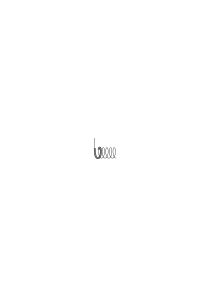

einen schraubenförmig gewundenen Gang ein Draht geschoben der nun so viele Schraubenwindungen erzeugt als man erzeugen will. Das was man die unendliche Schraube nennt ist nicht vielleicht etwas von der Art der endlichen Drahtstücke oder etwas dem sich diese nähern je länger sie werden sondern das Gesetz der Schraube wie es in dem kurzen Gangstück verkörpert ist. Der Ausdruck unendliche Schraube oder unendliche Reihe ist dabei gänzlich irreführend.

### [121v\[2\]](https://cdn.wittgensteinnachlass.com/2000px/webp/Ms-113/121v.webp)

Wir können also den rekursiven Beweis immer auch als Reihenstück mit dem „u.s.w.” anschreiben & er verliert dadurch nicht seine Strenge. Und zugleich zeigt diese Schreibweise klarer sein Verhältnis zur Gleichung A. Denn nun verliert der rekursive Beweis jeden Schein einer Rechtfertigung von A im Sinne eines algebraischen Beweises – etwa von (a + b)² = a² + 2ab + b². Dieser Beweis mit Hilfe der algebraischen Rechnungsregeln ist vielmehr ganz analog einer Ziffernrechnung.

### [121v\[3\]](https://cdn.wittgensteinnachlass.com/2000px/webp/Ms-113/121v.webp)

(„Every symbol is what it is & not another symbol”.)

### [122r\[2\]](https://cdn.wittgensteinnachlass.com/2000px/webp/Ms-113/122r.webp)

Man kann auch so sagen: Sofern man die Regel in irgendeinem Spiel Dezimalbrüche zu bilden die nur aus der Ziffer 3 bestehen, sofern man _diese Regel_ als eine Art Zahl auffaßt, kann eine Division sie nicht zum Resultat haben sondern nur das, was man periodische Division nennen kann & was die Form <math class="stacked" display="inline"><msub><mi>a</mi><mi>a</mi></msub><mspace width="0.3em"/><mo>:</mo><mspace width="0.3em"/><mi>b</mi><mspace width="0.3em"/><mo>=</mo><mspace width="0.3em"/><mi>c</mi></math> hat.

### [122r\[3\]](https://cdn.wittgensteinnachlass.com/2000px/webp/Ms-113/122r.webp)

Kann es keinen Beweis geben der bloß zeigt daß z.B. jede Multiplikation im Dezimalsystem nach den Regeln eine Zahl des Dezimalsystems liefern muß? – Es müßte analog sein einem Beweis dafür, daß durch Addition von Ausdrücken der Art (1), ((1) + 1), (((1) + 1) + 1) u.s.w. immer wieder Ziffern von dieser Form erzeugt werden. Kann man das nun beweisen? Der Beweis liegt offenbar in der Regel der Addition solcher Ausdrücke, d.h. in der Definition & in nichts anderem. (Man könnte ja auf die Frage & auf die der Beweis die Antwort geben sollte auch sagen: „Ja, was soll die Addition denn sonst ergeben?”)

### [122r\[4\]](https://cdn.wittgensteinnachlass.com/2000px/webp/Ms-113/122r.webp),[122v\[1\]](https://cdn.wittgensteinnachlass.com/2000px/webp/Ms-113/122v.webp)

Die rekursive Definition ist eine Regel zur Bildung von Ersetzungsregeln. Oder auch das allgemeine Glied einer Reihe von Definitionsreihen. Sie ist ein Wegweiser der alle Ausdrücke einer bestimmten Form auf einem Wege heimweist.

### [122v\[2\]](https://cdn.wittgensteinnachlass.com/2000px/webp/Ms-113/122v.webp)

A als Regel für das algebraische Rechnen kann nicht rekursiv bewiesen werden das würde man besonders klar sehen wenn man den „rekursiven Beweis” als eine Reihe arithmetischer Ausdrücke hinschriebe. Denkt man sie sich hingeschrieben (d.h. ein Reihenstück mit dem u.s.w.) aber ohne die Absicht irgend etwas zu „beweisen” & nun fragte Einer: „beweist dies a + (b + c) = (a + b) + c?” so würden wir erstaunt zurückfragen: „wie kann es denn so was beweisen? in der Reihe kommen doch nur Ziffern & keine Buchstaben vor!” – Wohl aber könnte man nun sagen: Wenn ich für das Buchstabenrechnen die Regel A einführe so kommt dieser Kalkül dadurch in einem bestimmten Sinn in Einklang mit dem Kalkül der Kardinalzahlen wie ich ihn durch das Gesetz der Additionsregeln (rekursive Definition a + (b + 1) = (a + b) + 1) festgelegt habe.

### [122v\[3\]](https://cdn.wittgensteinnachlass.com/2000px/webp/Ms-113/122v.webp),[123r\[1\]](https://cdn.wittgensteinnachlass.com/2000px/webp/Ms-113/123r.webp)

(Wenn die Regeln des algebraisch Rechnens mit denen des Rechnens mit reellen Zahlen übereinstimmen sollen, so muß ich z.B. von der Gleichung x² + 2x + 2 = 0 sagen, sie habe _keine_ Lösung. Ich werfe dann alle quadratischen Gleichungen die keine Lösung haben, sozusagen, in einen Topf. Wenn ich aber einmal frage: wie nahe kommt denn diese Gleichung, die keine Lösung hat, einer, die eine Lösung hat, so operiere ich bereits mit komplexen Zahlen, indem ich die Gleichungen selbst als eine Art Zahlen behandle; d.h. einen Kalkül mit Gleichungen konstruiere der dem mit den reellen Zahlen (z.B.) in gewisser Beziehung analog ist.)

### [123r\[2\]](https://cdn.wittgensteinnachlass.com/2000px/webp/Ms-113/123r.webp),[123v\[1\]](https://cdn.wittgensteinnachlass.com/2000px/webp/Ms-113/123v.webp)

19.05.1932

Phänomenologische Sprache: Die Beschreibung der unmittelbaren Sinneswahrnehmung, ohne hypothetische Zutat. Wenn etwas, dann muß doch wohl die Abbildung durch ein gemaltes Bild oder dergleichen eine solche Beschreibung der unmittelbaren Erfahrung sein. Wenn wir also z.B. in ein Fernrohr sehen & die gesehene Konstellation aufzeichnen oder malen. Denken wir uns sogar unsere Sinneswahrnehmung dadurch reproduziert daß zu ihrer Beschreibung ein Modell erzeugt wird welches von einem bestimmten Punkt gesehen diese Wahrnehmungen erzeugt, das Modell könnte mit einem Kurbelantrieb in die richtige Bewegung gesetzt werden & wir könnten durch Drehen der Kurbel die Beschreibung herunterlesen. (Eine Annäherung hierzu wäre eine Darstellung im Film.) Ist _das_ keine Darstellung des Unmittelbaren – was sollte eine sein? Was noch unmittelbarer sein wollte müßte es aufgeben eine Beschreibung zu sein. Es kommt dann vielmehr statt einer Beschreibung jener unartikulierte Laut heraus, mit dem manche Autoren die Philosophie gerne anfangen möchten. („Ich habe, um mein Wissen wissen wissend, bewußt etwas” (Driesch).)

### [123v\[2\]](https://cdn.wittgensteinnachlass.com/2000px/webp/Ms-113/123v.webp)

Was wir die Zeit im Phänomen (specious present) nennen können liegt nicht in der Zeit (Vergangenheit, Gegenwart & Zukunft) der Geschichte, ist keine Strecke dieser Zeit. Während, was wir unter „Sprache” verstehen in der homogenen geschichtlichen Zeit abläuft. (Denke an den Mechanismus zur Beschreibung der unmittelbaren Wahrnehmung.)

### [123v\[3\]](https://cdn.wittgensteinnachlass.com/2000px/webp/Ms-113/123v.webp),[124r\[1\]](https://cdn.wittgensteinnachlass.com/2000px/webp/Ms-113/124r.webp)

Von welcher Wichtigkeit ist denn die Beschreibung des _gegenwärtigen_ Phänomens die für uns gleichsam zur fixen Idee werden kann. Daß wir darunter leiden daß die Beschreibung nicht das beschreiben kann, was beim Lesen der Beschreibung vor sich geht. Es scheint als wäre die Beschäftigung mit dieser Frage geradezu kindisch & wir in eine Sackgasse hineingeraten. Und doch ist es eine bedeutungsvolle Sackgasse, denn in sie lockt es alle zu gehen, als wäre dort die letzte Lösung der philosophischen Probleme zu suchen. – Es ist als käme man mit dieser Darstellung des gegenwärtigen Phänomens in einen verzauberten Sumpf, wo alles Erfaßbare verschwindet.) Anderseits brauchen wir eine Ausdrucksweise die Phänomene des Gesichtsraums getrennt vor den Erfahrungen andrer Art darstellt.

### [124r\[2\]](https://cdn.wittgensteinnachlass.com/2000px/webp/Ms-113/124r.webp)

Wenn wir vom Gesichtsraum reden, so werden wir leicht zu der Vorstellung verführt als wäre er eine Art von Guckkasten der jeder mit sich herumtrüge. D.h. wir verwenden dann das Wort „Raum” ähnlich, wie wenn wir ein Zimmer einen Raum nennen. In Wirklichkeit aber bezieht sich doch das Wort „Gesichtsraum” nur auf eine Geometrie, ich meine, auf einen Abschnitt der Grammatik unserer Sprache. In diesem Sinne gibt es keine „Gesichtsräume” die etwa jeder seiner Besitzer hätten. (Und etwa auch solche, vazierende, die gerade niemandem gehören?)

### [124r\[3\]](https://cdn.wittgensteinnachlass.com/2000px/webp/Ms-113/124r.webp),[124v\[1\]](https://cdn.wittgensteinnachlass.com/2000px/webp/Ms-113/124v.webp)

„Aber kann nicht ich in meinem Gesichtsraum eine Landschaft & Du in dem Deinen ein Zimmer sehen?” – Nein, ‚ich sehe in meinem Gesichtsraum’ ist Unsinn. Es muß heißen ‚ich sehe eine Landschaft & Du etc.’ & das wird nicht bestritten. Was uns hier irreführt ist eben das Gleichnis vom Guckkasten oder etwa von einer kreisrunden weißen Scheibe die wir gleichsam als Projektionsleinwand mit uns trügen & die der Raum ist in dem das jeweilige Gesichtsbild erscheint. Aber der Fehler an diesem Gleichnis ist, daß es sich die Gelegenheit – die Möglichkeit – zum Erscheinen eines visuellen Bildes selbst visuell vorstellt, denn die weiße Leinwand ist ja selbst ein Bild.

### [124v\[2\]](https://cdn.wittgensteinnachlass.com/2000px/webp/Ms-113/124v.webp)

Es ist nun wichtig, daß der Satz „das Auge womit ich sehe, kann ich nicht unmittelbar sehen” ein verkappter Satz der Grammatik, oder Unsinn, ist. Der Ausdruck „näher am (oder weiter vom) sehenden Auge” hat nämlich eine andere Grammatik als der „näher an dem blauen Gegenstand welchen ich sehe”. Die visuelle Erscheinung die der Beschreibung entspricht „A setzt die Brille auf” ist von der grundverschieden die ich mit den Worten beschreibe: „ich setze die Brille auf”. Ich könnte nun sagen: „mein Gesichtsraum hat Ähnlichkeit mit einem Kegel”, aber dann muß es verstanden werden daß ich hier den Kegel als Raum, als Repräsentanten einer Geometrie, nicht als Teil eines Raumes (Zimmer) denke. (Also ist es mit dieser Idee nicht verträglich daß ein Mensch durch ein Loch an der Spitze in den Kegel hineinschaut.)

### [124v\[3\]](https://cdn.wittgensteinnachlass.com/2000px/webp/Ms-113/124v.webp),[125r\[1\]](https://cdn.wittgensteinnachlass.com/2000px/webp/Ms-113/125r.webp)

Zwingt mich etwas zu der Deutung, daß der Baum, den ich durch mein Fenster sehe größer ist als das Fenster? Das kommt darauf an wie ich die Wörter „größer” & „kleiner” gebrauche. – Denken wir uns, die normale visuelle Erfahrung wäre es für uns, Stäbe in verschiedenen Lagen zu sehen, die durch Teilstücke in (visuell) gleiche Teile geteilt wären. Könnte sich da nicht ein doppelter Gebrauch der Worte „länger” & „kürzer” einbürgern. Wir würden nämlich manchmal den Stab den längeren nennen der in mehr Teile geteilt wäre; etc.

### [125r\[2\]](https://cdn.wittgensteinnachlass.com/2000px/webp/Ms-113/125r.webp)

Im Gesichtsraum gibt es absolute Lage. Wenn ich durch ein Aug schaue sehe ich meine Nasenspitze. Würde diese abgeschnitten & entfernt, mir aber dann in die Hand gegeben so könnte ich sie ohne Hilfe des Spiegels & bloß durch die Kontrolle des Sehens wieder an ihre alte Stelle setzen; auch dann wenn sich inzwischen alles in meinem Gesichtsbild geändert hätte. Der Satz „ich sehe das sehende Auge im Spiegel” ist nur scheinbar von der Form dessen „ich sehe das Auge des Andern im Spiegel”, denn es hat keinen Sinn zu sagen: „ich sehe das sehende Auge”. Wenn ich „visuelles Auge” das Bild nenne, was mir etwa das Auge eines Andern bietet, so kann ich sagen daß das Wort „das sehende Aug” nicht einem visuellen Auge entspricht.

### [125r\[3\]](https://cdn.wittgensteinnachlass.com/2000px/webp/Ms-113/125r.webp),[125v\[1\]](https://cdn.wittgensteinnachlass.com/2000px/webp/Ms-113/125v.webp)

Mein Gesichtsfeld weist keine Unvollständigkeit auf die mich dazu bringen könnte mich umzuwenden & zu sehen was hinter mir liegt. Im Gesichtsraum gibt es kein „hinter mir”; & wenn ich mich umwende _ändert_ sich ja bloß mein Gesichtsbild, wird aber nicht vervollständigt. (Der „Raum um mich herum” ist eine Verbindung von Sehraum & Muskelgefühlsraum.) Es hat keinen Sinn im Gesichtsraum von der Bewegung eines Gegenstandes zu reden, die nun das sehende Auge hinten herum führt.

### [125v\[2\]](https://cdn.wittgensteinnachlass.com/2000px/webp/Ms-113/125v.webp)

Beziehung zwischen physikalischem Raum & Gesichtsraum. Denke an das Sehen bei geschlossenen Augen (Nachtbilder etc.) & an die Traumbilder.

### [125v\[3\]](https://cdn.wittgensteinnachlass.com/2000px/webp/Ms-113/125v.webp)

(Wir befinden uns mit unserer Sprache (als physischer Erscheinung) sozusagen nicht im Bereich des projizierten Bildes auf der Leinwand, sondern im Bereich des Films der durch die Laterne geht. Und wenn ich zu dem Vorgang auf der Leinwand Musik machen will, muß das, was sie hervorruft, sich wieder im Gebiet des Films abspielen. Das gesprochene Wort im Sprechfilm das die Vorgänge auf der Leinwand begleitet, ist ebenso fliehend wie diese Vorgänge, & nicht das Gleiche wie der Tonstreifen. Der Tonstreifen begleitet nicht das Spiel auf der Leinwand.)

### [125v\[4\]](https://cdn.wittgensteinnachlass.com/2000px/webp/Ms-113/125v.webp),[126r\[1\]](https://cdn.wittgensteinnachlass.com/2000px/webp/Ms-113/126r.webp)

Gedächtniszeit. Sie ist (wie der Gesichtsraum) nicht ein Teil der großen Zeit sondern die spezifische Ordnung der Ereignisse oder Situationen im Gedächtnis: In dieser Zeit gibt es z.B. keine Zukunft. Gesichtsraum & physikalischer Raum, Gedächtniszeit & physikalische Zeit verhalten sich zu einander nicht wie ein Stück der Kardinalzahlreihe zum Gesetz dieser Reihe („der ganzen Zahlenreihe”), sondern wie das System der Kardinalzahlen zu dem der rationalen Zahlen. Und dieses Verhältnis erklärt auch den Sinn der Meinung daß der eine Raum den andern einschließt, enthält.

### [126r\[2\]](https://cdn.wittgensteinnachlass.com/2000px/webp/Ms-113/126r.webp),[126v\[1\]](https://cdn.wittgensteinnachlass.com/2000px/webp/Ms-113/126v.webp),[127r\[1\]](https://cdn.wittgensteinnachlass.com/2000px/webp/Ms-113/127r.webp)

20.05.1932

Begriff & Gegenstand: das ist bei Russell & Frege eigentlich Eigenschaft & Ding; & zwar denke ich hier an einen räumlichen Körper & seine Farbe. Man kann auch sagen: Begriff & Gegenstand: das ist Prädikat & Subjekt. Und die Subjekt-Prädikat-Form ist eine Ausdrucksform menschlicher Sprachen. Es ist die Form x ist y (xεy): „mein Bruder ist groß”, „das Gewitter ist nahe”, „dieser Kreis ist rot”, „August ist stark”, „2 ist eine Zahl”, „dieses Ding ist ein Stück Kohle”. Wie nun die Physik von Körpern der Erfahrung den Begriff des materiellen Punktes abgezogen hat, ähnlich hat man von der Subjekt-Prädikat-Form unserer Sprachen die Subjekt-Prädikat-Form der Logik abgezogen. Die reine Subjekt-Prädikat-Form soll nun a ε f(x) sein wo „a” der Name eines Gegenstandes ist. Sehen wir uns nun nach einer Anwendung dieses Schemas um. Bei „Name eines Gegenstandes” denkt man zuerst an Namen von Personen & andern räumlichen Gegenständen (der Diamant Koh i Noor). So ein Name wird dem Ding durch eine hinweisende Erklärung gegeben („das↗ ist ‚N’”). Diese Erklärung könnte aufgefaßt werden als eine Regel zur Ersetzung der auf den Gegenstand hinweisenden Geste durch das Wort „N” so zwar daß man statt des Namens „N” immer wieder jene Geste setzen kann. Ich hätte also z.B. erklärt „dieser Mann heißt ‚N’” & sage nun: „‚N’ ist ein Mathematiker”, „N ist faul”, etc. & hätte in jedem dieser Sätze statt ‚N’ ‚dieser Mann’ (mit der hinweisenden Geste) setzen können. (Dann wäre es übrigens besser gewesen die hinweisende Erklärung lauten zu lassen: „dieser Mann heiße ‚N’” oder „diesen Mann will ich ‚N’ nennen”, denn die frühere Fassung ist auch der Satz, daß dieser Mann so genannt wird.) Dies ist aber nicht die normale Art der Anwendung eines Namens, für die ist es wesentlich, daß ich nicht vom Namen auf ein Zeichen der Gebärdensprache zurück greifen kann. Wenn nämlich N aus dem Zimmer geht & später ein Mann in's Zimmer tritt, so hat – wie wir den Namen „N” gebrauchen – die Frage Sinn, ob dieser Mann N ist, ob dieser Mann derselbe ist, der vorhin das Zimmer verlassen hat. Und der Satz „N ist wieder eingetreten” hat nur Sinn, wenn ich die Frage entscheiden kann. Und es wird einen andern Sinn haben, jenachdem, was das Kriterium dafür ist, daß dies derselbe Gegenstand ist den ich früher ‚N’ genannt habe. Je nach der Art dieses Kriteriums werden also für das Zeichen ‚N’ andere Regeln gelten, es wird in anderem Sinne des Wortes ein ‚Name’ sein. Und so kommt es, daß das Wort ‚Name’ & das ihm entsprechende ‚Gegenstand’ einer Legion verschiedener Regelverzeichnisse entspricht. Geben wir räumlichen Gegenständen Namen, so beruht unsere Verwendung dieser Namen auf einem Kriterium der Identität das die Kontinuität der Bewegung der Körper & ihre Undurchdringlichkeit zur Voraussetzung hat. Könnte ich also mit zwei Körpern A & B das tun, was ich mit ihren Schattenbildern an der Wand tun kann, aus ihnen Eins machen & aus dem Einen wieder zwei, so wäre die Frage sinnlos welcher von den beiden nach der Trennung A & welcher B ist. Es sei denn daß ich nun ein ganz neues Kriterium der Identität einführe, etwa die Form ihrer Bahn (für den Namen eines Flusses der aus dem Zusammenfluß zweier Flüsse entsteht gibt es so eine Regel:

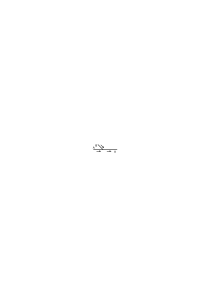

der resultierende Fluß erhält den Namen desjenigen Quellflusses in dessen Richtung er fließt). Denken wir an die möglichen Kriterien der Identität etwa von Farbflecken in meinem Gesichtsfeld (oder den Figuren auf der Leinwand des Kinos) & an die verschiedenen Verwendungsarten eines Namens den ich einem solchen Fleck oder einer Figur gebe.

### [127r\[2\]](https://cdn.wittgensteinnachlass.com/2000px/webp/Ms-113/127r.webp),[127v\[1\]](https://cdn.wittgensteinnachlass.com/2000px/webp/Ms-113/127v.webp),[128r\[1\]](https://cdn.wittgensteinnachlass.com/2000px/webp/Ms-113/128r.webp)

Gehen wir nun zur Schreibweise „(∃x) ∙ fx” über, so ist klar daß dies eine Sublimierung der Ausdrucksform unserer Sprache ist: „es gibt Menschen auf dieser Insel”, „es gibt Sterne die wir nicht sehen”. Und einem Satz „(∃x) ∙ f(x)” soll nun immer ein Satz „f(a)” entsprechen, & „a” soll ein Name sein. Man soll also sagen können: „(∃x) ∙ f(x), nämlich a und b”, oder „(∃ ∙ fx, z.B. a” etc. Und dies ist auch möglich in einem Falle wie: „es gibt Menschen auf dieser Insel, nämlich die Herrn A, B, C, D.”. Aber ist es denn für den Sinn des Satzes „es gibt Menschen auf dieser Insel” wesentlich, daß wir sie benennen können, also ein bestimmtes Kriterium für die Identifizierung festlegen? Das ist es nur dann, wenn der Satz „(∃x) ∙ fx” als eine Disjunktion von Sätzen der Form „f(ξ)” definiert wird, wenn also z.B. festgesetzt wird: „es gibt Menschen auf dieser Insel” heiße „auf dieser Insel ist entweder Herr A oder B oder C oder D oder E”, wenn man also den Begriff ‚Mensch’ als eine Extension bestimmt (was natürlich ganz gegen die normale Verwendung dieses Wortes wäre). (Dagegen bestimmt man z.B. den Begriff „primäre Farbe” wirklich als Extension.) Es hat also auf den Satz „(∃x) ∙ fx” nicht in allen Fällen die Frage einen Sinn „_welche_ x befriedigen f”. „Welcher rote Kreis vom Durchmesser 1 cm befindet sich in der Mitte dieses Vierecks?”. Man darf die Frage „_welcher_ Gegenstand befriedigt f?” nicht mit der Frage verwechseln „_was für ein_ Gegenstand etc.?” Auf die erste Frage müßte ein Name zur Antwort kommen, die Antwort müßte also die Form „f(a)” annehmen können; auf die Frage „_was für ein_ …” aber ist die Antwort „(∃x) ∙ fx ∙ φx”. So kann es sinnlos sein zu fragen „welchen roten Fleck siehst Du?” aber Sinn haben zu fragen: „was für einen roten Fleck siehst Du” (einen runden, viereckigen etc.).

### [128r\[2\]](https://cdn.wittgensteinnachlass.com/2000px/webp/Ms-113/128r.webp)

Wenn man fragt: „was heißt denn dann ‚5 + 7 = 12’ – was für ein Sinn oder Zweck bleibt denn, noch für diesen Ausdruck, nachdem man die Tautologien etc. aus dem arithmetischen Kalkül ausgeschlossen hat“, – so ist die Antwort: Diese Gleichung ist eine Ersetzungsregel, die sich auf bestimmte allgemeine Ersetzungsregeln, die Regeln der Addition, stützt. Der Inhalt von 5 + 7 = 12 ist (wenn einer es nicht wüßte) genau das, was den Kindern Schwierigkeiten macht, wenn sie diesen Satz im Rechenunterricht lernen.

### [128r\[3\]](https://cdn.wittgensteinnachlass.com/2000px/webp/Ms-113/128r.webp),[128v\[1\]](https://cdn.wittgensteinnachlass.com/2000px/webp/Ms-113/128v.webp)

Keine Untersuchung der Begriffe, nur die Einsicht in den Zahlenkalkül kann vermitteln daß 3 + 2 = 5 ist. Das ist es, was sich in uns auflehnt gegen den Gedanken, daß „(∃3x) φx ∙ (∃2x) ψx ∙ Ind. ⊃ (∃5x) φx ⌵ ψx”

der Satz 3 + 2 = 5 sein könnte. Denn das, wodurch wir diesen Ausdruck als Tautologie erkennen, kann sich selbst nicht aus einer Betrachtung von Begriffen ergeben, sondern muß aus dem Kalkül zu ersehen sein. Denn die Grammatik ist ein Kalkül. D.h. was im Tautologien-Kalkül noch außer dem Zahlenkalkül da ist rechtfertigt diesen nicht & ist, wenn wir uns für ihn interessieren nur Beiwerk.

### [128v\[2\]](https://cdn.wittgensteinnachlass.com/2000px/webp/Ms-113/128v.webp)

Was die Zahlen sind? – Die Bedeutungen der Zahlzeichen; & die Untersuchung dieser Bedeutung ist die Untersuchung der Grammatik der Zahlzeichen.

### [128v\[3\]](https://cdn.wittgensteinnachlass.com/2000px/webp/Ms-113/128v.webp)

Wir suchen nicht nach einer Definition des Zahl-Begriffs, sondern nach einer Klärung der Grammatik des Wortes „Zahl” & der Zahlwörter.

### [128v\[4\]](https://cdn.wittgensteinnachlass.com/2000px/webp/Ms-113/128v.webp),[129r\[1\]](https://cdn.wittgensteinnachlass.com/2000px/webp/Ms-113/129r.webp)

Messen einer Länge im Gesichtsfeld durch Anlegen eines visuellen Maßstabes. D.i., eines Stabes der durch Teilstriche in gleiche Teile geteilt ist. Es gibt hier eine Messung die darin besteht, daß der Maßstab an zwei Längen angelegt wird. Und zwar können 2 Maßstäbe je einer an eine Länge angelegt werden & das Kriterium für die Gleichheit der Maßeinheit ist daß die Einheiten gleich lang aussehen. Es kann aber auch ein Maßstab von einer Länge zur andern transportiert werden & das Kriterium der Konstanz der Maßeinheit ist, daß wir keine Veränderung merken. Während das Kriterium dafür, daß die gemessenen Längen sich nicht verändern etwa darin besteht, daß wir keine Bewegung der Endpunkte wahrgenommen haben. Ich kann unzählige verschiedene Bestimmungen darüber treffen welches das Kriterium der Längengleichheit im Gesichtsbild sein soll & danach werden sich wieder verschiedene Bedeutungen der Maßangaben ergeben.

### [129r\[2\]](https://cdn.wittgensteinnachlass.com/2000px/webp/Ms-113/129r.webp),[129v\[1\]](https://cdn.wittgensteinnachlass.com/2000px/webp/Ms-113/129v.webp),[130r\[1\]](https://cdn.wittgensteinnachlass.com/2000px/webp/Ms-113/130r.webp),[130v\[1\]](https://cdn.wittgensteinnachlass.com/2000px/webp/Ms-113/130v.webp)

21.05.1932

Teilbarkeit. Unendliche Teilbarkeit.

Die unendliche Teilbarkeit der Euklidischen Strecke besteht in der _Regel_ (Festsetzung), daß es Sinn hat von einem n-ten Teil jedes Teils zu sprechen. Spricht man aber von der Teilbarkeit einer Länge im Gesichtsraum & fragt ob eine solche noch teilbar oder endlos teilbar ist, so suchen wir hier nach einer Regel, die einer gewissen Realität entspricht (aber _wie_ entspricht sie ihr?). Ich sehe einen schwarzen Streifen an der Wand vor mir, – ist seine Breite teilbar? Was ist das Kriterium dafür? Hier gibt es nun unzählige Kriterien, die wir alle als Kriterien der Teilbarkeit im Gesichtsfeld bezeichnen würden & die stufenweise in einander übergehen. Vor allem könnte die Bedeutung von „Teilbarkeit” so festgelegt werden, daß ein Versuch sie erweist dann ist es also nicht „logische Möglichkeit” der Teilung sondern physische Möglichkeit, & die logische Möglichkeit die hier in Frage kommt ist in der Beschreibung des Versuchs der Teilung gegeben – wie immer dieser Versuch ausgehen mag. Was würden wir nun einen „Versuch der Teilung” nennen? – Etwa den einen Streifen neben den ersten zu malen der gleich breit aussieht & aus einem grünen & roten Längsstreifen besteht wobei die Erinnerung das Kriterium dafür gäbe daß der schwarze Streifen die gleiche Breite habe die er hatte als wir die Frage stellten. (D.h. daß wir als gleiche Breite des schwarzen Streifens jetzt & früher das _bezeichnen_ was als gleich breit erinnert wird.) Anderseits könnte ich als Kriterium der Teilbarkeit des schwarzen Streifens festsetzen daß zugleich mit ihm ein gleichbreit aussehender & geteilter Streifen gesehen wird. Und als Vollzug der möglichen Teilung würde ich dann die Ersetzung des ungeteilten durch einen geteilten bezeichnen bei welcher der zuerst gesehene ungeteilte Streifen bestehen bleibt.

Ich würde also sagen „a sei teilbar” – weil ich b daneben sehe & „a sei geteilt” wenn ich danach zwei Streifen von der Art b sehe. In der Aussage „a ist geteilt” bezeichnet a also einen _Ort_; das nämlich, was _gleichbleibt_ ob a geteilt oder ungeteilt ist. Hier gibt es nun wieder verschiedenes was wir als „Ort im Gesichtsfeld” & „Festlegung eines Ortes im Gesichtsfeld” bezeichnen. – Wir könnten aber einen Streifen nur dann teilbar nennen, wenn er sich in gleicher (gesehener) Breite in einen geteilten Streifen fortsetzt oder aber, wenn es uns

gelingt einen geteilten Streifen zeitweilig an ihn (im Gesichtsfeld) anzulegen. etc. etc. – Dann aber gibt es das Kriterium der Vorstellbarkeit der Teilung. Wir sagen: „oh ja, diesen Streifen kann ich mir noch ganz leicht geteilt denken” (oder „vorstellen”). „Wenn eine Teilung dieses Streifens a in ungleiche Teile möglich ist, dann _umsomehr_ in gleiche Teile”. Und hier

haben wir wieder die Festsetzung eines neuen Kriteriums der Teilbarkeit in gleiche Teile. Und hier sagt man: ich kann mir doch in diesem Fall gewiß denken daß der Streifen halbiert wäre. Aber worin besteht diese Möglichkeit des Denkens? Kann ich es, wenn ich es versuche? Und wie, wenn es mir nicht gelingt? Was hier mit dem „ich kann mir … denken” gemeint ist, erfährt man, wenn man fragt „wieso kannst Du Dir nun die Halbierung denken”. Darauf ist die Antwort: „ich brauche mir doch nur den schwarzen Teil des Streifens etwas breiter zu denken”; & es wird offenbar angenommen, daß, das zu denken, keine Schwierigkeit mehr hat. In Wirklichkeit aber handelt es sich hier nicht um Schwierigkeiten, sich ein bestimmtes Bild vors innere Auge zu rufen, & nicht um etwas was ich versuchen & mir mißlingen kann, sondern um die Anerkennung einer Regel der Ausdrucksweise. Diese Regel kann allerdings gegründet sein auf der Fähigkeit sich etwas vorzustellen; d.h. die Vorstellung funktioniert in diesem Fall als Muster also als Zeichen & kann natürlich auch ersetzt werden durch ein gemaltes Muster. Wenn ich nämlich frage: „was versteht man unter dem Wachsen der Breite eines Streifens”, so wird mir als Erklärung so etwas vorgeführt, es wird hier ein Muster gegeben, daß ich, oder dessen Erinnerung ich etwa meiner Sprache einverleibe. Und so kann der, den ich frage „wieso ist der breite Streifen a teilbar weil b geteilt ist

”

als Antwort den Streifen b verbreitern & mir vorführen, wie aus b ein geteilter Streifen von der Breite des a wird. Aber bei dieser Antwort hätte es nun sein Bewenden. Und was hat er zur Erklärung getan? Er hat mir ein Zeichen, ein Muster, in mein Zeichensystem gegeben; das ist alles.

### [130v\[2\]](https://cdn.wittgensteinnachlass.com/2000px/webp/Ms-113/130v.webp),[131r\[1\]](https://cdn.wittgensteinnachlass.com/2000px/webp/Ms-113/131r.webp),[131v\[1\]](https://cdn.wittgensteinnachlass.com/2000px/webp/Ms-113/131v.webp)

Gibt es nun für die Teilbarkeit des Streifens im Gesichtsraum eine Grenze? Nun – das kann ich festsetzen wie ich will. – Das heißt: ich kann ein Zeichensystem mit begrenzter Teilbarkeit oder eins mit unbegrenzter Teilbarkeit einführen – nur kann ich natürlich die Tatsachen nicht kommandieren & muß sie dann mit dem von mir festgesetzten Zeichensystem entsprechend beschreiben. Wenn also meine Vorstellung bezw. das Gesichtsbild eines geteilten Streifens einen Teil meines Zeichensystems bildet so endet dieser Teil meines Symbolismus, wo ich, aus irgendwelchen Gründen unfähig bin eine weitere Verkleinerung der Teile zu bewirken. Dann aber kann ich mich entscheiden, entweder, zu sagen es gäbe keine weitere Teilung mehr d.h. von einer solchen zu reden sei sinnlos & in diesem Falle habe ich mich gebunden ein eventuell auftretendes Phänomen das ich versucht wäre eine weitere Teilung zu nennen anders zu beschreiben – oder aber die Teilbarkeit im Symbolismus weitergehn zu lassen, wodurch aber nichts geändert wird weil ja meine Reihe von Mustern, die auch zur Sprache gehört ein Ende hat. Soweit diese Reihe von Mustern eine Reihe von Zeichen ist kommt durch jedes neue Muster ein _neues_ Zeichen in die Sprache. Diese Betrachtung ist meist ohne Wichtigkeit manchmal aber wird sie wichtig. Wir haben einen dem Problem der Teilbarkeit analogen Fall wenn gefragt wird: ist es möglich jede beliebige Anzahl 3n von Strichen ∣∣∣∣∣∣∣∣∣∣∣∣ mit einem Blick als Gruppe von Trippeln zu erfassen, oder jede beliebig lange Reihe solcher Striche als ein für ihre Anzahl charakteristisches Bild zu sehen wie wir es für ∣, ∣∣, ∣∣∣, ∣∣∣∣ können? Auch hier können wir zur Beschreibung unserer Erfahrung ein endliches oder ein unendliches Zahlensystem verwenden – denn die Reihe der Muster übersehbarer Gruppen hat ein Ende & sie determiniert den Sinn unsrer Sätze ebensosehr wie das verwendete Zahlensystem. Wenn ich also sagte „wir suchen nach einer Regel, die einer gewissen Realität entspricht”, so liegt die _Entsprechung_ in der Einfachheit & leichten Verständlichkeit der Darstellung. Die Regel wird durch die Tatsachen nur insofern gerechtfertigt, als die Wahl eines Koordinatensystems durch ihre Anwendung auf eine Kurve gerechtfertigt wird die sich in dem System besonders einfach darstellen läßt.

### [131v\[2\]](https://cdn.wittgensteinnachlass.com/2000px/webp/Ms-113/131v.webp),[132r\[1\]](https://cdn.wittgensteinnachlass.com/2000px/webp/Ms-113/132r.webp)

Es ist möglich im Gesichtsfeld zwei gleich lange (d.h. gleichlang gesehene) Strecken zu sehen deren jede durch Farbgrenzen in mehrere Teile gleiche Teile geteilt ist & beim Zählen dieser Teile zu finden daß ihre Anzahlen ungleich sind. Wie ist es nun mit einer Frage: „Angenommen ich könnte 30 und 31 Teile als Zahl übersehen, wäre es auch dann möglich zwei Strecken von 30 & 31 gesichtsgleichen Teilen als gleichlang zu sehen?” – Nun, wie ist diese Frage zu entscheiden? Vor allem: wie ist das, wenn man 30 Teile als Zahl übersieht? Was kann man dafür als Erklärung geben? Wir können freilich niemandem einen Kentaur zeigen, weil es keinen gibt, aber es ist für die Bedeutung des Wortes „Kentaur” wesentlich, daß wir einen malen, oder modellieren können. – So aber ist es auch für den Sinn des Satzes „ich kann 30 Teile als Zahl übersehen” wesentlich _was_ ich etwa als Beispiel dieses Überblickens zeigen kann, & daß ich keinen Fall eines Überblickens von 30 Strichen als Muster zeigen kann. Hier kann man sagen: ich kann mir das Übersehen von 30 Strichen als Zahlenbild nicht vorstellen, ich weiß nicht, wie das wäre, & die Frage „wie wäre es, wenn …” ist für mich unsinnig denn es ist mir kein Kriterium zur Entscheidung gegeben.

### [132r\[2\]](https://cdn.wittgensteinnachlass.com/2000px/webp/Ms-113/132r.webp)

Verschiedene Bedeutungen der Wörter „verschwommen”, „unklar”.

### [132r\[3\]](https://cdn.wittgensteinnachlass.com/2000px/webp/Ms-113/132r.webp),[132v\[1\]](https://cdn.wittgensteinnachlass.com/2000px/webp/Ms-113/132v.webp)

Wenn das Kriterium dafür daß p aus q folgt darin besteht daß man „beim Denken von q p mitdenkt”, so denkt man wohl beim Denken des Satzes „in dieser Kiste sind 10⁵ Sandkörner” die 10⁵ Sätze „in dieser Kiste ist ein Sandkorn”, „… 2 Sandkörner” etc. etc.? Was ist denn hier das Kriterium des Mitdenkens! Und wie ist es mit einem Satz: „ein

|C | |B | |A | •F | |A | |B | |C

Fleck (F) liegt zwischen den Grenzen AA”? Folgt aus ihm nicht, daß F auch zwischen BB & zwischen CC liegt, u.s.w.? Folgen hier aus einem Satz unendlich viele? & ist er also unendlich vielsagend? – Aus dem Satz „ein Fleck liegt zwischen den Grenzen AA” folgt jeder Satz von der Art „ein Fleck liegt zwischen den Grenzen BB” den ich hinschreibe & so viele als ich hinschreibe. Wie aus p so viele Sätze der Form p ⌵ ξ folgen, als ich hinschreibe (oder ausspreche, etc.). (Der Induktionsbeweis beweist so viele Sätze von der Form … als ich hinschreibe.)

### [132v\[2\]](https://cdn.wittgensteinnachlass.com/2000px/webp/Ms-113/132v.webp)

Wenn wir die Bedeutungen der Ausdrücke „gleichlang” & anderer im Gesichtsraum mit den Bedeutungen der selben Wörter im Euklidischen Raum verwechseln, dann geraten wir in Widersprüche & fragen dann: „Wie ist so eine Erfahrung möglich?! Wie ist es möglich, daß 24 gleichlange Strecken zusammen die gleiche Länge ergeben wie 25 ebensolange? Habe ich wirklich so eine Erfahrung gehabt?”

### [132v\[3\]](https://cdn.wittgensteinnachlass.com/2000px/webp/Ms-113/132v.webp),[133r\[1\]](https://cdn.wittgensteinnachlass.com/2000px/webp/Ms-113/133r.webp)

π' ist eine Regel zur Erzeugung von Dezimalbrüchen und zwar ist die Entwicklung von π' dieselbe wie die von π außer wenn in der Entwickelung von π eine Gruppe 777 vorkommt; in diesem Falle tritt statt dieser Gruppe die Gruppe 000. Unser Kalkül kennt keine Methode um zu finden wo wir in der Entwickelung von π auf so eine Gruppe stoßen.

P ist eine Regel zur Erzeugung von Dualbrüchen. In der Entwickelung steht an der n-ten Stelle eine 1 oder eine 0 jenachdem n prim ist oder nicht.

F ist eine Regel zur Erzeugung von Dualbrüchen. An der n-ten Stelle steht eine 0 außer dann wenn ein Zahlentrippel x, y, z aus den ersten 100 Kardinalzahlen die Gleichung <math class="stacked" display="inline"><msup><mi>x</mi><mi>n</mi></msup><mspace width="0.3em"/><mo>+</mo><msup><mi>y</mi><mi>n</mi></msup><mspace width="0.3em"/><mo>=</mo><msup><mi>z</mi><mi>n</mi></msup></math> löst.

### [133r\[2\]](https://cdn.wittgensteinnachlass.com/2000px/webp/Ms-113/133r.webp)

Man möchte sagen, die einzelnen Ziffern der Entwickelung (von π z.B.) sind immer nur die Resultate, die Rinde des fertigen Baumes. Das worauf es ankommt, oder woraus noch etwas Neues wachsen kann, ist im Innern des Stammes, wo die Triebkräfte sind. Eine Änderung des Äußern ändert den Baum überhaupt nicht. Um ihn zu ändern muß man in den noch lebenden Stamm gehen.

### [133r\[3\]](https://cdn.wittgensteinnachlass.com/2000px/webp/Ms-113/133r.webp),[133v\[1\]](https://cdn.wittgensteinnachlass.com/2000px/webp/Ms-113/133v.webp),[134r\[1\]](https://cdn.wittgensteinnachlass.com/2000px/webp/Ms-113/134r.webp)

Ich nenne „<math class="stacked" display="inline"><msub><mtext>π</mtext><mi>n</mi></msub></math>” die Entwickelung von π bis zur n-ten Stelle. Dann kann ich sagen: welche Zahl <math class="stacked" display="inline"><mtext>π</mtext><msub><mtext>'</mtext><mn>100</mn></msub></math> ist, verstehe ich, nicht aber π', weil π ja gar keine Stellen hat, ich also auch keine durch andere ersetzen kann. Anders wäre es wenn ich z.B. die Division <math class="stacked" display="inline"><mi>a</mi><mfrac linethickness="0"><mrow><mtext>5→</mtext><mn>3</mn></mrow><mrow><mo>:</mo></mrow></mfrac><mi>b</mi></math> als eine Regel zur Erzeugung von Dezimalbrüchen erkläre durch Division & Ersetzung jeder 5 im Quotienten durch eine 3. Hier kenne ich z.B. die Zahl <math class="stacked" display="inline"><mn>1</mn><mfrac linethickness="0"><mrow><mtext>5→</mtext><mn>3</mn></mrow><mrow><mo>:</mo></mrow></mfrac><mn>7</mn></math>. – Und wenn unser Kalkül eine Methode enthält ein Gesetz der Lagen von 777 in der Entwicklung von π zu berechnen, dann ist nun im Gesetz von π von 777 die Rede & das Gesetz kann durch die Substitution von 000 für 777 geändert werden. Dann aber ist π' etwas anderes, als 22.05.1932 das was ich oben definiert habe; es hat eine andere Grammatik, als die von mir angenommene. In unserm Kalkül gibt es keine Frage ob π ⋝ π' ist oder nicht & keine solche Gleichung oder Ungleichung. π' ist mit π unvergleichbar. Und zwar kann man nun nicht sagen „_noch_ unvergleichbar”, denn sollte ich einmal etwas π' Ähnliches konstruieren das mit π vergleichbar ist dann wird das eben darum nicht mehr π' sein. Denn π' sowie π sind ja Bezeichnungen für ein Spiel & ich kann nicht sagen das Damespiel werde _noch_ mit wenigen Steinen gespielt als das Schach da es sich ja einmal zu einem Spiel mit 16 Steinen entwickeln könne. Dann wird es nicht mehr das sein was wir „Damespiel” nennen. (Es sei denn daß ich mit diesem Wort gar nicht ein Spiel bezeichne sondern etwa eine Charakteristik mehrerer Spiele; & auch diesen Nachsatz kann man auf π' & π anwenden.) Da es nun ein Hauptcharakteristikum einer Zahl ist, mit andern Zahlen vergleichbar zu sein so ist die Frage ob man π' eine Zahl nennen soll & ob eine reelle Zahl; wie immer man es aber _nennt_, so ist das Wesentliche daß π' in einem andern Sinne Zahl ist als π. – Ich kann ja auch ein Intervall einen Punkt nennen, ja es kann einmal praktisch sein das zu tun aber wird es nun einem Punkt ähnlicher, wenn ich vergesse daß ich hier das Wort Punkt in doppelter Bedeutung gebraucht habe?

### [134r\[2\]](https://cdn.wittgensteinnachlass.com/2000px/webp/Ms-113/134r.webp),[134v\[1\]](https://cdn.wittgensteinnachlass.com/2000px/webp/Ms-113/134v.webp)

Es zeigt sich hier klar, daß die Möglichkeit der Dezimalentwicklung π' nicht zu einer Zahl im Sinne von π macht. Die Regel für diese Entwicklung ist natürlich eindeutig so eindeutig wie die für π oder √2 aber das ist kein Argument dafür daß π' eine reelle Zahl ist, wenn man die Vergleichbarkeit mit andern reellen Zahlen für ein wesentliches Merkmal der reellen Zahl nimmt. Man kann ja auch von dem Unterschied zwischen den rationalen & den irrationalen Zahlen abstrahieren, aber der Unterschied verschwindet doch dadurch nicht. Daß π' eine eindeutige Regel zur Entwickelung von Dezimalbrüchen ist bedeutet natürlich eine Ähnlichkeit zwischen π' & π oder √2; aber auch ein Intervall hat Ähnlichkeiten mit einem Punkt, etc.. Allen Irrtümern, die in diesem Kapitel der Philosophie der Mathematik gemacht werden liegt immer wieder die Verwechslung zu Grunde zwischen internen Eigenschaften einer Form (der Regel als Bestandteil des Regelverzeichnisses) & dem was man im gewöhnlichen Leben „Eigenschaft” nennt (rot als Eigenschaft dieses Buches). Man könnte auch sagen: die Widersprüche & Unklarheiten werden dadurch hervorgerufen, daß die Mathematiker einmal unter einem Wort, z.B. „Zahl”, ein bestimmtes Regelverzeichnis verstehen, ein andermal ein variables Regelverzeichnis; so als nennte ich „Schach” einmal das bestimmte Spiel wie wir es heute spielen, ein andermal das Substrat einer bestimmten historischen Entwicklung.

### [134v\[2\]](https://cdn.wittgensteinnachlass.com/2000px/webp/Ms-113/134v.webp)

„Wie weit muß ich π entwickeln um es einigermaßen zu kennen?” – Das heißt natürlich nichts. Wir kennen es also schon ohne es überhaupt zu entwickeln. Und, in diesem Sinne, könnte man sagen, kenne ich π' gar nicht. Hier zeigt sich nur ganz deutlich, daß π' einem anderen System angehört als π, & das erkennt man wenn man statt „die Entwicklungen” der beiden zu vergleichen die Art der Gesetze allein ins Auge faßt.

### [134v\[3\]](https://cdn.wittgensteinnachlass.com/2000px/webp/Ms-113/134v.webp),[135r\[1\]](https://cdn.wittgensteinnachlass.com/2000px/webp/Ms-113/135r.webp),[135v\[1\]](https://cdn.wittgensteinnachlass.com/2000px/webp/Ms-113/135v.webp)

Zwei mathematische Gebilde deren eines ich in meinem Kalkül mit jeder rationalen Zahl vergleichen kann, das andere nicht, – sind nicht Zahlen im gleichen Sinne des Wortes. Der Vergleich der Zahl mit einem Punkt auf der Zahlgeraden ist nur stichhältig wenn man für je zwei Zahlen a & b sagen kann ob a rechts von b oder b rechts von a liegt. Es genügt nicht, daß man den Punkt durch Verkleinerung seines Aufenthaltsortes – angeblich – mehr & mehr bestimmt, sondern man muß _ihn_ konstruieren. Fortgesetztes Würfeln schränkt zwar den möglichen Aufenthalt des Punktes unbeschränkt ein, aber es bestimmt keinen Punkt. Der Punkt ist nach _jedem_ Wurf (oder jeder Wahl) noch unendlich unbestimmt – oder richtiger: er ist nach jedem Wurf unendlich unbestimmt. Ich glaube hier werden wir von der _absoluten_ Größe der Gegenstände in unserem Gesichtsraum irregeführt; & andrerseits von der Zweideutigkeit des Ausdrucks „sich einem Punkte nähern”. Von einer Strecke im Gesichtsfeld kann man sagen sie nähere sich durch Einschrumpfen immer mehr einem Punkt d.h. sie werde einem Punkt immer ähnlicher. Dagegen wird die Euklidische Strecke durch Einschrumpfen einem Punkt _nicht_ ähnlicher, sie bleibt ihm vielmehr immer _gleich_ unähnlich, weil ihre Länge den Punkt, sozusagen, gar nichts angeht. Wenn man von der Euklidischen Strecke sagt sie nähere sich durch Einschrumpfen einem Punkt, so hat das nur Sinn sofern schon ein Punkt bezeichnet ist, dem sich ihre Enden nähern & kann nicht heißen sie _erzeuge_ durch Einschrumpfen einen Punkt. Sich einem Punkt nähern hat eben zwei Bedeutungen: es heißt einmal ihm räumlich näher kommen, dann muß er schon da sein denn ich kann mich in diesem Sinne einem Menschen nicht nähern, der nicht vorhanden ist. Anderseits heißt es „einem Punkt ähnlicher werden” wie man etwa sagt die Affen haben sich dem Stadium des Menschen in ihrer Entwicklung genähert die Entwicklung habe den Menschen erzeugt.

### [135v\[2\]](https://cdn.wittgensteinnachlass.com/2000px/webp/Ms-113/135v.webp)

Zu sagen „zwei reelle Zahlen sind identisch, wenn sie in _allen_ Stellen ihrer Entwicklung übereinstimmen”, hat nur dann Sinn wenn ich dem Ausdruck „in allen Stellen übereinstimmen” durch eine Methode diese Übereinstimmung festzustellen einen Sinn _gegeben_ habe. Und das Gleiche gilt natürlich für den Satz „sie stimmen nicht überein wenn sie an _irgend einer_ Stelle nicht übereinstimmen”.

### [135v\[3\]](https://cdn.wittgensteinnachlass.com/2000px/webp/Ms-113/135v.webp)

Könnte man aber nicht auch umgekehrt π' als das Ursprüngliche & also als den zuerst angenommenen Punkt betrachten & dann über die Berechtigung von π im Zweifel sein? – Was ihre Extensionen betrifft sind sie natürlich gleichberechtigt; was uns aber dazu veranläßt π einen Punkt auf der Zahlengeraden zu nennen, ist seine Vergleichbarkeit mit den Rationalzahlen.

### [135v\[4\]](https://cdn.wittgensteinnachlass.com/2000px/webp/Ms-113/135v.webp),[136r\[1\]](https://cdn.wittgensteinnachlass.com/2000px/webp/Ms-113/136r.webp)

Wenn ich π, oder sagen wir √2, als Regel zur Erzeugung von Dezimalbrüchen auffasse, so kann ich natürlich eine Modifikation dieser Regel erzeugen indem ich sage es solle jede 7 in der Entwicklung von √2 durch eine 5 ersetzt werden; aber diese Modifikation ist von ganz andrer _Art_ als die, welche, etwa, durch eine Änderung des Radikanden oder des Wurzelexponenten erzeugt wird. Ich nehme z.B. in das modifizierte Gesetz eine Beziehung zum Zahlensystem der Entwicklung auf, die in dem ursprünglichen Gesetz √2 nicht vorhanden war. Die Änderung des Gesetzes ist von viel fundamentalerer Art als es zuerst den Anschein haben könnte. Ja, wenn wir das falsche Bild von der unendlichen Extension vor uns haben, dann kann es allerdings scheinen als ob ich durch die Hinzufügung der Ersetzungsregel 7→5 zur √2 diese viel weniger verändert hätte als etwa durch Änderung der √2 in √2˙1 denn die Entwicklungen von <math class="stacked" display="inline"><mover><mrow><msqrt><mrow><mn>2</mn></mrow></msqrt></mrow><mstyle mathsize="small"><mtext>7→</mtext><mn>5</mn></mstyle></mover></math> lauten denen von √2 sehr ähnlich während die Entwicklung der √2˙1 schon nach der 2ten Stelle gänzlich von der der √2 abweicht.

### [136r\[2\]](https://cdn.wittgensteinnachlass.com/2000px/webp/Ms-113/136r.webp),[136v\[1\]](https://cdn.wittgensteinnachlass.com/2000px/webp/Ms-113/136v.webp)

Durch die falsche Auffassung des Wortes „unendlich” & der Rolle der „unendlichen Entwicklung” in der Arithmetik der reellen Zahlen wird man zu der Meinung verführt, es gäbe eine einheitliche Notation der irrationalen Zahlen (nämlich eben die der unendlichen Extension z.B. der unendlichen Dezimalbrüche). Dadurch, daß man bewiesen hat, daß für jedes Paar von Kardinalzahlen x & y <math class="stacked" display="inline"><mo>(</mo><mfrac><mrow><mi>x</mi></mrow><mrow><mi>y</mi></mrow></mfrac><mo>)</mo><mtext>²</mtext><mspace width="0.3em"/><mtext>≠</mtext><mspace width="0.3em"/><mn>2</mn></math> ist, ist doch nicht √2 _einer_ Zahlenart genannt „die irrationalen Zahlen” eingeordnet. Diese Zahlenart müßte ich doch erst aufbauen; oder: von der neuen Zahlenart ist mir doch nicht mehr bekannt als _ich_ bekannt mache.

### [136v\[2\]](https://cdn.wittgensteinnachlass.com/2000px/webp/Ms-113/136v.webp)

Gebe ich eine Regel ρ zur Bildung von Extensionen an, aber so, daß mein Kalkül kein Mittel kennt vorherzusagen, wie oft höchstens sich eine scheinbare Periode der Extension wiederholen kann, kann ist ρ von einer reellen Zahl insofern verschieden als ich ρ ‒ a in gewissen Fällen nicht mit einer Rationalzahl vergleichen kann, so daß der Ausdruck ρ ‒ a = b unsinnig wird. Wäre z.B. die mir bekannte Entwicklung von ρ bis auf weiteres 3˙1411111… so ließe es sich von der Differenz <math class="stacked" display="inline"><mtext>ρ</mtext><mspace width="0.3em"/><mtext>‒</mtext><mspace width="0.3em"/><mtext>3˙</mtext><mn>14</mn><mover><mrow><mn>1</mn></mrow><mtext>˙</mtext></mover></math> nicht sagen, sie sei größer oder sie sei kleiner als 0, sie läßt sich also in diesem Sinne nicht mit 0 vergleichen also nicht mit einem Punkt der Zahlenachse & sie & ρ nicht in demselben Sinne Zahl nennen wie einen dieser Punkte.

### [136v\[3\]](https://cdn.wittgensteinnachlass.com/2000px/webp/Ms-113/136v.webp)

Es wäre eine gute Frage für die Scholastiker gewesen: „kann Gott alle Stellen von π kennen”.

### [136v\[4\]](https://cdn.wittgensteinnachlass.com/2000px/webp/Ms-113/136v.webp),[137r\[1\]](https://cdn.wittgensteinnachlass.com/2000px/webp/Ms-113/137r.webp)

Es tritt uns bei diesen Überlegungen immer wieder etwas entgegen was man „arithmetisches Experiment” nennen möchte. Was herauskommt ist zwar durch das Gegebene bestimmt, aber ich kann nicht erkennen, _wie_ es dadurch bestimmt ist. So geht es mit dem Auftreten der Ziffer 7 in der Entwicklung von π; so ergeben sich auch die Primzahlen als Resultate eines Experiments. Ich kann mich davon überzeugen daß 31 eine Primzahl ist, aber ich sehe den Zusammenhang nicht zwischen ihr (ihrer Lage in der Reihe der Kardinalzahlen) & der Bedingung, der sie entspricht. – Aber diese Perplexität ist nur die Folge eines falschen Ausdrucks. Der Zusammenhang den ich nicht zu sehen glaube, existiert gar nicht. Ein – sozusagen unregelmäßiges – Auftreten der 7 in der Entwicklung von π gibt es gar nicht denn es gibt ja keine Reihe die „_die_ Entwicklung von π” hieße. Es gibt Entwicklungen von π, nämlich die die man entwickelt hat (vielleicht 1000) & in diesen kommt die 7 nicht „regellos” vor, denn ihr Auftreten in ihnen läßt sich beschreiben. – (Dasselbe für die „Verteilung der Primzahlen”. Wer uns ein Gesetz dieser Verteilung gibt, gibt uns eine _neue_ Zahlenreihe, _neue_ Zahlen). (Ein Gesetz des Kalküls, das ich nicht kenne, ist kein Gesetz). (Nur was ich _sehe_, ist ein Gesetz; nicht, was ich _beschreibe_. Nur das hindert mich, mehr in meinen Zeichen auszudrücken, als ich verstehen kann.)

### [137v\[1\]](https://cdn.wittgensteinnachlass.com/2000px/webp/Ms-113/137v.webp)

Die Kinder lernen in der Schule wohl 2 × 2 = 4 aber nicht 2 = 2.

### [137v\[2\]](https://cdn.wittgensteinnachlass.com/2000px/webp/Ms-113/137v.webp)

Die Allgemeinheit in der Arithmetik wird durch die Induktion dargestellt. Die Induktion ist der Ausdruck der arithmetischen Allgemeinheit.

### [137v\[3\]](https://cdn.wittgensteinnachlass.com/2000px/webp/Ms-113/137v.webp)

Wogegen ich mich wehre, ist die Anschauung, daß eine unendliche Zahlenreihe etwas uns gegebenes sei, worüber es nun spezielle Zahlensätze & auch allgemeine Sätze über alle Zahlen der Reihe gibt. So daß der arithmetische Kalkül nicht vollständig wäre, wenn er nicht auch die allgemeinen Sätze über die Kardinalzahlen enthielte, nämlich allgemeine Gleichungen der Art a + (b + c) = (a + b) + c. Während schon <math class="stacked" display="inline"><mn>1</mn><mspace width="0.3em"/><mo>:</mo><mspace width="0.3em"/><mn>3</mn><mspace width="0.3em"/><mo>=</mo><mspace width="0.3em"/><mtext>0˙</mtext><mover><mrow><mn>3</mn></mrow><mtext>˙</mtext></mover></math> einem andern Kalkül angehört als 1 : 3 = 0˙3. Und so ist eine allgemeine Zeichenregel (z.B. rekursive Definition) die für 1, (1) + 1, ((1) + 1) + 1, (((1) + 1) + 1) + 1, u.s.w. gilt etwas andres als eine spezielle Definition. Und die allgemeine Regel fügt dem Zahlenkalkül etwas neues bei ohne welches er ebenso vollständig gewesen wäre wie die Arithmetik der Zahlenreihe 1, 2, 3, 4, 5.

### [137v\[4\]](https://cdn.wittgensteinnachlass.com/2000px/webp/Ms-113/137v.webp),[138r\[1\]](https://cdn.wittgensteinnachlass.com/2000px/webp/Ms-113/138r.webp)

Hat es keinen Sinn, auch dann wenn der Fermatsche Satz bewiesen ist, zu sagen F = 0˙11? (Wenn ich etwa in der Zeitung davon läse.) Ja, ich werde dann sagen: „nun können wir also schreiben ‚F = 0˙11’”. D.h. es liegt nahe das Zeichen „F” aus dem früheren Kalkül, in dem es keine Rationalzahl bezeichnete, in den neuen hinüber zu nehmen & nun 0˙11 damit zu bezeichnen.

### [138r\[2\]](https://cdn.wittgensteinnachlass.com/2000px/webp/Ms-113/138r.webp)

23.05.1932

F wäre ja eine Zahl, von der wir nicht wüßten ob sie rational oder irrational ist. Denken wir uns ein Zahl von der wir nicht wüßten ob sie eine Kardinalzahl oder eine Rationalzahl ist. – Eine Beschreibung im Kalkül gilt eben nur, als dieser bestimmte Wortlaut & hat nichts mit einem Gegenstand der Beschreibung zu tun, der vielleicht einmal gefunden werden wird.

### [138r\[3\]](https://cdn.wittgensteinnachlass.com/2000px/webp/Ms-113/138r.webp),[138v\[1\]](https://cdn.wittgensteinnachlass.com/2000px/webp/Ms-113/138v.webp),[139r\[1\]](https://cdn.wittgensteinnachlass.com/2000px/webp/Ms-113/139r.webp)

Man könnte – wie gesagt – den Induktionsbeweis ganz ohne die Benützung von Buchstaben (mit voller Strenge) anschreiben. Die rekursive Definition a + (b + 1) = (a + b)1 müßte dann als Definitionsreihe geschrieben werden. Diese Reihe verbirgt sich nämlich in der Erklärung ihres Gebrauchs. Man kann natürlich auch der Bequemlichkeit halber die Buchstaben in der Definition beibehalten muß sich aber dann in der Erklärung auf ein Zeichen der Art „1, (1) + 1, ((1) + 1) + 1, u.s.w.” beziehen; oder, was auf dasselbe hinausläuft „[1, ξ, ξ + 1]”. Hier darf man aber nicht etwa glauben, daß dieses Zeichen eigentlich lauten sollte „(ξ) ∙ [1, ξ, ξ + 1]”! – Der Witz unserer Darstellung ist ja daß der Begriff „alle Zahlen” nur durch eine Struktur der Art „[1, ξ, ξ + 1]” gegeben ist. Die Allgemeinheit ist durch diese Struktur im Symbolismus _dargestellt_ & kann nicht durch ein (x) ∙ fx _beschrieben_ werden. Natürlich ist die sogenannte „rekursive Definition” keine Definition im hergebrachten Sinne des Worts, weil keine Gleichung. Denn die Gleichung „a + (b + 1) = (a + b) + 1” ist nur ein Bestandteil von ihr. Noch ist sie das logische Produkt von Gleichungen. Sie ist vielmehr ein Gesetz wonach Gleichungen gebildet werden; wie [1, ξ, ξ + 1] keine Zahl ist sondern ein Gesetz etc.. (Das Überraschende am Beweis von a + (b + c) = (a + b) + c ist ja daß er aus einer Definition allein hervorgehen soll. Aber α ist keine Definition sondern eine allgemeine Additionsregel.) Anderseits ist die Allgemeinheit dieser Regel keine andere als die der periodischen Division <math class="stacked" display="inline"><munder><mrow><mn>1</mn></mrow><mo>_</mo></munder><mspace width="0.3em"/><mo>:</mo><mspace width="0.3em"/><mn>3</mn><mspace width="0.3em"/><mo>=</mo><mspace width="0.3em"/><mtext>0˙</mtext><mn>3</mn><munder><mrow><mn>1</mn></mrow><mo>_</mo></munder></math>. D.h. es ist in der Regel nichts offen gelassen, ergänzungsbedürftig oder dergl.. Und vergessen wir nicht: Das Zeichen „[1, ξ, ξ + 1] … N interessiert uns nicht als ein suggestiver Ausdruck des allgemeinen Gliedes der Kardinalzahlenreihe, sondern nur, sofern es mit analog gebauten Zeichen in Gegensatz tritt: N _im Gegensatz zu_, etwa, [2, ξ, ξ + 3]; kurz als Zeichen, als Instrument, in einem Kalkül. Und das Gleiche gilt natürlich von <math class="stacked" display="inline"><munder><mrow><mn>1</mn></mrow><mo>_</mo></munder><mspace width="0.3em"/><mo>:</mo><mspace width="0.3em"/><mn>3</mn><mspace width="0.3em"/><mo>=</mo><mspace width="0.3em"/><mtext>0˙</mtext><mn>3</mn><munder><mrow><mn>1</mn></mrow><mo>_</mo></munder></math>. (Offengelassen wird in der Regel nur ihre Anwendung.)

### [139r\[2\]](https://cdn.wittgensteinnachlass.com/2000px/webp/Ms-113/139r.webp)

1 + (1 + 1) = (1 + 1) + 1, 2 + (1 + 1) = (2 + 1) + 1, 3 + (1 + 1) = (3 + 1) + 1, 4 … u.s.w. 1 + (2 + 1) = (1 + 2) + 1, 2 + (2 + 1) = (2 + 2) + 1, 3 + (2 + 1) = (3 + 2) + 1, … u.s.w. 1 + (3 + 1) = (1 + 3) + 1, 2 + (3 + 1) = (2 + 3) + 1, 3 + (3 + 1) = (3 + 3) + 1, … u.s.w. – – – u.s.w. – – — – — – — – — – — – — – — – — – — – — – — – — – — – –

So könnte man die Regel

„a + (b + 1) = (a + b) + 1” anschreiben.

### [139r\[3\]](https://cdn.wittgensteinnachlass.com/2000px/webp/Ms-113/139r.webp)

Vielleicht wird die Sache klarer, wenn man als Additionsregel statt der rekursiven Regel „a + (b + 1) = (a + b) + 1” folgende gibt:

a + (1 + 1) = (a + 1) + 1 a + ((1 + 1) + 1) = ((a + 1) + 1) + 1 a + (((1 + 1) + 1) + 1) = (((a + 1) + 1) + 1) + 1 – – – u.s.w. – – — – — – — – — – — – — – –

Wir schreiben diese Regel in der Form [1, ξ, ξ + 1] so:

a + ( 1↓ + 1) = (a + 1↓) + 1

a + (ξ + 1) (a + ξ) + 1

– – – R

a + ((ξ + 1) + 1) ((a + ξ) + 1) + 1

### [139r\[4\]](https://cdn.wittgensteinnachlass.com/2000px/webp/Ms-113/139r.webp)

Dann entspricht der Regel „a + (b + 1) = (a + b) + 1” die Form

a + (1 + 1) = (a + 1) + 1

a + (ξ + 1) (a + ξ) + 1

– – – S

a + ((ξ + 1) + 1) ((a + ξ) + 1) + 1

der Regel R.

### [139r\[5\]](https://cdn.wittgensteinnachlass.com/2000px/webp/Ms-113/139r.webp),[139v\[1\]](https://cdn.wittgensteinnachlass.com/2000px/webp/Ms-113/139v.webp)

In der Anwendung der Regel R, deren Beschreibung ja zu der Regel selbst als ein Teil ihres Zeichens gehört, läuft a der Reihe [1, ξ, ξ + 1] entlang & das könnte natürlich durch ein beigefügtes Zeichen etwa „a→N” angegeben werden. (Die zweite & dritte Zeile der Regel R könnte man zusammen die Operation nennen, wie das zweite & dritte Glied des Zeichens N.) So ist auch die Erläuterung zum Gebrauch der rekursiven Definition „a + (b + 1) = (a + b) + 1” ein Teil dieser Regel selber; oder auch eine Wiederholung ebenderselben Regel in andrer Form: so wie „1, 1 + 1, 1 + 1 + 1, u.s.w.” das _gleiche_ bedeutet wie (d.h.) übersetzbar ist in) „[1, ξ, ξ + 1)”. Die Übersetzung in die Wortsprache _erklärt_ den Kalkül mit den neuen Zeichen, da wir den Kalkül, mit den Zeichen der Wortsprache schon beherrschen. Das Zeichen einer Regel ist ein Zeichen eines Kalküls wie jedes andere; seine Aufgabe ist nicht suggestiv (auf eine Anwendung hin) zu wirken, sondern im Kalkül nach Gesetzen gebraucht zu werden. Daher ist die äußere Form, wie die eines Pfeiles

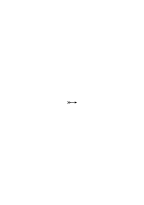,

nebensächlich, wesentlich aber das System worin das Regelzeichen verwendet wird. Das System von Gegensätzen – sozusagen – wovon das Zeichen sich unterscheidet, etc.. Das was ich hier die Beschreibung der Anwendung nenne enthält ja selbst ein „u.s.w.”, kann also nur eine Ergänzung oder ein Ersatz des Regelzeichens selbst sein.

### [139v\[2\]](https://cdn.wittgensteinnachlass.com/2000px/webp/Ms-113/139v.webp),[140r\[1\]](https://cdn.wittgensteinnachlass.com/2000px/webp/Ms-113/140r.webp),[140v\[1\]](https://cdn.wittgensteinnachlass.com/2000px/webp/Ms-113/140v.webp),[141r\[1\]](https://cdn.wittgensteinnachlass.com/2000px/webp/Ms-113/141r.webp)

Was ist nun der Gegensatz eines allgemeinen Satzes wie a + (b + (1 + 1)) = a + ((b + 1) + 1)? Welches ist das System von Sätzen innerhalb dessen diese Regel verneint wird? Oder auch: wie, in welcher Form, kann dieser Satz mit andern in Widerspruch geraten? Oder: welche Frage kann er beantworten, zwischen welchen Alternativen entscheiden? Nicht zwischen einer „(n) ∙ fn” & einer „(∃n) ∙ ~fn”, denn die Allgemeinheit ist dem Satz von der Regel R zugebracht. Sie kann ebensowenig in Fragen gestellt werden, wie das System der Kardinalzahlen. [Oder: Welche Frage beantwortet er? Nicht die, ob (n) ∙ fn oder (∃n)~fn der Fall ist, etc.] Die Allgemeinheit einer Regel kann eo ipso nicht in Frage gestellt werden. Denken wir uns nun den allgemeinen Satz als Reihe geschrieben <math class="stacked" display="inline"><msub><mi>p</mi><mn>11</mn></msub><mo>,</mo><msub><mi>p</mi><mn>12</mn></msub><mo>,</mo><msub><mi>p</mi><mn>13</mn></msub><mo>,</mo><mspace width="0.3em"/><mtext>…</mtext></math> <math class="stacked" display="inline"><msub><mi>p</mi><mn>21</mn></msub><mo>,</mo><msub><mi>p</mi><mn>22</mn></msub><mo>,</mo><msub><mi>p</mi><mn>23</mn></msub><mo>,</mo><mspace width="0.3em"/><mtext>…</mtext></math> <math class="stacked" display="inline"><msub><mi>p</mi><mn>31</mn></msub><mo>,</mo><msub><mi>p</mi><mn>32</mn></msub><mo>,</mo><msub><mi>p</mi><mn>33</mn></msub><mo>,</mo><mspace width="0.3em"/><mtext>…</mtext></math> – – — – — – –

& verneint. Wenn wir ihn als (x)f(x) auffassen, so ist er ein logisches Produkt & sein Gegenteil ist die logische Summe der Verneinungen von <math class="stacked" display="inline"><msub><mi>p</mi><mn>11</mn></msub><mo>,</mo><msub><mi>p</mi><mn>12</mn></msub></math>, etc.. Diese Disjunktion (nun) ist mit jedem beliebigen Produkt <math class="stacked" display="inline"><msub><mi>p</mi><mn>11</mn></msub><mspace width="0.3em"/><mtext>∙</mtext><msub><mi>p</mi><mn>21</mn></msub><mspace width="0.3em"/><mtext>∙</mtext><msub><mi>p</mi><mn>22</mn></msub><mspace width="0.3em"/><mtext>∙</mtext><msub><mi>p</mi><mn>12</mn></msub><mtext>…</mtext><msub><mi>p</mi><mtext>mn</mtext></msub></math> vereinbar. (Gewiß, wenn man den Satz mit einem logischen Produkt vergleicht, so wird er unendlich vielsagend & sein Gegenteil nichtssagend.) (Bedenke aber: das „u.s.w.” steht im Satz nach einem Beistrich nicht nach einem „und” („ ∙ ”). Das „u.s.w.” ist kein Zeichen ihrer _Unvollständigkeit_.) Ist denn die Regel R unendlich vielsagend? Wie ein ungeheuer langes logisches Produkt? Daß man die Zahlenreihe durch die Regel laufen läßt, ist eine gegebene Form; darüber wird nichts behauptet & kann nichts verneint werden. Das Durchleiten des Zahlenstromes ist ja nichts wovon ich sagen kann, ich könne es beweisen. Beweisen kann ich nur etwas über die Form, den Model, durch den ich den Zahlenstrom leite. Kann man nun nicht sagen, daß die allgemeine Zahlenregel a + (b + c) = (a + b) + c (A) eben die Allgemeinheit hat wie a + (1 + 1) = (a + 1) + 1 (indem diese für jede Kardinalzahl, jene für jedes Kardinalzahlentrippel gilt); & daß der rekursive Beweis von A die Regel A _rechtfertigt_? Daß wir also die Regel A geben dürfen, weil der Beweis zeigt, daß sie immer stimmt? Rechtfertigt <math class="stacked" display="inline"><munder><mrow><mn>1</mn></mrow><mo>_</mo></munder><mspace width="0.3em"/><mo>:</mo><mspace width="0.3em"/><mn>3</mn><mspace width="0.3em"/><mo>=</mo><mspace width="0.3em"/><mtext>0˙</mtext><mn>3</mn><munder><mrow><mn>1</mn></mrow><mo>_</mo></munder></math> die Regel

„<math class="stacked" display="inline"><mn>1</mn><mfrac linethickness="0"><mrow><mn>1</mn></mrow><mrow><mo>:</mo></mrow></mfrac><mn>3</mn><mspace width="0.3em"/><mo>=</mo><mspace width="0.3em"/><mtext>0˙</mtext><mtext>3,</mtext><mspace width="0.3em"/><mn>1</mn><mn>2</mn><mspace width="0.3em"/><mo>:</mo><mn>3</mn><mspace width="0.3em"/><mo>=</mo><mspace width="0.3em"/><mtext>0˙</mtext><mtext>33,</mtext><mspace width="0.3em"/><mn>1</mn><mn>3</mn><mspace width="0.3em"/><mo>:</mo><mn>3</mn><mspace width="0.3em"/><mo>=</mo><mspace width="0.3em"/><mtext>0˙</mtext><mtext>333,</mtext><mtext>u.</mtext><mtext>s.</mtext><mtext>w.</mtext><mtext>”</mtext><mtext>?</mtext><mspace width="0.3em"/><mtext>–</mtext><mspace width="0.3em"/><mtext>–</mtext><mspace width="0.3em"/><mtext>–</mtext><mtext>–</mtext><mspace width="0.3em"/><mtext>–</mtext><mspace width="0.3em"/><mtext>–</mtext><mtext>–</mtext><mspace width="0.3em"/><mtext>–</mtext><mspace width="0.3em"/><mtext>–</mtext><mi>P</mi></math> A ist eine vollkommen verständliche Regel; so wie die Ersetzungsregel P. Eine solche Regel kann ich aber darum nicht geben weil ich die einzelnen Fälle von A schon durch eine andere Regel berechnen kann, wie ich P nicht als Regel geben kann wenn ich eine Regel gegeben habe mit der ich <math class="stacked" display="inline"><mn>1</mn><mfrac linethickness="0"><mrow><mn>1</mn></mrow><mrow><mo>:</mo></mrow></mfrac><mn>3</mn><mspace width="0.3em"/><mo>=</mo><mspace width="0.3em"/><mtext>0˙</mtext><mn>3</mn></math>, etc. _berechnen_ kann. Wie wäre es, wenn man außer den Multiplikationsregeln noch „25 × 25 = 625” als Regel festsetzen wollte? (Ich sage nicht „25 × 25 = 624”!) – 25 × 25 = 625 hat nur Sinn, wenn die Art der Rechnung bekannt ist, die zu dieser Gleichung gehört, & hat nur Sinn in Bezug auf diese Rechnung. A hat nur Sinn mit Bezug auf die Art der Ausrechnung von A. Denn die erste Frage wäre hier eben: ist das eine Bestimmung, oder ein errechneter Satz? Denn ist 25 × 25 = 625 eine Festsetzung (Grundregel), dann bedeutet das Multiplikationszeichen etwas anders, als es z.B. in Wirklichkeit bedeutet. (D.h. wir haben es mit einer anderen Rechnungsart zu tun.) Und ist A eine Festsetzung dann definiert das die Addition anders, als wenn es ein errechneter Satz ist. Denn die Festsetzung ist ja dann eine Erklärung des Additionszeichens & die Rechenregeln, die A auszurechnen erlauben, eine andere Erklärung desselben Zeichens. Ich darf hier nicht vergessen daß α, β, γ nicht der Beweis von A ist sondern nur die Form des Beweises, oder des Bewiesenen, ist; α, β, γ definiert also A.

### [141r\[2\]](https://cdn.wittgensteinnachlass.com/2000px/webp/Ms-113/141r.webp),[141v\[1\]](https://cdn.wittgensteinnachlass.com/2000px/webp/Ms-113/141v.webp),[142r\[1\]](https://cdn.wittgensteinnachlass.com/2000px/webp/Ms-113/142r.webp)

Darum kann ich nur sagen „25 × 25 = 625 wird bewiesen”, wenn die Beweismethode fixiert ist, unabhängig von dem speziellen Beweis. Denn diese Methode bestimmt erst die Bedeutung von „ξ × η”, also, _was_ bewiesen wird. Insofern gehört also die Form

<math display="block">
  <msub>
    <munder>
      <mrow>
        <mi>a</mi>
      </mrow>
      <mo>_</mo>
    </munder>
    <munder>
      <mrow>
        <mi>a</mi>
      </mrow>
      <mo>_</mo>
    </munder>
  </msub>
  <mspace width="0.3em"/>
  <mo>:</mo>
  <mspace width="0.3em"/>
  <mi>b</mi>
  <mspace width="0.3em"/>
  <mo>=</mo>
  <mspace width="0.3em"/>
  <mi>c</mi>
</math>

zur Beweismethode, die den Sinn von <math class="stacked" display="inline"><mover><mrow><mi>c</mi></mrow><mtext>˙</mtext></mover></math> erklärt. Etwas anderes ist dann die Frage, ob ich richtig gerechnet habe. – Und so gehört α, β, γ zur Beweismethode die den Sinn des Satzes A erklärt. Die Arithmetik ist ohne eine Regel A vollständig, es fehlt ihr nichts. Der Satz A wird (nun) mit Entdeckung einer Periodizität, mit der Konstruktion eines _neuen_ Kalküls in die Arithmetik eingeführt. Die Frage nach der Richtigkeit dieses Satzes hätte vor dieser Entdeckung (oder Konstruktion) so wenig Sinn, wie die Frage nach der Richtigkeit von: „<math class="stacked" display="inline"><mn>1</mn><mfrac linethickness="0"><mrow><mn>1</mn></mrow><mrow><mo>:</mo></mrow></mfrac><mn>3</mn><mspace width="0.3em"/><mo>=</mo><mspace width="0.3em"/><mtext>0˙</mtext><mtext>3,</mtext><mspace width="0.3em"/><mn>1</mn><mn>2</mn><mspace width="0.3em"/><mo>:</mo><mn>3</mn><mspace width="0.3em"/><mo>=</mo><mspace width="0.3em"/><mtext>0˙</mtext><mn>33</mn></math>, … ad inf.”. Nun ist die Festsetzung P verschieden vom Satz „<math class="stacked" display="inline"><mn>1</mn><mspace width="0.3em"/><mo>:</mo><mspace width="0.3em"/><mn>3</mn><mspace width="0.3em"/><mo>=</mo><mspace width="0.3em"/><mtext>0˙</mtext><mover><mrow><mn>3</mn></mrow><mtext>˙</mtext></mover></math>” & in diesem Sinne ist „<math class="stacked" display="inline"><mi>a</mi><mspace width="0.3em"/><mo>+</mo><mspace width="0.3em"/><mo>(</mo><mi>b</mi><mspace width="0.3em"/><mo>+</mo><mover><mrow><mi>c</mi></mrow><mtext>˙</mtext></mover><mo>)</mo><mspace width="0.3em"/><mo>=</mo><mspace width="0.3em"/><mo>(</mo><mi>a</mi><mspace width="0.3em"/><mo>+</mo><mspace width="0.3em"/><mtext>b)</mtext><mspace width="0.3em"/><mo>+</mo><mover><mrow><mi>c</mi></mrow><mtext>˙</mtext></mover></math>” verschieden von einer Regel (Festsetzung) A. Die beiden gehören andern Kalkülen an. Der Beweis von A ist nur insofern ein Beweis, ich meine, man kann ihn nur insofern den Beweis einer Regel nennen – er hat nur insofern eine beweisende Beziehung zu A als allgemeiner Ersetzungsregel – als er die allgemeine Form der Beweise arithmetischer Sätze von der Form A ist.

### [142r\[2\]](https://cdn.wittgensteinnachlass.com/2000px/webp/Ms-113/142r.webp)

Die Periodizität ist nicht das Anzeichen (Symptom) dafür, daß es so weiter geht, aber der Ausdruck „so geht es immer weiter” ist nur eine Übersetzung in eine andere Ausdrucksweise der Periodizität des Zeichens. (Gäbe es außer dem periodischen Zeichen noch etwas wofür die Periodizität nur ein Symptom ist, so müßte dieses Etwas seinen spezifischen Ausdruck haben, der nichts anderes wäre, als der vollständige Ausdruck dieses Etwas.)

### [142r\[3\]](https://cdn.wittgensteinnachlass.com/2000px/webp/Ms-113/142r.webp)

Eigentlich hat ja schon Russell durch seine „Theory of descriptions” gezeigt, daß man sich nicht eine Kenntnis der Dinge von hinten herum erschleichen kann, & daß es nur _scheinen_ kann, als wüßten wie von den Dingen mehr, als sie uns auf geradem Weg geoffenbart haben. Aber er hat durch die Idee der „indirect knowledge” wieder alles verschleiert.

### [142r\[4\]](https://cdn.wittgensteinnachlass.com/2000px/webp/Ms-113/142r.webp),[143v\[1\]](https://cdn.wittgensteinnachlass.com/2000px/webp/Ms-113/143v.webp),[143v\[2\]](https://cdn.wittgensteinnachlass.com/2000px/webp/Ms-113/143v.webp)

Wie ein Satz verifiziert wird, das sagt er. Vergleiche die Allgemeinheit in der Arithmetik mit der Allgemeinheit von nicht arithmetischen Sätzen. Sie wird anders verifiziert & ist darum eine Andere.

Die Verifikation ist nicht ein bloßes Anzeichen der Wahrheit, sondern sie bestimmt den Sinn des Satzes. (Einstein: wie eine Größe gemessen wird, das ist sie.)

Wie es sich nun mit derjenigen Allgemeinheit in der Mathematik verhält, die nicht von „allen Kardinalzahlen” sondern z.B. von „allen reellen Zahlen” spricht, kann man nur erkennen, wenn man diese Sätze & ihre Beweise untersucht.

### [142v\[2\]](https://cdn.wittgensteinnachlass.com/2000px/webp/Ms-113/142v.webp)

Warum ich sage, daß wir einen Satz wie den Hauptsatz der Algebra nicht finden, sondern konstruieren? – Weil wir ihm beim Beweis einen neuen Sinn geben, den er früher gar nicht gehabt hat. Für diesen Sinn gab es vor dem sogenannten Beweis nur eine beiläufige Vorlage in der Wortsprache.

### [142v\[3\]](https://cdn.wittgensteinnachlass.com/2000px/webp/Ms-113/142v.webp)

Wenn durch Entdeckungen ein Kalkül der Mathematik geändert wird, können wir den alten Kalkül nicht behalten (aufheben)? (D.h., müssen wir ihn wegwerfen?) Das ist ein sehr interessanter Aspekt. Wir haben nach der Entdeckung des Nordpols nicht zwei Erden: eine mit, & eine ohne den Nordpol. Aber nach der Entdeckung des Gesetzes der Verteilung der Primzahlen, zwei Arten von Primzahlen.

### [142v\[4\]](https://cdn.wittgensteinnachlass.com/2000px/webp/Ms-113/142v.webp)

Denken wir Einer würde sagen, das Schachspiel mußte nur _entdeckt_ werden, es war immer da! Oder das _reine_ Schachspiel war immer da, nur das materielle von Materie verunreinigte, haben wir gemacht.

### [142v\[5\]](https://cdn.wittgensteinnachlass.com/2000px/webp/Ms-113/142v.webp),[143r\[1\]](https://cdn.wittgensteinnachlass.com/2000px/webp/Ms-113/143r.webp)

Messung des Raumes & des räumlichen Gegenstandes. Das Seltsame am leeren Raum & an der leeren Zeit. Die Zeit (& der Raum) ein ätherischer Stoff. Von Substantiven verleitet, glauben wir an eine Substanz. Ja, wenn wir der Sprache die Zügel überlassen & nicht dem Leben, dann entstehen die philosophischen Probleme. „Was ist die Zeit?” – schon in der Frage liegt der Irrtum: als wäre die Frage: woraus, aus welchem Stoff, ist die Zeit gemacht. Wie man etwa fragt, woraus ist dieses feine Kleid gemacht.

### [143r\[2\]](https://cdn.wittgensteinnachlass.com/2000px/webp/Ms-113/143r.webp)

„Ergibt die Operation, z.B., eine rationale Zahl” – wie kann das gefragt werden, wenn man keine Methode zur Entscheidung der Frage hat? denn die Operation _ergibt_ doch nur im festgesetzten Kalkül. Ich meine: „ergibt” ist doch wesentlich präsens. Es heißt doch nicht: „ergibt mit der Zeit! – sondern, ergibt nach der gegenwärtigen Regel.

### [143r\[3\]](https://cdn.wittgensteinnachlass.com/2000px/webp/Ms-113/143r.webp)

Die alles gleich machende Gewalt der Sprache, die sich am krassesten im Wörterbuch zeigt, & die es möglich macht, daß die _Zeit_ personifiziert werden konnte; was nicht weniger merkwürdig ist, als es wäre, wenn wir Gottheiten der logischen Konstanten hätten.

### [143r\[4\]](https://cdn.wittgensteinnachlass.com/2000px/webp/Ms-113/143r.webp),[143v\[1\]](https://cdn.wittgensteinnachlass.com/2000px/webp/Ms-113/143v.webp),[143v\[2\]](https://cdn.wittgensteinnachlass.com/2000px/webp/Ms-113/143v.webp),[143v\[3\]](https://cdn.wittgensteinnachlass.com/2000px/webp/Ms-113/143v.webp)

Die philosophische Klarheit wird auf das Wachstum der Mathematik den gleichen Einfluß haben, wie das Sonnenlicht auf das Wachsen der Kartoffeltriebe. (Im dunklen Keller wachsen sie meterlang.)

### [143v\[4\]](https://cdn.wittgensteinnachlass.com/2000px/webp/Ms-113/143v.webp),[144r\[1\]](https://cdn.wittgensteinnachlass.com/2000px/webp/Ms-113/144r.webp)

Denken wir uns jemand stellte sich dieses Problem: Es ist ein Spiel zu erfinden: das Spiel soll auf einem Schachbrett gespielt werden; jeder Spieler soll 8 Steine haben; von den weißen Steinen sollen zwei (die „Konsulen”) an den Enden der Anfangsposition stehen durch die Regeln irgendwie ausgezeichnet sein; sie sollen eine größere Bewegungsfreiheit haben als die andern; von den schwarzen Steinen soll einer (der „Feldherr”) ein ausgezeichneter sein; ein weißer Stein nimmt einen schwarzen (u.u.) indem er sich an dessen Stelle setzt; das ganze Spiel soll eine gewisse Analogie mit den Punischen Kriegen haben. Das sind die Bedingungen, denen das Spiel zu genügen hat. – Das ist gewiß eine Aufgabe, & eine Aufgabe ganz andrer Art als die, herauszufinden wie Weiß im Schachspiel unter gewissen Bedingungen gewinnen könne. – Denken wir uns nun aber die Frage: „Wie kann Weiß in unserm Kriegsspiel dessen Regeln wir noch nicht genau kennen in 20 Zügen gewinnen?” Dieses Problem wäre ganz analog den Problemen der Mathematik (nicht ihren Rechenaufgaben).

### [144r\[2\]](https://cdn.wittgensteinnachlass.com/2000px/webp/Ms-113/144r.webp)

„Er sagt das, & _meint_ es”: Vergleiche das einerseits mit: „er sagt das, & schreibt _es_ nieder”; anderseits mit: „er sagt das & unterschreibt _es_”.

### [144r\[3\]](https://cdn.wittgensteinnachlass.com/2000px/webp/Ms-113/144r.webp)

Der Glaube, daß mich das Feuer brennen wird, ist von der Natur der Furcht, daß es mich brennen wird.

### [144r\[4\]](https://cdn.wittgensteinnachlass.com/2000px/webp/Ms-113/144r.webp)

Wenn man mich in's Feuer zöge, so würde ich mich wehren & nicht gutwillig gehen; & ebenso würde ich schreien: „das Feuer wird mich brennen!” & ich würde nicht schreien: „vielleicht wird es ganz angenehm sein!”

### [144r\[5\]](https://cdn.wittgensteinnachlass.com/2000px/webp/Ms-113/144r.webp)

Ich kalkuliere _so_, weil ich nicht anders kalkulieren kann. (Ich glaube _das_, weil ich nichts andres glauben kann.)