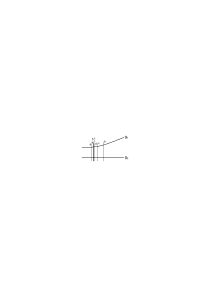
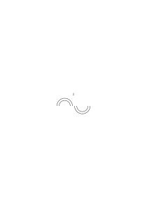
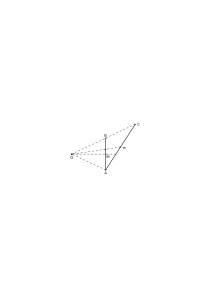
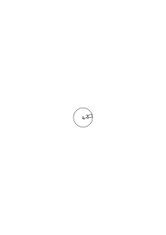

# Ms-114

### [IV\[1\]](https://cdn.wittgensteinnachlass.com/2000px/webp/Ms-114/IV.webp)

Im Falle meines Todes vor der Fertigstellung oder Veröffentlichung dieses Buches sollen meine Aufzeichnungen fragmentarisch veröffentlicht werden unter dem Titel:

_“Philosophische Bemerkungen”_

_und mit der Widmung:_

_“**Francis Skinner** zugeeignet”_

Er ist, wenn diese Bemerkung nach meinem Tode gelesen wird, von meiner Absicht in Kenntnis zu setzen, an die Adresse: Trinity College Cambridge.

### [1r\[1\]](https://cdn.wittgensteinnachlass.com/2000px/webp/Ms-114/1r.webp)

## X. Philosophische Grammatik.

### [1v\[1\]](https://cdn.wittgensteinnachlass.com/2000px/webp/Ms-114/1v.webp),[2r\[1\]](https://cdn.wittgensteinnachlass.com/2000px/webp/Ms-114/2r.webp),[2v\[1\]](https://cdn.wittgensteinnachlass.com/2000px/webp/Ms-114/2v.webp),[3r\[1\]](https://cdn.wittgensteinnachlass.com/2000px/webp/Ms-114/3r.webp),[3v\[1\]](https://cdn.wittgensteinnachlass.com/2000px/webp/Ms-114/3v.webp),[4r\[1\]](https://cdn.wittgensteinnachlass.com/2000px/webp/Ms-114/4r.webp)

27.05.1932

Ich kann die Regel R a + (1 + 1)a + (ξ + 1)a + ((ξ + 1) + 1) | = | (a + 1) + 1(a + ξ) + 1 ((a + ξ) + 1) + 1

auch _so_ schreiben:

a + (1 + 1)a + (ξ + 1)a + ((ξ + 1) + 1) | = | (a + 1) + 1(a + ξ) + 1 – – – S (a + (ξ + 1)) + 1

oder auch _so_:

a + (b + 1) = (a + b) + 1, wenn ich R oder S als Erklärung oder Ersatz für diese Form nehme. Wenn ich nun sage, in

αβγ | | a + (b + 1)a + (b + (c + 1))(a + b) + (c + 1) | = = = | (a + b) + 1a + ((b + c) + 1) = (a + (b + c)) + 1 – – – B ((a + b) + c) + 1 seien die Übergänge durch die Regel R gerechtfertigt, – so kann man mir drauf antworten: „Wenn Du das eine Rechtfertigung nennst, so hast Du die Übergänge gerechtfertigt. Du hättest uns aber ebensoviel gesagt, wenn Du uns nur auf die Regel R & ihre formale Beziehung zu α (oder zu α, β & γ) aufmerksam gemacht hättest.” Ich hätte also auch sagen können: Ich nehme die Regel R in der & der Weise als Paradigma meiner Übergänge. Wenn nun Skolem etwa nach seinem Beweis für das assoziative Gesetz übergeht zu:

a + 1a + (b + 1)(b + 1) + a | = = = | 1 + a(a + b) + 1) – – – C b + (1 + a) = b + (a + 1) = (b + a) + 1

& sagt der erste & dritte Übergang in der dritten Zeile seien nach dem bewiesenen assoziativen Gesetz gerechtfertigt, – so sagt er uns damit nicht mehr als wenn er sagte, die Übergänge seien nach dem Paradigma a + (b + c) = (a + b) + c gemacht (d.h. sie entsprechen dem Paradigma) & es sei ein Schema α, β, γ mit Übergängen nach dem Paradigma α abgeleitet. – „Aber rechtfertigt B nun diese Übergänge oder nicht?” – Was meinst Du mit dem Wort „rechtfertigen”? – „Nun, der Übergang ist gerechtfertigt, wenn wirklich ein Satz, der für alle Zahlen gilt, bewiesen ist.” – Aber in welchem Falle wäre das geschehen? Was nennst Du einen Beweis davon, daß ein Satz für alle Zahlen gültig ist? Wie weißt Du ob der Satz (wirklich) für alle Kardinalzahlen giltig ist, da Du es nicht ausprobieren kannst. Dein _einziges_ Kriterium ist ja der Beweis. Du _bestimmst_ also wohl eine Form & nennst sie die, des Beweises, daß ein Satz für alle Kardinalzahlen gilt. Dann haben wir eigentlich gar nichts davon, daß uns zuerst die allgemeine Form dieser Beweise gezeigt wird; da ja dadurch nicht gezeigt wird, daß nun der besondere Beweis wirklich das leistet, was wir von ihm verlangen; ich meine: da hiedurch der besondere Beweis nicht als einer gerechtfertigt, erwiesen ist, der einen Satz für alle Kardinalzahlen beweist. Der rekursive Beweis muß vielmehr seine eigene Rechtfertigung sein. Wenn wir unsern Beweisvorgang wirklich als den Beweis einer solchen Allgemeinheit rechtfertigen wollen tun wir vielmehr etwas anderes: wir gehen Beispiele einer Reihe durch & diese Beispiele & das Gesetz was wir in ihnen erkennen befriedigt uns nun & wir sagen: ja, unser Beweis leistet wirklich was wir wollten. Aber wir müssen nun bedenken, daß wir mit der Angabe dieser Beispielreihe die Schreibweise B & C nur in eine andere (Schreibweise) übersetzt haben. (Denn die Beispielreihe ist nicht die unvollständige Anwendung der allgemeinen Form, sondern ein anderer Ausdruck dieser Form.) Und weil die Wortsprache wenn sie den Beweis erklärt, erklärt was er beweist, den Beweis nur in eine andere Ausdrucksform übersetzt, so können wir diese Erklärung auch ganz weglassen. Und wenn wir das tun so werden die mathematischen Verhältnisse viel klarer, nicht verwischt durch die mehrdeutigen Ausdrücke der Wortsprache. Wenn ich z.B. B unmittelbar neben A setze, ohne Dazwischenkunft des Wortes „alle”, so kann kein falscher Schein eines Beweises von A durch B entstehen. Wir sehen dann ganz nüchtern wie weit die Beziehungen von B zu A & zu a + b = b + a reichen & wo sie aufhören. Man lernt so erst, unbeirrt von der alles gleichmachenden Form der Wortsprache die eigentliche Struktur dieser Beziehung kennen & was es mit ihr auf sich hat. Man sieht hier vor allem, daß wir in dem Baum der Strukturen B, C, etc. interessiert sind, & daß an ihm zwar allenthalben die Form

φ 1 = ψ 1

φ (n + 1) = F (φ n)

ψ (n + 1) = F (φ n)

zu sehen ist, gleichsam eine bestimmte Astgabelung, daß aber diese Gebilde in verschiedenen Anordnungen & Verbindungen untereinander auftreten& daß sie nicht in dem Sinne Konstruktionselemente bilden, wie die Paradigmen im Beweis, von a + (b + (c + 1)) = (a + (b + c)) + 1 oder (a + b)² = a² + 2ab + b². Der Zweck der „rekursiven Beweise” ist ja, den algebraischen Kalkül mit dem der Zahlen in Verbindung zu setzen. Und der Baum der rekursiven Beweise „rechtfertigt” den algebraischen Kalkül nur, wenn das heißen soll, daß er ihn mit dem arithmetischen in Verbindung bringt. Nicht aber in dem Sinn in welchem die Liste der Paradigmen den algebraischen Kalkül, d.h. die Übergänge in ihm, rechtfertigt. Wenn man also die Paradigmen der Übergänge tabuliert so hat das dort Sinn wo das Interesse darin liegt zu zeigen daß die & die Transformationen alle bloß mit Hilfe jener – im übrigen willkürlich gewählten – Übergangsformen zu Stande gebracht sind. Nicht aber dort, wo sich die Rechnung in einem andern Sinne rechtfertigen soll wo also das Anschauen der Rechnung – ganz abgesehen von dem Vergleich mit einer Tabelle vorher festgelegter Normen – uns lehren muß ob wir sie zulassen sollen oder nicht. Skolem hätte uns also keinen Beweis des assoziativen & kommutativen Gesetzes versprechen brauchen sondern einfach sagen können, er werde uns einen Zusammenhang der Paradigmen der Algebra mit den Rechnungsregeln der Arithmetik zeigen. Aber ist das nicht Wortklauberei? hat er denn nicht die Zahl der Paradigmen reduziert & uns z.B. statt jener beiden Gesetze eines, nämlich a + (b + 1) = (a + b) + 1 gegeben? Nein. Wenn wir z.B. (a + b)⁴ = etc. (k beweisen so könnten wir dabei von dem vorher bewiesenen Satz (a + b)² = etc. (𝓁 Gebrauch machen. Aber in diesem Fall lassen sich die Übergänge in k die durch 𝓁 gerechtfertigt wurden auch durch jene Regeln rechtfertigen mit denen 𝓁 bewiesen wurde. Und es verhält sich dann 𝓁 zu jenen ersten Regeln wie ein durch Definition eingeführtes Zeichen zu den primären Zeichen mit deren Hilfe es definiert wurde. Man kann die Definition immer auch eliminieren & auf die primären Zeichen übergehen. Wenn wir aber in C einen Übergang machen der durch B gerechtfertigt ist so können wir diesen Übergang nun nicht auch mit a + (b + 1) = (a + b) + 1 allein machen. Wir haben eben mit dem was hier Beweis genannt wird nicht einen Schritt in Stufen zerlegt, sondern etwas ganz andres getan.

### [4r\[2\]](https://cdn.wittgensteinnachlass.com/2000px/webp/Ms-114/4r.webp),[4v\[1\]](https://cdn.wittgensteinnachlass.com/2000px/webp/Ms-114/4v.webp)

Wenn gefragt würde: ist die Negation in der Mathematik etwa in ~(2 + 2 = 5) die gleiche wie die nicht-mathematischer Sätze? so müßte erst bestimmt werden was als Charakteristikum der Verneinung als solcher aufzufassen ist. Die Bedeutung eines Zeichens liegt ja in den Regeln nach denen es verwendet wird. Welche dieser Regeln machen das Zeichen „~” zur Verneinung? Denn es ist klar daß gewisse Regeln die sich auf „~” beziehen für beide Fälle die gleiche sind; z.B. ~~p = p. Man könnte ja auch fragen: ist die Verneinung eines Satzes „ich sehe einen roten Fleck” die gleiche wie die von „die Erde bewegt sich in einer Ellipse um die Sonne”; & die Antwort müßte auch sein: Wie hast Du „Verneinung” definiert, durch welche Klasse von Regeln? – daraus wird sich ergeben ob wir in beiden Fällen „die gleiche Verneinung” haben. Wenn die Logik allgemein von der Verneinung redet, oder einen Kalkül mit ihr treibt, so ist die Bedeutung des Verneinungszeichens nicht weiter festgelegt, als die Regeln seines Kalküls. Wir dürfen hier nicht vergessen daß ein Wort seine Bedeutung nicht als etwas ihm ein für allemal Verliehenes mit sich herumträgt sodaß wir sicher sind wenn wir nach dieser Flasche greifen auch die bestimmte Flüssigkeit vielleicht Schwefelsäure zu erwischen.

### [4v\[2\]](https://cdn.wittgensteinnachlass.com/2000px/webp/Ms-114/4v.webp),[5r\[1\]](https://cdn.wittgensteinnachlass.com/2000px/webp/Ms-114/5r.webp),[5v\[1\]](https://cdn.wittgensteinnachlass.com/2000px/webp/Ms-114/5v.webp),[6r\[1\]](https://cdn.wittgensteinnachlass.com/2000px/webp/Ms-114/6r.webp)

Irrtümliche Anwendung unserer physikalischen Ausdrucksweise auf Sinnesdaten. „Gegenstände” d.h. Dinge, Körper im Raum des Zimmers & „Gegenstände” im Gesichtsfeld, der Schatten eines Körpers an der Wand als Gegenstand! Wenn man gefragt wird: „existiert der Kasten noch, wenn ich ihn nicht anschaue”, so ist die korrekte Antwort: „ich glaube nicht, daß ihn jemand gerade dann wegtragen wird oder zerstören.” Die Sprachform „ich nehme x wahr” bezieht sich ursprünglich auf ein Phänomen (als Argument), im physikalischen Raum (ich meine hier: im „Raum” der alltäglichen Ausdrucksweise). Ich kann diese Form daher nicht unbedenklich auf das anwenden, was man Sinnesdatum nennt etwa auf ein optisches Nachbild. (Vergleiche auch, was wir über die Identifizierung von Körpern & anderseits von Farbflecken im Gesichtsfeld gesagt haben.) Was es heißt: ich, das Subjekt, stehe dem Tisch, als Objekt, gegenüber, kann ich leicht verstehen; in welchem Sinne aber stehe ich meinem optischen Nachbild des Tisches gegenüber? „Ich kann diese Glasscheibe nicht sehen aber ich kann sie fühlen”. Kann man sagen: „ich kann das Nachbild nicht _sehen_, aber …”?

Vergleiche: „Ich sehe den Tisch deutlich”;

„Ich sehe das Nachbild deutlich”;

„Ich höre die Musik deutlich”;

„ich höre das Ohrensausen deutlich”.

Ich sehe den Tisch nicht deutlich heißt etwa: ich sehe nicht alle Einzelheiten des Tisches; – was aber heißt es: „ich sehe nicht alle Einzelheiten des Nachbildes”, oder: „ich höre nicht alle Einzelheiten des Ohrenklingens”?

Könnte man nicht sehr wohl statt „ein Nachbild sehen” sagen: „ein Nachbild haben”? Denn: ein Nachbild „_sehen_”? im Gegensatz wozu? –

„Wenn Du mich auf den Kopf schlägst, sehe ich Kreise”. – „Sind es genaue Kreise, hast Du sie gemessen?” (Oder: „sind es gewiß Kreise, oder täuscht Dich Dein Augenmaß?”) – Was heißt es nun, wenn man sagt: „wir können nie einen genauen Kreis sehen”? Soll das eine Erfahrungstatsache sein, oder die Konstatierung einer logischen Unmöglichkeit? – Wenn das letztere, so heißt es also, daß es keinen Sinn hat vom Sehen eines genauen Kreises zu reden. Nun, das kommt drauf an, wie man das Wort gebrauchen will. „Genauer Kreis” im Gegensatz zu einem Gesichtsbild das wir eine sehr kreisähnliche Ellipse nennen würden kann man doch gewiß sagen. Das Gesichtsbild ist ein genauer Kreis welches uns wirklich wie wir sagen würden kreisförmig erscheint & nicht vielleicht nur sehr ähnlich einem Kreis. Ist anderseits von einem Gegenstand der Messung die Rede, so gibt es wieder verschiedene Bedeutungen des Ausdrucks „genauer Kreis” je nach dem Erfahrungs-Kriterium welches ich dafür bestimme daß der Gegenstand genau kreisförmig ist. Wenn ich nun sage: „keine Messung ist absolut genau”, so erinnern wir hier an einen Zug in der Grammatik der Angabe von Messungsresultaten. Denn sonst könnte uns Einer sehr wohl antworten: „Wie weißt Du das, hast Du alle Messungen untersucht?” – „Man kann nie einen genauen Kreis sehen” kann die _Hypothese_ sein daß genauere Messung eines kreisförmig aussehenden Gegenstandes immer zu dem Resultat führen wird, daß der Gegenstand von der Kreisform abweicht. – Der Satz „Man kann ein 100-Eck nicht von einem Kreis unterscheiden” hat nur Sinn, wenn man die beiden auf irgend _eine_ Weise unterscheiden kann, & sagen will man könne sie etwa visuell nicht unterscheiden. Wäre keine Methode der Unterscheidung vorgesehen, so hätte es also keinen Sinn zu sagen, daß diese zwei Figuren (zwar) gleich aussehen aber „in Wirklichkeit” verschieden sind. Und jener Satz wäre dann etwa die Definition

_100-Eck = Kreis._

Ist in irgend einem Sinne ein genauer Kreis im Gesichtsfeld undenkbar, dann muß der Satz „ich sehe nie einen genauen Kreis im Gesichtsfeld” von der Art des Satzes sein: „ich sehe nie ein hohes C im Gesichtsfeld”.

### [6r\[2\]](https://cdn.wittgensteinnachlass.com/2000px/webp/Ms-114/6r.webp),[6v\[1\]](https://cdn.wittgensteinnachlass.com/2000px/webp/Ms-114/6v.webp)

Verschwommen, unklar, unscharf. „Die Linien dieser Zeichnung sind unscharf”, „meine Erinnerung an die Zeichnung ist unklar verschwommen”, „die Gegenstände am Rande meines Gesichtsfeldes sehe ich verschwommen”. – Wenn man von der Verschwommenheit der Bilder am Rande des Gesichtsfeldes spricht so schwebt einem oft ein Bild dieses Gesichtsfeldes vor wie es etwa Mach entworfen hat. Die Verschwommenheit aber die die Ränder eines Bildes auf der Papierfläche haben können ist von gänzlich andrer Natur, als die die man von den Rändern des Gesichtsfeldes aussagt. So verschieden wie die Blässe der Erinnerung an eine Zeichnung von der Blässe einer Zeichnung selbst. Wenn im Film eine Erinnerung oder ein Traum dargestellt werden sollte, so gab man den Bildern einen bläulichen Ton. Aber die Traum- & Erinnerungsbilder haben natürlich keinen bläulichen Ton – sowenig wie unser Gesichtsbild verwaschene Ränder hat; also sind die bläulichen Projektionen auf der Leinwand nicht unmittelbar anschauliche Bilder der Träume, sondern Bilder in noch einem andern Sinn. – Bemerken wir im gewöhnlichen Leben, wo wir doch unablässig schauen, die Verschwommenheit an den Rändern des Gesichtsfeldes? Ja, welcher Erfahrung entspricht sie eigentlich, denn im normalen Sehen kommt sie nicht vor! Nun, wenn wir den Kopf nicht drehen & wir beobachten etwas, was wir durch Drehen der Augen gerade noch sehen können, dann sehen wir etwa einen Menschen, können aber sein Gesicht nicht erkennen, sondern sehen es in gewisser Weise verschwommen. Die Erfahrung hat nicht die geringste Ähnlichkeit mit dem Sehen einer Scheibe auf der Bilder gemalt sind in der Mitte der Scheibe mit scharfen Umrissen & nach dem Rand zu mehr & mehr verschwimmend etwa in ein allgemeines Grau unmerklich übergehend. Wir denken an so eine Scheibe, wenn wir z.B. fragen: könnte man sich nicht ein Gesichtsfeld mit gleich bleibender Klarheit der Umrisse etc. denken? Es gibt keine Erfahrung die im Gesichtsfeld der entspräche, wenn man den Blick einem Bild entlanggleiten läßt das von scharfen Figuren zu immer verschwommeneren übergeht.

### [7r\[1\]](https://cdn.wittgensteinnachlass.com/2000px/webp/Ms-114/7r.webp)

Die visuelle Gerade berührt den visuellen Kreis nicht in einem Punkt sondern in einer visuellen Strecke. – Wenn ich die Zeichnung eines Kreises & einer Tangente ansehe, so ist nicht das merkwürdig wenn ich etwa niemals einen vollkommenen Kreis & eine vollkommene Gerade mit einander in Berührung sehe; interessant ist es erst, wenn ich sie sehe, & dann die Tangente mit dem Kreis ein Stück zusammenläuft.

### [7r\[2\]](https://cdn.wittgensteinnachlass.com/2000px/webp/Ms-114/7r.webp),[7v\[1\]](https://cdn.wittgensteinnachlass.com/2000px/webp/Ms-114/7v.webp),[8r\[1\]](https://cdn.wittgensteinnachlass.com/2000px/webp/Ms-114/8r.webp),[8v\[1\]](https://cdn.wittgensteinnachlass.com/2000px/webp/Ms-114/8v.webp),[9r\[1\]](https://cdn.wittgensteinnachlass.com/2000px/webp/Ms-114/9r.webp)

30.05.1932

Denken wir uns folgendes psychologisches Experiment: Wir zeigen dem Subjekt zwei Linien g1, g2 durch welche quer die Gerade a gezogen ist.

Das Stück dieser Geraden welches zwischen g1 & g2 liegt werde ich die Strecke a nennen. Wir ziehen nun in beliebiger Entfernung von a & parallel dazu b & fragen ob er die Strecke b größer sieht als a oder die beiden Längen nicht mehr unterscheidet. Er antwortet, b erscheine größer als a. Darauf nähern wir uns a, indem wir die Distanz von a zu b mit unsern Meßinstrumenten halbieren & ziehen c. „Siehst Du c größer als a?” – „Ja”. Wir halbieren die Distanz c–a & ziehen d. „Siehst Du d größer als a?” – „Ja”. Wir halbieren a–d. „Siehst Du e größer als a?” – „Nein”. Wir halbieren daher e–d. „Siehst Du f größer als e?” – „Ja”. Wir halbieren also e–f & ziehen h. Wir könnten uns so auch von der linken Seite der Strecke a nähern, & dann sagen daß einer gesehenen Länge a im Euklidischen Raum nicht eine Länge sondern ein Intervall von Längen entspricht, und in ähnlicher Weise einer gesehenen Lage eines Strichs (etwa des Zeigens eines Instruments) ein Intervall von Lagen im Euklidischen Raum; aber dieses Intervall hat nicht scharfe Grenzen. Das heißt: es ist nicht von Punkten begrenzt sondern von konvergierenden Intervallen die nicht gegen einen Punkt konvergieren. (Wie die Reihe der Dualbrüche die wir durch Werfen von Kopf & Adler erzeugen). Das Charakteristische zweier Intervalle, die so nicht durch Punkte sondern _unscharf_ begrenzt sind, ist, daß auf die Frage, ob sie einander übergreifen oder getrennt von einander liegen in gewissen Fällen die Antwort lautet: „unentschieden”. Und daß die Frage ob sie einander berühren, einen Endpunkt mit einander gemein haben, immer sinnlos ist, da sie ja keine Endpunkte haben. Man könnte aber sagen: sie haben _vorläufige_ Endpunkte. In dem Sinne in welchem die Entwicklung von π ein vorläufiges Ende hat. An dieser Eigenschaft des ‚unscharfen’ Intervalls ist natürlich nichts Geheimnisvolles sondern das etwas Paradoxe klärt sich durch die doppelte Verwendung des Wortes Intervall auf. Es ist dies der gleiche Fall wie der der doppelten Verwendung des Wortes Schach, wenn es einmal die Gesamtheit der jetzt geltenden Schachregeln bedeutet, ein andermal: das Spiel welches N.N. in Persien erfunden hat & welches sich so & so entwickelt hat. In einem Fall ist es unsinnig von einer Änderung der Schachregeln zu reden, im andern Fall nicht. Wir können „Länge einer gemessenen Strecke” entweder das nennen, was bei einer bestimmten Messung die ich heute um 5 Uhr durchführe herauskommt – dann gibt es für diese Längenangabe kein „ ± etc.” –, oder etwas dem sich Messungen nähern etc.; in den zwei Fällen wird das Wort „Länge” mit ganz verschiedener Grammatik gebraucht. Und ebenso das Wort „Intervall” wenn ich einmal etwas Fertiges, einmal etwas sich Entwickelndes ein Intervall nenne.

I Die Intervalle liegen getrennt

II sie liegen getrennt & berühren sich vorläufig

III unentschieden

IV unentschieden

V unentschieden

VI sie übergreifen

VII sie übergreifen

Wir können uns aber nicht wundern, daß nun ein Intervall so seltsame Eigenschaften haben soll; daß wir eben das Wort Intervall jetzt in einem nicht gewöhnlichen Sinn gebrauchen. Und wir können nicht sagen wir haben neue Eigenschaften gewisser Intervalle entdeckt. So wenig wie wir neue Eigenschaften des Schachkönigs entdecken würden, wenn wir die Regeln des Spiels änderten aber die Bezeichnung „Schach” & „König” beibehielten. (Vergl. dagegen Brouwer über das Gesetz des ausgeschlossenen Dritten.) Jener Versuch ergibt also wesentlich, was wir ein „unscharfes” Intervall genannt haben, dagegen wären natürlich andere Experimente möglich die statt dessen ein scharfes Intervall ergeben. Denken wir etwa, wir bewegten ein Lineal von der Anfangsstellung b, & parallel zu dieser, gegen a hin, bis in unserm Subjekt irgend eine bestimmte Reaktion einträte; dann könnten wir den Punkt an dem die Reaktion beginnt die Grenze unseres Streifens nennen. – So könnten wir natürlich auch ein Wägungsresultat „das Gewicht eines Körpers” nennen & es gäbe dann in diesem Sinn eine absolut genaue Wägung d.i. eine deren Resultat nicht die Form „G ± g” hat. Wir haben damit unsere Ausdrucksweise geändert, & müssen nun sagen daß das Gewicht des Körpers schwankt & zwar nach einem uns unbekannten Gesetz. (Die Unterscheidung zwischen „absolut genauer” Wägung & „wesentlich ungenauer” Wägung ist ein grammatischer & bezieht sich auf zwei verschiedene Bedeutungen des Ausdrucks „Ergebnis der Wägung”.)

### [9r\[2\]](https://cdn.wittgensteinnachlass.com/2000px/webp/Ms-114/9r.webp)

Die Unbestimmtheit des Wortes „Haufen”. Ich könnte definieren: ein Körper von gewisser Form & Konsistenz etc. sei ein Haufe wenn sein Volumen K m ³ beträgt, oder mehr, was darunter liegt will ich ein Häufchen nennen. Dann gibt es kein größtes Häufchen; das heißt: dann ist es sinnlos von dem „größten Häufchen” zu reden. Umgekehrt könnte ich bestimmen: Haufe solle alles das sein, was größer als K m ³ ist & dann hätte der Ausdruck „der kleinste Haufe” keine Bedeutung. Ist aber diese Unterscheidung nicht müßig? Gewiß, – wenn wir unter dem Volumen ein Messungsresultat im gewöhnlichen Sinne verstehen; denn dieses Resultat hat die Form „V ± v”. Sonst aber könnte die Unterscheidung so brauchbar sein wie die zwischen einem Schock Äpfel & 61 Äpfeln.

### [9r\[3\]](https://cdn.wittgensteinnachlass.com/2000px/webp/Ms-114/9r.webp),[9v\[1\]](https://cdn.wittgensteinnachlass.com/2000px/webp/Ms-114/9v.webp)

Die Verschwommenheit, Unbestimmtheit unserer Sinneseindrücke ist nicht etwas dem sich abhelfen läßt, eine Verschwommenheit, der auch völlige Schärfe entspricht (oder entgegensteht). Vielmehr ist diese allgemeine Unbestimmtheit, Ungreifbarkeit, dieses Schwimmen der Sinneseindrücke, das, was mit dem Worte „alles fließt” bezeichnet worden ist. Wir sagen „man sieht nie einen genauen Kreis”, & wollen sagen, daß, auch wenn wir keine Abweichung von der Kreisform sehen, uns das keinen genauen Kreis gibt. (Es ist als wollten wir sagen: wir können dieses Werkzeug nie genau führen denn wir halten nur den Griff & das Werkzeug sitzt im Griff lose.) Was aber verstehen wir dann unter dem _Begriff_ ‚genauer Kreis’? Wie sind wir zu diesem Begriff überhaupt gekommen? Nun, wir denken z.B. an eine genau gemessene Kreisscheibe aus einem sehr harten Stahl. Aha – also dorthin zielen wir mit dem Begriff ‚genauer Kreis’. Freilich, davon finden wir im Gesichtsbild nichts. Wir haben eben die Darstellungsform gewählt, die die Stahlscheibe genauer nennt als die Holzscheibe & die Holzscheibe genauer als die Papierscheibe. Wir haben den Begriff „genau” durch eine Reihe bestimmt, & reden von den Sinneseindrücken als Bildern, ungenauen Bildern, der physikalischen Gegenstände.

### [9v\[2\]](https://cdn.wittgensteinnachlass.com/2000px/webp/Ms-114/9v.webp),[10r\[1\]](https://cdn.wittgensteinnachlass.com/2000px/webp/Ms-114/10r.webp)

Die Galtonsche Photographie, das Bild einer Wahrscheinlichkeit. Das Gesetz der Wahrscheinlichkeit, das Naturgesetz, was man sieht wenn man blinzelt.

### [10r\[2\]](https://cdn.wittgensteinnachlass.com/2000px/webp/Ms-114/10r.webp)

In den Theorien & Streitigkeiten der Philosophie finden wir die Worte deren Bedeutungen uns vom alltäglichen Leben her wohlbekannt sind in einem ultraphysischen Sinne angewandt.

### [10r\[3\]](https://cdn.wittgensteinnachlass.com/2000px/webp/Ms-114/10r.webp)

<math display="inline"><mn>2</mn><mspace width="0.3em"/><mo>+</mo><mspace width="0.3em"/><mn>3</mn><mspace width="0.3em"/><mo>+</mo><mspace width="0.3em"/><mn>4</mn><mn>5</mn><mn>9</mn><mspace width="0.3em"/><mo>|</mo><mspace width="0.3em"/><mo>|</mo><mn>2</mn><mspace width="0.3em"/><mo>+</mo><mn>4</mn><mspace width="0.3em"/><mo>+</mo><mn>3</mn><mn>6</mn><mn>9</mn><mspace width="0.3em"/><mo>|</mo><mspace width="0.3em"/><mo>|</mo><mn>4</mn><mspace width="0.3em"/><mo>+</mo><mspace width="0.3em"/><mn>3</mn><mspace width="0.3em"/><mo>+</mo><mspace width="0.3em"/><mn>2</mn><mn>7</mn><mn>9</mn></math> „Siehst Du, es kommt tatsächlich immer dasselbe heraus”, möchte man sagen. So aufgefaßt, war die Rechnung ein Experiment. Wir haben die Regeln des Eins-&-Eins angewendet & denen sieht man es nicht unmittelbar an, daß sie in den drei Fällen zum gleichen Resultat führen. Man wundert sich gleichsam, daß die Ziffern, losgelöst von ihren Definitionen so richtig funktionieren. Oder vielmehr: daß die Ziffernregeln so richtig arbeiten, wenn sie nicht von den Definitionen kontrolliert werden. – Denken wir an den Schritt, der zu machen ist von der gelernten Regel des Eins-&-Eins zu der Anwendung der Regel in dem speziellen Fall. –

### [10r\[4\]](https://cdn.wittgensteinnachlass.com/2000px/webp/Ms-114/10r.webp)

Könnten die Berechnungen eines Ingenieurs ergeben, daß die Stärke eines Maschinenteils bei gleichmäßig wachsender Belastung in der Reihe der Primzahlen fortschreiten müsse?

### [10r\[5\]](https://cdn.wittgensteinnachlass.com/2000px/webp/Ms-114/10r.webp),[10v\[1\]](https://cdn.wittgensteinnachlass.com/2000px/webp/Ms-114/10v.webp),[11r\[1\]](https://cdn.wittgensteinnachlass.com/2000px/webp/Ms-114/11r.webp)

<math class="stacked" display="inline"><munder><mrow><mn>1</mn></mrow><mo>_</mo></munder><mspace width="0.3em"/><mo>:</mo><mspace width="0.3em"/><mn>3</mn><mspace width="0.3em"/><mo>=</mo><mspace width="0.3em"/><mtext>0,</mtext><mn>3</mn><munder><mrow><mn>1</mn></mrow><mo>_</mo></munder></math> entscheidet durch ihre Periodizität nichts, was früher offen gelassen war. Wenn vor der Entdeckung der Periodizität Einer vergebens nach einer 4 in der Entwicklung von 1 : 3 gesucht hätte, so hätte er doch die Frage „gibt es eine 4 in der Entwicklung von 1 : 3” nicht sinnvoll stellen können; d.h., _abgesehen davon_ daß er tatsächlich zu keiner 4 gekommen war, können wir ihn davon überzeugen, daß er keine Methode besitzt seine Frage zu entscheiden. Oder wir könnten auch sagen: abgesehen von dem Resultat seiner Tätigkeit könnten wir ihn über die Grammatik seiner Frage & die Natur seines Suchens aufklären (wie einen heutigen Mathematiker über analoge Probleme.) „Aber als Folge der Entdeckung der Periodizität hört er nun doch gewiß auf nach einer 4 zu suchen! Sie überzeugt ihn also, daß er nie eine finden wird.” – Nein. Die Entdeckung der Periodizität bringt ihn vom Suchen ab, _wenn_ er sich nun neu einstellt. Man könnte ihn fragen: „Wie ist es nun, willst Du noch immer nach einer 4 suchen?” (Oder hat Dich, sozusagen, die Periodizität auf andere Gedanken gebracht.) Und die Entdeckung der Periodizität ist in Wirklichkeit die Konstruktion eines neuen Zeichens & Kalküls. Denn es ist irreführend ausgedrückt wenn wir sagen sie bestehe darin daß es uns _aufgefallen_ sei, daß der erste Rest gleich dem Dividenden ist. Denn hätte man Einen, der die periodische Division nicht kannte gefragt ist in dieser Division der erste Rest gleich dem Dividenden, so hätte er natürlich „ja” gesagt; es wäre ihm also aufgefallen. Aber damit hätte ihm nicht die Periodizität auffallen brauchen: d.h.: er hätte damit nicht den Kalkül mit den Zeichen <math class="stacked" display="inline"><msub><mi>a</mi><mi>a</mi></msub><mspace width="0.3em"/><mo>:</mo><mspace width="0.3em"/><mi>b</mi><mspace width="0.3em"/><mo>=</mo><mspace width="0.3em"/><mi>c</mi></math> gefunden.

Ist nicht, was ich hier sage das, was Kant damit meinte, daß 5 + 7 = 12 nicht analytisch sondern synthetisch a priori sei?

### [11r\[2\]](https://cdn.wittgensteinnachlass.com/2000px/webp/Ms-114/11r.webp)

Der Satz, daß eine Klasse einer ihrer Subklassen nicht ähnlich ist, ist für endliche Klassen nicht wahr, sondern eine Tautologie. Die grammatischen Regeln über die Allgemeinheit der generellen Implikation in dem Satz „k ist eine Subklasse von K” enthalten das was der Satz, K sei eine unendliche Klasse, sagt.

### [11r\[3\]](https://cdn.wittgensteinnachlass.com/2000px/webp/Ms-114/11r.webp),[11v\[1\]](https://cdn.wittgensteinnachlass.com/2000px/webp/Ms-114/11v.webp),[12r\[1\]](https://cdn.wittgensteinnachlass.com/2000px/webp/Ms-114/12r.webp)

Unzulänglichkeit der Frege- & Russellschen Allgemeinheitsbezeichnung. Es hat Sinn zu sagen „schreib eine beliebige Kardinalzahl hin”, ist aber Unsinn zu sagen: „schreib alle Kardinalzahlen hin”. „In dem Viereck befindet sich ein Kreis” ((∃x) ∙ φx) hat Sinn, aber nicht ~ (∃x) ~φx: „in dem Viereck befinden sich alle Kreise”.

„Auf einem andersfarbigen Hintergrund befindet sich ein roter Kreis” hat Sinn, aber nicht „es gibt keine von rot verschiedene Farbe eines Hintergrundes auf der sich kein roter Kreis befindet”. „In diesem Viereck ist ein schwarzer Kreis”: Wenn dieser Satz die Form „(∃x) ∙ x ist ein schwarzer Kreis im Viereck” hat, was ist so ein Ding x welches die Eigenschaft hat ein schwarzer Kreis zu sein (& also auch die haben kann _kein_ schwarzer Kreis zu sein)? Ist es etwa ein Ort im Quadrat? dann aber gibt es keinen Satz „(x) ∙ x ist ein schwarzer …” Anderseits könnte jener Satz bedeuten „es gibt einen Fleck im Quadrat, der ein schwarzer Kreis ist”. Wie verifiziert man diesen Satz? Nun, man geht die verschiedenen Flecken im Quadrat durch & untersucht sie darauf hin ob sie ganz schwarz & kreisförmig sind. Welcher Art ist aber der Satz: „Es ist kein Fleck in dem Quadrat”? Denn, wenn das ‚x’ in ‚(∃x)’ im vorigen Fall ‚Fleck im Quadrat’ hieß, dann kann es zwar einen Satz „(∃x) ∙ φx” geben, aber keinen „(∃x)” oder „~(∃x)”. Oder, ich könnte wieder fragen: Was ist das für ein Ding, das die Eigenschaft hat (oder nicht hat) ein Fleck im Quadrat zu sein? Und wenn man sagen kann „ein Fleck ist in dem Quadrat”, hat es dann auch schon Sinn zu sagen „alle Flecken sind in dem Quadrat”? Welche _alle_?

### [12r\[2\]](https://cdn.wittgensteinnachlass.com/2000px/webp/Ms-114/12r.webp),[12v\[1\]](https://cdn.wittgensteinnachlass.com/2000px/webp/Ms-114/12v.webp)

01.06.1932

Was heißt es: „die Punkte die das Experiment liefert, liegen durchschnittlich auf einer Geraden”? oder: „wenn ich mit einem guten Würfel würfle so werfe ich durchschnittlich alle 6 Würfe eine 1”? Ist dieser Satz mit _jeder_ Erfahrung die ich etwa mache vereinbar? Wenn er das ist so sagt er nichts. Habe ich (vorher) angegeben mit welcher Erfahrung er nicht mehr vereinbar ist, welches die Grenze ist bis zu der die Ausnahmen von der Regel gehen dürfen, ohne die Regel umzustoßen? Nein. Hätte ich aber nicht eine solche Grenze aufstellen können? Gewiß. – Denken wir uns die Grenze wäre so gezogen: Wenn unter 6 aufeinander folgenden Würfen 4 gleiche auftreten ist der Würfel schlecht. Nun fragt man aber: „Wenn das aber nur selten genug geschieht, ist er dann nicht doch gut?” – Darauf lautet die Antwort: Wenn ich das Auftreten von 4 gleiche Würfen unter 6 aufeinanderfolgenden für eine bestimmte Zahl von Würfen erlaube, so ziehe ich damit eine _andere_ Grenze als die erste war. Wenn ich aber sage „jede Anzahl gleicher aufeinanderfolgender Würfe ist erlaubt, wenn sie nur selten genug auftritt”, dann habe ich damit die Güte des Würfels im strengen Sinne als unabhängig von den Wurfresultaten erklärt. Es sei denn daß ich unter der Güte des Würfels nicht eine Eigenschaft des Würfels sondern eine Eigenschaft einer bestimmten Partie im Würfelspiel verstehe. Denn dann kann ich allerdings sagen: Ich nenne den Würfel in einer Partie gut wenn unter den N Würfen der Partie nicht mehr als log N gleiche aufeinanderfolgende vorkommen. Hiermit wäre aber eben kein Test zur Überprüfung von Würfeln gegeben, sondern ein Kriterium zur Beurteilung einer Partie des Spiels.

### [12v\[2\]](https://cdn.wittgensteinnachlass.com/2000px/webp/Ms-114/12v.webp),[13r\[1\]](https://cdn.wittgensteinnachlass.com/2000px/webp/Ms-114/13r.webp)

Man sagt, wenn der Würfel ganz gleichmäßig & sich selbst überlassen ist dann muß die Verteilung der Ziffern 1, 2, 3, 4, 5, 6 unter den Wurfresultaten gleichförmig sein, weil _kein Grund vorhanden ist_, weshalb die eine Ziffer öfter vorkommen sollte als die andere. Aber wie ist es mit den Werten der Funktion (x ‒ 3)²

Stellen wir nun aber die Wurfresultate statt durch die Ziffern 1 bis 6 durch die Werte der Funktion (x ‒ 3)² für die Argumente 1 bis 6 dar also durch die Ziffern 0, 1, 4, 9. Ist ein Grund vorhanden, warum eine _dieser_ Ziffern öfter in den neuen Wurfresultaten fungieren soll als eine andere? Dies lehrt uns, daß das Gesetz a priori der Wahrscheinlichkeit eine Form von Gesetzen ist, wie die der Minimumsgesetze der Mechanik etc.. Hätte man durch Versuche herausgefunden, daß die Verteilung der Würfe 1 – 6 mit einem gleichmäßigen Würfel so ausfällt, daß die Verteilung der Werte (x ‒ 3)² eine gleichmäßige wird, so hätte man nun _diese_ Gleichmäßigkeit für die Gleichmäßigkeit a priori erklärt. So machen wir es auch in der kinetischen Gastheorie: wir stellen die Verteilung der Molekülbewegungen in der Form irgend einer gleichförmigen Verteilung dar _was_ aber gleichförmig verteilt ist – so wie an andrer Stelle _was_ zu einem Minimum wird – wählen wir so daß unsere Theorie mit der Erfahrung übereinstimmt.

### [13r\[2\]](https://cdn.wittgensteinnachlass.com/2000px/webp/Ms-114/13r.webp),[13v\[1\]](https://cdn.wittgensteinnachlass.com/2000px/webp/Ms-114/13v.webp)

„Die Moleküle bewegen sich bloß nach den Gesetzen der Wahrscheinlichkeit”, das soll heißen: die Physik tritt ab, & die Moleküle bewegen sich jetzt quasi bloß nach Gesetzen der Logik. Diese Meinung ist verwandt der, daß das Trägheitsgesetz ein Satz a priori ist, & auch hier redet man davon, was ein Körper tut, wenn er sich selbst überlassen ist. Was ist das Kriterium dafür, daß er sich selbst überlassen ist? Ist es am Ende das, daß er sich gleichförmig in einer Geraden bewegt? Oder ist es ein anderes. Wenn das letztere dann ist es eine Sache der Erfahrung ob das Trägheitsgesetz stimmt; im ersten Fall aber war es gar kein Gesetz, sondern eine Definition. Und analoges gilt von einem Satz: „wenn die Teilchen sich selbst überlassen sind, dann ist die Verteilung ihrer Bewegungen die & die”. Welches ist das Kriterium dafür daß sie sich selbst überlassen sind? etc..

### [13v\[2\]](https://cdn.wittgensteinnachlass.com/2000px/webp/Ms-114/13v.webp),[14r\[1\]](https://cdn.wittgensteinnachlass.com/2000px/webp/Ms-114/14r.webp)

[Wenn die Messung ergibt, daß der Würfel genau & homogen ist, ich nehme an, daß die Ziffern auf seinen Flächen die Wurfresultate nicht beeinflussen& die werfende Hand bewegt sich regellos folgt daraus die durchschnittlich gleichmäßige Verteilung der Würfe 1 bis 6? Woraus sollte man die schließen? Über die Bewegung beim Werfen hat man keine Annahme gemacht & die Prämisse der Genauigkeit des Würfels ist doch von ganz anderer Multiplizität, als eine durchschnittlich gleichförmige Verteilung von Resultaten. Die Prämisse ist gleichsam einfärbig, die Konklusion gesprenkelt. Warum hat man gesagt, der Esel werde zwischen den beiden gleichen Heubündeln verhungern, & nicht, er werde durchschnittlich sooft von dem einen wie von dem andern fressen?]

### [14r\[2\]](https://cdn.wittgensteinnachlass.com/2000px/webp/Ms-114/14r.webp)

Behaviourism. „Mir scheint, ich bin traurig, ich lasse den Kopf so hängen”.

Warum hat man kein Mitleid, wenn eine Tür ungeölt ist & beim Auf- & Zumachen quietscht? Haben wir mit dem Andern der sich benimmt wie wir, wenn wir Schmerzen haben, Mitleid, auf philosophische Erwägungen hin, die zu dem Ergebnis geführt haben, daß er leidet wie wir? Ebensogut könnten uns die Physiker damit Furcht einflößen daß sie uns versichern, der Fußboden sei gar nicht kompakt, wie er scheine, sondern bestehe aus losen Partikeln die regellos herumschwirren. „Aber wir hätten doch mit dem Andern nicht Mitleid, wenn wir wüßten daß er nur eine Puppe ist oder seine Schmerzen bloß heuchelt.” Freilich– aber wir haben auch ganz bestimmte Kriterien dafür daß etwas eine Puppe ist oder daß Einer seine Schmerzen heuchelt & diese Kriterien stehen eben im Gegensatz zu denen die wir Kriterien dafür nennen, daß etwa keine Puppe (sondern etwa ein Mensch) ist & seine Schmerzen nicht heuchelt (sondern wirklich Schmerzen hat).

### [14r\[3\]](https://cdn.wittgensteinnachlass.com/2000px/webp/Ms-114/14r.webp),[14v\[1\]](https://cdn.wittgensteinnachlass.com/2000px/webp/Ms-114/14v.webp)

Die Untersuchung der Regeln des Gebrauchs unserer Sprache, die Erkenntnis dieser Regeln & übersichtliche Darstellung läuft auf das hinaus, d.h., leistet dasselbe, was man oft durch die Konstruktion einer phänomenologischen Sprache leisten will. Jedesmal wenn wir erkennen, daß die & die Darstellungsweise auch durch eine andre ersetzt werden kann, machen wir einen Schritt zu diesem Ziel.

### [14v\[2\]](https://cdn.wittgensteinnachlass.com/2000px/webp/Ms-114/14v.webp)

Wie kommt es daß die Philosophie ein so komplizierter Aufbau ist. Sie sollte doch gänzlich einfach sein wenn sie jenes Letzte von aller Erfahrung Unabhängige ist, wofür Du sie ausgibst. – Die Philosophie löst Knoten auf die wir in unser Denken gemacht haben; daher muß ihr Resultat einfach sein, ihre Tätigkeit aber so kompliziert wie die Knoten, die sie auflöst.

### [14v\[3\]](https://cdn.wittgensteinnachlass.com/2000px/webp/Ms-114/14v.webp),[15r\[1\]](https://cdn.wittgensteinnachlass.com/2000px/webp/Ms-114/15r.webp)

Hat es Sinn zu sagen, zwei Menschen hätten den selben Körper? Welches wären die Erfahrungen, die wir mit diesem Satz beschrieben? Daß ich darauf käme daß das was ich meine Hand nenne & bewege an dem Körper eines Andern sitzt ist natürlich denkbar, denn ich sehe während ich jetzt schreibe die Verbindung meiner Hand mit meinem übrigen Körper nicht & ich könnte wohl daraufkommen daß sich die frühere Verbindung gelöst hat & also auch daß meine Hand jetzt an dem Arm eines Andern sitzt. Angenommen ich & mein Freund sitzen nebeneinander ohne einander anzuschauen, ich schreibe ohne meinen rechten Arm zu sehen. Plötzlich sehe ich mich um & werde gewahr daß meine Hand an seinem Arm sitzt. Ich mache ihn darauf aufmerksam, & er sagt: „ich habe gerade mit dieser Hand geschrieben, allerdings nicht auf sie geschaut & habe nicht gewußt daß sie jetzt ausschaut wie Deine & Du ein Gefühl in ihr hast”.

### [15r\[2\]](https://cdn.wittgensteinnachlass.com/2000px/webp/Ms-114/15r.webp),[15v\[1\]](https://cdn.wittgensteinnachlass.com/2000px/webp/Ms-114/15v.webp)

Die Geometrie ist nicht die Wissenschaft (Naturwissenschaft) von den geometrischen Ebenen, geometrischen Geraden & geometrischen Punkten, im Gegensatz etwa zu einer andern Wissenschaft die von den groben physischen Geraden, Strichen, Flächen etc. handelt & _deren_ Eigenschaften angibt. Der Zusammenhang der Geometrie mit Sätzen des praktischen Lebens, die von Strichen, Farbgrenzen, Kanten, Ecken etc. handeln ist nicht der, daß sie über ähnliche Dinge spricht, wie diese Sätze, wenn auch über _ideale_ Kanten, Ecken, etc.., sondern der, zwischen diesen Sätzen & ihrer Grammatik. Die angewandte Geometrie ist die Grammatik der Aussagen über die räumlichen Gegenstände. Die sogenannte geometrische Gerade verhält sich zu einer Farbgrenze nicht wie etwas Feines zu etwas Grobem, sondern wie Möglichkeit zur Wirklichkeit. (Denke an die Auffassung der Möglichkeit als Schatten der Wirklichkeit.)

### [15v\[2\]](https://cdn.wittgensteinnachlass.com/2000px/webp/Ms-114/15v.webp)

Der Name den ich einem Körper gebe, einer Fläche, einem Ort, einer Farbe, hat jedesmal andere Grammatik. Der Name „a” in „a ist gelb” hat eine andere Grammatik wenn a der Name eines Körpers & wenn es der Name einer Fläche eines Körpers ist, ob nun ein Satz „dieser Körper ist gelb” sagt daß die Oberfläche des Körpers gelb ist, oder daß er durch & durch gelb ist. „Ich zeige auf a” hat verschiedene Grammatik, je nachdem a ein Körper, eine Fläche, eine Farbe ist etc.. Und so hat auch das hinweisende Fürwort „dieser” andere Bedeutung (d.h. Grammatik) wenn es sich auf Hauptwörter verschiedener Grammatik bezieht.

### [15v\[3\]](https://cdn.wittgensteinnachlass.com/2000px/webp/Ms-114/15v.webp),[16r\[1\]](https://cdn.wittgensteinnachlass.com/2000px/webp/Ms-114/16r.webp)

Zu sagen, die Punkte, die dieses Experiment liefert, liegen durchschnittlich auf dieser Linie, z.B. einer Geraden, sagt etwas Ähnliches wie: „aus dieser Entfernung gesehen, scheinen sie in einer Geraden zu liegen”.

Ausdruck eines Gesichts unter _diesen_ Umständen. Ich kann von einer Linie sagen, der allgemeine Eindruck ist der einer Geraden; aber nicht von der Linie a <math display="inline"><mtext>〰</mtext></math>; obwohl es möglich wäre, sie als Stück einer längeren Linie zu sehen in der sich die Abweichungen des Stückes a von der Geraden verlieren würden. Ich kann nicht von a sagen: „die Linie schaut gerade aus, denn sie kann das Stück einer Linie sein die mir als Ganzes den Eindruck der Geraden macht.” (Berge auf der Erde & auf dem Mond. Erde eine Kugel.)

### [16r\[2\]](https://cdn.wittgensteinnachlass.com/2000px/webp/Ms-114/16r.webp),[16v\[1\]](https://cdn.wittgensteinnachlass.com/2000px/webp/Ms-114/16v.webp)

Von Sinnesdaten in dem Sinne dieses Wortes, in dem es undenkbar ist, daß der Andere sie hat, kann man eben aus diesem Grunde auch nicht sagen, daß der Andere sie nicht hat. Und eben darum ist es auch sinnlos zu sagen, daß _ich_, im Gegensatz zum Andern, sie _habe_. – Wenn man sagt „seine Zahnschmerzen kann ich nicht fühlen”, meint man damit, daß man die Zahnschmerzen des Andern bis jetzt nie gefühlt hat? Wie unterscheiden sich _seine_ Zahnschmerzen von den _meinen_? Wenn das Wort „Zahnschmerzen” in den Sätzen „ich habe Zahnschmerzen” & „er hat Zahnschmerzen” die gleiche Bedeutung hat, was heißt es dann zu sagen, daß er nicht dieselben Zahnschmerzen haben kann, wie ich? Wie können sich denn verschiedene Zahnschmerzen von einander unterscheiden? Durch Stärke, durch den Charakter des Schmerzes (stechend, bohrend, etc.) & durch die Lokalisation im Kiefer. Wenn nun aber diese Charakteristika bei beiden dieselben sind? – Wenn man aber einwendet, ihr Unterschied sei eben der, daß in einem Falle ich sie habe, im andern Fall er! – dann ist also die besitzende Person eine Charakteristik der Zahnschmerzen selbst. Aber was ist dann mit dem Satz „ich habe Zahnschmerzen” oder „er hat Zahnschmerzen” ausgesagt? – Wenn das Wort „Zahnschmerzen” in beiden Fällen die gleiche Bedeutung hat, dann muß man die Zahnschmerzen der beiden mit einander vergleichen können & wenn sie in Stärke etc. etc. mit einander übereinstimmen, so sind sie die gleichen; wie zwei Anzüge die _gleiche_ Farbe besitzen, wenn sie in Bezug auf Helligkeit, Sättigung etc. miteinander übereinstimmen. Wenn man fragt „ist es denkbar daß ein Mensch die Zahnschmerzen des andern fühlt?” so schweben einem dabei die Zahnschmerzen des Andern gleichsam als ein Körper ein Volumen vor im Mund des Andern & die Frage scheint zu fragen ob wir an diesem Schmerzvolumen teilhaben können. Etwa dadurch daß sich unser beider Wangen durchdrängen. Aber auch das scheint dann nicht zu genügen & wir müßten ganz mit ihm zusammenfallen

### [16v\[2\]](https://cdn.wittgensteinnachlass.com/2000px/webp/Ms-114/16v.webp),[17r\[1\]](https://cdn.wittgensteinnachlass.com/2000px/webp/Ms-114/17r.webp)

Das Experiment des Würfelns dauert eine gewisse Zeit, & unsere Erwartungen über die zukünftigen Ergebnisse des Würfelns können sich nur auf Tendenzen gründen, die wir in den Ergebnissen des Experiments wahrnehmen. D.h., das Experiment kann nur die Erwartung begründen, daß es _so_ weitergehen wird, wie (es) das Experiment gezeigt hat. Aber wir können nicht erwarten, daß das Experiment, wenn fortgesetzt, nun Ergebnisse liefern wird, die mehr als die des wirklich ausgeführten Experiments mit einer vorgefaßten Meinung über seinen Verlauf übereinstimmen. Wenn ich also z.B. Kopf & Adler werfe & in den Ergebnissen des Experiments keine Tendenz der Kopf- & Adlerzahlen finde, sich weiter einander zu nähern, so gibt das Experiment mir keinen Grund zur Annahme, daß seine Fortsetzung eine solche Annäherung zeigen wird. Ja die Erwartung dieser Annäherung muß sich selbst auf einen bestimmten Zeitpunkt beziehen, denn man kann nicht sagen, man erwarte daß ein Ereignis _einmal_ – in der unendlichen Zukunft – eintreten werde.

### [17r\[2\]](https://cdn.wittgensteinnachlass.com/2000px/webp/Ms-114/17r.webp),[17v\[1\]](https://cdn.wittgensteinnachlass.com/2000px/webp/Ms-114/17v.webp)

03.06.1932

Ein Gedanke über die Darstellbarkeit der unmittelbaren Realität durch die Sprache:

„Der Strom des Lebens, oder der Strom der Welt, fließt dahin, & unsere Sätze werden, sozusagen, nur in Augenblicken verifiziert.” Unsere Sätze werden nur von der Gegenwart verifiziert. – Sie müssen also so gemacht sein, daß sie von ihr verifiziert werden können. Sie müssen das Zeug haben, um von ihr verifiziert werden zu können. Dann haben sie also in irgend einer Weise die Kommensurabilität mit der Gegenwart & diese können sie nicht haben _trotz_ ihrer raum-zeitlichen Natur, sondern diese muß sich zur Kommensurabilität verhalten, wie die Körperlichkeit eines Maßstabes zu seiner Ausgedehntheit, mit der er mißt. Im Fall des Maßstabes kann man auch nicht sagen: ‚Ja, der Maßstab mißt die Länge trotz seiner Körperlichkeit; freilich, ein Maßstab, der nur Länge hätte, wäre das Ideal, wäre, der _reine_ Maßstab’. Nein, wenn ein Körper Länge hat, so kann es keine Länge ohne einen Körper geben – & wenn ich auch verstehe, daß in einem bestimmten Sinn nur die Länge des Maßstabs mißt, so bleibt doch was ich in die Tasche stecke der Maßstab, der Körper & nicht die Länge.

### [17v\[2\]](https://cdn.wittgensteinnachlass.com/2000px/webp/Ms-114/17v.webp),[18r\[1\]](https://cdn.wittgensteinnachlass.com/2000px/webp/Ms-114/18r.webp)

Ich stimme mit den Anschauungen neuerer Physiker überein, wenn sie sagen, daß die Zeichen in ihren Gleichungen keine „Bedeutungen” mehr haben, & daß die Physik zu keinen solchen Bedeutungen gelangen könne, sondern bei den Zeichen stehen bleiben müsse: sie sehen nämlich nicht, daß diese Zeichen insofern Bedeutung haben – & nur insofern – als ihnen, auf welchen Umwegen immer, das beobachtete Phänomen entspricht, oder nicht entspricht.

### [18r\[2\]](https://cdn.wittgensteinnachlass.com/2000px/webp/Ms-114/18r.webp)

Darstellung einer Linie als Gerade mit Abweichungen. Die Gleichung der Linie enthält einen Parameter, dessen Verlauf die Abweichungen von der Geraden ausdrückt. Es ist nicht wesentlich, daß diese Abweichungen „gering” seien. Sie können so groß sein, daß die Linie einer Geraden nicht ähnlich sieht. Die „Gerade mit Abweichungen” ist nur eine Form der Beschreibung. Sie erleichtert es mir, einen bestimmten Teil der Beschreibung auszuschalten, zu vernachlässigen, wenn ich will. (Die Form „Regel mit Ausnahmen”.)

### [18r\[3\]](https://cdn.wittgensteinnachlass.com/2000px/webp/Ms-114/18r.webp),[18r\[4\]](https://cdn.wittgensteinnachlass.com/2000px/webp/Ms-114/18r.webp)

Alle „begründete Erwartung” ist Erwartung, daß eine bis jetzt beobachtete Regel weiterhin gelten wird.

(Die Regel aber muß beobachtet worden sein & kann nicht selbst wieder bloß erwartet werden.)

### [18r\[5\]](https://cdn.wittgensteinnachlass.com/2000px/webp/Ms-114/18r.webp)

Die Logik der Wahrscheinlichkeit hat es mit dem Zustand der Erwartung nur soweit zu tun, wie die Logik überhaupt mit dem Denken.

### [18v\[1\]](https://cdn.wittgensteinnachlass.com/2000px/webp/Ms-114/18v.webp),[19r\[1\]](https://cdn.wittgensteinnachlass.com/2000px/webp/Ms-114/19r.webp)

Von der Lichtquelle Q wird ein Lichtstrahl ausgesandt, der die Scheibe AB trifft, dort einen Lichtpunkt erzeugt & dann die Scheibe AC trifft. Wir haben nun keinen Grund zur Annahme, der Lichtpunkt auf AB werde rechts von der Mitte M liegen, noch zur entgegengesetzten; aber auch keinen Grund anzunehmen, der Lichtpunkt auf AC werde auf der & nicht auf jener Seite von der Mitte m liegen. Das gibt also widersprechende Wahrscheinlichkeiten.

Wenn ich nun eine Annahme über den Grad der Wahrscheinlichkeit mache, daß der eine Lichtpunkt im Stück AM liegt, wie wird diese Annahme verifiziert? Wir denken doch durch einen Häufigkeitsversuch. Angenommen nun dieser bestätigt die Auffassung, daß die Wahrscheinlichkeiten für das Stück AM & BM gleich sind (also für Am & Cm verschieden), so ist sie damit als die richtige erkannt & erweist sich also als eine physikalische Hypothese. Die geometrische Konstruktion zeigt nur, daß die Gleichheit der Strecken AM & BM _kein_ Grund zur Annahme gleicher Wahrscheinlichkeit war.

### [19r\[2\]](https://cdn.wittgensteinnachlass.com/2000px/webp/Ms-114/19r.webp)

Was heißt es: den Goldbachschen Satz _glauben_? Worin besteht dieser Glaube? In einem Gefühl der Sicherheit, wenn wir den Satz aussprechen, oder hören? Das interessiert uns nicht. Ich weiß ja auch nicht wie weit dieses Gefühl durch den Satz selbst hervorgerufen sein mag. Wie greift der Glaube in diesen Satz ein? Sehen wir nach, welche Konsequenzen er hat, wozu er uns bringt. „Er bringt mich zum Suchen nach einem Beweis dieses Satzes”. – Gut, jetzt sehen wir noch nach, worin Dein Suchen eigentlich besteht; dann werden wir wissen wie es sich mit Deinem Glauben an den Satz verhält.

### [19r\[3\]](https://cdn.wittgensteinnachlass.com/2000px/webp/Ms-114/19r.webp),[19v\[1\]](https://cdn.wittgensteinnachlass.com/2000px/webp/Ms-114/19v.webp)

„Der Kretische Lügner”. Statt zu sagen „ich lüge”, könnte er auch hinschreiben „dieser Satz ist falsch”. Die Antwort darauf wäre: „Wohl, aber welchen Satz meinst Du?” – „Nun _diesen_ Satz.” – „ich verstehe, aber von welchem Satz ist in _ihm_ die Rede?” – „Von _diesem_.” – „Gut, & auf welchen Satz spielt _dieser_ an?” u.s.w. Er könnte uns so nicht erklären, was er meint ehe er zu einem kompletten Satz übergeht. – Man kann auch sagen: Der fundamentale Fehler liegt darin, daß man denkt ein Wort, z.B. „dieser Satz”, könne auf seinen Gegenstand gleichsam anspielen (aus der Entfernung hindeuten) ohne ihn vertreten zu müssen.

### [19v\[2\]](https://cdn.wittgensteinnachlass.com/2000px/webp/Ms-114/19v.webp)

(Ein Satz der von allen Sätzen oder allen Funktionen handelt. Was stellt man sich darunter vor? Es wäre wohl ein Satz der Logik. Denken wir nun daran, wie der Satz <math class="stacked" display="inline"><msup><mtext>~</mtext><mtext>2n</mtext></msup><mspace width="0.3em"/><mi>p</mi><mspace width="0.3em"/><mo>=</mo><mspace width="0.3em"/><mi>P</mi></math> bewiesen wird.)

### [19v\[3\]](https://cdn.wittgensteinnachlass.com/2000px/webp/Ms-114/19v.webp),[20r\[1\]](https://cdn.wittgensteinnachlass.com/2000px/webp/Ms-114/20r.webp),[20v\[1\]](https://cdn.wittgensteinnachlass.com/2000px/webp/Ms-114/20v.webp)

Wenn ich annehme, die Messung ergebe, daß der Würfel genau & homogen ist, & die Ziffern auf seinen Flächen die Wurfresultate nicht beeinflussen, & die Hand die ihn wirft, bewegt sich ohne bestimmte Regel; folgt daraus die durchschnittlich gleichförmige Verteilung der Würfe 1 bis 6 unter den Wurfergebnissen? – Woraus sollte sie hervorgehen? Daß der Würfel genau & homogen ist kann doch keine _durchschnittlich gleichförmige_ Verteilung von Resultaten begründen. (Die Voraussetzung ist sozusagen homogen, die Folgerung wäre gesprenkelt.) Und über die Bewegung beim Werfen haben wir ja keine Annahme gemacht. Mit der Gleichheit der beiden Heubündel hat man zwar begründet, daß der Esel in ihrer Mitte verhungern werde, aber nicht, daß er ungefähr gleich oft von jedem fressen werde.) – Mit unseren Annahmen ist es auch vollkommen vereinbar daß mit dem Würfel 100 Einser nach einander geworfen werden, wenn Reibung, Handbewegung, Luftwiderstand so zusammentreffen. Die Erfahrung, daß das nie geschieht, ist eine, die diese Faktoren betrifft. Und die Vermutung der gleichmäßigen Verteilung der Wurfergebnisse ist eine Vermutung über das Arbeiten dieser Faktoren. Wenn man sagt ein gleicharmiger Hebel auf den symmetrische Kräfte wirken müsse in Ruhe bleiben, weil keine Ursache vorhanden ist weshalb er sich eher auf die eine als auf die andre Seite neigen sollte, so heißt das nur, daß, wenn wir gleiche Hebelarme & symmetrische Kräfte konstatiert haben & nun der Hebel sich nach der einen Seite neigt, wir dies aus den uns bekannten – oder von uns angenommenen – Voraussetzungen nicht erklären können. (Die Form die wir „Erklärung” nennen muß auch asymmetrisch sein; wie die Operation die aus „a & b” „2a & 3 b” macht.) Wohl aber können wir die andauernde Ruhe des Hebels aus unsern Voraussetzungen erklären. – Aber auch eine schwingende Bewegung, die durchschnittlich gleich oft von der Mitte nach rechts & nach links gerichtet ist? Die schwingende Bewegung nicht, denn in der ist ja wieder Asymmetrie. Nur die Symmetrie in dieser Asymmetrie. Hätte sich der Hebel gleichförmig nach rechts gedreht, so könnte man analog sagen: Mit der Symmetrie der Bedingungen kann ich die Gleichförmigkeit der Bewegung aber nicht ihre Richtung erklären. Eine Ungleichförmigkeit der Verteilung der Wurfresultate ist mit der Symmetrie des Würfels _nicht_ zu erklären. Und nur insofern erklärt diese Symmetrie die Gleichförmigkeit der Verteilung. – Denn man kann natürlich sagen: Wenn die Ziffern auf den Würfelflächen keine Wirkung haben, dann kann ihre Verschiedenheit nicht eine Ungleichförmigkeit der Verteilung erklären; & gleiche Umstände können selbstverständlich nicht Verschiedenheiten erklären; soweit also könnte man auf eine Gleichförmigkeit schließen. Aber woher dann überhaupt verschiedene Wurfresultate? Gewiß, was diese erklärt muß nun auch ihre durchschnittliche Gleichförmigkeit erklären. Die Regelmäßigkeit des Würfels stört nur eben diese Gleichförmigkeit nicht.

### [20v\[2\]](https://cdn.wittgensteinnachlass.com/2000px/webp/Ms-114/20v.webp),[21r\[1\]](https://cdn.wittgensteinnachlass.com/2000px/webp/Ms-114/21r.webp)

Angenommen Einer der täglich im Spiel würfelt würde etwa eine Woche lang nichts als Einser werfen, & zwar mit Würfeln die nach allen anderen Arten der Untersuchung sich als gut erweisen & wenn ein Andrer sie wirft auch die gewöhnlichen Resultate geben. Hat er nun Grund hier ein Naturgesetz anzunehmen dem gemäß er immer Einser wirft; hat er Grund: zu glauben, daß das nun so weitergehen wird, oder vielmehr Grund anzunehmen, daß diese Regelmäßigkeit nicht lange mehr andauern kann? Hat er also Grund das Spiel aufzugeben, da es sich gezeigt hat, daß er nur Einser werfen kann, oder weiterzuspielen, da es jetzt nur um so wahrscheinlicher ist, daß er beim nächsten Wurf eine höhere Zahl werfen wird? – In Wirklichkeit wird er sich weigern die Regelmäßigkeit als ein Naturgesetz anzuerkennen; zum mindesten wird sie lang andauern müssen, ehe er diese Auffassung in Betracht zieht. Aber warum? – Ich glaube, weil so viel frühere Erfahrung seines Lebens gegen ein solches Gesetz spricht, die alle – sozusagen – erst überwunden werden muß, ehe wir eine ganz neue Betrachtungsweise annehmen.

### [21r\[2\]](https://cdn.wittgensteinnachlass.com/2000px/webp/Ms-114/21r.webp)

Wenn wir aus der relativen Häufigkeit eines Ereignisses auf seine relative Häufigkeit in der Zukunft Schlüsse ziehen, so können wir das natürlich nur nach der bisher tatsächlich beobachteten Häufigkeit tun. Und nicht nach einer, die wir aus der beobachteten durch irgend einen Prozeß der Wahrscheinlichkeitsrechnung erhalten haben. Denn die berechnete Wahrscheinlichkeit stimmt _mit jeder beliebigen_ tatsächlich beobachteten Häufigkeit überein, da sie die Zeit offen läßt.

### [21r\[3\]](https://cdn.wittgensteinnachlass.com/2000px/webp/Ms-114/21r.webp)

Wenn sich der Spieler, oder die Versicherungsgesellschaft, nach der Wahrscheinlichkeit richten, so richten sie sich nicht nach der Wahrscheinlichkeitsrechnung, denn nach dieser allein kann man sich nicht richten, da, _was immer_ geschieht, mit ihr in Übereinstimmung zu bringen ist; sondern die Versicherungsgesellschaft richtet sich nach einer tatsächlich beobachteten Häufigkeit. Und zwar ist das natürlich eine absolute Häufigkeit.

### [21r\[4\]](https://cdn.wittgensteinnachlass.com/2000px/webp/Ms-114/21r.webp)

Was zum Wesen der Welt gehört, kann die Sprache nicht ausdrücken. Daher kann sie nicht _sagen_, daß alles fließt. Nur was wir uns auch anders vorstellen könnten, kann die Sprache sagen.

### [21r\[5\]](https://cdn.wittgensteinnachlass.com/2000px/webp/Ms-114/21r.webp),[21v\[1\]](https://cdn.wittgensteinnachlass.com/2000px/webp/Ms-114/21v.webp)

Daß alles fließt, muß in dem Wesen der Anwendung der Sprache auf die Wirklichkeit liegen. Oder besser: daß alles fließt, muß im Wesen der Sprache liegen. Und, erinnern wir uns: im gewöhnlichen Leben fällt uns das nicht auf – sowenig wie die verschwommenen Ränder unseres Gesichtsfelds („weil wir so daran gewöhnt sind” wird mancher sagen). Wie, bei welcher Gelegenheit, glauben wir denn darauf aufmerksam zu werden? Ist es nicht, wenn wir Sätze gegen die Grammatik der Zeit bilden wollen?

### [21v\[2\]](https://cdn.wittgensteinnachlass.com/2000px/webp/Ms-114/21v.webp),[22r\[1\]](https://cdn.wittgensteinnachlass.com/2000px/webp/Ms-114/22r.webp),[22v\[1\]](https://cdn.wittgensteinnachlass.com/2000px/webp/Ms-114/22v.webp)

04.06.1932

„Nur die Erfahrung des gegenwärtigen Augenblicks hat Realität”. – Soll das heißen, daß ich heute früh nicht aufgestanden bin? Oder, daß ein Ereignis, dessen ich mich in diesem Augenblick nicht erinnere, nicht stattgefunden hat? – Soll hier ‚gegenwärtige Erfahrung’ im Gegensatz stehen zu zukünftiger & vergangener Erfahrung? Oder ist es ein Beiwort wie das Wort „rational” in „rationale Zahl” so daß man die beiden Wörter auch durch eines ersetzen könnte & das Beiwort auf eine grammatische Eigentümlichkeit hinweist. Und was wird in diesem Falle vom Subjekt ausgesagt wenn ihm Realität zugesprochen wird? Betonen wir hier nicht wieder eine grammatische Eigentümlichkeit, in derselben Weise, wie wenn man sagt „nur die Kardinalzahlen sind wirkliche Zahlen” (Kronecker soll gesagt haben, nur die Kardinalzahlen seien von Gott erschaffen, alle anderen seien Menschenwerk.) – Heißt es ‚gegenwärtige Erfahrung’ im Gegensatz zu zukünftiger & vergangener, dann meint man mit diesen Erfahrungen etwa physikalische Vorgänge; & wenn ich das Bild von der Laterna magica gebrauche & die Zeitlichen Beziehungen in räumliche übersetze so ist die gegenwärtige Erfahrung im physikalischen Sinn das Bild auf dem Filmstreifen das sich vor dem Objektiv der Laterne befindet (ich kann nicht sagen: „das sich _jetzt_ vor dem Objektiv der Laterne befindet”.) Auf der einen Seite dieses Bildes sind die vergangenen auf der andern die zukünftigen Bilder (die beiden Seiten sind durch Eigentümlichkeiten des Apparates charakterisiert). Das Bild auf der Leinwand gehört der Zeit des Filmstreifens nicht an; man kann von ihm nicht in dem eben beschriebenen Sinne sagen, es sei gegenwärtig. (Im Gegensatz wozu? – Das Wort ‚gegenwärtig’, wenn man es hier benützt, bezeichnet nicht einen Teil eines Raumes im Gegensatz zu andern Teilen, sondern charakterisiert einen Raum.) Der Satz, nur die gegenwärtige Erfahrung habe Realität, wäre nun hier der Satz, daß nur das Bild vor dem Objektiv dem Bild auf der Leinwand entspricht. Und das könnte allerdings ein Erfahrungssatz sein& das Gleichnis läßt uns hier in Stich, wenn wir die Entsprechung zwischen Film & Leinwand (die Projektionsart) nicht so festsetzen, daß sich dadurch das Bild auf dem Film welches dem Bild auf der Leinwand entspricht als das Bild vor dem Objektiv der Laterne ergibt.

### [22v\[2\]](https://cdn.wittgensteinnachlass.com/2000px/webp/Ms-114/22v.webp),[23r\[1\]](https://cdn.wittgensteinnachlass.com/2000px/webp/Ms-114/23r.webp)

Wer den Satz, nur die gegenwärtige Erfahrung sei real, bestreiten will (was ebenso falsch ist, wie ihn zu behaupten) wird etwa fragen, ob denn ein Satz wie „Julius Cäsar ging über die Alpen” nur den gegenwärtigen Geisteszustand desjenigen beschreibt, der sich mit dieser Sache beschäftigt. Und die Antwort ist natürlich: Nein! er beschreibt ein Ereignis, das, wie wir glauben, vor ca. 2000 Jahren stattgefunden hat. Wenn nämlich das Wort „beschreibt” so aufgefaßt wird, wie in dem Satz „der Satz ‚ich schreibe’ beschreibt, was ich gegenwärtig tue”. Der Name Julius Cäsar bezeichnet eine Person. – Aber was sagt denn das alles? Ich scheine mich ja um die eigentliche philosophische Antwort drücken zu wollen! – Aber, Sätze die von Personen handeln, d.h. Personennamen enthalten, können eben auf sehr verschiedene Weise verifiziert werden. – Fragen wir uns nur, warum wir den Satz glauben. – Daß es z.B. denkbar ist, die Leiche Cäsars noch zu finden, hängt unmittelbar mit dem Sinn des Satzes über Julius Cäsar zusammen. Aber auch, daß es möglich ist, eine Schrift zu finden, aus der hervorgeht, daß so ein Mann nie gelebt hat & seine Existenz zu bestimmten Zwecken erdichtet worden ist. Diese Möglichkeiten gibt es aber für einen Satz: „ich sehe einen roten Fleck über einen grünen dahinziehen” nicht; und das ist es, was wir damit meinen, wenn wir sagen, daß dieser Satz in unmittelbarerer Art Sinn hat, als jener über Julius Cäsar.

### [23r\[2\]](https://cdn.wittgensteinnachlass.com/2000px/webp/Ms-114/23r.webp),[23v\[1\]](https://cdn.wittgensteinnachlass.com/2000px/webp/Ms-114/23v.webp)

05.06.1932

1) „Ich habe Schmerzen” „N hat Schmerzen”

dagegen 2) „Ich habe graue Haare” „N hat graue Haare”

Die verschiedenen philosophischen Schwierigkeiten & Konfusionen in Verbindung mit dem ersten Beispiel lassen sich zum größten Teil auf die Verwechslung der Grammatik der Fälle 1 & 2 zurückführen. Es hat Sinn zu sagen: „ich sehe seine Haare, aber nicht die meinen” oder „ich sehe meine Hände täglich, aber nicht die seinen” & dieser Satz ist analog dem: „ich sehe meine Kinder täglich, aber nicht die seinen.” – Dagegen ist Unsinn: „ich fühle meine Schmerzen aber nicht die seinen”. Die Ausdrucksweise unserer Sprache in den Fällen 1 & 2 ist natürlich nicht ‚falsch’ aber sie ist irreführend. „Eine herrenlose Wohnung”, „herrenlose Zahn-schmerzen”. Es gibt Menschen die Untersuchungen darüber anstellen „ob es ungesehene Gesichtsbilder gibt” & sie glauben, daß das eine Art wissenschaftlicher Untersuchung (über diese Phänomene) ist. „Wie ein Satz verifiziert wird, das sagt er”: & nun sieh Dir darauf hin die Sätze an: „Ich habe Schmerzen”, „N hat Schmerzen”. Wenn nun aber ich der N bin? – Dann haben dennoch die beiden Sätze verschiedenen Sinn. „Die Sache ist doch ganz einfach: ich spüre freilich seine Zahnschmerzen nicht, aber _er_ spürt sie eben (& so sind alle Verhältnisse doch symmetrisch).” Aber dieser Satz ist eben Unsinn. – Um nun die Asymmetrie der Erfahrung mit Bezug auf mich & den Andern deutlich zum Ausdruck zu bringen, könnte ich eine asymmetrische Ausdrucksweise vorschlagen: Alte Ausdrucksweise: L.W. hat Schmerzen L.W. hat Schmerzen in seiner linken Hand. N. hat Schmerzen N. heuchelt Schmerzen in seiner Hand Ich bedauere N., weil er Schmerzen hat | Neue Ausdrucksweise: Es sind Schmerzen vorhanden Es sind Schmerzen in der linken Hand des L.W. N. benimmt sich wie L.W. wenn Schmerzen vorhanden sind N. heuchelt das Benehmen des L.W. wenn Schmerzen in seiner Hand sind. Ich bedauere N., weil er sich benimmt, wie etc.

### [23v\[2\]](https://cdn.wittgensteinnachlass.com/2000px/webp/Ms-114/23v.webp),[24r\[1\]](https://cdn.wittgensteinnachlass.com/2000px/webp/Ms-114/24r.webp),[24v\[1\]](https://cdn.wittgensteinnachlass.com/2000px/webp/Ms-114/24v.webp),[25r\[1\]](https://cdn.wittgensteinnachlass.com/2000px/webp/Ms-114/25r.webp),[25v\[1\]](https://cdn.wittgensteinnachlass.com/2000px/webp/Ms-114/25v.webp)

Da wir für jeden sinnvollen Ausdruck der alten Ausdrucksweise einen der neuen setzen & für _verschiedene_ alte, _verschiedene_ neue, so muß, was Eindeutigkeit & Verständlichkeit anlangt, die neue Ausdrucksweise der alten gleichwertig sein. – Aber könnte man denn nicht eine solche asymmetrische Ausdrucksweise ebensogut für Sätze der Art „ich habe graue Haare”, „N hat graue Haare” konstruieren? Nein. Man muß nämlich verstehen daß der Name „L.W.” in den Sätzen der rechten Seite sinnvoll muß durch andere Namen ersetzt werden können. Und ist das nicht der Fall dann braucht weder „L.W.” noch ein anderer Name in diesen Sätzen vorzukommen. Ersetzt man nämlich L.W. durch den Namen eines andern Menschen, so wird etwa gesagt daß ich in der Hand eines anderen Körpers als des meinigen Schmerzen empfinde. Es wäre z.B. denkbar, daß ich mit einem Andern Körper wechsle, etwa aufwache, meinen alten Körper mir gegenüber auf einem Sessel sitzen sehe & mich im Spiegel sehend fände daß ich das Gesicht & den Körper meines Freundes angenommen habe. Ich betrachte nun den Personennamen als Name des Körpers. Und es hat nun Sinn zu sagen: „ich habe im Körper des N (oder im Körper N) Zahnschmerzen” (in der asymmetrischen Ausdrucksweise: „in einem Zahn des N sind Schmerzen”); aber es hat keinen Sinn zu sagen „ich habe auf dem Kopf des N. graue Haare”, außer, das soll heißen: „N hat graue Haare”. Aber ist (denn) die vorgeschlagene asymmetrische Ausdrucksweise richtig? Warum sage ich „N benimmt sich wie L.W. wenn er …”? Wodurch ist denn L.W. charakterisiert? Doch durch die Formen etc. seines Körpers & durch dessen kontinuierliche Existenz im Raum. Sind aber diese Dinge für die Erfahrung der Schmerzen wesentlich? Könnte ich mir nicht folgende Erfahrung denken: ich wache mit Schmerzen in der linken Hand auf & finde, daß sie ihre Gestalt geändert hat & jetzt so aussieht wie die Hand meines Freundes, während er meine Hand erhalten hat. Und worin besteht die Kontinuität meiner Existenz im Raum? Wenn mir jemand verläßlicher erzählte, er sei während ich geschlafen habe bei mir gesessen, plötzlich sei mein Körper verschwunden & sei plötzlich wieder erschienen – ist es unmöglich das zu glauben? – Und worin besteht etwa die Kontinuität meines Gedächtnisses? In welcher Zeit ist es kontinuierlich? Oder besteht die Kontinuität darin, daß im Gedächtnis keine Lücke ist. Wie im Gesichtsfeld keine ist. (Denn überlege nur, wie wir den blinden Fleck merken!) Und was hätte diese Kontinuität mit der zu tun die für den Gebrauch des Personennamens L.W. wesentlich ist? Die Erfahrung der Zahnschmerzen läßt sich in ganz anderer Umgebung als der von uns gewohnten denken. (Denken wir doch nur, daß man tatsächlich Schmerzen in der Hand haben kann obwohl es diese im physikalischen Sinne gar nicht mehr gibt, weil sie einem amputiert worden ist.) In diesem Sinne könnte man Zahnschmerzen ohne Zahn, Kopfschmerzen ohne Kopf etc. haben. Wir machen eben hier einfach eine Unterscheidung wie die zwischen Gesichtsraum & physikalischen Raum oder Gedächtniszeit & physikalischer Zeit. – Danach nun ist es unrichtig die Ausdrucksweise einzuführen „N benimmt sich wie L.W. wenn …” Man könnte vielleicht sagen „N benimmt sich wie der Mensch in dessen Hand Schmerzen sind”. Warum sollte man aber überhaupt die Erfahrung der Schmerzen zur Beschreibung des bewußten Benehmens heranziehen? – Wir wollen doch einfach zwei verschiedene Erfahrungsgebiete trennen; wie wenn wir Tasterfahrung & Gesichtserfahrung an einem Körper trennen. Und verschiedener kann nichts sein, als die Schmerzerfahrung & die Erfahrung einen menschlichen Körper sich winden sehen, Laute ausstoßen zu hören etc.. Und zwar besteht hier kein Unterschied zwischen meinem Körper & dem des Andern, denn es gibt auch die Erfahrung die Bewegungen des eigenen Körpers zu sehen & die von ihm ausgestoßenen Laute zu hören.

### [25v\[2\]](https://cdn.wittgensteinnachlass.com/2000px/webp/Ms-114/25v.webp),[26r\[1\]](https://cdn.wittgensteinnachlass.com/2000px/webp/Ms-114/26r.webp),[26v\[1\]](https://cdn.wittgensteinnachlass.com/2000px/webp/Ms-114/26v.webp),[27r\[1\]](https://cdn.wittgensteinnachlass.com/2000px/webp/Ms-114/27r.webp)

Denken wir uns unser Körper würde aus unserem Gesichtsfeld entfernt, etwa indem man ihn gänzlich durchsichtig machte; er behielte aber die Fähigkeit in einem geeigneten Spiegel in der uns gewohnten Weise zu erscheinen so daß wir etwa die sichtbaren Äußerungen unserer Zahnschmerzen wesentlich wie die eines fremden Körpers wahrnähmen. Dies ergäbe auch eine ganz andere Koordination zwischen sehendem Auge & Gesichtsraum als die uns selbstverständlich erscheinende alltägliche. (Denke an das Zeichnen eines Vierecks mit seinen Diagonalen im Spiegel.) Wenn wir uns aber so die Möglichkeit denken können, daß wir unsern sichtbaren Körper nur als Bild in einem Spiegel kennten so ist einem auch denkbar daß dieser Spiegel wegfiele & wir ihn nicht anders sähen als irgend einen andern menschlichen Körper. – Wodurch wäre er dann aber als _mein_ Körper charakterisiert? Nun nur dadurch daß ich z.B. die Berührung dieses Körpers fühlen würde nicht aber die eines andern, etc.. So ist es auch nicht mehr wesentlich daß der Mund unterhalb des sehenden Auges _meine_ Worte spricht. (Und das ist von großer Wichtigkeit). Auch wenn ich _meinen_ Körper sehe wie ich ihn jetzt sehe d.h. von seinen Augen aus ist es denkbar daß ich mit Andern den Körper tausche. Die Erfahrung bestünde einfach in dem, was man als eine sprunghafte Änderung meines Körpers & seiner Umgebung beschreiben würde. <math class="stacked" display="inline"><msup><mtext>•</mtext><mi>E</mi></msup><msup><mtext>•</mtext><mi>A</mi></msup><mspace width="0.3em"/><mo>|</mo><mspace width="0.3em"/><mo>|</mo><mspace width="0.3em"/><mo>|</mo><msup><mtext>•</mtext><mi>D</mi></msup><mspace width="0.3em"/><mo>|</mo><mspace width="0.3em"/><mo>|</mo><mspace width="0.3em"/><mo>|</mo><mspace width="0.3em"/><mo>|</mo><msup><mtext>•</mtext><mi>C</mi></msup><msup><mtext>•</mtext><mi>B</mi></msup></math> Ich würde einmal die Körper A B C D von E aus & E von den Augen dieses Körpers sehen & plötzlich etwa C D E A von B aus & B aus dessen Augen, etc. Noch einfacher aber wird die Sache wenn ich alle Körper meinen, sowie die fremden, überhaupt nicht aus Augen sehe & sie also, was ihre visuelle Erscheinung betrifft alle auf gleicher Stufe stehen. Dann ist es klar, was es heißt, daß ich im Zahn des Andern Schmerzen haben kann; – wenn ich dann überhaupt noch bei der Bezeichnung bleiben will, die einen Körper „_meinen_” nennt & also einen andern den „eines Andern”. Denn es ist nun vielleicht praktischer die Körper einfach mit Eigennamen zu bezeichnen. – Es gibt also jetzt eine Erfahrung, die der Schmerzen in einem Zahn eines der existierenden menschlichen Körper; das ist nicht die die ich in der gewöhnlichen Ausdrucksweise mit den Worten „A hat Zahnschmerzen” beschriebe, sondern mit den Worten „ich habe in einem Zahn des A Schmerzen”. Und es gibt die andere Erfahrung einen Körper, sei es meiner oder eine andrer sich winden zu sehen. Denn, vergessen wir nicht: Die Zahnschmerzen haben zwar einen Ort in einem Raum, sofern man z.B. sagen kann, sie wandern oder seien an zwei Orten zugleich, etc.: aber ihr Raum ist nicht der visuelle oder physikalische. – Und nun haben wir zwar eine neue Ausdrucksweise, sie ist aber nicht mehr asymmetrisch. Sie bevorzugt nicht _einen_ Körper, einen Menschen zum Nachteil der andern, ist also _nicht_ solipsistisch. – So ist alles ohne Ansehen der Person verteilt. _Aber_ _wir teilen anders_. Es werden die Dinge in unsrer Betrachtungsweise anders zusammengefaßt. Wie wenn man einmal die Zeit zum Raum rechnet & einmal nicht, oder wie wenn man einen Wald als Holzblock mit Löchern ansähe. Oder die Bahn des Mondes um die Sonne einmal als Kreisbahn um die Erde die sich verschiebt, ein andermal als Wellenlinie die um die Sonne läuft. (Wäre die Erde etwa nicht sichtbar, so könnte es eine merkwürdige neue Betrachtungsweise sein die Wellenbewegung um die Sonne als Kreisbahn um einen kreisenden Körper aufzufassen.) Man könnte auf diese Weise gewisse Vorurteile zerstören die auf die besondere uns geläufige Betrachtungsart aufgebaut wären. – Sehr klar wird der Charakter der anderen Betrachtungsweise wenn man an die analoge Verschiebung der Grenzen durch die Einführung des Begriffs der Gedächtniszeit denkt. Es ist ganz ähnlich der veränderten Betrachtung der Mondbewegung. Eine Grenze die früher mit anderen in der Zeichnung zusammen lief wird plötzlich stark ausgezogen & hervorgehoben. – – – – – –

### [27r\[2\]](https://cdn.wittgensteinnachlass.com/2000px/webp/Ms-114/27r.webp),[27v\[1\]](https://cdn.wittgensteinnachlass.com/2000px/webp/Ms-114/27v.webp),[28r\[1\]](https://cdn.wittgensteinnachlass.com/2000px/webp/Ms-114/28r.webp)

Die mathematische Frage muß so exakt sein wie der mathematische Satz. Wie irreführend die Ausdrucksweise der Wortsprache den Sinn der mathematischen Sätze darstellt, sieht man wenn man sich die Multiplizität eines mathematischen Beweises vor Augen stellt & bedenkt daß der Beweis zum _Sinn_ des bewiesenen Satzes gehört d.h. den Sinn bestimmt. Also nicht etwas ist, was bewirkt daß wir einen bestimmten Satz glauben, sondern etwas was uns zeigt, _was_ wir glauben, wenn hier von Glauben eine Rede sein kann. Begriffswörter in der Mathematik: Primzahl, Kardinalzahl etc.. Es scheint darum unmittelbar Sinn zu haben wenn gefragt wird: „Wieviel Primzahlen gibt es?” „Es glaubt der Mensch wenn er nur Worte hört …”) In Wirklichkeit ist diese Wortzusammenstellung einstweilen Unsinn; bis für sie eine besondere Syntax gegeben wurde. Sieh den Beweis dafür an, „daß es unendlich viele Primzahlen gibt” & dann die Frage, die er zu beantworten scheint. Das Resultat eines intrikaten Beweises kann nur in sofern einen einfachen Wortausdruck haben, als das System von Ausdrücken dem dieser Ausdruck angehört in seiner Multiplizität einem System solcher Beweise entspricht. – Die Konfusionen in diesen Dingen sind ganz darauf zurückzuführen, daß man die Mathematik als eine Art Naturwissenschaft behandelt. Und das wieder hängt damit zusammen, daß sich die Mathematik von der Naturwissenschaft abgelöst hat. Denn solange sie in unmittelbarer Verbindung mit der Physik betrieben wird ist es klar, daß _sie_ keine Naturwissenschaft ist. (Etwa, wie man einen Besen nicht für ein Einrichtungsstück des Zimmers halten kann, solange man ihn dazu benützt die Einrichtungsgegenstände zu säubern.)

### [28r\[2\]](https://cdn.wittgensteinnachlass.com/2000px/webp/Ms-114/28r.webp)

In der Mathematik gibt es kein „noch nicht” & kein „bis auf weiteres” (außer in dem Sinne in welchem man sagen kann man habe noch nicht 1000-stellige Zahlen mit einander multipliziert).

### [28r\[3\]](https://cdn.wittgensteinnachlass.com/2000px/webp/Ms-114/28r.webp),[28v\[1\]](https://cdn.wittgensteinnachlass.com/2000px/webp/Ms-114/28v.webp)

Der Punkt √2 ist wesentlich der Endpunkt der Konstruktion.

Und der Ausdruck „der Endpunkt der Konstruktion” ist hier keine Beschreibung im Russellschen Sinne. Es ist nicht von einer bestimmten Länge die Rede, die _auch so_ gewonnen werden kann. Und wie der mathematische Satz die Endfläche eines Beweiskörpers so ist hier das Resultat der Konstruktion der Endpunkt der Konstruktion & sonst nichts. Wie auch das 5-Eck das Ende der 5-Ecks-Konstruktion.

### [28v\[2\]](https://cdn.wittgensteinnachlass.com/2000px/webp/Ms-114/28v.webp)

Daher kann ich auch von einer Klasse von Punkten die dem Punkt √2 analog sind nur reden wenn ich von einer Klasse analoger Konstruktionen rede.

### [28v\[3\]](https://cdn.wittgensteinnachlass.com/2000px/webp/Ms-114/28v.webp),[29r\[1\]](https://cdn.wittgensteinnachlass.com/2000px/webp/Ms-114/29r.webp),[29v\[1\]](https://cdn.wittgensteinnachlass.com/2000px/webp/Ms-114/29v.webp)

Wenn mir eine endliche Reihe von Ziffern gegeben ist so kann ich offenbar jede der folgenden Fragen stellen: 1) Findet sich in ihnen eine Periode? 2) Welche? 3) Ist es die Periode (z.B.) 1414 … Da hier jede dieser Fragen zu stellen ist, glaubt man, es müssen auch dort wo eine von ihnen in einem neuen Sinn gestellt wird sich die andern eo ipso stellen lassen. So sagt man, die periodische Division <math class="stacked" display="inline"><mn>1</mn><mspace width="0.3em"/><mo>:</mo><mspace width="0.3em"/><mn>3</mn><mspace width="0.3em"/><mo>=</mo><mn>0</mn><mtext>˙</mtext><mover><mrow><mn>3</mn></mrow><mtext>˙</mtext></mover></math> habe die Frage beantwortet ob in der Entwicklung des Quotienten 1 : 3 lauter 3 stehen werden. Und die Division scheint nun alle die Fragen beantwortet zu haben: „Gibt es hier eine Periode?” „Welche?”, „Ist es z.B. die Periode 1414 …?” „Geht der Dezimalbruch ohne Periode in's Unendliche fort?” Folgt nun daraus daß einer die periodische Division verstanden hat indem er, wie wir sagen würden, einsieht daß <math class="stacked" display="inline"><munder><mrow><mn>1</mn></mrow><mo>_</mo></munder><mspace width="0.3em"/><mo>:</mo><mspace width="0.3em"/><mn>3</mn><mspace width="0.3em"/><mo>=</mo><mspace width="0.3em"/><mtext>0,</mtext><mn>3</mn><munder><mrow><mn>1</mn></mrow><mo>_</mo></munder></math> nun immer so weiter gehn muß, – folgt daraus, daß er nach einer Periode suchen kann wenn noch keine zu sehen ist? Kann er also, nachdem er <math class="stacked" display="inline"><munder><mrow><mn>1</mn></mrow><mo>_</mo></munder><mspace width="0.3em"/><mo>:</mo><mspace width="0.3em"/><mn>3</mn><mspace width="0.3em"/><mo>=</mo><mspace width="0.3em"/><mtext>0,</mtext><mn>3</mn><munder><mrow><mn>1</mn></mrow><mo>_</mo></munder></math> periodisch aufgefaßt hat damit auch die Periode von 1 : 7 finden? d.h. kann er sie _suchen_? Offenbar nicht. D.h., die Frage

„Kommt die Entwicklung von 1 : 7 jemals zu einem Ende” ist für ihn sinnlos, ebenso sinnlos wie die Frage „liefert 1 : 7 einen endlosen nicht periodischen Dezimalbruch oder einen periodischen”; dagegen hat die Frage Sinn „wird 1 : 7 nach den ersten 4 Stellen periodisch” & natürlich auch die Frage „ist die Periode <math class="stacked" display="inline"><mtext>0˙</mtext><mn>1</mn><mover><mrow><mn>4</mn></mrow><mtext>˙</mtext></mover></math>”. Wenn er aber nun die Periode von 1 : 7 gefunden hätte, hätte er dann nicht doch alle jene Fragen damit beantwortet? Nein, nur die, nach deren Antwort er hat suchen können. Oder auch: die _andern_ Fragen hatten nur den Sinn den die gefundene Antwort ihnen gibt. Erklären wir dies auf andere Weise: Angenommen wir hatten jemandem multiplizieren gelehrt, aber nicht dividieren. Er hätte nun gefunden daß 14 × 15 = 210 ist & ich sagte ihm, dieses Resultat können wir auch so ausdrücken: „210 : 15 = 14”. Hätte damit nun die Fragestellung auf die das Dividieren antwortet einen Sinn erhalten? Nein, die ist eine ganz andere deren Grammatik uns erst die Methode des Dividierens gibt. Ich hätte auch einen Menschen nicht multiplizieren gelehrt dem ich die Definition 1 × 1 = 1 gegeben hätte.

### [29v\[2\]](https://cdn.wittgensteinnachlass.com/2000px/webp/Ms-114/29v.webp)

Die mathematischen Sätze als Mittel um die Beweise zu katalogisieren. (Ursell)

### [29v\[3\]](https://cdn.wittgensteinnachlass.com/2000px/webp/Ms-114/29v.webp)

Eine Hypothese als unumstößliche Regel der Darstellung angenommen, wird zum Koordinatensystem.

### [29v\[4\]](https://cdn.wittgensteinnachlass.com/2000px/webp/Ms-114/29v.webp),[30r\[1\]](https://cdn.wittgensteinnachlass.com/2000px/webp/Ms-114/30r.webp)

“Schnitt” ist nach der üblichen Erklärung wirklich das, was sich mit den Rationalzahlen vergleichen läßt. Denn wenn man den Schnitt z.B. am Beispiel der √2 erklärt, so zeigt man nur daß man in diesem Falle eine Definition von ‘größer’ & ‘kleiner’ geben kann die der für die Rationalzahlen ähnlich ist. Nämlich √2 ≷ n ≝ 2 ≷ n² .

### [30r\[2\]](https://cdn.wittgensteinnachlass.com/2000px/webp/Ms-114/30r.webp)

Unbewußte Zahnschmerzen.

Was heißt der Satz: „ich bin mir meiner Zahnschmerzen bewußt”.

Ich bin mir meiner Armut bewußt ≠ ich bin arm. Dagegen:

ich bin mir meiner Zahnschmerzen bewußt = ich habe Zahnschmerzen. Es sei denn ich führe eine neue Alternative in meiner Ausdrucksweise ein; dann aber muß ich erst ihre Anwendung zeigen sonst habe ich ihr noch keinen Sinn gegeben.

### [30r\[3\]](https://cdn.wittgensteinnachlass.com/2000px/webp/Ms-114/30r.webp)

Muß sich denn nicht eine Welt beschreiben lassen, worin der solipsistische Fehler uns weniger nahe liegt. Wo die Tatsachen solche sind, daß wir weniger leicht zu einer einseitigen Grammatik verführt werden?

### [30r\[4\]](https://cdn.wittgensteinnachlass.com/2000px/webp/Ms-114/30r.webp),[30v\[1\]](https://cdn.wittgensteinnachlass.com/2000px/webp/Ms-114/30v.webp)

In meinen Betrachtungen der Mathematik spielen winzige Veränderungen der symbolischen Ausdrucksweise eine Rolle. Was _so_ gesagt klar & durchsichtig ist, kann, ein wenig anders gesetzt, undurchsichtig oder irreführend sein.

### [30v\[2\]](https://cdn.wittgensteinnachlass.com/2000px/webp/Ms-114/30v.webp)

‚Jemandem für etwas dankbar sein’ analog ‚jemanden erwarten’, etc..

### [30v\[3\]](https://cdn.wittgensteinnachlass.com/2000px/webp/Ms-114/30v.webp)

Zeichnung eines 4-dimensionalen Würfels (als Erklärung meiner Auffassung der perspektivischen Zeichnung als 3-dimensionaler).

### [30v\[4\]](https://cdn.wittgensteinnachlass.com/2000px/webp/Ms-114/30v.webp)

Das Gesichtsbild wenn man feinen Regen niedergehn sieht: man sieht eine Bewegung, aber nicht etwas Bestimmtes sich bewegen.

### [30v\[5\]](https://cdn.wittgensteinnachlass.com/2000px/webp/Ms-114/30v.webp)

Schädlichkeit der Ausdrucksform „Sinn”, „Bedeutung”, die immer wieder die Idee von Schatten (Geistern) hinter den Wörtern & Sätzen geben.

### [30v\[6\]](https://cdn.wittgensteinnachlass.com/2000px/webp/Ms-114/30v.webp)

„Ich denke mir viel mehr, als ich sage” – wie kann man das vergleichen?

### [30v\[7\]](https://cdn.wittgensteinnachlass.com/2000px/webp/Ms-114/30v.webp)

Was heißt „Gegenstände _zählen_”?

### [30v\[8\]](https://cdn.wittgensteinnachlass.com/2000px/webp/Ms-114/30v.webp)

Wir mischen uns nicht in das, was der Mathematiker tut, erst wenn er behauptet Metamathematik zu treiben, dann kontrollieren wir ihn.

### [31r\[1\]](https://cdn.wittgensteinnachlass.com/2000px/webp/Ms-114/31r.webp)

Wenn wir uns einige male rasch im Kreis herumdrehen & dann stehn bleiben, so scheint sich das Zimmer um uns zu drehen & doch sehen wir nicht, daß Gegenstände um uns dabei unserm Blick entschwinden & andere in unser Gesichtsfeld treten, wie es doch bei einer Drehung des Zimmers der Fall sein müßte. Ganz ähnlich dem ist es aber, wenn ein Musikstück so gespielt wird, daß es uns scheint, es würde schneller & schneller gespielt & dabei müssen wir uns sagen daß sich das Tempo im Ganzen nicht merkbar verändert.

### [31r\[2\]](https://cdn.wittgensteinnachlass.com/2000px/webp/Ms-114/31r.webp)

Man kann zu dem ersten Fall sagen: es gibt eben nicht nur _visuelle_ Bewegung.

### [31r\[3\]](https://cdn.wittgensteinnachlass.com/2000px/webp/Ms-114/31r.webp)

Schwanken des Begriffs ‚Wortart’. Ist “3” die gleiche Wortart wie ‘4’?

### [31v\[1\]](https://cdn.wittgensteinnachlass.com/2000px/webp/Ms-114/31v.webp)

_Umarbeitung._

[→ Zweite Umarbeitung im großen Format]

### [31v\[2\]](https://cdn.wittgensteinnachlass.com/2000px/webp/Ms-114/31v.webp)

Wie kann man von ‘verstehen’ & ‘nicht verstehen’ eines Satzes reden, – ist es nicht erst ein Satz, wenn man ihn versteht?

### [31v\[3\]](https://cdn.wittgensteinnachlass.com/2000px/webp/Ms-114/31v.webp)

D.h.: Kann denn nicht, eine Zusammenstellung von Sesseln z.B., ein Satz sein, wenn man sie als solchen versteht & andernfalls hat sie doch nicht das Geringste mit einem Satz zu tun & man kann nicht davon reden, ‘sie zu verstehen’.

### [31v\[4\]](https://cdn.wittgensteinnachlass.com/2000px/webp/Ms-114/31v.webp)

Man kann sagen: eine chinesische Aufschrift sagt mir so wenig wie ein Tapetenmuster oder etwa die Stellung von Sesseln in einem Zimmer. – Und anderseits könnte auch das Tapetenmuster & die Stellung der Sessel nach gehöriger Übereinkunft mir etwas mitteilen.

### [31v\[5\]](https://cdn.wittgensteinnachlass.com/2000px/webp/Ms-114/31v.webp)

Das zeigt an daß ich die Bedeutungen des Wortes ‘verstehen’ & des Wortes ‘Satz’ hier zu wenig spezialisiert habe.

### [31v\[6\]](https://cdn.wittgensteinnachlass.com/2000px/webp/Ms-114/31v.webp),[32r\[1\]](https://cdn.wittgensteinnachlass.com/2000px/webp/Ms-114/32r.webp)

Es hat, wie wir das Wort ‘verstehen’ gebrauchen, keinen Sinn zu fragen “verstehst Du diese Baumgruppe” es sei denn daß jemand im Begriffe sei eine Sprache zu lernen deren Ausdrücke etwa Gruppierungen von Bäumen wären.

### [32r\[2\]](https://cdn.wittgensteinnachlass.com/2000px/webp/Ms-114/32r.webp)

“Das Verstehen fängt erst mit dem Satz an.” Dadurch hat man die Bedeutung des Wortes “verstehen” auf ein bestimmtes Gebiet festgelegt.

### [32r\[3\]](https://cdn.wittgensteinnachlass.com/2000px/webp/Ms-114/32r.webp)

Es gibt keine Metalogik. Auch das Wort “verstehen”, der Ausdruck “einen Satz verstehen”, sind nicht metalogisch.

### [32r\[4\]](https://cdn.wittgensteinnachlass.com/2000px/webp/Ms-114/32r.webp)

Es ist doch seltsam, daß die Wissenschaft & Mathematik die Sätze gebraucht: aber vom Verstehen dieser Sätze nicht spricht.

### [32r\[5\]](https://cdn.wittgensteinnachlass.com/2000px/webp/Ms-114/32r.webp)

Man sieht im Verstehen das Eigentliche, im Zeichen das Nebensächliche. – Übrigens, wozu dann das Zeichen überhaupt? – Nur um sich Anderen verständlich zu machen? Aber wie ist das möglich? – Man sieht da das Zeichen als eine Medizin an, die im Andern die gleichen Zustände hervorrufen soll, wie ich sie habe.

### [32r\[6\]](https://cdn.wittgensteinnachlass.com/2000px/webp/Ms-114/32r.webp)

Auf die Frage “was meinst Du?” (etwa mit dieser Handbewegung) ist die Antwort: “ich meine p” (ich meine, Du sollst hinausgehen) & nicht “ich meine, was ich mit dem Satz ‘p’ meine”.

### [32v\[1\]](https://cdn.wittgensteinnachlass.com/2000px/webp/Ms-114/32v.webp)

Wenn Frege gegen die formale Auffassung der Arithmetik spricht, so sagt er gleichsam: diese kleinlichen Erklärungen, die Zeichen betreffend, sind müßig, wenn wir die Zeichen verstehn. Und das Verstehn wäre quasi das Sehen eines Bildes, aus dem alle Regeln folgen, wodurch sie verständlich werden. Frege scheint aber nicht zu sehen, daß dieses Bild selbst ein Zeichen ist, oder ein Kalkül, der uns den geschriebenen Kalkül erklärt. Und, was wir ‘Verstehen einer Sprache’ nennen, ist im Allgemeinen von der Art des Verständnisses, das wir für einen Kalkül kriegen, wenn wir seinen Ursprung, seine Genesis, seine praktische Anwendung kennen lernen. Und auch da lernen wir einen übersichtlichern Symbolismus statt des fremdern kennen. Wie wenn Einer das Schachspiel zuerst als Schreibspiel kennen lernte & später erst wäre ihm die ‘Deutung’ dieses Spiels als Brettspiel gezeigt worden. Verstehen heißt hier etwas Ähnliches wie Übersehen.

### [32v\[2\]](https://cdn.wittgensteinnachlass.com/2000px/webp/Ms-114/32v.webp),[33r\[1\]](https://cdn.wittgensteinnachlass.com/2000px/webp/Ms-114/33r.webp)

Wenn ich jemandem einen Befehl gebe, so ist es mir _ganz genug_ ihm Zeichen zu geben. Und ich würde einen Befehl hörend nie sagen: das sind ja nur Worte, & ich muß hinter die Worte dringen. Und wenn ich jemand etwas gefragt hätte & er gibt mir eine Antwort (also ein Zeichen), bin ich zufrieden – das war es gerade, was ich erwartete – & wende nicht ein: “das ist ja eine bloße Antwort”. (Es ist klar, daß nichts andres erwartet werden konnte, & daß die Antwort den Gebrauch einer Sprache, eines bestimmten Sprachspiels, voraussetzte; wie alles was wir sagen können.

### [33r\[2\]](https://cdn.wittgensteinnachlass.com/2000px/webp/Ms-114/33r.webp)

Wenn man aber sagt: “wie soll ich wissen, was er meint, ich sehe ja nur seine Zeichen?”, – so sage ich: “wie soll _er_ wissen, was er meint; er hat ja auch nur seine Zeichen”.

### [33r\[3\]](https://cdn.wittgensteinnachlass.com/2000px/webp/Ms-114/33r.webp)

_Die Sprache muß für sich selbst sprechen._

### [33r\[4\]](https://cdn.wittgensteinnachlass.com/2000px/webp/Ms-114/33r.webp)

Gesprochenes kann man nur durch die Sprache erklären, darum kann man die Sprache selbst in diesem Sinn nicht erklären. Die ganze Sprache kann man nicht interpretieren. Eine Interpretation ist immer nur _eine_ im Gegensatz zu einer _anderen_. Und jede hängt sich an das erklärte Zeichen & vergrößert die Sprache.

### [33r\[5\]](https://cdn.wittgensteinnachlass.com/2000px/webp/Ms-114/33r.webp)

Man kann auch sagen: Die Meinung fällt aus der Sprache heraus; denn wenn man fragt, was ein Satz meint, (so) wird dies wieder durch einen Satz gesagt.

### [33v\[1\]](https://cdn.wittgensteinnachlass.com/2000px/webp/Ms-114/33v.webp)

“Was hast Du mit diesen Worten gemeint?”

“Hast Du diese Worte gemeint?” (oder nur gesagt).

### [33v\[2\]](https://cdn.wittgensteinnachlass.com/2000px/webp/Ms-114/33v.webp)

Die zweite Frage steht zur ersten nicht in dem Verhältnis, wie die Frage “bist Du verliebt?” zu der “wen liebst Du?”. Auf die erste Frage kommt ein Satz (ein weiteres Zeichen) zur Antwort; das was man eine Erklärung des Sinnes nennt.

### [33v\[3\]](https://cdn.wittgensteinnachlass.com/2000px/webp/Ms-114/33v.webp)

Die erste dieser Fragen ist nicht eine genauere Bestimmung zur zweiten. (Es ist also nicht der Fall “bist Du verliebt, & wen liebst Du”.) Auf die erste Frage kommt ein Satz (ein weiteres Zeichen) zur Antwort der den ersten ersetzt; eine Erklärung des Sinnes des ursprünglichen Zeichens. Die zweite Frage fragt nicht nach einer Erklärung.

### [33v\[4\]](https://cdn.wittgensteinnachlass.com/2000px/webp/Ms-114/33v.webp)

Der zweiten Frage ähnlich ist die: “hast Du das im Ernst oder im Spaß gemeint?”

### [33v\[5\]](https://cdn.wittgensteinnachlass.com/2000px/webp/Ms-114/33v.webp)

Dem Worte “meinen” analog wird das Wort “verstehen” gebraucht.

### [34r\[1\]](https://cdn.wittgensteinnachlass.com/2000px/webp/Ms-114/34r.webp)

Das Wort “verstehen”, wie das Wort “meinen”, wird mit verschiedenen Bedeutungen verwendet. In einer Art der Anwendung bedeutet es eine psychische Reaktion beim Hören, Lesen, Aussprechen etc. des Satzes. Verstehen ist dann das Phänomen, welches sich einstellt, wenn ich den Satz einer mir geläufigen Sprache höre & welches sich nicht einstellt, wenn ich etwa einen chinesischen Satz höre.

### [34r\[2\]](https://cdn.wittgensteinnachlass.com/2000px/webp/Ms-114/34r.webp)

Das Lernen der Sprache steht zu dem Verstehen in _diesem_ Sinne im Verhältnis der Ursache zur Wirkung.

### [34r\[3\]](https://cdn.wittgensteinnachlass.com/2000px/webp/Ms-114/34r.webp),[34v\[1\]](https://cdn.wittgensteinnachlass.com/2000px/webp/Ms-114/34v.webp)

Und wenn man das Verstehen des geschriebenen Satzes die seelische Reaktion nennt, die der Satz, wie er an uns vorbeiläuft, erzeugt, dann ist dieses Verstehen (wieder) die Wirkung des Satzzeichens auf uns. Das Verstehen geschieht nur so wie das Hören des Satzes & begleitet es. Ich kann in diesem Sinn von einem ‘Erleben’ des Satzes reden. Der Satz, wenn ich ihn verstehe, bekommt für mich Tiefe. “Ich sage das nicht nur, ich meine auch etwas damit”. – Wenn man überlegt, was dabei in uns vorgeht, wenn wir Worte _meinen_ (& nicht bloß sagen), so ist es uns, als wäre dann etwas mit diesen Worten gekuppelt, während sie sonst leer liefen. – Als ob sie, gleichsam, in uns _eingriffen_.

### [34v\[3\]](https://cdn.wittgensteinnachlass.com/2000px/webp/Ms-114/34v.webp)

Ich verstehe einen Befehl als Befehl, d.h. ich sehe in ihm nicht nur diese Struktur von Lauten oder Strichen, sondern sie hat – sozusagen – einen Einfluß auf mich. Ich reagiere auf einen Befehl (auch ohne ihn zu befolgen) anders, als auf eine Mitteilung oder Frage. (Ich lese ihn auch mit anderem Tonfall, mit anderer Geste.)

### [34v\[4\]](https://cdn.wittgensteinnachlass.com/2000px/webp/Ms-114/34v.webp),[35r\[1\]](https://cdn.wittgensteinnachlass.com/2000px/webp/Ms-114/35r.webp)

Das Verstehen, in diesem Sinne, eines Satzes ist mit dem Verstehen eines Bildes zu vergleichen. Denken wir uns eine Zeichnung die eine Gruppe räumlicher Gegenstände darstellen soll; aber wir sind unfähig einen bestimmten Teil des Bildes als räumliche Darstellung zu sehen sondern sehen nur Flecke & Striche in der Bildfläche. Wir können dann sagen, wir verstehen diesen Teil des Bildes nicht. – Ich sage aber auch, ich verstehe das Bild nicht, wenn ich zwar alles räumlich sehe, die räumlichen Gestalten aber nicht als mir wohlbekannte Gegenstände (Bäume, Tiere, Häuser etc.) wiedererkenne. Angenommen etwa das Bild stellte eine Gruppe von Menschen dar & die Menschen darauf wären etwa einen Zoll lang. Gäbe es nun wirkliche Menschen von dieser Länge so könnten wir _sie_ in dem Bild erkennen, das Bild als lebensgroße Darstellung empfinden; & es würde uns nun einen ganz anderen Eindruck machen, obwohl doch die Illusion der dreidimensionalen Gegenstände ganz die gleiche wäre, als im Falle wenn das Bild Menschen der gewöhnlichen Größe darstellen sollte. Und der Eindruck des Bildes, die Art wie ich es auffasse, existiert nun unabhängig davon daß ich Menschen der gewöhnlichen Größe oder Zwerge von einem Zoll Länge gesehen habe, wenn auch dies die Ursache des Eindrucks sein mag. (Ebenso, wie ich zwar die Zeichnung eines Würfels vielleicht nur darum räumlich sehe, weil ich so oft wirkliche Würfel gesehen habe; aber die Beschreibung des räumlichen Gesichtsbildes enthält nichts von dem, was einen ‘wirklichen’ Würfel von einem gezeichneten unterscheidet.)

### [35r\[2\]](https://cdn.wittgensteinnachlass.com/2000px/webp/Ms-114/35r.webp)

Den verschiedenen Erlebnissen, wenn ich ein Bild einmal so– einmal so sehe, ist es zu vergleichen, wenn ich einen Satz mit Verständnis, & ohne Verständnis lese. (Erinnere Dich daran, wie es ist, wenn man einen Satz mit falscher Betonung liest, ihn daher nicht versteht, & nun auf einmal darauf kommt, wie er zu lesen ist.) (Lesen einer schleuderhaften Schrift.)

### [35r\[3\]](https://cdn.wittgensteinnachlass.com/2000px/webp/Ms-114/35r.webp),[35v\[1\]](https://cdn.wittgensteinnachlass.com/2000px/webp/Ms-114/35v.webp)

Wenn man eine Uhr abliest, so sieht man einen Komplex von Strichen, Flecken, etc.; aber man sieht ihn auf bestimmte Weise, wenn man ihn als Zifferblatt & Zeiger auffaßt. (Wie man den Orion als Mann, aber auch anders sehen kann.)

### [35v\[2\]](https://cdn.wittgensteinnachlass.com/2000px/webp/Ms-114/35v.webp)

Denke auch an den Unterschied des Verständnisses, wenn man in einem Satz ein Wort einmal als dem einen Wort, einmal als dem andern Wort zugehörig empfindet.

### [35v\[3\]](https://cdn.wittgensteinnachlass.com/2000px/webp/Ms-114/35v.webp)

Als den ‘gelesenen Satz’ können wir nun das Schriftzeichen, aber auch das besondere Erlebnis– das Zeichen so gesehen, _so_ aufgefaßt – bezeichnen. Hier ist eine Quelle von Verwechslungen.

### [35v\[4\]](https://cdn.wittgensteinnachlass.com/2000px/webp/Ms-114/35v.webp)

Erinnern wir uns nun an eine Mehrdeutigkeit des Wortes verstehn. Wenn ich lese: “nachdem er das gesagt hatte, verließ er sie, wie am vorigen Tage” – fragt man mich ob ich diesen Satz verstehe so ist es nicht leicht darauf zu antworten. Es ist ein deutscher Satz & insofern verstehe ich ihn: Ich wüßte, wie man diesen Satz etwa gebrauchen könnte. Ich könnte selbst einen Zusammenhang für ihn erfinden. Und doch verstehe ich ihn nicht in dem Sinne, wie ich ihn verstünde, wenn ich eine Erzählung gelesen hätte, in welcher er steht. (Vergleiche: verschiedene Sprachspiele.)

### [36r\[1\]](https://cdn.wittgensteinnachlass.com/2000px/webp/Ms-114/36r.webp)

_Verstehen_ wir Lewis Carroll's Gedicht “Jabberwocky”, oder Gedichte von Christian Morgenstern?

### [36r\[2\]](https://cdn.wittgensteinnachlass.com/2000px/webp/Ms-114/36r.webp)

Es sei mir ein Satz in einer mir nicht geläufigen Chiffre gegeben & zugleich auch der Schlüssel zu ihrer Entzifferung. Dann ist uns (natürlich) in gewissem Sinne alles zum Verständnis des Satzes gegeben. Und doch würde ich auf die Frage ob ich den Satz verstehe etwa antworten: “ich muß ihn erst entziffern”; & wenn ich ihn als deutschen Satz entziffert vor mir hätte, würde ich sagen “jetzt verstehe ich ihn”. Wenn man nun die Frage stellt: “in welchem Augenblick der Übertragung (aus der Chiffre ins Deutsche) beginnt das Verstehen des Satzes”, so erhält man einen Einblick in das Wesen dessen, was wir “verstehen” nennen.

### [36r\[3\]](https://cdn.wittgensteinnachlass.com/2000px/webp/Ms-114/36r.webp),[36v\[1\]](https://cdn.wittgensteinnachlass.com/2000px/webp/Ms-114/36v.webp)

Ich sage einen Satz “ich sehe dort einen schwarzen Kreis”; ich kann nach Übereinkunft die Wörter dieses Satzes durch andre Zeichen ersetzen & ein Satz in den neuen Zeichen wird dann den selben Sinn erhalten. Schreiben wir also statt der 6 Wörter des Satzes die ersten 6 Buchstaben des Alphabets. Dann heißt der Satz: “a b c d e f”. Aber nun zeigt es sich, daß ich – wie man sagen möchte – den Sinn des oberen Satzes nicht ohne weiteres in dem Ausdruck “a b c d e f” denken kann. Ich könnte es auch so sagen: ich bin nicht gewöhnt statt ‘ich’ ‘a’ zu sagen & statt ‘sehe’ ‘b’, statt ‘dort’ ‘c’, etc.. Aber damit meine ich nicht, daß, wenn ich daran gewöhnt wäre, ich mit dem Zeichen ‘a’ sofort das Wort ‘ich’ assoziieren würde; sondern, ich bin nicht gewöhnt ‘a’ an Stelle von ‘ich’ zu gebrauchen.

### [36v\[2\]](https://cdn.wittgensteinnachlass.com/2000px/webp/Ms-114/36v.webp)

“Einen Satz verstehen”, kann heißen “wissen, was der Satz besagt”, die Frage “was besagt er” beantworten können. Den Sinn eines Satzes verstehen heißt: die Frage ‘was ist sein Sinn’ beantworten können.

### [36v\[3\]](https://cdn.wittgensteinnachlass.com/2000px/webp/Ms-114/36v.webp)

Verstehen (in dieser Bedeutung) ist das Korrelat einer Erklärung des Sinnes.

### [36v\[4\]](https://cdn.wittgensteinnachlass.com/2000px/webp/Ms-114/36v.webp),[37r\[1\]](https://cdn.wittgensteinnachlass.com/2000px/webp/Ms-114/37r.webp)

Es ist eine häufig erscheinende Auffassung: daß Einer sein Verständnis nur unvollkommen zeigen kann. Daß er gleichsam nur immer aus der Ferne darauf deuten, auch sich ihm nähern, es aber nie mit der Hand berühren kann. Und das Letzte immer ungesagt bleiben muß. Man fragt: Ist denn das Verständnis nicht etwas anderes als der Ausdruck des Verständnisses? – Ist es nicht so, daß der Ausdruck des Verständnisses eben ein unvollkommener Ausdruck ist? – Das heißt doch wohl, ein Ausdruck, der etwas ausläßt, – was aber wesentlich unausdrückbar ist. Denn sonst könnte ich ja eben einen bessern finden.

### [37r\[2\]](https://cdn.wittgensteinnachlass.com/2000px/webp/Ms-114/37r.webp)

Uns interessiert die Tatsache daß gewisse psychische Vorgänge einen Satz erfahrungsgemäß begleiten nicht; wohl aber das Verstehen, die Auffassung, die in einer Erklärung des Sinnes niedergelegt sind.

### [37r\[3\]](https://cdn.wittgensteinnachlass.com/2000px/webp/Ms-114/37r.webp),[37v\[1\]](https://cdn.wittgensteinnachlass.com/2000px/webp/Ms-114/37v.webp)

Es ist schwierig die Grammatik des Wortes “meinen” klar zu sehen. Aber der Weg dazu führt über die Frage “welches ist das Kriterium dafür, daß wir etwas _so_ meinen”, & welcher Art ist der Ausdruck den dieses “_so_” vertritt. Die Antwort auf die Frage “wie ist das gemeint” stellt die Verbindung zwischen zwei sprachlichen Ausdrücken her. Also fragt auch die Frage nach dieser Verbindung. Als hätte man zwei Bilder die dieselbe Person darstellen, diese selbst aber könnte ich nicht zeigen. Der Gebrauch der Hauptwörter “Sinn”, “Bedeutung”, “Auffassung” & anderer Wörter verleitet uns zu glauben, daß dieser Sinn, etc., dem Zeichen so gegenübersteht, wie das Wort – der Name – dem Ding, das sein Träger ist. So daß man sagen könnte: “Das Zeichen hat eine ganz bestimmte Bedeutung, ist in einer ganz bestimmten Weise gemeint, die ich nur in Ermanglung eines direkten Weges wieder durch ein Zeichen ausdrücken muß”. Die Meinung, die Intention, wäre gleichsam seine Seele die ich am liebsten selbst zeigen möchte, auf die ich aber leider nur indirekt durch ihren Körper hinweisen kann. –

[→ 487 Wenn ich um den Sinn eines Pfeiles zu erklären sage: “ich meine diesen Pfeil so, daß man ihm durch eine Bewegung in der Richtung vom Schwanz zur Spitze folgt”, so gebe ich eine Definition (ich setze ein Zeichen für ein andres), während es scheint, als hätte ich sozusagen die Aussage des Pfeils ergänzt. Ich habe den Pfeil durch ein neues Zeichen ersetzt, das wir statt des Pfeiles gebrauchen können. Während es _scheint_, als wäre der Pfeil selbst wesentlich unvollständig, ergänzungsbedürftig, und als hätte ich ihm nun die nötige Ergänzung gegeben. Wie man eine Beschreibung eines Gegenstandes als unvollkommen erkennt und vervollständigt. Als hätte der Pfeil die Beschreibung angefangen und wir sie durch den Satz vollendet. – Auch so: Wenn ich, wie oben, sage “ich meine diesen Pfeil so, daß …”, so macht es den Eindruck , als hätte ich jetzt erst das Eigentliche beschrieben, die _Meinung_; als wäre der Pfeil gleichsam nur das Musikinstrument, die Meinung aber die Musik, oder besser: der Pfeil das Zeichen – das heißt in diesem Falle – die Ursache des inneren, seelischen, Vorgangs und die Worte der Erklärung erst die Beschreibung dieses Vorgangs. Hier spukt die Auffassung des Satzes als des Zeichens des Gedankens; und des Gedankens als eines Vorgangs in der Seele, oder im Kopf. ]

### [37v\[2\]](https://cdn.wittgensteinnachlass.com/2000px/webp/Ms-114/37v.webp),[38r\[1\]](https://cdn.wittgensteinnachlass.com/2000px/webp/Ms-114/38r.webp)

Was wir ‘verstehen’ nennen, ist manchmal ein Vorgang des Übersetzens des Zeichens in ein anderes Bild. Das Verstehen einer Beschreibung kann man mit dem Zeichnen eines Bildes nach dieser Beschreibung vergleichen.

### [38r\[3\]](https://cdn.wittgensteinnachlass.com/2000px/webp/Ms-114/38r.webp)

Damit hängt es zusammen, daß wir sagen: “Ich verstehe dieses Bild genau, ich könnte es plastisch darstellen”. “Ich verstehe diese Beschreibung genau, ich könnte ein Bild nach ihr zeichnen.”

### [38r\[4\]](https://cdn.wittgensteinnachlass.com/2000px/webp/Ms-114/38r.webp)

Wir reden von dem Verständnis eines Satzes als der Bedingung dafür, daß wir ihn anwenden können. Wir sagen: “ich kann einen Befehl nicht befolgen, wenn ich ihn nicht verstehe”, oder “ehe ich ihn verstehe”.

### [38r\[5\]](https://cdn.wittgensteinnachlass.com/2000px/webp/Ms-114/38r.webp)

Man könnte es in gewissen Fällen (offiziell) als das Kriterium des Verständnisses eines Befehls festsetzen, daß der welcher ihn erhält seinen Sinn muß zeichnerisch darstellen können.

### [38r\[6\]](https://cdn.wittgensteinnachlass.com/2000px/webp/Ms-114/38r.webp)

“Muß ich wirklich einen Satz verstehen, um nach ihm handeln zu können?” – “Gewiß, sonst wüßtest Du ja nicht, was Du zu tun hast.” – “Aber was nützt mich dieses Wissen? vom Wissen zum Tun ist ja wieder ein Sprung.”

### [38v\[1\]](https://cdn.wittgensteinnachlass.com/2000px/webp/Ms-114/38v.webp)

Wenn “einen Satz verstehen” heißt, in bestimmter Weise nach ihm handeln, dann kann das Verständnis nicht die Bedingung dafür sein, daß wir nach ihm handeln.

### [38v\[2\]](https://cdn.wittgensteinnachlass.com/2000px/webp/Ms-114/38v.webp)

Aber der Satz “ich muß den Befehl verstehen, ehe ich nach ihm handeln kann” hat natürlich einen guten Sinn; nur keinen metalogischen. Denn auch das Verstehen ist kein metalogischer Begriff.

### [38v\[3\]](https://cdn.wittgensteinnachlass.com/2000px/webp/Ms-114/38v.webp)

Der Begriff, welchen man vom Verstehen hat, ist etwa, daß man damit vom Zeichen näher an die dargestellte Realität kommt, von den Worten des Befehls näher an die Befolgung. Und in einem psychologischen Sinn kann das richtig sein.

### [38v\[4\]](https://cdn.wittgensteinnachlass.com/2000px/webp/Ms-114/38v.webp)

“Ich muß doch einen Befehl verstehen, um nach ihm handeln zu können” – hier ist das ‘muß’ verdächtig. Wenn das ein logisches Muß ist, so ist der Satz eine Grammatische Anmerkung. Auch könnte man da fragen: “Wie lange vor dem Befolgen mußt Du den Befehl verstehen?”

### [38v\[5\]](https://cdn.wittgensteinnachlass.com/2000px/webp/Ms-114/38v.webp),[39r\[1\]](https://cdn.wittgensteinnachlass.com/2000px/webp/Ms-114/39r.webp)

Wenn mit dem Verstehen ein psychischer Vorgang gemeint ist & gesagt werden soll, daß dieser Prozeß erfahrungsgemäß immer eintritt ehe ein Mensch einen Befehl befolgt, so interessiert uns diese Aussage nicht. (Eine Erklärung “den Befehl befolgen” wolle man es nur nennen, wenn jener psychische Vorgang eingetreten sei, wäre müßig.)

### [39r\[2\]](https://cdn.wittgensteinnachlass.com/2000px/webp/Ms-114/39r.webp)

Soll “verstehen” heißen: erklären können, – warum sollte das notwendig sein, um den Befehl zu befolgen. (Es handelt sich hier natürlich nicht um logische Notwendigkeit.)

### [39r\[3\]](https://cdn.wittgensteinnachlass.com/2000px/webp/Ms-114/39r.webp)

Wenn das Verstehen eine Vorbereitung des Befolgens war, so hat es dem Zeichen des Befehls etwas hinzugefügt; aber etwas, was jedenfalls nicht die Ausführung (des Befehls) war.

### [39r\[4\]](https://cdn.wittgensteinnachlass.com/2000px/webp/Ms-114/39r.webp),[39v\[1\]](https://cdn.wittgensteinnachlass.com/2000px/webp/Ms-114/39v.webp)

“Ich kann den Befehl nicht ausführen, weil ich nicht verstehe, was Du meinst. Ja, jetzt verstehe ich Dich.” – Was ging da vor, als ich plötzlich den Andern verstand? Da gab es viele Möglichkeiten. Der Befehl konnte z.B. in einer mir bekannten Sprache, aber mit falscher Betonung gegeben worden sein & es fiel mir plötzlich die richtige Betonung der Worte ein. Einem Dritten würde ich dann sagen: “jetzt verstehe ich ihn, er meint …” & nun würde ich den Befehl in richtiger Betonung wiederholen. Und mit dem Erfassen des wohlbekannten Satzes hätte ich nun den Befehl verstanden; ich meine: ich müßte nun nicht noch einen abstrakten Sinn erfassen. – Oder der Befehl wäre mir in verständlichem Deutsch gegeben worden, schiene mir aber ungereimt, da ich irgend etwas in ihm mißverstanden habe; dann fiel mir eine _Erklärung_ ein “ach, er meint …” & nun kann ich den Befehl ausführen. (Der Zerstreute, der auf den Befehl “rechtsum” sich nach links gedreht hätte und nun, an die Stirne greifend, sagte “ach so, ‘rechtsum’!” & rechtsum machte.)

### [39v\[2\]](https://cdn.wittgensteinnachlass.com/2000px/webp/Ms-114/39v.webp)

Es konnten mir auch vor dem Verstehen mehrere mögliche Deutungen, das heißt, mehrere Erklärungen, vorschweben, für deren eine ich mich dann entscheide.

### [39v\[3\]](https://cdn.wittgensteinnachlass.com/2000px/webp/Ms-114/39v.webp)

(Denke auch an den Fall: Es macht mir jemand Zeichen & ich sage: “er meint, ich soll etwas tun; aber _was_ er wünscht, weiß ich nicht”.)

### [39v\[4\]](https://cdn.wittgensteinnachlass.com/2000px/webp/Ms-114/39v.webp),[40r\[1\]](https://cdn.wittgensteinnachlass.com/2000px/webp/Ms-114/40r.webp)

Es scheint uns, als ob wir dem Befehl (etwa dem: “xx² | 1 | 2 | 3 ”)

durch das Verstehen etwas hinzufügen, was die Lücke zwischen Befehl & Ausführung füllt. So daß wir Einem der sagte “aber Du verstehst ihn ja, er ist also nicht unvollständig”, antworten können: “Ja, ich verstehe ihn, aber nur, weil ich noch etwas hinzufüge; die Deutung nämlich”. Aber was veranlaßt Dich gerade zu _dieser_ Deutung? Ist es der Befehl –, dann war er ja schon eindeutig, da er _diese_ Deutung befahl. Oder hast Du die Deutung willkürlich hinzugefügt, – dann hast Du ja auch den Befehl nicht verstanden, sondern erst das, was Du aus ihm gemacht hast.

### [40r\[2\]](https://cdn.wittgensteinnachlass.com/2000px/webp/Ms-114/40r.webp)

Eine Interpretation ist doch etwas, was in Zeichen gegeben wird. Es ist _diese_ Interpretation im Gegensatz zu einer anderen (die anders lautet). Wenn man also sagte: “jeder Satz bedarf noch einer Interpretation,” – so hieße das: kein Satz kann ohne einen Zusatz verstanden werden.

### [40r\[3\]](https://cdn.wittgensteinnachlass.com/2000px/webp/Ms-114/40r.webp)

Es geschieht wohl daß ich ein Zeichen deute, ihm eine Deutung hinzufüge, aber durchaus nicht immer, wenn ich Zeichen verstehe. Wenn man mich fragt “wieviel Uhr ist es”, so geht in mir keine Arbeit des Deutens vor. Sondern ich reagiere einfach auf das, was ich sehe & höre. (Wie, wenn Einer das Messer auf mich zückt, ich nicht sage: “ich deute das als eine Drohung.”)

### [40r\[4\]](https://cdn.wittgensteinnachlass.com/2000px/webp/Ms-114/40r.webp)

Wir sehen in der Philosophie dort Probleme, wo keine sind. Und die Philosophie soll zeigen daß dort kein Problem ist.

### [40v\[1\]](https://cdn.wittgensteinnachlass.com/2000px/webp/Ms-114/40v.webp)

‘Ein Wort verstehen’ im Sinne von: Wissen, wie es gebraucht wird.

### [40v\[2\]](https://cdn.wittgensteinnachlass.com/2000px/webp/Ms-114/40v.webp)

‘_Wissen_ wie ein Wort gebraucht wird’ heißt das Gleiche wie ‘es anwenden _können_.’

### [40v\[3\]](https://cdn.wittgensteinnachlass.com/2000px/webp/Ms-114/40v.webp),[41r\[1\]](https://cdn.wittgensteinnachlass.com/2000px/webp/Ms-114/41r.webp)

Man gebraucht das Wort “können” so, daß die Ausführung das Kriterium der Fähigkeit ist; aber auch so, daß nicht die Ausführung das Kriterium ist. “Kannst Du diese Kugel heben?” – Ich sage “ja”. Dann versuche ich, sie zu heben & es gelingt mir nicht. – Da werde ich in einem Fall sagen: „ich hatte mich geirrt; ich konnte es nicht”; aber es gibt auch den Fall: “jetzt kann ich sie nicht heben, weil ich müde bin; als ich sagte ‘ich kann sie heben’, da konnte ich es (auch)”. Ebenso: “ich dachte ich könnte Schach spielen, aber ich habe es schon vergessen” aber auch “als ich sagte ich könne es, da konnte ich's, jetzt aber habe ich durch den Schrecken alles vergessen”. Etc.. Gefragt, ‘wie weißt Du, daß Du es damals konntest”, würde man antworten: “ich konnte so ein leichtes Gewicht immer heben”, “ich hatte es gerade zuvor gehoben”, “ich habe vor wenigen Jahren Schach gespielt & mein Gedächtnis ist gut”, “ich hatte gerade die Regeln rekapituliert”, u.s.w.. Was uns als Anzeichen des Könnens gilt zeigt uns, in welcher Weise wir das Wort “können” gebrauchen. In keinem dieser Fälle ist die Fähigkeit ein bewußter Zustand, wie etwa Muskelschmerzen.

### [41r\[2\]](https://cdn.wittgensteinnachlass.com/2000px/webp/Ms-114/41r.webp)

Vergleiche Sätze mit einander, deren _jeder in anderm Sinn_ einen Zustand beschreibt:

„ich habe den ganzen Tag Zahnschmerzen gehabt”

„ich habe mich den ganzen Tag nach ihm gesehnt”

„ich habe ihn den ganzen Tag erwartet”

„ich wußte schon den ganzen Tag, daß er kommen werde”

„ich kann seit gestern Schach spielen”.

In welche dieser Sätze könnte man das Wort “ununterbrochen” mit Sinn einsetzen?

Kann man sagen: “ich wußte seit gestern ununterbrochen, daß er kommen werde”?

### [41r\[3\]](https://cdn.wittgensteinnachlass.com/2000px/webp/Ms-114/41r.webp),[41v\[1\]](https://cdn.wittgensteinnachlass.com/2000px/webp/Ms-114/41v.webp)

Wenn man das Wissen einen ‘Zustand’ nennt, dann in dem Sinn, in welchem man vom Zustand eines Körpers oder physikalischen Modells redet (also im physiologischen Sinn, oder auch im Sinn einer Psychologie, die von unbewußten Zuständen eines Seelenmodells redet). Und das würde freilich auch jeder zugeben; aber nun muß man noch sehen, daß man sich damit aus dem grammatischen Bereich der bewußten Zustände (Zahnschmerzen etc.) in ein anderes grammatisches Gebiet begeben hat. Ich kann sehr wohl von unbewußten Zahnschmerzen reden, wenn der Satz “ich habe unbewußte Zahnschmerzen”, etwa, bedeuten soll, was wir gewöhnlich durch den Satz “ich habe einen schlechten Zahn, der mir keine Schmerzen bereitet” ausdrücken. Der ‘bewußte Zustand’ (im früheren Sinn) steht zum ‘unbewußten Zustand’ nun nicht in dem grammatischen Verhältnis, wie ‘ein Sessel, den ich sehe’ zu einem ‘Sessel den ich nicht sehe, weil er im Nebenzimmer steht”.

### [41v\[2\]](https://cdn.wittgensteinnachlass.com/2000px/webp/Ms-114/41v.webp)

Etwas wissen ist damit zu vergleichen: einen Zettel in meiner Tasche tragen, auf dem es aufgeschrieben steht.

### [41v\[4\]](https://cdn.wittgensteinnachlass.com/2000px/webp/Ms-114/41v.webp)

Auf die Frage “verstehst Du das Wort ‘rot’, weißt Du, welche Farbe ‘rot’ heißt?” würde man antworten: “Ja; wenn hier etwas Rotes wäre, so würde ich es erkennen”.

### [41v\[5\]](https://cdn.wittgensteinnachlass.com/2000px/webp/Ms-114/41v.webp)

Es sei

abcd | efgh

mein Wörterbuch. Ich übersetze mit ihm den Satz “b d c a” in den Satz “f h g e”; nun habe ich gezeigt, daß ich den Gebrauch des Wörterbuchs verstehe & kann sagen, daß ich auf gleiche Weise den Satz “c d a b” übersetzen _kann_, wenn ich will.

### [41v\[7\]](https://cdn.wittgensteinnachlass.com/2000px/webp/Ms-114/41v.webp),[42r\[1\]](https://cdn.wittgensteinnachlass.com/2000px/webp/Ms-114/42r.webp)

Das Verstehen eines Satzes der Sprache ist dem Verstehen eines Musikstücks verwandter, als man glauben möchte. – Warum müssen diese Takte gerade _so_ gespielt werden? Warum bringe ich den Wechsel der Stärke & des Zeitmaßes gerade auf dieses ganz bestimmte Ideal? Man möchte sagen: “weil ich weiß, was das alles heißt”, – aber was heißt es denn? – – Ich wüßte es nicht zu sagen, außer wieder durch eine Übersetzung in einen Ausdruck mit dem gleichen Rhythmus.

### [42r\[2\]](https://cdn.wittgensteinnachlass.com/2000px/webp/Ms-114/42r.webp)

“Ich kann das Wort ‘Kugel’ anwenden”, – ist das auf einer andern Stufe als: “ich kann den König im Schachspiel verwenden”? “Ich weiß, wie ein Bauer ziehen darf”.

“Ich weiß, wie das Wort ‘Kugel’ gebraucht werden darf”.

### [42r\[4\]](https://cdn.wittgensteinnachlass.com/2000px/webp/Ms-114/42r.webp),[42v\[1\]](https://cdn.wittgensteinnachlass.com/2000px/webp/Ms-114/42v.webp)

Ein schwieriges Problem scheint der Gegensatz, das Verhältnis zu sein, zwischen dem Operieren mit der Sprache im Laufe ihrer Anwendung & dem momentanen Erfassen des Satzes. Aber _wann_ erfassen, oder verstehen, wir den Satz?! Wenn wir ihn ausgesprochen haben? Oder während wir ihn aussprechen? – Und ist das Verstehen ein artikulierter Vorgang, wie das Sprechen oder Schreiben des Satzes, oder ein unartikulierter? Und wenn ein artikulierter, – ist er projektiv mit dem andern verbunden? oder ist seine Artikulation von der des Satzes unabhängig? –

### [42v\[3\]](https://cdn.wittgensteinnachlass.com/2000px/webp/Ms-114/42v.webp)

“Er sagt das, & _meint_ es”. Vergleiche das mit dem Satz: “er sagt das & schreibt _es_ nieder”, – & anderseits mit: “er schreibt das & unterschreibt _es_”.

### [42v\[4\]](https://cdn.wittgensteinnachlass.com/2000px/webp/Ms-114/42v.webp)

Wie lange braucht es: einen Satz verstehn? Und wenn man ihn eine Stunde lang versteht, beginnt man da immer wieder von frischem?

### [42v\[5\]](https://cdn.wittgensteinnachlass.com/2000px/webp/Ms-114/42v.webp)

Ist das Verstehen eines Satzes nicht dem Verstehen eines Schachzuges als Zug des Spiels vergleichbar? Wer das Spiel gar nicht kennt & sieht jemand einen Zug machen, der wird die Handlung nicht verstehn, d.h. nicht als Zug eines Spiels. (Oder auch, nicht als Zug _dieses_ Spiels.) Und es ist etwas Anderes den Zug mit Verständnis des Spiels sehen, als ihn ohne dieses Verständnis sehen.

### [42v\[6\]](https://cdn.wittgensteinnachlass.com/2000px/webp/Ms-114/42v.webp)

Wie, wenn man fragte: wann kannst Du Schach spielen? Immer? oder jetzt während Du es sagst? oder während eines Schachzuges? – Und wie seltsam, daß Schachspielen-Können so kurze Zeit braucht & eine Schachpartie so viel länger!

(Augustinus: “_Wann_ messe ich einen Zeitraum.”)

### [43r\[1\]](https://cdn.wittgensteinnachlass.com/2000px/webp/Ms-114/43r.webp)

Wenn “das Wort ‘gelb’ verstehen” heißt, es anwenden können, so ist die gleiche Frage: wann _kannst_ Du es anwenden? Redest Du von einer Disposition? Ist es eine Vermutung?

### [43r\[4\]](https://cdn.wittgensteinnachlass.com/2000px/webp/Ms-114/43r.webp)

Man könnte sagen: Mich interessiert nur der _Inhalt_ des Satzes; & der Inhalt des Satzes ist in ihm.

Seinen Inhalt hat der Satz als Glied eines Kalküls. Ist also “einen Satz verstehen” nicht von gleicher Art, wie “einen Kalkül verstehen”? also wie: “multiplizieren _können_”?

### [43r\[5\]](https://cdn.wittgensteinnachlass.com/2000px/webp/Ms-114/43r.webp)

Was ist es aber dann, was uns immer das Gefühl gibt, daß das Verstehen des Satzes das Erfassen von etwas außerhalb ihm Liegendem ist; aber nicht von der Welt außerhalb der Zeichen, wie sie eben ist, sondern von der Welt, wie das Zeichen sie – gleichsam – wünscht.

Das Übersetzen in die Vorstellung & das Eingreifen des Satzes in uns bilden jenes Außerhalb.

### [43r\[6\]](https://cdn.wittgensteinnachlass.com/2000px/webp/Ms-114/43r.webp),[43v\[1\]](https://cdn.wittgensteinnachlass.com/2000px/webp/Ms-114/43v.webp)

Man möchte etwa sagen: “Ich sage ja nicht nur ‘Zeichne einen Kreis’, sondern ich wünsche doch daß der _Andre etwas tut_.” (Freilich!)

### [43v\[2\]](https://cdn.wittgensteinnachlass.com/2000px/webp/Ms-114/43v.webp)

Das Verständnis der Sprache – quasi des Spiels – scheint wie ein Hintergrund, auf dem der einzelne Satz erst Bedeutung gewinnt.

### [43v\[3\]](https://cdn.wittgensteinnachlass.com/2000px/webp/Ms-114/43v.webp)

Wenn “die Bedeutung eines Wortes verstehen” heißt, die Möglichkeiten seiner grammatischen Anwendung kennen, so kann die Frage entstehen: “Wie kann ich dann gleich wissen, was ich mit ‘Kugel’ meine, ich kann doch nicht die ganze Art der Anwendung des Worts auf einmal im Kopf haben?” In einem Sinne kann man sagen, ich wisse die Regeln des Schachspiels (‘habe sie im Kopf’) während ich spiele. Aber ist dieses “im Kopf haben” nicht nur eine Hypothese? Gewiß, dieses Wissen ist nur das hypothetische Reservoir, woraus das wirklich gesehene Wasser fließt.

### [43v\[5\]](https://cdn.wittgensteinnachlass.com/2000px/webp/Ms-114/43v.webp),[44r\[1\]](https://cdn.wittgensteinnachlass.com/2000px/webp/Ms-114/44r.webp)

Wenn Du von Rot gesprochen hast, hast Du das gemeint, wovon man sagen kann, es sei hell, aber nicht, es sei grün, auch wenn Du an diese Regel nicht gedacht noch von ihr Gebrauch gemacht hast? – Hast Du das ~ verwendet, wofür ~~p = p ist? auch wenn Du diese Regel nicht verwendet hast? Ist es etwa eine Hypothese, daß es _das_ ~ war? Kann es zweifelhaft sein, ob es dasselbe war & durch die Erfahrung bestätigt werden?

### [44r\[2\]](https://cdn.wittgensteinnachlass.com/2000px/webp/Ms-114/44r.webp)

Das Schachspiel ist gewiß durch seine Regeln (sein Regelverzeichnis) charakterisiert. Wenn ich Schach nun durch seine Regeln definiere (vom Damespiel unterscheide), so gehören diese Regeln zur Grammatik des Wortes “Schach”. Muß nun dem, der das Wort “Schach” sinnvoll gebraucht (etwa wenn er sagt: “ich möchte jetzt Schach spielen”) eine Definition des Wortes vorschweben? Gewiß nicht. – Gefragt, was er unter “Schach” versteht, wird er erst eine geben. Wenn ich nun fragte: “Wie Du das Wort ausgesprochen hast, was hast Du damit gemeint?” – Wenn er mir darauf antwortet: “Ich habe das Spiel gemeint, das wir so oft gespielt haben etc. etc.”, so weiß ich, daß ihm diese Erklärung in keiner Weise beim Gebrauch des Wortes vorgeschwebt hatte, & daß seine Antwort meine Frage nicht in _dem_ Sinn beantwortet, daß sie mir sagt, was “in ihm vorgegangen ist” als er das Wort aussprach.

### [44r\[3\]](https://cdn.wittgensteinnachlass.com/2000px/webp/Ms-114/44r.webp)

Denn die Frage ist eben, ob unter der “Bedeutung, in der man ein Wort gebraucht” ein Vorgang verstanden werden soll, den wir beim Sprechen oder Hören des Wortes erleben.

### [44r\[4\]](https://cdn.wittgensteinnachlass.com/2000px/webp/Ms-114/44r.webp),[44v\[1\]](https://cdn.wittgensteinnachlass.com/2000px/webp/Ms-114/44v.webp)

Statt “ich _habe_ das Spiel gemeint, welches …” hätte er auch sagen können: “ich setze (jetzt) statt des Wortes ‘Schach’ – das ich vorhin gebraucht habe – den Ausdruck …”.

### [44v\[3\]](https://cdn.wittgensteinnachlass.com/2000px/webp/Ms-114/44v.webp),[44v\[4\]](https://cdn.wittgensteinnachlass.com/2000px/webp/Ms-114/44v.webp)

Die Quelle der Verwirrung ist vielleicht der Begriff vom _Gedanken, der den Satz begleitet_ (Oder seinem Ausdruck vorangeht.) Dem Wortausdruck kann natürlich der Gedanke in anderer Form vorangehen, aber für uns kommt der Artunterschied dieser beiden Ausdrücke, oder Gedanken, nicht in Frage.

(“Er hat diese Worte gesagt, sich aber dabei gar nichts gedacht.” – “Doch, ich habe mir etwas dabei gedacht.” – “Und zwar was denn?” „– Nun, was ich gesagt habe.”)

### [44v\[5\]](https://cdn.wittgensteinnachlass.com/2000px/webp/Ms-114/44v.webp)

Auf die Aussage “dieser Satz hat Sinn” kann man nicht wesentlich fragen “welchen?”. So wie man ja auch auf den Satz “diese Worte sind ein Satz” nicht fragen kann “welcher?”.

### [44v\[6\]](https://cdn.wittgensteinnachlass.com/2000px/webp/Ms-114/44v.webp)

“Ich meine aber doch mit diesen Worten etwas”.

Gewiß: im Gegensatz zu dem Falle, wo ich nichts meine, wo ich etwa die Silben ihres komischen Klangs wegen aneinanderreihe. (Der Satz “ich meine etwas …”, nicht metalogisch.)

### [44v\[7\]](https://cdn.wittgensteinnachlass.com/2000px/webp/Ms-114/44v.webp)

Es handelt sich beim Verstehen, Meinen, nicht um einen Akt des momentanen, sozusagen nicht-diskursiven Erfassens der Grammatik. Als könnte man sie gleichsam auf einmal hinunterschlucken.

### [44v\[8\]](https://cdn.wittgensteinnachlass.com/2000px/webp/Ms-114/44v.webp),[45r\[1\]](https://cdn.wittgensteinnachlass.com/2000px/webp/Ms-114/45r.webp)

Das, was der macht, der ein Zeichen, in einem Sinne deutet, auffaßt, ist ein Schritt eines Kalküls (quasi einer Rechnung). Er _tut_ ungefähr was er _sagt_, wenn er seiner Deutung Ausdruck gibt. – Und wenn ich sage “was er macht, ist der Schritt eines Kalküls”, so meine ich, daß ich diesen Kalkül schon kenne; in dem Sinne, in dem ich die deutsche Sprache kenne, oder das Einmaleins. Welches ich ja auch nicht so in mir habe, als wären die Einmaleinssätze zusammengeschoben auf etwas, was ich nun als Ganzes besitze.

### [45r\[2\]](https://cdn.wittgensteinnachlass.com/2000px/webp/Ms-114/45r.webp)

Es kann uns scheinen, als wären die grammatischen Regeln in irgend einem Sinne die Auseinanderlegung dessen, was wir beim Gebrauch des Wortes auf einmal erleben.

---

### [45r\[3\]](https://cdn.wittgensteinnachlass.com/2000px/webp/Ms-114/45r.webp)

_[→ Fortsetzung von S. 14 Großes Format]_

### [45r\[4\]](https://cdn.wittgensteinnachlass.com/2000px/webp/Ms-114/45r.webp)

Kann ich das, was die grammatischen Regeln von einem Worte sagen, auch anders beschreiben, nämlich durch die Beschreibung des Vorgangs, der beim Verstehen stattfindet? Wenn also die Grammatik – z.B. – die Geometrie der Verneinung ist, kann ich sie durch die Beschreibung dessen ersetzen, was bei der Anwendung sozusagen hinter dem Wort “nicht” steht? Wir sagen: “Wer die Negation versteht, der weiß, daß die doppelte Negation eine Bejahung ergibt”.

### [45r\[5\]](https://cdn.wittgensteinnachlass.com/2000px/webp/Ms-114/45r.webp),[45v\[1\]](https://cdn.wittgensteinnachlass.com/2000px/webp/Ms-114/45v.webp)

Das klingt so wie: “Kohle & Sauerstoff gibt Kohlensäure”. Aber in Wirklichkeit _gibt_ die doppelte Negation nichts, sondern _ist_ etwas. Es täuscht uns da etwas eine physikalische Tatsache vor. Als sähen wir ein Ergebnis des logischen Prozesses. Während das Ergebnis nur das des physikalischen Prozesses ist.

### [45v\[2\]](https://cdn.wittgensteinnachlass.com/2000px/webp/Ms-114/45v.webp)

Man möchte sagen: “die Verneinung hat die Eigenschaft verdoppelt eine Bejahung zu ergeben.” Während die Regel die Verneinung nicht näher beschreibt sondern konstituiert. Die Negation hat die Eigenschaft, einen Satz der Wahrheit gemäß zu verneinen. So hat ein Kreis – etwa ein auf einer Fläche gemalter – die Eigenschaft, da oder dort zu stehn, diese Farbe zu haben, von einer Geraden (Farbgrenze) geschnitten zu werden, etc.; aber nicht Eigenschaften, die ihm die Geometrie zuzuschreiben scheint. (Nämlich, jene Eigenschaften haben zu _können_.) Und die Eins hat nicht die Eigenschaft zu sich selbst addiert zwei zu ergeben.

### [45v\[3\]](https://cdn.wittgensteinnachlass.com/2000px/webp/Ms-114/45v.webp),[46r\[1\]](https://cdn.wittgensteinnachlass.com/2000px/webp/Ms-114/46r.webp)

Die Geometrie spricht sowenig von Würfeln, wie die Logik von der Verneinung. Sie definiert die Würfelform aber beschreibt sie nicht. Sagt die Beschreibung eines Würfels, daß er rot & hart ist, dann ist ‘Beschreibung der Würfelform’ ein Satz wie: “diese Kiste ist würfelförmig”. Aber wenn ich beschreibe, wie man eine würfelförmige Kiste macht, ist hierin nicht auch eine Beschreibung der Würfelform enthalten? Eine Beschreibung nur sofern von diesem Ding gesagt wird, es sei würfelförmig, & im Übrigen eine Analyse des Begriffs Würfel. Nicht die Würfelform hat die Eigenschaft lauter gleiche Seiten zu besitzen; aber ein Holzklotz hat diese Eigenschaft. Noch hat “die Eins die Eigenschaft, zu sich selbst addiert zwei zu ergeben”.

### [46r\[2\]](https://cdn.wittgensteinnachlass.com/2000px/webp/Ms-114/46r.webp)

“Dieses Papier ist _nicht_ schwarz, & zwei solche Verneinungen geben eine Bejahung”. Der Zusatz erinnert an: “und zwei solche Pferde können den Wagen fortbewegen”. Aber in ihm wird nichts über die Verneinung ausgesagt; sondern er ist eine Regel über die Ersetzung eines Zeichens durch ein anderes.

### [46r\[3\]](https://cdn.wittgensteinnachlass.com/2000px/webp/Ms-114/46r.webp),[46v\[1\]](https://cdn.wittgensteinnachlass.com/2000px/webp/Ms-114/46v.webp)

“Daß zwei Verneinungen eine Bejahung ergeben, muß doch schon in der Verneinung, die ich jetzt gebrauche, liegen.” Hier bin ich im Begriffe eine Mythologie des Symbolismus zu erfinden? Es hat den Anschein, als könnte man aus der Bedeutung der Negation _schließen_, daß “~~p” p bedeutet. Als würden aus der Natur der Negation die Regeln über das Negationszeichen _folgen_. So daß, in gewissem Sinne, die Negation zuerst vorhanden ist, & dann die Regeln der Grammatik. Es ist also, als hätte das Wesen der Negation einen zweifachen Ausdruck in der Sprache: denjenigen dessen Bedeutung ich erfasse, wenn ich den Ausdruck der Negation in einem Satz verstehe, & die Folgen dieser Bedeutung in der Grammatik.

### [46v\[2\]](https://cdn.wittgensteinnachlass.com/2000px/webp/Ms-114/46v.webp)

Man ist versucht etwa folgenden Einwand zu machen: Wenn jemand sagt “sieh' dort ist eine Kugel”, oder “dort ist eine Halbkugel”, so kann die Ansicht die ich erhalte zu beidem passen; & wenn ich nun sage “ja, ich sehe sie”, so unterscheide ich doch zwischen den beiden Hypothesen. – Wie ich in der Schachpartie zwischen einem Bauer & dem König unterscheide, auch wenn der gegenwärtige Zug einer ist, den beide machen könnten, & wenn selbst eine Königsfigur als Bauer fungierte. Das Wort “Kugel” ist mir _bekannt_ & steht in mir für etwas; es bringt mich in eine gewisse Stellung zu sich (wie ein Magnet eine Nadel in seine Richtung bringt). Man ist in der Philosophie immer in Gefahr, eine Mythologie des Symbolismus zu geben, oder der Psychologie; statt einfach zu sagen, was man weiß.

### [46v\[3\]](https://cdn.wittgensteinnachlass.com/2000px/webp/Ms-114/46v.webp)

B Es scheint so, als wäre in einem Satz, der, z.B., das Wort “Kugel” enthält, schon der Schatten anderer Verwendungen dieses Worts enthalten. Nämlich eben die _Möglichkeit_, jene andern Sätze zu bilden. Wem scheint es so? und unter welchen Umständen?

### [46v\[4\]](https://cdn.wittgensteinnachlass.com/2000px/webp/Ms-114/46v.webp),[47r\[1\]](https://cdn.wittgensteinnachlass.com/2000px/webp/Ms-114/47r.webp)

Was heißt es, daß im Satze “die Rose ist rot” das “ist” eine andere Bedeutung hat, als in “2 mal 2 ist 4”? Wenn man antwortet, es heiße, daß verschiedene Regeln von diesen beiden Wörtern gelten, so ist zu sagen, daß wir hier nur _ein_ Wort haben. – Und wenn ich nur auf die grammatischen Regeln achte, so erlauben diese eben die Verwendung des Wortes “ist” in beiden Zusammenhängen. – Die Regel aber, welche zeigt, daß das Wort “ist” in den zwei Sätzen verschiedene Bedeutung hat, ist die, welche erlaubt im zweiten Satz das Wort “ist” durch “ist gleich” zu ersetzen, & die diese Ersetzung im ersten Satz verbietet.

### [47r\[2\]](https://cdn.wittgensteinnachlass.com/2000px/webp/Ms-114/47r.webp)

“Ist nun diese Regel nur die Folge des _Ersten_: daß das Wort ‘ist’ in den beiden Sätzen verschiedene Bedeutungen hat? Oder ist es so, daß die Regel eben der Ausdruck dafür ist, daß das Wort in den beiden Zusammenhängen Verschiedenes bedeutet?”

### [47r\[4\]](https://cdn.wittgensteinnachlass.com/2000px/webp/Ms-114/47r.webp),[47v\[1\]](https://cdn.wittgensteinnachlass.com/2000px/webp/Ms-114/47v.webp)

Es liegt der Vergleich nahe, daß das Wort “ist” in verschiedenen Fällen verschiedene _Bedeutungskörper_ hinter sich hat; daß es etwa beidemale eine quadratförmige Fläche ist, aber das einemal die Endfläche eines Prismas das andremal die Endfläche einer Pyramide. Denken wir uns nun diesen Fall: Wir hätten Glaswürfel, die vollkommen durchsichtig wären, deren eine Seitenfläche aber sei rot gefärbt. Wenn wir diese Würfel im Raume zusammenstellen, so werden nur bestimmte Anordnungen roter Quadrate entstehen können, bedingt durch die Form der Glaskörper. Ich könnte nun die Regel, nach der die roten Quadrate angeordnet sein können auch ohne Erwähnung der Würfel ausdrücken, aber in ihr wäre dennoch das Wesen der Würfelform enthalten. Freilich nicht, daß gläserne Würfel hinter den roten Quadraten stehen, wohl aber die Geometrie des Würfels. Wenn wir nun aber einen solchen Würfel _sehen_, sind damit schon die Gesetze der möglichen Zusammenstellung gegeben; also die Geometrie des Würfels? Kann ich die Geometrie des Würfels von einem Würfel ablesen?

### [47v\[2\]](https://cdn.wittgensteinnachlass.com/2000px/webp/Ms-114/47v.webp)

Der Würfel ist dann eine Notation der Regel. Und hätten wir eine solche Regel gefunden, so könnten wir sie wirklich nicht besser notieren, als mittels der Zeichnung eines Würfels. (Und daß es hier auch eine Zeichnung statt des Würfels tut, ist bedeutsam.) Wie kann aber der Würfel (oder die Zeichnung) als Notation einer geometrischen Regel dienen? Nur sofern er als Satz oder Teil eines Satzes einem System von Sätzen angehört.

### [47v\[4\]](https://cdn.wittgensteinnachlass.com/2000px/webp/Ms-114/47v.webp)

Das Zeichen der Negation “pWF | | FW”, z.B.,

ist gleichwertig jedem andern Negationszeichen; es ist ebenso ein Komplex von Strichen, wie der Ausdruck “nicht p”, & zum Zeichen für die Negation wird es nur durch die Art, wie es ‘_wirkt_’, – ich meine: wie es im Spiel gebraucht wird.

(Analoges, für die W-F-Schemata der Tautologie & Kontradiktion.)

### [47v\[5\]](https://cdn.wittgensteinnachlass.com/2000px/webp/Ms-114/47v.webp)

Ich möchte sagen: Nur dynamisch wirkt das Zeichen, nicht statisch.

### [47v\[6\]](https://cdn.wittgensteinnachlass.com/2000px/webp/Ms-114/47v.webp),[48r\[1\]](https://cdn.wittgensteinnachlass.com/2000px/webp/Ms-114/48r.webp)

Es scheint hier leicht, als ob das Zeichen die ganze Grammatik zusammenfaßte; daß sie in ihm enthalten wäre wie die Perlenschnur in einer Schachtel & wir sie nur herausziehen müßten. (Aber ein solches Bild ist es eben, das uns irreführt.) Als wäre das Verständnis ein momentanes Erfassen von etwas, wovon später mir die Konsequenzen gezogen werden, & zwar so, daß diese Konsequenzen bereits in einem, ideellen Sinn existieren, ehe sie gezogen werden. Als ob der Würfel schon die Geometrie des Würfels enthielte & ich sie nur noch auszubreiten hätte. Aber welcher Würfel? Der Gesichtswürfel, oder ein Eisenwürfel? Oder gibt es einen idealen geometrischen Würfel? Es schwebt uns offenbar der Vorgang vor, wenn wir aus einer Zeichnung, einer Vorstellung (oder einem Modell) Sätze der Geometrie ableiten. Aber welche Rolle spielt dabei das Modell? Doch wohl die des Zeichens; des Zeichens, das in einem bestimmten Spiel verwendet wird. – Und es ist interessant & merkwürdig, wie dieses Zeichen verwendet wird, wie wir, etwa, die Zeichnung des Würfels wieder & wieder benützen, in immer andern Verbindungen. – Und es ist dieses Zeichen (_mit der Identität eines Zeichens_), welches wir für jenen Würfel nehmen, in dem die geometrischen Gesetze bereits liegen. (Sie liegen in ihm so wenig, wie im Schachkönig die Dispositionen in gewisser Weise gebraucht zu werden.)

### [48r\[2\]](https://cdn.wittgensteinnachlass.com/2000px/webp/Ms-114/48r.webp),[48v\[1\]](https://cdn.wittgensteinnachlass.com/2000px/webp/Ms-114/48v.webp)

Man ist in der Philosophie immer in der Gefahr, eine Mythologie des Symbolismus, oder der Psychologie aufzustellen; statt einfach zu sagen, was man weiß.

### [48v\[2\]](https://cdn.wittgensteinnachlass.com/2000px/webp/Ms-114/48v.webp)

Es ist (so), wie wenn ich mir im Werkzeugkasten der Sprache Werkzeuge zum künftigen Gebrauch herrichtete. Dieser Werkzeugkasten ist die Grammatik mit ihren Regeln. Denke an den Gebrauch des Bildes einer Kugel (der Vorstellung oder eines Bildes auf dem Papier). Ein solches Bild wird nicht immer gebraucht werden, wenn von einer Kugel die Rede ist (wenn das Wort ‘Kugel’ sinnvoll gebraucht wird), aber es wird in gewissen Fällen gebraucht & dann sozusagen aus dem Werkzeugkasten gezogen werden.

### [48v\[3\]](https://cdn.wittgensteinnachlass.com/2000px/webp/Ms-114/48v.webp)

Der Begriff der Bedeutung, wie ich ihn in meine philosophischen Erörterungen übernommen habe, stammt aus einer primitiven Philosophie der Sprache her.

### [48v\[4\]](https://cdn.wittgensteinnachlass.com/2000px/webp/Ms-114/48v.webp)

“Bedeutung” kommt von “deuten”.

### [48v\[5\]](https://cdn.wittgensteinnachlass.com/2000px/webp/Ms-114/48v.webp),[49r\[1\]](https://cdn.wittgensteinnachlass.com/2000px/webp/Ms-114/49r.webp)

Augustinus, wenn er vom Lernen der Sprache redet, redet nur davon, wie wir den Dingen Namen beilegen, oder die Namen der Dinge verstehen. Das _Benennen_ scheint hier das Fundament & Um & Auf der Sprache zu sein.

Von einem Unterschied der Wortarten redet Augustinus nicht & meint mit “Namen” offenbar Wörter wie “Baum”, “Tisch”, “Brot” & gewiß die Eigennamen der Personen; dann aber wohl auch “essen”, “geben”, “hier”, “dort”, kurz alle Wörter.

Gewiß aber denkt er zunächst an _Hauptwörter_, & an die übrigen als etwas, was sich finden wird. (Und Plato sagt, daß der Satz aus Haupt- & Zeitwörtern besteht.) Sie beschreiben eben das Spiel einfacher als es ist. Aber das Spiel, welches Augustinus beschreibt, ist allerdings ein Teil der Sprache. Denken wir, ich wollte aus Bausteinen, die mir ein Andrer zureichen soll, einen Bau aufführen; so könnten wir zuerst ein Übereinkommen dadurch treffen, indem ich, auf einen Baustein zeigend, sage: “das ist eine Säule”, auf einen andern: “das heißt ‘Würfel’”, – “das heißt ‘Platte’”, u.s.w.. Und nun riefe ich die Wörter “Säule”, “Platte” etc. aus in der Ordnung, wie ich die Steine brauche.

### [49r\[2\]](https://cdn.wittgensteinnachlass.com/2000px/webp/Ms-114/49r.webp),[49v\[1\]](https://cdn.wittgensteinnachlass.com/2000px/webp/Ms-114/49v.webp)

Augustinus beschreibt einen Kalkül unserer Sprache, nur ist nicht alles, was wir Sprache nennen, dieser Kalkül. (Und das muß man in vielen Fällen sagen, wo die Frage vor uns steht: “ist diese Darstellung brauchbar, oder unbrauchbar”. Die Antwort ist: “ja, brauchbar, – aber nur _dafür_; nicht für das ganze Gebiet, das Du darzustellen vorgabst”.)

### [49v\[2\]](https://cdn.wittgensteinnachlass.com/2000px/webp/Ms-114/49v.webp)

Es ist so, wie wenn jemand erklärte: “Ein Spiel spielen besteht darin, daß man Dinge, gewissen Regeln gemäß, auf einer Fläche verschiebt …”; und wir ihm sagten: Du denkst gewiß an die Brettspiele & auf die ist Deine Beschreibung anwendbar; aber das sind nicht alle Spiele. Du kannst also Deine Erklärung dadurch richtigstellen, daß Du sie ausdrücklich auf diese Spiele einschränkst.

### [49v\[3\]](https://cdn.wittgensteinnachlass.com/2000px/webp/Ms-114/49v.webp)

Ich wollte sagen: Wie Augustinus das Lernen der Sprache beschreibt, das kann uns zeigen, woher diese Auffassung eigentlich kommt. Man könnte den Fall unserer Sprache mit dem einer Schrift vergleichen, in der Buchstaben zum Bezeichnen von Lauten benützt würden, aber auch zur Bezeichnung der Betonung & etwa als Interpunktionszeichen. Sieht man dann diese Schrift als Sprache zur Beschreibung des Lautbildes an, so kann man sich denken, daß Einer sie so mißverstünde, als entspräche einfach jedem Buchstaben ein Laut, & als hätten die Buchstaben nicht auch ganz andere Funktionen.

### [50r\[1\]](https://cdn.wittgensteinnachlass.com/2000px/webp/Ms-114/50r.webp)

Hierher gehört auch: Man kann, leicht verständlich, von _Kombinationen von Farben mit Formen_ sprechen (etwa der Farben rot & blau mit den Formen Quadrat & Kreis), ganz ebenso wie von Kombinationen verschiedener Figuren oder Körper. Und hier ist die Wurzel des schlechten Ausdrucks, die Tatsache sei ein Komplex von Gegenständen. Es wird hier, daß ein Mensch krank ist verglichen mit der Zusammenstellung zweier Dinge, wovon das eine der Mensch, das andere die Krankheit wäre.

### [50r\[2\]](https://cdn.wittgensteinnachlass.com/2000px/webp/Ms-114/50r.webp)

Wie die Handgriffe im Führerstand einer Lokomotive sehr verschiedene Arten der Betätigung haben, so die Wörter der Sprache, die in gewissem Sinne Handgriffen entsprechen. Einer ist der Handgriff einer Kurbel, sie kann kontinuierlich verstellt werden, denn sie betätigt ein Ventil; ein anderer betätigt einen Schalter, der zwei Stellungen hat; ein dritter ist der Handgriff einer Pumpe & wirkt nur wenn er auf & ab bewegt wird; etc.. Aber alle sehen einander ähnlich, denn sie werden mit der Hand angefaßt.

### [50r\[3\]](https://cdn.wittgensteinnachlass.com/2000px/webp/Ms-114/50r.webp),[50v\[1\]](https://cdn.wittgensteinnachlass.com/2000px/webp/Ms-114/50v.webp)

Wer einen Satz einer ihm geläufigen Sprache liest, empfindet die Wörter der verschiedenen Wortarten in ganz verschiedener Weise. (Das Gleichnis vom Bedeutungskörper.) Wir vergessen ganz, daß die Laut- oder Schriftbilder “nicht” & “Tisch” & “grün” gleichartige Dinge sind & sehen die Einförmigkeit der Wörter nur klar in einer uns fremden Sprache. (Vergleiche William James über die Gefühle die Worten wie “nicht”, “aber”, etc. entsprechen.)

### [50v\[2\]](https://cdn.wittgensteinnachlass.com/2000px/webp/Ms-114/50v.webp)

Vergleich der Linien mit verschiedener Funktion auf einer Landkarte (Grenzen, Straßen, Meridiane, Schichtenlinien) mit den verschiedenen Wortarten im Satz. Der Unbelehrte sieht eine Menge von Linien & kennt nicht die Verschiedenheit ihrer Bedeutungen. Denken wir uns auf der Karte auch einen Strich, der ein Zeichen durchstreicht, um zu zeigen, daß es ungiltig ist.

### [50v\[3\]](https://cdn.wittgensteinnachlass.com/2000px/webp/Ms-114/50v.webp)

Der Unterschied der Wortarten ist dem Unterschied der Spielfiguren im Schach zu vergleichen, aber auch dem noch größeren einer Spielfigur & des Schachbretts.

### [50v\[4\]](https://cdn.wittgensteinnachlass.com/2000px/webp/Ms-114/50v.webp),[51r\[1\]](https://cdn.wittgensteinnachlass.com/2000px/webp/Ms-114/51r.webp)

Man sagt: Das Wesentliche am Wort ist seine _Bedeutung_. Man kann das Wort durch ein anderes ersetzen, das die gleiche Bedeutung hat. Damit ist ein Platz für das Wort fixiert, & man kann ein Wort für ein anderes setzen, wenn man es an den gleichen Platz setzt.

### [51r\[2\]](https://cdn.wittgensteinnachlass.com/2000px/webp/Ms-114/51r.webp)

Wenn ich mich entschlösse (auch in meinen Gedanken) statt “rot” ein neues Wort zu sagen, wie würde es sich zeigen daß dieses an dem Platz des Wortes “rot” steht? Wenn man übereinkäme im Deutschen statt “nicht” “non” zu sagen & dafür statt “rot” “nicht”; so bliebe das Wort “nicht” in der Sprache, & doch könnte man sagen, daß “non” jetzt _so_ gebraucht wird, wie früher “nicht”, & daß jetzt “nicht” _anders_ gebraucht wird.

### [51r\[3\]](https://cdn.wittgensteinnachlass.com/2000px/webp/Ms-114/51r.webp)

Wäre es nicht ähnlich, wenn ich mich entschlösse, die Formen der Schachfiguren zu ändern, oder, die Figur eines Pferdchens als König zu verwenden? Wie würde es sich nun zeigen, daß das Pferdchen Schachkönig ist? Kann ich hier nicht sehr gut von einem Wechsel der Bedeutung reden?

---

### [51r\[4\]](https://cdn.wittgensteinnachlass.com/2000px/webp/Ms-114/51r.webp),[51v\[1\]](https://cdn.wittgensteinnachlass.com/2000px/webp/Ms-114/51v.webp)

Ist es, anderseits, eine unwesentliche Änderung wenn ich so in einem Satz der Lyrik ein Wort durch ein anderes ersetze? – Welche Art von Unterschied macht es, wenn ich, etwa, in einem Lehrbuch der Physik das Wort Geschwindigkeit systematisch durch ein beliebiges andere oder den Buchstaben v durch einen hebräischen ersetzte? & welchen Unterschied, anderseits, wenn ich etwa ein Wort eines lyrischen Stücks durch das Zeichen “A” ersetze & erkläre A solle die Bedeutung jenes Wortes haben. Das wäre, als wollte ich die Stirn runzeln & erklären, daß es das gleiche bedeuten solle, wie ein freundliches Lächeln.

### [51v\[2\]](https://cdn.wittgensteinnachlass.com/2000px/webp/Ms-114/51v.webp)

Die Bedeutung eines Namens ist nicht sein Träger. – Der Ausdruck “der Träger des Namens ‘N’” hat die gleiche Bedeutung wie der Name ‘N’. Der Ausdruck kann statt des Namens eingesetzt werden. “Der Träger des Namens ‘N’ ist krank” heißt: N ist krank. Man sagt nicht, die Bedeutung des Wortes N sei krank. Der Träger des Namens ‘N’ hört auf zu existieren, wenn er vernichtet wird, stirbt; aber der Name verliert seine Bedeutung wenn wir ihn abschaffen & durch einen andern ersetzen. Aber heißt es nicht dasselbe zu sagen “zwei Namen haben _einen_ Träger” & “zwei Namen haben dieselbe Bedeutung”? Gewiß, denn statt der Gleichung: der Träger des Namens A = der Träger des Namens B kann man schreiben: A = B.

### [51v\[3\]](https://cdn.wittgensteinnachlass.com/2000px/webp/Ms-114/51v.webp),[52r\[1\]](https://cdn.wittgensteinnachlass.com/2000px/webp/Ms-114/52r.webp)

Wir weisen zur Erklärung der Bedeutung des Namens auf seinen Träger. Man kann dadurch den Gebrauch des Wortes lehren, wenn dieser Gebrauch, sozusagen, schon bis auf eine letzte Bestimmung bekannt ist. Erinnere Dich daran, daß durch dieselbe hinweisende Geste auf den gleichen Körper die Bedeutung von Wörtern verschiedener Art erklärt werden kann. Z.B.: “das (worauf ich zeige) heißt ‘Holz’”, “das heißt ‘braun’”, “das heißt ‘Stab’”, “das heißt ‘Federstiel’”. Der erklärende Hinweis entscheidet da nur noch eine Frage von der Art: “Welcher dieser Leute ist Herr N” , “welcher Ton ist das hohe C”, “Welche Farbe heißt ‘violett’”.

### [52r\[2\]](https://cdn.wittgensteinnachlass.com/2000px/webp/Ms-114/52r.webp),[52v\[1\]](https://cdn.wittgensteinnachlass.com/2000px/webp/Ms-114/52v.webp)

Wenn ich sage “die Farbe dieses Gegenstands heißt ‘violett’”, so muß ich die Farbe mit den Worten “die Farbe dieses Gegenstands” schon bezeichnet haben, sie schon zur Taufe gehalten haben, damit eine Namengebung geschehen kann. Denn ich könnte auch sagen: “der Name dieser Farbe ist von Dir zu bestimmen”; & der den Namen gibt müßte nun schon wissen, wem er ihn geben soll (an welchen Platz der Sprache er ihn stellt). Ich könnte so erklären: die Farbe dieses Flecks heißt “rot”, die Form “Ellipse”. Und die Wörter “Farbe” & “Form” stehen für die Anwendungsarten der Namen & bezeichnen in Wirklichkeit Wortarten wie “Hauptwort” & “Eigenschaftswort”. Man könnte sehr wohl in der gebräuchlichen Grammatik die Bezeichnungen “Farbwort”, “Formwort”, “Stoffwort” einführen. (Aber mit demselben Recht auch “Baumwort”, “Buchwort”?)

### [52v\[2\]](https://cdn.wittgensteinnachlass.com/2000px/webp/Ms-114/52v.webp)

Denken wir aber an das Zeigen & Benennen von Gegenständen, wenn man Kindern die Anfänge der Sprache lehrt. Hier kann man nicht sagen, diese Erklärung (wenn man das eine Erklärung nennen will) gebe noch eine letzte Bestimmung über den Gebrauch des Wortes (des Wortes “Papa” etwa); & das Kind kann auch noch nicht fragen “wie heißt das”. (Diese ‘Erklärung’ ist nicht die Antwort auf die Frage “wie heißt dieser Gegenstand”.)

### [52v\[3\]](https://cdn.wittgensteinnachlass.com/2000px/webp/Ms-114/52v.webp)

Der Name, den ich einem Körper gebe, oder aber einer Gestalt, einem Ort, einer Farbe, hat jedesmal eine andere Grammatik. “A” in “A ist gelb” hat eine andere Grammatik, wenn es einmal der Name eines Körpers, ein andermal der Name der Oberfläche eines Körpers ist. (Es hat z.B. Sinn zu sagen der Körper sei durch & durch gelb, aber nicht, die Fläche sei es.) Und man zeigt in anderm Sinne auf einen Körper, auf seine Länge, & auf seine Farbe. Es ist etwa eine Definition möglich: auf eine Farbe zeigen heißt, auf den Körper zeigen der sie hat. (Wie, wer Geld heiratet, es nicht in demselben Sinne heiratet, wie er die Frau heiratet, die es besitzt.)

### [52v\[4\]](https://cdn.wittgensteinnachlass.com/2000px/webp/Ms-114/52v.webp),[53r\[1\]](https://cdn.wittgensteinnachlass.com/2000px/webp/Ms-114/53r.webp)

Man könnte sagen: Die Bedeutung eines Wortes ist das, was die Erklärung der Bedeutung erklärt. Und soweit die Bedeutung in der Erklärung niedergelegt ist, tritt der Begriff der Bedeutung in den Kalkül ein, den wir mit den Zeichen betreiben.

Verstehen wir unter “Bedeutung” aber ein charakteristisches Gefühl, das beim Hören eines Wortes wachgerufen wird, dann ist die Bedeutung in der Erklärung des Wortes nicht niedergelegt, aber durch sie vielleicht bewirkt, wie die Krankheit durch die Speise.

### [53r\[2\]](https://cdn.wittgensteinnachlass.com/2000px/webp/Ms-114/53r.webp)

(Dazu: “Das, was 1cm³ Wasser wiegt, hat man ‘1 Gramm’ genannt.” – “Ja was wiegt er denn?”)

### [53r\[3\]](https://cdn.wittgensteinnachlass.com/2000px/webp/Ms-114/53r.webp),[53v\[1\]](https://cdn.wittgensteinnachlass.com/2000px/webp/Ms-114/53v.webp)

In dem ersten Sinn könnte man die Erklärung der Bedeutung die Ausschließung von Mißverständnissen nennen wollen. Sie sagt etwa, das Wort hat diese Bedeutung, nicht jene. Aber das gilt nur von Gewissem, was wir die Erklärung der Bedeutung eines Wortes nennen, wenn wir etwa erklären: “diese Farbe heißt ‘orange’” (nicht jene), “dieser Mann heißt ‘N.N.’” (nicht der Andere). ‘Erklärung der Bedeutung’ aber, nennen wir vielerlei.

Zur Erklärung des Wortes “Blatt” zeigen wir auf verschiedene Blätter; zur Erklärung des Wortes “violett” auf einen violetten Gegenstand; zur Erklärung des Zeichens “⊃” schreiben wir “ p⊃q = ~p⌵q ” u.s.f.. Man sagt dem Kind: “nein, kein Stück Zucker mehr!” & nimmt es ihm weg. So lernt es die Bedeutung des Wortes “kein”. Hätte man ihm mit denselben Worten ein Stück Zucker gereicht, so hätte es gelernt, das Wort anders zu verstehn. (Es hat damit gelernt das Wort zu gebrauchen, aber auch ein bestimmtes Gefühl mit ihm zu verbinden, es in bestimmter Weise zu erleben.)

### [53v\[2\]](https://cdn.wittgensteinnachlass.com/2000px/webp/Ms-114/53v.webp)

Die Erklärung der Bedeutung ist ein Teil des Kalküls mit den Worten. Und man kann sagen, sie sei das was uns in der Philosophie wenn von der Bedeutung eines Wortes die Rede ist, angeht. Denn diese Erklärung ist ein weiteres Stück Sprache. Man könnte auch so sagen. Fragen wir nicht, was Bedeutung sei, sondern sehen wir uns an, was man die “Erklärung der Bedeutung” nennt.

### [54r\[1\]](https://cdn.wittgensteinnachlass.com/2000px/webp/Ms-114/54r.webp)

Man sagt: “der Name ‘Mont Blanc’ auf der Karte bedeutet diesen Berg”, “das Wort ‘violett’, diese Farbe”, “das Wort ‘Blatt’ _so einen_ Gegenstand”, aber es gibt nichts Analoges für das Wort “nicht”. Aber auch vom Wort “hallo” oder “ach” sagt man es hat eine Bedeutung zum Unterschied von einer in unserer Sprache nicht gebrauchten Bildung (etwa “ech”). Von manchem Wort werden wir sagen, es sei gleichbedeutend einer Geste; & wenn wir von der Bedeutung des Wortes “hehe!” reden wollten, so im selben Sinne wie von der des Lachens.

### [54r\[2\]](https://cdn.wittgensteinnachlass.com/2000px/webp/Ms-114/54r.webp)

Was man Erklärung der Bedeutung eines Wortes nennt, eine Definition z.B., lehrt uns den Gebrauch des Wortes. Und die meisten Worte wurden uns nicht durch Definition erklärt, sondern wir lernten ihren Gebrauch auf andere Weise.

### [54r\[3\]](https://cdn.wittgensteinnachlass.com/2000px/webp/Ms-114/54r.webp),[54v\[1\]](https://cdn.wittgensteinnachlass.com/2000px/webp/Ms-114/54v.webp)

Man möchte nun sagen: Gewiß, die Bedeutung eines Wortes ist seine Wirkung. Denn die Sätze, die wir sagen, haben einen bestimmten Zweck, sie sollen gewisse Wirkungen hervorbringen. Also sind sie offenbar Teil eines Mechanismus (vielleicht eines psychologischen) zur Herbeiführung dieser Wirkung & die Wörter sind auch solche Teile (Hebel, Zahnräder u. dergl.). Und das einfachste Beispiel wäre die Wirkung einer Gruppe von Löchern in dem Tonstreifen eines Pianolas. Wie aber, wenn das Pianola nicht richtig funktioniert, weil sein Mechanismus in Unordnung geraten ist? Wenn diese Gruppe von Löchern statt einer musikalischen Phrase ein Klopfen & Zischen hervorruft. Vielleicht sagt man, der Sinn der Zeichen sei die Wirkung jener Löcher auf ein Pianola in gutem Zustand (der Sinn eines Befehls sei seine Wirkung auf einen willigen Menschen). Aber was soll hier als Kriterium der Willigkeit dienen?

### [54v\[2\]](https://cdn.wittgensteinnachlass.com/2000px/webp/Ms-114/54v.webp),[55r\[1\]](https://cdn.wittgensteinnachlass.com/2000px/webp/Ms-114/55r.webp)

Nicht der Wirkung entspricht der Sinn, sondern dem Zweck (der Zweck wird festgesetzt, die Wirkung ist Sache der Erfahrung.) Die Bedeutung eines Wortes wird festgesetzt. Die Wirkung wird die Erfahrung lehren. Soll ich also sagen, der Zweck eines Wortes ist seine Bedeutung? – Was ist also der Zweck des Wortes “Gras”? (Sage nicht, es sei einfach der, im Hörenden eine Vorstellung von Gras hervorzurufen.) – Nach dem Zweck der Löcher auf der Pianolarolle gefragt, werde ich wohl ihre Wirkungsweise _im Pianola_ beschreiben. Aber ich könnte nicht den Zweck dieser Löcher als Teil des Zwecks des Pianolas darstellen, etwa des Zwecks einen Menschen aufzuheitern. Man könnte sagen, es sei die Funktion des Schachspiels uns Vergnügen zu machen; aber kann man die Funktion des Rössels damit beschreiben, daß man den Teil des ganzen Vergnügens zeigt, der auf das Rössel entfällt

### [55r\[2\]](https://cdn.wittgensteinnachlass.com/2000px/webp/Ms-114/55r.webp)

Wie lernt ein Kind den Gebrauch etwa des Wortes “vielleicht”? – Es spricht einen Satz nach, den es von einem Erwachsenen gehört hat: “sie wird vielleicht kommen”; im gleichen Tonfall wie der Erwachsene. (Dies ist gleichsam ein Spiel.) Dann fragt man sich manchmal: versteht es das Wort “vielleicht” schon, oder spricht es es nur nach? – Was ist das Anzeichen dafür, daß es das Wort wirklich versteht? – Daß es es in verschiedenen Fällen richtig – (das heißt doch, den Regeln gemäß) – gebraucht, & auch danach handelt.

### [55r\[3\]](https://cdn.wittgensteinnachlass.com/2000px/webp/Ms-114/55r.webp)

Geld, & was man dafür kauft. In gewissen Fällen einen Gegenstand (einen Apfel), aber auch die Erlaubnis auf einem Platz im Theater zu sitzen, oder einen Titel, oder schnelle Fortbewegung, oder das Leben, etc..

### [55r\[4\]](https://cdn.wittgensteinnachlass.com/2000px/webp/Ms-114/55r.webp),[55v\[1\]](https://cdn.wittgensteinnachlass.com/2000px/webp/Ms-114/55v.webp)

Man möchte mit dem Gedächtnis & der Assoziation den _Mechanismus_ des Bedeutens erklären. Aber wir fühlen, daß es uns nicht auf die Erklärung eines Mechanismus ankommen kann. Denn diese Erklärung ist wieder eine Beschreibung von Phänomenen durch die Sprache. Sie sagt etwa: wenn das Wort “rot” gehört wird, springt die Vorstellung rot hervor (eine Tafel durch den Druck eines Knopfes). Nun, wenn das eintritt, – was weiter? – Wir wollen eben die Erklärung eines Kalküls hören. Und die Erklärung des Mechanismus stellt sich außerhalb des Kalküls. Sie ist selbst eine Beschreibung in der Sprache, & eine, die in den Kalkül, der uns erklärt werden soll, nicht eingreift. Während wir eine Erklärung brauchen, die ein Teil dieses Kalküls ist.

### [55v\[2\]](https://cdn.wittgensteinnachlass.com/2000px/webp/Ms-114/55v.webp)

(Die psychologischen – trivialen – Erörterungen über Assoziation, Wiedererkennen, etc. lassen immer das eigentlich Merkwürdige aus & man merkt ihnen an, daß sie herumreden, ohne den springenden Punkt zu berühren.)

### [55v\[3\]](https://cdn.wittgensteinnachlass.com/2000px/webp/Ms-114/55v.webp),[56r\[1\]](https://cdn.wittgensteinnachlass.com/2000px/webp/Ms-114/56r.webp)

“Wie soll er wissen, welche Farbe er zu wählen hat, wenn er das Wort ‘rot’ hört?” – “Sehr einfach: er soll die Farbe nehmen, deren Bild ihm beim Hören des Wortes einfällt”. – Aber wie soll er wissen, was das heißt & welche das ist “die ihm bei dem Wort ‘rot’ einfällt”? (Es gibt freilich auch ein Spiel: die Farbe wählen die Dir bei diesem Wort einfällt. Und: “‘rot’ bedeutet: die Farbe die mir beim Hören des Wortes ‘rot’ einfällt” wäre eine Definition.) Wenn ich sage “_Symbol_ ist das, was diesen bestimmten Effekt hervorruft”, – so fragt es sich, wie ich von “diesem Effekt” reden kann. Und wie ich weiß, daß es _der ist, den ich gemeint habe_, wenn er eintritt. Es ist drum keine Erklärung, die die Wurzel unserer Schwierigkeit trifft, zu sagen: sehr einfach, wir vergleichen ihn mit unserem Erinnerungsbild; – denn wie ist uns die Vergleichsmethode gegeben nach der wir vergleichen sollen? D.h., wie wissen wir was das Wort “vergleichen” bedeutet? Was ist denn das Kriterium dessen, daß ich die Farbe rot richtig wiedererkannt habe? Und es ist gar nicht notwendig die Wirkungsweise eines Worts durch Assoziation & Gedächtnis zu erklären, weil man statt dieser Fähigkeiten immer einen Zettel mit einer Tabelle bei sich tragen kann.

### [56r\[2\]](https://cdn.wittgensteinnachlass.com/2000px/webp/Ms-114/56r.webp)

Ich könnte auch so fragen: Warum verlangst Du kausale Erklärungen? Wenn diese gegeben sein werden, wirst Du ja doch wieder vor einem Ende stehen. Sie können Dich nicht weiter führen, als Du jetzt bist.

### [56r\[3\]](https://cdn.wittgensteinnachlass.com/2000px/webp/Ms-114/56r.webp)

Ich wünsche mir, einen Apfel zu bekommen; kann ich sagen, daß erst die Erfüllung des Wunsches mir zeigt, was ich gewünscht habe? daß _sie_ mich erst die Bedeutung des Wortes “Apfel” lehrt? – Diese Bedeutung wird durch eine Worterklärung gegeben, welche nicht die Erfüllung des Wunsches ist.

### [56r\[4\]](https://cdn.wittgensteinnachlass.com/2000px/webp/Ms-114/56r.webp),[56v\[1\]](https://cdn.wittgensteinnachlass.com/2000px/webp/Ms-114/56v.webp)

Es ist _eine_ Funktion des Wortes “rot” uns die bestimmte Farbe in Erinnerung zu rufen & es könnte gefunden werden, daß sich dazu das Wort “rot” besser eignet als ein anderes, daß seine Bedeutung etwa nicht so leicht vergessen oder verwechselt wird. Aber wir hätten uns, wie schon gesagt, statt des Mechanismus der Assoziation einer Tabelle (oder dergleichen) bedienen können; & nun müßte unser Kalkül eben mit dem assoziierten, oder gesehenen, Farbmuster weiterschreiten. Die psychologische Wirksamkeit eines Zeichens beschäftigt uns nicht. (Dagegen, z.B., Kratylos: “Bei weitem & ohne Frage ist es vorzüglicher, Sokrates, durch ein Ähnliches darzustellen, was jemand darstellen will, als durch das erste beste.”)

### [56v\[2\]](https://cdn.wittgensteinnachlass.com/2000px/webp/Ms-114/56v.webp)

Die Verwendung einer Landkarte besteht darin, daß wir uns in irgendeiner Weise nach ihr richten; daß wir ihr Bild in unsere Handlungen übertragen. Es ist klar, daß da kausale Zusammenhänge stattfinden; aber würde man sagen, sie sind es, die den Plan zum Plan machen?

### [56v\[3\]](https://cdn.wittgensteinnachlass.com/2000px/webp/Ms-114/56v.webp),[57r\[1\]](https://cdn.wittgensteinnachlass.com/2000px/webp/Ms-114/57r.webp),[57r\[2\]](https://cdn.wittgensteinnachlass.com/2000px/webp/Ms-114/57r.webp)

Die Untersuchung, ob die Bedeutung eines Zeichens seine Wirkung ist, sein Zweck, etc. ist eine grammatische Untersuchung.

Anderseits sagt man: “ich verstehe diese Geste”, wie “ich verstehe dieses Thema”, “es sagt mir etwas”, & das heißt hier: ich erlebe es, es greift in mich ein. Ich folge ihm mit bestimmtem Erlebnis. Wenn ich, bei irgend einer Gelegenheit, sage: “ich verstehe diese Geste”, meine ich da, daß ich sie in Worte oder andere Zeichen übersetzen kann? Gewiß nicht immer. Ich charakterisiere auch ein Erlebnis. (Die Geste macht einen Eindruck auf mich.)

### [57r\[4\]](https://cdn.wittgensteinnachlass.com/2000px/webp/Ms-114/57r.webp),[57r\[5\]](https://cdn.wittgensteinnachlass.com/2000px/webp/Ms-114/57r.webp)

Es ist sonderbar: das Verstehen einer Geste werden wir durch ihre Übersetzung in Worte erklären & das Verstehen von Worten, durch eine Übersetzung in Gesten.

(Gefragt, was ich mit dem Wort “und” im Satz “gib mir das Brot und die Butter” meine, würde ich mit einer zusammenfassenden Gebärde antworten; & diese Gebärde würde, was ich meine, illustrieren. Ähnlich, wie ein grünes Täfelchen die Bedeutung von “grün” illustriert & die W-F-Notation die Bedeutung von “nicht”, “und”, etc..)

### [57r\[6\]](https://cdn.wittgensteinnachlass.com/2000px/webp/Ms-114/57r.webp),[57v\[1\]](https://cdn.wittgensteinnachlass.com/2000px/webp/Ms-114/57v.webp)

Das “nicht” macht eine abwehrende Geste. Es _ist_ eine abwehrende Geste. Und man könnte wohl sagen: das Verstehen der Verneinung ist das Verstehen einer abwehrenden (verneinenden) Geste. (Wie lernt man das Kopfschütteln der Verneinung verstehen.)

### [57v\[2\]](https://cdn.wittgensteinnachlass.com/2000px/webp/Ms-114/57v.webp),[58r\[1\]](https://cdn.wittgensteinnachlass.com/2000px/webp/Ms-114/58r.webp),[58v\[1\]](https://cdn.wittgensteinnachlass.com/2000px/webp/Ms-114/58v.webp)

Es ist möglich daß Einer die Bedeutung eines Wortes, etwa des Wortes “blau”, vergißt. Was hat er da vergessen? – Wie äußert sich das? Z.B. er zeigt auf Täfelchen verschiedener Farben & sagt: “ich weiß nicht mehr, welche von diesen man ‘blau’ nennt”. Oder aber, er weiß überhaupt nicht mehr, was das Wort bedeutet, & nur, daß es ein Wort der deutschen Sprache ist. Wenn wir ihn nun fragen “weißt Du, was das Wort ‘blau’ bedeutet”, & er sagt “ja”, – da konnte er verschiedene Kriterien anwenden, um sich “zu überzeugen”, daß er die Bedeutung wisse. (Denken wir an die entsprechenden Kriterien dafür, daß er das Alphabet hersagen kann.) Vielleicht ruft er sich ein blaues Vorstellungsbild vor die Seele, vielleicht sah er nach einem blauen Gegenstand im Zimmer, vielleicht fiel ihm das englische “blue” ein, oder er dachte an einen Schlag der einen blauen Fleck erzeugt hatte, etc.. Wenn gefragt würde: wie kann er sich denn zur Probe seines Verständnisses ein blaues Vorstellungsbild vor die Seele rufen? Denn, wie kann ihm das Wort “blau” zeigen, welche Farbe aus dem Farbenkasten seiner Vorstellung er zu wählen hat, – so ist zu sagen, daß es sich da eben zeigt, daß das Bild vom Wählen, etwa, eines blauen Gegenstandes mittels eines blauen Mustertäfelchens hier versagt. Und der Vorgang eher mit dem zu vergleichen ist, wenn beim Drücken eines Knopfes, der die Aufschrift “blau” trägt, automatisch ein blaues Täfelchen hervorspringt; oder, wenn der Mechanismus versagt, nicht vorspringt. Man könnte nun sagen: Der, welcher die Bedeutung des Wortes “blau” vergessen hat & aufgefordert wurde, einen blauen Gegenstand aus anderen auszuwählen, fühlt beim Ansehn dieser Gegenstände, daß die Verbindung zwischen dem Wort “blau” & jenen Farben nicht mehr besteht (daß sie unterbrochen ist). Und die Verbindung wird wieder hergestellt, wenn wir ihm die Erklärung des Wortes wiederholen. Aber wir konnten die Verbindung auf mannigfache Weise wieder herstellen: Wir konnten, auf einen blauen Gegenstand zeigen & sagen “das ist blau”, oder ihm sagen “erinnere Dich an Deinen blauen Fleck”, oder wir sagten das Wort “blue”, etc.. Und wenn ich sagte, wir konnten die Verbindung auf diese verschiedenen Arten herstellen, so liegt der Gedanke nahe, daß ich _ein_ bestimmtes Phänomen, welches ich die Verbindung zwischen Wort & Farbe, oder das Verständnis des Wortes nenne, auf alle diese verschiedenen Arten hervorgerufen habe, wie ich etwa die Enden zweier Drähte durch verschiedene Gegenstände leitend mit einander verbinden kann. Aber von so einem Phänomen der Verbindung, dem Entstehen eines blauen Vorstellungsbildes etwa, muß keine Rede sein, & das Verständnis wird sich dann dadurch zeigen, wird darin bestehen, daß er die blaue Kugel aus den andern tatsächlich auswählt; oder sagt, er könne es nun tun, wolle es aber nicht; oder etc., etc. Wir können dann immer ein Spiel festsetzen, welches _eine_ Möglichkeit so eines Vorgangs darstellt, & müssen nicht vergessen, daß in Wirklichkeit unzählige verschiedene & ihre Kreuzungen mit den Worten “die Bedeutung vergessen”, “sich der Bedeutung erinnern”, “die Bedeutung kennen” beschrieben werden.

### [58v\[2\]](https://cdn.wittgensteinnachlass.com/2000px/webp/Ms-114/58v.webp)

Welche Wirkung hatte die hinweisende Erklärung? Wird sie beim Gebrauch des Worts immer wieder herangezogen, oder wirkt sie wie eine Impfung, die uns bis auf weiteres geändert hat?

### [58v\[3\]](https://cdn.wittgensteinnachlass.com/2000px/webp/Ms-114/58v.webp)

Die Weise, wie wir die Sprache erlernten, ist in ihrem Gebrauch nicht _enthalten_. (Wie die Ursache eben nicht in ihrer Wirkung.)

### [58v\[4\]](https://cdn.wittgensteinnachlass.com/2000px/webp/Ms-114/58v.webp),[59r\[1\]](https://cdn.wittgensteinnachlass.com/2000px/webp/Ms-114/59r.webp)

Die Erklärung als Teil des Kalküls kann nicht in die Ferne wirken. Sie wirkt nur, sofern sie angewandt wird.

---

### [59r\[2\]](https://cdn.wittgensteinnachlass.com/2000px/webp/Ms-114/59r.webp)

_[→ ]_

Ist es nicht so, daß eine Erklärung, eine Tabelle, zuerst so gebraucht wird, daß man sie “nachschlägt”, daß man sie dann gleichsam im Kopf nachschlägt, sie sich vors innere Auge ruft (oder dergleichen), & daß man endlich ohne diese Tabelle arbeitet, – also so, als wäre sie nie dagewesen. – In diesem letzteren Falle spielt man nun ein anderes Spiel. Denn es ist nicht so, daß jene Tabelle ja doch im Hintergrund steht (& man immer auf sie zurückgreifen kann); sie ist aus unserm Spiel ausgeschieden, & wenn ich auf sie “zurückgreife”, so tue ich, was der Erblindete tut, der auf den Tastsinn zurückgreift. Eine Erklärung fertigt eine Tabelle an, & sie wird zur Geschichte, wenn ich die Tabelle nicht mehr benütze.

### [59r\[3\]](https://cdn.wittgensteinnachlass.com/2000px/webp/Ms-114/59r.webp),[59v\[1\]](https://cdn.wittgensteinnachlass.com/2000px/webp/Ms-114/59v.webp),[60r\[1\]](https://cdn.wittgensteinnachlass.com/2000px/webp/Ms-114/60r.webp)

Ich muß unterscheiden zwischen den Fällen: wenn ich mich, einmal, nach der Tabelle richte, & ein andermal in Übereinstimmung mit der Tabelle, handle, ohne sie zu benützen. – Die Regel, deren Erlernung uns veranlaßte, jetzt so & so zu handeln, ist als Ursache unserer Handlungsweise, als ihre Vorgeschichte ohne Interesse für uns. – Sofern sie aber eine allgemeine Beschreibung unsrer Handlungsweise ist, ist sie eine Hypothese. Es ist die Hypothese, daß diese beiden Leute, die am Schachbrett sitzen, so & so handeln (ziehen) werden. (Wobei auch ein Verstoß gegen die Spielregeln unter die Hypothese fällt, denn sie sagt dann etwas über das Verhalten der Spieler, wenn sie auf den Verstoß aufmerksam werden.) Die Spieler könnten aber die Regeln auch so benützen, daß sie in jedem besonderen Fall nachschlagen, was zu tun ist; hier träte die Regel in die Spielhandlung selbst ein & verhält sich zu ihr nicht, wie eine Hypothese zu ihrer Bestätigung. – Hier gibt es aber eine Schwierigkeit: Denn der Spieler, der ohne Benützung eines Regelverzeichnisses spielt, ja, der nie eins gesehen hat, könnte dennoch, wenn es verlangt würde, Regeln seines Spiels angeben; & zwar nicht, indem er durch wiederholte Beobachtung feststellte, wie er in dieser & jener Spielsituation handelt, sondern, indem er vor einem Zug stehend sagte: “in diesem Fall _zieht man so_”. – Aber, wenn das so ist, so zeigt es doch nur, daß er unter gewissen Umständen eine Regel aussprechen wird, nicht, daß er von ihr beim Spielen expliziten Gebrauch macht. Daß er ein Regelverzeichnis anlegen wird, wenn man es verlangt, ist eine Hypothese; & wenn man eine Disposition, ein Vermögen dazu in ihm annimmt, so ist es eine psychische Disposition analog einer physiologischen. Wenn gesagt wird, diese Disposition charakterisiere den Vorgang des Spiels, so charakterisiert sie ihn als einen psychologischen oder physiologischen, was er tatsächlich ist. (In unserem Studium des Symbolismus gibt es keinen Vordergrund & Hintergrund, nicht wesentlich ein greifbares Zeichen & ein es begleitendes ungreifbares Vermögen oder Verständnis.)

### [60r\[2\]](https://cdn.wittgensteinnachlass.com/2000px/webp/Ms-114/60r.webp)

Das was _uns_ am Zeichen interessiert, die Bedeutung die für uns maßgebend ist, ist das, was in der Grammatik des Zeichens niedergelegt ist.

### [60r\[3\]](https://cdn.wittgensteinnachlass.com/2000px/webp/Ms-114/60r.webp)

Wir fragen: Wie gebrauchst Du das Wort, was machst Du damit? – das wird uns lehren, wie Du es verstehst.

### [60r\[4\]](https://cdn.wittgensteinnachlass.com/2000px/webp/Ms-114/60r.webp)

Die Grammatik, das sind die Geschäftsbücher der Sprache, aus denen alles zu ersehen sein muß, was nicht begleitende Empfindungen betrifft, sondern die tatsächlichen Transaktionen mit der Sprache.

### [60r\[5\]](https://cdn.wittgensteinnachlass.com/2000px/webp/Ms-114/60r.webp)

Man könnte in gewissem Sinne sagen, daß es uns nicht auf Nuancen ankommt. (Ich könnte mir einen Philosophen denken, der glaubte, einen Satz, über das Wesen des Erkennens, etwa, in roter Farbe drucken lassen zu müssen, da er sonst nicht wirklich das ausdrücke, was er ausdrücken solle.)

### [60r\[6\]](https://cdn.wittgensteinnachlass.com/2000px/webp/Ms-114/60r.webp),[60v\[1\]](https://cdn.wittgensteinnachlass.com/2000px/webp/Ms-114/60v.webp)

Die Deutung von Schrift- & Lautzeichen durch hinweisende Erklärungen ist nicht _Anwendung_ der Sprache, sondern ein Teil der Sprachlehre. Die Deutung vollzieht sich noch im Allgemeinen, als Vorbereitung auf jede Anwendung.

### [60v\[2\]](https://cdn.wittgensteinnachlass.com/2000px/webp/Ms-114/60v.webp)

Man kann die hinweisende Erklärung auffassen als eine Regel der Übersetzung aus einer Gebärdensprache in die Wortsprache.

### [60v\[3\]](https://cdn.wittgensteinnachlass.com/2000px/webp/Ms-114/60v.webp)

Zur Grammatik gehört nicht, daß dieser Erfahrungssatz wahr, jener falsch ist. Zu ihr gehören alle Bedingungen (die Methode) des Vergleichs des Satzes mit der Wirklichkeit. Das heißt, alle Bedingungen des Verständnisses (des Sinnes).

### [60v\[4\]](https://cdn.wittgensteinnachlass.com/2000px/webp/Ms-114/60v.webp)

Soweit sich die Bedeutung der Wörter in der eingetroffenen Erwartung, in der Erfüllung des Wunsches, in der Befolgung des Befehls, etc., erweist, zeigt sie sich schon in einer sprachlichen Darstellung der Erwartung etc. Sie wird also ganz in der Sprachlehre bestimmt. In dem, was sich hat voraussehen lassen; worüber man schon vor dem Eintreffen der Tatsache reden konnte.

### [60v\[5\]](https://cdn.wittgensteinnachlass.com/2000px/webp/Ms-114/60v.webp)

Ist der Grund, weshalb wir glauben, mit der hinweisenden Erklärung das Gebiet der Sprache, der Zeichen zu verlassen, daß wir dieses Heraustreten aus den _Schriftzeichen_ mit einer Anwendung der Sprache, etwa mit der Beschreibung eines gesehenen Gegenstandes verwechseln?

### [61r\[1\]](https://cdn.wittgensteinnachlass.com/2000px/webp/Ms-114/61r.webp)

Besteht nun unsere Sprache aus primären Zeichen (hinweisenden Gesten) & sekundären Zeichen (Worten)?

Man möchte fragen, ob es in unserer Sprache nicht die primären Zeichen geben _müsse_, während sie auch ohne die sekundären auskommen könnte. Der falsche Ton in dieser Frage liegt darin, daß sie eine Erklärung der wirklich bestehenden Sprache, erwartet, statt der bloßen Beschreibung.

Es klingt wie eine lächerliche Selbstverständlichkeit, wenn ich sage, daß der, welcher glaubt, die Gesten seien die primären Zeichen, die allen andern zu Grunde liegen, außer Stande wäre, den gewöhnlichsten Satz durch Gebärden zu ersetzen.

### [61r\[2\]](https://cdn.wittgensteinnachlass.com/2000px/webp/Ms-114/61r.webp)

Man möchte zwischen Regeln der Grammatik unterscheiden, die “eine Verbindung von Sprache & Wirklichkeit” herstellen, & solchen, die es nicht tun. Eine Regel der ersten Art ist: “diese Farbe heißt ‘rot’”, – eine Regel der zweiten Art: “~~p = p”. Über diesen Unterschied besteht ein Irrtum; die Sprache ist nicht etwas, dem eine Struktur gegeben, & das dann der Wirklichkeit aufgepaßt wird.

### [61r\[3\]](https://cdn.wittgensteinnachlass.com/2000px/webp/Ms-114/61r.webp),[61v\[1\]](https://cdn.wittgensteinnachlass.com/2000px/webp/Ms-114/61v.webp)

Man könnte fragen wollen: Ist es denn aber ein Zufall, daß ich zur Erklärung von Zeichen, also zur Vervollständigung des Zeichensystems, aus den Schrift- & Lautzeichen heraustreten muß? Trete ich damit nicht eben in das Gebiet, worin sich dann das zu Beschreibende abspielt? – Aber ist es nicht seltsam, daß ich dann überhaupt mit den Schriftzeichen etwas anfangen kann? – Man sagt etwa, daß die Schriftzeichen bloß die Vertreter jener Dinge sind, auf die die hinweisende Erklärung zeigt. –

(Es hat natürlich einen guten Sinn, zu sagen, das definierte Zeichen verträte das definierende; & auch die hinweisende Erklärung mache ein Wort zum Vertreter des Hinweises auf einen Gegenstand. Übrigens aber: nicht die Farbe rot wird vom Wort “rot” vertreten, sondern etwa ein rotes Täfelchen.)

### [61v\[2\]](https://cdn.wittgensteinnachlass.com/2000px/webp/Ms-114/61v.webp),[62r\[1\]](https://cdn.wittgensteinnachlass.com/2000px/webp/Ms-114/62r.webp)

Man möchte sagen: ein rotes Täfelchen, oder dergleichen, ist das primäre Zeichen für die Farbe Rot, das Wort oder ein sekundäres Zeichen: denn es erklärt die Bedeutung des Wortes “rot”, wenn ich auf ein rotes Täfelchen weise etc., aber nicht, wenn ich sage “rot” bedeute dasselbe wie “rouge”.

### [62r\[2\]](https://cdn.wittgensteinnachlass.com/2000px/webp/Ms-114/62r.webp),[62v\[1\]](https://cdn.wittgensteinnachlass.com/2000px/webp/Ms-114/62v.webp)

Welches ist das Kriterium unseres (Des Andern, oder des eigenen?) Verständnisses beim Andern: einen roten Gegenstand aus anderen auszuwählen, wenn es verlangt wird, oder, die hinweisende Erklärung des Wortes “rot” geben? Beides betrachten wir als Zeichen des Verständnisses. Hören wir jemand das Wort “rot” gebrauchen & bezweifeln, daß er es versteht, so können wir ihn zur Prüfung fragen: “welche Farbe nennst Du ‘rot’”. Anderseits, wenn wir jemandem die hinweisende Erklärung des Wortes gegeben hätten & nun sehen wollten, ob er sie richtig verstanden hat, würden wir nicht von ihm verlangen, er soll sie wiederholen, sondern wir gäben ihm etwa die Aufgabe, aus einer Reihe von Dingen die roten herauszusuchen. Wie wir das Wort “Verständnis” gebrauchen, ist dadurch bestimmt, was wir als Probe des Verständnisses ansehen. Wie aber wenn er das Wort nach dem einen Test versteht & nach dem andern nicht?

### [62v\[2\]](https://cdn.wittgensteinnachlass.com/2000px/webp/Ms-114/62v.webp)

Wenn Einer sagt: “es gilt mit Recht als Zeichen des Verstehens des Wortes “rot”, einen roten Gegenstand auf Befehl aus andersgefärbten herausgreifen (zu) können; dagegen ist das richtige Übersetzen des Wortes in's Französische kein Beweis des Verstehens”, – so würde ich antworten: Das zeigt nur, was Du mit “verstehen” meinst. “Es gilt mit Recht” sollte doch wohl nicht heißen: wenn ein Mensch einen roten Gegenstand auf Befehl etc. etc., dann hat er, erfahrungsgemäß, das Wort verstanden. (War _das_ gemeint, so kann man weiter fragen: welche andere Erfahrung gilt als der spezifische Test des Verständnisses.)

### [62v\[3\]](https://cdn.wittgensteinnachlass.com/2000px/webp/Ms-114/62v.webp)

Sind die Zeichen, die man ‘primäre’ nennen möchte unmißverständlich? Kann man etwa sagen sie müßten eigentlich nicht mehr _verstanden_ werden? – Wenn das heißen soll, sie müßten nicht weiter _gedeutet_ werden, so gilt das auch vom Wort; heißt es aber, sie _könnten_ nicht weiter gedeutet werden, dann ist es falsch. (Denke an die Erklärung der Gesten durch Worte u. u..)

### [63r\[2\]](https://cdn.wittgensteinnachlass.com/2000px/webp/Ms-114/63r.webp),[63v\[1\]](https://cdn.wittgensteinnachlass.com/2000px/webp/Ms-114/63v.webp)

Wie ist es wenn ich eine Bezeichnungsweise festsetze; wenn ich, z.B. für den eigenen Gebrauch, Farbtönen Namen geben will: Ich werde das etwa mittels einer Tabelle tun; und nun werde ich doch nicht den Namen zur falschen Farbe schreiben (zu der Farbe, der ich ihn nicht geben will). Aber warum nicht? Warum soll nicht “rot” gegenüber dem grünen Täfelchen stehen & “grün” gegenüber dem roten, etc.? Wenn die hinweisende Definition nur ein Zeichen statt eines andern setzt so sollte das doch keinen Unterschied machen. – Da gibt es jedenfalls zwei verschiedene Fälle: Es kann die Tabelle, mit grün gegenüber “rot” etc., so gebraucht werden, daß der, der sie ‘nachschlägt’, vom Wort “rot” schräg auf das rote Täfelchen übergeht & vom Wort “grün” auf das grüne u.s.f.. Wir würden dann sagen, die Tabelle sei nur anders angeordnet (nach einem andern räumlichen Schema), aber sie verbinde die Zeichen, wie die gewohnte. – Es könnte aber auch sein, daß der welcher die Tabelle benützt, von der einen Seite horizontal zu andern blickt & nun in irgend welchen Sätzen das Wort “rot” durch ein grünes Täfelchen ersetzt; aber nicht etwa auf den Befehl “gib mir das rote Buch” ein grünes bringt, sondern ganz richtig ein rotes (d.h. das, welches auch wir “rot” nennen). Dieser hat nun die Tabelle anders benützt, als der Erste, aber doch so, daß das Wort “rot” für ihn die gleiche Farbe bedeutet, wie für uns. Es ist nun der zweite Fall, der uns interessiert, & die Frage ist: Kann ein grünes Täfelchen als _Muster_ für rot dienen? – Ich kann mir eine Abmachung denken, nach welcher Einer, dem ich eine grüne Tafel zeige & sage male mir diese Farbe, mir ein Rot malen soll; zeige ich ihm mit diesen Worten blau, so hat er gelb zu malen (etwa immer die komplementäre Farbe). Und daher ist es auch möglich daß Einer meinen Befehl auch ohne eine solche Abmachung so deutet. Die Abmachung könnte auch gelautet haben: “wenn ich sage, male diese Farbe, dann male immer eine etwas dunklere”; & wieder können wir uns denken, daß der Befehl auch ohne diese Verabredung so gedeutet würde. – Aber kann man sagen: es _kopiere_ Einer das Rot des Täfelchens, indem er einen bestimmten Ton von grün malt? Und zwar etwa, wie er eine geometrische Figur, nach verschiedenen Projektionsmethoden, verschieden & genau kopieren kann? – Kann ich Farben mit Gestalten vergleichen & kann ein grünes Täfelchen einerseits als Name einer bestimmten Schattierung von Rot verwendet werden, anderseits als ihr Muster? wie ein Kreis als Name einer bestimmten Ellipsengestalt dienen kann, aber auch als ihr Muster.

### [64r\[1\]](https://cdn.wittgensteinnachlass.com/2000px/webp/Ms-114/64r.webp)

Es ist klar: das Muster wird nicht verwendet wie das Wort (der Name). Und die hinweisende Erklärung, die Tabelle, sofern sie uns von Worten zu Mustern führt anders, als die Tabelle die einen Namen durch einen andern ersetzt.

### [64r\[2\]](https://cdn.wittgensteinnachlass.com/2000px/webp/Ms-114/64r.webp)

Das Wort “kopieren” hat aber in verschiedenen Fällen verschiedene Bedeutung & dem entsprechend wechselt, was ich “Muster” nenne. Was heißt es “eine Figur genau kopieren”: sie nach dem Augenmaß genau kopieren? oder mit Meßinstrumenten? und mit welchen? Welches wollen wir die gleiche Farbe wie die des Musters nennen? Denke an verschiedene Vergleichsmethoden. Inwiefern läßt sich die Regel dunkler zu kopieren mit der vergleichen eine Figur in vergrößertem oder verkleinertem Maßstab zu kopieren?

### [64r\[3\]](https://cdn.wittgensteinnachlass.com/2000px/webp/Ms-114/64r.webp),[64v\[1\]](https://cdn.wittgensteinnachlass.com/2000px/webp/Ms-114/64v.webp)

Denken wir uns einen Menschen, der vorgäbe, er könne Schattierungen von Rot in grün kopieren, & der nun, das rote Muster ansehend, mit allen äußeren Zeichen des genauen Kopierens einen grünen Ton mischte. Der wäre für uns auf gleicher Stufe, wie Einer, der (genau hinhorchend) Farben nach Violintönen mischte. Wir würden in dem Fall sagen: “ich weiß nicht, _wie_ er es macht”; aber nicht in dem Sinne, als verstünden wir nicht die verborgenen Vorgänge in seinem Gehirn oder in seinen Muskeln, sondern, wir verstehen nicht, was es heißt “dieser Farbton sei die Kopie dieses Violintons”. Es sei denn, daß damit gemeint ist, daß ein Mensch erfahrungsgemäß einen bestimmten Farbton mit einem bestimmten Klang assoziiert (ihn vor sich sieht, malt, etc.). Der Unterschied der Bedeutungen von “Assoziieren” & “Kopieren” zeigt sich darin, daß es keinen Sinn hat für die assoziierte Gestalt (oder Farbe) von einer Projektionsmethode (Regel des Übertragens) der Assoziation zu reden. Wir sagen: “Du hast nicht richtig kopiert”, – aber nicht “Du hast nicht richtig assoziiert”.

### [64v\[2\]](https://cdn.wittgensteinnachlass.com/2000px/webp/Ms-114/64v.webp),[65r\[1\]](https://cdn.wittgensteinnachlass.com/2000px/webp/Ms-114/65r.webp)

Bringt die Tabelle das Wort mit einem Muster in Zusammenhang, so ist es nun nicht gleichgültig mit welchem Täfelchen beim Nachschlagen das Wort verbunden wird. – “Aber dann gibt es also willkürliche Zeichen & solche, die nicht willkürlich sind!” – Denken wir nur an die Verständigung durch Landkarten, Zeichnungen, & anderseits durch Sätze. Die Sätze sind so wenig willkürlich, wie die Zeichnungen; nur die Worte sind willkürlich. Und anderseits ist die Projektionsmethode der Landkarte willkürlich wie sollte man bestimmen, was willkürlich ist.

### [65r\[2\]](https://cdn.wittgensteinnachlass.com/2000px/webp/Ms-114/65r.webp)

Ich kann allerdings die Festsetzung von Wortbedeutungen vergleichen der Festsetzung einer Projektionsart, wie der zur Abbildung räumlicher Gebilde (“der Satz ist ein Bild”); dies ist ein guter Vergleich, aber er enthebt uns nicht der Untersuchung des Funktionierens der Worte, welches seine eigenen Regeln hat. Wir können freilich sagen – d.h. es entspricht dem Sprachgebrauch – daß wir uns durch Zeichen verständigen, ob wir nun Wörter oder Muster verwenden; aber das Spiel, sich nach Worten richten ist ein anderes, als das: sich nach Mustern richten. (Wörter sind dem was wir “Sprache” nennen nicht wesentlich, & Muster auch nicht.) Die Wortsprache ist nur eine unter vielen möglichen Arten der Sprache & es gibt Übergänge von einer zur andern. (Denke an zwei Arten den Satz “ich sehe einen roten Kreis” zu schreiben: es könnte dadurch geschehen, daß ich einen Kreis schreibe & ihm die entsprechende Farbe (rot) gebe; aber auch so, daß ich einen Kreis & daneben einen roten Fleck schreibe. Betrachte die Landkarte daraufhin, was in ihr der Ausdrucksform der Wortsprache entspricht.)

### [65r\[3\]](https://cdn.wittgensteinnachlass.com/2000px/webp/Ms-114/65r.webp),[65v\[1\]](https://cdn.wittgensteinnachlass.com/2000px/webp/Ms-114/65v.webp),[66r\[1\]](https://cdn.wittgensteinnachlass.com/2000px/webp/Ms-114/66r.webp)

“Ich will nicht verlangen, daß in der erklärenden Tabelle das rote Muster horizontal gegenüber dem Wort “rot” stehen soll, aber irgend ein Gesetz des Lesens der Tabelle muß es doch geben, denn sonst verliert sie ja ihren Sinn”. Ist es aber gesetzlos wenn die Tabelle so aufgefaßt wird, wie die Pfeile des Schemas

andeuten? – “Aber _muß_ dann nicht eben das Schema der Pfeile vorher gegeben werden?” – Muß denn vor der gewöhnlichen Gebrauchsweise das Schema

gegeben werden? “Wird aber dann nicht wenigstens eine zeitliche Regelmäßigkeit im Gebrauch der Tabelle gefordert? würde es angehen, wenn wir eine Tabelle einmal nach diesem, einmal nach jenem Schema zu gebrauchen hätten? _Wie soll man denn wissen_, wie die Tabelle zu gebrauchen ist?” – Ja, weiß man es denn _heute_? Die Zeichenerklärungen haben doch irgendwo ein Ende. Ich würde natürlich ein Mißverständnis hervorrufen, wenn ich, ohne eine besondere Abmachung, jemandem den Weg wiese, indem ich mit dem Finger nicht in der Richtung zeigte, in der er gehen soll, sondern in der entgegengesetzten. Es liegt in der menschlichen Natur, das Zeigen mit dem Finger _so_ zu verstehen. (Wie es in ihr liegt Brettspiele zu spielen & Zeichensprachen zu erfinden, die aus geschriebenen Zeichen auf einer Fläche bestehn.)

### [66r\[2\]](https://cdn.wittgensteinnachlass.com/2000px/webp/Ms-114/66r.webp)

Die Tabelle garantiert die Gleichheit der Übergänge, die in ihr gemacht werden, nicht. Sie zwingt mich ja nicht, sie immer gleich zu gebrauchen. Sie ist da, wie ein Feld, durch das Wege führen; aber ich kann ja auch querfeldein gehen. – Ich mache den Übergang in der Tabelle bei jeder Anwendung von Neuem. Er ist nicht, quasi, ein für allemal in der Tabelle gemacht (sie verleitet mich nur ihn zu machen). (Von welcher Art sind diese Sätze? – Wohl von derselben, wie die Bemerkung, daß die Zeichenerklärungen doch einmal ein Ende haben. Und das ist etwas ähnlich, wie wenn man sagt: “was nützt Dir die Annahme eines Schöpfers, sie schiebt doch das Problem des Anfangs der Welt nur hinaus”. Diese Bemerkung hebt einen Aspekt meiner Erklärung hervor, den ich vielleicht nicht bemerkt hatte. Man könnte auch sagen: “Sieh' Deine Erklärung doch _so_ an! – bist Du jetzt noch immer von ihr befriedigt?”

### [66v\[1\]](https://cdn.wittgensteinnachlass.com/2000px/webp/Ms-114/66v.webp)

Kann man etwas Rotes nach dem Wort “rot” suchen? braucht man ein Erinnerungsbild dazu?

### [66v\[2\]](https://cdn.wittgensteinnachlass.com/2000px/webp/Ms-114/66v.webp)

Kann man sagen, daß das Wort “rot”, um ein brauchbares Zeichen zu sein, ein Supplement im Gedächtnis – braucht? Wenn ich eine Erfahrung mit den Worten beschreibe “vor mir liegt ein rotes Buch”, ist die Rechtfertigung (des Gebrauchs) dieser Worte, außer der beschriebenen Erfahrung, die, daß ich mich erinnere das Wort “rot” immer für diese Farbe verwendet zu haben? _Muß_ das die Rechtfertigung sein?

### [66v\[3\]](https://cdn.wittgensteinnachlass.com/2000px/webp/Ms-114/66v.webp)

_⋎_

Wenn es beim Gebrauch des Wortes “rot” auf das Bild ankommt, das mein Gedächtnis beim Klang dieses Wortes automatisch reproduziert, so bin ich dieser Reproduktion geradeso ausgeliefert, als wäre ich entschlossen, die Bedeutung durch Nachschlagen in einer Tabelle zu bestimmen, wobei ich mich dem, was ich in ihr fände, quasi, auf Gnade & Ungnade ergeben würde.

### [66v\[4\]](https://cdn.wittgensteinnachlass.com/2000px/webp/Ms-114/66v.webp),[67r\[1\]](https://cdn.wittgensteinnachlass.com/2000px/webp/Ms-114/67r.webp)

Wenn mir das Farbmuster, nach dem ich mich richten will, dunkler vorkommt als es meiner Erinnerung nach gestern war, so muß ich nicht dem Gedächtnis recht geben & tue es auch nicht immer. Und ich könnte sehr wohl von einem Nachdunkeln meines Gedächtnisses reden.

### [67r\[2\]](https://cdn.wittgensteinnachlass.com/2000px/webp/Ms-114/67r.webp)

Wenn ich jemandem sage “male die Farbe Deiner Zimmertür nach dem Gedächtnis”, so bestimmt das, was er zu tun hat, nicht eindeutiger als der Befehl: “male das Grün, welches Du auf dieser Tafel siehst”. Auch den ersten dieser Sätze könnte man sich so aufgefaßt denken, wie, normalerweise, etwa den Satz “male einen Farbton, etwas lichter als den, welchen Du Dich erinnerst dort gesehen zu haben”; und anderseits wird der, dem man den Befehl gibt, den Farbton nach einem Muster zu malen für gewöhnlich nicht über die Projektionsmethode im Zweifel sein.

### [67r\[3\]](https://cdn.wittgensteinnachlass.com/2000px/webp/Ms-114/67r.webp),[67v\[1\]](https://cdn.wittgensteinnachlass.com/2000px/webp/Ms-114/67v.webp)

Wenn mir befohlen worden wäre: “suche mir eine rote Blume auf dieser Wiese & bringe sie mir”, & ich fände nun eine, – vergleiche ich sie da mit meinem Erinnerungsbild der roten Farbe? – Und muß ich auch ein weiteres Bild zu Rate ziehen um zu sehen ob das erste noch stimmt? – Und warum soll ich dann unbedingt das erste brauchen? – Ich sehe die Farbe der Blume & erkenne _sie_. (Es wäre natürlich _denkbar_, daß Einer das Muster einer Farbe halluziniert & es wie ein Wirkliches mit dem gesuchten Gegenstand vergleicht.)

Auch wenn ich sage “nein, diese Farbe ist noch nicht die richtige, sie ist heller als die, die ich dort gesehen habe”, so ist nicht gesagt daß ich diese vor mir sehe & der Vorgang der ist des Vergleichens zweier gleichzeitig gesehener Farbtöne. Und es ist auch nicht so, als klingelte es irgendwo in meinem Geiste, wenn der richtige Farbton gefunden wäre & als trüge ich ein Bild dieses Klingelns mit mir herum, um beurteilen zu können, wenn es klingelt.

### [67v\[2\]](https://cdn.wittgensteinnachlass.com/2000px/webp/Ms-114/67v.webp)

Es ist ein anderes Spiel, mit einem Muster auf die Suche gehn, es an die Gegenstände anlegen & so die Farbengleichheit prüfen, & anderseits: ohne ein solches Muster nach Wörtern einer Wortsprache handeln. Denken wir an das laute Lesen nach der Schrift (oder das Schreiben, nach dem Gehör). Wir könnten uns freilich eine Art Tabelle denken, die uns dabei führen könnte. Aber es führt uns keine; kein Akt des Gedächtnisses, nichts, vermittelt zwischen dem geschriebenen Zeichen & dem Laut.

### [67v\[3\]](https://cdn.wittgensteinnachlass.com/2000px/webp/Ms-114/67v.webp),[68r\[1\]](https://cdn.wittgensteinnachlass.com/2000px/webp/Ms-114/68r.webp)

Würde ich nun gefragt: “warum wählst Du _diese_ Farbe auf diesen Befehl hin; wie rechtfertigst Du diese Wahl?”, – so kann ich in dem einen Fall antworten: “Weil _diese_ Farbe in meiner Tabelle gegenüber dem Wort ‘rot’ steht”. Im andern Fall gäbe es auf diese Frage keine Antwort & die Frage hat keinen Sinn. Aber im ersten Spiel hat _die_ Frage keinen Sinn: “Warum nennst Du die Farbe ‘rot’ die in der Tabelle gegenüber dem Worte ‘rot’ steht”. Ein _Grund_ läßt sich nur _innerhalb_ eines Spiels angeben. Die Kette der Gründe kommt zu einem Ende & zwar an der Grenze des Spiels. (Grund & Ursache.)

### [68r\[2\]](https://cdn.wittgensteinnachlass.com/2000px/webp/Ms-114/68r.webp)

Betrachten wir den Befehl: “Tu jetzt, was Du, Deiner Erinnerung nach, gestern um diese Zeit getan hast”. Wie weiß er, was die Worte dieses Befehls von ihm verlangen, – wenn wir annehmen, es sei immer ein Erinnerungsbild das den Worten ihre Bedeutung gibt? Diese Worte können ihm _nur den Ort_ sagen wo er nach einem Bild suchen soll; aber um diese Worte zu verstehen braucht er ja wieder ein Bild u.s.f.. – Wenn er sich daran erinnert, kann er seiner Erinnerung folgen; erinnert er sich aber nicht, so hat der Befehl keinen Sinn für ihn. Der Befehl ist also ähnlich dem: “tu, was auf diesem Zettel geschrieben steht”. Wenn der Zettel leer ist, so ist dies kein Befehl. (Denken wir uns, daß auf dem Zettel eine sinnlose Wortverbindung steht.)

### [68r\[3\]](https://cdn.wittgensteinnachlass.com/2000px/webp/Ms-114/68r.webp)

Und, wenn man sich in die Erinnerung ruft, “daß die Tabelle uns nicht zwingt”, sie auf eine bestimmte Weise, – noch, sie immer auf die gleiche Weise zu benützen, – so wird es (ganz) klar, daß unser Gebrauch des Wortes “Regel” & “Spiel” ein schwankender (nach den Rändern zu verschwimmender) ist.

### [68v\[1\]](https://cdn.wittgensteinnachlass.com/2000px/webp/Ms-114/68v.webp)

Es ist nicht richtig zu sagen: die Übereinstimmung (und Nichtübereinstimmung) zwischen Satz & Welt sei willkürlich durch eine Zuordnung der beiden erzeugt. Denn, wie ist die Zuordnung auszudrücken? Sie soll darin bestehen, daß der Satz “p” sagt, es sei _gerade das_ der Fall. Aber wie ist dieses ‘gerade das’ (im besondern Fall) in uns gegeben (ausgedrückt)? Wenn durch einen andern Satz, so gewinnen wir nichts dabei; wenn aber durch ein Faktum der Außenwelt, dann gehört dieses als Erklärung der Sprache mit zur Sprache. D.h.: es gibt keine hinweisende Definition eines _Satzes_– oder richtiger: die hinweisenden Erklärungen werden _vor_ der Anwendung des Satzes gegeben & sind verschieden von der Anwendung.

### [68v\[2\]](https://cdn.wittgensteinnachlass.com/2000px/webp/Ms-114/68v.webp)

Die Verbindung zwischen “Sprache & Wirklichkeit” ist durch die Worterklärungen gemacht, – welche zur Sprachlehre gehören; so daß die Sprache in sich geschlossen, autonom, bleibt.

### [68v\[3\]](https://cdn.wittgensteinnachlass.com/2000px/webp/Ms-114/68v.webp),[69r\[1\]](https://cdn.wittgensteinnachlass.com/2000px/webp/Ms-114/69r.webp)

Wenn ich das Klangbild eines chinesischen Satzes kennte & wüßte, daß dieser Satz, etwa in einem Bilderbuch, als Titel unter einem bestimmten Bild steht, so könnte ich dadurch noch nicht einen chinesischen Satz bilden. Ich könnte sagen: es befähigt mich nicht einen Sachverhalt auf Chinesisch zu portraitieren.

### [69r\[2\]](https://cdn.wittgensteinnachlass.com/2000px/webp/Ms-114/69r.webp)

Wenn man jemanden fragte “wie weißt Du, daß diese Beschreibung wiedergibt, was Du siehst”, so könnte er vielleicht geneigt sein, zu antworten “ich _meine_ das mit diesen Worten”. Und damit könnte er glauben sich in die Psychologie gerettet zu haben. Aber “ich meine das” ist der Ausdruck einer Zeichengebung. Und also ist “ich _meine_ das” gar keine Antwort. Die Antwort ist eine Erklärung der Bedeutungen der Worte.

### [69r\[3\]](https://cdn.wittgensteinnachlass.com/2000px/webp/Ms-114/69r.webp)

Wenn ich eine Beschreibung nach festgesetzten Regeln bilde, die Wirklichkeit nach ihnen in die Beschreibung übertrage, dann übersetze ich sie wie aus einer Sprache in eine andere. Und wenn ich die Beschreibung durch Berufung auf die Grammatik rechtfertige, so tue ich nichts, als eine Beziehung zwischen Wirklichkeit & Beschreibung (eine projektive Beziehung) festzustellen; von der Intention aber, meiner Beschreibung, als einem psychischen Vorgang, ist dabei keine Rede. (D.h., ich kann eben nur die Ähnlichkeit des Portraits prüfen, nichts weiter.)

### [69v\[1\]](https://cdn.wittgensteinnachlass.com/2000px/webp/Ms-114/69v.webp)

Man könnte sagen: mich interessiert nur der Inhalt des Satzes, & der Inhalt des Satzes ist in ihm. – Seinen Inhalt hat der Satz als Glied eines Kalküls. Die Sprache muß für sich selber sprechen.

### [69v\[2\]](https://cdn.wittgensteinnachlass.com/2000px/webp/Ms-114/69v.webp)

Denken wir an eine Gebärdensprache, mit der wir uns Menschen verständlich machen, die keine Wortsprache mit uns gemein haben. Fühlen wir hier auch das Bedürfnis aus der Sprache heraus zu treten, um ihre Zeichen mit der Wirklichkeit zu verbinden?

### [69v\[3\]](https://cdn.wittgensteinnachlass.com/2000px/webp/Ms-114/69v.webp),[70r\[1\]](https://cdn.wittgensteinnachlass.com/2000px/webp/Ms-114/70r.webp)

“Die Verbindung von Wort & Sache durch das Lehren der Sprache hergestellt”. Was ist das für eine Verbindung, welcher Art? Eine mechanische, elektrische, psychische Verbindung kann funktionieren oder nicht funktionieren. _Mechanismus_ & _Kalkül_. Die Zuordnung von Gegenstand & Namen ist keine andere als die durch eine Tabelle, hinweisende Geste & gleichzeitiges Aussprechen des Namens, u. dergl., erzeugte. Sie ist ein Teil des Symbolismus. Einem Gegenstand einen Namen geben ist wesentlich von gleicher Art wie ihm ein Namenstäfelchen umhängen.

Es ist der Ausdruck einer unrichtigen Auffassung, wenn man sagt: die Verbindung zwischen Name & Gegenstand sei eine psychologische.

### [70r\[2\]](https://cdn.wittgensteinnachlass.com/2000px/webp/Ms-114/70r.webp),[70v\[1\]](https://cdn.wittgensteinnachlass.com/2000px/webp/Ms-114/70v.webp)

Denken wir uns, daß jemand eine Figur im Maßstab 1 : 10 kopiert; ist dann in dem Vorgang des Kopierens das Verständnis der allgemeinen Regel dieses Abbildens enthalten? – Mein Stift wurde von mir quasi ganz voraussetzungslos gehalten & nur von der Länge der Vorlage geführt (beeinflußt). – Ich würde sagen: wäre die Vorlage länger gewesen, so wäre ich mit dem Stift noch weiter gefahren & wenn kürzer, weniger weit. Aber ist, gleichsam, der Geist, der sich hierin ausspricht, schon im Nachziehen des Strichs enthalten? Ich kann mir vornehmen: “ich gehe solange, bis ich den N. finde” – ich will etwa jemand auf einer Straße treffen –; & nun gehe ich die Straße entlang & treffe ihn an einem bestimmten Punkt, & bleibe stehn. War in dem Vorgang des Gehens, oder einem andern gleichzeitigen das Handeln nach der allgemeinen Regel, die ich mir vorgesetzt hatte, enthalten? Oder war der Vorgang nur _in Übereinstimmung_ mit dieser Regel, aber also auch in Übereinstimmung mit andern Regeln? Ich gebe jemandem den Befehl von eine Linie parallel zu a zu ziehen. A

Er versucht (beabsichtigt) es zu tun, aber mit dem Erfolg, daß die Linie parallel zu b wird. War der Vorgang des Kopierens derselbe, als hätte er beabsichtigt eine Linie parallel zu b zu ziehen, & seine Absicht ausgeführt?

### [70v\[2\]](https://cdn.wittgensteinnachlass.com/2000px/webp/Ms-114/70v.webp)

Und wenn es mir _gelungen_ ist, eine Vorlage nach der vorgesetzten Regel zu kopieren, ist es dann möglich den Vorgang des Kopierens, wie er stattgefunden hatte, auch durch eine andere allgemeine Regel zu beschreiben? Oder kann ich diese Beschreibung ablehnen mit den Worten: “nein, ich habe mich von _dieser_ Regel leiten lassen – & nicht von der andern, die in diesem Falle allerdings das gleiche Resultat ergeben hätte”?

### [70v\[3\]](https://cdn.wittgensteinnachlass.com/2000px/webp/Ms-114/70v.webp)

Man möchte sagen: Wenn ich absichtlich eine Form nachzeichne, so hat der Vorgang des Kopierens mit der Vorlage diese Form gemein. Sie ist eine Fassette des Vorgangs des Kopierens; eine Fassette, die an dem kopierten Gegenstand anliegt & sich dort mit ihm deckt. Wenn auch mein Bleistift die Vorlage nicht trifft, die Absicht trifft sie immer.

### [70v\[4\]](https://cdn.wittgensteinnachlass.com/2000px/webp/Ms-114/70v.webp),[71r\[1\]](https://cdn.wittgensteinnachlass.com/2000px/webp/Ms-114/71r.webp)

Wenn ich auf dem Klavier nach Noten spielen will, so wird die Erfahrung lehren, welche Tonfolge ich tatsächlich spielen werde; & die Beschreibung des Gespielten muß nichts mit der Beschreibung des Notenbildes gemein haben. Wenn ich dagegen meine _Absicht_ beschreiben will, so muß ich sagen, daß ich _dieses_ Notenbild in Tönen wiedergeben wollte. – Und nur das kann der Ausdruck dafür sein, daß die Absicht an die Vorlage heranreicht & eine allgemeine Regel enthält.

### [71r\[2\]](https://cdn.wittgensteinnachlass.com/2000px/webp/Ms-114/71r.webp)

Der Ausdruck der Absicht beschreibt die Vorlage der Abbildung; die Beschreibung des Abbildes nicht.

### [71r\[3\]](https://cdn.wittgensteinnachlass.com/2000px/webp/Ms-114/71r.webp)

Es kann nie essentiell für unsere Betrachtungen sein, daß ein symbolisches Phänomen in der Seele sich abspielt & nicht auf dem Papier, für Andere sichtbar. Immer wieder ist man in Versuchung, einen symbolischen Vorgang durch einen besondern psychischen Vorgang erklären zu wollen; als ob die Psyche “in dieser Sache viel mehr tun könnte”, als die Zeichen. Es mißleitet uns da die Idee eines Mechanismus, der mit besonderen Mitteln arbeitet, & daher besondere Bewegungen erklären kann. Wie wenn wir sagen: diese Bewegung kann nicht durch eine Anordnung von Hebeln erklärt werden.

### [71r\[4\]](https://cdn.wittgensteinnachlass.com/2000px/webp/Ms-114/71r.webp),[71v\[1\]](https://cdn.wittgensteinnachlass.com/2000px/webp/Ms-114/71v.webp)

Die _Beschreibung_ des Psychischen muß sich ja wieder als Symbol verwenden lassen. Hierher gehört, daß es eine wichtige Einsicht ist in das Wesen der Zeichenerklärung, daß sich das Zeichen durch seine Erklärung ersetzen läßt. Das bringt den Begriff dieser Erklärung in Gegensatz zu dem der Kausalerklärung.

### [71v\[2\]](https://cdn.wittgensteinnachlass.com/2000px/webp/Ms-114/71v.webp)

Man kann sagen daß es sich nicht durch äußere Beobachtung entscheiden läßt, ob ich _lese_ oder nur Laute hervorbringe, während ein Text an meinen Augen vorbeiläuft. Aber das Lesen kann nicht wesentlich eine _innere_ Angelegenheit sein. Das Ableiten der Übersetzung von der Vorlage kann auch ein sichtbarer Vorgang sein. Man muß z.B. den Vorgang dafür nehmen können der sich auf dem Papier abspielt, wenn die Glieder der Reihe 100, 121, 144, 169 durch die Rechnungen

<math display="block">
  <mn>10</mn>
  <mspace width="0.3em"/>
  <mo>×</mo>
  <mspace width="0.3em"/>
  <mn>10</mn>
  <munder>
    <mrow>
      <mn>00</mn>
    </mrow>
    <mo>_</mo>
  </munder>
  <mn>100</mn>
  <mspace width="0.3em"/>
  <mo>|</mo>
  <mo>,</mo>
  <mn>11</mn>
  <mspace width="0.3em"/>
  <mo>×</mo>
  <mspace width="0.3em"/>
  <mn>11</mn>
  <munder>
    <mrow>
      <mn>11</mn>
    </mrow>
    <mo>_</mo>
  </munder>
  <mn>121</mn>
  <mspace width="0.3em"/>
  <mo>|</mo>
  <mo>,</mo>
  <mn>12</mn>
  <mspace width="0.3em"/>
  <mo>×</mo>
  <mspace width="0.3em"/>
  <mn>12</mn>
  <munder>
    <mrow>
      <mn>2</mn>
      <mn>4</mn>
    </mrow>
    <mo>_</mo>
  </munder>
  <mn>14</mn>
  <mn>4</mn>
  <mspace width="0.3em"/>
  <mo>|</mo>
  <mo>,</mo>
  <mn>13</mn>
  <mspace width="0.3em"/>
  <mo>×</mo>
  <mspace width="0.3em"/>
  <mn>13</mn>
  <munder>
    <mrow>
      <mn>39</mn>
    </mrow>
    <mo>_</mo>
  </munder>
  <mn>169</mn>
  <mspace width="0.3em"/>
  <mo>|</mo>
  <mo>,</mo>
</math>

aus den Gliedern der Reihe 10, 11, 12, 13 abgeleitet erscheinen.

### [71v\[3\]](https://cdn.wittgensteinnachlass.com/2000px/webp/Ms-114/71v.webp)

Das Gefühl, welches man bei jeder solchen – gleichsam behaviouristischen – Darstellung hat, daß sie roh (unbeholfen) ist, leitet irre; wir sind versucht, nach einer “besseren” Darstellung zu suchen; die gibt es aber gar nicht. Eine ist so gut wie die andere & jedesmal stellt das _System_ dar, worin ein Zeichen verwendet wird (“Darstellung dynamisch, nicht statisch”.)

### [72r\[1\]](https://cdn.wittgensteinnachlass.com/2000px/webp/Ms-114/72r.webp)

(Der Unterschied zwischen ‘innen’ & ‘außen’ interessiert uns nicht.)

### [72r\[2\]](https://cdn.wittgensteinnachlass.com/2000px/webp/Ms-114/72r.webp)

(Auch der psychische Prozeß kann nichts in wesentlich anderem Sinne ‘offen lassen’, als eine leere Klammer im Symbolismus eine Argumentstelle offen läßt.)

### [72r\[3\]](https://cdn.wittgensteinnachlass.com/2000px/webp/Ms-114/72r.webp)

Man kann nicht fragen: Welcher Art sind die geistigen Vorgänge, daß sie wahr & falsch sein können, was die außergeistigen nicht können. Wenn, wenn es die ‘geistigen’ können, so müssen's auch die andern können; & umgekehrt. – Denn, können es die seelischen Vorgänge, so muß es auch ihre Beschreibung können. Denn in ihrer Beschreibung muß es sich zeigen, wie es möglich ist.

### [72r\[4\]](https://cdn.wittgensteinnachlass.com/2000px/webp/Ms-114/72r.webp)

Wenn man sagt, der Gedanke sei eine seelische Tätigkeit, oder eine Tätigkeit des Geistes, so denkt man an den Geist als an ein trübes, gasförmiges Wesen, in dem manches geschehen kann, das außerhalb dieser Sphäre nicht geschehen kann. Und von dem man manches erwarten kann, das sonst nicht möglich ist. (Der Vorgang des Denkens im menschlichen Geist, & der Vorgang der Verdauung.)

### [72v\[1\]](https://cdn.wittgensteinnachlass.com/2000px/webp/Ms-114/72v.webp)

Jedes Abbilden (Handeln _nach_ – nicht bloß in Übereinstimmung mit – gewissen Regeln), _Ableiten_ einer Handlung aus einem Befehl, Rechtfertigen einer Handlung mit einem Befehl, ist von der Art des schriftlichen Ableitens eines Resultats aus einer Angabe, des Hinweises auf eine Tabelle.

### [72v\[2\]](https://cdn.wittgensteinnachlass.com/2000px/webp/Ms-114/72v.webp),[73r\[1\]](https://cdn.wittgensteinnachlass.com/2000px/webp/Ms-114/73r.webp)

Wenn die Aufgabe ist die Quadrate, Kuben, etc., der natürlichen Zahlen zu bilden, so kann man sagen: “ich schreibe hierher die Zahl 16,

x x² x³ | 1, | 2, | 3, | 4 16

Wie aber, wenn ich sagte: “ich schreibe hierhin ein “ + ”, weil dort x² steht”? Man würde fragen: “Schreibst Du überall ein “ + ” wo ein x² steht?” – – d.h., man würde nach einer allgemeinen Regel fragen; das “weil” in meinem Satze gäbe sonst keinen Sinn. Oder man könnte fragen: “

Woher weißt Du denn, daß Du es _deswegen_ geschrieben hast?” Hier hat man das “weil” als Einleitung einer Angabe der Ursache aufgefaßt, statt des Grundes.

### [73r\[2\]](https://cdn.wittgensteinnachlass.com/2000px/webp/Ms-114/73r.webp)

“Ich schreibe hierher die Zahl ‘16’, x x² x³ | 1 | 2 | 3 | 4 16 64 _weil_ dort ‘x²’ steht & hier ‘64’ weil dort ‘x³’ steht”. So sieht jede Rechtfertigung aus. In gewissem Sinne bringt uns das nicht weiter. Aber es kann uns ja nicht _weiter_, d.h., zu dem Metalogischen bringen. (Die Schwierigkeit ist hier, das nicht zu rechtfertigen versuchen, was keine Rechtfertigung hat.)

### [73r\[3\]](https://cdn.wittgensteinnachlass.com/2000px/webp/Ms-114/73r.webp)

Wenn ich der Regel folgend unter ‘4’ ‘16’ schreibe, so könnte es scheinen, als wäre hier eine Kausalität im Spiel, die nicht hypothetisch, sondern unmittelbar wahrgenommen (erlebt) wäre. (Verwechslung von ‘Grund’ & ‘Ursache’)

### [73r\[4\]](https://cdn.wittgensteinnachlass.com/2000px/webp/Ms-114/73r.webp),[73v\[1\]](https://cdn.wittgensteinnachlass.com/2000px/webp/Ms-114/73v.webp)

Welche Art von Nexus ist in dem Satz: “ich geh' hinaus, _weil_ er es befiehlt”, gemeint? Und wie vergleicht sich dieser Satz mit dem: “ich geh' hinaus, _obwohl_ er es mir befohlen hat”. (Oder: “ich geh' hinaus, aber nicht, weil er es befohlen hat”, “ich geh' hinaus, weil er mir befohlen hat, es nicht zu tun”.)

### [73v\[2\]](https://cdn.wittgensteinnachlass.com/2000px/webp/Ms-114/73v.webp)

“Das soll _er_ sein” (dieses Bild stellt _ihn_ vor), darin liegt das ganze Problem der Darstellung. Was ist das Kriterium dafür, wie ist es zu verifizieren, daß dieses Bild das Porträt jenes Gegenstandes ist– d.h., ihn darstellen _soll_? Die Ähnlichkeit macht das Bild nicht zum Portrait (es könnte dem Einen täuschend ähnlich & dabei das Portrait eines Andern sein, dem es weniger ähnlich sieht.) Wie kann ich wissen daß er das Bild als Porträt des N meint? – Nun, etwa indem er's sagt, oder drunter schreibt. Welchen Zusammenhang hat das Portrait des N mit ihm. Etwa den, daß der Name darunter steht mit dem er angeredet wird.

### [73v\[3\]](https://cdn.wittgensteinnachlass.com/2000px/webp/Ms-114/73v.webp)

Wenn ich mich an meinen Freund erinnere, ihn “vor mir sehe”, was ist hier der Zusammenhang des Erinnerungsbildes mit seinem Gegenstand? Die Ähnlichkeit? Nun die Vorstellung _als Bild_ kann ihm nur ähnlich sein.

### [73v\[4\]](https://cdn.wittgensteinnachlass.com/2000px/webp/Ms-114/73v.webp),[74r\[1\]](https://cdn.wittgensteinnachlass.com/2000px/webp/Ms-114/74r.webp)

Die Vorstellung von ihm ist ein ungemaltes Portrait.

Ich mußte auch in der Vorstellung seinen Namen unter das Bild schreiben, damit es zur Vorstellung von ihm wurde.

### [74r\[2\]](https://cdn.wittgensteinnachlass.com/2000px/webp/Ms-114/74r.webp)

Ich habe den Vorsatz eine bestimmte Handlung auszuführen, ich hege einen Plan aus. Der Plan in meiner Seele soll darin bestehen, daß ich mich das & das tun sehe. Aber wie weiß ich, daß _ich_ es bin den ich sehe? Nun ich bin es ja nicht, sondern etwa ein Bild. Aber warum nenne ich es _mein_ Bild? “Wie weiß ich, daß _ich_ es bin”: die Frage hat Sinn, wenn es z.B. heißt: “wie weiß ich, daß ich es bin, den ich dort im Spiegel sehe”. Und die Antwort gibt Merkmale, nach denen ich zu erkennen bin. Daß aber mein Vorstellungsbild mich vertritt ist meine eigene Bestimmung. Und ich könnte ebensogut fragen: “woher weiß ich, daß das Wort ‘ich’ mich vertritt?”, denn meine Gestalt im Bild war nur ein anderes Wort “ich”.

### [74r\[3\]](https://cdn.wittgensteinnachlass.com/2000px/webp/Ms-114/74r.webp),[74v\[1\]](https://cdn.wittgensteinnachlass.com/2000px/webp/Ms-114/74v.webp)

“Ich kann mir vorstellen daß du zur Türe hinausgehen wirst”. Wir unterliegen einer seltsamen Täuschung, daß im Satz, im Gedanken, die Gegenstände das tun, was der Satz von ihnen aussagt. Es ist, als ob im Befehl ein Schatten der Ausführung läge. Aber ein Schatten eben _dieser_ Ausführung. _Du_ gehst im Befehl dort & dort hin. – Sonst wäre es aber eben ein _andrer_ Befehl. Gewiß diese Identität ist die, die der Diversität zweier verschiedener Befehle entspricht.

### [74v\[2\]](https://cdn.wittgensteinnachlass.com/2000px/webp/Ms-114/74v.webp),[75r\[1\]](https://cdn.wittgensteinnachlass.com/2000px/webp/Ms-114/75r.webp)

“Ich dachte Napoleon sei im Jahre 1805 gekrönt worden.” – Was hat Dein Gedanke mit Napoleon zu tun? Welche Verbindung besteht zwischen Deinem Gedanken & Napoleon? – Es kann, z.B., die sein, daß das Wort “Napoleon” in dem Ausdruck meines Gedankens vorkommt, plus dem Zusammenhang, den dieses Wort mit seinem Träger hatte; also etwa, daß er sich so unterschrieb, so angeredet wurde etc., etc.. “Aber mit dem Wort ‘Napoleon’ bezeichnest Du doch, wenn Du es aussprichst, eben diesen Menschen”. – “Wie geht denn, Deiner Meinung nach, dieser Akt des Bezeichnens vor sich? Momentan? oder braucht er Zeit?” – “Ja aber, wenn man Dich fragt: ‘hast Du jetzt eben den Mann gemeint, der die Schlacht bei Austerlitz gewonnen hat’, wirst Du doch sagen: ‘ja’. Also hast Du diesen Mann gemeint, _als Du den Satz aussprachst_?” – Wohl, aber nur etwa in dem Sinn, in welchem ich damals auch wußte, daß 6 × 6 = 36 ist. Die Antwort “ich habe den Sieger von Austerlitz gemeint” ist ein neuer Schritt in unserm Kalkül. Täuschend ist an dieser Antwort die vergangene Form, die eine Beschreibung dessen zu geben scheint, was “in mir” während des Aussprechens vorging. (“Aber ich habe _ihn_ gemeint”. Sonderbarer Vorgang, dieses Meinen! Kann man (in Europa) jemanden meinen, auch wenn er in Amerika ist? Und auch, wenn er gar nicht mehr existiert?)

### [75r\[2\]](https://cdn.wittgensteinnachlass.com/2000px/webp/Ms-114/75r.webp)

Man ist (irregeführt durch unsere Grammatik) versucht, zu fragen: “_wie denkt_ man einen Satz, _wie_ erwartet man daß das & das eintreffen wird? (wie macht man das?)” “Wie arbeitet der Gedanke, wie bedient er sich seines Ausdrucks?” – Diese Frage scheint analog der: “wie arbeitet der Musterwebstuhl, wie bedient er sich der Karten”.

Aber man könnte antworten: “Weißt Du es denn wirklich nicht? Du siehst es doch, wenn Du denkst.” Es ist ja nichts verborgen.

### [75r\[3\]](https://cdn.wittgensteinnachlass.com/2000px/webp/Ms-114/75r.webp)

Aber auf die Antwort “Du weißt ja, wie es der Satz macht, es ist ja nichts verborgen” möchte man sagen: “ja, aber es fließt alles so rasch vorüber & ich möchte es gleichsam breiter auseinandergelegt sehen”.

### [75r\[4\]](https://cdn.wittgensteinnachlass.com/2000px/webp/Ms-114/75r.webp),[75v\[1\]](https://cdn.wittgensteinnachlass.com/2000px/webp/Ms-114/75v.webp)

Unser Gefühl ist dann, daß in dem Satz “ich glaube, daß p der Fall ist” etwas Wesentliches, der eigentliche Vorgang des Glaubens, nicht dargestellt, nur angedeutet sei, daß sich diese Andeutung durch eine Beschreibung des Mechanismus des Glaubens müsse ersetzen lassen. Eine Beschreibung, worin die Wortfolge “p” vorkäme, wie die Karten in der Beschreibung des Musterwebstuhls. Und daß nun diese Beschreibung erst der volle Ausdruck des Glaubens wäre. Vergleichen wir das Glauben mit dem Aussprechen des Satzes; es gehen auch da sehr komplizierte Vorgänge in unserm Kehlkopf, in den Sprechmuskeln, Nerven, etc., vor sich. Diese _begleiten_ den ausgesprochenen Satz. Und er bleibt das Einzige was uns interessiert, nicht als Bestandteil eines Mechanismus, sondern eines Kalküls.

### [75v\[2\]](https://cdn.wittgensteinnachlass.com/2000px/webp/Ms-114/75v.webp)

“Wie macht der Gedanke das, daß er darstellt?” – Die Antwort könnte sein: “Weißt Du es denn wirklich nicht? Du siehst es doch, wenn Du denkst.” Es ist ja nichts verborgen. Wie macht der Satz das? – Weißt Du es denn nicht? Es ist ja nichts versteckt.

### [75v\[3\]](https://cdn.wittgensteinnachlass.com/2000px/webp/Ms-114/75v.webp),[76r\[1\]](https://cdn.wittgensteinnachlass.com/2000px/webp/Ms-114/76r.webp)

Es ist uns, als ginge es uns mit dem Gedanken so, wie mit einer Landschaft, die wir gesehen haben & beschreiben sollen, aber wir erinnern uns ihrer nicht genau genug, um sie in allen ihren Zusammenhängen beschreiben zu können. So meinen wir, können wir das Denken nachträglich nicht beschreiben, weil uns die vielen feineren Vorgänge dann verloren gegangen sind. Diese feinen Verhäkelungen möchten wir sozusagen unter der Lupe sehen. (Denke an den Satz: “Alles fließt”.)

_]_

### [76r\[2\]](https://cdn.wittgensteinnachlass.com/2000px/webp/Ms-114/76r.webp)

“Aber könnte eine Maschine denken?” – Könnte sie Schmerzen haben? Hier kommt es drauf an, was man unter dem Ausdruck versteht “Schmerzen _haben_”. Ich kann den Andern als eine Maschine ansehen die Schmerzen hat, d.h.: den andern _Körper_. Und ebenso, natürlich, meinen Körper. Dagegen setzt das Phänomen der Schmerzen, welches ich beschreibe, wenn ich etwa sage “ich habe Zahnschmerzen”, einen physikalischen Körper nicht voraus. (Ich kann Zahnschmerzen haben ohne Zähne.) Und hier hat nun die Maschine gar keinen Platz. – Es ist klar, die Maschine kann nur einen physikalischen Körper ersetzen. Und in dem Sinne, in welchem man von einem solchen sagen kann, er habe Schmerzen, kann man es auch von einer Maschine sagen. Oder wieder: die _Körper_, von denen wir sagen, sie hätten Schmerzen, können wir mit Maschinen vergleichen, & auch Maschinen nennen.

### [76r\[3\]](https://cdn.wittgensteinnachlass.com/2000px/webp/Ms-114/76r.webp),[76v\[1\]](https://cdn.wittgensteinnachlass.com/2000px/webp/Ms-114/76v.webp)

Wir fragen: “Was ist ein Gedanke; welcher Art muß etwas sein, um die Funktion des Gedankens verrichten zu können?” Und diese Frage ist analog der: was ist, oder, wie funktioniert eine Nähmaschine? – Aber die Antwort, die der unsern analog wäre, würde lauten: schau den Strich an, den sie nähen soll; alles, was der Maschine wesentlich ist, ist an ihm zu sehen; alles andre kann so, oder anders sein. Was ist denn die Funktion, Bestimmung, des Gedankens? – Wenn sie seine _Wirkung_ ist, dann interessiert sie uns nicht. Wir sind nicht im Bereiche der Kausalerklärungen & jede solche Erklärung klingt für uns trivial.

### [76v\[2\]](https://cdn.wittgensteinnachlass.com/2000px/webp/Ms-114/76v.webp)

Wenn man an den Gedanken, als etwas spezifisch Menschliches, Organisches, denkt, möchte man fragen: “Könnte es eine Gedankenprothese geben?” – Nun, die Rechenmaschine kann die zehn Finger beim Rechnen ersetzen; aber von einem anorganischen Ersatz für die _Rechnung_ kann man natürlich nicht reden.

### [76v\[3\]](https://cdn.wittgensteinnachlass.com/2000px/webp/Ms-114/76v.webp),[77r\[1\]](https://cdn.wittgensteinnachlass.com/2000px/webp/Ms-114/77r.webp)

Es ist eine der für unsere Betrachtungen gefährlichsten Ideen, daß wir _mit dem Kopf_, oder im Kopf, denken. Die Idee von einem Vorgang im Kopf, in dem gänzlich abgeschlossenen Raum, gibt dem Denken etwas Okkultes. “Das Denken geht im Kopf vor sich” heißt eigentlich nichts anderes, als: der Kopf hat etwas mit dem Denken zu tun. – Man sagt freilich auch “ich denke mit der Feder” & diese Ortsangabe ist mindestens ebensogut. Zu sagen: Denken sei eine Tätigkeit des Geistes, wie Schreiben eine Tätigkeit der Hand, ist eine Travestie der Wahrheit. (Die Liebe im Herzen. Kopf & Herz als Lokalitäten der Seele.)

### [77r\[2\]](https://cdn.wittgensteinnachlass.com/2000px/webp/Ms-114/77r.webp)

Denken nennen wir das Operieren mit Symbolen. Man kann etwa sagen, das Denken rechne auf Grund von Daten & ende in einer Handlung. ‘Denken’ ist aber ein wechselnder Begriff. (Die Berechnung der Wandstärke eines Kessels & die seine Verfertigung der Berechnung entsprechend ist gewiß ein Beispiel des Denkens & seiner Anwendung.)

### [77r\[3\]](https://cdn.wittgensteinnachlass.com/2000px/webp/Ms-114/77r.webp)

Wenn wir vom Gedanken & seinem Ausdruck reden so ist der Gedanke nicht eine Art von Stimmung, die durch den Satz, wie durch eine Droge hervorgerufen wird. Und die Verständigung, durch die Sprache, ist nicht der Vorgang, daß ich durch ein Gift im Andern die gleichen Schmerzen hervorrufe, wie ich sie habe. (Was für einen Vorgang kann man “Gedankenübertragung” & “Gedankenlesen” nennen?)

### [77r\[4\]](https://cdn.wittgensteinnachlass.com/2000px/webp/Ms-114/77r.webp),[77v\[1\]](https://cdn.wittgensteinnachlass.com/2000px/webp/Ms-114/77v.webp)

Ein französischer Politiker hat gesagt, die französische Sprache sei dadurch ausgezeichnet, daß in ihr die Wörter in der Reihenfolge stünden, wie man denkt. Die Idee, daß eine Sprache eine Wortfolge haben kann, die der Reihenfolge des Denkens entspricht, im Gegensatz zu anderen Sprachen, rührt von der Auffassung her, daß das Denken vom Ausdruck der Gedanken getrennt vor sich geht; & ein wesentlich anderer Vorgang ist. “Die grammatischen Möglichkeiten des Negationszeichens offenbaren sich freilich erst nach & nach im Gebrauch des Zeichens, aber ich _denke_ die Negation auf einmal. Das Zeichen ‘nicht’ ist ja nur ein Hinweis auf den Gedanken ‘nicht’; es stößt mich nur, daß ich das Rechte denke (ist nur ein Signal).”

### [77v\[1\]](https://cdn.wittgensteinnachlass.com/2000px/webp/Ms-114/77v.webp)

(Niemand würde fragen, ob das schriftliche Multiplizieren zweier Zahlen im Dezimalsystem gleichläuft mit dem Gedanken der Multiplikation.)

### [77v\[2\]](https://cdn.wittgensteinnachlass.com/2000px/webp/Ms-114/77v.webp)

Das Denken ist diskursiv. – ‘Intuitives Denken’, das wäre so, wie ‘eine Schachpartie, auf die Form eines dauernden, gleichbleibenden Zustandes gebracht’. (Es stört uns nun, daß der Gedanke eines Satzes in keinem Moment ganz vorhanden ist. Hier sehen wir, daß wir den Gedanken mit einem Ding vergleichen, das wir erzeugen, & das wir nie als Ganzes besitzen; sondern kaum entsteht ein Teil, so verschwindet ein andrer. Das hat, gewissermaßen, etwas Unbefriedigendes, weil wir, durch ein naheliegendes Gleichnis verführt, uns etwas Anderes erwarten.)

### [78r\[1\]](https://cdn.wittgensteinnachlass.com/2000px/webp/Ms-114/78r.webp)

“Ich habe etwas bestimmtes damit gemeint, als ich sagte …”. – “Hast Du bei jedem Wort etwas anderes gemeint, oder während des ganzen Satzes dasselbe?” Übrigens seltsam: wenn man bei jedem deutschen Wort etwas meint, daß dann eine Zusammenstellung solcher Wörter Unsinn sein kann! – “Dachtest Du denn, als Du den Satz sagtest, daran, daß …” – “Ich dachte nur, was ich sagte.”

### [78r\[2\]](https://cdn.wittgensteinnachlass.com/2000px/webp/Ms-114/78r.webp)

Lernt das Kind nur sprechen, oder auch denken? Lernt es den Sinn des Multiplizierens _vor_–, oder _nach_ dem Multiplizieren?

### [78r\[3\]](https://cdn.wittgensteinnachlass.com/2000px/webp/Ms-114/78r.webp),[78v\[1\]](https://cdn.wittgensteinnachlass.com/2000px/webp/Ms-114/78v.webp)

Ist es, quasi, eine Verunreinigung des Sinnes, daß wir ihn ein einer bestimmten Sprache, mit ihren Zufälligkeiten, ausdrücken, & nicht gleichsam körperlos & rein? Spiele ich eigentlich doch nicht das Schachspiel selbst, da die Figuren auch anders sein könnten?! (Ist ein mathematischer Beweis in der allgemeinen Theorie der Irrationalzahlen darum weniger allgemein oder streng, weil wir ihn mit Bezug auf die Dezimalnotation dieser Zahlen führen? Beeinträchtigt es auch die Strenge & Reinheit des Satzes 25 × 25 = 625, daß er in einem bestimmten Zahlensystem hingeschrieben ist?)

### [78v\[2\]](https://cdn.wittgensteinnachlass.com/2000px/webp/Ms-114/78v.webp)

Der Gedanke kann nur etwas ganz hausbackenes, gewöhnliches, sein. (Man pflegt sich ihn als etwas Ätherisches, Unerforschtes, zu denken; als handle es sich um Etwas, dessen Außenseite bloß wir kennen, dessen Wesen aber noch unerforscht ist, – etwa wie unser Gehirn.) Man möchte sagen: “Der Gedanke, dieses seltsame Wesen”

Wir können wieder nur die Grammatik des Wortes “denken” explizit machen. (Und ebenso der Worte “erwarten”, “glauben”, etc..)

### [78v\[3\]](https://cdn.wittgensteinnachlass.com/2000px/webp/Ms-114/78v.webp)

Wozu denkt der Mensch? Wozu ist es nütze? Warum _berechnet_ er die Wandstärke eines Dampfkessels & läßt nicht den Zufall, oder die Laune, sie bestimmen? Es ist doch bloß Erfahrungstatsache, daß Kessel, die berechnet wurden, nicht so oft explodieren. Aber, wie er alles eher täte, als die Hand ins Feuer stecken, das ihn früher gebrannt hat, so wird er alles eher tun, als den Kessel nicht berechnen. Da uns nun Ursachen nicht interessieren, so können wir sagen: die Menschen denken tatsächlich; sie gehen z.B. auf diese Weise vor, wenn sie einen Dampfkessel bauen. – Kann nun ein so erzeugter Kessel nicht explodieren? Doch, gewiß!

### [78v\[4\]](https://cdn.wittgensteinnachlass.com/2000px/webp/Ms-114/78v.webp),[79r\[1\]](https://cdn.wittgensteinnachlass.com/2000px/webp/Ms-114/79r.webp)

Wir überlegen uns Handlungen, ehe wir sie ausführen. Wir machen uns Bilder von ihnen; aber wozu? Es gibt doch kein “Gedankenexperiment”! Wir erwarten etwas, & handeln der Erwartung gemäß; muß die Erwartung eintreffen? Nein. Warum aber handeln wir nach der Erwartung? Weil wir dazu getrieben werden, wie dazu, einem Automobil auszuweichen, uns niederzusetzen, wenn wir müde sind, aufzuspringen, wenn wir uns auf einen Dorn gesetzt haben.

### [79r\[2\]](https://cdn.wittgensteinnachlass.com/2000px/webp/Ms-114/79r.webp)

Was es mit dem Glauben an die Gleichförmigkeit des Geschehens auf sich hat, wird vielleicht am klarsten, wenn wir Furcht vor dem erwarteten Ereignis empfinden. Nichts könnte mich bewegen, meine Hand in die Flamme zu stecken, obwohl ich mich doch _nur in der Vergangenheit_ verbrannt habe. Der Glaube, daß mich das Feuer brennen wird, ist von der Natur der Furcht, daß es mich brennen wird. Hier sehe ich auch was “es ist sicher” bedeutet.

### [79r\[3\]](https://cdn.wittgensteinnachlass.com/2000px/webp/Ms-114/79r.webp)

Wenn man mich in's Feuer zöge, würde ich mich wehren & würde nicht gutwillig gehn; & ebenso würde ich schreien “es wird mich brennen!” & nicht: “es wird vielleicht ganz angenehm sein!”

### [79r\[4\]](https://cdn.wittgensteinnachlass.com/2000px/webp/Ms-114/79r.webp),[79v\[1\]](https://cdn.wittgensteinnachlass.com/2000px/webp/Ms-114/79v.webp)

“Aber Du glaubst doch auch, daß es mehr Dampfkesselexplosionen geben würde, wenn man die Kessel nicht berechnete!” – Ja, ich glaube es; – aber was will das sagen? Folgt daraus, daß tatsächlich weniger sein werden? – Und was ist denn die Grundlage dieses Glaubens?

### [79v\[2\]](https://cdn.wittgensteinnachlass.com/2000px/webp/Ms-114/79v.webp),[80r\[1\]](https://cdn.wittgensteinnachlass.com/2000px/webp/Ms-114/80r.webp)

Ich nehme an, daß dieses Haus, in dem ich schreibe im Laufe der nächsten halben Stunde nicht einstürzen wird. – Wann nehme ich das an; die ganze Zeit? Und was für eine Tätigkeit ist dieses Annehmen? Es kann damit eine psychologische Disposition gemeint sein; aber auch das Denken, Ausdrücken, eines bestimmten Gedankens. Im zweiten Falle spreche ich etwa einen Satz aus, der wieder ein Glied einer Überlegung (Kalkulation) ist. Nun sagt man: Du mußt aber doch einen Grund haben das anzunehmen, sonst ist die Annahme ungestützt & wertlos. – (Erinnere Dich daran, daß wir zwar auf der Erde stehen, die Erde aber nicht wieder auf etwas; & Kinder glauben, sie müsse fallen, wenn sie nicht gestützt ist.) Nun, ich habe auch Gründe zu meiner Annahme. Sie lauten etwa: daß das Haus schon jahrelang gestanden hat, aber nicht solange, daß es schon baufällig sein könnte; etc., etc.. – _Was_ als Grund einer Annahme gilt, kann von vornherein angegeben werden, & bestimmt einen Kalkül; ein System von Übergängen. Wird nun aber nach einem Grund dieses Kalküls gefragt, so sehen wir, daß er nicht vorhanden ist. Ist der Kalkül also willkürlich von uns angenommen? So wenig, wie die Furcht vor dem Feuer, oder einem wütenden Menschen, der sich uns nähert. “Gewiß sind doch die Regeln der Grammatik, nach denen wir vorgehen & operieren, nicht willkürlich!” – Gut, also, warum denkt denn ein Mensch, wie er denkt, warum geht er denn durch diese Denkhandlungen? (Gefragt ist hier natürlich nach Gründen, nicht nach Ursachen.) Nun, da lassen sich Gründe in dem Kalkül angeben, & zum Schluß ist man dann versucht zu sagen: “es ist eben sehr wahrscheinlich, daß sich die Dinge jetzt so verhalten, wie sie sich immer verhalten haben”, – oder dergleichen. Eine Redewendung, die den Anfang der Begründung verhüllt. (Der Schöpfer als Erklärung am Beginn der Welt.) Das was so schwer einzusehen ist, lautet etwa: daß, _solange_ wir im Bereich der Wahr-Falsch-Spiele bleiben, eine Änderung der Grammatik uns nur von _einem_ solchen Spiel zu einem andern führen kann, aber nicht von etwas Wahrem zu etwas Falschem. Und wenn wir anderseits aus dem Bereich dieser Spiele heraustreten, so nennen wir es nicht mehr ‘Sprache’ & ‘Grammatik’, & zu einem Widerspruch mit der Wirklichkeit kommen wir wieder nicht.

### [80r\[2\]](https://cdn.wittgensteinnachlass.com/2000px/webp/Ms-114/80r.webp),[80v\[1\]](https://cdn.wittgensteinnachlass.com/2000px/webp/Ms-114/80v.webp)

Was ist ein Satz? – Wovon unterscheide ich denn einen Satz? Oder, wovon will ich ihn denn unterscheiden? Von Satzteilen in seinem grammatischen System (wie eine Gleichung von ihren Teilen), oder von Allem, was wir nicht ‘Satz’ nennen, also diesem Sessel, meiner Uhr, etc. etc.?

### [80v\[2\]](https://cdn.wittgensteinnachlass.com/2000px/webp/Ms-114/80v.webp)

Wenn ich frage: “wie ist der allgemeine Begriff des Satzes begrenzt”, – so muß dagegen gefragt werden: “ja, haben wir denn _einen_ allgemeinen Begriff vom Satz?” “Aber ich habe doch einen bestimmten Begriff von dem was ich ‘Satz’ nenne.” – Nun, wie würde ich ihn denn einem Andern, oder mir selbst, erklären? Denn in dieser Erklärung wird sich ja zeigen, was mein Begriff ist (ein das Wort ‘Satz’ begleitendes Gefühl geht mich ja nichts an). Ich würde den Begriff durch Beispiele erklären. – Also geht mein Begriff, soweit die Beispiele gehn. – Aber es sind doch nur Beispiele & der Begriff, der nur sie allein umschließt, soll ja eben ausdehnungsfähig sein. – Gut, dann mußt Du mir sagen, was “ausdehnungsfähig” hier bedeutet. Die Grammatik dieses Wortes muß bestimmte Grenzen haben.

### [80v\[3\]](https://cdn.wittgensteinnachlass.com/2000px/webp/Ms-114/80v.webp),[81r\[1\]](https://cdn.wittgensteinnachlass.com/2000px/webp/Ms-114/81r.webp)

“Aber ich kenne doch einen Satz, wenn ich ihn sehe, also muß ich auch die Grenzen des Begriffes scharf ziehen können.” Ist aber wirklich kein Zweifel möglich? – Denken wir uns eine Sprache in der alle Sätze Befehle sind in bestimmter Richtung zu gehn. (Sie würde etwa von einer Art primitiver Menschen ausschließlich im Kriege gebraucht. Denken wir daran, wie beschränkt einmal der Gebrauch der geschriebenen Sprache war.) Nun, Befehle “geh' hierhin!”, “geh dorthin!” würden wir noch Sätze nennen; wie aber wenn die Sprache nun nur aus dem Zeigen mit dem Finger in irgend einer Richtung bestünde? Wäre dieses Zeichen noch ein Satz? – Und wie ist es mit einer Sprache deren Zeichen nur das Verlangen nach bestimmten Gegenständen ausdrückte (ähnlich der ersten Sprache der Kinder) & die bloß aus Zeichen für diese Gegenstände besteht (gleichsam aus Hauptwörtern)? Oder denken wir an ein System aus zwei Zeichen bestehend, deren eines Annahme, das andre Ablehnung dargebotener Gegenstände ausdrückt. Ist dies eine Sprache, besteht sie aus Sätzen? Und anderseits: fällt alles was den Satzklang der deutschen Sprache hat unter unsern Satzbegriff? “Ich bin müde”, “2 × 2 ist 4”, “die Zeit vergeht”, “es gibt nur eine 0”?

### [81r\[2\]](https://cdn.wittgensteinnachlass.com/2000px/webp/Ms-114/81r.webp),[81v\[1\]](https://cdn.wittgensteinnachlass.com/2000px/webp/Ms-114/81v.webp)

Das Wort “Satz” bezeichnet noch keinen scharf begrenzten Begriff. Wollen wir unserm Gebrauch dieses Wortes einen Begriff mit scharfen Grenzen an die Seite stellen, so steht es uns frei ihn zu definieren, ähnlich wie es uns freisteht die Bedeutung des primitiven Längenmaßes “ein Schritt” auf das Maß von 75 cm einzuengen.

### [81v\[2\]](https://cdn.wittgensteinnachlass.com/2000px/webp/Ms-114/81v.webp)

“Was geschieht, wenn ein _neuer_ Satz in die Sprache aufgenommen wird: was ist das Kriterium dafür, daß es ein _Satz_ ist?” Denken wir uns einen solchen Fall. Wir lernen etwa eine neue Erfahrung kennen, das Bremseln des elektrischen Schlages, & sagen, es sei unangenehm. Mit welchem Recht nenne ich diese neu gebildete Aussage einen “Satz”? Nun, mit welchem Rechte habe ich denn von einer neuen “Erfahrung” geredet, oder von einer neuen “Muskelempfindung”? Doch wohl, nach Analogie meines früheren Gebrauchs dieser Wörter. _Mußte_ ich aber, anderseits, das Wort “Erfahrung” & das Wort “Satz” in dem neuen Fall gebrauchen? Ist denn damit schon etwas über das Bremseln ausgesagt, daß ich dafür das Wort Erfahrung gebrauche? Und was läge daran, wenn ich den Ausdruck “das Bremseln ist unangenehm” aus dem Satzbegriff ausschlösse, weil ich seine Grenzen schon früher endgültig gezogen hätte?

### [81v\[3\]](https://cdn.wittgensteinnachlass.com/2000px/webp/Ms-114/81v.webp),[82r\[1\]](https://cdn.wittgensteinnachlass.com/2000px/webp/Ms-114/82r.webp)

Vergleiche mit dem Satzbegriff den Begriff ‘Zahl’, & anderseits den Begriff der Kardinalzahl. Zu den Zahlen rechnen wir die Kardinalzahlen, Rationalzahlen, irrationalen Zahlen, komplexen Zahlen; ob wir noch andere Konstruktionen, nach ihrer Ähnlichkeit mit diesen, Zahlen nennen, oder die Grenze hier oder anderswo endgültig ziehen wollen, steht uns frei. Der Zahlbegriff ist darin analog dem Begriff des Satzes. Dagegen kann man den Begriff der Kardinalzahl [1, ξ, ξ + 1] einen streng umschriebenen nennen, d.h. er ist ‘Begriff’ in einem andern Sinne dieses Wortes.

### [82r\[2\]](https://cdn.wittgensteinnachlass.com/2000px/webp/Ms-114/82r.webp)

Wie bin ich denn zum Begriff ‘Satz’, oder zum Begriff ‘Sprache’ gekommen? Doch nur durch die Sprachen, die ich gelernt habe. – Aber die scheinen mich in gewissem Sinne über sich selbst hinausgeführt zu haben, denn ich bin jetzt im Stande, eine neue Sprache zu konstruieren, z.B., Wörter zu erfinden. – Also gehört diese Konstruktion noch zum Begriff der Sprache. Aber nur, wenn ich ihn so festlege. Immer wieder ist der Sinn meines “u.s.w.” grammatisch begrenzt.

### [82r\[3\]](https://cdn.wittgensteinnachlass.com/2000px/webp/Ms-114/82r.webp),[82v\[1\]](https://cdn.wittgensteinnachlass.com/2000px/webp/Ms-114/82v.webp)

Ich kann in der Logik (innerhalb einer exakten Grammatik) nicht ins Blaue verallgemeinern. Ich meine hier aber nicht eine Einschränkung durch “logische Typen”. Sondern: die Verallgemeinerung ist ein Zeichen mit bestimmter Grammatik. D.h. die Unbestimmtheit der Allgemeinheit ist keine logische Unbestimmtheit. Sie ist eine Bewegungsfreiheit, nicht eine Unbestimmtheit der Geometrie.

### [82v\[2\]](https://cdn.wittgensteinnachlass.com/2000px/webp/Ms-114/82v.webp)

Über sich selbst führt uns kein Zeichen hinaus, & auch kein Argument.

### [82v\[3\]](https://cdn.wittgensteinnachlass.com/2000px/webp/Ms-114/82v.webp)

Was tut der, der eine neue Sprache konstruiert (erfindet), nach welchem Prinzip geht er vor? Denn dieses Prinzip ist der Begriff der ‘Sprache’. – Erweitert (verändert) jede neu konstruierte Sprache den Begriff der Sprache? – Überlege, welches Verhältnis sie zum früheren Begriff hat. Das kommt darauf an, wie dieser Begriff festgelegt wurde. – Denken wir an das Verhältnis der Komplexen Zahlen zum ältern Zahlbegriff; & anderseits, an den Fall, wenn zum ersten Mal zwei bestimmte (etwa sehr große) Kardinalzahlen hingeschrieben & mit einander multipliziert werden, & an das Verhältnis dieser _neuen_ Multiplikation zum allgemeinen Begriff der Multiplikation von Kardinalzahlen.

### [82v\[4\]](https://cdn.wittgensteinnachlass.com/2000px/webp/Ms-114/82v.webp)

Das ist es auch, was ich damit gemeint habe, “daß es zwar in der Wirklichkeit Überraschungen gibt, aber nicht in der Grammatik”.

### [82v\[5\]](https://cdn.wittgensteinnachlass.com/2000px/webp/Ms-114/82v.webp),[83r\[1\]](https://cdn.wittgensteinnachlass.com/2000px/webp/Ms-114/83r.webp)

Aber, wenn so der allgemeine Begriff der Sprache, sozusagen, zerfließt, zerfließt da nicht auch die Philosophie? Nein, denn die Aufgabe der Philosophie ist nicht, eine neue, ideale, Sprache zu schaffen, sondern den Sprachgebrauch unserer Sprache – der bestehenden – zu klären. Ihr Zweck ist es besondere Mißverständnisse zu beseitigen; nicht, etwa, ein eigentliches Verständnis erst zu schaffen.

### [83r\[2\]](https://cdn.wittgensteinnachlass.com/2000px/webp/Ms-114/83r.webp)

Der welcher darauf aufmerksam macht, daß ein Wort in mehreren verschiedenen Bedeutungen gebraucht wurde, oder, daß bei dem Gebrauch eines Ausdrucks uns dieses irreführende Bild vorschwebt, & der überhaupt Regeln feststellt (tabuliert), nach denen gewisse Worte gebraucht werden, hat gar nicht die Pflicht übernommen eine Erklärung (Definition) des Wortes “Regel”, oder “Satz”, oder “Wort”, etc. zu geben. Es ist mir erlaubt das Wort “Regel” zu verwenden, ohne zuerst die Regeln des Gebrauchs dieses Wortes zu tabulieren. Und diese Regeln sind nicht Über-Regeln.

### [83r\[3\]](https://cdn.wittgensteinnachlass.com/2000px/webp/Ms-114/83r.webp)

Und die Philosophie hat es in demselben Sinn mit Kalkülen zu tun, wie sie es mit Gedanken, Sätzen & Sprachen zu tun hat. Hätte sie's aber wesentlich mit dem Begriff des Kalküls zu tun, also mit dem Begriff des Kalküls vor allen Kalkülen, so gäbe es eine Metaphilosophie. (Aber die gibt es nicht. Man könnte alles, was wir zu sagen haben, so darstellen, daß das als ein leitender Gedanke erschiene.)

### [83v\[1\]](https://cdn.wittgensteinnachlass.com/2000px/webp/Ms-114/83v.webp),[84r\[1\]](https://cdn.wittgensteinnachlass.com/2000px/webp/Ms-114/84r.webp)

Wie gebrauchen wir denn das Wort “Regel”, wenn wir etwa von Spielen reden? Im Gegensatz wozu? – Wir sagen z.B. “das folgt aus dieser Regel”, aber dann könnten wir die betreffende Regel zitieren & so das Wort “Regel” ersetzen. Oder wir sprechen von “allen Regeln des Spiels” & haben sie dann entweder aufgezählt (& dann liebt wieder der erste Fall vor), oder wir sprechen von den Regeln als einer Gruppe von Ausdrücken, die auf bestimmte Art aus gegebenen Grundregeln erzeugt werden, & dann steht das Wort “Regel” für den Ausdruck _dieser_ Grundregeln & Operationen. Oder wir sagen: “_das_ ist eine Regel, _das_ nicht”, – wenn das zweite, etwa, nur ein einzelnes Wort ist oder ein nicht vollständiger Satz im Sinne der deutschen Grammatik, oder die Illustration einer Stellung der Spielfiguren. (Oder: “nein, das ist nach der neuen Abmachung auch eine Regel”.) – Wenn wir etwa das Regelverzeichnis des Spiels aufzuschreiben hätten, so könnte so etwas gesagt werden & dann hieße es: _das_ gehört hinein, _das_ nicht. Aber nicht vermöge einer bestimmten Eigenschaft (nämlich der, eine Regel zu sein); wie wenn man lauter Äpfel in eine Kiste packen möchte, & sagt: “nein, das gehört nicht hinein, das ist eine Birne”. Ja, aber wir nennen doch manches “Spiel”, & manches nicht, & manches “Regel”, & manches nicht! – Aber auf die Abgrenzung alles dessen, was wir Spiel nennen gegen alles Andere, kommt es ja nie an. Die Spiele sind für uns _die_ Spiele, von denen wir gehört haben, die wir aufzählen können, & etwa noch einige nach Analogie neu gebildete; & wenn jemand etwa ein Buch über die Spiele schriebe, so brauchte er eigentlich das Wort “Spiel” auch im Titel des Buches nicht zu verwenden, sondern als Titel könnte eine Aufzählung der Namen der einzelnen Spiele stehen. Und gefragt: Was ist denn aber das _Gemeinsame_ aller dieser Dinge, weswegen Du sie zusammenfaßt? – könnte er sagen: ich weiß es nicht in einem Satz anzugeben, – aber Du siehst ja viele Analogien. Im übrigen scheint mir die Frage müßig, da ich auch wieder, nach Analogien fortschreitend, durch unmerkbare Stufen zu Gebilden kommen kann, die niemand mehr im gewöhnlichen Leben “Spiel” nennen würde. Ich nenne daher “Spiel” das, was auf dieser Liste steht, wie auch, was diesen Spielen bis zu einem gewissen (von mir nicht näher bestimmten) Grade ähnlich ist. Und ich behalte mir vor, in jedem neuen Fall zu entscheiden, ob ich etwas zu den Spielen rechnen will oder nicht.

### [84r\[2\]](https://cdn.wittgensteinnachlass.com/2000px/webp/Ms-114/84r.webp),[84v\[1\]](https://cdn.wittgensteinnachlass.com/2000px/webp/Ms-114/84v.webp)

Und so verhält es sich mit dem Begriff ‘Regel’, ‘Satz’, ‘Sprache’, etc.. Nur in besonderen Fällen (d.h., nicht immer, wenn wir das Wort “Regel” gebrauchen) handelt es sich darum die Regeln von etwas abzugrenzen, was nicht Regel ist, & in allen diesen Fällen ist es leicht das unterscheidende Merkmal zu geben. Wir brauchen das Wort “Regel” im Gegensatz zu “Wort”, “Abbildung” & einigem Andern, & diese Abgrenzungen können klar gezogen werden. Dagegen ziehen wir dort meist keine Grenzen, wo wir sie nicht brauchen. (Es ist, wie wenn man für gewisse Spiele nur einen Strich mitten durchs Spielfeld zieht um die Parteien zu trennen, das Feld aber im übrigen nicht begrenzt, weil es nicht nötig ist.) Wir können das Wort “Pflanze” in unmißverständlicher Weise gebrauchen, aber es lassen sich unzählige Grenzfälle konstruieren, für welche die Entscheidung, ob etwas noch unter den Begriff ‘Pflanze’ falle, erst zu treffen wäre. Ist aber deshalb die Bedeutung des Wortes “Pflanze” in allen andern Fällen mit einer Unsicherheit behaftet, sodaß man sagen könnte, wir verstehen das Wort eigentlich nicht? Ja, würde uns eine Definition, die diesen Begriff nach mehreren Seiten hin begrenzte, die Bedeutung des Wortes in allen Sätzen klarer machen, & wir also alle Sätze, in denen es vorkommt, besser verstehn?

### [84v\[2\]](https://cdn.wittgensteinnachlass.com/2000px/webp/Ms-114/84v.webp),[85r\[1\]](https://cdn.wittgensteinnachlass.com/2000px/webp/Ms-114/85r.webp)

Der Gebrauch des Wortes “Satz”, “Sprache”, etc. hat die Verschwommenheit des normalen Gebrauchs aller Begriffswörter unserer Sprache. Zu glauben, sie wären darum unbrauchbar, oder doch ihrem Zweck nicht ganz entsprechend, wäre so, als wollte man sagen: “der Duft dieser Rose ist nichts nutz, weil man nicht weiß, wo er anfängt & wo er aufhört”. Will ich zur Aufklärung & zur Vermeidung von Mißverständnissen im Gebiet eines solchen Sprachgebrauchs scharfe Grenzen ziehen, so werden sich diese zu den verfließenden Grenzen im natürlichen Sprachgebrauch ([unreadable]) verhalten, wie scharfe Konturen in einer Federzeichnung zu den allmählichen Übergängen von Farbflecken in der dargestellten Wirklichkeit.

### [85r\[2\]](https://cdn.wittgensteinnachlass.com/2000px/webp/Ms-114/85r.webp)

Sokrates weist den Schüler zurecht, der, nach dem Wesen der Erkenntnis gefragt, Erkenntnisse aufzählt. Und er läßt dies auch nicht als einen vorläufigen Schritt zur Beantwortung der Frage gelten. Während unsere Antwort gerade eine solche Aufzählung & die Angabe einiger Analogien ist. (Wir machen es uns in der Philosophie in gewissem Sinne immer leichter & leichter.)

### [85r\[3\]](https://cdn.wittgensteinnachlass.com/2000px/webp/Ms-114/85r.webp),[85v\[1\]](https://cdn.wittgensteinnachlass.com/2000px/webp/Ms-114/85v.webp)

Die Philosophie der Logik redet in keinem andern Sinn von Sätzen & Wörtern, als wir es im gewöhnlichen Leben tun, wenn wir sagen “hier steht ein chinesischer Satz aufgeschrieben”, oder “nein, das sieht nur aus wie ein Schriftzeichen, ist aber ein Ornament”, etc. etc.. Wir reden von dem räumlichen & zeitlichen Phänomen der Sprache, nicht von einem unräumlichen & unzeitlichen Unding. Aber wir reden von ihr so, wie von den Figuren des Schachspiels, indem wir Regeln für ihren Gebrauch angeben, nicht ihre physikalischen Eigenschaften beschreiben. Die Frage “was ist ein Wort” ist analog der: “was ist eine Schachfigur (etwa der Schachkönig)”.

### [85v\[2\]](https://cdn.wittgensteinnachlass.com/2000px/webp/Ms-114/85v.webp)

Wir können leicht, beim Nachdenken über Sprache & Bedeutung, dahin kommen zu denken, wir redeten in der Philosophie eigentlich nicht von Wörtern & Sätzen im ganz hausbackenen Sinn, sondern in einem sublimierten, abstrakten Sinn. – So als wäre ein bestimmter Satz nicht eigentlich das, was irgend ein Mensch ausspricht, sondern ein Idealwesen (die “Klasse aller gleichbedeutenden Sätze”, oder dergleichen). Aber ist auch der Schachkönig von dem die Schachregeln handeln ein solches Idealding, ein abstraktes Wesen? [→ [“Hier ist es schwer den Kopf …”]]

_[neue Zeile, nicht Absatz]_

### [85v\[3\]](https://cdn.wittgensteinnachlass.com/2000px/webp/Ms-114/85v.webp)

Wir können in der Philosophie auch keine größere Allgemeinheit erreichen, als in dem, was wir im Leben & der Wissenschaft sagen. Auch hier (wie in der Mathematik) lassen wir alles, wie es ist.

### [85v\[4\]](https://cdn.wittgensteinnachlass.com/2000px/webp/Ms-114/85v.webp),[86r\[1\]](https://cdn.wittgensteinnachlass.com/2000px/webp/Ms-114/86r.webp)

Wenn ich über Sprache (Wort, Satz, etc.) rede, muß ich die Sprache des Alltags reden. Ist diese Sprache etwa zu grob, materiell, für das, was wir sagen wollen? Und wie wird denn eine andere gebildet? – Und wie merkwürdig, daß wir dann mit der unsern überhaupt etwas anfangen können! Daß ich bei den philosophischen Erklärungen der Sprache schon die volle Sprache (nicht etwa eine vorbereitende, vorläufige) anwenden muß, zeigt schon, daß ich nur Äußerliches über die Sprache vorbringen kann. “Ja, aber wie können uns diese Ausführungen dann befriedigen?” – Nun, Deine Fragen waren ja auch schon in dieser Sprache abgefaßt! – Und Deine Skrupel sind Mißverständnisse. – Deine Fragen beziehen sich auf Wörter, so muß ich von Wörtern reden. Man sagt: Es kommt nicht auf's Wort an, sondern auf seine Bedeutung; & denkt dabei an die Bedeutung, wie an eine Sache von der Art des Worts, wenn auch vom Wort verschieden. Hier das Wort, hier die Bedeutung. Das Geld & die Kuh, die man dafür kaufen kann. (Anderseits aber: das Geld, & sein Nutzen.)

### [86r\[2\]](https://cdn.wittgensteinnachlass.com/2000px/webp/Ms-114/86r.webp)

(Über unsre Sprache sind nicht mehr Bedenken gerechtfertigt, als ein Schachspieler über das Schachspiel hat, nämlich keine.)

### [86r\[3\]](https://cdn.wittgensteinnachlass.com/2000px/webp/Ms-114/86r.webp),[86v\[1\]](https://cdn.wittgensteinnachlass.com/2000px/webp/Ms-114/86v.webp)

Wenn wir nach der allgemeinen Satzform fragen –, bedenken wir, daß die gewöhnliche Sprache zwar einen bestimmten Satzrhythmus, Satzklang hat, daß wir aber nicht alles, was diesen Satzklang hat, einen Satz nennen. – Daher spricht man auch vom sinnvollen & unsinnigen “Satz”. Anderseits aber ist dieser Satzklang dem was wir in der Logik Satz nennen nicht wesentlich. Der Ausdruck “gut Zucker” klingt nicht wie ein deutscher Satz, kann aber doch sehr wohl den Satz “Zucker schmeckt gut” ersetzen. Und zwar nicht etwa so, daß wir uns etwas Fehlendes hinzudenken müßten. (Vielmehr kommt es nur auf das Ausdruckssystem an dem der Ausdruck “gut Zucker” angehört.) Es fragt sich also, ob wir abgesehen von diesem irreführenden Satzklang noch einen allgemeinen Begriff vom Satz haben.

### [86v\[2\]](https://cdn.wittgensteinnachlass.com/2000px/webp/Ms-114/86v.webp)

Denken wir uns die deutsche Sprache so geändert daß die Reihenfolge der Wörter im Satz die umgekehrte der gegenwärtig richtigen ist. Das Ergebnis wären also Wortfolgen welche wir erhalten, wenn wir Sätze eines deutschen Buches von rechts nach links durchlesen. Es ist klar, daß die Mannigfaltigkeit der Ausdrucksmöglichkeiten dieser Sprache genau die gleiche wie die der deutschen sein muß; aber wir könnten einen längeren Satz, wenn er so gelesen würde nur äußerst schwer verstehen & würden vielleicht nie lernen “in dieser Sprache zu denken”. (Das Beispiel einer solchen Sprache kann manches am Wesen dessen, was wir “Gedanken” nennen, klar machen.)

### [86v\[3\]](https://cdn.wittgensteinnachlass.com/2000px/webp/Ms-114/86v.webp),[87r\[1\]](https://cdn.wittgensteinnachlass.com/2000px/webp/Ms-114/87r.webp)

Die Erklärung: “Satz sei alles, was wahr oder falsch sein kann” bestimmt den Begriff des Satzes in einem besondern Sprachsystem als das, was in diesem System Argument einer Wahrheitsfunktion sein kann. Und wenn wir von dem sprechen, was der Satzform als solcher wesentlich ist, so sind wir geneigt die Wahrheitsfunktionen zu meinen. “Satz ist alles, was wahr oder falsch sein kann” heißt dasselbe wie: “Satz ist alles, was sich verneinen läßt”.

### [87r\[2\]](https://cdn.wittgensteinnachlass.com/2000px/webp/Ms-114/87r.webp)

“p” ist wahr = p “p” ist falsch = ~p

Man könnte sagen: die Worte “wahr” & “falsch” sind nur Glieder einer bestimmten Notation der Wahrheitsfunktionen.

Was er sagt, ist wahr = Es ist so, wie er sagt.

### [87r\[3\]](https://cdn.wittgensteinnachlass.com/2000px/webp/Ms-114/87r.webp),[87v\[1\]](https://cdn.wittgensteinnachlass.com/2000px/webp/Ms-114/87v.webp)

Ist es denn richtig, zu schreiben ““p” ist wahr”, “‘p’ ist falsch”; muß es nicht heißen “ p ist wahr” (oder falsch)? Der Tintenstrich ist doch nicht _wahr_; wie er schwarz & krumm ist. Sagt denn “‘p’ ist wahr” etwas über das Zeichen ‘p’ aus? – “Ja, es sagt, daß ‘p’ mit der Wirklichkeit übereinstimmt.” – Betrachten wir, statt eines Satzes der Wortsprache, ein gezeichnetes Bild das nach exakten Projektionsregeln mit der Wirklichkeit zu vergleichen ist. Hier muß es sich gewiß am deutlichsten zeigen, was “‘p’ ist wahr” von dem Bild ‘p’ aussagt. Man kann also den Satz “‘p’ ist wahr” mit dem vergleichen: “dieser Gegenstand hat die Länge dieses Meterstabes”; & “p” dem Satz: “dieser Gegenstand ist 1 m lang”. Aber der Vergleich ist falsch, denn “dieser Meterstab” ist eine Beschreibung, “Meterstab” eine Begriffsbestimmung. Dagegen tritt in “‘p’ ist wahr” der Maßstab unmittelbar in den Satz ein. ‘p’ repräsentiert hier einfach die Länge & nicht den Meterstab. Denn die darstellende Zeichnung ist ja auch gar nicht ‘wahr’, außer nach einer bestimmten Projektionsmethode, die den Maßstab zu einem rein geometrischen Anhängsel der gemessenen Strecke macht.

### [87v\[2\]](https://cdn.wittgensteinnachlass.com/2000px/webp/Ms-114/87v.webp)

Man kann es auch so sagen: Den Satz “‘p’ ist wahr” kann man nur dann verstehen wenn man die Grammatik des Zeichens “‘p’” als eines Satzzeichens versteht; nicht, wenn “‘p’” einfach der Name der Gestalt eines bestimmten Tintenstriches ist. Und endlich kann man sagen die Anführungszeichen im Satz “‘p’ ist wahr” sind einfach überflüssig.

### [87v\[3\]](https://cdn.wittgensteinnachlass.com/2000px/webp/Ms-114/87v.webp),[88r\[1\]](https://cdn.wittgensteinnachlass.com/2000px/webp/Ms-114/88r.webp)

Wenn man erklärt: “(x) ∙ fx” sei wahr, wenn “f( )” für alle Substitutionen wahre Sätze ergibt, – so bedenken wir, daß der Satz “(x) ∙ fx” aus dem Satz “‘f( )’ gibt für alle Substitutionen wahre Sätze” folgt, & umgekehrt dieser aus jenem. Die beiden Sätze sagen also das selbe. Jene Erklärung setzt also den Mechanismus der Verallgemeinerung nicht erst aus seinen Teilen zusammen. –

### [88r\[2\]](https://cdn.wittgensteinnachlass.com/2000px/webp/Ms-114/88r.webp)

Man kann natürlich nicht sagen, Satz sei dasjenige, wovon man “wahr” & “falsch” aussagen kann, in dem Sinn, als könnte man versuchen, zu welchen Symbolen die Wörter “wahr” & “falsch” paßten & danach entscheiden, ob etwas ein Satz ist. Denn dieser Versuch könnte nur dann etwas bestimmen, wenn “wahr” & “falsch” schon bestimmte Bedeutungen haben, & das können sie nur wenn der Zusammenhang in dem sie vorkommen dürfen bereits festgelegt ist. (Denke auch an die Bestimmung von Redeteilen durch Fragen. “Wer oder was …?”)

### [88r\[3\]](https://cdn.wittgensteinnachlass.com/2000px/webp/Ms-114/88r.webp),[88v\[1\]](https://cdn.wittgensteinnachlass.com/2000px/webp/Ms-114/88v.webp)

Kann man die _allgemeine Form des Satzes_ angeben? – Warum nicht? Wie man ja auch den Begriff Zahl festlegen könnte, durch das Zeichen “[0, ξ, ξ + 1]” z.B.. Es steht mir ja frei nur _das_ “Zahl” zu nennen, & so kann ich eine analoge Vorschrift auch zur Bildung von Sätzen oder Gesetzen geben & das Wort “Satz” oder “Gesetz” als Äquivalent dieser Vorschrift gebrauchen. – Wehrt man sich dagegen & sagt, es sei doch klar, daß dadurch nur gewisse Gesetze von andern abgegrenzt worden seien, so antworte ich: Du kannst freilich nicht eine Grenze ziehen, wenn Du von vornherein entschlossen bist keine anzuerkennen! Es bleibt dann natürlich die Frage: Wie gebrauchst Du das Wort Satz? Im Gegensatz wozu? –

### [88v\[2\]](https://cdn.wittgensteinnachlass.com/2000px/webp/Ms-114/88v.webp)

(“Kann ein Satz von allen Sätzen, oder allen Satzfunktionen, handeln?” – Was meint man damit? Denkt man an einen Satz der Logik? – Wie sieht denn der Beweis eines solchen Satzes aus?)

### [88v\[3\]](https://cdn.wittgensteinnachlass.com/2000px/webp/Ms-114/88v.webp)

Wenn ich “es verhält sich so & so” als allgemeine Satzform gelten lasse, dann muß ich “2 + 2 = 4” unter die Sätze rechnen. Es braucht weitere Regeln, um die Sätze der Arithmetik auszuschließen.

### [88v\[4\]](https://cdn.wittgensteinnachlass.com/2000px/webp/Ms-114/88v.webp)

In dem Schema “es verhält sich so & so” ist das “es verhält sich” eigentlich der Angriff für die Wahrheitsfunktionen. “Es verhält sich” ist also ein Ausdruck aus einer Notation der Wahrheitsfunktionen. Ein Ausdruck der uns zeigt, welcher Teil der Grammatik hier in Funktion tritt.

### [88v\[5\]](https://cdn.wittgensteinnachlass.com/2000px/webp/Ms-114/88v.webp)

Eine allgemeine Satzform bestimmt den Satz als Glied eines Kalküls.

### [88v\[6\]](https://cdn.wittgensteinnachlass.com/2000px/webp/Ms-114/88v.webp),[89r\[1\]](https://cdn.wittgensteinnachlass.com/2000px/webp/Ms-114/89r.webp)

Die Regeln, welche aussagen, daß die & die Zusammenstellungen von Worten keinen Sinn ergibt, sind sie mit den Festsetzungen für das Schachspiel zu vergleichen, daß es, z.B., keine Spielstellung ist, wenn zwei Figuren auf demselben Feld stehen, oder eine Figur auf der Grenze zweier Felder, etc.? Diese Sätze sind wieder ähnlich gewissen Handlungen; wie wenn man z.B. ein Schachbrett aus einem größeren Stück eines karierten Papiers herausschnitte. Sie ziehen eine Grenze.

Was heißt es denn, zu sagen: “diese Wortzusammenstellung ist sinnlos”? Von einem Wort kann man sagen: “diesen Namen habe ich niemandem gegeben”; & das Namengeben ist eine bestimmte Handlung (Umhängen eines Täfelchens). Denke an die Darstellung der Reise eines Forschers durch eine Linie, die wir in den Projektionen der beiden Erdhalbkugeln ziehen. Wir können nun sagen: Ein Linienstück, das auf der Zeichenebene die Grenzkreise dieser Projektionen verläßt, ist in dieser Darstellung sinnlos. Man könnte es auch so ausdrücken: Keine Vereinbarung ist darüber getroffen worden.

### [89r\[2\]](https://cdn.wittgensteinnachlass.com/2000px/webp/Ms-114/89r.webp),[89v\[1\]](https://cdn.wittgensteinnachlass.com/2000px/webp/Ms-114/89v.webp)

“Wie mach' ich's denn, um ein Wort immer sinnvoll anzuwenden; schaue ich immer in der Grammatik nach? Nein, daß ich etwas meine, – was ich meine hindert mich Unsinn zu sagen”. – Aber was meine ich denn? – Ich möchte sagen: Ich rede vom Teilen eines Apfels, aber nicht vom Teilen der Farbe Rot, weil ich bei den Worten “teilen eines Apfels” mir etwas denken kann, etwas vorstellen, etwas wollen kann, – beim Ausdruck “teilen der Farbe Rot” nicht. Richtiger wäre es zu sagen, daß ich bei den Worten “teilen eines Apfels” mir etwas denke, vorstelle, etwas will, aber nicht beim Ausdruck “teilen der Farbe rot”. Der Ausdruck “ich teile Rot” kann aber doch einen Sinn haben (z.B. den des Satzes “ich teile etwas Rotes”). – Was, wenn ich fragte: welches Wort, welcher Fehler, macht den Ausdruck zum Unsinn? Da sieht man, daß wir bei diesem Ausdruck, trotz seiner Sinnlosigkeit, an ein ganz bestimmtes grammatisches System denken. Daher sagen wir auch “Rot kann man nicht teilen”, geben also eine Antwort; während man auf eine Wortzusammenstellung wie “ist hat gut” nichts antworten würde. – Denkt man nun aber an ein bestimmtes System, Sprachspiel mit seiner Anwendung, dann sagt, daß “ich teile rot” unsinnig ist, vor allem, daß dieser Ausdruck nicht zu dem bestimmten Spiel gehört, zu dem es, seinem Aussehen nach zu gehören scheint.

### [89v\[2\]](https://cdn.wittgensteinnachlass.com/2000px/webp/Ms-114/89v.webp),[90r\[1\]](https://cdn.wittgensteinnachlass.com/2000px/webp/Ms-114/90r.webp)

Was machen wir nun, wenn wir der Wortgruppe “ich teile Rot” einen Sinn geben? – Ja wir könnten doch ganz Verschiedenes aus ihr machen: einen Erfahrungssatz, einen Satz der Arithmetik (wie 2 + 2 = 4), einen unbewiesenen Satz der Mathematik (wie den Goldbachschen Satz), einen Ausruf, und anderes. Ich habe also eine beliebige Auswahl; & wie ist die begrenzt? Das ist schwer zu sagen –: durch allerlei Arten von Nützlichkeit, & auch durch die formelle Ähnlichkeit der Gebilde mit gewissen primitiven Satzformen, & alle diese Grenzen sind verschwommen.

### [90r\[2\]](https://cdn.wittgensteinnachlass.com/2000px/webp/Ms-114/90r.webp)

“Woher weiß ich, daß man Rot nicht teilen kann?” – Das ist selbst keine Frage. Ich möchte sagen: “Man muß mit der Unterscheidung von Sinn & Unsinn _anfangen_. Vor ihr ist nichts möglich. Ich kann sie nicht begründen.”

### [90r\[3\]](https://cdn.wittgensteinnachlass.com/2000px/webp/Ms-114/90r.webp),[90v\[1\]](https://cdn.wittgensteinnachlass.com/2000px/webp/Ms-114/90v.webp)

Kann man fragen: “wie müssen die grammatischen Regeln für die Wörter beschaffen sein, damit sie einem Satz Sinn geben”? Ich sage z.B.: “Hier liegt kein Buch, aber es könnte eins da liegen; dagegen ist es unsinnig zu sagen, die Farben grün & rot könnten zu gleicher Zeit an einem Ort sein. Aber, wenn der Satz dadurch sinnvoll wird, daß er mit den grammatischen Regeln in Einklang ist, so machen wir eben die Regel, die den Satz “rot & grün sind zugleich an diesem Fleck” zuläßt. Gut; aber damit ist nun die Grammatik dieses Ausdrucks noch nicht festgelegt. Es müssen erst noch weitere Bestimmungen darüber getroffen werden, wie ein solcher Satz zu gebrauchen ist; wie er z.B. verifiziert wird.

### [90v\[2\]](https://cdn.wittgensteinnachlass.com/2000px/webp/Ms-114/90v.webp)

Wenn man auch den Satz als Bild des beschriebenen Sachverhalts auffaßt & sagt, der Satz zeige eben, wie es ist, wenn er wahr ist, er zeige also die Möglichkeit des behaupteten Sachverhalts; so kann der Satz doch bestenfalls tun, was ein gemaltes, oder modelliertes, Bild tut, & er kann also jedenfalls nicht das hinstellen, was nun einmal nicht der Fall ist. Also hängt es ganz von unserer Grammatik ab, was möglich genannt wird & was nicht, nämlich eben was sie zuläßt. Aber das ist doch willkürlich! – Gewiß; aber grammatische Gebilde, welche wir Erfahrungssätze nennen, z.B. die, welche eine sichtbare Verteilung von Körpern im Raum beschreiben & sich durch eine zeichnerische Darstellung ersetzen ließen, haben eine bestimmte Anwendung, einen bestimmten Nutzen. Aber nicht jede Konstruktion, die einem solchen Erfahrungssatz ihrer äußern Form nach, ähnlich ist & die in einem Kalkül eine irgendwie ähnliche Rolle spielt, hat einen analogen Nutzen, & wir werden dann nicht geneigt sein diese Konstruktion einen Satz zu nennen.

### [90v\[3\]](https://cdn.wittgensteinnachlass.com/2000px/webp/Ms-114/90v.webp),[91r\[1\]](https://cdn.wittgensteinnachlass.com/2000px/webp/Ms-114/91r.webp)

“Möglich” heißt hier soviel wie “denkbar”; aber “denkbar” kann heißen “malbar”, “modellierbar”, “vorstellbar”, also: darstellbar in einem bestimmten System. Nun, da kommt es auf das System an. – Man fragt z.B.: “ist es denkbar, daß eine Baumreihe in gerader Richtung weiterläuft, ohne je zu einem Ende zu kommen?” – Warum soll das nicht ‘denkbar’ sein, es ist doch jedenfalls in einem grammatischen System aussprechbar. Aber was ist nun die Anwendung des Satzes, wie wird er verifiziert, welche Beziehung hat seine Verifikation zu der eines Satzes wie: “diese Baumreihe endet mit dem 100sten Baum”? Das wird uns zeigen wie viel diese Denkbarkeit, sozusagen, wert ist.

chemisch möglich: <math display="inline"><mi>O</mi><mspace width="0.3em"/><mo>|</mo><mi>O</mi><mspace width="0.3em"/><mo>|</mo><mtext>–</mtext><mtext>–</mtext><mspace width="0.3em"/><mo>|</mo><mi>O</mi><mi>H</mi><mspace width="0.3em"/><mo>|</mo><mtext>–</mtext><mspace width="0.3em"/><mo>|</mo><mi>H</mi></math>

### [91r\[2\]](https://cdn.wittgensteinnachlass.com/2000px/webp/Ms-114/91r.webp),[91v\[1\]](https://cdn.wittgensteinnachlass.com/2000px/webp/Ms-114/91v.webp)

“Ich habe tatsächlich nie gesehen, daß ein schwarzer Strich nach & nach immer heller wird, bis er weiß ist, & dann immer rötlicher bis er rot ist; aber ich weiß, daß es möglich ist, weil ich es mir vorstellen kann.” – Die Ausdrucksweise “ich weiß, daß es möglich ist, weil …” ist von Fällen hergenommen, wie: “ich weiß, daß es möglich ist diese Tür mit diesem Schlüssel aufzusperren, weil ich es schon einmal getan habe”. Vermute ich also in _dem_ Sinn: daß jener Farbenübergang möglich sein wird, weil ich mir ihn vorstellen kann? – Ist es nicht vielmehr so: “der Farbenübergang ist möglich” heißt hier dasselbe wie “ ich kann mir ihn vorstellen”? – Wie ist es damit: “Das Alphabet _läßt_ sich laut hersagen, _weil_ ich es mir im Geiste hersagen kann”? Und “ich kann mir den Farbenübergang vorstellen” ist hier keine Aussage über meine besondere Vorstellungskraft, wie “ich kann diesen Stein heben” eine Aussage über meine Muskelkraft. Der Satz “ich kann mir den Übergang vorstellen”, ebenso wie der “dieser Sachverhalt läßt sich zeichnen”, verbindet die Sprachliche Darstellung mit einer anderen Darstellungsweise; er ist als Satz der Grammatik zu verstehn.

### [91v\[2\]](https://cdn.wittgensteinnachlass.com/2000px/webp/Ms-114/91v.webp),[92r\[1\]](https://cdn.wittgensteinnachlass.com/2000px/webp/Ms-114/92r.webp)

Wenn man die Sinnlosigkeit metaphysischer Redeweisen dartun will, sagt man oft: “ich könnte mir das Gegenteil davon nicht vorstellen”, oder: “wie wäre es denn, wenn's anders wäre”. (Wenn z.B. jemand gesagt hätte, daß meine Vorstellungen privat seien, daß nur ich allein wissen kann, wenn ich Schmerzen empfinde, etc..) Nun, wenn ich mir nicht vorstellen kann, wie es anders wäre, so kann ich mir auch nicht vorstellen, es wäre _so_. Denn, “ich kann mir nicht vorstellen” deutet hier nicht auf eine mangelnde Vorstellungskraft. Ich kann ja auch nicht _versuchen_, es mir vorzustellen: Es ergibt keinen Sinn, zu sagen, “ich stelle es mir vor”. Und das heißt, eine Verbindung zwischen diesem Satz & der Darstellungsweise der Vorstellung (oder Zeichnung) ist nicht gemacht. Warum sagt man aber gerade: “ich kann mir nicht vorstellen, wie es _anders_ wäre” & nicht “ich kann mir das nicht vorstellen”? Man sieht den unsinnigen Satz (z.B. “dieser Stab hat eine Länge” als eine (Art) Tautologie an, im Gegensatz zu einer Kontradiktion. Man sagt gleichsam: “Ja, er hat eine Länge; aber wie könnte es denn anders sein; also, wozu es sagen!” Wir werden auf den Satz “dieser Stab hat eine Länge” nicht antworten “Unsinn!”, sondern “Freilich!”. Wir könnten es auch so sagen: Wenn wir die beiden Sätze “dieser Stab hat eine Länge” & seine Verneinung “dieser Stab hat keine Länge” hören, so sind wir parteiisch & neigen dem ersten Satze zu; statt beide für Unsinn zu erklären. Der Grund dieser Einseitigkeit aber ist eine Verwechslung: Wir sehen den ersten Satz verifiziert (& den zweiten falsifiziert) dadurch, “daß der Stab 4 m hat”. “Und 4 m ist doch eine Länge”, – aber man vergißt, daß dies ein Satz der Grammatik ist.

### [92r\[2\]](https://cdn.wittgensteinnachlass.com/2000px/webp/Ms-114/92r.webp)

Es scheint, als könnte man sagen: die Wortsprache läßt unsinnige Wortzusammenstellungen zu, die Sprache der Vorstellung aber nicht unsinnige Vorstellungen. Also die Sprache der Zeichnung auch nicht unsinnige Zeichnungen; – aber so ist es nicht: denn eine Zeichnung kann auf gleiche Weise unsinnig sein, wie ein Satz. Denken wir an eine Werkzeichnung nach welcher der Dreher arbeiten soll; hier ist es sehr leicht sich das exakte Analogon zu einem unsinnigen Scheinsatz vorzustellen. Denken wir auch an das Beispiel vom Einzeichnen einer Reiseroute in die Projektionen der Erdkugel.

### [92v\[1\]](https://cdn.wittgensteinnachlass.com/2000px/webp/Ms-114/92v.webp)

“Aber die Sprache kann sich doch erweitern.” – Gewiß; aber wenn dieses Wort “erweitern” hier einen Sinn hat, so muß ich _jetzt_ schon wissen, was damit gemeint ist, muß angeben können, wie ich mir so eine Erweiterung vorstelle. Und was ich jetzt nicht denken kann, das kann ich jetzt auch nicht ausdrücken, & auch nicht andeuten. Und das Wort “jetzt” bedeutet hier: “in diesem Kalkül”, oder: “wenn die Worte nach _diesen_ grammatischen Regeln gebraucht werden”. Hier haben wir auch dieses bohrende Problem: wie es möglich ist, an die Existenz von Dingen auch nur zu denken, wenn wir immer nur Vorstellungen – ihre Abbilder – sehen. – abgeschrieben – Wir fragen: “Wie bin ich denn aber überhaupt zu diesem Begriff gekommen?” Zu dieser Frage ist ganz richtig der Nachsatz zu denken: “ich konnte doch nicht mein eigenes Denken transzendieren”, “ich konnte doch nicht sinnvoll das transzendieren, was für mich Sinn hat”. Es ist das Gefühl: daß ich nicht auf Schleichwegen (hinterrücks) dahin kommen kann, etwas zu denken, was auf direktem Wege zu denken mir verwehrt ist.

### [93r\[1\]](https://cdn.wittgensteinnachlass.com/2000px/webp/Ms-114/93r.webp)

Man kann auch zeigen, daß ein Satz metaphysisch gemeint ist, indem man fragt: “Soll was Du behauptest eine Erfahrungstatsache sein? Kannst Du Dir denken (vorstellen), daß es anders wäre?” – Willst Du sagen, Substanz sei noch nie zerstört worden, oder, es sei _undenkbar_, daß sie zerstört werde? Willst Du sagen daß die Erfahrung lehre, daß der Mensch immer das Angenehmere dem Unangenehmeren vorziehe?

### [93r\[2\]](https://cdn.wittgensteinnachlass.com/2000px/webp/Ms-114/93r.webp)

Seltsam, daß man sollte sagen können, der & der Sachverhalt sei undenkbar! Auch wenn wir im Denken wesentlich eine Begleitung des Ausdrucks sehen, so müssen also doch die Worte, die den undenkbaren Sachverhalt in dieser Aussage angeben unbegleitet sein. Was soll sie also für einen Sinn haben? es sei denn, daß sie sagt, diese Worte seien sinnlos. Aber dann ist nicht, quasi, ihr Sinn sinnlos; sondern sie werden aus unserer Sprache ausgeschaltet, wie etwa irgend ein beliebiges Geräusch, & der Grund zu ihrer _ausdrücklichen_ Ausschließung kann nur darin liegen, _daß wir versucht sind_, sie mit einem Satz unserer Sprache zu verwechseln.

### [93r\[3\]](https://cdn.wittgensteinnachlass.com/2000px/webp/Ms-114/93r.webp),[93v\[1\]](https://cdn.wittgensteinnachlass.com/2000px/webp/Ms-114/93v.webp)

Welche Rolle der Satz im Kalkül spielt, das ist sein Sinn. Die _Methode_ des Messens (des Messens einer Länge z.B.) verhält sich zu einer bestimmten Messung genau so, wie der Sinn eines Satzes zu seiner Wahr- oder Falschheit.

### [93v\[2\]](https://cdn.wittgensteinnachlass.com/2000px/webp/Ms-114/93v.webp)

Was heißt es denn: “entdecken, daß eine Aussage keinen Sinn hat”? – Und was heißt das: “wenn ich etwas damit meine, muß es doch Sinn haben das zu sagen”? –‘Wenn ich etwas damit meine’ – wenn ich _Was_ damit meine?! –

Man will sagen: der sinnvolle Satz ist der, den man nicht nur sagen, sondern den man auch denken kann. Das wäre etwa als sagte man: das sinnvolle Bild ist das, was ich nicht nur zeichnen sondern auch modellieren kann. Und dies zu sagen, hätte Sinn. Aber das Denken des Satzes ist nicht eine Tätigkeit die man nach den Worten vollzieht (wie etwa das Singen nach den Noten). Das folgende Beispiel zeigt dies.

Hat es Sinn zu sagen: “ich habe soviele Freunde, soviel die eine Lösung von x³ + 2x ‒ 3 = 0 ergibt”? Hier, könnte man meinen, hätten wir eine Notation, deren Grammatik allein nicht bestimmt, ob ein Satz Sinn hat oder nicht. So daß es also von vornherein überhaupt nicht bestimmt wäre. Wenn der Ausdruck “die Wurzel der Gleichung …” eine Beschreibung im Russell'schen Sinne wäre, so hätte der Satz “ich habe n Äpfel & 2 + n = 6” einen andern Sinn, als der Satz “ich habe 4 Äpfel”.

### [93v\[3\]](https://cdn.wittgensteinnachlass.com/2000px/webp/Ms-114/93v.webp)

Dies gibt ein herrliches Beispiel dafür, was es heißt: einen Satz zu verstehen.

### [93v\[4\]](https://cdn.wittgensteinnachlass.com/2000px/webp/Ms-114/93v.webp),[94r\[1\]](https://cdn.wittgensteinnachlass.com/2000px/webp/Ms-114/94r.webp)

Der Sinn eines Satzes ist nicht pneumatisch (wie der Gedanke es nicht ist), sondern er ist das, was auf die Frage nach der Erklärung des Sinnes zur Antwort kommt. Oder: der eine Sinn unterscheidet sich vom andern, wie die Erklärung des einen von der Erklärung des andern. Also auch: der Sinn des einen Satzes unterscheidet sich vom Sinn des andern, wie der eine Satz vom andern. Der Sinn des Satzes ist keine Seele.

### [94r\[2\]](https://cdn.wittgensteinnachlass.com/2000px/webp/Ms-114/94r.webp)

Etwas ist ein Satz nur in einer Sprache. Einen Satz verstehen, heißt, eine Sprache verstehen. Ein Satz ist ein Zeichen in einem System von Zeichen. Er ist _eine_ Zeichenverbindung unter mehreren möglichen & im Gegensatz zu andern möglichen. Gleichsam _eine_ Zeigerstellung im Gegensatz zu andern möglichen.

### [94r\[3\]](https://cdn.wittgensteinnachlass.com/2000px/webp/Ms-114/94r.webp)

“Geh' in der Richtung, in der der Pfeil zeigt.” “Geh' 100 mal soweit als der Pfeil lang ist.” “Mach soviele Schritte als ich Pfeile zeichne.” “Zeichne diesen Pfeil nach.” “Komm' um die Zeit die dieser Pfeil anzeigt wenn er der Stundenzeiger einer Uhr ist.” Für jeden dieser Befehle kann der gleiche Pfeil stehen. ↑ im Gegensatz zu ↗ ist ein andres Zeichen, als ↑ im Gegensatz zu ↑.

### [94v\[1\]](https://cdn.wittgensteinnachlass.com/2000px/webp/Ms-114/94v.webp)

Das Symbol scheint als solches unbefriedigt zu sein. Der Wunsch, die Vermutung, der Glaube, der Befehl scheint etwas Unbefriedigtes, Ergänzungsbedürftiges zu sein. So möchte ich mein Gefühl des Verstehens dem Befehl gegenüber als das einer Innervation bezeichnen. Aber auch die Innervation an sich ist nicht unbefriedigt, läßt nichts offen, ist nicht ergänzungsbedürftig. Und ich will sagen: “ der Wunsch ist unbefriedigt, weil er der Wunsch _nach Etwas_ ist; die Meinung unbefriedigt, weil sie die Meinung ist, es sei etwas der Fall, etwas Wirkliches; etwas außerhalb dem Vorgang der Meinung.”

### [94v\[2\]](https://cdn.wittgensteinnachlass.com/2000px/webp/Ms-114/94v.webp)

Ich möchte sagen: “Meine Erwartung ist so gemacht, daß, was immer kommt, mit ihr übereinstimmen muß, oder nicht.” Der Satz scheint uns als Richter hingestellt & wir fühlen uns vor ihm verantwortlich. – Er scheint die Realität zu fordern sich mit ihm zu vergleichen.

### [94v\[3\]](https://cdn.wittgensteinnachlass.com/2000px/webp/Ms-114/94v.webp),[95r\[1\]](https://cdn.wittgensteinnachlass.com/2000px/webp/Ms-114/95r.webp)

Ich sagte, der Satz wäre wie ein Maßstab an die Wirklichkeit angelegt: das ist, wie alle logischen Gleichnisse des Satzes, selber ein besonderer Fall eines Satzzeichens. Man möchte nun sagen: “Lege den Maßstab an einen Körper an; er sagt nicht, daß der Körper so lang ist. Vielmehr ist er gleichsam tot & leistet nichts von dem, was der Gedanke leistet.” Es ist, als hätten wir uns eingebildet, das Wesentliche am lebenden sei die äußere Gestalt, & hätten nun einen Holzblock in dieser Gestalt hergestellt & sähen mit Enttäuschung den toten Klotz, der auch keine Ähnlichkeit mit dem Leben hat.

### [95r\[2\]](https://cdn.wittgensteinnachlass.com/2000px/webp/Ms-114/95r.webp)

Ich will sagen: “Wenn Einer die Erwartung sehen könnte, müßte er sehen, was erwartet wurde.” – Aber so ist es ja auch: Wer den Ausdruck der Erwartung sieht, sieht was erwartet wird. Und wie könnte man es auf andere Weise, in anderem Sinne, sehen?

### [95r\[3\]](https://cdn.wittgensteinnachlass.com/2000px/webp/Ms-114/95r.webp),[95v\[1\]](https://cdn.wittgensteinnachlass.com/2000px/webp/Ms-114/95v.webp)

Der Befehl die Zahlen 1 bis 4 zu quadrieren, wenn ich ihn etwa durch die Tabelle

→

ausdrücke, kommt uns in gewissem Sinne unvollständig vor; es ist, als wäre etwas nur angedeutet, was nicht ausgesprochen ist. (Nämlich eben die Befolgung.) Es scheint uns, als ob, wenn wir den Befehl verstehen, wir etwas hinzufügen, was die Lücke füllt. So daß wir dem, der sagte “aber Du verstehst ihn ja, also ist er ja vollständig” antworten können: “Ja, aber nur, weil ich noch etwas hinzufüge: die Deutung nämlich.” – Aber was veranlaßt Dich denn zu gerade _dieser_ Deutung? Ist es der Befehl, dann war er ja schon eindeutig, da er diese Deutung befahl. Oder hast Du die Deutung willkürlich hinzugefügt –, dann hast Du auch den Befehl nicht verstanden, sondern erst das, was Du aus ihm, auf eigene Faust, gemacht hast. Wir möchten sagen, es sei nur angedeutet, das Zeichen suggeriere nur undeutlich, was wir zu tun hätten. Es sei etwa in dem Sinn undeutlich, wie der Pfeil

→

_weniger deutlich ist, als der Pfeil_

<math display="block">
  <mtext>↣</mtext>
</math>

Der Schein der Unbeholfenheit, mit welcher das Zeichen wie ein Stummer durch allerlei suggestive Gebärden sich verständlich zu machen sucht, – verschwindet, wenn wir bedenken, daß das Zeichen nur in einem grammatischen System seine Funktion erfüllt. Für uns ist der Befehl deutlich, wenn er unzweideutig ist; & einen deutlichern gibt es nicht (Was in der Logik nicht nötig ist, _hilft_ auch nicht.)

### [96r\[1\]](https://cdn.wittgensteinnachlass.com/2000px/webp/Ms-114/96r.webp)

In wiefern kann man den Wunsch als solchen, den Glauben, – ‘unbefriedigt’ nennen? Was ist das Vorbild der Unbefriedigung, das wovon wir unsern Begriff nehmen. Ist es ein Hohlraum? und würde man von einem solchen sagen, er sei unbefriedigt; wäre das nicht auch eine Metapher? Ist es nicht ein Gefühl, was wir Unbefriedigung nennen; etwa der Hunger? Wir können in einem bestimmten System des Ausdrucks einen Gegenstand mittels der Worte “befriedigt” & “unbefriedigt” beschreiben. Wenn wir, z.B., festsetzten den Hohlzylinder den “unbefriedigten Zylinder” zu nennen & den ihn ergänzenden Vollzylinder, seine “Befriedigung”.

### [96r\[2\]](https://cdn.wittgensteinnachlass.com/2000px/webp/Ms-114/96r.webp)

Es scheint: Die Erwartung & die Tatsache, die die Erwartung befriedigt, passen doch irgendwie zusammen. Man soll nun eine Erwartung beschreiben & eine Tatsache, die zusammenpassen, damit man sieht, worin diese Übereinstimmung besteht. Da denkt man sofort an das Passen einer Vollform in eine entsprechende Hohlform. Aber wenn man diese beiden beschreiben will, so sieht man, daß, soweit sie passen _eine_ Beschreibung für beide gilt. (Vergleiche dagegen, was es heißt: “diese Hose paßt nicht zu diesem Rock”.)

### [96r\[3\]](https://cdn.wittgensteinnachlass.com/2000px/webp/Ms-114/96r.webp),[96v\[1\]](https://cdn.wittgensteinnachlass.com/2000px/webp/Ms-114/96v.webp),[97r\[1\]](https://cdn.wittgensteinnachlass.com/2000px/webp/Ms-114/97r.webp)

Das Paradoxe ist darin ausgedrückt, daß, wenn das Ereignis eintritt welches ich erwartet habe, es sich nicht von dem unterscheidet, welches ich erwartet habe. Wenn man also fragt: “Wie unterscheidet sich denn dieser Mensch von dem, den Du erwartet hast; denn in Deiner Erwartung war doch der wirkliche Mensch nicht vorhanden, sonst hättest Du ihn nicht erwarten können”, so ist die Antwort dennoch: dieser Mensch _ist_ der, den ich erwartet habe. Ich sage: “Genau so habe ich mir's vorgestellt”; & jemand antwortet etwa: “Das ist unmöglich, denn das eine war eine Vorstellung & das andere ist keine; & hast Du etwa Deine Vorstellung für Wirklichkeit gehalten?”

Ich sehe wie Einer das Gewehr anlegt & sage: “ich erwarte mir einen Schuß”. Der Schuß fällt. – Wie, das hast Du Dir erwartet; was also dieser Krach irgendwie schon in Deiner Erwartung? Oder stimmt Deine Erwartung nur in anderer Hinsicht mit dem Eingetretenen überein; war dieser Lärm nicht in Deiner Erwartung enthalten & kam nur als ein Akzidens hinzu, als die Erwartung erfüllt wurde? Aber nein, wenn der Lärm nicht eingetreten wäre, so wäre meine Erwartung nicht erfüllt worden; der Lärm hat sie erfüllt; er kam nicht zu der Erfüllung hinzu, wie ein zweiter Gast zu dem einen den ich erwartet hatte. – War das am Ereignis, was nicht auch in der Erwartung war, ein Akzidens, eine Beigabe der Schickung? – Aber was war denn dann _nicht_ Beigabe, – kam denn irgend etwas vor dem Schuß schon in meiner Erwartung vor? – Und was war denn Beigabe, – denn hatte ich mir nicht den ganzen Schuß erwartet?

“Der Knall war leiser als ich mir ihn erwartet hatte.” – “Hat es also in Deiner Erwartung lauter geknallt?”

### [97r\[2\]](https://cdn.wittgensteinnachlass.com/2000px/webp/Ms-114/97r.webp)

“Das Rot, das Du Dir vorstellst, ist doch gewiß nicht Dasselbe – dieselbe Sache – wie das, was Du vor Dir siehst; – wie kannst Du dann sagen ‘das ist dasselbe, was ich mir vorgestellt habe’?” – Aber verhält es sich nicht analog in den Sätzen “hier ist ein roter Fleck” & “hier ist kein roter Fleck”? In beiden kommt das Wort “rot” vor, also kann dieses Wort nicht das Vorhandensein von etwas Rotem anzeigen. Das Wort “rot” hat eben nur im Satzzusammenhange seine Funktion. Und ist nicht das Mißverständnis, daß man die Bedeutung des Wortes “rot” für den Sinn eines Satzes nimmt, welcher sagt, etwas sei rot?

### [97r\[3\]](https://cdn.wittgensteinnachlass.com/2000px/webp/Ms-114/97r.webp)

_dann_

Komisch wäre es, zu sagen: “ein Vorgang sieht anders aus, wenn er geschieht, als wenn er nicht geschieht”. Oder: “Ein roter Fleck sieht anders aus, wenn er da ist, als wenn er nicht da ist; aber die Sprache abstrahiert von diesem _Unterschied_, denn sie spricht von einem roten Fleck, ob er da ist, oder nicht.”

### [97r\[4\]](https://cdn.wittgensteinnachlass.com/2000px/webp/Ms-114/97r.webp),[97v\[1\]](https://cdn.wittgensteinnachlass.com/2000px/webp/Ms-114/97v.webp)

Die Realität ist keine Eigenschaft, die dem Erwarteten noch fehlt & die nun hinzutritt, wenn die Erwartung eintrifft. – Die Realität ist auch nicht wie das Tageslicht, das den Dingen erst Farbe gibt, wenn sie im Dunkeln schon, gleichsam farblos, vorhanden sind.

### [97v\[2\]](https://cdn.wittgensteinnachlass.com/2000px/webp/Ms-114/97v.webp)

“Wie weißt Du, daß Du einen _roten_ Fleck erwartest; d.h., wie weißt Du, daß ein roter Fleck die Erfüllung dessen ist, was Du Dir erwartest?” Aber ebensogut könnte ich fragen: “wie weißt Du, daß das ein roter Fleck _ist_?” Wie weißt Du, daß, was Du getan hast, wirklich war: das Alphabet im Geist herzusagen? – Aber wie weißt Du, daß, was Du laut hersagst, nun wirklich das Alphabet _ist_? Das ist natürlich die gleiche Frage wie die: “Woher weißt Du, daß, was Du ‘rot’ nennst, wirklich dasselbe ist, was der Andre so nennt”. Und die eine Frage hat, als eine metaphysische gebraucht, ebenso wenig Sinn wie eine andere.

### [97v\[3\]](https://cdn.wittgensteinnachlass.com/2000px/webp/Ms-114/97v.webp)

Die Erwartung verhält sich zu ihrer Befriedigung nicht, wie der Hunger zu seiner Befriedigung. Ich kann den Hunger beschreiben, & das was ihn stillt, & sagen, daß es ihn stillt.

### [97v\[4\]](https://cdn.wittgensteinnachlass.com/2000px/webp/Ms-114/97v.webp),[98r\[1\]](https://cdn.wittgensteinnachlass.com/2000px/webp/Ms-114/98r.webp)

Du siehst also, möchte ich sagen, an diesen Beispielen, wie die Worte wirklich gebraucht werden.

### [98r\[2\]](https://cdn.wittgensteinnachlass.com/2000px/webp/Ms-114/98r.webp)

Aber es ist auch nicht so: ich habe Lust auf einen Apfel; was immer also diese Lust stillen wird, werde ich einen “Apfel” nennen.

### [98r\[3\]](https://cdn.wittgensteinnachlass.com/2000px/webp/Ms-114/98r.webp)

Man könnte meinen: Welcher außerordentliche Prozeß muß das Wollen sein, daß ich _das_ jetzt wollen kann, was ich erst in fünf Minuten tun werde! Wie kann ich das Ereignis erwarten; es ist ja noch gar nicht da?

### [98r\[4\]](https://cdn.wittgensteinnachlass.com/2000px/webp/Ms-114/98r.webp),[98v\[1\]](https://cdn.wittgensteinnachlass.com/2000px/webp/Ms-114/98v.webp)

“Sokrates: Wer also vorstellt; was nicht ist, der stellt nichts vor? – Theaitetos: So scheint es. – Sokrates: Wer aber nichts vorstellt, der wird gewiß überhaupt gar nicht vorstellen? – Th.: Offenbar, wie wir sehen.” Setzen wir in diesem Argument statt des Wortes “vorstellen” etwa das Wort “töten”, so gibt es eine Regel für den Gebrauch dieses Worts; es hat keinen Sinn zu sagen “ich töte etwas, was nicht existiert”. Ich kann mir einen Hirsch auf dieser Wiese vorstellen, der nicht da ist, aber keinen töten, der nicht da ist. Und “sich einen Hirsch auf dieser Wiese vorstellen” heißt: sich vorstellen, daß ein Hirsch da ist. Einen Hirsch töten aber heißt nicht: töten, daß etc.. Wenn aber jemand sagt: “damit ich mir einen Hirsch vorstellen kann, muß es ihn doch in einem gewissen Sinne geben”, – so ist die Antwort: nein, es muß ihn dazu in keinem Sinne _geben_. Und wenn geantwortet würde: “aber die braune Farbe z.B. muß es doch geben, damit ich sie mir vorstellen kann”, – so ist zu sagen: “es gibt die braune Farbe” heißt überhaupt nichts; außer etwa, daß sie da oder dort als Färbung eines Gegenstands erscheint, & das ist nicht nötig, damit ich mir einen braunen Hirsch vorstellen kann.

### [98v\[2\]](https://cdn.wittgensteinnachlass.com/2000px/webp/Ms-114/98v.webp)

Etwas tun können erscheint wie ein Schatten des wirklichen Tuns, gerade wie der Sinn des Satzes als Schatten einer Tatsache, oder das Verstehen des Befehls als Schatten seiner Ausführung. Im Befehl wirft die Tatsache gleichsam “ihren Schatten schon voraus”. Dieser Schatten aber, was immer er wäre, ist nicht das Ereignis. Das schattenhafte Antizipieren der Tatsache besteht darin, daß wir jetzt denken können, daß _das_ eintreffen wird, was erst eintreffen _wird_. Oder, wie es irreführend heißt: daß wir jetzt _das_ (oder, an das) denken können, was erst eintreffen _wird_.

### [98v\[3\]](https://cdn.wittgensteinnachlass.com/2000px/webp/Ms-114/98v.webp),[99r\[1\]](https://cdn.wittgensteinnachlass.com/2000px/webp/Ms-114/99r.webp)

Wir sagen, der Ausdruck der Erwartung ‘beschreibe’ die erwartete Tatsache & denken an sie wie an einen Gegenstand oder Komplex der als Erfüllung der Erwartung in die Erscheinung tritt. – Aber der Erwartete ist nicht die Erfüllung, sondern daß er kommt. Der Fehler ist tief in unserer Sprache verankert: Wir sagen “ich erwarte ihn” & “ich erwarte sein Kommen” & “ich erwarte, daß er kommt”. Es ist uns schwer, von dem Vergleich loszukommen: Der Mensch tritt ein – das Ereignis tritt ein. Als wäre das Ereignis schon vorgebildet vor der Tür der Wirklichkeit & würde nun in diese (wie in ein Zimmer) eintreten.

### [99r\[2\]](https://cdn.wittgensteinnachlass.com/2000px/webp/Ms-114/99r.webp)

Ich kann ihn suchen, wenn er nicht da ist, aber nicht auf ihn zeigen, wenn er nicht da ist. Man könnte sagen wollen: “da muß er doch auch dabei sein, wenn ich ihn suche”. – Dann muß er auch dabei sein, wenn ich ihn nicht finde, & auch, wenn es ihn nicht gibt.

### [99r\[3\]](https://cdn.wittgensteinnachlass.com/2000px/webp/Ms-114/99r.webp),[99v\[1\]](https://cdn.wittgensteinnachlass.com/2000px/webp/Ms-114/99v.webp)

_Ihn_ (etwa meinen Stock) suchen, ist eine Art des Suchens & unterscheidet sich davon, daß man etwas andres sucht, durch das, was man beim Suchen tut (sagt, denkt), nicht durch das was man findet. Und trage ich beim Suchen ein Bild mit mir oder eine Vorstellung, – nun gut. Und sage ich, das Bild sei das Bild des Gesuchten, so sagt das nur, welchen Platz das Bild im Vorgang des Suchens einnimmt. Und finde ich ihn & sage “da ist er! _den_ habe ich gesucht”, so sind diese Worte nicht etwa eine Worterklärung für die Bezeichnung des gesuchten Gegenstands (etwa für die Worte “mein Stock”), die erst jetzt, wo er gefunden ist, gegeben werden könnte.

### [99v\[2\]](https://cdn.wittgensteinnachlass.com/2000px/webp/Ms-114/99v.webp)

“_Den_ hast Du gesucht? Du konntest ja nicht einmal wissen, ob er da ist!” Vergleiche dagegen das Suchen nach der Dreiteilung des Winkels.)

### [99v\[3\]](https://cdn.wittgensteinnachlass.com/2000px/webp/Ms-114/99v.webp)

Man kann vom Träger des Namens sagen, daß er nicht existiert; & das ist natürlich keine Tätigkeit, obwohl man es mit einer verwechseln könnte & sagen: er müsse doch dabei sein, wenn er nicht existiert. (Und das ist von einem Philosophen bestimmt schon einmal geschrieben worden.)

### [99v\[4\]](https://cdn.wittgensteinnachlass.com/2000px/webp/Ms-114/99v.webp),[100r\[1\]](https://cdn.wittgensteinnachlass.com/2000px/webp/Ms-114/100r.webp)

Der Gedanke, daß uns erst das Finden zeigt, was wir gesucht, erst die Erfüllung des Wunsches was wir gewünscht haben, heißt den Vorgang so beurteilen, wie die Symptome der Erwartung oder des Suchens bei einem Andern. Ich sehe ihn unruhig in seinem Zimmer auf & ab gehen; da kommt jemand zur Tür herein & er wird ruhig & gibt Zeichen der Befriedigung; & nun sage ich: “er hat offenbar diesen Menschen erwartet”. Die Symptome der Erwartung sind nicht der Ausdruck der Erwartung.

### [100r\[2\]](https://cdn.wittgensteinnachlass.com/2000px/webp/Ms-114/100r.webp),[100v\[1\]](https://cdn.wittgensteinnachlass.com/2000px/webp/Ms-114/100v.webp)

Wenn wir Einem sagen “stelle Dir die Farbe Rot vor” so soll er sich etwa einen roten Fleck vorstellen, aber nicht einen grünen, weil dieser _nicht rot_ ist.

(Könnte man zur Erklärung des Wortes “rot” auf etwas weisen, was _nicht rot_ ist? Das wäre ähnlich wie wenn man Einem, der der deutschen Sprache nicht mächtig ist, das Wort “bescheiden” erklären sollte & man zeigte zur Erklärung auf einen arroganten Menschen & sagte: “dieser ist _nicht_ bescheiden”. Es ist kein Argument gegen eine solche Erklärungsweise, daß sie vieldeutig ist. Jede Erklärung kann mißverstanden werden.

Man könnte z.B. zur Erklärung eines Farbworts immer auf die komplementäre Farbe zeigen; aber ohne vorher abzumachen, daß man auf die komplementäre zeigen werde: wie man ja jetzt auch nicht abmacht, daß man auf einen Gegenstand von der Farbe selbst zeigt. Vergleiche den Wegweiser dessen Hand entgegen der Wegrichtung weist.)

### [100v\[2\]](https://cdn.wittgensteinnachlass.com/2000px/webp/Ms-114/100v.webp)

Die Möglichkeit dieses Mißverständnisses liegt auch in dem Doppelsinn der Ausdrucksweise von “der Farbe Rot als dem gemeinsamen Bestandteil zweier Tatbestände”. In dem einen Fall heißt das, daß sowohl da wie dort etwas rot _ist_, etwas die Farbe Rot hat. Im andern Fall handelt es sich nicht um eine Gemeinsamkeit der Farbe (die ja durch eine Farbangabe ausgedrückt würde). Die Gemeinsamkeit im letzteren Fall ist die Harmonie zwischen Wirklichkeit & Gedanken, der in Wahrheit eine Form unserer Sprache entspricht.

### [100v\[3\]](https://cdn.wittgensteinnachlass.com/2000px/webp/Ms-114/100v.webp)

In der Sprache berühren sich Erwartung & Erfüllung.

### [100v\[4\]](https://cdn.wittgensteinnachlass.com/2000px/webp/Ms-114/100v.webp),[101r\[1\]](https://cdn.wittgensteinnachlass.com/2000px/webp/Ms-114/101r.webp),[101v\[1\]](https://cdn.wittgensteinnachlass.com/2000px/webp/Ms-114/101v.webp)

Man hat vielleicht das Gefühl, daß man sich im Satz “ich erwarte, daß er kommt” der Worte “er kommt” in anderem Sinne bedient, als in der Behauptung “er kommt”. Aber wäre es so, wie könnte ich davon reden, daß meine Erwartung in Erfüllung gegangen ist?

Aber nun sage ich vielleicht beim auf & ab gehen “Ich erwarte, daß er herein kommt”. – Nun ist eine Ähnlichkeit vorhanden! Aber welcher Art ist sie?! Nun könnte man aber fragen: Wie schaut das aus, wenn er kommt? – Es geht die Tür auf, ein Mann tritt ein, etc.. Wie schaut das aus, wenn ich erwarte, daß er kommt? – Ich gehe im Zimmer auf & ab, sehe zuweilen auf die Uhr, etc.. – Aber der eine Vorgang hat ja mit dem andern nicht die geringste Ähnlichkeit! Wie kann man dann dieselben Worte zu ihrer Beschreibung gebrauchen? Wo ist denn hier Hohlform & Vollform? Aber in meinem Zimmer auf & ab gehen konnte ich doch auch ohne zu erwarten, daß er kommen werde, & auch auf die Uhr sehen, etc.. Diese Vorgänge würde ich nicht mit den Worten “ich erwarte, daß er kommt” beschreiben. Worin läge es denn z.B., daß ich gerade _ihn_ erwarte? Ich sagte doch, der Vorgang der Erwartung sollte ein solcher sein, daß ich aus ihm ersehen müßte, was erwartet wird. Nennt man jene erwartenden Handlungen die Erwartung, dann ist sie ein Hunger & die Erfüllung der Erwartung ist das, was den Hunger stillt. Was uns interessiert ist die Erwartung als Gedanke, also als Ausdruck der Erwartung.

Und die Worte “er kommt” bedeuten dasselbe im Ausdruck der Erwartung & in der Beschreibung der Erfüllung, denn wenn ich die beiden Worte erklären wollte, etwa durch hinweisende Erklärungen so würden die gleichen Erklärungen für beide Sätze gelten.

### [101v\[2\]](https://cdn.wittgensteinnachlass.com/2000px/webp/Ms-114/101v.webp)

“Ich habe ihn den ganzen Tag erwartet.” Hier ist mit “erwarten” eine Folge von Handlungen, Gefühlen & Gedanken gemeint; kein Dauerzustand der den Erwarteten & sein Kommen als Bestandteile enthielte. Kein Gedanke in amorpher Form.

### [101v\[3\]](https://cdn.wittgensteinnachlass.com/2000px/webp/Ms-114/101v.webp),[102r\[1\]](https://cdn.wittgensteinnachlass.com/2000px/webp/Ms-114/102r.webp)

Wenn wir den Satz “ich erwarte, daß er kommt” verstehen wollen, – fragen wir uns: Was ist das Kriterium dafür, daß, was wir tun, ist, ihn zu erwarten? Wie weiß ich, daß ich: ihn erwarte? Warum nennen wir das was wir in dieser Situation tun “ihn erwarten”? Welche Bestimmungen treffen wir über den Gebrauch des Worts “erwarten”? Wollen wir unsere Gedanken die Erwartung nennen, oder soll es eine Hypothese sein, daß wir gerade das erwarten; geht, was wir erwarten, aus gewissen Handlungen hervor (z.B. daraus, daß ich zu einer Mahlzeit statt eines Gedeckes für mich zwei Gedecke vorbereite & die Speise, die N.N. besonders gerne hat), oder heißt es, den N. erwarten, wenn ich unter ganz bestimmten Umständen, etwa nachdem ich mich mit ihm auf 5 Uhr verabredet habe, um diese Stunde allein in meinem Zimmer sitze etc. etc.?

### [102r\[2\]](https://cdn.wittgensteinnachlass.com/2000px/webp/Ms-114/102r.webp),[102v\[1\]](https://cdn.wittgensteinnachlass.com/2000px/webp/Ms-114/102v.webp)

, Das Gleiche ist von der Intention zu sagen. Wenn eine Vorrichtung als Bremse wirken _soll_, tatsächlich aber, aus irgendwelchen Ursachen den Gang der Maschine nicht verzögert, so ist die Absicht, der die Vorrichtung dienen soll aus ihr & ihrer Wirkungsweise nicht unmittelbar zu erkennen. Wenn man sagt “das ist eine Bremse, sie funktioniert aber nicht”, so spricht man von der Absicht. – Wenn es nun aber so wäre, daß immer dann, wenn die Vorrichtung nicht als Bremse funktioniert, eine bestimmte Person ärgerlich würde, wäre nun in dieser Wirkungsweise die Intention der Vorrichtung nicht ausgesprochen? Nein, denn nun könnte man sagen, daß der Hebel einmal die Bremse, einmal den Ärger betätigt? Denn wie drückt es sich aus, daß jener Mensch _darüber_ ärgerlich wird, daß der Hebel die Bremse nicht betätigt. “Sich darüber ärgern, daß die Vorrichtung nicht so funktioniert”, heißt nämlich wieder etwas ähnliches wie, “wünschen, daß sie so funktioniert”. – Und wir haben hier das alte Problem, welches wir so ausdrücken möchten: “daß der Gedanke, daß p der Fall ist, nicht voraussetzt, daß es der Fall ist; daß aber anderseits doch etwas an der Tatsache für den Gedanken selbst Voraussetzung sein muß (ich kann nicht denken, daß etwas rot ist, wenn die Farbe Rot nicht existiert)”. Es ist das Problem der Harmonie zwischen Welt & Gedanken. – Man kann darauf antworten, daß die Gedanken im selben sind wie das Zweifelhafte & an diesem anliegen wie der Maßstab an dem Gemessenen.

Denn eigentlich will ich doch sagen: daß der Wunsch, ‘er möchte kommen’ der Wunsch ist, daß wirklich _er_ wirklich _kommen_ möge. Und wollte man eine weitere Erklärung dieser Versicherung haben, so würden wir sagen: “& unter ‘er’ verstehe ich diesen da, & mit ‘kommen’ meine ich diese Handlung …”. Aber das sind eben Erklärungen der Grammatik, Erklärungen, die die Sprache konstituieren.

Der Satz “ich könnte nicht denken, daß etwas rot ist, wenn Rot nicht existierte” bezieht sich wirklich auf die Vorstellung von etwas Rotem, oder die Existenz eines roten Musters, _als Teil unserer Sprache_. Aber natürlich kann man auch nicht sagen, unsere Sprache _müsse_ ein solches Muster enthalten. Enthält sie es nicht, so ist sie eben eine Andere. Aber man kann sagen & betonen, daß sie es enthält.

### [102v\[2\]](https://cdn.wittgensteinnachlass.com/2000px/webp/Ms-114/102v.webp)

_In der Sprache_ wird alles ausgetragen.

### [102v\[3\]](https://cdn.wittgensteinnachlass.com/2000px/webp/Ms-114/102v.webp),[103r\[1\]](https://cdn.wittgensteinnachlass.com/2000px/webp/Ms-114/103r.webp)

Es scheint nun irgendwie: als würde man die Intention, von außen betrachtet, nie als _Intention_ erkennen; als müßte man sie selbst intendieren, um sie als Meinung zu verstehen. (Und das ist einesteils so, als wollte man sagen, man könne Zahnschmerzen nur von innen betrachtet als solche erkennen.) Es heißt die Intention nicht als Phänomen, nicht als Tatsache zu betrachten. Und hier erinnert die Intention an den Willen (auch im Schopenhauer'schen Sinn). Jedes Phänomen scheint uns tot im Vergleich zum lebenden Gedanken. Man muß aber den Gedanken, die Intention, “von außen betrachtet”, als solche verstehen; ohne nämlich über eine _Bedeutung_ unterrichtet zu werden. D.h.: Wenn man den _Gedanken_ betrachtet, so kann nicht mehr von einem _Verstehen_ die Rede sein; denn, sieht man ihn, so muß man ihn als den Gedanken dieses Inhalts erkennen; es ist nichts zu deuten. – Aber so ist es ja wirklich: wenn wir denken, da wird nicht gedeutet. –

### [103r\[2\]](https://cdn.wittgensteinnachlass.com/2000px/webp/Ms-114/103r.webp),[103v\[1\]](https://cdn.wittgensteinnachlass.com/2000px/webp/Ms-114/103v.webp)

Die Erfüllung der Erwartung besteht nicht darin, daß ein Drittes geschieht, das man, außer eben als “die Erfüllung dieser Erwartung” auch noch anders beschreiben könnte, etwa als ein Gefühl der Befriedigung, oder der Freude, oder wie immer. Die Erwartung, daß p der Fall sein wird ist das Gleiche wie die Erwartung der Erfüllung jener Erwartung. Könnte die Rechtfertigung einer Handlung als Befolgung eines Befehls so lauten: “Du hast gesagt ‘bring mir eine gelbe Blume’, & diese hier hat mir daraufhin ein Gefühl der Befriedigung gegeben, darum habe ich sie gebracht”? Müßte man da nicht antworten: “Ich habe Dir doch nicht geschafft, mir die Blume zu bringen, die Dir auf meine Worte hin ein solches Gefühl geben wird!”

### [103v\[2\]](https://cdn.wittgensteinnachlass.com/2000px/webp/Ms-114/103v.webp)

(Ich gehe die gelbe Blume suchen. Auch wenn mir während des Suchens ein Bild vorschwebt, – brauche ich es denn, wenn ich die gelbe Blume – oder eine andere – sehe? – Und wenn ich sage: “sobald ich eine gelbe Blume sehe, schnappt, gleichsam, etwas in dem Gedächtnis ein”, – wie etwa im Schlagwerk einer Uhr ein Hebel in die eines Rades kann ich denn dieses Einschnappen eher voraussehen, erwarten, als die gelbe Blume? – Wenn es auch in einem bestimmten Fall wirklich so ist, daß ich nicht das Gesuchte, sondern ein anderes (indirektes) Kriterium erwarte, so ist dies jedenfalls keine Erklärung des Erwartens.)

### [103v\[3\]](https://cdn.wittgensteinnachlass.com/2000px/webp/Ms-114/103v.webp),[104r\[1\]](https://cdn.wittgensteinnachlass.com/2000px/webp/Ms-114/104r.webp)

Aber geht nicht mit dem Eintreffen des Erwarteten immer ein Phänomen der Zustimmung (oder Befriedigung) zusammen? – Ist dieses Phänomen ein anderes, als das Eintreten des Erwarteten? Wenn ja, dann weiß ich nicht, ob so ein Phänomen die Erfüllung immer begleitet. Wenn ich sage: der, dem die Erwartung erfüllt wird, muß doch nicht ausrufen “ja, das ist es”, oder dergleichen, – so kann man mir antworten: “Gewiß, aber er muß doch _wissen_, daß die Erwartung erfüllt ist”. – Ja, soweit dieses Wissen dazu gehört, _daß_ sie erfüllt ist. – “Wohl, aber wenn Einem eine Erwartung erfüllt wird, so tritt doch immer eine Entspannung auf!” – Woher weißt Du das?

### [104r\[2\]](https://cdn.wittgensteinnachlass.com/2000px/webp/Ms-114/104r.webp),[104v\[1\]](https://cdn.wittgensteinnachlass.com/2000px/webp/Ms-114/104v.webp)

Die Beschreibung der Sprache muß dasselbe leisten, wie die Sprache. “Denn dann kann ich wirklich aus dem Satz, der Beschreibung der Wirklichkeit, ersehen, wie es sich in der Wirklichkeit verhält.” – Aber nur _das_ nennt man ja “Beschreibung”, & nur das nennt man ja “ersehen, wie es sich verhält”! Und etwas anderes ist es ja nicht, was je damit gesagt wird: daß wir aus der Beschreibung ersehen, wie es sich in Wirklichkeit verhält. “Du beziehst von dem Befehl die Kenntnis dessen, was Du zu tun hast. Und doch gibt Dir der Befehl nur sich selbst, & auf seine Wirkung kommt es nicht an.” Aber hier werden wir eben von der Ausdrucksweise unserer Sprache irregeleitet, wenn sie sagt “die Kenntnis _dessen_”, oder “die Kenntnis der Handlung”. Denn es ist also, als ob dieses Etwas, die Handlung, ein Ding wäre, das in der Befolgung des Befehls in (die) Existenz treten solle, & als ob der Befehl uns eben dieses Ding kennen lehrte, also zeigte; so daß er es also schon in irgend einem Sinne in die Existenz riefe. (Wie kann der Befehl – die Erwartung – uns einen Menschen zeigen, ehe er in unser Zimmer eingetreten ist?!)

### [104v\[2\]](https://cdn.wittgensteinnachlass.com/2000px/webp/Ms-114/104v.webp)

Wenn man sagt, aus dem Befehl sei die Handlung zu entnehmen, die ihn befolgt, aus dem Satz die Tatsache die ihn wahr macht, – was ist denn aus dem Satz zu entnehmen, außer _er selbst_. Oder wie kann man denn aus dem Befehl die Handlung ableiten ehe sie geschieht? außer man meint eine andere Form der Beschreibung jener Handlung, wie wenn ich etwa nach dem Befehl eine Zeichnung der Handlung anfertige. – Aber auch diese weitere Beschreibung ist erst da, wenn ich sie abgeleitet habe & steckt nicht schon schattenhaft im Befehl selbst.

### [104v\[3\]](https://cdn.wittgensteinnachlass.com/2000px/webp/Ms-114/104v.webp),[105r\[1\]](https://cdn.wittgensteinnachlass.com/2000px/webp/Ms-114/105r.webp)

Das Denken mit seiner Anwendung geht Schritt für Schritt als Kalkül vor sich. – Wieviele Zwischenstufen ich auch zwischen den Gedanken & die Anwendung setze, immer folgt eine Zwischenstufe der nächsten – & die Anwendung der letzten – ohne Zwischenglied. Hier haben wir den gleichen Fall, wie wenn wir zwischen Entschluß & Tat durch Zwischenglieder vermitteln möchten.

### [105r\[2\]](https://cdn.wittgensteinnachlass.com/2000px/webp/Ms-114/105r.webp)

Die Zweideutigkeit unserer Ausdrucksweise: Wenn uns ein Befehl in einer Chiffre gegeben wäre & der Schlüssel zur Übersetzung in's Deutsche, so könnten wir den Vorgang den deutschen Befehl zu bilden, mit den Worten bezeichnen: “aus der Chiffre ableiten, was wir zu tun haben” oder “ableiten, was die Befolgung des Befehls ist”. Wenn wir anderseits nach dem Befehl handeln, ihn befolgen, so kann man auch hier von einem Ableiten der Befolgung reden.

### [105r\[3\]](https://cdn.wittgensteinnachlass.com/2000px/webp/Ms-114/105r.webp)

Wir können die Brücke zur Befolgung nicht überschreiten, als bis wir bei ihr angelangt sind.

### [105r\[4\]](https://cdn.wittgensteinnachlass.com/2000px/webp/Ms-114/105r.webp),[105v\[1\]](https://cdn.wittgensteinnachlass.com/2000px/webp/Ms-114/105v.webp)

Die Beschäftigung mit dem Bild des Gedankens erscheint als bloßes Spiel, wenn sie sich nicht mit der uns interessierenden Wirklichkeit befaßt. Wenn unsere Erwartung, unser Denken, ein Spiel ist, warum sollte uns gerade dieses Phantasiebild interessieren, wo wir uns doch sonst mit Seelenzuständen, Magenschmerzen, etc. nicht befassen. (Wozu denken wir, wozu ist es nütze?) Was wir wissen wollen ist: Was hat der Gedanke mit dem zu tun, was außerhalb dem Gedanken vorfällt? Was hat das, was ich denke, mit dem zu tun, was der Fall ist?

### [105v\[2\]](https://cdn.wittgensteinnachlass.com/2000px/webp/Ms-114/105v.webp)

Der _Kalkül_ des Denkens knüpft mit der Wirklichkeit außerhalb dem Denken an.

Vom Befehl zu seiner Ausführung ist ein Schritt einer Rechnung. Ja, die Rechnung

<math display="block">
  <munder>
    <mrow>
      <mn>25</mn>
      <mspace width="0.3em"/>
      <mo>×</mo>
      <mspace width="0.3em"/>
      <mn>25</mn>
    </mrow>
    <mo>_</mo>
  </munder>
  <mn>50</mn>
  <munder>
    <mrow>
      <mn>125</mn>
    </mrow>
    <mo>_</mo>
  </munder>
</math>

steht zu ihrem Resultat 625 genau im Verhältnis des Befehls zur Ausführung. Und soweit – & nur soweit – als diese Rechnung ein Bild des Resultats ist, ist auch der Befehl ein Bild der Ausführung (die Erwartung ein Bild der Erfüllung). Und soweit das Resultat durch die Rechnung bestimmt ist, soweit ist die Befolgung durch den Befehl bestimmt.

### [105v\[3\]](https://cdn.wittgensteinnachlass.com/2000px/webp/Ms-114/105v.webp)

Von der Erwartung kann man sagen, daß sie eine vorbereitende, erwartende, Handlung ist. Sie streckt, wie ein Ballspieler, die Hände aus, richtet sie her, um den Ball zu empfangen.

### [106r\[1\]](https://cdn.wittgensteinnachlass.com/2000px/webp/Ms-114/106r.webp)

Wenn ich jemanden erwarte, – was geschieht? – Ich finde etwa in meinem Kalender beim heutigen Datum seinen Namen & den Vermerk “5 h ”. Ich sage zu jemand anderem “ich kann heute nicht zu Dir kommen, weil ich N erwarte.” Ich mache Vorbereitungen wie zum Empfang eines Gastes. Ich überlege: “raucht N?” erinnere mich, ihn rauchen gesehen zu haben & stelle Zigarren zurecht. Nahe an 5 h  sage ich zu mir: “jetzt wird er gleich kommen”, & dabei stelle ich mir einen Menschen vor der aussieht wie N; dann stelle ich mir vor, wie er in's Zimmer tritt & wie ich ihn begrüße & beim Namen nenne. So ein Vorgang & vieles mehr oder weniger _Ähnliche_ heißt: “das Kommen des N erwarten”.

### [106r\[2\]](https://cdn.wittgensteinnachlass.com/2000px/webp/Ms-114/106r.webp)

Ist der Hunger der Wunsch nach dem Essen? Aber warum nicht bloß der Wunsch nach dem Aufhören des Hungers, wodurch immer es bewirkt werden mag? – Aber welche Erscheinung ist der Wunsch – welche nennt man “den Wunsch nach dem Essen”? Wenn ich Hunger habe; & ich suche in einer Lade, wo gewöhnlich etwas Eßbares zu finden ist; & die Lade ist leer & ich werde ärgerlich; & nun _sage_ ich vielleicht zu mir: “wo könnte ich noch etwas finden?”; endlich kommt jemand & ich sage: “ich möchte etwas essen”.

### [106v\[1\]](https://cdn.wittgensteinnachlass.com/2000px/webp/Ms-114/106v.webp)

Wenn ich in der Sprache denke, so schweben mir nicht neben dem sprachlichen Ausdruck die Bedeutungen vor; sondern die Sprache selbst ist das Vehikel der Gedanken.

### [106v\[2\]](https://cdn.wittgensteinnachlass.com/2000px/webp/Ms-114/106v.webp)

Inwiefern antizipiert denn der Befehl die Ausführung? – Dadurch, daß er _das_ jetzt befiehlt, was später ausgeführt wird? Aber es müßte ja heißen: “… was später ausgeführt, oder nicht ausgeführt wird”. Und das sagt nichts. “Aber, wenn auch mein Wunsch nicht bestimmt, was der Fall sein wird, so bestimmt er doch sozusagen das Thema einer Tatsache, ob die nun den Wunsch erfüllt, oder nicht.” Wir wundern uns – gleichsam – nicht darüber, daß Einer die Zukunft weiß, sondern darüber, daß er überhaupt prophezeien kann (richtig oder falsch). Als nähme die bloße Prophezeiung, gleichgültig ob richtig oder falsch, schon einen Schatten der Zukunft voraus. – Während sie über die Zukunft nichts weiß; & weniger als nichts nicht wissen kann.

### [106v\[3\]](https://cdn.wittgensteinnachlass.com/2000px/webp/Ms-114/106v.webp),[107r\[1\]](https://cdn.wittgensteinnachlass.com/2000px/webp/Ms-114/107r.webp)

Wenn man nun fragt: Ist also die Tatsache durch die Erwartung auf ja & nein bestimmt, oder nicht, – d.h., ist es bestimmt, in welchem Sinne die Erwartung durch ein Ereignis – welches immer eintreffen mag – beantwortet werden wird, – so muß man antworten: _Ja_! wenn nicht der Ausdruck der Erwartung unbestimmt ist, insofern er z.B. eine Disjunktion verschiedener Möglichkeiten ist.

### [107r\[3\]](https://cdn.wittgensteinnachlass.com/2000px/webp/Ms-114/107r.webp)

“Der Satz bestimmt doch schon im Voraus, was ihn wahr machen wird”. Gewiß, der Satz ‘p’ bestimmt, daß p der Fall sein muß um ihn wahr zu machen; & das heißt: (der Satz p) = (der Satz, den die Tatsache p wahr macht)

Und die Aussage, daß der Wunsch, p möge der Fall sein, durch das Ereignis p befriedigt wird, sagt nichts; außer als eine Zeichenregel:

(der Wunsch daß p der Fall sein möge) = (der Wunsch, der durch die Tatsache p befriedigt wird)

### [107r\[4\]](https://cdn.wittgensteinnachlass.com/2000px/webp/Ms-114/107r.webp)

Wie alles Metaphysische ist die Harmonie zwischen Gedanken & Wirklichkeit in der Grammatik der Sprache aufzufinden.

### [107r\[5\]](https://cdn.wittgensteinnachlass.com/2000px/webp/Ms-114/107r.webp),[107v\[1\]](https://cdn.wittgensteinnachlass.com/2000px/webp/Ms-114/107v.webp)

Statt Harmonie, Übereinstimmung von Gedanken & Wirklichkeit könnte man hier sagen: Bildhaftigkeit der Gedanken. Ist aber die Bildhaftigkeit eine Übereinstimmung? In der Abhandlung hatte ich so etwas gesagt wie: sie ist eine Übereinstimmung der Form. Das ist aber irreführend. Alles kann ein Bild von allem sein: wenn wir den Begriff des Bildes entsprechend ausdehnen. Und sonst müssen wir eben sagen, was wir ein Bild von etwas nennen, & damit auch, was wir noch die Übereinstimmung der Bildhaftigkeit, die Übereinstimmung der Formen nennen wollen. Denn, was ich sagte, kommt ja eigentlich darauf hinaus: daß jede Projektion, nach welcher Methode immer, etwas mit dem Projizierten gemeinsam haben muß. Aber das sagt nur, daß ich hier den Begriff des ‘gemeinsam habens’ ausdehne & ihn dem allgemeinen Begriff des Projizierens äquivalent mache. Ich mache also nur auf eine Möglichkeit der Verallgemeinerung aufmerksam (was freilich sehr wichtig sein kann). Die Übereinstimmung von Gedanken & Wirklichkeit liegt darin, daß, wenn ich fälschlich sage, etwas sei rot, es doch immerhin nicht _rot_ ist. Und wenn ich Einem das Wort “rot” im Satze “Das ist nicht rot” erklären will, ich dazu auf etwas Rotes zeige.

### [107v\[2\]](https://cdn.wittgensteinnachlass.com/2000px/webp/Ms-114/107v.webp),[108r\[1\]](https://cdn.wittgensteinnachlass.com/2000px/webp/Ms-114/108r.webp)

In welchem Sinne kann ich sagen, der Satz sei ein Bild? Wenn ich darüber denke, möchte ich sagen: er muß ein Bild sein, damit er mir zeigen kann, was ich tun soll; damit ich mich nach ihm richten kann. Aber dann willst Du also bloß sagen, daß Du Dich nach dem Satz richtest in dem Sinne, in welchem Du Dich nach einem Bild richtest. Zu sagen, daß der Satz ein Bild ist, hebt gewisse Züge in der Grammatik des Wortes “Satz” hervor.

Das Denken ist ganz dem Zeichnen von Bildern zu vergleichen.

Man kann aber auch sagen, daß, was wie ein Vergleichsobjekt des Satzes erscheint, ein besonderer Fall unseres allgemeinern Begriffs ist. Wenn ich den Satz mit einem Maßstab verglichen habe, so habe ich, strenggenommen, eine Längenangabe mit Hilfe eines Maßstabs als Beispiel für alle Sätze gebraucht.

### [108r\[2\]](https://cdn.wittgensteinnachlass.com/2000px/webp/Ms-114/108r.webp),[108v\[1\]](https://cdn.wittgensteinnachlass.com/2000px/webp/Ms-114/108v.webp)

Sinn des Satzes, Sinn eines Bildes. Wenn wir den Satz mit einem Bild vergleichen, so müssen wir bedenken, ob mit einem Portrait (einer historischen Darstellung), oder mit einem Genrebild. Und beide Vergleiche haben Sinn.

(Sätze in Dichtungen entsprechen Genrebildern.) “Wenn ich ein Genrebild anschaue, so ‘sagt es mir etwas’, auch wenn ich keinen Augenblick glaube (mir einbilde), die Menschen, die ich darin sehe seien wirklich, oder, es habe wirkliche Menschen in dieser Situation gegeben. ‘Es sagt mir etwas’ kann aber hier nur heißen, ich habe eine bestimmte Einstellung dazu, sehe es in bestimmter Weise. Denn wie, wenn ich fragte: “_was_ sagte es mir denn?”

Bedenke die gänzlich verschiedene Grammatik der Ausdrücke: “dieses Bild stellt Leute in einer Dorfschenke dar”,

“dieses Bild stellt die Krönung Napoleons dar”.

### [108v\[2\]](https://cdn.wittgensteinnachlass.com/2000px/webp/Ms-114/108v.webp)

(Sokrates: “Und wer vorstellt, sollte nicht _etwas_ vorstellen?” – Theaitetos: “Notwendig.” – Sokrates: “Und wer etwas vorstellt, nichts Wirkliches?” – Th.: “So scheint es.”)

### [108v\[3\]](https://cdn.wittgensteinnachlass.com/2000px/webp/Ms-114/108v.webp)

_und_

Wenn man es für selbstverständlich hält, daß sich der Mensch an seiner Phantasie vergnügt, so bedenke man, daß diese Phantasie nicht wie ein gemaltes Bild oder plastisches Modell ist; sondern ein kompliziertes Gebilde aus heterogenen Bestandteilen: Wörtern, Bildern, u.a.. Man wird dann das Operieren mit Schrift – & Lautzeichen nicht mehr in Gegensatz stellen zu dem Operieren mit “Vorstellungsbildern” der Ereignisse.

### [108v\[4\]](https://cdn.wittgensteinnachlass.com/2000px/webp/Ms-114/108v.webp),[109r\[1\]](https://cdn.wittgensteinnachlass.com/2000px/webp/Ms-114/109r.webp)

Die Illustration in einem Buch gesellt sich zum Wort, wie ein verwandter Behelf zum andern. (Die Häßlichkeit eines Menschen kann im Bild, im gemalten, abstoßen, wie in der Wirklichkeit, aber auch in der Beschreibung, in den Worten.)

### [109r\[2\]](https://cdn.wittgensteinnachlass.com/2000px/webp/Ms-114/109r.webp)

Die Stellungnahme zu dem Bild (dem Gedanken) – wie wir das Bild erleben, das macht es uns zur Wirklichkeit. D.h., das verbindet es mit der Wirklichkeit; stellt eine Kontinuität mit der Wirklichkeit her. (Die Furcht verbindet das Bild mit dem Schrecken der Wirklichkeit.)

### [109r\[3\]](https://cdn.wittgensteinnachlass.com/2000px/webp/Ms-114/109r.webp)

Kann eine hinweisende Erklärung mit den übrigen Regeln der Anwendung eines Wortes kollidieren? – Denn Regeln können doch nicht kollidieren, außer sie widersprechen einander. Denn im Übrigen bestimmen sie ja eine Bedeutung, & sind keiner verantwortlich, so daß sie ihr widersprechen könnten.

### [109r\[4\]](https://cdn.wittgensteinnachlass.com/2000px/webp/Ms-114/109r.webp)

Die Grammatik ist keiner Wirklichkeit Rechenschaft schuldig. Die grammatischen Regeln bestimmen erst die Bedeutung (konstituieren sie) & sind darum keiner Bedeutung verantwortlich & insofern willkürlich.

### [109v\[1\]](https://cdn.wittgensteinnachlass.com/2000px/webp/Ms-114/109v.webp)

Es kann keine Diskussion darüber geben, ob diese Regeln oder andere die richtigen für das Wort “nicht” sind (d.h. ob sie seiner Bedeutung gemäß sind).

Denn das Wort hat ohne diese Regeln noch keine Bedeutung, & wenn wir die Regeln ändern, so hat es nun eine andere Bedeutung (oder keine) & wir können dann ebensogut auch das Wort ändern.

### [109v\[2\]](https://cdn.wittgensteinnachlass.com/2000px/webp/Ms-114/109v.webp)

“Das einzige Korrelat in der Sprache zu einer Naturnotwendigkeit ist eine willkürliche Regel. Sie ist das einzige, was man von dieser Notwendigkeit in einen Satz abziehen kann.”

### [109v\[3\]](https://cdn.wittgensteinnachlass.com/2000px/webp/Ms-114/109v.webp),[110r\[1\]](https://cdn.wittgensteinnachlass.com/2000px/webp/Ms-114/110r.webp)

Warum nenne ich die Regeln des Kochens nicht willkürlich; & warum bin ich versucht, die Regeln der Grammatik willkürlich zu nennen? Weil das Kochen durch seinen Zweck definiert ist, dagegen die Sprache nicht. Wer sich beim Kochen nach andern als den richtigen Regeln richtet kocht schlecht; aber wer sich nach andern Regeln als denen des Schach richtet, spielt ein anderes Spiel; & wer sich nach andern grammatischen Regeln richtet, als etwa den üblichen, spricht darum nichts Falsches, sondern von etwas Anderem.

### [110r\[2\]](https://cdn.wittgensteinnachlass.com/2000px/webp/Ms-114/110r.webp)

Wenn ich dem Holzblock eine bestimmte Form geben will, so ist der Hieb der richtige, der diese Form erzeugt. Ich nenne aber nicht das Argument das richtige, das die gewünschten Folgen hat. (Pragmatism.) Vielmehr nenne ich die Rechnung falsch, obwohl die Handlungen, die dem Resultat entsprungen sind, zum gewünschten Ende geführt haben. (Vergleiche den Witz: “Ich mach' den Haupttreffer & er will mich belehren!”) Das zeigt, daß die Rechtfertigungen in den beiden Fällen verschieden sind, & also “Rechtfertigung” Verschiedenes in den beiden bedeutet. In einem Fall kann man sagen: “Wart' nur, Du wirst schon sehen, daß das Rechte (d.h. gewünschte) herauskommt”; im andern ist dies keine Rechtfertigung.

### [110r\[3\]](https://cdn.wittgensteinnachlass.com/2000px/webp/Ms-114/110r.webp)

Wenn man von der Willkürlichkeit der grammatischen Regeln spricht, so bedeutet das, daß es die Rechtfertigung, die _in_ der Grammatik als solcher liegt, nicht _für_ die Grammatik gibt.

### [110r\[4\]](https://cdn.wittgensteinnachlass.com/2000px/webp/Ms-114/110r.webp),[110v\[1\]](https://cdn.wittgensteinnachlass.com/2000px/webp/Ms-114/110v.webp)

Die Regeln der Kochkunst hängen mit der Grammatik des Wortes “Kochen” anders zusammen, als die Regeln des Schachspiels mit der Grammatik des Wortes “Schachspielen” & als die Regeln des Multiplizierens mit der Grammatik des Wortes “multiplizieren”.

### [110v\[2\]](https://cdn.wittgensteinnachlass.com/2000px/webp/Ms-114/110v.webp)

Die Regeln der Grammatik sind in demselben Sinne willkürlich, wie die Wahl einer Maßeinheit. Aber das kann doch nur heißen, daß sie von der Länge des Objekts der Messung unabhängig ist; und daß nicht die Wahl der einen Einheit ‘wahr’, der andern ‘falsch’ ist, wie die Angabe der Länge wahr oder falsch ist. Das ist natürlich nur eine Bemerkung über die Grammatik des Wortes “Längeneinheit”.

### [110v\[3\]](https://cdn.wittgensteinnachlass.com/2000px/webp/Ms-114/110v.webp),[111r\[1\]](https://cdn.wittgensteinnachlass.com/2000px/webp/Ms-114/111r.webp)

Man ist versucht, die Regeln der Grammatik zu rechtfertigen, indem man z.B. sagt: “aber es gibt doch wirklich 4 primäre Farben”. Und gegen die Möglichkeit dieser Rechtfertigung richtet es sich, wenn wir sagen, daß die Regeln der Grammatik willkürlich sind. Kann man aber nicht doch sagen, daß die Grammatik der Farbwörter die Welt, wie sie tatsächlich ist, charakterisiert? Man möchte sagen: kann ich nicht wirklich vergebens nach einer fünften primären Farbe suchen? (Und wenn man suchen kann, dann ist ein Finden denkbar.) Nimmt man nicht die primären Farben zusammen, weil sie eine Art von Ähnlichkeit haben? oder doch die Farben im Gegensatz zu Formen & Tönen? Oder habe ich, wenn ich diese Einteilung der Welt als die richtige hinstelle, schon eine vorgefaßte Idee als Paradigma im Kopf? Von der ich dann sagen kann: “das ist die Weise, wie wir die Dinge betrachten”; oder “wir wollen eben ein solches Bild der Dinge machen”. Wenn ich nämlich sage: “die primären Farben haben doch eine bestimmte Ähnlichkeit miteinander”, – woher nehme ich den Begriff dieser Ähnlichkeit? Nicht nur von den 4 primären Farben? Ist nicht so, wie der Begriff ‘primäre Farbe’ nichts andres ist als ‘blau oder rot oder grün oder gelb’, auch der Begriff jener Ähnlichkeit nur durch die vier Farben gegeben? Ja, sind sie nicht die gleichen! (Denn hier kann man sagen: “Wie wäre es wenn diese Farben diese Ähnlichkeit nicht hätten?!”) (Denken wir an die Zusammenfassung der vier primären Farben mit weiß & schwarz, & der sichtbaren Farben mit Ultraviolett & Infrarot.)

### [111r\[2\]](https://cdn.wittgensteinnachlass.com/2000px/webp/Ms-114/111r.webp),[111v\[1\]](https://cdn.wittgensteinnachlass.com/2000px/webp/Ms-114/111v.webp)

Ich nenne Regeln der Darstellung nicht Konventionen, wenn sie sich rechtfertigen lassen, daß die Darstellung, wenn sie jenen Regeln gemäß ist, mit der Wirklichkeit übereinstimmt. Die Regeln der Grammatik lassen sich nicht durch eine Charakterisierung des Darzustellenden rechtfertigen. Denn, was die Grammatik dieser Charakterisierung zuläßt, warum soll es nicht auch die Grammatik zulassen, die ich zu rechtfertigen versuche.

---

Und was diese Rechtfertigung sagen kann, was ihre Grammatik zuläßt, – warum soll es nicht auch die Grammatik zulassen, die ich zu rechtfertigen versuche.

Warum sollen beide Ausdrucksweisen nicht die selbe Freiheit haben? Und wie kann, was die eine sagt, einschränken, was die andre sagen darf?

### [111v\[2\]](https://cdn.wittgensteinnachlass.com/2000px/webp/Ms-114/111v.webp),[112r\[1\]](https://cdn.wittgensteinnachlass.com/2000px/webp/Ms-114/112r.webp)

Niemand wird leugnen, daß das Studium des Wesens der Spielregeln für das Studium der grammatischen Regeln nützlich sein muß, da irgend eine Ähnlichkeit zweifellos besteht. – Es ist überhaupt besser, ohne ein vorgefaßtes Urteil, oder Vorurteil, über die Analogie zwischen Grammatik & Spiel, & nur getrieben von dem sicheren Instinkt, daß hier eine Verwandtschaft vorliegt, die Spielregeln zu betrachten. Und hier wieder soll man einfach berichten, was man sieht & nicht fürchten, daß man damit eine bedeutungsvolle & richtige Anschauung untergräbt; oder auch, seine Zeit mit etwas Überflüssigem verliert.

### [112r\[2\]](https://cdn.wittgensteinnachlass.com/2000px/webp/Ms-114/112r.webp)

Man kann natürlich die Sprache als einen Teil eines psychologischen Mechanismus betrachten. Am einfachsten ist das wenn man den Sprachbegriff auf Befehle einschränkt. Man kann dann daran denken, wie ein Vormann die Arbeiten einer Schar von Leuten durch Zurufe lenkt.

### [112r\[3\]](https://cdn.wittgensteinnachlass.com/2000px/webp/Ms-114/112r.webp)

Man kann sich denken, daß ein Mensch die Sprache erfindet; daß er die Erfindung macht andere menschliche Wesen für sich arbeiten zu lassen indem er sie durch Strafe & Belohnung abrichtet auf Zurufe hin gewisse Tätigkeiten zu verrichten. Diese Erfindung wäre analog der Erfindung einer Maschine.

### [112r\[4\]](https://cdn.wittgensteinnachlass.com/2000px/webp/Ms-114/112r.webp),[112v\[1\]](https://cdn.wittgensteinnachlass.com/2000px/webp/Ms-114/112v.webp)

Das System von Zurufen, Signalen, welches er verwendet, wäre analog dem System der Durchlöcherung des Papierstreifens eines Pianolas. (Ich denke mir hier übrigens ein solches welches auch Stärke & Schwäche des Tons selbsttätig nach den ‘Zeichen’ auf dem Papierstreifen regelt.) Der Mensch der nach Noten spielt kann dann auch als eine Spielmaschine aufgefaßt werden & wir könnten uns auch eine Spielmaschine denken, die das Musikstück von den gewöhnlichen gedruckten Noten ‘herunterläse’. (Jede solche Vorrichtung wie der gelochte Streifen eines Pianolas ist dem Bart eines Schlüssels zu vergleichen, & man könnte von der Sprache des Schlüsselbartes reden.)

### [112v\[2\]](https://cdn.wittgensteinnachlass.com/2000px/webp/Ms-114/112v.webp)

Kann man sagen die Grammatik beschreibe die Sprache; die Sprache, jenen Teil des psychologischen Mechanismus mittels dessen wir durch das Aussprechen von Worten gleichsam wie durch das Drücken auf die Knöpfe einer Tastatur eine menschliche Maschine für uns arbeiten machen? Die Grammatik nun beschreibe jenen Teil der ganzen Maschine. Diejenige Sprache, dann, wäre die richtige, die die gewünschte Tätigkeit veranlassen würde. die also funktionierte, eine Sprache die das nicht tut, wäre wie eine nach falschen Prinzipien gebaute Dampfmaschine (also eigentlich keine Dampfmaschine)

### [112v\[3\]](https://cdn.wittgensteinnachlass.com/2000px/webp/Ms-114/112v.webp),[113r\[1\]](https://cdn.wittgensteinnachlass.com/2000px/webp/Ms-114/113r.webp)

Es ist klar ich kann durch Erfahrung feststellen, daß ein Mensch (oder Tier) auf ein Zeichen so reagiert wie ich es will, auf ein anderes nicht. Daß z.B. ein Mensch auf das Zeichen „→” hin nach rechts, auf das Zeichen „←” nach links geht; daß er aber auf das Zeichen „<math display="inline"><mtext>⊣</mtext></math>” nicht so reagiert wie auf „→” etc.. Ja ich brauche gar keinen Fall zu erdichten & nur den tatsächlichen zu betrachten daß ich einen Menschen der nur Deutsch gelernt hat, nur mit der deutschen Sprache lenken kann. (Denn das Lernen der deutschen Sprache betrachte ich nur als ein Einstellen des Mechanismus auf eine gewisse Art der Beeinflussung & es macht keinen prinzipiellen Unterschied ob der Andere die Sprache gelernt hat oder vielleicht schon von Natur so gebaut ist daß er auf die Sätze der deutschen Sprache so reagiert wie Einer Mensch, wenn er sie gelernt hat.)

### [113r\[2\]](https://cdn.wittgensteinnachlass.com/2000px/webp/Ms-114/113r.webp),[113v\[1\]](https://cdn.wittgensteinnachlass.com/2000px/webp/Ms-114/113v.webp)

Ich hätte nun die Entdeckung gemacht, daß Einer etwa auf einen Wink verbunden mit dem Ruf „Zu” mir Zucker bringt auf den Wink & den Ruf “Mi” mir Milch bringt, & daß er dies auf andere Worte hin nicht tut. Kann ich dann sagen, es zeige sich, daß “Zu” das richtige (einzig richtige) Zeichen für Zucker, “Mi” das richtige für Milch sei? Nun wenn ich das sage, so gebrauche ich den Ausdruck “Zeichen für Zucker” anders, als man es gewöhnlich gebraucht & anders als ich es gebrauchen will.

### [113v\[2\]](https://cdn.wittgensteinnachlass.com/2000px/webp/Ms-114/113v.webp)

“Dieses ist das Zeichen für Zucker” konstatiert nicht eine Wirkung dieses Zeichens sondern drückt eine Absicht aus. D.h. verbindet das Wort “Zucker” mit einem andern Ausdruck der Sprache. “Dieses ist das Zeichen für Zucker” verwende ich nicht analog dem Satz: “wenn ich diesen Knopf drücke so erhalte ich ein Stück Zucker”.

### [113v\[3\]](https://cdn.wittgensteinnachlass.com/2000px/webp/Ms-114/113v.webp),[114r\[1\]](https://cdn.wittgensteinnachlass.com/2000px/webp/Ms-114/114r.webp)

Vergleichen wir nun aber dennoch die Sprache mit einem System solcher Knöpfe, mit einer Tastatur, mittelst welcher ich durch Drücken verschiedener Kombinationen von Tasten einen Menschen oder eine Maschine lenken kann. Was entspricht in diesem Fall der Grammatik der Sprache? Es ist leicht sich eine solche Tastatur durch die der Maschine verschiedene ‘Befehle’ zu geben sind zusammenzustellen. Sehen wir uns eine ganz einfache an: sie bestehe aus zwei Tasten; auf der einen steht “geh” auf der andern “komm”. Nun könnte man meinen eine Regel der Grammatik müsse offenbar sein, die beiden Tasten dürfen nicht zugleicherzeit niedergedrückt werden (das ergäbe einen Widerspruch). Aber was geschieht denn, wenn wir beide zugleich drücken? Nehme ich an, daß dies eine Wirkung hat? oder keine? – In jedem Fall kann ich die Wirkung oder das Ausbleiben einer Wirkung als den Zweck & Sinn des gleichzeitigen Niederdrückens beider Knöpfe bezeichnen.

### [114r\[2\]](https://cdn.wittgensteinnachlass.com/2000px/webp/Ms-114/114r.webp)

Oder: Wenn ich sage der Befehl “bring mir Zucker” & “bring mir Milch” hat Sinn aber nicht die Kombination “Zucker mir Milch”, so heißt das nicht, daß das Aussprechen dieser Wortverbindung keine Wirkung hat. Und wenn sie nun die Wirkung hat, daß der Andre mich anstarrt & den Mund aufmacht, so nenne ich sie nicht deswegen den Befehl mich anzustarren etc.. auch wenn ich gerade diese Wirkung hätte hervorbringen wollen.

### [114r\[3\]](https://cdn.wittgensteinnachlass.com/2000px/webp/Ms-114/114r.webp)

“Diese Wortverbindung hat keinen Sinn” heißt nicht, sie hat keine Wirkung. Und auch nicht, “sie hat nicht die gewünschte Wirkung”.

### [114r\[4\]](https://cdn.wittgensteinnachlass.com/2000px/webp/Ms-114/114r.webp),[114v\[1\]](https://cdn.wittgensteinnachlass.com/2000px/webp/Ms-114/114v.webp)

Zu sagen “diese Wortverbindung hat keinen Sinn” schließt sie aus dem Bereich der Sprache aus & umgrenzt dadurch das Gebiet der Sprache. Wenn man aber eine Grenze zieht, so kann das verschiedenerlei Gründe haben. Wenn ich einen Platz mit einem Zaun einem Strich oder sonst irgendwie umziehe, so kann das den Zweck haben irgend jemand nicht hinaus, oder nicht hinein zu lassen; es kann aber auch zu einem Spiel gehören & die Grenze soll etwa von den Spielenden übersprungen werden; oder es kann andeuten, wo der Besitz des A aufhört & der des B anfängt; etc. etc.. Ziehe ich also eine Grenze, so ist damit noch nicht gesagt, weshalb ich sie ziehe.

### [114v\[2\]](https://cdn.wittgensteinnachlass.com/2000px/webp/Ms-114/114v.webp)

Die Sprache ist für uns nicht als Einrichtung definiert, die einen bestimmten Zweck erfüllt. Sondern “Sprache” ist für mich ein Sammelname & ich verstehe darunter die deutsche Sprache, die englische Sprache, u.s.w. & noch verschiedene Zeichensysteme die mit diesen Sprachen eine größere oder geringere Verwandtschaft haben.

### [114v\[3\]](https://cdn.wittgensteinnachlass.com/2000px/webp/Ms-114/114v.webp)

Die Sprache interessiert mich als Erscheinung & nicht als das Mittel zu einem bestimmten Zweck.

### [114v\[4\]](https://cdn.wittgensteinnachlass.com/2000px/webp/Ms-114/114v.webp),[115r\[1\]](https://cdn.wittgensteinnachlass.com/2000px/webp/Ms-114/115r.webp)

Die Grammatik besteht aus Vereinbarungen. So eine Vereinbarung ist es z.B., wenn sie sagt: “das Wort ‘rot’ bedeutet diese Farbe”. Eine solche Vereinbarung kann also etwa in einer Tabelle enthalten sein. – Nun wie könnte denn die Vereinbarung in einem Mechanismus (einem dem Pianola analogen) Platz finden? Nun, es wäre doch möglich, daß in dem Mechanismus ein Teil von der Art einer Tabelle sich befindet, der zwischen das einer Sprache Analoge & den übrigen Mechanismus eingeschaltet ist.

### [115r\[2\]](https://cdn.wittgensteinnachlass.com/2000px/webp/Ms-114/115r.webp)

“Sinn haben” bedeutet die Zugehörigkeit zu einem bestimmten System. Wenn man bei der Pianolarolle vom _Zweck_ ihrer Perforierung (nicht ihrer Wirkung spricht, so ist es leicht auf “Sinn” & “Unsinn” überzugehn. Denn der Zweck wird zum Voraus beschrieben & ist unabhängig von der Erfahrung.

### [115r\[3\]](https://cdn.wittgensteinnachlass.com/2000px/webp/Ms-114/115r.webp),[115v\[1\]](https://cdn.wittgensteinnachlass.com/2000px/webp/Ms-114/115v.webp)

Freilich stellt eine hinweisende Erklärung eines Worts eine Verbindung her zwischen einem Wort & ‘einer Sache’ & der Zweck dieser Verbindung ist etwa daß der Mechanismus dessen Teil unsre Sprache ist auf gewisse Weise funktioniert. Die Erklärung kann also das richtige Arbeiten bewirken, wie die Verbindung zwischen Taste & Hammer im Klavier; aber die Verbindung besteht nicht darin, daß das Hören des Worts nun _die_ Wirkung hat, wenn es vielleicht auch diese Wirkung hat, weil die Verbindung (so) gemacht wurde. Und die Verbindung, nicht die Wirkung, bestimmt die Bedeutung.

### [115v\[2\]](https://cdn.wittgensteinnachlass.com/2000px/webp/Ms-114/115v.webp)

Wenn ich sagte für uns sei Sprache nicht das, was einen bestimmten Zweck erfülle, sondern den Begriff bestimmen gewisse Systeme die wir “Sprachen” nennen & solche die nach Analogien zu jenen gebildet seien, – so könnte ich das auch so ausdrücken: ich erlaube mir kausale Zusammenhänge für die Wirkungsweise der Sprache auch zu _erdichten_.

### [115v\[3\]](https://cdn.wittgensteinnachlass.com/2000px/webp/Ms-114/115v.webp)

Wenn Einem eine Sprache gelehrt wird, lernt er da, was Sinn & was Unsinn ist? Inwieweit benützt er die Grammatik & insbesondere die Unterscheidung zwischen Sinn & Unsinn wenn er die Sprache verwendet?

### [115v\[4\]](https://cdn.wittgensteinnachlass.com/2000px/webp/Ms-114/115v.webp),[116r\[1\]](https://cdn.wittgensteinnachlass.com/2000px/webp/Ms-114/116r.webp)

Wenn er die Notenschrift lernt, so wird ihm eine Art Grammatik beigebracht. Es heißt da: diese Note entspricht dieser Taste am Klavier, das Zeichen # erhöht einen Ton, das Zeichen ♮ hebt die Wirkung des # auf etc. etc.. Wenn der Schüler fragte ob ein Unterschied zwischen

&

sei oder was das Zeichen

bedeute, so würden wir ihm sagen, daß die Entfernung des Notenkopfes von den Linien nichts ausdrücke, u.s.f.. Diese Belehrungen kann man so auffassen, daß sie dazu dienen den Schüler zu einer Spielmaschine (Pianola) zu machen. Und so ist, was im Pianola der Grammatik der Sprache des Tonstreifens entspricht, im Bau des Pianolas verkörpert. Sofern man den Zweck aus dem Bau ablesen kann, ist die Grammatik im Bau ausgedrückt. Die Wirkung kann man nicht ablesen.

### [116r\[2\]](https://cdn.wittgensteinnachlass.com/2000px/webp/Ms-114/116r.webp)

Kann man denn auch von einer Grammatik reden, sofern eine Sprache dem Menschen durch ein reines Abrichten gelehrt wird? Es ist klar, daß ich da das Wort “Grammatik” nur in einem “degenerierten” Sinn gebrauchen kann, wenn ich es gebrauchen will: denn wie kann ich hier von “Erklärung” reden oder von “Übereinkommen”? Ein abgerichtetes Kind oder Tier kennt auch noch keine Philosophie.

### [116r\[3\]](https://cdn.wittgensteinnachlass.com/2000px/webp/Ms-114/116r.webp),[116v\[1\]](https://cdn.wittgensteinnachlass.com/2000px/webp/Ms-114/116v.webp)

Worin besteht denn die überwältigende Bedeutung der Grammatik? Worin besteht die Bedeutung der Grammatik für _uns_? Wir erinnern immer daran, welche Abmachungen über ein Wort in der Grammatik geschlossen worden sind.

### [116v\[2\]](https://cdn.wittgensteinnachlass.com/2000px/webp/Ms-114/116v.webp)

Denken wir uns es würde Einer erklären: “Sprache ist alles, womit man sich verständigen kann”. Worin besteht es aber, sich verständigen? – Zur Erklärung müßten wir einen Vorgang der Verständigung beschreiben; und in diesem Vorgang würden gewisse kausale Verbindungen, erfahrungsgemäße Regelmäßigkeiten auftreten. Aber gerade die würden mich nicht interessieren; ich würde mich nicht scheuen solche Zusammenhänge zu fingieren. Ich würde also “Schlüsselbart” nicht das nennen, was die Tür öffnet sondern das, was eine bestimmte Form, Struktur, hat.

### [116v\[3\]](https://cdn.wittgensteinnachlass.com/2000px/webp/Ms-114/116v.webp)

“Ein Zeichen ist doch immer für ein lebendes Wesen da, also muß das etwas dem Zeichen essentielles sein”. Ja, wie ist ein “lebendes” Wesen definiert? Es scheint daß ich hier bereit bin, das Lebewesen durch die Fähigkeit zur Benützung einer Zeichensprache zu definieren. Und der Begriff des Lebewesens hat wirklich eine ganz ähnliche Unbestimmtheit wie der der Sprache.

### [117r\[1\]](https://cdn.wittgensteinnachlass.com/2000px/webp/Ms-114/117r.webp)

Eine Sprache erfinden könnte heißen, auf Grund von Naturgesetzen (oder in Übereinstimmung mit ihnen) eine Vorrichtung zu bestimmtem Zweck erfinden; es hat aber auch den andern Sinn, dem analog, wenn wir von der Erfindung eines Spiels reden. Ich sage hier etwas über die Grammatik des Worts “Sprache” aus, indem ich sie mit der des Wortes “erfinden” in Verbindung bringe.

### [117r\[2\]](https://cdn.wittgensteinnachlass.com/2000px/webp/Ms-114/117r.webp)

Sind die Regeln des Schachspiels willkürlich? Denken wir uns, es stellte sich heraus, daß nur das Schachspiel, die Menschen unterhalte & befriedige. Dann sind doch diese Regeln, wenn der Zweck des Spiels erfüllt werden soll, nicht willkürlich. In einem analogen Sinne ist die Maßeinheit in der wir eine Länge ausdrücken willkürlich, in einem andern die Wahl der Einheit beschränkt, oder bestimmt.

### [117r\[3\]](https://cdn.wittgensteinnachlass.com/2000px/webp/Ms-114/117r.webp),[117v\[1\]](https://cdn.wittgensteinnachlass.com/2000px/webp/Ms-114/117v.webp)

Die Sprache ist für uns ein Kalkül; sie ist durch die _Sprachhandlungen_ charakterisiert.

### [117v\[2\]](https://cdn.wittgensteinnachlass.com/2000px/webp/Ms-114/117v.webp)

Der Zweck der Grammatik ist nur der Zweck der Sprache. Der Zweck der Grammatik ist der Zweck der Sprache.

### [117v\[3\]](https://cdn.wittgensteinnachlass.com/2000px/webp/Ms-114/117v.webp)

Woher die Bedeutung der Sprache? Kann man sagen: “Ohne Sprache könnten wir uns nicht miteinander verständigen”? Nein. Der Fall ist nicht dem analog: Ohne das Telefon könnten wir nicht von Europa nach Amerika sprechen. Wahr ist es aber: Ohne Sprache könnten wir die Menschen nicht bewegen unsern Willen zu tun, ohne Sprache könnten wir nicht Häuser bauen.

### [117v\[4\]](https://cdn.wittgensteinnachlass.com/2000px/webp/Ms-114/117v.webp)

Wohl aber kann man sagen: “ohne den Mund könnten sich die Menschen nicht mit einander verständigen”. Der Begriff der Sprache dagegen _liegt_ im Begriff der Verständigung.

### [117v\[5\]](https://cdn.wittgensteinnachlass.com/2000px/webp/Ms-114/117v.webp),[118r\[1\]](https://cdn.wittgensteinnachlass.com/2000px/webp/Ms-114/118r.webp)

Warum interessiere ich mich nun sosehr für die Sprache? Ist es nicht, als interessierte ich mich für Bilder, in denen wir die Welt um uns darstellten? Und könnten philosophische Probleme, Beunruhigungen, auch in den gezeichneten Bildern unserer Umwelt erwachsen? So ein Fall ließe sich schon ausdenken.

### [118r\[2\]](https://cdn.wittgensteinnachlass.com/2000px/webp/Ms-114/118r.webp),[118v\[1\]](https://cdn.wittgensteinnachlass.com/2000px/webp/Ms-114/118v.webp)

Es wurde einmal die folgende Erfindung einer Motorstraßenwalze gemacht; das Wesentliche der Erfindung war folgendes: Die Walze ist ein hohler Zylinder durch dessen Mitte eine Welle läuft an beiden Enden mit dem Walzenrand durch Speichen fest verbunden. Die Welle ist gekröpft & als Kurbelwelle ausgebildet & an der Kurbel greift eine Pleuelstange samt Kolben an & der dazugehörige Zylinder ist innen an der hohlen Walze befestigt.

– Das ganze ist mithin ein starres System & der Kolben kann sich in seinem Zylinder nicht aus & ein bewegen. Der Irrtum des Erfinders hat mit einem philosophischen Irrtum Verwandtschaft. Die Konstruktion schaut ganz so aus wie eine Maschine & ist doch keine. Wir haben sie selbst jeder Bewegungsmöglichkeit beraubt & wissen es nicht.

### [118v\[2\]](https://cdn.wittgensteinnachlass.com/2000px/webp/Ms-114/118v.webp)

Ich könnte mir eine Orgel denken deren Register durch Tasten zu betätigen wären, die den Spieltasten des Manuals ganz gleichgeformt & unter diese verstreut wären. Und es könnte nun ein philosophisches Problem entstehen: “wie sind stumme Töne möglich”. Und der würde das Problem lösen, der auf den Gedanken käme die Registertasten durch Züge zu ersetzen, die mit den Spieltasten keine Ähnlichkeit haben.

### [118v\[3\]](https://cdn.wittgensteinnachlass.com/2000px/webp/Ms-114/118v.webp),[119r\[1\]](https://cdn.wittgensteinnachlass.com/2000px/webp/Ms-114/119r.webp)

“Könnte eine Sprache aus lauter unabhängigen Signalen bestehen?” Statt dessen könnte man fragen: Wollen wir eine Reihe von einander unabhängigen Signalen noch “Sprache” nennen? – Wenn gefragt würde: Kann so eine Sprache dasselbe leisten, wie eine die aus Sätzen also Kombinationen von Zeichen, besteht, müßte man antworten: die _Erfahrung_ wird es lehren, ob z.B. die Wirkung jener Signale auf die Menschen eine ähnliche ist wie die der Sätze. Aber die Wirkung interessiert uns nicht; wir betrachten die Erscheinung, den Kalkül der Sprache. Denken wir uns etwa ein Tagebuch mit Signalen geführt. Eine Seite ist in Abschnitte für die Stunden des Tages eingeteilt nach Art eines Stundenplans. Das Zeichen “A” heißt: ich schlafe; “B” heißt “ich arbeite”; “C”, ich esse; u.s.w., u.s.w.. Aber da kommt es nun drauf an: werden diese Erklärungen gegeben, daß sie also die Signale mit einer andern Sprache verbinden; werden hinweisende Erklärungen der Signale gegeben die die Signalsprache vervollständigen? Oder soll die Sprache wirklich nur aus den Zeichen A, B, C, etc. bestehen? Wie, wenn Einer fragte: “wie weißt Du daß Du jetzt dasselbe tust, wie vor einer Stunde”, & ich antwortete: “ich hab mir's ja aufgeschrieben, hier steht ja ein ‘C’”. – Kann man fragen ob das Zeichen “A” immer das gleiche bedeutet; & unter welchen Umständen kann diese Frage, mit ja oder nein, beantwortet werden? (Man kann sich eine Sprache denken in der die Wörter, die Farbnamen etwa, mit den Wochentagen ihre Bedeutung wechseln; diese Farbe heißt Montag “rot”, Dienstag “blau”. “A = A” kann besagen, daß es in der betreffenden Sprache keinen Wechsel der Bedeutung des Zeichens “A” gibt.)

### [119r\[2\]](https://cdn.wittgensteinnachlass.com/2000px/webp/Ms-114/119r.webp),[119v\[1\]](https://cdn.wittgensteinnachlass.com/2000px/webp/Ms-114/119v.webp)

Denken wir uns wieder eine Sprache die aus Befehlen besteht. Man soll mit ihr die Bewegungen eines Menschen leiten können; die Befehle bestehen aus einer Längenangabe verbunden mit den Wörtern “vor”, “rückwärts”, “rechts”, “links” & den Wörtern “schnell” & “langsam”. Man könnte nun natürlich alle diejenigen Befehle die man wirklich gebrauchen wird durch von einander unabhängige Zeichen ersetzen. Es könnte Einer diese Signale zuerst als Abkürzungen der Sätze jener ersten Sprache lernen, sie auch in diese zurückübersetzen ehe er sie befolgt, später aber unmittelbar nach den Signalen handeln. – Man könnte dann von zwei Sprachen reden & die erste bildhafter nennen als die zweite. Man würde nämlich nicht sagen, daß ich aus einer Reihe solcher Signale allein ein Bild der Bewegung des Menschen, der ihnen folgte, _ableiten_ kann, wenn nicht zu den Signalen noch das tritt, was man eine allgemeine Regel der Übersetzung in die Zeichnung nennen würde. Wir würden nicht sagen: aus dem Zeichen abbcd läßt sich die Figur

<math display="block">
  <mtext>↑</mtext>
  <mspace width="0.3em"/>
  <mo>|</mo>
  <mtext>→</mtext>
  <mspace width="0.3em"/>
  <mo>|</mo>
  <mtext>→</mtext>
  <mtext>←</mtext>
  <mspace width="0.3em"/>
  <mo>|</mo>
  <mtext>↓</mtext>
</math>

_ableiten_; wohl aber aus abbcd und der Tabelle

abcd | ↑→↓←.

### [119v\[2\]](https://cdn.wittgensteinnachlass.com/2000px/webp/Ms-114/119v.webp),[120r\[1\]](https://cdn.wittgensteinnachlass.com/2000px/webp/Ms-114/120r.webp)

Man kann nun sagen: die Grammatik _erklärt_ die Bedeutung der Zeichen & dadurch macht sie die Sprache bildhaft. Ich kann die Wahl eines Wortes durch die Grammatik rechtfertigen. Das heißt aber nicht, daß ich die Worte, die ich etwa in einer Beschreibung, gebrauche durch Erklärungen rechtfertige, oder rechtfertigen muß.

### [120r\[2\]](https://cdn.wittgensteinnachlass.com/2000px/webp/Ms-114/120r.webp),[120v\[1\]](https://cdn.wittgensteinnachlass.com/2000px/webp/Ms-114/120v.webp)

Wir reden vielmehr von der Möglichkeit dieser Rechtfertigung. Und die verhält sich zum wirklich eintretenden Fall ähnlich wie ein Gedankengang, in dem ich die Überlegung 12 × 12 = 144 mache, zu einer Wiedergabe des Gedankengangs, worin diese Multiplikation auf dem Papier wirklich durchgeführt ist. Wir _vergleichen_ den tatsächlichen Vorgang beim Gebrauch des Zeichens mit einem solchen, in welchem eine Rechtfertigung gegeben wird. Wir ergänzen das tatsächlich Ausgeführte zu einem bestimmten Kalkül, um es von diesem bestimmten Gesichtspunkt anzusehen. Damit ist es zu vergleichen wenn die gewöhnliche Grammatik einen elliptischen Satz ergänzt, also dieses Gebilde als einen verkürzten _Satz_ auffaßt.

### [120v\[2\]](https://cdn.wittgensteinnachlass.com/2000px/webp/Ms-114/120v.webp)

Man könnte also sagen, Augustinus stelle die Sache zu einfach dar; aber auch: er stelle eine einfachere Sache dar.

### [120v\[3\]](https://cdn.wittgensteinnachlass.com/2000px/webp/Ms-114/120v.webp)

Wie Augustinus das Lernen der Sprache beschreibt, das kann uns zeigen, von welcher Auffassung der Sprache der Begriff von der Bedeutung der Wörter sich herleitet.

### [120v\[4\]](https://cdn.wittgensteinnachlass.com/2000px/webp/Ms-114/120v.webp)

Ich will erklären: Der Ort eines Worts in der Grammatik ist seine Bedeutung.

### [120v\[6\]](https://cdn.wittgensteinnachlass.com/2000px/webp/Ms-114/120v.webp)

Ich kann aber auch sagen:

Die Bedeutung eines Wortes ist das, was die Erklärung der Bedeutung erklärt.

### [120v\[7\]](https://cdn.wittgensteinnachlass.com/2000px/webp/Ms-114/120v.webp)

Die Erklärung der Bedeutung erklärt den Gebrauch des Wortes. Der Gebrauch des Wortes in der Sprache ist seine Bedeutung.

### [121r\[1\]](https://cdn.wittgensteinnachlass.com/2000px/webp/Ms-114/121r.webp)

Aber wie ist denn diese Vertretung möglich? Ich kann doch nicht ein beliebiges Ding ein anderes vertreten lassen. – Es ist dann eben bedeutsam, daß diese Vertretung möglich ist; denn das Vertretende muß, in bestimmten Fällen wenigstens, ebensogut taugen wie das Vertretene.

### [121r\[3\]](https://cdn.wittgensteinnachlass.com/2000px/webp/Ms-114/121r.webp)

Wir reden von einem Verstehen (einem Vorgang des Verstehens, oder auch einem Zustand des Verstehens) & auch von gewissen Vorgängen, die Kriterien dieses Verstehens sind. Das Verstehen möchte man einen geistigen Vorgang oder einen Zustand der Seele nennen & charakterisiert es damit als _hypothetischen_ Vorgang etc. oder richtiger als Vorgang (oder Zustand) im hypothetischen Sinn. D.h. man verweist das Wort “Verstehen” in ein bestimmtes Gebiet der Grammatik.

### [121r\[4\]](https://cdn.wittgensteinnachlass.com/2000px/webp/Ms-114/121r.webp),[121v\[1\]](https://cdn.wittgensteinnachlass.com/2000px/webp/Ms-114/121v.webp)

Und zwar ist die Grammatik des seelischen Zustands oder Vorgangs in mancher Beziehung _ähnlich_ der etwa des Gehirnvorgangs. Der Hauptunterschied ist vielleicht der, daß im Falle des Gehirnvorgangs eine direkte Kontrolle als möglich zugelassen wird; wenn man etwa den betreffenden Vorgang durch Öffnen des Schädels sieht. Während von so einem ‘unmittelbaren Wahrnehmen’ in der Grammatik des seelischen Vorgangs nicht die Rede ist. (Diesen Zug gibt es in diesem Spiel nicht.)

### [121v\[2\]](https://cdn.wittgensteinnachlass.com/2000px/webp/Ms-114/121v.webp)

Welches ist das Kriterium dafür, daß wir das Wort “rot” verstehen? Daß wir einen roten Gegenstand aus anderen auswählen, wenn es verlangt wird, oder daß wir die hinweisende Definition des Wortes “rot” geben können? Beides betrachten wir als Zeichen des Verständnisses. Hören wir jemand das Wort “rot” gebrauchen & bezweifeln daß er es versteht, so können wir ihn zur Prüfung fragen: “welche Farbe nennst Du ‘rot’”. Anderseits, wenn wir jemandem die hinweisende Erklärung des Wortes gegeben hätten & nun sehen wollten, ob er sie richtig verstanden hat, würden wir nicht von ihm verlangen, daß er sie wiederhole, sondern wir gäben ihm etwa die Aufgabe, aus einer Reihe von Dingen die roten herauszusuchen.

### [121v\[3\]](https://cdn.wittgensteinnachlass.com/2000px/webp/Ms-114/121v.webp),[122r\[1\]](https://cdn.wittgensteinnachlass.com/2000px/webp/Ms-114/122r.webp)

Hier kann gefragt werden: “ist von _meinem_ Verstehen oder vom Verständnis des Andern die Rede?”

“Nur ich kann wissen, ob ich verstehe, der Andere kann es nur vermuten.” “Daß ich verstehe ist keine Hypothese, daß der Andere versteht ist eine.”

Wenn wir das sagen, so fassen wir “Verstehen” als ein Erlebnis auf analog z.B. dem eines Schmerzes. Man sagt: “Du kannst nicht wissen ob ich verstehe (ob ich mich freue etc.); Du kannst nicht in mich hineinschauen”. “Du kannst nicht wissen, was ich denke”. Wohl, aber das gilt nur dann, wenn Du nicht laut denkst; & der Unterschied zwischen dem lauten (oder schriftlichen) Denken & dem Denken in der Vorstellung interessiert uns hier nicht.

### [122r\[2\]](https://cdn.wittgensteinnachlass.com/2000px/webp/Ms-114/122r.webp)

Darauf kann man einwenden daß das Denken auch wenn es nur das _visuelle_ Erlebnis des Schreibens wäre, doch privat ist & daß der Andere zwar sehen kann was meine physische Hand schreibt aber nicht mein Seherlebnis haben kann. Diese Fragen müssen uns an einer andern Stelle beschäftigen.

### [122r\[3\]](https://cdn.wittgensteinnachlass.com/2000px/webp/Ms-114/122r.webp),[122v\[1\]](https://cdn.wittgensteinnachlass.com/2000px/webp/Ms-114/122v.webp)

Aber können wir für unseren gegenwärtigen Zweck statt “er versteht” & “ich verstehe” nicht sagen “er schreibt” & “ich schreibe”? Wir lassen dann die Frage des Erlebens _ganz_ aus dem Spiel. Und also etwa auch die Frage privaten Verständnisses. Sie erscheint uns dann hier unwichtig.

### [122v\[2\]](https://cdn.wittgensteinnachlass.com/2000px/webp/Ms-114/122v.webp)

Wir nennen “verstehen” nicht die Handlung – welche immer – die uns das Verständnis zeigt, sondern einen Zustand, für den diese Handlung ein Anzeichen ist. Und das ist eine Aussage über die Grammatik der Bezeichnung eines solchen Zustandes.

### [122v\[3\]](https://cdn.wittgensteinnachlass.com/2000px/webp/Ms-114/122v.webp)

Wir können das Hersagen der Regel allein ‘Kriterium des Verstehens’ nennen oder auch Proben des Gebrauchs allein. In einem Fall wird dann “er versteht” heißen: “wenn Du ihn nach der Regel fragst wird er sie sagen”; im andern Fall: “wenn Du eine Anwendung der Regel von ihm verlangst wird er Deinen Befehl ausführen.” Oder aber wir betrachten das Angeben der Regel als ein Symptom dafür daß er etwas Anderes tun kann als die Regel angeben. So also, wie wir die Uhr ans Ohr halten, sie ticken hören & sagen: sie geht. Wir erwarten dann nicht bloß daß sie weiterhin ticken wird, sondern auch, daß sie die Zeit zeigen wird.

### [123r\[1\]](https://cdn.wittgensteinnachlass.com/2000px/webp/Ms-114/123r.webp)

Man könnte sagen: “das Hersagen der Regel ist ein Kriterium des Verständnisses, wenn er die Regel mit Verständnis ausspricht & nicht rein mechanisch.” Aber hier kann wieder die sinnvolle Betonung beim Aussprechen als Verständnis gelten; & warum dann nicht einfach das Aussprechen selbst?

### [123r\[2\]](https://cdn.wittgensteinnachlass.com/2000px/webp/Ms-114/123r.webp)

Verstehen = be-greifen = einen bestimmten Eindruck von dem Gegenstand erhalten, ihn auf sich wirken lassen. Einen Satz auf sich wirken lassen; Konsequenzen des Satzes betrachten, sich vorstellen; etc..

### [123r\[3\]](https://cdn.wittgensteinnachlass.com/2000px/webp/Ms-114/123r.webp)

“Verstehen” nennen wir ein psychisches Phänomen das speziell mit der Erscheinung des Lernens & Gebrauchs unserer, der menschlichen, Wortsprache verbunden ist.

---

### [123r\[4\]](https://cdn.wittgensteinnachlass.com/2000px/webp/Ms-114/123r.webp),[123v\[1\]](https://cdn.wittgensteinnachlass.com/2000px/webp/Ms-114/123v.webp)

Aber erkläre ich nicht einem Franzosen die Bedeutung des Wortes “rot” auf eben diese Weise? “Ja, aber nur, weil er die Bedeutung von ‘rouge’ durch _hinweisende_ Definition gelernt hat.” Aber muß ihm diese Definition gegenwärtig sein (& andernfalls ist sie nur Geschichte), oder ein rotes Vorstellungsbild, wenn er meine Erklärung “rot = rouge” versteht? Muß so ein Bild gegenwärtig sein, wenn er, wie wir sagen würden, das Wort “rouge” mit Verständnis gebraucht? (Denke an den Befehl: “Stelle Dir einen kreisförmigen roten Fleck vor!”)

### [123v\[2\]](https://cdn.wittgensteinnachlass.com/2000px/webp/Ms-114/123v.webp)

Ist es richtig, & in welchem Sinne, von der hinweisenden Definition zu sagen, sie setze wie die Verbaldefinition ein Zeichen für ein anderes; das Wort für den Hinweis?

### [123v\[3\]](https://cdn.wittgensteinnachlass.com/2000px/webp/Ms-114/123v.webp)

Anderseits ist es wohl denkbar, daß Menschen in den Farben die sie mit Violintönen assoziieren so genau übereinstimmten daß Einer zum Andern sagen könnte: “Nein, diesen Violinton hast Du nicht richtig dargestellt, er war gelblicher als Du ihn gemalt hast”; & der Andere würde etwa antworten: “Du hast recht es hat mir selber so geschienen”. –

### [123v\[4\]](https://cdn.wittgensteinnachlass.com/2000px/webp/Ms-114/123v.webp),[124r\[1\]](https://cdn.wittgensteinnachlass.com/2000px/webp/Ms-114/124r.webp)

Wie kann, wenn ich klingle, das jemandem befehlen zu mir zu kommen? Ist es nur dadurch möglich, daß ich das Klingelzeichen nach dem Gedächtnis (oder nach einer Tabelle) in Worte übersetze? Und können wieder diese Worte nur dadurch etwas sagen, daß ich sie (nach dem Gedächtnis oder einer Tabelle) in ein Bild übersetze? (Wie weiß ich wie dieses Bild anzuwenden ist?)

### [124r\[2\]](https://cdn.wittgensteinnachlass.com/2000px/webp/Ms-114/124r.webp),[124v\[1\]](https://cdn.wittgensteinnachlass.com/2000px/webp/Ms-114/124v.webp)

Brauchen wir etwa nur einen gesprochenen Befehl befolgen zu können ein Erinnerungsbild dessen, was wir taten als wir ihn das letzte Mal befolgten? Befiehlt er uns also eigentlich: “Tu jetzt das, was Du, Deiner Erinnerung nach, damals getan hast”? Auch diesen Befehl könnte man geben. Aber brauche ich also um ihn befolgen zu können ein Erinnerungsbild vom Suchen in der Erinnerung? Der Befehl “Tu jetzt das was Du Deiner Erinnerung nach damals getan hast” sagt mir, ich solle an einem bestimmten Ort nach einem Bild suchen, welches mir sagen wird, was ich zu tun habe. Der Befehl ist also ganz analog dem: “Tu das was auf dem Zettel in dieser Lade aufgeschrieben steht”. Steht nichts auf dem Zettel so ist der Befehl sinnlos.

### [124v\[2\]](https://cdn.wittgensteinnachlass.com/2000px/webp/Ms-114/124v.webp)

Es wäre nicht richtig zu sagen: die Übereinstimmung & Nichtübereinstimmung zwischen Satz & Welt sei willkürlich durch eine Zuordnung von sprachlichem Ausdruck & Wirklichkeit erzeugt: Die Zuordnung besteht doch darin, daß der Satz ‘p’ sagt, es sei _gerade das_ der Fall. Aber was ist dieses ‘gerade das’ in einem besonderen Fall? Ist es durch einen Hinweis auf die ‘Wirklichkeit’ gegeben, dann ist dieser Hinweis die Erklärung eines sprachlichen Ausdrucks, & selber ein solcher. Der erklärende Hinweis bereitet auf die Anwendung der Sprache vor; er übersetzt eigentlich aus einer Sprache in eine andere. Er ist ein Akt der Zeichengebung & verschieden von dem Urteil, daß ein Satz mit der Wirklichkeit übereinstimmt (oder das Gegenteil).

### [125r\[1\]](https://cdn.wittgensteinnachlass.com/2000px/webp/Ms-114/125r.webp)

Wenn man an den Gedanken, als etwas spezifisch Menschliches, Organisches denkt, möchte man fragen: “Könnte es denn eine Gedankenprothese geben, einen anorganischen Ersatz für den Gedanken?” Aber wenn das Denken nun im Schreiben oder Sprechen besteht, warum soll dies nicht eine Maschine tun? – “Ja, aber die Maschine weiß von nichts!” – Freilich, von einer Prothese des Sehens & Hörens zu reden hat keinen Sinn. Man redet zwar von einem künstlichen Fuß, aber nicht von künstlichen Fußschmerzen.

### [125r\[2\]](https://cdn.wittgensteinnachlass.com/2000px/webp/Ms-114/125r.webp),[125v\[1\]](https://cdn.wittgensteinnachlass.com/2000px/webp/Ms-114/125v.webp)

Wir können sagen: Denken ist das Operieren mit Symbolen. Aber ‘Denken’ ist ein fließender Begriff, & welcher das ‘Operieren mit Symbolen’ ist, muß in jedem besondern Fall eigens betrachtet werden. Ich könnte auch sagen: Denken ist Operieren mit der Sprache; aber ‘Sprache’ ist ein fließender Begriff.

### [125v\[2\]](https://cdn.wittgensteinnachlass.com/2000px/webp/Ms-114/125v.webp)

Wenn gesagt wird: “Denken ist ein geistiger Vorgang”, so ist das wohl nur richtig, insofern man auch das Sehen eines geschriebenen Satzes oder das Hören eines gesprochenen einen geistigen Vorgang nennt. Also in dem Sinne in welchem man Schmerzen einen geistigen Zustand nennt. Man will dann mit dem Wort “geistiger Vorgang” das ‘Erlebnis’ vom ‘physikalischen Vorgang’ unterscheiden. – Anderseits deutet freilich das Wort “geistiger Vorgang” an, daß es sich hier um unverstandene Vorgänge in einer uns nicht zugänglichen Sphäre handelt. Ferners redet die Psychologie auch von ‘unbewußten Gedanken’ & meint hier mit “Gedanken” einen Vorgang in einem Seelenmodell. (‘Modell’ in dem Sinn, in welchem man von einem mechanischen Modell der elektrischen Vorgänge spricht.) Wenn dagegen Frege vom Gedanken spricht, den ein Satz ausdrückt, so ist hier das Wort “Gedanke” etwa gleichbedeutend dem Wort “Sinn des Satzes”.

### [126r\[1\]](https://cdn.wittgensteinnachlass.com/2000px/webp/Ms-114/126r.webp)

Man könnte sagen: in allen Fällen meint man mit “Gedanke” das _Lebende_ am Satz. Das, ohne welches er tot, eine bloße Lautfolge oder Folge geschriebener Figuren ist. Wenn ich aber ebenso von einem Etwas spräche, welches einer Konfiguration von Schachfiguren Bedeutung gibt, d.h., sie von einer beliebigen Zusammenstellung von Holzklötzchen unterscheidet, was könnte ich da nicht alles meinen! Die Regeln die die Schachkonfiguration zu einer Situation eines Spiels machen, die besonderen Erlebnisse die wir mit solchen Spielstellungen verbinden, den Nutzen des Spiels. Oder wenn wir von einem Etwas sprächen, welches das Papiergeld von bloßen bedruckten Zetteln unterscheidet & ihm seine Bedeutung, sein Leben gibt!

### [126r\[2\]](https://cdn.wittgensteinnachlass.com/2000px/webp/Ms-114/126r.webp),[126v\[1\]](https://cdn.wittgensteinnachlass.com/2000px/webp/Ms-114/126v.webp)

Aber wenn ich sage der Gedanke sei etwas ganz Hausbackenes, so meine ich, es gehe uns mit diesem Begriff wie mit dem etwa der Zahl Eins. Es scheint etwas geheimnisvoll an ihm zu sein, weil wir seine Grammatik mißverstehn & ein greifbares Ding vermissen was dem Dingwort entspricht. (Das ist beinah ähnlich, wie wenn wir aus dem Raum vor uns eine menschliche Stimme hörten, aber keinen Menschen vor uns sähen.)

### [126v\[2\]](https://cdn.wittgensteinnachlass.com/2000px/webp/Ms-114/126v.webp)

Ich könnte sagen: “‘Sprache’ das ist ein Sammelname für die Sprachen; & die Sprachen sind auf _vielerlei_ Weise mit einander verwandt.”

### [126v\[3\]](https://cdn.wittgensteinnachlass.com/2000px/webp/Ms-114/126v.webp)

Die Erklärungen, die ich das Denken & den Gedanken betreffend zu geben habe, sind nur Darstellungen der Grammatik der Wörter “denken” & “Gedanke”.

### [126v\[4\]](https://cdn.wittgensteinnachlass.com/2000px/webp/Ms-114/126v.webp)

Man kann in der Logik nicht allgemein sein ins Blaue. Lege ich die Grammatik meiner Allgemeinheit fest so gibt es keine logischen Überraschungen mehr. Und lege ich sie nicht fest so bin ich nicht mehr im Reich einer exakten Grammatik. D.h.: die Unbestimmtheit der Allgemeinheit ist keine Unbestimmtheit ihrer Grammatik. Die Allgemeinheit ist eine Bewegungsfreiheit, keine Unbestimmtheit der Geometrie.

### [127r\[1\]](https://cdn.wittgensteinnachlass.com/2000px/webp/Ms-114/127r.webp),[127v\[1\]](https://cdn.wittgensteinnachlass.com/2000px/webp/Ms-114/127v.webp)

Wie haben wir denn das Wort “Pflanze” verstehen gelernt? Wenn ich davon absehe, daß wir vielleicht eine Definition des Begriffs, in der Botanik etwa, gelernt haben, die dann auch nur in der Botanik eine Rolle spielt, so ist es klar, daß wir die Bedeutung des Wortes durch Beispiele gelernt haben. Und wenn wir nun von hypothetischen Dispositionen absehen, so stehen diese Beispiele nur für sich selbst. Hypothesen über das Lernen & Gebrauchen der Sprache & kausale Zusammenhänge interessieren uns ja nicht. Wir nehmen daher nicht an, daß die Beispiele im Lernenden etwas hervorrufen, ein Wesen vor seine Seele rufen, die Bedeutung des Begriffswortes, den Begriff ‘Pflanze’. Sollten die Beispiele eine Wirkung haben indem sie, sagen wir, ein bestimmtes Gesichtsbild im Lernenden hervorrufen, so geht uns der kausale Zusammenhang zwischen den Beispielen & diesem Bild nichts an, & für uns stehen sie _nebeneinander_. Und wir können etwa dann von den Beispielen ganz absehen & nur das Bild als Symbol des Begriffs ansehen; oder auch Bild & Beispiele zusammen. Wenn man sagt “wir verstehen das Wort ‘Sessel’, weil wir wissen, was allen Sesseln gemeinsam ist” –, was heißt es, daß wir das _wissen_? Etwa daß wir bereit sind es zu sagen (wie im Fall “wir wissen, daß 6 × 6 36 ist”)? Und was ist also das Gemeinsame? Oder sagen wir hier nicht nur darum, wir wissen das Gemeinsame, weil wir das Wort “Sessel” anwenden können? Verführt uns da nicht etwa eine Analogie wie diese: Nehmen wir an, ich erklärte das Wort “rot” indem ich auf eine rote Wand, ein rotes Buch, ein rotes Tuch zeigte & jemand fertigte danach ein Muster der Farbe Rot an indem er ein Rotes Täfelchen herstellte. Man könnte in diesem Falle sagen, er habe gezeigt daß er begriffen habe, was das Gemeinsame aller Beispiele war, die ich ihm gegeben hatte.

### [127v\[2\]](https://cdn.wittgensteinnachlass.com/2000px/webp/Ms-114/127v.webp)

Der grammatische Ort des Wortes “Spiel”, “Regel” etc. ist durch Beispiele etwa so gegeben, wie der Ort einer Zusammenkunft durch die Angabe sie werde _bei_ diesem & diesem Baum stattfinden.

### [127v\[3\]](https://cdn.wittgensteinnachlass.com/2000px/webp/Ms-114/127v.webp),[128r\[1\]](https://cdn.wittgensteinnachlass.com/2000px/webp/Ms-114/128r.webp)

Man denkt sich die Bedeutung als etwas, was uns bei dem Wort _vorschwebt_. Was uns bei dem Wort vorschwebt charakterisiert jedenfalls die Bedeutung. Was mir aber vorschwebt ist ein Beispiel, ein Fall der Anwendung des Worts. Und das Vorschweben besteht nicht eigentlich darin, daß, wenn immer ich das Wort ausspreche oder höre eine bestimmte Vorstellung gegenwärtig ist, sondern daß mir, wenn ich nach der Bedeutung des Wortes gefragt werde, Anwendungen des Wortes _einfallen_.

### [128r\[2\]](https://cdn.wittgensteinnachlass.com/2000px/webp/Ms-114/128r.webp)

Jemand sagt mir: “Zeige den Kindern ein Spiel!” Ich lehre sie nun Geld würfeln & der Andere sagt mir: “Ich habe nicht so ein Spiel gemeint”. Mußte ihm da, als er mir den Befehl gab der Ausschluß des Würfelspiels vorschweben?

### [128r\[3\]](https://cdn.wittgensteinnachlass.com/2000px/webp/Ms-114/128r.webp)

Nehmen wir an jemand sagte: “Nein, so ein Spiel habe ich nicht gemeint; ich habe ‘Spiel’ in der engeren Bedeutung gebraucht”. Wie zeigt es sich daß er das Wort in einer engeren Bedeutung gebraucht?

### [128r\[4\]](https://cdn.wittgensteinnachlass.com/2000px/webp/Ms-114/128r.webp),[128v\[1\]](https://cdn.wittgensteinnachlass.com/2000px/webp/Ms-114/128v.webp)

Kann man aber das Wort “Spiel” nicht auch in seiner weitesten Bedeutung gebrauchen? Aber welches ist die? Es sind ja keine Grenzen gezogen außer wir legen eigens solche fest. Ein Satz wie der: “Die Assyrer kannten verschiedene Spiele”, wenn wir ihn ohne jede weitere Qualifikation etwa in einem Geschichtsbuch fänden, würde uns sehr seltsam anmuten; weil wir nicht sicher wären ein Beispiel angeben zu können was auch nur beiläufig der Bedeutung des Wortes “Spiel” in diesem Fall entspricht.

### [128v\[2\]](https://cdn.wittgensteinnachlass.com/2000px/webp/Ms-114/128v.webp)

Es will etwa jemand in das Regelverzeichnis eines Spieles schreiben, das Spiel sei in dem & dem Jahre erfunden worden. Ich sage: “ (Nein,) das gehört nicht ins Regelverzeichnis, das ist keine Regel”. Ich schließe hier also Sätze der Geschichte aus den Regeln aus. Und ebenso würde ich einen Satz wie: “dieses Spiel ist nur durch lange Übung zu erlernen” als einen Erfahrungssatz aus den Regeln ausschließen. Aber es würde uns leicht irreführen zu sagen, man hätte damit um das Gebiet der Regeln Grenzen gezogen.

### [128v\[3\]](https://cdn.wittgensteinnachlass.com/2000px/webp/Ms-114/128v.webp),[129r\[1\]](https://cdn.wittgensteinnachlass.com/2000px/webp/Ms-114/129r.webp)

Wenn ich jemandem den Gebrauch eines Wortes, etwa des Wortes “wünschen”, durch charakteristische Beispiele klar zu machen suche, so liegt es nahe, daß der Andere in Form eines Einwands gegen das von mir Vorgebrachte ein Beispiel anführt das auf eine noch andere Gebrauchsart hindeutet. Meine Antwort ist dann, daß das neue Beispiel für unsre Betrachtung nützlich werden kann, daß es aber kein Einwand gegen meine Beispiele ist. Denn ich wollte ja nicht sagen, diese Beispiele seien die Darstellung des Wesens dessen was man “wünschen” nennt. Höchstens Darstellungen verschiedener Wesenheiten die alle man wegen gewisser Verwandtschaften mit diesem Wort bezeichnet. Der Irrtum ist, daß angenommen wird, wir wollten durch Beispiele das Wesen, des Wünschens etwa, illustrieren, & die Gegenbeispiele zeigten nun, daß dieses Wesen noch nicht richtig erfaßt sei. Das ist, als wäre unser Ziel, eine Theorie des Wünschens zu geben, die dann eben alle Fälle des Wünschens erklären müßte. Darum sind aber anderseits die herangezogenen Beispiele nur dann von Nutzen, wenn sie klar ausgeführt, & nicht bloß vag angedeutet sind.

---

### [129r\[2\]](https://cdn.wittgensteinnachlass.com/2000px/webp/Ms-114/129r.webp),[129v\[1\]](https://cdn.wittgensteinnachlass.com/2000px/webp/Ms-114/129v.webp)

Wenn wir einen Befehl geben, so kann es scheinen, als ob das Letzte was der Befehl wünscht (doch) unausgedrückt bleiben muß, da immer noch eine Kluft zwischen dem Befehl & seiner Befolgung bleibt. Ich wünsche etwa, daß Einer eine bestimmte Bewegung macht, etwa den Arm hebt. Damit es ganz deutlich wird mache ich ihm die Bewegung vor. Dieses Bild scheint unzweideutig bis auf die Frage: wie weiß er daß _er diese Bewegung machen soll_? – Wie weiß er überhaupt, wie er die Zeichen, welche immer ich ihm gebe, gebrauchen soll? Ich werde nun etwa trachten den Befehl durch weitere Zeichen zu ergänzen, indem ich von mir auf den Andern denke, Gebärden der Aufmunterung mache, etc.. Hier scheint es als finge der Befehl zu stammeln an. Denken wir, ich wollte jemandem vorschreiben die Zahl 4 zu quadrieren & täte es mit dem Schema:

<math display="block">
  <mi>x</mi>
  <mtext>x²</mtext>
  <mspace width="0.3em"/>
  <mo>|</mo>
  <mn>4</mn>
  <mtext>?</mtext>
</math>

Ich bin nun versucht zu sagen, daß mit dem Fragezeichen doch nur etwas angedeutet aber nicht ausgesprochen ist. Als trachte das Zeichen sich uns verständlich zu machen. , in welchen Zeichen tun wir das?

### [129v\[2\]](https://cdn.wittgensteinnachlass.com/2000px/webp/Ms-114/129v.webp),[130r\[1\]](https://cdn.wittgensteinnachlass.com/2000px/webp/Ms-114/130r.webp)

Wohl aber könnte man fragen: sollen wir das noch eine “Erklärung” nennen? – Denn sie spielt im Kalkül natürlich eine andere Rolle als was wir gewöhnlich hinweisende Erklärung des Wortes “rot” nennen auch wenn sie dieselbe praktische Folge dieselbe _Wirkung_ auf den Lernenden hätte.

### [130r\[2\]](https://cdn.wittgensteinnachlass.com/2000px/webp/Ms-114/130r.webp),[130v\[1\]](https://cdn.wittgensteinnachlass.com/2000px/webp/Ms-114/130v.webp)

Ich kann wohl sagen: In meinem Zimmer unruhig auf & ab gehen, zur Tür schauen, bei einem Geräusch aufhorchen heißt: den N. erwarten. – Das ist eben eine Definition des Ausdrucks “den N erwarten”. Freilich ist es keine Definition des Wortes “erwarten”, denn es ist ja damit z.B. nicht erklärt was es heißt “den M erwarten”. Nun, dafür können wir sorgen; wir sagen etwa: den X erwarten heißt die angegebenen Handlungen ausführen & dabei den Namen “X” aussprechen. Nach dieser Definition ist der den ich erwarte, der, welcher den ausgesprochenen Namen hat. Oder ich definiere: den Menschen X erwarten heißt: das tun was ich im zweiten Beispiel angegeben habe & die Zeichnung eines Menschen anfertigen. Der Erwartete ist nun, wer den Namen X trägt & der Zeichnung entspricht. – Damit wäre natürlich nicht erklärt, was es heißt “das _Gehen_ des N erwarten” & ich müßte dafür entweder eine unabhängige Definition geben, oder eine allgemeinere Erklärung die Gehen & Kommen umschließt. Und mit der wäre etwa nicht erklärt, was es heißt “ein Gewitter erwarten”; etc. etc..

### [130v\[2\]](https://cdn.wittgensteinnachlass.com/2000px/webp/Ms-114/130v.webp)

Was alle diese Fälle charakterisiert ist, daß, was erwartet wird aus der erwartenden Handlung mittels der Definition abgelesen werden kann. Nicht eine spätere Erfahrung entscheidet darüber, _was_ wir erwarten. Und ich kann sagen: In der Sprache berühren sich Erwartung & Erfüllung.

### [130v\[3\]](https://cdn.wittgensteinnachlass.com/2000px/webp/Ms-114/130v.webp)

Die Handlung des Erwartenden ist hier also eine, die ich nach gegebenen Regeln in den Satz “er erwartet, daß p geschieht” übertragen kann. Und also ist das einfachste typische Beispiel für diese Fälle, daß die Erwartung des Eintreffens von p darin besteht, daß der Erwartende _sagt_: “ich erwarte daß p geschieht”. Daher klärt es in sovielen Fällen die grammatische Situation, zu sagen: Setzen wir statt der Erwartung den Ausdruck der Erwartung. Statt des Gedankens, den Ausdruck des Gedankens.

### [130v\[4\]](https://cdn.wittgensteinnachlass.com/2000px/webp/Ms-114/130v.webp),[131r\[1\]](https://cdn.wittgensteinnachlass.com/2000px/webp/Ms-114/131r.webp)

Die Erwartung kann man auffassen als eine erwartende, vorbereitende Handlung. Sie streckt wie ein Ballspieler die Hände aus, richtet sie, um den Ball zu empfangen. Und die Erwartung des Ballspielers kann darin bestehen, daß er die Hände in bestimmter Haltung ausstreckt & auf den Ball blickt.

### [131r\[2\]](https://cdn.wittgensteinnachlass.com/2000px/webp/Ms-114/131r.webp)

Mancher wird vielleicht sagen wollen: “Die Erwartung ist ein Gedanke.” Das entspricht offenbar einem Gebrauch des Wortes “erwarten”. Und wir wollen uns nur erinnern, daß der Vorgang des Gedankens _sehr verschiedenerlei_ sein kann. Und ist die Erwartung der Gedanke: “ich erwarte daß p geschieht”, so ist es unsinnig zu sagen, ich werde vielleicht erst später erkennen, _was_ ich erwartet habe.

### [131r\[3\]](https://cdn.wittgensteinnachlass.com/2000px/webp/Ms-114/131r.webp)

Analoges könnte man von Wunsch, Furcht, Hoffnung sagen. (Plato nennt die Hoffnung “eine Rede”.)

### [131r\[4\]](https://cdn.wittgensteinnachlass.com/2000px/webp/Ms-114/131r.webp),[131v\[1\]](https://cdn.wittgensteinnachlass.com/2000px/webp/Ms-114/131v.webp)

Anders ist es aber, wenn man den _Hunger_ einen “Wunsch” nennt & zwar den Wunsch nach der Speise, die ihn stillen wird. Dann ist es eine Hypothese, daß gerade das den Wunsch befriedigen wird & es gibt eine Vermutung darüber & einen Zweifel. Und so ist es auch wenn ich “Erwartung” ein Gefühl nenne, etwa eins der Unruhe, Unbefriedigung. Aber natürlich sind diese Gefühle nicht Gedanken in amorpher Form.

### [131v\[2\]](https://cdn.wittgensteinnachlass.com/2000px/webp/Ms-114/131v.webp)

Die Vorstellung, daß der Gedanke ein seltsamer Vorgang im menschlichen Geist sei macht es möglich, sich ihn in einen amorphen Dauerzustand verwandelt zu denken.

### [131v\[3\]](https://cdn.wittgensteinnachlass.com/2000px/webp/Ms-114/131v.webp)

Wenn ich sage “ich habe ihn den ganzen Tag erwartet”, so ist mit “erwarten” kein Dauerzustand gemeint, der den Erwarteten & sein Kommen als Bestandteile enthielte, wie ein Teig Mehl, Zucker, Eier gleichmäßig verrührt enthält. Die Erwartung bestand vielmehr in einer Folge von Handlungen, Gedanken (&) Gefühlen.

---

### [131v\[4\]](https://cdn.wittgensteinnachlass.com/2000px/webp/Ms-114/131v.webp)

Ich werde aber vielleicht auch dann sagen “ich habe den N erwartet”, wenn die einzige Verbindung meiner erwartenden Tätigkeiten mit ihm, die ist, daß ich z.B. an einem bestimmten Tage Vorbereitungen für eine Mahlzeit für mich & eine andere Person treffe & daß sich N für diese Mahlzeit bei mir angesagt hat.

### [131v\[5\]](https://cdn.wittgensteinnachlass.com/2000px/webp/Ms-114/131v.webp),[132r\[1\]](https://cdn.wittgensteinnachlass.com/2000px/webp/Ms-114/132r.webp)

Worin besteht der Vorgang oder Zustand des Wunsches einen Apfel zu essen? Vielleicht empfinde ich Hunger oder Durst oder beides, & stelle mir dabei einen Apfel vor oder erinnere mich, daß mir gestern einer geschmeckt hat, vielleicht sage ich: “ich möchte einen Apfel essen”, vielleicht gehe ich & schaue in einen Schrank wo gewöhnlich Äpfel liegen. Vielleicht verbinden sich alle diese Zustände & Tätigkeiten & andere.

---

### [132r\[2\]](https://cdn.wittgensteinnachlass.com/2000px/webp/Ms-114/132r.webp),[132v\[1\]](https://cdn.wittgensteinnachlass.com/2000px/webp/Ms-114/132v.webp)

Es scheint nun irgendwie, als würde man die Intention von außen betrachtet nie als _Intention_ erkennen; als müßte man sie selbst intendieren um sie als Meinung zu verstehen. Das hieße aber sie nicht als Phänomen, nicht als Tatsache an & für sich, zu betrachten; sondern als etwas Intendiertes, – dem eine Richtung gegeben wurde. Und was diese Richtung ist, das wissen wir nicht. (Es ist etwas, was der Erscheinung als solcher fehlt). – Das ist natürlich wieder das vorige Problem. Denn der Witz ist, daß man es dem Gedanken ansehen muß, daß er der Gedanke ist, daß das & das der Fall ist. Kann man es ihm nicht ansehen (sowenig wie den Magenschmerzen woher sie rühren) so hat er kein logisches Interesse. Meine Auffassung scheint unsinnig, wenn man sie _so_ ausdrückt: Man soll sehen können, worüber Einer denkt, wenn man ihm den Kopf aufmacht; wie ist denn das möglich? die Gegenstände, über die er denkt, sind ja gar nicht in seinem Kopf (ebensowenig wie in seinen Gedanken) (!)

Man muß die Gedanken, Intentionen, etc. “von außen betrachtet” als solche verstehen, _ohne_ über eine _Bedeutung_ von etwas unterrichtet zu werden. Denn das Bedeuten gehört dann eben mit zum Phänomen des Gedankens.

### [132v\[2\]](https://cdn.wittgensteinnachlass.com/2000px/webp/Ms-114/132v.webp)

Wenn man den Gedanken betrachtet, so kann also von einem Verstehen keine Rede mehr sein; denn, sieht man ihn, so muß man ihn als den Gedanken dieses Inhalts erkennen; es ist nichts zu deuten. – Aber so ist es ja wirklich; wenn wir denken, da wird nicht gedeutet. –

### [132v\[3\]](https://cdn.wittgensteinnachlass.com/2000px/webp/Ms-114/132v.webp)

Wenn ich sagte: “das hieße aber die Intention nicht als Phänomen zu betrachten”, so erinnerte hier die Intention an den Willen in der Schopenhauerschen Auffassung. Jedes Phänomen scheint uns tot im Gegensatz zum lebenden Gedanken.

### [132v\[4\]](https://cdn.wittgensteinnachlass.com/2000px/webp/Ms-114/132v.webp),[133r\[1\]](https://cdn.wittgensteinnachlass.com/2000px/webp/Ms-114/133r.webp),[133v\[1\]](https://cdn.wittgensteinnachlass.com/2000px/webp/Ms-114/133v.webp)

“Die Intention von außen gesehen”, das hat mit der Frage zu tun, ob eine Maschine denken könnte.

“Welches Phänomen immer man sähe, es könnte nie die Intention sein. Denn die muß ja das Intendierte enthalten. Und jedes Phänomen, wäre ein in sich Vollständiges, sich um nichts außer ihm Bekümmerndes, das tot daläge wenn man es für sich betrachtet.” Und dem analog ist es wenn wir sagen: “Der Wille kann kein Phänomen sein, denn jedes Phänomen _geschieht wieder nur_, wird von uns hingenommen, ist aber nicht etwas, was wir _tun_. Der Wille ist nicht etwas, was ich geschehen sehe, sondern er besteht gleichsam darin, daß wir in der Handlung sind; daß wir die Handlung sind.” Schau auf Deinen Arm & bewege ihn & Du wirst das sehr stark empfinden: “Du beobachtest nicht wie er sich bewegt, Du machst keine Erfahrung – oder keine bloße Erfahrung – sondern Du _tust_ etwas.” Du kannst Dir dann sagen, daß Du Dir sehr wohl auch den Fall denken könntest, daß ganz dasselbe mit Deiner Hand geschehe, aber von Dir beobachtet, nicht von Dir gewollt. – Aber schließe Deine Augen & bewege den Arm; dann machst Du doch auch eine Erfahrung & nun frage Dich, ob Du Dir wieder vorstellen könntest, Du machest die gleiche Erfahrung, aber ohne sie zu wollen.

### [133v\[2\]](https://cdn.wittgensteinnachlass.com/2000px/webp/Ms-114/133v.webp),[134r\[1\]](https://cdn.wittgensteinnachlass.com/2000px/webp/Ms-114/134r.webp)

Wenn man willkürliche von unwillkürlichen Bewegungen unterscheiden will & es wird etwa ausgesprochen, daß sich die willkürlichen Bewegungen des Armes, z.B., von den unwillkürlichen durch ein Gefühl der Innervation unterscheiden, so drängt es Einen zu sagen: “Aber ich _erleide_ doch diese Erfahrung nicht, ich _tue_ sie doch!” – Aber kann man bei der Erfahrung der Innervation auch noch von einem Unterschied zwischen erleiden & tun reden? Ich möchte sagen: “Wenn ich will so geschieht doch nichts mit mir, weder die Bewegung noch ein Gefühl, sondern ich bin das Agens.” Gut, aber es ist doch sicher daß Du _auch_ Erfahrungen machst, wenn Du den Arm willkürlich bewegst; denn Du _siehst_ (& fühlst) ihn doch sich bewegen ob Du Dich nun _beobachtend_ dazu verhältst oder nicht. Dann versuche also einmal zu unterscheiden zwischen _allen Erfahrungen_ des Handelns plus dem Tun (das keine Erfahrung ist) & _allen_ diesen Erfahrungen ohne das Element des Tuns. Überlege, ob Du dieses Element auch weiter noch bedarfst, oder ob es Dir nun obsolet erscheint. – Und freilich kannst Du mit Recht sagen, daß wenn Du etwas tust, nichts mit Dir geschieht; denn, die Phänomene des Tuns sind eben andere, als die des Beobachtens, etwa, einer Reflexbewegung. Klar wird dies übrigens erst, wenn man die sehr verschiedenen Fälle dessen betrachtet, was man gewollte Handlungen & was man ungewollte oder unwillkürliche Vorgänge unseres Lebens nennt. (Davon mehr an einer anderen Stelle.)

### [134r\[2\]](https://cdn.wittgensteinnachlass.com/2000px/webp/Ms-114/134r.webp),[134v\[1\]](https://cdn.wittgensteinnachlass.com/2000px/webp/Ms-114/134v.webp)

Mit “Intention” meine ich hier das, was das Zeichen im Gedanken verwendet. Die Intention scheint zu interpretieren, die endgültige Interpretation zu geben, aber nicht ein weiteres Zeichen oder Bild, sondern etwas Anderes, das, was man nicht wieder interpretieren kann. Aber ein psychologisches Ende ist erreicht, kein logisches. Denken wir eine Zeichensprache, eine ‘abstrakte’, ich meine eine die uns fremd ist, in der wir uns nicht heimisch fühlen, in der, wie wir sagen würden, wir nicht _denken_. (wir haben früher einmal so ein Beispiel erwähnt), & denken wir uns diese Sprache interpretiert durch eine Übersetzung in eine, wie wir sagen möchten, unzweideutige Bildersprache, eine Sprache die aus perspektivisch gemalten Bildern des Darzustellenden besteht. Es ist ganz klar, daß es viel leichter ist, sich verschiedene _Deutungen_ der Schriftzeichen zu denken, als eines in gewohnter Art gemalten Bildes, das etwa ein Zimmer mit gewöhnlichen Möbeln darstellt. Hier werden wir auch geneigt sein zu sagen, es gebe hier keine Möglichkeiten der Deutung mehr.

### [134v\[2\]](https://cdn.wittgensteinnachlass.com/2000px/webp/Ms-114/134v.webp)

Wir könnten da auch sagen, wir lebten nicht in der Zeichensprache, wohl aber im gemalten Bilde.

### [134v\[3\]](https://cdn.wittgensteinnachlass.com/2000px/webp/Ms-114/134v.webp)

(Das hängt auch damit zusammen daß, was wir ein ‘ähnliches Portrait’ nennen, nicht ein Bild nach irgend einer beliebig festgesetzten Projektionsart ist. “Ähnlichkeit” bedeutet hier etwas Ähnliches wie “Verwechselbarkeit”.)

### [134v\[4\]](https://cdn.wittgensteinnachlass.com/2000px/webp/Ms-114/134v.webp),[135r\[1\]](https://cdn.wittgensteinnachlass.com/2000px/webp/Ms-114/135r.webp),[135v\[1\]](https://cdn.wittgensteinnachlass.com/2000px/webp/Ms-114/135v.webp)

“Nur das intendierte Bild reicht als Maßstab an die Wirklichkeit heran. Von außen betrachtet steht es gleich tot & isoliert da”. Es ist als hätten wir ein Bild erst so angeschaut, daß wir in ihm leben & die Gegenstände in ihm uns als wirkliche umgeben, & dann träten wir zurück & wären nun außerhalb, sähen den Rahmen & das Bild wäre eine bemalte Fläche. So, wenn wir intendieren, umgeben uns die Bilder der Intention & wir leben unter ihnen. Aber wenn wir aus der Intention heraustreten, so sind es bloße Flecke auf einer Leinwand, ohne Leben & ohne Interesse für uns. (Wir könnten auch sagen:) Wenn wir intendieren, leben wir im Raum der Intention unter den Schatten der Intention zugleich mit den wirklichen Dingen. Denken wir, wir sitzen im verdunkelten Kino & leben im Film. Der Saal werde nun erhellt aber das Lichtspiel auf der Leinwand gehe weiter. Aber jetzt sehen wir es plötzlich “von außen” als Bewegungen von lichten & dunkeln Flecken auf einer Leinwand.

(Im Traum geschieht es manchmal, daß wir eine Geschichte erst lesen, & auf einmal in ihr selbst agieren. Und nach dem Aufwachen aus einem Traum ist es manchmal als wären wir aus dem Traum heraus zurück getreten & sehen ihn jetzt, als ein fremdes Bild, vor uns.) Und es heißt auch etwas “in den Seiten eines Buches leben”. Das hängt damit zusammen, daß unser Körper für das Dasein unserer Erfahrung ganz unwesentlich ist. (Damit vergleiche man auch die Bemerkung: Wenn wir einen Satz verstehen, erhält er für uns Tiefe.)

### [135v\[2\]](https://cdn.wittgensteinnachlass.com/2000px/webp/Ms-114/135v.webp)

Nicht das findet statt, daß sich dieses Symbol nicht mehr deuten läßt, sondern: ich deute nicht. Ich deute nicht, weil ich mich in dem gegenwärtigen Bild natürlich fühle. Wenn ich deute, so schreite ich auf meinem Gedankenweg von Stufe zu Stufe.

### [135v\[3\]](https://cdn.wittgensteinnachlass.com/2000px/webp/Ms-114/135v.webp)

Sehe ich das gedachte Symbol “von außen” an, so kommt es mir zum Bewußtsein daß es so & so gedeutet werden _könnte_; ist es eine Stufe meines Gedankenweges, so ist es ein mir natürlicher Aufenthalt & es beschäftigt (& beunruhigt) mich seine weitere Deutbarkeit nicht. – Wie ich die Tabelle, den Eisenbahnfahrplan, bei mir habe ohne daß es mich beschäftigt, daß eine Tabelle auf verschiedene Art deutbar ist.

### [135v\[4\]](https://cdn.wittgensteinnachlass.com/2000px/webp/Ms-114/135v.webp),[136r\[1\]](https://cdn.wittgensteinnachlass.com/2000px/webp/Ms-114/136r.webp),[136v\[1\]](https://cdn.wittgensteinnachlass.com/2000px/webp/Ms-114/136v.webp)

Wenn ich davon redete, daß meine Vorstellung, um ein Portrait zu sein auch den Namen des Dargestellten tragen muß, so meinte ich nicht, daß ich mir ihn mit seinem Namen zugleich vorstellen muß. Denn wenn ich etwa sage: “ich sehe doch nicht bloß ein Bild vor mir, das dem N (aber vielleicht auch andern Leuten) ähnlich sieht, sondern ich weiß doch, daß es er ist, ihn darstellt”, so könnte ich fragen: _wann_ weiß ich das, & was heißt es das zu wissen? Aber es muß auch während des Vorstellens gar nichts statthaben was ich dieses “Wissen” nennen könnte. So etwas kann etwa nach der Vorstellung vor sich gehen, indem ich dann vom Bild zum Namen übergehe, vielleicht sage ich hätte mir den N vorgestellt, während zur Zeit der Vorstellung nichts sie als die Vorstellung des N charakterisierte, als etwa eine Ähnlichkeit. Der Vorstellung konnte etwas vorangehen, welches den Bezug auf N ausmachte. Und so begleitet die Interpretation die Vorstellung nicht, sondern liegt in dem Weg, der über die Vorstellung führt. Alles das erscheint klarer, wenn man statt des Vorstellens das _Zeichnen_ eines Bildes annimmt.

### [136v\[2\]](https://cdn.wittgensteinnachlass.com/2000px/webp/Ms-114/136v.webp),[137r\[1\]](https://cdn.wittgensteinnachlass.com/2000px/webp/Ms-114/137r.webp)

Wenn ich den Vorgang der Intention beschreiben will, so fühle ich vor allem, daß sie noch am ehesten leisten kann, was sie soll, wenn sie ein äußerst getreues Bild von dem enthält, was sie intendiert. Aber ferner, daß auch das nicht ausreicht, weil ja das Bild, was immer es ist, sich verschieden deuten läßt; daß also dieses Bild doch wieder isoliert dasteht. Wie man das Bild allein in's Auge faßt, ist es plötzlich tot & es ist, als wäre ihm etwas genommen worden, was es zuvor belebt hatte. Es ist kein Gedanke, keine Intention & wie immer wir es uns begleitet denken, durch artikulierte oder unartikulierte Vorgänge & durch welche Empfindungen immer, es bleibt isoliert, weist nicht aus sich heraus auf eine Realität außer sich. Nun sagt man: “Freilich intendiert das Bild nicht, sondern wir müssen mit ihm (etwas) intendieren”. Aber wenn dieses Intendieren, Meinen (wieder) etwas ist was mit dem Bild geschieht, so sehe ich nicht ein, warum das an einen Menschen gebunden sein soll. Man kann ja auch den Vorgang der Verdauung als chemischen Prozeß studieren unabhängig davon, ob er in einem Lebewesen stattfindet. Wir wollen sagen: “Das Intendieren ist doch wesentlich ein geistiger Vorgang, ein Vorgang des bewußten Lebens, nicht der toten Materie”. Aber was soll einen solchen ausmachen, als die spezifische Art dessen, was vorgeht– solange wir eben von einem Vorgang reden. Und nun kommt es uns so vor, als ob gar kein Vorgang, welcher Art immer, das Intendieren sein kann. – Wir sind eben hier mit der Grammatik des _Vorgangs_ nicht zufrieden, & nicht mit der spezifischen Art _eines_ Vorgangs. – Man könnte sagen: jeden Vorgang würden wir in diesem Sinne ‘tot’ nennen!

### [137r\[2\]](https://cdn.wittgensteinnachlass.com/2000px/webp/Ms-114/137r.webp)

Sagen wir, der Wunsch, daß dieser Tisch um ein Stück höher wäre, sei der Akt daß ich meine Hand über den Tisch halte, so hoch als ich ihn wünschte. Nun ist der Einwand: “Die Hand über dem Tisch kann nicht der Wunsch sein: sie drückt nicht aus, daß der Tisch höher sein sollte; sie ist wo sie ist & der Tisch ist wo er ist. Und es würde auch nichts nützen, wenn ich _irgend eine andere_ Geste machte.” –

### [137r\[3\]](https://cdn.wittgensteinnachlass.com/2000px/webp/Ms-114/137r.webp),[137v\[1\]](https://cdn.wittgensteinnachlass.com/2000px/webp/Ms-114/137v.webp)

“Die Meinung hat eine _Richtung_ (einen Sinn), den kein bloßer Vorgang hat.”

(Fast könnte man sagen: “die Meinung _geht_, während jeder Vorgang steht”.)

### [137v\[2\]](https://cdn.wittgensteinnachlass.com/2000px/webp/Ms-114/137v.webp)

Nun aber: Denke ich mir das Aussprechen des Wunsches als den Akt des Wunsches, so erscheint mir das Problem als gelöst; weil ich im System der Sprache das Medium zu haben scheine, worin der Satz nicht tot ist.

### [137v\[3\]](https://cdn.wittgensteinnachlass.com/2000px/webp/Ms-114/137v.webp)

Wenn wir uns den Ausdruck des Wunsches als Wunsch denken, so ist das beinahe, wie wenn wir uns, zu gewissen Zwecken, Lebewesen vorstellen, die sich etwa nur entlang den Linien eines gewissen Netzes auf der Erde fortbewegten, oder dergleichen.

### [137v\[4\]](https://cdn.wittgensteinnachlass.com/2000px/webp/Ms-114/137v.webp)

Nun aber würde man sagen: Auch wenn das _Aussprechen_ des Wunsches der Wunsch ist, so ist doch nicht die ganze Sprache bei diesem Aussprechen zugegen, & ist es dann der Wunsch! Wie hilft dann die Sprache? Nun es ist eben nicht nötig, daß etwas außer dem Ausdruck _zugegen sei_.

### [137v\[5\]](https://cdn.wittgensteinnachlass.com/2000px/webp/Ms-114/137v.webp),[138r\[1\]](https://cdn.wittgensteinnachlass.com/2000px/webp/Ms-114/138r.webp)

Man könnte quasi in der Grammatik der Sprache die ganzen Zusammenhänge auffinden (nachschlagen). Das ganze Netz in das der Satz gehört, ist da zu sehen.

### [138r\[2\]](https://cdn.wittgensteinnachlass.com/2000px/webp/Ms-114/138r.webp)

Fragt man: “warum stoßen wir uns denn nicht an den bloßen Vorgängen, wenn wir denken, meinen, etc.?”, so müssen wir uns sagen: wir denken ja dann nicht, ob das Bild der Gedanke, die Meinung ist, sondern wir _gebrauchen_, durchlaufen, Bilder, Sätze etc..

### [138r\[3\]](https://cdn.wittgensteinnachlass.com/2000px/webp/Ms-114/138r.webp)

Aber freilich, wenn Du das Bild den Wunsch nennst (z.B. daß der Tisch höher wäre), was Du dann tust ist, das Bild mit einem Ausdruck der _Sprache_ vergleichen & dem entspricht es freilich nicht, außer es ist Teil eines Systems, das in unsere Sprache übertragbar ist.

### [138r\[4\]](https://cdn.wittgensteinnachlass.com/2000px/webp/Ms-114/138r.webp),[138v\[1\]](https://cdn.wittgensteinnachlass.com/2000px/webp/Ms-114/138v.webp)

Man sagt: wie kann denn diese Haltung der Hand, dieses Bild, der Wunsch sein, daß das & das der Fall wäre; sie ist weiter nichts als eine Hand über einem Tisch & steht allein & ohne _Sinn_ da! Wie eine einzelne Kulisse aus einer Aufführung eines Theaterstücks, die allein stehen geblieben ist. Sie hatte Leben nur im Stück. über einem Tisch ist auch nicht der Wunsch, der Tisch möge höher sein, wenn sie nicht systematisch in diesen Ausdruck übersetzt werden kann.

### [138v\[2\]](https://cdn.wittgensteinnachlass.com/2000px/webp/Ms-114/138v.webp)

Wir sehen in der Geste den eigentlichen Schatten der Erfüllung nicht; den unzweideutigen, oder nicht mehr deutbaren.

### [138v\[3\]](https://cdn.wittgensteinnachlass.com/2000px/webp/Ms-114/138v.webp)

Wir fragen: “wünscht eine Hand über einem Tisch?” Und wünscht irgend etwas, was wir, ob es geistig oder materiell ist, hinzufügen mögen? Ist in irgend so einer Situation oder einem Vorgang wirklich das was gewünscht wird da? – Und was ist unser Vorbild für dieses Dasein? Ist es nicht unsere Sprache? Wo ist denn das gegeben, was den Wunsch zu diesem Wunsche macht, obwohl er doch nur Wunsch ist? Eben im ausgedrückten Wunsch.

### [138v\[4\]](https://cdn.wittgensteinnachlass.com/2000px/webp/Ms-114/138v.webp)

“Das Wünschen muß doch zeigen _was_ gewünscht wird, es muß doch, was gewünscht wird in der Wunschsphäre vorbilden.” Aber welcher wirkliche Vorgang schwebt Dir denn hierfür als Vorbild vor? (Welches ist denn der Spiegel in dem Du Dir das Gewünschte gesehen denkst?)

### [138v\[5\]](https://cdn.wittgensteinnachlass.com/2000px/webp/Ms-114/138v.webp),[139r\[1\]](https://cdn.wittgensteinnachlass.com/2000px/webp/Ms-114/139r.webp)

“Die Geste _versucht_ vorzubilden,” möchte man sagen, “aber kann es nicht”.

### [139r\[2\]](https://cdn.wittgensteinnachlass.com/2000px/webp/Ms-114/139r.webp)

Kann man sagen, daß _wenn ich wünsche_, mein Wunsch die Erfüllung vorzubilden scheint? Er _scheint_ dann gar nichts zu tun; es fällt mir nichts Seltsames an ihm auf. Nur wenn wir die sprachliche Äußerung des Wunsches betrachten, entsteht dieser Schein.

### [139r\[3\]](https://cdn.wittgensteinnachlass.com/2000px/webp/Ms-114/139r.webp)

Wir betrachten einen Vorgang, den wir den Vorgang des Wunsches nennen würden, daß dieser Tisch höher wäre. Aber in diesem Vorgang ist die Erfüllung _auch nicht scheinbar_ enthalten. Nun sagt man: “Aber dieser Vorgang soll ja ein Schatten gerade der gewünschten Tatsache sein & das sind doch diese Handlungen nicht.” Aber warum sagst Du denn, daß der Wunsch das sein soll?! “Nun, weil er der Wunsch ist, es möge gerade das der Fall sein.” Ja, & das ist die einzige Antwort, die Du darauf geben konntest. Und nun ist jener Vorgang also doch der Schatten, soweit er dem Ausdruck des Wunsches in der Wortsprache systematisch entspricht. Dieser Schatten ist im Wunschvorgang der Wortsprache. (In der Sprache treffen sich Wunsch & Erfüllung.)

### [139v\[1\]](https://cdn.wittgensteinnachlass.com/2000px/webp/Ms-114/139v.webp)

Bedenke, daß der Ausdruck des Wunsches der Wunsch sein kann & dieser Ausdruck seinen Sinn nicht durch die Anwesenheit eines besonderen Geistes hat!

### [139v\[2\]](https://cdn.wittgensteinnachlass.com/2000px/webp/Ms-114/139v.webp)

Denke auch an den dem unsern ganz analogen Fall: “dieser Tisch ist nicht 80 cm hoch”; muß die Tatsache daß er 90 cm, also _nicht_ 80 cm hoch ist, den Schatten der Tatsache enthalten daß er 80 cm hoch ist? Warum macht es diesen Eindruck? Macht etwa der Tisch der 90 cm hoch ist, wenn ich ihn sehe, auch den schattenhaften Eindruck, daß er die Höhe hat, die er nicht hat? Das wäre etwa als mißverstünden wir die Behauptung “⊢~p” dahin, sie enthielte die Behauptung “⊢p”; etwa wie “⊢ p ∙ q” in einem Sinne “⊢p” enthält.

### [139v\[3\]](https://cdn.wittgensteinnachlass.com/2000px/webp/Ms-114/139v.webp),[140r\[1\]](https://cdn.wittgensteinnachlass.com/2000px/webp/Ms-114/140r.webp)

Es beschreibt mir jemand seine Handlungen als er, wie er sagt, den Wunsch hatte, der Tisch möge 10 cm höher sein. Er sagt, er habe die Hand 10 cm über den Tisch gehalten. Ich antworte: “Aber wie weißt Du daß Du nicht bloß den Wunsch hattest, der Tisch solle höher sein, denn auch dann hättest Du die Hand in _irgend_ einer Höhe über dem Tisch gehalten”. Nun sagt er: “Ich werde doch wissen, was ich gewünscht habe”. Ich: “Gut, aber ich will wissen _woran_ Du Dich erinnerst, wenn Du Dich an Deinen Wunsch erinnerst; _was_ der Vorgang Deines Wunsches war; & was Dich sagen macht, Du hättest gerade das gewünscht.” Er: “Ich weiß, daß ich _absichtlich_ die Hand gerade 10 cm hoch gehalten habe.” Ich: “Aber worin bestand gerade _diese_ Absicht?” – Ich könnte auch fragen: “Hast Du auch gewiß im Maßstab 1 : 1 gewünscht? & wie weißt Du _das_?” Hätte er den Wunschvorgang so beschrieben: “ich habe gesagt, ‘ich möchte den Tisch 10 cm höher haben’”, so wäre die Frage, wie er wissen konnte was er wünschte, nicht aufgetreten. (Außer man hätte etwa weiter gefragt: “Hast Du diese Worte auch so _gemeint_, wie sie gewöhnlich gemeint werden?”) Und es läuft endlich immer darauf hinaus, daß er diesen Vorgang ohne weitere _Meinung_ eben den Wunsch _nennt_, daß das geschehen möge. [Äußerung, nicht Beschreibung!]

### [140r\[2\]](https://cdn.wittgensteinnachlass.com/2000px/webp/Ms-114/140r.webp)

“Wie weiß ich, daß ich mich an _ihn_ erinnere, wenn die Erinnerung ein Bild ist?” Aber inwiefern _weiß_ ich es denn? (“Wie kann ich mich an einen bestimmten von zwei Menschen erinnern, die ganz gleich aussehn?”)

### [140r\[3\]](https://cdn.wittgensteinnachlass.com/2000px/webp/Ms-114/140r.webp),[140v\[1\]](https://cdn.wittgensteinnachlass.com/2000px/webp/Ms-114/140v.webp)

Wir sagen “der Satz ist keine bloße Lautreihe, er ist mehr”; wir denken daran daß ein chinesischer Satz für uns eine bloße Reihe von Lauten ist, daß das eben heißt, daß wir ihn nicht verstehn & wir sagen, das kommt daher daß wir beim chinesischen Satz keinen Gedanken haben (Z.B. das chinesische Wort für ‘rot’ bringt in uns keine rote Vorstellung hervor). “Also ist das, was den sinnvollen Satz von bloßen Lauten unterscheidet der hervorgerufene seelische Vorgang.” Der Satz ist wie ein Schlüsselbart dessen einzelnen Auszahnungen so angeordnet Hebel der Seele in gewisser Weise bewegen. Der Satz spielt gleichsam auf dem Instrument der Seele ein Thema (einen Gedanken). Wozu aber soll ich jetzt außer dem systematischen Spiel der Worte noch ein mit diesem parallel laufendes Spiel geistiger Elemente annehmen. Es vermehrt ja nur die Sprache um etwas Gleichartiges.

### [140v\[2\]](https://cdn.wittgensteinnachlass.com/2000px/webp/Ms-114/140v.webp),[141r\[1\]](https://cdn.wittgensteinnachlass.com/2000px/webp/Ms-114/141r.webp)

Der Satz sei: “N ging heute nachmittag ins Senathaus”. Der Satz ist für mich kein bloßer Laut, er ruft in mir eine Vorstellung hervor etwa eines Mannes in der Nähe des Senathauses. Aber der Satz & diese Vorstellung ist nicht bloß ein Klang & eine schwache Vorstellung; sondern der Satz hat es sozusagen in sich diese Vorstellung hervorzurufen, aber auch andere Konsequenzen, & _das_ ist sein Sinn. Die Vorstellung scheint nur ein schwaches Abbild dieses Sinnes, oder, sagen wir, nur _eine_ Ansicht dieses Sinnes. – Aber was meine ich denn damit; sehe ich den Satz eben nicht als Glied in einem System von Konsequenzen?

### [141r\[2\]](https://cdn.wittgensteinnachlass.com/2000px/webp/Ms-114/141r.webp)

Nehmen wir an der obige Satz riefe in mir ein sehr deutliches Bild des N auf dem Wege zum Senathause hervor; in diesem Bild sei auch die untergehenden Sonne (“abend”) zu sehen & ein Kalenderblatt mit dem heutigen Datum.

Wenn ich dieses Bild, statt es durch den Satz hervorrufen zu lassen, malte & es dem Andern als Mitteilung statt des Satzes zeigte, so kann er wieder sagen es drücke einen Gedanken aus, man müsse es verstehen; & als Akt des Verstehens würde er wahrscheinlich an ein Übersetzen in die Wortsprache denken.

### [141r\[3\]](https://cdn.wittgensteinnachlass.com/2000px/webp/Ms-114/141r.webp),[141v\[1\]](https://cdn.wittgensteinnachlass.com/2000px/webp/Ms-114/141v.webp)

“Ich komme am 24ten Dezember in Wien an”, das sind doch nicht bloße Worte! Gewiß nicht; wenn ich sie lese, geht außer dem Wahrnehmen der Worte noch Verschiedenes in mir vor sich: ich empfinde etwa Freude, stelle mir etwas vor & dergleichen. – Aber ich meine doch nicht bloß, daß mit dem Satz verschiedene mehr oder weniger unwesentliche Begleiterscheinungen vor sich gehn; ich meine, der Satz hat doch einen bestimmten Sinn & den erfasse ich. Aber was ist denn dieser bestimmte Sinn? Nun, daß diese bestimmte Person, die ich kenne, dort & dort hin kommt, etc.. Ja, & wenn Du den Sinn angibst, bewegst Du Dich in der grammatischen Umgebung des Satzes umher. Du siehst dann die verschiedenen Transformationen & Konsequenzen des Satzes als präformiert an; & das sind sie, sofern sie in einer Grammatik niedergelegt sind. (Du betrachtest eben den Satz, wie einen Zug eines gegebenen Spiels.)

### [141v\[2\]](https://cdn.wittgensteinnachlass.com/2000px/webp/Ms-114/141v.webp)

Ich sagte, es sei das _System_ der Sprache, welches den Satz zum Gedanken macht & ihn _uns_ zum Gedanken macht. Es heißt nicht: es ist das System der Sprache, welches uns den Satz, wenn wir ihn aussprechen, zum Gedanken macht, denn das System ist dann nicht anwesend & es braucht gar nichts, das uns den Satz lebendig macht, da die Frage der Lebendigkeit gar nicht auftaucht. Wenn wir dagegen fragen: “warum kommt uns der Satz nicht isoliert & tot vor, wenn wir nämlich über ihn, seinen Sinn, den Gedanken, etc., nachdenken”, so kann man sagen, daß wir uns dann im System der Sprache weiterbewegen.

### [141v\[3\]](https://cdn.wittgensteinnachlass.com/2000px/webp/Ms-114/141v.webp),[142r\[1\]](https://cdn.wittgensteinnachlass.com/2000px/webp/Ms-114/142r.webp)

Gemäß den Worten “ich erfasse den Sinn” oder “ich denke den Gedanken dieses Satzes”, nimmst Du einen Vorgang an, der zum Unterschied vom bloßen Satzzeichen diese Konsequenzen beinhaltet.

### [142r\[2\]](https://cdn.wittgensteinnachlass.com/2000px/webp/Ms-114/142r.webp)

“Der Gedanke, dieses seltsame Wesen”: aber er kommt uns nicht seltsam vor wenn wir ihn denken. Er kommt uns seltsam vor, wenn wir uns sagen: daß er die Gegenstände im Geist zusammenstellt, weil es eben der Gedanke ist, daß _dieser_ Mensch _das tut_; er ist nicht ein Zeichen oder Bild, denn davon müßte ich erst wieder wissen, wie es gemeint ist; der Gedanke ist nicht etwas Totes, denn _für mich_ geschieht dann _wirklich_, was ich denke. Woher diese seltsame Betrachtungsweise? Was es macht, daß man meint, der Gedanke, der gedachte Satz, enthalte die Realität, ist, daß man bereit ist von ihm zur Realität überzugehen & diesen Übergang als etwas bereits in ihm potentiell Enthaltenes empfindet (wenn man nämlich darüber nachdenkt), denn wir sagen: “dieses Wort _meinte ihn_”. Wir empfinden diesen Übergang (als) legitim, wie den erlaubten Zug eines Spiels.

### [142r\[3\]](https://cdn.wittgensteinnachlass.com/2000px/webp/Ms-114/142r.webp),[142v\[1\]](https://cdn.wittgensteinnachlass.com/2000px/webp/Ms-114/142v.webp)

Der Gedanke kommt uns nicht geheimnisvoll vor während wir denken, sondern nur, wenn wir, gleichsam retrospektiv, sagen: “wie war das möglich?” Wie war es möglich, daß der Gedanke von diesem Menschen _selbst_ handelte? Aber hier erstaune ich nur über einen sprachlichen Ausdruck, den ich jetzt mißverstehe.

### [142v\[2\]](https://cdn.wittgensteinnachlass.com/2000px/webp/Ms-114/142v.webp)

Der Gedanke kommt uns geheimnisvoll vor. Aber nicht während wir denken. Auch meinen wir nicht psychologisch merkwürdig; wir sehen in ihm nicht nur eine besondere Art, Bilder & Zeichen zu machen; sondern es scheint uns, als hätten wir mit ihm die Realität eingefangen.

### [142v\[3\]](https://cdn.wittgensteinnachlass.com/2000px/webp/Ms-114/142v.webp)

Er scheint uns ein seltsamer Vorgang nicht wenn wir _ihn ansehen_; sondern wenn wir uns von der Sprache führen lassen, wenn wir (das) ansehen, was wir über ihn sagen. Dieses Geheimnis verlegen wir in die Natur des Vorgangs. (Wir deuten das Rätselhafte das durch das Unverständnis unserer Sprachform hervorgebracht wird, als

das Rätselhafte eines uns unverständlichen Vorgangs.)

### [143r\[1\]](https://cdn.wittgensteinnachlass.com/2000px/webp/Ms-114/143r.webp)

“Das Denken ist ein merkwürdiger Vorgang, denn wenn ich daran denke, was morgen geschehen wird, so bin ich im Geiste in der Zukunft.” Man muß eben die Grammatik des Satzes “ich bin im Geiste in der Zukunft” verstehen, um nicht zu glauben, daß hier die Zukunft in seltsamer Weise im Sinn eines Satzes, in der Bedeutung der Worte erfaßt wird. So meint man auch die _unendliche Reihe der Kardinalzahlen_ sei irgendwie vor unserm geistigen Auge, wenn wir jenen Ausdruck sinnvoll gebrauchen können.

### [143r\[2\]](https://cdn.wittgensteinnachlass.com/2000px/webp/Ms-114/143r.webp)

Was heißt: “dieses Bild ist für mich _er_”? Ich habe dieselbe Einstellung zu dem Portrait, wie zu dem Menschen selber. Denn ich unterscheide doch zwischen ihm & seinem Bild.

### [143r\[3\]](https://cdn.wittgensteinnachlass.com/2000px/webp/Ms-114/143r.webp)

Ein Gedankenexperiment, (das) kommt auf dasselbe hinaus, wie ein Experiment, das man, statt es auszuführen, aufzeichnet, malt oder beschreibt. Und das Ergebnis des Experiments ist dann das erdichtete Ergebnis des erdichteten Experiments.

### [143r\[4\]](https://cdn.wittgensteinnachlass.com/2000px/webp/Ms-114/143r.webp)

“Der Sinn dieses Satzes war mir gegenwärtig”, was geschah da?

### [143v\[1\]](https://cdn.wittgensteinnachlass.com/2000px/webp/Ms-114/143v.webp)

“Das kann nur jemand sagen, der davon _überzeugt_ ist”. Wie hilft ihm die Überzeugung (dabei), wenn er es sagt? – Ist sie dann neben dem gesprochenen Ausdruck vorhanden? (Oder wird sie von diesem zugedeckt, wie ein leiser Ton von einem lauten, so daß sie gleichsam nicht mehr gehört werden kann, wenn man sie laut ausdrückt?) Wie, wenn Einer sagte: “damit man eine Melodie nach dem Gedächtnis singen kann, muß man sie im Geiste hören & sie nachsingen”?

### [143v\[2\]](https://cdn.wittgensteinnachlass.com/2000px/webp/Ms-114/143v.webp)

Versuche folgendes: Sage einen Satz, etwa: “das Wetter ist heute sehr schön”; & nun denke den Gedanken dieses Satzes, aber ohne Satz, sondern rein.

### [143v\[3\]](https://cdn.wittgensteinnachlass.com/2000px/webp/Ms-114/143v.webp),[144r\[1\]](https://cdn.wittgensteinnachlass.com/2000px/webp/Ms-114/144r.webp)

“Es scheint als würde man die Intention von außen betrachtet nie als Intention erkennen; als müßte man sie selbst meinen, um sie als Meinung zu verstehen.” Kann man Magenschmerzen, von außen betrachtet, als solche verstehen? Was sind Magenschmerzen von außen betrachtet? Es gibt doch hier gar kein außen & innen! Freilich, sofern das Meinen eine spezifische Erfahrung ist, wird man keine andere “meinen” nennen. Nur erklärt keine Besonderheit der Empfindung die Richtung der Meinung. Und wenn wir sagten “von außen betrachtet kann man die Intention nicht als Intention erkennen etc.”, so wollten wir auch gar nicht sagen, die Meinung sei eine besondere Erfahrung, sondern sie sei nicht etwas was geschähe oder uns geschähe (denn das wäre ja tot) aber etwas was wir tun. (Das Subjekt falle hier nicht aus der Erfahrung heraus, sondern sei so in ihr involviert, daß sich die Erfahrung nicht beschreiben ließe.)

### [144r\[2\]](https://cdn.wittgensteinnachlass.com/2000px/webp/Ms-114/144r.webp)

Es ist beinahe als sagte man: wir können uns nicht dorthin gehen sehen, da wir selbst gehen(und also nicht stehen & zuschauen können). Aber hier laborieren wir eben, wie so sehr oft, an einer Ausdrucksweise, die inadäquat ist, die wir abschütteln wollen, aber zugleich gebrauchen, & wir kleiden den Protest gegen unsere eigene Ausdrucksweise in einen Satz, der ihr angehört. Denn, wenn man sagt, “wir sehen uns dorthin gehen”, so meint man eben, daß wir sehen, was man sieht, wenn man selbst geht & nicht was man sieht wenn ein Anderer geht. Und man hat auch eine bestimmte Seherfahrung wenn man selbst geht.

### [144v\[1\]](https://cdn.wittgensteinnachlass.com/2000px/webp/Ms-114/144v.webp)

D.h., man redet von einem Fall, der Erfahrung entgegengesetzt, in welchem das Subjekt wie ein Element in einer chemischen Verbindung gebunden ist. Aber woher nimmt man diese Idee? Den Begriff des lebenden Tuns im Gegensatz zum toten Phänomen.

### [144v\[2\]](https://cdn.wittgensteinnachlass.com/2000px/webp/Ms-114/144v.webp)

Denken wir uns, jemand würde nun sagen: “selbst gehen ist keine Erfahrung”.

### [144v\[3\]](https://cdn.wittgensteinnachlass.com/2000px/webp/Ms-114/144v.webp)

Wir wollen sagen: “Wenn wir meinen, so ist hier kein totes Bild (welcher Art immer), sondern es ist als gingen wir auf jemand zu. Wir gehen auf das Gemeinte zu.”

### [144v\[4\]](https://cdn.wittgensteinnachlass.com/2000px/webp/Ms-114/144v.webp)

Aber hier konstruieren wir fälschlich einen Gegensatz zwischen der Erfahrung & etwas anderem, als ob Erfahrung das wäre, wenn man ruhig sitzt & die Bilder an sich vorüberziehen läßt.

### [144v\[5\]](https://cdn.wittgensteinnachlass.com/2000px/webp/Ms-114/144v.webp)

“Wenn man meint, so meint man selber”; so bewegt man sich selber. Man stürmt selber vor & kann daher das Vorstürmen nicht auch beobachten. Gewiß nicht.

### [144v\[6\]](https://cdn.wittgensteinnachlass.com/2000px/webp/Ms-114/144v.webp)

Ja, meinen ist, wie wenn man auf jemanden zugeht.

---

### [145r\[1\]](https://cdn.wittgensteinnachlass.com/2000px/webp/Ms-114/145r.webp)

Uns interessiert das Denken als Kalkül; nicht als Tätigkeit der menschlichen Phantasie.

### [145r\[2\]](https://cdn.wittgensteinnachlass.com/2000px/webp/Ms-114/145r.webp),[145r\[3\]](https://cdn.wittgensteinnachlass.com/2000px/webp/Ms-114/145r.webp)

Sagt es mir, z.B., “in einer Schenke sitzen zwei Leute & trinken Wein”? Nur dann, wenn dieser Satz in irgend einer Form _außer dem Bild_ im Vorgang des Verstehens auftritt. Wenn ich mir also etwa beim Betrachten des Bildes sage: “hier sitzen zwei Leute etc.”. Wenn mir das Bild in diesem Sinne etwas sagt, so sagt es mir _Worte_. Aber inwiefern _erklärt_ es sich mit diesen Worten? Für die Realität ist es doch ein Umweg, sich durch die Sprache zu erklären. Also ist der Tatsache, daß das Bild mir etwas sagt nicht wesentlich, daß mir bei seinem Anblick Worte einfallen. Denn das Bild sollte doch die direktere Sprache sein.

Hier ist es wichtig zu verstehen, daß man statt eines Bildes auch einen Ausschnitt aus der körperlichen Wirklichkeit hätte betrachten können. Denn die Beziehung die wir zu einem gemalten Tisch haben hat zwar historisch ihren Ursprung in unserer Beziehung zu wirklichen Tischen, aber diese tritt in jene nicht ein.