# Ms-118

### [FCv\[1\]](https://cdn.wittgensteinnachlass.com/2000px/webp/Ms-118/FCv.webp)

## Philosophische Bemerkungen XIV.

### [FCv\[2\]](https://cdn.wittgensteinnachlass.com/2000px/webp/Ms-118/FCv.webp)

13.08.1937

Einiges gearbeitet. Und doch ist mein Geist nicht ‘wholeheartedly’ bei der Arbeit. Dahinter steht doch ein vages Gefühl vom Problem dieses meines Lebens.

### [1r\[1\]](https://cdn.wittgensteinnachlass.com/2000px/webp/Ms-118/1r.webp),[1v\[1\]](https://cdn.wittgensteinnachlass.com/2000px/webp/Ms-118/1v.webp)

16.08.1937

Auf dem Schiff nach Skjolden. Schreibe mehr oder weniger aus langer Weile. Ich fühle: _ich treibe_. Eitel, gedankenlos, ängstlich. Ich wünsche jetzt durchaus nicht, allein zu leben. Fürchte, ich werde bedrückt sein & nicht arbeiten können. Ich möchte jetzt bei jemanden wohnen. In der Früh ein menschliches Gesicht sehen. – Anderseits bin ich jetzt wieder so _verweichlicht_, daß es vielleicht gut wäre allein sein zu müssen. Bin jetzt außerordentlich verächtlich. Darin daß ich das schreibe liegt natürlich eine Unwahrheit. – _Haltlos_. Ich habe das Gefühl, daß ich jetzt nicht ganz ohne Ideen wäre, aber daß mich die Einsamkeit bedrücken wird, daß ich nicht arbeiten werde können. Ich fürchte mich, daß in meinem Haus alle meinen Gedanken werden getötet werden. Daß doch ein Geist der Niedergeschlagenheit von mir ganz Besitz ergreifen wird. Es ist denn vielleicht, daß ich finde, daß ich dort leben _muß_, weil kein andrer Platz für mich ist. Es ist nun seltsam. daß ich mich doch auch beinahe fürchte in Skjolden & nicht in meinem Haus zu wohnen, ich fürchte mich davor, daß mein Haus wie ein drohender Gedanke hinter mir stehen wird, wie ein Vorwurf. Denn ich wünsche mir jetzt eine gewisse Fröhlichkeit bei der Arbeit. Und gibt es die für mich? Gibt es sie für mich _hier_? Oder wo anders? Ist mein Arbeitsgeist schon gebrochen, oder werde ich noch arbeiten können? In Cambridge könnte ich _lehren_, aber schreiben auch nicht.

### [1v\[2\]](https://cdn.wittgensteinnachlass.com/2000px/webp/Ms-118/1v.webp),[2r\[1\]](https://cdn.wittgensteinnachlass.com/2000px/webp/Ms-118/2r.webp),[2v\[1\]](https://cdn.wittgensteinnachlass.com/2000px/webp/Ms-118/2v.webp)

17.8. In Skjolden. Fühle mich übel. Unglücklich, rastlos & gedankenlos. Kari Klingenberg hat sich verlobt & ich verstand was das für ihre Eltern bedeuten muß die an ihr eine Dienerin gehabt haben, die sich in keiner Weise kann ersetzen lassen. Und da kam mir wieder zum Bewußtsein, wie einzig Francis ist & unersetzlich. Und wie wenig ich doch das weiß wenn ich mit ihm bin. Bin ganz in Kleinlichkeit verstrickt. Bin irritiert, denke nur an mich & fühle daß mein Leben elend ist, und dabei habe ich auch gar keine Ahnung, wie elend es ist. – Was ich alles in meinem Haus brauche! Welcher Apparat, & wie wenig dabei herauskommt! Mein Zimmer, das mich früher entzückt hat, ist mir jetzt fremd, es sieht mich unfreundlich an, oder doch ohne jede Freundlichkeit. Ich bin ungut, unfromm. Ich schäme mich dieses 18.08.1937 Haus zu haben & nicht darin zu wohnen. Es ist aber sonderbar, daß diese Scham ein so mächtiges Gefühl sein soll. Ich habe nämlich jetzt das Gefühl, daß ich nicht in meinem Haus werde arbeiten können. Die Einsicht bedrückt mich. Dagegen habe ich einige Hoffnung bei Anna Rebni arbeiten zu können. Aber der Gedanke ist mir unheimlich daß ich dort wohnen soll & mein Haus leer stehen lasse. Bin wieder furchtbar _ungeduldig_. Bin zu Anna Rebni übersiedelt. Bin sehr müde, obwohl ich eigentlich nicht gearbeitet habe. Werde ich hier arbeiten können? Wenn Gott will, so werde ich wieder genesen & arbeiten können, & auch in meinem Haus arbeiten können. –

### [3r\[1\]](https://cdn.wittgensteinnachlass.com/2000px/webp/Ms-118/3r.webp)

_Wie weiß ich_, daß ich im Verfolg der Reihe + 2 200004, 200006 schreiben muß & nicht 200004, 200008? Die Frage ist ähnlich der: wie weiß ich, daß diese Farbe ‘rot’ ist?

### [3r\[2\]](https://cdn.wittgensteinnachlass.com/2000px/webp/Ms-118/3r.webp),[3v\[1\]](https://cdn.wittgensteinnachlass.com/2000px/webp/Ms-118/3v.webp)

“Aber Du weißt doch, daß Du immer die _gleiche_ Zahlenfolge in den Einern schreiben mußt: 2, 4, 6, 8, 0, 2, 4, u.s.w.!” – Ganz richtig! das Problem muß auch schon in dieser Zahlenfolge, ja also auch schon in _der_ 2, 2, 2, 2, 2, 2 u.s.w. ad inf. auftreten. – Denn wie weiß ich, daß ich nach der 500sten 2 “2” schreiben soll? Daß nämlich dann “2” ‘die gleiche Zahl’ ist? Ja weiß ich es denn? Und wenn ich es jetzt weiß, was hilft mir dieses Wissen für später? Ich meine: wie weiß ich später was ich mit diesem Wissen anzufangen habe?

### [3v\[2\]](https://cdn.wittgensteinnachlass.com/2000px/webp/Ms-118/3v.webp)

Wenn zur Fortsetzung der Reihe + 1 eine Intuition nötig ist, dann auch zur Fortsetzung der Reihe + 0 (ich meine etwa 1, 1, 1, 1, 1, ad inf.).

### [3v\[3\]](https://cdn.wittgensteinnachlass.com/2000px/webp/Ms-118/3v.webp)

Was ist denn der Fehler, vor dem ich warnen will?

### [3v\[4\]](https://cdn.wittgensteinnachlass.com/2000px/webp/Ms-118/3v.webp)

“Aber Du weißt doch ganz genau, daß nach “64” “66” kommt, Du bist doch nicht einen Moment darüber in Zweifel!” – Es ist wahr, ich bin nicht einen Moment darüber im Zweifel. Aber überlege: welchen Grund gebe ich dafür an? Was sage ich, wenn ich gefragt werde: warum?

### [3v\[5\]](https://cdn.wittgensteinnachlass.com/2000px/webp/Ms-118/3v.webp),[4r\[1\]](https://cdn.wittgensteinnachlass.com/2000px/webp/Ms-118/4r.webp)

Erinnere ich nicht nur daran, daß die Kette der Gründe zu einem Ende kommt? Und was bringt der in Erinnerung, der dies tut?

### [4r\[2\]](https://cdn.wittgensteinnachlass.com/2000px/webp/Ms-118/4r.webp)

Es ist ganz richtig: Ich zweifle nicht einen Augenblick, welche Zahl in der Reihe + 2 nach 64 kommt, & ich bin sicher, daß ich morgen das Gleiche schreiben werde, wie heute & vielleicht, daß alle normalen Menschen es ebenso machen; u.a.m.. Aber sind das Tatsachen, die die Logik konstatiert? – Anderseits sind es aber sehr interessante Tatsachen!

### [4r\[3\]](https://cdn.wittgensteinnachlass.com/2000px/webp/Ms-118/4r.webp),[4v\[1\]](https://cdn.wittgensteinnachlass.com/2000px/webp/Ms-118/4v.webp)

“Du wirst doch nicht sagen, daß Du zweifelst, daß das Grün ist!” Nein. Aber daß ich nicht zweifle, heißt das, daß Gründe mich dazu zwingen es zu sagen?!

### [4v\[2\]](https://cdn.wittgensteinnachlass.com/2000px/webp/Ms-118/4v.webp)

“Wie kann ich es wissen, wenn mich die Gründe nicht (dazu) zwingen? – Es gibt nur eins: ich weiß es durch Intuition!” Muß ich denn immer ein Geistiges Reservoir annehmen, aus dem jede meiner Denkhandlungen (d.i. was ich sage, schreibe, etc.) fließt?

### [4v\[3\]](https://cdn.wittgensteinnachlass.com/2000px/webp/Ms-118/4v.webp)

Ist dies nicht so, wie wenn ich sage: “Muß denn jeder Einrichtungsgegenstand mit einem Gesims abschließen?”

### [4v\[4\]](https://cdn.wittgensteinnachlass.com/2000px/webp/Ms-118/4v.webp),[5r\[1\]](https://cdn.wittgensteinnachlass.com/2000px/webp/Ms-118/5r.webp)

Oder denk Dir, ich sagte: “Das Gesims schließt ja doch auch mit einem Prisma ab!” Oder gar: “Das Gesims kommt ja doch auch zu einem Ende!” – Mußte ich ihn daran erinnern; konnte er sich einbilden, daß das Gesims _nicht_ zu einem Ende käme? – Es muß anders zugehen.

### [5r\[2\]](https://cdn.wittgensteinnachlass.com/2000px/webp/Ms-118/5r.webp),[5v\[1\]](https://cdn.wittgensteinnachlass.com/2000px/webp/Ms-118/5v.webp),[6r\[1\]](https://cdn.wittgensteinnachlass.com/2000px/webp/Ms-118/6r.webp),[6v\[1\]](https://cdn.wittgensteinnachlass.com/2000px/webp/Ms-118/6v.webp)

19.08.1937

Ich fühle mich sehr seltsam; ich weiß nicht ob ich ein Recht oder einen guten Grund habe, jetzt hier zu leben. Ich habe kein wirkliches Bedürfnis nach Einsamkeit, noch einen überwältigenden Trieb zu arbeiten. Eine Stimme sagt: warte noch, dann wird es sich zeigen. – Eine Stimme sagt: Du wirst es hier unmöglich aushalten können; Du gehörst nicht mehr hierher! – Aber was soll ich machen? Nach Cambridge? Dort werde ich nicht schreiben können. Ich sehne mich nach Fr. Oder, ich fürchte, daß er sich nach mir sehnt & möchte sein, wo er ist. – Und ich möchte sein, wo ich gebraucht werde. Freilich, – vielleicht sehe ich es alles falsch an. Ich will nicht leiden. – So närrisch es scheint, so kommt es mir fast vor, als sollte ich sofort meine Sachen packen & nach Cambridge zurück fahren. – Anderseits ist auch das möglich: Ich sage mir (& meinen Freunden): ich werde hier 4-6, höchstens aber 8 Wochen bleiben, & dann nach England (bezw. Dublin) zurückkommen (D.v.). Ich kann mir vornehmen, es 4-6 Wochen hier auszuhalten & zu arbeiten & ich kann von F. verlangen, daß er es solange aushält! Dagegen kommt mir vor, als hätte ich kein Recht, bis Weihnachten hier zu bleiben; ganz abgesehen davon, daß ich mir nicht denken kann, wie ich es hier so lange würde treiben können. Eines ist klar: ich bin jetzt _hier_ – wie & warum immer ich hierher gekommen bin. So laß mich mein Hiersein benützen, soweit es geht. _Ich kann mir nicht vornehmen, bis Weihnachten hier zu bleiben_. (Wie ich es voriges Jahr getan habe.) Denn ich habe keinerlei Aussicht, eine solche Zeit mit Arbeit & Denken ausfüllen zu können! – Ich befinde mich jetzt ganz anders. – Wohl aber kann & soll ich mein Hiersein jetzt benützen, & denken & arbeiten: Aber nicht auf unbestimmte Zeit! Denn davor graut mir, & ich glaube, mit Recht. D.h. ich kann etwa 6 Wochen dableiben, _wie immer_ meine Arbeit gehen sollte, habe ich aber nach dieser Zeit keinen _klaren_ Grund anzunehmen, daß ich hier besser arbeite als anderswo, dann wird es Zeit zu gehen. Möge Gott geben, daß ich die Zeit, welche ich hier bin, gut benütze!

Es ist sehr seltsam, daß ich mich – scheinbar vor lauter Panik – in den Beinen schwach fühle. Ist es das Klima?? – Es ist fürchterlich, wie leicht mich die Sorge übermannt! –

### [6v\[2\]](https://cdn.wittgensteinnachlass.com/2000px/webp/Ms-118/6v.webp)

‘Die Kette der Gründe hat ein Ende.’

20.08.1937 “Ja, das ist wahr! –” sagen wir; “daran hab' ich nicht gedacht”. Das ändert den Aspekt. –

### [6v\[3\]](https://cdn.wittgensteinnachlass.com/2000px/webp/Ms-118/6v.webp),[7r\[1\]](https://cdn.wittgensteinnachlass.com/2000px/webp/Ms-118/7r.webp)

“Das Gesims kommt ja doch auch zu einem Ende”: das lenkt seine Aufmerksamkeit auf das obere Ende des Gesimses. Das abschließende Prisma des Gesimses hatte er früher nie mit einem Prisma von größerer Höhe verglichen. Denke an so einen Satz wie: “Die Platte ist ja doch auch ein Prisma”. Es wird auf eine Analogie aufmerksam gemacht & so ‘der Aspekt geändert’.

### [7r\[2\]](https://cdn.wittgensteinnachlass.com/2000px/webp/Ms-118/7r.webp),[7v\[1\]](https://cdn.wittgensteinnachlass.com/2000px/webp/Ms-118/7v.webp),[8r\[1\]](https://cdn.wittgensteinnachlass.com/2000px/webp/Ms-118/8r.webp)

“Wie weiß ich, daß ich im Verfolg der Reihe + 2 200004, 200006 schreiben muß, …?” – ja _muß_ ich denn? “Doch! wenn ich sie _so_ verstehe.” – Wenn ich sie _wie_ verstehe? Was ist der Ausdruck dieses Verständnisses, dieser Auffassung? Etwa “ + 2”, oder ein anderer algebraischer Ausdruck? oder etwa die Glieder “200004, 200006”? “Aber – ohne Sophisterei – hast Du denn als Du den Befehl gabst ‘ + 2’ nicht doch gemeint, er solle, wenn er bis dorthin kommt _jene_ Zahlen schreiben?” Erstens: ich habe, als ich den Befehl gab, gar nicht an diese Zahlen gedacht; zweitens: wenn ich an sie gedacht hätte, so hätte ich sicher diesen Übergang als den erklärt, welchen ‘ich meine’. Überlege Dir die Gründe für diese Sicherheit. – Und man sagt in so einem Falle etwa, wenn der Andre z.B. nach ‘264’ ‘267’ schreibt: “_Ich habe gemeint_ Du sollst schreiben ‘264, 266’” oder sogar: “_Als ich den Befehl gab_ … meinte ich …”. Und so kann man sagen: “Als wir uns zum Schachbrett setzten, meinte ich, wir sollten Schach spielen & der sollte gewinnen, der dem Andern seinen König nimmt”, obwohl Du in keiner Weise an dies letztere gedacht hast. Man sagt in so einem Falle auch: “Als wir uns zum Schachbrett setzten, _habe ich natürlich gemeint_, …”. Wenn man nun an jene Konsequenz ebensowenig gedacht hat, wie etwa an ihr Gegenteil, wieso kann man dann sagen, man habe damals _dies_ gemeint. Das hat doch wohl mit der Gepflogenheit zu tun, das Spiel _so_ zu spielen.

### [8r\[2\]](https://cdn.wittgensteinnachlass.com/2000px/webp/Ms-118/8r.webp),[8v\[1\]](https://cdn.wittgensteinnachlass.com/2000px/webp/Ms-118/8v.webp)

21.08.1937

Ich denke immer wieder dran, in mein Haus zu übersiedeln, wo ich mehr Freiheit habe; aber ich fürchte mich vor der Traurigkeit, die mich dort überwältigen kann. – Es ist schwer, bergauf zu gehen, & man tut es ungern. Bin außerordentlich matt. Mein Körper ist offenbar nicht recht in der Ordnung. Es ist mir, als ob ich ausgezeichnete Gedanken in mir hätte, die aber nicht an die Oberfläche kommen können höchstens einen Augenblick hervorschauen & wieder verschwinden.

Anderseits fühle ich auch, daß mir zum Ausdrücken dieser großen Gedanken eine Kraft nötig wäre, die ich weit entfernt bin zu besitzen. Ich habe tatsächlich nicht die Kraft, sie zu gebären. Sie herauszupressen. Oder sie zerbröckeln beim Austritt.

### [8v\[2\]](https://cdn.wittgensteinnachlass.com/2000px/webp/Ms-118/8v.webp),[9r\[1\]](https://cdn.wittgensteinnachlass.com/2000px/webp/Ms-118/9r.webp)

Was nennen wir ‘_logische Konsequenz_’ aus einer Regel? In welchem Fall sagen wir, wir richteten uns nur nach der einmal gegebenen Regel – & in welchem, wir stellten Regeln auf ‘as we go along’? D.h., in welchem Fall gebrauchen wir das Praeteritum “ich habe gemeint, …”?

### [9r\[2\]](https://cdn.wittgensteinnachlass.com/2000px/webp/Ms-118/9r.webp)

“Wenn Du mit der Aussage “kein Mensch lebt länger als 200 Jahre” dasselbe meinst wie ich, nämlich _keiner_, _kein einziger_, dann _folgt_ aus ihr, daß so & so, den Du als Menschen anerkennst, auch nicht länger als 200 Jahre leben kann” – “Ja ich meine: _keiner_, _kein einziger_ (hierzu der entsprechende Ton & die Geste); aber dieser lebt länger als 200 Jahre.”

### [9r\[3\]](https://cdn.wittgensteinnachlass.com/2000px/webp/Ms-118/9r.webp),[9v\[1\]](https://cdn.wittgensteinnachlass.com/2000px/webp/Ms-118/9v.webp)

Die Meinung, daß die logischen Gesetze Ausdruck von ‘Denkgewohnheiten’ sind, ist nicht _so_ absurd, als sie ausschaut.

### [9v\[2\]](https://cdn.wittgensteinnachlass.com/2000px/webp/Ms-118/9v.webp)

22.08.1937

Bin jetzt wirklich krank. Unterleibsschmerzen & Temperatur.

### [9v\[3\]](https://cdn.wittgensteinnachlass.com/2000px/webp/Ms-118/9v.webp),[10r\[1\]](https://cdn.wittgensteinnachlass.com/2000px/webp/Ms-118/10r.webp)

23.08.1937

Heute Temperatur (nach dem Puls beurteilt) beinahe normal (vormittag). Bin ganz matt. Weiß nicht, was ich tun werde. Gleich nach England zurück, scheint, so seltsam das klingt, das _Vernünftigste_. Das tue ich aber nicht gern: teils weil ich mich damit vor den Leuten lächerlich mache, wenn ich gleich wieder abreise, teils aber, weil ich damit _in Ungeduld_ eine Chance wegzuwerfen scheine; die, von meinem Aufenthalt hier zu profitieren. Und anderseits wieder ist es mir, als könnte ich, wie ich lebe, gar keinen Gebrauch von diesem Aufenthalt machen, weil ich, irgendwie, in einer Unwahrheit lebe. Abends, Temperatur normal. Ich, übrigens so öde, wie zuvor.

### [10r\[2\]](https://cdn.wittgensteinnachlass.com/2000px/webp/Ms-118/10r.webp)

24.08.1937

Unwohl. War nicht freundlich zu Anna Rebni. Sagte ihr, daß ich morgen in mein Haus übersiedle. Das ist übrigens recht; denn hier bin ich den andern mehr oder weniger zur Last & hab es darum in mancher Beziehung noch schlechter als allein bei mir. Und im Übrigen ist es wohl auch besser für mich. – Habe in den letzten Tagen oft in Macaulay's Essays gelesen. Und was ich aus ihnen ziehe ist immer wieder: Was ist der Mensch?!

### [10r\[3\]](https://cdn.wittgensteinnachlass.com/2000px/webp/Ms-118/10r.webp),[10v\[1\]](https://cdn.wittgensteinnachlass.com/2000px/webp/Ms-118/10v.webp),[11r\[1\]](https://cdn.wittgensteinnachlass.com/2000px/webp/Ms-118/11r.webp)

25.08.1937

Fühlte mich vormittags furchtbar müde; übersiedelte in meine Hütte & dachte: wie wird es werden? Als ich aber endlich mit Sack & Pack dort war, war ich auf einmal frischer! sowohl körperlich als geistig. Bin jetzt müde aber nicht mehr so _trübe_. Kann wieder die Gegend mit Freude betrachten. Gott sei Dank. – Fühle mich innerlich mehr aufgelockert & freilich auch allem Schrecklichen näher, aber lebendiger. Gott weiß, was mit mir werden wird. Möge mir Ruhe gegeben werden! – Temperatur normal, obwohl ich viel Bewegung gemacht habe & ziemlich viel gegessen. Möge es mir vergönnt sein vernünftig zu sein! denn ich fühle mich allerdings in etwas unsicherem Gleichgewicht. Teils auch wegen einer gewissen _Sehnsucht_ nach Fr., die zuhinterst in meinem Geist liegt & mich von dort aus beunruhigt. “Gott, in Deine Hände gebe ich mich!” so sollte ich sprechen. Als ich vor einer Woche nach Skjolden kam & mir vornahm nicht oder nicht gleich in mein Haus zu ziehen, da sagte mir eine innere Stimme, daß ich gleich dahin ziehen sollte; aber ich tat es nicht. – Heute als ich hier auspackte, da sagte mir eine innere Stimme, daß ich nicht für lange auspacke. – ‒ ‒

---

### [11r\[2\]](https://cdn.wittgensteinnachlass.com/2000px/webp/Ms-118/11r.webp)

“Hacke alle diese Bäume um!” ‒ ‒ “Ja, verstehst Du nicht, was ‘_alle_’ heißt?” (Er hatte einen stehen gelassen.) Wie hat er gelernt, was “alle” heißt? Doch wohl durch _Übung_. –

### [11r\[3\]](https://cdn.wittgensteinnachlass.com/2000px/webp/Ms-118/11r.webp)

Das Wort hätte ja auch bedeuten können: alle außer Einem. _Dieser_ Begriff könnte als grundlegend gelten.

### [11r\[4\]](https://cdn.wittgensteinnachlass.com/2000px/webp/Ms-118/11r.webp),[11v\[1\]](https://cdn.wittgensteinnachlass.com/2000px/webp/Ms-118/11v.webp)

Das Bild, das man sich von ‘alle’ macht wird dann wohl ein andres sein, oder die Geste, die man macht.

### [11v\[2\]](https://cdn.wittgensteinnachlass.com/2000px/webp/Ms-118/11v.webp)

Desgleichen: “schreibe alle Zahlen von 1 bis 10 an!”

Oder: aus – “Alle Zahlen von 1-10 haben diese Eigenschaft” folgt nicht: “5 hat diese Eigenschaft”. (Wohl aber, “5 oder 6 hat diese Eigenschaft”.)

### [11v\[3\]](https://cdn.wittgensteinnachlass.com/2000px/webp/Ms-118/11v.webp),[12r\[1\]](https://cdn.wittgensteinnachlass.com/2000px/webp/Ms-118/12r.webp)

Wenn ich nun sage: “Alle Zahlen haben diese Eigenschaft”; ich finde dann daß die Zahl 777 sie nicht hat: Nun sage ich einfach: “Ja _777_ hat sie nicht!”. Nun sagt man mir: “Ja, hast Du denn, als Du sagtest, alle Zahlen hätten die Eigenschaft, _gemeint_, daß 777 sie nicht hat?” – Ich antworte: “Ich habe damals gar nicht an 777 gedacht. Aber jetzt nehme ich eben 777 aus!” Man wird in diesem Fall von mir sagen: “Man kann sich auf ihn nicht verlassen”. –

### [12r\[2\]](https://cdn.wittgensteinnachlass.com/2000px/webp/Ms-118/12r.webp)

Der Witz des Wortes “alle” ist ja, daß ich mich gebunden fühle. Und man kann das auch so sagen: Die Übungen, mit welchen ich den Gebrauch des Wortes “alle” einübe, zielen alle darauf hin, daß keine Ausnahme gemacht werden darf.

### [12r\[3\]](https://cdn.wittgensteinnachlass.com/2000px/webp/Ms-118/12r.webp),[12v\[1\]](https://cdn.wittgensteinnachlass.com/2000px/webp/Ms-118/12v.webp)

Immer wieder will ich mich den Größten gleichsetzen. – Und was für Grund habe ich denn dazu?? – Es ist also wie ein Wahnsinn; & doch geschieht es immer wieder & wieder. Und nicht nur Großen gleich – und welchen Grund habe ich denn _dazu_ – sondern zu den Größten möchte ich gehören. Das tut man doch!

### [12v\[2\]](https://cdn.wittgensteinnachlass.com/2000px/webp/Ms-118/12v.webp)

“Aus ‘_Alle_ …’ folgt ‘_Dieses_ …’ ”– Das heißt nicht: “wenn Du ‘Alle’ mit dieser Meinung gesagt hast, kannst Du nicht, ohne daß eine Art geistige Explosion (ein Widerspruch) geschieht, nun diesen besonderen Fall negieren.” Sondern es heißt: ‘Alle’ gebraucht man _so_.

### [12v\[3\]](https://cdn.wittgensteinnachlass.com/2000px/webp/Ms-118/12v.webp)

‘Alle’ gebraucht man so, daß der besondere Satz aus der allgemeinen Behauptung folgt.

### [12v\[4\]](https://cdn.wittgensteinnachlass.com/2000px/webp/Ms-118/12v.webp),[13r\[1\]](https://cdn.wittgensteinnachlass.com/2000px/webp/Ms-118/13r.webp)

Wie erscheint denn nun das Folgen im Sprachspiel? – In einem Reglement [A. Gide]: “Alle, die über 1 m 80 hoch sind, sind in die N-Abteilung aufzunehmen.” Ein Kanzlist verliest die Namen der Leute & gibt ihre Höhe dazu an; ein Andrer teilt sie auf. “N.N., 1˙90 m” – “Also N.N. in die U-Abteilung.”

### [13r\[2\]](https://cdn.wittgensteinnachlass.com/2000px/webp/Ms-118/13r.webp)

26.08.1937

Wenig geschlafen, sehr schlechtes Bett. Im übrigen aber geht mir's besser, obwohl ich nicht weiß, wie ich's aushalten werde mit schlechten Nächten! Bin übrigens mißgünstig & ungeduldig.

### [13r\[3\]](https://cdn.wittgensteinnachlass.com/2000px/webp/Ms-118/13r.webp),[13v\[1\]](https://cdn.wittgensteinnachlass.com/2000px/webp/Ms-118/13v.webp),[14r\[1\]](https://cdn.wittgensteinnachlass.com/2000px/webp/Ms-118/14r.webp)

Man sagt, “dieser Satz folgt aus diesem” & dabei ist es nicht klar, was da vor sich geht, wenn der eine aus dem andern folgt oder gefolgert wird. (Russell dachte sich durch die Konstatierung der Implikation helfen zu können.) Was geht denn beim Folgern vor sich? – “Wenn ich die Wahrheit der Sätze … erkannt habe, so bin ich nun berechtigt … hinzuschreiben.” – Inwiefern berechtigt? Hatte ich früher kein Recht ihn hinzuschreiben? “Jene Sätze überzeugen mich von der Wahrheit dieses Satzes.” – Aber darum handelt sich's natürlich auch nicht. “Nach diesen Gesetzen vollzieht der Geist den Übergang, den man ‘logischen Schluß’ nennt.” – Das ist gewiß interessant & wichtig; aber ist es denn auch wahr? schließt er immer nach _diesen_ Gesetzen? und worin besteht die besondere Tätigkeit des Schließens? Darum ist es notwendig zu schauen, wie wir denn in der Praxis der Sprache Schlüsse vollziehen. Was denn das Schließen im Sprachspiel für eine Tätigkeit ist.

### [14r\[2\]](https://cdn.wittgensteinnachlass.com/2000px/webp/Ms-118/14r.webp),[14v\[1\]](https://cdn.wittgensteinnachlass.com/2000px/webp/Ms-118/14v.webp)

Was nennen wir, z.B., Schlüsse bei Russell (Principia Mathematica), oder bei Euklid? Soll ich sagen: die Übergänge von einem Satz zum nächsten? Aber wo steht der _Übergang_? – Nun ich sage bei Russell folge dieser Satz aus jenem, wenn sie in seinen Beweisen in der & der Ordnung stehen & wenn ich den einen aus dem andern mittels seiner Schlußregeln gewinnen kann. – Wird das letztere experimentell festgestellt? Ja! Denn ich schreibe gewisse Zeichenfolgen hin, richte mich dabei nach gewissen Schemen – dabei ist freilich wesentlich, daß ich kein Zeichen übersehe, oder daß es sonst wie abhanden kommt – kommt bei diesem Vorgang dann das & das heraus, so sage ich, es folge.

Ich kann aber auch sagen, ich habe damit _kein_ Experiment gemacht. Denn, wenn 2 & 2 Äpfel nur mehr 3 Äpfel geben, d.h. wenn 3 Äpfel da liegen nachdem ich 2 & dann wieder 2 hingelegt habe, sage ich nun nicht: 2 & 2 ist also doch nicht immer 4; sondern: einer muß irgendwie weggekommen sein.

### [14v\[2\]](https://cdn.wittgensteinnachlass.com/2000px/webp/Ms-118/14v.webp),[15r\[1\]](https://cdn.wittgensteinnachlass.com/2000px/webp/Ms-118/15r.webp),[15v\[1\]](https://cdn.wittgensteinnachlass.com/2000px/webp/Ms-118/15v.webp)

Auch ist wichtig, daß ein Beweis in einem Buch niedergeschrieben sein kann. – Aber worin besteht dann das Experiment des Beweises? – Wohl darin, daß ich dem Beweis ‘_folge_’? – Denn hat nicht der eins gemacht, der den Beweis hingeschrieben hat? – Aber inwiefern mache dann ich es, indem ich ihn durchsehe? – Man könnte freilich sagen: Wenn Du diese Kette von Übergängen ansiehst, _kommt es Dir nicht auch so vor_, _als stimmten sie_ mit den Paradigmen? Wenn das also ein Experiment genannt werden soll, dann wohl ein psychologisches. – Denn der Anschein des Stimmens kann ja auf einer Sinnestäuschung beruhen. Und dies geschieht ja auch manchmal, wenn wir einen Rechenfehler machen. Man sagt auch: “Das kommt mir heraus”. Und es ist doch wohl ein Experiment, was zeigt, daß das _mir_ herauskommt. Man könnte sagen: Das Resultat des Experiments ist dies, daß ich am Ende, beim Resultat des Beweises angelangt, mit Überzeugung sage: “Ja, es stimmt.”

### [15v\[2\]](https://cdn.wittgensteinnachlass.com/2000px/webp/Ms-118/15v.webp)

Was ist die charakteristische Verwendung des Vorgangs als einer _Rechnung_? (Im Gegensatz zu der Verwendung als Experiment.) Wir betrachten die Berechnung als Demonstration einer _internen Eigenschaft_ (einer Eigenheit des _Wesens_) der Strukturen. Aber was heißt das?

### [15v\[3\]](https://cdn.wittgensteinnachlass.com/2000px/webp/Ms-118/15v.webp),[16r\[1\]](https://cdn.wittgensteinnachlass.com/2000px/webp/Ms-118/16r.webp)

Es geht mir viel besser als gestern, spüre nur noch ganz leichte Schmerzen. Ich kann auch die Natur wieder mit Genuß ansehen, & bin mit Gaben überschüttet. Aber ich benehme mich schlecht & habe gemeine _& schäbige_ Genüsse & Gedanken.

Zwei Briefe von Drury & Francis. _Beide rührend lieb_. Wie wenig verdient. Ein schäbiger Mensch. Lade Fr. ein zu kommen. Möge es gut werden! Und möge es mir gegeben werden halbwegs anständig zu sein. Ich will immer Gott betrügen.

### [16r\[2\]](https://cdn.wittgensteinnachlass.com/2000px/webp/Ms-118/16r.webp),[16v\[1\]](https://cdn.wittgensteinnachlass.com/2000px/webp/Ms-118/16v.webp)

Urbild der ‘internen Eigenschaft’

_3 × 3 + 1 = 10_

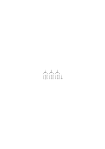

Wenn ich nun sage: 10 Striche bestehen notwendig aus 3 mal 3 Strichen & einem Strich – das heißt doch nicht: wenn zehn Striche dastehen so stehen immer alle die Ziffern & Bögen rundherum! – Setze ich sie aber zu den Strichen hinzu, so sage ich, ich demonstrierte nur das Wesen jener Reihe von Strichen. “Aber bist Du sicher, daß sich die Gruppe beim dazuschreiben jener andern Zeichen nicht verändert hat?” – “Ich weiß nicht; aber _eine_ bestimmte Zahl von Strichen stand da, & wenn nicht 10 so eine andre & dann hatte die eben andre Eigenschaften. –”

### [16v\[2\]](https://cdn.wittgensteinnachlass.com/2000px/webp/Ms-118/16v.webp)

Die Rechnung ‘entfaltet’ die Eigenschaften der Hundert.

### [16v\[3\]](https://cdn.wittgensteinnachlass.com/2000px/webp/Ms-118/16v.webp),[17r\[1\]](https://cdn.wittgensteinnachlass.com/2000px/webp/Ms-118/17r.webp)

‘Hundert besteht aus 50 und 50’. Was heißt es eigentlich 100 bestehe aus 50 & 50? Man sagt der Inhalt der Kiste besteht aus 50 Äpfeln & 50 Birnen. Aber wenn Einer sagte: “der Inhalt dieser Kiste besteht aus 50 Äpfeln & 50 Äpfeln”–, wir wüßten zunächst nicht, was er meinte. – Wenn Einer sagt: “Der Inhalt der Kiste besteht aus 2 mal 50 Äpfeln”, so heißt das entweder, es seien da zwei Abteilungen zu 50 Äpfeln; oder es handelt sich etwa um eine Verteilung in der Jeder 50 Äpfel kriegen soll & ich höre nun, daß man aus der Kiste 2 Leute beteilen kann.

### [17r\[2\]](https://cdn.wittgensteinnachlass.com/2000px/webp/Ms-118/17r.webp),[17v\[1\]](https://cdn.wittgensteinnachlass.com/2000px/webp/Ms-118/17v.webp)

27.08.1937

Etwas besser geschlafen. Lebendige Träume. Etwas niedergedrückt; Wetter & Befinden. Die Lösung des Problems, das Du im Leben siehst, ist eine Art zu leben, die das Problemhafte zum Verschwinden bringt. Daß das Leben problematisch ist, heißt, daß Dein Leben nicht in die Form des Lebens paßt. Du mußt dann Dein Leben verändern, & paßt es in die Form, dann verschwindet das Problematische. Aber haben wir nicht das Gefühl, daß der, welcher nicht darin ein Problem sieht für etwas Wichtiges, ja das Wichtigste, blind ist? Möchte ich nicht sagen, der lebe so dahin – eben blind, gleichsam wie ein Maulwurf, & wenn er bloß sehen könnte, so sähe er das Problem? Oder soll ich nicht sagen: daß wer richtig lebt, das Problem nicht als _Traurigkeit_, also doch nicht problematisch, empfindet, sondern vielmehr als eine Freude; also gleichsam als einen lichten Äther um sein Leben, nicht als einen fraglichen Hintergrund.

### [18r\[1\]](https://cdn.wittgensteinnachlass.com/2000px/webp/Ms-118/18r.webp)

Wenn man sagt: “die 100 Äpfel in der Kiste bestehen aus 50 und 50”, so ist das Wichtige hier der unzeitliche Charakter von “bestehen”. Denn es heißt nicht, sie bestünden _jetzt_, oder für einige Zeit aus 50 + 50..

### [18r\[2\]](https://cdn.wittgensteinnachlass.com/2000px/webp/Ms-118/18r.webp)

Was ist denn das Charakteristikum der ‘internen Eigenschaften’? Daß sie immer, unveränderlich in dem Ganzen, das sie ausmachen, _bestehen_; gleichsam unabhängig von allen Geschehnissen. Wie die Konstruktion einer Maschine auf dem Papier nicht bricht, wenn die Maschinenteile selbst sich biegen, oder brechen.

### [18r\[3\]](https://cdn.wittgensteinnachlass.com/2000px/webp/Ms-118/18r.webp),[18v\[1\]](https://cdn.wittgensteinnachlass.com/2000px/webp/Ms-118/18v.webp)

– – – – Daß sie immer, unveränderlich in dem Ganzen bestehen, das sie ausmachen. Daß sie nicht Wind & Wetter unterworfen sind, wie das Physikalische der Dinge; sondern unangreifbar wie Schemen.

### [18v\[2\]](https://cdn.wittgensteinnachlass.com/2000px/webp/Ms-118/18v.webp)

Statt “100 besteht aus 50 & 50”, könnte man sagen: “Ich lasse 100 aus 50 & 50 bestehen”.

### [18v\[3\]](https://cdn.wittgensteinnachlass.com/2000px/webp/Ms-118/18v.webp),[19r\[1\]](https://cdn.wittgensteinnachlass.com/2000px/webp/Ms-118/19r.webp)

“Aber bin ich also in einer Schlußkette nicht gezwungen zu gehen, wie ich gehe?” – Gezwungen? Ich kann doch wohl gehen, wie ich will! – “Aber wenn Du im Einklang mit den Regeln bleiben willst, _mußt_ Du so vorgehen.” – Durchaus nicht, ich nenne (eben) etwas anderes ‘Einklang’. – “Ja, aber dann veränderst Du (eben) den Sinn des Wortes ‘Einklang’, oder den Sinn der Regel.” – Nein, – wer sagt was hier ‘verändern’ & was ‘gleichbleiben’ heißt? Wieviele Regeln immer Du mir angibst, ich gebe Dir eine Regel, die meine Verwendung Deiner Regeln rechtfertigt.

### [19r\[2\]](https://cdn.wittgensteinnachlass.com/2000px/webp/Ms-118/19r.webp)

“Du darfst doch das Gesetz jetzt nicht auf einmal anders anwenden!” – Wenn ich darauf antworte: “Ach ja, ich hatte es ja _so_ angewandt!” oder (etwa): “Ach, _so_ sollte es angewendet werden – !”, dann spiele ich mit (I'm playing the game); antworte ich aber einfach: “Anders? – Das _ist_ doch nicht anders!”, was willst Du machen?

### [19r\[3\]](https://cdn.wittgensteinnachlass.com/2000px/webp/Ms-118/19r.webp),[19v\[1\]](https://cdn.wittgensteinnachlass.com/2000px/webp/Ms-118/19v.webp)

Inwiefern ist das Argument ein Zwang? “Du gibst doch _das_ zu – & _das_ zu; dann mußt Du auch _das_ zugeben!” Das ist die Art jemanden zu zwingen – – d.h. man kann so, tatsächlich, Menschen zwingen, etwas zuzugeben. – Wie man Einen etwa dazu zwingen kann dorthin zu gehen, indem man gebietend mit dem Finger dorthin zeigt. Denke, ich zeige in diesem Fall mit zwei Fingern in zwei verschiedene Richtungen & lasse es (dem Andern) offen, in welcher der beiden er gehn will, ein andermal aber zeige ich nur in _einer_ Richtung; so kann man das auch so ausdrücken: mein erster Befehl hätte ihn nicht gezwungen in _einer_ Richtung zu gehen, wohl aber der zweite. Das ist aber eine Aussage, die sagt, welcher Art jene Befehle sind, aber nicht, was sie ausrichten.

### [20r\[1\]](https://cdn.wittgensteinnachlass.com/2000px/webp/Ms-118/20r.webp)

Ist eine Berechnung ein Experiment? – Ist es ein Experiment wenn ich am Morgen aus dem Bette steige? Aber könnte dies nicht ein Experiment sein? welches zeigen soll ob ich nach so & so viel Stunden Schlaf die Kraft habe mich zu erheben. – Und was fehlt jener Handlung dazu, dies Experiment zu sein? Bloß, daß sie nicht zu diesem Zwecke, in der Verbindung mit einer solchen Untersuchung ausgeführt wird. _Experiment_ ist etwas durch den Gebrauch, der davon gemacht wird.

### [20r\[2\]](https://cdn.wittgensteinnachlass.com/2000px/webp/Ms-118/20r.webp),[20v\[1\]](https://cdn.wittgensteinnachlass.com/2000px/webp/Ms-118/20v.webp)

Beinahe ähnlich, wie man sagt, daß die alten Physiker plötzlich gefunden haben, daß sie zu wenig Mathematik verstehen, um die Physik bewältigen zu können, kann man sagen, daß die jungen Menschen heutzutage plötzlich in der Lage sind, daß der normale, gute Verstand für die seltsamen Ansprüche des Lebens nicht mehr ausreicht. Es ist alles so verzwickt geworden, daß zu seiner Bewältigung ein ausnahmsweiser Verstand gehörte. Denn es genügt nicht mehr, das Spiel gut spielen zu können, sondern die Frage ist immer wieder: was für ein Spiel ist jetzt überhaupt zu spielen?

### [20v\[2\]](https://cdn.wittgensteinnachlass.com/2000px/webp/Ms-118/20v.webp)

Wäre es möglich, daß Leute heute eine unsrer Berechnungen durchgingen & von den Schlüssen befriedigt sind, morgen aber ganz andre Schlüsse ziehen, & einen andern Tag wieder andere?

### [21r\[1\]](https://cdn.wittgensteinnachlass.com/2000px/webp/Ms-118/21r.webp)

Ja kann man sich nicht denken, daß dies gesetzmäßig so stattfindet, daß wenn er einmal diesen Übergang macht, er ‘_eben darum_’ das nächste Mal einen andern macht, & darum etwa das nächste Mal wieder den ersten?

### [21r\[2\]](https://cdn.wittgensteinnachlass.com/2000px/webp/Ms-118/21r.webp)

(Ähnlich, wie etwa die Farbe, die einmal “rot” genannt wird, darum beim nächsten Mal anders genannt würde & dann wieder “rot”, u.s.f.. Dies könnte den Menschen so natürlich sein. Man könnte es ein Bedürfnis nach Abwechslung nennen.)

### [21r\[3\]](https://cdn.wittgensteinnachlass.com/2000px/webp/Ms-118/21r.webp)

Ist es nicht so: Solange man denkt, es könne nicht anders sein, zieht man logische Schlüsse.

### [21v\[1\]](https://cdn.wittgensteinnachlass.com/2000px/webp/Ms-118/21v.webp)

Das heißt wohl: solange _das & das_ – _gar nicht in Frage gezogen wird_.

### [21v\[2\]](https://cdn.wittgensteinnachlass.com/2000px/webp/Ms-118/21v.webp)

In Macaulay's Essays ist vieles ausgezeichnet; nur seine _Werturteile_ über Menschen sind lästig, & überflüssig. Man möchte ihm sagen: laß die Gestikulation! & sag nur, was Du zu sagen hast.

### [21v\[3\]](https://cdn.wittgensteinnachlass.com/2000px/webp/Ms-118/21v.webp)

[Denke daran, dieses Schreibbuch einmal meiner Schwester Grete zu schenken & dieser Gedanke & Eitelkeit stören mich daher beim Schreiben. Bin voller Eitelkeit.]

### [21v\[4\]](https://cdn.wittgensteinnachlass.com/2000px/webp/Ms-118/21v.webp),[22r\[1\]](https://cdn.wittgensteinnachlass.com/2000px/webp/Ms-118/22r.webp)

Die Schritte, welche man nicht in Frage zieht, sind logische Schlüsse. Aber man zieht sie nicht darum nicht in Frage, weil sie ‘sicher der Wahrheit entsprechen’ – oder dergl.; – sondern, dies ist eben was man ‘Denken’, ‘Sprechen’, ‘Schließen’, ‘Argumentieren’ nennt. Es handelt sich hier gar nicht um irgend eine Entsprechung des Gesagten mit der Realität; vielmehr ist die Logik _vor_ einer solchen Entsprechung; nämlich in dem Sinne, in welchem die Festlegung der Meßmethode _vor_ der Richtigkeit oder Falschheit einer Längenangabe.

### [22r\[2\]](https://cdn.wittgensteinnachlass.com/2000px/webp/Ms-118/22r.webp)

“Wenn wir nicht in Gewissem übereinstimmen, können wir nicht argumentieren” – Vielmehr: ohne diese Übereinstimmung _nennen_ wir es wohl nicht “Argumentieren”.

### [22r\[3\]](https://cdn.wittgensteinnachlass.com/2000px/webp/Ms-118/22r.webp),[22v\[1\]](https://cdn.wittgensteinnachlass.com/2000px/webp/Ms-118/22v.webp)

“Nach Dir könnte also jeder die Reihe fortsetzen, wie er will; & also auch auf _irgend_ eine Weise schließen!” Wir werden es dann wohl nicht “die Reihe fortsetzen” nennen & auch wohl nicht “schließen”.

### [22v\[2\]](https://cdn.wittgensteinnachlass.com/2000px/webp/Ms-118/22v.webp),[23r\[1\]](https://cdn.wittgensteinnachlass.com/2000px/webp/Ms-118/23r.webp)

Denn daß ihn Schlußgesetze u. dergl. nicht zwingen das & das zu reden (oder zu schreiben), darüber sind wir ja einig. Und wenn Du sagst, er könne es zwar _reden_, aber er kann es nicht _denken_, so sage ich nur, das heiße nicht: er könne es, quasi trotz aller Anstrengung, nicht denken, sondern es heißt: zum ‘Denken’ gehört für uns wesentlich, daß er (beim Reden, Schreiben, etc.) _solche_ Übergänge macht. Und ferner sage ich, daß die Grenze zwischen dem was wir noch ‘denken’ & dem was wir nicht mehr ‘denken’ nennen so wenig scharf gezogen ist, wie die Grenze zwischen dem was noch “Gesetzmäßigkeit” genannt wird & dem was wir nicht mehr so nennen.

### [23r\[2\]](https://cdn.wittgensteinnachlass.com/2000px/webp/Ms-118/23r.webp)

Wenn man eine Rechnung als Experiment auffaßt, so ist das Resultat des Experiments jedenfalls nicht das, was man das Resultat des Beweises nennt. Das Resultat der Rechnung ist der Satz mit welchem sie abschließt; das Resultat des Experiments ist: daß ich von diesen Sätzen durch diese Regeln zu diesem Satz geführt worden bin.

### [23r\[3\]](https://cdn.wittgensteinnachlass.com/2000px/webp/Ms-118/23r.webp),[23v\[1\]](https://cdn.wittgensteinnachlass.com/2000px/webp/Ms-118/23v.webp)

Aber nicht daran heftet sich (nun) unser Interesse, daß die & die (oder alle) Menschen so geführt worden sind (oder so gegangen sind); es gilt uns als selbstverständlich daß die Menschen – ‘wenn sie richtig denken können’ – _so_ gehen. Wir haben jetzt aber einen _Weg_ erhalten, sozusagen durch die Fußstapfen derer, die so gegangen sind. Und auf diesem Weg geht nun der Verkehr (vor sich), zu verschiedenen Zwecken.

### [23v\[2\]](https://cdn.wittgensteinnachlass.com/2000px/webp/Ms-118/23v.webp)

Wenn wir sagen: “dieser Satz folgt aus jenem”, so ist hier “folgen” wieder _unzeitlich_ gebraucht. (Und das zeigt, daß dieser Satz nicht das Resultat eines Experiments beschreibt.)

### [23v\[3\]](https://cdn.wittgensteinnachlass.com/2000px/webp/Ms-118/23v.webp)

28.08.1937

Vergleiche damit; “Weiß ist heller als Schwarz”. Auch dieser Ausdruck ist zeitlos & auch er spricht das Bestehen einer _internen_ Relation aus.

### [23v\[4\]](https://cdn.wittgensteinnachlass.com/2000px/webp/Ms-118/23v.webp)

Mit Gaben überhäuft, _die ich nicht verdiene_.

### [23v\[5\]](https://cdn.wittgensteinnachlass.com/2000px/webp/Ms-118/23v.webp),[24r\[1\]](https://cdn.wittgensteinnachlass.com/2000px/webp/Ms-118/24r.webp),[24v\[1\]](https://cdn.wittgensteinnachlass.com/2000px/webp/Ms-118/24v.webp),[25r\[1\]](https://cdn.wittgensteinnachlass.com/2000px/webp/Ms-118/25r.webp)

“Diese Relation _besteht_ aber eben.” möchte man sagen. Aber die Frage ist: hat dieser Satz einen Gebrauch? Denn einstweilen weiß ich nur, daß mir dabei ein Bild vorschwebt – aber dies garantiert mir die Verwendung nicht – & daß die Worte einen deutschen Satz geben. Aber es fällt Dir auf, daß die Worte hier anders gebraucht werden, als im normalen Fall einer nützlichen Aussage. – Wie etwa der Radmacher bemerken kann, daß die Aussagen die er über kreisförmig & gerade macht andrer Art sind, als die, die im Euklid stehen. – Denn wir sagen: dieser _Gegenstand_ ist heller als jener, – & dann ist er etwa jetzt heller & kann später dunkler sein. Woher die Empfindung “Weiß ist heller als Schwarz” sage etwas über das _Wesen_ der beiden Farben aus? – Aber ist diese Frage überhaupt richtig gestellt? Was meinen wir denn mit “dem Wesen” von Weiß oder Schwarz? Wir denken etwa an ‘das Innere’, ‘die Konstitution’; aber das ergibt hier doch keinen Sinn. Wir sagen etwa auch: “Es liegt im Weiß, daß es heller ist …” Ist es nicht so: das Bild

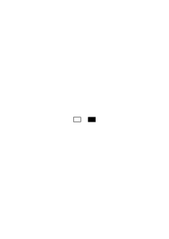

eines schwarzen & eines weißen Flecks dient uns _zugleich_ als Paradigma dessen, was wir unter “heller” & “dunkler” verstehen & als Paradigma von “Weiß” & von “Schwarz”. In _so_ fern ‘liegt’ nun die Dunkelheit ‘im’ Schwarz, als sie _beide_ von diesem Fleck dargestellt werden. Er ist dunkel _dadurch daß_ er schwarz ist– aber richtiger (gesagt): er _heißt_ “schwarz” & damit, in unserer Sprache, auch “dunkel”. Man kann Mißverständnisse vermeiden, dadurch daß man erklärt es sei Unsinn zu sagen: “die Farbe dieses Körpers ist heller als die Farbe jenes”, es müsse heißen: “dieser Körper ist heller als jener”. D.h., man schließt jene Ausdrucksform aus unsrer Sprache aus.

Jene Verbindung, eine Verbindung der Paradigmen & Namen, ist in unserer Sprache hergestellt. Und _jener Satz_ ist unzeitlich, weil er nur die Verbindung der Worte “weiß”, “schwarz”& “heller” mit dem Paradigma ausspricht.

### [25r\[2\]](https://cdn.wittgensteinnachlass.com/2000px/webp/Ms-118/25r.webp)

Wir könnten auch sagen: Wenn wir den Schlußgesetzen (Schlußregeln) _folgen_, so liegt darin immer auch ein _Deuten_ dieser Gesetze.

### [25r\[3\]](https://cdn.wittgensteinnachlass.com/2000px/webp/Ms-118/25r.webp)

“Aber wir folgern doch diesen Satz aus jenem, weil er tatsächlich folgt! Wir überzeugen uns doch, daß er folgt.” Wir überzeugen uns, daß, was hier steht, aus dem folgt, was dort steht. Und dieser Satz ist zeitlich gebraucht.

### [25v\[1\]](https://cdn.wittgensteinnachlass.com/2000px/webp/Ms-118/25v.webp)

Wie ist es aber, wenn ich mich davon überzeuge, daß das Schema dieser Striche

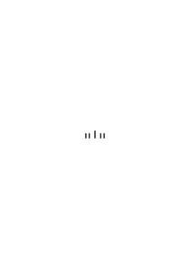

gleichzahlig ist dem Schema dieser Eckpunkte

(ich habe sie absichtlich einprägsam gemacht), indem ich zuordne

?

Nun, wovon überzeuge ich mich denn, wenn ich diese Figur ansehe? Ich sehe ein Fünfeck mit Fortsätzen (an den Ecken), die wie Staubgefäße aussehen. –

### [25v\[2\]](https://cdn.wittgensteinnachlass.com/2000px/webp/Ms-118/25v.webp),[26r\[1\]](https://cdn.wittgensteinnachlass.com/2000px/webp/Ms-118/26r.webp)

Aber ich kann von der Figur so Gebrauch machen: fünf Kinder stehen im Fünfeck aufgestellt, an der Wand stehen Stäbe nach dem ersten Schema; ich sehe auf die Figur & sage: “ich kann jedem der Kinder einen Stock geben”. Ich könnte die Figur etwa als schematisches _Bild_ davon auffassen, daß ich fünf Kindern fünf Stäbe gebe.

### [26r\[2\]](https://cdn.wittgensteinnachlass.com/2000px/webp/Ms-118/26r.webp),[26v\[1\]](https://cdn.wittgensteinnachlass.com/2000px/webp/Ms-118/26v.webp),[27r\[1\]](https://cdn.wittgensteinnachlass.com/2000px/webp/Ms-118/27r.webp)

Wenn ich nämlich erst ein beliebiges Vieleck zeichne –

& dann irgend eine Reihe von Strichen –

∣∣∣∣∣∣∣∣∣∣∣∣∣∣∣∣∣∣∣∣∣,

so kann ich nun durch Zuordnung herausfinden, ob ich oben gleichviel Ecken habe, wie unten Striche. – Ich weiß nicht was herauskommen wird. – Und so kann ich auch sagen, ich habe mich durch das Ziehen der Projektionslinien davon überzeugt, daß am obern Ende der Figur ( ) so viel Striche stehen, wie das Vieleck unten Ecken hat. (_Zeitlich_!) Nach dieser Auffassung gleicht diese Figur nicht einem mathematischen Beweise (sowenig wie es ein mathematischer Beweis ist, wenn ich einer Gruppe Kinder je einen Apfel gebe & sehe daß jedes gerade _einen_ kriegen kann). Ich kann die Figur aber als mathematischen Beweis auffassen. Geben wir dem Schema ( ) einen Namen! Ich werde es das E-Schema nennen. Ich nehme an daß etwa auch die Schemen

<math display="block">
  <mo>|</mo>
  <mspace width="0.3em"/>
  <mo>,</mo>
  <mo>|</mo>
  <mo>|</mo>
  <mspace width="0.3em"/>
  <mo>,</mo>
  <mo>|</mo>
  <mspace width="0.3em"/>
  <mo>|</mo>
  <mo>|</mo>
  <mspace width="0.3em"/>
  <mo>,</mo>
  <mo>|</mo>
  <mo>|</mo>
  <mo>|</mo>
  <mo>|</mo>
</math>

Namen hätten. Und die Figur <math display="inline"><mtext>⬠</mtext></math> heiße S-Figur. Ich beweise den Satz: “das E-Schema hat so viele Striche, wie die S-Figur Ecken”. (Und) dies ist wieder unzeitlich.

### [27r\[2\]](https://cdn.wittgensteinnachlass.com/2000px/webp/Ms-118/27r.webp),[27v\[1\]](https://cdn.wittgensteinnachlass.com/2000px/webp/Ms-118/27v.webp)

Der Beweis – kann ich sagen – ist _eine_ Figur, an deren einem Ende gewisse Sätze stehen & an deren anderm Ende ein Satz steht (den wir den ‘bewiesenen’ nennen). Man kann als Beschreibung dieser Figur sagen: in ihr folge der Satz … aus … & …. (Wie man zur Beschreibung eines Hauses sagen kann in ihm liege ein Giebeldach auf drei Stockwerken & einem gewölbten Unterbau.) Ich kann also z.B. sagen: “In dem Beweise, welchen ich hier hingeschrieben habe, folgt der Satz p aus den Sätzen q & r”, & dies ist eine Angabe über das, was ich hingeschrieben habe. Eine Beschreibung einer bestimmten Beweisfigur, wie oben eines Ornaments. Es ist aber nicht der mathematische Satz, daß p aus q & r folgt. Dieser hat eine ganz andere Anwendung.

### [27v\[2\]](https://cdn.wittgensteinnachlass.com/2000px/webp/Ms-118/27v.webp)

Denken wir uns, wir hätten das Paradigma für “heller” & “dunkler” in Form eines weißen & schwarzen Fleckes gegeben, & nun leiten wir mit seiner Hilfe – sozusagen – ab: daß rot dunkler ist als weiß. – – – –

### [27v\[3\]](https://cdn.wittgensteinnachlass.com/2000px/webp/Ms-118/27v.webp)

29.08.1937

Und überlegen wir uns noch dies: Wir wollen sagen: ein Polygon p ‘folge’ aus einem andern q, wenn p das Polygon ist, das von allen geraden, oder ungeraden, Seiten des Polygons q gebildet wird. So folgt also das Quadrat

aus dem Achteck.

### [28r\[1\]](https://cdn.wittgensteinnachlass.com/2000px/webp/Ms-118/28r.webp)

Was ist das nun (z.B.) für ein Satz: “Das gleichseitige Dreieck folgt aus dem regelmäßigen Sechseck”?

### [28r\[2\]](https://cdn.wittgensteinnachlass.com/2000px/webp/Ms-118/28r.webp)

Ich kann mir sehr wohl vorstellen, daß Jemand überrascht ist, zu finden, daß man ein gleichseitiges Dreieck erhält, wenn man jede zweite Seite eines Sechsecks verlängert (Kristalle).

### [28r\[3\]](https://cdn.wittgensteinnachlass.com/2000px/webp/Ms-118/28r.webp)

Beweis daß Hand & Drudenfuß gleichzahlig sind:

Andere Form des Beweises:

### [28v\[1\]](https://cdn.wittgensteinnachlass.com/2000px/webp/Ms-118/28v.webp)

Der bewiesene Satz dient nun als neue Vorschrift zum Konstatieren der Gleichzahligkeit: Wenn man eine Menge von Gegenständen als Hand angeordnet hat & eine andre als Drudenfuß, so sagen wir nun sie sind gleichzahlig.

### [28v\[2\]](https://cdn.wittgensteinnachlass.com/2000px/webp/Ms-118/28v.webp),[29r\[1\]](https://cdn.wittgensteinnachlass.com/2000px/webp/Ms-118/29r.webp)

“Aber ist das nicht bloß, weil wir Hand & Drudenfuß schon einmal zugeordnet hatten & gesehen daß sie gleichzahlig sind?” – Ja aber, wenn sie es in einem Fall waren, wie weiß ich daß sie es jetzt wieder sein werden? – “Weil es eben im _Wesen_ der H. und des D. liegt, daß sie gleichzahlig sind.” – Aber wie konntest Du _das_ bei der Zählung herausbringen? (Ich dachte die Zählung oder Zuordnung ergibt nur, daß diese beiden Gruppen, die ich jetzt vor mir habe, gleichzahlig – oder nicht gleichzahlig – sind.)

### [29r\[2\]](https://cdn.wittgensteinnachlass.com/2000px/webp/Ms-118/29r.webp),[29v\[1\]](https://cdn.wittgensteinnachlass.com/2000px/webp/Ms-118/29v.webp)

– “Aber wenn er nun eine Hand von Dingen hat & einen Drudenfuß von Dingen hat & sie nun tatsächlich eins zu eins zuordnet, so ist es doch nicht _möglich_, daß er etwas andres erhält, als daß sie gleichzahlig sind! – Und daß es nicht möglich ist, das sehe ich doch aus dem Beweis.” – Aber _ist_ es denn nicht möglich? Wenn er z.B. – wie wir sagen würden – eine der Zuordnungslinien zu ziehen _übersieht_. Aber ich gebe zu, daß er in der unendlichen Mehrzahl der Fälle das gleiche Resultat erhalten wird; & wäre es nicht so, so würde dem ganzen Beweis dadurch der Boden entzogen. Wir entscheiden uns nun, das Beweisbild _statt_ einer Zuordnung zu gebrauchen; wir ordnen sie _nicht_ zu, sondern vergleichen statt dessen die Gruppenbilder mit denen des ‘Beweises’ (in welchem allerdings zwei Gruppen einander zugeordnet sind).

### [29v\[2\]](https://cdn.wittgensteinnachlass.com/2000px/webp/Ms-118/29v.webp)

Ich könnte als Resultat des Beweises auch sagen: “Eine H. & ein D. heißen ‘gleichzahlig’”.

### [29v\[3\]](https://cdn.wittgensteinnachlass.com/2000px/webp/Ms-118/29v.webp)

Ich könnte sagen: Der Beweis _erforscht_ nicht das Wesen der beiden Figuren, aber er spricht aus, was ich von nun an zum Wesen der Figuren rechnen werde. — Was zum Wesen gehört, lege ich unter den Paradigmen der Sprache nieder.

### [29v\[4\]](https://cdn.wittgensteinnachlass.com/2000px/webp/Ms-118/29v.webp),[30r\[1\]](https://cdn.wittgensteinnachlass.com/2000px/webp/Ms-118/30r.webp)

Wenn ich sage “Dieser Satz folgt aus jenem”, so ist das die Anerkennung einer Regel. Sie geschieht _auf Grund_ des Beweises. D.h., ich lasse mir diese Kette (diese Figur) als _Beweis_ gefallen. – “Aber könnte ich denn anders? _Muß_ ich mir sie nicht gefallen lassen?” – Warum sagst Du, Du müssest? Doch darum, weil Du am Schlusse des Beweises (etwa) sagst: “Ja– ich muß diesen Schluß anerkennen.” Aber das ist doch nur der Ausdruck Deiner unbedingten Anerkennung. – Das heißt, glaube ich: die Worte “Das muß ich zugeben” werden in _zweierlei_ Fall gebraucht: wenn wir einen Beweis erhalten haben – aber auch, im Bezug auf die (einzelnen) Schritte des Beweises.

### [30r\[2\]](https://cdn.wittgensteinnachlass.com/2000px/webp/Ms-118/30r.webp)

Und worin äußert es sich denn, daß der Beweis mich _zwingt_? Doch, daß ich so & so darauf vorgehe, daß ich mich weigere einen andern Weg zu gehen. Als letztes Argument, gegen Einen, der so nicht gehen wollte, könnte ich nur noch sagen: “Ja siehst Du denn nicht …!” – & das ist doch kein _Argument_.

### [30v\[1\]](https://cdn.wittgensteinnachlass.com/2000px/webp/Ms-118/30v.webp)

Das Gemütvolle & das Treuherzige in der Religion der Germanen, oder Abendländer, ist mir zuwider. Das heißt, _das_ ist kein Zugang zur Religion für mich. Dies ist, natürlich, keine Kritik der Andern, aber es heißt: mein Weg ist nicht _dieser_ – & mit allem, was so aussieht, habe ich nichts zu tun. Das ist eine Landestracht– aber nicht die meine. Wenn also Einer, gleichsam, sagt: “Nur die Treuherzigen kommen in den Himmel”, so kann ich sagen: Nein, das ist meine Religion nicht. – Deshalb bin ich, wenn ich Religion von einem Treuherzigen lernen will scheinbar im Nachteil, aber doch wirklich in keinem Nachteil. Das heißt, ich bin dann geneigt zu sagen: “Hätte ich nur den richtigen Religionslehrer …!” Gegen den Strom schwimmen müssen ist kein Nachteil, wenn Schwimmen das Ziel ist.

### [31r\[2\]](https://cdn.wittgensteinnachlass.com/2000px/webp/Ms-118/31r.webp)

“Aber, wenn Du recht hast, wie kommt es dann, daß sich alle Menschen (oder doch alle normalen Menschen) diese Figuren als Beweise dieser Sätze gefallen lassen?” – Ja, es besteht eine große, & interessante, Übereinstimmung.

### [31r\[3\]](https://cdn.wittgensteinnachlass.com/2000px/webp/Ms-118/31r.webp),[31v\[1\]](https://cdn.wittgensteinnachlass.com/2000px/webp/Ms-118/31v.webp),[32r\[1\]](https://cdn.wittgensteinnachlass.com/2000px/webp/Ms-118/32r.webp)

Denk Dir Du hättest eine Reihe von 100 Kugeln, sie seien mit römischen Ziffern numeriert. Du numerierst sie nun erst mit arabischen Ziffern; dann machst Du nach je zehn (die sich in dieser Nummerierung nun deutlich hervorheben) einen größern Abstand; in jedem Reihenstück von je 10 machst Du einen etwas kleineren Abstand zwischen zwei gleichen Hälften von je 5 (so werden die 10 übersichtlich); nun nimmst Du das zweite Zehnerstück & legst es unter das erste, das dritte unter das zweite & so fort bis zum Ende; nun machst Du einen etwas größern vertikalen Abstand zwischen der ersten Hälfte & der zweiten der Zehnerreihen & numerierst diese Reihen von 1 bis 10. Ich kann sagen, ich habe Eigenschaften der hundert Kugeln entfaltet. – Nun aber denke Dir daß dieser ganze Vorgang, dies Experiment mit den hundert Kugeln, gefilmt wurde. Ich sehe nun auf dem Film doch nicht ein Experiment, denn der Film eines Experiments ist doch nicht selbst ein Experiment. – Aber das ‘mathematisch wesentliche’ sehe ich nun auch in der Projektion jenes Films! Denn es erscheinen da zuerst 100 Flecke römisch numeriert, dann werden sie in Zehnerstücke eingeteilt, usw. usw..

### [32r\[2\]](https://cdn.wittgensteinnachlass.com/2000px/webp/Ms-118/32r.webp)

Ich könnte also sagen: Der Beweis dient mir nicht als Experiment, sondern als Bild eines Experiments.

### [32r\[3\]](https://cdn.wittgensteinnachlass.com/2000px/webp/Ms-118/32r.webp)

Ich bin noch sehr unklar.

### [32r\[4\]](https://cdn.wittgensteinnachlass.com/2000px/webp/Ms-118/32r.webp),[32v\[1\]](https://cdn.wittgensteinnachlass.com/2000px/webp/Ms-118/32v.webp),[33r\[1\]](https://cdn.wittgensteinnachlass.com/2000px/webp/Ms-118/33r.webp)

Lege 2 Äpfel auf die leere Tischplatte, schau daß niemand in die Nähe kommt & der Tisch nicht erschüttert wird; nun lege noch 2 Äpfel auf die Tischplatte; nun zähle die Äpfel die da liegen. Du hast ein Experiment gemacht; das Ergebnis der Zählung ist wahrscheinlich 4. (Wir würden das Resultat des Experiments so beschreiben, daß wir sagen: Wenn man unter den & den Umständen erst 2 & dann noch 2 Äpfel auf einen Tisch legt verschwindet zumeist keiner, noch kommt einer dazu.) Und ganz ähnliche Experimente kann man, mit dem gleichen Ergebnis, mit allerlei festen Körpern– Bohnen, Büchern, Stäben etc. – ausführen. – So lernen ja unsre Kinder rechnen, denn man läßt sie drei Bohnen hinlegen & noch drei Bohnen & dann zählen. Käme dabei einmal 5 einmal 7 heraus (weil wie wir jetzt sagen würden einmal von selbst eine dazu einmal eine weg käme) so würden wir zunächst Bohnen als für den Rechenunterricht ungeeignet erklären. Geschähe das Gleiche aber mit Stäbchen, Fingern Strichen & den meisten andern Dingen, so hätte das Rechnen damit ein Ende. “Aber wäre dann nicht doch noch 2 + 2 = 4?” – Dieses Sätzchen wäre damit unbrauchbar geworden. –

### [33r\[2\]](https://cdn.wittgensteinnachlass.com/2000px/webp/Ms-118/33r.webp)

Wenn wir Geld in eine Lade legen & später finden wir es nicht mehr dort, so sagen wir: “Von selbst ist es nicht verschwunden.” Dies ist eine wichtige Lehre der Physik.

### [33r\[3\]](https://cdn.wittgensteinnachlass.com/2000px/webp/Ms-118/33r.webp),[33v\[1\]](https://cdn.wittgensteinnachlass.com/2000px/webp/Ms-118/33v.webp)

29.08.1937

“Du brauchst ja nur auf die Figur

zu sehen, um zu sehen, daß 2 + 2 4 ist.” – Dann brauche ich nur auf die Figur

zu schauen, um zu sehen, daß 2 + 2 + 2 4 ist.

### [33v\[2\]](https://cdn.wittgensteinnachlass.com/2000px/webp/Ms-118/33v.webp)

Multiplizieren mit musikalischen Themen: Multipliziere die Tonreihe eines Taktes eines gleichförmig fortschreitenden Themas mit der Tonreihe zweier Takte. Pfeife die ersten zwei Takte des Themas langsam & nach jedem Ton einen Takt des Themas & sieh wie weit Du in ihm kommst.

### [33v\[3\]](https://cdn.wittgensteinnachlass.com/2000px/webp/Ms-118/33v.webp)

Wir lehren jemand eine Methode Nüsse unter Menschen zu verteilen; ein Teil dieser Methode ist das Multiplizieren zweiter Zahlen im Dezimalsystem. Wir lehren jemand ein Haus errichten; dabei auch, wie er sich die genügenden Mengen von Holz anschaffen soll, dazu eine Technik des Rechnens. Die Technik des Rechnens ist ein Teil der Technik des Hausbaues.

### [34r\[1\]](https://cdn.wittgensteinnachlass.com/2000px/webp/Ms-118/34r.webp)

Leute verkaufen & kaufen Scheitholz; die Stöße werden mit einem Maßstab gemessen die Maßzahlen von Länge, Breite, Höhe multipliziert; was dabei herauskommt ist die Zahl der Groschen die sie fordern & zu geben haben. Sie wissen nicht, ‘warum’ dies so geschieht, sondern sie machen es einfach so, so wird es gemacht. – Rechnen diese Leute nicht?

### [34r\[2\]](https://cdn.wittgensteinnachlass.com/2000px/webp/Ms-118/34r.webp)

Wer so rechnet, muß er einen ‘mathematischen _Satz_’ aussprechen? Wir lehren freilich die Kinder das Einmaleins in Form von _Sätzchen_, aber ist das wesentlich? Warum sollten sie nicht einfach – _Rechnen lernen_. Und wenn sie es können, haben sie nicht Arithmetik gelernt?

### [34v\[1\]](https://cdn.wittgensteinnachlass.com/2000px/webp/Ms-118/34v.webp)

Aber in welchem Verhältnis steht dann die _Begründung_ eines Rechenvorgangs zu dem Rechenvorgang selbst?

### [34v\[2\]](https://cdn.wittgensteinnachlass.com/2000px/webp/Ms-118/34v.webp)

Arbeite weiter & sieh, was wird! –

### [34v\[3\]](https://cdn.wittgensteinnachlass.com/2000px/webp/Ms-118/34v.webp)

“Ja ich verstehe, dieser Satz folgt aus diesem.” – Verstehe ich _warum_ er folgt, oder verstehe ich nur _daß_ er folgt?

### [34v\[4\]](https://cdn.wittgensteinnachlass.com/2000px/webp/Ms-118/34v.webp)

Werde ich je damit zu Rande kommen? Arbeite weiter & überlaß es der Schickung!

### [34v\[5\]](https://cdn.wittgensteinnachlass.com/2000px/webp/Ms-118/34v.webp),[35r\[1\]](https://cdn.wittgensteinnachlass.com/2000px/webp/Ms-118/35r.webp)

Wie, wenn ich gesagt hätte: Jene Leute zahlen für das Holz _auf Grund der Rechnung_; sie lassen sich die Rechnung als Beweis dafür gefallen, daß sie so viel zu zahlen haben. – Nun es ist einfach eine Beschreibung ihres Vorgehens (Benehmens).

### [35r\[2\]](https://cdn.wittgensteinnachlass.com/2000px/webp/Ms-118/35r.webp)

Wer sagt: “die Kette der Gründe hat ein Ende”, stellt den Ursprung der Kette mit ihrer Mitte zusammen, daß wir den Unterschied gewahr werden. ‘Schau _das_ an – & schau _das_ an! _Präg' Dir diese beiden Formen ein_!’

### [35r\[3\]](https://cdn.wittgensteinnachlass.com/2000px/webp/Ms-118/35r.webp)

Die Logik – kann man sagen – zeigt, was wir unter “Satz” & unter “Sprache” verstehen. –

### [35r\[4\]](https://cdn.wittgensteinnachlass.com/2000px/webp/Ms-118/35r.webp)

Auch Gedanken fallen manchmal unreif vom Baum.

### [35r\[5\]](https://cdn.wittgensteinnachlass.com/2000px/webp/Ms-118/35r.webp)

Trenne die Gefühle (Gesten) der Übereinstimmung von dem, was Du mit dem Beweise _machst_!

### [35r\[6\]](https://cdn.wittgensteinnachlass.com/2000px/webp/Ms-118/35r.webp),[35v\[1\]](https://cdn.wittgensteinnachlass.com/2000px/webp/Ms-118/35v.webp)

Jene Leute – würden wir sagen – verkaufen das Holz nach dem Kubikmaß – – aber haben sie darin recht? Wäre es nicht richtiger es nach dem Gewicht zu verkaufen – oder nach der Arbeitszeit die das Fällen gekostet hat – oder nach der Mühe des Fällens, gemessen am Alter & an der Stärke des Holzfällers? Und warum sollten sie es nicht für einen Preis hergeben, der von all dem unabhängig ist: jeder Käufer zahlt einen bestimmten Betrag, wieviel Holz immer er nimmt (man hat gefunden, daß man so leben kann). Und ist etwas dagegen zu sagen, daß man das Holz einfach verschenkt?

### [35v\[2\]](https://cdn.wittgensteinnachlass.com/2000px/webp/Ms-118/35v.webp)

Gut! Wie aber, wenn sie das Holz in Stöße von beliebigen, verschiedenen Höhen schlichteten & es dann zu einem Preis genau proportional der Grundfläche der Stöße verkauften?

### [36r\[1\]](https://cdn.wittgensteinnachlass.com/2000px/webp/Ms-118/36r.webp)

Und wie, wenn sie dies sogar mit den Worten begründeten: “Ja, wer mehr Holz kauft, muß auch mehr zahlen.”

### [36r\[2\]](https://cdn.wittgensteinnachlass.com/2000px/webp/Ms-118/36r.webp)

Wie könnte ich ihnen nun zeigen, daß – wie ich sagen würde – _der_ nicht wirklich mehr Holz kauft, der einen Stoß von größerer Grundfläche kauft? – Ich würde z.B. einen nach ihren Begriffen, kleinen Stoß nehmen & ihn durch Umlegen der Scheiter in einen ‘großen’ verwandeln. Das _könnte_ sie überzeugen – vielleicht aber würden sie sagen: “ja, jetzt ist es viel Holz & kostet mehr” – & damit wäre es Schluß. – Wir würden in diesem Falle wohl sagen: sie meinen mit “viel Holz” & “wenig Holz” einfach nicht das Gleiche wie wir; & sie haben ein ganz anderes System der Bezahlung, als wir.

### [36v\[1\]](https://cdn.wittgensteinnachlass.com/2000px/webp/Ms-118/36v.webp)

Frege sagt: Zitat aus dem Vorwort der “Grundgesetze der Arithmetik” – aber er hat nie angegeben, wie dieser ‘Wahnsinn’ wirklich aussehen würde.

### [36v\[2\]](https://cdn.wittgensteinnachlass.com/2000px/webp/Ms-118/36v.webp)

Denken wir uns nun, ich gehe einen Beweis durch & sage bei jedem Schritt: “ja, das folgt.” – Was sag' ich damit? – Ich konstatiere wohl, daß da etwas steht, was aus jenem folgt. Das ist nicht das: ‘was nicht anders sein kann’, sondern (etwas), was sehr wohl anders sein kann, nämlich, daß hier etwas geschrieben steht, was folgt & nicht etwas, was nicht folgt. Wie, wenn ich auf das Resultat am Ende einer Multiplikation schaue & sage: “ja, das ist das Produkt”, ich nicht den arithmetischen Satz ausspreche “… x … = …”, sondern, daß hier jetzt das Produkt der beiden Zahlen steht, daß wirklich (oder richtig) multipliziert worden ist.

### [37r\[1\]](https://cdn.wittgensteinnachlass.com/2000px/webp/Ms-118/37r.webp)

Ich komme heute nicht recht weiter. Bin irgendwie gleich ermüdet & meine Gedanken brechen ab, kaum daß sie unterwegs sind. Ich bin eben in der Hand der Schickung & muß mich irgendwie fügen. Lieber hundert mal von frischem anfangen, als sich im Verfolg eines Gedankens ermüden! Und ich muß jetzt fortwährend frisch anfangen, denn ich kann, was ich schreibe, gar nicht ruhig festhalten & nicht lebendig fortsetzen. – Nur die Gedanken nicht vor Erschöpfung sterben lassen! Es ist hart, zu denken, daß es mit meinem Arbeiten wieder zu Ende gehen sollte, daß der Atem der Gedanken schon wieder zu Ende sein soll. Ist es aber so, so muß man es hinnehmen.

### [37r\[2\]](https://cdn.wittgensteinnachlass.com/2000px/webp/Ms-118/37r.webp),[37v\[1\]](https://cdn.wittgensteinnachlass.com/2000px/webp/Ms-118/37v.webp),[38r\[1\]](https://cdn.wittgensteinnachlass.com/2000px/webp/Ms-118/38r.webp)

30.08.1937

Worin besteht die Übereinstimmung der Menschen bezüglich der Anerkennung einer Struktur als Beweis? Darin, daß sie Worte als _Sprache_ gebrauchen? Als das, was wir “Sprache” nennen. Denke Dir Menschen, die Geld im Verkehr gebrauchten, nämlich Münzen, die ganz so aussehen, wie unsre Münzen, aus Gold oder Silber & geprägt, & sie geben sie auch für Waren her – aber anderseits gibt jeder was ihm gerade gefällt & der Kaufmann gibt dem Kunden nicht nach dem er bezahlt, kurz, was so aussieht wie Geld spielt bei ihnen eine ganz andere Rolle als bei uns. Wir würden uns diesen Leuten viel weniger verwandt fühlen, als solchen, die noch kein Geld kennen & irgend eine primitive Art des Tauschhandels trieben. – “Aber die ‘Münzen’ dieser Leute werden doch auch irgend einen Zweck haben!” – Hat denn alles, was man tut, einen Zweck? Etwa religiöse Handlungen –.

### [38r\[2\]](https://cdn.wittgensteinnachlass.com/2000px/webp/Ms-118/38r.webp)

Es ist schon möglich, daß wir geneigt wären, Menschen, die sich so benehmen Verrückte zu nennen. Aber doch nennen wir nicht alle die Verrückte, die in unseren Kulturen ähnlich handeln, & auch Worte ‘zwecklos’ verwenden.

### [38r\[3\]](https://cdn.wittgensteinnachlass.com/2000px/webp/Ms-118/38r.webp)

Wir können es ‘die Gleichung: 274 + 181 + 693 = 1148 beweisen’ nennen, wenn wir addieren

<math display="block">
  <mtable columnalign="right left" columnspacing="3em">
    <mtr>
      <mtd>
        <mtable columnalign="right" rowspacing="0.1em">
          <mtr>
            <mtd>
              <mn>274</mn>
            </mtd>
          </mtr>
          <mtr>
            <mtd>
              <mn>181</mn>
            </mtd>
          </mtr>
          <mtr>
            <mtd>
              <menclose notation="bottom">
                <mn>693</mn>
              </menclose>
            </mtd>
          </mtr>
          <mtr>
            <mtd>
              <mn>1148</mn>
            </mtd>
          </mtr>
        </mtable>
      </mtd>
      <mtd>
        <mtable rowspacing="0.1em">
          <mtr>
            <mtd>
              <mtext>Vielleicht besser noch:</mtext>
            </mtd>
          </mtr>
          <mtr>
            <mtd>
              <mrow>
                <msup>
                  <mn>10</mn>
                  <mn>6</mn>
                </msup>
                <mo>×</mo>
                <msup>
                  <mn>10</mn>
                  <mn>7</mn>
                </msup>
                <mo>=</mo>
                <msup>
                  <mn>10</mn>
                  <mn>13</mn>
                </msup>
              </mrow>
            </mtd>
          </mtr>
        </mtable>
      </mtd>
    </mtr>
  </mtable>
</math>

aber heißt auch das sie beweisen: nimm 274 Sandkörner, gib dazu 181 & dann noch 693 Sandkörner & zähle den Haufen? Ich will sagen: Zum Beweis gehört Übersichtlichkeit.

### [38v\[1\]](https://cdn.wittgensteinnachlass.com/2000px/webp/Ms-118/38v.webp)

Würde der Prozeß durch den ich das Resultat gewinne unübersehbar, so könnte ich zwar die Tatsache, daß diese Zahl herauskommt vermerken, aber ich wüßte nicht, zur Bestätigung welcher Tatsache ich dies Resultat verwenden sollte, denn ich könnte nicht sagen: ‘was herauskommen _soll_’.

### [38v\[2\]](https://cdn.wittgensteinnachlass.com/2000px/webp/Ms-118/38v.webp)

Habe ich jene drei Zahlen addiert & 1148 erhalten, so sage ich nun: Wenn Du so viel & so viel & so viel Sandkörner zusammenschüttest & keines kommt dabei weg, so mußt Du im ganzen 1148 Körner habe.

### [38v\[3\]](https://cdn.wittgensteinnachlass.com/2000px/webp/Ms-118/38v.webp),[39r\[1\]](https://cdn.wittgensteinnachlass.com/2000px/webp/Ms-118/39r.webp)

Aber ist es denn unmöglich, daß ich mich in der Rechnung geirrt habe? Und denk Dir, ich nehme an, daß mich ein Teufelchen irrt, so daß ich irgend etwas immer wieder übersehe, so oft ich auch Schritt für Schritt nachrechne. Sodaß, wenn ich aus der Verzauberung erwachte, ich mir sagen würde: “ja war ich denn blind!” Aber welchen Unterschied macht es, wenn ich das ‘annehme’? Ich könnte dann sagen: ”Ja ja, die Rechnung ist gewiß falsch– aber so rechne ich. Und das nenne ich nun addieren & diese Zahl die Summe dieser drei.”

### [39r\[2\]](https://cdn.wittgensteinnachlass.com/2000px/webp/Ms-118/39r.webp),[39v\[1\]](https://cdn.wittgensteinnachlass.com/2000px/webp/Ms-118/39v.webp)

Denke Dir, jemand würde so behext, daß er rechnete:

“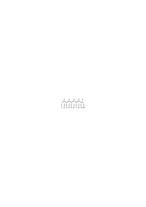

also: (4 × 3) + 2 = 10”.

Nun soll er seine Rechnung anwenden. Er nimmt viermal 3 Nüsse & noch 2 Nüsse & verteilt sie unter 10 Leute; & jeder erhält _eine_ Nuß: Er teilt sie nämlich, den Bögen der Figur entsprechend, aus & wenn er dem 3ten, 5ten, 7ten, 9ten die zweite Nuß gibt, verschmilzt sie mit der ersten zu _einer_.

### [39v\[2\]](https://cdn.wittgensteinnachlass.com/2000px/webp/Ms-118/39v.webp)

Man könnte auch sagen: Du gehst in dem Beweis von Satz zu Satz: aber läßt Du Dir denn auch eine Kontrolle dafür gefallen, daß Du richtig gegangen bist? – Oder sagst Du bloß, “Es _muß_ stimmen” und mißt (nur) alles andre nach Deinem Satz?

### [39v\[3\]](https://cdn.wittgensteinnachlass.com/2000px/webp/Ms-118/39v.webp)

Denn, wenn es _so_ ist, dann schreitest Du nur von Bild zu Bild.

### [39v\[4\]](https://cdn.wittgensteinnachlass.com/2000px/webp/Ms-118/39v.webp),[40r\[1\]](https://cdn.wittgensteinnachlass.com/2000px/webp/Ms-118/40r.webp)

Es könnte praktisch sein, mit einem Maßstab zu messen, der die Eigenschaft hat sich unter gewissen Umständen um ein Zehntel seiner Länge zusammenzuziehen, – was ihn aber, unter andern Verhältnissen zum Maßstab untauglich machen würde. Es könnte praktisch sein, wenn wir beim Abzählen einer Menge unter gewissen Umständen vergäßen, daß nach “7” “8” kommt und zählten “7, 9, 10”.

### [40r\[2\]](https://cdn.wittgensteinnachlass.com/2000px/webp/Ms-118/40r.webp),[40v\[1\]](https://cdn.wittgensteinnachlass.com/2000px/webp/Ms-118/40v.webp),[41r\[1\]](https://cdn.wittgensteinnachlass.com/2000px/webp/Ms-118/41r.webp)

Wovon überzeuge ich Einen, der jene Abbildung im Film des Versuchs mit den 100 Kugeln verfolgt? Man könnte natürlich sagen: davon, daß sich dies so zugetragen hat. – Aber das wäre keine Mathematische Überzeugung. ‒ ‒ Aber kann ich denn nicht sagen: _ich präge ihm einen Vorgang ein_? Dieser Vorgang ist die Umgruppierung einer Reihe von 100 Dingen in 10 Reihen zu 10. Und dieser Vorgang ist _tatsächlich_ immer wieder leicht durchzuführen. Und davon kann er mit Recht überzeugt sein. Und so prägt auch der Beweis

durch Ziehen der Projektionslinien einen Vorgang ein, den der 1 → 1 Zuordnung der H. & des D.. – Aber _überzeugt_ er mich nicht auch davon, daß diese Zuordnung _möglich_ ist? – Wenn das heißen soll: Daß Du sie immer ausführen kannst, so muß das durchaus nicht wahr sein. Aber er _überzeugt_ mich, daß in dieser Figur oben soviele Striche sind, wie unten Ecken; & er ist eine Vorlage, um danach eine H. & einen D. 1 → 1 zuzuordnen. – “Aber zeigt er dadurch nicht, daß es geht?” – Doch höchstens, daß es _hier_ gegangen ist! – “Aber er zeigt doch, daß es geht, in dem Sinne, in welchem es nicht ginge, wenn oben statt

stünde

.”

Wieso; geht es denn da nicht? _So_ z.B.:

“Ja so hab ich's ja nicht gemeint!” – Dann zeig mir, wie Du's meinst, & ich werde es machen. “Aber kann ich denn nicht sagen, die Figur zeige, _wie_ eine solche Zuordnung möglich sei – & muß sie also nicht auch zeigen, _daß_ sie möglich ist?” –

### [41r\[2\]](https://cdn.wittgensteinnachlass.com/2000px/webp/Ms-118/41r.webp),[41v\[1\]](https://cdn.wittgensteinnachlass.com/2000px/webp/Ms-118/41v.webp),[42r\[1\]](https://cdn.wittgensteinnachlass.com/2000px/webp/Ms-118/42r.webp)

31.08.1937

Was war denn damals der Sinn davon, daß wir vorschlugen den Formen der 5 parallelen Striche des Fünfecksterns und andern Namen beizulegen? Was ist denn damit geschehen, daß man ihnen Namen gegeben hat? Es wird dadurch wohl eine Art des Gebrauchs dieser Figuren angedeutet. Und zwar wohl das, daß man sie auf einen Blick als die & die erkennt; man denkt nicht dran ihre Striche oder Ecken zu zählen, etc., sondern erkennt sie als Gestalttypen, wie man Messer & Gabel, die Buchstaben & Ziffern erkennt. Ich kann also auf den Befehl “Zeichne eine H.!” (z.B.) diese Form unmittelbar wiedergeben (& das Gleiche mit der Form D.). – Nun lehrt mich die Figur ( ), wie ich die beiden einander zuordnen kann. (Ich möchte sagen, es sind in dem Beweis nicht einfach diese individuellen Striche, etc. zugeordnet, sondern die _Formen selbst_. Aber das heißt doch nur, daß ich mir jene Formen gut einpräge; als Paradigmen einpräge.) Kann ich nun, wenn ich die Formen H. & D. einander so zuordnen will, nicht in Schwierigkeiten geraten, so daß etwa eine Ecke unten zu viel, oder oben ein Strich zu viel ist? – “Aber doch nicht, wenn Du wirklich wieder H. & D. hingezeichnet hast! Und das läßt sich ja beweisen; sieh diese Figur an:” –

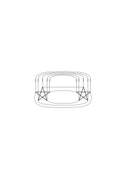

### [42r\[2\]](https://cdn.wittgensteinnachlass.com/2000px/webp/Ms-118/42r.webp),[42v\[1\]](https://cdn.wittgensteinnachlass.com/2000px/webp/Ms-118/42v.webp)

Diese Figur lehrt mich eine neue Art der Kontrolle, daß ich wirklich die gleichen Figuren hingezeichnet hatte; aber kann ich, wenn ich mich nun nach dieser Vorlage richten will, nicht trotzdem in Schwierigkeiten geraten? Ich sage aber, ich bin sicher, daß ich normalerweise in keine Schwierigkeiten kommen werde.

### [42v\[2\]](https://cdn.wittgensteinnachlass.com/2000px/webp/Ms-118/42v.webp)

Was tut nun diese Überlegung? –

### [42v\[3\]](https://cdn.wittgensteinnachlass.com/2000px/webp/Ms-118/42v.webp)

01.09.1937

“Dieser Beweis zeigt mir, daß diese Figur, die ich so gut kenne & diese Figur, die ich so gut kenne, so mit einander verbunden werden können.” ‒ ‒

### [42v\[4\]](https://cdn.wittgensteinnachlass.com/2000px/webp/Ms-118/42v.webp),[43r\[1\]](https://cdn.wittgensteinnachlass.com/2000px/webp/Ms-118/43r.webp)

“Ich habe nicht gewußt, daß man und

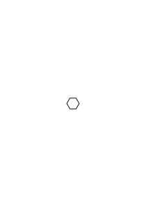

so

zusammenlegen kann.” Kann man auch sagen: “Ich habe gedacht, man könne sie nicht so

zusammenlegen”?

### [43r\[2\]](https://cdn.wittgensteinnachlass.com/2000px/webp/Ms-118/43r.webp)

Aber man kann sagen: ich habe gedacht, man könne sie nicht Seite an Seite (oder: ‘gut passend’) zusammenlegen. Ich kann mir z.B. denken daß Einer dreht & dreht & auf diese Stellung nicht verfällt.

### [43r\[3\]](https://cdn.wittgensteinnachlass.com/2000px/webp/Ms-118/43r.webp),[43v\[1\]](https://cdn.wittgensteinnachlass.com/2000px/webp/Ms-118/43v.webp)

Ich habe nicht gedacht, daß man sie so zusammenlegen kann: Wenn mich jemand gefragt hätte: “kann man sie passend zusammenlegen”, hätte ich geantwortet: “nein.”: Ich habe versucht sie passend zusammenzulegen & es nach einigem Probieren aufgegeben. (Geduldspiele)

### [43v\[2\]](https://cdn.wittgensteinnachlass.com/2000px/webp/Ms-118/43v.webp)

Was findet der, der das Geduldspiel zusammenbringt? Er findet: eine Lage – an welche er früher nicht gedacht hat. – Gut; aber kann man also nicht sagen: er überzeugt sich davon, daß man ein Dreieck & ein Sechseck so zusammenlegen kann? – Aber sag mir: – dieses Dreieck & das Sechseck, welche man so zusammenlegen kann: sollen sie schon, so ineinander liegen oder noch nicht, & erst so zusammengelegt werden?

### [44r\[1\]](https://cdn.wittgensteinnachlass.com/2000px/webp/Ms-118/44r.webp)

Wer sagt: “Ich hätte nicht geglaubt, daß man diese Figuren so zusammensetzen kann”, dem kann man doch nicht, auf das zusammengesetzte Geduldspiel zeigend, sagen: “So, Du hast nicht geglaubt, daß man die Stücke so zusammensetzen kann?” – Er würde antworten: “Ich meinte: ich habe an diese Art der Zusammensetzung gar nicht gedacht.“

### [44r\[2\]](https://cdn.wittgensteinnachlass.com/2000px/webp/Ms-118/44r.webp),[44v\[1\]](https://cdn.wittgensteinnachlass.com/2000px/webp/Ms-118/44v.webp)

Denken wir uns die physikalischen Eigenschaften der Teile des Geduldspiels so, daß sie in die gesuchte Lage nicht kommen können. Ich meine aber nicht, daß man einen Widerstand empfindet, wenn man sie in diese Lage bringen will, sondern man macht einfach alle Versuche, nur _den_ nicht & die Stücke kommen auch durch Zufall nie in diese Lage. Es ist gleichsam diese Lage aus der Geometrie ausgeschlossen. Sozusagen ein “blinder Fleck” in unserm Gehirn. – Und _ist_ es denn nicht so, wenn ich glaube, alle _möglichen_ Stellungen versucht zu haben & an dieser, wie durch Verhexung, immer vorbeigegangen bin.

### [44v\[2\]](https://cdn.wittgensteinnachlass.com/2000px/webp/Ms-118/44v.webp)

Kann man nicht sagen: die Figur, die uns die Lösung zeigt beseitigt eine Blindheit; oder auch, sie ändert Deine Geometrie. Sie zeigt Dir gleichsam eine neue Dimension des Raumes. (Wie wenn man einer Fliege den Weg aus dem Fliegenglas zeigte.)

### [44v\[3\]](https://cdn.wittgensteinnachlass.com/2000px/webp/Ms-118/44v.webp),[45r\[1\]](https://cdn.wittgensteinnachlass.com/2000px/webp/Ms-118/45r.webp)

Ein Wesen hat diese Lage mit einem Bann belegt & aus unserm Raum ausgeschlossen.

### [45r\[2\]](https://cdn.wittgensteinnachlass.com/2000px/webp/Ms-118/45r.webp)

Die neue Lage ist wie aus dem Nichts entstanden. Dort wo früher nichts war, dort ist jetzt auf einmal etwas.

### [45r\[3\]](https://cdn.wittgensteinnachlass.com/2000px/webp/Ms-118/45r.webp)

Inwiefern hat Dich denn die Lösung davon überzeugt, daß man … kann? – Du konntest es ja früher _nicht_– & jetzt kannst Du es etwa. –

### [45r\[4\]](https://cdn.wittgensteinnachlass.com/2000px/webp/Ms-118/45r.webp)

Es ist für mich wichtig beim Philosophieren immer meine Lage zu verändern, nicht zu lange auf _einem_ Bein zu stehen, um nicht steif zu werden. Wie, wer lange bergauf geht, ein Stückchen rückwärts geht, sich zu erfrischen, andre Muskeln anzuspannen.

### [45r\[5\]](https://cdn.wittgensteinnachlass.com/2000px/webp/Ms-118/45r.webp),[45v\[1\]](https://cdn.wittgensteinnachlass.com/2000px/webp/Ms-118/45v.webp)

Es ist eben mehrdeutig, wenn man sagt: “Ich glaube nicht, daß man diese Stücke so zusammensetzen kann”.

### [45v\[2\]](https://cdn.wittgensteinnachlass.com/2000px/webp/Ms-118/45v.webp)

Einfacher Beweis, indem man die fünf Finger der Hand erst auseinanderstreckt, dann zusammenkrümmt & mit den fünf Fingerspitzen ein regelmäßiges Fünfeck bildet.

### [45v\[3\]](https://cdn.wittgensteinnachlass.com/2000px/webp/Ms-118/45v.webp)

“Ja, Du hast mich überzeugt, daß man es machen kann.”

### [45v\[4\]](https://cdn.wittgensteinnachlass.com/2000px/webp/Ms-118/45v.webp)

02.09.1937

Ich bin eine Memme, das merke ich immer wieder, bei jedem Anlaß.

### [45v\[5\]](https://cdn.wittgensteinnachlass.com/2000px/webp/Ms-118/45v.webp),[46r\[1\]](https://cdn.wittgensteinnachlass.com/2000px/webp/Ms-118/46r.webp),[46v\[1\]](https://cdn.wittgensteinnachlass.com/2000px/webp/Ms-118/46v.webp)

Du hast mir einen Weg gezeigt den ich bisher nicht gesehen hatte. – Aber war dieser Weg nicht immer schon im Raum? – Das heißt nichts. Der Weg, von dem ich rede, ist ein materieller Weg, der mir nun als Vorlage dient. – Aber Du hast doch früher geglaubt, daß es diesen Weg nicht gibt! – Das heißt: ich bin nicht im Stande gewesen, mir den Weg vorzustellen. – Aber Du hast also versucht Dir ihn vorzustellen – wie hast Du das gemacht? – Ich habe Verschiedenes getan, was man in diesem Fall “versuchen …” nennt. Was tue ich denn, wenn ich versuche, das Geduldspiel richtig zusammenzustellen & es nicht treffe? Nun ich mache verschiedene Zusammenstellungen dieser Figuren. Ist an diesen Zusammenstellungen etwas _falsch_? – Ich bin unbefriedigt, ich zerstöre sie wieder; ich sage auch: _das_ muß herauskommen & zeige dabei auf den Umriß der fertigen Figur. – Wenn es mir gelingt diesen Umriß zu treffen, so bin ich befriedigt, sage, es sei mir gelungen. – Nein, das ist nicht genug: ich bin befriedigt, wenn es mir gelingt, _dies_, diese Zusammenstellung dieser Figuren, zu legen. Das heißt also: – _wenn ich sie lege_.

### [46v\[2\]](https://cdn.wittgensteinnachlass.com/2000px/webp/Ms-118/46v.webp)

Worauf mache ich aufmerksam? – Darauf, daß der Wunsch die Figur zu legen in diesem Falle anders aussieht als in dem Falle, in welchem ich wünsche, diese Zusammenstellung, auf welche ich zeigen kann, zu legen. Der Wunsch sieht anders aus, das Probieren sieht anders aus, aber die Lösung sieht in beiden Fällen gleich aus.

### [46v\[3\]](https://cdn.wittgensteinnachlass.com/2000px/webp/Ms-118/46v.webp),[47r\[1\]](https://cdn.wittgensteinnachlass.com/2000px/webp/Ms-118/47r.webp)

Und der mich ‘überzeugt hat, daß man es machen kann’, hat mir im einen Fall eine Vorlage gegeben: & das heißt hier: ‘mich in Stand setzen, es zu machen’. Im andern Fall hätte er mir etwa gezeigt, daß er die Kraft hat etwas zu tun, wozu ich nicht die Kraft habe.

### [47r\[2\]](https://cdn.wittgensteinnachlass.com/2000px/webp/Ms-118/47r.webp),[47v\[1\]](https://cdn.wittgensteinnachlass.com/2000px/webp/Ms-118/47v.webp),[48r\[1\]](https://cdn.wittgensteinnachlass.com/2000px/webp/Ms-118/48r.webp)

“Ja, Du hast mich überzeugt, daß die H. & der D. gleichzahlig sind.” – _Wie_ hat er mich überzeugt? Er hat mir ein Bild gezeigt, das ich bis dahin nicht gesehen hatte. – Ja, aber er hat Dich dadurch von der Möglichkeit dieses Bildes überzeugt, an welche Du früher nicht geglaubt hattest. – Aber hier muß man sich darüber klar werden, worin es bestand, ‘nicht an diese Möglichkeit zu glauben’. Ich hatte etwa ‘versucht’ sie zu sehen (siehe oben), aber sie nicht gesehen. Und das heißt doch: ich _hatte das Bild nicht gesehen_. Besser wäre es gewesen zu sagen: er hatte mir eine Möglichkeit gezeigt, die ich nicht gekannt hatte. – Aber warum bin ich hier geneigt, zu sagen, er habe mir eine _Möglichkeit_ gezeigt, & nicht einfach ‘ein Bild’? Denn ich könnte ja immer, wenn man mir irgend ein Bild zeigt, das ich bisher nicht gesehen hatte, sagen: Ja, Du hast mir gezeigt, daß dies möglich ist. Und doch fiele das niemandem ein. – Obwohl das auch einfach die Formel sein könnte, mit der man ausdrückt, man habe das noch nicht gesehen. Nun, die Möglichkeit ist doch wohl eine, die früher beschrieben wurde: z.B., “die Figuren 1 → 1 zuzuordnen”. Und diese _Aufgabe_ ist von der Art der des Geduldspiels. Frage Dich: in welchem Verhältnis steht die Aufgabenstellung zur Lösung. Ja, man kann wohl sagen: die Aufgabe ‘_beschreibt_’ die Lösung. Verschiedene Anwendungen des Wortes “beschreiben”.

### [48r\[2\]](https://cdn.wittgensteinnachlass.com/2000px/webp/Ms-118/48r.webp)

“Ich _weiß_ nun, daß eine H. immer gleichzahlig einem D. ist & dieser Beweis überzeugt mich davon.” – Warum soll ich das nicht sagen? Aber könnte man nicht, ohne den Sprachgebrauch zu vergewaltigen, statt dieser Worte, & in gleicher Weise, _die_ gebrauchen: “Eine H. & ein D. werden mir nun immer als gleichzahlig gelten & der Beweis wird mir als Vorlage dienen um die Figuren nötigenfalls einander zuzuordnen, oder auch zu prüfen, ob hier wirklich ein H. & ein D. ist”

### [48r\[3\]](https://cdn.wittgensteinnachlass.com/2000px/webp/Ms-118/48r.webp),[48v\[1\]](https://cdn.wittgensteinnachlass.com/2000px/webp/Ms-118/48v.webp)

Renne nicht gegen Ausdrücke. Das ist, gegen Windmühlen kämpfen. Sondern prüfe die Verwendungen des Ausdrucks & vergleiche sie mit einander.

### [48v\[2\]](https://cdn.wittgensteinnachlass.com/2000px/webp/Ms-118/48v.webp),[49r\[1\]](https://cdn.wittgensteinnachlass.com/2000px/webp/Ms-118/49r.webp),[49v\[1\]](https://cdn.wittgensteinnachlass.com/2000px/webp/Ms-118/49v.webp),[50r\[1\]](https://cdn.wittgensteinnachlass.com/2000px/webp/Ms-118/50r.webp)

Diese Überlegungen schienen zuerst zeigen zu sollen, daß ‘was ein logischer Zwang zu sein scheint, in Wirklichkeit nur ein psychologischer ist’ – und da fragte es sich doch: kenne ich also beide Arten des Zwanges?! – Denke Dir, es würde der Ausdruck gebraucht: “Das Gesetz § … bestraft den Mörder mit dem Tode”. Das könnte doch nur heißen, jenes Gesetz laute: u.s.w.. Jene Form des Ausdrucks (aber) könnte sich uns aufdrängen, weil das Gesetz Mittel ist wenn der Schuldige der Strafe zugeführt wird. – Nun reden wir von der von ‘Unerbittlichkeit’ derer, die jemand bestrafen. Da könnte es uns einfallen, zu sagen, das Gesetz ist unerbittlicher als alle Menschen, denn sie können den Schuldigen laufen lassen, das Gesetz aber richtet ihn hin. (ja sogar: “das Gesetz richtet ihn _immer_ hin”). – Wozu ist so eine Ausdrucksform zu gebrauchen? – Zunächst sagt dieser Satz ja nur, im Gesetz stehe das & das, & Menschen richten sich manchmal nicht danach. Dann aber zeigt er doch das Bild des einen unerbittlichen, & vieler laxer Richter. Er dient darum als Ausdruck des Respekts vor dem Gesetz. Endlich aber kann man die Ausdrucksform auch so gebrauchen, daß man ein Gesetz ‘unerbittlich’ nennt, wenn es die Möglichkeit der Begnadigung nicht vorsieht & etwa ‘milde’ im andern Fall. Aber wir reden ja auch von der Unerbittlichkeit der Logik. Und wir denken uns die logischen Gesetze unerbittlicher, als (die) Naturgesetze. Wir (aber) machen nun drauf aufmerksam, daß das Wort “unerbittlich” (hier) auf zweierlei Weise angewendet wird. Einerseits entsprechen unsern logischen Gesetzen besonders unerbittliche, d.h. allgemein bestätigte, Erfahrungsgesetze, was es uns möglich macht diese Gesetze immer wieder auf sehr einfache Weise zu demonstrieren (“von selbst kommt nichts weg” usw.). Das legt den Gebrauch gerade dieser Schlußgesetze nahe, & nun sind _wir_ unerbittlich in der gleichförmigen Anwendung dieser Gesetze; weil wir ‘_messen_’ (& es gehört zum Messen, daß Alle das gleiche Maß haben). Nun kann man aber außerdem noch unerbittliche, d.h. eindeutige, von nicht eindeutigen Schlußgesetzen unterscheiden, d.i. von solchen, die eine Alternative freistellen.

### [50r\[2\]](https://cdn.wittgensteinnachlass.com/2000px/webp/Ms-118/50r.webp)

Ich sagte, ‘ich lasse mir das & das als Beweis dieses Satzes gefallen’ – aber kann ich mir die Figur, die die Stücke meines Geduldspiels zusammengefügt zeigt, _nicht_ als Beweis dafür gefallen lassen, daß man jene Stücke zu diesem Umriß zusammensetzen kann?

### [50r\[3\]](https://cdn.wittgensteinnachlass.com/2000px/webp/Ms-118/50r.webp),[50v\[1\]](https://cdn.wittgensteinnachlass.com/2000px/webp/Ms-118/50v.webp)

Aber denk Dir eines seiner Stücke liege so, daß sein Umriß das Spiegelbild des entsprechenden Umrisses in der Vorlage ist. Er versucht nun die Figur nach der Vorlage (dem Beweis) zusammenzusetzen, denkt aber nicht daran das Stück umzudrehen & er sieht, daß ihm das Zusammensetzen nicht gelingt.

### [50v\[2\]](https://cdn.wittgensteinnachlass.com/2000px/webp/Ms-118/50v.webp),[51r\[1\]](https://cdn.wittgensteinnachlass.com/2000px/webp/Ms-118/51r.webp),[51v\[1\]](https://cdn.wittgensteinnachlass.com/2000px/webp/Ms-118/51v.webp),[52r\[1\]](https://cdn.wittgensteinnachlass.com/2000px/webp/Ms-118/52r.webp),[52v\[1\]](https://cdn.wittgensteinnachlass.com/2000px/webp/Ms-118/52v.webp),[53r\[1\]](https://cdn.wittgensteinnachlass.com/2000px/webp/Ms-118/53r.webp)

03.09.1937

Wie schätzt man, wie viel Uhr es ist, ohne sich nach äußeren Zeichen zu richten, wo die Sonne steht, wie hell es im Zimmer ist, etc.? – Man fragt sich: “wie viel Uhr kann es sein?”, überlegt einen Augenblick; d.h. hier: man hält sich ruhig, stellt sich etwa das Zifferblatt der Uhr vor; & dann sagt man mit Ruhe, , die & die Zeit. – Oder man überlegt sich ein paar Möglichkeiten: man sagt sich zur Probe eine Zeit, dann eine andere & endlich bleibt man bei einer zwischen den beiden stehen. So & ähnlich geht es vorsich. – Aber ist nicht das Einfallen der Zeit von einem Gefühl der Überzeugung begleitet? & heißt das nicht, daß der Einfall mit einer inneren Uhr übereinstimmt? – Nein, ich lese die Zeit von keiner ‘inneren Uhr’ ab; & ein Gefühl der Überzeugung ist in so fern da, als ich mir ohne eine Empfindung des Zweifels sage “es ist … Uhr”. – Aber schnappt also nicht doch etwas bei dieser Zeitangabe ein? – Nichts, das ich wüßte, außer wenn Du die Beruhigung, das Stehenbleiben auf einer Zahl so nennst. Offen gestanden, ich hätte hier nie von einem ‘Gefühl der Überzeugung’ geredet, sondern etwa gesagt: ich habe eine Weile überlegt & mich dann dafür entschieden, daß es … Uhr ist. Wonach aber hab ich mich entschieden? Ich hätte gesagt: bloß ‘nach dem Gefühl’. Das heißt aber nur: Mein Einfall ist, etwa nach einigem Schwanken, bei dieser Zeitangabe stehengeblieben. – Aber Du mußtest Dich doch wenigstens in einen bestimmten Zustand versetzen; & Du nimmst doch nicht _jede_ Vorstellung irgend einer Zeitangabe, als Angabe der gegenwärtigen Stunde! – Wie gesagt: ich hatte mich gefragt “wie viel Uhr mag es sein?”, d.h. ich habe diese Worte nicht, z.B., in einem Buch gelesen, noch sie als Ausspruch eines Andern zitiert, noch mich im Aussprechen dieser Wörter geübt, u.s.f., nicht unter _diesen_ Umständen habe ich die Worte gesagt. Fragst Du aber: “unter welchen also?” – Nun ich stand da & da, dachte an mein Frühstück, & ob es heute spät würde. Solcherlei waren die Umstände. Und nur dies kann ich über den ‘Zustand’ aussagen, in welchen ich mich bei der Schätzung der Zeit versetzen mußte. – Aber siehst Du denn wirklich nicht, daß Du doch in einem, wenn auch quasi ungreifbaren, für das Schätzen der Zeit charakteristischen Zustand, gleichsam in einer bestimmten Atmosphäre warst? – Ja, das spezifische war, daß ich mich fragte: “Wie viel Uhr mag es sein?”– & hat dieser Satz eine bestimmte Atmosphäre, wie soll ich sie von ihm selbst trennen können? Auch wäre es mir nie eingefallen, zu denken, dieser Satz hatte eine solche Atmosphäre, wenn ich nicht dran gedacht hätte, wie man ihn auch anders – als Zitat, im Scherz, als Sprechübung, etc. etc. – sagen kann. Und _da_ wollte ich auf einmal sagen, da erschien es mir auf einmal: ich mußte als ich diese Worte als richtige Frage meinte, sie doch irgendwie besonders _gemeint_ haben, eben anders, als in jenen andern Fällen. Und wollte ich (nun) näher hinschauen, um zu sehen, _wie denn_ – so konnte ich wieder nichts (besondres) entdecken. Es hatte sich mir das Bild von ‘der besonderen Atmosphäre’ aufgedrängt; ich sehe sie förmlich vor mir, solange ich nämlich nicht auf das sehe was meiner Erinnerung nach wirklich gewesen ist, sondern mir etwa sage: “Ich habe doch die _Zeit geschätzt_.” Und was das Gefühl der Überzeugung, oder vielleicht besser, der _Sicherheit_, anbelangt, so sage ich mir manchmal: “ich bin sicher, es ist … Uhr”, & in mehr oder weniger sicherem Tonfall, etc. Wenn Du mich nach dem _Grund_ für diese Sicherheit fragst, so habe ich keinen. Wenn ich sage: ich lese es auf meiner inneren Uhr ab, so ist das ein Bild, dem doch wieder nur entspricht, daß ich diese Zeitangabe gemacht habe. Und der Zweck des Bildes ist diesen Fall dem andern anzugleichen. Ich sträube mich die beiden verschiedenen Fälle anzuerkennen.

### [53r\[2\]](https://cdn.wittgensteinnachlass.com/2000px/webp/Ms-118/53r.webp),[53v\[1\]](https://cdn.wittgensteinnachlass.com/2000px/webp/Ms-118/53v.webp),[54r\[1\]](https://cdn.wittgensteinnachlass.com/2000px/webp/Ms-118/54r.webp)

Man kann ein Rechteck aus zwei Parallelogrammen & zwei Dreiecken zusammensetzen. Beweis:

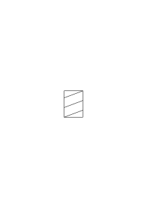

Ein Kind würde die

Zusammensetzung eines Rechtecks aus diesen Bestandteilen schwer treffen & davon überrascht sein, daß zwei Seiten der Parallelogramme in eine grade Linie fallen, wo doch die Parallelogramme schief sind. – Es könnte ihm vorkommen, daß das Rechteck gleichsam wie durch Zauberei aus diesen Figuren wird. Ja, es muß zugeben, daß sie nun ein Rechteck bilden, aber durch einen Trick, durch eine vertrackte Stellung, nicht in natürlicher Weise. Ich kann mir denken, daß das Kind, wenn es durch Zufall die beiden Parallelogramme in _der_ Weise zusammengelegt hat, seinen Augen nicht traut, wenn es sieht, daß sie _so_ zusammenpassen. ‘_Sie sehen nicht aus_, als ob sie so zusammenpaßten.’ Und ich könnte mir denken, daß man sagt: Es erscheint nur durch ein Blendwerk, als gäben _sie_ das Rechteck – in Wirklichkeit haben sie ihre Natur verändert, sie sind nicht mehr die Parallelogramme, die ich hatte.

### [54r\[2\]](https://cdn.wittgensteinnachlass.com/2000px/webp/Ms-118/54r.webp),[54v\[1\]](https://cdn.wittgensteinnachlass.com/2000px/webp/Ms-118/54v.webp),[55r\[1\]](https://cdn.wittgensteinnachlass.com/2000px/webp/Ms-118/55r.webp)

Aber kann ich den Satz der Geometrie nicht auch ohne Beweis glauben, z.B. auf die Versicherung eines Andern hinnehmen? – Und was verliert der Satz, wenn er seinen Beweis verliert? – Ich soll hier wohl fragen: “Was kann ich mit ihm machen?”, denn darauf kommt es an. Den Satz auf die Versicherung des Andern _annehmen_, wie zeigt sich das? Ich kann ihn z.B. in weiteren Operationen verwenden, oder ihn bei der Beurteilung eines physikalischen Sachverhalts verwenden. Versichert mich jemand z.B., 13 mal 13 sei 396 & ich glaube es, so werde ich mich nun wundern, daß bei einer Verteilung von 396 Nüssen unter 13 Kinder jedes 15 kriegt & noch eine Nuß überbleibt & etwa annehmen die Nüsse hätten sich von selbst vermehrt. Oder soll ich sagen: man könne nicht _glauben_, daß 13 × 13 396 ist, man könne diese Zahl nur mechanisch vom Andern _annehmen_? Aber warum soll ich nicht sagen, ich _glaubte_ es? Dies glauben, ist ja kein geheimnisvoller Akt, der sozusagen unterirdisch mit der richtigen Rechnung in Verbindung ist. Ich kann doch jedenfalls sagen: “ich glaube es”, & nun danach handeln. Man möchte hier fragen: “Was tut der, der glaubt, daß 13 × 13 396 ist?” Und man kann antworten: Nun, das wird davon abhängen, ob er z.B. die Rechnung selber gemacht & sich dabei verschrieben hat – oder ob sie ein Andrer für ihn gemacht hat, er aber doch weiß, wie man so eine Rechnung macht – oder ob er nicht multiplizieren kann, aber weiß, daß man das Resultat erhält, wenn man 13 Reihen zu je 13 Punkten macht & sie alle zählt– u.s.f..

### [55r\[2\]](https://cdn.wittgensteinnachlass.com/2000px/webp/Ms-118/55r.webp),[55v\[1\]](https://cdn.wittgensteinnachlass.com/2000px/webp/Ms-118/55v.webp)

Denkt man nämlich an die arithmetische Gleichung als den Ausdruck einer internen Relation, so möchte man sagen: “Er kann ja gar nicht glauben, daß 13 × 13 _dies_ ergibt, weil das ja keine Multiplikation, oder kein _Ergeben_ ist, wenn 396 am Ende steht.” Das heißt aber nur, daß man das Wort “glauben” für den Fall einer Rechnung & ihres Resultats nicht anwenden will, oder nur dann, wenn man die richtige Rechnung vor sich hat.

### [55v\[2\]](https://cdn.wittgensteinnachlass.com/2000px/webp/Ms-118/55v.webp),[56r\[1\]](https://cdn.wittgensteinnachlass.com/2000px/webp/Ms-118/56r.webp)

“Was glaubt der, der glaubt, 13 × 13 ist 396?” – Wie tief dringt er – könnte man sagen – mit seinem Glauben in das Verhältnis dieser Zahlen ein? Denn bis zum Ende – will man sagen – kann er nicht dringen, sonst könnte er das nicht glauben. Aber wann dringt er in die Verhältnisse der Zahlen ein? Während er sagt, daß er glaubt …? Darauf wirst Du nicht bestehen, – denn es ist leicht zu sehen daß dieser Schein nur durch die Oberfläche unsrer Grammatik – wie man es nennen könnte – erweckt wird.

---

Denn ich will sagen: “Man kann nur _sehen_, daß 13 × 13 369 ist, & man kann auch das nicht _glauben_. Man kann nur noch, mehr oder weniger blindlings, eine Regel annehmen.” Und was tue ich, wenn ich dies sage? Ich mache einen Schnitt – zwischen _Rechnung_ (d.i. einem bestimmten Bild, einer bestimmten Vorlage) & dem Resultat einer Rechnung einerseits & dem Vorgang & Resultat eines Experiments anderseits.

### [56r\[2\]](https://cdn.wittgensteinnachlass.com/2000px/webp/Ms-118/56r.webp)

Jener Satz über die Zusammensetzbarkeit des Rechtecks aus den Parallelogrammen & Dreiecken ist ja ganz ähnlich einem arithmetischen, wie etwa: 3 + 3 + 2 + 2 = 10.

### [56r\[3\]](https://cdn.wittgensteinnachlass.com/2000px/webp/Ms-118/56r.webp),[56v\[1\]](https://cdn.wittgensteinnachlass.com/2000px/webp/Ms-118/56v.webp)

04.09.1937

Etwas verkühlt & denkunfähig. Grausliches Wetter. – Das Christentum ist keine Lehre, ich meine, keine Theorie darüber, was mit der Seele des Menschen geschehen ist & geschehen wird, sondern eine Beschreibung eines tatsächlichen Vorgangs im Leben des Menschen. Denn die ‘Erkenntnis der Sünde’ ist ein tatsächlicher Vorgang & die Verzweiflung desgleichen & die Erlösung durch den Glauben desgleichen. Die, die davon sagen, (wie Bunyan), beschreiben einfach, was ihnen geschehen ist; was immer einer dazu sagen will!

### [56v\[2\]](https://cdn.wittgensteinnachlass.com/2000px/webp/Ms-118/56v.webp),[57r\[1\]](https://cdn.wittgensteinnachlass.com/2000px/webp/Ms-118/57r.webp)

05.09.1937

“Du gibst _das_ zu – dann mußt Du _das_ zugeben.” – Er _muß_ es zugeben – & dabei ist es möglich, daß er es nicht zugibt. Oder willst Du sagen: “er kann es sagen, aber er kann es nicht _denken_”. Nimmst Du da nicht einen okkulten Vorgang des Denkens an? Oder es heißt, daß ein solcher Gebrauch der Worte kein Denken ist. “Ich werde Dir zeigen, warum Du es zugeben mußt. –” Ich werde Dir einen Fall vor Augen führen, welcher, wenn Du ihn bedenkst, Dich bestimmen wird, so zu urteilen.

### [57r\[2\]](https://cdn.wittgensteinnachlass.com/2000px/webp/Ms-118/57r.webp)

Wie können ihn denn die Manipulationen des Beweises dazu bringen, etwas zuzugeben?

### [57r\[3\]](https://cdn.wittgensteinnachlass.com/2000px/webp/Ms-118/57r.webp)

“Du wirst doch zugeben, daß 5 aus 3 + 2 besteht!”

Ich will es nur zugeben, wenn ich damit nichts zugebe. Außer, – daß ich _dieses Bild_ verwenden will.

### [57r\[4\]](https://cdn.wittgensteinnachlass.com/2000px/webp/Ms-118/57r.webp),[57v\[1\]](https://cdn.wittgensteinnachlass.com/2000px/webp/Ms-118/57v.webp)

Man könnte z.B. die Figur

als Beweis dafür nehmen, daß 100 Parallelogramme, so zusammengesetzt einen geraden Streifen geben müssen.

Wenn man dann wirklich 100 zusammenfügt erhält man nun etwa einen gebogenen Streifen. – Jener Beweis hat uns bestimmt, das Bild & die Ausdrucksweise zu gebrauchen: Wenn sie keinen geraden Streifen geben, sind sie ungenau hergestellt.

### [57v\[2\]](https://cdn.wittgensteinnachlass.com/2000px/webp/Ms-118/57v.webp)

Denke nur, wie kann mich das Bild, das Du mir zeigst (oder die Tatsache) dazu verpflichten, nun so & so immer zu urteilen! Ja, liegt hier ein Experiment vor, so ist _eines_ ja doch zu wenig, mich zu irgend einem Urteil zu verbinden.

### [58r\[1\]](https://cdn.wittgensteinnachlass.com/2000px/webp/Ms-118/58r.webp)

Der Beweisende sagt: “Schau diese Figur an. – Was wollen wir dazu sagen? Nicht, daß …? –”

### [58r\[2\]](https://cdn.wittgensteinnachlass.com/2000px/webp/Ms-118/58r.webp)

Oder auch: “Das nennst Du doch ‘Parallelogramme’ & das ‘Dreiecke’ & so sieht es doch aus wenn eine Figur aus andern zusammengesetzt ist. –”

### [58r\[3\]](https://cdn.wittgensteinnachlass.com/2000px/webp/Ms-118/58r.webp),[58v\[1\]](https://cdn.wittgensteinnachlass.com/2000px/webp/Ms-118/58v.webp)

Ja, Du hast mich überzeugt: ein Rechteck besteht immer aus ….” – Würde ich auch sagen: “Ja Du hast mich überzeugt: dieses Rechteck (des Beweises) besteht aus …” – und dies wäre ja doch der bescheidenere Satz; den auch der zugeben sollte, der etwa den allgemeinen Satz noch nicht zugibt. Seltsamerweise aber scheint der, der _das_ zugibt nicht den bescheideneren geometrischen Satz zuzugeben, sondern gar keinen Satz der Geometrie. Freilich, denn bezüglich des Rechtecks des Beweises hat er mich ja von nichts überzeugt. (Über diese Figur, wenn ich sie früher gesehen hätte, wäre ich ja in keinem Zweifel gewesen.) Ich habe ja, aus freien Stücken, was diese Figur anbelangt, alles zugestanden. Und er hat mich nur _mittels_ ihrer überzeugt. – Aber wenn er mich nicht einmal bezüglich dieser Figur von etwas überzeugt hat, wie dann erst von einer Eigenschaft andrer Rechtecke?

### [58v\[2\]](https://cdn.wittgensteinnachlass.com/2000px/webp/Ms-118/58v.webp),[59r\[1\]](https://cdn.wittgensteinnachlass.com/2000px/webp/Ms-118/59r.webp)

“Du hast mich überzeugt, daß alle Rechtecke aus … bestehen” – dieser Satz ist offenbar nachgebildet dem, : “Ich dachte diese Kugeln seien aus _einem_ Stück, Du hast mich überzeugt, daß sie aus zwei solchen Teilen bestehen.”

### [59r\[2\]](https://cdn.wittgensteinnachlass.com/2000px/webp/Ms-118/59r.webp)

06.09.1937

Wir halten geflissentlich an der _kindischen_ Schwierigkeit fest.

### [59r\[3\]](https://cdn.wittgensteinnachlass.com/2000px/webp/Ms-118/59r.webp)

Wer philosophiert, leidet unter Sprachkrämpfen; & ich suche nach dem sprachlichen Übergang in die krampflose Stellung.

### [59r\[4\]](https://cdn.wittgensteinnachlass.com/2000px/webp/Ms-118/59r.webp)

Der Krampf löst sich durch einen sprachlichen Übergang. Und dieser Übergang ist zu finden.

### [59r\[5\]](https://cdn.wittgensteinnachlass.com/2000px/webp/Ms-118/59r.webp)

Ich suche nach den Worten, die den Weg bilden aus der Stellung, in die ich gebannt scheine.

### [59r\[6\]](https://cdn.wittgensteinnachlass.com/2000px/webp/Ms-118/59r.webp),[59v\[1\]](https://cdn.wittgensteinnachlass.com/2000px/webp/Ms-118/59v.webp)

Ich suche den sprachlichen Ausweg aus dem Krampf.

### [59v\[2\]](https://cdn.wittgensteinnachlass.com/2000px/webp/Ms-118/59v.webp)

Wenn ich ein Rechteck als auf diese Weise zusammengefügt sehe, so vergleiche ich dies dem Fall: meine Blicke dringen in das Innere & sehen dort diese Zusammensetzung. Man kann ja auch sagen: “Ich könnte es nicht so zusammengesetzt sehen wenn es nicht so zusammengesetzt wäre.”

### [59v\[3\]](https://cdn.wittgensteinnachlass.com/2000px/webp/Ms-118/59v.webp)

Wie der Experte Kassenschloßöffner versuche ich alle Lagen des Sperrhakens, mache hundertmal die gleiche Bewegung mit ihm und es kommt alles auf das feine Gefühl der Finger an, die die Bewegung machen. Drum hat es auch gar keinen Sinn diese Bewegung zu machen, es sei denn mit Gefühl.

### [60r\[1\]](https://cdn.wittgensteinnachlass.com/2000px/webp/Ms-118/60r.webp)

“Ich habe nicht gewußt, daß die Rechtecksform aus diesen Formen besteht.” Es ist als wäre die _Form_ aus diesen _Formen_ gemacht, geschweißt.

### [60r\[2\]](https://cdn.wittgensteinnachlass.com/2000px/webp/Ms-118/60r.webp)

“Ich wußte nicht, daß die Form aus diesen Formen besteht.” – So hat's Dich das Bild gelehrt. Du hast etwas _Neues_ gesehen – & willst sagen, Du habest erkannt, daß das Alte so & so zusammengesetzt ist.

### [60r\[3\]](https://cdn.wittgensteinnachlass.com/2000px/webp/Ms-118/60r.webp)

Du vergleichst also Dein Erstaunen, dem: Du siehst ein rechteckiges Brett & findest, daß es auf diese seltsame Weise zusammengesetzt ist.

### [60r\[4\]](https://cdn.wittgensteinnachlass.com/2000px/webp/Ms-118/60r.webp),[60v\[1\]](https://cdn.wittgensteinnachlass.com/2000px/webp/Ms-118/60v.webp)

‘Ja die Form sieht nicht so aus, als könnte sie aus zwei windschiefen Teilen bestehen.’ Was überrascht Dich? Doch nicht, daß Du jetzt diese Figur vor Dir siehst! Mich überrascht etwas _in_ dieser Figur. – Aber in dieser Figur geht ja nichts vor! Mich überrascht die Zusammenstellung des Schiefen mit dem Graden. Mir wird – gleichsam – schwindelig. Das ist vergleichbar damit, daß mir schwindelig wird, wenn ich eine Spirale sehe.

### [60v\[2\]](https://cdn.wittgensteinnachlass.com/2000px/webp/Ms-118/60v.webp),[61r\[1\]](https://cdn.wittgensteinnachlass.com/2000px/webp/Ms-118/61r.webp)

‘Mich überrascht, daß die windschiefen Stücke ein Gerades geben. (Ich hätte es nicht gedacht.)’ – Ja, das ist so, als hätte ich sie zusammengesetzt. Sie haben nicht ausgesehen als würden sie zu etwas Geradem zusammenpassen, ich hatte mir etwas Winkeliges erwartet. – Aber kann ich mir denn beim Anblick der geteilten Rechtecksfigur etwas Winkeliges erwarten?! Eher könnte ich sagen: “Es will mir nicht recht ein, daß diese Stücke das ergeben“. Das ist aber gleichsam ein Gefühl des Schwindels.

### [61r\[2\]](https://cdn.wittgensteinnachlass.com/2000px/webp/Ms-118/61r.webp)

“Du hast mich überzeugt, daß ein Rechteck aus … besteht”. “Zusammengesetzt werden kann” könnte ich auch sagen. Dabei schaue ich nicht auf ein Rechteck, das tatsächlich so geteilt ist, sondern auf ein ungeteiltes; & stelle mir Teilungslinien vor.

### [61r\[3\]](https://cdn.wittgensteinnachlass.com/2000px/webp/Ms-118/61r.webp),[61v\[1\]](https://cdn.wittgensteinnachlass.com/2000px/webp/Ms-118/61v.webp)

Ich sehe ein Bild & umgebe es in der Vorstellung hartnäckig mit einem Vorgang von welchem ich meine Ausdrucksformen hernehme. Ich habe ein geteiltes Rechteck vor mir; ich gebe vor, ich habe es aus diesen Teilen zusammengesetzt & sei durch das Ergebnis überrascht. Ich gebe vor, man habe mich davon überzeugt, daß Teile – die nicht so ausgesehen haben – sich zu dieser Figur zusammenfügen.

### [61v\[2\]](https://cdn.wittgensteinnachlass.com/2000px/webp/Ms-118/61v.webp)

“Ja, Du hast mich überzeugt: zwei Parallelogramme geben ein Rechteck.” Es ist wesentlich daß ich das Rechteck als das Ergebnis davon betrachte, daß ich ein Parallelogramm auf das andere stelle.

### [61v\[3\]](https://cdn.wittgensteinnachlass.com/2000px/webp/Ms-118/61v.webp),[62r\[1\]](https://cdn.wittgensteinnachlass.com/2000px/webp/Ms-118/62r.webp)

Ich sage aber doch wirklich: “Ich habe mich überzeugt, daß man diese Figur aus diesen Teilen legen kann”, wenn ich nämlich etwa das Bild der Lösung gesehen habe. Wenn ich Einem das sage, so will ich doch sagen: “Versuch nur; diese Stücke richtig gelegt geben die Figur.” Ich meine, ich will doch etwas Physikalisches sagen. Es ist wesentlich, daß die Abbildung der Lösung mich in Stand setzt, die Figur ohne weiteres zusammenzusetzen. Dazu gehört doch das Faktum, daß man die einzelnen Stücke in beliebige Lagen bringen kann, ohne daß sie z.B. _verschwinden_.

### [62r\[2\]](https://cdn.wittgensteinnachlass.com/2000px/webp/Ms-118/62r.webp)

Wie kann mich denn ein Bild davon überzeugen, daß etwas möglich ist? Z.B. daß ich genug Steine habe eine Figur damit zu legen? – Hier genügt also, scheint es, das Bild eines Experiments, statt des Experiments! Aber mußte ich nicht doch auch ein Experiment machen, nämlich das des Vergleichs (welches analog ist dem einer Ausmessung)?

### [62r\[3\]](https://cdn.wittgensteinnachlass.com/2000px/webp/Ms-118/62r.webp),[62v\[1\]](https://cdn.wittgensteinnachlass.com/2000px/webp/Ms-118/62v.webp)

07.09.1937

Unwetter. Sturm & Regen. Schlecht geschlafen. Wenig wohl. Bin irreligiös, aber mit Angst.

### [62v\[2\]](https://cdn.wittgensteinnachlass.com/2000px/webp/Ms-118/62v.webp)

Du sagst, Du bist erstaunt über das, was Dir der Beweis zeigt. Aber bist Du erstaunt darüber, daß sich diese Striche haben ziehen lassen? Nein. Du bist erstaunt, nur wenn Du Dir sagst, daß zwei solche Stücke diese Form _geben_. Wenn Du Dich also in die Situation hineindenkst: Du habest Dir etwas anderes erwartet & nun sähest Du das Ergebnis.

### [62v\[3\]](https://cdn.wittgensteinnachlass.com/2000px/webp/Ms-118/62v.webp)

Warum sollte mir Wind & Regen unheimlich sein?! Aber es ist mir hier unheimlich; – und das ist schlecht.

### [62v\[4\]](https://cdn.wittgensteinnachlass.com/2000px/webp/Ms-118/62v.webp),[63r\[1\]](https://cdn.wittgensteinnachlass.com/2000px/webp/Ms-118/63r.webp)

“Aus _dem_ folgt unerbittlich _das_.” Ja, in dieser Demonstration geht es daraus hervor. Und eine Demonstration ist dies für den, der sie als Demonstration anerkennt. Wer sie _nicht_ anerkennt, wer ihr nicht als Demonstration folgt, der trennt sich von uns, noch ehe es zur Sprache kommt.

### [63r\[2\]](https://cdn.wittgensteinnachlass.com/2000px/webp/Ms-118/63r.webp),[63v\[1\]](https://cdn.wittgensteinnachlass.com/2000px/webp/Ms-118/63v.webp)

Es ist hier, wenn es draußen stürmt nicht gemütlich, so daß man sich etwa drinnen um so gemütlicher fühlt, je häßlicher draußen das Wetter ist. Sondern das Toben des Sturmes macht mich drinnen aufgeregt, läßt mich nicht arbeiten. Es ist, als seien die Wände zu dünn; man hat nicht das Gefühl des Schutzes & der Geborgenheit. Es ist als wäre die Schutzmauer nur dünn & könnte jederzeit durchbrochen werden. Macht das auch die Einsamkeit? Mein Gefühl wird gewiß durch den leisen Zug hervorgerufen, der durch die Hütte geht, & durch das Zittern der Wände, die im übrigen stark genug sind. In dem Sturm & Unwetter war ich versucht Gott zu verfluchen, was doch nur böse & abergläubisch ist. Später war mir's gegeben zu denken: Präg' dir doch ein Sturm recht ein, daß du etwas lernst; & da wurde mir besser. – (Die Eitelkeit verläßt mich nie.)

### [63v\[2\]](https://cdn.wittgensteinnachlass.com/2000px/webp/Ms-118/63v.webp)

Wie kann mich denn das Bild zu etwas verpflichten?

### [63v\[3\]](https://cdn.wittgensteinnachlass.com/2000px/webp/Ms-118/63v.webp),[64r\[1\]](https://cdn.wittgensteinnachlass.com/2000px/webp/Ms-118/64r.webp)

Wir sagen z.B. wir haben gleichviel Leute hier & dort, wenn wir bei der Zählung hier ‘6’ & hier ‘6’ herausbringen. Und wenn das so ist – & man nicht sieht daß einer dazukommt oder wegkommt – so lassen sich die Gruppen auch normalerweise 1 → 1 räumlich zuordnen, oder wiegen ungefähr das Gleiche, u.s.f.. Man kommt selten in die Lage zu sagen: “Ich weiß nicht was geschehen ist! Habe ich beim Zählen eine Zahl ausgelassen, oder habe ich mich verschaut, oder eine Halluzination gehabt?!

### [64r\[2\]](https://cdn.wittgensteinnachlass.com/2000px/webp/Ms-118/64r.webp)

08.09.1937

“Aus _diesem_ folgt unerbittlich _das_, – solange nämlich die Wörter _das_ bedeuten.” – Aber erhalten sie nicht eben ihre Bedeutung durch diese Regel?

### [64r\[3\]](https://cdn.wittgensteinnachlass.com/2000px/webp/Ms-118/64r.webp),[64v\[1\]](https://cdn.wittgensteinnachlass.com/2000px/webp/Ms-118/64v.webp)

Dieses Schema,

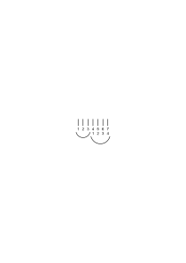

kann als Beweis gelten, dafür, daß 3 + 4 7 ist. Aber was würde es dem zeigen, der jene Haken – die Ziffern – nicht kennte? Und worin besteht unsre Bekanntschaft mit ihnen?

### [64v\[2\]](https://cdn.wittgensteinnachlass.com/2000px/webp/Ms-118/64v.webp)

Wenn ich mir aber das Aussehen einer Dreier- & einer Vierergruppe einpräge, so kann der Beweis auch so aussehen:

### [64v\[3\]](https://cdn.wittgensteinnachlass.com/2000px/webp/Ms-118/64v.webp)

‘Wenn Du eine Dreier- & eine Vierer-Gruppe hast, so folgt unerbittlich, daß Du 7 hast.’

### [64v\[4\]](https://cdn.wittgensteinnachlass.com/2000px/webp/Ms-118/64v.webp)

“Ich lasse mir dies als Beweis dieses Satzes gefallen” – heißt, ich nehme es als _Beweis_ an, nicht anders als ich die Regel selbst als Regel annehme.

### [65r\[1\]](https://cdn.wittgensteinnachlass.com/2000px/webp/Ms-118/65r.webp)

D.h., es ist alles _ein_ Spiel. Wie ich zugleich _dies_ als Maßeinheit ansehen, & _so_ messen lerne.

Oder dies als Beweis von 3 + 2 = 5.

### [65r\[2\]](https://cdn.wittgensteinnachlass.com/2000px/webp/Ms-118/65r.webp)

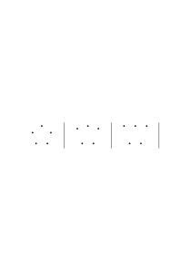

(Oder kinematographisch vorgeführt.)

### [65r\[3\]](https://cdn.wittgensteinnachlass.com/2000px/webp/Ms-118/65r.webp)

Ich habe eine schwere Zeit! Innere & äußere Störung. –

### [65r\[4\]](https://cdn.wittgensteinnachlass.com/2000px/webp/Ms-118/65r.webp),[65v\[1\]](https://cdn.wittgensteinnachlass.com/2000px/webp/Ms-118/65v.webp)

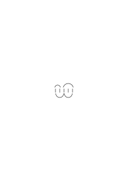

Hier haben wir etwas, was unerbittlich ausschaut.

Und doch: ‘unerbittlich’ kann es nur in seinen Folgen sein! Denn sonst ist es nur ein Bild. Worin besteht denn die Fernwirkung – wie man's nennen könnte – dieses Diagramms?

### [65v\[2\]](https://cdn.wittgensteinnachlass.com/2000px/webp/Ms-118/65v.webp)

Ich habe einen Beweis gelesen – nun bin ich überzeugt. – Wie, wenn ich diese Überzeugtheit sofort vergäße! Denn es ist ein eigentümliches Vorgehen, daß ich den Beweis _durchlaufe_ & dann sein Ergebnis annehme. – Ich meine: so _machen_ wir es eben. Das ist so bei uns der Brauch, oder eine Tatsache unsrer Naturgeschichte.

### [65v\[3\]](https://cdn.wittgensteinnachlass.com/2000px/webp/Ms-118/65v.webp),[66r\[1\]](https://cdn.wittgensteinnachlass.com/2000px/webp/Ms-118/66r.webp)

‘Wenn ich _fünf_ habe, so habe ich _drei_, & _zwei_.’ – Aber woher weiß ich, daß ich fünf habe? – Nun wenn es so

<math display="inline"><mo>|</mo><mspace width="0.3em"/><mo>|</mo><mspace width="0.3em"/><mo>|</mo><mspace width="0.3em"/><mo>|</mo><mspace width="0.3em"/><mo>|</mo></math> ausschaut. –

Und ist es auch gewiß, daß, wenn es _so_ ausschaut, ich es immer in _solche_ Gruppen zerlegen kann? Es ist eine Tatsache, daß wir dies Spiel spielen können: Ich lehre Einen wie eine Zweier-, Dreier-, Vierer- & Fünfergruppe aussieht, & ich lehre ihn Striche einander (etwa durch Striche) zuordnen; dann lasse ich ihn immer je zweimal den Befehl ausführen: “zeichne eine Fünfergruppe” – & dann den Befehl: “ordne die beiden Gruppen einander zu”; da zeigt es sich, daß er, so gut wie _immer_, die Striche restlos einander zuordnet. Oder auch: es ist Tatsache, daß ich bei der 1 → 1 Zuordnung dessen, was ich als Fünfergruppen hinschreibe, so gut wie nie in Schwierigkeiten komme.

### [66r\[2\]](https://cdn.wittgensteinnachlass.com/2000px/webp/Ms-118/66r.webp),[66v\[1\]](https://cdn.wittgensteinnachlass.com/2000px/webp/Ms-118/66v.webp)

Ich soll das Geduldspiel zusammenlegen, ich versuche hin & her, bin zweifelhaft, ob ich es zustande bringen werde. Nun zeigt mir jemand das Bild der Auflösung – nun sage ich – ohne irgend einen Zweifel – “jetzt kann ich's!” – Ist es denn _sicher_, daß ich es nun zusammen bringen werde? – Aber die Tatsache ist: ich zweifle nicht daran. Wenn nun jemand fragte: “Worin besteht die Fernwirkung jenes Bildes?” – Doch in seiner _Anwendung_ wo immer es sei.

### [66v\[2\]](https://cdn.wittgensteinnachlass.com/2000px/webp/Ms-118/66v.webp),[67r\[1\]](https://cdn.wittgensteinnachlass.com/2000px/webp/Ms-118/67r.webp),[67v\[1\]](https://cdn.wittgensteinnachlass.com/2000px/webp/Ms-118/67v.webp)

Ich sagte einmal, es sei keine _Erfahrungstatsache_, daß die Tangente einer visuellen Kurve ein Stück mit dieser gemeinsam hätte; & wenn es diese Figur

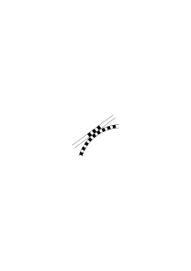

zeige, so nicht als das Resultat eines Experiments. Man könnte auch sagen: Du siehst hier, daß Stücke einer kontinuierlichen visuellen Kurve gerade sind. – Aber sollte ich nicht sagen: – “Das nennst Du doch eine ‘Kurve’. – Und nennst Du dieses Stückchen nun– ‘krumm’ oder ‘gerade’? – Das nennst Du doch eine ‘Gerade’, & sie enthält dieses Stück.” Aber warum sollte man nicht für visuelle Strecken, die sowohl in einer Kurve als auch in einer Geraden liegen können, einen ganz andern Namen verwenden? “Aber das Experiment des Ziehens dieser Linien hat doch gezeigt, daß sie sich nicht in einem _Punkt_ berühren!” – Wie sind “_sie_” definiert? Oder: kannst Du mir ein Bild davon zeigen, wie es ist, wenn sie sich in einem Punkt berühren? Denn warum soll ich nicht einfach sagen: das Experiment hat ergeben, daß sie – nämlich Linien einer Art, wie ich sie schon anderswo gezeichnet habe – einander _berühren_. Denn ist dies _nicht_, was ich die “Berührung” solcher Linien nenne?

### [67v\[2\]](https://cdn.wittgensteinnachlass.com/2000px/webp/Ms-118/67v.webp),[68r\[1\]](https://cdn.wittgensteinnachlass.com/2000px/webp/Ms-118/68r.webp),[68v\[1\]](https://cdn.wittgensteinnachlass.com/2000px/webp/Ms-118/68v.webp)

Aber wie ist es nun, wenn ich das Stück, das sie gemeinsam haben nachträglich messe? Die _Länge_ dieses Stückes konnte ich doch _nicht_ voraussehen! Wenn ich also messe – ungefähr – ein wie großes Stück einer bestimmten Kurve mir noch als grade erscheint —. Dies ist offenbar ein Experiment; & man könnte es sich so ausgeführt denken, daß eine Reihe paralleler Kurven gezeichnet wären, & zwar in schwarz & weißen Stücken. Diese Stücke sind etwa in der ersten Kurve 1 mm lang, in der zweiten 2 mm, u.s.f.. Das Subjekt des Experiments geht nun diese Kurven der Reihe nach durch, indem es von jeder _ein_ schwarzes Stück anschaut & sagt, ob es gerade oder gekrümmt ist. Das Ergebnis des Experiments ist nun, daß er das Stück der n-ten Kurve, der so konstruierten Reihe, als gerade & das Stück der <math class="stacked" display="inline"><mi>n</mi><mspace width="0.3em"/><mo>+</mo><msup><mn>1</mn><mtext>ten</mtext></msup></math> als gekrümmt sieht. Aber braucht es denn die nach dem Maß konstruierte Reihe von Kurven? Kann man nicht einfach sagen: (z.B.)

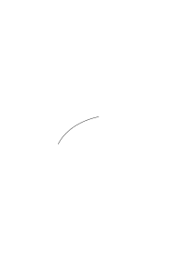

‘In dieser Kurve sieht er ein so <math display="inline"><mo>|</mo><mtext>─</mtext><mtext>─</mtext><mo>|</mo></math> langes Stück schon als krumm’? Und ist das nicht gerade das, was ich auch sähe, wenn ich das Bild so einer Kurve in so langen Stücken gezeichnet vor mir sähe? Oder zeichnen wir einen Kreis aus Stücken die abwechselnd lang (gekrümmt) & kurz (grade) sind! Oder aus Stücken, die nach & nach länger werden, so daß man auf das weisen kann, welches zuerst krumm erscheint. Und dies ist wieder eine offenbare Experimentfrage: “Welches dieser Stücke (von rechts nach links) ist das erste das Du gekrümmt siehst.”

### [68v\[2\]](https://cdn.wittgensteinnachlass.com/2000px/webp/Ms-118/68v.webp),[69r\[1\]](https://cdn.wittgensteinnachlass.com/2000px/webp/Ms-118/69r.webp)

Wie, wenn jemand sagte: “Die Erfahrung lehrt Dich, daß diese Linie

krumm ist.” – Da wäre zu sagen, daß hier die Worte “diese Linie”, die auf dem Papier gezogene physikalische Linie bedeuten. Man kann ja tatsächlich den Versuch anstellen & _diese Linie_ verschiedenen Menschen (oder _einem_, aber unter verschiedenen Umständen) zeigen & fragen: “Was siehst Du; eine gerade, oder eine krumme Linie?” – Wenn aber jemand sagte: “ich stelle mir jetzt eine krumme Linie vor” & wir ihm sagten: “Da siehst Du also, daß diese Linie eine krumme ist”; was für einen Sinn hätte das? Nun kann man aber doch auch sagen: Ich stelle mir einen Kreis vor aus schwarzen & weißen Stücken, eines ist groß, gekrümmt, die folgenden werden immer kleiner, das sechste ist schon gerade. Wo liegt hier das Experiment?

### [69r\[2\]](https://cdn.wittgensteinnachlass.com/2000px/webp/Ms-118/69r.webp)

In der Vorstellung kann ich rechnen, aber nicht experimentieren.

### [69v\[1\]](https://cdn.wittgensteinnachlass.com/2000px/webp/Ms-118/69v.webp)

Die Grundlage der Mathematik ist _das Rechnen_. Gib uns ein Gift, was das Rechnen unmöglich macht, & es gibt keine Mathematik mehr.

### [69v\[2\]](https://cdn.wittgensteinnachlass.com/2000px/webp/Ms-118/69v.webp),[70r\[1\]](https://cdn.wittgensteinnachlass.com/2000px/webp/Ms-118/70r.webp)

“Du siehst doch – es kann doch keinem Zweifel unterliegen, daß eine solche Gruppe wesentlich

aus einer solchen & einer solchen besteht!” – Ich sage auch – d.h., ich drücke mich auch so aus – daß die Gruppe, die Du hingezeichnet hast aus den beiden kleineren besteht; aber ich weiß nicht, ob jede Gruppe, die ich eine von der Art (oder Gestalt) der ersteren nennen würde, unbedingt aus zwei Gruppen von der Art B und C jener kleineren zusammengesetzt sein wird. ‒ ‒ Ich glaube aber, es wird wohl immer so sein (meine Erfahrung hat mich dies vielleicht gelehrt), & darum will ich als Regel annehmen: Ich will eine Gruppe dann & nur dann eine von der Gestalt A nennen, wenn sie in zwei Gruppen wie B & C zerlegt werden kann.

### [70r\[2\]](https://cdn.wittgensteinnachlass.com/2000px/webp/Ms-118/70r.webp),[70v\[1\]](https://cdn.wittgensteinnachlass.com/2000px/webp/Ms-118/70v.webp)

Und so wirkt auch die Zeichnung als Beweis

“Ja wirklich! zwei Parallelogramme stellen sich zu dieser Form zusammen!” (Das ist sehr ähnlich, wie wenn ich sagte: “Ja wirklich! eine Kurve kann aus graden Stücken bestehen.”) – Ich hätte es nicht gedacht. – Ja – nicht, daß die Teile dieser Figur oben diese Figur ergeben! Das heißt ja nichts! – Sondern ich erstaune nur, wenn ich denke ich hätte das obere Parallelogramm ahnungslos auf das untere gesetzt & sähe nun dieses Ergebnis.

### [70v\[2\]](https://cdn.wittgensteinnachlass.com/2000px/webp/Ms-118/70v.webp)

Und man könnte sagen: der Beweis beweist eben das, was Dich überrascht.

### [70v\[3\]](https://cdn.wittgensteinnachlass.com/2000px/webp/Ms-118/70v.webp)

Denn warum sage ich jene Figur überzeuge mich von etwas, & nicht geradeso auch diese:

sie zeigt doch auch daß zwei solche Stücke ein Rechteck geben. ‘Aber das ist uninteressant’ – will man sagen. Und warum ist es uninteressant?

### [71r\[1\]](https://cdn.wittgensteinnachlass.com/2000px/webp/Ms-118/71r.webp)

“Ja, es sieht nicht so aus, aber es paßt”, sagt man auch manchmal beim Zusammenlegen eines Jig-saw Puzzles.

### [71r\[2\]](https://cdn.wittgensteinnachlass.com/2000px/webp/Ms-118/71r.webp)

Wenn man sagt: “Diese Form besteht aus diesen Formen” – so denkt man sich die Form als eine feine Zeichnung, ein feines Gestell von dieser Form auf das gleichsam die Dinge gespannt sind, die diese Form haben.

### [71r\[3\]](https://cdn.wittgensteinnachlass.com/2000px/webp/Ms-118/71r.webp)

Hiermit ist in Zusammenhang, daß ich oben schrieb: “… daß eine Gruppe wie A _wesentlich_ aus … besteht”.

### [71r\[4\]](https://cdn.wittgensteinnachlass.com/2000px/webp/Ms-118/71r.webp),[71v\[1\]](https://cdn.wittgensteinnachlass.com/2000px/webp/Ms-118/71v.webp)

Was ist Dein Ziel in der Philosophie? – Ich zeige der Fliege den Ausgang aus dem Fliegenglas. Dieser Weg ist, in einem Sinne, _unmöglich_ zu finden, &, in einem andern Sinne, ganz leicht.

### [71v\[2\]](https://cdn.wittgensteinnachlass.com/2000px/webp/Ms-118/71v.webp)

09.09.1937

Wenn ich mir Musik vorstelle, was ich ja täglich & oft tue so reibe ich dabei – ich glaube immer – meine oberen & unteren Vorderzähne rhythmisch aneinander. Es ist mir schon früher aufgefallen geschieht aber für gewöhnlich ganz unbewußt. Und zwar ist es als würden die Töne meiner Vorstellung durch diese Bewegung erzeugt.

Ich glaube, daß diese Art, im Innern Musik zu hören, vielleicht sehr allgemein ist. Ich kann mir natürlich auch ohne die Bewegung meiner Zähne Musik vorstellen, die Töne sind aber dann viel schemenhafter, viel undeutlicher, weniger prägnant.

### [71v\[3\]](https://cdn.wittgensteinnachlass.com/2000px/webp/Ms-118/71v.webp),[72r\[1\]](https://cdn.wittgensteinnachlass.com/2000px/webp/Ms-118/72r.webp)

Wann besteht denn eine Gruppe ‘_wesentlich_’ aus …? Das hängt natürlich von der Art der Verwendung der _Bezeichnung_ ab, die wir der Gruppe geben. Eine Hand hat zwar 5 Finger, aber ich hätte nicht gesagt: die Finger einer Hand bestehen wesentlich aus 3 und 2. Nun, wesentlich ist es, ‘wenn es nicht anders sein _kann_’; & es kann nicht anders sein, wenn die Gruppe mit ihrer Teilung als Paradigma dient. Der _wesentliche_ Zug ist ein Zug der Darstellungsart.

### [72r\[2\]](https://cdn.wittgensteinnachlass.com/2000px/webp/Ms-118/72r.webp),[72v\[1\]](https://cdn.wittgensteinnachlass.com/2000px/webp/Ms-118/72v.webp),[73r\[1\]](https://cdn.wittgensteinnachlass.com/2000px/webp/Ms-118/73r.webp),[73v\[1\]](https://cdn.wittgensteinnachlass.com/2000px/webp/Ms-118/73v.webp)

“Diese Form besteht aus diesen Formen. Du hast mir eine wesentliche Eigenschaft dieser Form gezeigt.” – Du hast mir ein neues _Bild_ gezeigt. Es ist, als hätte _Gott_ sie so zusammengesetzt. – _Wir bedienen uns also eines Gleichnisses_. Die _Form_ wird zum ätherischen Wesen, welches diese Form hat; es ist als wäre sie ein für allemal so zusammengesetzt worden, von dem, der die wesentlichen Eigenschaften in die Dinge gelegt hat. (Man sagt ja etwa auch: “ich wußte nicht, daß es so etwas gibt”, wenn einem die überraschende Teilung gezeigt wird, _so_, als wäre uns ein Naturding gezeigt worden, dessen Existenz wir nicht vermutet hätten.) Denn machen wir die Form zum Ding, so machen wir den Werkmeister der Form zu demjenigen, der nicht die Dinge aus ihren Bestandteilen nur zusammensetzt, wie der Mensch, der etwas hervorbringt, sondern, der auch Härte, Farbe, Licht & Dunkelheit geschaffen hat. – Man hat, bekanntlich, das Wort “Sein” gebraucht, um eine ätherische Art des Existierens zu bezeichnen. Denke an einen Satz wie: “Rot _ist_.” Freilich, niemand gebraucht ihn je. Wenn ich mir aber doch einen Gebrauch zu ihm erfände, so wäre es der, daß ich ein Muster der Farbe vor mir habe, als Einleitung zu Aussagen, die dann von den Wörtern “rot”, etc., Gebrauch machen. (Ähnlich ist vielleicht so eine Einleitung wie: “Angenommen, eine Strecke sei L & eine andere lx –”, wo ja noch nichts angenommen wird.) Einen Satz, wie “Rot _ist_”, ist man versucht zu sagen, wenn man diese Farbe mit Aufmerksamkeit betrachtet: also in der gleichen _Situation_, in der man die Existenz einer Sache feststellt (eines blattähnlichen Insekts etwa). Und ich will sagen: wenn man den Ausdruck gebraucht “der Beweis hat mich gelehrt – hat mich davon überzeugt– daß es sich so verhält”, (so) ist man noch immer in jenem Gleichnis.

### [73v\[2\]](https://cdn.wittgensteinnachlass.com/2000px/webp/Ms-118/73v.webp)

Der Philosoph sagt: “Sieh' es doch _so_ an –”.

### [73v\[3\]](https://cdn.wittgensteinnachlass.com/2000px/webp/Ms-118/73v.webp),[74r\[1\]](https://cdn.wittgensteinnachlass.com/2000px/webp/Ms-118/74r.webp),[74v\[1\]](https://cdn.wittgensteinnachlass.com/2000px/webp/Ms-118/74v.webp),[75r\[1\]](https://cdn.wittgensteinnachlass.com/2000px/webp/Ms-118/75r.webp)

“Wundert es Dich jetzt auch noch?” – Wie kommt es, daß etwas aufhört Dich zu wundern, wenn Du es anders ansiehst? Eine Überlegung gibt ein überraschendes Resultat. Aber eine Überlegung ist ja ein Bild, warum überrascht es Dich? Oder sollte ich sagen: “mich überrascht nicht das Bild, sondern der Ausgang des Gedankenexperiments”? Ist es also ähnlich, wie wenn mich Einer aufforderte eine Assoziationskette mit dem Wort … zu beginnen & durch eine Reihe von 20 Wörtern zu verfolgen. So gelange ich zum Wort … & bin erstaunt daß man da dorthin kommen kann? – Denn man sagt auch am Ende einer Schlußkette: “Ja, ja, ich _werde_ dorthin geführt!” – Aber wenn Du einmal dorthin geführt wirst, – so vielleicht ein andermal wo anders hin. – Aber Du _bleibst_ bei der überraschenden Schlußfolgerung. – Du überprüfst sie (zwar) vielleicht & sagst: “ja, es kommt immer das Gleiche heraus!”, aber wenn Du ein psychologisches Experiment machst um ein psychologisches Gesetz festzustellen, so machst Du es doch mit möglichst vielen Subjekten! Und wenn Du _hier_ in der Mathem. das Experiment gemacht & seinen _Gang_ notiert hast, so gehst Du nun dieses _Bild_ Deines Experiments immer von neuem durch & es überrascht Dich; aber nicht: _daß_ Du einmal so gegangen bist; sondern das Bild, – welches Du, in irgend einem Sinne, _anerkennst_. Hättest Du z.B. bei der Überprüfung einen ‘Fehler’ in Deinen Schlüssen entdeckt, so würde Dich das Resultat nun nicht mehr wundern, obwohl es doch das (tatsächliche) Resultat des Experiments _war_. (Das Experiment, in welchem Du einen Schlußfehler machtest war ja als Experiment nicht fehlerhaft.) Überrascht mich das Resultat eines Experiments, so werde ich meine Überraschung los, indem ich die Ursachen des überraschenden Ausgangs auffinde. – Hier verhält es sich anders. Wenn das Gedankenexperiment – mit allen Vorkehrungen – _so_ ausgeht, dann nehmen wir seinen Gang zur Regel.

### [75r\[2\]](https://cdn.wittgensteinnachlass.com/2000px/webp/Ms-118/75r.webp)

Ist er bei dem Gedankenexperiment erst _einen_ Weg gegangen, so kann es sein, daß er beim ‘Überprüfen’ einen andern Weg geht, & erklärt, er habe sich beim ersten geirrt.

### [75r\[3\]](https://cdn.wittgensteinnachlass.com/2000px/webp/Ms-118/75r.webp),[75v\[1\]](https://cdn.wittgensteinnachlass.com/2000px/webp/Ms-118/75v.webp)

10.09.1937

Wie _lernen_ wir denn Schließen? Oder lernen wir es nicht –? Weiß das Kind, daß aus der doppelten Verneinung die Bejahung folgt? – Und wie _überzeugt_ man es davon? Wohl dadurch, daß man ihm einen Vorgang zeigt, (etwa diesen da

) den es nun als Bild der Verneinung annimmt. Und man macht den Sinn von ‘(x) ∙ fx’ klar, indem man darauf dringt, daß daraus ‘fa’ folgt.

### [75v\[2\]](https://cdn.wittgensteinnachlass.com/2000px/webp/Ms-118/75v.webp),[76r\[1\]](https://cdn.wittgensteinnachlass.com/2000px/webp/Ms-118/76r.webp)

Ist ein Experiment, in welchem wir die Beschleunigung beim freien Fall beobachten ein physikalisches Experiment oder ein psychologisches, das zeigt, wie Menschen, unter solchen Umständen, sehen? – Kann es nicht beides sein? Und kommt das nicht drauf an, wie die Reihe der Experimente aussieht deren eines dieses Experiment ist; & darauf, wie wir über die Experimente _reden_? Was ich aus einem Experiment _lerne_, ist selber ein Teil des Spiels, das ich spiele. Man könnte auch sagen: ein Experiment ist dies erst als Teil einer Theorie.

### [76r\[2\]](https://cdn.wittgensteinnachlass.com/2000px/webp/Ms-118/76r.webp),[76v\[1\]](https://cdn.wittgensteinnachlass.com/2000px/webp/Ms-118/76v.webp),[77r\[1\]](https://cdn.wittgensteinnachlass.com/2000px/webp/Ms-118/77r.webp)

“Das ist ein überraschendes Resultat!” – Wenn es Dich überrascht, dann hast Du es noch nicht verstanden. Denn die Überraschung ist hier nicht legitim, wie beim Ausgang eines Experiments. _Da_ – möchte ich sagen – darfst Du Dich ihrem Reiz hingeben; aber nicht wenn sie Dir am Ende einer Kette [wie eine Aussicht] Deiner Schlüsse zuteil wird. Denn da ist sie nur ein Zeichen dafür, daß noch Unklarheit, oder ein Mißverständnis herrscht. “Aber warum soll ich nicht überrascht sein, daß ich _dahin_ geleitet worden bin?” – Denk' Dir Du hättest einen langen algebraischen Ausdruck vor Dir; es sieht zuerst aus, als ließe er sich nicht wesentlich kürzen; dann aber siehst Du eine Möglichkeit (der Kürzung) & nun geht die Kürzung weiter, bis der Ausdruck zu einer kompakten Form zusammengeschrumpft ist. Können wir hier nicht über dies Resultat überrascht sein? (Beim Patience-Legen geschieht Ähnliches.) Gewiß, und es ist eine angenehme Überraschung; & sie ist von psychologischem Interesse, denn sie zeigt ein Phänomen des Nicht-Überblickens & der Änderung des Aspekts eines gesehenen Komplexes. Es ist interessant & vielleicht sehr wichtig, daß man es diesem Komplex nicht immer ansieht, daß er sich so kürzen läßt; ist aber der Weg der Kürzung übersichtlich vor unsern Augen, so verschwindet die Überraschung. Wenn man sagt, man sei eben überrascht, daß man _dahin_ geführt worden sei, so ist dies keine ganz richtige Darstellung des Sachverhalts. Denn diese Überraschung hat man doch nur dann, wenn man den Weg noch nicht kennt. Nicht, wenn man ihn ganz vor sich sieht. Daß dieser Weg, den ich ganz vor mir habe, da anfängt, wo er anfängt, & da aufhört, wo er aufhört, das ist keine Überraschung. Die Überraschung & das Interesse kommen dann gleichsam von außen. Ich meine: man kann sagen, “Diese mathematische Untersuchung hat großes psychologisches Interesse”, oder “großes physikalisches Interesse”.

### [77r\[2\]](https://cdn.wittgensteinnachlass.com/2000px/webp/Ms-118/77r.webp),[77v\[1\]](https://cdn.wittgensteinnachlass.com/2000px/webp/Ms-118/77v.webp)

Ich nähere mich einer Frage meistens nicht so:

sondern so:

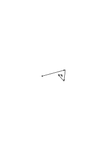

Ich schieße immer wieder an ihr vorbei, aber in immer näherem Abstand.

### [77v\[2\]](https://cdn.wittgensteinnachlass.com/2000px/webp/Ms-118/77v.webp)

“Sieh' es so an, & Du wirst Dich nicht mehr wundern.” Man staunt eben nicht nur, wenn das Niedagewesene geschieht; Ich staune immer wieder bei dieser Wendung des Themas; obwohl ich es unzählige Male gehört habe & es auswendig weiß. Es ist vielleicht sein _Witz_, Staunen zu erwecken.

### [77v\[3\]](https://cdn.wittgensteinnachlass.com/2000px/webp/Ms-118/77v.webp),[78r\[1\]](https://cdn.wittgensteinnachlass.com/2000px/webp/Ms-118/78r.webp),[78v\[1\]](https://cdn.wittgensteinnachlass.com/2000px/webp/Ms-118/78v.webp)

Was soll es dann bedeuten, wenn ich sage: ‘Du _darfst_ nicht staunen!’? Denke an mathematische Rätselfragen. Sie werden gestellt, um zu überraschen. Das ist ihr ganzer Sinn. Ich will also sagen: Du sollst nicht glauben, es sei hier etwas verborgen, in das man nicht Einsicht nehmen kann – – als seien wir einen unterirdischen Gang gegangen & kämen nun irgendwo ans Licht, ohne aber wissen zu können, wie wir dahin gekommen sind, oder welches die Lage des Anfangs zum Ausgang des Tunnels sei. Wie aber konnte man denn überhaupt in dieser Einbildung sein? Was gleicht in der Rechnung einer Bewegung im unterirdischen Gang? – Was konnte uns denn dieses Bild nahe legen? Daß kein Tageslicht auf diese Schritte fällt; daß wir den Anfangs- & Endpunkt der Rechnung in einem Sinne verstehen, in dem wir den übrigen Gang der Rechnung nicht verstehen. “Hier ist kein Geheimnis!” – aber wie konnten wir denn _glauben_, daß eines sei? – Nun, ich bin immer wieder den Weg gegangen & war immer wieder überrascht, & auf den Gedanken, daß man hier etwas _verstehen_ kann, bin ich nicht gekommen. “Hier ist kein Geheimnis”, heißt also: Schau Dich doch um!

### [78v\[2\]](https://cdn.wittgensteinnachlass.com/2000px/webp/Ms-118/78v.webp)

Ist es nicht, als sähe man in einer Rechnung eine Art Kartenaufschlagen? Man hat die Karten gemischt; man weiß nicht, was dabei vorsichging; aber am Ende lag obenauf der Zehner, & das bedeutet …

### [78v\[3\]](https://cdn.wittgensteinnachlass.com/2000px/webp/Ms-118/78v.webp)

“Denk Dir eine Zahl – – zähl 3 dazu – multipliziere mit 2 – subtrahiere das doppelte der Zahl; – nun hast Du 6 erhalten.”

### [78v\[4\]](https://cdn.wittgensteinnachlass.com/2000px/webp/Ms-118/78v.webp),[79r\[1\]](https://cdn.wittgensteinnachlass.com/2000px/webp/Ms-118/79r.webp)

Unterschied zwischen dem Werfen des Loses & einem Abzählspiel. Könnten aber nicht naive Menschen auch im Ernstfalle statt einen Mann auszulosen ein Abzählspiel gebrauchen?

### [79r\[2\]](https://cdn.wittgensteinnachlass.com/2000px/webp/Ms-118/79r.webp)

Was tut der, der mich darauf aufmerksam macht, daß beim das Ergebnis abgekartet ist?

### [79r\[3\]](https://cdn.wittgensteinnachlass.com/2000px/webp/Ms-118/79r.webp),[79v\[1\]](https://cdn.wittgensteinnachlass.com/2000px/webp/Ms-118/79v.webp),[80r\[1\]](https://cdn.wittgensteinnachlass.com/2000px/webp/Ms-118/80r.webp)

Ich will sagen: “Wir haben keinen Überblick über das, was wir gemacht haben, & deshalb kommt es uns geheimnisvoll vor”. Denn nun steht ein Resultat vor uns, & wir wissen nicht mehr, wie wir dazu gekommen sind, aber wir sagen (wir haben gelernt, zu sagen): “so muß es sein”; & wir nehmen es hin, & staunen darüber. Könnten wir uns nicht denken, daß ein Mensch verschiedene Befehle in der Form “Du mußt jetzt das & das tun” einzeln auf Karten geschrieben hätte, die Karten dann mischt, & die, welche obenauf zu liegen kommt liest, & sagt: Also, ich _muß_ das tun! – Denn das Lesen eines geschriebenen Befehls macht nun einmal einen bestimmten Eindruck. Und ebenso auch das Anlangen bei einer Schlußfolgerung. – Man könnte aber vielleicht den Bann eines solchen Befehls brechen, indem man nochmals klar vor Augen führt, _wie_ man zu diesen Worten gelangt ist, & diesen Vorgang mit anderen Vorgängen vergleicht – indem man z.B. sagt: “Es hat Dir doch niemand den Befehl gegeben!” Und ist es nicht auch _so_, wenn ich sage: “Hier ist kein Geheimnis!”? – Er hatte ja, in gewissem Sinne, nicht geglaubt, daß ein Geheimnis vorliegt. Aber er war unter dem _Eindruck_ des Geheimnisses (wie der Andere unter dem _Eindruck_ eines Befehles). In _einem_ Sinne kannte er ja die Situation, aber er verhielt sich zu ihr (im Gefühl & im Handeln), ‘als läge ein andrer Sachverhalt vor’.

### [80r\[2\]](https://cdn.wittgensteinnachlass.com/2000px/webp/Ms-118/80r.webp)

Die logischen Gesetze sind allerdings der Ausdruck von ‘Denkgewohnheiten’, aber auch von der Gewohnheit _zu denken_. D.h., man kann sagen, sie zeigten: wie Menschen denken & auch, _was_ Menschen “denken” nennen.

### [80r\[3\]](https://cdn.wittgensteinnachlass.com/2000px/webp/Ms-118/80r.webp),[80v\[1\]](https://cdn.wittgensteinnachlass.com/2000px/webp/Ms-118/80v.webp),[81r\[1\]](https://cdn.wittgensteinnachlass.com/2000px/webp/Ms-118/81r.webp)

Frege nennt ‘ein Gesetz des menschlichen Fürwahrhaltens’: “Es ist den Menschen … unmöglich einen Gegenstand als von ihm selbst verschieden anzuerkennen”. – Wenn ich denke, daß mir das unmöglich ist, so denke ich (mir), daß ich _versuche_, es zu tun. Ich schaue also auf meine Lampe & sage: “diese Lampe ist verschieden von ihr selbst”. (Aber es rührt sich nichts.) ich sehe nicht etwa, daß es falsch ist, sondern ich kann damit gar nichts anfangen. Außer, wenn die Lampe im Sonnenlicht flimmert, dann kann ich das ganz gut durch diesen Satz ausdrücken. – Man kann sich auch in eine Art Denkkrampf versetzen, in welchem man _tut_, als versuchte man etwas ‘Unmögliches’ zu denken & als gelänge es einem nicht. Ähnlich kann man auch _tun_, als versuchte man (vergeblich) einen Gegenstand aus der Ferne durch bloßes Wollen an sich zu ziehen. (Dabei schneidet man gewisse Gesichter, so, als gäbe man dem Ding durch Mienen Zeichen, es solle herkommen.

### [81r\[2\]](https://cdn.wittgensteinnachlass.com/2000px/webp/Ms-118/81r.webp)

“Wie ist es möglich, die _Zeit_ zu schätzen, da das Leben gleichsam fern von jeder Uhr weilt? – Daß uns die Zeiten in Übereinstimmung mit der Uhr einfallen, daß wir die Zeit _schätzen_ können, ist ein Grund, warum (das), was die Uhr mißt, die Zeit, so wichtig ist.

### [81r\[3\]](https://cdn.wittgensteinnachlass.com/2000px/webp/Ms-118/81r.webp),[81v\[1\]](https://cdn.wittgensteinnachlass.com/2000px/webp/Ms-118/81v.webp),[82r\[1\]](https://cdn.wittgensteinnachlass.com/2000px/webp/Ms-118/82r.webp)

11.09.1937

/ Denk Dir ein Material härter & fester als irgend ein anderes. Aber wenn man einen Stab aus diesem Stoff aus der horizontalen in die vertikale Lage bringt, so zieht er sich zusammen; oder denk' Dir er biegt sich, wenn man ihn aufrichtet & ist dabei so hart, daß man ihn auf keine andre Weise biegen kann. – Ein Mechanismus aus diesem Stoff, etwa eine Kurbel Pleuelstange & Kreuzkopf. Andere Bewegungsweise des Kreuzkopfs. Oder: eine Stange biegt sich, wenn man ihr eine gewisse Masse nähert, gegen alle Kräfte aber, die wir auf sie wirken lassen, ist sie vollkommen starr. Denk Dir die Führungsschienen biegen sich & strecken sich wieder, wenn die Kurbel sich ihnen nähert & sich wieder entfernt. Ich nehme aber an, daß keinerlei besondere (äußere) Kraft dazu nötig ist dies hervorzurufen. Dieses Benehmen der Schienen würde wie das eines lebenden Wesens anmuten. Wenn wir sagen: “Wenn die Glieder des Mechanismus ganz starr wären, würden sie sich so & so bewegen”, was ist das Kriterium dafür, daß sie ganz starr sind? Ist es, daß sie gewissen Kräften widerstehen? oder, daß sie sich so & so bewegen? Denke, ich sage: “das ist das Bewegungsgesetz des Kreuzkopfes (die Zuordnung seiner Lage zur Lage der Kurbel etwa), wenn sich die Länge der Kurbel & der Pleuelstange nicht ändern”. Das heißt wohl: Wenn sich die Lagen der Kurbel & des Kreuzkopfes so zu einander verhalten, dann sage ich, daß die Länge der Pleuelstange gleichbleibt.

### [82r\[2\]](https://cdn.wittgensteinnachlass.com/2000px/webp/Ms-118/82r.webp),[82v\[1\]](https://cdn.wittgensteinnachlass.com/2000px/webp/Ms-118/82v.webp),[83r\[1\]](https://cdn.wittgensteinnachlass.com/2000px/webp/Ms-118/83r.webp)

“Wenn die Teile ganz starr wären, würden sie sich so bewegen”: ist das eine Hypothese? Es scheint, nein. Denn wenn wir sagen: “die Kinematik beschreibt die Bewegungen des Mechanismus unter der Voraussetzung, daß seine Teile vollkommen starr sind”, so geben wir einerseits zu, daß diese Voraussetzung in der Wirklichkeit nie zutrifft, anderseits soll es keinem Zweifel unterliegen, daß vollkommen starre Teile sich so bewegen würden. Aber woher diese Sicherheit? Es handelt sich hier wohl nicht um Sicherheit, sondern um eine Bestimmung, die wir getroffen haben. Wir _wissen_ nicht, daß Körper, wenn sie (nach den & den Kriterien) starr wären, sich so bewegen würden; wohl aber würden wir (unter Umständen) Teile ‘starr’ nennen, die sich so bewegen. Denke in so einem Fall immer daran, daß ja die Geometrie (oder Kinematik) keine Meßmethode angibt, wenn sie von gleichen Längen, oder vom Gleichbleiben einer Länge spricht. Wenn wir also die Kinematik etwa die Lehre von der Bewegung vollkommen starrer Maschinenteile nennen, so liegt hierin einerseits eine Andeutung über die (mathematische) Methode: wir bestimmen gewisse Distanzen als die Längen von Maschinenteilen, die sich nicht ändern; anderseits eine _Andeutung_ über die Anwendung des Kalküls.

### [83r\[2\]](https://cdn.wittgensteinnachlass.com/2000px/webp/Ms-118/83r.webp),[83v\[1\]](https://cdn.wittgensteinnachlass.com/2000px/webp/Ms-118/83v.webp),[84r\[1\]](https://cdn.wittgensteinnachlass.com/2000px/webp/Ms-118/84r.webp)

Bestimmt die Operation ‘ + 2’ den Übergang, der von 200 aus zu machen ist, oder nicht? Bestimmt die Funktion <math class="stacked" display="inline"><msup><mi>x</mi><mn>3</mn></msup><mspace width="0.3em"/><mo>+</mo><msup><mi>x</mi><mn>2</mn></msup><mspace width="0.3em"/><mo>+</mo><mspace width="0.3em"/><mn>1</mn></math> die Zahl, die wir für x = 5 erhalten? – Wie ist diese Frage zu beantworten? – Prüfen wir (dazu), ob die Resultate, welche die Menschen durch diese Substitution erhalten immer die gleichen sind? Nein. Und doch ist das Faktum von der größten Bedeutung, daß das erhaltene Resultat, gegeben mathematisch erzogene Rechner in der ungeheuern Mehrzahl der Fälle das selbe ist. Wir würden diese Rechenmethoden nicht gebrauchen, wenn sie nicht, normalerweise, ständig zu dem gleichen Resultat führen würden. Die Frage hat, mathematisch, gar keinen Sinn, – wenn wir nicht den Fall der Funktion <math class="stacked" display="inline"><msup><mi>x</mi><mn>3</mn></msup><mspace width="0.3em"/><mo>+</mo><msup><mi>x</mi><mn>2</mn></msup><mspace width="0.3em"/><mo>+</mo><mspace width="0.3em"/><mn>1</mn></math> von bestimmten andern Funktionen unterscheiden wollen, etwa von Funktionen von mehr als _einer_ Variablen. Und dann ist die Frage die gleiche, wie die: ist die Funktion <math class="stacked" display="inline"><msup><mi>x</mi><mn>3</mn></msup><mspace width="0.3em"/><mo>+</mo><msup><mi>x</mi><mn>2</mn></msup><mspace width="0.3em"/><mo>+</mo><mspace width="0.3em"/><mn>1</mn></math> eine Funktion nur _einer_ Variablen. Und was man mit dieser Frage in diesem Falle anfangen könnte, ist wieder nicht klar; es sei denn etwa, daß eine – in diesem Falle sehr primitive – Methode der Ausrechnung der Anzahl der Variablen anzuwenden sei. Unter bestimmten Verhältnissen könnte die Frage z.B. durch eine Untersuchung zu beantworten sein, ob alle Variablen des Ausdrucks sich bis auf _eine_ nach bestimmten Regeln wegheben.

### [84r\[2\]](https://cdn.wittgensteinnachlass.com/2000px/webp/Ms-118/84r.webp),[84v\[1\]](https://cdn.wittgensteinnachlass.com/2000px/webp/Ms-118/84v.webp)

Aber willst Du sagen, daß der Ausdruck ‘ + 2’ es für Dich zweifelhaft läßt, was Du, nach 234 z.B., schreiben sollst? Nein; ich sage unbedenklich: “236”; aber darum _ist_ es auch überflüssig, daß darunter schon früher etwas bestimmt wird. Daß ich keinen Zweifel habe, wenn die Frage an mich herantritt, heißt das, daß sie (früher) schon vorher beantwortet worden ist? Aber ich weiß doch auch, daß, welche Zahl immer man mir gibt, ich die folgende gleich mit Sicherheit werde angeben können. – Ausgenommen ist doch gewiß der Fall, daß ich sterbe, ehe ich dazukomme die nächste Zahl zu nennen – & natürlich auch viele andere Fälle. Daß ich aber so sicher bin, daß ich werde fortsetzen können, ist freilich von der größten Bedeutung.

### [84v\[2\]](https://cdn.wittgensteinnachlass.com/2000px/webp/Ms-118/84v.webp),[85r\[1\]](https://cdn.wittgensteinnachlass.com/2000px/webp/Ms-118/85r.webp)

“Eine Definition führt Dich doch nur wieder einen Schritt zurück, zu etwas anderem nicht definiertem.” Was sagt uns das? Wußte das irgend jemand nicht? – Nein; aber konnte er es nicht aus dem Auge verlieren?

### [85r\[2\]](https://cdn.wittgensteinnachlass.com/2000px/webp/Ms-118/85r.webp),[85v\[1\]](https://cdn.wittgensteinnachlass.com/2000px/webp/Ms-118/85v.webp)

Oder: “Wenn Du schreibst

_‘1, 4, 9, 16, ‥‥․’,_

so hast Du nur vier Zahlen angeschrieben, & fünf Pünktchen” – worauf machst Du da aufmerksam? konnte jemand etwas anderes glauben? Man sagt Einem in so einem Falle auch: “Damit hast Du weiter nichts hingeschrieben als vier Zahlzeichen & noch ein fünftes Zeichen, die Pünktchen”. Ja, wußte er das nicht? Aber kann man nicht doch sagen: Ja wirklich, ich habe die Pünktchen nie als _ein_ fünftes Zeichen in dieser Reihe aufgefaßt, – das hier allerdings (etwa) so aussieht, wie weitere, flüchtig geschriebene, Ziffern, – aber auch anders geschrieben werden könnte, so daß es selbst den Charakter eines Buchstabens oder Zahlzeichens hätte.

### [85v\[2\]](https://cdn.wittgensteinnachlass.com/2000px/webp/Ms-118/85v.webp)

Oder wie ist es, wenn man darauf aufmerksam macht, daß eine Linie im Sinne Euklids eine Farbengrenze ist & nicht ein Strich, & ein Punkt der Schnitt solcher Farbengrenzen & kein Tupfen (dot)? (Wie oft ist (es) gesagt worden, daß man sich einen Punkt nicht vorstellen kann.)

### [85v\[3\]](https://cdn.wittgensteinnachlass.com/2000px/webp/Ms-118/85v.webp)

11.09.1937

Ja, es _genügt_ nicht, daß man Einen auf das aufmerksam macht, was er schon weiß, man muß ihn sogar gerade im rechten Moment drauf aufmerksam machen!

### [86r\[1\]](https://cdn.wittgensteinnachlass.com/2000px/webp/Ms-118/86r.webp)

Man kann in der Einbildung leben, denken, daß es sich so & so verhält, ohne es zu _glauben_; d.h.: wenn man gefragt wird, so weiß man es, hat man aber nicht auf die Frage zu antworten, so weiß man es _nicht_, sondern man handelt & denkt dann nach einer andern Ansicht.

### [86r\[2\]](https://cdn.wittgensteinnachlass.com/2000px/webp/Ms-118/86r.webp),[86v\[1\]](https://cdn.wittgensteinnachlass.com/2000px/webp/Ms-118/86v.webp)

Denn eine (gewisse) Ausdrucksform läßt uns so & so handeln. Wenn sie unser Denken beherrscht, so möchten wir auf alle Einwendungen sagen: “in gewissem Sinne verhält es sich _doch_ so.” Obwohl es ja gerade auf den ‘gewissen Sinn’ ankommt. (Ähnlich beinahe, wie es uns die Unehrlichkeit eines Menschen bedeutet, wenn wir sagen: er sei _kein Dieb_.)

### [86v\[2\]](https://cdn.wittgensteinnachlass.com/2000px/webp/Ms-118/86v.webp),[87r\[1\]](https://cdn.wittgensteinnachlass.com/2000px/webp/Ms-118/87r.webp)

Wenn man z.B. gewisse bildhafte Sätze als Dogmen des Denkens für die Menschen festlegt, so zwar, daß man damit nicht Meinungen bestimmt, aber den _Ausdruck_ der Meinungen völlig beherrscht, so wird dies eine sehr eigentümliche Wirkung haben. Die Menschen werden unter einer unbedingten, fühlbaren Tyrannei leben, ohne doch sagen zu können, daß sie nicht frei sind. Ich meine, daß die Katholische Kirche es irgendwie ähnlich macht. Denn das Dogma hat die Form des Ausdrucks einer Behauptung, & es ist an ihm nicht zu rütteln, & dabei _kann_ man jede praktische Meinung mit ihm in Einklang bringen; freilich manche leichter, manche schwerer. Es ist keine _Wand_ die Meinung zu beschränken, sondern wie eine _Bremse_, die aber praktisch den gleichen Dienst tut; etwa als hängte man, um Deine Bewegungsfreiheit zu beschränken, ein Gewicht an Deinen Fuß. Dadurch nämlich wird das Dogma unwiderlegbar & dem Angriff entzogen.

### [87r\[2\]](https://cdn.wittgensteinnachlass.com/2000px/webp/Ms-118/87r.webp)

Die Sätze der Logik sind ‘Denkgesetze’, ‘weil sie das Wesen des menschlichen Denkens zum Ausdruck bringen’ – richtiger aber: weil sie das Wesen, die Technik, (Watson) des Denkens zum Ausdruck bringen, oder zeigen. Sie zeigen, was das Denken ist, & auch Arten des Denkens.

### [87r\[3\]](https://cdn.wittgensteinnachlass.com/2000px/webp/Ms-118/87r.webp),[87v\[1\]](https://cdn.wittgensteinnachlass.com/2000px/webp/Ms-118/87v.webp)

Auch im Denken gibt es eine Zeit des Pflügens & eine Zeit der Ernte. Es ist mir eine Befriedigung, jeden Tag _viel_ zu schreiben. Dies ist kindlich, aber so ist es.

### [87v\[2\]](https://cdn.wittgensteinnachlass.com/2000px/webp/Ms-118/87v.webp)

Denke daran, wie man Sätze gebraucht der Art: “Ich bin nun einmal so.”, oder “Da kann man nichts machen.” Sätze, als Gedankenstriche verwendet, oder als Abschlußformel. Aber sind sie deswegen unwichtig?

### [87v\[3\]](https://cdn.wittgensteinnachlass.com/2000px/webp/Ms-118/87v.webp),[88r\[1\]](https://cdn.wittgensteinnachlass.com/2000px/webp/Ms-118/88r.webp)

Das Überraschende kann in der Mathematik zweierlei völlig verschiedene Rollen spielen. Man kann den Wert einer mathematischen Gedankenreihe darin erblicken, daß sie etwas uns Überraschendes zu Tage fördert: weil es von großem Interesse, von großer Wichtigkeit ist, zu sehen, wie ein Sachverhalt durch die & die Art seiner Darstellung überraschend, oder (auch) paradox, wird Hievon ganz verschieden ist aber die gegenwärtig gepflogene Darstellungsart in der Mathematik, der das Überraschende & Erstaunliche darum als Wert gilt, weil es zeige in welche Tiefe die mathematische Untersuchung dringt; wie wir den Wert eines Teleskops daran ermessen könnten, daß es uns Dinge zeigt, die wir ohne dies Instrument nicht hätten _ahnen_ können. Der Mathematiker sagt also: “Siehst Du, das ist doch wichtig, das hättest Du ohne mich nicht gewußt” als wären durch diese Überlegungen, als durch eine Art (von) Experiment, erstaunliche, ja die erstaunlichsten, Tatsachen ans Licht gekommen.

### [88v\[1\]](https://cdn.wittgensteinnachlass.com/2000px/webp/Ms-118/88v.webp)

Der Mathematiker ist kein Entdecker, sondern ein Erfinder.

### [88v\[2\]](https://cdn.wittgensteinnachlass.com/2000px/webp/Ms-118/88v.webp)

Wie im bürgerlichen Leben gibt es im Religiösen eine Ehre & von sehr ungleicher Empfindlichkeit bei verschiedenen Menschen. Der Eine empfindet einen Schimpf als Vernichtung seiner moralischen Persönlichkeit & nichts als Blut kann ihn abwaschen, während der Andere ihn schnell vergißt. Der Eine sagt: “Wie kann ich leben, wenn ich beschimpft bin?” & der Andere kann dennoch weiterleben.

---

### [88v\[3\]](https://cdn.wittgensteinnachlass.com/2000px/webp/Ms-118/88v.webp),[89r\[1\]](https://cdn.wittgensteinnachlass.com/2000px/webp/Ms-118/89r.webp)

“Aber sind die Übergänge also durch die algebraische Formel _nicht_ bestimmt?” – In der Frage liegt ein Fehler. Oder ich kann sagen: sie ist zweideutig. Wie verwende ich denn die Frage, ob Übergänge durch eine Formel bestimmt sind? Ich könnte einmal verschiedene Arten von Formeln einander entgegensetzen z.B. Formeln der Art

y = 2n, y = n + 5, <math class="stacked" display="inline"><mi>y</mi><mspace width="0.3em"/><mo>=</mo><msup><mi>n</mi><mn>2</mn></msup></math> (wo n die Reihe der Kardinalzahlen durchläuft) Formeln, wie <math class="stacked" display="inline"><mi>y</mi><mspace width="0.3em"/><mo>=</mo><msup><mi>n</mi><mtext>2K</mtext></msup></math> (wo n die Reihe der Kardinalzahlen durchläuft & <math class="stacked" display="inline"><mi>K</mi><mspace width="0.3em"/><mo>=</mo><mspace width="0.3em"/><mn>2</mn><mspace width="0.3em"/><mtext>․</mtext><mtext>⌵</mtext><mtext>․</mtext><mspace width="0.3em"/><mi>K</mi><mspace width="0.3em"/><mo>=</mo><mspace width="0.3em"/><mn>3</mn><mspace width="0.3em"/><mtext>․</mtext><mtext>⌵</mtext><mtext>․</mtext><mspace width="0.3em"/><mi>K</mi><mspace width="0.3em"/><mo>=</mo><mspace width="0.3em"/><mtext>5)</mtext><mi>y</mi><mspace width="0.3em"/><mo>=</mo><msup><mi>n</mi><mn>2</mn></msup><mtext>․</mtext><mtext>⌵</mtext><mtext>․</mtext><msup><mi>n</mi><mn>3</mn></msup></math>.

### [89r\[2\]](https://cdn.wittgensteinnachlass.com/2000px/webp/Ms-118/89r.webp),[89v\[1\]](https://cdn.wittgensteinnachlass.com/2000px/webp/Ms-118/89v.webp)

Wir verwenden den Ausdruck: “die Übergänge sind durch die Formel … bestimmt”. Wie verwenden wir ihn? Wir können etwa davon reden, daß Menschen durch Abrichtung & Erziehung dahin gebracht werden diese Formeln so anzuwenden, daß alle, wenn sie eine Zahl für die Variable substituieren das gleiche Resultat herausrechnen. Wir können anderseits verschiedene Arten der Formeln, & ihnen entsprechend verschiedene Arten der Abrichtung zu ihrem Gebrauch, einander entgegensetzen. Z.B. Formeln von der Art – – – – solchen wie – – – – & sagen, die ersten bestimmten die Übergänge – – – – die andern nicht.

### [89v\[2\]](https://cdn.wittgensteinnachlass.com/2000px/webp/Ms-118/89v.webp)

Habe heute angefangen an dem großen Manuskript weiterzuschreiben. Möge es gehen! Geht es aber nicht, so soll ich nicht unglücklich werden. Ich fürchte mich davor in meinem Buch in einem geschraubten & schlechten Stil zu schreiben.

### [89v\[3\]](https://cdn.wittgensteinnachlass.com/2000px/webp/Ms-118/89v.webp),[90r\[1\]](https://cdn.wittgensteinnachlass.com/2000px/webp/Ms-118/90r.webp)

12.09.1937

“Die denknotwendige Folge.” Das ist die Folge, die nicht in Frage gezogen _wird_. (Ich sage nicht: “werden kann”.)

### [90r\[2\]](https://cdn.wittgensteinnachlass.com/2000px/webp/Ms-118/90r.webp),[90v\[1\]](https://cdn.wittgensteinnachlass.com/2000px/webp/Ms-118/90v.webp)

Ich schreibe jetzt an meinem Buch, oder versuche zu schreiben, & schreibe tropfenweise & ohne jeden Zug; von der Hand in den Mund. Es ist unmöglich, daß so etwas Gutes herauskommt. Ich bin vor allem viel zu ängstlich, viel zu unfrei im Schreiben. Wenn ich _so_ schreiben muß, da ist es besser, kein Buch zu schreiben, sondern mich darauf zu beschränken Bemerkungen tant bien que mal zu schreiben, die nach meinem Tode vielleicht veröffentlicht werden. Die Bemerkungen, die ich schreibe befähigen mich wohl Philosophie zu lehren, aber nicht ein Buch zu schreiben. Bin geneigt über mein Ungeschick unmutig zu sein.

### [90v\[2\]](https://cdn.wittgensteinnachlass.com/2000px/webp/Ms-118/90v.webp)

13.09.1937

“Ich kann doch nur folgern, was wirklich folgt!” – D.h.: Was die logische Maschine wirklich hervorbringt. Die logische Maschine, das wäre eine Art Weltäther; ein alles durchdringender ätherischer Mechanismus. Und vor diesem Bild muß man warnen.

### [90v\[3\]](https://cdn.wittgensteinnachlass.com/2000px/webp/Ms-118/90v.webp)

Wenn wir ein Experiment machen & dabei, sagen wir, ein Galvanometer gebrauchen – ist es ein Experiment über das Verhalten des Galvanometers? Wie drückt es sich im Messen aus, ob ich den Maßstab messe, oder den Tisch? – Ich sehe auch manchmal nach, ob der Maßstab stimmt, indem ich den Tisch mit ihm messe (oder ihn mit dem Tisch).

### [90v\[4\]](https://cdn.wittgensteinnachlass.com/2000px/webp/Ms-118/90v.webp),[91r\[1\]](https://cdn.wittgensteinnachlass.com/2000px/webp/Ms-118/91r.webp)

Gibt es soetwas wie einen logischen Schluß in der Verwendung eines Meßinstruments? Eine Transformation des Maßstabes. Ist es nicht, wie wenn auf der einen Kante eines Maßstabs _cm_ auf der andern Zoll aufgetragen sind, & wir messen nun etwas in Zoll & gehen _auf dem Maßstab_ zu den _cm_ über?

### [91r\[2\]](https://cdn.wittgensteinnachlass.com/2000px/webp/Ms-118/91r.webp)

Könnte man sich denken, daß mit den Zeigern verschiedener Meßinstrumente eine Rechenmaschine verbunden wäre, so daß, sagen wir, die Ablesungen zweier Instrumente durch sie multipliziert würden. Und die Rechenmaschine hätte auch Zifferblatt & Zeiger wie die andern Instrumente.

### [91r\[3\]](https://cdn.wittgensteinnachlass.com/2000px/webp/Ms-118/91r.webp),[91v\[1\]](https://cdn.wittgensteinnachlass.com/2000px/webp/Ms-118/91v.webp)

Warum schauen wir auf die Uhr, wenn wir einen Zug erreichen wollen? Ist es bestimmt, daß der Zug nach der Uhr abfährt? Muß es diesmal geschehen, weil es meistens in meinem Leben so geschehen ist? Ist der Induktionsschluß gültig? – Aber ich _schaue_ auf die Uhr; ja ich ängstige mich wenn ich keine bei mir habe; zeigt sie schon so & so viel, so laufe ich, was ich kann & bin in äußerster Hast; etc., etc., etc.. So geht es tatsächlich vor sich.

### [91v\[2\]](https://cdn.wittgensteinnachlass.com/2000px/webp/Ms-118/91v.webp)

Du kannst jemanden zählen lassen, um zu sehen, wieviel Äpfel da liegen – aber auch, um zu sehen, ob er sie richtig zählt. Wie unterscheiden sich die Fälle? Wenn nun Zählen ein Experiment ist, was _zeigt_ es? Denn ein Experiment ist etwas im Bezug auf ein bestimmtes Resultat.

### [92r\[1\]](https://cdn.wittgensteinnachlass.com/2000px/webp/Ms-118/92r.webp)

Denk' Dir es ginge Einer durch die Handlungen eines Experiments & sagte, auf das & das was geschieht zeigend einfach: “Siehst Du!” – da könnte man doch fragen: “_Was_ soll ich sehen? Was ist hier das Resultat?”

### [92r\[2\]](https://cdn.wittgensteinnachlass.com/2000px/webp/Ms-118/92r.webp),[92v\[1\]](https://cdn.wittgensteinnachlass.com/2000px/webp/Ms-118/92v.webp),[93r\[1\]](https://cdn.wittgensteinnachlass.com/2000px/webp/Ms-118/93r.webp)

Man möchte sagen: Es muß doch einen Grund haben, warum gerade _dieses_ zweite Thema folgt. Und was denkt man sich als Grund? – Irgend eine Verwandtschaft, Beziehung, ein Gegensatz. Aber _irgend eine_ Beziehung haben die Themen ja immer! – Aber es ist wahr: manchmal können wir sagen: dieses Thema folgt auf das, weil es so & so damit verwandt ist. Es ist also als müßte die Folge dieser Themen einem schon in uns vorhandenen Paradigma entsprechen. Wie aber, wenn ich sagte: Er wollte eben _dieses_ Ornament, – bestehend aus diesen beiden Themen – machen. – Nach dem Grund gefragt, hätte er keinen geben können. Und wir können auch keinen geben. – _Hat_ es dann einen Grund? Oder wie wenn ich sagen würde: “Nun, gefällt es Dir nicht? Findest Du es nicht natürlich? – Was braucht es dann einen Grund?” Und wenn wir von einem Paradigma reden – warum soll _das_ nicht das Paradigma, etwa für andere Kompositionen sein? Dann ist es eben vielleicht ein neues Paradigma! Aber doch hat die Suche nach einem Paradigma Berechtigung. Es ist vielleicht wahr, daß uns diese Folge einen so tiefen Eindruck nicht machen würde, wenn ihr nicht schon etwas wie ein Paradigma in unsern Erlebnissen entspräche. Ich sage: es ist vielleicht wahr. Es drängt sich uns das Bild auf …. Es ist sehr interessant, daß sich uns Bilder aufdrängen können.

### [93r\[2\]](https://cdn.wittgensteinnachlass.com/2000px/webp/Ms-118/93r.webp)

Denke Dir den analogen Fall in einem Gemälde: Es zeigt zwei Menschen; wir sagen uns: “Es muß natürlich einen Grund haben, warum _diese_ zwei Gesichter zusammen uns einen solchen Eindruck machen.” Wir möchten – heißt das – diesen Eindruck der beiden Gesichter wo anders wiederfinden, in einem andern Gebiet. Aber ob er wiederzufinden ist? –

### [93v\[1\]](https://cdn.wittgensteinnachlass.com/2000px/webp/Ms-118/93v.webp)

Man könnte auch fragen: Welche Zusammenstellung von Gesichtern hat eine _Pointe_, welche _keine_? Oder: _warum_ hat diese Zusammenstellung eine Pointe, & die andere keine? Das mag nicht leicht zu sagen sein! Oft können wir sagen: diese entspricht einer Geste, diese nicht.

### [93v\[2\]](https://cdn.wittgensteinnachlass.com/2000px/webp/Ms-118/93v.webp),[94r\[1\]](https://cdn.wittgensteinnachlass.com/2000px/webp/Ms-118/94r.webp)

14.09.1937

Es ist grauenhaft, daß ich die Arbeitsfähigkeit, d.h. die philosophische Sehkraft, von einem Tag auf den andern verliere. Teils verursacht vielleicht durch sehr schlechten Schlaf. Woher der, das weiß ich nicht. Aber was ist doch das für ein Leben! Denn kann ich nicht schreiben, so kann ich nicht schreiben: es nützt nichts, daß ich alles schon gedacht habe. Ich hatte gestern Hoffnung, daß es mit dem Schreiben gehn wird. Heute aber ist meine Hoffnung wieder gesunken. Und leider _brauche_ ich die Arbeit, denn ich bin noch nicht resigniert, sie aufzugeben. So muß ich also, wie eine ‘vom Wind gepeitschte Wolke’ hin & her ziehen.

### [94r\[2\]](https://cdn.wittgensteinnachlass.com/2000px/webp/Ms-118/94r.webp)

Das Leben stellt uns Bilder vor Augen als Ziele & macht uns danach laufen & dann verlieren wir die Kraft. Dann ist es also richtig – kann man sagen – sich nicht verlocken zu lassen & nichts als Ziel zu nehmen.

### [94r\[3\]](https://cdn.wittgensteinnachlass.com/2000px/webp/Ms-118/94r.webp),[94v\[1\]](https://cdn.wittgensteinnachlass.com/2000px/webp/Ms-118/94v.webp)

“Fang etwas Anderes an!” Aber ich will nicht! Wie soll ich die Kraft haben jetzt, etwas anderes anzufangen? Es sei denn, daß ich gezwungen werde, wie durch einen Krieg.

### [94v\[2\]](https://cdn.wittgensteinnachlass.com/2000px/webp/Ms-118/94v.webp)

15.09.1937

Wenn ich für mich denke ohne ein Buch schreiben zu wollen, so springe ich um das Thema herum; das ist die einzige mir natürliche Denkweise. In einer Reihe gezwungen fortzudenken ist mir eine Qual. Soll ich es nun überhaupt probieren?? Ich _verschwende_ unsägliche Mühe auf ein Anordnen der Gedanken, das vielleicht gar keinen Wert hat.

### [94v\[3\]](https://cdn.wittgensteinnachlass.com/2000px/webp/Ms-118/94v.webp),[95r\[1\]](https://cdn.wittgensteinnachlass.com/2000px/webp/Ms-118/95r.webp)

Worin besteht es, wenn man einen Menschen nachmacht? Ich mache dieses Gesicht, versetze mich in ihn, & rede mit seiner Stimme & Intonation. Dies hat wahrscheinlich irgend eine Bedeutung für das Verständnis des Wesens der Wahrnehmung. Obwohl ich den Zusammenhang jetzt nicht sehe.

### [95r\[2\]](https://cdn.wittgensteinnachlass.com/2000px/webp/Ms-118/95r.webp)

16.09.1937

“Doch, – er kann es nicht _denken_!” D.h. etwa: er kann es nicht mit Denkinhalt erfüllen: er kann nicht wirklich _mitgehen_, mit seinem Verstand, mit seiner Person. Es ist ähnlich als sagte man: Diese Tonfolgen geben keinen Sinn, ich kann sie nicht mit Ausdruck singen. Ich kann nicht _mitschwingen_. Oder, was hier auf dasselbe hinauskommt: ich schwinge nicht mit.

### [95r\[3\]](https://cdn.wittgensteinnachlass.com/2000px/webp/Ms-118/95r.webp),[95v\[1\]](https://cdn.wittgensteinnachlass.com/2000px/webp/Ms-118/95v.webp)

_Vorwort:_

Dieses Buch besteht aus Bemerkungen die ich im Lauf von 8 Jahren über den Gegenstand der Philosophie geschrieben habe. Ich habe oft vergebens versucht sie in eine befriedigende Ordnung zu bringen oder am Faden _eines_ Gedankenganges aufzureihen. Das Ergebnis war künstlich & unbefriedigend, & meine Kraft erwies sich als viel zu gering es zu Ende zu führen. Die einzige Darstellung, deren ich noch fähig bin, ist die, diese Bemerkungen durch ein Netz von Zahlen so zu verbinden, daß ihr, äußerst komplizierter, Zusammenhang sichtbar wird. Möge dies statt eines Besseren hingenommen werden, was ich gerne geliefert hätte.

### [95v\[2\]](https://cdn.wittgensteinnachlass.com/2000px/webp/Ms-118/95v.webp),[96r\[1\]](https://cdn.wittgensteinnachlass.com/2000px/webp/Ms-118/96r.webp)

“Ich habe gemeint …” heißt hier: ich habe dies _in petto_ gehabt. Aber dies ist doch ein Bild. “Die Maschine _hat es in sich,_ sich so zu bewegen.” Der Fall wird also _verglichen_ dem, daß wir etwas aus einem Behälter holen, was dort lag. (Dieses Bild liegt in einer Menge von Wendungen unsrer Sprache wird wieder & wieder von uns ausgesprochen; kein Wunder wenn es große Gewalt über uns hat.)

### [96r\[2\]](https://cdn.wittgensteinnachlass.com/2000px/webp/Ms-118/96r.webp),[96v\[1\]](https://cdn.wittgensteinnachlass.com/2000px/webp/Ms-118/96v.webp)

Es singt Einer eine wohlbekannte Melodie; wir unterbrechen ihn an irgend einer Stelle & fragen dann: “Wußtest Du wie es weitergeht?”, oder “Wolltest Du _so_ fortsetzen oder _so_?” (indem wir ihm die richtige & eine falsche Fortsetzung angeben). Er antwortet: “Freilich wußte ich, wie es weitergeht & ich wollte natürlich _so_ fortsetzen: …”. Es drängt sich uns (sehr stark) das Bild auf, die Fortsetzung der Melodie sei schon da gewesen, _& zwar in uns_, gleichsam hinter der Mundöffnung. Dies Bild wird verstärkt dadurch, daß wir nach der Unterbrechung noch ein Stückchen der Melodie mit dem innern Ohr hören & es ist, als sähen wir noch ein Stück der Reihe der Töne entlang, die bereit liegen gesungen zu werden. Und dies ist wieder ganz ähnlich dem, was beim Zählen vor sich geht oder beim Anschreiben einer Reihe mit ‘Pünktchen’, die ‘u.s.w. ad inf.’ bedeuten.

### [96v\[2\]](https://cdn.wittgensteinnachlass.com/2000px/webp/Ms-118/96v.webp),[97r\[1\]](https://cdn.wittgensteinnachlass.com/2000px/webp/Ms-118/97r.webp),[97v\[1\]](https://cdn.wittgensteinnachlass.com/2000px/webp/Ms-118/97v.webp)

“Es ist aber doch ein entscheidender Unterschied zwischen einem Reihenstück welches ein bestimmtes Ende haben soll, & jenen Anfängen einer Reihe die _endlos_ ist, ich meine ein wesentlicher Unterschied in unserer _Auffassung_ von dem hingeschriebenen Reihenstück. Endlos – möchte ich sagen – ist eben wirklich _endlos_. Und hier kann doch die Bedeutung nicht im Gebrauch bestehen, denn der Gebrauch ist ja endlich & wenn man auf ihn schaut, so kommt man eben auf finitistische Gedanken! Sieht man aber auf die _Bedeutung_, das was wir uns bei dem Wort _denken_, so sieht man, wovon hier die Mathematik redet.” – Erstens, wenn Du sagst, der Gebrauch des Wortes ist ein _endlicher_, was heißt das? Wie sieht denn ein unendlicher Gebrauch aus? – Also kann man wohl ‘endlich’ & ‘unendlich’ gar nicht auf den Gebrauch eines Wortes anwenden. – Ist nun aber der Gebrauch, den wir von “u.s.w. ad inf.” machen der Gleiche, wie der, den wir von “u.s.w. ad 734” machen? Offenbar nein. Nur ist der Unterschied der Verwendung von “u.s.w. ad 734” & “u.s.w. ad 176” nicht von der gleichen _Art_, wie der zwischen der Verwendung eines dieser Zeichen & des Zeichens “u.s.w. ad inf.”

### [97v\[2\]](https://cdn.wittgensteinnachlass.com/2000px/webp/Ms-118/97v.webp)

Wie z.B. auch die Verwendung der Befehle “zeichne ein Kreisstück vom Radius 25 cm”, “zeichne ein Kreisstück vom Radius 6 cm” nicht von gleicher Art ist, wie die des Befehles: “Zeichne ein Kreisstück vom Radius ∞”. In den beiden ersten Fällen benützen wir einen Zirkel, im dritten ein Lineal.

### [97v\[3\]](https://cdn.wittgensteinnachlass.com/2000px/webp/Ms-118/97v.webp),[98r\[1\]](https://cdn.wittgensteinnachlass.com/2000px/webp/Ms-118/98r.webp)

An der Verwendung des Wortes “endlos”, oder “unendlich”, ist weiter nichts zu beanstanden, als der _Geist_, in dem sie verwendet werden. Der hocus pocus, der, bei aller scheinbarer Nüchternheit, in den Worten liegt, mit denen die Mathematiker ihre Kalküle begleiten. Zeige uns statt der _Assoziationen_, die dieses Wort & diese Sätze hervorrufen, ihre _Verwendung_!

### [98r\[2\]](https://cdn.wittgensteinnachlass.com/2000px/webp/Ms-118/98r.webp)

Wenn man sich nun nach dem Gebrauch eines Zeichens wie “usw. ad inf.” umschaut, so fällt einem freilich (mit Recht) auf, daß das Eigentümliche dieses Gebrauches ja nicht darin bestehen kann, daß er, in irgend einem Sinne, _ausgedehnter_ ist, als der, jener andern Zeichen. Er unterscheidet sich eben nicht durch die _Ausgedehntheit_ von dem des endlichen ‘u.s.w.’.

### [98r\[3\]](https://cdn.wittgensteinnachlass.com/2000px/webp/Ms-118/98r.webp),[98v\[1\]](https://cdn.wittgensteinnachlass.com/2000px/webp/Ms-118/98v.webp)

Das Bild, das wir uns von der logischen Notwendigkeit, vom logischen Zwang machen, ist etwa das, der logische Mechanismus sei aus einem unendlich harten Material (gemacht). Und wenn in diesem Mechanismus ein Rad so gedreht wird, dann _muß_ das andere sich _so_ drehen.

### [98v\[2\]](https://cdn.wittgensteinnachlass.com/2000px/webp/Ms-118/98v.webp),[99r\[1\]](https://cdn.wittgensteinnachlass.com/2000px/webp/Ms-118/99r.webp),[99v\[1\]](https://cdn.wittgensteinnachlass.com/2000px/webp/Ms-118/99v.webp),[100r\[1\]](https://cdn.wittgensteinnachlass.com/2000px/webp/Ms-118/100r.webp)

17.09.1937

Aber was für Eigenschaften der 100 Kugeln hast Du entfaltet, oder gezeigt? – Nun, daß man diese Dinge mit ihnen tun kann. – Aber _welche_ Dinge? Meinst Du: daß Du sie hast so bewegen können, daß sie nicht an der Tischfläche festgeleimt waren? – Dies auch, aber hauptsächlich, daß keine von ihnen verschwand, daß man sie verschieben & der Verschiebung mit den Augen folgen konnte, daß sie dabei ihre Form beibehielten. – Aber warum hast Du den Ausdruck “entfalten” gebraucht? Du hättest doch nicht gesagt, Du entfaltest die Eigenschaften einer Eisenstange, indem Du zeigst, daß sie bei so & so viel Grad schmilzt? Und nimm einen einfachern Fall: ‘entfalte die Eigenschaften einer Reihe’ von 4 Äpfeln, indem Du sie erst so:

<math display="block">
  <mspace width="0.3em"/>
  <mtext>⚬</mtext>
  <mspace width="0.3em"/>
  <mtext>⚬</mtext>
  <mspace width="0.3em"/>
  <mtext>⚬</mtext>
  <mspace width="0.3em"/>
  <mtext>⚬</mtext>
</math>

dann so:

<math display="block">
  <mtext>⚬</mtext>
  <mspace width="0.3em"/>
  <mtext>⚬</mtext>
  <mspace width="0.3em"/>
  <mtext>⚬</mtext>
  <mspace width="0.3em"/>
  <mtext>⚬</mtext>
</math>

legst! Könntest Du nicht ebensogut sagen, Du entfaltest die Eigenschaften unseres Zahlengedächtnisses (z.B.)? Was Du eigentlich _entfaltest_, ist ja wohl die Reihe der Kugeln. – Und Du zeigst daß, wenn eine Reihe so & so ausschaut, z.B. so & so römisch numeriert ist, daß sie dann sehr einfach, & ohne daß eine dazu- oder wegkommt, in jene andere einprägsame Form gebracht werden kann. Aber ebensogut könnte das doch ein psychologisches Experiment sein, das zeigt, daß Du _jetzt_ gewisse Formen einprägsam findest, in die 100 Flecke durch bloßes Verschieben gebracht werden. “Ich habe gezeigt, was sich mit 100 Kugeln machen läßt.” Du hast gezeigt, daß sich _diese_ 100 Kugeln so entfalten ließen. Das Experiment war eines des Entfaltens (im Gegensatz z.B. zu einem des Verbrennens). Und das psychologische Experiment konnte z.B. zeigen, wie leicht man Dich betrügen kann; daß Du es nämlich nicht merkst, wenn man Kugeln zu der Reihe dazu-, oder wegschmuggelt. Man könnte ja auch _so_ sagen: Ich habe gezeigt was sich mit einer Reihe von 100 Flecken durch scheinbares Verschieben machen läßt, welche Figuren man durch scheinbares Verschieben aus ihr erzeugen kann. – Was aber habe ich in diesem Fall entfaltet? Es kann doch z.B. nicht gut ein Entfalten der Eigenschaften von 100 römisch numerierten Kugeln genannt werden, daß sie sich arabisch bis zur Zahl ‘100’ numerieren lassen! Wie, wenn ich sagte: “Ich habe die Eigenschaften dieser Formation (von Leuten) entfaltet”?

### [100r\[2\]](https://cdn.wittgensteinnachlass.com/2000px/webp/Ms-118/100r.webp),[100v\[1\]](https://cdn.wittgensteinnachlass.com/2000px/webp/Ms-118/100v.webp)

Ich bin sehr _hin_. Ermüdbar, ohne rechtes Leben. Kann zwar arbeiten, aber ohne _Lust_. Es ist, wie wenn meiner Arbeit der _Saft_ entzogen wäre. Das einzige menschliche Gefühl, was ich noch habe ist das, daß ich von dem allem über mich etwas lernen soll. Über den Wert meiner Arbeit & über das, was ich machen soll. – Es ist mir aber manchmal, als wäre ich sehr reich, & manchmal als wäre ich _ganz_ arm.

### [100v\[2\]](https://cdn.wittgensteinnachlass.com/2000px/webp/Ms-118/100v.webp),[101r\[1\]](https://cdn.wittgensteinnachlass.com/2000px/webp/Ms-118/101r.webp),[101v\[1\]](https://cdn.wittgensteinnachlass.com/2000px/webp/Ms-118/101v.webp),[102r\[1\]](https://cdn.wittgensteinnachlass.com/2000px/webp/Ms-118/102r.webp),[102v\[1\]](https://cdn.wittgensteinnachlass.com/2000px/webp/Ms-118/102v.webp),[103r\[1\]](https://cdn.wittgensteinnachlass.com/2000px/webp/Ms-118/103r.webp)

Denk Dir, man sagte: wir entfalten die Eigenschaften eines Polygons indem wir je 3 Seiten durch eine Diagonale zusammennehmen. Es zeigt sich dann etwa als 15-Eck. Will ich sagen, ich habe eine Eigenschaft des 15-Ecks entfaltet? Nein. Ich will sagen ich habe eine Eigenschaft dieses (hier gezeichneten) Vielecks entfaltet. Ist dies ein Experiment? Gewiß. Ich wußte ja nicht was herauskommen würde, noch weiß ich, ob das Gleiche beim nächsten Versuch herauskommen wird. Ja; wie aber, wenn ich diesen Versuch an einem Fünfeck anstelle, das ich ja schon übersehen kann? –

Nun, nehmen wir für einen Augenblick an ich könnte es nicht übersehen, was z.B. geschehen kann, wenn es zu groß ist & ich zu nahe. Dann wäre das Ziehen der Diagonalen ein Mittel, um mich davon zu überzeugen, daß da ein Fünfeck steht. Ich könnte wieder sagen, ich habe die Eigenschaften des Polygons das da gezeichnet ist entfaltet. – Kann ich es nun übersehen, dann kann sich doch _daran_ nichts ändern. Es war etwa überflüssig diese Eigenschaft zu entfalten, wie es überflüssig ist zwei Äpfel die vor mir auf dem Tisch liegen zu zählen. Soll ich nun sagen: “es war wieder ein Experiment, aber ich war des Ausgangs sicher”? Aber bin ich des Ausgangs in der Weise sicher, wie des Ausgangs einer Elektrolyse einer Wassermenge? Nein, – sondern anders! Ergäbe die Elektrolyse der Flüssigkeit nicht H2O so würde ich mich nicht für närrisch halten oder sagen, ich wisse jetzt überhaupt nicht mehr was ich sagen soll. Denk' Dir ich sagte: “Ja, hier steht ein Quadrat– aber schauen wir noch nach, ob es durch eine Diagonale in zwei Dreiecke zerlegt wird!” Ich ziehe sie nun & sage: “Ja, hier haben wir zwei Dreiecke.” Da würde man mich fragen: Hast Du denn nicht _gesehen_ daß es in zwei 3-Ecke zerlegt werden kann? Bist Du erst jetzt überzeugt, daß hier ein Viereck steht; & warum traust Du jetzt Deinen Augen mehr wie früher? Aber dann ist es ja auch ein Experiment, wenn ich die Linien gar nicht ziehe, sondern nur ‘_mit dem Auge_’ immer so & so viele Seiten zusammennehme. Freilich, auch es so prüfen ist ein Experiment. – Und so ist es auch ein Experiment, wenn ich Analoges mit einem Quadrat mache; es zeigt, daß ich dies (jetzt) an der Figur die hier steht ausführen kann – was immer dies zeigen mag. Man könnte es ja auch “die Eigenschaften einer Reihe von Kugeln entfalten” nennen, wenn ich sie einfach zähle; & anderseits könnte man das mehrmalige Umgruppieren einer Reihe auch ‘ein mehrmaliges Zählen auf verschiedene Arten’ nennen. Aber dann ist das Umgruppieren der Bilder _im Film_ auch nur ein Zählen der Flecke. Dann muß es ja aber auch ein Experiment sein. Denk Dir es würde im Film gezählt indem das Numerieren der Reihe nach gefilmt würde; dann zählt hier also der Film selbst die Reihe der Flecke – aber damit es mich überzeugt muß ich mitzählen, d.h., das gefilmte Zählen kontrollieren, denn wenn im Film falsch gezählt würde, so kämen wir zwar (dennoch) zu der & der Zahl, aber ich dürfte sie nicht als Ergebnis der Zählung anerkennen. Mein Zählen besteht hier _darin_, die Reihenfolge der auftauchenden Ziffern zu _prüfen_.

### [103r\[2\]](https://cdn.wittgensteinnachlass.com/2000px/webp/Ms-118/103r.webp)

Aufgaben: Zahl der Töne, die innere Eigenschaft einer Melodie; Zahl der Blätter, äußere Eigenschaften eines Baumes. Wie hängt es mit der Identität des Begriffes zusammen.

### [103r\[3\]](https://cdn.wittgensteinnachlass.com/2000px/webp/Ms-118/103r.webp)

Wir sagen: “Es _paßt_, ich _habe_ es probiert” nicht nur: “es hat gepaßt, ich habe es probiert”. Und ebenso: “Er wiegt 50 kg, ich habe ihn gewogen”, & auch: “Ich kann es, ich habe es probiert.” Wir sagen: “der Schuh paßt”, auch wenn wir ihn nicht anhaben.

### [103r\[4\]](https://cdn.wittgensteinnachlass.com/2000px/webp/Ms-118/103r.webp),[103v\[1\]](https://cdn.wittgensteinnachlass.com/2000px/webp/Ms-118/103v.webp)

Das Bild zeigt: _Das_ nennen wir den Vorgang einer Umgruppierung von 100 auf 10 × 10. Das Experiment zeigt: eine solche Umgruppierung hat sich hier vollziehen lassen. (Ist das richtig?)

### [103v\[2\]](https://cdn.wittgensteinnachlass.com/2000px/webp/Ms-118/103v.webp)

Was für einen Sinn hätte es anzunehmen, daß ein Stück Stahl wann immer man seine Härte gerade nicht prüft, sie verliert, oder ändert. Hängt mit der Idee zusammen, daß die Körper um uns nur solange existieren als sie wahrgenommen werden. Das ist wirklich: das Zifferblatt mit dem Zeiger kuppeln; denn hier kuppelt man in der Grammatik die Aussage eines Tatbestandes mit der Bedingung der Nichtkontrollierbarkeit. Man hat die Annahme dadurch zu einem leerlaufenden Rad der Sprache gemacht. Und sie stört nun den Mechanismus der Sprache jedenfalls nicht.

### [104r\[1\]](https://cdn.wittgensteinnachlass.com/2000px/webp/Ms-118/104r.webp)

18.09.1937

Reise heute nach Bergen Francis entgegen. Bin wieder sehr sinnlich; in der Nacht wenn ich nicht schlafen kann, sinnliche Phantasien. Vor einem Jahr war ich viel anständiger, ich meine: mein Sinn viel mehr auf Besserung gerichtet, _ernster_.

### [104r\[2\]](https://cdn.wittgensteinnachlass.com/2000px/webp/Ms-118/104r.webp),[104v\[1\]](https://cdn.wittgensteinnachlass.com/2000px/webp/Ms-118/104v.webp)

Hat es einen Sinn, zu fragen: Hat dieses Stück Eisen nur dann diese Festigkeit, oder Elastizität, wenn wir etwas dran hängen, oder auch wenn niemand sie prüft?” Dies ist doch eine gut deutsche Frage! Und, daß wir empfinden: “das heißt ja nichts!”, weist uns auf den eigentümlichen Gebrauch des Ausdrucks, “eine Festigkeit haben hin”, auf seine Beziehung zu den einzelnen Erfahrungen, die die Festigkeit prüfen. (Von so einer Frage sagen wir: ‘sie treibe das Problem auf die Spitze’.)

### [104v\[2\]](https://cdn.wittgensteinnachlass.com/2000px/webp/Ms-118/104v.webp)

Vergleiche den ‘Zustand’ der Festigkeit mit dem ‘Zustand’ diese Farbe zu haben. Und wieder mit dem Zustand, diese Länge zu haben: a) die gesehene, b) die gemessene.

Und nun mit dem ‘Zustand’ einer bestimmten _Fähigkeit_: Z.B., der Fähigkeit dieser Feder diesen Druck auszuüben, meiner Fähigkeit dies Gewicht zu stemmen, meiner Fähigkeit dies Gedicht aufzusagen, meiner Fähigkeit, diese Reihe fortzusetzen.

### [104v\[3\]](https://cdn.wittgensteinnachlass.com/2000px/webp/Ms-118/104v.webp)

Unter welchen Umständen sagt man: “x _ist_ in diesem Zustande”. D.h. wie, unter welchen Umständen, gebraucht man hier die Gegenwart des Verbums; unter welchen, die andern Zeitformen?

### [105r\[1\]](https://cdn.wittgensteinnachlass.com/2000px/webp/Ms-118/105r.webp)

Es gibt Fälle, in denen man sagt: “ich _kann_ es”, während man es nicht gerade _tut_. – Andere in denen man in so einem Fall sagt: “ich _glaube_, ich kann es”. Es gibt auch Fälle, in welchen man nur dann sagt: “ich kann es”, wenn man es gerade tut.

### [105r\[2\]](https://cdn.wittgensteinnachlass.com/2000px/webp/Ms-118/105r.webp)

Was sind die Kriterien dafür, ‘daß wir etwas können’? Daß wir es früher getan haben; daß wir etwas anderes (etwa ‘Schwereres’) früher getan haben; daß wir es jetzt tun; daß wir jetzt gerade etwas getan haben, was als Probe der Fähigkeit gilt (sich das Gedicht leise vorsagen als Probe dafür daß man es laut aufsagen kann).

### [105r\[3\]](https://cdn.wittgensteinnachlass.com/2000px/webp/Ms-118/105r.webp),[105v\[1\]](https://cdn.wittgensteinnachlass.com/2000px/webp/Ms-118/105v.webp)

Meine Darstellungsform, wie ich sie begonnen habe, ist zu wenig _elastisch_. Die zufälligen Zusammenhänge der Darstellung zu zäh, & geben nicht Raum für die vielen andern, die auch vorhanden sind. Kein Mittel um _rasch_ diese Zusammenhänge anzudeuten.

### [105v\[2\]](https://cdn.wittgensteinnachlass.com/2000px/webp/Ms-118/105v.webp)

22.09.1937

Francis von Bergen geholt. Auf der Hinfahrt viel geschrieben, voller Gedanken. Dann mit F. sinnlich, reizbar, unanständig. Zwei oder dreimal mit ihm gelegen. Immer zuerst mit dem Gefühl, es sei nichts schlechtes, _dann_ mit Scham. Bin auch ungerecht, auffahrend & auch falsch gegen ihn gewesen & quälerisch.

### [105v\[3\]](https://cdn.wittgensteinnachlass.com/2000px/webp/Ms-118/105v.webp),[106r\[1\]](https://cdn.wittgensteinnachlass.com/2000px/webp/Ms-118/106r.webp)

Man kann sich leicht eine Sprache denken, in der es keine Frage- & keine Befehlsform gibt, sondern in der Frage & Befehl in der Form der Behauptung ausgedrückt wird in Formen z.B. denen in unserer Sprache “Ich möchte wissen, ob …” & “Ich wünsche daß …” entsprechen. Dies kann (uns) zeigen, wie mannigfach die Verwendung der Form der Behauptung ist. Niemand würde doch von einer Frage (etwa: ob es draußen regnet) sagen, sie sei wahr oder falsch. Es ist freilich deutsch, dies von einem Satz, “ich wünsche zu wissen, ob …”, zu sagen. Wenn nun aber diese Form durchgängig anstatt unserer Frage verwendet wird? –

### [106r\[2\]](https://cdn.wittgensteinnachlass.com/2000px/webp/Ms-118/106r.webp),[106v\[1\]](https://cdn.wittgensteinnachlass.com/2000px/webp/Ms-118/106v.webp)

23.09.1937

Die große Mehrzahl der Sätze, die wir aussprechen, schreiben & lesen sind Behauptungssätze. Und – sagst Du – diese Sätze sind wahr, oder falsch. Oder, wie ich auch sagen könnte, mit ihnen wird das Spiel der Wahrheitsfunktionen ~, ⌵, etc. gespielt. Denn die Behauptung ist nicht etwas, was zu dem Satz hinzutritt, sondern (ein) wesentlicher Zug des Spiels, was wir mit ihm spielen. Etwa vergleichbar dem Charakteristikum des Schachspiels daß es ein Gewinnen & Verlieren dabei gibt & daß der gewinnt, welcher dem Andern den König nimmt. Freilich es könnte ein dem Schach sehr verwandtes Spiel geben, das darin besteht daß man die Schachzüge macht, aber ohne daß es dabei ein Gewinnen & Verlieren gibt, oder die Bedingungen des Gewinnens sind andere.

### [106v\[2\]](https://cdn.wittgensteinnachlass.com/2000px/webp/Ms-118/106v.webp)

Denke man sagte: Ein Befehl besteht aus einem Vorschlag (‘Annahme’) & dem Befehlen des Vorgeschlagenen.

### [106v\[3\]](https://cdn.wittgensteinnachlass.com/2000px/webp/Ms-118/106v.webp),[107r\[1\]](https://cdn.wittgensteinnachlass.com/2000px/webp/Ms-118/107r.webp),[107v\[1\]](https://cdn.wittgensteinnachlass.com/2000px/webp/Ms-118/107v.webp)

Könnte man nicht Arithmetik treiben ohne auf den Gedanken zu kommen arithmetische _Sätze_ auszusprechen & ohne daß uns die Ähnlichkeit einer Multiplikation mit einem Satz je auffiele? Aber würden wir nicht den Kopf schütteln, wenn Einer uns eine falsch gerechnete Multiplikation zeigte, wie wir es tun wenn Einer uns sagt, es regne, wenn es nicht regnet? – Doch; & hier liegt die Ähnlichkeit. Wir machen aber auch abwehrende Gesten, wenn unser Hund sich nicht so benimmt, wie wir es wollen. Wir sind gewohnt zu sagen “2 mal 2 ist 4” & das Verbum ‘ist’ macht dies zum Satz & stellt scheinbar eine nahe Verwandtschaft her mit allem, was wir ‘Satz’ nennen während es sich nur um eine sehr äußerliche Beziehung handelt.

### [107v\[2\]](https://cdn.wittgensteinnachlass.com/2000px/webp/Ms-118/107v.webp)

Wo es bei Euklid heißt: das & das sei zu _konstruieren_ & am Schluß, “q.e.c.” könnte man auch setzen: Es sei zu _beweisen_, daß das die Konstruktion dieser Figur sei & am Schluß schreiben “q.e.d.”, also das Resultat auf die _Form_ des Satzes bringen.

### [107v\[3\]](https://cdn.wittgensteinnachlass.com/2000px/webp/Ms-118/107v.webp),[108r\[1\]](https://cdn.wittgensteinnachlass.com/2000px/webp/Ms-118/108r.webp)

Denk an die Verwendung der Behauptungsform, wenn es in den Regeln eines Spiels heißt: “Man stellt die Steine in der & der Ordnung auf”. Denk, es fragte Einer: “Ist das wahr, oder falsch?“ Ich höre, daß es von dieser Stadt zur andern 100 km ist, & sage: “100 km, das ist lang. –” (Ein Satz der sich nur mathematischer Begriffe bedient.)

### [108r\[2\]](https://cdn.wittgensteinnachlass.com/2000px/webp/Ms-118/108r.webp)

Gibt es wahre Sätze in Russells System, die nicht in seinem System zu beweisen sind? – Was nennt man denn einen wahren Satz in seinem System?

### [108r\[3\]](https://cdn.wittgensteinnachlass.com/2000px/webp/Ms-118/108r.webp),[108v\[1\]](https://cdn.wittgensteinnachlass.com/2000px/webp/Ms-118/108v.webp)

Was heißt denn, ein Satz ‘_ist wahr_’? _p ist wahr = p_. (Das ist die Antwort.) Man will also etwa fragen: unter welchen Umständen behauptet man einen Satz? oder: Wie wird die Behauptung des Satzes im Sprachspiel gebraucht. Und die “Behauptung des Satzes” ist hier (nur) entgegengesetzt: dem Aussprechen des Satzes etwa als Sprachübung, oder als _Teil_ eines andern Satzes, u. dergl. Sagt man also in diesem Sinne: “Unter welchen Umständen behauptet man in Russells Spiel einen Satz”, so ist die Antwort: Am Ende eines seiner Beweise oder als ‘Grundgesetz’ (primitive propositions). Anders werden in diesem System Behauptungssätze in den R.schen Symbolen nicht verwendet.

### [108v\[2\]](https://cdn.wittgensteinnachlass.com/2000px/webp/Ms-118/108v.webp),[109r\[1\]](https://cdn.wittgensteinnachlass.com/2000px/webp/Ms-118/109r.webp),[109v\[1\]](https://cdn.wittgensteinnachlass.com/2000px/webp/Ms-118/109v.webp)

“Kann es aber nicht wahre Sätze geben, die in diesem Symbolismus angeschrieben sind, aber in dem System R's nicht beweisbar?” – ‘Wahre Sätze’, das sind also Sätze, die in einem _andern_ Spiel wahr sind, d.h. in einem andern Spiel mit Recht behauptet werden können. Gewiß; warum soll es keine solchen Sätze geben; oder vielmehr: warum soll man nicht Sätze, – der Physik, z.B., – in R's Symbolen anschreiben? Die Frage ist ganz analog der: Kann es wahre Sätze in Euklids Sprache geben, die in seinem System nicht beweisbar, aber wahr sind? – Aber es gibt ja sogar Sätze die in Euklids System beweisbar, aber in einem andern _falsch_ sind. Können nicht Dreiecke – in einem andern System – ähnlich (_sehr_ ähnlich) sein, die nicht gleiche Winkel haben? – “Aber das ist doch ein Witz! sie sind ja dann nicht im selben Sinne einander ‘ähnlich’!” – Freilich nicht; & ein Satz der nicht in Russells System zu beweisen ist, ist in anderm Sinne “wahr” oder “falsch”, als ein Satz der ‘Principia Mathematica’.

### [109v\[2\]](https://cdn.wittgensteinnachlass.com/2000px/webp/Ms-118/109v.webp),[110r\[1\]](https://cdn.wittgensteinnachlass.com/2000px/webp/Ms-118/110r.webp),[110v\[1\]](https://cdn.wittgensteinnachlass.com/2000px/webp/Ms-118/110v.webp)

Nimm an , es fragte mich (nun) Einer um Rat & sagt: “Ich habe einen Satz (ich will ihn P nennen) in R.'s Symbolen hergestellt, & den kann man durch entsprechende Definitionen & Transformationen so deuten, daß er sagt: ‘P ist nicht in R's System beweisbar’. Muß ich nun von diesem Satz nicht sagen: einerseits, er sei wahr, anderseits er sei unbeweisbar? denn angenommen, er wäre falsch, so ist es also wahr, daß er beweisbar ist! & das kann doch nicht sein. Und ist er bewiesen, so ist bewiesen, daß er nicht beweisbar ist! So kann er also nur wahr aber unbeweisbar sein.” Wenn wir von beweisbar & unbeweisbar in R's System reden, dann müssen wir auch von wahr & falsch in diesem System … So wie wir fragen: “in welchem System ‘beweisbar’?”, so müssen wir auch fragen: “in welchem System ‘wahr’?”. ‘In R's System wahr’ heißt, wie gesagt: in R's System bewiesen; & ‘in R.'s System falsch’ heißt: das Gegenteil sei in R's System bewiesen. – Was heißt nun Dein: “angenommen er sei falsch”? _In R.'s Sinne_ heißt es: “angenommen das Gegenteil sei in R's System bewiesen”; _ist das Deine Annahme_, so wirst Du jetzt die Deutung, er sei unbeweisbar, wohl aufgeben. Und unter dieser Deutung verstehe ich die Übersetzung in diesen deutschen Satz. – Nimmst Du an, der Satz sei in R's Sinne beweisbar, so ist er damit _in R's Sinne_ wahr & die Deutung “P ist nicht beweisbar” ist wieder aufzugeben. Nimmst Du an der Satz sei in R's Sinne wahr, so folgt das _gleiche_. Ferner: Soll der Satz in einem andern als R's Sinne falsch sein: so widerspricht dem nicht, daß er in R's System bewiesen ist. (Was im Schach “verlieren” heißt, kann doch in einem andern Spiel das Gewinnen ausmachen.)

### [110v\[2\]](https://cdn.wittgensteinnachlass.com/2000px/webp/Ms-118/110v.webp),[111r\[1\]](https://cdn.wittgensteinnachlass.com/2000px/webp/Ms-118/111r.webp)

Die ganze Frage wäre ohne jedes Interesse, wenn sie nicht an einen Aberglauben der Mathematiker anknüpfte. Und diesen wieder lohnte es sich nicht zu widerlegen wenn er nicht ein Symptom einer allgemein verbreiteten Denkkrankheit wäre.

### [111r\[2\]](https://cdn.wittgensteinnachlass.com/2000px/webp/Ms-118/111r.webp)

Was heißt es denn: “P” & “P ist unbeweisbar” seien der gleiche Satz? Es heißt daß diese _zwei_ deutschen Sätze in der & der Notation _einen_ Ausdruck haben.

### [111r\[3\]](https://cdn.wittgensteinnachlass.com/2000px/webp/Ms-118/111r.webp)

Denk nun Einer fragte mich: “Ist ‘P’ beweisbar?” – Nun antworte ich: “_P_.” Das ist natürlich keine Antwort; _auf Deutsch_ hätte ich antworten müssen: “‘P’ ist unbeweisbar”. Denke aber es fragte mich Einer in jener andern Notation: “P?” – Was soll ich antworten?

### [111r\[4\]](https://cdn.wittgensteinnachlass.com/2000px/webp/Ms-118/111r.webp),[111v\[1\]](https://cdn.wittgensteinnachlass.com/2000px/webp/Ms-118/111v.webp)

“Aber P kann doch nicht beweisbar sein, denn angenommen es wäre bewiesen so wäre der Satz bewiesen, er sei nicht beweisbar.” Aber wenn dies nun bewiesen wäre, oder wenn ich glaubte – vielleicht durch einen Irrtum – ich hätte es bewiesen, warum sollte ich den Beweis nicht als solchen anerkennen & sagen, ich habe meine Deutung: “unbeweisbar” zu weit ausgedehnt?

### [111v\[2\]](https://cdn.wittgensteinnachlass.com/2000px/webp/Ms-118/111v.webp)

Nehmen wir an, ich beweise die Unbeweisbarkeit (in R's System) von P; so habe ich mit diesem Beweis P bewiesen. Wenn nun dieser Beweis einer in R.'s System wäre, – dann hätte ich also zugleicherzeit seine Zugehörigkeit & Unzugehörigkeit zum R'schen System bewiesen. – Das kommt davon, wenn man solche Sätze bildet. – Aber hier ist ja ein Widerspruch! – Nun so ist hier ein Widerspruch. Schadet er hier etwas?

### [112r\[1\]](https://cdn.wittgensteinnachlass.com/2000px/webp/Ms-118/112r.webp),[112v\[1\]](https://cdn.wittgensteinnachlass.com/2000px/webp/Ms-118/112v.webp)

Schadet der Widerspruch der entsteht, wenn Einer sagt: “Ich lüge. – Also lüge ich nicht. – Also lüge ich. etc.” Ich meine: ist unsere Sprache dadurch weniger brauchbar, daß man in diesem Fall aus einem nach den gewöhnlichen Regeln sein Gegenteil & daraus wieder ihn folgern kann? – Der Satz (selbst) ist unbrauchbar, & ebenso dieses Schlüsseziehen; aber im übrigen kann man es tun, wenn man will. Es ist (nur) eine brotlose Kunst. – Es ist ein Sprachspiel das Ähnlichkeit mit dem Spiel des Daumenfangens hat. (Dies wird so gespielt: Man hält den Daumen der rechten Hand mit der linken, so daß seine Spitze noch oben aus der linken hervorschaut. Nun entzieht man die rechte Hand rasch dem Griff der linken Hand & trachtet die rechte Daumenspitze noch mit der rechten Hand zu fangen, ehe sie sich zurückzieht.)

### [112v\[2\]](https://cdn.wittgensteinnachlass.com/2000px/webp/Ms-118/112v.webp)

Interesse erhält jener Widerspruch nur dadurch, daß er Menschen quält; & dadurch zeigt, _wie_ die Sprache zu quälenden Problemen führen kann.

### [112v\[3\]](https://cdn.wittgensteinnachlass.com/2000px/webp/Ms-118/112v.webp),[113r\[1\]](https://cdn.wittgensteinnachlass.com/2000px/webp/Ms-118/113r.webp)

24.09.1937

Ein Beweis der Unbeweisbarkeit ist quasi ein geometrischer Beweis; ein Beweis die Geometrie der Beweise betreffend. Ganz analog einem Beweise etwa daß die & die Konstruktion nicht mit Zirkel & Lineal ausführbar ist. Nun enthält so ein Beweis ein Element der Vorhersage, ein physikalisches Element. Denn als Folge dieses Beweises sagen wir ja einem Menschen: “Bemüh Dich nicht, eine Konstruktion (der 3-Teilung des Winkels, etwa) zu finden, – man kann beweisen, daß es nicht geht.” Das heißt: Es ist wesentlich daß sich der Beweis der Unbeweisbarkeit in dieser Weise soll anwenden lassen. Er muß – könnte man sagen – für uns ein _triftiger Grund_ sein, die Suche nach einem Beweis (also einer Konstruktion der & der Art) aufzugeben.

### [113r\[2\]](https://cdn.wittgensteinnachlass.com/2000px/webp/Ms-118/113r.webp),[113v\[1\]](https://cdn.wittgensteinnachlass.com/2000px/webp/Ms-118/113v.webp),[114r\[1\]](https://cdn.wittgensteinnachlass.com/2000px/webp/Ms-118/114r.webp)

Leute haben mir manchmal gesagt, sie könnten das & das nicht beurteilen, sie hätten nicht Philosophie gelernt. Dies ist ein irritierender Unsinn, es wird vorgegeben, die Philosophie sei irgend eine Wissenschaft. Und man redet von ihr etwa wie von der Medizin. – – Das aber kann man sagen, daß Leute, die nie eine Untersuchung philosophischer Art angestellt haben, wie die meisten Mathematiker z.B., nicht mit den richtigen Sehwerkzeugen für so eine Untersuchung oder Prüfung ausgerüstet sind. Beinahe, wie Einer der nicht gewohnt ist im Wald nach Beeren zu suchen, keine findet, weil sein Auge für sie nicht geschärft ist & er nicht weiß, wo insbesondere man nach ihnen ausschauen muß. So geht der in der Philosophie Ungeübte an allen Stellen vorbei, wo Schwierigkeiten unter dem Gras verborgen liegen, während der Geübte dort stehenbleibt & fühlt, hier sei eine Schwierigkeit, obwohl er sie noch nicht sieht. – Und, kein Wunder, wenn man weiß wie lange auch der Geübte, der wohl merkt, hier liege eine Schwierigkeit, suchen muß, um sie zu finden. Wenn etwas gut versteckt ist, ist es schwer zu finden.

### [114r\[2\]](https://cdn.wittgensteinnachlass.com/2000px/webp/Ms-118/114r.webp)

Ob etwas mit Recht der Satz genannt wird: “ξ ist unbeweisbar”, hängt davon ab, wie wir diesen Satz beweisen. Nur der Beweis zeigt, was als das Kriterium der Unbeweisbarkeit gilt. Der Beweis ist ein Teil des Systems von Operationen, des Spiels, in dem der Satz gebraucht wird & zeigt uns seinen ‘Sinn’.

### [114v\[1\]](https://cdn.wittgensteinnachlass.com/2000px/webp/Ms-118/114v.webp)

Der Satz “p ist unbeweisbar” hat einen andern Sinn, nachdem, als ehe er bewiesen ist. Ist er bewiesen, so ist er die Schlußfigur des Unbeweisbarkeitsbeweises. – Ist er unbewiesen, so ist ja noch nicht _klar_, _was_ als Kriterium seiner Wahrheit zu gelten hat, & sein Sinn ist – kann man sagen – noch vag & unbestimmt.

### [114v\[2\]](https://cdn.wittgensteinnachlass.com/2000px/webp/Ms-118/114v.webp),[115r\[1\]](https://cdn.wittgensteinnachlass.com/2000px/webp/Ms-118/115r.webp),[115v\[1\]](https://cdn.wittgensteinnachlass.com/2000px/webp/Ms-118/115v.webp)

Wie, soll ich nun annehmen, ist P bewiesen? Durch einen Unbeweisbarkeitsbeweis? oder auf eine andere Weise? Nimm an, durch einen Unbeweisbarkeitsbeweis: Nun, um zu sehen, _was_ bewiesen ist, schau auf den Beweis! Vielleicht ist hier bewiesen, daß _die & die_ Form des Beweises nicht zu P führt. – Oder, es sei P auf eine direkte Art bewiesen – wie ich einmal sagen will –, dann folgt also der Satz “P ist unbeweisbar” & es muß sich nun zeigen, warum diese Deutung der Symbole von P mit der Tatsache des Beweises kollidiert & warum sie hier aufzugeben sei. Angenommen aber, ~ P sei bewiesen. – _Wie_ bewiesen? Etwa dadurch, daß P direkt bewiesen ist – denn daraus folgt, daß es beweisbar ist, also ~P. Was soll ich nun aussagen: “P”, oder “~P”? Warum nicht beides? Wenn mich jemand fragt: “Was ist der Fall: P, oder nicht-P?” so antworte ich: “⊢ P” steht am Ende eines R'schen Beweises, Du schreibst also im R'schen System: “⊢ P”; anderseits ist es aber eben beweisbar & dies drückt man durch ⊢ ~P aus. Dieser Satz aber steht nicht am Ende eines R'schen Beweises gehört also nicht zum R'schen System. – Als die Deutung “P ist unbeweisbar” für P gegeben wurde, da kannte man ja den Beweis für P nicht & man kann also nicht sagen “P” sage: _dieser_ Beweis existierte nicht. – Ist der Beweis konstruiert, so ist damit eine _neue Lage_ geschaffen: Und wir haben uns nun zu entscheiden, ob wir _dies_ einen Beweis (_noch_ einen Beweis) oder ob wir _dies_ noch die Aussage der Unbeweisbarkeit nennen wollen. Angenommen ~P sei direkt bewiesen; es ist also bewiesen, daß sich P direkt beweisen läßt! Das ist also wieder eine Frage der Deutung – es sei denn, daß wir nun auch einen direkten Beweis von P haben. Wäre es nun so, nun, so wäre es so. –

### [115v\[2\]](https://cdn.wittgensteinnachlass.com/2000px/webp/Ms-118/115v.webp),[116r\[1\]](https://cdn.wittgensteinnachlass.com/2000px/webp/Ms-118/116r.webp)

(Sehr komisch ist die abergläubische Angst & Verehrung, der Mathematiker vor dem Widerspruch.)

### [116r\[2\]](https://cdn.wittgensteinnachlass.com/2000px/webp/Ms-118/116r.webp)

“Aber angenommen, der Satz wäre nun _falsch_ – & daher beweisbar! –” – Warum nennst Du ihn ‘falsch’? Weil Du einen Beweis siehst? – Oder aus andern Gründen? Dann macht es ja nichts. Man kann ja den Satz des Widerspruchs sehr wohl falsch nennen, mit der Begründung z.B., daß wir sehr oft mit gutem Sinn auf eine Frage antworten: “Ja – & nein.” Und ebenso den Satz “p ≡ ~~p”: weil wir die Verdoppelung der Verneinung als eine _Verstärkung_ der Verneinung verwenden & nicht bloß als ihre Aufhebung.

### [116r\[3\]](https://cdn.wittgensteinnachlass.com/2000px/webp/Ms-118/116r.webp),[116v\[1\]](https://cdn.wittgensteinnachlass.com/2000px/webp/Ms-118/116v.webp)

Du sagst: “… also ist P wahr & unbeweisbar.” Das heißt wohl: “Also ⊢ P.” Von mir aus – aber zu welchem Zweck schreibst Du diese ‘Behauptung’ hin? (Es ist, als hätte man aus gewissen Prinzipien über Naturformen & Baustil abgeleitet, auf den Mount Everest, wo niemand wohnen kann, gehöre ein Schlößchen im Barockstile.) Und wie könntest Du mir die Wahrheit der Behauptung plausibel machen, da Du sie ja zu nichts weiter brauchen kannst, als zu jenen Kunststückchen?

---

### [116v\[2\]](https://cdn.wittgensteinnachlass.com/2000px/webp/Ms-118/116v.webp),[117r\[1\]](https://cdn.wittgensteinnachlass.com/2000px/webp/Ms-118/117r.webp)

“Entfalte die Eigenschaften der Hundert!” Auf diesen Befehl hat er 100 Dinge in 50 & 50 zu zerlegen – nämlich _sichtbar_ . Er hat diese & diese einprägbare Veränderung mit dem Gesicht der 100 vorzunehmen. Und die Veränderungen dieses Gesichts sind nur zeitliche Fortsetzungen des Gesichts. Wir erhalten einfach ein raum-zeitliches Gesicht. Oder Du kannst auch sagen: ein Gesicht von einer Dimension mehr. Die Veränderung muß so einprägbar sein, wie das stationäre Gesicht selbst.

### [117r\[2\]](https://cdn.wittgensteinnachlass.com/2000px/webp/Ms-118/117r.webp),[117v\[1\]](https://cdn.wittgensteinnachlass.com/2000px/webp/Ms-118/117v.webp)

Aber mit welchem Recht spricht man von einem “Entfalten der Eigenschaften” der Hundert? Ist es nicht ein Entfalten der Merkmale des Begriffes? (In Freges Ausdrucksweise.) Kann ich sagen: ich entfalte die Eigenschaften einer Gruppe von Kugeln – & nehme nun, was hier geschieht (was hier tatsächlich geschieht) zum Paradigma für die Erklärung (Definition) eines Begriffes. Und ich tue dies, weil, was hier geschieht immer wieder & wieder geschieht & weil also dieser Begriff dadurch sehr brauchbar wird. (Wie eine Maßeinheit, wenn viele der zu messenden Längen ganze Vielfache von ihr sind.)

### [117v\[2\]](https://cdn.wittgensteinnachlass.com/2000px/webp/Ms-118/117v.webp)

Die Rechnung ist das Bild eines Experiments das wir als Paradigma niederlegen zum Maß – Vergleichsobjekt – für die Beschreibung von Vorgängen.

---

### [117v\[3\]](https://cdn.wittgensteinnachlass.com/2000px/webp/Ms-118/117v.webp),[118r\[1\]](https://cdn.wittgensteinnachlass.com/2000px/webp/Ms-118/118r.webp),[118v\[1\]](https://cdn.wittgensteinnachlass.com/2000px/webp/Ms-118/118v.webp),[BCr\[1\]](https://cdn.wittgensteinnachlass.com/2000px/webp/Ms-118/BCr.webp)

Man kann von religiösen Gleichnissen sagen, sie bewegen sich am Rande des Abgrundes. Z.B. von der Allegorie Bunyans. Denn wie, wenn wir bloß dazusetzen: “und alle diese Fallen, Sümpfe, Abwege, sind vom Herrn des Weges angelegt, die Ungeheuer, Diebe, Räuber von ihm geschaffen worden”? Gewiß, das ist nicht der Sinn des Gleichnisses! aber diese Fortsetzung liegt zu nahe! Sie nimmt dem Gleichnis, für Viele & für mich, seine Kraft. Dann aber besonders, wenn dies – sozusagen – verschwiegen wird. Anders wäre es, wenn auf Schritt & Tritt offen gesagt würde: ‘Ich brauche dies als Gleichnis, aber schau: hier stimmt es nicht’. Dann hätte man nicht das Gefühl, daß man hintergangen wird, daß jemand versucht auch auf Schleichwegen zu überzeugen. Man kann Einem z.B. sagen: “Danke Gott für das Gute, was Du empfängst, aber beklage Dich nicht über das Übel, wie Du es natürlich tätest, wenn ein Mensch Dir abwechselnd Gutes & Übles widerfahren ließe”. Es werden Lebensregeln in Bilder gekleidet. Und diese Bilder können mir dienen, zu _beschreiben_, was wir tun sollen, aber nicht dazu, es zu _begründen_. Denn um begründen zu können, dazu müßten sie auch weiter stimmen. Ich kann sagen: “Danke diesen Bienen für ihren Honig, als wären es gute Menschen, die ihn für Dich bereitet haben”; das ist _verständlich_ & beschreibt, wie ich wünsche, Du sollest Dich benehmen. Aber nicht: “Danke ihnen, denn sieh', wie gut sie sind!” – denn sie können Dich im nächsten Augenblick stechen. Die Religion sagt: _Tu dies_! – _Denk so_! – aber sie kann es nicht begründen, & versucht sie es auch nur, so stößt sie ab; denn zu jedem Grund, den sie gibt, gibt es einen stichhältigen Gegengrund. Überzeugender ist es, zu sagen: “Denke so! – so seltsam dies scheinen mag. –” Oder: “Möchtest Du das nicht tun? – so abstoßend es ist. –”

### [BCr\[2\]](https://cdn.wittgensteinnachlass.com/2000px/webp/Ms-118/BCr.webp)

Gnadenwahl: So darf man nur schreiben unter den fürchterlichsten Leiden – & dann heißt es etwas ganz anderes. Aber darum darf dies auch niemand als Wahrheit zitieren, es sei denn, er selbst sage es unter Qualen. – Es ist eben keine Theorie. – Oder auch: Ist dies Wahrheit, so ist es nicht die, die damit auf den ersten Blick ausgesprochen zu sein scheint. Eher als eine Theorie, ist es ein Seufzer, oder ein Schrei.

---