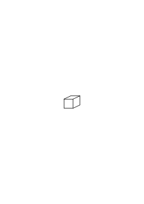
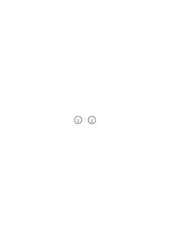
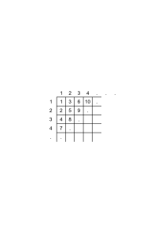
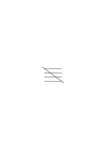

# Ms-121

### [FCv\[1\]](https://cdn.wittgensteinnachlass.com/2000px/webp/Ms-121/FCv.webp)

## Philosophische Bemerkungen. XVII.

### [1r\[1\]](https://cdn.wittgensteinnachlass.com/2000px/webp/Ms-121/1r.webp)

26.04.1938

Vergleiche den Gebrauch des Wortes “unendlich” in der Mathematik mit dem Gebrauch des Wortes “Metapsychologie”. Warum hat man denn in der modernen Erklärung der Differentialrechnung das Wort “unendlich klein” ausgemerzt? Könnte man dieses Wort nicht beibehalten & dennoch die richtigen Erklärungen geben? Wenn es auf das Wort gar nicht ankommt, warum ließ man es nicht stehen?

### [1r\[2\]](https://cdn.wittgensteinnachlass.com/2000px/webp/Ms-121/1r.webp)

“Was Du in Deinen Rechnungen tust, kann nur immer etwas Endliches sein.” – Doch wohl, weil das Unendliche _zu groß_ wäre.

### [1v\[1\]](https://cdn.wittgensteinnachlass.com/2000px/webp/Ms-121/1v.webp)

“Ich kann mir eine unendliche Baumreihe _denken_.” Gewiß; ich habe bei diesen Worten eine Vorstellung, aber in wiefern zählt die? Kommt es auf _sie_ an?

### [1v\[2\]](https://cdn.wittgensteinnachlass.com/2000px/webp/Ms-121/1v.webp)

Du sagst, Du sprichst von etwas ungeheuer Großem – wie zeigt es sich denn, daß Du von etwas ungeheuer Großem sprichst? Kann man, was Du sagst, auf etwas ungeheuer Großes anwenden?

### [1v\[3\]](https://cdn.wittgensteinnachlass.com/2000px/webp/Ms-121/1v.webp),[2r\[1\]](https://cdn.wittgensteinnachlass.com/2000px/webp/Ms-121/2r.webp)

Mit “unendlich” scheinst Du zu sagen: Etwas, was die Fassungskraft meiner Sinne übersteigt. – Ist es nicht, als sagte ich: “Er flog weiter & weiter, bis er endlich gänzlich meinem Blick entschwand” & als ob ich nun fortführe zu beschreiben, wie es dort aussah wohin er geflogen ist.

### [2r\[2\]](https://cdn.wittgensteinnachlass.com/2000px/webp/Ms-121/2r.webp)

27.04.1938

“Was Du tust, sind doch lauter endliche Operationen.” – Dies ist offenbar ein verdrehtes Argument. Was hast Du Dir denn erwartet? – Nun, irgend etwas Außergewöhnliches. Worauf bist Du denn gekommen? Ich glaube: darauf, daß, was Du unter dem Gesichtspunkt des Unendlichen betrachtest, auch unter dem Gesichtspunkt des Endlichen betrachtet werden kann. Beinahe könnte man so sagen: “Warum fällst Du bei diesen Zeichen in Ekstase?”

### [2r\[3\]](https://cdn.wittgensteinnachlass.com/2000px/webp/Ms-121/2r.webp),[2v\[1\]](https://cdn.wittgensteinnachlass.com/2000px/webp/Ms-121/2v.webp)

“Du machst doch lauter endliche Operationen mit endlichen Zeichen!” – Ja, aber die Bedeutung (der Zeichen) ist unendlich. – Aber worin besteht es, daß ihre Bedeutung unendlich ist?

### [2v\[2\]](https://cdn.wittgensteinnachlass.com/2000px/webp/Ms-121/2v.webp)

“Nun, ich spreche z.B. von der Zahl der Kardinalzahlen, & die ist doch unendlich.” Wir bilden den Ausdruck “Anzahl der Kardinalzahlen” & wir neigen dazu uns darunter etwas wie eine ungeheure Zahl vorzustellen.

### [2v\[3\]](https://cdn.wittgensteinnachlass.com/2000px/webp/Ms-121/2v.webp),[3r\[1\]](https://cdn.wittgensteinnachlass.com/2000px/webp/Ms-121/3r.webp)

08.05.1938

Was heißt “etwas wissen”? Man bedenkt nicht, welch große Bedeutung es haben kann, sich etwas zu _sagen_. Weiß ich, wie ich mich in dem & dem Falle benommen habe? In _einem_ Sinne, ja; ich war ja bei Bewußtsein; aber macht es nun keinen Unterschied wenn ich mir sage, oder gar aufschreibe, wie sich die Sache zugetragen hat?

### [3r\[2\]](https://cdn.wittgensteinnachlass.com/2000px/webp/Ms-121/3r.webp)

Weiß ich, daß ich Schmerzen habe, erst wenn ich es sage? – “Du weißt es ohnehin, wozu sollst Du Dir's mitteilen?” – Sich selbst etwas sagen, kann eine Handlung von großer Bedeutung sein.

### [3r\[3\]](https://cdn.wittgensteinnachlass.com/2000px/webp/Ms-121/3r.webp)

Es kann Einer nicht ‘Recht (oder Unrecht) haben’, wenn er sagt: “ich habe Schmerzen”.

### [3r\[4\]](https://cdn.wittgensteinnachlass.com/2000px/webp/Ms-121/3r.webp),[3v\[1\]](https://cdn.wittgensteinnachlass.com/2000px/webp/Ms-121/3v.webp)

Wie sieht das Phänomen des menschlichen Erinnerns aus? Nun, es beschreibt Einer was war, als wäre es noch gegenwärtig; so sieht es wenigstens aus, wenn ein Kind die Ausdrücke der Vergangenheit lernt. Dabei macht man eine bestimmte Art von Geste oder auch Miene (Geste, Miene, Tonfall der Erinnerung). Von einem Erinnerungserlebnis ist gar keine Rede.

### [3v\[2\]](https://cdn.wittgensteinnachlass.com/2000px/webp/Ms-121/3v.webp),[4r\[1\]](https://cdn.wittgensteinnachlass.com/2000px/webp/Ms-121/4r.webp)

09.05.1938

In verhältnismäßig seltenen Fällen nur, spricht man von einem Erinnerungserlebnis, z.B. von einem Erinnerungsbild: “Ich sehe ihn noch vor mir, wie er …”, “Ich kann noch seine Stimme hören”, etc.. Nur in der Philosophie & philosophierenden Psychologie hat man das Erinnerungserlebnis als das zentrale Phänomen des Erinnerns aufgegriffen. Denn man denkt: wer sagt: “ich erinnere mich …”, beschreibt einen Seelenzustand, & bei diesem Wort denkt man an so etwas wie ein Vorstellungserlebnis.

### [4r\[2\]](https://cdn.wittgensteinnachlass.com/2000px/webp/Ms-121/4r.webp)

Wer sich erinnert, _tut_ etwas; er _sagt_, z.B., etwas; & ist das nichts? – “Aber das ist doch nicht _alles_! es genügt doch nicht, daß er bloß diese Worte ausspricht.”

### [4r\[3\]](https://cdn.wittgensteinnachlass.com/2000px/webp/Ms-121/4r.webp),[4v\[1\]](https://cdn.wittgensteinnachlass.com/2000px/webp/Ms-121/4v.webp)

“Wenn man nur _sagte_, ‘ich habe Schmerzen’ & nicht auch Schmerzen _hätte_, wäre gar nichts Schreckliches an den Schmerzen.” – Freilich, wenn man keine Schmerzen hat, so ist daran nichts Schreckliches. “Wenn man nur das Schmerzbenehmen hätte & sonst nichts, so wäre daran nichts Unangenehmes.” – Freilich: sich die Wange halten, ist nicht unangenehm – der Zahnschmerz ist das Unangenehme.

### [4v\[2\]](https://cdn.wittgensteinnachlass.com/2000px/webp/Ms-121/4v.webp),[5r\[1\]](https://cdn.wittgensteinnachlass.com/2000px/webp/Ms-121/5r.webp)

“Ich habe doch nicht nur eine Erinnerung, ein Bild meines Benehmens; sondern auch des Schmerzes!” – Ich bezweifle es nicht; aber warum sagst Du das? Du willst immer wieder sagen, Du habest ein Bild & damit eine hinweisende Definition des Wortes “Schmerz”. Nur ist das Bild eben ein ‘inneres’ & es hat keine hinweisende Definition statt, denn ich wüßte ja nicht, was Du meinst wenn Du es mir nicht zeigen kannst; & wie weißt Du, daß Du jetzt das Gleiche meinst, wie vorhin, & was Du überhaupt ‘gleich’ nennst? Du hast ja keinerlei Kriterium. Was machst Du mit den Worten “gleich”, “Schmerz”, “Erinnerung”? Das sind doch Worte einer Sprache, also mit bestimmtem Gebrauch; während Du sie hier hintereinander aufstellst, als könnte das eine das andere rechtfertigen.

### [5r\[2\]](https://cdn.wittgensteinnachlass.com/2000px/webp/Ms-121/5r.webp),[5v\[1\]](https://cdn.wittgensteinnachlass.com/2000px/webp/Ms-121/5v.webp)

“Aber wenn ich Schmerzen habe, so – möchte ich doch sagen – _habe_ ich etwas außer meinem Benehmen!” “Wenn ich Schmerz fühle, so ist doch kein Zweifel: ich _habe_ etwas.” – Aber was für einen Gebrauch vom Worte “haben” machst Du hier? Willst Du sagen, es ließe in diesen Fällen sich bestätigen, daß Du ‘etwas _hast_’? man solle es Dir glauben? u. dergl.? oder heißt es: der Ausdruck ‘ich habe etwas’ drängt sich mir in diesen Fällen auf?

### [5v\[2\]](https://cdn.wittgensteinnachlass.com/2000px/webp/Ms-121/5v.webp)

Die Vorstellung des Schmerzes, die Erinnerung an den Schmerz kann das Wort “Schmerz” nicht definieren helfen.

### [5v\[3\]](https://cdn.wittgensteinnachlass.com/2000px/webp/Ms-121/5v.webp),[6r\[1\]](https://cdn.wittgensteinnachlass.com/2000px/webp/Ms-121/6r.webp)

Du sagst: “ich habe Schmerzen” – wie weißt Du, daß Du das Wort “Schmerzen” richtig anwendest? Du _weißt_ es nicht, d.h., es gibt dafür kein Kriterium, das Wort drängt sich Dir auf. Du sagst es, Du weigerst Dich ein andres zu gebrauchen, Du beteuerst, etc., etc. Das Wort drängt sich Dir mit Macht auf; es ist, als _müßtest_ Du eine Rechtfertigung dafür haben. – “Aber ich habe eine innere Rechtfertigung.” – Aber selbst wenn Du hättest, was Du Dir dabei vorstellst, wäre es keine Rechtfertigung, da ja die Existenz eines inneren Objektes noch keine Rechtfertigung wäre. – Aber nun hast Du immer die Vorstellung, ich wolle sagen: es seien da die Worte, _& sonst nichts_, die Worte _allein_. Oder, die Worte, & nichts _Rechtes_ außerhalb der Worte.

### [6r\[2\]](https://cdn.wittgensteinnachlass.com/2000px/webp/Ms-121/6r.webp),[6v\[1\]](https://cdn.wittgensteinnachlass.com/2000px/webp/Ms-121/6v.webp)

“Aber ich bin doch geneigt den Ausdruck ‘ich habe’ zu gebrauchen, eben weil ich _etwas merke_!’ – Und warum bist Du geneigt den Ausdruck ‘_Etwas_’ zu gebrauchen? Ist es also so: ich greife immer nach etwas, & es ist nichts da? – Aber warum soll ich nicht sagen, es ist etwas da? indem ich allerdings die greifende Bewegung als Kriterium dafür nehme, daß ‘etwas da ist’.

### [6v\[2\]](https://cdn.wittgensteinnachlass.com/2000px/webp/Ms-121/6v.webp),[7r\[1\]](https://cdn.wittgensteinnachlass.com/2000px/webp/Ms-121/7r.webp)

10.05.1938

‘Brahms hat alles herausgebracht, was in dem Thema ist.’ Aber wäre es in dem Thema gewesen, wenn er's nicht herausgebracht hätte? – D.h.: wenn das _Ganze_ da ist, so ist es als hätte die Entwicklung in dem Thema gelegen. ‘Es liegt schon irgendwie in dem Thema, er holt es nur heraus.’ – _Wir sind geneigt zu sagen_: “diese Entwicklung liegt bereits in dem Thema”. Vergleiche damit den Fall: “Ja, das war das Wort, das ich damals sagen wollte”, “Ich _habe damals das_ gemeint”. Wir hätten auch sagen können: Dies ist die _natürliche_ Entwickelung dieses Themas. – Und in wiefern ist sie natürlich? Um dies zu beantworten, dazu genügt es nicht daß wir das Thema genau anschauen; sondern (vor allem) _die Entwicklungen andrer musikalischer Themen._

### [7r\[2\]](https://cdn.wittgensteinnachlass.com/2000px/webp/Ms-121/7r.webp)

Der Eindruck: ‘es liegt schon darin’. Wir sind geneigt, das Bild des Darin-liegens, die Worte “es liegt darin”, anzuwenden.

### [7v\[1\]](https://cdn.wittgensteinnachlass.com/2000px/webp/Ms-121/7v.webp),[8r\[1\]](https://cdn.wittgensteinnachlass.com/2000px/webp/Ms-121/8r.webp)

“Zugegeben, ich habe keine _Rechtfertigung_, was ich fühle ‘Schmerz’ zu nennen, aber daß _etwas_ da ist, das ist doch klar!” (“Es ist doch da nicht _nichts_! Es geht doch irgend etwas vor; es ist doch etwas da!”) – Sagt man das nun mit Recht, oder Unrecht? – Wie soll man das entscheiden? “Aber ich _wende_ doch das Wort _an_, ich _sage_ es doch nicht bloß.” – Wie wenn Einer sagte: “Ich _versichere_ Dich, _ich wende das Wort an_ – kannst Du mir's denn nicht glauben? – mußt Du denn zweifeln?!” – Aber bezweifle ich denn, was er sagt? Glaube ich denn nicht, daß er Schmerzen hat? Und wenn ich nun glaube, daß er wirklich Schmerzen hat – stelle ich mir denn da nicht vor, daß _etwas_ seinen Worten entspricht? _Gewiß_! Aber auch hier habe ich die Worte & kann nicht zeigen, was sie rechtfertigt: kann sie nicht rechtfertigen. Kann sie also auch vor _mir_ nicht: _rechtfertigen_. Aber bin ich denn nicht _berechtigt_, sie zu sagen?! (‘Rest, rest, perturbed spirit!’)

### [8r\[2\]](https://cdn.wittgensteinnachlass.com/2000px/webp/Ms-121/8r.webp),[8v\[1\]](https://cdn.wittgensteinnachlass.com/2000px/webp/Ms-121/8v.webp)

Es handelt sich – könnte man vielleicht sagen – um eine falsche Anwendung des Wortes “etwas”. Denn dies Wort ist – sozusagen – das Mindeste, was man glaubt sagen zu können. “Etwas” scheint einem unartikulierten Laut am nächsten zu kommen. Aber es ist doch nicht (einfach) ein Schmerzlaut. Wenn ich bloß sage: ‘Au!’ – bezeichnet dies offenbar _etwas_?

### [8v\[2\]](https://cdn.wittgensteinnachlass.com/2000px/webp/Ms-121/8v.webp)

11.05.1938

“Aber ich schreie doch nicht grundlos ‘Au!’” – d.h.: ohne eine _Begleitung_ ‒ ‒ aber _müssen_ wir denn den Schmerz eine “Begleitung” des Schmerzlautes nennen? Oder besser: ist es klar, daß wir hier das Bild von der _Begleitung_ gebrauchen müssen?

### [8v\[3\]](https://cdn.wittgensteinnachlass.com/2000px/webp/Ms-121/8v.webp),[9r\[1\]](https://cdn.wittgensteinnachlass.com/2000px/webp/Ms-121/9r.webp)

Es ist uns als schauten wir unsern Schmerz an & sagten: “Das ist doch offenbar _etwas_”, als läsen wir dies von der Natur des Schmerzes ab, während wir nur zu einer andern Form der Ausdrucksweise unsrer gewöhnlichen Sprache zurückkehren. Wir lesen die eine Ausdrucksform von der andern ab nicht einen Satz von einem Faktum.

→ Man macht eine Pseudo-Beobachtung.

### [9r\[2\]](https://cdn.wittgensteinnachlass.com/2000px/webp/Ms-121/9r.webp)

Was leugnet der, der sagt, ein Mensch sei nur eine sehr komplizierte Maschine? Warum will man dem widersprechen? Oder der, der sagt, der Wille sei nicht frei, man tue nur was man tun müsse?

### [9r\[3\]](https://cdn.wittgensteinnachlass.com/2000px/webp/Ms-121/9r.webp),[9v\[1\]](https://cdn.wittgensteinnachlass.com/2000px/webp/Ms-121/9v.webp)

‘Ist denn nichts da – wenn Einer wahrheitsgemäß sagen kann, es sei etwas da?’ Ja wenn wir _diese_ Ausdrucksform gebrauchen, können wir nicht umhin auch _jene_ zu gebrauchen.

### [9v\[2\]](https://cdn.wittgensteinnachlass.com/2000px/webp/Ms-121/9v.webp),[10r\[1\]](https://cdn.wittgensteinnachlass.com/2000px/webp/Ms-121/10r.webp)

Warum aber sagen wir, “er spricht die Wahrheit”, sowohl wenn er sagt, er habe Schmerzen, als auch, wenn er sagt, Napoleon sei 182**1** gestorben, & 2 + 2 sei 4. Und das führt uns zur Frage, warum man in allen diesen Fällen Substantive, Adjektive & Verben verwendet; oder auch: warum man die Subjekt-Prädikatform verwendet. Erinnere Dich, daß man gesagt hat, jeder Satz bestehe aus Subjekt & Prädikat. Ich konstatiere also eine starke Tendenz diese Schemata zu verwenden. Wie kommt es, daß wir dazu tendieren? Ich weiß nicht. Aber es lassen sich _viele_ & interessante Gründe anführen. (_Vielerlei_ Ursachen, nicht eine Ursache.)

### [10r\[2\]](https://cdn.wittgensteinnachlass.com/2000px/webp/Ms-121/10r.webp)

‘Muß ich denn nicht sagen, es ist etwas da, wenn man (doch) wahrheitsgemäß sagen kann, es sei etwas da?’ Gewiß – nur: was ist hier das Kriterium der Wahrhaftigkeit? Und was er sagt ist ja nicht: “Wenn ich Schmerzen habe, so ist etwas da” – sondern: “Es ist etwas da”.

### [10r\[3\]](https://cdn.wittgensteinnachlass.com/2000px/webp/Ms-121/10r.webp)

‘Man kann doch mit gutem Gewissen sagen, es ist etwas da – wenn Einer wahrheitsgemäß sagen kann, es sei etwas da –.’

### [10v\[1\]](https://cdn.wittgensteinnachlass.com/2000px/webp/Ms-121/10v.webp)

12.05.1938

“_(Ein)_ Schmerz ist doch _etwas_, _(ein)_ Schmerz ist nicht _nichts_.” Das klingt doch sehr plausibel. Ist (der) Schmerz _etwas_, – oder ist er _nichts_? – Erwäge diese Frage!

### [10v\[2\]](https://cdn.wittgensteinnachlass.com/2000px/webp/Ms-121/10v.webp)

Es kommt uns abwechselnd vor als wäre er etwas, & als wäre er nichts.

### [10v\[3\]](https://cdn.wittgensteinnachlass.com/2000px/webp/Ms-121/10v.webp)

Wenn ein glaubwürdiger Mensch mich versichert, daß da etwas ist, so glaube ich es. – Und was mehr kann ich wollen? Also glaube ich, daß etwas da ist & daß es Schmerz ist. Und wenn das nicht genügt, was sollte genügen?

### [10v\[4\]](https://cdn.wittgensteinnachlass.com/2000px/webp/Ms-121/10v.webp),[11r\[1\]](https://cdn.wittgensteinnachlass.com/2000px/webp/Ms-121/11r.webp)

Kann ich auf den Schmerz zeigen, oder nicht? – Wenn mir Einer versichert, er zeige innerlich auf seine Empfindung, warum soll ich es ihm nicht glauben?

### [11r\[2\]](https://cdn.wittgensteinnachlass.com/2000px/webp/Ms-121/11r.webp)

13.05.1938

Wir sehen die Fata Morgana einer Sprache vor uns, die nicht existiert. (“Komm, laß mich dich fassen!”)

### [11r\[3\]](https://cdn.wittgensteinnachlass.com/2000px/webp/Ms-121/11r.webp)

‘Aber sagst Du nicht doch, mehr oder weniger verkappt, es sei da nichts als die Äußerung?’ Wie, wenn ich sagte: “Das einzig _Greifbare_ ist die Äußerung”? Wäre das falsch? – Aber wie– ist also der Schmerz: zwar nichts Greifbares, aber doch etwas’? also etwas Ungreifbares? Du verwendest die ganze Sprache falsch!

### [11r\[4\]](https://cdn.wittgensteinnachlass.com/2000px/webp/Ms-121/11r.webp),[11v\[1\]](https://cdn.wittgensteinnachlass.com/2000px/webp/Ms-121/11v.webp)

“Aber ich stelle mir doch den Schmerz vor!” – Was macht Dich diese Worte sagen? Bist Du sicher, daß es die passenden Worte für das sind, was Du getan hast? – “Aber _etwas_ habe ich doch getan!” – Bist Du sicher, daß _dieses_ Wort paßt? – Wie, wenn wir _das_ das Nichts nennten? –

### [11v\[2\]](https://cdn.wittgensteinnachlass.com/2000px/webp/Ms-121/11v.webp)

Und freilich willst Du nicht nur das _Wort_ “etwas” hier anwenden, sondern auch, & vor allem, das _Bild_ ‘etwas’, eine Geste, eine Innervation gewisser Muskeln.

### [11v\[3\]](https://cdn.wittgensteinnachlass.com/2000px/webp/Ms-121/11v.webp)

Ich suche Worte der Entzauberung.

### [11v\[4\]](https://cdn.wittgensteinnachlass.com/2000px/webp/Ms-121/11v.webp),[12r\[1\]](https://cdn.wittgensteinnachlass.com/2000px/webp/Ms-121/12r.webp)

Wie wenn man sagte: “der Schmerz ist, an der Äußerung gemessen, nichts.” Richten wir unsern Blick auf das _Sprachspiel_, so erscheint uns der Schmerz als Nichts. Ebenso wahr muß es aber (dann) sein zu sagen: der Schmerz sei die alleinige Realität.

### [12r\[2\]](https://cdn.wittgensteinnachlass.com/2000px/webp/Ms-121/12r.webp)

“Du gibst dem Schmerz nur sozusagen eine schattenhafte Existenz.” – Durchaus nicht; aber, ob Du ihn schattenhaft siehst, oder nicht hängt davon ab wie Du Dein Auge einstellst. Ist es auf den Vordergrund eingestellt so siehst Du den Hintergrund schattenhaft, und umgekehrt.

### [12r\[3\]](https://cdn.wittgensteinnachlass.com/2000px/webp/Ms-121/12r.webp),[12v\[1\]](https://cdn.wittgensteinnachlass.com/2000px/webp/Ms-121/12v.webp)

“Wenn etwas Realität hat, so ist es der Schmerz!” – Du gebrauchst allerlei richtige Sätze in der philosophischen Diskussion, nur außerhalb dem Zusammenhang des Sprachspiels, in welchem sie zuhause sind.

### [12v\[2\]](https://cdn.wittgensteinnachlass.com/2000px/webp/Ms-121/12v.webp)

14.05.1938

“‥‥‥‥․ Wenn er später ein gewisses Gefühl hat, sagt er: ‘ich habe Schmerzen’.” – Vergleiche damit: “Wenn er später eine gewisse Figur sieht, sagt er: ‘hier ist ein Sechseck’.”

### [12v\[3\]](https://cdn.wittgensteinnachlass.com/2000px/webp/Ms-121/12v.webp)

(Oder:) “‥‥‥․ Später sagt er unter gewissen Umständen: ‘ich habe Schmerzen’.” – Welches sind diese Umstände; ist einer der Umstände, daß er Schmerzen hat?

### [13r\[1\]](https://cdn.wittgensteinnachlass.com/2000px/webp/Ms-121/13r.webp)

“Wenn er später ein gewisses Gefühl hat (Du weißt welches ich meine) sagt er ‘‥‥․’.”

### [13r\[2\]](https://cdn.wittgensteinnachlass.com/2000px/webp/Ms-121/13r.webp)

“Dieser Ausdruck läßt es erscheinen, als wäre ‥‥․.” – als wäre das Unmögliche der Fall? “Dieser Ausdruck ist irreführend” – Führt er uns dazu, daß wir das _Unmögliche_ für wahr halten? Wohin führt er uns, wenn er uns irreführt? – Er führt uns in philosophische Unsicherheiten; er führt uns dazu wissenschaftliche Windbeuteleien anzustaunen & gedankenlos nach gewissen gut klingenden Formeln zu handeln, & dergl.

### [13r\[3\]](https://cdn.wittgensteinnachlass.com/2000px/webp/Ms-121/13r.webp),[13v\[1\]](https://cdn.wittgensteinnachlass.com/2000px/webp/Ms-121/13v.webp)

“Dieser Ausdruck läßt es erscheinen als wäre dieser Fall analog dem ‥‥․” – Nun, ist er es denn nicht? Ist es dann nicht ‘Geschmacksache’, ob wir ihn so nennen wollen? und was kann es schaden, die Analogie zu betonen?

### [13v\[2\]](https://cdn.wittgensteinnachlass.com/2000px/webp/Ms-121/13v.webp)

Ruht dieser Kreisfleck auf diesen Stützen

& auf dieser Grundlage? Ruht mein Gebrauch des Wortes “Schwarz” auf einem Wiedererkennen der Farbe & meine Anwendung des Wortes “Schmerz” darauf daß ich mich erinnere, dies früher so genannt zu haben?

### [13v\[3\]](https://cdn.wittgensteinnachlass.com/2000px/webp/Ms-121/13v.webp)

Womit kann dieses Bild streiten? – Mit den Tatsachen? – – Mit andern Bildern!

### [14r\[1\]](https://cdn.wittgensteinnachlass.com/2000px/webp/Ms-121/14r.webp)

…“Wenn er später ein gewisses Gefühl hat, sagt er: ‘ich habe Schmerzen’” – macht es erscheinen, als ob man durch Identifikation des Gefühls – indem man es gleichsam anschaut – herausfinden könnte, ob er das Wort richtig verwendet.

### [14r\[2\]](https://cdn.wittgensteinnachlass.com/2000px/webp/Ms-121/14r.webp)

Der Vergleich hat etwas reizendes, irritierendes.

### [14r\[3\]](https://cdn.wittgensteinnachlass.com/2000px/webp/Ms-121/14r.webp)

Man kann sagen, daß der, welcher dies sagt, kein klares Bild von der Verwendung des Satzes hat.

### [14r\[4\]](https://cdn.wittgensteinnachlass.com/2000px/webp/Ms-121/14r.webp),[14v\[1\]](https://cdn.wittgensteinnachlass.com/2000px/webp/Ms-121/14v.webp)

Wie ist es aber damit: “Wenn ich später dieses Gefühl habe, sage ich ‘‥‥‥’”? – Beschreibt das ein Sprachspiel?

### [14v\[2\]](https://cdn.wittgensteinnachlass.com/2000px/webp/Ms-121/14v.webp)

Wenn wir eine Ausdrucksweise mit etwas konfrontieren, gegen etwas ausspielen, so kann es nur eine andere Ausdrucksweise sein.

### [14v\[3\]](https://cdn.wittgensteinnachlass.com/2000px/webp/Ms-121/14v.webp)

“Wenn ich später dieses Gefühl habe …” – oder soll ich sagen: “Wenn ich später dieses selbe Gefühl zu haben glaube …”, oder wenn ich glaube, dies zu glauben?

### [14v\[4\]](https://cdn.wittgensteinnachlass.com/2000px/webp/Ms-121/14v.webp),[15r\[1\]](https://cdn.wittgensteinnachlass.com/2000px/webp/Ms-121/15r.webp)

Nun, der Satz “Wenn ich …” sagt etwas über unser Sprachspiel aus: nämlich etwas über den relativen Gebrauch des Ausdruckes “dasselbe Gefühl” & des Wortes “Schmerz”. Er sagt daß wir “Schmerz” immer für dasselbe Gefühl gebrauchen, nicht, wie dies auch sein könnte, etwa an jedem Wochentag für ein andres.

### [15r\[2\]](https://cdn.wittgensteinnachlass.com/2000px/webp/Ms-121/15r.webp)

Aber es genügt doch nicht zu sagen: “Später sage ich manchmal: ‘ich habe Schmerzen’”. Aber warum genügt es nicht?

### [15r\[3\]](https://cdn.wittgensteinnachlass.com/2000px/webp/Ms-121/15r.webp)

Inwiefern kann man sagen, daß das Lügenspiel auf dem Spiel ohne Lügen basiert ist? Doch nur darum weil wir das Wort Lüge nicht für etwas gebrauchen würden, was nicht in bestimmter Weise eine Ausnahme wäre.

### [15r\[4\]](https://cdn.wittgensteinnachlass.com/2000px/webp/Ms-121/15r.webp),[15v\[1\]](https://cdn.wittgensteinnachlass.com/2000px/webp/Ms-121/15v.webp)

“Aber besteht die Lüge nicht darin, daß man sagt: ‘ich habe Schmerzen’, & sich dabei, z.B., wohl fühlt?” Wie weiß ich, daß ich lüge?

### [15v\[2\]](https://cdn.wittgensteinnachlass.com/2000px/webp/Ms-121/15v.webp)

Das Gefühl als Begleitung des Ausdrucks erscheint mir wie die Schlieren der heißen Luft, die das Bild einer Landschaft begleiten.

### [15v\[3\]](https://cdn.wittgensteinnachlass.com/2000px/webp/Ms-121/15v.webp)

Warum soll der Schmerz nicht zum Ausdruck _gehören_? Und die Verschiedenheit der begleitenden Gefühle nicht zum Verfließen der Zeit?

### [15v\[4\]](https://cdn.wittgensteinnachlass.com/2000px/webp/Ms-121/15v.webp)

‘Führe mir einmal den Fall so einer Lüge vor, daß ich weiß, was Du “Lüge” nennst!’ –

### [15v\[5\]](https://cdn.wittgensteinnachlass.com/2000px/webp/Ms-121/15v.webp),[16r\[1\]](https://cdn.wittgensteinnachlass.com/2000px/webp/Ms-121/16r.webp)

Du hast ein Bild. (Eine Ausdrucksweise.) Aber _rechtfertigen_ kannst Du es nicht. Wie Du hinter die Ausdrucksweise zurückgreifen willst, greifst Du in's Leere. Du kannst dort wieder etwas arrangieren, was Dein erstes Bild rechtfertigt, aber Du kannst auch das Gegenteil arrangieren.

### [16r\[2\]](https://cdn.wittgensteinnachlass.com/2000px/webp/Ms-121/16r.webp)

Also: ‘Weder was wir sagen, noch _daß_ wir _etwas_ sagen, ist durch etwas Anderes gerechtfertigt.’ Und das wäre eine Beschreibung eines Sprachspiels zur Unterscheidung von einem andern. (‘Hier gibt es ein Tor, dort nicht.’)

### [16r\[3\]](https://cdn.wittgensteinnachlass.com/2000px/webp/Ms-121/16r.webp),[16v\[1\]](https://cdn.wittgensteinnachlass.com/2000px/webp/Ms-121/16v.webp)

“Also begleitet die Schmerzäußerung (die ungeheuchelte) _wirklich_ nichts?” – Wie will man es entscheiden? – “War es Irrtum, daß ich meinte, es begleite sie etwas?” – Der Irrtum liegt darin, daß Du durch Konzentration auf die Vorstellung der Schmerzsituation feststellen willst, ob den Schmerzausdruck etwas begleitet.

### [16v\[2\]](https://cdn.wittgensteinnachlass.com/2000px/webp/Ms-121/16v.webp)

“Also steht die Schmerzäußerung wirklich allein da; da sie durch nichts gerechtfertigt ist?” Wir können uns hinter ihr ebensogut immer das Gleiche, als immer etwas Anderes stehen denken. Und also ebensogut etwas, als nichts.

### [16v\[3\]](https://cdn.wittgensteinnachlass.com/2000px/webp/Ms-121/16v.webp)

“Die Schmerzäußerung ist doch nicht ungerechtfertigt! sie ist doch durch den Schmerz gerechtfertigt!” – & zugleich: “Die Schmerzäußerung ist doch durch nichts _gerechtfertigt_! Ich kann doch nichts anfassen & behalten, was sie rechtfertigt!”

### [16v\[4\]](https://cdn.wittgensteinnachlass.com/2000px/webp/Ms-121/16v.webp),[17r\[1\]](https://cdn.wittgensteinnachlass.com/2000px/webp/Ms-121/17r.webp)

“Also steht die Schmerzäußerung wirklich allein da; da sie durch nichts gerechtfertigt ist?” – Wenn ich das sage schwebt mir unwillkürlich ein Bild vor, das des Menschen der eine Schmerzäußerung von sich gibt & dabei nichts empfindet; kein Wunder, daß mir ungemütlich bei dem Satz zumut ist, die Schmerzäußerung stehe allein da.

### [17r\[2\]](https://cdn.wittgensteinnachlass.com/2000px/webp/Ms-121/17r.webp),[17v\[1\]](https://cdn.wittgensteinnachlass.com/2000px/webp/Ms-121/17v.webp)

Wie wenn ein Wortausdruck ein bestimmtes Bild in uns hervorruft, aber dann für etwas steht was dem Bild im normalen Sinn entgegengesetzt ist. Wir werden dann immer wieder vom Wortausdruck auf's Bild & dann wieder vom Wortausdruck auf die tatsächliche Anwendung blicken & sagen: “aber es heißt doch _das_! – Aber es heißt doch das _Andere_!

### [17v\[2\]](https://cdn.wittgensteinnachlass.com/2000px/webp/Ms-121/17v.webp)

15.05.1938

“Also steht die Schmerzäußerung wirklich allein da; ‥‥?” – Warum soll ich diese Worte, “sie steht allein da”, nicht sagen? Welche Konsequenz haben sie denn? Sie haben ja eben keine Konsequenz.

### [17v\[3\]](https://cdn.wittgensteinnachlass.com/2000px/webp/Ms-121/17v.webp)

Dein Spiel bleibt ganz in der Sprache.

### [17v\[4\]](https://cdn.wittgensteinnachlass.com/2000px/webp/Ms-121/17v.webp)

Ich sage mir das Wort “Schmerz” & stelle mir einen Schmerz vor; & sage mir: “da haben wir doch, was das Wort ‘Schmerz’ bezeichnet–”. Gewiß, _das tue ich_. Aber was weiter; was habe ich damit getan? wozu war es nütze? (Ich habe die Schenkungsurkunde an mich ausgefertigt; aber was nun weiter damit?)

### [18r\[1\]](https://cdn.wittgensteinnachlass.com/2000px/webp/Ms-121/18r.webp)

Ich will, daß Du Dir bewußt wirst, daß die Worte nur Worte sind. “Daß ihnen keine magische Kraft innewohnt” – möchte ich sagen. D.h. ich möchte, daß Du Dich fragst: “Ja, das _sage_ ich – _& was weiter_?”

### [18r\[2\]](https://cdn.wittgensteinnachlass.com/2000px/webp/Ms-121/18r.webp)

Wie ist es mit diesen unnützen Sätzen, sind sie sinnlos? Meine ich nichts mit ihnen? Ich sage sie jedenfalls nicht ‘mechanisch’, sondern _erlebe_ sie.

### [18r\[3\]](https://cdn.wittgensteinnachlass.com/2000px/webp/Ms-121/18r.webp)

Ich möchte, daß Du den Übergang machst von der Seele des Satzes zu seiner Funktion im Sprachspiel.

### [18r\[4\]](https://cdn.wittgensteinnachlass.com/2000px/webp/Ms-121/18r.webp),[18v\[1\]](https://cdn.wittgensteinnachlass.com/2000px/webp/Ms-121/18v.webp)

Du kannst auch den Satz “Ich bin hier” mit Seele sagen.

### [18v\[2\]](https://cdn.wittgensteinnachlass.com/2000px/webp/Ms-121/18v.webp)

Ich will Dir eigentlich nur etwas abgewöhnen.

### [18v\[3\]](https://cdn.wittgensteinnachlass.com/2000px/webp/Ms-121/18v.webp)

“Aber habe ich denn nicht damit das Wort mit seiner Bedeutung konfrontiert?” – _Habe_ ich es denn mit seiner Bedeutung konfrontiert?

### [18v\[4\]](https://cdn.wittgensteinnachlass.com/2000px/webp/Ms-121/18v.webp)

Denke, die Menschen stellten an den Enden jedes Ballspielplatzes z.B. auch jedes Tennisplatzes, ‘Tore’ auf.

### [18v\[5\]](https://cdn.wittgensteinnachlass.com/2000px/webp/Ms-121/18v.webp)

Ich mache Dich aufmerksam darauf, daß der Satz _zu nichts führt_. –

### [18v\[6\]](https://cdn.wittgensteinnachlass.com/2000px/webp/Ms-121/18v.webp),[19r\[1\]](https://cdn.wittgensteinnachlass.com/2000px/webp/Ms-121/19r.webp)

“Aber habe ich denn nicht damit das Wort seiner Bedeutung gegenübergestellt?” – _Habe_ ich denn damit das Wort seiner Bedeutung gegenübergestellt? –

### [19r\[2\]](https://cdn.wittgensteinnachlass.com/2000px/webp/Ms-121/19r.webp)

Gehört das zum Sprachspiel, dem diese Worte dienen? Du kannst diese Frage beantworten, wie Du willst.

### [19r\[3\]](https://cdn.wittgensteinnachlass.com/2000px/webp/Ms-121/19r.webp)

“Aber zeigt es mir nicht, daß ich weiß, was ‘Schmerz’ heißt?” – Zeigt es Dir, daß Du weißt, was “Schmerz” heißt? – Man sagt: “Laß mich sehen, ob ich weiß, wie Sepia aussieht (ich rufe es mir in die Erinnerung) – ja, ich weiß es.” ‒ ‒ Aber wie wird dieser Satz nun weiter verwendet? & wie der Satz: “ich habe es mir in die Erinnerung gerufen”? ‘Interessiert Dich das nicht?’ möchte ich fragen.

### [19v\[1\]](https://cdn.wittgensteinnachlass.com/2000px/webp/Ms-121/19v.webp)

“Aber hab ich damit nicht dem Wort seine Bedeutung gegenübergestellt?” – Warum soll man das nicht sagen? Aber eine _wichtige_ Frage ist: Wie verwenden wir diese Worte wirklich? – Aber diese Frage interessiert Dich nicht. Du schaust nicht auf die wirkliche Verwendung, sondern auf ein Bild, das die Worte in Dir aufrufen. Und Du weißt, daß das Bild irgendwie nicht ganz passend ist.

### [19v\[2\]](https://cdn.wittgensteinnachlass.com/2000px/webp/Ms-121/19v.webp)

Es ist, als hätte die Sprache zwei Anwendungen: eine, beinahe unwichtige, äußere, praktische, & die wichtige, innere, die darin besteht, daß sie Bilder hervorruft. Wenn wir philosophieren interessiert uns die äußere Anwendung nicht.

### [20r\[1\]](https://cdn.wittgensteinnachlass.com/2000px/webp/Ms-121/20r.webp)

“Und was weiter? Wozu sind diese Worte nütze?” ist das entzaubernde Wort.

### [20r\[2\]](https://cdn.wittgensteinnachlass.com/2000px/webp/Ms-121/20r.webp)

Du machst diese Geste, & sagst diese Worte gleichsam von der Geste aus. Oder Du machst Dir dieses Bild & sagst dann die Worte gleichsam als Beschreibung des Bildes; dann machst Du Dir ein andres Bild & sagst andre Worte dazu. Und die Worte scheinen immer bekräftigt – nämlich durch das _Bild_. Von der _Anwendung_ des Bildes siehst Du ganz ab.

### [20r\[3\]](https://cdn.wittgensteinnachlass.com/2000px/webp/Ms-121/20r.webp)

Du beschreibst ein Bild!

### [20r\[4\]](https://cdn.wittgensteinnachlass.com/2000px/webp/Ms-121/20r.webp)

Sage Dir: “Das sind Lautreihen & Bilder. – Und wozu dienen sie?”

### [20v\[1\]](https://cdn.wittgensteinnachlass.com/2000px/webp/Ms-121/20v.webp)

Daß die Worte zum Bild passen, das ist uns klar; aber vergleichen wir das Bild mit seiner Verwendung so scheint es wieder zu zerrinnen & ein andres Bild scheint zum mindesten ebensogut zu passen.

### [20v\[2\]](https://cdn.wittgensteinnachlass.com/2000px/webp/Ms-121/20v.webp)

Ist was ich sehe, immer der gleiche Sessel, oder jeden Moment ein andrer Sessel? Du beschreibst ein Bild! Du beschreibst ein imaginäres (leerlaufendes) Sprachspiel hinter dem wirklichen. Bedenke, daß Worte Worte sind!

### [20v\[3\]](https://cdn.wittgensteinnachlass.com/2000px/webp/Ms-121/20v.webp),[21r\[1\]](https://cdn.wittgensteinnachlass.com/2000px/webp/Ms-121/21r.webp)

Es ist, als wäre hier etwas Unfaßbares. – Man fragt: “Ist hier etwas, oder nichts?” & keines paßt. Das Wort “Schmerz” bezeichnet weder ein Ding noch eine Leere.

### [21r\[2\]](https://cdn.wittgensteinnachlass.com/2000px/webp/Ms-121/21r.webp)

(Du mußt Dich gleichsam von der Gewohnheit des Wortgebrauches trennen.)

### [21r\[3\]](https://cdn.wittgensteinnachlass.com/2000px/webp/Ms-121/21r.webp)

Denk nur: wie soll das Wort einen Schmerz bezeichnen?! Es ist ja der reine Wahnsinn.

### [21r\[4\]](https://cdn.wittgensteinnachlass.com/2000px/webp/Ms-121/21r.webp),[21v\[1\]](https://cdn.wittgensteinnachlass.com/2000px/webp/Ms-121/21v.webp)

“Denk nur, was Du tust!” mußt Du Dir zurufen; Du rufst Dir ein Gefühl in's Gedächtnis & sagst dazu diese Worte, diese Laute. Was soll das?! Du rufst Dir etwa einen Schmerz hervor & sagst wiederholt: “da ist doch etwas”. Nun, was sollen diese Laute, diese Worte? Wach, gleichsam, auf! Aber warum sage ich mir dann diese Worte? – Die Sprache ruft sie hervor.

### [21v\[2\]](https://cdn.wittgensteinnachlass.com/2000px/webp/Ms-121/21v.webp)

16.05.1938

“Wenn er dann die Empfindung hat – die ich mir jetzt vorstelle – sagt er ‘ich habe Schmerzen’.” ‒ ‒ “Wenn er später diese Farbe sieht, die ich jetzt vor mir habe, & Dir jederzeit zeigen könnte, sagt er ‥‥‥”

### [21v\[3\]](https://cdn.wittgensteinnachlass.com/2000px/webp/Ms-121/21v.webp),[22r\[1\]](https://cdn.wittgensteinnachlass.com/2000px/webp/Ms-121/22r.webp)

“Er hat die gleiche Empfindung wie ich” – Kriterien der Identität. Was ist aber das Kriterium der Identität wenn ich sage: “Ich habe jetzt den gleichen Schmerz wie früher”? Soll ich sagen: “ich _erkenne unmittelbar_, daß es der gleiche ist? Also erkenne ich unmittelbar daß das Wort “Gleich” auf ihn paßt? Oder, daß das Bild + + auf ihn paßt? Und _wie_ paßt? – Aber willst Du sagen, ich _sage_ bloß das Wort “Gleich”, ohne daß es irgendwie gerechtfertigt ist? Das Wort “bloß” ist hier falsch angewendet. Das Wort, daß der Ausdruck “gleich” hier nicht gerechtfertigt ist gibt Dir das gleiche Unbehagen wie manchem Menschen der Ausdruck daß die Erde ohne gestützt zu werden frei im Raum schwebt. (Und darin ist nichts Lächerliches.)

### [22r\[2\]](https://cdn.wittgensteinnachlass.com/2000px/webp/Ms-121/22r.webp),[22v\[1\]](https://cdn.wittgensteinnachlass.com/2000px/webp/Ms-121/22v.webp)

“Aber wenn ich auch nicht kontrollieren kann, ob des Andern Empfindung im gleichen Sinne die gleiche ist wie diese beiden Empfindungen, die ich jetzt habe, – könnte es nicht doch der Fall sein (wenn man es auch nicht wissen kann)?” – Du ergänzt das wirklich existierende Sprachspiel in der Vorstellung durch ein anderes. D.h. Du machst Dir ohne auf das wirkliche Sprachspiel Rücksicht zu nehmen eine Vorstellung von einem Sprachspiel, welches mit diesen Worten gespielt werden könnte.

### [22v\[2\]](https://cdn.wittgensteinnachlass.com/2000px/webp/Ms-121/22v.webp),[23r\[1\]](https://cdn.wittgensteinnachlass.com/2000px/webp/Ms-121/23r.webp)

“Ich sage ‘es paßt’. Ist denn das _alles_?” – Warum soll es _nicht_ alles sein? (Du empfindest einen horror vacui.) Warum soll ich _lieber_ sagen, es sei nicht alles, als, es sei alles? Ich will, daß Du mit dergleichen Leichtigkeit beides sagen kannst.

### [23r\[2\]](https://cdn.wittgensteinnachlass.com/2000px/webp/Ms-121/23r.webp)

“Hast Du mich verstanden?” Wir erwarten ein ‘ja’ oder ‘nein’. Wir könnten auch fragen: “Hast Du ein klares Bild?” Diese Verwendung von “verstehen” ist sehr wichtig. Wir könnten uns sehr wohl denken, daß sie in einer Sprache fehlte, daß man nur dann sagt “ich verstehe” wenn es heißt: ich pflege dies Spiel richtig zu spielen.

### [23r\[3\]](https://cdn.wittgensteinnachlass.com/2000px/webp/Ms-121/23r.webp),[23v\[1\]](https://cdn.wittgensteinnachlass.com/2000px/webp/Ms-121/23v.webp)

Es mag schwer sein, diese Figur als ebene zu sehen. Wenn ich die Linien a b c ziehe wird es leichter.

Aber nun erscheint etwa der Punkt in der Mitte des Sechsecks als Scheitel einer Pyramide. Ich schaue auf den Schmerz & sage: “die Äußerung ist doch offenbar gerechtfertigt! Es ist doch etwas da, was sie rechtfertigt!” – Dann schaue ich auf die Schmerzäußerung & sage: “sie ist doch nicht _gerechtfertigt_! Was ist denn da, sie zu rechtfertigen?!”.

### [23v\[2\]](https://cdn.wittgensteinnachlass.com/2000px/webp/Ms-121/23v.webp)

Man könnte die Regel machen: jeder philosophische Satz sei mit einem Ausrufungszeichen zu schreiben.

_———— · ————_

### [23v\[3\]](https://cdn.wittgensteinnachlass.com/2000px/webp/Ms-121/23v.webp),[24r\[1\]](https://cdn.wittgensteinnachlass.com/2000px/webp/Ms-121/24r.webp),[24v\[1\]](https://cdn.wittgensteinnachlass.com/2000px/webp/Ms-121/24v.webp)

17.05.1938

Wie wäre das Phänomen der menschlichen Erinnerung zu beschreiben? Oder: wie wäre der Unterschied zu beschreiben zwischen einer Gesellschaft, in der es ein Gedächtnis gibt & einer, in der es kein Gedächtnis gibt? – Nun, das was man _nicht_ sagen kann ist: z.B., daß sie ihre Handlungen unvollendet lassen, daß sie inkonsequent sind. Wer Gedächtnis hat – möchte man sagen – nimmt alte Fäden wieder auf, während der Andre sie fallen läßt. Und dies ist in Ordnung wenn es nicht heißt: wer Gedächtnis hat, nimmt alte Fäden wieder auf, weil er sich an sie erinnert. Einer vergißt seine Handschuhe in meinem Zimmer. Wie weiß ich, daß er sie _vergessen_ hat; daß er sie nicht absichtlich liegen gelassen hat, oder, daß er sie liegen gelassen hat, wie ein Andrer einen wertlosen Gegenstand liegen läßt, etwa eine leere Zündholzschachtel? – Käme er aber zurückgerannt, mit Bestürzung auf seinem Gesicht, suchte aufgeregt nach etwas (ohne notwendigerweise Worte zu gebrauchen) ‘fände’ die Handschuhe mit den Zeichen der Erleichterung, so würden wir sagen, er habe sie bei mir vergessen habe sich dann an sie erinnert, etc..

### [24v\[2\]](https://cdn.wittgensteinnachlass.com/2000px/webp/Ms-121/24v.webp)

19.05.1938

Wie weiß man denn, daß man sich damals an das & das erinnert hat? Sagt man sich: ich habe damals dieses Bild vor mir gesehen, dieses Gefühl gehabt, diese Worte ausgesprochen – also habe ich mich erinnert?

### [25r\[1\]](https://cdn.wittgensteinnachlass.com/2000px/webp/Ms-121/25r.webp)

Wie, wenn man sagte: das Phänomen der menschlichen Erinnerung besteht darin, daß die Menschen Erinnerungserlebnisse haben? – Welche Erlebnisse wären das? Man denkt sich etwa Menschen, die eine charakteristische Geste des sich Versenkens in die Erinnerung machen & denen dabei Bilder vorschweben – etwa, was man im alten stummen Film gesehen hätte, wenn jemand sich einer Sache erinnert.

### [25r\[2\]](https://cdn.wittgensteinnachlass.com/2000px/webp/Ms-121/25r.webp)

Aber ist sich Erinnern kein seelischer Vorgang?

### [25r\[3\]](https://cdn.wittgensteinnachlass.com/2000px/webp/Ms-121/25r.webp),[25v\[1\]](https://cdn.wittgensteinnachlass.com/2000px/webp/Ms-121/25v.webp)

Ist also das Charakteristische am Sprachspiel mit dem Wort “Schmerz” das, daß wir es bei bestimmten _äußeren_ Anlässen sagen, nicht bei bestimmten _inneren_ Anlässen? Bedenke: es gibt nicht einen Naturlaut der Erinnerung, wie es einen Naturlaut des Schmerzes gibt.

### [25v\[2\]](https://cdn.wittgensteinnachlass.com/2000px/webp/Ms-121/25v.webp)

“Erinnerung” nennt man vor allem die _richtige_ Erinnerung. Aber das Erinnerungssignal, “ich erinnere mich …” lernt man natürlich nicht als Beschreibung der korrekten Erinnerung.

### [25v\[3\]](https://cdn.wittgensteinnachlass.com/2000px/webp/Ms-121/25v.webp),[26r\[1\]](https://cdn.wittgensteinnachlass.com/2000px/webp/Ms-121/26r.webp)

“Ich muß es geträumt haben” – sagt man, wenn man sich deutlich an etwas erinnern zu können glaubt & alles dafür spricht, daß es nicht stattgefunden hat.

### [26r\[2\]](https://cdn.wittgensteinnachlass.com/2000px/webp/Ms-121/26r.webp)

“Zeichnerisches Gedächtnis”. Welches Phänomen würden wir so nennen?

### [26r\[3\]](https://cdn.wittgensteinnachlass.com/2000px/webp/Ms-121/26r.webp),[26v\[1\]](https://cdn.wittgensteinnachlass.com/2000px/webp/Ms-121/26v.webp)

Wie schaut es aus: das Unmögliche wollen? Nun, das Daumenfangen ist ein Beispiel davon. Sieh es genau an! Aber inwiefern will man denn dabei das Unmögliche? Was ich dabei tue ist doch ganz gewöhnlich, es geschieht doch dabei nichts Ungeheuerliches. Nein; nur sieht es aus wie ein Versuch, etwas zu fangen, & ist doch keiner.

### [26v\[2\]](https://cdn.wittgensteinnachlass.com/2000px/webp/Ms-121/26v.webp)

‘Der Satz, dessen Beweisbarkeit bewiesen ist, gilt als bewiesen.’

### ([VB](/w-vb/#ms-121-26v.3)) [26v\[3\]](https://cdn.wittgensteinnachlass.com/2000px/webp/Ms-121/26v.webp) {#26v3}

25.05.1938

Erscheinungen mit sprachähnlichem Charakter in der Musik oder Architektur. Die sinnvolle Unregelmäßigkeit – in der Gotik z.B. (mir schweben auch die Türme der Basiliuskathedrale vor). Die Musik Bachs ist sprachähnlicher als die Mozarts & Haydns. Die Rezitative der Bässe im 4ten Satz der 9ten Symphonie von Beethoven. (Vergleiche auch Schopenhauers Bemerkung über die _allgemeine_ Musik zu einem _besonderen_ Text.)

### [26v\[4\]](https://cdn.wittgensteinnachlass.com/2000px/webp/Ms-121/26v.webp),[27r\[1\]](https://cdn.wittgensteinnachlass.com/2000px/webp/Ms-121/27r.webp)

27.05.1938

Das Vergnügen, das wir an einem aufgeblasenen Gummiballon haben. Wir sind nicht gewöhnt mit Körpern zu hantieren, die so groß im Verhältnis zu ihrem Gewicht sind.

### [27r\[2\]](https://cdn.wittgensteinnachlass.com/2000px/webp/Ms-121/27r.webp)

Es hilft wenn man sagt: der Beweis des Fermatschen Satzes ist nicht zu entdecken, sondern zu _erfinden_.

### [27r\[3\]](https://cdn.wittgensteinnachlass.com/2000px/webp/Ms-121/27r.webp)

‘Ein “System aller Systeme” ist ein Widerspruch.’ Wie läßt sich dieser Satz anwenden?

### ([RFM II](/w-rfm-2/#ms-121-27r.4+27v.1)) [27r\[4\]](https://cdn.wittgensteinnachlass.com/2000px/webp/Ms-121/27r.webp),[27v\[1\]](https://cdn.wittgensteinnachlass.com/2000px/webp/Ms-121/27v.webp) {#27r427v1}

30.05.1938

Die Krankheit einer Zeit heilt sich durch eine Veränderung in der Lebensweise der Menschen & die Krankheit der philosophischen Probleme konnte nur durch eine veränderte Denkweise & Lebensweise geheilt werden nicht durch eine Medizin die ein Einzelner erfand. Denke, daß der Gebrauch des Wagens gewisse Krankheiten hervorruft oder begünstigt & die Menschheit von dieser Krankheit geplagt wird, bis sie sich, aus irgendwelchen Ursachen, als Resultat irgendeiner Entwickelung, das Fahren wieder abgewöhnt.

### [27v\[2\]](https://cdn.wittgensteinnachlass.com/2000px/webp/Ms-121/27v.webp)

“Nenn' mir eine Zahl, die größer ist, als die Zahl aller ganzen Zahlen!” – diese Aufgabe hat den Charakter einer mathematischen Scherzfrage.

### [27v\[3\]](https://cdn.wittgensteinnachlass.com/2000px/webp/Ms-121/27v.webp),[28r\[1\]](https://cdn.wittgensteinnachlass.com/2000px/webp/Ms-121/28r.webp)

Welcher Art wäre denn die Aufgabe: “Nenne mir eine Zahl zwischen <math class="stacked" display="inline"><mfrac><mrow><mn>1</mn></mrow><mrow><mi>n</mi></mrow></mfrac></math> und <math class="stacked" display="inline"><mfrac><mrow><mn>1</mn></mrow><mrow><mi>m</mi></mrow></mfrac></math>”? Nun es wäre eine Übung in der Bildung solcher Zahlen. Ihre Nützlichkeit liegt darin, daß es hier ein _System_ solcher Aufgaben gibt.

### [28r\[2\]](https://cdn.wittgensteinnachlass.com/2000px/webp/Ms-121/28r.webp),[28v\[1\]](https://cdn.wittgensteinnachlass.com/2000px/webp/Ms-121/28v.webp)

Es ist nämlich eine ganz wesentliche Frage: Was ist denn die Anwendung dieses (neuen) Zahlbegriffs _außerhalb_ der Mathematik. – Denn mit 1, 2, 3, 4 … kann ich nicht nur Zahlen zählen, sondern auch Äpfel, & wenn nun ein Zahlwort _nur_ in mathematischen Sätzen & in keinen andern vorkommen könnte, oder wir doch nicht wissen, welche Rolle es außerhalb der mathematischen Sätze spielen kann, so weist dies auf eine sehr wesentliche Unklarheit unsrerseits hin. Es ist nämlich nicht klar ob wir nicht bloß durch eine Einbildung verführt sind hier den Namen “Zahl” zu gebrauchen.

### ([RFM II](/w-rfm-2/#ms-121-28v.2)) [28v\[2\]](https://cdn.wittgensteinnachlass.com/2000px/webp/Ms-121/28v.webp) {#28v2}

31.05.1938

Wie macht man denn von dem Satz Verwendung: “Es gibt keine größte Kardinalzahl”? Wann, & bei welcher Gelegenheit, würde man ihn sagen? Diese Verwendung ist jedenfalls eine ganz andere, als die des mathematischen Satzes “25 × 25 = 625”.

### ([RFM II](/w-rfm-2/#ms-121-28v.3+29r.1)) [28v\[3\]](https://cdn.wittgensteinnachlass.com/2000px/webp/Ms-121/28v.webp),[29r\[1\]](https://cdn.wittgensteinnachlass.com/2000px/webp/Ms-121/29r.webp) {#28v329r1}

Vor allem ist zu bemerken, daß wir dies überhaupt fragen, was darauf deutet, daß die Antwort nicht (ganz) auf der Hand liegt. Und ferners, wenn man die Frage rasch beantworten will gleitet man leicht aus. Es ist hier ähnlich wie mit der Frage, welche Erfahrung uns zeigt, daß unser Raum dreidimensional ist.

### ([RFM II](/w-rfm-2/#ms-121-29r.2)) [29r\[2\]](https://cdn.wittgensteinnachlass.com/2000px/webp/Ms-121/29r.webp) {#29r2}

Von einer _Erlaubnis_ sagen wir, sie habe kein Ende.

### ([RFM II](/w-rfm-2/#ms-121-29r.3)) [29r\[3\]](https://cdn.wittgensteinnachlass.com/2000px/webp/Ms-121/29r.webp) {#29r3}

Und man kann sagen, die Erlaubnis Sprachspiele mit Kardinalzahlen zu spielen habe kein Ende. Dies würde man etwa Einem sagen, dem wir unsere Sprache & Sprachspiele lehrten. Es wäre also wieder ein grammatischer Satz, aber von _ganz_ anderer Art als “25 × 25 = 625”. Er wäre aber von großer Bedeutung, wenn der Schüler etwa geneigt wäre (vielleicht weil er einer ganz andern Kultur erzogen worden wäre) ein definitives Ende dieser Reihe von Sprachspielen zu erwarten.

### [29v\[1\]](https://cdn.wittgensteinnachlass.com/2000px/webp/Ms-121/29v.webp)

Wie ist es nun mit dem Satz, daß es kein System aller Systeme gibt, der dem Satz, daß es keine größte Kardinalzahl gibt, in gewisser Weise ähnlich ist?

### [29v\[2\]](https://cdn.wittgensteinnachlass.com/2000px/webp/Ms-121/29v.webp)

Es ist in der Betrachtungsart der Mengenlehre etwas von der primitiven Denkweise eines wilden Volksstammes. Ich meine: ich könnte mir denken, daß ein solcher die Mathematik eines zivilisierten Volkes erlernt, & ihr nun eine barbarische Deutung gegeben hätte.

### [29v\[3\]](https://cdn.wittgensteinnachlass.com/2000px/webp/Ms-121/29v.webp),[30r\[1\]](https://cdn.wittgensteinnachlass.com/2000px/webp/Ms-121/30r.webp)

Vor allem muß man sagen, daß wir gar keine Idee haben, wie so ein System aller reellen Zahlen aussehen könnte. Wir könnten uns aber denken, daß nur die algebraischen Zahlen bei uns in Gebrauch wären & dann könnte man die Cantorsche Überlegung auf dies System anwenden.

### [30r\[2\]](https://cdn.wittgensteinnachlass.com/2000px/webp/Ms-121/30r.webp)

Wie, wenn Einer sagte: “Es _muß_ doch ein System aller Systeme geben!”?

### [30r\[3\]](https://cdn.wittgensteinnachlass.com/2000px/webp/Ms-121/30r.webp),[30v\[1\]](https://cdn.wittgensteinnachlass.com/2000px/webp/Ms-121/30v.webp)

01.06.1938

Gibt es einen Satz, der sagt, daß, wenn etwas in Russells System _bewiesen_ (nicht: ‘beweisbar’) ist, daß es _wahr_ ist? Aber “bewiesen” ist zeitlich, “beweisbar” ist unzeitlich. Soll ich also sagen “beweisbar”, aber mit der Bedingung, daß als Beweis der Beweisbarkeit von p nur der Russellsche Beweis von p gilt?

### [30v\[2\]](https://cdn.wittgensteinnachlass.com/2000px/webp/Ms-121/30v.webp)

Beweisbarkeit ist eine ‘_interne Relation_’ des Satzes zu den Axiomen.

### [30v\[3\]](https://cdn.wittgensteinnachlass.com/2000px/webp/Ms-121/30v.webp)

Soll ich nun sagen: der Beweis von p ist ein Beweis dieses Satzes _&_ seiner Beweisbarkeit?

### [30v\[4\]](https://cdn.wittgensteinnachlass.com/2000px/webp/Ms-121/30v.webp)

Nun, wenn wir das Erste sagen so schwebt uns vor: er ist nun sanktioniert, wir können ihn weiter gebrauchen – – das Zweite heißt diese Satzstruktur hat also diese geometrische Eigenschaft.

### [30v\[5\]](https://cdn.wittgensteinnachlass.com/2000px/webp/Ms-121/30v.webp),[31r\[1\]](https://cdn.wittgensteinnachlass.com/2000px/webp/Ms-121/31r.webp)

Denn auch “bewiesen” wird zeitlich & unzeitlich gebraucht. Wenn wir _in der Mathematik_ sagen: “der Satz … ist bewiesen”, so heißt es nicht: die Beweisfigur … ist hingeschrieben worden – sondern: es gibt etwas was wir “Beweis” dieses Satzes nennen. Man kann also sagen: der Satz “der Satz … ist bewiesen” ist ein grammatischer Satz.

### [31r\[2\]](https://cdn.wittgensteinnachlass.com/2000px/webp/Ms-121/31r.webp)

Man könnte in der Logik auch eine Aufgabe in den Worten stellen: “_Konstruiere_ den Satz …” – statt: “Beweise den Satz …”

### [31r\[3\]](https://cdn.wittgensteinnachlass.com/2000px/webp/Ms-121/31r.webp),[31v\[1\]](https://cdn.wittgensteinnachlass.com/2000px/webp/Ms-121/31v.webp)

Warum soll man aber einen Satz konstruieren wollen? Nach Analogie mit der Geometrie wäre es dann, wenn wir die einzelnen Operationen der Konstruktion irgendwie leichter ausführen könnten (wie man mit Zirkel & Lineal arbeitet) als den Satz einfach hinzuschreiben.

### [31v\[2\]](https://cdn.wittgensteinnachlass.com/2000px/webp/Ms-121/31v.webp)

Aber sagt die R'sche Logik nicht daß etwas wahr ist, wenn es _so_ konstruierbar ist? Sie sagt gar nichts darüber, sie konstruiert diese Sätze & weitere Sätze mittels ihnen. “Aber die Logik behauptet diese Sätze doch.” – Nein, sie konstruiert ihre Behauptungen.

### [31v\[3\]](https://cdn.wittgensteinnachlass.com/2000px/webp/Ms-121/31v.webp),[32r\[1\]](https://cdn.wittgensteinnachlass.com/2000px/webp/Ms-121/32r.webp)

Kann man aber nicht sagen: “Wenn ein Satz konstruierbar ist, so gilt er nun als wahr”? Aber wie zeigt es sich, daß er als wahr gilt? – – Nun, _ein_ Sinn, den dies haben kann, ist, daß er zu weiteren Konstruktionen verwendet wird. Und wenn das gemeint ist, so ist der Satz, daß, was konstruierbar ist, als wahr gilt, eine Regel für das Vorgehen in der R'schen Logik. In einer andern könnte die entgegengesetzte Regel gelten.

### [32r\[2\]](https://cdn.wittgensteinnachlass.com/2000px/webp/Ms-121/32r.webp)

02.06.1938

Nicht: “Was bewiesen ist, ist wahr”, sondern: was bewiesen ist, wird zu weiteren Beweisen verwendet!

### [32r\[3\]](https://cdn.wittgensteinnachlass.com/2000px/webp/Ms-121/32r.webp)

Aber ist das Schlußgesetz, das mir erlaubt induktiv zu schließen, nicht eine Angelegenheit der Logik?

### [32r\[4\]](https://cdn.wittgensteinnachlass.com/2000px/webp/Ms-121/32r.webp),[32v\[1\]](https://cdn.wittgensteinnachlass.com/2000px/webp/Ms-121/32v.webp)

Ich könnte fragen: “Wie weiß ich, daß mein Satz “Πp⊃p” den Sinn hat, den ich ihm geben will, daß er kein physikalischer Satz ist?”

### [32v\[2\]](https://cdn.wittgensteinnachlass.com/2000px/webp/Ms-121/32v.webp)

Inwiefern ist das ein mathematischer Satz & kein physikalischer?

### [32v\[3\]](https://cdn.wittgensteinnachlass.com/2000px/webp/Ms-121/32v.webp)

03.06.1938

Intuition – das wäre so etwas wie _Instinkt_. Wir sagen, Einer erkenne etwas durch Intuition, wenn er ohne Überlegung dorthin gelangt wohin Überlegung führen würde.

### [32v\[4\]](https://cdn.wittgensteinnachlass.com/2000px/webp/Ms-121/32v.webp),[33r\[1\]](https://cdn.wittgensteinnachlass.com/2000px/webp/Ms-121/33r.webp)

Lehrt uns denn die Schlußregel “(u).f(u)⊃f(v)” zählen? Ihre Anwendung ist doch auf der Praxis des Zählens basiert.

### [33r\[2\]](https://cdn.wittgensteinnachlass.com/2000px/webp/Ms-121/33r.webp)

Um nun auf “f(27)” zu schließen, – genügt es, daß ich jene Implikation kenne?

### [33r\[3\]](https://cdn.wittgensteinnachlass.com/2000px/webp/Ms-121/33r.webp)

Schau in der Mathematik nicht, was gesagt wird, sondern, was getan wird.

### [33r\[4\]](https://cdn.wittgensteinnachlass.com/2000px/webp/Ms-121/33r.webp)

04.06.1938

“u.s.f. ad inf.” ist keine abgekürzte Schreibweise.

### [33r\[5\]](https://cdn.wittgensteinnachlass.com/2000px/webp/Ms-121/33r.webp),[33v\[1\]](https://cdn.wittgensteinnachlass.com/2000px/webp/Ms-121/33v.webp)

Wenn man den Induktionsbeweis als eine Abkürzung auffaßt, dann ist er eine Abkürzung die gleichsam durch einen neuen Raum führt; als kürzte man den Weg von hier nach Wien dadurch ab, daß man _durch_ die Erde statt auf ihrer Oberfläche fährt.

### [33v\[2\]](https://cdn.wittgensteinnachlass.com/2000px/webp/Ms-121/33v.webp)

Mit der Induktion führen wir in die Logik eine neue Technik ein. ‘Wenn Du _eine Induktion_ bewiesen hast, die Dich von Beweis zu Beweis führt so ist es als hättest Du diese Beweise geliefert.’ Ist nun dies in der Implikation ausgedrückt “Πp⊃p”?

### [33v\[3\]](https://cdn.wittgensteinnachlass.com/2000px/webp/Ms-121/33v.webp),[34r\[1\]](https://cdn.wittgensteinnachlass.com/2000px/webp/Ms-121/34r.webp)

07.06.1938

Da der Satz “Πp⊃p” aller möglichen Anwendungen fähig ist, – inwiefern sichert er einen Aufbau der Logik, in dem Sätze als bewiesen gelten, wenn eine Induktion für sie bewiesen ist? – Aber man _kann_ den Satz doch so anwenden, daß die Logik so aufgebaut ist! – Ja aber _er_ sichert diese Anwendung seiner selbst nicht.

### [34r\[2\]](https://cdn.wittgensteinnachlass.com/2000px/webp/Ms-121/34r.webp),[34v\[1\]](https://cdn.wittgensteinnachlass.com/2000px/webp/Ms-121/34v.webp)

Man kann etwas über die Geometrie der Axiome & Schlußregeln beweisen & der Beweis kann als Beweis eines Satzes im Axiomsystem aufgefaßt werden; aber geht es nicht auch umgekehrt? Beweist nicht die Multiplikation etwas in der Geometrie der Zahlzeichen? Ist nicht der Beweis durch Multiplikation, daß 14 × 26 = 364 ist, auch ein Beweis dafür, daß die Zeichen “14” + “26” nach den Multiplikationsregeln behandelt das Zeichen “364” ergeben? Ja, ist der Unterschied zwischen der formalen & der inhaltlichen Auffassung nicht – natürlich – nur ein Unterschied der _Anwendungen_, die man im Auge hat?

### [34v\[2\]](https://cdn.wittgensteinnachlass.com/2000px/webp/Ms-121/34v.webp)

Ist das Axiomsystem nicht formal beschrieben durch seine Darstellung? Denn ist es keine Beschreibung des Schachspiels, wenn ich sage: “Das Schachspiel geht _so_ vor sich: ” und nun das Spiel _vorführe_.

### [34v\[3\]](https://cdn.wittgensteinnachlass.com/2000px/webp/Ms-121/34v.webp),[35r\[1\]](https://cdn.wittgensteinnachlass.com/2000px/webp/Ms-121/35r.webp)

09.06.1938

Man hat einmal gesagt, die Mathematik sei die Magd der Wissenschaften; & ob sie es nun ist oder nicht, ihr ganzes Gehaben leitet sich daraus her, daß sie es _war_. Sie ahmt in allem ihre frühere Herrschaft nach.

### [35r\[2\]](https://cdn.wittgensteinnachlass.com/2000px/webp/Ms-121/35r.webp),[35v\[1\]](https://cdn.wittgensteinnachlass.com/2000px/webp/Ms-121/35v.webp)

Wir müssen immer fragen: welche Rolle könnte dieser mathematische Satz – in einem _nicht-mathematischen_ Sprachspiel – spielen? Denn wenn die Bedeutung von “2 × 2 = 4” in der Anwendung dieses Satzes liegt, so liegt die Bedeutung aller Sätze, die mit ihm zusammenhängen, in dem Zusammenhang mit dieser Anwendung.

### [35v\[2\]](https://cdn.wittgensteinnachlass.com/2000px/webp/Ms-121/35v.webp)

Es ist also wichtig zu fragen: Wie kann der Satz, daß die Rationalzahlen sich in eine Reihe ordnen lassen, praktisch angewandt werden?

### ([RFM II](/w-rfm-2/#ms-121-35v.3)) [35v\[3\]](https://cdn.wittgensteinnachlass.com/2000px/webp/Ms-121/35v.webp) {#35v3}

10.06.1938

Warum sollen wir sagen: die Irrationalzahlen können nicht geordnet werden? – Wir haben eine Methode, jede Ordnung zu zerstören.

### ([VB](/w-vb/#ms-121-35v.4+36r.1)) [35v\[4\]](https://cdn.wittgensteinnachlass.com/2000px/webp/Ms-121/35v.webp),[36r\[1\]](https://cdn.wittgensteinnachlass.com/2000px/webp/Ms-121/36r.webp) {#35v436r1}

11.06.1938

Im Rennen der Philosophie gewinnt, wer am langsamsten laufen kann. Oder: der, der das Ziel zuletzt erreicht.

### ([RFM II](/w-rfm-2/#ms-121-36r.2+36v.1)) [36r\[2\]](https://cdn.wittgensteinnachlass.com/2000px/webp/Ms-121/36r.webp),[36v\[1\]](https://cdn.wittgensteinnachlass.com/2000px/webp/Ms-121/36v.webp) {#36r236v1}

Das Cantorsche Diagonalverfahren zeigt uns nicht eine Irrationalzahl die vor allen im System verschieden ist, aber es gibt dem mathematischen Satz Sinn die Zahl so & so sei von allen des Systems verschieden. Cantor könnte sagen: Du kannst _dadurch_ beweisen, daß eine Zahl von allen des Systems verschieden ist, daß Du beweist, daß sie in der ersten Stelle von der ersten Zahl, in der zweiten Stelle von der zweiten Zahl u.s.f. verschieden ist. Cantor sagt etwas über die Multiplizität des Begriffs “Reelle Zahl, verschieden von allen eines Systems.”

### ([RFM II](/w-rfm-2/#ms-121-36v.2)) [36v\[2\]](https://cdn.wittgensteinnachlass.com/2000px/webp/Ms-121/36v.webp) {#36v2}

12.06.1938

Cantor zeigt, wenn wir ein System von Extensionen haben, daß es dann Sinn hat, von einer Extension zu reden, die von ihnen allen verschieden ist. – Aber damit ist die Grammatik des Wortes “Extension” noch nicht bestimmt.

### ([RFM II](/w-rfm-2/#ms-121-36v.3+37r.1)) [36v\[3\]](https://cdn.wittgensteinnachlass.com/2000px/webp/Ms-121/36v.webp),[37r\[1\]](https://cdn.wittgensteinnachlass.com/2000px/webp/Ms-121/37r.webp) {#36v337r1}

Cantor gibt dem Ausdruck “Extension die von allen Extensionen eines Systems verschieden ist” einen Sinn indem er sagt, eine Extension solle so genannt werden, wenn von ihr bewiesen werden kann, daß sie von den Extensionen eines Systems diagonal verschieden ist.

### ([RFM II](/w-rfm-2/#ms-121-37r.2)) [37r\[2\]](https://cdn.wittgensteinnachlass.com/2000px/webp/Ms-121/37r.webp) {#37r2}

Es gibt also eine _Aufgabe_: Finde eine Zahl deren Entwicklung von denen dieses Systems diagonal verschieden ist.

### [37r\[3\]](https://cdn.wittgensteinnachlass.com/2000px/webp/Ms-121/37r.webp)

Man könnte das Närrische sagen, daß uns in der Mathematik die Größe von π (gar) nicht interessiert. Denn, könnte man sagen, die Größe von π ergibt sich nach & nach wenn wir π entwickeln & die Entwickelung von π interessiert uns im Allgemeinen nicht in der Mathematik.

### [37r\[4\]](https://cdn.wittgensteinnachlass.com/2000px/webp/Ms-121/37r.webp),[37v\[1\]](https://cdn.wittgensteinnachlass.com/2000px/webp/Ms-121/37v.webp)

Wenn wir ein System von _Regeln_ der Entwicklung haben, können wir eine Regel bilden, so daß ihre Entwicklung Schritt für Schritt von denen des Systems verschieden ist. Es ist nun ein großer Unterschied, ob die Regel von den _Entwickelungen_ ausgehend durch ihre Änderung die neue Entwickelung hervorbringt, oder ob sie einen andern Ausgangspunkt hat aber ein Beweis dafür existiert, daß ihre Entwickelung Schritt für Schritt von denen des Systems verschieden ist.

### [37v\[2\]](https://cdn.wittgensteinnachlass.com/2000px/webp/Ms-121/37v.webp),[38r\[1\]](https://cdn.wittgensteinnachlass.com/2000px/webp/Ms-121/38r.webp)

Wenn Einer in einem Lehrbuch wie Hardy's Beispiele von irrationalen Zahlen geben will, gibt er π, e, ²√ aber nicht ²√ & was aus ihr wird wenn man jede 5 in ihrer Entwicklung durch eine 3 ersetzt.

### [38r\[2\]](https://cdn.wittgensteinnachlass.com/2000px/webp/Ms-121/38r.webp)

– – – , wenn sich diese Verschiedenheit nämlich _ergibt_. Nicht, wenn sie hervorgebracht wird.. Obwohl ja auch das eine _Regel_ zur Erzeugung einer Entwicklung ist. Aber, möchten wir sagen, wir wissen nicht, ob es eine wesentliche Zahl ist. Es kommt uns vor als wäre es zwar ein Spiel zum Hinschreiben immer neuer Stellen, aber als wäre da keine Zahl, der sie alle angehörten. Als wäre hier keine _wesentliche_ Operation, die alle diese Stücke einer Entwickelung hervorbringt

### ([RFM II](/w-rfm-2/#ms-121-38v.1)) [38v\[1\]](https://cdn.wittgensteinnachlass.com/2000px/webp/Ms-121/38v.webp) {#38v1}

13.06.1938

Man könnte sagen: Außer den rationalen Punkten befinden sich auf der Zahlenlinie _diverse Systeme_ irrationaler Punkte. Es gibt kein System der Irrationalzahlen – aber auch kein Über-System, keine ‘Menge der irrationalen Zahlen’ von einer Unendlichkeit höherer Ordnung.

### ([RFM II](/w-rfm-2/#ms-121-38v.2+39r.1)) [38v\[2\]](https://cdn.wittgensteinnachlass.com/2000px/webp/Ms-121/38v.webp),[39r\[1\]](https://cdn.wittgensteinnachlass.com/2000px/webp/Ms-121/39r.webp) {#38v239r1}

Cantor definiert eine _Verschiedenheit höherer Ordnung_ nämlich eine ‘Verschiedenheit’ einer Entwicklung von einem _System_ von Entwicklungen. Man kann diese Erklärung so benützen, daß man zeigt daß eine Zahl in diesem Sinne von einem System von Zahlen verschieden ist: sagen wir π von dem System der algebraischen Zahlen. Aber wir können nicht gut sagen, die Regel, die Stellen in der Diagonale so & so zu verändern, sei dadurch als von den Regeln des Systems verschieden bewiesen, weil diese Regel selbst ‘höherer Ordnung’ ist denn sie _handelt_ von der Veränderung eines Systems von Regeln & daher aber ist es von vornherein nicht klar, in welchem Fall wir die Entwickelung _so einer_ Regel von allen Entwicklungen des Systems verschieden erklären wollen.

### [39r\[2\]](https://cdn.wittgensteinnachlass.com/2000px/webp/Ms-121/39r.webp)

14.06.1938

Es gibt Regeln – könnte man sagen – über unendliche Muster. Die Regel der Erzeugung von …

### [39r\[3\]](https://cdn.wittgensteinnachlass.com/2000px/webp/Ms-121/39r.webp),[39v\[1\]](https://cdn.wittgensteinnachlass.com/2000px/webp/Ms-121/39v.webp)

Es ist eines, die Absurdität einer gewissen Interpretation in der Mathematik zu merken, & ein anderes, zu wissen, worin diese Absurdität liegt; denn dazu muß man die Deutung in eine ganz bestimmte Umgebung stellen.

### [39v\[2\]](https://cdn.wittgensteinnachlass.com/2000px/webp/Ms-121/39v.webp),[40r\[1\]](https://cdn.wittgensteinnachlass.com/2000px/webp/Ms-121/40r.webp)

Die englische Redeweise: “he had done it all the time” in dem Sinne: er hatte es getan & ich hatte all die Zeit keine Ahnung. “So he had killed him all the time!” 15.06.1938 Die Regel π im Dualsystem hinzuschreiben – – Nun bildet man die Regel π im Dualsystem hinzuschreiben, aber die erste Stelle zu ändern & sagt, diese Regel sei von der ersten verschieden, weil sie an der ersten Stelle eine andere Zahl hervorbringt. Wäre das nicht sonderbar?

### [40r\[2\]](https://cdn.wittgensteinnachlass.com/2000px/webp/Ms-121/40r.webp)

Dagegen: Die Regel, die erste 5 in der Dezimalentwicklung von π in eine 6 zu verändern, _wenn_ die 5 nicht auf eine 1 folgt. Diese Regel ist die gleiche wie π; dagegen ist die Regel die erste 5 der Entwicklung in eine 6 zu verändern, wenn sie auf eine 1 folgt, von π verschieden.

### [40r\[3\]](https://cdn.wittgensteinnachlass.com/2000px/webp/Ms-121/40r.webp)

Die Zahlen 12² und 11² + 5² sind verschieden, denn sie differieren in der ersten Stelle. Gibt es nun nicht eine Zahl “144 & statt der ersten Stelle 6”?

### [40v\[1\]](https://cdn.wittgensteinnachlass.com/2000px/webp/Ms-121/40v.webp)

Man kann auf zweierlei Weise mit einer Extension operieren: Indem man mit der _Zahl_ operiert oder direkt mit den Stellen der Extension. “Addiere 0˙1 zu π” ist ein Fall, “Vertausche die zweite Stelle von π, n mit n + 1” ist der zweite.

### [40v\[2\]](https://cdn.wittgensteinnachlass.com/2000px/webp/Ms-121/40v.webp)

Ein Kalkül behandelt die Operationen mit den Reellen Zahlen, ein anderer Operationen mit Entwickelungen, d.h. beliebig langen Reihen von Ziffern. Die Lehrsätze der beiden Rechnungsarten sind ganz verschiedene.

### [40v\[3\]](https://cdn.wittgensteinnachlass.com/2000px/webp/Ms-121/40v.webp)

16.06.1938

Wie wäre es mit diesem Satz: Es gibt eine Zahl die an _jeder_ Stelle von π verschieden ist. Nämlich die Regel, jede Stelle von π in irgend einer Weise zu verändern –?

### [41r\[2\]](https://cdn.wittgensteinnachlass.com/2000px/webp/Ms-121/41r.webp)

Es gibt Regeln die vom Muster der Entwicklung handeln, & Regeln, die von der arithmetischen Quelle der Entwicklung handeln.

### [41r\[3\]](https://cdn.wittgensteinnachlass.com/2000px/webp/Ms-121/41r.webp)

Warum sollten wir nicht sagen: die Regel, die Diagonale zu verändern, sei mit den Regeln des Systems _unvergleichbar_?

### [41r\[4\]](https://cdn.wittgensteinnachlass.com/2000px/webp/Ms-121/41r.webp)

“tamper with the extension”

### [41r\[5\]](https://cdn.wittgensteinnachlass.com/2000px/webp/Ms-121/41r.webp),[41v\[1\]](https://cdn.wittgensteinnachlass.com/2000px/webp/Ms-121/41v.webp)

17.06.1938

Ich verstehe, daß man von zwei arithm. Regeln sagt, sie seien verschieden wenn die eine an der ersten Stelle eine andre Ziffer ergibt, als die andere – – aber kann man auch sagen, die Regel, die Entwicklung von χ hinzuschreiben, aber die erste Stelle zu verändern, sei von χ verschieden, _da_ die Entwicklungen an der ersten Stelle nicht übereinstimmen??

### ([RFM II](/w-rfm-2/#ms-121-41v.2+42r.1)) [41v\[2\]](https://cdn.wittgensteinnachlass.com/2000px/webp/Ms-121/41v.webp),[42r\[1\]](https://cdn.wittgensteinnachlass.com/2000px/webp/Ms-121/42r.webp) {#41v242r1}

12.07.1938

‘_Diese Überlegungen können uns dahin führen, zu sagen_, daß <math class="stacked" display="inline"><msup><mn>2</mn><msub><mtext>ℵ</mtext><mn>0</mn></msub></msup><mspace width="0.3em"/><mtext>></mtext><msub><mtext>ℵ</mtext><mn>0</mn></msub></math>’. D.h.: wir können die Überlegungen uns dahin führen _lassen_. Oder: Wir können _dies_ sagen, & _dies_ als Grund dafür angeben. Aber wenn wir es nun sagen – was ist weiter damit anzufangen? In welcher Praxis ist dieser Satz _verankert_?

Er ist vorläufig ein Stück mathematischen Gerüsts, das in der Luft hängt, so aussieht als wäre es, sagen wir, ein Architrav, aber von nichts getragen wird & nichts trägt.

### ([RFM II](/w-rfm-2/#ms-121-42r.2)) [42r\[2\]](https://cdn.wittgensteinnachlass.com/2000px/webp/Ms-121/42r.webp) {#42r2}

Gewisse Überlegungen können uns dahin führen, zu sagen daß 10¹⁰ Seelen in einem cm³ Platz haben. Warum sagen wir es aber trotzdem nicht? Weil es zu nichts nütze ist. Weil es zwar ein Bild heraufruft, aber eins, womit wir weiter nichts machen können.

### ([RFM II](/w-rfm-2/#ms-121-42r.3)) [42r\[3\]](https://cdn.wittgensteinnachlass.com/2000px/webp/Ms-121/42r.webp) {#42r3}

Der Satz gilt soviel, als seine Gründe gelten. Er trägt soviel, wie seine Gründe tragen, die ihn stützen.

### [42v\[1\]](https://cdn.wittgensteinnachlass.com/2000px/webp/Ms-121/42v.webp)

Wir haben hier etwas, was wie das Rudiment einer mathematischen Technik ausschaut. – Als hätte man, etwa, keine Technik des Multiplizierens, aber die Multiplikation 25 × 25 = 625. Eine Art mathematische Scheinarchitektur. Wenn wir aber in der Technik des Multiplizierens (z.B.) einen gewissen Teil etwa _eine_ Multiplikation abgrenzten & alles Übrige rundherum gleichsam auslöschten, so würde diese eine Multiplikation nun nicht ein kleines Stück der Wahrheit darstellen, sozusagen einen kleinen Ausschnitt der großen Wahrheit des ganzen Systems, – sondern sie wäre eine nutz- & sinnlose Zusammenstellung von Zeichen.

### ([RFM II](/w-rfm-2/#ms-121-43r.1+43v.1+44r.1+44v.1)) [43r\[1\]](https://cdn.wittgensteinnachlass.com/2000px/webp/Ms-121/43r.webp),[43v\[1\]](https://cdn.wittgensteinnachlass.com/2000px/webp/Ms-121/43v.webp),[44r\[1\]](https://cdn.wittgensteinnachlass.com/2000px/webp/Ms-121/44r.webp),[44v\[1\]](https://cdn.wittgensteinnachlass.com/2000px/webp/Ms-121/44v.webp) {#43r143v144r144v1}

Eine interessante Frage ist: Welchen Zusammenhang hat ℵ0 mit den Kardinalzahlen, deren Zahl es sein soll? ℵ0 wäre offenbar das _Prädikat “endlose Reihe_”, in seiner Anwendung auf die Reihe der Kardinalzahlen & ähnliche mathematische Bildungen. Es ist hier wichtig, das Verhältnis zwischen einer Reihe im nicht-mathematischen Sinn & einer im mathematischen Sinn zu erfassen. Es ist natürlich klar, daß wir in der Mathematik das Wort “Zahlenreihe” _nicht_ im Sinne von “Reihe von Zahlzeichen” gebrauchen, wenn, natürlich, auch ein Zusammenhang zwischen dem Gebrauch des einen Ausdrucks & des andern besteht. Eine Eisenbahn ist nicht ein Eisenbahnzug; sie ist auch nicht etwas einem Eisenbahnzug ähnliches. Reihe im mathematischen Sinn ist eine Konstruktionsart für Reihen sprachlicher Ausdrücke. Wir haben also eine grammatische Klasse “endlose Folge” & äquivalent mit diesem Ausdruck ein Wort, dessen Grammatik (eine gewisse) Ähnlichkeit mit der eines Zahlworts hat: “endlos”, oder “<math class="stacked" display="inline"><msub><mtext>ℵ</mtext><mn>0</mn></msub></math>”. Dies hängt damit zusammen, daß wir unter den Kalkülen der Mathematik eine Technik haben, die wir ‘mit einem gewissen Recht 1-1 Zuordnung der Glieder zweier endloser Folgen’ nennen können, weil sie mit einem solchen gegenseitigen Zuordnen der Glieder sogenannter ‘endlicher’ Klassen Ähnlichkeit hat. Daraus nun, daß wir (eine) Verwendung für eine _Art von_ Zahlwort haben, welches, gleichsam, die Anzahl der Glieder einer endlosen Reihe bezeichnet, folgt nicht daß es auch irgendeinen Sinn hat von der Zahl des Begriffes “endlose Folge” zu reden, daß wir _hier_ irgendwelche Verwendung für etwas Zahlwortähnliches haben. Es gibt eben keine grammatische Technik, die die Verwendung so eines Wortes nahelegte. Denn ich kann freilich den Ausdruck bilden: “Klasse aller Klassen, die (mit) der Klasse ‘endlose Folge’ zahlengleich sind” (wie auch den: “Klasse aller Engel die auf einer Nadelspitze Platz haben”) aber dieser Ausdruck ist leer, solang es keine Verwendung für ihn gibt. Eine solche ist nicht: noch zu entdecken, sondern: erst zu _erfinden_

### ([RFM II](/w-rfm-2/#ms-121-44v.2)) [44v\[2\]](https://cdn.wittgensteinnachlass.com/2000px/webp/Ms-121/44v.webp) {#44v2}

Denke, ich legte ein dem Schachbrett ähnliches Spielbrett vor Dich, setzte Schachfiguren ähnliche Figuren darauf, – erklärte: “Das ist der ‘_König_’, das sind die ‘_Ritter_’, das die ‘_Bürger_. – Mehr wissen wir von dem Spiel noch nicht; aber das ist immerhin etwas. – Und mehr wird vielleicht noch entdeckt werden.”

### [45r\[1\]](https://cdn.wittgensteinnachlass.com/2000px/webp/Ms-121/45r.webp)

Was ist an unserem Reden vom Unendlichen falsch? – Daß es uns seine Anwendung in einer andern Richtung erwarten läßt.

### [45r\[2\]](https://cdn.wittgensteinnachlass.com/2000px/webp/Ms-121/45r.webp)

‘Die Differentialrechnung hat es nicht mit unendlich Kleinem zu tun.’ – Nun wie wäre es, wenn Sie damit zu tun hätte? – Sie spräche dann jedenfalls von etwas winzig, winzig Kleinem, von einem Superlativ des winzig kleinen; & sie spricht gar nicht von etwas Kleinem.

### [45r\[3\]](https://cdn.wittgensteinnachlass.com/2000px/webp/Ms-121/45r.webp),[45v\[1\]](https://cdn.wittgensteinnachlass.com/2000px/webp/Ms-121/45v.webp)

15.07.1938

Denken wir uns eine Variante des Tennisspiels; unter die Regeln dieses Spiels wird die aufgenommen, der Spieler habe sich in gewissen Momenten des Spiels etwa beim Servieren das & das _vorzustellen_. – Der erste Einwand könnte sein, man könne in diesem Spiel zu leicht schwindeln; aber dem begegne ich mit der Annahme, das Spiel werde nur von durchaus ehrlichen & zuverlässigen Menschen gespielt. Hier haben wir also ein Spiel mit innern Spielhandlungen.

### [45v\[2\]](https://cdn.wittgensteinnachlass.com/2000px/webp/Ms-121/45v.webp),[46r\[1\]](https://cdn.wittgensteinnachlass.com/2000px/webp/Ms-121/46r.webp),[46v\[1\]](https://cdn.wittgensteinnachlass.com/2000px/webp/Ms-121/46v.webp)

Welcher Art ist nun die innere Spielhandlung, worin besteht sie? Nun, darin, daß er – der Spielregel gemäß – sich … vorstellt. – Könnte man aber nicht auch sagen: _Wir wissen nicht_, welcher Art die innere Spielhandlung ist die er, der Regel gemäß, ausführt, wir kennen nur ihre Äußerungen? Die innere Spielhandlung sei es X, dessen Natur wir nicht kennen. Oder: Es gehe auch hier um äußere Spielhandlungen: die Mitteilung der Spielregel & das was man die ‘Äußerungen des innern Vorgangs’ nennt. Nun, kann man das Spiel nicht auf alle drei Arten beschreiben? Auch das mit dem ‘unbekannten’ X ist eine ganz mögliche Beschreibungsart. Der Eine sagt, die sogenannte ‘innere’ Spielhandlung sei mit einer Spielhandlung, im andern Sinn, nicht vergleichbar – der Andere sagt, sie _sei_ mit einer solchen vergleichbar– der Dritte: sie sei vergleichbar nur mit einer Handlung, die im Geheimen geschieht & die niemand kennt, als der Handelnde. Wichtig ist für uns, daß wir die _Gefahren_ des Ausdrucks “innere Spielhandlung” sehen. _Den_ Ausdruck aber darf ich gefährlich nennen, der in der Folge Verwirrung anrichtet

### [46v\[2\]](https://cdn.wittgensteinnachlass.com/2000px/webp/Ms-121/46v.webp),[47r\[1\]](https://cdn.wittgensteinnachlass.com/2000px/webp/Ms-121/47r.webp)

17.07.1938

Phänomene des Sich-Entsinnens. Ähnlich: Phänomene des Suchens & des Findens. Wenn ich ein Buch von dem Bücherregal nehme so nenne ich das an & für sich kein Phänomen des Findens. Man kann sagen, die Schwalbe erinnere sich an den Ort, wo sie im Vorjahr ihr Nest gebaut habe; aber wenn die Schwalben in jedem Jahr anders wohin zögen – würden wir sagen sie hätten _vergessen_, wo ihr Nest gewesen sei? Welche Art von Phänomen würde uns etwa veranlassen dies zu sagen?

### [47r\[2\]](https://cdn.wittgensteinnachlass.com/2000px/webp/Ms-121/47r.webp),[47v\[1\]](https://cdn.wittgensteinnachlass.com/2000px/webp/Ms-121/47v.webp)

Wir könnten zwischen ‘Gedächtnisphänomenen’ & ‘Erinnerungsphänomenen’ unterscheiden. Ein Gedächtnisphänomen wäre ein allgemeiner Charakterzug des menschlichen oder tierischen Lebens z.B. daß Menschen im allgemeinen jede Nacht an den gleichen Ort zum Schlafen zurückkehren. Erinnerungsphänomene wären Phänomene des Suchens in der Erinnerung – wie wenn jemand sagt: “wie hieß nur dieser Ort! – oder des Findens, Sich-Entsinnens.

### [47v\[2\]](https://cdn.wittgensteinnachlass.com/2000px/webp/Ms-121/47v.webp)

Wie lernen wir den Ausdruck der Erinnerung? Wir haben vor allem die sprachliche Reproduktion der Vergangenheit & an die knüpfen wir einen Ausdruck wie: “ich erinnere mich …”.

### [47v\[3\]](https://cdn.wittgensteinnachlass.com/2000px/webp/Ms-121/47v.webp)

“Ich erinnere mich …” ist nicht die Beschreibung eines Erlebnisses.

---

### [47v\[4\]](https://cdn.wittgensteinnachlass.com/2000px/webp/Ms-121/47v.webp),[48r\[1\]](https://cdn.wittgensteinnachlass.com/2000px/webp/Ms-121/48r.webp)

Man ist versucht zu fragen: “_Wie_ denkt man den Satz ‘‥․’, _wie_ erwartet man, daß das & das eintreffen wird?” (wie macht man das?). Denken, Erwarten, Glauben, angesehen als komplizierte Tätigkeiten eines psychischen Mechanismus; den wir nicht verstehen. Der Satz dessen Inhalt gedacht wird kommt etwa in diesem Mechanismus vor, wie die Karten in einem Musterwebstuhl

### [48r\[2\]](https://cdn.wittgensteinnachlass.com/2000px/webp/Ms-121/48r.webp),[48v\[1\]](https://cdn.wittgensteinnachlass.com/2000px/webp/Ms-121/48v.webp)

Die philosophische Unklarheit das ‘Denken’ betreffend zusammen mit psychologischen Unklarheiten wird unter dem Bild gesehen eines geheimen Mechanismus.

### [48v\[2\]](https://cdn.wittgensteinnachlass.com/2000px/webp/Ms-121/48v.webp)

Das Bild des Gehirns übertragen ins Ätherische.

---

### [48v\[3\]](https://cdn.wittgensteinnachlass.com/2000px/webp/Ms-121/48v.webp)

05.09.1938

Der physikalische Gegenstand eine ‘Klasse von Sinneseindrücken’. Was ist damit gewonnen, daß man das sagt?

### [48v\[4\]](https://cdn.wittgensteinnachlass.com/2000px/webp/Ms-121/48v.webp)

‘Can continuous motion of a body be truly recorded?’ How can continuous motion be truly recorded?

### [48v\[5\]](https://cdn.wittgensteinnachlass.com/2000px/webp/Ms-121/48v.webp)

Du kannst den philosophischen Problemen nicht “etsch, etsch!” sagen; sie sind zu stark!

### [49r\[1\]](https://cdn.wittgensteinnachlass.com/2000px/webp/Ms-121/49r.webp),[49v\[1\]](https://cdn.wittgensteinnachlass.com/2000px/webp/Ms-121/49v.webp)

Man sagt, Sinnesdaten sind primärer als physikalische Gegenstände – aber unsre Notation mittels ‘physikalischer Gegenstände’ soll sich doch am Schluß auf Sinnesdaten beziehen. Es kann also wohl nur eine _Notation_ primär & eine sekundär sein. Und warum soll man die Notation die einzig sich bewährt hat nicht die primäre nennen. Oder: wozu hier überhaupt von primär & sekundär reden? Dem liegt ein Mißverständnis zu Grunde. Wenn man sagt der ‘physikalische Gegenstand’ sei nur eine logische Konstruktion aus Sinneseindrücken errichtet, so ist, was man konstruiert hat, doch nur ein Sprachspiel.

### [49v\[2\]](https://cdn.wittgensteinnachlass.com/2000px/webp/Ms-121/49v.webp)

Wenn sich, was wir sagen, auf Sinnesdaten beziehen _muß_, dann könnte man von einem _Umweg_ den dieser Bezug nimmt nur dort reden, wo eine kürzere, weniger umständliche Ausdrucksweise möglich wäre.

### [49v\[3\]](https://cdn.wittgensteinnachlass.com/2000px/webp/Ms-121/49v.webp),[50r\[1\]](https://cdn.wittgensteinnachlass.com/2000px/webp/Ms-121/50r.webp),[50v\[1\]](https://cdn.wittgensteinnachlass.com/2000px/webp/Ms-121/50v.webp)

Wann nennen wir eine endliche Reihe von Zahlen verschieden von einer andern? Es gibt mehrere Fälle: Verschiedenheit in allen Gliedern, Verschiedenheit in _einem_, oder einigen Gliedern. Gleich heißen sie, wenn alle homologen Glieder gleich sind. Wann nennen wir zwei unendliche Reihen voneinander verschieden? Es gibt verschiedene Fälle: 1) Eine endliche Zahl von Gliedern ist verschieden 2) Eine unendliche Zahl von Gliedern ist verschieden. Aber wie wird dieser Ausdruck verwendet? Wann sagen wir eine unendliche Anzahl von Gliedern sei verschieden? Da gibt es verschiedene Fälle: Z.B.: Es liegt ein Beweis vor daß nach dem n ten verschiedenen Glied nach mindestens f(n) Gliedern wieder verschiedene folgen müssen. Oder die Regel der Reihe stipuliert z.B. sie sei an jeder zweiten Stelle von der andern verschieden zu machen. Oder: Die Reihen sind, wie wir sagen können, verschiedene _Muster_ wie:

01010101 …

& 01011011101111 …

Wann sagen wir, eine unendliche Reihe sei von einem System unendlicher Reihen verschieden? – Verschiedene Fälle:

### [51r\[1\]](https://cdn.wittgensteinnachlass.com/2000px/webp/Ms-121/51r.webp)

Ich ‘mache durch diese Umformung klar’, daß hier 100 Kugeln stehen. – Ist was ich dabei tue z.B. ein Experiment? Es kann ein Experiment genannt werden, welches zeigt, daß ich _jetzt_ 100 Kugeln vor mir habe. Aber die Worte “ich mache klar” gebrauche ich nur dann wenn ich annehme, daß keine der Kugeln dazu oder wegkommt.

Das ‘Experiment’ kann zeigen, wieviele Kugeln jetzt da stehen.

### [51r\[2\]](https://cdn.wittgensteinnachlass.com/2000px/webp/Ms-121/51r.webp)

Aufgabe: Ist es ein Experiment, welches zeigt, daß dieses Gesicht, durch diese Veränderung zu jenem wird?

### [51v\[1\]](https://cdn.wittgensteinnachlass.com/2000px/webp/Ms-121/51v.webp)

Ist die Eigenschaft, die ich ‘entfalte’ eine externe oder interne?

### [51v\[2\]](https://cdn.wittgensteinnachlass.com/2000px/webp/Ms-121/51v.webp)

Man ‘entfaltet’, was schon in der Sache liegt.

### [51v\[3\]](https://cdn.wittgensteinnachlass.com/2000px/webp/Ms-121/51v.webp)

Die Eigenschaften der 100 entfalten heißt, durch Entfalten von 100 Gegenständen Merkmale des Begriffs 100 vor Augen führen.

### [51v\[4\]](https://cdn.wittgensteinnachlass.com/2000px/webp/Ms-121/51v.webp),[52r\[1\]](https://cdn.wittgensteinnachlass.com/2000px/webp/Ms-121/52r.webp)

Man entfaltet eine Reihe (Formation) – – nicht physikalische Eigenschaften der Reihe. Und man sagt, man entfalte interne Eigenschaften der Reihe (das sind Merkmale die den Begriff dieser Reihe kennzeichnen), wenn man vorführt, was (eine) Umformung _dieser_ Formation durch Entfalten der Formation genannt wird.

### [52r\[2\]](https://cdn.wittgensteinnachlass.com/2000px/webp/Ms-121/52r.webp)

Habe ich gezeigt, daß da ein 5-Eck steht, & war es nur überflüssig? Wenn das Ziehen der Diagonalen hier ein Experiment war, war das _‘Ergebnis’_ dasselbe wie im vorigen Fall?

### [52r\[3\]](https://cdn.wittgensteinnachlass.com/2000px/webp/Ms-121/52r.webp)

Man sagt: diese Einteilung _macht klar_, was da für eine Reihe von Kugeln steht. Macht sie klar, was für eine Reihe vor der Numerierung da _stand_, oder macht sie klar was für eine Reihe jetzt da steht?

### [52r\[4\]](https://cdn.wittgensteinnachlass.com/2000px/webp/Ms-121/52r.webp),[52v\[1\]](https://cdn.wittgensteinnachlass.com/2000px/webp/Ms-121/52v.webp)

“Ja, jetzt sehe ich, was da steht; früher sah ich es nicht.” Es steht jetzt die gleiche Zahl von Strichen wie früher, es ist keiner dazu oder weggekommen (das habe ich gesehen); aber früher wußte ich nicht wie viele es waren, jetzt weiß ich es.

### [52v\[2\]](https://cdn.wittgensteinnachlass.com/2000px/webp/Ms-121/52v.webp)

‘Ich sehe auf den ersten Blick, wieviele es sind’. Nun wieviele sind es? _So_ viele? – Nein, das ist nicht die Antwort. Es sind ‘50’, oder ‘100’, etc.

### [52v\[3\]](https://cdn.wittgensteinnachlass.com/2000px/webp/Ms-121/52v.webp)

“Die Einteilung macht mir klar was da für eine Reihe steht”. Nun, was für eine steht da? “_Diese_.” – Es muß natürlich heißen: “Eine von 100 Kugeln”, “Eine, die durch 3 teilbar ist”, oder dergl..

### [53r\[1\]](https://cdn.wittgensteinnachlass.com/2000px/webp/Ms-121/53r.webp)

Oder: Berechtigt mich das Ziehen der Diagonalen nun zu sagen: da steht ein 5-Eck? – Aber kann es mich nicht dazu berechtigen, obwohl ich dieser Berechtigung gar nicht bedarf? –

### [53r\[2\]](https://cdn.wittgensteinnachlass.com/2000px/webp/Ms-121/53r.webp)

Auf dieser Stütze liegt im Sprachspiel kein Gewicht; daher trägt sie (auch) nicht.

### [53r\[3\]](https://cdn.wittgensteinnachlass.com/2000px/webp/Ms-121/53r.webp)

“Ich entfalte die Eigenschaften dieser Kette; ich zeige, was sich aus ihr machen läßt.” – Wie machen läßt? Durch bloßes Biegen in den Gelenken. Und was läßt sich aus ihr machen? Soll ich sagen: “dies, dies, & dies”? Damit kann ich nur etwas anfangen, wenn ich die Identität dieser Figuren wieder feststellen kann.

### [53v\[1\]](https://cdn.wittgensteinnachlass.com/2000px/webp/Ms-121/53v.webp)

Den Satz “die Reihe von 100 Kugeln besteht aus 10 × 10 Kugeln” kann man als arithmetischen verwenden; dann folgt, daß: Diese Reihe besteht aus 100 Kugeln =

= Diese Reihe besteht aus 10 × 10 Kugeln oder er kann verwendet werden, etwas von dieser Kugelreihe auszusagen; daß sie z.B. so & so in 10 Stücke zu 10 eingeteilt ist (zeitlich).

### [53v\[2\]](https://cdn.wittgensteinnachlass.com/2000px/webp/Ms-121/53v.webp),[54r\[1\]](https://cdn.wittgensteinnachlass.com/2000px/webp/Ms-121/54r.webp),[54v\[1\]](https://cdn.wittgensteinnachlass.com/2000px/webp/Ms-121/54v.webp)

“Ich entfalte die Eigenschaften der Reihe von 100 Kugeln, indem ich vorführe, was sich alles aus ihnen machen läßt.” – Aber doch nicht _irgendwie_ machen läßt; sondern durch bloßes Verschieben, Umgruppieren, der Kugeln. Und welches sind nun die Eigenschaften der Kugelreihe, von welcher ich geredet habe? Meinte ich die physikalischen, z.B. daß die Kugeln sich durch diese Kräfte so bewegen ließen? – Diese waren natürlich inbegriffen, aber, was ich zeigen wollte, waren die geometrischen Eigenschaften (die welche mich auch interessieren, wenn ich, z.B., die Aufrollung eines Kegelmantels vorführe). – Aber sind das Eigenschaften dieser Kugelreihe? Denn dann hätte ich daß sie sie besitzt auch an einer andern Kugelreihe demonstrieren können; ja auch an einem Bild oder einer Reihe von Bildern. Und dann besitzt diese Kugelreihe die geometrische Eigenschaft, sich so umformen zu lassen, auch wenn man sie tatsächlich nicht so umformen kann (weil die Kugeln sich etwa nicht so bewegen lassen).

### [54v\[2\]](https://cdn.wittgensteinnachlass.com/2000px/webp/Ms-121/54v.webp)

Was uns an diesen Umformungen interessiert, ist, was eine Demonstration – nicht was ein Experiment zeigt.

### [54v\[3\]](https://cdn.wittgensteinnachlass.com/2000px/webp/Ms-121/54v.webp),[55r\[1\]](https://cdn.wittgensteinnachlass.com/2000px/webp/Ms-121/55r.webp),[55r\[2\]](https://cdn.wittgensteinnachlass.com/2000px/webp/Ms-121/55r.webp)

“Die Eigenschaften der Reihe von 100 Kugeln entfalten” hieß hier also mathematische Eigenschaften der 100 entfalten, & das heißt: den _Begriff_ ‘100’ ausbauen. Denn wir erhalten so, z.B., ein neues _Kriterium_ dafür daß sich 100 Gegenstände hier befinden. Das Experiment machen: versuchen, ob sich diese Stücke der Reihe so trennen lassen, zeigt physikalische Eigenschaften der Reihe, man würde es aber nicht ein ‘_Entfalten_’ der Eigenschaften nennen wollen (sowenig wie die Zerreißprobe an einem Eisenstab ein Entfalten seiner Eigenschaften).

### [55r\[2\]](https://cdn.wittgensteinnachlass.com/2000px/webp/Ms-121/55r.webp)

Wohl aber ein Umgruppieren zu dem Zweck, die Anzahl der Kugeln zu finden, zu erkennen.

### [55r\[3\]](https://cdn.wittgensteinnachlass.com/2000px/webp/Ms-121/55r.webp)

Die mathematische Demonstration könnte man bei dem Urmeter (oder dem Greenwich foot) niederlegen & aufbewahren.

### [55r\[4\]](https://cdn.wittgensteinnachlass.com/2000px/webp/Ms-121/55r.webp),[55v\[1\]](https://cdn.wittgensteinnachlass.com/2000px/webp/Ms-121/55v.webp)

Eine Reihe von Kugeln zu diesem Zweck umgruppieren oder auch sie zählen kann ein Experiment genannt werden. (Es ist ähnlich einer Längenmessung.) Wie aber, wenn ich diese Gruppe von Strichen

<math display="block">
  <mo>|</mo>
  <mspace width="0.3em"/>
  <mo>|</mo>
  <mspace width="0.3em"/>
  <mo>|</mo>
</math>

zähle? oder gar diese

<math display="inline"><mo>|</mo></math>?

Ist das wieder ein Experiment zur Bestimmung der Anzahl, nur daß ich des Ausgangs sicher bin?

<math display="inline"><mspace width="0.3em"/><mtext>></mtext></math> [Maßstäbe aneinander legen]

<math display="inline"><mspace width="0.3em"/><mtext>></mtext></math> [(Maßstab am Tisch)]

### [55v\[2\]](https://cdn.wittgensteinnachlass.com/2000px/webp/Ms-121/55v.webp)

Andeutung: Gebrauch des Zählens in der Mathematik & außerhalb der Mathematik.

### [55v\[3\]](https://cdn.wittgensteinnachlass.com/2000px/webp/Ms-121/55v.webp),[56r\[1\]](https://cdn.wittgensteinnachlass.com/2000px/webp/Ms-121/56r.webp)

Die Striche zu zählen

<math class="stacked" display="inline"><mfrac linethickness="0"><mrow><mn>1</mn></mrow><mrow><mo>|</mo></mrow></mfrac><mfrac linethickness="0"><mrow><mn>2</mn></mrow><mrow><mo>|</mo></mrow></mfrac><mfrac linethickness="0"><mrow><mn>3</mn></mrow><mrow><mo>|</mo></mrow></mfrac></math> könnte

man eine mathematische Demonstration nennen, denn man ordnet damit zwei Paradigmen einander zu.

### [56r\[2\]](https://cdn.wittgensteinnachlass.com/2000px/webp/Ms-121/56r.webp)

Die Vorgänge eines mathematischen Beweises müssen übersehbar sein, d.h. wir müssen im Stande sein, ihn mit Sicherheit immer wieder richtig reproduzieren zu können. (Was ist das Kriterium dieser Sicherheit?) [Ist 12 × 12 = 144 nur wahrscheinlich? (Russell, Principia Mathematica)]

<math display="inline"><mspace width="0.3em"/><mtext>∣</mtext><mtext>∣</mtext><mtext>∣</mtext><mtext>∣</mtext><mtext>∣</mtext><mtext>∣</mtext><mtext>∣</mtext><mtext>∣</mtext><mtext>∣</mtext><mtext>∣</mtext><mtext>∣</mtext><mtext>∣</mtext><mtext>∣</mtext><mtext>∣</mtext><mtext>∣</mtext><mtext>∣</mtext><mspace width="0.3em"/><mo>+</mo><mspace width="0.3em"/><mtext>∣</mtext><mtext>∣</mtext><mtext>∣</mtext><mtext>∣</mtext><mtext>∣</mtext><mtext>∣</mtext><mtext>∣</mtext><mtext>∣</mtext><mtext>∣</mtext><mtext>∣</mtext><mtext>∣</mtext><mtext>∣</mtext><mtext>∣</mtext><mtext>∣</mtext><mtext>∣</mtext><mtext>∣</mtext><mtext>∣</mtext><mtext>∣</mtext><mspace width="0.3em"/><mo>=</mo><mspace width="0.3em"/><mtext>∣</mtext><mtext>∣</mtext><mtext>∣</mtext><mtext>∣</mtext><mtext>∣</mtext><mtext>∣</mtext><mtext>∣</mtext><mtext>∣</mtext><mtext>∣</mtext><mtext>∣</mtext><mtext>∣</mtext><mtext>∣</mtext><mtext>∣</mtext><mtext>∣</mtext><mtext>∣</mtext><mtext>∣</mtext><mtext>∣</mtext><mtext>∣</mtext><mtext>∣</mtext><mtext>∣</mtext><mtext>∣</mtext><mtext>∣</mtext><mtext>∣</mtext><mtext>∣</mtext><mtext>∣</mtext><mtext>∣</mtext><mtext>∣</mtext><mtext>∣</mtext><mtext>∣</mtext><mtext>∣</mtext><mtext>∣</mtext><mtext>∣</mtext><mtext>∣</mtext><mtext>∣</mtext></math> ist

kein Satz der Arithmetik wie <math display="inline"><mspace width="0.3em"/><mtext>∣</mtext><mtext>∣</mtext><mtext>∣</mtext><mspace width="0.3em"/><mo>+</mo><mspace width="0.3em"/><mtext>∣</mtext><mtext>∣</mtext><mspace width="0.3em"/><mo>=</mo><mspace width="0.3em"/><mtext>∣</mtext><mtext>∣</mtext><mtext>∣</mtext><mtext>∣</mtext><mtext>∣</mtext></math>; obwohl, wenn Du die Striche zählst, also eine _neue_ Technik heranbringst, die Zeile zu 16 + 16 = 34 wird.

### [56r\[3\]](https://cdn.wittgensteinnachlass.com/2000px/webp/Ms-121/56r.webp),[56v\[1\]](https://cdn.wittgensteinnachlass.com/2000px/webp/Ms-121/56v.webp)

Ich will aber sagen: “wir können mit Zahlzeichen wie “<math display="inline"><mtext>∣</mtext><mtext>∣</mtext><mtext>∣</mtext><mtext>∣</mtext><mtext>∣</mtext><mtext>∣</mtext><mtext>∣</mtext><mtext>∣</mtext><mtext>∣</mtext><mtext>∣</mtext><mtext>∣</mtext><mtext>∣</mtext><mtext>∣</mtext><mtext>∣</mtext><mtext>∣</mtext><mtext>∣</mtext><mtext>∣</mtext></math>” nicht rechnen”; ist als sagte man: “wir können mit lauter gleichgeformten Schachfiguren, nicht Schach spielen.” Es sind nicht Schachfiguren, wenn sie sie alle gleich ausschauen.

### [56v\[2\]](https://cdn.wittgensteinnachlass.com/2000px/webp/Ms-121/56v.webp)

Damit hängt auch zusammen daß aus Russells Principia nicht folgt, daß 129 × 336 = 43344 ist. Wenn Du sagst: “doch, es folgt, über entsprechende Definitionen”, so ist die Antwort daß nichts uns zwingt gerade _diese_ Definitionen zu geben.

### [56v\[3\]](https://cdn.wittgensteinnachlass.com/2000px/webp/Ms-121/56v.webp)

Der schwankende Charakter der Definition, wenn sie zwischen zwei beliebigen Techniken des Rechnens vermitteln soll.

### [57r\[1\]](https://cdn.wittgensteinnachlass.com/2000px/webp/Ms-121/57r.webp)

Das Multiplizieren (z.B.) ist eine Rechentechnik die in den Principia Mathematica nicht enthalten ist.

### [57r\[2\]](https://cdn.wittgensteinnachlass.com/2000px/webp/Ms-121/57r.webp)

Die Logik ist _ein_ Kalkül. Was an ihr besonderes ist läßt sich gut durch meine W-F Notation herausbringen.

### [57r\[3\]](https://cdn.wittgensteinnachlass.com/2000px/webp/Ms-121/57r.webp)

Aber kann der logische Kalkül den arithmetischen nicht rechtfertigen? Also zeigen, daß 2 × 2 _wirklich_ 4 ist?

### [57r\[4\]](https://cdn.wittgensteinnachlass.com/2000px/webp/Ms-121/57r.webp)

Man sagt von einer Definition, sie kürze nur den definierenden Ausdruck ab. Aber führt sie nicht auch einen neuen Kalkül ein?

### [57v\[1\]](https://cdn.wittgensteinnachlass.com/2000px/webp/Ms-121/57v.webp)

Wie müssen denn, z.B., die ‘Definitionen’ ausschauen, die die Zahlzeichen 1, 1 + 1, 1 + (1 + 1), 1 + (1 + (1 + 1)) etc. in die des Dezimalsystems überführen? Die Zeichenerklärungen, die hier nötig sind kann man freilich in der Form von Definitionen (i.e. Gleichungen) niederschreiben; aber sind sie damit auch ebenso zu verwenden wie etwa “~p ⌵ q = p ⊃ q”?

### [57v\[2\]](https://cdn.wittgensteinnachlass.com/2000px/webp/Ms-121/57v.webp),[58r\[1\]](https://cdn.wittgensteinnachlass.com/2000px/webp/Ms-121/58r.webp)

Soll ich sagen, es ist nur wahrscheinlich, daß 12 × 12 = 144 ist? Und wie gebrauchen wir dann das Wort “Sicherheit”? (Wir könnten uns aber wohl auch eine Art zu rechnen denken, die, wie wir sagen könnten, nur angenäherte Resultate liefert. So daß, etwa, die Resultate 10 × 10 = 99, 10 × 10 = 100, 10 × 10 = 101 alle drei als richtig gelten.)

### [58r\[2\]](https://cdn.wittgensteinnachlass.com/2000px/webp/Ms-121/58r.webp),[58v\[1\]](https://cdn.wittgensteinnachlass.com/2000px/webp/Ms-121/58v.webp)

“_passen_”, ähnlich _“können”_, ähnlich “_verstehen_”. Aufgaben: 1) Wann sagt man ein Zylinder Z. passe in einen Hohlzylinder H.? Nur solange Z in H steckt? 2) Man sagt manchmal: Z hat um die & die Zeit aufgehört in H zu passen – welche Kriterien verwendet man in so einem Fall dafür, daß dies um diese Zeit geschah? 3) Was betrachtet man als Kriterien dafür, daß ein Körper sein Gewicht um eine bestimmte Zeit geändert hat, wenn er damals nicht auf der Waage lag? 4) Gestern wußte ich das Gedicht auswendig heute weiß ich es nicht mehr. – In was für Fällen hat die Frage Sinn: “Wann habe ich aufgehört es zu können?”? 5) Jemand fragt mich: “Kannst Du dieses Gewicht heben?” Ich antworte “Ja”. Nun sagt er: “Tu's” – da kann ich es nicht. Unter was für Umständen würde man die Rechtfertigung gelten lassen: “Als ich antwortete ‘ja’, da _konnte_ ich's nur jetzt kann ich's nicht”?

### [58v\[2\]](https://cdn.wittgensteinnachlass.com/2000px/webp/Ms-121/58v.webp),[59r\[1\]](https://cdn.wittgensteinnachlass.com/2000px/webp/Ms-121/59r.webp),[59v\[1\]](https://cdn.wittgensteinnachlass.com/2000px/webp/Ms-121/59v.webp)

Die Kriterien, die wir für das ‘Passen’ ‘Können’, ‘Verstehen’ anerkennen sind viel komplizierter, als (es), auf den ersten Blick, scheinen möchte. D.h., das Spiel mit diesen Worten, ihre Verwendung im Sprachverhalten ihre Verwendung ist viel weniger einfach,

### [59v\[2\]](https://cdn.wittgensteinnachlass.com/2000px/webp/Ms-121/59v.webp)

Diese _Rolle_ ist es, die wir verstehen müssen, um philosophische Paradoxe aufzulösen. Und darum genügt dazu gewöhnlich nicht eine Definition; & schon erst recht nicht die Feststellung, ein Wort sei ‘undefinierbar’.

### [59v\[3\]](https://cdn.wittgensteinnachlass.com/2000px/webp/Ms-121/59v.webp)

Nur insofern trachten wir die _Bedeutung_ eines Worts zu finden, als wir diese Rolle beschreiben. Und wir beschreiben sie nur soweit, als es nötig ist philosophische Probleme zu lösen.

### [59v\[4\]](https://cdn.wittgensteinnachlass.com/2000px/webp/Ms-121/59v.webp)

(In der Philosophie wird eine Frage gelöst, indem man noch hundert andere stellt.)

### [60r\[1\]](https://cdn.wittgensteinnachlass.com/2000px/webp/Ms-121/60r.webp)

(Die Mathematik ist aber nicht symbolische Logik; sondern diese ein kleiner Teil der Mathematik. Der Teil, der, durch ein Mißverständnis, (die) ‘Grundlage der Mathematik’ zu sein schien.)

### ([RFM II](/w-rfm-2/#ms-121-60r.2+60v.1)) [60r\[2\]](https://cdn.wittgensteinnachlass.com/2000px/webp/Ms-121/60r.webp),[60v\[1\]](https://cdn.wittgensteinnachlass.com/2000px/webp/Ms-121/60v.webp) {#60r260v1}

25.12.1938

“Man kann die Brüche nicht ihrer Größe nach ordnen. – Dies klingt vor allem sehr interessant & merkwürdig. Es klingt interessant in ganz anderem Sinne, als, etwa, ein Satz aus der Differentialrechnung. Der Unterschied liegt, glaube ich, darin, daß ein solcher sich leicht mit einer Anwendung auf Physikalisches assoziiert, während _jener_ Satz ganz & gar der Mathematik anzugehören gleichsam die Physik der mathematischen Gegenstände selbst zu betreffen scheint. Man möchte von ihm etwa sagen: er führe uns in die Geheimnisse der mathematischen Welt ein. Es ist _dieser_ Aspekt vor dem ich warnen will.

### ([RFM II](/w-rfm-2/#ms-121-60v.2)) [60v\[2\]](https://cdn.wittgensteinnachlass.com/2000px/webp/Ms-121/60v.webp) {#60v2}

Wenn es den Anschein hat … (Littlewood), dann ist Vorsicht geboten.

### [60v\[3\]](https://cdn.wittgensteinnachlass.com/2000px/webp/Ms-121/60v.webp)

Wie seltsam, daß man die einen der Größe nach ordnen kann, die andern nicht!

### [60v\[4\]](https://cdn.wittgensteinnachlass.com/2000px/webp/Ms-121/60v.webp),[61r\[1\]](https://cdn.wittgensteinnachlass.com/2000px/webp/Ms-121/61r.webp)

Sagt man sich, daß die Reihe der Kardinalzahlen endlos ist, so kann das unser Staunen erwecken; denn wir hören, daß wir in dieser Reihe etwas ungeheuer, ja mehr als ungeheuer, langes haben Daß dagegen die Technik des Bildens von Kardinalzahlen (etwa durch Addition von 1) kein Ende hat, daß in ihr kein Ende vorgesehen ist, ist ein sehr leicht verständlicher Satz & nichts daran, worüber wir staunen würden. Niemand wäre versucht die Technik des Zählens oder des Multiplizierens im unbegrenzten Zahlenraum eine “unendlich lange Technik” zu nennen. Denn was unendlich lang ist, ist doch _zum mindesten_ ungeheuer lang.

### [61v\[1\]](https://cdn.wittgensteinnachlass.com/2000px/webp/Ms-121/61v.webp)

Darum möchte ich definieren: “unendlich” das heißt: ungeheuer, & nur noch größer –.

### ([RFM II](/w-rfm-2/#ms-121-61v.1+62r.1+62v.1+63r.1)) [61v\[1\]](https://cdn.wittgensteinnachlass.com/2000px/webp/Ms-121/61v.webp),[62r\[1\]](https://cdn.wittgensteinnachlass.com/2000px/webp/Ms-121/62r.webp),[62v\[1\]](https://cdn.wittgensteinnachlass.com/2000px/webp/Ms-121/62v.webp),[63r\[1\]](https://cdn.wittgensteinnachlass.com/2000px/webp/Ms-121/63r.webp) {#61v162r162v163r1}

Wenn ich mir bei dem Satz, die Brüche können nicht ihrer Größe nach in eine Reihe geordnet werden, das Bild einer unendlichen Reihe von Dingen mache, & zwischen je zwei Nachbarbäumen neue Bäume in die Höhe schießen & nun wieder zwischen jedem Baum & seinem Nachbar neue Bäume & so fort ohne Ende, so haben wir hier (sicher) etwas, wovor einem schwindlig werden kann. Sehen wir aber, daß dieses Bild zwar sensationell, aber ganz unzutreffend ist, daß wir uns nicht von den Worten “Reihe”, “ordnen”, “existieren” & andern fangen lassen dürfen, so werden wir auf eine Darstellung des Sachverhalts zurückgehen, in der alles wieder trivial & gewöhnlich aussieht. so werden wir (wieder) auf die (Darstellung der) Technik des Bruchrechnens zurückgreifen an der nun nichts _Seltsames_ mehr ist.

### ([RFM II](/w-rfm-2/#ms-121-63r.2)) [63r\[2\]](https://cdn.wittgensteinnachlass.com/2000px/webp/Ms-121/63r.webp) {#63r2}

Daß wir eine Technik erfinden, in der der Ausdruck “der nächst größere Bruch” keinen Sinn hat, daß wir ihm keinen Sinn gegeben haben, ist nichts Erstaunliches.

### ([RFM II](/w-rfm-2/#ms-121-63r.3)) [63r\[3\]](https://cdn.wittgensteinnachlass.com/2000px/webp/Ms-121/63r.webp) {#63r3}

Wenn wir eine Technik des fortgesetzten Interpolierens von Brüchen anwenden, so werden wir keinen Bruch den “nächst größeren” nennen wollen.

### ([RFM II](/w-rfm-2/#ms-121-63r.4+63v.1)) [63r\[4\]](https://cdn.wittgensteinnachlass.com/2000px/webp/Ms-121/63r.webp),[63v\[1\]](https://cdn.wittgensteinnachlass.com/2000px/webp/Ms-121/63v.webp) {#63r463v1}

Von einer Technik zu sagen, sie sei unbegrenzt, heißt _nicht_, sie laufe ohne aufzuhören weiter, _wachse_ ins Ungemessene; sondern, es fehle ihr die Institution des Endes, sie sei nicht abgeschlossen. Wie man von einem Satz sagen könnte, es mangle ihm der Abschluß, wenn der Schlußpunkt fehlt oder von einem Spielfeld es sei nicht begrenzt , wenn ihm die Regeln des Spiels keine gezogene Grenze vorschreiben.

### ([RFM II](/w-rfm-2/#ms-121-63v.2+64r.1)) [63v\[2\]](https://cdn.wittgensteinnachlass.com/2000px/webp/Ms-121/63v.webp),[64r\[1\]](https://cdn.wittgensteinnachlass.com/2000px/webp/Ms-121/64r.webp) {#63v264r1}

Eine neue Rechentechnik soll uns ja eben ein _neues_ Bild liefern, eine _neue Ausdrucksweise_; & wir können nichts Absurderes tun, als dieses neue Schema, diese neue Art von Gerüst, vermittels der alten Ausdrücke beschreiben zu wollen.

### ([RFM II](/w-rfm-2/#ms-121-64r.2)) [64r\[2\]](https://cdn.wittgensteinnachlass.com/2000px/webp/Ms-121/64r.webp) {#64r2}

Was ist die Funktion eines solchen Satzes wie: “Es gibt zu einem Bruch nicht einen nächst größeren Bruch, aber zu einer Kardinalzahl eine nächst größere”? Es ist doch gleichsam ein Satz, der zwei Spiele vergleicht, [wie: im Damespiel gibt es ein Überspringen eines Steines, aber nicht im Schachspiel.]

### ([RFM II](/w-rfm-2/#ms-121-64r.3)) [64r\[3\]](https://cdn.wittgensteinnachlass.com/2000px/webp/Ms-121/64r.webp) {#64r3}

Wir nennen etwas “die nächst größere Kardinalzahl konstruieren” aber nichts “den nächst größeren Bruch konstruieren”.

### [64r\[4\]](https://cdn.wittgensteinnachlass.com/2000px/webp/Ms-121/64r.webp),[64v\[1\]](https://cdn.wittgensteinnachlass.com/2000px/webp/Ms-121/64v.webp)

Dieser Strich <math display="inline"><mtext><mtext>─</mtext><mtext>─</mtext></mtext></math> hat enorme Größe, denn sein Radius ist enorm groß. Oder gar: “der Strich schaut nicht enorm groß aus, aber er _ist_ enorm groß”!

### ([RFM II](/w-rfm-2/#ms-121-64v.2)) [64v\[2\]](https://cdn.wittgensteinnachlass.com/2000px/webp/Ms-121/64v.webp) {#64v2}

Wie vergleicht man Spiele? Indem man sie beschreibt – indem man das eine als Variation des andern beschreibt – indem man sie beschreibt & die Unterschiede & Analogien _hervorhebt_.

### ([RFM II](/w-rfm-2/#ms-121-64v.3+65r.1+65v.1)) [64v\[3\]](https://cdn.wittgensteinnachlass.com/2000px/webp/Ms-121/64v.webp),[65r\[1\]](https://cdn.wittgensteinnachlass.com/2000px/webp/Ms-121/65r.webp),[65v\[1\]](https://cdn.wittgensteinnachlass.com/2000px/webp/Ms-121/65v.webp) {#64v365r165v1}

“Im Damespiel gibt es keinen König” – was sagt das? (Es klingt kindisch.) Heißt es nur, daß man keinen Damestein “König” nennt; & wenn man nun einen so nennte, gäbe es im Damespiel einen König? Wie ist es aber mit _dem_ Satz: “Im Damespiel sind alle Steine gleichberechtigt, aber nicht im Schach”? – Wem teile ich dies mit? Dem, der die beiden Spiele (schon) kennt, oder einem der sie noch nicht kennt. Da scheint es, daß der erste unserer Mitteilung nicht bedarf & der zweite nichts von ihr hat.. Aber wie wenn ich sagte: “Schau! im Damespiel sind alle Steine gleichberechtigt …” oder noch besser: “Schau! in diesen Spielen sind alle Steine gleichberechtigt, in jenen nicht”. Aber was tut so ein Satz? Er führt einen neuen _Begriff_ ein, einen neuen Einteilungsgrund (Einteilungsprinzip). Ich lehre Dich, die Aufgabe beantworten: nenne mir Spiele der ersten Art! etc. Ähnlich aber könnte man Aufgaben stellen: “Erfinde ein Spiel, in dem es einen König gibt”.

### [65v\[2\]](https://cdn.wittgensteinnachlass.com/2000px/webp/Ms-121/65v.webp)

Im Bruchrechnen gibt es keine Aufgabe: “bilde den nächstgrößten Bruch”. – Wem teilt man das mit?

### [65v\[3\]](https://cdn.wittgensteinnachlass.com/2000px/webp/Ms-121/65v.webp)

‘Wenn Einer Dich fragt: “welches ist der nächst größere Bruch?”, antworte ihm: “so etwas gibt's nicht”! (N.B. “So etwas gibt's nicht” – nicht: “es gibt keinen nächst größeren Bruch”.)

### [65v\[4\]](https://cdn.wittgensteinnachlass.com/2000px/webp/Ms-121/65v.webp),[66r\[1\]](https://cdn.wittgensteinnachlass.com/2000px/webp/Ms-121/66r.webp)

‘Du siehst, wir interpolieren Brüche zwischen je zwei beliebige Brüche; – also gibt es hier nicht so etwas wie, einen ‘nächst größeren’ Bruch.

### [66r\[2\]](https://cdn.wittgensteinnachlass.com/2000px/webp/Ms-121/66r.webp)

‘Du siehst, wir interpolieren Brüche zwischen je zwei beliebige Brüche; also haben wir hier keine Verwendung für den Ausdruck (oder das Bild) eines Reihengliedes & des nächst größeren.’.

### [66r\[3\]](https://cdn.wittgensteinnachlass.com/2000px/webp/Ms-121/66r.webp)

Was ist aber das für eine Art der Mitteilung: “Du siehst, …? Denn, siehst Du, wozu sage ich es?

### [66r\[4\]](https://cdn.wittgensteinnachlass.com/2000px/webp/Ms-121/66r.webp),[66v\[1\]](https://cdn.wittgensteinnachlass.com/2000px/webp/Ms-121/66v.webp)

Wohl aber könnte man sagen: Ich setze Deinem Zählen auf diese Weise keine Grenze; glaube also nicht, daß Du bei 10 000 aufhören mußt & etwa nur noch “viel” sagen darfst. Das wäre die Antwort auf die Frage: “Wie weit darf man auf diese Weise zu zählen fortfahren?” nicht auf die Frage: “wie viele Zahlen gibt es?”

### [66v\[2\]](https://cdn.wittgensteinnachlass.com/2000px/webp/Ms-121/66v.webp)

Und ähnlich: “Du darfst auf diese Weise einen Bruch zwischen beliebige Brüche interpolieren.”

### [66v\[3\]](https://cdn.wittgensteinnachlass.com/2000px/webp/Ms-121/66v.webp)

‘In dieser Technik gibt es also keine Verwendung für den Ausdruck des ‘nächst größeren Reihengliedes’.’

Oder: ‘Was wolltest Du hier die ‘nächstgrößere Zahl’ nennen? Wir werden sagen: es gibt hier keine.’ Hier, in diesem Spiel.

### [67r\[1\]](https://cdn.wittgensteinnachlass.com/2000px/webp/Ms-121/67r.webp)

‘Frag also nicht, durch die Analogie mit den Kardinalzahlen verführt: “welches ist der nächstgrößere Bruch”!’ Dies hat offenbar Sinn.

### [67r\[2\]](https://cdn.wittgensteinnachlass.com/2000px/webp/Ms-121/67r.webp)

‘Die Brüche lassen sich nicht ihrer Größe nach in eine Reihe ordnen’ – aber nicht ihrer Natur nach, sondern den Regeln nach, & der Natur ihrer Verwendung nach

### ([RFM II](/w-rfm-2/#ms-121-67r.3+67v.1)) [67r\[3\]](https://cdn.wittgensteinnachlass.com/2000px/webp/Ms-121/67r.webp),[67v\[1\]](https://cdn.wittgensteinnachlass.com/2000px/webp/Ms-121/67v.webp) {#67r367v1}

‘Wir können die Brüche nicht ihrer Größe nach in eine Reihe, aber wir _können_ sie in eine unendliche Reihe ordnen.’ Was hat der gelernt, der das nicht wußte? Er hat eine neue Art der Rechnung gelernt z.B.: “bestimme die Nummer des Bruches …”.

### ([RFM II](/w-rfm-2/#ms-121-67v.2)) [67v\[2\]](https://cdn.wittgensteinnachlass.com/2000px/webp/Ms-121/67v.webp) {#67v2}

Er lernt diese Technik – aber lernt er nicht auch, daß es so eine Technik gibt? Ich habe allerdings in einem wichtigen Sinne gelernt, daß es so eine Technik gibt; ich habe nämlich eine Technik gelernt, die sich jetzt auf alles mögliche Andre anwenden läßt.

### ([RFM II](/w-rfm-2/#ms-121-67v.3+68r.1)) [67v\[3\]](https://cdn.wittgensteinnachlass.com/2000px/webp/Ms-121/67v.webp),[68r\[1\]](https://cdn.wittgensteinnachlass.com/2000px/webp/Ms-121/68r.webp) {#67v368r1}

27.12.1938

‘Wie würdest Du nun _das_ nennen?’

Nicht, “eine Methode die Zahlenpaare fortlaufend zu numerieren”? Und könnte ich nicht auch sagen: “die Zahlenpaare in eine Reihe zu ordnen”?

### ([RFM II](/w-rfm-2/#ms-121-68r.2)) [68r\[2\]](https://cdn.wittgensteinnachlass.com/2000px/webp/Ms-121/68r.webp) {#68r2}

Lehrt mich nun die Mathematik, daß ich die Zahlenpaare in eine Reihe ordnen kann? Kann ich denn sagen: sie lehrt mich, daß ich _das_ machen kann? Hat es denn Sinn zu sagen, ich lehre ein Kind, daß man multiplizieren kann – indem ich es lehre zu multiplizieren. Eher könnte man natürlich sagen, ich lehre ihm daß man Brüche multiplizieren kann, nachdem er Kardinalzahlen mit einander zu multiplizieren gelernt hat. Denn nun, könnte man sagen, weiß er schon was “multiplizieren” heißt. Aber wäre nicht auch das irreführend.

### ([RFM II](/w-rfm-2/#ms-121-68v.1)) [68v\[1\]](https://cdn.wittgensteinnachlass.com/2000px/webp/Ms-121/68v.webp) {#68v1}

Wenn Einer sagt, ich habe den Satz bewiesen, daß man Zahlenpaare in eine Reihe ordnen könne; so ist zu antworten, daß dies ja kein mathematischer Satz ist, da man mit den Worten “Man”, “kann”, “die”, “Zahlenpaare” etc. nicht rechnet. Der Satz “man kann die etc.” ist vielmehr nur eine beiläufige Beschreibung der Technik die man lehrt, etwa ein nicht unpassender _Titel_, eine Überschrift zu diesem Kapitel. Aber ein Titel mit dem man (vorderhand) nicht _rechnen_ kann.

### ([RFM II](/w-rfm-2/#ms-121-68v.2+69r.1)) [68v\[2\]](https://cdn.wittgensteinnachlass.com/2000px/webp/Ms-121/68v.webp),[69r\[1\]](https://cdn.wittgensteinnachlass.com/2000px/webp/Ms-121/69r.webp) {#68v269r1}

Aber, sagst Du, das ist es eben, was der logische Kalkül Freges & Russells tut: in ihm hat jedes Wort, was in der Mathematik gesprochen wird, exakte Bedeutung ist ein Element des Kalküls. In diesem Kalkül kann man also wirklich beweisen: “man kann multiplizieren”. Wohl nun ist er ein mathematischer Satz; aber wer sagt, daß man mit diesem Satz etwas anfangen kann? Wer sagt, _wozu_ er nütze ist? Denn, daß er interessant klingt, ist nicht genug! Weil wir im Unterricht vielleicht den Satz gebrauchen: “Du siehst also, man kann die Brüche in eine Reihe ordnen”, sagt nicht daß wir für diesen Satz andere Verwendung haben, als die, ein einprägsames Bild mit dieser Rechnungsart zu verknüpfen.

### ([RFM II](/w-rfm-2/#ms-121-69v.1)) [69v\[1\]](https://cdn.wittgensteinnachlass.com/2000px/webp/Ms-121/69v.webp) {#69v1}

Wenn hier das Interesse an dem Satz haftet der ‘bewiesen wurde’, so haftet es an einem Bild, das (eine) äußerst schwächliche Berechtigung hat, (uns) aber durch seine Seltsamkeit reizt, wie etwa das Bild von der ‘Richtung’ des Verlaufs der Zeit. Es bewirkt einen leisen leichten Taumel der Gedanken

### ([RFM II](/w-rfm-2/#ms-121-69v.2)) [69v\[2\]](https://cdn.wittgensteinnachlass.com/2000px/webp/Ms-121/69v.webp) {#69v2}

Ich kann hier nur sagen: Trenne Dich so bald wie möglich von diesem Bild & sieh' das Interesse der Rechnung in ihrer Anwendung. (Es ist als wären wir auf einem Maskenball, auf dem jede Rechnung in seltsamer Verkleidung erscheint.)

### [69v\[3\]](https://cdn.wittgensteinnachlass.com/2000px/webp/Ms-121/69v.webp),[70r\[1\]](https://cdn.wittgensteinnachlass.com/2000px/webp/Ms-121/70r.webp)

Was ist der Unterschied zwischen “diese Zahl _ist_ verschieden von diesen” & “ich _nenne_ sie ‘verschieden’”? Ist es nicht der: im ersten Fall habe ich bereits einen _Gebrauch_ für dieses Resultat, im zweiten Fall noch keinen. Im ersten ist das Resultat bereits in einen Kalkül eingebettet im zweiten Fall noch nicht.

### [70r\[2\]](https://cdn.wittgensteinnachlass.com/2000px/webp/Ms-121/70r.webp),[70v\[1\]](https://cdn.wittgensteinnachlass.com/2000px/webp/Ms-121/70v.webp),[71r\[1\]](https://cdn.wittgensteinnachlass.com/2000px/webp/Ms-121/71r.webp)

Ich zeige Dir im Cantorschen Beweis etwas. Hast Du früher (schon) an so was gedacht? Nein. Du hast etwas Neues gelernt. — Aber welcher _Art_ ist das, was Du gelernt hast? –

→ Ist es, etwa, ein Beweis? Du hast mich ein neues Gesetz der Ziffernbildung kennen gelehrt. Es könnte das die Antwort auf eine Scherzfrage gewesen sein. [(Dieser sehr nützliche Rechnungsvorgang scheint nur zum Zweck von mathematischen Feuerwerken erfunden zu sein.)] Hast Du mir eine von allen diesen Zahlen verschiedene Zahl gezeigt? Du hast mir etwas gezeigt was ich (vielleicht) geneigt bin eine solche Zahl zu _nennen_. Aber warum drücke ich mich hier _so_ aus; während ich im Fall von

einfach sagen würde: Du habest eine neue Zahl hingeschrieben? Ich möchte dies rechtfertigen indem ich sage: Es ist eben hier _alles_ anders; ich bin nicht mehr – wie im andern Fall – _gezwungen_ dies so zu nennen. Aber hier ist doch nur ein _Gradunterschied_! Du könntest doch auch im andern Fall sagen, Du seist nicht gezwungen. _Jeden_ mathematischen Unterschied kannst Du Unterschied der _Art_ nennen! Du kannst überall (oder nirgends) eine scharfe Biegung sehen. Gewiß; aber auf diesen Gradunterschied muß man aufmerksam machen. Denn durch diese Gradunterschiede geht, was jeder einen Beweis nennt, in etwas über, was niemand mehr einen Beweis nennen würde. Wenn Du Dir des Unterschieds bewußt wirst, redest Du nun noch so wie früher?

### [71r\[2\]](https://cdn.wittgensteinnachlass.com/2000px/webp/Ms-121/71r.webp),[71v\[1\]](https://cdn.wittgensteinnachlass.com/2000px/webp/Ms-121/71v.webp)

Wenn Du nun das Cantorsche Vorgehen eines nennst, eine neue reelle Zahl zu erzeugen, so wirst Du nun nicht mehr geneigt sein, von einem System aller reellen Zahlen zu reden. Hier zu sagen: “Die reellen Zahlen lassen sich also _nicht_ in eine Reihe ordnen” also das Gegenteil des Satzes zu gebrauchen den man für die Rationalzahlen verwendet hat, ist nun äußerst irreführend, denn dadurch wird der ganze Unterschied der Kalküle verschleiert & der Mathematik eine Scheinfassade gegeben, hinter der niemand den tatsächlichen Bau vermuten würde.

### [71v\[2\]](https://cdn.wittgensteinnachlass.com/2000px/webp/Ms-121/71v.webp)

Die Mathematik besteht aus Kalkülen nicht aus Sätzen.

### [71v\[3\]](https://cdn.wittgensteinnachlass.com/2000px/webp/Ms-121/71v.webp)

Das heißt nun nicht, daß in der Math. nicht auch eine bloße Fassade ohne Haus Verwendung finden könne. Nur ist sie streng zu unterscheiden von der Fassade eines Hauses.

### [72r\[1\]](https://cdn.wittgensteinnachlass.com/2000px/webp/Ms-121/72r.webp)

Zu sagen “man kann sie nicht in ein System ordnen, weil ihrer mehr sind als in einem System Platz haben” ist gräulicher Unsinn.

### [72r\[2\]](https://cdn.wittgensteinnachlass.com/2000px/webp/Ms-121/72r.webp)

Die Frage ist ja doch: wer sind die _sie_ die ich nicht in ein System ordnen kann? Ist es denn nicht so daß mir der Cantorsche Beweis einen andern Sinn von “sie” zeigt? Wir haben hier eine andre Art von Begriff, eine neue Verwendungsart für ein Begriffswort.

### [72r\[3\]](https://cdn.wittgensteinnachlass.com/2000px/webp/Ms-121/72r.webp)

_---_

28.12.1938 Aber gilt also der Satz vom Widerspruch nicht?

### [72v\[1\]](https://cdn.wittgensteinnachlass.com/2000px/webp/Ms-121/72v.webp)

Wie verwendet man den Satz des Widerspruches? Ja eigentlich verwendet man ihn nie. D.h. ich habe noch nie gehört daß ihn jemand im praktischen Leben herangezogen, zitiert hätte. Oder doch – – man sagt manchmal: “Du hast doch soeben … gesagt, & jetzt sagst Du das Gegenteil!”; d.h.: man weist einen Widerspruch zurück. Man weist ihn zurück als etwas was wie ein Satz ausschaut (weil ‘p.~p’ ein Spezialfall von ‘p.~q’ ist.), aber kein brauchbarer Satz ist.

### [72v\[2\]](https://cdn.wittgensteinnachlass.com/2000px/webp/Ms-121/72v.webp),[73r\[1\]](https://cdn.wittgensteinnachlass.com/2000px/webp/Ms-121/73r.webp)

Man könnte die Principia Mathematica auffassen, nicht als fortlaufende Mitteilung, sondern als _Liste_, als Katalog, von Sätzen gewisser Form (mit beigefügten Analysen dieser Formen). Aber überall weist man ja den Widerspruch nicht zurück. Es gibt (ja) Gelegenheiten, wo wir den Satz gelten lassen wo wir für den Satz Verwendung haben: es verhalte sich so, & doch nicht so.

### [73r\[2\]](https://cdn.wittgensteinnachlass.com/2000px/webp/Ms-121/73r.webp)

Auch wird der Widerspruch nicht zurückgewiesen als eine falsche Mitteilung, sondern als Unsinn, als Scheinsatz, als etwas, wofür in unsern Sprachspielen kein Gebrauch ist.

### [73r\[3\]](https://cdn.wittgensteinnachlass.com/2000px/webp/Ms-121/73r.webp),[73v\[1\]](https://cdn.wittgensteinnachlass.com/2000px/webp/Ms-121/73v.webp)

Bedenk aber vorerst, daß man den Widerspruch sehr wohl gebrauchen könnte; wenn nur vor ihm zu warnen. So könnten die Principia Mathematica sehr gut auch als ein Katalog von Widersprüchen geschrieben sein. “Aber dann wären sie ja falsch!” Durchaus nicht; sie wären dann _auch_ richtig. Der Satz vom Widerspruch würde heißen: ⊢ p . ~p. Und warum sollte man dann nicht sogar sagen ⊢ p . ~p sei ein wahrer logischer Satz?

### [73v\[2\]](https://cdn.wittgensteinnachlass.com/2000px/webp/Ms-121/73v.webp),[74r\[1\]](https://cdn.wittgensteinnachlass.com/2000px/webp/Ms-121/74r.webp)

Einen Stuhl, der zusammenklappt, wenn man sich auf ihn setzen will, wird allerdings jeder zurückweisen, der ihn zum normalen Zwecke kaufen will; soll er aber nur zur Dekoration dienen, oder zu einem Scherz oder als Falle – so ist gegen ihn nichts einzuwenden. Wenn Einer dort einen Widerspruch findet, oder erzeugt, wo für die satzartigen Gebilde die einander widersprechen, keinerlei Verwendung vorgesehen ist, dann ist gegen diesen Widerspruch vorerst nichts einzuwenden.

### [74r\[2\]](https://cdn.wittgensteinnachlass.com/2000px/webp/Ms-121/74r.webp)

Warum sollte die Russellsche Logik nicht zu einem Widerspruch führen dürfen? Warum sollte man diesen nicht als die seltenste Blume dieses Systems empfinden!

### [74r\[3\]](https://cdn.wittgensteinnachlass.com/2000px/webp/Ms-121/74r.webp)

“Aber aus einem Widerspruch folgt ja _jeder_ Satz! Was würde dann aus der Logik?” Nun so _folgere_ nichts aus einem Widerspruch!

### [74r\[4\]](https://cdn.wittgensteinnachlass.com/2000px/webp/Ms-121/74r.webp)

Wenn Mathematiker sich abergläubisch vor dem Widerspruch wie vor dem leibhaftigen Teufel gebärden, warum sollten nicht andere eine Art schwarze Messe feiern (&) sich in Widersprüchen ergehen?

### [74v\[1\]](https://cdn.wittgensteinnachlass.com/2000px/webp/Ms-121/74v.webp)

Wie wird denn der Satz vom Widerspruch eigentlich verwendet? Ja, eigentlich wird er gar nie verwendet – – wenigstens habe ich noch nie gehört, daß ihn jemand im praktischen Leben ausdrücklich herangezogen hätte. Oder doch! – man sagt z.B. manchmal “Du hast doch soeben … gesagt, & jetzt sagst Du das Gegenteil!”; d.h.: man weist einen Widerspruch zurück. Der Satz vom Widerspruch ist ein Prinzip unserer Sprachverwendung. Mit ‘Prinzip’ meine ich _Grundzug_.

### ([RFM IV](/w-rfm-4/#ms-121-74v.2+75r.1)) [74v\[2\]](https://cdn.wittgensteinnachlass.com/2000px/webp/Ms-121/74v.webp),[75r\[1\]](https://cdn.wittgensteinnachlass.com/2000px/webp/Ms-121/75r.webp) {#74v275r1}

Nicht das ist ein Unglück, einen Widerspruch zu erzeugen in der Region, in der weder der widerspruchsfreie noch der widerspruchsvolle Satz eine Arbeit zu leisten hat; wohl aber das, nicht zu wissen, wo man in diese Region eingetreten ist wo der Widerspruch nicht mehr schadet.

### [75r\[2\]](https://cdn.wittgensteinnachlass.com/2000px/webp/Ms-121/75r.webp)

Frag nicht: “Ist p wahr, oder falsch?”, sondern: “Soll ich schreiben ‘⊢ p’, oder ‘⊢ ~p’?” – Und darauf wird oft die Antwort sein: “Das kommt drauf an, was Du mit dem Satz machen willst”.

### [75r\[3\]](https://cdn.wittgensteinnachlass.com/2000px/webp/Ms-121/75r.webp)

Erinnere Dich hier Deiner Freiheit, möchte ich sagen, zu gehen, wie Du willst.

### [75r\[4\]](https://cdn.wittgensteinnachlass.com/2000px/webp/Ms-121/75r.webp),[75v\[1\]](https://cdn.wittgensteinnachlass.com/2000px/webp/Ms-121/75v.webp)

Und heißt das nicht: Verstehe, was Dich sonst gebunden hat & daß Du also hier frei bist?

### [75v\[2\]](https://cdn.wittgensteinnachlass.com/2000px/webp/Ms-121/75v.webp),[76r\[1\]](https://cdn.wittgensteinnachlass.com/2000px/webp/Ms-121/76r.webp)

“Ja, soll ich diesen Satz (Gödels z.B.) anerkennen, oder nicht? –” Worin besteht es denn, einen Satz anzuerkennen? “Es ist eine besondere geistige Handlung.” – Nun dann interessiert es mich hier nicht. Erkenne ihn nur immer an, wenn Du dazu Zeit & Lust hast! – Aber redet man nicht davon, daß man einen Satz mit der Tat, oder nur mit dem Mund, anerkennt? Nun das bringt uns schon näher, was es mit dem Anerkennen eines Satzes

### [76r\[2\]](https://cdn.wittgensteinnachlass.com/2000px/webp/Ms-121/76r.webp)

[Setze statt der Gefühle (Gebärden) der Anerkennung: was Du mit dem Satz tust.]

### [76r\[3\]](https://cdn.wittgensteinnachlass.com/2000px/webp/Ms-121/76r.webp)

Gödel zeigt uns eine Unklarheit im Begriff (der) ‘Mathematik’, die darin zum Ausdruck kam, daß man die Mathematik für ein _System_ gehalten hat.

### [76r\[4\]](https://cdn.wittgensteinnachlass.com/2000px/webp/Ms-121/76r.webp)

Die ‘_Eigenschaft einer Zahl_’ – wie schaut das aus? Ich vermute – – – ❘

### [76r\[5\]](https://cdn.wittgensteinnachlass.com/2000px/webp/Ms-121/76r.webp)

Wenn wir ein _System_ mathematischer Sätze haben, so hat dies selbst eine Geometrie.

### [76v\[1\]](https://cdn.wittgensteinnachlass.com/2000px/webp/Ms-121/76v.webp)

“Dieses Satzzeichen ist 25 cm lang.” “Dieses Satzzeichen kann nicht durch die Operationen … erhalten werden.”

### [76v\[2\]](https://cdn.wittgensteinnachlass.com/2000px/webp/Ms-121/76v.webp)

“Das Satzzeichen № 512 kann nicht durch die Operationen … erhalten werden.” Die Frage ist: wie rechne ich aus, daß dieses Satzzeichen das 512te ist.

### [76v\[3\]](https://cdn.wittgensteinnachlass.com/2000px/webp/Ms-121/76v.webp),[77r\[1\]](https://cdn.wittgensteinnachlass.com/2000px/webp/Ms-121/77r.webp)

30.12.1938

Die Philosophie schuldet der Mengenlehre Ungeheures; denn wir haben nun eine Erfahrung von den Fallen, die der Ausdruck (uns) stellen kann, von der wir uns nichts hätten träumen lassen können.

### [77r\[2\]](https://cdn.wittgensteinnachlass.com/2000px/webp/Ms-121/77r.webp),[77v\[1\]](https://cdn.wittgensteinnachlass.com/2000px/webp/Ms-121/77v.webp)

Man möchte fragen: “was ist Tiefes daran?” (wie: “was ist schön daran”) als müßten wir die Tiefe erst durch etwas anderes rechtfertigen. – Das _ist_ tief.

### [77v\[2\]](https://cdn.wittgensteinnachlass.com/2000px/webp/Ms-121/77v.webp)

Nennen wir die R'schen Beweise ‘Konstruktionen von Sätzen’ – was ist aber dann ein Induktionsbeweis? Er kann doch _als Konstruktion_ nicht mit den andern verglichen werden.

### [77v\[3\]](https://cdn.wittgensteinnachlass.com/2000px/webp/Ms-121/77v.webp),[78r\[1\]](https://cdn.wittgensteinnachlass.com/2000px/webp/Ms-121/78r.webp)

Eine der verderblichsten Unklarheiten ist die der Mathematiker über das, was sie – halb verächtlich – die ‘_Interpretation_’, der Zeichen nennen. Unter ‘Interpretation’, oder ‘Auffassung’, stellt man sich irgendwelche uns nicht interessierende psychologische Vorgänge vor, die die Worte begleiten, während die Interpretation eines Zeichens in seiner Anwendung liegt.

### [78r\[2\]](https://cdn.wittgensteinnachlass.com/2000px/webp/Ms-121/78r.webp)

Die Bedeutung eines Zeichens liegt von seltenen Fällen abgesehen nicht in seelischen Vorgängen, die sein Aussprechen, Schreiben, etc. begleiten sondern in der komplizierten, uns (aber) geläufigen, Praxis seiner Verwendung.

### [78r\[3\]](https://cdn.wittgensteinnachlass.com/2000px/webp/Ms-121/78r.webp)

Gehen wir ‘von einer stillschweigenden Voraussetzung’ aus, wenn wir die Paradigmen der Übergänge von Satz zu Satz iterativ immer Stufe auf Stufe verwenden? Wir gehen von gar keiner Voraussetzung aus. Wir tun, was wir tun.

### [78v\[1\]](https://cdn.wittgensteinnachlass.com/2000px/webp/Ms-121/78v.webp)

‘Wir tun, was wir tun’ – heißt: “Laß es damit bewenden.”

### [78v\[2\]](https://cdn.wittgensteinnachlass.com/2000px/webp/Ms-121/78v.webp)

Wenn ich einen Schritt stillschweigend anerkenne, dann erkenne ich ihn eben _stillschweigend_ an; d.h. die Anerkennung geschieht dann (eben) _ohne_ Begründung.

### [78v\[3\]](https://cdn.wittgensteinnachlass.com/2000px/webp/Ms-121/78v.webp),[79r\[1\]](https://cdn.wittgensteinnachlass.com/2000px/webp/Ms-121/79r.webp)

“Dieser Satz ist keine Tautologie.” ‘Dieser Satz kann keine Tautologie sein & er kann nicht falsch sein, denn …‘ (Siehe Gödel) Argumentieren wir so: Nehmen wir an dies wäre eine Tautologie, so gäbe es also eine Tautologie, die von sich selbst aussagte, sie sei _keine_. Und dann sagt sie doch nicht die Wahrheit. “Aber das könnte doch ohnehin niemand glauben, daß der Satz eine Taut. ist.” – Ich nehme an, jemand hatte einen Rechenfehler gemacht, & ich kann ja einen beliebig dummen Rechenfehler annehmen. Es ist unbegreiflich, aber er hat herausgebracht, daß der Satz eine Tautologie ist.

### [79r\[2\]](https://cdn.wittgensteinnachlass.com/2000px/webp/Ms-121/79r.webp)

Wir haben die ‘Wahrheitsbedingung’ gestellt, wenn der Satz beweisbar ist, solle er falsch sein.

### [79r\[3\]](https://cdn.wittgensteinnachlass.com/2000px/webp/Ms-121/79r.webp)

‘Dieser Satz enthält 5 t”.

### [79r\[4\]](https://cdn.wittgensteinnachlass.com/2000px/webp/Ms-121/79r.webp)

“Dieser Satz enthält … Buchstaben”.

### [79v\[1\]](https://cdn.wittgensteinnachlass.com/2000px/webp/Ms-121/79v.webp)

Wir können uns ein Sprachspiel vorstellen in dem Sätze Verwendung finden, die ‘über sich selbst’ etwas aussagen. Wir könnten uns hier dazu auch ein eigenes Demonstrativpronomen verwendet denken.

### [79v\[2\]](https://cdn.wittgensteinnachlass.com/2000px/webp/Ms-121/79v.webp)

Man käme also dazu, zu sagen: Nein, man kann diesem Satz nicht trauen, er _ist_ eine Tautologie.

### [79v\[3\]](https://cdn.wittgensteinnachlass.com/2000px/webp/Ms-121/79v.webp)

“Dieser Satz läßt sich aus den Elementen … auf die Weise …zusammensetzen.”

### [79v\[4\]](https://cdn.wittgensteinnachlass.com/2000px/webp/Ms-121/79v.webp)

“Dieser Satz ist nicht unmittelbar einleuchtend.”

### [80r\[1\]](https://cdn.wittgensteinnachlass.com/2000px/webp/Ms-121/80r.webp)

Wie wenn ein Mensch wenn auch fälschlich vom Satz T sagen würde: “Nun, das ist eine offenbare Tautologie!” – Was meinst Du? – “Nun das ist doch selbstverständlich, daß das keine Tautologie ist!”

### [80r\[2\]](https://cdn.wittgensteinnachlass.com/2000px/webp/Ms-121/80r.webp)

31.12.1938

“Dieser Satz ist nicht selbstverständlich.” – Wie sollen wir uns zu diesem Satz stellen? Sollen wir sagen, er sei wahr? falsch? selbstverständlich? – ‘Du mußt sagen, er sei wahr, aber nicht selbstverständlich; denn …’

### [80r\[3\]](https://cdn.wittgensteinnachlass.com/2000px/webp/Ms-121/80r.webp)

Wenn Du also den Satz liest & (etwa) ausrufst: “selbstverständlich!”, so kann man Dich eines Widerspruchs überführen.

### [80v\[1\]](https://cdn.wittgensteinnachlass.com/2000px/webp/Ms-121/80v.webp)

Du hast, sozusagen, einen Rechenfehler gemacht – nicht genau genug hingesehen, was der Satz eigentlich sagt, d.h., was aus ihm folgt.

### [80v\[2\]](https://cdn.wittgensteinnachlass.com/2000px/webp/Ms-121/80v.webp),[81r\[1\]](https://cdn.wittgensteinnachlass.com/2000px/webp/Ms-121/81r.webp)

Angenommen nun, Du gibst es zu: er sei wahr – nicht selbstverständlich – – was hast Du da zugegeben? Du hast _den Satz_ zugegeben. (Aber wie macht man das?) Du sprichst ihn nun mit dem Ton der Überzeugung aus, lehrst Andere, es tun, nickst mit dem Kopf & sagst: “das stimmt”. Oder sollten wir sagen, wir lieben die Wahrheit um ihrer selbst willen?

### [81r\[2\]](https://cdn.wittgensteinnachlass.com/2000px/webp/Ms-121/81r.webp)

Aber welchen Nachteil hätte es hier gehabt, zu sagen: der Satz sei selbstverständlich, das käme aber hier auf das gleiche hinaus, als ihn, der scheinbar das Gegenteil sagt, behauptend auszusprechen. Wir hätten also hier einen äußerlichen Widerspruch; aber es sei alles in Ordnung.

### [81r\[3\]](https://cdn.wittgensteinnachlass.com/2000px/webp/Ms-121/81r.webp),[81v\[1\]](https://cdn.wittgensteinnachlass.com/2000px/webp/Ms-121/81v.webp)

“Aber zum Teufel, er ist selbstverständlich, oder nicht selbstverständlich!” – Die Wahrheit ist, daß Du zu so etwas normalerweise nicht “selbstverständlich!” sagst, noch es behauptest, noch sein Gegenteil. Du hast vor allem gar nicht den geringsten Gebrauch für so einen Satz. Und dränge ich Dich nun doch, Dich zu entscheiden, ob Du ihn anerkennen wirst, etc., so sollst Du sehen, daß es hier ganz gleichgültig ist wie Du Dich entscheidest, daß also hier die gewöhnliche Entscheidung nicht vorliegt. Ich möchte beinahe sagen: Wofür immer Du Dich entscheidest, entscheide Dich nicht aus dem Gödelschen Grund, denn das ist ein dummer Grund. Ich wollte (lieber), Du hättest den Mut hier etwas offenbar Unsinniges zu sagen, statt daß Du vor _dieser_ Konsequenz zurückscheust.

### [82r\[1\]](https://cdn.wittgensteinnachlass.com/2000px/webp/Ms-121/82r.webp)

Wie lautet denn das Gegenteil des Satzes “Dieser Satz ist nicht selbstverständlich”? So: “<math class="stacked" display="inline"><mover><mrow><mtext>Dieser</mtext></mrow><mtext>⟳</mtext></mover></math> Satz ist selbstverständlich”? Aber wenn hier “dieser” wieder reflexiv ist, dann ist es ja nicht das Negativ des oberen.

### [82r\[2\]](https://cdn.wittgensteinnachlass.com/2000px/webp/Ms-121/82r.webp)

Wenn ich dies ausspreche & Du willst es leugnen mußt Du bereit sein zu sagen: “Was Du sagst ist falsch; es ist selbstverständlich.” –

### [82r\[3\]](https://cdn.wittgensteinnachlass.com/2000px/webp/Ms-121/82r.webp)

Soll ich sagen, das Gegenteil lautet: “Der Satz: ‘<math class="stacked" display="inline"><mover><mrow><mtext>Dieser</mtext></mrow><mtext>⟳</mtext></mover></math> Satz ist nicht selbstverständlich.’ _ist_ selbstverständlich”; oder etwa: “Der Satz: ‘<math class="stacked" display="inline"><mover><mrow><mtext>Dieser</mtext></mrow><mtext>⟳</mtext></mover></math> Satz ist selbstverständlich’ ist nicht wahr.”.

### [82v\[1\]](https://cdn.wittgensteinnachlass.com/2000px/webp/Ms-121/82v.webp)

“Gödels Satz sagt in _indirekter_ Weise aus, daß er nicht beweisbar ist.” – Was sagt also das Gegenteil von Gödels Satz aus?

### [82v\[2\]](https://cdn.wittgensteinnachlass.com/2000px/webp/Ms-121/82v.webp)

Folgt aus “⊢ p ist beweisbar” “⊢ p”? D.h.: folgt daraus, daß “p” die interne Eigenschaft der Beweisbarkeit hat, daß es wahr ist? – Der _Beweis_ für die Beweisbarkeit gilt allerdings als Beweis von “⊢ p”, aber das heißt nicht, daß man aus dem unbewiesenen Satz “⊢ p ist beweisbar” “⊢ p” folgern darf.

### [82v\[3\]](https://cdn.wittgensteinnachlass.com/2000px/webp/Ms-121/82v.webp),[83r\[1\]](https://cdn.wittgensteinnachlass.com/2000px/webp/Ms-121/83r.webp)

01.01.1939

Daraus, daß der Satz … eine so & so beweisbare Struktur ist, folgt, bei Russell, daß er ein wahrer Satz ist. – Ja, ist das Alles? Sind

keine Bestimmungen getroffen, wann man sagen könne, ein Satz sei beweisbar? [Krieche in das Netz hinein, das gemacht ist um zu fangen; laß Dich aber nicht fangen, sondern knüpfe es von innen auf!]

### [83r\[2\]](https://cdn.wittgensteinnachlass.com/2000px/webp/Ms-121/83r.webp),[83v\[1\]](https://cdn.wittgensteinnachlass.com/2000px/webp/Ms-121/83v.webp)

Aber wenn mir (nun) Einer mitteilt, … sei eine bei R. beweisbare Struktur – kann ich da nicht mit R's Zustimmung folgern, daß … richtig ist? Doch; Russell könnte diesen Übergang vollziehen (ich meine, den Übergang vom Satz ‘⊢ ξ ist beweisbar’ zu ‘⊢ ξ’), aber nur unter gewissen Bedingungen: nämlich wenn ‘ξ’ bewiesen ist. Wir könnten uns ja denken, daß einer, auf Grund eines Traumes etwa, sagte: “Der Satz… ist beweisbar”; & nun zur Behauptung des Satzes überginge.

### [83v\[2\]](https://cdn.wittgensteinnachlass.com/2000px/webp/Ms-121/83v.webp)

‘Dieser Satz ist einer, der sich durch die Operationen … nicht erhalten läßt.’ Wenn man hier das “Dieser” reflexiv auffaßt, so könnte das einfach eine abgekürzte Schreibweise sein für: “Der Satz: ‘Dieser Satz …’ läßt sich nicht … erhalten”, & _hier_ wäre ‘Dieser’ nicht reflexiv zu gebrauchen. Der Satz wäre also ein mathematischer Satz geschrieben als Satz über seine eigene Form (eine eigene Art der Schreibweise).

### [84r\[1\]](https://cdn.wittgensteinnachlass.com/2000px/webp/Ms-121/84r.webp)

‘Dieser Satz ist einer der sich … nicht ableiten läßt: Dieser Satz ist einer der sich … nicht ableiten läßt.’

### [84r\[2\]](https://cdn.wittgensteinnachlass.com/2000px/webp/Ms-121/84r.webp)

02.01.1939

Gödel konfrontiert uns mit einer neuen Situation: “was sollen wir nun _dazu_ sagen?”

### [84r\[3\]](https://cdn.wittgensteinnachlass.com/2000px/webp/Ms-121/84r.webp)

Aber in der Entscheidung, was man sagen solle, darf man nun nicht vorschnell sein. (Besonders darf man nicht gleich das sagen wollen, was am Aufsehen-erregendsten klingt.) Die Situation ist schwerer zu übersehen, als es scheint.

### [84r\[4\]](https://cdn.wittgensteinnachlass.com/2000px/webp/Ms-121/84r.webp),[84v\[1\]](https://cdn.wittgensteinnachlass.com/2000px/webp/Ms-121/84v.webp)

‘Ist der mathematische Beweis eines Satzes nur der Beweis davon daß sich der Satz so beweisen läßt, oder ist er auch ein Beweis des _Satzes_?’

### [84v\[2\]](https://cdn.wittgensteinnachlass.com/2000px/webp/Ms-121/84v.webp)

(Man könnte geneigt sein zu sagen nur das erstere sei Sache der Mathematik.)

### [84v\[3\]](https://cdn.wittgensteinnachlass.com/2000px/webp/Ms-121/84v.webp),[85r\[1\]](https://cdn.wittgensteinnachlass.com/2000px/webp/Ms-121/85r.webp)

Könnte Russell nicht am Ende jedes Beweises sagen, der & der Satz ließe sich also beweisen? Ja es könnte das Zeichen “⊢” so gelesen werden, wenn man es nicht auch vor die Grundgesetze setzte. – Aber würde R. dann nicht etwas behaupten, was er gar nicht behaupten will? – Er will doch sagen daß p ⌵ ~p der Fall ist, nicht, daß es aus dem & dem folgt. – Aber könnten denn diese beiden Sätze nicht ganz die gleiche Verwendung haben? –Aber es ist doch wohl ein Unterschied, – ob ich sage: _es regne_; oder: der Satz “es regne” könne folgerichtig aus … abgeleitet werden! – Aber wenn nun die Sätze, aus denen es hervorginge, _anerkannt_ wären, & wenn die Ableitung aus ihnen das einzige Kriterium wäre, das wir für die Richtigkeit von “es regnet” gelten ließen! –

### [85r\[2\]](https://cdn.wittgensteinnachlass.com/2000px/webp/Ms-121/85r.webp),[85v\[1\]](https://cdn.wittgensteinnachlass.com/2000px/webp/Ms-121/85v.webp)

Aber halt! R. könnte ja den Satz ~p ⌵ p auch ohne Beweis als wahr anerkennen & hat er dann nicht _denselben_ Satz anerkannt, den er jetzt auf Grund eines Beweises anerkennt? Kannst Du nicht den gleichen Satz einmal auf Grund des einen, einmal auf Grund des andern Beweises anerkennen & einmal ohne jeden Beweis? Und soll ich also sagen, der mathematische Beweis, beweise zwei mathematische Sätze auf einen Schlag: den bewiesenen Satz & den, daß er bewiesen werden könne?

### [86r\[1\]](https://cdn.wittgensteinnachlass.com/2000px/webp/Ms-121/86r.webp)

03.01.1939

Man könnte sagen, daß der Cantorsche Beweis zeige, daß man keine Vorstellung von einem System der unendlichen Dezimalbrüche habe; wie man ursprünglich annehmen möchte, wegen der Ähnlichkeit der Schreibweise mit der der Kardinalzahlen.

### [86r\[2\]](https://cdn.wittgensteinnachlass.com/2000px/webp/Ms-121/86r.webp)

Von der ‘Zahl aller reellen Zahlen’ (zu) reden heißt eine Metapher (zu) gebrauchen; & wie passend das Bild ist, welchen Nutzen es hat, muß nun der Kalkül erst zeigen.

### [86r\[3\]](https://cdn.wittgensteinnachlass.com/2000px/webp/Ms-121/86r.webp)

Wie kann man das Feld von Kalkülen überblicken die man noch gar nicht hat? (Littlewood.)

### [86v\[1\]](https://cdn.wittgensteinnachlass.com/2000px/webp/Ms-121/86v.webp)

Liegt denn der Wert einer Allgemeinheit nicht in der Technik ihres Gebrauches? Darum studiere die verschiedenen Arten & Weisen wie Allgemeinheiten verwendet werden!

### [86v\[2\]](https://cdn.wittgensteinnachlass.com/2000px/webp/Ms-121/86v.webp)

Z.B.: “Jeder Mensch geht nach Paris: die meisten allerdings auf großen Umwegen & ohne das Ziel je zu erreichen.”

### [86v\[3\]](https://cdn.wittgensteinnachlass.com/2000px/webp/Ms-121/86v.webp),[87r\[1\]](https://cdn.wittgensteinnachlass.com/2000px/webp/Ms-121/87r.webp),[87v\[1\]](https://cdn.wittgensteinnachlass.com/2000px/webp/Ms-121/87v.webp)

Laß uns hinter die Kulissen dieser Definition schauen! (Ich will mich dann ruhig wieder in den Zuschauerraum setzen.) Die Frage scheint irrelevant – aber warst Du wirklich ganz ahnungslos, als Du sie gabst, hast Du sie nicht im Hinblick auf eine bestimmte Anwendung gegeben? Nun es macht ja nichts, wenn es so ist. Nur _schillert_ (Frege) Deine Definition: man kann sie einmal als unangreifbare, weil willkürliche, Festsetzung der Bezeichnung verstehen & zugleich aber wieder als _Satz_ über die Natur der Zahlen. “Aber was kann man mehr von einer Konvention des Ausdrucks wollen, als daß sie sich hinterher als äußerst brauchbar erweist?!” Aber da ist es eben schwer, daß man sich & dem Andern kein x für ein u vormacht: denn ist sie nun brauchbar, _weil_ sie unsrer Phantasie Nahrung gibt, oder in anderer Weise?

### [87v\[2\]](https://cdn.wittgensteinnachlass.com/2000px/webp/Ms-121/87v.webp)

Ein Tor ist etwas durch das Haus, was dahinter steht, ein Fenster durch den Raum in den es Licht läßt. Denke Dir eine Stadt mit Häusern, Straßen & Gärten & eine ihrer Vorstädte bestünde aus Toren ohne Häusern, Fenstern in Mauern ohne Zimmer dahinter, Gartenzäune die keinen Garten umgeben, Gaslaternen, die mit keinem Gaswerk in Verbindung stehen.

### ([RFM II](/w-rfm-2/#ms-121-87v.3+88r.1)) [87v\[3\]](https://cdn.wittgensteinnachlass.com/2000px/webp/Ms-121/87v.webp),[88r\[1\]](https://cdn.wittgensteinnachlass.com/2000px/webp/Ms-121/88r.webp) {#87v388r1}

“Soll man das Wort ‘unendlich’ in der Mathematik vermeiden?” Ja; dort, wo es eine Bedeutung in den Kalkül mitzubringen scheint statt sie erst von ihm zu erhalten.

### ([RFM II](/w-rfm-2/#ms-121-88r.2+88v.1)) [88r\[2\]](https://cdn.wittgensteinnachlass.com/2000px/webp/Ms-121/88r.webp),[88v\[1\]](https://cdn.wittgensteinnachlass.com/2000px/webp/Ms-121/88v.webp) {#88r288v1}

Die Redeweise: “wenn man aber in den Kalkül sieht, ist gar nichts Unendliches da” – natürlich eine ungeschickte Redeweise – aber sie bedeutet: ist es hier wirklich nötig das Bild des Unendlichen (der ungeheuern Größe) hier heraufzubeschwören? & wie ist dieses Bild mit dem _Kalkül_ in Verbindung? denn seine Verbindung ist nicht die des Bildes ∣∣∣∣ mit 4.

### ([RFM II](/w-rfm-2/#ms-121-88v.2+88v.3+88v.4+89r.1)) [88v\[2\]](https://cdn.wittgensteinnachlass.com/2000px/webp/Ms-121/88v.webp),[88v\[3\]](https://cdn.wittgensteinnachlass.com/2000px/webp/Ms-121/88v.webp),[88v\[4\]](https://cdn.wittgensteinnachlass.com/2000px/webp/Ms-121/88v.webp),[89r\[1\]](https://cdn.wittgensteinnachlass.com/2000px/webp/Ms-121/89r.webp) {#88v288v388v489r1}

So zu tun, als sei man enttäuscht, nichts Unendliches im Kalkül gefunden zu haben ist (freilich) komisch; nicht aber, die Frage zu stellen: : welches ist denn die alltägliche Verwendung des Wortes “unendlich”, die ihm seine Bedeutung für uns gibt, & was ist nun seine Verbindung mit diesen mathematischen Kalkülen?

### ([RFM II](/w-rfm-2/#ms-121-89r.2)) [89r\[2\]](https://cdn.wittgensteinnachlass.com/2000px/webp/Ms-121/89r.webp) {#89r2}

Finitism & Behaviourism sind ganz ähnliche Richtungen. Beide sagen: hier ist doch nur … Beide leugnen die Existenz von etwas, beide zu dem Zweck, um (aus) einer Verwirrung zu entkommen.

### ([RFM II](/w-rfm-2/#ms-121-89r.3+89v.1)) [89r\[3\]](https://cdn.wittgensteinnachlass.com/2000px/webp/Ms-121/89r.webp),[89v\[1\]](https://cdn.wittgensteinnachlass.com/2000px/webp/Ms-121/89v.webp) {#89r389v1}

Was ich (hier) tue ist nicht Rechnungen als falsch zu erweisen; sondern das _Interesse_ von Rechnungen einer Prüfung zu unterziehen. Ich prüfe etwa die Berechtigung, hier noch das Wort … zu gebrauchen. Eigentlich aber: ich fordere immer wieder zu so einer Untersuchung auf. Zeige, daß es sie gibt, & was da etwa zu untersuchen ist. Ich darf also nicht sagen: “So darf man sich nicht ausdrücken”, oder “Das ist absurd”, oder “Das ist uninteressant”, sondern: “Prüfe diesen Ausdruck in dieser Weise auf seine Berechtigung”; denn man kennt seine Berechtigung, weil seine Verwendung, noch nicht, damit, daß man …

### [89v\[2\]](https://cdn.wittgensteinnachlass.com/2000px/webp/Ms-121/89v.webp),[90r\[1\]](https://cdn.wittgensteinnachlass.com/2000px/webp/Ms-121/90r.webp)

04.01.1939

‘Man kann die Eigenschaften der Zahlen nicht in eine Reihe ordnen.’ Warum ist man (bin ich) geneigt, das zu sagen? – Wegen der Cantorschen Überlegung? Möchte ich nicht sagen: “Ein System hätte nicht die nötige Mannigfaltigkeit”? Aber warum? Weil es zu wenig Glieder hat? Ein System von Eigenschaften – möchte man sagen – ist schon eine zu große Spezialisierung. – Aber das heißt doch, daß man Eigenschaften muß angeben können, die im Gegensatz zu dem System stehen, das man etwa aufgestellt hat. Also, daß es hier wieder ein ‘anders als’ gibt. Nicht die Zahl der Glieder des Systems ist zu klein – was sollte denn das heißen? – aber indem Du ein System angabst, hast Du (selbst) neuen Bildungen den Weg gezeigt

### [90v\[1\]](https://cdn.wittgensteinnachlass.com/2000px/webp/Ms-121/90v.webp)

Man könnte das auch so sagen: Es gibt nicht (wie ich in der Log. Phil. Abh. gemeint habe) eine ‘allgemeine Form der Operation’, die eine Zahl in eine andere verwandelt – das wäre ein _System_ der Operationen;

### [90v\[2\]](https://cdn.wittgensteinnachlass.com/2000px/webp/Ms-121/90v.webp),[91r\[1\]](https://cdn.wittgensteinnachlass.com/2000px/webp/Ms-121/91r.webp)

Nehmen wir nun an, wir hätten alle (uns vorläufig bekannten) Operationen in ein System gebracht (Dies – sie in ein System bringen – ist selbst ein neues Stück Mathematik.) Dann präsentiert sich uns das System selbst nun als neue Möglichkeit von Operationen. Es zeigt uns eine neue Rechnungsart. Beiläufig gesprochen, die, diagonal fortzuschreiten. Jeder Stufe der Entwicklung im System (in der Vertikalen) einem Punkt (in) der horizontalen Entwicklung (nach einer Regel) beizuordnen. Das Gesetz der vertikalen Fortschreitung zur Konstruktion eines neuen Gesetzes der horizontalen Fortschreitung zu verwenden.

### ([RFM II](/w-rfm-2/#ms-121-91r.2+91v.1+92r.1+92v.1)) [91r\[2\]](https://cdn.wittgensteinnachlass.com/2000px/webp/Ms-121/91r.webp),[91v\[1\]](https://cdn.wittgensteinnachlass.com/2000px/webp/Ms-121/91v.webp),[92r\[1\]](https://cdn.wittgensteinnachlass.com/2000px/webp/Ms-121/92r.webp),[92v\[1\]](https://cdn.wittgensteinnachlass.com/2000px/webp/Ms-121/92v.webp) {#91r291v192r192v1}

05.01.1939

“Denke Dir alle Stellen der Zahl π in einer Reihe aufgeschrieben. – – Du wirst mir doch nicht sagen, Du verstehst nicht, was ich meine!” – So gut, wie ich verstehe, was es heißt, 1000 Seelen gehen in einen cm³. Daß ich Bilder mit einem Ausdruck Bilder verbinde, ist kein Beweis dafür, daß ich über seine Verwendung nicht völlig im Unklaren bin oder seine Berechtigung beurteilen kann. wenn uns die Bilder nämlich nicht den Weg zu seiner Verwendung weisen. [→ [Zu der Bemerkung 4 Seiten früher]]: Ich mache darauf aufmerksam: Man kennt seine Berechtigung – weil seine Verwendung – noch nicht, weil man Bilder mit ihm verbindet.

### [92v\[2\]](https://cdn.wittgensteinnachlass.com/2000px/webp/Ms-121/92v.webp)

Überlege, wie Du zeigst, daß

(<math class="stacked" display="inline"><mo>∃</mo><msub><mi>x</mi><mn>1</mn></msub><mo>,</mo><msub><mi>x</mi><mn>2</mn></msub><mo>,</mo><msub><mi>x</mi><mn>3</mn></msub><mspace width="0.3em"/><mtext>…</mtext><msub><mi>x</mi><mtext>10¹⁰</mtext></msub><mo>)</mo><mspace width="0.3em"/><mtext>φx</mtext><mspace width="0.3em"/><mtext>…</mtext><mo>(</mo><mo>∃</mo><msub><mi>x</mi><mn>1</mn></msub><mo>,</mo><msub><mi>x</mi><mn>2</mn></msub><mo>,</mo><msub><mi>x</mi><mn>3</mn></msub><mspace width="0.3em"/><mtext>…</mtext><msub><mi>x</mi><mtext>10¹⁰</mtext></msub><mo>)</mo><mtext>λ⊃</mtext><mo>(</mo><mo>∃</mo><mi>x</mi><mo>,</mo><msub><mi>x</mi><mn>2</mn></msub><mspace width="0.3em"/><mtext>…</mtext><msub><mi>x</mi><mn>2</mn><mspace width="0.3em"/><mo>×</mo><mtext>10¹⁰</mtext></msub><mo>)</mo></math> eine Tautologie ist! Ist es wirklich mit Russells Technik zu beweisen? [Ehe Du Dich entscheidest, daß diese Bemerkung eine Dummheit ist, überlege Dir die Sache noch ein wenig.]

### [92v\[3\]](https://cdn.wittgensteinnachlass.com/2000px/webp/Ms-121/92v.webp),[93r\[1\]](https://cdn.wittgensteinnachlass.com/2000px/webp/Ms-121/93r.webp)

Du denkst: alles was notwendig ist sind geeignete Definitionen. Und man vergißt, daß eine Definition in der Mathematik nicht bloß eine ‘Abkürzung’ der Schreibweise ist, sondern die Einführung einer (_mehr_ oder _weniger_) verwandten Technik des Rechnens. Wo aber steht geschrieben, _wie_ ich Russells Technik durch andre Techniken fortsetzen soll?

### [93r\[2\]](https://cdn.wittgensteinnachlass.com/2000px/webp/Ms-121/93r.webp),[93v\[1\]](https://cdn.wittgensteinnachlass.com/2000px/webp/Ms-121/93v.webp)

Wir brauchen, z.B., eine Methode, festzustellen, daß in zwei Klammern die gleiche Anzahl von Variablen steht. Denn, was es heißt, in beiden stehe die gleiche Anzahl hängt (so sehr) von der Zählermethode ab, wie der Sinn des Satzes “die zwei Stöcke sind gleich lang” von der Meßmethode (oder Vergleichsmethode.) – Wir sagen etwa daß der Satz eine Tautologie ist, wenn in diesen beiden Klammern die gleiche Anzahl von Variablen steht: aber sagt das, daß nicht in der einen 10000, in der andern 10001 Variable stehen können? Sagt es, daß 10000 ≠ 10001?

### [93v\[2\]](https://cdn.wittgensteinnachlass.com/2000px/webp/Ms-121/93v.webp)

Mit andern Worten die Russellsche Technik lehrt uns nicht 273 und 398 zu addieren. Russell kann nicht beweisen, daß 273 & 398 nicht 600 ist: denn wenn wir eine Arithmetik benützen, die 600 als Summe dieser Zahlen bestimmt, so werden wir eben sagen müssen daß der Russellsche Satz … eine Tautologie ist, wenn in der einen Klammer 273, in der andern 398 & in der dritten 600 Variable stehen.