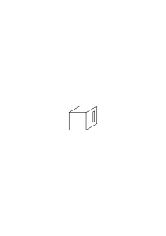
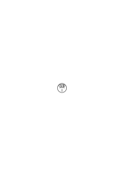
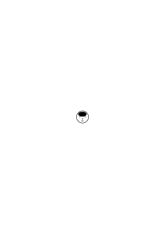
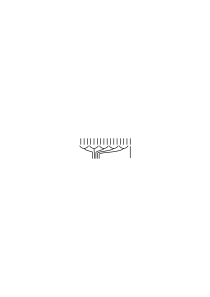
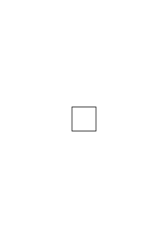
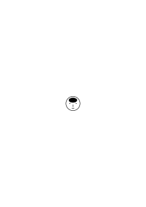

# Ms-123

### [FCv\[1\]](https://cdn.wittgensteinnachlass.com/2000px/webp/Ms-123/FCv.webp),[1r\[1\]](https://cdn.wittgensteinnachlass.com/2000px/webp/Ms-123/1r.webp)

25.09.1940

Seit etwa 6 Monaten ist mein Leben höchst unbefriedigend. Seit über 6 Monaten stockt meine Arbeit & mein Kopf ist meist öde, außer daß er manchmal mit _sehr_ allgemeinen Ideen gefüllt ist. Ich fühle mich gesundheitlich & geistig gealtert. Ich möchte gern irgend etwas aufschreiben: über mich, oder über Anderes. – Durch meine Unfähigkeit zu arbeiten ist meine Stellung hier für mich eine schiefe geworden (nicht, daß ich irgendwen darauf aufmerksam gemacht hätte), aber ich bin in mir selbst unklar, was ich machen soll; ob meine Stellung aufgeben & eine andere Art Arbeit zu machen trachten. Mein Leben läuft in eine Wüste.

### [1r\[2\]](https://cdn.wittgensteinnachlass.com/2000px/webp/Ms-123/1r.webp)

## Philosophische Bemerkungen

### [1r\[3\]](https://cdn.wittgensteinnachlass.com/2000px/webp/Ms-123/1r.webp)

26.09.1940

Kann man sagen, daß der Begriff ‘einer Regel folgen’ durch Experimente gewonnen wird?

### [1r\[4\]](https://cdn.wittgensteinnachlass.com/2000px/webp/Ms-123/1r.webp)

27.09.1940

‘Die Identität von 25 × 25 und 625 wird so wenig durch's Experiment festgestellt, wie die von 25 und 25.’

### [1r\[5\]](https://cdn.wittgensteinnachlass.com/2000px/webp/Ms-123/1r.webp),[1v\[1\]](https://cdn.wittgensteinnachlass.com/2000px/webp/Ms-123/1v.webp)

Etwas als Regelmäßigkeit zu beschreiben, dazu werden wir nicht durch die Tatsachen gezwungen. – Wie wir auch nicht gezwungen werden, überhaupt zu beschreiben.

### [1v\[2\]](https://cdn.wittgensteinnachlass.com/2000px/webp/Ms-123/1v.webp)

Wer sagt, daß wir beschreiben müssen; & wer sagt, daß wir rechnen müssen.

### [1v\[3\]](https://cdn.wittgensteinnachlass.com/2000px/webp/Ms-123/1v.webp)

‘Warum soll man nicht die Rechnung zur _Basis_ der Beschreibung nehmen, ohne daß sie ein Experiment ist?’ Was heißt das aber?

### [1v\[4\]](https://cdn.wittgensteinnachlass.com/2000px/webp/Ms-123/1v.webp)

Ist das Resultat der Rechnung daß ich geneigt war so & so zu rechnen?

### [2r\[1\]](https://cdn.wittgensteinnachlass.com/2000px/webp/Ms-123/2r.webp)

29.09.1940

Können wir uns nicht ein Sprachspiel denken, in welchem die Rechnung zur Beschreibung dient, aber nie beschrieben wird? Es wird mittels ihrer beschrieben, aber sie wird nicht beschrieben sondern nur ausgeführt. –

### [2r\[2\]](https://cdn.wittgensteinnachlass.com/2000px/webp/Ms-123/2r.webp)

Die Art der ‘Beschreibung’ ist keiner Sache verantwortlich. Sie kann ganz närrisch erscheinen.

### [2r\[3\]](https://cdn.wittgensteinnachlass.com/2000px/webp/Ms-123/2r.webp),[2v\[1\]](https://cdn.wittgensteinnachlass.com/2000px/webp/Ms-123/2v.webp)

Ich will sagen: Eine Rechnung machen ist nur dann ein Experiment, wenn (oder ist so wenig ein Experiment, wie) ein Ding, eine Farbe etwa, benennen eins ist.

### [2v\[2\]](https://cdn.wittgensteinnachlass.com/2000px/webp/Ms-123/2v.webp),[3r\[1\]](https://cdn.wittgensteinnachlass.com/2000px/webp/Ms-123/3r.webp)

Kann man sagen: Wenn man mißt, trachtet man nicht etwas über das Meßinstrument herauszubringen? – Und wie zeigt es sich, daß man beim Rechnen nichts über den Rechner herausbringen will? Aber ich will sagen: Nicht, weil man dann über den Rechnenden gewisse _Annahmen_ macht (oder gelten läßt). – Ich nenne etwas nicht ‘grün’, weil ich _annehme_, voraussetze, es werde meine Benennung mit der der andern Leute übereinstimmen. Ich gründe mein Urteil nicht auf Annahmen über das Funktionieren der Sprache.

### [3r\[2\]](https://cdn.wittgensteinnachlass.com/2000px/webp/Ms-123/3r.webp)

Alle diese Bemerkungen sind matt & ihre Sprache _wackelt_.

### [3r\[3\]](https://cdn.wittgensteinnachlass.com/2000px/webp/Ms-123/3r.webp)

Ich lese z.B. etwas Geschriebenes, übertrage die Schrift in Laute: ich mache kein Experiment; bin nicht neugierig wie ich wohl das geschriebene _a_ aussprechen werde. Noch _setze ich voraus_, daß ich es so wie jeder Andere aussprechen werde.

### [3r\[4\]](https://cdn.wittgensteinnachlass.com/2000px/webp/Ms-123/3r.webp),[3v\[1\]](https://cdn.wittgensteinnachlass.com/2000px/webp/Ms-123/3v.webp)

30.09.1940

Zu sagen, Mathematik beruhe auf Erfahrung, wäre als sagte man die Nützlichkeit der Erfahrung beruhe auf Erfahrung. Oder: man denke, weil sich Denken als nützlich erwiesen habe.

### [3v\[2\]](https://cdn.wittgensteinnachlass.com/2000px/webp/Ms-123/3v.webp)

Fühle mich mehr tot als lebendig. Habe das Gefühl eines häßlichen Lebensendes.

### [3v\[3\]](https://cdn.wittgensteinnachlass.com/2000px/webp/Ms-123/3v.webp),[4r\[1\]](https://cdn.wittgensteinnachlass.com/2000px/webp/Ms-123/4r.webp)

01.10.1940

Wie bei mir die Fähigkeit der Untersuchung verloren gegangen ist, weiß ich selbst nicht. Was früher eine überblickbare Landschaft war ist mir jetzt unüberblickbar. Als wäre ich zu einem kleinen kriechenden Tier geworden.

### [4r\[2\]](https://cdn.wittgensteinnachlass.com/2000px/webp/Ms-123/4r.webp),[4v\[1\]](https://cdn.wittgensteinnachlass.com/2000px/webp/Ms-123/4v.webp)

Nehmen wir an ich beschreibe ein Sprachspiel, in dem jemand Additionen im Dezimalsystem auszuführen gelehrt wurde um, sagen wir Anzahlen vor Personen zu addieren & herauszukriegen, wieviele Brote er für Alle backen soll. Wie beschreibe ich Euch was er tun lernt & tut? Ich sage, was für Regeln er lernt & welche Übungen er macht, & daß er dann nach der Regel verfährt. Wie sage ich das? Etwa so: “& auf diese Weise verfährt er, welche Zahlen man ihm auch gibt” oder ich sage an einer bestimmten Stelle “und so weiter”. Das heißt aber doch, daß ich bei dieser Beschreibung seines Tuns selber eine Regel & ihre Anwendung benütze.

### [4v\[2\]](https://cdn.wittgensteinnachlass.com/2000px/webp/Ms-123/4v.webp),[5r\[1\]](https://cdn.wittgensteinnachlass.com/2000px/webp/Ms-123/5r.webp)

Beschreibe ich nun, was er tut wenn er nach jener Anweisung rechnet so beschreibe ich nicht nur, in welchen Zustand er sich versetzt & wie er sich etwa den Ausdruck der Regeln ins Gedächtnis ruft, sondern ich kann in jedem einzelnen Fall auch beschreiben welche Teilresultate & welches Endresultat er gewinnt, wenn er den Anleitungen _folgt_.

### [5r\[2\]](https://cdn.wittgensteinnachlass.com/2000px/webp/Ms-123/5r.webp)

‘Der Regel folgen’ heißt auf jeder Stufe: einen im einzelnen beschreibbaren Schritt machen.

### [5r\[3\]](https://cdn.wittgensteinnachlass.com/2000px/webp/Ms-123/5r.webp),[5v\[1\]](https://cdn.wittgensteinnachlass.com/2000px/webp/Ms-123/5v.webp)

Daher – will ich sagen – ist der Regel folgen kein Experiment; weil ich nicht begierig sein kann (zu wissen), _was_ ich nun wohl schreiben werde, wenn die Regel z.B. heißt ich solle eine Reihe gleicher Ziffern anschreiben & ich habe soeben eine 3 geschrieben. Aber auch hierin liegt natürlich ein Fehler.

### [5v\[2\]](https://cdn.wittgensteinnachlass.com/2000px/webp/Ms-123/5v.webp),[6r\[1\]](https://cdn.wittgensteinnachlass.com/2000px/webp/Ms-123/6r.webp)

02.10.1940

Ich mache mich bereit einer gewissen Regel zu folgen: Ist es nun ein Erfahrungsresultat daß ich, dieser Regel folgend, das & das hinschreibe. Es ist natürlich ein Erfahrungsergebnis, daß ich, _nach diesen Vorbereitungen_, das & das hinschreibe. Oder auch: daß ich im Glauben der Regel zu folgen, das & das hinschreibe.

### [6r\[2\]](https://cdn.wittgensteinnachlass.com/2000px/webp/Ms-123/6r.webp)

Ist es ein Erfahrungsresultat, daß _das_ ein Folgen der Regel ist? Ist es ein Erfahrungsresultat, daß wir _diese_ Farbe jetzt ‘grün’ nennen?

### [6r\[3\]](https://cdn.wittgensteinnachlass.com/2000px/webp/Ms-123/6r.webp),[6v\[1\]](https://cdn.wittgensteinnachlass.com/2000px/webp/Ms-123/6v.webp)

Könnte ich das Sprachspiel von vorhin auch so beschreiben: – Jemand ist abgerichtet worden, nach einer Regel vorzugehen: & nun macht er Experimente, indem er sich die betreffende Aufgabe vorlegt & sieht, _was_ er für ein Lösen der Aufgabe hält –? – Ist das das Sprachspiel von vorhin? – Früher beschrieb ich nicht nur, wie er sich auf das Handeln nach der Regel vorbereitete, sondern auch, was er in jedem einzelnen Fall tut. Wenn also was er macht ein _Experiment_ ist, so sagte ich früher nicht nur was für Experimente er macht, sondern auch was die Resultate dieser Experimente sind.

### [6v\[2\]](https://cdn.wittgensteinnachlass.com/2000px/webp/Ms-123/6v.webp),[7r\[1\]](https://cdn.wittgensteinnachlass.com/2000px/webp/Ms-123/7r.webp)

Kann ich nun sagen, daß der, welcher der Regel folgt nachsieht welche Handlungsweise er für der Regel gemäß halten werde? Oder sieht er auch nach, was er in diesem Moment unter “gemäß” oder “richtig” zu verstehen geneigt ist?

### [7r\[2\]](https://cdn.wittgensteinnachlass.com/2000px/webp/Ms-123/7r.webp)

03.10.1940

‘Er versetzt sich in die richtige Lage, läßt sich ablaufen, & handelt dann nach dem Resultat dieses Ablaufs’. Ist das richtig? (Ich glaube es ist richtig; & doch ist etwas in meiner Auffassung falsch.)

### [7v\[1\]](https://cdn.wittgensteinnachlass.com/2000px/webp/Ms-123/7v.webp)

Die Mathematiker können über die Mathematik darum nicht philosophieren, weil sie sich zu sehr davor fürchten, die Berechtigung ihrer Tätigkeit könnte angetastet werden. Sie wollen nur, so schnell wie möglich, ihr Raisonnement in Sicherheit bringen. Hätten sie mehr _Glauben_, so könnten sie sich mehr Zeit lassen.

### [7v\[2\]](https://cdn.wittgensteinnachlass.com/2000px/webp/Ms-123/7v.webp)

Sind wir sicherer, daß wir verstehen, was es heißt, es habe einer die Multiplikation ‘6460 × 3213’ angeschrieben als, er habe sie den Regeln gemäß ausgeführt?

### [8r\[1\]](https://cdn.wittgensteinnachlass.com/2000px/webp/Ms-123/8r.webp)

Wem ich gesagt habe, es habe Einer diese Multiplikation richtig ausgeführt, der wird mit gleicher Sicherheit diesen _Ansatz_ anschreiben können, wie die ganze Multiplikation.

### [8r\[2\]](https://cdn.wittgensteinnachlass.com/2000px/webp/Ms-123/8r.webp)

“Er folgt dieser Regel” heißt nicht: “er untersucht, was geschieht, wenn er sich vornimmt der Regel zu folgen”. Höchstens: “er macht das Experiment … und das Resultat ist, daß er der Regel folgt.”

### [8r\[3\]](https://cdn.wittgensteinnachlass.com/2000px/webp/Ms-123/8r.webp),[8v\[1\]](https://cdn.wittgensteinnachlass.com/2000px/webp/Ms-123/8v.webp)

04.10.1940

Wenn mein Talent mich verläßt – was kann ich machen?! Bin ich verloren?

### [8v\[2\]](https://cdn.wittgensteinnachlass.com/2000px/webp/Ms-123/8v.webp)

05.10.1940

Man muß sich ohne Vorbehalt die Rechnung als ein Experiment denken.

### [8v\[3\]](https://cdn.wittgensteinnachlass.com/2000px/webp/Ms-123/8v.webp)

Ohne Vorbehalt das Gegenteil dessen, was man glaubt, denken, ist schwer.

### [8v\[4\]](https://cdn.wittgensteinnachlass.com/2000px/webp/Ms-123/8v.webp)

Ich möchte sagen: Jede Beschreibung benützt ein Bezugssystem. Eine Regel & ihre Anwendungen gehören zum Bezugssystem.

### [8v\[5\]](https://cdn.wittgensteinnachlass.com/2000px/webp/Ms-123/8v.webp),[9r\[1\]](https://cdn.wittgensteinnachlass.com/2000px/webp/Ms-123/9r.webp)

Wozu begleiten wir Ereignisse mit Lärm (Reden)? Nicht jeder Lärm ist Sprache, er muß so & so organisiert sein.

### [9r\[2\]](https://cdn.wittgensteinnachlass.com/2000px/webp/Ms-123/9r.webp)

Das Resultat eines Experiments wird in einer Regel beschrieben.

### [9r\[3\]](https://cdn.wittgensteinnachlass.com/2000px/webp/Ms-123/9r.webp)

‘Wir brauchen kein hocuspocus machen; wir wollen nur beschreiben, was tatsächlich geschieht.’ Aber gerade das ist dem wissenschaftlichen Geist nicht so leicht. Denn ihm ist es schwer zu sagen, daß er für etwas keinen praktischen Grund habe.

### [9v\[1\]](https://cdn.wittgensteinnachlass.com/2000px/webp/Ms-123/9v.webp)

Wie, wenn ein Mensch nicht mehr verstünde, was es heißt: “geht nun so vor.”?

### [9v\[2\]](https://cdn.wittgensteinnachlass.com/2000px/webp/Ms-123/9v.webp)

Man kann doch gewiß Experimente darüber anstellen was Einer unter dem Wort ‘grün’ versteht. – Aber die Antwort kann unter gewissen Umständen sein, er verstehe _grün_ darunter.

### [9v\[3\]](https://cdn.wittgensteinnachlass.com/2000px/webp/Ms-123/9v.webp)

Die Gefahr in unsern Erklärungen ist, daß sie nicht tief genug sind. Sie sind aber nicht tief genug, wenn wir etwas übersehen.

### [10r\[1\]](https://cdn.wittgensteinnachlass.com/2000px/webp/Ms-123/10r.webp)

07.10.1940

Es ist praktisch den Begriff der Regel in einem Sprachspiel einzuführen, in welchem jemand auf den _Befehl_, einer Regel zu folgen, etwa eine Rechnung auszuführen, der Regel folgt.

### [10r\[2\]](https://cdn.wittgensteinnachlass.com/2000px/webp/Ms-123/10r.webp)

Habe den _ganzen_ Tag mich mit Gedanken über mein Verhältnis zu Kirk beschäftigt. Größtenteils _sehr_ falsch & fruchtlos. Wenn ich diese Gedanken aufschriebe, so sähe man wie tiefstehend & ungerade meine Gedanken sind.

### [10v\[1\]](https://cdn.wittgensteinnachlass.com/2000px/webp/Ms-123/10v.webp)

08.10.1940

Niemand wird hier sagen, der den Befehl befolgt stelle mit sich selbst ein Experiment an – es sei denn, daß einen Befehl befolgen _immer_ ein Experiment ist.

### [10v\[2\]](https://cdn.wittgensteinnachlass.com/2000px/webp/Ms-123/10v.webp)

Was entscheidet nun, ob er der Regel gefolgt ist, oder nicht? Entscheidet _er_ darüber, ist es genug wenn er ehrlich sagt, er sei ihr gefolgt? Was entscheidet dann darüber, daß er verstanden hat, was es _heiße_ ‘der Regel folgen’?

### [10v\[3\]](https://cdn.wittgensteinnachlass.com/2000px/webp/Ms-123/10v.webp),[11r\[1\]](https://cdn.wittgensteinnachlass.com/2000px/webp/Ms-123/11r.webp)

Wird, ob er der Regel folgt (_irgendwie_ folgt), dadurch beurteilt, ob er sich in einen bestimmten Zustand versetzt? – Nun ein Verhältnis der Aufmerksamkeit spielt allerdings hinein.

### [11r\[2\]](https://cdn.wittgensteinnachlass.com/2000px/webp/Ms-123/11r.webp),[11v\[1\]](https://cdn.wittgensteinnachlass.com/2000px/webp/Ms-123/11v.webp)

Das _Phänomen_, ich meine das ethnologische Phänomen, der Mathematik, & welche Züge als Charakteristika dieses Phänomens aufgefaßt werden können, ist sehr schwer zu beschreiben; insbesondre die Übergänge (Abhänge) von charakteristisch mathematischen Handlungen zu anderen.

### [11v\[2\]](https://cdn.wittgensteinnachlass.com/2000px/webp/Ms-123/11v.webp)

Der Befehl zu rechnen kann natürlich in der Frage gegeben werden: “Wieviel ist … × …?”.

### [11v\[3\]](https://cdn.wittgensteinnachlass.com/2000px/webp/Ms-123/11v.webp)

“Das Resultat der Rechnung kann uns überraschen.” – Ohne Zweifel. Aber was folgt daraus? – Nun, daß es ein echtes neues Faktum ist!

### [11v\[4\]](https://cdn.wittgensteinnachlass.com/2000px/webp/Ms-123/11v.webp),[12r\[1\]](https://cdn.wittgensteinnachlass.com/2000px/webp/Ms-123/12r.webp)

Wie ist das, wenn Einer vom Resultat der Rechnung überrascht ist? Nun z.B. so: die Faktoren der Multiplikation sind 777 & 77 das Resultat enthält keine 7. Er sagt: “Das überrascht mich; ich hätte geglaubt, das Resultat würde wenigstens _eine_ ‘7’ enthalten.”

### [12r\[2\]](https://cdn.wittgensteinnachlass.com/2000px/webp/Ms-123/12r.webp),[12v\[1\]](https://cdn.wittgensteinnachlass.com/2000px/webp/Ms-123/12v.webp)

Was ist der _physikalische_ Inhalt des kommutativen Gesetzes, etwa, auf die Multiplikation von Zahlen im Dezimalsystem bezogen? Es sagt doch hier etwas voraus, oder eigentlich: _erlaubt_ eine physikalische Vorhersage. Daher muß es (doch) ein diesem mathematischen Satz _verwandtes_ physikalisches Gesetz geben!

### [12v\[2\]](https://cdn.wittgensteinnachlass.com/2000px/webp/Ms-123/12v.webp)

09.10.1940

Sofern der Beweis uns erlaubt, eine _Vorhersage_ über das Rechnungsresultat zu machen, funktioniert er also wie ein Beweis in der Physik, etwa in der Mechanik des Schreibens. Oder soll ich sagen: “Mechanik der Zeichen”??

### [12v\[3\]](https://cdn.wittgensteinnachlass.com/2000px/webp/Ms-123/12v.webp),[13r\[1\]](https://cdn.wittgensteinnachlass.com/2000px/webp/Ms-123/13r.webp),[13v\[1\]](https://cdn.wittgensteinnachlass.com/2000px/webp/Ms-123/13v.webp)

Die Rechnung sagt etwas voraus – – aber was sagt sie voraus? Daß die Leute die Rechnen gelernt haben, so rechnen werden? Oder: daß die Leute, die Rechnen gelernt haben nur die Rechnungen für richtig erklären werden, die dieses Ende haben? Wie ist der Beweis als Vorhersage aufzufassen: für das Ergebnis aller Rechnungen, ob sie richtig oder falsch gerechnet sind, oder nur für die richtig gerechneten? Nun, der erste Fall wäre allerdings bemerkenswert aber der ist es nicht, den wir meinen. Es ist der zweite Fall, den wir meinen. Wir wollen sagen: Wenn wir _alle_ Schritte der Rechnung richtig machen, so werden wir am Schluß dorthin gelangen. Aber kann das nicht wieder Verschiedenes heißen? Z.B.: wenn wir einen Schritt von a nach b machen & nun an das Resultat dieses Schrittes anknüpfen wollen, daß sich dies Resultat dann auf dem Papier nicht _unvermerkt_ ändert & wir auf diese Weise, scheinbar folgerichtig, zu den verschiedensten Resultaten geführt werden.

### [13v\[2\]](https://cdn.wittgensteinnachlass.com/2000px/webp/Ms-123/13v.webp),[14r\[1\]](https://cdn.wittgensteinnachlass.com/2000px/webp/Ms-123/14r.webp)

Und wenn der mathematische Beweis als Begründung einer Voraussage dienen kann, warum nicht _nur_ als das? Warum macht das (dann) nicht sein Wesen aus?

### [14r\[2\]](https://cdn.wittgensteinnachlass.com/2000px/webp/Ms-123/14r.webp)

10.10.1940

Das führt zu dem Beispiel vom Zusammenlegspiel & der Vorlage: – ‘Ist die Vorlage eine Vorhersage, daß es gelingen werde mit diesen Steinen diese Figur zu bilden?’ –

### [14r\[3\]](https://cdn.wittgensteinnachlass.com/2000px/webp/Ms-123/14r.webp)

Ich möchte sagen: sie ist es & sie ist es nicht! –

### [14r\[4\]](https://cdn.wittgensteinnachlass.com/2000px/webp/Ms-123/14r.webp),[14v\[1\]](https://cdn.wittgensteinnachlass.com/2000px/webp/Ms-123/14v.webp)

Man kann doch sagen: Das Geometrische ist hier _Teil_ des Physikalischen. Aber was charakterisiert diesen Teil als mathematisch? Die besondere Methode. –

### [14v\[2\]](https://cdn.wittgensteinnachlass.com/2000px/webp/Ms-123/14v.webp)

Man kann doch _mit der Hilfe des Beweises_ voraussagen, daß die Menschen unter normalen Umständen nur solche Rechnungen für richtig anerkennen werden, deren Ende dieses Ergebnis ist. Wenn ich, z.B., eine Multiplikation rechne so kann ich vorhersagen, daß eine Klasse von Schülern mit ihrem Lehrer endlich alle zu _dem_ Resultat kommen werden. Und ich kann natürlich auch die Teilresultate, zu denen sie gelangen werden, mit der größten Bestimmtheit vorhersagen.

### [15r\[1\]](https://cdn.wittgensteinnachlass.com/2000px/webp/Ms-123/15r.webp)

Es ist sehr selten, daß man menschliche Handlungen mit so großer Bestimmtheit vorhersagen kann.

### [15r\[2\]](https://cdn.wittgensteinnachlass.com/2000px/webp/Ms-123/15r.webp)

11.10.1940

Wie also, wenn ich sagte, – ‘die Multiplikation … verläuft so & so’, heiße, daß so gut wie alle Menschen mit einer gewissen Erziehung ebenso rechnen werden?

### [15r\[3\]](https://cdn.wittgensteinnachlass.com/2000px/webp/Ms-123/15r.webp),[15v\[1\]](https://cdn.wittgensteinnachlass.com/2000px/webp/Ms-123/15v.webp)

Ich will die Sache von der nüchternsten, gemeinplätzigsten Seite ansehen. Ich kann sagen: es ist eine Tatsache daß es keine _verläßliche_ Konstruktion (mit Lineal & Zirkel) des 7-Ecks gibt. Und der mathem. Beweis der ‘Unmöglichkeit der 7-Ecks-Konstruktion’ zeigt uns jedenfalls auch dies.

### [15v\[2\]](https://cdn.wittgensteinnachlass.com/2000px/webp/Ms-123/15v.webp)

Der math. Satz steht nie auf 3 Füßen sondern auf vieren. Er ist sozusagen überbestimmt im Vergleich mit einem Erfahrungssatz.

### [15v\[3\]](https://cdn.wittgensteinnachlass.com/2000px/webp/Ms-123/15v.webp)

12.10.1940

Wir zeigen, daß man Einen in … Zügen mattsetzen kann, durch ein Bild.

### [15v\[4\]](https://cdn.wittgensteinnachlass.com/2000px/webp/Ms-123/15v.webp)

Es ist schwer mit einem Messer im Leib zu arbeiten.

### [16r\[1\]](https://cdn.wittgensteinnachlass.com/2000px/webp/Ms-123/16r.webp),[16v\[1\]](https://cdn.wittgensteinnachlass.com/2000px/webp/Ms-123/16v.webp)

16.10.1940

Den _ganzen_ Tag gestern damit zugebracht an … zu denken. Ich bin verrückt? Vielleicht; aber was ist da zu tun? – Du könntest _ohne Ende_ über diesen Gegenstand denken, Dir Möglichkeiten vorstellen, erwägen, den Fall mit verschiedenen vergleichen, die Vergleiche als wertlos wegwerfen; Du kannst Dich auf ein Zusammentreffen vorbereiten, auf alle seine Möglichkeiten & Du weißt doch nicht was geschehen wird. Du weißt nicht ob Du Dich vorbereitest oder verdirbst. Du möchtest sagen: “_keine_ Vorbereitung ist mir in einem solchen Fall zu kostbar”. Aber weißt Du daß Du nicht schon den Punkt getroffen hast, wo alle vernünftige Vorbereitung _zu Ende_ ist. Aber etwas _drängt_ Dich, immer weiter daran zu denken – & es ist immer möglich weiter daran zu denken, sich Situationen auszumalen. – Du mußt einen Punkt außerhalb gewinnen, oder Du wirst von dem Strom fortgeführt werden & ersaufen.

### [16v\[2\]](https://cdn.wittgensteinnachlass.com/2000px/webp/Ms-123/16v.webp),[17r\[1\]](https://cdn.wittgensteinnachlass.com/2000px/webp/Ms-123/17r.webp)

17.10.1940

Man kann mit Hilfe der Mathematik physikalische Aufgaben lösen; aber es scheint nun, daß die Mathematik selbst schon _physikalische_ Antworten einer sehr primitiven Art gibt. – Und das scheint unmittelbar die Rolle der Mathematik begreiflich zu machen, – denn, daß man physikalische Antworten erhalten will, begreift jedermann.

### [17r\[2\]](https://cdn.wittgensteinnachlass.com/2000px/webp/Ms-123/17r.webp),[17v\[1\]](https://cdn.wittgensteinnachlass.com/2000px/webp/Ms-123/17v.webp)

Ja, man will sagen: es ist für nichts andres Raum als für physikalische Fragen & Antworten. Alles andere sind Einbildungen.

### [17v\[2\]](https://cdn.wittgensteinnachlass.com/2000px/webp/Ms-123/17v.webp)

Willst Du sagen, daß die Mathematik das Auge ist, welches die physikalische Tatsache wahrnimmt?

### [17v\[3\]](https://cdn.wittgensteinnachlass.com/2000px/webp/Ms-123/17v.webp)

01.11.1940

War nicht mein Gedanke, daß die Mathematik eine erstarrte Physik sei? Erstarrt, so daß Tatsachen sie nun nicht mehr verifizieren, – oder das Gegenteil –, sondern nur mit ihnen als mit Maßstäben verglichen werden.

### [17v\[4\]](https://cdn.wittgensteinnachlass.com/2000px/webp/Ms-123/17v.webp),[18r\[1\]](https://cdn.wittgensteinnachlass.com/2000px/webp/Ms-123/18r.webp)

16.11.1940

Wer das Wesen der Mathematik verstehen will, muß nicht aus ihrem Fenster heraus, sondern von außen hinein schauen.

### [18r\[2\]](https://cdn.wittgensteinnachlass.com/2000px/webp/Ms-123/18r.webp)

17.11.1940

Ich bin in dem Falle, wo man eine einfache grammatische Unterscheidung angeben soll – & es einem nicht gelingt.

### [18r\[3\]](https://cdn.wittgensteinnachlass.com/2000px/webp/Ms-123/18r.webp)

Eine Worterklärung hat erklärenden Wert für den, dem sie etwas erklärt, auf den sie eine gewisse neue Wirkung hat. Abgesehen _davon_ ist sie nicht Erklärung.

### [18r\[4\]](https://cdn.wittgensteinnachlass.com/2000px/webp/Ms-123/18r.webp)

Was heißt: “richtig multiplizieren”?

### [18v\[1\]](https://cdn.wittgensteinnachlass.com/2000px/webp/Ms-123/18v.webp)

Wer soll beurteilen, ob Einer richtig multipliziert hat? Der Multiplizierende selbst? Wer soll beurteilen, ob Einer das Wort “grün” richtig anwendet?

### [18v\[2\]](https://cdn.wittgensteinnachlass.com/2000px/webp/Ms-123/18v.webp)

‘Was ist & was soll eine Beschreibung?’ Z.B. die Beschreibung einer gewissen räumlichen Anordnung von Tischen & Stühlen.

### [18v\[3\]](https://cdn.wittgensteinnachlass.com/2000px/webp/Ms-123/18v.webp),[19r\[1\]](https://cdn.wittgensteinnachlass.com/2000px/webp/Ms-123/19r.webp)

Ist es richtig zu sagen: Es gibt keine “richtige Anwendung des Worts ‘grün’” außer in einer Gesellschaft mit gewissen Einrichtungen. Und Analoges vom ‘richtigen Multiplizieren’. –

### [19r\[2\]](https://cdn.wittgensteinnachlass.com/2000px/webp/Ms-123/19r.webp),[19v\[1\]](https://cdn.wittgensteinnachlass.com/2000px/webp/Ms-123/19v.webp)

20.11.1940

Wie erkennt man, daß eine Uhr richtig abläuft? Wie, wenn ich sagte: Die Uhren müssen alle übereinstimmen: dann kann man mit ihnen das tun, was wir tun wollen, nämlich, was wir ‘die Zeit messen’ nennen. Die Übereinstimmung der Uhren ist die _Vorbedingung_ jener gewissen Technik. Hätte die Übereinstimmung _nicht_ statt, so würden dadurch unsere Meßresultate nicht falsifiziert, sondern es gäbe solche Resultate nicht. Oder: Die Sätze welche Meßresultate ausdrücken, – – –

### [19v\[2\]](https://cdn.wittgensteinnachlass.com/2000px/webp/Ms-123/19v.webp)

Man könnte Rechnungen ‘zeitlose Uhren’ nennen.

### [19v\[3\]](https://cdn.wittgensteinnachlass.com/2000px/webp/Ms-123/19v.webp)

23.11.1940

Wie ist der Zustand zu beschreiben der die Anwendung einer Rechnung erlaubt?

### [19v\[4\]](https://cdn.wittgensteinnachlass.com/2000px/webp/Ms-123/19v.webp),[20r\[1\]](https://cdn.wittgensteinnachlass.com/2000px/webp/Ms-123/20r.webp)

Sagen wir: die Menschen müssen – z.B. – im Stande sein Folgen von Figuren nach einem gegebenen Gesetz zu bilden. Dies kann z.B. zu rein dekorativen Zwecken geschehen. Aber sie müssen ein Sprachspiel spielen können in dem auf einen Befehl eine solche Folge gebildet wird.

### [20r\[2\]](https://cdn.wittgensteinnachlass.com/2000px/webp/Ms-123/20r.webp)

Statt zu sagen “mathematische Sätze drücken eher Entscheidungen aus als Erkenntnisse”, laß uns sagen: Sehen wir einmal die math. Sätze als Entscheidungen an, statt als Erkenntnisse”!

### [20r\[3\]](https://cdn.wittgensteinnachlass.com/2000px/webp/Ms-123/20r.webp),[20v\[1\]](https://cdn.wittgensteinnachlass.com/2000px/webp/Ms-123/20v.webp)

Wissen wie jemand geht: es sich vorstellen können – aber auch: es _nachmachen_ können. Muß man sich's vorstellen, um es nachzumachen? Und ist es nachmachen nicht ebenso stark, als es sich vorstellen?

### [20v\[2\]](https://cdn.wittgensteinnachlass.com/2000px/webp/Ms-123/20v.webp)

Ist es eine Eigenschaft des Zahlzeichens …, daß die Operationen nach dieser Regel es in jenes Zahlzeichen verwandeln?

### [20v\[3\]](https://cdn.wittgensteinnachlass.com/2000px/webp/Ms-123/20v.webp)

Es gibt hier offenbar ein psychologisches Wissen: ich weiß daß ich eine Multiplikation 25 × 25 die 625 ergibt für richtig halten werde. Oder: Ich weiß, daß _ich_ so rechnen werde.

### [20v\[4\]](https://cdn.wittgensteinnachlass.com/2000px/webp/Ms-123/20v.webp),[21r\[1\]](https://cdn.wittgensteinnachlass.com/2000px/webp/Ms-123/21r.webp)

Man könnte sich eine Zeit denken in der Leute den Sinn lateinischer Inschriften nur ganz ungefähr zu erraten sich begnügten. Sie kannten etwa nur den beiläufigen Sinn der Haupt-, Zeit- & Eigenschaftswörter & versuchten nicht die casus zu erklären. Und wo es eine neue Entdeckung war, die lateinische Sprache als eine Sprache wie die unsere zu betrachten: mit bestimmtem, scharfem, Sinne ihrer Sätze & den gleichen unerläßlichen Unterscheidungen.

### [21r\[2\]](https://cdn.wittgensteinnachlass.com/2000px/webp/Ms-123/21r.webp),[21v\[1\]](https://cdn.wittgensteinnachlass.com/2000px/webp/Ms-123/21v.webp)

16.05.1941

Ist der Unterschied in dem, was ich sehe, oder darin wie ich es deute? Aber wie kann man das entscheiden? Wie kann ich Andern, oder mir selbst mitteilen _was_ ich sehe? Etwa durch eine Zeichnung. Aber dann muß ich in beiden Fällen die gleiche Zeichnung anfertigen. Denn

es liegt nicht an der Zeichnung daß in einem Falle der helle Fleck ein Papier im andern das Licht, welches durchs Loch scheint darstellt.

### [21v\[2\]](https://cdn.wittgensteinnachlass.com/2000px/webp/Ms-123/21v.webp),[22r\[1\]](https://cdn.wittgensteinnachlass.com/2000px/webp/Ms-123/22r.webp)

Woher aber dann die Versuchung, zu sagen: ich sähe in einem Fall dies, im andern jenes?

### [22r\[2\]](https://cdn.wittgensteinnachlass.com/2000px/webp/Ms-123/22r.webp)

‘Wie wenn ich mich irrte? Und was ich für _Sehen_ halte ist ein Deuten?’ Oder ‘_kann_ ich mich da nicht irren’?

### [22r\[3\]](https://cdn.wittgensteinnachlass.com/2000px/webp/Ms-123/22r.webp)

Soll ich nun sagen, ich habe in diesen Fällen verschiedene Gesichtsbilder, oder, ich habe beidemal das gleiche, aber interpretiere es anders? Oder ist es ganz gleichgültig welches ich sage?

### [22r\[4\]](https://cdn.wittgensteinnachlass.com/2000px/webp/Ms-123/22r.webp),[22v\[1\]](https://cdn.wittgensteinnachlass.com/2000px/webp/Ms-123/22v.webp)

Und enthält diese Überlegung nicht eine Kritik der Idee des Sinnesdatums?

### [22v\[2\]](https://cdn.wittgensteinnachlass.com/2000px/webp/Ms-123/22v.webp)

Man sträubt sich dagegen von einem Interpretieren zu reden, weil man sich nicht sagt: ‘ich interpretiere _das_ als _das_, & _das_ als _das_, usw. Das psychologische Phänomen, möchte man sagen, liegt einfach im _Gesehenen_.

### [22v\[3\]](https://cdn.wittgensteinnachlass.com/2000px/webp/Ms-123/22v.webp)

Aber was ist dies für eine Mitteilung?

### [22v\[4\]](https://cdn.wittgensteinnachlass.com/2000px/webp/Ms-123/22v.webp),[23r\[1\]](https://cdn.wittgensteinnachlass.com/2000px/webp/Ms-123/23r.webp)

‘Wie weiß ich, daß ich diese Figur als Schachtel mit einem Schlitz sehe?’ Ich _könnte_ doch fragen: ‘Wie weiß ich, daß ich diese Figur _so_ sehe, wie ich eine Schachtel mit einem Schlitz sehe?’ – Oder ist es nur eine Vermutung, daß ich die Figur so sehe? – So wenig, wie es nur Vermutung ist, daß ich mir jetzt eine solche Schachtel _vorstelle_.

### [23r\[2\]](https://cdn.wittgensteinnachlass.com/2000px/webp/Ms-123/23r.webp),[23v\[1\]](https://cdn.wittgensteinnachlass.com/2000px/webp/Ms-123/23v.webp)

17.05.1941

Interpretieren ist ein artikulierter Vorgang, wie Übersetzen, Entziffern; die Zeichnung als das & das sehen ist amorph. Ein andrer Ausdruck wäre: ‘sich die Zeichnung als das & das vorstellen.’ Das heißt aber _nicht_ etwas zu der Zeichnung, quasi, hinzuhalluzinieren. ‘Ich habe die Zeichnung _so_ aufgefaßt’. Worin besteht dieser Zustand? – Aber was ist das für eine Frage? – Keine Erklärung ist für uns relevant. Das Verständnis zu dem wir kommen wollen muß ohne Erklärung erreicht werden. Jede Erklärung bedürfte derselben Klärung wie das bloße Phänomen.

### [23v\[2\]](https://cdn.wittgensteinnachlass.com/2000px/webp/Ms-123/23v.webp),[24r\[1\]](https://cdn.wittgensteinnachlass.com/2000px/webp/Ms-123/24r.webp)

Das, was man fragen möchte, ist: ‘Hat das Objekt meines Sehens, das Objekt der unmittelbaren Erfahrung, wirklich diese Eigenschaften?’ Beschreibe ich _es_, wenn ich sage, ‘ich sehe das Bild als Kiste mit einem Schlitz’?

### [24r\[2\]](https://cdn.wittgensteinnachlass.com/2000px/webp/Ms-123/24r.webp),[24v\[1\]](https://cdn.wittgensteinnachlass.com/2000px/webp/Ms-123/24v.webp)

Das, was ich sehe, möchte ich sagen, hat eine okkulte Eigenschaft, außer den leicht zu beschreibenden; eine Eigenschaft, die man dadurch andeutet, daß man sagt: ‘ich sehe es als …’ – die aber freilich dadurch nur angedeutet ist, da ja, was man meint, mit einer wirklichen Kiste etc. nichts zu tun hat.

### [24v\[2\]](https://cdn.wittgensteinnachlass.com/2000px/webp/Ms-123/24v.webp)

Das, was man fragen möchte, ist: ‘Hat das Objekt meines Sehens, das unmittelbare Objekt, diese Eigenschaften?’ Und wir können sie, natürlich, ihm beilegen, oder nicht.

### [24v\[3\]](https://cdn.wittgensteinnachlass.com/2000px/webp/Ms-123/24v.webp)

18.05.1941

Nicht das macht einen Unterschied, ob wir sagen, wir beschreiben das gesehene Objekt.

### [24v\[4\]](https://cdn.wittgensteinnachlass.com/2000px/webp/Ms-123/24v.webp),[25r\[1\]](https://cdn.wittgensteinnachlass.com/2000px/webp/Ms-123/25r.webp)

Wohl, wir beschreiben den Eindruck; aber _wie_ beschreiben wir ihn? Das merkwürdige Phänomen ist diese Art der Beschreibung. Normalerweise würde man sagen, daß unter Umständen verschiedene physikalische Körper uns den gleichen Gesichtseindruck machen können; aber hier scheint der Eindruck durch seine _mögliche_ Zugehörigkeit zu einem bestimmten Körper definiert zu sein. _Unser_ Fall ist also, jedenfalls, _ähnlich_ einem Fall von Assoziation.

### [25r\[2\]](https://cdn.wittgensteinnachlass.com/2000px/webp/Ms-123/25r.webp),[25v\[1\]](https://cdn.wittgensteinnachlass.com/2000px/webp/Ms-123/25v.webp)

Gut, wir assoziieren mit diesem Eindruck jetzt _diesen_ Körper – aber _was_ von ihm? Bloß seinen Namen, oder eine bestimmte Ansicht? Aber eine _andere_ als, die welche ich sehe?

### [25v\[2\]](https://cdn.wittgensteinnachlass.com/2000px/webp/Ms-123/25v.webp),[26r\[1\]](https://cdn.wittgensteinnachlass.com/2000px/webp/Ms-123/26r.webp)

Sind die verschiedenen Arten die Zeichnung zu sehen verschiedene Arten die auch _anders_ beschrieben werden könnten? also nicht durch Anspielung auf die physikalischen Objekte, mit denen wir sie assoziieren? Oder ist gerade diese Art der Beschreibung wesentlich? Könnte man also sagen: Wer diese Zeichnung ‘als Kiste mit Schlitz’ sieht, sieht sie _so_: … und nun folgt _etwa_ eine Beschreibung der Art & Weise wie unser Blick das Bild abgeht, wie wir die Aufmerksamkeit verteilen, etc. Und darauf kann dann eine Erklärung folgen warum, _so_ gesehen, das Bild uns an eine Kiste etc. erinnert.

### [26r\[2\]](https://cdn.wittgensteinnachlass.com/2000px/webp/Ms-123/26r.webp),[26v\[1\]](https://cdn.wittgensteinnachlass.com/2000px/webp/Ms-123/26v.webp)

Aber das Phänomen ist doch, daß ich Einem sagen kann: “sieh das als Kiste etc. an”; & daß er etwa sagen wird: “ja, jetzt sehe ich es als Kiste”, oder: “ich habe es nie anders gesehen”, oder: “ich habe es immer als … gesehen”, etc.. Weder aber wissen wir, _wie_ bei diesem ‘Sehen’ die Aufmerksamkeit verteilt ist, noch sind wir uns einer andern möglichen Art der Beschreibung des Phänomens bewußt.

### [26v\[2\]](https://cdn.wittgensteinnachlass.com/2000px/webp/Ms-123/26v.webp)

Wenn wir von Assoziation reden, so ist das als sagen wir: es fällt uns bei dieser Zeichnung dieser Gegenstand ein. Aber wie fällt einem ein Gegenstand ein? Und ist es wirklich, daß er uns beim Sehen der Zeichnung einfällt, daß wir an ihn denken? Gewiß nicht. Denn wir können den Gegenstand sogar nennen & _versuchen_, die Zeichnung als sein Bild zu sehen.

### [26v\[3\]](https://cdn.wittgensteinnachlass.com/2000px/webp/Ms-123/26v.webp),[27r\[1\]](https://cdn.wittgensteinnachlass.com/2000px/webp/Ms-123/27r.webp)

‘Jetzt sehe ich diesen Strich als Draht, jetzt als Kante eines Prismas.’ – Ist das nicht einfach ein Fall des Sehens verschiedener 3-dimensionaler Gestalten? Aber wie ist es mit diesen? Ist es eine _indirekte_ Beschreibung, wenn ich sage, ich sehe diese Figur jetzt als dieses, jetzt als jenes Prisma? Könnte ich direkter sagen: ‘jetzt als Gestalt A, jetzt als Gestalt B’ – wobei ich vermeide ein Wort zu gebrauchen welches mit anderen Sinneseindrücken verbunden ist.

### [27r\[2\]](https://cdn.wittgensteinnachlass.com/2000px/webp/Ms-123/27r.webp)

Wie ist ein ‘_so sehen_’ von der Neigung zu einer bestimmten Darstellung verschieden?

### [27r\[3\]](https://cdn.wittgensteinnachlass.com/2000px/webp/Ms-123/27r.webp),[27v\[1\]](https://cdn.wittgensteinnachlass.com/2000px/webp/Ms-123/27v.webp)

Wie weigert man sich dagegen, daß es eine Neigung zu einer Darstellungsweise ist? – Man könnte sagen, man weigert sich mit Recht: denn ‘Neigung zu einer Art der Darstellung’ nennt man ja wirklich was anderes. Aber indem ich das sage, habe ich den Unterschied des Gebrauches noch nicht erklärt.

### [27v\[2\]](https://cdn.wittgensteinnachlass.com/2000px/webp/Ms-123/27v.webp),[28r\[1\]](https://cdn.wittgensteinnachlass.com/2000px/webp/Ms-123/28r.webp)

Wie, wenn ich sagte: “ich bin _einmal_ geneigt zu sagen, ich sehe ein Prisma in _dieser_ Lage, _einmal_: ich sehe eines in _jener_ Lage – & natürlich kann ich die Lage auch durch Handbewegung, ein Modell, & anderes, darstellen”? Das ist doch nur dann falsch, wenn diese Ausdrucksweise schon anderweitig vergeben ist.

### [28r\[2\]](https://cdn.wittgensteinnachlass.com/2000px/webp/Ms-123/28r.webp)

19.05.1941

‘Aber es ist doch nicht bloß, daß ich geneigt bin das zu sagen, etc., sondern ich sehe es doch wirklich!’

### [28r\[3\]](https://cdn.wittgensteinnachlass.com/2000px/webp/Ms-123/28r.webp)

Wie, wenn Du nur _glaubst_ ein solches Prisma zu sehen?

### [28r\[4\]](https://cdn.wittgensteinnachlass.com/2000px/webp/Ms-123/28r.webp),[28v\[1\]](https://cdn.wittgensteinnachlass.com/2000px/webp/Ms-123/28v.webp)

“Ich sehe das Prisma jetzt _so_, jetzt _so_”: hat das allein einen Sinn? Hat es _für mich_ einen Sinn? Hat es für mich zwar allein keinen Sinn, wohl aber zusammen mit meiner Erfahrung? Wie beziehen sich die Worte auf die Erfahrung? Wie weiß ich, z.B., daß die beiden “jetzt _so_” nicht das gleiche bedeuten (etwa, was beiden Erscheinungen gemein ist)? Wäre dieser Ausdruck nicht einer der gemeinsamen Sprache so hätte er auch keinen privaten Sinn.

### [28v\[2\]](https://cdn.wittgensteinnachlass.com/2000px/webp/Ms-123/28v.webp),[29r\[1\]](https://cdn.wittgensteinnachlass.com/2000px/webp/Ms-123/29r.webp)

Ich nenne die beiden Eindrücke ‘A’ & ‘B’. Aber was mach ich nun mit diesen Namen? – ‘Ich weiß aber schon, was sie bedeuten.’ – Ich weiß es _nicht_, solange ich nicht weiß wie sie zu verwenden sind. Es scheint freilich als wisse ich, was sie bedeuten, weil mir ja schon ihre normale Verwendung vorliegt. Denn wie, wenn man mir sagte, ich bildete mir nur ein zwei verschiedene Eindrücke zu haben (wenn ich sie ja doch nicht beschreiben kann) – in Wahrheit sei es eine Art Knacks des Gedächtnisses was ich spüre.

### [29r\[2\]](https://cdn.wittgensteinnachlass.com/2000px/webp/Ms-123/29r.webp),[29v\[1\]](https://cdn.wittgensteinnachlass.com/2000px/webp/Ms-123/29v.webp)

Denke dasselbe passierte Dir mit der Farbe eines Gegenstandes. Du sahest auf einen roten Gegenstand & sagtest: “jetzt hat sich etwas an der Farbe geändert”, aber Du bist nicht im Stande die Veränderung zu beschreiben & sagst nur etwa: “früher erschien er mir rot-a, jetzt rot-b.” Was sollen wir nun sagen: Du weißt, was Du meinst, nur wir wissen es nicht?

### [29v\[2\]](https://cdn.wittgensteinnachlass.com/2000px/webp/Ms-123/29v.webp),[30r\[1\]](https://cdn.wittgensteinnachlass.com/2000px/webp/Ms-123/30r.webp)

Wie weiß ich, daß ich mit den Zeichen auf _dies_ anspiele? – Nun, ich _will_ mit ihnen darauf anspielen. – Aber worin besteht es ‘darauf anzuspielen’? Wie spielt man denn in Wirklichkeit auf etwas an? Ein Mord kann in vollkommener Finsternis & lautlos vorsichgehen: aber würde man es einen gefilmten Mord nennen wenn die Leinwand vom Anfang bis zum Ende dunkel bliebe? Wir sagen, daß zwei Figuren in einem Bilde Schach spielen. Entsprechen die Umstände, unter denen wir dies sagen, ganz denen unter welchen wir von zwei Leuten sagen, sie spielten Schach? Oder in einem Drama kommt eine Schachpartie vor. Wir sagen: N & M spielen Schach & M gewinnt. Sind die Kriterien des Gewinnens hier ähnlich denen im wirklichen Spiel?

### [30r\[2\]](https://cdn.wittgensteinnachlass.com/2000px/webp/Ms-123/30r.webp),[30v\[1\]](https://cdn.wittgensteinnachlass.com/2000px/webp/Ms-123/30v.webp)

20.05.1941

Wäre dies in Ordnung: wenn ich sagte: “Ich habe beim Ansehen der Zeichnung eine Erfahrung, & beschreibe sie durch den Hinweis auf einen Körper”? Aber was soll der Satz “Ich habe eine Erfahrung“? Woher weiß ich, daß es eine Erfahrung ist?

### [30v\[2\]](https://cdn.wittgensteinnachlass.com/2000px/webp/Ms-123/30v.webp)

Wenn ich sage: “Ich sehe die Zeichnung als dieses Prisma. – – Dieser Satz beschreibt eine Erfahrung.” So teile ich einem Andern etwas mit. Ist es etwa etwas sehr Ätherisches? Was sich kaum mitteilen läßt?

### [30v\[3\]](https://cdn.wittgensteinnachlass.com/2000px/webp/Ms-123/30v.webp),[31r\[1\]](https://cdn.wittgensteinnachlass.com/2000px/webp/Ms-123/31r.webp)

Denken wir uns in einem Lehrbuch der Physik, etwa, die gleiche Illustration wiederholt aber zu verschiedenem Zweck, um etwas anderes darzustellen. Man könnte sagen, hier wird der Leser einmal aufgefordert die Illustration _so_ zu sehen, ein andermal _anders_. – Aber hier, im Praktischen, was ist das Kriterium dafür daß einer die Illustration so _sieht_ & nicht nur sie so _benützt_?

### [31r\[2\]](https://cdn.wittgensteinnachlass.com/2000px/webp/Ms-123/31r.webp)

Hier ist eine Ähnlichkeit mit dem Fall (an den ich oft gedacht habe) daß man eine Ausdrucksform so & so _auffaßt_.

### [31r\[3\]](https://cdn.wittgensteinnachlass.com/2000px/webp/Ms-123/31r.webp),[31v\[1\]](https://cdn.wittgensteinnachlass.com/2000px/webp/Ms-123/31v.webp)

21.05.1941

Kann man das Phänomen der Blindheit, des Nicht-Sehens, ganz behavioristisch beschreiben? Ist der Einwand blödsinnig: was immer Einer _tue_, er könne noch immer als blind, oder sehend betrachtet werden? Ich glaube _nicht_ – wenn man dann nicht falsche Folgerungen zieht.

### [31v\[2\]](https://cdn.wittgensteinnachlass.com/2000px/webp/Ms-123/31v.webp)

Denn heißt es nicht, ungefähr: ‘ich will mich auf kein Benehmen absolut festlegen’? Und was ist dagegen einzuwenden? das ist eben der Gebrauch (die Pointe) die ich dem Wort gebe.

### [32r\[1\]](https://cdn.wittgensteinnachlass.com/2000px/webp/Ms-123/32r.webp),[32v\[1\]](https://cdn.wittgensteinnachlass.com/2000px/webp/Ms-123/32v.webp)

Es ist nur die Ansicht des Phänomens als aus einer soliden & einer ätherischen Hälfte bestehend, die alles verdirbt.

### [32v\[2\]](https://cdn.wittgensteinnachlass.com/2000px/webp/Ms-123/32v.webp),[33r\[1\]](https://cdn.wittgensteinnachlass.com/2000px/webp/Ms-123/33r.webp)

22.05.1941

Wenn ich _vermute_ daß jemand Schmerzen hat, vermute ich da ein Benehmen? Etwa ein zukünftiges? Doch gewiß nicht. – Aber die Fortsetzung ist nun nicht: ‘ich vermute keinen äußeren, sondern eben einen innern Vorgang’ – denn das hilft uns nicht den Vorgang finden.

### [33r\[2\]](https://cdn.wittgensteinnachlass.com/2000px/webp/Ms-123/33r.webp)

Ich will ja nur verhindern daß, wo wir geneigt sind nach etwas Körperlichem zu suchen & es nicht finden, wir einen Geist hinstellen.

### [33r\[3\]](https://cdn.wittgensteinnachlass.com/2000px/webp/Ms-123/33r.webp),[33v\[1\]](https://cdn.wittgensteinnachlass.com/2000px/webp/Ms-123/33v.webp)

Wenn ich vermute, daß er Schmerzen hat, so vermute ich nicht ein Benehmen. – Was vermute ich also? – Einen innern Vorgang? Warum nenne ich ihn nicht & sage: “daß er Schmerzen hat”? Aber das bringt mich nicht weiter. Aber mein Vermuten kann nur durch ein Benehmen bekräftigt, oder widerlegt werden. Dennoch ist es falsch zu sagen, ich habe ein Benehmen vermutet.

### [33v\[2\]](https://cdn.wittgensteinnachlass.com/2000px/webp/Ms-123/33v.webp)

‘Ein innerer Vorgang’: ähnlich dem Tod einer Person in einem Theaterstück.

### [33v\[3\]](https://cdn.wittgensteinnachlass.com/2000px/webp/Ms-123/33v.webp)

‘In der materiellen Welt ist nur das Benehmen.’

### [33v\[4\]](https://cdn.wittgensteinnachlass.com/2000px/webp/Ms-123/33v.webp),[34r\[1\]](https://cdn.wittgensteinnachlass.com/2000px/webp/Ms-123/34r.webp)

‘Unsere Worte müssen sich doch am Ende immer auf ein Benehmen beziehen’. Aber wie bezieht sich denn, z.B., ein Schrei auf ein Benehmen?

### [34r\[2\]](https://cdn.wittgensteinnachlass.com/2000px/webp/Ms-123/34r.webp),[34v\[1\]](https://cdn.wittgensteinnachlass.com/2000px/webp/Ms-123/34v.webp)

23.05.1941

Könnte ich, der ich soeben im Halbdunkeln die Stiegen zu meinem Zimmer hinaufgestiegen bin, mit irgendwelcher Sicherheit behaupten, daß ich diese ganze Zeit mich irgendwo auf der Stiege befunden habe, daß ich nicht ganz bedeutende Bruchteile einer Sekunde hindurch meine Existenz unterbrochen habe?!

### [34v\[2\]](https://cdn.wittgensteinnachlass.com/2000px/webp/Ms-123/34v.webp),[35r\[1\]](https://cdn.wittgensteinnachlass.com/2000px/webp/Ms-123/35r.webp)

Wie, wenn ich sagte: jemanden in Schmerzen glauben, heiße etwas glauben, was durch das & das Benehmen bestätigt _würde_? Ein solcher Versuch der Übersetzung in behaviouristische Ausdrucksweise scheint irgendwie _kindisch_. Warum? (Die Empfindung daß das Unternehmen kindisch ist, ist _ernst_ zu nehmen.)

### [35r\[2\]](https://cdn.wittgensteinnachlass.com/2000px/webp/Ms-123/35r.webp)

Es ist ein Unternehmen, etwas zu sichern, was ohnehin schon gesichert ist.

### [35r\[3\]](https://cdn.wittgensteinnachlass.com/2000px/webp/Ms-123/35r.webp)

‘Aber auch wenn alle diese Eigentümlichkeiten des Benehmens zuträfen, könnte ich mir noch immer vorstellen, daß er keine Schmerzen hat’. Das sagt man, & dafür muß es einen Grund geben. Darin muß ein Grundzug der Grammatik des Ausdruckes ‘Schmerzen haben’ liegen.

### [35r\[4\]](https://cdn.wittgensteinnachlass.com/2000px/webp/Ms-123/35r.webp),[35v\[1\]](https://cdn.wittgensteinnachlass.com/2000px/webp/Ms-123/35v.webp)

Denke Dir, man sagte von einem Stockblinden – d.h., von einem sich stockblind Benehmenden – nicht nur: er sehe, sondern, er sei ein wenig kurzsichtig!

### [35v\[2\]](https://cdn.wittgensteinnachlass.com/2000px/webp/Ms-123/35v.webp)

Das würde man doch gewiß als unsinnig bezeichnen!

### [35v\[3\]](https://cdn.wittgensteinnachlass.com/2000px/webp/Ms-123/35v.webp)

Bei einer gewissen Temperatur fängt der Sinn an zu welken.

### [35v\[4\]](https://cdn.wittgensteinnachlass.com/2000px/webp/Ms-123/35v.webp)

Aber warum kann ich mir noch immer vorstellen, daß … – Nun, ist es, daß das Bild hier länger vorhält, als der Sinn? Und warum?

### [36r\[1\]](https://cdn.wittgensteinnachlass.com/2000px/webp/Ms-123/36r.webp)

Ist es, daß der Sinn sich hier _gradweise_ verliert?

### [36r\[2\]](https://cdn.wittgensteinnachlass.com/2000px/webp/Ms-123/36r.webp)

Denke Dir ich erklärte Einem, was Sehen & Blindheit ist, mit Hilfe von Bildern der Art:

 &

(Wer sagt, daß er mich nicht verstünde?) Wie, wenn ich nun sagte: der Gebrauch dieser beiden Bilder ist nicht _derselbe_, wie der einer Beschreibung des Benehmens, obwohl er _zum Teil_ darauf hinausläuft.

### [36r\[3\]](https://cdn.wittgensteinnachlass.com/2000px/webp/Ms-123/36r.webp),[36v\[1\]](https://cdn.wittgensteinnachlass.com/2000px/webp/Ms-123/36v.webp)

24.05.1941

Benützte ich Bilder zu solcher Erklärung, so könnten sie von der obigen Art sein, oder aber auch Bilder eines blinden Menschen, der sich, etwa, mit den Händen weitertastet.

### [36v\[2\]](https://cdn.wittgensteinnachlass.com/2000px/webp/Ms-123/36v.webp)

25.05.1941

Wenn man den Menschen eine bestimmte Abrichtung gibt, & befiehlt ihnen dann die Multiplikation … auszuführen machen fast alle von ihnen _die gleiche Rechnung_.

### [36v\[3\]](https://cdn.wittgensteinnachlass.com/2000px/webp/Ms-123/36v.webp)

26.05.1941

Wir können, rein behaviouristisch, die Arbeitsweise des Lehrens & Ausführens & der Benützung von Rechnungen beschreiben. Müssen wir uns dazu einer Regel bedienen?

### [37r\[1\]](https://cdn.wittgensteinnachlass.com/2000px/webp/Ms-123/37r.webp)

Daß es so scheint, man könne das Funktionieren einer Regel nur wieder mittels einer Regel beschreiben, das liegt meinem ganzen Problem zu Grunde.

### [37r\[2\]](https://cdn.wittgensteinnachlass.com/2000px/webp/Ms-123/37r.webp),[37v\[1\]](https://cdn.wittgensteinnachlass.com/2000px/webp/Ms-123/37v.webp)

Offenbar könnte man sich auch eine Beschreibung denken, die sich keiner Regel & keines ‘und-so-weiter’ bediente sondern nur beschreibt, was gewisse Menschen, bis jetzt, auf diese Abrichtung hin getan haben.

### [37v\[2\]](https://cdn.wittgensteinnachlass.com/2000px/webp/Ms-123/37v.webp)

Wir möchten doch sagen, es sei kein Erfahrungssatz, daß _diese_ Handlung ein der-Regel-Folgen ist.

### [37v\[3\]](https://cdn.wittgensteinnachlass.com/2000px/webp/Ms-123/37v.webp)

‘Er hat dieser Regel gemäß gerechnet’ soll das gleiche heißen wie: er hat das & das angeschrieben.

### [37v\[4\]](https://cdn.wittgensteinnachlass.com/2000px/webp/Ms-123/37v.webp),[38r\[1\]](https://cdn.wittgensteinnachlass.com/2000px/webp/Ms-123/38r.webp)

‘Er hat dieser Regel gemäß gerechnet’ soll nicht heißen: er hat auf diese Regel reagiert. Denn dann muß (erst) die Erfahrung zeigen, _wie_ er reagiert.

### [38r\[2\]](https://cdn.wittgensteinnachlass.com/2000px/webp/Ms-123/38r.webp)

Heißt ‘auf die Regel _richtig_ reagieren’: wie die meisten reagieren? – Offenbar wäre daran etwas Richtiges & etwas Falsches.

### [38r\[3\]](https://cdn.wittgensteinnachlass.com/2000px/webp/Ms-123/38r.webp)

‘Die Regel mit ihrer Befolgung äquivalent zu setzen, das setzt doch voraus, daß die Menschen in dieser Gesellschaft tatsächlich auf die Regel in gleicher Weise reagieren.’

### [38r\[4\]](https://cdn.wittgensteinnachlass.com/2000px/webp/Ms-123/38r.webp),[38v\[1\]](https://cdn.wittgensteinnachlass.com/2000px/webp/Ms-123/38v.webp)

Auf die gleiche Weise & regelmäßig?

### [38v\[2\]](https://cdn.wittgensteinnachlass.com/2000px/webp/Ms-123/38v.webp),[39r\[1\]](https://cdn.wittgensteinnachlass.com/2000px/webp/Ms-123/39r.webp),[39v\[1\]](https://cdn.wittgensteinnachlass.com/2000px/webp/Ms-123/39v.webp)

In wiefern vergrößert die Ausführung einer Multiplikation, z.B., mein Wissen? Was weiß ich, was ich vor der Ausführung nicht wußte? – Ich weiß nun, daß ich _so_ auf diese Aufgabe reagiert habe. Ich weiß mit großer Sicherheit, daß Andere genau so reagieren werden & daß ich es selbst auch tun werde. Ich weiß natürlich auch, daß das Papier die Rechnung ausgehalten hat, die Zeichen stehen geblieben sind, usw.. Ist das der Zuwachs meines _mathematischen_ Wissens? Ich weiß auch, daß, wenn ich soviele Reihen zu sovielen Kugeln gebildet hätte & sie alle dann gezählt, ich so gut wie sicher zu _dieser_ Zahl gekommen wäre. Auch, daß dies mit weißen, roten & blauen Kugeln geschehen wäre. Daß ich – wie ich mich auch ausdrücken könnte – das Resultat meiner Multiplikation auf mannigfache Weise wiederfinden könnte. Wenn Einer sagte: ‘Aber ich weiß nun, daß diese allgemeine Regel, auf diese Zahlen angewandt, dieses Resultat liefert’ – so könnte man antworten: ‘Wie weißt Du, daß es _diese_ Regel ist? Wie identifizierst Du sie? Durch ihren Ausdruck, oder durch ihre _Anwendung_? (Hier ist dann die Zuflucht: ‘aber ich weiß doch, was ich mit der Regel _meine_’.) Aber wie, wenn ich sagte: ‘ich habe nun eine neue Regel konstruiert, weiß nun eine neue Regel’?

### [39v\[2\]](https://cdn.wittgensteinnachlass.com/2000px/webp/Ms-123/39v.webp),[40r\[1\]](https://cdn.wittgensteinnachlass.com/2000px/webp/Ms-123/40r.webp)

Man möchte sagen, daß man weiß, daß der Mechanismus, der ideale Mechanismus, der Regel da & da hin führt. Aber wo liegt dieser Mechanismus einer Regel? Man könnte einen psychischen oder physiologischen Mechanismus meinen; einen logischen (oder mathematischen) gibt es nicht, es sei denn, er offenbare sich ganz & gar in der Anwendung.

### [40r\[2\]](https://cdn.wittgensteinnachlass.com/2000px/webp/Ms-123/40r.webp)

Wir können nicht: erst einen Mechanismus hypostasieren, um die Anwendung einer Regel zu verbildlichen, & dann das Resultat der Anwendung im besondern Fall als Erzeugnis dieser Maschine feiern.

### [40r\[3\]](https://cdn.wittgensteinnachlass.com/2000px/webp/Ms-123/40r.webp),[40v\[1\]](https://cdn.wittgensteinnachlass.com/2000px/webp/Ms-123/40v.webp)

27.05.1941

Ich sage: “ich sehe das jetzt als F, jetzt als ꟻ” – aber hat mich das jemand gelehrt? Gewiß ist doch, daß ich es sage, ein sonderbares Phänomen! _Allein_ wert beachtet zu werden.

### [40v\[2\]](https://cdn.wittgensteinnachlass.com/2000px/webp/Ms-123/40v.webp),[41r\[1\]](https://cdn.wittgensteinnachlass.com/2000px/webp/Ms-123/41r.webp)

28.05.1941

“Ich habe nun eine neue Regel konstruiert”, das ist, wie wenn ich sagte: ich habe nun einen neuen Weg gebahnt. Meine Betrachtungsweise wäre dann die, daß die _Übereinstimmung_ der Menschen nicht Gegenstand meiner Betrachtung ist sondern Voraussetzung. Daß das alles mit zum Bild des Rechnens gehört, daß das Sprachspiel welches ich betrachte sich auf dieser Übereinstimmung aufbaut, aber nicht die Übereinstimmung einem andern Zustand entgegensetzt.

### [41r\[2\]](https://cdn.wittgensteinnachlass.com/2000px/webp/Ms-123/41r.webp)

Man muß das Sprachspiel schon mit einer arbeitenden Sprache beschreiben. Das Problem am Anfang meines Buchs.

### [41r\[3\]](https://cdn.wittgensteinnachlass.com/2000px/webp/Ms-123/41r.webp),[41v\[1\]](https://cdn.wittgensteinnachlass.com/2000px/webp/Ms-123/41v.webp)

Wie wäre es nun mit einem Rechnen, das nur dazu gelehrt würde, um vorauszusagen, was der Andre rechnen wird? Uhren die nur dazu dienten zu zeigen, wie andre Uhren jetzt stehen. Man kommt ja tatsächlich in die Lage bestimmen zu müssen, wie ein Andrer rechnen & wie er auf seine Rechnung hin handeln werde.

### [41v\[2\]](https://cdn.wittgensteinnachlass.com/2000px/webp/Ms-123/41v.webp)

Heißt das aber, daß _dies_ nun das _einzige_ Sprachspiel ist, welches wir mit der Rechnung spielen?

### [41v\[3\]](https://cdn.wittgensteinnachlass.com/2000px/webp/Ms-123/41v.webp),[42r\[1\]](https://cdn.wittgensteinnachlass.com/2000px/webp/Ms-123/42r.webp)

Das Rechnen kann also (ein) Teil einer Technik sein, mittels derer ich physikalische Voraussagen mache, oder, anderseits, Voraussagen das Rechnen Anderer betreffend. Würde ich in diesen Fällen nach Vollendung der Rechnung gefragt: “Was weißt Du nun?”, so würde ich je nach dem Fall verschiedene Antworten geben. Aber vielleicht nie: “ich weiß, daß … mal … gleich … ist”.

### [42r\[2\]](https://cdn.wittgensteinnachlass.com/2000px/webp/Ms-123/42r.webp)

Zu wissen, daß … mal … gleich … ist, ist wie: eine Straße gebaut haben – möchte ich sagen.

### [42r\[3\]](https://cdn.wittgensteinnachlass.com/2000px/webp/Ms-123/42r.webp),[42v\[1\]](https://cdn.wittgensteinnachlass.com/2000px/webp/Ms-123/42v.webp)

“Aber ich weiß doch jetzt mehr, als ehe ich die Rechnung ausgeführt habe!” – Warum soll es nicht genügen, zu sagen: ‘ich _habe_ jetzt mehr als früher’? Ich _habe_ jetzt einen Weg, den ich nicht hatte.

### [42v\[2\]](https://cdn.wittgensteinnachlass.com/2000px/webp/Ms-123/42v.webp),[43r\[1\]](https://cdn.wittgensteinnachlass.com/2000px/webp/Ms-123/43r.webp)

Eine Rechnung könnte _so_ benützt werden: Jede Nacht zählt man die sichtbaren Sterne, multipliziert etwa ihre Zahl mit sich selbst & prophezeit aus dem _Gesicht_ der Zahl, die so entsteht, in der Art, wie man aus dem Kaffeesatz prophezeit. Dazu könnte man die entstehende Zahl etwa so anschreiben:

& mit Ziffern die sich leichter zu etwas Bildähnlichem vereinigen. – Indem ich nun zähle & die vorgeschriebene Rechnung ausführe kann ich zu einer Vermutung darüber kommen, was der Andre wohl prophezeien wird.

### [43r\[2\]](https://cdn.wittgensteinnachlass.com/2000px/webp/Ms-123/43r.webp),[43v\[1\]](https://cdn.wittgensteinnachlass.com/2000px/webp/Ms-123/43v.webp)

Sagt es nun wirklich dasselbe: hier seien 25 × 25 Äpfel &: hier seien 625 Äpfel? Und wenn (so): widerspricht dies dem Satz, daß ich durch die Multiplikation etwas Neues gelernt habe? Wie, wenn man sagt: ‘Wenn die beiden dasselbe heißen, so muß, wer das eine weiß, das andre wissen’? Wie wäre es denn, wenn ich etwa den Satz “Es regnet” nach einer bestimmten Regel in eine Ziffer umschriebe? Wüßte nun der der weiß, daß es regnet nicht auch, daß …? Und doch weiß er nicht das Resultat der Transkription ehe er sie nach der Regel ausgeführt hat.

### [43v\[2\]](https://cdn.wittgensteinnachlass.com/2000px/webp/Ms-123/43v.webp)

Es ließe sich ja denken, daß Multiplikationen, etc. nur dazu verwendet würden Ziffern kürzer anzuschreiben, etwa statt ‘100 000’ ‘10⁵’ – oder sie so anzuschreiben, daß nicht jeder sie versteht, so daß die Rechenregel nur eine Regel zur Entzifferung wäre.

### [43v\[3\]](https://cdn.wittgensteinnachlass.com/2000px/webp/Ms-123/43v.webp),[44r\[1\]](https://cdn.wittgensteinnachlass.com/2000px/webp/Ms-123/44r.webp)

Hat mich nun das Transkribieren nichts Neues gelehrt? Gewiß; aber doch nicht über die Sache von der der Satz handelt.

### [44r\[2\]](https://cdn.wittgensteinnachlass.com/2000px/webp/Ms-123/44r.webp)

Anderseits: wußte ich, daß die Äpfel unter 600 Leute zu verteilen sind, so hätte mich (nun) die Rechnung gelehrt, daß mehr Äpfel da sind als Leute, etc.. Oder: ich wußte, daß ich 625 Äpfel habe – dann zeigt mir die Transkription in ‘25 × 25’, daß ich sie so & so verteilen, oder ordnen kann.

### [44r\[3\]](https://cdn.wittgensteinnachlass.com/2000px/webp/Ms-123/44r.webp)

Denk Dir in dem Satz “hier sind 625 Äpfel” die Anzahl durch Striche dargestellt & nun statt der Transkription ein Anordnen der Striche in Gruppen.

### [44v\[1\]](https://cdn.wittgensteinnachlass.com/2000px/webp/Ms-123/44v.webp),[45r\[1\]](https://cdn.wittgensteinnachlass.com/2000px/webp/Ms-123/45r.webp)

29.05.1941

Habe ich mit der Strichreihe hier ein Experiment angestellt? – Ich habe etwas mit ihr gemacht – aber war es ein Experiment? Angenommen der Eindruck der oberen Strichreihe sei, in irgendeiner Weise, ein angenehmer & der der unteren ein unangenehmer: dann könnte ich sagen ein Experiment zeige, daß ich durch Reduktion einer angenehmen Strichreihe nach bestimmter Regel eine unangenehme erzeugen kann. Wie ich auch sagen kann ein Experiment lehre daß ich aus einem angenehmen Gesicht durch eine Veränderung von der & der Art ein unangenehmes erzeugen kann. Aber kann ich auch sagen ein Experiment zeige daß ich aus _diesem_ Gesicht durch eine _solche_ Veränderung _dieses_ Gesicht machen könne.

### [45r\[2\]](https://cdn.wittgensteinnachlass.com/2000px/webp/Ms-123/45r.webp),[45v\[1\]](https://cdn.wittgensteinnachlass.com/2000px/webp/Ms-123/45v.webp)

Aber, sagst Du, es ist eben wesentlich, daß die Regel der Veränderung in _allgemeiner_ Form gegeben sei. Aber warum soll, daß bei der Anwendung der allgemeinen Regel auf dieses Gebilde das herauskommt, nicht vielmehr zeigen, was wir unter der _Anwendung_ der allgemeinen Regel auf diesen Fall verstehen?

### [45v\[2\]](https://cdn.wittgensteinnachlass.com/2000px/webp/Ms-123/45v.webp)

Ich gruppiere Sprachspiele rund um gewisse Partien der Sprache, fülle gleichsam Lücken aus, um das frappante der einzelnen Erscheinung zu mildern.

### [45v\[3\]](https://cdn.wittgensteinnachlass.com/2000px/webp/Ms-123/45v.webp)

Ist es nun recht, nach dem Wesen des spezifisch _mathematischen_ Wissens zu fragen, – oder jage ich da einem Phantom nach?

### [45v\[4\]](https://cdn.wittgensteinnachlass.com/2000px/webp/Ms-123/45v.webp),[46r\[1\]](https://cdn.wittgensteinnachlass.com/2000px/webp/Ms-123/46r.webp)

Soll ich sagen: “Wenn Einer _weiß_ daß 25 × 25 = 625 ist, so weiß er _verschiedene_ Dinge. Er weiß, daß Andere das Gleiche herauskriegen werden, daß er selbst unter normalen Umständen wieder dasselbe herausbringen wird, daß es sich auf verschiedene Weise herausbringen läßt, u.a.m.. Dieses Wissen ist zum Teil eines die Menschen betreffend, zum Teil eines Zeichen und andere Dinge betreffend. Den mathematischen Satz wissen, heißt eben, diese Art von Wissen haben. Es heißt nicht etwas von allem diesem Verschiedenes.”

### [46r\[2\]](https://cdn.wittgensteinnachlass.com/2000px/webp/Ms-123/46r.webp)

Wer der Regel gehorcht deutet auch die Regel.

### [46v\[1\]](https://cdn.wittgensteinnachlass.com/2000px/webp/Ms-123/46v.webp)

Ja, ich baue einen Weg – aber doch _geführt_ von einer Regel. Aber wenn die Regel nur _Ursache_, daß ich so gehe, warum fällt sie dann nicht aus dem Spiel heraus?

### [46v\[2\]](https://cdn.wittgensteinnachlass.com/2000px/webp/Ms-123/46v.webp)

Wie folgen sie der Regel? – Sie tun das & das & das. Aber nicht: “und so weiter” – denn das würde nur heißen: “kurz: sie folgen der Regel”.

### [46v\[3\]](https://cdn.wittgensteinnachlass.com/2000px/webp/Ms-123/46v.webp)

Wenn ich weiß, daß _das_ mal _dem das_ ergiebt, so weiß ich, daß _dieser_ Weg, mit _diesem_ Ende, nach der Regel ist.

### [47r\[1\]](https://cdn.wittgensteinnachlass.com/2000px/webp/Ms-123/47r.webp)

Ist es nun richtig zu sagen: “ich weiß, daß dieser Schritt nach der Regel ist”? Ist es nicht beinahe wie wenn man sagt “ich weiß daß ich Schmerzen habe”? Nun, es ist so richtig, als wie zu sagen: ich weiß daß diese Farbe “Grün” heißt; oder: ich weiß, daß man die Farbe dieser beiden Gegenstände als “identisch” bezeichnet.

### [47r\[2\]](https://cdn.wittgensteinnachlass.com/2000px/webp/Ms-123/47r.webp)

‘Die Regel leitet mich’ – Inwiefern leitet sie mich? Leitet mich ihr Ausdruck? – ‘Die Präzedenzfälle leiten mich’ – Inwiefern leiten _sie_ mich? – ‘Ich deute mit jedem Schritt die Regel’: ja das verstünde ich besser.

### [47v\[1\]](https://cdn.wittgensteinnachlass.com/2000px/webp/Ms-123/47v.webp)

Woran zeigt sich's daß die Regel leitet? Daran, daß Alle, die nach ihr handeln, gleich handeln?

### [47v\[2\]](https://cdn.wittgensteinnachlass.com/2000px/webp/Ms-123/47v.webp)

“Richte Dich nach der Regel, & Du wirst sehen, es wird _das_ herauskommen.” Ja, wenn das heißt: sieh zu, wie die Regel _Dich_ leitet – Du wirst sehen, Du kommst _dort_ hin – dann sagt der mathematische Satz eine synthetische Wahrheit. – Aber was, zum Teufel, hindert mich ihn so aufzufassen?

### [47v\[3\]](https://cdn.wittgensteinnachlass.com/2000px/webp/Ms-123/47v.webp),[48r\[1\]](https://cdn.wittgensteinnachlass.com/2000px/webp/Ms-123/48r.webp)

Der mathematische Satz – möchte ich sagen – muß auf vier Füßen, nicht auf dreien stehen, wie ein Erfahrungssatz.

### [48r\[2\]](https://cdn.wittgensteinnachlass.com/2000px/webp/Ms-123/48r.webp)

_Mathematik_ – will ich sagen – ist er nur, sofern er als Figur anerkannt ist, unter den Regeln beigesetzt ist.

### [48r\[3\]](https://cdn.wittgensteinnachlass.com/2000px/webp/Ms-123/48r.webp)

Denn die Regel könnte wohl leiten, d.h., veranlassen so & so zu handeln, aber meine Handlung müßte nicht als Ausdruck der Regel auf dieser Stufe sanktioniert sein.

### [48r\[4\]](https://cdn.wittgensteinnachlass.com/2000px/webp/Ms-123/48r.webp),[48v\[1\]](https://cdn.wittgensteinnachlass.com/2000px/webp/Ms-123/48v.webp)

D.h.: ich muß wohl den fertiggedruckten Beweis nachrechnen, damit er für mich zum Beweis werde, aber, habe ich ihn nachgerechnet, so gebe ich jetzt seiner Figur Anerkennung; ich rechne ihn nicht immer wieder & wieder von neuem. Ja, wäre unser Gedächtnis, oder die Zeichen so beschaffen, daß beim Rechnen immer wieder etwas Anderes herauskäme, so läge hier gar kein Beweis & keine Rechnung vor.

### [48v\[2\]](https://cdn.wittgensteinnachlass.com/2000px/webp/Ms-123/48v.webp),[49r\[1\]](https://cdn.wittgensteinnachlass.com/2000px/webp/Ms-123/49r.webp)

30.05.1941

Die Rolle des mathematischen Satzes in der Beschreibung. – Es ist eine Beschreibung des Inhalts einer Kiste, wenn ich sage: ‘es sind 400 Nüsse in ihr’; & auch, wenn ich sage: ‘es sind 20 × 20 Nüsse in ihr’. – ‘Daß die zweite der ersten Beschreibung äquivalent ist, beruht auf einem psychologischen Ablauf’ – wohl, aber wird dieser Ablauf hier auch gemessen, oder ist er nur Maßstab? Ist es mehr ein psychologischer Ablauf als ein physiologischer?

### [49r\[2\]](https://cdn.wittgensteinnachlass.com/2000px/webp/Ms-123/49r.webp),[49v\[1\]](https://cdn.wittgensteinnachlass.com/2000px/webp/Ms-123/49v.webp)

Der Beweis als Figur ist nicht nur der Rekord eines einmaligen, oder oftmaligen Ablaufs des Experiments, sondern ist das Gesetz, wonach geurteilt wird.

### [49v\[2\]](https://cdn.wittgensteinnachlass.com/2000px/webp/Ms-123/49v.webp)

Von den Sätzen der Mathematik kann man sagen, sie seien _normative_ Sätze. Und das charakterisiert ihren Gebrauch.

### [49v\[3\]](https://cdn.wittgensteinnachlass.com/2000px/webp/Ms-123/49v.webp)

Wie sähe es denn aus, wenn die gesamte Sprache nur aus einem _mathematischen_ Sprachspiel bestünde – wie ich angenommen habe, sie bestünde nur aus Befehlen & Meldungen in der Schlacht, & dergleichen?

### [49v\[4\]](https://cdn.wittgensteinnachlass.com/2000px/webp/Ms-123/49v.webp),[50r\[1\]](https://cdn.wittgensteinnachlass.com/2000px/webp/Ms-123/50r.webp)

Also, z.B., die Erwachsenen lehren die Kinder im Dezimalsystem rechnen etwa multiplizieren. Sie fragen sie dann: “Wieviel ist … mal …?” – worauf der Gefragte rechnet & antwortet. Wie wird nun in dieser Gesellschaft das ‘richtig’ & ‘falsch’ rechnen behandelt?

### [50r\[2\]](https://cdn.wittgensteinnachlass.com/2000px/webp/Ms-123/50r.webp)

Und ist das Wissen, daß _das_ mal _dem das_ ist, unbedingt ein Wissen über das Arbeiten des menschlichen Geistes? Kann es nicht ein Wissen sein, welches, gleichsam, seiner Verbindung mit der Frage, wie der Mensch auf gewisse Dinge reagiert, sich nicht bewußt ist?

### [50r\[3\]](https://cdn.wittgensteinnachlass.com/2000px/webp/Ms-123/50r.webp),[50v\[1\]](https://cdn.wittgensteinnachlass.com/2000px/webp/Ms-123/50v.webp)

31.05.1941

Wir sehen – will ich sagen – die richtige Reaktion auf die Regel nicht als eine Eigentümlichkeit eines, oder gewisser, Menschen an. Wir sehen es nicht als eigentümlichen Zufall an daß alle diese Menschen auf die gleiche Weise nach der Regel weiter arbeiten, es wundert uns nicht; sondern wir wollen sagen: wenn sie die Regel gleich verstanden haben & aufmerksam sind so müssen sie ja gleich handeln.

### [50v\[2\]](https://cdn.wittgensteinnachlass.com/2000px/webp/Ms-123/50v.webp),[51r\[1\]](https://cdn.wittgensteinnachlass.com/2000px/webp/Ms-123/51r.webp)

“Du willst also sagen, daß – – —” — Ich will gar nichts sagen, als das allbekannte; nur _mehr_ davon als man gewöhnlich in _einem_ Zug denkt!

### [51r\[2\]](https://cdn.wittgensteinnachlass.com/2000px/webp/Ms-123/51r.webp)

Und nun könnte man sagen: “Was interessiert Dich die philosophierende Stellungnahme zur Regel?” Aber in dem was man dann zu sagen geneigt ist spiegelt sich der tatsächliche Gebrauch dieser Regeln. Ich weiß nicht _warum_ ich das sagen will – aber es hat einen Grund; der in dem liegt, woran ich jetzt nicht denke.

### [51r\[3\]](https://cdn.wittgensteinnachlass.com/2000px/webp/Ms-123/51r.webp),[51v\[1\]](https://cdn.wittgensteinnachlass.com/2000px/webp/Ms-123/51v.webp)

“Diese Gasse läuft in diese Gasse” – und kann man sich etwas denken, das weniger _läuft_, als eine Gasse?

### [51v\[2\]](https://cdn.wittgensteinnachlass.com/2000px/webp/Ms-123/51v.webp)

Warum wundern wir uns nicht, daß wir alle die Regel auf gleiche Weise befolgen? Nun, es geschieht eben ausnahmslos.

### [51v\[3\]](https://cdn.wittgensteinnachlass.com/2000px/webp/Ms-123/51v.webp),[52r\[1\]](https://cdn.wittgensteinnachlass.com/2000px/webp/Ms-123/52r.webp)

Wenn nun die Menschen unbarmherzig gedrillt werden mathematische Sätze zu beweisen & auszusprechen, wenn wir uns den Betrieb der Arithmetik als einen Drill unter Furcht & Zittern denken, wird man dann noch sagen: der, welcher weiß, daß … mal … gleich … ist, wisse, daß die Menschen in diesem Falle _so_ auf die Regel reagieren? Der, welcher die Antwort weiß, kann sie sagen & entgeht der Strafe.

### [52r\[2\]](https://cdn.wittgensteinnachlass.com/2000px/webp/Ms-123/52r.webp)

Denke Dir es handle sich nicht um das Ausführen von schriftlichen Rechnungen, sondern von Tanzschritten. Der Tanzmeister klopft etwa 17 mal & 29 mal in die Hände & das bedeutet für Dich, daß Du in gewisser Weise tanzen mußt (der Tanz könnte, z.B., in irgendeiner Weise der Multiplikation 17 × 29 entsprechen).

### [52v\[1\]](https://cdn.wittgensteinnachlass.com/2000px/webp/Ms-123/52v.webp)

Wenn nun Einer sagt: “Ja, ich kann, oder weiß, die Schlußfigur dieses Tanzes” muß er sagen wollen, er wisse, daß die Menschen im Allgemeinen so auf das & das reagieren? Muß der Ausdruck ‘ich weiß’ _so_ gebraucht werden?

### [52v\[2\]](https://cdn.wittgensteinnachlass.com/2000px/webp/Ms-123/52v.webp)

“Wenn, z.B., zwei Multiplikationen zu demselben Resultat führen, so lernst Du etwas neues – was Du früher nicht gewußt hast. Du lernst eine neue Tatsache.” – Gut; aber welche nur? Welche ist die _mathematische_ Tatsache?

### [53r\[1\]](https://cdn.wittgensteinnachlass.com/2000px/webp/Ms-123/53r.webp)

Die mathematische Tatsache habe ich erst dann, wenn der Prozeß der Erzeugung des Resultats irgendwie _anerkannt_ ist.

### [53r\[2\]](https://cdn.wittgensteinnachlass.com/2000px/webp/Ms-123/53r.webp)

Aber nun darfst Du nicht vergessen, daß, z.B., das Resultat daß zwei Multiplikationen das Gleiche ergeben ein bestimmtes Interesse hat! Es hat eine bestimmte Pointe, dadurch, daß Zahl & Multiplikation mit allerlei verbunden ist. Wenn ich sage: ich habe etwas neues gelernt, so spiele ich auf das an was mich _interessiert_.

### [53r\[3\]](https://cdn.wittgensteinnachlass.com/2000px/webp/Ms-123/53r.webp),[53v\[1\]](https://cdn.wittgensteinnachlass.com/2000px/webp/Ms-123/53v.webp)

Es klingt trivial, wenn ich sage: Die Arithmetik befaßt sich zwar mit Ziffern aber ihr Interesse beruht darauf daß wir die Ziffern zum Charakterisieren von Zahlen, Mengen, gebrauchen. Nicht alle Verwandlungen interessieren uns, aber gewisse.

### [53v\[2\]](https://cdn.wittgensteinnachlass.com/2000px/webp/Ms-123/53v.webp),[54r\[1\]](https://cdn.wittgensteinnachlass.com/2000px/webp/Ms-123/54r.webp)

01.06.1941

Das Zählen könnte ja das auswendig Hersagen einer Reihe von Wörtern sein, welches nicht die charakteristischen Verwendungen hätte, welche es bei uns hat & welche ihm für uns seinen Charakter aufdrücken. Und es könnte mit einem Rechnen zusammengehen welches auch von allem dem abgeschnitten wäre, das ihm jetzt, auch wenn wir es nicht wissen, seine Pointen gibt.

### [54r\[2\]](https://cdn.wittgensteinnachlass.com/2000px/webp/Ms-123/54r.webp)

Ja es könnte dann eine _andere_ Pointe erhalten, wenn es, z.B., eine Art Tanz, oder eine Art Musik, wäre.

### [54r\[3\]](https://cdn.wittgensteinnachlass.com/2000px/webp/Ms-123/54r.webp),[54v\[1\]](https://cdn.wittgensteinnachlass.com/2000px/webp/Ms-123/54v.webp)

Was ich sagen will ist: daß was wir ‘mathematisches Wissen’, ‘mathematische Tatsache’ nennen nicht unabhängig ist von dem Wissen der Anwendung, die wir von der Mathematik machen.

### [54v\[2\]](https://cdn.wittgensteinnachlass.com/2000px/webp/Ms-123/54v.webp)

Die Pointe, die der mathematische Satz hat, ist nicht unabhängig von seiner Verwendung.

### [54v\[3\]](https://cdn.wittgensteinnachlass.com/2000px/webp/Ms-123/54v.webp)

Es hat eine Pointe Bücher, oder Kugeln, zu _zählen_, wie es eine hat sie zu _wägen_. Unser Begriff vom Gewicht ist bestimmt durch die charakteristischen Verwendungen des Wägens.

### [55r\[1\]](https://cdn.wittgensteinnachlass.com/2000px/webp/Ms-123/55r.webp)

Wir führen zwei verschiedene Multiplikationen aus & erhalten das gleiche Resultat: wir schreiben eine Masse von Ziffern an & eine andere & zu unterst beidemal dieselbe Ziffer. Was! & das soll uns etwas lehren? Aber wir haben sie bestimmten Regeln zu folge angeschrieben! – Was heißt das? Wir haben vielleicht dabei gewisse andere Zeichen – ‘den Ausdruck der Regel’ – erwähnt, – oder in Gedanken gehabt. Was haben wir davon?

### [55r\[2\]](https://cdn.wittgensteinnachlass.com/2000px/webp/Ms-123/55r.webp),[55v\[1\]](https://cdn.wittgensteinnachlass.com/2000px/webp/Ms-123/55v.webp)

Denken wir: ein Mechanismus existierte nur eine winzige Zeitspanne & während dieser mache er nur eine ganz kleine Bewegung; er habe etwa die Gestalt, die äußere & innere, einer Uhr – – Wäre das eine Uhr, wäre das ein Mechanismus? Sagen wir, es hätte nie einen andern, dauernden, gegeben – entspräche unser Begriff _diesem_ Wesen?

### [55v\[2\]](https://cdn.wittgensteinnachlass.com/2000px/webp/Ms-123/55v.webp),[56r\[1\]](https://cdn.wittgensteinnachlass.com/2000px/webp/Ms-123/56r.webp)

So ist auch der Begriff der ‘Anwendung einer Regel’ nicht gebildet nach dem, was bei der einmaligen Anwendung vor sich geht, sondern nach der Institution der Regeln & ihrer dauernden Anwendung.

### [VB](/w-vb/#ms-123-56r.2) [56r\[2\]](https://cdn.wittgensteinnachlass.com/2000px/webp/Ms-123/56r.webp) {#56r2}

(Mein Stil gleicht schlechtem musikalischen Satz.)

### [VB](/w-vb/#ms-123-56r.3) [56r\[3\]](https://cdn.wittgensteinnachlass.com/2000px/webp/Ms-123/56r.webp) {#56r3}

Entschuldige nichts, verwische nichts, sieh & sag, wie es wirklich ist – aber Du mußt das sehen, was ein neues Licht auf die Tatsachen wirft.

### [56r\[4\]](https://cdn.wittgensteinnachlass.com/2000px/webp/Ms-123/56r.webp)

Wie wenn ich sagte: “25 Äpfel & 25 Äpfel sind 50 Äpfel & das soll noch nichts über die Äpfel aussagen.” Die Pointe liegt in dem ‘_das soll_’.

### [56r\[5\]](https://cdn.wittgensteinnachlass.com/2000px/webp/Ms-123/56r.webp),[56v\[1\]](https://cdn.wittgensteinnachlass.com/2000px/webp/Ms-123/56v.webp)

Ich könnte auch sagen, statt: ‘ich beschreibe damit keinen psychologischen Vorgang’: ‘ich will damit keinen psychologischen Vorgang beschreiben’, oder: ‘das soll keinen psychologischen Vorgang beschreiben’.

### [56v\[2\]](https://cdn.wittgensteinnachlass.com/2000px/webp/Ms-123/56v.webp)

Der Witz ist, daß der Verlauf der Rechnung einmal einen psychologischen Verlauf beschreiben _kann_, aber es nicht notwendigerweise tut.

### [56v\[3\]](https://cdn.wittgensteinnachlass.com/2000px/webp/Ms-123/56v.webp)

Auch wenn die Menschen verschieden, & immer anders auf die Regel & Abrichtung reagierten, gäbe es die Sätze über den psychologischen Verlauf – aber keine Rechnung.

### [57r\[1\]](https://cdn.wittgensteinnachlass.com/2000px/webp/Ms-123/57r.webp)

Ein Sprachspiel: Einer richtet Einen ab zu rechnen, z.B. zu multiplizieren. Auf die Frage “Wie viel ist … × …?” hat er die Multiplikation zu machen, aber es gilt auch, wenn er das Resultat sagt. Wenn er weiß, daß 25 × 25 = 625, weiß er: daß er auf die Frage hin etwas anschreiben wird, an dessen Ende ‘625’ steht? Weiß er, daß _er_, daß _jemand_, so reagieren wird? Man kann nur ‘wissen, daß 25 × 25 = 625’ innerhalb eines von der Gesellschaft geübten Gebrauchs.

### [57r\[2\]](https://cdn.wittgensteinnachlass.com/2000px/webp/Ms-123/57r.webp),[57v\[1\]](https://cdn.wittgensteinnachlass.com/2000px/webp/Ms-123/57v.webp)

Der Gedanke von der mathematischen Realität. Er ist nur ein Spiegel des Gebrauchs der Rechnungen & entgegengesetzt der Idee, der mathematische Satz sage etwas über einen psychologischen Ablauf.

### [57v\[2\]](https://cdn.wittgensteinnachlass.com/2000px/webp/Ms-123/57v.webp)

Der mathem. Satz kann in gewisser, & in gewisser Beziehung kann er nicht durch die psychologische Reaktion überprüft werden.

### [57v\[3\]](https://cdn.wittgensteinnachlass.com/2000px/webp/Ms-123/57v.webp),[58r\[1\]](https://cdn.wittgensteinnachlass.com/2000px/webp/Ms-123/58r.webp)

Er hat nicht die Beschreibung der psychologischen Reaktion zur Aufgabe – er hat eine andere Funktion. Ja, er könnte eine ähnliche Funktion auch dann erfüllen, wenn die Gemeinsamkeit der psychologischen Reaktionen nicht erfüllt wäre. Ja, auch soweit die Gemeinsamkeit erfüllt sein muß, hat der Satz doch nicht die Aufgabe, sie zu beschreiben — er gründet sich auf sie. Denn er würde sie _behaupten_, wenn sein Gegenteil ihr Gegenteil behauptete. Er hat eine gänzlich andre Funktion als der psychologische Satz.

### [58r\[2\]](https://cdn.wittgensteinnachlass.com/2000px/webp/Ms-123/58r.webp),[58v\[1\]](https://cdn.wittgensteinnachlass.com/2000px/webp/Ms-123/58v.webp)

‘Der mathem. Beweis muß übersichtlich sein.’ D.h.: er ist ein Bild, das man nicht nur muß wiederrechnen, sondern auch, mit gleichem Erfolg, (muß) kopieren können.

### [58v\[2\]](https://cdn.wittgensteinnachlass.com/2000px/webp/Ms-123/58v.webp)

‘Der Beweis muß übersichtlich sein’ heißt: die Art & Weise, wie der Beweis sein Resultat erzeugt, muß ganz in einem Bild festzuhalten sein.

### [58v\[3\]](https://cdn.wittgensteinnachlass.com/2000px/webp/Ms-123/58v.webp)

Derselbe Beweis ist der, der die _Kopie_ des andern ist – auch wenn er nicht von ihm _kopiert_ wurde.

### [58v\[4\]](https://cdn.wittgensteinnachlass.com/2000px/webp/Ms-123/58v.webp)

Das ist natürlich auch damit gesagt, daß man von einer ‘Beweisfigur’ redet.

### [59r\[1\]](https://cdn.wittgensteinnachlass.com/2000px/webp/Ms-123/59r.webp)

Am irreführendsten ist das Hineinbringen der psychologischen Begriffe: davon, daß ich mit den Schritten des Beweises _übereinstimmen_ muß, daß der Beweis mich _überzeugt_, daß ich den math. Satz _glaube_, u.a..

### [59r\[2\]](https://cdn.wittgensteinnachlass.com/2000px/webp/Ms-123/59r.webp),[59v\[1\]](https://cdn.wittgensteinnachlass.com/2000px/webp/Ms-123/59v.webp)

02.06.1941

‘Der Beweis überzeugt uns von der Wahrheit des Satzes, indem er den Satz nach gewissen Regeln erzeugt.’ Aber nimm z.B. eine Tautologie & anderseits einen Satz wie ‘20 × 20 = 400’: dient die Überzeugung beidemale den selben Zwecken?

### [59v\[2\]](https://cdn.wittgensteinnachlass.com/2000px/webp/Ms-123/59v.webp)

Das heißt doch wohl: leistet der Satz, wenn er anerkannt ist, beidemale denselben Dienst?

### [59v\[3\]](https://cdn.wittgensteinnachlass.com/2000px/webp/Ms-123/59v.webp)

Und ist es denn wichtig, was ich fühle, wenn ich den Satz anerkenne, ob ich nicke, oder was ich sage? Ist nicht vielmehr das wichtig, was ich mit dem Satz _tue_, wenn er anerkannt wurde? Welche Verwendung seine Anerkennung ausdrückt?

### [59v\[4\]](https://cdn.wittgensteinnachlass.com/2000px/webp/Ms-123/59v.webp),[60r\[1\]](https://cdn.wittgensteinnachlass.com/2000px/webp/Ms-123/60r.webp)

Man kann sagen: der Beweis demonstriert eine innere Eigenschaft einer Struktur (eines Satzes, einer Zahl, etc.) & diese kann aus den verschiedenartigsten Gründen wichtig sein.

### [60r\[2\]](https://cdn.wittgensteinnachlass.com/2000px/webp/Ms-123/60r.webp),[60v\[1\]](https://cdn.wittgensteinnachlass.com/2000px/webp/Ms-123/60v.webp)

03.06.1941

Der Einwand gegen eine behavioristische Ausdrucksweise für die Sätze der unmittelbaren Erfahrung ist _nicht_, daß dieser Ausdruck nicht von Erfahrungen sondern von etwas anderm handeln würde. Sondern, daß wir tatsächlich ein anderes, einigermaßen anderes, Spiel mit den Ausdrücken der Erlebnisse spielen, als mit den Beschreibungen des Benehmens. – Nicht das ist ein Einwand, daß die Ausdrucksweise vom äußern Benehmen handelt, denn wovon sie ‘handelt’ zeigt sich nicht unbedingt in den Ausdrücken & ihren ostensiven Definitionen, sondern im System des Gebrauchs der Ausdrücke. Wenn Einer besorgt sagt: “Er stöhnt fürchterlich”, so _kann_ man sagen, er rede nicht vom Benehmen.

### [60v\[2\]](https://cdn.wittgensteinnachlass.com/2000px/webp/Ms-123/60v.webp)

Denke, Einer sagte: “Er hat, was ich habe, nämlich –” (& dabei sticht er sich mit einer Nadel).

### [60v\[3\]](https://cdn.wittgensteinnachlass.com/2000px/webp/Ms-123/60v.webp),[61r\[1\]](https://cdn.wittgensteinnachlass.com/2000px/webp/Ms-123/61r.webp)

‘Sich Schmerz vorstellen &: sich ein Benehmen vorstellen sind doch zwei verschiedene Vorgänge!’ – Wenn man sich Schmerzen vorstellt, bringt man oft irgend eine Empfindung in dem betreffenden Teil des Körpers hervor.

### [61r\[2\]](https://cdn.wittgensteinnachlass.com/2000px/webp/Ms-123/61r.webp),[61v\[1\]](https://cdn.wittgensteinnachlass.com/2000px/webp/Ms-123/61v.webp)

Wenn jemand fragt: Was ist der Unterschied zwischen dem Vorstellen eines Schmerzes & eines Benehmens, so würde ich erklären: im einen Fall stellst Du Dir etwas Peinliches, einen Stich, ein Gefühl, sagen wir im Mund, vor – im andern Fall eine Haltung oder Bewegung des Körpers. – Es ist nun sonderbar, daß, wenn ich mir wirklich Schmerzen vorstelle ich mir zwar nicht den Andern in schmerzlicher Stellung vorstelle, aber selbst ein schmerzliches Gesicht _mache_.

### [61v\[2\]](https://cdn.wittgensteinnachlass.com/2000px/webp/Ms-123/61v.webp)

04.06.1941

Wenn ich sage, der Beweis demonstriere eine innere Eigenschaft, so heißt das, er werde als Demonstration einer inneren Eigenschaft aufgefaßt (gebraucht).

### [61v\[3\]](https://cdn.wittgensteinnachlass.com/2000px/webp/Ms-123/61v.webp),[62r\[1\]](https://cdn.wittgensteinnachlass.com/2000px/webp/Ms-123/62r.webp)

Der bewiesene Satz, der die interne Eigenschaft hat kann alle möglichen Pointen besitzen. Und ich möchte sagen: was die Pointe des Satzes ist, zeige sich darin, daß er eine Verwandtschaft mit bestimmten nicht-mathematischen Sätzen hat. Ob das, so allgemein gesprochen, nicht Unsinn ist, weiß ich nicht. – – –

### [62r\[2\]](https://cdn.wittgensteinnachlass.com/2000px/webp/Ms-123/62r.webp)

Ich sagte, der math. Beweis wird als Demonstration einer internen Eigenschaft aufgefaßt. Führe einen Beweis durch Falten eines, sagen wir, quadratischen Stücks Papier. Das Resultat kann man als interne, aber auch als externe Eigenschaft deuten.

### [62r\[3\]](https://cdn.wittgensteinnachlass.com/2000px/webp/Ms-123/62r.webp),[62v\[1\]](https://cdn.wittgensteinnachlass.com/2000px/webp/Ms-123/62v.webp)

(Ich bin beim mathematischen Satz geneigt von einem Sinne im Fregeschen Sinne zu reden.)

### [62v\[2\]](https://cdn.wittgensteinnachlass.com/2000px/webp/Ms-123/62v.webp),[62v\[3\]](https://cdn.wittgensteinnachlass.com/2000px/webp/Ms-123/62v.webp),[63r\[1\]](https://cdn.wittgensteinnachlass.com/2000px/webp/Ms-123/63r.webp)

Was behauptet der, der behauptet 25 × 25 sei 625? Nun eben, daß 25 × 25 = 625 ist. Aber ich will weiter fragen. Der Satz sagt, daß etwas mal etwas etwas ergibt. Nun das ist auch eine nicht-mathematische Satzform & ein Beispiel ihres Sinnes ist etwa, daß 3 mal die Fläche

die Fläche

ergibt. Der mathematische Satz aber dieser Form hat noch immer denselben Sinn & doch wieder nicht; d.h., er spielt – gleichsam – auf jenen Sinn an, obschon er eine andre Verwendung hat. Aber die Verwendung ist natürlich nicht ohne Zusammenhang mit diesem Sinn.

### [63r\[2\]](https://cdn.wittgensteinnachlass.com/2000px/webp/Ms-123/63r.webp)

Man könnte fast sagen: “Der math. Satz 5 × 5 = 25 sagt gleichsam, daß etwas mal etwas etwas ergibt.”

### [63r\[3\]](https://cdn.wittgensteinnachlass.com/2000px/webp/Ms-123/63r.webp),[63v\[1\]](https://cdn.wittgensteinnachlass.com/2000px/webp/Ms-123/63v.webp)

Und etwa auch: “‘p⊃q․p:⊃․q’ sagt gleichsam, daß, wenn dies & dies der Fall ist, dann dies der Fall ist.”

### [63v\[2\]](https://cdn.wittgensteinnachlass.com/2000px/webp/Ms-123/63v.webp)

Nimm den Goldbachschen Satz – – worauf beruht, daß wir verstehen, was er sagt? Doch auf der Verwendung seiner Wörter & Wortform in anderen Sätzen! Doch auf nichts anderem! Er ist noch nicht bewiesen – – – was aber macht, daß wir _diese_ Aussage verstehen? Doch dasselbe! –

### [63v\[3\]](https://cdn.wittgensteinnachlass.com/2000px/webp/Ms-123/63v.webp),[64r\[1\]](https://cdn.wittgensteinnachlass.com/2000px/webp/Ms-123/64r.webp)

Wenn er nun bewiesen wäre – wüßten wir dann besser als jetzt was die Worte “der Beweis des Goldbachschen Satzes” bedeuten? Oder wüßten wir es doch _anders_? Haben diese Worte dann eine andere Bedeutung? Oder ist es, wie wenn ich mir einen Apfel wünsche wo ich ebensogut weiß was der Gegenstand des Wunsches ist ehe ich ihn erhalten habe & nachher.

### [64r\[2\]](https://cdn.wittgensteinnachlass.com/2000px/webp/Ms-123/64r.webp)

Ich will sagen: der Ausdruck “der Beweis des Satzes …”, wenn es den Beweis gibt, ist keine Russellsche Beschreibung.

### [64r\[3\]](https://cdn.wittgensteinnachlass.com/2000px/webp/Ms-123/64r.webp)

Der Unterschied zwischen dem bewiesenen & unbewiesenen math. Satz ist nicht der zwischen dem verifizierten & unverifizierten physikalischen. D.h.: der Unterschied der Brauchbarkeit & der Verwendung ist nicht der gleiche.

### [64r\[4\]](https://cdn.wittgensteinnachlass.com/2000px/webp/Ms-123/64r.webp),[64v\[1\]](https://cdn.wittgensteinnachlass.com/2000px/webp/Ms-123/64v.webp)

Der Beweis reiht den Satz in das System ein. Er ist freilich durch seine Wortform auch eingereiht. Und in dieser doppelten Einreihung liegt das Problem.

### [64v\[2\]](https://cdn.wittgensteinnachlass.com/2000px/webp/Ms-123/64v.webp)

Von der zweiten Einreihung _könnte_ man sagen, sie gibt ihm den Sinn (Frege), von der ersten, sie gibt ihm den Wahrheitswert. Aber ich will gerade das _nicht_ sagen. Oder: gerade das scheint mir der irreführendste Aspekt.

### [64v\[3\]](https://cdn.wittgensteinnachlass.com/2000px/webp/Ms-123/64v.webp),[65r\[1\]](https://cdn.wittgensteinnachlass.com/2000px/webp/Ms-123/65r.webp)

Denn, ungefähr gesprochen, den ‘Sinn’ sollte ihm ja doch die Art & Weise geben, wie er als wahr zu befinden wäre. – Einen Beweis des Satzes aber kann es geben, auch wenn es nichts gibt, das man eine ‘Verifikationsmethode’ nennen könnte.

### [65r\[2\]](https://cdn.wittgensteinnachlass.com/2000px/webp/Ms-123/65r.webp)

Nun warum nicht sagen: Wenn Du wissen willst, was für einen Sinn der Goldbachsche Satz hat, sieh hin was die Mathematiker, die ihn beweisen wollen, beweisen wollen – & wenn Du das sehen willst, sieh was sie tatsächlich tun, welche _Anläufe_ sie machen ihn zu beweisen.

### [65r\[3\]](https://cdn.wittgensteinnachlass.com/2000px/webp/Ms-123/65r.webp),[65v\[1\]](https://cdn.wittgensteinnachlass.com/2000px/webp/Ms-123/65v.webp)

Denn mit diesen Anläufen reihen sie ja den Satzausdruck auch ein. Wenn sie, sozusagen, seinen Ort auch nicht (ganz) _genau_ bestimmen, so bestimmen sie ihn doch in gewissem Grade.

### [65v\[2\]](https://cdn.wittgensteinnachlass.com/2000px/webp/Ms-123/65v.webp)

Der math. Satz, wenn er nicht bewiesen ist, ist – könnte man sagen – _der Ausdruck eines Problems_. Der Sinn ist das _Problem_.

### [65v\[3\]](https://cdn.wittgensteinnachlass.com/2000px/webp/Ms-123/65v.webp)

Behauptet der mathem. Satz eine interne Relation? – Er behauptet, was er behauptet. Er behauptet, was sein Beweis beweist, & sein Beweis demonstriert eine interne Relation, & doch wäre es unrecht zu sagen, der math. Satz behaupte eine interne Relation. Könnte man nicht eher sagen: er behauptet eine bestimmte Anwendbarkeit?

### [66r\[1\]](https://cdn.wittgensteinnachlass.com/2000px/webp/Ms-123/66r.webp)

Er behauptet, sozusagen, seinen Sinn, so wie ihn seine Worte uns darzubieten scheinen (suggest).

### [66r\[2\]](https://cdn.wittgensteinnachlass.com/2000px/webp/Ms-123/66r.webp)

Was der Beweis beweist, ist, daß der Satz wahr ist: daß wir hier ein Instrument zu _diesem_ Gebrauche _haben_.

### [66r\[3\]](https://cdn.wittgensteinnachlass.com/2000px/webp/Ms-123/66r.webp)

Der Beweis tut den Satz als ein zu diesem Zweck passendes Instrument dar.

### [66r\[4\]](https://cdn.wittgensteinnachlass.com/2000px/webp/Ms-123/66r.webp),[66v\[1\]](https://cdn.wittgensteinnachlass.com/2000px/webp/Ms-123/66v.webp)

05.06.1941

‘Der math. Satz sagt doch etwas’ – & was er sagt wird sein Gebrauch zeigen, der Gebrauch der Zeichen, die ihn bilden. Aber der Gebrauch nur in der Mathematik, oder der Gebrauch auch außerhalb?!

### [66v\[2\]](https://cdn.wittgensteinnachlass.com/2000px/webp/Ms-123/66v.webp)

‘Den math. Satz als wahr anerkennen’ ist das eine seelische Tätigkeit? Und was nützt sie? Wenn wir nun einen Satz als wahr anerkannt haben – what of it? Warum sollte mich dieser seelische Akt interessieren? (Warum mehr, als Freude oder Unwille beim Anblick des Satzes?)

### [66v\[3\]](https://cdn.wittgensteinnachlass.com/2000px/webp/Ms-123/66v.webp)

Die Frage ist: wozu ist der Satz, den ich als wahr anerkenne, ein Instrument?

### [67r\[1\]](https://cdn.wittgensteinnachlass.com/2000px/webp/Ms-123/67r.webp)

In jenem Sprachspiel – warum soll ich nicht sagen, daß der, welcher multiplizieren gelernt hat & dann eine Multiplikation ausführt, durch sie eine neue Tatsache gelernt habe? Und doch – _welche_ ist es?

### [67r\[2\]](https://cdn.wittgensteinnachlass.com/2000px/webp/Ms-123/67r.webp),[67v\[1\]](https://cdn.wittgensteinnachlass.com/2000px/webp/Ms-123/67v.webp)

Daß er jetzt so gehandelt hat? daß er wahrscheinlich immer so handeln wird? daß Andre so handeln? – Und hat er auch genügend intensiv an die Regel gedacht? hat er also wirklich _nach ihr_ gehandelt? – Daß das mal dem das ergibt? Aber ist das eine Erklärung des Sinnes von “ergeben”? Oder _muß_ ich mir die Regel als einen unpersönlichen Mechanismus vorstellen, der nur auf mich, & durch mich, wirkt? Denn das letztere ist es doch, was Mathematiker sagen möchten. Die Regel sei ein abstrakter Mechanismus.

### [67v\[2\]](https://cdn.wittgensteinnachlass.com/2000px/webp/Ms-123/67v.webp)

Nun, wer das sagt, sagt vor allem, daß die math. Sätze _nicht_ von einem seelischen oder körperlichen Mechanismus handeln sollen. (Denn wer es sagt, sagt nicht einfach eine Dummheit, sondern irgend eine Wahrheit in ein Mißverständnis gehüllt.)

### [67v\[3\]](https://cdn.wittgensteinnachlass.com/2000px/webp/Ms-123/67v.webp),[68r\[1\]](https://cdn.wittgensteinnachlass.com/2000px/webp/Ms-123/68r.webp)

Wer so abgerichtet ist, weiß, was er auf die Frage hin zu tun & zu antworten hat, wenn er keine Strafe kriegen will. Er lernt von der Rechnung, was er zu antworten hat.

### [68r\[2\]](https://cdn.wittgensteinnachlass.com/2000px/webp/Ms-123/68r.webp)

Wer nun die Rechnung ausführt – muß er denken, daß er dadurch eine Information erhält?? Warum nicht einfach: daß er etwas tut, _etwas erzeugt?_

### [68r\[3\]](https://cdn.wittgensteinnachlass.com/2000px/webp/Ms-123/68r.webp)

Man könnte sagen: Die Rechnung sagt mir, daß die Andern so rechnen, – _wenn_ ich mich frage, wie die Andern rechnen.

Wenn ich es aber nicht frage, dann sagt sie mir's nicht.

### [68v\[1\]](https://cdn.wittgensteinnachlass.com/2000px/webp/Ms-123/68v.webp)

‘Wär's denkbar, daß diese Operationen etwas anderes ergäben?’ – Da möchte man sagen: Nein. Denn: dann wären es eben nicht diese Operationen. Nun, wie muß man sie auffassen, daß das _Bild_ davon, wie sie das ergeben, eben das ist, was wir beim Rechnen erzeugen?

### [68v\[2\]](https://cdn.wittgensteinnachlass.com/2000px/webp/Ms-123/68v.webp)

Die Rechnung kann einen Satz _erzeugen_, ohne (ihn, oder) was er sagt, uns _mitzuteilen_.

### [68v\[3\]](https://cdn.wittgensteinnachlass.com/2000px/webp/Ms-123/68v.webp)

Kann ich mir vorstellen wie man im Schach mit einem Bauern allein mattsetzt?

### [68v\[4\]](https://cdn.wittgensteinnachlass.com/2000px/webp/Ms-123/68v.webp),[69r\[1\]](https://cdn.wittgensteinnachlass.com/2000px/webp/Ms-123/69r.webp)

Wenn der Mathematiker grammatische Straßen baut, so ändert er eben durch seine Tätigkeit die Bedeutung der Ausdrücke.

### [BCr\[2\]](https://cdn.wittgensteinnachlass.com/2000px/webp/Ms-123/BCr.webp)

06.06.1941

Das Bild von der Blindheit

kann man nun natürlich so verwenden, daß als Kriterien für die Blindheit des Andern das charakteristische Benehmen des Blinden gilt. Aber man kann nun leicht diese Kriterien unscharf umschrieben lassen, und es damit begründen: mit ‘Blindheit’ meine man eigentlich das Innere

,

nicht das Benehmen. Und dies ist auch eine bequeme Deutung der grammatischen Tatsache, daß der Blinde für seine (eigene) Blindheit nicht die Kriterien des Dritten hat.

Denk dir aber, man sagte einfach statt “Blindheit” “innere Dunkelheit”!