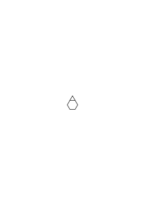
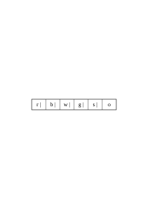
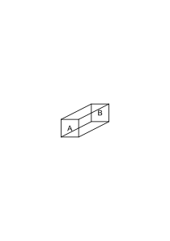
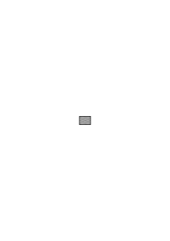
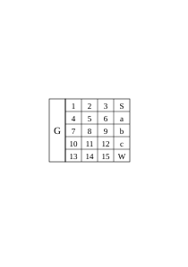
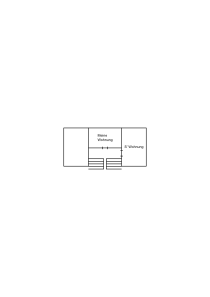
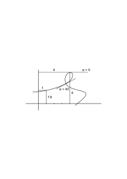
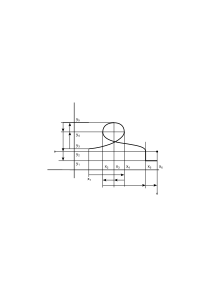
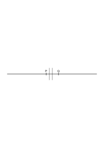

# Ms-126

181 published remarks, RFM IV, RFM V, VB

### [IIr\[1\]](https://cdn.wittgensteinnachlass.com/2000px/webp/Ms-126/IIr.webp)

Handelt nur von Logik & Mathematik.

### [1\[1\]](https://cdn.wittgensteinnachlass.com/2000px/webp/Ms-126/1.webp)

20.10.1942

Eine Addition von Formen in der gewisse Glieder verschmelzen spielt in unserm Leben eine sehr geringe Rolle. – Wie wenn

und △ die Figur

ergeben.

Aber wäre dies eine wichtigere Operation, so hätten wir vielleicht auch einen andern geläufigen Begriff von der arithm. Addition.

### [1\[2\]](https://cdn.wittgensteinnachlass.com/2000px/webp/Ms-126/1.webp),[2\[1\]](https://cdn.wittgensteinnachlass.com/2000px/webp/Ms-126/2.webp)

Daß man ein Boot, einen Hut, einen Katzenkopf etc. aus einem Stück Papier nach gewissen Regeln falten kann betrachten wir als Sache der Geometrie, nicht der Physik. Aber ist die Geometrie, so verstanden, nicht ein Teil der Physik? Nein; wir spalten die Geometrie von der Physik ab. Die geometrische Möglichkeit von der physikalischen. Aber wie, wenn man sie beisammen ließe? Wenn man einfach sagte: ‘wenn Du das & das & das mit dem Stück Papier tust, wird _dies_ herauskommen’? Was zu tun ist, könnte etwa durch einen Reim gegeben werden. Ist es denn nicht möglich, daß jemand zwischen den beiden Möglichkeiten gar nicht unterscheidet?

### [2\[2\]](https://cdn.wittgensteinnachlass.com/2000px/webp/Ms-126/2.webp),[3\[1\]](https://cdn.wittgensteinnachlass.com/2000px/webp/Ms-126/3.webp)

Wie wenn man sagte: ‘wenn Du gut ausgeruht bist & Du addierst die Zahlen ‥‥‥ kommt, meistens ‥‥․ heraus’? Hier, kann man sagen, heißt ‘addieren’ etwas anderes, als in unserem Sprachgebrauch. Aber doch etwas Ähnliches.

### [3\[2\]](https://cdn.wittgensteinnachlass.com/2000px/webp/Ms-126/3.webp),[4\[1\]](https://cdn.wittgensteinnachlass.com/2000px/webp/Ms-126/4.webp)

Es heißt dann ungefähr, was wir “zu addieren versuchen” nennen. Und wir sagen, von einem Schüler z.B., er versucht die & die Zahlen zu addieren, & meinen damit etwas ganz bestimmtes, obwohl die Kriterien dafür, daß _das_ geschieht, nicht leicht aufzuzählen sind. (Es ist wie ‘zu lesen versuchen’.)

### [4\[2\]](https://cdn.wittgensteinnachlass.com/2000px/webp/Ms-126/4.webp)

Wie ist es mit dem Satz “p ⊃ p ist eine Tautologie”? Er ist etwa vergleichbar mit: “318 ist durch 3 teilbar”.

### [4\[3\]](https://cdn.wittgensteinnachlass.com/2000px/webp/Ms-126/4.webp),[5\[1\]](https://cdn.wittgensteinnachlass.com/2000px/webp/Ms-126/5.webp)

Man könnte sich die Logik mit solchen Sätzen betrieben denken. Und dann, natürlich, ebenso auch mit Sätzen der Art “p ∙ ~p ist eine Kontradiktion”. Und daher auch einfach mit Kontradiktionen wie bisher mit Tautologien. Daß ich in einer Beschreibung, oder einem Befehl Widersprüche nicht dulde, daraus folgt nicht, daß ich sie in der _Logik_ nicht brauchen kann.

Die Reaktion auf ‘p ⊃ p’ ist: ‘Nun gut, – was weiter!’. Eine Art Bejahung, wie die einer gänzlich unverbindlichen Äußerung.

### [5\[2\]](https://cdn.wittgensteinnachlass.com/2000px/webp/Ms-126/5.webp)

Denke Dir Sätze, wie 25 × 25 = 625, gewohnheitsmäßig so geschrieben: 25 × 25 ‒ 625 = 0, & am Ende das ‘ = 0’ weggelassen, daß die Sätze der Arithmetik die Form arithm. Ausdrücke annehmen, die gleich 0 sind, – obwohl _das_ nicht gesagt wird. Wäre diese Situation nicht _ähnlich_ der in unsrer Logik, die aus Tautologien besteht?

### [6\[1\]](https://cdn.wittgensteinnachlass.com/2000px/webp/Ms-126/6.webp)

21.10.1942

Die Konstruktion einer Schlußregel kann man als Einführung eines neuen Sprachspiels deuten. Ich denke mir eines, in welchem etwa eine Person ‘p ⊃ q’ aussagt, eine andere ‘p’, & eine dritte den Schluß zieht.

### [6\[2\]](https://cdn.wittgensteinnachlass.com/2000px/webp/Ms-126/6.webp),[7\[1\]](https://cdn.wittgensteinnachlass.com/2000px/webp/Ms-126/7.webp)

22.10.1942

Es handelt sich um die Beobachtung einer Fläche

die in Stücke von verschiedener Farbe geteilt ist. Die Farben aller Stücke ändern sich zu gleicher Zeit immer nach einer Minute.

Jeder beobachtet einen Aspekt der ihn aus bestimmten Gründen angeht.

_Jetzt_ sind die Farben r, g, b, w, s, o.

Es wird beobachtet, daß immer r ∙ b ⊃ w ․⊃․ s.

Es wird auch beobachtet ~ g ⊃ ~ s.

Und Einer zieht den Schluß ~ g ⊃ r ∙ b ∙ ~ w.

### [7\[2\]](https://cdn.wittgensteinnachlass.com/2000px/webp/Ms-126/7.webp)

Sind das echte Beobachtungen, so müssen sie einander widersprechen können.

These implications, by the way, are really ‘material’ implications.

### [7\[3\]](https://cdn.wittgensteinnachlass.com/2000px/webp/Ms-126/7.webp)

Inwiefern hängt der Schluß von der Erfahrung ab?

### [7\[4\]](https://cdn.wittgensteinnachlass.com/2000px/webp/Ms-126/7.webp),[8\[1\]](https://cdn.wittgensteinnachlass.com/2000px/webp/Ms-126/8.webp)

Einer beobachtet eine zweigeteilte Fläche & ruft aus “rot & blau”; ein Anderer macht von der Beobachtung Gebrauch & sagt: “Also _rot_”. Er zieht aus ‘p ∙ q’ den Schluß ‘p’. Oder ihn interessiert es, ob die Flächen _rot oder gelb_ zeigen, & er sagt: “Also: rot _oder_ gelb”. Er hat von ‘p ∙ q’ auf ‘p ⌵ r’ geschlossen.

### [8\[2\]](https://cdn.wittgensteinnachlass.com/2000px/webp/Ms-126/8.webp),[9\[1\]](https://cdn.wittgensteinnachlass.com/2000px/webp/Ms-126/9.webp)

Ja, man kann sich ein Sprachspiel denken, in dem der Eine immer den für seine Funktion relevanten Schluß aus der Angabe des Andern zu ziehen hat – etwa einen Schluß von ‘p ∙ q ∙ r’ auf ‘q’ – & daß er in dieser Tätigkeit auch aus einer Angabe ‘p’ den Schluß zieht: “also ‘p’”, daß er also nach der Formel ‘p ⊃ p’ schließt.

### [9\[2\]](https://cdn.wittgensteinnachlass.com/2000px/webp/Ms-126/9.webp)

23.10.1942

‘So machen wir's’. Dieser Regel folgen wir; & wenn dabei etwas schief geht, so schieben wir's nicht der Regel in die Schuhe.

### [9\[3\]](https://cdn.wittgensteinnachlass.com/2000px/webp/Ms-126/9.webp),[10\[1\]](https://cdn.wittgensteinnachlass.com/2000px/webp/Ms-126/10.webp)

Einer beobachtet eine Fläche, welche in Quadranten geteilt ist. Er ruft aus: “Ganz weiß”. Ein Arbeiter, den die Farbe des Quadranten No. 4 angeht, sagt: “No. 4 weiß”. Wenn nun in dem Arbeitsprozeß irgend etwas schief geht, so wird niemand sagen: aus ‘(x).f(x)’ habe hier nicht ‘f(a)’ gefolgt.

### [10\[2\]](https://cdn.wittgensteinnachlass.com/2000px/webp/Ms-126/10.webp)

Wie aber, wenn wir Leute aus dem allgemeinen Satz auch entgegengesetzt schließen sähen?

### [10\[3\]](https://cdn.wittgensteinnachlass.com/2000px/webp/Ms-126/10.webp),[11\[1\]](https://cdn.wittgensteinnachlass.com/2000px/webp/Ms-126/11.webp),[12\[1\]](https://cdn.wittgensteinnachlass.com/2000px/webp/Ms-126/12.webp)

Denke Dir Einen, der ein Patent auf eine Regel nimmt um Regeln zu erzeugen nach denen Reihen von Kardinalzahlen erzeugt werden können (etwa zum Zweck von Numerierungen). Er sagt er habe eine Regel gefunden nach der _alle möglichen_ endlosen Reihen erzeugt werden können & kein Konkurrent könne eine Regel bilden die nicht in der seinen enthalten wäre. Und nun zeigt ihm Cantor, daß das nicht möglich ist. Dieser Beweis ändert unzweifelhaft seinen Begriff von der endlosen Zahlenfolge. Vorher hatte er etwa geglaubt da er sich so große Mühe gegeben habe _alle_ Regeln in sein System einzuschließen, so könne er keine ausgelassen haben. Nun denkt er _ganz anders_ über die Sache. Wie Einer, der nicht wußte, daß die Konstruktion einer Winkelteilung unmöglich sein könne. Er sieht es nun ganz anders an.

### [RFM IV](/w-rfm-4/#ms-126-12.2) [12\[2\]](https://cdn.wittgensteinnachlass.com/2000px/webp/Ms-126/12.webp) {#12-2}

Wie, wenn man sagte: Wer die Folge 1 2 3 umgekehrt hat, _lernt_ über sie, daß sie umgekehrt 3 2 1 ergibt? Und zwar ist, was er lernt, nicht eine Eigenschaft dieser Tintenstriche, sondern der Folge von _Formen_. Er lernt eine _formale_ Eigenschaft von Formen. Der Satz, welcher diese formale Eigenschaft aussagt, wird durch die Erfahrung bewiesen, die ihm die Entstehung der einen Form, in dieser Weise, aus der andern zeigt.

### [RFM IV](/w-rfm-4/#ms-126-13.1) [13\[1\]](https://cdn.wittgensteinnachlass.com/2000px/webp/Ms-126/13.webp) {#13-1}

Hat nun, wer das lernt, _zwei_ Eindrücke? Einen davon daß die Reihenfolge _umgekehrt_ wird, den andern davon daß 3 2 1 entsteht? Und könnte er die Erfahrung, den Eindruck, daß 1 2 3 umgekehrt wird nicht haben und doch nicht den daß 3 2 1 entsteht? Vielleicht wird man sagen: “nur durch eine seltsame Täuschung”. –

### [RFM IV](/w-rfm-4/#ms-126-13.2+14.1) [13\[2\]](https://cdn.wittgensteinnachlass.com/2000px/webp/Ms-126/13.webp),[14\[1\]](https://cdn.wittgensteinnachlass.com/2000px/webp/Ms-126/14.webp) {#13-2--14-1}

Warum man eigentlich nicht sagen kann, daß man jenen formalen Satz aus der Erfahrung lernt – weil man es erst dann diese Erfahrung nennt, wenn dieser Prozeß zu diesem Resultat führt. Die Erfahrung, die man meint, besteht schon aus diesem Prozeß mit diesem Resultat.

### [RFM IV](/w-rfm-4/#ms-126-14.2) [14\[2\]](https://cdn.wittgensteinnachlass.com/2000px/webp/Ms-126/14.webp) {#14-2}

Darum ist sie mehr wie die Erfahrung: ein Bild zu sehen.

### [RFM IV](/w-rfm-4/#ms-126-14.3+15.1+16.1) [14\[3\]](https://cdn.wittgensteinnachlass.com/2000px/webp/Ms-126/14.webp),[15\[1\]](https://cdn.wittgensteinnachlass.com/2000px/webp/Ms-126/15.webp),[16\[1\]](https://cdn.wittgensteinnachlass.com/2000px/webp/Ms-126/16.webp) {#14-3--15-1--16-1}

Kann eine Buchstabenreihe zwei Umkehrungen haben? Etwa eine akustische & eine andere optische Umkehrung. Angenommen ich erkläre jemandem was die Umkehrung eines Wortes auf dem Papier ist, was man so nennt. Und nun stellt sich heraus daß er eine akustische Umkehrung des Wortes hat, d.h., etwas was er so nennen möchte was aber nicht ganz mit der geschriebenen Buchstabenreihe übereinstimmt. So daß man sagen kann: er hört _das_ als Umkehrung des Wortes. Gleichsam als verzerrte sich ihm das Wort beim Umkehren. Und dies könnte etwa eintreten wenn er das Wort & die Umkehrung fließend ausspricht im Gegensatz zu dem Fall wenn er es buchstabiert. Oder die Umkehrung könnte anders scheinen, wenn er das Wort in _einem_ Zuge vor- & rückwärts spricht.

### [RFM IV](/w-rfm-4/#ms-126-16.2) [16\[2\]](https://cdn.wittgensteinnachlass.com/2000px/webp/Ms-126/16.webp) {#16-2}

Es wäre möglich, daß man das genaue Spiegelbild eines Profils sogleich nach diesem gesehen nie für das gleiche & nur in die andere Richtung gedrehte erklärte, sondern daß, um den Eindruck der genauen Umkehrung zu machen, das Profil in den Maßen etwas geändert werden müßte.

### [16\[3\]](https://cdn.wittgensteinnachlass.com/2000px/webp/Ms-126/16.webp)

### [RFM IV](/w-rfm-4/#ms-126-17.1) [17\[1\]](https://cdn.wittgensteinnachlass.com/2000px/webp/Ms-126/17.webp) {#17-1}

Ich will doch sagen, man könne nicht sagen: wir mögen zwar über die korrekte Umkehrung, eines langen Wortes z.B., im Zweifel sein, aber wir _wissen_, daß das Wort nur _eine_ Umkehrung hat.

### [RFM IV](/w-rfm-4/#ms-126-17.2) [17\[2\]](https://cdn.wittgensteinnachlass.com/2000px/webp/Ms-126/17.webp) {#17-2}

‘Ja, aber wenn es eine Umkehrung in _diesem_ Sinne sein soll, dann kann es nur _eine_ geben!’ Heißt hier ‘in diesem Sinne’: nach diesen Regeln, oder: mit dieser Physiognomie. Im ersten Falle wäre der Satz tautologisch, im zweiten muß er nicht wahr sein.

### [18\[1\]](https://cdn.wittgensteinnachlass.com/2000px/webp/Ms-126/18.webp)

24.10.1942

“Notwendige Wahrheit. necessary proposition” –

ein schlechter Ausdruck. Läßt uns an eine _starre Verbindung_ gewisser Gegenstände (Formen, Zahlen, etc.) in der Natur denken; eine Art Naturwissenschaft dieser Fakten. D.h., wir bilden eine Art Superlativ der Starrheit einer Verbindung, wozu als Vorbild unsere Mechanismen dienen.

### [18\[2\]](https://cdn.wittgensteinnachlass.com/2000px/webp/Ms-126/18.webp),[19\[1\]](https://cdn.wittgensteinnachlass.com/2000px/webp/Ms-126/19.webp)

Ein Satz der Wahrscheinlichkeitsrechnung kann einen Begriff der Wahrscheinlichkeit des Eintreffens von Ereignissen bestimmen, oder aber auch einen geometrischen Begriff. Gibt es nun nicht eine reine Mathematik die bloß die _Form_ aller solcher Anwendungen wäre, aber keine von ihnen andeutete? Als solch eine _reine_ Mathematik scheint sich uns das Zeichenspiel anzubieten das allen solchen Deutungen gemeinsam ist.

### [19\[2\]](https://cdn.wittgensteinnachlass.com/2000px/webp/Ms-126/19.webp),[20\[1\]](https://cdn.wittgensteinnachlass.com/2000px/webp/Ms-126/20.webp)

Und wozu nun dies Zeichenspiel in den Formen der Axiomatik spielen & nicht gleich so, wie es sich für gewöhnlich mit einer Deutung darstellt – nur mit bedeutungslosen Zeichen gespielt?

### [20\[2\]](https://cdn.wittgensteinnachlass.com/2000px/webp/Ms-126/20.webp),[21\[1\]](https://cdn.wittgensteinnachlass.com/2000px/webp/Ms-126/21.webp)

Denke Dir also Menschen, welche addierten, multiplizierten, dividierten, wie wir, nur ohne jeden nützlichen Zweck; etwa: als eine harmlose Unterhaltung. Die Jungen lernen es von den Alten durch Zuschauen. Übrigens ist die Bemerkung “ohne jeden nützlichen Zweck” ganz irrelevant denn warum soll Unterhaltung kein nützlicher Zweck sein, & es ließen sich leicht ganz andere nützliche Zwecke dieser Tätigkeit denken, die doch nicht mathematische Anwendungen wären. Aber von einer solchen Tätigkeit ließen sich leicht _Abbildungen_ denken, die niemand für Mathematik erklären würde, sondern etwa für einen Tanz oder das Ornamentieren einer Wand.

### [21\[2\]](https://cdn.wittgensteinnachlass.com/2000px/webp/Ms-126/21.webp),[22\[1\]](https://cdn.wittgensteinnachlass.com/2000px/webp/Ms-126/22.webp)

Ein Traum:

Mir träumte neulich: Ich steige auf einen Sessel & knie mit einem Knie auf einen Tisch. Der Tisch war eine Art flacher Schreibtisch, ich glaube aus Mahagoniholz & hat in der Mitte ein Loch, wie um eine Schreibmaschine aufzunehmen.

In dem Loch liegen zwei Spachteln, eine stählerne & eine hölzerne, die sehr schön gearbeitet ist und eine aussieht wie ein großer Brieföffner. Ich knie gerade auf den beiden Spachteln & breche die stählerne & die hölzerne. Fürchte mich daß mein Vorgesetzter sich darüber ärgern wird.

### [22\[2\]](https://cdn.wittgensteinnachlass.com/2000px/webp/Ms-126/22.webp),[23\[1\]](https://cdn.wittgensteinnachlass.com/2000px/webp/Ms-126/23.webp),[24\[1\]](https://cdn.wittgensteinnachlass.com/2000px/webp/Ms-126/24.webp),[25\[1\]](https://cdn.wittgensteinnachlass.com/2000px/webp/Ms-126/25.webp),[26\[1\]](https://cdn.wittgensteinnachlass.com/2000px/webp/Ms-126/26.webp)

Heute nacht träumte ich: Ich steige eine Treppe hinauf. Auf dem obersten Absatz ist in einer Art Käfig ein Taubenpaar die einander sehr lieben. Das Weibchen mag mich nicht, sträubt die Federn & will auf mich los gehen so wie ich mich ihr nähere. Gedanke daß sie mir mit dem Schnabel in die Hand stoßen würde wenn ich die Hand hin hielte. – Dann: Die Frau (die Taube) ist gestorben und ihr Mann [(]nun ein Mann) zimmert ihr den Sarg: mehrere flache Kisten wie um Bilder oder Schriften zu verwahren. Dann setzt er sich ermüdet, & wie um selbst zu sterben, nieder & seine Säge steckt vor ihm in einem Stück Holz, einem Kasten. Entweder zwischen diesen beiden Szenen oder nach der zweiten (ich weiß es nicht mehr) eine andere: Francis & Drobil sind mit mir in einem Zimmer (einer Schenke?) & ich fange ein Argument mit einem Dritten an der mir etwas gesagt hat das ich richtig stellen will (ich weiß nicht mehr was). Während ich mit ihm spreche sind die beiden andern fort gegangen, wie ich mich umdrehe sind sie nicht mehr da. Ich gehe sie im Haus suchen, will erst ins obere dann ins untere Schlafzimmer gehen um sie zu suchen, weiß aber daß sie ohne mich ausgegangen sind wahrscheinlich zum Nachtmahl. Sie werden dann wohl wieder kommen. Bin sehr verstimmt darüber daß sie, ohne auf mich zu warten, weggegangen sind & wache traurig auf. Das Haus in welchem ich in dieser Szene die beiden suche ist dasselbe in welchem ich in der ersten Szene die Treppe hinaufgestiegen bin & in welchem auch der Mann mit den flachen Kisten die Taube einsargt. Wenn er sich dann zum Sterben hinsetzt so ist es als säße er auf dem Deck im Hinterteil eines Schiffes.

### [26\[2\]](https://cdn.wittgensteinnachlass.com/2000px/webp/Ms-126/26.webp)

26.10.1942

Ist ein Schachproblem ein Problem der _angewandten_ Mathematik? Vergleiche es mit einem Problem der theoretischen Mechanik.

### [26\[3\]](https://cdn.wittgensteinnachlass.com/2000px/webp/Ms-126/26.webp)

Wenn die Math. ein Spiel ist, so gibt es keinen Unterschied zwischen rein mathem. Axiomen & nicht rein mathematischen. Und man könnte ein Kapitel der mathem. Physik ebensogut als (ein) Spiel spielen, wie eins aus der Zahlentheorie.

### [26\[4\]](https://cdn.wittgensteinnachlass.com/2000px/webp/Ms-126/26.webp),[27\[1\]](https://cdn.wittgensteinnachlass.com/2000px/webp/Ms-126/27.webp)

Denke Dir solche Schlußketten:

dunkler als

_und_

dunkler als

daher: der Unterschied zwischen

 &

größer als der zwischen

 &

.

Dies ist ein schlechtes Beispiel.

### [27\[2\]](https://cdn.wittgensteinnachlass.com/2000px/webp/Ms-126/27.webp),[28\[1\]](https://cdn.wittgensteinnachlass.com/2000px/webp/Ms-126/28.webp)

Denke Dir die Fünfeckskonstruktion gezeichnet & über sie einen durchsichtigen Kegel gestellt & in ihm solche Flächen gezogen (dreidimensionale Konstruktion) daß jeder ebene Schnitt parallel zur Basis offenbar wieder so eine erfolgreiche Fünfeckskonstruktion ist. Dies wäre ein Beweis in einer _anschaulichen_ Geometrie.

### [28\[2\]](https://cdn.wittgensteinnachlass.com/2000px/webp/Ms-126/28.webp)

Die Augen & die Nase müssen nicht ‘irgendwie verwandt’ sein, um _ein_ Gesicht zu ergeben.

### [RFM V](/w-rfm-5/#ms-126-28.3) [28\[3\]](https://cdn.wittgensteinnachlass.com/2000px/webp/Ms-126/28.webp) {#28-3}

Es ist natürlich klar, daß der Mathematiker, insofern er wirklich ‘ein Spiel spielt’ keine _Schlüsse zieht_. Denn ‘spielen’ muß hier heißen: in Übereinstimmung mit gewissen Regeln _handeln_. Und schon das wäre ein Heraustreten aus dem bloßen Spiel; wenn er den Schluß zöge, daß er hier der allgemeinen Regel gemäß _so_ handeln dürfe.

### [29\[1\]](https://cdn.wittgensteinnachlass.com/2000px/webp/Ms-126/29.webp)

27.10.1942

Aber wie seltsam ist es, zu sagen, daß, wenn Einer die ganze Mathematik _als Spiel_ schriebe, dies dann nicht Mathematik wäre! Es kann, willst Du sagen, doch nicht auf gedankliche (psychologische) Prozesse ankommen.

(Und soweit ist es richtig.)

### [29\[2\]](https://cdn.wittgensteinnachlass.com/2000px/webp/Ms-126/29.webp)

‘Diese müssen unwesentlich sein. Gleichsam Abschweifungen vom Thema.’

### [29\[3\]](https://cdn.wittgensteinnachlass.com/2000px/webp/Ms-126/29.webp),[30\[1\]](https://cdn.wittgensteinnachlass.com/2000px/webp/Ms-126/30.webp)

Statt des obigen konventionellen & schlechten Beispiels wären farben-geometrische Beobachtungen am Farbenkreis zu setzen, die _nicht_ mit dem, was man etwa erwarten möchte übereinstimmen (Was man farben-geometrische Paradoxe nennen könnte.)

### [RFM V](/w-rfm-5/#ms-126-30.2) [30\[2\]](https://cdn.wittgensteinnachlass.com/2000px/webp/Ms-126/30.webp) {#30-2}

28.10.1942

_Rechnet_ die Rechenmaschine?

### [RFM V](/w-rfm-5/#ms-126-30.3) [30\[3\]](https://cdn.wittgensteinnachlass.com/2000px/webp/Ms-126/30.webp) {#30-3}

Denk Dir, eine Rechenmaschine wäre durch Zufall entstanden; & nun drückt Einer durch Zufall auf ihre Knöpfe (oder ein Tier läuft über sie) & sie rechnet das Produkt 25 × 20. –

### [RFM V](/w-rfm-5/#ms-126-30.4+31.1) [30\[4\]](https://cdn.wittgensteinnachlass.com/2000px/webp/Ms-126/30.webp),[31\[1\]](https://cdn.wittgensteinnachlass.com/2000px/webp/Ms-126/31.webp) {#30-4--31-1}

Ich will sagen: Es ist der Mathematik wesentlich, daß ihre Zeichen auch _im Zivil_ gebraucht werden. Es ist der Gebrauch außerhalb der Mathematik, also die _Bedeutung_ der Zeichen, was das Zeichenspiel zur Mathematik macht.

### [RFM V](/w-rfm-5/#ms-126-31.2) [31\[2\]](https://cdn.wittgensteinnachlass.com/2000px/webp/Ms-126/31.webp) {#31-2}

So, wie es ja auch kein logischer Schluß ist, wenn ich ein Gebilde in ein anderes transformiere (eine Anordnung von Stühlen etwa in eine andere) wenn diese Anordnungen nicht außerhalb dieser Transformation einen sprachlichen Gebrauch haben.

### [RFM V](/w-rfm-5/#ms-126-31.3+32.1) [31\[3\]](https://cdn.wittgensteinnachlass.com/2000px/webp/Ms-126/31.webp),[32\[1\]](https://cdn.wittgensteinnachlass.com/2000px/webp/Ms-126/32.webp) {#31-3--32-1}

Aber ist nicht das wahr, daß Einer, der keine Ahnung von der Bedeutung der Russellschen Zeichen hätte, R's Beweise _nachrechnen_ könnte? Und also in einem wichtigen Sinne prüfen könnte ob sie richtig seien oder falsch?

### [32\[2\]](https://cdn.wittgensteinnachlass.com/2000px/webp/Ms-126/32.webp),[33\[1\]](https://cdn.wittgensteinnachlass.com/2000px/webp/Ms-126/33.webp)

Das Feld G ist gleichmäßig gelb, S schwarz, W weiß, & a b c drei Töne von grau, die in gleichen Farbabständen von S zu W führen. Ebenso führen 1, 2, 3 von G nach S, 4, 5, 6 von G nach a u.s.w.. Dann wird man vielleicht sehen, daß die lotrechten Reihen 1, 4, 7, 10, 13 & 2, 5, 8, 11, 14 & 3, 6, 9, 12, 15 nicht gleichabständig sind. Und dies, oder das Entgegengesetzte, wäre eine farbengeometrische Tatsache.

### [33\[2\]](https://cdn.wittgensteinnachlass.com/2000px/webp/Ms-126/33.webp)

Ich meine: es könnte sein, daß man Gleichabständigkeit der waagrechten & senkrechten Reihen nicht zugleich erreichen kann.

### [VB](/w-vb/#ms-126-33.3) [33\[3\]](https://cdn.wittgensteinnachlass.com/2000px/webp/Ms-126/33.webp) {#33-3}

Architektur ist eine _Geste_. Nicht jede zweckmäßige Bewegung des menschlichen Körpers ist eine Geste. Sowenig, wie jedes zweckmäßige Gebäude Architektur.

### [RFM V](/w-rfm-5/#ms-126-33.4+34.1) [33\[4\]](https://cdn.wittgensteinnachlass.com/2000px/webp/Ms-126/33.webp),[34\[1\]](https://cdn.wittgensteinnachlass.com/2000px/webp/Ms-126/34.webp) {#33-4--34-1}

29.10.1942

Man könnte eine menschliche Rechenmaschine so abrichten, daß sie, wenn ihr die Schlußregeln gezeigt & etwa an Beispielen vorgeführt wurden, die Beweise eines mathem. Systems (etwa des R'schen) durchliest & nach jedem richtig gezogenen Schluß mit dem Kopf nickt bei einem Fehler aber den Kopf schüttelt & zu rechnen aufhört. Dieses Wesen könnte man sich im übrigen vollkommen idiotisch vorstellen.

### [RFM V](/w-rfm-5/#ms-126-34.2) [34\[2\]](https://cdn.wittgensteinnachlass.com/2000px/webp/Ms-126/34.webp) {#34-2}

Einen Beweis nennen wir etwas, was sich nachrechnen, aber auch kopieren läßt.

### [RFM V](/w-rfm-5/#ms-126-35.1) [35\[1\]](https://cdn.wittgensteinnachlass.com/2000px/webp/Ms-126/35.webp) {#35-1}

Wenn die Math. ein Spiel ist, dann ist ein Spiel spielen Mathematik treiben, & warum dann nicht auch: Tanzen?

### [35\[2\]](https://cdn.wittgensteinnachlass.com/2000px/webp/Ms-126/35.webp)

Man könnte sich den Fall denken, daß Einer seinem eignen Rechnen weniger traut, als dem einer Rechenmaschine.

### [RFM V](/w-rfm-5/#ms-126-35.3+36.1) [35\[3\]](https://cdn.wittgensteinnachlass.com/2000px/webp/Ms-126/35.webp),[36\[1\]](https://cdn.wittgensteinnachlass.com/2000px/webp/Ms-126/36.webp) {#35-3--36-1}

Denke Dir, daß Rechenmaschinen in der Natur vorkämen, ihre Gehäuse aber für die Menschen undurchdringlich (wären). Und diese Menschen benützten nun diese Vorrichtungen etwa wie wir das Rechnen, wovon sie aber gar nichts wissen. Sie machen also etwa Vorhersagungen mit Hilfe der Rechenmaschinen, aber für sie ist das Handhaben dieser seltsamen Gegenstände ein Experimentieren.

### [RFM V](/w-rfm-5/#ms-126-36.2) [36\[2\]](https://cdn.wittgensteinnachlass.com/2000px/webp/Ms-126/36.webp) {#36-2}

30.10.1942

Diesen Leuten fehlen Begriffe, die wir haben; aber wodurch ersetzen sie diese?

### [RFM V](/w-rfm-5/#ms-126-36.3+37.1) [36\[3\]](https://cdn.wittgensteinnachlass.com/2000px/webp/Ms-126/36.webp),[37\[1\]](https://cdn.wittgensteinnachlass.com/2000px/webp/Ms-126/37.webp) {#36-3--37-1}

Denke an den Mechanismus dessen Bewegung wir als geometrischen (kinematischen) Beweis ansahen: Das ist klar, das normalerweise von Einem der das Rad umtreibt nicht gesagt würde, er beweist etwas. Ist es nicht ebenso mit dem, der zum Spiel Zeichen aneinander reiht & diese Reihen verändert; auch wenn, was er hervorbringt als Beweis angesehen werden könnte?

### [RFM V](/w-rfm-5/#ms-126-37.2+38.1) [37\[2\]](https://cdn.wittgensteinnachlass.com/2000px/webp/Ms-126/37.webp),[38\[1\]](https://cdn.wittgensteinnachlass.com/2000px/webp/Ms-126/38.webp) {#37-2--38-1}

Zu sagen, die Math. sei ein Spiel, soll heißen: wir brauchen beim Beweisen nirgends an die Bedeutung der Zeichen appellieren, also an ihre außermathematische Anwendung. Aber was heißt es denn überhaupt, an diese appellieren? Wie kann so ein Appell etwas fruchten?

Heißt das, aus der Mathematik heraustreten & wieder in sie zurückkehren, oder heißt es aus _einer_ math. Schlußweise in eine andre treten?

### [RFM V](/w-rfm-5/#ms-126-38.2) [38\[2\]](https://cdn.wittgensteinnachlass.com/2000px/webp/Ms-126/38.webp) {#38-2}

Was heißt es, einen neuen Begriff von der Oberfläche einer Kugel gewinnen? In wiefern ist das dann ein Begriff von der Oberfläche einer _Kugel_? Doch nur insofern er sich auf wirkliche Kugeln anwenden läßt.

### [RFM V](/w-rfm-5/#ms-126-38.3) [38\[3\]](https://cdn.wittgensteinnachlass.com/2000px/webp/Ms-126/38.webp) {#38-3}

Wieweit muß man einen Begriff vom ‘Satz’ haben, um die R'sche mathem. Logik zu verstehen?

### [RFM V](/w-rfm-5/#ms-126-39.1) [39\[1\]](https://cdn.wittgensteinnachlass.com/2000px/webp/Ms-126/39.webp) {#39-1}

01.11.1942

Wenn die intendierte Anwendung der Math. wesentlich ist, wie steht es da mit Teilen der Mathematik, deren Anwendung – wenigstens _das_, was Mathematiker für eine Anwendung hielten, – gänzlich phantastisch ist. So daß man, wie in der Mengenlehre, einen Zweig der Math. treibt, von dessen Anwendung man sich einen ganz falschen Begriff macht. Treibt man nun nicht _doch_ Mathematik?

### [RFM V](/w-rfm-5/#ms-126-39.2+40.1) [39\[2\]](https://cdn.wittgensteinnachlass.com/2000px/webp/Ms-126/39.webp),[40\[1\]](https://cdn.wittgensteinnachlass.com/2000px/webp/Ms-126/40.webp) {#39-2--40-1}

02.11.1942

Wenn die arithm. Operationen lediglich zur Konstruktion einer Chiffre dienten wäre ihre Verwendung natürlich grundlegend von der unsern verschieden. Wären diese Operationen dann aber überhaupt mathematische Operationen?

### [RFM V](/w-rfm-5/#ms-126-40.2+41.1) [40\[2\]](https://cdn.wittgensteinnachlass.com/2000px/webp/Ms-126/40.webp),[41\[1\]](https://cdn.wittgensteinnachlass.com/2000px/webp/Ms-126/41.webp) {#40-2--41-1}

Kann man von Dem, der eine Regel des Entzifferns anwendet, sagen, er vollziehe mathem. Operationen? Und doch lassen sich seine Transformationen so auffassen. Denn er könnte doch sagen, er berechne, was bei der Entzifferung des Zeichens … nach der und der Regel herauskommen müsse. Und der Satz: daß die Zeichen … dieser Regel gemäß entziffert … ergeben ist ein mathematischer. Sowie auch der Satz: daß man beim Schachspiel von _dieser_ Stellung zu jener kommen kann.

### [RFM V](/w-rfm-5/#ms-126-41.2) [41\[2\]](https://cdn.wittgensteinnachlass.com/2000px/webp/Ms-126/41.webp) {#41-2}

Denke Dir die Geometrie des vierdimensionalen Raums zu dem Zweck betrieben, die Lebensbedingungen der Geister kennen zu lernen. Ist sie darum nicht Mathematik? Und kann ich nun sagen sie bestimme Begriffe?

### [RFM V](/w-rfm-5/#ms-126-41.3+42.1) [41\[3\]](https://cdn.wittgensteinnachlass.com/2000px/webp/Ms-126/41.webp),[42\[1\]](https://cdn.wittgensteinnachlass.com/2000px/webp/Ms-126/42.webp) {#41-3--42-1}

Wäre es nicht seltsam von einem Kinde zu sagen, es könne bereits tausende & tausende von Multiplikationen machen – womit (nämlich) gemeint sein soll, es könne bereits im unbegrenzten Zahlenraum rechnen. Und zwar könnte das noch als eine äußerst bescheidene Ausdrucksweise gelten, da er (ja) nur ‘tausende & tausende’ statt ‘unendlich viele’ sagt.

### [RFM V](/w-rfm-5/#ms-126-42.2) [42\[2\]](https://cdn.wittgensteinnachlass.com/2000px/webp/Ms-126/42.webp) {#42-2}

Könnte man sich Menschen denken, die im gewöhnlichen Leben etwa nur bis 1000 rechnen & die Rechnungen mit höheren Zahlen mathem. Untersuchungen über die Geisterwelt vorbehalten haben.

### [43\[1\]](https://cdn.wittgensteinnachlass.com/2000px/webp/Ms-126/43.webp)

‘Jedes Ding ist sich selbst gleich’. Betrachte: “Jedes Ding ist sich selbst sehr ähnlich”!

### [43\[2\]](https://cdn.wittgensteinnachlass.com/2000px/webp/Ms-126/43.webp)

03.11.1942

Warum nun hat das ‘den Schein der Wahrheit’ & nicht einfach den der Unsinnigkeit?

### [43\[3\]](https://cdn.wittgensteinnachlass.com/2000px/webp/Ms-126/43.webp),[44\[1\]](https://cdn.wittgensteinnachlass.com/2000px/webp/Ms-126/44.webp)

Nehmen wir an, die Bahnen zweier Körper kreuzten sich, so daß die beiden in der Kreuzungsstelle zusammenfielen. Man könnte dann sagen: wo sie zusammenfallen sind sie einander gleich. Und das ist nicht notwendig der Fall: denke etwa an eine perspektivische Darstellung.

### [44\[2\]](https://cdn.wittgensteinnachlass.com/2000px/webp/Ms-126/44.webp)

Wenn wir jemandem zugestünden, daß ‘a = a’ _nichts_ sagt, ihn aber fragten ob er sich nicht dennoch lieber mit _einem_ der beiden Sätze ‘a = a’ und ‘a ≠ a’, als mit dem andern einverstanden erklärte; so ist kein Zweifel, er würde sich für ‘a = a’ entscheiden.

### [44\[3\]](https://cdn.wittgensteinnachlass.com/2000px/webp/Ms-126/44.webp)

Er würde sagen: “Ein Ding ist jedenfalls sich selbst nicht _ungleich_”.

### [44\[4\]](https://cdn.wittgensteinnachlass.com/2000px/webp/Ms-126/44.webp),[45\[1\]](https://cdn.wittgensteinnachlass.com/2000px/webp/Ms-126/45.webp)

Zu sagen “ein Ding fällt mit sich selbst zusammen” ist eigentlich eine Bestimmung dessen, was man ‘_ein_ Ding’ nennt.

### [45\[2\]](https://cdn.wittgensteinnachlass.com/2000px/webp/Ms-126/45.webp)

04.11.1942

Was für eine Art Satz ist eine Gleichung, wie y = 3x² + 4? Jedenfalls keiner der reinen Mathematik, obwohl er aus ‘mathematischen’ Zeichen besteht. Die Gleichung kann ein Satz der angewandten Math. sein. In der reinen Math. ist sie ein Satzteil (etwa des Satzes daß ihre Lösung für x = 1 y = 7 ist). (Und für “x = 1” gilt ähnliches.)

### [RFM V](/w-rfm-5/#ms-126-45.3+46.1) [45\[3\]](https://cdn.wittgensteinnachlass.com/2000px/webp/Ms-126/45.webp),[46\[1\]](https://cdn.wittgensteinnachlass.com/2000px/webp/Ms-126/46.webp) {#45-3--46-1}

“Ob das nun von einer _wirklichen_ Kugelfläche gilt – von der mathematischen gilt es” – das erweckt den Anschein, als unterschiede sich der mathem. Satz von einem Erfahrungssatz besonders darin, daß wo die Wahrheit des Erfahrungssatzes schwankend & ungefähr ist, der mathem. Satz _sein_ Objekt exakt & unbedingt wahr beschreibt. Als wäre eben die ‘mathem. Kugel’ eine Kugel. Und man könnte sich etwa fragen ob es nur _eine_ solche Kugel, oder ob es mehrere gebe (eine Fregesche Fragestellung).

### [RFM V](/w-rfm-5/#ms-126-46.2+47.1) [46\[2\]](https://cdn.wittgensteinnachlass.com/2000px/webp/Ms-126/46.webp),[47\[1\]](https://cdn.wittgensteinnachlass.com/2000px/webp/Ms-126/47.webp) {#46-2--47-1}

Tut ein Mißverständnis, die mögliche Anwendung betreffend, der Rechnung als einem Teil der Mathematik Eintrag?

### [RFM V](/w-rfm-5/#ms-126-47.2) [47\[2\]](https://cdn.wittgensteinnachlass.com/2000px/webp/Ms-126/47.webp) {#47-2}

Und abgesehen von einem Mißverständnis, – wie ist es mit der bloßen Unklarheit?

### [RFM V](/w-rfm-5/#ms-126-47.3+48.1) [47\[3\]](https://cdn.wittgensteinnachlass.com/2000px/webp/Ms-126/47.webp),[48\[1\]](https://cdn.wittgensteinnachlass.com/2000px/webp/Ms-126/48.webp) {#47-3--48-1}

Wer glaubt, die Mathematiker haben ein seltsames Wesen, die <math display="inline"><msqrt><mrow><mtext>‒</mtext><mn>1</mn></mrow></msqrt></math>, entdeckt, die quadriert nun doch ‒ 1 ergebe, kann der nicht doch ganz gut mit komplexen Zahlen rechnen & solche Rechnungen in der Physik anwenden? Und sind's darum weniger _Rechnungen_? In _einer_ Beziehung steht freilich sein Verständnis auf schwachen Füßen; aber er wird mit Sicherheit seine Schlüsse ziehen, & sein, Kalkül wird auf _festen_ Füßen stehen.

### [RFM V](/w-rfm-5/#ms-126-48.2) [48\[2\]](https://cdn.wittgensteinnachlass.com/2000px/webp/Ms-126/48.webp) {#48-2}

Wäre es nun nicht lächerlich, zu sagen, dieser triebe nicht Mathematik?

### [RFM V](/w-rfm-5/#ms-126-48.3+49.1) [48\[3\]](https://cdn.wittgensteinnachlass.com/2000px/webp/Ms-126/48.webp),[49\[1\]](https://cdn.wittgensteinnachlass.com/2000px/webp/Ms-126/49.webp) {#48-3--49-1}

Es erweitert Einer die Math., gibt neue Definitionen & findet neue Lehrsätze – – & in _gewisser_ Beziehung kann man sagen, er wisse nicht was er tut. – Er hat eine vage Vorstellung, etwas _entdeckt_ zu haben wie einen Raum (wobei er an ein Zimmer denkt), ein Reich erschlossen zu haben, & würde, darüber gefragt, viel Unsinn reden.

### [RFM V](/w-rfm-5/#ms-126-49.2) [49\[2\]](https://cdn.wittgensteinnachlass.com/2000px/webp/Ms-126/49.webp) {#49-2}

Denken wir uns den primitiven Fall, daß Einer ungeheure Multiplikationen ausführte um wie er sagt: dadurch neue riesige Provinzen des Zahlenreichs zu gewinnen.

### [RFM V](/w-rfm-5/#ms-126-49.3+50.1) [49\[3\]](https://cdn.wittgensteinnachlass.com/2000px/webp/Ms-126/49.webp),[50\[1\]](https://cdn.wittgensteinnachlass.com/2000px/webp/Ms-126/50.webp) {#49-3--50-1}

Denk Dir das Rechnen mit der <math display="inline"><msqrt><mrow><mtext>‒</mtext><mn>1</mn></mrow></msqrt></math> wäre von einem Narren erfunden worden, der bloß vom Paradoxen der Idee angezogen die Rechnung als eine Art Gottesdienst des Absurden treibt. Er bildet sich ein das Unmögliche aufzuschreiben & mit ihm zu operieren.

### [RFM V](/w-rfm-5/#ms-126-50.2) [50\[2\]](https://cdn.wittgensteinnachlass.com/2000px/webp/Ms-126/50.webp) {#50-2}

Mit andern Worten: Wer an die mathematischen _Gegenstände_ glaubt & ihre seltsamen Eigenschaften, – kann der nicht doch Mathematik betreiben? Oder: – treibt der nicht auch Mathematik?

### [RFM V](/w-rfm-5/#ms-126-50.3+51.1) [50\[3\]](https://cdn.wittgensteinnachlass.com/2000px/webp/Ms-126/50.webp),[51\[1\]](https://cdn.wittgensteinnachlass.com/2000px/webp/Ms-126/51.webp) {#50-3--51-1}

05.11.1942

‘Idealer Gegenstand’. “Das Zeichen ‘a’ bezeichnet einen idealen Gegenstand” soll offenbar etwas über die Bedeutung, also den Gebrauch von ‘a’ aussagen. Und es heißt natürlich, daß dieser Gebrauch _in_ gewisser Beziehung ähnlich ist dem eines Zeichens, das einen Gegenstand hat, & daß es (aber) keinen Gegenstand bezeichnet. Es ist aber interessant, was der Ausdruck ‘idealer Gegenstand’ aus diesem Faktum macht.

### [51\[2\]](https://cdn.wittgensteinnachlass.com/2000px/webp/Ms-126/51.webp)

Man könnte sich so ausdrücken: “Der Name ‘Regan’ im Lear bezeichnet eine ideale Person”.

### [RFM V](/w-rfm-5/#ms-126-51.3+52.1) [51\[3\]](https://cdn.wittgensteinnachlass.com/2000px/webp/Ms-126/51.webp),[52\[1\]](https://cdn.wittgensteinnachlass.com/2000px/webp/Ms-126/52.webp) {#51-3--52-1}

Man könnte unter Umständen von einer endlosen Kugelreihe reden. – Denken wir uns eine solche gerade endlose Reihe von Kugeln in gleichen Abständen & wir berechnen die Kraft, die alle diese Kugeln nach einem bestimmten Attraktionsgesetz auf einen bestimmten Körper ausüben. Die Zahl, die diese Rechnung liefert, betrachten wir als das Ideal der Genauigkeit für gewisse Messungen.

### [RFM V](/w-rfm-5/#ms-126-52.2) [52\[2\]](https://cdn.wittgensteinnachlass.com/2000px/webp/Ms-126/52.webp) {#52-2}

Das Gefühl des _Seltsamen_ kommt hier von einem Mißverständnis. Der Art von Mißverständnis, die ein Daumenfangen des Verstandes erzeugt– – dem ich Einhalt gebieten will.

### [RFM V](/w-rfm-5/#ms-126-52.3+53.1) [52\[3\]](https://cdn.wittgensteinnachlass.com/2000px/webp/Ms-126/52.webp),[53\[1\]](https://cdn.wittgensteinnachlass.com/2000px/webp/Ms-126/53.webp) {#52-3--53-1}

Der Einwand, daß ‘das Endliche nicht das Unendliche erfassen kann’ richtet sich _eigentlich_ gegen die Idee eines psychologischen Akts des Erfassens oder Verstehens.

### [RFM V](/w-rfm-5/#ms-126-53.2) [53\[2\]](https://cdn.wittgensteinnachlass.com/2000px/webp/Ms-126/53.webp) {#53-2}

Oder denke Dir, wir sagen einfach: “Diese Kraft entspricht der Anziehung einer endlosen Kugelreihe die so & so angeordnet sind & den Körper nach diesem Attraktionsgesetz anziehen”. Oder wieder: “Berechne die Kraft die eine endlose Kugelreihe, von der & der Beschaffenheit, auf einen Körper ausübt!” – Dieser Befehl hat doch gewiß Sinn. Eine bestimmte Rechnung ist beschrieben.

### [RFM V](/w-rfm-5/#ms-126-54.1) [54\[1\]](https://cdn.wittgensteinnachlass.com/2000px/webp/Ms-126/54.webp) {#54-1}

Wie wäre es mit dieser Aufgabe: “Berechne das Gewicht einer Säule von sovielen aufeinander liegenden Platten, als es Kardinalzahlen gibt; die unterste Platte wiegt 1 kg jede höhere immer die Hälfte der vorhergehenden.”

### [RFM V](/w-rfm-5/#ms-126-54.2) [54\[2\]](https://cdn.wittgensteinnachlass.com/2000px/webp/Ms-126/54.webp) {#54-2}

Die Schwierigkeit ist _nicht_ die, daß wir uns keine Vorstellung machen können. Es ist leicht genug sich irgend eine Vorstellung einer unendlichen Reihe, z.B., zu machen. Es fragt sich: was nützt uns die Vorstellung.

### [RFM V](/w-rfm-5/#ms-126-54.3+55.1) [54\[3\]](https://cdn.wittgensteinnachlass.com/2000px/webp/Ms-126/54.webp),[55\[1\]](https://cdn.wittgensteinnachlass.com/2000px/webp/Ms-126/55.webp) {#54-3--55-1}

Denke Dir unendliche Zahlen in: einem Märchen gebraucht. Die Zwerge haben soviele Goldstücke aufeinander gelegt, als es Kardinalzahlen gibt – etc. Was in einem Märchen vorkommen kann, muß doch Sinn haben. –

### [RFM V](/w-rfm-5/#ms-126-55.2) [55\[2\]](https://cdn.wittgensteinnachlass.com/2000px/webp/Ms-126/55.webp) {#55-2}

Denke Dir die Mengenlehre wäre als eine Art Parodie der Mathematik von einem Satiriker erfunden worden. – Später hätte man dann einen Nutzen in ihr gesehen & sie in die Mathematik einbezogen. (Denn wenn der eine sie als das Paradies der Mathematiker ansehen kann, warum nicht ein andrer als einen Scherz?)

### [RFM V](/w-rfm-5/#ms-126-55.3+56.1) [55\[3\]](https://cdn.wittgensteinnachlass.com/2000px/webp/Ms-126/55.webp),[56\[1\]](https://cdn.wittgensteinnachlass.com/2000px/webp/Ms-126/56.webp) {#55-3--56-1}

Die Frage ist: ist sie nun als Scherz nicht auch offenbar Mathematik? –

### [RFM V](/w-rfm-5/#ms-126-56.2) [56\[2\]](https://cdn.wittgensteinnachlass.com/2000px/webp/Ms-126/56.webp) {#56-2}

Und warum ist sie offenbar Mathematik? – Weil sie ein Zeichenspiel nach Regeln ist?

### [RFM V](/w-rfm-5/#ms-126-56.3) [56\[3\]](https://cdn.wittgensteinnachlass.com/2000px/webp/Ms-126/56.webp) {#56-3}

Werden hier nicht doch offenbar Begriffe gebildet, – auch wenn man sich über deren Anwendung nicht im Klaren ist? Aber wie kann man einen Begriff haben & sich über seine Anwendung nicht im Klaren sein?

### [RFM V](/w-rfm-5/#ms-126-56.4+57.1) [56\[4\]](https://cdn.wittgensteinnachlass.com/2000px/webp/Ms-126/56.webp),[57\[1\]](https://cdn.wittgensteinnachlass.com/2000px/webp/Ms-126/57.webp) {#56-4--57-1}

06.11.1942

Nimm die Konstruktion des Kräftepolygons: ist das nicht ein Stück angewandte Mathematik? & wo ist der Satz der _reinen_ Mathematik der bei dieser graphischen Berechnung zu Hülfe genommen wird? Ist dies nicht ein Fall wie der des Stammes, welcher eine rechnerische Technik zum Zweck gewisser Vorhersagungen hat, aber keine Sätze der reinen Mathematik?

### [RFM V](/w-rfm-5/#ms-126-57.2+58.1) [57\[2\]](https://cdn.wittgensteinnachlass.com/2000px/webp/Ms-126/57.webp),[58\[1\]](https://cdn.wittgensteinnachlass.com/2000px/webp/Ms-126/58.webp) {#57-2--58-1}

Die Rechnung die zur Ausführung einer Zeremonie dient. Es werde z.B. nach einer bestimmten Technik aus dem Alter des Vaters & der Mutter & der Anzahl ihrer Kinder die Anzahl der Worte einer Segensformel abgeleitet die auf das Haus der Familie anzuwenden ist. In einem Gesetz wie dem Mosaischen könnte man sich Rechenvorgänge beschrieben denken. Und könnte man sich nicht denken, daß das Volk das diese zeremoniellen Rechenvorschriften besitzt im praktischen Leben nie rechnet?

### [RFM V](/w-rfm-5/#ms-126-58.2) [58\[2\]](https://cdn.wittgensteinnachlass.com/2000px/webp/Ms-126/58.webp) {#58-2}

Dies wäre zwar ein _angewandtes_ Rechnen, aber es würde nicht dem Zweck einer Vorhersage dienen.

### [RFM V](/w-rfm-5/#ms-126-58.3) [58\[3\]](https://cdn.wittgensteinnachlass.com/2000px/webp/Ms-126/58.webp) {#58-3}

07.11.1942

Wäre es ein Wunder wenn die Technik des Rechnens eine Familie von Anwendungen hätte?!

### [RFM V](/w-rfm-5/#ms-126-58.4+59.1) [58\[4\]](https://cdn.wittgensteinnachlass.com/2000px/webp/Ms-126/58.webp),[59\[1\]](https://cdn.wittgensteinnachlass.com/2000px/webp/Ms-126/59.webp) {#58-4--59-1}

08.11.1942

Wie seltsam die Frage ist ob in der unendlichen Entwicklung von π die Figur φ (eine gewisse Anordnung von Ziffern, z.B. ‘770’) vorkommen wird, sieht man erst wenn man die Frage in einer ganz hausbackenen Weise zu stellen versucht: Menschen sind darauf abgerichtet worden nach gewissen Regeln Zeichen zu setzen. Sie verfahren nun dieser Abrichtung gemäß & wir sagen es sei ein Problem, ob sie der gegebenen Regel folgend _jemals_ die Figur φ anschreiben werden.

### [RFM V](/w-rfm-5/#ms-126-60.1) [60\[1\]](https://cdn.wittgensteinnachlass.com/2000px/webp/Ms-126/60.webp) {#60-1}

Was aber sagt der, der, wie Weyl, sagt, eines sei klar: man werde oder werde nicht, in der endlosen Entwicklung auf φ kommen?

### [RFM V](/w-rfm-5/#ms-126-60.2) [60\[2\]](https://cdn.wittgensteinnachlass.com/2000px/webp/Ms-126/60.webp) {#60-2}

Mir scheint, wer dies sagt, stellt schon selbst eine Regel, oder ein Postulat auf.

### [RFM V](/w-rfm-5/#ms-126-60.3) [60\[3\]](https://cdn.wittgensteinnachlass.com/2000px/webp/Ms-126/60.webp) {#60-3}

Wie, wenn man auf eine Frage hin erwiderte: ‘Auf diese Frage gibt es bis jetzt noch keine Antwort’?

### [RFM V](/w-rfm-5/#ms-126-60.4+61.1) [60\[4\]](https://cdn.wittgensteinnachlass.com/2000px/webp/Ms-126/60.webp),[61\[1\]](https://cdn.wittgensteinnachlass.com/2000px/webp/Ms-126/61.webp) {#60-4--61-1}

So könnte etwa der Dichter antworten der gefragt wird ob der Held seiner Dichtung eine Schwester hat oder nicht – wenn er nämlich noch nichts darüber entschieden hat.

### [RFM V](/w-rfm-5/#ms-126-61.2) [61\[2\]](https://cdn.wittgensteinnachlass.com/2000px/webp/Ms-126/61.webp) {#61-2}

Die Frage – will ich sagen – verändert ihren Status, wenn sie entscheidbar wird. Denn ein Zusammenhang wird dann gemacht, der früher nicht _da war_.

### [RFM V](/w-rfm-5/#ms-126-61.3+62.1) [61\[3\]](https://cdn.wittgensteinnachlass.com/2000px/webp/Ms-126/61.webp),[62\[1\]](https://cdn.wittgensteinnachlass.com/2000px/webp/Ms-126/62.webp) {#61-3--62-1}

Man kann von dem Abgerichteten fragen: ‘wie _wird_ er die Regel für diesen Fall deuten?’, oder auch ‘wie _soll_ er die Regel für diesen Fall deuten’. Wie aber, wenn über diese Frage keine Entscheidung getroffen wurde? – Nun, dann ist die Antwort nicht: ‘er soll sie so deuten, daß φ in der Entwicklung vorkommt’ oder: ‘er soll sie so deuten daß es nicht vorkommt’, sondern: ‘darüber ist noch nichts entschieden’.

### [RFM V](/w-rfm-5/#ms-126-62.2) [62\[2\]](https://cdn.wittgensteinnachlass.com/2000px/webp/Ms-126/62.webp) {#62-2}

Wir mathematisieren mit den Begriffen. – Und mit gewissen Begriffen mehr als mit andern.

### [RFM V](/w-rfm-5/#ms-126-62.3) [62\[3\]](https://cdn.wittgensteinnachlass.com/2000px/webp/Ms-126/62.webp) {#62-3}

10.11.1942

Ich will sagen: Es _scheint_, als ob ein Entscheidungsgrund bereits vorläge; & er muß erst erfunden werden.

### [RFM V](/w-rfm-5/#ms-126-63.1) [63\[1\]](https://cdn.wittgensteinnachlass.com/2000px/webp/Ms-126/63.webp) {#63-1}

Käme das darauf hinaus, zu sagen: Man benutzt beim Reden über die gelernte Technik des Entwickelns das falsche Bild einer vollendeten Entwicklung (dessen, was man für gewöhnlich ‘Reihe’ nennt) & wird dadurch gezwungen unbeantwortbare Fragen zu stellen.

### [RFM V](/w-rfm-5/#ms-126-63.2+64.1) [63\[2\]](https://cdn.wittgensteinnachlass.com/2000px/webp/Ms-126/63.webp),[64\[1\]](https://cdn.wittgensteinnachlass.com/2000px/webp/Ms-126/64.webp) {#63-2--64-1}

Denn schließlich müßte sich doch jede Frage über die Entwicklung von √2 auf eine praktische Frage, die Technik des Entwickelns betreffend, bringen lassen.

### [RFM V](/w-rfm-5/#ms-126-64.2) [64\[2\]](https://cdn.wittgensteinnachlass.com/2000px/webp/Ms-126/64.webp) {#64-2}

Und es handelt sich hier natürlich nicht nur um den Fall der Entwicklung einer reellen Zahl oder überhaupt die Erzeugung mathematischer Zeichen, sondern um jeden analogen Vorgang, er sei ein Spiel, ein Tanz, etc. etc.

### [RFM V](/w-rfm-5/#ms-126-64.3+65.1) [64\[3\]](https://cdn.wittgensteinnachlass.com/2000px/webp/Ms-126/64.webp),[65\[1\]](https://cdn.wittgensteinnachlass.com/2000px/webp/Ms-126/65.webp) {#64-3--65-1}

Wenn Einer den Satz vom ausgeschlossenen Dritten uns als größte Wahrheit vorhält, so ist klar, daß mit seiner Frage etwas nicht in Ordnung ist.

### [RFM V](/w-rfm-5/#ms-126-65.2) [65\[2\]](https://cdn.wittgensteinnachlass.com/2000px/webp/Ms-126/65.webp) {#65-2}

Wenn einer den Satz vom ausgeschlossenen Dritten aufstellt so legt er uns gleichsam zwei Bilder zur Auswahl vor & sagt, eins müsse der Tatsache entsprechen. Wie aber, wenn es fraglich ist, ob sich die Bilder hier anwenden lassen?

### [RFM V](/w-rfm-5/#ms-126-65.3+66.1) [65\[3\]](https://cdn.wittgensteinnachlass.com/2000px/webp/Ms-126/65.webp),[66\[1\]](https://cdn.wittgensteinnachlass.com/2000px/webp/Ms-126/66.webp) {#65-3--66-1}

Und wer von der endlosen Entwicklung sagt sie müsse die Figur φ enthalten oder sie nicht enthalten zeigt uns sozusagen das Bild einer in die Ferne verlaufenden unübersehbaren Reihe.

### [RFM V](/w-rfm-5/#ms-126-66.2) [66\[2\]](https://cdn.wittgensteinnachlass.com/2000px/webp/Ms-126/66.webp) {#66-2}

Wie aber, wenn das Bild in weiter Ferne zu flimmern anfinge?

### [RFM V](/w-rfm-5/#ms-126-66.3) [66\[3\]](https://cdn.wittgensteinnachlass.com/2000px/webp/Ms-126/66.webp) {#66-3}

Von einer unendlichen Reihe zu sagen, sie enthielte eine bestimmte Figur _nicht_, hat nur unter ganz gewissen Bedingungen Sinn.

### [RFM V](/w-rfm-5/#ms-126-66.4) [66\[4\]](https://cdn.wittgensteinnachlass.com/2000px/webp/Ms-126/66.webp) {#66-4}

11.11.1942

D.h.: man hat diesem Satz für gewisse Fälle Sinn gegeben.

### [RFM V](/w-rfm-5/#ms-126-66.5+67.1) [66\[5\]](https://cdn.wittgensteinnachlass.com/2000px/webp/Ms-126/66.webp),[67\[1\]](https://cdn.wittgensteinnachlass.com/2000px/webp/Ms-126/67.webp) {#66-5--67-1}

Ungefähr den: Es ist im _Gesetz_ dieser Reihe, keine Figur … zu enthalten. Ferner, man könnte sagen: Wie … Ferner: (So) wie ich die Entwicklung weiterrechne, errechne ich etwas neues über das Gesetz der Reihe.

### [RFM V](/w-rfm-5/#ms-126-67.2+68.1) [67\[2\]](https://cdn.wittgensteinnachlass.com/2000px/webp/Ms-126/67.webp),[68\[1\]](https://cdn.wittgensteinnachlass.com/2000px/webp/Ms-126/68.webp) {#67-2--68-1}

“Nun gut, – so können wir sagen: ‘Es muß entweder im Gesetz der Reihe liegen, daß die Figur vorkommt, oder das Gegenteil’.” Aber ist das so? – “Nun, _determiniert_ das Entwicklungsgesetz die Reihe denn nicht vollkommen? Und wenn es das tut, keine Zweideutigkeiten läßt, dann muß es, implicite, alle Eigenschaften der Reihe bestimmen.” – Du denkst da an die endlichen Reihen.

### [RFM V](/w-rfm-5/#ms-126-68.2+69.1) [68\[2\]](https://cdn.wittgensteinnachlass.com/2000px/webp/Ms-126/68.webp),[69\[1\]](https://cdn.wittgensteinnachlass.com/2000px/webp/Ms-126/69.webp) {#68-2--69-1}

‘Aber es sind doch alle Glieder der Reihe vom <math class="stacked" display="inline"><msup><mn>1</mn><mtext>sten</mtext></msup></math> bis zum <math class="stacked" display="inline"><mn>100</mn><msup><mn>0</mn><mtext>sten</mtext></msup></math>, bis zum 10¹⁰-ten, u.s.f., bestimmt; also sind doch _alle_ Glieder bestimmt.’ Das ist richtig, wenn es heißen soll es sei nicht (etwa) das so-&-so-vielte _nicht_ bestimmt. Aber Du siehst ja, daß _das_ Dir keinen Aufschluß darüber gibt, ob eine Figur in der Reihe erscheinen wird (wenn sie so weit nicht erschienen ist). _Wir sehen also_, daß wir ein irreführendes _Bild_ gebrauchen.

### [RFM V](/w-rfm-5/#ms-126-69.2) [69\[2\]](https://cdn.wittgensteinnachlass.com/2000px/webp/Ms-126/69.webp) {#69-2}

Willst Du mehr über die Reihe wissen, so mußt Du, so zu sagen, in eine andere Dimension (gleichsam wie aus der Linie in die Ebene) gehen. – Aber ist denn nicht die Ebene _da_, wie die Linie, & nur zu _erforschen_, wenn man wissen will, wie es sich verhält?

### [RFM V](/w-rfm-5/#ms-126-70.1) [70\[1\]](https://cdn.wittgensteinnachlass.com/2000px/webp/Ms-126/70.webp) {#70-1}

Nein, die Mathematik dieser weitern Dimension muß so gut erfunden werden, wie jede Mathematik.

### [RFM V](/w-rfm-5/#ms-126-70.2) [70\[2\]](https://cdn.wittgensteinnachlass.com/2000px/webp/Ms-126/70.webp) {#70-2}

In einer Arithmetik, in der man nicht weiter als 5 zählt, hat die Frage, wieviel 4 + 3 ist noch keinen Sinn. Wohl aber kann das Problem existieren, dieser Frage einen Sinn zu geben. D.h.: die Frage hat _so wenig_ Sinn, wie der Satz vom ausgeschlossenen Dritten, auf sie angewendet.

### [RFM V](/w-rfm-5/#ms-126-70.3+71.1) [70\[3\]](https://cdn.wittgensteinnachlass.com/2000px/webp/Ms-126/70.webp),[71\[1\]](https://cdn.wittgensteinnachlass.com/2000px/webp/Ms-126/71.webp) {#70-3--71-1}

Man meint in dem Satz vom ausgeschlossenen Dritten schon etwas Festes zu haben, was jedenfalls nicht in Zweifel zu ziehen ist. Während in Wahrheit der Sinn dieser Tautologie (wenn man so sagen darf) ebenso schwankend ist wie der der Frage, ob p oder ~p der Fall ist.

### [RFM V](/w-rfm-5/#ms-126-71.2+72.1+73.1) [71\[2\]](https://cdn.wittgensteinnachlass.com/2000px/webp/Ms-126/71.webp),[72\[1\]](https://cdn.wittgensteinnachlass.com/2000px/webp/Ms-126/72.webp),[73\[1\]](https://cdn.wittgensteinnachlass.com/2000px/webp/Ms-126/73.webp) {#71-2--72-1--73-1}

12.11.1942

Denke, ich fragte: Was meint man damit “die Figur … kommt in dieser Entwickelung vor?”. So wird man antworten: “Du _weißt_ doch was das heißt. Sie kommt vor, wie die Figur … in der Entwicklung … tatsächlich vorkommt.” – Wohl; aber wie kann ich diese Analogie nun gebrauchen? Denn ich verstehe wohl, wenn man mir nun sagt: “Kommt die Figur 159 in den ersten 100 Stellen von √2 vor, wie sie in den ersten 10 Stellen von π vorkommt?” Denke Dir, man sagte: “Entweder sie kommt so vor, oder sie kommt nicht so vor”!

### [RFM V](/w-rfm-5/#ms-126-73.2) [73\[2\]](https://cdn.wittgensteinnachlass.com/2000px/webp/Ms-126/73.webp) {#73-2}

‘Aber verstehst Du denn wirklich nicht, was gemeint ist?!’ – Aber kann ich nicht glauben, ich verstehe es & mich irren? –

### [RFM V](/w-rfm-5/#ms-126-73.3) [73\[3\]](https://cdn.wittgensteinnachlass.com/2000px/webp/Ms-126/73.webp) {#73-3}

Wie weiß ich denn, was es heißt: die Figur … komme in der Entwicklung vor? Doch durch Beispiele – die mir zeigen, wie das ist, wenn … Diese Beispiele zeigen mir aber nicht, wie es ist, wenn die Figur in der Entwickelung _nicht_ vorkommt!

### [RFM V](/w-rfm-5/#ms-126-73.4+74.1) [73\[4\]](https://cdn.wittgensteinnachlass.com/2000px/webp/Ms-126/73.webp),[74\[1\]](https://cdn.wittgensteinnachlass.com/2000px/webp/Ms-126/74.webp) {#73-4--74-1}

Könnte man nicht sagen: wenn ich wirklich ein Recht hätte zu sagen, diese Beispiele lehren mich, wie es ist wenn die Figur in der Entwicklung vorkommt, so müßten sie mir auch zeigen, was das Gegenteil des Satzes bedeutet.

### [RFM V](/w-rfm-5/#ms-126-74.2) [74\[2\]](https://cdn.wittgensteinnachlass.com/2000px/webp/Ms-126/74.webp) {#74-2}

Der allgemeine Satz die Figur kommt in der Entwicklung nicht vor kann nur ein _Gebot_ sein.

### [RFM V](/w-rfm-5/#ms-126-74.3) [74\[3\]](https://cdn.wittgensteinnachlass.com/2000px/webp/Ms-126/74.webp) {#74-3}

Wie wenn man die math. Sätze als Gebote ansieht & sie auch als solche ausspricht? “25² gebe 625!” Nun – ein Gebot hat eine innere & eine äußere Verneinung.

### [RFM V](/w-rfm-5/#ms-126-75.1) [75\[1\]](https://cdn.wittgensteinnachlass.com/2000px/webp/Ms-126/75.webp) {#75-1}

Die Symbole “(x)․φx” & “(∃x)․φx” sind wohl nützlich in der Math., wenn man im übrigen die Technik der Beweise der Existenz oder Nicht-Existenz kennt auf den sich die Russellschen Zeichen _hier_ beziehen. Wird dies aber offen gelassen so sind diese Begriffe der alten Logik äußerst irreführend.

### [RFM V](/w-rfm-5/#ms-126-75.2+76.1) [75\[2\]](https://cdn.wittgensteinnachlass.com/2000px/webp/Ms-126/75.webp),[76\[1\]](https://cdn.wittgensteinnachlass.com/2000px/webp/Ms-126/76.webp) {#75-2--76-1}

Wenn Einer sagt: “aber Du weißt doch was ‘die Figur kommt in der Entwicklung vor’ bedeutet, nämlich _das_” – & zeigt auf einen Fall des Vorkommens, – so kann ich nur erwidern, daß was er mir zeigt _verschiedene_ Fakten illustrieren kann. Man kann daher nicht sagen ich wisse was der Satz heißt, weil ich weiß, daß er ihn in diesem Fall gewiß anwenden wird.

### [RFM V](/w-rfm-5/#ms-126-76.2) [76\[2\]](https://cdn.wittgensteinnachlass.com/2000px/webp/Ms-126/76.webp) {#76-2}

Das Gegenteil von “es besteht ein Gesetz, daß p” ist nicht: “es besteht ein Gesetz, daß ~p”. Drückt man aber das erste durch P, das zweite durch ~P aus, so wird man in Schwierigkeiten geraten.

### [RFM V](/w-rfm-5/#ms-126-76.3+77.1) [76\[3\]](https://cdn.wittgensteinnachlass.com/2000px/webp/Ms-126/76.webp),[77\[1\]](https://cdn.wittgensteinnachlass.com/2000px/webp/Ms-126/77.webp) {#76-3--77-1}

13.11.1942

Wie, wenn den Kindern beigebracht wird, die Erde sei eine unendliche Ebene; oder Gott habe eine unendliche Reihe von Sternen geschaffen; oder ein Stern fliege in einer geraden Linie gleichförmig immer weiter & weiter ohne je aufzuhören. Seltsam: wenn man so etwas als selbstverständlich, gleichsam ganz ruhig, aufnimmt, so verliert es alles Paradoxe. Es ist als sagte mir jemand: Beruhige Dich, diese Reihe, oder Bewegung, läuft fort & fort ohne je aufzuhören. Wir sind sozusagen der Mühe überhoben (je) an ein Ende zu denken.

### [RFM V](/w-rfm-5/#ms-126-78.1) [78\[1\]](https://cdn.wittgensteinnachlass.com/2000px/webp/Ms-126/78.webp) {#78-1}

‘Wir werden ein Ende nicht in Betracht ziehen’. (We won't bother about an end.)

### [RFM V](/w-rfm-5/#ms-126-78.2) [78\[2\]](https://cdn.wittgensteinnachlass.com/2000px/webp/Ms-126/78.webp) {#78-2}

Man könnte auch sagen: ‘für uns ist die Reihe endlos’.

### [RFM V](/w-rfm-5/#ms-126-78.3) [78\[3\]](https://cdn.wittgensteinnachlass.com/2000px/webp/Ms-126/78.webp) {#78-3}

‘Wir werden uns um ein Ende der Reihe nicht bekümmern; für uns ist es immer unabsehbar.’

### [RFM V](/w-rfm-5/#ms-126-78.4+79.1) [78\[4\]](https://cdn.wittgensteinnachlass.com/2000px/webp/Ms-126/78.webp),[79\[1\]](https://cdn.wittgensteinnachlass.com/2000px/webp/Ms-126/79.webp) {#78-4--79-1}

14.11.1942

Nicht ‘abzählbar’ sollte es heißen – von den rationalen Zahlen etwa – sondern ‘abzählfähig’. Man kann die rationalen Zahlen nicht _abzählen_, weil man sie nicht zählen kann, aber man kann mittels der rationalen Zahlen zählen – so, wie mit den Kardinalzahlen. Die schiefe Ausdrucksweise gehört mit zu dem ganzen System der Vorspiegelung, daß wir mit dem neuen Apparat die unendlichen Mengen mit der selben Sicherheit behandeln, wie bis dahin nur die endlichen.

### [RFM V](/w-rfm-5/#ms-126-79.2+80.1) [79\[2\]](https://cdn.wittgensteinnachlass.com/2000px/webp/Ms-126/79.webp),[80\[1\]](https://cdn.wittgensteinnachlass.com/2000px/webp/Ms-126/80.webp) {#79-2--80-1}

15.11.1942

Aber wo ist hier das Problem? Warum soll ich nicht sagen, was wir Mathematik nennen sei eine Familie von Tätigkeiten zu einer Familie von Zwecken. Die Menschen könnten z.B. Rechnungen zum Zweck einer Art von Wettrennen gebrauchen. Wie Kinder ja wirklich manchmal um die Wette rechnen; nur daß diese Verwendung bei uns keine große Rolle spielt.

### [RFM V](/w-rfm-5/#ms-126-80.2+81.1) [80\[2\]](https://cdn.wittgensteinnachlass.com/2000px/webp/Ms-126/80.webp),[81\[1\]](https://cdn.wittgensteinnachlass.com/2000px/webp/Ms-126/81.webp) {#80-2--81-1}

Oder das Multiplizieren könnte uns viel schwerer fallen, als es tut – wenn wir z.B. nur mündlich rechneten, & um uns eine Multiplikation zu merken, sie also zu erfassen, wäre es nötig sie in die Form eines gereimten Gedichts zu bringen. Wäre dies dann einem Menschen gelungen, so hätte er das Gefühl, eine große, wunderbare Wahrheit gefunden zu haben. Es wäre sozusagen für jede neue Multiplikation eine neue individuelle Arbeit nötig.

### [RFM V](/w-rfm-5/#ms-126-81.2+82.1) [81\[2\]](https://cdn.wittgensteinnachlass.com/2000px/webp/Ms-126/81.webp),[82\[1\]](https://cdn.wittgensteinnachlass.com/2000px/webp/Ms-126/82.webp) {#81-2--82-1}

Wenn diese Leute nun glaubten, die Zahlen wären Geister & durch ihre Rechnungen erforschten sie das Geisterreich, oder zwängen die Geister, sich zu offenbaren – wäre dies nun Arithmetik? Oder – wäre es auch dann Arithmetik, wenn diese Menschen die Rechnungen zu nichts anderm gebrauchten?

### [82\[2\]](https://cdn.wittgensteinnachlass.com/2000px/webp/Ms-126/82.webp)

(Ich suche einen Abstieg.)

### [RFM V](/w-rfm-5/#ms-126-82.3) [82\[3\]](https://cdn.wittgensteinnachlass.com/2000px/webp/Ms-126/82.webp) {#82-3}

Der Vergleich mit der Alchemie liegt nahe. Man könnte von einer Alchemie in der Mathematik reden.

### [82\[4\]](https://cdn.wittgensteinnachlass.com/2000px/webp/Ms-126/82.webp),[83\[1\]](https://cdn.wittgensteinnachlass.com/2000px/webp/Ms-126/83.webp)

‘Man kennt sich nicht aus’ heißt nicht: man weiß nicht, wo man geht – sondern man weiß nicht wohin _diese_ Richtung führen wird & wohin jene andere führen wird. Ich meine: wer sich im Wald verloren hat, sieht allerdings den Fleck um ihn herum klar vor sich, aber die Geographie des Waldes kennt er doch nicht. D.h., er wird sich verloren fühlen, obwohl er seine Umgebung klar vor sich sieht. So kennt man sich in den ‘Grundlagen’ der Math. nicht aus – nicht, weil man nicht weiß, was man tut; sondern weil die Geographie der großen Zusammenhänge uns unbekannt ist.

### [RFM V](/w-rfm-5/#ms-126-83.2+84.1) [83\[2\]](https://cdn.wittgensteinnachlass.com/2000px/webp/Ms-126/83.webp),[84\[1\]](https://cdn.wittgensteinnachlass.com/2000px/webp/Ms-126/84.webp) {#83-2--84-1}

Charakterisiert schon das die mathem. Alchimie, daß die mathem. Sätze als Aussagen über mathem. Gegenstände betrachtet werden, – also die Math. als die Erforschung dieser Gegenstände?

### [RFM V](/w-rfm-5/#ms-126-84.2) [84\[2\]](https://cdn.wittgensteinnachlass.com/2000px/webp/Ms-126/84.webp) {#84-2}

In einem gewissen Sinn kann man in der Math. darum nicht an die Bedeutung der Zeichen appellieren, weil die Math. ihnen erst die Bedeutung gibt.

### [RFM V](/w-rfm-5/#ms-126-84.3+85.1) [84\[3\]](https://cdn.wittgensteinnachlass.com/2000px/webp/Ms-126/84.webp),[85\[1\]](https://cdn.wittgensteinnachlass.com/2000px/webp/Ms-126/85.webp) {#84-3--85-1}

Es ist das Typische der Erscheinung von welcher ich rede, daß das _Mysteriöse_ an irgend einem mathem. Begriff nicht _sofort_ als irrige Auffassung, als Fehlbegriff, gedeutet wird; sondern als etwas, was jedenfalls nicht zu verachten, vielleicht sogar eher zu respektieren ist.

### [RFM V](/w-rfm-5/#ms-126-85.2) [85\[2\]](https://cdn.wittgensteinnachlass.com/2000px/webp/Ms-126/85.webp) {#85-2}

Alles was ich machen kann ist einen leichten Weg aus dieser Unklarheit & dem Glitzern der Begriffe zeigen.

### [RFM V](/w-rfm-5/#ms-126-85.3) [85\[3\]](https://cdn.wittgensteinnachlass.com/2000px/webp/Ms-126/85.webp) {#85-3}

Man kann seltsamerweise sagen, daß an allen diesen glänzenden Begriffsbildungen ein sozusagen solider Kern ist. Und ich möchte sagen, daß der es ist der sie zu mathem. Produkten macht.

### [RFM V](/w-rfm-5/#ms-126-86.1) [86\[1\]](https://cdn.wittgensteinnachlass.com/2000px/webp/Ms-126/86.webp) {#86-1}

Man könnte sagen: Was Du siehst schaut freilich mehr wie eine glänzende Lufterscheinung aus; aber sieh sie von einem andern Winkel an & Du siehst (einen) soliden Körper, der nur von jener Richtung aus gesehen glänzt & unkörperlich aussieht.

### [86\[2\]](https://cdn.wittgensteinnachlass.com/2000px/webp/Ms-126/86.webp),[87\[1\]](https://cdn.wittgensteinnachlass.com/2000px/webp/Ms-126/87.webp)

Ich fürchte sehr für die Gesundheit meiner Nerven. Sie sind _sehr_ stark belastet.

### [87\[2\]](https://cdn.wittgensteinnachlass.com/2000px/webp/Ms-126/87.webp)

16.11.1942

Ich habe die Tiefe nicht einfach durch Weite ersetzt.

### [RFM V](/w-rfm-5/#ms-126-87.3) [87\[3\]](https://cdn.wittgensteinnachlass.com/2000px/webp/Ms-126/87.webp) {#87-3}

‘Die Figur ist in der Reihe, oder sie ist nicht in der Reihe’ heißt: entweder schaut die Sache _so_ aus oder sie schaut nicht so aus.

### [RFM V](/w-rfm-5/#ms-126-87.4+88.1) [87\[4\]](https://cdn.wittgensteinnachlass.com/2000px/webp/Ms-126/87.webp),[88\[1\]](https://cdn.wittgensteinnachlass.com/2000px/webp/Ms-126/88.webp) {#87-4--88-1}

Wie weiß man, was das Gegenteil des Satzes “φ kommt in der Reihe vor”, oder auch des Satzes “φ kommt nicht in der Reihe vor” bedeutet? Diese Frage klingt unsinnig, hat aber doch einen Sinn. Nämlich: wie weiß ich, daß ich den Satz, “φ kommt in der Reihe vor”, verstehe. Es ist wahr, ich kann Beispiele geben für das Vorkommen & Nicht-Vorkommen. Und sie sind Beispiele dafür, daß es eine Regel gibt, die das Vorkommen in einer bestimmten Zone, oder einer Reihe von Zonen, vorschreibt, oder bestimmt daß dies Vorkommen ausgeschlossen ist.

### [RFM V](/w-rfm-5/#ms-126-88.2+89.1) [88\[2\]](https://cdn.wittgensteinnachlass.com/2000px/webp/Ms-126/88.webp),[89\[1\]](https://cdn.wittgensteinnachlass.com/2000px/webp/Ms-126/89.webp) {#88-2--89-1}

Wenn “Du tust es” heißt: Du mußt es tun, & “Du tust es nicht” heißt: Du darfst es nicht tun – dann ist “Du tust es, oder Du tust es nicht” nicht der Satz vom ausgeschlossenen Dritten.

### [RFM V](/w-rfm-5/#ms-126-89.2) [89\[2\]](https://cdn.wittgensteinnachlass.com/2000px/webp/Ms-126/89.webp) {#89-2}

Jeder fühlt sich ungemütlich bei dem Gedanken, ein Satz sage aus, in der endlosen Reihe komme das & das nicht vor – dagegen hat es gar nichts Befremdliches ein Befehl sage in dieser Reihe dürfe, soweit sie auch fortgesetzt werde, das nicht vorkommen.

### [RFM V](/w-rfm-5/#ms-126-89.3+90.1) [89\[3\]](https://cdn.wittgensteinnachlass.com/2000px/webp/Ms-126/89.webp),[90\[1\]](https://cdn.wittgensteinnachlass.com/2000px/webp/Ms-126/90.webp) {#89-3--90-1}

Woher aber dieser Unterschied zwischen: “soweit Du auch gehst, wirst Du das nie finden” – & “soweit Du auch gehst darfst Du das nie tun”?

### [RFM V](/w-rfm-5/#ms-126-90.2) [90\[2\]](https://cdn.wittgensteinnachlass.com/2000px/webp/Ms-126/90.webp) {#90-2}

Auf jenen Satz kann man fragen: “wie kann man so etwas wissen”, aber nichts Analoges gilt vom Befehl.

### [RFM V](/w-rfm-5/#ms-126-90.3) [90\[3\]](https://cdn.wittgensteinnachlass.com/2000px/webp/Ms-126/90.webp) {#90-3}

Die Aussage scheint sich zu übernehmen, der Befehl aber gar nicht.

### [RFM V](/w-rfm-5/#ms-126-90.4) [90\[4\]](https://cdn.wittgensteinnachlass.com/2000px/webp/Ms-126/90.webp) {#90-4}

Kann man sich denken, daß alle mathematischen Sätze im Imperativ ausgesprochen würden? Z.B.: “10 × 10 sei 100”.

### [RFM V](/w-rfm-5/#ms-126-91.1) [91\[1\]](https://cdn.wittgensteinnachlass.com/2000px/webp/Ms-126/91.webp) {#91-1}

Und wer nun sagt: “Es sei so, oder es sei nicht so”, der spricht nicht den Satz vom ausgeschlossenen Dritten aus, – sondern eine _Regel_. (Wie ich es schon weiter oben einmal gesagt habe.)

### [RFM V](/w-rfm-5/#ms-126-91.2) [91\[2\]](https://cdn.wittgensteinnachlass.com/2000px/webp/Ms-126/91.webp) {#91-2}

17.11.1942

Aber ist das wirklich ein Ausweg aus der Schwierigkeit? Denn wie verhält es sich dann mit allen anderen mathem. Sätzen, sagen wir 25² = 625, gilt für diese nicht der Satz vom ausgeschlossenen Dritten _innerhalb_ der Mathematik?

### [RFM V](/w-rfm-5/#ms-126-91.3+92.1) [91\[3\]](https://cdn.wittgensteinnachlass.com/2000px/webp/Ms-126/91.webp),[92\[1\]](https://cdn.wittgensteinnachlass.com/2000px/webp/Ms-126/92.webp) {#91-3--92-1}

Wie wendet man denn den Satz vom ausgeschlossenen Dritten an?

### [RFM V](/w-rfm-5/#ms-126-92.2) [92\[2\]](https://cdn.wittgensteinnachlass.com/2000px/webp/Ms-126/92.webp) {#92-2}

18.11.1942

“Es gibt entweder eine Regel die es gebietet, oder eine, die es verbietet”.

### [RFM V](/w-rfm-5/#ms-126-92.3) [92\[3\]](https://cdn.wittgensteinnachlass.com/2000px/webp/Ms-126/92.webp) {#92-3}

Angenommen, es gibt keine Regel die das Vorkommen verbietet, – warum soll es dann eine geben, die es gebietet?

### [RFM V](/w-rfm-5/#ms-126-92.4+93.1) [92\[4\]](https://cdn.wittgensteinnachlass.com/2000px/webp/Ms-126/92.webp),[93\[1\]](https://cdn.wittgensteinnachlass.com/2000px/webp/Ms-126/93.webp) {#92-4--93-1}

Hat es Sinn zu sagen: “Es gibt zwar keine Regel die das Vorkommen verbietet, die Figur kommt aber tatsächlich doch nicht vor”? – Und wenn das nun keinen Sinn hat – wie kann das Gegenteil davon Sinn haben, nämlich, die Figur komme vor?

### [RFM V](/w-rfm-5/#ms-126-93.2) [93\[2\]](https://cdn.wittgensteinnachlass.com/2000px/webp/Ms-126/93.webp) {#93-2}

Nun, wenn ich sage, sie kommt vor, schwebt mir das Bild der Reihe vor, von ihrem Anfang bis zu jener Figur – wenn ich aber sage die Figur komme _nicht_ vor, so nützt mir kein solches Bild der Reihe.

### [RFM V](/w-rfm-5/#ms-126-93.3+94.1) [93\[3\]](https://cdn.wittgensteinnachlass.com/2000px/webp/Ms-126/93.webp),[94\[1\]](https://cdn.wittgensteinnachlass.com/2000px/webp/Ms-126/94.webp) {#93-3--94-1}

Wie, wenn die Regel sich beim Gebrauch unmerklich biegen würde? Ich meine so, daß ich von verschiedenen Räumen sprechen könnte, in denen ich sie gebrauche.

### [RFM V](/w-rfm-5/#ms-126-94.2) [94\[2\]](https://cdn.wittgensteinnachlass.com/2000px/webp/Ms-126/94.webp) {#94-2}

Das Gegenteil von “es darf nicht vorkommen” heißt “es darf vorkommen”. Für ein _endliches_ Stück der Reihe aber scheint das Gegenteil von “es darf in ihm nicht vorkommen” zu sein: “es _muß_ darin vorkommen”.

### [RFM V](/w-rfm-5/#ms-126-94.3+95.1) [94\[3\]](https://cdn.wittgensteinnachlass.com/2000px/webp/Ms-126/94.webp),[95\[1\]](https://cdn.wittgensteinnachlass.com/2000px/webp/Ms-126/95.webp) {#94-3--95-1}

19.11.1942

Das Seltsame in der Alternative “φ kommt in der unendlichen Reihe vor, oder es kommt nicht vor” ist, daß wir uns die beiden Möglichkeiten einzeln vorstellen müssen, daß wir nach einer Vorstellung für jedes besonders suchen, & daß nicht wie sonst _eine_ für den negativen & für den positiven Fall zureicht.

### [RFM V](/w-rfm-5/#ms-126-95.2) [95\[2\]](https://cdn.wittgensteinnachlass.com/2000px/webp/Ms-126/95.webp) {#95-2}

Wie weiß ich, daß der allgemeine Satz “Es gibt …” hier Sinn hat? Nun, wenn er zu einer Mitteilung über die Technik des Entwickelns in einem Sprachspiel verwendet werden kann.

### [RFM V](/w-rfm-5/#ms-126-95.3+96.1+97.1) [95\[3\]](https://cdn.wittgensteinnachlass.com/2000px/webp/Ms-126/95.webp),[96\[1\]](https://cdn.wittgensteinnachlass.com/2000px/webp/Ms-126/96.webp),[97\[1\]](https://cdn.wittgensteinnachlass.com/2000px/webp/Ms-126/97.webp) {#95-3--96-1--97-1}

_Eine_ Mitteilung heißt: “es darf nicht vorkommen” – d.h.: wenn es vorkommt, hast Du falsch gerechnet. Eine heißt: “es darf vorkommen”, d.h., es existiert so ein Verbot nicht. Eine: “es muß in der & der Region (an diesen Stellen, immer in diesen Regionen) vorkommen”. Das Gegenteil davon aber scheint zu sein: “es darf dort & dort nicht vorkommen”– statt “es _muß_ dort nicht vorkommen”. Wie aber, wenn man die Regel gäbe, daß, z.B., überall, wo die Bildungsregel von π 4 ergibt, statt der 4 auch eine beliebige andere Ziffer gesetzt werden kann. Zieh auch die Regel in Betracht die an gewissen Stellen eine Ziffer verbietet, aber im übrigen die Wahl offen läßt.

### [RFM V](/w-rfm-5/#ms-126-97.2) [97\[2\]](https://cdn.wittgensteinnachlass.com/2000px/webp/Ms-126/97.webp) {#97-2}

20.11.1942

Ist es nicht so? Die Begriffe in den mathematischen Sätzen von den unendlichen Dezimalbrüchen sind nicht Begriffe von Reihen, sondern von der unbegrenzten Technik des Entwickelns von Reihen.

### [RFM V](/w-rfm-5/#ms-126-97.3+98.1) [97\[3\]](https://cdn.wittgensteinnachlass.com/2000px/webp/Ms-126/97.webp),[98\[1\]](https://cdn.wittgensteinnachlass.com/2000px/webp/Ms-126/98.webp) {#97-3--98-1}

Wir lernen eine endlose Technik: D.h., es wird uns etwas vorgemacht, wir machen es nach; es werden uns Regeln gesagt & wir machen Übungen in ihrer Befolgung, es wird dabei vielleicht auch ein Ausdruck wie “u.s.f. ad inf.” gebraucht, aber damit ist nicht von irgend einer riesigen Ausdehnung die Rede.

### [RFM V](/w-rfm-5/#ms-126-98.2) [98\[2\]](https://cdn.wittgensteinnachlass.com/2000px/webp/Ms-126/98.webp) {#98-2}

_Das_ sind die Fakten. Und was heißt es nun: “φ kommt entweder in der Entwickelung vor, oder es kommt nicht vor”?

### [RFM V](/w-rfm-5/#ms-126-98.3+99.1) [98\[3\]](https://cdn.wittgensteinnachlass.com/2000px/webp/Ms-126/98.webp),[99\[1\]](https://cdn.wittgensteinnachlass.com/2000px/webp/Ms-126/99.webp) {#98-3--99-1}

Aber heißt das nun, daß es kein Problem gibt: “Kommt die Figur φ in dieser Entwickelung vor?”? – Wer das fragt fragt & nach einer Regel das Vorkommen von φ betreffend. Und die Alternative des Existierens oder Nichtexistierens so einer Regel ist jedenfalls keine mathematische.

### [RFM V](/w-rfm-5/#ms-126-99.2) [99\[2\]](https://cdn.wittgensteinnachlass.com/2000px/webp/Ms-126/99.webp) {#99-2}

Erst innerhalb einem, erst zu errichtenden, mathem. Gebäude wird die Frage zur mathematischen.

### [RFM V](/w-rfm-5/#ms-126-100.1) [100\[1\]](https://cdn.wittgensteinnachlass.com/2000px/webp/Ms-126/100.webp) {#100-1}

Ist denn das Unendliche nicht wirklich – kann ich nicht sagen: “diese zwei Kanten der Platte schneiden sich im Unendlichen”?

### [RFM V](/w-rfm-5/#ms-126-100.2) [100\[2\]](https://cdn.wittgensteinnachlass.com/2000px/webp/Ms-126/100.webp) {#100-2}

Nicht “der Kreis hat diese Eigenschaft weil er durch die beiden unendlich fernen Punkte … geht”; sondern: “die Eigenschaften des Kreises lassen sich aus dieser (merkwürdigen) Perspektive betrachten”.

### [RFM V](/w-rfm-5/#ms-126-100.3+101.1) [100\[3\]](https://cdn.wittgensteinnachlass.com/2000px/webp/Ms-126/100.webp),[101\[1\]](https://cdn.wittgensteinnachlass.com/2000px/webp/Ms-126/101.webp) {#100-3--101-1}

Es ist wesentlich eine Perspektive; & eine weithergeholte. (Womit kein Tadel ausgesprochen ist.) Aber es muß immer ganz klar sein _wie weit_ hergeholt diese Anschauungsart ist. Denn sonst ist ihre eigentliche _Bedeutung_ im Dunkeln.

### [RFM V](/w-rfm-5/#ms-126-101.2) [101\[2\]](https://cdn.wittgensteinnachlass.com/2000px/webp/Ms-126/101.webp) {#101-2}

Was heißt das: “der Mathematiker weiß nicht was er tut”, oder “er weiß was er tut”?

### [RFM V](/w-rfm-5/#ms-126-101.3+102.1) [101\[3\]](https://cdn.wittgensteinnachlass.com/2000px/webp/Ms-126/101.webp),[102\[1\]](https://cdn.wittgensteinnachlass.com/2000px/webp/Ms-126/102.webp) {#101-3--102-1}

23.11.1942

Kann man unendliche Vorhersagungen machen? – Nun, warum soll man nicht z.B. das Trägheitsgesetz eine solche nennen? Oder den Satz, daß ein Komet eine Parabel beschreibt? In gewissem Sinne wird freilich ihre Unendlichkeit nicht sehr ernst genommen.

### [RFM V](/w-rfm-5/#ms-126-102.2) [102\[2\]](https://cdn.wittgensteinnachlass.com/2000px/webp/Ms-126/102.webp) {#102-2}

Wie ist es nun mit einer _Vorhersagung_: daß, wer π entwickelt, so weit er auch gehen mag, nie auf die Figur φ stoßen wird? – Nun, man könnte sagen, daß dies entweder eine _unmathematische_ Vorhersagung ist, oder (aber) eine mathematische Regel.

### [RFM V](/w-rfm-5/#ms-126-102.3+103.1) [102\[3\]](https://cdn.wittgensteinnachlass.com/2000px/webp/Ms-126/102.webp),[103\[1\]](https://cdn.wittgensteinnachlass.com/2000px/webp/Ms-126/103.webp) {#102-3--103-1}

Jemand, der √2 entwickeln gelernt hat geht zu einer Wahrsagerin, & sie weissagt ihm, daß soweit er auch die √2 entwickeln mag, er nie zu einer Figur … gelangen wird. – Ist ihre Weissagung ein mathem. Satz? Nein. – Außer sie sagt: “wenn Du immer richtig entwickelst, wirst Du nie dahin kommen”. Aber ist das noch eine Vorhersage?

### [RFM V](/w-rfm-5/#ms-126-103.2+104.1) [103\[2\]](https://cdn.wittgensteinnachlass.com/2000px/webp/Ms-126/103.webp),[104\[1\]](https://cdn.wittgensteinnachlass.com/2000px/webp/Ms-126/104.webp) {#103-2--104-1}

Es scheint nun, daß so eine _Vorhersage_ des richtig Entwickelten denkbar wäre und sich von einem mathem. Gesetz, daß es sich so & so verhalten _muß_, unterschiede. So daß es in der mathem. Entwickelung einen Unterschied gäbe zwischen dem, was tatsächlich so herauskommt – gleichsam zufällig – & dem, was herauskommen muß.

### [RFM V](/w-rfm-5/#ms-126-104.2) [104\[2\]](https://cdn.wittgensteinnachlass.com/2000px/webp/Ms-126/104.webp) {#104-2}

24.11.1942

Wie soll man es entscheiden, ob eine unendliche Voraussage Sinn hat? So jedenfalls nicht, daß man sagt: “ich bin sicher, ich _meine_ etwas, wenn ich sage …”.

### [RFM V](/w-rfm-5/#ms-126-104.3+105.1) [104\[3\]](https://cdn.wittgensteinnachlass.com/2000px/webp/Ms-126/104.webp),[105\[1\]](https://cdn.wittgensteinnachlass.com/2000px/webp/Ms-126/105.webp) {#104-3--105-1}

Auch ist wohl nicht so sehr die Frage, ob die Voraussage irgend einen Sinn hat, als: was für eine Art von Sinn sie hat. (Also, in welchen Sprachspielen sie vorkommt.)

### [105\[2\]](https://cdn.wittgensteinnachlass.com/2000px/webp/Ms-126/105.webp)

25.11.1942

Die Mathematiker lieben einen haut-goût an ihren Sätzen, der, wie überall, von der Fäulnis herrührt.

### [105\[3\]](https://cdn.wittgensteinnachlass.com/2000px/webp/Ms-126/105.webp)

‘Übereinstimmung’ heißt zum Teil der Friede & die Eintracht.

### [105\[4\]](https://cdn.wittgensteinnachlass.com/2000px/webp/Ms-126/105.webp),[106\[1\]](https://cdn.wittgensteinnachlass.com/2000px/webp/Ms-126/106.webp),[107\[1\]](https://cdn.wittgensteinnachlass.com/2000px/webp/Ms-126/107.webp),[108\[1\]](https://cdn.wittgensteinnachlass.com/2000px/webp/Ms-126/108.webp)

Ein Traum: Ich lebte in einer Wohnung, wie in einem Wiener Mietshaus.

Im gleichen Stock neben mir hatte Smythies eine Wohnung; im ersten Stockwerk unter ihm Timy Moore. Ich sehe diesen öfters & wir musizieren. – Ich trete einmal vor mir und ein Portier der aus S.'s Türe kommt sagt mir etwas in spaßhafter Weise (ich habe das Wort vergessen, welches er gebrauchte) woraus ich entnehme daß S. gestorben sei. Ich hatte ihn abwesend geglaubt, aber er muß ohne mein Wissen zurückgekommen, krank gewesen & gestorben sein. Ich bin sehr von der Nachricht betroffen, denke, daß er Moore & mich musizieren gehört hat & allein krank gewesen ist & mich nicht gerufen hat. – Ich gehe dann in S.'s Wohnung & _treffe_ da seinen Vater, der komisch aussieht, mehr wie eine Frau. Ich frage ob S. eine Botschaft für mich hinterlassen, oder etwas über mich gesagt habe. Es war auf einem großen Tisch ein Bild da mit andern Sachen aus dem Nachlaß das S. als Andenken für mich bestimmt hatte & eine Landkarte für einen Herrn so & so (Namen vergessen) in Prag. Ich war ein wenig auf diesen, den S. kaum gekannt haben konnte, eifersüchtig, sagte mir aber daß ein Bild doch von mehr Zuneigung zeuge als eine Landkarte. – Wurde von großer Angst für Francis befallen, der irgendwo auf dem Lande sei & von dem ich _lange_ nicht gehört hatte. Ich sagte mir, daß ich ihm gleich telegraphieren müsse und erfahren wie es ihm geht. – Ich wachte mit Angst und Besorgnis auf.

### [RFM V](/w-rfm-5/#ms-126-108.2) [108\[2\]](https://cdn.wittgensteinnachlass.com/2000px/webp/Ms-126/108.webp) {#108-2}

28.11.1942

“Der unheilvolle Einbruch” der Logik in die Mathematik.

### [108\[3\]](https://cdn.wittgensteinnachlass.com/2000px/webp/Ms-126/108.webp),[109\[1\]](https://cdn.wittgensteinnachlass.com/2000px/webp/Ms-126/109.webp)

Denke Dir Menschen die keine Gelegenheit hätten je mehr als 1000 Gegenstände zu zählen, – die aber dennoch mit Zahlen über Tausend rechneten. Sie sagen z.B. 1000² = 100² + 900² + 180000.

### [109\[2\]](https://cdn.wittgensteinnachlass.com/2000px/webp/Ms-126/109.webp)

01.12.1942

Was kann man eigentlich an der naiven Auffassung der ‘mathematischen Realität’ _falsch_ nennen – abgesehen von dem Abstoßenden der Auffassung –?

### [RFM V](/w-rfm-5/#ms-126-109.3) [109\[3\]](https://cdn.wittgensteinnachlass.com/2000px/webp/Ms-126/109.webp) {#109-3}

In dem so vorbereiteten Feld ist _das_ ein Existenzbeweis.

### [RFM V](/w-rfm-5/#ms-126-109.4+110.1) [109\[4\]](https://cdn.wittgensteinnachlass.com/2000px/webp/Ms-126/109.webp),[110\[1\]](https://cdn.wittgensteinnachlass.com/2000px/webp/Ms-126/110.webp) {#109-4--110-1}

Das Verderbliche der logischen Technik ist, daß sie uns die spezielle mathem. Technik vergessen läßt. Während die logische Technik nur eine Hilfstechnik in der Math. ist. Z.B. gewisse Verbindungen zwischen anderen Techniken herstellt.

### [RFM V](/w-rfm-5/#ms-126-110.2) [110\[2\]](https://cdn.wittgensteinnachlass.com/2000px/webp/Ms-126/110.webp) {#110-2}

Es ist beinahe als wollte man sagen, daß das Tischlern im Leimen besteht.

### [RFM V](/w-rfm-5/#ms-126-110.3+111.1) [110\[3\]](https://cdn.wittgensteinnachlass.com/2000px/webp/Ms-126/110.webp),[111\[1\]](https://cdn.wittgensteinnachlass.com/2000px/webp/Ms-126/111.webp) {#110-3--111-1}

So könnte man Dedekinds Theorem ableiten wenn, was wir irrationale Zahlen nennen _ganz unbekannt_ wäre, wenn es aber eine Technik gäbe, die Stellen vor Dezimalzahlen zu würfeln. Und dieses Theorem hätte dann seine Anwendung auch wenn es die Mathematik der irrationalen Zahlen nicht gäbe. Es ist nicht, als sähen die Dedekindschen Entwicklungen alle besonderen reellen Zahlen schon voraus. Es _scheint_ nur so, sobald man den Dedekindschen Kalkül mit den Kalkülen der besonderen reellen Zahlen vereinigt.

### [RFM V](/w-rfm-5/#ms-126-112.1) [112\[1\]](https://cdn.wittgensteinnachlass.com/2000px/webp/Ms-126/112.webp) {#112-1}

Der Beweis überzeugt Dich davon daß es eine Wurzel der Gleichung gibt (ohne Dir eine Ahnung zu geben _wo_) – – wie weißt Du, daß Du den Satz verstehst, es gebe eine Wurzel? Wie weißt Du daß Du wirklich von etwas überzeugt bist? Du magst davon überzeugt sein, daß sich die Anwendung des bewiesenen Satzes finden lassen wird. Aber Du verstehst ihn nicht solange Du sie nicht gefunden hast.

### [RFM V](/w-rfm-5/#ms-126-113.1) [113\[1\]](https://cdn.wittgensteinnachlass.com/2000px/webp/Ms-126/113.webp) {#113-1}

Wenn ein Beweis allgemein beweist, _es gebe_ eine Wurzel, so kommt alles darauf an, in welcher Form er das beweist. Was es ist, das hier zu diesem Wortausdruck führt, der ein bloßer Schemen ist & die _Hauptsache_ verschweigt. Während er den Logikern nur die Nebensache zu verschweigen scheint.

### [113\[2\]](https://cdn.wittgensteinnachlass.com/2000px/webp/Ms-126/113.webp)

02.12.1942

Was hat die Beweismethode zu tun mit dem, was bewiesen ist?

### [113\[3\]](https://cdn.wittgensteinnachlass.com/2000px/webp/Ms-126/113.webp),[114\[1\]](https://cdn.wittgensteinnachlass.com/2000px/webp/Ms-126/114.webp)

Der eine Beweis sagt Dir (als wäre er eine Person) daß dies vorkommt. Der andre sagt Dir, wo es vorkommt. – So scheint es. Und es ist als käme es gar nicht mehr drauf an _wie_ jener Satz bewiesen wurde. Genug, daß er bewiesen ist & wir nun wissen, daß es vorkommt. Wir können es dann gleichsam unsern Kindern überliefern (hand down). Und sie werden so wenig wissen wie wir. Es klingt dann mehr wie eine Fabel. Und könnte vielleicht die Rolle einer Fabel spielen.

### [114\[2\]](https://cdn.wittgensteinnachlass.com/2000px/webp/Ms-126/114.webp),[115\[1\]](https://cdn.wittgensteinnachlass.com/2000px/webp/Ms-126/115.webp)

‘Wir müssen annehmen, daß … irgendwo 0 wird’. Dieser Satz ist nur darum nicht ein bloßer Mythus, weil sein Beweis der Anfang einer Ortsbestimmung ist. Oder vielmehr: Der Satz der als Existentialsatz angesehen ein Mythus ist, ist es darum nicht in einer andern Beleuchtung.

### [115\[2\]](https://cdn.wittgensteinnachlass.com/2000px/webp/Ms-126/115.webp)

Der Satz als Existentialsatz sagt uns, so zu sagen, ein Geheimnis.

### [115\[3\]](https://cdn.wittgensteinnachlass.com/2000px/webp/Ms-126/115.webp)

03.12.1942

Der Beweis zeigt _dieses_ Bild der Sache. – Aber damit ist es noch nicht klar, was wir mit diesem Bild anfangen können.

### [116\[1\]](https://cdn.wittgensteinnachlass.com/2000px/webp/Ms-126/116.webp)

Das Bewiesene sagt “der Ausdruck muß irgendwo 0 werden”: Aber nun kommt alles darauf an, _wie_ der Beweis das sagt; ob das nun ein guter, oder ein, im Ganzen, irreführender Ausdruck des Bewiesenen war, wird sich auf diese Weise zeigen. Der Beweis kann Dich lehren, wie der Satz etwa anzuwenden wäre.

### [RFM V](/w-rfm-5/#ms-126-116.2+117.1) [116\[2\]](https://cdn.wittgensteinnachlass.com/2000px/webp/Ms-126/116.webp),[117\[1\]](https://cdn.wittgensteinnachlass.com/2000px/webp/Ms-126/117.webp) {#116-2--117-1}

08.12.1942

“Abzählbar” dürfte es nicht heißen, dagegen hätte es Sinn zu sagen “numerierbar”. Und dieser Ausdruck läßt auch die Anwendung des Begriffs erkennen. Denn man kann zwar die rationalen Zahlen nicht abzählen wollen, wohl aber kann man ihnen Nummern zulegen wollen.

### [RFM V](/w-rfm-5/#ms-126-117.2) [117\[2\]](https://cdn.wittgensteinnachlass.com/2000px/webp/Ms-126/117.webp) {#117-2}

Das mathematisch Allgemeine steht zum mathematisch Besonderen nicht in dem Verhältnis wie sonst das Allgemeine zum Besondern.

### [RFM V](/w-rfm-5/#ms-126-117.3+118.1) [117\[3\]](https://cdn.wittgensteinnachlass.com/2000px/webp/Ms-126/117.webp),[118\[1\]](https://cdn.wittgensteinnachlass.com/2000px/webp/Ms-126/118.webp) {#117-3--118-1}

Alles was ich sage kommt eigentlich darauf hinaus, daß man einen Beweis wohl kennen, & ihm Schritt für Schritt folgen kann, & dabei doch, was bewiesen wurde, nicht _versteht._

### [RFM V](/w-rfm-5/#ms-126-118.2) [118\[2\]](https://cdn.wittgensteinnachlass.com/2000px/webp/Ms-126/118.webp) {#118-2}

Und das hängt wieder damit zusammen, daß man einen mathem. Satz grammatisch richtig bilden kann ohne seinen Sinn zu verstehen.

### [RFM V](/w-rfm-5/#ms-126-118.3+119.1) [118\[3\]](https://cdn.wittgensteinnachlass.com/2000px/webp/Ms-126/118.webp),[119\[1\]](https://cdn.wittgensteinnachlass.com/2000px/webp/Ms-126/119.webp) {#118-3--119-1}

Wann versteht man ihn nun? – Ich glaube: wenn man ihn anwenden kann. Man könnte vielleicht sagen: wenn man ein klares Bild von seiner Anwendung hat. Dazu aber genügt es nicht, daß man ein klares Bild mit ihm verbindet. Vielmehr wäre besser gewesen zu sagen: wenn man eine klare Übersicht von seiner Anwendung hat. Und auch das ist schlecht, denn es handelt sich nur darum daß man die Anwendung nicht dort vermutet wo sie nicht ist; daß man sich von der Wortform des Satzes nicht täuschen läßt.

### [RFM V](/w-rfm-5/#ms-126-119.2+120.1) [119\[2\]](https://cdn.wittgensteinnachlass.com/2000px/webp/Ms-126/119.webp),[120\[1\]](https://cdn.wittgensteinnachlass.com/2000px/webp/Ms-126/120.webp) {#119-2--120-1}

Wie kommt es aber nun daß man einen Satz, oder Beweis, auf diese Weise nicht verstehen, oder mißverstehen kann? Und was ist dann nötig um das Verständnis herbeizuführen?

### [RFM V](/w-rfm-5/#ms-126-120.2) [120\[2\]](https://cdn.wittgensteinnachlass.com/2000px/webp/Ms-126/120.webp) {#120-2}

Es gibt da, glaube ich, Fälle in denen Einer den Satz (oder Beweis) zwar anwenden kann, über die Art der Anwendung aber nicht klar Rechenschaft zu geben im Stande ist. Und den Fall, daß er den Satz auch nicht anzuwenden weiß. (Mult. Ax.)

### [RFM V](/w-rfm-5/#ms-126-120.3) [120\[3\]](https://cdn.wittgensteinnachlass.com/2000px/webp/Ms-126/120.webp) {#120-3}

Wie ist es in der Beziehung mit 0 × 0 = 0?

### [RFM V](/w-rfm-5/#ms-126-120.4+121.1) [120\[4\]](https://cdn.wittgensteinnachlass.com/2000px/webp/Ms-126/120.webp),[121\[1\]](https://cdn.wittgensteinnachlass.com/2000px/webp/Ms-126/121.webp) {#120-4--121-1}

09.12.1942

Man möchte sagen, das Verständnis eines math. Satzes sei nicht durch seine Wortform garantiert, wie im Fall der meisten nicht-mathematischen Sätze. Das heißt – so scheint es – daß der Wortlaut das _Sprachspiel_ nicht bestimmt, in welchem der Satz funktioniert.

### [RFM V](/w-rfm-5/#ms-126-121.2) [121\[2\]](https://cdn.wittgensteinnachlass.com/2000px/webp/Ms-126/121.webp) {#121-2}

Die logische Notation verschluckt die Struktur.

### [RFM V](/w-rfm-5/#ms-126-121.3+122.1) [121\[3\]](https://cdn.wittgensteinnachlass.com/2000px/webp/Ms-126/121.webp),[122\[1\]](https://cdn.wittgensteinnachlass.com/2000px/webp/Ms-126/122.webp) {#121-3--122-1}

Um zu sehen, wie man etwas ‘Existenzbeweis’ nennen kann, was keine Konstruktion des Existierenden zuläßt, denke an die verschiedenen Bedeutungen des Wortes “wo” (z.B. des topologischen & des metrischen.)

### [RFM V](/w-rfm-5/#ms-126-122.2) [122\[2\]](https://cdn.wittgensteinnachlass.com/2000px/webp/Ms-126/122.webp) {#122-2}

10.12.1942

Es kann ja der Existenzbeweis nicht nur den Ort des ‘Existierenden’ unbestimmt lassen, sondern es braucht auf einen solchen Ort gar nicht anzukommen. D.h.: wenn der bewiesene Satz lautet “es gibt eine Zahl, für die …” so muß es keinen Sinn haben zu fragen “und welches ist diese Zahl”, oder zu sagen “und diese Zahl ist …”

### [RFM V](/w-rfm-5/#ms-126-122.3+123.1+124.1) [122\[3\]](https://cdn.wittgensteinnachlass.com/2000px/webp/Ms-126/122.webp),[123\[1\]](https://cdn.wittgensteinnachlass.com/2000px/webp/Ms-126/123.webp),[124\[1\]](https://cdn.wittgensteinnachlass.com/2000px/webp/Ms-126/124.webp) {#122-3--123-1--124-1}

11.12.1942

Vom Beweis durch reductio ad absurdum kann man sich immer vorstellen, er werde im Argument mit einem Opponenten gebraucht, der eine mathematisch unhaltbare Behauptung macht. Ich meine aber nicht eine _mathematische_ Behauptung. Etwa, er habe gesehen, wie der A den B mit den & den Figuren matt gesetzt habe – wenn das nach den Regeln nicht möglich ist.

### [RFM V](/w-rfm-5/#ms-126-124.2+125.1) [124\[2\]](https://cdn.wittgensteinnachlass.com/2000px/webp/Ms-126/124.webp),[125\[1\]](https://cdn.wittgensteinnachlass.com/2000px/webp/Ms-126/125.webp) {#124-2--125-1}

Die Schwierigkeit, die man beim Beweis durch reductio ad absurdum in der Math. empfindet ist die: Was geht bei diesem Beweis vor? Etwas mathematisch Absurdes, also Unmathematisches? Wie kann man – möchte man fragen – das mathematisch Absurde überhaupt nur annehmen? Daß ich das physikalisch Falsche annehmen & ad absurdum führen kann macht mir keine Schwierigkeiten. Aber wie das sozusagen Undenkbare denken?!

### [RFM V](/w-rfm-5/#ms-126-125.2+126.1) [125\[2\]](https://cdn.wittgensteinnachlass.com/2000px/webp/Ms-126/125.webp),[126\[1\]](https://cdn.wittgensteinnachlass.com/2000px/webp/Ms-126/126.webp) {#125-2--126-1}

Der indirekte Beweis sagt aber: “wenn Du es _so_ willst, darfst Du _das_ nicht annehmen: denn **da**mit ist nur das Gegenteil dessen vereinbar wovon Du nicht abgehen willst”.

### [126\[2\]](https://cdn.wittgensteinnachlass.com/2000px/webp/Ms-126/126.webp)

12.12.1942

Was mich in einer Darstellung, wie z.B. Hardy's, stört ist die scheinbar sinnlose Varietät von Beweisen desselben Satzes. Ich möchte sagen: jeder dieser Beweise gehört zu einer besonderen Gelegenheit bei der gerade er anzuwenden wäre.

### [126\[3\]](https://cdn.wittgensteinnachlass.com/2000px/webp/Ms-126/126.webp)

Du glaubst daß

<math display="block">
  <mo>(</mo>
  <mfrac>
    <mrow>
      <mn>14142</mn>
    </mrow>
    <mrow>
      <mn>10000</mn>
    </mrow>
  </mfrac>
  <mo>)</mo>
  <mtext>²</mtext>
  <mspace width="0.3em"/>
  <mo>=</mo>
  <mspace width="0.3em"/>
  <mn>2</mn>
</math>

### [126\[4\]](https://cdn.wittgensteinnachlass.com/2000px/webp/Ms-126/126.webp),[127\[1\]](https://cdn.wittgensteinnachlass.com/2000px/webp/Ms-126/127.webp)

Ich sage: Nenne, zur Abkürzung 14142 ‘p’ & 10000 ‘q’. Dann folgt aus Deiner Aussage ‘<math class="stacked" display="inline"><mfrac><mrow><mtext>p²</mtext></mrow><mrow><mtext>q²</mtext></mrow></mfrac><mspace width="0.3em"/><mo>=</mo><mspace width="0.3em"/><mn>2</mn></math>’, daß auch <math class="stacked" display="inline"><mfrac><mrow><mo>(</mo><mtext>2q</mtext><mspace width="0.3em"/><mtext>‒</mtext><mspace width="0.3em"/><mtext>p)</mtext><mtext>²</mtext></mrow><mrow><mo>(</mo><mi>p</mi><mspace width="0.3em"/><mtext>‒</mtext><mspace width="0.3em"/><mtext>q)</mtext><mtext>²</mtext></mrow></mfrac><mspace width="0.3em"/><mo>=</mo><mspace width="0.3em"/><mn>2</mn></math> ist.

### [127\[2\]](https://cdn.wittgensteinnachlass.com/2000px/webp/Ms-126/127.webp),[128\[1\]](https://cdn.wittgensteinnachlass.com/2000px/webp/Ms-126/128.webp)

Aber <math display="inline"><mfrac><mrow><mi>p</mi></mrow><mrow><mi>q</mi></mrow></mfrac></math> mußte natürlich kleiner sein als 2, also ist p ‒ q < q.

Da aber q < p sein muß, ist 2q ‒ p < q < p.

Also ist <math display="inline"><mfrac><mrow><mtext>p²</mtext></mrow><mrow><mtext>q²</mtext></mrow></mfrac><mo>=</mo><mfrac><mrow><mo>(</mo><mtext><</mtext><mtext>p)</mtext><mtext>²</mtext></mrow><mrow><mo>(</mo><mtext><</mtext><mtext>q)</mtext><mtext>²</mtext></mrow></mfrac></math> & das ganz abgesehen davon ob <math display="inline"><mfrac><mrow><mtext>p²</mtext></mrow><mrow><mtext>q²</mtext></mrow></mfrac></math> schon vollkommen gekürzt ist. Wenn immer Du also einen Bruch zweier vollkommener Quadrate, der vollkommen gekürzt ist, für gleich 2 hieltest so kannst Du einen andern Bruch mit kleinerem Zähler & Nenner bilden, der dem ersten dann gleich sein müßte (nämlich aus jedem <math display="inline"><mfrac><mrow><mtext>p²</mtext></mrow><mrow><mtext>q²</mtext></mrow></mfrac></math>, das gleich 2 ist, ein <math display="inline"><mfrac><mrow><mo>(</mo><mtext>2q</mtext><mtext>‒</mtext><mtext>p)</mtext><mtext>²</mtext></mrow><mrow><mo>(</mo><mi>p</mi><mtext>‒</mtext><mtext>q)</mtext><mtext>²</mtext></mrow></mfrac></math>); der dem ersten gleich sein müßte, aber natürlich nicht ist.

### [128\[2\]](https://cdn.wittgensteinnachlass.com/2000px/webp/Ms-126/128.webp)

Man kann den Beweis aber auch so anfangen: Wenn <math class="stacked" display="inline"><mfrac><mrow><mi>p</mi></mrow><mrow><mi>q</mi></mrow></mfrac></math> ein vollkommen gekürzter Bruch ist & q < p < 2q ist, so

kann <math class="stacked" display="inline"><mfrac><mrow><mtext>p²</mtext></mrow><mrow><mtext>q²</mtext></mrow></mfrac></math> nicht gleich <math class="stacked" display="inline"><mfrac><mrow><mo>(</mo><mtext>2q</mtext><mspace width="0.3em"/><mtext>‒</mtext><mspace width="0.3em"/><mtext>p)</mtext><mtext>²</mtext></mrow><mrow><mo>(</mo><mi>p</mi><mspace width="0.3em"/><mtext>‒</mtext><mspace width="0.3em"/><mtext>q)</mtext><mtext>²</mtext></mrow></mfrac></math>

sein, da p ‒ q < q ist. Wäre aber ein Bruch <math class="stacked" display="inline"><mfrac><mrow><mtext>p²</mtext></mrow><mrow><mtext>q²</mtext></mrow></mfrac><mspace width="0.3em"/><mo>=</mo><mspace width="0.3em"/><mn>2</mn></math> so müßte <math class="stacked" display="inline"><mfrac><mrow><mtext>p²</mtext></mrow><mrow><mtext>q²</mtext></mrow></mfrac></math> = <math class="stacked" display="inline"><mfrac><mrow><mo>(</mo><mtext>2q</mtext><mspace width="0.3em"/><mtext>‒</mtext><mspace width="0.3em"/><mtext>p)</mtext><mtext>²</mtext></mrow><mrow><mo>(</mo><mi>p</mi><mspace width="0.3em"/><mtext>‒</mtext><mspace width="0.3em"/><mtext>q)</mtext><mtext>²</mtext></mrow></mfrac></math> sein. Also kann ein Bruch <math class="stacked" display="inline"><mfrac><mrow><mtext>p²</mtext></mrow><mrow><mtext>q²</mtext></mrow></mfrac></math> nie gleich 2 sein.

### [129\[1\]](https://cdn.wittgensteinnachlass.com/2000px/webp/Ms-126/129.webp)

Wohl aber kann <math class="stacked" display="inline"><mfrac><mrow><mtext>p²</mtext></mrow><mrow><mtext>q²</mtext></mrow></mfrac></math> sich <math class="stacked" display="inline"><mfrac><mrow><mo>(</mo><mtext>2q</mtext><mspace width="0.3em"/><mtext>‒</mtext><mspace width="0.3em"/><mtext>p)</mtext><mtext>²</mtext></mrow><mrow><mo>(</mo><mi>p</mi><mspace width="0.3em"/><mtext>‒</mtext><mspace width="0.3em"/><mtext>q)</mtext><mtext>²</mtext></mrow></mfrac></math> ‘beliebig nähern’ wenn <math class="stacked" display="inline"><mfrac><mrow><mtext>p²</mtext></mrow><mrow><mtext>q²</mtext></mrow></mfrac></math> sich der 2 nähert. Es wird dann <math class="stacked" display="inline"><mfrac><mrow><mo>(</mo><mtext>2q</mtext><mspace width="0.3em"/><mtext>‒</mtext><mspace width="0.3em"/><mtext>p)</mtext><mtext>²</mtext></mrow><mrow><mo>(</mo><mi>p</mi><mspace width="0.3em"/><mtext>‒</mtext><mspace width="0.3em"/><mtext>q)</mtext><mtext>²</mtext></mrow></mfrac></math> eine schlechtere Annäherung sein als <math class="stacked" display="inline"><mfrac><mrow><mtext>p²</mtext></mrow><mrow><mtext>q²</mtext></mrow></mfrac></math>, & wenn man den Prozeß fortführt & aus <math class="stacked" display="inline"><mfrac><mrow><mo>(</mo><mtext>2q</mtext><mspace width="0.3em"/><mtext>‒</mtext><mspace width="0.3em"/><mtext>p)</mtext><mtext>²</mtext></mrow><mrow><mo>(</mo><mi>p</mi><mspace width="0.3em"/><mtext>‒</mtext><mspace width="0.3em"/><mtext>q)</mtext><mtext>²</mtext></mrow></mfrac></math> bildet

<math class="stacked" display="inline"><mfrac><mrow><mo>(</mo><mtext>3p</mtext><mspace width="0.3em"/><mtext>‒</mtext><mspace width="0.3em"/><mtext>4q)</mtext><mtext>²</mtext></mrow><mrow><mo>(</mo><mtext>3q</mtext><mspace width="0.3em"/><mtext>‒</mtext><mspace width="0.3em"/><mtext>2p)</mtext><mtext>²</mtext></mrow></mfrac><mo>,</mo><mfrac><mrow><mo>(</mo><mtext>10q</mtext><mspace width="0.3em"/><mtext>‒</mtext><mspace width="0.3em"/><mtext>7p)</mtext><mtext>²</mtext></mrow><mrow><mo>(</mo><mtext>5p</mtext><mspace width="0.3em"/><mtext>‒</mtext><mspace width="0.3em"/><mtext>7q)</mtext><mtext>²</mtext></mrow></mfrac></math> etc.

so kommt man, statt immer zu der gleichen Zahl, zu immer schlechteren Annäherungen.

### [129\[2\]](https://cdn.wittgensteinnachlass.com/2000px/webp/Ms-126/129.webp),[130\[1\]](https://cdn.wittgensteinnachlass.com/2000px/webp/Ms-126/130.webp)

Ich meine: man könnte die Umstände finden, unter welchen der Beweis gerade in der Hardischen Form der richtige ist.

### [130\[2\]](https://cdn.wittgensteinnachlass.com/2000px/webp/Ms-126/130.webp)

13.12.1942

Statt “Nehmen wir an <math class="stacked" display="inline"><mo>(</mo><mfrac><mrow><mi>p</mi></mrow><mrow><mi>q</mi></mrow></mfrac><mo>)</mo><mtext>²</mtext><mspace width="0.3em"/><mo>=</mo><mspace width="0.3em"/><mn>2</mn></math>” wäre es besser zu sagen: “Prüfe ‘<math class="stacked" display="inline"><mo>(</mo><mfrac><mrow><mi>p</mi></mrow><mrow><mi>q</mi></mrow></mfrac><mo>)</mo><mtext>²</mtext><mspace width="0.3em"/><mo>=</mo><mspace width="0.3em"/><mn>2</mn></math>’”, oder “Prüfe: <math class="stacked" display="inline"><mo>(</mo><mfrac><mrow><mi>p</mi></mrow><mrow><mi>q</mi></mrow></mfrac><mo>)</mo><mtext>²</mtext><mspace width="0.3em"/><mo>=</mo><mspace width="0.3em"/><mn>2</mn></math>”. – Denn nun kann man es ja auf verschiedene Weise prüfen.

### [130\[3\]](https://cdn.wittgensteinnachlass.com/2000px/webp/Ms-126/130.webp),[131\[1\]](https://cdn.wittgensteinnachlass.com/2000px/webp/Ms-126/131.webp)

Die Frage, ob <math class="stacked" display="inline"><mfrac><mrow><mtext>p²</mtext></mrow><mrow><mtext>q²</mtext></mrow></mfrac></math> je 2 wird, hängt mit einer großen Anzahl anderer mathematischer Verhältnisse zusammen, & jeder Beweis zeigt solche Zusammenhänge & zeigt, welche Stellungen wir aufgeben müssen, wenn wir <math class="stacked" display="inline"><mo>(</mo><mfrac><mrow><mi>p</mi></mrow><mrow><mi>q</mi></mrow></mfrac><mo>)</mo><mtext>²</mtext><mspace width="0.3em"/><mo>=</mo><mspace width="0.3em"/><mn>2</mn></math> zulassen.

### [131\[2\]](https://cdn.wittgensteinnachlass.com/2000px/webp/Ms-126/131.webp)

Dies ist eine bestimmte Beweis-Maschinerie, nicht die ewig-gültige Form eines Beweises. (Ich denke an Gödels einleitender beiläufiger Beweisführung.)

### [RFM V](/w-rfm-5/#ms-126-131.3+132.1) [131\[3\]](https://cdn.wittgensteinnachlass.com/2000px/webp/Ms-126/131.webp),[132\[1\]](https://cdn.wittgensteinnachlass.com/2000px/webp/Ms-126/132.webp) {#131-3--132-1}

14.12.1942

Die geometrische Illustration der math. Analysis ist allerdings unwesentlich, nicht aber die geometrische Anwendung. Ursprünglich waren die geometrischen Illustrationen _Anwendungen der Analysis_. Wo sie aufhören dies zu sein, können sie leicht gänzlich irreführen. Hier haben wir dann die phantastische Anwendung. Die eingebildete Anwendung.

### [RFM V](/w-rfm-5/#ms-126-132.2) [132\[2\]](https://cdn.wittgensteinnachlass.com/2000px/webp/Ms-126/132.webp) {#132-2}

Die Idee des ‘Schnittes’ ist so eine gefährliche Illustration.

### [RFM V](/w-rfm-5/#ms-126-132.3) [132\[3\]](https://cdn.wittgensteinnachlass.com/2000px/webp/Ms-126/132.webp) {#132-3}

Nur soweit, als die Illustrationen auch Anwendungen sind, erzeugen sie nicht das gewisse Schwindelgefühl, das die Illustration erzeugt im Moment, wo sie aufhört eine mögliche Anwendung zu sein; wo sie also dumm wird.

### [132\[4\]](https://cdn.wittgensteinnachlass.com/2000px/webp/Ms-126/132.webp),[133\[1\]](https://cdn.wittgensteinnachlass.com/2000px/webp/Ms-126/133.webp)

Ich habe wahrscheinlich zu wenig Ruhe & zu viel Unannehmlichkeit. Das Letztere ist in gewissem Sinne gut für mich, _wenn_ ich noch im Stande bin daraus zu lernen, was leider zweifelhaft scheint.

### [VB](/w-vb/#ms-126-133.2) [133\[2\]](https://cdn.wittgensteinnachlass.com/2000px/webp/Ms-126/133.webp) {#133-2}

15.12.1942

Wir kämpfen jetzt gegen eine Richtung. Aber diese Richtung wird sterben, durch andere Richtungen verdrängt. Und dann wird man unsere Argumentation gegen sie nicht mehr verstehen; nicht begreifen, warum man all das hat sagen müssen.

### [RFM V](/w-rfm-5/#ms-126-133.3+134.1) [133\[3\]](https://cdn.wittgensteinnachlass.com/2000px/webp/Ms-126/133.webp),[134\[1\]](https://cdn.wittgensteinnachlass.com/2000px/webp/Ms-126/134.webp) {#133-3--134-1}

So seltsam es klingt: Die Weiterentwicklung einer irrationalen Zahl ist eine Weiterentwicklung der Mathematik.

### [134\[2\]](https://cdn.wittgensteinnachlass.com/2000px/webp/Ms-126/134.webp)

Eine Beweisführung ist prüde, wenn die geringste logische Zweideutigkeit ängstlich vermieden wird, grober Unsinn aber geduldet.

### [134\[3\]](https://cdn.wittgensteinnachlass.com/2000px/webp/Ms-126/134.webp)

Die Hauptunklarheit in der Mathematik ist die Unklarheit darüber, was _entdeckt_ & was bestimmt wird.

### [134\[4\]](https://cdn.wittgensteinnachlass.com/2000px/webp/Ms-126/134.webp)

16.12.1942

Eine Beweisführung ist prüde: wenn man ängstlich die geringste logische Zweideutigkeit vermeidet, aber groben Unsinn duldet.

### [135\[1\]](https://cdn.wittgensteinnachlass.com/2000px/webp/Ms-126/135.webp),[136\[1\]](https://cdn.wittgensteinnachlass.com/2000px/webp/Ms-126/136.webp)

Wie, wenn ich sagte, die allgemeine Theorie der reellen Zahlen bereitet eine Phraseologie vor, die dann im besondern Fall von großem Nutzen ist. – Aber indem sie diese Phraseologie vorbereitet ist sie entweder ein selbständiges Stück Mathematik, oder sie kann die reellen Zahlen in _vager_ Allgemeinheit durch Beispiele behandeln. Dabei würde natürlich die Exaktheit nichts einbüßen, denn die _Anwendung_ dieser allgemeinen Fingerzeige auf jeden besondern Fall würde immer wieder vollkommene Bestimmtheit herstellen.

### [VB](/w-vb/#ms-126-136.2) [136\[2\]](https://cdn.wittgensteinnachlass.com/2000px/webp/Ms-126/136.webp) {#136-2}

17.12.1942

Den Fehler in einem schiefen Raisonnement suchen & Fingerhut-Verstecken.

### [RFM V](/w-rfm-5/#ms-126-136.3+137.1) [136\[3\]](https://cdn.wittgensteinnachlass.com/2000px/webp/Ms-126/136.webp),[137\[1\]](https://cdn.wittgensteinnachlass.com/2000px/webp/Ms-126/137.webp) {#136-3--137-1}

Man könnte fragen: Was könnte ein Kind von 10 Jahren am Beweis des Dedekindschen Satzes _nicht_ verstehen? – Ist denn dieser Beweis nicht viel einfacher, als alle die Rechnungen die das Kind beherrschen muß? – Und wenn nun jemand sagte: den tieferen Inhalt des Satzes kann es nicht verstehen – dann frage ich: wie kommt dieses Gesetz zu einem tiefen Inhalt?

### [137\[2\]](https://cdn.wittgensteinnachlass.com/2000px/webp/Ms-126/137.webp),[138\[1\]](https://cdn.wittgensteinnachlass.com/2000px/webp/Ms-126/138.webp)

Es wird nirgends bei Hardy hervorgehoben, daß die irrationale Zahl nicht in dem Sinne wie die rationale Zahl ein Zahlzeichen besitzt. Die Fiktion ist wohl, daß sie ein unendlich langes hat. Am ehesten könnte natürlich noch das Zeichen der Entwicklungsregel als das Zahlzeichen gelten. – Aber dieses Fehlen des Zahlzeichens bedeutet einen unendlich fundamentalen Unterschied. Und in gewissem Sinne sagt ja der Cantorsche Diagonalbeweis, daß sie kein Zahlzeichen haben _kann_.

### [RFM V](/w-rfm-5/#ms-126-138.2) [138\[2\]](https://cdn.wittgensteinnachlass.com/2000px/webp/Ms-126/138.webp) {#138-2}

Das Bild der Zahlengeraden ist ein absolut natürliches bis zu einem gewissen Punkt: nämlich, soweit man es _nicht_ zu einer allgemeinen Theorie der reellen Zahlen gebraucht.

### [138\[3\]](https://cdn.wittgensteinnachlass.com/2000px/webp/Ms-126/138.webp),[139\[1\]](https://cdn.wittgensteinnachlass.com/2000px/webp/Ms-126/139.webp)

23.12.1942

Ich will, daß alle Zeichnungen, die aus diskreten Punkten & Strichen bestehen, wie sie in den Büchern die Lehre von den irrationalen Zahlen, des Limes, der Stätigkeit, etc. begleiten, sich auf die Wahl diskreter Zahlen & Zahlenkombinationen beziehen, & _nicht_ auf Funktionen, irrationale Zahlen, etc.

### [139\[2\]](https://cdn.wittgensteinnachlass.com/2000px/webp/Ms-126/139.webp)

Aber angenommen, Du hattest eine solche Lehre vom Wählen diskreter Zahlen, – würdest Du nicht dennoch eine allgemeine Lehre über die Funktionen brauchen können.

### [139\[3\]](https://cdn.wittgensteinnachlass.com/2000px/webp/Ms-126/139.webp),[140\[1\]](https://cdn.wittgensteinnachlass.com/2000px/webp/Ms-126/140.webp)

Ich brauche eine Variable, die in gewissem Sinn Kurven als ihre Werte annimmt, aber nicht Gesetze, Gleichungen, sondern Extensionen. Man könnte sich die Variable etwa durch eine Kombination einer gezeichneten Linie mit bezifferten Punkten & Tangenten vorstellen etwa

### [140\[2\]](https://cdn.wittgensteinnachlass.com/2000px/webp/Ms-126/140.webp),[141\[1\]](https://cdn.wittgensteinnachlass.com/2000px/webp/Ms-126/141.webp)

D.h., die Zeichnung würde nur _gewisse_ Züge (Eigenschaften) der Kurve aussprechen & _nicht_ einer Gleichung der Kurve entsprechen. Die Variable nimmt also, z.B., nicht einen Kreis als Wert an.

Aber ein Kreis könnte z.B. dazu dienen die Werte zu begrenzen, etwa auszudrücken zu zeigen daß die Kurve ganz innerhalb des Kreises liegen muß.

### [141\[2\]](https://cdn.wittgensteinnachlass.com/2000px/webp/Ms-126/141.webp)

Und man braucht natürlich keine _Zeichnung_ sondern kann eine Art Formel verwenden, die aber so einer Art Figur entspricht.

### [141\[3\]](https://cdn.wittgensteinnachlass.com/2000px/webp/Ms-126/141.webp),[142\[1\]](https://cdn.wittgensteinnachlass.com/2000px/webp/Ms-126/142.webp)

Alles kommt darauf an, daß man die Kurve, den Wert der Variablen, _wählen_ kann, d.h. aus einem dazu vorbereiteten System beliebig wählen kann & sie nicht zu entdecken oder zu erfinden hat.

### [142\[2\]](https://cdn.wittgensteinnachlass.com/2000px/webp/Ms-126/142.webp)

Die Kurven könnten sozusagen _rationale_ Kurven sein, die man _wählen_ kann wie rationale Zahlen.

### [142\[3\]](https://cdn.wittgensteinnachlass.com/2000px/webp/Ms-126/142.webp)

Ich möchte also sagen daß die Kontinuität einer Kurve die sich aus ihrer Gleichung als _sekundäre_ Regel ergibt auch als primäre Regel soll funktionieren können.

### [143\[1\]](https://cdn.wittgensteinnachlass.com/2000px/webp/Ms-126/143.webp)

Die Kontinuität eines _Streifens_ scheint leicht zu definieren.

### [143\[2\]](https://cdn.wittgensteinnachlass.com/2000px/webp/Ms-126/143.webp)

‘Ich stelle Dir alle Punkte dieses Streifens zur Verfügung.’

### [143\[3\]](https://cdn.wittgensteinnachlass.com/2000px/webp/Ms-126/143.webp)

Aber wie soll man die kontinuierliche _Teilung_ eines Streifens erklären?

### [143\[4\]](https://cdn.wittgensteinnachlass.com/2000px/webp/Ms-126/143.webp)

Etwa durch eine Kette gerader Strecken?

### [143\[5\]](https://cdn.wittgensteinnachlass.com/2000px/webp/Ms-126/143.webp),[144\[1\]](https://cdn.wittgensteinnachlass.com/2000px/webp/Ms-126/144.webp)

29.12.1942

Was an meinen Spekulationen über einen extensiven Kalkül, der sich mit dem der einzelnen Funktionen verbinden ließe, nicht in Ordnung ist: ich bin ganz unklar darüber, was die Anwendung so eines Kalküls _unabhängig_ von den Funktionen sein könnte.

### [144\[2\]](https://cdn.wittgensteinnachlass.com/2000px/webp/Ms-126/144.webp)

30.12.1942

Die Variable, wie ich mir sie denke, ist sozusagen eine topologische Einheit.

### [144\[3\]](https://cdn.wittgensteinnachlass.com/2000px/webp/Ms-126/144.webp),[145\[1\]](https://cdn.wittgensteinnachlass.com/2000px/webp/Ms-126/145.webp)

Warum soll ein Punkt P(x,y) eine erlaubte Angabe sein, & nicht auch ‘Linie <math class="stacked" display="inline"><mtext>L(</mtext><msub><mi>x</mi><mn>1</mn></msub><mo>,</mo><msub><mi>y</mi><mn>1</mn></msub><mo>;</mo><msub><mi>x</mi><mn>2</mn></msub><msub><mi>y</mi><mn>2</mn></msub><mo>)</mo></math>’ was eine kontinuierliche _Verbindung_ von <math class="stacked" display="inline"><mtext>P(</mtext><msub><mi>x</mi><mn>1</mn></msub><msub><mi>y</mi><mn>1</mn></msub><mo>)</mo></math> & <math class="stacked" display="inline"><mtext>Q(</mtext><msub><mi>x</mi><mn>2</mn></msub><msub><mi>y</mi><mn>2</mn></msub><mo>)</mo></math> bedeuten soll. L(P, Q) entspricht nicht einer bestimmten Kurve, oder Gleichung sondern nur, sozusagen, einem kontinuierlichen Faden zwischen P & Q über dessen _Gestalt_ noch nichts gesagt ist; aber noch gesagt werden kann.

### [145\[2\]](https://cdn.wittgensteinnachlass.com/2000px/webp/Ms-126/145.webp)

Nichts ist so schwierig in der Philosophie als den _gegenwärtigen Stand der Dinge_ anzuerkennen.

### [145\[3\]](https://cdn.wittgensteinnachlass.com/2000px/webp/Ms-126/145.webp)

‘Eine Kurve _planen_’

### [145\[4\]](https://cdn.wittgensteinnachlass.com/2000px/webp/Ms-126/145.webp)

Ich will eine Stätigkeit des _Fadens_ nicht der _Kurve_. Des Fadens, mit dem man stätige Kurven legen kann.

### [146\[1\]](https://cdn.wittgensteinnachlass.com/2000px/webp/Ms-126/146.webp)

Die Kontinuität des Fadens soll so erklärt werden: daß er, gleichsam, nichts von der einen Seite auf die andere durchläßt.

### [146\[2\]](https://cdn.wittgensteinnachlass.com/2000px/webp/Ms-126/146.webp),[147\[1\]](https://cdn.wittgensteinnachlass.com/2000px/webp/Ms-126/147.webp)

31.12.1942 Wäre es möglich _Abschnitte_ auf der X & Y Achse einander zuzuordnen, & nicht bloß Punkte.

<math display="block">
  <mtable columnalign="center center center" columnspacing="2em">
    <mtr>
      <mtd>
        <mtable columnalign="center center" columnspacing="1em" rowspacing="0.2em" frame="none">
          <mtr>
            <mtd>
              <mi mathvariant="bold" mathsize="1.2em">x</mi>
            </mtd>
            <mtd>
              <mi mathvariant="bold" mathsize="1.2em">y</mi>
            </mtd>
          </mtr>
          <mtr>
            <mtd columnalign="right">
              <mrow>
                <msub>
                  <mi>x</mi>
                  <mn>1</mn>
                </msub>
                <mo>→</mo>
                <msub>
                  <mi>x</mi>
                  <mn>4</mn>
                </msub>
              </mrow>
            </mtd>
            <mtd columnalign="left">
              <mrow>
                <msub>
                  <mi>y</mi>
                  <mn>3</mn>
                </msub>
                <mo>→</mo>
                <msub>
                  <mi>y</mi>
                  <mn>4</mn>
                </msub>
              </mrow>
            </mtd>
          </mtr>
          <mtr>
            <mtd columnalign="right">
              <mrow>
                <msub>
                  <mi>x</mi>
                  <mn>4</mn>
                </msub>
                <mo>→</mo>
                <msub>
                  <mi>x</mi>
                  <mn>3</mn>
                </msub>
              </mrow>
            </mtd>
            <mtd columnalign="left">
              <mrow>
                <msub>
                  <mi>y</mi>
                  <mn>4</mn>
                </msub>
                <mo>→</mo>
                <msub>
                  <mi>y</mi>
                  <mn>5</mn>
                </msub>
              </mrow>
            </mtd>
          </mtr>
          <mtr>
            <mtd columnalign="right">
              <mrow>
                <mn>3</mn>
                <mo>→</mo>
                <mn>2</mn>
              </mrow>
            </mtd>
            <mtd columnalign="left">
              <mrow>
                <mn>5</mn>
                <mo>→</mo>
                <mn>4</mn>
              </mrow>
            </mtd>
          </mtr>
          <mtr>
            <mtd columnalign="right">
              <mrow>
                <mn>2</mn>
                <mo>→</mo>
                <mn>5</mn>
              </mrow>
            </mtd>
            <mtd columnalign="left">
              <mrow>
                <mn>4</mn>
                <mo>→</mo>
                <mn>2</mn>
              </mrow>
            </mtd>
          </mtr>
          <mtr>
            <mtd columnalign="right">
              <mn>5</mn>
            </mtd>
            <mtd columnalign="left">
              <mrow>
                <mn>2</mn>
                <mo>→</mo>
                <mn>1</mn>
              </mrow>
            </mtd>
          </mtr>
          <mtr>
            <mtd columnalign="right">
              <mrow>
                <mn>5</mn>
                <mo>→</mo>
                <mn>6</mn>
              </mrow>
            </mtd>
            <mtd columnalign="left">
              <mn>1</mn>
            </mtd>
          </mtr>
          <mtr>
            <mtd columnalign="right">
              <mn>6</mn>
            </mtd>
            <mtd columnalign="left">
              <mn>2</mn>
            </mtd>
          </mtr>
        </mtable>
      </mtd>
    </mtr>
  </mtable>
</math>

### [147\[2\]](https://cdn.wittgensteinnachlass.com/2000px/webp/Ms-126/147.webp)

01.01.1943

Die Pfeile besagen eigentlich: wenn ich einem Punkt P einen Punkt Q zuordne & R ist rechts von P, daß dann φ(R), also S, über Q liegen muß, u. u.. Wenn ich dann die Erlaubnis habe jedem beliebigen Punkt (Zahl) zwischen A & B einen Punkt zwischen C & D zuzuordnen, so kann man dies, die Erlaubnis einer stetigen Zuordnung nennen.

### [147\[3\]](https://cdn.wittgensteinnachlass.com/2000px/webp/Ms-126/147.webp),[148\[1\]](https://cdn.wittgensteinnachlass.com/2000px/webp/Ms-126/148.webp)

02.01.1943

Die Rolle der Beispiele, das ist unser Problem. Und das zeigt von welcher Art die philosophischen Probleme in der Mathematik sind.

### [RFM V](/w-rfm-5/#ms-126-148.2+149.1+150.1) [148\[2\]](https://cdn.wittgensteinnachlass.com/2000px/webp/Ms-126/148.webp),[149\[1\]](https://cdn.wittgensteinnachlass.com/2000px/webp/Ms-126/149.webp),[150\[1\]](https://cdn.wittgensteinnachlass.com/2000px/webp/Ms-126/150.webp) {#148-2--149-1--150-1}

Wenn Du die _reellen_ Zahlen in eine höhere & eine niedere Klasse teilen willst, so tu's erst einmal roh durch

zwei rationale Punkte P & Q. Dann halbiere P – Q & entscheide, in welcher Hälfte (wenn nicht im Teilungspunkt) der Schnitt liegen soll; wenn z.B. in der unteren, halbiere diese & mache eine genauere Entscheidung; u.s.f.. Hast Du ein Prinzip der unbegrenzten Fortsetzung, so kannst Du von diesem Prinzip sagen, es führe einen Schnitt aus, da es von jeder Zahl entscheidet, ob sie rechts oder links liegt. – Nun ist die Frage, ob ich durch ein solches Prinzip der Teilung _überall_ hin gelangen kann oder ob noch eine andere Art der Entscheidung nötig ist; & man könnte fragen, ob _nach_ der vollendeten Entscheidung durch das Prinzip oder _vor_ der Vollendung. Nun, jedenfalls nicht vor der Vollendung; denn solange noch die Frage ist in welchem endlichen Stück der Geraden der Punkt liegen soll, kann die weitere Teilung entscheiden. – Aber _nach_ der Entscheidung durch ein Prinzip ist noch Raum für eine weitere Entscheidung?

### [RFM V](/w-rfm-5/#ms-126-150.2) [150\[2\]](https://cdn.wittgensteinnachlass.com/2000px/webp/Ms-126/150.webp) {#150-2}

Es ist mit dem Dedekindschen Satz wie mit dem Satz vom ausgeschlossenen Dritten: Er scheint ein Drittes auszuschließen, während von einem Dritten in ihm nicht die Rede ist.

### [RFM V](/w-rfm-5/#ms-126-151.1) [151\[1\]](https://cdn.wittgensteinnachlass.com/2000px/webp/Ms-126/151.webp) {#151-1}

Der Beweis des D.schen Satzes arbeitet mit einem Bild, das _ihn_ nicht rechtfertigen kann, das eher vom Satz gerechtfertigt werden soll.

### [RFM V](/w-rfm-5/#ms-126-151.2) [151\[2\]](https://cdn.wittgensteinnachlass.com/2000px/webp/Ms-126/151.webp) {#151-2}

Ein Prinzip der Teilung siehst Du leicht für eine unendlich fortgesetzte Teilung an, denn es entspricht jedenfalls keiner endlichen Teilung & scheint Dich weiter & weiter zu führen.

### [151\[3\]](https://cdn.wittgensteinnachlass.com/2000px/webp/Ms-126/151.webp),[152\[1\]](https://cdn.wittgensteinnachlass.com/2000px/webp/Ms-126/152.webp)

Ist es aber nicht lächerlich, daß mir die Idee eines allgemeinen intentionalen Kalküls der Funktionen & Konstruktionen solche Schwierigkeiten zu bereiten scheint? Ist es nicht ein Vorurteil? Nun man müßte sich mit dem Begriff eines Kalküls vertraut machen der noch unvollendet, ergänzungsbedürftig, ist. Er wird mit der Begleitung von Beispielen betrieben, oder es wird vorausgesetzt, daß uns so viele Beispiele gegenwärtig sind, daß wir jeden Moment Anwendung auf ein bestimmtes machen können.

### [152\[2\]](https://cdn.wittgensteinnachlass.com/2000px/webp/Ms-126/152.webp),[153\[1\]](https://cdn.wittgensteinnachlass.com/2000px/webp/Ms-126/153.webp)

Ich will sagen: es muß ein Gesetz, ein Befehl, gegeben werden können, der lautet: “Konstruiere eine Kurve deren y für x → ∞ sich ℓ nähern!”

Es hängt alles davon ab ob so ein Befehl möglich ist. (Und er bezieht sich natürlich nicht auf das zufällige Finden von gewissen Funktionen.) Was heißt aber “konstruiere eine Kurve”? Es kann doch nicht heißen ziehe eine unendlich lange Linie.

### [RFM V](/w-rfm-5/#ms-126-153.2+154.1) [153\[2\]](https://cdn.wittgensteinnachlass.com/2000px/webp/Ms-126/153.webp),[154\[1\]](https://cdn.wittgensteinnachlass.com/2000px/webp/Ms-126/154.webp) {#153-2--154-1}

Man könnte auch so fragen: könnte man nicht die Lehre vom Limes, der Funktionen, der reellen Zahlen, mehr, als man es tut, _extensional vorbereiten_? auch wenn dieser vorbereitende Kalkül _sehr_ trivial & an sich nutzlos erscheinen sollte?

### [RFM V](/w-rfm-5/#ms-126-154.2+155.1+156.1+157.1) [154\[2\]](https://cdn.wittgensteinnachlass.com/2000px/webp/Ms-126/154.webp),[155\[1\]](https://cdn.wittgensteinnachlass.com/2000px/webp/Ms-126/155.webp),[156\[1\]](https://cdn.wittgensteinnachlass.com/2000px/webp/Ms-126/156.webp),[157\[1\]](https://cdn.wittgensteinnachlass.com/2000px/webp/Ms-126/157.webp) {#154-2--155-1--156-1--157-1}

Die Schwierigkeit der bald intensionalen bald wieder extensionalen Betrachtungsweise beginnt schon beim Begriff des ‘Schnittes’. Daß man jede rationale Zahl ein Prinzip der Teilung der rationalen Zahlen nennen kann ist wohl klar. Nun _entdecken_ wir etwas anderes was wir Prinzip der Teilung nennen können, etwas das, welches der √2 entspricht. Dann andere ähnliche – & nun sind wir mit der Möglichkeit solcher Teilungen schon ganz wohlvertraut, & sehen sie unter dem Bild eines irgendwo entlang der Geraden geführten Schnittes, _also extensional._ Denn wenn ich _schneide_, so kann ich ja wählen, wo ich schneiden will. Ist aber ein _Prinzip_ der Teilung ein Schnitt, so ist es dies doch nur weil man von beliebigen rationalen Zahlen sagen kann sie seien oberhalb oder unterhalb des Schnitts. – Kann man nun sagen die Idee des Schnitts habe uns von den rationalen Zahlen zu irrationalen Zahlen geführt? Sind wir denn z.B. zur √2 durch den Begriff des Schnitts gelangt. Was ist nun ein Schnitt der reellen Zahlen? Nun, ein Prinzip der Teilung in eine untere & eine obere Klasse. So ein Prinzip gibt also jede rationale & irrationale Zahl ab. Denn wenn wir auch kein System der irrationalen Zahlen haben so zerfallen doch die, _die wir haben_, in obere & untere in Bezug auf den Schnitt (soweit sie mit ihm nämlich vergleichbar sind). Nun ist aber die Dedekindsche Idee, daß die Einteilung in eine obere & untere Klasse (mit den bekannten Bedingungen) die reelle Zahl ist.

### [RFM V](/w-rfm-5/#ms-126-157.2) [157\[2\]](https://cdn.wittgensteinnachlass.com/2000px/webp/Ms-126/157.webp) {#157-2}

Der Schnitt ist eine extensive _Vorstellung_.

### [RFM V](/w-rfm-5/#ms-126-157.3+158.1) [157\[3\]](https://cdn.wittgensteinnachlass.com/2000px/webp/Ms-126/157.webp),[158\[1\]](https://cdn.wittgensteinnachlass.com/2000px/webp/Ms-126/158.webp) {#157-3--158-1}

Es ist freilich wahr daß wenn ich ein mathematisches Kriterium habe um für eine beliebige rationale Zahl festzustellen ob sie zur oberen oder unteren Klasse gehört, es ein Leichtes ist mich dem Ort systematisch beliebig zu nähern, wo die beiden Klassen sich treffen.

### [RFM V](/w-rfm-5/#ms-126-158.2) [158\[2\]](https://cdn.wittgensteinnachlass.com/2000px/webp/Ms-126/158.webp) {#158-2}

Wir machen bei Dedekind einen Schnitt nicht dadurch, daß wir schneiden also auf den Ort zeigen, sondern daß wir – wie beim Finden der Quadratwurzel aus 2 – uns den einander zugekehrten Enden der oberen & unteren Klasse nähern.

### [RFM V](/w-rfm-5/#ms-126-158.3+159.1) [158\[3\]](https://cdn.wittgensteinnachlass.com/2000px/webp/Ms-126/158.webp),[159\[1\]](https://cdn.wittgensteinnachlass.com/2000px/webp/Ms-126/159.webp) {#158-3--159-1}

Nun soll bewiesen werden, daß keine anderen Zahlen, als nur die reellen, so einen Schnitt ausführen können.

### [RFM V](/w-rfm-5/#ms-126-159.2) [159\[2\]](https://cdn.wittgensteinnachlass.com/2000px/webp/Ms-126/159.webp) {#159-2}

06.01.1943

Vergessen wir nicht, daß _ursprünglich_ die Teilung der rationalen Zahlen in zwei Klassen keinen Sinn hatte, bis wir auf Gewisses aufmerksam machten, was man so bezeichnen konnte. Der Begriff _ist vom täglichen Sprachgebrauch hergenommen_ & scheint darum auch für die Zahlen unmittelbar einen Sinn haben zu müssen.

### [RFM V](/w-rfm-5/#ms-126-159.3+160.1+161.1) [159\[3\]](https://cdn.wittgensteinnachlass.com/2000px/webp/Ms-126/159.webp),[160\[1\]](https://cdn.wittgensteinnachlass.com/2000px/webp/Ms-126/160.webp),[161\[1\]](https://cdn.wittgensteinnachlass.com/2000px/webp/Ms-126/161.webp) {#159-3--160-1--161-1}

Wenn man nun die Idee eines Schnitts der _reellen_ Zahlen einführt, indem man sagt, es sei jetzt einfach der Begriff des Schnitts von den rationalen auf die reellen Zahlen auszudehnen; alles was wir brauchen ist eine Eigenschaft, die die reellen Zahlen in zwei Klassen einteilt (etc.) – so ist _zunächst_ nicht klar was mit so einer Eigenschaft gemeint ist, die _alle_ reellen Zahlen so einteilt. Nun kann man uns darauf aufmerksam machen, daß jede reelle Zahl dazu dienen kann. Aber das führt uns nur soweit & nicht weiter.

### [161\[2\]](https://cdn.wittgensteinnachlass.com/2000px/webp/Ms-126/161.webp)

Denk' Dir, Du wolltest von Spielen in der Verallgemeinerung sprechen.

### [161\[3\]](https://cdn.wittgensteinnachlass.com/2000px/webp/Ms-126/161.webp)

Haben wir zwei Reihen reeller Zahlen, deren eine ganz unterhalb der andern liegt & deren Glieder sich einander unbegrenzt nähern, dann kann man zwei Reihen _rationaler_ Zahlen konstruieren, die dem _gleichen_ Punkt zustreben; d.h.: die untere rationale Reihe läuft nirgends der unteren reellen vor, noch die obere rationale der oberen reellen & die beiden rationalen Reihen nähern sich einander unbegrenzt.