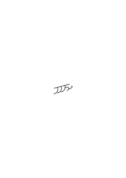
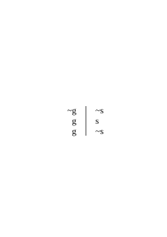
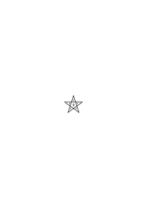
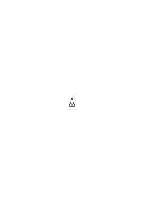
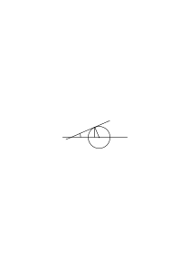
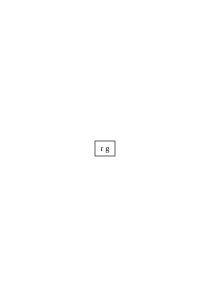
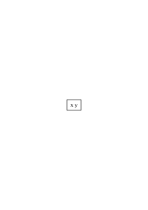
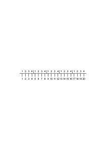
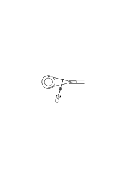

# Ms-127

### [IIr\[1\]](https://cdn.wittgensteinnachlass.com/2000px/webp/Ms-127/IIr.webp)

## F Mathematik & Logik

### [1\[1\]](https://cdn.wittgensteinnachlass.com/2000px/webp/Ms-127/1.webp)

06.01.1943

Schränken wir einen Ort nach & nach durch zwei Reihen von unvollständigen Dezimalbrüchen ein, die wir sowohl als die Reihung selbst nach & nach weiter führen (z.B. als das Ergebnis von Experimenten) dann kann man die Einschränkung des Orts durch _einen_ unvollständigen Dezimalbruch darstellen.

### [1\[2\]](https://cdn.wittgensteinnachlass.com/2000px/webp/Ms-127/1.webp)

Denk Dir die intensionale Allgemeinheit in Merkzeichen gebraucht.

### [1\[3\]](https://cdn.wittgensteinnachlass.com/2000px/webp/Ms-127/1.webp),[2\[1\]](https://cdn.wittgensteinnachlass.com/2000px/webp/Ms-127/2.webp)

Wenn man sagen wollte: es fehlt dem Begriff an Exaktheit & die extensionalen Pseudoerklärungen geben sie ihm nicht – nun was macht dieser Mangel an Exaktheit??

### [2\[2\]](https://cdn.wittgensteinnachlass.com/2000px/webp/Ms-127/2.webp)

Denke Dir eine Morphologie der Kurven, ohne Gleichungen oder dergl.

### [2\[3\]](https://cdn.wittgensteinnachlass.com/2000px/webp/Ms-127/2.webp),[3\[1\]](https://cdn.wittgensteinnachlass.com/2000px/webp/Ms-127/3.webp)

Von den Mathematikern kann man nur Mathematik lernen, aber nicht die Philosophie der Mathematik. Ich meine man kann ihnen nur absehen was sie treiben indem man ihnen zusieht aber ihnen nicht glauben, wenn sie darüber Rechenschaft ablegen.

### [3\[2\]](https://cdn.wittgensteinnachlass.com/2000px/webp/Ms-127/3.webp),[4\[1\]](https://cdn.wittgensteinnachlass.com/2000px/webp/Ms-127/4.webp)

In den allgemeinen intensionalen Sätzen von den Funktionen wird einerseits eine Technik des Rechnens festgehalten, die man dann auf ein gegebenes Beispiel anwenden kann; anderseits eine Teilung des Materials bewirkt in solches was sich mit dieser Formel behandeln läßt & solches was so nicht zu behandeln ist.

### [4\[2\]](https://cdn.wittgensteinnachlass.com/2000px/webp/Ms-127/4.webp)

Wie ist es also mit dem _Muß_ dieser allgemeinen Sätze?

### [4\[3\]](https://cdn.wittgensteinnachlass.com/2000px/webp/Ms-127/4.webp)

Nimm, an es gäbe nur _ein_ Beispiel & den allgemeinen Kalkül. –

### [4\[4\]](https://cdn.wittgensteinnachlass.com/2000px/webp/Ms-127/4.webp),[5\[1\]](https://cdn.wittgensteinnachlass.com/2000px/webp/Ms-127/5.webp)

07.01.1943

Aber es ist doch kein Zweifel, daß wir durch eine Reihe von Beispielen einen allgemeinen Begriff von einem ‘Prinzip der Zuordnung’, von einem ‘Prinzip der Teilung’, u.s.w., gewinnen! Das heißt doch: wir lernen durch diese Beispiele ein neues Sprachspiel; _ähnlich_ in gewissem Sinne dem _neue_ Multiplikationen auszuführen, wenn wir multiplizieren gelernt haben.

### [5\[2\]](https://cdn.wittgensteinnachlass.com/2000px/webp/Ms-127/5.webp),[6\[1\]](https://cdn.wittgensteinnachlass.com/2000px/webp/Ms-127/6.webp)

Wenn wir nun, wie ich vielleicht sagen möchte, einen unklaren Begriff von dem ‘Prinzip der Zuordnung’ (z.B.) haben, – kann, & soll, man ihn durch einen klarern ersetzen? Oder ist es gerade die Vagheit, die uns gute Dienste leistet?

### [6\[2\]](https://cdn.wittgensteinnachlass.com/2000px/webp/Ms-127/6.webp)

Der allgemeine Begriff einer Zuordnungs-Technik.

### [6\[3\]](https://cdn.wittgensteinnachlass.com/2000px/webp/Ms-127/6.webp),[7\[1\]](https://cdn.wittgensteinnachlass.com/2000px/webp/Ms-127/7.webp)

Denk' Dir daß die Menschen durch gewisse Zeichen etwa von der Art der Chinesischen Siegel dazu bewogen würden Ziffernfolgen hinzuschreiben & zwar alle Menschen übereinstimmend, wenn sie einmal erst durch eine Art Schulung gegangen sind. Dann können sie diese Ziffernfolgen, oder vielmehr die Zeichen, die ihre Fortführung leiten, als _Zahlen_ auffassen. Und es müßte auch da kein System solcher Zahlen geben.

### [7\[2\]](https://cdn.wittgensteinnachlass.com/2000px/webp/Ms-127/7.webp),[8\[1\]](https://cdn.wittgensteinnachlass.com/2000px/webp/Ms-127/8.webp)

Wie, wenn man die _reellen_ Zahlen nicht durch das Aufzeigen irrationaler Zahlen sondern einfach durch Umwandeln der _rationalen_ in reelle Zahlen einführte. (Diesen kann man dann immer die irrationalen Zahlen hinzufügen.) Und nun, ehe man noch von irrationalen Zahlen spricht, beweist man Dedekinds Satz!

### [8\[2\]](https://cdn.wittgensteinnachlass.com/2000px/webp/Ms-127/8.webp),[9\[1\]](https://cdn.wittgensteinnachlass.com/2000px/webp/Ms-127/9.webp)

Angenommen wir gäben einem Prinzip der Teilung aller reellen Zahlen einen Namen. Geben wir den Namen dem Prinzip der Teilung auf die rationalen Zahlen angewandt? Kann man die irrationalen Zahlen teilen als indem man die rationalen teilt. Denn bezieht sich die Teilung nicht nur über den Umweg der rationalen Zahlen auf die irrationalen, dann kann auch der Name eine ganz andere Zahlenart als die reelle bedeuten.

### [9\[2\]](https://cdn.wittgensteinnachlass.com/2000px/webp/Ms-127/9.webp)

Sagt die allgemeine intensionale Behandlung mit ihren Variablen nicht: “_so_ muß es ausschauen”?

### [10\[1\]](https://cdn.wittgensteinnachlass.com/2000px/webp/Ms-127/10.webp)

08.01.1943

Die extensionalen Erklärungen der Funktionen, der reellen Zahlen, etc. übergehen alles Intensionale – obwohl sie es voraussetzen – & beziehen sich auf die immer wiederkehrende äußere Form.

### [10\[2\]](https://cdn.wittgensteinnachlass.com/2000px/webp/Ms-127/10.webp)

Die Funktion hat sozusagen eine extensionale _Äußerung_.

### [10\[3\]](https://cdn.wittgensteinnachlass.com/2000px/webp/Ms-127/10.webp)

Der allgemeine Begriff der Funktion als heuristisches Prinzip.

### [11\[1\]](https://cdn.wittgensteinnachlass.com/2000px/webp/Ms-127/11.webp),[12\[1\]](https://cdn.wittgensteinnachlass.com/2000px/webp/Ms-127/12.webp)

Denken wir wieder an das Beispiel des Zaubers gewisser Symbole (etwa geschriebener) die die Menschen dazu bringen übereinstimmend Zahlenfolgen zu schreiben oder eine Zahl einer gegebenen anderen zuzuordnen. Es sei also y = f(x) und f =

,

& dies Symbol ist eines von denen welches uns einem beliebigen rationalen x ein y zuordnen läßt. Kann man nun mit diesem Begriff den Begriff <math class="stacked" display="inline"><mfrac linethickness="0"><mrow><mtext>lim</mtext></mrow><mrow><mtext>x→</mtext><mtext>∞</mtext></mrow></mfrac><mspace width="0.3em"/><mtext>f(</mtext><mtext>x)</mtext></math> bilden?

### [12\[2\]](https://cdn.wittgensteinnachlass.com/2000px/webp/Ms-127/12.webp),[13\[1\]](https://cdn.wittgensteinnachlass.com/2000px/webp/Ms-127/13.webp)

09.01.1943

Unsre Schwierigkeit fängt eigentlich schon mit der unendlichen Geraden an; obwohl wir schon als Knaben lernen, eine Gerade habe kein Ende, & ich weiß nicht, daß diese Idee irgend jemand Schwierigkeiten bereitet hätte. Wie, wenn ein Finitist versuchte diesen Begriff durch den einer geraden Strecke von bestimmter Länge zu ersetzen?!

Aber die Gerade ist ein _Gesetz_ des Fortschreitens.*

### [13\[2\]](https://cdn.wittgensteinnachlass.com/2000px/webp/Ms-127/13.webp)

Die Verteilung der Primzahlen wäre ein ideales Beispiel für das was man synthetisch a priori nennen könnte, denn man kann sagen, daß sie jedenfalls durch eine Analyse des Begriffs der Primzahl nicht zu finden ist.

### [13\[3\]](https://cdn.wittgensteinnachlass.com/2000px/webp/Ms-127/13.webp),[14\[1\]](https://cdn.wittgensteinnachlass.com/2000px/webp/Ms-127/14.webp)

Die Allgemeinheit der Funktionen ist sozusagen eine _ungeordnete_ Allgemeinheit. Und unsere Mathematik ist auf so eine ungeordnete Allgemeinheit aufgebaut.

### [14\[2\]](https://cdn.wittgensteinnachlass.com/2000px/webp/Ms-127/14.webp)

10.01.1943

Ich lese in “Chemical History of a Candle”: “Water is one individual thing – it never changes”.

### [14\[3\]](https://cdn.wittgensteinnachlass.com/2000px/webp/Ms-127/14.webp),[15\[1\]](https://cdn.wittgensteinnachlass.com/2000px/webp/Ms-127/15.webp)

Denken wir uns das Zeichen “<math display="inline"><mtext><mtext>ℵ</mtext></mtext></math>”, dessen Physiognomie ich immer wiedererkennen kann (so nehme ich an) gebe uns Allen die gleiche endlose Folge von 0 & 1 ein, entspricht also einem unendlichen Dezimalbruch. Wir behandeln daher dieses Zeichen als ein Zahl-Zeichen.

### [15\[2\]](https://cdn.wittgensteinnachlass.com/2000px/webp/Ms-127/15.webp)

Du kannst über die reellen Zahlen nicht in's Klare kommen außer über den Begriff der Technik. Denn sie sind ja Techniken der Entwickelung (oder Zuordnung).

### [15\[3\]](https://cdn.wittgensteinnachlass.com/2000px/webp/Ms-127/15.webp),[16\[1\]](https://cdn.wittgensteinnachlass.com/2000px/webp/Ms-127/16.webp),[17\[1\]](https://cdn.wittgensteinnachlass.com/2000px/webp/Ms-127/17.webp)

Was, wenn die irrationalen Zahlen _Seltenheiten_ unter den rationalen wären? So daß man etwa sagen könnte: unter den rationalen Zahlen gibt es verstreut 50 irrationale. Oder auch: es gibt 50 _Reihen_ irrationaler Zahlen. Warum sollte man ihnen in diesem Falle einen gemeinsamen Gattungsnamen geben? – Ja – man _könnte_ es tun. Und was wäre die Ähnlichkeit die einen dazu bewegte?

Nun die Techniken _haben_ eine äußere Ähnlichkeit. (Gleichsam wie Apparate, oder Futterale von Apparaten.) _Eine_ Ähnlichkeit ist natürlich, daß jede von ihnen eine besondere & immer gleichbleibende Zahlenfolge erzeugt.

### [17\[2\]](https://cdn.wittgensteinnachlass.com/2000px/webp/Ms-127/17.webp)

Der Begriff des Limes & der Stätigkeit, wie sie heute eingeführt werden, hängen, ohne daß dies ausgesprochen wird mit dem Begriff des _Beweises_ zusammen. Denn wir sagen <math class="stacked" display="inline"><mfrac linethickness="0"><mrow><mtext>lim</mtext></mrow><mrow><mtext>x→</mtext><mtext>∞</mtext></mrow></mfrac><mspace width="0.3em"/><mtext>f(</mtext><mtext>x)</mtext><mspace width="0.3em"/><mo>=</mo><mspace width="0.3em"/><mtext>ℓ</mtext></math>, wenn _bewiesen_ werden kann, daß … Das heißt, wir gebrauchen Begriffe, die unendlich viel schwerer zu fassen sind als die, die wir offen herzeigen.

### [17\[3\]](https://cdn.wittgensteinnachlass.com/2000px/webp/Ms-127/17.webp),[18\[1\]](https://cdn.wittgensteinnachlass.com/2000px/webp/Ms-127/18.webp)

Die Definition der Kontinuität hat zwar eine extensionale Illustration aber nicht eine extensionale _Anwendung_. Eine Gerade der ein Punkt fehlt – – –

### [18\[2\]](https://cdn.wittgensteinnachlass.com/2000px/webp/Ms-127/18.webp)

Kann denn aber eine Erlaubnis nicht kontinuierlich sein?

### [18\[3\]](https://cdn.wittgensteinnachlass.com/2000px/webp/Ms-127/18.webp),[19\[1\]](https://cdn.wittgensteinnachlass.com/2000px/webp/Ms-127/19.webp)

Denk Dir eine Maschine: wenn ich in sie Zahlwörter hineinspreche, so gibt sie mir Zahlwörter zur Antwort. Und ein Mensch kann ja so eine Maschine sein. Denn die Rechnung, durch die er etwa seine Antwort erhält braucht mich nichts anzugehen & ich brauche sie nicht zu verstehen.

### [19\[2\]](https://cdn.wittgensteinnachlass.com/2000px/webp/Ms-127/19.webp),[20\[1\]](https://cdn.wittgensteinnachlass.com/2000px/webp/Ms-127/20.webp)

Könnte man nun durch _Beobachtung_ solcher Maschinen zu den Begriffen des Limes, der Kontinuität etc. gelangen, – wenn auch nur, zur Bildung von _Hypothesen_ über ihr Verhalten? Hätte es z.B. Sinn von einer solchen Maschine zu sagen daß sie, so & so eingestellt, auf ins Unbegrenzte wachsende Zahlen, mit Zahlen antwortet die sich unbegrenzt der 0 nähern.

Könnte man, z.B., das Verhalten so einer Maschine hypothetisch dahin beschreiben daß sie unbegrenzt auf Zahlen, je größer diese werden mit Zahlen antwortet die sich mehr & mehr der Null nähern.

### [20\[2\]](https://cdn.wittgensteinnachlass.com/2000px/webp/Ms-127/20.webp),[21\[1\]](https://cdn.wittgensteinnachlass.com/2000px/webp/Ms-127/21.webp),[21\[2\]](https://cdn.wittgensteinnachlass.com/2000px/webp/Ms-127/21.webp),[22\[1\]](https://cdn.wittgensteinnachlass.com/2000px/webp/Ms-127/22.webp)

12.01.1943

Die irreführende Idee in der D'schen extensionalen Auffassung ist, daß die reellen Zahlen in der Zahlenlinie alle ausgebreitet da liegen. – Man kennt sie nicht alle, aber was macht das? Und so braucht man nur zu schneiden, oder in Klassen teilen & hat sie alle geteilt, die bekannten & die unbekannten.

Das Irreführende an der D'schen extensionalen Auffassung ist die Idee daß die reellen Zahlen in der Zahlenlinie ausgebreitet daliegen. Man mag sie kennen oder nicht; das macht nichts. Und so braucht man nur zu schneiden, oder in Klassen teilen & has dealt with them all.

### [22\[2\]](https://cdn.wittgensteinnachlass.com/2000px/webp/Ms-127/22.webp),[23\[1\]](https://cdn.wittgensteinnachlass.com/2000px/webp/Ms-127/23.webp)

Es ist durch die _Kombination_ der _Rechnung & der Konstruktion_, daß man die Idee erhält es müßte auf der Geraden ein Punkt ausgelassen werden, nämlich P,

wenn man nicht die √2 als ein Maß der Entfernung von O zuließe. ‘Denn, wenn ich wirklich genau konstruierte, so müßte dann der Kreis die Gerade _zwischen_ ihren Punkten hindurch schneiden’.

### [23\[2\]](https://cdn.wittgensteinnachlass.com/2000px/webp/Ms-127/23.webp)

Das ist ein schrecklich verwirrendes Bild.

### [23\[3\]](https://cdn.wittgensteinnachlass.com/2000px/webp/Ms-127/23.webp)

15.01.1943

Die irrationalen Zahlen sind – könnte man sagen – Einzelfälle.

### [23\[4\]](https://cdn.wittgensteinnachlass.com/2000px/webp/Ms-127/23.webp)

Warum sollte ich nicht die Regeln welche alle die gleiche Entwicklung ergeben in größere & kleinere teilen?

### [24\[1\]](https://cdn.wittgensteinnachlass.com/2000px/webp/Ms-127/24.webp)

18.01.1943

Was ist die _Anwendung_ des Begriffes der Geraden, der ein Punkt fehlt? Die Anwendung muß ‘hausbacken’ sein. Der Ausdruck “Gerade, der ein Punkt fehlt” ist ein fürchterlich irreleitendes Bild. Der klaffende Spalt zwischen Illustration & Anwendung.

### [24\[2\]](https://cdn.wittgensteinnachlass.com/2000px/webp/Ms-127/24.webp),[25\[1\]](https://cdn.wittgensteinnachlass.com/2000px/webp/Ms-127/25.webp)

19.01.1943

Soll man sagen, zur Beurteilung der Kontinuität einer Kurve sei die x- & y-Achse das Vergleichsobjekt? Das heißt, gleichsam: was so ist wie die x-Achse, ist kontinuierlich.

### [25\[2\]](https://cdn.wittgensteinnachlass.com/2000px/webp/Ms-127/25.webp)

Oder wie, wenn ich Stätigkeit der Bewegung auf der x-Achse definierte?

Diese ‘Bewegung’ eines Punktes auf der x-Achse würde einer Zahlenfolge entsprechen mit einem Zeichen, welches anzeigen soll, daß die Pfeile zusammenhängen. (Also z.B. [C; 0,7,1,4,2,5˙5,4˙2])

### [25\[3\]](https://cdn.wittgensteinnachlass.com/2000px/webp/Ms-127/25.webp),[26\[1\]](https://cdn.wittgensteinnachlass.com/2000px/webp/Ms-127/26.webp)

Kann man als Hypothese annehmen, ein Vorgang werde ohne Ende weiterlaufen? Kann man also z.B. von meinen Rechenmaschinen _annehmen_, sie werden, wenn nichts sie stört, ohne Ende Ziffern auf Ziffern liefern?

### [26\[2\]](https://cdn.wittgensteinnachlass.com/2000px/webp/Ms-127/26.webp),[27\[1\]](https://cdn.wittgensteinnachlass.com/2000px/webp/Ms-127/27.webp)

Wenn man den allgemeinen Kalkül der Funktionen als die allgemeine Form einer Menge existierender Beispiele, & anderseits als einen Standard zur Klassifikation noch zu erwartender auffaßt –, so erhebt sich die Frage: wie, wenn es, im extremen Fall, _gar keine_ Beispiele gäbe? Welche Rolle könnte _dann_ ein allgemeiner Funktionen-Kalkül spielen?

### [27\[2\]](https://cdn.wittgensteinnachlass.com/2000px/webp/Ms-127/27.webp),[28\[1\]](https://cdn.wittgensteinnachlass.com/2000px/webp/Ms-127/28.webp)

20.01.1943

Denk' Dir jemand hätte vor 2000 Jahren die _Form_

erfunden & gesagt, sie werde einmal die Form eines Instruments der Fortbewegung sein. Oder vielleicht: es hätte jemand den vollständigen _Mechanismus_ der Dampfmaschine konstruiert, ohne die geringste Ahnung, wie er als Motor benützt werden könnte

### [28\[2\]](https://cdn.wittgensteinnachlass.com/2000px/webp/Ms-127/28.webp)

Warum sollte Einer nicht den Russellschen Kalkül erfunden haben können ehe man die Verwendung kannte, die er später erhielt?

### [28\[3\]](https://cdn.wittgensteinnachlass.com/2000px/webp/Ms-127/28.webp),[29\[1\]](https://cdn.wittgensteinnachlass.com/2000px/webp/Ms-127/29.webp)

Was für Sätze widersprechen sich denn im Russellschen Widerspruch? Erfahrungssätze? Mathematische Sätze?

### [29\[2\]](https://cdn.wittgensteinnachlass.com/2000px/webp/Ms-127/29.webp)

Ich sage: Als Abkürzung für ‘~f(f)’ führe ich ‘F(f)’ ein– – dann muß ich folgerecht ‘~F(F)’ abkürzen: ‘F(F)’. D.h., diese Abkürzung führt zu der, das Verneinungszeichen in einem Satz _auszulassen_. Oder, wenn Du willst, dazu: den positiven & den negativen Satz gleich zu schreiben.

### [30\[1\]](https://cdn.wittgensteinnachlass.com/2000px/webp/Ms-127/30.webp)

‘<math class="stacked" display="inline"><mfrac linethickness="0"><mrow><mtext>lim</mtext></mrow><mrow><mtext>n→</mtext><mtext>∞</mtext></mrow></mfrac><mspace width="0.3em"/><mtext>Φ(</mtext><mtext>n)</mtext><mspace width="0.3em"/><mo>=</mo><mspace width="0.3em"/><mtext>ℓ</mtext></math>’ heißt: Es gibt beweisbar _algebraisch_ für beliebiges δ eine Funktion

g(δ), so daß

❘Φ(n) ‒ ℓ❘ < δ,

für jedes n ≧ g(δ)

### [30\[2\]](https://cdn.wittgensteinnachlass.com/2000px/webp/Ms-127/30.webp),[31\[1\]](https://cdn.wittgensteinnachlass.com/2000px/webp/Ms-127/31.webp)

‘<math class="stacked" display="inline"><mfrac linethickness="0"><mrow><mtext>lim</mtext></mrow><mrow><mtext>n→</mtext><mtext>∞</mtext></mrow></mfrac><mspace width="0.3em"/><mtext>Φ(</mtext><mtext>n)</mtext><mspace width="0.3em"/><mo>=</mo><mspace width="0.3em"/><mtext>ℓ</mtext></math>’ heißt: Zwischen zwei Funktionen, Φ(n) & g(x), besteht die Relation: Wenn n ≧ g(x) ist, ist

❘Φ(n) ‒ ℓ❘ < x

### [31\[2\]](https://cdn.wittgensteinnachlass.com/2000px/webp/Ms-127/31.webp)

<math display="block">
  <mspace width="0.3em"/>
  <mtext>❘</mtext>
  <mtext>Φ(</mtext>
  <mfrac linethickness="0">
    <mrow>
      <mtext>g(</mtext>
      <mtext>x)</mtext>
      <mspace width="0.3em"/>
      <mtext>≦</mtext>
    </mrow>
    <mrow>
      <mi>n</mi>
    </mrow>
  </mfrac>
  <mo>)</mo>
  <mspace width="0.3em"/>
  <mtext>‒</mtext>
  <mspace width="0.3em"/>
  <mtext>ℓ❘</mtext>
  <mspace width="0.3em"/>
  <mtext>
    <</mtext>
      <mspace width="0.3em"/>
      <mi>x</mi>
    </math>

### [31\[3\]](https://cdn.wittgensteinnachlass.com/2000px/webp/Ms-127/31.webp)

Eigentlich ist der Ausdruck “<math class="stacked" display="inline"><mfrac linethickness="0"><mrow><mtext>lim</mtext></mrow><mrow><mtext>n→</mtext><mtext>∞</mtext></mrow></mfrac><mspace width="0.3em"/><mtext>Φ(</mtext><mtext>n)</mtext><mspace width="0.3em"/><mo>=</mo><mspace width="0.3em"/><mtext>ℓ</mtext></math>” nur dann _treffend_, wenn die Bedingung gegeben ist, daß für kein n φ(n) = ℓ wird.

### [31\[4\]](https://cdn.wittgensteinnachlass.com/2000px/webp/Ms-127/31.webp),[32\[1\]](https://cdn.wittgensteinnachlass.com/2000px/webp/Ms-127/32.webp)

Wenn man sich den allgemeinen Funktionen-Kalkül ohne die Existenz von Beispielen denkt, dann sind eben die vagen Erklärungen durch Wertetafeln & Zeichnungen, wie man sie in den Lehrbüchern findet, am Platz, als _Andeutungen_, wie etwa diesem Kalkül einmal ein Sinn gegeben werden möchte.

### [32\[2\]](https://cdn.wittgensteinnachlass.com/2000px/webp/Ms-127/32.webp)

Denk' Dir Einer sagte: “Ich will eine Komposition hören, die _so_ geht:”

### [32\[3\]](https://cdn.wittgensteinnachlass.com/2000px/webp/Ms-127/32.webp),[33\[1\]](https://cdn.wittgensteinnachlass.com/2000px/webp/Ms-127/33.webp)

Müßte das unsinnig sein? Könnte es nicht eine Komposition geben von der sich zeigen ließe daß sie, in irgend einem wichtigen Sinne, dieser Linie entspräche?

### [33\[2\]](https://cdn.wittgensteinnachlass.com/2000px/webp/Ms-127/33.webp)

21.01.1943

Eine Definition ist doch gewiß eine Begriffsbestimmung – aber wie ist es mit dem bloßen Schema einer Definition.

### [33\[3\]](https://cdn.wittgensteinnachlass.com/2000px/webp/Ms-127/33.webp)

Eine Definition muß nicht zur Verkürzung eines Zeichenausdrucks dienen. Sie könnte auch zur Verlängerung oder zur Ersetzung durch ein schöneres Zeichen dienen.

### [34\[1\]](https://cdn.wittgensteinnachlass.com/2000px/webp/Ms-127/34.webp)

Könnte man sich die Definition im Kalkül nicht ausgelassen denken – & nur die Substitution die ihr entspricht gemacht & nur etwa mit dem Vermerk, dies möge eine gestattete Substitution sein?

### [34\[2\]](https://cdn.wittgensteinnachlass.com/2000px/webp/Ms-127/34.webp)

‘Wer dieser Regel folgt, der folgt auch einer Regel, …’ Z.B.: ‘der folgt auch einer Regel, die verbietet, daß …’

### [34\[3\]](https://cdn.wittgensteinnachlass.com/2000px/webp/Ms-127/34.webp),[35\[1\]](https://cdn.wittgensteinnachlass.com/2000px/webp/Ms-127/35.webp)

22.01.1943

Wer eine neue Regel einführt, der führt einen neuen Begriff ein. Denn die neue Regel ist eine neue Art die Dinge zu sehen. –

### [35\[2\]](https://cdn.wittgensteinnachlass.com/2000px/webp/Ms-127/35.webp)

Ein unentschiedener Satz der Mathematik ist ein Satz der weder als Regel noch als das Gegenteil einer Regel anerkannt ist & der die Form einer mathem. Regel hat. – Was heißt aber dies letztere? Ist es ein klar umschriebener Begriff?

### [36\[1\]](https://cdn.wittgensteinnachlass.com/2000px/webp/Ms-127/36.webp)

Denke dir den <math class="stacked" display="inline"><mfrac linethickness="0"><mrow><mtext>lim</mtext></mrow><mrow><mtext>n→</mtext><mtext>∞</mtext></mrow></mfrac><mspace width="0.3em"/><mtext>Φ(</mtext><mtext>n)</mtext><mspace width="0.3em"/><mo>=</mo><mspace width="0.3em"/><mtext>ℓ</mtext></math> als eine Eigenschaft eines Musikstückes (etwa). Aber natürlich nicht _so_, daß das Stück unendlich weiterliefe, sondern als eine dem Ohr erkennbare Eigenschaft (gleichsam _algebraische_ Eigenschaft) des Stückes.

### [36\[2\]](https://cdn.wittgensteinnachlass.com/2000px/webp/Ms-127/36.webp),[37\[1\]](https://cdn.wittgensteinnachlass.com/2000px/webp/Ms-127/37.webp)

Oder wie, wenn man die Stätigkeit als Eigenschaft des Zeichens “x² + y² = z²” ansähe – natürlich nur, wenn diese Gleichung & andere _gewohnheitsmäßig_ einer bestimmten Art der Prüfung unterzogen würden. ‘_So_ stellt sich diese Regel (Gleichung) zu dieser bestimmten Prüfung.’ Eine Prüfung die mit einem Streifblick auf eine Art Extension geschieht.

### [37\[2\]](https://cdn.wittgensteinnachlass.com/2000px/webp/Ms-127/37.webp),[38\[1\]](https://cdn.wittgensteinnachlass.com/2000px/webp/Ms-127/38.webp)

Es wird bei jener Prüfung der Gleichung etwas vorgenommen was mit gewissen Extensionen zusammenhängt. Aber nicht als handelte es sich da um eine Extension, die der Gleichung selbst irgendwie äquivalent wäre. Es wird nur auf gewisse Extensionen sozusagen, angespielt. – Nicht die Extension ist hier das Eigentliche, das nur faute de mieux intensional beschrieben wird; sondern die _Intension_ wird beschrieben – oder dargestellt – vermittels gewisser Extensionen, die sich da & dort aus ihr ergeben.

### [38\[2\]](https://cdn.wittgensteinnachlass.com/2000px/webp/Ms-127/38.webp),[39\[1\]](https://cdn.wittgensteinnachlass.com/2000px/webp/Ms-127/39.webp)

Der Verlauf gewisser Extensionen wirft ein _Streiflicht_ auf die algebraische Eigenschaft der Funktion. In diesem Sinne könnte man also sagen, es werfe die Zeichnung einer Hyperbel ein Streiflicht auf die Hyperbelgleichung.

### [39\[2\]](https://cdn.wittgensteinnachlass.com/2000px/webp/Ms-127/39.webp)

Dem widerspricht nicht, daß jene Extensionen die wichtigste Anwendung der Regel wären; denn es ist _eines_ eine Ellipse zeichnen, & ein anderes, sie _mittels ihrer Gleichung_ konstruieren.

### [39\[3\]](https://cdn.wittgensteinnachlass.com/2000px/webp/Ms-127/39.webp),[40\[1\]](https://cdn.wittgensteinnachlass.com/2000px/webp/Ms-127/40.webp)

25.01.1943

Wie, wenn ich sagte: Die extensionalen Überlegungen (z.B. der Heine-Borelsche Satz) zeigen: _so_ sollen die Intensionen behandelt werden.

### [40\[2\]](https://cdn.wittgensteinnachlass.com/2000px/webp/Ms-127/40.webp)

Das Theorem gibt uns, in großen Zügen, eine Methode, wie mit Intensionen zu verfahren ist. Es sagt etwa: ‘_So_ wird es ausschauen müssen’.

### [40\[3\]](https://cdn.wittgensteinnachlass.com/2000px/webp/Ms-127/40.webp),[41\[1\]](https://cdn.wittgensteinnachlass.com/2000px/webp/Ms-127/41.webp)

Und man wird dann etwa zu einem Verfahren mit bestimmten Intensionen eine bestimmte Illustration zeichnen können. Die Illustration ist ein Zeichen, eine Beschreibung, die besonders übersichtlich, einprägsam, ist.

### [41\[2\]](https://cdn.wittgensteinnachlass.com/2000px/webp/Ms-127/41.webp)

Die Illustration wird hier eben ein _Verfahren_ angeben.

### [41\[3\]](https://cdn.wittgensteinnachlass.com/2000px/webp/Ms-127/41.webp)

Eine _Prozedur._

### [41\[4\]](https://cdn.wittgensteinnachlass.com/2000px/webp/Ms-127/41.webp),[42\[1\]](https://cdn.wittgensteinnachlass.com/2000px/webp/Ms-127/42.webp)

26.01.1943

Lehre, wie Figuren in einem Bilde (Gemälde) zu _placieren_ sind, – aus allgemeinen ästhetischen Rücksichten etwa – _abgesehen davon_, ob diese Figuren nun kämpfen, oder einander liebkosen, etc..

### [42\[2\]](https://cdn.wittgensteinnachlass.com/2000px/webp/Ms-127/42.webp)

Die Lehre von den Funktionen als ein (allgemeines) Schema, in das, einerseits, eine Unmenge von Beispielen paßt, & das, anderseits, als ein Standard zur Klassifikation von Fällen aufgestellt ist.

### [42\[3\]](https://cdn.wittgensteinnachlass.com/2000px/webp/Ms-127/42.webp),[43\[1\]](https://cdn.wittgensteinnachlass.com/2000px/webp/Ms-127/43.webp)

Das Irreführende der üblichen Darstellung besteht darin, daß es scheint, als ließe sich die allgemeine auch ohne alle Beispiele, ohne einen Gedanken an Intension**en** (im Plural) ganz verstehen, da sich eigentlich alles extensional abmachen ließe, wenn es aus äußeren Gründen nicht unmöglich wäre.

### [43\[2\]](https://cdn.wittgensteinnachlass.com/2000px/webp/Ms-127/43.webp)

27.01.1943

Vergleiche die beiden Formen der Erklärung:

“Wir sagen <math class="stacked" display="inline"><mfrac linethickness="0"><mrow><mtext>lim</mtext></mrow><mrow><mtext>nx→</mtext><mtext>∞</mtext></mrow></mfrac><mspace width="0.3em"/><mtext>Φ(</mtext><mi>x</mi><mo>)</mo><mspace width="0.3em"/><mo>=</mo><mspace width="0.3em"/><mi>L</mi></math>,

_wenn es sich zeigen läßt_, daß ‥‥”, & “<math class="stacked" display="inline"><mfrac linethickness="0"><mrow><mtext>lim</mtext></mrow><mrow><mtext>n→</mtext><mtext>∞</mtext></mrow></mfrac><mspace width="0.3em"/><mtext>Φ(</mtext><mtext>n)</mtext><mspace width="0.3em"/><mo>=</mo><mspace width="0.3em"/><mi>L</mi></math> heißt:

_es gibt für jedes_ ε ein δ‥‥”

### [43\[3\]](https://cdn.wittgensteinnachlass.com/2000px/webp/Ms-127/43.webp),[44\[1\]](https://cdn.wittgensteinnachlass.com/2000px/webp/Ms-127/44.webp)

Die Möglichkeit der math. Induktion liegt im Wesen der _Regel_ & der Technik, einer Regel zu folgen.

### [44\[2\]](https://cdn.wittgensteinnachlass.com/2000px/webp/Ms-127/44.webp)

Nach einer allgemeinen Darstellung der Lehre vom Limes (z.B.) könnte man sagen: ‘Du wirst nun sehen, _wie fruchtbar_ diese Überlegungen sind’. – Denn sie bringen, sozusagen, unerwartete Früchte.

### [44\[3\]](https://cdn.wittgensteinnachlass.com/2000px/webp/Ms-127/44.webp)

“Ich kann jedes ∆ durch ein n² übersteigen” – was für eine Art Satz ist das?

### [45\[1\]](https://cdn.wittgensteinnachlass.com/2000px/webp/Ms-127/45.webp)

Man kann sich dabei einfach die unendliche Extension der Quadrate vorstellen, oder aber auch die Methode, zu jeder Zahl eine zu finden deren Quadrat sie übersteigt.

### [45\[2\]](https://cdn.wittgensteinnachlass.com/2000px/webp/Ms-127/45.webp),[46\[1\]](https://cdn.wittgensteinnachlass.com/2000px/webp/Ms-127/46.webp)

Der Ausdruck “wie groß auch immer” & das “→ ∞” beziehen sich auf eine bestimmte Verwendungsweise. Wenn man nämlich sagen will: Je weiter Du (auf der x-Achse) gehst desto mehr nähert sich die Kurve der Linie … ohne sie aber zu erreichen; gehst Du noch weiter, so wird die Kurve ihr _noch_ näher kommen. Endlich werden deine Augen auslassen & die Annäherung nicht mehr erkennen lassen.

### [46\[2\]](https://cdn.wittgensteinnachlass.com/2000px/webp/Ms-127/46.webp),[47\[1\]](https://cdn.wittgensteinnachlass.com/2000px/webp/Ms-127/47.webp)

28.01.1943

Das Erreichen der Genauigkeitsgrenze ist mit bestimmten Phänomenen verbunden. D.h., es gewährt ein gewisses Bild, sieht so & so aus.

### [47\[2\]](https://cdn.wittgensteinnachlass.com/2000px/webp/Ms-127/47.webp)

Wie soll es heißen: –

a) ‘<math class="stacked" display="inline"><mo>(</mo><mtext>u)</mtext><mspace width="0.3em"/><mtext>∙</mtext><mspace width="0.3em"/><mo>(</mo><mo>∃</mo><mtext>n)</mtext><mspace width="0.3em"/><mtext>∙</mtext><mfrac><mrow><mn>1</mn></mrow><mrow><mtext>2n</mtext></mrow></mfrac><mspace width="0.3em"/><mtext><</mtext><mspace width="0.3em"/><mi>u</mi></math>’, oder

b) ‘für jedes u läßt sich ein n finden, für welches <math class="stacked" display="inline"><mfrac><mrow><mn>1</mn></mrow><mrow><mtext>2n</mtext></mrow></mfrac><mspace width="0.3em"/><mtext><</mtext><mspace width="0.3em"/><mi>u</mi></math>’?

### [47\[3\]](https://cdn.wittgensteinnachlass.com/2000px/webp/Ms-127/47.webp)

Vor allem: der zweite Satz ist auch ein _mathematischer_ Satz. Denn er bezieht sich nicht auf den gegenwärtigen Stand unserer Kenntnis, sondern auf bestimmte mathem. Methoden.

### [47\[4\]](https://cdn.wittgensteinnachlass.com/2000px/webp/Ms-127/47.webp),[48\[1\]](https://cdn.wittgensteinnachlass.com/2000px/webp/Ms-127/48.webp),[49\[1\]](https://cdn.wittgensteinnachlass.com/2000px/webp/Ms-127/49.webp)

01.02.1943

Ein Beweis, daß 777 in der Entwicklung von π vorkommt, der nicht zeigt, wo, müßte diese Entwicklung von einem ganz neuen Standpunkt ansehen, sodaß er etwa Eigenschaften von Regionen der Entwickelung zeigte von denen wir nur wüßten, daß sie sehr weit entfernt liegen. Es schwebt mir dabei vor daß man sehr weit draußen in π sozusagen eine dunkle Zone von unbestimmter Länge annehmen müßte, wo unsere Rechenhilfsmittel nicht mehr verläßlich sind & noch weiter draußen dann eine Zone, wo man auf _andere_ Weise wieder etwas sehen kann.

### [49\[2\]](https://cdn.wittgensteinnachlass.com/2000px/webp/Ms-127/49.webp)

02.02.1943

Eine Ziffernreihe die nach einem quasi ästhetischen Prinzip fortgesetzt wird. Gegeben ist etwa der Anfang 4831, & nun fragt man: ‘was für eine weitere Ziffer _fordert_ diese Zifferngruppe?’

### [49\[3\]](https://cdn.wittgensteinnachlass.com/2000px/webp/Ms-127/49.webp),[50\[1\]](https://cdn.wittgensteinnachlass.com/2000px/webp/Ms-127/50.webp)

Denk Dir eine Regel, die uns, sozusagen, viel zu hoch ist.

(Wie wir etwa ein Musikstück nicht verstehen.)

### [50\[2\]](https://cdn.wittgensteinnachlass.com/2000px/webp/Ms-127/50.webp)

Der Begriff der Funktion, wie er eingeführt wird, setzt einen Begriff der _mathematischen_ Operation, oder Ableitung voraus, der zwar durch Beispiele illustriert aber nicht irgendwo scharf gefaßt wurde. Es soll ja eine _mathematische_ Abhängigkeit sein.

### [50\[3\]](https://cdn.wittgensteinnachlass.com/2000px/webp/Ms-127/50.webp),[51\[1\]](https://cdn.wittgensteinnachlass.com/2000px/webp/Ms-127/51.webp)

03.02.1943

Das Benehmen eines Stammes, der nach den _äußeren_ Symptomen zu urteilen, Rechnungen ausführt, die uns aber ganz unverständlich sind.

### [51\[2\]](https://cdn.wittgensteinnachlass.com/2000px/webp/Ms-127/51.webp)

Farben als Argumente & Funktionswerte.

### [51\[3\]](https://cdn.wittgensteinnachlass.com/2000px/webp/Ms-127/51.webp)

Beispiele nur um der Phantasie zu helfen. Gleichsam, damit das Schema nicht gänzlich trocken ist.

### [51\[4\]](https://cdn.wittgensteinnachlass.com/2000px/webp/Ms-127/51.webp)

Denk wieder daran, wieviel Sinn noch in einem Unsinn-Gedicht liegt!

### [52\[1\]](https://cdn.wittgensteinnachlass.com/2000px/webp/Ms-127/52.webp)

22.02.1943

Ich möchte sagen, daß die sog. Teilung der reellen Zahlen, also der Regeln zur Erzeugung etc., den Begriff solcher Regeln _weiter **bestimmt**_.

### [52\[2\]](https://cdn.wittgensteinnachlass.com/2000px/webp/Ms-127/52.webp),[53\[1\]](https://cdn.wittgensteinnachlass.com/2000px/webp/Ms-127/53.webp)

Etwa so: ‘Es ist natürlich, zu sagen, daß alles was wir eine solche Regel nennen können rechts oder links von diesem Punkte liegen wird’. Oder: ‘Eine weitere Bestimmung des Begriffes einer solchen Regel ist es, daß sie rechts oder links von diesem Punkte liegen muß’.

### [53\[2\]](https://cdn.wittgensteinnachlass.com/2000px/webp/Ms-127/53.webp),[54\[1\]](https://cdn.wittgensteinnachlass.com/2000px/webp/Ms-127/54.webp)

23.02.1943

Der Cantorsche Diagonal-Beweis – auch wenn man ihn so formuliert, daß er für ein _bestimmtes_ System unendlicher Dezimalbrüche zeigt, daß es Dezimalbrüche außerhalb des Systems gibt – kann doch als Beweis _alle_ Regeln betreffend aufgefaßt werden, die unendliche Dezimalbrüche erzeugen. D.h., die Unbestimmtheit des Begriffes solcher Regeln scheint uns hier nicht zu stören. Wenn der Beweis gezeigt hat, daß man aus dem System der Regeln √2, (√2)³, (√2)⁵, … eine Regel ableiten kann die nicht zum System gehört, dann wollen wir sagen: “& das muß also für alle Systeme solcher Regeln gelten”. –

### [54\[2\]](https://cdn.wittgensteinnachlass.com/2000px/webp/Ms-127/54.webp)

Aber warum _muß_ es? Wie zeigt der Beweis das?

### [54\[3\]](https://cdn.wittgensteinnachlass.com/2000px/webp/Ms-127/54.webp),[55\[1\]](https://cdn.wittgensteinnachlass.com/2000px/webp/Ms-127/55.webp)

Man möchte sagen: “Was der Beweis zeigt gilt für _jedes_ System von Regeln, nicht für ‘_alle_ Systeme’”. Und ebenso: “_Jede_ Regel wird (oder muß) rechts oder links …liegen”, nicht: “Alle Regeln …”. Aber was bedeutet diese Wahl des Ausdrucks?

### [55\[2\]](https://cdn.wittgensteinnachlass.com/2000px/webp/Ms-127/55.webp)

Man will etwa sagen: “Für alles, was man eine ‘Regel’ nennen kann, muß _das_ gelten”. Das hieße, man will die Begriffsbestimmung von einer Aussage, die den Begriff verwendet, trennen.

### [55\[3\]](https://cdn.wittgensteinnachlass.com/2000px/webp/Ms-127/55.webp),[56\[1\]](https://cdn.wittgensteinnachlass.com/2000px/webp/Ms-127/56.webp),[57\[1\]](https://cdn.wittgensteinnachlass.com/2000px/webp/Ms-127/57.webp)

24.02.1943

Warum die Parteilichkeit für “irgendein” & gegen “alle”. Die Antwort kommt gewöhnlich darauf hinaus daß “alle” ein falsches _Bild_ heraufbeschwört. Man sagt, das Wort “alle” lasse es so erscheinen, als ob die Regeln (z.B.) alle schon vor uns lägen, wie Äpfel in einer Kiste, und dergl.. Aber was schadet dieses Bild? Regeln sind ja nicht wie Äpfel & sind auch in keiner Art von Kiste, also kann das Bild so keine Verwirrung erzeugen. Es wäre dann höchstens kindisch & unnütz. – Wie aber ist es _irreführend_?

### [57\[2\]](https://cdn.wittgensteinnachlass.com/2000px/webp/Ms-127/57.webp)

Was schadet es, z.B., zu sagen, Gott kenne _alle_ irrationalen Zahlen? Oder: sie seien schon alle da, wenn wir auch nur gewisse kennen? Warum sind diese Bilder nicht harmlos?

### [57\[3\]](https://cdn.wittgensteinnachlass.com/2000px/webp/Ms-127/57.webp)

Einmal verstecken sie gewisse Probleme.

### [57\[4\]](https://cdn.wittgensteinnachlass.com/2000px/webp/Ms-127/57.webp),[58\[1\]](https://cdn.wittgensteinnachlass.com/2000px/webp/Ms-127/58.webp),[58\[2\]](https://cdn.wittgensteinnachlass.com/2000px/webp/Ms-127/58.webp),[59\[1\]](https://cdn.wittgensteinnachlass.com/2000px/webp/Ms-127/59.webp)

Dedekind gibt ein allgemeines Schema der Ausdrucksweise; sozusagen eine logische Form des Raisonnements. Eine allgemeine Formulierung des Vorgangs. Der Effekt ist ein ähnlicher, wie der der Einführung des Wortes “Zuordnung” zur allgemeinen Erklärung der Funktionen. Es wird eine allgemeine Redeweise eingeführt, die zur Charakterisierung eines mathem. Vorgangs sehr nützlich ist. (Ähnlich wie in der Aristotelischen Logik). Die Gefahr aber ist, daß man mit dieser allgemeinen Redeweise die vollständige Erklärung der einzelnen Fälle zu besitzen glaubt (die gleiche Gefahr wie in der Logik).

### [59\[2\]](https://cdn.wittgensteinnachlass.com/2000px/webp/Ms-127/59.webp),[60\[1\]](https://cdn.wittgensteinnachlass.com/2000px/webp/Ms-127/60.webp)

Wir bestimmen den Begriff _der Regel_ zur Bildung eines unendlichen Dezimalbruches weiter & weiter. Aber der Inhalt des Begriffes?! – Nun, können wir denn nicht das Begriffsgebäude ausbauen als Behältnis für welche Anwendung immer daherkommt? Kann ich denn nicht die _Form_ ausbauen (die Form zu der mir irgendein Inhalt die _Anregung_ geboten hat) & gleichsam eine Sprachform vorbereiten für mögliche Verwendung? Denn diese Form wird auch, wenn sie leer bleibt, die Gestalt der Mathematik bestimmen helfen.

### [60\[2\]](https://cdn.wittgensteinnachlass.com/2000px/webp/Ms-127/60.webp)

25.02.1943

Ist denn nicht die Subjekt-Prädikat-Form in dieser Weise offen & wartet auf die verschiedensten neuen Anwendungen?

### [60\[3\]](https://cdn.wittgensteinnachlass.com/2000px/webp/Ms-127/60.webp),[61\[1\]](https://cdn.wittgensteinnachlass.com/2000px/webp/Ms-127/61.webp)

D.h.: ist es wahr, daß die ganze Schwierigkeit, die Allgemeinheit des mathem. Funktionsbegriffs betreffend, schon in der Aristotelischen Logik auftritt, da die Allgemeinheit der Sätze & Prädikate von uns ebensowenig überblickt werden kann, wie die der mathem. Funktionen?

### [61\[2\]](https://cdn.wittgensteinnachlass.com/2000px/webp/Ms-127/61.webp)

Wenn ich von der Mathematik sagte, ihre Sätze bilden Begriffe, so ist das _vag_, denn ‘2 + 2 = 4’ bildet einen Begriff in anderem Sinne, als “p⊃p”, (x).f(x) ⊃ fa, oder der Dedekind'sche Satz.

### [62\[1\]](https://cdn.wittgensteinnachlass.com/2000px/webp/Ms-127/62.webp),[63\[1\]](https://cdn.wittgensteinnachlass.com/2000px/webp/Ms-127/63.webp)

Der Begriff der Regel zur Bildung eines unendlichen Dezimalbruchs ist – natürlich – kein spezifisch mathematischer. Es ist ein Begriff in Zusammenhang mit einer bestimmten _Tätigkeit_ im menschlichen Leben. Der Begriff dieser Regel ist nicht mathematischer als der, der Regel zu folgen. Oder auch: dieser letztere ist nicht weniger scharf definiert als der Begriff so einer Regel selbst: – Ja, der Ausdruck der Regel & sein Sinn ist nur ein Teil des Sprachspiels: ‘der Regel folgen’.

### [63\[2\]](https://cdn.wittgensteinnachlass.com/2000px/webp/Ms-127/63.webp)

Man kann mit dem _gleichen_ Recht allgemein von solchen Regeln reden, als von den Tätigkeiten ihnen zu folgen.

### [63\[3\]](https://cdn.wittgensteinnachlass.com/2000px/webp/Ms-127/63.webp),[64\[1\]](https://cdn.wittgensteinnachlass.com/2000px/webp/Ms-127/64.webp)

26.02.1943

Man sagt freilich: “das liegt alles schon in unserm Begriff”– von der Regel, z.B. – aber das heißt nur: zu _diesen_ Begriffsbestimmungen neigen wir. Denn was haben wir denn im Kopf, was alle diese Bestimmungen schon enthält?!

### [64\[2\]](https://cdn.wittgensteinnachlass.com/2000px/webp/Ms-127/64.webp)

Man könnte sagen: Daß etwas aus dem Begriff zu folgen scheint ist nur der Ausdruck dafür, wie natürlich dieser Übergang für uns ist.

### [64\[3\]](https://cdn.wittgensteinnachlass.com/2000px/webp/Ms-127/64.webp)

Der Begriff des Bruches ein anderer, ehe an ein Ordnen der Brüche in eine Reihe gedacht wird, & danach.

### [64\[4\]](https://cdn.wittgensteinnachlass.com/2000px/webp/Ms-127/64.webp),[65\[1\]](https://cdn.wittgensteinnachlass.com/2000px/webp/Ms-127/65.webp)

01.03.1943

Begriffe die in ‘notwendigen’ Sätzen vorkommen müssen auch in nicht-notwendigen auftreten & eine Bedeutung haben.

### [65\[2\]](https://cdn.wittgensteinnachlass.com/2000px/webp/Ms-127/65.webp)

06.03.1943

Überlege die Idee: Eine Technik, zur Bildung von Zeichen (z.B.), hat eine ihr zugeordnete _Anzahl_. Wir charakterisieren dann eine endlose Technik durch ein Merkmal das man auch Anzahl nennen kann.

### [65\[3\]](https://cdn.wittgensteinnachlass.com/2000px/webp/Ms-127/65.webp),[66\[1\]](https://cdn.wittgensteinnachlass.com/2000px/webp/Ms-127/66.webp)

08.03.1943

Wenn zwei Klassen reeller Zahlen so beschaffen sind, daß die eine ganz oberhalb der andern liegt, daß keine Entfernung zwischen beiden besteht, & daß sie gegen einander zu offen sind, dann liegt eine reelle Zahl _zwischen_ ihnen; & es können nicht zwei reelle Zahlen von verschiedener Größe zwischen ihnen liegen. Man kann das so ausdrücken: es liegt ein & nur ein reeller _Punkt_ zwischen ihnen.

### [66\[2\]](https://cdn.wittgensteinnachlass.com/2000px/webp/Ms-127/66.webp)

Zwei reelle _Punkte_ sind zwei miteinander _vergleichbare_ reelle Zahlen.

### [66\[3\]](https://cdn.wittgensteinnachlass.com/2000px/webp/Ms-127/66.webp),[67\[1\]](https://cdn.wittgensteinnachlass.com/2000px/webp/Ms-127/67.webp)

Hier ist von einer Teilung _aller_ reellen Zahlen nicht die Rede.

### [67\[2\]](https://cdn.wittgensteinnachlass.com/2000px/webp/Ms-127/67.webp)

Die Idee daß die Untersuchung die ‘Geschlossenheit des Kontinuums’ zeigt scheint mir abgeschmackt.

### [67\[3\]](https://cdn.wittgensteinnachlass.com/2000px/webp/Ms-127/67.webp),[68\[1\]](https://cdn.wittgensteinnachlass.com/2000px/webp/Ms-127/68.webp)

Die Untersuchung zeigt, daß eine reelle Zahl zwischen den beiden offenen reellen Klassen liegt; nicht, daß ‘nur wiederum eine reelle Zahl zwischen ihnen liegt & nicht etwa eine ganz andere Art von Zahlen’. Denn von einer anderen Art die sich dabei ergeben könnte ist gar nicht die Rede. Und auf die Frage “ergibt sich dabei eine ganz neue Zahlengattung, oder nur wieder eine Zahl der alten Art?” kann man eigentlich gar nichts antworten.

### [68\[2\]](https://cdn.wittgensteinnachlass.com/2000px/webp/Ms-127/68.webp)

Die Frage kann etwa sein: “liegt zwischen diesen Klassen noch eine Zahl oder nicht?”. Aber man kann nicht weiter fragen: “und ist es etwa eine ganz neue Art?” weil wohl eine ganz neue Art auch zwischen ihnen liegen kann, aber das gar nicht untersucht würde.

### [69\[1\]](https://cdn.wittgensteinnachlass.com/2000px/webp/Ms-127/69.webp)

Anderseits schließen die reellen Zahlen wirklich ein Kapitel ab – aber wird dies durch den Beweis bewiesen?

### [69\[2\]](https://cdn.wittgensteinnachlass.com/2000px/webp/Ms-127/69.webp),[70\[1\]](https://cdn.wittgensteinnachlass.com/2000px/webp/Ms-127/70.webp)

09.03.1943

Die Zahl ist, wie Frege sagt, eine Eigenschaft eines Begriffs ‒ ‒ aber in der Mathematik ist sie ein Merkmal eines mathematischen Begriffs. <math class="stacked" display="inline"><msub><mtext>ℵ</mtext><mn>0</mn></msub></math> ist ein _Merkmal_ des Begriffs der Kardinalzahl, – & die _Eigenschaft_ einer Technik. <math class="stacked" display="inline"><msup><mn>2</mn><msub><mtext>ℵ</mtext><mn>0</mn></msub></msup></math> ist ein Merkmal des Begriffs des unendlichen Dezimalbruchs; aber wovon ist diese Zahl eine Eigenschaft. D.h.: von welcher Art von Begriff kann man sie empirisch aussagen?

### [70\[2\]](https://cdn.wittgensteinnachlass.com/2000px/webp/Ms-127/70.webp)

<math class="stacked" display="inline"><msup><mn>2</mn><msub><mtext>ℵ</mtext><mn>0</mn></msub></msup></math> ist die Zahl, _das Merkmal_, einer besonderen Unbestimmtheit.

### [70\[3\]](https://cdn.wittgensteinnachlass.com/2000px/webp/Ms-127/70.webp)

04.04.1943

Was Du für ein Geschenk hältst, ist ein Problem das Du lösen sollst.

### [70\[4\]](https://cdn.wittgensteinnachlass.com/2000px/webp/Ms-127/70.webp)

Genie ist das, was uns das Talent des Meisters vergessen macht.

### [70\[5\]](https://cdn.wittgensteinnachlass.com/2000px/webp/Ms-127/70.webp),[71\[1\]](https://cdn.wittgensteinnachlass.com/2000px/webp/Ms-127/71.webp)

Genie ist das, was uns das Talent vergessen macht.

### [71\[2\]](https://cdn.wittgensteinnachlass.com/2000px/webp/Ms-127/71.webp)

Wo das Genie dünn ist kann das Geschick durchschauen. (Meistersinger Vorspiel.)

### [71\[3\]](https://cdn.wittgensteinnachlass.com/2000px/webp/Ms-127/71.webp)

Genie ist das, was macht daß wir das Talent des Meisters nicht sehen können.

### [71\[4\]](https://cdn.wittgensteinnachlass.com/2000px/webp/Ms-127/71.webp)

Nur wo das Genie dünn ist, kann man das Talent sehen.

### [72\[1\]](https://cdn.wittgensteinnachlass.com/2000px/webp/Ms-127/72.webp),[73\[1\]](https://cdn.wittgensteinnachlass.com/2000px/webp/Ms-127/73.webp)

27.02.1944

Warum soll ich nicht Ausdrücke entgegen ihrem ursprünglichen Gebrauch verwenden? Tut das z.B. nicht Freud, wenn er auch einen Angsttraum einen Wunschtraum nennt? Wo ist der Unterschied? In der wissenschaftlichen Betrachtung ist der neue Gebrauch durch eine _Theorie_ gerechtfertigt. Und ist diese Theorie falsch, dann ist auch der neue, ausgedehnte Gebrauch aufzugeben. In der Philosophie aber sind es nicht wahre oder falsche Meinungen über Naturvorgänge, auf die sich der ausgedehnte Gebrauch stützt. Keine Tatsache rechtfertigt ihn (&) keine kann ihn stützen.

### [73\[2\]](https://cdn.wittgensteinnachlass.com/2000px/webp/Ms-127/73.webp),[74\[1\]](https://cdn.wittgensteinnachlass.com/2000px/webp/Ms-127/74.webp)

Wir sagen: “Du verstehst doch diesen Ausdruck? Nun, so wie Du ihn immer verstehst, so gebrauche auch ich ihn.” [Nicht: “… in _der_ Bedeutung …”]

Als wäre die Bedeutung eine Aura, die das Wort in jederlei Verwendung herübernimmt.

### [74\[2\]](https://cdn.wittgensteinnachlass.com/2000px/webp/Ms-127/74.webp)

28.02.1944

Ein Traum: Mir fiel das Wort “Feura Eisen Krieg” ein, das ich in meiner Jugend viel gehört habe. Es heißt eigentlich ‘Feuer & Eisen Krieg’ & bezieht sich auf irgend einen Krieg im letzten Jahrhundert in der Zeit ungefähr des österreichisch-preußischen. Die Generation meiner älteren Geschwister und Cousins (Robby) habe oft vom ‘Feura Eisen Krieg’ gesprochen. Ich denke, wie viele Wörter man heute nicht mehr hört, die damals gang & gäbe waren die Konversation charakterisiert haben.

### [74\[3\]](https://cdn.wittgensteinnachlass.com/2000px/webp/Ms-127/74.webp),[75\[1\]](https://cdn.wittgensteinnachlass.com/2000px/webp/Ms-127/75.webp)

29.02.1944

Wer sagt, daß er den Satz “ich sehe dies” (oder “dies ist hier”, oder “ich bin hier”) _versteht_, & daß also dieser Satz Sinn hat, der rufe sich die besonderen Umstände ins Gedächtnis in denen diese Sätze (außerhalb der Philosophie) gebraucht werden. In diesem Zusammenhang haben sie freilich Sinn.

### [75\[2\]](https://cdn.wittgensteinnachlass.com/2000px/webp/Ms-127/75.webp),[76\[1\]](https://cdn.wittgensteinnachlass.com/2000px/webp/Ms-127/76.webp)

01.03.1944

Log. Phil. Abh. (4˙22) Der Elementarsatz … ist … eine Verkettung von Namen. 3˙21 Der Konfiguration der einfachen Zeichen im Satzzeichen entspricht die Konfiguration der Gegenstände in der Sachlage.

3˙22 Der Name vertritt im Satz den Gegenstand.

3˙14 Das Satzzeichen besteht darin, daß sich seine Elemente, die Wörter, in ihm auf bestimmte Art & Weise zu einander verhalten. Das Satzzeichen ist eine Tatsache.

2˙03 Im Sachverhalt hängen die Gegenstände ineinander, wie die Glieder einer Kette.

2˙0272 Die Konfiguration der Gegenstände bildet den Sachverhalt.

2˙01 Der Sachverhalt ist eine Verbindung von Gegenständen (Sachen, Dingen.)

### [76\[2\]](https://cdn.wittgensteinnachlass.com/2000px/webp/Ms-127/76.webp),[77\[1\]](https://cdn.wittgensteinnachlass.com/2000px/webp/Ms-127/77.webp)

Die sprachwidrige Verwendung des Wortes “Gegenstand” & “Konfiguration”! Eine Konfiguration kann aus Kugeln in gewissen räumlichen Beziehungen bestehen; aber nicht aus den Kugeln _und_ ihren räumlichen Beziehungen. Und wenn ich sage: “ich sehe hier drei Gegenstände”, so meine ich nicht: zwei Kugeln & ihre gegenseitige Lage.

### [77\[2\]](https://cdn.wittgensteinnachlass.com/2000px/webp/Ms-127/77.webp),[78\[1\]](https://cdn.wittgensteinnachlass.com/2000px/webp/Ms-127/78.webp)

Man kann allerdings, für Andere verständlich, von Kombinationen von Farben mit Formen sprechen (der Farben rot & blau, z.B., mit _den_ Formen Quadrat & Kreis) & von Kombinationen verschiedener Formen mit (verschiedenen) Lagebeziehungen (übereinander, nebeneinander etc.). Und hier ist eine Wurzel meines schiefen Ausdrucks.

### [78\[2\]](https://cdn.wittgensteinnachlass.com/2000px/webp/Ms-127/78.webp),[79\[1\]](https://cdn.wittgensteinnachlass.com/2000px/webp/Ms-127/79.webp)

Wenn wir unsere Sätze umformen: “die Flasche hat die Eigenschaft Blau” sagen, statt “die Flasche ist blau”; “die Flasche steht zum Glase in der Beziehung Rechts”, statt “die Flasche steht rechts vom Glase” u.s.f. – so kann es scheinen den Anschein gewinnen, als sei jeder Satz eine Verbindung von Namen. Denn alle Wörter mit, sozusagen, materieller Bedeutung erscheinen hier verstreut in einem Netz rein logischer Beziehungen. Und wieder: Allen Wörtern im Satz entsprechen Gegenstände. Z.B. im Satz “Peter ißt drei Äpfel” bezeichnet “Peter” _das_, “ißt” _das_, “drei” _das_ & “Äpfel” _das_.

### [79\[2\]](https://cdn.wittgensteinnachlass.com/2000px/webp/Ms-127/79.webp)

Ein Bild ‥‥‥ wiederholen.

### [79\[3\]](https://cdn.wittgensteinnachlass.com/2000px/webp/Ms-127/79.webp),[80\[1\]](https://cdn.wittgensteinnachlass.com/2000px/webp/Ms-127/80.webp)

Wenn Einer z.B. sagt, der Satz “Dies ist hier” (wobei er auf einen Gegenstand zeigt) habe für ihn Sinn, so möge er sich fragen, unter welchen besonderen Umständen man diesen Satz verwendet. In diesen hat er dann Sinn.

### [80\[2\]](https://cdn.wittgensteinnachlass.com/2000px/webp/Ms-127/80.webp)

03.03.1944

_+_ Und warum soll man hier nicht das Vorschweben eines Phantasiebildes durch das Sehen eines gemalten Bildes ersetzen können? Ist das letztere etwa _zu_ lebhaft?

### [80\[3\]](https://cdn.wittgensteinnachlass.com/2000px/webp/Ms-127/80.webp),[81\[1\]](https://cdn.wittgensteinnachlass.com/2000px/webp/Ms-127/81.webp)

04.03.1944

“Warum soll es in der Mathematik keinen Widerspruch geben dürfen?” – Nun, warum darf es in unsern einfachen Sprachspielen keinen geben? (Da besteht doch gewiß ein Zusammenhang.) Ist das also ein Grundgesetz, das alle denkbaren Sprachspiele beherrscht?

### [81\[2\]](https://cdn.wittgensteinnachlass.com/2000px/webp/Ms-127/81.webp)

Angenommen ein Widerspruch in einem Befehl z.B. bewirkt Staunen & Unentschlossenheit – & nun sagen wir: das eben ist der Zweck des Widerspruchs in diesem Sprachspiel.

### [81\[3\]](https://cdn.wittgensteinnachlass.com/2000px/webp/Ms-127/81.webp)

Es ist _eines_ eine mathem. Technik zu gebrauchen, die darin besteht, den Widerspruch zu vermeiden, & ein anderes gegen den Widerspruch in der Mathematik überhaupt zu philosophieren.

### [82\[1\]](https://cdn.wittgensteinnachlass.com/2000px/webp/Ms-127/82.webp)

Friede in den Gedanken.

### [82\[2\]](https://cdn.wittgensteinnachlass.com/2000px/webp/Ms-127/82.webp)

A hat beim Bauen die Länge & Breite einer Fläche gemessen & gibt dem B einen Befehl der Form “Bring mir 15 × 18 Platten”. B ist dazu abgerichtet 15 mit 18 auf dem Papier zu multiplizieren & dem Resultat entsprechend eine Menge von Platten abzuzählen.

### [82\[3\]](https://cdn.wittgensteinnachlass.com/2000px/webp/Ms-127/82.webp)

Der Satz 15 × 18 = – – – – braucht natürlich nie ausgesprochen zu werden.

### [82\[4\]](https://cdn.wittgensteinnachlass.com/2000px/webp/Ms-127/82.webp),[83\[1\]](https://cdn.wittgensteinnachlass.com/2000px/webp/Ms-127/83.webp)

Sagt denn der Widerspruch nichts? Nun, macht er mich auf nichts aufmerksam?!

### [83\[2\]](https://cdn.wittgensteinnachlass.com/2000px/webp/Ms-127/83.webp)

Der Widerspruch. Warum grad dieses _eine_ Gespenst? Das ist doch sehr verdächtig.

### [83\[3\]](https://cdn.wittgensteinnachlass.com/2000px/webp/Ms-127/83.webp)

Warum sollte eine Rechnung zu einem praktischen Zweck angestellt die einen Widerspruch ergibt mir nicht sagen: “Tu wie Dir's beliebt, ich die Rechnung entscheide darüber nicht.”?

### [83\[4\]](https://cdn.wittgensteinnachlass.com/2000px/webp/Ms-127/83.webp)

Der Widerspruch könnte als Wink der Götter aufgefaßt werden, daß ich handeln soll & _nicht_ überlegen.

### [83\[5\]](https://cdn.wittgensteinnachlass.com/2000px/webp/Ms-127/83.webp),[86\[1\]](https://cdn.wittgensteinnachlass.com/2000px/webp/Ms-127/86.webp)

‘Es gibt eine Klasse von Klassen, aber nicht einen Löwen von Löwen.’

### [84\[2\]](https://cdn.wittgensteinnachlass.com/2000px/webp/Ms-127/84.webp)

– – – Um jemand drauf aufmerksam zu machen, daß “Löwe” nicht etwas bezeichnet, was selbst ein Löwe sein kann; “Klasse” aber etwas, was _eine_ Klasse ist.

### [84\[3\]](https://cdn.wittgensteinnachlass.com/2000px/webp/Ms-127/84.webp),[85\[1\]](https://cdn.wittgensteinnachlass.com/2000px/webp/Ms-127/85.webp)

Man kann sagen: das Wort ‘Klasse’ wird reflexiv gebraucht; auch dann, z.B. wenn man Russells Theorie der Typen anerkennt. Denn es wird ja auch in _ihr_ reflexiv gebraucht.

### [85\[2\]](https://cdn.wittgensteinnachlass.com/2000px/webp/Ms-127/85.webp)

‘Klassen bilden eine Klasse, Löwen aber keinen Löwen.’

### [85\[3\]](https://cdn.wittgensteinnachlass.com/2000px/webp/Ms-127/85.webp)

– – – daß ‘Löwe’ & ‘Klasse’ Klassenwörter sind, aber ‘Löwe’ ein Klassenwort, das nicht einen Löwen bezeichnet, ‘Klasse’ aber ein Klassenwort …

### [85\[4\]](https://cdn.wittgensteinnachlass.com/2000px/webp/Ms-127/85.webp),[86\[1\]](https://cdn.wittgensteinnachlass.com/2000px/webp/Ms-127/86.webp)

Die Klasse der Katzen ist keine Katze: Die Bezeichnung “die Klasse der Katzen” wird grundverschieden verwendet von der für eine Katze. – Die Klasse der Klassen ist eine Klasse: es hat Sinn von Klassen von Katzen, Hunden, etc., zu reden & auch von Klassen von Klassen. Und die Verwendung in diesen beiden Fällen ist in vieler Beziehung _ähnlich_. Es ist also nicht so wie wenn ich sage “Löwe ist ein Löwe” etc. …

### [86\[2\]](https://cdn.wittgensteinnachlass.com/2000px/webp/Ms-127/86.webp)

Was die Katzen ‘bilden’ ist doch nicht eine Katze; aber Klassen bilden eine Klasse.

### [86\[3\]](https://cdn.wittgensteinnachlass.com/2000px/webp/Ms-127/86.webp),[87\[1\]](https://cdn.wittgensteinnachlass.com/2000px/webp/Ms-127/87.webp)

“Ich lüge immer.” – Du hast Deine eigene Aussage als falsch erwiesen. Denn ist es wahr so hast Du jetzt die Wahrheit gesprochen & lügst nicht immer, ist es aber falsch so lügst Du nicht immer. Wenn ich nun fragte: kann man diesem Menschen trauen?

### [87\[2\]](https://cdn.wittgensteinnachlass.com/2000px/webp/Ms-127/87.webp)

Oder er sagt: “Ich spreche immer die Unwahrheit; nimm also immer das Gegenteil von dem an, was ich sage”. Dies soll eine Regel sein. Wie soll man sich nun nach ihr richten.

### [87\[3\]](https://cdn.wittgensteinnachlass.com/2000px/webp/Ms-127/87.webp),[88\[1\]](https://cdn.wittgensteinnachlass.com/2000px/webp/Ms-127/88.webp)

Denke Dir ein Spiel das als Orakel verwendet wird; sein Ausgang bestimmt was in einem bestimmten Falle zu geschehen hat. Und nun ändern wir dieses Spiel ohne uns der Folgen bewußt zu sein in solcher Weise ab, daß es widersprechende Entscheidungen gibt. In welcher Situation befinden sich nun diese Menschen? Was sollen sie tun? Sie können diese Variante des Spiels aufgeben & sagen: Das ist kein Orakelspiel. Oder sie können sagen: “Der Gott will zu uns nicht sprechen”; & anderes.

### [88\[2\]](https://cdn.wittgensteinnachlass.com/2000px/webp/Ms-127/88.webp),[89\[1\]](https://cdn.wittgensteinnachlass.com/2000px/webp/Ms-127/89.webp)

Einer kommt zu Leuten & sagt: “Ich lüge immer”. Sie antworten: “Nun, dann können wir dir trauen!”. – Aber konnte _er_ meinen, was er sagte? Und warum nicht? Gibt es nicht ein Gefühl, man sei unfähig etwas wirklich Wahres zu sagen; sei es was immer. –

### [89\[2\]](https://cdn.wittgensteinnachlass.com/2000px/webp/Ms-127/89.webp)

“Ich lüge immer!” – Nun, & wie war's mit diesem Satz? – “Der war auch gelogen!” – Aber dann lügst du also nicht immer! – “Doch, alles ist gelogen!” Wir würden vielleicht von diesem Menschen sagen, er meint mit “wahr” & mit “lügen” nicht dasselbe was wir meinen. Er meine etwa, alles, was er sage, flimmere; oder nichts komme wirklich vom Herzen.

### [89\[3\]](https://cdn.wittgensteinnachlass.com/2000px/webp/Ms-127/89.webp),[90\[1\]](https://cdn.wittgensteinnachlass.com/2000px/webp/Ms-127/90.webp)

Man könnte auch sagen: sein “ich lüge immer” war eigentlich keine _Behauptung_. Eher war es ein Ausruf.

### [90\[2\]](https://cdn.wittgensteinnachlass.com/2000px/webp/Ms-127/90.webp)

Man kann also sagen: “Wenn er jenen Satz nicht ohne Gedanken aussprach, – so mußte er die Worte so & so meinen, er _konnte_ sie nicht auf die gewöhnliche Weise meinen”? aussprechen”?

### [90\[3\]](https://cdn.wittgensteinnachlass.com/2000px/webp/Ms-127/90.webp)

Wenn eine Regel Dich nicht zwingt, so _folgst_ du keiner Regel.

### [90\[4\]](https://cdn.wittgensteinnachlass.com/2000px/webp/Ms-127/90.webp)

Aber wie soll ich ihr denn folgen; wenn ich ihr doch folgen kann, wie ich will?

### [91\[1\]](https://cdn.wittgensteinnachlass.com/2000px/webp/Ms-127/91.webp)

Wie soll ich dem Wegweiser folgen, wenn alles, was ich tue, ein Folgen ist?

### [91\[2\]](https://cdn.wittgensteinnachlass.com/2000px/webp/Ms-127/91.webp)

Aber daß alles auch als ein Folgen gedeutet werden kann, heißt doch nicht, daß alles ein Folgen ist.

### [91\[3\]](https://cdn.wittgensteinnachlass.com/2000px/webp/Ms-127/91.webp),[92\[1\]](https://cdn.wittgensteinnachlass.com/2000px/webp/Ms-127/92.webp)

Aber wie deutet denn also der Lehrer dem Schüler die Regel? (Denn der soll ihr doch gewiß eine bestimmte Deutung geben.) – Nun, wie anders, als durch Worte & Abrichtung? Und der Schüler hat die Regel (_so_ gedeutet) inne, wenn er so & so auf sie reagiert. _Das_ aber ist wichtig, daß diese Reaktion, die uns das Verständnis verbürgt, nur unter bestimmten Umständen, in der Umgebung bestimmter Lebens- und Sprachformen existieren kann. (Wie es keinen Gesichtsausdruck gibt ohne Gesicht.) (Dies ist eine wichtige Gedankenbewegung.)

### [92\[2\]](https://cdn.wittgensteinnachlass.com/2000px/webp/Ms-127/92.webp),[93\[1\]](https://cdn.wittgensteinnachlass.com/2000px/webp/Ms-127/93.webp)

– – – D.h.er kann antworten, wie ein verständiger Mensch & doch das Spiel mit uns nicht spielen.

### [93\[2\]](https://cdn.wittgensteinnachlass.com/2000px/webp/Ms-127/93.webp)

– – – Und Denken und Schließen (sowie das Zählen) ist für uns natürlich nicht durch eine willkürliche Definition begrenzt, sondern durch natürliche Grenzen, dem Körper dessen entsprechend was wir die Rolle des Denkens und Schließens in unserm Leben nennen können.

### [93\[3\]](https://cdn.wittgensteinnachlass.com/2000px/webp/Ms-127/93.webp),[94\[1\]](https://cdn.wittgensteinnachlass.com/2000px/webp/Ms-127/94.webp)

Zwingt mich eine Linie dazu ihr nachzufahren? Nein; aber wenn ich mich dazu entschlossen habe sie _so_ als Vorlage zu gebrauchen, dann zwingt sie mich. – Nein; dann zwinge _ich_ mich, sie so zu gebrauchen. Ich halte mich gleichsam an ihr fest. – Aber wichtig ist hier doch, daß ich sozusagen ein für allemal den Entschluß mit der allgemeinen Deutung fassen kann, & nicht bei jedem Schritt von frischem deute.

### [94\[2\]](https://cdn.wittgensteinnachlass.com/2000px/webp/Ms-127/94.webp),[95\[1\]](https://cdn.wittgensteinnachlass.com/2000px/webp/Ms-127/95.webp)

Die Linie, könnte man sagen, gibt's mir ein, wie ich gehen soll. Aber das ist natürlich nur ein Bild. Und gäbe sie mir jedesmal etwas anderes ein, so folgte ich ihr _nicht_ als Regel. Und was “anderes” & was “das gleiche” heißt, wie ist das zu beurteilen. Rolle der Wörter in unserm Leben.

### [95\[2\]](https://cdn.wittgensteinnachlass.com/2000px/webp/Ms-127/95.webp)

“Die Linie gibt mir ein, wie ich gehen soll”, das ist eigentlich nur eine Paraphrase der Aussage, daß sie mein _letztes_ Kriterium dafür ist wie ich gehen soll.

### [95\[3\]](https://cdn.wittgensteinnachlass.com/2000px/webp/Ms-127/95.webp)

– – – und was “anderes” & was “das gleiche” heißt, das kann nun nur noch von der übrigen Verwendung dieser Wörter im Leben abhängen.

### [95\[4\]](https://cdn.wittgensteinnachlass.com/2000px/webp/Ms-127/95.webp),[95\[1\]](https://cdn.wittgensteinnachlass.com/2000px/webp/Ms-127/95.webp)

Wann sagen wir, daß Leute in ihrer Ausdrucksweise übereinstimmen? – Nun was kann die Sprache hier sagen? Etwa, daß sie alle diese Farbe “rot” nennen, dieses Ding “einen Tisch”, diese Dinge als “gleich” oder “übereinstimmend” beschreiben, u.s.f.

### [96\[2\]](https://cdn.wittgensteinnachlass.com/2000px/webp/Ms-127/96.webp)

“– – und gäbe sie mir jedesmal etwas andres ein – – –”. Das heißt ja doch: nur dann ist sie meine Regel, wenn sie mir etwas _regelmäßiges_ eingibt! Und das heißt doch nichts.

### [96\[3\]](https://cdn.wittgensteinnachlass.com/2000px/webp/Ms-127/96.webp),[97\[1\]](https://cdn.wittgensteinnachlass.com/2000px/webp/Ms-127/97.webp)

Denke Dir einer folgte einer Linie als Regel auf diese Weise: Er hält einen Zirkel dessen eine Spitze er der Linie entlang führt während die andere Spitze eben die neue Linie zeichnet, die der Regel folgt. Und wie er so der Regel-Linie entlang geht öffnet & schließt er den Zirkel anscheinend mit großer Genauigkeit wobei er immer auf die Regel schaut als bestimme sie was er tut. Wir nun, die wir ihm zuschauen, sehen keinerlei Regelmäßigkeit in seinem Folgen. Wir glauben ihm aber die Linie habe ihm eingegeben was er tat.

### [97\[2\]](https://cdn.wittgensteinnachlass.com/2000px/webp/Ms-127/97.webp)

Wir würden hier wirklich sagen: Die Vorlage scheint ihm einzugeben wie er zu gehen hat. Aber sie ist keine Regel.

### [98\[1\]](https://cdn.wittgensteinnachlass.com/2000px/webp/Ms-127/98.webp)

– – – das kann nur das Leben entscheiden.

### [98\[2\]](https://cdn.wittgensteinnachlass.com/2000px/webp/Ms-127/98.webp)

Nimm an Einer folgt der Reihe x = 1, 3, 5, 7, … indem er die Reihe der y = x² + 1 hinschreibt; & er fragte sich: “aber tue ich auch immer das Gleiche, oder jedesmal etwas anderes?”

### [98\[3\]](https://cdn.wittgensteinnachlass.com/2000px/webp/Ms-127/98.webp)

“Das Gleiche tun” ist mit “der Regel folgen” verknüpft.

### [98\[4\]](https://cdn.wittgensteinnachlass.com/2000px/webp/Ms-127/98.webp)

Wie ist das zu entscheiden, ob er immer das gleiche tut wenn er sich von der Linie eingeben läßt wie er gehen soll?

### [99\[1\]](https://cdn.wittgensteinnachlass.com/2000px/webp/Ms-127/99.webp)

Wollte ich nicht sagen: nur das gesamte Bild der Verwendung des Wortes gleich in seiner Verwebung mit den Verwendungen der andern Wörter kann entscheiden, ob er das Wort verwendet wie wir?

### [99\[2\]](https://cdn.wittgensteinnachlass.com/2000px/webp/Ms-127/99.webp),[100\[1\]](https://cdn.wittgensteinnachlass.com/2000px/webp/Ms-127/100.webp)

Tut er nicht immer das Gleiche, nämlich, es sich von der Linie eingeben zu lassen, wie er gehen soll? Wie aber, wenn er sagt, die Linie gebe ihm einmal dies einmal jenes ein? Könnte er nun nicht sagen: er tue in _einem_ Sinne immer das Gleiche, aber einer Regel folge er doch nicht? Und kann aber auch nicht der, der einer Regel folgt, doch sagen, in einem _gewissen_ Sinne tue er jedesmal etwas Anderes? So bestimmt also, ob er das Gleiche tut, oder immer etwas anderes, nicht, ob er der Regel folgt.

### [100\[2\]](https://cdn.wittgensteinnachlass.com/2000px/webp/Ms-127/100.webp)

Nur _so_ kann man den Vorgang einer-Regel-Folgen beschreiben, daß man in anderer Weise beschreibt, was wir dabei tun.

### [100\[3\]](https://cdn.wittgensteinnachlass.com/2000px/webp/Ms-127/100.webp),[101\[1\]](https://cdn.wittgensteinnachlass.com/2000px/webp/Ms-127/101.webp)

Hat es einen Sinn, zu sagen: Wenn die Leute in ihren Handlungen nicht übereinstimmten, würden wir es nicht “einer Regel folgen” nennen? – Doch, es hat Sinn. Wenn wir in ein fremdes Land kämen & fänden etwas in mancher Beziehung einer Regel ähnliches vor & Leute handelten nachdem sie dies Regelähnliche ansähen aber jeder, soweit wir sehen könnten, auf andere Weise, so würden wir sagen. Dies schaut zwar wie eine Regel aus ist aber nicht was wir Regel nennen. – – –

### [101\[2\]](https://cdn.wittgensteinnachlass.com/2000px/webp/Ms-127/101.webp),[102\[1\]](https://cdn.wittgensteinnachlass.com/2000px/webp/Ms-127/102.webp)

Kann ich aber auch sagen: “Ich stimme mit den Andern nicht überein also folge ich offenbar nicht einer Regel.”? – Könnte ich aber nicht dennoch sagen: “Ich stimme mit niemand beim Multiplizieren (z.B.) überein; ich muß verrückt sein; ich folge offenbar nicht einer Regel obwohl ich glaube ihr zu folgen”?

### [102\[2\]](https://cdn.wittgensteinnachlass.com/2000px/webp/Ms-127/102.webp)

Die Andern folgen einer Regel, wenn ich sie von ihnen absehen kann.

### [102\[3\]](https://cdn.wittgensteinnachlass.com/2000px/webp/Ms-127/102.webp)

[In der Philosophie halt machen]

### [102\[4\]](https://cdn.wittgensteinnachlass.com/2000px/webp/Ms-127/102.webp),[103\[1\]](https://cdn.wittgensteinnachlass.com/2000px/webp/Ms-127/103.webp)

Ich lerne nicht Regeln folgen indem ich lerne mit Andern übereinstimmen. Weil das eine ebenso schwer zu lernen ist wie das andere.

### [103\[2\]](https://cdn.wittgensteinnachlass.com/2000px/webp/Ms-127/103.webp)

Wer “Übereinstimmen” nicht versteht, kann auch “einer Regel folgen” nicht verstehen; & wer dieses nicht versteht, auch jenes nicht.

### [103\[3\]](https://cdn.wittgensteinnachlass.com/2000px/webp/Ms-127/103.webp)

Hätte es einen Sinn zu sagen: “Wenn er jedesmal etwas _anderes_ täte, würden wir nicht sagen: er folge einer Regel”? Das hat _keinen_ Sinn.

### [103\[4\]](https://cdn.wittgensteinnachlass.com/2000px/webp/Ms-127/103.webp),[104\[1\]](https://cdn.wittgensteinnachlass.com/2000px/webp/Ms-127/104.webp),[105\[1\]](https://cdn.wittgensteinnachlass.com/2000px/webp/Ms-127/105.webp)

Einer-Regel-Folgen ist ein bestimmtes Sprachspiel. Wie kann man es beschreiben? Wann sagen wir, er habe die Beschreibung verstanden? – Wir tun dies & das; wenn er nun so & so reagiert hat er das Spiel verstanden. Aber wohl gemerkt: das “dies & das” & “so & so” enthält (noch) kein “und so weiter”. Denn verwendete ich bei der Beschreibung ein “und so weiter” & einer fragte mich was heißt das so müßte ich es wieder durch spezielle Handlungen erklären oder aber etwa durch eine Geste. Und ich würde es dann etwa als Zeichen des Verständnisses von “und so weiter” ansehen wenn er die Geste mit einem verständnisvollen Gesichtsausdruck wiederholte & auch (gewisse) Beispiele in der & der Weise ausführte.

### [105\[2\]](https://cdn.wittgensteinnachlass.com/2000px/webp/Ms-127/105.webp)

Wenn man Beispiele aufzählt & dann sagt “und so weiter” so wird dieser Ausdruck auf andere Weise erklärt, als die Beispiele.

### [106\[1\]](https://cdn.wittgensteinnachlass.com/2000px/webp/Ms-127/106.webp)

Wer von einem Tag auf den andern verspricht “morgen werde ich das Trinken aufgeben”, verspricht der jeden Tag dasselbe, oder jeden Tag etwas anderes?

### [106\[2\]](https://cdn.wittgensteinnachlass.com/2000px/webp/Ms-127/106.webp),[107\[1\]](https://cdn.wittgensteinnachlass.com/2000px/webp/Ms-127/107.webp)

Nimm an eine Linie gebe mir ein wie ich ihr folgen soll; d.h., wenn ich ihr mit den Augen folge, so sagt mir etwa eine innere Stimme: zieh _so_. – Nun, was ist der Unterschied zwischen diesem Vorgang, einer Art Inspiration zu folgen & dem Vorgang einer Regel zu folgen? Denn sie sind doch nicht das Gleiche. Nun, in dem Fall der Inspiration _warte_ ich auf die Anweisung. Ich werde einen Andern nicht meine Technik lehren können der Linie zu folgen. Es sei denn ich lehre ihn eine Art des Hinhorchens, der Rezeptivität etc. Aber dann kann ich natürlich nicht überrascht sein wenn er nun der Linie anders folgt als ich.

### [107\[2\]](https://cdn.wittgensteinnachlass.com/2000px/webp/Ms-127/107.webp),[108\[1\]](https://cdn.wittgensteinnachlass.com/2000px/webp/Ms-127/108.webp)

Man könnte sich auch so einen Unterricht in einer Art von Rechnen denken. Die Kinder können dann ein jedes auf seine Weise rechnen; solange sie nur auf die innere Stimme horchen & ihr folgen. Dieses Rechnen wäre wie ein Komponieren.

### [108\[2\]](https://cdn.wittgensteinnachlass.com/2000px/webp/Ms-127/108.webp)

Denn gehört nicht dazu einer Regel zu folgen die _Möglichkeit_ einen Andern im Folgen abzurichten? Und zwar durch Beispiele. Und das Kriterium seines Verständnisses muß die Übereinstimmung der einzelnen Handlungen sein. Also nicht wie beim Unterricht in der Rezeptivität.

### [108\[3\]](https://cdn.wittgensteinnachlass.com/2000px/webp/Ms-127/108.webp),[109\[1\]](https://cdn.wittgensteinnachlass.com/2000px/webp/Ms-127/109.webp)

Wie folgst du der Regel? Ich mach es _so_ ‥․. & nun folgen allgemeine Erklärungen & Beispiele. Wie folgst Du dem was Dir die Linie eingibt? Ich sehe auf sie hin, halte mich ganz still etc.

### [109\[2\]](https://cdn.wittgensteinnachlass.com/2000px/webp/Ms-127/109.webp)

‘Ich würde nicht sagen daß sie mir immer etwas anderes eingebe, wenn ich ihr als Regel folgte’. Kann man das sagen?

### [109\[3\]](https://cdn.wittgensteinnachlass.com/2000px/webp/Ms-127/109.webp),[110\[1\]](https://cdn.wittgensteinnachlass.com/2000px/webp/Ms-127/110.webp)

Wann sagen wir: “Sie gibt mir das _als Regel_ ein – immer das Gleiche”. Und anderseits: “Sie gibt mir immer wieder ein, was ich zu tun habe; sie ist keine Regel.” Im ersten Fall heißt es: ich habe keine weitere Instanz dafür was ich zu tun habe. Die Regel tut es ganz allein; ich brauche ihr nur zu folgen (& folgen ist eben nur _eins_). Ich fühle nicht etwa, es ist seltsam daß mir die Linie immer etwas sagt. – Der andre Satz sagt: Ich weiß nicht zum voraus was ich tun werde die Linie wird's mir sagen.

### [110\[2\]](https://cdn.wittgensteinnachlass.com/2000px/webp/Ms-127/110.webp)

Die Kunstrechner, die zum richtigen Resultat gelangen, aber nicht sagen können, wie. Sollen wir sagen: sie rechnen nicht? (Eine Familie von Fällen.)

### [110\[3\]](https://cdn.wittgensteinnachlass.com/2000px/webp/Ms-127/110.webp),[111\[1\]](https://cdn.wittgensteinnachlass.com/2000px/webp/Ms-127/111.webp)

[Bemerkung: diese Dinge sind feiner gesponnen, als grobe Hände ‥‥․]

### [111\[2\]](https://cdn.wittgensteinnachlass.com/2000px/webp/Ms-127/111.webp)

Kann ich nicht einer Regel zu folgen _glauben_? Gibt es diesen Fall nicht? [Siehe lesen, träumen]

### [111\[3\]](https://cdn.wittgensteinnachlass.com/2000px/webp/Ms-127/111.webp)

Es kann eine Ethik geben die Fälle beschreibt, zusammenstellt, & fragt: was sagst Du nun _dazu_? Sieh' wie Du von dem & dem Faktor beeinflußt wirst, u.s.w.

### [111\[4\]](https://cdn.wittgensteinnachlass.com/2000px/webp/Ms-127/111.webp),[112\[1\]](https://cdn.wittgensteinnachlass.com/2000px/webp/Ms-127/112.webp)

Und kann ich dann nicht auch _keiner_ Regel zu folgen glauben & doch einer folgen. Würden wir nicht auch etwas _so_ nennen?

### [112\[2\]](https://cdn.wittgensteinnachlass.com/2000px/webp/Ms-127/112.webp)

Wie kann ich das Wort “gleich” erklären? – Nun, durch Beispiele. – Aber ist das _alles_? gibt es nicht eine noch tiefere Erklärung; oder muß nicht jedenfalls das _Verständnis_ der Erklärung tiefer sein? – Ja, hab ich denn selbst ein tieferes Verständnis? _Habe_ ich mehr als ich in der Erklärung gebe?

### [112\[3\]](https://cdn.wittgensteinnachlass.com/2000px/webp/Ms-127/112.webp),[113\[1\]](https://cdn.wittgensteinnachlass.com/2000px/webp/Ms-127/113.webp)

Woher aber (dann) das Gefühl, ich _meinte_ mehr, als ich sagen kann? Ist es, daß ich das nicht Begrenzte als immer weitergehend deute? (Dauerlauf – Ziel)

### [113\[2\]](https://cdn.wittgensteinnachlass.com/2000px/webp/Ms-127/113.webp)

Die Verwendung des Wortes “Regel” ist mit der Verwendung des Wortes “Gleich” verwoben.

### [113\[3\]](https://cdn.wittgensteinnachlass.com/2000px/webp/Ms-127/113.webp)

Überlege Dir: Unter welchen Umständen wird der Forschungsreisende sagen: Das Wort … dieses Stammes heißt soviel wie unser “und so weiter”? Stelle Dir Einzelheiten ihres Lebens & ihrer Sprache vor, die ihn dazu berechtigen würden.

### [113\[4\]](https://cdn.wittgensteinnachlass.com/2000px/webp/Ms-127/113.webp)

“Ich weiß doch, was ‘gleich’ heißt!” – Daran zweifle ich nicht; ich weiß es auch.

### [114\[1\]](https://cdn.wittgensteinnachlass.com/2000px/webp/Ms-127/114.webp)

“Die Linie gibt's mir ein …”: Hier ist der Ton auf dem _Ungreifbaren_ dieses Eingebens. Eben darauf daß _nichts_ meine Handlung von der Regel trennt, daß nichts zwischen der Regel & der Handlung steht.

### [114\[2\]](https://cdn.wittgensteinnachlass.com/2000px/webp/Ms-127/114.webp)

… und was hier “anderes”, & was “das Gleiche” heißt kann nur das Leben lehren in welchem diese Worte stehn; & ihre Verwendung ist mit der des Wortes “Regel” verknüpft.

### [114\[3\]](https://cdn.wittgensteinnachlass.com/2000px/webp/Ms-127/114.webp),[115\[1\]](https://cdn.wittgensteinnachlass.com/2000px/webp/Ms-127/115.webp)

… Und urteilte ich, sie gäbe mir jedesmal etwas anderes ein. Und urteilte ich, sie gäbe mir willkürlich, gleichsam “verantwortungslos” “unvorhersehbar” dies & das ein, so folgte ich ihr _nicht_ als Regel.

– Man könnte sich denken, daß einer mit solchen Gefühlen multipliziert, richtig multipliziert; immer wieder sagt: “Ich weiß nicht – jetzt gibt mir die Regel auf einmal _das_ ein!” & wir antworten: “Freilich; Du gehst ja ganz der Regel gemäß vor”.

### [115\[2\]](https://cdn.wittgensteinnachlass.com/2000px/webp/Ms-127/115.webp),[116\[1\]](https://cdn.wittgensteinnachlass.com/2000px/webp/Ms-127/116.webp)

Einer Regel folgen: das läßt sich verschiedenem entgegensetzen. Der Forschungsreisende wird unter anderm auch die Umstände beschreiben müssen unter denen ein Einzelner von diesen Leuten nicht von sich selbst sagt, er folge einer Regel.

### [116\[2\]](https://cdn.wittgensteinnachlass.com/2000px/webp/Ms-127/116.webp)

… Und urteile ich, sie gebe mir, gleichsam verantwortungslos, dies, oder das ein, so würde ich nicht sagen, ich folgte ihr _als einer Regel_.

### [116\[3\]](https://cdn.wittgensteinnachlass.com/2000px/webp/Ms-127/116.webp),[117\[1\]](https://cdn.wittgensteinnachlass.com/2000px/webp/Ms-127/117.webp)

Aber könnten wir nicht auch rechnen, wie wir rechnen (Alle übereinstimmend etc.) & doch bei jedem Schritt das Gefühl haben, von den Regeln wie von einem Zauberstab geleitet zu werden; etwa erstaunt darüber, daß wir übereinstimmen? (Der Gottheit etwa für diese Übereinstimmung dankbar.)

### [117\[2\]](https://cdn.wittgensteinnachlass.com/2000px/webp/Ms-127/117.webp)

Daraus siehst du nur, wieviel zu der Physiognomie dessen gehört, was wir im alltäglichen Leben “einer Regel folgen” nennen!

### [117\[3\]](https://cdn.wittgensteinnachlass.com/2000px/webp/Ms-127/117.webp)

Man folgt der Regel ‘_mechanisch’_. Man vergleicht sich also mit einem Mechanismus.

### [117\[4\]](https://cdn.wittgensteinnachlass.com/2000px/webp/Ms-127/117.webp)

Ich habe mir oft in Newcastle vorgesagt “it's always darkest before the dawn”, & _nie_ geglaubt, es _könne_ noch einen Morgen geben.

### [117\[5\]](https://cdn.wittgensteinnachlass.com/2000px/webp/Ms-127/117.webp),[118\[1\]](https://cdn.wittgensteinnachlass.com/2000px/webp/Ms-127/118.webp)

Der Körper der großen Menschen muß sehr gesund sein. Wie könnte er die geistigen Erschütterungen der großen Werke aushalten?

### [118\[2\]](https://cdn.wittgensteinnachlass.com/2000px/webp/Ms-127/118.webp)

‘Mechanisch’, das heißt: ohne zu denken. Aber _ganz_ ohne zu denken? Ohne _nachzudenken_.

### [118\[3\]](https://cdn.wittgensteinnachlass.com/2000px/webp/Ms-127/118.webp)

Wir könnten sagen: Sie folgen Regeln, aber es sieht doch ganz anders aus als bei uns.

### [118\[4\]](https://cdn.wittgensteinnachlass.com/2000px/webp/Ms-127/118.webp),[119\[1\]](https://cdn.wittgensteinnachlass.com/2000px/webp/Ms-127/119.webp)

Kann man sagen, daß das mechanische Ergreifen & Verfolgen der Regel eine Naturerscheinung der menschlichen Psychologie ist? Daß z.B. der Forscher sagen kann: Diese Leute zeigen ihren Kindern gewisse Tätigkeiten, geben ihnen Beispiele & dann machen die Kinder, wenn man ihnen den Regelausdruck zeigt, dasselbe, was die Erwachsenen tun.

### [119\[2\]](https://cdn.wittgensteinnachlass.com/2000px/webp/Ms-127/119.webp)

Wie handelt man nach einer Regel? – Man tut etwas mit Sicherheit nach ihr? – Aber _irgend_ etwas? – Nein, wir müssen vom Andern die Regel lernen können, so daß wir dann übereinstimmend mit ihm nach ihr handeln. – Und was heißt übereinstimmend mit ihm handeln? – Nun da kann ich nur Beispiele geben.

### [120\[1\]](https://cdn.wittgensteinnachlass.com/2000px/webp/Ms-127/120.webp)

Die Liebe hat sozusagen zwei Temperaturen; einen Hitzegrad und einen Wärmegrad.

### [120\[2\]](https://cdn.wittgensteinnachlass.com/2000px/webp/Ms-127/120.webp)

Ist es denn aber möglich, eine Beobachtung zu machen

~g ⊃ ~s?

Nun ich kann z.B. beobachten s ∙ g. Wie, wenn ich sagte: Wer ~g ⊃ ~s beobachtet, wenn er s ∙ g vor sich sieht, der sieht das Factum anders an? Es interessiert ihn daran ein andrer Aspekt.

### [120\[3\]](https://cdn.wittgensteinnachlass.com/2000px/webp/Ms-127/120.webp),[121\[1\]](https://cdn.wittgensteinnachlass.com/2000px/webp/Ms-127/121.webp)

Kann ich denn nicht weiß vor mir sehen & beobachten ~g? oder kann ich dies nur schließen?

### [121\[2\]](https://cdn.wittgensteinnachlass.com/2000px/webp/Ms-127/121.webp)

Kann ich nicht auf die Beobachtung von grün, oder ~grün eingestellt sein? Etwa dadurch daß ich eine grüne Vorlage zum Vergleich vor mir habe. Oder ich habe eine Vorlage vor mir der Art

Der Beobachter ist ganz auf diesen Aspekt der Sache eingestellt. Seine Aufmerksamkeit ganz von ihm eingenommen.

### [122\[1\]](https://cdn.wittgensteinnachlass.com/2000px/webp/Ms-127/122.webp),[123\[1\]](https://cdn.wittgensteinnachlass.com/2000px/webp/Ms-127/123.webp)

Ist es denn denkbar, daß jemand r ∙ s beobachtet & auch ~ r beobachtet? Ist es denkbar, daß jemand eine Gruppe von Äpfeln als 2 + 2 Äpfel sieht & auch als 5 Äpfel? Nun, es ist möglich daß er sie nicht als 4 sondern immer nur als 2 + 2 sieht & wenn er nun trachtet sie zusammenzufassen, daß sie ihm als 5 erscheinen. Nur ist das jedenfalls eine sehr seltene Erscheinung. Und wir schließen sie aus den Beobachtungen von denen wir Notiz nehmen aus.

### [123\[2\]](https://cdn.wittgensteinnachlass.com/2000px/webp/Ms-127/123.webp)

– – – und wäre das nicht, wie könnte ein Satz wie “What's done cannot be undone” uns etwas sagen?

### [123\[3\]](https://cdn.wittgensteinnachlass.com/2000px/webp/Ms-127/123.webp)

Der Eine sucht nur nach einer roten Blume mit blauem Stern in der Mitte. Ihm fällt nur dieser Komplex von Farben und Formen auf, oder sein Fehlen. Oder Einer sucht nach etwas Rotem; er sieht jene Blume, kennt sie wohl, hat oft nach ihr, nach diesem Farbenkomplex, gesucht; aber es fällt ihm nicht auf, daß hier ja etwas Rotes ist.

“Ach da ist ja Rot”, könnte er sagen, “ich habe immer nur an etwas _ganz_ rotes gedacht!”

### [124\[1\]](https://cdn.wittgensteinnachlass.com/2000px/webp/Ms-127/124.webp)

”Der Eine beobachtet r ⊃ b.” Er sieht etwa einmal unter den 6 Streifen einen roten & einen blauen; dann ändert sich das Bild & es ist kein roter & kein blauer da; dann wieder ein blauer, & kein roter. Und immer sagt der Beobachter, es habe sich nichts geändert. Nun aber erscheint einmal ein roter Streifen ohne einen blauen, & er sagt, jetzt sehe er etwas anderes.

### [124\[2\]](https://cdn.wittgensteinnachlass.com/2000px/webp/Ms-127/124.webp),[125\[1\]](https://cdn.wittgensteinnachlass.com/2000px/webp/Ms-127/125.webp)

“Daß das auch rot ist, daran habe ich gar nicht gedacht; ich habe es nur als Teil des mehrfärbigen Ornaments gesehen.”

### [125\[2\]](https://cdn.wittgensteinnachlass.com/2000px/webp/Ms-127/125.webp)

Könnte nun Einer sagen: “Ja, ich sehe rot , _insofern_ ich blau – & – rot sehe; aber anders nicht”?

### [125\[3\]](https://cdn.wittgensteinnachlass.com/2000px/webp/Ms-127/125.webp)

Man könnte es sich aber auch so denken: Der, welcher beobachtet, daß r ⊃ b, kann meinetwegen auch r ∙ b sehen, aber er _sagt_ nur “r ⊃ b”, weil das allein ihn interessiert. Ein anderer sagt aus demselben Grund “g ⌵ r” & ein Dritter schließt

“g ⌵ b”.

### [125\[4\]](https://cdn.wittgensteinnachlass.com/2000px/webp/Ms-127/125.webp),[126\[1\]](https://cdn.wittgensteinnachlass.com/2000px/webp/Ms-127/126.webp)

”Aus ‘x hat Farbe’ folgt ‘x hat Form’ und umgekehrt; & doch sagen die beiden Sätze nicht dasselbe”. Wie aber, wenn ich sagte: Nur eine Form kann eine Farbe haben? Wo sind dann die beiden Sätze, die auseinander folgen & verschiedenen Sinn zu haben scheinen?

### [126\[2\]](https://cdn.wittgensteinnachlass.com/2000px/webp/Ms-127/126.webp)

Ich könnte Erfahrungsschluß & logischen Schluß unterscheiden. Der Schluß von “x ist rot” auf “x ist nicht blau” ist ein logischer Schluß, obwohl x ∊ r ⊃ ~(x ∊ b) natürlich keine Tautologie ist.

### [126\[3\]](https://cdn.wittgensteinnachlass.com/2000px/webp/Ms-127/126.webp)

Wie aber kann ich definieren was ich unter logischen Schluß verstehe?

### [127\[1\]](https://cdn.wittgensteinnachlass.com/2000px/webp/Ms-127/127.webp)

Man könnte sagen: logischer Schluß ist einer Logischer Schluß ist ein Übergang der gerechtfertigt ist, wenn er einem bestimmten Paradigma folgt, & dessen Rechtmäßigkeit nicht an Ergebnisse der Erfahrung geknüpft ist.

### [128\[1\]](https://cdn.wittgensteinnachlass.com/2000px/webp/Ms-127/128.webp)

Auch der Teufel in der Hölle hat _eine_ Form des Lebens; & die Welt wäre nicht vollständig ohne sie.

### [128\[2\]](https://cdn.wittgensteinnachlass.com/2000px/webp/Ms-127/128.webp)

Wenn Kinder in der Geometrie zuerst den Begriff des Zylinders kennen lernen, fällt es ihnen oft schwer eine Münze als Zylinder aufzufassen, deren Dicke als Höhe des Zylinders. Ähnlich könnte es jemand schwer fallen, etwas schwarz & weiß Gestreiftes als zusammengesetzt zu sehen aus schwarzen Stücken & weißen Stücken.

### [129\[1\]](https://cdn.wittgensteinnachlass.com/2000px/webp/Ms-127/129.webp)

r ∙ b ⊃ s․⊃․w Wenn ich irgendwo 5 Gegenstände sehe, kann nicht, was mir auffällt sein: “mehr als 3”, oder “weniger als 7”, oder “zwischen 3 & 7”, oder “weniger als die Hälfte von 20”, oder “eine ungerade Zahl”, oder “kein Quadrat” etc.

### [129\[2\]](https://cdn.wittgensteinnachlass.com/2000px/webp/Ms-127/129.webp)

One question a counter-irritant to another question.

### [129\[3\]](https://cdn.wittgensteinnachlass.com/2000px/webp/Ms-127/129.webp),[130\[1\]](https://cdn.wittgensteinnachlass.com/2000px/webp/Ms-127/130.webp)

Meine Frage ist nur: Kann es einem Menschen _scheinen_ als sähe er _r ∙ b_ und auch als sähe er _~r_? So daß er also sagen müßte: aus r ∙ b folgt r & wenn wirklich r ∙ b da ist, so muß ich mich in der zweiten Beobachtung irren.

### [130\[2\]](https://cdn.wittgensteinnachlass.com/2000px/webp/Ms-127/130.webp)

Erinnere dich daran, daß ein Rhombus als Raute angesehen oft nicht wie ein Parallelogramm ausschaut. Nicht aber, als schauten die gegenüberliegenden Seiten nicht parallel aus, sondern wir übersehen sie nur gleichsam.

### [130\[3\]](https://cdn.wittgensteinnachlass.com/2000px/webp/Ms-127/130.webp),[131\[1\]](https://cdn.wittgensteinnachlass.com/2000px/webp/Ms-127/131.webp)

Ich könnte mir denken, daß Einer sagt, er sähe einen weiß-gelben Stern aber nichts Gelbes – weil er den Stern gleichsam als eine _Verbindung_ von Farbteilen sieht, die er nicht zu trennen vermag. Er hätte z.B. Figuren, wie die folgenden vor sich

& gefragt, ob er ein rotes Fünfeck sieht, würde er ‘ja’ sagen, aber auf die Frage, ob er ein gelbes sieht ‘nein’. Ebenso würde er sagen, er sähe kein rotes Dreieck, aber wohl ein blaues. – Auf die roten Dreiecke & die gelben Fünfecke in den Sternen aufmerksam gemacht würde er etwa sagen: “Ja, jetzt seh' ich's; ich hatte die Sterne nicht so aufgefaßt”.

### [132\[1\]](https://cdn.wittgensteinnachlass.com/2000px/webp/Ms-127/132.webp)

Und so könnte es ihm auch vorkommen, man könne die Farben im Stern nicht trennen, weil man die Formen nicht trennen kann.

### [132\[2\]](https://cdn.wittgensteinnachlass.com/2000px/webp/Ms-127/132.webp)

Was aber ist die Relevanz aller dieser Fragen?

### [132\[3\]](https://cdn.wittgensteinnachlass.com/2000px/webp/Ms-127/132.webp)

Der kann die Geographie einer Gegend nicht übersehen lernen, der sich so langsam in ihr (herum)bewegt, daß er ein Stück längst vergessen hat wenn er zu einem andern kommt.

### [132\[4\]](https://cdn.wittgensteinnachlass.com/2000px/webp/Ms-127/132.webp)

Es scheint mir etwas in meinem Begriff des Schließens nicht in Ordnung zu sein.

### [133\[1\]](https://cdn.wittgensteinnachlass.com/2000px/webp/Ms-127/133.webp)

Ich möchte natürlich sagen: die Arithmetik lehre uns rechnen, aber nicht zählen.

### [133\[2\]](https://cdn.wittgensteinnachlass.com/2000px/webp/Ms-127/133.webp),[134\[1\]](https://cdn.wittgensteinnachlass.com/2000px/webp/Ms-127/134.webp)

Wir sagen: “Wenn ihr beim Multiplizieren wirklich der Regel folgt, _muß_ das Gleiche herauskommen.” Nun, wenn dies nur die etwas hysterische Ausdrucksweise der Universitätserziehung ist, so braucht sie uns nicht sehr zu interessieren. Es ist aber der Ausdruck einer Stellungnahme zu der Technik des Rechnens, die sich überall in unserm Leben zeigt. Die Emphase des Muß entspricht nur der Unerbittlichkeit einer bestimmten Einstellung sowohl zur Technik des Rechnens, als auch zu unzähligen verwandten Tätigkeiten.

### [134\[2\]](https://cdn.wittgensteinnachlass.com/2000px/webp/Ms-127/134.webp)

Das mathematische Muß ist nur ein andrer Ausdruck dafür, daß die Math. Begriffe bildet. Und Begriffe dienen zum Begreifen. Sie dienen zu einer ganz bestimmten Behandlung der Sachlagen. Denn es ist ja durchaus nicht klar, daß wir auf Situationen in der Art reagieren müssen, wie wir es tun.

### [135\[1\]](https://cdn.wittgensteinnachlass.com/2000px/webp/Ms-127/135.webp)

Die Mathematik bildet ein Netz von Normen.

### [135\[2\]](https://cdn.wittgensteinnachlass.com/2000px/webp/Ms-127/135.webp)

Es ist wie wenn ein Maßkörper verschiedene Facetten hätte & mit ihnen verschiedene Gegenstände zugleich & ihre gegenseitige Lage mäße.

### [135\[3\]](https://cdn.wittgensteinnachlass.com/2000px/webp/Ms-127/135.webp)

Wir messen Längen von Gegenständen mit Eisenstäben und nicht mit Teigstäben.

### [135\[4\]](https://cdn.wittgensteinnachlass.com/2000px/webp/Ms-127/135.webp)

… Und ich muß einen Fehler machen dürfen ohne daß alles falsch ist was ich sage.

### [135\[5\]](https://cdn.wittgensteinnachlass.com/2000px/webp/Ms-127/135.webp),[136\[1\]](https://cdn.wittgensteinnachlass.com/2000px/webp/Ms-127/136.webp)

Man sagt manchmal: “Ja, das ist wieder einer von den beiden”; wenn man z.B. zwei Leute die man nicht genauer kennt wieder & wieder beisammen & einzeln begegnet. Die Beobachtung ist dann: “hier sehe ich wieder den A oder den B”.

### [136\[2\]](https://cdn.wittgensteinnachlass.com/2000px/webp/Ms-127/136.webp)

Denke, Du hast ein Paradigma

& benützt es zur Beurteilung von Flächen

in _der_ Art, daß die Färbung mit dem Paradigma übereinstimmt, wenn _eine_ der Farben r, g auf der Fläche vorkommt. Das Muster nenne ich in diesem Falle “rot-oder-grün”.

### [136\[3\]](https://cdn.wittgensteinnachlass.com/2000px/webp/Ms-127/136.webp),[137\[1\]](https://cdn.wittgensteinnachlass.com/2000px/webp/Ms-127/137.webp)

Es ist möglich den Komplex aus A & B sehen, ohne A, oder B, zu sehen. Es ist sogar möglich den Komplex den “Komplex von A & B” zu nennen & sich einzubilden, diese Benennung deutete nur auf eine Art Verwandtschaft dieses Ganzen mit A & B hin. Es ist also möglich zu sagen, man sehe den Komplex von A & B, aber weder A noch B. Etwa wie man sagen könnte, es sei hier ein rötlich-gelb, aber weder rot noch gelb.

### [137\[2\]](https://cdn.wittgensteinnachlass.com/2000px/webp/Ms-127/137.webp),[138\[1\]](https://cdn.wittgensteinnachlass.com/2000px/webp/Ms-127/138.webp)

Kann ich nun A & B vor mir haben, & auch beide sehen, aber nur A ⌵ B beobachten? Nun in gewissem Sinne ist das doch möglich. Und zwar dachte ich mir es so, daß der Beobachter von einem gewissen Aspekt eingenommen sei; daß er etwa eine bestimmte Art von Paradigma vor sich habe, in einer bestimmten Routine der Anwendung begriffen sei. – Und wie er nun auf A ⌵ B eingestellt sein kann so auch auf A ∙ B. Es fällt ihm also nur A ∙ B auf & nicht z.B. A. Auf A ⌵ B eingestellt sein heiße, könnte man sagen, mit dem Begriff A ⌵ B auf die Situation zu reagieren. Und genau so kann man natürlich auch A ∙ B tun.

### [139\[1\]](https://cdn.wittgensteinnachlass.com/2000px/webp/Ms-127/139.webp)

Soll nun aber, wer A & B vor sich hat & mit A ⌵ B reagiert, auch vielleicht leugnen daß A ∙ B da ist, wenn er z.B. gefragt wird? Wenn er das täte käme er uns sinnverwirrt vor. Oder, sagen wir, er hätte A vor Augen & reagierte mit A ⌵ B, soll er dann, wenn gefragt, leugnen können, daß er A sieht?

### [139\[2\]](https://cdn.wittgensteinnachlass.com/2000px/webp/Ms-127/139.webp),[140\[1\]](https://cdn.wittgensteinnachlass.com/2000px/webp/Ms-127/140.webp)

Wenn einer urteilt “A ⌵ B”, muß ich ihn denn nicht fragen können: ‘Welchen besonderen Fall von “A ⌵ B” siehst Du jetzt?’? Ich meine nicht daß es möglich ist einen Menschen so abzurichten, daß er bei A ⌵ B “ja” sagt & bei ~ (A ⌵ B) “nein” & im übrigen weder auf A noch auf B etc. reagiert. Aber würden wir von ihm sagen er verstände den Ausdruck “A⌵B”?

### [140\[2\]](https://cdn.wittgensteinnachlass.com/2000px/webp/Ms-127/140.webp)

Sagen wir, es interessiert Einen nur A ∙ B, & er urteilt also, was immer geschieht, nur “A ∙ B”, oder “~ (A ⌵ B)”; so kann ich mir denken daß er “A ∙ B” urteilt & auf die Frage “siehst du B” sagt “nein, ich sehe A ∙ B”. Etwa wie mancher, der A ∙ B sieht nicht zugeben wird, er sehe A ⌵ B.

### [141\[1\]](https://cdn.wittgensteinnachlass.com/2000px/webp/Ms-127/141.webp)

Aber die Fläche ‘ganz rot sehen’ & ‘ganz blau sehen’ sind doch gewiß ‘echte’ Erfahrungen & doch sagen wir Einer könne sie nicht zu gleicher Zeit haben.

### [141\[2\]](https://cdn.wittgensteinnachlass.com/2000px/webp/Ms-127/141.webp)

Wenn Einer uns nun versicherte er sehe diese Fläche ganz rot & zugleich ganz blau? Wir müßten sagen: “Du machst Dich uns nicht verständlich.”

### [141\[3\]](https://cdn.wittgensteinnachlass.com/2000px/webp/Ms-127/141.webp),[142\[1\]](https://cdn.wittgensteinnachlass.com/2000px/webp/Ms-127/142.webp)

Der Satz “1 Fuß = … cm” ist bei uns zeitlos. Man könnte sich aber auch den Fall denken, in welchem sich das Fußmaß & das Metermaß nach & nach etwas veränderten & dann immer wieder verglichen werden um in einander umgerechnet zu werden.

### [142\[2\]](https://cdn.wittgensteinnachlass.com/2000px/webp/Ms-127/142.webp)

Ist aber nicht auch bei uns die relative Länge des Meters & Fußes experimentell bestimmt worden? Doch; aber das Ergebnis wurde zu einer Regel gestempelt.

### [142\[3\]](https://cdn.wittgensteinnachlass.com/2000px/webp/Ms-127/142.webp)

Ist nun ein Schluß von “A ∙ B” auf “A ⌵ B die Umrechnung von einem Maß auf ein anderes?

### [142\[4\]](https://cdn.wittgensteinnachlass.com/2000px/webp/Ms-127/142.webp)

Die Mathematik hat schon alles vorbereitet.

### [142\[5\]](https://cdn.wittgensteinnachlass.com/2000px/webp/Ms-127/142.webp),[143\[1\]](https://cdn.wittgensteinnachlass.com/2000px/webp/Ms-127/143.webp)

Eine Reihe hat doch für uns _ein_ Gesicht! Wohl; aber welches? Nun doch das algebraische, & ein Stück Extension. Oder hat sie sonst noch eins? Aber in dem liegt doch schon alles! Wohl; aber das ist keine Feststellung, – – – – –

### [143\[2\]](https://cdn.wittgensteinnachlass.com/2000px/webp/Ms-127/143.webp)

Woher die Idee, als wäre die angefangene Reihe ein sichtbares Stück unsichtbar bis ins Unendliche gelegter Geleise?

### [143\[3\]](https://cdn.wittgensteinnachlass.com/2000px/webp/Ms-127/143.webp),[144\[1\]](https://cdn.wittgensteinnachlass.com/2000px/webp/Ms-127/144.webp)

– – – keine Feststellung über das Reihenstück, oder etwas, was wir darin sehen, sondern die Feststellung daß wir nur auf den Ausdruck der Regel schauen, & _tun_, & nicht noch irgend eine Bestimmung treffen.

### [144\[2\]](https://cdn.wittgensteinnachlass.com/2000px/webp/Ms-127/144.webp)

Wenn er weiter weiß, so wird er weiter gehen & die Regel als den einzigen Grund seines Vorgehens angeben.

### [144\[3\]](https://cdn.wittgensteinnachlass.com/2000px/webp/Ms-127/144.webp)

Der Vorgang des Ableitens hat einen Grund (Boden).

### [144\[4\]](https://cdn.wittgensteinnachlass.com/2000px/webp/Ms-127/144.webp),[145\[1\]](https://cdn.wittgensteinnachlass.com/2000px/webp/Ms-127/145.webp)

“Aber du siehst doch …” Nun, das ist eben die charakteristische Äußerung Eines, der von der Regel gezwungen ist. Nimm an er stampfte dabei auf den Boden: nun hier hast Du einen seelischen Zustand, wie Du ihn immer gewünscht hast.

### [145\[2\]](https://cdn.wittgensteinnachlass.com/2000px/webp/Ms-127/145.webp)

– – – Wohl; aber das ist keine Feststellung über das Reihenstück, oder über etwas, was wir darin erblicken, sondern eben ein Ausruf charakteristisch für die psychologische Situation & der Ausdruck dafür, ‥․

### [145\[3\]](https://cdn.wittgensteinnachlass.com/2000px/webp/Ms-127/145.webp)

“Es ist schon alles …, ich brauche nur mehr … !”

### [145\[4\]](https://cdn.wittgensteinnachlass.com/2000px/webp/Ms-127/145.webp)

Also _so_ ein Bild kommt Dir vor Augen! – könnte ich sagen.

### [145\[5\]](https://cdn.wittgensteinnachlass.com/2000px/webp/Ms-127/145.webp),[146\[1\]](https://cdn.wittgensteinnachlass.com/2000px/webp/Ms-127/146.webp)

Warum aber: “es liegt doch schon alles in ihr”? Ich brauche nur noch die Kurbel drehen, alles übrige macht die Maschine. Und die Kurbel drehen ist etwas _so_ einfaches: ich kann es automatisch tun.

### [146\[2\]](https://cdn.wittgensteinnachlass.com/2000px/webp/Ms-127/146.webp)

Ich glaube im Reihenstück ganz fein eine Zeichnung zu erblicken, die nur mehr das “u.s.w.” bedarf, um in die Unendlichkeit zu reichen.

### [146\[3\]](https://cdn.wittgensteinnachlass.com/2000px/webp/Ms-127/146.webp),[147\[1\]](https://cdn.wittgensteinnachlass.com/2000px/webp/Ms-127/147.webp)

“Ich erblicke ein Charakteristikum in ihr.” – Nun doch etwas, was dem algebraischen Ausdruck entspricht. “Ja, aber nichts Geschriebenes, sondern förmlich etwas ätherisches.” – Welches seltsame Bild. – “Etwas, was nicht der algebraische Ausdruck ist, sondern wofür dieser eben nur der Ausdruck ist.”

### [147\[2\]](https://cdn.wittgensteinnachlass.com/2000px/webp/Ms-127/147.webp)

Ich erblicke etwas in ihr – ähnlich, wie die Gestalt im Vexierbild. Und sehe ich das, so sage ich: das ist alles, was ich brauche. Wer den Wegweiser sieht, sucht nun nicht nach einer weiteren Instruktion, sondern _geht_.

### [147\[3\]](https://cdn.wittgensteinnachlass.com/2000px/webp/Ms-127/147.webp)

– – – sondern die Feststellung, daß wir an keine weitere Anleitung mehr appellieren.

### [148\[1\]](https://cdn.wittgensteinnachlass.com/2000px/webp/Ms-127/148.webp)

– – – sondern der Ausdruck dafür daß wir an keine weitere Anleitung mehr appellieren.

### [148\[2\]](https://cdn.wittgensteinnachlass.com/2000px/webp/Ms-127/148.webp)

Die Regel kann mich zwingen in mehr als einem Sinne, psychologisch & soziologisch z.B. durch die Macht der Gewohnheit oder menschliche Vorschriften. Aber an diesen Zwang denke ich nicht. Ich meine den viel härteren der darin besteht, daß die Regel schon alles vorgemacht hat, was ich ihr nachmachen kann, daß sie in _logischer_ Schrift schon alles vorgeschrieben hat.

### [148\[3\]](https://cdn.wittgensteinnachlass.com/2000px/webp/Ms-127/148.webp)

Einer Regel folgen: da gibt es viele verschiedene charakteristische Arten des Benehmens [Lesen].

### [148\[4\]](https://cdn.wittgensteinnachlass.com/2000px/webp/Ms-127/148.webp),[149\[1\]](https://cdn.wittgensteinnachlass.com/2000px/webp/Ms-127/149.webp)

Was wir ‘Sprache’ nennen ist eine Institution. Es könnte nicht _einmal_ in der Geschichte der Menschheit ein Satz ausgesprochen & verstanden werden. Und so auch kein Befehl, & keine Regel. (Vergleiche damit den Gedankengang über die Möglichkeit einer privaten Sprache, zusammenhängend mit Idealismus und Solipsismus.)

### [149\[2\]](https://cdn.wittgensteinnachlass.com/2000px/webp/Ms-127/149.webp)

Inwiefern kann man sagen, ein Satz der Arithmetik gebe uns einen Begriff. Nun, denken wir uns ihn nicht als Satz als Entscheidung einer Frage, sondern als eine, irgendwie anerkannte, Verbindung von Begriffen.

.

### [150\[1\]](https://cdn.wittgensteinnachlass.com/2000px/webp/Ms-127/150.webp)

Die Frage ist aber: Was ist der Beweis & was ist der Satz ohne den Beweis. Denn der Beweis schafft eine Begriffsverbindung der Satz auch eine.

### [150\[2\]](https://cdn.wittgensteinnachlass.com/2000px/webp/Ms-127/150.webp)

Und die Sätze müssen eine Möglichkeit sein Beweise zu katalogisieren [Ursell]. Denn wie wüßte man sonst welchen Satz wir den von dem Beweis bewiesenen nennen sollten?

### [150\[3\]](https://cdn.wittgensteinnachlass.com/2000px/webp/Ms-127/150.webp),[151\[1\]](https://cdn.wittgensteinnachlass.com/2000px/webp/Ms-127/151.webp)

Wie ist es aber mit unbewiesenen Sätzen? Nun, die warten eben noch auf Beweise die sie katalogisieren oder sie sind ihre eigenen Beweise (Axiome).

### [151\[2\]](https://cdn.wittgensteinnachlass.com/2000px/webp/Ms-127/151.webp)

Der Beweis verschafft dem Satz Anerkennung.

### [151\[3\]](https://cdn.wittgensteinnachlass.com/2000px/webp/Ms-127/151.webp)

Der Beweis zieht eine Kette von Begriffsverbindungen.

### [151\[4\]](https://cdn.wittgensteinnachlass.com/2000px/webp/Ms-127/151.webp)

“Wir untersuchen eine bestimmte Verbindung der Begriffe; wenn diese Verbindung existiert, dann verwenden wir die Begriffe so & so.” Aber was ist das denn für eine Verbindung? Denn es ist nicht die Verbindung der Zeichen.

### [151\[5\]](https://cdn.wittgensteinnachlass.com/2000px/webp/Ms-127/151.webp)

Der Beweis reiht den Satz in ein System ein.

### [151\[6\]](https://cdn.wittgensteinnachlass.com/2000px/webp/Ms-127/151.webp),[152\[1\]](https://cdn.wittgensteinnachlass.com/2000px/webp/Ms-127/152.webp)

Könnte man sagen, daß der Beweis von 25² = 625 zeigt _inwiefern_ 25² = 625 ist? Denn “y = 2x²” ist auch eine Gleichung, aber ihr Sinn ist eben ganz anders.

### [152\[2\]](https://cdn.wittgensteinnachlass.com/2000px/webp/Ms-127/152.webp)

Der Satz “25² = 625” gibt mir, könnte man sagen, eine Anweisung wie die Begriffe 25² & 625 verwendet werden können.

### [152\[3\]](https://cdn.wittgensteinnachlass.com/2000px/webp/Ms-127/152.webp)

Der _Satz_ & der _Beweis_ müssen jeder in _anderem_ Sinne eine Begriffsverbindung sein.

### [152\[4\]](https://cdn.wittgensteinnachlass.com/2000px/webp/Ms-127/152.webp)

Die Gleichung 25² = 625 verändert den Gebrauch von 25 & 625.

### [153\[1\]](https://cdn.wittgensteinnachlass.com/2000px/webp/Ms-127/153.webp)

Das Gleichgesetzte 25² & 625 gibt mir nun könnte man sagen einen neuen Begriff. Und der Beweis zeigt was es mit dieser Gleichheit für eine Bewandtnis hat.

### [153\[2\]](https://cdn.wittgensteinnachlass.com/2000px/webp/Ms-127/153.webp)

625, mit 25² gleichgesetzt, ist ein neuer Begriff.

### [153\[3\]](https://cdn.wittgensteinnachlass.com/2000px/webp/Ms-127/153.webp)

Man könnte schreiben: “Ich verteile

<math display="block">
  <mtable rowspacing="0.1em" columnalign="center">
    <mtr>
      <mtd>
        <mrow>
          <mn>252</mn>
        </mrow>
      </mtd>
    </mtr>
    <mtr>
      <mtd>
        <mrow>
          <mo>‖</mo>
        </mrow>
      </mtd>
    </mtr>
    <mtr>
      <mtd>
        <mn>625</mn>
      </mtd>
    </mtr>
  </mtable>
</math>

Nüsse unter die 25 Leute”.

### [153\[4\]](https://cdn.wittgensteinnachlass.com/2000px/webp/Ms-127/153.webp)

Wie kann man den Satz von seinem Beweis loslösen? Dieser Satz zeigt natürlich eine falsche Auffassung.

### [153\[5\]](https://cdn.wittgensteinnachlass.com/2000px/webp/Ms-127/153.webp)

Der Beweis ist eine _Umgebung_ des Satzes.

### [154\[1\]](https://cdn.wittgensteinnachlass.com/2000px/webp/Ms-127/154.webp)

“25² = 625” ist eine Anweisung zum Gebrauch jener Zahlbegriffe. Und von jeder solchen Anweisung möchte ich sagen, sie gebe uns neue Begriffe. Denn was die Verwendungsart unserer Begriffe ändert, ändert unsre Begriffe.

### [154\[2\]](https://cdn.wittgensteinnachlass.com/2000px/webp/Ms-127/154.webp)

Denn mit 625 = 25² zähle ich auch.

### [154\[3\]](https://cdn.wittgensteinnachlass.com/2000px/webp/Ms-127/154.webp)

‘Begriff’ ist ein vager Begriff.

### [154\[4\]](https://cdn.wittgensteinnachlass.com/2000px/webp/Ms-127/154.webp)

Nicht in jedem Sprachspiel gibt es etwas, was man “Begriffe” nennen kann.

### [154\[5\]](https://cdn.wittgensteinnachlass.com/2000px/webp/Ms-127/154.webp),[155\[1\]](https://cdn.wittgensteinnachlass.com/2000px/webp/Ms-127/155.webp)

Begriff ist etwas wie ein Bild womit man Gegenstände vergleicht. Und man urteilt daß der Gegenstand mit dem Bild übereinstimmt oder nicht übereinstimmt.

### [155\[2\]](https://cdn.wittgensteinnachlass.com/2000px/webp/Ms-127/155.webp),[156\[1\]](https://cdn.wittgensteinnachlass.com/2000px/webp/Ms-127/156.webp)

Im Sprachspiel (2) gibt es keine Begriffe. Man könnte es aber leicht durch eine solche Technik erweitern, die Begriffe zur Anwendung brächte. Man könnte z.B. Bilder einführen nach welchen B die Bausteine, die er bringen soll erkennt, oder B lernte diese Formen zeichnen, oder beschreiben etc. Es ist hier natürlich keine scharfe Grenze zwischen Sprachspielen die mit Begriffen arbeiten, & andern. Wichtig aber ist, daß das Wort “Begriff” sich auf eine Art von Behelf im Mechanismus der Sprachspiele, bezieht. Aber man könnte es leicht so erweitern daß ‘Platte’ … zu Begriffen würden.

### [156\[2\]](https://cdn.wittgensteinnachlass.com/2000px/webp/Ms-127/156.webp),[157\[1\]](https://cdn.wittgensteinnachlass.com/2000px/webp/Ms-127/157.webp)

Es gibt nun unter diesen Bildern(, den Begriffen,) auch bewegliche. Oder, was auf dasselbe hinausläuft, wir lernen eine Konstruktionstechnik durch die wir aus einem Bild ein anderes erhalten. (Denn ich könnte z.B. zu einem Kreis durch einen Mechanismus oder durch Konstruktion eine entsprechende Ellipse zeichnen.)

### [157\[2\]](https://cdn.wittgensteinnachlass.com/2000px/webp/Ms-127/157.webp)

Denke nun an den Mechanismus, und während

ein Punkt einen Kreis beschreibt beschreibt der andere eine 8. Nun aber schreiben wir das, als ‘Satz’, auf in der Form <math display="inline"><mtext>⚪</mtext><mspace width="0.3em"/><mtext>→</mtext><mspace width="0.3em"/><mn>8</mn></math>.

### [157\[3\]](https://cdn.wittgensteinnachlass.com/2000px/webp/Ms-127/157.webp),[158\[1\]](https://cdn.wittgensteinnachlass.com/2000px/webp/Ms-127/158.webp)

Wenn Begriffe Maßbehelfe sind, wer sagt denn daß meine Maßbehelfe starre Stäbe und dergl. & nicht Mechanismen sein dürfen? Was ist aber dann jener Satz den ich durch den Mechanismus gewonnen habe? Nun, ersetzt er mir nicht den Mechanismus in einem besonderen Fall? Ist er nicht sozusagen ein _Bild_ des Mechanismus in einer besonderen Lage?

### [158\[2\]](https://cdn.wittgensteinnachlass.com/2000px/webp/Ms-127/158.webp),[159\[1\]](https://cdn.wittgensteinnachlass.com/2000px/webp/Ms-127/159.webp)

Das Klavierspielen dient dazu Musik zu machen. Aber könnte einer nicht auf der Klaviatur spielen um seine Finger gelenkig zu machen (etwa auf Anraten des Orthopäden); oder um jemand eine chiffrierte Mitteilung zu machen. Was soll man noch Klavierspielen nennen, was nicht mehr. So ist es mit der Mathematik. – Was wäre nun _reines_ Klavierspielen. Wäre es eine Tätigkeit bei der es erstens auf den Zweck nicht ankäme, zweitens natürlich auch nicht auf das äußere Mittel der Klaviatur?

### [159\[2\]](https://cdn.wittgensteinnachlass.com/2000px/webp/Ms-127/159.webp),[160\[1\]](https://cdn.wittgensteinnachlass.com/2000px/webp/Ms-127/160.webp)

Der Begriff, könnte man sagen, ist eine Methode des Beurteilens. Einen Begriff also bildet der, der eine neue Methode der Beurteilung erfindet. In diesem Sinne bildet die Mathematik immer neue Begriffe, die ‘mathematischen’ Begriffe. Aber jeder mathematische Beweis ist wieder ein Begriff; gleichsam ein sich bewegendes Bild. Und der bewiesene Satz ist ein Bild dieses Bildes, nach bestimmten Regeln der Abbildung.

### [160\[2\]](https://cdn.wittgensteinnachlass.com/2000px/webp/Ms-127/160.webp),[161\[1\]](https://cdn.wittgensteinnachlass.com/2000px/webp/Ms-127/161.webp)

Würde man von Einem sagen, er verstehe den Satz “563 + 437 = 1000”, der nicht wüßte, wie man ihn beweisen kann? Kannst Du leugnen, daß es ein Zeichen des Verstehens des Satzes ist, wenn Einer weiß, wie er zu beweisen wäre?

### [161\[2\]](https://cdn.wittgensteinnachlass.com/2000px/webp/Ms-127/161.webp)

Wie ist es dann aber mit den nicht entscheidbaren Sätzen?

### [161\[3\]](https://cdn.wittgensteinnachlass.com/2000px/webp/Ms-127/161.webp)

Würde mir der Fermatsche Satz bewiesen, so verstünde ich ihn nachher besser als vorher.

### [161\[4\]](https://cdn.wittgensteinnachlass.com/2000px/webp/Ms-127/161.webp)

Das Problem eine mathematische Entscheidung eines Theorems zu finden könnte man mit einigem Recht das Problem nennen einer Formel mathematischen Sinn zu geben.

### [162\[1\]](https://cdn.wittgensteinnachlass.com/2000px/webp/Ms-127/162.webp)

Die Gleichung kuppelt (zwei) Begriffe; so daß ich nun von einem zum andern übergehen kann.

### [162\[2\]](https://cdn.wittgensteinnachlass.com/2000px/webp/Ms-127/162.webp)

Merke: der falsche math. Satz hat nicht einen falschen Beweis, sondern gar keinen.

### [162\[3\]](https://cdn.wittgensteinnachlass.com/2000px/webp/Ms-127/162.webp)

Wenn die Gleichung zwei Begriffe kuppelt, dann auch die falsche. Also z.B. 25 × 25 = 10.

### [162\[4\]](https://cdn.wittgensteinnachlass.com/2000px/webp/Ms-127/162.webp)

Wenn ich aber einen Fehler im Beweis mache & so den falschen Satz falsch beweise!

### [162\[5\]](https://cdn.wittgensteinnachlass.com/2000px/webp/Ms-127/162.webp),[163\[1\]](https://cdn.wittgensteinnachlass.com/2000px/webp/Ms-127/163.webp)

Die Gleichung bildet eine Begriffsbahn. Aber ist eine Begriffsbahn ein Begriff?? Und wenn nicht, ist eine scharfe Grenze zwischen ihnen?

### [163\[2\]](https://cdn.wittgensteinnachlass.com/2000px/webp/Ms-127/163.webp)

Denke Du hast jemand eine Technik des Multiplizierens gelehrt. Er verwendet sie in einem Sprachspiel. Damit er nun nicht immer von neuem multiplizieren muß, schreibt er sich die Multiplikation in verkürzter Form, als Gleichungen nämlich auf & benützt diese, wo er früher multipliziert hat.

### [163\[3\]](https://cdn.wittgensteinnachlass.com/2000px/webp/Ms-127/163.webp),[164\[1\]](https://cdn.wittgensteinnachlass.com/2000px/webp/Ms-127/164.webp)

[Man könnte sich aber auch den Fall denken daß Menschen durch einen merkwürdigen Zufall in den Besitz der Multiplikationstabelle (oder einer Rechenmaschine) gekommen wären. Und daß sie nun diese Dinge zu gewissen praktischen Zwecken benützten.]

### [164\[2\]](https://cdn.wittgensteinnachlass.com/2000px/webp/Ms-127/164.webp),[165\[1\]](https://cdn.wittgensteinnachlass.com/2000px/webp/Ms-127/165.webp)

Von der Technik des Multiplizierens sagt er, daß sie Verbindungen zwischen den Begriffen schlägt. Er wird dasselbe auch von der Multiplikation sagen. Und endlich auch von der Gleichung: Denn es ist ja wesentlich, daß sich der Übergang auch einfach durch das Schema der Gleichung muß darstellen lassen. Daß also der Übergang _nicht_ immer von neuem gemacht werden muß. Wird er nun aber geneigt sein, vom Prozeß des Multiplizierens zu sagen, er sei ein Begriff?

### [165\[2\]](https://cdn.wittgensteinnachlass.com/2000px/webp/Ms-127/165.webp)

Er ist doch eine _Bewegung_. Eine Bewegung, scheint es, zwischen zwei Ruhepunkten; diese sind die Begriffe.

### [165\[3\]](https://cdn.wittgensteinnachlass.com/2000px/webp/Ms-127/165.webp),[166\[1\]](https://cdn.wittgensteinnachlass.com/2000px/webp/Ms-127/166.webp)

Fasse ich den Beweis als eine _Bewegung_ von einem Begriff zum andern auf, dann werde ich von ihm nicht auch sagen wollen er gebe nur einen neuen Begriff Aber kann ich nicht die angeschriebene Multiplikation als _ein_ Bild auffassen vergleichbar einem Zahlzeichen, & kann sie nicht auch als Begriffszeichen funktionieren?

### [166\[2\]](https://cdn.wittgensteinnachlass.com/2000px/webp/Ms-127/166.webp)

Warum fühle ich mich nun versucht zu sagen die Gleichung gebe mir einen neuen Begriff? (Sozusagen einen kombinierten Begriff.) Ist denn nicht ein scharfer Unterschied zwischen dem was Du mit der Gleichung & dem was Du mit ihren beiden Seiten tust?

### [166\[3\]](https://cdn.wittgensteinnachlass.com/2000px/webp/Ms-127/166.webp)

Ich möchte sagen: die beiden Seiten der Gleichung sind zwei Seiten desselben Begriffs.

### [167\[1\]](https://cdn.wittgensteinnachlass.com/2000px/webp/Ms-127/167.webp)

Ich möchte sagen: Wenn wir einmal die eine, einmal die andre Seite der Gleichung verwenden, verwenden wir zwei Seiten desselben Begriffs.

### [167\[2\]](https://cdn.wittgensteinnachlass.com/2000px/webp/Ms-127/167.webp)

Aber warum soll ich zwei miteinander verbundene Begriffe einen Begriff nennen?

### [167\[3\]](https://cdn.wittgensteinnachlass.com/2000px/webp/Ms-127/167.webp)

Weil, so möchte ich sagen, keiner der beiden Teile das wäre, was er ist, wenn diese Verbindung nicht existierte.

### [167\[4\]](https://cdn.wittgensteinnachlass.com/2000px/webp/Ms-127/167.webp)

Du hast die begriffliche Institution geändert, als Du die Verbindung der beiden machtest.

### [168\[1\]](https://cdn.wittgensteinnachlass.com/2000px/webp/Ms-127/168.webp)

Ist der begriffliche Apparat ein Begriff?

### [168\[2\]](https://cdn.wittgensteinnachlass.com/2000px/webp/Ms-127/168.webp)

Könnte nicht der Beweis von 25² = 625 beschrieben werden als: “25² 625 ergebend”? Man könnte sagen: das zeigt Dir wie 25² 625 ergibt.

### [168\[3\]](https://cdn.wittgensteinnachlass.com/2000px/webp/Ms-127/168.webp)

Die Gleichung 25² = 625 ist das Bild des Übergangs von “25²” auf “625”.

### [168\[4\]](https://cdn.wittgensteinnachlass.com/2000px/webp/Ms-127/168.webp)

Ist der begriffliche Apparat nicht etwas anderes, als der einzelne Begriff?

### [168\[5\]](https://cdn.wittgensteinnachlass.com/2000px/webp/Ms-127/168.webp),[169\[1\]](https://cdn.wittgensteinnachlass.com/2000px/webp/Ms-127/169.webp)

Man kann die Erfindung einer Rechnungsart eine mathematische Entscheidung nennen.

### [169\[2\]](https://cdn.wittgensteinnachlass.com/2000px/webp/Ms-127/169.webp)

Die beiden Begriffe werden in _ein_ Bild aufgenommen; das, wie sie selbst, aufbewahrt wird.

### [169\[3\]](https://cdn.wittgensteinnachlass.com/2000px/webp/Ms-127/169.webp)

Der math. Beweis knüpft eine neue Begriffsverbindung.

### [169\[4\]](https://cdn.wittgensteinnachlass.com/2000px/webp/Ms-127/169.webp)

Das Bild des Experiments ist kein Experiment; das Bild des Beweises aber ein Beweis.

### [169\[5\]](https://cdn.wittgensteinnachlass.com/2000px/webp/Ms-127/169.webp)

‘Er macht den Übergang nach dieser Gleichung.’ Ist also die Gleichung nicht das Bild dieser Handlung?

### [169\[6\]](https://cdn.wittgensteinnachlass.com/2000px/webp/Ms-127/169.webp),[170\[1\]](https://cdn.wittgensteinnachlass.com/2000px/webp/Ms-127/170.webp)

“Inhaltlich gedeutet”: ein elender Ausdruck! Wie deutet man denn inhaltlich? Was ist das für ein Vorgang? Ein psychischer? Und _wann_ deutet man inhaltlich? Wenn uns gewisse Bilder in der Phantasie vorschweben; oder wenn wir den Satz anwenden? Oder wenn wir durch eine bestimmte Übersetzung uns zu einer bestimmten Anwendung vorbereiten?

### [170\[2\]](https://cdn.wittgensteinnachlass.com/2000px/webp/Ms-127/170.webp),[171\[1\]](https://cdn.wittgensteinnachlass.com/2000px/webp/Ms-127/171.webp)

Es ist (ja) etwas sehr Eigentümliches, daß wir uns mit Tautologien überhaupt abgeben. Es ist nichts weniger als selbstverständlich. Und das würde uns noch klarer, wenn wir in Russells Tautologien eine Anzahl Sätze statt der p, q, r etc. verwendeten.

### [171\[2\]](https://cdn.wittgensteinnachlass.com/2000px/webp/Ms-127/171.webp),[172\[1\]](https://cdn.wittgensteinnachlass.com/2000px/webp/Ms-127/172.webp)

Verstehe ich den Fundamentalsatz der Algebra nicht besser, wenn ich ihn beweisen kann, als wenn ich ihn nicht beweisen kann? Wie kann es sein, daß der Beweis nicht zu meinem Verständnis beiträgt, da er doch erst zeigt, wo dieser Satz zu Hause ist? Oder ist es hier wie mit “non” & “ne” wenn

_non non p = p ist aber_

_ne ne p = ne p._

### [172\[2\]](https://cdn.wittgensteinnachlass.com/2000px/webp/Ms-127/172.webp)

Hat der den gleichen Begriff der Fünf wie wir, der nur bis 5 zählen kann?

### [172\[3\]](https://cdn.wittgensteinnachlass.com/2000px/webp/Ms-127/172.webp)

Wie zeigt denn einer, daß er einen mathematischen Satz versteht? Darin, etwa, daß er ihn anwendet. Also nicht auch darin, daß er ihn beweist?

### [172\[4\]](https://cdn.wittgensteinnachlass.com/2000px/webp/Ms-127/172.webp)

Ich möchte sagen: der Beweis zeigt mir einen neuen Zusammenhang, daher gibt er mir auch einen neuen Begriff.

### [173\[1\]](https://cdn.wittgensteinnachlass.com/2000px/webp/Ms-127/173.webp)

Ist der neue Begriff nicht der Beweis selbst?

### [173\[2\]](https://cdn.wittgensteinnachlass.com/2000px/webp/Ms-127/173.webp)

Du kannst doch gewiß, wenn der Beweis erbracht ist, ein neues Urteil bilden. Denn Du kannst doch nun von einer bestimmten Figur sagen, sie sei, oder sei nicht, dieser Beweis.

### [173\[3\]](https://cdn.wittgensteinnachlass.com/2000px/webp/Ms-127/173.webp),[174\[1\]](https://cdn.wittgensteinnachlass.com/2000px/webp/Ms-127/174.webp)

Ja, aber ist der Beweis als _Beweis_ betrachtet, gedeutet, eine Figur? Als _Beweis_, könnte ich sagen, soll er mich von etwas überzeugen. Ich soll, auf ihn hin, etwas tun, oder lassen. Und auf einen neuen Begriff hin tue, oder lasse ich nichts. Ich will also sagen: der Beweis ist das Beweisbild in bestimmter Art verwendet. Und das, wovon er mich überzeugt kann nun sehr verschiedener Art sein. (Denke an Beweise Russellscher Tautologien, Beweise in der Geometrie, & in der Algebra.)

### [174\[2\]](https://cdn.wittgensteinnachlass.com/2000px/webp/Ms-127/174.webp)

Der Mechanismus … kann mich von etwas überzeugen (kann etwas beweisen). Aber unter welchen Umständen – in welcher Umgebung von Tätigkeiten & Problemen – werde ich sagen er überzeuge mich von etwas?

### [174\[3\]](https://cdn.wittgensteinnachlass.com/2000px/webp/Ms-127/174.webp),[175\[1\]](https://cdn.wittgensteinnachlass.com/2000px/webp/Ms-127/175.webp),[176\[1\]](https://cdn.wittgensteinnachlass.com/2000px/webp/Ms-127/176.webp)

Der Beweis davon daß die 3-Teilung des Winkels mit Lineal & Zirkel unmöglich ist überzeugt mich von dieser Unmöglichkeit & ich gebe daraufhin jeden weitern Versuch des Konstruierens auf. Der Beweis hat meine Tätigkeit geändert. Muß ich nun sagen, der Beweis gibt mir eine Überzeugung & auf die Überzeugung hin gebe ich eine gewisse Tätigkeit auf & sage Anderen sie sei fruchtlos? Warum soll ich nicht sagen: ich sehe den Beweis & gebe darauf diese Versuche auf & so hat er mich also von etwas überzeugt. Ich meine: kann denn das Ereignis der Überzeugung nicht aber im Aufgeben der Versuche bestehen?

### [176\[2\]](https://cdn.wittgensteinnachlass.com/2000px/webp/Ms-127/176.webp)

“Aber ein Begriff überzeugt mich doch von nichts, denn er zeigt mir nicht eine Tatsache.” – Aber warum soll mich ein Begriff nicht vor allem davon überzeugen, daß ich _ihn_ gebrauchen will.

### [176\[3\]](https://cdn.wittgensteinnachlass.com/2000px/webp/Ms-127/176.webp)

Warum soll der (neue) Begriff, einmal gebildet, mir nicht unmittelbar den Übergang zu einem Urteil gestatten?

### [176\[4\]](https://cdn.wittgensteinnachlass.com/2000px/webp/Ms-127/176.webp),[177\[1\]](https://cdn.wittgensteinnachlass.com/2000px/webp/Ms-127/177.webp)

Im Beweis heißt es immer: “Das ist doch das; & das ist doch das; etc.” Dieses “doch” ist charakteristisch. “Davon”, heißt es, “willst Du doch nicht abgehen; etc.”.

### [177\[2\]](https://cdn.wittgensteinnachlass.com/2000px/webp/Ms-127/177.webp)

Das Wort “doch” könnte man sagen, zeigt, daß ich Dich nur an etwas _erinnere_.

### [177\[3\]](https://cdn.wittgensteinnachlass.com/2000px/webp/Ms-127/177.webp)

“Du gibst doch _das_ zu; & _das_; etc.”. – “Gewiß!”– könnte ich sagen –”wenn ich damit _nichts_ zugebe.”

### [177\[4\]](https://cdn.wittgensteinnachlass.com/2000px/webp/Ms-127/177.webp),[178\[1\]](https://cdn.wittgensteinnachlass.com/2000px/webp/Ms-127/178.webp)

Wer die Brüche in eine Reihe ordnet, der gibt mir einen neuen Begriff. Es hat jetzt Sinn zu fragen: “Den wievielten Bruch hast Du angeschrieben?”; aber auch: ”der wievielte Bruch stellt diese Länge dar?”.

### [178\[2\]](https://cdn.wittgensteinnachlass.com/2000px/webp/Ms-127/178.webp)

Ebenso erlaubt mir die Zuordnung von Konstruktionsmethoden zu Arten algebraischer Ausdrücke eine neue Beschreibung der Konstruktionen, neue Fragestellungen, neue Urteile.

### [178\[3\]](https://cdn.wittgensteinnachlass.com/2000px/webp/Ms-127/178.webp)

Aber zugegeben das; ist denn der Beweis bloß diese Begriffsneubildung?

### [178\[4\]](https://cdn.wittgensteinnachlass.com/2000px/webp/Ms-127/178.webp),[179\[1\]](https://cdn.wittgensteinnachlass.com/2000px/webp/Ms-127/179.webp)

Ich verstehe, wie die Figur

<math display="block">
  <mtable columnalign="center center center center center" columnspacing="0.5em" rowspacing="0.2em">
    <mtr>
      <mtd></mtd>
      <mtd>
        <mn>1</mn>
      </mtd>
      <mtd>
        <mn>2</mn>
      </mtd>
      <mtd>
        <mn>3</mn>
      </mtd>
      <mtd>
        <mn>4</mn>
      </mtd>
      <mtd>
        <mn>5</mn>
      </mtd>
    </mtr>
    <mtr>
      <mtd>
        <mn>1</mn>
      </mtd>
      <mtd>
        <mo>×</mo>
      </mtd>
      <mtd>
        <mo>×</mo>
      </mtd>
      <mtd>
        <mo>×</mo>
      </mtd>
      <mtd>
        <mo>×</mo>
      </mtd>
      <mtd>
        <mo>×</mo>
      </mtd>
    </mtr>
    <mtr>
      <mtd>
        <mn>2</mn>
      </mtd>
      <mtd>
        <mo>×</mo>
      </mtd>
      <mtd>
        <mo>·</mo>
      </mtd>
      <mtd>
        <mo>·</mo>
      </mtd>
      <mtd>
        <mo>·</mo>
      </mtd>
      <mtd>
        <mo>·</mo>
      </mtd>
    </mtr>
    <mtr>
      <mtd>
        <mn>3</mn>
      </mtd>
      <mtd>
        <mo>×</mo>
      </mtd>
      <mtd>
        <mo>·</mo>
      </mtd>
      <mtd>
        <mo>·</mo>
      </mtd>
      <mtd>
        <mo>·</mo>
      </mtd>
      <mtd>
        <mo>·</mo>
      </mtd>
    </mtr>
    <mtr>
      <mtd>
        <mn>4</mn>
      </mtd>
      <mtd>
        <mo>×</mo>
      </mtd>
      <mtd>
        <mo>·</mo>
      </mtd>
      <mtd>
        <mo>·</mo>
      </mtd>
      <mtd>
        <mo>·</mo>
      </mtd>
      <mtd>
        <mo>·</mo>
      </mtd>
    </mtr>
  </mtable>
</math>

ein Bild zur Messung, sozusagen, solcher Punktanordnungen sein kann. Ich verstehe auch, daß so ein Maß _so_ ausschauen kann

<math display="block">
  <mtable columnspacing="0.5em" rowspacing="0.1em">
    <mtr>
      <mtd>
        <mn>1</mn>
      </mtd>
      <mtd>
        <mn>2</mn>
      </mtd>
      <mtd>
        <mn>3</mn>
      </mtd>
      <mtd>
        <mn>4</mn>
      </mtd>
      <mtd>
        <mn>5</mn>
      </mtd>
    </mtr>
    <mtr>
      <mtd>
        <mo>∙</mo>
      </mtd>
      <mtd>
        <mo>∙</mo>
      </mtd>
      <mtd>
        <mo>∙</mo>
      </mtd>
      <mtd>
        <mo>∙</mo>
      </mtd>
      <mtd>
        <mo>∙</mo>
      </mtd>
    </mtr>
    <mtr>
      <mtd>
        <mn>6</mn>
      </mtd>
      <mtd>
        <mn>7</mn>
      </mtd>
      <mtd>
        <mn>8</mn>
      </mtd>
      <mtd>
        <mn>9</mn>
      </mtd>
      <mtd>
        <mn>10</mn>
      </mtd>
    </mtr>
    <mtr>
      <mtd>
        <mo>∙</mo>
      </mtd>
      <mtd>
        <mo>∙</mo>
      </mtd>
      <mtd>
        <mo>∙</mo>
      </mtd>
      <mtd>
        <mo>∙</mo>
      </mtd>
      <mtd>
        <mo>∙</mo>
      </mtd>
    </mtr>
    <mtr>
      <mtd>
        <mn>11</mn>
      </mtd>
      <mtd>
        <mn>12</mn>
      </mtd>
      <mtd>
        <mn>13</mn>
      </mtd>
      <mtd>
        <mn>14</mn>
      </mtd>
      <mtd>
        <mn>15</mn>
      </mtd>
    </mtr>
    <mtr>
      <mtd>
        <mo>∙</mo>
      </mtd>
      <mtd>
        <mo>∙</mo>
      </mtd>
      <mtd>
        <mo>∙</mo>
      </mtd>
      <mtd>
        <mo>∙</mo>
      </mtd>
      <mtd>
        <mo>∙</mo>
      </mtd>
    </mtr>
    <mtr>
      <mtd>
        <mn>16</mn>
      </mtd>
      <mtd>
        <mn>17</mn>
      </mtd>
      <mtd>
        <mn>18</mn>
      </mtd>
      <mtd>
        <mn>19</mn>
      </mtd>
      <mtd>
        <mn>20</mn>
      </mtd>
    </mtr>
    <mtr>
      <mtd>
        <mo>∙</mo>
      </mtd>
      <mtd>
        <mo>∙</mo>
      </mtd>
      <mtd>
        <mo>∙</mo>
      </mtd>
      <mtd>
        <mo>∙</mo>
      </mtd>
      <mtd>
        <mo>∙</mo>
      </mtd>
    </mtr>
  </mtable>
</math>

— — —

### [179\[2\]](https://cdn.wittgensteinnachlass.com/2000px/webp/Ms-127/179.webp)

Ich mache ein zusammengesetztes Paradigma aus den beiden Begriffen. Und ich kopiere nun dieses zusammengesetzte Bild. Es ist ein für allemal das Bild des richtigen Übergangs.

### [179\[3\]](https://cdn.wittgensteinnachlass.com/2000px/webp/Ms-127/179.webp),[180\[1\]](https://cdn.wittgensteinnachlass.com/2000px/webp/Ms-127/180.webp)

Ich mache ein zusammengesetztes Paradigma. – Aber wofür ist es ein Paradigma? Nun, jedenfalls für den Vorgang des Zusammensetzens.

### [180\[2\]](https://cdn.wittgensteinnachlass.com/2000px/webp/Ms-127/180.webp)

Nehmen wir an, uns hat jemand den Fundamentalsatz bewiesen. Und zwar so, indem er uns zeigt, wie für eine bestimmte Gleichung, <math class="stacked" display="inline"><mn>600</mn><msup><mi>x</mi><mn>10</mn></msup><mspace width="0.3em"/><mtext>‒</mtext><mspace width="0.3em"/><mn>4000</mn><msup><mi>x</mi><mn>5</mn></msup><mspace width="0.3em"/><mo>+</mo><mspace width="0.3em"/><mtext>…</mtext><mspace width="0.3em"/><mo>=</mo><mspace width="0.3em"/><mn>0</mn></math>, Approximationen für x zu finden sind.

### [181\[2\]](https://cdn.wittgensteinnachlass.com/2000px/webp/Ms-127/181.webp),[182\[1\]](https://cdn.wittgensteinnachlass.com/2000px/webp/Ms-127/182.webp),[183\[1\]](https://cdn.wittgensteinnachlass.com/2000px/webp/Ms-127/183.webp)

Thank you for your letter dated … The news of your entering the Roman Catholic church was indeed unexpected. But whether it's good or bad news, how should I know. This seems clear to me. The decision to become a Christian is like the decision to give up walking on the ground & to take up walking on a tightrope; where nothing is more easy than to slip & every slip can be fatal. Now if a friend of mine were to take up tightrope walking & told me that in order to do it he has to wear a particular garment I should say: If you're serious about the tightrope walking I'm certainly not the man to tell you what clothes you should or should not wear, as I've never tried the thing. Further your decision to wear those clothes is in a sense terrible, however one may look at it. For if they mean that you're going to do the tightrope walking this is terrible even though it may be the best & greatest thing you can do. And if you dress in these clothes & then don't do the tightrope act this is terrible in a different way. There's one thing however I'ld warn my friend against. There are certain devices (a weight attached in the right way to the body & hanging underneath the rope) which will make tightrope walking entirely easy. With such a device a man can go through all the motions of the tightrope walker and be in no more danger than on an ordinary footpath. – I should therefore say to my friend: I can't applaud your decision to go in for tightrope walking because a man who like myself has always stayed safely on the ground has no right to encourage another man to such an enterprise. On the other hand if I were asked whether my friend should rather go in for this dangerous life or for shamming it I'd have a right to say that the second would be _by far_ more terrible than the first. My only wish for you can be that whatever you do you will remain capable of despairing, & that you will not despair.

### [184\[1\]](https://cdn.wittgensteinnachlass.com/2000px/webp/Ms-127/184.webp)

Ich will sagen, der Sinn der Mathematik ist es, daß sie mich die Dinge auf neue Art beurteilen lehrt.

### [184\[2\]](https://cdn.wittgensteinnachlass.com/2000px/webp/Ms-127/184.webp)

Der Beweis zeigt eine neue Verbindung von Figuren, eine neue Bewegung. Und diese ist uns als Bild aus irgendeinem Grunde wichtig.

### [184\[3\]](https://cdn.wittgensteinnachlass.com/2000px/webp/Ms-127/184.webp),[185\[1\]](https://cdn.wittgensteinnachlass.com/2000px/webp/Ms-127/185.webp)

“Einen math. Satz verstehen” das ist ein sehr vager Begriff. Sagst du aber “Auf's Verstehen kommt's überhaupt nicht an. Die math. Sätze sind nur Stellungen in einem Spiel” so ist das auch Unsinn! ‘Mathematik’ ist eben kein scharf umgrenzter Begriff.

### [185\[2\]](https://cdn.wittgensteinnachlass.com/2000px/webp/Ms-127/185.webp),[186\[1\]](https://cdn.wittgensteinnachlass.com/2000px/webp/Ms-127/186.webp)

Daher der Streit ob ein Existenzbeweis der keine Konstruktion ist ein wirklicher Existenzbeweis ist. Es frägt sich nämlich: _verstehe_ ich den Satz “Es gibt …” wenn ich keine Möglichkeit habe zu finden wo es existiert. Und da gibt es zwei Gesichtspunkte: Als deutschen Satz z.B. verstehe ich ihn soweit ich ihn nämlich erklären kann (& merke, wie weit meine Erklärung geht!). Was aber kann ich mit ihm anfangen? Nun nicht das was mit einem Konstruktionsbeweis. Und soweit, was ich mit dem Satz machen kann, das Kriterium seines Verstehens ist soweit ist es nicht _von vornherein_ klar, ob & wie weit ich ihn verstehe. Das ist der Fluch des Einbruchs der math. Logik in die Mathematik, daß nun jeder Satz sich in mathematischer Schreibung darstellen läßt & wir uns daher verpflichtet fühlen ihn zu verstehen. Obwohl ja diese Schreibweise nur die Übersetzung der vagen gewöhnlichen Prosa ist.

### [187\[1\]](https://cdn.wittgensteinnachlass.com/2000px/webp/Ms-127/187.webp)

Der Beweis ist ein Begriff zur Beurteilung vor allem des Beweisens.

### [187\[2\]](https://cdn.wittgensteinnachlass.com/2000px/webp/Ms-127/187.webp)

Verstehe den math. Satz: siehe Mult. Ax.. (“Es glaubt der Mensch, wenn er nur Worte hört, es müsse sich dabei auch etwas denken lassen”.)

(x) ∙ x ∊ Soldier ․⊃․ x is brave

(x) ∙ x ∊ Soldier

### [187\[3\]](https://cdn.wittgensteinnachlass.com/2000px/webp/Ms-127/187.webp),[188\[1\]](https://cdn.wittgensteinnachlass.com/2000px/webp/Ms-127/188.webp)

Ein Begriff ist nicht wesentlich ein Prädikat. Wir sagen zwar manchmal: “dieses Ding ist keine Flasche” aber es ist dem Sprachspiel mit dem Begriff Flasche gar nicht wesentlich daß solche Urteile darin gefällt werden. Achte eben darauf wie ein Begriffswort (z.B. “Platte”) in einem Sprachspiel gebraucht wird.

### [188\[2\]](https://cdn.wittgensteinnachlass.com/2000px/webp/Ms-127/188.webp)

Es brauchte z.B. gar keinen Satz “dies ist eine Platte” geben; sondern etwa nur den: “hier ist eine Platte”.

### [188\[3\]](https://cdn.wittgensteinnachlass.com/2000px/webp/Ms-127/188.webp),[189\[1\]](https://cdn.wittgensteinnachlass.com/2000px/webp/Ms-127/189.webp)

Die “mathem. Logik” hat das Denken von Mathematikern & Philosophen gänzlich verbildet, indem sie eine oberflächliche Deutung der Formen unserer Umgangssprache zur Analyse der Strukturen der Tatsachen erklärte. Sie hat hierin freilich nur auf der Aristotelischen Logik weiter gebaut.

### [189\[2\]](https://cdn.wittgensteinnachlass.com/2000px/webp/Ms-127/189.webp),[190\[1\]](https://cdn.wittgensteinnachlass.com/2000px/webp/Ms-127/190.webp)

Ich könnte die Gleichung x⁹ + … x⁸ + … = 0 mit einem Bild der Art

verbinden & sagen, ich hätte bewiesen, daß der Ausdruck für irgendeinen Wert von x zu 0 wird ohne eine Methode zu geben dieses x zu _finden_; & dann könnte mein Beweis drauf hinaus kommen die Stätigkeit der Funktion zu zeigen zusammen mit der Form, der sich die Kurve für große x nähert. Und statt der Figur (…) hätte ich besser ein Modell verwendet, in dem das Stück A B nicht ein Strich, sondern ein Stück Faden ist.

### [190\[2\]](https://cdn.wittgensteinnachlass.com/2000px/webp/Ms-127/190.webp),[191\[1\]](https://cdn.wittgensteinnachlass.com/2000px/webp/Ms-127/191.webp)

Von was Du Dich überzeugst das kann man dadurch ausdrücken; was Du daraufhin sagst.

### [191\[2\]](https://cdn.wittgensteinnachlass.com/2000px/webp/Ms-127/191.webp)

Uns kümmert der seelische Zustand der Überzeugtheit nicht. Wohl aber der Anblick, der dich überzeugt und die Konsequenz dieser Überzeugtheit. Daher sagt uns auch das Wort “Intuition” gar nichts in Verbindung etwa mit einem Induktionsbeweis.

### [191\[3\]](https://cdn.wittgensteinnachlass.com/2000px/webp/Ms-127/191.webp)

“Intuition” ist (nur) eine Ausrede – wo gar keine Ausrede nötig ist.

### [191\[4\]](https://cdn.wittgensteinnachlass.com/2000px/webp/Ms-127/191.webp),[192\[1\]](https://cdn.wittgensteinnachlass.com/2000px/webp/Ms-127/192.webp)

Das Interessante am Mult. Ax. ist nicht der paradiesische Zustand den es zu beschreiben scheint, sondern vielmehr der tatsächliche Zustand gemessen an jenem Ideal also der fundamentale Gegensatz zwischen ‘endlichen’ & ‘unendlichen Klassen’.

### [192\[2\]](https://cdn.wittgensteinnachlass.com/2000px/webp/Ms-127/192.webp),[193\[1\]](https://cdn.wittgensteinnachlass.com/2000px/webp/Ms-127/193.webp)

Statt die Konsequenzen des Mult. Ax. zu entwickeln & dem Leser gleichsam das Idealbild zu zeigen, wie schön es wäre wenn es sich so verhielte, sollte das einzig Interessante gezeigt werden nämlich der _Gegensatz_ der Mathematik zu diesem Bild. Und in dieser Weise kann das Mult. Ax. wirklich ein interessantes Licht auf die Mathematik der unendlichen Zahlen werfen.

### [193\[2\]](https://cdn.wittgensteinnachlass.com/2000px/webp/Ms-127/193.webp),[194\[1\]](https://cdn.wittgensteinnachlass.com/2000px/webp/Ms-127/194.webp)

Das Interessante am Mult. Ax. ist nicht der Ideal-Zustand den es uns gleichsam als wünschbar vor Augen führt, sondern, umgekehrt, die Tatsache, daß dies Axiom einem Vorurteil entspricht gegründet auf einer Vermischung der Begriffe & daß dieses Vorurteil der Mathematik ganz unwesentlich ist. Es ist interessant wenn es uns zeigt, wie gefährlich die Phraseologie ist, die es uns plausibel erscheinen läßt.

### [194\[2\]](https://cdn.wittgensteinnachlass.com/2000px/webp/Ms-127/194.webp),[195\[1\]](https://cdn.wittgensteinnachlass.com/2000px/webp/Ms-127/195.webp)

Es ist schon wahr: das Zahlzeichen gehört zu einem Begriffswort & nur mit diesem ist es, sozusagen, ein Maß.

### [195\[2\]](https://cdn.wittgensteinnachlass.com/2000px/webp/Ms-127/195.webp)

Welcher Art war der Irrtum, worauf konnte er gegründet sein, daß <math class="stacked" display="inline"><msub><mtext>φ</mtext><mi>n</mi></msub><mo>(</mo><mtext>x)</mtext></math> alle möglichen unendlichen Dezimalbrüche darstellte?

### [195\[3\]](https://cdn.wittgensteinnachlass.com/2000px/webp/Ms-127/195.webp)

Man kann das _Zeichen_ “626” daraufhin beurteilen ob es bei der Multiplikation von 25 × 25 entsteht; oder wie weit es davon entfernt ist so zu entstehen.

### [195\[4\]](https://cdn.wittgensteinnachlass.com/2000px/webp/Ms-127/195.webp),[196\[1\]](https://cdn.wittgensteinnachlass.com/2000px/webp/Ms-127/196.webp)

Kann ich sagen, ich beurteile die Ziffer 6768 (als Tapetenmuster) danach ob sie größer oder kleiner oder gleich 392 ist? Kann man _das_, sozusagen, ein Messen jener Ziffer nennen? Nein. Nicht der Ziffer 6768; wohl aber der Ziffer in der rechten unteren Ecke der Tapete, die etwa 6768 ist.

### [196\[2\]](https://cdn.wittgensteinnachlass.com/2000px/webp/Ms-127/196.webp)

Es ist ein mathematischer Satz: daß das Thema … einen Kanon in der Unterquart bilden kann.

### [196\[3\]](https://cdn.wittgensteinnachlass.com/2000px/webp/Ms-127/196.webp)

Der Beweis überzeugt Dich von etwas: das heißt, Du wirst etwas auf den Beweis hin tun.

### [197\[1\]](https://cdn.wittgensteinnachlass.com/2000px/webp/Ms-127/197.webp)

Oder auch: Du wirst überzeugt sein, daß Du das & das wirst tun können; Du wirst es unternehmen, Andern sagen, daß sie es unternehmen sollen, usw.

### [197\[2\]](https://cdn.wittgensteinnachlass.com/2000px/webp/Ms-127/197.webp)

Und wie läßt sich dies auf die Beweise der R.'schen Tautologien anwenden?

### [197\[3\]](https://cdn.wittgensteinnachlass.com/2000px/webp/Ms-127/197.webp)

Nun der Beweis überredet Dich dazu, so & so zuschließen.

### [197\[4\]](https://cdn.wittgensteinnachlass.com/2000px/webp/Ms-127/197.webp),[198\[1\]](https://cdn.wittgensteinnachlass.com/2000px/webp/Ms-127/198.webp)

Wie hängt die Überzeugungskraft des Beweises damit zusammen, daß er einen Begriff bildet?

### [198\[2\]](https://cdn.wittgensteinnachlass.com/2000px/webp/Ms-127/198.webp)

Nun der Begriff gibt mir jedenfalls einen neuen Begriff zur Beurteilung des Satzes, welchen er beweist.

### [198\[3\]](https://cdn.wittgensteinnachlass.com/2000px/webp/Ms-127/198.webp)

Der Philosoph muß sich so drehen & wenden, daß er an den mathematischen Problemen herumkommt, nicht gegen eines rennt, – das gelöst werden müßte ehe er weitergehen kann.

### [198\[4\]](https://cdn.wittgensteinnachlass.com/2000px/webp/Ms-127/198.webp),[199\[1\]](https://cdn.wittgensteinnachlass.com/2000px/webp/Ms-127/199.webp)

Sein Arbeiten in der Philosophie ist gleichsam eine Faulheit in der Mathematik.

### [199\[2\]](https://cdn.wittgensteinnachlass.com/2000px/webp/Ms-127/199.webp)

Ein bewiesener mathematischer Satz ist eine interessante Figur.

### [199\[3\]](https://cdn.wittgensteinnachlass.com/2000px/webp/Ms-127/199.webp)

Nicht ein neues Gebäude ist aufzuführen, oder eine neue Brücke zu schlagen, sondern die Geographie, _wie sie jetzt ist,_ zu beschreiben.

### [199\[4\]](https://cdn.wittgensteinnachlass.com/2000px/webp/Ms-127/199.webp)

Wir sehen wohl Stücke der Begriffe, aber nicht klar die Abhänge, die den einen in andere übergehen lassen.

### [200\[1\]](https://cdn.wittgensteinnachlass.com/2000px/webp/Ms-127/200.webp)

Darum hilft es in der Philosophie der Mathematik nichts Beweise in neue Formen zu bringen. Obwohl hier eine starke Versuchung liegt.

### [200\[2\]](https://cdn.wittgensteinnachlass.com/2000px/webp/Ms-127/200.webp)

Auch vor 500 Jahren konnte es eine Philosophie der Mathematik geben, dessen was damals die Mathematik war.

### [200\[3\]](https://cdn.wittgensteinnachlass.com/2000px/webp/Ms-127/200.webp)

Der math. Beweis muß Dir einen neuen Begriff geben, weil er es Dir möglich machen muß anders zu urteilen, ohne Dir etwas mitzuteilen.

### [201\[1\]](https://cdn.wittgensteinnachlass.com/2000px/webp/Ms-127/201.webp)

“Schreibe diesen Satz auf, wenn er von dieser Figur bewiesen wird!”

### [201\[2\]](https://cdn.wittgensteinnachlass.com/2000px/webp/Ms-127/201.webp)

“Sieh' nach, ob dieser Satz von dieser Figur bewiesen wird.”

### [201\[3\]](https://cdn.wittgensteinnachlass.com/2000px/webp/Ms-127/201.webp)

Wenn man sich “nicht vorstellen kann” daß 25 × 25 625 _nicht_ ergibt, dann kann man auch nicht _glauben_, könnte man sagen, daß es 625 ergibt.

### [201\[4\]](https://cdn.wittgensteinnachlass.com/2000px/webp/Ms-127/201.webp)

Insofern man sich nicht vorstellen kann daß 25 × 25 nicht 625 ergibt, kann man auch nicht _glauben_ daß es 625 ergibt.

### [202\[1\]](https://cdn.wittgensteinnachlass.com/2000px/webp/Ms-127/202.webp)

“Schreibe den Beweis des Satzes … aus den Sätzen … & … auf.”

### [202\[2\]](https://cdn.wittgensteinnachlass.com/2000px/webp/Ms-127/202.webp)

Ich möchte sagen: der Beweis wird statisch gebraucht, nicht dynamisch. (Heißt das: als Bild, nicht als Experiment?)

### [202\[3\]](https://cdn.wittgensteinnachlass.com/2000px/webp/Ms-127/202.webp)

Und wenn der Beweis uns ein neues Bild ist, dann auch ein neuer Begriff.

### [202\[4\]](https://cdn.wittgensteinnachlass.com/2000px/webp/Ms-127/202.webp)

– – – Nun, Du beweist Dir den Satz, & nun verwendest Du ihn losgelöst vom Beweis.

### [204\[1\]](https://cdn.wittgensteinnachlass.com/2000px/webp/Ms-127/204.webp),[205\[1\]](https://cdn.wittgensteinnachlass.com/2000px/webp/Ms-127/205.webp)

Wenn Du dieser Maus ins Maul schaust wirst du zwei lange Schneidezähne sehen. – Wie weißt du das? – Ich weiß daß alle Mäuse sie haben, also auch diese. (Und man sagt nicht: “& dieses Ding ist eine Maus, also hat auch sie …”) Warum ist das eine so wichtige Bewegung? Nun, wir studieren z.B. Tiere, Pflanzen etc. etc., bilden allgemeine Urteile & wenden sie im einzelnen Fall an. – Es ist aber doch eine Wahrheit daß diese Maus die Eigenschaft hat, _wenn alle_ Mäuse sie haben! Das ist eine Bestimmung über die Anwendung des Wortes “alle”: Die tatsächliche Allgemeinheit liegt wo anders. Nämlich _z.B._ in dem allgemeinen Vorkommen jener Untersuchungsmethode & ihrer Anwendung.

### [205\[2\]](https://cdn.wittgensteinnachlass.com/2000px/webp/Ms-127/205.webp)

Oder: “Dieser Mann ist ein Student der Math.”. Wie weißt du das? –“Alle Leute in diesem Zimmer sind Mathematiker; es sind nur solche zugelassen worden.” –

### [205\[3\]](https://cdn.wittgensteinnachlass.com/2000px/webp/Ms-127/205.webp),[206\[1\]](https://cdn.wittgensteinnachlass.com/2000px/webp/Ms-127/206.webp)

Das interessante Allgemeine ist, daß wir oft ein Mittel haben uns von dem allgemeinen Satz zu überzeugen, ehe wir besondere Fälle in Betracht ziehen: & daß wir dann mittels der allgemeinen Methode den besondern Fall beurteilen.

### [206\[2\]](https://cdn.wittgensteinnachlass.com/2000px/webp/Ms-127/206.webp)

Wir haben dem Pförtner den Befehl gegeben nur Leute mit Einladungen hereinzulassen & rechnen nun darauf, daß dieser Mensch, der hereingelassen wurde, eine Einladung hat.

### [206\[3\]](https://cdn.wittgensteinnachlass.com/2000px/webp/Ms-127/206.webp),[207\[1\]](https://cdn.wittgensteinnachlass.com/2000px/webp/Ms-127/207.webp)

Das interessante Allgemeine am logischen Satz ist nicht die Tatsache, die er auszusprechen scheint sondern die immer wiederkehrende Situation in der dieser Übergang gemacht wird.

### [207\[2\]](https://cdn.wittgensteinnachlass.com/2000px/webp/Ms-127/207.webp)

Ich bin überzeugt, nicht nur, daß ich das _Resultat_ des Beweises, sondern auch das ganze Bild des Beweises erhalten kann, indem ich diese Paradigmen sukzessive auf die Prämissen anwende.

### [207\[3\]](https://cdn.wittgensteinnachlass.com/2000px/webp/Ms-127/207.webp)

Der Beweis überzeugt Dich auch, daß Du die Beweisfigur durch Anwendung der Paradigmen nach der Reihe … erzeugen kannst.

### [207\[4\]](https://cdn.wittgensteinnachlass.com/2000px/webp/Ms-127/207.webp),[208\[1\]](https://cdn.wittgensteinnachlass.com/2000px/webp/Ms-127/208.webp)

Hat der Beweis Dich unbedingt davon überzeugt, daß Du diesen Satz erhalten mußt, wenn Du nach diesen Paradigmen von diesem Ausgangspunkt weitergehst? Nein. Er hat Dich nur davon überzeugt, daß unter den Sätzen, die Du so erhalten kannst, auch dieser ist. Daß ein _solcher_ Weg auch dahin führt, daß diese Figur ein solcher Weg ist.

### [208\[2\]](https://cdn.wittgensteinnachlass.com/2000px/webp/Ms-127/208.webp)

Der Beweis ordnet den Schlußsatz unter den Begriff “aus diesen Sätzen auf diese Art erhältlich“.

### [208\[3\]](https://cdn.wittgensteinnachlass.com/2000px/webp/Ms-127/208.webp),[209\[1\]](https://cdn.wittgensteinnachlass.com/2000px/webp/Ms-127/209.webp)

Wenn ich also meine Wand nur mit Sätzen schmücken will, die sich so erhalten lassen, brauche ich dazu nur Schlußsätze aus den Principia Mathematica zu _kopieren_. Oder, wenn ich die Wand nur mit Figuren schmücken will, die Wege nach solchen Übergängen sind, so brauche ich nur Beweise der Principia Mathematica zu kopieren.

### [209\[2\]](https://cdn.wittgensteinnachlass.com/2000px/webp/Ms-127/209.webp)

Was so aussieht, ist ein _Beweis_ dieses Satzes aus denen.

### [209\[3\]](https://cdn.wittgensteinnachlass.com/2000px/webp/Ms-127/209.webp),[210\[1\]](https://cdn.wittgensteinnachlass.com/2000px/webp/Ms-127/210.webp),[211\[1\]](https://cdn.wittgensteinnachlass.com/2000px/webp/Ms-127/211.webp)

Ich beurteile eine Figur an der Wand nach dem Begriff “erzeugbar aus … nach …”. Nun kann mir ein allgemeines Prinzip gegeben sein wonach ich dies entscheiden kann. Es muß aber nicht so sein. Es können nur einzelne Beweise gegeben sein. Ich kann ‘durch Glück’ solche für die Figuren finden die ich zu beurteilen habe; oder es stehen solche schon in einem Buche, etwa. Bin ich nicht im Stande solche Beweise zu erfinden, finde aber, durch Zufall, zu einer meiner Figuren im Buche den Beweis, so kann ich nun sagen: dort stehe eine auf die bewußte Weise erhältliche Figur

### [211\[2\]](https://cdn.wittgensteinnachlass.com/2000px/webp/Ms-127/211.webp)

Die Beweisfigur ist der Rekord eines Schlußvorgangs.

### [211\[3\]](https://cdn.wittgensteinnachlass.com/2000px/webp/Ms-127/211.webp)

Gibt es angewandte Mathematik, so auch angewandte Logik. Nun, wie schaut angewandte Logik aus?

### [211\[4\]](https://cdn.wittgensteinnachlass.com/2000px/webp/Ms-127/211.webp)

In der angewandten Math. werden die ‘math. Begriffe’ angewandt & Schlüsse (z.B. Substitutionen) nach den Sätzen der reinen Math.

### [212\[1\]](https://cdn.wittgensteinnachlass.com/2000px/webp/Ms-127/212.webp),[213\[1\]](https://cdn.wittgensteinnachlass.com/2000px/webp/Ms-127/213.webp)

Der Satz steht für das, wovon uns der Beweis überzeugt. – Der Beweis ist z.B. ein Bild, das mich überzeugt, ich werde durch die & die Art von Tätigkeit von _dort_ immer _dahin_ gelangen. Ich werde etwas Bestimmtes auf den Beweis hin wagen. Der Satz, der den Beweis beweist steht für das, was ich auf den Beweis hin wagen werde.

### [213\[2\]](https://cdn.wittgensteinnachlass.com/2000px/webp/Ms-127/213.webp),[214\[1\]](https://cdn.wittgensteinnachlass.com/2000px/webp/Ms-127/214.webp)

– – – Der Satz entspricht etwa einem Bild des Mechanismus mit (den) eingezeichneten Bahnen der Punkte A & B. Er ist also in gewisser Beziehung ein Bild jener Bewegung. Er hält das fest, wovon mich der _Beweis_ überzeugt; oder, wozu er mich überredet.

### [214\[2\]](https://cdn.wittgensteinnachlass.com/2000px/webp/Ms-127/214.webp)

Wenn der Beweis das Vorgehn nach der Regel registriert, so erzeugt er (dadurch) einen neuen Begriff.

### [214\[3\]](https://cdn.wittgensteinnachlass.com/2000px/webp/Ms-127/214.webp),[215\[1\]](https://cdn.wittgensteinnachlass.com/2000px/webp/Ms-127/215.webp)

Indem er einen neuen Begriff erzeugt, überzeugt er mich von etwas. Denn zu dieser Überzeugung ist es wesentlich, daß das Vorgehen nach diesen Regeln immer das gleiche Bild erzeugen muß. (‘gleich’ nämlich nach den gewöhnlichen Regeln des Vergleichens & Kopierens.)

### [215\[2\]](https://cdn.wittgensteinnachlass.com/2000px/webp/Ms-127/215.webp),[216\[1\]](https://cdn.wittgensteinnachlass.com/2000px/webp/Ms-127/216.webp)

Damit hängt es zusammen, daß man sagen kann, der Beweis müsse eine interne Relation zeigen. Denn die interne Relation von Strukturen ist die Operation die die eine aus der andern erzeugt äquivalent angesehen mit dem Bild dieser Strukturen selbst, so daß nun der Übergang dieser Bilderreihe gemäß eo ipso ein Übergang jenen Regeln gemäß ist.

### [216\[2\]](https://cdn.wittgensteinnachlass.com/2000px/webp/Ms-127/216.webp)

Indem der Beweis einen Begriff erzeugt, überzeugt er mich von etwas. Das, wovon er mich überzeugt ist in dem Satz ausgesprochen den er bewiesen hat.

### [216\[3\]](https://cdn.wittgensteinnachlass.com/2000px/webp/Ms-127/216.webp),[217\[1\]](https://cdn.wittgensteinnachlass.com/2000px/webp/Ms-127/217.webp)

Problem: Bedeutet das Wort, “mathematisch” jedesmal das gleiche: wenn wir von ‘mathematischen’ Begriffen, ‘mathematischen’ Sätzen & ‘mathematischen Beweisen’ reden?

### [217\[2\]](https://cdn.wittgensteinnachlass.com/2000px/webp/Ms-127/217.webp)

Was hat nun der bewiesene Satz mit dem Begriff zu tun, der den Beweis schuf. (Oder: was hat der bewiesene Satz mit der internen Relation zu tun, die der Beweis demonstrierte.

### [217\[3\]](https://cdn.wittgensteinnachlass.com/2000px/webp/Ms-127/217.webp)

Das Beweisbild ist ein Instrument des Über-Zeugens.

### [217\[4\]](https://cdn.wittgensteinnachlass.com/2000px/webp/Ms-127/217.webp),[218\[1\]](https://cdn.wittgensteinnachlass.com/2000px/webp/Ms-127/218.webp)

Es ist klar, man kann auch den unbewiesenen math. Satz, ja auch den falschen, anwenden.

### [218\[2\]](https://cdn.wittgensteinnachlass.com/2000px/webp/Ms-127/218.webp)

Der math. Satz sagt mir: Verfahre so!

### [218\[3\]](https://cdn.wittgensteinnachlass.com/2000px/webp/Ms-127/218.webp)

Ich verfahre also auf den Satz hin wie auf den Beweis der mich davon überzeugt ich dürfe so verfahren.

### [218\[4\]](https://cdn.wittgensteinnachlass.com/2000px/webp/Ms-127/218.webp),[219\[1\]](https://cdn.wittgensteinnachlass.com/2000px/webp/Ms-127/219.webp)

Wenn uns der Beweis von etwas überzeugt dann müssen wir auch von den Axiomen überzeugt sein. Wohl; aber nicht als von empirischen Sätzen; d.h., das ist ihre Rolle nicht. Sie sind im Sprachspiel von der Verifikation durch die Erfahrung ausgeschlossen. Sie sind nicht Erfahrungsurteile, sondern Prinzipien des Urteilens.

### [219\[2\]](https://cdn.wittgensteinnachlass.com/2000px/webp/Ms-127/219.webp)

Der Beweis überredet mich, so zu verfahren. Der bewiesene Satz sagt: “verfahre so!”

### [219\[3\]](https://cdn.wittgensteinnachlass.com/2000px/webp/Ms-127/219.webp)

Ein Sprachspiel: Wie habe ich mir eins vorzustellen, in dem Axiome, Beweise & bewiesene Sätze auftreten?

### [219\[4\]](https://cdn.wittgensteinnachlass.com/2000px/webp/Ms-127/219.webp),[220\[1\]](https://cdn.wittgensteinnachlass.com/2000px/webp/Ms-127/220.webp)

Der Philosoph ist der, der in sich viele Krankheiten des Verstandes heilen muß, ehe er zu den Notionen des gesunden Menschenverstandes kommen kann.

### [220\[2\]](https://cdn.wittgensteinnachlass.com/2000px/webp/Ms-127/220.webp),[221\[1\]](https://cdn.wittgensteinnachlass.com/2000px/webp/Ms-127/221.webp),,[221\[2\]](https://cdn.wittgensteinnachlass.com/2000px/webp/Ms-127/221.webp)

Wer in der Schule zum erstenmal ein bißchen von der Logik hört, der ist gleich davon überzeugt, wenn man ihm sagt, ein Satz impliziere sich selbst, oder wenn er nun das Gesetz des Widerspruchs aussprechen hört, oder das Gesetz des ausgeschlossenen Dritten. Warum ist er gleich davon überzeugt. Nun, diese Gesetze passen ganz in den Gebrauch der Sprache, den er ja beherrscht. – – –

### [221\[3\]](https://cdn.wittgensteinnachlass.com/2000px/webp/Ms-127/221.webp)

Dann lernt er etwa kompliziertere Sätze der Logik beweisen. Die Beweise werden ihm vorgeführt, & er ist wieder überzeugt; oder er erfindet selbst einen Beweis. Er lernt so neue Techniken des Schließens. Und auch, auf welche Rechnung es zu setzen ist, wenn sich ein Fehler zeigt.

### [222\[1\]](https://cdn.wittgensteinnachlass.com/2000px/webp/Ms-127/222.webp)

Der Beweis überzeugt ihn überredet ihn, daß er an dem Satz, an der Technik, die er vorschreibt, festhalten muß; aber (er) zeigt ihm auch, wie er an dem Satz festhalten kann & nicht Gefahr läuft, mit einer Erfahrung in Konflikt zu geraten.

### [222\[2\]](https://cdn.wittgensteinnachlass.com/2000px/webp/Ms-127/222.webp),[223\[1\]](https://cdn.wittgensteinnachlass.com/2000px/webp/Ms-127/223.webp)

Wenn wir im Leben vom Tod umgeben sind, so auch in der Gesundheit des Verstands vom Wahnsinn.

### [223\[2\]](https://cdn.wittgensteinnachlass.com/2000px/webp/Ms-127/223.webp)

Nocheinmal: Man könnte den Beweis in den Worten beschreiben: “So geben 500 + 500 1000”, “So hat eine Gleichung n-ten Grades n Wurzeln”, “So gehen die rationalen Zahlen an der √2 vorüber”. Der Beweis zeigt Dir einen Vorgang & Du kannst nun nicht umhin ihn so & so zu nennen.

### [223\[3\]](https://cdn.wittgensteinnachlass.com/2000px/webp/Ms-127/223.webp)

Sieh', _so_ geben 3 + 2 5.

⋎

Aus dem Beweis leitest Du eine Regel ab, oder einen Satz, der als Regel dient.

### [224\[1\]](https://cdn.wittgensteinnachlass.com/2000px/webp/Ms-127/224.webp)

Jeder Erfahrungssatz kann als Regel dienen wenn man ihn feststellt, ich meine unbeweglich macht, so daß sich nun alle Darstellung um ihn dreht & er zur Methode der Darstellung gehört & unabhängig von den Tatsachen wird.

### [224\[2\]](https://cdn.wittgensteinnachlass.com/2000px/webp/Ms-127/224.webp)

”_So_ ist es, wenn dieser Satz aus diesem abgebildet wird. Das mußt Du doch zugeben.” Was ich zugebe ist, daß ich solchen Vorgang _so_ nenne.

### [224\[3\]](https://cdn.wittgensteinnachlass.com/2000px/webp/Ms-127/224.webp),[225\[1\]](https://cdn.wittgensteinnachlass.com/2000px/webp/Ms-127/225.webp)

Denken _wollen_ ist eins; Talent zum Denken haben, ein Anderes.

### [225\[2\]](https://cdn.wittgensteinnachlass.com/2000px/webp/Ms-127/225.webp)

Wie steht der Beweis des Satzes hinter dem Satz? Steht er hinter dem Satz wie eine Anwendung des Satzes? ein Teil der Technik, in der der Satz sein Leben hat?

### [225\[3\]](https://cdn.wittgensteinnachlass.com/2000px/webp/Ms-127/225.webp)

Könnte man sich eine Mathematik ganz ohne Beweise denken? Die Menschen lernten math. Sätze & würden von ihrer Wahrheit durch die Autorität des Lehrers überzeugt. –

### [225\[4\]](https://cdn.wittgensteinnachlass.com/2000px/webp/Ms-127/225.webp),[226\[1\]](https://cdn.wittgensteinnachlass.com/2000px/webp/Ms-127/226.webp)

Könnte man sich denken daß Physik so gelehrt würde. Der Schüler dürfte die Apparate sehen, aber kein Experiment. Es würde ihm gesagt: “Wenn man diese Drähte so & so verbindet & dann diesen Hebel niederdrückt gibt dieser Zeiger einen Ausschlag & …”

### [226\[2\]](https://cdn.wittgensteinnachlass.com/2000px/webp/Ms-127/226.webp),[227\[1\]](https://cdn.wittgensteinnachlass.com/2000px/webp/Ms-127/227.webp)

Nun, lernt er nicht auch die Geographie Nord-Amerikas, ohne dort gewesen zu sein? Und man kann ihm doch auch beibringen, eine Zahl sei durch 9 teilbar, wenn ihre Ziffernsumme es ist; ohne daß er weiß, warum.

### [227\[2\]](https://cdn.wittgensteinnachlass.com/2000px/webp/Ms-127/227.webp)

Du prüfst den Zeichenausdruck (es muß kein Satz sein) formal & entscheidest so, ob er für Deinen Zweck zu brauchen ist.

### [227\[3\]](https://cdn.wittgensteinnachlass.com/2000px/webp/Ms-127/227.webp),[228\[1\]](https://cdn.wittgensteinnachlass.com/2000px/webp/Ms-127/228.webp)

Wie ist es mit der Prüfung von Zeichenausdrücken daraufhin, ob sie _Multiplikationen_ sind? Nun, nichts leichter, als sich so eine Prüfung vorzustellen. (Sie ist ganz analog der Prüfung eines Zahlzeichens daraufhin, ob es das einer Quadratzahl ist, oder der Prüfung eines Satzes daraufhin, ob er aus jenem Satz folgt; etc.)

### [228\[2\]](https://cdn.wittgensteinnachlass.com/2000px/webp/Ms-127/228.webp)

Das Resultat so einer Prüfung kann der Satz sein: “Der Zeichenausdruck auf diesem Papier ist eine Multiplikation” – & dies ist kein mathematischer Satz. Oder aber: “Der Ausdruck ‘ …’ ist eine Multiplikation” – & dies _ist_ ein mathematischer Satz.

### [228\[3\]](https://cdn.wittgensteinnachlass.com/2000px/webp/Ms-127/228.webp),[229\[1\]](https://cdn.wittgensteinnachlass.com/2000px/webp/Ms-127/229.webp)

Die Prüfung ist natürlich wieder analog der eines musikalischen Themas auf eine kontrapunktische Eigenschaft hin.

### [229\[2\]](https://cdn.wittgensteinnachlass.com/2000px/webp/Ms-127/229.webp)

“Ich werde nur diejenigen der Zahlen 94, 81, 72, 31,144 dort hinschreiben, die Quadratzahlen sind.” Ist das gleichbedeutend mit dem Satz: ich werde von jenen Zahlen nur 81 & 144 hinschreiben?

### [229\[3\]](https://cdn.wittgensteinnachlass.com/2000px/webp/Ms-127/229.webp)

Wie steht der Beweis hinter dem Satz? – Wie ein Bild; das den Satz rechtfertigt.

### [229\[4\]](https://cdn.wittgensteinnachlass.com/2000px/webp/Ms-127/229.webp),[230\[1\]](https://cdn.wittgensteinnachlass.com/2000px/webp/Ms-127/230.webp)

Wenn man vom Beweis sagt, er zeige _wie_ (z.B.) 25 × 25 625 ergeben; so ist das natürlich eine seltsame Redeweise, da das arithmetische Ergeben ja kein zeitlicher Vorgang ist. Aber nun zeigt ja der Beweis auch keinen Vorgang.

### [230\[2\]](https://cdn.wittgensteinnachlass.com/2000px/webp/Ms-127/230.webp),[231\[1\]](https://cdn.wittgensteinnachlass.com/2000px/webp/Ms-127/231.webp)

Denke Dir eine Reihe von Bildern. Sie zeigen, wie zwei Leute nach den & den Regeln mit Rapieren fechten. Eine Bilderreihe kann das doch zeigen. Hier bezieht sich das Bild auf eine Wirklichkeit. Man kann nicht sagen, es zeige, _daß_ so gefochten wird, aber _wie_ gefochten wird. In einem andern Sinne kann man sagen, die Bilder zeigen, wie man in drei Bewegungen von dieser Lage in jene kommen kann. Und nun zeigen sie auch _daß_ man auf diese Weise in diese Lage kommen kann.

---

### [231\[2\]](https://cdn.wittgensteinnachlass.com/2000px/webp/Ms-127/231.webp),[232\[1\]](https://cdn.wittgensteinnachlass.com/2000px/webp/Ms-127/232.webp)

In einem Sprachspiel kann man unter Umständen Sätze einander gleich setzen. So möchte ich sagen, daß der Satz “dieses Blatt ist grün” das gleiche sagt wie der: “dieses Blatt ist grün & nicht rot”. Und doch ist das nur in einem bestimmten Sprachspiel der Fall. Denn wir gebrauchen ja wirklich beide Sätze & ziehen einmal den einen, einmal den andern vor.

### [232\[2\]](https://cdn.wittgensteinnachlass.com/2000px/webp/Ms-127/232.webp)

Kann man denn nicht sagen: die Multiplikation zeigt Dir, wie 25 × 25 625 ergibt? oder den Beweis: wie diese Gleichung eine Lösung hat?

### [232\[3\]](https://cdn.wittgensteinnachlass.com/2000px/webp/Ms-127/232.webp)

Ich möchte sagen: die Ableitung der Lösung zeigt mir, in welchem Verhältnis die Lösung zur Gleichung steht; als zeigte sie mir das Kind, wie es in den Armen der Mutter ruht.

### [233\[1\]](https://cdn.wittgensteinnachlass.com/2000px/webp/Ms-127/233.webp)

Ich möchte sagen

dies Bild zeige mir, _wie_ 3 × 3 9 ergibt. Ist das nun ganz falsch?

### [233\[2\]](https://cdn.wittgensteinnachlass.com/2000px/webp/Ms-127/233.webp),[234\[1\]](https://cdn.wittgensteinnachlass.com/2000px/webp/Ms-127/234.webp)

Denke Dir den Beweis (3 × 3 = 9) von drei Personen gesprochen. A zählt von 1 bis 9; B immer von 1 – 3, und C langsam von 1 – 3. Könnte das nicht Einen dazu bringen, daß er sagte: “Ja, so muß also 3 × 3 immer 9 ergeben!”? Oder einfach: “Ja, 3 × 3 ist 9.” – Nicht aber, als wäre hier das “ist” zeitlich, oder als meinte er, daß hier 3 × 3 9 ergeben habe, während es sonst nicht 9 ergibt; sondern nur, als wäre jener Vorgang ein Bild, eine Vorlage & der Satz nicht so sehr ein Satz, der beschreibt, was hier geschehen ist, sondern eine Lehre die ich aus dem Gesehenen ziehe, eine Regel die ich mir zu eigen mache. Der Vorgang aber rechtfertigt die Regel indem er sie mit andern Regeln in ein System einreiht & auf ihre Anwendung deutet.

### [235\[1\]](https://cdn.wittgensteinnachlass.com/2000px/webp/Ms-127/235.webp)

Ich denke mir die Beweise der mathematischen Sätze auf der Bühne dargestellt, in eindrucksvollen Kostümen. Leute prägen sich solche Szenen fürs ganze Leben ein.

### [235\[2\]](https://cdn.wittgensteinnachlass.com/2000px/webp/Ms-127/235.webp)

Du ziehst aus dem Beweis eine Lehre.

### [235\[3\]](https://cdn.wittgensteinnachlass.com/2000px/webp/Ms-127/235.webp)

Wenn etwas an der Freudschen Lehre von der Traumdeutung ist; so zeigt sie, in wie _komplizierter_ Weise der menschliche Geist Bilder der Tatsachen macht.

### [235\[4\]](https://cdn.wittgensteinnachlass.com/2000px/webp/Ms-127/235.webp),[236\[1\]](https://cdn.wittgensteinnachlass.com/2000px/webp/Ms-127/236.webp)

So kompliziert, so unregelmäßig ist die Art der Abbildung, daß man sie _kaum_ mehr eine Abbildung nennen kann.

### [236\[2\]](https://cdn.wittgensteinnachlass.com/2000px/webp/Ms-127/236.webp)

Der Beweis ist ja dazu da, daß er Dich etwas lehre.

### [236\[3\]](https://cdn.wittgensteinnachlass.com/2000px/webp/Ms-127/236.webp),[237\[1\]](https://cdn.wittgensteinnachlass.com/2000px/webp/Ms-127/237.webp)

Wenn man sagt der mathematische Satz ist eine Regel, so natürlich nicht eine Regel in der Mathematik. In der Mathematik ist er ein Gesetz; ein Naturgesetz in der Welt der Mathematik.

### [237\[2\]](https://cdn.wittgensteinnachlass.com/2000px/webp/Ms-127/237.webp)

Der Beweis ist ja dazu da, daß er Dich etwas lehrt. Und _was_ er Dich lehrt, spricht der Satz aus, oder zeigt der Satz an, der bewiesen wurde.