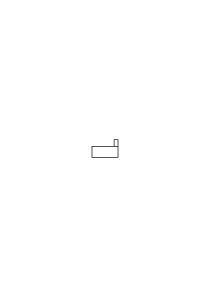
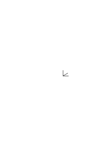
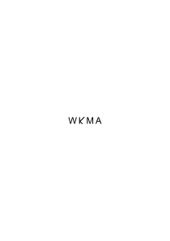
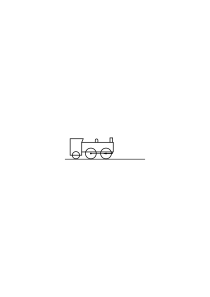
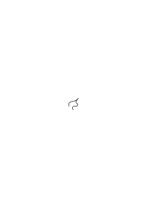

# Ms-132

### [1\[1\]](https://cdn.wittgensteinnachlass.com/2000px/webp/Ms-132/1.webp)

09.09.1946

Wenn das wahr ist, daß wir die Art & Größe der Bewegung eines Glieds nicht durch das _Gefühl_ beurteilen, – wie würde sich ein Mensch von uns unterscheiden, bei dem es der Fall wäre? Nun _das_ ließe sich leicht vorstellen, daß Einer etwa bei verschiedenen Bewegungen verschieden starke, oder verschiedenartige, Schmerzempfindungen hätte. Er würde also etwa sagen: “Dieses Stechen empfinde ich, wenn ich den Arm um ca. 90˚ beuge.”

### [1\[2\]](https://cdn.wittgensteinnachlass.com/2000px/webp/Ms-132/1.webp),[2\[1\]](https://cdn.wittgensteinnachlass.com/2000px/webp/Ms-132/2.webp)

Denk Dir Einen, der mit der Wünschelrute & zwar nach dem Zug, den sie ausübt, die Tiefe einer Quelle bestimmen kann. Er hat das _so_ gelernt: Er ist über Quellen verschiedener Tiefe gegangen & hat sich den Zug _gemerkt_. (Dies hätte man etwa an einer Federwaage feststellen können.) Er hat den Zug mit der Tiefe assoziiert & schließt nun vom Zug auf die Tiefe. Das könnte so geschehen, daß er den Zug – etwa in kg – angibt & dann auf die Tiefe übergeht (vielleicht sogar nach einer Tabelle). Es kann aber auch sein, daß er keinen anderen Ausdruck des Zuges kennt, als die Tiefe. Nach einigem Üben kann er die Tiefe richtig ansagen. Zieht man die Rute nicht durch Wasser, sondern etwa durch Gewichte hinunter, so wird er nun auch sagen “Das zieht, wie so & so viel Meter”.

### [2\[2\]](https://cdn.wittgensteinnachlass.com/2000px/webp/Ms-132/2.webp),[3\[1\]](https://cdn.wittgensteinnachlass.com/2000px/webp/Ms-132/3.webp)

Es könnte nun aber doch sein, daß er zwar im Stande wäre, die Tiefe einer Quelle durch den Zug der Rute _richtig_ anzugeben, nicht aber den Zug der Rute richtig abzuschätzen. Ich meine das so: Es könnte sein, daß Wasser in verschiedenen Tiefen unter verschiedenen Umständen gleichstark zieht; & dieser Rutengänger sagt nun z.B.: “Diese Quell ist tiefer als die vorige, sie zieht schwächer” – & er hat Recht, die Quelle liegt wirklich tiefer, aber der Zug, gemessen mit der Federwaage war der gleiche & er hatte sich _ihn_ nicht richtig gemerkt. – Soll ich nun in diesem Falle sagen, er beurteile die Tiefe nach dem Zug?

### [3\[2\]](https://cdn.wittgensteinnachlass.com/2000px/webp/Ms-132/3.webp),[4\[1\]](https://cdn.wittgensteinnachlass.com/2000px/webp/Ms-132/4.webp)

Nun, er wird vielleicht sagen: “Dieser Zug ist der einer Quelle in der Tiefe ‥․.” indem er diesen Zug gleichsam studiert – wie man ein Gewicht auf der Hand abwägt. Vielleicht aber– “Den Zug kann ich nicht beurteilen – das Wasser ist in der Tiefe ….” In diesem (letztern) Fall wird man nicht sagen, er beurteile die Tiefe nach dem Zug. (Wenigstens nicht ‘bewußt’.)

### [4\[2\]](https://cdn.wittgensteinnachlass.com/2000px/webp/Ms-132/4.webp)

Angenommen nun, es sagte Einer, er merke, wie weit er seinen Arm gebogen habe, an der Stärke einer Druckempfindung im Ellenbogen. Daß heißt doch: wenn sie eine gewisse Stärke erreicht, so erkennt er daran, daß der Arm bis zu _dem_ Grad gebogen ist. Oder was soll es sonst heißen: er beurteile den Grad der Biegung nach der Druckempfindung?

### [4\[3\]](https://cdn.wittgensteinnachlass.com/2000px/webp/Ms-132/4.webp),[5\[1\]](https://cdn.wittgensteinnachlass.com/2000px/webp/Ms-132/5.webp)

Ich will sagen: Wie weiß Einer, daß er etwas nach einem Gefühl beurteilt? – Ist es dazu genug, daß er beim Beurteilen seine Aufmerksamkeit auf das Gefühl richtet?

### [5\[2\]](https://cdn.wittgensteinnachlass.com/2000px/webp/Ms-132/5.webp)

Wenn Du nun sagst, es ist dafür notwendig, daß Einer sagen könne: “Wenn der Druck _so_ stark ist, dann ist mein Arm 90˚ gebeugt” – dann muß sich das ‘_So_’ der Stärke ausdrücken lassen. Andernfalls heißt, daß man die Beugung nach der Druckempfindung beurteilt nur, daß man die Beugung _nicht_ beurteilen kann, wenn man _keine_ (oder nur eine ungemein schwache) Druckempfindung spürt. (Also etwa, wenn man anästhesiert ist.)

### [5\[3\]](https://cdn.wittgensteinnachlass.com/2000px/webp/Ms-132/5.webp),[6\[1\]](https://cdn.wittgensteinnachlass.com/2000px/webp/Ms-132/6.webp)

Es gibt also verschiedene Fälle. Es kann Einer _sagen_, er beurteile die Beugung nach der Druck- oder Schmerzempfindung, & dabei sozusagen auf diese Empfindung hinhorchen; aber im Übrigen den Grad der Empfindung in keiner Weise angeben können. – Oder es kann zwei unabhängige Angaben des Grades der Empfindung & der Beugung geben.

### [6\[2\]](https://cdn.wittgensteinnachlass.com/2000px/webp/Ms-132/6.webp)

“Wenn ich den Druck _so_ stark spüre, dann ‥‥․”

### [6\[3\]](https://cdn.wittgensteinnachlass.com/2000px/webp/Ms-132/6.webp),[7\[1\]](https://cdn.wittgensteinnachlass.com/2000px/webp/Ms-132/7.webp)

10.09.1946

Hat denn das keinen Sinn? Es könnte sogar jemand sagen, er habe eine ganze Skala von Druckempfindungen. Ich kann mir das sehr wohl denken. Nur wäre das sowenig eine wirkliche Skala, wie das Bild eines Thermometers ein Thermometer ist. Obwohl es doch in mancher Beziehung große Ähnlichkeit mit ihm hat.

### [7\[2\]](https://cdn.wittgensteinnachlass.com/2000px/webp/Ms-132/7.webp)

Ramsey's Theorie der Identität & ein Handspiegel auf dem mein Spiegelbild _gemalt_ ist. Funktion & Technik.

### [7\[3\]](https://cdn.wittgensteinnachlass.com/2000px/webp/Ms-132/7.webp)

“Wenn Du den Temperaturbegriff studieren willst, mußt Du das Thermometer studieren; sein Verhalten, seine Anwendung!”

### [7\[4\]](https://cdn.wittgensteinnachlass.com/2000px/webp/Ms-132/7.webp),[8\[1\]](https://cdn.wittgensteinnachlass.com/2000px/webp/Ms-132/8.webp)

11.09.1946

Haben wir es mit Irrtümern & Schwierigkeiten zu tun, die so alt sind, wie die Sprache? Sind es, sozusagen, Krankheiten, die an den Gebrauch der Sprache gebunden sind, oder sind sie speziellerer Natur, unserer Zivilisation eigentümlich? Oder auch: Ist die Präokkupation mit den Sprachmitteln, die unsere ganze Philosophie durchdringt, ein uralter Zug alles Philosophierens, ein _uralter_ Kampf? Oder ist er neu, wie unsre Wissenschaft? Oder auch so: Schwankt das Philosophieren immer zwischen Metaphysik & Sprachkritik?

### [VB](/w-vb/#ms-132-8.2) [8\[2\]](https://cdn.wittgensteinnachlass.com/2000px/webp/Ms-132/8.webp) {#82}

Wie Du das Wort “Gott” verwendest, zeigt nicht, _wen_ Du _meinst_, sondern was Du meinst.

### [8\[3\]](https://cdn.wittgensteinnachlass.com/2000px/webp/Ms-132/8.webp)

Denke es könnte einen das Bild einer Multiplikation anwidern; so daß man, wenn man sie ausgeführt hat sagt: “Wenn Multiplizieren _das_ hervorbringt, will ich nichts damit zu tun haben!”

### [9\[1\]](https://cdn.wittgensteinnachlass.com/2000px/webp/Ms-132/9.webp)

Ich gebe die Regeln eines Spiels. Der Andre macht, diesen Regeln ganz entsprechend, einen Zug, dessen Möglichkeit ich nicht vorausgesehen hatte & der das Spiel stört, so wie ich es will. Ich muß nun sagen: “Ich habe schlechte Regeln gegeben”; ich muß meine Regeln ändern, oder vielleicht ergänzen.

### [9\[2\]](https://cdn.wittgensteinnachlass.com/2000px/webp/Ms-132/9.webp)

So habe ich also schon zum Voraus ein Bild des Spiels? Nun, in gewissem Sinne, ja!

### [9\[3\]](https://cdn.wittgensteinnachlass.com/2000px/webp/Ms-132/9.webp)

Oder er sagt: “Was tust Du aber nun in diesem Falle?” & beschreibt einen, in welchem die Regel nicht klar sagt, was zu tun ist.

### [9\[4\]](https://cdn.wittgensteinnachlass.com/2000px/webp/Ms-132/9.webp),[10\[1\]](https://cdn.wittgensteinnachlass.com/2000px/webp/Ms-132/10.webp)

Es war doch z.B. möglich, daß ich nicht voraussah, daß eine quadratische Gleichung nicht reelle Lösungen haben muß. Die Regel führt mich also zu etwas, wovon ich sage: “Dieses Bild hatte ich nicht erwartet; ich stellte mir eine Lösung immer _so_ vor: ‥‥.”

### [10\[2\]](https://cdn.wittgensteinnachlass.com/2000px/webp/Ms-132/10.webp)

Wie wäre es, wenn man sagte: “Nicht jedes System von Regeln bestimmt einen Kalkül”. Als Beispiel gäbe man die Division durch 0: Denken wir uns nämlich eine Arithmetik, in der sie erlaubt wäre, & daher bewiesen werden könnte, jede Zahl sei gleich der andern.

### [10\[3\]](https://cdn.wittgensteinnachlass.com/2000px/webp/Ms-132/10.webp)

12.09.1946

“Ich halte, was ich vor mir sehe, für ‥‥” – “Ich sehe dies als ‥‥” Diesen beiden entsprechen verschiedene Reaktionen.

### [11\[1\]](https://cdn.wittgensteinnachlass.com/2000px/webp/Ms-132/11.webp)

Wenn das Kind in primitiver Art eine Lokomotive zeichnet. So hält es selbstverständlich die Zeichnung nicht für eine Lokomotive – soll ich aber sagen, es _sieht_ die Zeichnung als Lokomotive?? D.h. haben wir _hier_ das Phänomen, wovon man später als “etwas als etwas sehen” redet?

### [11\[2\]](https://cdn.wittgensteinnachlass.com/2000px/webp/Ms-132/11.webp),[12\[1\]](https://cdn.wittgensteinnachlass.com/2000px/webp/Ms-132/12.webp)

Wenn Kinder Eisenbahn spielen, – soll ich sagen, ein Kind das die Lokomotive nachahmt, werde von einem andern als Lokomotive gesehen? Es wird im Spiel als Lokomotive _aufgefaßt_. Ich habe ein Kind diese Form

mit Bausteinen legen gesehen & es nannte sie “Lokomotive”.

### [VB](/w-vb/#ms-132-12.2) [12\[2\]](https://cdn.wittgensteinnachlass.com/2000px/webp/Ms-132/12.webp) {#122}

Beim Stierkampf ist der Stier der Held einer Tragödie. Zuerst durch Schmerzen toll gemacht, stirbt er einen langen & furchtbaren Tod.

### [12\[3\]](https://cdn.wittgensteinnachlass.com/2000px/webp/Ms-132/12.webp),[13\[1\]](https://cdn.wittgensteinnachlass.com/2000px/webp/Ms-132/13.webp)

Denk Dir ich hätte einem Erwachsenen jene Form gezeigt & gefragt “Woran erinnert sie Dich”, & er hätte geantwortet “An eine Lokomotive” – heißt das, er hat sie als Lokomotive _gesehen_? Ich nehme nämlich das als das typische Spiel des “etwas als etwas sehen” an, wenn jemand sagt: “Jetzt sehe ich es als dies, jetzt als das”. Wenn er also verschiedene Aspekte kennt & zwar abgesehen von irgendeiner Verwendung des angeschauten. Ich möchte also so sagen: ich sehe keine _Verwendung_ des Bildes als Zeichen dafür an, daß es so oder so _gesehen_ wird.

### [13\[2\]](https://cdn.wittgensteinnachlass.com/2000px/webp/Ms-132/13.webp)

‘Und seid dem Leid mit Mut bereit.’ Ich lebe überhaupt in einer Krise, so darf mich also das Unglück, das mir vielleicht bevorsteht, nicht aus der Fassung bringen. Warum sollte in dieser Zeit der Greuel mir nicht auch etwas gräßliches geschehen?

### [13\[3\]](https://cdn.wittgensteinnachlass.com/2000px/webp/Ms-132/13.webp),[14\[1\]](https://cdn.wittgensteinnachlass.com/2000px/webp/Ms-132/14.webp)

Wenn ich also Einem sagte zeige mir irgendwo die Form

& er wiese auf eine Zimmerecke hin, – wäre das auch kein Zeichen dafür, daß er das Bild plastisch gesehen hat?? Und wenn er, umgekehrt, nicht auf eine Ecke, sondern auf eine Pfeilspitze zeigt, – heißt das nicht daß er die Zeichnung nicht-plastisch sieht?

### [14\[2\]](https://cdn.wittgensteinnachlass.com/2000px/webp/Ms-132/14.webp),[15\[1\]](https://cdn.wittgensteinnachlass.com/2000px/webp/Ms-132/15.webp)

Aber könnte ich denn nicht fragen: “Wie weißt Du, daß er nicht die Zimmerecke eben, & die Pfeilspitze plastisch sieht?”? Ist es aber nun anders, wenn er das Spiel spielen kann: die Zeichnung einmal auf eine, dann auf eine andre Art zu sehen? Natürlich muß er dazu nicht den Ausdruck “etwas als … sehen” gebrauchen. Er könnte z.B. mit der Hand Zeichen machen. So nämlich, daß es scheint als stellte er, was er sehe dar; aber einmal gebraucht er _ein_ Objekt zur Darstellung, einmal ein andres. – Aber wie zeigt es sich dann, daß er nicht, in anderem Sinn, eine Änderung des Bildes zu sehen glaubt? Wie zeigt sich's also, daß er nicht glaubt, das _Bild_ habe sich geändert? Denn ist das nicht wesentlich? Daß er also sieht, daß sich nur der Aspekt geändert hat.

### [15\[2\]](https://cdn.wittgensteinnachlass.com/2000px/webp/Ms-132/15.webp),[16\[1\]](https://cdn.wittgensteinnachlass.com/2000px/webp/Ms-132/16.webp)

13.09.1946

Er wird z.B. über diese Änderung weniger ‘puzzled’ als ‘amused’ sein. Aber das ist noch alles oberflächlich. Wie wird er aber zeigen, daß er sieht, das Bild habe sich nicht verändert? – Er kann's natürlich _sagen_. Aber wie wird er _zeigen_, was er mit den Worten meint? Nun, das kann man sich ja ausmalen.

### [16\[2\]](https://cdn.wittgensteinnachlass.com/2000px/webp/Ms-132/16.webp),[17\[1\]](https://cdn.wittgensteinnachlass.com/2000px/webp/Ms-132/17.webp)

Ich bin nun geneigt _so_ zu sagen: Das Phänomen von dem ich hier rede hat nicht statt, wenn ich für gewöhnlich _sehe_. D.h.: Ich weiß freilich daß dort ein Tisch steht, daß dies Bild eine Landschaft mit Vordergrund & Hintergrund darstellt, etc.; aber es liegt hier nicht noch ein “Etwas als etwas sehen” über einem Sehen. Nun ist, was ich da sage, so wie es da steht, Unsinn. Ich möchte sagen: “Nun, ich habe die Augen offen, & handle & spreche natürlich in der Weise, daß dadurch zum Ausdruck kommt, ich sähe dort einen Tisch, dort ein Bild, etc. etc..

### [17\[2\]](https://cdn.wittgensteinnachlass.com/2000px/webp/Ms-132/17.webp)

Wenn also jemand sagt: Dies Sehen ist nicht so einfach, wie es ausschaut, man kann es analysieren & sieht dann erst, was der Mensch dabei alles leistet, wieviel er z.B. gelernt haben muß ehe er _so_ sieht, – so antworte ich: Die _Geschichte_ interessiert mich hier nicht & von etwas _Kompliziertem_, Zusammengesetztem, ist hier nicht die Rede. Kompliziert, schwer, ist es nur unsre Begriffe zu verstehen. Weil ihr Zusammenhang kompliziert ist.

### [17\[3\]](https://cdn.wittgensteinnachlass.com/2000px/webp/Ms-132/17.webp),[18\[1\]](https://cdn.wittgensteinnachlass.com/2000px/webp/Ms-132/18.webp)

Wäre es nicht denkbar, daß uns die sprungweise Änderung des Aspekts nicht auffiele? und wir z.B. von einem Bild einmal als _das_, einmal als _das_ redeten, ohne uns an die _Änderung_ zu erinnern. So daß wir also ‘als _was_ wir es sehen’ immer als selbstverständlich hinnähmen?

### [18\[2\]](https://cdn.wittgensteinnachlass.com/2000px/webp/Ms-132/18.webp)

Oder so: Verstünde ein Kind, was es heißt, den Tisch als ‘Tisch’ sehen? Es lernt: “Dies ist ein Tisch, dies eine Bank” etc., & es beherrscht vollkommen ein Sprachspiel, ohne eine Andeutung davon, daß da von einem Aspekt die Rede ist.

### [19\[1\]](https://cdn.wittgensteinnachlass.com/2000px/webp/Ms-132/19.webp)

“Ja, ein Kind analysiert eben nicht, was es tut.” – Nochmals: von einer Analyse dessen, was geschieht, ist hier nicht die Rede. Bloß von einer Analyse – & dieses Wort ist sehr irreführend – unserer Begriffe. Und unsere Begriffe sind komplizierter als die des Kindes; insofern nämlich, als unsre Worte eine kompliziertere Verwendung haben als die seinen.

### [19\[2\]](https://cdn.wittgensteinnachlass.com/2000px/webp/Ms-132/19.webp),[20\[1\]](https://cdn.wittgensteinnachlass.com/2000px/webp/Ms-132/20.webp)

Wenn ich das Bild dort als Küstenlinie sehe, die nach hinten zieht, so kommt das dadurch zum Ausdruck, daß ich mit Worten, mit Handbewegungen beschreibend auf sie reagiere. Aber nun reagiere ich doch nicht fortwährend & so entsteht die Frage: Sehe ich sie nun _immer_ so? Und wieder möchte man sagen: Wie? & darauf kommt wieder eine Bewegung, oder dergleichen, zur Antwort. Es ist da die Frage falsch gestellt. (Erinnert an die: Wiegt das Ding nur solang ein Pfund, als es gewogen wird?)

### [20\[2\]](https://cdn.wittgensteinnachlass.com/2000px/webp/Ms-132/20.webp),[21\[1\]](https://cdn.wittgensteinnachlass.com/2000px/webp/Ms-132/21.webp)

Und man möchte doch sagen: “Ich sehe es aber doch _so_ auch wenn ich's nicht ausdrücke. Dies Sehen ist ein _Zustand_ der andauert; wie die Existenz des Bilds selbst.” Und was ist darauf zu antworten? “Ich sehe es aber doch _so_, auch während ich's nicht ausdrücke.” Das würde heißen, was ich sehe ändert sich nicht wenn ich's ausdrücke. Wenn man fragte: “Hat der Körper dies Gewicht nur solange er gewogen wird” – so hieße das: “Ändert sich sein Gewicht, wenn wir ihn auf die Waage legen?” Und das ist es natürlich _gar_ nicht, was wir fragen möchten.

### [21\[2\]](https://cdn.wittgensteinnachlass.com/2000px/webp/Ms-132/21.webp),[22\[1\]](https://cdn.wittgensteinnachlass.com/2000px/webp/Ms-132/22.webp)

Erst durch das Phänomen des Wechsels des Aspekts scheint der Aspekt vom übrigen Sehen abgelöst zu werden. Es ist als könnte man nach der Erfahrung des Aspektwechsels sagen: “Es gab also da einen Aspekt!”

### [22\[2\]](https://cdn.wittgensteinnachlass.com/2000px/webp/Ms-132/22.webp)

Wenn man den _Anstrich_ eines Stücks Holz abkratzt, kann man sagen “Es war also da ein Anstrich” – wenn aber die Farbe eines Körpers wechselt, – kann ich sagen “Er hatte also eine _Farbe_!” – als wäre mir dies erst jetzt aufgefallen?

### [22\[3\]](https://cdn.wittgensteinnachlass.com/2000px/webp/Ms-132/22.webp)

Kann man das sagen: Es kam mir erst zum Bewußtsein, daß der Körper eine Farbe hatte, als sich die Farbe änderte?

### [22\[4\]](https://cdn.wittgensteinnachlass.com/2000px/webp/Ms-132/22.webp),[23\[1\]](https://cdn.wittgensteinnachlass.com/2000px/webp/Ms-132/23.webp)

Von welchem Phänomen des Benehmens will ich reden: von dem, daß ich ein Bild, z.B., dreidimensional beschreibe (also sage: dies ist die Küste, dies ein Haus etc.); oder von dem welches für den Aspektwechsel charakteristisch ist.

### [23\[2\]](https://cdn.wittgensteinnachlass.com/2000px/webp/Ms-132/23.webp)

Denk nicht, daß es etwas _seltsames_ ist, daß Du ein Bild an der Wand räumlich siehst. Es ist – möchte ich sagen – so gewöhnlich wie es scheint. (Und dies könnte ich zu vielem sagen.)

### [23\[3\]](https://cdn.wittgensteinnachlass.com/2000px/webp/Ms-132/23.webp)

Ich will sagen: Der Wechsel des Aspekts zeigt nicht, daß ein Aspekt da war.

### [23\[4\]](https://cdn.wittgensteinnachlass.com/2000px/webp/Ms-132/23.webp),[24\[1\]](https://cdn.wittgensteinnachlass.com/2000px/webp/Ms-132/24.webp)

Es spielt uns hier wieder die Idee vom Sinnesdatum einen Streich, & davon, daß wir das Sinnesdatum _sehen_. Daß es also ein Objekt vor unserem innern Aug ist.

### [24\[2\]](https://cdn.wittgensteinnachlass.com/2000px/webp/Ms-132/24.webp)

Über den Aspektwechsel wundert man sich. Aber niemand wundert sich über den Aspekt; sowenig wie darüber, daß man _sieht_.

### [24\[3\]](https://cdn.wittgensteinnachlass.com/2000px/webp/Ms-132/24.webp)

Das Phänomen, womit ich's zu tun habe, ist das, worüber wir manchmal lächeln. Das Phänomen, womit wir's zu tun haben, ist das seltsame. Es ist das, welches den Aspekt zu betonen scheint.

### [24\[4\]](https://cdn.wittgensteinnachlass.com/2000px/webp/Ms-132/24.webp),[25\[1\]](https://cdn.wittgensteinnachlass.com/2000px/webp/Ms-132/25.webp)

Wenn wir aber nun fragen: Ist denn der Aspekt immer da, – auch wenn wir uns seiner nicht bewußt sind?

_Taucht_ er nicht nur dann _auf_, wenn wir sagen: “Jetzt sehe ich's _so_, jetzt _so_?”

### [25\[2\]](https://cdn.wittgensteinnachlass.com/2000px/webp/Ms-132/25.webp)

Nun man könnte sagen: Das _Erlebnis_ des Aspekts ist nur dann da.

### [25\[3\]](https://cdn.wittgensteinnachlass.com/2000px/webp/Ms-132/25.webp)

Denk Dir die Dinge in unsrer Umgebung – Tisch, Bücher, Stühle etc. – änderten periodisch sprungweise ihre Farben, ihre Formen blieben gleich. Könnte man da sagen, daß wir uns so erst der Farbe, als eines besonderen Bestandteils unseres Seherlebnisses bewußt würden?

### [26\[1\]](https://cdn.wittgensteinnachlass.com/2000px/webp/Ms-132/26.webp)

Wenn ich Feld- & Gartenblumen miteinander vergleiche, so kann ich mir des Unterschieds des _Charakters_ bewußt werden, aber das sagt nicht, daß ich auch schon früher außer der Blume ihren Charakter wahrgenommen habe, oder daß ich sie doch in einem bestimmten Charakter habe wahrnehmen müssen.

### [26\[2\]](https://cdn.wittgensteinnachlass.com/2000px/webp/Ms-132/26.webp)

Die rotierende Trommel – niemand, der sie nur nach einer Seite sich drehen sieht, denkt an einen Aspekt. Erst dann wird die Sache bemerkenswert, wenn man verschiedene Aspekte sieht.

### [26\[3\]](https://cdn.wittgensteinnachlass.com/2000px/webp/Ms-132/26.webp),[27\[1\]](https://cdn.wittgensteinnachlass.com/2000px/webp/Ms-132/27.webp)

14.09.1946

Muß ich denn wissen, daß ich mit zwei Augen sehe? Gewiß nicht. Habe ich etwa _zwei_ Gesichtseindrücke beim gewöhnlichen Sehen, so daß ich spüre, mein dreidimensionaler Gesichtseindruck setze sich aus zwei Gesichtsbildern zusammen? Gewiß nicht. – Ich kann also die Dreidimensionalität nicht vom Sehen trennen.

### [27\[2\]](https://cdn.wittgensteinnachlass.com/2000px/webp/Ms-132/27.webp),[28\[1\]](https://cdn.wittgensteinnachlass.com/2000px/webp/Ms-132/28.webp)

Wie ist nun so eine Frage zu beantworten: “Sehen wir ein Dreieck (z.B.) immer in einem gewissen Aspekt; d.h. mit _der_ Seite als Basis & _der_ Ecke als Spitze, u.s.w.?”? Vielleicht antwortet man daß in den meisten Fällen die Aspekte so schnell wechseln & in einander übergehn, daß man den Vorgang nicht in Worten berichten kann. – Aber in so einer Antwort liegt eine grundsätzliche Schwäche.

### [28\[2\]](https://cdn.wittgensteinnachlass.com/2000px/webp/Ms-132/28.webp)

Wer ein psychologisches Experiment macht, studiert das Benehmen von Menschen; & wenn er es dann in psychologischen Begriffen darstellt, so ist Vorsicht nötig. (Ganz so, wie Einer der Bemerkungen über die Zeitmessungen in Sätzen über die Zeit aussprechen will.)

### [29\[1\]](https://cdn.wittgensteinnachlass.com/2000px/webp/Ms-132/29.webp)

Wenn ich Einen frage “In welcher Richtung schaut für Dich ein ‘F’ und in welcher ein ‘J’?” & er antwortet, ein F schaue für ihn immer nach rechts, ein “J” nach links, – so heißt das natürlich nicht, daß er beim Anblick eines “F” immer eine Empfindung der Richtung hat. Das wird, glaube ich, klarer wenn man _so_ fragt: “Wo würdest Du einem F ein Aug & eine Nase malen?” – Wenn man aber nun sagte: “So schaut es also für Dich nur solang in dieser Richtung, als Du dies denkst, oder sagst” – ist das nicht als fragte man “Würdest Du dem F die Nase nur dann dorthin malen, wenn Du sie malst?”?

### [29\[2\]](https://cdn.wittgensteinnachlass.com/2000px/webp/Ms-132/29.webp),[30\[1\]](https://cdn.wittgensteinnachlass.com/2000px/webp/Ms-132/30.webp),[31\[1\]](https://cdn.wittgensteinnachlass.com/2000px/webp/Ms-132/31.webp)

Könnte man sich denken, daß ein Mensch sich übt, gewöhnt, ein

immer als Variante von

(eines symmetrischen Zeichens) zu _sehen_ – aber wohl zu wissen daß ein

“”

korrekt nicht so geschrieben wird? – Ich könnte z.B. sagen daß ich ein

“”

stets nach rechts schauend sehe, auch dann, wenn es

“”

geschrieben wird. Könnte ich mich nun gewöhnen, es in so einem Falle _immer_ als Spiegel-F zu sehen? Ich könnte mir das _so_ denken: Ich gewöhne mir an, die Großbuchstaben gleichermaßen nach rechts & links hin zu schreiben & gegen ihre Richtung gleichgültig zu sein; also ein

bald

bald

,

ein

manchmal

,

etc. – Wenn ich dann so eingestellt bin, dann wird mir – könnte man sagen – ein

“”

nun anders erscheinen. Ich bin ja eben für die Richtung gleichgültig geworden; & das könnte sich z.B. darin äußern, daß ich (nun) nicht mehr unbedingt geneigt wäre dem

die Nase nach rechts zu malen. Ich würde auf die Frage “Wohin schaut es?” nun vielleicht antworten “Nach links”. Also würde ich nun das

“”

_immer_ anders sehen? Mir kommt vor, ich würde nur auf gewisse Fragen anders reagieren.

### [32\[1\]](https://cdn.wittgensteinnachlass.com/2000px/webp/Ms-132/32.webp)

Ich möchte sagen: Ein Mensch _kann_ ein “F” nicht _immer_ so & so sehen. D.h. es hat für ihn für gewöhnlich _kein_ Gesicht (wie ein Wort keins hat). D.h., es ist _kein Erlebnis_ des Gesichts da.

### [32\[2\]](https://cdn.wittgensteinnachlass.com/2000px/webp/Ms-132/32.webp)

16.09.1946

Seh' ich ein Dreieck _immer_ auf die eine oder andere Weise? – Nehmen wir an, ich sagte “Ja” – wie könnte ich's wissen? Oder, wenn ein Andrer mir sagte, er sähe es immer in irgend einem Aspekt, – wie könnte ich sicher sein, daß ihn sein Gedächtnis nicht täuscht?

### [32\[3\]](https://cdn.wittgensteinnachlass.com/2000px/webp/Ms-132/32.webp),[33\[1\]](https://cdn.wittgensteinnachlass.com/2000px/webp/Ms-132/33.webp)

Hast Du jetzt den Tisch, der hier vor Dir steht, gesehen? Gewiß. Hast Du ihn mit irgend einem Akzent gesehen? Nicht, daß ich wüßte. – Aber hast Du ihn nicht doch 3-dimensional gesehen? – Nun, ich hab ihn nicht _eben_ gesehen.

### [33\[2\]](https://cdn.wittgensteinnachlass.com/2000px/webp/Ms-132/33.webp)

Aber war er nicht ebensosehr 3-dimensional, als er braun war?

### [33\[3\]](https://cdn.wittgensteinnachlass.com/2000px/webp/Ms-132/33.webp)

Sehe ich ein Gesicht immer ‘_als Gesicht_’? Ich habe hier Bücher vor mir: Sehe ich sie die ganze Zeit ‘_als Bücher_’? Ich meine: Sehe ich sie die ganze Zeit als Bücher, wenn ich sie nicht gerade als etwas andres sehe? Oder sehe ich oft, oder für gewöhnlich nur Farben & Formen, ohne besonderen Aspekt? Offenbar nein!

### [33\[4\]](https://cdn.wittgensteinnachlass.com/2000px/webp/Ms-132/33.webp),[34\[1\]](https://cdn.wittgensteinnachlass.com/2000px/webp/Ms-132/34.webp)

Aber wenn du mich fragst: “Was hast Du gesehen”, werde ich antworten: ein Bücherregal, etc.. Und wenn Du weiter fragst: “Hast Du es _als_ Bücherregal gesehen?”, so werden die meisten Menschen die Frage nicht verstehen. Und die Antwort kann nur sein: “Nicht als etwas anderes.” Wir lehren doch auch das Kind nicht: etwas als etwas sehen.

### [34\[2\]](https://cdn.wittgensteinnachlass.com/2000px/webp/Ms-132/34.webp),[35\[1\]](https://cdn.wittgensteinnachlass.com/2000px/webp/Ms-132/35.webp)

Wir sagen Einem: “Wenn _das_ die Grundlinie ist, so ist _das_ die Spitze & _das_ die Höhe.” Oder er muß die Frage beantworten: “Welches ist die Höhe des Dreiecks, wenn _dies_ die Grundlinie ist?” Aber wir dringen nicht drauf, daß er das Dreieck so & so _sieht_. – Man sagt wohl manchmal “Denk es Dir umgelegt!” (oder dergleichen) & man könnte auch sagen “Sieh es umgelegt” & diese Bemerkung könnte helfen; so nämlich, wie auch eine zeichnerische Ergänzung des Bildes helfen könnte, die einen solchen Aspekt nahelegt.

### [35\[2\]](https://cdn.wittgensteinnachlass.com/2000px/webp/Ms-132/35.webp)

Durch gewisse Worte, gewisse Gedanken, ein bestimmtes Wandern des Blickes kommt der Aspekt zustande.

### [35\[3\]](https://cdn.wittgensteinnachlass.com/2000px/webp/Ms-132/35.webp)

Kann ich z.B. sagen, ich sehe den Sessel als _Gegenstand_, als _Einheit_? Sowie ich sage, ich sehe jetzt das schwarze Kreuz auf weißem Grund, jetzt aber das weiße Kreuz auf schwarzem?

### [36\[1\]](https://cdn.wittgensteinnachlass.com/2000px/webp/Ms-132/36.webp)

Wenn man mich fragt “Was hast Du da vor Dir?” werde ich freilich antworten “Einen Sessel”, werde ihn also als Einheit behandeln. Aber kann man nun sagen, ich _sähe_ ihn _als Einheit_? Und kann ich die Kreuzfigur anschauen, _ohne_ sie _so oder so_ zu sehen?

### [36\[2\]](https://cdn.wittgensteinnachlass.com/2000px/webp/Ms-132/36.webp)

Wenn ich Einen frage “Was siehst Du vor Dir?” & er sagt “Was ich vor mir habe, sieht _so_ aus”, & nun zeichnet er die Kreuzfigur, – _muß_ er sie in irgend einem Aspekt gesehen haben? Hat er sie nicht gesehen, wenn er sie nur zeichnerisch beschreiben kann?

### [36\[3\]](https://cdn.wittgensteinnachlass.com/2000px/webp/Ms-132/36.webp),[37\[1\]](https://cdn.wittgensteinnachlass.com/2000px/webp/Ms-132/37.webp)

17.09.1946

Erinnere Dich daran, daß, selbst wenn Introspektion Dich lehrte, was _Dein_ Gesichtserlebnis ist, Du noch immer nicht wüßtest, was der _Andre_ sieht.

### [37\[2\]](https://cdn.wittgensteinnachlass.com/2000px/webp/Ms-132/37.webp)

Wie weiß ich, daß der Andre 3-dimensional sieht? Durch sein Verhalten, durch das, was er sagt: Aber was sagt mir, was er sagt? Kann ein Kind Dir sagen, es sehe 3-dimensional? Und denk Dir, es würde Dir sagen “Ich sehe alles eben”, – was würde Dir das sagen? Es könnte ja alles _eben_ sehen, & durch eine Intuition wissen, daß es nicht eben _ist_, & sich dementsprechend benehmen!

### [37\[3\]](https://cdn.wittgensteinnachlass.com/2000px/webp/Ms-132/37.webp),[38\[1\]](https://cdn.wittgensteinnachlass.com/2000px/webp/Ms-132/38.webp)

Wenn das Kind dieses Bild für das & das _hält_ & ich folgere nun “Also _sieht_ es das Bild _so_”, – _worauf_ schließe ich? Was _sagt_ mir diese Folgerung? Man würde etwa sagen, ich schließe auf die Art des Sinnesdatums, oder Gesichtsbilds; so, als lautete der Schluß: “Also ist das Bild in seinem Geiste _so_; & nun müßte man es etwa plastisch darstellen.

### [38\[2\]](https://cdn.wittgensteinnachlass.com/2000px/webp/Ms-132/38.webp),[39\[1\]](https://cdn.wittgensteinnachlass.com/2000px/webp/Ms-132/39.webp)

“Diese Leute halten das Bild für ‥‥; sie sehen es also _so_: ‥‥” Aber wie, wenn man sagte: “Diese Leute benehmen sich gegen das Bild auf _diese_ Weise, sie sehen es also _so_: ‥‥”? Sie sehen es also so, daß _dies_ vorne & _dies_ hinten ist. Oder ahmen es _so_ nach, sehen es also als Ente. – Das könnte heißen: “Wenn sie mit uns reden könnten, würden sie uns sagen “Das ist eine Ente”.

### [39\[2\]](https://cdn.wittgensteinnachlass.com/2000px/webp/Ms-132/39.webp)

Es _scheint_ einen Sinn zu haben wenn man sagt: “Auch wenn das Kind das Bild immer für eine Ente hält, so ist damit nicht gesagt, daß es es nicht als Hase sieht, d.h. so, wie wir es sehen, wenn wir sagen, wir sähen es als Hasen.” Und das ist gerade, was keinen Sinn hat.

### [39\[3\]](https://cdn.wittgensteinnachlass.com/2000px/webp/Ms-132/39.webp),[40\[1\]](https://cdn.wittgensteinnachlass.com/2000px/webp/Ms-132/40.webp)

19.09.1946

Wer K statt <math display="inline"><mtext>IL</mtext></math> liest, – _sieht_ der die Striche als ein K? Wer K liest von dem könnte ich sagen: “Ich weiß, wie er es sieht; ich kann es auch so sehen”. Aber kann ich es nicht als IL sehen & doch K lesen? Ich kann das W als umgekehrtes M & das M als umgekehrtes W oder als <math display="inline"><mtext>Σ</mtext></math> sehen; aber muß ich es dann so _lesen_?

### [40\[2\]](https://cdn.wittgensteinnachlass.com/2000px/webp/Ms-132/40.webp)

Wenn man sagt “Ich _sehe_ es jetzt als <math display="inline"><mtext>IL</mtext></math>”, so ist es _beinahe_, als wäre etwas mit dem _Bild_ vorgegangen; sagt man “Ich lese es jetzt als <math display="inline"><mtext>IL</mtext></math>”, so blieb das Bild das Gleiche & meine _Reaktion_ hat sich geändert. Aber ich sagte soeben “beinahe”; denn das Bild hat sich ja nicht geändert & ich _weiß_ es; aber ich möchte _doch_ sagen: mein Gesichtseindruck, mein Sinnesdatum, habe sich verändert. – _Ich_ möchte das sagen, & darin stimme ich mit dem Andern überein, der es auch sagen will.

### [41\[1\]](https://cdn.wittgensteinnachlass.com/2000px/webp/Ms-132/41.webp)

“Jetzt ist es _das_ – jetzt _das_”. Das ist die Reaktion.

### [41\[2\]](https://cdn.wittgensteinnachlass.com/2000px/webp/Ms-132/41.webp)

Ist es denn _so_: “Ich habe das Zeichen “Σ” immer als ein σ gelesen; nun sagt mir Einer, es könnte auch ein umgelegtes M sein, & ich kann es jetzt auch _so_ sehen; – _daher_ habe ich es also früher immer als σ _gesehen_”? Ich habe also, hieße das, nicht nur die Figur Σ gesehen & sie _so_ gelesen, sondern ich habe sie auch als _das gesehen_!

### [41\[3\]](https://cdn.wittgensteinnachlass.com/2000px/webp/Ms-132/41.webp),[42\[1\]](https://cdn.wittgensteinnachlass.com/2000px/webp/Ms-132/42.webp)

Man sagt “Ich habe das immer für ein σ gehalten”. Nun; dieses _Halten_, – fand das die ganze Zeit statt während ich das Zeichen sah? War es nicht vielmehr, wie ein _Wissen_, das ausgedrückt wird durch einen Konjunktiv: “Wenn Du mich gefragt hättest ‥‥, so hätte ich Dir erklärt ‥․.”

### [42\[2\]](https://cdn.wittgensteinnachlass.com/2000px/webp/Ms-132/42.webp)

“Aber wie konnte ich wissen, daß, _wenn_ Du mich gefragt hättest, ich _so_ reagiert hätte?” – Wie? Es gibt kein Wie. Aber es gibt Anzeichen dafür, daß ich darin Recht habe, es zu sagen.

### [42\[3\]](https://cdn.wittgensteinnachlass.com/2000px/webp/Ms-132/42.webp),[43\[1\]](https://cdn.wittgensteinnachlass.com/2000px/webp/Ms-132/43.webp)

Dasjenige, was, gleichsam, unterhält, uns bemerkenswert erscheint, ist natürlich der Wechsel des Aspekts, nicht der Aspekt. Was unterhält ist das bald so, bald so Sehen; nicht etwas, was jedem Sehen eigen ist.

### [43\[2\]](https://cdn.wittgensteinnachlass.com/2000px/webp/Ms-132/43.webp),[44\[1\]](https://cdn.wittgensteinnachlass.com/2000px/webp/Ms-132/44.webp),[45\[1\]](https://cdn.wittgensteinnachlass.com/2000px/webp/Ms-132/45.webp)

20.09.1946

Ich will beschreiben, was ich sehe, ich mache dazu ein Transparent. Aber nun fragt man mich noch “Ist _dies_ vorn & _dies_ hinten?” Also beschreibe ich durch Worte, oder indem ich modelliere, was ich vorn, was hinten sehe. Und nun fragt man mich noch “Und siehst _diesen_ Punkt als Spitze des Dreiecks?”, & ich muß auch das noch beantworten. – Aber muß ich darauf eine Antwort haben? – Nimm an, obwohl es nicht wahr ist, daß die Blickrichtung den Aspekt bestimmt. Und in _einem_ Fall ist meine Blickrichtung fix, in einem andern bewegt sie sich nach einem bestimmten einfachen Gesetz, & in einem wandert sie unregelmäßig umher. Wenn wir nun statt einer Beschreibung des Aspekts die der Blickrichtung setzen, wäre es keine Beschreibung zu sagen, die Blickrichtung sei regellos, oder unbestimmt? Und das könnte sogar der gewöhnliche Fall sein. – Auf die Frage, also, “Sahst Du diesen Punkt als Spitze des Dreiecks?” kann die Antwort sein: “Ich kann keinen bestimmten Aspekt nennen” oder etwa “Ich hab es jedenfalls nicht _so_ gesehen”.

### [45\[2\]](https://cdn.wittgensteinnachlass.com/2000px/webp/Ms-132/45.webp)

Was tat übrigens die Hypothese von der Wichtigkeit der Blickrichtung für uns? – Sie lieferte uns ein Bild von bestimmter Mannigfaltigkeit.

### [45\[3\]](https://cdn.wittgensteinnachlass.com/2000px/webp/Ms-132/45.webp),[46\[1\]](https://cdn.wittgensteinnachlass.com/2000px/webp/Ms-132/46.webp)

Sehe ich bald Ente, bald Hase, so nehme ich zugleich einen Wechsel des Gesichtsausdruckes wahr. Ich sehe also abwechselnd in der Zeichnung den einen & den andern Gesichtsausdruck. Und daraus scheint (es) nun zu folgen, daß ich in einem Gesicht einen Gesichts**ausdruck** wahrnehme, solange ich das Gesicht wahrnehme. Um wieder eine _Erklärung_ einzuführen: Es ist als nähme ich zu jedem Gesicht eine bestimmte Stellung ein; als ahmte ich etwa das Gesicht mit dem meinen nach, oder beantwortete den fremden Ausdruck mit einem von mir. Wenn ich z.B. das Bild als Ente, dann als Hase sehe, mache ich wirklich abwechselnd ein & ein anderes Gesicht. Und nun müssen wir die Erklärung wieder fahren lassen! Und was bleibt dann übrig?

### [VB](/w-vb/#ms-132-46.2+47.1) [46\[2\]](https://cdn.wittgensteinnachlass.com/2000px/webp/Ms-132/46.webp),[47\[1\]](https://cdn.wittgensteinnachlass.com/2000px/webp/Ms-132/47.webp) {#462471}

22.09.1946

Ein Held sieht dem Tod ins Angesicht, dem wirklichen Tod, nicht bloß dem Bild des Todes. Sich in einer Krise anständig zu benehmen, heißt nicht einen Helden, gleichsam wie auf dem Theater, gut darstellen können, sondern es heißt dem Tod _selbst_ ins Auge schauen können. Denn der Schauspieler kann eine Menge Rollen spielen, aber am Ende muß er doch _selbst_ als Mensch sterben.

### [47\[2\]](https://cdn.wittgensteinnachlass.com/2000px/webp/Ms-132/47.webp)

‘My _response_ is different.’ Die Erklärung ist ähnlicher _Natur_ wie die Jamessche ‘Theorie’ der Emotionen. Sie scheint eine Art von Erfahrung als Resultante von Erfahrungen einer verständlicheren Art zu erklären. Sie wäre in der Psychologie etwas Ähnliches wie die kinetische Gastheorie in der Physik.

### [47\[3\]](https://cdn.wittgensteinnachlass.com/2000px/webp/Ms-132/47.webp)

Eigentlich aber ist so eine Theorie die Konstruktion eines psychologischen Modells einer psychischen Erscheinung. Und daher eines physiologischen Modells.

### [48\[1\]](https://cdn.wittgensteinnachlass.com/2000px/webp/Ms-132/48.webp)

Die Theorie sagt eigentlich: “Es könnte _so_ sein: ‥‥․” Und der Nutzen der Theorie ist, daß sie einen Begriff illustriert. Sie kann ihn aber besser & schlechter illustrieren; mehr, oder weniger zutreffend. Die Theorie ist also sozusagen eine Notation für eine psychologische Erscheinung.

### [48\[2\]](https://cdn.wittgensteinnachlass.com/2000px/webp/Ms-132/48.webp)

Wenn wir also die ‘Erklärung fahren lassen’ – wenn wir sagen, daß uns ja schließlich die _Erklärung_ gleichgültig ist – so bleibt eine grammatische Feststellung übrig. Sie betrifft den Gebrauch der Aussage “Ich sehe nun einen bestimmten Gesichtsausdruck im Bild”.

### [49\[1\]](https://cdn.wittgensteinnachlass.com/2000px/webp/Ms-132/49.webp)

Wenn Du dem Drang eine Theorie zu bilden, nachgibst, so sagst Du allerdings überflüssiges & unwesentliches, aber Du sprichst auch irgend eine wichtige Wahrheit aus.

### [49\[2\]](https://cdn.wittgensteinnachlass.com/2000px/webp/Ms-132/49.webp)

Du magst also ruhig das Bild entwerfen, das Du entwerfen willst, nur mußt Du es nun kritisieren.

### [49\[3\]](https://cdn.wittgensteinnachlass.com/2000px/webp/Ms-132/49.webp),[50\[1\]](https://cdn.wittgensteinnachlass.com/2000px/webp/Ms-132/50.webp)

Es ist offenbar, daß der _Ausdruck_ eines Gesichts mit dem zusammenhängt was das Gesicht räumlich & zeitlich umgibt; was ein Gesicht tut & was mit ihm geschieht. Denn ich möchte sagen: Es ist nicht nur diese Körperform & diese Farben, sondern noch etwas darüber. Man könnte es auch die “Bedeutung” nennen. Oder man könnte sagen: Es ist etwas besonderes an dieser Körperform: sie erscheint mir nicht willkürlich, – ich würde jede Abweichung merken. Jede Abweichung würde das Feld ändern. Was meint man, wenn man sagt: eine Hand habe eine Physiognomie? ‘Sie sagt mir etwas’; & doch sagt sie mir nichts.

### [50\[2\]](https://cdn.wittgensteinnachlass.com/2000px/webp/Ms-132/50.webp),[51\[1\]](https://cdn.wittgensteinnachlass.com/2000px/webp/Ms-132/51.webp)

“Es hat eine ganz bestimmte Physiognomie”. Die Haltung ist ‘ausdrucksvoll’ – – aber was drückt sie aus? Das wissen wir nicht zu sagen.

### [51\[2\]](https://cdn.wittgensteinnachlass.com/2000px/webp/Ms-132/51.webp)

Wenn das Wahrnehmen des Ausdrucks darin besteht, daß ich eine bestimmte Stellung zu dem Objekt einnehme, dann gibt es also auch den Fall, in welchem ich keine bestimmte Stellung zum Objekt einnehme, also _keinen_ bestimmten Ausdruck wahrnehme.

### [VB](/w-vb/#ms-132-51.3) [51\[3\]](https://cdn.wittgensteinnachlass.com/2000px/webp/Ms-132/51.webp) {#513}

Worin besteht es: einer musikalischen Phrase mit Verständnis folgen? Ein Gesicht mit einem Gefühl für seinen Ausdruck betrachten? Den Ausdruck des Gesichts eintrinken?

### [VB](/w-vb/#ms-132-52.1) [52\[1\]](https://cdn.wittgensteinnachlass.com/2000px/webp/Ms-132/52.webp) {#521}

Denk an das Benehmen Eines, der das Gesicht mit Verständnis für seinen Ausdruck zeichnet. An das Gesicht an die Bewegungen des Zeichnenden; – wie drückt es sich aus, daß jeder Strich, den er macht, von dem Gesicht diktiert ist, daß nichts an seiner Zeichnung willkürlich ist, daß es ein _feines_ Instrument ist? Ist denn das wirklich ein _Erlebnis_? Ich meine: kann man sagen, daß dies ein Erlebnis ausdrückt?

### [VB](/w-vb/#ms-132-52.2+53.1) [52\[2\]](https://cdn.wittgensteinnachlass.com/2000px/webp/Ms-132/52.webp),[53\[1\]](https://cdn.wittgensteinnachlass.com/2000px/webp/Ms-132/53.webp) {#522531}

Noch einmal: Worin besteht es, einer musikalischen Phrase mit Verständnis folgen, oder, sie mit Verständnis spielen? Sieh nicht in Dich selbst. Frag Dich lieber, was Dich sagen macht, _der Andre_ tue dies. Und _was_ veranlaßt Dich, zu sagen, _er_ habe ein bestimmtes Erlebnis? Ja, sagt man das überhaupt? Würde ich nicht eher vom Andern sagen, er habe eine Menge Erlebnisse? Ich würde wohl sagen “Er erlebt das Thema intensiv”; aber bedenke, was hiervon der Ausdruck ist?

### [VB](/w-vb/#ms-132-53.2+54.1) [53\[2\]](https://cdn.wittgensteinnachlass.com/2000px/webp/Ms-132/53.webp),[54\[1\]](https://cdn.wittgensteinnachlass.com/2000px/webp/Ms-132/54.webp) {#532541}

Da könnte man nun wieder meinen das intensive Erleben des Themas ‘_bestünde_’ in den Empfindungen der Bewegung etc. womit wir es begleiten. Und das scheint (wieder) eine beruhigende Erklärung. Aber hast Du irgend einen Grund, zu glauben es sei so? Ich meine, z.B., eine Erinnerung an diese Erfahrung? Ist diese Theorie nicht wieder bloß ein Bild? Nein, es ist nicht so: Die Theorie ist nur ein Versuch, die Ausdrucksbewegungen mit einer ‘Empfindung’ zu kuppeln.

### [VB](/w-vb/#ms-132-54.2) [54\[2\]](https://cdn.wittgensteinnachlass.com/2000px/webp/Ms-132/54.webp) {#542}

Fragst Du: wie ich das Thema empfunden habe, – so werde ich vielleicht sagen: “Als Frage” oder dergleichen, oder ich werde es mit Ausdruck pfeifen etc.

### [54\[3\]](https://cdn.wittgensteinnachlass.com/2000px/webp/Ms-132/54.webp),[55\[1\]](https://cdn.wittgensteinnachlass.com/2000px/webp/Ms-132/55.webp)

24.09.1946

Das Wort “Erlebnis” ist ein Stein des Anstoßes, wie der Ausdruck “Inhalt des Erlebnisses”. Denn hätte man Einem zu erklären, was ein Erlebnis sei, so würde man als einfachstes Beispiel ein Sinnesdatum nennen. Kommt man dann zu Erfahrungen wie Kummer oder Freude so denkt man sie sich aus verschiedenen Sinnesdaten, wie aus Flecken, zusammengesetzt. Und stellt man die Frage “Ist das Wollen ein Erlebnis?” – so möchte man antworten: “Was soll es _denn_ sein?”. Und das bedeutet doch, daß man jede psychologische Aussage – in der ersten Person z.B. – als Beschreibung eines Erlebnisses auffaßt, mit der Beschreibung dessen, was ich höre oder sehe, vergleicht.

### [55\[2\]](https://cdn.wittgensteinnachlass.com/2000px/webp/Ms-132/55.webp),[56\[1\]](https://cdn.wittgensteinnachlass.com/2000px/webp/Ms-132/56.webp)

Warum ist es ein erlösendes Gefühl, wenn wir für eine Erfahrung das ‘richtige Wort’ finden? Es ist als käme man etwas zur Ruhe. Und es ist natürlich nicht nur, daß wir das passende _Wort_ finden, sondern mit dem passenden Wort entscheiden wir uns auch für eine Stellungnahme zu der Sache. Es erscheint zuerst seltsam, daß das uns schwer beunruhigt, daß wir keine passende Lade finden. Es ist, als könnte nur ein Pedant unter so etwas leiden. Aber die Lade weist dem Ding seine Stellung im Leben an.

### [56\[2\]](https://cdn.wittgensteinnachlass.com/2000px/webp/Ms-132/56.webp),[57\[1\]](https://cdn.wittgensteinnachlass.com/2000px/webp/Ms-132/57.webp)

Der Bucklige könnte sich als beunruhigender Einzelfall, als Abschaum der menschlichen Gesellschaft empfinden; läse er aber irgendwo, daß die Buckligen in dem & dem Land, zu der & der Zeit, irgend eine wesentliche Rolle gespielt haben, daß man sie als wesentlicher Bestandteil der Gesellschaft betrachtet hat, daß sie ihre besondere Funktion haben können, so würden sie sich unter den anderen Menschen wohler fühlen. Denke an den Gebrauch des Wortes “Schmutz”. [Moore's Universum das nur aus Schmutz besteht!]

### [57\[2\]](https://cdn.wittgensteinnachlass.com/2000px/webp/Ms-132/57.webp),[58\[1\]](https://cdn.wittgensteinnachlass.com/2000px/webp/Ms-132/58.webp)

Wenn Du Dir die Welt schön geordnet denkst, für alles ist eine Lade vorhanden, alles ist schön & reinlich, – nur eine Sache paßt in keine der Laden hinein – man hat nur _ein_ Gefühl: “Oh, wäre doch _das_ nicht da! Es verunziert die schöne Ordnung der Dinge.” Man verhält sich bloß ablehnend zu diesem Ding. Man sagt nicht “Es hat auch einen Platz in der Welt”, sondern “Es ist Schmutz, Ungeziefer, Unkraut”. Wenn wir unser schönes, reinliches filing-cabinet haben, & nur ein Ding paßt nicht hinein, & bleibt draußen liegen so möchten wir es am liebsten einfach los werden. Gibt uns Einer aber ein anderes System von Laden & das Ding, das früher heimatlos war, findet nun seinen Platz, so verändert sich unsere Stellung zu ihm gänzlich.

### [58\[2\]](https://cdn.wittgensteinnachlass.com/2000px/webp/Ms-132/58.webp),[59\[1\]](https://cdn.wittgensteinnachlass.com/2000px/webp/Ms-132/59.webp)

Ein System von Laden bedeutet eine _Gewohnheit_. Eine gewohnte Bewegung. Mit einem neuen System lernen wir eine neue Gewohnheit, eine neue Technik. (“Der Mensch ist ein Gewohnheitstier”)

### [VB](/w-vb/#ms-132-59.2) [59\[2\]](https://cdn.wittgensteinnachlass.com/2000px/webp/Ms-132/59.webp) {#592}

25.09.1946

“Er erlebt das Thema intensiv. Es geht etwas in ihm vor, wenn er es hört.” Und _was_?

### [VB](/w-vb/#ms-132-59.3+60.1) [59\[3\]](https://cdn.wittgensteinnachlass.com/2000px/webp/Ms-132/59.webp),[60\[1\]](https://cdn.wittgensteinnachlass.com/2000px/webp/Ms-132/60.webp) {#593601}

Weist das Thema auf nichts außer sich? Oh ja! Das heißt aber: – Der Eindruck, den es mir macht, läuft mit Dingen in seiner Umgebung zusammen – z.B. mit der Existenz der deutschen Sprache & ihrer Intonation, das heißt aber mit dem ganzen Feld unsrer Sprachspiele. Wenn ich z.B. sage: Es ist, als ob hier ein Schluß gezogen würde, oder, als ob hier etwas bekräftigt würde, oder, also ob _dies_ eine Antwort auf das Frühere wäre, – so setzt mein Verständnis eben die Vertrautheit mit Schlüssen, Bekräftigungen, Antworten, voraus.

### [VB](/w-vb/#ms-132-60.2) [60\[2\]](https://cdn.wittgensteinnachlass.com/2000px/webp/Ms-132/60.webp) {#602}

Ein Thema hat nicht weniger einen Gesichtsausdruck, als ein Gesicht.

### [VB](/w-vb/#ms-132-60.3+61.1) [60\[3\]](https://cdn.wittgensteinnachlass.com/2000px/webp/Ms-132/60.webp),[61\[1\]](https://cdn.wittgensteinnachlass.com/2000px/webp/Ms-132/61.webp) {#603611}

“Die Wiederholung ist _notwendig_”. Inwiefern ist sie notwendig. Nun singe es, so wirst Du sehen, daß ihm erst die Wiederholung seine ungeheure Kraft gibt. – Ist es uns denn nicht, als müsse hier eine Vorlage für das Thema in der Wirklichkeit existieren, & das Thema käme ihr nur dann nahe, entspräche ihr nur, wenn dieser Teil wiederholt würde? Oder soll ich die Dummheit sagen: “Es klingt eben schöner mit der Wiederholung”? (Da sieht man übrigens welche dumme Rolle das Wort “schön” in der Ästhetik spielt.) Und doch _ist_ da eben kein Paradigma außerhalb des Themas. Und doch _ist_ auch wieder ein Paradigma außerhalb des Themas: nämlich der Rhythmus unsrer Sprache, unseres Denkens & Empfindens. Und das Thema ist auch wieder ein _neuer_ Teil unsrer Sprache, es wird in sie einverleibt; wir lernen eine neue _Gebärde_.

### [VB](/w-vb/#ms-132-61.2) [61\[2\]](https://cdn.wittgensteinnachlass.com/2000px/webp/Ms-132/61.webp) {#612}

Das Thema ist in Wechselwirkung mit der Sprache.

### [VB](/w-vb/#ms-132-61.3) [61\[3\]](https://cdn.wittgensteinnachlass.com/2000px/webp/Ms-132/61.webp) {#613}

Eines ist in Gedanken säen, eines, in Gedanken ernten.

### [VB](/w-vb/#ms-132-62.1) [62\[1\]](https://cdn.wittgensteinnachlass.com/2000px/webp/Ms-132/62.webp) {#621}

Die beiden letzten Takte des “Tod & Mädchen” Themas, das <math display="inline"><msub><mrow></mrow><mtext>𝆗</mtext></msub></math>; man kann zuerst meinen, daß diese Figur konventionell, gewöhnlich, ist, bis man ihren tiefern Ausdruck versteht. D.h., bis man versteht, daß hier das gewöhnliche sinnerfüllt ist.

### [VB](/w-vb/#ms-132-62.2+63.1) [62\[2\]](https://cdn.wittgensteinnachlass.com/2000px/webp/Ms-132/62.webp),[63\[1\]](https://cdn.wittgensteinnachlass.com/2000px/webp/Ms-132/63.webp) {#622631}

“Lebt wohl!” “Eine ganze Welt des Schmerzes liegt in diesen Worten”. Wie _kann_ sie in ihnen leben? – Sie hängt mit ihnen zusammen. Die Worte sind wie die Eichel aus der ein _Eichenbaum_ wachsen kann. Aber wo ist das Gesetz niedergelegt, wonach aus der Eichel der Baum wächst? Nun, das Bild ist durch die Erfahrung unserem Denken einverleibt.

### [63\[2\]](https://cdn.wittgensteinnachlass.com/2000px/webp/Ms-132/63.webp)

Aber _erlebe_ ich also diese Welt des Schmerzes, wenn ich die Worte ausspreche? Wie _kann_ ich das?! Denke an einen _Augenblick_ des Kummers, oder der Liebe!

### [63\[3\]](https://cdn.wittgensteinnachlass.com/2000px/webp/Ms-132/63.webp)

“Wo spürst Du den Kummer?” – In der Seele. – Und wenn ich hier einen Ort angeben müßte, würde ich in die Magengegend zeigen. Bei der Liebe auf die Brust & bei einem Einfall auf den Kopf.

### [63\[4\]](https://cdn.wittgensteinnachlass.com/2000px/webp/Ms-132/63.webp),[64\[1\]](https://cdn.wittgensteinnachlass.com/2000px/webp/Ms-132/64.webp)

“Ich bin geneigt zu sagen” bedeutet eigentlich, daß ich nicht einer bestehenden Technik entsprechend rede, sondern ein neues Sprachspiel anfange.

### [64\[2\]](https://cdn.wittgensteinnachlass.com/2000px/webp/Ms-132/64.webp)

“Wo spürst Du den Kummer?” – In der Seele. – Was heißt das nur? – Was für Konsequenzen ziehen wir aus dieser Ortsbestimmung? Eine ist, daß wir _nicht_ von einem körperlichen Ort des Kummers reden. Aber wir deuten _doch_ auf unsern Leib, als wäre der Kummer in ihm. Ist das, weil wir ein körperliches Unbehagen spüren? Ich weiß die Ursache nicht. Aber warum soll ich annehmen, sie sei ein leibliches Unbehagen?

### [64\[3\]](https://cdn.wittgensteinnachlass.com/2000px/webp/Ms-132/64.webp),[65\[1\]](https://cdn.wittgensteinnachlass.com/2000px/webp/Ms-132/65.webp)

Denke dir folgende Frage: Kann man sich einen Schmerz, etwa von der Qualität des rheumatischen Schmerzes, denken, aber _ohne_ Örtlichkeit? Kann man sich ihn _vorstellen_? Wenn Du anfängst, darüber nachzudenken, so siehst Du, wie sehr Du das Wissen um den Ort des Schmerzes in ein Merkmal, des _Gefühlten_ verwandeln möchtest, in ein Merkmal eines Sinnesdatums, des privaten Objekts, das vor meiner Seele steht.

### [65\[2\]](https://cdn.wittgensteinnachlass.com/2000px/webp/Ms-132/65.webp),[66\[1\]](https://cdn.wittgensteinnachlass.com/2000px/webp/Ms-132/66.webp)

Dies private Objekt, das meine Seele wahrnimmt, es ist manchmal eine passende Konstruktion, manchmal aber eine gänzlich unpassende. Und welcher Grund wäre wirklich, anzunehmen, daß, wenn ich kummervoll bin, ich ein Etwas habe, wahrnehme; daß ‘kummervoll sein’ & ‘einen roten Fleck sehen’ doch irgendwie verwandt seien. Welchen Grund habe ich, ‘kummervoll sein’ & ‘diesen Gesichtseindruck haben’ überhaupt zu vergleichen?

### [66\[2\]](https://cdn.wittgensteinnachlass.com/2000px/webp/Ms-132/66.webp)

Ich sage, dem Kummervollen scheine die ganze Welt grau. – Aber was vor seiner Seele stünde, wäre nicht Kummer, sondern eine graue Welt; gleichsam die Ursache des Kummers.

### [66\[3\]](https://cdn.wittgensteinnachlass.com/2000px/webp/Ms-132/66.webp),[67\[1\]](https://cdn.wittgensteinnachlass.com/2000px/webp/Ms-132/67.webp)

Etwas als Farbverschiedenheit; & anderseits als Schatten bei gleicher Farbe wahrnehmen. Ich frage “Hast Du die Farbe des Tisches vor Dir wahrgenommen, den Du die ganze Zeit anschaust”. Er sagt “Ja”. Aber er hatte den Tisch als “braun” beschrieben, & hat nicht bemerkt daß sich in seiner glänzenden Platte, der grüne Vorhang spiegelt. – Hat er nun nicht den grünen Gesichtseindruck gehabt? “Ist die Wand vor Dir gleichmäßig gelb?” – “Ja.” Aber sie ist teils beschattet & schaut beinahe grau aus. Was sah nun der, der die Wand anschaute? Soll ich sagen, eine gleichmäßig gelbe Fläche, die freilich unregelmäßig beschattet ist? Oder: gelbe & graue Flecken?

### [67\[2\]](https://cdn.wittgensteinnachlass.com/2000px/webp/Ms-132/67.webp),[68\[1\]](https://cdn.wittgensteinnachlass.com/2000px/webp/Ms-132/68.webp)

Meine Frage ist nämlich die: Wenn Du siehst, so siehst Du nicht immer einen Aspekt, so scheint es, aber wohl immer Farben & Formen. Und siehst Du immer eines vorne, das andere hinten?

### [68\[2\]](https://cdn.wittgensteinnachlass.com/2000px/webp/Ms-132/68.webp)

26.09.1946

Es ist eine merkwürdige Tatsache, daß wir uns so gut wie nie der Undeutlichkeit der Peripherie unseres Gesichtsfeldes bewußt sind. Wenn Leute z.B. vom Gesichtsbild reden, denken sie zumeist _nicht_ daran, & wenn man von einer Darstellung des Gesichtseindrucks durch ein Bild redet, so sieht man darin keine Schwierigkeit. Das ist _sehr_ wichtig.

### [68\[3\]](https://cdn.wittgensteinnachlass.com/2000px/webp/Ms-132/68.webp),[69\[1\]](https://cdn.wittgensteinnachlass.com/2000px/webp/Ms-132/69.webp)

“Was ich wahrnehme, ist _dies_ –” & nun folgt eine Form der _Beschreibung_. Dies könnte man auch so erklären: Denken wir uns eine direkte Übertragung des Erlebnisses! – aber was ist nun unser Kriterium dafür, daß das Erlebnis wirklich übertragen wurde? “Nun, er hat einfach dasselbe, was ich habe.” – Aber wie ‘_hat_’ _er_ es?

### [VB](/w-vb/#ms-132-69.2) [69\[2\]](https://cdn.wittgensteinnachlass.com/2000px/webp/Ms-132/69.webp) {#692}

Esperanto. Das Gefühl des Ekels, wenn wir ein _erfundenes_ Wort mit erfundenen Ableitungssilben aussprechen. Das Wort ist kalt, hat keine Assoziationen & spielt doch ‘Sprache’. Ein bloß geschriebenes Zeichensystem würde uns nicht so anekeln.

### [69\[3\]](https://cdn.wittgensteinnachlass.com/2000px/webp/Ms-132/69.webp),[70\[1\]](https://cdn.wittgensteinnachlass.com/2000px/webp/Ms-132/70.webp),[71\[1\]](https://cdn.wittgensteinnachlass.com/2000px/webp/Ms-132/71.webp)

Das Erlebnis des Glaubens, der Hoffnung, des Kummers, der Freude, der Furcht, des Schreckens, der Anspannung der Aufmerksamkeit, der Zustimmung, der Ablehnung, des Versuchens (trying hard), des willkürlichen Bewegens, des Versuchens sich an etwas zu erinnern, des Erinnerns. Die merkwürdige Idee, daß ich, was ich _tue_, die eigentliche _Handlung_, von innen her wahrnehme. In _allen_ Fällen die Versuchung, sich die Sache vorzumachen, um ihr Wesen zu erfassen. Man will fragen: “Wie mache ich's, wenn ich wünsche, fürchte, hoffe?” Überall wird man enttäuscht. Was man sehen wollte scheint nicht sichtbar zu sein, was man sieht ist nicht wesentlich. Warum? Man sucht nach dem Unrichtigen. Wir werden auf die Worte zurückgeworfen, & die können uns auch nicht befriedigen.

### [71\[2\]](https://cdn.wittgensteinnachlass.com/2000px/webp/Ms-132/71.webp),[72\[1\]](https://cdn.wittgensteinnachlass.com/2000px/webp/Ms-132/72.webp)

27.09.1946

Warum soll es mir nicht natürlich sein, die Bewegungen und Mienen zu machen, die Laute hervorzubringen, eines, der einen Gegenstand verloren hat & ihn sucht, – wenn ich nichts verloren habe & nichts suche? Warum sollten meine Bewegungen dann ‘sinnlos’ sein? Wenn wir eine physiologische Erklärung für so ein Benehmen hätten käme es uns gleich nicht mehr sinnlos vor. Und es könnte ja sein, daß dieses Scheinsuchen mit dem wirklichen Suchen einen Zusammenhang hätte; & es müßte so ein Zusammenhang auch _nicht_ bestehen. [Das Tennisspiel ohne Ball.]

### [72\[2\]](https://cdn.wittgensteinnachlass.com/2000px/webp/Ms-132/72.webp)

Ist es wahr, daß durch die Betrachtung des Benehmens man sozusagen über die Struktur der psychischen Erscheinungen belehrt wird? Das ‘Benehmen’ einer Kurve – die _Begriffe_, die das Benehmen beschreiben. Die Mannigfaltigkeit, die ich meine ist die der psychologischen Begriffe; nicht die der Phänomene.

### [72\[3\]](https://cdn.wittgensteinnachlass.com/2000px/webp/Ms-132/72.webp),[73\[1\]](https://cdn.wittgensteinnachlass.com/2000px/webp/Ms-132/73.webp)

Denk an die Mannigfaltigkeit der physikalischen Experimente. Wir messen z.B. die Temperatur; aber nur in einer bestimmten allgemeinen Technik ist _dieses_ Experiment eine Messung der Temperatur. – Interessierte uns also die Mannigfaltigkeit der (physikalischen) Messungen, ich meine der Messungsarten, so interessierte uns die Mannigfaltigkeit der Methoden, der Begriffe.

### [73\[2\]](https://cdn.wittgensteinnachlass.com/2000px/webp/Ms-132/73.webp),[74\[1\]](https://cdn.wittgensteinnachlass.com/2000px/webp/Ms-132/74.webp)

Wie kannst Du den Kummer _betrachten_? Indem Du kummervoll _bist_? Indem Du Dich durch nichts von Deinem Kummer ablenken läßt? Beobachtest Du also das Gefühl indem Du es _hast_? Und wenn Du jede Ablenkung ferne hältst, – beobachtest Du dann eben _diesen_ Zustand? oder den andern, in dem Du _vor_ der Beobachtung warst. Beobachtest Du also Dein Beobachten?

### [74\[2\]](https://cdn.wittgensteinnachlass.com/2000px/webp/Ms-132/74.webp)

“Du willst das Wesen des Kummers verstehen? – Dann überleg Dir das Benehmen & die Umstände des Kummers”. Ist das wirklich richtig? Ja, insofern es heißt: dann überleg Dir den Gebrauch des Wortes “Kummer”.

### [74\[3\]](https://cdn.wittgensteinnachlass.com/2000px/webp/Ms-132/74.webp),[75\[1\]](https://cdn.wittgensteinnachlass.com/2000px/webp/Ms-132/75.webp)

28.09.1946

Denk, jemand fragte “Welche Dinge werden in der Physik gemessen?” Nun könnte man aufzählen: Längen, Zeiten, Lichtstärken, Gewichte, Temperaturen, etc.. Aber könnte man nicht sagen: Du erfährst mehr, wenn Du fragst “Wie wird gemessen?”, statt “Was wird gemessen?”

Tut man dies, mißt man _so_, so mißt man die Temperatur, – tut man jenes, mißt man _so_: eine Stromstärke.

### [75\[2\]](https://cdn.wittgensteinnachlass.com/2000px/webp/Ms-132/75.webp)

Man könnte auch sagen: Frag mich nicht “Was ist Temperatur?” – sondern: “Wie mißt man eine Temperatur?” – Aber welcher Unsinn! Wie kann man denn erklären, wie Temperaturen gemessen werden, wenn er nicht weiß, was Temperatur _ist_? – Nun, es ist leichter den Begriff ‘Temperatur messen” zu erklären, als den Begriff ‘Temperatur’.

### [VB](/w-vb/#ms-132-75.3+76.1) [75\[3\]](https://cdn.wittgensteinnachlass.com/2000px/webp/Ms-132/75.webp),[76\[1\]](https://cdn.wittgensteinnachlass.com/2000px/webp/Ms-132/76.webp) {#753761}

Man könnte Gedanken Preise anheften. Manche kosten viel manche wenig. [Broad's Gedanken kosten alle _sehr_ wenig.] Und womit zahlt man für Gedanken? Ich glaube: mit Mut.

### [76\[2\]](https://cdn.wittgensteinnachlass.com/2000px/webp/Ms-132/76.webp)

“Du willst das Wesen der Temperatur verstehen? Dann frag Dich, wie man Temperaturen mißt.” – Das kann man sagen, wenn ‘das Wesen der Temperatur verstehen’ eine bestimmte Bedeutung hat.

### [76\[3\]](https://cdn.wittgensteinnachlass.com/2000px/webp/Ms-132/76.webp),[77\[1\]](https://cdn.wittgensteinnachlass.com/2000px/webp/Ms-132/77.webp)

29.09.1946

Man könnte es natürlich _so_ sagen: “Du willst das Wesen der Temperatur verstehen – dann frage nach dem Wesen der Temperaturbestimmung.”

### [77\[2\]](https://cdn.wittgensteinnachlass.com/2000px/webp/Ms-132/77.webp)

Aber besteht nicht der Kummer aus allerlei Gefühlen? Ist er nicht ein Konglomerat von Gefühlen? Könnte man also sagen er besteht aus den Gefühlen A, B, C etc., – wie Granit aus Feldspat, Glimmer & Quartz? – So sage ich also von dem, er sei kummervoll, der die Gefühle ‥‥ hat. Und wie weiß ich, daß er sie hat? Teilt er sie uns mit?

### [77\[3\]](https://cdn.wittgensteinnachlass.com/2000px/webp/Ms-132/77.webp),[78\[1\]](https://cdn.wittgensteinnachlass.com/2000px/webp/Ms-132/78.webp)

“Denn die Wünsche verhüllen uns selbst das Gewünschte. Die Gaben kommen herunter in ihren eignen Gestalten etc.” Das sage ich mir wenn ich die Liebe B.'s empfange. Denn daß sie das große, seltene Geschenk ist, weiß ich wohl; daß sie ein seltener Edelstein ist, weiß ich wohl, – und auch, daß sie nicht ganz von der Art ist, von der ich geträumt hatte.

### [78\[2\]](https://cdn.wittgensteinnachlass.com/2000px/webp/Ms-132/78.webp)

Der Kummer ist doch ein seelisches Erlebnis. Man sagt, man erlebe Kummer, Freude, Enttäuschung. Und dann scheinen diese Erlebnisse wirklich zusammengesetzt & über den ganzen Körper verteilt. Das Hochaufatmen der Freude, das Lachen, Jubeln, die Gedanken an das Glück, – ist nicht das Erleben alles dessen die Freude? Weiß ich also, daß er sich freut, weil er mir mitteilt, er fühle sein Lachen, fühle & höre sein Jubeln, etc., – oder weil er lacht & jubelt? Sage _ich_ “Ich freue mich”, weil ich alles das fühle?

### [79\[1\]](https://cdn.wittgensteinnachlass.com/2000px/webp/Ms-132/79.webp)

Die Worte “Ich bin glücklich” sind ein Freude-Benehmen.

### [79\[2\]](https://cdn.wittgensteinnachlass.com/2000px/webp/Ms-132/79.webp)

Aber fühle ich denn die Freude nicht inwendig?

### [79\[3\]](https://cdn.wittgensteinnachlass.com/2000px/webp/Ms-132/79.webp)

Und wie kommt es, daß ich – wie James sagt – eine Freude-Empfindung habe, wenn ich bloß ein freudiges Gesicht mache, & eine Gramempfindung, wenn ein grämliches? Daß ich also diese Empfindungen hervorrufen kann, indem ich ihren äußern Ausdruck nachahme? Zeigt das, daß die Muskelempfindungen der Gram, oder ein Teil des Grams sind?

### [79\[4\]](https://cdn.wittgensteinnachlass.com/2000px/webp/Ms-132/79.webp),[80\[1\]](https://cdn.wittgensteinnachlass.com/2000px/webp/Ms-132/80.webp)

“… Freude, welche dem Schmerz gleicht …” Nicht “welche dem Kummer gleicht”! – Und doch will ich sagen: Freude, oder auch Kummer, & Schmerz seien _unvergleichbar_.

### [80\[2\]](https://cdn.wittgensteinnachlass.com/2000px/webp/Ms-132/80.webp)

Aber warum “unvergleichbar”; haben sie nicht ähnliche, oder vergleichbare Äußerungen? Ist der Genuß des Essens mit dem des Hörens eines Musikstücks vergleichbar? Ja & nein.

### [80\[3\]](https://cdn.wittgensteinnachlass.com/2000px/webp/Ms-132/80.webp),[81\[1\]](https://cdn.wittgensteinnachlass.com/2000px/webp/Ms-132/81.webp)

Wie lernte ich die Worte gebrauchen “Ich bin traurig”? Ungefähr so, indem ich hörte, daß man manchmal mich, manchmal Andere “traurig” nannte. Was aber war das Zeichen dafür, daß ich das Wort nun auch richtig gebrauchte, ihm die _richtige_ Bedeutung gegeben hatte? – Daß ich es bei den rechten Anlässen & mit dem rechten Benehmen gebrauchte. – Aber heißt das, daß ich mich von den Anlässen & dem Benehmen beim Gebrauch des Wortes leiten ließ? – Nein. – Wovon ließ ich mich also leiten? – Muß ich mich denn von irgend etwas leiten lassen?

### [81\[2\]](https://cdn.wittgensteinnachlass.com/2000px/webp/Ms-132/81.webp)

Denk Einer sagte: “Heb Deinen Arm, & Du wirst fühlen, daß Du Deinen Arm hebst”. Ist das ein Satz der Erfahrung? Und ist es einer, wenn man sagt “Mach ein trauriges Gesicht & Du wirst Dich traurig fühlen”? Oder sollte es heißen: “Fühle, daß Du ein trauriges Gesicht machst & Du wirst Traurigkeit fühlen”? & ist das ein Pleonasmus?

### [82\[1\]](https://cdn.wittgensteinnachlass.com/2000px/webp/Ms-132/82.webp)

Denk, ich sage: “Ja, es ist wahr: wenn ich ein freundliches Gesicht mache, fühle ich mich gleich besser”. – Ist das, weil die Gefühle im Gesicht angenehmer sind? oder weil, dies Gesicht machen _Folgen_ hat? (Man sagt “Chin up!”)

### [82\[2\]](https://cdn.wittgensteinnachlass.com/2000px/webp/Ms-132/82.webp)

Sagt man: “Ich fühle mich jetzt viel besser: das Gefühl in den Genickmuskeln & ‥‥ ist gut”? Und warum klingt das lächerlich, außer etwa wenn man früher Schmerzen in diesen Teilen hatte?

### [82\[3\]](https://cdn.wittgensteinnachlass.com/2000px/webp/Ms-132/82.webp),[83\[1\]](https://cdn.wittgensteinnachlass.com/2000px/webp/Ms-132/83.webp)

Vergleicht man auf die gleiche Weise mein Gefühl in den Mundwinkeln & seines – & meinen Gemütszustand & seinen? Wie vergleiche ich z.B. meine Druckempfindungen mit den seinen? Wie _lerne_ ich vergleichen? Wie vergleiche ich unsre kinästhetischen Empfindungen, wie setze ich sie zueinander in Beziehung? Und wie die Gefühle der Trauer, Freude etc.?

### [83\[2\]](https://cdn.wittgensteinnachlass.com/2000px/webp/Ms-132/83.webp)

Wie bestimme, definiere, ich die Bezeichnung “Druck-empfindung”, “Spannung”, “Kitzeln”, “Berührung”?

### [83\[3\]](https://cdn.wittgensteinnachlass.com/2000px/webp/Ms-132/83.webp)

Aber wie wäre es, wenn man sagte: “Lächle, & das Lächeln wird Dir natürlich kommen!” –

### [83\[4\]](https://cdn.wittgensteinnachlass.com/2000px/webp/Ms-132/83.webp),[84\[1\]](https://cdn.wittgensteinnachlass.com/2000px/webp/Ms-132/84.webp)

Ist es nicht wirklich angenehm zu lächeln? Und _wo_ ist es angenehm? Muß es nicht in den entsprechenden Muskeln sein? – Muß es in ihnen sein?

### [84\[2\]](https://cdn.wittgensteinnachlass.com/2000px/webp/Ms-132/84.webp)

Nun zugegeben – obwohl es höchst zweifelhaft ist – daß das Muskelgefühl des Lächelns ein Bestandteil des Glücksgefühls ist; – aber wo sind die übrigen Komponenten? – Nun in der Brust, im Bauch, etc.! – Aber fühlst Du sie wirklich, oder schließt Du nur, sie _müssen_ dort sein? Bist Du Dir wirklich dieser lokalisierten Gefühle bewußt? – Und wenn nicht, – warum sollen sie dann überhaupt da sein? Warum sollst Du _sie_ meinen, wenn Du sagst, Du fühlst Dich glücklich?

### [84\[3\]](https://cdn.wittgensteinnachlass.com/2000px/webp/Ms-132/84.webp),[85\[1\]](https://cdn.wittgensteinnachlass.com/2000px/webp/Ms-132/85.webp)

Was erst durch einen Akt des _Schauens_ festgestellt werden müßte, das hast Du jedenfalls nicht gemeint. So wird eben “Trauer”, “Freude”, etc., _nicht_ verwendet.

### [85\[2\]](https://cdn.wittgensteinnachlass.com/2000px/webp/Ms-132/85.webp)

“Wie habe ich gelernt, diese Empfindungen zu vergleichen?” – “Wie vergleicht man Temperaturen?”

### [85\[3\]](https://cdn.wittgensteinnachlass.com/2000px/webp/Ms-132/85.webp)

30.09.1946

Heute in Cambridge angekommen. Alles in dem Ort stößt mich ab. Das Steife, Künstliche, Selbstgefällige der Leute. Die Universitäts-Atmosphäre ist mir ekelhaft.

### [85\[4\]](https://cdn.wittgensteinnachlass.com/2000px/webp/Ms-132/85.webp)

01.10.1946

Sei nicht so fürchterlich ungeduldig!

### [85\[5\]](https://cdn.wittgensteinnachlass.com/2000px/webp/Ms-132/85.webp),[86\[1\]](https://cdn.wittgensteinnachlass.com/2000px/webp/Ms-132/86.webp)

Die Wirkung die es auf uns hat, wenn wir lange nach einem Ding suchen, zu denken, daß die Gottheit die ganze Zeit weiß, wo es ist, daß sie sieht, wie ich jetzt aufgeregt an _diesem_ Orte suche, während das Ding _dort_ ist. _Die Macht des Bildes_!

### [86\[2\]](https://cdn.wittgensteinnachlass.com/2000px/webp/Ms-132/86.webp)

“Ich habe die richtigen Worte gefunden, wenn sie sich _natürlich_ anfühlen. Wenn also meine Spannung aufhört. Und das heißt, wenn gewisse meiner Muskeln sich entspannen. Ich fühle also, daß ich nun den rechten Ausdruck habe in meinen Muskeln.”

### [87\[1\]](https://cdn.wittgensteinnachlass.com/2000px/webp/Ms-132/87.webp)

Wenn wir einen Gegenstand lange vergebens suchen – die Wirkung, die es (auf uns) hat, zu denken, daß die Gottheit die ganze Zeit hindurch weiß, wo er ist; daß sie sieht, wie ich einmal um das andere _da_ alles durchsuche, während das Ding _dort_ liegt. Die Macht des Bildes!

### [87\[2\]](https://cdn.wittgensteinnachlass.com/2000px/webp/Ms-132/87.webp),[88\[1\]](https://cdn.wittgensteinnachlass.com/2000px/webp/Ms-132/88.webp)

“Fühlst Du nicht _jetzt_ den Kummer, der Dich bedrückt? Wie auch den Zahnschmerz, den Gesichtsausdruck, etc.?” Aber was ist das für eine Frage? Doch keine nach Deinen Gefühlen! Also wohl eine grammatische? So wird es also auf nicht-psychologischem Gebiet ähnliche Probleme geben. – Z.B. über den Begriff der Kraft, der Energie. Oder wäre so eine Frage analog der: “Kann es einen grünen Kreis geben, dessen Durchmesser kleiner ist als die Wellenlänge des Grün, oder einen Ton von geringerer Dauer als seine Schwingungszeit?”?

### [88\[2\]](https://cdn.wittgensteinnachlass.com/2000px/webp/Ms-132/88.webp),[89\[1\]](https://cdn.wittgensteinnachlass.com/2000px/webp/Ms-132/89.webp)

Warum klingt es seltsam “Er fühlte für eine Sekunde tiefen Kummer”? Weil das so selten vorkommt? Und wie, wenn wir uns Leute dächten, die dieses Erlebnis sehr oft haben? Oder solche die oft eine Stunde lang abwechselnd eine Sekunde schweren Kummer, & eine Sekunde inniges Glück empfinden?

### [89\[2\]](https://cdn.wittgensteinnachlass.com/2000px/webp/Ms-132/89.webp)

02.10.1946

“Fühlst Du nicht _jetzt_ den Kummer ‥‥” – ist das, als fragte man: “Spielst Du nicht _jetzt_ Schach?” Eigentlich aber fragte die Frage einfach: “bist Du jetzt nicht kummervoll” & war eine persönliche & zeitliche, keine philosophische.

### [89\[3\]](https://cdn.wittgensteinnachlass.com/2000px/webp/Ms-132/89.webp),[90\[1\]](https://cdn.wittgensteinnachlass.com/2000px/webp/Ms-132/90.webp)

Es gibt ein Benehmen des Kummers & Anlässe des Kummers. Es gibt auch ein Benehmen, & Anlässe, der Hoffnung; der Sehnsucht. “Ich hoffe ‥‥” ist ein Benehmen der Hoffnung. Ist es nun eine Beschreibung meines Seelenzustands? Nun, es läßt doch auf meinen Seelenzustand schließen. Wenn ich Einem sage “Ich hoffe noch immer, er wird kommen” – so kann der Andre daraus Konsequenzen ziehen, die er etwa so beschreiben kann: “In seinem gegenwärtigem Seelenzustand wird er ‥‥․”.

### [90\[2\]](https://cdn.wittgensteinnachlass.com/2000px/webp/Ms-132/90.webp),[91\[1\]](https://cdn.wittgensteinnachlass.com/2000px/webp/Ms-132/91.webp)

“‘Ich hoffe …’ – die Beschreibung meines Seelenzustands”: Das klingt, als schaute ich meine Seele an & beschriebe sie (wie man eine Landschaft beschreibt). Wenn ich nun sage: “Ich hoffe immer wieder, er werde noch zu mir kommen”, – ist das ein Hoffnungsbenehmen?! Ist es nicht ebensowenig eines, wie die Worte: “Ich hoffte damals, er werde kommen”? – Soll ich also nicht sagen, es gebe zwei Arten des Präsens von “hoffen”? Die eine gleichsam, der Ausruf, die andere der Bericht?

### [91\[2\]](https://cdn.wittgensteinnachlass.com/2000px/webp/Ms-132/91.webp)

Aber wenn ich nun jemandem sage “Ich hoffe sehr, er wird zu unserer Versammlung kommen”, – fragt er mich: “Was war das – ein Bericht, oder ein Ausruf?”? Versteht er mich nicht, wenn er das nicht weiß? Und doch ist es eines, zu sagen “Ich hoffe er wird kommen” & ein anderes zu sagen: “Ich verliere die Hoffnung nicht, daß er kommen wird”. Oder denke an diesen Ausdruck: “Ich hoffe & bete, daß er kommen möge.”

### [92\[1\]](https://cdn.wittgensteinnachlass.com/2000px/webp/Ms-132/92.webp)

“Ich hoffe, er wird kommen” – könnte man sagen – bedeutet manchmal soviel wie der Ausruf “Er wird kommen!”, in hoffnungsvollem Ton gesprochen. Aber von diesem gibt es kein Perfectum. Könnte man sich nicht eine Sprache denken, in der es wohl ein Äquivalent dieses Ausrufs der Hoffnung gibt, aber nicht die übrigen Formen des Verbums? In der die Menschen, wenn sie doch von der vergangenen Hoffnung reden wollen, sich selbst zitieren; etwa “Ich sagte ‘Er wird gewiß kommen!’”.

### [92\[2\]](https://cdn.wittgensteinnachlass.com/2000px/webp/Ms-132/92.webp)

Man könnte (sich) fragen: In welchem Fall sage ich “Ich hoffe …” auf eine Selbstbeobachtung hin?

### [93\[1\]](https://cdn.wittgensteinnachlass.com/2000px/webp/Ms-132/93.webp)

Wenn ich das Beisammensein mit jemand genossen habe & beim Abschied sage: “Ich hoffe, Du wirst bald wiederkommen!” wird niemand sagen ich habe mich selbst beobachtet & meine Beobachtung ausgesprochen. Warum wird man das nicht sagen? Um das zu beantworten, müßte man fragen: In welchen Fällen sagen wir, wir hätten uns selbst beobachtet; wie schaut das aus; wie macht man das? Wie beobachtet man z.B. die eigene Hoffnung? Oder den Wunsch, die Sehnsucht –.

### [93\[2\]](https://cdn.wittgensteinnachlass.com/2000px/webp/Ms-132/93.webp),[94\[1\]](https://cdn.wittgensteinnachlass.com/2000px/webp/Ms-132/94.webp)

Ich sage: Immer wieder kehren meine Gedanken zu ihm zurück. Ich nehme mir vor, nicht mehr an ihn zu denken, aber alles erinnert mich wieder an ihn. Der Mensch _fragt_ sich manchmal: “Wünsche ich mir das jetzt noch immer so sehr, wie damals?” _Das_ könnte man ein _Schauen_ nennen.

### [94\[2\]](https://cdn.wittgensteinnachlass.com/2000px/webp/Ms-132/94.webp)

Man sagt: “Ich kann die Hoffnung nicht fahren lassen. Immer wieder ertappe ich mich dabei, daß ich noch immer auf sein kommen hoffe.”

### [94\[3\]](https://cdn.wittgensteinnachlass.com/2000px/webp/Ms-132/94.webp),[95\[1\]](https://cdn.wittgensteinnachlass.com/2000px/webp/Ms-132/95.webp)

Man könnte sagen: _Die_ Aussage sagt etwas über den Geisteszustand, aus der ich auf den Geisteszustand schließen kann. (Das klingt dümmer, als es ist.) Wenn es _so_ ist, dann sagt der Ausdruck des Wunsches “Gib mir diesen Apfel!!” etwas über meinen Geisteszustand. Und ist dieser Satz also eine Beschreibung dieses Zustands? Das wird man nicht sagen wollen. (“Off with his head!”)

### [95\[2\]](https://cdn.wittgensteinnachlass.com/2000px/webp/Ms-132/95.webp)

Ist der Ruf “Hilfe!” eine Beschreibung meines Geisteszustands? Und ist er _nicht_ der Ausdruck eines Wunsches? Ist er es nicht so sehr, wie _irgend_ einer?

### [95\[3\]](https://cdn.wittgensteinnachlass.com/2000px/webp/Ms-132/95.webp)

Ich sage zu mir selbst: “Ich hoffe & hoffe immer noch, obwohl …” – dabei schüttle ich (gleichsam) über mich selbst den Kopf. Der Unterschied im Englischen zwischen “I am hoping” & “I hope”. Das heißt etwas ganz anderes als einfach “Ich hoffe …!”

### [95\[4\]](https://cdn.wittgensteinnachlass.com/2000px/webp/Ms-132/95.webp),[96\[1\]](https://cdn.wittgensteinnachlass.com/2000px/webp/Ms-132/96.webp)

Und was beobachtet, der seine Hoffnung beobachtet? Was würde er _berichten_? Verschiedenes. “Ich hoffte täglich, ‥‥ – Ich stellte mir vor ‥‥ Ich sagte mir jeden Tag ‥‥․ – Ich seufzte ‥․ – Ich ging jeden Tag diesen Weg, in der Hoffnung ‥‥

### [96\[2\]](https://cdn.wittgensteinnachlass.com/2000px/webp/Ms-132/96.webp)

Das Wort “beobachten” ist hier schlecht angebracht. Ich versuche mich an dies & das zu erinnern.

### [96\[3\]](https://cdn.wittgensteinnachlass.com/2000px/webp/Ms-132/96.webp)

Wer sich seiner Hoffnung erinnert, erinnert sich übrigens deshalb nicht an ein Benehmen, auch nicht notwendigerweise an Gedanken. Er sagt– er weiß– er habe damals gehofft.

### [96\[4\]](https://cdn.wittgensteinnachlass.com/2000px/webp/Ms-132/96.webp),[97\[1\]](https://cdn.wittgensteinnachlass.com/2000px/webp/Ms-132/97.webp)

Der Satz “Ich wünsche Wein zu trinken” hat ungefähr den gleichen Sinn wie “Wein her!” Niemand wird _dies_ eine Beschreibung nennen; ich kann daraus aber entnehmen, daß, der es sagt darauf versessen ist Wein zu trinken, daß er jeden Augenblick zu Tätlichkeiten übergehen kann, wenn man ihm seinen Wunsch verweigert – & dies wird man einen Schluß auf seinen Seelenzustand nennen.

### [97\[2\]](https://cdn.wittgensteinnachlass.com/2000px/webp/Ms-132/97.webp)

03.10.1946

Gäbe es in der Natur eine Hasenente, deren Kopf die Funktion eines Enten- & eines Hasenkopfes hätte, so daß der Schnabel der Ente ein Paar umgebildeter Hasenohren wäre, etc., so würde man bald lernen, die jetzt zweideutige Zeichnung als diesen Kopf zu sehen.

### [97\[3\]](https://cdn.wittgensteinnachlass.com/2000px/webp/Ms-132/97.webp),[98\[1\]](https://cdn.wittgensteinnachlass.com/2000px/webp/Ms-132/98.webp)

<math display="inline"><mtext>ӀЗ</mtext></math> als B & als Ӏ З sehen. Aber wie seltsam, daß es nicht heißt: <math display="inline"><mtext>ӀЗ</mtext></math> als <math display="inline"><mtext>ӀЗ</mtext></math> sehen! Obwohl doch das korrekter sein sollte.

### [98\[2\]](https://cdn.wittgensteinnachlass.com/2000px/webp/Ms-132/98.webp),[99\[1\]](https://cdn.wittgensteinnachlass.com/2000px/webp/Ms-132/99.webp)

Ist “Ich glaube …” eine Beschreibung meines Seelenzustands? – Nun, was _ist_ eine solche Beschreibung? Etwa: “Ich bin traurig”, “Ich bin guter Stimmung”, vielleicht “Ich habe Schmerzen”. Denk “Ich glaube, es wird regnen” heiße: “Wenn ich mir den Satz ‘Es wird regnen” vorsage, gibt er mir das Gefühl der Beruhigung Wäre es so, so entstünde das Mooresche Paradox nicht: Ich könnte dann die Behauptung aussprechen: “Ich glaube, es wird regnen; & es wird nicht regnen.”

### [99\[2\]](https://cdn.wittgensteinnachlass.com/2000px/webp/Ms-132/99.webp)

Es wäre verhängnisvoll dies Paradox für etwas zu halten, was nur im Bereich des Seelischen vorkommen kann.

### [99\[3\]](https://cdn.wittgensteinnachlass.com/2000px/webp/Ms-132/99.webp),[100\[1\]](https://cdn.wittgensteinnachlass.com/2000px/webp/Ms-132/100.webp)

Ich will zuerst sagen, daß man mit der Behauptung “Es wird regnen” den Glauben daran ebenso ausdrückt, wie den Wunsch, Wein zu kriegen mit den Worten “Wein her!” Man könnte auch so sagen: “Ich glaube, es wird regnen” heißt ungefähr dasselbe wie “Es wird regnen”; & daß im ersten Satz das Verbum “glaube” & das Pronomen “Ich” stehen darf uns nicht irren. Wir sehen daraus nur klar, daß die Grammatik von “Ich glaube” sehr verschieden ist von der von “Ich schreibe” (z.B.). Aber wenn ich das sage, sage ich damit nicht, daß hier nicht auch große Ähnlichkeiten bestehen können; & ich sage nicht welcher _Art_ die Verschiedenheiten sind. [ 1, √‒1] Bedenk nämlich, daß es sich um Ähnlichkeiten & Unähnlichkeiten von Begriffen, nicht von den Phänomenen handelt.

### [100\[2\]](https://cdn.wittgensteinnachlass.com/2000px/webp/Ms-132/100.webp)

“So sagt also ‘Ich glaube, es wird regnen’ nichts über meinen subjektiven Seelenzustand aus – oder aber die Behauptung ‘Es wird regnen’ tut dies auch!”

### [100\[3\]](https://cdn.wittgensteinnachlass.com/2000px/webp/Ms-132/100.webp)

Wenn Einer mir versichert “Es wird regnen” so schließe ich daraus: er glaubt es wird regnen.

### [101\[1\]](https://cdn.wittgensteinnachlass.com/2000px/webp/Ms-132/101.webp)

Man kann das Seltsame sagen: “Ich glaube, es wird regnen” heißt etwas ähnliches, wie “Es wird regnen”, aber “Ich glaubte damals, es werde regnen” nicht etwas ähnliches wie “Es hat damals geregnet”. Aber was heißt das nun, der erste Satz habe ungefähr den gleichen Sinn wie der zweite? Heißt es, die beiden brächten in mir den gleichen Gedanken hervor? (das gleiche _Gefühl_?) –

### [101\[2\]](https://cdn.wittgensteinnachlass.com/2000px/webp/Ms-132/101.webp),[102\[1\]](https://cdn.wittgensteinnachlass.com/2000px/webp/Ms-132/102.webp)

Das _Bedürfnis_ nach einer einfachen Regel. Rassenhaß. “Alle Juden sind schlecht.” Die Wohltat der einfachen Regel. Ich will mich auskennen. Das Bedürfnis ist nicht geringer als das nach Ruhe, nach Abwechslung, nach Unterhaltung, etc. Als ob das einzige starke Bedürfnis beim Denken, das Bedürfnis wäre ‘die Wahrheit zu finden’!

### [102\[2\]](https://cdn.wittgensteinnachlass.com/2000px/webp/Ms-132/102.webp)

‘Die Sucht zu verallgemeinern’ ist eine sehr ernste Tendenz unseres Geistes. (Da siehst Du übrigens, wie man das Wort “Geist” verwendet.)

### [102\[3\]](https://cdn.wittgensteinnachlass.com/2000px/webp/Ms-132/102.webp)

“Ich will _so_ denken, & nicht _so_”. Und ‘_so_’ & ‘_das_’ sind, so seltsam das klingen mag, nicht scharf voneinander geschieden.

### [102\[4\]](https://cdn.wittgensteinnachlass.com/2000px/webp/Ms-132/102.webp)

“Aber es muß doch ‘Ich glaubte’ eben _das_ in der Vergangenheit heißen, was ‘Ich glaube’ in der Gegenwart heißt!” Es muß doch √‒1 eben das für ‒ 1 bedeuten, was √1 für 1 bedeutet! Das heißt gar nichts.

### [103\[1\]](https://cdn.wittgensteinnachlass.com/2000px/webp/Ms-132/103.webp)

Was heißt es: “Ich glaube es wird regnen” sage ungefähr dasselbe, wie “Es wird regnen”? Wenn Einer 1 + 2 sagt, reagieren wir in ungefähr der gleichen Weise; wenn ich den ersten Satz sage & ein Fremder verstünde die Worte “Ich glaube” nicht, würde ich den Satz in der zweiten Form wiederholen, u.s.f.. Wie ich auch “Ich wünsche, daß Du dort hingehst” mit “Geh dorthin!” erklären würde.

### [103\[2\]](https://cdn.wittgensteinnachlass.com/2000px/webp/Ms-132/103.webp)

Moore's Paradox kann man _so_ aussprechen: “Ich glaube p” sagt ungefähr dasselbe, wie “⊢p”; aber “Angenommen, ich glaube p ‥‥” sagt nicht ungefähr dasselbe wie “Angenommen p ‥‥”.

### [103\[3\]](https://cdn.wittgensteinnachlass.com/2000px/webp/Ms-132/103.webp),[104\[1\]](https://cdn.wittgensteinnachlass.com/2000px/webp/Ms-132/104.webp)

Kann man die Annahme, ich wünsche etwas, verstehen, ehe man die Äußerung des Wunsches versteht? – Das Kind lernt zuerst den Wunsch äußern, & später erst, annehmen, es wünsche das & das.

### [104\[2\]](https://cdn.wittgensteinnachlass.com/2000px/webp/Ms-132/104.webp)

04.10.1946

“Angenommen, ich habe Schmerzen …” – das ist keine Schmerzäußerung & also kein Schmerzbenehmen.

### [104\[3\]](https://cdn.wittgensteinnachlass.com/2000px/webp/Ms-132/104.webp),[105\[1\]](https://cdn.wittgensteinnachlass.com/2000px/webp/Ms-132/105.webp)

Das Kind, das das Wort “Schmerz” als Ausruf “Schmerzen!” lernt, das dann anfängt von einem vergangenen Schmerz zu erzählen, – es kann eines schönen Tages erzählen: “Wenn ich Schmerzen habe, kommt der Arzt”.

Hat nun in diesem Prozeß des Lernens das Wort “Schmerz” seine Bedeutung geändert? Es hat seine Verwendung geändert; aber man muß sich sehr hüten davor, diesen Wechsel zu deuten als einen Wechsel des Gegenstands, der nun dem Wort entspricht.

### [105\[2\]](https://cdn.wittgensteinnachlass.com/2000px/webp/Ms-132/105.webp),[106\[1\]](https://cdn.wittgensteinnachlass.com/2000px/webp/Ms-132/106.webp)

Denk dir, “Ich glaube …” wäre ein gemaltes Bild. Wie sollte ich es mir vorstellen? Das Bild würde etwa mich zeigen & irgend ein Bild in meinem Kopf. Es kommt nicht darauf an, welchen Symbolismus es verwendet. Das Bild dessen, _was_ ich glaube – z.B., daß es regnet – wird darin vorkommen. Meine Seele wird vielleicht dieses Bild ergreifen, festhalten, & dergleichen. – Und nun nehmen wir an, dieses Bild würde als die Behauptung “Es regnet” verwendet. Nun, darin ist noch nichts Seltsames. Soll ich sagen, es sei nun viel von dem Bild _überflüssig_? Das möchte ich nicht sagen.

### [106\[2\]](https://cdn.wittgensteinnachlass.com/2000px/webp/Ms-132/106.webp),[107\[1\]](https://cdn.wittgensteinnachlass.com/2000px/webp/Ms-132/107.webp)

Das Moorsche Paradox legt eine falsche, Deutung des _Behauptens_ eines Satzes nahe. Man ist versucht zu fragen: Gibt es also eine Logik des Behauptens außer der Logik des Satzes selbst? Hier ist es glaube ich nützlich, sich an den Begriff des Sprachspiels zu halten. Man kann das besser _so_ sagen: Es scheint, man kann Folgerungen aus einem Satz ziehen, & Folgerungen aus der Behauptung, dem Behaupten, des Satzes. Sagt einer: “Es regnet & ich glaube, daß es regnet” so möchte ich sagen: Daß Du es glaubst hast Du durch die erste _Behauptung angezeigt_. Man will also sagen: “Es regnet” heißt nicht “ich glaube daß es regnet” auch nichts ähnliches – & _daher_ hat die Behauptung des ersten nicht den gleichen Sinn, noch einen ähnlichen, wie die des zweiten. – Wohl aber zeigt man durch das Behaupten von “p” an, daß “ich glaubte p” wahr ist. Man sagt also, sozusagen, etwas durch den Satz & zeigt etwas dadurch, daß man ihn behauptet. Und das ist verwirrend.

### [108\[1\]](https://cdn.wittgensteinnachlass.com/2000px/webp/Ms-132/108.webp)

Es ist nämlich nicht klar, warum man denn die Aussage “Ich glaube, daß es regnet” so, oder ähnlich, verwenden kann, wie die Behauptung “Es regnet”. Ich könnte sehr wohl sagen, daß meine Seele ein Bild ergreift, festhält & dergleiches mehr (wie es etwa geschieht, wenn ich sage “Ich wünsche es möchte regnen”) & damit wäre die Behauptung, es regnet nicht, sehr wohl vereinbar.

### [108\[2\]](https://cdn.wittgensteinnachlass.com/2000px/webp/Ms-132/108.webp),[109\[1\]](https://cdn.wittgensteinnachlass.com/2000px/webp/Ms-132/109.webp)

Man will nun so sagen: Wenn ich die Aussage “Ich glaube p” statt “⊢p” verwende, so ist das ähnlich, wie wenn ich eine Photographie als Zeugnis eines bestimmten Tatbestandes verwende. Ich sage ja: “Es macht auf mich den Eindruck”. Statt also die Wirklichkeit zu beschreiben, beschreibe ich die Wirkung, die sie auf mich, als Instrument, hat. (Oder dergleichen.) Aber liegt in diesem Vergleich kein Fehler? Die Photographie _spricht_ ja nicht. Man spielt immer _irgendein_ Sprachspiel mit dem Satz, – sei er Behauptung oder Annahme, etc.

### [109\[2\]](https://cdn.wittgensteinnachlass.com/2000px/webp/Ms-132/109.webp),[110\[1\]](https://cdn.wittgensteinnachlass.com/2000px/webp/Ms-132/110.webp)

“Im Grunde genommen beschreibe ich mit diesen Worten meinen eigenen Geisteszustand, – aber diese Beschreibung ist hier indirekt eine Beschreibung des geglaubten Tatbestandes selbst.” – Wie ich, unter Umständen, eine Photographie beschreibe, um so dasjenige zu beschreiben was aufgenommen wurde.

### [110\[2\]](https://cdn.wittgensteinnachlass.com/2000px/webp/Ms-132/110.webp)

Aber wenn diese Analogie Stich hielte, müßte ich noch sagen können, daß diese Photographie (der Geisteszustand) verläßlich ist. Ich müßte also sagen können: “Ich glaube, daß es regnet, & mein Glaube ist verläßlich, also verlasse ich mich auf ihn.” So als wäre mein Glaube eine Art Sinneseindruck.

### [110\[3\]](https://cdn.wittgensteinnachlass.com/2000px/webp/Ms-132/110.webp),[111\[1\]](https://cdn.wittgensteinnachlass.com/2000px/webp/Ms-132/111.webp)

Als wäre ich ein Instrument, & wenn ich sage “Ich glaube ‥‥”, lese ich das Instrument ab.

### [111\[2\]](https://cdn.wittgensteinnachlass.com/2000px/webp/Ms-132/111.webp)

Sagst du etwa: “Ich glaube es, & da ich zuverlässig bin, wird es wohl so sein”? Das wäre, als sagte man: “Ich glaube es – also glaub ich's.”

### [111\[3\]](https://cdn.wittgensteinnachlass.com/2000px/webp/Ms-132/111.webp)

Wenn man im Fahrplan nachschaut sagt man für gewöhnlich nicht: “Ich glaube der Zug wird um 5h ankommen”. Sagt man es, so liegt darin eine gewisse subjektive, für Andere nicht maßgebende, Stellungnahme. Es ist als sagte man: “_Ich_ werde mich jedenfalls auf dieses Ereignis vorbereiten.”

### [112\[1\]](https://cdn.wittgensteinnachlass.com/2000px/webp/Ms-132/112.webp)

Wie kommt es, daß es nicht möglich ist etwas über das Eintreffen eines Zugs auszusagen, ohne zugleich etwas über meinen Seelenzustand zu implizieren?

### [112\[2\]](https://cdn.wittgensteinnachlass.com/2000px/webp/Ms-132/112.webp),[113\[1\]](https://cdn.wittgensteinnachlass.com/2000px/webp/Ms-132/113.webp)

Wenn der Ausrufer in einer Station sagt: “Der Zug auf Geleise 4 geht um ‥‥ Uhr ab ‥‥” zeigt das an, daß er dies glaubt? Wenn er ausriefe “Ich glaube der Zug ‥‥”, – welchen Unterschied würde es machen. Könnte nicht ein Grammophon als Ausrufer dienen? Und hätte dann “Ich glaube ‥‥” einen Sinn? Es hätte aber doch Sinn wenn das Grammophon spräche: “Der Zug ‥‥ geht wahrscheinlich um ‥‥ ab”. Es könnte sogar sprechen “Wir glauben ‥‥” & mit “wir” die Eisenbahngesellschaft meinen.

### [113\[2\]](https://cdn.wittgensteinnachlass.com/2000px/webp/Ms-132/113.webp)

Wie man durch die gleiche Tätigkeit bald die Länge des Tisches messen, bald den Maßstab nachprüfen, bald den Messenden auf seine Genauigkeit beim Messen prüfen kann, so kann eine Behauptung mir dazu dienen, mich über ihren Inhalt zu informieren, oder über den Charakter, oder den Seelenzustand des Behauptenden.

### [113\[3\]](https://cdn.wittgensteinnachlass.com/2000px/webp/Ms-132/113.webp)

Wie, wenn man in diesen Problemen “Ich urteile” statt “Ich glaube” setzt?

### [113\[4\]](https://cdn.wittgensteinnachlass.com/2000px/webp/Ms-132/113.webp)

Man könnte wohl sagen: “Er kommt, aber ich kann es noch immer nicht glauben!”

### [114\[1\]](https://cdn.wittgensteinnachlass.com/2000px/webp/Ms-132/114.webp)

Denk dir einen Ausrufer in einer Station, der plangemäß einen Zug ankündigt, aber – vielleicht ohne Grund – überzeugt ist, daß er nicht eintreffen wird. Er könnte ankündigen: “Der Zug № ‥‥ wird um … Uhr einfahren. Ich persönlich glaube es nicht.”

### [114\[2\]](https://cdn.wittgensteinnachlass.com/2000px/webp/Ms-132/114.webp)

Wie wäre es, wenn ein Soldat militärische Meldungen machte, die auf Grund der Beobachtungen berechtigt wären; er fügt ihnen aber bei, er glaube, sie seien unrichtig. – Fragen wir uns nicht, was im Geiste dessen der so spricht, vor sich gehen kann, sondern, ob Andere etwas mit dieser Meldung anfangen können, & was.

### [114\[3\]](https://cdn.wittgensteinnachlass.com/2000px/webp/Ms-132/114.webp),[115\[1\]](https://cdn.wittgensteinnachlass.com/2000px/webp/Ms-132/115.webp),[116\[1\]](https://cdn.wittgensteinnachlass.com/2000px/webp/Ms-132/116.webp)

05.10.1946

“Er ist eingetroffen, & ich glaube es nicht”. Das möge eine Meldung sein. – Wir können uns leicht das Sprachspiel ausmalen worin die Meldung “Er ist eingetroffen” Verwendung findet; auch dasjenige mit dem Satz “Ich glaube nicht, daß er eingetroffen ist”. Wie aber sollen wir uns die Verwendung des logischen Produktes der beiden vorstellen? – Es könnte sein, daß man den zweiten Teil als überflüssiges Anhängsel behandelt, – als teilte es uns etwas über die Seelenzustände des Meldenden mit, das uns nicht interessiert. (Als hätte er gesagt “Es fällt mir schwer dies zu glauben”.) Oder wir reagieren auf den ersten Teil als auf eine verläßliche Meldung, in der der Meldende aber wie eine Maschine handelt, den zweiten Teil sehen wir als die Reaktion des _Menschen_ an, die uns vielleicht nicht interessiert. Wir könnten ihn auch wegen jener Fortsetzung zum Arzt schicken. Oder die Meldung ist für uns widersprechend; wir verstehen nicht, was der Mann uns mitteilen will. Wir könnten ihn etwa fragen: “Willst Du sagen, es sähe zwar ganz so aus, als sei er eingetroffen, Du seist aber sicher, daß es eine Täuschung ist? Willst Du _das_ sagen, so drückst Du's schlecht aus.” (“Ich kann's noch immer nicht glauben” wird eben nicht so verwendet wie “Ich glaube es nicht”.)

### [116\[2\]](https://cdn.wittgensteinnachlass.com/2000px/webp/Ms-132/116.webp),[117\[1\]](https://cdn.wittgensteinnachlass.com/2000px/webp/Ms-132/117.webp)

Es ist eine interessante & wichtige Frage: was wir denn durch dieses Häufen von Beispielen & durch die mannigfachen Formulierungen des Paradoxes, durch dies Betrachten aus vielen verschiedenen Richtungen erreichen; & ob wir irgendetwas dadurch erreichen, oder bloß wie die Katze um den heißen Brei gehen. Kauen wir nur unsere Nägel, oder _tun_ wir etwas zur Lösung des Problems?

### [117\[2\]](https://cdn.wittgensteinnachlass.com/2000px/webp/Ms-132/117.webp),[118\[1\]](https://cdn.wittgensteinnachlass.com/2000px/webp/Ms-132/118.webp),[119\[1\]](https://cdn.wittgensteinnachlass.com/2000px/webp/Ms-132/119.webp)

Die Meldung ist ein Sprachspiel mit diesen Worten. Es würde Verwirrung erzeugen, wenn wir sagten: Die Worte der Meldung, der gemeldete Satz habe seinen bestimmten Sinn, & das Melden, die ‘Behauptung’, füge diesem noch einen hinzu. So, als ob der Satz, von einem Grammophon ausgesprochen, der reinen Logik angehörte, als ob er hier den rein logischen Sinn hätte, als ob wir hier den Gegenstand vor uns hätten, den Logiker in die Hand nehmen & betrachten, – während der behauptete, gemeldete Satz das Ding _im Handel_ ist. Wie man sagen kann: der Botaniker betrachtet eine Rose _als Pflanze_, nicht als Schmuck des Kleides, oder Zimmers, als Geschenk, oder zarte Aufmerksamkeit. Der Satz, will ich sagen, hat keinen Sinn außerhalb des Sprachspiels. Das hängt damit zusammen, daß er nicht eine Art _Name_ ist. So daß man sagen könnte: “‘Ich glaube …’: das ist _so_.” – wobei man (in sich etwa) auf das deutet, was dem Satz seine Bedeutung gibt.

### [119\[2\]](https://cdn.wittgensteinnachlass.com/2000px/webp/Ms-132/119.webp)

Beim Klavierspielen nach Noten macht man Gebrauch von einer Sprache.

### [119\[3\]](https://cdn.wittgensteinnachlass.com/2000px/webp/Ms-132/119.webp),[120\[1\]](https://cdn.wittgensteinnachlass.com/2000px/webp/Ms-132/120.webp)

Ist nun aber jene Meldung ein _Widerspruch_? Nennt man Widerspruch was ich “Kontradiktion” nenne so ist die Meldung keiner. Und doch würde man Einem der sie erstattete sagen, er widerspräche sich selbst! Das weist auf schwere Lücken in der Logik hin. Es weist darauf hin – worauf so vieles hinweist – daß, was wir für gewöhnlich “Logik” nennen, nur auf einen winzigen Teil des Spiels mit der Sprache anzuwenden ist. Daher ja auch die Logik so uninteressant ist, wie sie, dem Anscheine nach, interessant sein sollte.

### [120\[2\]](https://cdn.wittgensteinnachlass.com/2000px/webp/Ms-132/120.webp)

(Und) ist es eine Tautologie zu melden: “Die Reiter werden sofort eintreffen; & ich glaube das.”?

### [120\[3\]](https://cdn.wittgensteinnachlass.com/2000px/webp/Ms-132/120.webp),[121\[1\]](https://cdn.wittgensteinnachlass.com/2000px/webp/Ms-132/121.webp)

Das Moorsche Paradox weist in eindrucksvoller Weise auf einen wichtigen Zug des Begriffes ‘glauben’, & verwandter Begriffe, hin. “Ich glaube, er wird kommen” sagt dasselbe wie “Du wirst sehen, er wird kommen”. – Wie aber soll ich den Satz “Angenommen, ich glaube, er werde kommen” in die andere Notation übertragen. Nun, denk an das Französische “vouloir dire”: Man könnte sagen: “Angenommen, ich dächte ‘Du wirst sehen, er wird kommen’, ‥‥”. Oder ist das nur eine _indirekte_, eine nicht _direkte_, Ausdrucksweise? D.h., könnte sie nicht _die_ Ausdrucksweise, & eine andere uns nicht bekannt, sein?

### [121\[2\]](https://cdn.wittgensteinnachlass.com/2000px/webp/Ms-132/121.webp)

Das Paradox ist dies: Die _Annahme_ kann man so ausdrücken: “Angenommen, es ginge _das in_ mir & _das_ außerhalb mir vor – die _Behauptung_ aber “Es geht _das in_ mir vor” _sagt_: es gehe das außerhalb mir vor. In der _Annahme_ sind die beiden Sätze über das Innere & das Äußere ganz unabhängig, in der Behauptung aber nicht.

### [122\[1\]](https://cdn.wittgensteinnachlass.com/2000px/webp/Ms-132/122.webp)

Liegt nun das im Wesen des Begriffs “glauben”? Gewiß.

### [122\[2\]](https://cdn.wittgensteinnachlass.com/2000px/webp/Ms-132/122.webp)

Könnte es eine Sprache geben in der es nur das Sprachspiel des Annahmen Machens & nicht das des Behauptens gäbe? In der also Leute sagten “Angenommen, ich glaubte ‥‥”, aber nie “Ich glaube ‥‥”?

### [122\[3\]](https://cdn.wittgensteinnachlass.com/2000px/webp/Ms-132/122.webp)

Denk Dir, Einer sagte “Ich wünsche, – will aber nicht, daß mein Wunsch befriedigt werde”. – (Lessing “Wenn Gott in seiner Rechten ‥‥”) Kann man also Gott bitten, den Wunsch zu geben, & ihn _nicht_ zu erfüllen?

### [122\[4\]](https://cdn.wittgensteinnachlass.com/2000px/webp/Ms-132/122.webp),[123\[1\]](https://cdn.wittgensteinnachlass.com/2000px/webp/Ms-132/123.webp)

Da scheint es ja also, als wäre die Behauptung “Ich glaube …” nicht die Behauptung dessen, was die Annahme “ich glaube” annimmt!

### [123\[2\]](https://cdn.wittgensteinnachlass.com/2000px/webp/Ms-132/123.webp)

Denk ich wäre ein Zwitterwesen, das aussprechen könnte “Ich glaube nicht, daß es regnet; & es regnet”. – Aber wozu dienen nun diese Worte? Welche Verwendung denke ich mir von ihnen gemacht?

### [123\[3\]](https://cdn.wittgensteinnachlass.com/2000px/webp/Ms-132/123.webp),[124\[1\]](https://cdn.wittgensteinnachlass.com/2000px/webp/Ms-132/124.webp)

06.10.1946

Es ist, als könnte man sagen, daß der Sinn des Satzradikals “daß es regnet” & “daß ich glaube, es regnet” eine Fassette miteinander gemein haben. So daß, wenn man vor jedes der beiden das Zeichen der Behauptung “Es ist wahr” setzt, der Sinn der beiden Behauptungen der gleiche (oder ungefähr der gleiche) ist, während die übrigen Fassetten auseinander gehen. Wenn man z.B. vor jene Radikale den Satzanfang “Angenommen,” setzt, oder einen Bericht in der Vergangenheitsform aus ihnen macht so haben die Sätze nun nicht mehr den gleichen Sinn.

### [124\[2\]](https://cdn.wittgensteinnachlass.com/2000px/webp/Ms-132/124.webp),[125\[1\]](https://cdn.wittgensteinnachlass.com/2000px/webp/Ms-132/125.webp)

Sieh's nicht als selbstverständlich an, sondern als etwas seltsames: daß Verben wie “glauben”, “hoffen”, “wünschen”, “beabsichtigen” u.s.w., alle die Formen haben, die auch die Verben “sägen”, “essen”, “schaukeln” haben.

### [125\[2\]](https://cdn.wittgensteinnachlass.com/2000px/webp/Ms-132/125.webp)

“Er kommt! Ich kann's nicht glauben!”

### [125\[3\]](https://cdn.wittgensteinnachlass.com/2000px/webp/Ms-132/125.webp),[126\[1\]](https://cdn.wittgensteinnachlass.com/2000px/webp/Ms-132/126.webp)

“Er kommt. Ich, persönlich, glaub es nicht, aber laß Dich das nicht beirren.” “Er kommt, verlaß Dich darauf. _Ich_ glaube es nicht; aber laß Dich das nicht beirren.” Das klingt, als ob zwei Personen aus mir sprächen; oder als ob eine Instanz in mir dem Andern die Mitteilung machte, er komme, & dies Instanz wünscht, der Andere solle dementsprechend handeln, – während eine andere Instanz in gewissem Sinne mein eigenes Verhalten ankündigt. Es ist ähnlich als sagte man: “Ich weiß, daß diese Handlungsweise falsch ist, weiß aber, daß ich so handeln werde.”

### [126\[2\]](https://cdn.wittgensteinnachlass.com/2000px/webp/Ms-132/126.webp)

“Er kommt, aber ich glaube es nicht” kann also in einem Sprachspiel vorkommen. Oder besser: Es läßt sich ein Sprachspiel ausdenken, worin diese Worte uns nicht unnatürlich vorkämen.

### [126\[3\]](https://cdn.wittgensteinnachlass.com/2000px/webp/Ms-132/126.webp),[127\[1\]](https://cdn.wittgensteinnachlass.com/2000px/webp/Ms-132/127.webp)

Denk Dir eine Sprache in der sie statt “Ich glaubte …” etwas sagen wie “Ich sagte zu mir selbst ohne zu lügen: ‥‥” Muß es nun von diesem Ausdruck eine Präsensform geben? Ich meine: ist nicht eine Sprache denkbar, in der man statt unserm “Ich glaube p” immer “p” mit größerem oder geringerem Nachdruck versichert, in der man statt “Ich wünsche ‥‥” immer einen Ausdruck wie “Gib mir ‥‥!” oder dergleichen gebraucht?

### [127\[2\]](https://cdn.wittgensteinnachlass.com/2000px/webp/Ms-132/127.webp),[128\[1\]](https://cdn.wittgensteinnachlass.com/2000px/webp/Ms-132/128.webp)

Ein Voltmeter, statt die Spannung durch Zeiger & Zifferblatt anzuzeigen könnte sie mit Hilfe einer Grammophonplatte _aussprechen_. Es sagt etwa, wenn man einen Knopf drückt (es befragt) “Die Spannung beträgt 30 Volt”. Könnte es nun auch Sinn haben, das Voltmeter sagen zu lassen: “Ich glaube, die Spannung beträgt ‥‥”? – So einen Fall kann man sich schon denken. Soll ich nun sagen, das Voltmeter sage etwas über sich selbst aus, – oder über die Spannung? Soll ich sagen, das Voltmeter sage _immer_ etwas über sich selbst aus. Und wenn es z.B. eine frühere Ablesung der Spannung wiederholen kann: es habe _geglaubt_ die Spannung sei ‥‥․ gewesen?

### [128\[2\]](https://cdn.wittgensteinnachlass.com/2000px/webp/Ms-132/128.webp)

Oder sagen wir's so: Soll ich sagen ein Voltmeter zeigt etwas über sich selbst an, oder etwas über die Spannung Kann ich nicht beides sagen. Nämlich jedes unter verschiedenen Umständen?

### [128\[3\]](https://cdn.wittgensteinnachlass.com/2000px/webp/Ms-132/128.webp),[129\[1\]](https://cdn.wittgensteinnachlass.com/2000px/webp/Ms-132/129.webp)

Haben “Hilfe!” & “Ich brauche Hilfe” verschiedenen Sinn; ist es nur eine Rohheit unsrer Auffassung, daß wir sie als gleichbedeutend betrachten? Heißt es immer etwas, zu sagen: “genau genommen war, was ich meinte, nicht ‘Hilfe!’ sondern ‘Ich wünsche Hilfe’”? Der schlimmste Feind unseres Verständnisses ist hier die Idee vom eigentlichen Sinn dessen, was wir sagen, in unsrem Geiste!

### [129\[2\]](https://cdn.wittgensteinnachlass.com/2000px/webp/Ms-132/129.webp)

Die Behauptung “Er wird kommen” spielt nicht auf den Behauptenden an. Aber auch nicht auf die Worte der Behauptung, während “‘Er wird kommen’ ist ein wahrer Satz” auf die Worte anspielt & den gleichen Sinn hat, wie der Satz, der das nicht tut.

### [130\[1\]](https://cdn.wittgensteinnachlass.com/2000px/webp/Ms-132/130.webp)

Man möchte vielleicht sagen: Die Logik betrachtet den Satz ganz unabhängig davon, daß er von (einem) Menschen ausgesprochen wird.

### [130\[2\]](https://cdn.wittgensteinnachlass.com/2000px/webp/Ms-132/130.webp)

Denken wir, Einer sagte: “Du wirst sehen, er wird kommen! & er wird nicht kommen.”

### [130\[3\]](https://cdn.wittgensteinnachlass.com/2000px/webp/Ms-132/130.webp)

Könnte man von dem Sinn der Worte “daß er kommen wird” reden? Denn diese Worte sind recht eigentlich die _Fregesche_ ‘Annahme’. Nun, könnte ich Einem nicht erklären, was dieser Wortausdruck bedeutet? Doch wohl, indem ich ihm erkläre, oder zeige, wie er verwendet wird.

### [130\[4\]](https://cdn.wittgensteinnachlass.com/2000px/webp/Ms-132/130.webp),[131\[1\]](https://cdn.wittgensteinnachlass.com/2000px/webp/Ms-132/131.webp)

Wenn man das _Sprachspiel_ mit der Behauptung “Er wird kommen” betrachtet, so fällt es einem nicht ein, die Behauptung in eine Fregesche Annahme (einen Inhalt, sozusagen) & das Behaupten dieses Inhalts zu zerlegen. Es ist überhaupt wieder die Vorstellung von einem Vorgang im Geiste, die die Idee einer solchen Zusammensetzung & Analyse nahelegt.

### [131\[2\]](https://cdn.wittgensteinnachlass.com/2000px/webp/Ms-132/131.webp),[132\[1\]](https://cdn.wittgensteinnachlass.com/2000px/webp/Ms-132/132.webp)

Wenn Leute darüber streiten, ob der & der, z.B., zu einer Versammlung kommen werde, oder nicht, sagt oft einer: “Ich sage, er wird kommen” – & das heißt natürlich soviel wie “Er wird kommen”. Es wäre nun denkbar, daß in einer Sprache _jede_ Behauptung mit “Ich sage,” beginnt. Wenn nun “Ich sage, er wird kommen” dasselbe sagt, wie “Er wird kommen”, so wird der Satz doch durch die erste Form flexibler. Denn es gibt nun ein “Ich sagte, er wird …”, “Ich sagte nicht, er wird …”, etc.

### [132\[2\]](https://cdn.wittgensteinnachlass.com/2000px/webp/Ms-132/132.webp)

Oder sollte man sagen, daß wer bei jener Gelegenheit einfach sagt “Er wird kommen”, damit _meine_ “Ich sage, er wird kommen”?!

### [132\[3\]](https://cdn.wittgensteinnachlass.com/2000px/webp/Ms-132/132.webp)

Es liegt im Wesen dessen, was man “Behauptung” nennt & im Wesen dessen, was man “glauben” nennt, daß die Aussage “Ich glaube p” der Behauptung “⊢p” gleichkommt Man könnte auch sagen: es liegt im Sprachspiel des Behauptens & im Sprachspiel mit dem Worte “glauben”.

### [132\[4\]](https://cdn.wittgensteinnachlass.com/2000px/webp/Ms-132/132.webp),[133\[1\]](https://cdn.wittgensteinnachlass.com/2000px/webp/Ms-132/133.webp)

Die Schwierigkeit wird unüberwindlich, wenn Du Dir denkst, der Satz “Ich glaube …” sage etwas über den Zustand meiner Seele aus. Wäre es so, so müßte man das Moorsche Paradox reproduzieren können, wenn man statt über den Zustand der eigenen Seele, etwas über den Zustand des Gehirns (etwa) aussagte. Der Witz ist aber eben, daß keine Behauptung über den Zustand meines Gehirns (oder wessen immer) der Behauptung “Er wird kommen” gleichkommen kann.

### [133\[2\]](https://cdn.wittgensteinnachlass.com/2000px/webp/Ms-132/133.webp),[134\[1\]](https://cdn.wittgensteinnachlass.com/2000px/webp/Ms-132/134.webp)

Fassen wir aber nun dennoch die Behauptung “Er glaubt p” als Aussage über seinen _Zustand_ auf, aus der jedenfalls hervorgeht, was er unter gegebenen Umständen tun & sagen wird! Gibt es denn nun zu so einer Aussage keine _erste Person des Präsens_? Kann ich denn also nicht von mir selbst aussagen, ich sei jetzt in einem Zustand, in welchem die & die sprachlichen, & anderen, Reaktionen wahrscheinlich sind. Ähnlich ist es jedenfalls, wenn ich sage, “Ich bin jetzt sehr irritabel”. Ähnlich könnte ich auch sagen “Ich glaube jetzt jede schlimme Nachricht sehr leicht”.

### [134\[2\]](https://cdn.wittgensteinnachlass.com/2000px/webp/Ms-132/134.webp),[135\[1\]](https://cdn.wittgensteinnachlass.com/2000px/webp/Ms-132/135.webp)

Würde nun ein Satz, welcher aussagt, ich (oder mein Gehirn) sei jetzt in einem so gearteten Zustand, daß ich auf die Frage “Wird er kommen” mit “Ja” antworte, & die & die anderen Reaktionen aufweise, – würde so ein Satz der Behauptung gleichkommen “Er wird kommen”? Man könnte hier fragen: “Wie denkst Du Dir denn, daß ich über diesen meinen Zustand unterrichtet bin? – Durch Erfahrung etwa? Will ich also, aus der Erfahrung, voraussagen, ich werde jetzt so eine Frage immer _so_ beantworten, etc.?” Ist es so, & mache ich in diesem Sinne die Aussage “Ich glaube, er wird kommen” & füge hinzu “& er wird nicht kommen”, so ist das nur insofern ein Widerspruch, als etwa dies einer ist: “Ich kann kein 3-silbiges Wort aussprechen.” – oder dies: “Ich kann keinen einzigen deutschen Satz sagen.” Wenn dies letztere eine Art Widerspruch ist so ist es doch nicht die Annahme: “Angenommen, ich könnte keinen einzigen deutschen Satz sagen.”

### [136\[1\]](https://cdn.wittgensteinnachlass.com/2000px/webp/Ms-132/136.webp)

07.10.1946

Daß er das & das glaubt, ergibt sich für uns aus der Beobachtung seiner Person, aber die Aussage “Ich glaube …” macht er nicht auf Grund der Selbstbeobachtung. Und _darum_ kann “Ich glaube p” äquivalent sein der Behauptung von “p”. Darum auch die Frage “Ist es so?” dem Satz “Ich möchte wissen, ob es so ist.”

### [VB](/w-vb/#ms-132-136.2+137.1) [136\[2\]](https://cdn.wittgensteinnachlass.com/2000px/webp/Ms-132/136.webp),[137\[1\]](https://cdn.wittgensteinnachlass.com/2000px/webp/Ms-132/137.webp) {#13621371}

Wenn das Leben schwer erträglich wird, denkt man an Verbesserungen. Aber die wichtigste & wirksamste Verbesserung, die des eigenen Verhaltens, kommt uns kaum in den Sinn, & zu ihr können wir uns am aller schwersten entschließen.

### [137\[2\]](https://cdn.wittgensteinnachlass.com/2000px/webp/Ms-132/137.webp)

“Dies Gesicht hat einen ganz bestimmten Charakter –” heißt eigentlich: es ließe sich _viel_ darüber sagen.

### [137\[3\]](https://cdn.wittgensteinnachlass.com/2000px/webp/Ms-132/137.webp)

“Es ließe sich viel darüber sagen!” – Wann sagt man das; was berechtigt einen dazu? Ist es eine bestimmte Erfahrung? Weiß man schon, was man sagen wird; hat man sich's schon im Stillen vorgesagt? Ist die Situation nicht ähnlich wie die: “Jetzt weiß ich weiter”?

### [137\[4\]](https://cdn.wittgensteinnachlass.com/2000px/webp/Ms-132/137.webp),[138\[1\]](https://cdn.wittgensteinnachlass.com/2000px/webp/Ms-132/138.webp)

Denk Dir daß man öfter als dies tatsächlich vorkommt ausriefe “Dieses Gesicht habe ich schon irgendwo gesehen, es ist mir bekannt!” wenn man es tatsächlich nie gesehen hat. Es könnte dies einfach ein intensives Aufnehmen der Gesichtszüge sein, ein Zeichen daß man sich diese Züge sofort einprägt & verschiedenes damit zu assoziieren bereit ist.

### [138\[2\]](https://cdn.wittgensteinnachlass.com/2000px/webp/Ms-132/138.webp)

“Dieses Gesicht ist voller Ausdruck.” Man könnte auch manchmal sagen: “Es hat ein großes Hinterland”. Dies ‘Hinterland’ muß nicht _erforscht_ sein; aber es lädt einen zur Erforschung ein.

### [138\[3\]](https://cdn.wittgensteinnachlass.com/2000px/webp/Ms-132/138.webp)

Die Bedeutung – das Hinterland des Wortes.

### [138\[4\]](https://cdn.wittgensteinnachlass.com/2000px/webp/Ms-132/138.webp),[139\[1\]](https://cdn.wittgensteinnachlass.com/2000px/webp/Ms-132/139.webp)

“Darüber ließe sich viel sagen. –” Welche seltsame, bemerkenswerte Reaktion!

### [139\[2\]](https://cdn.wittgensteinnachlass.com/2000px/webp/Ms-132/139.webp)

“Diese Form erinnert mich an eine Lokomotive” – Was heißt das eigentlich? Gibt es da nicht sehr verschiedene Fälle? Aufgefordert, sie zu beschreiben, würde ich etwa sagen “Sie schaut wie eine Lokomotive ohne Räder aus, hier ist der Kessel, hier der Rauchfang.” etc. Es könnte aber auch heißen: Ich habe einmal so eine Lokomotive gesehen, die Begebenheit fällt mir jetzt ein.

### [139\[3\]](https://cdn.wittgensteinnachlass.com/2000px/webp/Ms-132/139.webp),[140\[1\]](https://cdn.wittgensteinnachlass.com/2000px/webp/Ms-132/140.webp)

_Eines_ ist die Neigung, die Figur so oder anders zu beschreiben, ein anderes ist das, was von Moment auf Moment wechseln kann: das _so_ oder _so_ sehen. Ich könnte sagen: “Ich hätte diese Figur immer als “Lokomotive ” beschrieben, sie einen “Hobel ” zu nennen wäre mir nie eingefallen. Jetzt aber, da Du's sagst, kann ich die Figur auch _so_ sehen.”

Hier ist das Seltsame, daß man meinen ursprünglichen Zustand, meine erste Auffassung der Zeichnung, nicht ein kontinuierliches Sehen nennen will, eher eine ‘Disposition’, – während der _Übergang_ ein scharf geschnittener von einer Art des Sehens zur anderen ist.

### [140\[2\]](https://cdn.wittgensteinnachlass.com/2000px/webp/Ms-132/140.webp),[141\[1\]](https://cdn.wittgensteinnachlass.com/2000px/webp/Ms-132/141.webp)

Wenn ich jene Form einmal als das, einmal als jenes sehe, – es ist, als würden verschiedene sehr feine Vorhänge niedergelassen durch die ich jedesmal die Grundform sehe, & immer ein _wenig_ verschieden. Als wäre einmal dieser Zug, einmal jener _etwas_ hervorgehoben oder unterdrückt, & als sei _dies_ für die Verschiedenheit der Auffassung verantwortlich. Es ist also als wären _kleine_ Unterschiede der Erscheinung für _radikale_ Unterschiede der Deutung verantwortlich.

### [141\[2\]](https://cdn.wittgensteinnachlass.com/2000px/webp/Ms-132/141.webp)

“Diese Form erinnert mich an eine Lokomotive.” – “_Mich_ hat sie an einen Hobel erinnert.” –

### [141\[3\]](https://cdn.wittgensteinnachlass.com/2000px/webp/Ms-132/141.webp)

Wer die Form z.B. einmal als Lokomotive, einmal als Hobel sieht, der kann vielleicht sagen, daß sie im ersten Falle nach rechts, im zweiten nach links sah; & _das_ liegt nicht im Wesen jener beiden Gegenstände.

### [142\[1\]](https://cdn.wittgensteinnachlass.com/2000px/webp/Ms-132/142.webp),[143\[1\]](https://cdn.wittgensteinnachlass.com/2000px/webp/Ms-132/143.webp)

Ist denn das nicht wahr, daß nur _der_ die Figur als Lokomotive sieht der bei ihr _manchmal_ an eine Lokomotive _denkt_, – nur der z.B., der von einer Lokomotive _weiß_? Daß nur der die Figur als Hobel _sehen_ kann, der weiß was ein Hobel ist, mit einem Hobel schon früher zu tun hatte? Oder ist es nicht so, – könnte es sein, daß Einer mir sagte, er habe die Zeichnung einmal im Aspekt A einmal im Aspekt B gesehen; später sei er mit Lokomotiven & Hobeln bekannt geworden & da habe er gemerkt, daß der Aspekt A der der Lokomotive war, etc.? Denn heißt das nichts, so müssen wir (doch) sagen, daß nur der die Zeichnung als ‥‥ sieht der an jenen Gegenstand in irgend einer Form denkt, der also in einer bestimmten Weise auf die Zeichnung reagiert.

### [143\[2\]](https://cdn.wittgensteinnachlass.com/2000px/webp/Ms-132/143.webp)

Es scheint als könne man wohl den Moment bestimmen, in welchem das _So_-Sehen in ein _Anders_-Sehen übergeht, aber als wäre der _Zustand_ des so-Sehens nun nicht einheitlich & sozusagen glatt, wie z.B. der des Sehens eines bestimmten Farbtones. Das Markante ist – so scheint es – der _Wechsel_. Aber was ich damit sage, verstehe ich selbst nicht.

### [143\[3\]](https://cdn.wittgensteinnachlass.com/2000px/webp/Ms-132/143.webp)

08.10.1946

Wer eine moderne ‘streamlined’ Lokomotive sähe, & fragte, welches Ende vorn & welches hinten ist, an dem wäre die ganze Kunst dieser Formgebung _verloren_.

### [144\[1\]](https://cdn.wittgensteinnachlass.com/2000px/webp/Ms-132/144.webp)

Es ist merkwürdig wie sich der Charakter dieser Form ändert, je nachdem man das linke oder das rechte Ende sich als das vordere denkt. Im ersten Fall ist es, als ob der Rauchfang _schöbe_; & das Ganze erinnert irgendwie an den Stil der aller ersten Lokomotiven; es ist massiv & interessant.

### [144\[2\]](https://cdn.wittgensteinnachlass.com/2000px/webp/Ms-132/144.webp)

Aber _das_ ist klar, daß alle diese Gefühle mit den Dingen zusammenhängen, die ich darüber _weiß_.

### [144\[3\]](https://cdn.wittgensteinnachlass.com/2000px/webp/Ms-132/144.webp)

Ich bin geneigt _dies_ & _das_ zu sagen, & das ist wichtig & interessant. Aber damit fängt die Untersuchung erst an!

### [145\[1\]](https://cdn.wittgensteinnachlass.com/2000px/webp/Ms-132/145.webp)

Ich sage mir dies & das, denke mir Verwendungen & Umstände, – & nun _sehe_ ich die Figur als _das_. – Als was? – Nun, als das, welches ich mir eben ausgemalt habe: als so ein Fortbewegungsmittel, Instrument, etc..– Dabei, übrigens, richtete ich den Blick immer auf einen bestimmten _charakteristischen_ Teil der Zeichnung.

### [VB](/w-vb/#ms-132-145.2) [145\[2\]](https://cdn.wittgensteinnachlass.com/2000px/webp/Ms-132/145.webp) {#1452}

Man kann einen Stil schreiben, der in der Form unoriginell ist – wie der meine – aber mit gut gewählten Wörtern; oder aber einen, dessen _Form_ originell, aus dem Innern neu gewachsen, ist. (Und natürlich auch einen, der nur irgendwie aus alten Möbeln zusammengestopplt ist.)

### [145\[3\]](https://cdn.wittgensteinnachlass.com/2000px/webp/Ms-132/145.webp),[146\[1\]](https://cdn.wittgensteinnachlass.com/2000px/webp/Ms-132/146.webp)

“Nun sehe ich's anders, ich sehe es jetzt als ‥‥․”. Vielleicht sagte mir jemand: “Faß es _so_ auf: ‥‥”, & ich sagte: “Ja, jetzt kann ich es als ‥‥ sehen!” (Ich denke (da) an den Vorgang, wenn mir jemand etwa einen Teil einer Architektur erklärt, & ich ihn nun verstehe.) Und das geschieht dem A & B & C. Wir alle sagen nun, wir sehen es als _das_. Zu sagen, dies sei nur eine indirekte Beschreibung der Art & Weise unseres Sehens, ist absurd, denn wir kennen keine andere Beschreibung & wissen nicht, ob eine andere für A & B & C gilt. Nein, _das_ ist der Ausdruck unseres gemeinsamen Erlebnisses.

### [146\[2\]](https://cdn.wittgensteinnachlass.com/2000px/webp/Ms-132/146.webp),[147\[1\]](https://cdn.wittgensteinnachlass.com/2000px/webp/Ms-132/147.webp)

Wir kennen (nun auch) Alle den Vorgang des momentanen Wechsels des Aspekts; – aber wie, wenn man fragte: “Hat A den Aspekt α nun fortwährend vor Augen – wenn nämlich kein Aspektwechsel eingetreten ist –? Kann der _Aspekt_ nicht, sozusagen, _frischer_ oder _altbackener_ werden? – Und wie seltsam, daß ich das _frage_!

### [147\[2\]](https://cdn.wittgensteinnachlass.com/2000px/webp/Ms-132/147.webp)

Alles ist Glück! Ich könnte jetzt so nicht schreiben, wenn ich nicht die letzten 2 Wochen mit B. verbracht hätte. Und ich hätte sie nicht so verbringen können, wenn Krankheit oder irgend ein Unfall dazwischen gekommen wäre. – (!!!)

### [147\[3\]](https://cdn.wittgensteinnachlass.com/2000px/webp/Ms-132/147.webp),[148\[1\]](https://cdn.wittgensteinnachlass.com/2000px/webp/Ms-132/148.webp)

Es gibt so etwas wie ein Aufflackern des Aspekts. So, wie man etwas mit intensiverem & weniger intensivem Ausdruck spielen kann. Mit stärkerer Betonung des Rhythmus & der Struktur, oder weniger starker.

### [148\[2\]](https://cdn.wittgensteinnachlass.com/2000px/webp/Ms-132/148.webp)

Man kann sagen: “Ich war mir, als ich das pfiff, der Struktur sehr _klar_ bewußt.” Was heißt das? “Die Struktur steht _klar_ vor meinem Geiste.”

### [148\[3\]](https://cdn.wittgensteinnachlass.com/2000px/webp/Ms-132/148.webp)

_Das_ (A) als eine Variante von _dem_ (B) sehen, hören. Da ist also der Moment, wo ich beim Anblick von A an B _denke_, wo dieses Sehen, sozusagen, akut ist, & dann die Zeit in der es chronisch ist.

### [148\[4\]](https://cdn.wittgensteinnachlass.com/2000px/webp/Ms-132/148.webp),[149\[1\]](https://cdn.wittgensteinnachlass.com/2000px/webp/Ms-132/149.webp)

Das psychologische Phänomen _nicht_ erklären, sondern _hinnehmen_, ist das schwere. –

### [149\[2\]](https://cdn.wittgensteinnachlass.com/2000px/webp/Ms-132/149.webp)

Und warum ist das so schwer?!

### [149\[3\]](https://cdn.wittgensteinnachlass.com/2000px/webp/Ms-132/149.webp)

“”

als Variation verschiedener Figuren. Wenn ich mir denke, daß in meinem Geist das Paradigma, _als welches_ ich das Objekt sehe, irgendwie beim Sehen gegenwärtig ist, dann könnte es (doch) bald deutlicher, bald undeutlicher gegenwärtig sein, & es könnte auch ganz verschwinden.

### [149\[4\]](https://cdn.wittgensteinnachlass.com/2000px/webp/Ms-132/149.webp),[150\[1\]](https://cdn.wittgensteinnachlass.com/2000px/webp/Ms-132/150.webp)

Es ist schon wahr, daß, wer z.B. das Wort “Figur” liest & aufgefordert würde, den ersten Buchstaben zu erklären, ihn als ein flüchtig geschriebenes F & nie als ein Spiegel-F erklären würde, – aber es würde darum nicht richtig sein, zu sagen, er hätte jenen Schriftzug immer als Variante dieses Paradigmas _gesehen_. Wohl aber vielleicht er hatte ihn immer so _aufgefaßt_.

### [150\[2\]](https://cdn.wittgensteinnachlass.com/2000px/webp/Ms-132/150.webp)

Ich sehe die Zeichnung eines D'schen Kopfes, & könnte von der _Notwendigkeit_ aller dieser Züge reden. Es muß gerade _so_ sein. Aber warum muß es gerade so sein? Es ist solcherart, daß ich ihm einen Platz unter den Paradigmen einräumen will – & freilich hat _das_ wieder mit allerlei Beziehungen zu unzähligen Dingen zu tun.

### [150\[3\]](https://cdn.wittgensteinnachlass.com/2000px/webp/Ms-132/150.webp)

Daß mir _ein_ Paradigma ganz fern liegt & ein anderes nicht, das zeigt noch nicht, daß mir dieses _vorschwebt_.

### [151\[1\]](https://cdn.wittgensteinnachlass.com/2000px/webp/Ms-132/151.webp)

Denk Dir zwei Leute: der eine hat in der Jugend das

“”

so gelernt “<math display="inline"><mtext>ꟻ</mtext></math>” der Andre, wie wir, “F”. Wenn nun die beiden das Wort “Figur” lesen, – muß ich sagen, habe ich Grund zu sagen, sie sähen jeder das

“”

anders? Offenbar nein. Und könnte es nicht doch sein, daß der Eine von ihnen, wenn er hört, wie der Andre diesen Buchstaben schreiben & lesen gelernt hat, sagt: “_So_ hab ich ihn nie angesehen, sondern immer _so_”? Und ferner wird es wohl Situationen geben in denen ich, was einer dieser Leute tut oder sagt, _so_ erklären werde: “Er betrachtet nämlich diesen Buchstaben als Variante von ‥‥”

### [152\[1\]](https://cdn.wittgensteinnachlass.com/2000px/webp/Ms-132/152.webp)

_Das_ ist sicher, daß man sagen kann: “Ich habe das noch nie so gesehen”. Hier ist das “nie” gewiß richtig. – Sagst Du aber “Ich habe das _immer_ so gesehen”, so scheint das “immer” nicht ebenso gerechtfertigt. Und daran ist natürlich gar nichts merkwürdiges, wenn man statt “gesehen” “aufgefaßt” sagt.

### [152\[2\]](https://cdn.wittgensteinnachlass.com/2000px/webp/Ms-132/152.webp)

“Du mußt dieses Gesicht _so_ lesen. Es ist eine Verzerrung _dieser_ Züge.”

### [152\[3\]](https://cdn.wittgensteinnachlass.com/2000px/webp/Ms-132/152.webp)

Ist das _so_ sehen nur eine _Bereitschaft_?

### [152\[4\]](https://cdn.wittgensteinnachlass.com/2000px/webp/Ms-132/152.webp),[153\[1\]](https://cdn.wittgensteinnachlass.com/2000px/webp/Ms-132/153.webp)

Denke Du wüßtest, daß das Zeichen

eine Kombination eines <math display="inline"><mi>T</mi></math> mit einem <math display="inline"><mi>T</mi></math> ist. – Das erinnert an das Traumphänomen, das man in einer Traumerzählung mit den Worten beschreibt: “… und ich wußte, daß ‥‥”. Und es hat auch Ähnlichkeit mit dem, was man “Halluzination” nennt.

### [153\[2\]](https://cdn.wittgensteinnachlass.com/2000px/webp/Ms-132/153.webp)

Aber oh! laß Dich nicht dadurch in die Irre führen, daß Du nun wieder & wieder die psychologische Erscheinung Dir vorführst! Denk vielmehr daran, wie Du beurteilst, daß der Andre diese Erfahrung macht.

### [153\[3\]](https://cdn.wittgensteinnachlass.com/2000px/webp/Ms-132/153.webp)

09.10.1946

Wenn Du mit Dir selbst Schwierigkeiten hast, mach's mit _Dir_ aus. Nicht die Andern sind schwierig sondern Du selbst. Du hast dir angewöhnt, wenn _Du_ meuterst, die Andren vor Gericht zu ziehen.

### [154\[1\]](https://cdn.wittgensteinnachlass.com/2000px/webp/Ms-132/154.webp)

Denk, Du wüßtest, daß das Zeichen

“”

eine Kombination von <math display="inline"><mi>T</mi></math> mit <math display="inline"><mi>T</mi></math> ist. Da erscheint es Dir gleich anders. – Und wie? – Nun, eben als Kombination ‥‥․ – Aber diesen Worten muß erst ein frischer Sinn gegeben werden. Und den können sie nur durch eine Technik der Verwendung erhalten.

### [154\[2\]](https://cdn.wittgensteinnachlass.com/2000px/webp/Ms-132/154.webp)

In _einem_ Sinne ist das Häufen der Beispiele gut; in einem andern ist es das sicherste Zeichen der philosophischen Krankheit.

### [154\[3\]](https://cdn.wittgensteinnachlass.com/2000px/webp/Ms-132/154.webp),[155\[1\]](https://cdn.wittgensteinnachlass.com/2000px/webp/Ms-132/155.webp),[155\[2\]](https://cdn.wittgensteinnachlass.com/2000px/webp/Ms-132/155.webp)

“Ich habe an die Figur _nie_ so gedacht” – das kann man sagen. Auch: “Ich habe an die Figur immer so gedacht” – was natürlich nicht heißt man habe bei ihrem Anblick die ganze Zeit solche Gedanken gehabt. Nun aber gibt es noch das Phänomen des Übergangs von einer Auffassung zur andern. Es ist beinahe so: Wenn Einer von einem Rang in einen höhern aufsteigt, oder wenn er degradiert wird, so geschieht das durch einen bestimmten symbolischen Vorgang; es wird ihm etwas an die Brust geheftet, oder abgerissen. Das _Verbleiben_ aber im Rang ist nicht dadurch gekennzeichnet, daß er die Funktion dieses Rangs nun ununterbrochen ausübt.

### [155\[3\]](https://cdn.wittgensteinnachlass.com/2000px/webp/Ms-132/155.webp)

Du bist nicht in Gefahr. – Soweit ist das Leben nur unangenehm.

### [155\[4\]](https://cdn.wittgensteinnachlass.com/2000px/webp/Ms-132/155.webp),[156\[1\]](https://cdn.wittgensteinnachlass.com/2000px/webp/Ms-132/156.webp)

Es ist, als wäre in meinem Geist ein Paradigma, eine Vorlage gegenwärtig, wenn ich das Zeichen sehe: – aber was für eine Vorlage?? wie sieht sie aus? Doch nicht eben wie das Zeichen selbst! – Also wie das Zeichen, _so_ gesehen? – Aber _wie_ gesehen? Wie soll ich den Aspekt notieren? Nun wie notieren wir ihn denn; wie verständigen wir uns über ihn? Ich sage etwa: “Das Zeichen, wie ich's sehe, schaut nach rechts”. Ich könnte sogar von einer Art visuellem Schwerpunkt reden, – sagen: Der Schwerpunkt des Zeichens

befindet sich hier. Kann ich erklären, was ich damit meine? Nein. – Aber diese meine Reaktion kann ich mit Reaktionen Anderer vergleichen.

### [156\[2\]](https://cdn.wittgensteinnachlass.com/2000px/webp/Ms-132/156.webp),[157\[1\]](https://cdn.wittgensteinnachlass.com/2000px/webp/Ms-132/157.webp)

Wie aber soll man die Frage beantworten, ob, wenn ich das “F” auf die gewöhnliche Art sehe, ich's immer _so_ sehe, ob ich's dann immer in diesem Aspekt sehe oder ob ich es etwa meistens _in_ gar keinem besondern Aspekt sehe. Wie kommt es daß hier überhaupt so eine Frage ist. Die Frage selbst _muß_ ein Fehler sein. Aber wie muß er vermieden werden? “Das Zeichen, wie ich's sehe, schaut nach rechts” – aber schaut es die ganze Zeit nach rechts, – wenn es nämlich diesen Aspekt nicht gewechselt hat? – Was ich antworten _möchte_ ist: Ich bin mir für gewöhnlich dieses Aspekts nicht bewußt

### [157\[2\]](https://cdn.wittgensteinnachlass.com/2000px/webp/Ms-132/157.webp),[158\[1\]](https://cdn.wittgensteinnachlass.com/2000px/webp/Ms-132/158.webp),[159\[1\]](https://cdn.wittgensteinnachlass.com/2000px/webp/Ms-132/159.webp)

Frage den Andern! Muß er Dir _diese_ Antwort geben; kann er Dir nicht die andere geben? Oder willst Du in Wirklichkeit sagen daß eine dieser Antworten keinen Sinn hat? Ist es nicht _so_? Und also war Deine Frage natürlich falsch. – Denn auf _diese_ Frage könnte Einer antworten “_Ich_ bin mir nur hie & da des Aspekts bewußt” & ein Andrer “Ich bin mir die ganze Zeit des Aspekts bewußt” – & keine dieser Antworten würde mich befriedigen. Denn ich würde keinem von ihnen trauen – & _das_ eben ist meine Schwierigkeit. Ich bin in einem Wirrwarr. – Eher würde mich's befriedigen wenn er mir antwortete: “Ich _weiß_ es nicht.” Aber das ist eben eine seltsame Reaktion! Diese Worte sind hier sonderbar angewandt.

### [159\[2\]](https://cdn.wittgensteinnachlass.com/2000px/webp/Ms-132/159.webp)

Bin ich mir stets der Verschwommenheit der Ränder meines Gesichtsfelds bewußt? Soll ich sagen: “Fast nie”, oder “Nie”?

### [159\[3\]](https://cdn.wittgensteinnachlass.com/2000px/webp/Ms-132/159.webp)

Sieh' die Figur “<math display="inline"><mtext>З</mtext></math>” einmal als die Ziffer , einmal als den Buchstaben Ƶ an! Beachte, daß es uns vorkommt als richteten wir beim Wechsel der Auffassung unsre Aufmerksamkeit unsern Blick, auf einen Zug der Figur, der für die neue Auffassung (absolut) _charakteristisch_ ist. Obwohl er es gar nicht ist.

### [159\[4\]](https://cdn.wittgensteinnachlass.com/2000px/webp/Ms-132/159.webp),[160\[1\]](https://cdn.wittgensteinnachlass.com/2000px/webp/Ms-132/160.webp),[161\[1\]](https://cdn.wittgensteinnachlass.com/2000px/webp/Ms-132/161.webp)

Jemand schreibt das Wort Figur so:

“

igur”. Ich halte den Anfangsbuchstaben für ein verkehrtes

;

dann erklärt man ihn mir & ich sage: Jetzt sehe ich ihn als

.

Wenn ich nun dieses Menschen Schrift öfters lese, so lese ich

“”

nun immer

“”.

_Lese_ ich's nun nicht einfach so; wird es für mich nicht einfach das Zeichen dieses Lauts; oder tue ich nun jedesmal, was ich tat, als das Zeichen mir erklärt wurde, es als _Variante_ der Form

sehen? Ich gewöhne mich nun einfach an diesen Gebrauch. Ich sage mir freilich nicht: Also dient auch ein umgekehrtes

zur Bezeichnung des F-Lauts. Ich sage mir nicht, daß also

nicht das einzige FZeichen sei. Ich gewöhne mich _das_ als

zu lesen & wenn ich's erklären soll, erkläre ich's als Variante von

.

Ich mache dann sogar eine Anstrengung es so zu sehen. Oder spiele mit dem Wechsel des

-Eindrucks &

-Eindrucks.

### [161\[2\]](https://cdn.wittgensteinnachlass.com/2000px/webp/Ms-132/161.webp)

Man kann z.B. gar nicht sagen, wieweit die Observanz der Form des Buchstaben laxer geworden ist, & wieweit die entlegene Form nun als Variation der ursprünglichen gesehen wird.

### [161\[3\]](https://cdn.wittgensteinnachlass.com/2000px/webp/Ms-132/161.webp)

In einem anderen Gedankenraum – möchte man sagen – schaut das Ding anders aus.

### [162\[1\]](https://cdn.wittgensteinnachlass.com/2000px/webp/Ms-132/162.webp)

Man könnte sich in der Musik eine Variation auf ein Thema denken, die, etwa ein wenig anders phrasiert, als eine ganz andere Art der Variation des Themas aufgefaßt werden kann. (Im Rhythmus gibt es solche Mehrdeutigkeiten.) Ja, was ich meine, findet sich wahrscheinlich überhaupt immer wenn eine Wiederholung das Thema in ganz anderem Licht erscheinen läßt.

### [162\[2\]](https://cdn.wittgensteinnachlass.com/2000px/webp/Ms-132/162.webp)

Kein Aspekt, der nicht (auch) Auffassung ist.

### [162\[3\]](https://cdn.wittgensteinnachlass.com/2000px/webp/Ms-132/162.webp)

10.10.1946

Den Schlagschatten eines Dings an der Wand plastisch sehen.

### [162\[4\]](https://cdn.wittgensteinnachlass.com/2000px/webp/Ms-132/162.webp),[163\[1\]](https://cdn.wittgensteinnachlass.com/2000px/webp/Ms-132/163.webp)

Du bist nicht aus dem Urwald draußen; Du bist nur auf eine Lichtung gekommen, und hast Du die überquert so fängt der Wald wieder an. O, warum hast Du mich aus dem Wasser gezogen, nur um mich wieder hineinzuwerfen?!

### [163\[2\]](https://cdn.wittgensteinnachlass.com/2000px/webp/Ms-132/163.webp),[164\[1\]](https://cdn.wittgensteinnachlass.com/2000px/webp/Ms-132/164.webp),[165\[1\]](https://cdn.wittgensteinnachlass.com/2000px/webp/Ms-132/165.webp),[165\[2\]](https://cdn.wittgensteinnachlass.com/2000px/webp/Ms-132/165.webp)

Ich kann mein ganzes Leben lang eine Figur als Variante eines F nie eines <math display="inline"><mtext>ꟻ</mtext></math> aufgefaßt haben. Eines Tages kann man mir sagen, sie sei die Variante eines Paradigmas <math display="inline"><mtext>ꟻ</mtext></math>. Nun _erkläre_ ich die Figur anders. Aber heißt das, daß ich die Figur immer als ein F gesehen hatte? Ja muß hier überhaupt von einem ‘Sehen’ die Rede sein? Verstände mich Einer nicht, dem ich den Unterschied der _Auffassung_ erklärte – wenn er nicht auch die Figur so & so sehen kann? Wenn er also nicht den momentanen Übergang kennt? Wenn er ihn nun _nicht_ kennt & mir sagt “Ich hab das immer als ein … gesehen,” – könnte das nicht einfach heißen, er habe es immer so aufgefaßt? Oder wie wüßte ich, daß es das letztere _nicht_ heißt? – Angenommen, ich sage ihm: “Du willst sagen, Du habest es früher immer als das _aufgefaßt_, Du hättest es so erklärt, wenn man Dich gefragt hätte, u.s.w.”. Und er antwortete: “Nein! Ich habe es immer so _gesehen_; es war etwas an seiner Erscheinung wovon ich rede!” – Ist das genug? Muß ich jetzt sagen: “Er hat es wirklich so _gesehen_”? Muß ich, vor allem, was _er_ hier “sehen” nennt mit dem identifizieren, was ich so nenne, wenn ich z.B. den Übergang des Aspekts erfahre? Angenommen er sagte mir: “Es hat sich jetzt etwas an dem _Bild_ verändert – ich kann's nicht anders ausdrücken – obwohl die Form die gleiche ist, wie früher. Ich kann nur sagen: früher war es eine Art <math display="inline"><mi>F</mi></math> jetzt ist es eine Art <math display="inline"><mtext>ꟻ</mtext></math>.” Wenn er _das_ sagte, könnte ich nicht doch bezweifeln, daß er die Figur immer, ununterbrochen, so _gesehen_ & sie nicht nur nie anders aufgefaßt hat?

### [165\[3\]](https://cdn.wittgensteinnachlass.com/2000px/webp/Ms-132/165.webp),[166\[1\]](https://cdn.wittgensteinnachlass.com/2000px/webp/Ms-132/166.webp)

“Aber wenn er mir das versichert & nicht lügt, so _scheint_ es ihm eben _so_.” Aber ich könnte ihn nun dennoch fragen: “Meinst Du das wirklich; ist, was Du sagen willst, wirklich _dies_? Befriedigt Dich nur _dieser_ Ausdruck?” Denn _ich_ z.B. könnte das nicht von mir sagen. Ich habe keine Erinnerung, die lautet(e): “Ich habe die Figur immer so gesehen”. Wohl kann ich sagen “Ich habe sie _nie so_ gesehen”. Ja, ich bin geneigt zu sagen: “Ich habe die Figur nur periodisch explizite _so_ gesehen; im allgemeinen war sie für mich ein F, d.h. ich habe sie so gelesen, aber ein Aspekt war mir nicht bewußt.” – Dies bin ich geneigt zu sagen. Und _das_ ist ein psychologisches Datum.

### [166\[2\]](https://cdn.wittgensteinnachlass.com/2000px/webp/Ms-132/166.webp),[167\[1\]](https://cdn.wittgensteinnachlass.com/2000px/webp/Ms-132/167.webp)

Es ist das etwa ähnlich, wie wenn ich sage “Ich habe heute Nacht etwas geträumt, aber was, weiß ich nicht” oder “Das Übrige des Traums habe ich vergessen”. Hier muß man sich fragen: Gibt, daß ich einen Teil das Traums vergessen zu haben scheine, der Frage Sinn “Wie ist dieser Traum tatsächlich weitergegangen?”

### [VB](/w-vb/#ms-132-167.2+168.1) [167\[2\]](https://cdn.wittgensteinnachlass.com/2000px/webp/Ms-132/167.webp),[168\[1\]](https://cdn.wittgensteinnachlass.com/2000px/webp/Ms-132/168.webp) {#16721681}

11.10.1946

Das Christentum sagt unter anderm, glaube ich, daß alle guten Lehren nichts nützen. Man müsse das _Leben_ ändern. (Oder die _Richtung_ des Lebens.) Daß alle Weisheit kalt ist; & daß man mit ihr das Leben so wenig in Ordnung bringen kann, wie man Eisen _kalt_ schmieden kann. Eine gute Lehre nämlich muß einen nicht _ergreifen_; man kann ihr folgen, wie einer Vorschrift des Arzts. – Aber hier muß man von etwas ergriffen & umgedreht werden. – (D.h., so verstehe ich's.) Ist man umgedreht, dann muß man umgedreht _bleiben_. Weisheit ist leidenschaftslos. Dagegen nennt Kierkegaard den Glauben eine _Leidenschaft_.

### [168\[2\]](https://cdn.wittgensteinnachlass.com/2000px/webp/Ms-132/168.webp)

Man möchte sagen: Der Andre teilt mir mit er habe das Zeichen immer als ‥‥ gesehen, _& ich weiß, wie das ist_. Aber die einzig relevante Antwort auf die Frage “Wie ist es?” kann eine _extensive_ sein, keine intensive.

### [168\[3\]](https://cdn.wittgensteinnachlass.com/2000px/webp/Ms-132/168.webp),[169\[1\]](https://cdn.wittgensteinnachlass.com/2000px/webp/Ms-132/169.webp)

Die Ähnlichkeit eines Gesichtes mit einem andern sehen – die Aufmerksamkeit auf die Ähnlichkeit richten. Man folgt den Linien mit dem Blick in gewisser charakteristischen Weise, man sagt sich bestimmtes, & dann kann man die Figur anders sehen.

### [169\[2\]](https://cdn.wittgensteinnachlass.com/2000px/webp/Ms-132/169.webp)

Denk Dir, das Kind wenn es den Buchstaben “R” gelernt hat, sagte uns: “Ich sehe es immer als ein ‘R’”. Was könnte uns das mitteilen?? – Ja, auch wenn es uns sagte “Ich sehe es immer als ein “P” mit einer schiefen Stütze”, würde uns das nur sagen: so faßt das Kind es auf, so erklärt es sich die Form, und dergleichen. Erst wenn es vom Wechseln des Aspekts spräche, würden wir sagen, nun sei es jenes Phänomen ‥‥‥

### [169\[3\]](https://cdn.wittgensteinnachlass.com/2000px/webp/Ms-132/169.webp),[170\[1\]](https://cdn.wittgensteinnachlass.com/2000px/webp/Ms-132/170.webp)

Sagt Einer “Ich sehe es immer _so_”, so muß er das “so” angeben. Angenommen, er täte das, indem er den Strichen der Figur in einer bestimmten Reihenfolge, oder in einem bestimmten Rhythmus nachführe. Das wäre _ähnlich_, als sagte er uns: “Ich folge der Figur mit den Augen immer _so_”. Und da _könnte_ es natürlich sein, daß ihn sein Gedächtnis täuscht.

### [170\[2\]](https://cdn.wittgensteinnachlass.com/2000px/webp/Ms-132/170.webp)

Sagt er “Ich sehe (jetzt) die Figur _so_” & fährt ihr in bestimmter Weise nach, – so müßte das nicht sowohl eine Beschreibung sein, als, sozusagen, dies Sehen selbst. Sagt er aber “Ich _habe_ sie immer so gesehen” so heißt das, er habe sie nie _anders_ gesehen, & da mag er sich täuschen.

### [170\[3\]](https://cdn.wittgensteinnachlass.com/2000px/webp/Ms-132/170.webp),[171\[1\]](https://cdn.wittgensteinnachlass.com/2000px/webp/Ms-132/171.webp)

Sagt er uns aber “Ich habe die Figur immer _so_ gesehen” & zeigt nun auf ein Paradigma, – da möchte man sagen: Hast Du also stets irgendwie dies Paradigma vor der Seele gehabt, wenn Du die Figur sahst?! So scheint's nicht zu sein.

### [171\[2\]](https://cdn.wittgensteinnachlass.com/2000px/webp/Ms-132/171.webp)

Nein, das Paradigma schwebte mir nicht ständig vor – aber wenn ich den Wechsel des Aspekts beschreibe, dann beschreibe ich ihn mittels der Paradigmen.

### [172\[1\]](https://cdn.wittgensteinnachlass.com/2000px/webp/Ms-132/172.webp)

“Ich habe es immer _so_ gesehen” – damit will man eigentlich sagen: “Ich habe es immer _so_ aufgefaßt, & _dieser_ Wechsel des Aspekts hat nie stattgefunden.”

### [172\[2\]](https://cdn.wittgensteinnachlass.com/2000px/webp/Ms-132/172.webp)

Wenn man sagt “Ich sehe es _so_”, macht man leicht den Fehler, den man mit dem Satz “Ich bin hier” oder “Das ist hier” oder “Das ist _so_ lang” begeht. (Man denkt nicht an die _Anwendung_.)

### [172\[3\]](https://cdn.wittgensteinnachlass.com/2000px/webp/Ms-132/172.webp)

“Ich habe es nie _so_ gesehen, sondern immer _so_.” Nur ist das _allein_ noch kein Satz. Das Feld fehlt ihm noch.

### [172\[4\]](https://cdn.wittgensteinnachlass.com/2000px/webp/Ms-132/172.webp),[173\[1\]](https://cdn.wittgensteinnachlass.com/2000px/webp/Ms-132/173.webp)

“Ich kann es _so_ ansehen, oder auch _so_.” Das sagt noch _nichts_. Aber rede ich also Unsinn zu mir?

### [173\[2\]](https://cdn.wittgensteinnachlass.com/2000px/webp/Ms-132/173.webp)

“Es ist als wäre ‥‥” Nun dann ist _das_ eben die _Äußerung_ des Erlebnisses. Nicht eine Art Hypothese.

### [173\[3\]](https://cdn.wittgensteinnachlass.com/2000px/webp/Ms-132/173.webp)

“Ich habe es immer mit _diesem_ Gesicht gesehen”. Aber Du mußt noch sagen, mit _welchem_. Und so wie Du _das_ dazusagst, ist es nicht mehr als hättest Du's _immer_ getan. “Ich habe diesen Buchstaben immer mit einem grämlichen Gesicht gesehen”. Da kann man fragen: “Bist Du sicher, daß es _immer_ war?” D.h.: ist Dir die Grämlichkeit _immer_ aufgefallen?

### [173\[4\]](https://cdn.wittgensteinnachlass.com/2000px/webp/Ms-132/173.webp),[174\[1\]](https://cdn.wittgensteinnachlass.com/2000px/webp/Ms-132/174.webp)

Und wie ist es mit dem ‘Auffallen’? Findet das in einem Moment statt, oder dauert es an?

### [174\[2\]](https://cdn.wittgensteinnachlass.com/2000px/webp/Ms-132/174.webp)

12.10.1946

“Da ist mir plötzlich die Ähnlichkeit mit ihm aufgefallen.” “Was geschah da?” willst Du fragen. _Eine_ Antwort ist: “Ich hatte die Linie der Augenbrauen betrachtet, sie mit dem Finger nachgezogen” & dergl. Was sehe ich? Ich sehe in _seinem_ Gesicht das Gesicht des Andern. – So _sage_ ich! – Ich gehe nun weiter & sage: Es ist der Mund, der so ähnlich ist & etwas an den Augen, aber ich weiß nicht was.” Und dergleichen.

### [174\[3\]](https://cdn.wittgensteinnachlass.com/2000px/webp/Ms-132/174.webp)

“Wenn ich ihn ansehe, sehe ich immer das Gesicht seines Vaters.” Immer? – Aber doch nicht nur auf _Augenblicke_! Dieser Aspekt kann andauern.

### [175\[1\]](https://cdn.wittgensteinnachlass.com/2000px/webp/Ms-132/175.webp)

Ich mache irgend einen elementaren Fehler: So geht es immer in der Philosophie. Die Schwierigkeit aber ist, daß der Fehler, den man macht, dort liegt wo man ihn nicht erwartet, wo man nicht einmal hinschaut. Man sucht, wo er nicht ist; wo er ist kommt es uns nicht einmal in Gedanken zu suchen. Der Mensch, der die Leute im Zimmer zählt & immer falsch zählt, weil er sich selbst immer ausläßt, ist keine unsinnige Fiktion, sondern so macht man es wirklich.

### [175\[2\]](https://cdn.wittgensteinnachlass.com/2000px/webp/Ms-132/175.webp)

Man möchte sagen: “Ich habe es immer als ein “R”, d.h., immer _so_ gesehen.” (Und das heißt eben nichts.)

### [176\[1\]](https://cdn.wittgensteinnachlass.com/2000px/webp/Ms-132/176.webp)

“Ich hab mich jetzt daran gewöhnt, es immer als ein ‥‥ zu sehen, nie mehr als ein …”. Ich _behandle_ es jetzt immer als ein ‥‥ – _das_ versteh ich – die andere Auffassung kommt mir nie mehr in den Sinn.

### [176\[2\]](https://cdn.wittgensteinnachlass.com/2000px/webp/Ms-132/176.webp),[177\[1\]](https://cdn.wittgensteinnachlass.com/2000px/webp/Ms-132/177.webp)

Wie ich jünger war, hörte ich daß Wort “Venus” immer, als ob es mit “Nuß” zusammenhinge. Aber dachte ich wirklich _jedesmal_ beim Hören des Wortes an eine Nuß? Dafür habe ich kein Zeugnis. Wenn ich den Genitiv dazusage, verschwindet jene Versuchung ganz. Es war nicht so sehr, daß ich jedesmal, wenn ich das Wort hörte an eine Art Nuß dachte, als daß ich _geneigt war_ von dem Wort zu diesen Dingen überzugehen.

### [177\[2\]](https://cdn.wittgensteinnachlass.com/2000px/webp/Ms-132/177.webp)

Denk Dir man sagte “Ich sehe es jetzt immer in _diesem_ Zusammenhang.” –

### [177\[3\]](https://cdn.wittgensteinnachlass.com/2000px/webp/Ms-132/177.webp)

Absolutes & relatives Gehör. Hier ist etwas Ähnliches: Ich höre den Übergang von einem Ton zum andern. Aber nach kurzer Zeit kann ich einen Ton nicht mehr als den höheren oder tieferen jener beiden erkennen. Und es müßte auch keinen Sinn haben von einem solchen “Erkennen” zu reden; wenn es nämlich kein Kriterium des _richtigen_ Erkennens gäbe.

### [177\[4\]](https://cdn.wittgensteinnachlass.com/2000px/webp/Ms-132/177.webp)

Es ist beinahe, als ob das ‘_Sehen_ des Zeichens in _diesem_ Zusammenhang’ ein Nachhall eines Gedankens wäre.

### [178\[1\]](https://cdn.wittgensteinnachlass.com/2000px/webp/Ms-132/178.webp)

Ich kann den Aspekt absichtlich ändern, auch einen Aspekt festhalten.

### [178\[2\]](https://cdn.wittgensteinnachlass.com/2000px/webp/Ms-132/178.webp)

Von einem wirklichen, oder gemalten Gesicht zu sagen “Ich habe es _immer_ als Gesicht gesehen” wäre seltsam; aber nicht: “Es war für mich immer ein Gesicht, & ich habe es nie _als etwas anderes_ gesehen.”

### [178\[3\]](https://cdn.wittgensteinnachlass.com/2000px/webp/Ms-132/178.webp)

Wenn ich etwas immer als ein

aufgefaßt, & es nie als etwas anderes gesehen habe, – habe ich's damit _immer_ als ein

_gesehen_?

### [178\[4\]](https://cdn.wittgensteinnachlass.com/2000px/webp/Ms-132/178.webp),[179\[1\]](https://cdn.wittgensteinnachlass.com/2000px/webp/Ms-132/179.webp)

Wenn ich z.B. das

einmal als ein T mit einem hinzugefügten Strich

sehe, so ist es, als ob die _Gruppierung_ sich ändere. Fragt man mich aber: “Du hast also früher diese Figur immer mit der Gruppierung eines

“”

gesehen?” So könnte ich nicht sagen, es sei so.

### [179\[2\]](https://cdn.wittgensteinnachlass.com/2000px/webp/Ms-132/179.webp)

13.10.1946

Der Erklärungsversuch des “… als … Sehens” ist in sofern wichtig; als das psychologische Phänomen eben das ist, welches wir _so_ zu erklären geneigt sind. Die _Neigung_ zu dieser Erklärung _beschreibt_ das Phänomen.

### [179\[3\]](https://cdn.wittgensteinnachlass.com/2000px/webp/Ms-132/179.webp),[180\[1\]](https://cdn.wittgensteinnachlass.com/2000px/webp/Ms-132/180.webp)

Man könnte das _so_ sagen: Wenn zwei Leute für ein seelisches Phänomen beide _diese_ Erklärung zu geben geneigt sind, so werden sie daran erkennen, daß sie ‘die selbe Erscheinung meinen’.

### [180\[2\]](https://cdn.wittgensteinnachlass.com/2000px/webp/Ms-132/180.webp)

Wenn Einer sagt: “Ich rede von einem visuellen Phänomen in welchem sich wirklich das Gesichtsbild, nämlich seine Organisation, ändert, obwohl Formen & Farben die gleichen bleiben” – dann kann ich ihm antworten: “Ich weiß, wovon Du redest; ich _möchte auch das sagen_, was Du sagst.” – Ich sage also nicht: “Ja, das Phänomen, wovon wir beide reden, ist wirklich ein Wechsel der Organisation …” sondern “Ja, dies Reden von dem Wechsel der Organisation, etc., ist die Äußerung des Erlebnisses, wovon auch ich rede.

### [181\[1\]](https://cdn.wittgensteinnachlass.com/2000px/webp/Ms-132/181.webp)

“Die Organisation des Gesichtsbilds ändert sich.” – “Ja, das möchte ich auch sagen.” Das ist analog dem, wenn Einer sagte “Alles um mich kommt mir unwirklich vor”, & ein Andrer antwortet: “Ja, ich kenne dieses Phänomen. Ganz so möchte ich's auch ausdrücken.”

### [181\[2\]](https://cdn.wittgensteinnachlass.com/2000px/webp/Ms-132/181.webp)

“Die Organisation des Gesichtsbilds ändert sich” hat eben nicht die gleiche Art der Anwendung, wie – “Die Organisation dieses Vereins ändert sich”. _Hier_ kann ich beschreiben, _wie das ist_, wenn sich die Organisation eines Vereins ändert.

### [181\[3\]](https://cdn.wittgensteinnachlass.com/2000px/webp/Ms-132/181.webp),[182\[1\]](https://cdn.wittgensteinnachlass.com/2000px/webp/Ms-132/182.webp)

“Es ist mir nie aufgefallen, daß man die Figur _so_ sehen kann”: folgt daraus, daß es mir aufgefallen ist, oder daß ich wußte, daß man sie so sehen konnte, wie ich sie immer gesehen habe?

### [182\[2\]](https://cdn.wittgensteinnachlass.com/2000px/webp/Ms-132/182.webp)

“Dieser Aspekt ist mir nie aufgefallen” – daraus scheint zu folgen, daß ich nun einen andern Aspekt wußte. Aber das folgt nicht – will ich sagen. Und das erinnert daran daß man ein Thema mit _einem_, oder mit einem andern Ausdruck, aber auch ohne Ausdruck spielen kann.

### [182\[3\]](https://cdn.wittgensteinnachlass.com/2000px/webp/Ms-132/182.webp),[183\[1\]](https://cdn.wittgensteinnachlass.com/2000px/webp/Ms-132/183.webp)

Ich will also sagen: Ein Buchstabe (z.B.) wird normalerweise, wenn man ihn liest in gar keinem Aspekt gesehen, nicht _als_ dieser Buchstabe _gesehen_, sondern, etwa, _so_ gelesen. Der Aspekt hat freilich den Namen einer Auffassung, aber eine Auffassung kann bestehen, ohne daß ein Aspekt besteht. Das Phänomen des Aspekts ist an den Wechsel der Aspekte gebunden.

### [183\[2\]](https://cdn.wittgensteinnachlass.com/2000px/webp/Ms-132/183.webp)

Ich höre einen Ton – höre ich also nicht, wie laut er ist? – Ist es richtig zu sagen: wenn ich den Ton höre, müsse ich mir des Grades seiner Lautheit bewußt sein? – Anders ist es wenn seine Stärke sich ändert.

### [183\[3\]](https://cdn.wittgensteinnachlass.com/2000px/webp/Ms-132/183.webp),[184\[1\]](https://cdn.wittgensteinnachlass.com/2000px/webp/Ms-132/184.webp)

Es würde auf den ersten Blick _so_ erscheinen: Jemand kommt drauf daß man ein

auch als

mit einem Anhängsel sehen kann; er sagt “Jetzt seh ich's als

,

etc., jetzt wieder als

”.

Daraus scheint zu folgen, daß er's das zweitemal so sieht wie er es vor seiner Entdeckung _immer_ gesehen hat. – Daß also, wenn es Sinn hatte zu sagen “Jetzt sehe ich's wieder als

”

es auch Sinn gehabt hätte _vor_ dem Wechsel des Aspekts zu sagen “Ich sehe den Buchstaben

immer als

”.

### [184\[2\]](https://cdn.wittgensteinnachlass.com/2000px/webp/Ms-132/184.webp),[185\[1\]](https://cdn.wittgensteinnachlass.com/2000px/webp/Ms-132/185.webp)

Wenn ich einen Satz immer in einem & demselben Tonfall gehört hätte (& oft gehört hätte), wäre es richtig, zu sagen, ich müsse mir natürlich des Tonfalls bewußt gewesen sein? Wenn das eben dasselbe heißt als, ich habe ihn in diesem Tonfall gehört & spreche ihn auch immer in diesem Tonfall nach, – dann bin ich mir des Tonfalls bewußt. Ich muß aber nicht wissen, daß es so was gibt wie einer ‘Tonfall’, der Tonfall braucht mir nie _aufgefallen_ zu sein, ich brauche nie _auf ihn gelauscht_ zu haben. Der Begriff Tonfall mag mir ganz unbekannt sein. Die ‘_Trennung_’ des Tonfalls vom Satz braucht sich für mich nicht vollzogen haben. Ich habe also kein Sprachspiel mit dem Worte ‘Tonfall’ gelernt.

### [185\[2\]](https://cdn.wittgensteinnachlass.com/2000px/webp/Ms-132/185.webp),[186\[1\]](https://cdn.wittgensteinnachlass.com/2000px/webp/Ms-132/186.webp)

Wenn das Kind die Buchstaben lernt, lernt es ja nicht, sie _so_ & nicht anders sehen. Soll ich nun sagen, der Mensch komme später beim Wechsel des Aspekts drauf, daß er einen Buchstaben, z.B. ein “R”, immer in der gleichen Weise gesehen hat? – Nun so _könnte_ es sein, ist aber nicht so. Nein, _das sagen wir nicht_. Sogar, wenn Einer so etwas sagte wie, für ihn habe der Buchstabe ‥‥ immer das & das Gesicht gehabt, würde er zugeben, daß er in vielen Fällen beim Anblick des Buchstabens nicht an sein Gesicht ‘gedacht’ habe.

### [186\[2\]](https://cdn.wittgensteinnachlass.com/2000px/webp/Ms-132/186.webp)

Soll ich nun sagen: eine ‘Art des Sehens’ assoziiere sich für uns mit einem Buchstaben? Gewiß nicht; außer es heißt etwas Ähnliches wie: ein Gesicht assoziiere sich mit einem Buchstaben.

### [186\[3\]](https://cdn.wittgensteinnachlass.com/2000px/webp/Ms-132/186.webp),[187\[1\]](https://cdn.wittgensteinnachlass.com/2000px/webp/Ms-132/187.webp)

Denk an das Wort “Schreibweise”. Man kann sagen “Das ist eine interessante Schreibweise des Buchstaben ‘S’” – aber versteht also jeder was “Schreibweise” heißt, der einen Buchstaben schreiben gelernt hat? Ich meine: Kann Einer die Schreibweise des “S” beachten, der gar nicht weiß daß es Schreibweis**en** eines Buchstaben gibt? – Oder spiele ich hier nur mit Worten? Du darfst nur nicht einen zu engen Begriff des ‘Erlebens’ haben. Frag dich etwa: Kann _der_ eine Aussprache als _vulgär_ empfinden, der etwa nie andere Beispiele vor sich hatte?

### [187\[2\]](https://cdn.wittgensteinnachlass.com/2000px/webp/Ms-132/187.webp),[188\[1\]](https://cdn.wittgensteinnachlass.com/2000px/webp/Ms-132/188.webp)

14.10.1946

“Diese Schrift ist mir unsympathisch”. Kann dem, der gerade lesen & schreiben lernt, eine Schrift ‘unsympathisch’ sein? – Sie kann ihn vielleicht in irgend einem Sinne abstoßen. Nur von dem hat es Sinn zu sagen, eine Schrift sei ihm unsympathisch, der sich bereits allerlei Gedanken über eine Schrift machen kann.

### [188\[2\]](https://cdn.wittgensteinnachlass.com/2000px/webp/Ms-132/188.webp)

15.10.1946

Gibt es den Fall, wo man, statt zu sagen “Ich sehe es jetzt als ein ‥‥, jetzt als ein ‥‥”, sagt: “Ich sehe es jetzt als ein ‥‥, jetzt als gar nichts besonderes”? Man sagt jedenfalls: “Jetzt bedeutet es für mich etwas, früher hat es gar nichts bedeutet.” Man sagt das z.B. von einem Thema.

### [188\[3\]](https://cdn.wittgensteinnachlass.com/2000px/webp/Ms-132/188.webp),[189\[1\]](https://cdn.wittgensteinnachlass.com/2000px/webp/Ms-132/189.webp)

Wäre es denkbar daß über zwei identischen Abschnitten eines Musikstücks Anweisungen stünden, die uns aufforderten es einmal _so_ einmal _so_ zu _hören_, ohne daß dies auf den Vortrag irgend einen Einfluß ausüben sollte. Es wäre etwa das Musikstück für eine Spieluhr geschrieben & die beiden gleichen Abschnitte wären in der gleichen Stärke & dem gleichen Tempo zu spielen – nur jedesmal anders _aufzufassen_. Nun, wenn auch ein Komponist so eine Anweisung noch nie geschrieben hat, könnte nicht ein Kritiker sie schreiben? Wäre so eine Anweisung nicht vergleichbar mit einer Überschrift der Programmusik (“Tanz der Landleute”)?

### [189\[2\]](https://cdn.wittgensteinnachlass.com/2000px/webp/Ms-132/189.webp)

Nur freilich, wenn ich Einem sage “Höre es _so_”, so muß er nun sagen können: “Ja, jetzt versteh ich's; jetzt hat es wirklich Sinn!” (Etwas muß einschnappen.)

### [189\[3\]](https://cdn.wittgensteinnachlass.com/2000px/webp/Ms-132/189.webp),[190\[1\]](https://cdn.wittgensteinnachlass.com/2000px/webp/Ms-132/190.webp)

Die Rolle der Worte “Nun hör gut zu ‥‥․” oder “Und nun gib acht!” inmitten einer Erzählung. Kann er denn _mehr_ als zuhören?

### [190\[2\]](https://cdn.wittgensteinnachlass.com/2000px/webp/Ms-132/190.webp)

16.10.1946

Fühle mich geistig und körperlich übel. Ich glaube, eine schlimme Zeit steht mir bevor.

### [VB](/w-vb/#ms-132-190.3) [190\[3\]](https://cdn.wittgensteinnachlass.com/2000px/webp/Ms-132/190.webp) {#1903}

Die Religion ist sozusagen der tiefste ruhige Meeresgrund, der ruhig bleibt, wie hoch auch die Wellen oben gehen. –

### [190\[4\]](https://cdn.wittgensteinnachlass.com/2000px/webp/Ms-132/190.webp),[191\[1\]](https://cdn.wittgensteinnachlass.com/2000px/webp/Ms-132/191.webp)

Die Klärung der Begriffe der Infinitesimalrechnung wäre ein leichtes gewesen: wenn man von einer andern Seite an sie heraufgekommen wäre. Nicht ihre Begriffe waren schwierig, wohl aber bereiten sie Schwierigkeiten, wenn man sie nach _diesen_ Paradigmen abwandeln wollte.

### [191\[2\]](https://cdn.wittgensteinnachlass.com/2000px/webp/Ms-132/191.webp)

Bin körperlich unwohl, aber _weit_ mehr seelisch als körperlich krank. Meine Seele verfault in mir. Der Wahnsinn ist eine Form des bösen Gewissens.

### [191\[3\]](https://cdn.wittgensteinnachlass.com/2000px/webp/Ms-132/191.webp)

Welchen Begriff von der Gleichheit, Identität, haben wir? Du kennst die Verwendungen des Wortes “gleich”, wenn es sich um gleiche Farben gleiche Klänge, gleiche Formen, gleiche Längen, gleiche Zeiten, gleiche Gefühle handelt, & Du entscheidest, ob nun der & der Fall in diese Familie aufgenommen werden soll, oder nicht.

### [VB](/w-vb/#ms-132-191.4+192.1) [191\[4\]](https://cdn.wittgensteinnachlass.com/2000px/webp/Ms-132/191.webp),[192\[1\]](https://cdn.wittgensteinnachlass.com/2000px/webp/Ms-132/192.webp) {#19141921}

“Ich habe nie früher an Gott geglaubt” – das versteh ich. Aber nicht: “Ich habe nie früher wirklich an Ihn geglaubt.”

### [192\[2\]](https://cdn.wittgensteinnachlass.com/2000px/webp/Ms-132/192.webp)

19.10.1946

Was ist an der Idee abstoßend, daß wir den Gebrauch eines Wortes studieren, Fehler in der Beschreibung dieses Gebrauchs aufdecken, u.s.w.? Vor allem fragt man sich: Wie könnte _das_ uns so wichtig sein? Da kommt es darauf an, ob man (eine) ‘falsche Beschreibung’ die nennt, die nicht mit dem sanktionierten Sprachgebrauch übereinstimmt, oder die, die nicht mit der Praxis des Beschreibenden übereinstimmt. Nur im zweiten Fall entsteht ein philosophischer Konflikt.

### [192\[3\]](https://cdn.wittgensteinnachlass.com/2000px/webp/Ms-132/192.webp),[193\[1\]](https://cdn.wittgensteinnachlass.com/2000px/webp/Ms-132/193.webp),[194\[1\]](https://cdn.wittgensteinnachlass.com/2000px/webp/Ms-132/194.webp)

Weniger abstoßend ist die Idee: wir machen uns, vom Denken z.B., _ein falsches Bild_. Denn hier sagt man sich: wir haben es doch mindestens mit dem Denken, nicht mit dem Worte “Denken”, zu tun. Also, wir machen uns vom Denken ein falsches Bild. – Aber _wovon_ machen wir uns ein falsches Bild; wie weiß ich, z.B., daß Du Dir von _dem_ ein falsches Bild macht, wovon auch ich mir ein falsches Bild mache? Nehmen wir an das Bild des Denkens wäre ein Mensch, der den Kopf in die Hand stützt & zu sich selber redet. Unsre Frage ist nicht “Ist das ein richtiges Bild?”, sondern: “Wie wird dies Bild als Bild des _Denkens_ verwendet?” Nicht: “Wir haben uns ein falsches Bild gemacht” – sondern: “Wir kennen uns im Gebrauch unseres Bildes, oder unserer Bilder, nicht aus”! Und also nicht im Gebrauch unseres Wortes.

### [194\[2\]](https://cdn.wittgensteinnachlass.com/2000px/webp/Ms-132/194.webp),[195\[1\]](https://cdn.wittgensteinnachlass.com/2000px/webp/Ms-132/195.webp)

Wohl, – aber dies Wort ist doch nur insofern interessant, als es tatsächlich für uns einen ganz bestimmten Gebrauch besitzt, also sich bereits auf eine gewisse Erscheinung bezieht! – Das ist wahr. Und das heißt: wir haben es nicht mit einer Verbesserung der grammatischen Konventionen zu tun. – Aber was heißt das: “Wir wissen Alle auf welche Erscheinung sich das Wort “Denken” bezieht”? Heißt es nicht eben: wir können Alle das Sprachspiel mit dem Wort “Denken” spielen? Nur erzeugt es Unklarheit, das Denken eine ‘Erscheinung’ zu nennen; & weitere Unklarheit, zu sagen: “wir machen uns von dieser Erscheinung ein falsches Bild” (“einen falschen Begriff” könnte man schon eher sagen).

### [195\[2\]](https://cdn.wittgensteinnachlass.com/2000px/webp/Ms-132/195.webp)

Haben wir es mit dem Gebrauch des Wortes “fünf” zu tun, so haben wir es, in gewissem Sinne, mit dem zu tun, was dem Worte ‘entspricht’; nur ist _diese_ Ausdrucksweise primitiv, setzt eine primitive Auffassung vom Gebrauch eines Wortes voraus.

### [195\[3\]](https://cdn.wittgensteinnachlass.com/2000px/webp/Ms-132/195.webp),[196\[1\]](https://cdn.wittgensteinnachlass.com/2000px/webp/Ms-132/196.webp)

Ein ‘Sprachspiel’: Man läßt Einen ein Aroma, z.B. das des Kaffees, nach einer Zeichnung wählen. Man sagt ihm: “Der Kaffee riecht so

”

& nun befiehlt man ihm, diejenige Flüssigkeit zu bringen, die _so_ riecht. – Ich nehme nun an, er brächte wirklich die richtige. Ich hätte also ein Mittel durch etwas _Zeichenartiges_ einem Menschen Befehle zu erteilen. [Zusammenhang mit dem Wesen der Regel, der Technik, der Mathematik, – der reellen Zahlen z.B.] Dies hängt auch damit zusammen: die Henne ‘rufe’ die Küchlein zu sich.

### [196\[2\]](https://cdn.wittgensteinnachlass.com/2000px/webp/Ms-132/196.webp)

“Man kann das Aroma des Kaffees nicht beschreiben.” Aber könnte man sich nicht denken, daß man's könnte? Und _was_ müßte man sich dazu vorstellen? Wer sagt “Man kann das Aroma nicht beschreiben”, den kann man fragen: _Womit_ willst Du's beschreiben?” (“In terms of what?”)

### [VB](/w-vb/#ms-132-197.1) [197\[1\]](https://cdn.wittgensteinnachlass.com/2000px/webp/Ms-132/197.webp) {#1971}

Ich fürchte mich oft vor dem Wahnsinn. Hab ich irgend einen Grund anzunehmen, daß diese Furcht nicht sozusagen einer optischen Täuschung entspringt: ich halte irgend etwas für einen nahen Abgrund, was keiner ist? Die einzige _Erfahrung_ von der ich weiß, die dafür spricht, daß dies keine Täuschung ist, ist der Fall Lenaus. In seinem “Faust” nämlich finden sich Gedanken der Art, wie ich sie auch kenne. Lenau legt sie in den Mund Fausts, aber es sind gewiß seine eigenen über sich selbst. Das Wichtige ist, was Faust über seine _Einsamkeit_, oder _Vereinsamung_ sagt.

### [VB](/w-vb/#ms-132-197.2+198.1) [197\[2\]](https://cdn.wittgensteinnachlass.com/2000px/webp/Ms-132/197.webp),[198\[1\]](https://cdn.wittgensteinnachlass.com/2000px/webp/Ms-132/198.webp) {#19721981}

Auch sein Talent kommt mir dem meinen ähnlich vor: Viel Spreu – aber einige _schöne_ Gedanken. Die Erzählungen im Faust sind alle schlecht, aber die Betrachtungen oft wahr & groß.

### [198\[2\]](https://cdn.wittgensteinnachlass.com/2000px/webp/Ms-132/198.webp)

Wir sind auf die Aufgabe gar nicht _gefaßt_, des Wortes “denken” zu beschreiben.

Und warum sollten wir's sein? Wozu ist so eine Beschreibung nütze?

### [198\[3\]](https://cdn.wittgensteinnachlass.com/2000px/webp/Ms-132/198.webp)

20.10.1946

Wir sind auf die Aufgabe, den Gebrauch des Wortes “denken” zu beschreiben, gar nicht gefaßt.

### [198\[4\]](https://cdn.wittgensteinnachlass.com/2000px/webp/Ms-132/198.webp),[199\[1\]](https://cdn.wittgensteinnachlass.com/2000px/webp/Ms-132/199.webp)

Und die naive Vorstellung, die man sich von ihm macht, entspricht gar nicht der Wirklichkeit. Wir erwarten uns eine glatte, regelmäßige Kontur & kriegen eine zerfetzte zu sehen. Hier könnte man wirklich sagen, wir hätten uns ein falsches Bild gemacht.

### [199\[2\]](https://cdn.wittgensteinnachlass.com/2000px/webp/Ms-132/199.webp)

Es ist das beinahe, als gäbe es ein Substantiv, sagen wir “Riese”, mit Hilfe dessen man all das sagt, was jetzt mit dem Wort “groß” gesagt wird. Das Bild, das uns beim Worte “Riese” in den Sinn käme wäre das eines Riesen. Und nun wollte man die seltsame Verwendung des Wortes “groß”, mit diesem Bild vor unsern Augen, beschreiben.

### [199\[3\]](https://cdn.wittgensteinnachlass.com/2000px/webp/Ms-132/199.webp),[200\[1\]](https://cdn.wittgensteinnachlass.com/2000px/webp/Ms-132/200.webp)

Macaulay sagt, die Dichtkunst sei eine “nachahmende Kunst” & gerät natürlich sogleich in die größten Schwierigkeiten mit diesem Begriff. Er will beschreiben; aber jedes Bild, das sich ihm darbietet ist inkorrekt, so offenbar richtig es auch auf den ersten Blick scheint; & so seltsam es auch scheint, daß man nicht sollte beschreiben können, was man so genau kennt.

### [200\[2\]](https://cdn.wittgensteinnachlass.com/2000px/webp/Ms-132/200.webp)

Hier sagt man sich: “Es _muß_ eben so sein! – auch wenn ich nicht gleich alle Einwände beiseite schieben kann.”

### [200\[3\]](https://cdn.wittgensteinnachlass.com/2000px/webp/Ms-132/200.webp),[201\[1\]](https://cdn.wittgensteinnachlass.com/2000px/webp/Ms-132/201.webp)

Es wäre doch sehr wohl denkbar, daß Einer sich genau in einer Stadt auskennt, d.h. von jedem Ort der Stadt zu jedem andern mit Sicherheit den kürzesten Weg ginge – & dennoch ganz außer Stande wäre, einen Plan der Stadt zu entwerfen. Daß er, sobald er es versucht, nur hoffnungslos Falsches hervorbrächte. (Unser Begriff vom ‘Instinkt’)

### [201\[2\]](https://cdn.wittgensteinnachlass.com/2000px/webp/Ms-132/201.webp)

Vor allem fehlt dem, der die Beschreibung versucht, nun jedes System. Die Systeme, die ihm in den Sinn kommen, reichen nicht aus; & er scheint plötzlich sich in einer Wildnis zu befinden, während er in einem wohlgeplanten Garten zu sein glaubte.

### [201\[3\]](https://cdn.wittgensteinnachlass.com/2000px/webp/Ms-132/201.webp),[202\[1\]](https://cdn.wittgensteinnachlass.com/2000px/webp/Ms-132/202.webp)

Es kommen ihm wohl Regeln in den Sinn, aber die Wirklichkeit zeigt nichts als Ausnahmen.

### [202\[2\]](https://cdn.wittgensteinnachlass.com/2000px/webp/Ms-132/202.webp)

Wenn das Erdbeben vorüber ist, bringt man, was es übrig gelassen hat, wieder in Ordnung, als sei nur eine kleine Störung der täglichen Ordnung gewesen. Man will nicht denken, daß das nächste Beben alles vernichten kann.

### [202\[3\]](https://cdn.wittgensteinnachlass.com/2000px/webp/Ms-132/202.webp)

Und die Regeln des Vordergrunds machen es uns unmöglich, die Regeln im Hintergrund zu sehen. Denn, wenn wir ihn mit dem Vordergrund zusammenhalten, sehen wir nur widerliche Ausnahmen, also _Unregelmäßigkeit_.

### [VB](/w-vb/#ms-132-202.4+203.1) [202\[4\]](https://cdn.wittgensteinnachlass.com/2000px/webp/Ms-132/202.webp),[203\[1\]](https://cdn.wittgensteinnachlass.com/2000px/webp/Ms-132/203.webp) {#20242031}

Lenaus Faust ist in sofern merkwürdig, als es der Mensch hier nun mit dem Teufel zu tun hat. Gott rührt sich nicht.

### [203\[2\]](https://cdn.wittgensteinnachlass.com/2000px/webp/Ms-132/203.webp)

21.10.1946

Sagen wir, es denke Jeder, der sinnvoll spricht? Z.B. der Bauende im Sprachspiel 2? Könnten wir uns nicht das Bauen & rufen der Wörter, etc., in einer Umgebung denken, in der wir es mit einem Denken nicht in Zusammenhang brächten?

### [203\[3\]](https://cdn.wittgensteinnachlass.com/2000px/webp/Ms-132/203.webp)

Denn “denken” ist _verwandt_ mit “überlegen”.

### [203\[4\]](https://cdn.wittgensteinnachlass.com/2000px/webp/Ms-132/203.webp),[204\[1\]](https://cdn.wittgensteinnachlass.com/2000px/webp/Ms-132/204.webp)

“Eine Multiplikation mechanisch ausführen”, ob auf dem Papier oder im Kopfe, sagen wir wohl: aber “sich etwas mechanisch überlegen” das enthält für uns einen Widerspruch.

### [204\[2\]](https://cdn.wittgensteinnachlass.com/2000px/webp/Ms-132/204.webp)

Der Ausdruck, das Benehmen, des Überlegens. Wovon sagen wir: es überlege sich etwas? Vom Mensch, manchmal vom Tier. (Nicht vom Baum oder vom Stein.) _Ein_ Zeichen des Überlegens ist ein Zögern im Handeln. (Köhler.) (Nicht _jedes_ Zögern.)

### [204\[3\]](https://cdn.wittgensteinnachlass.com/2000px/webp/Ms-132/204.webp)

Denke vom “Überlegen” an das “Versuchen”. An das ‘Untersuchen’, an den Ausdruck des Staunens; des Mißlingens & Gelingens.

### [204\[4\]](https://cdn.wittgensteinnachlass.com/2000px/webp/Ms-132/204.webp)

Was muß der Mensch nicht alles tun, damit wir sagen, er _denke_!

### [205\[1\]](https://cdn.wittgensteinnachlass.com/2000px/webp/Ms-132/205.webp)

Ich bin in der Liebe zu wenig _gläubig_ und zu wenig _mutig_. Wohl muß man vorsichtig sein um den Andern nicht zu kränken, aber Du sollst dich getrost auf ihn stützen & wenn er das nicht erträgt so ist er nicht dein Freund. Aber ich bin leicht verletzt und fürchte mich davor verletzt zu werden, und sich in _dieser_ Weise selbst schonen ist der Tod aller Liebe. Zur wirklichen Liebe braucht es _Mut_. Das heißt aber doch, man muß auch den Mut haben abzubrechen & zu entsagen, also den Mut eine Todeswunde zu ertragen. Ich aber kann nur hoffen, daß mir das fürchterlichste erspart bleibt.

### [VB](/w-vb/#ms-132-205.2+206.1+207.1) [205\[2\]](https://cdn.wittgensteinnachlass.com/2000px/webp/Ms-132/205.webp),[206\[1\]](https://cdn.wittgensteinnachlass.com/2000px/webp/Ms-132/206.webp),[207\[1\]](https://cdn.wittgensteinnachlass.com/2000px/webp/Ms-132/207.webp) {#205220612071}

Ich glaube, Bacon war kein _scharfer Denker_. Er hatte große, sozusagen breite, Visionen. Aber wer nur diese hat, der muß im Versprechen großartig, im Erfüllen ungenügend sein. Man kann eine Flugmaschine _erdichten_, ohne es mit ihren Einzelheiten genau zu nehmen. Ihr Äußeres mag man sich sehr ähnlich dem eines richtigen Aeroplans vorstellen, & ihre Wirkungen malerisch beschreiben. Es ist auch nicht klar, daß so eine Erfindung wertlos sein muß. Vielleicht spornt sie Andere zu einer anderen Art von Arbeit an. – Ja, während diese, sozusagen von fern her, die Vorbereitungen treffen, zum Bauen eines Aeroplans, der wirklich fliegt, beschäftigt Jener sich damit, zu träumen, wie dieses Aeroplan aussehen muß, & was er leisten wird. Über den Wert dieser Tätigkeiten ist damit noch _nichts_ gesagt. Die des Träumers _mag_ wertlos sein – & auch die andere.

### [207\[2\]](https://cdn.wittgensteinnachlass.com/2000px/webp/Ms-132/207.webp)

Er kann nicht _wissen_, ob ich denke, aber ich weiß es. Was weiß ich? Daß das, was ich jetzt tue _denken_ ist? Und womit vergleich ich's um das zu wissen? Und kann ich mich darin nicht irren? Also bleibt nur übrig: ich wisse, daß ich tue, was ich tue. –

### [207\[3\]](https://cdn.wittgensteinnachlass.com/2000px/webp/Ms-132/207.webp),[208\[1\]](https://cdn.wittgensteinnachlass.com/2000px/webp/Ms-132/208.webp)

Aber es hat doch Sinn, zu sagen “Er weiß nicht, was ich dachte, denn ich habe es ihm nicht gesagt”! Ist ein Gedanke auch dann ‘privat’, wenn ich ihn laut im Selbstgespräch äußere, wenn mich niemand hört? “Meine Gedanken kenne nur ich allein.” Das heißt doch ungefähr: “Ich _kann_ sie beschreiben, ausdrücken, _wenn_ ich will.”

### [208\[2\]](https://cdn.wittgensteinnachlass.com/2000px/webp/Ms-132/208.webp),[209\[1\]](https://cdn.wittgensteinnachlass.com/2000px/webp/Ms-132/209.webp)

“Meine Gedanken kenne nur ich allein.” – Woher weiß Du das? Erfahrung hat es Dich nicht gelehrt. – Was teilst Du uns dadurch mit? – Du mußt Dich schlecht ausdrücken. “Nicht doch! Ich denke mir jetzt etwas; sag mir, was es ist!” So war es also doch ein Erfahrungssatz? Nein; denn sagte ich Dir, was Du Dir denkst, so hätte ich's doch nur _erraten_. Ob ich's richtig erraten habe, wie läßt sich das entscheiden? Durch Dein Wort, & gewisse Umstände: Also vergleiche ich dieses Sprachspiel mit einem _andern_ bei dem die Mittel der Entscheidung (Verifikation) anders aussehen.

### [209\[2\]](https://cdn.wittgensteinnachlass.com/2000px/webp/Ms-132/209.webp)

“Ich kann hier nicht ‥‥” – Wo _kann_ ich denn? In einem andern Spiel. (Ich kann hier – im Tennis nämlich – den Ball nicht durch's Tor treiben.)

### [209\[3\]](https://cdn.wittgensteinnachlass.com/2000px/webp/Ms-132/209.webp),[210\[1\]](https://cdn.wittgensteinnachlass.com/2000px/webp/Ms-132/210.webp),[211\[1\]](https://cdn.wittgensteinnachlass.com/2000px/webp/Ms-132/211.webp)

Aber ist nicht ein Zusammenhang zwischen dem grammatischen ‘privat Sein’ der Gedanken & der Tatsache, daß wir im allgemeinen die Gedanken des Andern nicht erraten können, ehe er sie ausspricht. Es gibt doch ein Gedankenerraten in dem Sinne, daß Einer mir sagt: “Ich weiß, was Du jetzt gedacht hast” (oder “woran Du jetzt gedacht hast”) & ich zugeben muß, er habe meine Gedanken richtig erraten. Und dies kommt doch tatsächlich sehr selten vor. Ich sitze oft, ohne zu reden, mehrere Minuten lang in meiner Klasse & Gedanken gehen mir durch den Kopf; aber keiner meiner Hörer könnte wohl erraten, was ich bei mir gedacht habe. Es wäre aber doch auch möglich, daß sie Einer erriete & aufschriebe, so als hätte ich sie ausgesprochen. Und zeigte er nur das Geschriebene, so müßte ich sagen “Ja, ganz das habe ich mir gedacht.” – Und hier wäre z.B. die Frage unentscheidbar: ob ich mich auch nicht irre; ob ich wirklich das gedacht hatte, oder nur, von seiner Niederschrift beeinflußt, mir nur fest _einbilde_, gerade dies gedacht zu haben. Und das Wort “unentscheidbar” bezieht sich auf's Sprachspiel.

### [211\[2\]](https://cdn.wittgensteinnachlass.com/2000px/webp/Ms-132/211.webp)

Und wäre nicht auch _dies_ denkbar: Ich sage zu Einem “Du hast Dir jetzt gedacht ‥‥” – Er verneint es. Aber ich bleibe fest bei meiner Behauptung, & endlich sagt er: “Ich glaube Du hast recht; ich werde mir das gedacht haben; mein Gedächtnis wird mich täuschen.” Und denke nun, daß dies ein ganz gewöhnliches Vorkommnis wäre!

### [211\[3\]](https://cdn.wittgensteinnachlass.com/2000px/webp/Ms-132/211.webp),[212\[1\]](https://cdn.wittgensteinnachlass.com/2000px/webp/Ms-132/212.webp)

“Gedanken & Gefühle sind privat” heißt ungefähr das gleiche wie “Es gibt Verstellung” oder: “Man kann seine Gedanken & Gefühle verschweigen; ja lügen & sich verstellen”. Und es ist die Frage, was dieses “Es gibt” & “Man kann” bedeutet.

### [212\[2\]](https://cdn.wittgensteinnachlass.com/2000px/webp/Ms-132/212.webp)

Nun, unter welchen Umständen, bei welchen Anlässen, sagt man denn: “Meine Gedanken kenne nur ich”? – Wenn man auch hätte sagen können: “Meine Gedanken werde ich Dir nicht sagen”, oder “Meine Gedanken halte ich geheim”, oder “Meine Gedanken könnt ihr nicht erraten”.

### [212\[3\]](https://cdn.wittgensteinnachlass.com/2000px/webp/Ms-132/212.webp)

Wovon sagt man denn, man _kenne_ es? und in wiefern kenne ich meine Gedanken?