# Ms-148

### [1r\[1\]](https://cdn.wittgensteinnachlass.com/2000px/webp/Ms-148/1r.webp)

The experience of fright appears (when we philosophise) to be an amorphous experience behind the experience of starting.

### [1r\[2\]](https://cdn.wittgensteinnachlass.com/2000px/webp/Ms-148/1r.webp)

All I want to say is that it is misleading to say that the word “fright” signifies something which goes along with the experience of expressing fright.

### [1r\[3\]](https://cdn.wittgensteinnachlass.com/2000px/webp/Ms-148/1r.webp)

There is here again the queer case of a difference between what we say, when we actually try to see what happens, & what we say when we think about it (giving over the reins to language).

### [1r\[4\]](https://cdn.wittgensteinnachlass.com/2000px/webp/Ms-148/1r.webp)

The ‘far away’ look, the dreamy voice seem to be only means for conveying the real inner feeling.

### [1r\[5\]](https://cdn.wittgensteinnachlass.com/2000px/webp/Ms-148/1r.webp)

“Therefore there must be something else” means nothing unless it expresses a resolution to use a certain mode of expression.

### [1r\[6\]](https://cdn.wittgensteinnachlass.com/2000px/webp/Ms-148/1r.webp)

Suppose you tried to separate the feeling which music gives you from hearing music.

### [1v\[1\]](https://cdn.wittgensteinnachlass.com/2000px/webp/Ms-148/1v.webp)

Say & mean “long, long ago–”, “lang ist es her–”& now put instead of these words new ones with many more syllables & try if you can put the same meaning into the words. Put instead of the copula a very long word say “Kalamazoo”.

### [1v\[2\]](https://cdn.wittgensteinnachlass.com/2000px/webp/Ms-148/1v.webp)

Puell**a**, Poet**a** “‘masculine’ & ‘feminine’ _feeling_” ‘attached’ to _a_.

### [1v\[3\]](https://cdn.wittgensteinnachlass.com/2000px/webp/Ms-148/1v.webp)

Aren't there two (or more) ways to any event I might describe?

### [1v\[4\]](https://cdn.wittgensteinnachlass.com/2000px/webp/Ms-148/1v.webp)

We say “making this gesture isn't all”. The first answer is: We are talking about the _experience_ of making this gesture. Secondly: it is true that different experiences can be described by the same gesture; but not in the sense that one is the pure one & the others consist ….

### [1v\[5\]](https://cdn.wittgensteinnachlass.com/2000px/webp/Ms-148/1v.webp)

Wie ist es wenn man einmal die besondere Klangfarbe eines Tones merkt ein andermal nur den Klang als solchen?

### [2r\[1\]](https://cdn.wittgensteinnachlass.com/2000px/webp/Ms-148/2r.webp)

[unreadable] “Ich nenne diesen Eindruck ‘blau’”.

### [2r\[2\]](https://cdn.wittgensteinnachlass.com/2000px/webp/Ms-148/2r.webp)

Wie kann man denn die genaue Erfahrung in ‘Poet**a**’ etc. beschreiben?

### [2r\[3\]](https://cdn.wittgensteinnachlass.com/2000px/webp/Ms-148/2r.webp)

The philosophical problem is: “What is it that puzzles me about this matter?”

### [2r\[4\]](https://cdn.wittgensteinnachlass.com/2000px/webp/Ms-148/2r.webp)

To give names is to label things; but how does one label impressions.

### [2r\[5\]](https://cdn.wittgensteinnachlass.com/2000px/webp/Ms-148/2r.webp)

AA | | das auge & der wald

Das männliche _a_ & das weibliche _a_.

### [2r\[6\]](https://cdn.wittgensteinnachlass.com/2000px/webp/Ms-148/2r.webp)

Es läßt sich über die besondere Erfahrung einiges sagen & außerdem scheint es etwas, & zwar das Wesentlichste, zu geben was sich nicht beschreiben läßt.

### [2r\[6\]](https://cdn.wittgensteinnachlass.com/2000px/webp/Ms-148/2r.webp),[2v\[1\]](https://cdn.wittgensteinnachlass.com/2000px/webp/Ms-148/2v.webp)

Man sagt hier, daß ein bestimmter Eindruck benannt wird. Und darin liegt etwas Seltsames & Problematisches. Denn es ist als wäre der Eindruck etwas zu Ätherisches um ihn zu benennen. (Den Reichtum einer Frau heiraten.)

### [2v\[2\]](https://cdn.wittgensteinnachlass.com/2000px/webp/Ms-148/2v.webp)

Du sagst Du hast einen ungreifbaren Eindruck. Ich bezweifle nicht, was Du sagst aber ich frage ob Du damit etwas gesagt hast. D.h. wozu hast Du diese Worte geäußert, in welchem Spiel.

### [2v\[3\]](https://cdn.wittgensteinnachlass.com/2000px/webp/Ms-148/2v.webp)

It is as though, if you can't tell me exactly what happens inside you, you can nevertheless tell me something general about it. By saying e.g. that you are having an impression which can't be further described.

### [2v\[4\]](https://cdn.wittgensteinnachlass.com/2000px/webp/Ms-148/2v.webp)

As it were: There _is_ something further about it, only you _can't say_ it; you can only make the general statement. It is this idea which plays hell with us.

### [2v\[5\]](https://cdn.wittgensteinnachlass.com/2000px/webp/Ms-148/2v.webp)

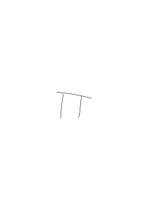

### [3r\[1\]](https://cdn.wittgensteinnachlass.com/2000px/webp/Ms-148/3r.webp)

“There is not only the gesture but a particular feeling which I can't describe”: instead of that you might have said: “I am trying to point out a feeling to you” this would be a grammatical remark showing how my information is meant to be used. This is almost similar as though I said “This I call ‘A’ & I am pointing out a _colour_ to you not a shape”.

### [3r\[2\]](https://cdn.wittgensteinnachlass.com/2000px/webp/Ms-148/3r.webp)

How can we point to the colour & not to the shape? Or to the feeling of toothache & not to the tooth etc.?

### [3r\[3\]](https://cdn.wittgensteinnachlass.com/2000px/webp/Ms-148/3r.webp)

What does one call “describing a feeling to someone”?

### [3r\[4\]](https://cdn.wittgensteinnachlass.com/2000px/webp/Ms-148/3r.webp)

“Never mind the shape, – look at the _colour_!”

### [3r\[5\]](https://cdn.wittgensteinnachlass.com/2000px/webp/Ms-148/3r.webp)

“Was there a feeling of pastness when you said you remembered …?” ‘I know of none’.

### [3r\[6\]](https://cdn.wittgensteinnachlass.com/2000px/webp/Ms-148/3r.webp)

How does one point to a number, draw attention to a number, _mean_ a number?

### [3r\[7\]](https://cdn.wittgensteinnachlass.com/2000px/webp/Ms-148/3r.webp),[3v\[1\]](https://cdn.wittgensteinnachlass.com/2000px/webp/Ms-148/3v.webp)

How do I call a taste “lemon-taste”? Is it by having that taste & saying the words: “I call the taste …”?

### [3v\[2\]](https://cdn.wittgensteinnachlass.com/2000px/webp/Ms-148/3v.webp)

And can I give a name to any _one_ taste-experience without giving the taste a common name which is to be used in common language? – “I give my feeling a name, nobody else can know what the name means.”

### [3v\[3\]](https://cdn.wittgensteinnachlass.com/2000px/webp/Ms-148/3v.webp)

A slave has to remind me of something & isn't to know what he reminds me of.

### [3v\[4\]](https://cdn.wittgensteinnachlass.com/2000px/webp/Ms-148/3v.webp)

I note down a word in my diary which serves to bring back a taste.

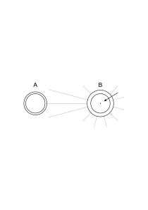

### [4r\[1\]](https://cdn.wittgensteinnachlass.com/2000px/webp/Ms-148/4r.webp)

II H H | | believe" … | | HI H I | | h. p.I H I | | | s.n.n s

| | | Lbl r r b | | Rr r b b | | g

### [5r\[1\]](https://cdn.wittgensteinnachlass.com/2000px/webp/Ms-148/5r.webp)

“I use the name for the impression directly & not in such a way that anyone else can understand it.”

### [5r\[2\]](https://cdn.wittgensteinnachlass.com/2000px/webp/Ms-148/5r.webp)

Buying something from oneself. Going through the operations of buying.

### [5r\[3\]](https://cdn.wittgensteinnachlass.com/2000px/webp/Ms-148/5r.webp)

My right hand selling to my left hand.

### [5r\[4\]](https://cdn.wittgensteinnachlass.com/2000px/webp/Ms-148/5r.webp)

Gefühls- (Gedanken-) Übertragung.

### [5r\[5\]](https://cdn.wittgensteinnachlass.com/2000px/webp/Ms-148/5r.webp)

Eine gute Art eine Farbe zu benennen wäre, in einer entsprechend gefärbten Tinte den Namen schreiben.

### [5r\[6\]](https://cdn.wittgensteinnachlass.com/2000px/webp/Ms-148/5r.webp)

“I name the feeling”– I don't quite know how you do this, what use you are making of the word.

### [5r\[7\]](https://cdn.wittgensteinnachlass.com/2000px/webp/Ms-148/5r.webp)

“I'm giving the feeling, which I have just now a name”. – I don't quite know what you are doing.

### [5r\[8\]](https://cdn.wittgensteinnachlass.com/2000px/webp/Ms-148/5r.webp),[5v\[1\]](https://cdn.wittgensteinnachlass.com/2000px/webp/Ms-148/5v.webp)

One might say: “What is the use of talking of our feeling at all. Let us devise a language which really only says what can be understood.” Thus I am not to say “I have a feeling of pastness”: But

### [5v\[2\]](https://cdn.wittgensteinnachlass.com/2000px/webp/Ms-148/5v.webp)

“This pain I call ‘toothache’ & I can never make him understand what it means”.

### [5v\[3\]](https://cdn.wittgensteinnachlass.com/2000px/webp/Ms-148/5v.webp)

We are under the impression that we can point to the pain, as it were unseen by the other person, & name it.

### [5v\[4\]](https://cdn.wittgensteinnachlass.com/2000px/webp/Ms-148/5v.webp)

For what does it mean that this pain is the meaning of this name?

### [5v\[5\]](https://cdn.wittgensteinnachlass.com/2000px/webp/Ms-148/5v.webp),[6r\[1\]](https://cdn.wittgensteinnachlass.com/2000px/webp/Ms-148/6r.webp)

Or, that the pain is the bearer of the name? It is the substantive ‘pain’ which puzzles us. This substantive seems to produce an illusion. What would things look like if we expressed pains by moaning & holding the painful spot? Or that we utter the word pain pointing to a spot. “But that the point is that we should say ‘pain’ when there really is pain.” But how am _I_ to know if there really is pain? if what I feel really is pain? Or, if I really have a _feeling_?– – –

### [6r\[2\]](https://cdn.wittgensteinnachlass.com/2000px/webp/Ms-148/6r.webp)

Es ist sehr nützlich zu bedenken: Wie würde ich in einer Gebärdensprache ausdrücken: “ich hatte keine Schmerzen, aber stellte mich, als ob ich welche hatte”?

### [6r\[3\]](https://cdn.wittgensteinnachlass.com/2000px/webp/Ms-148/6r.webp)

“Surely it isn't enough that he moans; I must be able to describe the state when he moans & hasn't got pains.”

### [6r\[4\]](https://cdn.wittgensteinnachlass.com/2000px/webp/Ms-148/6r.webp)

“He has pains, says he has pains & saying ‘pains’ _he means his_ pains.” How does he _mean_ his pains by the word ‘pain’ or ‘toothache’?

### [6r\[5\]](https://cdn.wittgensteinnachlass.com/2000px/webp/Ms-148/6r.webp)

“He says ‘I see green’ & means the colour he sees.” – If asked afterwards what did you mean by ‘green’ he might answer ‘I meant the colour’, pointing to it.

### [6v\[1\]](https://cdn.wittgensteinnachlass.com/2000px/webp/Ms-148/6v.webp)

“In my own case I know that when I say ‘I have pain’ this utterance is accompanied by something;– but is it also accompanied by something in another man?” In as much as his utterance needn't be accompanied by _my_ pain. I may say that it isn't accompanied by anything.

### [6v\[2\]](https://cdn.wittgensteinnachlass.com/2000px/webp/Ms-148/6v.webp)

“I know what I mean by ‘toothache’ but the other person can't _know_ it.”

### [6v\[3\]](https://cdn.wittgensteinnachlass.com/2000px/webp/Ms-148/6v.webp)

Als negation: “The deuce he is ….”

### [6v\[4\]](https://cdn.wittgensteinnachlass.com/2000px/webp/Ms-148/6v.webp)

Die Philosophie eines Stammes der als Negation nur den Ausdruck benützt: “I'll be damned if …”.

### [6v\[5\]](https://cdn.wittgensteinnachlass.com/2000px/webp/Ms-148/6v.webp)

On a beau dire ….

### [6v\[6\]](https://cdn.wittgensteinnachlass.com/2000px/webp/Ms-148/6v.webp)

“Man kann nie einen ganzen Körper sehen sondern nur immer einen Teil seiner Oberfläche.”

### [7r\[1\]](https://cdn.wittgensteinnachlass.com/2000px/webp/Ms-148/7r.webp)

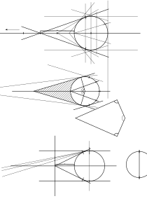

### [7v\[1\]](https://cdn.wittgensteinnachlass.com/2000px/webp/Ms-148/7v.webp)

They have the same number if to one 1 there always _corresponds_ one. If for one of these there _is_ always one of the others.

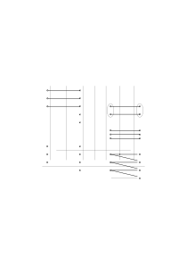

“Two rods are equally long if for any inch of the one there is an inch of the other”.

“There are these couples, whether I write them down or not.”

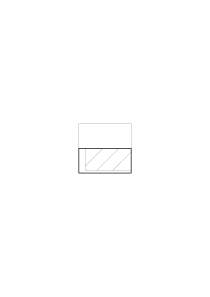

### [8r\[1\]](https://cdn.wittgensteinnachlass.com/2000px/webp/Ms-148/8r.webp)

“Give the impression a name!” that seems to have sense. “It seems to me that I can mean the impression”.

It seems to me that I can will the table to approach.

“Can one push air?”

### [8v\[1\]](https://cdn.wittgensteinnachlass.com/2000px/webp/Ms-148/8v.webp)

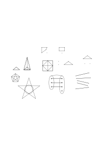

### [8v\[2\]](https://cdn.wittgensteinnachlass.com/2000px/webp/Ms-148/8v.webp),[9r\[1\]](https://cdn.wittgensteinnachlass.com/2000px/webp/Ms-148/9r.webp),[9v\[1\]](https://cdn.wittgensteinnachlass.com/2000px/webp/Ms-148/9v.webp),[10r\[1\]](https://cdn.wittgensteinnachlass.com/2000px/webp/Ms-148/10r.webp)

For each member of α there _is_ a member of β. The classes α & β fall into couples. This is similar with a proposition of say physics, e.g. “they join & form couples when they are brought together”. But this is just _not_ what is meant. We mean something that follows from what there exists in these classes. And we have an image of them, something like this:

If now we say for this there is this, for this there is this etc., this sounds as if we said something about the dots; like “this belongs to this etc.” whereas we are saying words & gestures to put them into couples. And this _is_ a way of finding whether they have the same number And now we must say that there are many different phenomena of equality of number or of having a certain number Just as having a length & having equal lengths. Let me remind you of the problem “are these two rods _now_ of the same length.” Take the definition you have to give of this expression when the rods have to be measured & on the other hand when you use this difference. “These bodies have the same weight” etc. Now consider: “There are as many grains of sand in this heap as in the other”. How do we know this? (This is no psychological question.) Now suppose we said we test it by connecting the classes one-one; then the question is: how shall we know that we have connected them? For there are several utterly different criteria. But further what shall we say in the cases where no such connection is possible? What about saying then that the members of the two similar classes still fall into couples?? Is this now an explanation? For when we gave it we thought of it as reducing the statement of numeric equality to simpler terms. The falling into couples was an image which in some cases was most natural namely in those in which there was the possibility of joining terms into couples. But in fact it wasn't at all the only aspect of numeric equality. The term “having the same number” in fact suggests a different aspect. I mean this

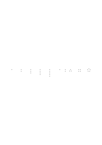

Having the same number can be interpreted as having the same one of these schemata. Of course this aspect too is only natural in a very limited number of cases. Aspect of _stars_. The explanation, that two classes have the same number if they fall into couples, is really taken from a case like

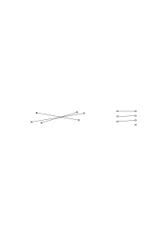

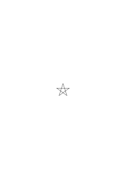

“The pentagram has twice as many points as the pentagon”. Demonstration Timelessness of the demonstrated proposition:

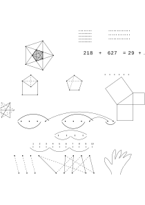

blue & red = purple.

### [10v\[1\]](https://cdn.wittgensteinnachlass.com/2000px/webp/Ms-148/10v.webp),[11r\[1\]](https://cdn.wittgensteinnachlass.com/2000px/webp/Ms-148/11r.webp)

We said that what we described as “numeral equality”, “being 1-1 correlated”, “having the number n” were widely differing phenomena. That therefore it was an illusion to think that to say “the classes fall in pairs” is, generally speaking an analysis of what we call numeric equality in simpler terms. We can if we like put “being numerically equal” = “falling into pairs” but the use of the one expression just as of the other has got to be explained in the particular case. This we only forget. Thinking about a very special class of examples.

<math display="inline"><mtext>–</mtext><mtext>–</mtext><mtext>–</mtext><mtext>–</mtext><mtext>–</mtext><mspace width="0.3em"/><mo>|</mo><mspace width="0.3em"/><mo>|</mo><mtext>─</mtext><mtext>─</mtext><mtext>─</mtext><mtext>─</mtext><mtext>─</mtext><mtext>─</mtext><mtext>─</mtext><mtext>─</mtext><mtext>─</mtext><mtext>─</mtext></math> The idea is that if they have the right existential structure they do fall into couples & _this_ is _demonstrated_. The question how we find out in the special case that they do have the right structures is neglected. One could also say that a length a was twice another one b if two a superimposed gave b. Application for wavelengths. This brings me to the topic of demonstration. 1)

number of outer vertices = 5.

Compare with “the Hand has 5 Fingers.” Timelessness. The same holds of “The number of outer vertices = number of inner vertices”. Question which is answered by this proposition timeless. Apparent generality of demonstration The copula has no tenses. [unreadable] idea is that the idea of a pentagram is bound up with a cardinal number Now, we could make all sorts of connections.

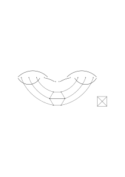

“It is the essence of these figures to be capable of being divided in this way”.

### [11v\[1\]](https://cdn.wittgensteinnachlass.com/2000px/webp/Ms-148/11v.webp),[12r\[1\]](https://cdn.wittgensteinnachlass.com/2000px/webp/Ms-148/12r.webp)

_Pythagoras_

Is the result of the process taken as a standard or not.

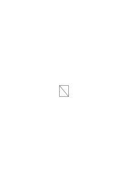

“These two triangles by this nature _give_ the rectangle”.

This aspect might never have struck you.

a + ([unreadable]) = ([unreadable] + b) + c

a + (b + 1) = (a + b) + 1

a + (b + 2) = (a + b) + 2 It _seems_ you can't get out. You _must_ adopt a + (b + c) = (a + b) + c if you adopt a + (b + 1) = (a + b) + 1.

### [12r\[2\]](https://cdn.wittgensteinnachlass.com/2000px/webp/Ms-148/12r.webp)

But _need_ we really say that a + (b + 2) = (a + b) + 2 follows from a + (b + 1) = (a + b) + 1?

### [12r\[3\]](https://cdn.wittgensteinnachlass.com/2000px/webp/Ms-148/12r.webp)

The reasoning is: a + (b + 2) = a + (b + (1 + 1)) = a + ((b + 1) + 1) =

= (a + (b + 1)) + 1 = ((a + b) + 1) + 1 = (a + b) + (1 + 1)

5 + (6 + 1) = (5 + 6) + 1

5 + (6 + 2) =

### [12r\[4\]](https://cdn.wittgensteinnachlass.com/2000px/webp/Ms-148/12r.webp),[12v\[1\]](https://cdn.wittgensteinnachlass.com/2000px/webp/Ms-148/12v.webp)

I show you a curve drawn in a pentagon which you had never thought of & I say: I am showing you that this curve _can_ be drawn, – or: that there is such a curve in the pentagon. That there _are_ two twos in four.

### [12v\[2\]](https://cdn.wittgensteinnachlass.com/2000px/webp/Ms-148/12v.webp)

Is there really no way out of saying, say, that a triangle which has 3 equal sides has also three equal angles.

### [12v\[3\]](https://cdn.wittgensteinnachlass.com/2000px/webp/Ms-148/12v.webp),[13r\[1\]](https://cdn.wittgensteinnachlass.com/2000px/webp/Ms-148/13r.webp)

Does

consist of

 &

?

It depends what kind of dispute it is. You could say it consisted of

 &

.

Is the dispute one about facts or mode of description?

Counting

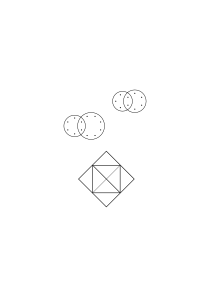

This doesn't show that a + b fits but

it shows that it looks like it does. “What kind of figure do you get if you draw the diagonals in a Pentagon?” What sort of body do you get if you draw the diagonals on a dodecaeder.

What kind of number do you get if you draw 3s in 9.

What kind of colour do you get if you mix red with yellow?

“The figure shows him that a pentagram fits into a pentagon”. Is this an experimental result?

### [13v\[1\]](https://cdn.wittgensteinnachlass.com/2000px/webp/Ms-148/13v.webp)

I am now talking always of a particular kind of demonstration; what one might call a visual demonstration.

### [13v\[2\]](https://cdn.wittgensteinnachlass.com/2000px/webp/Ms-148/13v.webp)

In what sense could I say that I didn't know that the pentagram fitted the pentagon? Could I have imagined the opposite? Suppose I had imagined the opposite in some sense then in the same sense I could still hold the opposite after the demonstration.

### [13v\[3\]](https://cdn.wittgensteinnachlass.com/2000px/webp/Ms-148/13v.webp)

We are talking of the star of which I did _not_ know whether it fitted the pentagon or not.

Then I try & find that they fit. This is just like making an experiment.

### [14r\[1\]](https://cdn.wittgensteinnachlass.com/2000px/webp/Ms-148/14r.webp)

“I never knew that I could see the Pentagon & its diagonals in _this_ aspect.”

“Oh, that's how it fits!”

Two tunes fitting together.

### [14v\[1\]](https://cdn.wittgensteinnachlass.com/2000px/webp/Ms-148/14v.webp)

“I don't know whether the pentagram fits the pentagon. If so the diagonals of a pentagon must give a pentagram. Let's try it.”

Is to see the figure

an experiment? Or to see side by side the figures

?

But doesn't it teach us something?

_“It never struck me.”_

### [14v\[2\]](https://cdn.wittgensteinnachlass.com/2000px/webp/Ms-148/14v.webp)

It seems we are learning by experience a timeless truth about the shape of a Pentagon & of a Pentagram.

### [14v\[3\]](https://cdn.wittgensteinnachlass.com/2000px/webp/Ms-148/14v.webp),[15r\[1\]](https://cdn.wittgensteinnachlass.com/2000px/webp/Ms-148/15r.webp)

“I never knew that one could look at it that way. I had never seen the pentagram in the pentagon.”

### [15r\[2\]](https://cdn.wittgensteinnachlass.com/2000px/webp/Ms-148/15r.webp)

It is a new experience to me. But is it the experience teaching me that the pentagram fits the pentagon?

### [15r\[3\]](https://cdn.wittgensteinnachlass.com/2000px/webp/Ms-148/15r.webp)

We feel that here are two visual individualities which in the third picture we see combined & that we see that they are capable of this particular combination.

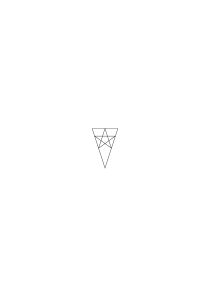

The fact is that the combination (not meaning Relation but Complex) strongly strikes us.

### [15r\[4\]](https://cdn.wittgensteinnachlass.com/2000px/webp/Ms-148/15r.webp)

“The visual image p fits the visual image P.” The importance of this proposition lies in this that it seems a proposition of experience & that on the other hand it also is used as a proposition of geometry i.e. of grammar.

### [15r\[5\]](https://cdn.wittgensteinnachlass.com/2000px/webp/Ms-148/15r.webp),[15v\[1\]](https://cdn.wittgensteinnachlass.com/2000px/webp/Ms-148/15v.webp)

What is the use of the proposition that p fits P? “If you draw the diagonals in P you get p.”

“If you do this & this & this & this you get Napoleon.”

### [15v\[2\]](https://cdn.wittgensteinnachlass.com/2000px/webp/Ms-148/15v.webp)

Problem: “Draw that Star which will fit the Pentagon.” This is a mathematical problem.

### [15v\[3\]](https://cdn.wittgensteinnachlass.com/2000px/webp/Ms-148/15v.webp)

“What do the diagonals of a P look like?”

### [15v\[4\]](https://cdn.wittgensteinnachlass.com/2000px/webp/Ms-148/15v.webp)

We look at a puzzle picture & find a man in the foliage of a tree. Our visual impression changes. But can't we say that the new experience would have been _impossible_ if the old one hadn't been what it was? Such that we seem bound to say the new experience was already preformed in the old one. Or that I found something new which was already in the essence of the first picture.

### [15v\[5\]](https://cdn.wittgensteinnachlass.com/2000px/webp/Ms-148/15v.webp)

We seem to have demonstrated an internal property of the old picture.

### [16r\[1\]](https://cdn.wittgensteinnachlass.com/2000px/webp/Ms-148/16r.webp)

Demonstrating that this

is contained

in this

“It is in the nature of this to contain this”

### [16r\[2\]](https://cdn.wittgensteinnachlass.com/2000px/webp/Ms-148/16r.webp)

<math class="stacked" display="inline"><mn>17</mn><mn>38</mn><mover><mrow><mn>55</mn></mrow><mo>‾</mo></mover></math> If you do this & this etc. you get 55.

### [16r\[3\]](https://cdn.wittgensteinnachlass.com/2000px/webp/Ms-148/16r.webp)

Die mathematische Frage.

Could the Pythagorean theorem be _assumed_ instead of being deduced?

### [16r\[4\]](https://cdn.wittgensteinnachlass.com/2000px/webp/Ms-148/16r.webp)

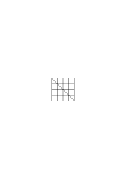

### [16v\[1\]](https://cdn.wittgensteinnachlass.com/2000px/webp/Ms-148/16v.webp)

“It never struck me that this

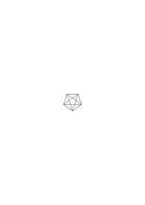

was this

.”

Something timeless seems to have struck us: How can the identity of these entities strike us?

It never struck me that 5 consisted of 3 + 2.

### [16v\[2\]](https://cdn.wittgensteinnachlass.com/2000px/webp/Ms-148/16v.webp),[17r\[1\]](https://cdn.wittgensteinnachlass.com/2000px/webp/Ms-148/17r.webp)

To see five figures as 3 figures + 2 figures. If 5 _is_ = 2 + 3 it can't mean anything to see 5 as 2 + 3.

❘ ❘ ❘ ❘ ❘

You could divide 5 into 2 + 3 but not into 3 + 3 as you could 6.

<math display="inline"><mo>|</mo><mspace width="0.3em"/><mo>|</mo><mspace width="0.3em"/><mo>|</mo><mspace width="0.3em"/><mo>|</mo><mspace width="0.3em"/><mo>|</mo><mspace width="0.3em"/><mo>|</mo><mo>|</mo><mspace width="0.3em"/><mo>|</mo><mspace width="0.3em"/><mo>|</mo><mspace width="0.3em"/><mo>|</mo><mspace width="0.3em"/><mo>|</mo><mspace width="0.3em"/><mo>|</mo><mspace width="0.3em"/><mo>|</mo><mtext>Obstacle</mtext></math> <math display="inline"><mo>|</mo><mspace width="0.3em"/><mo>|</mo><mspace width="0.3em"/><mo>|</mo><mspace width="0.3em"/><mo>|</mo><mspace width="0.3em"/><mo>|</mo><mspace width="0.3em"/><mo>|</mo><mo>|</mo><mspace width="0.3em"/><mo>|</mo><mspace width="0.3em"/><mo>|</mo><mtext><mo>|</mo></mtext><mo>|</mo><mspace width="0.3em"/><mo>|</mo><mspace width="0.3em"/><mo>|</mo><mspace width="0.3em"/><mo>|</mo><mspace width="0.3em"/><mo>|</mo><mo>|</mo><mspace width="0.3em"/><mo>|</mo><mspace width="0.3em"/><mo>|</mo><mspace width="0.3em"/><mo>|</mo><mspace width="0.3em"/><mo>|</mo></math>

### [17r\[2\]](https://cdn.wittgensteinnachlass.com/2000px/webp/Ms-148/17r.webp),[17v\[1\]](https://cdn.wittgensteinnachlass.com/2000px/webp/Ms-148/17v.webp)

The whole question is really: “can it _strike_ you what a thing _is_?”

It seems you can find out something about the _nature_ of a thing by experience. About its internal nature. Thus e.g. a _similarity_ can strike you; the fact that a complex _contains_ a constituent; even identity of shape. Two tunes fitting.

### [17v\[2\]](https://cdn.wittgensteinnachlass.com/2000px/webp/Ms-148/17v.webp)

“One can see immediately that 4 consists of 2 + 2”. This is nonsense if 4 = 2 + 2.

### [17v\[3\]](https://cdn.wittgensteinnachlass.com/2000px/webp/Ms-148/17v.webp)

### [17v\[4\]](https://cdn.wittgensteinnachlass.com/2000px/webp/Ms-148/17v.webp)

~ [~p ∙ ~(~r ∙ ~s)] ∙ ~[~(~t ∙ ~~s ∙ ~t)) ∙ ~p]

### [17v\[5\]](https://cdn.wittgensteinnachlass.com/2000px/webp/Ms-148/17v.webp),[18r\[1\]](https://cdn.wittgensteinnachlass.com/2000px/webp/Ms-148/18r.webp)

What do I do when _I draw your attention to a fact_ about, say, this formula? It seems I make you see something about its essence. You get a new experience; but this experience, it seems, teaches you something about the essence the internal nature of the formula. It seems to teach you a mathematical (or logical) truth & this does not seem to be a rule of grammar but a truth about the nature of things.

### [18r\[2\]](https://cdn.wittgensteinnachlass.com/2000px/webp/Ms-148/18r.webp)

If I made an experiment with a certain figure we can [unreadable] imagine this or that result. But if I draw your attention to a feature …

### [18r\[3\]](https://cdn.wittgensteinnachlass.com/2000px/webp/Ms-148/18r.webp)

It consists of … appears to have 1) a grammatical meaning 2) a physical meaning & 3) a meaning lying between these two.

### [18r\[4\]](https://cdn.wittgensteinnachlass.com/2000px/webp/Ms-148/18r.webp)

We seem to learn something about the very sense-datum.

### [18r\[5\]](https://cdn.wittgensteinnachlass.com/2000px/webp/Ms-148/18r.webp)

Tribe describing

as

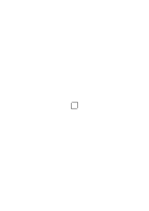

or

.

### [18r\[6\]](https://cdn.wittgensteinnachlass.com/2000px/webp/Ms-148/18r.webp)

A certain symbolism will easily go with a certain aspect of looking at a thing.

### [18r\[7\]](https://cdn.wittgensteinnachlass.com/2000px/webp/Ms-148/18r.webp)

“They regard the square as a double right angle.”

### [18r\[8\]](https://cdn.wittgensteinnachlass.com/2000px/webp/Ms-148/18r.webp),[18v\[1\]](https://cdn.wittgensteinnachlass.com/2000px/webp/Ms-148/18v.webp)

“

consists of

 &

”.

“

consists of

 &

”.

In one case you say that it consists if it is divided. In the other case you seem to say that the undivided object consists (timelessly) if you have seen a similar object divided. Or you say that the object is divided if you have divided its picture.

### [18v\[2\]](https://cdn.wittgensteinnachlass.com/2000px/webp/Ms-148/18v.webp)

I dispose about 5 soldiers, I imagine them & say: I'll send ∣∣∣ to this place and ∣∣ to that. Have I thereby divided them into 2 + 3 Soldiers & seen that it's possible. What if I had imagined this picture

& said I'll send ∣∣∣ to this place & ∣∣∣ to that?

### [18v\[3\]](https://cdn.wittgensteinnachlass.com/2000px/webp/Ms-148/18v.webp)

What happens if our attention is drawn to something. <math class="stacked" display="inline"><munder><mrow><mn>1</mn></mrow><mo>&#95;</mo></munder><mspace width="0.3em"/><mo>:</mo><mspace width="0.3em"/><mn>3</mn><mspace width="0.3em"/><mo>=</mo><mspace width="0.3em"/><mtext>0˙</mtext><mn>3</mn><munder><mrow><mn>1</mn></mrow><mo>&#95;</mo></munder><mtext>1˙</mtext><mn>0</mn><mspace width="0.3em"/><mo>:</mo><mspace width="0.3em"/><mn>7</mn><mspace width="0.3em"/><mo>=</mo><mspace width="0.3em"/><mtext>0˙</mtext><mn>14285</mn><mover><mrow><mn>7</mn></mrow><mtext>˙</mtext></mover><mn>30</mn><mn>20</mn><mn>60</mn><mn>40</mn><mn>50</mn><mn>1</mn></math>

### [18v\[4\]](https://cdn.wittgensteinnachlass.com/2000px/webp/Ms-148/18v.webp)

One couldn't call 0˙3̇ a shorthand for 0˙333 …. Except insofar as 0˙33 … is also a shorthand for 0˙333 ….

### [18v\[5\]](https://cdn.wittgensteinnachlass.com/2000px/webp/Ms-148/18v.webp),[19r\[1\]](https://cdn.wittgensteinnachlass.com/2000px/webp/Ms-148/19r.webp)

“Don't try to find a 4 in the development it's hopeless!” – “Don't multiply 25 × 25 again & again in the hope to find 600; it's hopeless!” What's it like to _try to find_ a 4 in the development of 1 : 3? And what is it like to find a 4.

### [19r\[2\]](https://cdn.wittgensteinnachlass.com/2000px/webp/Ms-148/19r.webp)

What is the importance of the question: “What is it like?” or “What is the verification?”

### [19r\[3\]](https://cdn.wittgensteinnachlass.com/2000px/webp/Ms-148/19r.webp)

Kein Kalkül ist im “Widerspruch mit der Logik” d.h. mit gewissen Regeln die über allen andern stehen. Die Annahme einer obersten Logik ist es, die hier irreführt.

### [19r\[4\]](https://cdn.wittgensteinnachlass.com/2000px/webp/Ms-148/19r.webp)

What we should call finding a 4 in 1/3 obviously depends upon the operations in this case.

### [19r\[5\]](https://cdn.wittgensteinnachlass.com/2000px/webp/Ms-148/19r.webp)

What does it mean to imagine getting a result from a calculation? How far is this imagination to go?

### [19r\[6\]](https://cdn.wittgensteinnachlass.com/2000px/webp/Ms-148/19r.webp)

“There isn't a 4 in the first million places”– “You've got a quick way of calculating that!”

### [19r\[7\]](https://cdn.wittgensteinnachlass.com/2000px/webp/Ms-148/19r.webp),[19v\[1\]](https://cdn.wittgensteinnachlass.com/2000px/webp/Ms-148/19v.webp)

Imagine this operation: A decimal fraction constructed by multiplying again & again 25 × 25

: 0˙625625625 …

Look for an 8 in it!” “You know that you will never find an 8” means:

“Don't try to divide 2476 without remainder by 3 it's hopeless”.

### [19v\[2\]](https://cdn.wittgensteinnachlass.com/2000px/webp/Ms-148/19v.webp)

In which case is it hopeless to find a particular result by a calculation?

### [19v\[3\]](https://cdn.wittgensteinnachlass.com/2000px/webp/Ms-148/19v.webp)

Calculating is the process of imagining a calculation.

### [19v\[4\]](https://cdn.wittgensteinnachlass.com/2000px/webp/Ms-148/19v.webp)

“I can hope to find an 8 in the Product 284 × 379.”

### [19v\[5\]](https://cdn.wittgensteinnachlass.com/2000px/webp/Ms-148/19v.webp)

To say “it's hopeless to find a certain result _really_ means: our calculation _has already shown it to be wrong_.

### [19v\[6\]](https://cdn.wittgensteinnachlass.com/2000px/webp/Ms-148/19v.webp)

Or: we have a calculation which we make have that opposite result.

### [19v\[7\]](https://cdn.wittgensteinnachlass.com/2000px/webp/Ms-148/19v.webp)

What is the 56th place of 1 : 7? You can now say it seems what the 10¹⁰ place ‘_will_’ be.

### [20r\[1\]](https://cdn.wittgensteinnachlass.com/2000px/webp/Ms-148/20r.webp)

How can one calculation anticipate the result of another?

### [20r\[2\]](https://cdn.wittgensteinnachlass.com/2000px/webp/Ms-148/20r.webp)

Or: Our calculus has already _decided against it_.

### [20r\[3\]](https://cdn.wittgensteinnachlass.com/2000px/webp/Ms-148/20r.webp)

What does it mean: to prophesy what one will _correctly_ find.

### [20r\[4\]](https://cdn.wittgensteinnachlass.com/2000px/webp/Ms-148/20r.webp)

<math display="block">
  <mspace width="0.3em"/>
  <mtext>∙</mtext>
  <mspace width="0.3em"/>
  <mo>|</mo>
  <mspace width="0.3em"/>
  <mtext>∙</mtext>
  <mspace width="0.3em"/>
  <mo>|</mo>
  <mspace width="0.3em"/>
  <mtext>∙</mtext>
  <mspace width="0.3em"/>
  <mo>|</mo>
  <mspace width="0.3em"/>
  <mtext>∙</mtext>
  <mspace width="0.3em"/>
  <mo>|</mo>
  <mspace width="0.3em"/>
  <mtext>∙</mtext>
  <mspace width="0.3em"/>
  <mo>|</mo>
  <mspace width="0.3em"/>
  <mo>|</mo>
  <mn>29</mn>
  <mspace width="0.3em"/>
  <mo>×</mo>
  <mspace width="0.3em"/>
  <mn>34</mn>
  <mspace width="0.3em"/>
  <mo>=</mo>
  <mspace width="0.3em"/>
  <mn>34</mn>
  <mspace width="0.3em"/>
  <mo>×</mo>
  <mspace width="0.3em"/>
  <mn>29</mn>
  <mspace width="0.3em"/>
  <mtext>∙</mtext>
  <mspace width="0.3em"/>
  <mo>|</mo>
  <mspace width="0.3em"/>
  <mtext>∙</mtext>
  <mspace width="0.3em"/>
  <mo>|</mo>
  <mspace width="0.3em"/>
  <mtext>∙</mtext>
  <mspace width="0.3em"/>
  <mo>|</mo>
  <mspace width="0.3em"/>
  <mtext>∙</mtext>
  <mspace width="0.3em"/>
  <mo>|</mo>
  <mspace width="0.3em"/>
  <mtext>∙</mtext>
  <mspace width="0.3em"/>
  <mtext>∙</mtext>
  <mspace width="0.3em"/>
  <mo>|</mo>
  <mspace width="0.3em"/>
  <mtext>∙</mtext>
  <mspace width="0.3em"/>
  <mo>|</mo>
  <mspace width="0.3em"/>
  <mtext>∙</mtext>
  <mspace width="0.3em"/>
  <mo>|</mo>
  <mspace width="0.3em"/>
  <mtext>∙</mtext>
  <mspace width="0.3em"/>
  <mo>|</mo>
  <mspace width="0.3em"/>
  <mtext>∙</mtext>
  <mspace width="0.3em"/>
  <mtext>∙</mtext>
  <mspace width="0.3em"/>
  <mo>|</mo>
  <mspace width="0.3em"/>
  <mtext>∙</mtext>
  <mspace width="0.3em"/>
  <mo>|</mo>
  <mspace width="0.3em"/>
  <mtext>∙</mtext>
  <mspace width="0.3em"/>
  <mo>|</mo>
  <mspace width="0.3em"/>
  <mtext>∙</mtext>
  <mspace width="0.3em"/>
  <mo>|</mo>
  <mspace width="0.3em"/>
  <mtext>∙</mtext>
  <mspace width="0.3em"/>
  <mtext>∙</mtext>
  <mspace width="0.3em"/>
  <mo>|</mo>
  <mspace width="0.3em"/>
  <mtext>∙</mtext>
  <mspace width="0.3em"/>
  <mo>|</mo>
  <mspace width="0.3em"/>
  <mtext>∙</mtext>
  <mspace width="0.3em"/>
  <mo>|</mo>
  <mspace width="0.3em"/>
  <mtext>∙</mtext>
  <mspace width="0.3em"/>
  <mo>|</mo>
  <mspace width="0.3em"/>
  <mtext>∙</mtext>
  <mspace width="0.3em"/>
  <mtext>∙</mtext>
  <mspace width="0.3em"/>
  <mo>|</mo>
  <mspace width="0.3em"/>
  <mtext>∙</mtext>
  <mspace width="0.3em"/>
  <mo>|</mo>
  <mspace width="0.3em"/>
  <mtext>∙</mtext>
  <mspace width="0.3em"/>
  <mo>|</mo>
  <mspace width="0.3em"/>
  <mtext>∙</mtext>
  <mspace width="0.3em"/>
  <mo>|</mo>
  <mspace width="0.3em"/>
  <mtext>∙</mtext>
  <mspace width="0.3em"/>
  <mo>|</mo>
  <mspace width="0.3em"/>
  <mo>|</mo>
  <mn>3102</mn>
  <mspace width="0.3em"/>
  <mo>×</mo>
  <mspace width="0.3em"/>
  <mn>2331</mn>
  <mspace width="0.3em"/>
  <mo>|</mo>
  <mspace width="0.3em"/>
  <mo>|</mo>
  <mn>2331</mn>
  <mspace width="0.3em"/>
  <mo>×</mo>
  <mspace width="0.3em"/>
  <mn>3102</mn>
  <mspace width="0.3em"/>
  <mtext>∙</mtext>
  <mspace width="0.3em"/>
  <mo>|</mo>
  <mspace width="0.3em"/>
  <mtext>∙</mtext>
  <mspace width="0.3em"/>
  <mo>|</mo>
  <mspace width="0.3em"/>
  <mtext>∙</mtext>
  <mspace width="0.3em"/>
  <mo>|</mo>
  <mspace width="0.3em"/>
  <mtext>∙</mtext>
  <mspace width="0.3em"/>
  <mo>|</mo>
  <mspace width="0.3em"/>
  <mtext>∙</mtext>
  <mspace width="0.3em"/>
  <mtext>∙</mtext>
  <mspace width="0.3em"/>
  <mo>|</mo>
  <mspace width="0.3em"/>
  <mtext>∙</mtext>
  <mspace width="0.3em"/>
  <mo>|</mo>
  <mspace width="0.3em"/>
  <mtext>∙</mtext>
  <mspace width="0.3em"/>
  <mo>|</mo>
  <mspace width="0.3em"/>
  <mtext>∙</mtext>
  <mspace width="0.3em"/>
  <mo>|</mo>
  <mspace width="0.3em"/>
  <mtext>∙</mtext>
</math>

### [20r\[5\]](https://cdn.wittgensteinnachlass.com/2000px/webp/Ms-148/20r.webp)

Das Bild “Alle” angewandt auf die Unendlichkeit.

### [20r\[6\]](https://cdn.wittgensteinnachlass.com/2000px/webp/Ms-148/20r.webp)

To show mathematically that a 4 can be found is to describe what it is like to find a 4. And to find a 4 is here a process in space and time.

### [20r\[7\]](https://cdn.wittgensteinnachlass.com/2000px/webp/Ms-148/20r.webp)

“Find, as the result of a calculation” & “Find, otherwise”.

### [20r\[8\]](https://cdn.wittgensteinnachlass.com/2000px/webp/Ms-148/20r.webp)

In 1 : 7 gibt es ein endliches Problem & ein unendliches.

### [20v\[1\]](https://cdn.wittgensteinnachlass.com/2000px/webp/Ms-148/20v.webp)

Two processes of calculation lead to the same result.

### [20v\[2\]](https://cdn.wittgensteinnachlass.com/2000px/webp/Ms-148/20v.webp)

“What if they at some stage did not lead to the same

result”. – “That is impossible, we couldn't imagine their not leading to the same result.” But then the proof of their leading to the same result showed us what it was like to lead to the same result.

### [20v\[3\]](https://cdn.wittgensteinnachlass.com/2000px/webp/Ms-148/20v.webp)

### [21r\[1\]](https://cdn.wittgensteinnachlass.com/2000px/webp/Ms-148/21r.webp)

<math display="block">
  <munder>
    <mrow>
      <mn>34</mn>
      <mspace width="0.3em"/>
      <mo>×</mo>
      <mspace width="0.3em"/>
      <mn>25</mn>
    </mrow>
    <mo>&#95;</mo>
  </munder>
  <mspace width="0.3em"/>
  <mn>68</mn>
  <munder>
    <mrow>
      <mn>170</mn>
    </mrow>
    <mo>&#95;</mo>
  </munder>
  <mspace width="0.3em"/>
  <mn>850</mn>
  <mspace width="0.3em"/>
  <mo>|</mo>
  <mspace width="0.3em"/>
  <mo>|</mo>
  <mo>√</mo>
  <mn>49</mn>
  <mspace width="0.3em"/>
  <mo>=</mo>
</math>

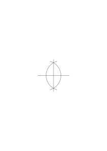

### [21r\[2\]](https://cdn.wittgensteinnachlass.com/2000px/webp/Ms-148/21r.webp)

The difficulty consists in this that it here seems impossible to imagine anything but what really is the case: And that of course means nothing! We don't seem to be able to imagine finding a 4, _because_ there is a three there. But then how are we capable of _imagining_ to find a 3 _as there is_ a 3 there?

### [21r\[3\]](https://cdn.wittgensteinnachlass.com/2000px/webp/Ms-148/21r.webp),[21v\[1\]](https://cdn.wittgensteinnachlass.com/2000px/webp/Ms-148/21v.webp)

If I say I can't imagine a 4 to result it means that the calculation shows me what it means to imagine a 3 to result & gives no sense to the proposition “I imagine a 4 to result”.

### [21v\[2\]](https://cdn.wittgensteinnachlass.com/2000px/webp/Ms-148/21v.webp)

x² + ax + b = 0 “Solve this equation algebraically!”

### [21v\[3\]](https://cdn.wittgensteinnachlass.com/2000px/webp/Ms-148/21v.webp)

“Do something that has an analogy to ….” But we can't be sure that we shall not in the end give up the idea of something being analogous to ….

### [21v\[4\]](https://cdn.wittgensteinnachlass.com/2000px/webp/Ms-148/21v.webp)

The existence of a ‘solution’ seems to show clearly that there was a clear & definite problem.

### [21v\[5\]](https://cdn.wittgensteinnachlass.com/2000px/webp/Ms-148/21v.webp)

Suppose we said that a solution is a solution only so far as it could have been described before it was found.

### [21v\[6\]](https://cdn.wittgensteinnachlass.com/2000px/webp/Ms-148/21v.webp)

“Solve x² + 2ab + b² = 0.”

“Solve x² + 4x + 5 = 0.”

### [22r\[1\]](https://cdn.wittgensteinnachlass.com/2000px/webp/Ms-148/22r.webp)

“We can't imagine that 1 : 7 should not repeat itself after the dividend has come back.” <math display="inline"><mn>1</mn><mspace width="0.3em"/><mo>:</mo><mspace width="0.3em"/><mn>7</mn><mspace width="0.3em"/><mo>=</mo><mspace width="0.3em"/><mtext>0˙</mtext><mn>30</mn><mn>20</mn><mn>60</mn><mn>40</mn><mn>50</mn><mn>1</mn><mspace width="0.3em"/><mo>|</mo><mspace width="0.3em"/><mo>|</mo><mo>[</mo><mn>1</mn><mspace width="0.3em"/><mo>|</mo><mspace width="0.3em"/><mn>2</mn><mspace width="0.3em"/><mn>3</mn><mspace width="0.3em"/><mn>4</mn><mspace width="0.3em"/><mn>5</mn><mspace width="0.3em"/><mo>|</mo><mspace width="0.3em"/><mo>,</mo><mspace width="0.3em"/><mn>1</mn><mspace width="0.3em"/><mn>2</mn><mspace width="0.3em"/><mn>3</mn><mspace width="0.3em"/><mn>4</mn><mspace width="0.3em"/><mn>5</mn><mspace width="0.3em"/><mn>6</mn><mspace width="0.3em"/><mo>,</mo><mspace width="0.3em"/><mn>1</mn><mspace width="0.3em"/><mn>2</mn><mspace width="0.3em"/><mn>3</mn><mspace width="0.3em"/><mn>2</mn><mspace width="0.3em"/><mn>1</mn><mspace width="0.3em"/><mn>2</mn><mspace width="0.3em"/><mn>3</mn><mspace width="0.3em"/><mn>4</mn><mspace width="0.3em"/><mn>5</mn><mspace width="0.3em"/><mn>6</mn><mspace width="0.3em"/><mo>,</mo><mspace width="0.3em"/><mn>1</mn><mspace width="0.3em"/><mn>2</mn><mspace width="0.3em"/><mn>3</mn><mspace width="0.3em"/><mn>4</mn><mspace width="0.3em"/><mn>5</mn><mspace width="0.3em"/><mn>6</mn><mspace width="0.3em"/><mo>,</mo><mspace width="0.3em"/><mn>1</mn><mspace width="0.3em"/><mn>2</mn><mspace width="0.3em"/><mn>3</mn><mspace width="0.3em"/><mn>4</mn><mspace width="0.3em"/><mn>5</mn><mspace width="0.3em"/><mn>61</mn><mspace width="0.3em"/><mn>2</mn><mspace width="0.3em"/><mn>3</mn><mspace width="0.3em"/><mn>4</mn><mspace width="0.3em"/><mn>5</mn><mspace width="0.3em"/><mn>6</mn><mspace width="0.3em"/><mo>|</mo><mspace width="0.3em"/><mn>7</mn><mspace width="0.3em"/><mn>8</mn><mspace width="0.3em"/><mn>9</mn><mspace width="0.3em"/><mn>10</mn><mspace width="0.3em"/><mn>11</mn><mspace width="0.3em"/><mn>12</mn><mspace width="0.3em"/><mo>|</mo><mspace width="0.3em"/><mn>13</mn><mspace width="0.3em"/><mn>14</mn><mspace width="0.3em"/><mn>15</mn><mspace width="0.3em"/><mn>16</mn><mspace width="0.3em"/><mn>16</mn><mspace width="0.3em"/><mo>:</mo><mspace width="0.3em"/><mn>6</mn><mspace width="0.3em"/><mo>=</mo><mspace width="0.3em"/><mn>2</mn><mspace width="0.3em"/><mn>4</mn><mspace width="0.3em"/><mtext>13]</mtext></math>

### [22r\[2\]](https://cdn.wittgensteinnachlass.com/2000px/webp/Ms-148/22r.webp)

We have two ways of calculating the <math class="stacked" display="inline"><mtext>10¹</mtext><msup><mtext>⁰</mtext><mtext>th</mtext></msup></math> place & we can't imagine that they lead to different results.

### [22r\[3\]](https://cdn.wittgensteinnachlass.com/2000px/webp/Ms-148/22r.webp)

Ist es eine Bestätigung hierfür wenn die beiden Bemerkungen in einem bestimmten Fall übereinstimmen?

### [22r\[4\]](https://cdn.wittgensteinnachlass.com/2000px/webp/Ms-148/22r.webp)

Is it different to say “they lead to the same result” & “they _must_ lead to the same result”?

### [22r\[5\]](https://cdn.wittgensteinnachlass.com/2000px/webp/Ms-148/22r.webp)

Does it mean anything to “prophesy” the result of a calculation?

---

### [22r\[6\]](https://cdn.wittgensteinnachlass.com/2000px/webp/Ms-148/22r.webp)

We say we can't imagine that the two processes should not lead to the same result. What does it mean, we can't imagine it?

### [22v\[1\]](https://cdn.wittgensteinnachlass.com/2000px/webp/Ms-148/22v.webp)

### [22v\[2\]](https://cdn.wittgensteinnachlass.com/2000px/webp/Ms-148/22v.webp)

Must we recognise Periodicity as a proof that there will be no 6 in the development of 1 : 7?

### [22v\[3\]](https://cdn.wittgensteinnachlass.com/2000px/webp/Ms-148/22v.webp)

“How does it happen that 3 × 4 is 4 × 3?”

### [22v\[4\]](https://cdn.wittgensteinnachlass.com/2000px/webp/Ms-148/22v.webp)

“An dieser Stelle muß eine Primzahl kommen” – “An dieser Stelle kommt eine Primzahl”.

### [22v\[5\]](https://cdn.wittgensteinnachlass.com/2000px/webp/Ms-148/22v.webp)

‘Gibt es einen Zufall in der Mathematik?’

### [22v\[6\]](https://cdn.wittgensteinnachlass.com/2000px/webp/Ms-148/22v.webp)

_How_ does the returning to the dividend show me the periodicity of the quotient.

### [22v\[7\]](https://cdn.wittgensteinnachlass.com/2000px/webp/Ms-148/22v.webp),[23r\[1\]](https://cdn.wittgensteinnachlass.com/2000px/webp/Ms-148/23r.webp)

We seem in one kind of thought to make jumps in the other to fill in step by step. And the latter process seems to justify the former. “_You see_ it just leads to the same result!”

### [23r\[2\]](https://cdn.wittgensteinnachlass.com/2000px/webp/Ms-148/23r.webp)

Denke an den Fall wenn man mehrere Züge in einem Spiel zusammenzieht & etwa im Schach gar nicht erst mit der ersten Position anfängt.

### [23r\[3\]](https://cdn.wittgensteinnachlass.com/2000px/webp/Ms-148/23r.webp),[23v\[1\]](https://cdn.wittgensteinnachlass.com/2000px/webp/Ms-148/23v.webp)

“Die Form ‘1 2 3 4 5’ paßt auf die Form

.”

Was für ein Faktum ist das, daß die Reihenfolge das Resultat nicht ändert.

The process we are going through just _does_ lead to the same result; – but so far as it “leads to the same result” we could imagine it to lead to a different result. And so far as we couldn't imagine it to lead to a different result it doesn't lead to any result but shows what it's like to lead to the same result. I.e.: If we look at the _Forms_

& 12345 as equivalent there ceases to be a question of whether the two processes lead to the same or to different results & the apparent experiment serves only to show what sort of fact we take as the standard of our expression.

### [23v\[2\]](https://cdn.wittgensteinnachlass.com/2000px/webp/Ms-148/23v.webp)

### [24r\[1\]](https://cdn.wittgensteinnachlass.com/2000px/webp/Ms-148/24r.webp)

“How can you impose two rules on your arithmetic unless you know that they must lead to the same result?” You wish to say: “These rules by their very nature, lead to the same result.” And you would therefore have recognised something about the very nature of them.

### [24r\[2\]](https://cdn.wittgensteinnachlass.com/2000px/webp/Ms-148/24r.webp)

Now it is time that you make a man look into the case of these rules; that is, you can prove something about them.

### [24r\[3\]](https://cdn.wittgensteinnachlass.com/2000px/webp/Ms-148/24r.webp)

“You go through this way of thinking & then you go through another way of thinking which independently leads to the same result.”

### [24r\[4\]](https://cdn.wittgensteinnachlass.com/2000px/webp/Ms-148/24r.webp)

123456 123456 _2_ 2 2

### [24r\[5\]](https://cdn.wittgensteinnachlass.com/2000px/webp/Ms-148/24r.webp),[24v\[1\]](https://cdn.wittgensteinnachlass.com/2000px/webp/Ms-148/24v.webp)

After you have seen that 1000 : 3 _must_ lead to 333 is it a confirmation to calculate it & see what it does? Hadn't you calculated it by “seeing that it was 333”? And what does it mean that one calculation confirms the result of the other? If you first see that the two calculations _must_ lead to the same result is it a confirmation to find that they do?

### [24v\[2\]](https://cdn.wittgensteinnachlass.com/2000px/webp/Ms-148/24v.webp)

“If this goes on this way & that goes on that way they _must_ meet there!”

### [24v\[3\]](https://cdn.wittgensteinnachlass.com/2000px/webp/Ms-148/24v.webp)

25 25 25 25 – – – 16 times

16 16 16 16 25 times

They must meet at the end.

“Are you surprised that they meet? Didn't you know that they had to meet?”

### [24v\[4\]](https://cdn.wittgensteinnachlass.com/2000px/webp/Ms-148/24v.webp)

“I wasn't surprised I always followed the 25s while going on with the 16s.”

### [25r\[1\]](https://cdn.wittgensteinnachlass.com/2000px/webp/Ms-148/25r.webp)

Must a series of dots give the same number counted this → way & that ←? (There are two cases.)

### [25r\[2\]](https://cdn.wittgensteinnachlass.com/2000px/webp/Ms-148/25r.webp)

Can we try whether the result is the same? – It seems, yes.

“Can you imagine the calculation 16 × 34 to lead to something else …?” – “Can you imagine these two calculations leading to different results?”

### [25r\[3\]](https://cdn.wittgensteinnachlass.com/2000px/webp/Ms-148/25r.webp)

<math display="inline"><mn>1</mn><mspace width="0.3em"/><mo>:</mo><mspace width="0.3em"/><mn>7</mn><mspace width="0.3em"/><mo>=</mo><mspace width="0.3em"/><mtext>…</mtext><mtext>↓</mtext><mn>1</mn><mspace width="0.3em"/><mo>|</mo><mtext>↙</mtext><mspace width="0.3em"/><mo>|</mo><mtext>“</mtext><mi>T</mi><mtext>he</mtext><mspace width="0.3em"/><mtext>division</mtext><mspace width="0.3em"/><mtext>must</mtext><mspace width="0.3em"/><mtext>give</mtext><mspace width="0.3em"/><mtext>the</mtext><mspace width="0.3em"/><mtext>same</mtext><mspace width="0.3em"/><mtext>result</mtext><mspace width="0.3em"/><mtext>as</mtext><mspace width="0.3em"/><mtext>it</mtext><mspace width="0.3em"/><mtext>gave</mtext><mtext><mtext>be</mtext><mtext>fore</mtext></mtext><mn>.</mn><mtext>”</mtext></math> Can we try whether it does?

### [25r\[4\]](https://cdn.wittgensteinnachlass.com/2000px/webp/Ms-148/25r.webp)

Can we imagine the same calculation to lead the second time to a different result?

### [25r\[5\]](https://cdn.wittgensteinnachlass.com/2000px/webp/Ms-148/25r.webp),[25v\[1\]](https://cdn.wittgensteinnachlass.com/2000px/webp/Ms-148/25v.webp)

The question is really whether there can be a “must” in a proposition about the nature of things.

### [25v\[2\]](https://cdn.wittgensteinnachlass.com/2000px/webp/Ms-148/25v.webp)

“In the sense in which they _‘must’_ lead, we can't say they _do_ lead.

### [25v\[3\]](https://cdn.wittgensteinnachlass.com/2000px/webp/Ms-148/25v.webp)

“Wenn die Überlegung richtig ist”, so muß diese Rechnung zu demselben Resultat führen.

### [25v\[4\]](https://cdn.wittgensteinnachlass.com/2000px/webp/Ms-148/25v.webp),[25v\[5\]](https://cdn.wittgensteinnachlass.com/2000px/webp/Ms-148/25v.webp)

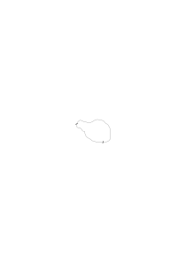

Sie führen unabhängig zum selben Resultat. Let's imagine that we possessed _only_ the _second_ criterion for determining divisibility!

But there seems to be the difference between “they lead” & “they must lead”.

a b b c = c b a b

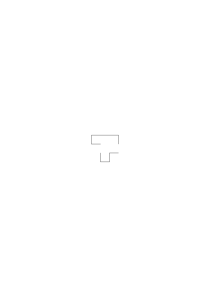

### [26r\[1\]](https://cdn.wittgensteinnachlass.com/2000px/webp/Ms-148/26r.webp)

Wir nehmen ein falsches Verhältnis von Prozeß & Resultat an. Denn es heißt nicht daß ein gewisser Prozeß zu einem bestimmten Resultat führen _muß_.

### [26r\[2\]](https://cdn.wittgensteinnachlass.com/2000px/webp/Ms-148/26r.webp)

Denn ein Prozeß _muß_ nur dazu führen daß er geschehen ist.

### [26r\[3\]](https://cdn.wittgensteinnachlass.com/2000px/webp/Ms-148/26r.webp)

<math display="block">
  <mspace width="0.3em"/>
  <mtext>├</mtext>
  <mtext>─</mtext>
  <mtext>─</mtext>
  <mtext>─</mtext>
  <mtext>┼</mtext>
  <mtext>─</mtext>
  <mtext>─</mtext>
  <mtext>─</mtext>
  <mtext>┼</mtext>
  <mtext>─</mtext>
  <mtext>─</mtext>
  <mtext>─</mtext>
  <mtext>┤</mtext>
</math>

We sometimes substitute for the description of a result the description of a result.

### [26r\[4\]](https://cdn.wittgensteinnachlass.com/2000px/webp/Ms-148/26r.webp)

Ich kann mir eine Blume auf gewisse Weise gewachsen denken. Und das Wachstum ist dann ein Prozeß dessen Ende der Zustand der Blume ist.

### [26r\[5\]](https://cdn.wittgensteinnachlass.com/2000px/webp/Ms-148/26r.webp),[26v\[1\]](https://cdn.wittgensteinnachlass.com/2000px/webp/Ms-148/26v.webp)

In welchem Sinne ist es möglich nicht zu wissen wohin ein _mathematischer_ Vorgang führt. Man könnte antworten es ist möglich nicht zu wissen, wohin er führen _wird_ aber nicht, nicht zu wissen wohin er führt. In one sense you can't know the process without knowing the result, as the result is the _end_ of the process. In the other you may know a process & not know the result.

### [26v\[2\]](https://cdn.wittgensteinnachlass.com/2000px/webp/Ms-148/26v.webp)

In mathematics we object to say these processes have the …

### [26v\[3\]](https://cdn.wittgensteinnachlass.com/2000px/webp/Ms-148/26v.webp)

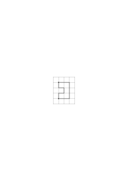

### [26v\[4\]](https://cdn.wittgensteinnachlass.com/2000px/webp/Ms-148/26v.webp)

A calculation leads to a result mathematically apart from the fact whether I have actually performed it.

### [26v\[5\]](https://cdn.wittgensteinnachlass.com/2000px/webp/Ms-148/26v.webp)

‘If I say this calculation _must_ lead to this result it has already led to it.’

### [26v\[6\]](https://cdn.wittgensteinnachlass.com/2000px/webp/Ms-148/26v.webp),[27r\[1\]](https://cdn.wittgensteinnachlass.com/2000px/webp/Ms-148/27r.webp)

“I knew it _beforehand_ what it must lead to.”

### [27r\[2\]](https://cdn.wittgensteinnachlass.com/2000px/webp/Ms-148/27r.webp)

If I say ‘this calculation must lead to the same result’ by “this calculation” I am referring to whatever I call a method of calculating.

### [27r\[3\]](https://cdn.wittgensteinnachlass.com/2000px/webp/Ms-148/27r.webp)

Does calculating that there isn't a six … confirm the result that there couldn't be?

### [27r\[4\]](https://cdn.wittgensteinnachlass.com/2000px/webp/Ms-148/27r.webp)

“You already see what happens, it must always go on like this.” Now suppose you actually went on would this confirm what you saw before?

### [27r\[5\]](https://cdn.wittgensteinnachlass.com/2000px/webp/Ms-148/27r.webp)

A man says, “I see that the two calculations so far agree but I don't know why they should go on agreeing”. Shall we say that he doesn't see a truth which the other sees? – He tries always again & again. We ask him: “But don't you see that you must get to the same result again?” Should we say that he must go the long way of experience, where we go the shorter one of seeing?

### [27v\[1\]](https://cdn.wittgensteinnachlass.com/2000px/webp/Ms-148/27v.webp)

“If the multiplication led to this result once, it _must_ lead to it again.”

### [27v\[2\]](https://cdn.wittgensteinnachlass.com/2000px/webp/Ms-148/27v.webp)

“What is the criterion of periodicity?” Here we are inclined to think that we have a criterion the reappearance of the remainder & the actual periodicity i.e., the repetition ad inf. of the period.

### [27v\[3\]](https://cdn.wittgensteinnachlass.com/2000px/webp/Ms-148/27v.webp)

The infinite & the huge. Absolute idea of large & small.

### [27v\[4\]](https://cdn.wittgensteinnachlass.com/2000px/webp/Ms-148/27v.webp)

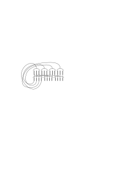

“I never looked at it this way, before”.

### [28r\[1\]](https://cdn.wittgensteinnachlass.com/2000px/webp/Ms-148/28r.webp)

“These people don't see a simple truth ….”

### [28r\[2\]](https://cdn.wittgensteinnachlass.com/2000px/webp/Ms-148/28r.webp)

They are resolved to write this:

instead of

.

### [28r\[3\]](https://cdn.wittgensteinnachlass.com/2000px/webp/Ms-148/28r.webp)

But not “because it had to lead through to the same result”.

### [28r\[4\]](https://cdn.wittgensteinnachlass.com/2000px/webp/Ms-148/28r.webp)

It is a remarkable fact that people almost always agree how to count.

### [28r\[5\]](https://cdn.wittgensteinnachlass.com/2000px/webp/Ms-148/28r.webp)

Supposing I said this is the 100th house of this street, although there are only 5 houses built.

### [28v\[1\]](https://cdn.wittgensteinnachlass.com/2000px/webp/Ms-148/28v.webp)

Am I to be guided by this or by this? And how do I know that they will guide me to the same result? <math class="stacked" display="inline"><mfrac linethickness="0"><mrow><mo>|</mo></mrow><mrow><mn>1</mn></mrow></mfrac><mfrac linethickness="0"><mrow><mtext>❘</mtext></mrow><mrow><mn>2</mn></mrow></mfrac><mfrac linethickness="0"><mrow><mtext>❘</mtext></mrow><mrow><mn>3</mn></mrow></mfrac><mfrac linethickness="0"><mrow><mtext>❘</mtext></mrow><mrow><mn>4</mn></mrow></mfrac><mfrac linethickness="0"><mrow><mo>|</mo></mrow><mrow><mn>2</mn></mrow></mfrac><mo>[</mo><mtext>❘</mtext><mo>]</mo><mo>[</mo><mtext>❘</mtext><mo>]</mo><mo>[</mo><mtext>❘</mtext><mo>]</mo><mo>[</mo><mo>|</mo><mo>]</mo><mo>[</mo><mtext>❘</mtext><mo>]</mo><mo>[</mo><mtext>❘</mtext><mo>]</mo><mo>[</mo><mtext>❘</mtext><mo>]</mo><mo>[</mo><mo>|</mo><mo>]</mo><mo>[</mo><mtext>❘</mtext><mo>]</mo><mo>[</mo><mtext>❘</mtext><mo>]</mo><mo>[</mo><mtext>❘</mtext><mo>]</mo><mo>[</mo><mo>|</mo><mo>]</mo><mo>[</mo><mtext>❘</mtext><mo>]</mo></math>

We have a general kind of idea of how it goes on; but can't this after all be contradicted by the actual detailed calculation? _Isn't there a danger_ of it going wrong after all? What is the truth which we see (& which is ‘obvious’)? That

“This shows us that this was justified”. But then we leave behind us these justifications. At first imagination accompanies us a stretch & then we are left alone.

### [28v\[2\]](https://cdn.wittgensteinnachlass.com/2000px/webp/Ms-148/28v.webp)

If there are 777 in the first 100 places there are 777 in the infinite development.

### [29r\[1\]](https://cdn.wittgensteinnachlass.com/2000px/webp/Ms-148/29r.webp)

“I have found 777 somewhere in π.”

### [29r\[2\]](https://cdn.wittgensteinnachlass.com/2000px/webp/Ms-148/29r.webp)

“The calculation guides you to the result.”

“You know that the two rules _must_ always lead you to the same result.”

### [29r\[3\]](https://cdn.wittgensteinnachlass.com/2000px/webp/Ms-148/29r.webp)

The process of calculation can be regarded as a process where there is no compulsion or being guided & on the other hand, as a process where we move under some strict guidance.

### [29r\[4\]](https://cdn.wittgensteinnachlass.com/2000px/webp/Ms-148/29r.webp)

Rösselsprung

### [29v\[1\]](https://cdn.wittgensteinnachlass.com/2000px/webp/Ms-148/29v.webp)

“If I follow this chain of steps it's bound to lead me there.”

### [29v\[2\]](https://cdn.wittgensteinnachlass.com/2000px/webp/Ms-148/29v.webp)

“The question are there 777 in π is all right because surely there either are 777 in π or there aren't”. Queer use of p ⌵ ~p. Images characteristic for this statement. It really means: “The question is all right because there is a method of verifying it although we can't use it.”

### [29v\[3\]](https://cdn.wittgensteinnachlass.com/2000px/webp/Ms-148/29v.webp)

“The third place of π is 4 whether _I know it or_ not.”

### [29v\[4\]](https://cdn.wittgensteinnachlass.com/2000px/webp/Ms-148/29v.webp)

“What if we had proved it to be self-contradictory that there should be no 777 in π, mustn't we then say that there are 777?”

### [29v\[5\]](https://cdn.wittgensteinnachlass.com/2000px/webp/Ms-148/29v.webp)

Our prose expressions in mathematics are highly metaphorical.

### [29v\[6\]](https://cdn.wittgensteinnachlass.com/2000px/webp/Ms-148/29v.webp),[30r\[1\]](https://cdn.wittgensteinnachlass.com/2000px/webp/Ms-148/30r.webp)

“Every algebraic equivalent has a root”. Is this to be called a proposition? The question corresponding to this proposition as answer is vague. But once the proposition this piece of mathematics has been done we are inclined to call it the proof that our question had to be answered is the positive. But, as one might say, there was much less in the question than there is now in the answer. – Compare this with: “Is 25 × 25 = 600?”

### [30r\[2\]](https://cdn.wittgensteinnachlass.com/2000px/webp/Ms-148/30r.webp)

Propositions which seem only to have sense if their truth or falsehood is known.

### [30r\[3\]](https://cdn.wittgensteinnachlass.com/2000px/webp/Ms-148/30r.webp)

What kind of proposition will the proposition be that there can't (or must) be 777 in π.

### [30r\[4\]](https://cdn.wittgensteinnachlass.com/2000px/webp/Ms-148/30r.webp)

Will it be possible e.g. to calculate whether any given proposition of digits occurs or how often it does.

### [30r\[5\]](https://cdn.wittgensteinnachlass.com/2000px/webp/Ms-148/30r.webp)

Relation between proof showing that 777 must be between n & m & proof that they are at the vth place (v being between n & m).

### [30v\[1\]](https://cdn.wittgensteinnachlass.com/2000px/webp/Ms-148/30v.webp)

Negation of a mathematical proposition & fault in a calculation.

### [30v\[2\]](https://cdn.wittgensteinnachlass.com/2000px/webp/Ms-148/30v.webp)

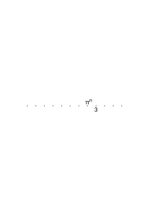

25 × 25 = 600x

[unreadable]x ∙ cos x = sin x

“Are there an infinite number of 777 in π?” “There aren't”.

### [30v\[3\]](https://cdn.wittgensteinnachlass.com/2000px/webp/Ms-148/30v.webp)

“Question” corresponds to “investigation”.

### [30v\[4\]](https://cdn.wittgensteinnachlass.com/2000px/webp/Ms-148/30v.webp)

Heptagon must there have been an investigation.

### [30v\[5\]](https://cdn.wittgensteinnachlass.com/2000px/webp/Ms-148/30v.webp)

“Is 5. a cardinal number?”

### [30v\[6\]](https://cdn.wittgensteinnachlass.com/2000px/webp/Ms-148/30v.webp)

There is a contradiction between the normal use of the word “proposition”, “question.”

### [31r\[1\]](https://cdn.wittgensteinnachlass.com/2000px/webp/Ms-148/31r.webp)

“Wouldn't one like to know with _real_ certainty whether the other had pains?”

### [31r\[2\]](https://cdn.wittgensteinnachlass.com/2000px/webp/Ms-148/31r.webp)

Feeling of pastness. “The experiences bound up with the gesture etc. aren't the experience of pastness, for they could be there without the feeling of pastness”. – But, on the other hand, would it be that experience of pastness without those experiences bound up with the gesture? – Why should we say that the characteristic part is the part outside those experiences? Isn't the experience at least partially described if I have described the gestures etc.?

### [31r\[3\]](https://cdn.wittgensteinnachlass.com/2000px/webp/Ms-148/31r.webp)

Auch so: Die Worte “lang ist es her –” rufen in mir manchmal ein bestimmtes Gefühl wach. Manchmal nicht. Aber wenn sie es wachrufen so sind sie, ihr [unreadable] Teil der charakteristischen Erfahrung.

### [31r\[4\]](https://cdn.wittgensteinnachlass.com/2000px/webp/Ms-148/31r.webp)

Sprechen mit Andern & mit mir selbst: “Wenn ich eine gewisse Erfahrung habe, gebe ich (nur) das Zeichen + ….”

### [31v\[1\]](https://cdn.wittgensteinnachlass.com/2000px/webp/Ms-148/31v.webp)

When one says “I talk to myself” one generally means just that one speaks & is the only person listening.

### [31v\[2\]](https://cdn.wittgensteinnachlass.com/2000px/webp/Ms-148/31v.webp)

If I look at something red & say, to myself, this is red, am I giving myself an information? Am I communicating a personal experience to myself. Some philosophising people might be inclined to say that this is the only real case of communication of personal experience because only I know what I really mean by ‘red’.

### [31v\[3\]](https://cdn.wittgensteinnachlass.com/2000px/webp/Ms-148/31v.webp)

Remember in which special cases only it has sense to inform a person that the colour he sees now is red.

### [31v\[4\]](https://cdn.wittgensteinnachlass.com/2000px/webp/Ms-148/31v.webp)

One doesn't say to oneself “This is a chair. – Oh really?”

### [31v\[5\]](https://cdn.wittgensteinnachlass.com/2000px/webp/Ms-148/31v.webp)

Wie kann ich denn einer Erfahrung (etwa einem Schmerz) einen Namen geben? Ist es nicht als wollte ich ihm, etwa, einen Hut aufsetzen?

### [31v\[6\]](https://cdn.wittgensteinnachlass.com/2000px/webp/Ms-148/31v.webp),[32r\[1\]](https://cdn.wittgensteinnachlass.com/2000px/webp/Ms-148/32r.webp)

Nehmen wir an man sagte: “Man kann ihm nur indirekt einen Hut aufsetzen” so würde ich fragen: Glaubst Du daß man je auf die Idee gekommen wäre davon zu reden wenn man nicht daran gedacht hätte daß man dem Menschen der Schmerzen hat einen Hut aufsetzen kann? Zu sagen man könne dem Schmerz nur indirekt einen Hut aufsetze macht es erscheinen als gäbe es dennoch einen direkten Weg der nur tatsächlich nicht gangbar sei. [unreadable]

### [32r\[2\]](https://cdn.wittgensteinnachlass.com/2000px/webp/Ms-148/32r.webp)

The difficulty is that we feel that we have said something about the nature of pain when we say that one person can't have another person's pain. Perhaps we shouldn't be inclined to say that we had anything physiological or even psychological but something metapsychological metaphysical. Something about the essence, nature, of pain as opposed to its causal connections to other phenomena.

### [32r\[3\]](https://cdn.wittgensteinnachlass.com/2000px/webp/Ms-148/32r.webp),[32r\[1\]](https://cdn.wittgensteinnachlass.com/2000px/webp/Ms-148/32r.webp)

Es scheint uns etwa als wäre es zwar nicht falsch sondern unsinnig zu sagen “ich fühle seine Schmerzen”, aber als wäre dies so infolge der Natur des Schmerzes, der Person etc.. Als wäre also jene Aussage letzten Endes doch eine Aussage über die Natur der Dinge. Wir sprechen also etwa von einer Asymmetrie unserer Ausdrucksweise & fassen diese auf als ein Spiegelbild des Wesens der Dinge.

### [32v\[2\]](https://cdn.wittgensteinnachlass.com/2000px/webp/Ms-148/32v.webp)

Intangibility of impressions. (Anguish) Some we should say were more tangible than others. Seeing more tangible than a faint pain; & this more tangible than a vague fear, longing etc. In what way are these intangible experiences less easy to communicate to describe than the ‘simpler’ ones? In what way do we use the phrase: “This experience is difficult to describe.” And can it be even impossible to describe certain experiences?

### [32v\[3\]](https://cdn.wittgensteinnachlass.com/2000px/webp/Ms-148/32v.webp)

Was für einen Sinn hat es zu sagen diese Erfahrung ist nicht beschreibbar? Wir möchten sagen: sie ist zu komplex, zu subtil.

### [32v\[4\]](https://cdn.wittgensteinnachlass.com/2000px/webp/Ms-148/32v.webp)

“Diese Erfahrung ist nicht mitteilbar, aber _ich_ kenne sie, – weil ich sie habe.”

### [33r\[1\]](https://cdn.wittgensteinnachlass.com/2000px/webp/Ms-148/33r.webp)

“Es gibt die Erfahrung, & die Beschreibung der Erfahrung. – Daher kann es nicht gleichgültig sein, ob der Andere die selbe Erfahrung hat, wie ich, oder nicht; – & daher muß es wenn ich mit mir selbst rede auf diese Erfahrung ankommen. Es muß dabei eine entscheidende Rolle spielen daß ich diese Erfahrung kenne (während ich mit der des Andern nicht direkt vertraut bin).”

### [33r\[2\]](https://cdn.wittgensteinnachlass.com/2000px/webp/Ms-148/33r.webp)

Kann man sagen: “In dem was ich über die Erfahrung des Andern sage, spielt seine Erfahrung (selbst) nicht hinein. In dem was ich über meine Erfahrung sage spielt diese Erfahrung selbst hinein.”? “Ich spreche über meine Erfahrung, sozusagen, in ihrer Anwesenheit”.

### [33r\[3\]](https://cdn.wittgensteinnachlass.com/2000px/webp/Ms-148/33r.webp)

Wie wenn jemand sagen würde: “Es gibt nicht nur die Beschreibung des Tisches sondern auch den Tisch.”

### [33r\[4\]](https://cdn.wittgensteinnachlass.com/2000px/webp/Ms-148/33r.webp)

“Es gibt nicht nur das Wort ‘Zahnschmerz’, es gibt auch such a thing as den Zahnschmerz selbst.”

### [33v\[1\]](https://cdn.wittgensteinnachlass.com/2000px/webp/Ms-148/33v.webp)

Es scheint, daß, da ich etwa eine Erfahrung nicht beschreiben kann, sie aber habe, daß ich sie daher genauer _kennen_ kann, als irgend ein Anderer. Aber was heißt, die Erfahrung kennen, wenn es nicht heißt, sie beschreiben & nicht heißt, sie haben. Gibt es eine _Kenntnis_ der Erfahrung, die wir nicht mitteilen können?

### [33v\[2\]](https://cdn.wittgensteinnachlass.com/2000px/webp/Ms-148/33v.webp)

Hat es Sinn zu sagen “ich kenne diese Erfahrung besser als irgend ein Anderer sie kennen kann”? Gibt es Erfahrungen die der Andere ebensogut kennen kann wie ich & solche, die er nicht so gut kennen kann? Heißt das: er kann diese selbe komplizierte Erfahrung nicht haben? – Es heißt wohl: “Er kann sie haben, aber wir können nie wissen, daß er gerade diese gehabt hat”. Z.B. scheint es als könnten wir sagen: “Wir können in einem Sinn wissen daß er gerade diese einfärbige, glatte, rote Fläche sieht, aber nicht, daß er genau dieses _Flimmern_ sieht. Weil sich das genaue Gesichtsbild beim Flimmern nicht beschreiben läßt.

### [33v\[3\]](https://cdn.wittgensteinnachlass.com/2000px/webp/Ms-148/33v.webp),[34r\[1\]](https://cdn.wittgensteinnachlass.com/2000px/webp/Ms-148/34r.webp)

Es gibt ja auch den Fall, in dem wir ein Gesichtsbild genauer durch ein gemaltes Bild als durch Worte beschreiben können.

### [34r\[2\]](https://cdn.wittgensteinnachlass.com/2000px/webp/Ms-148/34r.webp)

Wie ist es damit: “Man kann eine Figur genauer mit Hilfe von Maßzahlen als ohne diese beschreiben”.

### [34r\[3\]](https://cdn.wittgensteinnachlass.com/2000px/webp/Ms-148/34r.webp)

Aber die Erfahrung, die ich _habe_ scheint eine Beschreibung dieser Erfahrung, im gewissen Sinne, zu ersetzen. “Sie ist ihre eigene Beschreibung”.

### [34r\[4\]](https://cdn.wittgensteinnachlass.com/2000px/webp/Ms-148/34r.webp)

Vermischen wir hier nicht zwei Dinge: die Zusammengesetztheit der Erfahrung &, was man ihren ursprünglichen Geschmack nennen könnte? Ihre eigentliche natürliche Farbe?

### [34r\[5\]](https://cdn.wittgensteinnachlass.com/2000px/webp/Ms-148/34r.webp)

Es ist die Auffassung, daß von der ursprünglichen Erfahrung nur ein Teil bei der Mitteilung erhalten bleibt, & etwas anderes von ihr verloren geht. Nämlich eben ‘ihr timbre’, oder wie man es nennen möchte. Es kommt einem hier so vor als könnte man, sozusagen nur die farblose Zeichnung vermitteln & der Andere setzte in sie _seine_ Farben ein. Aber das ist natürlich (eine) Täuschung.

### [34r\[6\]](https://cdn.wittgensteinnachlass.com/2000px/webp/Ms-148/34r.webp),[34v\[1\]](https://cdn.wittgensteinnachlass.com/2000px/webp/Ms-148/34v.webp)

Aber können wir nicht wirklich sagen, wir hätten in dem Andern durch unsere Beschreibung ein Bild hervorgebracht aber wir können nicht wissen ob dieses Bild nun genau das gleiche ist, wie das unsere? Denken wir hier an den Gebrauch des Wortes “gleich” in solchen Sätzen wie: “Diese Kreise sind dem Augenschein nach ganz gleich.”

### [34v\[2\]](https://cdn.wittgensteinnachlass.com/2000px/webp/Ms-148/34v.webp)

Hierher gehört auch, daß wir gewöhnlich unser Gesichtsbild nicht als etwas in uns empfinden wie etwa einen Schmerz im Auge daß wir aber wenn wir philosophieren geneigt sind diesem Bild gemäß zu denken.

### [34v\[3\]](https://cdn.wittgensteinnachlass.com/2000px/webp/Ms-148/34v.webp)

The ‘if-sensation’. Compare with the ‘table-sensation’. There is the question “What's the tablesensation like” & the answer is a picture of a table. In what sense is the if-sensation analogous to the table-sensation? Is there a description of this sensation & _what do we call a description of it_. Putting the gestures instead of the sensation means just giving the nearest rough description there is of the Experience.

### [34v\[4\]](https://cdn.wittgensteinnachlass.com/2000px/webp/Ms-148/34v.webp),[35r\[1\]](https://cdn.wittgensteinnachlass.com/2000px/webp/Ms-148/35r.webp),[35v\[1\]](https://cdn.wittgensteinnachlass.com/2000px/webp/Ms-148/35v.webp),[36r\[1\]](https://cdn.wittgensteinnachlass.com/2000px/webp/Ms-148/36r.webp),[36v\[1\]](https://cdn.wittgensteinnachlass.com/2000px/webp/Ms-148/36v.webp)

Example

[“I have a peculiar feeling of pastness in my wrist.”] 6) “We shall never know whether he meant this or that”. C died after the training in that room. We say: “Perhaps he would have reacted like B when taken into the daylight.” But we shall never know. α) We should say this question was decided if he arose from his grave & we then made the experiment with him. Or his ghost appeared to us in a spiritualist séance & told us that he has a certain experience. β) We don't accept any evidence. But what if we didn't accept the evidence in 5) either & said (something like) “We can't be sure that he is the identical man who was trained in the room”, or: “he is the identical man but we can't know whether he _would have_ behaved like this in the past time when he was trained”.

7) We introduce a new notation for the expression “If P happens then always (as a rule) Q happens. P didn't happen this time & Q didn't happen.” We say instead: “If P had happened Q would have happened”. E.g. “If the gunpowder is dry under these circumstances a spark of this strength explodes it. It wouldn't dry this time & under the same circumstances didn't explode.” We say instead “If the gunpowder had been dry this time it would have exploded”. The point of this notation is that it nears the form of this preposition very much to the form: “The gunpowder was dry this time so it exploded”. I mean the new form doesn't stress the fact that it did not explode but, we might say, paints a vivid picture of it exploding this time. We could imagine two forms of expression in a picture language corresponding to the two kinds of notations in the word language. The second notation will be particularly appropriate e.g. if we wish to give a person a shock by making him vividly imagine that which would have happened, stressing only slightly that it didn't happen. 8) Someone might say to us: “But are you sure that the second sentence means just what the first one means & not just something similar or that & something else as well? (Moore) I should say: I'm talking of the case where it means just this, & this seems to me an important case (which you caused by saying what you have said). But of course I don't say that it isn't used in other ways as well & then we'll have to talk about these other cases separately. 9) Someone says –“lowering one's voice some

times means that what you say is less important than the rest & in other cases you lower your voice to show that you wish to draw special attention to what you now say .”

We must be clear that our examples are not preparations to the analysis of the actual meaning of the expression so & so (Nicod) but giving them effects that “analysis”. 11) Have we now shown that to say in 5 “We can't know whether he would have behaved …” makes no sense? We should say the sentence under these circumstances has lost its point which it would have had under other circumstances but this doesn't mean that we can't give it another point. 10) We say “We can't know whether this spark would have been sufficient to ignite that mixture; because we can't reproduce the exact mixture not having the exact ingredients or not having a balance to weigh them etc. etc.” But suppose we could reproduce all the circumstances & someone said “we can't know whether it would have exploded” as we can't know whether _under these circumstances_ it would have exploded _then_.” This answer would set our head whirling. We should feel he wasn't playing the same game with that expression as we do. We should be inclined to say “This makes no sense!” And this means that we are at a loss not knowing what reasoning, what actions go with this expression. Moreover we believe that he made up a sentence analogous to sentences used in certain language games not noticing that he took the _point_ away. In which case do we say that a sentence has a point? That comes to asking in which case do we call something a language game. I can only answer. Look at the family of language games & that will show you whatever can be shown about the matter.

### [36v\[2\]](https://cdn.wittgensteinnachlass.com/2000px/webp/Ms-148/36v.webp),[37r\[1\]](https://cdn.wittgensteinnachlass.com/2000px/webp/Ms-148/37r.webp)

12) (The private visual image.) B is trained to describe his afterimage when he has looked say into a bright red light. He is made to look into the light, & then to shut his eyes & he is then asked “What do you see?”. This question before was put to him only if he looked at physical objects. We suppose he reacts by a description of what he sees with closed eyes. – But halt! This description of the training seems wrong for what if

I had had to describe my own, not B's, training. Would I then also have said: “I reacted to the question by …” & not rather: “When I had closed my eyes I saw an image & described it”. If I say “I saw an image & described it I say this as opposed to the case where I gave a description without seeing an image. (I might have lied or not.) Now we could of course also distinguish these cases if B describes an afterimage. But we don't wish to consider now cases in which the mechanism of lying plays any part. For if you say “I always know whether I am lying but not whether the other person is”, I say: in the case I'm considering I can't be said to _know_ that I'm not lying, or let us say not saying the untruth, because the dilemma saying the truth or the untruth is in this case unknown to me. Remember that when I'm asked “what do you see here” I don't always ask myself: “Now shall I say the truth or something else?” If you say “but surely if you in fact speak the truth then you did see something & you saw what you said you saw” I answer: How can I know that I see what I say I see? Do I have a criterion or use one for the colour I see actually being red?

### [37v\[1\]](https://cdn.wittgensteinnachlass.com/2000px/webp/Ms-148/37v.webp),[38r\[1\]](https://cdn.wittgensteinnachlass.com/2000px/webp/Ms-148/38r.webp)

13) We imagine that the expression “I can't see what you see” has been given sense by explaining it to mean: “I can't see what you see being in a different position relative to the object we are looking at”, or “ … having not as good eyes as you”, or “ … having found as in … that B sees something which we don't though we look at the same Object.” etc. I can't see your afterimage might be explained to mean I can't see what you see if I close my eyes meaning you say you see a red circle, I see a yellow one. 14) Identity of physical objects, of shapes, colours, dreams, toothache. 15) (The object we see) The physical Object & its appearance. Form of expression: different views of the same physical object are different objects seen. We ask “What do you see” & he can either answer “a chair”, or „this” (& draw the particular view of the chair). So we are now inclined to say that each man sees a different object & one which no other person sees, for even if they look at the same chair from the same spot it may appear different to them & the objects before the other mind's eye I can't look at. 16) (I can't know whether he sees anything at all or only behaves as I do when I see something.) There seems to be an undoubted asymmetry in the use of the word “to see” (& all words relating to personal experience). One can state this in the way that “I know when I see something by just seeing it, without hearing what I say or observing the rest of my behaviour whereas I know _that_ he sees & _what_ he sees only by observing his behaviour, i.e. indirectly”. a) There is a mistake in this [unreadable]: I know what I see because I see it”. What does it mean to know that. b) It is true to say that my reason for saying that I see is not the observation of my behaviour. But this is a grammatical proposition c) It seems to be an imperfection that I can only know – – –. But this is just the way we use the word – – –. – Could we then … if we could? Certainly.

### [38r\[2\]](https://cdn.wittgensteinnachlass.com/2000px/webp/Ms-148/38r.webp),[38v\[1\]](https://cdn.wittgensteinnachlass.com/2000px/webp/Ms-148/38v.webp)

Does the person who has not learnt language know that he sees red but can't express it? – Or should we say: “he knows what he sees but can't express it”? – So besides seeing it he also knows what he sees? Imagine we described a totally different experiment; say this, that I sting someone with a needle & observe whether he cries out or not. Then surely it would interest us if the subject whenever we stung him saw, say, a red circle. And we would distinguish the case when he cried out & saw a circle from the case when he cried out & didn't see one. This case is quite straightforward & there is no problem about it.

### [38v\[2\]](https://cdn.wittgensteinnachlass.com/2000px/webp/Ms-148/38v.webp)

If I say “I tell myself that I see red, I tell myself what I see” it seems that after having told myself I now know better what I see, am better acquainted with it, than before. (Now in a sense this may be so …)

### [38v\[3\]](https://cdn.wittgensteinnachlass.com/2000px/webp/Ms-148/38v.webp)

“When he asked me what colours I saw, I guessed what he meant & told him.”

### [38v\[4\]](https://cdn.wittgensteinnachlass.com/2000px/webp/Ms-148/38v.webp)

“It is not enough to distinguish between the cases in which B or I say that I see red & do see red & the case in which I say this but don't see red; but we must distinguish between the cases in which I see red, say I see red & mean to describe what I see & the cases in which I don't mean this.

### [39r\[1\]](https://cdn.wittgensteinnachlass.com/2000px/webp/Ms-148/39r.webp)

Consider the case in which I don't say what I see in words but by pointing to a sample. Here again I distinguish now between the cases in which I ‘just react by pointing’ & the case in which I _see_ & point.

### [39r\[2\]](https://cdn.wittgensteinnachlass.com/2000px/webp/Ms-148/39r.webp)

Now suppose I asked: “how do I know that I see & that I see red? “I.e. how do I know that I do what you call seeing (& seeing red)?” For we use the word ‘seeing’ & ‘red’ between us.

### [39r\[3\]](https://cdn.wittgensteinnachlass.com/2000px/webp/Ms-148/39r.webp)

Don't you say: “In order to be a description of our personal experience _what we say_ must not just be our reaction but must be _justified_”? But does the justification need another justification?

### [39r\[4\]](https://cdn.wittgensteinnachlass.com/2000px/webp/Ms-148/39r.webp)

Suppose, we play the game 2) & B calls out the word “red”. Suppose A now asks B: “do you only say ‘red’ or did you really see it?”.

### [39r\[5\]](https://cdn.wittgensteinnachlass.com/2000px/webp/Ms-148/39r.webp),[39v\[1\]](https://cdn.wittgensteinnachlass.com/2000px/webp/Ms-148/39v.webp)

“Surely there are two phenomena: one, just speaking, the other, seeing & speaking accordingly.” Answer: Certainly we speak of these two cases but we shall here have to show how these expressions are used; or, in other words, how they are taught. For the mere fact that we possess a picture of them does not help us as we must describe in what way this picture is used. More especially as we are inclined to assume a use different from the actual one. We have therefore to explain under what conditions we say: “I say ‘red’ but don't see red” or “I say ‘red’ & see red”, or “I said ‘red’ but didn't see red” etc. etc.. Imagine that saying red was often followed by some agreeable event. We found that the child enjoyed that event & often instead of ‘green’ said ‘red’. We would use this reaction to play another language game with the child. We would say “you cheat, it's red”. Now again we are dependent upon the subsequent reaction of the child. Such games are actually played with children: Telling a person the untruth & enjoying his surprise at finding out what really happened.

### [39v\[2\]](https://cdn.wittgensteinnachlass.com/2000px/webp/Ms-148/39v.webp),[40r\[1\]](https://cdn.wittgensteinnachlass.com/2000px/webp/Ms-148/40r.webp)

But couldn't we imagine some kind of perversity in a child which made it say red when it saw green & vice versa & at the same time this not being discovered because it happened to see red in those cases when we say green? But if here we talk of perversity we could also assume that we all were perverse. For how are we or B ever to find out that he is perverse? The idea is, that he finds out (& we do) when later on he learns how the word ‘perverse’ is used & then he remembers that he was that way all along. Imagine this case: The child looks at the lights: says the name of the right colour to himself in an aside & then loud the wrong word. It chuckles while doing so. This is, one may say, a rudimentary form of cheating. One might even say: “This child is going to be a liar”. But if it had not said the aside but only imagined itself pointing to one colour on the chart & then said the wrong word, – was this cheating too? Can a child cheat like a banker without the knowledge of the banker?

### [40r\[2\]](https://cdn.wittgensteinnachlass.com/2000px/webp/Ms-148/40r.webp)

<s> “I can assure you that before when I said ‘I see red’ I saw black.”</s>

### [40v\[1\]](https://cdn.wittgensteinnachlass.com/2000px/webp/Ms-148/40v.webp)

“He tells us his private experience, that experience which nobody but he knows anything about”.

### [40v\[2\]](https://cdn.wittgensteinnachlass.com/2000px/webp/Ms-148/40v.webp)

“Surely his memory is worth more than our direct criteria, as only he could know what he saw.”

### [40v\[3\]](https://cdn.wittgensteinnachlass.com/2000px/webp/Ms-148/40v.webp)

But let us see;– We sometimes say outside philosophy such things as “of course only he knows how he feels” or “I can't know what you feel”. Now how do we apply such a statement? Mostly it is an expression of helplessness like “I don't know what to do”. But this helplessness is not due to an unfortunate metaphysical fact, ‘the privacy of personal experience’, or it would worry us always. Our expression is comparable to this: “What's done can't be undone!”.

### [40v\[4\]](https://cdn.wittgensteinnachlass.com/2000px/webp/Ms-148/40v.webp)

We also say to the Doctor “Surely I must know whether I have pains or not!” How do we use this statement?

### [40v\[5\]](https://cdn.wittgensteinnachlass.com/2000px/webp/Ms-148/40v.webp),[41r\[1\]](https://cdn.wittgensteinnachlass.com/2000px/webp/Ms-148/41r.webp)

“All right if we can't talk in this way about someone else I can certainly say of myself that _I_ either saw red at that time or didn't. I may not remember now, but at the time I saw one thing or the other!” This is like saying “one of these two pictures must have fitted”. And my answer is not that perhaps neither of them fits but that I'm not yet clear about what ‘fitting’ in this case means.

### [41r\[2\]](https://cdn.wittgensteinnachlass.com/2000px/webp/Ms-148/41r.webp)

Now is it the same case or are these different cases: A blind man sees everything just as we do but he acts as a blind man does & on the other hand he sees nothing & acts as a blind man does. At first sight we should say: here we have obviously two clearly different cases although we admit that we can't know which we have before us. I should say: We obviously use two different pictures which one could describe like this: …. But we use the pictures in such a way that the two games ‘come to the same’.

### [41r\[3\]](https://cdn.wittgensteinnachlass.com/2000px/webp/Ms-148/41r.webp)

By the way, – would you say that he surely knew that he was blind if he was so? Why do you feel more reluctant about this statement?

### [41v\[1\]](https://cdn.wittgensteinnachlass.com/2000px/webp/Ms-148/41v.webp)

“Surely he knew that he saw red but he couldn't say so!” – Does that mean “Surely he knew that he saw the colour which we call ‘red’ …” – or would you say it means “he knew that he saw _this_ colour” (pointing to a red patch). But did he while he knew it point to this patch?

### [41v\[2\]](https://cdn.wittgensteinnachlass.com/2000px/webp/Ms-148/41v.webp)

Use of: “He knows what colour he sees”. “I knew what colour I saw” etc.

### [41v\[3\]](https://cdn.wittgensteinnachlass.com/2000px/webp/Ms-148/41v.webp)

“Nachdunkeln der Erinnerung” does this expression make sense & in what cases.

And isn't on the other hand the picture which we use quite clear in all cases?

### [41v\[4\]](https://cdn.wittgensteinnachlass.com/2000px/webp/Ms-148/41v.webp)

The case of old people usually having memories of the time in which they learnt to speak & understand speech: a) They say or paint that such & such things have happened although other records always contradict them b) The memories agree with the records. Only in this case shall we say that they remember ….

### [41v\[5\]](https://cdn.wittgensteinnachlass.com/2000px/webp/Ms-148/41v.webp),[42r\[1\]](https://cdn.wittgensteinnachlass.com/2000px/webp/Ms-148/42r.webp)

Suppose they paint the scenes they say they remember & paint the faces very dark;– shall we say that they saw them that dark or that the colour had become darker in their memory?

### [42r\[2\]](https://cdn.wittgensteinnachlass.com/2000px/webp/Ms-148/42r.webp)

How do we know what colour a person sees? By the sample he points to? And how do we know what relation the sample is meant to have to the original? Now are we to say “we never know …”? Or had we better cut these “we never know …” out of our language & consider how as a matter of fact we are wont to use the word “to know”?

### [42r\[3\]](https://cdn.wittgensteinnachlass.com/2000px/webp/Ms-148/42r.webp)

What if someone asked: “How do I know that what I call seeing red is not an _entirely_ different experience every time & that I am not deluded into thinking that it is the same or nearly the same?”? Here again the answer “I can't know & the subsequent removal of the question”.

### [42r\[4\]](https://cdn.wittgensteinnachlass.com/2000px/webp/Ms-148/42r.webp)

Is it ever true that when I call a colour ‘red’ I serve myself of memory??

### [42r\[5\]](https://cdn.wittgensteinnachlass.com/2000px/webp/Ms-148/42r.webp),[42v\[1\]](https://cdn.wittgensteinnachlass.com/2000px/webp/Ms-148/42v.webp)

To use the memory of what happened when we were taught language is all right as long as we don't think that this memory teaches us something essentially private.

### [42v\[2\]](https://cdn.wittgensteinnachlass.com/2000px/webp/Ms-148/42v.webp)

“A rod has one length or another how ever we find it out.” Here again the picture

.

### [42v\[3\]](https://cdn.wittgensteinnachlass.com/2000px/webp/Ms-148/42v.webp)

“Though he can't say what it is he sees while he is learning № 1, he'll tell us afterwards what he saw. We mix this case up with the one: “When his gag will have been removed he'll tell us what he saw”.

### [42v\[4\]](https://cdn.wittgensteinnachlass.com/2000px/webp/Ms-148/42v.webp)

What does it mean ‘to tell someone what one sees’? Or (perhaps), ‘to show someone what one sees’?

### [42v\[5\]](https://cdn.wittgensteinnachlass.com/2000px/webp/Ms-148/42v.webp)

When we say “he'll tell us what he saw” we have an idea that then we'll know what he _really_ saw in a direct way (“at least if he isn't lying”).

### [42v\[6\]](https://cdn.wittgensteinnachlass.com/2000px/webp/Ms-148/42v.webp)

“He is in a better position to say what he sees than we are.” – That depends. –

### [42v\[7\]](https://cdn.wittgensteinnachlass.com/2000px/webp/Ms-148/42v.webp),[43r\[1\]](https://cdn.wittgensteinnachlass.com/2000px/webp/Ms-148/43r.webp)

If we say “he'll tell us what he saw”, it is as though he would now make a use of language which we had never taught him.

### [43r\[2\]](https://cdn.wittgensteinnachlass.com/2000px/webp/Ms-148/43r.webp)

It is as if now we got an _insight_ into something which before we had only seen from the outside.

### [43r\[3\]](https://cdn.wittgensteinnachlass.com/2000px/webp/Ms-148/43r.webp)

Inside & outside!

### [43r\[4\]](https://cdn.wittgensteinnachlass.com/2000px/webp/Ms-148/43r.webp)

“Our teaching connects the word ‘red’ (or is meant to connect it) with a particular impression of his (a private impression an impression in him). He then communicates this impression– indirectly, of course– through the medium of speech.”

### [43r\[5\]](https://cdn.wittgensteinnachlass.com/2000px/webp/Ms-148/43r.webp)

Where is our idea of “direct & indirect communication” taken from?

### [43r\[6\]](https://cdn.wittgensteinnachlass.com/2000px/webp/Ms-148/43r.webp)

How, if we said, as we sometimes might be inclined: “We can only hope that this– indirect way of communication really succeeds”.

### [43r\[7\]](https://cdn.wittgensteinnachlass.com/2000px/webp/Ms-148/43r.webp)

We so long see the facts about the usage of our words crookedly as long as we are still tempted here to talk of direct & indirect.

### [43r\[8\]](https://cdn.wittgensteinnachlass.com/2000px/webp/Ms-148/43r.webp),[43v\[1\]](https://cdn.wittgensteinnachlass.com/2000px/webp/Ms-148/43v.webp)

As long as you use the picture indirectdirect in this case you can't trust yourself about judging the grammatical situation rightly otherwise.

### [43v\[2\]](https://cdn.wittgensteinnachlass.com/2000px/webp/Ms-148/43v.webp)

Is telling what one sees something like turning one's inside out? And learning to say what one sees, learning to let others see inside us?

### [43v\[3\]](https://cdn.wittgensteinnachlass.com/2000px/webp/Ms-148/43v.webp)

“We teach him to make us see what he sees”. He seems in an indirect way to show us _the object_ which he sees, the object which is before his mind's eye. “We can't look at it, it is in him.”

### [43v\[4\]](https://cdn.wittgensteinnachlass.com/2000px/webp/Ms-148/43v.webp)

The idea of the private _object_ of vision. Appearance, sense-datum.

### [43v\[5\]](https://cdn.wittgensteinnachlass.com/2000px/webp/Ms-148/43v.webp)

The visual field. (Not to be confused with visual space.)

### [43v\[6\]](https://cdn.wittgensteinnachlass.com/2000px/webp/Ms-148/43v.webp)

Telling someone what one sees seems like showing him, if indirectly, the object which is before one's mind's eye.

### [43v\[7\]](https://cdn.wittgensteinnachlass.com/2000px/webp/Ms-148/43v.webp),[44r\[1\]](https://cdn.wittgensteinnachlass.com/2000px/webp/Ms-148/44r.webp)

The idea of the object before one's mind's eye is (firmly) tied up with the idea of a comparison of such objects in different persons compared to which the comparison really used is an indirect one.

### [44r\[2\]](https://cdn.wittgensteinnachlass.com/2000px/webp/Ms-148/44r.webp)

Whence the idea of the privacy of sensedata?

### [44r\[3\]](https://cdn.wittgensteinnachlass.com/2000px/webp/Ms-148/44r.webp)

“But do you really wish to say that they are not private that one person can see the picture before the other person's eye?”

### [44r\[4\]](https://cdn.wittgensteinnachlass.com/2000px/webp/Ms-148/44r.webp)

Surely you wouldn't think that _telling_ someone what one sees is a more direct way of communicating than showing him by pointing to a sample!

### [44r\[5\]](https://cdn.wittgensteinnachlass.com/2000px/webp/Ms-148/44r.webp)

“He'll tell us later what it was he saw” means that we'll get to know in a (comparatively) direct & a sure way what he saw as opposed to the guesses we could make before.

### [44r\[6\]](https://cdn.wittgensteinnachlass.com/2000px/webp/Ms-148/44r.webp)

We don't realize that the answer he gives us now is only part of a game like № 1 only more complicated.

### [44v\[1\]](https://cdn.wittgensteinnachlass.com/2000px/webp/Ms-148/44v.webp)

We don't deny that he can remember having dreamt so & so before he was born. Denying this to us would be like denying that he can say he remembers having dreamt so & so before he was born. I.e. we don't deny that he can make this move but we say that the move alone or together with all the sensations, feelings etc. he might have while he is making it does not tell us what game it is a move of.

We might e.g. never try to connect up a statement of this sort with anything past (in an other sense). We might treat it as an interesting phenomenon & possibly connect it up with the persons writing in a Freudian way or on the other hand we may look for some phenomena in the brain of the embryo which might be called dreams etc. etc.. Or we may just say: “old people are liable to say such things” & leave it at that.

### [44v\[2\]](https://cdn.wittgensteinnachlass.com/2000px/webp/Ms-148/44v.webp),[45r\[1\]](https://cdn.wittgensteinnachlass.com/2000px/webp/Ms-148/45r.webp)

Suppose now someone remembered that yesterday he called red ‘green’ & vice versa but that this didn't appear as he also saw green what today he sees red & vice versa. Now here is a case in which we might be inclined to say that we learn from him today something about the working of his mind yesterday, that yesterday we judged by the outside while today we are allowed to look at the inside of what happened. It is as though we looked back but now got a glance at something that was closed to us yesterday.

### [45r\[2\]](https://cdn.wittgensteinnachlass.com/2000px/webp/Ms-148/45r.webp)

If I say what it is I see how do I compare what I say with what I see in order to know whether I say the truth? Lying about what I see, you might say, is knowing what I see & saying something else. Supposing I said it just consists of saying to myself ‘this is red’ & aloud ‘this is green’.

### [45r\[3\]](https://cdn.wittgensteinnachlass.com/2000px/webp/Ms-148/45r.webp)

Compare lying & telling the truth in the case of telling what colour you see with the case of describing a picture which you saw or telling the right number of things you had to count.

### [45r\[4\]](https://cdn.wittgensteinnachlass.com/2000px/webp/Ms-148/45r.webp)

Collating what you say & what you see.

### [45r\[5\]](https://cdn.wittgensteinnachlass.com/2000px/webp/Ms-148/45r.webp)

Is there always a collating?

### [45v\[1\]](https://cdn.wittgensteinnachlass.com/2000px/webp/Ms-148/45v.webp)

Or could you call it giving a picture of the colour I see if I say the word “red”? Unless it be a picture by its connection with a sample.

### [45v\[2\]](https://cdn.wittgensteinnachlass.com/2000px/webp/Ms-148/45v.webp)

But isn't it giving a picture if I point to a sample?

### [45v\[3\]](https://cdn.wittgensteinnachlass.com/2000px/webp/Ms-148/45v.webp)

“What I show _reveals_ what I see”; – in what sense does it do that? The idea is that now you can so to speak look inside me. Whereas I only reveal to you what I see in a game of revealing & hiding which is altogether played with signs of one category. “Direct – indirect”.

### [45v\[4\]](https://cdn.wittgensteinnachlass.com/2000px/webp/Ms-148/45v.webp)

We are thinking of a game in which there is an inside in the normal sense.

### [45v\[5\]](https://cdn.wittgensteinnachlass.com/2000px/webp/Ms-148/45v.webp)

We must get clear about how the metaphor of revealing (outside & inside) is actually applied by us; otherwise we shall be tempted to look for an inside behind that which in our metaphor is the inside.

### [45v\[6\]](https://cdn.wittgensteinnachlass.com/2000px/webp/Ms-148/45v.webp),[46r\[1\]](https://cdn.wittgensteinnachlass.com/2000px/webp/Ms-148/46r.webp)

We are used to describing the case by means of a picture which say contains 3 steps. But when we think about language we forget how this picture is actually applied in practical cases. We then are often tempted to apply it as it wasn't meant originally & are puzzled about a third step in the facts.

### [46r\[2\]](https://cdn.wittgensteinnachlass.com/2000px/webp/Ms-148/46r.webp)

“I see a particular sense-datum & say a particular thing”. This is all right if I realise the way in which I specify what I see & what I say.

### [46r\[3\]](https://cdn.wittgensteinnachlass.com/2000px/webp/Ms-148/46r.webp)

“If he had learnt to show me (or tell me) what he sees, he could now show me.” Certainly, – but what is it like to show me what he sees? It is pointing to something under particular circumstances. Or is it something else (don't be misled by the idea of indirectness). You compare it with such a statement as: “if he had learnt to open up he could now open up & show me what's inside. I say yes, but remember what opening up in this case is like.

### [46r\[4\]](https://cdn.wittgensteinnachlass.com/2000px/webp/Ms-148/46r.webp),[46v\[1\]](https://cdn.wittgensteinnachlass.com/2000px/webp/Ms-148/46v.webp)

But what about the criterion whether there is anything inside or not? Here we say “I know that there is something inside in _my_ case. And this is how I know of the ‘inside’ at all first hand”.

Further we are not inclined to say that only hitherto we have not known the mind of an other person but that the idea of this knowledge is bound up with the idea of myself.

### [46v\[2\]](https://cdn.wittgensteinnachlass.com/2000px/webp/Ms-148/46v.webp)

“So if I say ‘he has toothache’ I am supposing that he has what I have if I have toothache.” Suppose I said: “If I say _‘I suppose’_ he has toothache, I am supposing that he has what I have if I have toothache”, – this would be like saying “If I say ‘this cushion is red’ I mean that it has the same colour which the sofa has if it is red”. But this wasn't what I intended to say with the first sentence. I wished to say that talking about his toothache at all was based upon a supposition, a supposition which by its very essence could not be verified.

### [46v\[3\]](https://cdn.wittgensteinnachlass.com/2000px/webp/Ms-148/46v.webp)

But if you look closer you will see that this is an entire misrepresentation of the use of the word “toothache”.

### [47r\[1\]](https://cdn.wittgensteinnachlass.com/2000px/webp/Ms-148/47r.webp)

---

Can two people have the same afterimage?

### [47r\[2\]](https://cdn.wittgensteinnachlass.com/2000px/webp/Ms-148/47r.webp)

Language-game ‘Description of imaginings.’

### [47r\[3\]](https://cdn.wittgensteinnachlass.com/2000px/webp/Ms-148/47r.webp)

Can two persons have the same picture before their mind's eye.

### [47r\[4\]](https://cdn.wittgensteinnachlass.com/2000px/webp/Ms-148/47r.webp)

In which case would we say that they had two images exactly alike but not identical?

---

### [47r\[5\]](https://cdn.wittgensteinnachlass.com/2000px/webp/Ms-148/47r.webp),[47v\[1\]](https://cdn.wittgensteinnachlass.com/2000px/webp/Ms-148/47v.webp)

The fact that two ideas seem here inseparably bound up suggests to us that we are dealing with one idea only & not with two & that by a queer trick our language suggests a totally different structure of grammar than the one actually used. For we have the sentence that only I can know directly my experience & only indirectly the experience of the other person. This language suggests 4 possible combinations but rules out 2. It is as though I had used the 4 letters a b c d to denote two objects only but by my notation somehow suggesting that I am talking of 4.

### [47v\[2\]](https://cdn.wittgensteinnachlass.com/2000px/webp/Ms-148/47v.webp)

It seems as though I wished to say that to me L.W. something applied which does not apply to other people. That is, there seems to be an asymmetry.

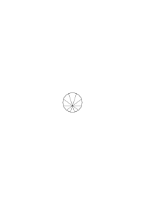

I _express_ things asymmetrically & could express them symmetrically; only then one would see what facts prompt us to the asymmetrical expression.

### [47v\[3\]](https://cdn.wittgensteinnachlass.com/2000px/webp/Ms-148/47v.webp)

I do this by spreading the use of the word I over all human bodies as opposed to L.W. alone.

### [47v\[4\]](https://cdn.wittgensteinnachlass.com/2000px/webp/Ms-148/47v.webp),[48r\[1\]](https://cdn.wittgensteinnachlass.com/2000px/webp/Ms-148/48r.webp)

I want to describe a situation in which I should not be tempted to say that I assumed or believed that the other had what I have. Or, in other words a situation in which we would not speak of _my consciousness_ & _his consciousness_. And in which the idea would not occur to us that we could only be conscious of our own consciousness.

### [48r\[2\]](https://cdn.wittgensteinnachlass.com/2000px/webp/Ms-148/48r.webp)

The idea of the ego inhabiting a body to be abolished.

### [48r\[3\]](https://cdn.wittgensteinnachlass.com/2000px/webp/Ms-148/48r.webp)

If what any consciousness spreads over all human bodies then there won't be any temptation to use the word ‘ego’.

### [48r\[4\]](https://cdn.wittgensteinnachlass.com/2000px/webp/Ms-148/48r.webp)

Let's assume that hearing was done by no organ of the body we know of.

### [48r\[5\]](https://cdn.wittgensteinnachlass.com/2000px/webp/Ms-148/48r.webp)

Let us imagine the following arrangement:

If it is absurd to say that I only know that _I_ see but not that the others do, – isn't this at any rate less absurd than to say the opposite?

### [48r\[6\]](https://cdn.wittgensteinnachlass.com/2000px/webp/Ms-148/48r.webp)

Ist eine Philosophie undenkbar die das diametrale Gegenteil des Solipsismus ist?

### [48v\[1\]](https://cdn.wittgensteinnachlass.com/2000px/webp/Ms-148/48v.webp)

The idea of the constituent of a fact: “Is my person (or a person) a constituent of the fact that I see or not”. This expresses a question concerning the symbolism just as if it were a question about nature.

### [48v\[2\]](https://cdn.wittgensteinnachlass.com/2000px/webp/Ms-148/48v.webp)

“Es denkt”. Ist dieser Satz wahr & “ich denke” falsch?

### [48v\[3\]](https://cdn.wittgensteinnachlass.com/2000px/webp/Ms-148/48v.webp)

Language-game: I paint, for myself, what I see. The picture doesn't contain _me_.

### [48v\[4\]](https://cdn.wittgensteinnachlass.com/2000px/webp/Ms-148/48v.webp)

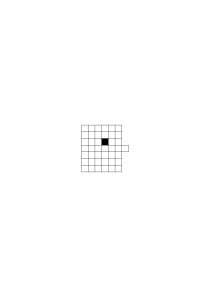

A board game in fact chess but the board has a square which must never be used. This may be misleading.

### [48v\[5\]](https://cdn.wittgensteinnachlass.com/2000px/webp/Ms-148/48v.webp)

A board game in which only one man is said to play the other to ‘answer’.

### [48v\[6\]](https://cdn.wittgensteinnachlass.com/2000px/webp/Ms-148/48v.webp)

What if the other person always correctly described what I saw, & imagined, would I not say he knows what I see? – “But what if he describes …