# Ms-150

### [1\[1\]](https://cdn.wittgensteinnachlass.com/2000px/webp/Ms-150/1.webp),[2\[1\]](https://cdn.wittgensteinnachlass.com/2000px/webp/Ms-150/2.webp)

Wenn wir uns fragen; worin besteht der Eindruck, den uns ein Wort macht, so denken wir zuletzt an das, was wir _sehen_, wenn wir das Wort anschauen. Wir nehmen an das _Bild_ des Wortes selbst sei ziemlich nebensächlich & der Eindruck liege irgendwie hinter dem Wortbild. Und diesen Fehler machen wir immer wieder. Aber die Gestalt eines Wortes, das wir – wie alle Wörter der gewöhnlichen Sprache – unzählige male gesehen haben, macht uns einen tiefen Eindruck. Denke nur an die Schwierigkeiten, die wir empfinden wenn die Rechtschreibung geändert wird. Solche Änderungen sind als Sakrileg empfunden worden. Freilich nur gewisse Zeichen machen uns einen tiefen Eindruck, andere nicht. Ein neu erfundenes Zeichen etwa “ ⌵ ” für “oder” kann ohne in uns etwas aufzuregen durch ein beliebiges anderes ersetzt werden. Denke daran daß das geschriebene Wort uns in ähnlicher Weise vertraut ist wie das gehörte. Denke an Esperanto & wie seltsam es uns anmutet einen Ausdruck der Herzlichkeit in diese Kunstsprache übersetzt zu hören. Wir könnten ja auch nicht den Händedruck willkürlich durch ein anderes Zeichen ersetzen. Das hängt damit zusammen, daß wir uns das Gefühl der Trauer als etwas hinter den Empfindungen des Weinens, schweren Atmens etc. etc. vorstellen & diese geneigt sind als etwas Nebensächliches zu vernachlässigen. Auch hängt das mit der Frage zusammen ob der Eindruck des Gesichtes

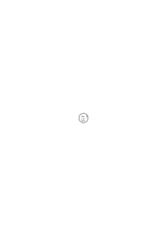

_gesehen_ wird oder hinter dem gesehenen gefühlt. Denke an

& …

### [2\[2\]](https://cdn.wittgensteinnachlass.com/2000px/webp/Ms-150/2.webp)

Wenn wir in gewöhnlicher Schrift einen englischen Satz lesen, so können wir dabei eine wohlbekannte Empfindung oder Erfahrung haben. Was heißt das: “Wir haben da eine ganz bestimmte Erfahrung”?!! in wiefern _bestimmt_? Lies eine Reihe gewöhnlicher etwa englischer Sätze in gewöhnlicher Schrift. Du wirst dann die Erfahrung des Lesens empfinden, nämlich eine fortlaufende, quasi gleichbleibende, Erfahrung.

### [2\[3\]](https://cdn.wittgensteinnachlass.com/2000px/webp/Ms-150/2.webp)

Worin besteht der Ausdruck eines Gesichts, eines Worts.

### [2\[4\]](https://cdn.wittgensteinnachlass.com/2000px/webp/Ms-150/2.webp),[3\[1\]](https://cdn.wittgensteinnachlass.com/2000px/webp/Ms-150/3.webp)

Ein ‘bestimmter’ Eindruck, im Gegensatz wozu?

‘Das Gesicht hat einen bestimmten Ausdruck; – im Gegensatz wozu? Man kann die Aufmerksamkeit auf den _Ausdruck_ des Gesichts heften. Was heißt das? Was tut man da? Es ist ähnlich als wenn man es plastisch sähe.

### [3\[2\]](https://cdn.wittgensteinnachlass.com/2000px/webp/Ms-150/3.webp)

Ist der Ausdruck zum rein Visuellen addiert? – Nun, _weißt_ Du daß er addiert ist? – Also ist der Fall verschieden von dem im welchen ich etwas sehe & zugleich Schmerzen im Magen empfinde.

### [3\[3\]](https://cdn.wittgensteinnachlass.com/2000px/webp/Ms-150/3.webp)

“Wenn Du diesen Strich machst, so ändert das den Ausdruck des Gesichts ganz”. “Wenn Du diesen Strich ziehst so ändert sich der Ausdruck dieser Tiere ganz”.

### [3\[4\]](https://cdn.wittgensteinnachlass.com/2000px/webp/Ms-150/3.webp),[4\[1\]](https://cdn.wittgensteinnachlass.com/2000px/webp/Ms-150/4.webp)

Nehmen wir an ich sage: der Eindruck (Ausdruck) ist durch unsere Attitude zu dem Bild bestimmt. Wechselt diese durch einen neuen Strich so sagen wir es wechselt der Ausdruck. Was aber an dieser Erklärung wesentlich ist sehen wir daran daß wir verschiedene Annahmen mache können. Wir können z.B. annehmen unser Gesicht mache immer ein gezeichnetes Gesicht nach. Aber es genügt auch wenn wir annehmen, daß ein neuer Strich die Art & Weise etwa den Weg ändert wie unser Auge immer wieder über die Zeichnung gleitet.

### [4\[2\]](https://cdn.wittgensteinnachlass.com/2000px/webp/Ms-150/4.webp)

“Ein Punkt an diesen Ort ändert den Ausdruck, aber ein Punkt hier ändert ihn nicht.”

### [4\[3\]](https://cdn.wittgensteinnachlass.com/2000px/webp/Ms-150/4.webp)

“Früher war der Ausdruck freundlich, jetzt ist er traurig”. Heißt das: ‘ich weiß daß ein trauriger Mensch so aussieht & ein freundlicher so’?

### [4\[4\]](https://cdn.wittgensteinnachlass.com/2000px/webp/Ms-150/4.webp)

Man könnte sagen: durch diesen Strich wird unsere Erfahrung beim Sehen des Bildes in einer anderen Weise geändert als durch einen ‘nichtssagenden’ Strich & diese Änderung ist _ähnlich_ der welche geschieht wenn durch den Strich die _räumliche_ Erscheinung der Zeichnung geändert wird.

### [4\[5\]](https://cdn.wittgensteinnachlass.com/2000px/webp/Ms-150/4.webp)

Es ist das Wort ‘bestimmt’, welches wir verstehen müssen.

### [4\[6\]](https://cdn.wittgensteinnachlass.com/2000px/webp/Ms-150/4.webp),[5\[1\]](https://cdn.wittgensteinnachlass.com/2000px/webp/Ms-150/5.webp)

Ich lese etwa eine Reihe gewöhnlicher Sätze & beobachte mich dabei selbst. Ich merke ich tue “etwas ganz bestimmtes”, d.h. immer ungefähr das Gleiche. Es ist, als sagte ich: Wenn ich schreibe tue ich immer ungefähr das Gleiche. D.h. ich bewege meine Hand immer in ungefähr der gleichen Weise.

### [5\[2\]](https://cdn.wittgensteinnachlass.com/2000px/webp/Ms-150/5.webp)

Vergleiche die Familie dessen was man ‘Schrift’ nennt mit der Familie ‘Lesen’.

### [5\[3\]](https://cdn.wittgensteinnachlass.com/2000px/webp/Ms-150/5.webp)

Wir fühlen das Gleichbleiben der Erfahrung.

### [5\[4\]](https://cdn.wittgensteinnachlass.com/2000px/webp/Ms-150/5.webp)

Änderung der Interpunktion verglichen mit einer Änderung der Zeichnung die den Gesichtsausdruck ändert. (“Der Schüle<math class="stacked" display="inline"><msub><mi>r</mi><mi>o</mi></msub></math> sagt der Lehre<math class="stacked" display="inline"><msub><mi>r</mi><mi>o</mi></msub></math>↙ ist ein Esel.”) Nicht ein _Wissen_ ist es daß uns die Änderung bedeutsam erscheinen läßt.

### [5\[5\]](https://cdn.wittgensteinnachlass.com/2000px/webp/Ms-150/5.webp)

Gegensatz der Ausdrücke. – Gegensatz: Ausdruck – kein Ausdruck.

### [5\[6\]](https://cdn.wittgensteinnachlass.com/2000px/webp/Ms-150/5.webp),[6\[1\]](https://cdn.wittgensteinnachlass.com/2000px/webp/Ms-150/6.webp)

Das Eine ist: Die Besonderheit des Eindrucks verführt uns zu der Frage: was ist das wesentliche des Lesens. Das Andere: Ich muß die Rolle des typischen Beispiels klarer machen. Nämlich: die Rolle die die Erklärung spielt: _Das_ ist jedenfalls ein typisches Beispiel – einer Regierung, des kulturellen Verfalls, das Raffinement des Geschmacks. Zuerst glaubt man nämlich man rede von einem _Gemeinsamen_ & es ist das Ideal dieses anzugeben darzustellen. Dann aber ist das Feststehende nicht mehr ein Gemeinsames sondern ein Beispiel. (Sozusagen ein Zentrum der Variationen.)

### [6\[2\]](https://cdn.wittgensteinnachlass.com/2000px/webp/Ms-150/6.webp)

Die geschriebenen Wörter einer mir geläufigen Sprache sind mir wohlbekannte Gesichter. Und sie zu lesen sind mir wohlbekannte Erlebnisse. Wenn ich gefragt würde, was tue ich besonderes wenn ich die Wörter lese, müßte ich sagen: ich sehe sie & spreche sie aus. Und die Hauptsache des Erlebnisses liegt in der Wohlbekanntheit der Wörter. Aber diese Wohlbekanntheit ist eine besondere im besondern Fall sie ist z.B. nicht das Erlebnis der Wohlbekanntheit eines Gesichts & hier gibt es ja auch verschiedene Fälle. Geläufige Schrift zu lesen ist ein besonderes Erlebnis anders z.B. als etwas zu buchstabieren oder eine graphische Darstellung ablesen etc.

### [7\[1\]](https://cdn.wittgensteinnachlass.com/2000px/webp/Ms-150/7.webp)

“Ich weiß nicht, das Wort kommt mir auf einmal so fremd vor”. –

### [7\[2\]](https://cdn.wittgensteinnachlass.com/2000px/webp/Ms-150/7.webp)

Es ist _ganz abgesehen vom Lesen_ eine andere Art des Erlebnisses, wenn der Blick über ihm geläufige Wortbilder gleitet als über fremde.

### [7\[3\]](https://cdn.wittgensteinnachlass.com/2000px/webp/Ms-150/7.webp)

Was heißt das: “das Lesen einer uns geläufigen Sprache ist ein ganz besonderes Erlebnis”? D.h. wir haben beim lesenden Durchlaufen der Zeilen ein _gleichförmiges_ Erlebnis, & es unterscheidet sich vom Durchlaufen beliebiger anderer Formenreihen. Es wäre auch unrichtig zu sagen, daß das Lesen darin bestehe, daß wir Zeichenreihen durchlaufen & uns dabei Laute einfallen. Denn wenn ich die Reihe

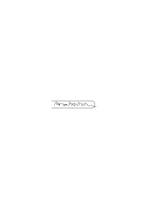

durchlaufe & lasse mir dabei Laute Einfallen – was ganz leicht ist – so ist das doch kein Lesen. Es ist anders ob ich ‘a’ lese & ausspreche, als wenn mir derselben Laut bei

‘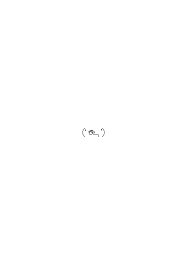’

einfällt. Und diese Art des Erlebnisses ist charakteristisch für jedes fließende Lesen alles dessen was wir für gewöhnlich ‘Schrift’ nennen; aber nicht für das ‘Lesen’ überhaupt.

### [8\[1\]](https://cdn.wittgensteinnachlass.com/2000px/webp/Ms-150/8.webp)

Vergleiche ‘Lesen’ & ‘Bild’. Auch in diesem Fall ein eng begrenztes Gebiet an welches wir vorerst denken, dann aber ein Drang der uns in immer weitere Ferne zieht.

### [8\[2\]](https://cdn.wittgensteinnachlass.com/2000px/webp/Ms-150/8.webp)

Kreise.

### [8\[3\]](https://cdn.wittgensteinnachlass.com/2000px/webp/Ms-150/8.webp)

Regel Glied eines Systems.

### [8\[4\]](https://cdn.wittgensteinnachlass.com/2000px/webp/Ms-150/8.webp)

Eine Regel verstehen heißt _manchmal_ das System verstehen. Was aber heißt _das_?

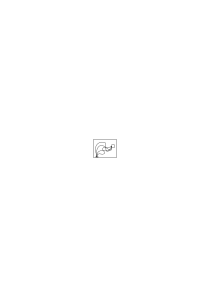

In welchem Falle sagen wir es verstehe Jemand das System dieser Befehle? Er reagiert auf Glieder des Systems in bestimmter Weise; er kann das System _erklären_. Wie tut er das?

### [8\[5\]](https://cdn.wittgensteinnachlass.com/2000px/webp/Ms-150/8.webp)

“Es ist eine _Einstellung_ sich dem Befehl wie er auch lauten mag hingeben”. Beispiel des Sich-leiten-lassens. Die Hand leiten lassen. Maschine.

### [8\[6\]](https://cdn.wittgensteinnachlass.com/2000px/webp/Ms-150/8.webp),[9\[1\]](https://cdn.wittgensteinnachlass.com/2000px/webp/Ms-150/9.webp)

Betrachte einen allgemeinen Satz, wie “die Regel leitet uns, wenn sie das Glied eines Systems ist”! Was sind die _Beispiele_ dafür? Wie gehen sie in die Umgebung über?

### [9\[2\]](https://cdn.wittgensteinnachlass.com/2000px/webp/Ms-150/9.webp),[10\[1\]](https://cdn.wittgensteinnachlass.com/2000px/webp/Ms-150/10.webp)

Wenn wir die gewöhnliche Schrift lesen geschieht immer ein & dasselbe & man könnte sagen: beobachte doch was geschieht & Du wirst sehen worin das Lesen besteht. Du hast sozusagen Zeit genug um es zu beobachten. Nun was sehe ich da? (Da ist etwas interessant: daß man nicht im Stande ist ein geschriebenes oder gedrucktes Wort anzusehen _ohne_ es zu lesen.) Ich gehe mit meinem Blick der Zeile entlang & schon das geschieht nicht so wie wenn ich ihn einer beliebigen Reihe von Bildern entlang führe (ich rede hier nicht von dem was experimentell durch Beobachtung der Augenbewegung festgestellt werden kann). Der Blick gleitet möchte man sagen besonders reibungslos & doch nicht flüchtig (die Wohlbekanntheit der Wortgestalten, – anders wieder wenn man von rechts nach links liest). Dabei geht ein ganz unwillkürliches ‘Sprechen in der Vorstellung’ vor sich. Und so verhält es sich wenn ich deutsch, englisch, französisch, & gedruckt, geschrieben in lateinischer Schrift oder gotischer Schrift lese. Was aber von dem allem ist für das Lesen als solches wesentlich? Nicht ein Zug der in allen Fällen von Lesen vorkäme.

### [10\[2\]](https://cdn.wittgensteinnachlass.com/2000px/webp/Ms-150/10.webp)

Verstehen Bedeutung Denken Erwarten Wünschen Fürchten Glauben Überzeugung

### [11\[1\]](https://cdn.wittgensteinnachlass.com/2000px/webp/Ms-150/11.webp)

A: “Warum nennst Du diese beiden Farben ‘rot’?” – B: “Weil eine gewisse Ähnlichkeit zwischen ihnen besteht.”

### [11\[2\]](https://cdn.wittgensteinnachlass.com/2000px/webp/Ms-150/11.webp)

Was heißt es “diese beiden Farben sind ähnlich”; – wie gebraucht man diesen Ausdruck?

### [11\[3\]](https://cdn.wittgensteinnachlass.com/2000px/webp/Ms-150/11.webp)

“Die beiden Farben haben ein Element gemeinsam & das nenne ich ‘rot’”.

### [11\[4\]](https://cdn.wittgensteinnachlass.com/2000px/webp/Ms-150/11.webp)

A: “Diese beiden Farben sind doch sehr ähnlich”. B: “Ich finde sie sehr verschieden”.

### [11\[5\]](https://cdn.wittgensteinnachlass.com/2000px/webp/Ms-150/11.webp)

A: “Ach darum!”

### [11\[6\]](https://cdn.wittgensteinnachlass.com/2000px/webp/Ms-150/11.webp)

Warum nennt man das Suchen im Gedächtnis ein ‘Suchen’?

### [11\[7\]](https://cdn.wittgensteinnachlass.com/2000px/webp/Ms-150/11.webp)

Warum nennt man eine Stimmung “trübe”? Wie wenn man sagt, “weil beide das Wetter & die Stimmung uns denselben Eindruck machen”? Besteht die Gleichheit des Eindrucks nicht zum Teil gerade darin daß wir geneigt sind in beiden Fällen das gleiche Wort & in ähnlichen Verbindungen zu gebrauchen? Auch darin daß wir das Wort im gleichen Ton sagen.

### [12\[1\]](https://cdn.wittgensteinnachlass.com/2000px/webp/Ms-150/12.webp)

“Ach _Sie_ sind's!”

### [12\[2\]](https://cdn.wittgensteinnachlass.com/2000px/webp/Ms-150/12.webp)

(Die Problematik der Philosophie ist die Problematik des Witzes.)

### [12\[3\]](https://cdn.wittgensteinnachlass.com/2000px/webp/Ms-150/12.webp)

Wie ist es wenn sich uns ein Vergleich aufdrängt? Etwa der des ‘Suchens’ im Gedächtnis.

### [12\[4\]](https://cdn.wittgensteinnachlass.com/2000px/webp/Ms-150/12.webp)

Das Wort ‘gleichsam’. “Er schaut gleichsam trübe aus”. “Ich möchte immer sagen ‘trübe’”.

### [12\[5\]](https://cdn.wittgensteinnachlass.com/2000px/webp/Ms-150/12.webp)

Eine geistige Spannung. Wir würden wahrscheinlich sagen sie sei etwas ähnlich wie eine körperliche Spannung. “Nun weiß ich auch warum ich das immer ‘eine Spannung’ nennen wollte.” (Ich habe etwa herausgefunden, daß dabei gewisse Muskeln gespannt sind. – Aber das wußte ich eben nicht als ich geneigt war es Spannung zu nennen.)

### [13\[1\]](https://cdn.wittgensteinnachlass.com/2000px/webp/Ms-150/13.webp)

### [13\[2\]](https://cdn.wittgensteinnachlass.com/2000px/webp/Ms-150/13.webp)

“Wenn wir in beiden Fällen von ‘trübe’ reden, so gebrauchen wir das Wort in verschiedener Bedeutung.” – Was ist das Kriterium für den Gebrauch in verschiedener Bedeutung?

### [13\[3\]](https://cdn.wittgensteinnachlass.com/2000px/webp/Ms-150/13.webp)

Wie würde ich die eine Bedeutung von der andern absondern?

### [13\[4\]](https://cdn.wittgensteinnachlass.com/2000px/webp/Ms-150/13.webp)

Oder auch: Wie weißt Du das? oder besteht der Gebrauch in verschiedenen Bedeutungen eben darin? Was willst Du sagen?

### [13\[5\]](https://cdn.wittgensteinnachlass.com/2000px/webp/Ms-150/13.webp),[14\[1\]](https://cdn.wittgensteinnachlass.com/2000px/webp/Ms-150/14.webp)

Ich würde nun als Erklärung Verschiedenheiten der beiden Spiele aufzählen. In der einen z.B. legt man etwas Schwarzes an das andere um zu sehen ob die beiden gleich sind im andern Spiel ist dies nicht der Fall. Es heißt also mein Satz: Wenn Du das Wort ‘schwarz’ in beiden Verbindungen gebrauchst so kann ich Dich auf andere Verschiedenheiten in den beiden Spielen aufmerksam machen.

### [14\[2\]](https://cdn.wittgensteinnachlass.com/2000px/webp/Ms-150/14.webp)

_Darauf_ aber gäbe es keine Antwort, wenn nun jemand sagte “aber ich nenne, was Du zwei Spiele nennst, _ein_ Spiel”.

### [14\[3\]](https://cdn.wittgensteinnachlass.com/2000px/webp/Ms-150/14.webp),[15\[1\]](https://cdn.wittgensteinnachlass.com/2000px/webp/Ms-150/15.webp)

“But why do you speak both of physical & mental ‘strain’?” – “Because they have a certain similarity, they have a common element.” What is this common element? Can you point to it as you pointed in …? Can you say anything more about it than that it is the element of strain? “It is a certain tension.” That doesn't get us any further, for why do you talk of tension in these different cases. “A certain feeling of tension is part of both experiences”. Are you not just translating what you said before, into other language or are you referring to an experience like that of feeling your heart beat, as you could say that this feeling is a constituent both of certain sensations of fear & of joy.

### [15\[2\]](https://cdn.wittgensteinnachlass.com/2000px/webp/Ms-150/15.webp)

“But why should we call both experiences a strain if there was no similarity between them?” But can't the similarity just consist in this that you are inclined to use in both cases the same metaphor, the same expression.

### [15\[3\]](https://cdn.wittgensteinnachlass.com/2000px/webp/Ms-150/15.webp)

And we are not only inclined to use the phrase a deep sorrow & a deep well but very often to accompany both by the same gestures & to say them in the same tone of voice.

### [15\[4\]](https://cdn.wittgensteinnachlass.com/2000px/webp/Ms-150/15.webp)

“There is something in common between the two experiences only I don't know what”. Well this too characterizes your experience & I should say when you'll say that you know what is in common between them your experience will be different.

### [15\[5\]](https://cdn.wittgensteinnachlass.com/2000px/webp/Ms-150/15.webp),[16\[1\]](https://cdn.wittgensteinnachlass.com/2000px/webp/Ms-150/16.webp)

To say that you use the same word ‘strain’ in all the different cases because of a similarity is all right if you wish to distinguish this case from the case of the word ‘bank’. The river bank & the money bank are _not_ so called because of any similarity.

### [16\[2\]](https://cdn.wittgensteinnachlass.com/2000px/webp/Ms-150/16.webp)

“But isn't there a particular experience of similarity which you have when you compare physical & mental strain; just the experience you don't have when you compare a river bank & a money bank?”

### [16\[3\]](https://cdn.wittgensteinnachlass.com/2000px/webp/Ms-150/16.webp)

But do you also experience a similarity between this similarity and other similarities? For what makes you call this a similarity (if you think there always must be something to _make_ you call a thing what you call it).

### [16\[4\]](https://cdn.wittgensteinnachlass.com/2000px/webp/Ms-150/16.webp)

Consider uses of the word ‘similar’: We say these two pieces of paper have similar colour if it is difficult for us to distinguish them to say which of them is darker. Now compare the experience of difficulty to say which is darker with the experience of similarity when it is impossible not to distinguish them but when I say I like my trousers & jacket to have similar colours so as not to have too strong a contrast.

### [17\[1\]](https://cdn.wittgensteinnachlass.com/2000px/webp/Ms-150/17.webp)

“The feeling of familiarity is a feeling of at-homeness.”

### [17\[2\]](https://cdn.wittgensteinnachlass.com/2000px/webp/Ms-150/17.webp)

Aren't my chairs etc. familiar to me & do I always have a feeling of athomeness when I see them?

### [17\[3\]](https://cdn.wittgensteinnachlass.com/2000px/webp/Ms-150/17.webp)

“But what else does it mean ‘that you are familiar with them’?” I am not surprised to see them; I should on being asked, say that I see them every day, that I have sat in them hundreds of times. I could describe on what occasions they were used & tell you a lot about them. All the experiences which go along with saying these things & the experience of doing so we can call experiences of familiarity.

### [17\[4\]](https://cdn.wittgensteinnachlass.com/2000px/webp/Ms-150/17.webp)

“Why do we call all these different experiences experiences of strain?” – “Because there is a common element in them all.”

### [17\[5\]](https://cdn.wittgensteinnachlass.com/2000px/webp/Ms-150/17.webp)

I can imagine a case in which this kind of answer is certainly correct: Say I call all kinds of states of excitement in which I feel the blood rush up into my head congestional experiences.

### [18\[1\]](https://cdn.wittgensteinnachlass.com/2000px/webp/Ms-150/18.webp)

Now should we say that all the experiences of strain have a common element?

### [18\[2\]](https://cdn.wittgensteinnachlass.com/2000px/webp/Ms-150/18.webp)

‘Perhaps we had better say that they are all in some respect similar.’

### [18\[3\]](https://cdn.wittgensteinnachlass.com/2000px/webp/Ms-150/18.webp)

Do you mean there _must_ be a common element, or there actually _is_ one. If the latter, what makes you say ‘there is a common element’?

### [18\[4\]](https://cdn.wittgensteinnachlass.com/2000px/webp/Ms-150/18.webp)

There seems to be a difference between this case & that when we say “well, we call this colour ‘red’ because it _is_ red.” I.e. we seem to use the word ‘strain’ here in a derivative sense, as opposed to a direct sense.

### [18\[5\]](https://cdn.wittgensteinnachlass.com/2000px/webp/Ms-150/18.webp)

What does it consist in to use a word in a derivative sense? “In this that its derivative sense is not the same but only similar to the direct one.” –

### [18\[6\]](https://cdn.wittgensteinnachlass.com/2000px/webp/Ms-150/18.webp),[19\[1\]](https://cdn.wittgensteinnachlass.com/2000px/webp/Ms-150/19.webp)

There is something very queer in the proposition ‘when we look at a well known word we have a particular sensation’. “When we pronounce the words ‘and’, ‘if’ etc. we have peculiar sensations”.

“When we understand an ordinary word like ‘tree’, ‘table’, we have a peculiar sensation.” “As opposed to what”.

The word ‘and’ = + gives me a different sensation from the word “and” = “and”.

### [19\[2\]](https://cdn.wittgensteinnachlass.com/2000px/webp/Ms-150/19.webp)

I can, as it were, direct my attention to the sensation. “The face

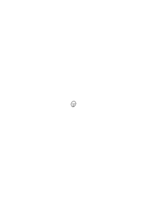

has a _peculiar_ expression”. The question is: is what you call the peculiar expression bound up with this face or could a different face have the same expression?

### [19\[3\]](https://cdn.wittgensteinnachlass.com/2000px/webp/Ms-150/19.webp)

“This face gives me a peculiar impression, the same impression which the other one gave me.” “This face & the other make me smile.”

### [19\[4\]](https://cdn.wittgensteinnachlass.com/2000px/webp/Ms-150/19.webp)

“These faces make a particular impression on me which I can't describe.” What does it mean ‘I _can't_ describe’? Is there anything to describe? What is this impossibility of describing like? For there are many different cases. And in one ‘I can't describe’ is really a grammatical remark.

### [19\[5\]](https://cdn.wittgensteinnachlass.com/2000px/webp/Ms-150/19.webp),[20\[1\]](https://cdn.wittgensteinnachlass.com/2000px/webp/Ms-150/20.webp)

“I had a definite sensation a moment ago & I have it now”.

### [20\[2\]](https://cdn.wittgensteinnachlass.com/2000px/webp/Ms-150/20.webp)

“I'm seeing this as a ship now, whereas I always saw it just as a decoration before.” – “But what's it like to see it ‘_as a ship_’”. “I can't describe”. “But what made you say you saw it ‘as a ship’, what made you use this expression?” – “I saw as it were how the sails were inflated by the wind.” – “But did they look as though they bulged more?” – “No, I just had a feeling & these words suggested themselves for it.”

### [20\[3\]](https://cdn.wittgensteinnachlass.com/2000px/webp/Ms-150/20.webp)

When you say, you have a definite feeling which you can't describe, is this a peculiar experience, don't you always have a definite feeling? Isn't all you want to say something like: “I feel very interested now.”

### [20\[4\]](https://cdn.wittgensteinnachlass.com/2000px/webp/Ms-150/20.webp)

We must do with these expressions something similar as with such expressions as “war is war!”

### [20\[5\]](https://cdn.wittgensteinnachlass.com/2000px/webp/Ms-150/20.webp),[21\[1\]](https://cdn.wittgensteinnachlass.com/2000px/webp/Ms-150/21.webp)

The form of the expression “I have a particular feeling which I can't describe” is misleading. It would be just like saying “everything has a particular character”.

### [21\[2\]](https://cdn.wittgensteinnachlass.com/2000px/webp/Ms-150/21.webp)

“A chair has a particular character about it.”

### [21\[3\]](https://cdn.wittgensteinnachlass.com/2000px/webp/Ms-150/21.webp)

Aber ist nicht ein Unterschied zwischen den Dingen die eine gewisse Wärme um sich haben & denen die uns fremd sind?

### [21\[4\]](https://cdn.wittgensteinnachlass.com/2000px/webp/Ms-150/21.webp)

Man kann doch von Dingen reden die uns, sagen wir, _häuslich_ anmuten.

### [21\[5\]](https://cdn.wittgensteinnachlass.com/2000px/webp/Ms-150/21.webp)

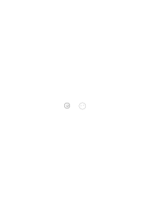

Ich kann auch ein bestimmtes gezeichnetes Gesicht einmal als das Gesicht des so & so sehen & einmal anders.

### [21\[6\]](https://cdn.wittgensteinnachlass.com/2000px/webp/Ms-150/21.webp)

“Jeder der geschriebenen Buchstaben hat einen eigenen Charakter”. Das meint man aber nicht im Gegensatz zu den gedruckten oder zu denen einer andern Schrift.

### [21\[7\]](https://cdn.wittgensteinnachlass.com/2000px/webp/Ms-150/21.webp)

Vergl. “Jede dieser Wohnungen hat einen besonderen Geruch.”

### [21\[8\]](https://cdn.wittgensteinnachlass.com/2000px/webp/Ms-150/21.webp)

Könnte man also Zeichen ohne Charakter & Zeichen mit Charakter unterscheiden?

### [22\[1\]](https://cdn.wittgensteinnachlass.com/2000px/webp/Ms-150/22.webp)

Kann ich aber darum sagen, daß die Buchstaben mir jeder ein bestimmtes _Gefühl_ geben? Es könnte so sein, beim einen würde mir warm beim andern kühl, – aber muß es so sein? Es kann das Erlebnis des ‘bestimmten Charakters’ auch bloß damit bestehen daß man mit bestimmten Tonfall sagt “er hat einen bestimmten Charakter”.

### [22\[2\]](https://cdn.wittgensteinnachlass.com/2000px/webp/Ms-150/22.webp)

Das Wort als ‘_Ausdruck_ des Gefühls’

### [22\[3\]](https://cdn.wittgensteinnachlass.com/2000px/webp/Ms-150/22.webp)

“Er legt alles Gefühl in dieses Wort”.

### [22\[4\]](https://cdn.wittgensteinnachlass.com/2000px/webp/Ms-150/22.webp),[23\[1\]](https://cdn.wittgensteinnachlass.com/2000px/webp/Ms-150/23.webp)

Wenn man einen Gegenstand abzeichnet ist man geneigt zu sagen: “er hat (oder die Krümmung hat) einen ganz bestimmten Charakter”. Und man ruft sich z.B. das Gefühl, Erlebnis, dieses Charakters immer von neuem vor. Das Erlebnis mag nun z.B. darin bestehen daß uns ein Wort ein Gegenstand vor dem Geist tritt, daß wir eine bestimmte Geste, ein bestimmtes Gesicht machen. Aber auch daß uns nur die Worte kommen: “diese Kurve hat nämlich einen ganz bestimmten Charakter”. Und das ist eigentlich nur eine _Betonung_ der Kurve selbst. D.h. es hat die Multiplizität einer Betonung dessen was z.B. beim Sehen des Gegenstands erlebt wird.

### [23\[2\]](https://cdn.wittgensteinnachlass.com/2000px/webp/Ms-150/23.webp)

Wenn man den Ausdruck für das Gefühl findet so findet man auch ein neues Gefühl. Es ist nicht wie wenn man etwa nachschlägt was ‘Trauer’ auf Russisch heißt.

### [23\[4\]](https://cdn.wittgensteinnachlass.com/2000px/webp/Ms-150/23.webp)

“Eine erinnerungsreiche Gegend”. Formen sind manchmal assoziationsreich. Aber kann man den Assoziationsreichtum eingeführt nennen?

### [23\[5\]](https://cdn.wittgensteinnachlass.com/2000px/webp/Ms-150/23.webp),[24\[1\]](https://cdn.wittgensteinnachlass.com/2000px/webp/Ms-150/24.webp)

“Er hat das Lied ausdrucksvoll gesungen”. – Kann man fragen “mit welchem Ausdruck?”? Wenn man fragte: “Worin bestand es daß er ausdrucksvoll gesungen hat”, so käme darauf etwas von der Art zur Antwort: “er hat z.B. diese Stelle … so & so gesungen & nicht, z.B., so …”. Aber diese Feststellung hat eigentlich eine ganz andere Multiplizität als die erste, denn sie ließe sich nicht auf ein anderes Lied an wenden das ausdrucksvoll gesungen wurde. Die Erklärung könnte sein: “ausdrucksvoll ist es wenn es so gesungen wird wie ich es mir gesungen wünsche.”

### [24\[2\]](https://cdn.wittgensteinnachlass.com/2000px/webp/Ms-150/24.webp)

“Wenn man dieses Gesicht ansieht, wird einem warm.” Wenn man fragen würde: “wird Dir wirklich warm”, würde er sagen “nein, nur bildlich gesprochen”.

### [24\[3\]](https://cdn.wittgensteinnachlass.com/2000px/webp/Ms-150/24.webp)

“Eine warme Farbe”

### [24\[4\]](https://cdn.wittgensteinnachlass.com/2000px/webp/Ms-150/24.webp)

“Ist weiches Wasser nur bildlich gesprochen ‘weich’ oder im eigentlichen Sinn des Worts?”

### [24\[5\]](https://cdn.wittgensteinnachlass.com/2000px/webp/Ms-150/24.webp)

Denken wir uns jemand würde statt von einem ‘rötlichen Blau’ von einem ‘roten Blau’ sprechen & sagen das Wort “rot” sei hier in übertragener Bedeutung gebraucht.

### [24\[6\]](https://cdn.wittgensteinnachlass.com/2000px/webp/Ms-150/24.webp),[25\[1\]](https://cdn.wittgensteinnachlass.com/2000px/webp/Ms-150/25.webp)

Nun glaubt man aber sagen zu können: Es kommt einfach darauf an was Du mit dem Wort meinst; meinst Du das was geistige Anstrengung & körperliche Anstrengung mit einander gemein haben so brauchst Du das Wort in beiden Fällen in der eigentlichen Bedeutung; wenn nicht dann hat es in den beiden verschiedene Bedeutung & man kann von direkter & übertragener reden.

### [25\[2\]](https://cdn.wittgensteinnachlass.com/2000px/webp/Ms-150/25.webp)

Aber was heißt es das meinen was den beiden gemeinsam ist? (Ich kann doch nicht darauf zeigen.) Heißt ‘das Gemeinsame meinen’ in dem Fall nicht einfach ‘beides meinen’?

### [25\[3\]](https://cdn.wittgensteinnachlass.com/2000px/webp/Ms-150/25.webp)

Denke, man sagte: “Man nennt das siedende Wasser & das Blut des Menschen warm, weil ‘warm’ das heißt, was beide Wärmegrade gemeinsam haben”.

### [25\[4\]](https://cdn.wittgensteinnachlass.com/2000px/webp/Ms-150/25.webp)

a) Wenn gefragt wird was haben diese Bilder gemein so zeigt man einen Fleck mit einer Farbe die in beiden vorkommt. b) Wenn gefragt wird was haben die beiden Farben gemein (z.B. ein rötliches blau & ein rötliches gelb) so zeigt man einen Fleck mit gelber Farbe. Hier sieht man wie verschieden man das Wort “das & das gemeinsam haben” gebrauchen kann. Und keine der beiden Arten ist direkter oder richtiger!

### [25\[5\]](https://cdn.wittgensteinnachlass.com/2000px/webp/Ms-150/25.webp),[26\[1\]](https://cdn.wittgensteinnachlass.com/2000px/webp/Ms-150/26.webp)

Man könnte nun z.B. sagen mit ‘gelblich’ meine ich was der beiden Farben gemeinsam ist & ich _tue_ es indem ich mir dabei etwas gelbes vorstelle.

### [26\[2\]](https://cdn.wittgensteinnachlass.com/2000px/webp/Ms-150/26.webp)

“Man meint was den beiden gemeinsam ist wenn man an das denkt was ihnen gemeinsam ist” aber wie tut man das? Wie denkt man z.B. an das was den Buchstaben R & B gemeinsam ist. Daran denken heißt manchmal darauf zeigen, es sich vorstellen u.a..

### [26\[3\]](https://cdn.wittgensteinnachlass.com/2000px/webp/Ms-150/26.webp)

“Denke an das was allen Pflanzen gemeinsam ist!”.

### [26\[4\]](https://cdn.wittgensteinnachlass.com/2000px/webp/Ms-150/26.webp)

“Ich nenne beides eine ‘Anstrengung’, weil ich damit das meine, was beiden gemeinsam ist”.

### [26\[5\]](https://cdn.wittgensteinnachlass.com/2000px/webp/Ms-150/26.webp)

Die Aufgabe die Vokale nach ihrer Dunkelheit zu ordnen ist in vielem ganz analog einem sogenannten mathematischen Problem.

### [26\[6\]](https://cdn.wittgensteinnachlass.com/2000px/webp/Ms-150/26.webp),[27\[1\]](https://cdn.wittgensteinnachlass.com/2000px/webp/Ms-150/27.webp)

“Warum nennst Du das ‘rot’?” – “Ich dachte Du nennst ‘rot’ alles was diese Farbe gemeinsam hat”. Dagegen kann man sagen: “Ich dachte Du nennst Schmetterlingsblütler alles das was so eine Blüte trägt.” Auch: “Ich dachte du nennst ‘rötlich’ alles was diesen Ton gemeinsam hat”.

### [27\[2\]](https://cdn.wittgensteinnachlass.com/2000px/webp/Ms-150/27.webp)

Ich meine nicht daß man den Ausdruck “diese beiden Farben haben das → (auf eine Farbe zeigend) gemeinsam” nicht gebrauchen kann. Man könnte z.B. gefragt was zwei Schattierungen von Rot mit einander gemein haben auf das reine Rot zeigen. Aber was das heißt muß erst in einem Sprachspiel festgelegt werden. Man könnte z.B. nun nicht fragen: “Ist es wahr, daß sie dieses Rot mit einander gemein haben?”

### [27\[3\]](https://cdn.wittgensteinnachlass.com/2000px/webp/Ms-150/27.webp)

“Warum nennst Du das ‘Schmerz’?” – “Nun daß heißt ‘Schmerz’.”

“Warum sprichst Du von einem seelischen Schmerz?” – “Weil es _wie_ ein Schmerz ist.”

### [27\[4\]](https://cdn.wittgensteinnachlass.com/2000px/webp/Ms-150/27.webp)

Sprachspiel: ‘Hell’ & ‘dunkel’ wird an Farben erklärt & verwendet. – Dann sage ich: “Ordne die Vokale nach ihrer Helligkeit”. Hier würden wir von übertragener Bedeutung reden.

### [28\[1\]](https://cdn.wittgensteinnachlass.com/2000px/webp/Ms-150/28.webp)

Philosophieren besteht darin daß einem Beispiele in der rechten Reihenfolge einfallen.

### [28\[2\]](https://cdn.wittgensteinnachlass.com/2000px/webp/Ms-150/28.webp)

Denken wir uns jemand würde sagen: “Die Wörter ‘hoch’, ‘tief’ sind auf Töne in ihrer ursprünglichen Bedeutung angewandt; das ist auch im Fall von ‘hoch’ & ‘tief’.”

### [28\[3\]](https://cdn.wittgensteinnachlass.com/2000px/webp/Ms-150/28.webp)

Jemand lernt die Farbwörter ‘rot’, ‘grün’ etc. für die reinen Farben gebrauchen. Dann zeigt man auf einen Haufen von rötlich & grünlich blauen Stücken & sagt: “sondere die roten von den grünen.” War das Wort in der ursprünglichen oder in einer anderen Bedeutung gebraucht worden. Man könnte hier sagen: Wenn Du mir aufgetragen hättest einen roten Fleck zu malen so hätte ich nicht diese Farbe gemalt.

### [28\[4\]](https://cdn.wittgensteinnachlass.com/2000px/webp/Ms-150/28.webp)

In einem Fall _fühlen wir_, wir gebrauchen eine _Metapher_, im andern Fall, wir gebrauchen das Wort in direkter Weise.

### [28\[5\]](https://cdn.wittgensteinnachlass.com/2000px/webp/Ms-150/28.webp),[29\[1\]](https://cdn.wittgensteinnachlass.com/2000px/webp/Ms-150/29.webp)

Worin besteht der Unterschied dieser _Erlebnisse_? Wir sehen den einen Gebrauch als etwas Abgeschlossenes an. Handelt es sich hier um zwei klar getrennte Erlebnisse? Das Erlebnis, ‘schwarz’ zu nennen, was schwarz ist; & das, ‘schwarz’ zu nennen, was _gleichsam_ schwarz ist? –

### [29\[2\]](https://cdn.wittgensteinnachlass.com/2000px/webp/Ms-150/29.webp)

Ich könnte mir denken, daß Einer gewohnt nur von ‘körperlicher Anstrengung’ zu reden sagte: “das Denken ist gleichsam eine Anstrengung.”.

### [29\[3\]](https://cdn.wittgensteinnachlass.com/2000px/webp/Ms-150/29.webp)

Könnten wir uns aber nicht auch diesen Fall denken: Es kennte einer die rote Farbe nur von der Gesichtsfarbe her; er wollte nun die Farbe eines Apfels beschreiben & sagte, der Apfel sei ‘gleichsam rot’. Wer das sagt denkt etwa an Gesichter.

### [29\[4\]](https://cdn.wittgensteinnachlass.com/2000px/webp/Ms-150/29.webp)

“Der Himmel ist gleichsam blau.”

### [29\[5\]](https://cdn.wittgensteinnachlass.com/2000px/webp/Ms-150/29.webp)

“Das Gesicht macht einen dunkleren Eindruck obwohl die Hautfarbe in Wirklichkeit heller ist.”

### [29\[6\]](https://cdn.wittgensteinnachlass.com/2000px/webp/Ms-150/29.webp)

Denke an die Menschen die, wenn sie einen angeschlagenen Ton nachsingen sollen die Quint davon singen. Ist die Quint nun der gleiche Ton oder nicht?

### [30\[1\]](https://cdn.wittgensteinnachlass.com/2000px/webp/Ms-150/30.webp)

Ich könnte mir einen Menschen denken dem man gelehrt hätte färbige Gegenstände durch malen zu kopieren & der den Himmel immer _weiß_ kopierte. D.h. ich könnte mir, irgendwie, leicht denken, daß ich es selbst so machte. (Indem ich sozusagen eine andere Projektionsmethode anwende.)

### [30\[2\]](https://cdn.wittgensteinnachlass.com/2000px/webp/Ms-150/30.webp)

“Er hat gleichsam eine dunklere Stimme.” – “Warum sagst Du nicht einfach ‘er hat eine dunklere Stimme’? Sie ist doch dunkler”. – “Aber dunkler nennt man ja eigentlich die Beziehung zwischen diesen beiden Farben. Z.B. das (zeigend) ist dunkler als das.” – “Ja, aber seine Stimme ist _auch_ dunkler als die des Andern.”

### [30\[3\]](https://cdn.wittgensteinnachlass.com/2000px/webp/Ms-150/30.webp)

Man kann sich denken, daß ein Gesicht dunkler aussieht, als das andere obwohl seine Hautfarbe nicht dunkler ist.

### [30\[4\]](https://cdn.wittgensteinnachlass.com/2000px/webp/Ms-150/30.webp)

Könnte man aber in diesem Falle umhin von _zwei_ Arten des Gebrauchs zu reden?

### [31\[1\]](https://cdn.wittgensteinnachlass.com/2000px/webp/Ms-150/31.webp)

“Why do you call this ‘blue’?” – There is no ‘why’ to it if you're referring to a _reason_. –

### [31\[2\]](https://cdn.wittgensteinnachlass.com/2000px/webp/Ms-150/31.webp)

But there is also this case: “I call this blue because in daylight it looks blue.” But also: “I call this blue because it is almost blue”.

### [31\[3\]](https://cdn.wittgensteinnachlass.com/2000px/webp/Ms-150/31.webp)

“What do these two colours have in common?” – What sort of answer do you want? For imagine these different games: – – –

### [31\[4\]](https://cdn.wittgensteinnachlass.com/2000px/webp/Ms-150/31.webp)

The capacity of solving philosophical problems is the capacity of remembering the right examples (in the right order).

### [31\[5\]](https://cdn.wittgensteinnachlass.com/2000px/webp/Ms-150/31.webp)

“Why do you call this a ‘strain’ too?” Because it has something in common with bodily strain. – “What?” – I don't know but there is obviously a similarity.

### [31\[6\]](https://cdn.wittgensteinnachlass.com/2000px/webp/Ms-150/31.webp),[32\[1\]](https://cdn.wittgensteinnachlass.com/2000px/webp/Ms-150/32.webp)

Then when you said the two experiences had something in common this expression just compared this case with that when one primarily speaks of common elements between two things. (Nr. …)

### [32\[2\]](https://cdn.wittgensteinnachlass.com/2000px/webp/Ms-150/32.webp)

(If philosophy deals with its own method how can it come to an end at all, how is it bounded? Its domain is that of our philosophical troubles. It only devises remedies for mental troubles & where such troubles actually don't arise (as a matter of psychology) it has nothing to say.)

### [32\[3\]](https://cdn.wittgensteinnachlass.com/2000px/webp/Ms-150/32.webp)

It was then no explanation just to say that the similarity consisted in the occurrence of a common element.

### [32\[4\]](https://cdn.wittgensteinnachlass.com/2000px/webp/Ms-150/32.webp)

Now shall we say that you have a feeling of similarity if you compare, say, physical & mental strain?

### [32\[5\]](https://cdn.wittgensteinnachlass.com/2000px/webp/Ms-150/32.webp)

If you say you have let's hear some more about this feeling. Would you say it was located in this or in that place of your body? And when is it present? Perhaps you say when you compare physical & bodily strain, but comparing is a complicated activity & do you have the same feeling throughout the whole activity?

### [32\[6\]](https://cdn.wittgensteinnachlass.com/2000px/webp/Ms-150/32.webp)

(This face has no real expression, no meaning, it doesn't click.)

### [33\[2\]](https://cdn.wittgensteinnachlass.com/2000px/webp/Ms-150/33.webp)

Perhaps you say: ‘Anyhow, if I have compared & say they are similar I mean what I say & this too is some sort of mental event & perhaps the feeling of similarity is the feeling you have while you say the word ‘similar’ _meaning_ it.’

### [33\[3\]](https://cdn.wittgensteinnachlass.com/2000px/webp/Ms-150/33.webp)

Pronounce the word ‘similar’ in a sentence very slowly meaning it & see if you really have one feeling accompanying it _from beginning to end_. But surely it is a different experience if I say similar & mean it & if on the other hand I say it without meaning it.

### [33\[4\]](https://cdn.wittgensteinnachlass.com/2000px/webp/Ms-150/33.webp)

It is no more true that you have one peculiar feeling corresponding to the meaning of ‘similar’ as it would be to say that you have one peculiar facial expression when you say it. Although on the other hand there will probably be one particular facial expression with which you often say the word but you won't always have it when you say the word (meaning what you say) & the same facial expression will accompany other words & phrases too.

### [34\[1\]](https://cdn.wittgensteinnachlass.com/2000px/webp/Ms-150/34.webp)

It is often useful for us to speak about gestures, facial expressions & the like instead of of the experiences bound up with them.

### [34\[2\]](https://cdn.wittgensteinnachlass.com/2000px/webp/Ms-150/34.webp)

What have these two figures in common

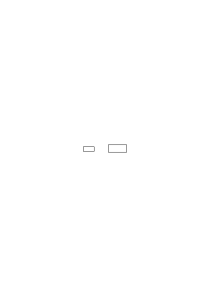?

---

### [34\[3\]](https://cdn.wittgensteinnachlass.com/2000px/webp/Ms-150/34.webp)

Beispiel von dem der auf den Befehl Dinge ihrer Dunkelheit nach zu ordnen auch die Vokale ordnet.

### [34\[4\]](https://cdn.wittgensteinnachlass.com/2000px/webp/Ms-150/34.webp)

Ton des Befehles ordne die Töne nach ihrer Dunkelheit & gewöhnlicher Ton.

### [34\[5\]](https://cdn.wittgensteinnachlass.com/2000px/webp/Ms-150/34.webp)

Man ist versucht zu sagen er muß etwas anderes unter ‘dunkel’ verstanden haben. Vergleich mit einem anderen Instrument nach dessen Ablesungen er alles ordnet. Aber ein solches Instrument ist nicht vorhanden. Es muß vorhanden sein, heißt daß wir entschlossen sind dieses Bild zu gebrauchen.

### [34\[6\]](https://cdn.wittgensteinnachlass.com/2000px/webp/Ms-150/34.webp),[35\[1\]](https://cdn.wittgensteinnachlass.com/2000px/webp/Ms-150/35.webp)

“Aber es ist doch gewiß ein anderer Sinn von dunkel den wir hier gebrauchen.”

Was soll das heißen? Unterscheidest Du hier den Sinn von Gebrauch & willst sagen daß wenn einer das Wort so gebraucht daraus folge, daß auch anderswo etwas anderes vorsichgehen müsse, oder werde. – Oder willst Du nur sagen dieser Gebrauch sei doch ein anderer als jener?

### [35\[2\]](https://cdn.wittgensteinnachlass.com/2000px/webp/Ms-150/35.webp)

Bist Du nun zufrieden wenn ich die Unterschiede in den beiden Fällen aufzähle. Oder muß ich noch etwas anderes zugeben.

### [35\[3\]](https://cdn.wittgensteinnachlass.com/2000px/webp/Ms-150/35.webp)

Wie, wenn jemand sagte: “das sind doch verschiedene Arten des Gebrauchs von ‘rot’”. Ich würde sagen das eine ist hellrot das andere dunkelrot, aber warum soll ich das verschiedene Arten des Gebrauchs von ‘rot’ nennen?

### [35\[4\]](https://cdn.wittgensteinnachlass.com/2000px/webp/Ms-150/35.webp),[36\[1\]](https://cdn.wittgensteinnachlass.com/2000px/webp/Ms-150/36.webp)

Aber besteht die Verschiedenheit des Gebrauchs noch in etwas Anderem als in den Verschiedenheiten die wir aufzählen können? Denn gewiß in einem Fall lege ich etwa farbige Flecke zusammen & vergleiche sie indem ich bald den einen bald den andern ansehe, ich halte sie vielleicht in ein besseres Licht; ich male eine Farbe die heller ist als eine andere u.s.f. u.s.f. Im Falle der Vokale fand kein solches zusammenlegen, malen etc. statt.

### [36\[2\]](https://cdn.wittgensteinnachlass.com/2000px/webp/Ms-150/36.webp)

Aber ich sehe doch daß die Relation zwischen einem helleren & einem dunkleren Stück Stoff eine andere ist als zwischen dem e & dem u. Wie ich anderseits sehe daß die Relation zwischen u & e die selbe ist wie die zwischen e & i.

### [36\[3\]](https://cdn.wittgensteinnachlass.com/2000px/webp/Ms-150/36.webp)

Ob Du die Relationen dieselben oder verschiedene nennt, das hängt wohl davon ab, wie Du sie vergleichst. Ist → dieselbe Richtung wie ← oder sind sie entgegengesetzt. Spiegel

Entsprechende Umstände können uns veranlassen zu sagen die Relationen sind verschieden, andere, sie seien die gleichen.

### [36\[4\]](https://cdn.wittgensteinnachlass.com/2000px/webp/Ms-150/36.webp)

Es ist hier wie mit der Fortsetzung einer Reihe. Intuitionismus.

### [36\[5\]](https://cdn.wittgensteinnachlass.com/2000px/webp/Ms-150/36.webp),[37\[1\]](https://cdn.wittgensteinnachlass.com/2000px/webp/Ms-150/37.webp)

“It isn't only that you use the word ‘red’ for this colour but you use it with a _particular_ experience.” “Experience when we use a word in a derivative sense.” Tone of voice in the order “now arrange the _vowels_ in order of their darkness”.

### [37\[3\]](https://cdn.wittgensteinnachlass.com/2000px/webp/Ms-150/37.webp)

The tone of voice may be, all things being equal, the decisive experience?

### [37\[4\]](https://cdn.wittgensteinnachlass.com/2000px/webp/Ms-150/37.webp)

He said & meant it sounds as though two activities here ran parallel.

### [37\[5\]](https://cdn.wittgensteinnachlass.com/2000px/webp/Ms-150/37.webp)

But surely there is a difference between saying something & meaning it, & saying it without meaning it. There needn't be a difference while he says it & if there is a difference then this may be of all sorts of different kinds according to the surrounding circumstances. It does not follow from the fact that there is what we call a friendly & an unfriendly expression of the eye that there must be a difference between the eyes of a friendly & of an unfriendly face.

### [38\[1\]](https://cdn.wittgensteinnachlass.com/2000px/webp/Ms-150/38.webp)

Suppose one said: “this line can't make the face look friendly as it could be belied by other lines.”

### [38\[2\]](https://cdn.wittgensteinnachlass.com/2000px/webp/Ms-150/38.webp)

Under these circumstances we call this activity reading. If he does it we say he is reading & if we order him to read & he does it we are satisfied. Under these circumstances we call this picture of his eye a friendly eye. Under these circumstances this was what saying & meaning it consisted in.

### [38\[3\]](https://cdn.wittgensteinnachlass.com/2000px/webp/Ms-150/38.webp)

In a large group of cases believing something is the same or something very similar to uttering your belief.

### [38\[4\]](https://cdn.wittgensteinnachlass.com/2000px/webp/Ms-150/38.webp)

All the circumstances which make believing intersect in the present moment.

### [38\[5\]](https://cdn.wittgensteinnachlass.com/2000px/webp/Ms-150/38.webp)

Now is he meaning it when he says it or isn't he?

### [39\[1\]](https://cdn.wittgensteinnachlass.com/2000px/webp/Ms-150/39.webp)

“I said it & meant it.” – How did you do it? –

### [39\[2\]](https://cdn.wittgensteinnachlass.com/2000px/webp/Ms-150/39.webp)

Compare meaning “I shall be delighted to see you” with meaning “the train goes at 3˙30”.

### [39\[3\]](https://cdn.wittgensteinnachlass.com/2000px/webp/Ms-150/39.webp)

There are certain expressions characteristic of believing i.e. there is a large group of cases in which they together with other factors constitute what we call believing. But because these first components aren't present in all cases of believing you mustn't conclude that any of the others is.

### [39\[4\]](https://cdn.wittgensteinnachlass.com/2000px/webp/Ms-150/39.webp)

Compare lying about the train with lying about being delighted.

### [39\[5\]](https://cdn.wittgensteinnachlass.com/2000px/webp/Ms-150/39.webp)

It is even possible while lying feeling quite strongly what is usually felt when one means sincerely what one says.

### [39\[6\]](https://cdn.wittgensteinnachlass.com/2000px/webp/Ms-150/39.webp),[40\[1\]](https://cdn.wittgensteinnachlass.com/2000px/webp/Ms-150/40.webp)

And at the same time one refers to just these feelings sometimes when one says I said it and meant it. I.e. one would mention these feelings as characteristic for one's meaning what one said. And if anyone said “But these same feelings could also have been present if you hadn't meant it” one could answer: “not in the kind of case this was”.

### [40\[2\]](https://cdn.wittgensteinnachlass.com/2000px/webp/Ms-150/40.webp)

“He was very friendly, he smiled at me most kindly”. – But he might have done that & felt unfriendly.

### [40\[3\]](https://cdn.wittgensteinnachlass.com/2000px/webp/Ms-150/40.webp)

“This is a friendly face, look at the eyes.” – But these same eyes would not be friendly in another face. “Still in this face they are friendly”.

### [40\[4\]](https://cdn.wittgensteinnachlass.com/2000px/webp/Ms-150/40.webp)

Should we say “under these circumstances I call this reading” or “under these circumstances I regard this as carrying out my order read” etc.?

### [40\[5\]](https://cdn.wittgensteinnachlass.com/2000px/webp/Ms-150/40.webp),[41\[1\]](https://cdn.wittgensteinnachlass.com/2000px/webp/Ms-150/41.webp)

One remembers just that feeling when one says I meant what one said, although etc.. This feeling then stood out, it is a question just whether one had it or not. And those circumstances which could have contradicted this feeling don't come here at all into question. I would perhaps [unreadable] be ready to say in this case that I meant by ‘I meant it’ I had this feeling.

### [41\[2\]](https://cdn.wittgensteinnachlass.com/2000px/webp/Ms-150/41.webp)

And there are cases where I would be ready to give such an explanation of ‘I meant’ & cases like that of ‘the train leaves at 3˙30’ where I might say “well I just said it, why shouldn't I have meant it”.

### [41\[3\]](https://cdn.wittgensteinnachlass.com/2000px/webp/Ms-150/41.webp)

We very often find it impossible to think without speaking to ourselves half aloud; – & nobody asked to describe what happened in this case would _ever_ say that something, the thinking, accompanied the speaking were they not tempted to do so by the existence of the two verbs speaking & thinking & their use in many of our common phrases. If anything can be said to go with the speech it would be something like the modulation of vocal means of expression. But does the Ausdruck accompany the words in the sense in which a melody accompanies them?

### [42\[1\]](https://cdn.wittgensteinnachlass.com/2000px/webp/Ms-150/42.webp)

Wir _zählen_ nur eine Verwandtschaft zwischen der Dunkelheit der Farbe & der Laute.

### [42\[2\]](https://cdn.wittgensteinnachlass.com/2000px/webp/Ms-150/42.webp)

One thing is important if you say when I say “blue” I have a particular experience, the word comes in a particular way you don't trouble to think of (the) many different experiences while saying the word ‘blue’ & the word ‘three’.

### [42\[4\]](https://cdn.wittgensteinnachlass.com/2000px/webp/Ms-150/42.webp)

Das gleiche Bild kann Vorstellung von Verschiedenem sein. Die Umgebungen sind verschieden. Der Gebrauch, die Atmosphäre.

### [42\[5\]](https://cdn.wittgensteinnachlass.com/2000px/webp/Ms-150/42.webp),[43\[1\]](https://cdn.wittgensteinnachlass.com/2000px/webp/Ms-150/43.webp)

But moreover, the difference between observing & acting does not at all necessarily consist in a difference in every moment or phase of the action. Exactly the same may happen during the action but the surroundings will be different. Moving in different circles. Different atmosphere.

### [43\[2\]](https://cdn.wittgensteinnachlass.com/2000px/webp/Ms-150/43.webp)

Es denkt

### [43\[3\]](https://cdn.wittgensteinnachlass.com/2000px/webp/Ms-150/43.webp)

Absence of the experience of saying “Oh that's where it's going now”.

### [43\[4\]](https://cdn.wittgensteinnachlass.com/2000px/webp/Ms-150/43.webp)

“Of course we aren't surprised as we do it ourselves!” We take as the criterion of _doing_ it ourselves the absence of surprise.

### [43\[5\]](https://cdn.wittgensteinnachlass.com/2000px/webp/Ms-150/43.webp)

One might think the absence of surprise comes from knowing beforehand what one is going to do.

### [43\[6\]](https://cdn.wittgensteinnachlass.com/2000px/webp/Ms-150/43.webp)

Involuntary speech “Stop!”, “Oh”, “Help!” Like blinking one's eyelids or raising a hand to protect one's face.

### [43\[7\]](https://cdn.wittgensteinnachlass.com/2000px/webp/Ms-150/43.webp)

Speaking as somebody's friend, doctor, speaking as a private person, as a university lecturer. One might think that whenever a man speaks he speaks as someone.

### [44\[1\]](https://cdn.wittgensteinnachlass.com/2000px/webp/Ms-150/44.webp)

Involuntary | = without effort

| = with an effort to the contrary

| = unpremeditated

| = it would have been impossible to stop it

| = Is moving one's fingers in example № … involuntary should we call it so? Is breathing voluntary?

### [44\[2\]](https://cdn.wittgensteinnachlass.com/2000px/webp/Ms-150/44.webp)

Should we say that when we shout “Help!” there is no act of volition, whereas when we say “Hallo!” to a friend there is?

### [44\[3\]](https://cdn.wittgensteinnachlass.com/2000px/webp/Ms-150/44.webp)

Compare the cases when you raise your hand with an effort or move it without effort in a particular curve (say writing a letter in the air) or after deliberating whether you lift it or not, you ‘find yourself lifting it’.

### [44\[4\]](https://cdn.wittgensteinnachlass.com/2000px/webp/Ms-150/44.webp)

Ordinary speaking is called voluntary not because there is a particular effort present, the act of will.

### [44\[5\]](https://cdn.wittgensteinnachlass.com/2000px/webp/Ms-150/44.webp)

Premeditated acts

### [45\[1\]](https://cdn.wittgensteinnachlass.com/2000px/webp/Ms-150/45.webp)

If against my will I shriek with pain the overcoming of my will is not like the overcoming of a muscular effort.

### [45\[2\]](https://cdn.wittgensteinnachlass.com/2000px/webp/Ms-150/45.webp)

One might say “surely shrieking with pain is a good example of involuntary speaking because here far from there being an act of volition which worked the speaking there even was one against it.” I should say: Certainly I too would call this involuntary speaking. And I agree that an act of volition preparatory to or accompanying the speech is absent if by ‘act of volition’ you refer to certain acts of intention, premeditation or effort. But then in many cases of voluntary speech I don't feel an effort, many were not premeditated & as to intentions sometimes the unintentional action is characterized as such by an experience of surprise in others the intentional is characterized by a spoken or imagined expression of intention.

### [46\[1\]](https://cdn.wittgensteinnachlass.com/2000px/webp/Ms-150/46.webp)

“All that happens is that I get out of bed”. “All that happens when I mean it is in this case that I say it”. That is to say: I don't call it ‘meaning what I say’ because of any peculiar experience which I have while I say it. But what is a peculiar experience? Isn't the absence of an experience an experience? Yes but we don't call the absence of a feeling a feeling or the absence of pain a pain. It is certainly sometimes misleading to say: “Not the presence of something characterizes this case but the absence of something”. But when we are inclined to look out for a sensation it makes sense to point out that in such & such a case we don't find a peculiar sensation but we do in the opposite case.

### [46\[2\]](https://cdn.wittgensteinnachlass.com/2000px/webp/Ms-150/46.webp)

In a great many cases the difference is not one lying in the action or an accompaniment of it, but in the surrounding circumstances the _environment_ of the action.

### [47\[1\]](https://cdn.wittgensteinnachlass.com/2000px/webp/Ms-150/47.webp)

It is as though I said “these two people move in different circles” does not mean that they are never surrounded by exactly the same people, e.g. when they walk in the street.

### [47\[2\]](https://cdn.wittgensteinnachlass.com/2000px/webp/Ms-150/47.webp)

A kind & an unkind expression might look exactly alike only what goes before & after as different.

### [47\[3\]](https://cdn.wittgensteinnachlass.com/2000px/webp/Ms-150/47.webp)

Our tendency is to describe something that is a matter of atmosphere round a situation in a too primitive way as a difference in the situation.

### [47\[4\]](https://cdn.wittgensteinnachlass.com/2000px/webp/Ms-150/47.webp)

Thus one says: “something peculiar happens when the name of a colour comes, something different when the numeral comes.” But we have no reason at all to say this. But I agree that the surroundings of these two are different.

### [47\[5\]](https://cdn.wittgensteinnachlass.com/2000px/webp/Ms-150/47.webp),[48\[1\]](https://cdn.wittgensteinnachlass.com/2000px/webp/Ms-150/48.webp)

Why do you say “_something_ does happen when I understand a word!”. Do you remember that the same thing always happens or do you know that one of, say, four things happen?

“Es drückt etwas aus. Es sagt mir etwas.”

### [48\[3\]](https://cdn.wittgensteinnachlass.com/2000px/webp/Ms-150/48.webp)

One face reminds you of someone, one strikes you as Chinese, one makes you think of an illustration you have seen.

### [48\[4\]](https://cdn.wittgensteinnachlass.com/2000px/webp/Ms-150/48.webp)

I'm seeing this as a face as opposed to seeing it as a wineglass in a round hole. And when you change over from the one to the other you change the ‘attention’ & you look at it with a different face.

### [48\[5\]](https://cdn.wittgensteinnachlass.com/2000px/webp/Ms-150/48.webp),[49\[1\]](https://cdn.wittgensteinnachlass.com/2000px/webp/Ms-150/49.webp)

Look at W, alternately as a W and as an M upside down. How queer that you can comply with this order. And what do you do to comply with it? “I see it resting on the upper end”. But what does _that_ mean? Aren't there lots of possibilities? & isn't one of them that you read it M instead of W?

### [49\[2\]](https://cdn.wittgensteinnachlass.com/2000px/webp/Ms-150/49.webp)

Do I get all sorts of impressions from these figures _and_ all along see them as faces?

### [49\[3\]](https://cdn.wittgensteinnachlass.com/2000px/webp/Ms-150/49.webp)

And how about a real face, – does one see that too as a face always? Is it correct to say that if we don't see it as something else we have one particular attitude towards it? And don't (or do) you look in a particular way at everything you look at? Or: couldn't you look at everything in several ways? Look at your tea kettle & see its spout as a nose. –

### [49\[4\]](https://cdn.wittgensteinnachlass.com/2000px/webp/Ms-150/49.webp)

Do you wish to say this soap has a particular smell as opposed to no particular smell; or that it has this smell as opposed to another one or both the first & the second.

### [49\[5\]](https://cdn.wittgensteinnachlass.com/2000px/webp/Ms-150/49.webp),[50\[1\]](https://cdn.wittgensteinnachlass.com/2000px/webp/Ms-150/50.webp)

We are tempted to ask: “What does seeing something as a face consist in?” And we feel tempted to ask: “does it consist in anything obviously superadded to the mere seeing of the strokes, or is there only a ‘seeing it as a face’ as distinguished from seeing it as something else?”

### [50\[2\]](https://cdn.wittgensteinnachlass.com/2000px/webp/Ms-150/50.webp)

Are we aware of seeing a table which we see ‘_as table_’?

### [50\[3\]](https://cdn.wittgensteinnachlass.com/2000px/webp/Ms-150/50.webp)

Suppose I said “I am in a particular bodily position now”; What happens is that I am concentrating my attention on the sensations I have in this situation.

### [50\[4\]](https://cdn.wittgensteinnachlass.com/2000px/webp/Ms-150/50.webp),[51\[1\]](https://cdn.wittgensteinnachlass.com/2000px/webp/Ms-150/51.webp)

Ich sehe an einem Kleiderhaken einen Rock & eine Kappe aufgehangen, sie machen mir – bin ich versucht zu sagen – gleich einen ganz bestimmten Eindruck. Aber vergleichen wir den Eindruck eines Pelzrockes mit dem einer Regenhaut, eines neuen glatten Rockes & eines alten schäbigen. Ein Hals macht einen andern Eindruck als ein Gesicht & einen anderen machen Füße. Aber diese Eindrücke erhält man nicht immer wenn man diese Dinge sieht. Kann man dagegen nicht sagen: wie ich den Rock gesehen habe, habe ich ihn sofort als _Rock_ gesehen, ehe ich irgend einen besonderen Eindruck, etwa der Wärme oder Weichheit hatte?

### [51\[2\]](https://cdn.wittgensteinnachlass.com/2000px/webp/Ms-150/51.webp)

Aber bist Du sicher daß Du eben nicht bloß diese bestimmte Form des Rockes, gesehen hast, – & freilich nicht mit Staunen, nicht mit der Frage “was ist das?” u. dergl.?

### [51\[3\]](https://cdn.wittgensteinnachlass.com/2000px/webp/Ms-150/51.webp)

The answer to the question “how does he enter the room?” might in this case be a picture showing him entering the room.

### [51\[4\]](https://cdn.wittgensteinnachlass.com/2000px/webp/Ms-150/51.webp)

“The word ‘red’” – we are inclined to say – “comes in a particular way, namely in _this_ way.” But “in this way” here only means: it comes in the way it comes.

### [51\[5\]](https://cdn.wittgensteinnachlass.com/2000px/webp/Ms-150/51.webp)

It is as though calling it a particular feeling when one sees red still had sense although the feeling was to be bound up with seeing red.

### [51\[6\]](https://cdn.wittgensteinnachlass.com/2000px/webp/Ms-150/51.webp),[52\[1\]](https://cdn.wittgensteinnachlass.com/2000px/webp/Ms-150/52.webp)

We use the word “particular” here as an emphasis whereas it seems that we use it transitively &, in particular, reflexively.

### [52\[2\]](https://cdn.wittgensteinnachlass.com/2000px/webp/Ms-150/52.webp)

You think you compare it with a paradigm & it agrees or it fits into a mould ready for it in your mind. But in your experience no such mould or comparison enters there is only this shape not any other to compare it with & you, as it were, say “of course” to it (but not because it fits anything, but because of no reason).

### [52\[3\]](https://cdn.wittgensteinnachlass.com/2000px/webp/Ms-150/52.webp)

You lay an emphasis on it but you express this in a form which tempts you to believe that you are _recognizing it_.

### [52\[4\]](https://cdn.wittgensteinnachlass.com/2000px/webp/Ms-150/52.webp)

Instead of saying “it comes with a particular experience” you should have said: “I concentrate my attention on the way it comes or on its coming” (compare ‘I draw the way he comes into the room’).

### [52\[5\]](https://cdn.wittgensteinnachlass.com/2000px/webp/Ms-150/52.webp),[53\[1\]](https://cdn.wittgensteinnachlass.com/2000px/webp/Ms-150/53.webp)

The word in this case comes with a particular experience should in this case mean ‘it always comes with the same experience’, but you aren't ready to confirm that! So why are you tempted here to use the phrase while contemplating the way it comes? Because you are contemplating it. You thereby lay an emphasis on it.

### [53\[2\]](https://cdn.wittgensteinnachlass.com/2000px/webp/Ms-150/53.webp)

If you try to see what it is you are comparing it with you should be inclined to say that you compare it with itself. And this is a most characteristic situation.

### [53\[3\]](https://cdn.wittgensteinnachlass.com/2000px/webp/Ms-150/53.webp)

The way can't in this case be separated from him.

### [53\[4\]](https://cdn.wittgensteinnachlass.com/2000px/webp/Ms-150/53.webp),[54\[1\]](https://cdn.wittgensteinnachlass.com/2000px/webp/Ms-150/54.webp)

Now if I wished to draw him coming in & was contemplating his coming in I should while doing so be inclined to say to myself & repeat: “He has a particular way of coming in”. But the answer to the question “What is this way?” would be “it's _this_ way” (perhaps drawing it). But there may be no such answer & my phrase may only mean: “I contemplate his position”. Our expression on the other hand made it appear as though his position was not characterized by anything but itself.

### [54\[2\]](https://cdn.wittgensteinnachlass.com/2000px/webp/Ms-150/54.webp)

We very often use the reflexive form when we wish to lay an emphasis on something & such expressions can then always be straightened out: Thus we say a man's a man À la guerre comme, à la guerre. If I can't I can't, I am what I am. That's that. Take it or leave it. It either rains or it doesn't rain.

This is no piece of information; if it rains we shall – – –

There must be a greatest number of examples let it be 500.

### [54\[3\]](https://cdn.wittgensteinnachlass.com/2000px/webp/Ms-150/54.webp)

“If the length of the one is L the length of the other is L”. This is a form of various propositions but not itself a proposition But we could say: “Let us put ‘L’ instead of ‘length’: then they have the same L. But it makes sense to say: “Let us consider propositions of the form “if A has the length L so has B”.”

### [55\[1\]](https://cdn.wittgensteinnachlass.com/2000px/webp/Ms-150/55.webp)

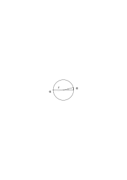

25 × 25 ≷ 625

25 × a ≧ 625

### [55\[2\]](https://cdn.wittgensteinnachlass.com/2000px/webp/Ms-150/55.webp)

“Denken wir daß der Radius r zwei Verlängerungen habe”; – aber das ist ja wirklich möglich! Wir machen keine absurde Annahme.

### [55\[3\]](https://cdn.wittgensteinnachlass.com/2000px/webp/Ms-150/55.webp)

Stelle Dir diesen indirekten Beweis so vor daß das was bewiesen wird nicht offenbar zu Tage tritt sondern durch eine Kette von Transformationen versteckt ist; & ich zeige dann daß wenn dort ↗ ein Spalt klafft auch da ↙ einer sein muß. Man denke sich einen komplizierten Mechanismus der zwischen zwei Stellungen vermittelt.

### [55\[4\]](https://cdn.wittgensteinnachlass.com/2000px/webp/Ms-150/55.webp)

Der Beweis zeigt die Inkonvenienz der Fortsetzung daß der Radius zwei Fortsetzungen haben kann. Der Widerspruch den der Beweis ergibt ist _harmlos_.

### [55\[5\]](https://cdn.wittgensteinnachlass.com/2000px/webp/Ms-150/55.webp),[56\[1\]](https://cdn.wittgensteinnachlass.com/2000px/webp/Ms-150/56.webp)

Aber die Annahme _erscheint_ auf den ersten Blick absurd. Aber wenn sie wirklich absurd ist dann kann man sie nicht machen.

### [56\[2\]](https://cdn.wittgensteinnachlass.com/2000px/webp/Ms-150/56.webp)

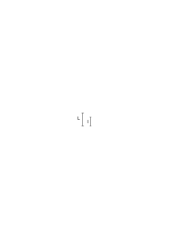

“The two measure L feet” is the general form of a proposition saying that they have a particular length in common.

### [56\[3\]](https://cdn.wittgensteinnachlass.com/2000px/webp/Ms-150/56.webp)

“This face has a particular expression?” I'm inclined to say this when I'm letting it make its full impression on me. And this is something like letting it govern you (sich ihm hingeben). It is then as though I wished to say what this expression consisted in & really this is what one does when one wants to find the right expression.

### [56\[4\]](https://cdn.wittgensteinnachlass.com/2000px/webp/Ms-150/56.webp)

The question “What expression does it have here” means, I wish to get its full impression.

### [56\[5\]](https://cdn.wittgensteinnachlass.com/2000px/webp/Ms-150/56.webp),[57\[1\]](https://cdn.wittgensteinnachlass.com/2000px/webp/Ms-150/57.webp)

“But surely, this face has a peculiar expression!” What does this mean? _Has_ it got something? **Is**n't it something?

### [57\[2\]](https://cdn.wittgensteinnachlass.com/2000px/webp/Ms-150/57.webp)

It would be interesting to imagine beings which consisted of nothing else than a circular stroke & two eye strokes & nose-stroke & one mouth-stroke & whose movements consisted in movements, changes of the shape of these strokes.

### [57\[3\]](https://cdn.wittgensteinnachlass.com/2000px/webp/Ms-150/57.webp)

_Ich_ hebe es hervor! Es ist als machte ich eine Stampiglie davon.

### [57\[4\]](https://cdn.wittgensteinnachlass.com/2000px/webp/Ms-150/57.webp)

Philosophizing is an illness & we are trying to describe minutely its symptoms, clinical appearance.

### [57\[5\]](https://cdn.wittgensteinnachlass.com/2000px/webp/Ms-150/57.webp)

“It couldn't be just these strokes! You're obviously comparing them with something else you know. There is something behind those strokes!”

### [57\[6\]](https://cdn.wittgensteinnachlass.com/2000px/webp/Ms-150/57.webp)

To say ‘it _has_ the expression’ makes it appear as though I could separate the expression from the face.

### [57\[7\]](https://cdn.wittgensteinnachlass.com/2000px/webp/Ms-150/57.webp),[58\[1\]](https://cdn.wittgensteinnachlass.com/2000px/webp/Ms-150/58.webp)

“You won't tell me that this tune doesn't express something particular”. Does this mean that you make particular movements to it? But particular movements as opposed to which?

### [58\[2\]](https://cdn.wittgensteinnachlass.com/2000px/webp/Ms-150/58.webp)

“But these movements also express _something_, they aren't just movements!”

### [58\[3\]](https://cdn.wittgensteinnachlass.com/2000px/webp/Ms-150/58.webp)

Supposing you said: “You won't tell me that this tune hasn't a particular rhythm”! – “Why, of course it has a particular rhythm, which tune hasn't.” It here seems as though the peculiarity must consist in our recognizing it as this rhythm which we know from somewhere else. But this may be a delusion & it has just its own rhythm but a rhythm which strikes you, say makes you sway.

### [58\[4\]](https://cdn.wittgensteinnachlass.com/2000px/webp/Ms-150/58.webp)

“It says something” could in this case be translated into “it speaks to me”.

### [59\[1\]](https://cdn.wittgensteinnachlass.com/2000px/webp/Ms-150/59.webp)

Als müßte ich diesen Ausdruck (des Gesichts) noch irgendwo anders wiederfinden!

### [59\[2\]](https://cdn.wittgensteinnachlass.com/2000px/webp/Ms-150/59.webp)

Oder ich frage “Was drückt es denn aus?” und will doch eigentlich keine Antwort.

Es heißt eigentlich es hat Ausdruck es ist ein Gesicht.

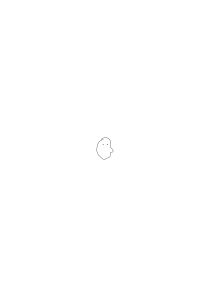

### [59\[3\]](https://cdn.wittgensteinnachlass.com/2000px/webp/Ms-150/59.webp)

Eine Zahl als Jahreszahl sehen.

### [59\[4\]](https://cdn.wittgensteinnachlass.com/2000px/webp/Ms-150/59.webp)

There are experien**ces** of familiarity.

### [59\[5\]](https://cdn.wittgensteinnachlass.com/2000px/webp/Ms-150/59.webp)

“This is a serious face”. – What is it that is serious?

### [59\[6\]](https://cdn.wittgensteinnachlass.com/2000px/webp/Ms-150/59.webp)

Does it _mean_ that it makes me serious, that it has such & such an effect on me? And if eating a soup has this effect do I call it serious? And can't a smiling face somehow make me feel serious?

### [59\[7\]](https://cdn.wittgensteinnachlass.com/2000px/webp/Ms-150/59.webp),[60\[1\]](https://cdn.wittgensteinnachlass.com/2000px/webp/Ms-150/60.webp)

On the other hand: does a ‘serious face’ always strike me as serious?

### [60\[2\]](https://cdn.wittgensteinnachlass.com/2000px/webp/Ms-150/60.webp)

Supposing I got its impression if I imitated it! (This can still easier be imagined if it is the posture of a man

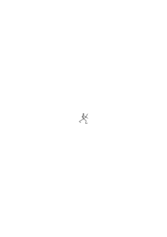

which I imitate.)

### [60\[3\]](https://cdn.wittgensteinnachlass.com/2000px/webp/Ms-150/60.webp)

How is it that this kind of picture

can look serious & not this

?

What ‘can't’ is this?! Is it a hypothesis to say this <math display="inline"><mtext>↣</mtext></math> can never look serious?

### [60\[4\]](https://cdn.wittgensteinnachlass.com/2000px/webp/Ms-150/60.webp)

But can't a chair look serious? “But not in the sense in which a face does”. – What does this mean?

### [60\[5\]](https://cdn.wittgensteinnachlass.com/2000px/webp/Ms-150/60.webp)

If looking at it so that you get its expression consists in imitating it, what has the expression, the face or me? Is it the face insofar as it has a certain effect? What is heavy the balance or the weight?

### [60\[6\]](https://cdn.wittgensteinnachlass.com/2000px/webp/Ms-150/60.webp)

How can I be sure that lengthening the mouth is what makes it look serious? Are any experiments needed for that?

### [60\[7\]](https://cdn.wittgensteinnachlass.com/2000px/webp/Ms-150/60.webp),[61\[1\]](https://cdn.wittgensteinnachlass.com/2000px/webp/Ms-150/61.webp)

Do I see it by introspection? Is it self-evident?

### [61\[2\]](https://cdn.wittgensteinnachlass.com/2000px/webp/Ms-150/61.webp)

Isn't it that I measure the picture by a different kind of instrument; weigh it on a different kind of balance.

### [61\[3\]](https://cdn.wittgensteinnachlass.com/2000px/webp/Ms-150/61.webp)

Does Harmony treat of our feelings? Is it psychology?

### [61\[4\]](https://cdn.wittgensteinnachlass.com/2000px/webp/Ms-150/61.webp)

Is it a delusion consisting in “_projecting_” our own feelings into the thing we see? Is there such a case of projecting? Where do we take this idea from?

### [61\[5\]](https://cdn.wittgensteinnachlass.com/2000px/webp/Ms-150/61.webp)

Is the _sugar_ sweet, or do we project the feeling of sweetness into the sugar?

### [61\[6\]](https://cdn.wittgensteinnachlass.com/2000px/webp/Ms-150/61.webp)

Es ist als wäre jede Art & Weise des Lebens etwas was beim Sehen gegenwärtig ist. Als wäre jeder mögliche Kontrast eine Färbung. Als hätten wir zuerst das offenbar reine Sehen & dann träten verschiedene andere Erfahrungen hinzu.

### [61\[7\]](https://cdn.wittgensteinnachlass.com/2000px/webp/Ms-150/61.webp),[62\[1\]](https://cdn.wittgensteinnachlass.com/2000px/webp/Ms-150/62.webp)

Es ist als _bestünde_ der Eindruck eines Gesichts aus so & so vielen Teilen, dem rein Optischen, dem Gesichtsausdruck etc..

### [62\[2\]](https://cdn.wittgensteinnachlass.com/2000px/webp/Ms-150/62.webp)

“A word (particularly a well known one) has”, we should like to say, “a particular expression (facial expression). We don't just see it we feel something – or all sorts of things – when we see it.” This is almost as if one said “if I see red I have all sorts of feelings, the feeling of the absence of green, of blue, of yellow, etc. etc.”.

### [62\[3\]](https://cdn.wittgensteinnachlass.com/2000px/webp/Ms-150/62.webp)

It is as though we saw a face first purely visual then _in addition_ to that as a face then _in addition_ to that as a Chinese face & _in addition_ to that as a well known one.

### [62\[4\]](https://cdn.wittgensteinnachlass.com/2000px/webp/Ms-150/62.webp)

Now we can imagine additional processes corresponding to each such case but these are not ‘directly perceived’.

### [62\[5\]](https://cdn.wittgensteinnachlass.com/2000px/webp/Ms-150/62.webp)

The word ‘that’ has a peculiar expression. What do you contrast it with? Can you …

### [63\[1\]](https://cdn.wittgensteinnachlass.com/2000px/webp/Ms-150/63.webp)

Would you think about it as you do, if you did not know something about the optical apparatus of our eyes?

### [63\[2\]](https://cdn.wittgensteinnachlass.com/2000px/webp/Ms-150/63.webp)

It is as though I had necessarily got to say that I distinguish _elements_ in the seeing of a face or a word.

### [63\[3\]](https://cdn.wittgensteinnachlass.com/2000px/webp/Ms-150/63.webp)

Should I say “This eye sparkles” or that I, as it were, sparkle when looking at it. Should I say that the lines of the drawn cube recede or that, as it were, I recede when looking at them? Should I say “_this aspect_ sparkles” or “This drawing seems to sparkle in this aspect”?

### [63\[4\]](https://cdn.wittgensteinnachlass.com/2000px/webp/Ms-150/63.webp)

Die Wörter sind wohlbekannt; worin besteht ihre Wohlbekanntheit?

### [63\[5\]](https://cdn.wittgensteinnachlass.com/2000px/webp/Ms-150/63.webp),[64\[1\]](https://cdn.wittgensteinnachlass.com/2000px/webp/Ms-150/64.webp)

If I look at the word ‘this’, e.g., it looks familiar to me, it looks at me with a familiar face, like an old acquaintance. – But does it always? Am I always touched when I see it? Do I remember having seen it before. Did you say to it “Oh, that's the word …”?

### [64\[2\]](https://cdn.wittgensteinnachlass.com/2000px/webp/Ms-150/64.webp)

You are looking at this ‘as a face’! As what are you looking at it? Can you show me that _as what_ you are looking at it?

### [64\[3\]](https://cdn.wittgensteinnachlass.com/2000px/webp/Ms-150/64.webp)

Seeing the word ‘That’ gives me the feeling of familiarity whereas seeing the word ‘continuity’ doesn't give it to me. But does the first word _always_ give me that feeling?

### [64\[4\]](https://cdn.wittgensteinnachlass.com/2000px/webp/Ms-150/64.webp)

Look at a word & let it seem familiar. Then look at one of its letters & ask yourself whether that also seemed familiar (gave you the feeling of familiarity) when the word as a whole did. And on the other hand the letter is, of course, familiar too.

### [64\[5\]](https://cdn.wittgensteinnachlass.com/2000px/webp/Ms-150/64.webp),[65\[1\]](https://cdn.wittgensteinnachlass.com/2000px/webp/Ms-150/65.webp)

p⊃p = T (p⊃p) ∙ q = q T ∙ p = p p ⌵ T = T p ∙ q ․⊃․ p = T

(p ∙ q ⊃ p) ∙ r = r (p ∙ q) ∙ p = p ∙ q (p ∙ q) ⌵ p = p p ∙ q = p p ⌵ q = (p ∙ q) ⌵ p = p ~p ⌵ q

~(p ∙ q) ⌵ p = T p⊃p ⌵ q

(~(p ∙ q) ⌵ p) ⌵ (p ∙ q) = p ∙ q P․⊃․Q = T

⊢(p⊃q) = p ~p = ~p ∙ q = ~p ⌵ q = ~(p ∙ q) ⌵ q = p ∙ q⊃q ⊢q q ․⊃․ p ⌵ q = Log.

### [65\[2\]](https://cdn.wittgensteinnachlass.com/2000px/webp/Ms-150/65.webp)

Where a logical proposition has a main ․⊃․ we may infer the right hand side from the left.

### [65\[3\]](https://cdn.wittgensteinnachlass.com/2000px/webp/Ms-150/65.webp)

~~p = p Can we deduce this?

### [65\[4\]](https://cdn.wittgensteinnachlass.com/2000px/webp/Ms-150/65.webp)

p ⌵ q = q

### [65\[5\]](https://cdn.wittgensteinnachlass.com/2000px/webp/Ms-150/65.webp)

q․⊃․ p ⌵ q = ~q ․⊃․ p ⌵ ~q

### [66\[1\]](https://cdn.wittgensteinnachlass.com/2000px/webp/Ms-150/66.webp)

When I read a line of writing in a well known language trying to see what reading consists in I get a particular experience which I take to be the experience of reading.

### [66\[2\]](https://cdn.wittgensteinnachlass.com/2000px/webp/Ms-150/66.webp)

This experience doesn't simply seem to consist in seeing & pronouncing but in some other, as it were, some kind of intimate experience. We are on an intimate ‘footing’ with the words.

### [66\[3\]](https://cdn.wittgensteinnachlass.com/2000px/webp/Ms-150/66.webp)

The spoken words we are inclined to say come in a _particular way_ & in fact the written ones themselves don't appear just like _any_ scratches. And at the same time I seem unable to get hold of that ‘_way_’. The process of reading out the word seems we are inclined to say, enshrouded by a particular atmosphere. But here again I don't mean to say that I recognize this atmosphere rather I notice it when in philosophizing I read a line. And here again it is as though I didn't notice it & did notice it.

### [66\[4\]](https://cdn.wittgensteinnachlass.com/2000px/webp/Ms-150/66.webp),[67\[1\]](https://cdn.wittgensteinnachlass.com/2000px/webp/Ms-150/67.webp)

It is the atmosphere of contemplation which I provide. And of course I see what I see. Look at a written word, say ‘read’. It isn't just a scribble it's ‘read’. I should like to say it has no definite physiognomy. But what is it that I really _am_ saying about it?! What's this statement, straightened out?! It falls one is tempted to explain, into a mould of my mind _language_ prepared for it. But as I can't see any such mould; this simile must mean that my experience is one of putting something into a mould when I _don't_ see the mould but just feel it.

### [67\[2\]](https://cdn.wittgensteinnachlass.com/2000px/webp/Ms-150/67.webp)

Knowing what a thing is

a hat

a spectroscope

a piece of coal

an ‘A’

some rubbish etc.

### [67\[3\]](https://cdn.wittgensteinnachlass.com/2000px/webp/Ms-150/67.webp)

What do we contrast all the different experiences of familiarity with?

### [67\[4\]](https://cdn.wittgensteinnachlass.com/2000px/webp/Ms-150/67.webp)

Experience of familiarity added?

It is misleading to say that the experience of seeing a face is a _compound_ one.

### [67\[5\]](https://cdn.wittgensteinnachlass.com/2000px/webp/Ms-150/67.webp)

“This word now somehow looks queer to me”.

### [68\[1\]](https://cdn.wittgensteinnachlass.com/2000px/webp/Ms-150/68.webp)

We wish to say “it's that other thing”, & yet …

### [68\[2\]](https://cdn.wittgensteinnachlass.com/2000px/webp/Ms-150/68.webp)

It looks at me & I wish to say “_it looks at me in this way_”!

### [68\[3\]](https://cdn.wittgensteinnachlass.com/2000px/webp/Ms-150/68.webp)

I can't say “I see _this_ as _this_ face” but “I see this as _a_ face”.

### [68\[4\]](https://cdn.wittgensteinnachlass.com/2000px/webp/Ms-150/68.webp)

Woher aber die starke Versuchung?

### [68\[5\]](https://cdn.wittgensteinnachlass.com/2000px/webp/Ms-150/68.webp)

“This isn't just a scribble, but it's _this_ particular face.”

### [68\[6\]](https://cdn.wittgensteinnachlass.com/2000px/webp/Ms-150/68.webp)

I am tempted to say “I don't see this as _a_ face, I see it as _this_ face!” …

### [68\[7\]](https://cdn.wittgensteinnachlass.com/2000px/webp/Ms-150/68.webp)

Suppose I said “I see this scribble like _this_”, – this would mean something like: What at one time appears to me like this, at another appeared to me like that. [→ ]

### [68\[8\]](https://cdn.wittgensteinnachlass.com/2000px/webp/Ms-150/68.webp),[69\[1\]](https://cdn.wittgensteinnachlass.com/2000px/webp/Ms-150/69.webp)

My language predicates something but I don't really wish to predicate anything, I don't want to say I look at this in such & such a way which can be described without reference to _this_.

### [69\[2\]](https://cdn.wittgensteinnachlass.com/2000px/webp/Ms-150/69.webp)

In fact I don't want to say anything _about_ it but I want to say something _to_ it.

### [69\[3\]](https://cdn.wittgensteinnachlass.com/2000px/webp/Ms-150/69.webp)

This proposition, in what game can I use it? I seem to have constructed a game & yet haven't done so.

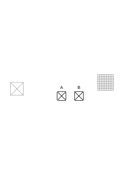

### [69\[4\]](https://cdn.wittgensteinnachlass.com/2000px/webp/Ms-150/69.webp)

Why do I say what I say? What do I contrast the word with of which I say it has a particular essence? Or don't I contrast it with anything? For that shows me what game I'm playing with it. For, what is the use of this phrase? Do I say it of everything I see or only of certain shapes or of anyone when I contemplate it in some special way?

### [70\[1\]](https://cdn.wittgensteinnachlass.com/2000px/webp/Ms-150/70.webp)

The word … isn't just scribble, it's _this_. (And if I say ‘this’, I let the word make an impression on me, look at it in a peculiar way.)

### [70\[2\]](https://cdn.wittgensteinnachlass.com/2000px/webp/Ms-150/70.webp)

Now when I say there is particular atmosphere about my reading a sentence what do I contrast it with? What is it that I notice? Am I noticing that there is the same tone throughout or one tone as opposed to another tone? Do I oppose the experience to seeing some scribbles & saying words as they come into my mind looking at the scribbles in turn?

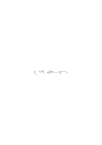

### [70\[3\]](https://cdn.wittgensteinnachlass.com/2000px/webp/Ms-150/70.webp)

Now it is very easy to describe differences between these two cases but difficult if possible at all to specify differences between what is happening in the moment of saying the words.

### [70\[4\]](https://cdn.wittgensteinnachlass.com/2000px/webp/Ms-150/70.webp)

Ich kenne mich in dem Zeichen nicht aus. I don't know this sign properly, the other I know. What is the difference while I look at them.

### [71\[1\]](https://cdn.wittgensteinnachlass.com/2000px/webp/Ms-150/71.webp)

“I notice that the same thing happens throughout.” – What, seeing scribbles & speaking? – “Not that alone there is something else something particular about the way it's done. I don't know what it is but there is something happening? Alright, but let us see what it signifies that you don't know what happens & still know that something particular goes on. For are you looking for that which really happens? Have you a method of finding it? Are you attempting an analysis? And what are your means of analysing? If not, let us look at the actual state of affairs. We have just to take this as the description of this state of affairs that you notice something going on & can't say what.

### [71\[2\]](https://cdn.wittgensteinnachlass.com/2000px/webp/Ms-150/71.webp),[72\[1\]](https://cdn.wittgensteinnachlass.com/2000px/webp/Ms-150/72.webp)

For the expression that the words came in a particular _way_ was misleading. You don't even know what kind of thing the word “way” alludes to. It doesn't for instance allude to a process of deriving the spoken word. If anything one might use it as opposed to other ways for instance that of thinking of any spoken word to associate with the written one. Or the way is a lack of any.

### [72\[2\]](https://cdn.wittgensteinnachlass.com/2000px/webp/Ms-150/72.webp)

If you say you know that something goes on, are you ever clear that this something might not be the _absence_ of anything? Perhaps a certain smoothness. Again the familiar look of the words.

### [72\[3\]](https://cdn.wittgensteinnachlass.com/2000px/webp/Ms-150/72.webp)

But nothing of what we can enumerate is anything that you should care to call the process of reading.

### [72\[4\]](https://cdn.wittgensteinnachlass.com/2000px/webp/Ms-150/72.webp)

Do you notice anything? Don't you just direct your attention on your reading. You look at how you are reading, but …

### [73\[1\]](https://cdn.wittgensteinnachlass.com/2000px/webp/Ms-150/73.webp)

Beobachte die spezielle Beleuchtung die jetzt gerade in Deinem Zimmer ist, merkst Du sie?? “Beobachte die bestimmte Farbe Deiner Wand!” Ja was soll ich denn tun? Soll ich nur in bestimmter intensiver Weise auf die Wand schauen? Oder nur dabei etwas sagen???

“Look at the difference between the colour of the chair & the colour of the wall!” Well what about it? “Look at the peculiar character of this writing!”

### [73\[2\]](https://cdn.wittgensteinnachlass.com/2000px/webp/Ms-150/73.webp)

‘Don't I notice something when I observe myself reading?’ But what _could_ you notice?!

### [73\[3\]](https://cdn.wittgensteinnachlass.com/2000px/webp/Ms-150/73.webp)

“Notice this peculiar contrast of colours!” But _what_ about it?

### [73\[4\]](https://cdn.wittgensteinnachlass.com/2000px/webp/Ms-150/73.webp)

With what sense am I to notice the way the word comes when I'm reading?

### [73\[5\]](https://cdn.wittgensteinnachlass.com/2000px/webp/Ms-150/73.webp),[74\[1\]](https://cdn.wittgensteinnachlass.com/2000px/webp/Ms-150/74.webp)

Aber kann ich nicht das bestimmte Körpergefühl was ich jetzt habe mit einem Namen belegen, es bemerken? Was heißt das? Heißt es bemerken daß ich eines habe oder daß es das ist welches … Oder?

### [74\[2\]](https://cdn.wittgensteinnachlass.com/2000px/webp/Ms-150/74.webp)

Es gibt in der Musik eine _eindrucksvolle_ Phrase & wenn man so eine hört, mag man sagen: “diese Phrase drückt doch etwas aus!” Nur will man aber sagen: sie ist nicht bloß eindrucksvoll, sondern sie drückt auch etwas bestimmtes aus. Aber wir sagten ja, _sie_ sei eindrucksvoll.

### [74\[3\]](https://cdn.wittgensteinnachlass.com/2000px/webp/Ms-150/74.webp)

“It all happens in a peculiar way.”

### [74\[4\]](https://cdn.wittgensteinnachlass.com/2000px/webp/Ms-150/74.webp)

“It makes a strong impression on me.” “It impresses itself on me”.

### [74\[5\]](https://cdn.wittgensteinnachlass.com/2000px/webp/Ms-150/74.webp)

alsigon

### [74\[6\]](https://cdn.wittgensteinnachlass.com/2000px/webp/Ms-150/74.webp)

“It all happens in the way A.”

### [74\[7\]](https://cdn.wittgensteinnachlass.com/2000px/webp/Ms-150/74.webp)

Die “Art” ist wie eine bestimmte Färbung. Aber das Merkwürdige ist daß ich in dieser Färbung scheinbar nicht im Gegensatz zu einer anderen rede.

### [74\[8\]](https://cdn.wittgensteinnachlass.com/2000px/webp/Ms-150/74.webp),[75\[1\]](https://cdn.wittgensteinnachlass.com/2000px/webp/Ms-150/75.webp)

Now if I observe myself saying it I find that I have to read a longish sentence. And I wish to say “it's all the same colour”. But it hasn't just got all the same colour but one particular colour! Yes, but you mistake the function of language! It seems you wish to specify it, but you don't wish to say anything _about_ it, & it seems to you as if pointing to it specified it as though you could explain it by itself. It is as though what I pointed to was at the same time the sample & what one compares it with.

### [75\[2\]](https://cdn.wittgensteinnachlass.com/2000px/webp/Ms-150/75.webp)

You can, of course, take the reading of an English sentence as a _sample_ for reading. But taking it as a sample doesn't say anything about the sample. You can then say something by means of the sample.

### [75\[3\]](https://cdn.wittgensteinnachlass.com/2000px/webp/Ms-150/75.webp)

In saying this wall has all one particular colour we make the same mistake one makes thinking that if we give an ostensive definition we say something about the object we point to.

### [75\[4\]](https://cdn.wittgensteinnachlass.com/2000px/webp/Ms-150/75.webp)

This is a particular shape (colour) because I make a particular face when looking at it.

### [75\[5\]](https://cdn.wittgensteinnachlass.com/2000px/webp/Ms-150/75.webp)

Als was funktioniert das Gesicht, die Farbe etc. worauf ich schaue? Als _Muster_ oder als das worüber ich aussage?

### [76\[1\]](https://cdn.wittgensteinnachlass.com/2000px/webp/Ms-150/76.webp)

“Bei diesem Thema mache ich eine _ganz bestimmte_ Geste”.

### [76\[2\]](https://cdn.wittgensteinnachlass.com/2000px/webp/Ms-150/76.webp)

Obwohl wir die ‘bestimmte’ Beleuchtung eigentlich keiner anderer entgegenstellen wollen, so gebrauchen wir doch diesen Ausdruck in demjenigen Fall, im welchen die Beleuchtung auf uns einen Eindruck macht. – Und das ist eine Bestimmung die unabhängig von der bestimmten Beleuchtung ist –, & wir können den Eindruck auch beschreiben, anderen Eindrücken entgegenstellen.

### [76\[3\]](https://cdn.wittgensteinnachlass.com/2000px/webp/Ms-150/76.webp)

[You can't move a King of Chess in this way

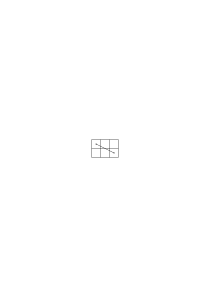

.]

### [76\[4\]](https://cdn.wittgensteinnachlass.com/2000px/webp/Ms-150/76.webp)

It is absurd to say “you can't use negation this way” as the use determines whether it's negation. What is to determine whether it is negation or not.

### [77\[1\]](https://cdn.wittgensteinnachlass.com/2000px/webp/Ms-150/77.webp)

x = y, x = x 2 + 2 = 4 Is this the result of a calculation or isn't it. If not it is a definition & how could this be a tautology?

### [77\[2\]](https://cdn.wittgensteinnachlass.com/2000px/webp/Ms-150/77.webp)

(∃x,y) ∙ x = y ․≡․ φx ∙ φy

### [77\[3\]](https://cdn.wittgensteinnachlass.com/2000px/webp/Ms-150/77.webp)

F(x,y)

f(a)⊃f(b) f(a)⊃f(a) f(2 + 2)․⊃․f(4)

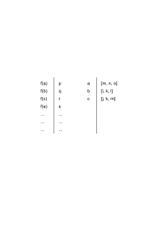

### [78\[1\]](https://cdn.wittgensteinnachlass.com/2000px/webp/Ms-150/78.webp)

But can't I say that I see now, – what I do see?

### [78\[2\]](https://cdn.wittgensteinnachlass.com/2000px/webp/Ms-150/78.webp)

When I said, …, I wished to say that I didn't just see anything, nor did I wish to give any general characteristic of what I saw but – – –.

### [78\[3\]](https://cdn.wittgensteinnachlass.com/2000px/webp/Ms-150/78.webp)

“Write a sentence! – While you write do you feel something?” – “Yes, I have a particular feeling while writing”. I don't want to say just that I have the same feeling the whole time but also that I have this particular feeling. But what is this particular feeling characterized by except itself?

### [78\[4\]](https://cdn.wittgensteinnachlass.com/2000px/webp/Ms-150/78.webp)

The word ‘particular feeling’ belongs together with the feeling itself. One could just say “I have … while writing”. And during ‘ …’ produce the feeling.

### [78\[5\]](https://cdn.wittgensteinnachlass.com/2000px/webp/Ms-150/78.webp)

“Observe the feeling which you have while writing.”

### [79\[1\]](https://cdn.wittgensteinnachlass.com/2000px/webp/Ms-150/79.webp)

It seems it has sense to say “I have _this_ feeling while writing”. And while saying this I produce a feeling.

### [79\[2\]](https://cdn.wittgensteinnachlass.com/2000px/webp/Ms-150/79.webp)

“Surely I can say that I have this feeling while I'm writing”. Of course you can say it & when you say “this feeling” you concentrate on the feeling (which is comparable to looking not to seeing). But what do you do with the sentence? What use is it to you?

### [79\[3\]](https://cdn.wittgensteinnachlass.com/2000px/webp/Ms-150/79.webp)

“Observe the feeling” can't mean “feel it”. I can say look closely at what you see, not see clearly what you see.

### [79\[4\]](https://cdn.wittgensteinnachlass.com/2000px/webp/Ms-150/79.webp)

I can't visually point to what I see because I see the pointing finger & it does not point to what I see but is part of it.

### [79\[5\]](https://cdn.wittgensteinnachlass.com/2000px/webp/Ms-150/79.webp),[80\[1\]](https://cdn.wittgensteinnachlass.com/2000px/webp/Ms-150/80.webp)

It is as though I could say: My act of concentrating the attention is an inward (act of) pointing. An act which nobody else sees but that doesn't matter. But I don't point to the feeling by attending to it but rather produce it.

### [80\[2\]](https://cdn.wittgensteinnachlass.com/2000px/webp/Ms-150/80.webp)

“Beim Lesen eines Satzes fühl ich einen bestimmten Vorgang.” Was ist daran wahr?

### [80\[3\]](https://cdn.wittgensteinnachlass.com/2000px/webp/Ms-150/80.webp)

Wenn ich wohlbekannte Dinge sehen habe ich eine bestimmte Erfahrung; was ist _daran_ wahr?

### [80\[4\]](https://cdn.wittgensteinnachlass.com/2000px/webp/Ms-150/80.webp)

“I notice that the wall has this particular colour”.

### [80\[5\]](https://cdn.wittgensteinnachlass.com/2000px/webp/Ms-150/80.webp)

“Do you only notice that it has the same colour throughout or do you also notice the particular colour it has?” This might mean: are you impressed by the particular colour it has.

### [80\[6\]](https://cdn.wittgensteinnachlass.com/2000px/webp/Ms-150/80.webp)

“I know what colour it has because I see it”. Well, what colour has it. “I know which colour it has.” “I know the colour.”

### [80\[7\]](https://cdn.wittgensteinnachlass.com/2000px/webp/Ms-150/80.webp),[81\[1\]](https://cdn.wittgensteinnachlass.com/2000px/webp/Ms-150/81.webp)

It has a particular colour A & I know A.

### [81\[2\]](https://cdn.wittgensteinnachlass.com/2000px/webp/Ms-150/81.webp)

Ich wäge einen Geschmack auf der Zunge.

### [81\[3\]](https://cdn.wittgensteinnachlass.com/2000px/webp/Ms-150/81.webp)

You misunderstand the function of language. It seems to you as though you could say: I notice the colour besides seeing that it has all one colour.

### [81\[4\]](https://cdn.wittgensteinnachlass.com/2000px/webp/Ms-150/81.webp)

You think it makes sense to say: the colour of this→ is this→.

### [81\[5\]](https://cdn.wittgensteinnachlass.com/2000px/webp/Ms-150/81.webp)

Observe the feeling of writing. “Yes I'm looking at it”, or “yes I'm impressing it on my mind”.

### [81\[6\]](https://cdn.wittgensteinnachlass.com/2000px/webp/Ms-150/81.webp)

If I observe the particular lighting etc. I don't do anything with it.

### [81\[7\]](https://cdn.wittgensteinnachlass.com/2000px/webp/Ms-150/81.webp),[82\[1\]](https://cdn.wittgensteinnachlass.com/2000px/webp/Ms-150/82.webp)

“I see this”. Surely it makes sense to say what I see & how could I do this better than by letting what I see speak for itself. But I can't point visually to what I see. – – – It seems as though I singled something out but the sample can't single out itself. When I said you mistake the function of language it was because a sentence seemed to you to do what only the sample itself does. The sample seemed to be its own description.

### [82\[2\]](https://cdn.wittgensteinnachlass.com/2000px/webp/Ms-150/82.webp)

“The wall has now got this colour”. Imagine someone asked “Has it really this colour now?”

### [82\[3\]](https://cdn.wittgensteinnachlass.com/2000px/webp/Ms-150/82.webp)

Observe the lighting …. – Hasn't it one particular lighting? Like doesn't the sentence read give me one particular impression? Observe the particular thing that takes place when you read. Impress the lighting of the room on you.

Suppose someone said “I am now observing the particular lighting it has”. This would sound as if he could point out which it was.

### [82\[4\]](https://cdn.wittgensteinnachlass.com/2000px/webp/Ms-150/82.webp),[83\[1\]](https://cdn.wittgensteinnachlass.com/2000px/webp/Ms-150/83.webp)

… because by its help you seem to be pointing out to yourself what colour you see.

---

### [83\[2\]](https://cdn.wittgensteinnachlass.com/2000px/webp/Ms-150/83.webp)

You are ordered to concentrate your attention on the sample and I could in fact have said “look at the colour of this sample”. But this would have asked you to attend to it in a particular way, not to attend to a particular thing.

### [83\[3\]](https://cdn.wittgensteinnachlass.com/2000px/webp/Ms-150/83.webp)

By attending, looking you produce the impression. You can't look at the impression.

### [83\[4\]](https://cdn.wittgensteinnachlass.com/2000px/webp/Ms-150/83.webp)

Nothing yet is done with this sample.

### [83\[5\]](https://cdn.wittgensteinnachlass.com/2000px/webp/Ms-150/83.webp),[84\[1\]](https://cdn.wittgensteinnachlass.com/2000px/webp/Ms-150/84.webp)

But you might think that you can look at the particular lighting of this room. As though you didn't look at the room but at something else which the room had. And you are then in fact concentrating your attention … on the lighting which doesn't mean to look at a particular thing but in a particular way. (I must try to cheat myself to believe that I can look at the particular lighting of this room.)

### [84\[2\]](https://cdn.wittgensteinnachlass.com/2000px/webp/Ms-150/84.webp)

It doesn't say anything about the appearance of the room. (Rather) the appearance of the room is the sample.

### [84\[3\]](https://cdn.wittgensteinnachlass.com/2000px/webp/Ms-150/84.webp)

Observe … is like saying get hold of _it_ whereas it is obeyed by putting myself into a certain state.

### [84\[4\]](https://cdn.wittgensteinnachlass.com/2000px/webp/Ms-150/84.webp)

This [unreadable] a particular lighting, get hold of it.

### [84\[5\]](https://cdn.wittgensteinnachlass.com/2000px/webp/Ms-150/84.webp)

The order could have been “see _what_ lighting the room has”.

### [84\[6\]](https://cdn.wittgensteinnachlass.com/2000px/webp/Ms-150/84.webp)

“There is a particular lighting I must observe”.

### [85\[1\]](https://cdn.wittgensteinnachlass.com/2000px/webp/Ms-150/85.webp)

It seemed that I could say: Now I've noticed it something particular happens when I read.

### [85\[2\]](https://cdn.wittgensteinnachlass.com/2000px/webp/Ms-150/85.webp)

You read put yourself into the state of attention & say: “Something peculiar happens undoubtedly”. You are inclined to go on “There is a certain smoothness about it.” But you feel that this is only an inadequate description & that the experience can only describe itself.

### [85\[3\]](https://cdn.wittgensteinnachlass.com/2000px/webp/Ms-150/85.webp)

“Something peculiar happens undoubtedly” is like saying “I've had an experience!” But you don't wish to make a general statement independent of the particular experience you have had but rather a statement into which this particular experience enters.

### [85\[4\]](https://cdn.wittgensteinnachlass.com/2000px/webp/Ms-150/85.webp)

_You are under a particular impression_.

### [85\[5\]](https://cdn.wittgensteinnachlass.com/2000px/webp/Ms-150/85.webp),[86\[1\]](https://cdn.wittgensteinnachlass.com/2000px/webp/Ms-150/86.webp)

You are saying something general & at the same time concentrating your attention on a sample & so it seems as though this sample entered your statement. It is as though you looked into a microscope say observing the motions of animals & said to a pupil: “Something peculiar goes on there”; intending to let him look too & to use what you observe as a sample for further consideration.

### [86\[2\]](https://cdn.wittgensteinnachlass.com/2000px/webp/Ms-150/86.webp)

You think you've noticed the process of reading, the particular way in which signs are transformed into sounds. You've seen the particular process of transformation.

### [86\[3\]](https://cdn.wittgensteinnachlass.com/2000px/webp/Ms-150/86.webp)

“This sentence is spoken in a particular tone.” – Every sentence is spoken in a particular tone, what makes you say that it's spoken in a particular tone is that you're concentrating on this tone.

### [86\[4\]](https://cdn.wittgensteinnachlass.com/2000px/webp/Ms-150/86.webp),[87\[1\]](https://cdn.wittgensteinnachlass.com/2000px/webp/Ms-150/87.webp)

You are under an impression. That's why you say what you say. But the sentence that you are under an impression, is a general statement. You wish to make this impression a sample drawing a circle round it. And this action of saying something to it you mistake for saying some thing about it.

### [87\[2\]](https://cdn.wittgensteinnachlass.com/2000px/webp/Ms-150/87.webp)

You are under an impression. This makes you say “I am under a _particular_ impression. And this sentence seems to say to yourself under what impression you are. As though you had pointed to a picture ready in your mind & said this is it. Whereas you have only pointed to your impression. You did something like drawing a circle round the colour …

### [87\[3\]](https://cdn.wittgensteinnachlass.com/2000px/webp/Ms-150/87.webp)

“That's how one reads!”

You seem to have observed reading as under a magnifying glass & discovered the reading process (which had escaped the superficial observation.)

But the case is more like that of observing something through a coloured glass.

### [87\[4\]](https://cdn.wittgensteinnachlass.com/2000px/webp/Ms-150/87.webp)

You interpret your impression as one of having noticed something which was independent of the particular signs you saw, the words you uttered, the writing etc.

### [88\[1\]](https://cdn.wittgensteinnachlass.com/2000px/webp/Ms-150/88.webp)

Thought expressed by architecture.

### [88\[2\]](https://cdn.wittgensteinnachlass.com/2000px/webp/Ms-150/88.webp)

Stiefmütterchen, “jede Farbenzusammenstellung sagt etwas, speaks to me”. Everyone of these men says something.

### [88\[3\]](https://cdn.wittgensteinnachlass.com/2000px/webp/Ms-150/88.webp)

“That's what happens when I read (at least what happened in this case)”. What was it? “Oh I got a particular impression”.

### [88\[4\]](https://cdn.wittgensteinnachlass.com/2000px/webp/Ms-150/88.webp)

I am impressed by the reading. And that made me say that I had observed something besides the mere seeing & speaking. “Something peculiar happens when I read”. That is I am impressed.

### [88\[5\]](https://cdn.wittgensteinnachlass.com/2000px/webp/Ms-150/88.webp)

The words are old acquaintances of mine. But do I always have towards old acquaintances the one feeling of old acquaintance.

### [88\[6\]](https://cdn.wittgensteinnachlass.com/2000px/webp/Ms-150/88.webp)

The words easily awaken feelings in me. Odd scratches don't. I can easier feel at home in well known things than in others.

### [89\[1\]](https://cdn.wittgensteinnachlass.com/2000px/webp/Ms-150/89.webp)

Music impressing you “sad”, “joyful”, etc..

### [89\[2\]](https://cdn.wittgensteinnachlass.com/2000px/webp/Ms-150/89.webp)

The only adequate way of expressing your impression might be to draw what you see.

### [89\[3\]](https://cdn.wittgensteinnachlass.com/2000px/webp/Ms-150/89.webp)

“An impression” sounds like something amorphous.

### [89\[4\]](https://cdn.wittgensteinnachlass.com/2000px/webp/Ms-150/89.webp)

I don't want to say I see this & am impressed as though being impressed meant something like having a particular feeling & the sentence meant something like I see this & feel a pressure.

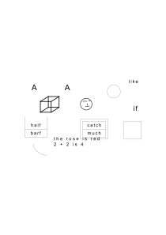

### [90\[1\]](https://cdn.wittgensteinnachlass.com/2000px/webp/Ms-150/90.webp)

“Do you remember having lived yesterday?”

### [90\[2\]](https://cdn.wittgensteinnachlass.com/2000px/webp/Ms-150/90.webp)

Can one remember without language. Can one wish to be somewhere at 5.05 o'clock if one knows no clocks.

### [90\[3\]](https://cdn.wittgensteinnachlass.com/2000px/webp/Ms-150/90.webp)

What is the difference between a memory image & an image we deliberately make up.

### [90\[4\]](https://cdn.wittgensteinnachlass.com/2000px/webp/Ms-150/90.webp)

<math display="block">
  <mfrac linethickness="0">
    <mrow>
      <mn>1</mn>
    </mrow>
    <mrow>
      <mi>A</mi>
    </mrow>
  </mfrac>
  <mfrac linethickness="0">
    <mrow>
      <mn>2</mn>
    </mrow>
    <mrow>
      <mi>B</mi>
    </mrow>
  </mfrac>
  <mfrac linethickness="0">
    <mrow>
      <mn>3</mn>
    </mrow>
    <mrow>
      <mi>C</mi>
    </mrow>
  </mfrac>
  <mfrac linethickness="0">
    <mrow>
      <mn>4</mn>
    </mrow>
    <mrow>
      <mi>D</mi>
    </mrow>
  </mfrac>
</math>

### [90\[5\]](https://cdn.wittgensteinnachlass.com/2000px/webp/Ms-150/90.webp),[91\[1\]](https://cdn.wittgensteinnachlass.com/2000px/webp/Ms-150/91.webp)

Russell doesn't really wish to say that two classes are similar if they are correlated. He needs a correlation which isn't a grossly material one, which in fact is the possibility of a material correlation. And that means that when he says A & B are 1-1 correlated it really means they can be, or it makes sense to say that they are. So we are driven to consider cases in which it makes sense & such in which it makes no sense to say that two classes are 1-1 correlated. What is the condition of their being 1-1 correlatable.

### [91\[2\]](https://cdn.wittgensteinnachlass.com/2000px/webp/Ms-150/91.webp)

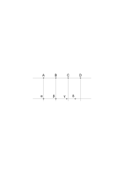

### [91\[3\]](https://cdn.wittgensteinnachlass.com/2000px/webp/Ms-150/91.webp)

What in this case is the _condition_. Or how would I get a contradiction? E.g. if I said A B C D are equidistant, α β γ δ are not equidistant & parallel lines are drawn between them. And here Russell's correlation seems to furnish a criterion of their correlatability. A logical criterion. Isn't it very queer that by just looking at the names I should be able to say whether or not a certain relation held between the objects? But _I_ correlate the names. And why? To see whether a correlation _can_ exist between the things.

Correlation

Correspondence

We draw lines in our thought.

### [91\[4\]](https://cdn.wittgensteinnachlass.com/2000px/webp/Ms-150/91.webp)

They are thus correlated whether anybody knows it or not.

### [92\[1\]](https://cdn.wittgensteinnachlass.com/2000px/webp/Ms-150/92.webp)

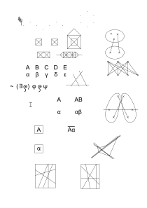

### [93\[1\]](https://cdn.wittgensteinnachlass.com/2000px/webp/Ms-150/93.webp)

“Remembering is a characteristic experience.” But the experience is curiously elusive. There are indeed experiences connected with it which are not elusive. We have e.g. memory images, we see so & so before us. But then there are other images besides memory ones. They only seem elusive when we philosophise about them. Otherwise we say without any hesitation: “I remember so & so”. And not only very sensitive people do so. Take as example the feeling of ‘long, long ago’ because this is a strong & clearly circumscribed experience. And yet in a sense it seems just as elusive as any other feeling of memory. [“Far away look in his eyes.”] Tone & gesture of memory. The experience of singing with expression without the feeling. Suppose the feeling consists a) of feeling the heartbeat b) of not feeling its beat.

### [93\[2\]](https://cdn.wittgensteinnachlass.com/2000px/webp/Ms-150/93.webp)

Wenn das Verständnis für ein Thema kommt ändert sich freilich das Erlebnis; aber kommt ein bestimmtes Gefühl dazu?

### [94\[2\]](https://cdn.wittgensteinnachlass.com/2000px/webp/Ms-150/94.webp)

### [94\[3\]](https://cdn.wittgensteinnachlass.com/2000px/webp/Ms-150/94.webp)

Language treats our ‘particular feeling’ as something separate. As an experience separate from the other sense experiences.

### [94\[4\]](https://cdn.wittgensteinnachlass.com/2000px/webp/Ms-150/94.webp)

I say “I remember seeing him yesterday” and now I look behind saying these words for the experience of remembering.

### [94\[5\]](https://cdn.wittgensteinnachlass.com/2000px/webp/Ms-150/94.webp)

If we say “The words came in a particular way”, _how is this way to be described_? For what the word “way” meant can only be seen by looking at the kind of specification.

### [94\[5\]](https://cdn.wittgensteinnachlass.com/2000px/webp/Ms-150/94.webp),[95\[1\]](https://cdn.wittgensteinnachlass.com/2000px/webp/Ms-150/95.webp)

Our sentence really meant no more than: There is a difference between someone saying these words & remembering & saying these words without remembering.

### [95\[2\]](https://cdn.wittgensteinnachlass.com/2000px/webp/Ms-150/95.webp)

“The image has some indefinable ‘past’ quality”. – Now do you say this because you think you have to say it or because you notice a quality in the picture which you want to give a name to. Alright I don't _ask_ you to define it as I don't ask you to define ‘blue’ either.

Let's hear how you are going to use the word for this quality, then I'll know in what sense it is a quality. (Is it, e.g., like size, shape, or colour?)

### [95\[3\]](https://cdn.wittgensteinnachlass.com/2000px/webp/Ms-150/95.webp)

Representing memory images in the Film.

### [95\[4\]](https://cdn.wittgensteinnachlass.com/2000px/webp/Ms-150/95.webp)

“Let me see what did I do before that?” “A particular way of looking for an image”.

### [95\[5\]](https://cdn.wittgensteinnachlass.com/2000px/webp/Ms-150/95.webp)

“Reading in the book of memory.” “Looking up something in the book of memory.”

### [95\[6\]](https://cdn.wittgensteinnachlass.com/2000px/webp/Ms-150/95.webp)

Rising hot air.

### [96\[1\]](https://cdn.wittgensteinnachlass.com/2000px/webp/Ms-150/96.webp)

“Kennst Du das Phänomen des ‘Suchens im Gedächtnis’?”

### [96\[2\]](https://cdn.wittgensteinnachlass.com/2000px/webp/Ms-150/96.webp)

“Intangible”

### [96\[3\]](https://cdn.wittgensteinnachlass.com/2000px/webp/Ms-150/96.webp)

“He started – like this.” – “Was that all, or did he have an experience besides?”

### [96\[4\]](https://cdn.wittgensteinnachlass.com/2000px/webp/Ms-150/96.webp)

Mischfarbe: “Sehe ich eine oder zwei Farben wenn ich ein weißliches Grün sehe?” “Macht die Erde zwei Bewegungen oder eine Bewegung?” Verwandt & doch sehr verschieden: “Habe ich eine oder drei Klangerfahrungen wenn ich einen Dreiklang höre?” Ist süßer Tee _ein_ Geschmack oder zwei Geschmäcker?

### [96\[5\]](https://cdn.wittgensteinnachlass.com/2000px/webp/Ms-150/96.webp)

Couldn't a characteristic element of fright be that of having a momentary abnormally quick succession of ideas. – Would I deny such a thing?

### [96\[6\]](https://cdn.wittgensteinnachlass.com/2000px/webp/Ms-150/96.webp)

Zählen & Rechnen mit musikalischen Figuren.