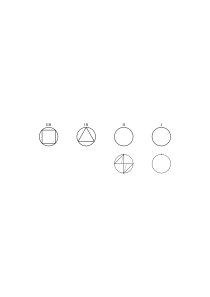
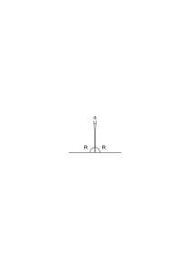
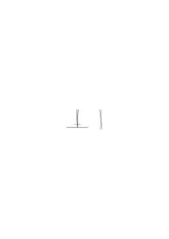
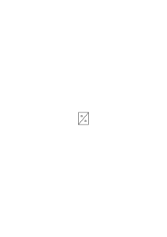
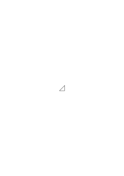

# Ms-151

### [1\[1\]](https://cdn.wittgensteinnachlass.com/2000px/webp/Ms-151/1.webp)

So kann man z.B. Teile des Nachbildes mit Teilen des mit offenen Augen gesehenen vergleichen.

### [1\[2\]](https://cdn.wittgensteinnachlass.com/2000px/webp/Ms-151/1.webp)

It would be a genuine mathematical problem: ‘construct the 2-gon’. And a mathematician might solve the problem i.e. devise a construction which on such & such grounds we could hardly help calling “construction of the 2-gon”.

### [1\[3\]](https://cdn.wittgensteinnachlass.com/2000px/webp/Ms-151/1.webp)

We may, _or we may not_, feel a discomfort about it.

### [1\[4\]](https://cdn.wittgensteinnachlass.com/2000px/webp/Ms-151/1.webp),[2\[1\]](https://cdn.wittgensteinnachlass.com/2000px/webp/Ms-151/2.webp)

Suppose I said “there is something there”; & being asked, “What do you mean?”, I painted a picture of what I see. Would this justify saying that statement? – Wouldn't this picture have to be understood ‘in a system’? And mustn't _I_ understand it as an expression within a system?

### [2\[2\]](https://cdn.wittgensteinnachlass.com/2000px/webp/Ms-151/2.webp)

“But then, how are we to account for the angle α? Are we to say that R + α = R?”

### [2\[3\]](https://cdn.wittgensteinnachlass.com/2000px/webp/Ms-151/2.webp)

‘Look at the geometrical proposition as a member of the whole system of geometrical propositions, then you shall see whether you really want to accept this proposition!’

### [2\[4\]](https://cdn.wittgensteinnachlass.com/2000px/webp/Ms-151/2.webp)

p ∙ ~~p = p = ~~p

### [2\[5\]](https://cdn.wittgensteinnachlass.com/2000px/webp/Ms-151/2.webp)

“It's no use saying that the other person knows what he sees & not what I see & that therefore all is symmetrical, because there is just nothing else corresponding to my visual image; my visual image is unique!”

### [2\[6\]](https://cdn.wittgensteinnachlass.com/2000px/webp/Ms-151/2.webp)

Geometrie in welcher zwei Gerade die einen Winkel bilden erst ein Stück mit einander laufen; zu vergleichen einer Mechanik in der ein Körper auf den keine Kräfte wirken sich mit langsam abnehmender Geschwindigkeit bewege.

### [3\[1\]](https://cdn.wittgensteinnachlass.com/2000px/webp/Ms-151/3.webp)

“Obviously this↗) is what's seen!”

### [3\[2\]](https://cdn.wittgensteinnachlass.com/2000px/webp/Ms-151/3.webp)

If one says to the solipsist John Smith “so you say that of all people only John Smith really sees”, he doesn't really recognize this to be his view. He didn't mean that if you regard him as one man amongst other men he had any special privilege. – He would be inclined to say: “Not John Smith has any particular privilege (it would be ridiculous to say this), but _I_ have, as seen by myself.”

### [3\[3\]](https://cdn.wittgensteinnachlass.com/2000px/webp/Ms-151/3.webp)

Couldn't one assume that all those persons had a right to talk about what's seen who were being seen. I.e. all those who were on a picture could talk about the picture.

### [3\[4\]](https://cdn.wittgensteinnachlass.com/2000px/webp/Ms-151/3.webp),[4\[1\]](https://cdn.wittgensteinnachlass.com/2000px/webp/Ms-151/4.webp)

“But I can persuade myself that nobody else has pains even if they say they have, but not that I haven't.” _It makes no sense_ to say, “I persuade myself that I have no pain” _whoever_ says this. I don't say anything about myself when I say that I can't persuade myself that I haven't pain etc..

### [4\[2\]](https://cdn.wittgensteinnachlass.com/2000px/webp/Ms-151/4.webp)

Can't I use the word “to see” in such a way that I call only this→ ‘seen’?” But how do I act according to this decision? Do I, e.g. admit that someone else besides me can see it, or do I say that only I can see it? Suppose everybody talked only about what we should now describe as ‘What's seen by me L.W.’. But they all know what I see; they don't ask me. And if anybody describes it wrongly we say that he can't speak properly, expresses himself wrongly. There is no such thing as deceiving someone about what I see. – Isn't there even then a temptation to say “I can only know what _I_ see not what the others see”?

### [4\[3\]](https://cdn.wittgensteinnachlass.com/2000px/webp/Ms-151/4.webp),[5\[1\]](https://cdn.wittgensteinnachlass.com/2000px/webp/Ms-151/5.webp)

If I say “_I_ see this→” I am liable to tap my chest to show which person I am. Now suppose I had no head & pointing to my geometrical eye I would point to an empty place above my neck, wouldn't I still feel that I pointed to the person who sees tapping my chest? Now I might ask “how do I know in this case who sees this?” But what is _this_. It's no use just pointing ahead of me, & if, instead, I point to a description & tap both my chest & the description & say ‘_I_ see _this_’ – it makes no sense to ask “how do you know that it's _you_ who sees it” for I don't _know_ that it's this person & not another one which sees before I point; but one could in certain cases say I know _because_ I point. – This is what I meant by saying that I don't choose the mouth which says “I have toothache”.

### [5\[2\]](https://cdn.wittgensteinnachlass.com/2000px/webp/Ms-151/5.webp)

25 × 25 = 625 3 + 1 = 5 π = 3˙141 31 π ≠ 3˙15

### [5\[3\]](https://cdn.wittgensteinnachlass.com/2000px/webp/Ms-151/5.webp),[6\[1\]](https://cdn.wittgensteinnachlass.com/2000px/webp/Ms-151/6.webp)

Der, wenn ich so sagen darf, krankhafte Charakter des Solipsismus zeigt sich, wenn wir die Konsequenz zu ziehen versuchen daß nur ich _N.N._ wirklich sehe, da wir vor dieser Konsequenz sofort zurückschrecken. Wir sehen sofort, daß wir das gar nicht sagen wollten.

### [6\[2\]](https://cdn.wittgensteinnachlass.com/2000px/webp/Ms-151/6.webp)

Isn't it queer that if I look in front of me & point in front of me & say “this!”, I should know what it is I mean. “I mean just these shades of colour and shapes, the _appearance_.”

### [6\[3\]](https://cdn.wittgensteinnachlass.com/2000px/webp/Ms-151/6.webp)

[Ein Wissenschaftler sagt er betreibe nur empirische Wissenschaft oder ein Mathematiker nur Mathematik & nicht Philosophie, – aber er ist den Versuchungen der Sprache unterworfen wie Jeder, er ist in der gleichen Gefahr & muß sich vor ihr in acht nehmen.]

### [6\[4\]](https://cdn.wittgensteinnachlass.com/2000px/webp/Ms-151/6.webp),[7\[1\]](https://cdn.wittgensteinnachlass.com/2000px/webp/Ms-151/7.webp)

If I say “I mean the appearance”, it seems I am telling you what it is I am pointing to, or looking at, e.g. the chair as opposed to the bed, etc.. It is as though by the word “appearance” I had actually _directed your attention_ to something else than e.g. the physical objects you are looking at. And indeed there corresponds a peculiar stare to this ‘taking in the appearance’. Remember here what Philosophers of a certain school used to say so often: “_I believe_ I mean something, if I say ‘ …’”.

### [7\[2\]](https://cdn.wittgensteinnachlass.com/2000px/webp/Ms-151/7.webp)

It seems that the visual image which I'm having is something I can point to; that I can say of it, it is unique. That I am pointing to the physical objects in my field of vision, but not meaning them but the _appearance_. This object I am talking about, if not to others then to myself. (It is almost like something painted on a screen which surrounds me.)

### [7\[3\]](https://cdn.wittgensteinnachlass.com/2000px/webp/Ms-151/7.webp),[8\[1\]](https://cdn.wittgensteinnachlass.com/2000px/webp/Ms-151/8.webp)

This object seems to be inadequately described as “that which I see”, “my visual image”, as it has nothing to do with any particular human being. Rather I should like to call it “what's seen”. And so far it's all right only now I've got to say what can be said about this object, in what sort of language game. “What's seen” is to be used. For at first sight one should feel inclined to use this expression as one uses a word designating a physical object & only on second thought I see that I can't do that. – When I said that here seems to be an object I can point to & talk about, it was just that I was comparing it to a physical object. For only on second thought it appears that the idea of “talking about” isn't applicable here. (I could have compared the ‘object’ to a theatre decoration.)

### [8\[2\]](https://cdn.wittgensteinnachlass.com/2000px/webp/Ms-151/8.webp)

Now when could I be said to speak about that object? When would I say I did speak about it? – _Obviously_ when I describe – as we should say – my visual image. And perhaps only if _I_ describe it, & only if I describe it to myself. But what is the point in this case of saying that when I describe to myself what I see I describe a (peculiar) object called “what is seen”? Why talk of a particular object here? Isn't this due to a misunderstanding?

### [8\[3\]](https://cdn.wittgensteinnachlass.com/2000px/webp/Ms-151/8.webp),[9\[1\]](https://cdn.wittgensteinnachlass.com/2000px/webp/Ms-151/9.webp)

Imagine a game played on a kind of chessboard. You can extend the game to 64, 81, 100, etc. squares & the situation which is losing in the 64-game is winning in the 81-game, losing in the 100-game, winning in the 121-game etc..

If you are asked “what did ‘meaning what he said’ consist in” you will describe facts which supplemented by certain other facts would be characteristic of his _not_ meaning what he said, – and so on.

### [9\[2\]](https://cdn.wittgensteinnachlass.com/2000px/webp/Ms-151/9.webp)

“Can I imagine

<math display="block">
  <mn>1</mn>
  <msup>
    <mn>0</mn>
    <mn>1</mn>
    <msup>
      <mn>0</mn>
      <mn>1</mn>
      <msup>
        <mn>0</mn>
        <mn>1</mn>
        <msup>
          <mn>0</mn>
          <mspace width="0.3em"/>
          <mo>=</mo>
          <msup>
            <mtext>μ</mtext>
          </msup>
        </msup>
      </msup>
    </msup>
  </msup>
</math>

soldiers in a row?”

“Can I imagine an endless row of soldiers?” Why shouldn't I say, I can imagine an endless row of soldiers? The image is something like a row the end of which I can't see & a gesture & the words “on & on for ever –” said in a particular tone of voice. And suppose I said: μ soldiers would reach from here halfway to the sun if we placed them a yard apart! Isn't this too ‘imagining the row’?

### [9\[3\]](https://cdn.wittgensteinnachlass.com/2000px/webp/Ms-151/9.webp)

It is a very remarkable & most important fact that there are numbers which all of us should call “big numbers”.

### [9\[4\]](https://cdn.wittgensteinnachlass.com/2000px/webp/Ms-151/9.webp)

There is a particular way of explaining the sense (meaning) of an expression which we may call …

### [10\[1\]](https://cdn.wittgensteinnachlass.com/2000px/webp/Ms-151/10.webp),[11\[1\]](https://cdn.wittgensteinnachlass.com/2000px/webp/Ms-151/11.webp),[12\[1\]](https://cdn.wittgensteinnachlass.com/2000px/webp/Ms-151/12.webp),[13\[1\]](https://cdn.wittgensteinnachlass.com/2000px/webp/Ms-151/13.webp)

In philosophy we often say that people wrongly imagine a certain state of affairs, e.g. “they imagine that a law of nature in some way compels things to happen”, or “they imagine that it's a question of psychology how a person can know a certain fact whereas it is one of grammar” etc. etc.. But it is necessary in these cases to explain what it means “to imagine so & so”, what kind of image is it they are using. It often sounds as though they were able to imagine the logically impossible & it is not easy to straighten out our description of the case & to say what in this case they actually imagine. E.g.: People treat the question “how do we know what so & so is the case” as a question of psychology which has nothing to do with the sense of the proposition which we say is known. But first: where do they take this idea from, how do they come by it? Which really psychological question are they thinking of? Obviously there is a case in which the question “how does he find this out” is a personal &, perhaps, psychological one. “How did he find out that N was in his room?” – He saw him through the window or he was hidden under the bed. – “How did he find that the glass was cracked?” He saw the crack with his naked eye or he saw it through the magnifying glass etc. We say he finds out the same thing in different ways & not that what he finds depends upon how he finds it. When do we say that he finds out the same thing in two ways? Imagine language games: somebody is asked a question “A?” & trained to answer “yes” if he sees a person A in the next room, “no”, if he doesn't. He is trained to answer the question “A?” by “yes” also if he hears A's voice from the next room. “What right have we to ask the same question in these two cases?” or “What right has he to use these two different tests to answer the same question?” Or, suppose someone asked: “Now is this really one & the same question or do we have two different questions only expressed in the same words?” Now consider the ostensive definition: “This man is called ‘A’” & ask yourself whether this definition tells us if we are to regard seeing A from a different side or in a different position or hearing his voice as criteria of him being there? – Here we are tempted to say: “But surely I just point to this man, so there can't be any doubt what object I am meaning!” But that's wrong though the doubt of course is not whether I mean this → or that ↘ thing. One may say that the ‘object’ I am inclined to say I am pointing to in the ostensive definition is not determined by the act of pointing but by the use I make of the word defined. And here one must beware of thinking that after all the pointing finger pointed to a different object in the sense in which the arrow <math class="stacked" display="inline"><mtext>⟶</mtext><mfrac linethickness="0"><mrow><mtext>AB</mtext></mrow><mrow><mtext>oo</mtext></mrow></mfrac></math> may be said to point to A or B, so that by a different way of pointing I might have distinguished the cases. “But we conceive of objects, things, different from our sense data, e.g. the table as opposed to the views we get of it.” But what does conceiving of this object consist in? Is it a peculiar ‘mental act’ occurring whenever, say, we talk about the table? Isn't it using the word table in the game we do use it? Using it as we do use it?

### [13\[2\]](https://cdn.wittgensteinnachlass.com/2000px/webp/Ms-151/13.webp)

We are tempted to say that the word “toothache” is the ‘name of a feeling of which I don't know whether anybody except me ever has it’. But even I can be said not to _know_ whether I always mean the same by this word.

### [13\[3\]](https://cdn.wittgensteinnachlass.com/2000px/webp/Ms-151/13.webp)

“I always thought that holding one's cheek was having toothache; then he knocked out a tooth of mine, then I knew what ‘toothache’ meant”. Well what does it mean? – And what was it like “to know what ‘toothache’ means”?

### [13\[4\]](https://cdn.wittgensteinnachlass.com/2000px/webp/Ms-151/13.webp)

“Now I know what ‘pain’ means”.

### [13\[5\]](https://cdn.wittgensteinnachlass.com/2000px/webp/Ms-151/13.webp)

A faked moan of pain isn't necessarily a moan without something & a real moan of pain a moan with something.

### [13\[6\]](https://cdn.wittgensteinnachlass.com/2000px/webp/Ms-151/13.webp)

Aber wir möchten sagen: “die Begleitumstände sind andere”. Aber daran ist etwas Unrichtiges.

### [13\[7\]](https://cdn.wittgensteinnachlass.com/2000px/webp/Ms-151/13.webp),[14\[1\]](https://cdn.wittgensteinnachlass.com/2000px/webp/Ms-151/14.webp)

You say in one case the expression corresponds to the feeling. But how does it correspond? Imagine, you were wrong about the correspondence, then what would remain? That you said these words & that you did not cheat, but now cheating & not cheating are not ‘private experiences’. It's no good saying “I recognize this experience as …” as I can say I don't know whether I recognize the experience of recognizing rightly.

### [14\[2\]](https://cdn.wittgensteinnachlass.com/2000px/webp/Ms-151/14.webp)

We are using the word “to cheat” in two different ways. In one way whether I do it can be verified by the other person, in the other sense we say “only I know whether I cheat”.

### [14\[3\]](https://cdn.wittgensteinnachlass.com/2000px/webp/Ms-151/14.webp)

“I knew all the time that I had cheated.”

### [14\[4\]](https://cdn.wittgensteinnachlass.com/2000px/webp/Ms-151/14.webp)

Quite true, we distinguish simple acting & acting prompted by feeling, & feeling with expression. These are distinctions in our language. “But are you saying that all these distinctions are distinctions in mere behaviour?” –

### [14\[5\]](https://cdn.wittgensteinnachlass.com/2000px/webp/Ms-151/14.webp)

Can one by multiplying 2 with itself obtain 12?

### [15\[1\]](https://cdn.wittgensteinnachlass.com/2000px/webp/Ms-151/15.webp)

“_Mere behaviour_”. “There is only behaviour” would seem to say that there was no life, that we (or I) acted as automatons, as unconscious machines. I wish to say: “The difference between me & a machine doesn't only consist in the difference of our actions but in this that I am conscious & the machine isn't”. But oughtn't I say that this only distinguishes a machine from _me_ not from a human being? For why shouldn't I say that the difference between a human being, animal, sewing machine, etc., lies in their actions, if I except myself. But then I don't even except my body.

### [15\[2\]](https://cdn.wittgensteinnachlass.com/2000px/webp/Ms-151/15.webp)

“I know consciousness only from myself, I don't _know_ whether anybody else has consciousness, but it makes _sense_ to assume it & I do make the assumption in a class of cases.”

### [15\[3\]](https://cdn.wittgensteinnachlass.com/2000px/webp/Ms-151/15.webp),[24\[2\]](https://cdn.wittgensteinnachlass.com/2000px/webp/Ms-151/24.webp)

What worries us is the idea of ‘behaviour + experience’. – We might think that it was possible to talk of behaviour without there being experience. ‘Could I talk about moaning if there was no such thing as hearing the moaning?’ Or: Isn't talking of behaviour talking of experience & _therefore_ what we call “talking of private experience” a special case of “talking about ‘behaviour’”?

### [16\[1\]](https://cdn.wittgensteinnachlass.com/2000px/webp/Ms-151/16.webp),[17\[1\]](https://cdn.wittgensteinnachlass.com/2000px/webp/Ms-151/17.webp),[18\[1\]](https://cdn.wittgensteinnachlass.com/2000px/webp/Ms-151/18.webp),[19\[1\]](https://cdn.wittgensteinnachlass.com/2000px/webp/Ms-151/19.webp),[20\[1\]](https://cdn.wittgensteinnachlass.com/2000px/webp/Ms-151/20.webp),[21\[1\]](https://cdn.wittgensteinnachlass.com/2000px/webp/Ms-151/21.webp)

I want someone to explain to me a certain game & to make it easier I put the question to him: “tell me what a man does to win the game.” Someone might say “I don't want to know what a man does to win it, this is a question about human beings; I want to know what the game is they play.” You ask, what does it mean that “a rod is 6 inches long”. Someone answers one finds out whether it is so by using a measuring rod divided into equal parts. “What does this mean?” – One divides it into equal parts in such & such a way. I have given a definition in terms of the way of verification. “But isn't this an indirect definition?” Sometimes it is, sometimes it isn't. Sometimes how we look for something may determine what we are looking for, sometimes it doesn't. – We are always liable to think of the fact that we can find out that there is a chair here in many different ways & we forget that this is just conditioned by the particular use we make of the word “chair”, “table” & in general the generic names of physical objects. Supposing we said “what does it mean to have an enlarged liver & someone answered “we verify it by looking at the person's eye & seeing …” Describe an object by describing its use. Describe an object by saying what hollow it fits into. More or less of its use is expressed by different forms of a proposition.

Consider this! The sense of a proposition is what you must know to understand it. What does understanding a question consist in? What does it mean to understand a mathematical question? Would you understand ‘25 × 25 = ?’ if you didn't know how to calculate it? Would you say you understood a position of a board game if you had no idea of the way the game was played? Ask how much must you know to understand it? Would you not be inclined to say that you understand it more & more the more you knew about the game? But we could also imagine a case in which you would say that you understood the position even though you didn't know the exact rules of the game, even if these rules had not yet been given! Now consider such a question as “are there an infinite number of primes or not, & if not, how many?” I show you what we call a prime number & ask you if you understand this question. Prima facie you all say yes. Now I want to show you that you could also look at it from a different & perhaps more ‘exact’ point of view & say ‘no’. We have here a question but we have not yet got a method of its solution & I want you to think of it in terms of 25 × 25 = ? when we don't know what multiplication is. Now I'll say (what I've said in a similar case before): The question for you gets its sense by the picture of a small finite number of cardinals etc.. But what does that mean? In the case of the small number of cardinals you have a method, you know what to do, here you _don't_ know it, so what does it mean, that “the question gets its sense from the case in which you _do_ know it”? Our mind works on the line that there is something which hasn't yet been calculated, it takes no notice of the fact that we have no method & although this can't alter the facts it determines the way of expressing: We say we don't yet know so & so; & if someone shows us Euler's proof we say that now we know the answer to the question we have asked. But are we bound to express ourselves in this way? Can't I persuade you to adopt a different way of expressing ourselves of which too we can't say that it is inconsistent with the usual use of words? What if I say: This question i.e. the form of words was indeed suggested by the finite case, but the analogy just breaks down because there is no method of solution. “Proof” needn't be conceived as answering the question “_how many_ primes are there”. This question might perfectly well be said to be nonsensical. (As e.g. “what colour has visual space.”). “But is it in our power to regard a question as nonsensical or as making sense? And what about Euler's proof?” Need we ask such a question as “how many cardinal numbers are there”? This question which seems in some way to get hold of the infinite i.e. the enormous for this reason might appeal to some of us & might, on the other hand, repel some of us, – e.g. me. Funeral. Consider such a proposition as: “There are as many squares as there are cardinals”. If we look at it like this: 1, 2, 3, 4, 5, 6, 7, 8, 9 … we should be inclined to say that there were less squares than cardinals; if we think of them as 1², 2², 3², 4², …, we say, there are as many. Thinking in terms of an analogy doesn't mean that this analogy is constantly before our mind. The idea of finding out something about the series of cardinals. Why shouldn't we draw the conclusion that this whole question doesn't make sense? But we actually say that it does, & that the answer is in a way paradoxical adds for some to its charm. (Some + some = some). It seems to us that we have discovered a new element with utterly different properties. I should like to get rid of this analogy. – Can “the heptagon be constructed?” – A: “Now surely this question makes sense!” – B: “Now surely this question makes no sense!” – What argument would A use: “you know what it means ‘to construct the pentagon, hexagon, so …, you know what a heptagon is, what construction means”. B: “It makes no more sense to say ‘can the 7-gon be constructed’, than to say ‘can the 5-gon be constructed’. I know what we call ‘a constructed (as opposed to measured) pentagon’, I know what we call ‘the pentagon-construction’. We use this expression because of certain obvious analogies. But I don't call anything heptagon construction. So don't ask such a question as can it be …. Compare this with the statement “on this animal's forehead there was a heptagon construction” – answer: I don't know what you're talking about. “But what about the proof that the heptagon can't be constructed?” As there is such a proof, it is the answer to that question of which you say it makes no sense. “Must I conceive of this proof as the answer to that question?” When the proof is given I can say: you have now given the expression 13-gon sense & you have decided that the expression ‘construction of the 7-gon is never to be used at all’. Further you have now given the question: “can the 7-gon be constructed” sense, _analogous to that can 735912 be divided by 19_.

### [21\[2\]](https://cdn.wittgensteinnachlass.com/2000px/webp/Ms-151/21.webp),[22\[1\]](https://cdn.wittgensteinnachlass.com/2000px/webp/Ms-151/22.webp),[23\[1\]](https://cdn.wittgensteinnachlass.com/2000px/webp/Ms-151/23.webp),[24\[1\]](https://cdn.wittgensteinnachlass.com/2000px/webp/Ms-151/24.webp)

Now back to the question “how many 777 are there in π.” When I say that the case of the small first number gives this question its first meaning this is to say that our attitude towards this expression is due to it sounding like that other kind of question. Our attitude can however change if I now remind you of the cases I've just been talking about. Why should we ask this question? – “But don't mathematicians try to solve it, or similar questions?” Why should we call what they are doing “trying to solve this question”. Why should we not say they add new constructions to mathematics. Now consider this expression: “Surely, either there are n times 777 in π or not!” A) this is a tautology, B) if it means that you can't help yourself & must ask this question, I contradict you & say that you needn't look at it that way. – Now e.g. you say that the difficulty about that question is that the proposition “there are 777 in π” can only be proved in a general way, whereas the proposition ‘there are’ can be proved by finding a case of 777 in the development. I should say let that teach you something about the sense of the question! Remember that a position or a move in a game gets its sense from the game. We are liable to get the idea that the mere form of words has something in it which we must find or of which we must say that we can't find it. Now to the question “are there 777 in μ places”. “Surely there are, or there aren't”. This means nothing more nor less than “We know what it means to say ‘that there are’ or ‘that there aren't’. Now it is obvious that we can't straightforwardly say we know in this case what it means, because to explain what it means we should have to point to small numbers & why should I accept this explanation for μ? This is all without much interest as long as I don't actually set the task “find out about μ” for we could use μ as example though we never thought of answering the question with respect to μ! – But if now we try to find a new method of calculating the answer for μ then indeed we may ask ourselves in what sense we can be said to answer the old question, in what sense we can say that we've found a short cut. It will depend on the method actually applied. Ask yourself: What are we to do if somebody actually calculated f(μ) by counting & found a different answer? I should say: to attribute it to human frailty ‘that we can't develop all places of π’ is just thoughtless, you wouldn't talk like that if you saw the use of your words clearly. But this is like saying: to say 0:0 = 1 is thoughtlessness, you would not say so if … But one can never know this & someone might say this & we would respect it. Contradiction. What are we to say if someone tells us about a proof: “that all mathematical questions can be solved”. One can use an appellation for a ‘proof’ without regarding it as the answer to a question.

### [24\[3\]](https://cdn.wittgensteinnachlass.com/2000px/webp/Ms-151/24.webp)

One might put it by saying: “Experience is at the bottom of everything we say about phenomena; so if we call anything in particular talking about direct experience it must be just a special case of talking about phenomena as the _ordinary_ way.”

### [24\[4\]](https://cdn.wittgensteinnachlass.com/2000px/webp/Ms-151/24.webp),[25\[1\]](https://cdn.wittgensteinnachlass.com/2000px/webp/Ms-151/25.webp)

If we say “toothache is nothing but behaviour” we seem to say that it is not so & so, we seem to wish to exclude something. But that's obviously what we mustn't do. Our job is obviously not to reduce anything to anything, but _only_ to avoid certain misleading ways of expression.

### [25\[2\]](https://cdn.wittgensteinnachlass.com/2000px/webp/Ms-151/25.webp)

“Toothache is not a behaviour but an experience.” “We distinguish between ‘behaviours’ and ‘experiences’. “Dancing is a behaviour, toothache an experience.” These are grammatical statements. About the use of the words “dancing” & “toothache”.

### [25\[3\]](https://cdn.wittgensteinnachlass.com/2000px/webp/Ms-151/25.webp)

(“This form of words seems to mean something but means nothing”. That is: We connect a certain image with this expression or we are inclined to use it because it sounds analogous to other expressions & we connect a certain attitude, state of mind etc. with it; but if we then ask ourselves how we are going to use it we find that we have no use for it or a use of a totally different kind from that, which we at first vaguely imagined (expected).)

### [25\[4\]](https://cdn.wittgensteinnachlass.com/2000px/webp/Ms-151/25.webp),[26\[1\]](https://cdn.wittgensteinnachlass.com/2000px/webp/Ms-151/26.webp)

First of all it seems that we are partial for ‘behaviour’ that we wish to explain everything in terms of _it_. _Now why should we be biased in this way_? Is it because of some kind of materialism? What ax have we to grind?

### [26\[2\]](https://cdn.wittgensteinnachlass.com/2000px/webp/Ms-151/26.webp)

There is an ordinary (& unproblematic) way of using such a word as “toothache”, but we are inclined on philosophizing about it to give it a different use finding out however that we can then do away with it entirely because that proposed use as a matter of fact makes it into a useless symbol.

### [26\[3\]](https://cdn.wittgensteinnachlass.com/2000px/webp/Ms-151/26.webp)

“We use the expression ‘x has toothache’ when we perceive a certain behaviour in others, or, on the other hand, when we ourselves have toothache”. What does it mean: “I say ‘I have toothache’, when I have toothache”? What does this explain? It could of course be an explanation in several ways: I say to someone: “Now if I have stomach ache I'll always say ‘I have toothache’ in order to make Smith believe so & so”, “I won't lie again, I will only say ‘I have toothache” when I really have it” or “I say ‘I have toothache’ when I feel a pain here (pointing)”.

### [26\[4\]](https://cdn.wittgensteinnachlass.com/2000px/webp/Ms-151/26.webp),[27\[1\]](https://cdn.wittgensteinnachlass.com/2000px/webp/Ms-151/27.webp)

I wish to say that we can't adduce the ‘private experience’ as a justification for expressing it.

### [27\[2\]](https://cdn.wittgensteinnachlass.com/2000px/webp/Ms-151/27.webp)

We can't say “he is justified in moaning because he has pains” if we call pain _the_ justification for moaning. – We can't say “he is justified in expressing pain, because he has pain” unless we wish to distinguish this case of being justified in expressing pains from another way of justification, e.g. that he is on the stage & has to act a sick man.

### [27\[3\]](https://cdn.wittgensteinnachlass.com/2000px/webp/Ms-151/27.webp)

If I am tempted to say “my justification for moaning is having pain”, it seems I point – at least to myself – to something which I express by moaning.

### [27\[4\]](https://cdn.wittgensteinnachlass.com/2000px/webp/Ms-151/27.webp),[28\[1\]](https://cdn.wittgensteinnachlass.com/2000px/webp/Ms-151/28.webp)

The idea is here that there is an ‘expression’ for everything, that we know what it means ‘to express something’, ‘to describe something’. Here is a feeling, an experience, & now I could say to someone “express it!”. But what is to be the relation of the expression to what it expresses? In what way is this expression the expression of this feeling rather than another?! One is inclined to say “we _mean_ this feeling by this expression”, but what is meaning a feeling by a word like? Is this quite clear if, e.g., I have explained what ‘meaning this person by the name ‘N’’ is like?

### [28\[2\]](https://cdn.wittgensteinnachlass.com/2000px/webp/Ms-151/28.webp)

“We have two expressions: one for moaning without pain, & one for moaning with pain.” To what states of affairs am I pointing as explanations of these two expressions? “But these ‘expressions’ can't be mere words, noises which you make, they get their importance only from what's _behind_ them (the state you're in, when you use them)!” – But how can this state give importance to noises which I produce? Suppose I said: The expressions get their importance from the fact, that they are not used coolly but that we can't help using them. This is as though I said: laughter gets its importance only through being a _natural_ expression, a natural phenomenon not an artificial code. Now what makes a ‘natural form of expression’ natural? Should we say: “An experience which stands behind it”?

### [29\[1\]](https://cdn.wittgensteinnachlass.com/2000px/webp/Ms-151/29.webp)

If I use the expression “I have toothache” I may think of it as ‘being used naturally’ or otherwise; but it would be wrong to say that I had a _reason_ for thinking either. – It is very queer that _all_ the importance of our expressions seems to come from that X, Y, Z, the private experiences, which for ever remain in the _background_ & can't be drawn into the foreground. But is a cry when it is a cry of pain not a mere cry?

### [29\[2\]](https://cdn.wittgensteinnachlass.com/2000px/webp/Ms-151/29.webp)

Can one say: ‘If I teach the child the use (meaning) of the word toothache I can only hope that it really feels toothache, (or, that it feels real toothache) for if it doesn't then I've taught him a wrong meaning”?

### [29\[3\]](https://cdn.wittgensteinnachlass.com/2000px/webp/Ms-151/29.webp)

Why should I say that the ‘expression’ derives its meaning from the feeling behind it, – & not from the circumstances of the language game in which it is used. For imagine a person crying out with pain alone in the desert: is he using a language? Could we say that his cry had _meaning_?

### [29\[4\]](https://cdn.wittgensteinnachlass.com/2000px/webp/Ms-151/29.webp),[30\[1\]](https://cdn.wittgensteinnachlass.com/2000px/webp/Ms-151/30.webp)

We feel the queer temptation to describe our language & its use, introducing into our description an element of which we ourselves say that it is not part of the language. It is a peculiar phenomenon of iridescence which seems to fool us.

### [30\[2\]](https://cdn.wittgensteinnachlass.com/2000px/webp/Ms-151/30.webp)

“But can't you imagine people behaving just as we do, showing pain etc., etc. & then if you imagine that _they don't feel pain_ all their behaviour is, as it were, dead. You can imagine all their behaviour _with_ or _without_ pain. –”

### [30\[3\]](https://cdn.wittgensteinnachlass.com/2000px/webp/Ms-151/30.webp)

The pain seems to be the atmosphere in which the expression exists. (The pain seems to be a _circumstance_.)

### [30\[4\]](https://cdn.wittgensteinnachlass.com/2000px/webp/Ms-151/30.webp),[31\[1\]](https://cdn.wittgensteinnachlass.com/2000px/webp/Ms-151/31.webp)

Suppose we say that the image I use in the one case is different from that which I use in the other. But I can't point to the two images. So what does it come to, to say this, except just saying it, using _this_ expression. We are, as I have said, tempted to describe our language by saying that we use certain elements, images, which however in the last moment we again withdraw.

### [31\[2\]](https://cdn.wittgensteinnachlass.com/2000px/webp/Ms-151/31.webp)

Isn't the expression _in its use_ an image, – why do I refer back to an image which I can't show?

### [31\[3\]](https://cdn.wittgensteinnachlass.com/2000px/webp/Ms-151/31.webp)

“But don't you talk as though (the) pain wasn't something terribly real?” – Am I to understand this as a proposition about pain? I suppose it is a proposition about the use of the word ‘pain’; & it is one more expression, an essential part of the surrounding in which we use the word ‘pain’.

### [31\[4\]](https://cdn.wittgensteinnachlass.com/2000px/webp/Ms-151/31.webp)

Feeling justified in having expressed pain I may _concentrate on the memory of pain_.

### [31\[5\]](https://cdn.wittgensteinnachlass.com/2000px/webp/Ms-151/31.webp)

Now what's the difference between using my expressions as I do but yet not using “toothache” to mean real pain & the proper use of the word? –

### [31\[6\]](https://cdn.wittgensteinnachlass.com/2000px/webp/Ms-151/31.webp)

The private experience is to serve as a paradigm & at the same time admittedly it can't be a paradigm.

### [31\[7\]](https://cdn.wittgensteinnachlass.com/2000px/webp/Ms-151/31.webp),[32\[1\]](https://cdn.wittgensteinnachlass.com/2000px/webp/Ms-151/32.webp)

The ‘private experience’ is a degenerate construction of our grammar (comparable in a sense to tautology & contradiction). And this grammatical monster now fools us: when we wish to do away with it it seems to us as though we denied the existence of an experience, say, toothache.

### [32\[2\]](https://cdn.wittgensteinnachlass.com/2000px/webp/Ms-151/32.webp)

What would it mean to deny the existence of pain?!

### [32\[3\]](https://cdn.wittgensteinnachlass.com/2000px/webp/Ms-151/32.webp)

“But when we say we have toothache we don't just talk of behaving in this or that way!” – Certainly not, – we express toothache! – – – ‘But you admit that the same expression may be the expression of pain or may not be that.’ – If you imagine a man cheating you always imagine him to use one expression secretly for himself & another for someone else, & this secrecy is not the ‘secrecy of private experience’. Why shouldn't it be considered wrong of him to use language in this way.

### [32\[4\]](https://cdn.wittgensteinnachlass.com/2000px/webp/Ms-151/32.webp),[33\[1\]](https://cdn.wittgensteinnachlass.com/2000px/webp/Ms-151/33.webp)

We say “only he knows whether he says the truth or lies.” “Only you can know if what you say is true.” Now compare secrecy with the ‘privateness’ of personal experience! In what sense is a thought of mine secret? If I think aloud it can be heard. – “I have said this to myself a thousand times but not to anyone else.”

### [33\[2\]](https://cdn.wittgensteinnachlass.com/2000px/webp/Ms-151/33.webp)

“Only you can know what colour you see”. But if it is true that only you can know, you can't ever import this knowledge, nor can you express it. Why shouldn't we say that I know better than you what colour you see if you say the wrong word & I can make you agree to my word, or if you point to the wrong sample etc.?

### [33\[3\]](https://cdn.wittgensteinnachlass.com/2000px/webp/Ms-151/33.webp)

“I didn't know that I was lying.” – “You _must_ have known!” –

### [33\[4\]](https://cdn.wittgensteinnachlass.com/2000px/webp/Ms-151/33.webp)

Examine: “If you don't know that you're having toothache, you don't have toothache.”

### [33\[5\]](https://cdn.wittgensteinnachlass.com/2000px/webp/Ms-151/33.webp),[34\[1\]](https://cdn.wittgensteinnachlass.com/2000px/webp/Ms-151/34.webp)

“I don't just _say_ ‘I've got toothache’, but _toothache makes me say this_.” (I deliberately didn't write ‘the feeling of toothache’, or ‘a certain feeling’.) This sentence distinguishes between, say, saying it as an example of a sentence, or on the stage etc., & saying it as an assertion. But it is no explanation of the expression “I have toothache”, of the use of the word “toothache”.

### [34\[2\]](https://cdn.wittgensteinnachlass.com/2000px/webp/Ms-151/34.webp)

“I know what the word ‘toothache’ means, it makes me concentrate my attention on one particular thing.” But on what? You're now inclined to give criteria of behaviour. Ask yourself: “what does the word ‘feeling’ or still better ‘experience’ make you concentrate on?”, “What is it like to concentrate on experience?” If _I_ try to do this I, e.g., open my eyes particularly wide & stare.

### [34\[3\]](https://cdn.wittgensteinnachlass.com/2000px/webp/Ms-151/34.webp),[35\[1\]](https://cdn.wittgensteinnachlass.com/2000px/webp/Ms-151/35.webp)

“I know what the word ‘toothache’ means, it produces one particular idea in my mind”. But _what_ image? – “That can't be explained.” – But if it can't be explained what was the meaning of saying that it produced one particular image? You could say the same about the words “image in your mind”. And all that it comes to is that you are using certain words without an explanation. “But can't I explain them to myself? Or understand them myself without giving an explanation? Can't I give a private explanation? But is this anything you can call an explanation?” Is staring a private explanation?

### [35\[2\]](https://cdn.wittgensteinnachlass.com/2000px/webp/Ms-151/35.webp)

But how does this queer delusion come about?!

### [35\[3\]](https://cdn.wittgensteinnachlass.com/2000px/webp/Ms-151/35.webp)

Here is language, – & now I think that I can embody something in language as an explanation, which is no explanation.

### [35\[4\]](https://cdn.wittgensteinnachlass.com/2000px/webp/Ms-151/35.webp)

We decide to say that the triangle a has half the area of the rectangle

.

Can't you imagine that the question how big is the area of the triangle

should make no sense to you at all as you only talked of areas of rectangles. One might be inclined to say, that the triangle had not _really_ one particular area; perhaps that there was a series of areas which could be said to approach filling the triangle.

### [36\[1\]](https://cdn.wittgensteinnachlass.com/2000px/webp/Ms-151/36.webp),[37\[1\]](https://cdn.wittgensteinnachlass.com/2000px/webp/Ms-151/37.webp),[38\[1\]](https://cdn.wittgensteinnachlass.com/2000px/webp/Ms-151/38.webp),[39\[1\]](https://cdn.wittgensteinnachlass.com/2000px/webp/Ms-151/39.webp),[40\[1\]](https://cdn.wittgensteinnachlass.com/2000px/webp/Ms-151/40.webp),[41\[1\]](https://cdn.wittgensteinnachlass.com/2000px/webp/Ms-151/41.webp)

Privacy of sense data. I must bore you by a repetition of what I said last time. We said that one reason for introducing the idea of the sense datum was that people, as we say, sometimes see different things, colours e.g. looking at the same object. Cases in which we say “he sees dark red objects whereas I see light red”. We then are inclined to talk about an object other than the physical object which the person sees who is said to see the physical object. It is further clear that we only gather from the other person's behaviour (e.g. what he tells us) what that object looks like & so it lies near to say that he has this object before his mind's eye & that we don't see it. Though we can also say that we might have it before our mind's eye as well without however knowing that he has it before his mind's eye. The ‘sense datum’ is here the way the physical object appears to him. In other cases no physical object enters. Now I must draw your attention to one particular difficulty about the use of the ‘sense datum’. We said that there were cases in which we should say that the person sees green what I see red. Now the question suggests itself: if this can be so at all, why shouldn't it be always the case? It seems, if once we have admitted that it can happen under peculiar circumstances that it may always happen. But then it is clear that the very idea of seeing red loses its use if we can never know if the other doesn't see something utterly different. So what are we to do: Are we to say that this can only happen in a limited number of cases? This is a very serious situation. – We introduced the expression that A sees something else than B & we mustn't forget that this had only use under the circumstances under which we introduced it. Consider the proposition: “Of course we never know whether new circumstances wouldn't show that after all he saw what we see”. Remember that this whole notion need not have been introduced. “But can't I _imagine_ all blind men to see as well as I do & only behaving differently; & on the other hand imagine them really blind? For if I can imagine these possibilities then the question even if never answerable makes sense.” Imagine a man say W. now blind, now seeing & observe what you do? How do these images give sense to the question? They don't & you see that the expression stands & falls with its usefulness. The idea that the other person sees something else than I is only introduced because of certain expressions; whereas it seems that this idea can exist without any reference to expressions. “Surely what I have he too can have.” “And remember that we admit that the other may have pain without showing it! So if this is conceivable, why not that he never shows that he has pain; & why not that everybody has pain constantly without showing it; or that even things have pain?!” What strikes us is that there seem to be a few useful applications of the idea of the other person's having pain without showing it & a vast number of useless applications, applications which look as though they were no applications at all. And these latter applications seem to have their justification in this that we can imagine the other person to have what we have & in this way the proposition that he has toothache seems to make sense apart from any expression at all. “Surely”, we say, “I can imagine him to have pain or to see, etc..” Or “As I can see myself so I can imagine him to do the same”. In other words I can imagine him to play the same role in the act of seeing which I play. But does saying this determine what I mean by “he sees”? We arrive at the conclusion that imagining him to have pain (etc.) does not fix the sense of the sentence “he has pain”. “He may all along mean something different by ‘green’ than I mean.” Evidence (Verification). But there is this consideration: “Surely I mean something particular, a particular impression & therefore he may have an other impression; surely I know what that would be like!” “Surely I know what it is like to have the impression I call ‘green’!” But what is it like? You are inclined to look at a green object & to say “it's like _this_!”. And these words though they don't explain anything to anybody else seem to be at any rate an explanation you give yourself. But are they?! Will this explanation justify your future use of the word ‘green’? In fact seeing green doesn't allow you to make the substitutions of someone else for you and of red for green. “The sense datum is private” is a rule of grammar, it forbids to use such expressions as “they saw the same sense datum”, it may (or may not) allow such sentences as “he guessed that the other had a sense datum of this … kind”. It may only allow expressions of the form: “The other looked round, had a sense datum and said …”. You see that this word in such a case has no use at all. But if you like to use it, do! – “But surely I distinguish between having toothache & expressing it, & merely expressing it; & I distinguish between these two in myself.” “Surely this is not merely a matter of using different expressions, but there are two distinct experiences!” “You talk as though the case of having pain & that of not having pain were only distinguished by the way in which I expressed myself!” But do we always distinguish between ‘mere behaviour’ & ‘experience & behaviour’? If we see someone falling into flames & crying out do we say to ourselves: “there are of course two cases …”? Or if I see you here before me do I distinguish?? Do you? You can't! That we do in certain cases doesn't show that we do in all cases. This to some of you must sound silly & superficial; but it isn't. When you see me do you see one thing & conjecture another? (Don't talk of conjecturing subconsciously!) But supposing you expressed yourself in the form of such a supposition wouldn't this come to adopting a ‘façon de parler’? Can we say that ‘saying that I lie is justified by a particular experience of lying’. Shall we say ‘… by a particular private experience’? or ‘… by a particular private experience of lying’? or ‘by a particular private experience characterized in such & such ways’? “But what, in your opinion _is_ the difference between the mere expression & the expression & the experience?”

### [41\[2\]](https://cdn.wittgensteinnachlass.com/2000px/webp/Ms-151/41.webp),[42\[1\]](https://cdn.wittgensteinnachlass.com/2000px/webp/Ms-151/42.webp),[43\[1\]](https://cdn.wittgensteinnachlass.com/2000px/webp/Ms-151/43.webp),[44\[1\]](https://cdn.wittgensteinnachlass.com/2000px/webp/Ms-151/44.webp),[45\[1\]](https://cdn.wittgensteinnachlass.com/2000px/webp/Ms-151/45.webp)

“Do you know what it means that W. behaves as he does but sees nothing; & on the other hand that he sees?” If you ask yourself this & answer ‘yes’ you conjure up some sort of image. This image is it seems derived from the fact of your seeing or not seeing (if you close your eyes) & by this derivation, it seems, it must be the picture we interpret to correspond to our sentence “he sees”, “he doesn't see”. – As when I substitute my body for his body & for holding a match holding a pen. – But substituting his body for my body might mean that my body has changed so as to be now like his, & perhaps vice versa. It seems a direct & simple thing to understand “thinking that he has what I have” but it isn't at all. The case is simple only if we speak e.g. of physiological processes. “I know only indirectly what he sees but directly what I see” embodies an absolutely misleading picture. I can't be said to know that I have toothache if I can't be said not to know that I have toothache. I can't be said to know indirectly that the other has if I can't be said to know it directly. The misleading picture is this, I see my own matchbox but know only from hearsay what his looks like. We can't say: “I say he has toothache because I observe his behaviour but I say that _I_ have because I _feel_ it”. (This might lead one to say that ‘toothache’ has two meanings, one for me & one for the other being.) “I say ‘I have toothache’ because I _feel_ it” contrasts this case with, say, the case of acting on the stage but can't explain what ‘having toothache’ means because having toothache = feeling toothache & the explanation would come to “I say I have it because I have it”. = I say I have it because it is true. = I say I have it because I don't lie. One wishes to say: In order to be able to say that I have toothache I don't observe my behaviour, say in the mirror. _And this is correct_, but it doesn't follow that you describe an observation of any other kind. Moaning is not the description of an observation. That is you can't be said to _derive_ your expression from what you observe. Just as you can't be said to derive the word ‘_green_’ from your _visual impression_ but only from a sample. – Now against this one is inclined to say: “Surely if I call a colour green I don't just say that word, but the word comes in a particular way” or “if I say ‘I have toothache’ I don't just use this phrase but it must come in a particular way!” Now this means nothing for, if you like, it always comes in a particular way. “But surely seeing & saying something _can't be all_!” Here we make the confusion that there is still an object we haven't mentioned. You imagine there is a _pure_ seeing & saying & one + something else. Therefore you imagine all distinctions to be made as between a, a + b, a + c, etc. The idea of this addition is mostly derived from considerations of our bodily organs. All that ought to interest you is whether I make all the distinctions which you make: whether e.g. I don't distinguish between cheating & telling the truth. – “There is something else!” – “There is nothing else!”. – – – “But what else is there? – “Well this→!”. “But surely I know that I am not a mere automaton!” – What would it be like if I were? – “How is it that I can't imagine myself not seeing, hearing etc.?” – We constantly confuse & change about the common sense use & the metaphysical use. “I know that I see.” – “I see.” – You seem to read this off some fact; as though you said: “There is a chair in this corner.” “But if in an experiment, e.g. I say ‘I see’ why do I say so? Surely because I see!” It is as though our expressions of personal experience needn't even spring from regularly recurrent inner experiences but just from _something_. _Confusion of description & sample._

### [45\[2\]](https://cdn.wittgensteinnachlass.com/2000px/webp/Ms-151/45.webp)

The idea of the ‘_realm of consciousness_’.

### [46\[1\]](https://cdn.wittgensteinnachlass.com/2000px/webp/Ms-151/46.webp),[47\[1\]](https://cdn.wittgensteinnachlass.com/2000px/webp/Ms-151/47.webp)

Sir, it is pathetic to see all the discussion going on about the harmfulness of gangster films to the young while the minds of both adults & children are being systematically poisoned by the worst kind of Vansittart propaganda made by the cinema newsreels, condoned by the M.O.P. Can there be anything more evil than the war news of British Movietone unless it be that of Universal News? The gloating over dead ‘Huns’, over the old German cities flattened, over German civilians walking among the ruins of their towns? Everybody knows about the unspeakable horrors of the Nazi Regime which are perhaps comparable only to … When they were in full swing long before the war & even after it had started we heard very little about them … Now all the well known tricks of the camera & the by far nastier ones of the commentators are set in motion to represent the German people to the unthinking cinema goer as one pack of wolves. The commentators are worthy pupils of Dr. Goebbels, of the worst kind of Germans. We are not writing this letter in what would be a crazy expectation to open the eyes of the blind, but to direct the attention of the seeing to a horrid evil, the lying propaganda, the germ of Nazism itself.