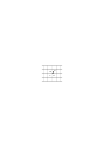
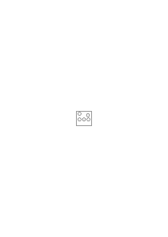
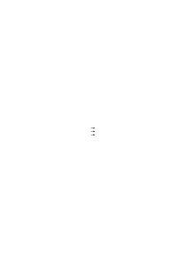
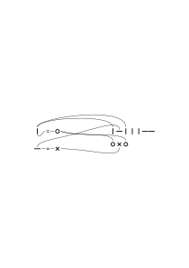

# Ms-153a

### [1r\[1\]](https://cdn.wittgensteinnachlass.com/2000px/webp/Ms-153a/1r.webp)

## Anmerkungen

### [1r\[2\]](https://cdn.wittgensteinnachlass.com/2000px/webp/Ms-153a/1r.webp)

Ludwig Wittgenstein

### [1r\[3\]](https://cdn.wittgensteinnachlass.com/2000px/webp/Ms-153a/1r.webp)

Trinity College

### [1v\[1\]](https://cdn.wittgensteinnachlass.com/2000px/webp/Ms-153a/1v.webp)

Ich kann mich doch offenbar von der Farbe führen lassen & zwar wie ich mich durch Worte nicht führen lassen kann weil ich nicht für alle Schattierungen Worte habe.

### [1v\[2\]](https://cdn.wittgensteinnachlass.com/2000px/webp/Ms-153a/1v.webp)

Die Bedeutung – etwa – des Wortes – „Sessels” ist vielfach verankert.

### [1v\[3\]](https://cdn.wittgensteinnachlass.com/2000px/webp/Ms-153a/1v.webp),[2r\[1\]](https://cdn.wittgensteinnachlass.com/2000px/webp/Ms-153a/2r.webp),[2v\[1\]](https://cdn.wittgensteinnachlass.com/2000px/webp/Ms-153a/2v.webp)

Was immer beiläufiges beim Aussprechen des Satzes vor sich geht, ich muß mich dann nach ihm richten können. Und daher wird sich die Bedeutung der Wörter zeigen; aber nicht so als ob sie nun erst in der Handlung zum Vorschein käme. Denn sie kommt ja nur bei der Handlung zum Vorschein die dem Satz entspricht. Und ob sie ihm entspricht kann ja wieder nur aufgrund der Bedeutung der Wörter entschieden werden. Sondern bei der _Entscheidung ob_ die Handlung dem Satz entspricht zeigt sich die Wortbedeutung.

### [2v\[2\]](https://cdn.wittgensteinnachlass.com/2000px/webp/Ms-153a/2v.webp),[2v\[3\]](https://cdn.wittgensteinnachlass.com/2000px/webp/Ms-153a/2v.webp)

D.h. beim Kollationieren der Tatsache gegen den Satz, zeigt sich die Bedeutung.

„Bedeutung” kommt von „deuten”.

### [2v\[4\]](https://cdn.wittgensteinnachlass.com/2000px/webp/Ms-153a/2v.webp)

Aber dieses Kollationieren ist eben unabhängig davon ob der Satz stimmt oder nicht.

### [2v\[5\]](https://cdn.wittgensteinnachlass.com/2000px/webp/Ms-153a/2v.webp),[3r\[1\]](https://cdn.wittgensteinnachlass.com/2000px/webp/Ms-153a/3r.webp)

Nun ist aber dieses Kollationieren wie auch der Begriff der Bedeutung ein Überbleibsel einer primitiven Anschauung.

### [3r\[2\]](https://cdn.wittgensteinnachlass.com/2000px/webp/Ms-153a/3r.webp),[3v\[1\]](https://cdn.wittgensteinnachlass.com/2000px/webp/Ms-153a/3v.webp),[4r\[1\]](https://cdn.wittgensteinnachlass.com/2000px/webp/Ms-153a/4r.webp)

Wenn ich etwa die wirkliche Sitzordnung an einer Tafel nach einer Aufschreibung kollationiere so hat es einen guten Sinn bei jedem Namen (auf dem Papier) auf einen bestimmten Menschen zu zeigen. Sollte ich aber etwa die Beschreibung eines Bildes mit dem Bild vergleichen und außer dem Personenverzeichnis sagte die Beschreibung auch daß A den B küßt, so wüßte ich nicht worauf ich als Korrelat des Wortes “küssen” zeigen sollte. Oder wenn etwa stünde “A ist größer als B” worauf soll ich beim Wort “größer“ zeigen? Ganz offenbar kann ich ja gar nicht auf etwas diesem Wort entsprechendes in dem Sinne zeigen, wie ich etwa auf die Person A im Bild zeige.

### [4r\[2\]](https://cdn.wittgensteinnachlass.com/2000px/webp/Ms-153a/4r.webp)

Der Satz das Wort habe nur im Satzverband Bedeutung muß natürlich auch korrekt gefaßt ganz anders lauten. (Natürlich als Regel der Sprache)

### [4r\[3\]](https://cdn.wittgensteinnachlass.com/2000px/webp/Ms-153a/4r.webp),[4v\[1\]](https://cdn.wittgensteinnachlass.com/2000px/webp/Ms-153a/4v.webp)

Die deutsche und jede Sprache legt nicht nur Sprachformen fest sondern sagt auch was sie bedeuten sollen fixiert ihre Bedeutung.

### ([VB](/w-vb/#ms-153a-4v.2)) [4v\[2\]](https://cdn.wittgensteinnachlass.com/2000px/webp/Ms-153a/4v.webp) {#4v2}

10.05.1931

[Die liebliche Temperaturdifferenz der Teile eines menschlichen Körpers.]

### [4v\[3\]](https://cdn.wittgensteinnachlass.com/2000px/webp/Ms-153a/4v.webp)

„Ich kann das Wort ‚gelb’ anwenden” ist das auf einer anderen Stufe als „ich kann Schach spielen” oder „ich kann den König im Schachspiel verwenden”?

### [4v\[4\]](https://cdn.wittgensteinnachlass.com/2000px/webp/Ms-153a/4v.webp),[5r\[1\]](https://cdn.wittgensteinnachlass.com/2000px/webp/Ms-153a/5r.webp),[5v\[1\]](https://cdn.wittgensteinnachlass.com/2000px/webp/Ms-153a/5v.webp),[6r\[1\]](https://cdn.wittgensteinnachlass.com/2000px/webp/Ms-153a/6r.webp)

Denken wir wieder an die Intention Schach zu spielen. Ich setze mich hin & sage „nun wollen wir Schach spielen”. In gewissem Sinne habe ich mir dann vorgenommen die Regeln des Schachspiels zu befolgen. Aber habe ich diese Regeln alle an mir vorbei passieren lassen? Nein. Ich habe z.B. nicht an die Regel des Rochierens gedacht. Nun kommt es aber zum Rochieren. Warum erkenne ich diese Regel als eine Regel des Schachspiels an? Weil sie im Schachbuch steht? Nein. Ich könnte mir ja denken daß sie wenn ich nachsehen will in keinem Buch steht. Weil ich sie mir vorgesetzt hatte? Nein denn ich hatte nicht an sie gedacht. Es wird also auf andere Weise entschieden, ob eine Regel zum Schachspiel gehört, ob ich also meinem Vorsatz gefolgt bin oder nicht.

### [6r\[2\]](https://cdn.wittgensteinnachlass.com/2000px/webp/Ms-153a/6r.webp),[6v\[1\]](https://cdn.wittgensteinnachlass.com/2000px/webp/Ms-153a/6v.webp)

Wenn ich nun sage: das Schachspiel besteht in den Regeln: wo sind denn diese Regeln vorhanden. Ich erkenne ja die Autorität der Schachbücher nicht an da ich es für _möglich_ halte daß sie nicht die Regeln enthalten die ich meine. Und mein Vorsatz wird ein Anderer wenn ich mir vornehme die Regeln zu befolgen welche immer es sein mögen die ich in einem bestimmten Buche finde.

### [6v\[2\]](https://cdn.wittgensteinnachlass.com/2000px/webp/Ms-153a/6v.webp)

Kann man nun etwa sagen, mein Vorsatz sei der zu tun was ich an einer bestimmten Stelle meines Gedächtnisses finde?

### [6v\[3\]](https://cdn.wittgensteinnachlass.com/2000px/webp/Ms-153a/6v.webp),[7r\[1\]](https://cdn.wittgensteinnachlass.com/2000px/webp/Ms-153a/7r.webp)

Das heißt es wird im Vorsatz ein bestimmtes Kriterium gegeben wonach dann entschieden wird ob etwas einer Schachregel gemäß ist.

(Quasi der _Begriff_ der Schachregel.)

### [7r\[2\]](https://cdn.wittgensteinnachlass.com/2000px/webp/Ms-153a/7r.webp),[7v\[1\]](https://cdn.wittgensteinnachlass.com/2000px/webp/Ms-153a/7v.webp)

Wenn ich daher sage ich verstehe das Wort „gelb” so werde ich auch erst später entscheiden ob diese Verwendung der ursprünglichen Bedeutung gemäß ist oder nicht. Denn nach einem Regelverzeichnis kann ich mich auch hier nicht richten. Denn wer weiß was ich darin finde.

### [7v\[2\]](https://cdn.wittgensteinnachlass.com/2000px/webp/Ms-153a/7v.webp)

Ich kann nichts tun als Regeln in einem _Buche_ niederlegen.

### [7v\[3\]](https://cdn.wittgensteinnachlass.com/2000px/webp/Ms-153a/7v.webp)

Und das zeigt das Verhältnis, welches meine Tätigkeit zum Unmittelbaren hat.

### [7v\[4\]](https://cdn.wittgensteinnachlass.com/2000px/webp/Ms-153a/7v.webp),[8r\[1\]](https://cdn.wittgensteinnachlass.com/2000px/webp/Ms-153a/8r.webp)

Wenn ich z.B. sage von der Verneinung gelten diese Regeln so darf es keinen Sinn haben zu fragen: woher weißt Du daß Du noch immer vom Selben (der Verneinung im selben Sinne) sprichst. Denn in diesem Sinne konstituieren die Regeln die Verneinung wie die Schachregeln das Schach.

---

### [8r\[2\]](https://cdn.wittgensteinnachlass.com/2000px/webp/Ms-153a/8r.webp),[8v\[1\]](https://cdn.wittgensteinnachlass.com/2000px/webp/Ms-153a/8v.webp)

Ich glaube, wenn einer sagt „ich weiß doch was das Wort ‚gelb’ bedeutet so ruft er sich eine Vorstellung hervor, oder er meint gar nichts, oder aber er meint es ganz so wie man sagt: „ich kann Schach spielen aber nicht Dame.”

### [8v\[2\]](https://cdn.wittgensteinnachlass.com/2000px/webp/Ms-153a/8v.webp)

Wie wenn man fragte: wann _kannst_ Du Schach spielen? Immer? oder während Du es sagst? aber während des ganzen Satzes? Und wie seltsam daß Schachspielen-können so kurze Zeit dauert & eine Schachpartie so viel länger!

### [8v\[3\]](https://cdn.wittgensteinnachlass.com/2000px/webp/Ms-153a/8v.webp)

Beschreibst Du damit eine Disposition?

### [9r\[1\]](https://cdn.wittgensteinnachlass.com/2000px/webp/Ms-153a/9r.webp)

Wenn, nun „das Wort ‚gelb’ verstehen” heißt es anwenden zu können. So besteht die gleiche Frage: wann _kannst_ Du es anwenden. Redest Du von einer Disposition? Ist es eine Vermutung?

### [9r\[2\]](https://cdn.wittgensteinnachlass.com/2000px/webp/Ms-153a/9r.webp)

“Ich kann Schach spielen, – aber in dem Moment habe ich ganz vergessen wie, – aber ich habe es unzählige Male gespielt”.

### [9v\[1\]](https://cdn.wittgensteinnachlass.com/2000px/webp/Ms-153a/9v.webp)

Inwiefern ist eine rote Tafel ein besseres Zeichen für rot als das Wort ‚rot’? Oder: heißt es etwas zu sagen daß das Wort ‚rot’ um ein brauchbares Zeichen zu sein ein Supplement etwa im Gedächtnis braucht? D.h. in wiefern ist es allein nicht Zeichen & besteht nicht ein Irrtum wenn wir glauben daß noch etwas zur Ergänzung dieses Zeichens nötig ist.

### [10r\[1\]](https://cdn.wittgensteinnachlass.com/2000px/webp/Ms-153a/10r.webp)

Ich möchte sagen der Schritt den wir bei der Erfüllung des Zeichens machen kann auch nur beschrieben & nicht bezeichnet werden.

### [10r\[2\]](https://cdn.wittgensteinnachlass.com/2000px/webp/Ms-153a/10r.webp)

Oder will ich sagen: die Identifizierung ist nur durch eine Beschreibung _möglich_.

### [10r\[3\]](https://cdn.wittgensteinnachlass.com/2000px/webp/Ms-153a/10r.webp)

“What's red like?”

### [10r\[4\]](https://cdn.wittgensteinnachlass.com/2000px/webp/Ms-153a/10r.webp)

“Was ist weiß?” – “Ein Schwan ist weiß”.

### [10v\[1\]](https://cdn.wittgensteinnachlass.com/2000px/webp/Ms-153a/10v.webp)

Ja, was einen Satz erfüllt kann _in der Sprache_ nur durch einen Satz niedergelegt werden. Und wenn durch ein gemaltes oder gestelltes Bild so ist dieses Bild ein Satz.

### [10v\[2\]](https://cdn.wittgensteinnachlass.com/2000px/webp/Ms-153a/10v.webp)

(Ich will sagen, ich kann mich auch nicht darüber beschweren daß dieses Zeichen nicht die nötige Multiplizität hat, außer in einer Sprache die sie hat.)

### [11r\[1\]](https://cdn.wittgensteinnachlass.com/2000px/webp/Ms-153a/11r.webp)

Wenn ich die Bedeutung (eines Zeichens) festlegen will so muß ich sie allgemein d.i. durch eine Beschreibung festlegen & nicht gleichsam für den besonderen Fall.

### [11r\[2\]](https://cdn.wittgensteinnachlass.com/2000px/webp/Ms-153a/11r.webp)

Der besondere Fall läßt sich in gewissem Sinne als solcher nicht beschreiben.

(Das ist natürlich alles ganz unkorrekt ausgedrückt aber der richtige Ausdruck dafür ist was ich suche.)

### [11v\[1\]](https://cdn.wittgensteinnachlass.com/2000px/webp/Ms-153a/11v.webp)

D.h. Aus der speziellen Übersetzung, der Handlung die ich auf das Zeichen Г hin mache, ist nicht zu ersehen – – –.

### [11v\[2\]](https://cdn.wittgensteinnachlass.com/2000px/webp/Ms-153a/11v.webp)

Denken wir uns es wären jemandem täglich gewisse Handlungen vorgeschrieben durch Zeichen in einem Kalender (etwa was er zu mittag essen soll) – – –.

### [11v\[3\]](https://cdn.wittgensteinnachlass.com/2000px/webp/Ms-153a/11v.webp),[12r\[1\]](https://cdn.wittgensteinnachlass.com/2000px/webp/Ms-153a/12r.webp)

Wenn ich eine Erfahrung mit den Worten beschreibe “vor mir steht ein blauer Kessel”, ist die Rechtfertigung dieser Worte, außer der Erfahrung die in den Worten beschrieben wird noch eine Andere, etwa die Erinnerung daß ich das Wort blau immer für diese Farbe verwendet habe, etc.?

### [12r\[2\]](https://cdn.wittgensteinnachlass.com/2000px/webp/Ms-153a/12r.webp)

Oder umgekehrt: Was außer dem Befehl rechtfertigt die Handlung die ihm folgt?

### ([VB](/w-vb/#ms-153a-12v.1)) [12v\[1\]](https://cdn.wittgensteinnachlass.com/2000px/webp/Ms-153a/12v.webp) {#12v1}

[Es ist beschämend sich als leerer Schlauch zeigen zu müssen der nur vom Geist aufgeblasen wird.]

### [12v\[2\]](https://cdn.wittgensteinnachlass.com/2000px/webp/Ms-153a/12v.webp),[13r\[1\]](https://cdn.wittgensteinnachlass.com/2000px/webp/Ms-153a/13r.webp)

Wenn ich jemandem sage: Wenn ich läute, komm zu mir so wird er zuerst wenn er läuten hört sich diesen Befehl in Worte übersetzen & erst den übersetzten befolgen. Nach einiger Zeit aber wird er das Läuten ohne Intervention andrer Zeichen in die Handlung übersetzen. Und so wenn ich sage “zeige auf einen roten Fleck” befolgt er diesen Befehl ohne daß ihm dabei zuerst das Phantasiebild eines roten Flecks als Zeichen für ‚rot’ erscheint.

### [13r\[2\]](https://cdn.wittgensteinnachlass.com/2000px/webp/Ms-153a/13r.webp)

Die Multiplizität hängt davon ab zwischen welchen Möglichkeiten eine Wahl ist.

### [13v\[1\]](https://cdn.wittgensteinnachlass.com/2000px/webp/Ms-153a/13v.webp)

Wenn er läutet so komme ich zu ihm; ohne mir erst ein Bild meiner Bewegungen vorzustellen wonach ich handle.

### [13v\[2\]](https://cdn.wittgensteinnachlass.com/2000px/webp/Ms-153a/13v.webp),[14r\[1\]](https://cdn.wittgensteinnachlass.com/2000px/webp/Ms-153a/14r.webp),[14v\[1\]](https://cdn.wittgensteinnachlass.com/2000px/webp/Ms-153a/14v.webp)

Wenn er nun heute läutet so kann (nicht muß) ich mich doch dann erinnern daß er das auch gestern getan hat & ich auch gestern zu ihm gegangen bin. (Wie ich mich auch erinnern könnte gestern auf das Läuten hin etwas andres getan zu haben.) Und dann wäre diese Erinnerung auch ein Zeichen dem ich folgen kann. – Der Befehl könnte auch lauten: tu heute was Du gestern auf das Läuten hin getan hast. Und nun kann ich mich nach dem Erinnerungsbild richten; aber jetzt hat es keinen Sinn eine weitere Anweisung dafür zu verlangen wie ich mich nach diesem Bild richten soll. Und darin besteht eigentlich, was ich sagen will.

### [14v\[2\]](https://cdn.wittgensteinnachlass.com/2000px/webp/Ms-153a/14v.webp)

Wenn ich sage jedes Bild braucht noch eine Interpretation, so heißt Interpretation die Übersetzung in ein weiteres Bild oder in die Tat.

### [14v\[3\]](https://cdn.wittgensteinnachlass.com/2000px/webp/Ms-153a/14v.webp),[15r\[1\]](https://cdn.wittgensteinnachlass.com/2000px/webp/Ms-153a/15r.webp)

Aber wie stimmt das mit der Behauptung überein, daß der Befehl seine Befolgung bestimmt – wird dem nicht dadurch widersprochen daß man sagt der Befehl müsse noch immer interpretiert werden (auch wenn er in Form eines Modells der Tat gegeben wäre)? Nein; bestimmt wird die Tat durch den Befehl nur in sofern als sie aus ihm ableitbar ist wie 5² aus x²; x = 5

### [15r\[2\]](https://cdn.wittgensteinnachlass.com/2000px/webp/Ms-153a/15r.webp),[15v\[1\]](https://cdn.wittgensteinnachlass.com/2000px/webp/Ms-153a/15v.webp)

Du beziehst von dem Befehl die Kenntnis dessen, was Du zu tun hast. Und doch gibt dir der Befehl nur sich selbst & seine _Wirkung_ ist gleichgültig.

### [15v\[2\]](https://cdn.wittgensteinnachlass.com/2000px/webp/Ms-153a/15v.webp)

Dann ist aber damit doch alles gesagt & – – –

### [15v\[3\]](https://cdn.wittgensteinnachlass.com/2000px/webp/Ms-153a/15v.webp)

Der Befehl sagt mir was ich zu tun habe; er kann es mir nur in sich selbst mitteilen.

### [15v\[4\]](https://cdn.wittgensteinnachlass.com/2000px/webp/Ms-153a/15v.webp),[16r\[1\]](https://cdn.wittgensteinnachlass.com/2000px/webp/Ms-153a/16r.webp)

D.h. er muß alles was wir mit dieser Mitteilung meinen in sich haben.

### [16r\[2\]](https://cdn.wittgensteinnachlass.com/2000px/webp/Ms-153a/16r.webp)

Ich weiß was ich zu tun habe heißt eben nicht daß es geschieht.

### [16r\[3\]](https://cdn.wittgensteinnachlass.com/2000px/webp/Ms-153a/16r.webp),[16v\[1\]](https://cdn.wittgensteinnachlass.com/2000px/webp/Ms-153a/16v.webp)

Das wird erst dann seltsam wenn der Befehl etwa ein Glockenzeichen ist. – Denn in welchem Sinne mir dieses Zeichen mitteilt was ich zu tun habe außer daß ich es einfach tue _&_ das Zeichen da war – –. Denn es ist auch nicht das daß ich es erfahrungsgemäß immer tue wenn das Zeichen gegeben wird.

### [16v\[2\]](https://cdn.wittgensteinnachlass.com/2000px/webp/Ms-153a/16v.webp)

Darum hat es ja auch ohne weiteres _keinen Sinn_ zu sagen: Ich muß gehen weil die Glocke geläutet hat. Sondern dazu muß noch etwas anderes gegeben sein.

### [16v\[3\]](https://cdn.wittgensteinnachlass.com/2000px/webp/Ms-153a/16v.webp),[17r\[1\]](https://cdn.wittgensteinnachlass.com/2000px/webp/Ms-153a/17r.webp)

Normal – abnormal: wir setzen die Norm fest & betrachten sie dann als etwas a priori gegebenes. Es ist eine gegebene Form der Darstellung.

### [17r\[2\]](https://cdn.wittgensteinnachlass.com/2000px/webp/Ms-153a/17r.webp),[17v\[1\]](https://cdn.wittgensteinnachlass.com/2000px/webp/Ms-153a/17v.webp)

Dieses andere ist, oder hängt damit zusammen, daß ich es mir – z.B. – vorgenommen habe auf das Glockensignal so zu handeln. Aber in dem Vornehmen geschah es ja auch nicht, daß ich so handelte oder wenn es auch geschah so hatte diese Handlung die Bedeutung eines Symbols für die Zukunft. Ich meine: Ich rede hier immer von “dieser Handlung” aber damit kann ich doch höchstens ein Bild von ihr geben, ja wenn ich sie selbst ausführte so hätte das hier nur als Bild Sinn.

### [17v\[2\]](https://cdn.wittgensteinnachlass.com/2000px/webp/Ms-153a/17v.webp),[18r\[1\]](https://cdn.wittgensteinnachlass.com/2000px/webp/Ms-153a/18r.webp)

D.h. Das Vornehmen konnte entweder in Worten oder Phantasiebildern bestehen oder auch darin daß ich die fragliche Handlung selbst ausführte – d.h. eine _solche_ Handlung.

### [18r\[2\]](https://cdn.wittgensteinnachlass.com/2000px/webp/Ms-153a/18r.webp)

Wie unterscheidet sich denn das Vornehmen dieser Handlung vom Vornehmen einer anderen.

### [18r\[3\]](https://cdn.wittgensteinnachlass.com/2000px/webp/Ms-153a/18r.webp)

Wenn ich nun bei einem weiteren Glockenzeichen wieder so handle so ist diese Wiederholung keine hypothetische sondern ich wiederhole die Handlung _bewußt_. D.h. richte mich nach meiner Erinnerung.

### ([VB](/w-vb/#ms-153a-18v.1)) [18v\[1\]](https://cdn.wittgensteinnachlass.com/2000px/webp/Ms-153a/18v.webp) {#18v1}

[Niemand will den Andern gerne verletzt haben; darum tut es jedem so gut wenn der Andere sich nicht verletzt zeigt. Niemand will gerne eine beleidigte Leberwurst vor sich haben. Das merke Dir. Es ist viel leichter dem Beleidiger geduldig – & duldend – aus dem Weg gehen, als ihm freundlich entgegengehen. Dazu gehört auch Mut.]

### [18v\[2\]](https://cdn.wittgensteinnachlass.com/2000px/webp/Ms-153a/18v.webp),[19r\[1\]](https://cdn.wittgensteinnachlass.com/2000px/webp/Ms-153a/19r.webp)

Wenn immer ich über die Erfüllung eines Satzes rede, rede ich über sie im Allgemeinen. Ich beschreibe sie in irgend einer Form. Ja es liegt diese Allgemeinheit schon darin daß ich die Beschreibung zum Voraus geben kann & jedenfalls unabhängig von dem Eintreten der Tatsache.

### [19r\[2\]](https://cdn.wittgensteinnachlass.com/2000px/webp/Ms-153a/19r.webp),[19v\[1\]](https://cdn.wittgensteinnachlass.com/2000px/webp/Ms-153a/19v.webp)

Wenn ich sage: ich rede über die Erfüllung des Satzes im Allgemeinen so merke ich, ich rede mit Worten die nicht für diese bestimmte Gelegenheit gemacht sind.

---

### [19v\[2\]](https://cdn.wittgensteinnachlass.com/2000px/webp/Ms-153a/19v.webp)

“Ich habe ihm p befohlen.” – “Nun & was hat er getan.” – “p.” –. “Nun dann ist es ja in Ordnung”.

### [19v\[3\]](https://cdn.wittgensteinnachlass.com/2000px/webp/Ms-153a/19v.webp),[20r\[1\]](https://cdn.wittgensteinnachlass.com/2000px/webp/Ms-153a/20r.webp)

“Ich sagte, ‚geh aus dem Zimmer’ & er ging aus dem Zimmer”. – “Ich sagte ‚geh aus dem Zimmer’ & er ging langsam aus dem Zimmer”. – “Ich sagte ‚geh aus dem Zimmer’ & er sprang aus dem Fenster”.

Hier sind Vergleiche möglich auch wo die Beschreibung der Handlung nicht die ist die der Befehl gibt.

### [20r\[2\]](https://cdn.wittgensteinnachlass.com/2000px/webp/Ms-153a/20r.webp),[20v\[1\]](https://cdn.wittgensteinnachlass.com/2000px/webp/Ms-153a/20v.webp)

Ich kann gewiß sagen: “Tu jetzt, was Du gestern um diese Zeit getan hast”. Und wenn er sich daran erinnert kann er seiner Erinnerung folgen. Erinnert er sich aber nicht so hat der Befehl keinen Sinn für ihn.

### [20v\[2\]](https://cdn.wittgensteinnachlass.com/2000px/webp/Ms-153a/20v.webp)

“Sage, was Du mir gestern gesagt hast”.

### [20v\[3\]](https://cdn.wittgensteinnachlass.com/2000px/webp/Ms-153a/20v.webp)

Ist es nicht so: wenn ich das Signal für eine Tätigkeit setze so mußte ich mir vornehmen _können_ dieses Signal _so_ zu gebrauchen. Aber damit mußte ich es bereits mit einem andern Symbolismus zusammenbringen.

### [21r\[1\]](https://cdn.wittgensteinnachlass.com/2000px/webp/Ms-153a/21r.webp)

Aber auch wenn dieses Vornehmen so geschah daß ich sagte dieses Signal heißt _das_ & führte dabei eine gewisse Tätigkeit aus so muß die Erinnerung an die Tätigkeit später mit dem Zeichen zusammenwirken.

### [21r\[2\]](https://cdn.wittgensteinnachlass.com/2000px/webp/Ms-153a/21r.webp),[21v\[1\]](https://cdn.wittgensteinnachlass.com/2000px/webp/Ms-153a/21v.webp)

Der Knopf im Taschentuch.

Er ist sinnlos wenn ich mich nicht tatsächlich an etwas erinnere, wenn ich ihn anschaue. Er ist daher auch allein nicht Symbol. Oder bedeutet er: “Erinnere Dich an etwas!”? Jedenfalls würden diese Worte denselben Dienst leisten.

### [21v\[2\]](https://cdn.wittgensteinnachlass.com/2000px/webp/Ms-153a/21v.webp)

Ich kann vergessen welche Farbe ein Wort bedeutet & auch wie eine bestimmte Farbe (etwa auf Englisch) heißt.

### [21v\[3\]](https://cdn.wittgensteinnachlass.com/2000px/webp/Ms-153a/21v.webp),[22r\[1\]](https://cdn.wittgensteinnachlass.com/2000px/webp/Ms-153a/22r.webp)

Ich werde aufgefordert mir die Farbe Orange vorzustellen & habe vergessen was ‚orange’ heißt. Was geschieht hier? Und was geschieht wenn ich mich nun wieder daran erinnere. Die Frage ist nämlich: Wovon hängt es ab daß ich der Aufforderung mir die Farbe A vorzustellen folgen kann?

### [22r\[2\]](https://cdn.wittgensteinnachlass.com/2000px/webp/Ms-153a/22r.webp)

Noch eine Frage: kann man von verschiedenen Interpretationen des Gedächtnisbildes sprechen? Gewiß nicht. Aber warum nicht?

_(?)_

### [22v\[1\]](https://cdn.wittgensteinnachlass.com/2000px/webp/Ms-153a/22v.webp)

Wenn man irgend wo von Vorurteilen gehemmt ist, dann in der Philosophie?

### [22v\[2\]](https://cdn.wittgensteinnachlass.com/2000px/webp/Ms-153a/22v.webp)

“Male einen roten Streifen”, – “ich habe vergessen was rot heißt, das Wort sagt mir nichts”.

### [22v\[3\]](https://cdn.wittgensteinnachlass.com/2000px/webp/Ms-153a/22v.webp),[23r\[1\]](https://cdn.wittgensteinnachlass.com/2000px/webp/Ms-153a/23r.webp)

Wenn das Wort rot um Bedeutung zu haben eine Vorstellung hervorrufen muß die erst das eigentliche Bild ist warum sollte es da nicht genügen wenn das Wort, mit einer wirklichen Farbe konfrontiert, ein bestimmtes Gefühl etwa einer Befriedigung auslöste.

### [23r\[2\]](https://cdn.wittgensteinnachlass.com/2000px/webp/Ms-153a/23r.webp)

Die Rechtfertigung “Du hast mir gesagt ‚bring etwas Rotes’, das heißt doch ‚rot’” ist allgemeiner in dem früheren Sinn.”

### [23r\[3\]](https://cdn.wittgensteinnachlass.com/2000px/webp/Ms-153a/23r.webp),[23v\[1\]](https://cdn.wittgensteinnachlass.com/2000px/webp/Ms-153a/23v.webp)

Sagte ich nicht die Rechtfertigung mußte immer von der Art sein schwarz – – – ⬛, also; mach einen schwarzen Kreis – – – – ⚫.

### [23v\[2\]](https://cdn.wittgensteinnachlass.com/2000px/webp/Ms-153a/23v.webp)

Könnte denn die Rechtfertigung lauten: „Du hast gesagt ‚bring etwas rotes’, und dieses hat mir daraufhin ein Gefühl der Befriedigung gegeben & so habe ich es gebracht?”

### [23v\[3\]](https://cdn.wittgensteinnachlass.com/2000px/webp/Ms-153a/23v.webp),[24r\[1\]](https://cdn.wittgensteinnachlass.com/2000px/webp/Ms-153a/24r.webp)

Könnte man da nicht antworten: Ich habe Dir doch nicht geschafft mir das zu bringen was Dir auf meine Worte hin ein solches Gefühl geben wird!

### [24r\[2\]](https://cdn.wittgensteinnachlass.com/2000px/webp/Ms-153a/24r.webp)

Aber gälte dieser Einwand nun auch wenn ich geantwortet hätte „Du hast doch gesagt ich solle etwas ‚Rotes’ bringen & da habe ich mich erinnert daß Du das früher ‚rot’ genannt hast”. Ich glaube hier gälte der Einwand nicht.

### [24r\[2\]](https://cdn.wittgensteinnachlass.com/2000px/webp/Ms-153a/24r.webp),[24v\[1\]](https://cdn.wittgensteinnachlass.com/2000px/webp/Ms-153a/24v.webp)

Ich könnte mich auf jeden Fall zur Rechtfertigung auf eine Tabelle der Farben mit ihren Namen berufen.

### [24v\[2\]](https://cdn.wittgensteinnachlass.com/2000px/webp/Ms-153a/24v.webp)

Es könnte aber auch sein daß ich mich so einer Tafel widersetze & mich auf mein Gedächtnis (oder ist es etwas Andres) berufe.

### [24v\[3\]](https://cdn.wittgensteinnachlass.com/2000px/webp/Ms-153a/24v.webp),[25r\[1\]](https://cdn.wittgensteinnachlass.com/2000px/webp/Ms-153a/25r.webp)

Heißt das nun daß ich in meinem Gedächtnis gleichsam eine andere, anders lautende, Tafel habe? Und was rechtfertigt die Wahl zwischen diesen beiden?

### [25r\[2\]](https://cdn.wittgensteinnachlass.com/2000px/webp/Ms-153a/25r.webp)

Wenn ich jemandem sage “male das Grün deiner Zimmertür nach dem Gedächtnis” so bestimmt das was er zu tun hat nicht eindeutiger als der Befehl “male das Grün was Du auf dieser Tafel siehst”.

### [25r\[3\]](https://cdn.wittgensteinnachlass.com/2000px/webp/Ms-153a/25r.webp)

“Der Wind trägt meine Gedanken weg”. – “Gewicht einer Energiemenge”.

### [25r\[4\]](https://cdn.wittgensteinnachlass.com/2000px/webp/Ms-153a/25r.webp),[25v\[1\]](https://cdn.wittgensteinnachlass.com/2000px/webp/Ms-153a/25v.webp)

Wenn es bei der Bedeutung des Wortes “rot” auf das Bild ankommt das mein Gedächtnis beim Klang dieses Wortes automatisch reproduziert, so muß ich mich auf diese Reproduktion geradeso verlassen als wäre ich determiniert die Bedeutung durch Nachschlagen in einem Buche zu bestimmen wobei ich mich diesem Buche quasi auf Gnade & Ungnade ergeben würde.

### [26r\[1\]](https://cdn.wittgensteinnachlass.com/2000px/webp/Ms-153a/26r.webp)

Das würde aber heißen: Die Bedeutung des Wortes ist, was mir in einer bestimmten Weise dabei einfällt.

### [26r\[2\]](https://cdn.wittgensteinnachlass.com/2000px/webp/Ms-153a/26r.webp)

Ich bin dem Gedächtnis ausgeliefert.

### [26r\[3\]](https://cdn.wittgensteinnachlass.com/2000px/webp/Ms-153a/26r.webp)

In irgend einem Sinn heißt es nichts “eine Farbe wiedererkennen”.

### [26r\[4\]](https://cdn.wittgensteinnachlass.com/2000px/webp/Ms-153a/26r.webp),[26v\[1\]](https://cdn.wittgensteinnachlass.com/2000px/webp/Ms-153a/26v.webp)

Und doch kann ich sagen: “wo habe ich nur dieses Grün schon gesehen”, oder “diese Farbenzusammenstellung”.

### [26v\[2\]](https://cdn.wittgensteinnachlass.com/2000px/webp/Ms-153a/26v.webp)

Ich möchte sagen: Wiedererkennen läßt sich nur was sich beschreiben läßt.

### [26v\[3\]](https://cdn.wittgensteinnachlass.com/2000px/webp/Ms-153a/26v.webp)

Und nun _scheint_ “grün” die Beschreibung einer _Farbe_ zu sein!

### [26v\[4\]](https://cdn.wittgensteinnachlass.com/2000px/webp/Ms-153a/26v.webp)

“Bring mir eine gelbe Blume”. Wie rechtfertigst Du was Du mir bringst?”

### [26v\[5\]](https://cdn.wittgensteinnachlass.com/2000px/webp/Ms-153a/26v.webp),[27r\[1\]](https://cdn.wittgensteinnachlass.com/2000px/webp/Ms-153a/27r.webp)

Wenn Du sagst “heißt denn diese Farbe nicht gelb” so bezieht sich Deine Frage nur auf ein spezielles Sprachübereinkommen (ist also trivial).

### [27r\[2\]](https://cdn.wittgensteinnachlass.com/2000px/webp/Ms-153a/27r.webp)

Wenn ich mit einem gelben Täfelchen in der Hand nach einer gelben Blume suche so ist das analog dem Ausrechnen einer Multiplikation wie 164 × 280 gehe ich aber mit dem Wort “gelb” suchen, so ist es analog einem Arithmetischen Satz 2 + 3 = 5, wo nichts eine interne Relation zeigt.

### [27v\[1\]](https://cdn.wittgensteinnachlass.com/2000px/webp/Ms-153a/27v.webp),[28r\[1\]](https://cdn.wittgensteinnachlass.com/2000px/webp/Ms-153a/28r.webp)

Es ist doch offenbar nicht unmöglich daß einer die gelbe Blume so mit einem Phantasiebild sucht wie ein andrer mit dem farbigen Täfelchen; oder ein dritter in irgend einem Sinne mit dem Bild einer Reaktion die durch das was er sucht hervorgerufen werden soll (Klingel).

Womit immer aber er suchen geht (mit welchem Paradigma immer) nichts zwingt ihn das als das gesuchte anzuerkennen was er am Schluß wirklich anerkennt, & die Rechtfertigung in Worten oder andern Zeichen die er dann von dem Resultat gibt rechtfertigt wieder nur in bezug auf eine andere Beschreibung in derselben Sprache.

### [28r\[2\]](https://cdn.wittgensteinnachlass.com/2000px/webp/Ms-153a/28r.webp)

Die Schwierigkeit ist aufzuhören, ‚warum’ zu fragen (ich meine sich dieser Frage zu enthalten.)

### [28r\[3\]](https://cdn.wittgensteinnachlass.com/2000px/webp/Ms-153a/28r.webp),[28v\[1\]](https://cdn.wittgensteinnachlass.com/2000px/webp/Ms-153a/28v.webp)

Es ist offenbar ein Unterschied: ob ich sage „dieser ↑ Streifen ist weiß” oder „die Farbe dieses Streifen werde ich ‚A’ nennen”.

### [28v\[2\]](https://cdn.wittgensteinnachlass.com/2000px/webp/Ms-153a/28v.webp)

Wir können uns denken daß jemand die Bedeutungen der Farbnamen aus einer Tabelle entnimmt wo sie bei den entsprechenden Farben stehen bis er wie man sagt die _Tabelle im Kopf hat._

### [28v\[3\]](https://cdn.wittgensteinnachlass.com/2000px/webp/Ms-153a/28v.webp)

Das heißt doch wohl daß etwas diese Tabelle jetzt ersetzt hat.

### [29r\[1\]](https://cdn.wittgensteinnachlass.com/2000px/webp/Ms-153a/29r.webp)

Könnte nicht, was ich früher gegen den Gebrauch einer solchen Tabelle eingewendet habe, gegen jede Rechnung eingewendet werden?

### [29r\[2\]](https://cdn.wittgensteinnachlass.com/2000px/webp/Ms-153a/29r.webp)

Wie ist es mit den beiden Sätzen: „dieses Blatt ist rot” & „dieses Blatt hat die Farbe die auf Deutsch rot heißt”? Sagen beide _dasselbe_?

---

### [29r\[3\]](https://cdn.wittgensteinnachlass.com/2000px/webp/Ms-153a/29r.webp),[29v\[1\]](https://cdn.wittgensteinnachlass.com/2000px/webp/Ms-153a/29v.webp)

Hängt das nicht davon ab was das Kriterium dafür ist daß eine Farbe auf Deutsch ‚rot’ heißt?

### [29v\[2\]](https://cdn.wittgensteinnachlass.com/2000px/webp/Ms-153a/29v.webp)

Kann man auch statt „hol' mir eine gelbe Blume” sagen: „hol mir eine Blume deren Farbe Du ‚gelb’ nennst”?

### [29v\[3\]](https://cdn.wittgensteinnachlass.com/2000px/webp/Ms-153a/29v.webp)

Wird der Ausdruck der Beschreibung nun von dem Beschriebenen abgeleitet oder aus diesem & einer Tabelle oder etwas dem Analogem?

### ([VB](/w-vb/#ms-153a-29v.4+30r.1)) [29v\[4\]](https://cdn.wittgensteinnachlass.com/2000px/webp/Ms-153a/29v.webp),[30r\[1\]](https://cdn.wittgensteinnachlass.com/2000px/webp/Ms-153a/30r.webp) {#29v430r1}

[ Zu dem der Dich nicht mag gut zu sein erfordert nicht nur viel Gutmütigkeit sondern auch viel _Takt_.]

### [30r\[2\]](https://cdn.wittgensteinnachlass.com/2000px/webp/Ms-153a/30r.webp)

Du befiehlst mir „bringe mir eine gelbe Blume” ich bringe eine & Du fragst: „warum hast Du mir so eine gebracht?” Dann hat diese Frage nur einen Sinn, wenn sie zu ergänzen ist „und nicht eine von dieser (anderen) Art”.

### [30r\[3\]](https://cdn.wittgensteinnachlass.com/2000px/webp/Ms-153a/30r.webp),[30v\[1\]](https://cdn.wittgensteinnachlass.com/2000px/webp/Ms-153a/30v.webp)

D.h. diese Frage bezieht sich schon auf ein System; und die Antwort muß sich auf das gleiche System beziehen.

### [30v\[2\]](https://cdn.wittgensteinnachlass.com/2000px/webp/Ms-153a/30v.webp)

Auf die Frage „warum tust Du _das_ auf meinen Befehl?” kann man fragen: „Was?”

### [30v\[3\]](https://cdn.wittgensteinnachlass.com/2000px/webp/Ms-153a/30v.webp),[31r\[1\]](https://cdn.wittgensteinnachlass.com/2000px/webp/Ms-153a/31r.webp)

Da wäre es nun absurd zu fragen „warum bringst Du mir eine gelbe Blume wenn ich Dir befohlen habe mir eine gelbe Blume zu bringen” eher könnte man fragen „warum bringst Du eine rote Blume wenn ich sagte Du sollst eine gelbe bringen” oder „warum bringst Du eine dunkelgelbe auf den Befehl ‚bring eine gelbe’.”

### [31r\[2\]](https://cdn.wittgensteinnachlass.com/2000px/webp/Ms-153a/31r.webp)

Wie kann man die Handlung von dem Befehl „hole eine gelbe Blume” ableiten? – Wie kann man das Zeichen „5” aus dem Zeichen „2 + 3” ableiten?

### [31r\[3\]](https://cdn.wittgensteinnachlass.com/2000px/webp/Ms-153a/31r.webp),[31v\[1\]](https://cdn.wittgensteinnachlass.com/2000px/webp/Ms-153a/31v.webp)

Wie verhält es sich denn mit der Bezeichnung eines ganz bestimmten Tones von gelb. Da scheint es doch klar daß die Wortsprache nicht genügt jeden solchen Ton zu beschreiben obwohl sie sagen kann ein rötliches oder grünliches gelb u.s.w.? Anderseits: gib diesem Ton einen Namen & er steht auf gleicher Stufe, ist in keiner anderen Lage, als das Wort „gelb” oder „rot”.

### [31v\[2\]](https://cdn.wittgensteinnachlass.com/2000px/webp/Ms-153a/31v.webp),[32r\[1\]](https://cdn.wittgensteinnachlass.com/2000px/webp/Ms-153a/32r.webp)

Ist es denn nicht denkbar daß ein grammatisches System in der Wirklichkeit zwei (oder mehr) Anwendungen hat?

### [32r\[2\]](https://cdn.wittgensteinnachlass.com/2000px/webp/Ms-153a/32r.webp)

Ja, aber wenn wir das überhaupt sagen können, so müssen wir die beide Anwendungen auch durch eine Beschreibung unterscheiden können.

### [32r\[3\]](https://cdn.wittgensteinnachlass.com/2000px/webp/Ms-153a/32r.webp),[32v\[1\]](https://cdn.wittgensteinnachlass.com/2000px/webp/Ms-153a/32v.webp)

Denken wir an zwei Anwendungen des Farbenschemas, so können wir diese beschreiben. Aber das wesentliche dieser Beschreibung ist, daß sie nur eine reine Multiplizität von Zeichen beschreibt & nicht in irgend einem Sinne mit der Realität anknüpft in einem Sinne in welchem das Zeichen mehr als ein Zeichen wäre.

### [32v\[2\]](https://cdn.wittgensteinnachlass.com/2000px/webp/Ms-153a/32v.webp)

Woher aber (überhaupt) der Begriff eines solchen Sinns?

### [32v\[3\]](https://cdn.wittgensteinnachlass.com/2000px/webp/Ms-153a/32v.webp),[33r\[1\]](https://cdn.wittgensteinnachlass.com/2000px/webp/Ms-153a/33r.webp)

Kommt das nicht daher daß wir wie ich sagen möchte mit gewissen Zeichen ganz vertraut sind. Abgesehen von den Sprachen die wir geläufig sprechen sind uns viele Gebärden in diesem Sinne vertraut. Aber worin besteht diese Vertrautheit? Ich winke einem & er kommt zu mir. Nehmen wir aber an er verstünde diese Sprache nicht so leicht nach einer Überlegung aber deutete er sie doch richtig so hätte er sie in Gedanken in eine Sprache übersetzt die ihm geläufig ist.

### [33r\[2\]](https://cdn.wittgensteinnachlass.com/2000px/webp/Ms-153a/33r.webp),[33v\[1\]](https://cdn.wittgensteinnachlass.com/2000px/webp/Ms-153a/33v.webp)

Mit einem Draht nach einem Kurzschluß suchen; er ist gefunden wenn es läutet. Aber suche ich dabei auch nach etwas was der Idee des Klingelns gleich ist u.s.w. u.s.w.?

### [33v\[2\]](https://cdn.wittgensteinnachlass.com/2000px/webp/Ms-153a/33v.webp),[34r\[1\]](https://cdn.wittgensteinnachlass.com/2000px/webp/Ms-153a/34r.webp)

Ich kann doch sagen: „mische Farben nach denen die ich Dir vormale”, aber nicht: „mische Farben nach den Wörtern die ich dir ansage”– wenn diese Wörter mir nicht schon bekannt sind. – Ich kann ebenso sagen „Zeichne die Kurven die ich Dir vorzeichne” aber nur in gewissen Fällen „zeichne die Kurven die ich dir ansage”. Ist das aber nicht der Fall den wir hätten wenn wir verschiedene komplizierte Wahrheitsfunktionen einerseits mit neuen Namen anderseits durch die WF Notation bezeichnen?

### [34r\[2\]](https://cdn.wittgensteinnachlass.com/2000px/webp/Ms-153a/34r.webp),[34v\[1\]](https://cdn.wittgensteinnachlass.com/2000px/webp/Ms-153a/34v.webp)

Mische Farben nach den Wörtern die ich Dir sage kommt natürlich auf dasselbe hinaus wie: „Mische eine Farbe nach dem Wort ‚A’.”

### [34v\[2\]](https://cdn.wittgensteinnachlass.com/2000px/webp/Ms-153a/34v.webp)

Das heiß doch eine Farbe die sich mit dem Wort A rechtfertigen läßt.

Inwiefern läßt sich denn aber eine Farbe durch diese _Farbe_ rechtfertigen?

### [34v\[3\]](https://cdn.wittgensteinnachlass.com/2000px/webp/Ms-153a/34v.webp)

Erklärung des Sinnes eines Pfeiles.

### [34v\[4\]](https://cdn.wittgensteinnachlass.com/2000px/webp/Ms-153a/34v.webp)

Paradox des Suchens.

### ([VB](/w-vb/#ms-153a-35r.1)) [35r\[1\]](https://cdn.wittgensteinnachlass.com/2000px/webp/Ms-153a/35r.webp) {#35r1}

Wir kämpfen mit der Sprache.

### ([VB](/w-vb/#ms-153a-35r.2)) [35r\[2\]](https://cdn.wittgensteinnachlass.com/2000px/webp/Ms-153a/35r.webp) {#35r2}

Wir stehen im Kampf mit der Sprache.

### [35r\[3\]](https://cdn.wittgensteinnachlass.com/2000px/webp/Ms-153a/35r.webp)

„Ein Ereignis tritt ein”. „Ein Mensch tritt ein”.

### [35r\[4\]](https://cdn.wittgensteinnachlass.com/2000px/webp/Ms-153a/35r.webp),[35v\[1\]](https://cdn.wittgensteinnachlass.com/2000px/webp/Ms-153a/35v.webp)

Das ganze Problem der Bedeutung der Worte ist darin aufgerollt daß ich den A suche ehe ich ihn gefunden habe. – Es ist darüber zu sagen daß ich ihn suchen kann auch wenn er in gewissem Sinne nicht existiert. Wenn wir sagen ein Bild ist dazu nötig wir müssen in irgend einem Sinne ein Bild von ihm herumtragen, so sage ich: vielleicht, aber was hat es für einen Sinn zu sagen es sei ein Bild von _ihm_. Das hat also auch nur einen Sinn wenn ich ein weiteres Bild von ihm habe, das dem Wort „ihm” entspricht.

### ([VB](/w-vb/#ms-153a-35v.2+36r.1)) [35v\[2\]](https://cdn.wittgensteinnachlass.com/2000px/webp/Ms-153a/35v.webp),[36r\[1\]](https://cdn.wittgensteinnachlass.com/2000px/webp/Ms-153a/36r.webp) {#35v236r1}

Die Lösung philosophischer Probleme verglichen mit dem Geschenk im Märchen das im Zauberschloß zauberisch erscheint und wenn man es draußen beim Tag betrachtet nichts ist als ein gewöhnliches Stück Eisen (oder dergleichen).

### [36r\[2\]](https://cdn.wittgensteinnachlass.com/2000px/webp/Ms-153a/36r.webp),[36v\[1\]](https://cdn.wittgensteinnachlass.com/2000px/webp/Ms-153a/36v.webp),[37r\[1\]](https://cdn.wittgensteinnachlass.com/2000px/webp/Ms-153a/37r.webp)

Man sagt etwa: wenn ich von der Sonne spreche, muß ich ein Bild der Sonne in mir haben. – Aber wie kann man sagen daß es ein Bild der Sonne ist. Hier wird doch die Sonne wieder erwähnt im Gegensatz zu ihrem Bilde. Und damit ich sagen kann: „das ist ein Bild der Sonne” müßte ich ein weiteres Bild der Sonne besitzen u.s.w.. Zu sagen die Erinnerung ist ein Bild dessen was war hat nur Sinn, wenn ich das was war diesem Bild gegenüberstellen kann & die beiden etwa vergleichen. Das ist auch möglich wenn man unter dem was war das Hypothetische versteht aber nicht wenn man darunter eben das versteht was in der Erinnerung gegeben ist.

---

### [37r\[2\]](https://cdn.wittgensteinnachlass.com/2000px/webp/Ms-153a/37r.webp),[37v\[1\]](https://cdn.wittgensteinnachlass.com/2000px/webp/Ms-153a/37v.webp)

Man könnte uns nur sagen: wenn er von der Sonne spricht muß er ein visuelles Bild (oder Gebilde von der & der Beschaffenheit – rund, gelb etc.) vor sich sehen. Nicht daß das wahr ist aber es hat Sinn & dieses Bild ist dann ein Teil des Zeichens.

### [37v\[2\]](https://cdn.wittgensteinnachlass.com/2000px/webp/Ms-153a/37v.webp),[38r\[1\]](https://cdn.wittgensteinnachlass.com/2000px/webp/Ms-153a/38r.webp)

Ich gehe die gelbe Blume suchen, auch wenn mir während des Gehens ein Bild vorschwebt, brauche ich es denn wenn ich die gelbe – oder eine andere – Blume sehe?! Und wenn ich sage, sobald ich eine gelbe Blume sehe schnappt – gleichsam – etwas in der Erinnerung ein: Kann ich denn dieses Einschnappen eher voraussehen, erwarten als die gelbe Blume? Ich wüßte nicht warum. D.h. wenn es in einem bestimmten Fall wirklich so ist daß ich nicht die gelbe Blume sondern ein anderes (indirektes) Kriterium erwarte so ist das jedenfalls keine Erklärung des Erwartens.

### [38r\[2\]](https://cdn.wittgensteinnachlass.com/2000px/webp/Ms-153a/38r.webp),[38v\[1\]](https://cdn.wittgensteinnachlass.com/2000px/webp/Ms-153a/38v.webp),[39r\[1\]](https://cdn.wittgensteinnachlass.com/2000px/webp/Ms-153a/39r.webp)

Aber geht nicht mit dem Eintreffen des Erwarteten immer ein Phänomen der Bejahung (oder Befriedigung) Hand in Hand? Dann frage ich: Ist dieses Phänomen ein anderes als das Eintreten des Erwarteten? Wenn ja, dann weiß ich nicht ob so ein anderes Phänomen, die Erfüllung immer begleitet. – Oder ist es dasselbe wie die Erfüllung? Wenn ich sage: Der dem die Erwartung erfüllt wird _muß_ doch nicht sagen „ja, das ist es” oder dergleichen, so kann man mir antworten: „gewiß, aber er muß doch _wissen_, daß die Erwartung erfüllt ist.” – Ja, soweit das Wissen dazu gehört _daß_ sie erfüllt ist. In diesem Sinne: wüßte er's nicht so wäre sie nicht erfüllt. – Wohl aber, wenn einem eine Erwartung erfüllt wird so tritt doch immer eine Entspannung auf! – – –

### [39r\[2\]](https://cdn.wittgensteinnachlass.com/2000px/webp/Ms-153a/39r.webp),[39v\[1\]](https://cdn.wittgensteinnachlass.com/2000px/webp/Ms-153a/39v.webp)

Es ist vielleicht am instruktivsten zu denken, daß wenn wir mit einem gelben Täfelchen die Blume suchen uns jedenfalls nicht die Relation der Farbengleichheit als weiteres Bild vorschwebt sondern wir sind mit dem einen ganz zufrieden.

### [39v\[2\]](https://cdn.wittgensteinnachlass.com/2000px/webp/Ms-153a/39v.webp)

(So wie wir nicht für einen Augenblick daran dächten ein Kind die Gebärdensprache zu lehren.)

### [39v\[3\]](https://cdn.wittgensteinnachlass.com/2000px/webp/Ms-153a/39v.webp),[40r\[1\]](https://cdn.wittgensteinnachlass.com/2000px/webp/Ms-153a/40r.webp),[40v\[1\]](https://cdn.wittgensteinnachlass.com/2000px/webp/Ms-153a/40v.webp)

Freilich kann man sagen: das gelbe Täfelchen ist in Wirklichkeit auch nicht maßgebend, weil das Gedächtnis als Kontrolle des Täfelchens verwendet wird. Aber erstens ist das nicht wahr wenn wir uns nach einem ganz bestimmten Farbton richten sollen (dann trauen wir oft dem Täfelchen & nicht dem Gedächtnis) & zweitens: Wie ist es mit der Relation zwischen dem was das Gedächtnis gibt & dem was ich als das ihm entsprechende in der Wirklichkeit anerkenne? Trage ich von dieser Relation ein Bild herum?

### [40v\[2\]](https://cdn.wittgensteinnachlass.com/2000px/webp/Ms-153a/40v.webp)

Alle Erklärung scheint hier aufzuhören. Freilich wir sind ja gar nicht im Gebiete der Erklärungen.

### [40v\[3\]](https://cdn.wittgensteinnachlass.com/2000px/webp/Ms-153a/40v.webp),[41r\[1\]](https://cdn.wittgensteinnachlass.com/2000px/webp/Ms-153a/41r.webp)

Beim Versteckenspiel erwarte ich den Fingerhut zu finden. Wenn ich ihn finde gebe ich ein Zeichen der Befriedigung von mir, oder fühle doch Befriedigung. Dieses Phänomen mag ich auch erwartet (oder auch nicht), aber diese Erwartung ist nicht die des Fingerhuts. Ich kann beide Erwartungen haben & sie sind offenbar ganz getrennt.

### [41r\[2\]](https://cdn.wittgensteinnachlass.com/2000px/webp/Ms-153a/41r.webp),[41v\[1\]](https://cdn.wittgensteinnachlass.com/2000px/webp/Ms-153a/41v.webp)

Ich erwarte mir eine gelbe Blume zu finden, dabei schwebt mir das Bild einer gelben Blume vor. Könnte mir nicht dabei das Bild einer roten Blume vorschweben – einer nicht-gelben Blume?

### [41v\[2\]](https://cdn.wittgensteinnachlass.com/2000px/webp/Ms-153a/41v.webp),[42r\[1\]](https://cdn.wittgensteinnachlass.com/2000px/webp/Ms-153a/42r.webp)

Es ist nicht so daß wir ein Phänomen beobachten eine Unbefriedigung die dann durch finden des Fingerhuts aufgehoben wird & nun sagen wir: „also war das erste Phänomen die Erwartung des Fingerhutes”.

Nein das erste Phänomen ist die Erwartung des Fingerhutes so sicher als das zweite das finden des Fingerhutes ist. Das Wort Fingerhut gehört zu der Beschreibung des ersten so notwendig wie zur Beschreibung des zweiten. Nur verwechseln wir nicht „die Bedeutung des Wortes Fingerhut” (der Ort dieses Worts im grammatischen Raume) mit der Tatsache daß ein Fingerhut hier ist.

### [42r\[2\]](https://cdn.wittgensteinnachlass.com/2000px/webp/Ms-153a/42r.webp),[42v\[1\]](https://cdn.wittgensteinnachlass.com/2000px/webp/Ms-153a/42v.webp)

„Ich wünsche mir eine gelbe Blume.” – „Ja, ich gehe & suche Dir eine gelbe Blume.” „Hier habe ich eine gefunden”. – Gehört die Bedeutung von „gelbe Blume” mehr zum letzten Satz als zu dem vorhergehenden?

### [42v\[2\]](https://cdn.wittgensteinnachlass.com/2000px/webp/Ms-153a/42v.webp)

Um die Worte die die Erwartung beschreiben zu rechtfertigen könnte ich nur sagen: Es muß ein Unterschied sein, ob ich eine gelbe Blume erwarte oder eine rote oder eine blaue, oder eine gelbe Frucht etc.

### [43r\[1\]](https://cdn.wittgensteinnachlass.com/2000px/webp/Ms-153a/43r.webp)

Worin besteht das Suchen einer gelben Blume? Nun ich gehe umher sehe mir die Blumen an und – wenn ich _eine gelbe Blume_ sehe pflücke ich sie etwa.

### [43r\[2\]](https://cdn.wittgensteinnachlass.com/2000px/webp/Ms-153a/43r.webp),[43v\[1\]](https://cdn.wittgensteinnachlass.com/2000px/webp/Ms-153a/43v.webp)

Wir haben uns eben außerhalb aller Erklärung gestellt, [außerhalb des Bereichs aller Erklärungen.]

Wir können nur beschreiben da uns kausale Zusammenhänge i.e. Tatsächliches in den Vorgängen nicht interessiert (da wir hierin bereit sind, alles zu glauben). Und die Zusammenhänge die dann bleiben sind formelle die sich nicht beschreiben lassen sondern sich in der Grammatik ausdrücken.

### [43v\[2\]](https://cdn.wittgensteinnachlass.com/2000px/webp/Ms-153a/43v.webp),[44r\[1\]](https://cdn.wittgensteinnachlass.com/2000px/webp/Ms-153a/44r.webp)

Worin besteht es sich eine gelbe Blume zu wünschen? Wesentlich darin daß man in dem was man sieht eine gelbe Blume vermißt. Also auch darin daß man erkennt, was in dem Satz ausgedrückt ist „ich sehe jetzt keine gelbe Blume”.

### [44r\[2\]](https://cdn.wittgensteinnachlass.com/2000px/webp/Ms-153a/44r.webp)

Die Bedeutung des Wortes „gelb” ist nicht das Bestehen [die Existenz] eines gelben Flecks: Das ist es was ich über das Wort „Bedeutung” sagen möchte

### [44v\[1\]](https://cdn.wittgensteinnachlass.com/2000px/webp/Ms-153a/44v.webp)

Wie ist es hiermit: „A” bedeutet die Richtung →, „B” die Richtung ←.

### [44v\[2\]](https://cdn.wittgensteinnachlass.com/2000px/webp/Ms-153a/44v.webp)

Merkwürdige Aufschrift für ein Buch: „Dieses Buch darf nur in _diesem_ Raum der Bibliothek gelesen werden.”

(Daran ließe sich _vieles_ erklären.)

### [44v\[3\]](https://cdn.wittgensteinnachlass.com/2000px/webp/Ms-153a/44v.webp),[45r\[1\]](https://cdn.wittgensteinnachlass.com/2000px/webp/Ms-153a/45r.webp)

Was die Erklärung des Pfeils betrifft so ist es klar daß man sagen kann: Dieser Pfeil bedeutet nicht daß Du dorthin (mit der Hand zeigend) gehen sollst sondern dahin. Und es ist klar daß ich diese Erklärung verstehen würde.

### [45r\[2\]](https://cdn.wittgensteinnachlass.com/2000px/webp/Ms-153a/45r.webp),[45v\[1\]](https://cdn.wittgensteinnachlass.com/2000px/webp/Ms-153a/45v.webp),[46r\[1\]](https://cdn.wittgensteinnachlass.com/2000px/webp/Ms-153a/46r.webp)

„Jene (von mir erfundene) Aufschrift für ein Bibliotheksbuch & die Bemerkung die ich einst wirklich unter einer Zimmerordnung gelesen habe „Diese Regeln dürfen nicht übertreten werden” sind ebenso wirkungslos wie eine Maschine die meinem Vater einmal eingefallen ist & deren Wirkungslosigkeit er zuerst nicht eingesehen hat. Es sollte eine Straßenwalze sein von dieser Art.

Der Zylinder ist im Innern an der Walze befestigt & so ist natürlich das Ganze ein starres System dessen Teile sich gegeneinander nicht rühren können. Und anderseits kann man es hin & her rollen wie man will & es stimmt immer. Ich will sagen: was immer man mit der Walze tut ist dem Innern dieser Walze recht. (Und hier liegt die Analogie.)

---

### [46r\[2\]](https://cdn.wittgensteinnachlass.com/2000px/webp/Ms-153a/46r.webp)

Sinnes-Datum ist natürlich auch kein Begriff, sondern eine Form.

### [46r\[3\]](https://cdn.wittgensteinnachlass.com/2000px/webp/Ms-153a/46r.webp),[46v\[1\]](https://cdn.wittgensteinnachlass.com/2000px/webp/Ms-153a/46v.webp),[47r\[1\]](https://cdn.wittgensteinnachlass.com/2000px/webp/Ms-153a/47r.webp)

Ich könnte der Erklärung des Pfeiles mit der Vorstellung folgen. Das wäre so als folgt ich ihr mit einer Zeichnung (und hier handelt es sich ja um das ‚Primäre’ der Zeichnung nicht um das Physikalische). Dann aber scheint die Vorstellung noch eine andere Rolle zu spielen in der sie scheinbar nicht interpretierbar ist. Nicht interpretierbar weil schon interpretiert oder eigentlich weil schon Zeichen & Interpretation. Aber wie interpretiert man denn Zeichen? Doch durch andre Zeichen.

### [47r\[2\]](https://cdn.wittgensteinnachlass.com/2000px/webp/Ms-153a/47r.webp)

Ich will doch sagen: Die ganze Sprache kann man nicht interpretieren.

### [47r\[3\]](https://cdn.wittgensteinnachlass.com/2000px/webp/Ms-153a/47r.webp),[47v\[1\]](https://cdn.wittgensteinnachlass.com/2000px/webp/Ms-153a/47v.webp)

Man verwechselt so leicht das gemalte Bild im physikalischen Sinn mit dem ihm entsprechenden Gesichtsbild. Dieses kann sehr wohl statt des Erinnerungsbildes stehen; warum denn nicht? Wenn man fühlt daß das nicht möglich ist denkt man an das physikalische Bild.

### [47v\[2\]](https://cdn.wittgensteinnachlass.com/2000px/webp/Ms-153a/47v.webp)

Es ist also richtig: Ich erinnere mich „daran ↗˚” Das Bild ist dann in einem gewissen Sinne gegenwärtig & vergangen.

### [47v\[3\]](https://cdn.wittgensteinnachlass.com/2000px/webp/Ms-153a/47v.webp),[48r\[1\]](https://cdn.wittgensteinnachlass.com/2000px/webp/Ms-153a/48r.webp)

Wenn man mir sagt „bringe eine gelbe Blume” & ich stelle mir vor wie ich eine gelbe Blume hole so habe ich bewiesen daß ich den Befehl verstanden habe. Aber ebenso, wenn ich mir male wie ich den Befehl ausführe. – Warum? Wohl, weil das was ich tue mit Worten des Befehls beschrieben werden muß. Oder soll ich sagen ich habe tatsächlich einen verwandten Befehl ausgeführt.

### [48r\[2\]](https://cdn.wittgensteinnachlass.com/2000px/webp/Ms-153a/48r.webp),[48v\[1\]](https://cdn.wittgensteinnachlass.com/2000px/webp/Ms-153a/48v.webp)

Warum sieht man es als Beweis an daß ein Satz Sinn hat daß ich mir was er sagt vorstellen kann? Weil ich diese Vorstellung mit einem dem ersten Satz verwandten beschreiben müßte.

### [48v\[2\]](https://cdn.wittgensteinnachlass.com/2000px/webp/Ms-153a/48v.webp)

Ist aber daher kein Unterschied zwischen Bild & Bild? Symbol & Symbol?

### [48v\[3\]](https://cdn.wittgensteinnachlass.com/2000px/webp/Ms-153a/48v.webp),[49r\[1\]](https://cdn.wittgensteinnachlass.com/2000px/webp/Ms-153a/49r.webp)

„Ich stelle es mir vor, wie das sein wird” (wenn ein schwarzer Fleck dort erscheint) – Wie kann ich es mir denn vorstellen, wenn es nicht ist?! Ist denn die Vorstellung eine Zauberei? Nein, die Beschreibung der Vorstellung ist (eben) nicht dieselbe wie die Beschreibung des erwarteten Ereignisses.

### [49r\[2\]](https://cdn.wittgensteinnachlass.com/2000px/webp/Ms-153a/49r.webp)

„Du sagtest mir ‚Geh aus dem Zimmer’ darum tat ich _das_” (und nun zeichnet er den Vorgang auf oder macht ihn vor). Aber da ist ja scheinbar gar kein Zusammenhang!

### [49r\[3\]](https://cdn.wittgensteinnachlass.com/2000px/webp/Ms-153a/49r.webp),[49v\[1\]](https://cdn.wittgensteinnachlass.com/2000px/webp/Ms-153a/49v.webp)

Wie kann man kalkulieren daß 3 & 2 = 5?! da doch ‚5’ zu ‚3 & 2’ keine interne Beziehung hat? Es geht auch nur auf einem Weg der diese Beziehung herstellt.

### [49v\[2\]](https://cdn.wittgensteinnachlass.com/2000px/webp/Ms-153a/49v.webp)

Der Satz ist der Tatsache so ähnlich wie das Zeichen ‚5’ dem Zeichen ‚3 &2’. Und das gemalte Bild der Tatsache wie ∣∣∣∣∣ dem Zeichen ∣∣ + ∣∣∣.

### [49v\[3\]](https://cdn.wittgensteinnachlass.com/2000px/webp/Ms-153a/49v.webp),[50r\[1\]](https://cdn.wittgensteinnachlass.com/2000px/webp/Ms-153a/50r.webp),[50v\[1\]](https://cdn.wittgensteinnachlass.com/2000px/webp/Ms-153a/50v.webp)

Wenn man sagt: ich stelle mir die Sonne vor _wie_ sie rasch über den Himmel zieht; so ist doch nicht die Vorstellung damit beschrieben daß „die Sonne rasch über den Himmel zieht”! Nun könnte ich einerseits fragen: ist nicht, was Du vor Dir siehst etwa eine gelbe Scheibe in Bewegung aber doch nicht gerade die Sonne? – andrerseits, wenn ich sage „ich stelle mir die Sonne so & so vor” so ist das nicht dasselbe als wenn ich – etwa kinematographisch – ein solches Bild zu sehen bekäme. Ja es hätte Sinn von diesem Bild zu fragen: „stellt das die Sonne vor?”

### [50v\[2\]](https://cdn.wittgensteinnachlass.com/2000px/webp/Ms-153a/50v.webp),[51r\[1\]](https://cdn.wittgensteinnachlass.com/2000px/webp/Ms-153a/51r.webp)

Nehmen wir an es gäbe zwei Sonnen A & B am Himmel die gleich aussähen & nun sagt einer: „ich stelle mir die Sonne A in einer solchen Bewegung vor”. Könnte man ihn da fragen: woher weißt Du daß es gerade die Sonne A ist? Der Unterschied kann in nichts liegen, was an der Vorstellung einem gemalten Bild vergleichbar ist.

### [51r\[2\]](https://cdn.wittgensteinnachlass.com/2000px/webp/Ms-153a/51r.webp)

Über das Vorstellen als Beweis des Sinnes: Wenn es Sinn hat zu sagen ich kann mir vorstellen daß p der Fall ist, so hat es auch Sinn zu sagen p ist der Fall.

### [51r\[2\]](https://cdn.wittgensteinnachlass.com/2000px/webp/Ms-153a/51r.webp),[51v\[1\]](https://cdn.wittgensteinnachlass.com/2000px/webp/Ms-153a/51v.webp)

Die Vorstellung in dem Sinn in dem ich früher von ihr gesprochen habe ist wie ein Bild mit der Überschrift ‚Bildnis des N.N.’.

### [51v\[2\]](https://cdn.wittgensteinnachlass.com/2000px/webp/Ms-153a/51v.webp)

[Mein Gehirn wird wohl einmal gleichsam vor Alter erblinden. Aber nicht unbedingt erst wenn ich viel älter bin als jetzt.]

### [51v\[3\]](https://cdn.wittgensteinnachlass.com/2000px/webp/Ms-153a/51v.webp),[52r\[1\]](https://cdn.wittgensteinnachlass.com/2000px/webp/Ms-153a/52r.webp),[52v\[1\]](https://cdn.wittgensteinnachlass.com/2000px/webp/Ms-153a/52v.webp),[53r\[1\]](https://cdn.wittgensteinnachlass.com/2000px/webp/Ms-153a/53r.webp),[53v\[1\]](https://cdn.wittgensteinnachlass.com/2000px/webp/Ms-153a/53v.webp)

Was heißt es denn „entdecken daß ein Satz Sinn hat”? Oder fragen wir so: Wie kann man denn die Unsinnigkeit eines Satzes (etwa „dieser Körper ist ausgedehnt” dadurch bekräftigen daß man sagt: „Ich kann mir nicht vorstellen wie es anders wäre”.

Denn kann ich etwa versuchen es mir vorzustellen. Heißt es nicht: Zu sagen daß ich es mir vorstelle ist sinnlos. Wie hilft mir dann also diese Umformung von einem Unsinn auf einen andern? – Und warum sagt man gerade: „ich kann mir nicht vorstellen wie es _anders_ wäre” & nicht – was doch auf dasselbe hinaus kommt– „ich kann mir nicht vorstellen wie das wäre”?? Man anerkennt scheinbar in dem unsinnigen Satz etwas wie eine Tautologie im Gegensatz zu einer Kontradiktion. Aber das ist ja auch falsch. Man sagt gleichsam: „Ja, es ist ja ausgedehnt, aber wie könnte es denn anders sein; also wozu es sagen. –” Es ist dieselbe Tendenz die uns auf den Satz „dieser Stab hat eine bestimmte Länge” nicht antworten läßt: „Unsinn”, sondern: „Freilich!”. Was ist aber der Grund dieser Tendenz? Sie könnte auch so ausgedrückt werden: wenn wir die beiden Sätze „dieser Stab hat eine Länge” & seine Verneinung „dieser Stab hat keine Länge” hören so sind wir parteiisch & neigen dem ersteren Satz zu statt beide für Unsinn zu erklären).

Der Grund hiervon ist aber eine Verwechslung: Wir sehen den ersten Satz verifiziert (& den zweiten falsifiziert) dadurch daß wir etwa sagen „der Stab hat 4m”. Und man wird sagen: „und 4m ist doch eine Länge” und vergißt daß man hier einen Satz der Grammatik meint.

### [53v\[1\]](https://cdn.wittgensteinnachlass.com/2000px/webp/Ms-153a/53v.webp),[54r\[1\]](https://cdn.wittgensteinnachlass.com/2000px/webp/Ms-153a/54r.webp)

Wenn man manchmal sagt: man könnte das Helle nicht sehen wenn man nicht das dunkle sähe; so ist das kein Satz der Physik oder Psychologie – denn hier stimmt es nicht & ich kann sehr wohl eine ganz weiße Flache sehen & nichts dunkles daneben – sondern es muß heißen: Es hat keinen Sinn in unserer Sprache von Helligkeit zu reden wenn es nicht Sinn hat von etwas dunklem zu reden.

### [54r\[2\]](https://cdn.wittgensteinnachlass.com/2000px/webp/Ms-153a/54r.webp),[54v\[1\]](https://cdn.wittgensteinnachlass.com/2000px/webp/Ms-153a/54v.webp)

Was heißt es denn, „entdecken daß ein Satz keinen Sinn hat”?

Und was heißt das: „wenn ich etwas damit meine, muß es doch Sinn haben”?!

### [54v\[2\]](https://cdn.wittgensteinnachlass.com/2000px/webp/Ms-153a/54v.webp)

„Wenn ich etwas damit meine …” – Wenn ich _was_ damit meine?!

### [54v\[3\]](https://cdn.wittgensteinnachlass.com/2000px/webp/Ms-153a/54v.webp)

Was heißt es: „Wenn ich mir etwas dabei vorstellen kann, muß es doch Sinn haben.”

### [54v\[4\]](https://cdn.wittgensteinnachlass.com/2000px/webp/Ms-153a/54v.webp),[55r\[1\]](https://cdn.wittgensteinnachlass.com/2000px/webp/Ms-153a/55r.webp)

Wenn ich mir _was_ dabei vorstellen kann? Das was ich sage? Das heißt nichts. Und Etwas? Das würde heißen: Wenn ich die Worte auf diese Weise benützen kann, dann haben sie Sinn. Oder eigentlich: Wenn ich sie zum kalkulieren benütze, dann haben sie Sinn.

### [55r\[2\]](https://cdn.wittgensteinnachlass.com/2000px/webp/Ms-153a/55r.webp)

Philosophie versteht niemand: Entweder er versteht nicht was geschrieben ist oder er versteht es, aber nicht daß es Philosophie ist.

### [55r\[3\]](https://cdn.wittgensteinnachlass.com/2000px/webp/Ms-153a/55r.webp),[55v\[1\]](https://cdn.wittgensteinnachlass.com/2000px/webp/Ms-153a/55v.webp)

„Du hast mit der Hand eine Bewegung gemacht; hast Du etwas damit gemeint? – Ich dachte Du meintest, ich solle zu Dir kommen.”

### [55v\[2\]](https://cdn.wittgensteinnachlass.com/2000px/webp/Ms-153a/55v.webp)

Die Frage ist ob man fragen kann: „_was_ hast Du gemeint”. Auf diese Frage aber kommt wieder ein Satz zur Antwort. Während, wenn man so nicht fragen darf das meinen – so zu sagen – amorph ist. Und „ich meine etwas damit” ist dann von derselben Form wie „der Satz ist nützlich”.

### [55v\[3\]](https://cdn.wittgensteinnachlass.com/2000px/webp/Ms-153a/55v.webp),[56r\[1\]](https://cdn.wittgensteinnachlass.com/2000px/webp/Ms-153a/56r.webp)

Wenn man nun fragt „hast Du etwas mit dieser Handbewegung gemeint?” so kann die Antwort sein „nein ich hab' gar nichts damit gemeint” oder „ja, ich habe etwas gemeint”. Und im zweiten Fall wird man fragen „was?” und die Antwort werden etwa Worte sein.

### [56r\[2\]](https://cdn.wittgensteinnachlass.com/2000px/webp/Ms-153a/56r.webp),[56v\[1\]](https://cdn.wittgensteinnachlass.com/2000px/webp/Ms-153a/56v.webp)

Könnte man aber antworten: „ich habe etwas mit dieser Bewegung gemeint was ich nur durch diese Bewegung ausdrücken kann”?

### [56v\[2\]](https://cdn.wittgensteinnachlass.com/2000px/webp/Ms-153a/56v.webp)

Ich scheine sagen zu wollen: Verstehen heißt nur gewisse Zeichen zu erfassen (zu erhalten).

### [56v\[3\]](https://cdn.wittgensteinnachlass.com/2000px/webp/Ms-153a/56v.webp),[57r\[1\]](https://cdn.wittgensteinnachlass.com/2000px/webp/Ms-153a/57r.webp)

„Nein ich hab' gar nichts mit dieser Bewegung gemeint. Ich hab' sie ganz unwillkürlich gemacht.” Oder aber: „Ja ich habe etwas gemeint, ich wollte, daß Du herkommst”. Aber dann war dieses Wollen daß der Andre herkommt ein besonderer Vorgang. Das heißt ich habe jetzt den ganzen Vorgang in den Satz übersetzt „ich will daß Du herkommst.” Aber er war nun doch wieder nur ein Zeichen.

---

### [57r\[2\]](https://cdn.wittgensteinnachlass.com/2000px/webp/Ms-153a/57r.webp)

„Ist die Vorstellung nur die Vorstellung oder ist die Vorstellung von etwas in der Wirklichkeit?”

### [57r\[3\]](https://cdn.wittgensteinnachlass.com/2000px/webp/Ms-153a/57r.webp),[57v\[1\]](https://cdn.wittgensteinnachlass.com/2000px/webp/Ms-153a/57v.webp)

Und von dieser Frage könnte man auch die Beziehung der Vorstellung zum gemalten Bild erfassen.

### [57v\[2\]](https://cdn.wittgensteinnachlass.com/2000px/webp/Ms-153a/57v.webp),[58r\[1\]](https://cdn.wittgensteinnachlass.com/2000px/webp/Ms-153a/58r.webp)

Diese Frage könnte aber nicht heißen: „Ist die Vorstellung immer Vorstellung von etwas was in der Wirklichkeit existiert”– denn das ist sie offenbar nicht immer–; sondern es müßte heißen bezieht sich die Vorstellung immer, wahr oder fälschlich auf Wirklichkeit.

– Denn das letztere kann man von einem gemalten Bild nicht sagen. –

### [58r\[2\]](https://cdn.wittgensteinnachlass.com/2000px/webp/Ms-153a/58r.webp)

Aber warum sollte man dann nicht sagen, daß die Vorstellung eine Vorstellung eines Traumes ist?

### [58r\[3\]](https://cdn.wittgensteinnachlass.com/2000px/webp/Ms-153a/58r.webp),[58v\[1\]](https://cdn.wittgensteinnachlass.com/2000px/webp/Ms-153a/58v.webp)

Verhalten sich nicht Vorstellung & Wirklichkeit zu einander wie ein ebenes Bild zum dreidimensionalen Raum in dem immer etwas existieren _kann_ dessen Projektion das ebene Bild ist?

### [58v\[2\]](https://cdn.wittgensteinnachlass.com/2000px/webp/Ms-153a/58v.webp)

… quia plus loquitur inquisitio quam inventio … Augustinus.

### [58v\[3\]](https://cdn.wittgensteinnachlass.com/2000px/webp/Ms-153a/58v.webp)

_Manifestissima & usitatissima sunt, & eadem rursus nimis latent, & nova est inventio eorum._ Augustinus

### [58v\[4\]](https://cdn.wittgensteinnachlass.com/2000px/webp/Ms-153a/58v.webp),[59r\[1\]](https://cdn.wittgensteinnachlass.com/2000px/webp/Ms-153a/59r.webp)

Wenn man sagt Vorstellungen seien privat so ist man wieder von einer falschen Analogie irregeleitet.

### [59r\[2\]](https://cdn.wittgensteinnachlass.com/2000px/webp/Ms-153a/59r.webp)

Könnte ich malen daß es sich so verhält wenn es keinen Sinn hätte zu sagen „es verhält sich so”?

---

### [59r\[3\]](https://cdn.wittgensteinnachlass.com/2000px/webp/Ms-153a/59r.webp),[59v\[1\]](https://cdn.wittgensteinnachlass.com/2000px/webp/Ms-153a/59v.webp),[60r\[1\]](https://cdn.wittgensteinnachlass.com/2000px/webp/Ms-153a/60r.webp)

Wenn das Bild die Krönung Napoleons darstellen soll, so müßte man das nicht darunter schreiben, wenn es in dem Bild enthalten wäre. Wenn es also auch in der bloßen Beschreibung des Bildes mit beschrieben wäre. Und da könnte man nun den Unterschied zwischen Gedanken & Bild scharf fassen indem man sagt daß die Beschreibung des _Gedankens_ im Gegensatz zu der des bloßen Bildes auch die Beschreibung der Realität enthalten muß auf die sich der Gedanke bezieht. Aber hier liegt ein Fehler.

### [60r\[2\]](https://cdn.wittgensteinnachlass.com/2000px/webp/Ms-153a/60r.webp),[60v\[1\]](https://cdn.wittgensteinnachlass.com/2000px/webp/Ms-153a/60v.webp)

Liegt denn der Grund der Verschiedenheit nicht darin daß das gemalte Bild an sich nicht ein Teil eines viel umfassenderen Bildes– einer Sprache – ist. Durch die Überschrift gliedern wir das Bild in das umfassendere ein. Könnten wir es nicht auch so tun, daß wir es in eine Serie von gemalten Bildern mit demselben Erfolg eingliederten?

### [60v\[2\]](https://cdn.wittgensteinnachlass.com/2000px/webp/Ms-153a/60v.webp),[61r\[1\]](https://cdn.wittgensteinnachlass.com/2000px/webp/Ms-153a/61r.webp)

Das Charakteristische an der Sprache ist, daß alle Erklärungen von vornherein gegeben werden können. D.h. daß man sie alle mußte voraussehen können & keine erst ad hoc gegeben werden muß. (Und das ist es was die Bildhaftigkeit auszumachen scheint.)

### [61r\[2\]](https://cdn.wittgensteinnachlass.com/2000px/webp/Ms-153a/61r.webp),[61v\[1\]](https://cdn.wittgensteinnachlass.com/2000px/webp/Ms-153a/61v.webp)

Ich könnte mein Problem so darstellen: Wenn ich untersuchen wollte ob die Krönung Napoleons wirklich so & so stattgefunden hat so könnte ich mich dabei einer Urkunde des Bildes bedienen statt einer Beschreibung. Und es fragt sich nun ist die ganze Vergleichung der Urkunde mit der Wirklichkeit von der Art wie der Vergleich der Wirklichkeit mit dem Bild, oder gibt es dabei noch etwas Andres von andrer Art?

---

### [61v\[2\]](https://cdn.wittgensteinnachlass.com/2000px/webp/Ms-153a/61v.webp)

Aber womit soll man die Wirklichkeit vergleichen als mit dem Satz? Und was soll man andres tun als sie mit ihm zu vergleichen?

### [61v\[2\]](https://cdn.wittgensteinnachlass.com/2000px/webp/Ms-153a/61v.webp),[62r\[1\]](https://cdn.wittgensteinnachlass.com/2000px/webp/Ms-153a/62r.webp)

Oder soll ich sagen: Solange man das Bild mit nichts vergleicht _kann_ man es mit Allem vergleichen. Wenn, wir aber denken so vergleichen wir das Bild schon mit der Wirklichkeit, denn wir wissen, z.B. das Napoleon jetzt nicht hier ist wohl aber Herr N.N..

### [62r\[2\]](https://cdn.wittgensteinnachlass.com/2000px/webp/Ms-153a/62r.webp)

Das hängt mit dem Problem von Hier & Jetzt zusammen.

### [62r\[3\]](https://cdn.wittgensteinnachlass.com/2000px/webp/Ms-153a/62r.webp)

Die Fähigkeit zur Philosophie besteht in der Fähigkeit von einer Tatsache der Grammatik einen _starken_ (nachhaltigen) Eindruck zu erhalten.

### [62v\[1\]](https://cdn.wittgensteinnachlass.com/2000px/webp/Ms-153a/62v.webp),[63r\[1\]](https://cdn.wittgensteinnachlass.com/2000px/webp/Ms-153a/63r.webp)

In gewissem Sinne ist die Bedeutung der Wörter „hier”, „jetzt” (etc.) die einzige die ich nicht von vornherein festlegen kann. Aber das ist natürlich irreführend ausgedrückt: Die Bedeutung _ist_ festzulegen & festgelegt wenn die Regeln bezüglich dieser Worte festgelegt sind & das kann geschehen ehe sie in einem bestimmten Fall angewandt werden; denn wozu auch sonst _ein_ Wort in verschiedenen Fällen gebrauchen.

### [63r\[2\]](https://cdn.wittgensteinnachlass.com/2000px/webp/Ms-153a/63r.webp),[63v\[1\]](https://cdn.wittgensteinnachlass.com/2000px/webp/Ms-153a/63v.webp)

Die Wörter „hier” „jetzt” etc. bezeichnen den Anfangspunkt eines Koordinatensystems:

Wie der Buchstabe ‚O’ aber sie beschreiben nicht seine Lage gegenüber Gegenständen im Raum.

### [63v\[2\]](https://cdn.wittgensteinnachlass.com/2000px/webp/Ms-153a/63v.webp)

Die Bedeutung eines Worts verstehen, heißt seinen Gebrauch kennen, verstehen.

---

### [63v\[3\]](https://cdn.wittgensteinnachlass.com/2000px/webp/Ms-153a/63v.webp),[64r\[1\]](https://cdn.wittgensteinnachlass.com/2000px/webp/Ms-153a/64r.webp)

Wenn ich sage: „In meinen Gedanken tritt die gegenwärtige Situation ein” so heißt das nicht: die Situation soweit ich sie beschreiben kann. Denn soweit ich sie beschreiben kann, kann ich sie malen.

### [64r\[2\]](https://cdn.wittgensteinnachlass.com/2000px/webp/Ms-153a/64r.webp)

Hier & Jetzt sind geometrische Begriffe wie etwa der Mittelpunkt meines Gesichtsfeldes.

---

### [64r\[3\]](https://cdn.wittgensteinnachlass.com/2000px/webp/Ms-153a/64r.webp),[64v\[1\]](https://cdn.wittgensteinnachlass.com/2000px/webp/Ms-153a/64v.webp),[64v\[1\]](https://cdn.wittgensteinnachlass.com/2000px/webp/Ms-153a/64v.webp)

Hier & Jetzt haben nicht eine größere Multiplizität als sie zu haben scheinen. Das anzunehmen ist die große Gefahr. Ersetze sie durch welchen Ausdruck Du willst immer ist es nur ein Wort – & dabei eins so gut wie das andere.

### [64v\[2\]](https://cdn.wittgensteinnachlass.com/2000px/webp/Ms-153a/64v.webp)

„Ich bin jetzt hier” in welcher Situation hat dies Sinn, in welcher nicht?

### [64v\[3\]](https://cdn.wittgensteinnachlass.com/2000px/webp/Ms-153a/64v.webp)

Denken wir uns einen Brief datiert: Hier, Jetzt.

Aber ich glaube das zeigt was diese Wörter bedeuten sie stehen für das _vorgedruckte_ Wort, „Datum …”.

### [64v\[4\]](https://cdn.wittgensteinnachlass.com/2000px/webp/Ms-153a/64v.webp),[65r\[1\]](https://cdn.wittgensteinnachlass.com/2000px/webp/Ms-153a/65r.webp)

Unterschied zwischen Sage & Märchen.

Märchen (& andere Dichtungen) vom Jetzt & Hier abgeschnitten.

### [65r\[2\]](https://cdn.wittgensteinnachlass.com/2000px/webp/Ms-153a/65r.webp)

Es ist aber ein wichtiger Satz in der Grammatik des Wortes „Hier” daß es keinen Sinn hat „hier” zu schreiben wo eine Ortsangabe stehen soll; daß ich also auf meinem Sessel kein Täfelchen befestigen soll mit der Aufschrift „dieser Stuhl ist immer nur hier zu benützen”.

### [65r\[3\]](https://cdn.wittgensteinnachlass.com/2000px/webp/Ms-153a/65r.webp)

„Das ist jetzt hier”.

### [65r\[4\]](https://cdn.wittgensteinnachlass.com/2000px/webp/Ms-153a/65r.webp),[65v\[1\]](https://cdn.wittgensteinnachlass.com/2000px/webp/Ms-153a/65v.webp)

Ich kann natürlich in Bezug auf die Wörter „jetzt & hier” etc. (auch) nur tun was ich sonst tue, nämlich ihren Gebrauch beschreiben. Und diese Beschreibung muß allgemein sein; d.h. im Vorhinein, _vor_ jedem Gebrauch.

### [65v\[2\]](https://cdn.wittgensteinnachlass.com/2000px/webp/Ms-153a/65v.webp)

Statt „Bildnis des Herrn N.N.” könnte die Aufschrift des Bildes auch lauten: „Ein solcher Mensch ist jetzt dort & dort zu sehen”.

### [66r\[1\]](https://cdn.wittgensteinnachlass.com/2000px/webp/Ms-153a/66r.webp)

Und hier würde man klarer sehen wie sich die Überschrift auf jetzt & hier bezieht.

### [66r\[2\]](https://cdn.wittgensteinnachlass.com/2000px/webp/Ms-153a/66r.webp)

Das Gemälde, die Krönung Napoleons darstellend, ohne die Überschrift entspräche ganz einer fiktiven Beschreibung.

### [66r\[3\]](https://cdn.wittgensteinnachlass.com/2000px/webp/Ms-153a/66r.webp)

Die Landkarte & ihre Orientierung.

### [66r\[4\]](https://cdn.wittgensteinnachlass.com/2000px/webp/Ms-153a/66r.webp)

Ich stelle mir die _Sonne_ vor ist Bild & Überschrift.

### [66r\[5\]](https://cdn.wittgensteinnachlass.com/2000px/webp/Ms-153a/66r.webp),[66v\[1\]](https://cdn.wittgensteinnachlass.com/2000px/webp/Ms-153a/66v.webp)

Ich richte mich nach seinen _Worten & Gebärden_.

### [66v\[1\]](https://cdn.wittgensteinnachlass.com/2000px/webp/Ms-153a/66v.webp)

Die Gebärden müssen als Grundlage des Kalküls dienen wie immer dieser Kalkül auch ausgeführt werden mag.

### [66v\[3\]](https://cdn.wittgensteinnachlass.com/2000px/webp/Ms-153a/66v.webp)

Ist nun nicht mein Ausdruck, daß der Satz ein Bild ist ein schiefer Ausdruck der eine gewisse Analogie zu weit treibt??

### [66v\[4\]](https://cdn.wittgensteinnachlass.com/2000px/webp/Ms-153a/66v.webp),[67r\[1\]](https://cdn.wittgensteinnachlass.com/2000px/webp/Ms-153a/67r.webp)

Nicht das ist wahr, daß, was ich sage, nur für eine „ideale Sprache” gilt; wohl aber kann man sagen daß wir eine ideale Sprache konstruieren in die aber dann alles übersetzbar ist was in unidealen Sprachen gesagt werden kann.

### [67r\[2\]](https://cdn.wittgensteinnachlass.com/2000px/webp/Ms-153a/67r.webp)

„Was ist denn die „gegenwärtige Situation”? Nun, daß das & das der Fall ist. _Nicht_: „daß das & das _jetzt_ der Fall ist.

### [67r\[3\]](https://cdn.wittgensteinnachlass.com/2000px/webp/Ms-153a/67r.webp),[67v\[1\]](https://cdn.wittgensteinnachlass.com/2000px/webp/Ms-153a/67v.webp)

„Jetzt” ist ein Wort. Wozu brauche ich dieses Wort? ‚Jetzt’– im Gegensatz wozu? – Im Gegensatz zu ‚in einer Stunde’, ‚vor einer halben Stunde’ etc. etc.. „Jetzt” bezeichnet kein System sondern gehört zu einem System. Es wirkt nicht magisch; wie kein Wort.

---

### [67v\[2\]](https://cdn.wittgensteinnachlass.com/2000px/webp/Ms-153a/67v.webp),[68r\[1\]](https://cdn.wittgensteinnachlass.com/2000px/webp/Ms-153a/68r.webp)

Müßte ich nicht sagen: Die Sätze die ich gebrauche um die Wirklichkeit zu beschreiben sind genau dieselben wie die welche in der Dichtung gebraucht werden etwa im King Lear: aber ich gebrauche sie anders. Aber wenn ich das sagen kann ‚anders’ so müßte ich doch auch den Unterschied angeben können.

### [68r\[2\]](https://cdn.wittgensteinnachlass.com/2000px/webp/Ms-153a/68r.webp),[68v\[1\]](https://cdn.wittgensteinnachlass.com/2000px/webp/Ms-153a/68v.webp)

Wenn die Sprache sich mit dem Gelde vergleichen läßt an dem an & für sich nichts liegt sondern das nur indirekt von Bedeutung ist weil man mit ihm Gegenstände kaufen kann die für uns Bedeutung haben; so kann man sagen daß hier beim Gebrauch der Wörter „Ich” „Hier”, „jetzt” etc. der Tauschhandel in den Geldhandel eintritt.

### [68v\[2\]](https://cdn.wittgensteinnachlass.com/2000px/webp/Ms-153a/68v.webp)

Es ist klar, daß wer einen Plan macht ein Bild macht.

### [68v\[3\]](https://cdn.wittgensteinnachlass.com/2000px/webp/Ms-153a/68v.webp)

Aber es gibt noch etwas anderes: Wenn er nämlich auf den Plan & die Wirklichkeit Orientierungszeichen macht.

### [69r\[1\]](https://cdn.wittgensteinnachlass.com/2000px/webp/Ms-153a/69r.webp)

Erklärung der Sprache z.B. des Planes durch Vormachen in einem bestimmten Fall: aber dieses Vormachen interessiert uns nicht, soweit es Ursache des richtigen Nachahmens ist sondern soweit es (nachträglich) als _Erklärung_ gedeutet werden kann.

### [69r\[2\]](https://cdn.wittgensteinnachlass.com/2000px/webp/Ms-153a/69r.webp),[69v\[1\]](https://cdn.wittgensteinnachlass.com/2000px/webp/Ms-153a/69v.webp)

Das was „partikular” ist, ist das Ereignis. Das Ereignis das durch die Worte beschrieben wird „heute hat es geregnet” & den nächsten Tag durch „gestern hat es geregnet”.

### [69v\[2\]](https://cdn.wittgensteinnachlass.com/2000px/webp/Ms-153a/69v.webp)

Scheinbare Konsequenz wenn einer heute verspricht „morgen werde ich Dich besuchen” & dieses Versprechen am nächsten Tag wörtlich wiederholt.

### [69v\[3\]](https://cdn.wittgensteinnachlass.com/2000px/webp/Ms-153a/69v.webp)

Bild & Wirklichkeit müssen _ein_ System geben. Sowie das Resultat der Rechnung & die ganze übrige Rechnung.

### [70r\[1\]](https://cdn.wittgensteinnachlass.com/2000px/webp/Ms-153a/70r.webp)

Wenn wir eine Abbildung vormachen so geht es uns nichts an ob dies Vormachen die Wirkung hat daß es richtig nachgemacht wird sondern uns interessiert nur was geschieht, _wenn_ das Beispiel richtig verstanden wird.

### [70r\[2\]](https://cdn.wittgensteinnachlass.com/2000px/webp/Ms-153a/70r.webp)

Was uns interessiert ist nur die _exakte_ Beziehung des Beispiels zum Folgen. [Nachmachen]

---

### [70v\[1\]](https://cdn.wittgensteinnachlass.com/2000px/webp/Ms-153a/70v.webp)

Es wird aus dem Beispiel heraus wieder kalkuliert.

### [70v\[2\]](https://cdn.wittgensteinnachlass.com/2000px/webp/Ms-153a/70v.webp)

Beispiele sind ordentliche Zeichen nicht Abfall, nicht Beeinflussung.

### [70v\[3\]](https://cdn.wittgensteinnachlass.com/2000px/webp/Ms-153a/70v.webp)

Denn uns interessiert nur die Geometrie des Mechanismus. (Das heißt doch die Grammatik seiner Beschreibung.)

### [70v\[4\]](https://cdn.wittgensteinnachlass.com/2000px/webp/Ms-153a/70v.webp),[71r\[1\]](https://cdn.wittgensteinnachlass.com/2000px/webp/Ms-153a/71r.webp)

Die Bedeutung ist eine Festsetzung nicht Erfahrung. Und damit nicht Kausalität.

### [71r\[2\]](https://cdn.wittgensteinnachlass.com/2000px/webp/Ms-153a/71r.webp)

Das Exakte ist die interne Beziehung.

### [71r\[3\]](https://cdn.wittgensteinnachlass.com/2000px/webp/Ms-153a/71r.webp)

Das Zeichen soweit es suggeriert also soweit es wirkt interessiert uns gar nicht.

Es interessiert uns nur als Zug in einem Spiel: Glied in einem System das selbständig ist.

### [71r\[4\]](https://cdn.wittgensteinnachlass.com/2000px/webp/Ms-153a/71r.webp),[71v\[1\]](https://cdn.wittgensteinnachlass.com/2000px/webp/Ms-153a/71v.webp)

Die Differenz der Unterschied der Wortarten ist immer wie der Unterschied der Spielfiguren oder wie der noch größere einer Spielfigur & des Schachbrettes.

### [71v\[2\]](https://cdn.wittgensteinnachlass.com/2000px/webp/Ms-153a/71v.webp)

Der Name „Napoleon” hat nur Sinn als Zeichen eines Kalküls (wie jeder andre Name).

### [71v\[3\]](https://cdn.wittgensteinnachlass.com/2000px/webp/Ms-153a/71v.webp)

Das System ist hier z.B. das, daß dieser Name über verschiedenen Bildern stehen könnte & über einem steht.

### [72r\[1\]](https://cdn.wittgensteinnachlass.com/2000px/webp/Ms-153a/72r.webp)

Was das Zeichen suggeriert findet man durch Erfahrung: Es ist die Erfahrung die uns lehrt welche Zeichen am wenigsten leicht mißverstanden werden.

### [72r\[2\]](https://cdn.wittgensteinnachlass.com/2000px/webp/Ms-153a/72r.webp),[72v\[1\]](https://cdn.wittgensteinnachlass.com/2000px/webp/Ms-153a/72v.webp)

Es muß uns klar sein daß der Zusammenhang unseres Gedankens mit Napoleon nur durch diesen selbst & durch kein Bild (Vorstellung etc.) & sei es noch so ähnlich gemacht werden kann. Anderseits aber ist Napoleon für uns in seiner Abwesenheit nicht weniger enthalten als in seiner Anwesenheit.

### [72v\[2\]](https://cdn.wittgensteinnachlass.com/2000px/webp/Ms-153a/72v.webp)

„Aber der Gedanke an Napoleon muß doch mit Napoleon etwas zu tun haben”. Gewiß & er muß das enthalten, dessen Existenz nicht zweifelhaft ist.

### [72v\[3\]](https://cdn.wittgensteinnachlass.com/2000px/webp/Ms-153a/72v.webp)

Und das muß den Wörtern entsprechen, dessen Existenz nicht zweifelhaft ist.

---

### [73r\[1\]](https://cdn.wittgensteinnachlass.com/2000px/webp/Ms-153a/73r.webp),[73v\[1\]](https://cdn.wittgensteinnachlass.com/2000px/webp/Ms-153a/73v.webp)

Wer Grün einen Gegenstand nennt muß sagen, daß dieser Gegenstand im Symbolismus vorkommt. Denn sonst wäre der Sinn des Symbolismus, also daß es ein Symbolismus ist nicht gewährleistet. Das stößt natürlich den ganzen Begriff vom Gegenstand um! Und mit Recht. Gegenstand darf nicht Rot, links & viel sein sondern nur der rote Fleck, der Tisch etc. Will man sich mit diesen Gegenständen nicht abgeben so ist es wohl besser man gebraucht das Wort „Gegenstand” nicht.

### [73v\[2\]](https://cdn.wittgensteinnachlass.com/2000px/webp/Ms-153a/73v.webp),[74r\[1\]](https://cdn.wittgensteinnachlass.com/2000px/webp/Ms-153a/74r.webp)

Die Ungeschicklichkeit mit der das Zeichen wie ein Stummer durch allerlei suggestive Gebärden sich verständlich zu machen sucht, verschwindet, wenn wir erkennen, daß das Wesentliche am Zeichen nur das System ist, dem es zugehört & sein übriger Inhalt wegfällt.

### [74r\[2\]](https://cdn.wittgensteinnachlass.com/2000px/webp/Ms-153a/74r.webp)

Denken ist Pläne machen.

Wenn Du Pläne machst, so machst Du _einen_ Plan im Gegensatz zu andern Plänen.

### [74r\[3\]](https://cdn.wittgensteinnachlass.com/2000px/webp/Ms-153a/74r.webp),[74v\[1\]](https://cdn.wittgensteinnachlass.com/2000px/webp/Ms-153a/74v.webp)

Du machst diesen zum Unterschied von anderen. Und so charakterisiert das Zeichen das Vorstellungsbild, den Plan. Im Gegensatz nämlich zu anderen Zeichen & Vorstellungsbildern.

### [74v\[2\]](https://cdn.wittgensteinnachlass.com/2000px/webp/Ms-153a/74v.webp)

Der Gedanke kann für uns nur das sein, was gebraucht wird.

### [74v\[3\]](https://cdn.wittgensteinnachlass.com/2000px/webp/Ms-153a/74v.webp)

Wir sind nicht im Bereiche der Erklärungen & jede Erklärung klingt für uns trivial.

### [74v\[4\]](https://cdn.wittgensteinnachlass.com/2000px/webp/Ms-153a/74v.webp)

Aber dieser Verzicht auf die Erklärung macht es so schwer zu fassen was der Gedanke eigentlich leistet.

### [74v\[5\]](https://cdn.wittgensteinnachlass.com/2000px/webp/Ms-153a/74v.webp),[75r\[1\]](https://cdn.wittgensteinnachlass.com/2000px/webp/Ms-153a/75r.webp)

Man kann sagen: Er rechnet auf Grund von Gegebenem & endet in einer Handlung.

### [75r\[2\]](https://cdn.wittgensteinnachlass.com/2000px/webp/Ms-153a/75r.webp)

Die Berechnung der Wandstärke eines Kessels & der entsprechenden Verfertigung ist ein sicheres Beispiel des Denkens.

### [75r\[3\]](https://cdn.wittgensteinnachlass.com/2000px/webp/Ms-153a/75r.webp),[75v\[1\]](https://cdn.wittgensteinnachlass.com/2000px/webp/Ms-153a/75v.webp)

Der Schritt der von der Berechnung auf dem Papier zur Handlung führt ist noch ein Schritt der Rechnung.

### [75v\[2\]](https://cdn.wittgensteinnachlass.com/2000px/webp/Ms-153a/75v.webp)

Wenn man sagt: „es muß der Mathematik wesentlich sein, daß sie angewandt werden kann” so meint man daß diese Anwend**barkeit** nicht die eines Stücks Holz ist von dem ich sage; das werde ich zu dem & dem verwenden könne.

### [75v\[3\]](https://cdn.wittgensteinnachlass.com/2000px/webp/Ms-153a/75v.webp),[76r\[1\]](https://cdn.wittgensteinnachlass.com/2000px/webp/Ms-153a/76r.webp)

Wenn das Denken nicht in gewissem Sinne mechanisch – zwangsläufig – wäre, so wäre es nichts nütze.

### [76r\[2\]](https://cdn.wittgensteinnachlass.com/2000px/webp/Ms-153a/76r.webp)

„Der Plan besteht darin, daß ich mich das & das tun sehe.” Aber woher weiß ich daß ich es bin. – Nun ich bin es ja nicht was ich sehe sondern etwa ein Bild. Warum aber nenne ich es _mein_ Bild? Nicht etwa, weil es mir ähnlich sieht.

### [76r\[3\]](https://cdn.wittgensteinnachlass.com/2000px/webp/Ms-153a/76r.webp),[76v\[1\]](https://cdn.wittgensteinnachlass.com/2000px/webp/Ms-153a/76v.webp)

[Im Christentum sagt der liebe Gott gleichsam zu den Menschen: Spielt nicht Tragödie das heißt Himmel & Hölle auf Erden, Himmel & Hölle habe _ich_ mir vorbehalten.]

### [76v\[2\]](https://cdn.wittgensteinnachlass.com/2000px/webp/Ms-153a/76v.webp)

Es ist wahr: Namen können Dinge vertreten; aber sie vertreten nicht ihre Bedeutungen & die Dinge (etwa räumliche Gegenstände) die Bedeutungen der Wörter zu nennen ist absurd.

### [76v\[3\]](https://cdn.wittgensteinnachlass.com/2000px/webp/Ms-153a/76v.webp),[77r\[1\]](https://cdn.wittgensteinnachlass.com/2000px/webp/Ms-153a/77r.webp)

Hieße das nicht: Der Träger des Namens ist nicht seine Bedeutung?

### [77r\[2\]](https://cdn.wittgensteinnachlass.com/2000px/webp/Ms-153a/77r.webp)

Aber ist nicht L.W. der Träger des Namens „L.W.”? Und ist nicht L.W. die Bedeutung von „L.W.”?

### [77r\[3\]](https://cdn.wittgensteinnachlass.com/2000px/webp/Ms-153a/77r.webp)

Ist nicht „L.W. ist tot” der selbe Satz wie „der Träger des Namens ‚L.W.’ ist tot”?

### [77r\[4\]](https://cdn.wittgensteinnachlass.com/2000px/webp/Ms-153a/77r.webp),[77v\[1\]](https://cdn.wittgensteinnachlass.com/2000px/webp/Ms-153a/77v.webp)

Ist es aber nicht Unsinn zu sagen, L.W. sei die Bedeutung des Namens „L.W.”?! Das hieße doch wohl daß ich statt des Wortes „L.W.” in meiner Sprache die Worte „die Bedeutung von ‚L.W.’” substituieren könnte. Und das ist jedenfalls ganz gegen den normalen Gebrauch dieses Ausdrucks.

### [77v\[2\]](https://cdn.wittgensteinnachlass.com/2000px/webp/Ms-153a/77v.webp)

Man kann sagen daß die Worte „der Träger des Namens ‚L.W.’ dieselbe Bedeutung haben wie der Name „L.W.”– also für einander eingesetzt werden können.

### [77v\[3\]](https://cdn.wittgensteinnachlass.com/2000px/webp/Ms-153a/77v.webp),[78r\[1\]](https://cdn.wittgensteinnachlass.com/2000px/webp/Ms-153a/78r.webp)

Aber heißt es nicht dasselbe zu sagen „zwei Namen haben _einen_ Träger” & „zwei Namen haben ein & dieselbe Bedeutung”? (Morgenstern, Abendstern, Venus.)

### [78r\[2\]](https://cdn.wittgensteinnachlass.com/2000px/webp/Ms-153a/78r.webp),[78v\[1\]](https://cdn.wittgensteinnachlass.com/2000px/webp/Ms-153a/78v.webp)

Wenn mit dem Satz „‚a’ & ‚b’ haben denselben Träger” gemeint ist: „der Träger von ‚a’” bedeutet dasselbe wie „der Träger von ‚b’”, so ist alles in Ordnung weil das dasselbe heißt wie a = b. Ist aber mit dem Träger von ‚a’ etwa der Mensch gemeint von dem es sich feststellen läßt daß er auf den Namen ‚a’ getauft ist; oder der Mensch der das Täfelchen mit dem Namen ‚a’ um den Hals trägt; etc., so ist es gar nicht gesagt daß ich mit a diesen Menschen meine, & daß die Namen die den gleichen Träger haben dasselbe bedeuten.

### [78v\[2\]](https://cdn.wittgensteinnachlass.com/2000px/webp/Ms-153a/78v.webp),[79r\[1\]](https://cdn.wittgensteinnachlass.com/2000px/webp/Ms-153a/79r.webp)

Die Frage „Woher weiß ich, daß ich das bin” oder richtiger „ … daß das _mich_ vertritt” ist Unsinn, denn, daß es mich vertritt ist meine eigene Bestimmung. Ja ich könnte ebensogut fragen: „woher weiß ich daß das Wort ‚ich’ mich vertritt” denn meine Figur im Bild war nur ein anderes Wort ‚ich’.

### [79r\[2\]](https://cdn.wittgensteinnachlass.com/2000px/webp/Ms-153a/79r.webp),[79v\[1\]](https://cdn.wittgensteinnachlass.com/2000px/webp/Ms-153a/79v.webp)

Wohl aber könnte man fragen „Was hat denn der Name ‚a’ mit diesem Menschen zu tun?”. Und die Antwort wäre: Nun, das _ist_ a.

### [79v\[2\]](https://cdn.wittgensteinnachlass.com/2000px/webp/Ms-153a/79v.webp)

Aber zeigen wir nicht zur Erklärung der Bedeutung auf den Gegenstand den der Name vertritt? Ja; aber dieser Gegenstand ist nicht die Bedeutung, obwohl sie durch das Zeigen auf diesen Gegenstand bestimmt wird.

### [79v\[3\]](https://cdn.wittgensteinnachlass.com/2000px/webp/Ms-153a/79v.webp)

„Diese Figur des Bildes bin ich” ist ein Übereinkommen.

### [80r\[1\]](https://cdn.wittgensteinnachlass.com/2000px/webp/Ms-153a/80r.webp)

Ja, aber worin kommen wir überein? Welche Beziehung zwischen Zeichen & mir stellen wir her? Nun, _nur_ die, die etwa durch das Zeigen mit der Hand oder das Umhängen eines Täfelchens besteht, denn diese Relation ist nur durch das System bedeutungsvoll dem sie angehört.

### [80r\[2\]](https://cdn.wittgensteinnachlass.com/2000px/webp/Ms-153a/80r.webp),[80v\[1\]](https://cdn.wittgensteinnachlass.com/2000px/webp/Ms-153a/80v.webp)

Wenn ich also auf einen Fleck zeige & als Worterklärung sage „das ist rot” so hätte ich nicht sagen dürfen „das ist die Bedeutung des Wortes ‚rot’”.

### [80v\[2\]](https://cdn.wittgensteinnachlass.com/2000px/webp/Ms-153a/80v.webp)

Die Zuordnung von Gegenstand & Namen ist keine andere als die durch die Worte „das ist …” oder eine Tabelle a b c | A B C erzeugte etc. Sie ist ein Teil des Symbolismus. Es ist daher Unsinn zu sagen die Zuordnung von Name & Gegenstand sei eine psychologische.

### [81r\[1\]](https://cdn.wittgensteinnachlass.com/2000px/webp/Ms-153a/81r.webp)

Das Denken ist eine fortlaufende Kalkulation.

### [81r\[2\]](https://cdn.wittgensteinnachlass.com/2000px/webp/Ms-153a/81r.webp)

_Induktion_.

### [81r\[3\]](https://cdn.wittgensteinnachlass.com/2000px/webp/Ms-153a/81r.webp)

Daß mich das Feuer brennen wird wenn ich die Hand hineinstecke das ist Sicherheit.

---

### [81r\[4\]](https://cdn.wittgensteinnachlass.com/2000px/webp/Ms-153a/81r.webp)

„Ich habe das vorausgesehen” – Wie ist das möglich da es doch damals nicht (& vielleicht auch später niemals) geschehen ist?!

### [81v\[1\]](https://cdn.wittgensteinnachlass.com/2000px/webp/Ms-153a/81v.webp),[82r\[1\]](https://cdn.wittgensteinnachlass.com/2000px/webp/Ms-153a/82r.webp)

Wozu denkt der Mensch? Wozu ist es nütze? Wozu _berechnet_ er Dampfkessel & überläßt es nicht dem Zufall wie stark er die Wand des Dampfkessels macht? Es ist doch nur Erfahrungstatsache daß Kessel die so berechnet wurden nicht so oft explodieren. Aber so wie er alles eher täte als die Hand in's Feuer stecken das ihn früher gebrannt hat, so wird er alles eher tun als den Kessel nicht berechnen. Da uns aber Ursachen nicht interessieren so können wir nur sagen: die Menschen denken tatsächlich: sie gehen z.B. auf diese Weise vor wenn sie einen Dampfkessel machen.

Kann nun ein so erzeugter Kessel nicht explodieren? Oh ja. –

### [82r\[2\]](https://cdn.wittgensteinnachlass.com/2000px/webp/Ms-153a/82r.webp),[82v\[1\]](https://cdn.wittgensteinnachlass.com/2000px/webp/Ms-153a/82v.webp)

Augustinus: _Wann_ messe ich einen Zeitraum. Ähnlich meiner Frage: _Wann_ _kann_ ich Schach spielen.

### [82v\[2\]](https://cdn.wittgensteinnachlass.com/2000px/webp/Ms-153a/82v.webp)

Sich etwas überlegen. Ich überlege ob ich jetzt in's Kino gehen soll. Ich mache mir ein Bild der Zeiteinteilung des Abends. Ich könnte es auch sehr wohl graphisch darstellen. Aber _wozu_ tue ich das?? Ich mache ja kein ‚Gedankenexperiment’!

### [83r\[1\]](https://cdn.wittgensteinnachlass.com/2000px/webp/Ms-153a/83r.webp)

Hier kommen wir auch zur Frage inwieweit hilft Denken die Wahrheit finden? (Johnson)

### [83r\[2\]](https://cdn.wittgensteinnachlass.com/2000px/webp/Ms-153a/83r.webp)

„Ich male mir das aus.”

### [83r\[3\]](https://cdn.wittgensteinnachlass.com/2000px/webp/Ms-153a/83r.webp)

Das Denken faßt in gewissem Sinne nur zusammen.

### [83r\[4\]](https://cdn.wittgensteinnachlass.com/2000px/webp/Ms-153a/83r.webp),[83v\[1\]](https://cdn.wittgensteinnachlass.com/2000px/webp/Ms-153a/83v.webp)

„Der Satz ist ein Bild”. Ein Bild wovon? Kann man sagen: „von der Tatsache die ihn wahr macht wenn er wahr ist & von der Tatsache die ihn falsch macht wenn er falsch ist. Im ersten Fall ist er ein korrektes Bild, im zweiten Fall ein inkorrektes.”?

### [83v\[2\]](https://cdn.wittgensteinnachlass.com/2000px/webp/Ms-153a/83v.webp)

Denn er ist nicht ein Bild davon wie es wäre wenn …. Das heißt nichts. Dann wäre er höchstens ein Bild des Satzes oder eines andern Bildes davon wie es wäre wenn ….

### [83v\[3\]](https://cdn.wittgensteinnachlass.com/2000px/webp/Ms-153a/83v.webp),[84r\[1\]](https://cdn.wittgensteinnachlass.com/2000px/webp/Ms-153a/84r.webp)

Wenn man mit Bild meint: die richtige oder falsche Darstellung der Realität, dann muß man wissen, welcher Realität oder welches Teils der Realität d.h. man muß ein Mittel haben den Satz in bestimmter Weise mit der Wirklichkeit zu vergleichen. Ich kann dieses Zimmer richtig oder falsch darstellen, aber um herauszufinden ob richtig oder nicht, muß ich wissen daß dieses Zimmer gemeint ist.

### [84r\[2\]](https://cdn.wittgensteinnachlass.com/2000px/webp/Ms-153a/84r.webp),[84v\[1\]](https://cdn.wittgensteinnachlass.com/2000px/webp/Ms-153a/84v.webp),[85r\[1\]](https://cdn.wittgensteinnachlass.com/2000px/webp/Ms-153a/85r.webp)

Denken wir an eine Chiffre: Ein Satz sei uns in der Chiffre gegeben & auch der Schlüssel dann ist uns natürlich in gewisser Beziehung alles zum Verständnis der Chiffre gegeben. Und doch würde ich, gefragt „verstehst Du diesen Satz in der Chiffre” etwa antworten: Nein, ich muß ihn erst entziffern & erst wenn ich ihn z.B. ins Deutsche übertragen hätte, würde ich sagen „jetzt verstehe ich ihn”. Kommt das daher daß ich auf den ersten Blick auch nicht hätte sagen können ob der Chiffrenausdruck überhaupt ein Satz ist & nicht Wörter unsinnig aneinandergereiht?

### [85r\[2\]](https://cdn.wittgensteinnachlass.com/2000px/webp/Ms-153a/85r.webp),[85v\[1\]](https://cdn.wittgensteinnachlass.com/2000px/webp/Ms-153a/85v.webp)

Wir verstehen alle was es heißt in einem Kalender nachschlagen an welchem Tag der Woche wir frei sind. Das Bild das wir sehen ist etwa: <math class="stacked" display="inline"><munder><mrow><mover><mrow><mo>|</mo><mtext>/</mtext><mo>|</mo><mtext>/</mtext><mo>|</mo><mtext>/</mtext><mo>|</mo><mtext>/</mtext><mo>|</mo><mspace width="0.3em"/><mo>|</mo><mtext>/</mtext><mo>|</mo><mtext>/</mtext><mo>|</mo></mrow><mo>‾</mo></mover></mrow><mo>_</mo></munder></math> & wir sagen nun wir seien nur Donnerstag frei, & handeln dem gemäß.

Nun ist es aber dabei schwer zu sagen was hier eigentlich geschieht & mit welcher Berechtigung wir nach dem Bild handeln.

### [85v\[2\]](https://cdn.wittgensteinnachlass.com/2000px/webp/Ms-153a/85v.webp)

Was geschieht wenn ich mir einen Schachzug überlege. In diesem Falle kann ich die Züge im vorhinein machen & also das direkte Bild dessen entwerfen was geschehen wird.

---

### [86r\[1\]](https://cdn.wittgensteinnachlass.com/2000px/webp/Ms-153a/86r.webp)

Ist es nicht so daß alles Denken über die Wirklichkeit auf der Induktion fußt?

### [86r\[2\]](https://cdn.wittgensteinnachlass.com/2000px/webp/Ms-153a/86r.webp)

Das Lernen der Philosophie ist _wirklich_ ein Rückerinnern. Wir erinnern uns daß wir die Worte wirklich auf diese Weise gebraucht haben.

### [86r\[3\]](https://cdn.wittgensteinnachlass.com/2000px/webp/Ms-153a/86r.webp),[86v\[1\]](https://cdn.wittgensteinnachlass.com/2000px/webp/Ms-153a/86v.webp)

Von der Erwartung zur Erfüllung ist ein Schritt einer Kalkulation. Ja die Rechnung <math class="stacked" display="inline"><munder><mrow><mn>25</mn><mspace width="0.3em"/><mo>×</mo><mspace width="0.3em"/><mn>25</mn></mrow><mo>_</mo></munder><mn>5</mn><mn>0</mn><munder><mrow><mn>12</mn><mn>5</mn></mrow><mo>_</mo></munder></math> steht zu ihrem Resultat 625 genau im Verhältnis der Erwartung zur Erfüllung.

### [86v\[2\]](https://cdn.wittgensteinnachlass.com/2000px/webp/Ms-153a/86v.webp)

Und soweit – & nur soweit – als diese Rechnung ein Bild des Resultats ist, ist auch die Erwartung ein Bild der Erfüllung.

### [86v\[3\]](https://cdn.wittgensteinnachlass.com/2000px/webp/Ms-153a/86v.webp)

Und soweit das Resultat von der Rechnung, soweit ist die Erfüllung durch die Erwartung bestimmt.

### [87r\[1\]](https://cdn.wittgensteinnachlass.com/2000px/webp/Ms-153a/87r.webp)

Wir erwarten etwas & handeln nach der Erwartung. Muß die Erwartung eintreffen? Nein. Warum aber handeln wir nach der Erwartung? Weil wir dazu getrieben werden, wie dazu einem Automobil auszuweichen, uns niederzusetzen wenn wir müde sind & aufzuspringen wenn wir uns auf einen Dorn gesetzt haben.

### [87r\[2\]](https://cdn.wittgensteinnachlass.com/2000px/webp/Ms-153a/87r.webp),[87v\[1\]](https://cdn.wittgensteinnachlass.com/2000px/webp/Ms-153a/87v.webp),[88r\[1\]](https://cdn.wittgensteinnachlass.com/2000px/webp/Ms-153a/88r.webp)

Ich lege meine Hand auf eine Platte, fühle unerträgliche Hitze & ziehe die Hand schnell zurück: War es nicht möglich daß die Hitze der Platte im nächsten Augenblick aufgehört hätte? Konnte ich es wissen? Und war es nicht möglich daß ich gerade durch meine Bewegung mich einem Schmerz aussetzte? Es ist also in gewissem Sinne keine gute Begründung zu sagen: „Ich zog die Hand zurück weil die Platte zu heiß war”!

---

### [88r\[2\]](https://cdn.wittgensteinnachlass.com/2000px/webp/Ms-153a/88r.webp)

Und wenn man nun fragte: Bist Du sicher daß Du es _deswegen_ getan hast? Würde man da nicht schwören daß man es nur deswegen getan hat?

Und ist es nicht doch Erfahrung?

### [88r\[3\]](https://cdn.wittgensteinnachlass.com/2000px/webp/Ms-153a/88r.webp),[88v\[1\]](https://cdn.wittgensteinnachlass.com/2000px/webp/Ms-153a/88v.webp),[89r\[1\]](https://cdn.wittgensteinnachlass.com/2000px/webp/Ms-153a/89r.webp)

„Ich hab' es nicht mehr (länger) ausgehalten”.

„Ich halte es nicht mehr aus; ich muß die Hand zurückziehen. Aber worin besteht dieses Zurückziehen als zu wünschen die Hand würde sich zurückziehen während sie sich wirklich zurückzieht? Zieht sie sich nicht zurück so können wir auch nichts machen. Jedenfalls ist sie zurückziehen wollen eine Erfahrung die wir zwar wünschen können aber nicht herbeiführen. Denke an die Erfahrung beim Zeichnen der Figur

durch den Spiegel.

### [89r\[2\]](https://cdn.wittgensteinnachlass.com/2000px/webp/Ms-153a/89r.webp)

Was ist ein Satz? Wodurch ist dieser Begriff bestimmt? – Wie wird dieses Wort in der nicht-philosophischen Sprache gebraucht? Satz im Gegensatz wozu?

### [89r\[3\]](https://cdn.wittgensteinnachlass.com/2000px/webp/Ms-153a/89r.webp)

Ich kenne einen Satz wenn ich ihn sehe.

### [89r\[4\]](https://cdn.wittgensteinnachlass.com/2000px/webp/Ms-153a/89r.webp),[89v\[1\]](https://cdn.wittgensteinnachlass.com/2000px/webp/Ms-153a/89v.webp)

Diese Frage ist fundamental: Wie, wenn wir eine neue Erfahrung machen etwa einen neuen Geschmack oder einen neuen Hautreiz kennen lernen; woher weiß ich daß, was diese Erfahrung beschreibt ein Satz ist? Oder warum soll ich das einen Satz nennen? Nun, mit dem selben Recht womit ich von einer neuen Erfahrung gesprochen habe. Denn Erfahrung & Satz sind äquivalent. Aber warum habe ich das Wort Erfahrung gebraucht im Gegensatz wozu?

### [89v\[2\]](https://cdn.wittgensteinnachlass.com/2000px/webp/Ms-153a/89v.webp)

Das Wort „Satz” & das Wort „Erfahrung” haben schon eine bestimmte Grammatik.

### [90r\[1\]](https://cdn.wittgensteinnachlass.com/2000px/webp/Ms-153a/90r.webp)

Das heißt ihre Grammatik muß im vorhinein, bestimmt sein & hängt nicht von irgend einem künftigen Ereignis ab.

### [90r\[2\]](https://cdn.wittgensteinnachlass.com/2000px/webp/Ms-153a/90r.webp)

Hier ist auch der Unsinn in der „experimentellen Theorie der Bedeutung” ausgesprochen. Denn die Bedeutung ist in der Grammatik festgelegt.

### [90r\[3\]](https://cdn.wittgensteinnachlass.com/2000px/webp/Ms-153a/90r.webp)

Wie verhält sich die Grammatik des Wortes „Satz” zur Grammatik der Sätze?

### [90v\[1\]](https://cdn.wittgensteinnachlass.com/2000px/webp/Ms-153a/90v.webp)

„Satz” ist offenbar die Überschrift der Grammatik der Sätze. In einem Sinne aber auch die Überschrift der Grammatik überhaupt also äquivalent den Wörtern „Grammatik” & „Sprache”.

### ([VB](/w-vb/#ms-153a-90v.2)) [90v\[2\]](https://cdn.wittgensteinnachlass.com/2000px/webp/Ms-153a/90v.webp) {#90v2}

Der Denker gleicht sehr dem Zeichner. Der alle Zusammenhänge nachzeichnen will.

### [90v\[3\]](https://cdn.wittgensteinnachlass.com/2000px/webp/Ms-153a/90v.webp)

Das ist es auch, was damit gemeint ist daß es in der Welt zwar Überraschungen gibt aber nicht in der Grammatik.

### [91r\[1\]](https://cdn.wittgensteinnachlass.com/2000px/webp/Ms-153a/91r.webp)

Grenze die die Grammatik _scheinbar in_ der Sprache zieht & Darstellung einer Reise auf dem Globus einerseits & auf seiner Projektion in zwei Kreisen ◯◯ in der Ebene andrerseits.

### [91r\[2\]](https://cdn.wittgensteinnachlass.com/2000px/webp/Ms-153a/91r.webp)

Es scheint unsere Frage noch zu erschweren, daß auch die Worte „Welt” & „Wirklichkeit” Äquivalente des Wortes „Satz” sind.

### [91r\[3\]](https://cdn.wittgensteinnachlass.com/2000px/webp/Ms-153a/91r.webp),[91v\[1\]](https://cdn.wittgensteinnachlass.com/2000px/webp/Ms-153a/91v.webp)

Aber es ist doch lächerlich die Welt, oder die Wirklichkeit, abgrenzen zu wollen. Wem soll man sie denn entgegenstellen. Und so ist es mit der Bedeutung des Wortes „Tatsache”. Aber man gebraucht ja diese Wörter auch nicht als Begriffswörter.

### [91v\[2\]](https://cdn.wittgensteinnachlass.com/2000px/webp/Ms-153a/91v.webp),[92r\[1\]](https://cdn.wittgensteinnachlass.com/2000px/webp/Ms-153a/92r.webp)

<s>Gott sei Dank:</s> We are only concerned with what can be said. Wir haben es nur mit dem zu tun, was gesagt werden kann.

Das heißt: Zum Glück müssen wir keine Enttäuschungen eingestehen; es gibt nichts was wir versuchen aber nicht ausführen können.

### [92r\[2\]](https://cdn.wittgensteinnachlass.com/2000px/webp/Ms-153a/92r.webp)

Etwas ist ein Satz nur in einer Sprache.

### [92r\[3\]](https://cdn.wittgensteinnachlass.com/2000px/webp/Ms-153a/92r.webp),[92v\[1\]](https://cdn.wittgensteinnachlass.com/2000px/webp/Ms-153a/92v.webp)

Wenn ich nun sage: aber die Sprache kann sich doch ausdehnen, so ist die Antwort: Gewiß aber wenn dieses Wort „ausdehnen” hier einen Sinn hat so muß ich _jetzt_ schon wissen was ich damit meine, muß angeben können wie ich mir so eine Ausdehnung vorstelle. Und was ich jetzt nicht denken kann, das kann ich jetzt auch nicht ausdrücken & auch nicht andeuten.

### [92v\[2\]](https://cdn.wittgensteinnachlass.com/2000px/webp/Ms-153a/92v.webp),[93r\[1\]](https://cdn.wittgensteinnachlass.com/2000px/webp/Ms-153a/93r.webp)

Hier haben wir dieses bohrende Problem: Wie es möglich ist an die Existenz von Dingen auch nur zu denken wenn wir immer nur Vorstellungen – ihre Abbilder – sehen.

### [93r\[2\]](https://cdn.wittgensteinnachlass.com/2000px/webp/Ms-153a/93r.webp)

Wir haben es natürlich wieder mit einer falschen Analogie zu tun: Es hat guten Sinn zu sagen „ich weiß daß er in diesem Zimmer ist weil ich ihn höre, wenn ich auch nicht hineingehen & ihn sehen kann.

### [93r\[3\]](https://cdn.wittgensteinnachlass.com/2000px/webp/Ms-153a/93r.webp),[93v\[1\]](https://cdn.wittgensteinnachlass.com/2000px/webp/Ms-153a/93v.webp)

Wenn ich „es verhält sich so & so” als allgemeine Satzform gelten lasse dann muß ich 2 × 2 = 4 unter die Sätze rechnen denn es ist grammatisch richtig zu sagen: „es verhält sich so daß 2 x 2 = 4 ist”. Es braucht weitere Regeln um die Sätze der Arithmetik auszuschließen.

### [93v\[2\]](https://cdn.wittgensteinnachlass.com/2000px/webp/Ms-153a/93v.webp),[94r\[1\]](https://cdn.wittgensteinnachlass.com/2000px/webp/Ms-153a/94r.webp)

Ist es quasi eine Verunreinigung des Sinnes daß wir ihn in einer bestimmten Sprache mit ihren Zufälligkeiten ausdrücken & nicht gleichsam körperlos & pur? Nein, denn es ist wesentlich daß ich die Idee der Übersetzung von einer Sprache in die andere verstehe.

### [94r\[2\]](https://cdn.wittgensteinnachlass.com/2000px/webp/Ms-153a/94r.webp),[94v\[1\]](https://cdn.wittgensteinnachlass.com/2000px/webp/Ms-153a/94v.webp)

Da der Sinn eines Satzes ganz in der Sprache fixiert ist & es auf den Sinn ankommt, so ist jede Sprache gleich gut. Der Sinn aber ist das was Sätze die ineinander übersetzbar sind gemein haben. Sätze können aber nur innerhalb ihrer Sprachen in einander übersetzt werden. Denn wenn ich z.B. ein Wort in ein anderes übersetze so mache ich eine Regel für alle Verbindungen in denen das Wort vorkommt.

### [94v\[2\]](https://cdn.wittgensteinnachlass.com/2000px/webp/Ms-153a/94v.webp)

Was heißt es nun, die Idee der Übersetzung oder Übersetzbarkeit verstehen?

### [94v\[3\]](https://cdn.wittgensteinnachlass.com/2000px/webp/Ms-153a/94v.webp)

Hier liegt übrigens der Unterschied zwischen der philologischen & der philosophischen Betrachtung.

### [95r\[1\]](https://cdn.wittgensteinnachlass.com/2000px/webp/Ms-153a/95r.webp)

Es kann doch nicht heißen: jede mögliche Übersetzung also alle möglichen äquivalenten Sprachen kennen!

### [95r\[2\]](https://cdn.wittgensteinnachlass.com/2000px/webp/Ms-153a/95r.webp),[95v\[1\]](https://cdn.wittgensteinnachlass.com/2000px/webp/Ms-153a/95v.webp)

Sondern die Übersetzungen verhalten sich zur Sprache wie die verschiedenen Ansichten oder Projektionen zu einem Körper dessen Projektionen, es sind. Ist der Körper gegeben – etwa durch eine Gleichung bezüglich eines Koordinatensystems so sind auch seine Gleichungen bezüglich jedes anderen Koordinatensystems gegeben da ja das andere Koordinatensystem als eines im selben Raum wie das erste nur durch dieses beschrieben sein kann. So daß also die Transformationsregel durch die Beschreibung des zweiten Koordinatensystems in der Sprache des ersten bereits gegeben ist.

### [95v\[2\]](https://cdn.wittgensteinnachlass.com/2000px/webp/Ms-153a/95v.webp),[96r\[1\]](https://cdn.wittgensteinnachlass.com/2000px/webp/Ms-153a/96r.webp)

‚2 × 2 ist 4’, ‚die Rose ist rot’ etc. Warum soll ich nicht schreiben: ‚2 × 2 = 4’ & ‚die Rose = rot’, wenn es mit ‚ist’ geht, dann auch mit ‚ = ’. Gewiß aber was die logische Form charakterisiert ist gerade die _Bestimmung_ daß das Zeichen = in der zweiten Verbindung nicht gebraucht werden _darf_.

### [96r\[2\]](https://cdn.wittgensteinnachlass.com/2000px/webp/Ms-153a/96r.webp),[96v\[1\]](https://cdn.wittgensteinnachlass.com/2000px/webp/Ms-153a/96v.webp)

Die Bedeutung des Zeichens ‚ist’ auch ohne diese Übertragung richtig auffassen heißt im besonderen Fall keine falschen Operationen machen, also z.B. nicht die Worte ‚die Rose’ für ‚rot’ substituieren.

### [96v\[2\]](https://cdn.wittgensteinnachlass.com/2000px/webp/Ms-153a/96v.webp),[97r\[1\]](https://cdn.wittgensteinnachlass.com/2000px/webp/Ms-153a/97r.webp)

Ein ernster Einwand gegen das was ich sage ist nicht die Frage nach der Erweiterung der Grammatik, denn was ich unter dieser Erweiterung verstehe mußte ich in der unerweiterten Grammatik wissen. Wohl aber könnte man fragen ob denn die Grammatik überhaupt abgeschlossen sei; oder, ob wir sagen können wir kennen alle Regeln über die Anwendung [unreadable] eines Wortes.

Soll das heißen, daß ich in jedem bestimmten Fall weiß oder wissen kann ob das Wort der Regel gemäß oder nicht angewendet ist.

### [97r\[2\]](https://cdn.wittgensteinnachlass.com/2000px/webp/Ms-153a/97r.webp),[97v\[1\]](https://cdn.wittgensteinnachlass.com/2000px/webp/Ms-153a/97v.webp)

Das ist eine der vielen Stelle wo man (immer) versucht ist mehr zu sagen als klar, & nötig, ist. Das heißt daß man versucht ist eine Annahme zu machen.

### [97v\[2\]](https://cdn.wittgensteinnachlass.com/2000px/webp/Ms-153a/97v.webp)

Die Logik „normativ”.

### [97v\[3\]](https://cdn.wittgensteinnachlass.com/2000px/webp/Ms-153a/97v.webp)

„Der Satz hat Sinn, wenn ich etwas mit ihm meine”.

### [97v\[4\]](https://cdn.wittgensteinnachlass.com/2000px/webp/Ms-153a/97v.webp)

Kann man sagen: ‚Ich meine etwas mit diesen Worten’ das heißt, sie sind ein Teil einer Rechnung.

### [97v\[5\]](https://cdn.wittgensteinnachlass.com/2000px/webp/Ms-153a/97v.webp)

Wenn ich jemand mit dem Finger zu mir winke, ist das eine Operation in einer Rechnung ein Gedanke?

### [98r\[1\]](https://cdn.wittgensteinnachlass.com/2000px/webp/Ms-153a/98r.webp)

Ist dieses Winken nun nicht auf derselben Stufe, wie, den Knopf einer Klingel drücken damit mein Diener komme?

### [98r\[2\]](https://cdn.wittgensteinnachlass.com/2000px/webp/Ms-153a/98r.webp)

Suchen & Finden verhält sich nicht wie Hunger & Stillung des Hungers.

### [98r\[3\]](https://cdn.wittgensteinnachlass.com/2000px/webp/Ms-153a/98r.webp)

Soll ich sagen: Mich interessiert die Sprache nur soweit als sie ein Kalkül ist.

### [98r\[4\]](https://cdn.wittgensteinnachlass.com/2000px/webp/Ms-153a/98r.webp),[98v\[1\]](https://cdn.wittgensteinnachlass.com/2000px/webp/Ms-153a/98v.webp)

Aber wie ist es: Ich gehe diesen Weg um dorthin zu kommen; ich drehe den Hahn auf um Wasser zu erhalten, ich winke damit jemand zu mir kommt & endlich teile ich ihm meinen Wunsch mit damit er ihn erfüllt!

### [98v\[2\]](https://cdn.wittgensteinnachlass.com/2000px/webp/Ms-153a/98v.webp),[99r\[1\]](https://cdn.wittgensteinnachlass.com/2000px/webp/Ms-153a/99r.webp)

Aber was geht vor sich, wenn ich den Hahn aufdrehe _damit_ Wasser herausfließt? Was geschieht ist daß ich den Hahn aufdrehe & daß dann Wasser herauskommt oder nicht. Was geschieht ist also daß ich den Hahn aufdrehe. – Was auf das Wort „damit” folgt, die Absicht, ist darin nicht enthalten. Ist sie vorhanden so muß sie ausgedrückt sein & sie kann nur dann bereits durch das Aufdrehen des Hahnes ausgedrückt sein wenn es Teil einer Sprache ist.

### [99r\[2\]](https://cdn.wittgensteinnachlass.com/2000px/webp/Ms-153a/99r.webp)

Ich suche meinen Bleistift; dann ist in den Bewegungen des Suchens die Absicht des Suchens nicht ausgedrückt.

---

### [99v\[1\]](https://cdn.wittgensteinnachlass.com/2000px/webp/Ms-153a/99v.webp)

Wenn ich etwas suche so ist es wesentlich daß ich das Finden ebenso ausführlich muß beschreiben können (ob es je so eintritt oder nicht) ehe der Gegenstand gefunden ist. Nun wende das auf das Suchen der Lösung einer mathematischen Aufgabe an.

### [99v\[2\]](https://cdn.wittgensteinnachlass.com/2000px/webp/Ms-153a/99v.webp)

Eine der gefährlichsten Ideen ist, merkwürdigerweise, daß wir mit dem Kopf oder im Kopf, denken.

### [100r\[1\]](https://cdn.wittgensteinnachlass.com/2000px/webp/Ms-153a/100r.webp)

Aber auch Papier & Bleistift ist nicht das Wichtige denn ich kann mir alles Aufgeschriebene (wie alles Ausgesprochene) auch bloß vorstellen.

### [100r\[2\]](https://cdn.wittgensteinnachlass.com/2000px/webp/Ms-153a/100r.webp)

Die Idee von einem Vorgang im Kopf in dem gänzlich abgeschlossenen Raum gibt dem Denken etwas Okkultes.

### [100r\[3\]](https://cdn.wittgensteinnachlass.com/2000px/webp/Ms-153a/100r.webp)

Die grammatischen Regeln gelten nicht „nur für den luftleeren Raum”.

### [100v\[1\]](https://cdn.wittgensteinnachlass.com/2000px/webp/Ms-153a/100v.webp)

Die Philosophie rein deskriptiv, & zwar beschreibt sie die Sprache. D.h.: sie gibt keine Gründe.

### [100v\[2\]](https://cdn.wittgensteinnachlass.com/2000px/webp/Ms-153a/100v.webp)

Das schwierigste Problem scheint der Gegensatz, das Verhältnis, zu sein zwischen dem operieren mit der Sprache in der Zeit & dem momentanen erfassen des Satzes.

### [100v\[3\]](https://cdn.wittgensteinnachlass.com/2000px/webp/Ms-153a/100v.webp),[101r\[1\]](https://cdn.wittgensteinnachlass.com/2000px/webp/Ms-153a/101r.webp)

Aber _wann_ erfassen oder verstehen wir den Satz?! _Nachdem_ wir ihn ausgesprochen haben? – Und wenn während wir ihn aussprechen: ist das Verstehen ein artikulierter Vorgang wie das Bilden des Satzes oder ein inartikulierter? Und wenn ein artikulierter: muß er nicht projektiv mit dem andern verbunden sein. Denn sonst wäre seine Artikulation von der ersten unabhängig.

### [101r\[2\]](https://cdn.wittgensteinnachlass.com/2000px/webp/Ms-153a/101r.webp),[101v\[1\]](https://cdn.wittgensteinnachlass.com/2000px/webp/Ms-153a/101v.webp)

Man könnte fragen: Wie lange braucht es um einen Satz zu verstehen. Und wenn man ihn eine Stunde lang versteht beginnt man da immer von frischem?

### [101v\[2\]](https://cdn.wittgensteinnachlass.com/2000px/webp/Ms-153a/101v.webp)

Das Läuten der Glocke; das Zeichen daß etwas gefunden wurde.

### [101v\[3\]](https://cdn.wittgensteinnachlass.com/2000px/webp/Ms-153a/101v.webp),[102r\[1\]](https://cdn.wittgensteinnachlass.com/2000px/webp/Ms-153a/102r.webp)

The bridge _can_ only be crossed when we get there, not before. (Gemeint ist die Brücke zwischen Zeichen & Realität.)

### [101v\[4\]](https://cdn.wittgensteinnachlass.com/2000px/webp/Ms-153a/101v.webp),[102r\[1\]](https://cdn.wittgensteinnachlass.com/2000px/webp/Ms-153a/102r.webp)

[Es wird oft gesagt daß die neue Religion die Götter der alten zu Teufeln stempelt. Aber in Wirklichkeit sind diese wohl schon zu Teufeln geworden.]

### [102r\[2\]](https://cdn.wittgensteinnachlass.com/2000px/webp/Ms-153a/102r.webp)

Ist das Verstehen nicht das Erfassen des Satzes so kann es auch nach diesem (& warum nicht auch vorher) vor sich gehen.

### [102r\[3\]](https://cdn.wittgensteinnachlass.com/2000px/webp/Ms-153a/102r.webp),[102v\[1\]](https://cdn.wittgensteinnachlass.com/2000px/webp/Ms-153a/102v.webp)

Das Verstehen ist, wie es meistens aufgefaßt wird ein vaguer Vorgang – uns interessiert nur, was exakt ist. Aber nicht weil uns nur das „Ideal” einer Sprache interessiert der sich die Wirklichkeit nur nähert, sondern weil wir nur so das fassen können was in jeder Sprache ausgedrückt ist.

### [102v\[2\]](https://cdn.wittgensteinnachlass.com/2000px/webp/Ms-153a/102v.webp)

Aber was sage ich damit „daß mich nur Exaktes interessiert”? Was ist denn das Unexakte? Was ist das Vague das ich ausschließe?

### [102v\[3\]](https://cdn.wittgensteinnachlass.com/2000px/webp/Ms-153a/102v.webp),[103r\[1\]](https://cdn.wittgensteinnachlass.com/2000px/webp/Ms-153a/103r.webp)

Ist es nicht, daß ich das was ich nicht genau kenne ausschalten muß. D.h. will ich nicht sagen daß – – –.

### [103r\[2\]](https://cdn.wittgensteinnachlass.com/2000px/webp/Ms-153a/103r.webp)

Warum sage ich: die Gefühle, Stimmungen etc. die einen Satz begleiten oder ihm folgen oder vorangehen interessieren mich nicht? Weil es nur die symbolische Struktur ist, die mich interessiert.

### [103r\[3\]](https://cdn.wittgensteinnachlass.com/2000px/webp/Ms-153a/103r.webp),[103v\[1\]](https://cdn.wittgensteinnachlass.com/2000px/webp/Ms-153a/103v.webp)

Besteht das Vague nicht darin, daß es nicht zum Symbol gehört, so & anders sein kann auch wenn das Symbol das gleiche ist?

### [103v\[2\]](https://cdn.wittgensteinnachlass.com/2000px/webp/Ms-153a/103v.webp)

Nein es ist noch etwas anderes: Quasi daß es nur meine Aufgabe ist etwas klar zu sagen & nichts anzudeuten.

### [103v\[3\]](https://cdn.wittgensteinnachlass.com/2000px/webp/Ms-153a/103v.webp),[104r\[1\]](https://cdn.wittgensteinnachlass.com/2000px/webp/Ms-153a/104r.webp)

Es ist beinahe als wollte ich sagen ich webe einen Gobelin & da kann ich keine unklaren Farbübergänge brauchen. Aber das ist in Wirklichkeit kein gutes Gleichnis.

---

### [104r\[2\]](https://cdn.wittgensteinnachlass.com/2000px/webp/Ms-153a/104r.webp)

Soll ich sagen die Exaktheit besteht darin, daß uns was zweifelhaft ist nicht angeht?

### [104r\[3\]](https://cdn.wittgensteinnachlass.com/2000px/webp/Ms-153a/104r.webp)

Worin besteht unsere Exaktheit?

### [104r\[4\]](https://cdn.wittgensteinnachlass.com/2000px/webp/Ms-153a/104r.webp),[104v\[1\]](https://cdn.wittgensteinnachlass.com/2000px/webp/Ms-153a/104v.webp)

Frege über die psychologische Logik. Seine Bemerkungen beziehen sich alle auf die Inexaktheit der psychologischen Betrachtung im Gegensatz zur logischen.

### [104v\[2\]](https://cdn.wittgensteinnachlass.com/2000px/webp/Ms-153a/104v.webp)

Kann ich sagen, mich interessiert nur der _Inhalt_ des Satzes? Und der Inhalt des Satzes ist in ihm.

### [104v\[3\]](https://cdn.wittgensteinnachlass.com/2000px/webp/Ms-153a/104v.webp)

Seinen Inhalt hat der Satz als Glied des Kalküls.

### [104v\[4\]](https://cdn.wittgensteinnachlass.com/2000px/webp/Ms-153a/104v.webp),[105r\[1\]](https://cdn.wittgensteinnachlass.com/2000px/webp/Ms-153a/105r.webp)

Ist also „einen Satz verstehen” von der gleichen Art wie „einen Kalkül können”? Also wie multiplizieren können? Das glaube ich.

### [105r\[2\]](https://cdn.wittgensteinnachlass.com/2000px/webp/Ms-153a/105r.webp)

Denn ist nicht die Probe auf das Verstehen immer ein Weitergehen von dem Satz aus?!

### [105r\[3\]](https://cdn.wittgensteinnachlass.com/2000px/webp/Ms-153a/105r.webp)

Und es muß heißen auf die Frage „was heißt ‚einen Satz verstehen’?”: Was ist die Probe des Verstehens?

### [105r\[4\]](https://cdn.wittgensteinnachlass.com/2000px/webp/Ms-153a/105r.webp),[105v\[1\]](https://cdn.wittgensteinnachlass.com/2000px/webp/Ms-153a/105v.webp)

Bei der Frage nach der allgemeinen Satzform bedenken wir, daß die gewöhnliche Sprache zwar einen bestimmten Satzrhythmus hat aber nicht alles was diesen Rhythmus hat ein Satz ist. D.h. vieles _wie ein Satz klingt_ & keiner ist. – Daher die Idee vom sinnvollen & unsinnigen _‚Satz’_.

### [105v\[2\]](https://cdn.wittgensteinnachlass.com/2000px/webp/Ms-153a/105v.webp),[106r\[1\]](https://cdn.wittgensteinnachlass.com/2000px/webp/Ms-153a/106r.webp)

Andrerseits ist dieser Rhythmus aber natürlich nicht wesentlich. Der Ausdruck „Zucker Tisch” _klingt_ nicht wie ein Satz kann, aber doch sehr wohl den Satz „auf dem Tisch liegt Zucker” ersetzen. Und zwar nicht etwa so daß wir uns etwas Fehlendes hinzudenken müßten, sondern es kommt wieder nur auf das System an dem der Ausdruck „Zucker Tisch” angehört.

### [106r\[2\]](https://cdn.wittgensteinnachlass.com/2000px/webp/Ms-153a/106r.webp),[106v\[1\]](https://cdn.wittgensteinnachlass.com/2000px/webp/Ms-153a/106v.webp)

Es fragt sich also ob wir außer diesem irreführenden Satzklang noch einen allgemeinen Begriff vom Satz haben. (Ich rede jetzt von dem was durch ∙ ⌵ ~ zusammengehalten wird.)

### [106v\[2\]](https://cdn.wittgensteinnachlass.com/2000px/webp/Ms-153a/106v.webp),[107r\[1\]](https://cdn.wittgensteinnachlass.com/2000px/webp/Ms-153a/107r.webp)

Wovon unterscheide ich denn einen Satz? Oder, wovon will ich ihn denn unterscheiden? Von Satz**teilen** in seinem grammatischen System, oder _allem_ was wir nicht Satz nennen, also diesem Sessel, meiner Uhr etc. etc.? Denn, daß es Schrift – oder Lautbilder gibt die Sätzen besonders ähnlich sind, braucht uns eigentlich nicht zu kümmern.

### [107r\[2\]](https://cdn.wittgensteinnachlass.com/2000px/webp/Ms-153a/107r.webp)

Oder wir müssen sagen: vom Satzbegriff kann nur in einem grammatischen System gesprochen werden.

### [107r\[3\]](https://cdn.wittgensteinnachlass.com/2000px/webp/Ms-153a/107r.webp),[107v\[1\]](https://cdn.wittgensteinnachlass.com/2000px/webp/Ms-153a/107v.webp)

Es geht mit dem Wort „Satz” wie mit dem Wort „Gegenstand” und andern: Nur auf eine beschränkte Sphäre angewandt sind sie zulässig & dort sind sie natürlich. Soll die Sphäre ausgedehnt werden damit der Begriff ein philosophischer wird so verflüchtigt sich die Bedeutung der Worte & es sind leere Schatten. Wir müssen sie dort aufgeben & wieder in den engen Grenzen benützen.

### [107v\[2\]](https://cdn.wittgensteinnachlass.com/2000px/webp/Ms-153a/107v.webp),[108r\[1\]](https://cdn.wittgensteinnachlass.com/2000px/webp/Ms-153a/108r.webp),[108v\[1\]](https://cdn.wittgensteinnachlass.com/2000px/webp/Ms-153a/108v.webp)

Nun möchte man aber sagen: „Satz ist alles womit ich etwas meine”. Und gefragt „was heißt das ‚etwas’ meinen?”, müßte ich Beispiele anführen. Nun haben diese Beispiele zwar ihren Bereich auf den sie ausgedehnt werden können, aber _weiter_ führen sie mich doch nicht. Wie ich ja in der Logik nicht in's Blaue verallgemeinern kann. Hier handelt es sich aber nicht um Typen sondern darum, daß die Verallgemeinerung selbst etwas bestimmtes ist; nämlich ein Zeichen mit vorausbestimmten grammatischen Regeln. D.h. daß die Unbestimmtheit der Allgemeinheit keine logische Unbestimmtheit ist. So als hätten wir nun nicht nur Freiheit im logischen Raum sondern auch Freiheit diesen Raum zu erweitern oder zu verändern.

---

### [108v\[2\]](https://cdn.wittgensteinnachlass.com/2000px/webp/Ms-153a/108v.webp)

Über sich selbst führt uns kein Zeichen hinaus; & auch kein Argument.

### [108v\[3\]](https://cdn.wittgensteinnachlass.com/2000px/webp/Ms-153a/108v.webp),[109r\[1\]](https://cdn.wittgensteinnachlass.com/2000px/webp/Ms-153a/109r.webp)

Wenn wir sagen, Satz ist jedes Zeichen womit wir etwas meinen, so könnte man fragen: was meinen wir & _wann_ meinen wir es? Während wir das Zeichen geben etc. etc.? Und da wird es wieder klar daß dieses Meinen, wenn es relevant sein soll zum Vorgang des Symbols gehören muß. Es sei denn daß unter dem ‚Meinen’ ein Vorgang verstanden würde der durch seine psychologische oder physiologische Art für uns besondere Bedeutung hätte. Es könnte z.B. sein daß wir erst dann von einem Befehl sagen er habe für uns Sinn, wenn er gewisse Muskelkontraktionen in uns hervorruft oder auch wenn wir ihn in eine Sprache von Muskelkontraktionen übersetzt hätten. Es wäre als würde man sagen: Der Satz hat Sinn wenn er Bedeutung für's Leben gewinnt.

### [109v\[1\]](https://cdn.wittgensteinnachlass.com/2000px/webp/Ms-153a/109v.webp)

Wenn ich frage „was ist die allgemeine Form des Satzes”, so kann die Gegenfrage lauten: „_haben_ wir denn einen allgemeinen Begriff vom Satz den wir nun exakt fassen wollen? – So wie: haben wir einen allgemeinen Begriff von der Wirklichkeit? Die „Wirklichkeit” – im Gegensatz wozu?

### [110r\[1\]](https://cdn.wittgensteinnachlass.com/2000px/webp/Ms-153a/110r.webp)

Oder kann man sagen: Wir haben einen Begriff von der _ganzen_ Wirklichkeit im Gegensatz zu einem Teil der Wirklichkeit?

---

### [110r\[2\]](https://cdn.wittgensteinnachlass.com/2000px/webp/Ms-153a/110r.webp),[110v\[1\]](https://cdn.wittgensteinnachlass.com/2000px/webp/Ms-153a/110v.webp)

Die Frage kann auch lauten: Was geschieht, wenn ein neuer Satz in die Sprache aufgenommen wird: Was ist das Kriterium dafür daß er ein Satz ist? oder, wenn das Aufnehmen in die Sprache ihn zum Satz stempelt, worin besteht diese Aufnahme? Oder: was ist Sprache?

### [110v\[2\]](https://cdn.wittgensteinnachlass.com/2000px/webp/Ms-153a/110v.webp)

Da scheint es nun offenbar, daß man das Zeichengeben _von anderen Tätigkeiten_ unterscheidet. Ein Mensch schläft, ißt, trinkt & gibt Zeichen etc.

### [111r\[1\]](https://cdn.wittgensteinnachlass.com/2000px/webp/Ms-153a/111r.webp)

Zeichen geben = sich einer Sprache bedienen.

### [111r\[2\]](https://cdn.wittgensteinnachlass.com/2000px/webp/Ms-153a/111r.webp)

Wie vergleicht sich das „sich einer Sprache Bedienen” mit dem „ein Spiel spielen”. Denn auch das ist eine von jenen Tätigkeiten & eine die mit dem Zeichengeben Ähnlichkeit hat.

### [111r\[3\]](https://cdn.wittgensteinnachlass.com/2000px/webp/Ms-153a/111r.webp)

Es wäre also so, daß was ‚Sprache’ heißt, ebenso schwer zu sagen wäre wie, was „Sport”, „Spiel”, „Reinigung” heißt.

### [111v\[1\]](https://cdn.wittgensteinnachlass.com/2000px/webp/Ms-153a/111v.webp)

In der Grammatik wird also das Wort „Sprache” nicht vorkommen.

### [111v\[2\]](https://cdn.wittgensteinnachlass.com/2000px/webp/Ms-153a/111v.webp)

‚Sprache’ im Gegensatz zu Sport, ja, – aber damit hat ja die Grammatik nichts zu tun.

### [111v\[3\]](https://cdn.wittgensteinnachlass.com/2000px/webp/Ms-153a/111v.webp),[112r\[1\]](https://cdn.wittgensteinnachlass.com/2000px/webp/Ms-153a/112r.webp)

Aber warum zerbreche ich mir über den Begriff Sprache den Kopf statt Sprache zu gebrauchen?! Dieses Kopfzerbrechen ist nur dann berechtigt wenn wir einen allgemeinen Begriff _haben_.

---

### [112r\[2\]](https://cdn.wittgensteinnachlass.com/2000px/webp/Ms-153a/112r.webp),[112v\[1\]](https://cdn.wittgensteinnachlass.com/2000px/webp/Ms-153a/112v.webp)

Wenn man sagte: Sprache ist alles womit man sich verständigen kann, so müßte man fragen: Aber worin besteht es, sich zu verständigen? Ich könnte als Antwort darauf einen realen oder fiktiven Fall einer Verständigung von Menschen oder andern Lebewesen beschreiben. In dieser Beschreibung werden dann fingierte kausale Verbindungen eine Rolle spielen. Aber wenn der Begriff Sprache durch solche bestimmt ist so interessiert er uns nicht. Aber abgesehen von jenen empirischen Regelmäßigkeiten der Ereignisse haben wir dann nur noch einen willkürlichen Kalkül. Aber worin besteht denn das Wesentliche eines Kalküls?

### [112v\[2\]](https://cdn.wittgensteinnachlass.com/2000px/webp/Ms-153a/112v.webp),[113r\[1\]](https://cdn.wittgensteinnachlass.com/2000px/webp/Ms-153a/113r.webp)

„Ist dieser Satz nicht _vielleicht_ ein logisches Produkt zweier Sätze?” Wie würde sich denn das ergeben?

### [113r\[2\]](https://cdn.wittgensteinnachlass.com/2000px/webp/Ms-153a/113r.webp)

Motiv & Ursache

### [113r\[3\]](https://cdn.wittgensteinnachlass.com/2000px/webp/Ms-153a/113r.webp),[113v\[1\]](https://cdn.wittgensteinnachlass.com/2000px/webp/Ms-153a/113v.webp)

Ist ein Raum denkbar der nur alle rationalen Punkte aber nicht die irrationalen enthält? Wäre etwa diese Struktur für unsern Raum zu ungenau? Weil wir die irrationalen Punkte dann immer nur näherungsweise bestimmen könnten. Unser Netz wäre also nicht fein genug? – Nein. Die Gesetze gingen uns ab nicht die Extensionen.

### [113v\[2\]](https://cdn.wittgensteinnachlass.com/2000px/webp/Ms-153a/113v.webp)

Wir halten uns an die Worte.

### [113v\[3\]](https://cdn.wittgensteinnachlass.com/2000px/webp/Ms-153a/113v.webp)

Wenn wir eine Erklärung etwa des logischen Folgens lesen so halten wir uns an das was er schreibt. Wir halten uns an die Worte; an die Zeichen.

### [113v\[4\]](https://cdn.wittgensteinnachlass.com/2000px/webp/Ms-153a/113v.webp),[114r\[1\]](https://cdn.wittgensteinnachlass.com/2000px/webp/Ms-153a/114r.webp)

Kann man aber sagen: „Man kann nicht sagen aus welchen Sätzen dieser Satz folgt”? Das klingt so wie: man weiß es nicht; aber so ist es natürlich nicht. Und ich kann ja Sätze sagen, & im vorhinein sagen, aus denen er folgt. – „Nur nicht alle” – Aber das heißt ja eben nichts.

### [114r\[2\]](https://cdn.wittgensteinnachlass.com/2000px/webp/Ms-153a/114r.webp),[114v\[1\]](https://cdn.wittgensteinnachlass.com/2000px/webp/Ms-153a/114v.webp)

Es ist eben nur der allgemeine Satz (vorhanden) & besondere Sätze (nicht: die besonderen Sätze). Aber der allgemeine Satz zählt besondere Sätze nicht auf. Aber was charakterisiert ihn denn dann als allgemein & was zeigt daß er nicht einfach _die_ besonderen Sätze umschließt von denen wir in einem bestimmten Falle sprechen?

### [114v\[2\]](https://cdn.wittgensteinnachlass.com/2000px/webp/Ms-153a/114v.webp),[115r\[1\]](https://cdn.wittgensteinnachlass.com/2000px/webp/Ms-153a/115r.webp)

Er kann nicht durch seine Spezialfälle charakterisiert werden; denn wieviele man auch aufzählt, so könnte der allgemeine Satz immer mit dem Produkt der angeführten Spezialfälle verwechselt werden.

### [115r\[2\]](https://cdn.wittgensteinnachlass.com/2000px/webp/Ms-153a/115r.webp)

Wenn man etwa fragt ist das nun die letzte Regel die aufzustellen ist so wäre die Antwort: natürlich nicht. Auch kann man sagen: keine wird die letzte sein. Aber hier bedient man sich schon einer Variablen denn dem ‚keine’ entspricht nicht ein logisches Produkt.

### [115r\[3\]](https://cdn.wittgensteinnachlass.com/2000px/webp/Ms-153a/115r.webp),[115v\[1\]](https://cdn.wittgensteinnachlass.com/2000px/webp/Ms-153a/115v.webp)

---

### [115v\[2\]](https://cdn.wittgensteinnachlass.com/2000px/webp/Ms-153a/115v.webp)

Die Unendlichkeit ist keine Größe, schaut aber aus wie eine Größe. (Das ist unsere Schwierigkeit).

### [115v\[3\]](https://cdn.wittgensteinnachlass.com/2000px/webp/Ms-153a/115v.webp),[116r\[1\]](https://cdn.wittgensteinnachlass.com/2000px/webp/Ms-153a/116r.webp),[116v\[1\]](https://cdn.wittgensteinnachlass.com/2000px/webp/Ms-153a/116v.webp),[117r\[1\]](https://cdn.wittgensteinnachlass.com/2000px/webp/Ms-153a/117r.webp),[117v\[1\]](https://cdn.wittgensteinnachlass.com/2000px/webp/Ms-153a/117v.webp)

„Diese Gegend macht mich melancholisch.” Woher weißt Du daß es die Gegend ist? Ist das eine Hypothese wie Du auch nur _glaubst_ daß es jene Speise war die dir Magenschmerzen verursachte oder gehört es zur unmittelbaren Erfahrung. Wäre es also widerlegt wenn Du in eine andere Gegend versetzt melancholisch bliebest; oder ist es nicht durch eine künftige Erfahrung zu widerlegen da es die Beschreibung der gegenwärtigen ist? Ja, wie bist Du auf den Gedanken gekommen daß es die Gegend ist die diese Stimmung hervorruft? Oder handelt es sich eben gar nicht um einen durch sie hervorgerufenen Zustand meiner Person, sondern etwa, darum daß das Bild der Gegend melancholisch _ist_? (Dies hängt unmittelbar zusammen mit Motiv & Ursache. „Das ist ein furchtbarer Anblick”. – „Wie weißt Du daß _er_ furchtbar ist?” „Ich zittere weil ich ihn sehe” –. _Das_ kannst Du nicht wissen. Vielleicht hättest Du auch sonst gezittert. Wie hängt die Furcht mit dem Anblick zusammen? oder mit der furchtbaren Vorstellung? Oder soll ich etwa sagen: sich vor dieser Vorstellung fürchten _heißt_, sie haben & sich fürchten? Wenn man nun aber mehrere Vorstellungen hat während man sich fürchtet (mehreres sieht oder hört) ist da ein Zweifel darüber, was das Furchtbare ist? Oder weiß man es eben aus Erfahrung wovor (von allen diesen Sachen) man sich fürchtet? Kann man anderseits nicht Anblick & Furcht trennen, also sagen, daß der „Anblick an sich” nicht furchtbar ist? – Ich möchte auch sagen „das Fürchten ist eine Beschäftigung mit dem Anblick”. Kann ich sage: es sei ein sehr komplizierter Vorgang, in welchem die Vorstellung an ganz bestimmten Stellen eintritt?

### [117v\[2\]](https://cdn.wittgensteinnachlass.com/2000px/webp/Ms-153a/117v.webp),[118r\[1\]](https://cdn.wittgensteinnachlass.com/2000px/webp/Ms-153a/118r.webp),[118v\[1\]](https://cdn.wittgensteinnachlass.com/2000px/webp/Ms-153a/118v.webp),[119r\[1\]](https://cdn.wittgensteinnachlass.com/2000px/webp/Ms-153a/119r.webp)

Denke Dir Du gingest mit jemand spazieren & zwar in einem Gespräch. Du würdest dann wie das Gespräch vor sich geht bald langsamer bald schneller gehen & da & dort immer wieder stehnbleiben. Der welcher das Gespräch mit anhört wird diese Pausen im Gehen ganz natürlich finden da sie ja auch unmittelbar aus dem Leben des Gespräches hervorgehen. Nehmen wir nun an das Gespräch würde nur dem Sinn nach von jemandem wiedergegeben (etwa in eine andere Sprache übersetzt) & man müßte dazu auch wieder den gleichen Weg gehen & es wären die Stellen bezeichnet an denen damals geruht wurde so würden diese erzwungenen Pausen im Gehen jetzt als _äußerst_ störend wirken die doch früher dem Gespräche geholfen haben. So verhält es sich mit der Übersetzung der Platonischen Dialoge in Dialogform. Nur in dem ursprünglichen einzigen Gang des Gespräches waren die bejahenden & verneinenden Antworten natürliche & helfende Ruhepunkte. In der Übersetzung sind es qualvolle störende Aufenthalte. Denken wir uns ein Thema dessen Rhythmus durch Paukenschläge auf dem ersten Taktteil unterstützt würde & nun, daß diese Schläge etwas verschoben würden! Wer wollte nun nicht lieber ohne diese Unterstützung auskommen?

### [119r\[2\]](https://cdn.wittgensteinnachlass.com/2000px/webp/Ms-153a/119r.webp),[119v\[1\]](https://cdn.wittgensteinnachlass.com/2000px/webp/Ms-153a/119v.webp)

Buchstaben in gleichem Abstand. „Ich glaube, dieser Buchstabe ist gerade in der Mitte zwischen diesen Zweien”.

### [119v\[2\]](https://cdn.wittgensteinnachlass.com/2000px/webp/Ms-153a/119v.webp),[120r\[1\]](https://cdn.wittgensteinnachlass.com/2000px/webp/Ms-153a/120r.webp)

Es kann vorkommen daß ich weiß daß ein Fleck im Viereck A ist, weil ich weiß daß er entweder im Viereck a oder im Viereck b oder c oder d ist. Aber ich kann nicht darum wissen daß er in A ist weil ich weiß daß er in einer von allen möglichen Lagen ist.

### [120r\[2\]](https://cdn.wittgensteinnachlass.com/2000px/webp/Ms-153a/120r.webp)

„Wenn das Buch auf dem Tisch liegt, muß es doch _irgendwo_ auf dem Tisch liegen” ist natürlich sinnlos.

### [120r\[3\]](https://cdn.wittgensteinnachlass.com/2000px/webp/Ms-153a/120r.webp)

„Du hast in die rechte obere Ecke getroffen” wovon? (Fahren sie mich auf No 47, die Gasse sag ich ihnen später.) „Habe ich ins Schwarze getroffen?” – „Ja, _und zwar_ in die obere Hälfte”.

### [120r\[4\]](https://cdn.wittgensteinnachlass.com/2000px/webp/Ms-153a/120r.webp),[120v\[1\]](https://cdn.wittgensteinnachlass.com/2000px/webp/Ms-153a/120v.webp)

Ist der Schuß im Schwarzen hast Du ihn gesehen?” – „Ja’ – „Wo liegt er?” – „Das weiß ich nicht, ich hab' nur gesehen daß er im Schwarzen liegt aber nicht wo.” – Das entspricht nicht der Erfahrung die wir meinen.

### [120v\[2\]](https://cdn.wittgensteinnachlass.com/2000px/webp/Ms-153a/120v.webp)

Der Kreis befindet sich im Quadrat = er befindet sich in der Lage

,

oder nicht in dieser = er befindet sich in den Lagen

,

oder

,

oder in keiner von etc. Aber es kann nicht heißen „oder in einer der übrigen möglichen”.

### [121r\[1\]](https://cdn.wittgensteinnachlass.com/2000px/webp/Ms-153a/121r.webp)

[Die Werke der großen Meister sind wie Sterne die um uns her auf & untergehen So wird die Zeit für jedes große Werk wiederkommen das jetzt untergegangen ist.]

### [121r\[2\]](https://cdn.wittgensteinnachlass.com/2000px/webp/Ms-153a/121r.webp)

Er befindet sich im Quadrat; nicht: „in irgend einer Lage im Quadrat”. (Freilich in einer _Lage_.) Denn das läßt es so erscheinen als wären uns die _Lagen_ irgendwie gegeben. Wie etwa, wenn sie vorgezeichnet wären

.

### [121v\[1\]](https://cdn.wittgensteinnachlass.com/2000px/webp/Ms-153a/121v.webp)

„Außer diesem Kreis, ist keiner mehr im Quadrat”.

### [121v\[2\]](https://cdn.wittgensteinnachlass.com/2000px/webp/Ms-153a/121v.webp)

(Mendelssohns Musik wo sie vollkommen ist sind musikalische Arabesken. Daher empfinden wir bei ihm jeden Mangel an Strenge peinlich.)

### [121v\[3\]](https://cdn.wittgensteinnachlass.com/2000px/webp/Ms-153a/121v.webp),[122r\[1\]](https://cdn.wittgensteinnachlass.com/2000px/webp/Ms-153a/122r.webp)

Der Jude wird in der westlichen Zivilisation immer mit Maßen gemessen die auf ihn nicht passen. Daß die griechischen Denker weder im westlichen Sinn Philosophen noch im westlichen Sinn Wissenschaftler waren; daß die Teilnehmer der Olympischen Spiele nicht Sportler waren & in kein westliches Fach passen ist vielen klar. Aber so geht es auch dem Juden. Und indem uns die Wörter unserer Sprache als die Maße schlechthin erscheinen, tun wir ihm immer Unrecht. Und er wird bald überschätzt bald unterschätzt. Richtig reiht daher Spengler Weininger nicht unter die westlichen Philosophen.

### [122v\[1\]](https://cdn.wittgensteinnachlass.com/2000px/webp/Ms-153a/122v.webp)

Was heißt es zu wissen was eine Pflanze ist? Was heißt es es zu wissen & es nicht sagen zu können?

„Du weißt es & kannst Hellenisch reden also mußt Du es doch sagen können.

### [122v\[2\]](https://cdn.wittgensteinnachlass.com/2000px/webp/Ms-153a/122v.webp)

Müßigkeit der Definition.

### [122v\[3\]](https://cdn.wittgensteinnachlass.com/2000px/webp/Ms-153a/122v.webp)

[Eine Art von Wahnsinn ist ein in Ohnmacht fallen des Verstandes, weil er einen Schmerz nicht länger aushält.]

### [122v\[4\]](https://cdn.wittgensteinnachlass.com/2000px/webp/Ms-153a/122v.webp)

„Denk an eine Karte”.

### [123r\[1\]](https://cdn.wittgensteinnachlass.com/2000px/webp/Ms-153a/123r.webp)

Nichts was man tut läßt sich endgültig verteidigen. Sondern nur in bezug auf etwas anderes Festgesetztes. D.h. es läßt sich kein Grund angeben warum man _so_ handeln soll (oder hat handeln sollen) als der sagt daß dadurch dieser Sachverhalt hervorgerufen werde, den man wieder als Ziel _hinnehmen_ muß.

### [123r\[2\]](https://cdn.wittgensteinnachlass.com/2000px/webp/Ms-153a/123r.webp),[123v\[1\]](https://cdn.wittgensteinnachlass.com/2000px/webp/Ms-153a/123v.webp),[124r\[1\]](https://cdn.wittgensteinnachlass.com/2000px/webp/Ms-153a/124r.webp),[124v\[1\]](https://cdn.wittgensteinnachlass.com/2000px/webp/Ms-153a/124v.webp),[125r\[1\]](https://cdn.wittgensteinnachlass.com/2000px/webp/Ms-153a/125r.webp)

(Zu Engelmanns Orpheus: Ich glaube: Wenn Orpheus aus der Unterwelt zurückgekehrt ist nachdem er Euridice nun verloren hat, darf er im Stück nichts mehr reden; denn was immer er sagt, ist Geschwätz. Nur Genien können noch etwas sagen nämlich, daß das das Los der Sterblichen ist & das er erst in einer anderen Welt sich wieder mit Euridice vereinigen kann. Und zwar dachte ich mir zuerst die Genien um ihn der im Schlaf oder Ohnmacht liegt schweben. Aber jetzt glaube ich, er dürfte gar nicht mehr sichtbar werden, denn was soll seine Gestalt noch nachdem er uns nichts mehr zu sagen hat? Vielmehr könnte ich mir denken daß die Genien (Horen) in den Eingang des Gang's schauend sprechen. Auch den Vorgang des (sich) Umwendens mit Reden begleitend & während er von uns ungesehen, dem Ausgang zuwankt einen Schlußchor sprechen; & von dem, nun den Ausgang Erreichenden, verscheucht, fliehen aber so daß der Vorhang fällt ehe man seiner ansichtig wird. Dabei würde angenommen daß Orpheus sich nicht unmittelbar am Ausgang sondern an irgend einer Stelle des Ganges umwendet. Aber das scheint insofern richtiger, als es schwer ist, sich vorzustellen, daß er einen Schritt vor dem Ausgang sich umwenden sollte. Sondern dort wird er sich umwenden wo die Angst am höchsten ist, etwa bei einer leichten Biegung des Gang's. Ich denke mir: wäre er bis an den Ausgang gekommen so hätte ihm das Tageslicht schon die Angst verscheucht. Und der Sinn ist: er konnte nicht bis an den Ausgang kommen.) (Die Genien wissen das übrigens & sprechen es aus noch ehe er ihnen sichtbar wird.)

### [125r\[2\]](https://cdn.wittgensteinnachlass.com/2000px/webp/Ms-153a/125r.webp),[125v\[1\]](https://cdn.wittgensteinnachlass.com/2000px/webp/Ms-153a/125v.webp),[126r\[1\]](https://cdn.wittgensteinnachlass.com/2000px/webp/Ms-153a/126r.webp),[126v\[1\]](https://cdn.wittgensteinnachlass.com/2000px/webp/Ms-153a/126v.webp),[127r\[1\]](https://cdn.wittgensteinnachlass.com/2000px/webp/Ms-153a/127r.webp),[127v\[1\]](https://cdn.wittgensteinnachlass.com/2000px/webp/Ms-153a/127v.webp)

<math display="inline"><mtext>–</mtext><mtext>–</mtext><mtext>Gang</mtext><mtext>–</mtext><mtext>–</mtext><mspace width="0.3em"/><mo>|</mo><mspace width="0.3em"/><mo>|</mo><mspace width="0.3em"/><mo>|</mo><mspace width="0.3em"/><mo>|</mo><mspace width="0.3em"/><mo>|</mo><mspace width="0.3em"/><mo>|</mo><mspace width="0.3em"/><mo>|</mo><mspace width="0.3em"/><mo>|</mo><mspace width="0.3em"/><mo>|</mo><mspace width="0.3em"/><mo>|</mo><mspace width="0.3em"/><mo>|</mo><mspace width="0.3em"/><mo>|</mo><mspace width="0.3em"/><mo>|</mo><mspace width="0.3em"/><mo>|</mo><mspace width="0.3em"/><mo>|</mo><mspace width="0.3em"/><mo>|</mo><mspace width="0.3em"/><mo>|</mo><mspace width="0.3em"/><mtext>•</mtext><mspace width="0.3em"/><mo>|</mo><mspace width="0.3em"/><mo>|</mo><mspace width="0.3em"/><mo>|</mo><mspace width="0.3em"/><mtext>•</mtext><mspace width="0.3em"/><mtext>•</mtext><mspace width="0.3em"/><mo>|</mo><mspace width="0.3em"/><mo>|</mo><mspace width="0.3em"/><mo>|</mo><msup><mrow></mrow><mtext>Horen</mtext></msup></math> Sie sprechen den Chor zum Zuschauer gewandt & nur gleichsam seitliche Blicke noch in den Gang werfend. Wenn ich übrigens sage „den Vorgang des Umwendens mit ihren Reden begleitend”, so denke ich mir das nicht so, wie etwa eine Schlacht im Theaterstück von einem gespannten Beobachter geschildert wird. Denn die Horen sind nicht gespannt sondern vollkommen gefaßt. Und sie _begleiten_ den Vorgang mit ihren Reden und umspringen ihn nicht. Das Drama hat dann allerdings nicht eigentlich 5 Akte. Aber – es scheint mir – der fünfte Akt ist überzählig denn die Katastrophe ist schon in den vieren vollkommen bestimmt. Im 5ten Akt bräche das Ungewitter über den Helden herein. Aber hier bricht nichts herein sondern es vollendet sich nur etwas. Könnte man sagen: Im 4ten Akt wird das Wasser gestaut; im 5ten werden nun die Schleusen aufgezogen & die Flut bricht herein. Es ist also noch immer für Handlung Raum. Man könnte sagen: aber hier wird doch auch etwas aufgestaut was sich dann entläd. – Freilich wird im Vorgang der Versuchung auch eine immer stärkere Spannung erzeugt also gleichsam etwas aufgestaut aber der Held geht nicht dadurch zu Grunde daß er von dem losbrechenden vernichtet wird, wenn er nun der Versuchung erliegt; sondern indem er dem Druck nachgibt ist er schon vernichtet also gleichsam in einem Augenblick. Wenn etwa Eva die Heldin wäre so wäre die Katastrophe der Augenblick in dem sie beginnt nach dem Apfel zu reichen & nicht die Handlung des Brechens der Frucht. Wenn man einen Balken belastet bis zum Bruch so ist alles schon vorüber wenn er beginnt nachzugeben, denn alles Weitere ist dann schon gegeben. Und ist der _Balken_ der Held (& nicht über dem Haupt des Helden) so ist der Held vernichtet wenn der Balken zu brechen _beginnt_.

„Orpheus” ist freilich auch keine Tragödie & Orpheus kein Held. Denn der Held _siegt_ (ja) indem er umkommt. D.h. er wird nicht innen, sondern nur äußerlich bezwungen. (Würde er innerlich bezwungen so würde er nach dem _Augenblick_ des Untergangs unser Interesse verlieren. Der 5te Akt ist dann nur ein _Nachspiel_ sein.)

### ([VB](/w-vb/#ms-153a-127v.2+128r.1)) [127v\[2\]](https://cdn.wittgensteinnachlass.com/2000px/webp/Ms-153a/127v.webp),[128r\[1\]](https://cdn.wittgensteinnachlass.com/2000px/webp/Ms-153a/128r.webp) {#127v2128r1}

Kompositionen die am Klavier, auf dem Klavier, komponiert sind, solche, die mit der Feder denkend & solche die mit dem inneren Ohr allein komponiert sind, müssen ganz verschiedener Art sein & einen Eindruck ganz verschiedener Art machen. Ich glaube bestimmt daß Bruckner nur mit dem inneren Ohr & einer Vorstellung vom spielenden Orchester, Brahms mit der Feder komponiert hat. Das ist natürlich einfacher dargestellt als es ist. _Eine_ Charakteristik aber ist damit getroffen.

### ([VB](/w-vb/#ms-153a-128v.1)) [128v\[1\]](https://cdn.wittgensteinnachlass.com/2000px/webp/Ms-153a/128v.webp) {#128v1}

Eine Tragödie könnte doch immer anfangen mit den Worten: „Es wäre gar nichts geschehen, wenn nicht ….”

### ([VB](/w-vb/#ms-153a-128v.2)) [128v\[2\]](https://cdn.wittgensteinnachlass.com/2000px/webp/Ms-153a/128v.webp) {#128v2}

(Wenn er nicht mit einem Zipfel seines Kleides in die Maschine geraten wäre?)

### ([VB](/w-vb/#ms-153a-128v.3)) [128v\[3\]](https://cdn.wittgensteinnachlass.com/2000px/webp/Ms-153a/128v.webp) {#128v3}

Aber ist das nicht eine einseitige Betrachtung der Tragödie die sie nur zeigen läßt, daß eine Begegnung unser ganzes Leben entscheiden kann.

### ([VB](/w-vb/#ms-153a-129r.1+129v.1)) [129r\[1\]](https://cdn.wittgensteinnachlass.com/2000px/webp/Ms-153a/129r.webp),[129v\[1\]](https://cdn.wittgensteinnachlass.com/2000px/webp/Ms-153a/129v.webp) {#129r1129v1}

Ich glaube daß es heute ein Theater geben könnte wo mit Masken gespielt würde. Die Figuren wären eben stilisierte Menschen. In den Schriften Kraus's ist das deutlich zu sehen. Seine Stücke könnten, oder müßten, in Masken aufgeführt werden. Dies entspricht natürlich einer gewissen Abstraktheit dieser Produkte. Und das Maskentheater ist, wie ich es meine, überhaupt der Ausdruck eines spiritualistischen Charakters. Es werden daher (auch) vielleicht nur die Juden zu diesem Theater neigen.

### [129v\[2\]](https://cdn.wittgensteinnachlass.com/2000px/webp/Ms-153a/129v.webp)

Ja, der 5te Akt im Orpheus kann nur noch ein Epilog sein.

### [129v\[3\]](https://cdn.wittgensteinnachlass.com/2000px/webp/Ms-153a/129v.webp)

Das Unaussprechbare (das, was mir geheimnisvoll erscheint & ich nicht auszusprechen vermag) gibt vielleicht den Hintergrund, auf dem das was ich aussprechen konnte Bedeutung bekommt.

### [130r\[1\]](https://cdn.wittgensteinnachlass.com/2000px/webp/Ms-153a/130r.webp)

Die Arithmetik _ist_ kein Spiel. Man kann doch in der Arithmetik nicht gewinnen oder verlieren!

### [130r\[2\]](https://cdn.wittgensteinnachlass.com/2000px/webp/Ms-153a/130r.webp),[130v\[1\]](https://cdn.wittgensteinnachlass.com/2000px/webp/Ms-153a/130v.webp)

Wohl aber ist ein arithmetisches Spiel denkbar. Zwei Leute operieren abwechselnd nach bestimmten durch Regeln beschränkten Operationen mit einer Zahl die durch diese Operationen aus einer Zahl als [unreadable] Anfangsposition entstanden ist. Wer zuerst auf diese Weise 0 erhält hat gewonnen.

### [130v\[2\]](https://cdn.wittgensteinnachlass.com/2000px/webp/Ms-153a/130v.webp)

Was spricht man der Mathem. ab, wenn man sagt, sie sei nur ein Spiel (oder: sie sei ein Spiel)?

### [130v\[3\]](https://cdn.wittgensteinnachlass.com/2000px/webp/Ms-153a/130v.webp)

Ein Spiel im Gegensatz wozu? – Was spricht man ihr zu wenn man sagt ihre Sätze haben Sinn.

### [131r\[1\]](https://cdn.wittgensteinnachlass.com/2000px/webp/Ms-153a/131r.webp)

Der Sinn außerhalb des Satzes.

### [131r\[2\]](https://cdn.wittgensteinnachlass.com/2000px/webp/Ms-153a/131r.webp)

Und was geht uns der an? Wo zeigt er sich & was können wir mit ihm anfangen. [Auf die Frage „was ist der Sinn dieses Satzes?” kommt ein Satz zur Antwort.]

### [131r\[3\]](https://cdn.wittgensteinnachlass.com/2000px/webp/Ms-153a/131r.webp)

„Aber der mathem. Satz drückt (doch) einen Gedanken aus” – welchen Gedanken? –

### [131r\[4\]](https://cdn.wittgensteinnachlass.com/2000px/webp/Ms-153a/131r.webp),[131v\[1\]](https://cdn.wittgensteinnachlass.com/2000px/webp/Ms-153a/131v.webp)

Kann er durch einen anderen Satz ausgedrückt werden? oder nur durch diesen? – Oder überhaupt nicht? In diesem Fall geht er uns nichts an.

### [131v\[2\]](https://cdn.wittgensteinnachlass.com/2000px/webp/Ms-153a/131v.webp)

Will man bloß die mathem. Sätze von andern Gebilden, den Hypothesen etc. unterscheiden? Daran tut man recht & daß dieser Unterschied besteht unterliegt ja keinem Zweifel.

### [131v\[3\]](https://cdn.wittgensteinnachlass.com/2000px/webp/Ms-153a/131v.webp),[132r\[1\]](https://cdn.wittgensteinnachlass.com/2000px/webp/Ms-153a/132r.webp)

Will man sagen die Mathematik werde gespielt wie das [unreadable] Schach oder die Patience & es gebe dabei ein Gewinnen oder Ausgehen, so ist das offenbar unrichtig.

### [132r\[2\]](https://cdn.wittgensteinnachlass.com/2000px/webp/Ms-153a/132r.webp),[132v\[1\]](https://cdn.wittgensteinnachlass.com/2000px/webp/Ms-153a/132v.webp)

Sagt man, daß die seelischen Vorgänge die den Gebrauch der mathem. Symbole begleiten andere sind als die die das Schachspiel begleiten, so weiß ich darüber nichts zu sagen.

### [132v\[2\]](https://cdn.wittgensteinnachlass.com/2000px/webp/Ms-153a/132v.webp),[133r\[1\]](https://cdn.wittgensteinnachlass.com/2000px/webp/Ms-153a/133r.webp)

Es gibt auch beim Schach einige Konfigurationen die unmöglich sind. Z.B. die daß die Anfangsstellung der Bauern noch intakt ist & etwa ein Läufer schon auf dem Feld. Aber man könnte sich ein Spiel denken worin die Anzahl der Züge vorm Anfang der Partie notiert würde & dann gäbe es den Fall daß nach n Zügen diese Konfiguration nicht eintreten konnte & man es der Konfiguration zugleich nicht ansehen konnte ob sie als n-te möglich ist oder nicht.

### [133r\[2\]](https://cdn.wittgensteinnachlass.com/2000px/webp/Ms-153a/133r.webp)

Die Handlungen im Spiel müssen den Handlungen im Rechnen entsprechen.

### [133v\[1\]](https://cdn.wittgensteinnachlass.com/2000px/webp/Ms-153a/133v.webp)

Welche Gleichung, etwa von der Form

abc… × cde… = ghi

ist richtig, welche falsch?

### [133v\[2\]](https://cdn.wittgensteinnachlass.com/2000px/webp/Ms-153a/133v.webp),[134r\[1\]](https://cdn.wittgensteinnachlass.com/2000px/webp/Ms-153a/134r.webp)

Ja, kann man von dem Schriftzeichen (überhaupt) sagen es sei richtig oder falsch? Das nämlich hängt mit dem Sinn der Antwort zusammen: „richtig ist die Gleichung, die man nach den Regeln erzeugen kann” im Gegensatz zu: „richtig ist die Gleichung die man nach den Regeln erzeugt hat”.

### [134r\[2\]](https://cdn.wittgensteinnachlass.com/2000px/webp/Ms-153a/134r.webp)

Das ist klar, daß die Position (Gleichung) nur im System, in dem sie erzeugt werden kann, richtig oder falsch ist.

### [134r\[3\]](https://cdn.wittgensteinnachlass.com/2000px/webp/Ms-153a/134r.webp),[134v\[1\]](https://cdn.wittgensteinnachlass.com/2000px/webp/Ms-153a/134v.webp)

„Man darf ein System von Axiomen nicht benützen ehe seine Widerspruchsfreiheit nachgewiesen ist”. „In den Spielregeln dürfen keine Widersprüche vorkommen.” Warum nicht?

„Weil man dann nicht wüßte wie man zu spielen hat”?

### [134v\[2\]](https://cdn.wittgensteinnachlass.com/2000px/webp/Ms-153a/134v.webp)

Aber wie kommt es daß man auf den Widerspruch mit dem Zweifel reagiert?

### [134v\[3\]](https://cdn.wittgensteinnachlass.com/2000px/webp/Ms-153a/134v.webp),[135r\[1\]](https://cdn.wittgensteinnachlass.com/2000px/webp/Ms-153a/135r.webp)

Auf den Widerspruch reagiert man überhaupt nicht. Man könnte nur sagen: Wenn das wirklich so gemeint ist (wenn der Widerspruch hier stehen _soll_) so versteh' ich es nicht. Oder: ich hab' es nicht gelernt. Ich verstehe diese Zeichen nicht. Ich habe nicht gelernt was ich darauf hin tun soll, ob es überhaupt ein Befehl ist; etc..

### [135r\[2\]](https://cdn.wittgensteinnachlass.com/2000px/webp/Ms-153a/135r.webp),[135v\[1\]](https://cdn.wittgensteinnachlass.com/2000px/webp/Ms-153a/135v.webp)

Wie wäre es etwa wenn man in der Arithmetik zu den üblichen Axiomen die Gleichung 2 × 2 = 5 hinzunehmen wollte? Das hieß natürlich daß das Gleichheitszeichen nun seine Bedeutung geändert hätte d.h., daß nun andere Regeln für das Gleichheitszeichen gälten.

### [135v\[2\]](https://cdn.wittgensteinnachlass.com/2000px/webp/Ms-153a/135v.webp)

Hilbert stellt Regeln eines bestimmten Kalküls als Regeln einer Metamathematik auf.

### [135v\[3\]](https://cdn.wittgensteinnachlass.com/2000px/webp/Ms-153a/135v.webp),[136r\[1\]](https://cdn.wittgensteinnachlass.com/2000px/webp/Ms-153a/136r.webp)

Wenn ich nun sagte: „also kann ich es nicht als Ersetzungszeichen gebrauchen”, so hieße das, daß seine Grammatik nun nicht mehr mit der des Wortes „ersetzen” („Ersetzungszeichen”, etc.) übereinstimmt. Denn das Wort „kann” in diesem Satz deutet nicht auf eine physische (physiologische, psychologische) Möglichkeit.

### [136r\[2\]](https://cdn.wittgensteinnachlass.com/2000px/webp/Ms-153a/136r.webp),[136v\[1\]](https://cdn.wittgensteinnachlass.com/2000px/webp/Ms-153a/136v.webp)

„Die Regeln dürfen einander nicht widersprechen” das ist wie: „die Negation darf nicht verdoppelt eine Negation ergeben”. Es liegt nämlich in der Grammatik des Wortes Regel daß p ˙ ~p keine Regel ist (wenn p eine ist)

### [136v\[2\]](https://cdn.wittgensteinnachlass.com/2000px/webp/Ms-153a/136v.webp)

Das heißt man könnte also auch sagen: die Regeln dürfen einander widersprechen wenn andre Regeln für das Wort [für den Gebrauch des Wortes „Regel” gelten – wenn das Wort „Regel” ein andere Bedeutung hat.

### [136v\[3\]](https://cdn.wittgensteinnachlass.com/2000px/webp/Ms-153a/136v.webp),[137r\[1\]](https://cdn.wittgensteinnachlass.com/2000px/webp/Ms-153a/137r.webp)

Wir können eben auch hier nicht begründen (außer (etwa) biologisch oder historisch) & (können) nur beschreiben wie das Wort „Regel” gebraucht wird, [sondern nur die Übereinstimmung oder Nichtübereinstimmung der Regeln für gewisse Wörter konstatieren also sagen daß diese Worte mit diesen Regeln gebraucht werden.]

### [137r\[2\]](https://cdn.wittgensteinnachlass.com/2000px/webp/Ms-153a/137r.webp)

„Indirekter Beweis”

### ([VB](/w-vb/#ms-153a-137r.3+137v.1)) [137r\[3\]](https://cdn.wittgensteinnachlass.com/2000px/webp/Ms-153a/137r.webp),[137v\[1\]](https://cdn.wittgensteinnachlass.com/2000px/webp/Ms-153a/137v.webp) {#137r3137v1}

Frida Schanz:

Nebeltag. Der graue Herbst geht um.

Das Lachen scheint verdorben;

die Welt liegt heut so stumm,

als sei sie nachts gestorben. Im golden roten Hag

brauen die Nebeldrachen;

und schlummernd liegt der Tag.

Der Tag will nicht erwachen.

_─────── ∙ ───────_

### [137v\[2\]](https://cdn.wittgensteinnachlass.com/2000px/webp/Ms-153a/137v.webp)

Ich sagte „aber muß dann nicht das Schema

früher gegeben werden”. Nur sofern auch das Schema

früher gegeben wird.

### [137v\[3\]](https://cdn.wittgensteinnachlass.com/2000px/webp/Ms-153a/137v.webp),[138r\[1\]](https://cdn.wittgensteinnachlass.com/2000px/webp/Ms-153a/138r.webp)

Wird aber dann nicht wenigstens eine gewisse Regelmäßigkeit im Gebrauch gefordert? Würde es angehen wenn wir einmal eine Tabelle nach diesen einmal nach jenem Schema zu gebrauchen hätten? _Wie soll man denn wissen_, wie man diese Tabelle zu gebrauchen hat?! –

Ja, wie weiß man es denn heute? Die Zeichenerklärungen haben doch irgend einmal ein Ende.

### ([VB](/w-vb/#ms-153a-138r.2+138v.1)) [138r\[2\]](https://cdn.wittgensteinnachlass.com/2000px/webp/Ms-153a/138r.webp),[138v\[1\]](https://cdn.wittgensteinnachlass.com/2000px/webp/Ms-153a/138v.webp) {#138r2138v1}

Das Gedicht auf der vorigen Seite habe ich aus einem „Rösselsprung” entnommen wo natürlich die Interpunktion fehlte. Ich weiß daher z.B. nicht ob das Wort „Nebeltag” der Titel ist, oder ob es zur ersten Zeile gehört, wie ich es geschrieben habe. Und es ist merkwürdig wie trivial das Gedicht klingt, wenn es nicht mit dem Wort „Nebeltag” sondern mit „Der graue” beginnt. Der Rhythmus des _ganzen_ Gedichts ändert sich dadurch.

### [138v\[2\]](https://cdn.wittgensteinnachlass.com/2000px/webp/Ms-153a/138v.webp),[139r\[1\]](https://cdn.wittgensteinnachlass.com/2000px/webp/Ms-153a/139r.webp)

Die primären Zeichen wie Du sie meintest wären eigentlich gar keine Zeichen. Sondern sie verhalten sich zu Zeichen wie das Porträt eines Menschen zu seinem Namen.

### [139r\[2\]](https://cdn.wittgensteinnachlass.com/2000px/webp/Ms-153a/139r.webp)

Es ist also dann wesentlich, daß das Täfelchen worauf ich mit den Wörtern „diese Farbe nenne ich ‚rot’” zeige, rot ist.

### [139r\[3\]](https://cdn.wittgensteinnachlass.com/2000px/webp/Ms-153a/139r.webp),[139v\[1\]](https://cdn.wittgensteinnachlass.com/2000px/webp/Ms-153a/139v.webp),[140r\[1\]](https://cdn.wittgensteinnachlass.com/2000px/webp/Ms-153a/140r.webp)

Übrigens merkwürdig, daß wir, wenn es primäre Zeichen gibt, die sekundären überhaupt verwenden können. Man wird freilich sagen: ja, wir müssen eben die primären haben to fall back to (gleichsam als Goldfonds für unser Papiergeld). Aber in wiefern sind sie uns denn eine Stütze während wir die andern gebrauchen & gar nicht an die primären Zeichen denken? – Nun, sie sind eben eine Stütze des Kalküls das Fundament seines Regelverzeichnisses. – Aber als solches Fundament brauchen wir nur Definitionen (Regeln wie alle andern.)

### [140r\[2\]](https://cdn.wittgensteinnachlass.com/2000px/webp/Ms-153a/140r.webp)

Wenn ich einen Gegenstand als rot agnosziere so mache ich allerdings von einer Erklärung der Form „diese Farbe nennt man ‚rot’” Gebrauch (oder kann es doch tun).

### [140r\[3\]](https://cdn.wittgensteinnachlass.com/2000px/webp/Ms-153a/140r.webp),[140v\[1\]](https://cdn.wittgensteinnachlass.com/2000px/webp/Ms-153a/140v.webp),[141r\[1\]](https://cdn.wittgensteinnachlass.com/2000px/webp/Ms-153a/141r.webp)

Es gibt eine Betrachtungsweise der elektrischen Apparate & Maschinen (Dynamos, Elektromotoren etc. etc.) die sozusagen ohne vorgefaßtes Verständnis diese Dinge als eine Verteilung von Kupfer, Eisen, Seide, Gummi Glas etc. im Raum ansieht & zu manchem interessanten Resultat führen könnte. Diese Betrachtungsweise ist ganz ähnlich der eines mathematischen Satzes als Ornament. Es ist natürlich eine durchaus strenge & korrekte Auffassung & das Charakteristische & Schwierige an ihr ist daß sie den Gegenstand ohne jede vorgefaßte Idee betrachtet. (gleichsam von einem Marsstandpunkt).

### ([VB](/w-vb/#ms-153a-141r.2)) [141r\[2\]](https://cdn.wittgensteinnachlass.com/2000px/webp/Ms-153a/141r.webp) {#141r2}

Was Du geleistet hast kann Andern nicht mehr bedeuten als Dir selbst.

### ([VB](/w-vb/#ms-153a-141r.3)) [141r\[3\]](https://cdn.wittgensteinnachlass.com/2000px/webp/Ms-153a/141r.webp) {#141r3}

Soviel (als) es Dich gekostet hat, soviel werden sie zahlen.

### [141r\[4\]](https://cdn.wittgensteinnachlass.com/2000px/webp/Ms-153a/141r.webp)

[→ ]

### [141v\[1\]](https://cdn.wittgensteinnachlass.com/2000px/webp/Ms-153a/141v.webp)

Ist es denn wahr daß ich außer dem Satz „dieser Gegenstand ist rot” auf jeden Fall eine Regel von der Form „diese Farbe heißt ‚rot’ habe”? Aber hat nicht die Frage immer einen Sinn: „welche Farbe heißt rot?” (und also auch jene Antwort?)

### [141v\[2\]](https://cdn.wittgensteinnachlass.com/2000px/webp/Ms-153a/141v.webp),[142r\[1\]](https://cdn.wittgensteinnachlass.com/2000px/webp/Ms-153a/142r.webp)

Aber mit dieser Frage hat es seine Schwierigkeit: Sie ist allem Anschein nach von der Art (der Frage) „welcher Mann heißt ‚N”. Und die Frage kann sich offenbar nun an ein ganz bestimmtes Regelverzeichnis wenden in dem eine entsprechende Regel gegeben ist.

### [142r\[2\]](https://cdn.wittgensteinnachlass.com/2000px/webp/Ms-153a/142r.webp)

Das was mir auffällt ist, daß die Regel für das Wort ‚rot’ unbedingt mit einem roten Täfelchen _sollte_ gegeben werden müssen.

### [142r\[3\]](https://cdn.wittgensteinnachlass.com/2000px/webp/Ms-153a/142r.webp),[142v\[1\]](https://cdn.wittgensteinnachlass.com/2000px/webp/Ms-153a/142v.webp)

Aber ist es denn nicht Unsinn so etwas zu sagen denn der Gegenstand ist doch rot wenn ich seine Farbe ‚rot’ nenne.

### [142v\[2\]](https://cdn.wittgensteinnachlass.com/2000px/webp/Ms-153a/142v.webp)

Die zwei Sätze: „dieses Ding ist rot”, „die Farbe dieses Ding's heißt ‚rot’”.

### [142v\[3\]](https://cdn.wittgensteinnachlass.com/2000px/webp/Ms-153a/142v.webp)

Ist es ein Widerspruch: „dieses Ding ist grün & seine Farbe heißt ‚vert’”? Wenn ja so heißt das

seine Farbe heißt ‚rot’ = es ist rot.

### [142v\[4\]](https://cdn.wittgensteinnachlass.com/2000px/webp/Ms-153a/142v.webp),[143r\[1\]](https://cdn.wittgensteinnachlass.com/2000px/webp/Ms-153a/143r.webp)

Der Satz „seine Farbe heißt ‚rot’” bezieht sich aber auf eine Tabelle. In dieser Tabelle steht also das Täfelchen von dieser Farbe gegenüber dem Wort ‚rot’.

### [143r\[2\]](https://cdn.wittgensteinnachlass.com/2000px/webp/Ms-153a/143r.webp)

Warum soll aber ein Zeichen für rot rot sein? Oder ist das Täfelchen in der Tabelle dem Wort ‚rot’ gegenüber kein Zeichen? ((Wort Muster))

### [143r\[3\]](https://cdn.wittgensteinnachlass.com/2000px/webp/Ms-153a/143r.webp)

Man wird sagen: es ist kein Zeichen, es ist der Gegenstand selbst, – der getauft wird.

### [143r\[4\]](https://cdn.wittgensteinnachlass.com/2000px/webp/Ms-153a/143r.webp),[143v\[1\]](https://cdn.wittgensteinnachlass.com/2000px/webp/Ms-153a/143v.webp)

Man ernennt ‚rot’ zu dem Namen der Farbe wie man einen Menschen zum Stellvertreter eines andern ernennt.

### [143v\[2\]](https://cdn.wittgensteinnachlass.com/2000px/webp/Ms-153a/143v.webp),[144r\[1\]](https://cdn.wittgensteinnachlass.com/2000px/webp/Ms-153a/144r.webp)

Aber ist diese Namengebung nicht wieder der Deutung – der Anwendung – unterworfen? Ist die Namengebung etwas anderes als das Anhängen eines Namenschildchens (oder dergleichen). Und der Zweck ist doch der einen Übergang von Operationen mit dem Namen zu Operationen mit dem Träger des Namens (Schildchens) zu machen. Aber die Träger der Namen, wenn auch nicht Schrift oder Lautzeichen sind doch für unsern Standpunkt von ihnen nicht wesentlich verschieden. Denn der Zweck & Nutzen der Operationen geht uns nichts an & auch nicht, ob wir mit Körpern oder Buchstaben operieren.

### [144r\[2\]](https://cdn.wittgensteinnachlass.com/2000px/webp/Ms-153a/144r.webp),[144v\[1\]](https://cdn.wittgensteinnachlass.com/2000px/webp/Ms-153a/144v.webp)

Denn nun könnte ich ja sagen: In jeder Definition wird einem Ding ein Name gegeben & zwar wird eben einem Namen ein Name umgehangen. Und wenn ich schreibe 1 + 1 = 2 Def. oder in der Tabelle „2” dem „1 + 1” gegenüber stelle (wie oben ‚rot’ dem färbigen Täfelchen) so könnte ich alles was ich über diese Gegenüberstellung fragte auch über jene fragen.

### [144v\[2\]](https://cdn.wittgensteinnachlass.com/2000px/webp/Ms-153a/144v.webp),[145r\[1\]](https://cdn.wittgensteinnachlass.com/2000px/webp/Ms-153a/145r.webp)

Durch Russell aber besonders durch Whitehead ist in die Philosophie eine Pseudoexaktheit gekommen die die schlimmste Feindin der wirklichen Exaktheit ist. Zugrunde liegt dem der Irrtum ein Kalkül könne die metamathematische Grundlage der Mathematik sein.

### [145r\[2\]](https://cdn.wittgensteinnachlass.com/2000px/webp/Ms-153a/145r.webp)

Ist das Zeigen mit dem Finger unserer Sprache wesentlich? Es ist gewiß ein merkwürdiger Zug unserer Sprache daß wir ihre Wörter hinweisend erklären: „das ist ein Baum”, „das ist ein Pferd”, „das ist grün” etc..

### [145v\[1\]](https://cdn.wittgensteinnachlass.com/2000px/webp/Ms-153a/145v.webp),[146r\[1\]](https://cdn.wittgensteinnachlass.com/2000px/webp/Ms-153a/146r.webp)

Verhält es sich hier nicht wieder wie mit Papiergeld & Waren? Ich kann Geld kaufen & verkaufen & Waren kaufen & verkaufen etc. Und solange nur von kaufen & verkaufen die Rede ist unterscheiden sich Geld & Waren nicht. Nur in ihrer Nützlichkeit unterscheiden sie sich. Und so könnte ich gesprochene & geschriebene Zeichen Geld nennen & die Träger von Namen Waren. (Auch dieses Gleichnis ist wieder mehr als ein Gleichnis.) _Ich möchte sagen:_

Daß das Hinweisen auf das rote Täfelchen auch ein Zeichen ist sieht man daraus daß es auch verstanden werden muß. Und mißverstanden d.h. auf verschiedene Weise gedeutet werden kann.

### [146r\[2\]](https://cdn.wittgensteinnachlass.com/2000px/webp/Ms-153a/146r.webp)

Aber man wird sagen: Das rote Täfelchen gebraucht man nicht wie einen Namen sondern wie ein Porträt. Und das ist wahr. Aber wie beim Porträt die Projektionsart beliebig ist so auch bei der bloßen Angabe der Farbe eines Orts.

### [146v\[2\]](https://cdn.wittgensteinnachlass.com/2000px/webp/Ms-153a/146v.webp),[147r\[1\]](https://cdn.wittgensteinnachlass.com/2000px/webp/Ms-153a/147r.webp)

Könnte man aber nun nicht sagen daß, wenn nur z.B. die Täfelchen rot blau grün gelb verwendet werden sollen die Wörter denselben Dienst tun und _daher_ diese Täfelchen hier als Wörter gebraucht werden; wird dagegen die Darstellung durch Farben so gebraucht daß man die Farbe des Täfelchen kopiert daß also beliebige Farbmischungen dargestellt werden dann sind zwar die Täfelchen keine Wörter mehr können aber _so_ aufgefaßt auch nicht einzeln durch Wörter ersetzt werden.

### [147r\[2\]](https://cdn.wittgensteinnachlass.com/2000px/webp/Ms-153a/147r.webp)

Ich kann aber doch sagen: „Schlag im Regelverzeichnis nach welches Täfelchen gegenüber dem Wort ‚rot’ steht, & mal die Farbe dieses Täfelchens nach”.

### [147r\[3\]](https://cdn.wittgensteinnachlass.com/2000px/webp/Ms-153a/147r.webp),[147v\[1\]](https://cdn.wittgensteinnachlass.com/2000px/webp/Ms-153a/147v.webp)

Denken wir etwa an die Farben einer Farbhandlung die Nummern habe (ihre Namen) oder an die Stoffmuster in einer Weberei oder die Tapetenmuster. Hier ist der Musterkatalog ein notwendiges Requisit der Sprache.

### [147v\[2\]](https://cdn.wittgensteinnachlass.com/2000px/webp/Ms-153a/147v.webp)

Eine Sprache ist was sie ist & eine andere Sprache ist nicht diese Sprache. Ich gebrauche also die Nummern des Musterkataloges anders als die Wörter „rot”, „grün”, „gelb”, „blau”.

### [147v\[3\]](https://cdn.wittgensteinnachlass.com/2000px/webp/Ms-153a/147v.webp),[148r\[1\]](https://cdn.wittgensteinnachlass.com/2000px/webp/Ms-153a/148r.webp)

„Kommt das aber nicht nur daher daß ich die Erklärung der einen im Kopfe habe die anderen nicht? Denn ein Angestellter der Weberei könnte auch den ganzen Musterkatalog im Kopf haben & würde dann dessen Nummern so gebrauchen wie wir die Namen der einfachen Farben”.

### [148r\[2\]](https://cdn.wittgensteinnachlass.com/2000px/webp/Ms-153a/148r.webp),[148v\[1\]](https://cdn.wittgensteinnachlass.com/2000px/webp/Ms-153a/148v.webp)

Was es also mit primären & sekundären Zeichen auf sich hat müßten wir ganz an dem Musterkatalog & seiner Verwendung sehen können, denn offenbar sind die Muster was man primäre Zeichen nennt & die Nummern die sekundären.

### [148v\[2\]](https://cdn.wittgensteinnachlass.com/2000px/webp/Ms-153a/148v.webp)

Aber sind nicht die Nummern die _Namen_ der Muster? _Sind_ es nicht ihre primären Zeichen?

### [148v\[3\]](https://cdn.wittgensteinnachlass.com/2000px/webp/Ms-153a/148v.webp)

Und wie verhält es sich mit den Namen von Punkten in einer geometrischen Zeichnung?

### [148v\[4\]](https://cdn.wittgensteinnachlass.com/2000px/webp/Ms-153a/148v.webp),[149r\[1\]](https://cdn.wittgensteinnachlass.com/2000px/webp/Ms-153a/149r.webp)

Denken wir uns man verwendete fortlaufend ein Muster statt seiner Nummer indem es nun dort gedruckt würde wo sonst die Nummer stünde; dann würde dieses Muster in zwei ganz verschiedenen Weisen gebraucht. Einmal so daß es durch die Nummer ersetzt werden könnte & einmal (wenn wir es etwa kopieren) anders.

### [149r\[2\]](https://cdn.wittgensteinnachlass.com/2000px/webp/Ms-153a/149r.webp),[149v\[1\]](https://cdn.wittgensteinnachlass.com/2000px/webp/Ms-153a/149v.webp)

Denken wir an das Laute Lesen nach der Schrift. Wir könnten uns natürlich eine Art Tabelle (Grammophonplatten mit den Buchstaben als Aufschriften) denken nach der wir uns hierbei richten könnten. Aber wir richten uns nach keiner. Kein Akt des Gedächtnisses, nichts vermittelt zwischen dem geschriebenen Zeichen & dem Laut. Aber wenn auch etwas vermittelte wenn wir etwa um zu wissen wie ‚a’ ausgesprochen wird die a-Platte spielen ließen. Freilich das sich richten nach diesem Klang ist von ganz andrer Art als das sich richten nach dem Buchstaben ‚a’.

### [149v\[2\]](https://cdn.wittgensteinnachlass.com/2000px/webp/Ms-153a/149v.webp),[150r\[1\]](https://cdn.wittgensteinnachlass.com/2000px/webp/Ms-153a/150r.webp)

Das Beispiel des Symbolismus a = ↑, b = →, c = ↓, d = ← zeigt klar wie Namen & Muster Funktionieren. Ich folge beiden sowohl der Konfiguration der Namen als auch den Pfeilen.

### [150r\[2\]](https://cdn.wittgensteinnachlass.com/2000px/webp/Ms-153a/150r.webp)

Es kann aber auch sein daß ich bloß der Reihenfolge der Namen folge.

### [150r\[3\]](https://cdn.wittgensteinnachlass.com/2000px/webp/Ms-153a/150r.webp),[150v\[1\]](https://cdn.wittgensteinnachlass.com/2000px/webp/Ms-153a/150v.webp)

Aber ist denn nicht das Wesentliche daß sich immer eine Tabelle wie der Musterkatalog anlegen _läßt_? Diese Tabelle nützt mir aber nichts, wenn ich die Muster nicht als Muster sondern wieder als Namen auffasse.

### [150v\[2\]](https://cdn.wittgensteinnachlass.com/2000px/webp/Ms-153a/150v.webp)

Ein weiteres nützliches Beispiel der Anwendung von Namen ist das Tippen auf der Schreibmaschine auf deren Tasten die Namen der Buchstaben stehen.

### [150v\[3\]](https://cdn.wittgensteinnachlass.com/2000px/webp/Ms-153a/150v.webp),[151r\[1\]](https://cdn.wittgensteinnachlass.com/2000px/webp/Ms-153a/151r.webp)

Bedenke nun daß man sich auch nach den Pfeilen ↑ ↓ etc. in verschiedenen Arten richten kann & daß man sich eine Tabelle vorstellen kann die das Zeichen ↑ dem Zeichen → zugesellt & so gleichsam von einer Pfeilsprache in die andre übersetzt. Und das soll natürlich nur zeigen daß die Anwendung der Pfeile ebensowenig selbstverständlich ist wie die der Buchstaben. Es ist zugegeben daß sie überhaupt eine andere ist als die der Buchstaben.

### [151r\[2\]](https://cdn.wittgensteinnachlass.com/2000px/webp/Ms-153a/151r.webp),[151v\[1\]](https://cdn.wittgensteinnachlass.com/2000px/webp/Ms-153a/151v.webp)

Und wie weiß ich die Anwendung der Tabelle die Buchstaben & Pfeile einander zuordnet. Wie weiß ich welche Zuordnung gemeint ist. Und wenn sie erklärt wird, wie diese Erklärung gemeint ist etc..

### [151v\[2\]](https://cdn.wittgensteinnachlass.com/2000px/webp/Ms-153a/151v.webp),[152r\[1\]](https://cdn.wittgensteinnachlass.com/2000px/webp/Ms-153a/152r.webp)

Wohl ich folge den Buchstaben über die Pfeile; – aber zu den Pfeilen gelange ich von den Buchstaben durch die Tabelle welche diesen Übergang vermittelt, aber die Art dieser Vermittlung muß ich doch wieder auffassen wie ich will. Der Pfeil ↑ steht neben dem Buchstaben ‚a’, aber zwingt mich das von a auf ↑ überzugehen?

### [152r\[2\]](https://cdn.wittgensteinnachlass.com/2000px/webp/Ms-153a/152r.webp)

Wie verhält sich nun die gegenseitige Lage von Pfeil & Buchstaben in der Tabelle zu den Worten „dieser Pfeil heißt a”.

Während nämlich in der Tabelle die Ambiguität der möglichen Verwendungen besteht scheint dies bei der hinweisenden Definition nicht der Fall zu sein. Aber auch hier ist es gewiß der Fall.

### [152r\[3\]](https://cdn.wittgensteinnachlass.com/2000px/webp/Ms-153a/152r.webp),[152v\[1\]](https://cdn.wittgensteinnachlass.com/2000px/webp/Ms-153a/152v.webp),[153r\[1\]](https://cdn.wittgensteinnachlass.com/2000px/webp/Ms-153a/153r.webp)

Es handelt sich doch darum daß der Schritt des Kalküls durch keine Vorbereitung ersetzt werden kann sondern immer wieder frisch gemacht werden muß. Oder die Tabelle ist die Tabelle, aber nicht die Anwendung der Tabelle.

Das heißt ich muß den Schritt vom Buchstaben zum Pfeil _machen_. Er ist in der Tabelle nicht gemacht. Ich mache ihn (wenn ich die Tabelle benütze) in der Tabelle. (Ich könnte sagen: der Sprung bleibt mir nicht erspart, wenn auch alles für ihn hergerichtet ist.)

### [153r\[2\]](https://cdn.wittgensteinnachlass.com/2000px/webp/Ms-153a/153r.webp)

Ich mache nach den Zeilen der Tabelle (oder nach den Strichen des Gleichheitszeichens) den Sprung den ich auch ohne die Hilfen hätte machen können.

### [153r\[3\]](https://cdn.wittgensteinnachlass.com/2000px/webp/Ms-153a/153r.webp)

Das Definiendum ist der Name des Definiens.

### [153r\[4\]](https://cdn.wittgensteinnachlass.com/2000px/webp/Ms-153a/153r.webp),[153v\[1\]](https://cdn.wittgensteinnachlass.com/2000px/webp/Ms-153a/153v.webp)

Und wenn ich in meinen Sätzen einer Definition gemäß ein Zeichen durch ein anderes ersetze so mache ich den selben Übergang den ich von Sätzen zu Handlungen mache.

### [153v\[2\]](https://cdn.wittgensteinnachlass.com/2000px/webp/Ms-153a/153v.webp),[154r\[1\]](https://cdn.wittgensteinnachlass.com/2000px/webp/Ms-153a/154r.webp)

Behandle die deutlichen Fälle in der Philosophie nicht die undeutlichen. Diese werden sich lösen, wenn jene gelöst sind. Die Tendenz mit der Untersuchung eines Satzes da anzufangen, wo seine Anwendung ganz nebelhaft & unsicher ist (Satz der Identität z.B.) anstatt diese Fälle (wenigstens) vorläufig bei Seite zu lassen & den Satz dort anzugehen wo wir mit gesundem Menschenverstand über ihn reden können, diese Tendenz ist für die aussichtslose Methode der meisten Philosophen bezeichnend.

### [154r\[2\]](https://cdn.wittgensteinnachlass.com/2000px/webp/Ms-153a/154r.webp),[154v\[1\]](https://cdn.wittgensteinnachlass.com/2000px/webp/Ms-153a/154v.webp)

Es klingt wie eine lächerliche Selbstverständlichkeit, wenn ich sage, daß der welcher glaubt die Gesten seien die primären Zeichen die allen andern zu Grunde liegen, außerstande wäre den gewöhnlichsten Satz durch Gebärden zu ersetzen.

### [154v\[2\]](https://cdn.wittgensteinnachlass.com/2000px/webp/Ms-153a/154v.webp),[155r\[1\]](https://cdn.wittgensteinnachlass.com/2000px/webp/Ms-153a/155r.webp)

Du sagst das Hinweisen auf einen roten Gegenstand ist das primäre Zeichen für ‚rot’. Aber das Hinweisen auf einen roten Gegenstand ist nicht mehr als die bestimmte Handbewegung gegen einen roten Gegenstand, & ist vorläufig gar kein Zeichen. Wenn Du sagst Du meinst: das Hinweisen auf den roten Gegenstand _als Zeichen verstanden_ – so sage ich: das Verständnis auf das es uns ankommt ist kein Vorgang der das Hindeuten begleitet (etwa ein Vorgang im Gehirn) & wenn Du doch so einen Vorgang meinst so ist dieser an sich wieder kein Zeichen.

### [155r\[2\]](https://cdn.wittgensteinnachlass.com/2000px/webp/Ms-153a/155r.webp),[155v\[1\]](https://cdn.wittgensteinnachlass.com/2000px/webp/Ms-153a/155v.webp)

(Tolstoj: die Bedeutung eines Gegenstandes, liegt in seiner allgemeinen Verständlichkeit. Das ist wahr & falsch. Das, was den Gegenstand schwer verständlich macht ist – wenn er bedeutend ist – nicht daß irgend eine besondere Instruktion über abstruse Dinge zu seinem Verständnis erforderlich wäre, sondern der Gegensatz zwischen dem Verstehen & dem was die meisten Menschen sehen _wollen_. Dadurch kann gerade das Naheliegendste am aller schwersten verständlich werden. Nicht eine Schwierigkeit des Verstandes sondern des Willens ist zu überwinden.)

### [155v\[2\]](https://cdn.wittgensteinnachlass.com/2000px/webp/Ms-153a/155v.webp),[156r\[1\]](https://cdn.wittgensteinnachlass.com/2000px/webp/Ms-153a/156r.webp)

Primär müßte eigentlich heißen: unmißverstehlich.

### [156r\[2\]](https://cdn.wittgensteinnachlass.com/2000px/webp/Ms-153a/156r.webp)

Man wird nun sagen: Die hinweisende Handbewegung ist freilich an sich nicht primär wohl aber in dem System in dem es verwendet wird oder: wenn es auf bestimmte Weise verwendet wird.

### [156r\[3\]](https://cdn.wittgensteinnachlass.com/2000px/webp/Ms-153a/156r.webp)

(Es gibt keine Logik für den luftleeren Raum.)

### [156r\[4\]](https://cdn.wittgensteinnachlass.com/2000px/webp/Ms-153a/156r.webp),[156v\[1\]](https://cdn.wittgensteinnachlass.com/2000px/webp/Ms-153a/156v.webp)

Der Zweck des guten Ausdrucks & des guten Gleichnisses ist, daß es die augenblickliche Übersicht gestattet.

### [156v\[2\]](https://cdn.wittgensteinnachlass.com/2000px/webp/Ms-153a/156v.webp)

Das wesentliche ist nicht daß das Zeichen für ‚schwarz’ schwarz ist oder nur, dort wo es nicht in der Art _wie dieses Wort_ als Zeichen gebraucht wird. Wird es aber als Vorlage (zum Nachmalen) der Farbe gebraucht, dann ist es Unsinn zu sagen es stehe nur für ‚schwarz’ wenn es schwarz sei.

### [157r\[1\]](https://cdn.wittgensteinnachlass.com/2000px/webp/Ms-153a/157r.webp)

Denn in dem System der Farbvorlagen (Muster) ist das schwarze Täfelchen überhaupt nicht hervorgehoben sondern erst dadurch daß ich dem einen Täfelchen (ich sage nicht „dem schwarzen”) dem Namen „schwarz” zuordne.

### [157r\[2\]](https://cdn.wittgensteinnachlass.com/2000px/webp/Ms-153a/157r.webp),[157v\[1\]](https://cdn.wittgensteinnachlass.com/2000px/webp/Ms-153a/157v.webp)

Beide, sowohl die Wortsprache als auch die Gebärdensprache werden dazu gebraucht daß wir uns nach ihren Zeichen (Sätzen) richten & keine enthält diese Anwendung (in sich).

### [157v\[2\]](https://cdn.wittgensteinnachlass.com/2000px/webp/Ms-153a/157v.webp)

(Wer heute Philosophie lehrt der gibt dem Schüler Speisen nicht weil sie ihm schmecken sondern um seinen Geschmack zu ändern.)

### [157v\[3\]](https://cdn.wittgensteinnachlass.com/2000px/webp/Ms-153a/157v.webp),[158r\[1\]](https://cdn.wittgensteinnachlass.com/2000px/webp/Ms-153a/158r.webp)

Man könnte sich doch aber zu jeder Projektion einer Reihe von Wörtern etwa a a b c c die Beschreibung der Projektionsart gegeben denken von der Art der Tabelle ab | →↑ & so das Befolgen einer Reihe sekundärer Zeichen immer zurückführen auf das Kopieren primärer Zeichen. Aber warum soll ich denn nicht die Figur nach a a b c c hervorbringen können ohne auf die Tabelle zu sehen und anderseits, wenn ich auf sie sehe _muß_ ich denn dann den Übergang machen & muß ich ihn gerade in der gewöhnlichen Weise machen?

### [158r\[2\]](https://cdn.wittgensteinnachlass.com/2000px/webp/Ms-153a/158r.webp),[158v\[1\]](https://cdn.wittgensteinnachlass.com/2000px/webp/Ms-153a/158v.webp)

Aber dagegen gibt es einen Einwand & zwar: Freilich _kann_ ich die Figur hervorbringen ohne auf die Tabelle zu sehen, aber dann habe ich sie eben nicht _nach_ dem Satz a a b c c gezeichnet, nicht aus ihm abgeleitet sondern sie nur zufällig so gemacht.

### [158v\[2\]](https://cdn.wittgensteinnachlass.com/2000px/webp/Ms-153a/158v.webp)

Aber wie kann denn die Benützung der Tabelle das ändern? Da mich ja eben die Tabelle nicht zwingt sie so (& so) zu benützen.

### [158v\[3\]](https://cdn.wittgensteinnachlass.com/2000px/webp/Ms-153a/158v.webp),[159r\[1\]](https://cdn.wittgensteinnachlass.com/2000px/webp/Ms-153a/159r.webp)

Wie aber wenn ich sagte: Die Tabelle gehört eben zu diesem Spiel? Gut aber dann haben wir eben auch ein Spiel ohne diese Tabelle. In dem einen Spiel muß er dann erst seine Augen auf die Tabelle richten und von ihrer linken auf ihre rechte Seite schauen ehe er den Pfeil zeichnen darf, in dem andern Spiel darf er den Pfeil ohne Tabelle zeichnen.

### [159r\[2\]](https://cdn.wittgensteinnachlass.com/2000px/webp/Ms-153a/159r.webp),[159v\[1\]](https://cdn.wittgensteinnachlass.com/2000px/webp/Ms-153a/159v.webp)

Gut, – wenn er aber nun a in → übersetzt hat, so hat er sich doch damit gebunden & muß jetzt jedes künftige a ebenso übersetzen: gewiß wäre das eine denkbare Spielregel. Aber es gäbe ja beliebig viele andere. Z.B. wer a mit → übersetzt muß das nächste a mit ↓ das nächste mit ← übersetzen u.s.f.. U.s.w..

### [159v\[2\]](https://cdn.wittgensteinnachlass.com/2000px/webp/Ms-153a/159v.webp),[160r\[1\]](https://cdn.wittgensteinnachlass.com/2000px/webp/Ms-153a/160r.webp)

Das ist nun damit in Zusammenhang daß es keine allgemeine Form der Regel gibt & nicht den Begriff ‚Regel’ als einen metalogischen Begriff (so wenig wie den Begriff ‚Spiel’). Und daß ich darum nur einzelne Spiele beschreiben kann wie sie eben sind.

### [160r\[2\]](https://cdn.wittgensteinnachlass.com/2000px/webp/Ms-153a/160r.webp),[160v\[1\]](https://cdn.wittgensteinnachlass.com/2000px/webp/Ms-153a/160v.webp)

Aber wenn ich nun gleichgültig ob die Regel abc | →←↑ als Spielregel benützt wird oder nicht, sie als Beschreibung des Spiels benütze wie es tatsächlich gespielt wird? So daß man also von dem Spiel zum mindesten sagen könnte es könne durch eine Tabelle die sekundäre Zeichen primären zuordnet beschrieben werden? – Auch dann muß ich in der Tabelle diesen Übergang machen sie macht ihn nicht selbst, sie ebnet nur dem Weg.

### [160v\[2\]](https://cdn.wittgensteinnachlass.com/2000px/webp/Ms-153a/160v.webp)

Die Einfachheit der Differentialrechnung.

### ([VB](/w-vb/#ms-153a-160v.3)) [160v\[3\]](https://cdn.wittgensteinnachlass.com/2000px/webp/Ms-153a/160v.webp) {#160v3}

(Der Jude ist eine wüste Gegend unter deren dünner Gesteinsschicht aber die feurig-flüssigen Massen des Geistigen liegen.)

### [161r\[1\]](https://cdn.wittgensteinnachlass.com/2000px/webp/Ms-153a/161r.webp)

Auch wenn ich zugebe: wenn immer wir uns anschicken den Auftrag hole mir eine rote Blume auszuführen, schwebt uns [unreadable] [unreadable] dabei ein durch das Wort ‚rot’ hervorgerufenes rotes Bild vor: Wer zwingt uns, uns nach diesem Bild zu richten? und _so_ zu richten?

### [161r\[2\]](https://cdn.wittgensteinnachlass.com/2000px/webp/Ms-153a/161r.webp),[161v\[1\]](https://cdn.wittgensteinnachlass.com/2000px/webp/Ms-153a/161v.webp),[162r\[1\]](https://cdn.wittgensteinnachlass.com/2000px/webp/Ms-153a/162r.webp),[162v\[1\]](https://cdn.wittgensteinnachlass.com/2000px/webp/Ms-153a/162v.webp),[163r\[1\]](https://cdn.wittgensteinnachlass.com/2000px/webp/Ms-153a/163r.webp)

Wenn nun eine rote Blume da war; wozu brauchte er das rote Bildchen? Denn wenn er die Farbe des Bildchens als rot anerkannt hat warum dann nicht gleich die Farbe der Blume. Nun wird man sagen er erkenne ja die Farbe des Bildes gar nicht als rot an denn _dieser_ Vorgang ist nur mit dem farbigen Vorbild möglich. denn es heißt die Farbe dieser Blume als rot anerkennen nichts anderes als sie als farbengleich anerkennen mit dem Täfelchen auf dem das Wort ‚rot’ steht. Gewiß, in diesem Sinne kann man dann das rote Täfelchen selbst nicht als rot anerkennen (es ist so durch Definition).

Und das heißt es ist ein anderes Spiel mit einem bestimmten Täfelchen herumgehen es an die Gegenstände anzulegen & so die Farbengleichheit zu prüfen; und anderseits: ohne ein solches Täfelchen nach Wörtern in einer Wortsprache zu handeln. Man denkt nun: Ja das erste Spiel verstehe ich; das ist ja (auch) ganz einfach: der erste Schritt ist der von einem geschriebenen Wort auf das gleiche geschriebene Wort auf dem Muster der zweite ist der Übergang von einem Wort auf dem Täfelchen zu der Farbe auf dem _gleichen_ Täfelchen & der dritte das vergleichen von Farben. Jeden Schritt dieses Kalküls gehen wir also auf einer Brücke. (Wir sind geführt, der Schritt ist vorgezeichnet.) Aber wir sind doch hier nur insofern geführt als wir uns führen lassen. Auf diese Weise kann ich alles & muß ich nichts eine Führung nennen. – Und am Schluß tu ich, was ich tue & das ist Alles.

### [163r\[2\]](https://cdn.wittgensteinnachlass.com/2000px/webp/Ms-153a/163r.webp),[163v\[1\]](https://cdn.wittgensteinnachlass.com/2000px/webp/Ms-153a/163v.webp)

Aber _ein_ Unterschied bleibt doch: Wenn ich gefragt werde warum sagst Du gerade von der Farbe sie sei die Farbe ‚rot’ so könnte ich tatsächlich antworten: weil sie auf dem gleichen Täfelchen mit dem Wort ‚rot’ steht. Würde ich aber in dem zweiten Spiel gefragt „warum nennst Du diese Farbe rot” so gäbe es darauf keine Antwort & die Frage hätte keinen Sinn. – Aber im ersten Spiel hat doch die Frage keinen Sinn: „warum nennst Du die Farbe rot die auf dem gleichen Täfelchen mit dem Wort ‚rot’ steht. So handle ich eben (& man kann dafür wohl eine Ursache aber keinen Grund angeben).

### [163v\[2\]](https://cdn.wittgensteinnachlass.com/2000px/webp/Ms-153a/163v.webp)

(Ein Grund läßt sich nur innerhalb eines Spieles angeben.)

### [163v\[3\]](https://cdn.wittgensteinnachlass.com/2000px/webp/Ms-153a/163v.webp),[164r\[1\]](https://cdn.wittgensteinnachlass.com/2000px/webp/Ms-153a/164r.webp)

Die Kette der Gründe kommt zu einem Ende & zwar dem Ende in diesem Spiel.

### [164r\[2\]](https://cdn.wittgensteinnachlass.com/2000px/webp/Ms-153a/164r.webp)

(Ich soll nur der Spiegel sein in welchem mein Leser sein eigenes Denken mit allen seinen Deformitäten sieht & nach welchem Spiegelbild er sein Denken zurecht richten kann.)

### [164r\[3\]](https://cdn.wittgensteinnachlass.com/2000px/webp/Ms-153a/164r.webp),[164v\[1\]](https://cdn.wittgensteinnachlass.com/2000px/webp/Ms-153a/164v.webp)

Die einzig würdevolle Aufgabe der Philosophie ist: den alten Götzen (der) Ultraphysik zu zerstören. (D.h. ihre einzige Verbindung mit Göttern.) [→ ]

### [164v\[2\]](https://cdn.wittgensteinnachlass.com/2000px/webp/Ms-153a/164v.webp)

Wenn man etwas nur dann einen Kalkül nennen will wenn der Übergang z.B. vom Wort zur Farbe über eine Tabelle geschieht so steht das in unserem Belieben. Aber es ist damit nicht viel getan.

### [164v\[3\]](https://cdn.wittgensteinnachlass.com/2000px/webp/Ms-153a/164v.webp),[165r\[1\]](https://cdn.wittgensteinnachlass.com/2000px/webp/Ms-153a/165r.webp)

Man könnte vielleicht sagen die Regeln des Spiels sind die, die gelehrt werden wenn das Spiel gelehrt wird. Nun wird z.B. dem Menschen der Lesen lernt tatsächlich gelehrt: das ist ein a, das ein e etc. also könnte man sagen gehören diese Regeln, gehört diese Tabelle mit zum Spiel. – Aber erstens: lehrt man denn auch den Gebrauch dieser Tabelle und _könnte_ man ihn anderseits nicht lehren? Und zweitens kann doch das Spiel _wirklich_ auf zwei verschiedene Arten gespielt werden.

### [165v\[1\]](https://cdn.wittgensteinnachlass.com/2000px/webp/Ms-153a/165v.webp)

Man kann nun fragen: ist es denn aber auch noch ein Spiel wenn einer die Buchstaben abbc sieht & _irgend etwas_ macht? Und wo hört das Spiel auf; & wo fängt es an?

### [165v\[2\]](https://cdn.wittgensteinnachlass.com/2000px/webp/Ms-153a/165v.webp)

Die Antwort ist natürlich: Spiel ist es, wenn es nach einer Regel vor sich geht. Aber was ist noch eine Regel & was ist keine mehr.

### [165v\[3\]](https://cdn.wittgensteinnachlass.com/2000px/webp/Ms-153a/165v.webp),[166r\[1\]](https://cdn.wittgensteinnachlass.com/2000px/webp/Ms-153a/166r.webp)

Eine Regel kann ich nicht anders geben als durch ihren Ausdruck; denn auch Beispiele wenn sie Beispiele sein sollen sind ein Ausdruck für die Regel wie jeder andre.

### [166r\[2\]](https://cdn.wittgensteinnachlass.com/2000px/webp/Ms-153a/166r.webp),[166v\[1\]](https://cdn.wittgensteinnachlass.com/2000px/webp/Ms-153a/166v.webp)

Wenn ich also sage: Spiel nenne ich es nur wenn es einer Regel gemäß geschieht & die Regel ist eine Tabelle, so kann ich nicht die Verwendungsart dieser Tabelle garantieren denn ich kann sie nur durch eine weitere Tabelle festlegen oder durch Beispiele. Diese Beispiele tragen nicht weiter als sie selbst reichen & die zweite Tabelle ist im gleichen Fall wie die erste.

### [166v\[2\]](https://cdn.wittgensteinnachlass.com/2000px/webp/Ms-153a/166v.webp),[167r\[1\]](https://cdn.wittgensteinnachlass.com/2000px/webp/Ms-153a/167r.webp)

Ich könnte auch sagen Was ist das Schachspiel andres (oder was ist vom Schachspiel andres vorhanden) als Regelverzeichnisse gesprochen oder geschrieben & die Beschreibung einer Anzahl von Schachpartien?!

### [167r\[2\]](https://cdn.wittgensteinnachlass.com/2000px/webp/Ms-153a/167r.webp)

Es steht mir danach natürlich frei Spielregel nur ein Ding von bestimmt festgelegter äußerer Erscheinung zu nennen.

### [167r\[3\]](https://cdn.wittgensteinnachlass.com/2000px/webp/Ms-153a/167r.webp),[167v\[1\]](https://cdn.wittgensteinnachlass.com/2000px/webp/Ms-153a/167v.webp)

Und ich kann von primären & sekundären Zeichen sprechen – in _einem_ bestimmten Spiel einer bestimmten Sprache. – Im Katalog der Stoffmuster kann ich diese die primären Zeichen & die Nummern die sekundären nennen. Was soll man aber in einem Fall wie dem der geschriebenen & gesprochenen Buchstaben sagen? Welches sind hier die primären, welches die sekundären Zeichen?

### [167v\[2\]](https://cdn.wittgensteinnachlass.com/2000px/webp/Ms-153a/167v.webp),[168r\[1\]](https://cdn.wittgensteinnachlass.com/2000px/webp/Ms-153a/168r.webp)

Die Idee ist doch die: Sekundär ist ein Zeichen dann, wenn um mich danach zu richten ich eine Tabelle brauche die es erst mit einem andern (primären) Zeichen verbindet durch welches ich mich erst nach dem sekundären richten kann.

### [168r\[2\]](https://cdn.wittgensteinnachlass.com/2000px/webp/Ms-153a/168r.webp)

Tabelle | | | Anwendung

❘- | = = | ⚬x | | | ❘❘⚬⚬ | - -x x | ❘⚬ | - x | ❘❘❘⚬⚬⚬

und wie wenn ich die Tabelle schriebe ❘⚬ | - x ? Dann sähe sie ganz wie die Anwendung aus.

### [168r\[3\]](https://cdn.wittgensteinnachlass.com/2000px/webp/Ms-153a/168r.webp),[168v\[1\]](https://cdn.wittgensteinnachlass.com/2000px/webp/Ms-153a/168v.webp)

Aber ich richte mich ja nun doch nach dem sekundären Zeichen wenn auch über die Tabelle. So braucht es also nur einen kleinen Trick um die sekundären Zeichen bedeutsam zu machen.

### [168v\[2\]](https://cdn.wittgensteinnachlass.com/2000px/webp/Ms-153a/168v.webp)

Den Übergang mit Hilfe der Tabelle kann ich so darstellen

Tabelle | | | Anwendung

etc..

### [168v\[3\]](https://cdn.wittgensteinnachlass.com/2000px/webp/Ms-153a/168v.webp),[BCr\[1\]](https://cdn.wittgensteinnachlass.com/2000px/webp/Ms-153a/BCr.webp)

Da aber zeigt sich daß ich ja den Übergang von 1 auf 0 in der Tabelle mache wie ich ihn ohne Tabelle gemacht hätte; und die Tabelle garantiert mir die Regelmäßigkeit (Gleichheit) des Übergangs nicht denn sie zwingt mich ja nicht sie immer gleich zu gebrauchen. Sie ist da wie ein Feld durch das Wege führen, aber ich kann ja auch Querfeldein gehen.

### [BCr\[2\]](https://cdn.wittgensteinnachlass.com/2000px/webp/Ms-153a/BCr.webp)

D.h. ich mache den Übergang von dem sekundären Zeichen zum primären (der von der gleichen Art ist wie der vom sekundären Zeichen zu dem was das primäre bezeichnet) unvermittelt … [→ ]