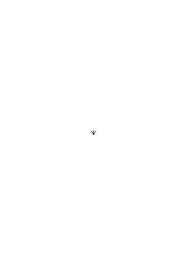
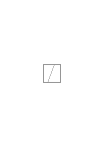

# Ms-153b

### [FCv\[3\]](https://cdn.wittgensteinnachlass.com/2000px/webp/Ms-153b/FCv.webp),[1r\[1\]](https://cdn.wittgensteinnachlass.com/2000px/webp/Ms-153b/1r.webp)

… denn die Tabelle zwingt mich nicht ihn zu machen. Ich mache ihn bei jeder Anwendung immer von neuem. Er ist nicht quasi ein für alle mal in der Tabelle für mich gemacht. (Die Tabelle _verleitet_ mich höchstens ihn so zu machen).

Und also richte ich mich doch unmittelbar nach dem sekundären Zeichen wenn ich in der Tabelle von diesem sekundären Zeichen gerade _dorthin_ gehe.

### [1r\[2\]](https://cdn.wittgensteinnachlass.com/2000px/webp/Ms-153b/1r.webp),[1v\[1\]](https://cdn.wittgensteinnachlass.com/2000px/webp/Ms-153b/1v.webp)

Nun könnte man freilich die Tabelle durch die ersten Anwendungen der sekundären Zeichen ersetzen & man hätte sich in Zukunft nach diesen ersten Anwendungen zu richten. Und das geschieht bis zu einem gewissen Grade denn wir erinnern uns vielleicht daran den Buchstaben _a_ immer _so_ gelesen zu haben.

### [1v\[2\]](https://cdn.wittgensteinnachlass.com/2000px/webp/Ms-153b/1v.webp),[2r\[1\]](https://cdn.wittgensteinnachlass.com/2000px/webp/Ms-153b/2r.webp)

Die Worte sind beliebig aus ihnen geht nicht hervor welche Farbe sie meinen. Aber so ist die Anwendung der Tabelle. Aus ihr geht auch nicht hervor wie sie verwendet wird. Hat es also wirklich nichts mit der Willkürlichkeit der Wörter auf sich? Ist das alles Unsinn? Nein.

Die Tabelle hat auf uns tatsächlich eine bestimmte Wirkung. (Es ist gleichgültig ob ich sage die Tabelle oder die hinweisende Erklärung denn diese beiden sind Eins.)

Und wo sie nötig ist können wir von primären & sekundären Zeichen sprechen.

### [2r\[1\]](https://cdn.wittgensteinnachlass.com/2000px/webp/Ms-153b/2r.webp),[2v\[1\]](https://cdn.wittgensteinnachlass.com/2000px/webp/Ms-153b/2v.webp)

Welcher Art ist denn meine Aussage über die Tabelle „daß sie mich nicht zwingt sie so & so zu gebrauchen”. Und „daß die Anwendung durch die Regel (oder Tabelle) nicht antizipiert wird”?

### [2v\[2\]](https://cdn.wittgensteinnachlass.com/2000px/webp/Ms-153b/2v.webp)

Woher nimmt diese Betrachtung ihre Wichtigkeit? da sie doch nur alles Interessante zu zerstören scheint? –

### [2v\[3\]](https://cdn.wittgensteinnachlass.com/2000px/webp/Ms-153b/2v.webp)

The foundations we mean _pervade_ rather than _underlie_ mathematics & the sciences. (siehe Augustinus et cum effunderis super nos, non tu iaces, sed erigis nos.)

### [3r\[1\]](https://cdn.wittgensteinnachlass.com/2000px/webp/Ms-153b/3r.webp)

Grillparzer: „Wie leicht bewegt man sich im Großen & im Fernen, wie schwer faßt sich, was nah & einzeln an ….”

### [3r\[2\]](https://cdn.wittgensteinnachlass.com/2000px/webp/Ms-153b/3r.webp),[3v\[1\]](https://cdn.wittgensteinnachlass.com/2000px/webp/Ms-153b/3v.webp)

Woher nimmt die Betrachtung ihre Wichtigkeit die uns darauf aufmerksam macht daß man eine Tabelle auf mehr als _eine_ Weise brauchen kann, daß man sich eine Tabelle als Anleitung zum Gebrauch einer Tabelle denken kann, daß man einen Pfeil auch als Zeigen der Richtung von der Spitze zum Schwanzende auffassen kann, daß ich eine Vorlage auf mancherlei Weise als Vorlage benützen kann?

### [3v\[2\]](https://cdn.wittgensteinnachlass.com/2000px/webp/Ms-153b/3v.webp),[4r\[1\]](https://cdn.wittgensteinnachlass.com/2000px/webp/Ms-153b/4r.webp)

So ist also an der Bemerkung daß es in jeder Sprache primäre Zeichen geben muß die die Wörter definieren das, daß man eine Tabelle aufstellen kann auf deren beiden Seiten einerseits die Wörter anderseits Exempel ihrer Anwendung stehen. Und das ist wahr, soweit sich Exempel der Anwendung der Worte zum figurieren in einer Tabelle eignen denn die Tabelle ist dann ja weiter nichts als ein besonderer Fall der Anwendung der Wörter vergl. <math display="inline"><mo>|</mo><mi>o</mi><mspace width="0.3em"/><mo>|</mo><mtext>–</mtext><mi>x</mi></math>.

### [4r\[2\]](https://cdn.wittgensteinnachlass.com/2000px/webp/Ms-153b/4r.webp)

Der Irrtum von den primären Zeichen gehört zu denen die die Philosophie wie eine Art Physik behandeln indem sie einfachen Gesetzen nachspüren wollen. Prinzipien im Sinne Newtons.

### [4v\[1\]](https://cdn.wittgensteinnachlass.com/2000px/webp/Ms-153b/4v.webp),[5r\[1\]](https://cdn.wittgensteinnachlass.com/2000px/webp/Ms-153b/5r.webp)

„Verifying by inspection” ist ein gänzlich irreführender Ausdruck. Er sagt nämlich daß zuerst ein Vorgang geschieht die Inspektion & die wäre mit dem Schauen durch ein Mikroskop vergleichbar oder mit dem Vorgang des Umwendens des Kopfes _um etwas zu sehen_. Und daß dann das Sehen notwendig erfolge. Man könnte vom ‚sehen durch umwenden’ oder sehen durch schauen reden. Aber dann ist eben das Umwenden (oder schauen) ein dem Sehen externer Vorgang der uns (daher) nur praktisch interessiert. Was man meint ist ‚sehen durch sehen’ aber das heißt nichts.

### [5r\[2\]](https://cdn.wittgensteinnachlass.com/2000px/webp/Ms-153b/5r.webp)

There is an infinity of things which you must notice about the use of the simplest word. The grammar of every word is enormously complicated & therefore enormously difficult to overlook & it is just that you must try to do.

### [5v\[1\]](https://cdn.wittgensteinnachlass.com/2000px/webp/Ms-153b/5v.webp)

Methods of projection for colours & shapes.

### [5v\[2\]](https://cdn.wittgensteinnachlass.com/2000px/webp/Ms-153b/5v.webp),[6r\[1\]](https://cdn.wittgensteinnachlass.com/2000px/webp/Ms-153b/6r.webp)

Die Sprache hat für Alle die gleichen Fallen bereit, das gleiche ungeheure Netz schon angelegter Irrwege. Und so sehen wir also Einen nach dem Andern die gleichen Wege gehn & wissen schon wo er jetzt abbiegen wird, wo er geradaus fortgehen wird ohne die Abzweigung zu bemerken etc. etc. Ich sollte also an allen den Stellen an denen Irrwege angelegt sind Wegweiser aufstellen die über die gefährlichen Punkte hinweg helfen.

### [6r\[2\]](https://cdn.wittgensteinnachlass.com/2000px/webp/Ms-153b/6r.webp),[6v\[1\]](https://cdn.wittgensteinnachlass.com/2000px/webp/Ms-153b/6v.webp),[7r\[1\]](https://cdn.wittgensteinnachlass.com/2000px/webp/Ms-153b/7r.webp),[7v\[1\]](https://cdn.wittgensteinnachlass.com/2000px/webp/Ms-153b/7v.webp),[8r\[1\]](https://cdn.wittgensteinnachlass.com/2000px/webp/Ms-153b/8r.webp),[8v\[1\]](https://cdn.wittgensteinnachlass.com/2000px/webp/Ms-153b/8v.webp),[9r\[1\]](https://cdn.wittgensteinnachlass.com/2000px/webp/Ms-153b/9r.webp),[9v\[1\]](https://cdn.wittgensteinnachlass.com/2000px/webp/Ms-153b/9v.webp)

<s> Es ist hier natürlich die Regel eine andere als im ersten Fall & wenn sie nachgesehen wird so ist dadurch auch die Spielhandlung eine andere. Wie ist es aber, wenn sie nicht nachgesehen wird? Dann lautet etwa der Befehl „bring mir eine rote Blume” worin statt des Wortes ‚rot’ ein grünes Täfelchen steht & der Befehl wird ausgeführt genau so als ob das Wort ‚rot’ oder ein rotes Täfelchen da stünde. Es ist nun die Frage: Wenn sich diese Regel ihrem Wesen nach nur auf die Farben blau, rot, grün, gelb bezieht ist sie dann nicht identisch mit der welche das grüne Zeichen als Wort für ‚rot’ u.u. und das blaue Zeichen als Wort für ‚gelb’ u.u. festsetzt? Denn eine Allgemeinheit, die ihrem logischen Wesen nach durch ein logisches Produkt ersetzt werden kann ist nichts andres als dieses logische Produkt. (Denn man kann nicht sagen: hier ist das grüne Zeichnen nun hole mir ein Ding von der komplementären Farbe, **was immer sie sein mag**. D.h. „die Komplementärfarbe von rot” ist keine Beschreibung von grün.) Die Bestimmung die komplementäre Farbe als Bedeutung des Täfelchens zu nehmen ist dann wie ein Querstrich in einer Tabelle

ein Querstrich in der Grammatik der Farben ausgeführt. Hier ist also das grüne Täfelchen doch nur ein Wort. Anders wäre es aber wenn die Regel hieße das Täfelchen bedeutet immer einen etwas dunkleren Ton als der reine ist. Man muß nur wieder auf den verschiedenen Sinn der Farb- & der Gestaltprojektion achten (und bei der letzten wieder der Abbildung im visuellen Raum & der Übertragung mit Meßinstrumenten). Es ist natürlich das Kopieren der Farbe wenn die Vorschrift ist einen etwas dunkleren Ton als den gegebenen zu malen von einer **anderen Art** als das Kopieren im Sinne des Hervorbringens des gleichen Farbtons (während das Kopieren mit Zirkel & Lineal einer Figur im selben Sinne Kopieren ist ob ich die Figur in natürlicher Größe kopiere oder im Maßstab 4 : 2 etc. durch Parallelprojektion oder Zentralprojektion vergl. die Metrik der Farbtöne. Wenn ich also darauf Rücksicht nehme so kann ich mit dem veränderten Sinn des Worts „Muster” das hellere Täfelchen zum Muster des dunkleren Gegenstandes nehmen. Die Frage bleibt also: wie kann ich das Zeichen das als Wort gebraucht wird von dem unterscheiden das als Muster gebraucht wird. </s> (Der Satz ist ein Muster das Wort ist kein Muster. Denke auch daran wie Du eine Landkarte durch gehen kopieren kannst & zwar Karte & Legende, und ob dazu noch etwas anderes nötig ist, <s>das sich gar nicht ausdrücken läßt.) </s> <s>Die ursprüngliche Frage war: könnten wir nicht bei der hinweisenden Erklärung von ‚rot’ ebensogut auf ein grünes wie auf ein rotes Täfelchen zeigen; denn wenn diese Definition nur ein Zeichen durch ein anderes ersetzt so sollte dies doch gleich sein. – Soweit die Erklärung nur ein Wort für ein anderes setzt ist es auch gleich. Bringt aber die Erklärung das Wort mit einem Zeichen zusammen das anders gebraucht wird (als Muster) so ist es nun nicht unwesentlich mit welchem Täfelchen das Zeichen verbunden wird. „Aber dann gibt es also willkürliche & nicht willkürliche Zeichen?” – Auch der Gebrauch der Worte ist ja nicht willkürlich insofern als wenn einmal ❘

= 0 + – = x festgesetzt ist jetzt die Übersetzung von ❘ – – ∣∣ ebensowenig willkürlich ist wie das Kopieren einer Farbe.</s>

### [10r\[1\]](https://cdn.wittgensteinnachlass.com/2000px/webp/Ms-153b/10r.webp),[10v\[1\]](https://cdn.wittgensteinnachlass.com/2000px/webp/Ms-153b/10v.webp),[11r\[1\]](https://cdn.wittgensteinnachlass.com/2000px/webp/Ms-153b/11r.webp),[11v\[1\]](https://cdn.wittgensteinnachlass.com/2000px/webp/Ms-153b/11v.webp),[12r\[1\]](https://cdn.wittgensteinnachlass.com/2000px/webp/Ms-153b/12r.webp),[12v\[1\]](https://cdn.wittgensteinnachlass.com/2000px/webp/Ms-153b/12v.webp),[13r\[1\]](https://cdn.wittgensteinnachlass.com/2000px/webp/Ms-153b/13r.webp),[13v\[1\]](https://cdn.wittgensteinnachlass.com/2000px/webp/Ms-153b/13v.webp)

<s> Folgt nun aber daraus nicht daß die Definition die Wort mit Wort (auch wenn dieses ein färbiges Täfelchen ist) von anderer Art, in einem andern Sinne Definition ist als die welche das Wort mit einem Muster verbindet. Freilich erlaubt mir auch diese Definition das eine Zeichen an Stelle des andern zu setzen das Muster an Stelle des Wortes. Aber die weitere Benützung des Zeichens ist ja ganz anders. Also ist wohl nicht das Wort ‚Definition’ [unreadable] in verschiedener Bedeutung gebraucht, sondern das Wort ‚Zeichen’. Das Wort ‚rot’ könnte in verschiedenen Sprachen verschiedene Farbe bedeuten aber das rote Täfelchen kann nicht in verschiedene Farben kopiert werden & selbst wenn z.B. die geometrische Figur durch verschiedene Projektionsmethoden projiziert werden kann so kann man das wieder nicht von einem Wort etwa dem Wort „Kreis” sagen. </s> Words are not patterns but patterns are made out of words.

<s> Wir können allerdings sagen d.h. es entspricht dem ganz der Sprachgebrauch daß wir uns durch Zeichen verständigen ob wir Wörter oder Muster gebrauchen aber das Muster ist kein Wort & das Spiel sich nach Worten (zu) richten ein anderes als das sich nach Mustern oder einem Muster zu richten. Wörter sind der Sprache nicht wesentlich. Die Frage war ursprünglich: muß ein **rotes** Täfelchen ‚rot’ vertreten oder macht dies nur den Übergang für uns leicht wie es leichter ist sich in einer Tabelle zurechtzufinden die nach dem Schema <math display="inline"><mtext>→</mtext><mtext>→</mtext><mtext>→</mtext></math> angeordnet ist statt nach einem komplizierteren. Und es ist klar daß ein grünes Täfelchen das Wort ‚rot’ so gut vertreten kann als ein blaues. Auch daß ein grünes nicht in dem Sinn als Muster eines roten Farbtons dienen kann wie ein Täfelchen von diesem Farbton. Es fragt sich nun: Wenn es sich nur um die Bezeichnung der Farben rot, blau, grün, gelb handelt, ist dann das rote Täfelchen in einem andern Verhältnis zu ‚rot’ als zu ‚grün’ etc.? D.h. kommt in diesem Fall das Täfelchen als Muster überhaupt in Betracht oder nur als Wort so daß es dann gleichgültig ist welches Täfelchen rot bezeichnet? Ja, aber wir müssen doch einen Weg haben die Bedeutung die ‚rot’ wirklich hat im Gegensatz zu einer andern festzulegen. – Eins ist klar: Wenn die Täfelchen nicht als Muster fungieren (& tun sie es so ist ohnehin alles klar) so ist kein Grund warum ich das Wort ‚rot’ eher einer Farbe als einer Form oder einem Klang zuordnen soll & das heißt: Wenn die Täfelchen nicht als Muster irgendwelcher Art fungieren so fungieren sie einfach als Worte. Wenn ein grünes Täfelchen rot bezeichnen kann, dann nicht anders als das doppelt geschriebene c auf der Violine. Aber man hat ein Gefühl als wäre das nicht so als gäbe es hier eine Projektionsmethode (nur nicht eine so bequeme wie die die rot in rot projiziert) die rot in grün projiziert. Wenn das aber so wäre, so müßten wir wissen was diese Projektionsmethode mit einem andern Argument ergibt. Nun da denken wir natürlich an die Regel eine Farbe durch ihre Komplementärfarbe zu ersetzen.</s>

### [13v\[2\]](https://cdn.wittgensteinnachlass.com/2000px/webp/Ms-153b/13v.webp),[14r\[1\]](https://cdn.wittgensteinnachlass.com/2000px/webp/Ms-153b/14r.webp),[14v\[1\]](https://cdn.wittgensteinnachlass.com/2000px/webp/Ms-153b/14v.webp),[15r\[1\]](https://cdn.wittgensteinnachlass.com/2000px/webp/Ms-153b/15r.webp),[15v\[1\]](https://cdn.wittgensteinnachlass.com/2000px/webp/Ms-153b/15v.webp),[16r\[1\]](https://cdn.wittgensteinnachlass.com/2000px/webp/Ms-153b/16r.webp),[16v\[1\]](https://cdn.wittgensteinnachlass.com/2000px/webp/Ms-153b/16v.webp)

<s> Meine Frage war aber eigentlich die: Kommt das Kopieren überhaupt in Betracht wenn Worte definiert werden? D.h. muß nicht alles wodurch ein Wort definiert wird eo ipso ein Wort sein als Wort wirken auch wenn es eine färbige Tafel ist & daher auch anders funktionieren könnte nämlich als Muster? Ist es also nicht so daß die Farbmuster so bald sie Wörter definieren nur Wörter sind? – Aber es ist doch klar daß wir im Musterkatalog sehr wohl von den Nummern (dem Namen) auf das Muster übergehen & dieses dann auch als Muster benützen können, wenn es auch wahr ist daß wir es nicht als Muster benützen müssen sondern auch als Wort (zwei verschiedene Spiele). Wenn aber die Anzahl der Muster vom vornherein beschränkt ist, – ist dann Platz für das Kopieren? Nun ich kann doch jedenfalls auch dann die Farbe des Zeichens kopieren. Es kommt mir aber z.B. gar nicht auf den genauen Ton an sondern nur darauf an ob es ein Ton von rot blau gelb oder grün ist. Ich kann aber auch so kopieren daß nur die Nachbar**schaft** der betreffenden primären Farbe gewahrt wird . – Wenn also mein Zeichensystem nur aus den Wörtern rot blau grün gelb & vier entsprechenden Farbtäfelchen besteht ist eine Erklärung (Tabelle) die das rote Täfelchen mit dem Wort ‚blau’ verbindet auf gleicher Stufe wie eine die es mit ‚rot’ verbindet? Wenn ich festsetze das blaue Täfelchen solle rot bedeuten u.s.w. im Kreis so folgt daß das rote gelb, das gelbe grün & das grüne blau bedeutet & das ist ein ähnlicher Fall wie der der Bezeichnung durch die Komplementärfarbe. Es ist klar daß ich mit Hilfe einer solchen Regel vor jeder Anwendung eine Tabelle konstruieren könnte indem ich erst ‚rot’ mit dem blauen Täfelchen & darauf dieses mit dem roten verbände etc.. Und das heißt doch daß die eine Bezeichnung genau so gut ist wie die andere & in diesem grammatischen System die gleiche Bezeichnungsweise ist. Ich habe durch die Angabe das rote Täfelchen solle blau bezeichnen & so weiter im Kreise tatsächlich eine Projektionsmethode bestimmt die sich auf die internen Beziehungen der Farben stützt (wie die Darstellung durch Komplementärfarben) Durch die Angabe dieser Projektionsmethode wird die Bezeichnung von rot mittels des blauen Täfelchens gleichwertig der mit den roten Täfelchen. Aber nur durch diese Angabe. Das grüne Täfelchen kann also zum Muster für rot werden im System der Komplementärfarben. Es entspreche dem das Muster der Ausführung wie das photographische Negativ dem Positiv. Denken wir uns ein photographisches grün rotes Negativ etc. etc. etc. etc. </s>

### [16v\[2\]](https://cdn.wittgensteinnachlass.com/2000px/webp/Ms-153b/16v.webp),[17r\[1\]](https://cdn.wittgensteinnachlass.com/2000px/webp/Ms-153b/17r.webp),[17v\[1\]](https://cdn.wittgensteinnachlass.com/2000px/webp/Ms-153b/17v.webp)

<s> Das Charakteristische an diesen Projektionsmethoden ist daß sie in eine Tabelle münden, was die räumlichen nicht tun. Daher sind sie eben dieser Tabelle gleichwertig. Insofern ist also die Bezeichnung von rot durch das rote Täfelchen nur eine Bequemlichkeit. Nicht aber wenn es sich um das genaue kopieren des Farbtons handelt. Denn da gibt es keine Projektionsweise aus einer Farbe in die andere. Soweit die Farben mit einander in internen Beziehungen stehen soweit kann man auch von einer natürlich auf die andere übergehen d.h. einen Übergang in der Farbe selber machen ohne etwa einem bestimmten Farbenkreis zu benützen. (Die Möglichkeiten zeigen sich deutlich im Farbenoktaeder.)</s>

### [17v\[2\]](https://cdn.wittgensteinnachlass.com/2000px/webp/Ms-153b/17v.webp),[18r\[1\]](https://cdn.wittgensteinnachlass.com/2000px/webp/Ms-153b/18r.webp),[18v\[1\]](https://cdn.wittgensteinnachlass.com/2000px/webp/Ms-153b/18v.webp)

<s> Wird denn ein Wort eigentlich als Wort gebraucht wenn ich es nur in Verbindung mit einer Tabelle gebrauche die den Übergang zu Mustern macht? Ist es also nicht falsch zu sagen ein Satz sei ein Bild wenn ich doch nur ein Bild nach ihm & der Tabelle zusammenstelle? Aber so ist also doch der Satz & die Tabelle zusammen ein Bild also zwar nicht a d b c b allein aber dieses Zeichen zusammen mit <math display="inline"><mi>a</mi><mi>b</mi><mi>c</mi><mi>d</mi><mspace width="0.3em"/><mo>|</mo><mspace width="0.3em"/><mtext>↑</mtext><mtext>↓</mtext><mtext>→</mtext><mtext>←</mtext></math>. Aber es ist offenbar daß auch a d b c b ein Bild von ↑←↓→↓ genannt werden kann. Ja aber ist nicht doch das Zeichen a d b c b ein willkürlicheres Bild von ↑←↓→↓ als dieses Zeichen von der Ausführung der Bewegung? Etwas ist auch an dieser Übertragung willkürlich (die Projektionsmethode) & wie sollte ich bestimmen was willkürlicher ist.

</s>

### [18v\[2\]](https://cdn.wittgensteinnachlass.com/2000px/webp/Ms-153b/18v.webp)

„Stell Deinen Fuß auf ellenhohe Socken, Du bleibst doch immer was Du bist.”

### [19r\[1\]](https://cdn.wittgensteinnachlass.com/2000px/webp/Ms-153b/19r.webp)

<s> Das Wort in Anführungszeichen ist ein Muster. </s>

### [19r\[2\]](https://cdn.wittgensteinnachlass.com/2000px/webp/Ms-153b/19r.webp)

„I see that p is the case”

„I know that p is the case”

Does seeing depend on one of the senses?

The subject in visual space.

### [19r\[3\]](https://cdn.wittgensteinnachlass.com/2000px/webp/Ms-153b/19r.webp),[19v\[1\]](https://cdn.wittgensteinnachlass.com/2000px/webp/Ms-153b/19v.webp)

<s> Die Schwierigkeit die uns das Sprechen über den Gesichtsraum ohne Subjekt macht & über meine & seine Zahnschmerzen ist die die Sprache einzurenken daß sie richtig in den Tatsachen sitzt.</s>

### [19v\[2\]](https://cdn.wittgensteinnachlass.com/2000px/webp/Ms-153b/19v.webp)

<s> Wenn mir Herr N vorgestellt wird weiß ich jetzt etwas über ihn nämlich wie er ausschaut etc. oder verstehe ich jetzt den Namen ‚N’? D.h. war die Vorstellung ein Satz über N oder eine Definition von ‚N’? </s>

### [19v\[3\]](https://cdn.wittgensteinnachlass.com/2000px/webp/Ms-153b/19v.webp)

<s> **Grund & Ursache**.</s>

### [19v\[4\]](https://cdn.wittgensteinnachlass.com/2000px/webp/Ms-153b/19v.webp),[20r\[1\]](https://cdn.wittgensteinnachlass.com/2000px/webp/Ms-153b/20r.webp)

<s> So verbinde ich ein (neues) Zeichen mit ihm (eine andere Art Pfeil, wie wenn ich zur Erklärung des Fleckes o x daneben einen Pfeil setzte <math display="inline"><mi>o</mi><mspace width="0.3em"/><mo>|</mo><mi>x</mi><mtext>↗</mtext></math>.</s>

### [20r\[2\]](https://cdn.wittgensteinnachlass.com/2000px/webp/Ms-153b/20r.webp)

<s> Don't say this is no explanation: This is **what we call** an explanation.</s>

### [20r\[3\]](https://cdn.wittgensteinnachlass.com/2000px/webp/Ms-153b/20r.webp),[20v\[1\]](https://cdn.wittgensteinnachlass.com/2000px/webp/Ms-153b/20v.webp)

<s> Es scheint aber als sagten wir etwas anderes oder täten etwas anderes als ein Zeichen durch ein anderes zu ersetzen. Es ist als sagten wir nun etwas über den Pfeil was seine Richtung bestimmt die früher nicht bestimmt war. Wie wenn ich zuerst sage „er hatte einen Hut auf” & dann erst die Farbe angebe. Als wäre durch den Pfeil allein noch eine sichtbare Lücke gelassen die ich jetzt (also ein für allemal) ausfülle.</s>

### [20v\[2\]](https://cdn.wittgensteinnachlass.com/2000px/webp/Ms-153b/20v.webp),[21r\[1\]](https://cdn.wittgensteinnachlass.com/2000px/webp/Ms-153b/21r.webp)

<s> – so gebe ich eine Definition während es scheint als hätte ich sozusagen die Angabe des Pfeiles ergänzt. Ich habe den Pfeil durch ein neues Zeichen ersetzt daß wir statt des Pfeiles gebrauchen können. – **Gebrauchen** **können**. – Während es **scheint** als wäre der Pfeil selbst wesentlich unvollkommen, ergänzungsbedürftig & als hätte ich ihm nun die nötige Ergänzung gegeben: Wie man eine Beschreibung eines Gegenstandes als unvollkommen erkennt & vervollständigt. Als hätte der Pfeil die Beschreibung angefangen & wir sie durch den Satz vollendet.</s>

### [21r\[2\]](https://cdn.wittgensteinnachlass.com/2000px/webp/Ms-153b/21r.webp),[21v\[1\]](https://cdn.wittgensteinnachlass.com/2000px/webp/Ms-153b/21v.webp)

Was Eddington über die ‚Richtung der Zeit’ & den Entropiesatz sagt läuft darauf hinaus, daß die Zeit ihre Richtung umkehren würde, wenn die Menschen eines schönen Tages anfingen rückwärts zu gehen. Wenn man will kann man das freilich so nennen; man muß dann nur darüber klar sein daß man damit nichts anderes sagt als daß die Menschen ihre Gehrichtung geändert haben.

### [21v\[2\]](https://cdn.wittgensteinnachlass.com/2000px/webp/Ms-153b/21v.webp)

Untersuchen wir die Sprache _auf ihre Regeln hin_.

### [22r\[1\]](https://cdn.wittgensteinnachlass.com/2000px/webp/Ms-153b/22r.webp)

Finden wir irgendwo keine (festen) Regeln, nun so ist _das_ das Resultat.

### [22r\[2\]](https://cdn.wittgensteinnachlass.com/2000px/webp/Ms-153b/22r.webp)

Wie findet man denn die Regel eines Spiels bei einem fremden Volk?

### [22r\[3\]](https://cdn.wittgensteinnachlass.com/2000px/webp/Ms-153b/22r.webp)

Einer teilt die Menschen ein in Käufer & Verkäufer & vergißt, daß Käufer auch Verkäufer sind. Wenn ich ihn daran erinnere, wird seine Grammatik geändert?

### [22r\[4\]](https://cdn.wittgensteinnachlass.com/2000px/webp/Ms-153b/22r.webp),[22v\[1\]](https://cdn.wittgensteinnachlass.com/2000px/webp/Ms-153b/22v.webp)

Wenn ich sagte „ich sah einen Sessel” so widerspricht dem (in einem gewissen Sinn gebraucht) nicht der Satz ‚es war keiner da’. Denn den ersten Satz würde ich auch in der Beschreibung eines Traums verwenden & niemand würde mir dann mit den Worten des zweiten widersprechen. Aber die Beschreibung des Traums mit jenen Worten wirft auch _ein_ Licht auf den Sinn der Worte „_ich sah_”.

### [22v\[2\]](https://cdn.wittgensteinnachlass.com/2000px/webp/Ms-153b/22v.webp),[23r\[1\]](https://cdn.wittgensteinnachlass.com/2000px/webp/Ms-153b/23r.webp),[23v\[1\]](https://cdn.wittgensteinnachlass.com/2000px/webp/Ms-153b/23v.webp)

Die meisten Menschen wenn sie eine philosophische Untersuchung anstellen sollen benehmen sich wie Einer der äußerst nervös einen Gegenstand in einer Lade sucht. Er wirft Papiere aus der Lade heraus – das Gesuchte mag unter ihnen sein – blättert hastig & ungenau unter den übrigen. Wirft wieder die ersten zurück & andere heraus, u.s.w.. Man kann diesem dann nur sagen: Halt, wenn Du _so_ suchst kann ich Dir nicht suchen helfen. Erst mußt Du anfangen in vollkommener Ruhe & methodisch eins nach dem andern zu untersuchen dann bin ich auch bereit Dir suchen zu helfen & mich auch in meiner Methode nach Dir zu richten.

### [23v\[2\]](https://cdn.wittgensteinnachlass.com/2000px/webp/Ms-153b/23v.webp)

<s> „Das Stück war für Dich gemeint”; wie äußert sich das, was ist die Verifikation dieses Satzes dann werden wir wissen was er sagt.</s>

### [23v\[3\]](https://cdn.wittgensteinnachlass.com/2000px/webp/Ms-153b/23v.webp),[24r\[1\]](https://cdn.wittgensteinnachlass.com/2000px/webp/Ms-153b/24r.webp)

Die philosophisch wichtigsten Aspekte der Dinge sind durch ihre Einfachheit & Alltäglichkeit verborgen. Man kann es nicht bemerken weil man es immer offen vor Augen hat.

### [24r\[2\]](https://cdn.wittgensteinnachlass.com/2000px/webp/Ms-153b/24r.webp)

(Das eigentliche Verdienst eines Kopernikus oder Darwin etc. war nicht die Entdeckung einer wahren Theorie sondern eines fruchtbaren Aspekts.)

c a b b d <math display="inline"><mi>a</mi><mi>b</mi><mi>c</mi><mi>d</mi><mspace width="0.3em"/><mo>|</mo><mspace width="0.3em"/><mtext>↓</mtext><mtext>→</mtext><mtext>←</mtext><mtext>↑</mtext></math>

<math display="block">
  <mo>[</mo>
  <mtext>↓</mtext>
  <mo>]</mo>
  <mfrac linethickness="0">
    <mrow>
      <mtext>←</mtext>
    </mrow>
    <mrow>
      <mtext>→</mtext>
    </mrow>
  </mfrac>
  <mo>[</mo>
  <mtext>→</mtext>
  <mo>]</mo>
  <mo>[</mo>
  <mtext>↑</mtext>
  <mo>]</mo>
</math>

### [24v\[1\]](https://cdn.wittgensteinnachlass.com/2000px/webp/Ms-153b/24v.webp)

<s> Der Übergang von der Rechnung über Pflaumen zu einer Handlung mit den Pflaumen & vom Wort Pflaume zum Ding.</s>

### [24v\[2\]](https://cdn.wittgensteinnachlass.com/2000px/webp/Ms-153b/24v.webp),[25r\[1\]](https://cdn.wittgensteinnachlass.com/2000px/webp/Ms-153b/25r.webp),[25v\[1\]](https://cdn.wittgensteinnachlass.com/2000px/webp/Ms-153b/25v.webp),[26r\[1\]](https://cdn.wittgensteinnachlass.com/2000px/webp/Ms-153b/26r.webp),[26v\[1\]](https://cdn.wittgensteinnachlass.com/2000px/webp/Ms-153b/26v.webp),[27r\[1\]](https://cdn.wittgensteinnachlass.com/2000px/webp/Ms-153b/27r.webp),[27v\[1\]](https://cdn.wittgensteinnachlass.com/2000px/webp/Ms-153b/27v.webp),[28r\[1\]](https://cdn.wittgensteinnachlass.com/2000px/webp/Ms-153b/28r.webp)

<s> Die Definition & die Namengebung ordnet einer Sache ein Zeichen bei (im ersten Fall einem Zeichen). – Aber ein **Name** wird dem Ding gegeben, daß ich von ihm sprechen kann. – Das klingt als wäre der Name wie ein Fernglas & der obige Satz **analog** dem: Ein Fernglas wird mir gegeben daß ich ihn sehen kann. Aber das ‚von ihm reden’ besteht nun darin daß zuerst gesagt wurde er↑ heißt ‚N’ & dann der Name ‚N’ in der Sprache gebraucht wird & beim Übergang von der Sprache zu Handlungen etc.. – Immerhin ist von N reden verschieden von einer Operation die ich mit N vornehme. Ja auch verschieden davon, mit einem Gegenstand zu operieren der N vertritt für den aber auch N gebraucht werden könnte. – Wenn ich nun aber z.B. sehen möchte, an welcher Stelle der Wand sich ein bestimmtes Bild am besten machen würde & ich verschiebe zu diesem Zweck ein anderes etwa gleich großes Stück Papier. Kann ich nicht sagen ich rede hier von dem Bild, **meine** das Bild, & das Papier bedeute das Bild? Ist das nicht der Typus jeder Überlegung? Ich kann gewiß auch das sagen daß ich mich beim Einsetzen nach der (according to) Definition nach dem Zeichen richte & dasselbe wenn ich einen Befehl befolge. (Wenn ich einen Befehl in Übereinstimmung mit Worterklärungen befolge.) „Wenn ich zur Abkürzung setze Moore ≝ M so ist nur ‚M’ der Name desselben Gegenstandes wie ‚Moore’ aber nicht der Name des Namens „Moore”. Die Beiden haben **einen** Träger aber der linke ist nicht der Träger des rechten.”

Gut, – was, wenn ich aber dem linken Zeichen jetzt einen Namen gebe, – wie kann der gebraucht werden, & kann er nicht gebraucht werden wie ‚M’? Geben wir ihm den Namen ‚A’. Wenn ich dann also sage „zeige auf A” so heißt das soviel wie „zeige auf das Wort ‚Moore’” oder auch „zeige auf ‚Moore’”. Also ist A = „Moore”. Also ist A nicht dasselbe wie M. [Und dennoch muß eine Ähnlichkeit der beiden bestehen die ich nur noch nicht sehe] Ich kann ja auch, so lächerlich das klingen mag, definieren N = N also N zum Stellvertreter von N nehmen aber wird es dadurch zu seinem eigenen Namen? D.h. eigentlich: Ich kann ein Ding statt seines Stellvertreters setzen & den Stellvertreter überflüssig machen; kann ich aber auch das Ding statt seines Namens setzen & dieses (dadurch) überflüssig machen? Kann man also doch das Zeichen N statt des Zeichens ‚N’ gebrauchen? Ja, das ist möglich, aber dann gebraucht man das erste Zeichen in einem andern Sinn als es geschieht wenn man es als Name für die Person gebraucht; d.h. die Sätze in denen das Zeichen vorkommt hätten jetzt ganz andere Konsequenzen. (**Ich kenne mich nicht** **aus**. Und das ist die Formulierung jedes philosophischen Problems.) Und zwar hauptsächlich nicht in der Rolle die ein Stellvertreter in einem Kalkül spielt. Das ist doch eigentlich kein Stellvertreter. Der Stellvertreter einer Schachfigur ist eben die Schachfigur also nicht als solcher Stellvertreter eines bestimmten Stückchens Holz. Er würde nur das vertreten was willkürlich ist. Eher könnte man sagen daß die eine Figur jetzt in das Amt kommt die früher ein anderes Amt hatte. Und die Definition ist ja wie die Übergabe eines Amtes von einem Zeichen an ein anderes. Dagegen haben der Name & sein Träger als solche nicht das gleiche Amt. Das Amt des Namens zu Übertragen ist nicht, dem Namen einen Namen geben. Beides verbindet Zeichen mit einander, aber in anderer Weise. Die linke Seite der Definition steht (einfach) nicht im Verhältnis zur rechten des Trägers eines Namens zum Namen. </s>

### [28r\[2\]](https://cdn.wittgensteinnachlass.com/2000px/webp/Ms-153b/28r.webp),[28v\[1\]](https://cdn.wittgensteinnachlass.com/2000px/webp/Ms-153b/28v.webp),[29v\[1\]](https://cdn.wittgensteinnachlass.com/2000px/webp/Ms-153b/29v.webp)

<s> Das heißt, der Übergang vom Namen zum Benannten muß anderer Natur sein als der vom Definierendem zu Definiertem. Aber sind nicht beide Übergänge Übersetzungen von einer Sprache in die andere? Wie kommt es daß der erstere gleichsam nicht der Übergang in **einem** Kalkül zu sein scheint? Es ist als ob die Befolgung eines Befehles nicht eine weitere **Konsequenz** aus dem Befehle zöge. – Ich will aber sagen: sie ist doch eine Transformation dieses Befehls. (Ja </s> <s> könnte als weiterer Befehl gelten & der Gegenstand A entspricht doch in dieser Transformation dem Zeichen ‚A’?) Oder liegt der Unterschied darin daß zwar ein Mensch für das Wort ‚Mensch’ aber nicht der Mensch N für ‚N’ eintreten kann? Also im Unterschied zwischen Begriffsnamen & Eigennamen? </s>

### [29v\[2\]](https://cdn.wittgensteinnachlass.com/2000px/webp/Ms-153b/29v.webp),[30v\[2\]](https://cdn.wittgensteinnachlass.com/2000px/webp/Ms-153b/30v.webp),[31r\[1\]](https://cdn.wittgensteinnachlass.com/2000px/webp/Ms-153b/31r.webp),[31v\[1\]](https://cdn.wittgensteinnachlass.com/2000px/webp/Ms-153b/31v.webp),[32r\[1\]](https://cdn.wittgensteinnachlass.com/2000px/webp/Ms-153b/32r.webp),[32v\[1\]](https://cdn.wittgensteinnachlass.com/2000px/webp/Ms-153b/32v.webp),[33r\[1\]](https://cdn.wittgensteinnachlass.com/2000px/webp/Ms-153b/33r.webp)

<s> Ist es denn aber nicht einfach so: Das Gleichheitszeichen zwischen zwei Ausdrücken bedeutet daß die beiden die gleiche Bedeutung haben d.h. daß die gleichen </s> <s> grammatischen Regeln von ihnen gelten. Aber das kann man doch von Namen & Benanntem nicht sagen. Auch nicht wenn beide Zeichen sind. Es ist ja auch die Relation der Bedeutungsgleichheit symmetrisch nicht aber die vom Namen & Benanntem. Der Mensch ist nicht der Name seines Namens d.h. jedenfalls nicht **dadurch** daß dieses Wort sein Name ist und die Relation der Namen zum Benannten ist auch nicht transitiv. – Wenn ich einem Ding einen Namen gebe so gebrauchte ich damit das Ding nicht als ein Zeichen. – Es gibt wohl Fälle wo die Ausführung des Befehls, darin besteht daß wir die Träger an Stelle der Namen setzen. (In Fällen ähnlich dem von Sitzordnungen); aber das macht diesen Fall nicht zu einem der Bedeutungsgleichheit von Zeichen. Sondern in einem Fall wird A für B eingesetzt weil die beiden Zeichen gleicher Bedeutung sind im andern, weil das eine der Name des andern ist & dieser bestimmte Fall der des Übergangs vom Satz zur Handlung ist. – Der Hauptunterschied liegt in der Intransitivität der Namen. Denken wir uns eine Sprache in der eine Raute <math display="inline"><mtext>◊</mtext></math> das bedeutet was in der unsern „Quadrat”; & daß in jener Sprache ein Quadrat <math display="inline"><mtext>□</mtext></math> das Zeichen statt unseres Wortes „Rechteck” ist. Es handelt sich hier nicht um eine Projektion die von der Raute durch das Quadrat zum Rechteck führt. Sondern der Prozeß der Namengebung endet beim Benannten. Und der Name des Namens von N ist sowenig (ein) Name von N als die Wäscherin meiner Wäscherin meine Wäscherin ist.

Ich determiniere allerdings die Bedeutung eines Worts indem ich es als den Namen eines Gegenstandes erkläre, & auch, indem ich es als gleichbedeutend mit einem andern Wort erkläre. Aber habe ich denn nicht gesagt man könne ein Zeichen nur durch ein anderes erklären? Und das ist gewiß so, sofern ja die hinweisende Erklärung „das↑ ist N” ein Zeichen ist. Aber ferner bildet hier auch der Träger von ‚N’ auf den gezeigt wird einen Teil des Zeichens. Denn: (dieser↑ hat es getan) = (N hat es getan). Dann heißt aber ‚N’ der Name von diesem Menschen nicht aber vom Zeichen „dieser↑” von dem ein Teil auch dieser Mensch ist. Und zwar spielt der Träger in dem Zeichen eine ganz besondere Rolle. </s>

### [30r\[1\]](https://cdn.wittgensteinnachlass.com/2000px/webp/Ms-153b/30r.webp),[30v\[1\]](https://cdn.wittgensteinnachlass.com/2000px/webp/Ms-153b/30v.webp)

---

### [33r\[1\]](https://cdn.wittgensteinnachlass.com/2000px/webp/Ms-153b/33r.webp),[33v\[1\]](https://cdn.wittgensteinnachlass.com/2000px/webp/Ms-153b/33v.webp),[37v\[2\]](https://cdn.wittgensteinnachlass.com/2000px/webp/Ms-153b/37v.webp),[38r\[2\]](https://cdn.wittgensteinnachlass.com/2000px/webp/Ms-153b/38r.webp),[38v\[1\]](https://cdn.wittgensteinnachlass.com/2000px/webp/Ms-153b/38v.webp)

<s>Wenn ich also einen Namen hinweisend definiere & einen zweiten durch den ersten so ist dieser zu jenem in anderem Verhältnis als zum Zeichen das in der hinweisenden Definition gegeben wurde. D.h. dieses letztere ist seinem Gebrauch nach wesentlich von dem Namen verschieden & daher sind die ‚Definitionen’ solche in verschiedenem Sinne des Worts. Wie wirkt nun die hinweisende Erklärung? Sie erklärt den Gebrauch eines Zeichens; & das merkwürdige ist nur daß sie ihn auch für die Fälle zu lehren scheint in dem ein Zurückgehen auf das hinweisende Zeichen nicht möglich ist. Aber geschieht das nicht indem wir quasi die in der hinweisenden Definition gelernten Regeln in bestimmter Weise transformieren. (Wenn z.B. der Mann der mir vorgestellt wurde

**→**

</s> <s> ← abwesend ist & ich nun trotzdem seinen Namen gebrauche der mir durch die Vorstellung erklärt wurde). Wenn ich ihn nun brauche, **inwiefern mache ich da von der Erklärung der Vorstellung Gebrauch**? Offenbar nicht in der Weise in welcher ich in der Anwesenheit des Menschen von ihr Gebrauch machen konnte. Und das heißt daß sie jetzt eigentlich durch eine </s> <s> andere ersetzt werden könnte; oder: wenn wir sagen wir richten uns jetzt, nach einer Erklärung der Wortlaut jetzt anders lauten muß. Wir spielen jetzt nach einer andern Regel. Die wir nun tatsächlich aus der ersten erhalten haben.

Es gibt offenbar ein Spiel worin ich immer statt des Namens das hinweisende Zeichen geben kann & eins in welchem das nicht mehr möglich ist.</s>

<math display="block">
  <mtext>⌧</mtext>
  <mi>M</mi>
  <mspace width="0.3em"/>
  <mo>|</mo>
  <mspace width="0.3em"/>
  <mo>|</mo>
  <mtext>ⓞ</mtext>
  <mi>N</mi>
</math>

### [34r\[1\]](https://cdn.wittgensteinnachlass.com/2000px/webp/Ms-153b/34r.webp),[34v\[1\]](https://cdn.wittgensteinnachlass.com/2000px/webp/Ms-153b/34v.webp),[35r\[1\]](https://cdn.wittgensteinnachlass.com/2000px/webp/Ms-153b/35r.webp),[35v\[1\]](https://cdn.wittgensteinnachlass.com/2000px/webp/Ms-153b/35v.webp),[36r\[1\]](https://cdn.wittgensteinnachlass.com/2000px/webp/Ms-153b/36r.webp),[36v\[1\]](https://cdn.wittgensteinnachlass.com/2000px/webp/Ms-153b/36v.webp),[37r\[1\]](https://cdn.wittgensteinnachlass.com/2000px/webp/Ms-153b/37r.webp),[37v\[1\]](https://cdn.wittgensteinnachlass.com/2000px/webp/Ms-153b/37v.webp)

---

### [39r\[1\]](https://cdn.wittgensteinnachlass.com/2000px/webp/Ms-153b/39r.webp)

„Etwas habe ich aber doch gemeint als ich das sagte!” Nun gut, aber wie können wir es herausbringen? doch wohl nur dadurch daß wir ihn fragen. Wenn wir nicht sein übriges Verhalten zum Kriterium des Sinnes nehmen sollen dann also das was er uns erklärt.

### [39r\[2\]](https://cdn.wittgensteinnachlass.com/2000px/webp/Ms-153b/39r.webp)

Wenn man in der Philosophie fragt „was ist – z.B. – Substanz” etc. etc., so wird um eine Regel gebeten.

### [39v\[1\]](https://cdn.wittgensteinnachlass.com/2000px/webp/Ms-153b/39v.webp)

Sehe die Photographien von korsischen Briganten und denke mir: die Gesichter sind zu hart & meines zu weich als daß das Christentum darauf schreiben könnte. Die Gesichter der Briganten sind schrecklich anzusehen & doch sind sie gewiß nicht weiter von einem guten Leben entfernt & nur auf einer andern Seite desselben gelegen als ich.

---

### [40r\[1\]](https://cdn.wittgensteinnachlass.com/2000px/webp/Ms-153b/40r.webp),[40v\[1\]](https://cdn.wittgensteinnachlass.com/2000px/webp/Ms-153b/40v.webp),[41r\[1\]](https://cdn.wittgensteinnachlass.com/2000px/webp/Ms-153b/41r.webp)

Zwei Farben, zwei Dampfspannungen, zwei elektrische Ladungen etc. etc. haben nicht zu gleicher Zeit an einem Ort Platz. Eine merkwürdige Gesellschaft die ich da aufzähle. Aber erst zu etwas Andrem: Wenn f(x) sagt x sei jetzt an diesem Ort so ist also fa ∙ fb ein Widerspruch. Warum nenne ich es so da doch p ∙ ~ p die Form des Widerspruchs ist? Es heißt wohl einfach daß der Ausdruck fa ∙ fb kein Satz ist. Die Schwierigkeit ist hier nur daß wir doch das Gefühl haben daß hier ein Sinn vorliegt wenn auch ein degenerierter (Ramsey). Daß wenn ich mich zwischen zwei Aussagen setze, ein lebendes Wesen entstehen muß & nicht etwas Totes., wie wenn ich etwa a ∙ f geschrieben hätte. Das ist ein sehr merkwürdiges und sehr tief liegendes Gefühl. Die Entscheidung darüber ob fa ∙ fb Unsinn ist wie a ∙ f könnte man so fällen: ist p ∙ ~ (fa ∙ fb) = p oder ist die linke Seite dieser Gleichung Unsinn? Kann ich nicht entscheiden, wie ich will? Kann ich die Regel die dem allem zugrunde liegt so schreiben: fa = fa ∙ ~ fb? d.i.: aus

fa folgt ~ fb.

---

### [41r\[2\]](https://cdn.wittgensteinnachlass.com/2000px/webp/Ms-153b/41r.webp),[41v\[1\]](https://cdn.wittgensteinnachlass.com/2000px/webp/Ms-153b/41v.webp)

Wenn Leute sagen der Satz „es ist wahrscheinlich daß p eintreffen wird” sage etwas über das Ereignis p so vergessen sie daß es auch wahrscheinlich bleibt wenn das Ereignis p _nicht_ eingetroffen ist.

### [41v\[2\]](https://cdn.wittgensteinnachlass.com/2000px/webp/Ms-153b/41v.webp)

Wir sagen mit dem Satz „p wird wahrscheinlich eintreffen” zwar etwas über die Zukunft aber nicht etwas „_über_ das Ereignis p” wie die grammatische Form der Aussage uns glauben macht.

### [41v\[3\]](https://cdn.wittgensteinnachlass.com/2000px/webp/Ms-153b/41v.webp),[42r\[1\]](https://cdn.wittgensteinnachlass.com/2000px/webp/Ms-153b/42r.webp)

Wenn ich nach dem Grund einer Behauptung frage so ist die Antwort auf diese Frage nicht für den Gefragten sondern allgemein gültig.

### [42r\[2\]](https://cdn.wittgensteinnachlass.com/2000px/webp/Ms-153b/42r.webp),[42v\[1\]](https://cdn.wittgensteinnachlass.com/2000px/webp/Ms-153b/42v.webp)

Wenn ich sage: „das Wetter deutet auf Regen” sage ich etwas über das zukünftige Wetter? Nein sondern über das gegenwärtige mit Hilfe eines Gesetzes welches das Wetter zu einer Zeit mit dem in einer späteren Zeit in Verbindung bringt. Dieses Gesetz muß bereits vorhanden sein & mit seiner Hilfe fassen wir gewisse Aussagen über unsre Erfahrung zusammen. – Aber dasselbe könnte man dann auch für historische Aussagen sagen. Aber es war ja auch vorschnell zu sagen der Satz „das Wetter deutet auf Regen” sage nichts über das zukünftige Wetter. Das kommt darauf an was man darunter versteht „etwas über etwas aussagen”. Er sagt eben seinen Wortlaut!

### [42v\[1\]](https://cdn.wittgensteinnachlass.com/2000px/webp/Ms-153b/42v.webp),[43r\[1\]](https://cdn.wittgensteinnachlass.com/2000px/webp/Ms-153b/43r.webp)

Der Satz „es wird wahrscheinlich eintreten” sagt nur etwas über die Zukunft in einem Sinn in welchem seine Wahr- & Falschheit gänzlich unabhängig ist von dem was in der Zukunft geschehen wird.

### [43r\[2\]](https://cdn.wittgensteinnachlass.com/2000px/webp/Ms-153b/43r.webp),[43v\[1\]](https://cdn.wittgensteinnachlass.com/2000px/webp/Ms-153b/43v.webp)

Wenn wir sagen das Gewehr zielt jetzt auf diesen Punkt P so sagen wir nichts darüber wohin der Schuß treffen wird. Der Punkt auf den es zielt ist ein _geometrisches_ Hilfsmittel zur Angabe seiner Richtung. Daß wir gerade dieses Mittel verwenden hängt allerdings mit gewissen

Erfahrungstatsachen zusammen (Wurfparabel etc.) aber diese treten jetzt nicht in die Bestimmung der Richtung ein.

---

### [43v\[2\]](https://cdn.wittgensteinnachlass.com/2000px/webp/Ms-153b/43v.webp)

Mit der Möglichkeit p ∙ q = p wenn sie nicht aus der W-F-Notation hervorgeht habe ich natürlich ein ganz neues Element in den Kalkül eingeführt den Kalkül geändert.

### [44r\[1\]](https://cdn.wittgensteinnachlass.com/2000px/webp/Ms-153b/44r.webp),[44v\[1\]](https://cdn.wittgensteinnachlass.com/2000px/webp/Ms-153b/44v.webp),[45r\[1\]](https://cdn.wittgensteinnachlass.com/2000px/webp/Ms-153b/45r.webp),[45v\[1\]](https://cdn.wittgensteinnachlass.com/2000px/webp/Ms-153b/45v.webp)

Man kann definieren

(∃x) φx

(∃x,y) φx ∙ φ y ∙ ~

(∃ x,y,z) φx ∙ φ y ∙ φ

z ≝ (∃n φx,y)

φx ∙ φ y = ∃n ∣∣x)

φx

ebenso

(∃ x,y,z) φx

∙ φ y ∙ φ z ∙ ~ – – –

= (∃n ∣∣∣ x) φx

etc.

Man kann dann zeigen daß

(∃n∣∣∣∣∣ x) φx

∙ (∃n ∣∣∣ x) ψ x ∙

~ ∃ x) φx ∙ ψ x

․⊃․

(∃n∣∣∣∣∣ x) φx ⌵ ψ

x eine Tautologie ist. Hat man damit den Arithmetischen Satz ∣∣ & ∣∣∣ =

∣∣∣∣∣ gezeigt? Natürlich nicht. Man hat auch nicht gezeigt daß

(∃n ∣∣ x)

φx ∙ (∃n ∣∣∣ x)

φx ∙ Ind.

․⊃․ (∃n ∣∣ +

∣ ∣ ∣ x) φx ⌵ ψx eine Tautologie ist, denn von der Addition ∣∣ + ∣∣∣ war vorläufig gar keine Rede.

> Nun kann man aber zeigen daß man den Ausdruck „rechts von ․⊃․” der das ganze zu einer Taut. macht immer dadurch erhält daß man in der Klammer die Buchstaben setzt die durch den Kalkül x y z u v w r s t x' y' x' y' z' gefunden werden oder eine Gruppe von Strichen die durch Aneinanderreihung der beiden linken Gruppen entsteht. Daß also allgemeiner für <math class="stacked" display="inline"><mo>(</mo><msub><mo>∃</mo><mi>n</mi></msub><mspace width="0.3em"/><mi>n</mi><mspace width="0.3em"/><mtext>x)</mtext><mspace width="0.3em"/><mtext>φ</mtext><mspace width="0.3em"/><mi>x</mi><mtext>–</mtext><mspace width="0.3em"/><mtext>–</mtext><mspace width="0.3em"/><mtext>–</mtext><mspace width="0.3em"/><mo>(</mo><msub><mo>∃</mo><mi>n</mi></msub><mspace width="0.3em"/><mi>m</mi><mspace width="0.3em"/><mtext>x)</mtext><mspace width="0.3em"/><mtext>–</mtext><mo>⊃</mo><mo>(</mo><msub><mo>∃</mo><mi>n</mi></msub><mspace width="0.3em"/><mi>n</mi><mspace width="0.3em"/><mo>+</mo><mspace width="0.3em"/><mi>m</mi><mspace width="0.3em"/><mtext>x)</mtext><mspace width="0.3em"/><mtext>φx</mtext><mspace width="0.3em"/><mtext>⌵</mtext><mtext>φ</mtext><mi>y</mi></math>

Hier hat es Sinn die rechte Zahl m + n zu Schreiben denn dies drückt ein Gesetz aus. Dagegen hatte es keinen statt ∣∣∣∣∣ ∣∣ + ∣∣∣ zu schreiben da man ebensogut ∣ + ∣∣∣∣ oder ∣∣∣∣∣ schreiben könnte. Es hat dagegen Sinn nach dieser allgemeinen Regel zu schreiben

(∃ 2x – – – (∃ 3x)

(∃ 2 + 3x)

Wenn man (sozusagen) noch nicht weiß was 2 + 3 ergeben wird denn 2 + 3 hat nur sofern einen Sinn als es noch auszurechnen ist Daher hat die Gleichung ∣∣ + ∣∣∣ = ∣∣∣∣∣ nur dann einen Sinn wenn das Zeichen ∣∣∣∣∣ so wiedererkannt werden kann wie das Zeichen 5.

### [45v\[1\]](https://cdn.wittgensteinnachlass.com/2000px/webp/Ms-153b/45v.webp),[46r\[1\]](https://cdn.wittgensteinnachlass.com/2000px/webp/Ms-153b/46r.webp),[46v\[1\]](https://cdn.wittgensteinnachlass.com/2000px/webp/Ms-153b/46v.webp)

Zu sagen „4 Gegenstände + 4 Gegenstände sind 8 Gegenstände” heißt nichts & ebensowenig 4 Äpfel & 4 Äpfel sind 8 Äpfel außer wenn damit der Erfahrungssatz ausgesprochen sein soll daß 8 Äpfel auf dem Tisch liegen wenn man zuerst 4 & dann noch einmal 4 Äpfel auf den Tisch gelegt hat. Die Gleichung der Arithmetik dagegen heißt 4 + 4 = 8. Ihre Zahlen sind wesentlich unbenannt. Die Zahlen sind natürlich auch unbenannt wenn man mit den Fingern mit Strichen oder Kugeln rechnet denn dann sind diese Gegenstände nicht das _worüber_ etwas ausgesagt wird sondern die Zeichen selbst. Es ist also Unsinn zu fragen ob vier Gegenstände auch dann 2 + 2 Gegenstände sind wenn nicht je 2 von ihnen unter einen Begriff fallen.

---

### [46v\[2\]](https://cdn.wittgensteinnachlass.com/2000px/webp/Ms-153b/46v.webp),[47r\[1\]](https://cdn.wittgensteinnachlass.com/2000px/webp/Ms-153b/47r.webp),[47v\[1\]](https://cdn.wittgensteinnachlass.com/2000px/webp/Ms-153b/47v.webp)

Von einem Teil meines Gesichtsfeldes zu sagen er habe keine Farben ist Unsinn ebenso natürlich auch zu sagen er habe Farben. Wohl aber hat es Sinn zu sagen er habe nur eine Farbe, mindestens zwei Farben, nur zwei Farben etc. Ich kann also in dem Satz „dieses Viereck hat mindestens zwei Farben” statt „zwei”, nicht „eine” einsetzen & im Satz „es hat nur eine Farbe” nicht „0” statt „eine”. Wenn nun die Frage wäre hat in so einem Satz 1 die gleiche Bedeutung wie dort wo man 0 dafür substituieren kann, was müßte man antworten? „Das kommt darauf an was Du unter dasselbe bedeuten verstehst oder: was Du als Kriterium der gleichen Bedeutung annimmst”. Wie wir das Wort „Bedeutung” verstehen ist die Bedeutung eine andere.

### [48r\[1\]](https://cdn.wittgensteinnachlass.com/2000px/webp/Ms-153b/48r.webp)

Wir brauchen nicht von Farben zu reden sondern nur von der Teilung einer Fläche im Gesichtsraum überhaupt.

_– – – – –_

### [48r\[2\]](https://cdn.wittgensteinnachlass.com/2000px/webp/Ms-153b/48r.webp),[48v\[1\]](https://cdn.wittgensteinnachlass.com/2000px/webp/Ms-153b/48v.webp)

D.h. Die Aussage „die Fläche hat nur eine Farbe” enthält keine Aussage „die Fläche ist färbig” welche ja Unsinn wäre. Was gezählt wird sind die gleichfärbigen (einfarbigen) Flecken in dem _Viereck_. Und es können sehr wohl gar keine solche Flecke in Viereck sein, wenn etwa das ganze Viereck von einem kontinuierlichen Regenbogen ausgefüllt ist (kontinuierlich = visuell kontinuierlich).

### [48v\[2\]](https://cdn.wittgensteinnachlass.com/2000px/webp/Ms-153b/48v.webp)

Wenn ich sage „alle diese Hüte sind von _einer_ Größe” so heißt das nicht „sie haben eine & nur eine Größe”.

### [48v\[3\]](https://cdn.wittgensteinnachlass.com/2000px/webp/Ms-153b/48v.webp),[50r\[1\]](https://cdn.wittgensteinnachlass.com/2000px/webp/Ms-153b/50r.webp),[50v\[1\]](https://cdn.wittgensteinnachlass.com/2000px/webp/Ms-153b/50v.webp),[51r\[1\]](https://cdn.wittgensteinnachlass.com/2000px/webp/Ms-153b/51r.webp),[51v\[1\]](https://cdn.wittgensteinnachlass.com/2000px/webp/Ms-153b/51v.webp),[52r\[1\]](https://cdn.wittgensteinnachlass.com/2000px/webp/Ms-153b/52r.webp)

Soll ich nun den Satz alle diese Stäbe haben die gleiche Länge so schreiben: „Es gibt eine Länge welche alle diese Stäbe haben”? also: <math class="stacked" display="inline"><mo>(</mo><mo>∃</mo><mtext>L)</mtext><mo>:</mo><mspace width="0.3em"/><mtext>φx</mtext><mspace width="0.3em"/><mtext>․</mtext><msub><mo>⊃</mo><mi>x</mi></msub><mn>.</mn><mi>x</mi><mspace width="0.3em"/><mtext>εL</mtext></math> Aber müßte dann nicht auch der Satz (∃L) aεL Sinn haben; also: „a hat eine Länge”?

→ Hier ist ein Fehler in der Auffassung. Das heißt ich kann natürlich <math class="stacked" display="inline"><mo>(</mo><mo>∃</mo><mtext>L)</mtext><mo>:</mo><mspace width="0.3em"/><mtext>φx</mtext><msub><mo>⊃</mo><mi>x</mi></msub><mspace width="0.3em"/><mi>x</mi><mspace width="0.3em"/><mtext>ε</mtext><mspace width="0.3em"/><mi>L</mi></math> schreiben wenn ich nur weiß daß hier die Regel gilt daß (∃L) a ε L sinnlos ist. Nur ist diese Notation in diesem Fall leicht irreführend. – „Eine Länge haben”, „einen Vater haben”. Wir haben hier den Fall den wir in der gewöhnlichen Sprache oft ausdrücken in dem wir sagen: „Wenn a die Länge 𝓁 hat so haben alle anderen „Stäbe auch die Länge 𝓁.” Aber hier hätte auch der Satz „a hat die Länge 𝓁” gar keinen Sinn; oder doch nicht als Aussage über a. Wir sagen aber auch „nennen wir die Länge von a „𝓁” ….” – Zu sagen „die beiden Stäbe haben _eine_ Länge” sagt über die Länge jedes Stabes überhaupt nichts aus denn er sagt auch nicht „daß jeder eine Länge hat”. Der Fall hat also gar keine Ähnlichkeit mit dem: „A & B, haben den gleichen Vater” & „der Vater von A & B ist N” wo ich einfach für die allgemeine Bezeichnung den Eigennamen einsetze. 5 m ist aber nicht der Name der betreffenden Länge von der zuerst nur gesagt wurde daß a & b sie beide besitzen. – Noch anders wird es wenn es sich um Längen im Gesichtsfeld handelt. Hier können wir auch sagen dieser Strich & jener haben die gleiche Länge, aber wir könnten diese Länge gar nicht mit einer Zahl „benennen”. Denken wir wieder an den Satz „in den beiden Kisten sind gleichviel Äpfel”. Auch dieser Satz kann nicht geschrieben werden „es gibt eine Zahl welche die Zahl der Äpfel in beiden Kisten ist” weil man nicht sagen dürfte „es gibt eine Zahl welche die Zahl der Äpfel in dieser Kiste ist”. Freilich hängt der Satz mit der Reihe

ε(1x) φx ∙ ε(1x) ψx

ε(2x) φx ∙ ε(2x) ψx

ε(3x) φx ∙ ε(3x) ψx

_u.s.w._

zusammen. Aber er ist nicht ein Satz dieser Form & auch nicht einer der diesen Sätzen insofern ähnlich wäre, als die spezielle Zahl mit ihm durch eine Variable ersetzt würde, denn diese Ersetzung in _einem_ der beiden Sätze vorgenommen ergäbe Unsinn. Eben könnte man versucht sein den Satz so zu schreiben

(ε x) φx ∙ (εx) ψx & das zeigt deutlich daß wir es hier nicht mehr mit einem logischen Produkt zu tun haben (ähnlich wie der Differentialquotient kein Quotient ist). Und wie man dieses auch so schreiben kann daß er jeden Schein des Quotienten verliert, so auch unsern Satz so daß er jeden Schein des logischen Produkts verliert. Schreiben wir ihn etwa: Z (φ(Z), ψ(Z)).

(Was uns hier stört ist die ganz unnötige Subjekt-Prädikat-Form. Wir sagen doch nie a ist ein Apfel) Es gilt dann natürlich für Z (φ Z, ψ Z) die Regel daß

Z (φ Z, ψ Z) ∙ (ε1 x) φx ∙ (ε 1 x) ψ x = (ε 1 x) φx ∙ (ε 1 x) ψ x = = Z (φ Z, ψ Z) ∙ (ε 1 x) φx = = Z (φ Z ψZ) ∙ (ε 1 x) ψ x u.s.w. in der Reihe der Kardinalzahlen.

### [52r\[2\]](https://cdn.wittgensteinnachlass.com/2000px/webp/Ms-153b/52r.webp)

Die Gleichung p ∙ q = p zeigt den eigentlichen Zusammenhang des Folgens & der Wahrheitsfunktionen.

### [52r\[3\]](https://cdn.wittgensteinnachlass.com/2000px/webp/Ms-153b/52r.webp)

[unreadable] a b b c d e f a a a a a a a a b c d e f g

sind 7 Buchstaben da so können nicht mehr als 7 Typen von Buchstaben dasein & nicht weniger als eine.

### [52v\[1\]](https://cdn.wittgensteinnachlass.com/2000px/webp/Ms-153b/52v.webp)

Sind aber 0 Buchstaben da wieviel Typen können dann vorhanden sein? Wir sagen: er hat Kappen & 3 Arten von Hüten oder auch „Kappen & _eine_ Art von Hüten”, aber auch Kappen & keine Art von Hüten.

### [52v\[2\]](https://cdn.wittgensteinnachlass.com/2000px/webp/Ms-153b/52v.webp),[53r\[1\]](https://cdn.wittgensteinnachlass.com/2000px/webp/Ms-153b/53r.webp)

Man könnte die Anzahl von Dingen, Hüten etwa sehr wohl durch die Anzahl ihrer möglichen Paare angeben & die Anzahl der verschiedenen Arten unter ihnen durch die Anzahl verschiedener Paare. Soll ich nun sagen daß die Zahlen die mögliche Paare angeben andrer Art sind als die Kardinalzahlen? Soll ich sagen daß die Quadratzahlen 1 4 9 16 etc. nicht Kardinalzahlen sind? Und daß sich in gewissem Sinne die Quadratzahlen zu den Kardinalzahlen verhalten wie die Kardinalzahlen zu den Rationalzahlen.

### [53r\[2\]](https://cdn.wittgensteinnachlass.com/2000px/webp/Ms-153b/53r.webp)

Wird mit dem Beweis der Widerspruchsfreiheit ein _Satz_ bewiesen? Und wie lautet der?

### [53v\[1\]](https://cdn.wittgensteinnachlass.com/2000px/webp/Ms-153b/53v.webp)

Angenommen die Widerspruchsfreiheit ist bewiesen: was haben wir gewonnen?

### [53v\[2\]](https://cdn.wittgensteinnachlass.com/2000px/webp/Ms-153b/53v.webp)

In wiefern ist denn der Widerspruch in den Axiomen _schon enthalten_, wenn ich keine Methoden kenne ihn hervorzuziehen?

### [53v\[3\]](https://cdn.wittgensteinnachlass.com/2000px/webp/Ms-153b/53v.webp),[54r\[1\]](https://cdn.wittgensteinnachlass.com/2000px/webp/Ms-153b/54r.webp)

„In den Regeln _darf_ kein Widerspruch sein” das klingt so wie eine Vorschrift: „in einem Benzinmotor darf das Zahnrad auf der Kurbelwelle nicht lose sitzen”. Man erwartet sich dann eine Begründung: weil sonst …. Im ersten Falle könnte diese Begründung aber nur lauten: weil es sonst kein Regelverzeichnis ist. Es ist eben wieder der Fall der grammatischen Struktur die sich nicht begründen läßt.

### [54r\[2\]](https://cdn.wittgensteinnachlass.com/2000px/webp/Ms-153b/54r.webp),[54v\[1\]](https://cdn.wittgensteinnachlass.com/2000px/webp/Ms-153b/54v.webp),[55r\[1\]](https://cdn.wittgensteinnachlass.com/2000px/webp/Ms-153b/55r.webp)

Könnte ich nun auch eine Zahlenart den Kardinalzahlen entgegensetzen die etwa die Kardinalzahlen ohne der 5 wären? Oh ja; nur wäre diese zu _nichts_ zu brauchen wozu die Kardinalzahlen es sind. Und die 5 fehlt diesen Zahlen nicht wie ein Apfel den man aus einer Kiste voller Äpfel genommen hat & wieder hineinlegen kann, sondern die 5 fehlt dem Wesen dieser Zahlen sie _nennen_ die 5 nicht (wie die Kardinalzahlen die Zahl ½ nicht nennen.) Angewendet würden also diese Zahlen (wenn man sie so nennen will) in einem Fall wo es _unsinnig_ wäre die Kardinalzahlen (mit der 5) anzuwenden.

### [55r\[2\]](https://cdn.wittgensteinnachlass.com/2000px/webp/Ms-153b/55r.webp)

Zeigt sich hier nicht die Unsinnigkeit des Geredes von der „Grundintuition”?

### [55r\[3\]](https://cdn.wittgensteinnachlass.com/2000px/webp/Ms-153b/55r.webp),[55v\[1\]](https://cdn.wittgensteinnachlass.com/2000px/webp/Ms-153b/55v.webp)

Regeln, die eine Verbindung zwischen Sprache und Wirklichkeit herstellen & solche die es nicht tun. Die erste Art etwa: „Diese Farbe nenne ich ‚rot’” – die zweite: „~ ~p = p”.

Aber über diesen Unterschied besteht ein Irrtum durch den er von prinzipieller Art zu sein scheint.

### [55v\[2\]](https://cdn.wittgensteinnachlass.com/2000px/webp/Ms-153b/55v.webp),[56r\[1\]](https://cdn.wittgensteinnachlass.com/2000px/webp/Ms-153b/56r.webp)

Die Philosophen welche sagen: „nach dem Tod wird ein zeitloser Zustand eintreten” oder „mit dem Tod tritt ein zeitloser Zustand ein”, & nicht merken daß sie zeitlich „nach” & „mit” gesagt haben & die Zeitlichkeit in ihrer Grammatik liegt.

### [56r\[2\]](https://cdn.wittgensteinnachlass.com/2000px/webp/Ms-153b/56r.webp),[56v\[1\]](https://cdn.wittgensteinnachlass.com/2000px/webp/Ms-153b/56v.webp),[57r\[1\]](https://cdn.wittgensteinnachlass.com/2000px/webp/Ms-153b/57r.webp),[57v\[1\]](https://cdn.wittgensteinnachlass.com/2000px/webp/Ms-153b/57v.webp)

„Das Viereck hat eine Farbe & nur _eine_”. Der erste Teil des Satzes darf dann nicht die grammatische Aussage der Färbigkeit sein. („Ich kann in dieser Fläche 3 Farben _unterscheiden_”.)

Ich weiß selbst nicht _was_ mir an dieser Sache noch unverständlich ist, worin mein Problem liegt & doch ist noch eins. Es ist etwas noch nicht klar. Unrichtig ausgedrückt aber so wie man es zunächst ausdrücken würde, lautet das Problem: „warum kann man sagen ‚es gibt 2 Farben auf dieser Fläche’ & nicht ‚es gibt _eine_ Farbe auf dieser Fläche’?” Oder: Wie muß ich die grammatische Regel ausdrücken, daß ich nicht mehr versucht bin unsinniges zu sagen & daß sie mir selbstverständlich ist? Wo liegt der falsche Gedanke die falsche Analogie durch die ich verführt werde die Sprache unrichtig zu gebrauchen. Wie muß ich die Grammatik darstellen, daß diese Versuchung wegfällt? Wenn ich, z.B. die schwarze Fläche farblos nenne so scheint alles ganz einfach zu werden. Man ist versucht zu glauben, daß zwar _eine_ Länge nicht so ist wie ein Apfel aber 3 Längen so sind wie 3 Äpfel.

### [57v\[2\]](https://cdn.wittgensteinnachlass.com/2000px/webp/Ms-153b/57v.webp),[58r\[1\]](https://cdn.wittgensteinnachlass.com/2000px/webp/Ms-153b/58r.webp),[58v\[1\]](https://cdn.wittgensteinnachlass.com/2000px/webp/Ms-153b/58v.webp),[59r\[1\]](https://cdn.wittgensteinnachlass.com/2000px/webp/Ms-153b/59r.webp),[59v\[1\]](https://cdn.wittgensteinnachlass.com/2000px/webp/Ms-153b/59v.webp),[60r\[1\]](https://cdn.wittgensteinnachlass.com/2000px/webp/Ms-153b/60r.webp)

Man möchte auch immer sagen „daß die Stäbe eine Länge haben ist selbstverständlich”. Während man sagen sollte: so einen Satz gibt es gar nicht; anderseits könnte man wenn sich z.B. ein Teil der Stäbe fortwährend ausdehnen & zusammen ziehen, sagen: ich sehe unter den Stäben vor mir eine Länge (im Gegensatz zu _keiner_). Ich denke an den Fall in welchem man sagen kann: „ich sehe _eine_ Farbe, ob noch andere da sind weiß ich noch nicht”. „Ich zähle zwei Farben –” „Ich zähle eine Farbe. –” Wie wenn ich die Längen von Strichen zählte, dürfte ich da bei ‚eins’ zu zählen anfangen? In gewissem Sinn ‚ja’ & in gewissem Sinn ‚nein’. Wenn ich etwa zählte in dem ich Striche auf das Papier setzte: sollte ich einen Strich aufs Papier machen wenn ich einen Strich („denn irgendeine Länge hat er ja”) gesehen habe? Ich habe etwa wie ich den ersten Strich gesehen habe einen Zählstrich aufs Papier gemacht; was ist mir denn aufgefallen? daß der Strich eine Länge hatte? – In diesem Sinne wären Striche keiner Länge, keine Striche (ich meine der Satz „ich habe Striche keiner Länge gesehen” hieße soviel wie „ich habe keine Striche gesehen”.)

Man könnte also auch so fragen: Wie habe ich Farben (oder Längen, etc.) zu _zählen_? (Ich nehme dabei zur größeren Klarheit an daß wir durch Zählstriche zählen). Soll ich nun mit einem Strich anfangen oder etwa mit zweien? Wenn ich mit zwei Strichen zu zählen anfange so zeigt mir dies klar den radikalen Unterschied, & daß ich hier in anderm Sinne des Wortes ‚zähle’ als etwa wenn ich Soldaten zähle. Denn der Zwei geht ja dann nicht etwa eine gedachte Eins voraus, sondern die zwei Stücke wären wirklich der _Anfang_. Und eine Eins könnte es da nicht geben ganz so wie wenn man mit den geraden Zahlen zählte die Eins in der Zahlenreihe nichts zu suchen hätte. Man könnte die Zählstriche in diesem Fall etwa so schreiben

um zu zeigen daß es sich bei ihnen um den Richtungs**unterschied** handelt; so daß der einfache Strich ❘ einer Art o entspreche. Ja man kann auch wirklich die Unterschiede zählen & in diesem Fall gibt es zwar eine Eins aber die Zahlenreihe lautet <math class="stacked" display="inline"><mtext>0,</mtext><mn>1</mn><mo>,</mo><mspace width="0.3em"/><mtext>3,</mtext><mtext>6,</mtext><mspace width="0.3em"/><mo>(</mo><mfrac><mrow><mi>n</mi><mspace width="0.3em"/><mtext>∙</mtext><mspace width="0.3em"/><mo>(</mo><mi>n</mi><mspace width="0.3em"/><mtext>‒</mtext><mspace width="0.3em"/><mtext>1)</mtext></mrow><mrow><mn>2</mn></mrow></mfrac><mo>)</mo></math>.

### [60r\[2\]](https://cdn.wittgensteinnachlass.com/2000px/webp/Ms-153b/60r.webp)

Wie ist es nun wenn wir die Teile zählen in die (etwa) ein bestimmtes Quadrat geteilt ist? (In zwei Teile geteilt

nennt man auch ‚_einmal_ geteilt’, & wenn das ganze nur ein Teil ist so sagt man es sei **un**geteilt).

### [60r\[3\]](https://cdn.wittgensteinnachlass.com/2000px/webp/Ms-153b/60r.webp)

Der aufregende Charakter der grammatischen Unklarheiten.

### [60v\[1\]](https://cdn.wittgensteinnachlass.com/2000px/webp/Ms-153b/60v.webp),[BCr\[1\]](https://cdn.wittgensteinnachlass.com/2000px/webp/Ms-153b/BCr.webp)

Was der Sinn der Musik ist findet man wenn man sich fragt: wie weiß ich daß ein Mensch ein Musikstück (also „seinen Sinn”) versteht? Nun, wenn er bei jedem Ton sagen kann wie er gespielt werden soll, das Tempo jedes Taktes angeben kann. Eventuell auch, wenn er das begründen kann, indem er einmal sagt: das ist so wie wenn jemand sagt … oder: das entspricht diesem Tanzschritt, oder: das

ist die Antwort auf jenes oder indem er das Stück auf Schenkersche Weise betrachtet. Oder indem er sagt: das muß wie ein Walzer gespielt werden oder: das ist ernst aber nicht traurig. Wenn das das Kriterium dafür ist daß man den Sinn verstanden hat so ist damit auch gezeigt was der Sinn ist.

### [FCv\[1\]-relocated](https://cdn.wittgensteinnachlass.com/2000px/webp/Ms-153b/FCv.webp)

Die Philosophie nimmt ihre ganze Emphase von den Sätzen her die sie zerstört.

### [29r\[1\]-relocated](https://cdn.wittgensteinnachlass.com/2000px/webp/Ms-153b/29r.webp)

Welches Gefühl hätten wir wenn wir nicht von Christus gehört hätten? Hätten wir das Gefühl der Dunkelheit & Verlassenheit? Haben wir es nur insofern nicht als es ein Kind nicht hat wenn es weiß daß jemand mit ihm im Zimmer ist? Religiöser Wahnsinn ist Wahnsinn aus Irreligiosität.

### [30r\[1\]-relocated](https://cdn.wittgensteinnachlass.com/2000px/webp/Ms-153b/30r.webp)

Difficulty of our investigations: great length of chain of thoughts. The difficulty is here essential to the thought not as in the sciences due to its novelty. It is a difficulty which I can't remove if I try to make you see the problems.

I can't give you a startling solution which suddenly will remove all your difficulties. I can't find one key which will unlock the door of our safe. The unlocking must be done in you by a difficult process of synoptizing certain facts.

Das philosophische Problem ist ein Bewußtsein der Unordnung unsrer Begriffe & durch ordnen derselben zu heben.

Es war also eine philosophische Frage, wenn die Schwester meines Bekannten E. dieses fragte: Was ist eigentlich ein Drittel? „Ein Apfel hat doch _vier_ Teile”. Sie konnte sich im Augenblick offenbar nicht erklären wo die Bezeichnung „ein Drittel” herkomme da doch keine Zusammenstellung von Vierteln diesen Ausdruck verdiente & sie nur an die Vierteilung dachte.

Es hat einer gehört daß der Anker eines Schiffes durch eine Dampfmaschine aufgezogen werde. Er denkt nun an die welche das Schiff treibt & kann sich was er gehört hat nicht erklären. (Vielleicht fällt ihm die Schwierigkeit auch erst später ein.) Nun sagen wir ihm: Nein, es ist nicht diese Dampfmaschine sondern außer ihr gibt es noch eine Reihe anderer auf dem Schiff & eine von diesen hebt den Anker. – War sein Problem ein philosophisches? War es ein philosophisches wenn er von der Existenz anderer Dampfmaschinen an Bord gehört hatte & nun nur daran erinnert werden mußte? – Ich glaube seine Unklarheit hat zwei Teile: Was der Erklärende ihm als Tatsache mitteilt hätte der Fragende sehr wohl als Möglichkeit sich selber ausdenken können & seine Frage in bestimmter Form statt mit den bloßen Geständnissen der Konfusion vorlegen können. Diesen Teil der Unklarheit hätte er selber beheben können dagegen konnte ihn Nachdenken nicht über die Tatsachen belehren. Oder: Die Beunruhigung die davon kommt daß er die Wahrheit nicht wußte konnte ihm kein Ordnen seiner Begriffe nehmen. Die andere Beunruhigung & Unklarheit wird durch die Worte „hier stimmt mir etwas nicht” gekennzeichnet & die Lösung durch „Ach so, Du meinst nicht _die_ Dampfmaschine” oder „Ach so, Du meinst mit Dampfmaschine nicht nur Kolbenmaschine sondern auch Turbine”.

Die Arbeit des Philosophen ist ein Zusammentragen von Wahrheiten zu einem bestimmten Zweck.

We have to arrange evidence & do no more.

Eine philosophische Frage ist ähnlich der nach der Verfassung einer bestimmten Gesellschaft. – Und es wäre etwa so als ob eine Gesellschaft ohne klar geschriebene Regeln zusammenkäme aber mit einem Bedürfnis nach solchen. Ja auch mit einem Gefühl welches bewirkt daß sie gewisse Regeln in ihren Zusammenkünften einhalten, nur daß dies dadurch erschwert wird weil nichts (darüber) klar ausgesprochen ist & keine Einrichtung getroffen die die Regel deutlich macht. Z.B. betrachten sie tatsächlich Einen von ihnen mehr oder weniger ständig als eine Art Präsidenten. Aber er sitzt nicht oben am Tisch ist durch nichts kenntlich & das erschwert die Verhandlung. Daher kommen wir & schaffen eine klare Ordnung: Wir setzen den Präsidenten an das obere Ende des Tisches & seinen Sekretär zu ihm an ein eigenes Tischchen & die gleichberechtigten Mitglieder alle an einen Tisch etc. etc..

Vorlesung: primary & secondary signs. Sample bearer of name, & word. Ostensive Definition.