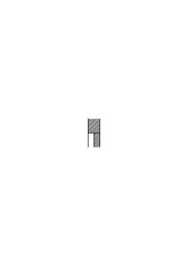
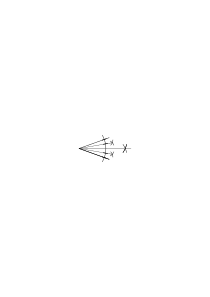
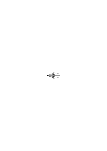
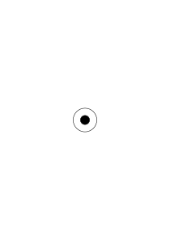

# Ms-154

### [VB](/w-vb/#ms-154-1r.1) [1r\[1\]](https://cdn.wittgensteinnachlass.com/2000px/webp/Ms-154/1r.webp) {#1r1}

Eine Beichte muß ein Teil des neuen Lebens sein.

### [1r\[2\]](https://cdn.wittgensteinnachlass.com/2000px/webp/Ms-154/1r.webp)

Der Titel meines Buches: ## „Philosophische Betrachtungen. Alphabetisch nach ihren Gegenständen geordnet.”

### [1r\[4\]](https://cdn.wittgensteinnachlass.com/2000px/webp/Ms-154/1r.webp),[1v\[2\]](https://cdn.wittgensteinnachlass.com/2000px/webp/Ms-154/1v.webp)

Wie kann man Vorbereitungen für die Ankunft von etwas eventuell Existierendem treffen in dem Sinn in welchem Russell & Ramsey das immer getan haben? <s> Russell hat für die Existenz unendlich vieler Dinge vorgesorgt; Ramsey für die Existenz beliebiger n-stelliger Relationen, etc.</s>

### [VB](/w-vb/#ms-154-1v.1) [1v\[1\]](https://cdn.wittgensteinnachlass.com/2000px/webp/Ms-154/1v.webp) {#1v1}

Ich drücke, was ich ausdrücken will doch immer nur „mit halbem Gelingen” aus. Ja auch das nicht, sondern vielleicht nur mit einem Zehntel. Das will doch etwas besagen. Mein Schreiben ist oft nur ein „Stammeln”.

### [2r\[1\]](https://cdn.wittgensteinnachlass.com/2000px/webp/Ms-154/2r.webp)

<s> Man [unreadable] bereitet die Logik für die Existenz von n-stelligen Relationen vor oder für die Existenz einer unendlichen Anzahl von Gegenständen etc. </s>

### [2r\[2\]](https://cdn.wittgensteinnachlass.com/2000px/webp/Ms-154/2r.webp),[2v\[1\]](https://cdn.wittgensteinnachlass.com/2000px/webp/Ms-154/2v.webp)

<s> Nun kann man doch für die Existenz eines Dinges vorsorgen: ich mache z.B. ein Kästchen um den Schmuck hineinzulegen der vielleicht einmal gemacht werden wird.

Aber hier kann ich doch sagen, was der Fall sein muß, welcher Fall es ist für den ich vorsorge. Ich kann diesen Fall so gut beschreiben wie nachdem er eingetreten ist. (Lösung mathematischer Probleme.) Während Russell & Ramsey für eine eventuelle Grammatik vorsorgen.

x = a ⌵ x = b ⌵ …

x = a ∙ y = b ․⌵․ x = c ∙ y = d .⌵

x = a ∙ y = b ∙ z = c ․⌵․ … </s>

### [2v\[2\]](https://cdn.wittgensteinnachlass.com/2000px/webp/Ms-154/2v.webp),[3r\[1\]](https://cdn.wittgensteinnachlass.com/2000px/webp/Ms-154/3r.webp),[3v\[1\]](https://cdn.wittgensteinnachlass.com/2000px/webp/Ms-154/3v.webp)

<s> Man denkt z.B. einerseits daß es die Arithmetik mit den Funktionen zu tun hat von deren Anzahlen sie handelt. Aber man will sich nicht durch die uns jetzt bekannten Funktionen binden lassen und man weiß nicht ob es jemals eine geben wird die von 100 Gegenständen befriedigt wird: also muß man vorsorgen & eine Konstruktion machen die alles für die 100-stellige Relation vorbereitet wenn sich eine finden sollte. Was heißt es aber überhaupt „es findet sich (oder: es gibt) eine 100-stellige Relation”? Welchen Begriff haben wir von ihr? oder einer 2-stelligen?! – Als Beispiel einer 2-stelligen Relation gibt man etwa das der Beziehung zwischen Vater & Sohn. Aber welche Bedeutung hat dieses Beispiel für die weitere Behandlung des Gegenstandes? Sollen wir uns jetzt statt jedes a R b vorstellen a ist der Vater, der b? & – – – wenn aber nicht, ist dann das Beispiel oder irgend eins überhaupt essentiell. Spielt dieses Beispiel nicht die gleiche Rolle wie eines in der Arithmetik, wenn ich jemandem 3 × 6 = 18 an 3 Reihen von 6 Äpfeln erkläre? </s>

### [3v\[2\]](https://cdn.wittgensteinnachlass.com/2000px/webp/Ms-154/3v.webp),[4r\[1\]](https://cdn.wittgensteinnachlass.com/2000px/webp/Ms-154/4r.webp)

<s> Hier handelt es sich um den Begriff der **Anwendung**. Man hat etwa die Vorstellung von einem Motor der erst leer geht & dann eine Arbeitsmaschine treibt. </s>

### [4r\[2\]](https://cdn.wittgensteinnachlass.com/2000px/webp/Ms-154/4r.webp)

<s> Aber was gibt die Anwendung der Rechnung? Setzt sie ihr einen neuen Kalkül zu? dann ist sie ja jetzt eine **andere** Rechnung. Oder gibt sie ihr in irgend einem der Mathematik (Logik) wesentlichen Sinne Substanz? Wie kann man dann überhaupt auch nur zeitweise von der Anwendung absehen? </s>

### [4v\[1\]](https://cdn.wittgensteinnachlass.com/2000px/webp/Ms-154/4v.webp)

<s> Nein, die Rechnung mit Äpfeln ist wesentlich dieselbe wie die mit Strichen oder Ziffern. Die Arbeitsmaschine setzt den Motor fort aber die Anwendung (in diesem Sinne) nicht die Rechnung. </s>

### [4v\[2\]](https://cdn.wittgensteinnachlass.com/2000px/webp/Ms-154/4v.webp),[5r\[1\]](https://cdn.wittgensteinnachlass.com/2000px/webp/Ms-154/5r.webp)

<s> Wenn ich nun sage „die Liebe ist z.B. eine 2-stellige Relation”, sage ich hier etwas über die Liebe aus? Natürlich nicht. Ich gebe eine Regel für den Gebrauch des Wortes „Liebe” & will etwa sagen daß wir **dieses** Wort z.B. so gebrauchen. </s>

### [5r\[2\]](https://cdn.wittgensteinnachlass.com/2000px/webp/Ms-154/5r.webp),[5v\[1\]](https://cdn.wittgensteinnachlass.com/2000px/webp/Ms-154/5v.webp)

<s> Nun hat man aber doch das Gefühl daß mit dem Hinweis auf die 2-stellige Relation Liebe in die Hülse des Relationskalküls Sinn gesteckt wurde. – Denken wir uns eine geometrische Demonstration statt an einer Zeichnung oder an analytischen Symbolen an einem Lampenzylinder vorgenommen. Inwiefern ist hier von der Geometrie eine Anwendung gemacht? Kommt denn der Gebrauch des Glaszylinders als Lampenzylinder in die geometrische Überlegung herein? Und tritt der Gebrauch des Wortes „Liebe” in einer Liebeserklärung in meine Überlegung ein? </s>

### [5v\[2\]](https://cdn.wittgensteinnachlass.com/2000px/webp/Ms-154/5v.webp),[6r\[1\]](https://cdn.wittgensteinnachlass.com/2000px/webp/Ms-154/6r.webp)

<s> Wir haben mit verschiedenen Verwendungen des Wortes „Anwendung” zu tun.

„Die Multiplikation wird in dieser Rechnung angewandt”, „Der Glaszylinder wird in der Lampe angewandt”; „die Rechnung ist auf diese Äpfel & Birnen angewandt”. </s>

### [6r\[2\]](https://cdn.wittgensteinnachlass.com/2000px/webp/Ms-154/6r.webp),[6v\[1\]](https://cdn.wittgensteinnachlass.com/2000px/webp/Ms-154/6v.webp)

<s> Hier kann man nun sagen: Die Arithmetik ist ihre eigene Anwendung. Der Kalkül ist seine eigene Anwendung. Wir können nicht in der Arithmetik für eine grammatische Anwendung vorsorgen. Denn ist die Arithmetik nur ein Spiel so ist für sie auch ihre Anwendung nur ein Spiel & entweder das gleiche Spiel (dann führt es uns nicht weiter) oder ein anderes – & dann konnten wir das schon in der **reinen** Arithmetik betreiben. </s>

### [6v\[2\]](https://cdn.wittgensteinnachlass.com/2000px/webp/Ms-154/6v.webp),[7r\[1\]](https://cdn.wittgensteinnachlass.com/2000px/webp/Ms-154/7r.webp)

<s> Wenn also der Logiker sagt, er habe für eventuell existierende 6-stellige Relationen in der Arithmetik vorgesorgt oder für Funktionen die von 27 Dingen befriedigt werden, so können wir fragen: Was wird denn nun zu dem was Du vorbereitet hast hinzutreten wenn es nun seine Anwendung findet? Ein neuer Kalkül? – aber den hast Du ja eben nicht vorbereitet. Oder etwas was den Kalkül nicht tangiert? – dann interessiert uns das nicht & der Kalkül den Du uns gezeigt hast ist uns Anwendung genug. </s>

### [7r\[2\]](https://cdn.wittgensteinnachlass.com/2000px/webp/Ms-154/7r.webp),[7v\[1\]](https://cdn.wittgensteinnachlass.com/2000px/webp/Ms-154/7v.webp)

<s> Die unrichtige Idee ist daß die Anwendung eines Kalküls in der Grammatik der wirklichen Sprache ihm eine Realität zuordnet die er früher nicht hatte. </s>

### [7v\[2\]](https://cdn.wittgensteinnachlass.com/2000px/webp/Ms-154/7v.webp)

<s> Aber wie gewöhnlich in unserem Gebiet liegt hier der Fehler nicht darin daß man etwas Falsches glaubt sondern darin daß man auf eine nicht stimmende Analogie hinschielt. </s>

### [7v\[3\]](https://cdn.wittgensteinnachlass.com/2000px/webp/Ms-154/7v.webp),[8r\[1\]](https://cdn.wittgensteinnachlass.com/2000px/webp/Ms-154/8r.webp),[8v\[1\]](https://cdn.wittgensteinnachlass.com/2000px/webp/Ms-154/8v.webp)

<s> Was geschieht denn wenn die 6-stellige Relation gefunden wird? Wird quasi ein Metall gefunden das nun die gewünschte Eigenschaft (das richtige spezifische Gewicht, die richtige Festigkeit etc.) hat? Nein; ein **Wort** wird gefunden das wir tatsächlich so in der Sprache verwenden wie wir etwa den Buchstaben R verwendet haben. „Ja, aber dieses Wort hat doch eben Bedeutung & R hatte keine! Wir sehen also jetzt daß dem R etwas entsprechen kann.” Aber die Bedeutung des Wortes besteht ja nicht darin, daß ihm etwas entspricht. Außer etwa wo es sich um einen Namen & benannten Gegenstand handelt aber da setzt der Träger des Namens nur den Kalkül fort also die Sprache. Und es ist **nicht** so wie wenn man sagt: diese Geschichte hat sich [unreadable] tatsächlich zugetragen sie war nicht bloße Fiktion. </s>

### [8v\[2\]](https://cdn.wittgensteinnachlass.com/2000px/webp/Ms-154/8v.webp),[9r\[1\]](https://cdn.wittgensteinnachlass.com/2000px/webp/Ms-154/9r.webp)

<s> Das alles hängt auch mit dem falschen Begriff der logischen Analyse zusammen den Russell, ich & Ramsey hatten. So daß man auf eine endliche logische Analyse der Tatsachen wartet wie auf eine chemische von Verbindungen. Eine Analyse durch die man dann etwa eine 7-stellige Relation wirklich findet wie ein Element das tatsächlich das spezifische Gewicht so & so hat. </s>

### [9r\[2\]](https://cdn.wittgensteinnachlass.com/2000px/webp/Ms-154/9r.webp)

<s> Die Grammatik ist für uns ein reiner Kalkül. (Nicht die Anwendung eines auf die Realität.) </s>

### [9r\[3\]](https://cdn.wittgensteinnachlass.com/2000px/webp/Ms-154/9r.webp)

<s> Die Wörter sind nicht die **Ingredienzien** eines Satzes. </s>

### [9v\[1\]](https://cdn.wittgensteinnachlass.com/2000px/webp/Ms-154/9v.webp)

<s> (∃2x) φx ∙ (∃2x) ψx ∙ Ind. ․⊃․ ․⊃․ (∃4x) φx⌵ψx </s>

### [9v\[2\]](https://cdn.wittgensteinnachlass.com/2000px/webp/Ms-154/9v.webp),[10r\[1\]](https://cdn.wittgensteinnachlass.com/2000px/webp/Ms-154/10r.webp)

<s> Weniger versprechen als man halten will ist oft schön, aber es kann auch aus einer Anmaßung entspringen; dann, wenn man sich auch etwas drauf einbildet weniger zu versprechen als man halten wird. – Ist es richtig oder unrichtig mein Buch nicht „Philosophische Betrachtungen etc.” zu nennen, sondern: „Philosophische **Bemerkungen**, nach ihren Gegenständen alphabetisch geordnet”? </s>

### [10r\[2\]](https://cdn.wittgensteinnachlass.com/2000px/webp/Ms-154/10r.webp)

Was ich für die Sprache tue wenn ich einfache grammatische Schemata neben sie stelle ist ähnlich dem was die Erfinder der Buchstaben (Lautzeichen für die Lautsprache) getan haben.

### [10r\[3\]](https://cdn.wittgensteinnachlass.com/2000px/webp/Ms-154/10r.webp),[10v\[1\]](https://cdn.wittgensteinnachlass.com/2000px/webp/Ms-154/10v.webp)

Die Diskussionen über das Naturrecht, ein gutes Beispiel dafür wie ein Problem obsolet wird & die Menschen einer künftigen Generation einfach nicht beunruhigt.

(No so soll er sich bessern!)

### [10v\[2\]](https://cdn.wittgensteinnachlass.com/2000px/webp/Ms-154/10v.webp)

Denken wir uns die Partitur des psychischen & physischen Geschehens geschrieben, ist dann das Glauben (Erwarten, Hoffen, Fürchten, etc.) wie ein Orgelpunkt oder ein Basso ostinato?

### [10v\[3\]](https://cdn.wittgensteinnachlass.com/2000px/webp/Ms-154/10v.webp),[11r\[1\]](https://cdn.wittgensteinnachlass.com/2000px/webp/Ms-154/11r.webp),[11v\[1\]](https://cdn.wittgensteinnachlass.com/2000px/webp/Ms-154/11v.webp)

Die philosophische Klarheit wird auf das Wachsen der Mathematik den gleichen Einfluß haben wie die Sonne auf das zügellose Wachsen der Kartoffeltriebe. (Im dunkeln Keller wachsen sie meterlang.) Philosophical transparency will have the same effect on the growth of mathematics which the sun has on potatoes. It keeps them down.

### [11v\[2\]](https://cdn.wittgensteinnachlass.com/2000px/webp/Ms-154/11v.webp)

Eine der wichtigsten Ideen unsrer Ideen wie die Idee der Disposition. „Ich kann das A-B-C hersagen wenn ich will.” Ich habe es gleichsam in mir aufgeschrieben und zwar tut's da nicht irgend ein Bild das ich in mir trage sondern es handelt sich nur um ganz bestimmte.

### [11v\[3\]](https://cdn.wittgensteinnachlass.com/2000px/webp/Ms-154/11v.webp),[12r\[1\]](https://cdn.wittgensteinnachlass.com/2000px/webp/Ms-154/12r.webp)

Worin besteht es eine Absicht zu haben? (Siehe Glauben erwarten, hoffen etc.) Was nimmst Du als das Kriterium dafür an daß er _diese_ Absicht hat? Daß er z.B. die Absicht hat mit der Strafe den Andern zu bessern nicht ihn abzuschrecken oder umgekehrt; etc.? – (Sieh Dir die verschiedenen Theorien der Strafe von diesem Standpunkte aus an.)

### [12r\[2\]](https://cdn.wittgensteinnachlass.com/2000px/webp/Ms-154/12r.webp),[12v\[1\]](https://cdn.wittgensteinnachlass.com/2000px/webp/Ms-154/12v.webp)

Wenn man jemandem sagt: „denk' nur was daraus würde wenn _alle_ das täten was Du tust” so _kann_ ihm das einen abschreckenden Eindruck machen, oder auch nicht. It _may_ appeal to him, or not. Ein ihn zwingendes Argument ist es nicht. It will impress him _if this sort of thing impresses him._

### [12v\[2\]](https://cdn.wittgensteinnachlass.com/2000px/webp/Ms-154/12v.webp)

Der Disput darüber ob schon Eins oder erst Zwei die erste Zahl sei.

### [12v\[3\]](https://cdn.wittgensteinnachlass.com/2000px/webp/Ms-154/12v.webp),[13r\[1\]](https://cdn.wittgensteinnachlass.com/2000px/webp/Ms-154/13r.webp)

<s> Was bedeutet ein Satz der Art (∃n) 4 + n = 7? Nun da frage man sich erst; gibt es schon einen Beweis für oder gegen ihn denn das ändert seine Grammatik. Und wenn man ihn beweisen kann: wie? – – – Ist **das** der Beweis? Gut, nun weiß ich auch was der Satz bedeutet. </s>

### [13r\[2\]](https://cdn.wittgensteinnachlass.com/2000px/webp/Ms-154/13r.webp)

<s> Wie wäre es wenn ein Satz seinen Sinn selber nicht ganz erfaßte. Wenn er sich quasi selber zu hoch wäre. Und das nehmen eigentlich die Logiker an. </s>

### [13r\[3\]](https://cdn.wittgensteinnachlass.com/2000px/webp/Ms-154/13r.webp),[13v\[1\]](https://cdn.wittgensteinnachlass.com/2000px/webp/Ms-154/13v.webp),[14r\[1\]](https://cdn.wittgensteinnachlass.com/2000px/webp/Ms-154/14r.webp)

<s> „Alle Zahlen haben vielleicht diese Eigenschaft”. – Aber was heißt alle Zahlen? – Das weißt Du doch! 1, 2, 3, 4, u.s.w. ad inf. – Ja, da kommt es darauf an was das u.s.w. ad inf. für eine Grammatik hat. Was es heißt daß die Zahlen diese Eigenschaft vielleicht haben werde ich wissen, wenn Du mir sagst wie man das eventuell wissen kann. (Denn wenn Du mir sagtest man könnte es wissen wenn man alle Zahlen durchgehen könnte so wäre das **Unsinn**.) Eben da sich das nicht sagen läßt wird die Frage akut: „Was heißt es, alle Zahlen haben die Eigenschaft.” Kannst Du es aber beweisen so wird ja wohl aus dem Beweis hervorgehen, was er beweist & daher auch was der Satz sagt. Alle Irrtümer ruhen hier auf der seltsamen Annahme es sei nur eine menschliche Schwäche daß wir die Zahlen nicht alle durchgehen konnten & so haben wir also wirklich von vornherein eine Verifikation für unsern Satz wenn sie auch aus äußerlichen Gründen nicht praktikabel ist. </s>

### [14v\[1\]](https://cdn.wittgensteinnachlass.com/2000px/webp/Ms-154/14v.webp)

<s>

Ein unbewiesener mathematischer Satz – ein Wegweiser der mathematischen Forschung. </s>

### [14v\[2\]](https://cdn.wittgensteinnachlass.com/2000px/webp/Ms-154/14v.webp)

<s> Der Beweis eines Satzes ist ein Teil seiner Grammatik. Und wenn er unbewiesen ist so hat er eine andere Funktion als, wenn er (oder ein Kalkül in dem er) bewiesen ist.

Der unbewiesene Satz ist immer ein Gleichnis mit einem nicht mathematischen Satz. </s>

### [15r\[1\]](https://cdn.wittgensteinnachlass.com/2000px/webp/Ms-154/15r.webp)

Wir haben von einer Zahlenreihe „1, 2, 3, 4, 5, Viele” gesprochen & ihrer Arithmetik; aber es gibt natürlich auch eine Arithmetik (oder: ich kann natürlich auch eine Arithmetik konstruieren) für die Reihe „1, 2, 3, 4, 5” ohne dem abschließenden unbestimmten Zahlwort.

### [15r\[2\]](https://cdn.wittgensteinnachlass.com/2000px/webp/Ms-154/15r.webp),[15v\[1\]](https://cdn.wittgensteinnachlass.com/2000px/webp/Ms-154/15v.webp)

Ich verliere mich jetzt leicht in einem Wald möglicher Notationen & Kalküle in dem ich mich im Kreis oder Kreisen herumzubewegen scheine.

### [VB](/w-vb/#ms-154-15v.2) [15v\[2\]](https://cdn.wittgensteinnachlass.com/2000px/webp/Ms-154/15v.webp) {#15v2}

Das jüdische “Genie” ist nur ein Heiliger. Der größte jüdische Denker ist nur ein Talent. (Ich z.B.)

### [VB](/w-vb/#ms-154-15v.3+16r.1) [15v\[3\]](https://cdn.wittgensteinnachlass.com/2000px/webp/Ms-154/15v.webp),[16r\[1\]](https://cdn.wittgensteinnachlass.com/2000px/webp/Ms-154/16r.webp) {#15v316r1}

Es ist, glaube ich eine Wahrheit darin wenn ich denke, daß ich eigentlich in meinem Denken nur reproduktiv bin. Ich glaube ich habe nie eine Gedankenbewegung _erfunden_ sondern sie wurde mir immer von jemand anderem gegeben & ich habe sie nur sogleich leidenschaftlich zu meinem Klärungswerk aufgegriffen. So haben mich Boltzmann, Hertz, Schopenhauer, Frege, Russell, Kraus, Loos, Weininger, Spengler, Sraffa beeinflußt. Kann man als ein Beispiel der jüdischen Reproduktivität Breuer & Freud heranziehen? – Was ich erfinde sind neue _Gleichnisse_.

### [VB](/w-vb/#ms-154-16r.2+16v.1) [16r\[2\]](https://cdn.wittgensteinnachlass.com/2000px/webp/Ms-154/16r.webp),[16v\[1\]](https://cdn.wittgensteinnachlass.com/2000px/webp/Ms-154/16v.webp) {#16r216v1}

Als ich seinerzeit den Kopf für Drobil modellierte so war auch die Anregung wesentlich ein Werk Drobils & meine Arbeit war eigentlich wieder die des Klärens. Ich glaube das Wesentliche ist daß die Tätigkeit des Klärens mit _Mut_ betrieben werden muß: fehlt der so wird sie ein bloßes gescheites Spiel.

### [VB](/w-vb/#ms-154-16v.2) [16v\[2\]](https://cdn.wittgensteinnachlass.com/2000px/webp/Ms-154/16v.webp) {#16v2}

Der Jude muß im eigentlichen Sinn „sein Sach' auf nichts stellen”. Aber das fällt gerade ihm besonders schwer, weil er, sozusagen, nichts hat. Es ist viel schwerer freiwillig arm zu sein, wenn man arm sein _muß_ als, wenn man auch reich sein könnte.

### [VB](/w-vb/#ms-154-16v.3+17r.1+17v.1) [16v\[3\]](https://cdn.wittgensteinnachlass.com/2000px/webp/Ms-154/16v.webp),[17r\[1\]](https://cdn.wittgensteinnachlass.com/2000px/webp/Ms-154/17r.webp),[17v\[1\]](https://cdn.wittgensteinnachlass.com/2000px/webp/Ms-154/17v.webp) {#16v317r117v1}

Man könnte sagen (ob es nun stimmt oder nicht) daß der jüdische Geist nicht im Stande ist auch nur ein Gräschen oder Blümchen hervorzubringen daß es aber seine Art ist das Gräschen oder die Blume die im andern Geist gewachsen ist abzuzeichnen & damit ein umfassendes Bild zu entwerfen. Das ist nun nicht die Angabe eines Lasters & es ist alles in Ordnung solange das nur völlig klar bleibt. Gefährlich wird es erst wenn man die Art des Jüdischen mit der des Nicht-jüdischen Werks verwechselt & besonders wenn das der Schöpfer des ersteren selbst tut, was so nahe liegt. („Sieht er nicht so stolz aus als ob er selbst gemolken wäre”.) Es ist dem jüdischen Geiste typisch das Werk eines Andern besser zu verstehen als der es selbst versteht.

### [VB](/w-vb/#ms-154-17v.2+18r.1+18v.1) [17v\[2\]](https://cdn.wittgensteinnachlass.com/2000px/webp/Ms-154/17v.webp),[18r\[1\]](https://cdn.wittgensteinnachlass.com/2000px/webp/Ms-154/18r.webp),[18v\[1\]](https://cdn.wittgensteinnachlass.com/2000px/webp/Ms-154/18v.webp) {#17v218r118v1}

Ich habe mich oft dabei ertappt wenn ich ein Bild entweder richtig hatte rahmen lassen oder in die richtige Umgebung gehangen hatte so stolz zu sein als hätte ich das Bild gemalt. Das ist eigentlich nicht richtig; nicht „so stolz als hätte ich es gemalt” sondern so stolz als hätte ich es malen geholfen, als hätte ich sozusagen einen kleinen Teil davon gemalt. Es ist so als würde der außerordentliche Arrangeur von Gräsern am Schluß denken daß er doch, wenigstens ein ganz winziges Gräschen, selbst erzeugt habe. Während er sich klar sein muß, daß seine Arbeit auf einem gänzlich andern Gebiet liegt.

Der Vorgang der Entstehung auch des winzigsten & schäbigsten Gräschens ist ihm gänzlich fremd & unbekannt.

### [VB](/w-vb/#ms-154-18v.2+19r.1) [18v\[2\]](https://cdn.wittgensteinnachlass.com/2000px/webp/Ms-154/18v.webp),[19r\[1\]](https://cdn.wittgensteinnachlass.com/2000px/webp/Ms-154/19r.webp) {#18v219r1}

Das genaueste Bild eines ganzen Apfelbaumes hat in gewissem Sinne unendlich viel weniger Ähnlichkeit mit ihm als das kleinste Maßliebchen mit dem Baum hat. Und in diesem Sinne ist eine Brucknersche Symphonie mit einer Symphonie der heroischen Zeit unendlich näher verwandt als eine Mahlerische. Wenn diese ein Kunstwerk ist, dann eines _gänzlich_ andrer Art. (Diese Betrachtung aber selbst ist eigentlich Spenglerisch.)

### [VB](/w-vb/#ms-154-19r.2) [19r\[2\]](https://cdn.wittgensteinnachlass.com/2000px/webp/Ms-154/19r.webp) {#19r2}

Als ich übrigens in Norwegen war, im Jahre 1913-14 hatte ich eigene Gedanken, so scheint es mir jetzt wenigstens. Ich meine, es kommt mir so vor, als hätte ich damals in mir neue Denkbewegungen geboren (Aber vielleicht irre ich mich). Während ich jetzt nur mehr alte anzuwenden scheine.

### [19v\[1\]](https://cdn.wittgensteinnachlass.com/2000px/webp/Ms-154/19v.webp)

~(∃φ):(Еx) φx

(∃x) φx ∙ ~ (∃xy) φx ∙ φy

φxε1

φxε5

### [19v\[6\]](https://cdn.wittgensteinnachlass.com/2000px/webp/Ms-154/19v.webp)

Der Satz ~(∃φ):(Еx) φx muß von der Art dessen sein: Es gibt keinen Kreis auf dieser Fläche der nur einen schwarzen Fleck enthält.

### [20r\[1\]](https://cdn.wittgensteinnachlass.com/2000px/webp/Ms-154/20r.webp),[20v\[1\]](https://cdn.wittgensteinnachlass.com/2000px/webp/Ms-154/20v.webp)

Wenn nun aus den Sätzen ~(∃φ):(Еx) φx & ~(∃φ):(Еx,y) φx ∙ φy folgt daß 1 = 2 ist so ist hier mit „1” & „2” nicht das gemeint was wir gemeinhin damit meinen, denn die Sätze ρ & σ würden in der gewöhnlichen Wortsprache lauten: Es gibt keine Funktion die nur von einem Ding & keine die nur von zwei Dingen befriedigt wird. Und dies sind nach der Regel unserer Sprache verschiedene Sätze und diese Regel stützt sich nicht darauf daß es doch – – –

### [20v\[2\]](https://cdn.wittgensteinnachlass.com/2000px/webp/Ms-154/20v.webp)

– – – Aber dieses Vorkommen des Paradigmas der & der Klasse im Symbolismus bedeutet nicht, daß ein bestimmter Satz des Symbolismus wahr sein muß.

### [VB](/w-vb/#ms-154-20v.3) [20v\[3\]](https://cdn.wittgensteinnachlass.com/2000px/webp/Ms-154/20v.webp) {#20v3}

Rousseau hat etwas Jüdisches in seiner Natur.

### [20v\[4\]](https://cdn.wittgensteinnachlass.com/2000px/webp/Ms-154/20v.webp),[21r\[1\]](https://cdn.wittgensteinnachlass.com/2000px/webp/Ms-154/21r.webp)

Aber die Gleichung 1 = 2 in dieser Auffassung hat ja nichts Erstaunliches denn sie besagt: _der_ _Umfang_ der 1 Klasse ist derselbe wie der _Umfang_ der 2 Klasse. Und wenn diese beiden Klassen keinen Umfang haben so haben sie denselben. Nur verwenden wir freilich die Zeichen 1 & 2 nicht in dieser Bedeutung.

### [21r\[2\]](https://cdn.wittgensteinnachlass.com/2000px/webp/Ms-154/21r.webp)

Daß Dein Satz (∃x,y)x = a ∙ y = b wahr ist, ist doch nicht das was mich in Stand setzt „(∃x,y) φx ∙ φy” zu sagen!

### [21r\[3\]](https://cdn.wittgensteinnachlass.com/2000px/webp/Ms-154/21r.webp),[21v\[1\]](https://cdn.wittgensteinnachlass.com/2000px/webp/Ms-154/21v.webp)

Kann man sagen ein Satz setzt für seinen Sinn die Wahrheit der Beschreibung des Satzes voraus?

### [21v\[2\]](https://cdn.wittgensteinnachlass.com/2000px/webp/Ms-154/21v.webp)

Oder kann man sagen der Satz (∃φ):(Еx) φx ist sein eigener Beweis, da der Satz selber so ein Ding enthält.

### [VB](/w-vb/#ms-154-21v.3+22r.1) [21v\[3\]](https://cdn.wittgensteinnachlass.com/2000px/webp/Ms-154/21v.webp),[22r\[1\]](https://cdn.wittgensteinnachlass.com/2000px/webp/Ms-154/22r.webp) {#21v322r1}

Wenn manchmal gesagt wird die Philosophie (eines Menschen) sei Temperamentssache, so ist auch darin eine Wahrheit. Die Bevorzugung gewisser Gleichnisse ist das was man Temperamentssache nennt & auf ihr beruhen viel mehr Gegensätze als es vielleicht ursprünglich den Anschein hat.

### [VB](/w-vb/#ms-154-20r.2) [20r\[2\]](https://cdn.wittgensteinnachlass.com/2000px/webp/Ms-154/20r.webp) {#20r2}

„Betrachte diese Warze als ein regelrechtes Glied deines Körpers!” Kann man das, auf Befehl?

### [VB](/w-vb/#ms-154-22v.1+23r.1+23v.1) [22v\[1\]](https://cdn.wittgensteinnachlass.com/2000px/webp/Ms-154/22v.webp),[23r\[1\]](https://cdn.wittgensteinnachlass.com/2000px/webp/Ms-154/23r.webp),[23v\[1\]](https://cdn.wittgensteinnachlass.com/2000px/webp/Ms-154/23v.webp) {#22v123r123v1}

Ist es in meiner Macht willkürlich ein Ideal von meinem Körper zu haben oder nicht? Die Geschichte der Juden wird darum in der Geschichte der europäischen Völker nicht mit der Ausführlichkeit behandelt wie es ihr Eingriff in die europäischen Ereignisse eigentlich verdiente, weil sie als eine Art Krankheit, Anomalie, in dieser Geschichte empfunden werden & niemand gern eine Krankheit mit dem normalen Leben gleichsam auf eine Stufe stellt. Man kann sagen: diese Beule kann nur dann als ein Glied des Körpers betrachtet werden, wenn sich das ganze Gefühl für den Körper ändert (wenn sich das ganze Nationalgefühl für den Körper ändert). Sonst kann man sie höchstens _dulden_.

Vom einzelnen Menschen kann man so eine Duldung erwarten oder auch daß er sich über diese Dinge hinwegsetzt; nicht aber von der Nation, die ja nur dadurch Nation ist daß sie sich darüber nicht hinwegsetzt. D.h. es ist ein Widerspruch zu erwarten daß einer das alte ästhetische Gefühl für seinen Körper behalten _&_ die Beule willkommen heißen wird.

### [VB](/w-vb/#ms-154-23v.2+24r.1) [23v\[2\]](https://cdn.wittgensteinnachlass.com/2000px/webp/Ms-154/23v.webp),[24r\[1\]](https://cdn.wittgensteinnachlass.com/2000px/webp/Ms-154/24r.webp) {#23v224r1}

Macht & Besitz sind nicht _dasselbe_. Obwohl uns der Besitz auch Macht gibt. Wenn man sagt die Juden hätten keinen Sinn für den Besitz so ist das wohl vereinbar damit daß sie gerne reich sind; denn das Geld ist für sie eine bestimmte Art von Macht nicht Besitz. (Ich möchte z.B. nicht, daß meine Leute arm werden, denn ich wünsche ihnen eine gewisse Macht. Freilich auch daß sie diese Macht recht gebrauchen möchten.)

### [VB](/w-vb/#ms-154-23r.2+24v.1) [23r\[2\]](https://cdn.wittgensteinnachlass.com/2000px/webp/Ms-154/23r.webp),[24v\[1\]](https://cdn.wittgensteinnachlass.com/2000px/webp/Ms-154/24v.webp) {#23r224v1}

Zwischen Brahms & Mendelssohn herrscht entschieden eine gewisse Verwandtschaft; & zwar meine ich nicht die welche sich in einzelnen Stellen in Brahmsschen Werken zeigt, die an Mendelssohnsche Stellen erinnern sondern man könnte die Verwandtschaft von der ich rede dadurch ausdrücken daß man sagt, Brahms tue das mit ganzer Strenge was Mendelssohn mit halber getan hat. Oder: Brahms ist oft fehlerfreier Mendelssohn.

### [VB](/w-vb/#ms-154-25r.1) [25r\[1\]](https://cdn.wittgensteinnachlass.com/2000px/webp/Ms-154/25r.webp) {#25r1}

Leidenschaftlich

Das wäre das Ende eines Themas, das ich nicht weiß. Es fiel mir heute ein als ich über meine Arbeit in der Philosophie nachdachte & mir vorsagte: „I destroy, I destroy, I destroy –”

### [25r\[2\]](https://cdn.wittgensteinnachlass.com/2000px/webp/Ms-154/25r.webp),[25v\[1\]](https://cdn.wittgensteinnachlass.com/2000px/webp/Ms-154/25v.webp)

Frege glaubte daß wir durch Aufgeben der logischen Gesetze „unser Denken in Verwirrung bringen” würden! Wenn das so wäre so würde ich diese Verwirrung studieren, sie wäre sehr interessant.

### [VB](/w-vb/#ms-154-25v.2+26r.1) [25v\[2\]](https://cdn.wittgensteinnachlass.com/2000px/webp/Ms-154/25v.webp),[26r\[1\]](https://cdn.wittgensteinnachlass.com/2000px/webp/Ms-154/26r.webp) {#25v226r1}

Man hat manchmal gesagt daß die Heimlichkeit & Verstecktheit der Juden durch die lange Verfolgung hervorgebracht worden sei. Das ist gewiß unwahr; dagegen ist es gewiß, daß sie, trotz dieser Verfolgung nur darum noch existieren, weil sie die Neigung zu dieser Heimlichkeit haben. Wie man sagen könnte daß das & das Tier nur darum noch nicht ausgerottet sei weil es die Möglichkeit oder Fähigkeit hat sich zu verstecken. Ich meine natürlich nicht, daß man darum diese Möglichkeit preisen soll, durchaus nicht.

### [VB](/w-vb/#ms-154-26r.2+26v.1) [26r\[2\]](https://cdn.wittgensteinnachlass.com/2000px/webp/Ms-154/26r.webp),[26v\[1\]](https://cdn.wittgensteinnachlass.com/2000px/webp/Ms-154/26v.webp) {#26r226v1}

Die Musik Bruckners hat nichts mehr von dem langen & schmalen (nordischen?) Gesicht Nestroys, Grillparzers, Haydns etc. sondern hat ganz & gar ein rundes volles (alpenländisches?) Gesicht, von noch ungemischterem Typus als das Schuberts war.

### [VB](/w-vb/#ms-154-26v.2+27r.1) [26v\[2\]](https://cdn.wittgensteinnachlass.com/2000px/webp/Ms-154/26v.webp),[27r\[1\]](https://cdn.wittgensteinnachlass.com/2000px/webp/Ms-154/27r.webp) {#26v227r1}

Die alles gleich machende Gewalt der Sprache die sich am krassesten im _Wörterbuch_ zeigt & die es möglich macht daß _die Zeit_ personifiziert werden konnte, was nicht weniger merkwürdig ist als es wäre wenn wir Gottheiten der logischen Konstanten hätten.

### [27r\[2\]](https://cdn.wittgensteinnachlass.com/2000px/webp/Ms-154/27r.webp)

a b c d

Im logischen Sinne des Wortes möglich ist der Schluß vom esse ad posse nicht gerechtfertigter als der vom non esse ad posse.

### [27r\[3\]](https://cdn.wittgensteinnachlass.com/2000px/webp/Ms-154/27r.webp)

Seine Handlungsweise darauf einrichten daß es immer so weitergehen wird.

### [27r\[4\]](https://cdn.wittgensteinnachlass.com/2000px/webp/Ms-154/27r.webp),[27v\[1\]](https://cdn.wittgensteinnachlass.com/2000px/webp/Ms-154/27v.webp)

Glauben, erwarten, hoffen daß es immer so weitergehen wird.

### [27v\[2\]](https://cdn.wittgensteinnachlass.com/2000px/webp/Ms-154/27v.webp)

<s> Wenn wir sagen möchten die Unendlichkeit ist eine Eigenschaft der Möglichkeit nicht der Wirklichkeit oder das Wort „unendlich” gehört immer zum Wort „möglich” u. dergl. so kommt das darauf hinaus zu sagen, das Wort „unendlich” sei immer Teil einer **Regel** nicht eines Erfahrungssatzes. </s>

### [27v\[3\]](https://cdn.wittgensteinnachlass.com/2000px/webp/Ms-154/27v.webp),[28r\[1\]](https://cdn.wittgensteinnachlass.com/2000px/webp/Ms-154/28r.webp)

<s> Man kann sagen ich mache Vorbereitungen für die nächsten 3 Tage oder 10 Jahre, etc. & auch „ich mache Vorbereitungen auf unbestimmte Zeit” aber nicht „auf unendliche Zeit”. </s>

### [28r\[2\]](https://cdn.wittgensteinnachlass.com/2000px/webp/Ms-154/28r.webp)

<s> Wenn ich aber „Vorbereitungen auf unbestimmte Zeit mache” dann läßt sich ein Zeitraum (nachträglich) finden für den ich jedenfalls keine Vorbereitungen mehr mache. </s>

### [28r\[3\]](https://cdn.wittgensteinnachlass.com/2000px/webp/Ms-154/28r.webp)

<s> D.h. aus dem Satz „ich mache Vorbereitungen für unbestimmte Zeit” folgt nicht jeder beliebige Satz „ich mache Vorbereitungen für unbestimmte Jahre”. </s>

### [28v\[1\]](https://cdn.wittgensteinnachlass.com/2000px/webp/Ms-154/28v.webp)

<s> Damit daß gesagt wird daß aus der unendlichen Hypothese (u) ∙ (∃ux) φx wie ich sie nur der Kürze wegen jetzt schreiben will jeder beliebige Satz (∃ux) φx folgt & sie selbst aus keinem dieser Sätze ist natürlich noch gar nichts über den weiteren Gebrauch dieses Spiels gesagt. </s>

### [28v\[2\]](https://cdn.wittgensteinnachlass.com/2000px/webp/Ms-154/28v.webp)

<s> Denken wir gar an den Satz: ich vermute daß das immer so weitergehn wird. </s>

### [28v\[3\]](https://cdn.wittgensteinnachlass.com/2000px/webp/Ms-154/28v.webp),[29r\[1\]](https://cdn.wittgensteinnachlass.com/2000px/webp/Ms-154/29r.webp)

<s> Der komische Klang der Widerlegung: Du hast gesagt die Uhr werde immer so weitergehen, und sie steht jetzt schon.

Wir fühlen daß ja doch auch jede endliche zu lange Vorhersage durch die Tatsache widerlegt wäre & die Widerlegung daher in irgend einem Sinn mit der Behauptung inkommensurabel.

Es ist nämlich Unsinn zu sagen: „sie ist nicht unendlich weitergegangen sondern nach zehn Jahren stehen geblieben” oder noch komischer: „sondern **schon** nach zehn Jahren stehen geblieben”. </s>

### [29r\[2\]](https://cdn.wittgensteinnachlass.com/2000px/webp/Ms-154/29r.webp),[29v\[1\]](https://cdn.wittgensteinnachlass.com/2000px/webp/Ms-154/29v.webp)

<s> Wie seltsam wenn man sagen würde: es gehört große Kühnheit dazu für 100 Jahre etwas vorauszusagen; aber welche Kühnheit muß dazugehören um etwas für die unendliche Zeit vorauszusagen wie es Newton im Trägheitsgesetz getan hat! </s>

### [29v\[2\]](https://cdn.wittgensteinnachlass.com/2000px/webp/Ms-154/29v.webp)

<s> „Ich glaube das wird immer so weitergehen”. „Ist es nicht genug wenn Du sagst Du glaubst es werde noch 100000 Jahre so weitergehen?” – „Ja, das tut's auch”. </s>

### [30r\[1\]](https://cdn.wittgensteinnachlass.com/2000px/webp/Ms-154/30r.webp)

<s> „For all practical purposes” ist es genug zu sagen, „ich glaube es werde … Jahre dauern”. </s>

### [30r\[2\]](https://cdn.wittgensteinnachlass.com/2000px/webp/Ms-154/30r.webp),[30v\[1\]](https://cdn.wittgensteinnachlass.com/2000px/webp/Ms-154/30v.webp)

<s> Wir müssen nämlich fragen: kann es Gründe zu diesem Glauben geben? Welches sind sie. Welches sind die Gründe zur Annahme daß die Uhr noch 10000 Jahre weitergehen wird welche für die Annahme daß sie noch 100000 Jahre gehen wird – & welche nun die Gründe zur unendlichen Annahme?!

Das ist es ja was den Satz „ich vermute daß es immer so gehen wird” so komisch macht weil wir fragen wollen, warum vermutest Du das? Wir wollen nämlich sagen daß es sinnlos ist das zu vermuten weil es sinnlos ist von Gründen so einer Vermutung zu reden. </s>

### [30v\[2\]](https://cdn.wittgensteinnachlass.com/2000px/webp/Ms-154/30v.webp),[31r\[1\]](https://cdn.wittgensteinnachlass.com/2000px/webp/Ms-154/31r.webp),[31v\[1\]](https://cdn.wittgensteinnachlass.com/2000px/webp/Ms-154/31v.webp)

<s> Denken wir an den Satz „dieser Komet wird sich in einer Parabel mit der Gleichung … bewegen.” Wie wird dieser Satz gebraucht? Er kann nicht verifiziert werden (d.h. **wir** haben keine Verifikation für ihn vorgesehn. Das heißt natürlich nicht daß man nicht sagen kann er sei wahr denn „p ist wahr” sagt nur „p”.) Er kann uns dazu bringen bestimmte Versuche, Beobachtungen zu machen. Aber für die hätte es immer auch eine endliche Vorhersage getan. (Und er verhält sich zu so einer Vorhersage etwa ähnlich wie die Angabe einer runden Zahl zu der Angabe der Fehlergrenzen eines Datums.)

Er wird auch gewisse Handlungen bestimmen z.B. wird er uns dann verhindern den Kometen dort & dort zu suchen. Aber auch dazu hätte eine endliche Angabe genügt.

Die Unendlichkeit der Annahme besteht nicht in ihrer **Größe** sondern in ihrer Unabgeschlossenheit.

</s>

### [31v\[2\]](https://cdn.wittgensteinnachlass.com/2000px/webp/Ms-154/31v.webp)

[Verschiedene Beunruhigungen des Verstandes werden durch verschiedene Mittel beruhigt (eben alle nennen wir Probleme & sprechen von Suchen & Finden ihrer Lösung).

Manche durch Erklärungen manche durch Gleichnisse manche durch Vereinfachungen.]

### [32r\[1\]](https://cdn.wittgensteinnachlass.com/2000px/webp/Ms-154/32r.webp),[32v\[1\]](https://cdn.wittgensteinnachlass.com/2000px/webp/Ms-154/32v.webp)

<s> Wenn man vom Begriff „Unendlichkeit” redet muß man sich daran erinnern daß dieses Wort eine Unzahl von verschiedenen Bedeutungen hat & von welcher wir jetzt gerade reden. Ob z.B. von der Unendlichkeit der Zahlenreihe & der Kardinalzahlen insbesondere. Wenn ich also sage „unendlich” sei eine Charakteristik einer Regel oder der Möglichkeit & nicht der Wirklichkeit so beziehe ich mich auf **eine** bestimmte Bedeutung des Worts. Wir könnten z.B. sehr wohl sagen ein kontinuierlicher Farbübergang sei ein Übergang durch unendlich viele Stufen wenn wir nur wissen daß wir hier die Bedeutung des Wortes „unendlich viele” durch die Erfahrung des Farbübergangs neu definieren (wenn auch nach einer Analogie mit früherer Gebrauchsweise des Wortes ‚unendlich’).

Andres Beispiel: Die Geraden treffen sich im Unendlichen wenn sie parallel sind oder das Lineal hat einen unendlichen Krümmungsgrad. </s>

### [32v\[2\]](https://cdn.wittgensteinnachlass.com/2000px/webp/Ms-154/32v.webp),[33r\[1\]](https://cdn.wittgensteinnachlass.com/2000px/webp/Ms-154/33r.webp)

<s> (Die besondere Beruhigung welche eintritt wenn wir einem Fall den wir für einzigartig hielten andere ähnliche Fälle an die Seite stellen tritt in unserer Untersuchung immer wieder ein wenn wir **zeigen** daß ein Wort nicht nur eine nicht nur zwei Bedeutungen hat sondern in 5 oder 6 verschiedenen gebraucht wird.)

</s>

### [33r\[2\]](https://cdn.wittgensteinnachlass.com/2000px/webp/Ms-154/33r.webp),[33v\[1\]](https://cdn.wittgensteinnachlass.com/2000px/webp/Ms-154/33v.webp),[34r\[1\]](https://cdn.wittgensteinnachlass.com/2000px/webp/Ms-154/34r.webp)

<s>

Warum ist man denn versucht das Wort „unendlich” ganz in die Regeln zu verweisen? Und fühlt es ungemütlich wenn es in einer Hypothese vorkommt? Aber auch in der Hypothese, möchte ich sagen, steht es nur für die Möglichkeit. – Das wogegen man sich wehrt ist natürlich die Verwendung von „unendlich” als Zahlwort. Aber was hat das mit Wirklichkeit & Möglichkeit zu tun? Nun wohl daß die Verwendung von „∞” mit den Zahlen zusammen so geschieht daß ∞ die ‘**Erlaubnis**’ ist & die Zahlen die Ausführung. Wir wehren uns gegen die Auffassung des Unendlichen als einer ungeheuern Größe. (Die wir merkwürdigerweise ohne Schwierigkeit erfassen während eine große endliche Zahl zu groß sein kann um hingeschrieben zu werden. Gleichsam als könnten wir uns zwar durch die Reihe der Zahlen nicht durcharbeiten aber wohl von außen herum zum Unendlichen gelangen.) </s>

### [34r\[2\]](https://cdn.wittgensteinnachlass.com/2000px/webp/Ms-154/34r.webp),[34v\[1\]](https://cdn.wittgensteinnachlass.com/2000px/webp/Ms-154/34v.webp)

<s> Denken wir uns wir erzählten jemandem „Gestern kaufte ich mir ein Lineal mit unendlichem Krümmungsradius”. (Ach, Du meinst, es war gerade, – ja das verstehe ich. –) Aber hier kommt doch das Wort „unendlich” in einem Erfahrungssatz vor. – Aber ich kann doch nie die Erfahrung haben die mich berechtigte zu sagen daß das Lineal wirklich den Radius unendlich hat da der Radius von 100¹⁰⁰ km es auch schon tut. Wohl aber dann kann ich doch auch nicht die Erfahrung haben die mich berechtigt zu sagen das Lineal sei gerade und die Worte **„gerade”** & „unendlich” (oder ein andermal „parallel”) sind im **gleichen** Fall. </s>

### [35r\[1\]](https://cdn.wittgensteinnachlass.com/2000px/webp/Ms-154/35r.webp)

<s> Ich meine: wenn das Wort „Gerade” oder „Parallel” oder „Längengleich” etc. etc. in einem Erfahrungssatz stehen darf dann auch das Wort „Unendlich”. </s>

### [35r\[2\]](https://cdn.wittgensteinnachlass.com/2000px/webp/Ms-154/35r.webp)

<s> Und wie wenn ich nun sagte: „gerade ist nur die Möglichkeit, nicht die Wirklichkeit”?

Aber das hätte nur insofern Sinn – – – </s>

### [35r\[3\]](https://cdn.wittgensteinnachlass.com/2000px/webp/Ms-154/35r.webp),[35v\[1\]](https://cdn.wittgensteinnachlass.com/2000px/webp/Ms-154/35v.webp)

<s> Unendlich ist nur die Möglichkeit heißt: „unendlich” ist ein Zusatz vor „u.s.w.”

Wenn ich nun sage „dieser Komet bewegt sich in einer Parabel”. </s>

### [35v\[2\]](https://cdn.wittgensteinnachlass.com/2000px/webp/Ms-154/35v.webp)

<s> Soweit „unendlich” ein Zusatz zu u.s.w. ist gehört es in eine Regel, ein Gesetz. Aber doch nicht notwendig in die Grammatik! </s>

### [35v\[3\]](https://cdn.wittgensteinnachlass.com/2000px/webp/Ms-154/35v.webp)

<s> In die Erfahrung gehört es in**so**fern nicht als die Erfahrung die einem Gesetz entspricht eine **Reihe** von Erfahrungen sind. </s>

### [35v\[4\]](https://cdn.wittgensteinnachlass.com/2000px/webp/Ms-154/35v.webp),[36r\[1\]](https://cdn.wittgensteinnachlass.com/2000px/webp/Ms-154/36r.webp)

<s> „Das Wort ‚unendlich’ ist nur die Möglichkeit nicht die Wirklichkeit” ist irreleitend. Es weist nur in einem bestimmten Fall auf das Verhältnis von Gesetz & den Erfahrungen hin die es bestätigen oder die Regel & den Handlungen die sie befolgen.

Das Wort bekämpft einen Fehler, legt aber auch einen nahe. Man kann sagen: „unendlich ist **hier** nur die Möglichkeit”. Und man fragt mit Recht: was ist denn an dieser Hypothese unendlich? Ist an dieser Annahme, an diesem Gedanken etwas ungeheuer groß?! </s>

### [36v\[2\]](https://cdn.wittgensteinnachlass.com/2000px/webp/Ms-154/36v.webp)

<s> Es wundert mich nicht daß das Wort „inf.” das in „u.s.w. ad inf.” vorkommt, nirgends sonst vorkommt. Denn „u.s.w. ad inf.” ist, sozusagen, kein Wort. </s>

### [36v\[3\]](https://cdn.wittgensteinnachlass.com/2000px/webp/Ms-154/36v.webp),[37r\[1\]](https://cdn.wittgensteinnachlass.com/2000px/webp/Ms-154/37r.webp),[37v\[1\]](https://cdn.wittgensteinnachlass.com/2000px/webp/Ms-154/37v.webp),[38r\[1\]](https://cdn.wittgensteinnachlass.com/2000px/webp/Ms-154/38r.webp)

<s> Denken wir es sagte uns ein Kommis in einem Geschäft: „davon können Sie jede Menge haben” & nehmen wir an es wäre mir erlaubt nur einmal eine Zahl zu nennen. Denken wir uns die Fee im Märchen sagte: „Du kannst so viel Goldstücke haben als Du Dir wünscht aber Du darfst nur einmal wünschen.” Ist ihre Prophezeiung nicht erfüllt wenn ich kriege was ich wünsche? Und war meine Wahl nicht unbeschränkt? Wäre der Fall nicht ein andrer gewesen wenn sie mir eine Grenze gesetzt hätte wie weit immer sie sie gezogen hätte? Kann ich nun nicht sagen: die Freiheit die sie mir gelassen hat war unbeschränkt oder war unendlich? Und ist damit nicht eine Wirklichkeit beschrieben? Wenn nun einer sagt: Nein die Freiheit der Wahl ist nur eine Möglichkeit so vermengt er hier den Satz daß mir die Fee eine unendliche Freiheit gelassen hat welche keine Regel der Grammatik ist, mit der Regel die mir erlaubt in Übereinstimmung mit dem Versprechen den Fall eine beliebige Zahl zu nennen. </s>

### [38r\[2\]](https://cdn.wittgensteinnachlass.com/2000px/webp/Ms-154/38r.webp),[38v\[1\]](https://cdn.wittgensteinnachlass.com/2000px/webp/Ms-154/38v.webp),[39r\[1\]](https://cdn.wittgensteinnachlass.com/2000px/webp/Ms-154/39r.webp),[39v\[1\]](https://cdn.wittgensteinnachlass.com/2000px/webp/Ms-154/39v.webp)

<s> Man könnte das auch so sagen: Wenn man den Begriff der Unendlichkeit in der Beschreibung der Realität anwendet so ist in solchen Beschreibungen z.B. nicht von unendlich langen Linealen die Rede sondern von Linealen mit unendlichem Krümmungsradius. Und nicht von unendlich vielen Goldstücken sondern von der unendlichen Freiheit die mir die Fee läßt mir Goldstücke zu wünschen.

Wenn wir sagen: die Möglichkeit der Bildung von Dezimalstellen in der Division <math display="inline"><mn>1</mn><mspace width="0.3em"/><mo>:</mo><mspace width="0.3em"/><mn>3</mn><mspace width="0.3em"/><mo>=</mo><mspace width="0.3em"/><mtext>0˙</mtext><mn>3</mn><mn>1</mn></math> ist unendlich so stellen wir hier keine Naturtatsache fest sondern geben eine Regel. Ebenso wenn wir sagen: diese Division kommt nie zu einem Ende. Denn sie kommt tatsächlich zu einem Ende wenn wir sie abschließen. Sage ich nun: „ich lasse Dir unendliche Freiheit so viele Stellen zu bilden als Du willst. ich werde Dich nicht daran hindern”, so ist das nicht die Aufstellung einer Regel sondern eine Vorhersage in der das Wort „unendlich” auftritt. Nun sagt man „ja, aber doch nur als Beschreibung einer Möglichkeit nicht einer Wirklichkeit”. Aber ich sage: nein, einer Wirklichkeit aber **natürlich** nicht der von unendlich vielen Stellen aber das ist doch auch gerade der grammatische Fehler den wir vermeiden müssen. </s>

### [39v\[2\]](https://cdn.wittgensteinnachlass.com/2000px/webp/Ms-154/39v.webp)

<s> Wenn man sagt daß dieses Gebiet unseres Gegenstandes außerordentlich schwer ist so ist das insofern nicht wahr als nicht etwa von schwer vorstellbaren oder komplizierten Dingen die Rede ist, sondern nur insofern als es außerordentlich schwer ist an den unzähligen Fallen die hier in der Sprache für uns aufgestellt sind vorbeizukommen.

</s>

### [40r\[1\]](https://cdn.wittgensteinnachlass.com/2000px/webp/Ms-154/40r.webp)

<s> Und es bleibt natürlich in diesen Erfahrungssätzen „unendlich” die Eigenschaft einer Regel wenn man es so ausdrücken will & das heißt nichts anderes als daß es auch hier durch „u.s.w. ad inf.” wiedergegeben werden kann & zugleich ist das auch alles was damit gemeint ist; die Unendlichkeit sei ein Produkt der Möglichkeit.

</s>

### [40r\[2\]](https://cdn.wittgensteinnachlass.com/2000px/webp/Ms-154/40r.webp),[40v\[1\]](https://cdn.wittgensteinnachlass.com/2000px/webp/Ms-154/40v.webp),[41r\[1\]](https://cdn.wittgensteinnachlass.com/2000px/webp/Ms-154/41r.webp)

Muß man sagen die Konstruktion des 7-Ecks ist unmöglich? Wie wenn es nicht so nahe läge zu versuchen diese Konstruktion zu machen & man zuerst die arithmetische Formulierung gekannt hätte. Man könnte in der Mathem. alles mögliche ausdenken was nicht möglich wäre. Es müßte richtiger heißen: Ein Analogon mit der Reihe der Konstruktionen mit Zirkel & Lineal einerseits & der Reihe der Vielecke anderseits gibt es in dieser Reihe nicht.

Dies ist nicht anders als wenn man sagt die Division von 2 durch 4 ist im System der Kardinalzahlen nicht möglich _d.h._: es _gibt_ sie dort nicht.

### [40r\[2\]](https://cdn.wittgensteinnachlass.com/2000px/webp/Ms-154/40r.webp),[41v\[1\]](https://cdn.wittgensteinnachlass.com/2000px/webp/Ms-154/41v.webp)

Die Reihe der n-Eck-Konstruktionen _enthält_ kein 17-Eck. So wie die Reihe der Kombinationszahlen nicht die Zahl 3 enthält. Hat man einmal den „strengen” Begriff der n-Eckskonstruktion so gibt es für diese keine Versuche der Konstruktion des n-Ecks & ehe man ihn hatte war unser Begriff ein _anderer_. Denn die mathematische Form ist in der Mathematik das Zeichen des Begriffs. Und verschiedene Formen sind verschiedene mathematische Begriffe auch wenn sie die Wortsprache gleich benennt.

### [41v\[2\]](https://cdn.wittgensteinnachlass.com/2000px/webp/Ms-154/41v.webp),[42r\[1\]](https://cdn.wittgensteinnachlass.com/2000px/webp/Ms-154/42r.webp)

Denken wir uns jemand stellte sich folgendes Problem. Ich will ein Spiel erfinden, das folgenden Bedingungen gemäß auf einem Schachbrett gespielt wird. Jede Seite soll 6 Steine haben darunter gleichberechtigte die ich Bürger nenne & zwei die ich Konsulen nennen will. Diese beiden sollen etwas andere Züge machen dürfen als die Bürger. Man nimmt einen Stein des andern indem man den eigenen an die Stelle des fremden setzt. Der hat verloren der beide Konsulen verloren hat. Das Ganze soll Ähnlichkeit mit dem 1. Punischen Krieg haben.

Denken wir uns es stellte sich das Problem in der Form: Wie kann man in so einem Spiel gewinnen? Das wäre eine ganz analoge Problemstellung wie die der Mathematik.

### [42r\[2\]](https://cdn.wittgensteinnachlass.com/2000px/webp/Ms-154/42r.webp),[42v\[1\]](https://cdn.wittgensteinnachlass.com/2000px/webp/Ms-154/42v.webp)

<s> Man könnte sagen:

Der bewiesene mathematische Satz hat in seiner Grammatik zur Wahrheit hin ein Übergewicht. Denn wenn ich sage: „Wenn wir seinen Sinn verstehen wollen so fragen wir, wie er bewiesen wird” so ist da doch ein Fehler: Es müßte ja heißen: „fragen wir ob er oder sein Gegenteil bewiesen wird & wie”. </s>

### [42v\[2\]](https://cdn.wittgensteinnachlass.com/2000px/webp/Ms-154/42v.webp)

Ist er nun bewiesen, was ist dann der Sinn seines Gegenteils. D.h. Ist die Analogie zwischen mathematischen & andern Sätzen nicht nur dort vorhanden wo der Zweifel ob ein Satz wahr oder falsch ist eine bestimmte Form annimmt, z.B. in Sätzen der Art 25 × 25 = 625?

Wo nämlich zwar

25 × 25 nicht 624 ist aber dafür 20 × 31˙2 = 624.

### [43r\[1\]](https://cdn.wittgensteinnachlass.com/2000px/webp/Ms-154/43r.webp)

a + (b + c) = (a + b) + c

Wenn ich das negiere so hat das nur einen Sinn wenn ich etwas sagen kann wie: Es ist nicht

a + (b + c) = (a + b) + c

sondern = (a + b) + (c + 1)!

Was ist der Raum in welchem ich den Satz ausschließe & was ist um ihn herum das nicht ausgeschlossen wird. Oder welches ist der Raum in dem mein Satz eine Grenze zieht? Nun der Fermatsche Satz: Es ist _so_ & nicht _wie_?

### [43r\[2\]](https://cdn.wittgensteinnachlass.com/2000px/webp/Ms-154/43r.webp),[43v\[1\]](https://cdn.wittgensteinnachlass.com/2000px/webp/Ms-154/43v.webp)

Es gibt etwas was wir das Ausrechnen von 25 × 25 oder die Kontrolle von 25 × 25 = 625 nennen. Kann man nun a + (b + c) = (a + b) + c ausrechnen? Je nachdem ob man es als ausrechenbar oder unausrechenbar betrachtet wird es beweisbar oder nicht. Denn ist es eine Regel der jede Ausrechnung folgen muß ein Paradigma dann hat es keinen Sinn von einer Ausrechnung zu reden sowenig wie von der einer Definition etwa 1 + 1 = 2 Def.

### [43v\[2\]](https://cdn.wittgensteinnachlass.com/2000px/webp/Ms-154/43v.webp),[44r\[1\]](https://cdn.wittgensteinnachlass.com/2000px/webp/Ms-154/44r.webp)

Das Wesentliche an der Möglichkeit der Ausrechnung ist hier immer das Zugehören zum Zählsystem. Und _es ist wichtig_ daß auch die Art der Rechenfehler die die richtige Ausrechnung vermeidet im System der Rechnung gegeben ist.

Z.B. ist (a + b)² = a² + 2ab + b² nicht a³ + 4ab aber (a + b)² = log a wäre kein möglicher Rechenfehler in diesem System.

### [44r\[2\]](https://cdn.wittgensteinnachlass.com/2000px/webp/Ms-154/44r.webp),[44v\[1\]](https://cdn.wittgensteinnachlass.com/2000px/webp/Ms-154/44v.webp)

Insofern man die Unmöglichkeit der 3-Teilung als eine wirkliche Unmöglichkeit darstellen kann, indem man z.B. sagt: „Versuch nicht den Winkel in 3 Teile zu teilen es ist hoffnungslos!”, insofern beweist der Beweis der Unmöglichkeit diese _nicht_. Daß es _hoffnungslos_ ist es zu versuchen, das hängt mit physikalischen Tatsachen zusammen.

### [44v\[2\]](https://cdn.wittgensteinnachlass.com/2000px/webp/Ms-154/44v.webp)

a + (b + c) = (a + b) + c

Man kann nicht sagen „ich werde ausrechnen _daß_ es so ist” sondern „ob es so ist”. Also ob _so_ oder anders.

### [44v\[3\]](https://cdn.wittgensteinnachlass.com/2000px/webp/Ms-154/44v.webp),[45r\[1\]](https://cdn.wittgensteinnachlass.com/2000px/webp/Ms-154/45r.webp)

Ich könnte ja auch ganz beiläufig (siehe andere Bemerkungen) sagen:

„25 × 64 = 160

64 × 25 = 160,

das beweist daß a × b = b × a ist” (& diese Redensart ist nicht vielleicht lächerlich & falsch; sondern man muß sie nur richtig deuten). Und man kann richtig daraus schließen: also läßt sich a ∙ b = b ∙ a in _gewissem_ Sinne beweisen.

### [45r\[2\]](https://cdn.wittgensteinnachlass.com/2000px/webp/Ms-154/45r.webp),[45v\[1\]](https://cdn.wittgensteinnachlass.com/2000px/webp/Ms-154/45v.webp)

Und ich will sagen _nur_ in dem Sinn in welchem die Ausrechnung so eines Beispiels Beweis des algebraischen Satzes genannt werden kann ist der Skolemsche Beweis ein Beweis dieses Satzes. Nur in**so**fern kontrolliert er den algebraischen Satz.

### [45v\[2\]](https://cdn.wittgensteinnachlass.com/2000px/webp/Ms-154/45v.webp)

Nun redet man vom Beweis des Satzes <math class="stacked" display="inline"><mtext>~</mtext><mo>(</mo><mo>∃</mo><mtext>n)</mtext><mspace width="0.3em"/><mtext>∙</mtext><msup><mi>x</mi><mn>3</mn></msup><mspace width="0.3em"/><mo>+</mo><mspace width="0.3em"/><mtext>y³</mtext><mspace width="0.3em"/><mo>=</mo><msup><mi>z</mi><mi>n</mi></msup><mspace width="0.3em"/><mtext>∙</mtext><mspace width="0.3em"/><mi>n</mi><mspace width="0.3em"/><mtext>></mtext><mspace width="0.3em"/><mn>2</mn></math>. Das ist also wohl die Art & Weise wie man ausrechnet daß das so ist.

### [45v\[3\]](https://cdn.wittgensteinnachlass.com/2000px/webp/Ms-154/45v.webp),[46r\[1\]](https://cdn.wittgensteinnachlass.com/2000px/webp/Ms-154/46r.webp)

Die Philosophie prüft nicht die Kalküle der Mathematik sondern nur was die Mathematiker über diese Kalküle sagen.

### [46r\[2\]](https://cdn.wittgensteinnachlass.com/2000px/webp/Ms-154/46r.webp)

„Ich habe ausgerechnet daß es keine Zahl gibt…”

In welchem Rechnungssystem kommt diese Rechnung vor? Dies wird uns zeigen in welchem Satzsystem der errechnete Satz ist. (Man fragt auch: „wie rechnet man _so etwas_ aus”.)

### [46r\[3\]](https://cdn.wittgensteinnachlass.com/2000px/webp/Ms-154/46r.webp)

„Ich habe gefunden daß es eine solche Zahl gibt.”

„Ich habe ausgerechnet daß es keine solche Zahl gibt.”

### [46r\[4\]](https://cdn.wittgensteinnachlass.com/2000px/webp/Ms-154/46r.webp),[46v\[1\]](https://cdn.wittgensteinnachlass.com/2000px/webp/Ms-154/46v.webp),[47r\[1\]](https://cdn.wittgensteinnachlass.com/2000px/webp/Ms-154/47r.webp),[47v\[1\]](https://cdn.wittgensteinnachlass.com/2000px/webp/Ms-154/47v.webp),[48r\[1\]](https://cdn.wittgensteinnachlass.com/2000px/webp/Ms-154/48r.webp),[48v\[1\]](https://cdn.wittgensteinnachlass.com/2000px/webp/Ms-154/48v.webp),[48ar\[1\]](https://cdn.wittgensteinnachlass.com/2000px/webp/Ms-154/48ar.webp),[48av\[1\]](https://cdn.wittgensteinnachlass.com/2000px/webp/Ms-154/48av.webp)

Im ersten Satz darf ich nicht statt „eine” „keine” einsetzen.

Und wie wenn ich im zweiten statt „keine” „eine” setze? Nehmen wir an die Rechnung ergibt nicht den Satz ~(∃) etc. sondern (∃…) etc. Hat es dann etwa Sinn zu sagen: nur Mut, jetzt mußt Du _einmal_ auf eine solche Zahl kommen wenn Du nur lang genug probierst? _Das_ hat nur Sinn wenn der Beweis nicht (∃…) etc. ergeben sondern dem Probieren Grenzen gesteckt hat also etwas ganz anderes geleistet hat. D.h. Das was wir den Satz „Es gibt eine Zahl…” nennen den der uns hilft eine solche Zahl zu suchen hat nicht zum Gegenteil den Satz ~(∃) … sondern einen Satz der sagt daß in _diesem_ Intervall keine Zahl ist die …. Was ist das Gegenteil des Bewiesenen? Dazu muß man auf den _Beweis_ schauen. (Das Gegenteil des Satzes ist das was durch einen bestimmten Rechenfehler bewiesen worden wäre.) Wenn nun z.B. der Beweis daß ~ (∃…)… eine Induktion ist die zeigt, daß soweit wir auch gehen eine solche Zahl nicht vorkommen kann (ähnlich wie wir beweisen daß es keine Kardinalzahl gibt die mit 3 multipliziert 7 ergibt) so ist das Gegenteil dieses Beweises (ich will einmal diesen Ausdruck gebrauchen) nicht der Beweis davon daß es eine Zahl gibt etc. …. Es ist hier nämlich nicht wie im Fall des Beweises daß keine der Zahlen a b c d die Eigenschaft ε hat die man immer als Vorbild vor Augen hat. Hier könnte ein Irrtum darin bestehen daß ich glaubte c hatte die Eigenschaft & nachdem ich den Irrtum eingesehen hatte, wüßte ich daß _keine_ der Zahlen die Eigenschaft hat. Die Analogie bricht eben hier zusammen. (Das hängt damit zusammen daß ich nicht in jedem Kalkül in dem ich Gleichungen gebrauchen darf _eo ipso_ auch Verneinungen der Gleichungen gebrauchen darf.) Denn 3 × 3 ≠ 7 heißt nicht einfach daß die Gleichung 3 × 3 = 7 nicht in meinem Kalkül vorkommt wie die 3 × 3 = x sondern die Verneinung ist eine Ausschließung innerhalb eines von vornherein bestimmten Systems. Eine Definition kann ich nicht in dem Sinn verneinen wie eine nach Regeln abgeleitete Gleichung. Es hat zwar keinen Sinn vom Beweis des Gegenteils von 28 × 15 = 618 zu reden da es diesen Beweis eo ipso nicht gibt wohl aber vom Beweis des Gegenteils eines analogen Satzes im selben System (d.h. eines Satzes den wir als analogen Satz im selben System auffassen wodurch der erste Satz erst den Charakter des Satzes erhält). Und der Vergleich mathem. Sätze mit dem was wir sonst Sätze nennen ist nur möglich solange wir von Verneinungen & Beweisen des entgegengesetzten Satzes in diesem Sinn reden können. Das heißt: das mathematische Kriterium dafür ob ein Satz richtig oder falsch ist kann sich nicht auf diesen Satz allein beziehen sondern auf das System dem er angehört.

D.h. was das Gegenteil eines Satzes ist muß ich aus den Rechnungsregeln entnehmen die angeben wann ein Satz einer bestimmten Art (eines Systems) bewiesen ist & wann sein Gegenteil. – Von dem Gegenteil kann hier nur _allgemein_ die Rede sein.– In diesem Sinne ist aus den Rechnungsregeln der Multiplikation zu entnehmen wann ein Satz a × b = c & wann sein Gegenteil als bewiesen anzunehmen ist. Wie ist es aber im Falle des Beweises daß es kein n gibt wofür n × 3 = 7 ∙ n > 3 ist?

### [48av\[2\]](https://cdn.wittgensteinnachlass.com/2000px/webp/Ms-154/48av.webp),[49r\[1\]](https://cdn.wittgensteinnachlass.com/2000px/webp/Ms-154/49r.webp)

Der Existenzbeweis (in unserm Sinne) ist offenbar der Beweis der Existenz einer Zahl im Intervall I. Denn wenn man sagt das Intervall ist nicht wesentlich denn ein anderes hätte es auch getan so heißt das natürlich nicht daß es das Fehlen einer Intervallangabe auch getan hätte. Der Beweis der Nicht-Existenz nun hat zum Beweis der Existenz nicht das Verhältnis eines Beweises von p zum Beweis des Gegenteils.

### [49r\[2\]](https://cdn.wittgensteinnachlass.com/2000px/webp/Ms-154/49r.webp),[49v\[1\]](https://cdn.wittgensteinnachlass.com/2000px/webp/Ms-154/49v.webp)

Man sollte glauben in den Beweis des Gegenteils von (∃– – –) sollte sich eine Negation verirren können die irrtümlicherweise ~(∃x) beweist. Gehen wir doch einmal, umgekehrt, von den Beweisen aus & nehmen wir an sie wären uns ursprünglich gezeigt worden & wir wären dann gefragt worden: was beweisen diese Sätze, würden wir sagen der eine beweist das Gegenteil des andern?

### [49v\[2\]](https://cdn.wittgensteinnachlass.com/2000px/webp/Ms-154/49v.webp),[50r\[1\]](https://cdn.wittgensteinnachlass.com/2000px/webp/Ms-154/50r.webp),[50v\[1\]](https://cdn.wittgensteinnachlass.com/2000px/webp/Ms-154/50v.webp)

Ich sage z.B.: Ich weiß wie man 37 × 18 = 426 kontrolliert; kommt auf die & die Weise 426 heraus so stimmt der Satz, kommt auf diese Weise eine andere Zahl zustande dann ist sein Gegenteil wahr. – Gibt es nun eine ähnliche Überlegung für den Beweis des Satzes „(∃n) etc.”? Hier mache ich überhaupt einen Fehler indem ich den Existenzbeweis im allgemeinen Fall mit dem des Probierens im Intervall im besondern Fall verwechsle. Auch wenn mir ein Existenzbeweis zuerst das Intervall gewiesen hat so beweist doch die Existenz die gefundene Zahl (oder die gefundenen Zahlen). Sieh auf die Beweise & entscheide _dann_ was sie beweisen!

### [51r\[1\]](https://cdn.wittgensteinnachlass.com/2000px/webp/Ms-154/51r.webp),[51v\[1\]](https://cdn.wittgensteinnachlass.com/2000px/webp/Ms-154/51v.webp),[52r\[1\]](https://cdn.wittgensteinnachlass.com/2000px/webp/Ms-154/52r.webp),[52v\[1\]](https://cdn.wittgensteinnachlass.com/2000px/webp/Ms-154/52v.webp)

Das was ich über die unendliche Teilbarkeit des Gesichtsraumes gesagt habe beruht glaube ich auf einem Irrtum. Wir müssen ja wohl an den Fall denken wenn wir eine Strecke sehen etwa die Länge eines länglichen schwarzen Fleckes an einer weißen Wand. Wenn ich nun z.B. sage: er läßt sich in die Hälfte teilen, so bezieht sich mein Satz unmittelbar auf den mir gegenwärtigen Fleck. Verschwindet dieser so ist es sinnlos zu sagen, er ließe sich in die Hälfte teilen denn das Wort „er” hat ohne ihn keine Bedeutung, der Fleck selbst ist Teil meines Symbols. Nun sollte aber der Satz „er läßt sich in 2 Teile teilen” bedeuten „es hat Sinn – ob wahr oder falsch – von ihm auszusagen er _sei_ geteilt”. Nun wie läßt sich denn das hier sagen. Wenn der Fleck selbst zum Symbol gehört läßt es sich nicht sagen. Anders ist es wenn er nur seinen Ort bezeichnet. Es hat Sinn zu sagen: Wo Du jetzt den schwarzen Fleck siehst wirst Du gleich einen zweifärbigen sehen. Es gibt ein bestimmtes Phänomen, die Änderung der Farbe eines Flecks im Gesichtsfeld unter beibehaltener Form. Hat es nun in jedem Fall _Sinn_ so eine Zweiteilung zu prophezeien? & wovon hängt das ab? Etwa davon ob ich mir sie „vorstellen kann”?? Denn in gewissen Fällen werde ich wohl sagen: das ist unmöglich. Etwa wenn mir gesagt würde, ich werde einen Fixstern halb rot halb gelb sehen.

(Erinnere Dich hier an die Sprachspiele mit grüner & roter Laterne & den Sinn von wahr und falsch.)

### [52v\[2\]](https://cdn.wittgensteinnachlass.com/2000px/webp/Ms-154/52v.webp),[53r\[1\]](https://cdn.wittgensteinnachlass.com/2000px/webp/Ms-154/53r.webp),[53v\[1\]](https://cdn.wittgensteinnachlass.com/2000px/webp/Ms-154/53v.webp)

∣ ∣

Hat es einen Sinn zu sagen: ich hätte nicht geglaubt, daß sich dieser Strich noch teilen läßt?

Woher weißt Du, daß es nach der Teilung noch dieser Strich ist. Und es gibt hier auch einen sehr typischen Fall der Unsicherheit. Wenn man nun sagen wollte „was meinst Du damit daß Du diesen Streifen halb rot halb weiß sehen wirst”. Wie würde ich, was ich meine, also die Grammatik erklären müssen? Hier kann zweifellos ein Vorstellungsbild in meinen Symbolismus eintreten. Ich könnte die Sache aber auch so erklären indem ich an meinen

einfarbigen Streifen einen zweifarbigen anlege u.s.w. Man sagt auch „so habe ich mir's nicht vorgestellt”, „so habe ich's nicht gemeint”.

Die Vorstellung ist eben ein Muster, ein Teil der Sprache.

### [53v\[2\]](https://cdn.wittgensteinnachlass.com/2000px/webp/Ms-154/53v.webp),[54r\[1\]](https://cdn.wittgensteinnachlass.com/2000px/webp/Ms-154/54r.webp)

Wenn man sagt die Strecke im Gesichtsraum sei unendlich teilbar so meint man etwas Analoges wie wenn man sagt ein Fleck könne im Gesichtsraum unendlich viele Lagen einnehmen was nur heißt daß keine Anzahl von Lagen in irgend einem Sinn bestimmt ist.

---

### [54r\[2\]](https://cdn.wittgensteinnachlass.com/2000px/webp/Ms-154/54r.webp)

Kontrolle ist eine Methode die man anwenden kann unabhängig davon ob der Satz wahr oder falsch ist. „Das werden wir gleich ausrechnen.”

### [54r\[3\]](https://cdn.wittgensteinnachlass.com/2000px/webp/Ms-154/54r.webp),[54v\[1\]](https://cdn.wittgensteinnachlass.com/2000px/webp/Ms-154/54v.webp)

Die Methode der Kontrolle kann ich beschreiben. Wenn ich sie nun für einen bestimmten Fall beschreiben wollte so könnte ich nicht sagen ergibt 25 × 628 dann ist … ergibt es 624 dann …. Denn ich kann den Fall in dem es nicht 628 ergibt natürlich nicht beschreiben das heißt nichts. Dagegen ist meine Beschreibung allgemein & lautet: ergibt a + b c wie in … dann … ergibt es nicht c wie in … dann …. Ich kann den Fall beschreiben wenn eine Multiplikation eine Zahl nicht ergibt aber nicht den wenn 25 × 25 125 nicht ergibt.

### [55r\[1\]](https://cdn.wittgensteinnachlass.com/2000px/webp/Ms-154/55r.webp),[55v\[1\]](https://cdn.wittgensteinnachlass.com/2000px/webp/Ms-154/55v.webp)

So beschreibe ich die Kontrolle der Teilbarkeit (etc.). Ist die Zahl durch 8 teilbar so … nicht „ist 128 durch 8 teilbar so…”. So gibt es für die Sätze (∃x) etc. & ~(∃x) eine Kontrolle wenn es sich um endliche Klassen von Zahlen handele. Denken wir nun an die Frage: hat die Gleichung x² + ax + b = 0 eine reelle Lösung? Hier gibt es wieder eine Kontrolle & die Kontrolle scheidet zwischen den Fällen (∃) etc. & ~(∃) etc.

Kann ich aber in demselben Sinne auch fragen & kontrollieren ob die Gleichung eine Lösung hat, es sei denn daß ich diesen Fall wieder mit anderen zusammenstelle, in ein System bringe?

### [55v\[2\]](https://cdn.wittgensteinnachlass.com/2000px/webp/Ms-154/55v.webp)

Der Satz daß dieser Beweis rekursiv ist, ist in einem ganz andern Sinne Satz der Mathematik als der welcher eine Kontrolle zuläßt.

### [55v\[3\]](https://cdn.wittgensteinnachlass.com/2000px/webp/Ms-154/55v.webp),[56r\[1\]](https://cdn.wittgensteinnachlass.com/2000px/webp/Ms-154/56r.webp)

Der Beweis antwortet im ersten Fall auf eine Frage & die beiden Alternativen der Frage können natürlich beschrieben werden.

### [56r\[2\]](https://cdn.wittgensteinnachlass.com/2000px/webp/Ms-154/56r.webp)

_[unreadable]_

Ich kann freilich fragen „ist 25 × 25 625 oder nicht”; aber darauf erfolgt gleich die Frage: Wie wirst Du das herausfinden & die Antwort darauf ist die Beschreibung der allgemeinen Methode der Kontrolle.

### [56r\[3\]](https://cdn.wittgensteinnachlass.com/2000px/webp/Ms-154/56r.webp)

In Wirklichkeit schafft „der Beweis des Hauptsatzes” eine neue Art Zahlen.

### [56r\[4\]](https://cdn.wittgensteinnachlass.com/2000px/webp/Ms-154/56r.webp),[56v\[1\]](https://cdn.wittgensteinnachlass.com/2000px/webp/Ms-154/56v.webp)

Die Philosophie der Mathematik besteht in einem äußerst detaillierten Durchdenken der mathematischen Beweise (nicht darin daß man die Mathematik mit einer Dunstwolke umgibt).

### [56v\[2\]](https://cdn.wittgensteinnachlass.com/2000px/webp/Ms-154/56v.webp),[57r\[1\]](https://cdn.wittgensteinnachlass.com/2000px/webp/Ms-154/57r.webp)

Die Frage ist immer worin besteht die Beschreibung des Gegenteils, worauf stützt sie sich auf welche Beispiele & wie sind diese Beispiele mit einem besondern Fall verwandt. Dies ist nicht vielleicht nebensächlich sondern absolut wesentlich. „Jede Gleichung hat eine Wurzel” & wie ist es wenn sie keine hat? Können wir diesen Fall beschreiben wie den wenn sie keine rationale Lösung hat?

### [57r\[2\]](https://cdn.wittgensteinnachlass.com/2000px/webp/Ms-154/57r.webp),[57v\[1\]](https://cdn.wittgensteinnachlass.com/2000px/webp/Ms-154/57v.webp),[58r\[1\]](https://cdn.wittgensteinnachlass.com/2000px/webp/Ms-154/58r.webp)

Sehen wir uns einen Induktionsbeweis an etwa den des Satzes daß keine Zahl die größer als 1 ist mit 3 multipliziert 5 ergibt 3 × 2 = 5 + 1

3 × a = 5 + b

3 × (a + 1) = (5 + (b + 3))

3 × (a + 1) = (3 × a) + 3 = (5 + b) + 3 = 5 + (b + 3) Was läßt sich nun in diesem Beweis verneinen & durch welche Modifikation wird das Gegenteil bewiesen? Offenbar nur durch die Modifikation des ersten Satzes.

Wurde also in einem Satz ein Rechenfehler gemacht so kann durch Richtigstellung dieses Fehlers das Gegenteil von dem bewiesen werden was hätte bewiesen werden sollen. Dagegen kann kein Rechenfehler in der zweiten Gleichung den Beweis ins Gegenteil verkehren. (Gesetz des ausgeschlossenen Dritten)

### [58r\[2\]](https://cdn.wittgensteinnachlass.com/2000px/webp/Ms-154/58r.webp),[58v\[1\]](https://cdn.wittgensteinnachlass.com/2000px/webp/Ms-154/58v.webp)

D.h. Wenn mir nachgewiesen wird daß ich mich in der zweiten Gleichung geirrt habe so bin ich damit nicht im Stande das Gegenteil des Satzes ~(∃) etc. zu behaupten. Nun, das könnte man freilich auch von einem Fehler in der Rechnung

25 × 25 etc. sagen denn damit daß ein Fehler nachgewiesen wäre, wäre das Resultat nicht als falsch erwiesen, aber nur, weil vielleicht noch ein zweiter Fehler vorliegt; weil ja die Rechnung in jedem Falle eine Kontrolle des Satzes ist & wenn sie vollkommen richtig ist den Satz oder das Gegenteil beweist.

### [58v\[2\]](https://cdn.wittgensteinnachlass.com/2000px/webp/Ms-154/58v.webp)

Der allgemeine geometrische Beweis der Euklidischen Art ist das was alle besonderen Beweise etwa für bestimmte Dreiecke gemeinsam haben. Nur beweist er es erst dann für das Dreieck … wenn dieses Dreieck gegeben wird.

### [58v\[3\]](https://cdn.wittgensteinnachlass.com/2000px/webp/Ms-154/58v.webp),[59r\[1\]](https://cdn.wittgensteinnachlass.com/2000px/webp/Ms-154/59r.webp)

Der Induktionsbeweis ist die allgemeine Form von (oder für) Rechnungen.

Aber das Gegenteil des Vorhandenseins dieser Form ist nicht etwa der Besitz einer Form die ihr widerspricht.

### [59r\[2\]](https://cdn.wittgensteinnachlass.com/2000px/webp/Ms-154/59r.webp)

Ich will doch sagen wenn der Beweis für ~(∃– – –) etc. geliefert wäre & wäre unique so wäre er auch nicht der Beweis eines Satzes. Denn dann würde man fragen können: Wie wäre es wenn es anders wäre? Oder: Was ist das System in welchem es nur für das Gegenteil Raum gibt?

### [59v\[1\]](https://cdn.wittgensteinnachlass.com/2000px/webp/Ms-154/59v.webp)

Der Beweis sieht sein eigenes Gegenteil vor durch das Rechensystem zu dem er gehört (gehören wird).

### [59v\[2\]](https://cdn.wittgensteinnachlass.com/2000px/webp/Ms-154/59v.webp)

Man muß bedenken, daß der Satz, daß es keine Zahl gibt die …, nicht extensional zu verstehen ist sondern wesentlich _das_ ist, was der Induktionsbeweis zeigt.

Was aber zeigt er? Was ist sein Resultat? Er zeigt sich nur selbst.

### [59v\[3\]](https://cdn.wittgensteinnachlass.com/2000px/webp/Ms-154/59v.webp),[60r\[1\]](https://cdn.wittgensteinnachlass.com/2000px/webp/Ms-154/60r.webp)

Der Induktionsbeweis ist wohl richtig aufgefaßt das was Beweise gemeinsam haben & kein Beweis selbst. Und insofern entspricht ihm der allgemeine Satz als auch aus diesem so wie aus dem Beweis beliebig viele besondere Sätze folgen. Man könnte den Induktionsbeweis auch als eine Beweisreihe mit dem u.s.w. ad inf. schreiben. Aber eine Reihe von Beweisen ist nicht ein Beweis oder nur in einem ganz andern Sinne des Wortes.

### [60v\[1\]](https://cdn.wittgensteinnachlass.com/2000px/webp/Ms-154/60v.webp)

Kann man sagen „prüfen wir ob dieser Satz für alle n gilt oder ob er für irgendwelche nicht gilt”?

### [60v\[2\]](https://cdn.wittgensteinnachlass.com/2000px/webp/Ms-154/60v.webp),[61r\[1\]](https://cdn.wittgensteinnachlass.com/2000px/webp/Ms-154/61r.webp)

Denken wir Einer sagte: „prüfen wir einmal nach ob f für alle n gilt.” Nun fängt er an & sagt nach ein paar Versuchen „ich sehe schon daß es für alle gilt”. Darauf sage ich ja wenn Du das mit dem Satze (x) f(x) meintest! Aber so hat er also nachgeprüft ob er eine Induktion findet aber, wenn er nun keine findet hat er doch damit auch nicht eine Zahl gefunden die der Bedingung nicht entspricht.

Denn die Kontrolle würde lauten: Sehen wir nach ob sich eine Induktion findet oder ein Fall für den das Gesetz nicht gilt. Aber diese beiden sind ja nicht Alternativen. (Satz des ausgeschlossenen Dritten!)

### [61r\[2\]](https://cdn.wittgensteinnachlass.com/2000px/webp/Ms-154/61r.webp),[61v\[1\]](https://cdn.wittgensteinnachlass.com/2000px/webp/Ms-154/61v.webp)

Wenn das Gesetz des ausgeschlossenen Dritten nicht gilt so heißt das nur daß das Gebilde nicht mehr mit einem Satz zu vergleichen ist.

### [61v\[2\]](https://cdn.wittgensteinnachlass.com/2000px/webp/Ms-154/61v.webp)

Man kann wohl sagen wenn die Induktion stimmt dann kann ich keine Zahl finden die den Bedingungen nicht entspricht weil die Induktion der Beweis jedes besonderen Satzes ist. Und anderseits, wenn ich einen Wert von a gefunden habe so daß ~ fn dann kann die Induktion erst hinter a anfangen.

### [62r\[1\]](https://cdn.wittgensteinnachlass.com/2000px/webp/Ms-154/62r.webp)

Die Induktion ist die gemeinsame Form von Beweisen denen jedem die Auffindung eines Satzes ~fa widersprechen würde. Darum sage ich sie beweisen einen Satz (n) f(n). Denn das Verhältnis zwischen Induktion & ~fa ist nun ähnlicher wie das von „alle Menschen sind sterblich” & „ist ein Mensch & nicht sterblich”.

### [62r\[2\]](https://cdn.wittgensteinnachlass.com/2000px/webp/Ms-154/62r.webp)

Im Fall des Beweises von 25 × 25 = 625 sage ich, vielleicht habe ich mich geirrt & 25 × 25 ist nicht 625.

Aber im Falle des Beweises von (n)f(n) in – – –.

### [62v\[1\]](https://cdn.wittgensteinnachlass.com/2000px/webp/Ms-154/62v.webp)

Statt „es gilt für alle” kann ich sagen „es gilt für jeden den Du aufschreibst”.

& nicht „die Induktion beweist daß es für alle n gilt” sondern daß jeder Satz fn den Du aufschreibst stimmt.

Oder richtiger die Induktion beweist jeden Satz von der Form fn den Du anschreibst.

### [62v\[2\]](https://cdn.wittgensteinnachlass.com/2000px/webp/Ms-154/62v.webp)

(n) fn heißt dann jeder Satz fn den Du angibst ist richtig.

### [63r\[1\]](https://cdn.wittgensteinnachlass.com/2000px/webp/Ms-154/63r.webp)

Die Induktion ist kein Beweis sondern die Konstruktion einer Reihe von Beweisen. Daher wenn diese Konstruktion nicht vorhanden ist ist keiner der Sätze negiert deren Beweise die Induktion zusammengehalten hätte.

### [63r\[2\]](https://cdn.wittgensteinnachlass.com/2000px/webp/Ms-154/63r.webp)

Man kann die Induktion nicht mit einem Beweis vergleichen.

### [63r\[3\]](https://cdn.wittgensteinnachlass.com/2000px/webp/Ms-154/63r.webp),[63v\[1\]](https://cdn.wittgensteinnachlass.com/2000px/webp/Ms-154/63v.webp)

Ich kann nicht den Fall beschreiben wo _diese_ Division ausgeht & nicht ausgeht, aber den Fall wo _eine_ Division ausgeht oder nicht ausgeht <s>& nicht den Fall daß diese Gleichung nur durch reelle & nur durch imaginäre Zahlen lösbar ist aber den Fall daß eine Gleichung …</s> <s> Und so müßte ich also auch den Fall beschreiben können wo eine Gleichung eine oder keine Lösung hat & rechnerisch zwischen ihnen entscheiden können. Und ähnlich muß der Fall auch für den Fermatschen Satz liegen. </s>

### [63v\[2\]](https://cdn.wittgensteinnachlass.com/2000px/webp/Ms-154/63v.webp),[64r\[1\]](https://cdn.wittgensteinnachlass.com/2000px/webp/Ms-154/64r.webp)

„Hat diese Gleichung eine Lösung?” – Welches ist das Satzsystem dieser Frage?

### [64r\[2\]](https://cdn.wittgensteinnachlass.com/2000px/webp/Ms-154/64r.webp),[64v\[1\]](https://cdn.wittgensteinnachlass.com/2000px/webp/Ms-154/64v.webp)

Den Motor eines Autos umgekehrt laufen zu lassen ist unmöglich, oder würde die größten Änderungen bedingen, aber den Wagen verkehrt laufen zu lassen genügt ein leichter Handgriff. So schaut es manchmal aus als ob Menschen die das Entgegengesetzte tun fundamental entgegengesetzt sein müßten & man dann oft sagen muß, der Gegensatz sei nur im Getriebe basiert in den tieferen Schichten & ein verhältnismäßig leichter Ruck würde hier die Bewegung umkehren.

### [64v\[2\]](https://cdn.wittgensteinnachlass.com/2000px/webp/Ms-154/64v.webp),[65r\[1\]](https://cdn.wittgensteinnachlass.com/2000px/webp/Ms-154/65r.webp)

Wie kommt es daß ich diesen Satz (den geometrischen oder arithmetischen) nicht für jeden Fall wieder beweisen muß?! Aber Du mußt es ja, indem Du nämlich den Satz hinschreibst denn das Übrige ist nur was allen Beweisen solcher Sätze gemeinsam ist. (Du mußt den Satz für jedes Dreieck wieder beweisen denn er ist ja erst für ein Dreieck bewiesen wenn dieses Dreieck gezeichnet ist.

### [65r\[2\]](https://cdn.wittgensteinnachlass.com/2000px/webp/Ms-154/65r.webp),[65v\[1\]](https://cdn.wittgensteinnachlass.com/2000px/webp/Ms-154/65v.webp),[66r\[1\]](https://cdn.wittgensteinnachlass.com/2000px/webp/Ms-154/66r.webp)

(Warum nenne ich denn diesen Beweis (die Induktion) den Beweis dafür daß (n)~f(n)?! Nun, siehst Du denn nicht daß der Satz wenn er für 2 gilt auch für 3 gilt & dann auch für 4 & daß es immer so weitergeht. (Was erkläre ich dem, dem ich das Funktionieren des induktiven Beweises erkläre?) Du nennst ihn also einen Beweis für „f2 ∙ f3 ∙ f4 u.s.w.” solltest Du aber nicht sagen er sei die Form der Beweise für <math class="stacked" display="inline"><mtext>uf</mtext><msup><mn>2</mn><mi>n</mi></msup><mspace width="0.3em"/><mtext>&</mtext><mspace width="0.3em"/><mtext>uf</mtext><msup><mn>3</mn><mi>n</mi></msup><mspace width="0.3em"/><mtext>&</mtext><mspace width="0.3em"/><mtext>uf</mtext><msup><mn>4</mn><mi>n</mi></msup></math> u.s.w.? Oder kommt das auf eins hinaus? Nun, wenn ich die Induktion den Beweis eines Satzes nenne dann darf ich es nur wenn das nichts andres heißen soll als daß sie jeden Satz einer gewissen Form beweist. (Und mein Ausdruck bedient sich einer Analogie). Wenn ich aber sage, ich [unreadable] den Beweis von (n)fn so führt mich die

### [66r\[2\]](https://cdn.wittgensteinnachlass.com/2000px/webp/Ms-154/66r.webp),[66v\[1\]](https://cdn.wittgensteinnachlass.com/2000px/webp/Ms-154/66v.webp),[67r\[1\]](https://cdn.wittgensteinnachlass.com/2000px/webp/Ms-154/67r.webp),[67v\[1\]](https://cdn.wittgensteinnachlass.com/2000px/webp/Ms-154/67v.webp),[68r\[1\]](https://cdn.wittgensteinnachlass.com/2000px/webp/Ms-154/68r.webp),[68v\[1\]](https://cdn.wittgensteinnachlass.com/2000px/webp/Ms-154/68v.webp)

Analogie dazu daß es Sinn haben muß zu sagen die Induktion beweise daß dies & nicht das Gegenteil der Fall ist. Welches wäre aber das Gegenteil. Nun daß (∃n)fn der Fall ist. Damit verbinde ich nun zwei Begriffe: den einen den ich aus meinem gegenwärtigen Begriff des Beweises vom Begriff n herleite & einen andern der von der Analogie mit (∃x)fx hergenommen ist. (Du mußt ja bedenken daß der Satz (n)fn unsinnig ist solange ich kein Kriterium seiner Wahrheit habe & dann nur den Sinn hat den ihm dieses Kriterium gibt. Denn ich konnte ehe ich dieses Kriterium hatte etwa nach einer Analogie zu (x)fx ausschauen aber erst als ich sie hatte hatte ich den Sinn von (n)f(n)). Was ist denn das Gegenteil von dem was der Induktionist beweist? Was ist das Gegenteil von dem was der Beweis von (a + b)² = a² + 2ab + b² beweist – oder auch was ist das Gegenteil dieser Gleichung – z.B. (a + b)² = a² + 3ab + b² ein Satz der durch den bewiesenen widerlegt wird. Welcher Satz ist nun durch die Induktion widerlegt? – Jeder Satz der Form ~f(n). Der Beweis a + b² etc. rechnet aus daß a + b² = a² + 2ab + b² ist & nicht = a² + 3ab + b² etc. Wenn man nun analog fragt was rechnet denn der Induktionsbeweis aus so muß man sagen er rechnet aus daß 3 × 2 = 5 + 1 ist und z.B. nicht 3 × 1 = 6 + 1.

Wir lernen daß a + … = – – – ist & nicht … aber dieses Gegenteil entspricht ja nicht dem Satz (∃) φx. Aber rechnet denn die Induktion nicht auf f2 aus? nein denn das tut sie erst wenn f(2) angeschrieben ist. Und wenn es angeschrieben ist dann ist ~f(2) ein Gegensatz des ausgerechneten Satzes aber nicht (∃n)~fn oder nur, wenn das heißen soll daß jeder Satz der Form ~ fn im Gegensatz zur Induktion ist. Man kann einfach fragen: Wie gebrauche ich den Ausdruck „der Satz (∃n)fn” korrekt, was ist seine Grammatik? Den Mathematiker muß es bei meinen mathematischen Ausführungen grausen denn die Schulung die er hat hat ihn immer dekouragiert sich Gedanken & Zweifeln der Art wie ich sie aufrolle hinzugeben. Er hat sie als etwas Verächtliches ansehen lernen & hat, um eine der Analogien aus der Psychoanalyse zu gebrauchen, einen Ekel vor diesen Dingen erhalten wie vor etwas Infantilem. D.h. ich rolle alle jene Probleme auf die etwa ein Knabe beim Lernen der Mathematik als Schwierigkeiten empfindet & die er unterdrücken muß um ungehindert weiter zu kommen. Ich sage also zu diesen unterdrückten Zweifeln: ihr habt ganz recht, fragt nur & verlangt eine Aufklärung.

### [68v\[2\]](https://cdn.wittgensteinnachlass.com/2000px/webp/Ms-154/68v.webp),[69r\[1\]](https://cdn.wittgensteinnachlass.com/2000px/webp/Ms-154/69r.webp)

Es hätte keinen Sinn zu sagen ~ ((a + b)² = a² + 3ab + b²) wenn man das nicht ausdrücklich als einen Satz erlaubt hätte oder 25 × 25 ≠ 620 wenn man diesen Satz nicht ausdrücklich in den Kalkül hineingenommen<s> hätte.</s> <s>(In der Volksschule rechnet man mit solchen Sätzen nicht sondern tut falsche Gleichungen wie 25 × 25 = 620 als nicht zum Spiel gehörig ab.) </s>

### [69r\[2\]](https://cdn.wittgensteinnachlass.com/2000px/webp/Ms-154/69r.webp)

Darum weil ich diesen Ausdruck in gewissen Verbindungen gebrauche folgt nicht daß ich ihn in allem analog dem Ausdruck „der Satz (∃x)fx” gebrauche.

### [69r\[3\]](https://cdn.wittgensteinnachlass.com/2000px/webp/Ms-154/69r.webp),[69v\[1\]](https://cdn.wittgensteinnachlass.com/2000px/webp/Ms-154/69v.webp)

Wenn wir nocheinmal die Analogie des „Induktionsbeweises” mit den andern Beweisen besehen so ergibt sich folgendes: Es gibt eine Serie von Beweisen 3 × 2 = 5 + 1 3 × 2 > 5

3 × (2 + 1) = (3 × 2) + 3 = (5 + 1) + 3 = 5 + (1 + 3) 3x

3 × (2 + 2) = (3 × (2 + 1)) + 3 = (5 + (1 + 3)) + 3 = 5 + (1 + 3 + 3)

Jeder dieser Beweise ist von der Art dessen von 25 × 25 = 625 oder etwa 25 × 25 = 125 × 5. Sie endigen in Sätzen die wir nach den Regeln kontrollieren. [unreadable] Diese Beweise nun bilden ein bestimmtes _Muster_ (was man z.B. durch Unterstreichen & Verbindungsstriche sichtbar machen kann).

### [69v\[2\]](https://cdn.wittgensteinnachlass.com/2000px/webp/Ms-154/69v.webp),[70r\[1\]](https://cdn.wittgensteinnachlass.com/2000px/webp/Ms-154/70r.webp)

Und ich kann nun die Beweise abkürzen indem ich etwa statt der 2ten Gleichung schreibe 0'(3 × 2 = 5 + 1) statt der zweiten <math class="stacked" display="inline"><msup><mn>0</mn><mtext>2'</mtext></msup><mo>(</mo><mn>3</mn><mspace width="0.3em"/><mo>+</mo><mspace width="0.3em"/><mn>2</mn><mspace width="0.3em"/><mo>=</mo><mspace width="0.3em"/><mn>5</mn><mspace width="0.3em"/><mo>+</mo><mspace width="0.3em"/><mtext>1)</mtext><mspace width="0.3em"/><mo>(</mo><mo>(</mo><mn>2</mn><mspace width="0.3em"/><mo>+</mo><mspace width="0.3em"/><mtext>2)</mtext><mo>)</mo><mspace width="0.3em"/><mtext>></mtext><mspace width="0.3em"/><mn>5</mn></math> u.s.w.

### [70r\[3\]](https://cdn.wittgensteinnachlass.com/2000px/webp/Ms-154/70r.webp),[70v\[1\]](https://cdn.wittgensteinnachlass.com/2000px/webp/Ms-154/70v.webp),[71r\[1\]](https://cdn.wittgensteinnachlass.com/2000px/webp/Ms-154/71r.webp)

Am Schluß wird jeder dieser Beweis zu weiter nichts als dem bewiesenen Satz der gleichsam den Index enthält & die allgemeine Form. Das Beweisen besteht dann nur darin daß man den gegebenen Satz als einen Fall der Form erkennt, die beide in Verbindung bringt.

Wir sehen etwa auf den Satz hin & sagen: Ja die linke Seite ist von der Art dieser linken Seite so müßte die rechte Seite nun _dies_ sein & das ist sie auch. Jeder dieser Beweise kontrolliert eine durch Sätze beantwortete Frage. Nun sagt man aber die allgemeine Beweisform sei der Beweis eines allgemeinen Satzes. Das soll heißen daß sie die Beweisform für die Sätze f2, f3, f4 _u.s.w._ ad inf. ist. Wenn man sich aber so ausdrückt so kann man nicht sagen ich werde prüfen ob der allgemeine Satz richtig oder falsch ist. Denn man hat ja nun keine allgemeine Methode zur Prüfung dieses Satzes als Teil eines Satzsystems gegeben.

### [71r\[2\]](https://cdn.wittgensteinnachlass.com/2000px/webp/Ms-154/71r.webp),[71v\[1\]](https://cdn.wittgensteinnachlass.com/2000px/webp/Ms-154/71v.webp)

Wenn es hier eine Prüfung gibt so ist es immer [unreadable] ob alle n die oder jene Eigenschaft haben aber nicht ob alle sie haben oder einige sie nicht haben. Wir haben dann ein System von Induktionen & rechnen z.B. aus, daß alle Gleichungen der Klasse eine rationale Lösung haben dagegen nicht die der Klasse 5 etc.

### [71v\[2\]](https://cdn.wittgensteinnachlass.com/2000px/webp/Ms-154/71v.webp),[72r\[1\]](https://cdn.wittgensteinnachlass.com/2000px/webp/Ms-154/72r.webp)

Daher wir es seltsam finden wenn uns gesagt wird die Induktion beweise den allg. Satz da wir das richtige Gefühl haben daß wir ja in terms der Induktion die allgemeine Frage gar nicht hatten stellen können. Da uns ja nicht zuerst eine Alternative gestellt war (oder nur zu sein schien solange wir eine extensive Auffassung aller Zahlen hatten?).

### [72r\[2\]](https://cdn.wittgensteinnachlass.com/2000px/webp/Ms-154/72r.webp)

Die Frage nach der Allgemeinheit hatte vor dem Beweis noch gar keinen Sinn also war sie auch keine Frage denn die hätte nur Sinn gehabt wenn eine allgemeine Methode bekannt war _ehe_ der besondere Beweis bekannt war.

### [72r\[3\]](https://cdn.wittgensteinnachlass.com/2000px/webp/Ms-154/72r.webp),[72v\[1\]](https://cdn.wittgensteinnachlass.com/2000px/webp/Ms-154/72v.webp),[73r\[1\]](https://cdn.wittgensteinnachlass.com/2000px/webp/Ms-154/73r.webp),[73v\[1\]](https://cdn.wittgensteinnachlass.com/2000px/webp/Ms-154/73v.webp)

Denken wir uns es hätten sich Leute darüber gestritten ob die Division 1 : 3 lauter Dreier ergebe

plötzlich fällt dem Einen die induktive Beziehung in der Division <math display="inline"><mn>1</mn><mspace width="0.3em"/><mo>:</mo><mspace width="0.3em"/><mn>3</mn><mspace width="0.3em"/><mo>=</mo><mspace width="0.3em"/><mtext>0˙</mtext><mn>3</mn><mn>1</mn></math> auf & er sagt: „ich weiß wie es ist: es werden lauter 3 kommen das seht ihr etc.” Aber die Andern hatten ja in ihrem Streit gar nicht an diese Art der Entscheidung gedacht sondern es hat ihnen eine extensive Entscheidung vorgeschwebt. Wenn sie nun weiter an eine Extension denken so hat der der die Induktion gefunden hat allerdings bewiesen daß lauter 3 folgen werden denn die Induktion beweist das für jede Extension. Geben sie aber diese Idee auf, dann wird nun die Frage zu einer anderen [unreadable]: entsteht in diesen Fällen eine Induktion & das heißt hier: bleibt der Rest der den Dividenden gleich ist? & das läßt sich entscheiden. Die Frage hat aber jetzt gänzlich ihren Charakter gewechselt & die alte extensive Ausdrucksweise ist nun äußerst irreleitend.

### [73v\[2\]](https://cdn.wittgensteinnachlass.com/2000px/webp/Ms-154/73v.webp),[74r\[1\]](https://cdn.wittgensteinnachlass.com/2000px/webp/Ms-154/74r.webp)

Der Ausdruck d, a, a, u.s.w. ist der unexakte Ausdruck nicht unexakter als der des allgemeinen Gliedes. Denn auch dieses verläßt sich auf die Kenntnis der Zahlenreihe & diese kann nicht durch ein allgemeines Glied etwa _n_ vermittelt werden! Vielmehr ist n wesentlich die unabhängige Variable. Und worin unterscheidet sich die Reihe

<math class="stacked" display="inline"><mspace width="0.3em"/><mi>x</mi><mfrac><mrow><mtext>x³</mtext></mrow><mrow><mtext>3!</mtext></mrow></mfrac><mfrac><mrow><mtext>x⁵</mtext></mrow><mrow><mtext>5!</mtext></mrow></mfrac><mspace width="0.3em"/><mtext>…</mtext></math> … von der ∣ ∣∣ ∣∣∣ …?

Wir schreiben die Form der ungeraden Zahlen heute 2n + 1

aber die Form der Kardinalzahlen könnte geschrieben werden <math class="stacked" display="inline"><mfrac><mrow><mi>n</mi><mspace width="0.3em"/><mtext>‒</mtext><mspace width="0.3em"/><mn>1</mn></mrow><mrow><mn>2</mn></mrow></mfrac></math> wo n die Reihe der ungeraden Zahlen durchläuft.

### [74r\[2\]](https://cdn.wittgensteinnachlass.com/2000px/webp/Ms-154/74r.webp),[74v\[1\]](https://cdn.wittgensteinnachlass.com/2000px/webp/Ms-154/74v.webp),[75r\[1\]](https://cdn.wittgensteinnachlass.com/2000px/webp/Ms-154/75r.webp)

In der Welt der Euklidischen Elemente kann ich ebensowenig nach der 3-Teilung fragen als ich nach ihr suchen kann. Es ist von ihr einfach nicht die Rede. Es muß heißen: In dem Gebiet von Lineal & Zirkel ist die 3-Teilung nicht. Ich kann nicht in der Sprache von Lineal & Zirkel von ihr reden weil es da einen solchen Ausdruck nicht gibt sondern nur wo die Begriffe 3-Teilung & Lineal & Zirkel getrennt sind. Die 3-Teilung mit Lineal & Zirkel ist nicht eine Konstruktion die ich sozusagen banne, sondern es ist eine Beschreibung der nichts entspricht. Es heißt nicht die 3-Teilung mit Lineal & Zirkel ist unmöglich etwa wie wenn ich sagte sie wäre unerlaubt sondern ich will sagen die 3-Teilung findet sich in der & der Nachbarschaft der Lineal & ZirkelGeometrie.

### [75r\[2\]](https://cdn.wittgensteinnachlass.com/2000px/webp/Ms-154/75r.webp)

Man kann nur in einem System fragen wo es sowohl die 3-Teilung als auch die Geometrie mit Lineal & Zirkel gibt.

### [75r\[3\]](https://cdn.wittgensteinnachlass.com/2000px/webp/Ms-154/75r.webp)

Ich kann erst dann fragen wenn ich fragen kann: _wo_ ist die 3-Teilung?

### [75r\[4\]](https://cdn.wittgensteinnachlass.com/2000px/webp/Ms-154/75r.webp),[75v\[1\]](https://cdn.wittgensteinnachlass.com/2000px/webp/Ms-154/75v.webp),[76r\[1\]](https://cdn.wittgensteinnachlass.com/2000px/webp/Ms-154/76r.webp)

Ich kann ja auch nicht fragen ob die 4 unter den Kombinationszahlen vorkommt wenn dies mein Zahlensystem ist. Und nicht ob ½ unter den Kardinalzahlen vorkommt oder zeigen daß es nicht unter ihnen steht außer in einem System in welchem sowohl die Kardinalzahl als auch ½ vorkommt. Aber dann auch nicht ob die 3 unter den Kardinalzahlen vorkommt. Die Ausrechnung muß Sinn haben. Die Frage heißt vielmehr etwa so: Geht die Division 4 : 2 in ganzen Zahlen aus? & das läßt sich nur fragen in einem System in welchem das Ausgehen & das nicht Ausgehen bekannt ist. Wir können nicht ausrechnen ob <math class="stacked" display="inline"><mfrac><mrow><mn>81</mn></mrow><mrow><mn>3</mn></mrow></mfrac></math> eine Kardinalzahl ist aber ob die Division ausgeht oder nicht. Wenn also in der Formel die mir angeben soll ob die 3-Teilung möglich ist 3 eingesetzt wird.

### [76r\[2\]](https://cdn.wittgensteinnachlass.com/2000px/webp/Ms-154/76r.webp)

Die Wirkung einer in der Sprache eingeschlossenen falschen Analogie. Sie bewirkt einen ständigen Krampf & Beunruhigung (quasi einen ständigen Reiz). Es ist wie wenn ein Ding aus der Entfernung etwas anderes zu sein scheint als aus der Nähe betrachtet; wir sagen dann: Ach ja das ist ein Baum. Kaum entfernen wir uns ein wenig & verlieren die Erklärungen aus dem Auge so erscheint uns eine Gestalt gehen wir darauf näher zu so sehen wir eine andere nun entfernen wir uns wieder u.s.w.

### [77r\[1\]](https://cdn.wittgensteinnachlass.com/2000px/webp/Ms-154/77r.webp)

Denken wir uns der beschriebene Konstruktionsvorgang wäre der der fortgesetzten 2-Teilung einer Strecke Denn es könnte ja an die Konstruktion mit Lineal & Zirkel eine weitere Bedingung geknüpft sein. in der euklidischen Weise. Man würde nun fragen: gibt es in diesem Prozeß eine 3-Teilung der Strecke. Man könnte die Reihe der Teilungen etwa durch Zeichen <math class="stacked" display="inline"><mfrac linethickness="0"><mrow><mn>2</mn></mrow><mrow><mtext>∣</mtext><mtext>∣</mtext></mrow></mfrac><mo>,</mo><mfrac linethickness="0"><mrow><mn>2</mn><mspace width="0.3em"/><mo>×</mo><mspace width="0.3em"/><mn>2</mn></mrow><mrow><mtext>∣</mtext><mtext>∣</mtext><mtext>∣</mtext><mtext>∣</mtext></mrow></mfrac><mo>,</mo><mfrac linethickness="0"><mrow><mn>2</mn><mspace width="0.3em"/><mo>×</mo><mspace width="0.3em"/><mn>2</mn><mspace width="0.3em"/><mo>×</mo><mspace width="0.3em"/><mn>2</mn></mrow><mrow><mtext>∣</mtext><mtext>∣</mtext><mtext>∣</mtext><mtext>∣</mtext><mtext>∣</mtext><mtext>∣</mtext><mtext>∣</mtext><mtext>∣</mtext></mrow></mfrac></math> etc. bezeichnen & nun fragen: Kommt hier eine 3 vor. Man hätte dann aber eigentlich nicht nach einer 3-Teilung gefragt.

### [77r\[2\]](https://cdn.wittgensteinnachlass.com/2000px/webp/Ms-154/77r.webp),[77v\[1\]](https://cdn.wittgensteinnachlass.com/2000px/webp/Ms-154/77v.webp)

Das _Problem_ der 3-Teilung ist kein euklidisches. (Wir wollen nicht von Lösungen im euklidischen System sondern von Problemen im euklidischen System reden d.h. Fragen die in dieser Sprache Sinn haben.)

### [77v\[2\]](https://cdn.wittgensteinnachlass.com/2000px/webp/Ms-154/77v.webp),[78r\[1\]](https://cdn.wittgensteinnachlass.com/2000px/webp/Ms-154/78r.webp)

„Ist die 2-Teilung im euklidischen System möglich?” Wie geht man diese Frage an wenn man die 2-Teilung noch nicht kennt. Als physikalische Frage ist sie natürlich möglich. Denn im System der physikalischen Teilungen habe ich ja die 2-Teilung (& auch die 3-Teilung etc.).

Das Problem lautet dann: Gibt es eine Konstruktion mit Zirkel und Lineal die die physikalische Strecke der die physikalischen ∢ in gleiche Teile teilt. Aber das Kriterium, daß das eine Methode der 3-Teilung ist, ist dann auch ein physisches.

Denken wir uns der Zirkel in unserer Geometrie hätte eine konstante Öffnung.

### [78v\[1\]](https://cdn.wittgensteinnachlass.com/2000px/webp/Ms-154/78v.webp)

Wenn man fragt: ist die Konstruktion der 3-Teilung des ∢ möglich, so könnte ich antworten: Was heißt das: ist sie möglich? ist _was_ möglich? ich kann _sie_ ja nicht einmal beschreiben. Und ich kann nicht fragen: ist die 2-Teilung möglich, denn indem ich angebe wonach ich frage habe ich ja die 2-Teilung beschrieben. (Ich kann natürlich fragen: ist die physikalische 3-Teilung oder 2-Teilung möglich.)

### [78v\[2\]](https://cdn.wittgensteinnachlass.com/2000px/webp/Ms-154/78v.webp),[79r\[1\]](https://cdn.wittgensteinnachlass.com/2000px/webp/Ms-154/79r.webp)

Man kann nun fragen: ist diese Konstruktion eine Konstruktion der 3-Teilung z.B.

?

Wir könnten uns denken er sähe die Konstruktion durch ein verzerrendes Medium & die 3 Teile erschienen ihm gleich. Und die Antwort ist natürlich nein diese Konstruktion erzeugt nicht gleiche Teile, denn sie erzeugt…. – Aber man kann nicht fragen: „Wie teilt man den ∢ mit Lineal & Zirkel in 3 Teile?” noch: „ist eine 3-Teilung … möglich?”.

### [79r\[2\]](https://cdn.wittgensteinnachlass.com/2000px/webp/Ms-154/79r.webp),[79v\[1\]](https://cdn.wittgensteinnachlass.com/2000px/webp/Ms-154/79v.webp),[80r\[1\]](https://cdn.wittgensteinnachlass.com/2000px/webp/Ms-154/80r.webp)

Das Wort „möglich” ist irreführend. Es sollte heißen, gibt es eine 3-Teilung im euklidischen System. Denn wenn man fragt ist sie möglich so möchte man immer fragen: für wen? –

### [79v\[2\]](https://cdn.wittgensteinnachlass.com/2000px/webp/Ms-154/79v.webp),[80r\[1\]](https://cdn.wittgensteinnachlass.com/2000px/webp/Ms-154/80r.webp)

Gibt es die 3-Teilung der Strecke im α System? Das kann heißen: kommt die Zahl 3 unter den Zahlen 2, 2², 2³ … vor? oder ist es möglich eine Strecke mit dieser Operation in 3 gleiche Teile zu teilen. Auch das kann beantwortet werden & zwar durch eine Induktion. Die erste Frage handelt eigentlich nicht von 3 _Teilen_ die zweite wohl. Welcher Art sind diese Fragen? Für die erste gibt es eine Methode des Suchens. Die zweite Frage ist: ist eine der Zahlen 2, 2², 2³ etc. durch 3 teilbar. Eine Induktion wird uns die Antwort ihrer Art geben.

### [80v\[1\]](https://cdn.wittgensteinnachlass.com/2000px/webp/Ms-154/80v.webp),[81r\[1\]](https://cdn.wittgensteinnachlass.com/2000px/webp/Ms-154/81r.webp)

„Kann man den Winkel mit Lineal & Zirkel 3-teilen?” Wenn es unmöglich ist (logisch unmöglich) wie kann man dann überhaupt danach fragen? Wie kann man das logisch Unmögliche beschreiben & nach seiner Möglichkeit fragen? D.h. wie kann man logisch unzusammenpassende Begriffe zusammenstellen & sinnvoll nach ihrer Möglichkeit fragen? Es kann nicht heißen die 3-Teilung mit Zirkel & Lineal ist unmöglich wie es etwa heißen könnte sie ist nicht erlaubt; sondern die 3-Teilung liegt nicht im Gebiet von Zirkel & Lineal sondern in einem andern angrenzenden Gebiet.

### [81r\[2\]](https://cdn.wittgensteinnachlass.com/2000px/webp/Ms-154/81r.webp)

Die Frage ist vor allem was verstehe ich hier unter „3-Teilung”? physische Teilung? Teilung durch eine andere Konstruktion? Die 3-Teilung von der ich spreche muß ja doch möglich sein d.h. es muß Sinn haben diesen Ausdruck zu gebrauchen, welche 3-Teilung ist gemeint?

### [81r\[3\]](https://cdn.wittgensteinnachlass.com/2000px/webp/Ms-154/81r.webp),[81v\[1\]](https://cdn.wittgensteinnachlass.com/2000px/webp/Ms-154/81v.webp)

In dem Sinne z.B. in dem man sagen kann das Produkt 3 × α ist in 3 Teile geteilt kann man ja von einem konstruierten Mittel etwa des Winkels sprechen.

### [81v\[2\]](https://cdn.wittgensteinnachlass.com/2000px/webp/Ms-154/81v.webp)

(Wir sprechen von einer Teilung des Kreises in 7 gleiche Teile & von einer Teilung eines Kuchens in 7 gleiche Teile.)

### [81v\[3\]](https://cdn.wittgensteinnachlass.com/2000px/webp/Ms-154/81v.webp)

Man kann sagen: Diese Konstruktion führt nicht zu einer Dreiteilung wenn z.B. das Resultat der Teilung Teile im Verhältnis 1 : 1 : 3 sind. (siehe

)

### [81v\[4\]](https://cdn.wittgensteinnachlass.com/2000px/webp/Ms-154/81v.webp),[82r\[1\]](https://cdn.wittgensteinnachlass.com/2000px/webp/Ms-154/82r.webp),[82v\[1\]](https://cdn.wittgensteinnachlass.com/2000px/webp/Ms-154/82v.webp),[83r\[1\]](https://cdn.wittgensteinnachlass.com/2000px/webp/Ms-154/83r.webp)

Ich kann in dem System α wirklich nicht von einer 3-Teilung reden dagegen kann ich die Zahlen 2, 2² 2³ etc. auffassen als Teil der Kardinalzahlen & dann sagen daß 3 keine von ihnen ist. Dies wäre der Fall wenn „eine 3-Teilung im System α gibt es nicht” heißt es gibt da eine 4-Teilung oder die 3 kommt auf solche Weise nicht vor womit eben nichts gemeint ist als daß in der Reihe 2, 2² … nicht vorkommt oder 2 ≠ 3, 2² ≠ 3, 2³ ≠ 3 u.s.w. Dann aber könnte „eine 3-Teilung gibt es nicht” heißen: nicht in diesem System sondern in einem anderen ist sie, nicht in α sondern in β.

Und das kommt darauf hinaus zu fragen welche Art der 3-Teilung ist gemeint wenn man sagt es gebe sie nicht. Wenn man die Geometrie mit Quadratwurzelausdrücken betriebe so käme man gar nicht auf eine <math display="inline"><mtext>∛</mtext></math>. Wie könnte man nun in dieser Geometrie nach der 3-Teilung fragen? oder nach der <math display="inline"><mtext>∛</mtext></math>? Nun es hat natürlich einen Sinn zu sagen daß wir durch Superposition von ²√ nicht zu <math display="inline"><mtext>∛</mtext></math> kommen, denn ich gliedere mein System in das der n ten Wurzeln ein.

Das ist derselbe Fall wie der des Systems α.

### [83r\[2\]](https://cdn.wittgensteinnachlass.com/2000px/webp/Ms-154/83r.webp),[83v\[1\]](https://cdn.wittgensteinnachlass.com/2000px/webp/Ms-154/83v.webp)

„Ist die 3-Teilung … möglich” wie kann man denn nach ihr fragen etc. etc. Nun das kommt auf dasselbe hinaus wie zu fragen: wie kann man fragen ob 25 × 25 = 624 ist wenn es nicht so ist da es doch dann _logisch_ unmöglich ist, ich kann ja nicht schreiben wie es wäre wenn –. Ja, der Zweifel über 25 × 25 = 624 oder der über 28 × 28 = 628 hat eben den Sinn den die Methode der Prüfung ihm gibt. Und die Frage nach der Möglichkeit der 3-Teilung hat den Sinn den die Methode der Prüfung ihr gibt. Es ist ganz richtig wir stellen uns hier nicht vor oder beschreiben wie es ist wenn 25 × 25 = 624 ist & das heißt eben daß wir es hier mit einer andern Art von Fragen zu tun haben als im Fall: „ist dieser Bau 3 Meter hoch oder 4 Meter hoch?”

### [84r\[1\]](https://cdn.wittgensteinnachlass.com/2000px/webp/Ms-154/84r.webp)

Der _Beweis_ des Satzes daß [unreadable] für alle Zahlen gilt wäre eine Konstruktion der Induktion aus allgemeinen Prinzipien.

a + (b + 1) = (a + b) + 1

(b + (c + 1)) = (a + (b + c)) + 1

(a + b) + (c + 1) = ((a + b) + c) + 1

### [84r\[2\]](https://cdn.wittgensteinnachlass.com/2000px/webp/Ms-154/84r.webp)

Die allgemeine Form eines Rekursionsbeweises ist das allgemeine Glied einer Reihe von Beweisen. Diese Reihe könnte ich ebensogut in der Form <math class="stacked" display="inline"><msub><mi>a</mi><mn>1</mn></msub><mo>,</mo><msub><mi>a</mi><mn>2</mn></msub><mo>,</mo><msub><mi>a</mi><mn>3</mn></msub></math> u.s.w. schreiben.

### [84v\[1\]](https://cdn.wittgensteinnachlass.com/2000px/webp/Ms-154/84v.webp)

<math display="block">
  <mspace width="0.3em"/>
  <mtext>α</mtext>
  <mtext>β</mtext>
  <mtext>γ</mtext>
  <mspace width="0.3em"/>
  <mo>|</mo>
  <mspace width="0.3em"/>
  <mo>|</mo>
  <mspace width="0.3em"/>
  <mtext>f(</mtext>
  <mtext>1)</mtext>
  <mspace width="0.3em"/>
  <mo>=</mo>
  <mspace width="0.3em"/>
  <mtext>φ(</mtext>
  <mtext>1)</mtext>
  <mspace width="0.3em"/>
  <mtext>f(</mtext>
  <mi>c</mi>
  <mspace width="0.3em"/>
  <mo>+</mo>
  <mspace width="0.3em"/>
  <mtext>1)</mtext>
  <mspace width="0.3em"/>
  <mo>=</mo>
  <mspace width="0.3em"/>
  <mtext>F(</mtext>
  <mtext>f(</mtext>
  <mtext>c)</mtext>
  <mo>)</mo>
  <mspace width="0.3em"/>
  <mtext>φ(</mtext>
  <mi>c</mi>
  <mspace width="0.3em"/>
  <mo>+</mo>
  <mspace width="0.3em"/>
  <mtext>1)</mtext>
  <mspace width="0.3em"/>
  <mo>=</mo>
  <mspace width="0.3em"/>
  <mtext>F(</mtext>
  <mtext>φ(</mtext>
  <mtext>c)</mtext>
  <mo>)</mo>
  <mspace width="0.3em"/>
  <mo>|</mo>
  <mspace width="0.3em"/>
  <mo>|</mo>
  <mtext>
    <mo>}</mo>
  </mtext>
  <mspace width="0.3em"/>
  <mtext>f(</mtext>
  <mtext>c)</mtext>
  <mspace width="0.3em"/>
  <mo>=</mo>
  <mspace width="0.3em"/>
  <mtext>φ(</mtext>
  <mtext>c)</mtext>
</math>

a + (b + c) = (a + b) + c

### [84v\[3\]](https://cdn.wittgensteinnachlass.com/2000px/webp/Ms-154/84v.webp)

Die Konstruktion der Induktion ist nicht _ein_ Beweis sondern eine bestimmte Zusammenstellung von Beweisen.

### [84v\[4\]](https://cdn.wittgensteinnachlass.com/2000px/webp/Ms-154/84v.webp),[85r\[1\]](https://cdn.wittgensteinnachlass.com/2000px/webp/Ms-154/85r.webp)

Wenn ich drei Sätze von den Formen α, β, γ bewiesen habe, dann sage ich ich habe fc = φc bewiesen. Welches weiter nichts ist als eine Definition (Erklärung) des Ausdrucks „φc = fc beweisen”.

### [85r\[2\]](https://cdn.wittgensteinnachlass.com/2000px/webp/Ms-154/85r.webp)

Man kann auch nicht sagen ich beweise eine Gleichung wenn ich drei beweise.

Wie die Sätze einer _Sonate_ nicht _einen_ Satz ergeben.

### [85r\[3\]](https://cdn.wittgensteinnachlass.com/2000px/webp/Ms-154/85r.webp)

Steht nun A zu B im Verhältnis von Sätzen zu einer Ausrechnung? Steht es nicht im Verhältnis von <math class="stacked" display="inline"><munder><mrow><mn>1</mn></mrow><mo>_</mo></munder><mspace width="0.3em"/><mo>:</mo><mspace width="0.3em"/><mn>3</mn><mspace width="0.3em"/><mo>=</mo><mspace width="0.3em"/><mtext>0˙</mtext><mn>3</mn><munder><mrow><mn>1</mn></mrow><mo>_</mo></munder></math> zu <math class="stacked" display="inline"><mn>1</mn><mspace width="0.3em"/><mo>:</mo><mspace width="0.3em"/><mn>3</mn><mspace width="0.3em"/><mo>=</mo><mover><mrow><mn>3</mn></mrow><mtext>˙</mtext></mover></math>?

### [85r\[4\]](https://cdn.wittgensteinnachlass.com/2000px/webp/Ms-154/85r.webp),[85v\[1\]](https://cdn.wittgensteinnachlass.com/2000px/webp/Ms-154/85v.webp)

Nein eine Ausrechnung kommt allerdings vor aber die rechnet α β & γ aus & ist in B auszulassen.

### [85v\[2\]](https://cdn.wittgensteinnachlass.com/2000px/webp/Ms-154/85v.webp)

Wäre B die Ausrechnung von A so hätte ich B [unreadable] A nicht allgemeiner beschreiben können.

### [85v\[3\]](https://cdn.wittgensteinnachlass.com/2000px/webp/Ms-154/85v.webp),[86r\[1\]](https://cdn.wittgensteinnachlass.com/2000px/webp/Ms-154/86r.webp)

<math display="inline"><mspace width="0.3em"/><mtext>α</mtext><mtext>β</mtext><mtext>γ</mtext><mspace width="0.3em"/><mo>|</mo><mspace width="0.3em"/><mo>|</mo><mtext><mo>}</mo></mtext><mspace width="0.3em"/><mo>|</mo><mspace width="0.3em"/><mo>|</mo><mi>A</mi></math> ist ja eine _Bestimmung_ keine Ausrechnung, denn nach welchen _Prinzipien_ wäre denn die Ausrechnung erfolgt. Aber wie lautet die Bestimmung? Wenn Sätze des Schemas <math display="inline"><mspace width="0.3em"/><mtext>α</mtext><mtext>β</mtext><mtext>γ</mtext></math> bewiesen sind dann sagen wir A ist bewiesen.

Sprungfedern.

### [86r\[2\]](https://cdn.wittgensteinnachlass.com/2000px/webp/Ms-154/86r.webp),[86v\[1\]](https://cdn.wittgensteinnachlass.com/2000px/webp/Ms-154/86v.webp)

Aber das heißt schon daß wir A nicht in demselben Sinne bewiesen haben wie etwa einen der Sätze α, β, γ. Die Frage ist A der Fall ist also die Frage ist α, β, & γ der Fall & die Behauptung von A behauptet α, β & γ. Wobei das Gegenteil des Gefragten darin besteht daß einer der 3 Sätze falsch ist. Also nicht daß für eine Zahl der allgemeine Satz nicht gilt. Die Frage fragt also nicht ist ([unreadable])fn oder (∃n)~fn.

### [86v\[2\]](https://cdn.wittgensteinnachlass.com/2000px/webp/Ms-154/86v.webp)

Ich habe jetzt das Wort „Beweis” neu definiert mit Hilfe des Begriffes des Beweises einer Gleichung & dem Muster α β γ.

### [87r\[1\]](https://cdn.wittgensteinnachlass.com/2000px/webp/Ms-154/87r.webp)

<math class="stacked" class="stacked" display="inline"><mspace width="0.3em"/><mi>a</mi><mspace width="0.3em"/><mo>+</mo><mspace width="0.3em"/><mo>(</mo><mi>b</mi><mspace width="0.3em"/><mo>+</mo><mspace width="0.3em"/><mtext>1)</mtext><mspace width="0.3em"/><mo>=</mo><mspace width="0.3em"/><mo>(</mo><mi>a</mi><mspace width="0.3em"/><mo>+</mo><mspace width="0.3em"/><mtext>b)</mtext><mspace width="0.3em"/><mo>+</mo><mspace width="0.3em"/><mn>1</mn><mtext>Def</mtext><mspace width="0.3em"/><mi>a</mi><mspace width="0.3em"/><mo>+</mo><mspace width="0.3em"/><mo>(</mo><mn>1</mn><mspace width="0.3em"/><mo>+</mo><mspace width="0.3em"/><mtext>1)</mtext><mspace width="0.3em"/><mo>=</mo><mspace width="0.3em"/><mo>(</mo><mi>a</mi><mspace width="0.3em"/><mo>+</mo><mspace width="0.3em"/><mtext>1)</mtext><mspace width="0.3em"/><mo>+</mo><mspace width="0.3em"/><mn>1</mn><mspace width="0.3em"/><mi>a</mi><mspace width="0.3em"/><mo>+</mo><mspace width="0.3em"/><mo>(</mo><mo>(</mo><mn>1</mn><mspace width="0.3em"/><mo>+</mo><mspace width="0.3em"/><mtext>1)</mtext><mspace width="0.3em"/><mo>+</mo><mspace width="0.3em"/><mtext>1)</mtext><mspace width="0.3em"/><mo>=</mo><mspace width="0.3em"/><mo>(</mo><mo>(</mo><mi>a</mi><mspace width="0.3em"/><mo>+</mo><mtext>…</mtext><mfrac><mrow><mi>a</mi></mrow><mrow><mn>2</mn></mrow></mfrac><mspace width="0.3em"/><mo>±</mo><mo>√</mo><mover><mrow><math display="inline"><mfrac><mrow><mtext>a³</mtext></mrow><mrow><mn>4</mn></mrow></mfrac></math><mspace width="0.3em"/><mtext>‒</mtext><mspace width="0.3em"/><mi>b</mi></mrow><mo>‾</mo></mover><mspace width="0.3em"/><mi>x</mi><mspace width="0.3em"/><mo>+</mo><mspace width="0.3em"/><mtext>iy</mtext><mspace width="0.3em"/><mo>=</mo><mfrac><mrow><mi>a</mi></mrow><mrow><mn>2</mn></mrow></mfrac><mspace width="0.3em"/><mo>±</mo><mo>√</mo><mover><mrow><math class="stacked" display="inline"><mfrac><mrow><mtext>a²</mtext></mrow><mrow><mn>4</mn></mrow></mfrac></math><mspace width="0.3em"/><mtext>‒</mtext><mspace width="0.3em"/><mi>b</mi></mrow><mo>‾</mo></mover><mspace width="0.3em"/><mi>a</mi><mspace width="0.3em"/><mo>=</mo><mspace width="0.3em"/><mtext>2x</mtext><mo>√</mo><mover><mrow><mspace width="0.3em"/><mtext>‒</mtext><mspace width="0.3em"/><mtext>1y</mtext></mrow><mo>‾</mo></mover><mspace width="0.3em"/><mo>=</mo><mo>√</mo><mover><mrow><math class="stacked" display="inline"><mfrac><mrow><mtext>a²</mtext></mrow><mrow><mn>4</mn></mrow></mfrac></math><mspace width="0.3em"/><mtext>‒</mtext><mspace width="0.3em"/><mi>b</mi></mrow><mo>‾</mo></mover><mspace width="0.3em"/><mi>y</mi><mspace width="0.3em"/><mo>=</mo><mo>√</mo><mover><mrow><mi>b</mi><mspace width="0.3em"/><mtext>‒</mtext><math class="stacked" display="inline"><mfrac><mrow><mtext>a²</mtext></mrow><mrow><mn>4</mn></mrow></mfrac></math></mrow><mo>‾</mo></mover><mspace width="0.3em"/><mtext>y²</mtext><mspace width="0.3em"/><mo>+</mo><mfrac><mrow><mtext>a²</mtext></mrow><mrow><mn>4</mn></mrow></mfrac><mspace width="0.3em"/><mo>=</mo><mspace width="0.3em"/><mi>b</mi></math>

### [87v\[1\]](https://cdn.wittgensteinnachlass.com/2000px/webp/Ms-154/87v.webp)

Ich kann ruhig von „meinem Gesichtsraum” & dem „Gesichtsraum des Andern” reden es wird sich schon in der Grammatik dieser Ausdrücke zeigen, daß es sich hier nicht um einen Unterschied handelt wie zwischen meinem Taschenmesser & dem des Andern.

### [87v\[2\]](https://cdn.wittgensteinnachlass.com/2000px/webp/Ms-154/87v.webp)

<s> Man stellt sich den Gesichtsraum gern als eine Art [unreadable] vor den jeder mit sich herumträgt. </s>

### [88r\[1\]](https://cdn.wittgensteinnachlass.com/2000px/webp/Ms-154/88r.webp)

<math display="block">
  <mtext>⚫</mtext>
  <mspace width="0.3em"/>
  <mtext>⚫</mtext>
  <mtext>⚫</mtext>
  <mspace width="0.3em"/>
  <mtext>◯</mtext>
  <mtext>◯</mtext>
  <mtext>◯</mtext>
  <mtext>◯</mtext>
</math>

### [88r\[2\]](https://cdn.wittgensteinnachlass.com/2000px/webp/Ms-154/88r.webp)

Begriff & Gegenstand sind Subjekt & Prädikat. fa = a ε f(ξ)

Dieser Körper ist ein Stück Eisen. Herr N ist ein Franzose. Dieses Blatt ist ein Rosenblatt. Das ist ein Kanonenschuß. „Das ist ein Haus” kann heißen „hier ist ein Haus”.

### [88r\[3\]](https://cdn.wittgensteinnachlass.com/2000px/webp/Ms-154/88r.webp),[88v\[1\]](https://cdn.wittgensteinnachlass.com/2000px/webp/Ms-154/88v.webp)

Ist „hier” ein Name? Nein. Es läßt sich ja auch nicht durch einen Namen ersetzen.

Es hat nur soweit Sinn einem Gegenstand einen Namen zu geben als ich sagen kann das ist derselbe Gegenstand welcher …

### [88v\[2\]](https://cdn.wittgensteinnachlass.com/2000px/webp/Ms-154/88v.webp),[89r\[1\]](https://cdn.wittgensteinnachlass.com/2000px/webp/Ms-154/89r.webp)

Wenn ich in der Geometrie sage, der Kreis <math class="stacked" display="inline"><msup><mi>K</mi><mn>0</mn></msup><mtext>…</mtext></math> so heißt das, der Kreis an diesem Ort. Es hätte keinen Sinn wenn dieser Kreis mir entschwände & einer an einer andern Stelle auftaucht zu fragen: ist das wieder der Kreis K?

Was ist das Kriterien dafür, daß ein Gegenstand der Gegenstand A ist? (Wie kann ich den Gegenstand A wiedererkennen.)

### [89r\[2\]](https://cdn.wittgensteinnachlass.com/2000px/webp/Ms-154/89r.webp),[89v\[1\]](https://cdn.wittgensteinnachlass.com/2000px/webp/Ms-154/89v.webp)

Im Falle des Gebrauchs eines Personennamens z.B. ist es wesentlich daß die Frage Sinn hat: ist dieser Gegenstand der den Du A genannt hast. Denn die hinweisende Def. lautet: Dies ist A & insofern könnte also A einfach statt des Hinweises stehen. Statt „A wächst” kann ich dann einfach sagen „dieses wächst”. Aber die Technik des Gebrauchs von A ist gerade daß ich A dort gebrauche wo die _ursprüngliche_ hinweisende Erklärung nicht gegeben werden kann. Und dann ist die Bedeutung von A verschieden, jenachdem was das Kriterium der Identität ist.

### [89v\[2\]](https://cdn.wittgensteinnachlass.com/2000px/webp/Ms-154/89v.webp),[90r\[1\]](https://cdn.wittgensteinnachlass.com/2000px/webp/Ms-154/90r.webp),[90v\[1\]](https://cdn.wittgensteinnachlass.com/2000px/webp/Ms-154/90v.webp)

Die Schreibweise (∃x) nimmt sich von der Ausdrucksform der gewöhnlichen Wortsprache her „es gibt …” Aber obwohl wir etwa sagen: „Es gibt einen Menschen der 8 Fuß hoch ist” so sagen wir doch nicht „es gibt ein Ding, das ein Mensch & 8 Fuß hoch ist”. Wir sagen „jeder Mensch ist sterblich” aber nicht „jedes Ding das ein Mensch ist, ist sterblich”. Das ist vielmehr eine sehr typische Sublimierung der Fregeschen & Russellschen Logik. Wenn ich nun sage „In dem großen Kreis

ist konzentrisch ein kleiner” so hieße das in der (∃)-Notation es sei ein Ding im großen Kreis das ein konzentrischer Kreis ist. Nun welches Ding ist denn das? – Die Notation wie Russell sie versteht mußte immer den Satz erlauben „es gibt ein Ding in diesem Kreis… & dieses Ding ist a”. Die Notation der gewöhnlichen Sprache „Im Viereck sind 3 Kreise” ist viel korrekter. Sie macht mehr relevante Unterschiede als die Russellsche.

### [90v\[2\]](https://cdn.wittgensteinnachlass.com/2000px/webp/Ms-154/90v.webp),[91r\[1\]](https://cdn.wittgensteinnachlass.com/2000px/webp/Ms-154/91r.webp),[91v\[1\]](https://cdn.wittgensteinnachlass.com/2000px/webp/Ms-154/91v.webp)

„Mann” ist freilich ein Begriffswort & nicht eine Bezeichnung für einen Mann & „Kreis” nicht der Name eines Kreises (soweit ein Kreis überhaupt einen Namen haben kann). Aber roter Kreis vom <math display="inline"><mtext>🖵</mtext></math> Radius 1 cm im [unreadable] ist auch ein Begriff & doch ist es lächerlich von einem Gegenstand zu sprechen der unter diesen Begriff fällt. Die Russellsche Notation hat den Vorteil der Einheitlichkeit & diese ist insofern ein Vorteil als die Wortsprache zwar nicht einheitlich aber doch nicht von der Multiplizität ihrer Bedeutungen ist, sodaß es schon besser ist man verzichtet ein für allemal auf den Ausdruck „Grammatik” in der Notation & sagt daß man sich in jedem besonderen Fall die Grammatik überlegen muß.

### [92r\[1\]](https://cdn.wittgensteinnachlass.com/2000px/webp/Ms-154/92r.webp)

<math display="block">
  <mspace width="0.3em"/>
  <mtext>o,</mtext>
  <mspace width="0.3em"/>
  <mtext>2o,</mtext>
  <mspace width="0.3em"/>
  <mn>2</mn>
  <mspace width="0.3em"/>
  <mtext>∙</mtext>
  <mspace width="0.3em"/>
  <mtext>2o,</mtext>
  <mspace width="0.3em"/>
  <mn>2</mn>
  <mspace width="0.3em"/>
  <mtext>∙</mtext>
  <mspace width="0.3em"/>
  <mn>2</mn>
  <mspace width="0.3em"/>
  <mtext>∙</mtext>
  <mspace width="0.3em"/>
  <mtext>2o</mtext>
  <mtext>2o</mtext>
  <mspace width="0.3em"/>
  <mtext>22|</mtext>
  <mtext>o,</mtext>
  <mspace width="0.3em"/>
  <mn>2</mn>
  <mfrac>
    <mrow>
      <mtext>2²o</mtext>
    </mrow>
    <mrow>
      <mi>o</mi>
    </mrow>
  </mfrac>
  <mfrac>
    <mrow>
      <mtext>2⁴o</mtext>
    </mrow>
    <mrow>
      <mi>o</mi>
    </mrow>
  </mfrac>
  <mspace width="0.3em"/>
  <mtext>2⁶o</mtext>
  <mi>o</mi>
  <mspace width="0.3em"/>
  <mtext>2n</mtext>
  <mspace width="0.3em"/>
  <mo>+</mo>
  <mspace width="0.3em"/>
  <mn>1</mn>
  <mfrac>
    <mrow>
      <mi>o</mi>
    </mrow>
    <mrow>
      <mi>o</mi>
    </mrow>
  </mfrac>
  <mspace width="0.3em"/>
  <mi>o</mi>
  <mfrac>
    <mrow>
      <mi>o</mi>
    </mrow>
    <mrow>
      <mi>o</mi>
    </mrow>
  </mfrac>
  <mfrac>
    <mrow>
      <mi>o</mi>
    </mrow>
    <mrow>
      <mtext>2o</mtext>
    </mrow>
  </mfrac>
  <mfrac>
    <mrow>
      <mi>o</mi>
    </mrow>
    <mrow>
      <mtext>2²o</mtext>
    </mrow>
  </mfrac>
  <mfrac>
    <mrow>
      <mi>o</mi>
    </mrow>
    <mrow>
      <mi>o</mi>
    </mrow>
  </mfrac>
  <mo>[</mo>
  <mtext>unreadable]</mtext>
</math>

### [92r\[2\]](https://cdn.wittgensteinnachlass.com/2000px/webp/Ms-154/92r.webp),[92v\[1\]](https://cdn.wittgensteinnachlass.com/2000px/webp/Ms-154/92v.webp)

„Ergibt die Operation z.B. eine rationale Zahl.” Wie kann das gefragt werden wenn man keine Methode der Entscheidung der Frage hat, denn die Operation _ergibt_ doch nur im festgelegten Kalkül. Ich meine: „ergibt” ist doch wesentliches Präsens. Es heißt doch nicht: ergibt mit der Zeit; sondern, ergibt jetzt nach den Regeln.

### [92v\[2\]](https://cdn.wittgensteinnachlass.com/2000px/webp/Ms-154/92v.webp),[93r\[1\]](https://cdn.wittgensteinnachlass.com/2000px/webp/Ms-154/93r.webp)

Die Frage „ist π = π'” hat daher keinen Sinn. π & π' sind mit einander nicht vergleichbar. Wenn π ein Punkt der Zahlengeraden ist, ist π' keiner. Man kann nicht sagen „π' ist ein Punkt den ich nicht kenne”, denn π' ist nur was ich kenne & sollte ich einmal etwas π' nennen was mit π vergleichbar ist so ist es nicht das heutige π'. Und finde ich einmal 3 Siebener in der [unreadable] von π dann ist π' nicht was ich jetzt darunter verstehe.

### [93r\[2\]](https://cdn.wittgensteinnachlass.com/2000px/webp/Ms-154/93r.webp)

So weit ich auch das Intervall verkleinere so komme ich nicht nur zu keiner Entscheidung _sondern bleibe immer gleich weit_ von der Entscheidung.

### [93v\[1\]](https://cdn.wittgensteinnachlass.com/2000px/webp/Ms-154/93v.webp),[94r\[1\]](https://cdn.wittgensteinnachlass.com/2000px/webp/Ms-154/94r.webp)

Wenn man sagt: „die Menschen meinen mit dem Ausdruck … das (oder eigentlich das)” so will man meist sagen daß sie sich auf bestimmte Weise dazu bringen lassen zu sagen, sie meinten das. Wenn man ihnen z.B. eine Definition eines Begriffes gibt an die sie früher nicht gedacht hatten & sie diese nun _annehmen_.

### [94r\[2\]](https://cdn.wittgensteinnachlass.com/2000px/webp/Ms-154/94r.webp)

<math display="block">
  <mtext>∣</mtext>
  <mspace width="0.3em"/>
  <mtext>∣</mtext>
  <mtext>•</mtext>
  <mspace width="0.3em"/>
  <mtext>∣</mtext>
  <mspace width="0.3em"/>
  <mtext>∣</mtext>
</math>

Würde sich die Zahl π dadurch ändern, daß eine Methode gefunden würde zu berechnen an welcher Stelle der Entwicklung 777 777 auftritt.

### [94r\[3\]](https://cdn.wittgensteinnachlass.com/2000px/webp/Ms-154/94r.webp)

Was für großartige Menschen wir sind diese alten Probleme gelöst zu haben! – Nein die Zeit hat uns geändert & die Probleme sind verschwunden.

### [94v\[1\]](https://cdn.wittgensteinnachlass.com/2000px/webp/Ms-154/94v.webp)

Stetigkeit.

### [94v\[2\]](https://cdn.wittgensteinnachlass.com/2000px/webp/Ms-154/94v.webp)

Gleichheit im Gesichtsraum im Gegensatz zum Euklidischen. S 72

### [BCr\[1\]](https://cdn.wittgensteinnachlass.com/2000px/webp/Ms-154/BCr.webp)

Gecto Plotj

<math display="block">
  <mtext>
    <s>||| ||| |</s>
  </mtext>
</math>