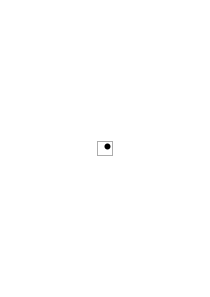
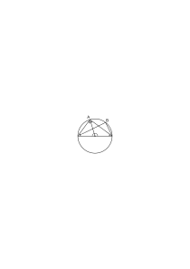
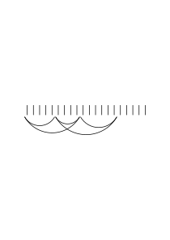
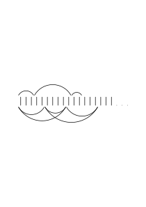
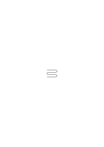
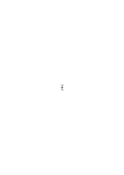

# Ms-155

### [1r\[1\]](https://cdn.wittgensteinnachlass.com/2000px/webp/Ms-155/1r.webp)

Es wäre also möglich zu sagen „jetzt sehe ich das nicht mehr als Rose sondern nur noch als Pflanze”!

Oder: „Jetzt sehe ich es nur als Rose nicht mehr als _diese_ Rose”.

### [1r\[2\]](https://cdn.wittgensteinnachlass.com/2000px/webp/Ms-155/1r.webp)

Ich sehe den Fleck

nur noch im Quadrat aber nicht mehr in einer bestimmten Lage”

### [1r\[3\]](https://cdn.wittgensteinnachlass.com/2000px/webp/Ms-155/1r.webp)

Der seelische Vorgang des Verstehens interessiert uns eben gar nicht: (Sowenig, wie der einer Intuition.)

### [1v\[1\]](https://cdn.wittgensteinnachlass.com/2000px/webp/Ms-155/1v.webp),[2r\[1\]](https://cdn.wittgensteinnachlass.com/2000px/webp/Ms-155/2r.webp)

„Es ist doch gar kein Zweifel, daß der welcher die Beispiele als beliebige Fälle zur Veranschaulichung des Begriffs versteht etwas anderes versteht, als der, welcher sie als bestimmt begrenzte Aufzählung auffaßt”. Sehr richtig, aber _was_ versteht der erste also was der zweite nicht versteht? Nun er sieht eben nur _Beispiele_ in den vorgezeigten Dingen die nur gewisse Züge aufzeigen sollen aber er meint nicht daß ich ihm im übrigen diese Dinge um ihrer selbst willen zeige. –

Ja aber ist es denn so daß er nun tatsächlich nur diese Züge an dem Ding sieht? Etwa am Blatt nur das was allen Blättern gemeinsam ist? Das wäre so als sähe er alles übrige „in blanco”. Also gleichsam ein unausgefülltes Formular in dem die wesentlichen Züge vorgedruckt sind. (Aber die Funktion „f( …)” ist ja so ein Formular.)

### [2r\[2\]](https://cdn.wittgensteinnachlass.com/2000px/webp/Ms-155/2r.webp),[2v\[1\]](https://cdn.wittgensteinnachlass.com/2000px/webp/Ms-155/2v.webp),[3r\[1\]](https://cdn.wittgensteinnachlass.com/2000px/webp/Ms-155/3r.webp)

Aber was ist denn das für ein Prozeß, wenn mir einer mehrere verschiedene Dinge als Beispiele eines Begriffs zeigt um mich darauf zu führen das Gemeinsame in ihnen zu sehen; & wenn ich es zu sehen trachte & nun wirklich sehe?

Er kann mich auch auf das Gemeinsame _aufmerksam machen_, – Bringt er aber dadurch hervor daß ich den Gegenstand anders _sehe_? Vielleicht auch denn ich kann jedenfalls besonders auf einen seiner Teile schauen während ich sonst auch alle andern gleichmäßig deutlich gesehen hätte. Aber dieses Sehen ist nicht das Verstehen des Begriffs. Denn wir sehen nicht etwas mit einer _leeren_ Argumentstelle.

### [3r\[2\]](https://cdn.wittgensteinnachlass.com/2000px/webp/Ms-155/3r.webp)

„Such aus diesen Federstielen die _so_ geformten heraus”. – – – „Ich wußte in _dem_ Fall nicht ob Du diesen auch noch wünschst.”

### [3r\[2\]](https://cdn.wittgensteinnachlass.com/2000px/webp/Ms-155/3r.webp),[3v\[1\]](https://cdn.wittgensteinnachlass.com/2000px/webp/Ms-155/3v.webp)

Man könnte auch fragen: Sieht der, welcher das Zeichen „∣∣∣ …” als Zeichen des Zahlbegriffs (im Gegensatz zu „∣∣∣” welches 3 bezeichnen soll”) auffaßt jene erste Gruppe von Strichen anders als die zweite? Aber auch wenn er sie anders, gleichsam vielleicht verschwommen sieht, _sieht_ er da etwa das wesentliche des Zahlbegriffs. Hieße das nicht daß er dann „∣∣∣ …” & „∣∣∣∣ …” tatsächlich nicht von einander müßte unterscheiden können (wenn ich ihm (nämlich) etwa den Trank eingegeben hätte der ihn den _Begriff_ sehen macht)?

### [3v\[2\]](https://cdn.wittgensteinnachlass.com/2000px/webp/Ms-155/3v.webp),[4r\[1\]](https://cdn.wittgensteinnachlass.com/2000px/webp/Ms-155/4r.webp),[4v\[1\]](https://cdn.wittgensteinnachlass.com/2000px/webp/Ms-155/4v.webp)

Denn wenn ich sage: Er versucht dadurch daß er uns mehrere Spezimina zeigt, daß wir das Gemeinsame in ihnen sehen & von dem übrigen absehen so heißt das eigentlich, daß das übrige in den Hintergrund tritt also gleichsam blasser wird (& warum soll es dann nicht ganz verschwinden können) & „das Gemeinsame”, etwa die Eiförmigkeit, allein im Vordergrund bleibt.

Aber so ist es nicht. Übrigens wären die mehreren Beispiele nur ein technisches Hilfsmittel & wenn ich einmal das Gewünschte gesehen hätte so könnte ich es auch in _einem_ Beispiel sehen. (Wie ja auch „(∃x)․fx” nur _ein_ Beispiel enthält.)

### [4v\[2\]](https://cdn.wittgensteinnachlass.com/2000px/webp/Ms-155/4v.webp)

Es sind also die Regeln die von dem Beispiel gelten, die es zum Beispiel machen.

### [4v\[3\]](https://cdn.wittgensteinnachlass.com/2000px/webp/Ms-155/4v.webp)

„Denk an eine Karte.”

### [4v\[4\]](https://cdn.wittgensteinnachlass.com/2000px/webp/Ms-155/4v.webp),[5r\[1\]](https://cdn.wittgensteinnachlass.com/2000px/webp/Ms-155/5r.webp)

Nun genügt aber doch heute jedenfalls das bloße Begriffswort ohne _eine_ Illustration um mir etwas verständlich zu machen. (Und die Geschichte des Verständnisses interessiert uns ja nicht). Z.B. Wenn mir einer sagt forme ein Osterei; & ich will doch nicht sagen daß ich etwa dabei den Begriff des Ostereis vor meinem inneren Aug sehe wenn ich diesen Befehl (& das Wort „Osterei”) verstehe.

### [5r\[2\]](https://cdn.wittgensteinnachlass.com/2000px/webp/Ms-155/5r.webp),[5v\[1\]](https://cdn.wittgensteinnachlass.com/2000px/webp/Ms-155/5v.webp),[6r\[1\]](https://cdn.wittgensteinnachlass.com/2000px/webp/Ms-155/6r.webp),[6v\[1\]](https://cdn.wittgensteinnachlass.com/2000px/webp/Ms-155/6v.webp),[7r\[1\]](https://cdn.wittgensteinnachlass.com/2000px/webp/Ms-155/7r.webp)

Wenn wir eine Anwendung des Begriffs, Pflanze (in einem besondern Fall) machen so schwebt uns gewiß nicht zuerst ein allgemeines Bild vor oder bei dem Hören des Wortes Pflanze das Bild des bestimmten Gegenstandes den ich darin als eine Pflanze bezeichne.

Sondern ich mache die Anwendung sozusagen ganz spontan.

Dennoch gibt es eine Anwendung von der ich sagen würde: nein das habe ich unter „Pflanze” nicht gemeint oder anderseits „ja das habe ich auch gemeint”. Aber heißt das daß mir diese Bilder vorgeschwebt haben & ich sie in meinem Geist ausdrücklich abgewiesen & zugelassen habe? – Und doch hat es diesen Anschein wenn ich sage: „ja das & das & das, das habe ich alles gemeint, aber _das_ nicht”. Man könnte aber fragen: ja, hast Du denn alle diese Fälle vorausgesehen? & die Antwort würde dann lauten „ja” oder „nein, aber ich dachte mir es solle etwas zwischen … & … sein” oder dergleichen. Meistens aber habe ich in diesem Moment gar keine Grenzen gezogen & diese ergeben sich nur auf einem Umweg durch eine Überlegung. Ich sage z.B. „bring mir noch eine ungefähr so große Blume zum Strauß” & es kommt eine & ich sage: Ja so eine habe ich gemeint. So erinnere ich mich wohl an ein Bild was mir vorschwebte aber aus diesem allen geht nicht hervor daß auch die gebrachte Nelke, noch zulässig ist. Sondern hier wende ich eben jenes Bild an.

Und diese Anwendung war eben nicht antizipiert worden.

_———— · ————_

### [7r\[2\]](https://cdn.wittgensteinnachlass.com/2000px/webp/Ms-155/7r.webp)

Auf keinem Umweg kann, was über eine Aufzählung von Einzelfällen gesagt ist die Erklärung der Allgemeinheit ergeben.

<math display="block">
  <mspace width="0.3em"/>
  <mo>(</mo>
  <mo>(</mo>
  <mi>a</mi>
  <mo>,</mo>
  <mtext>b)</mtext>
  <mo>,</mo>
  <mspace width="0.3em"/>
  <mo>(</mo>
  <mtext>c,</mtext>
  <mtext>d)</mtext>
  <mo>,</mo>
  <mspace width="0.3em"/>
  <mo>(</mo>
  <mi>e</mi>
  <mo>,</mo>
  <mtext>f,</mtext>
  <mtext>g)</mtext>
  <mo>)</mo>
  <mo>,</mo>
  <mspace width="0.3em"/>
  <mo>(</mo>
  <mo>[</mo>
  <mtext>unreadable]</mtext>
  <mo>)</mo>
</math>

### [7r\[3\]](https://cdn.wittgensteinnachlass.com/2000px/webp/Ms-155/7r.webp),[7v\[1\]](https://cdn.wittgensteinnachlass.com/2000px/webp/Ms-155/7v.webp),[8r\[1\]](https://cdn.wittgensteinnachlass.com/2000px/webp/Ms-155/8r.webp)

Ist es also so, daß der Befehl „bringe mir eine Blume” nie durch den Befehl ersetzt werden kann von der Form „bringe mir eine A oder B oder C”, sondern immer lauten muß „bringe mir eine A oder B oder C _oder eine andere Blume_”? Aber warum tut der allgemeine Satz so unbestimmt, wenn ich ja doch jeden Fall der wirklich eintrifft auch _hätte_ vorhersehen können? Aber eine Aufzählung ist ja wohl die größte die ich geben kann – in irgend einem Sinne vollständig (etwa die Aufzählung aller Fälle die mir im Leben vorgekommen sind) – & auch nach ihr wird das „oder eine andere” seinen Sinn behalten.

### [8r\[2\]](https://cdn.wittgensteinnachlass.com/2000px/webp/Ms-155/8r.webp),[8v\[1\]](https://cdn.wittgensteinnachlass.com/2000px/webp/Ms-155/8v.webp),[9r\[1\]](https://cdn.wittgensteinnachlass.com/2000px/webp/Ms-155/9r.webp)

Aber auch das scheint mir noch nicht den wichtigsten Punkt dieser Sache zu treffen. Weil es wieder nicht eigentlich auf die Unendlichkeit der Möglichkeiten ankommt sondern auf eine Art von Unbestimmtheit. Ja, gefragt wieviele Möglichkeiten es denn für einen Kreis gäbe im Gesichtsfeld innerhalb dem Viereck zu liegen könnte ich weder eine endliche Anzahl nennen, noch sagen es gäbe unendlich viele (wie etwa im Euklidischen Raum). Sondern wir kommen hier zwar nie zu einem Ende aber nicht in dem Sinn wie in der Zahlenreihe.

Sondern kein Ende wozu wir kommen ist wesentlich das Ende. Das heißt ich könnte immer sagen: ich seh' nicht ein warum das alle Möglichkeiten sein sollen. Und das heißt doch wohl, daß es _eben_ sinnlos ist von „allen Möglichkeiten” zu sprechen.

Der Begriff „Pflanze” & „Osterei” wird also von der Aufzählung _gar nicht angetastet_.

### [9r\[1\]](https://cdn.wittgensteinnachlass.com/2000px/webp/Ms-155/9r.webp),[9v\[1\]](https://cdn.wittgensteinnachlass.com/2000px/webp/Ms-155/9v.webp)

Würde fa darum im f(∃) untergehen weil dieses schon eine Disjunktion wäre, so würde eine Disjunktion der Art f(∃) ⌵ f(a) ⌵ f(b) ⌵ f(c) = f(a) ⌵ f(b) ⌵ f(c) sein. In Wirklichkeit liegt es aber in der Natur des f(∃) daß das nicht eintritt.

### [9v\[2\]](https://cdn.wittgensteinnachlass.com/2000px/webp/Ms-155/9v.webp),[10r\[1\]](https://cdn.wittgensteinnachlass.com/2000px/webp/Ms-155/10r.webp),[10v\[1\]](https://cdn.wittgensteinnachlass.com/2000px/webp/Ms-155/10v.webp),[11r\[1\]](https://cdn.wittgensteinnachlass.com/2000px/webp/Ms-155/11r.webp)

Wenn wir auch sagen wir hätten die besondere Befolgung f(a) immer voraussehen können, so haben wir sie doch in Wirklichkeit nicht vorausgesehen. Aber selbst wenn ich sie vorhersehe & ausdrücklich erlaube so verliert sie sich neben dem allgemeinen Satz & zwar, weil ich eben aus dem allgemeinen Satz ersehe daß auch dieser besondere Fall erlaubt ist & es nicht einfach aus der disjunktiv festgesetzten Erlaubnis dieses Falles ersehe. Denn steht der allgemeine Satz da so nützt mir das Hinzusetzen des besonderen Falles nichts mehr. Denn nur im allgemeinen Satz ist ja die Rechtfertigung dieses Zusatzes weil ich nur aus den allgemeinen Satz ersehen habe daß dieser Fall erlaubt ist. Und diese Erlaubnis so verstehen, daß der allgemeine Satz eine Disjunktion ist könnten wir nur, wenn wir ihn als eine bedingte Disjunktion definieren würden; denn nur dann ist er eine. Was hindert uns ihn so zu definieren? Nur, daß er keine Disjunktion ausdrückt sondern er wesentlich von einer Disjunktion verschieden ist. Nicht so daß die Disjunktion immer noch etwas übrig läßt, sondern daß sie das Wesentliche des allg. Satzes gar nicht berührt ja, wenn man sie diesem beifügt ihre Rechtfertigung erst von ihm nimmt.

_———— · ————_

### [11r\[2\]](https://cdn.wittgensteinnachlass.com/2000px/webp/Ms-155/11r.webp)

Unendliche Möglichkeiten. Was heißt: die Zahlenreihe ist unendlich?

### [11r\[3\]](https://cdn.wittgensteinnachlass.com/2000px/webp/Ms-155/11r.webp)

Das muß doch eine Bestimmung sein nicht die Konstatierung einer Tatsache.

### [11v\[1\]](https://cdn.wittgensteinnachlass.com/2000px/webp/Ms-155/11v.webp)

Darin hatte ich freilich recht, daß die unendliche Möglichkeit (z.B. unendliche Teilbarkeit) einer ganz andren grammatischen Kategorie angehört als die endliche (Möglichkeit in 3 Teile zu teilen). Aber damit ist noch nicht die Grammatik des Wortes „unendlich” _bestimmt_.

### [11v\[2\]](https://cdn.wittgensteinnachlass.com/2000px/webp/Ms-155/11v.webp),[12r\[1\]](https://cdn.wittgensteinnachlass.com/2000px/webp/Ms-155/12r.webp),[12v\[1\]](https://cdn.wittgensteinnachlass.com/2000px/webp/Ms-155/12v.webp)

Wenn ich z.B. sage Kardinalzahlen nenne ich alles was aus 1 durch fortgesetztes Addieren von 1 entsteht so vertritt das Wort „fortgesetzt” nicht eine nebelhafte Fortsetzung von 1, 1 + 1, 1 + 1 + 1, vielmehr ist auch das Zeichen „1, 1 + 1, 1 + 1 + 1, …” ganz exakt zu nehmen als verschieden von ” 1, 1 + 1, 1 + 1 + 1” anderen bestimmten Regeln unterworfen und nicht ein Vertreter einer Reihe „die ich nicht hinschreiben kann”.

### [12v\[2\]](https://cdn.wittgensteinnachlass.com/2000px/webp/Ms-155/12v.webp)

Das heißt mit dem Zeichen „1, 1 + 1, 1 + 1 + 1 …” wird auch _gerechnet_ wie mit den Zahlzeichen nur anders.

### [12v\[3\]](https://cdn.wittgensteinnachlass.com/2000px/webp/Ms-155/12v.webp),[13r\[1\]](https://cdn.wittgensteinnachlass.com/2000px/webp/Ms-155/13r.webp)

Was bildet man sich denn aber ein? Welchen Fehler macht man denn? Wofür hält man denn das Zeichen „1, 1 + 1, 1 + 1 + 1 …”? D.h.: wo kommt denn das _wirklich_ vor was man in diesem Zeichen zu sehen meint?

Etwa wenn ich sage „er zählte 1, 2, 3, 4, 5, 6, und so weiter bis Tausend”? wo es auch möglich wäre wirklich alle Zahlen hinzuschreiben.

_---_

### [13r\[2\]](https://cdn.wittgensteinnachlass.com/2000px/webp/Ms-155/13r.webp),[13v\[1\]](https://cdn.wittgensteinnachlass.com/2000px/webp/Ms-155/13v.webp)

Als was sieht man denn ‚1, 1 + 1, 1 + 1 + 1 …’ an? Als eine ungenaue Ausdrucksweise. Die Punkte sind so wie weitere Zahlzeichen die aber verschwommen sind. So als hörte man auf Zahlzeichen hinzuschreiben, weil man ja doch nicht alle hinschreiben könne aber als seien sie wohl ‚quasi’ in einer Kiste vorhanden.

### [13v\[2\]](https://cdn.wittgensteinnachlass.com/2000px/webp/Ms-155/13v.webp),[14r\[1\]](https://cdn.wittgensteinnachlass.com/2000px/webp/Ms-155/14r.webp)

Etwa auch wie wenn ich von einer Melodie nur die ersten Töne deutlich pfeife & den Rest nur noch andeute & im Nichts auslaufen lasse (oder wenn man beim Schreiben von einem Wort nur wenige Buchstaben deutlich schreibt & mit einem unartikulierten Strich endet) _wo dann dem undeutlich ein deutlich entspräche._

### [14r\[2\]](https://cdn.wittgensteinnachlass.com/2000px/webp/Ms-155/14r.webp),[14v\[1\]](https://cdn.wittgensteinnachlass.com/2000px/webp/Ms-155/14v.webp)

Es frägt sich auch wo denn der Zahlbegriff (oder Begriff der Kardinalzahl) unbedingt gebraucht wird. Zahl im Gegensatz wozu? [1, ξ, ξ + 1] wohl im Gegensatz zu [5, ξ, √ξ] u.s.w. – Denn wenn ich so ein Zeichen (wie [1, ξ, ξ + 1]) wirklich einführe (& nicht nur als Luxus mitschleppe), so muß ich auch etwas mit ihm tun d.h. es in einem Kalkül verwenden & dann verliert es seine Alleinherrlichkeit & kommt in ein System ihm koordinierter Zeichen.)

### [14v\[2\]](https://cdn.wittgensteinnachlass.com/2000px/webp/Ms-155/14v.webp),[15r\[1\]](https://cdn.wittgensteinnachlass.com/2000px/webp/Ms-155/15r.webp)

Man wird sagen: aber Kardinalzahl steht doch im Gegensatz zu Rationalzahl, reelle Zahl etc. Aber dieser Unterschied ist ein Unterschied der Regeln (der von ihnen geltenden Spielregeln) – nicht einer der Stellung auf dem Schachbrett – nicht ein Unterschied für den man im selben Kalkül verschiedene koordinierte Worte braucht.

### [15r\[2\]](https://cdn.wittgensteinnachlass.com/2000px/webp/Ms-155/15r.webp)

Wir sagen nicht daß, ein Satz wenn er für x = 1 bewiesen ist, & gezeigt ist daß er für x = c + 1 gilt wenn für x = c

### [15r\[3\]](https://cdn.wittgensteinnachlass.com/2000px/webp/Ms-155/15r.webp),[15v\[1\]](https://cdn.wittgensteinnachlass.com/2000px/webp/Ms-155/15v.webp)

Wir sagen nicht, daß der Satz fx wenn f1 gilt & aus fc fc + 1 folgt _also_ für alle Kardinalzahlen wahr ist sondern „der Satz gilt für alle Kardinalzahlen” _heißt_ „er gilt für 1 + f(c + 1) folgt aus f(c).”

### [15v\[2\]](https://cdn.wittgensteinnachlass.com/2000px/webp/Ms-155/15v.webp),[16r\[1\]](https://cdn.wittgensteinnachlass.com/2000px/webp/Ms-155/16r.webp)

Wie aber weiß ich 28 + (45 + 17) = (28 + 45) + 17 ohne es bewiesen zu haben? Wie kann mir ein allgemeiner Beweis einen besonderen Beweis schenken.

Denn ich könnte doch den besondern Beweis führen & wie kollidieren dann die beiden Beweise & wie, wenn sie nicht übereinstimmen.

### [16r\[2\]](https://cdn.wittgensteinnachlass.com/2000px/webp/Ms-155/16r.webp)

Und hier ist ja der Zusammenhang mit der Allgemeinheit in endlichen Bereichen ganz klar, denn eben das wäre in einem endlichen Bereich allerdings der Beweis dafür daß fx für alle Werte von x gilt & _eben das_ ist der Grund warum wir auch im arithmetischen Fall sagen fx gelte für alle Zahlen.

### [16v\[1\]](https://cdn.wittgensteinnachlass.com/2000px/webp/Ms-155/16v.webp)

Und wenn man nun fragt: ja _kann_ denn etwas anders bei dem besondern Beweis herauskommen als 28 + (45 + 17) = (28 + 45) + 17, so müßte ich antworten freilich kann etwas anderes herauskommen (wenn dieses Herauskommen eine unabhängige Tatsache ist) aber wenn etwas andres herauskommt so werde ich sagen ich habe mich verrechnet.

### [17r\[1\]](https://cdn.wittgensteinnachlass.com/2000px/webp/Ms-155/17r.webp)

Aber ich würde doch sagen: Der allgemeine Beweis zeigt schon, daß nichts anders herauskommen kann.

Aber so verhält es sich doch auch mit einem allgemeinen geometrischen Beweis; etwa daß der Winkel im Halbkreis ein rechter ist.

### [17r\[2\]](https://cdn.wittgensteinnachlass.com/2000px/webp/Ms-155/17r.webp),[17v\[1\]](https://cdn.wittgensteinnachlass.com/2000px/webp/Ms-155/17v.webp)

Ich nehme den Satz dann auch für einen andern Fall als bewiesen an; könnte ihn aber auch für diesen Fall ausdrücklich beweisen.

### [17v\[2\]](https://cdn.wittgensteinnachlass.com/2000px/webp/Ms-155/17v.webp)

Zuerst ist es nötig klar zu sehen daß wir keine Tatsache beweisen. Denn weil es sich in dem einen Fall so verhält, wie kann ich wissen daß es sich in dem anderen so verhält? Und ein sich verhalten müssen gibt es nicht. Ist es nicht so so kann man auch nichts machen. Nur was von uns abhängt können wir im voraus _bestimmen_.

### [17v\[3\]](https://cdn.wittgensteinnachlass.com/2000px/webp/Ms-155/17v.webp),[18r\[1\]](https://cdn.wittgensteinnachlass.com/2000px/webp/Ms-155/18r.webp),[18v\[1\]](https://cdn.wittgensteinnachlass.com/2000px/webp/Ms-155/18v.webp)

Der Beweis kann also nichts prophezeien. Ist der Beweis für A ausgeführt auch der Beweis für B, so daß es ganz gleichgültig ist in welchem Dreieck er gezeichnet ist. Und wenn er also in beiden Dreiecken gezeichnet wäre nur _derselbe_ Beweis wiederholt wäre? Das also das Zeichen des Beweises – der Beweis als Zeichen – ebensogut aus der Konstruktion in A & dem Dreieck B bestehen könnte wie aus diesem Dreieck & in einer Konstruktion in ihm.

### [18v\[2\]](https://cdn.wittgensteinnachlass.com/2000px/webp/Ms-155/18v.webp)

<math display="block">
  <mo>[</mo>
  <mn>1</mn>
  <mspace width="0.3em"/>
  <mn>23</mn>
  <mspace width="0.3em"/>
  <mn>45</mn>
  <mspace width="0.3em"/>
  <mtext>6See</mtext>
  <mspace width="0.3em"/>
  <mtext>facsimile;</mtext>
  <mspace width="0.3em"/>
  <mtext>connecting</mtext>
  <mspace width="0.3em"/>
  <mtext>lines</mtext>
  <mspace width="0.3em"/>
  <mtext>to</mtext>
  <mspace width="0.3em"/>
  <mtext>formula.</mtext>
  <mo>(</mo>
  <mi>x</mi>
  <mspace width="0.3em"/>
  <mo>+</mo>
  <mspace width="0.3em"/>
  <mtext>y)</mtext>
  <mtext>²</mtext>
  <mspace width="0.3em"/>
  <mo>=</mo>
  <mspace width="0.3em"/>
  <mtext>∙</mtext>
  <mspace width="0.3em"/>
  <mtext>∙</mtext>
  <mspace width="0.3em"/>
  <mtext>∙</mtext>
  <mspace width="0.3em"/>
  <mtext>∙</mtext>
  <mspace width="0.3em"/>
  <mo>=</mo>
  <mspace width="0.3em"/>
  <mtext>x²</mtext>
  <mspace width="0.3em"/>
  <mo>+</mo>
  <mspace width="0.3em"/>
  <mtext>2xy</mtext>
  <mspace width="0.3em"/>
  <mo>+</mo>
  <mspace width="0.3em"/>
  <mtext>y²]</mtext>
</math>

Der Beweis daß (3 + 4)² = 3² + 2 ∙ 3 ∙ 4 + 4² bestünde dann in meiner Sprachen in <math display="inline"><mo>[</mo><mn>3</mn><mspace width="0.3em"/><mtext>4See</mtext><mspace width="0.3em"/><mtext>facsimile;</mtext><mspace width="0.3em"/><mtext>connecting</mtext><mspace width="0.3em"/><mtext>lines</mtext><mspace width="0.3em"/><mtext>to</mtext><mspace width="0.3em"/><mtext>formula.</mtext><mo>(</mo><mi>x</mi><mspace width="0.3em"/><mo>+</mo><mspace width="0.3em"/><mtext>y)</mtext><mtext>²]</mtext><mspace width="0.3em"/><mo>=</mo><mspace width="0.3em"/><mtext>…</mtext></math> & könnte auch in <math display="inline"><mo>[</mo><mn>3</mn><mspace width="0.3em"/><mtext>4See</mtext><mspace width="0.3em"/><mtext>facsimile;</mtext><mspace width="0.3em"/><mtext>connecting</mtext><mspace width="0.3em"/><mtext>lines</mtext><mspace width="0.3em"/><mtext>to</mtext><mspace width="0.3em"/><mtext>formula.</mtext><mo>(</mo><mn>5</mn><mspace width="0.3em"/><mo>+</mo><mspace width="0.3em"/><mtext>6)</mtext><mtext>²]</mtext><mspace width="0.3em"/><mo>=</mo><mspace width="0.3em"/><mtext>…</mtext></math> bestehen.

### [18v\[3\]](https://cdn.wittgensteinnachlass.com/2000px/webp/Ms-155/18v.webp),[19r\[1\]](https://cdn.wittgensteinnachlass.com/2000px/webp/Ms-155/19r.webp)

Das heißt es darf mir der Beweis an 45,17 & 28 durchgeführt keine größere Sicherheit geben als der „allgemeine”. Oder aber die beiden müssen gänzlich unabhängig sein. Aber dann nicht _unabhängige_ Beweise _desselben_, denn das ist Unsinn (sie hängen ja durch dasselbe Ende zusammen).

### [19r\[2\]](https://cdn.wittgensteinnachlass.com/2000px/webp/Ms-155/19r.webp)

_Wie_ macht mich der allgemeine Induktionsbeweis sicher daß der besondere das ergeben wird?

### [19v\[1\]](https://cdn.wittgensteinnachlass.com/2000px/webp/Ms-155/19v.webp)

(Verachte nur nicht die simplen Kalküle wie sie jedes Kind & jeder Krämer benutzt.)

### [19v\[2\]](https://cdn.wittgensteinnachlass.com/2000px/webp/Ms-155/19v.webp),[20r\[1\]](https://cdn.wittgensteinnachlass.com/2000px/webp/Ms-155/20r.webp)

Dies muß auch ein vollkommen strenger Beweis des assoziativen Gesetzes sein.

Und hier kann man die beiden Fälle deutlich unterscheiden von denen wir im früheren geometrischen Beweis sprachen.

Denn die Figur kann als allgemeiner Beweis gelten & auch nur als Beweis von 5 + (4 + 6) = (5 + 4) + 6 und ich kann den Beweis von 3 + (7 + 2) = (3 + 7) + 2 so hinschreiben

…

Ich habe den Beweis nur unten ausgeführt (die Konstruktion gezeichnet).

### [20r\[2\]](https://cdn.wittgensteinnachlass.com/2000px/webp/Ms-155/20r.webp),[20v\[1\]](https://cdn.wittgensteinnachlass.com/2000px/webp/Ms-155/20v.webp)

Ein Kalkül ist nicht strenger als ein anderer! Man muß nur die Grenzen eines jeden kennen.

Nur insofern kann man einen Kalkül weniger streng nennen als einen andern, als seine Regeln nicht klar formuliert sind.

_———— · ————_

### [20v\[2\]](https://cdn.wittgensteinnachlass.com/2000px/webp/Ms-155/20v.webp)

Man sieht den Induktionsbeweis als einen gleichsam indirekten Beweis der Allgemeingültigkeit an. (Aber in der Logik ist nichts hinter dem was wir sehen.)

### [21r\[1\]](https://cdn.wittgensteinnachlass.com/2000px/webp/Ms-155/21r.webp)

Mit sweeping statements ist in der Philosophie nichts gemacht sondern es muß alles genau dargestellt werden

### [21r\[2\]](https://cdn.wittgensteinnachlass.com/2000px/webp/Ms-155/21r.webp),[21v\[1\]](https://cdn.wittgensteinnachlass.com/2000px/webp/Ms-155/21v.webp)

Simplicissimus: Rätsel der Technik

(Bild: Zwei Professoren vor einer im Bau befindlichen Brücke) (Stimme von oben:) „Laß abi – – – hoah – – – laß abi sag'i – – – nacha drah'n mer'n anders um!” – – – – – – „Es ist doch unfaßlich, Herr Kollega, daß eine so komplizierte, & exakte Arbeit in dieser Sprache zustande kommen kann!”

Hat der Gesichtsraum einen Mittelpunkt? – Es hat Sinn in einem Bild ein Kreuzchen

anzubringen & zu sagen schau auf das Kreuz. Du wirst zwar dann noch immer das andre sehen aber das Kreuz ab dann „im Mittelpunkt”

### [21v\[2\]](https://cdn.wittgensteinnachlass.com/2000px/webp/Ms-155/21v.webp),[22r\[1\]](https://cdn.wittgensteinnachlass.com/2000px/webp/Ms-155/22r.webp)

Alle Überlegungen können viel hausbackener angestellt werden als ich sie früher angestellt habe. Und darum brauchen in der Philosophie auch keine neuen Wörter angewendet werden sondern die alten reichen aus.

### [22r\[2\]](https://cdn.wittgensteinnachlass.com/2000px/webp/Ms-155/22r.webp)

„Ist das ein Beweis dieses Satzes?” Wird er als Beweis _gebraucht_? Wenn ja, warum soll ich ihn nicht einen Beweis nennen?

### [22r\[3\]](https://cdn.wittgensteinnachlass.com/2000px/webp/Ms-155/22r.webp),[22v\[1\]](https://cdn.wittgensteinnachlass.com/2000px/webp/Ms-155/22v.webp)

(Jede Multiplikation _16 × 25_ ist ein Beweis. Sie entscheidet, daß 16 × 25 … ist & nichts andres & wird wirklich als Beweis dafür gebraucht.)

_———— · ————_

### [22v\[2\]](https://cdn.wittgensteinnachlass.com/2000px/webp/Ms-155/22v.webp)

Wenn man die irrationalen Zahlen einführt, tut man immer so als hätte man nun etwas Neues entdeckt während es sich nicht um eine neue Entdeckung sondern um eine neue Konstruktion handelt (die man dann auch „Zahl” nennen kann oder nicht)

### [22v\[3\]](https://cdn.wittgensteinnachlass.com/2000px/webp/Ms-155/22v.webp),[23r\[1\]](https://cdn.wittgensteinnachlass.com/2000px/webp/Ms-155/23r.webp)

Angenommen wir nennten den Satz, daß 7 durch keine der ihr vorhergehenden Zahlen außer 1 teilbar ist das Gesetz der heiligen Zahl, & würden es aussprechen: „7 ist die heilige Zahl”. Dann hätten wir hier einen ähnlichen Fall wie den des „Hauptsatzes der Arithmetik” & anderer die eigentlich eine individuelle Rechnung benennen die wir den Beweis jenes Satzes nennen.

### [23r\[1\]](https://cdn.wittgensteinnachlass.com/2000px/webp/Ms-155/23r.webp),[23v\[1\]](https://cdn.wittgensteinnachlass.com/2000px/webp/Ms-155/23v.webp)

Nur für einen solchen „Satz der Mathematik” gibt es verschiedene unabhängige Beweise. Die von einander unabhängigen Rechnungen enthalten nämlich willkürlich den gleichen Namen.

### [23v\[2\]](https://cdn.wittgensteinnachlass.com/2000px/webp/Ms-155/23v.webp),[24r\[1\]](https://cdn.wittgensteinnachlass.com/2000px/webp/Ms-155/24r.webp)

Ich brauche nicht zu _behaupten_ man müsse die n Wurzeln der Gleichung n-ten Grades konstruieren können sondern ich sage nur daß der Satz „diese Gleichung hat n Wurzeln” etwas _anderes_ heißt wenn ich ihn durch Abzählen der konstruierten Wurzeln & wenn ich ihn anderswie bewiesen habe. Finde ich aber eine Formel für die Wurzeln einer Gleichung so habe ich einen neuen Kalkül konstruiert & keine Lücke eines alten ausgefüllt.

### [24r\[2\]](https://cdn.wittgensteinnachlass.com/2000px/webp/Ms-155/24r.webp),[24v\[1\]](https://cdn.wittgensteinnachlass.com/2000px/webp/Ms-155/24v.webp)

Es ist daher Unsinn zu sagen der Satz … ist erst bewiesen wenn man eine solche Konstruktion aufzeigt. Denn dann haben wir eben etwas Neues konstruiert & was wir jetzt unter dem Hauptsatz verstehen ist eben der _gegenwärtige_ ‚Beweis’.

### [24v\[2\]](https://cdn.wittgensteinnachlass.com/2000px/webp/Ms-155/24v.webp)

Zu fürchten es könne also der Arithm. diese Stütze entrissen werden ist Blödsinn.

_———— · ————_

### [24v\[3\]](https://cdn.wittgensteinnachlass.com/2000px/webp/Ms-155/24v.webp),[25r\[1\]](https://cdn.wittgensteinnachlass.com/2000px/webp/Ms-155/25r.webp)

Die Frage ist wie geht denn jetzt der Kalkül weiter nachdem die Grundgesetze durch Induktion bewiesen sind?

### [25r\[2\]](https://cdn.wittgensteinnachlass.com/2000px/webp/Ms-155/25r.webp)

Am Schluß mache ich immer nur auf etwas aufmerksam (und stelle solche Observations zusammen.)

_———— · ————_

### [25r\[3\]](https://cdn.wittgensteinnachlass.com/2000px/webp/Ms-155/25r.webp),[25v\[1\]](https://cdn.wittgensteinnachlass.com/2000px/webp/Ms-155/25v.webp)

„Definitionen führen nur praktische Abkürzungen ein, aber wir könnten auch ohne sie auskommen.” Aber wie ist es hier mit der rekursiven Definition?

### [25v\[2\]](https://cdn.wittgensteinnachlass.com/2000px/webp/Ms-155/25v.webp)

Anwendung der Regel a + (b + 1) = (a + b) + 1 kann man zweierlei nennen. 4 + (2 + 1) = (4 + 2) + 1 ist in dem _einen_ Sinn eine Anwendung, in dem andern erst:

4 + (2 + 1) = ((4 + 1) + 1) + 1 = (4 + 2) + 1

### [25v\[3\]](https://cdn.wittgensteinnachlass.com/2000px/webp/Ms-155/25v.webp),[26r\[1\]](https://cdn.wittgensteinnachlass.com/2000px/webp/Ms-155/26r.webp)

Das Resultat der Rechnung … ist 5 + (4 + 3) = (5 + 4) + 3 außerdem hat sie aber auch in einem andere Sinne ein Ergebnis. Kann man dieses nun ebenso in der Gleichung a + (b + c) = (a + b) + c ausdrücken wie das erste durch 5 + (4 + 3) = (5 + 4) + 3?

_———— · ————_

### [26r\[2\]](https://cdn.wittgensteinnachlass.com/2000px/webp/Ms-155/26r.webp),[26v\[1\]](https://cdn.wittgensteinnachlass.com/2000px/webp/Ms-155/26v.webp)

Was ein geometrischer Satz bedeutet, welche Allgemeinheit er hat, das muß sich alles zeigen, wenn wir sehen wie er angewendet wird. Denn wenn einer auch etwas Unfaßbares mit ihm _meinte_, so hilft ihm das nicht da er ihn ja doch nur ganz offenbar & jedem verständlich anwenden kann. Wenn sich etwa jemand unter dem Schachkönig auch etwas mystisches vorstellt so kümmert uns das nicht, weil er ja doch mit ihm nur auf den 8 × 8 Feldern des Schachbretts ziehen kann.

### [27r\[1\]](https://cdn.wittgensteinnachlass.com/2000px/webp/Ms-155/27r.webp)

a + (b + c) = (a + b) + c kann doch nun eine _Abkürzung_ des Induktionsbeweises sein.

### [27r\[2\]](https://cdn.wittgensteinnachlass.com/2000px/webp/Ms-155/27r.webp)

Denn wir müßten ja im Notfall mit den Induktionsbeweisen als Einheiten alles kalkulieren können.

### [27r\[3\]](https://cdn.wittgensteinnachlass.com/2000px/webp/Ms-155/27r.webp),[27v\[1\]](https://cdn.wittgensteinnachlass.com/2000px/webp/Ms-155/27v.webp)

Was immer die Regel a + (b + c) = (a + b) + c rechtfertigt kann auch der Induktions-Beweis rechtfertigen.

### [27v\[2\]](https://cdn.wittgensteinnachlass.com/2000px/webp/Ms-155/27v.webp)

Man kann nicht eine Rechnung als den Beweis eines Satzes bestimmen.

### [27v\[3\]](https://cdn.wittgensteinnachlass.com/2000px/webp/Ms-155/27v.webp)

(Ich möchte sagen): _Muß_ man diese Rechnungen den Beweis des Satze a + (b + c) = (a + b) + c nennen? D.h. tut's keine andere Beziehung.

### [27v\[4\]](https://cdn.wittgensteinnachlass.com/2000px/webp/Ms-155/27v.webp),[28r\[1\]](https://cdn.wittgensteinnachlass.com/2000px/webp/Ms-155/28r.webp)

Auch in der herkömmlichen Auffassung gibt der Induktionsbeweis nicht vor a + (b + c) = (a + b) + c zu beweisen sondern nur zu beweisen, daß dieser Satz für alle Zahlen gilt.

### [28r\[2\]](https://cdn.wittgensteinnachlass.com/2000px/webp/Ms-155/28r.webp)

Der Induktionsbeweis scheint _eine_ Einheit zu sein & nicht aus den einzelnen Übergängen als seinen Einheiten zu bestehen.

### [28r\[3\]](https://cdn.wittgensteinnachlass.com/2000px/webp/Ms-155/28r.webp),[28v\[1\]](https://cdn.wittgensteinnachlass.com/2000px/webp/Ms-155/28v.webp)

So ist z.B. das Resultat der Division 1:3 auf 2 Stellen ausgerechnet 0∙33 aber außerdem sieht man in dieser Division die Periodizität & die ist nicht in dem Sinne ein Resultat wie der Quotient 0∙33.

### [28v\[2\]](https://cdn.wittgensteinnachlass.com/2000px/webp/Ms-155/28v.webp)

Wir könnten ja den Induktionsbeweis sehr wohl eine periodische Rechnung nennen.

### [28v\[3\]](https://cdn.wittgensteinnachlass.com/2000px/webp/Ms-155/28v.webp),[29r\[1\]](https://cdn.wittgensteinnachlass.com/2000px/webp/Ms-155/29r.webp)

Und ihr Resultat a + (b + c) = (a + b) + c wäre dann mit 0˙3 analog dagegen die Enden der Schlußkette mit 0˙33. Ich möchte sagen: Ich konnte doch nicht darauf ausgehen die Periodizität in der Rechnung zu finden, – außer wenn ich schon eine habe & eine Methode mit ihrer Hilfe andere zu erzeugen.

### ([VB](/w-vb/#ms-155-29r.2+29v.1)) [29r\[2\]](https://cdn.wittgensteinnachlass.com/2000px/webp/Ms-155/29r.webp),[29v\[1\]](https://cdn.wittgensteinnachlass.com/2000px/webp/Ms-155/29v.webp) {#29r229v1}

[Ein schönes Kleid das sich in Würmer & Schlangen verwandelt (gleichsam koaguliert) wenn der welcher es trägt sich darin selbstgefällig in dem Spiegel schönt].

### [29v\[2\]](https://cdn.wittgensteinnachlass.com/2000px/webp/Ms-155/29v.webp),[30r\[1\]](https://cdn.wittgensteinnachlass.com/2000px/webp/Ms-155/30r.webp)

Man kann die Rechnung als Ornament betrachten. Eine Figur in der Ebene kann an eine andere passen oder nicht mit anderen in verschiedener Weise zusammengepaßt werden. Wenn die Figur noch gefärbt ist, so gibt es dann noch ein passen in Bezug auf die Farbe. (Die Farbe ist nur eine weitere Dimension)

### [30r\[2\]](https://cdn.wittgensteinnachlass.com/2000px/webp/Ms-155/30r.webp)

Die Rechnung als Ornament zu betrachten, das ist auch Formalismus, aber einer guten Art.

### [30r\[3\]](https://cdn.wittgensteinnachlass.com/2000px/webp/Ms-155/30r.webp),[30v\[1\]](https://cdn.wittgensteinnachlass.com/2000px/webp/Ms-155/30v.webp)

Wenn ich den Satz mit einem Maßstab verglichen habe, so habe ich, streng genommen, nur einen Satz der mit Hilfe des Maßstabes eine Länge aussagt als Beispiel für alle Sätze herangezogen

_———— · ————_

### [30v\[2\]](https://cdn.wittgensteinnachlass.com/2000px/webp/Ms-155/30v.webp),[31r\[1\]](https://cdn.wittgensteinnachlass.com/2000px/webp/Ms-155/31r.webp)

(Daß einer den Andern verachtet wenn schon unbewußt (Paul Ernst) heißt, es kann dem Verachtenden klargemacht werden wenn man ihn eine bestimmte Situation die in Wirklichkeit noch nie eingetreten ist & wohl nie eintreten wird vor Augen stellt & er zugeben muß daß er dann so & so handeln würde.)

### [31r\[2\]](https://cdn.wittgensteinnachlass.com/2000px/webp/Ms-155/31r.webp),[31v\[1\]](https://cdn.wittgensteinnachlass.com/2000px/webp/Ms-155/31v.webp)

Daß man die Gleichung A dem Komplex B zuordnet, <math display="inline"><mi>B</mi><mspace width="0.3em"/><mtext>–</mtext><mspace width="0.3em"/><mtext>–</mtext><mspace width="0.3em"/><mtext>–</mtext><mspace width="0.3em"/><mtext>–</mtext><mspace width="0.3em"/><mtext>–</mtext><mspace width="0.3em"/><mtext>–</mtext><mspace width="0.3em"/><mtext>–</mtext><mspace width="0.3em"/><mtext>–</mtext><mspace width="0.3em"/><mtext>–</mtext><mspace width="0.3em"/><mo>|</mo><mspace width="0.3em"/><mo>|</mo><mi>A</mi><mtext><mo>}</mo></mtext><mspace width="0.3em"/><mtext>–</mtext><mspace width="0.3em"/><mtext>–</mtext><mspace width="0.3em"/><mtext>–</mtext></math> heißt daß eine Gleichung von der Art A die Multiplizität hat, die man in dem Komplex B sieht, d.h. daß man so viel an dieser Gleichung unterscheiden kann (oder soviele Unterschiede an ihr machen kann) wie an dem Komplex.

_————|————_

### [31v\[2\]](https://cdn.wittgensteinnachlass.com/2000px/webp/Ms-155/31v.webp),[32r\[1\]](https://cdn.wittgensteinnachlass.com/2000px/webp/Ms-155/32r.webp)

D.h. daß das Ornament des Komplexes soviel Paßflächen hat wie das der Gleichung

& die übrige Mannigfaltigkeit des Komplexes wegfällt wie die des Fünfecks so daß man es was sein Zusammenfassen mit anderen Figuren betrifft nur durch seine Kontur ersetzen könnte

& die Gleichung zieht in diesem Sinne die Kontur des Komplexes nach.

_————|————_

### [32r\[2\]](https://cdn.wittgensteinnachlass.com/2000px/webp/Ms-155/32r.webp)

Zwischen B & A könnte man das Gleichheitszeichen setzen.

### [32r\[3\]](https://cdn.wittgensteinnachlass.com/2000px/webp/Ms-155/32r.webp),[32v\[1\]](https://cdn.wittgensteinnachlass.com/2000px/webp/Ms-155/32v.webp)

Ist es so: Der Satz A enthält nichts anders als B, ja ist eine Abkürzung von B. Ich kann aber doch nicht sagen, daß B mittels a + (b + c) = (a + b) + c bewiesen würde. Das heißt ja natürlich gar nichts. – Nur β & γ wurden mit α bewiesen. –

### [32v\[2\]](https://cdn.wittgensteinnachlass.com/2000px/webp/Ms-155/32v.webp)

Und α, β & γ wurden eben zusammengestellt. Sie wurden herausgegriffen & etwas Neues aus ihnen gemacht

### [32v\[3\]](https://cdn.wittgensteinnachlass.com/2000px/webp/Ms-155/32v.webp),[33r\[1\]](https://cdn.wittgensteinnachlass.com/2000px/webp/Ms-155/33r.webp)

Es läßt sich nicht zeigen beweisen daß man gewisse Regeln als Regeln dieser Handlungsweise gebrauchen _kann_.

### [33r\[2\]](https://cdn.wittgensteinnachlass.com/2000px/webp/Ms-155/33r.webp)

Hier in Österreich halten die Maschinen die Menschen noch im Geleise.

_———— · ————_

### [33r\[3\]](https://cdn.wittgensteinnachlass.com/2000px/webp/Ms-155/33r.webp),[33v\[1\]](https://cdn.wittgensteinnachlass.com/2000px/webp/Ms-155/33v.webp),[34r\[1\]](https://cdn.wittgensteinnachlass.com/2000px/webp/Ms-155/34r.webp)

(a + b) + 1 = (a + b) + 1

a + (b + (c + 1)) = (a + (b + c)) + 1 } (a + b) + c = (a + b) + c

(a + b) + (c + 1) = ((a + b) + c) + 1

(a + 1) + 1 = (a + 1) + 1

}a + 1 = 1 + a

1 + (a + 1) = (1 + a) + 1 a + b = b + a

a + (b + 1) = (a + b) + 1

((b + 1) + a) = (b + a) + 1

(b + 1) + a II = (1 + b) + aI = 1 + (b + a) II = (b + a) + 1

1 + (b + a) = (1 + b) + a

### [34r\[2\]](https://cdn.wittgensteinnachlass.com/2000px/webp/Ms-155/34r.webp)

(a + b) ∙ (a + b) = a ∙ a + 2ab + b ∙ b

(1 + 1 + 1) + (1 + 1 ∙ 1 + 1) =

(a + b) = b + a

### [34v\[1\]](https://cdn.wittgensteinnachlass.com/2000px/webp/Ms-155/34v.webp),[35r\[1\]](https://cdn.wittgensteinnachlass.com/2000px/webp/Ms-155/35r.webp)

„Dieser Satz ist für alle Zahlen durch das rekursive Verfahren bewiesen”. Das ist der Ausdruck der so ganz irreführend ist. Es klingt so als würde hier ein Satz der konstatiert daß dies & dies für alle Kardinalzahlen gilt auf einem Wege als wahr erwiesen & als sei dieser Weg ein Weg in einem Raum denkbarer Wege. Während die Rekursion in _Wahrheit_ nur sich selber zeigt wie auch die Periodizität.

### [35r\[2\]](https://cdn.wittgensteinnachlass.com/2000px/webp/Ms-155/35r.webp)

Auch die Analogie des rekursiven Beweises mit der Periodizität ist nicht ganz klar herausgearbeitet.

### [35v\[1\]](https://cdn.wittgensteinnachlass.com/2000px/webp/Ms-155/35v.webp)

1 + (1 + (1 + 1)) = 1 + ((1 + 1) + 1)

a + (b + (c + 1)) = a + ((b + c) + 1) = (a + (b + c)) + 1 also analog

1 + (1 + (1 + 1)) = 1 + ((1 + 1) + 1) = (1 + (1 + 1)) + 1 also brauchte ich als Definitionen:

1 + (1 + 1) = ((1 + 1) + 1 _und_ 1 + ((1 + 1) + 1) = (1 + (1 + 1)) + 1 und (1 + 1) + (1 + 1) = ((1 + 1) + 1) + 1 1 + (1 + 1) = (1 + 1) + 1

---

### [36r\[1\]](https://cdn.wittgensteinnachlass.com/2000px/webp/Ms-155/36r.webp)

1 + (1 + (1 + 1)) = (1 + (1 + 1)) + 1

(1 + 1) + (1 + 1) = ((1 + 1) + 1) + 1

---

Wie beweist man das?

(1 + 1) + (1 + (1 + 1)) = ((1 + 1) + 1) + (1 + 1) =

_———— · ————_

### [36v\[1\]](https://cdn.wittgensteinnachlass.com/2000px/webp/Ms-155/36v.webp)

<math display="block">
  <mspace width="0.3em"/>
  <mi>a</mi>
  <mspace width="0.3em"/>
  <mo>+</mo>
  <mspace width="0.3em"/>
  <mo>(</mo>
  <mi>b</mi>
  <mspace width="0.3em"/>
  <mo>+</mo>
  <mspace width="0.3em"/>
  <mtext>1)</mtext>
  <mspace width="0.3em"/>
  <mo>=</mo>
  <mspace width="0.3em"/>
  <mo>(</mo>
  <mi>a</mi>
  <mspace width="0.3em"/>
  <mo>+</mo>
  <mspace width="0.3em"/>
  <mtext>b)</mtext>
  <mspace width="0.3em"/>
  <mo>+</mo>
  <mspace width="0.3em"/>
  <mn>1</mn>
  <mspace width="0.3em"/>
  <mi>a</mi>
  <mspace width="0.3em"/>
  <mo>+</mo>
  <mspace width="0.3em"/>
  <mo>(</mo>
  <mi>b</mi>
  <mspace width="0.3em"/>
  <mo>+</mo>
  <mspace width="0.3em"/>
  <mo>(</mo>
  <mi>c</mi>
  <mspace width="0.3em"/>
  <mo>+</mo>
  <mspace width="0.3em"/>
  <mtext>1)</mtext>
  <mo>)</mo>
  <mspace width="0.3em"/>
  <mo>=</mo>
  <mspace width="0.3em"/>
  <mi>a</mi>
  <mspace width="0.3em"/>
  <mo>+</mo>
  <mspace width="0.3em"/>
  <mo>(</mo>
  <mi>b</mi>
  <mspace width="0.3em"/>
  <mo>+</mo>
  <mspace width="0.3em"/>
  <mtext>c)</mtext>
  <mo>)</mo>
  <mspace width="0.3em"/>
  <mo>+</mo>
  <mspace width="0.3em"/>
  <mtext>1)</mtext>
  <mspace width="0.3em"/>
  <mo>(</mo>
  <mi>a</mi>
  <mspace width="0.3em"/>
  <mo>+</mo>
  <mspace width="0.3em"/>
  <mtext>b)</mtext>
  <mspace width="0.3em"/>
  <mo>+</mo>
  <mspace width="0.3em"/>
  <mo>(</mo>
  <mi>c</mi>
  <mspace width="0.3em"/>
  <mo>+</mo>
  <mspace width="0.3em"/>
  <mtext>1)</mtext>
  <mspace width="0.3em"/>
  <mo>=</mo>
  <mspace width="0.3em"/>
  <mo>(</mo>
  <mo>(</mo>
  <mi>a</mi>
  <mspace width="0.3em"/>
  <mo>+</mo>
  <mspace width="0.3em"/>
  <mtext>b)</mtext>
  <mspace width="0.3em"/>
  <mo>+</mo>
  <mspace width="0.3em"/>
  <mtext>c)</mtext>
  <mspace width="0.3em"/>
  <mo>+</mo>
  <mspace width="0.3em"/>
  <mn>1</mn>
  <mspace width="0.3em"/>
  <mo>|</mo>
  <mspace width="0.3em"/>
  <mo>|</mo>
  <mtext>
    <mo>}</mo>
  </mtext>
  <mspace width="0.3em"/>
  <mtext>α</mtext>
  <mspace width="0.3em"/>
  <mo>+</mo>
  <mspace width="0.3em"/>
  <mo>(</mo>
  <mtext>β</mtext>
  <mspace width="0.3em"/>
  <mo>+</mo>
  <mspace width="0.3em"/>
  <mtext>γ)</mtext>
  <mspace width="0.3em"/>
  <mo>=</mo>
  <mspace width="0.3em"/>
  <mo>(</mo>
  <mtext>α</mtext>
  <mspace width="0.3em"/>
  <mo>+</mo>
  <mspace width="0.3em"/>
  <mtext>β)</mtext>
  <mspace width="0.3em"/>
  <mo>+</mo>
  <mspace width="0.3em"/>
  <mtext>γ</mtext>
</math>

### [36v\[2\]](https://cdn.wittgensteinnachlass.com/2000px/webp/Ms-155/36v.webp)

<math display="block">
  <mspace width="0.3em"/>
  <mo>(</mo>
  <mi>b</mi>
  <mspace width="0.3em"/>
  <mo>+</mo>
  <mspace width="0.3em"/>
  <mtext>1)</mtext>
  <mspace width="0.3em"/>
  <mo>+</mo>
  <mspace width="0.3em"/>
  <mi>a</mi>
  <mfrac linethickness="0">
    <mrow>
      <mi>I</mi>
    </mrow>
    <mrow>
      <mo>=</mo>
    </mrow>
  </mfrac>
  <mi>b</mi>
  <mspace width="0.3em"/>
  <mo>+</mo>
  <mspace width="0.3em"/>
  <mo>(</mo>
  <mn>1</mn>
  <mspace width="0.3em"/>
  <mo>+</mo>
  <mspace width="0.3em"/>
  <mtext>a)</mtext>
  <mfrac linethickness="0">
    <mrow>
      <mtext>II</mtext>
    </mrow>
    <mrow>
      <mo>=</mo>
    </mrow>
  </mfrac>
  <mspace width="0.3em"/>
  <mi>b</mi>
  <mspace width="0.3em"/>
  <mo>+</mo>
  <mspace width="0.3em"/>
  <mo>(</mo>
  <mi>a</mi>
  <mspace width="0.3em"/>
  <mo>+</mo>
  <mspace width="0.3em"/>
  <mtext>1)</mtext>
  <mfrac linethickness="0">
    <mrow>
      <mi>I</mi>
    </mrow>
    <mrow>
      <mo>=</mo>
    </mrow>
  </mfrac>
  <mspace width="0.3em"/>
  <mo>(</mo>
  <mi>b</mi>
  <mspace width="0.3em"/>
  <mo>+</mo>
  <mspace width="0.3em"/>
  <mtext>a)</mtext>
  <mspace width="0.3em"/>
  <mo>+</mo>
  <mspace width="0.3em"/>
  <mn>1</mn>
</math>

### [36v\[3\]](https://cdn.wittgensteinnachlass.com/2000px/webp/Ms-155/36v.webp),[37r\[1\]](https://cdn.wittgensteinnachlass.com/2000px/webp/Ms-155/37r.webp)

What I should like to get you to do is not to agree with me in particular opinions but to investigate the matter in the right way. To notice the interesting kind of things (i.e. the things which will serve as keys if you use them properly).

### [37r\[2\]](https://cdn.wittgensteinnachlass.com/2000px/webp/Ms-155/37r.webp)

What different people expect to get from religion is what they expect to get from philosophy.

### [37r\[3\]](https://cdn.wittgensteinnachlass.com/2000px/webp/Ms-155/37r.webp),[37v\[1\]](https://cdn.wittgensteinnachlass.com/2000px/webp/Ms-155/37v.webp)

I don't want to give you a definition of philosophy but I should like you to have a very lively idea as to the character of philosophic problems. If you had, by the way, I could stop lecturing at once.

### [37v\[2\]](https://cdn.wittgensteinnachlass.com/2000px/webp/Ms-155/37v.webp)

To tackle the philosophical problems is difficult as we are caught in the meshes of language.

### [37v\[3\]](https://cdn.wittgensteinnachlass.com/2000px/webp/Ms-155/37v.webp)

„Has the universe an end in time” (Einstein)

### [37v\[4\]](https://cdn.wittgensteinnachlass.com/2000px/webp/Ms-155/37v.webp),[38r\[1\]](https://cdn.wittgensteinnachlass.com/2000px/webp/Ms-155/38r.webp)

You would perhaps give up philosophy if you knew what it is – you want explanations instead of wanting descriptions. And you are therefore looking for the wrong kind of thing.

### [38r\[2\]](https://cdn.wittgensteinnachlass.com/2000px/webp/Ms-155/38r.webp)

Philosophical questions, as soon as you boil them down to … change their aspect entirely. What evaporates is what the intellect can't tackle.

### [38r\[3\]](https://cdn.wittgensteinnachlass.com/2000px/webp/Ms-155/38r.webp),[38v\[1\]](https://cdn.wittgensteinnachlass.com/2000px/webp/Ms-155/38v.webp)

(a + b)² = a² + 2ab + b²

(i + k)² = i² + 2ik + k²

Ist das zweite vom ersten abgeleitet? und warum dann nicht das erste vom zweiten.

<math display="block">
  <mspace width="0.3em"/>
  <mi>a</mi>
  <mspace width="0.3em"/>
  <mo>+</mo>
  <mspace width="0.3em"/>
  <mo>(</mo>
  <mi>b</mi>
  <mspace width="0.3em"/>
  <mo>+</mo>
  <mspace width="0.3em"/>
  <mtext>1)</mtext>
  <mspace width="0.3em"/>
  <mo>=</mo>
  <mspace width="0.3em"/>
  <mo>(</mo>
  <mi>a</mi>
  <mspace width="0.3em"/>
  <mo>+</mo>
  <mspace width="0.3em"/>
  <mtext>b)</mtext>
  <mspace width="0.3em"/>
  <mo>+</mo>
  <mspace width="0.3em"/>
  <mn>1</mn>
  <mspace width="0.3em"/>
  <mi>a</mi>
  <mspace width="0.3em"/>
  <mo>+</mo>
  <mspace width="0.3em"/>
  <mo>(</mo>
  <mi>b</mi>
  <mspace width="0.3em"/>
  <mo>+</mo>
  <mspace width="0.3em"/>
  <mo>(</mo>
  <mi>c</mi>
  <mspace width="0.3em"/>
  <mo>+</mo>
  <mspace width="0.3em"/>
  <mtext>1)</mtext>
  <mo>)</mo>
  <mspace width="0.3em"/>
  <mo>=</mo>
  <mspace width="0.3em"/>
  <mi>a</mi>
  <mspace width="0.3em"/>
  <mo>+</mo>
  <mspace width="0.3em"/>
  <mo>(</mo>
  <mi>b</mi>
  <mspace width="0.3em"/>
  <mo>+</mo>
  <mspace width="0.3em"/>
  <mtext>c)</mtext>
  <mo>)</mo>
  <mspace width="0.3em"/>
  <mo>+</mo>
  <mn>1</mn>
  <mo>)</mo>
  <mspace width="0.3em"/>
  <mo>(</mo>
  <mi>a</mi>
  <mspace width="0.3em"/>
  <mo>+</mo>
  <mspace width="0.3em"/>
  <mtext>b)</mtext>
  <mspace width="0.3em"/>
  <mo>+</mo>
  <mspace width="0.3em"/>
  <mo>(</mo>
  <mi>c</mi>
  <mspace width="0.3em"/>
  <mo>+</mo>
  <mspace width="0.3em"/>
  <mtext>1)</mtext>
  <mspace width="0.3em"/>
  <mo>=</mo>
  <mspace width="0.3em"/>
  <mo>(</mo>
  <mo>(</mo>
  <mi>a</mi>
  <mspace width="0.3em"/>
  <mo>+</mo>
  <mspace width="0.3em"/>
  <mtext>b)</mtext>
  <mspace width="0.3em"/>
  <mo>+</mo>
  <mspace width="0.3em"/>
  <mtext>c)</mtext>
  <mspace width="0.3em"/>
  <mo>+</mo>
  <mspace width="0.3em"/>
  <mn>1</mn>
  <mspace width="0.3em"/>
  <mo>|</mo>
  <mspace width="0.3em"/>
  <mo>|</mo>
  <mtext>
    <mo>}</mo>
  </mtext>
</math>

### [38v\[2\]](https://cdn.wittgensteinnachlass.com/2000px/webp/Ms-155/38v.webp)

Concrete Example _ambiguity_

### [38v\[3\]](https://cdn.wittgensteinnachlass.com/2000px/webp/Ms-155/38v.webp),[39r\[1\]](https://cdn.wittgensteinnachlass.com/2000px/webp/Ms-155/39r.webp)

Was heißt es α․β․γ nicht als Satz annehmen? Das sollte ja darauf ein Licht werfen was es heißt etwas als Satz anzusehen. Und dabei denke ich wieder an ein Durchlaufen der Länge nach, statt der Quere

### [39r\[2\]](https://cdn.wittgensteinnachlass.com/2000px/webp/Ms-155/39r.webp),[39v\[1\]](https://cdn.wittgensteinnachlass.com/2000px/webp/Ms-155/39v.webp)

Wie wenn man eine Schiene die so liefe

nicht durchliefe sondern als Leiter (quer) benützte.

### [39v\[2\]](https://cdn.wittgensteinnachlass.com/2000px/webp/Ms-155/39v.webp)

Denken wir uns, wir läsen die Sätze eines Buches verkehrt (die Worte in umgekehrter Reihenfolge) könnten wir nicht dennoch den Satz verstehen? Und klänge er jetzt nicht ganz unsatzmäßig?

### [39v\[3\]](https://cdn.wittgensteinnachlass.com/2000px/webp/Ms-155/39v.webp),[40r\[1\]](https://cdn.wittgensteinnachlass.com/2000px/webp/Ms-155/40r.webp)

I only want to tabulate the use of words. I am your secretary & a deaf & dense secretary who asks you 10 times before he puts anything down.

### [40r\[2\]](https://cdn.wittgensteinnachlass.com/2000px/webp/Ms-155/40r.webp)

What I want to teach you isn't opinions but a method. In fact the method to treat as irrelevant every question of opinion.

### [40r\[3\]](https://cdn.wittgensteinnachlass.com/2000px/webp/Ms-155/40r.webp),[40v\[1\]](https://cdn.wittgensteinnachlass.com/2000px/webp/Ms-155/40v.webp)

I want you to get to the point where you can take the _right kind of notes_. Note everything that strikes you about the case say of the doctor finding out the hour of death. Compare it with other cases. Refrain to write down any hypothesis & any vague general statement & you have made a philosophical investigation.

### [40v\[2\]](https://cdn.wittgensteinnachlass.com/2000px/webp/Ms-155/40v.webp),[41r\[1\]](https://cdn.wittgensteinnachlass.com/2000px/webp/Ms-155/41r.webp)

Is what happens in the process of meaning something momentary while you pronounce the word? etc. Paint me Julius Caesar's death then I'll know what you mean by his death.

### [41r\[2\]](https://cdn.wittgensteinnachlass.com/2000px/webp/Ms-155/41r.webp)

If I'm wrong then you are right, which is just as good. As long as you look for the same thing.

### [41r\[3\]](https://cdn.wittgensteinnachlass.com/2000px/webp/Ms-155/41r.webp),[41v\[1\]](https://cdn.wittgensteinnachlass.com/2000px/webp/Ms-155/41v.webp)

When you say there is no doubt about the meaning of „Caesar's death”, I quite agree with you but there is no doubt because there is no doubt about the logically admissible verifications. There is doubt only about matters of experience e.g. whether as a matter of fact such & such phenomena are regularly followed by certain experience which we call seeing a man dying, etc.

### [41v\[2\]](https://cdn.wittgensteinnachlass.com/2000px/webp/Ms-155/41v.webp),[42r\[1\]](https://cdn.wittgensteinnachlass.com/2000px/webp/Ms-155/42r.webp)

The hidden truth in idealism was that idealism recognized the _essential_ connection between a statement about the physical world & a statement about our direct experience which is said to support the first statement.

### [42r\[2\]](https://cdn.wittgensteinnachlass.com/2000px/webp/Ms-155/42r.webp)

I don't try to make you _believe_ something, you don't believe, but to make you _do_ something, you won't _do_.

### [42r\[3\]](https://cdn.wittgensteinnachlass.com/2000px/webp/Ms-155/42r.webp)

It is an activity which I ask of you & you refuse to do.

### [42r\[4\]](https://cdn.wittgensteinnachlass.com/2000px/webp/Ms-155/42r.webp),[42v\[1\]](https://cdn.wittgensteinnachlass.com/2000px/webp/Ms-155/42v.webp),[43r\[1\]](https://cdn.wittgensteinnachlass.com/2000px/webp/Ms-155/43r.webp)

<s> Das heißt eigentlich nicht mehr als daß die beiden Seiten zusammen ein Zeichen bilden. Daß sie nur mit Beziehung auf einander (& nicht einzelnen) Bedeutung haben. Und dasselbe gilt wenn es heißt „F(a) und a≝f(b)” oder F(a) wo a≝f(b) ist.” Auch hier bilden Fa & die Definition wirklich **ein** Zeichen, oder, richtiger & ohne Mythos, sie gehören zusammen & ich hätte ja auch schreiben können:

Fa≝F(f(b)) </s>

### [43r\[1\]](https://cdn.wittgensteinnachlass.com/2000px/webp/Ms-155/43r.webp),[43v\[1\]](https://cdn.wittgensteinnachlass.com/2000px/webp/Ms-155/43v.webp)

<s> Es ist wohl ein Unterschied zwischen den Fällen in denen einerseits <math class="stacked" display="inline"><msub><mi>B</mi><mi>I</mi></msub><msub><mi>B</mi><mtext>II</mtext></msub><msub><mi>B</mi><mtext>III</mtext></msub></math> für <math class="stacked" display="inline"><msub><mi>A</mi><mi>I</mi></msub><msub><mi>A</mi><mtext>II</mtext></msub><msub><mi>A</mi><mtext>III</mtext></msub></math> konstruiert werden ohne daß dabei gesehen (oder hervorgehoben) wird daß eine Analogie zwischen den B besteht. Und anderseits die Analogie der B hervorzuheben. Aber das ist wahr, daß das Hervorheben dieser Analogie die B nicht zu Beweisen macht. </s>

### [43v\[2\]](https://cdn.wittgensteinnachlass.com/2000px/webp/Ms-155/43v.webp)

<s> Ist es richtig zu sagen: kein weiterer Schritt kann B zu einem Beweis machen wenn es nach dem ersten noch keiner ist. </s>

### [43v\[3\]](https://cdn.wittgensteinnachlass.com/2000px/webp/Ms-155/43v.webp),[44r\[1\]](https://cdn.wittgensteinnachlass.com/2000px/webp/Ms-155/44r.webp)

<s>

Es zeigt mir jemand die Komplexe B und ich sage, das sind Deine Beweise der Gleichungen A. Nun sagt er: Du siehst aber nicht mehr das System nach dem diese Komplexe gebildet sind & zeigt es mir. Wie konnte das die B zu **Beweisen** machen? – </s>

### [44r\[2\]](https://cdn.wittgensteinnachlass.com/2000px/webp/Ms-155/44r.webp)

<s> Durch diese Einsicht steige ich in eine andere sozusagen höhere Ebene während der **Beweis** auf der tieferen hätte geführt werden müssen. </s>

### [44r\[3\]](https://cdn.wittgensteinnachlass.com/2000px/webp/Ms-155/44r.webp),[44v\[1\]](https://cdn.wittgensteinnachlass.com/2000px/webp/Ms-155/44v.webp),[45r\[1\]](https://cdn.wittgensteinnachlass.com/2000px/webp/Ms-155/45r.webp)

<s> Denn alles was da steht sind **diese** Beweise,

und der Begriff unter den die Beweise fallen ist überflüssig, denn wir haben nie etwas mit ihnen gemacht. Wie der Begriff Sessel überflüssig ist, wenn ich nur auf die Gegenstände weisend sagen will stelle dies & dies & dies in mein Zimmer (obwohl die drei Gegenstände Sessel sind). (Und eignet sich eines dieser Geräte nicht zum drauf sitzen so wird das dadurch nicht anders, daß man auf eine Ähnlichkeit zwischen ihnen aufmerksam wird. </s>

### [45r\[2\]](https://cdn.wittgensteinnachlass.com/2000px/webp/Ms-155/45r.webp),[45v\[1\]](https://cdn.wittgensteinnachlass.com/2000px/webp/Ms-155/45v.webp)

<s> Das heißt aber nichts anders als daß der einzelne Beweis unsere Anerkennung als solche braucht (wenn, ‚Beweis’ bedeuten soll was es bedeutet); hat er die nicht so kann keine Entdeckung einer Analogie mit anderen solchen Gebilden sie ihnen geben. Und der Schein des Beweises entsteht dadurch daß α, β, γ & A Gleichungen sind & daß eine allgemeine Regel gegeben werden kann nach der man aus B A bilden (und es in diesen Sinn ableiten) kann. Auf **diese allgemeine Regel** kann man **nachträglich** aufmerksam werden. (Wird man nun dadurch aber (darauf) aufmerksam daß die B wirklich Beweise der A sind?) Man wird da auf eine Regel aufmerksam mit der man … </s>

### [46r\[1\]](https://cdn.wittgensteinnachlass.com/2000px/webp/Ms-155/46r.webp)

<s> Woher dieser Konflikt: „das ist doch kein Beweis” – „das ist doch ein Beweis!”.</s>

### ([VB](/w-vb/#ms-155-46r.2)) [46r\[2\]](https://cdn.wittgensteinnachlass.com/2000px/webp/Ms-155/46r.webp) {#46r2}

<s>[Die Freude an meinen Gedanken ist die Freude an meinem eigenen seltsamen Leben. Ist das Lebensfreude?]</s>

### [46r\[3\]](https://cdn.wittgensteinnachlass.com/2000px/webp/Ms-155/46r.webp),[46v\[1\]](https://cdn.wittgensteinnachlass.com/2000px/webp/Ms-155/46v.webp)

<s> Man könnte sagen: Es ist wohl wahr, ich zeichne im Beweis von B, mittels α die Konturen der Gleichung A nach aber nicht auf die Weise die ich nenne A mittels α beweisen. </s>

### [46v\[2\]](https://cdn.wittgensteinnachlass.com/2000px/webp/Ms-155/46v.webp)

<s> ↖ hätte beginnen können: & mittels der & α man AI AII etc. hätte konstruieren können. Niemand aber würde sie im diesem Spiel einen Beweis genannt haben. </s>

### [46v\[3\]](https://cdn.wittgensteinnachlass.com/2000px/webp/Ms-155/46v.webp),[47r\[1\]](https://cdn.wittgensteinnachlass.com/2000px/webp/Ms-155/47r.webp)

<s> Die Schwierigkeit die in dieser Betrachtung zu überwinden ist ist den Induktionsbeweis als etwas Neues sozusagen **naiv** zu betrachten. </s>

### [47r\[2\]](https://cdn.wittgensteinnachlass.com/2000px/webp/Ms-155/47r.webp),[47v\[1\]](https://cdn.wittgensteinnachlass.com/2000px/webp/Ms-155/47v.webp)

<s> Ich scheine 2 Argumente zu benützen 1.) Der allgemeine Begriff der Induktion ist überflüssig weil er nicht gebraucht wird. 2.) Wenn er auch gebraucht wird **ist er** kein Beweis. Zwei Argumente sind zu viel. In Wirklichkeit ist es so: Ich kann wohl R brauchen um die A zu konstruieren sind sie aber konstruiert so entsteht der falsche Anschein als wären sie auf eine andere – beweisende – Art konstruiert worden; & das soll verneint werden. </s>

### [47v\[2\]](https://cdn.wittgensteinnachlass.com/2000px/webp/Ms-155/47v.webp)

<s> Verwandtschaft der A durch die B gezeigt?

</s>

### [48r\[1\]](https://cdn.wittgensteinnachlass.com/2000px/webp/Ms-155/48r.webp)

<s> Zwei Vorwürfe

Der eine Einwand: daß die Allgemeinheit der Induktionsmethode Humbug ist da alles was gebraucht werde die besonderen Fälle der Induktion sind & die Induktion nie konstruktiv gebraucht wird. </s>

### [48r\[2\]](https://cdn.wittgensteinnachlass.com/2000px/webp/Ms-155/48r.webp)

<s> Der andere, daß man zwar die Sätze A durch R und α konstruieren kann diese Konstruktion aber kein Beweis ist. </s>

### [48r\[3\]](https://cdn.wittgensteinnachlass.com/2000px/webp/Ms-155/48r.webp),[48v\[1\]](https://cdn.wittgensteinnachlass.com/2000px/webp/Ms-155/48v.webp)

<s> Das Zahlenbeispiel an dem wir die Wirkungsweise des Induktions-Schemas zeigen, interessiert uns nur soweit es eine Eigenschaft des (Schemas) B darstellt. Wie wir etwa einen Strom durch ein Röhrensystem leiten um die Wirkungsweise des Röhrensystems klar zu machen uns das Röhrensystem vorzuführen. </s>

### [48v\[2\]](https://cdn.wittgensteinnachlass.com/2000px/webp/Ms-155/48v.webp),[49r\[1\]](https://cdn.wittgensteinnachlass.com/2000px/webp/Ms-155/49r.webp)

<s> Denn die allgemeine Form R wird wirklich nicht dazu benützt B zu konstruieren. Dazu dient α. Es wird ein Satz von der Form R durch α konstruiert. R

Man konstruiert doch neues damit – man konstruiert doch was damit!)

Ist das **gelungen**, so kann ich allerdings nun eine Konstruktionsregel gebrauchen die lautet nimm diese Glieder von B & setze ein Gleichheitszeichen dazwischen & so A konstruieren. </s>

### [49r\[2\]](https://cdn.wittgensteinnachlass.com/2000px/webp/Ms-155/49r.webp)

<s> Hat man nun A **mit R** konstruiert oder nicht? </s>

### [49r\[3\]](https://cdn.wittgensteinnachlass.com/2000px/webp/Ms-155/49r.webp),[49v\[1\]](https://cdn.wittgensteinnachlass.com/2000px/webp/Ms-155/49v.webp)

<s> Wir müssen auch bedenken, daß die Aufgabe mittels ρ einen Komplex von der Form R zu konstruieren keine eigentlich math. Aufgabe ist, da wir keine Methode kennen sie zu lösen. Es ist vielmehr ein Zufall wenn ein solcher Komplex so entsteht. </s>

### [49v\[2\]](https://cdn.wittgensteinnachlass.com/2000px/webp/Ms-155/49v.webp),[50r\[1\]](https://cdn.wittgensteinnachlass.com/2000px/webp/Ms-155/50r.webp),[50v\[1\]](https://cdn.wittgensteinnachlass.com/2000px/webp/Ms-155/50v.webp)

<s> Wenn ich also früher sagte wir können mit R beginnen, so ist dieses Beginnen mit R in gewisser Weise ein Humbug. Es ist nicht so wie wenn ich eine Rechnung mit der Ausrechnung von 526 × 718 beginne. Denn hier ist diese Problemstellung der Anfangspunkt eines Weges. Während ich dort das R sofort wieder verlassen & wo anders beginnen muß. Und wenn es geschehen ist daß ich einen Komplex von der Form R konstruiert habe dann ist es wieder gleichgültig ob ich mir das früher äußerlich vorgesetzt habe, weil mir dieser Vorsatz mathematisch gesprochen d.h. im Kalkül doch nichts geholfen hat. Es bleibt also bei der Tatsache daß ich jetzt einen Komplex von der Form R vor mir habe. </s>

### [50v\[2\]](https://cdn.wittgensteinnachlass.com/2000px/webp/Ms-155/50v.webp),[51r\[1\]](https://cdn.wittgensteinnachlass.com/2000px/webp/Ms-155/51r.webp)

<s> Ja kann ich nun nicht sagen die Definition V ist Humbug, denn sie ist eine **leere** Versprechung solange ich nicht Komplexe dieser Form konstruiert habe & dann wieder überflüssig? Nein, denn solche Komplexe kann ich ja aus jeder algebraischen Gleichung konstruieren gleichsam von hinten anfangend. Und so könnten wir wirklich anfangen & ein für allemal ganz abgesehn von der Möglichkeit eines Beweises jedes algebraische Vorbild in der Form B – konstruiert aus A – schreiben. </s>

### [51r\[2\]](https://cdn.wittgensteinnachlass.com/2000px/webp/Ms-155/51r.webp)

<s> Wäre das nun geschehen so würde sich der induktive Beweis einfach darstellen als ein algebraischer Beweis von α, β & γ. </s>

### [51r\[3\]](https://cdn.wittgensteinnachlass.com/2000px/webp/Ms-155/51r.webp),[53v\[1\]](https://cdn.wittgensteinnachlass.com/2000px/webp/Ms-155/53v.webp),[52r\[1\]](https://cdn.wittgensteinnachlass.com/2000px/webp/Ms-155/52r.webp)

<s> Wir könnten uns denken wir kennten nur den Beweis BI & würden nun sagen: Alles was wir haben ist diese Konstruktion von einer Analogie dieser mit anderen Konstruktionen, von einem allgem. Prinzip bei der Ausführung dieser Konstruktion ist gar keine Rede. Wenn ich nur so B & A sehe, muß ich fragen: warum nennst Du das aber einen Beweis **gerade von AI**? (Ich frage noch nicht: warum nennst Du es einen Beweis) (Was hat dieser Komplex mit AI zu tun). Als Antwort muß er mich auf die Beziehung zwischen A & B aufmerksam machen die in V ausgedrückt ist. </s>

### [52r\[2\]](https://cdn.wittgensteinnachlass.com/2000px/webp/Ms-155/52r.webp),[52v\[1\]](https://cdn.wittgensteinnachlass.com/2000px/webp/Ms-155/52v.webp)

<s> Wenn man sagt die allgemeine Form R braucht man ja gar nicht beim Beweis von A so sollte ich sagen: sie geht mich nichts an wenn ich nach dem Beweis von A in B suche. Oder: ich sollte sie nicht brauchen. Wenn ich die Form R in B (oder die Beziehung V in A D) erkenne so nützt sie mich nichts. Wird sie mir gezeigt (in der Absicht mich auf die Beweiskraft von B für A aufmerksam zu machen) so möchte ich sagen: nun, & was weiter? </s>

### [52v\[2\]](https://cdn.wittgensteinnachlass.com/2000px/webp/Ms-155/52v.webp),[53r\[1\]](https://cdn.wittgensteinnachlass.com/2000px/webp/Ms-155/53r.webp)

<s> Wenn ich sage, das allgem. Prinzip ist gleichgültig denn es kommt nur auf diesen **einen** Fall an (& **hic** Rhodos **hic** salta) so ist das richtig wenn mit der Allgemeinheit des Prinzips seine Anwendbarkeit auf andere Fälle als diesen gemeint ist. Dagegen kommt es darauf an den Komplex B mit **diesen** Hervorhebungen zu sehen. Ich werde mich also um keine andern analogen Fälle bekümmern aber in B } A auf bestimmtes aufmerksam machen. </s>

### [53r\[2\]](https://cdn.wittgensteinnachlass.com/2000px/webp/Ms-155/53r.webp),[53r\[1\]](https://cdn.wittgensteinnachlass.com/2000px/webp/Ms-155/53r.webp)

<s> Wenn ich sage R wird ja nie zur Konstruktion verwendet so ist die Antwort: es **könnte** auch in dem einen Fall zur Konstruktion verwendet werden, anderseits aber hilft es zum Beweis nicht. </s>

### [53v\[1\]](https://cdn.wittgensteinnachlass.com/2000px/webp/Ms-155/53v.webp)

<s> Wir haben nur diesen einen Fall & die Aufzeigung eines allgemeinen Prinzips dem es angehört macht ihn nicht zum Beweis. </s>

### [53v\[2\]](https://cdn.wittgensteinnachlass.com/2000px/webp/Ms-155/53v.webp)

<s> „Ich habe nur diesen **einen** Fall, ich weiß nicht ob ich je einen anderen haben werde, was soll da ein allgemeines Prinzip”? Hier wäre wirklich der Fall der primären Farben. </s>

### [53v\[3\]](https://cdn.wittgensteinnachlass.com/2000px/webp/Ms-155/53v.webp),[54r\[1\]](https://cdn.wittgensteinnachlass.com/2000px/webp/Ms-155/54r.webp)

<s> Aber der Fall ist hier der Fall des Beweises von B mittels α (oder ρ). Für den andern Fall, nämlich die Konstruktion von B aus A gilt das nicht! Vielmehr sehe ich hier ein allgemeines Prinzip, in dem Augenblick wo ich es überhaupt in B & A entdecke. </s>

### [54r\[2\]](https://cdn.wittgensteinnachlass.com/2000px/webp/Ms-155/54r.webp),[54v\[1\]](https://cdn.wittgensteinnachlass.com/2000px/webp/Ms-155/54v.webp)

<s> Es zeigt uns jemand BI und erklärt uns den Zusammenhang mit AI d.i. daß die rechte Seite von A so & so erhalten wurde etc. etc. Wir verstehen ihn. Und er fragt uns nun: ist nun das ein Beweis von A? Wir würden antworten: gewiß **nicht**! Hatten wir nun alles verstanden was über diesen Beweis zu verstehen war? Ja. Hätten wir auch die allgemeine Form des Zusammenhangs von B & A gesehen? Ja! </s>

### [54v\[2\]](https://cdn.wittgensteinnachlass.com/2000px/webp/Ms-155/54v.webp)

<s> Und wir könnten auch daraus schließen, daß man so aus allen A ein B konstruieren kann **& also auch umgekehrt A aus B.**

</s>

### [55r\[1\]](https://cdn.wittgensteinnachlass.com/2000px/webp/Ms-155/55r.webp),[55v\[1\]](https://cdn.wittgensteinnachlass.com/2000px/webp/Ms-155/55v.webp)

<s> Dieser Beweis ist nach einem bestimmten Plan gebaut (nach dem noch andere Beweise gebaut sind). Aber dieser Plan kann den Beweis nicht zum Beweis machen. Denn wir haben jetzt hier nur die eine Verkörperung dieses Planes & können von dem Plan als allgemeinem Begriff ganz absehen. Der Beweis muß für sich sprechen & der Plan ist nur in ihm verkörpert aber selbst kein Teil des Beweises (das wollte ich immer sagen.) Daher nützt es mich nichts wenn man mich auf Ähnlichkeiten zwischen Beweisen aufmerksam macht um mich davon zu überzeugen, daß sie Beweise sind. </s>

### [55v\[2\]](https://cdn.wittgensteinnachlass.com/2000px/webp/Ms-155/55v.webp),[56r\[1\]](https://cdn.wittgensteinnachlass.com/2000px/webp/Ms-155/56r.webp)

<s> Gewiß hilft es nichts zu dieser Überzeugung zu sehen daß diese Beweise nach dem selben Plan gebaut sind & wie gesagt ich könnte ja nur einen einzigen Beweis vor mir haben. Anders ist es aber, wenn dieser Plan das Wesen des Beweisens selbst ist. Denn ich könnte ja sagen alle algebraischen Beweise sind nach einem Plan gebaut & damit das Wesen des Beweisens von Gleichungen meinen. Und wir widersprechen nur der Behauptung daß die Verwandtschaft von A mit B auf die man uns durch R V aufmerksam macht die des Bewiesenen zum Beweis ist. </s>

### [56r\[2\]](https://cdn.wittgensteinnachlass.com/2000px/webp/Ms-155/56r.webp),[56v\[1\]](https://cdn.wittgensteinnachlass.com/2000px/webp/Ms-155/56v.webp)

<s> Ich muß sagen: wenn A aus B folgt so folgt es ob die Regel des Folgens allgemein formuliert wurde oder nicht. Alles was die interne Relation von B zu A betrifft sieht man aus diesen beiden allein. </s>

### [56v\[2\]](https://cdn.wittgensteinnachlass.com/2000px/webp/Ms-155/56v.webp)

<s> Eine Regel des Folgens entspricht ganz einem **Plan** des Beweises. Sie kann die besondere Art des Folgens registrieren aber nicht die Folgerung rechtfertigen, sondern das können nur die beiden Glieder der Folgerung. </s>

### [56v\[3\]](https://cdn.wittgensteinnachlass.com/2000px/webp/Ms-155/56v.webp),[57r\[1\]](https://cdn.wittgensteinnachlass.com/2000px/webp/Ms-155/57r.webp)

<s> Ich muß also auf B & A allein zeigen können & fragen ist dies ein Beweis von dem? </s>

### [57r\[1\]](https://cdn.wittgensteinnachlass.com/2000px/webp/Ms-155/57r.webp),[57v\[1\]](https://cdn.wittgensteinnachlass.com/2000px/webp/Ms-155/57v.webp)

<s> Nun könnte man aber sagen: Dieses Argument könnte man auch auf den Beweis (a + b)² etc. anwenden & sagen: ob der Übergang (a + b) ∙ (a + b) = a ∙ (a + b) etc. richtig ist oder nicht kann man nur an ihm (seinen Gliedern) selbst sehen, dazu braucht man keine Regel. Das ist auch wahr & die Regeln tabulieren nur die erlaubten Übergänge. Aber dann kann ich doch ins Regelverzeichnis schauen um mich zu überzeugen ob ein Übergang erlaubt ist oder nicht. Und warum soll ich das nicht auch im Fall des Übergangs von B nach A machen & nach V hinsehen? </s>

### [57v\[2\]](https://cdn.wittgensteinnachlass.com/2000px/webp/Ms-155/57v.webp),[58r\[1\]](https://cdn.wittgensteinnachlass.com/2000px/webp/Ms-155/58r.webp)

<s> Wenn einer also auf B & A zeigt & fragt ist dies ein Beweis von dem so könnte ich antworten ich habe gerade die Regeln vergessen ich muß erst nachschauen? Also kann ich nicht wissen ob B ein Beweis von A ist auch wenn ich die Beziehung V in ihnen erkenne, solange ich mich nicht überzeugt habe daß R im Regelverzeichnis steht? Das scheint die grundlegende Frage zu sein. </s>

### [58r\[2\]](https://cdn.wittgensteinnachlass.com/2000px/webp/Ms-155/58r.webp)

<s> Wenn nun das Regelverzeichnis nicht bei der Hand wäre & einer sagte: „ich weiß nicht ob B ein Beweis von A ist”! – </s>

### [58v\[1\]](https://cdn.wittgensteinnachlass.com/2000px/webp/Ms-155/58v.webp)

<s> Denn so müßte er dann sprechen. „Das kann man so ohne weiteres nicht sagen ob es ein Beweis von A ist.” </s>

### [58v\[2\]](https://cdn.wittgensteinnachlass.com/2000px/webp/Ms-155/58v.webp),[59r\[1\]](https://cdn.wittgensteinnachlass.com/2000px/webp/Ms-155/59r.webp),[59v\[1\]](https://cdn.wittgensteinnachlass.com/2000px/webp/Ms-155/59v.webp),[60r\[1\]](https://cdn.wittgensteinnachlass.com/2000px/webp/Ms-155/60r.webp),[60v\[1\]](https://cdn.wittgensteinnachlass.com/2000px/webp/Ms-155/60v.webp)

<s> Wenn ich nun sagte „das ist doch kein Beweis” so meinte ich Beweis in einem ganz bestimmten Sinne in welchem es aus A & B allein zu ersehen ist. Denn in diesem Sinne kann ich sagen: Ich verstehe doch ganz genau was B tut & in welchem Verhältnis es zu A steht. Jede weitere Belehrung ist überflüssig & **das** ist kein Beweis. In diesem Sinne habe ich es nur mit B & A allein zu tun ich sehe außer ihnen nichts & nichts anders geht mich an.

Daher sehe ich das Verhältnis nach der Regel V sehr gut aber es kommt für mich als Konstruktionsregel gar nicht in Frage. Sagte mir jemand während meiner Betrachtung von A & B daß man auch hätte B aus A (oder umgekehrt) nach einer Regel konstruieren können, so könnte ich ihm nur sagen ‚komm mir nicht mit unwesentlichen Sachen’. Denn das ist ja selbstverständlich & ich sehe sofort daß es B nicht zu einem Beweis von A macht. Denn daß es so eine allgemeine Regel gibt könnte nur zeigen daß B der Beweis **von A** **& keinem andern Satz** ist wenn es überhaupt ein Beweis wäre. D.h. der regelgemäße Zusammenhang zwischen B & A kann nicht zeigen daß B ein **Beweis** von A ist. Und jeder solche Zusammenhang könnte zur Konstruktion von B aus A (und umgekehrt) benutzt werden.

Nun könnte ich freilich sagen: ob dieser Zusammenhang der des Beweisens ist hängt davon ab ob seine allgemeine Beschreibung (sein Vorbild) auf meiner Liste der Beweisregeln steht, oder nicht. Aber dann nennen wir hier Beweis etwas anderes als oben denn wir kommen mit unserer gewöhnlichen Redeweise dadurch in Konflikt. Denn das Verhältnis zwischen B & A wird durch die gewöhnliche Rede**weise bereits beschrieben** & in dem System dieser Redeweise sprechen wir auch von Beweisen beschreiben aber das Verhältnis von A & B **nicht** als das des Beweises.

</s>

### [61r\[1\]](https://cdn.wittgensteinnachlass.com/2000px/webp/Ms-155/61r.webp),[61v\[1\]](https://cdn.wittgensteinnachlass.com/2000px/webp/Ms-155/61v.webp),[62r\[1\]](https://cdn.wittgensteinnachlass.com/2000px/webp/Ms-155/62r.webp)

<s> Wenn ich also sagte „V wird ja gar nicht zur Konstruktion benützt also haben wir mit ihr nichts zu tun” so hätte es heißen müssen; Ich habe es doch nur mit A & B allein zu tun. Es genügt doch wenn ich A & B miteinander konfrontiere & nun frage ist B ein Beweis von A & also brauche ich A nicht aus B nach einer vorher festgelegten Regel zu konstruieren sondern

es genügt daß ich die einzelnen dieser A den einzelnen B gegenüberstelle & frage ist dies ein Beweis von dem. Ich brauche eine Konstruktionsregel nicht. Und das ist wahr. Ich brauche eine vorher aufgestellte Konstruktionsregel nicht (aus der ich dann erst die A gewonnen hätte).

Dagegen muß ich wohl wenn A & B miteinander konfrontiert sind (wenn auch nur **ein** B mit **einem** A) die beiden ansehen & ihre interne Relation verstehen.

V wird nicht als Konstruktionsregel benutzt heißt ich habe damit tatsächlich nicht konstruiert & brauche es auch nicht & das ist wahr. Es ist aber auch wahr, daß ich mit dieser Regel konstruieren **könnte** & auch daß das natürlich B nicht zum Beweis von A mache. </s>

### [62r\[2\]](https://cdn.wittgensteinnachlass.com/2000px/webp/Ms-155/62r.webp)

<s> Der Gebrauch des Wortes „dieses↗”

</s>

### [62v\[1\]](https://cdn.wittgensteinnachlass.com/2000px/webp/Ms-155/62v.webp)

<s> Onus probandi (auf Seiten des Mathematikers etc.). </s>

### [62v\[2\]](https://cdn.wittgensteinnachlass.com/2000px/webp/Ms-155/62v.webp)

<s> Zusammenhang zwischen den A durch B gezeigt? Auch ohne die B zu sehen.</s>

### [62v\[3\]](https://cdn.wittgensteinnachlass.com/2000px/webp/Ms-155/62v.webp)

<s> Warum sollte ich nicht bei der Erklärung des Wortes ‚rot’ auf etwas grünes zeigen und umgekehrt. </s>

### [62v\[4\]](https://cdn.wittgensteinnachlass.com/2000px/webp/Ms-155/62v.webp)

<s> Dann allerdings klingt jetzt die Definition das → ist rot & die Aussage das ist rot auch äußerlich von einander verschieden.

</s>

### [63r\[1\]](https://cdn.wittgensteinnachlass.com/2000px/webp/Ms-155/63r.webp)

<s> Was, wenn die Wörter ‚rot’, ‚blau’, die Wirkung haben & farbige Kreise sehen zu machen wie etwa ein Druck auf unsre Augenlider so daß wir dem Kind sagen könnten „hole das blaue” & nicht dabei auf ein blaues Täfelchen zeigen müßten sondern daß das Wort wie ein onomatopoetisches wirken würde. </s>

### [63r\[2\]](https://cdn.wittgensteinnachlass.com/2000px/webp/Ms-155/63r.webp),[63v\[1\]](https://cdn.wittgensteinnachlass.com/2000px/webp/Ms-155/63v.webp)

<s> Ist das dieses worauf ich zeige die Farbe oder (das) was die Farbe hat? Und könnte meine Worterklärung nicht lauten „ich sage daß ‚dieses Täfelchen rot ist’”. </s>

### [63v\[2\]](https://cdn.wittgensteinnachlass.com/2000px/webp/Ms-155/63v.webp)

<s> Aber wie wird es denn entschieden worauf gezeigt wird? ob auf die Farbe oder den Ort? Doch wohl auf den Ort an dem die Farbe ist. Aber weiter ist doch da nichts zu unterscheiden. </s>

### [63v\[3\]](https://cdn.wittgensteinnachlass.com/2000px/webp/Ms-155/63v.webp),[64r\[1\]](https://cdn.wittgensteinnachlass.com/2000px/webp/Ms-155/64r.webp)

<s> Die Worterklärung könnte auch lauten: die Farbe die dieser Ort hat nenne ich ‚rot’. Was ist die ‚**wirkliche Lage**’ des Körpers den ich unter Wasser sehe, was die **wirkliche Farbe** des Tisches. Hier macht eben die Frage nach der Verifikation den Sinn dieser Ausdrücke klar. </s>

### [64r\[2\]](https://cdn.wittgensteinnachlass.com/2000px/webp/Ms-155/64r.webp),[64v\[1\]](https://cdn.wittgensteinnachlass.com/2000px/webp/Ms-155/64v.webp)

<s> Der falsche Ton in der Frage ob es nicht primäre Zeichen (hinweisende Gesten) geben müsse während unsre Sprache auch ohne die andern (Worte) auskommen könnte, liegt darin, daß man eine **Erklärung** der bestehenden Sprache zu erhalten erwartet statt der bloßen Beschreibung. </s>

### [64v\[2\]](https://cdn.wittgensteinnachlass.com/2000px/webp/Ms-155/64v.webp)

<s> (Statt der turbulenten Mutmaßungen! & Erklärungen wollen wir ruhige Darlegungen von Sprachgebräuchen geben.) </s>

### [64v\[3\]](https://cdn.wittgensteinnachlass.com/2000px/webp/Ms-155/64v.webp),[65r\[1\]](https://cdn.wittgensteinnachlass.com/2000px/webp/Ms-155/65r.webp)

<s> Nicht die Farbe Rot tritt anstelle des Wortes „rot” sondern die Gebärde des Hinweisens auf einen roten Gegenstand, oder das rote Täfelchen. </s>

### [65r\[2\]](https://cdn.wittgensteinnachlass.com/2000px/webp/Ms-155/65r.webp),[65v\[1\]](https://cdn.wittgensteinnachlass.com/2000px/webp/Ms-155/65v.webp)

<s> Nun sage ich aber: „Es gilt mit Recht als ein Kriterium des Verständnisses des Wortes „rot” daß Einer einen roten Gegenstand auf Befehl aus anders gefärbten wählen kann; dagegen ist das richtige Übersetzen des Worts ‚rot’ in's Englische oder Französische kein Beweis seines Verständnisses. Also ist das rote Täfelchen ein primäres Zeichen für ‚rot’ dagegen jedes Wort ein sekundäres Zeichen.” </s>

### [65v\[2\]](https://cdn.wittgensteinnachlass.com/2000px/webp/Ms-155/65v.webp)

<s> Welches ist denn das Kriterium unseres Verständnisses: das aufzeigen des roten Täfelchens wenn gefragt wurde welches von diesen Täfelchen ist rot oder das Wiederholen der hinweisenden Definition „das ↗ ist rot”? </s>

### [65v\[3\]](https://cdn.wittgensteinnachlass.com/2000px/webp/Ms-155/65v.webp),[66r\[1\]](https://cdn.wittgensteinnachlass.com/2000px/webp/Ms-155/66r.webp)

<s> The first sign of your understanding would be if I began to have your cooperation & this would alter the tone of these discussions which would become that of a quiet search. </s>

### [66r\[2\]](https://cdn.wittgensteinnachlass.com/2000px/webp/Ms-155/66r.webp),[66v\[1\]](https://cdn.wittgensteinnachlass.com/2000px/webp/Ms-155/66v.webp),[67r\[1\]](https://cdn.wittgensteinnachlass.com/2000px/webp/Ms-155/67r.webp),[67v\[1\]](https://cdn.wittgensteinnachlass.com/2000px/webp/Ms-155/67v.webp)

<s> Das Verstehen eines Satzes der Wortsprache ist dem Verstehen eines musikalischen Themas (oder Musikstückes) viel verwandter als man glaubt. Und zwar so daß das Verstehen des sprachlichen Satzes viel näher dem des musikalischen ist als man glaubt. Warum pfeife ich das gerade **so** warum bringe ich das Abschwellen der Stärke & des Zeitmaßes der Geschwindigkeit gerade auf dieses ganz bestimmte Ideal? Ich möchte sagen: „weil ich weiß was es alles heißt” – aber was heißt es denn? Ich wüßte es nicht zu sagen außer durch eine Übersetzung in einen Vorgang von gleichem Rhythmus. Ich könnte nun sagen: so wohnt diese Melodie in mir dieser Platz nimmt dieses Schema in meiner Seele ein. So als gäbe mir jemand ein Kleidungsstück & ich legte es an **meinen** Körper an & es nähme also dort eine ganz bestimmte Gestalt an indem es sich da ausdehnte, dort zusammenzöge & nur dadurch & **so** für mich Bedeutung gewönne. Diese Gestalt nimmt dieses Thema als Kleid eines Teils **meiner** Seele an. Ja man sagt manchmal: „man könnte dies auch in **diesem** Tempo spielen – dann heißt es aber etwas ganz Anderes”. Und gefragt: was heißt es dann?”, wäre man wieder in der gleichen alten Verlegenheit. Aber man könnte sagen nun dient es mir als Schlafmütze (nun setze ich es so auf & nun so). </s>

### [67v\[2\]](https://cdn.wittgensteinnachlass.com/2000px/webp/Ms-155/67v.webp),[68r\[1\]](https://cdn.wittgensteinnachlass.com/2000px/webp/Ms-155/68r.webp)

<s> Auch wenn wir verstehen, daß der Ausdruck „das ist rot” zwei ganz verschiedene Funktionen haben kann als hinweisende Definition einerseits (die Farbe dieses Flecks nenne ich „rot”) & als Aussage daß dieser Fleck rot ist, so bleibt doch die formale Verwandtschaft der beiden Zeichen merkwürdig die eben ihre häufige Verwechslung verursacht). </s>

### [68r\[2\]](https://cdn.wittgensteinnachlass.com/2000px/webp/Ms-155/68r.webp)

<s> Ich kann nicht auf die Bedeutung eines Worts zeigen. (Höchstens auf den Träger eines Namens) </s>

### [68r\[3\]](https://cdn.wittgensteinnachlass.com/2000px/webp/Ms-155/68r.webp),[68v\[1\]](https://cdn.wittgensteinnachlass.com/2000px/webp/Ms-155/68v.webp)

<s> Das was in der hinweisenden Definition eines Worts auf der linken Seite des Gleichheitszeichens steht (wenn auf der rechten das Wort steht), ist nicht die Bedeutung des Worts (das heißt nichts). </s>

### [68v\[2\]](https://cdn.wittgensteinnachlass.com/2000px/webp/Ms-155/68v.webp),[69r\[1\]](https://cdn.wittgensteinnachlass.com/2000px/webp/Ms-155/69r.webp)

<s> „Dieses Buch hat die Farbe, die ‚rot’ heißt.”

„Die Farbe die dieses Buch hat heißt ‚rot’”

So klingen die beiden Sätze am ähnlichsten aber wir könnten offenbar auch einen dieser Sätze die Funktion des andern nehmen lassen. Aber im einen Fall setzen wir den Gebrauch eines Wortes fest verkünden also eine grammatische Regel, im andern Fall machen wir eine Behauptung die durch die Erfahrung bestätigt oder widerlegt werden kann. </s>

### [69r\[2\]](https://cdn.wittgensteinnachlass.com/2000px/webp/Ms-155/69r.webp)

<s> In einem Fall machen wir den Zug eines bestehenden Spiels im anderen setzen wir eine Spielregel fest. Man könnte auch das Ziehen mit einer Spielfigur auf diese beiden Arten auffassen: als Paradigma für künftige Spiele & als Zug in einer Partie (des Spiels).</s>

### [69r\[3\]](https://cdn.wittgensteinnachlass.com/2000px/webp/Ms-155/69r.webp),[69v\[1\]](https://cdn.wittgensteinnachlass.com/2000px/webp/Ms-155/69v.webp)

<s> Es hat aber natürlich etwas zu bedeuten daß wir den Zug auf beide Arten meinen können. </s>

### [69v\[2\]](https://cdn.wittgensteinnachlass.com/2000px/webp/Ms-155/69v.webp),[70r\[1\]](https://cdn.wittgensteinnachlass.com/2000px/webp/Ms-155/70r.webp)

<s> In dem einen Sinn des Satzes könnte ich sehr wohl auf ein grünes Täfelchen zeigen & sagen „das ist rot” womit ich meine daß das grüne Täfelchen (oder auch die Geste des Hinweisens auf dasselbe) als Zeichen für das Wort rot gebraucht (eingesetzt) werden darf. Wir werden dann vielleicht lieber sagen „das **heißt** ‚rot’”. </s>

### [70r\[2\]](https://cdn.wittgensteinnachlass.com/2000px/webp/Ms-155/70r.webp)

<s> Nun wird man einwenden: „Aber so eine Erklärung könnte doch nicht als Erklärung der Bedeutung des Worts „rot” gebraucht werden.” Darauf kann ich nur antworten: das weiß ich nicht ich müßte es versuchen & sehen ob nach dieser Zeichenerklärung der Andere verständnisvoll reagiert. </s>

### [70r\[3\]](https://cdn.wittgensteinnachlass.com/2000px/webp/Ms-155/70r.webp),[70v\[1\]](https://cdn.wittgensteinnachlass.com/2000px/webp/Ms-155/70v.webp),[71r\[1\]](https://cdn.wittgensteinnachlass.com/2000px/webp/Ms-155/71r.webp),[71v\[1\]](https://cdn.wittgensteinnachlass.com/2000px/webp/Ms-155/71v.webp)

<s> Wie ist es aber wenn ich für mich selbst eine Bezeichnungsweise festlege: wenn ich etwa für den eigenen Gebrauch gewissen Farben Namen geben will. Ich würde das etwa mittels einer Tabelle tun (es kommt immer auf das hinaus) Und nun werde ich doch nicht den Namen zur falschen Farbe schreiben (zu der Farbe der ich ihn nicht geben will).

Aber warum nicht. Warum soll nicht ‚rot’ gegenüber dem grünen Täfelchen stehen & ‚grün’ gegenüber dem roten etc.? Ja, aber dann müssen wir doch jedenfalls wissen daß ‚rot’ nicht das gegenüberliegende Täfelchen meint. Aber was heißt es „das wissen” außer daß wir uns etwa außer der geschriebenen Tabelle noch eine andere vorstellen in der die Ordnung eine andere ist. Ja aber **dieses** Täfelchen ist doch rot & nicht **dieses**. Gewiß & das ändert sich ja auch nicht, wie immer ich die Täfelchen & Wörter setze & es wäre natürlich falsch auf das grüne Täfelchen zu zeigen & zu sagen dieses Täfelchen ist rot aber das ist auch keine Definition sondern eine Aussage.

Gut dann nimmt aber doch unter allen möglichen Anordnungen die gewöhnliche (in der das erste Täfelchen dem Wort rot gegenübersteht etc.) einen ganz besonderen Platz ein; gewiß; es ist der Fall in dem die Zeichenerklärung & die Farbangabe den gleichen Wortlaut haben. </s>

### [71v\[2\]](https://cdn.wittgensteinnachlass.com/2000px/webp/Ms-155/71v.webp),[72r\[1\]](https://cdn.wittgensteinnachlass.com/2000px/webp/Ms-155/72r.webp),[72v\[1\]](https://cdn.wittgensteinnachlass.com/2000px/webp/Ms-155/72v.webp)

<s> Was immer bei der Erklärung des Zeichens „in mir” vorgegangen ist spielt ja gar keine Rolle. Denken wir also bloß an die Anwendung. Die Definition hieß dies (ein grünes Täfelchen) bedeutet ‚rot’. Nun wird mir gesagt wähle aus diesen Steinen dies aus (wobei auf das grüne Täfelchen gezeigt wird) warum soll ich dann nicht richtig das rote wählen. Ja aber mußte ich es mir dann nicht vorstellen & es nach dieser Vorstellung wählen? Aber wonach habe ich mir's denn dann vorgestellt? Doch wohl auf den Befehl. Und dieser Befehl bestand im Zeigen auf ein grünes Täfelchen. </s>

### [72v\[2\]](https://cdn.wittgensteinnachlass.com/2000px/webp/Ms-155/72v.webp)

<s> Was ich hier tue ist weiter nichts als **streng** den Satz, das ist rot, von der Definition zu trennen. </s>

### [72v\[3\]](https://cdn.wittgensteinnachlass.com/2000px/webp/Ms-155/72v.webp)

<s> Diese Trennung bereitet dieselbe Schwierigkeit die immer zur Folge hatte daß man der Definition eine andere Funktion vindizieren wollte als die ein Zeichen für ein anderes zu setzen.

</s>

### [73r\[1\]](https://cdn.wittgensteinnachlass.com/2000px/webp/Ms-155/73r.webp),[73v\[1\]](https://cdn.wittgensteinnachlass.com/2000px/webp/Ms-155/73v.webp)

<s> Man könnte sich denken daß das Zeigen auf ein grünes Täfelchen wenn man will daß der Andre ein rotes holt ursprünglich als eine Art Geheimsprache festgesetzt worden sei sich aber dann bei mir eingebürgert habe. Ich habe dann etwa in der ersten Zeit nach dieser Abmachung mir auf das Zeichen hin zuerst ein rotes Bild vorgestellt (ein rotes Bild wäre mir vor die Seele getreten was dasselbe heißt) später aber wäre das so wenig erfolgt wie etwa beim Hören des Wortes ‚rot’ und ich würde jetzt den Befehl unmittelbar nach dem grünen Täfelchen ausführen. Wenn das aber geschieht, ändert es dann etwas an der Verwendung des grünen Täfelchens daß ich mir einmal daneben etwas rotes vorgestellt habe? Das alles ist nur Geschichte.

</s>

### [74r\[1\]](https://cdn.wittgensteinnachlass.com/2000px/webp/Ms-155/74r.webp)

<s> Vergiß nicht, die Abmachung ist **vergangen**. </s>

### [74r\[2\]](https://cdn.wittgensteinnachlass.com/2000px/webp/Ms-155/74r.webp)

<s> Mußte diese Abmachung aber nicht in letzter Linie darin bestehen, daß ich zuerst auf das grüne Täfelchen dann auf etwas rotes zeigend sage „**das** bedeutet nun **das**”? </s>

### [74r\[3\]](https://cdn.wittgensteinnachlass.com/2000px/webp/Ms-155/74r.webp),[74v\[1\]](https://cdn.wittgensteinnachlass.com/2000px/webp/Ms-155/74v.webp)

<s> Aber wenn dies eine Definition ist so setzt sie wieder nur ein Zeichen für ein anderes & die Anwendung des grünen Täfelchens ist nun ebensowenig selbstverständlich wie wenn ich bloß das **Wort** ‚rot’ & das grüne Täfelchen einander in der Definition gegenüberstelle. </s>

### [74v\[2\]](https://cdn.wittgensteinnachlass.com/2000px/webp/Ms-155/74v.webp),[75r\[1\]](https://cdn.wittgensteinnachlass.com/2000px/webp/Ms-155/75r.webp)

<s> Es besteht ja die einfache Tatsache daß wir das Wort ‚rot’ anwenden wie wir es anwenden & uns dabei nicht immer einen roten Gegenstand vorstellen & selbst wenn das geschähe so wäre damit die Ausführung des Befehls „stelle Dir etwas rotes vor” nicht erklärt. </s>

### [75r\[2\]](https://cdn.wittgensteinnachlass.com/2000px/webp/Ms-155/75r.webp),[75v\[1\]](https://cdn.wittgensteinnachlass.com/2000px/webp/Ms-155/75v.webp)

<s> Ist es dann aber nicht wahr daß wir um ein Wort zu erklären nicht einfach eine Definition in diesem Sinne sondern eine Erläuterung bedürfen also eine Aussage in der das Wort ‚rot’ z.B. vorkommt & deren Sinn wir dann erraten? Das mag wohl sein. Wenn es so ist so ist das eine Erfahrungssache. Aber ein Satz der das Wort rot enthielte – damit etwas aussagt – ist ja zugegebenermaßen keine Worterklärung in unserem Sinne. </s>

### [75v\[2\]](https://cdn.wittgensteinnachlass.com/2000px/webp/Ms-155/75v.webp)

<s> You are looking for the wrong thing & are therefore blind for the philosophically important things which lie under your eyes.

</s>

### [76r\[1\]](https://cdn.wittgensteinnachlass.com/2000px/webp/Ms-155/76r.webp)

<s> „Aber wenn ich auf einen roten Gegenstand zeigend sage diese Farbe nennt man rot gebe ich doch gewiß nicht nur ein Zeichen statt eines anderen! Und was wäre der Nutzen dieser Ersetzung?!” – Ich gebe ihm ein Zeichen dessen Gebrauch er kennt für eines dessen Gebrauch er noch nicht kannte & lehre ihn damit den Gebrauch des letzteren. </s>

### [76r\[2\]](https://cdn.wittgensteinnachlass.com/2000px/webp/Ms-155/76r.webp),[76v\[1\]](https://cdn.wittgensteinnachlass.com/2000px/webp/Ms-155/76v.webp)

<s> „Die Farbe dieses Gegenstands nennt man ‚rot’”. (Das muß natürlich von gleicher Art sein wie „diesen Mann nennt man ‚George Moore’”)

„Welche Farbe nennt man ‚Sepia’”. </s>

### [76v\[2\]](https://cdn.wittgensteinnachlass.com/2000px/webp/Ms-155/76v.webp),[77r\[1\]](https://cdn.wittgensteinnachlass.com/2000px/webp/Ms-155/77r.webp)

<s> Wenn ich sage „diese Farbe nenne ich ‚Sepia’” so habe ich in diesem Satz das Wort Sepia noch nicht gebraucht, (auch nicht – wie jemand glauben könnte – (um) zu sagen daß die Farbe des bedeuteten Ortes sepia ist.) Gebrauche ich nun in Zukunft das Wort so könnte ich immer statt seiner die Geste gebrauchen durch die ich es damals erklärt habe. </s>

### [77r\[2\]](https://cdn.wittgensteinnachlass.com/2000px/webp/Ms-155/77r.webp),[77v\[1\]](https://cdn.wittgensteinnachlass.com/2000px/webp/Ms-155/77v.webp)

<s> Wäre diese Geste nun auf jeden Fall unmittelbarer oder leichter zu verstehen als das Wort? So daß man sich nun in der Bedeutung des gebrauchten Zeichens nicht irren könnte (kein Zweifel über die Deutung möglich wäre) während das Wort erst einer Erklärung bedürfte? So daß zwar „bring mir eine gelbe Blume” auf eine Erklärung des Wortes „gelb” zurück greifen müßte; aber der Befehl „bring mir eine solche Blume” (wobei man auf ein gelbes Täfelchen deutet) eine weitere Erklärung nicht zulasse. Denken wir (hier (nun) an die Befehle „bring mir 2 Äpfel” & „bring mir II Äpfel” denn ganz so verhält sich das Wort ‚rot’ zum roten Täfelchen. </s>

### [77v\[2\]](https://cdn.wittgensteinnachlass.com/2000px/webp/Ms-155/77v.webp),[78r\[1\]](https://cdn.wittgensteinnachlass.com/2000px/webp/Ms-155/78r.webp)

<s> Aber kann ich nicht einwenden: Dem roten Täfelchen kann ich nachmalen & dem Zeichen II nachzählen aber nicht dem Wort ‚rot’ nachmalen & dem Zeichen ‚2’ nachzählen? </s>

### [78r\[2\]](https://cdn.wittgensteinnachlass.com/2000px/webp/Ms-155/78r.webp),[78v\[1\]](https://cdn.wittgensteinnachlass.com/2000px/webp/Ms-155/78v.webp),[79r\[1\]](https://cdn.wittgensteinnachlass.com/2000px/webp/Ms-155/79r.webp)

<s> Aber erstens kann ich dem roten Täfelchen & dem Zeichen II auch (unendlich viele) verschiedene Arten nachmalen & nachzählen. Ferner kann ich wenn mir, etwa, nur zwischen vier Farben rot blau grün gelb die Wahl **ist** diesen Wörtern auch nachmalen wie ich ihnen auch nachlesen kann & der Ziffer ‚2’ kann ich nachzählen denn es wird heißen müssen 2 = 1 + 1.

Die Erklärungen:

<math display="inline"><mtext>▭</mtext></math> rot

<math display="inline"><mtext>▭</mtext></math> blau

<math display="inline"><mtext>▭</mtext></math> gelb

<math display="inline"><mtext>▭</mtext></math> grün

sind notwendig sofern sie einen Zweifel beheben. Und dann steht diese Tabelle für sich selbst. Denn verschiedener Deutungen ist auch sie fähig. </s>

### [79r\[2\]](https://cdn.wittgensteinnachlass.com/2000px/webp/Ms-155/79r.webp),[79v\[1\]](https://cdn.wittgensteinnachlass.com/2000px/webp/Ms-155/79v.webp),[80r\[1\]](https://cdn.wittgensteinnachlass.com/2000px/webp/Ms-155/80r.webp),[80v\[1\]](https://cdn.wittgensteinnachlass.com/2000px/webp/Ms-155/80v.webp),[81r\[1\]](https://cdn.wittgensteinnachlass.com/2000px/webp/Ms-155/81r.webp),[81v\[1\]](https://cdn.wittgensteinnachlass.com/2000px/webp/Ms-155/81v.webp)

<s> „Aber es hat doch gewiß etwas zu bedeuten daß ich hier bei der Erklärung eines Namens gerade auf dessen Träger zeige”. Zeigen ist doch wohl etwas was geometrisch bestimmt ist also der Pfeil P zeigt auf <math class="stacked" display="inline"><msup><mrow></mrow><mi>P</mi></msup><mtext>↙</mtext><math display="inline"><mfrac linethickness="0"><mrow><mtext>•</mtext></mrow><mrow><mi>A</mi></mrow></mfrac></math><math class="stacked" display="inline"><mfrac linethickness="0"><mrow><mtext>•</mtext></mrow><mrow><mi>B</mi></mrow></mfrac></math></math> A & nicht auf B. Aber ich könnte sehr wohl auf A zeigen & sagen dieser Punkt heißt „B” & den Anderen könnte man doch richtig verstehen und wenn ich etwa sagte, wische B weg B wegwischen & nicht A – Freilich, aber dann mußte er eben meine Worte anders **verstehen** als sie normaler Weise verstanden werden. Aber was ist das Verstehen für ein symbolischer Vorgang? **Mußte** er sich also bei meinen Worten unbedingt den Pfeil auf A hinzeigend vorstellen? Oder doch auf A hinblinzeln? Aber wenn er das auch während der Erklärung getan hat: was hilft es ihm wenn er nun das Zeichen B gebrauchen soll. Aber eines ist doch klar: Wenn ich Dir Herrn N vorstellen will (damit Du den Namen „N” künftig verstehst) so kann ich zwar auf Herrn M zeigen (wenn etwa früher eine Abmachung betreffs des Zeigens besteht) aber Herr N muß doch jedenfalls anwesend sein. Aber die Abmachung ist ja jetzt nur Geschichte meines Verständnisses also gleichgültig & zweitens braucht Herr N nicht gegenwärtig sein & die Vorstellung könnte doch so verstanden werden als wäre er hier. Aber da brauchst Du ja gerade das Wort „so verstanden werden”! das heißt also Du gibst zu daß bei der Vorstellung des Abwesenden etwas anderes (ein anderer Komplementär-Vorgang in mir) vorgehen muß als bei der Vorstellung des Anwesenden ja ein anderer Komplementärvorgang (etwa ein Phantasiepfeil der dann doch auf N zeigt) wenn wir nicht mit der Hand auf N zeigen & ein anderer wenn wir auf N zeigen. Nein das gebe ich nicht zu: Dieses Verstehen muß sich nicht in so einem Vorgang äußern sondern in der künftigen Anwendung des Wortes N. Wenn ich ihn also frage, hast Du mich verstanden so kann sich das in seinen weiteren Erklärungen & Handlungen äußern. Ebenso wie ich das Wort rot in einem Satz verstehen kann ohne etwas rotes dabei zu halluzinieren. </s>

### [81v\[2\]](https://cdn.wittgensteinnachlass.com/2000px/webp/Ms-155/81v.webp),[82r\[1\]](https://cdn.wittgensteinnachlass.com/2000px/webp/Ms-155/82r.webp),[82v\[1\]](https://cdn.wittgensteinnachlass.com/2000px/webp/Ms-155/82v.webp)

<s> Nun gebe ich aber natürlich zu daß ich, außer nach vorhergehender Abmachung einer Chiffre ein Mißverständnis hervorrufen würde wenn ich auf den Punkt A sagen würde dieser Punkt heißt ‚B’. Wie ich ja auch wenn ich jemandem den Weg weisen will mit dem Finger in der Richtung weise in der er gehen soll, nicht in der entgegengesetzten. Aber es ist klar daß auch das andere Vorgehen richtig verstanden werden könnte & zwar ohne daß dieses Verständnis das gegebene Zeichen durch ein weiteres ergänzte. Es liegt in der menschlichen Natur das Zeigen mit dem Finger so zu verstehen. Und so ist die menschliche Gebärdensprache nicht **die** primäre Sprache in einem logischen Sinn sondern bloß primär in einem psychologischen Sinn. </s>

### [82v\[2\]](https://cdn.wittgensteinnachlass.com/2000px/webp/Ms-155/82v.webp),[83r\[1\]](https://cdn.wittgensteinnachlass.com/2000px/webp/Ms-155/83r.webp)

<s> Der Unterschied den man festhalten will ist der zwischen einem Bild & einem (‚willkürlichen’) Zeichen.

Und ich will also sagen daß, wenn das Zeichen ein Zeichen ist, es als Bild

funktionieren muß. Und daß das Bild (wie es gewöhnlich verstanden wird) auch in **einem** Sinn willkürlich sein muß.

Das alte Argument: Ich kann nach einem Bild den Befehl ausführen & nach Worten & nach Worten das Bild herstellen.

</s>

### [83v\[1\]](https://cdn.wittgensteinnachlass.com/2000px/webp/Ms-155/83v.webp)

<s> Der Unterschied ist nur, daß die Worte diskontinuierlich sind das Bild kontinuierlich sein kann. Aber Ziffern sind ja auch Worte & wir haben das Dezimalsystem etc. Und kontinuierliche Farbenübergängen kann ich ohnehin nur vormalen & nicht mit Worten vormachen oder folgen.

---

</s>

### [83v\[2\]](https://cdn.wittgensteinnachlass.com/2000px/webp/Ms-155/83v.webp),[84r\[1\]](https://cdn.wittgensteinnachlass.com/2000px/webp/Ms-155/84r.webp)

<s> Was an den Worten willkürliches ist, ist ja auch nicht, was an ihnen verwendet wird was ihre Funktion ausmacht.

Ihr **Platz** (ihre **Stellung**) ist ihre Bedeutung. </s>

### [84r\[2\]](https://cdn.wittgensteinnachlass.com/2000px/webp/Ms-155/84r.webp)

<s> Worte sind wie die Buchstaben die zu den Punkten einer geometrischen Zeichnung geschrieben sind. Hier ist der grammatische Ort wirklich ein Ort im euklidischen Raum. </s>

### [84r\[3\]](https://cdn.wittgensteinnachlass.com/2000px/webp/Ms-155/84r.webp),[84v\[1\]](https://cdn.wittgensteinnachlass.com/2000px/webp/Ms-155/84v.webp)

<s> Vergiß hier auch nicht daß die Wortsprache nur **eine** unter vielen möglichen Sprachen ist & es Übergänge von der Wortsprache in die andern gibt. Untersuche die Landkarte auf das hin was darin dem Ausdruck der Wortsprache entspricht. </s>

### [84v\[2\]](https://cdn.wittgensteinnachlass.com/2000px/webp/Ms-155/84v.webp)

<s> Die Gestalt des Worts ist so nebensächlich wie die der Schachfigur. Und auch die Schachfigur markiert einen Ort. </s>

### [84v\[3\]](https://cdn.wittgensteinnachlass.com/2000px/webp/Ms-155/84v.webp),[85r\[1\]](https://cdn.wittgensteinnachlass.com/2000px/webp/Ms-155/85r.webp)

<s> „What's the University of Cambridge?” – Let's see how we use this word. You expect me to give you puzzles to solve at which to exercise your cleverness & I'm not going to do it. </s>

### [85r\[2\]](https://cdn.wittgensteinnachlass.com/2000px/webp/Ms-155/85r.webp)

<s> **Actor**. </s>

### [85r\[3\]](https://cdn.wittgensteinnachlass.com/2000px/webp/Ms-155/85r.webp),[85v\[1\]](https://cdn.wittgensteinnachlass.com/2000px/webp/Ms-155/85v.webp)

<s> [Zettel]

Daß der Träger eines Namens tot ist, ist eine Tatsache die wir mittels dieses Namens (der also hier Bedeutung haben muß) beschreiben. Wie aber wenn wir sagen daß der Träger niemals gelebt hat. Die Bedeutung des Namens liegt darin was wir von ihm mit Sinn (wahr oder falsch) alles sagen können. </s>

### [85v\[2\]](https://cdn.wittgensteinnachlass.com/2000px/webp/Ms-155/85v.webp)

<s> Ist die hypothetische Existenz des Trägers involviert wenn wir zur Definition des Namens auf den Träger zeigen & sagen „das ist N”? </s>

### [85v\[3\]](https://cdn.wittgensteinnachlass.com/2000px/webp/Ms-155/85v.webp),[86r\[1\]](https://cdn.wittgensteinnachlass.com/2000px/webp/Ms-155/86r.webp)

<s> Es hat keinen Sinn hier immer über den „Träger des Namens ‚N’” zu sprechen da dieser Ausdruck gleichbedeutend ist mit „N”. </s>

### [86r\[2\]](https://cdn.wittgensteinnachlass.com/2000px/webp/Ms-155/86r.webp)

<s> Es liegt alles darin daß ich sagen kann, „Moses existiert nicht (hat nicht existiert)” aber nicht „dieser Mensch (auf den ich zeige) existiert nicht”. </s>

### [86r\[3\]](https://cdn.wittgensteinnachlass.com/2000px/webp/Ms-155/86r.webp)

<s> Und das führt wieder dahin daß wir sagen können ich sehe hier keinen roten Fleck auch wenn überhaupt keiner irgendwo zu finden ist. Und warum soll dann jemals einer zu finden gewesen sein. </s>

### [86r\[4\]](https://cdn.wittgensteinnachlass.com/2000px/webp/Ms-155/86r.webp),[86v\[1\]](https://cdn.wittgensteinnachlass.com/2000px/webp/Ms-155/86v.webp)

<s> D.h. ich spiele vorläufig mein Spiel mit dem Namen allein ohne seinen Träger, und der Träger geht mich dabei nicht ab. </s>

### [86v\[2\]](https://cdn.wittgensteinnachlass.com/2000px/webp/Ms-155/86v.webp)

<s> Wenn aber der Träger des Namens abhanden kommen oder nie existiert haben kann so mußte man beim Gebrauch des Namens von vornherein mit dieser Möglichkeit rechnen. Das mußte in seiner Bedeutung liegen. </s>

### [86v\[3\]](https://cdn.wittgensteinnachlass.com/2000px/webp/Ms-155/86v.webp),[87r\[1\]](https://cdn.wittgensteinnachlass.com/2000px/webp/Ms-155/87r.webp)

<s> Wenn man fragt „in welchem Verhältnis stehen Namen & Sachen” so ist die Antwort: in dem Verhältnis des Hauses zur Hausnummer. (Man könnte sich immer denken daß das Namenstäfelchen der Sache umgehängt wäre.) </s>

### [87r\[2\]](https://cdn.wittgensteinnachlass.com/2000px/webp/Ms-155/87r.webp)

<s>

Die Grammatik der Namen ist verwickelt & mit vielen falschen Vorstellungen verknüpft </s>

### [87r\[3\]](https://cdn.wittgensteinnachlass.com/2000px/webp/Ms-155/87r.webp),[87v\[1\]](https://cdn.wittgensteinnachlass.com/2000px/webp/Ms-155/87v.webp)

<s> Man könnte das Zeichen „dieses↗” einen Eigennamen nennen. Wenn man dann von einem Träger dieses Namens spricht (den Gegenstand auf den der Pfeil weist) so hat hier das Wort ohne Träger keine Bedeutung. </s>

### [87v\[2\]](https://cdn.wittgensteinnachlass.com/2000px/webp/Ms-155/87v.webp)

<s> Ein Wort das eine Anwendung hat, hat auch eine Bedeutung. </s>

### [87v\[3\]](https://cdn.wittgensteinnachlass.com/2000px/webp/Ms-155/87v.webp),[88r\[1\]](https://cdn.wittgensteinnachlass.com/2000px/webp/Ms-155/88r.webp)

<s> Ich erzähle jemandem von einem Mann namens N. Er habe hier studiert dann sei er etc. etc. Und nun stelle ich ihn auf die Straße & sage sieh die Vorübergehenden an & schau ob einer N ist. Ist das nicht sinnlos? </s>

### [88r\[2\]](https://cdn.wittgensteinnachlass.com/2000px/webp/Ms-155/88r.webp)

<s> Hätte ich aber gesagt N ist ein kleiner dicker Mann in einem schwarzen Anzug etc., so hätte jetzt die Aufforderung N unter den Vorübergehenden zu suchen einen Sinn. </s>

### [88r\[3\]](https://cdn.wittgensteinnachlass.com/2000px/webp/Ms-155/88r.webp)

<s> Die Aufforderung hatte beide Male den selben Wortlaut. Was sich geändert hat war die Bedeutung von „N” </s>

### [88r\[4\]](https://cdn.wittgensteinnachlass.com/2000px/webp/Ms-155/88r.webp),[88v\[1\]](https://cdn.wittgensteinnachlass.com/2000px/webp/Ms-155/88v.webp)

<s> Sage ich jemanden „bringe eine rote Blume” & er bringt eine & nun sage ich „warum hast Du mir so eine gebracht” & er: „das ist doch rot”, so ist dies letzte ein Satz der Grammatik. Er rechtfertigt eine Anwendung des Worts. </s>

### [88v\[2\]](https://cdn.wittgensteinnachlass.com/2000px/webp/Ms-155/88v.webp)

<s> Fehlt dieser Satz so ist die Grammatik des Worts (seine Bedeutung) eine andere. </s>

### [88v\[3\]](https://cdn.wittgensteinnachlass.com/2000px/webp/Ms-155/88v.webp),[89r\[1\]](https://cdn.wittgensteinnachlass.com/2000px/webp/Ms-155/89r.webp)

<s> Die Wilden haben Spiele (oder wir nennen es doch so) für die sie keine geschriebenen Regeln, kein Regelverzeichnis besitzen. Denken wir uns nun die Tätigkeit die wilden Völker zu bereisen und Regelverzeichnisse für ihre Spiele anzulegen. Das ist das genaue Analogon zu dem was der Philosoph tut. </s>

### [89r\[2\]](https://cdn.wittgensteinnachlass.com/2000px/webp/Ms-155/89r.webp),[89v\[1\]](https://cdn.wittgensteinnachlass.com/2000px/webp/Ms-155/89v.webp)

<s> Aber da ist nun eine Schwierigkeit: wenn ich sage „aber diese Farbe nenne ich ‚rot’” so scheine ich hier doch nicht einfach Zeichen für Zeichen gesetzt zu haben. </s>

### [89v\[2\]](https://cdn.wittgensteinnachlass.com/2000px/webp/Ms-155/89v.webp),[90r\[1\]](https://cdn.wittgensteinnachlass.com/2000px/webp/Ms-155/90r.webp)

<s> Denke wir uns folgenden Fall: Er hat mir die rote Blume auf meinen Befehl gebracht; ich frage ihn warum bringst Du eine von **dieser** Farbe & er sagt auf ein grünes Täfelchen deutend: „diese Farbe nennst Du doch ‚rot’; darum habe ich dir diese Blume gebracht.” </s>

### [90r\[2\]](https://cdn.wittgensteinnachlass.com/2000px/webp/Ms-155/90r.webp)

<s> Er hätte zweierlei sagen können: 1) „ich bringe sie weil sie rot ist (& Du hast doch eine rote verlangt)”

2) „ich bringe sie denn diese Farbe nennst Du doch ‚rot’”. </s>

### [90r\[3\]](https://cdn.wittgensteinnachlass.com/2000px/webp/Ms-155/90r.webp)

<s> Sind diese beiden Verteidigungen gleichwertig. In der ersten kommt keine Definition. </s>

### [90r\[4\]](https://cdn.wittgensteinnachlass.com/2000px/webp/Ms-155/90r.webp),[90v\[1\]](https://cdn.wittgensteinnachlass.com/2000px/webp/Ms-155/90v.webp)

<s> („Ist das nicht rot, ich meine: nennst Du diese Farbe nicht ‚rot’?”) Und wenn ich sage ich nenne diese ‚rot’ was kann ich da anderes tun als was auf einer Tabelle zu sehen ist in der ‚rot’ dem ersten Täfelchen zugeordnet ist. </s>

### [90v\[2\]](https://cdn.wittgensteinnachlass.com/2000px/webp/Ms-155/90v.webp),[91r\[1\]](https://cdn.wittgensteinnachlass.com/2000px/webp/Ms-155/91r.webp)

<s> Ist es wahr, daß, wenn meine Worterklärung darin besteht daß ich auf ein grünes Täfelchen mit dem Finger zeigend, sage diese Farbe heißt ‚rot’ & wenn ich dann auf einen roten Gegenstand zeige & sagen, dieser Gegenstand ist rot”, dieser Satz in der erklärten Sprache falsch sein muß? </s>

### [91r\[2\]](https://cdn.wittgensteinnachlass.com/2000px/webp/Ms-155/91r.webp)

<s> Denken wir doch an den Code in dem die Worterklärung zuerst (für den Ununterrichteten unverständlich) gegeben wird. Worauf dann der Befehl scheinbar in Widerspruch mit der Worterklärung befolgt wird. </s>

### [91r\[3\]](https://cdn.wittgensteinnachlass.com/2000px/webp/Ms-155/91r.webp),[91v\[1\]](https://cdn.wittgensteinnachlass.com/2000px/webp/Ms-155/91v.webp),[92r\[1\]](https://cdn.wittgensteinnachlass.com/2000px/webp/Ms-155/92r.webp)

<s> Man wird aber sagen: „Wenn er auf den Befehl ‚bringe die rote Blume’ nun wirklich die rote Blume bringt so war jene Zeichenerklärung nur Taschenspielerei & er hätte bei dem Zeigen auf das grüne Täfelchen sehr wohl verstanden, daß in Wirklichkeit die andere Farbe gemeint war.” In welchem Prozeß beweist dieser Verständnis? Es ist natürlich möglich daß er, als er auf das grüne Täfelchen zeigte sich ein rotes vorstellte & die Erklärung auf das bezog. Aber muß das stattgefunden haben? </s>

### [92r\[2\]](https://cdn.wittgensteinnachlass.com/2000px/webp/Ms-155/92r.webp)

<s> Man sagt: Eben darum hast Du ja auch von einem Code gesprochen von einer früheren Abmachung weil ohne diese Abmachung die die Erklärung ergänzt & wieder richtig stellt der Andere nicht hätte richtig verstehen **können**.” </s>

### [92r\[3\]](https://cdn.wittgensteinnachlass.com/2000px/webp/Ms-155/92r.webp),[92v\[1\]](https://cdn.wittgensteinnachlass.com/2000px/webp/Ms-155/92v.webp)

<s> Aber wäre auch das denkbar. Einer hat vier Glocken vor sich, er schlägt sie nach der Reihe an & sagt dabei wie erklärend: „das nenne ich ‚rot’, das ‚grün’, das ‚blau’, das ‚gelb’. So – jetzt hol' mir eine gelbe Blume.” Und der Andre befolgt den Befehl richtig & indem er eine gelbe Blume bringt. </s>

### [92v\[2\]](https://cdn.wittgensteinnachlass.com/2000px/webp/Ms-155/92v.webp),[93r\[1\]](https://cdn.wittgensteinnachlass.com/2000px/webp/Ms-155/93r.webp),[93v\[1\]](https://cdn.wittgensteinnachlass.com/2000px/webp/Ms-155/93v.webp),[94r\[1\]](https://cdn.wittgensteinnachlass.com/2000px/webp/Ms-155/94r.webp)

<s> Aber wenn ich nach der Erklärung handeln soll (& das soll ich doch) dann muß doch ein Weg eine Kalkulation von ihr zur Handlung führen. Wenn ich nun auf etwas rotes zeigend sage das nenne ich ‚rot’ & dann entsprechend von etwas rotem sage „das ist rot” so ist hier diese Verbindung. Wenn ich aber das Wort ‚rot’ (das ich wie ich annehme so gebrauche wie wir es tatsächlich gebrauchen), wenn ich dieses Wort erkläre indem ich auf ein grünes Täfelchen zeige. Wie **kann** dann der Andere wissen was ich meine? Führt dann auch noch ein Weg von dieser Erklärung zur gewöhnlichen Anwendung.

Ich könnte es auch so sagen: Ich will nicht verlangen daß in der erklärenden Tabelle das rote Täfelchen horizontal gegenüber dem Wort ‚rot’ stehen soll, aber irgend ein Gesetz, des Lesens der Tabelle muß es doch geben. Denn sonst verliert ja die Tabelle ihren Sinn.

Ist es aber gesetzlos wenn die Tabelle <math display="inline"><mi>a</mi><mi>b</mi><mi>c</mi><mspace width="0.3em"/><mo>|</mo><mspace width="0.3em"/><mo>|</mo><mi>A</mi><mi>B</mi><mi>C</mi></math> so verstanden wird:

?

Aber muß dann nicht eben das Schema

früher gegeben werden? </s>

### [94r\[2\]](https://cdn.wittgensteinnachlass.com/2000px/webp/Ms-155/94r.webp),[94v\[1\]](https://cdn.wittgensteinnachlass.com/2000px/webp/Ms-155/94v.webp),[94v\[2\]](https://cdn.wittgensteinnachlass.com/2000px/webp/Ms-155/94v.webp)

<s> Und, wenn auch eine andere als die gewöhnliche Erklärung möglich ist, so ist doch immer die gewöhnliche Erklärung **auch** möglich & man kann immer (auch) in sie zurückübersetzen.

</s>

### [94v\[1\]](https://cdn.wittgensteinnachlass.com/2000px/webp/Ms-155/94v.webp),[95r\[1\]](https://cdn.wittgensteinnachlass.com/2000px/webp/Ms-155/95r.webp)

<s> [unreadable]

---

Dr. Komisch

**Dienstag 4 – 6**

**Mittwoch ½10 –**

Morgen K um 10 anrufen. </s>

### [95r\[2\]](https://cdn.wittgensteinnachlass.com/2000px/webp/Ms-155/95r.webp)

Die primären Definitionen (oder Definitionen mittels primärer Zeichen) sind wohl die Regeln der Anwendung der Zeichen auf die Dinge außerhalb der Welt der geschriebenen oder gesprochenen Zeichen. Denn es gibt praktisch offenbar die Welt der Bücher & der Rede & die Welt außerhalb dieser.

### [95r\[3\]](https://cdn.wittgensteinnachlass.com/2000px/webp/Ms-155/95r.webp)

Die primäre Regel soll quasi die Verbindung der Zeichensprache mit dem Leben herstellen.