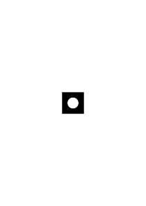
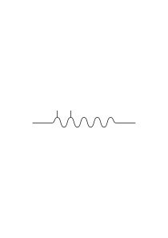
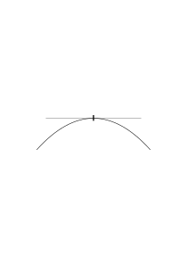
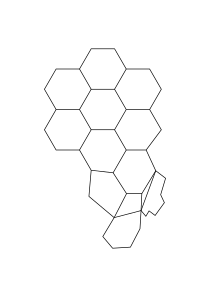

# Ms-156a

6 published remarks, VB

### [FCv\[1\]](https://cdn.wittgensteinnachlass.com/2000px/webp/Ms-156a/FCv.webp)

Augenblickliche Erfahrung das Reale

Vielleicht

Ästhetik

Bedeutung

### [1r\[1\]](https://cdn.wittgensteinnachlass.com/2000px/webp/Ms-156a/1r.webp),[1v\[1\]](https://cdn.wittgensteinnachlass.com/2000px/webp/Ms-156a/1v.webp)

Wäre es richtig zu sagen: “die Zahnschmerzen der Anderen sind ein ganz anderes Phänomen als meine eigenen”? Nein. Es hat einen ganz bestimmten Sinn in unserer gewöhnlichen Ausdrucksweise zu sagen „er hat viel stärkere Schmerzen als ich” oder „viel geringere” & es hat dabei auch einen Sinn in gewissen Fällen davon zu reden daß ich & der Andere etwa die gleichen Schmerzen haben. Was _wir_ sagen kann nur eine Bemerkung über die gegenwärtige Ausdrucksweise sein nicht eine Bemerkung über Schmerzen in dieser Ausdrucksweise.

### [1v\[2\]](https://cdn.wittgensteinnachlass.com/2000px/webp/Ms-156a/1v.webp)

Auf die Frage: wer hat Schmerzen wird auf einen Körper gezeigt & auch ich muß auf einen Körper zeigen.

### [2r\[1\]](https://cdn.wittgensteinnachlass.com/2000px/webp/Ms-156a/2r.webp),[2v\[1\]](https://cdn.wittgensteinnachlass.com/2000px/webp/Ms-156a/2v.webp)

Kann ich sagen „das Wort ‘Zahnschmerzen’ hat eine andere Bedeutung wenn ich von meinen Zahnschmerzen & anderseits von denen des Andern rede” & kann mir Einer antworten „nein, es hat ganz die gleiche Bedeutung”? Was ist das Kriterium für die Richtigkeit dieser Behauptungen.

### [2v\[2\]](https://cdn.wittgensteinnachlass.com/2000px/webp/Ms-156a/2v.webp)

Zu sagen „ich merke daß er _die_ ‘Zahnschmerzen’ hat die ich jetzt habe” ist ähnlich, der Aussage: ich meine daß sich die Teilchen eines Stabes in dem selben Sinn bewegen in welchem sich der Stab selbst vor meinen Augen bewegt.

### [2v\[3\]](https://cdn.wittgensteinnachlass.com/2000px/webp/Ms-156a/2v.webp),[3r\[1\]](https://cdn.wittgensteinnachlass.com/2000px/webp/Ms-156a/3r.webp)

Man könnte auch hier sagen: Meine Zahnschmerzen lassen sich als Bild für sein Benehmen verwenden.

### [3r\[2\]](https://cdn.wittgensteinnachlass.com/2000px/webp/Ms-156a/3r.webp)

Wie weiß ich daß der Andre Zahnschmerzen hat & wie weiß ich daß ich Zahnschmerzen habe. Wenn aber alle Menschenleiber auf gleiche Weise im Spiegel erschienen könnte die Frage wohl auftreten, “hat L.W. Zahnschmerzen?”.

### [3v\[1\]](https://cdn.wittgensteinnachlass.com/2000px/webp/Ms-156a/3v.webp)

Wenn wir uns entschlössen von nun bewußten Zahnschmerzen zu reden dann wären meine unbewußten Zahnschmerzen auf gleicher Stufe wie seine. Denn das Kriterium dafür daß ich unbewußte Zahnschmerzen habe wäre von gleicher Art wie das daß er sie hat.

### [3v\[2\]](https://cdn.wittgensteinnachlass.com/2000px/webp/Ms-156a/3v.webp),[4r\[1\]](https://cdn.wittgensteinnachlass.com/2000px/webp/Ms-156a/4r.webp),[4v\[1\]](https://cdn.wittgensteinnachlass.com/2000px/webp/Ms-156a/4v.webp)

Wer glaubt als einen Satz über das Gesichtsfeld sagen zu können es habe verschwommene Ränder, denke an das Gesichtsfeld wenn man durch ein schwarzes Rohr auf eine beleuchtete Fläche schaut. Das Bild ist dann etwa

.

Der viereckige Rand ist willkürlich & der Rand des Kreises scharf. Wer fragt, wo im Schwarzen das Gesichtsfeld aufhört, dem muß man sagen daß es nirgends aufhört.

### [4v\[2\]](https://cdn.wittgensteinnachlass.com/2000px/webp/Ms-156a/4v.webp)

Gleichung, Ungleichung. Die Ungleichung hat auf den ersten Blick mehr das Aussehen eines Satzes weniger das einer Regel. Aber erinnern wir uns daß Ungleichungen immer in _einem_ System mit Gleichungen vorkommen.

### [5r\[1\]](https://cdn.wittgensteinnachlass.com/2000px/webp/Ms-156a/5r.webp),[5v\[1\]](https://cdn.wittgensteinnachlass.com/2000px/webp/Ms-156a/5v.webp)

Evidenz, Verifikation: insofern ich im Zweifel sein kann, was ich als Evidenz für p anerkennen werde handelt es sich um psychologische Evidenz. Insofern ich aber jetzt bestimmen kann was als Evidenz für p anzusehen ist, handelt es sich um eine Bestimmung der Grammatik um die Festlegung einer Regel.

### [5v\[2\]](https://cdn.wittgensteinnachlass.com/2000px/webp/Ms-156a/5v.webp),[6r\[1\]](https://cdn.wittgensteinnachlass.com/2000px/webp/Ms-156a/6r.webp)

Es gibt einen Kalkül mit Gleichungen & einen Kalkül mit Ungleichungen. Es gibt Übergänge von einer Ungleichung zu einer andern nur sind natürlich die Regeln andere als für die Übergänge die durch Gleichungen erlaubt werden. Die Ungleichungen werden wie die Gleichungen als grammatische Regeln angewandt.

### [6r\[2\]](https://cdn.wittgensteinnachlass.com/2000px/webp/Ms-156a/6r.webp),[6v\[1\]](https://cdn.wittgensteinnachlass.com/2000px/webp/Ms-156a/6v.webp)

Eine ausgezeichnete Frage um Einsicht in das Wesen der Frage „was ist” zu gewinnen, wäre die: “was, ist der Schachkönig, angenommen daß wir das Spiel nur als Schreibspiel spielen”! Denken wir uns hier den Streit der Formalisten & Anhänger der inhaltlichen Mathematik auf das Schachspiel übertragen. –

### [6v\[2\]](https://cdn.wittgensteinnachlass.com/2000px/webp/Ms-156a/6v.webp),[7r\[1\]](https://cdn.wittgensteinnachlass.com/2000px/webp/Ms-156a/7r.webp)

“Richtig ist die Gleichung die nach den Regeln erzeugt werden _kann_”. Was ist das Kriterium für die Möglichkeit der Erzeugung? Doch wohl der Beweis _d.h._ der durchgeführte Beweis, nicht die Möglichkeit des Beweises. Aber war also 25 × 25 = 625 nicht richtig, ehe es ausgerechnet war? – Und was hat die Zeit überhaupt in dieser Frage zu schaffen?

### [7r\[2\]](https://cdn.wittgensteinnachlass.com/2000px/webp/Ms-156a/7r.webp)

“Für jedes δ gibt es ein E, so daß …” z.B.: für jedes δ gibt es ein ε, so daß ε < δ. Der Beweis hiervon ist eine _Lösung_ der Ungleichung etwa ε = ½δ.

### [7v\[1\]](https://cdn.wittgensteinnachlass.com/2000px/webp/Ms-156a/7v.webp)

lim f(n) = a

f(n) ‒ a < δ

(δ): (∃v):n > v ․⊃․ fn ‒ a < δ

### [7v\[2\]](https://cdn.wittgensteinnachlass.com/2000px/webp/Ms-156a/7v.webp),[8r\[1\]](https://cdn.wittgensteinnachlass.com/2000px/webp/Ms-156a/8r.webp),[8v\[1\]](https://cdn.wittgensteinnachlass.com/2000px/webp/Ms-156a/8v.webp)

Denken wir uns, Einer hätte für diese Rechnung nur die Russellsche Notation gelernt (oder gar die Fregesche) ohne die Übersetzung in die Wortsprache. _Müßte_ dieser Mensch daraufkommen, daß diese Notation der & der Ausdrucksweise unserer gewöhnlichen Sprache entspricht? So würde dieser Kalkül auf einmal ins rechte Licht gerückt.

Bedenke hier daß die Worte “es gibt” etc. in der Wortsprache uns nicht durch die Regeln gelehrt werden welche auch für die Russellsche Notation gelten, sondern (wie ich es schon früher von der Negation gesagt habe) durch eine Art hinweisender Erklärungen.

D.h. der Sinn des Ausdrucks (δ): (∃n) etc. ist dem Sinn der Worte „für alle Zahlen δ gibt es eine Zahl n” viel weniger verwandt als es zuerst scheint.

### [8v\[2\]](https://cdn.wittgensteinnachlass.com/2000px/webp/Ms-156a/8v.webp)

Wird jener Kalkül als ein allgemeiner aufgefaßt so sind seine besonderen Fälle die Lösungen von besonderen Ungleichungen.

### [8v\[3\]](https://cdn.wittgensteinnachlass.com/2000px/webp/Ms-156a/8v.webp),[9r\[1\]](https://cdn.wittgensteinnachlass.com/2000px/webp/Ms-156a/9r.webp)

Man kann hier immer fragen: Was z.B. wird der Sinn der sogenannten Theorie der irrationalen Zahlen wenn die Arithmetik keine besonderen irrationalen Zahlen kennt? Der Kalkül der allgemeine Theorie genannt wird bleibt natürlich zu Recht bestehen. Aber wären wir dann auch versucht ihn allg. Theorie zu nennen? Wie weit nimmt er also seine Bedeutung von den einzelnen Fällen & wieweit aus sich selbst?

### [9v\[1\]](https://cdn.wittgensteinnachlass.com/2000px/webp/Ms-156a/9v.webp)

Vergleichen wir nun die Allgemeinheit der Algebra die etwa voraussetzt daß wir irgend zwei Kardinalzahlen miteinander multiplizieren können mit der Allgemeinheit der Theorie der irrationalen Zahlen oder der Limiten.

### [9v\[2\]](https://cdn.wittgensteinnachlass.com/2000px/webp/Ms-156a/9v.webp),[10r\[1\]](https://cdn.wittgensteinnachlass.com/2000px/webp/Ms-156a/10r.webp)

Und nun die Täuschung als sei der Unterschied der daß in einem Fall die Allgemeinheit eine _größere_ sei, weil die Zahl der Einzelfälle größer sei als ℵ0!

### [10r\[2\]](https://cdn.wittgensteinnachlass.com/2000px/webp/Ms-156a/10r.webp),[10v\[1\]](https://cdn.wittgensteinnachlass.com/2000px/webp/Ms-156a/10v.webp),[11r\[1\]](https://cdn.wittgensteinnachlass.com/2000px/webp/Ms-156a/11r.webp)

“Nur die gegenwärtige Vorstellung ist real”. Was bringt einen dazu das zu sagen? – Eine Antwort – ebenso falsch wie diese Behauptung ist: „die vergangene & die zukünftige Erfahrung ist geradeso _real_ nur ist die eben vergangen & zukünftig!”. – Ich möchte sagen: „die vergangene Erfahrung kennen wir doch nur aus der Erinnerung oder aus Dokumenten u. dergl.; nur die gegenwärtige Erfahrung ist vor uns”. Aber hier sieht man gleich daß uns das Gleichnis vom Film verführt. Etwa zu sagen “ich kann doch nur den gegenwärtigen Zustand des Tisches sehen nicht den von einer Minute”, ist eben Unsinn. Wir geben hier vor ein Bild der Welt zu machen, im Gegensatz zu einem andern, welches nicht zutrifft. Vergleiche: “der Rand unseres Gesichtsfeldes ist verschwommen”.

### [11r\[2\]](https://cdn.wittgensteinnachlass.com/2000px/webp/Ms-156a/11r.webp),[11v\[1\]](https://cdn.wittgensteinnachlass.com/2000px/webp/Ms-156a/11v.webp),[12r\[1\]](https://cdn.wittgensteinnachlass.com/2000px/webp/Ms-156a/12r.webp)

Zu sagen (wie Russell): “die Welt könnte vor 5 Minuten so geschaffen worden sein wie sie tatsächlich vor 5 Minuten war, mit allen Erinnerungen & Dokumenten die dann ganz irreführend wären” heißt nichts denn dann gibt es eben eingestandenermaßen keine Verifikation dieses Satzes. Er ist ein Bild das nicht als Bild verwendet wird. Ein leerlaufendes Bild. Denken wir uns eine bildliche (zeichnerische) Darstellung & die Projektionsmethode sei so festgesetzt daß das gezeichnete Bild das Porträt jedes beliebigen Tatbestandes wäre; dann haben wir das exakte Analogon jenes Vorgangs & auch den Grund warum wir versucht sind zu sagen: “Aber es ist ja doch nicht sinnlos zu sagen die Welt sei vor 5 Minuten geschaffen worden (auch wenn ich es nicht wissen kann) denn _etwas_ meine ich doch damit wenn ich das sage”. Etwas meinen heißt in diesem Falle, ein bekanntes Bild gebrauchen, nur wird es eben nicht zu einer Darstellung gebraucht.

### [12r\[2\]](https://cdn.wittgensteinnachlass.com/2000px/webp/Ms-156a/12r.webp),[12v\[1\]](https://cdn.wittgensteinnachlass.com/2000px/webp/Ms-156a/12v.webp)

Wie wenn ich sagte, die Welt könnte vor 3 Minuten untergegangen sein & meine Vorstellungen & Erinnerungen die gleichen geblieben die nun ganz täuschend wären. Hier haben wir eben Descartes Teufel. Aber ein Betrug auf den wir ex hypothesi nicht kommen können, ist kein Betrug. (“Wen Gott betrügt, der ist gut betrogen”.)

### [12v\[2\]](https://cdn.wittgensteinnachlass.com/2000px/webp/Ms-156a/12v.webp),[13r\[1\]](https://cdn.wittgensteinnachlass.com/2000px/webp/Ms-156a/13r.webp)

“Jetzt”. Die Physik enthält nicht die Wörter “jetzt”, “hier”, etc.

### [13r\[2\]](https://cdn.wittgensteinnachlass.com/2000px/webp/Ms-156a/13r.webp)

Statt “jetzt” zu sagen könnte man in die Hände klatschen, wie man zählt “1, 2, 3, los!“. Und der Gebrauch der Wörter “jetzt”, “hier” etc. charakterisiert eben eine Art des Gebrauchs der Sprache. (Denke an Sprachspiele.)

### [13r\[3\]](https://cdn.wittgensteinnachlass.com/2000px/webp/Ms-156a/13r.webp),[13v\[1\]](https://cdn.wittgensteinnachlass.com/2000px/webp/Ms-156a/13v.webp)

Wenn “jetzt” ein Zeitzeichen ist so entspricht es also nicht dem 6 Uhr Schlage einer Uhr sondern etwa dem Schlag einer Glocke vor Beginn eines Schauspiels.

Man könnte auch statt “tu das jetzt” sagen: “tu das wenn ich in die Hände klatsche” & dabei dieses Zeichen geben. (Es ist übrigens interessant daß man das ein Zeichen nennt; vergleiche die Bemerkung über die verschiedenen Griffe im Führerstand der Lokomotive.)

### [14r\[1\]](https://cdn.wittgensteinnachlass.com/2000px/webp/Ms-156a/14r.webp),[14v\[1\]](https://cdn.wittgensteinnachlass.com/2000px/webp/Ms-156a/14v.webp),[15r\[1\]](https://cdn.wittgensteinnachlass.com/2000px/webp/Ms-156a/15r.webp)

Man könnte den Gedanken daß die einzige Realität die Erfahrung des gegenwärtigen Augenblicks sei auch so ausdrücken, daß wir es nicht wissen könnten wenn die Welt in diesem Augenblick mit allen Erinnerungen etc. geschaffen worden wäre: daß daraus eben folge daß alles Andere nur conjecture sei die Erfahrung des gegenwärtigen Augenblicks aber das einzige Material, das zu allen conjectures führt. Aber hier hat eben das Wort “gegenwärtig” keinen Sinn denn es soll nicht heißen gegenwärtig im Gegensatz zu Vergangenem, sondern eigentlich möchte man hier von einer gegenwärtigen Erfahrung reden. Das was man aber betonen will ist daß Gegenwart, Vergangenheit & Zukunft nicht den Bildern auf einem Film entspricht die alle da sind nur an verschiedenen Orten. Man will eigentlich sagen, daß dieses Gleichnis hier zusammenbricht.

### [15r\[2\]](https://cdn.wittgensteinnachlass.com/2000px/webp/Ms-156a/15r.webp),[15v\[1\]](https://cdn.wittgensteinnachlass.com/2000px/webp/Ms-156a/15v.webp)

Das Jetzt scheint quasi ein Bild auf dem Filmstreifen zu bezeichnen (herauszugreifen) zu sagen dies sei das eigentlich Reale. Aber hier ist es gerade als ob einer im Kino statt auf den Film zu zeigen & sagen dies sei das Bild welches jetzt im Objektiv der Laterne sich befinde auf die Leinwand zeigte & sagte dies sei das eigentliche Bild. Das ist als ob man sagen wollte “jetzt ist jetzt”.

### [15v\[2\]](https://cdn.wittgensteinnachlass.com/2000px/webp/Ms-156a/15v.webp),[16r\[1\]](https://cdn.wittgensteinnachlass.com/2000px/webp/Ms-156a/16r.webp)

Man sagt, eine Hypothese beschreibe nicht nur was wir sehen hören etc. sondern _wir drückten mit ihr auch gewisse Erwartungen aus._ Aber hier sieht man wie vieldeutig der Ausdruck “Erwartung” ist (wie “glauben”, “denken” etc.). Denn wenn ich sage “dort steht ein Sessel” so _erwarte_ ich gar nichts in dem Sinn daß ich etwa auf das Eintreten einer Erscheinung _passe_.

### [16v\[1\]](https://cdn.wittgensteinnachlass.com/2000px/webp/Ms-156a/16v.webp)

Erfahrung als logische Form. Erfahrung im Gegensatz wozu?

### [16v\[2\]](https://cdn.wittgensteinnachlass.com/2000px/webp/Ms-156a/16v.webp),[17r\[1\]](https://cdn.wittgensteinnachlass.com/2000px/webp/Ms-156a/17r.webp)

Daß in die unmittelbare Erfahrung kein Subjekt eintritt wird ganz klar wenn man z.B. im Laufe einer Untersuchung zeichnet, was man in einem Mikroskop sieht oder dies beschreibt so daß die Beschreibung etwa einer Zeichnung äquivalent ist. Diese Zeichnung oder Beschreibung ist dann ein Satz der unmittelbare Erfahrung ausdrückt & enthält natürlich kein Subjekt. Ebenso wenn man eine gehörte Tonfolge etwa durch Noten wiedergeben wollte; etc.

### [17r\[2\]](https://cdn.wittgensteinnachlass.com/2000px/webp/Ms-156a/17r.webp),[17v\[1\]](https://cdn.wittgensteinnachlass.com/2000px/webp/Ms-156a/17v.webp),[18r\[1\]](https://cdn.wittgensteinnachlass.com/2000px/webp/Ms-156a/18r.webp)

“Das Okular des größten Fernrohrs nicht größer als unser Auge” das könnte heißen: am Schluß müssen doch _wir_ die Sache sehen, ist alles doch _unsere_ Vorstellung. Oder gar: “alles ist doch am Ende nur in unserem Kopf”. Was man meint ist der Hinweis auf die Evidenz als Quelle unserer Spekulationen. Wie wenn ich sage: sehen wir den Beweis an; der wird uns zeigen, was das Bewiesene ist. Und so kann man wohl auf die unmittelbare Erfahrung hinweisen um einen bestimmten Götzendienst zurückzuweisen der anbetet was man selbst gemacht hat. Aber es liegt hier der Schwerpunkt nicht auf der Kleinheit des Auges oder des Kopfes & überhaupt nicht auf dem Subjekt & also nicht auf dem Subjektiven.

### [18v\[1\]](https://cdn.wittgensteinnachlass.com/2000px/webp/Ms-156a/18v.webp)

Der Begriff “Lösung” für eine Gleichung & der Begriff “Beweis”. Wenn ich komplexe Zahlen einführe so führe ich einen neuen Begriff der _Lösung_ einer Gleichung ein. Und wenn der Beweis des Goldbachschen Satzes gelingen sollte so würde dadurch etwas Neues ein “Beweis” genannt.

### [18v\[2\]](https://cdn.wittgensteinnachlass.com/2000px/webp/Ms-156a/18v.webp),[19r\[1\]](https://cdn.wittgensteinnachlass.com/2000px/webp/Ms-156a/19r.webp)

Inwiefern ist es nötig sich was ein Satz sagt, vorstellen zu können? (“Hast Du an dieser Stelle Schmerzen?”)

### [19r\[2\]](https://cdn.wittgensteinnachlass.com/2000px/webp/Ms-156a/19r.webp)

‘Denkbar’ ist etwas ähnliches wie ‘vorstellbar’. ‘Denkbar’ ist nur eine Ausdehnung des Begriffs ‘vorstellbar’. (Das ist es was meine Auffassung des Satzes als eines Bilds sagen wollte.)

### [19v\[1\]](https://cdn.wittgensteinnachlass.com/2000px/webp/Ms-156a/19v.webp)

Sinn – Unsinn: “Ich werfe einen Ball in den 4-dimensionalen Raum hinaus”. Ist ein System gegeben worin dieser Satz ein Bild genannt werden kann & einen Gebrauch hat so hat er dadurch Sinn erhalten. Aber wenn ihn Einer ohne weiteres gebraucht so werden wir mit Recht sagen er sei unsinnig.

### [19v\[2\]](https://cdn.wittgensteinnachlass.com/2000px/webp/Ms-156a/19v.webp),[20r\[1\]](https://cdn.wittgensteinnachlass.com/2000px/webp/Ms-156a/20r.webp)

Die Aufgabe der Philosophie (in meinem Sinne) ist es _tatsächliche_ Irrtümer aufzuzeigen.

### [20r\[2\]](https://cdn.wittgensteinnachlass.com/2000px/webp/Ms-156a/20r.webp),[20v\[1\]](https://cdn.wittgensteinnachlass.com/2000px/webp/Ms-156a/20v.webp),[21r\[1\]](https://cdn.wittgensteinnachlass.com/2000px/webp/Ms-156a/21r.webp),[21v\[1\]](https://cdn.wittgensteinnachlass.com/2000px/webp/Ms-156a/21v.webp)

Im Ernst, (Spaß) meinen. Kann man etwas im Ernst meinen _wollen_? Kann man versuchen etwas im Ernst (Spaß) zu meinen? Das Wort “versuchen” ist eben vieldeutig. Wie versucht man, z.B., einen Arm zu heben & wie einen Ton von bestimmter Stärke & bestimmtem Charakter hervorzubringen. Wie versucht man sich eines Wortes zu erinnern oder sich in jemandes Lage hineinzudenken. Ich wollte nämlich “einen Satz im Ernst meinen” damit vergleichen, ihn zu einer ‘ernsten’ Melodie zu singen. Aber man kann gegen diesen Vergleich einwenden, daß man den Satz willkürlich nach der ernsten Melodie singen aber ihn nicht willkürlich ernst meinen kann. & daß man entsprechend den Ernst simulieren kann. Wir unterscheiden den Ernst von allem was man Benehmen nennen könnte. Als etwas Inneres von etwas Äußerem. Und warum nennen wir ihn etwas Inneres? Worin ist er & woher dieses Gleichnis von Innen & Außen? Man sagt “den Ernst sieht man nicht, nur den Ausdruck des Ernstes”: aber heißt das daß der Ernst versteckt ist & ist dieser Satz analog dem: das Geld siehst Du nicht nur die Brieftasche? Und anderseits ist auch der Ernst nicht in dem Sinne unsichtbar wie etwa die Luft. Sondern es müßte wohl heißen daß es keinen Sinn hat zu sagen “ich sehe den Ernst” sowenig wie “ich sehe Magenschmerzen”. Man könnte auch so fragen: ist, einen Satz im Ernst meinen etwas ähnliches wie einen ernst gesprochenen Satz hören?

### [22r\[1\]](https://cdn.wittgensteinnachlass.com/2000px/webp/Ms-156a/22r.webp),[22v\[1\]](https://cdn.wittgensteinnachlass.com/2000px/webp/Ms-156a/22v.webp)

Ist, eine Melodie im Ernst singen etwas Ähnliches wie, eine mit ernstem Ausdruck gesungene Melodie hören? Und liegt der Unterschied in etwas anderem als darin daß uns dieses Hören nicht zwingt uns selbst mit dieser Melodie zu bewegen. Könnte man sagen: nein, hören ist nicht genug, aber wenn Du die Melodie genau so mitsingst, dann bist Du selbst ernst? Oder ist, einen Satz im Ernst meinen etwas Ähnliches wie, Magenschmerzen haben, während man ihn ausspricht? Sicher ist daß es ähnlich ist eine Melodie mit Ernst singen & einen Satz im Ernst meinen.

### [22v\[2\]](https://cdn.wittgensteinnachlass.com/2000px/webp/Ms-156a/22v.webp),[23r\[1\]](https://cdn.wittgensteinnachlass.com/2000px/webp/Ms-156a/23r.webp)

Wenn man “Endlos” eine Zahl nennt, dann verlange ich daß man auch “Einige” eine Zahl nennt & dann wird es sehr klar daß eine Definition des Zahlbegriffs überflüssig ist.

### [23r\[2\]](https://cdn.wittgensteinnachlass.com/2000px/webp/Ms-156a/23r.webp)

Umgruppierung einer unendlichen Reihe.

### [23r\[3\]](https://cdn.wittgensteinnachlass.com/2000px/webp/Ms-156a/23r.webp)

Wenn n größer wird so wird <math class="stacked" display="inline"><mfrac><mrow><mn>1</mn></mrow><mrow><mi>n</mi></mrow></mfrac></math> immer kleiner. Wie tritt dieser neue Gedanke in die Arithmetik ein? Induktion.

### [23r\[4\]](https://cdn.wittgensteinnachlass.com/2000px/webp/Ms-156a/23r.webp),[23v\[1\]](https://cdn.wittgensteinnachlass.com/2000px/webp/Ms-156a/23v.webp)

Die Umgruppierung einer unendlichen Reihe kann man nicht extensiv erklären sondern nur an einem Beispiel & d.h. intensiv.

### [23v\[2\]](https://cdn.wittgensteinnachlass.com/2000px/webp/Ms-156a/23v.webp),[24r\[1\]](https://cdn.wittgensteinnachlass.com/2000px/webp/Ms-156a/24r.webp)

Man kann nicht sagen: unser Ohr ist nicht fein genug um die Luftschwingungen einzeln wahrzunehmen es erhält daher nur einen allgemeinen (verschwommenen) Eindruck.

### [24r\[2\]](https://cdn.wittgensteinnachlass.com/2000px/webp/Ms-156a/24r.webp)

Kann man sagen “die Sirene kann entweder die genaue Höhe oder die genaue Dauer des Tones geben, aber nicht beides”?

### [24r\[3\]](https://cdn.wittgensteinnachlass.com/2000px/webp/Ms-156a/24r.webp)

Kann man nun aber sagen, ein Ton müsse sozusagen einen verschwommenen Anfang haben da die Schwingung nicht eigentlich einen Anfang zugleich mit einer Wellenlänge habe?

### [24v\[1\]](https://cdn.wittgensteinnachlass.com/2000px/webp/Ms-156a/24v.webp)

Was macht ein Kapitel der Mathematik _interessant_?

### [24v\[2\]](https://cdn.wittgensteinnachlass.com/2000px/webp/Ms-156a/24v.webp),[25r\[1\]](https://cdn.wittgensteinnachlass.com/2000px/webp/Ms-156a/25r.webp)

Es ist doch klar daß der Satz einer deutschen oder englischen Erzählung Wort für Wort andere Reaktionen in mir hervorruft als ein solcher Satz in einer chinesischen Erzählung der nicht viel anders auf mich wirkt als ein beliebiges Muster von Strichen. Eben weil ich Deutsch & Englisch gelernt habe. Wie es auch klar ist, daß es ganz andere Reaktionen in uns hervorrufen muß den Zügen eines uns bekannten Spiels zuzuschauen, als wenn wir einem Spiel zusehen das wir nicht “verstehen”.

### [VB](/w-vb/#ms-156a-25r.2) [25r\[2\]](https://cdn.wittgensteinnachlass.com/2000px/webp/Ms-156a/25r.webp) {#25r2}

Erinnere dich an den Eindruck guter Architektur, daß sie einen Gedanken ausdrückt. Man möchte auch ihr mit einer Geste folgen.

### [25v\[1\]](https://cdn.wittgensteinnachlass.com/2000px/webp/Ms-156a/25v.webp)

“Handelt also die Mathematik vom Zeichen ‘4’”? In dem Sinne, & sowenig, wie eine Zeichen**regel** von dem Zeichen _handelt_. Nämlich nicht in dem Sinne, in welchem ein Erfahrungssatz vom Zeichen handelt. (Etwa: daß das Zeichen 4 leicht zu schreiben ist.)

### [25v\[2\]](https://cdn.wittgensteinnachlass.com/2000px/webp/Ms-156a/25v.webp),[26r\[1\]](https://cdn.wittgensteinnachlass.com/2000px/webp/Ms-156a/26r.webp)

Geometrischer Würfel = Würfelform, geometrischer Kreis = Kreisform geometrische Gerade = Form der Geraden. Und nun bedenke die Grammatik dieser beiden ‘Gegenstände’: des Würfels (aus Holz) & der Würfelform (des Holzklotzes)!

### [26r\[2\]](https://cdn.wittgensteinnachlass.com/2000px/webp/Ms-156a/26r.webp)

Kapitel: “Wie die Grammatik gebraucht wird”.

_————|————_

### [26r\[3\]](https://cdn.wittgensteinnachlass.com/2000px/webp/Ms-156a/26r.webp)

Wie lehrt man einem die Bedeutungen der Worte “bitte” & “danke”?

### [26r\[4\]](https://cdn.wittgensteinnachlass.com/2000px/webp/Ms-156a/26r.webp),[26v\[1\]](https://cdn.wittgensteinnachlass.com/2000px/webp/Ms-156a/26v.webp)

Wie lernt man die Bedeutung des Wortes “vielleicht”? Was ist die ‘_Bedeutung_’ dieses Wortes? Kann man sagen: “seine Bedeutung ist sein Gebrauch”? Man kann sie lernen, denn wir haben sie alle gelernt. Freilich nicht durch eine Definition.

### [26v\[2\]](https://cdn.wittgensteinnachlass.com/2000px/webp/Ms-156a/26v.webp)

Wie kann man nach der Bedeutung des Wortes “vielleicht” fragen? – “Heißt ‘vielleicht’ dasselbe wie ‘perhaps’?”, “wird es _so_ angewandt: …?”, “Heißt es so viel wie die Geste …?”

### [26v\[3\]](https://cdn.wittgensteinnachlass.com/2000px/webp/Ms-156a/26v.webp),[27r\[1\]](https://cdn.wittgensteinnachlass.com/2000px/webp/Ms-156a/27r.webp)

Wie lernt man die Bedeutung eines Wortes? Da gibt es viele Fälle.

### [27r\[2\]](https://cdn.wittgensteinnachlass.com/2000px/webp/Ms-156a/27r.webp)

Wir nennen es “die Bedeutung des Wortes erklären” wenn wir es in eine andere Sprache übersetzen, aber auch wenn wir statt seiner eine Geste machen, oder wenn wir auf einen Träger des Namens weisen; etc.. In soviel verschiedenen Weisen wird der Ausdruck “Erklärung der Bedeutung” gebraucht.

### [27r\[3\]](https://cdn.wittgensteinnachlass.com/2000px/webp/Ms-156a/27r.webp),[27v\[1\]](https://cdn.wittgensteinnachlass.com/2000px/webp/Ms-156a/27v.webp),[28r\[1\]](https://cdn.wittgensteinnachlass.com/2000px/webp/Ms-156a/28r.webp)

Wenn man sagt: die Bedeutung eines Wortes sei das, was die Erklärung der Bedeutung erklärt,– so denkt man an diese Erklärung also an das Paradigma eines Schrittes in einem Kalkül. Man denkt sich man könnte sie dem zu erklärenden Zeichen beifügen ja sogar das Zeichen durch sie ersetzen. Wenn so die Erklärung mit dem Zeichen (oder statt des Zeichens) wiederholt wird so ist klar daß sie nicht als, ein für allemal wirkende, Medizin betrachtet wird (sozusagen als Impfung) sondern als Teil unseres fortlaufenden Kalküls.

### [28r\[2\]](https://cdn.wittgensteinnachlass.com/2000px/webp/Ms-156a/28r.webp)

<s> “Was ist die Bedeutung eines Wortes?” – “Was ist der Nutzen eines Gegenstandes?”

</s>

### [28r\[3\]](https://cdn.wittgensteinnachlass.com/2000px/webp/Ms-156a/28r.webp),[28v\[1\]](https://cdn.wittgensteinnachlass.com/2000px/webp/Ms-156a/28v.webp)

<s> Man kann von der Erklärung der Bedeutung sagen daß sie den Gebrauch des Wortes lehrt.

</s>

### [28v\[2\]](https://cdn.wittgensteinnachlass.com/2000px/webp/Ms-156a/28v.webp),[29r\[1\]](https://cdn.wittgensteinnachlass.com/2000px/webp/Ms-156a/29r.webp),[29v\[1\]](https://cdn.wittgensteinnachlass.com/2000px/webp/Ms-156a/29v.webp)

Es ist interessant zu sehen was geschieht wenn wir versuchen uns zu sagen daß wir nicht eigentlich die Bewegung der Finger _wollen_ wenn wir sie etwa zur Faust biegen wollen sondern die Bewegung des Muskels der rein mechanisch durch den Zug an der Sehne das Biegen der Finger bewirkt. Man kann die Bewegung des Muskels am Unterarm sehen & nun versuchen sich zu sagen daß was ich eigentlich will sei, daß sich dieser Muskel bewege. Man sieht dann daß dies scheinbar gar nicht möglich ist & man die Bewegung des Muskels als Folge der eigentlich gewollten Bewegung der Finger empfindet. Das soll natürlich nur so viel zeigen, als daß, eine Bewegung wollen nichts mit der Physiologie zu tun hat.

### [29v\[2\]](https://cdn.wittgensteinnachlass.com/2000px/webp/Ms-156a/29v.webp),[30r\[1\]](https://cdn.wittgensteinnachlass.com/2000px/webp/Ms-156a/30r.webp)

Man frage sich einmal ob zu jeder der vielen kleinen Bewegungen die man, schreibend, lesend, oder auch “untätig” vor sich hinbrütend, macht ausführt, etwas vorgeht was man einen Willensakt nennt. – Vielleicht wendet man ein: Aber diese Bewegungen werden doch von mir nicht wie etwas beobachtet was unabhängig von mir selbst geschieht etwa wie die Bewegungen der Blätter am Baum vor meinem Fenster.

### [30r\[2\]](https://cdn.wittgensteinnachlass.com/2000px/webp/Ms-156a/30r.webp)

<s> Das ist Eisen, das ist grau, das ist eine Stange, das ist ein Feuerhaken.

</s>

### [30r\[3\]](https://cdn.wittgensteinnachlass.com/2000px/webp/Ms-156a/30r.webp),[30v\[1\]](https://cdn.wittgensteinnachlass.com/2000px/webp/Ms-156a/30v.webp)

<s> Was heiß es: man kann nicht in dem gleichen Sinne auf einen Körper zeigen, wie auf eine Farbe? Heißt es etwas anderes als: wer auf einen Körper zeigt, zeigt dadurch auf seine Farbe aber eben nur, wenn man unter dem ‘auf die Farbe zeigen’ eben das versteht, auf den Körper zeigen der sie hat. Wie wenn man sagt Einer heiratet das Geld seiner Frau & man würde erklären daß man nicht **im selben Sinne** das Geld, wie die Frau heiraten kann.

</s>

### [VB](/w-vb/#ms-156a-30v.2) [30v\[2\]](https://cdn.wittgensteinnachlass.com/2000px/webp/Ms-156a/30v.webp) {#30v2}

Spiele nicht mit den Tiefen des Andern!

### [31r\[1\]](https://cdn.wittgensteinnachlass.com/2000px/webp/Ms-156a/31r.webp)

Die Sprache lernen als ein abgerichtet werden.

### [31r\[2\]](https://cdn.wittgensteinnachlass.com/2000px/webp/Ms-156a/31r.webp),[31v\[1\]](https://cdn.wittgensteinnachlass.com/2000px/webp/Ms-156a/31v.webp)

Überdenke diesen Satz: Keiner glaubt während eines Landregens im Herzen daß es wieder einmal schön sein wird. Das Gefühl der Überzeugung: Ist es nicht ähnlich wie die Sonne die auf eine früher trübe Landschaft fällt. Es ist dieselbe Landschaft, aber alles ist individuell verändert & doch alles in einem Sinn gegen das Freudigere, Hoffnungsvollere zu. Man kann sagen das Erlebnis des Satzes, seine Landschaft steht in anderer Beleuchtung.

### [31v\[2\]](https://cdn.wittgensteinnachlass.com/2000px/webp/Ms-156a/31v.webp)

Was tut das Wort “vielleicht” im Satz? Verbreitet es nur eine Art Stimmung; wie wenn ich während des ganzen Satzes einen Ton brummte?

### [31v\[3\]](https://cdn.wittgensteinnachlass.com/2000px/webp/Ms-156a/31v.webp),[32r\[1\]](https://cdn.wittgensteinnachlass.com/2000px/webp/Ms-156a/32r.webp)

Ich hätte übrigens, was ich oben sagte, auch so sagen können: die Zuversicht ist etwas Ähnliches wie der zuversichtliche Ton. –

### [32r\[2\]](https://cdn.wittgensteinnachlass.com/2000px/webp/Ms-156a/32r.webp),[32v\[1\]](https://cdn.wittgensteinnachlass.com/2000px/webp/Ms-156a/32v.webp),[33r\[1\]](https://cdn.wittgensteinnachlass.com/2000px/webp/Ms-156a/33r.webp)

Soweit ein Teil meines Ausdrucks einfach dazu bestimmt ist auf das Gemüt des Andern eine bestimmte Wirkung hervorzurufen wie etwa die laute Stimme ihn einschüchtert soweit rechne ich es nicht unter die Zeichen. Aber warum sollte nicht ein Wort bloß zu diesem Zweck gebraucht werden oder ein Lärm anderer Art. Wir können uns auch etwas denken das ganz wie ein Satz aussieht & dessen Wirkung darin besteht daß jedes der Worte eine bestimmte Wirkung auf den der es hört hervorruft & der ganze Satz etwa wie eine Art Aussage wirkt oder wie eine Reihenfolge verschiedener Waschungen & Abreibungen. Anderseits muß doch auch jeder wirkliche Satz so wirken neben seiner eigentlichen Funktion.

Die erste Wirkung des Satzes auf uns wäre dann wie die Wirkung der Pianolarolle auf die Tastatur.

### [33r\[2\]](https://cdn.wittgensteinnachlass.com/2000px/webp/Ms-156a/33r.webp)

Wollte man so die Wirkung eines Wortes seine Bedeutung nennen so müßte man sagen daß welches die Bedeutung eines Wortes ist Sache der Erfahrung ist.

### [33r\[3\]](https://cdn.wittgensteinnachlass.com/2000px/webp/Ms-156a/33r.webp),[33v\[1\]](https://cdn.wittgensteinnachlass.com/2000px/webp/Ms-156a/33v.webp)

Man könnte das Wort “vielleicht” etwa durch eine Art hinweisende Definition erklären in dem man z.B. auf den grauen Himmel weist & sage “es wird vielleicht regnen”.

### [33v\[2\]](https://cdn.wittgensteinnachlass.com/2000px/webp/Ms-156a/33v.webp)

Wir würden von einem Menschen sagen: “er verwendet das Wort ‘vielleicht’ anders als wir; er sagt ‘vielleicht’ wenn wir ‘sicher’ sagen”. Oder: “er sagt ‘à dieu’ wenn wir ‘Grüß Gott’ sagen”. Aber wie ist denn hier der ‘Platz’ des Wortes bestimmt? (Die Schweizer: “ich glaube es ist so”.)

### [33v\[3\]](https://cdn.wittgensteinnachlass.com/2000px/webp/Ms-156a/33v.webp),[34r\[1\]](https://cdn.wittgensteinnachlass.com/2000px/webp/Ms-156a/34r.webp)

Die Erklärung der Bedeutung eines Wortes ist nicht die Erklärung (oder Beschreibung) der Wirkung des Wortes.

### [34r\[2\]](https://cdn.wittgensteinnachlass.com/2000px/webp/Ms-156a/34r.webp)

“Wenn Einer sagt ‘ich werde vielleicht kommen’ & er kommt dann nicht, so hat er damit nicht ein Versprechen gebrochen”.

### [34r\[3\]](https://cdn.wittgensteinnachlass.com/2000px/webp/Ms-156a/34r.webp)

Man gibt zur Erklärung des Wortes “vielleicht” _Gründe_ an, die uns bestimmen können zu sagen, das & das werde vielleicht eintreten.

### [34v\[1\]](https://cdn.wittgensteinnachlass.com/2000px/webp/Ms-156a/34v.webp)

Die Bedeutung ist das, was die Erklärung der Bedeutung erklärt. Damit will ich sagen: “Was uns an der Bedeutung interessieren soll das sei, was in einer Erklärung der Bedeutung zum Ausdruck kommt.”

### [34v\[2\]](https://cdn.wittgensteinnachlass.com/2000px/webp/Ms-156a/34v.webp)

Unter “Erklärung der Bedeutung” verstehe ich, was immer im Kalkül der Sprache als solche Erklärung auftritt.

### [34v\[3\]](https://cdn.wittgensteinnachlass.com/2000px/webp/Ms-156a/34v.webp),[35r\[1\]](https://cdn.wittgensteinnachlass.com/2000px/webp/Ms-156a/35r.webp)

Werden uns nun die Wörter unserer gewöhnlichen Sprache erklärt als wir die Sprache lernten? Die meisten gewiß nicht. Das Wort “vielleicht” wurde mir nie erklärt doch habe ich seinen Gebrauch – in einem gewissen Sinne – einmal gelernt.

### [35r\[2\]](https://cdn.wittgensteinnachlass.com/2000px/webp/Ms-156a/35r.webp),[35v\[1\]](https://cdn.wittgensteinnachlass.com/2000px/webp/Ms-156a/35v.webp)

Gibt es aber für jedes Wort überhaupt Erklärungen die man grammatische Erklärungen der Bedeutung nennen könnte? Wie, wenn ein Wort den Zweck hat, den Andern in eine bestimmte Stimmung zu versetzen? Denken wir uns, dies würde von ihm ausgesagt, da müßte ich doch sagen: das ist nicht, was ich Erklärung einer Bedeutung nenne, das hat mit einer Erklärung einer Bedeutung nichts zu tun.

### [35v\[2\]](https://cdn.wittgensteinnachlass.com/2000px/webp/Ms-156a/35v.webp),[36r\[1\]](https://cdn.wittgensteinnachlass.com/2000px/webp/Ms-156a/36r.webp)

Aber ob etwas als Wort als Zeichen anzusehen ist wird doch durch seine Grammatik oder etwa das Fehlen einer Grammatik bestimmt. Und ferner ist es mit den grammatischen Erklärungen, mit den Erklärungen der Bedeutung eben wie mit den Spielen. Ich kann ein Spiel verstehen & nicht das Gemeinsame oder Charakteristische aller Spiele sagen können. So wie ich eben eine Erkenntnis ein Wissen beschreiben kann ohne sagen zu können “was Wissen ist”.

### [36r\[2\]](https://cdn.wittgensteinnachlass.com/2000px/webp/Ms-156a/36r.webp)

D.h.: Was eine Erklärung der Bedeutung ist, muß an Beispielen gezeigt werden.

### [36v\[1\]](https://cdn.wittgensteinnachlass.com/2000px/webp/Ms-156a/36v.webp),[37r\[1\]](https://cdn.wittgensteinnachlass.com/2000px/webp/Ms-156a/37r.webp)

Nun kommt mir der Gedanke: Ich kann natürlich über das Wort vielleicht grammatische Erklärungen geben. Erklärungen die den Gebrauch des Wortes regeln. Aber geben diese Regeln ihm auf jeden Fall Bedeutung. Ich könnte doch beliebige Regeln für ein Zeichen A festsetzen wie es innerhalb von Sätzen gebraucht werden soll; aber hätte es damit was wir Bedeutung nennen? Könnte es nicht ein ganz _nutzloses_ Zeichen sein? Und was, anderseits bestimmt den Nutzen des Zeichens? Muß ich hier sagen: Nur Beispiele können zeigen was die Verwendung der Nutzen, eines Zeichens ist? –

### [37r\[2\]](https://cdn.wittgensteinnachlass.com/2000px/webp/Ms-156a/37r.webp),[37v\[1\]](https://cdn.wittgensteinnachlass.com/2000px/webp/Ms-156a/37v.webp)

Man könnte statt der hinweisenden Definition “das ist grün” auch den Satz gebrauchen “dieses Blatt ist grün;” & analog das Wort vielleicht durch einen Hinweis auf die Wolken mit dem Satz “es wird vielleicht regnen” erklären. (Und wenn das eine Erklärung ist, so ist es gewiß noch am ehesten die, durch welche wir die Bedeutung des Wortes tatsächlich lernen.)

### [37v\[2\]](https://cdn.wittgensteinnachlass.com/2000px/webp/Ms-156a/37v.webp)

<s> Hat das Wort “guten Tag” Bedeutung? Das Wort “Au!” das Wort “oh weh!”, “Pfui!”? </s>

### [37v\[3\]](https://cdn.wittgensteinnachlass.com/2000px/webp/Ms-156a/37v.webp),[38r\[1\]](https://cdn.wittgensteinnachlass.com/2000px/webp/Ms-156a/38r.webp)

<s>“Das Wort ‘vielleicht’ hat Bedeutung”, damit meinen wir, es entspreche ihm etwas in der Welt; aber natürlich, nicht so, daß ihm ein Ding entspricht, aber so daß seinem Gebrauch etwas in der Außenwelt entspricht; daß wir den Tatsachen verantwortlich sind, wenn wir es gebrauchen; etc. </s>

### [38r\[2\]](https://cdn.wittgensteinnachlass.com/2000px/webp/Ms-156a/38r.webp)

Wozu muß ich mich auf diese Frage einlassen?

### [38r\[3\]](https://cdn.wittgensteinnachlass.com/2000px/webp/Ms-156a/38r.webp),[38v\[1\]](https://cdn.wittgensteinnachlass.com/2000px/webp/Ms-156a/38v.webp)

Zu sagen das Wort habe nur im Satzzusammenhang Bedeutung heißt daß die Bedeutung nicht das Gefühl ist welches das Wort hervorruft. Man würde nicht sagen das Wort habe nur im Satzzusammenhang einen Klang. Jener Satz heißt, daß das Wort nur als Stein des Kalküls Bedeutung habe.

### [38v\[2\]](https://cdn.wittgensteinnachlass.com/2000px/webp/Ms-156a/38v.webp),[39r\[1\]](https://cdn.wittgensteinnachlass.com/2000px/webp/Ms-156a/39r.webp)

Wie lernt ein Kind den Gebrauch eines Wortes, etwa des Wortes ‘vielleicht’. Es spricht etwa einen Satz nach dem es vom Erwachsenen gehört hat: “sie wird vielleicht kommen” & in dem Tonfall des Erwachsenen. Dann fragt man sich manchmal: versteht es das Wort “vielleicht” schon oder spricht es es nur nach? Nun, was ist das Anzeichen dafür daß es das Wort wirklich versteht? – Das, daß es es in verschiedenen Fällen richtig – (das heißt doch den Regeln gemäß) – gebraucht & danach auch handelt.

### [39r\[2\]](https://cdn.wittgensteinnachlass.com/2000px/webp/Ms-156a/39r.webp),[39v\[1\]](https://cdn.wittgensteinnachlass.com/2000px/webp/Ms-156a/39v.webp)

Wenn es in der deutschen Sprache ein Wort gäbe das bloß bestimmt wäre in dem Andern eine bestimmte Stimmung hervorzurufen, würde ich von diesem Worte sagen, es habe keine Bedeutung sondern nur eine Wirkung? Denken wir an das Wort “he he” wie es etwa von einer spottenden Rede gebraucht wird. Hat dieses Wort eine Bedeutung?

### [39v\[2\]](https://cdn.wittgensteinnachlass.com/2000px/webp/Ms-156a/39v.webp)

Denken wir uns aber, jemand erklärte: “‘he he’ heißt soviel wie ‘haha’”, hat er nun nicht eine Erklärung der Bedeutung gegeben?

### [40r\[1\]](https://cdn.wittgensteinnachlass.com/2000px/webp/Ms-156a/40r.webp)

Es ist offenbar daß wir uns mit der Frage nach der Bedeutung des Wortes “hehe” der Frage nach der Bedeutung des Lachens, oder des Achselzuckens, nähern.

### [40r\[2\]](https://cdn.wittgensteinnachlass.com/2000px/webp/Ms-156a/40r.webp),[40v\[1\]](https://cdn.wittgensteinnachlass.com/2000px/webp/Ms-156a/40v.webp),[41r\[1\]](https://cdn.wittgensteinnachlass.com/2000px/webp/Ms-156a/41r.webp)

Nun möchte man sagen: Die Sprache dient der Beeinflussung & ist ein Mechanismus der Beeinflussung. Jedes Wort hat in diesem Mechanismus einen Platz, ist quasi ein Zahnrad (Hebel etc.) des Mechanismus. Und seine Bedeutung ist sein Teil der Gesamtwirkung des Mechanismus. Was ist also dieses Teil für das Wort “Tisch”, was für das Wort “rot”, oder “nicht”? Was ist ihre Wirkung? Man denkt natürlich zuerst daran, daß sie darin besteht Assoziationen hervorzurufen. Aber es ist klar daß das jedenfalls nur ein Teil der Funktion eines Wortes ist. Man könnte vielleicht ähnlich sagen: es sei die Funktion des Schachspiels uns Vergnügen zu machen; aber kann man die Funktion des Rätsels damit beschreiben daß man den Teil des ganzen Vergnügens zeigt der auf das Rätsel entfällt?

### [41r\[2\]](https://cdn.wittgensteinnachlass.com/2000px/webp/Ms-156a/41r.webp),[41v\[1\]](https://cdn.wittgensteinnachlass.com/2000px/webp/Ms-156a/41v.webp)

Wenn ich aber sagte, die Bedeutung ist die Wirkungsweise eines Wortes? – [The way it works] Nun, so hat natürlich die Wirkungsweise im Kalkül etwas mit seiner – psychologischen – Wirkung zu tun. Denn die Definition, Erklärung wird ja erinnert & so gebraucht.

### [41v\[2\]](https://cdn.wittgensteinnachlass.com/2000px/webp/Ms-156a/41v.webp),[42r\[1\]](https://cdn.wittgensteinnachlass.com/2000px/webp/Ms-156a/42r.webp)

Wie verhält sich aber dieses Problem zu den besonderen Problemen über die Bedeutung von Wörtern? Nun es ist selbst ein solches besonderes Problem. Das Problem der Zeit kann beantwortet werden ohne daß das der Bedeutung beantwortet ist. Und das ist eine klare & wichtige Einsicht wie die daß man eine Erkenntnis haben kann ohne die Frage was Erkenntnis ist beantworten zu können.

### [42r\[2\]](https://cdn.wittgensteinnachlass.com/2000px/webp/Ms-156a/42r.webp)

Wenn man uns fragt “was bedeutet das Wort ‘hallo’” so werden wir antworten: “‘hallo’ ist ein Ausruf. Bei dieser & dieser Gelegenheit sagen wir ‘hallo’. Es heißt soviel wie das Wort ….”

### [42r\[3\]](https://cdn.wittgensteinnachlass.com/2000px/webp/Ms-156a/42r.webp)

Die Bedeutung des Wortes “stop” in Telegrammen.

### [42v\[1\]](https://cdn.wittgensteinnachlass.com/2000px/webp/Ms-156a/42v.webp)

<s> “Die Bedeutung, das was die Erklärung der Bedeutung erklärt damit habe ich gemeint: Das was über die Bedeutung in unsern Kalkül eintritt ist die Erklärung der Bedeutung. Oder: das was uns angeht ist die Erklärung der Bedeutung. Denn diese Erklärung ist ein weiteres Stück Sprache.” </s>

### [42v\[2\]](https://cdn.wittgensteinnachlass.com/2000px/webp/Ms-156a/42v.webp)

<s>Das Wort “Tisch” & das Wort “oho!”</s>

### [42v\[3\]](https://cdn.wittgensteinnachlass.com/2000px/webp/Ms-156a/42v.webp),[43r\[1\]](https://cdn.wittgensteinnachlass.com/2000px/webp/Ms-156a/43r.webp)

<s> Daß die Erklärung der Bedeutung im allgemeinen ‘Mißverständnisse beseitigt’ d.h. zwischen gleichberechtigten Bedeutungen entscheidet ist nicht wahr. Das ist von ‘Erklärung der Bedeutung’ von der Art “diese Farbe heißt grün” oder “dieser Mann ist Napoleon” wahr. </s>

### [43r\[2\]](https://cdn.wittgensteinnachlass.com/2000px/webp/Ms-156a/43r.webp)

“Diese Handlung ist gut”, “Diese Tätigkeit ist ein Spiel”. Wenn eine Handlung ganz beschrieben ist, ist es dann eine Erfahrungstatsache, daß sie gut ist??! Kriterien!

### [43v\[1\]](https://cdn.wittgensteinnachlass.com/2000px/webp/Ms-156a/43v.webp),[44r\[1\]](https://cdn.wittgensteinnachlass.com/2000px/webp/Ms-156a/44r.webp)

<s> 1 Die Bedeutung das, was die Erklärung der Bedeutung, erklärt.

2 Was heißt das? Die Erklärung der Bedeutung, Teil des Kalküls.

3 Das was uns in der Philosophie angeht. Ein Stück der Sprache

4 Erklärung der Bedeutung aber vielerlei: “Das ist N.N”, “das = rot” “p⊃q = etc.”. Man sagt der Name N bedeutet diesen Menschen das Wort “Tisch” bedeutet einen solchen Gegenstand, aber nichts analoges für das Wort “acht”. Aber auch vom Wort “hallo” oder “oho!” sagt man, es hat Bedeutung im Gegensatz zu einer Lautzusammenstellung wie “kauken”. Von manchem Wort werden wir sagen es sei gleichbedeutend wie eine Geste; & wenn wir von der Bedeutung des Wortes “hehe!” reden, so etwa im selben Sinne wie von der Bedeutung des Lachens. Was man Erklärung der Bedeutung eines Wortes nennt z.B. eine Definition lehrt uns den Gebrauch des Wortes. Und die meisten Worte wurden uns nicht durch Definition erklärt, sondern wir lernten ihren Gebrauch auf andere Weise </s>

### [44r\[2\]](https://cdn.wittgensteinnachlass.com/2000px/webp/Ms-156a/44r.webp),[44v\[1\]](https://cdn.wittgensteinnachlass.com/2000px/webp/Ms-156a/44v.webp),[45r\[1\]](https://cdn.wittgensteinnachlass.com/2000px/webp/Ms-156a/45r.webp)

Die Bedeutung des Wortes, sein Nutzen, seine Wirkung. Wenn ich jemandem einen Befehl gebe & er befolgt ihn dann bestimmen die Worte das was er tut. Ich sage [unreadable] “heb' einen Stein auf” & er hebt keinen Stock auf; hätte ich aber gesagt “heb einen Stock auf” so wäre es ein Stock gewesen. Und hätte ich gesagt “wirf einen Stein” so hätte er ihn geworfen & nicht aufgehoben. Also ist die Bedeutung jedes Wortes im Befehl seine Wirkung. Seine Wirkung wenn der Befehl befolgt wird. Denken wir man würde sagen: die Bedeutung eines Wortes ist seine Wirkung auf einen gutmütigen Menschen. Aber meine ich damit daß wenn der Mensch sich als gutmütig erwiesen hat, ich dann als Bedeutung akzeptieren werde, was immer die Erfahrung als Wirkung des Wortes zeigen sollte. Vielleicht wird man sagen: Wenn er gutmütig ist so heißt das doch daß er den Befehl befolgt wie _er_ ihn versteht. Was er also tut muß zeigen, wie er ihn verstanden hat; welche Bedeutung jedes Wort für ihn hat. Aber daß er gutmütig ist zeigt nur daß er gutmütig ist & ich dann nur sage ich definiere den Ausdruck “Bedeutung die ein Wort für ihn hat” als: Wirkung die es auf ihn ausübt.

### [45v\[1\]](https://cdn.wittgensteinnachlass.com/2000px/webp/Ms-156a/45v.webp)

Kann man sagen: “Die Bedeutung ist der Zweck eines Wortes, nicht seine Wirkung”? (Der Zweck kann festgesetzt werden, die Wirkung ist Sache der Erfahrung.)

### [45v\[2\]](https://cdn.wittgensteinnachlass.com/2000px/webp/Ms-156a/45v.webp)

Das Wort “Stein” ist verantwortlich dafür daß gerade ein _Stein_ aufgehoben wurde, das Wort “aufheben” dafür, was mit dem Stein geschah, etc..

### [45v\[3\]](https://cdn.wittgensteinnachlass.com/2000px/webp/Ms-156a/45v.webp),[46r\[1\]](https://cdn.wittgensteinnachlass.com/2000px/webp/Ms-156a/46r.webp)

Die Bedeutung eines Wortes wird festgesetzt. Die Wirkung wird die Erfahrung zeigen.

### [46r\[2\]](https://cdn.wittgensteinnachlass.com/2000px/webp/Ms-156a/46r.webp),[46v\[1\]](https://cdn.wittgensteinnachlass.com/2000px/webp/Ms-156a/46v.webp)

Ich könnte nun sagen: der Zweck des Befehls “heb den Stein auf” ist daß er den Stein aufhebt. Was ist aber der Zweck des Wortes “Stein”? Ich kann doch nicht sagen: ein Teil des Zwecks des ganzen Satzes. Freilich könnte ich sagen das Wort “Stein” macht ihn gerade einen _Stein_ aufheben. Aber wir hätten dieser Wirkung vielleicht nachhelfen können indem wir ihm einen elektronischen Schlag versetzt hätten. Wie hätte sich nun diese Einwirkung mit der des Wortes Stein vermischt. Die Bedeutung eines Wortes ist die Rolle, die ein Wort im Zweck des ganzen Satzes spielen _soll_. Es wäre ja schließlich nur eine Hypothese daß es das Wort “Stein” war, was diese Wirkung hatte.

### [46v\[2\]](https://cdn.wittgensteinnachlass.com/2000px/webp/Ms-156a/46v.webp),[47r\[1\]](https://cdn.wittgensteinnachlass.com/2000px/webp/Ms-156a/47r.webp),[47v\[1\]](https://cdn.wittgensteinnachlass.com/2000px/webp/Ms-156a/47v.webp),[48r\[1\]](https://cdn.wittgensteinnachlass.com/2000px/webp/Ms-156a/48r.webp)

Man möchte nun sagen: gewiß die Bedeutung eines Wortes ist seine Wirkung. Denn die Sätze die wir sagen haben einen bestimmten Zweck, sie sollen gewisse Wirkungen herbeiführen. Also sind sie offenbar Teil eines Mechanismus (etwa eines psychischen) zur Herbeiführung dieser Wirkung & die Wörter sind auch solche Teile. (Hebel, Zahnräder u. dergl.) Und das einfache Beispiel wäre die Wirkung einer Gruppe von Löchern auf dem Papierstreifen des Pianola. <s>Wie aber, wenn das Pianola nicht funktioniert weil</s> <s> etwas in seinem Mechanismus in Unordnung geraten ist?</s> <s> Wenn jetzt also diese Gruppe von Löchern statt einer musikalischen Phrase ein Klopfen & Zischen hervorruft. Sollen wir jetzt sagen dies sei der Sinn jener Zeichen auf der Rolle? Vielleicht sagt man der Sinn sei die Wirkung auf ein Pianola in gutem Zustand (der Sinn eines Befehls seine Wirkung auf einen willigen Menschen).

Nicht der Wirkung entspricht der Sinn sondern dem Zweck. Der Zweck wird festgesetzt ….

Kann ich also sagen, der Zweck eines Wortes ist seine Bedeutung? Was ist also der Zweck des Wortes “Groß” (sage nicht, er sei einfach der in uns eine Vorstellung von Groß hervorzurufen.)? Hat dieses Wort **einen** Zweck? Nach dem Zweck der Löcher auf der Pianolarolle gefragt werde ich ihre Wirkungsweise **im Pianola** beschreiben. Aber ich könnte nicht den Zweck dieser Löcher als Teil des Zwecks des Pianolas darstellen. Schachspiel. </s>

### [48v\[1\]](https://cdn.wittgensteinnachlass.com/2000px/webp/Ms-156a/48v.webp)

“Und so deutet das Chor auf ein geheimes Gesetz.” Daß es _deutet_ ist eben das Sprechende. Es ist nicht ein Gesetz welches wir wahrnehmen, sondern etwas, was man die Ahnung eines Gesetzes nennen könnte. Das undeutliche Bild eines Menschen zu sehen hat eine bestimmte Wirkung ob es nun von einem wirklichen Menschen ausgeht oder nicht.

### [49r\[2\]](https://cdn.wittgensteinnachlass.com/2000px/webp/Ms-156a/49r.webp)

Wie versteht man eine Geste? Wenn ich bei irgend einer Gelegenheit sage: “ich verstehe diese Geste”, meine ich da daß ich sie in Worte oder andere Zeichen übersetzen kann? Gewiß nicht immer. Ich charakterisiere ein Erlebnis.

### [VB](/w-vb/#ms-156a-49r.3) [49r\[3\]](https://cdn.wittgensteinnachlass.com/2000px/webp/Ms-156a/49r.webp) {#49r3}

Das Gesicht ist die Seele des Körpers.

### [49v\[1\]](https://cdn.wittgensteinnachlass.com/2000px/webp/Ms-156a/49v.webp)

Der Tonfall der Überzeugung & die Überzeugung aber auch der Tonfall des Glaubens & der Glaube & der Tonfall der Hoffnung & die Hoffnung.

### [VB](/w-vb/#ms-156a-49v.2) [49v\[2\]](https://cdn.wittgensteinnachlass.com/2000px/webp/Ms-156a/49v.webp) {#49v2}

Man kann den eigenen Charakter sowenig von Außen betrachten wie die _eigene Schrift_. Ich habe zu meiner Schrift eine einseitige Stellung die mich verhindert, sie auf gleichem Fuß mit anderen Schriften zu sehen & zu vergleichen.

### [50r\[1\]](https://cdn.wittgensteinnachlass.com/2000px/webp/Ms-156a/50r.webp)

Wir verzichten auf allgemeine Dogmen über unsern Gegenstand, – die besonderen Beispiele werfen so viel allgemeines Licht auf ihre Umgebung, als ihnen zukommt.

### [50r\[2\]](https://cdn.wittgensteinnachlass.com/2000px/webp/Ms-156a/50r.webp)

“Was ist die richtige Art sein Geld auszugeben?”

### [50r\[3\]](https://cdn.wittgensteinnachlass.com/2000px/webp/Ms-156a/50r.webp),[50v\[1\]](https://cdn.wittgensteinnachlass.com/2000px/webp/Ms-156a/50v.webp)

Das Verstehen des verschiedenen Sinnes zweier Sätze die aus denselben Wörtern aber mit verschiedener Interpunktion bestehen. Der Sinn des Satzes nicht aus den Bedeutungen der Wörter bestehend? Verschiedene _Gefühle_ beim Lesen der beiden Sätze (“der Schüler sagte der Lehrer ist ein Esel”). (Doppelte Verneinung als verstärkte Verneinung und anderseits als Bejahung verstanden.) Das aber zeigt wieder was es für eine Bewandtnis mit der Bedeutung der Wörter hat.

### [51r\[1\]](https://cdn.wittgensteinnachlass.com/2000px/webp/Ms-156a/51r.webp)

Denn diese ist doch nur die Funktion der Wörter im Satz (das Wort hat nur im Zusammenhang etc. Bedeutung).

Denken wir, man sagte, in einem Fall sehen wir den Schüler mit einem Eselskopf im andern den Lehrer; und so etwas Ähnliches mag wohl der Unterschied im Erlebnis sein; so läuft dieses Erlebnis jedenfalls nicht parallel zum Satz sondern ist vielleicht seine Folge.

### [52r\[1\]](https://cdn.wittgensteinnachlass.com/2000px/webp/Ms-156a/52r.webp),[52v\[1\]](https://cdn.wittgensteinnachlass.com/2000px/webp/Ms-156a/52v.webp)

Sind etwa eine Wiese, eine Blume, ein Musikstück, ein Drama nur soviel verschiedene Mittel um uns das Gefühl der Lust zu geben? Und warum verwendet man dann so viele verschiedene Arten der Lusterregung. Etwa weil man nicht jede in jeder Jahreszeit haben kann? Oder will man sagen: was wir wünschen sei eben nicht bloß Lust sondern Lust mit gewissen andern Eindrücken zusammen? Aber warum sollte man sich dann sträuben zu sagen, was wir wünschten könne auch der andere Eindruck sein? Oder soll ich sagen es gäbe nicht nur verschiedene Grade, sondern auch verschiedene Arten der Lust? Aber warum nennt man sie alle Arten der _Lust_? Und ist es nun eine Erfahrungstatsache daß man nur lustbetonte Erfahrungen wünscht. Ist es nicht eben eine Tautologie was die Menschen die dies sagen zu sagen anstreben?

### [53r\[1\]](https://cdn.wittgensteinnachlass.com/2000px/webp/Ms-156a/53r.webp)

_————|————_

Schafft der Künstler nur etwas ihm Angenehmes hervorzubringen um etwas zu machen was ihm gefällt?!

### [53r\[2\]](https://cdn.wittgensteinnachlass.com/2000px/webp/Ms-156a/53r.webp)

“Dieses Gesicht ist dumm” ist keine Aussage über eine Erscheinung (eine Empfindung) die dieses Gesicht _hervorruft_.

### [53r\[3\]](https://cdn.wittgensteinnachlass.com/2000px/webp/Ms-156a/53r.webp),[53v\[1\]](https://cdn.wittgensteinnachlass.com/2000px/webp/Ms-156a/53v.webp)

Wenn ich nun von einer Skulptur sagte: “dieses Gesicht hat einen zu dummen Ausdruck”; was bedeutet das “zu”. Zu dumm wofür? Um mir Freude zu machen?

### [53v\[2\]](https://cdn.wittgensteinnachlass.com/2000px/webp/Ms-156a/53v.webp)

Oder auch: Was ist es das schließlich für sich selbst sprechen muß? Heißt “so wollte ich's”; so ist es mir angenehm??

### [53v\[3\]](https://cdn.wittgensteinnachlass.com/2000px/webp/Ms-156a/53v.webp),[54r\[1\]](https://cdn.wittgensteinnachlass.com/2000px/webp/Ms-156a/54r.webp)

Denken wir an den ästhetischen Unterricht der dadurch gegeben würde daß man einem die Skitze eines Meisters zeigt & wie er sie dann verändert hat.

### [54r\[2\]](https://cdn.wittgensteinnachlass.com/2000px/webp/Ms-156a/54r.webp)

Was ist das für ein Satz: “Das muß in _diesem_ Tempo gespielt werden”.

Oder: das Thema … (9. Symphonie) gehört nicht geheimnisvoll sondern klar & es hat seine Größe durch seine Klarheit. Was sind die Gründe, & was spricht für sich selbst?

Und was heißt: “ja jetzt verstehe ich's; _so_ muß es sein!”

### [54r\[3\]](https://cdn.wittgensteinnachlass.com/2000px/webp/Ms-156a/54r.webp),[54v\[1\]](https://cdn.wittgensteinnachlass.com/2000px/webp/Ms-156a/54v.webp)

So weit die Ästhetik interessiert ist.

### [54v\[2\]](https://cdn.wittgensteinnachlass.com/2000px/webp/Ms-156a/54v.webp)

Naturgeschichte des Menschen, nicht Psychologie.

### [54v\[3\]](https://cdn.wittgensteinnachlass.com/2000px/webp/Ms-156a/54v.webp)

Was ist eine Begründung eines Zuges eines Kunstwerkes? z.B., eines Musikstückes?

### [54v\[4\]](https://cdn.wittgensteinnachlass.com/2000px/webp/Ms-156a/54v.webp),[55r\[1\]](https://cdn.wittgensteinnachlass.com/2000px/webp/Ms-156a/55r.webp)

Die ästhetische Kritik eines Kunstwerkes lenkt unsere Aufmerksamkeit auf gewisse Züge. Indem sie das Werk mit anderen zusammenstellt, beschreibt mit andern Vorgängen vergleicht etc. etc. sie sagt etwa: gib auf diese Klimax acht etc.

### [55r\[2\]](https://cdn.wittgensteinnachlass.com/2000px/webp/Ms-156a/55r.webp)

Hier verwechselt man wieder leicht Grund & Ursache.

### [55r\[3\]](https://cdn.wittgensteinnachlass.com/2000px/webp/Ms-156a/55r.webp),[55v\[1\]](https://cdn.wittgensteinnachlass.com/2000px/webp/Ms-156a/55v.webp)

Wenn man einen Komponisten gefragt hätte; warum schreibst Du in der Form der Fuge etc.?

Oder: warum befolgst Du diese Regel der Fuge?

### [55v\[2\]](https://cdn.wittgensteinnachlass.com/2000px/webp/Ms-156a/55v.webp)

Die Ästhetik lehrt uns _wesentlich_ ein _System_ kennen. _Sie lehrt uns ein System sehen._

### [55v\[3\]](https://cdn.wittgensteinnachlass.com/2000px/webp/Ms-156a/55v.webp),[56r\[1\]](https://cdn.wittgensteinnachlass.com/2000px/webp/Ms-156a/56r.webp)

Daß uns ihre letzten Gründe am Schluß “ansprechen” müssen, damit hat sie, sozusagen, nichts zu tun. Und sie beschreibt auch nicht diesen Zustand, oder vielmehr diese vielen Zustände des seelischen Gleichgewichts. Sie ist sozusagen axiomatisch.

### [56r\[2\]](https://cdn.wittgensteinnachlass.com/2000px/webp/Ms-156a/56r.webp)

Vergleiche hier die Bedeutungen von “gleich wahrscheinlich” und “ästhetisch befriedigend”.

### [56r\[3\]](https://cdn.wittgensteinnachlass.com/2000px/webp/Ms-156a/56r.webp)

Wäre sie Psychologie so wäre ihr die Systematik _nicht_ wesentlich.

### [56r\[4\]](https://cdn.wittgensteinnachlass.com/2000px/webp/Ms-156a/56r.webp)

Verstehen der Kirchentonarten. Verstehen einer chinesischen Darstellung.

### [56r\[5\]](https://cdn.wittgensteinnachlass.com/2000px/webp/Ms-156a/56r.webp),[56v\[1\]](https://cdn.wittgensteinnachlass.com/2000px/webp/Ms-156a/56v.webp)

Kann eine Ursache durch Introspektion festgestellt werden??

### [56v\[2\]](https://cdn.wittgensteinnachlass.com/2000px/webp/Ms-156a/56v.webp)

Psychoanalyse. Denke daran daß das Resultat der Analyse die Anerkennung des Analysierten verlangt!

### [56v\[3\]](https://cdn.wittgensteinnachlass.com/2000px/webp/Ms-156a/56v.webp)

Warum ist Freuds Bedeutung als Psychologe an seinen Stil gebunden.

### [56v\[4\]](https://cdn.wittgensteinnachlass.com/2000px/webp/Ms-156a/56v.webp)

Die Ästhetik sucht Gründe auf, nicht Ursachen.

### [56v\[5\]](https://cdn.wittgensteinnachlass.com/2000px/webp/Ms-156a/56v.webp),[57r\[1\]](https://cdn.wittgensteinnachlass.com/2000px/webp/Ms-156a/57r.webp)

Goethe, warum er das Experiment in der Farbenlehre zurückwies. Vergleiche unser Gefühl über das psychologische Experiment. Es teilt uns nicht _das_ mit was uns interessiert. Es ist natürlich nicht wahr daß er uns _nichts_ mitteilt.

### [VB](/w-vb/#ms-156a-57r.2) [57r\[2\]](https://cdn.wittgensteinnachlass.com/2000px/webp/Ms-156a/57r.webp) {#57r2}

In der Kunst ist es schwer etwas zu sagen, was so gut ist wie: nichts zu sagen.

### [57v\[1\]](https://cdn.wittgensteinnachlass.com/2000px/webp/Ms-156a/57v.webp),[58r\[1\]](https://cdn.wittgensteinnachlass.com/2000px/webp/Ms-156a/58r.webp)

<math display="block">
  <mtext>αεα</mtext>
  <mtext>f(</mtext>
  <mtext>f)</mtext>
  <mspace width="0.3em"/>
  <mo>=</mo>
  <mspace width="0.3em"/>
  <mtext>F(</mtext>
  <mtext>f)</mtext>
  <mtext>ξ(</mtext>
  <mtext>ξ)</mtext>
  <mtext>F(</mtext>
  <mtext>F)</mtext>
  <mtext>﹖</mtext>
  <mtext>~</mtext>
  <mtext>f(</mtext>
  <mtext>f)</mtext>
  <mspace width="0.3em"/>
  <mo>=</mo>
  <mspace width="0.3em"/>
  <mtext>F(</mtext>
  <mtext>f)</mtext>
  <mtext>F(</mtext>
  <mtext>F)</mtext>
  <mtext>﹖</mtext>
  <mtext>~</mtext>
  <mspace width="0.3em"/>
  <mo>&#95;</mo>
  <mspace width="0.3em"/>
  <mo>(</mo>
  <mspace width="0.3em"/>
  <mtext>–</mtext>
  <mspace width="0.3em"/>
  <mo>)</mo>
  <mo>(</mo>
  <mtext>f)</mtext>
  <mtext>
    <mtext>^</mtext>
  </mtext>
  <mspace width="0.3em"/>
  <mtext>~</mtext>
  <mspace width="0.3em"/>
  <mo>&#95;</mo>
  <mspace width="0.3em"/>
  <mo>(</mo>
  <mspace width="0.3em"/>
  <mtext>–</mtext>
  <mspace width="0.3em"/>
  <mo>)</mo>
  <mtext>~</mtext>
  <mo>(</mo>
  <mtext>αεα)</mtext>
  <mtext>ξ</mtext>
  <mo>{</mo>
  <mtext>~</mtext>
  <mo>(</mo>
  <mtext>ξεξ)</mtext>
  <mtext>ξ</mtext>
  <mspace width="0.3em"/>
  <mtext>~</mtext>
  <mo>[</mo>
  <mtext>ξ</mtext>
  <mo>{</mo>
  <mtext>~</mtext>
  <mo>(</mo>
  <mtext>ξεξ)</mtext>
  <mtext>ξε]</mtext>
  <mo>[</mo>
  <mtext>f(</mtext>
  <mtext>ξ,</mtext>
  <mtext>n)</mtext>
  <mo>]</mo>
  <mtext>'</mtext>
  <mi>a</mi>
  <mspace width="0.3em"/>
  <mo>=</mo>
  <mspace width="0.3em"/>
  <mtext>f(</mtext>
  <mtext>a,</mtext>
  <mtext>a)</mtext>
  <mspace width="0.3em"/>
  <mtext>~</mtext>
  <mo>(</mo>
  <mo>[</mo>
  <mtext>~</mtext>
  <mtext>ξ(</mtext>
  <mtext>ξ)</mtext>
  <mo>]</mo>
  <mtext>'</mtext>
  <mo>(</mo>
  <mo>[</mo>
  <mtext>~</mtext>
  <mtext>ξ(</mtext>
  <mtext>ξ)</mtext>
  <mo>]</mo>
  <mtext>'</mtext>
  <mo>(</mo>
  <mspace width="0.3em"/>
  <mo>)</mo>
  <mo>)</mo>
  <mo>)</mo>
  <mspace width="0.3em"/>
  <mtext>~</mtext>
  <mo>{</mo>
  <mtext>~</mtext>
  <mo>[</mo>
  <mtext>~</mtext>
  <mtext>ξ(</mtext>
  <mtext>ξ]</mtext>
  <mtext>'</mtext>
  <mo>(</mo>
  <mo>[</mo>
  <mtext>~</mtext>
  <mtext>ξ(</mtext>
  <mtext>ξ)</mtext>
  <mo>]</mo>
  <mtext>'</mtext>
  <mo>(</mo>
  <mspace width="0.3em"/>
  <mo>)</mo>
  <mo>)</mo>
  <mo>}</mo>
</math>

### [58v\[1\]](https://cdn.wittgensteinnachlass.com/2000px/webp/Ms-156a/58v.webp)

<math display="block">
  <mtext>
    <s>|</s>
  </mtext>
</math>

### [VB](/w-vb/#ms-156a-58v.2) [58v\[2\]](https://cdn.wittgensteinnachlass.com/2000px/webp/Ms-156a/58v.webp) {#58v2}

An meinem Denken, wie an dem jedes Menschen hängen die verdorrten Hüllen meiner früheren (abgestorbenen) Gedanken.

### [58v\[3\]](https://cdn.wittgensteinnachlass.com/2000px/webp/Ms-156a/58v.webp),[59r\[1\]](https://cdn.wittgensteinnachlass.com/2000px/webp/Ms-156a/59r.webp)

Mathematisches Problem. Denke an das Erraten eines Rätsels. Insbesondere etwa an das Erraten eines Rätsels von dem man nicht weiß ob es eine Lösung hat: Lewis Carroll's “why is a raven like a writing desk“. (vergl. was er darüber schreibt.)

### [59r\[2\]](https://cdn.wittgensteinnachlass.com/2000px/webp/Ms-156a/59r.webp)

Es ist übrigens merkwürdig daß das Wesen des Rätsels in der Logik nicht eingehend behandelt wird.

### [59r\[3\]](https://cdn.wittgensteinnachlass.com/2000px/webp/Ms-156a/59r.webp)

Mangelnde Strenge meines Stils & der “Komposition”.

### [59v\[1\]](https://cdn.wittgensteinnachlass.com/2000px/webp/Ms-156a/59v.webp)

### [59v\[2\]](https://cdn.wittgensteinnachlass.com/2000px/webp/Ms-156a/59v.webp),[60r\[1\]](https://cdn.wittgensteinnachlass.com/2000px/webp/Ms-156a/60r.webp)

Das Allgemeine in der Mathematik ist nicht unbestimmter als das Besondere. “Allgemein” & “besonders” in der Mathematik sind relative Begriffe. Dabei gibt es keine Hierarchie der Typen in der Mathematik!

### [60r\[2\]](https://cdn.wittgensteinnachlass.com/2000px/webp/Ms-156a/60r.webp),[60v\[1\]](https://cdn.wittgensteinnachlass.com/2000px/webp/Ms-156a/60v.webp)

Wir gegen nur von Kalkül zu Kalkül. Von Ornament zu Ornament. Denn jeder Kalkül kann als Ornament dargestellt werden. Nur wenn wir zwei Kalküle vergleichen können wir zum Begriff des Allgemeinen & Besonderen kommen. In der _Anwendung_ auf die Figur in der Ebene des speziellen Falles liegt die Beziehung von Allgemeinem zu Besonderem.

### [60v\[2\]](https://cdn.wittgensteinnachlass.com/2000px/webp/Ms-156a/60v.webp)

Oder auch: nur im _kombinierten_ Kalkül gibt es einen allgemeinen & einen besonderen Teil.

### [60v\[3\]](https://cdn.wittgensteinnachlass.com/2000px/webp/Ms-156a/60v.webp)

Und der besondere Fall wird dann immer so erzeugt, daß man sagt: “Setze z.B. statt x, ε”, oder “statt f(x) x²” oder statt “F{fx} ∫ fx dx” etc. …