# Ms-157b

### [1r\[1\]](https://cdn.wittgensteinnachlass.com/2000px/webp/Ms-157b/1r.webp)

27.02.1937

… “Welt” hatte.

### [1r\[2\]](https://cdn.wittgensteinnachlass.com/2000px/webp/Ms-157b/1r.webp)

Denk' es würde gefragt: “Was ist das Wesen eines Tisches?”; so könnte der Eine sagen: “Schauen wir uns an, was wir alles einen Tisch nennen”; der Andre aber würde sagen: “Du verstehst doch das Wort “Tisch” – oder nicht? – dann mußt Du auch _ohne_ auf besondere Beispiele zu schauen, sagen können, was Du unter dem Wort verstehst.

### [1r\[3\]](https://cdn.wittgensteinnachlass.com/2000px/webp/Ms-157b/1r.webp),[1v\[1\]](https://cdn.wittgensteinnachlass.com/2000px/webp/Ms-157b/1v.webp)

Die ‘Ordnung der Dinge’, die Idee der Formen der Vorstellung, also des a priori ist selber eine grammatische Täuschung.

### [1v\[2\]](https://cdn.wittgensteinnachlass.com/2000px/webp/Ms-157b/1v.webp)

Man sagt: “Es sind ja nicht die Worte,– sondern der Geist der Worte.” Aber was ist das für ein Geist?

### [1v\[3\]](https://cdn.wittgensteinnachlass.com/2000px/webp/Ms-157b/1v.webp)

Das Mißverständnis, welches zu der Idee führt, der Satz, der eigentliche Satz, müsse ein reineres Wesen sein, als, was wir für gewöhnlich das “Satzzeichen” nennen, ist ein sehr _zusammengesetztes_.

### [1v\[4\]](https://cdn.wittgensteinnachlass.com/2000px/webp/Ms-157b/1v.webp),[2r\[1\]](https://cdn.wittgensteinnachlass.com/2000px/webp/Ms-157b/2r.webp)

Betrachte die Aussprache eines Worts durch das Medium seiner Schreibung! Wie leicht glaubt man, zwei Worte klingen _doch_ verschieden, nur weil man sie verschieden schreibt. Und freilich, wenn man sie sich vorsagt, während man gerade an ihre verschiedene Schreibung denkt, spricht man sie auch wohl etwas verschieden aus. Daraus aber ist gar kein Schluß zu ziehen auf die Aussprache im normalen Gebrauch. (Vergl. auch eis & f.)

### [2r\[2\]](https://cdn.wittgensteinnachlass.com/2000px/webp/Ms-157b/2r.webp),[2v\[1\]](https://cdn.wittgensteinnachlass.com/2000px/webp/Ms-157b/2v.webp)

So wird man durch das Darstellungsmittel irregeführt zu suchen, was nicht da ist.

### [2v\[2\]](https://cdn.wittgensteinnachlass.com/2000px/webp/Ms-157b/2v.webp)

_So_ kann das Darstellungsmittel eine _Einbildung_ erzeugen.

### [2v\[3\]](https://cdn.wittgensteinnachlass.com/2000px/webp/Ms-157b/2v.webp)

Die Strenge der Logik scheint hier aus dem Leim zu gehen.

### [2v\[4\]](https://cdn.wittgensteinnachlass.com/2000px/webp/Ms-157b/2v.webp),[3r\[1\]](https://cdn.wittgensteinnachlass.com/2000px/webp/Ms-157b/3r.webp)

Denn, wie kann die Logik ihre Strenge verlieren?! Natürlich nicht dadurch daß man etwas von ihr abhandelt sondern nur durch eine Umgruppierung in der die Idee der Strenge einen andern Platz erhält. So nämlich, indem das Ideal der Ordnung als ein Teil der Darstellungsart erkannt wird. Indem man aufhört krampfhaft in der Welt nach dem zu suchen, was auf unsrer Brille gezeichnet ist. Dann aber muß sich die Brille abnehmen lassen & mit andern Brillen vertauschen. Eine Brille, ohne die das Sehen undenkbar ist, ist keine _Brille_. Das Gleichnis von der Brille ist dann falsch angewandt & irreführend.

### [3v\[1\]](https://cdn.wittgensteinnachlass.com/2000px/webp/Ms-157b/3v.webp)

Die Idee, daß die Logik in irgendeiner Weise das “_Wesen der Welt_” zeigt, muß verschwinden.

### [3v\[2\]](https://cdn.wittgensteinnachlass.com/2000px/webp/Ms-157b/3v.webp)

(Das a priori muß zu _einer_ Form der Darstellung werden. D.h. es muß diesem Begriff auch sein Nymbus genommen werden.

Ein Satz a priori entsteht dadurch, daß ein Satz der von der Darstellungsart handelt eingekleidet wird in die Form einer Aussage über die dargestellten Gegenstände.

### [4r\[1\]](https://cdn.wittgensteinnachlass.com/2000px/webp/Ms-157b/4r.webp)

Betrachte Sätze wie diesen: “Die Farbe, die ich sehe mag unrein sein, verwaschen: aber ich sehe doch immer _eine bestimmte Farbe_!”

### [4r\[2\]](https://cdn.wittgensteinnachlass.com/2000px/webp/Ms-157b/4r.webp)

“Der Sinn des Satzes kann freilich das oder jenes offen lassen, aber der Satz muß doch _einen_ bestimmten Sinn haben.”

### [4r\[3\]](https://cdn.wittgensteinnachlass.com/2000px/webp/Ms-157b/4r.webp)

Was heißt es: “Eine Vagheit _in_ der Logik kann es nicht geben”? (Vor allem kann es dann auch keine _Bestimmtheit_ geben.)

### [4r\[4\]](https://cdn.wittgensteinnachlass.com/2000px/webp/Ms-157b/4r.webp),[4v\[1\]](https://cdn.wittgensteinnachlass.com/2000px/webp/Ms-157b/4v.webp)

“Ein ‘unbestimmter Sinn’, das wäre eigentlich _gar kein_ Sinn”: das ist wie wenn man sagt: “eine unscharfe Begrenzung, das ist eigentlich gar keine Begrenzung”. Man denkt da etwa so: Wenn ich sage: “ich habe diesen Mann fest im Zimmer eingeschlossen, (nur eine Tür ist offen)”– so habe ich ihn eben gar nicht eingeschlossen; er ist nur zum _Schein_ eingeschlossen. Hier vergißt man, daß ja die verschlossenen Türen _doch_ etwas ausrichten. Man wäre geneigt hier zu sagen: also hast Du damit _gar nichts_ getan. Und doch hat er etwas getan. Eine Grenze die ein Loch hat – möchte man sagen – ist so gut wie _gar keine_. Aber ist denn das wahr?

### [4v\[2\]](https://cdn.wittgensteinnachlass.com/2000px/webp/Ms-157b/4v.webp)

“Wenn Du den Satz verstehst, – meinst, so mußt Du doch _etwas_ meinen!” (Es gibt doch nicht ein halbes _Ding_!)

### [5r\[1\]](https://cdn.wittgensteinnachlass.com/2000px/webp/Ms-157b/5r.webp)

Es scheint ja, als ob die Logik ihr Wesentliches verlöre: ihre Strenge. Als hätte man sie ihr schon abgehandelt. Aber sie spielt jetzt nur eine andere Rolle. Sie ist, aus einem Vorurteil über die Wirklichkeit, zu _einer_ Form der Darstellung geworden.

### [5r\[2\]](https://cdn.wittgensteinnachlass.com/2000px/webp/Ms-157b/5r.webp)

Wo ist die Kristallklarheit hingekommen? Sie ist eine Form der Darstellung geworden, sonst nichts.

### [5r\[3\]](https://cdn.wittgensteinnachlass.com/2000px/webp/Ms-157b/5r.webp)

Das Verstehen kein pneumatischer Vorgang. Der Begriff der Familie

Zwei Axthiebe gegen die – – –

### [5r\[4\]](https://cdn.wittgensteinnachlass.com/2000px/webp/Ms-157b/5r.webp),[5v\[1\]](https://cdn.wittgensteinnachlass.com/2000px/webp/Ms-157b/5v.webp),[6r\[1\]](https://cdn.wittgensteinnachlass.com/2000px/webp/Ms-157b/6r.webp),[6v\[1\]](https://cdn.wittgensteinnachlass.com/2000px/webp/Ms-157b/6v.webp)

Es zeigte sich nämlich daß ich nicht einen allgemeinen Begriff vom Satz & der Sprache _hatte_. Ich mußte das & das als Zeichen anerkennen (Sraffa) & konnte doch keine Grammatik dafür angeben. Verstehen & Wissen der Regeln. Das Pneumatische am Verstehen verschwand ganz & damit das Pneumatische des Sinnes. Zuerst erschienen die strengen Regeln als etwas, im Hintergrund, im Medium des Verstehens versteckt; & man konnte sagen: sie _müssen_ da sein – oder ich sehe sie, sozusagen durch ein dickes Medium hindurch, aber ich sehe sie. Sie waren also _konkret_. Ich hatte ein Gleichnis gebraucht (von der Projektionsmethode, etc.) aber durch die grammatische Täuschung des einheitlichen Begriffes erschien es nicht als Gleichnis. Das Wort ‘eigentlich’. Je offenbarer diese Täuschung wird, je klarer es wird daß Sprache eine Familie ist, desto klarer wird es daß jenes scheinbar Konkrete, eine Abstraktion, eine Form war & daß wenn wir vorgeben sie seien überall zur Stelle, unsere Aussagen leer & sinnlos werden. Daß wir nur mehr logische Possen treiben. Wir sehen, daß wir uns an die Beispiele klammern müssen, um nicht haltlos herumzutreiben. Unsere Betrachtungen aber verlieren nun nicht etwa ihre Bedeutung, sondern diese liegt nun ganz auf den Mißverständnissen die uns irreführen.

### [6v\[2\]](https://cdn.wittgensteinnachlass.com/2000px/webp/Ms-157b/6v.webp)

– – – Diese Idee nun verband sich mit der der Strenge.

### [7r\[1\]](https://cdn.wittgensteinnachlass.com/2000px/webp/Ms-157b/7r.webp)

Der Fatalismus ist keine _wissenschaftliche_ Wahrheit; sondern eine _Betrachtungsweise_, die uns liegt, oder nicht liegt.

### [7r\[2\]](https://cdn.wittgensteinnachlass.com/2000px/webp/Ms-157b/7r.webp)

Denk Dir in einem Kalender stände statt “3. Februar”, “4. Februar”, etc., immer, “heute ist der 3. Februar”, “heute ist der 4.” etc..– Wäre damit mehr gesagt?

### [7r\[3\]](https://cdn.wittgensteinnachlass.com/2000px/webp/Ms-157b/7r.webp),[7v\[1\]](https://cdn.wittgensteinnachlass.com/2000px/webp/Ms-157b/7v.webp)

– – – Diesem Mißverständnis (nun) kommen eine Reihe andrer Mißverständnissen entgegen. Besonders aber zwei: – – – – – –

### [7v\[2\]](https://cdn.wittgensteinnachlass.com/2000px/webp/Ms-157b/7v.webp),[8r\[1\]](https://cdn.wittgensteinnachlass.com/2000px/webp/Ms-157b/8r.webp),[8v\[1\]](https://cdn.wittgensteinnachlass.com/2000px/webp/Ms-157b/8v.webp)

Die Mißverständnisse aber werden beseitigt indem wir gewisse Ausdrucksformen durch andere ersetzen & dies kann man wohl eine “Analyse” unsrer Ausdrucksformen nennen. – Nun aber gewinnt es den Anschein, als sei unsre Aufgabe die, eine letzte Analyse unsrer Sprachformen vorzunehmen. Als gäbe es _eine_ (bestimmte) vollkommen zerlegte des Ausdrucks. D.h., als sei unser gewöhnlicher Ausdruck wesentlich noch unanalysiert; als sei in ihm etwas verborgen, was ans Tageslicht zu befördern ist. Ist dies geschehen, so ist der Ausdruck vollkommen geklärt & unsre Aufgabe gelöst. Dieses Mißverständnis drückt sich aus in der Frage nach dem _Wesen_, der Sprache, des Satzes (&) des Denkens. Denn wenn wir auch, in einem (hausbackenen) Sinn, das Wesen der Sprache, etc., in unseren Untersuchungen kennen lernen, so ist es doch nicht das, was diese Frage anstrebt. – Denn sie sieht in dem ‘Wesen’ nicht etwas was schon offen zu Tage liegt, sondern etwas, was _unter_ der Oberfläche liegt. Etwas, was man sieht wenn man die Sprache _durchschaut_ & was die Analyse hervorgräbt.

### [8v\[2\]](https://cdn.wittgensteinnachlass.com/2000px/webp/Ms-157b/8v.webp)

Und diesen Mißverständnissen kommen von verschiedenen Seiten eine Reihe anderer Mißverständnisse entgegen.

### [8v\[3\]](https://cdn.wittgensteinnachlass.com/2000px/webp/Ms-157b/8v.webp),[9r\[1\]](https://cdn.wittgensteinnachlass.com/2000px/webp/Ms-157b/9r.webp)

– – – Es scheint wir können nicht in das Innere dieser Dinge dringen. Darin läge unser Problem. Einer könnte sagen: “ein Satz, das ist …– – –”

### [9r\[2\]](https://cdn.wittgensteinnachlass.com/2000px/webp/Ms-157b/9r.webp)

Die Antwort aber ist ein für alle mal zu geben unabhängig von zukünftiger Erfahrung.

### [9r\[3\]](https://cdn.wittgensteinnachlass.com/2000px/webp/Ms-157b/9r.webp)

“Logischer Bau der Welt”.

### [9r\[4\]](https://cdn.wittgensteinnachlass.com/2000px/webp/Ms-157b/9r.webp)

Sein Wesen stellt eine Ordnung dar.

### [9r\[5\]](https://cdn.wittgensteinnachlass.com/2000px/webp/Ms-157b/9r.webp),[9v\[1\]](https://cdn.wittgensteinnachlass.com/2000px/webp/Ms-157b/9v.webp)

– – – Zurück auf den rauhen Boden. Und nun sieht man daß die Darstellungsweise verfehlt war, die gleichsam ins Blaue schaute, statt nur auf die konkreten Beispiele. Der Ursprung des Ideals?

### [9v\[2\]](https://cdn.wittgensteinnachlass.com/2000px/webp/Ms-157b/9v.webp)

– – – Es ist wie eine Forderung an die Realität.

### [9v\[3\]](https://cdn.wittgensteinnachlass.com/2000px/webp/Ms-157b/9v.webp)

Die Idee sitzt als Brille auf unserer Nase & wir _denken_ gar nicht dran sie abzunehmen.

### ([VB](/w-vb/#ms-157b-9v.4)) [9v\[4\]](https://cdn.wittgensteinnachlass.com/2000px/webp/Ms-157b/9v.webp) {#9v4}

“Ja so ist es,” sagst Du, “denn so _muß_ es sein!”

### ([VB](/w-vb/#ms-157b-10r.1)) [10r\[1\]](https://cdn.wittgensteinnachlass.com/2000px/webp/Ms-157b/10r.webp) {#10r1}

(Schopenhauer: der Mensch lebt eigentlich 100 Jahre lang.) “Natürlich, so muß es sein!” Es ist da, als habe man die _Absicht_ eines Schöpfers verstanden. Man hat das _System_ verstanden. Man fragt sich nicht: ‘Wie lange leben denn Menschen wirklich’, das erscheint jetzt als etwas Oberflächliches; sondern man hat etwas tiefer liegendes verstanden.

### [10r\[2\]](https://cdn.wittgensteinnachlass.com/2000px/webp/Ms-157b/10r.webp),[10v\[1\]](https://cdn.wittgensteinnachlass.com/2000px/webp/Ms-157b/10v.webp)

Wir haben eine Form der Darstellung gefunden, _die uns einleuchtet_. Aber es ist, als haben wir nun etwas gesehen, was tiefer liegt als die Erscheinungen.

### [10v\[2\]](https://cdn.wittgensteinnachlass.com/2000px/webp/Ms-157b/10v.webp)

Diese Tendenz aber scheint in der Logik ihre strenge Berechtigung zu haben man scheint hier mit voller Berechtigung zu schreiben: “Wenn _ein_ Satz ein Bild ist – – –” Als sei hier, _konkret_ was in den Wissenschaften nur Abstraktion ist.

### [11r\[1\]](https://cdn.wittgensteinnachlass.com/2000px/webp/Ms-157b/11r.webp)

Je länger wir aber die wirkliche Sprache betrachten desto stärker wird der Widerstreit zwischen dieser Forderung & der Wahrheit. Das Aufrechterhalten der Forderung wird zu etwas Leerem.

### [11r\[2\]](https://cdn.wittgensteinnachlass.com/2000px/webp/Ms-157b/11r.webp)

“Phänomenologische Sprache”

### [11r\[3\]](https://cdn.wittgensteinnachlass.com/2000px/webp/Ms-157b/11r.webp),[11v\[1\]](https://cdn.wittgensteinnachlass.com/2000px/webp/Ms-157b/11v.webp),[11v\[2\]](https://cdn.wittgensteinnachlass.com/2000px/webp/Ms-157b/11v.webp)

Aber das Ideal ist Deine Ausdrucksweise & Du mißverstehst sie & wendest sie hier falsch an. [Wie bei manchem Fehlschlag den man macht.]

### [11v\[3\]](https://cdn.wittgensteinnachlass.com/2000px/webp/Ms-157b/11v.webp),[12r\[1\]](https://cdn.wittgensteinnachlass.com/2000px/webp/Ms-157b/12r.webp)

[Ich will doch sagen: Es ist doch ein Spiel, & auch Du würdest es Spiel nennen,] nur wirst Du vom Ideal geblendet & siehst daher nicht deutlich die wirkliche Anwendung des Wortes ‘Spiel’.

### [12r\[2\]](https://cdn.wittgensteinnachlass.com/2000px/webp/Ms-157b/12r.webp)

Ich will sagen: Das Ideal liegt in Deiner Ausdrucksform, aber Du mißverstehst die Rolle, die es spielt.

### [12r\[3\]](https://cdn.wittgensteinnachlass.com/2000px/webp/Ms-157b/12r.webp)

– – – Aber ich will sagen, Du mißverstehst die Rolle die das Ideal in Deiner Ausdrucksweise spielt. D.h., auch Du würdest es ein Spiel nennen, nur ….

### [12v\[1\]](https://cdn.wittgensteinnachlass.com/2000px/webp/Ms-157b/12v.webp)

Wir sind in der Idee gefangen, das Ideal _müsse_ … Wir _leben_ nun in der Idee ….

Wir _leben_ nun mit unsern Gedanken in der Idee ….

### [12v\[2\]](https://cdn.wittgensteinnachlass.com/2000px/webp/Ms-157b/12v.webp)

Denn die Idee sitzt gleichsam als Brille auf unsrer Nase. Denn wir glauben es schon in ihr zu sehen.

### [12v\[3\]](https://cdn.wittgensteinnachlass.com/2000px/webp/Ms-157b/12v.webp),[13r\[1\]](https://cdn.wittgensteinnachlass.com/2000px/webp/Ms-157b/13r.webp)

Wir glauben es _muß_ in ihr stecken: d.h. wir glauben es schon in ihr zu sehen. Und das Ideal sitzt nun …. Wir sehen sie schon jetzt (wenn auch durch ein Medium hindurch), da wir ja …

### [13r\[2\]](https://cdn.wittgensteinnachlass.com/2000px/webp/Ms-157b/13r.webp)

Wie bist Du zu diesem Ideal gekommen? Aus welchem Material hast Du es geformt? _Welche konkrete_ Vorstellung war sein Urbild? Das mußt Du Dich fragen; sonst kannst Du die Faszination des Ideals nicht los werden.

### [13r\[3\]](https://cdn.wittgensteinnachlass.com/2000px/webp/Ms-157b/13r.webp)

Zentren der Variation.

### [13r\[4\]](https://cdn.wittgensteinnachlass.com/2000px/webp/Ms-157b/13r.webp)

Rolle in der Ästhetik.

### [14r\[1\]](https://cdn.wittgensteinnachlass.com/2000px/webp/Ms-157b/14r.webp)

Das Ideal muß sich bezüglich seines Ursprungs ausweisen.

### [14r\[2\]](https://cdn.wittgensteinnachlass.com/2000px/webp/Ms-157b/14r.webp)

“Ach so –!” sagen wir wenn uns die philosophische Erklärung gegeben wird & atmen auf.

### [14r\[3\]](https://cdn.wittgensteinnachlass.com/2000px/webp/Ms-157b/14r.webp)

Die Lösung der Probleme besteht im Eliminieren des beunruhigenden Aspekts den gewisse Analogien in unsrer Grammatik auslösen.

### [14r\[4\]](https://cdn.wittgensteinnachlass.com/2000px/webp/Ms-157b/14r.webp)

Die Philosophie verändert _den Aspekt_. Indem sie andere Analogien aufzeigt. Zwischenglieder einschiebt. etc.

### [14v\[1\]](https://cdn.wittgensteinnachlass.com/2000px/webp/Ms-157b/14v.webp)

‘Da muß doch etwas sein (Zeit)!’ ‘Aber da ist doch nichts!’

### [14v\[2\]](https://cdn.wittgensteinnachlass.com/2000px/webp/Ms-157b/14v.webp)

Merke, wie verschieden Du das Zeichen “❘❘❘” ansiehst wenn Du es einmal als römische Drei, einmal als hundertelf liest. Was ist der Unterschied. Ist wirklich ein Unterschied?

### [15r\[2\]](https://cdn.wittgensteinnachlass.com/2000px/webp/Ms-157b/15r.webp),[15v\[1\]](https://cdn.wittgensteinnachlass.com/2000px/webp/Ms-157b/15v.webp)

Man könnte sich denken daß jemand Rutenbündel zählt & sagt: Die eigentlichen Bündel können ja nicht ‘die Stäbe’ sein. Denn Stäbe können abbrechen, herausfallen, & doch bleibt das Bündel das Bündel. Die Stäbe sind etwas unreinliches & ich könnte sie nicht mit den reinlichen Zahlen 1 2 3 … zählen.

### [15v\[2\]](https://cdn.wittgensteinnachlass.com/2000px/webp/Ms-157b/15v.webp)

– – – – die er gleichsam übersieht.

### ([VB](/w-vb/#ms-157b-15v.3+16r.1)) [15v\[3\]](https://cdn.wittgensteinnachlass.com/2000px/webp/Ms-157b/15v.webp),[16r\[1\]](https://cdn.wittgensteinnachlass.com/2000px/webp/Ms-157b/16r.webp) {#15v316r1}

Nur so nämlich können wir der Ungerechtigkeit – oder Leere unserer Behauptungen entgehen, indem wir das Ideal als das was es _ist_, nämlich als Vergleichsobjekt – sozusagen als Maßstab – in unsrer Betrachtung hinstellen, & nicht als das Vorurteil, dem Alles konformieren _muß_. Dies nämlich ist der Dogmatismus.

### ([VB](/w-vb/#ms-157b-16r.2+16v.1)) [16r\[2\]](https://cdn.wittgensteinnachlass.com/2000px/webp/Ms-157b/16r.webp),[16v\[1\]](https://cdn.wittgensteinnachlass.com/2000px/webp/Ms-157b/16v.webp) {#16r216v1}

Was ist denn aber das Verhältnis einer Betrachtung wie der Spenglers & der meinen? … in dem die Philosophie so leicht verfallen kann. Die Ungerechtigkeit bei Spengler: Das Ideal verliert nichts von seiner Würde, wenn es als Prinzip der Betrachtungsform hingestellt wird. Eine gute Maßeinheit. –

### [16v\[2\]](https://cdn.wittgensteinnachlass.com/2000px/webp/Ms-157b/16v.webp)

_Russell – Nicod_

### [16v\[3\]](https://cdn.wittgensteinnachlass.com/2000px/webp/Ms-157b/16v.webp)

– – – Denn diese Antworten machen sich gleichsam über die Frager lustig.

### [16v\[4\]](https://cdn.wittgensteinnachlass.com/2000px/webp/Ms-157b/16v.webp),[17r\[1\]](https://cdn.wittgensteinnachlass.com/2000px/webp/Ms-157b/17r.webp)

Wenn die Philosophen das Wesen des Seins, der Realität, des Wissens u.s.w. zu erfassen trachten, so muß man sich immer fragen, – wird denn dieses Wort in der Sprache, in der es seine Heimat hat d.i. in der Sprache des Alltags, je tatsächlich so gebraucht?

### [17r\[2\]](https://cdn.wittgensteinnachlass.com/2000px/webp/Ms-157b/17r.webp)

Aber es waren nur Luftgebäude die wir zerstörten; & wir legen den Grund der Sprache frei auf dem sie standen.

### [17r\[3\]](https://cdn.wittgensteinnachlass.com/2000px/webp/Ms-157b/17r.webp),[17v\[1\]](https://cdn.wittgensteinnachlass.com/2000px/webp/Ms-157b/17v.webp)

Auch sind unsere Sprachspiele nicht (etwa) Vorstudien für eine zukünftige vollständige Beschreibung – – –

### [17v\[2\]](https://cdn.wittgensteinnachlass.com/2000px/webp/Ms-157b/17v.webp)

– – – die durch Ähnlichkeit & Unähnlichkeit ein Licht auf die Funktion unserer Sprache werfen sollen.

### [17v\[3\]](https://cdn.wittgensteinnachlass.com/2000px/webp/Ms-157b/17v.webp)

– – – & damit das Sprachspiel in dem wir das Wort “lesen” verwenden, wäre für den der sie nicht kennte beinahe nicht zu beschreiben.

### [17v\[4\]](https://cdn.wittgensteinnachlass.com/2000px/webp/Ms-157b/17v.webp),[18r\[1\]](https://cdn.wittgensteinnachlass.com/2000px/webp/Ms-157b/18r.webp)

<s>Denk Dir, Menschen,</s> oder andere Wesen, würden von uns als Lesemaschinen benützt. Sie werden zu diesem Zweck abgerichtet:

Überlege Dir folgenden Fall: Denke Dir es würden Menschen, oder andere Wesen von uns, als Lesemaschinen benützt ….

### [18r\[2\]](https://cdn.wittgensteinnachlass.com/2000px/webp/Ms-157b/18r.webp)

Verwenden wir aber “lesen” für ein gewisses Erlebnis des Übergangs von Zeichen zum gesprochenen Laut, – – –.

### [18v\[1\]](https://cdn.wittgensteinnachlass.com/2000px/webp/Ms-157b/18v.webp)

“Aber ein Mensch muß doch wissen, ob er wirklich liest, oder nur vorgibt zu lesen!”

### [18v\[2\]](https://cdn.wittgensteinnachlass.com/2000px/webp/Ms-157b/18v.webp)

Die philosophischen Probleme _unlösbar_ – bis sie verschwinden Das Problem rührt sich nicht vom Fleck – & dann geht es ganz leicht. Kassenschloß.

### [18v\[3\]](https://cdn.wittgensteinnachlass.com/2000px/webp/Ms-157b/18v.webp)

Der Mathematiker ist kein Entdecker, sondern ein Erfinder.

### [19r\[1\]](https://cdn.wittgensteinnachlass.com/2000px/webp/Ms-157b/19r.webp),[19v\[1\]](https://cdn.wittgensteinnachlass.com/2000px/webp/Ms-157b/19v.webp),[20r\[1\]](https://cdn.wittgensteinnachlass.com/2000px/webp/Ms-157b/20r.webp),[20v\[1\]](https://cdn.wittgensteinnachlass.com/2000px/webp/Ms-157b/20v.webp),[21r\[1\]](https://cdn.wittgensteinnachlass.com/2000px/webp/Ms-157b/21r.webp),[21v\[1\]](https://cdn.wittgensteinnachlass.com/2000px/webp/Ms-157b/21v.webp),[22r\[1\]](https://cdn.wittgensteinnachlass.com/2000px/webp/Ms-157b/22r.webp)

Denk Dir ein Material härter & fester als irgendein anderes. Aber wenn man einen Stab aus diesem Stoff aus der horizontalen in die vertikale Lage bringt, so zieht er sich zusammen, oder denk Dir er biege sich, wenn man ihn aufrichtet während er so hart ist, daß man ihn auf keine andre Weise biegen kann. Ein Mechanismus aus diesem Stoff, etwa eine Kurbel Pleuelstange & Kreuzkopf. Andere Bewegungsweise des Kreuzkopfs.

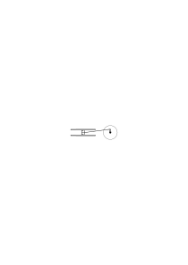

Oder: eine Stange biegt sich, wenn man ihr eine gewisse Masse nähert, gegen alle Kräfte aber die wir auf sie wirken lassen, ist sie ganz starr. Denk Dir die Führungsschienen biegen sich & strecken sich wieder wenn die Kurbel sich ihnen nähert & sich wieder entfernt. Ich nehme aber an daß keinerlei besondere äußere Kraft dazu nötig ist dies hervorzurufen. Dieses Benehmen der Schienen würde wie das eines lebenden Wesens anmuten. Wenn wir sagen “wenn die Glieder des Mechanismus ganz starr wären, würden sie sich so & so bewegen”, was ist das Kriterium dafür daß sie ganz starr sind? Ist es, daß sie gewissen Kräften widerstehen? Oder, daß sie sich so & so bewegen? Denke, ich sage: “das ist das Bewegungsgesetz des Kreuzkopfes (die Zuordnung seiner Lage zur Lage der Kurbel etwa, wenn sich die Länge der Kurbel & der Pleuelstange nicht ändern”. Das heißt wohl wenn sich die Lagen der Kurbel & des Kreuzkopfes so zueinander verhalten, dann sage ich, daß die Länge der Pleuelstange gleichbleibt. “Wenn die Teile ganz starr wären, würden sie sich so bewegen”: ist das eine Hypothese? Es scheint, nein. Denn wenn wir sagen: “die Kinematik beschreibt die Bewegungen des Mechanismus unter der Voraussetzung daß seine Teile vollkommen starr sind”, so geben wir einerseits zu, daß diese Voraussetzung in der Wirklichkeit nie zutrifft, anderseits soll es keinem Zweifel unterliegen, daß vollkommen starre Teile sich so bewegen würden. Aber woher diese Sicherheit? Es handelt sich hier wohl nicht um Sicherheit sondern um eine Bestimmung, die wir getroffen haben. Wir _wissen_ nicht, daß Körper, wenn sie (nach den & den Kriterien) starr wären sich so bewegen würden; wohl aber würden wir (unter Umständen) Teile “starr” nennen die sich so bewegen.

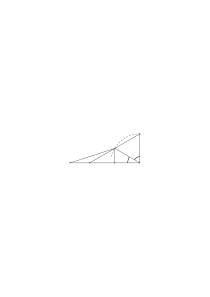

Denke in so einem Fall immer daran daß ja die Geometrie (oder Kinematik) keine Meßmethode angibt, wenn sie von gleicher Länge oder vom Gleichbleiben einer Länge spricht. Wenn wir also die Kinematik etwa die Lehre von der Bewegung vollkommen starrer Maschinenteile nennen, so liegt hierin einerseits eine Andeutung über die (mathematische) Methode, wir bestimmen gewisse Distanzen als die Längen von Maschinenteilen, die sich nicht ändern; anderseits eine _Andeutung_ über die Anwendung des Kalküls.

---

### [22r\[2\]](https://cdn.wittgensteinnachlass.com/2000px/webp/Ms-157b/22r.webp),[22v\[1\]](https://cdn.wittgensteinnachlass.com/2000px/webp/Ms-157b/22v.webp),[23r\[1\]](https://cdn.wittgensteinnachlass.com/2000px/webp/Ms-157b/23r.webp),[23v\[1\]](https://cdn.wittgensteinnachlass.com/2000px/webp/Ms-157b/23v.webp)

Bestimmt die Operation + 2 den Übergang, der von 200 aus zu machen ist, oder nicht? Bestimmt die Funktion <math class="stacked" display="inline"><msup><mi>x</mi><mn>3</mn></msup><mspace width="0.3em"/><mo>+</mo><msup><mi>x</mi><mn>2</mn></msup><mspace width="0.3em"/><mo>+</mo><mspace width="0.3em"/><mn>1</mn></math> die Zahl, die wir für x = 5 erhalten? Wie ist diese Frage zu beantworten? Prüfen wir, ob die Resultate, die die Menschen durch diese Substitution erhalten immer die gleichen sind? Nein. Und doch ist das Faktum, daß erhaltene Resultat für mathematisch erzogene Menschen in der überwiegenden Mehrzahl der Fälle das gleiche ist, hier von der größten Bedeutung. Wir würden diese Rechenmethode nicht gebrauchen wenn sie nicht – normalerweise – tatsächlich zu dem gleichen Resultat führen würde. Die Frage hat, für uns mathematisch, gar keinen Sinn, – wenn wir nicht den Fall der Funktion <math class="stacked" display="inline"><msup><mi>x</mi><mn>3</mn></msup><mspace width="0.3em"/><mo>+</mo><msup><mi>x</mi><mn>2</mn></msup><mspace width="0.3em"/><mo>+</mo><mspace width="0.3em"/><mn>1</mn></math> von bestimmten anderen Funktionen unterscheiden wollen etwa von Funktionen von mehr als einer Variablen. Und dann ist die Frage die gleiche wie die: ist die Funktion <math class="stacked" display="inline"><msup><mi>x</mi><mn>3</mn></msup><mspace width="0.3em"/><mo>+</mo><msup><mi>x</mi><mn>2</mn></msup><mspace width="0.3em"/><mo>+</mo><mspace width="0.3em"/><mn>1</mn></math> eine Funktion nur einer Variablen. Und was man mit dieser Frage in diesem Fall anfangen könnte ist wieder nicht klar, es sei denn etwa daß eine – in diesem Fall sehr primitive – Methode der Ausrechnung der Anzahl der Variablen anzuwenden wäre. Unter bestimmten Verhältnissen könnte die Frage z.B. durch eine Untersuchung zu beantworten sein, ob alle Variablen eines Ausdrucks sich bis auf _eine_ wegheben.

---

### [23v\[2\]](https://cdn.wittgensteinnachlass.com/2000px/webp/Ms-157b/23v.webp),[24r\[1\]](https://cdn.wittgensteinnachlass.com/2000px/webp/Ms-157b/24r.webp),[24v\[1\]](https://cdn.wittgensteinnachlass.com/2000px/webp/Ms-157b/24v.webp)

Aber willst Du sagen, daß der Ausdruck + 2 es für Dich zweifelhaft läßt, was Du, nach 234 z.B., schreiben sollst? Nein; ich sage unbedenklich 236; aber darum _ist_ es ja unnötig daß darüber schon früher etwas bestimmt ist Daß ich keinen Zweifel habe, wenn die Frage an mich herantritt, heißt das, daß sie früher schon beantwortet worden ist? Aber ich weiß doch auch, daß, welche Zahl immer man mir gibt ich die folgende gleich mit Bestimmtheit werde angeben können. Ausgenommen ist doch gewiß der Fall, daß ich sterbe ehe ich die nächste Zahl nennen kann, & natürlich auch viele andere Fälle. Daß ich aber so sicher bin, daß ich werde fortsetzen können ist freilich von der größten Bedeutung.

### [24v\[2\]](https://cdn.wittgensteinnachlass.com/2000px/webp/Ms-157b/24v.webp),[25r\[1\]](https://cdn.wittgensteinnachlass.com/2000px/webp/Ms-157b/25r.webp)

“Eine Definition führt Dich doch nur wieder einen Schritt zurück zu etwas anderem nicht definiertem.” Was sagt uns das? Wußte das irgend jemand nicht? – Nein; aber konnte er es nicht aus dem Auge verlieren?

### [25r\[2\]](https://cdn.wittgensteinnachlass.com/2000px/webp/Ms-157b/25r.webp),[25v\[1\]](https://cdn.wittgensteinnachlass.com/2000px/webp/Ms-157b/25v.webp)

Oder: “Wenn Du schreibst

‘1, 4, 9, 16 . . . .’,

so hast Du nur vier Zahlen angeschrieben, & ein paar Punkte”. Worauf machst Du da aufmerksam? Konnte denn jemand etwas anderes glauben? Man sagt Einem in so einem Falle auch: “Damit hast Du weiter nichts hingeschrieben als vier Zahlzeichen & noch ein fünftes Zeichen, das hier aus ein paar Punkten besteht”. Ja wußte er das nicht? Aber kann man nicht doch sagen: Ja wirklich, ich habe die Pünktchen nie als _ein_ fünftes Zeichen in der Reihe aufgefaßt, – das hier (freilich) so aussieht, wie weitere flüchtig geschriebene Ziffern, dem ich aber auch eine Form geben kann die etwa selbst den Charakter eines Buchstabens oder Zahlzeichens hat, sagen wir <math display="inline"><mtext>Ք</mtext></math>.

### [25v\[2\]](https://cdn.wittgensteinnachlass.com/2000px/webp/Ms-157b/25v.webp),[26r\[1\]](https://cdn.wittgensteinnachlass.com/2000px/webp/Ms-157b/26r.webp)

Oder wie ist es, wenn man darauf aufmerksam macht, daß eine Linie im Sinne Euklids eine Farbengrenze ist & nicht ein Strich, & ein Punkt der Schnitt zweier Farbengrenzen & kein Tupfen. (Wie oft ist gesagt worden, daß man sich keinen Punkt vorstellen kann.)

### [26r\[2\]](https://cdn.wittgensteinnachlass.com/2000px/webp/Ms-157b/26r.webp)

“3 Äpfel + 3 Äpfel = 5 Äpfel, aber in praxi kommt dann meistens noch einer dazu.”

Beweis:

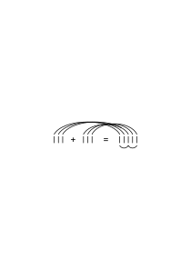

### [26v\[1\]](https://cdn.wittgensteinnachlass.com/2000px/webp/Ms-157b/26v.webp),[27r\[1\]](https://cdn.wittgensteinnachlass.com/2000px/webp/Ms-157b/27r.webp)

“Ich habe nicht gewußt, daß man

 &

so

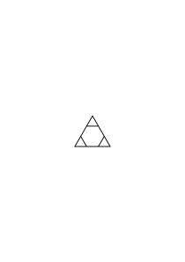

zusammenlegen kann.”

Kann man auch sagen: “Ich habe gedacht man könne sie nicht so

zusammenlegen”?

### [27r\[2\]](https://cdn.wittgensteinnachlass.com/2000px/webp/Ms-157b/27r.webp),[27v\[1\]](https://cdn.wittgensteinnachlass.com/2000px/webp/Ms-157b/27v.webp)

Aber man kann sagen: ich habe gedacht, man könne sie nicht Seite an Seite (oder: gut passend) zusammenlegen. Ich kann mir z.B. denken daß einer dreht & dreht & auf diese Stellung nicht verfällt. Ich habe nicht gedacht daß man sie so zusammenlegen kann. Wenn mich jemand gefragt hätte kann man sie passend zusammenlegen hätte ich geantwortet: ‘Nein. Ich habe den Versuch sie zusammenzulegen nach einigem Probieren aufgegeben.’

_(Geduldspiele.)_

### [27v\[2\]](https://cdn.wittgensteinnachlass.com/2000px/webp/Ms-157b/27v.webp),[28r\[1\]](https://cdn.wittgensteinnachlass.com/2000px/webp/Ms-157b/28r.webp)

Was findet der der das Geduldspiel zusammenbringt? Er findet: eine Lage – an die er früher nicht gedacht hat. – Gut – aber kann man also nicht sagen: er überzeugt sich davon, daß man ein Dreieck & ein Sechseck so zusammenlegen kann? – Aber sag mir: dieses Dreieck & das Sechseck welches man so zusammenlegen kann, sollen sie schon so in einander liegen, oder noch nicht – & sie sollen erst so zusammengelegt werden?

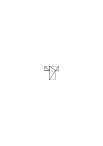

### [28v\[1\]](https://cdn.wittgensteinnachlass.com/2000px/webp/Ms-157b/28v.webp)

Aber ich hatte keine Möglichkeit angezweifelt, sondern nur eine Möglichkeit nicht gesehen.

### [28v\[2\]](https://cdn.wittgensteinnachlass.com/2000px/webp/Ms-157b/28v.webp)

Du hast mir einen Weg von da dorthin gezeigt.

### [28v\[3\]](https://cdn.wittgensteinnachlass.com/2000px/webp/Ms-157b/28v.webp),[29r\[1\]](https://cdn.wittgensteinnachlass.com/2000px/webp/Ms-157b/29r.webp)

Wenn ich sage: ich habe nicht geglaubt, daß es so einen Weg gibt, so müssen wir uns doch fragen wie man eine solche Aussage gebraucht, wie man zu ihr kommt. Ich habe versucht so einen Weg zu finden habe aber keinen gefunden. Wie habe ich versucht? Worin bestand dieses Versuchen & worin das nicht Gelingen?

### [29r\[2\]](https://cdn.wittgensteinnachlass.com/2000px/webp/Ms-157b/29r.webp),[29v\[1\]](https://cdn.wittgensteinnachlass.com/2000px/webp/Ms-157b/29v.webp)

“Du gibst _das_ zu, – dann _mußt_ Du _das_ zugeben.” Er _muß_ dies zugeben – & doch ist es möglich daß er es nicht zugibt. Und wenn ich keinen okkulten Vorgang des Denkens annehme so kann ich auch nicht sagen: “ja er kann sagen daß er es nicht zugibt, aber er kann es nicht denken.” Es sei denn ich will damit sagen, daß ich einen solchen Gebrauch der Worte nicht “denken” nenne. “Ich werde Dir zeigen, warum Du es zugeben mußt. –”

### [29v\[2\]](https://cdn.wittgensteinnachlass.com/2000px/webp/Ms-157b/29v.webp)

Wie kann ihn denn die Manipulation des Beweises dazu bringen etwas zuzugeben?

### [29v\[3\]](https://cdn.wittgensteinnachlass.com/2000px/webp/Ms-157b/29v.webp),[30r\[1\]](https://cdn.wittgensteinnachlass.com/2000px/webp/Ms-157b/30r.webp)

“Du wirst doch zugeben daß 5 aus 3 + 2 besteht!” – Ich gebe Dir zu daß ich “2”, “3”, “5” + “bestehen” in dieser Weise gebrauchen will.

Und ich kann sagen: – Ja bei Gott, sie sieht nicht so aus, aber sie besteht aus 2 Parallelen …!” Was überrascht Dich? Daß die Figur, die Du jetzt siehst aus den Teilen besteht? Nein das heißt ja nichts! Daß sich das Rechteck in diese Figur hat umformen lassen? Nein, auch nicht. – “Daß sich ein Rechteck so teilen läßt”– will ich sagen. (_Wie_ teilen läßt?) Aber mich überrascht, was ich in dieser Figur sehe. Das ist ein neuer & befremdender Aspekt eines Rechtecks & zweier Parallelogramme.

### [30v\[1\]](https://cdn.wittgensteinnachlass.com/2000px/webp/Ms-157b/30v.webp)

‘Ich hatte nicht gedacht, daß ein Rechteck das in sich haben kann oder ‘das in sich _hat_’.

### [30v\[2\]](https://cdn.wittgensteinnachlass.com/2000px/webp/Ms-157b/30v.webp)

Ich hatte nicht geglaubt daß man von einem Rechteck sagen könne es bestehe aus zwei Parallelogrammen & ….

### [30v\[3\]](https://cdn.wittgensteinnachlass.com/2000px/webp/Ms-157b/30v.webp)

I am trying to hold the puzzlement as long as possible; whereas you – the mathematician – get rid of it as quickly as possible.

### [31r\[1\]](https://cdn.wittgensteinnachlass.com/2000px/webp/Ms-157b/31r.webp),[31v\[1\]](https://cdn.wittgensteinnachlass.com/2000px/webp/Ms-157b/31v.webp)

Mein Talent für die Philosophie besteht darin daß ich im Stande bin über etwas noch puzzled zu sein wenn für Andere das puzzlement längst abgleitet. My talent consists in being capable of being puzzled when the puzzlement has glided off your mind. I'm able to hold the puzzlement when it has slipped through your hands (& you therefore think, you are clear). The art of the philosopher is not to be cheated out of your puzzlement before it's really cleared up. Mich überrascht es ein Rechteck so geteilt zu sehen. “Ja bei Gott, das ist ein Rechteck! & das sind zwei Parallelogramme!”

### [31v\[2\]](https://cdn.wittgensteinnachlass.com/2000px/webp/Ms-157b/31v.webp)

‘Ich wäre nicht auf die Idee gekommen zwei Parallelogramme so in ein Rechteck zu legen!’

### [31v\[3\]](https://cdn.wittgensteinnachlass.com/2000px/webp/Ms-157b/31v.webp)

‘Das sind vor allem einmal _Worte_. Aber nun ihr Gebrauch! –’

### [31v\[4\]](https://cdn.wittgensteinnachlass.com/2000px/webp/Ms-157b/31v.webp)

Ich bin überrascht, daß, was ein Rechteck ist, (dann) _so_ zusammengesetzt ist.

### [32r\[1\]](https://cdn.wittgensteinnachlass.com/2000px/webp/Ms-157b/32r.webp)

Ich bin – so zu sagen – überrascht, daß es das gibt.

### [32r\[2\]](https://cdn.wittgensteinnachlass.com/2000px/webp/Ms-157b/32r.webp)

Vergleiche: Ich bin überrascht, daß so viel so große Teile aus diesem Kuchen gehen.

### [32r\[3\]](https://cdn.wittgensteinnachlass.com/2000px/webp/Ms-157b/32r.webp)

“Du mußt ja nicht zugeben, daß das noch ein Rechteck ist.”

### [32r\[4\]](https://cdn.wittgensteinnachlass.com/2000px/webp/Ms-157b/32r.webp)

Ich bin überrascht, daß es eine Figur gibt die den Umriß des Rechtecks hat & aus solchen Teilen zusammengesetzt ist.

### [32v\[1\]](https://cdn.wittgensteinnachlass.com/2000px/webp/Ms-157b/32v.webp)

“Ich bin überrascht zu sehen, daß _so_ ein Rechteck entsteht” – Ja, was hättest Du geglaubt, daß _so_ entsteht?

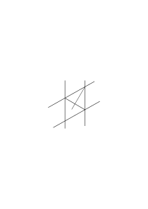

Ich bin überrascht einen Rhombus als Raute zu sehen.

### [32v\[2\]](https://cdn.wittgensteinnachlass.com/2000px/webp/Ms-157b/32v.webp)

Ich bin überrascht daß ein Rhombus eine Raute ist.

### [33r\[1\]](https://cdn.wittgensteinnachlass.com/2000px/webp/Ms-157b/33r.webp)

“Ja, Du hast mich überzeugt, daß jedes Rechteck aus … besteht.” – ‘Aber das ist ja ein Aberglaube; es besteht ja gar nicht aus diesen Teilen, sondern Du stellst es Dir jetzt nur immer so vor.’ Ja ich habe ja gemeint: daß ich mir jetzt jedes Rechteck so geteilt vorstellen kann. – Wohl – aber wovon bist Du denn dann ‘überzeugt’?

### [33r\[2\]](https://cdn.wittgensteinnachlass.com/2000px/webp/Ms-157b/33r.webp),[33v\[1\]](https://cdn.wittgensteinnachlass.com/2000px/webp/Ms-157b/33v.webp)

Aber was meinst Du denn – ‘jedes ist so zusammengesetzt’?! Es besteht doch nicht jedes aus diesen Teilen. Du stellst sie Dir jetzt nur so zusammengesetzt vor! Das ist doch keine Überzeugung über ihre Zusammensetzung!

### [33v\[2\]](https://cdn.wittgensteinnachlass.com/2000px/webp/Ms-157b/33v.webp),[34r\[1\]](https://cdn.wittgensteinnachlass.com/2000px/webp/Ms-157b/34r.webp)

Du meinst: Du siehst jetzt jedes (Rechteck) so an. Aber wovon habe ich Dich da _überzeugt_? – Nun, ich wußte nicht, daß dieses Rechteck z.B.– aus zwei solchen Parallelogrammen … besteht. – Aber dieses Rechteck

besteht ja gar nicht aus solchen Teilen & daß dieses

aus ihnen besteht, hast Du doch nie bezweifelt! Der Satz – Du _wußtest_ nicht daß … ist offenbar nachgebildet diesem: ‘Ich wußte nicht, daß dieses Werkstück aus diesen beiden Teilen bestand’. Denn Du denkst Dir nun das Rechteck so zerteilt.

### [34r\[2\]](https://cdn.wittgensteinnachlass.com/2000px/webp/Ms-157b/34r.webp),[34v\[1\]](https://cdn.wittgensteinnachlass.com/2000px/webp/Ms-157b/34v.webp),[35r\[1\]](https://cdn.wittgensteinnachlass.com/2000px/webp/Ms-157b/35r.webp)

Ich habe Dich gelehrt die Figur in Teile von dieser Physiognomie zu zerlegen. Du wußtest nicht daß sie aus Teilen von solcher Physiognomie besteht.

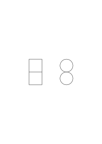

Ich habe nicht gewußt daß die Figur aus 2 Teilen von dieser wohlbekannten Physiognomie besteht. Ich konnte dies auch dann noch nicht wissen als die Linien schon gezogen waren. – Ich sage dann etwa: ‘Ja, richtig das sind ja Parallelogramme!” Man würde jetzt nicht sagen: “Du hast mich überzeugt, …”, sondern: “Du hast mich drauf aufmerksam gemacht.”

### [35r\[2\]](https://cdn.wittgensteinnachlass.com/2000px/webp/Ms-157b/35r.webp)

Ich wußte nicht daß diese Form aus den, mir so gut bekannten, Formen zusammengesetzt ist. “Wie eigentümlich dieses Brett zusammengesetzt ist!”

### [35r\[3\]](https://cdn.wittgensteinnachlass.com/2000px/webp/Ms-157b/35r.webp)

“Wer hat sie denn so zusammengesetzt?” Der das Rechteck geschaffen hat.

### [35r\[4\]](https://cdn.wittgensteinnachlass.com/2000px/webp/Ms-157b/35r.webp),[35v\[1\]](https://cdn.wittgensteinnachlass.com/2000px/webp/Ms-157b/35v.webp)

“Ich habe nicht gewußt daß das Rechteck so zusammengesetzt ist”– hier ist es als habe der Ewige Werkmeister es so zusammengefügt.

### [35v\[2\]](https://cdn.wittgensteinnachlass.com/2000px/webp/Ms-157b/35v.webp)

“Ich habe nicht gewußt daß ein Rechteck aus diesen Formen besteht.” Es ist als hättest Du einen neuen Einblick in sein _Wesen_ erhalten.

### [35v\[3\]](https://cdn.wittgensteinnachlass.com/2000px/webp/Ms-157b/35v.webp)

Aus _dem_ folgt unerbittlich _das_.

### [35v\[4\]](https://cdn.wittgensteinnachlass.com/2000px/webp/Ms-157b/35v.webp)

Wir sagen z.B. wir haben gleichviel Leute hier & dort wenn wir bei der Zählung hier 6 + hier 6 herausbringen.

### [36r\[1\]](https://cdn.wittgensteinnachlass.com/2000px/webp/Ms-157b/36r.webp)

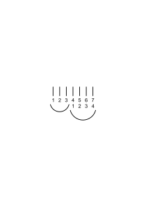

3 + 4 = 7

3 + 4 reicht bis 7

<math display="block">
  <mtable columnalign="center" columnspacing="0.5em" rowspacing="0.2em">
    <mtr>
      <mtd>
        <mi>a</mi>
      </mtd>
      <mtd>
        <mi>b</mi>
      </mtd>
      <mtd>
        <mi>c</mi>
      </mtd>
      <mtd>
        <mi>d</mi>
      </mtd>
      <mtd>
        <mi>e</mi>
      </mtd>
      <mtd>
        <mi>f</mi>
      </mtd>
      <mtd>
        <mi>g</mi>
      </mtd>
    </mtr>
    <mtr>
      <mtd></mtd>
      <mtd></mtd>
      <mtd></mtd>
      <mtd>
        <mi>a</mi>
      </mtd>
      <mtd>
        <mi>b</mi>
      </mtd>
      <mtd>
        <mi>c</mi>
      </mtd>
      <mtd>
        <mi>d</mi>
      </mtd>
    </mtr>
  </mtable>
</math>

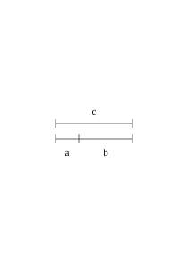

a + b = c

### [36v\[1\]](https://cdn.wittgensteinnachlass.com/2000px/webp/Ms-157b/36v.webp)

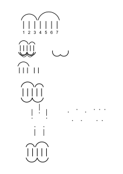

### [37r\[1\]](https://cdn.wittgensteinnachlass.com/2000px/webp/Ms-157b/37r.webp)

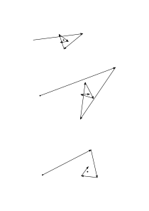

### [37v\[1\]](https://cdn.wittgensteinnachlass.com/2000px/webp/Ms-157b/37v.webp)

Unterschied der Rolle des Überraschenden

“Denkgesetze”

Denkgewohnheiten Denk**arten**

… als wären also durch seine Manipulationen erstaunliche Tatsachen ans Licht gekommen.

### [37v\[2\]](https://cdn.wittgensteinnachlass.com/2000px/webp/Ms-157b/37v.webp)

Russell über “Ursache”. Das Bild eines Experimentes, welches zeigt was wir unter Ursache verstehen.

### [38r\[1\]](https://cdn.wittgensteinnachlass.com/2000px/webp/Ms-157b/38r.webp)

Wir sagen: ich fürchte mich weil er so schaut & hier haben wir scheinbar eine Ursache, die man unmittelbar ohne wiederholtes Experiment als solche erkennt. Russell sagte, man müsse, ehe man etwas als Ursache durch Experiment erkenne, etwas durch Intuition als Ursache erkennen. Ist das nicht als sagte man: Man muß ehe man etwas als 2 m durch Messung anerkennt, etwas durch Intuition als 1 m erkennen?

### [38v\[1\]](https://cdn.wittgensteinnachlass.com/2000px/webp/Ms-157b/38v.webp)

Wie nämlich, wenn jener Intuition durch wiederholtes Experiment widersprochen wird? Wer hat dann recht? Und was ist es denn was uns die Intuition über die Erfahrung sagt die wir ‘als Ursache erkennen’? Handelt sich's da um etwas andres, als eine Reaktion unsererseits gegen den Gegenstand: die Ursache?

### [38v\[2\]](https://cdn.wittgensteinnachlass.com/2000px/webp/Ms-157b/38v.webp),[39r\[1\]](https://cdn.wittgensteinnachlass.com/2000px/webp/Ms-157b/39r.webp),[39v\[1\]](https://cdn.wittgensteinnachlass.com/2000px/webp/Ms-157b/39v.webp)

Aber erkennen wir nicht unmittelbar, daß der Schmerz von dem Schlag herrührt, den wir erhielten? Ist er nicht die Ursache & kann ein Zweifel sein, daß er es ist. Aber läßt es sich nicht ganz gut denken, daß wir in gewissen Fällen hierüber getäuscht werden? und später die Täuschung erkennen: Es scheint uns etwas zu schlagen & zugleich wird ein Schmerz in uns hervorgerufen. (Man glaubt manchmal einen Lärm durch eine Bewegung hervorzurufen.) Und freilich es ist hier eine echte Erfahrung die man ja Erfahrung der Ursache nennen kann: Aber nicht weil sie uns unfehlbar die Ursache zeigt, sondern weil in ihr der Anfang des Ursache-Wirkung-Schemas liegt.

### [39v\[2\]](https://cdn.wittgensteinnachlass.com/2000px/webp/Ms-157b/39v.webp)

_Wir reagieren auf die Ursache._ Etwas “Ursache” nennen ist ähnlich, wie, zeigen & sagen: “_Der_ ist schuld!”

### [39v\[3\]](https://cdn.wittgensteinnachlass.com/2000px/webp/Ms-157b/39v.webp)

Wir stellen intuitiv die Ursache ab, wenn wir die Wirkung nicht wollen. Wir schauen intuitiv vom Gestoßenen auf das Stoßende.

### [40r\[1\]](https://cdn.wittgensteinnachlass.com/2000px/webp/Ms-157b/40r.webp)

Wie nun wenn ich sagte, wir vergleichen, wenn wir von Ursache & Wirkung reden alles mit dem Fall des Stoßes; der ist das Urbild der Ursache einer Wirkung. Hätten wir da den Stoß als Ursache _erkannt_? Denk eine Sprache in der statt “Ursache” immer “Anstoß” gesagt wird.

### [40r\[2\]](https://cdn.wittgensteinnachlass.com/2000px/webp/Ms-157b/40r.webp)

Was zeigt uns der der 4 Kugeln in 2 und 2 trennt, (sie) wieder zusammenschiebt, wieder trennt & so einige male? Er prägt uns eine typische Änderung der Physiognomie ein.

### [40r\[3\]](https://cdn.wittgensteinnachlass.com/2000px/webp/Ms-157b/40r.webp),[40v\[1\]](https://cdn.wittgensteinnachlass.com/2000px/webp/Ms-157b/40v.webp)

Warum soll man statt des Sätzchens 3 + 2 = 5 nicht lernen den Befehl ausführen: “Trenn eine Anzahl in 3 + 2” oder: zeig mir was sich in 3 + 2 trennen läßt. Zeichne in welcherlei Gruppen Du ∣∣∣∣∣ trennen kannst. Und die Antwort sollte sein: in ∣∣ + ∣∣∣, in ∣ + ∣∣∣∣ etc.

### [40v\[2\]](https://cdn.wittgensteinnachlass.com/2000px/webp/Ms-157b/40v.webp),[BCr\[1\]](https://cdn.wittgensteinnachlass.com/2000px/webp/Ms-157b/BCr.webp)

Was wir liefern sind eigentlich Bemerkungen zur Naturgeschichte des Menschen; aber nicht kuriose Beiträge, sondern solche die vor aller Augen liegen & nur darum die Augen nie auf sich ziehen. Wie ein Dieb der sich der Aufmerksamkeit entzieht nicht indem er sich versteckt sondern dadurch daß er vor aller Augen handelt.

### [BCr\[2\]](https://cdn.wittgensteinnachlass.com/2000px/webp/Ms-157b/BCr.webp)

… & die nur darum dem Bemerktwerden entgehen weil sie uns ständig vor den Augen sind

… nicht dadurch daß er heimlich, sondern dadurch daß er vor aller Augen etwas einsteckt.

### [BCr\[3\]](https://cdn.wittgensteinnachlass.com/2000px/webp/Ms-157b/BCr.webp)

… & die dem Bemerktwerden nur entgehen, weil sie ständig vor unsern Augen sind.

_290_