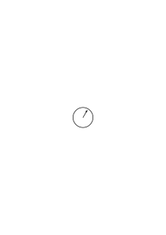
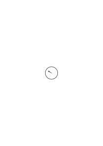

# Ms-160

### [1r\[1\]](https://cdn.wittgensteinnachlass.com/2000px/webp/Ms-160/1r.webp)

Was meint man damit: die Entwicklung A ist von der Entwicklung B verschieden?

Wie verwendet man die Worte: “die Entwicklung A ist von der Entw. B verschieden?” Da gibt es den Fall A ist an der n-ten Stelle von B verschieden, oder den A ist …

### [1r\[2\]](https://cdn.wittgensteinnachlass.com/2000px/webp/Ms-160/1r.webp),[1v\[1\]](https://cdn.wittgensteinnachlass.com/2000px/webp/Ms-160/1v.webp),[2r\[1\]](https://cdn.wittgensteinnachlass.com/2000px/webp/Ms-160/2r.webp)

Wie verwendet man den Ausdruck: “die Entwicklung A stimmt mit der Entw. B überein” – oder “nicht überein”? Erstens: A stimmt mit B an der n-ten Stelle überein. Oder: A stimmt mit B von der nten zur mten Stelle überein – und dergleichen. “A” & “B” stehen für Ausdrücke von Regeln. Ferner aber: A stimmt mit B an jeder zweiten Stelle überein. A stimmt mit B an jeder n²-ten Stelle n² überein. Dies & ähnliches könnte man eine “durchlaufende Übereinstimmung” nennen. Oder aber: A stimmt mit B an allen Stellen überein – – – oder: an keiner Stelle überein.

### [2r\[2\]](https://cdn.wittgensteinnachlass.com/2000px/webp/Ms-160/2r.webp)

Es liegt nahe zu sagen: Wenn A & B an _allen_ äußeren Stellen übereinstimmen, dann stimmt A mit B überein, die nicht-Übereinstimmung ist vernachlässigbar.

### [2r\[3\]](https://cdn.wittgensteinnachlass.com/2000px/webp/Ms-160/2r.webp),[2v\[1\]](https://cdn.wittgensteinnachlass.com/2000px/webp/Ms-160/2v.webp)

Nun weiter: Wir können sagen: A stimmt mit keiner der Entw. des Systems S überein. Z.B. A ist 101010101 …

S ist: 101001000100001… 110110011000110000… 111011100111… – – – oder aber diesen:

### [2v\[2\]](https://cdn.wittgensteinnachlass.com/2000px/webp/Ms-160/2v.webp),[3r\[1\]](https://cdn.wittgensteinnachlass.com/2000px/webp/Ms-160/3r.webp)

Woran erkennt man die Übereinstimmung von A & B? Nun die Übereinstimmung von n bis m indem man diese Stellen ausrechnet. Die Übereinstimmung an jeder fn-ten Stelle – indem aus dem Ausdruck für die Entw. diese Übereinstimmung bewiesen wurde oder aber indem diese Übereinstimmung festgelegt wurde. Durch eine arithmetische oder eine extensive Regel.

### [3r\[2\]](https://cdn.wittgensteinnachlass.com/2000px/webp/Ms-160/3r.webp)

Der Gebrauch des Wortes “Entwicklung”

a) die Entw. von N1 bis Nn. b) die Entw. oder die “_ganze_” Entw.

### [3r\[3\]](https://cdn.wittgensteinnachlass.com/2000px/webp/Ms-160/3r.webp),[3v\[1\]](https://cdn.wittgensteinnachlass.com/2000px/webp/Ms-160/3v.webp)

Man kann die Analogie zweier verschieden verwendeter Ausdrücke so weit treiben als man will – auf dem Papier. Man hat damit in ihrer Relation zur Anwendung nichts geändert.

### [3v\[2\]](https://cdn.wittgensteinnachlass.com/2000px/webp/Ms-160/3v.webp)

‘Die grammatischen Regeln sind willkürlich’ heißt: ihr _Zweck_ ist nicht (z.B.) dem Wesen der Negation, oder der Farbe, zu entsprechen – sondern der Zweck der Negation & des Farbbegriffes. Wie der Zweck der Schach-Regeln nicht ist dem Wesen des Schach zu entsprechen aber dem Zweck des Schachspiels.

### [4r\[1\]](https://cdn.wittgensteinnachlass.com/2000px/webp/Ms-160/4r.webp)

Die altbekannte Wahrheit simpel & ohne Entstellung zu sagen kann von großen Folgen sein.

### [4r\[2\]](https://cdn.wittgensteinnachlass.com/2000px/webp/Ms-160/4r.webp)

Wenn dieses Buch geschrieben ist, wie es geschrieben sein sollte, so muß alles was ich sage leicht verständlich, ja trivial sein, schwer verständlich aber, _warum_ ich es sage.

### [4r\[3\]](https://cdn.wittgensteinnachlass.com/2000px/webp/Ms-160/4r.webp),[4v\[1\]](https://cdn.wittgensteinnachlass.com/2000px/webp/Ms-160/4v.webp)

“Du gibst ja mit einer Hand & nimmst mit der andern!” Freilich; denn ich will Dir ja nichts geben, sondern Dir nur Geben & Nehmen zeigen.

### [4v\[2\]](https://cdn.wittgensteinnachlass.com/2000px/webp/Ms-160/4v.webp),[5r\[1\]](https://cdn.wittgensteinnachlass.com/2000px/webp/Ms-160/5r.webp)

Oder: – Die Schachregeln sollen nicht dem Wesen des Schachkönigs entsprechen denn sie _geben_ ihm dieses Wesen. Wohl aber sollen die Regeln des Kochens & Bratens der Natur des Fleisches entsprechen. – Dies ist natürlich eine grammatische Bemerkung.

### [5r\[2\]](https://cdn.wittgensteinnachlass.com/2000px/webp/Ms-160/5r.webp)

“Was ist eine Regel?” – – – Was ist sie also?

### [5r\[3\]](https://cdn.wittgensteinnachlass.com/2000px/webp/Ms-160/5r.webp),[5v\[1\]](https://cdn.wittgensteinnachlass.com/2000px/webp/Ms-160/5v.webp)

Kaufe Dir in einer Spielwarenhandlung ein Spiel; Du erhältst eine Schachtel, darin die Implemente des Spiels, & ein Regelverzeichnis. Was sind das für Sätze, diese Regeln? Wird Dir in ihnen etwas befohlen, – etwas angeraten, mitgeteilt, daß Leute so gehandelt haben? Nun, willst Du Dir nicht ansehen wie die Sätze tatsächlich verwendet werden? Die meisten Leute die so ein Spiel kaufen, lesen die Regeln & spielen nach ihnen. Diese selben Regeln aber könnten Teile von Befehlen, Bitten, Berichten bilden.

### [5v\[2\]](https://cdn.wittgensteinnachlass.com/2000px/webp/Ms-160/5v.webp),[6r\[1\]](https://cdn.wittgensteinnachlass.com/2000px/webp/Ms-160/6r.webp)

Eine solche Regel aber könnte Teil eines Befehls sein (nach ihr zu handeln) oder Teil eines Berichts (es werde nach ihr gehandelt) usw. Und die Regel könnte auch selbst als Befehl, Bericht etc. verwendet werden.

### [6r\[2\]](https://cdn.wittgensteinnachlass.com/2000px/webp/Ms-160/6r.webp)

You know what I mean by ‘sense-datum’: _this_! –

### [6r\[3\]](https://cdn.wittgensteinnachlass.com/2000px/webp/Ms-160/6r.webp)

And how do you know that you mean _it_; how do you know that you hit it with the meaning?

### [6v\[1\]](https://cdn.wittgensteinnachlass.com/2000px/webp/Ms-160/6v.webp)

Eine Lokomotive durch die Sinneseindrücke die wir von ihr erhalten, definieren. – Tun wir das nicht ohnehin, wenn wir jemandem eine Lokomotive zeigen & sagen: dies ist eine Lokomotive? Statt zu sagen: “Das ist eine Lokomotive” – könnte ich Dir nicht sagen: “Was diese Sinneseindrücke erzeugt ist eine Lokomotive.”

### [6v\[2\]](https://cdn.wittgensteinnachlass.com/2000px/webp/Ms-160/6v.webp),[7r\[1\]](https://cdn.wittgensteinnachlass.com/2000px/webp/Ms-160/7r.webp)

Die Schwierigkeit ist bloß daß er sich die Sinneseindrücke nicht merkt. Aber das hindert ihn nicht die Definition zu verwenden.

### [7r\[2\]](https://cdn.wittgensteinnachlass.com/2000px/webp/Ms-160/7r.webp)

Die Sprache wird verwendet, – ob sie sich der Wörter für physikalische Gegenstände bedient, oder für Sinneseindrücke.

### [7r\[3\]](https://cdn.wittgensteinnachlass.com/2000px/webp/Ms-160/7r.webp),[7v\[1\]](https://cdn.wittgensteinnachlass.com/2000px/webp/Ms-160/7v.webp)

Aber sind nicht die Sinneseindrücke das unmittelbar Wahrgenommene? Die unmittelbaren Gegenstände, auf die sich alles was wir sagen am Schluß beziehen muß? Das Bild von den Bausteinen. Alles was wir bauen besteht endlich aus diesen Bausteinen. Aber das Bild ist falsch, da wir ‘_diese_’ Bausteine nicht andern entgegensetzen.

### [7v\[2\]](https://cdn.wittgensteinnachlass.com/2000px/webp/Ms-160/7v.webp)

Wie weißt Du, welchem Gegenstand Du den Namen gegeben hast? Ja, wie weißt Du, daß Du überhaupt irgend etwas diesen Namen gegeben hast?

### [8r\[1\]](https://cdn.wittgensteinnachlass.com/2000px/webp/Ms-160/8r.webp)

Aber kann ich nicht dem unmittelbar Wahrgenommenen einen Namen geben? – Freilich! Aber das kann ja ein Name in verschiedenem Sinne sein; d.h. er kann (ja) auf mannigfache Art funktionieren: & der Name des physikalischen Gegenstands, z.B. dem dieser Sinneseindruck eventuell entspricht, ist ja auch ein solcher Name.

### [8v\[1\]](https://cdn.wittgensteinnachlass.com/2000px/webp/Ms-160/8v.webp)

Was wir also nennen “dem unmittelbar Wahrgenommenen einen Namen geben” ist _eine besondere Art_, Zeichen zu geben die sich auf das Wahrgenommene beziehen. Ein ‘direkt’ & ‘indirekt’ aber gibt es in dieser Sache nicht. Es sei denn, daß wir eine überflüssig umständliche Bezeichnungsweise, ‘indirekt’ nennen.

### [9r\[1\]](https://cdn.wittgensteinnachlass.com/2000px/webp/Ms-160/9r.webp),[9v\[1\]](https://cdn.wittgensteinnachlass.com/2000px/webp/Ms-160/9v.webp)

Es ist hier gar keine Frage darüber, daß der Name des physikalischen Gegenstands den einen & der Name des Eindrucks einen andern Gegenstand bezeichnet, wie wenn man nacheinander auf zwei verschiedene Gegenstände zeigt & sagt “ich meine diesen Gegenstand, nicht diesen”. Das Bild von den verschiedenen Gegenständen ist hier ganz falsch gebraucht. Nicht, das eine ist der Name für den unmittelbaren Gegenstand, das andere für etwas andres; sondern die zwei Wörter werden einfach verschieden verwendet. Wir zeigen bei der Namenerklärung nicht einmal auf den unmittelbaren Gegenstand & einmal auf den physikalischen.

### [9v\[2\]](https://cdn.wittgensteinnachlass.com/2000px/webp/Ms-160/9v.webp),[10r\[1\]](https://cdn.wittgensteinnachlass.com/2000px/webp/Ms-160/10r.webp)

Wenn wir von einem unmittelbaren Gegenstand reden wollen, so können wir sagen daß sich der Name des Sinneseindrucks _wie_ der Name des physikalischen Gegenstands auf den unmittelbaren Gegenstand beziehen.

### [10r\[2\]](https://cdn.wittgensteinnachlass.com/2000px/webp/Ms-160/10r.webp),[10v\[1\]](https://cdn.wittgensteinnachlass.com/2000px/webp/Ms-160/10v.webp),[11r\[1\]](https://cdn.wittgensteinnachlass.com/2000px/webp/Ms-160/11r.webp)

Muß sich aller Wert des Geldes durch den Wert von Kommoditäten definieren lassen? Kann man dann sagen: das Geld habe nicht eigentlich einen Wert, sondern Wert haben nur die Kommoditäten? Das Geld ist doch ein Gebrauchsgegenstand, ein Instrument einer Technik des Handels. Wenn diese Technik nützlich ist & der des Tauschhandels _vorzuziehen_ ist, inwiefern kann man vom Geld wie von einem leeren Schema reden. Ist es nicht als nennte man den Hobel etwas was nur indirekt Wert hat weil er kein Möbelstück ist? Es ist wahr, Geld _essen_ wir nicht. Ist denn der Geldhandel nur eine umständlichere Art des Tauschhandels, kann man nicht eben mit jenem tun, was mit diesem nicht möglich wäre?

### [11r\[2\]](https://cdn.wittgensteinnachlass.com/2000px/webp/Ms-160/11r.webp)

Von einer indirekteren Bezeichnungsweise kann nicht die Rede sein, denn über was für Zwischenglieder sollte denn der Name eines physikalischen Gegenstands bezeichnen?

### [11r\[3\]](https://cdn.wittgensteinnachlass.com/2000px/webp/Ms-160/11r.webp),[11v\[1\]](https://cdn.wittgensteinnachlass.com/2000px/webp/Ms-160/11v.webp)

Der Name des Eindrucks wie der Name des physikalischen Gegenstands sind Namen nur durch die Regeln ihrer Verwendung. Wenn man den einen für eine direktere Bezeichnungsweise hält als den andern, so ist es nur, durch gewisse Beziehungen der Verwendungsweisen die ein solches Bild des Direkten & Indirekten nahelegen.

### [11v\[2\]](https://cdn.wittgensteinnachlass.com/2000px/webp/Ms-160/11v.webp),[12r\[1\]](https://cdn.wittgensteinnachlass.com/2000px/webp/Ms-160/12r.webp),[12v\[1\]](https://cdn.wittgensteinnachlass.com/2000px/webp/Ms-160/12v.webp)

Eine Definition des materiellen Gegenstands durch Sinnesbilder wäre denkbar wenn man dann durch entsprechende Regeln dafür vorsorgt daß das Definierte alles das leistet was jetzt der Name eines physikalischen Gegenstands leistet. Wir erhielten damit eine sehr umständliche & uninteressante Bezeichnungsweise. Interessant dagegen ist es zu sehen wie die Verwendungsweise eines Namens für einen physikalischen Gegenstand von allem abweicht was man obenhin für eine Definition eines solchen Namens halten könnte.

### [12v\[2\]](https://cdn.wittgensteinnachlass.com/2000px/webp/Ms-160/12v.webp)

Die Beziehung zwischen der Verwendung der Namen für physikalische Gegenstände & der Namen für Eindrücke ist höchst interessant. Eine Definition der ersteren durch die letzteren wäre höchst künstlich & nicht interessant.

### [12v\[3\]](https://cdn.wittgensteinnachlass.com/2000px/webp/Ms-160/12v.webp),[13r\[1\]](https://cdn.wittgensteinnachlass.com/2000px/webp/Ms-160/13r.webp),[13v\[1\]](https://cdn.wittgensteinnachlass.com/2000px/webp/Ms-160/13v.webp)

Aber kann ich nicht sagen, daß ich in einem Fall bloß den _Vordergrund_ [also doch 2 Gegenstände] des wahrgenommenen benenne während im andern Fall ihm dahinterliegendes? – Aber das ist ja nur ein Bild: in Wirklichkeit will ich ja nicht sagen, das unmittelbar Wahrgenommene habe einen Vordergrund & einen Körper hinter ihm.

Es ist allerdings wahr, daß wir uns unter einem Sinnesdatum manchmal eine Art Theaterdekoration vorstellen etwas was aussieht z.B. wie ein Bett & nur Vordergrund ist bemaltes Papier das uns ein Bett vortäuscht.

### [13v\[2\]](https://cdn.wittgensteinnachlass.com/2000px/webp/Ms-160/13v.webp),[14r\[1\]](https://cdn.wittgensteinnachlass.com/2000px/webp/Ms-160/14r.webp)

Ich weiß –, man reißt die Augen auf & macht eine Geste des Bezeichnens. Aber hat man damit einen Namen gegeben. Aber warum macht man diese Zeremonie? Nun, dies ist ja was wir tun wenn wir uns die Bedeutung eines Namens einprägen wollen. Es ist also eine nützliche Handlung; & Zeremonie ist es nur, wenn wir philosophieren.

### [14r\[2\]](https://cdn.wittgensteinnachlass.com/2000px/webp/Ms-160/14r.webp),[14v\[1\]](https://cdn.wittgensteinnachlass.com/2000px/webp/Ms-160/14v.webp),[15r\[1\]](https://cdn.wittgensteinnachlass.com/2000px/webp/Ms-160/15r.webp),[15v\[1\]](https://cdn.wittgensteinnachlass.com/2000px/webp/Ms-160/15v.webp)

“Wenn wir von einem Ding sprechen (Tisch, Sessel, etc., etc.), sprechen wir wirklich von Sinneseindrücken; gegenwärtiges, vergangenes, künftiges.” Nun gut, das kann man sagen. – – – Aber wenn man also _so_ von Sinneseindrücken redet – was will man mehr? “Muß es aber dann nicht eine direktere Art geben von Sinneseindrücken zu reden, da man ja hier scheinbar von andern Gegenständen spricht andere Gegenstände als die Sinneseindrücke benennt?” Aber wer sagt denn, daß das nicht eben die Art ist ‘_von Sinneseindrücken zu reden_’? (Wie heiratet man denn Geld? Nicht (so), indem man eine reiche Frau heiratet?) “Aber es gibt doch jedenfalls noch eine andere Art & Weise von Sinneseindrücken zu reden!” – Gewiß, – & freilich kannst Du diese Art & Weise nennen: “von Sinneseindrücken direkt reden”; aber bedenke jetzt mit wieviel Recht man hier von direkter & indirekter Ausdrucksweise redet. Nur eine oberflächliche Betrachtungsweise spiegelt uns hier (so) etwas von mittelbar & unmittelbar vor.

In _einem_ Sinne rede ich _von_ dem & dem Ding, – in einem andern eben dadurch von Sinneseindrücken. ‘Ding’ & ‘Sinneseindruck’ stehen nicht so hintereinander, wie (ebenes) Bild & ein Körper daß von dem einen reden ungefähr so vorsichgeht, wie von dem andern reden (& man sagen kann: “Du hast jetzt von Dingen geredet – jetzt rede einmal von dem, was man (eigentlich) sieht & hört!”)

### [15v\[2\]](https://cdn.wittgensteinnachlass.com/2000px/webp/Ms-160/15v.webp),[16r\[1\]](https://cdn.wittgensteinnachlass.com/2000px/webp/Ms-160/16r.webp)

“Du tust ja, als ob Du von _dem_ redetest & redest von etwas andrem.” Aber so redet man von Sinneseindrücken.

### [16r\[2\]](https://cdn.wittgensteinnachlass.com/2000px/webp/Ms-160/16r.webp)

“Du redest vom Gegenstand, willst aber eigentlich von Sinneseindrücken reden.” – Ich will reden, wie ich rede & Du kannst sagen, ich rede von Sinneseindrücken. Nur sieht von Sinneseindrücken reden nicht so aus, wie Du es Dir vorstellst.

### [16v\[1\]](https://cdn.wittgensteinnachlass.com/2000px/webp/Ms-160/16v.webp),[17r\[1\]](https://cdn.wittgensteinnachlass.com/2000px/webp/Ms-160/17r.webp)

Wir sind hier immer in der stärksten Versuchung mehr sagen zu wollen als was wir _wissen_. Was wir über den Gebrauch unsrer Wörter _nicht_ wissen, ist so interessant als was wir wissen. Ich meine: Daß wir Fragen über den Gebrauch der Worte nicht, oder nicht klar beantworten können sollte für uns so wichtig sein, wie die Antworten, die wir geben können. Eine Definition geben ist nicht wichtiger als feststellen, daß wir keine zu geben wissen.

### [17r\[2\]](https://cdn.wittgensteinnachlass.com/2000px/webp/Ms-160/17r.webp)

Wenn wir den Gebrauch unsrer Sprache, wie er ist, verstehen wollen, so muß uns auch interessieren, auf welche Fragen wir _keine_ Antwort zu geben wissen.

### [17r\[3\]](https://cdn.wittgensteinnachlass.com/2000px/webp/Ms-160/17r.webp),[17v\[1\]](https://cdn.wittgensteinnachlass.com/2000px/webp/Ms-160/17v.webp)

Die Technik des Gebrauchs der Worte beschreiben wir mit Worten.

### [17v\[2\]](https://cdn.wittgensteinnachlass.com/2000px/webp/Ms-160/17v.webp)

Wäre es nicht denkbar, daß wir den Gebrauch der Wörter “Mann”, “Haus”, “Glas”, etc. etc. dadurch lernten, daß uns von jedem solchen Gegenstand – sagen wir – drei Bilder gezeigt würden; & daß wir daraufhin diese Wörter so verwendeten wie wir es tatsächlich tun?

### [18r\[1\]](https://cdn.wittgensteinnachlass.com/2000px/webp/Ms-160/18r.webp)

Es gibt ja immer noch eine _Technik_ der Anwendung unserer Erklärung. Und wenn ich die beschreibe, so gibt es eine Technik der Anwendung dieser Beschreibung.

### [18r\[2\]](https://cdn.wittgensteinnachlass.com/2000px/webp/Ms-160/18r.webp),[18v\[1\]](https://cdn.wittgensteinnachlass.com/2000px/webp/Ms-160/18v.webp)

Der Dreher erhält die Werkzeichnung, ein sehr einfaches Bild des Körpers den er zu drehen hat. Könnte er sie nicht anders deuten, nicht etwas ganz anderes nach ihr erzeugen? Auch gegeben seine Abrichtung das Herkommen, etc., etc..

### [18v\[2\]](https://cdn.wittgensteinnachlass.com/2000px/webp/Ms-160/18v.webp),[19r\[1\]](https://cdn.wittgensteinnachlass.com/2000px/webp/Ms-160/19r.webp),[19v\[1\]](https://cdn.wittgensteinnachlass.com/2000px/webp/Ms-160/19v.webp)

Wenn Du etwas von einem Gegenstand aussagst, redest Du natürlich eigentlich von Erscheinungen. Also kannst Du, statt von dem Ding zu reden geradezu von den Erscheinungen reden. Aber wie soll ich von den Erscheinungen reden? Ich erwarte z.B. jemand & weiß natürlich nicht, genau welche Erscheinungen er mir bieten wird. Angenommen nun, ich hätte eine ungeheure Menge von Bildern, – entspricht es nun wirklich dem was ich beim Erwarten tue, wenn ich alle diese Bilder durchsähe & mir sagte, daß eines davon zutreffen wird? Wäre es da nicht besser ich benützte _ein_ Bild des Menschen & sagte dazu, daß er ungefähr so aussehen werde? Ich will sagen: warum soll ich den Namen des Dings durch _alle_ seine Erscheinungen ersetzen, & nicht durch _eine_ & das übrige der Verwendung dieses Bildes überlassen.

### [19v\[2\]](https://cdn.wittgensteinnachlass.com/2000px/webp/Ms-160/19v.webp),[20r\[1\]](https://cdn.wittgensteinnachlass.com/2000px/webp/Ms-160/20r.webp)

14.09.1938

“Wenn Du von einem Ding sprichst, willst Du natürlich von Erscheinungen sprechen.” – Also könntest Du auch unmittelbar von Erscheinungen sprechen, statt _von dem Ding_. Aber wie spricht man unmittelbar von Erscheinungen – – – Was nennt man “unmittelbar von Erscheinungen sprechen”? Ist es: von Bildern sprechen – statt von Dingen? Und von _allen_ Bildern der Dinge?

### [20r\[2\]](https://cdn.wittgensteinnachlass.com/2000px/webp/Ms-160/20r.webp),[20v\[1\]](https://cdn.wittgensteinnachlass.com/2000px/webp/Ms-160/20v.webp),[21r\[1\]](https://cdn.wittgensteinnachlass.com/2000px/webp/Ms-160/21r.webp)

Wenn ich sage: Ich werde in den Garten gehen & mich unter den großen Nußbaum setzen – welches Bild entspricht dem? Nun ich könnte diesen Satz allerdings durch ein Bild illustrieren; aber was wäre die Beziehung dieses Bildes zu meinen Eindrücken von dem Baum? Die Sprache wird hier wieder nicht so verwendet, wie die schematisierende Tendenz annehmen will. Und nichts schwerer, als hier die Augen offen halten für was tatsächlich geschieht & ohne das Gerüst eines Systems sozusagen frei im Raum schwebend anzuerkennen man wisse noch nicht, wie es sich verhalte aber _so_ verhalte es sich nicht.

### [21r\[2\]](https://cdn.wittgensteinnachlass.com/2000px/webp/Ms-160/21r.webp),[21v\[1\]](https://cdn.wittgensteinnachlass.com/2000px/webp/Ms-160/21v.webp)

15.09.1938

“Wenn ich von diesem Baum rede, will ich natürlich, so oder so, von Erscheinungen reden. So laß mich also direkt von Erscheinungen reden & nicht über den Umweg des Baumes.” Aber das ist so, als hätte man eine Menge Erscheinungen (‘des Baumes’) vor sich von denen man reden will & bediente sich des Wortes “Baum” als einer Art abgekürzter Redeweise.

### [21v\[2\]](https://cdn.wittgensteinnachlass.com/2000px/webp/Ms-160/21v.webp),[22r\[1\]](https://cdn.wittgensteinnachlass.com/2000px/webp/Ms-160/22r.webp)

“Wenn ich von dem Baum rede, so will ich natürlich von Erscheinungen reden”. Nun, dann laß uns gleich von Erscheinungen reden, & nicht erst von dem Baum. – Aber _wie_ soll ich von Erscheinungen reden? Es ist nicht so einfach, als ich zuerst dachte. Es ist schon recht: ich rede von Erscheinungen, aber nicht in so primitiver Weise wie ich zuerst dachte. Und so, wie ich von den Erscheinungen reden will, – geschieht es vielleicht am aller besten mit Hilfe des Wortes “Baum”.

### [22r\[2\]](https://cdn.wittgensteinnachlass.com/2000px/webp/Ms-160/22r.webp),[22v\[1\]](https://cdn.wittgensteinnachlass.com/2000px/webp/Ms-160/22v.webp)

Wie ich mich zuerst ausdrückte, schien es als täte die gewöhnliche Ausdrucksweise nicht eigentlich was wir von ihr wollen. Als sei sie eine Art historisches Gerümpel. (Eine Art altmodisches Möbel.) Etwas altmodisches, umständliches, das durch etwas direktes modernes zu ersetzen wäre.

### [22v\[2\]](https://cdn.wittgensteinnachlass.com/2000px/webp/Ms-160/22v.webp)

Definition von

durch:

### [23r\[1\]](https://cdn.wittgensteinnachlass.com/2000px/webp/Ms-160/23r.webp),[23v\[1\]](https://cdn.wittgensteinnachlass.com/2000px/webp/Ms-160/23v.webp)

Ich vermute, daß das Wort “Wert” in der Nationalökonomie eine ähnliche, verheerende, Rolle gespielt hat, wie “Bedeutung” in der Philosophie. Ein Wort mag in unsrer Sprache von größtem Nutzen sein als ‘Mädchen für alles’ so lange man beim Gebrauch ein engbegrenztes Spiel im Auge hat. Es ist dann wie ein runder Spielstein, der sich auf mannigfache Weise verwenden läßt.

### [23v\[2\]](https://cdn.wittgensteinnachlass.com/2000px/webp/Ms-160/23v.webp)

“Wenn ich von einem Ding spreche, so will ich natürlich von Erscheinungen reden. Warum also nicht gleich von Erscheinungen reden. –” Ja; aber _wie_ von Erscheinungen? Von welchen Erscheinungen. Es ist nicht so einfach als es zuerst ausschaut!

### [23v\[3\]](https://cdn.wittgensteinnachlass.com/2000px/webp/Ms-160/23v.webp),[24r\[1\]](https://cdn.wittgensteinnachlass.com/2000px/webp/Ms-160/24r.webp)

Aber es ist doch gewiß, daß man einen Körper irgendwie durch seine Erscheinungen definieren kann! Exakter aber als einfach so: “Wenn etwas so ausschaut, sich so anfühlt, etc., so ist es eine Lampe”.

### [24r\[2\]](https://cdn.wittgensteinnachlass.com/2000px/webp/Ms-160/24r.webp),[24v\[1\]](https://cdn.wittgensteinnachlass.com/2000px/webp/Ms-160/24v.webp)

“Aber was mich interessiert, wenn ich von physikalischen Gegenständen spreche, ist doch was ich sehe & höre, rieche, schmecke & fühle. Also sind es Sinneseindrücke was mich interessiert; also kann ich doch _gleich_ von diesen reden.” – Wenn es so ist, so _rede_ ich also ‘von Sinneseindrücken’, indem ich von physikalischen Gegenstände rede.

### [24v\[2\]](https://cdn.wittgensteinnachlass.com/2000px/webp/Ms-160/24v.webp)

“Von etwas reden” kann eben so manches heißen. (Reden wir von zukünftigem oder gegenwärtigem, wenn wir auf den Himmel zeigen & sagen “es wird bald regnen”?)

### [24v\[3\]](https://cdn.wittgensteinnachlass.com/2000px/webp/Ms-160/24v.webp),[25r\[1\]](https://cdn.wittgensteinnachlass.com/2000px/webp/Ms-160/25r.webp)

Woran erkennt man einen Gesichtseindruck als solchen? Kann ich Dir beschreiben, wie ein Gesichtseindruck ausschaut im Gegensatz zu einem Gehörseindruck?

### [25r\[2\]](https://cdn.wittgensteinnachlass.com/2000px/webp/Ms-160/25r.webp)

Wie kontrolliert man, ob Einer das Wort “Gesichtseindruck” richtig gebraucht?

### [25v\[1\]](https://cdn.wittgensteinnachlass.com/2000px/webp/Ms-160/25v.webp)

(Math.) Und bei einer Erfindung ist die Frage erlaubt: Wozu taugt sie?

### [25v\[2\]](https://cdn.wittgensteinnachlass.com/2000px/webp/Ms-160/25v.webp)

Jede Zahl – könnten wir sagen – schafft eine neue Situation & jede solche Situation könnte man zum Anlaß nehmen von der gewohnten Anwendung der Regel abzuweichen.

### [26r\[1\]](https://cdn.wittgensteinnachlass.com/2000px/webp/Ms-160/26r.webp)

Wie ist die Anwendung einer Regel fixiert? – Meinst Du ‘logisch’ fixiert? Entweder durch weitere Regeln oder (gar) nicht. – Oder meinst Du: wie kommt es, daß wir sie übereinstimmend so & nicht anders anwenden? Durch Abrichtung, Drill, & die Formen unsres Lebens.

### [26r\[2\]](https://cdn.wittgensteinnachlass.com/2000px/webp/Ms-160/26r.webp),[26v\[1\]](https://cdn.wittgensteinnachlass.com/2000px/webp/Ms-160/26v.webp)

Es handelt sich nicht um einen Konsens der Meinungen sondern der Lebensformen.

### [26v\[3\]](https://cdn.wittgensteinnachlass.com/2000px/webp/Ms-160/26v.webp),[27r\[1\]](https://cdn.wittgensteinnachlass.com/2000px/webp/Ms-160/27r.webp)

Ich sage also nicht: “Glaub nicht daß die logischen Gesetze überall gelten müssen; es kann sehr wohl einen Fall geben in dem der Satz des ausgeschlossenen Dritten nicht gilt” – als sei dies ein Erfahrungssatz & man müsse sich hüten blindlings anzunehmen daß er stimme! – Sondern ich sage: Gewöhne Dich daran verschiedene Techniken der Zeichenverwendung (also des Denkens) zu sehen. Ich will nicht ein Vorurteil der Meinung sondern der Technik beseitigen. Erschrick z.B. nicht prinzipiell vor einem Widerspruch.

### [27r\[2\]](https://cdn.wittgensteinnachlass.com/2000px/webp/Ms-160/27r.webp),[27v\[1\]](https://cdn.wittgensteinnachlass.com/2000px/webp/Ms-160/27v.webp),[28r\[1\]](https://cdn.wittgensteinnachlass.com/2000px/webp/Ms-160/28r.webp)

Und dies hängt wieder damit zusammen: Werde Dir klar über die Unbrauchbarkeit der gewöhnlichen Auffassung von Bedeutung, Sinn & Wahrheit. (Später mehr davon.) Denke nicht so sehr an die Bilder die ein Wort, einen Satz begleiten sondern an seine Verwendung im Sprachspiel. Frag nicht ob dieser Satz sich ‘denken läßt’ & versuch es durch Introspektion zu entscheiden; sondern frag, wie er sich verwenden läßt, und seine Verwendung wird Dir die Bilder & Gefühle liefern.

### [28r\[2\]](https://cdn.wittgensteinnachlass.com/2000px/webp/Ms-160/28r.webp),[28v\[1\]](https://cdn.wittgensteinnachlass.com/2000px/webp/Ms-160/28v.webp),[29r\[1\]](https://cdn.wittgensteinnachlass.com/2000px/webp/Ms-160/29r.webp)

Bist Du nicht in einem Vorurteil begriffen; könntest Du wirklich hier nicht anders gehen? _Mußt_ Du z.B. sagen, die Diagonalzahl sei verschieden von allen denen mittels derer sie gebildet wurde? Gibt es da nicht andere Wege die wir als gleichberechtigt anerkennen können? Oder auch: Bist Du Dir der Ungewöhnlichkeit dieser mathematischen Situation auch ganz bewußt? Bist Du Dir bewußt _wie_ weit Du Dich von den ursprünglichen Bedingungen der gewohnten Technik entfernt hast? – Hast Du nichts in der Umgebung der einen Rechnung übersehen? Kann ich Dich nicht bewegen, unter den _veränderten_ Umständen z.B. einen Widerspruch nicht als Zeichen einer tödlichen logischen Krankheit des Kalküls anzusehen?

### [29r\[2\]](https://cdn.wittgensteinnachlass.com/2000px/webp/Ms-160/29r.webp),[29v\[1\]](https://cdn.wittgensteinnachlass.com/2000px/webp/Ms-160/29v.webp),[30r\[1\]](https://cdn.wittgensteinnachlass.com/2000px/webp/Ms-160/30r.webp),[30v\[1\]](https://cdn.wittgensteinnachlass.com/2000px/webp/Ms-160/30v.webp)

Wie wenn Einer sagte: “Ich kann offenbar in irgend einem Sinne _versuchen_ die rechte Hand mit der linken zur Deckung zu bringen & es vergebens versuchen: also lehrt _Erfahrung_ mich daß dies nicht möglich sei; & es handelt sich hier also nicht um logische sondern erfahrungsmäßige, physikalische Unmöglichkeit.” Die Antwort ist: Der Satz: “es ist unmöglich die rechte & die linke Hand zur Deckung zu bringen” kann als geometrischer, aber auch als physikalischer Satz verwendet werden. (Oder, wie man auch sagen kann – obwohl dies leicht irreführende Ideen gibt: der Satz kann geometrisch oder auch physikalisch ‘_gemeint_’ sein.) Wenn das erstere, so ist damit festgesetzt, daß jedes anscheinende Gelingen des ‘Versuchs’ als Sinnestäuschung zu bezeichnen ist, ob dieser nun auf die Spur kommt oder nicht; ja daß der Vorgang von dem ich sagte er sei ‘in irgendeinem Sinne’ ein Versuch nicht als _physikalischer_ Versuch zu gelten habe, d.h. sein Resultat nicht als das eines physikalischen Versuchs weiter zu behandeln ist. Im zweiten Falle wird man dem Versuchenden nicht sagen “aber siehst Du denn nicht, daß es unmöglich ist!” – sondern wird vielleicht der Hoffnung Ausdruck geben, daß es einmal doch gelingen werde. (Die klugen Leute)

### [30v\[2\]](https://cdn.wittgensteinnachlass.com/2000px/webp/Ms-160/30v.webp),[31r\[1\]](https://cdn.wittgensteinnachlass.com/2000px/webp/Ms-160/31r.webp)

“Er kann es nicht nur nicht tun, er kann es auch nicht _versuchen_” heißt: Ich werde keinen Vorgang als das Gelingen des Versuchs anerkennen & daher auch keinen als einen solchen Versuch.

### [31r\[2\]](https://cdn.wittgensteinnachlass.com/2000px/webp/Ms-160/31r.webp),[31v\[1\]](https://cdn.wittgensteinnachlass.com/2000px/webp/Ms-160/31v.webp)

“Aber es ist doch ein Unterschied zwischen diesen ‘Versuchen’!” – Natürlich ist einer; der, den die Beschreibung der beiden Vorgänge zeigt. Und der Unterschied kann uns bestimmen den beiden verschiedene Stellungen einzuräumen.