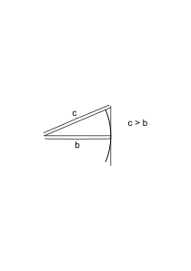
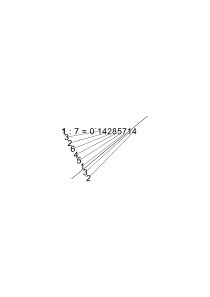
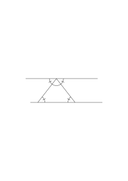
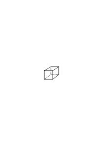
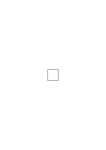
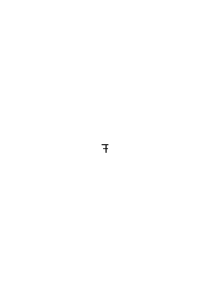
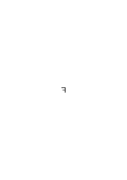

# Ms-161

### [1r\[1\]](https://cdn.wittgensteinnachlass.com/2000px/webp/Ms-161/1r.webp)

Our problems are totally different from those which a mathematician tackles.

### [1r\[2\]](https://cdn.wittgensteinnachlass.com/2000px/webp/Ms-161/1r.webp)

The difficulty is to get into the new dimension in which these problems can be solved. (Fly-glass, right & left hand, puzzle, rings which have to be separated.)

### [1r\[3\]](https://cdn.wittgensteinnachlass.com/2000px/webp/Ms-161/1r.webp),[1v\[1\]](https://cdn.wittgensteinnachlass.com/2000px/webp/Ms-161/1v.webp)

Is a mathematical training good for understanding the philosophy of math.?

### [1v\[2\]](https://cdn.wittgensteinnachlass.com/2000px/webp/Ms-161/1v.webp)

We are talking gibberish. But so are others, only we do it more openly.

### [1v\[3\]](https://cdn.wittgensteinnachlass.com/2000px/webp/Ms-161/1v.webp)

The economist … has found a cure for unemployment.

### [1v\[4\]](https://cdn.wittgensteinnachlass.com/2000px/webp/Ms-161/1v.webp)

We avoid all violence (jigsaw puzzle).

### [1v\[5\]](https://cdn.wittgensteinnachlass.com/2000px/webp/Ms-161/1v.webp),[2r\[1\]](https://cdn.wittgensteinnachlass.com/2000px/webp/Ms-161/2r.webp)

We shall never do popular science. I.e. we mustn't give any arguments which are not absolutely conclusive.

### [2r\[2\]](https://cdn.wittgensteinnachlass.com/2000px/webp/Ms-161/2r.webp)

Relation of math. to its application.

### [2r\[3\]](https://cdn.wittgensteinnachlass.com/2000px/webp/Ms-161/2r.webp)

Learning to calculate the weight of a cube.

### [2r\[4\]](https://cdn.wittgensteinnachlass.com/2000px/webp/Ms-161/2r.webp)

Physical & mathematical truth.

### [2r\[5\]](https://cdn.wittgensteinnachlass.com/2000px/webp/Ms-161/2r.webp),[2v\[1\]](https://cdn.wittgensteinnachlass.com/2000px/webp/Ms-161/2v.webp),[3r\[1\]](https://cdn.wittgensteinnachlass.com/2000px/webp/Ms-161/3r.webp),[3v\[1\]](https://cdn.wittgensteinnachlass.com/2000px/webp/Ms-161/3v.webp)

We have been talking about the relation of Math. to its application. What we really want to get at is the relation of the role which an experiential proposition plays to the role which a mathematical proposition plays. For “math. propositions”, & one kind in particular, sounds like “experiential propositions”, i.e., suggests to us an entirely different use than the actual one. And we must understand that the meaning of a proposition lies in the use we make of it & that this is hidden from us only by the fact that certain associations are bound up with our sentences, an imagery which quietens any doubt as to whether what we say are only mere words. It has been said that a sentence has not only a meaning but also a soul: & we mustn't let ourselves be mislead by the appearance of such a soul. One could imagine a language without such souls; in fact our chemical symbolism is such a language. A language in which we would have to decode every sentence.

### [3v\[2\]](https://cdn.wittgensteinnachlass.com/2000px/webp/Ms-161/3v.webp)

It has been said that the difficulty of logical investigations consists in this that the thoughts we had to think in them were _too_ simple. But its real difficulty is that the thoughts are so trivial that it is difficult to take them seriously.

### [4r\[1\]](https://cdn.wittgensteinnachlass.com/2000px/webp/Ms-161/4r.webp)

T. says it is certainly false to say that Smith drew the construction of the heptagon.

### [4r\[2\]](https://cdn.wittgensteinnachlass.com/2000px/webp/Ms-161/4r.webp),[4v\[1\]](https://cdn.wittgensteinnachlass.com/2000px/webp/Ms-161/4v.webp)

Now what is the thing he didn't draw? Well, the construction of the pentagon. – But what's this look like? ‘But the sentence simply says that there isn't such a thing & that therefore he can't have drawn it.’ Is it then analogous to: Smith can't have drawn a Centaur? – No. – Or is it like saying: he can't have drawn a woohoo, because there isn't such a thing? _Let's see!_ This is the one answer of which you can say that I _want_ you to give.

### [4v\[2\]](https://cdn.wittgensteinnachlass.com/2000px/webp/Ms-161/4v.webp)

Process & end in math..

### [4v\[3\]](https://cdn.wittgensteinnachlass.com/2000px/webp/Ms-161/4v.webp),[5r\[1\]](https://cdn.wittgensteinnachlass.com/2000px/webp/Ms-161/5r.webp)

We don't find out properties of things in math., but lay down characteristics of concepts.

### [5r\[2\]](https://cdn.wittgensteinnachlass.com/2000px/webp/Ms-161/5r.webp)

Always suspect a sentence to have no use at all.

### [5r\[3\]](https://cdn.wittgensteinnachlass.com/2000px/webp/Ms-161/5r.webp),[5v\[1\]](https://cdn.wittgensteinnachlass.com/2000px/webp/Ms-161/5v.webp)

You can't by doing this <math display="inline"><mtext>├</mtext><mtext>─</mtext><mtext>─</mtext><mtext>┼</mtext><mtext>─</mtext><mtext>─</mtext><mtext>┼</mtext><mtext>─</mtext><mtext>─</mtext><mtext>┼</mtext><mtext>─</mtext><mtext>─</mtext><mtext>┤</mtext></math> be doing this <math display="inline"><mtext>├</mtext><mtext>─</mtext><mtext>─</mtext><mtext>┼</mtext><mtext>─</mtext><mtext>─</mtext><mtext>┼</mtext><mtext>─</mtext><mtext>─</mtext><mtext>┤</mtext></math>. This ought really to be an experiential proposition of a _very_ elementary kind. And it could be this; it could say: Do _this_ … & see if the other results. Now if we bring the means & the end closer & closer together it seems that in the end the proposition becomes more than just physically improbable or impossible. What do we find in this case, we can't do?

### [5v\[2\]](https://cdn.wittgensteinnachlass.com/2000px/webp/Ms-161/5v.webp)

‘The number of solutions of an equation … is greater than the number of solutions of ….’

### [6r\[1\]](https://cdn.wittgensteinnachlass.com/2000px/webp/Ms-161/6r.webp)

Wie überzeugt mich dieser Beweis?

It convinces my _eyes_.

You can't by these means trisect a straight line.

### [6v\[1\]](https://cdn.wittgensteinnachlass.com/2000px/webp/Ms-161/6v.webp)

‘The least a proof can prove is the provability of its result’.

### [6v\[2\]](https://cdn.wittgensteinnachlass.com/2000px/webp/Ms-161/6v.webp)

‘The least a proof can prove is something about the geometry of this system of proving.’

### [7r\[1\]](https://cdn.wittgensteinnachlass.com/2000px/webp/Ms-161/7r.webp)

Proof a construction of a proposition.

### [7r\[2\]](https://cdn.wittgensteinnachlass.com/2000px/webp/Ms-161/7r.webp)

Not necessarily from primitive propositions.

### [7r\[3\]](https://cdn.wittgensteinnachlass.com/2000px/webp/Ms-161/7r.webp)

Not every such construction a proof.

### [7r\[4\]](https://cdn.wittgensteinnachlass.com/2000px/webp/Ms-161/7r.webp)

“On the 13th Feb. Prof. H. proved this proposition, on the 14th he rubbed out the proof.”

### [7r\[5\]](https://cdn.wittgensteinnachlass.com/2000px/webp/Ms-161/7r.webp)

A man creates a piece of math. by writing down something – does he destroy it by rubbing it out?

### [7v\[1\]](https://cdn.wittgensteinnachlass.com/2000px/webp/Ms-161/7v.webp)

When you look for a proof you don't try to find, or to produce, a certain object, the written proof e.g.; but you try to find or (what here says the same) to produce a technique of producing certain objects.

### [7v\[2\]](https://cdn.wittgensteinnachlass.com/2000px/webp/Ms-161/7v.webp)

We discover a new way of _finding_. We extend our idea of finding.

### [8r\[1\]](https://cdn.wittgensteinnachlass.com/2000px/webp/Ms-161/8r.webp)

“But surely you don't invent but discover that, say, the prime numbers occur in pairs!”

### [8r\[2\]](https://cdn.wittgensteinnachlass.com/2000px/webp/Ms-161/8r.webp),[8v\[1\]](https://cdn.wittgensteinnachlass.com/2000px/webp/Ms-161/8v.webp)

Proof of an impossibility. It gives us a new idea of constructing. It clarifies our idea of constructing. An idea getting clearer. Impossibility of making coincide right & left hand. How does the ‘proof’ convince us of the impossibility? As an experiment would? Can't he still look for a construction of the trisection? Certainly but the point of it has been removed for him.

### [8v\[2\]](https://cdn.wittgensteinnachlass.com/2000px/webp/Ms-161/8v.webp)

The proof underlined a most important sense of ‘constructing the n-section’. What should we really answer if someone tells us that Smith has constructed the trisection?

### [9r\[1\]](https://cdn.wittgensteinnachlass.com/2000px/webp/Ms-161/9r.webp)

We seem to recognise mathematical truth by experience before we can prove them.

### [9r\[2\]](https://cdn.wittgensteinnachlass.com/2000px/webp/Ms-161/9r.webp)

Believing a mathematical proposition

---

### [9r\[3\]](https://cdn.wittgensteinnachlass.com/2000px/webp/Ms-161/9r.webp)

“He finds that 86 × 91 = 7826”.

In what cases are we to say this? Only when he's right or also when he is wrong?

### [9r\[4\]](https://cdn.wittgensteinnachlass.com/2000px/webp/Ms-161/9r.webp),[9v\[1\]](https://cdn.wittgensteinnachlass.com/2000px/webp/Ms-161/9v.webp)

What about saying: he has arrived at a rule, – which he now acknowledges (as we all do).

### [9v\[2\]](https://cdn.wittgensteinnachlass.com/2000px/webp/Ms-161/9v.webp)

What if 12 × 12 = 144 were false after all?

### [9v\[3\]](https://cdn.wittgensteinnachlass.com/2000px/webp/Ms-161/9v.webp)

He has found something & accepted it.

### [9v\[4\]](https://cdn.wittgensteinnachlass.com/2000px/webp/Ms-161/9v.webp)

“We find by experiment that a × b = b × a & then show that it _must_ be so.”

### [9v\[5\]](https://cdn.wittgensteinnachlass.com/2000px/webp/Ms-161/9v.webp)

“He has shown, it must _always_ be so.”

### [9v\[6\]](https://cdn.wittgensteinnachlass.com/2000px/webp/Ms-161/9v.webp)

1:7 = 0˙14285714285

### [10r\[1\]](https://cdn.wittgensteinnachlass.com/2000px/webp/Ms-161/10r.webp)

Gedankenexperiment.

### [10r\[2\]](https://cdn.wittgensteinnachlass.com/2000px/webp/Ms-161/10r.webp)

In what way have I shown that this period _will_ always be repeated?

### [10r\[3\]](https://cdn.wittgensteinnachlass.com/2000px/webp/Ms-161/10r.webp)

But what about believing that it will always come out like this, before it's been proved? Now what do you believe: that it'll always come out, or that it'll be correct if it does?

### [10v\[1\]](https://cdn.wittgensteinnachlass.com/2000px/webp/Ms-161/10v.webp)

You believe that it will be correct. But can't you even go further & assume or postulate that it will be correct?

### [11r\[1\]](https://cdn.wittgensteinnachlass.com/2000px/webp/Ms-161/11r.webp)

We use the word “meaning” a lot in … phrases.

a) in learning a language

b) unusual expressions

c) in cases of doubt

d) in philosophy.

### [11r\[2\]](https://cdn.wittgensteinnachlass.com/2000px/webp/Ms-161/11r.webp)

Where do words get their meanings from?

### [11r\[3\]](https://cdn.wittgensteinnachlass.com/2000px/webp/Ms-161/11r.webp)

Why do we so easily forget the meaning?

### [11r\[4\]](https://cdn.wittgensteinnachlass.com/2000px/webp/Ms-161/11r.webp)

Meaning & the occasions of use.

### [11v\[1\]](https://cdn.wittgensteinnachlass.com/2000px/webp/Ms-161/11v.webp)

When we make a calculation of the experiment, we make a picture of it & keep the picture, lay it down among our modes of expression. And this gives it a certain dignity.

### [11v\[2\]](https://cdn.wittgensteinnachlass.com/2000px/webp/Ms-161/11v.webp),[12r\[1\]](https://cdn.wittgensteinnachlass.com/2000px/webp/Ms-161/12r.webp)

T. said that the best he could get is the result that _he_ had obtained such & such a number. Does God know more about it?

### [12r\[2\]](https://cdn.wittgensteinnachlass.com/2000px/webp/Ms-161/12r.webp)

But couldn't we say that the mathematical proposition says that all normal people agree in getting this result? But what on earth is interesting about this?

### [12r\[3\]](https://cdn.wittgensteinnachlass.com/2000px/webp/Ms-161/12r.webp)

Do we prove in

1 : 3 = 0.3 …

that something will always happen or that something will always be _right_?

### [12v\[1\]](https://cdn.wittgensteinnachlass.com/2000px/webp/Ms-161/12v.webp)

We accept a proposition on the ground of a proof.

### [12v\[2\]](https://cdn.wittgensteinnachlass.com/2000px/webp/Ms-161/12v.webp)

What role does the proof play in our accepting the proposition? Has the proof simply this psychological effect?

### [12v\[3\]](https://cdn.wittgensteinnachlass.com/2000px/webp/Ms-161/12v.webp)

Is it the function of a proof to convince us? Has the proof done its duty when it has convinced us?

### [12v\[4\]](https://cdn.wittgensteinnachlass.com/2000px/webp/Ms-161/12v.webp),[13r\[1\]](https://cdn.wittgensteinnachlass.com/2000px/webp/Ms-161/13r.webp)

‘A proof gives the proposition its sense.’

### [13r\[2\]](https://cdn.wittgensteinnachlass.com/2000px/webp/Ms-161/13r.webp)

You can use the proof

1:3 = 3 … to prophesy what people will get. But this is not its mathematical use.

### [13r\[3\]](https://cdn.wittgensteinnachlass.com/2000px/webp/Ms-161/13r.webp)

You can't define the number two in math. “Two is the number of roots of this equation.” – “Two is the number of chairs in this room”.

### [14r\[1\]](https://cdn.wittgensteinnachlass.com/2000px/webp/Ms-161/14r.webp)

Denke Dir Einen der das nicht annimmt.

### [14r\[2\]](https://cdn.wittgensteinnachlass.com/2000px/webp/Ms-161/14r.webp)

Right & left hand.

### [14r\[3\]](https://cdn.wittgensteinnachlass.com/2000px/webp/Ms-161/14r.webp)

“I'm bound to admit.” And what are you bound to admit? That the angles in this triangle add up to 180˚?

### [14v\[1\]](https://cdn.wittgensteinnachlass.com/2000px/webp/Ms-161/14v.webp)

### [15r\[1\]](https://cdn.wittgensteinnachlass.com/2000px/webp/Ms-161/15r.webp),[15v\[1\]](https://cdn.wittgensteinnachlass.com/2000px/webp/Ms-161/15v.webp),[16r\[1\]](https://cdn.wittgensteinnachlass.com/2000px/webp/Ms-161/16r.webp),[16v\[1\]](https://cdn.wittgensteinnachlass.com/2000px/webp/Ms-161/16v.webp)

Last time's problem. Is Math. a game? Argument against it. “The Theory of the game is _not_ arbitrary although the game is.” The theory of the game as pure math. & physics. Can we say that the fact that you can't mate with … rests on certain physical & certain math.l facts? Can we say that the possibility of proving so & so in such & such a way rests on a mathematical, logical, fact? Great temptations. This is, of course, restating our old problem. Suppose we said: it never happens that A mates B with …. This should be the more modest proposition. But what does it mean? But couldn't we say: it never happens that we _say_ A … B …? Certainly & this is a very important _fact_ but based on what? So now is the theory of the game arbitrary? “I believe that Goldbach's theorem will come true”. How is this belief in the end verified? By a proof. By any proof? No. By this particular proof? No. By something we shall recognize as a proof. But isn't the fact that such & such a proof is _possible_ based on a mathematical fact, a math. reality? I mean the fact that there is a proof at least somewhere in the region we still recognize as that of proofs? The math. fact being that such & such a structure is possible. That it is imaginable. How do we imagine this possibility? What is a structure like which is impossible. Possible = describable.

### [17r\[1\]](https://cdn.wittgensteinnachlass.com/2000px/webp/Ms-161/17r.webp)

How does a person know that I _feel_ something?

### [17r\[2\]](https://cdn.wittgensteinnachlass.com/2000px/webp/Ms-161/17r.webp)

Why isn't a particular thought called a ‘feeling’.

### [17r\[3\]](https://cdn.wittgensteinnachlass.com/2000px/webp/Ms-161/17r.webp)

Wie, wenn Du nur _glaubst_ ein solches Prisma zu sehen?

### [17r\[5\]](https://cdn.wittgensteinnachlass.com/2000px/webp/Ms-161/17r.webp),[17v\[1\]](https://cdn.wittgensteinnachlass.com/2000px/webp/Ms-161/17v.webp)

‘Ich sehe das Prisma jetzt _so_, jetzt _so_’: hat das allein einen Sinn? Hat es _für mich_ einen Sinn?

Hat es für mich zwar allein keinen Sinn, aber wohl zusammen mit der Erfahrung? Wie beziehen sich die Worte auf die Erfahrung? Wie weiß ich, z.B., daß die beiden “_so_” nicht das gleiche bedeuten (etwa was beiden Erscheinungen gemein ist). Wäre dieser Ausdruck nicht einer der öffentlichen Sprache, so hätte er auch keinen privaten Sinn.

### [18r\[1\]](https://cdn.wittgensteinnachlass.com/2000px/webp/Ms-161/18r.webp)

Man kann ein

‘’,

wenn es so

geschrieben ist, noch immer als

sehen, nicht als verkehrtes

.

### [18r\[2\]](https://cdn.wittgensteinnachlass.com/2000px/webp/Ms-161/18r.webp),[18v\[1\]](https://cdn.wittgensteinnachlass.com/2000px/webp/Ms-161/18v.webp)

Sehe ich denn jede Figur _als etwas_? Das falsche Bild: als ob das grob Sichtbare ein Körper wäre von dem eine Reihe vom Schleiern niedergelassen wären, die ihm jeder einen bestimmten Hauch über ihn breitet.

### [18v\[2\]](https://cdn.wittgensteinnachlass.com/2000px/webp/Ms-161/18v.webp)

Indem ich nun zähle & quadriere, kann ich zu einer Vermutung darüber kommen was der Andere wohl prophezeien wird.

### [18v\[3\]](https://cdn.wittgensteinnachlass.com/2000px/webp/Ms-161/18v.webp),[19r\[1\]](https://cdn.wittgensteinnachlass.com/2000px/webp/Ms-161/19r.webp),[19v\[1\]](https://cdn.wittgensteinnachlass.com/2000px/webp/Ms-161/19v.webp)

Sagt es nun wirklich dasselbe: hier seien 25 × 25 Äpfel &: hier seien 625 Äpfel? Und wenn so: widerspricht dies dem Satz daß ich durch die Multiplikation etwas Neues gelernt habe? Wie, wenn man sagt: ‘Wenn die beiden dasselbe heißen so muß, wer das eine weiß, das andre wissen’? Wie wäre es denn, wenn ich etwa den Satz “Es regnet” nach einer bestimmten Regel in eine Ziffer umschriebe. Wüßte nun der, der weiß daß es regnet nicht auch daß … Und doch weiß er, ehe er den Schlüssel zur Transkription benützt hat nicht ihr Resultat.

### [19v\[2\]](https://cdn.wittgensteinnachlass.com/2000px/webp/Ms-161/19v.webp)

Es ließe sich ja denken, daß Multiplikationen etc. nur dazu verwendet würden, Ziffern kürzer anzuschreiben etwa statt ‘100000’ ‘104’ oder sie so anzuschreiben, daß nicht jeder sie versteht, so daß die Rechenregel einfach eine Regel zur Entzifferung wäre.

### [19v\[3\]](https://cdn.wittgensteinnachlass.com/2000px/webp/Ms-161/19v.webp),[20r\[1\]](https://cdn.wittgensteinnachlass.com/2000px/webp/Ms-161/20r.webp)

Hat mich nun die Transkription nichts Neues gelehrt? Gewiß; aber doch nichts Neues über die Sache, von der der Satz handelt.

### [20r\[2\]](https://cdn.wittgensteinnachlass.com/2000px/webp/Ms-161/20r.webp),[20v\[1\]](https://cdn.wittgensteinnachlass.com/2000px/webp/Ms-161/20v.webp)

Anderseits: Hätte ich gewußt, daß die Äpfel unter 600 Leute zu verteilen sind, so hätte mich (nun) die Rechnung gelehrt daß mehr Äpfel als Leute da sind, etc.. Oder: ich wußte daß ich 625 Äpfel habe – dann zeigt mir die Transkription von ‘625’ in ‘25 × 25’ daß ich sie so & so verteilen & ordnen kann.

### [20v\[2\]](https://cdn.wittgensteinnachlass.com/2000px/webp/Ms-161/20v.webp)

Denk Dir in dem Satz: “hier sind 625 Äpfel” die Anzahl durch Striche dargestellt & nun statt der Transkription ein Anordnen (der Striche) in Gruppen.

### [21r\[1\]](https://cdn.wittgensteinnachlass.com/2000px/webp/Ms-161/21r.webp)

Wie, wenn ich sagte: “25 Äpfel + 25 Äpfel sind 50 Äpfel – & das soll noch nichts über die Äpfel aussagen.”

### [21r\[2\]](https://cdn.wittgensteinnachlass.com/2000px/webp/Ms-161/21r.webp)

Die Pointe liegt in dem: ‘das soll’.

### [21r\[3\]](https://cdn.wittgensteinnachlass.com/2000px/webp/Ms-161/21r.webp)

Ich könnte auch sagen, statt: ‘ich beschreibe damit keinen psychologischen Vorgang’ – ‘ich will damit keinen psychologischen Vorgang beschreiben’, oder: ‘das soll keinen psychologischen Vorgang beschreiben’.

### [21v\[1\]](https://cdn.wittgensteinnachlass.com/2000px/webp/Ms-161/21v.webp)

Der Witz ist, daß der Verlauf der Rechnung einmal einen psychologischen Verlauf beschreiben _kann_, aber es nicht notwendigerweise _tut_.

### [21v\[2\]](https://cdn.wittgensteinnachlass.com/2000px/webp/Ms-161/21v.webp)

Auch wenn die Menschen verschieden, & immer anders, auf die Regel & Abrichtung reagierten gäbe es die Sätze über den psychologischen Verlauf – aber keine Rechnung.

### [22r\[1\]](https://cdn.wittgensteinnachlass.com/2000px/webp/Ms-161/22r.webp),[22v\[1\]](https://cdn.wittgensteinnachlass.com/2000px/webp/Ms-161/22v.webp)

Ein Sprachspiel: Einer lehrt Einen rechnen, z.B. zu multiplizieren. Auf die Frage wieviel ist … × …, hat er die Multiplikation zu machen, aber es gilt auch, wenn er das Resultat sagt. Wenn er weiß daß 25 × 25 = 625 ist, weiß er: daß er auf die Frage hin etwas anschreiben wird, an dessen Ende ‘625’ steht? Weiß er, daß _er_ so reagieren wird? Man kann nur ‘wissen, daß 25 × 25 625 ist’ innerhalb eines von der Gesellschaft geübten Spieles.

### [22v\[2\]](https://cdn.wittgensteinnachlass.com/2000px/webp/Ms-161/22v.webp)

Der Gedanke von der mathematischen Realität. Er ist nur ein Spiegel des Gebrauchs der Rechnung & entgegengesetzt der Idee der mathem. Satz sage etwas über psychologische Abläufe.

### [22v\[3\]](https://cdn.wittgensteinnachlass.com/2000px/webp/Ms-161/22v.webp),[23r\[1\]](https://cdn.wittgensteinnachlass.com/2000px/webp/Ms-161/23r.webp)

Der math. Satz kann in gewisser & in gewisser Beziehung kann er _nicht_ durch die psychologische Reaktion überprüft werden.

### [23r\[2\]](https://cdn.wittgensteinnachlass.com/2000px/webp/Ms-161/23r.webp),[23v\[1\]](https://cdn.wittgensteinnachlass.com/2000px/webp/Ms-161/23v.webp)

Er hat nicht die Beschreibung der psychologischen Reaktion zur Aufgabe. Er hat eine _andere_ Funktion – ja er könnte diese oder eine ähnliche Funktion etwa auch dann erfüllen wenn die Gemeinsamkeit der psychologischen Reaktionen nicht erfüllt wäre. Ja auch, soweit die Gemeinsamkeit erfüllt sein muß, hat der Satz doch nicht die Aufgabe sie zu behaupten – er gründet sich auf sie. Denn er würde sie _behaupten_, wenn sein Gegenteil das Gegenteil behauptete. Er hat eine gänzlich andere Funktion als der psychologische Satz.

### [23v\[2\]](https://cdn.wittgensteinnachlass.com/2000px/webp/Ms-161/23v.webp),[24r\[1\]](https://cdn.wittgensteinnachlass.com/2000px/webp/Ms-161/24r.webp)

Ich merke, daß es mich wundert, daß Chesterton ungefähr im Norden von Cambridge ist. _Nicht_ aber, weil der Stand der Sonne mir je etwas andres zu zeigen geschienen hat, sondern bloß weil es mir natürlicher wäre Norden in der Richtung anzunehmen, in der ich aus meinem Fenster auf die Gegend wie auf eine Karte, schaue. Dies zeigt, in welcher Weise solche Vorurteile entstehen. (Drury)

---

### [24r\[2\]](https://cdn.wittgensteinnachlass.com/2000px/webp/Ms-161/24r.webp),[24v\[1\]](https://cdn.wittgensteinnachlass.com/2000px/webp/Ms-161/24v.webp)

‘Der math. Beweis muß übersichtlich sein.’ D.h.: er ist ein Bild das man nicht nur muß wiederrechnen, sondern auch mit dem gleichen Erfolg kopieren können.

### [24v\[2\]](https://cdn.wittgensteinnachlass.com/2000px/webp/Ms-161/24v.webp)

Der Beweis muß übersichtlich sein heiß: die Art & Weise wie der Beweis sein Resultat erzeugt muß ganz in einem Bild festzuhalten sein.

### [24v\[3\]](https://cdn.wittgensteinnachlass.com/2000px/webp/Ms-161/24v.webp)

Derselbe Beweis ist der, der die _Kopie_ des andern ist – auch wenn er nicht von ihm _kopiert_ wurde.

### [25r\[1\]](https://cdn.wittgensteinnachlass.com/2000px/webp/Ms-161/25r.webp)

Das ist natürlich auch damit gesagt, daß man von einer ‘Beweisfigur’ redet.

### [25r\[2\]](https://cdn.wittgensteinnachlass.com/2000px/webp/Ms-161/25r.webp)

Oder soll ich sagen: der Beweis sei nicht die Figur, sondern nur ein Vorgang (etwa ein geistiger, der der Figur entlangläuft). Wie aber, wenn ich sagte der Beweis wäre zwar nicht _eine_ Figur sondern eine Folge von Figuren. Warum aber dann nicht auch _eine_ Figur?

### [25v\[1\]](https://cdn.wittgensteinnachlass.com/2000px/webp/Ms-161/25v.webp)

Am irreführendsten sind die psychologischen Begriffe: davon daß ich mit jedem Schritte des Beweises übereinstimmen muß, daß mich der Beweis überzeugt, daß ich den mathematischen Satz glaube, u.a..

### [25v\[2\]](https://cdn.wittgensteinnachlass.com/2000px/webp/Ms-161/25v.webp),[26r\[1\]](https://cdn.wittgensteinnachlass.com/2000px/webp/Ms-161/26r.webp)

Welchen Grund hat man, zu sagen: er _sehe_ das Zeichen F in verschiedener Weise? Außer dem daß er _sagt_, er sehe auf verschiedene Weise, spricht irgend etwas in seinem übrigen Benehmen dafür?

### [26r\[2\]](https://cdn.wittgensteinnachlass.com/2000px/webp/Ms-161/26r.webp)

Wenn ich mir Schmerzen vorstelle stelle ich mir manchmal etwas braunes oder braun-violettes vor.

### [26r\[3\]](https://cdn.wittgensteinnachlass.com/2000px/webp/Ms-161/26r.webp),[26v\[1\]](https://cdn.wittgensteinnachlass.com/2000px/webp/Ms-161/26v.webp)

Aber will ich denn leugnen, daß man sich _Schmerzen_ vorstellen kann? Weit davon! Nur die Beschreibung kann sich an nichts hängen als an Symptome _& Äußerungen_.

### [27r\[1\]](https://cdn.wittgensteinnachlass.com/2000px/webp/Ms-161/27r.webp)

‘Sich ein Gefühl oder Körperhaltungen vorstellen ist doch etwas andres!’ – Was heißt das? Wohl, daß jene beiden Ausdrücke verschiedenen Sinn haben, verschieden gebraucht werden. – Und da ist kein Zweifel.

### [27r\[2\]](https://cdn.wittgensteinnachlass.com/2000px/webp/Ms-161/27r.webp),[27v\[1\]](https://cdn.wittgensteinnachlass.com/2000px/webp/Ms-161/27v.webp)

Ich sagte der mathematische Beweis wird als Demonstration einer internen Eigenschaft aufgefaßt. Führe einen Beweis durch Falten eines, sagen wir, quadratischen Stücks Papier. Das Resultat kann man als interne aber auch als externe Eigenschaft deuten.

### [27v\[2\]](https://cdn.wittgensteinnachlass.com/2000px/webp/Ms-161/27v.webp)

Ich bin beim math. Satz geneigt von einem Sinne im Fregeschen Sinne zu reden.

### [27v\[3\]](https://cdn.wittgensteinnachlass.com/2000px/webp/Ms-161/27v.webp),[28r\[1\]](https://cdn.wittgensteinnachlass.com/2000px/webp/Ms-161/28r.webp),[28v\[1\]](https://cdn.wittgensteinnachlass.com/2000px/webp/Ms-161/28v.webp)

Was behauptet der der behauptet 25 × 25 sei 625? Nun eben, daß 25 × 25 = 625. Aber ich will weiter fragen. Der Satz sagt, daß etwas mal etwas etwas ergibt. Nun das ist für gewöhnlich keine mathematische Satzform & ein Beispiel ihres Sinnes ist etwa daß 3 mal diese Fläche

jene Fläche

ergibt. Der mathematische Satz aber dieser Form hat noch immer denselben Sinn & doch wieder nicht; d.h., er spielt– gleichsam – auf jenen Sinn an, ob schon er eine andre Verwendung hat. Aber die Verwendung ist freilich nicht ohne Zusammenhang mit diesem Sinn.

### [29r\[1\]](https://cdn.wittgensteinnachlass.com/2000px/webp/Ms-161/29r.webp)

Man könnte fast sagen: “Der math. Satz 5 × 5 = 25 sagt gleichsam daß etwas mal etwas etwas ist.”

### [29r\[2\]](https://cdn.wittgensteinnachlass.com/2000px/webp/Ms-161/29r.webp)

Und etwa auch:

“‘p⊃q ∙ p :⊃: q’ sagt gleichsam, daß dies & dies dies impliziert”.

### [29r\[3\]](https://cdn.wittgensteinnachlass.com/2000px/webp/Ms-161/29r.webp),[29v\[1\]](https://cdn.wittgensteinnachlass.com/2000px/webp/Ms-161/29v.webp)

Nimm den Goldbachschen Satz – worauf beruht daß wir verstehen was er sagt? Doch auf der Verwendung seiner Wörter & Wortform in anderen Sätzen! Doch auf nichts anderem! Er ist noch nicht bewiesen – – – was aber macht daß wir diesen Satz verstehen? Doch dasselbe! –

### [29v\[2\]](https://cdn.wittgensteinnachlass.com/2000px/webp/Ms-161/29v.webp),[30r\[1\]](https://cdn.wittgensteinnachlass.com/2000px/webp/Ms-161/30r.webp)

Wenn er nun bewiesen wäre – wüßten wir dann besser als jetzt was die Worte “der Beweis des Goldbachschen Satzes” bedeuten? Oder wüßten wir es doch _anders_? Haben diese Worte dann eine andere Bedeutung? Oder ist es so wie wenn ich sage ‘ich möchte einen Apfel haben’ wo ‘Apfel’ dasselbe bedeutet ehe ich ihn habe & nachher.

### [30r\[2\]](https://cdn.wittgensteinnachlass.com/2000px/webp/Ms-161/30r.webp)

Ich wollte doch sagen “der Beweis des Satzes …” wenn es ihn gibt ist keine R.sche Beschreibung.

### [30r\[3\]](https://cdn.wittgensteinnachlass.com/2000px/webp/Ms-161/30r.webp),[30v\[1\]](https://cdn.wittgensteinnachlass.com/2000px/webp/Ms-161/30v.webp)

Der Unterschied zwischen dem bewiesenen & unbewiesenen math. Satz ist nicht der zwischen dem verifizierten & unverifizierten physikalischen. D.h.: Der Unterschied der Brauchbarkeit & Verwendung ist nicht der gleiche.

### [30v\[2\]](https://cdn.wittgensteinnachlass.com/2000px/webp/Ms-161/30v.webp)

Der Beweis reiht ihn in das System ein. Er ist freilich durch seine Wortform auch eingereiht. Und in dieser doppelten Einreihung liegt das Problem.

### [30v\[3\]](https://cdn.wittgensteinnachlass.com/2000px/webp/Ms-161/30v.webp),[31r\[1\]](https://cdn.wittgensteinnachlass.com/2000px/webp/Ms-161/31r.webp)

Von der zweiten Einreihung _könnte_ man sagen sie gibt ihm den Sinn, von der ersten sie gibt ihm die Wahrheit (den Wahrheitswert). Aber ich will gerade das _nicht_ sagen. Oder: gerade das scheint mir der irreführendste Aspekt.

### [31r\[2\]](https://cdn.wittgensteinnachlass.com/2000px/webp/Ms-161/31r.webp),[31v\[1\]](https://cdn.wittgensteinnachlass.com/2000px/webp/Ms-161/31v.webp)

Denn, ungefähr gesprochen, den ‘Sinn’ sollte ihm ja doch die Art & Weise geben, wie er als wahr zu befinden wäre. – Einen Beweis des Satzes aber kann es geben auch wenn es nichts gibt daß man eine ‘Verifikationsmethode’ nennen könnte.

### [31v\[2\]](https://cdn.wittgensteinnachlass.com/2000px/webp/Ms-161/31v.webp),[32r\[1\]](https://cdn.wittgensteinnachlass.com/2000px/webp/Ms-161/32r.webp)

Nun warum nicht sagen: Wenn Du wissen willst was für einen Sinn der Goldbachsche Satz hat sieh hin was die Mathematiker die ihn beweisen wollen beweisen wollen – & wenn Du das sehen willst sieh hin was sie tatsächlich tun, welche _Anläufe_ sie machen, ihn zu beweisen.

### [32r\[2\]](https://cdn.wittgensteinnachlass.com/2000px/webp/Ms-161/32r.webp)

Denn mit diesen Anläufen reihen sie ja den Satzausdruck auch ein. Wenn sie sozusagen seinen Ort auch nicht _genau_ bestimmen, so bestimmen sie ihn doch in gewissem Grade.

### [32r\[3\]](https://cdn.wittgensteinnachlass.com/2000px/webp/Ms-161/32r.webp),[32v\[1\]](https://cdn.wittgensteinnachlass.com/2000px/webp/Ms-161/32v.webp)

Der Goldbachsche Satz wenn er nicht bewiesen ist, ist – könnte man sagen – _der Ausdruck eines Problems_. Der Sinn ist das _Problem_.

### [32v\[2\]](https://cdn.wittgensteinnachlass.com/2000px/webp/Ms-161/32v.webp)

Behauptet der math. Satz eine interne Relation? – Er behauptet was er behauptet. Er behauptet, was ein Beweis beweist, & sein Beweis demonstriert eine interne Relation, & doch wäre es Unrecht zu sagen, der mathematische Satz behaupte eine interne Relation. Könnte man nicht eher sagen: er behauptet eine bestimmte Anwendbarkeit?

### [33r\[1\]](https://cdn.wittgensteinnachlass.com/2000px/webp/Ms-161/33r.webp)

Er behauptet, sozusagen, seinen Sinn, so wie ihn seine Worte uns vorschlagen.

### [33r\[2\]](https://cdn.wittgensteinnachlass.com/2000px/webp/Ms-161/33r.webp)

Was der Beweis beweist ist daß der Satz wahr ist: daß wir hier ein Instrument zu _diesem_ Gebrauche _haben_.

### [33r\[3\]](https://cdn.wittgensteinnachlass.com/2000px/webp/Ms-161/33r.webp)

Der Beweis tut den Satz als ein zu diesem Zweck geeignetes Instrument dar.

### [33v\[1\]](https://cdn.wittgensteinnachlass.com/2000px/webp/Ms-161/33v.webp)

‘Der mathematische Satz sagt doch etwas’ – & was er sagt wird sein Gebrauch zeigen, der Gebrauch der Zeichen die ihn bilden. Aber der Gebrauch nur in der Mathematik, oder der Gebrauch auch außerhalb?!

### [33v\[2\]](https://cdn.wittgensteinnachlass.com/2000px/webp/Ms-161/33v.webp),[34r\[1\]](https://cdn.wittgensteinnachlass.com/2000px/webp/Ms-161/34r.webp)

‘Den math. Satz als wahr anerkennen’ ist das eine seelische Tätigkeit? Und was nützt sie? Wenn wir nun einen Satz als wahr anerkannt haben – was weiter? Warum sollte mich dieser seelische Akt interessieren? (Warum mehr, als Freude oder Unwille beim Anblick des Satzes?)

### [34r\[2\]](https://cdn.wittgensteinnachlass.com/2000px/webp/Ms-161/34r.webp)

Die Frage ist: wozu ist der Satz, den ich als wahr anerkenne, ein Instrument?

### [34r\[3\]](https://cdn.wittgensteinnachlass.com/2000px/webp/Ms-161/34r.webp),[34v\[1\]](https://cdn.wittgensteinnachlass.com/2000px/webp/Ms-161/34v.webp)

In jenem Sprachspiel – warum soll ich nicht sagen, daß der, welcher multiplizieren gelernt hat & dann eine Multiplikation ausführt, durch sie eine neue Tatsache gelernt habe? Und doch – _welche_ ist es?

### [34v\[2\]](https://cdn.wittgensteinnachlass.com/2000px/webp/Ms-161/34v.webp),[35r\[1\]](https://cdn.wittgensteinnachlass.com/2000px/webp/Ms-161/35r.webp)

Daß er jetzt so gehandelt hat? daß er wahrscheinlich immer so handeln wird? daß Andre so handeln? Und hat er auch genügend intensiv an die Regel gedacht? Hat er also wirklich _nach ihr_ gehandelt? Daß das mal dem das ergiebt? Aber ist das eine Erklärung des Sinnes von “ergeben”? Oder _muß_ ich mir die Regel als einen unpersönlichen Mechanismus vorstellen, der nur auf mich, & durch mich, wirkt? Denn das letztere ist es doch, was Mathematiker sagen möchten. Die Regel sei ein abstrakter Mechanismus.

### [35v\[1\]](https://cdn.wittgensteinnachlass.com/2000px/webp/Ms-161/35v.webp)

Nun, wer das sagt, sagt vor allem, daß die math. Sätze _nicht_ von einem seelischen oder körperlichen Mechanismus handeln sollen. (Denn wer es sagt, sagt nicht einfach eine Dummheit, sondern irgend eine Wahrheit in ein Mißverständnis gehüllt.)

### [35v\[2\]](https://cdn.wittgensteinnachlass.com/2000px/webp/Ms-161/35v.webp),[36r\[1\]](https://cdn.wittgensteinnachlass.com/2000px/webp/Ms-161/36r.webp)

Wer so abgerichtet ist weiß was er auf die Frage hin zu tun & zu antworten hat wenn er keine Strafe kriegen will. Er lernt von der Rechnung, was er zu antworten hat.

### [36r\[2\]](https://cdn.wittgensteinnachlass.com/2000px/webp/Ms-161/36r.webp)

Wer nun die Rechnung ausführt muß er denken, daß er dadurch eine Information erhält?? Warum nicht einfach, daß er etwas tut, _etwas erzeugt_?

### [36r\[3\]](https://cdn.wittgensteinnachlass.com/2000px/webp/Ms-161/36r.webp),[36v\[1\]](https://cdn.wittgensteinnachlass.com/2000px/webp/Ms-161/36v.webp)

Man könnte sagen: Die Rechnung sagt mir, daß die Andern so rechnen, – _wenn_ ich mich frage wie die Andern rechnen. Wenn ich das aber nicht frage, dann sagt sie mir's nicht.

### [36v\[2\]](https://cdn.wittgensteinnachlass.com/2000px/webp/Ms-161/36v.webp),[37r\[1\]](https://cdn.wittgensteinnachlass.com/2000px/webp/Ms-161/37r.webp)

‘Wär's denkbar, daß diese Operationen etwas anderes ergäben?’ – Da möchte man sagen: Nein. Denn: dann wären es eben nicht diese Operationen. Nun wie muß man sie auffassen, daß das _Bild_ davon, wie sie das ergeben eben das ist, was wir beim Rechnen erzeugen?

### [37r\[2\]](https://cdn.wittgensteinnachlass.com/2000px/webp/Ms-161/37r.webp)

Die Rechnung kann einen Satz _erzeugen_ ohne (ihn, oder) was er sagt, uns _mitzuteilen_.

### [37r\[3\]](https://cdn.wittgensteinnachlass.com/2000px/webp/Ms-161/37r.webp)

Kann ich mir vorstellen wie man im Schach mit zwei Bauern allein mattsetzt?

### [37r\[4\]](https://cdn.wittgensteinnachlass.com/2000px/webp/Ms-161/37r.webp),[37v\[1\]](https://cdn.wittgensteinnachlass.com/2000px/webp/Ms-161/37v.webp)

Wenn der Mathematiker grammatische Straßen baut, so ändert er eben durch seine Tätigkeit die Bedeutung der Ausdrücke.

### [37v\[2\]](https://cdn.wittgensteinnachlass.com/2000px/webp/Ms-161/37v.webp),[38r\[1\]](https://cdn.wittgensteinnachlass.com/2000px/webp/Ms-161/38r.webp)

Wenn mir ein vertrauenswürdiger Mensch sagt, daß seine Erfahrung wenn er

einmal _so_ einmal _so_ sieht, ganz so ist wie wenn er einmal _eines_ einmal etwas anderes sähe – kann ich das als Evidenz dafür betrachten, daß es sich hier um ein verschiedenes _Sehen_, oder _Gesehenes_, handelt? Und warum nicht? Wenn er sonst intelligent ist & die Sprache versteht sollte er es doch wissen!

### [38r\[2\]](https://cdn.wittgensteinnachlass.com/2000px/webp/Ms-161/38r.webp)

“Ich bin geneigt zu sagen …”, “Vouloir dire”.

### [38r\[3\]](https://cdn.wittgensteinnachlass.com/2000px/webp/Ms-161/38r.webp),[38v\[1\]](https://cdn.wittgensteinnachlass.com/2000px/webp/Ms-161/38v.webp)

[unreadable] Kann “ich bin geneigt zu sagen ‘ich habe Schmerzen’” die Aussage “ich habe Schmerzen” ersetzen? – Warum nicht? _Das_ ist kein Einwand: daß die Sätze von Verschiedenem handeln.

### [38v\[2\]](https://cdn.wittgensteinnachlass.com/2000px/webp/Ms-161/38v.webp),[39r\[1\]](https://cdn.wittgensteinnachlass.com/2000px/webp/Ms-161/39r.webp)

Bald hätte ich gesagt: “dieser Ersatz ließe sich auch in der alten Auffassung rechtfertigen”! Aber was ist die ‘alte Auffassung’? Sie ist, glaube ich, durch ein _Bild_ charakterisiert: Das des Sehens, des Anschauens eines Gegenstands der nicht unter den physikalischen Gegenständen, sondern wo anders seinen Raum hat. (Denn warum soll ich hier die Anwesenheit dieses Gegenstands vor meinem geistigen Auge nicht eben als den Reiz denken, der die Geneigtheit, das & das zu sagen, ausmacht.)

### [39r\[2\]](https://cdn.wittgensteinnachlass.com/2000px/webp/Ms-161/39r.webp)

Ich kann das Zeugnis jener glaubwürdigen Menschen nicht annehmen, weil es kein _Zeugnis_ ist.

### [39r\[3\]](https://cdn.wittgensteinnachlass.com/2000px/webp/Ms-161/39r.webp),[39v\[1\]](https://cdn.wittgensteinnachlass.com/2000px/webp/Ms-161/39v.webp)

Das Beispiel von dem ‘Wissen wie man zu antworten hat’ zeigt nur, daß man bei der Beschreibung der Mathematik nicht von _Wissen_ & _Mitteilung_ reden muß.

### [39v\[2\]](https://cdn.wittgensteinnachlass.com/2000px/webp/Ms-161/39v.webp)

Der Gegenstand vor dem geistigen (innern) Sinnesorgan ist die Erklärung, Schein-Erklärung, der Äußerung. Das Scheingesims, das das Auge fordert, obschon es nichts trägt.

### [39v\[3\]](https://cdn.wittgensteinnachlass.com/2000px/webp/Ms-161/39v.webp)

Wir fordern oft eine Erklärung, weil wir die _Form der Erklärung_ fordern; aber auch wo sie nichts trägt.

### [40r\[1\]](https://cdn.wittgensteinnachlass.com/2000px/webp/Ms-161/40r.webp),[40v\[1\]](https://cdn.wittgensteinnachlass.com/2000px/webp/Ms-161/40v.webp)

Aber bist Du nicht doch nur ein verkappter Behaviourist? Denn Du sagst, daß nichts hinter der Äußerung der Empfindung steht. Sagst Du nicht doch im Grunde, daß alles Fiktion ist, außer dem Benehmen? Fiktion? So glaube ich also daß wir nicht wirklich Schmerzen fühlen, sondern nur Gesichter schneiden?! Aber Fiktion _ist_ der Gegenstand hinter der Äußerung. Fiktion ist es daß unsre Worte um Bedeutung zu haben auf ein Etwas anspielen müssen, das ich wenn nicht einem Andern, doch mir selbst zeigen kann.

### [40v\[2\]](https://cdn.wittgensteinnachlass.com/2000px/webp/Ms-161/40v.webp)

Meine Kritik besteht darin, daß ich die ganze gewöhnliche, primitive Auffassung der Funktion der Wörter im Sprachspiel als zu eng hinstelle.

### [40v\[3\]](https://cdn.wittgensteinnachlass.com/2000px/webp/Ms-161/40v.webp),[41r\[1\]](https://cdn.wittgensteinnachlass.com/2000px/webp/Ms-161/41r.webp)

Ist die hinweisende Definition die zeigt daß diese Farbe “grün” heißt, keine Regel sondern ein Satz über den Gebrauch der Wörter, das Arbeiten unseres Gedächtnisses usw.?

### [41r\[2\]](https://cdn.wittgensteinnachlass.com/2000px/webp/Ms-161/41r.webp),[41v\[1\]](https://cdn.wittgensteinnachlass.com/2000px/webp/Ms-161/41v.webp)

Wer einen math. Satz weiß soll noch nichts wissen. – Ist Verwirrung in unserm Rechnen, rechnet jeder anders & einmal _so_ einmal so, so liegt noch kein Rechnen vor; stimmen wir überein, nun dann haben wir nur unsre Uhren reguliert, aber noch keine Zeit gemessen. Wer einen math. Satz weiß, soll noch _nichts_ wissen. D.h. der math. Beweis soll nur das Gerüst liefern für eine Beschreibung.

### [41v\[2\]](https://cdn.wittgensteinnachlass.com/2000px/webp/Ms-161/41v.webp)

Wie uns die Euklidische Geometrie nichts über Längenmessung sagt, so die Newtonsche Mechanik nichts über Zeitmessung. Könnte man die Mechanik als reine Mathematik auffassen?

… ist etwas wie: das Amt …

### [42r\[1\]](https://cdn.wittgensteinnachlass.com/2000px/webp/Ms-161/42r.webp)

Wie kannst Du sagen, daß F(625) & F(25 × 25) dasselbe sagen? Erst durch unsere Arithmetik werden sie _eins_. Erst als Glieder des Systems der Arithmetik werden sie _eins_.

### [42r\[2\]](https://cdn.wittgensteinnachlass.com/2000px/webp/Ms-161/42r.webp),[42v\[1\]](https://cdn.wittgensteinnachlass.com/2000px/webp/Ms-161/42v.webp)

Ich kann einmal die eine, einmal die andere Art der Beschreibung, durch Zählen z.B., erhalten. D.h. ich kann jede der beiden Formen (der Beschreibungen) auf jede Art erhalten; aber auf verschiedene Weise.

### [42v\[2\]](https://cdn.wittgensteinnachlass.com/2000px/webp/Ms-161/42v.webp),[43r\[1\]](https://cdn.wittgensteinnachlass.com/2000px/webp/Ms-161/43r.webp)

Man könnte nun fragen: Wenn der Satz F(625) einmal so, einmal anders verifiziert wurde, sagte er da beidemale dasselbe? Oder: Was geschieht wenn eine Methode des Verifizierens 625 die andre nicht 25 × 25 ergibt? Ist da F(625) wahr & F(25 × 25) falsch? Nein! – Das eine anzweifeln heißt, das andre anzweifeln: Das ist die Grammatik die unsre Arithmetik diesen Zeichen gibt.

### [43r\[2\]](https://cdn.wittgensteinnachlass.com/2000px/webp/Ms-161/43r.webp),[43v\[1\]](https://cdn.wittgensteinnachlass.com/2000px/webp/Ms-161/43v.webp)

Wenn die beiden Arten des Abzählens als Grundlage einer _Zahlangabe_ gebraucht werden, dann ist nur _eine_ Zahlangabe wenn auch in verschiedenen Formen da. Dagegen kann man ohne Widerspruch sagen: “mir kommt bei der einen Art des Zählens immer 25 × 25 [also 625] heraus bei der andern nicht 625 [also nicht 25 × 25].” (Die Arithmetik hat hiergegen keinen Einwand.)

### [43v\[2\]](https://cdn.wittgensteinnachlass.com/2000px/webp/Ms-161/43v.webp)

Daß die Arithmetik die beiden Ausdrücke einander gleichsetzt ist, könnte man sagen, ein grammatischer Trick. Sie sperrt damit eine bestimmte Art der Beschreibung ab & leitet sie in andere Kanäle. (Und daß dies mit der Tatsache der Erfahrung zusammenhängt braucht nicht erst gesagt zu werden.)

### [44r\[1\]](https://cdn.wittgensteinnachlass.com/2000px/webp/Ms-161/44r.webp)

Es ist eine _interessante_ Tatsache, daß die Regeln der meisten Spiele sehr konservativ behandelt werden. Daß, z.B., normalerweise niemand dran denkt, die Regeln des Schach zu variieren, etwa dem König eine andere Bewegungsfreiheit zu geben; daß man das nicht interessant oder lustig findet, sondern eher ungehörig & sogar dumm.

### [44r\[2\]](https://cdn.wittgensteinnachlass.com/2000px/webp/Ms-161/44r.webp)

### [44v\[1\]](https://cdn.wittgensteinnachlass.com/2000px/webp/Ms-161/44v.webp)

Du mußt Neues sagen & doch lauter Altes.

### [44v\[2\]](https://cdn.wittgensteinnachlass.com/2000px/webp/Ms-161/44v.webp)

Du mußt allerdings nur Altes sagen – aber _doch_ etwas Neues!

### [44v\[3\]](https://cdn.wittgensteinnachlass.com/2000px/webp/Ms-161/44v.webp)

Die verschiedenen ‘Auffassungen’ müssen verschiedenen Anwendungen entsprechen.

### [44v\[4\]](https://cdn.wittgensteinnachlass.com/2000px/webp/Ms-161/44v.webp),[45r\[1\]](https://cdn.wittgensteinnachlass.com/2000px/webp/Ms-161/45r.webp)

Auch der Dichter muß sich immer fragen: ‘ist denn das wirklich wahr?’ – was nicht heißen muß: “geschieht es so in Wirklichkeit?”.

### [45r\[2\]](https://cdn.wittgensteinnachlass.com/2000px/webp/Ms-161/45r.webp)

Denn es ist allerdings ein Unterschied dazwischen: überrascht zu sein, daß ich _davon_ befriedigt bin – überrascht sein, daß die Ziffern sich _so_ zu benehmen scheinen – (&) überrascht sein, daß das herauskommt. Aber in jedem Fall sehe ich die Rechnung in anderm Zusammenhang.

### [45r\[3\]](https://cdn.wittgensteinnachlass.com/2000px/webp/Ms-161/45r.webp),[45v\[1\]](https://cdn.wittgensteinnachlass.com/2000px/webp/Ms-161/45v.webp)

Ich rede von dem Gefühl des ‘Herauskommens’ wenn wir etwa eine längere Kolumne ganz verschiedener Zahlen addieren & so eine Zahl wie 1000000 herauskommt, wie es uns vorausgesagt worden war. “Ja, bei Gott, wieder eine Null –” sagen wir.

“Man sähe es den Zahlen nicht an –”, könnte ich auch sagen.

### [45v\[2\]](https://cdn.wittgensteinnachlass.com/2000px/webp/Ms-161/45v.webp),[46r\[1\]](https://cdn.wittgensteinnachlass.com/2000px/webp/Ms-161/46r.webp)

Wie wäre es wenn wir sagten, statt: “6 × 6 ergiebt 36” – ‘Das Ergeben von 36 durch 6 × 6’? Den Satz ersetzen durch einen substantivischen Ausdruck.

### [46r\[2\]](https://cdn.wittgensteinnachlass.com/2000px/webp/Ms-161/46r.webp)

Du mußt freilich Altes herbeitragen. Aber zu einem _Bau_. –

### [46r\[3\]](https://cdn.wittgensteinnachlass.com/2000px/webp/Ms-161/46r.webp)

Warum willst Du die Math. immer unter dem Aspekt des Findens & nicht des Tuns betrachten.

### [46r\[4\]](https://cdn.wittgensteinnachlass.com/2000px/webp/Ms-161/46r.webp)

Es muß hier von großem Einfluß sein daß wir die Wörter “richtig” & “wahr” & “falsch” & die Form der Aussage im Rechnen gebrauchen.

### [46v\[1\]](https://cdn.wittgensteinnachlass.com/2000px/webp/Ms-161/46v.webp)

Warum soll ich sagen, daß das Wissen, daß alle Menschen, die es gelernt haben, _so_ rechnen, kein _mathematisches_ Wissen ist? Weil es auf einen Zusammenhang deutet, der von dem des mathem. Wissens verschieden ist.

### [46v\[2\]](https://cdn.wittgensteinnachlass.com/2000px/webp/Ms-161/46v.webp),[47r\[1\]](https://cdn.wittgensteinnachlass.com/2000px/webp/Ms-161/47r.webp)

Was ist gemeinsam zwischen einem math. Satz & einem math. Beweis? Nicht daß der Satz math. bewiesen sein muß, nicht daß der Beweis einen math. Satz beweisen muß. Was hat der unbewiesene math. Satz Mathematisches, was hat er gemein mit einem Beweis, der nicht-mathematische Sätze mit einander verbindet?

### [47r\[2\]](https://cdn.wittgensteinnachlass.com/2000px/webp/Ms-161/47r.webp),[47v\[1\]](https://cdn.wittgensteinnachlass.com/2000px/webp/Ms-161/47v.webp)

Soll ich antworten: Die Schlußregeln des math. Beweises sind immer math. Sätze? Oder soll ich sagen: ‘math. Sätze & Beweise dienen dem Schließen’? Das wäre schon näher der Wahrheit.

### [47v\[2\]](https://cdn.wittgensteinnachlass.com/2000px/webp/Ms-161/47v.webp),[48r\[1\]](https://cdn.wittgensteinnachlass.com/2000px/webp/Ms-161/48r.webp),[48v\[1\]](https://cdn.wittgensteinnachlass.com/2000px/webp/Ms-161/48v.webp)

Der Beweis muß eine _interne_ Relation zeigen nicht eine externe. Denn wir könnten uns auch einen Vorgang der Transformation eines Satzes auf experimentellem Wege denken & eine die zum Voraussagen des vom transformierten Satz Behaupteten benützt würde. Man könnte sich z.B. ganz gut denken, daß Zeichen durch Dazulegen anderer Zeichen sich solchermaßen verschöben, daß sie eine wahre Vorhersage formen auf der Grundlage der in der Anfangslage ausgedrückten Bedingungen. Ja, wenn Du willst, kannst Du den rechnenden Menschen als einen Mechanismus dieser Art betrachten.

### [48v\[2\]](https://cdn.wittgensteinnachlass.com/2000px/webp/Ms-161/48v.webp)

Denn denken wir uns Wesen die wir als Sklaven benützen & die – abgerichtet, oder unabgerichtet –

### [48v\[3\]](https://cdn.wittgensteinnachlass.com/2000px/webp/Ms-161/48v.webp),[49r\[1\]](https://cdn.wittgensteinnachlass.com/2000px/webp/Ms-161/49r.webp)

Wenn wir den Beweis _so_ betrachten, ändert sich sein Aspekt ganz. Die Zwischenstufen werden ein uninteressantes Nebenprodukt. (Wie ein Geräusch des Automaten, bevor er uns das Gewünschte zuwirft.)

### [49r\[2\]](https://cdn.wittgensteinnachlass.com/2000px/webp/Ms-161/49r.webp)

Ja, wenn nun die Bedingungen erfüllt wären & der Eine erzeugte dies, der Andre jenes Resultat & wenn nun jeder sein Resultat anwendete & die Anwendung es rechtfertigte – wie ganz leicht möglich wäre! –

### [49r\[3\]](https://cdn.wittgensteinnachlass.com/2000px/webp/Ms-161/49r.webp),[49v\[1\]](https://cdn.wittgensteinnachlass.com/2000px/webp/Ms-161/49v.webp)

Wir sagen: der Beweis sei ein Bild. Aber dies Bild bedarf doch der Approbierung die wir ihm beim Nachrechnen erteilen (müssen). –

### [49v\[2\]](https://cdn.wittgensteinnachlass.com/2000px/webp/Ms-161/49v.webp),[50r\[1\]](https://cdn.wittgensteinnachlass.com/2000px/webp/Ms-161/50r.webp)

Wohl wahr; aber wenn es von dem Einen die Approbation erhielte, von dem Andern nicht, & sie sich nicht _verständigen_ könnten– gäbe es ein Rechnen? Also ist es nicht die Approbation an sich die es zur Rechnung macht, sondern die Gleichheit & Dauer der Approbation.

### [50r\[2\]](https://cdn.wittgensteinnachlass.com/2000px/webp/Ms-161/50r.webp),[50v\[1\]](https://cdn.wittgensteinnachlass.com/2000px/webp/Ms-161/50v.webp),[51r\[1\]](https://cdn.wittgensteinnachlass.com/2000px/webp/Ms-161/51r.webp)

[Repetition in der Musik. Vergleiche “ha, ha!” und “ha!” Der stumpfsinnige Vergleich der Repetition mit dem Wiederholen eines Satzes, damit Einer sich ihn besser einprägt. A B C A B C repetiert A B C – aber auch, wenn man es so auffaßt [A (B C) A] (B C)? Das Wort “Repetition” oder “Wiederholung” kann ganz irreführend sein. Nicht einmal, wenn Einer ruft “herbei, herbei!” wird man geneigt sein zu sagen er habe sich wiederholt. Die Wiederholung sieht man oft als etwas an was sich schließlich auch auslassen ließe! Aber warum? Nur weil es die selbe Notenfolge ist & nicht eine andre?! Als ob das hieße: das ist ja ohnehin schon gesagt worden!! Das heißt übrigens nicht daß die Wiederholung überall gleich essentiell ist; noch weniger: daß sie überall dasselbe bedeutet – das heißt hier die gleichen Beziehungen hat. (Die Wiederholung im “Freude”-Thema z.B. erscheint als eine beinahe _unerwartete_ Fortsetzung des Gedankens.))]

### [51r\[2\]](https://cdn.wittgensteinnachlass.com/2000px/webp/Ms-161/51r.webp),[51v\[1\]](https://cdn.wittgensteinnachlass.com/2000px/webp/Ms-161/51v.webp)

Denn es ließe sich ja auch ein Spiel denken in welchem Menschen durch Ausdrücke ähnlich denen allgemeiner Regeln angeregt für bestimmte praktische Probleme also ad hoc sich Zeichenreihen einfallen lassen, & daß sich dies sogar als praktisch erweist. Und hier brauchen die ‘Rechnungen’ wenn man sie so nennen wollte nicht mit einander übereinstimmen. (Hier könnte man von Intuition reden.)

### [52r\[1\]](https://cdn.wittgensteinnachlass.com/2000px/webp/Ms-161/52r.webp)

Die Übereinstimmung der Approbation ist die Vorbedingung des Sprachspiels, sie wird nicht in ihm konstatiert.

### [52r\[2\]](https://cdn.wittgensteinnachlass.com/2000px/webp/Ms-161/52r.webp),[52v\[1\]](https://cdn.wittgensteinnachlass.com/2000px/webp/Ms-161/52v.webp)

Das rein mathematische Sprachspiel.

Nehmen wir an daß die Antwort auf die gleiche Frage immer & von Allen die gleiche ist, oder daß es sich doch nur ausnahmsweise anders verhält & die Ausnahmen etwa aus der Gesellschaft ausgestoßen werden? Gehört dies nicht dazu daß unser Sprachspiel der Arithmetik ähnlich wird? Oder auch: Weiß nur im ersten Fall der Mensch eine arithmetische Tatsache, oder auch im zweiten? Und wenn diese Sätze vom Benehmen der Menschen handeln, warum dann nicht auch im zweiten Fall.

### [53r\[1\]](https://cdn.wittgensteinnachlass.com/2000px/webp/Ms-161/53r.webp),[53v\[1\]](https://cdn.wittgensteinnachlass.com/2000px/webp/Ms-161/53v.webp)

Man könnte sich aber doch auch die Rechnungen als Experimente behandelt denken. Denke Dir eine Kaste die nicht rechnen kann Sklaven halten die, sagen wir, rechnen, manchmal richtig manchmal falsch aber von niemand kontrolliert werden. Ihre Herren stellen ihnen Aufgaben & sie geben Antworten, vorher schreiben sie etwas auf aber ihre Herren verstehen das nicht; sie richten sich aber nach den Antworten der Sklaven & betrachten diese als eine Art Orakel. Man könnte sich auch denken daß die Herrn jene Sklaven bestrafen wenn der _praktische_ Erfolg unbefriedigend ist und sie gut behandeln wenn der Erfolg glücklich ist.

### [53v\[2\]](https://cdn.wittgensteinnachlass.com/2000px/webp/Ms-161/53v.webp),[54r\[1\]](https://cdn.wittgensteinnachlass.com/2000px/webp/Ms-161/54r.webp),[54v\[1\]](https://cdn.wittgensteinnachlass.com/2000px/webp/Ms-161/54v.webp)

Der Gebrauch von Wörtern, wie ‘pas’ oder ‘point’ in ‘ne … pas’, ‘ne … point’, etc. Das Wort könnte hinweisend definiert werden, & dann davon der Gebrauch als Teil der Negation gemacht. Was heißt es: Niemand denkt, wenn er ‘ne … pas’ sagt an einen Schritt? Nun man sagt: ‘Ich wußte nicht einmal daß das dasselbe Wort ist!’ Aber was heißt das? _Was_ war uns nicht aufgefallen? (Dies Beispiel ist höchst wichtig für das Verständnis dessen was man Bedeutung nennt.)

### [54v\[2\]](https://cdn.wittgensteinnachlass.com/2000px/webp/Ms-161/54v.webp),[55r\[1\]](https://cdn.wittgensteinnachlass.com/2000px/webp/Ms-161/55r.webp)

Eine Sprache in der die Schriftzeichen von der Art der Bilder eines Rebus sind, so daß das Wort “kann” etwa

' geschrieben wird oder “wollen” als das Bild eines Wollknäuels mit einem angehängten Zeichen u.s.f.. Auch wird die Bedeutung dieser Wörter so beigebracht, daß ihre Beziehung zur Kanne, Wolle, etc., immer lebendig bleibt. Kennten wir _nur_ diese Sprache, dann könnten sehr eigentümliche philosophische Probleme uns beschäftigen.

### [55r\[2\]](https://cdn.wittgensteinnachlass.com/2000px/webp/Ms-161/55r.webp)

– – – Und natürlich hat diese Grammatik eine Pointe.

### [55r\[3\]](https://cdn.wittgensteinnachlass.com/2000px/webp/Ms-161/55r.webp),[55v\[1\]](https://cdn.wittgensteinnachlass.com/2000px/webp/Ms-161/55v.webp)

Was heißt es sich über einen Unterschied im Resultat einer Rechnung _verständigen_? Es heißt doch zu einem gleichförmigen Rechnen zu gelangen. Und kann man das nicht, so kann es nun nicht heißen: die Leute rechneten die gleiche Rechnung, nur mit verschiedenen Ergebnissen.

### [55v\[2\]](https://cdn.wittgensteinnachlass.com/2000px/webp/Ms-161/55v.webp),[56r\[1\]](https://cdn.wittgensteinnachlass.com/2000px/webp/Ms-161/56r.webp)

Wie ist es nun: soll ich sagen: Der gleiche Sinn könne nur _einen_ Beweis haben? Oder: wenn ein Beweis gefunden wird, ändere sich der Sinn? Freilich würden Leute dagegen sagen: ‘So kann man also nie den Beweis eines Satzes finden, denn hat man ihn gefunden so, ist es nicht mehr der Beweis jenes Satzes.’ Aber das sagt noch gar nichts. –

### [56r\[2\]](https://cdn.wittgensteinnachlass.com/2000px/webp/Ms-161/56r.webp),[56v\[1\]](https://cdn.wittgensteinnachlass.com/2000px/webp/Ms-161/56v.webp)

Es kommt eben darauf an, _was_ den Sinn des Satzes festlegt. Wovon wir sagen wollen, es lege den Sinn des Satzes fest. Der Gebrauch muß ihn festlegen. Aber was rechnen wir zum Gebrauch? –

### [56v\[2\]](https://cdn.wittgensteinnachlass.com/2000px/webp/Ms-161/56v.webp)

Wenn wir von verschiedenen Bilderreihen sagen sie demonstrierten daß 25 × 25 = 625, so ist leicht genug zu erkennen, was den _Ort_ dieses Satzes fixiert, den beide Wege erreichen.

### [56v\[3\]](https://cdn.wittgensteinnachlass.com/2000px/webp/Ms-161/56v.webp),[57r\[1\]](https://cdn.wittgensteinnachlass.com/2000px/webp/Ms-161/57r.webp)

Unterschätze nie deine Nebenbuhler! – ihren Verstand, ihr Talent, ihr Können!

### [57r\[2\]](https://cdn.wittgensteinnachlass.com/2000px/webp/Ms-161/57r.webp)

Die seltsame Attitude der Wissenschaften: “Das wissen wir noch nicht; aber es ist zu wissen, & es ist nur eine Frage der Zeit, so wird man es wissen.” Als ob es sich von selbst verstünde. –

### [57r\[3\]](https://cdn.wittgensteinnachlass.com/2000px/webp/Ms-161/57r.webp),[57v\[1\]](https://cdn.wittgensteinnachlass.com/2000px/webp/Ms-161/57v.webp),[58r\[1\]](https://cdn.wittgensteinnachlass.com/2000px/webp/Ms-161/58r.webp)

Der neue Beweis reiht den Satz in eine neue Ordnung ein; dabei findet oft ein Übersetzen einer Art von Operation in eine gänzlich andere statt. Wie wenn wir Gleichungen in Kurven übertragen. Und dann sehen wir etwas für die Kurven ein & dadurch für die Gleichungen. Aber mit welchem Rechte überzeugt uns der dem Gegenstand unsrer Gedanken scheinbar ganz fernliegende Gedankengang? Nun, unsre Operationen liegen jenem Gegenstand auch nicht ferner, als etwa z.B. das Dividieren mit Dezimalzahlen dem Verteilen von Nüssen. Besonders wenn man sich vorstellt (was man leicht kann), daß diese Operation zuerst zu ganz andrem Zweck als zum Teilen & dergl. erfunden worden wäre.

### [58r\[2\]](https://cdn.wittgensteinnachlass.com/2000px/webp/Ms-161/58r.webp),[58v\[1\]](https://cdn.wittgensteinnachlass.com/2000px/webp/Ms-161/58v.webp)

Wenn Du fragst mit welchem Recht, so ist die Antwort: Vielleicht: mit gar keinem. Mit welchem Recht sagst Du daß die Fortsetzung dieses Systems mit jenem immer parallel laufen wird? Es ist als ob Du Zoll _&_ Fuß als Einheit festsetztest & behauptetest 12 n Zoll werden immer mit n Fuß gleichlang sein.

### [58v\[2\]](https://cdn.wittgensteinnachlass.com/2000px/webp/Ms-161/58v.webp),[59r\[1\]](https://cdn.wittgensteinnachlass.com/2000px/webp/Ms-161/59r.webp),[59v\[1\]](https://cdn.wittgensteinnachlass.com/2000px/webp/Ms-161/59v.webp)

Nimm an, man rechnete mit Zahlen & verwendete manchmal die Division durch (n ‒ n) & erhielte auf diese Weise hie & da andere als die normalen Resultate des Multiplizierens, etc. Das störe aber niemand. Vergleich es damit: Man legt Listen von Personen an, aber nicht, wie wir es tun, alphabetisch, & so kommt es daß der gleiche Name in mancher Liste öfters als einmal vorkommt. Aber nun kann man annehmen: daß das niemandem auffällt; oder, daß die Leute es sehen, es ihnen aber nichts macht. Wie man sich denken könnte daß Leute eines Stammes öfters Münzen auf die Straße fallen ließen ohne daß es ihnen dafür stünde sie aufzuheben. Sie sagen dabei etwa so etwas wie: “Er gehört den Andern”. Oder dergleichen. –

### [59v\[2\]](https://cdn.wittgensteinnachlass.com/2000px/webp/Ms-161/59v.webp)

Nun aber ändert sich die Zeit & die Menschen fangen an (erst nur Wenige) Exaktheit zu fordern. Mit Recht, mit Unrecht? – Wären die früheren Listen _nicht_ eigentlich Listen? –

### [59v\[3\]](https://cdn.wittgensteinnachlass.com/2000px/webp/Ms-161/59v.webp),[60r\[1\]](https://cdn.wittgensteinnachlass.com/2000px/webp/Ms-161/60r.webp)

Sagen wir, wir erhielten manche unsrer Rechenresultate durch einen versteckten Widerspruch. Nun – sind sie dadurch illegitim? – Aber wenn wir nun solche Resultate durchaus nicht anerkennen wollen & doch fürchten es könnten welche entschlüpfen.– Nun dann haben wir also eine Idee die einem neuen Kalkül als Vorbild dienen soll. Wie man die Idee zu einem Spiel haben kann.

### [60r\[2\]](https://cdn.wittgensteinnachlass.com/2000px/webp/Ms-161/60r.webp),[60v\[1\]](https://cdn.wittgensteinnachlass.com/2000px/webp/Ms-161/60v.webp)

Der Russellsche Widerspruch ist nicht, weil er ein Widerspruch ist beunruhigend, sondern weil das ganze Gewächs deren Spitze er ist gleich einem Krebsgewächs ist welches zweck- & sinnlos aus dem normalen Körper herauszuwachsen scheint.

### [60v\[2\]](https://cdn.wittgensteinnachlass.com/2000px/webp/Ms-161/60v.webp),[61r\[1\]](https://cdn.wittgensteinnachlass.com/2000px/webp/Ms-161/61r.webp)

Aber Du kannst doch einen Widerspruch nicht gelten lassen! – Warum nicht? Wir gebrauchen ihn ja manchmal in unsrer Rede, freilich selten – aber man könnte sich eine Technik denken in der er ein ständiges Implement ist. Man könnte z.B. von einem Objekt in Bewegung sagen es existiere an diesem Ort & existiere nicht an ihm. Veränderung könnte durch den Widerspruch ausgedrückt werden.

### [61r\[2\]](https://cdn.wittgensteinnachlass.com/2000px/webp/Ms-161/61r.webp),[61v\[1\]](https://cdn.wittgensteinnachlass.com/2000px/webp/Ms-161/61v.webp)

Nimm ein Thema wie das Haydnsche (Choräle S.A.) nimm den Teil einer der Brahmsschen Variationen, die dem ersten Teil des Themas entsprechen & stell die Aufgabe den zweiten Teil der Variation im Stil ihres ersten Teiles zu konstruieren. Das ist ein Problem sehr ähnlich einem mathematischen. Ist die Lösung gefunden, etwa wie sie Brahms gibt so zweifelt man nicht daß dies die Lösung sei.

### [62r\[1\]](https://cdn.wittgensteinnachlass.com/2000px/webp/Ms-161/62r.webp)

Mit diesem Weg sind wir einverstanden. Und doch ist es hier klar, daß es leicht verschiedene Wege geben kann mit deren jedem wir uns einverstanden erklären können, deren jeden wir konsequent nennen können.

### [62r\[2\]](https://cdn.wittgensteinnachlass.com/2000px/webp/Ms-161/62r.webp)

Ich könnte mir denken, daß Einer sagte die Namen ‘Fortnum’ & ‘Mason’ paßten zusammen.

### [62r\[3\]](https://cdn.wittgensteinnachlass.com/2000px/webp/Ms-161/62r.webp),[62v\[1\]](https://cdn.wittgensteinnachlass.com/2000px/webp/Ms-161/62v.webp)

‘Wir machen lauter legitime – d.h. in den Regeln erlaubte – Schritte, & auf einmal kommt ein Widerspruch heraus. Also ist das Regelverzeichnis, wie es ist, nichts nutz, denn der Widerspruch wirft das ganze Spiel um.’ Warum läßt Du ihn es umwerfen? Aber ich will, daß man nach den Regeln soll _mechanisch_ weiter schließen können, ohne je zu widersprechenden Resultaten zu gelangen. Nun, welche Art der Voraussicht willst Du?

### [63r\[1\]](https://cdn.wittgensteinnachlass.com/2000px/webp/Ms-161/63r.webp)

Die philosophische Betrachtung der Mathematik hat eine andere Pointe als die mathematische von math. Sätzen & Beweisen.

### [63r\[2\]](https://cdn.wittgensteinnachlass.com/2000px/webp/Ms-161/63r.webp)

die Dein gegenwärtiger Kalkül nicht zuläßt? Nun, dadurch ist er nicht ein schlechtes Stück Mathematik, oder nicht im vollsten Sinne Mathematik. Der Sinn des Wortes “mechanisch” verführt Dich.

### [63r\[3\]](https://cdn.wittgensteinnachlass.com/2000px/webp/Ms-161/63r.webp),[63v\[1\]](https://cdn.wittgensteinnachlass.com/2000px/webp/Ms-161/63v.webp),[64r\[1\]](https://cdn.wittgensteinnachlass.com/2000px/webp/Ms-161/64r.webp)

Wenn Du zu einem praktischen Zweck einen Widerspruch mechanisch vermeiden willst, wie Dein Kalkül es bis jetzt nicht kann, so ist das etwa wie wenn Du nach einer Konstruktion des …-Ecks suchst, das Du bis jetzt nur durch Probieren hast zeichnen können oder nach einer Lösung der Gleichung 3ten Grades die Du bisher nur approximiert hast. Nicht schlechte Mathematik wird hier verbessert sondern ein neues Stück Mathematik geschaffen.

### [64r\[2\]](https://cdn.wittgensteinnachlass.com/2000px/webp/Ms-161/64r.webp),[64v\[1\]](https://cdn.wittgensteinnachlass.com/2000px/webp/Ms-161/64v.webp)

Nimm an ich wollte eine Irrationalzahl so angeben daß in ihrer Entwicklung nicht drei 7 aufeinander folgen könnten. Ich könnte sagen: nimm π, & wenn 3 ‘7’ auf einander folgen ersetz die dritte durch eine ‘0’. Nun sagt man mir: das genügt nicht, denn der, welcher die Stellen berechnet kann in unserm Fall nicht auf die früher entwickelten zurückschauen. Nun bedarf ich (also) einen andern Kalkül, einen, in dem ich mich zum Voraus versichern kann, er könne nicht 777 liefern. Ein mathematisches Problem.

### [64v\[2\]](https://cdn.wittgensteinnachlass.com/2000px/webp/Ms-161/64v.webp),[65r\[1\]](https://cdn.wittgensteinnachlass.com/2000px/webp/Ms-161/65r.webp),[65v\[1\]](https://cdn.wittgensteinnachlass.com/2000px/webp/Ms-161/65v.webp)

‘Solange die Widerspruchsfreiheit nicht bewiesen ist, kann ich nie ganz sicher sein, daß mir jemand der gedankenlos aber gemäß den Regeln rechnet nicht irgend etwas Falsches herausrechnet.’ – Solange also jene Voraussicht nicht gewonnen ist, ist der Kalkül unzuverlässig. – Aber denke, ich fragte: ‘_Wie_ unzuverlässig ist er?’ – Wenn wir (_vom Grad_) der Zuverlässigkeit sprächen! Könnten wir ihr dadurch den metaphysischen Stachel nehmen? Waren die ersten Regeln des Kalküls nicht gut? Nun wir gaben sie nur _weil_ sie gut waren. – Wenn sich später ein Widerspruch ergibt haben sie nicht ihre Pflicht getan? Nein, sie waren für diese Anwendung nicht gemeint.

### [65v\[2\]](https://cdn.wittgensteinnachlass.com/2000px/webp/Ms-161/65v.webp)

Ich kann meinem Kalkül eine bestimmte Art von Voraussicht geben wollen. Sie macht ihn nicht zu einem _eigentlichern_ Stück Mathematik aber etwa zu gewissem Zweck brauchbareren.

### [65v\[3\]](https://cdn.wittgensteinnachlass.com/2000px/webp/Ms-161/65v.webp),[66r\[1\]](https://cdn.wittgensteinnachlass.com/2000px/webp/Ms-161/66r.webp)

Die Idee des Mechanisierens der Math. Die Mode des Axiomatischen Systems.

### [66r\[2\]](https://cdn.wittgensteinnachlass.com/2000px/webp/Ms-161/66r.webp)

Ein reflexives Fürwort für Sätze. Gebrauchen wir “ich” – so daß ‘ich bin 5 cm lang’ dadurch zu prüfen ist, daß man diese Sätze mißt. Eine solche Form wird meines Wissens nie gebraucht; könnte aber unter Umständen eine praktische wichtige Satzform sein. (Ähnlich: ‘Ich klinge schön’, ‘Ich klinge häßlich’) Aber auch: “Ich bestehe aus 5 Wörtern.”

### [66v\[1\]](https://cdn.wittgensteinnachlass.com/2000px/webp/Ms-161/66v.webp)

‘Ich bin aus den Sätzen … nicht beweisbar.’

Besser: ‘Ich bin aus diesen Sätzen nicht _erhältlich_’.

### [66v\[2\]](https://cdn.wittgensteinnachlass.com/2000px/webp/Ms-161/66v.webp),[67r\[1\]](https://cdn.wittgensteinnachlass.com/2000px/webp/Ms-161/67r.webp)

Aber nehmen wir an die ‘Axiome’ & ‘Schlußweisen’ seien nicht nur irgendwelche Konstruktionsweisen sondern sie überzeugten uns auch durchaus von dem Konstruierten! Nun dann heißt das, daß es Fälle gibt, in denen die Konstruktionen aus diesen Bausteinen _nicht_ überzeugt. Und tatsächlich ist ein logischer Satz p⊃p gar nicht überzeugend, wenn wir für p Strukturen einsetzen die niemand ursprünglich vorhergesehen hat, als man nämlich ihrer Wahrheit im Anfang, die unbedingte Anerkennung gab.

### [67r\[2\]](https://cdn.wittgensteinnachlass.com/2000px/webp/Ms-161/67r.webp),[67v\[1\]](https://cdn.wittgensteinnachlass.com/2000px/webp/Ms-161/67v.webp)

Wie aber, wenn man sagt die Axiome & Schlußweisen sollen doch so gewählt werden, daß sie keinen falschen Satz beweisen können.

### [67v\[2\]](https://cdn.wittgensteinnachlass.com/2000px/webp/Ms-161/67v.webp)

‘Wir wollen nicht nur einen ziemlich zuverlässigen, sondern einen _absolut_ zuverlässigen Kalkül. Die Mathematik muß _absolut_ sein.’

### [67v\[3\]](https://cdn.wittgensteinnachlass.com/2000px/webp/Ms-161/67v.webp),[68r\[1\]](https://cdn.wittgensteinnachlass.com/2000px/webp/Ms-161/68r.webp)

Nehmen wir an, ich hätte die Regeln für ‘Fuchs & Jäger’ aufgestellt; stellte mir das Spiel unterhaltlich & hübsch vor; – später finde ich, daß die Jäger immer gewinnen können, wenn man einmal weiß, wie. Ich bin nun – sagen wir – etwa mit meinem Spiel unzufrieden. Die von mir gegebenen Regeln haben ein Resultat gezeitigt, das ich nicht vorausgesehen hatte & (das) mir das Spiel verdirbt.

### [68r\[2\]](https://cdn.wittgensteinnachlass.com/2000px/webp/Ms-161/68r.webp),[68v\[1\]](https://cdn.wittgensteinnachlass.com/2000px/webp/Ms-161/68v.webp)

Die Leute haben bis jetzt nur verhältnismäßig selten vom Kürzen durch (n-n) Gebrauch gemacht. Plötzlich entdeckt Einer daß sie auf diese Weise wirklich jedes beliebige Resultat ausrechnen können. (Fuchs & Jäger) Was tun sie nun? Nun wir könnten uns sehr Verschiedenes vorstellen. Sie können, z.B., nun erklären, diese Art des Rechnens habe damit ihren Witz verloren & _so_ sei künftig nicht (mehr) zu rechnen.

### [68v\[2\]](https://cdn.wittgensteinnachlass.com/2000px/webp/Ms-161/68v.webp),[69r\[1\]](https://cdn.wittgensteinnachlass.com/2000px/webp/Ms-161/69r.webp)

‘Er glaubt, er rechnet – möchte man sagen – er rechnet tatsächlich nicht.’

### [69r\[2\]](https://cdn.wittgensteinnachlass.com/2000px/webp/Ms-161/69r.webp)

Wenn die Rechnung für mich ihren Witz verloren hat, so bald ich weiß, wie ich nun alles Beliebige errechnen kann – hat sie keinen gehabt, solang ich das _nicht_ wußte?

### [69r\[3\]](https://cdn.wittgensteinnachlass.com/2000px/webp/Ms-161/69r.webp)

Ich mag freilich jetzt alle diese Rechnungen (als) nichtig, erklären– ich führe sie eben jetzt nicht mehr aus – aber waren es darum keine Rechnungen?

### [69v\[1\]](https://cdn.wittgensteinnachlass.com/2000px/webp/Ms-161/69v.webp)

Ich habe (einmal), ohne es zu wissen, über einen Widerspruch geschlossen. Ist mein Resultat nun falsch, oder doch unrecht erworben?

### [69v\[2\]](https://cdn.wittgensteinnachlass.com/2000px/webp/Ms-161/69v.webp)

Wenn der Widerspruch wirklich so gut versteckt ist, daß ihn niemand merkt, warum sollen wir nicht das, was wir jetzt tun das eigentliche Rechnen nennen?

### [69v\[3\]](https://cdn.wittgensteinnachlass.com/2000px/webp/Ms-161/69v.webp),[70r\[1\]](https://cdn.wittgensteinnachlass.com/2000px/webp/Ms-161/70r.webp)

Wir sagen, der Widerspruch würde den Kalkül _vernichten_. Aber wenn er nun sozusagen in winzigen Dosen aufträte gleichsam blitzweise, nicht als ein ständiges Rechenmittel, würde er da das Spiel auch vernichten?

### [70r\[2\]](https://cdn.wittgensteinnachlass.com/2000px/webp/Ms-161/70r.webp)

Wenn Geschenke am Tisch stehen sollen, warum bringst _Du_ sie nicht?

### [70r\[3\]](https://cdn.wittgensteinnachlass.com/2000px/webp/Ms-161/70r.webp)

‘Keep a stiff upper lip!’ – aber dazu muß vielleicht mancher seinen _ganzen_ Körper verkrampfen; und das kann Schlimmeres zeitigen als eine weiche Oberlippe.

### [70v\[1\]](https://cdn.wittgensteinnachlass.com/2000px/webp/Ms-161/70v.webp)

Man kann auf diesem Gebiete allerlei fragen, was zwar zur Sache gehört, aber nicht im Zentrum der Sache liegt. Eine bestimmte Reihe von Fragen führt durch die Mitte (der Sache) ins Freie. Die andern werden nebenbei beantwortet. Den Weg durch die Mitte zu finden ist ungeheuer schwer.

### [70v\[2\]](https://cdn.wittgensteinnachlass.com/2000px/webp/Ms-161/70v.webp)

Er geht über _neue_ Beispiele & Vergleiche. Die abgebrauchten zeigen ihn uns nicht.