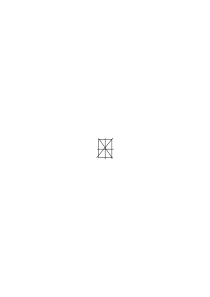
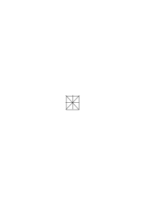
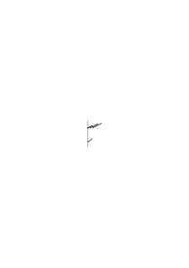
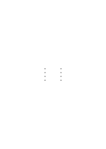
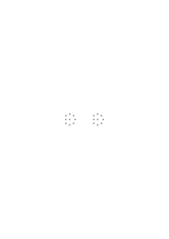
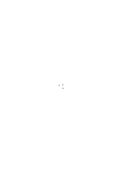
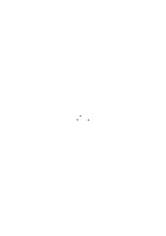

# Ms-178a

### [1\[1\]](https://cdn.wittgensteinnachlass.com/2000px/webp/Ms-178a/1.webp),[2\[1\]](https://cdn.wittgensteinnachlass.com/2000px/webp/Ms-178a/2.webp)

Man könnte die (ganze) Sache auch rein geometrisch auffassen als das Problem der Zuordnung & Gleichzahligkeit von Punkten durch Gerade. Und da zeigt es sich wiederum wie das Wesen der Logik gar nicht in der oft besprochenen Allgemeinheit besteht. Wie sie nichts verliert, wenn wir diese Allgemeinheit fallen lassen.

xxxxxx | ──────────────────────── | xxxxxx

(Es ist sozusagen eine ganz unnötige Ambition der Logik sich nur mit der Allgemeinheit zufrieden zu geben.

In der Geometrie würde man nun sagen: „zwischen zwei gleichzahligen Reihen von Punkten _gibt es_ verbindende Gerade, die etc.”. Die gleiche Anzahl denkt man sich etwa festgestellt, wie die gleiche Länge zweier Stäbe, (durch anlegen,) durch eine Art von Anlegen. Nämlich durch ein Kriterium das nicht die Zahlen – oder besser Zahlen – erwähnt. Denn würden Zahlen erwähnt so hätten wir es mit der Disjunktion mit den Pünktchen zu tun. (Übrigens könnte man vorschlagen dies die unendliche Disjunktion zu nennen & wie das geschieht, zu sagen: freilich sei eine unendliche Disjunktion etwas anderes wie eine endliche. Und dies …

### [2\[2\]](https://cdn.wittgensteinnachlass.com/2000px/webp/Ms-178a/2.webp)

… diesem Satz daß er gleiche Zahlen nicht über 10000100000 hinschreiben soll?

### [2\[3\]](https://cdn.wittgensteinnachlass.com/2000px/webp/Ms-178a/2.webp)

Wenn ich so die Regeln für S(φψ) entwickle, woraus entwickle ich sie denn? Lese ich sie von einem festen Ding, der Meinung, ab?

### [2\[4\]](https://cdn.wittgensteinnachlass.com/2000px/webp/Ms-178a/2.webp)

Wie kommt es aber daß die Bestimmungen über das Folgern des S aus φ & ψ nicht auch π ∙ S = π zur Folge haben? Das ist es was ich nicht verstehe. Aber ist denn mit der Folgerung der Zahlengleichheit aus π mehr gemeint als mit der Reihe

_π ∙ φ1 = π ∙ φ1 ∙ ψ1 = π ∙ ψ1_

_π ∙ φ2 = π ∙ φ2 ∙ ψ2 = π ∙ ψ2_

_– – – – – – – – –_

_– – – – – – – – –_

<s> φ1 ≡ ψ1 ∙ φ2 ≡ ψ2 Ist es denn wahr daß die Form (φ1 ∙ ψ1) ⌵ (φ2 ∙ ψ2) … genügt? </s>

### [2\[5\]](https://cdn.wittgensteinnachlass.com/2000px/webp/Ms-178a/2.webp)

Es durchkreuzen sich da mehrere Gedankenmöglichkeiten. Man möchte von einer Bedingung reden dafür daß π gelten kann. Einer geometrischen Bedingung. In dem Sinne in welchem die Kreisform die Bedingung für eine bestimmte Teilung ist & die Ellipse nicht. In dem Sinne, in welchem die Bedingung nicht erfüllt wird dadurch daß φ5 & ψ7 ist.

### [3\[1\]](https://cdn.wittgensteinnachlass.com/2000px/webp/Ms-178a/3.webp)

Was ist dann die Zahlengleichheit? Ist sie nur das was man in

sieht? Aber dann sind eben Klassen höherer Anzahl nie zahlengleich! Wir müssen uns daran erinnern daß S(φ, ψ) verschiedenen Sinn hat, jenachdem von Äpfeln in zwei Kisten oder Flecken in unserem Gesichtsfeld die Rede ist etc. Und das macht nichts denn auch φ5 & φ5 & φy hat in den verschiedenen Fällen verschiedenen Sinn & das hat mit der Arithmetik der 5 nichts zu tun. Die Zahlengleichheiten der Schnittpunkte in

&

scheint eine Eigenschaft dieser Figuren zu sein – ein Teil ‘Teil’ ihrer Gleichheit. Ist nun eine 1-1-Verbindung zwischen diesen Punkten ein Beweis _dieser_ Zahlengleichheit?

### [3\[2\]](https://cdn.wittgensteinnachlass.com/2000px/webp/Ms-178a/3.webp)

Man ist geneigt zu sagen: Wenn ich ein 100-Eck als solches sehen könnte so müßten zwei gezählte 100-Ecke gleich ausschauen. Daß zwei Klassen die gleiche Anzahl haben, muß eine Erfahrung sein. Wie hängt die …

### [4\[1\]](https://cdn.wittgensteinnachlass.com/2000px/webp/Ms-178a/4.webp),[5\[1\]](https://cdn.wittgensteinnachlass.com/2000px/webp/Ms-178a/5.webp),[6\[1\]](https://cdn.wittgensteinnachlass.com/2000px/webp/Ms-178a/6.webp)

… enthalten soll, dann muß es aus π nach einem ganz anderen Prinzip folgen wie ψ20 aus π ∙ φ20. Dann kann es auch nur vermöge einer neuen Regel folgen. Wenn aus π noch etwas Amorphes folgen soll so muß dies neu festgesetzt werden. Es wäre etwa der Satz daß die beiden Klassen aus Paaren bestehen. Aber, erinnern wir uns, nicht aus _bestimmten_ Paaren!! Dann aber kommt es doch nur wieder darauf hinaus daß φ & ψ die selbe Zahl von Dingen haben. Und hier haben wir die Variable n & ihre Beziehung zu 1, 2, 3, etc.. Ich müßte also endlich doch festsetzen π ∙ Σ = π. Dabei fühlen wir uns aber nicht wohl.

Müßte ich nicht wissen was das Kriterium für Σ ist im Gegensatz zum Kriterium von π. D.h. was ist die Verifikation von S im Gegensatz zu der von π? Und ist diese Frage nicht wesentlich? Haben wir es in praxi nicht wirklich mit einem gemischten Kriterium der Zahlengleichheit zu tun, also sowohl daß φ5 ∙ ψ5 ist wie auch π. So daß es also _einen_ Sinn von S gebe worin S = π wäre. Aber heißt denn π ∙ φ1 = φ1 + ψ1 etc. etc. nicht ohnehin schon: S folgt aus π? Was sieht man denn, wenn man sieht daß zwei Klassen 1-1 verbunden sind? Bemerkt man da außerdem oder _in_ dieser Tatsache die Zahlengleichheit? Wir müssen doch von der Zahlengleichheit wirklicher Klassen reden. Es ist doch eine wichtige Frage: entspricht eine bestimmte Erfahrung der Zahlengleichheit? Nehmen wir an Zahlengleichheit ist für uns das was durch Zählen der Klassen festgestellt wird. Sehe ich dann daß zwei Klassen 1-1 verbunden sind, so kann ich natürlich nicht prophezeien daß, wenn ich sie zähle das gleiche Resultat herauskommen wird. Aber ich werde doch sagen daß ich dann entweder falsch gezählt habe oder daß sich die Klassen verändert haben. Und das ist eine Abmachung, Übereinkunft. Dann ist aber wenigstens die eine Sache abgetan daß die Zahlengleichheit in diesem Sinne _in_ π irgendwie enthalten ist.

Zähle ich die linke Reihe & sehe die 1-1-Relation, so zähle ich damit auch die rechte Reihe. φ4 ∙ π = φ4 ∙ π ∙ ψ4. Aber nicht nur das sondern etc. etc. oder wie man schreibt

_φn ∙ π = φn ∙ π ∙ ψn._

Vergiß nicht, daß die Zahlengleichheit die durch π gesetzt werden soll etwas sein soll wie die Eigenschaft der Klassen von Kreuzen die sich in gleiche Muster bringen lassen.

Aber wie sehe ich daß sich zwei Klassen auf dieses Schema bringen _lassen_? Immer ist es wieder der Fall der Stäbe die _wenn aneinandergelegt_, koinzidieren. Wenn ich sagen kann daß ich die Zahlengleichheit der Gruppen

&

direkt wahrnehme oder gar der Gruppen

&

so kann ich sie eben in diesem Sinne in xxxxxxx & xxxxxxx nicht wahrnehmen.

### [6\[2\]](https://cdn.wittgensteinnachlass.com/2000px/webp/Ms-178a/6.webp),[7\[1\]](https://cdn.wittgensteinnachlass.com/2000px/webp/Ms-178a/7.webp)

Wie seltsam daß wir immer mit Sätzen sprechend wenigstens gewöhnlich nicht vom Sinn dieser Sätze reden! Während doch das nicht die Ausnahme sein sollte oder wenn es eine ist dies nicht von grundlegender Wichtigkeit sein kann. Das Argument ist also

<math display="block">
  <mspace width="0.3em"/>
  <mi>A</mi>
  <mspace width="0.3em"/>
  <mo>=</mo>
  <mo>[</mo>
  <mi>a</mi>
  <mspace width="0.3em"/>
  <mn>1</mn>
  <mspace width="0.3em"/>
  <mo>+</mo>
  <mspace width="0.3em"/>
  <mi>a</mi>
  <mspace width="0.3em"/>
  <mn>2</mn>
  <mspace width="0.3em"/>
  <mo>+</mo>
  <mspace width="0.3em"/>
  <mi>r</mi>
  <mspace width="0.3em"/>
  <mtext>n]</mtext>
  <mspace width="0.3em"/>
  <mi>G</mi>
  <mspace width="0.3em"/>
  <mo>=</mo>
  <msup>
    <mi>n</mi>
  </msup>
  <mo>√</mo>
  <mover>
    <mrow>
      <msub>
        <mi>a</mi>
        <mn>1</mn>
      </msub>
      <mspace width="0.3em"/>
      <mtext>∙</mtext>
      <msub>
        <mi>a</mi>
        <mn>2</mn>
      </msub>
      <mspace width="0.3em"/>
      <mtext>∙</mtext>
      <mspace width="0.3em"/>
      <mi>p</mi>
    </mrow>
    <mo>‾</mo>
  </mover>
</math>

### [7\[2\]](https://cdn.wittgensteinnachlass.com/2000px/webp/Ms-178a/7.webp)

Mache ich a1 = a2 indem ich a1 & a2 (also A) gleich halte so wird G größer. Also wird es größer wenn immer ich zwei Glieder gleichmache & erreicht wenn alle a gleich sind sein Maximum = A also u.s.w.. – Ich habe aber eine Schwierigkeit mit diesem Beweis. (Es wird in ihm ein Stück eines Weges gegangen & der übrige Weg quasi angenommen ohne daß wir ihn sehen.) Die Schwierigkeit liegt irgendwie in dem r + p von dem angenommen wird sie bestünden auf gewisse Weise aus dem a ohne daß das doch zum Ausdruck kommt. Die Schwierigkeit ist die, daß uns kein Weg gezeigt wurde vom Gleichmachen zweier a zum Gleichmachen aller a.

### [7\[6\]](https://cdn.wittgensteinnachlass.com/2000px/webp/Ms-178a/7.webp)

Der Beweis setzt voraus daß es einen Weg gibt alle a gleich zu machen indem wir immer ein Paar gleichmachen!