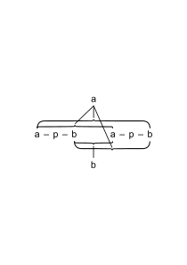

# Ms-301

### [1\[1\]](https://cdn.wittgensteinnachlass.com/2000px/webp/Ms-301/1.webp)

## Vol. I.

_Wittgenstein on Logic, April 1914._

_G.E. Moore_

### [2\[1\]](https://cdn.wittgensteinnachlass.com/2000px/webp/Ms-301/2.webp),[3\[1\]](https://cdn.wittgensteinnachlass.com/2000px/webp/Ms-301/3.webp),[4\[1\]](https://cdn.wittgensteinnachlass.com/2000px/webp/Ms-301/4.webp)

_“Moore” [unreadable]_ Logical so-called propositions _shew_ logical properties of language & therefore of the Universe, but _say_ nothing. This means that by merely looking at them you can _see_ these properties; whereas, in a proposition proper, you cannot see what is true by looking at it. It is impossible to _say_ what these properties are, because in order to do so, you would need a language, which hadn't got the properties in question, & it is impossible that this should be a _proper_ language. Impossible to construct an illogical language. In order that you should have a language which can express or _say_ everything that _can_ be said, this language must have certain properties; & when this is the case, _that_ it has them can no longer be said in that language or _any_ language. An illogical language would be one in which e.g. you could put an _event_ into a hole. Thus a language which _can_ express everything _mirrors_ certain properties of the world by those properties which it must have; & logical so-called propositions shew _in a systematic way_ those properties. How, usually, logical propositions _do_ shew these properties is this. We give a certain description of a kind of symbol; we find that other symbols, combined in certain ways, yield a symbol of this description; & _that_ they do shews something about these symbols. As a rule the description given in ordinary Logic is the description of a tautology; but _others_ might shew equally well, e.g.: a contradiction.

Every _real_ proposition _shews_ something, besides what it says, about the Universe: _for_, if it has no sense, it can't be used; &, if it has a sense, it mirrors some logical property of the Universe. E.g. take φa, φa ⊃ ψa, ψa. By merely looking at these 3, I can see that 3 follows from 1 & 2: i.e. I can see what's called the truth of a logical proposition, namely of the proposition (_φa . φa ⊃ ψa :⊃: ψa_). But this is _not_ a proposition; but by seeing that it is a tautology I can see what I already saw by looking at the 3 propositions: the difference is that I _now_ see _that_ it is a tautology. We want to say, in order to understand the above, what properties a symbol must have, in order to be a tautology:–

Many ways of saying this are possible:

(1) One way is to give _certain symbols_; then to give a set of rules for combining them; & then to say any symbol formed from those symbols, by combining them according to one of the given rules, is a tautology. This obviously says something about the kind of symbol you can get in this way. This is the actual procedure of _old_ Logic: It gives so-called primitive propositions; so-called rules of deduction; & then says that what you got by applying the rules to the propositions is a _logical_ proposition that you have _proved_. The truth is it tells you something _about_ the kind of proposition you have got, viz. that it can be derived from the first symbols by these rules of combination = is a tautology. :. if we say one _logical_ proposition _follows_ logically from another, this means something quite different from saying that a _real_ proposition follows logically from _another_. For a so-called _proof_ of a logical proposition does not prove its _truth_ (logical propositions are neither true nor false) but proves _that_ it is a logical proposition = is a tautology. Logical propositions _are_ forms of proofs: they _shew_ that one or more propositions _follow_ from one (or more).

### [4\[2\]](https://cdn.wittgensteinnachlass.com/2000px/webp/Ms-301/4.webp)

Logical propositions _shew_ something, _because_ the language in which they are expressed can _say_ everything that can be _said_.

### [4\[3\]](https://cdn.wittgensteinnachlass.com/2000px/webp/Ms-301/4.webp),[5\[1\]](https://cdn.wittgensteinnachlass.com/2000px/webp/Ms-301/5.webp),[6\[1\]](https://cdn.wittgensteinnachlass.com/2000px/webp/Ms-301/6.webp)

This same distinction between what can be _shewn_ by the language but not _said_, explains the difficulty that is felt about types – e.g. as to the difference between things, facts, properties, relations. That M is a _thing_ can't be _said_: it is nonsense: but _something_ is _shewn_ by the symbol M. In the same way that a _proposition_ is a subject-predicate proposition can't be said: but it is _shewn_ by the symbol. :. a _theory of types_ is impossible. It tries to say something about the types, when you can only talk about the symbols. But _what_ you say about the symbols is not that this symbol has that type, which would be nonsense for the same reason: but you say simply _This_ is the symbol, to prevent a misunderstanding. E.g. In „aRb”, R is _not_ a symbol, but _that_ R is between one name & another symbolises. Here we have _not_ said this symbol is not of this type but of that, but only: _This_ symbolises & not that. This seems again to make the same mistake, because ‘symbolises’ is ‘typically ambiguous’. The true analysis is: R is no proper name, &, that R stands between a & b (expresses _a relation_). Here are 2 propositions _of different type_, connected by ‘and’. It is _obvious_ that, e.g. with a subject-predicate proposition, _if_ it has any sense at all, you _see_ the form, as soon as you _understand_ the proposition, in spite of not knowing whether it is true or false. Even if there _were_ propositions of the form ‘M is a thing’ they would be superfluous (tautologous) because what this tries to say is something which is already _seen_ when you see M. In the above expression ‘aRb’, we were talking only of this particular R, whereas what we want to do is to talk of all similar symbols. We have to say: in _any_ symbol of this form what corresponds to R is not a proper name, & the fact that … expresses a relation. This is what is sought to be expressed by the nonsensical assertion: Symbols like this are of a certain type. This you can't say, because in order to say it you must first know what the symbol is: & in knowing this you _see_ the types, & therefore also the types of what is symbolised. I.e. in knowing _what_ symbolises, you know all that is to be known; you can't _say_ anything _about_ the symbol. For instance: Consider the 2 propositions (1) “What symbolises here is a thing”, (2) “What symbolises here is a relational _fact_ ( = relation)”. These are nonsensical for 2 reasons: (a) because they mention ‘thing’ & ‘relation’ (b) because they mention them in propositions of the same form. The 2 propositions must be expressed in entirely different forms, if properly analysed; & neither the word ‘thing’ nor ‘relation’ must occur. _Now_ we shall see how properly to analyse propositions in which ‘thing’, ‘relation’, etc. occur.

### [7\[1\]](https://cdn.wittgensteinnachlass.com/2000px/webp/Ms-301/7.webp)

_„x”_ is the Name of y.

### [7\[2\]](https://cdn.wittgensteinnachlass.com/2000px/webp/Ms-301/7.webp)

N.B. “x” can't be the name of this actual scratch y; because this isn't a thing: but it can be the name of _a thing_; & we must understand that what we are doing is to explain what would be meant by saying of an ideal symbol, which did actually consist in one _thing_'s being to the left of another, that in it a _thing_ symbolised.

### [8\[1\]](https://cdn.wittgensteinnachlass.com/2000px/webp/Ms-301/8.webp)

(1) Take φx. We want to explain the meaning of “In “φx” a _thing_ symbolises.” The analysis is:–

(∃ y) . y symbolises . y = “x” .“φx”. [“_x_” is the name of y: “φx” = ‘“φ” is at the left of “x”’, & _says_ φx.]

### [8\[2\]](https://cdn.wittgensteinnachlass.com/2000px/webp/Ms-301/8.webp)

[N.B. In the expression (∃y). φy, one is apt to say this means ‘There is a _thing_ such that …’. But in fact, we should say ‘There is a y, such that …’; the _fact_ that the _y_ symbolises, expressing what we mean.]

### [8\[3\]](https://cdn.wittgensteinnachlass.com/2000px/webp/Ms-301/8.webp),[9\[1\]](https://cdn.wittgensteinnachlass.com/2000px/webp/Ms-301/9.webp)

In general: When such propositions are analysed, while the words ‘thing’, ‘fact’ etc. will disappear, there will appear instead of them a new symbol, of the same form as the one of which we are speaking; & hence it will be at once obvious that we _cannot_ get the one kind of proposition from the other by substitution. In our language names are _not things_: we don't know what they are: all we know is that they are of a different type from relations etc. etc. … The type of a symbol of a relation is partly fixed by the type of a symbol of a thing, since a symbol of the latter type must occur in it.

### [9\[2\]](https://cdn.wittgensteinnachlass.com/2000px/webp/Ms-301/9.webp)

p. 1, N.B. In any ordinary proposition, e.g. “Moore good”, this _shews_ & does not say that “Moore” is to the left of “good”; & _here what_ is shewn can be _said_ by another proposition. But this only applies to that _part_ of what is shewn which is arbitrary. The _logical_ properties which it shews, are not arbitrary, & that it has these cannot be said in any proposition.

### [9\[3\]](https://cdn.wittgensteinnachlass.com/2000px/webp/Ms-301/9.webp),[10\[1\]](https://cdn.wittgensteinnachlass.com/2000px/webp/Ms-301/10.webp)

How can we talk of the general form of a proposition, without knowing any unanalysable propositions in which particular names & relations occur? What justifies us in doing this is that though we don't know any unanalysable propositions of this kind yet we can understand what is meant by a proposition of the form (∃x,y,R). xRy (which is unanalysable), even though we know no proposition of the form xRy.If you had any unanalysable proposition in which particular names & relations occurred (and an _unanalysable_ proposition = one in which only fundamental symbols = ones not capable of _definition_, occur) then you always can form from it a proposition of the form (∃x,y,R). xRy, which though it contains no particular names & relations, is unanalysable.

### [10\[2\]](https://cdn.wittgensteinnachlass.com/2000px/webp/Ms-301/10.webp)

(2) The point can here be brought out as follows. Take φa, & _φA_: & ask what is meant by saying “There is a thing in φa, & a complex in φA”? (1) means: (∃x). φx . x = a

(2) (∃x,ψξ). φA = ψx . φx

### [11\[1\]](https://cdn.wittgensteinnachlass.com/2000px/webp/Ms-301/11.webp)

_Use of logical propositions_ You may have one so complicated that you cannot, by looking at it, see that it is a tautology; but you have shewn that it can be derived by certain operations from certain other propositions according to our rule for constructing tautologies; & hence you are enabled to see that one thing follows from another, when you would not have been able to see it otherwise. E.g. if our tautology is of the form p ⊃ q, you can see that q follows from p; & so on.

### [12\[1\]](https://cdn.wittgensteinnachlass.com/2000px/webp/Ms-301/12.webp),[13\[1\]](https://cdn.wittgensteinnachlass.com/2000px/webp/Ms-301/13.webp)

The _Bedeutung_ of a proposition is the fact that corresponds to it, e.g., if our proposition be aRb, if it's true, the corresponding fact would be the fact aRb, if false, the fact ~aRb. _But_ both “the fact aRb” & “the fact ~aRb” are incomplete symbols, which must be analysed. That a proposition has a relation (in wide sense) to Reality, other than that of Bedeutung, is shewn by the fact that you can understand it when you don't know the Bedeutung, i.e. don't know whether it's true or false. Let us express this by saying “It has _sense_” (Sinn). In analysing Bedeutung, you come upon Sinn, as follows:–

We want to explain the relation of propositions to reality. The relation is as follows: Its _simples_ have meaning = are names of simples; & its relations have a quite different relation to relations; & these 2 facts already establish a sort of correspondence between a proposition which contains these & only these & reality: i.e. if all the simples of a proposition are known, we already know that we _can_ describe reality by saying that it _behaves_ in a certain way to the whole proposition. [This amounts to saying that we can _compare_ reality with the proposition. In the case of 2 lines we can _compare_ them in respect of their length without any convention & the comparison is automatic. But in our case the possibility of comparison depends upon the conventions by which we have given meanings to our simples (names & relations).] It only remains to fix the method of comparison, by saying _what_ about our simples is to _say_ what about reality. E.g. suppose we take 2 lines of unequal length; & say that the fact that the shorter is of the length it is is to mean that the longer is of the length _it_ is: we should then have established a convention as to the meaning of the shorter of the sort we are now to give it. From this it results that ‘true’ & ‘false’ are not accidental properties of a proposition, such that, when it has meaning, we can say it is _also_ true or false: on the contrary to have meaning _means_ to be true or false; the being true or false actually constitutes the relation of the proposition to reality, which we mean by saying that it has meaning. (Sinn)

### [14\[1\]](https://cdn.wittgensteinnachlass.com/2000px/webp/Ms-301/14.webp)

There seems at first sight to be a certain ambiguity in what is meant by saying that a proposition is ‘true’, owing to the fact that it seems as if in the case of different propositions the way in which they correspond to the facts to which they correspond is quite different. But what is really common to all cases is that they must have _the general form of a proposition_. In giving the general form of a proposition you are explaining what kind of way of putting together the symbols of things & relations will correspond to (be analogous to) the things having those relations in reality. In doing this you are saying what is meant by saying that a proposition is true; & you must do it once for all. To say “This proposition has sense” means ““This proposition is true” means …” (“p” is true = “p” . p . Def. : only instead of “p”, we must have introduced the general form of a proposition.)

### [15\[1\]](https://cdn.wittgensteinnachlass.com/2000px/webp/Ms-301/15.webp)

## Vol. II.

_W. on L., April 1914._

_G.E. Moore_

### [16\[1\]](https://cdn.wittgensteinnachlass.com/2000px/webp/Ms-301/16.webp)

It seems at first sight as if the _a–b notation_ must be wrong, because it seems to treat true & false as on exactly the same level. It must be possible to see from the symbols themselves that there is some essential difference between the poles, if the notation is to be right; & it seems as if in fact this was impossible. How asymmetry is introduced is by giving a description of a particular form of symbol which we call a ‘tautology’. The description of the a–b symbol alone is symmetrical with respect to a & b; but this description & the fact that what satisfies the description of the tautology is a tautology is asymmetrical with regard to them. (To say that a description was symmetrical with regard to 2 symbols, would mean that we could substitute one for the other, & yet the description remain the same, i.e. mean the same.)

### [17\[1\]](https://cdn.wittgensteinnachlass.com/2000px/webp/Ms-301/17.webp)

Take p.q & q. When you write p.q in the a–b notation, it is impossible to see from the symbol alone that q follows from it; for if you were to interpret the true-pole as the false, the same symbol would stand for p⌵q, from which q doesn't follow. But the moment you say _which_ symbols are tautologies, it at once becomes possible to see from _the_ fact, that they are & the original symbol that q does follow.

### [17\[2\]](https://cdn.wittgensteinnachlass.com/2000px/webp/Ms-301/17.webp)

_Logical propositions_, _of course_, all shew something different: all of them shew, _in the same way_ viz. by the fact that they are tautologies, but they are different tautologies & therefore shew each something different.

### [17\[3\]](https://cdn.wittgensteinnachlass.com/2000px/webp/Ms-301/17.webp)

What is unarbitrary about our symbols, is not them, nor the rules we give; but the fact that, having given certain rules, others are fixed = follow logically.

### [17\[4\]](https://cdn.wittgensteinnachlass.com/2000px/webp/Ms-301/17.webp),[18\[1\]](https://cdn.wittgensteinnachlass.com/2000px/webp/Ms-301/18.webp)

Thus, though it would be possible to interpret the form which we take as the form of a tautology as that of a contradiction & vice versa, they _are_ different in logical form, because though the apparent form of the symbols is the same, what _symbolises_ in them is different. & hence what follows about the symbols from the one interpretation will be different from what follows from the other. But the difference between a & b is _not_ one of logical form, so that nothing will follow from this difference alone as to the interpretation of other symbols. Thus, e.g. p.q, p⌵q seem symbols of exactly the _same_ logical form in the a–b notation. Yet they say something entirely different; &, if you ask why, the answer seems to be: In the one case the scratch at the top has the shape b, in the other the shape a. The important thing is that the interpretation of the form of the symbolism must be fixed by giving an interpretation to its _logical properties_, _not_ by giving interpretations to particular scratches.

### [19\[1\]](https://cdn.wittgensteinnachlass.com/2000px/webp/Ms-301/19.webp)

The point is: that the process of reasoning by which we arrive at the result that a – b – a – p … is the _same symbol_ as a – p …, is exactly the same as that by which we discover that its meaning is the same, viz. where we reason if b – apb – a then _not_ apb, if a – b – ap then _not_ b – apb, :. if a – b – ap then apb.

### [20\[1\]](https://cdn.wittgensteinnachlass.com/2000px/webp/Ms-301/20.webp),[21\[1\]](https://cdn.wittgensteinnachlass.com/2000px/webp/Ms-301/21.webp),[22\[1\]](https://cdn.wittgensteinnachlass.com/2000px/webp/Ms-301/22.webp)

Logical constants can't be made into variables: because in them _what_ symbolises is _not_ the same; all symbols for which a variable can be substituted symbolise in the _same_ way. We describe a symbol, & say arbitrarily ‘A symbol of this description is a tautology’. And then, it follows at once, both that any other symbol which answers to the same description is a tautology; & that any symbol which does _not_ isn't. That is, we have arbitrarily fixed that any symbol of that description is to be a tautology; & this being fixed it is no longer arbitrary with regard to any other symbol whether it is a tautology or not. Having thus fixed what is a tautology & what is not, we can then, having fixed arbitrarily again that the relation a – b is transitive [unreadable] get from the 2 facts together that ‘p ≡ ~(~p)’ is a taut. For ~(~p) = a – b – apb – a – b. It follows from the fact that a – b is transitive, that where we have a – b – a, the first a has to the second the same relation that it has to b. It is just as from the fact that a–true implies b–false, & b–false implies c–true, we get that a–true implies c–true. And we shall be able to see, having fixed the description of a tautology that p≡~(~p) is a tautology. That, when a certain rule is given, a symbol is tautological _shews_ a logical truth.

This symbol might be interpreted either as a tautology or as a contradiction. In settling that it is to be interpreted as a tautology & not as a contradiction, I am not assigning a _meaning_ to a & b; i.e. saying that they symbolise different things but in the same way. What I am doing is to say that the way in which the a–pole is connected with the whole symbol symbolises in _a different way_ from that in which it would symbolise if the symbol were interpreted as a contradiction. And I add the scratches a & b merely in order to shew in which way the connection is symbolising, so that it may be evident that wherever the same scratch occurs in the corresponding place in another symbol, there also the connection is symbolising in the same way. We could, of course, symbolise any a – b function without using 2 _outside_ poles at all, merely, e.g., omitting the b–pole; & here what would symbolise would be that the 3 pairs of inside poles of the propositions were connected in a certain way with the a–pole, while the other pair was _not_ connected with it. And thus the difference between the scratches a & b, where we do use them, merely shews that it is a different state of things that is symbolising in the one case & the other: in the one case _that_ certain inside poles _are_

connected in a certain way with an outside pole, in the other _that_ they're _not_. The symbol for a tautology, in whatever form we put it, e.g. whether by omitting the a–pole or by omitting the b, would always be capable of being used as the symbol for a contradiction; only _not_ in the same language.

### [23\[1\]](https://cdn.wittgensteinnachlass.com/2000px/webp/Ms-301/23.webp),[24\[1\]](https://cdn.wittgensteinnachlass.com/2000px/webp/Ms-301/24.webp)

The reason why ~x is meaningless, is simply that we have given no meaning to the symbol ~ξ. I.e. whereas φx & ~p look as if they were of the same type, they are not so because in order to give a meaning to ~x you would have to have some _property_ ~ξ. What symbolises in φξ is _that_ φ stands to the left of _a_ proper name: & obviously this is not so in ~p. What is common to all propositions in which the name of a property (to speak loosely) occurs is that this name stands to the left of a _name-form_. The reason why e.g. it seems as if ‘Plato Socrates’ might have a meaning, while ‘Abracadabra Socrates’ would never be suspected to have one, is because we know that _Plato_ has one, & do not observe that in order that the whole phrase should have one, what is necessary is _not_ that Plato should have one, but that the fact _that Plato is to the left of a name_ should. The reason why ‘The property of not being green is not green’ is _nonsense_, is because we have only given meaning to the fact that _green_ stands to the right of a _name_; & ‘the property of not being green’ is obviously not _that_. φ cannot possibly stand to the left of (or in any other relation to) ≡ the symbol of a property. For the symbol of a property e.g. ψx is _that_ ψ stands to the left of a name form, & another symbol φ cannot possibly stand to the left of such a _fact_: if it could, we should have an illogical language, which is impossible.

p is false = ~(p is true) Def.

### [25\[1\]](https://cdn.wittgensteinnachlass.com/2000px/webp/Ms-301/25.webp)

It is very important that the apparent logical relations ⌵, ⊃ etc. need brackets, dots etc., i.e. have “ranges”; which by itself shews they are not relations. This fact has been overlooked, because it is so universal – the very thing which makes it so important.

### [22\[2\]](https://cdn.wittgensteinnachlass.com/2000px/webp/Ms-301/22.webp)

There are _internal_ relations between one proposition & another; but a proposition cannot have to another _the_ internal relation which a _name_ has to the proposition of which it is a constituent, & which ought to be meant by saying it ‘occurs’ in it. In this sense one proposition can't ‘occur’ in another. _Internal_ relations are relations between types, which can't be expressed in propositions, but are all shewn in the symbols themselves, & can be exhibited systematically in tautologies. Why we come to call them ‘relations’ is because logical propositions have an analogous relation to them, to that which properly relational propositions have to relations. Propositions can have many different internal relations to one another. _The_ one which entitles us to deduce one from another, is that if say, they are φa & φa ⊃ ψa, then φa . φa ⊃ ψa :⊃: ψa is a tautology. The symbol of identity expresses the internal relation between a function & its argument: i.e. φa = (∃x)φx.x = a.

### [26\[1\]](https://cdn.wittgensteinnachlass.com/2000px/webp/Ms-301/26.webp)

The proposition (∃x)φx . x = a :≡: φa can be seen to be a tautology, if one expresses the _conditions_ of the truth of (∃x).φx . x = a, successively, e.g. by saying: This is true _if_ so & so; & this again is true, _if_ so & so etc. for (∃x).φx . x = a; and then also for φy. To express the matter in this way is itself a cumbrous notation, of which the a–b notation is a neater translation.

### [26\[2\]](https://cdn.wittgensteinnachlass.com/2000px/webp/Ms-301/26.webp)

What symbolises in a symbol, is that which is common to all the symbols which could in accordance with the _rules of logic_ = syntactical rules for manipulation of symbols, be substituted for it.

### [26\[3\]](https://cdn.wittgensteinnachlass.com/2000px/webp/Ms-301/26.webp),[27\[1\]](https://cdn.wittgensteinnachlass.com/2000px/webp/Ms-301/27.webp)

The question whether a proposition has sense can never depend on the _truth_ of another proposition about a constituent of the first. E.g. the question whether (x). x = x has meaning can't depend on the question whether (∃x). x = x is _true_. It doesn't describe reality at all, & deals therefore solely with symbols; it says that they must _symbolise_, but not _what_ they symbolise. It's obvious that the dots & brackets are symbols, & obvious also that they haven't any _independent_ meaning. You must therefore, in order to introduce so-called “logical constants” properly, introduce the general notion of _all possible_ combinations of them

= the general form of a proposition You thus introduce both a–b functions, identity & universality (the 3 fundamental constants) simultaneously.

### [27\[2\]](https://cdn.wittgensteinnachlass.com/2000px/webp/Ms-301/27.webp)

The _variable-proposition_ p ⊃ p is not identical with the _variable-proposition_ ~(p . ~p). The corresponding universals _would_ be identical. But the variable proposition ~(p . ~p) shews that out of ~(p . q) you get a tautology by substituting ~p for q, whereas the other does not say this.

### [27\[3\]](https://cdn.wittgensteinnachlass.com/2000px/webp/Ms-301/27.webp),[28\[1\]](https://cdn.wittgensteinnachlass.com/2000px/webp/Ms-301/28.webp)

It's very important to realise that when you have 2 different relations <math class="stacked" display="inline"><mo>(</mo><mtext>a,</mtext><mi>b</mi><msub><mo>)</mo><mi>R</mi></msub><mspace width="0.3em"/><mo>(</mo><mtext>c,</mtext><mi>d</mi><msub><mo>)</mo><mi>S</mi></msub></math> this does _not_ establish a correlation between a & c, & b & d, or a & d, & b & c: there is no correlation whatsoever thus established. Of course, in the case of 2 pairs of terms united by the _same_ relation, there is a correlation. This shews that the theory which held that a relational fact contained the terms & relations united by a _copula_ <math class="stacked" display="inline"><mo>(</mo><msub><mtext>ε</mtext><mn>2</mn></msub><mo>)</mo></math> is untrue; for if this were so there would be a correspondence between the terms of different relations.

### [28\[2\]](https://cdn.wittgensteinnachlass.com/2000px/webp/Ms-301/28.webp)

The question arises how can one proposition (or function) occur in another proposition? The proposition or function itself can't possibly stand in relation to the other symbols. For this reason we must introduce functions as well as names at once in our general form of a proposition; explaining what is meant, by assigning meaning to the fact that the names stand between the |, & that the function stands on the left of the names.

### [28\[3\]](https://cdn.wittgensteinnachlass.com/2000px/webp/Ms-301/28.webp)

It is true, in a sense, that logical propositions are ‘postulates’– something which we ‘demand’; for we do _demand_ a satisfactory notation.

### [28\[4\]](https://cdn.wittgensteinnachlass.com/2000px/webp/Ms-301/28.webp)

A tautology (_not_ a logical proposition) is not nonsense in the same sense in which e.g. a proposition in which words which have no meaning occur is nonsense. What happens in it is that all its simple parts have meaning, but it is such that the connections between these paralyse or destroy one another, so that they are all connected only in an irrelevant manner. ( = one such as to have no sense?)

### [29\[1\]](https://cdn.wittgensteinnachlass.com/2000px/webp/Ms-301/29.webp)

## Vol. III.

_W. on L., April 1914._

_G.E. Moore_

### [30\[1\]](https://cdn.wittgensteinnachlass.com/2000px/webp/Ms-301/30.webp)

Logical functions all presuppose one another. Just as we can see ~p has no sense, if p has none; so we can also say p has none, if ~p has none. The case is quite different with φa, & a: since here a has a meaning independently of φa, though φa presupposes it.

### [30\[2\]](https://cdn.wittgensteinnachlass.com/2000px/webp/Ms-301/30.webp)

The logical constants seem to be complex-symbols, but on the other hand, they can be interchanged with one another. They are not therefore really complex; what symbolises is simply the general way in which they are combined.

### [30\[3\]](https://cdn.wittgensteinnachlass.com/2000px/webp/Ms-301/30.webp)

The combination of symbols in a tautology cannot possibly correspond to any one particular combination of their meanings – it corresponds to every possible combination; & therefore what symbolises can't be the connection of the symbols.

### [30\[4\]](https://cdn.wittgensteinnachlass.com/2000px/webp/Ms-301/30.webp),[31\[1\]](https://cdn.wittgensteinnachlass.com/2000px/webp/Ms-301/31.webp)

From the fact that I _see_ that one spot is to the left of another, or that one colour is darker than another it seems to follow that it _is_ so; & if so this can only be if there is an _internal_ relation between the two; & we might express this by saying that the _form_ of the latter is part of the _form_ of the former. We might thus give a sense to the assertion that logical laws are _forms_ of thought & space & time _forms_ of intuition.

### [31\[2\]](https://cdn.wittgensteinnachlass.com/2000px/webp/Ms-301/31.webp)

Different logical types can have nothing whatever in common. But the same fact that we can talk of the possibility of a relation of n places, or of an analogy between one with 2-places & one with 4, shews that relations with different numbers of places have something in common, that therefore the difference is not one of type but like the difference between different names – something which depends on experience. This answers the question how we can know that we have really got the most general form of a proposition. We have only to introduce what is _common_ to all relations of whatever number of places.

### [31\[3\]](https://cdn.wittgensteinnachlass.com/2000px/webp/Ms-301/31.webp)

The relation of ‘I believe p’ to ‘p’ can be compared to the relation of ‘“p” says p’ to p: it is just as impossible that _I_ should be a simple as that “p” should be.