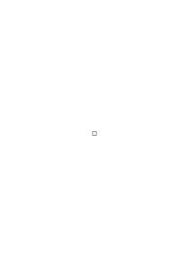
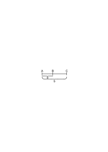
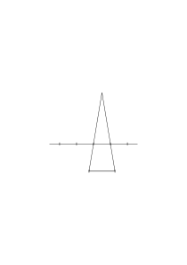
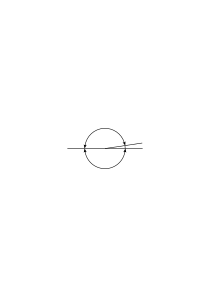

# Ts-208

### [1r\[1\]](https://cdn.wittgensteinnachlass.com/2000px/webp/Ts-208/1r.webp)

Ist ein Raum denkbar, der nur alle rationalen aber nicht die irrationalen Punkte enthält. Und das heißt nur: Sind die irrationalen Zahlen nicht in den rationalen bereits präjudiziert.

### [1r\[2\]](https://cdn.wittgensteinnachlass.com/2000px/webp/Ts-208/1r.webp)

Es scheint viel dafür zu sprechen, daß die Abbildung des Gesichtsraumes durch die Physik wirklich die einfachste ist. D.h. daß die Physik die wahre Phänomenologie wäre. Aber dagegen läßt sich etwas einwenden: Die Physik strebt nämlich Wahrheit, d.h. richtige Voraussagungen der Ereignisse an, während _das_ die Phänomenologie nicht tut, sie strebt _Sinn_ nicht _Wahrheit_ an.

### [1r\[3\]](https://cdn.wittgensteinnachlass.com/2000px/webp/Ts-208/1r.webp)

Aber man kann sagen: Die Physik hat eine Sprache und in dieser Sprache sagt sie Sätze. Diese Sätze können wahr oder falsch sein. _Sie_ bilden die Physik und ihre Grammatik die Phänomenologie (oder wie man es nennen will).

### [1r\[4\]](https://cdn.wittgensteinnachlass.com/2000px/webp/Ts-208/1r.webp)

Es gibt eine bestimmte Mannigfaltigkeit des Sinnes und eine _andere_ Mannigfaltigkeit der _Gesetze_.

### [1r\[5\]](https://cdn.wittgensteinnachlass.com/2000px/webp/Ts-208/1r.webp)

Die Physik unterscheidet sich von der Phänomenologie dadurch, daß sie Gesetze feststellen will. Die Phänomenologie stellt nur die Möglichkeiten fest. Dann wäre also die Phänomenologie die Grammatik der Beschreibung derjenigen Tatsachen, auf denen die Physik ihre Theorien aufbaut.

### [1r\[6\]](https://cdn.wittgensteinnachlass.com/2000px/webp/Ts-208/1r.webp)

Erklären ist mehr als beschreiben. Aber jede Erklärung enthält eine Beschreibung.

### [1r\[7\]](https://cdn.wittgensteinnachlass.com/2000px/webp/Ts-208/1r.webp)

Irgendwie scheint es mir, als wäre jeder einfärbige Fleck im Gesichtsfeld einfach und seine Zusammengesetztheit aus kleineren Teilen nur eine scheinbare.

### [1r\[8\]](https://cdn.wittgensteinnachlass.com/2000px/webp/Ts-208/1r.webp)

Man könnte glauben der Gesichtsraum sei aus minima visibilia zusammengesetzt, etwa aus lauter kleinen Quadraten, die man als unteilbare Flecke sieht. Aber dann ist die Wahl dieser Teile offenbar willkürlich. Ich könnte z.B. nicht sagen, wie das Quadratnetz über ein bestimmtes Bild zu legen ist, denn wenn man das Netz um weniger als eine Maschenweite verschiebt, so sind die minima visibilia zwar in ganz anderen Orten aber das Bild sieht ganz gleich aus.

### [1r\[9\]](https://cdn.wittgensteinnachlass.com/2000px/webp/Ts-208/1r.webp)

Es scheint als könne man einen einfärbigen Fleck nicht zusammengesetzt sehen, außer wenn man ihn sich _nicht_ einfärbig vorstellt. Die Vorstellung einer Trennungslinie macht den Fleck mehrfärbig, denn die Trennungslinie muß eine andere Farbe haben als der übrige Fleck.

### [1r\[10\]](https://cdn.wittgensteinnachlass.com/2000px/webp/Ts-208/1r.webp)

Das würde heißen: Die einfachen Bestandteile des Gesichtsfeldes sind einfärbige Flecke. Wie verhält es sich aber dann mit den kontinuierlichen Farbenübergängen?

### [1v\[1\]](https://cdn.wittgensteinnachlass.com/2000px/webp/Ts-208/1v.webp)

„p.q = p” heißt „q folgt aus p”

<math display="block">
  <mo>|</mo>
  <mtext>▮</mtext>
  <mo>|</mo>
  <mspace width="0.3em"/>
  <mo>|</mo>
  <mo>|</mo>
</math>

### [2r\[1\]](https://cdn.wittgensteinnachlass.com/2000px/webp/Ts-208/2r.webp)

Kann man sagen, daß der kleinere Fleck einfacher ist als der größere? Nehmen wir an sie seien einfärbige Kreise, worin soll die größere Einfachheit des kleineren Kreises bestehen? Man könnte sagen, der größere kann zwar aus dem kleineren und noch einem Teil bestehen, aber nicht vice versa. Aber warum soll ich nicht den kleineren als die Differenz des größeren und des Ringes darstellen? Es scheint mir also, der kleinere Fleck ist nicht einfacher als der größere.

### [2r\[2\]](https://cdn.wittgensteinnachlass.com/2000px/webp/Ts-208/2r.webp)

Es scheint eine eigentümliche Eigenschaft der räumlichen Aussagen, daß man den Raum ohne irgendeine Anspielung auf die Zeit nicht beschreiben kann es ist von vornherein wahrscheinlich, daß die Zeit in die Betrachtung des Gesichtsraumes nicht nachträglich als ein Anhängsel eintreten kann.

### [2r\[3\]](https://cdn.wittgensteinnachlass.com/2000px/webp/Ts-208/2r.webp)

Ein Gegenstand darf sich in gewissem Sinne nicht beschreiben lassen. D.h. die Beschreibung darf ihm keine Eigenschaften zuschreiben, deren Fehlen die Existenz des Gegenstandes selbst zu nichte machen würde. D.h. die Beschreibung darf nicht aussagen, was für die Existenz des Gegenstandes wesentlich wäre.

### [2r\[4\]](https://cdn.wittgensteinnachlass.com/2000px/webp/Ts-208/2r.webp)

Ich sagte einmal, es gäbe keine extensionale Unendlichkeit. Ramsey sagte darauf “Kann man sich nicht vorstellen, daß z.B. ein Mensch ewig lebt, d.h. einfach nie stirbt, und ist das nicht extensionale Unendlichkeit. Ich kann mir doch gewiß denken daß ein Rad sich dreht und _nie_ stehen bleibt.” Hier liegt eine merkwürdige Schwierigkeit: Es scheint mir unsinnig zu sagen, daß in einem Raum unendlich viele Körper sind, gleichsam als etwas Zufälliges. Dagegen kann ich mir ja intensional ein unendliches Gesetz denken (oder eine unendliche Regel) durch die immer Neues produziert wird – ad infinitum – aber natürlich nur, was eine Regel produzieren kann, nämlich Konstruktionen. Und nun scheint es, daß die unendlichen Umdrehungen eines Rades Konstruktionen sein können, während ich neue Gegenstände nicht konstruieren kann.

### [2r\[5\]](https://cdn.wittgensteinnachlass.com/2000px/webp/Ts-208/2r.webp)

Angenommen, wir wandern auf einer Geraden in den euklidischen Raum hinaus und sagen, wir begegnen alle 10 Meter einer eisernen Kugel von gewissem Durchmesser, ad infinitum; ist das eine Konstruktion? Es scheint ja. Das Merkwürdige ist, daß man einen solchen unendlichen Komplex von Kugeln auffassen kann, als das endlose Wiederkehren derselben Kugel nach einem gewissen Gesetz. Daß aber im selben Augenblick, wenn man eine individuelle Verschiedenheit der Kugeln denkt, ihre unendliche Anzahl Unsinn zu werden scheint.

### [2r\[6\]](https://cdn.wittgensteinnachlass.com/2000px/webp/Ts-208/2r.webp)

Die bloß negative Beschreibung des _Nicht-Aufhörens_ kann keine positive Unendlichkeit liefern. Dieses negative Kennzeichen genügt wohl für die intensionale Unendlichkeit. Hier bedeutet es nur, daß eine Operation _ihrem Wesen nach_ auf ihr eigenes Resultat angewandt werden kann.

### [2r\[7\]](https://cdn.wittgensteinnachlass.com/2000px/webp/Ts-208/2r.webp)

Angenommen, mein Gesichtsbild besteht aus zwei gleichgroßen roten Kreisen auf blauem Grund: Was ist hier in zweifacher Zahl vorhanden und was einmal? Und was bedeutet diese Frage überhaupt? Man könnte sagen, wir haben hier _eine_ Farbe aber _zwei_ Örtlichkeiten. Aber kann man denn von Örtlichkeiten reden, ohne sie sich erfüllt zu denken, also als bloße Möglichkeiten?

### [3r\[1\]](https://cdn.wittgensteinnachlass.com/2000px/webp/Ts-208/3r.webp)

Ein scheinbarer Ausweg wäre natürlich der, zu sagen, rot, kreisförmig, sind Eigenschaften (externe) von zwei Gegenständen, die man etwa Flecke nennen könnte und diese Flecke stehen außerdem in gewissen räumlichen Beziehungen zu einander; aber das ist Unsinn.

### [3r\[2\]](https://cdn.wittgensteinnachlass.com/2000px/webp/Ts-208/3r.webp)

Es ist offenbar möglich, die Identität eines Ortes im Gesichtsfeld festzustellen, denn sonst könnte man nicht unterscheiden, ob ein Fleck immer im gleichen Ort bleibt oder ob er seinen Ort ändert. Denken wir uns einen Fleck, der verschwindet, und wieder auftaucht, so können wir doch sagen, ob er am gleichen Ort wieder erscheint, oder an einem anderen. (_Physiologisch_ könnte man das so erklären, daß die einzelnen Punkte der Retina lokale Merkmale haben.) Man kann also wirklich von gewissen Orten im Gesichtsfeld sprechen und zwar mit demselben Recht, wie man von verschiedenen Orten auf der Netzhaut spricht. Wäre ein solcher Raum mit einer Fläche zu vergleichen, die in jedem ihrer Punkte eine andere Krümmung hätte, so daß jeder Punkt ein ausgezeichneter Punkt ist?

### [3r\[3\]](https://cdn.wittgensteinnachlass.com/2000px/webp/Ts-208/3r.webp)

Man kann auch sagen, der Gesichtsraum ist ein gerichteter Raum, ein Raum, in dem es ein Oben und Unten, und ein Rechts und Links gibt. Und _dieses_ Oben und Unten, Rechts und Links hat nichts mit der Schwerkraft oder der rechten und linken Hand zu tun. Es würde z.B. auch dann seinen Sinn beibehalten, wenn wir unser ganzes Leben lang durch ein Teleskop zu den Sternen sehen.

### [3r\[4\]](https://cdn.wittgensteinnachlass.com/2000px/webp/Ts-208/3r.webp)

Angenommen, wir sehen durch ein Fernrohr nach dem Sternenhimmel, dann wäre unser Gesichtsfeld gänzlich dunkel mit einem helleren Kreis und in diesem Kreis wären Lichtpunkte. Nehmen wir ferner an, wir hätten unsern Körper nie gesehen, sondern immer nur dieses Bild, wir könnten also nicht die Lage eines Sterns mit der unseres Kopfes oder unserer Füße vergleichen. Was zeigt mir dann, daß mein Raum ein Oben und Unten etc. hat, oder einfach, daß er gerichtet ist? Ich kann jedenfalls wahrnehmen, daß sich das ganze Sternbild im lichten Kreis _dreht_ und d.h., ich kann verschiedene Richtungen des Sternbilds wahrnehmen. Wenn ich ein Buch verkehrt halte, so kann ich die Buchstaben nicht oder schwer lesen. Dieser Sachverhalt ist nicht vielleicht dadurch _erklärt_, daß man sagt: Die Retina hat eben ein Oben und Unten etc. und so ist es leicht verständlich, daß es das Analoge im Gesichtsfeld gibt. Vielmehr ist eben das nur eine _Darstellung_ des Sachverhalts auf dem Umweg über die Verhältnisse in der Retina.

### [3r\[5\]](https://cdn.wittgensteinnachlass.com/2000px/webp/Ts-208/3r.webp)

Wir können auch sagen, es verhält sich in unserem Gesichtsfeld immer als sähen wir mit allem Übrigen ein gerichtetes Koordinatensystem, wonach wir alle Richtungen fixieren können. – Aber auch das ist keine richtige Darstellung, denn sähen wir wirklich ein solches Koordinatenkreuz (etwa mit Pfeilen) so wären wir tatsächlich im Stande nicht nur die relativen Richtungen der Objekte gegen dieses Kreuz zu fixieren, sondern auch die Lage des Kreuzes selbst im Raum, gleichsam gegen ein ungesehenes im Wesen dieses Raumes enthaltenes Koordinatensystem.

### [3r\[6\]](https://cdn.wittgensteinnachlass.com/2000px/webp/Ts-208/3r.webp),[4r\[1\]](https://cdn.wittgensteinnachlass.com/2000px/webp/Ts-208/4r.webp)

Wie müßte es sich mit unserem Gesichtsfeld verhalten, wenn das nicht so wäre? Ich könnte dann natürlich relative Lagen und Lageänderungen sehen, aber nicht absolute. D.h. aber z.B. es hätte keinen Sinn von einer Drehung des ganzen Gesichtsfelds zu reden. So weit ist es vielleicht noch verständlich. Nehmen wir nun aber an wir sähen mit unserem Fernrohr etwa nur einen Stern in einer gewissen Entfernung vom schwarzen Rand. Dieser Stern würde verschwinden und wieder in der gleichen Entfernung vom Rand auftauchen. Dann könnten wir nicht wissen ob er an der gleichen Stelle auftaucht oder an einer andern. Oder es würden zwei Sterne abwechselnd in gleicher Entfernung vom Rand kommen und verschwinden, dann könnten wir nicht sagen, ob – oder daß – es der gleiche oder verschiedene Sterne sind.

### [4r\[2\]](https://cdn.wittgensteinnachlass.com/2000px/webp/Ts-208/4r.webp)

Wir könnten nicht nur “nicht wissen ob”, sondern es hätte _keinen Sinn_ in diesem Zusammenhange vom gleichen oder von verschiedenen Orten zu reden. Und da es in Wirklichkeit Sinn hat, so hat unser Gesichtsfeld nicht diese Struktur. Es ist eben das eigentliche Kriterium der Struktur, welche Sätze für sie Sinn haben – nicht, welche wahr sind. Das zu suchen ist die Methode der Philosophie

### [4r\[3\]](https://cdn.wittgensteinnachlass.com/2000px/webp/Ts-208/4r.webp)

Wir können das auch so darstellen: Nehmen wir an, daß einmal für ein paar Augenblicke ein gerichtetes Koordinatenkreuz in unserem Gesichtsfeld aufgeflammt sei und wieder verschwunden, so könnten wir bei genügendem Gedächtnis die Richtung jedes später eintretenden Bildes nach der Erinnerung an das Kreuz fixieren. Gäbe es keine absolute Richtung, so wäre das logisch unmöglich.

### [4r\[4\]](https://cdn.wittgensteinnachlass.com/2000px/webp/Ts-208/4r.webp)

D.h. aber, wir haben die Möglichkeit, eine mögliche Lage – d.h. also eine Stelle – im Gesichtsfeld zu beschreiben ohne uns auf etwas zu beziehen, was sich eben dort befindet. Wir können also z.B. sagen, etwas kann oben rechts sein usw. (Die Analogie mit der gekrümmten Fläche wäre etwa, zu sagen: ein Fleck auf einem Ei kann sich nahe am stumpfen Ende befinden.)

### [4r\[5\]](https://cdn.wittgensteinnachlass.com/2000px/webp/Ts-208/4r.webp)

Ich kann offenbar das Zeichen V einmal als ein v, einmal als ein A, als das Zeichen für größer oder für kleiner sehen auch wenn ich es durch ein Fernrohr sähe und seine Lage nicht mit der Lage meines Körpers vergleichen kann. Vielleicht wird man sagen, daß ich die Lage meines Körpers fühle ohne ihn zu sehen. Aber die Lage im Gefühlsraum (wie ich ihn einmal nennen will) hat mit der Lage im Gesichtsraum nichts zu tun, die beiden sind von einander unabhängig und gäbe es im Gesichtsraum keine absolute Richtung, so könnte man die Richtung im Gefühlsraum ihr gar nicht zuordnen.

### [4r\[6\]](https://cdn.wittgensteinnachlass.com/2000px/webp/Ts-208/4r.webp)

Kann ich nun etwa sagen: Die obere Hälfte meines Gesichtsfeldes ist rot? Und was bedeutet das? Kann es sagen, daß ein Gegenstand (die obere Hälfte) die Eigenschaft rot hat? Man muß sich daran erinnern, daß jeder Teil des Gesichtsraumes eine Farbe haben _muß_ und daß jede Farbe einen Teil des Gesichtsraumes einnehmen _muß_. Die Formen _Farbe_ und _Gesichtsraum_ durchdringen einander

### [4r\[7\]](https://cdn.wittgensteinnachlass.com/2000px/webp/Ts-208/4r.webp)

Stehen nicht Farbe und Gesichtsraum zueinander im Verhältnis wie Argument und Funktion? Die Formen von Argument und Funktion müssen einander auch durchdringen.

### [4r\[8\]](https://cdn.wittgensteinnachlass.com/2000px/webp/Ts-208/4r.webp),[5r\[1\]](https://cdn.wittgensteinnachlass.com/2000px/webp/Ts-208/5r.webp)

Mit der Zusammengesetztheit der räumlichen Gebilde aus ihren kleineren räumlichen Bestandteilen verhält es sich so: Das größere _geometrische_ Gebilde ist nicht aus kleineren _geometrischen_ Gebilden zusammengesetzt, ganz ebensowenig wie man sagen kann, daß 5 aus 3 und 2 zusammengesetzt ist, oder etwa gar 2 aus 5 und ‒ 3. Denn hier bedingt das Größere das Kleinere ganz ebenso, wie das Kleinere das Größere. Das Viereck

ist nicht aus den Vierecken

zusammengesetzt, vielmehr bedingt die erste geometrische Figur die beiden andern und umgekehrt. Hier hätte also Nicod recht wenn er sagt, daß die größere Figur nicht die kleineren als Bestandteile enthält. Anders aber ist es im erfüllten Raum: Die Figur

besteht tatsächlich aus den Bestandteilen

und

,

obwohl die rein geometrische Figur des großen Quadrats _nicht_ aus den Figuren der beiden Rechtecke besteht. Diese “rein geometrischen Figuren” sind ja nur logische Möglichkeiten. – Man kann nun tatsächlich ein materielles Schachbrett als Einheit – nicht aus seinen Feldern zusammengesetzt – sehen, indem man es als ein großes Viereck sieht und von seinen Feldern absieht. – Sieht man aber von den Feldern nicht ab, dann ist es ein Komplex und die Felder sind seine Bestandteile, die es konstituieren, um die Ausdrucksweise Nicod's anzuwenden. (Was es übrigens heißen soll, daß etwas von irgendwelchen Gegenständen “determiniert” aber nicht “konstituiert” wird, kann ich nicht verstehen. Diese beiden Ausdrücke, wenn sie überhaupt einen Sinn haben, haben denselben.) Ein Intellekt der die Bestandteile und ihre Relationen übersieht, das Ganze aber nicht, ist ein Unding. Wenn jeder Punkt im Gesichtsraum ein ausgezeichneter Punkt ist, so hat es allerdings einen Sinn von Hier und Dort im Gesichtsraum zu sprechen und das scheint mir jetzt die Darstellung der visuellen Sachverhalte einfacher zu gestalten. Aber ist diese Eigenschaft der ausgezeichneten Punkte für den Gesichtsraum wirklich wesentlich; ich meine, könnten wir uns nicht einen Gesichtsraum denken, in dem man nur gewisse Lagenverhältnisse, aber keine absolute Lage wahrnähme d.h., könnten wir uns so eine Erfahrung ausmalen? Etwa in dem Sinn, wie wir uns die Erfahrungen eines Einäugigen vorstellen können –? Ich glaube nicht. Man könnte z.B. eine Drehung des ganzen Gesichtsbildes nicht wahrnehmen, oder vielmehr, sie wäre nicht denkbar. Wie würde etwa der Zeiger einer Uhr aussehen, der sich dem Zifferblatt entlang bewegt? (Ich nehme an, daß das Zifferblatt, wie bei manchen großen Uhren nur Punkte aber keine Ziffern hat.) Wir würden dann zwar die Bewegung von einem Punkt zum andern wahrnehmen – wenn sie nicht in _einem_ Ruck geschieht – aber wenn der Zeiger in einem Punkt angelangt wäre, so könnten wir seine Lage von der im vorigen Punkt nicht unterscheiden. Ich glaube es zeigt sich, daß das mit unserem Gesichtssinn nicht vorstellbar ist.

### [5r\[2\]](https://cdn.wittgensteinnachlass.com/2000px/webp/Ts-208/5r.webp)

Es ist klar, daß es keine Relation des “Sich-Befindens” gibt, die zwischen einer Farbe und einem Ort bestünde, in dem sie “sich befindet”. Es gibt kein Zwischenglied zwischen Farbe und Raum. Farbe und Raum sättigen einander. Und die Art, wie sie einander durchdringen, macht das Gesichtsfeld.

### [5r\[3\]](https://cdn.wittgensteinnachlass.com/2000px/webp/Ts-208/5r.webp),[5v\[1\]](https://cdn.wittgensteinnachlass.com/2000px/webp/Ts-208/5v.webp)

Man braucht – so kommt es mir vor – um den Raum darzustellen gleichsam ein dehnbares Zeichen. Vielleicht ein Zeichen, das eine Interpolation erlaubt, analog dem Dezimalsystem. Das Zeichen muß die Mannigfaltigkeit und Eigenschaften des Raumes haben.

### [5v\[1\]](https://cdn.wittgensteinnachlass.com/2000px/webp/Ts-208/5v.webp)

<math display="block">
  <mtext>─</mtext>
  <mtext>X─</mtext>
  <mtext>─</mtext>
  <mtext>─</mtext>
  <mtext>─</mtext>
  <mtext>─</mtext>
  <mtext>─</mtext>
  <mtext>X─</mtext>
  <mtext>─</mtext>
  <mtext>─</mtext>
  <mtext>─</mtext>
  <mtext>─</mtext>
  <mtext>─</mtext>
  <mo>(</mo>
</math>

### [6r\[1\]](https://cdn.wittgensteinnachlass.com/2000px/webp/Ts-208/6r.webp)

Ist nicht das Dezimalsystem mit seiner unendlichen Möglichkeit der Interpolation eben dieses Zeichen?

### [6r\[2\]](https://cdn.wittgensteinnachlass.com/2000px/webp/Ts-208/6r.webp)

Die Regeln über das Zahlensystem – etwa das Dezimalsystem – enthalten alles, was an den Zahlen unendlich ist. Daß _diese Regeln_ z.B. die Zahlzeichen nach rechts und links nicht beschränken, _darin_ liegt die Unendlichkeit ausgedrückt. Man könnte vielleicht sagen: Ja, aber die Zahlzeichen sind doch durch den Gebrauch von Papier und Schreibmaterial und andere Umstände beschränkt. Sehr wohl, aber das ist nicht in den _Regeln_ über ihren Gebrauch ausgedrückt und nur in diesen liegt ihr eigentliches Wesen ausgesprochen.

### [6r\[3\]](https://cdn.wittgensteinnachlass.com/2000px/webp/Ts-208/6r.webp)

Welcher Art ist der Satz “zwischen 5 und 8 gibt es eine Primzahl”? Ich würde sagen: “Das _zeigt_ sich”. Und das ist richtig; aber kann man nicht die Aufmerksamkeit auf diesen internen Sachverhalt lenken? Man könnte doch sagen: Untersuche das Intervall von 10 bis 20 auf Primzahlen. Wieviel gibt es? Wäre das nicht eine klare Aufgabe? Und wie wäre ihre Lösung richtig auszudrücken oder darzustellen. Was bedeutet der Satz: “Zwischen 10 und 20 gibt es 4 Primzahlen”?

---

Dieser Satz scheint unsere Aufmerksamkeit auf einen gewissen Aspekt der Sache zu lenken.

### [6r\[4\]](https://cdn.wittgensteinnachlass.com/2000px/webp/Ts-208/6r.webp)

Wenn ich jemanden frage “Wieviele Primzahlen gibt es zwischen zehn und zwanzig”, so wird er sagen, ich weiß es nicht im Augenblick aber ich kann es jederzeit feststellen. Denn es ist ja gleichsam schon irgendwo aufgeschrieben.

### [6r\[5\]](https://cdn.wittgensteinnachlass.com/2000px/webp/Ts-208/6r.webp)

Man könnte das auch so sagen: Der völlig analysierte mathematische Satz ist sein eigener Beweis. Oder auch so: der mathematische Satz ist nur die unmittelbar sichtbare Oberfläche des ganzen Beweiskörpers, den sie vorne begrenzt. Der mathematische Satz ist – im Gegensatz zu einem eigentlichen Satze – _wesentlich_ das letzte Glied einer Demonstration, die ihn als richtig oder unrichtig sichtbar macht.

### [6r\[6\]](https://cdn.wittgensteinnachlass.com/2000px/webp/Ts-208/6r.webp)

Wie zeigt es sich, daß der Raum keine Kollektion von Punkten, sondern die Realisierung eines Gesetzes ist.

### [6r\[7\]](https://cdn.wittgensteinnachlass.com/2000px/webp/Ts-208/6r.webp)

Es scheint mir, daß der Begriff der Distanz in der Struktur des Gesichtsraumes unmittelbar gegeben ist. Wenn das nicht so wäre und der Begriff der Distanz nur durch eine Korrelation eines distanzlosen Gesichtsraumes mit einer andern distanzhaltigen Struktur mit dem Gesichtsraum assoziiert ist, dann ist der Fall denkbar, daß durch eine Änderung dieser Assoziation z.B. die Strecke a größer erscheint als die Strecke b, obwohl wir den Punkt B noch immer zwischen A und C gewahren. ()

### [6r\[8\]](https://cdn.wittgensteinnachlass.com/2000px/webp/Ts-208/6r.webp)

Es scheint, als müßte man erst die ganze Raumstruktur ohne Sätze aufbauen; und dann kann man in ihr alle korrekten Sätze bilden.

### [7r\[1\]](https://cdn.wittgensteinnachlass.com/2000px/webp/Ts-208/7r.webp)

Man bekommt sicher die richtige Mannigfaltigkeit der Bezeichnungen, wenn man sich der analytischen Geometrie bedient. Daß ein Punkt in der Ebene durch ein Zahlenpaar, im dreidimensionalen Raum durch ein Zahlentrippel dargestellt wird, zeigt schon, daß der dargestellte Gegenstand gar nicht der Punkt, sondern das Punktgewebe ist.

### [7r\[2\]](https://cdn.wittgensteinnachlass.com/2000px/webp/Ts-208/7r.webp)

Zu sagen, daß eine bestimmte Farbe jetzt an einem Ort ist, heißt diesen Ort _vollständig_ beschreiben.

### [7r\[3\]](https://cdn.wittgensteinnachlass.com/2000px/webp/Ts-208/7r.webp)

Es verhält sich übrigens mit Farben nicht anders als mit Tönen oder elektrischen Ladungen. Es handelt sich immer um die vollständige Beschreibung eines gewissen Zustandes in _einem_ Punkt oder zur selben Zeit. Könnte es nicht folgendes Schema geben: Die Farbe in einem Punkt ist nicht durch die Zuordnung _einer_ Zahl zu einem Punkt beschrieben, sondern durch die Zuordnung _mehrerer_ Zahlen. Eine Mischung dieser Zahlen macht erst die Farbe und um die vollständige Farbe zu beschreiben brauche ich den Satz, daß _diese_ Mischung nun die komplette Mischung ist, also nichts mehr dazukommen kann. Das wäre so, wie wenn ich den Geschmack eines Gerichtes beschriebe, indem ich die Ingredienzien aufzähle; dann muß ich am Schluß den Zusatz machen, daß das nun _alle_ Ingredienzien sind. So könnte man sagen, ist auch die Farbe erst dann fertig beschrieben, wenn alle ihre Ingredienzien angegeben sind, natürlich also mit dem Zusatz, daß es alle sind. Aber wie ist dieser Zusatz zu machen? Wenn in Form eines _Satzes_, dann müßte auch die unvollständige Beschreibung schon ein Satz sein. Und wenn nicht in Form eines eigenen Satzes, sondern nur durch irgend eine Art der Andeutung im ersten Satz, wie kann ich dann bewirken, daß ein zweiter Satz von derselben Form dem ersten entspricht? Zwei Elementarsätze können einander ja nicht widersprechen.

### [7r\[4\]](https://cdn.wittgensteinnachlass.com/2000px/webp/Ts-208/7r.webp)

Wie verhält es sich aber mit allen scheinbar ähnlichen Aussagen, wie: Ein materieller Punkt kann nur _eine_ Geschwindigkeit auf einmal haben, in einem Punkt einer geladenen Oberfläche kann nur _eine_ Spannung sein, in einem Punkt einer warmen Fläche nur _eine_ Temperatur zu _einer_ Zeit, in _einem_ Punkt eines Dampfkessels nur _ein_ Druck etc. Niemand kann daran zweifeln, daß das alles Selbstverständlichkeiten sind und die gegenteiligen Aussagen Widersprüche.

### [7r\[5\]](https://cdn.wittgensteinnachlass.com/2000px/webp/Ts-208/7r.webp)

Wenn ich die Tatsachen des ersten Systems mit den Bildern auf der Leinwand, und die Tatsachen im zweiten System mit den Bildern auf dem Filmstreifen vergleiche, so gibt es auf dem Filmstreifen ein gegenwärtiges Bild, vergangene und zukünftige Bilder; auf der Leinwand aber ist nur die Gegenwart. Das eine charakteristische an diesem Gleichnis ist, daß ich darin die Zukunft als präformiert ansehe. Es hat einen Sinn zu sagen, die zukünftigen Ereignisse seien präformiert, wenn es im _Wesen_ der Zeit liegt, nicht abzureißen. Denn dann kann man sagen: Etwas wird geschehen ich weiß nur nicht, was. Und in der Welt der Physik kann man das sagen.

### [8r\[1\]](https://cdn.wittgensteinnachlass.com/2000px/webp/Ts-208/8r.webp)

Es scheint einfache Farben zu geben. Einfach als psychologische Erscheinungen. Was ich brauche, ist eine psychologische Farbenlehre, keine physikalische und ebensowenig eine physiologische. Und zwar muß es eine _rein_ psychologische Farbenlehre sein, in der nur von wirklich Wahrnehmbarem die Rede ist und keine hypothetischen Gegenstände, – Wellen, Zellen etc. – vorkommen.

### [8r\[2\]](https://cdn.wittgensteinnachlass.com/2000px/webp/Ts-208/8r.webp)

Man kann nun _unmittelbar_ Farben als Mischungen von rot, grün, blau, gelb, schwarz, und weiß erkennen. Dabei ist Farbe immer color, nie pigmentum, nie Licht, nie Vorgang auf oder in der Netzhaut etc. Man kann auch sehen, daß die eine Farbe rötlicher ist als die andere, oder weißlicher etc. Aber kann ich eine Metrik der Farben finden? Hat es einen Sinn zu sagen, daß die eine Farbe etwa in Bezug auf ihren Gehalt an Rot _in der Mitte_ zwischen zwei andern Farben steht? Es scheint jedenfalls einen Sinn zu haben, zu sagen, die eine Farbe steht einer andern in dieser Beziehung näher als einer dritten.

### [8r\[3\]](https://cdn.wittgensteinnachlass.com/2000px/webp/Ts-208/8r.webp)

Hier stoßen wir auf das Problem, das auch in der Ausdehnung des Gesichtsraumes auftritt, nämlich des kleinsten sichtbaren Unterschieds. Die Existenz eines kleinsten sichtbaren Unterschieds widerspricht der Kontinuität und andererseits müssen sie sich miteinander vereinbaren lassen.

### [8r\[4\]](https://cdn.wittgensteinnachlass.com/2000px/webp/Ts-208/8r.webp)

Wenn ich eine Reihe von Flecken habe, die abwechselnd schwarz und weiß sind, wie die Figur zeigt

so werde ich bei weiterer Unterteilung bald zu einer Grenze kommen, wo ich die schwarzen und weißen Flecke nicht mehr unterscheiden kann, wo ich also etwa den Eindruck eines grauen Streifens habe. Heißt das aber nicht, daß ich die Strecke in meinem Gesichtsfeld nicht beliebig unterteilen kann; und doch sehe ich keine Diskontinuität und auch das ist ja selbstverständlich, weil ich eine Diskontinuität nur sehen könnte, wenn ich noch nicht an der Grenze des Unterscheidbaren angelangt wäre. Das sieht sehr paradox aus. Aber wie ist es denn mit der Stätigkeit zwischen den einzelnen Reihen? Wir haben offenbar eine vorletzte Reihe von unterscheidbaren Flecken und dann die letzte einfärbig graue Reihe; ist es denn dieser letzten Reihe anzusehen, daß sie wirklich durch Unterteilung der vorletzten entstanden ist? Offenbar nicht. Andererseits: Ist es aber der sogenannten vorletzten Reihe anzusehen, daß sie nicht mehr sichtbar unterteilt werden kann? Es scheint mir, ebensowenig. Dann gäbe es also doch keine letzte sichtbar unterteilte Reihe! Wenn ich die Strecke nicht mehr sichtbar unterteilen kann, so kann ich aber auch nicht den _Versuch_ dieser Unterteilung machen, kann also auch nicht das Mißlingen eines solchen Versuches sehen. (Es ist hier wie mit der Grenzenlosigkeit des Gesichtsraums). Dasselbe würde natürlich auch von den Farbenunterschieden gelten.

### [9r\[1\]](https://cdn.wittgensteinnachlass.com/2000px/webp/Ts-208/9r.webp)

Die Kontinuität in unserm Gesichtsfeld besteht darin, daß wir keine Diskontinuität sehen.

### [9r\[2\]](https://cdn.wittgensteinnachlass.com/2000px/webp/Ts-208/9r.webp)

Wenn die Welt der Daten zeitlos ist, wie kann man dann überhaupt über sie reden?

### [9r\[3\]](https://cdn.wittgensteinnachlass.com/2000px/webp/Ts-208/9r.webp)

Wenn die Erinnerung _kein_ Sehen in die Vergangenheit ist, wie wissen wir dann überhaupt, daß sie mit Beziehung auf die Vergangenheit zu deuten ist? Wir könnten uns dann einer Begebenheit erinnern und zweifeln, ob wir in unserem Erinnerungsbild ein Bild der Vergangenheit oder der Zukunft haben. Man kann natürlich sagen: Ich sehe nicht die Vergangenheit, sondern nur ein _Bild_ der Vergangenheit. Aber woher _weiß_ ich, daß es ein Bild der _Vergangenheit_ ist, wenn dies nicht im Wesen des Erinnerungsbildes liegt. Haben wir etwa durch die Erfahrung gelernt, diese Bilder als Bilder der Vergangenheit zu deuten? Aber was hieße hier überhaupt “Vergangenheit”?

### [9r\[4\]](https://cdn.wittgensteinnachlass.com/2000px/webp/Ts-208/9r.webp)

Nun widerstreitet es aber allen Begriffen der physikalischen Zeit, daß ich in die Vergangenheit wahrnehmen sollte und das scheint wieder nichts anderes zu bedeuten als daß der Zeitbegriff im ersten System von dem in der Physik radikal verschieden sein muß.

### [9r\[5\]](https://cdn.wittgensteinnachlass.com/2000px/webp/Ts-208/9r.webp)

Wenn man fragt: Welches Erlebnis liegt dem Zeitbegriff, der Annahme einer Zeit, zu Grunde; wie muß man antworten? – Es ist die Erinnerung, wenn es eine punktartige Gegenwart gibt; oder es ist eine kontinuierliche Wahrnehmung deren einer Endpunkt die Gegenwart ist, und die man in einem weiteren Sinne auch Erinnerung nennen kann.

### [9r\[6\]](https://cdn.wittgensteinnachlass.com/2000px/webp/Ts-208/9r.webp)

Eine räumliche Distanz kann durch eine Zahl dargestellt werden. (Dieser Satz handelt nicht von starren Maßstäben) Er muß sich unmittelbar aus der Struktur des Gesichtsraumes ergeben. Ich könnte dann, statt die räumliche Relation zweier Flecke a und b “aRb” zu schreiben, sie aNb schreiben, wo N eine Zahl ist, also eine _dehnbare_ Relation.

### [9r\[8\]](https://cdn.wittgensteinnachlass.com/2000px/webp/Ts-208/9r.webp)

(∃x,y,z)․ fx & fy & fz & non (∃x,y,z,u)․ fx & fy & fz & fu

Wie müßte ich es nun anfangen, die allgemeine Form solcher Sätze zu schreiben? Diese Frage hat offenbar einen guten Sinn. Denn wenn ich nur einige solcher Sätze hinschreibe, so versteht man, was das _Wesentliche_ dieser Sätze sein soll.

### [9r\[9\]](https://cdn.wittgensteinnachlass.com/2000px/webp/Ts-208/9r.webp)

Ich sagte, daß jeder Symbolismus solche Beschreibungen voraussetzt. Wenn etwa Russell das Zeichen “(∃x …)” einführt, so kann er nicht alle Zeichen dieser Art ad infinitum einführen, sondern er gibt _eine_ Regel, die wir verstehen müssen; eine syntaktische Regel.

### [10r\[1\]](https://cdn.wittgensteinnachlass.com/2000px/webp/Ts-208/10r.webp)

Erinnern wir uns: In der Arithmetik kommt die Zahl allein ohne den Begriff vor, zu dem sie gehört. Dann ist die aber doch ein unvollständiges Zeichen. Aber so kommt sie ja auch nie in einem _Satz_ vor; im Satz ist sie immer mit einem Begriff verbunden. Kein Satz handelt von der Zahl 4. In der Arithmetik aber, wo die Zahlen für sich vorkommen, stehen sie auch nicht in Sätzen. Das Zahlzeichen ist ein Schema und ist in der Arithmetik aus seinem Zusammenhang gerissen.

### [10r\[2\]](https://cdn.wittgensteinnachlass.com/2000px/webp/Ts-208/10r.webp)

Die Zahlen sind Bilder der Begriffsumfänge.

### [10r\[3\]](https://cdn.wittgensteinnachlass.com/2000px/webp/Ts-208/10r.webp)

Man kann fragen, hat denn die Zahl wesentlich etwas mit einem Begriff zu tun? Ich glaube das kommt darauf hinaus zu fragen, ob es einen Sinn hat, von einer Anzahl von Gegenständen zu reden, die nicht unter einem Begriff gebracht sind. Heißt es z.B. etwas zu sagen: “a und b und c sind 3 Gegenstände”? Ich glaube offenbar, nein. Es ist allerdings ein Gefühl vorhanden, das uns sagt: Wozu von Begriffen reden; die Zahl hängt ja nur vom _Umfang_ des Begriffes ab und wenn der einmal bestimmt ist, so kann der Begriff sozusagen abtreten. Der Begriff ist nur eine Methode um einen Umfang zu bestimmen, der Umfang aber ist selbständig und in seinem Wesen unabhängig vom Begriff; denn es kommt ja auch nicht darauf an durch welchen Begriff wir den Umfang bestimmt haben. Das ist das Argument für die extensionale Auffassung. Dagegen kann man zuerst sagen: Wenn der Begriff wirklich nur ein Hilfsmittel ist, um zum Umfang zu gelangen, dann hat der Begriff in der Arithmetik nichts zu suchen; dann muß man eben die Klasse gänzlich von dem zufällig mit ihr verknüpften Begriff scheiden, im umgekehrten Fall aber ist der vom Begriff unabhängige Umfang nur eine Chimaire und dann ist es besser von ihm überhaupt nicht zu reden, sondern nur vom Begriff.

### [10r\[4\]](https://cdn.wittgensteinnachlass.com/2000px/webp/Ts-208/10r.webp)

Man könnte nun den Begriffsumfang wie einen Gegenstand betrachten, dessen Name ja auch nur im Satzzusammenhang Sinn hat. “a und b und c” hat allerdings keinen Sinn, das ist kein Satz. Aber “a” ist ja auch kein Satz.

### [10r\[5\]](https://cdn.wittgensteinnachlass.com/2000px/webp/Ts-208/10r.webp)

Jede Zahl kann man auffassen als aus mehreren anderen bestehend. Es scheint mir nämlich daß die Zerlegung einer Zahl in ihre Summanden eine unmittelbar einleuchtende Operation ist und nicht einer Einführung auf dem Umweg über Operationen mit Wahrheitsfunktionen bedarf.

### [10r\[6\]](https://cdn.wittgensteinnachlass.com/2000px/webp/Ts-208/10r.webp)

Es ist merkwürdig, daß man im Falle der Tautologie und Kontradiktion wirklich von Sinn und Bedeutung im Sinne Freges reden könnte. Wenn man die Bedeutung der Tautologie ihre Eigenschaft eine Tautologie zu sein nennt, dann kann man den Sinn der Tautologie die Art und Weise nennen, wie hier die Tautologie zu Stande kommt. Das gleiche für die Kontradiktion.

### [10r\[7\]](https://cdn.wittgensteinnachlass.com/2000px/webp/Ts-208/10r.webp)

Wenn man, wie Ramsey vorschlägt, das Zeichen “ = ” so erklärt, daß x = x, eine Tautologie, x = y eine Kontradiktion ist, dann kann man sagen, daß hier die Tautologie und die Kontradiktion keinen “Sinn” haben.

### [11r\[1\]](https://cdn.wittgensteinnachlass.com/2000px/webp/Ts-208/11r.webp)

Wenn also die Tautologie dadurch etwas zeigt, daß gerade _dieser_ Sinn _diese_ Bedeutung ergibt, so zeigt die Tautologie bei Ramsey nichts, denn sie ist Tautologie ex definitione.

### [11r\[2\]](https://cdn.wittgensteinnachlass.com/2000px/webp/Ts-208/11r.webp)

Ramsey schlägt vor, den Satz, daß unendlich viele Gegenstände eine Funktion befriedigen dadurch auszudrücken, daß er alle Sätze verneint von der Form:

non (∃x)fx

(∃x)fx & non (∃x,y)fx & fy etc.

Aber nehmen wir nun an, daß es nur drei Gegenstände gibt, d.h. daß nur drei Namen Bedeutung haben. Dann können wir den vierten Satz der Reihe gar nicht mehr hinschreiben, denn es hat dann keinen Sinn zu schreiben: non (∃x,y,z,u)fx & fy & fz & fu. Durch die Verneinung aller Sätze jener Reihe komme ich also nicht zum Unendlichen.

### [11r\[3\]](https://cdn.wittgensteinnachlass.com/2000px/webp/Ts-208/11r.webp)

Inwiefern setzt eine Notation für das Unendliche den unendlichen Raum oder die unendliche Zeit voraus? Ein unendlich großes Stück Papier wird natürlich nicht vorausgesetzt. Wohl aber seine Möglichkeit?

### [11r\[4\]](https://cdn.wittgensteinnachlass.com/2000px/webp/Ts-208/11r.webp)

Wir können uns doch eine Notation denken, die statt im Raum, in der Zeit fortschreitet. Etwa die Rede. Auch hier können wir uns doch offenbar das Unendliche dargestellt denken und dabei machen wir doch gewiß keine _Hypothese_ über die Zeit. Sie erscheint uns essentiell als _unendliche_ Möglichkeit. Und zwar offenbar unendlich, nach dem, was wir über ihre Struktur wissen.

### [11r\[5\]](https://cdn.wittgensteinnachlass.com/2000px/webp/Ts-208/11r.webp)

Es ist doch gewiß unmöglich, daß die Mathematik von einer Hypothese über den physikalischen Raum abhängen sollte. Und der _Gesichtsraum_ ist doch in diesem Sinne nicht unendlich. Und wenn es sich nicht um die Wirklichkeit, sondern nur um die Möglichkeit der Hypothese vom unendlichen Raum handelt, so muß doch diese Möglichkeit irgendwo vorgebildet sein.

### [11r\[6\]](https://cdn.wittgensteinnachlass.com/2000px/webp/Ts-208/11r.webp)

Wir können um die Verwendung der variablen Form nicht herumkommen. Sie wird in der von Ramsey vorgeschlagenen Notation zwar auf gewisse Arten von Formenreihen eingeschränkt, aber sie _muß_ auch dort auftreten und macht alle Gebilde in denen sie vorkommt zu Formenreihen.

### [11r\[8\]](https://cdn.wittgensteinnachlass.com/2000px/webp/Ts-208/11r.webp),[12r\[1\]](https://cdn.wittgensteinnachlass.com/2000px/webp/Ts-208/12r.webp)

Ist die primäre Zeit unendlich? D.h. ist sie eine unendliche Möglichkeit? Auch wenn sie nur so weit erfüllt ist, als die Erinnerung reicht, so sagt das keineswegs, daß sie endlich ist. Sie ist in demselben Sinne unendlich, in dem der dreidimensionale Gesichtsraum das ist, auch wenn ich tatsächlich nur bis zu den Wänden meines Zimmers sehen kann. Denn was ich sehe, präsupponiert die Möglichkeit eines Sehens in größere Entfernung. D.h., ich könnte, was ich sehe, korrekt nur durch eine unendliche Form darstellen. Ist es möglich sich die Zeit mit einem Ende zu denken oder mit zwei Enden?

### [12r\[2\]](https://cdn.wittgensteinnachlass.com/2000px/webp/Ts-208/12r.webp)

Was _jetzt_ geschehen kann, hätte auch früher geschehen können und wird immer in der Zukunft geschehen können, wenn die Zeit bleibt, wie sie ist. Aber _das_ hängt nicht von einer zukünftigen Erfahrung ab. Die Möglichkeit aller Zukunft hat die Zeit _jetzt_ in sich. Aber das alles heißt schon, daß die Zeit nicht im Sinne der primitiven Auffassung der unendlichen Menge unendlich ist. Und dasselbe gilt vom Raum. Wenn ich sage, daß ich mir einen Zylinder unendlich verlängert denken kann, so liegt das schon in seinem Wesen. Wieder im Wesen der Homogenität des Zylinders und des Raums in dem er ist, – und der eine setzt ja den andern voraus – und diese Homogenität ist in dem endlichen Stück, das ich sehe.

### [12r\[3\]](https://cdn.wittgensteinnachlass.com/2000px/webp/Ts-208/12r.webp)

Eine Entfernung kann durch eine Zahl ausgedrückt werden, aber durch jede beliebige. Es nützt aber nichts, wenn ich etwa eine Strecke statt mit einer bestimmten Zahl mit einem Buchstaben n bezeichne, denn eine andere Strecke kann ich dann doch nicht durch n bezeichnen, sondern sie ist dann <math class="stacked" display="inline"><mfrac><mrow><mi>n</mi></mrow><mrow><mn>2</mn></mrow></mfrac></math> oder 3n, etc. sodaß ich mich doch wieder auf eine Grundstrecke beziehe, ob sie nun n oder 1 heißt. Andererseits kann ich doch statt n 1n schreiben und warum soll ich irgend einen Rangunterschied unter den Zahlen anerkennen. Aber das ist klar, daß es dann willkürlich ist, welche meiner Strecken ich z.B. 27n nenne.

### [12r\[4\]](https://cdn.wittgensteinnachlass.com/2000px/webp/Ts-208/12r.webp)

Man könnte aber auch sagen: Die Einheitsstrecke gehört zum Symbolismus. Sie gehört zur Projektionsmethode. Ihre Länge ist willkürlich, aber _sie_ enthält das spezifisch räumliche Element. Wenn ich also eine Strecke 3 nenne, so bezeichnet hier die 3 mit Hilfe der im Symbolismus vorausgesetzten Einheitsstrecke. Dasselbe kann man auch auf die Zeit anwenden.

### [12r\[5\]](https://cdn.wittgensteinnachlass.com/2000px/webp/Ts-208/12r.webp)

Kann man sagen: Wenn man im Gesichtsfeld eine Figur, etwa ein rotes Dreieck sieht, so kann man sie nicht dadurch beschreiben, daß man etwa eine Hälfte des Dreiecks in einem Satz, die andere Hälfte in einem anderen Satz beschreibt. D.h. man kann sagen, daß es in gewissem Sinne eine Hälfte _dieses_ Dreiecks gar nicht gibt. Man kann von dem Dreieck überhaupt nur reden, wenn seine Grenzlinien die Grenzen zweier Farben sind.

### [12r\[6\]](https://cdn.wittgensteinnachlass.com/2000px/webp/Ts-208/12r.webp)

Wenn “rot ist an diesem Ort” ein Satz p ist und “rot ist an jenem Ort” ein Satz q, dann ist p & q der _selbe_ Satz, wie “rot ist an diesem und jenem Ort” und dieser Satz ist offenbar von genau derselben Form und Zusammengesetztheit, wie q oder p allein; denn zwei Orte geben _einen_ Ort. – Daraus würde die unendliche Zusammengesetztheit der räumlichen Sätze folgen. – Es gäbe keine Elementarsätze

### [17r\[1\]](https://cdn.wittgensteinnachlass.com/2000px/webp/Ts-208/17r.webp)

Man könnte sagen, die Farben haben zueinander eine elementare Verwandtschaft.

### [17r\[2\]](https://cdn.wittgensteinnachlass.com/2000px/webp/Ts-208/17r.webp)

Worin liegt der Unterschied zwischen der Zahlangabe über den Umfang eines Begriffs und der Zahlangabe über den Umfang einer Variablen? Die Erste ist ein Satz, die Zweite keiner. Denn die Zahlangabe über eine Variable kann ich aus dieser selbst ableiten. (Sie muß sich zeigen.) Kann ich aber nicht eine Variable dadurch geben, daß ich sage, ihre Werte sollen alle Gegenstände sein, die eine bestimmte materielle Funktion befriedigen? Dann ist die Variable keine Form! Und dann hängt der Sinn eines Satzes davon ab, ob ein anderer wahr oder falsch ist.

### [17r\[3\]](https://cdn.wittgensteinnachlass.com/2000px/webp/Ts-208/17r.webp)

Die Zahlangabe über eine Variable besteht in einer Transformation der Variablen, die die Anzahl ihrer Werte sichtbar macht.

### [17r\[4\]](https://cdn.wittgensteinnachlass.com/2000px/webp/Ts-208/17r.webp)

Denken wir uns zwei Ebenen, auf der Ebene I seien Figuren, die wir auf die Ebene II durch irgendwelche Projektionsmethoden abbilden wollen. Wir haben dann die Möglichkeit eine Projektionsmethode (etwa die der orthogonalen Projektion) festzulegen und dann die Bilder auf der zweiten Ebene dieser Methode der Abbildung entsprechend zu deuten. Wir können aber auch einen andern Weg einschlagen; Wir bestimmen etwa aus irgendwelchen Gründen, daß die Bilder in der zweiten Ebene sämtlich Kreise sein sollen, was immer die Figuren in der ersten Ebene sein mögen. D.h. verschiedene Figuren der ersten Ebene werden durch verschiedene Projektionsmethoden in die zweite Ebene abgebildet. Um dann die Kreise in II als Bilder zu verstehen, werde ich zu jedem Kreis sagen müssen, welche Projektionsmethode zu ihm gehört. Die bloße Tatsache aber, daß sich eine Figur in II als Kreis darstellt, wird noch gar nichts sagen. – So geht es mit der Wirklichkeit, wenn wir sie in Subjekt-Prädikat-Sätze abbilden. Daß wir Subjekt-Prädikat-Sätze gebrauchen, ist nur eine Angelegenheit unserer Zeichengebung. Die Subjekt-Prädikatform ist an sich noch keine logische Form und sie ist Ausdrucksmittel unzähliger grundverschiedener logischer Formen, wie die Kreise auf der Ebene II. Sätze: “Der Teller ist rund”, “der Mann ist groß”, “der Fleck ist rot” haben in ihrer Form nichts gemeinsames.

### [17r\[5\]](https://cdn.wittgensteinnachlass.com/2000px/webp/Ts-208/17r.webp)

Eine Schwierigkeit der Frege'schen Theorie ist die Allgemeinheit der Worte “Begriff” und “Gegenstand”. Denn da man Tische und Töne und Schwingungen und Gedanken zählen kann, so ist es schwer, sie alle unter einen Hut zu bringen. Begriff und Gegenstand, das ist aber Prädikat und Subjekt. Und wir haben gerade gesagt, daß Subjekt-Prädikat nicht _eine_ logische Form ist.

### [17r\[6\]](https://cdn.wittgensteinnachlass.com/2000px/webp/Ts-208/17r.webp)

Es ist nämlich klar, daß, wenn man einmal mit der Arithmetik angefangen hat, man sich nicht mehr um Funktionen und Gegenstände kümmert. Ja auch wenn man sich entschlossen hat, nur mit Extensionen zu arbeiten, bleibt noch das Sonderbare, daß man auch auf die Form von Gegenständen keinerlei Rücksicht nimmt.

### [17r\[7\]](https://cdn.wittgensteinnachlass.com/2000px/webp/Ts-208/17r.webp)

Wenn wir zur Begründung der Arithmetik nur extensive Funktionen wie (abc)x beziehungsweise (ab, cd, ef)xy verwenden, dann wäre eine solche Funktion ein Prüfstein mit dem man Sätze auf ihre Brauchbarkeit prüfen würde, indem man in sie eine konstruierte Funktion statt einer wirklichen einsetzt und sieht, ob eine Tautologie oder eine Kontradiktion herauskommt.

### [17r\[8\]](https://cdn.wittgensteinnachlass.com/2000px/webp/Ts-208/17r.webp),[18r\[1\]](https://cdn.wittgensteinnachlass.com/2000px/webp/Ts-208/18r.webp)

Welche Beziehung besteht denn zwischen dem Zeichen “ = Def” und jenem Gleichheitszeichen, welches durch Tautologie und Kontradiktion erklärt wird? Ist für dieses Gleichheitszeichen “p & q = non(non.negp ⌵ nonq)” eine Tautologie? Man könnte sagen: “p & q = p & q” ist Taut. und da man das eine Zeichen “p & q” hier der Definition entsprechend durch “non (non.negp & nonq)” ersetzen darf, so ist auch der obere Ausdruck Taut..

### [18r\[2\]](https://cdn.wittgensteinnachlass.com/2000px/webp/Ts-208/18r.webp)

Man dürfte also die Erklärung des Gleichheitszeichens nicht so schreiben:

x = x ist Taut.

x = y ist Kont. sondern man müßte sagen: Wenn, und _nur_ wenn, “x” und “y” den Zeichenregeln zufolge also etwa der Regel x = y = Def zufolge die gleiche Bedeutung haben, dann ist “x = y” Taut.; wenn “x” und “y” den Zeichenregeln zufolge nicht dieselbe Bedeutung haben, dann ist “x = y” Kont.. Es wäre dann zweckmäßig, das so erklärte Gleichheitszeichen anders zu schreiben zum Unterschied von “x = y” welches eine Zeichenregel darstellt und besagt, daß wir x durch y ersetzen dürfen. Das nämlich kann ich aus dem oben erklärten Zeichen nicht ersehen, sondern nur daraus daß es eine Tautologie ist, aber auch das weiß ich ja erst, wenn ich schon die Ersetzungsregeln kenne.

### [18r\[3\]](https://cdn.wittgensteinnachlass.com/2000px/webp/Ts-208/18r.webp)

(∃x)fx = (∃1)xf(x) ≝ (∃x,y)fx & fy = (∃1 + 1)xf(x) ≝ usw. Ferner: (∃n)xf(x) & non (∃n + 1)xf(x) = (n)xf(x) ≝. Dann kann man z.B. schreiben:

(3)xFx & (4)xGx & non (∃x)Fx & Gx .⊃. (3 + 4)x.Fx ․⌵․ Gx Dieser Ausdruck ist nicht dasselbe wie die Ersetzungsregel 3 + 4 = 7.

### [18r\[4\]](https://cdn.wittgensteinnachlass.com/2000px/webp/Ts-208/18r.webp)

Man könnte auch so fragen: Angenommen, ich habe 4 Gegenstände die eine Funktion befriedigen, hat es in jedem Fall einen Sinn, zu sagen, diese 4 Gegenstände seien 2 + 2 Gegenstände? Ich weiß ja nicht, ob es Funktionen gibt, die 2 und 2 von ihnen unter einen (je einen) Hut bringen. Hat es einen Sinn von irgend 4 Gegenständen zu sagen, sie bestünden aus 2 Gegenständen und 2 Gegenständen? Die Schreibweise, die ich oben verwendete “(3 + 4)x etc.” enthält bereits die Annahme, daß es einen Sinn hat, 7 immer als 3 + 4 aufzufassen, denn auf der rechten Seite vom “.⊃.” habe ich sozusagen schon vergessen, woher diese 3 und 4 rühren. Andererseits: Im Zeichen 1 + 1 + 1 + 1 + 1 + 1 + 1 kann ich doch auf jeden Fall 3 und 4 unterscheiden. Liegt hier vielleicht die Auflösung? Wie wäre es, wenn ich ein Zeichen für die 7 hätte, worin ich 3 und 4 nicht absondern könnte? Ist ein solches Zeichen denkbar?

### [18r\[5\]](https://cdn.wittgensteinnachlass.com/2000px/webp/Ts-208/18r.webp)

Hat es einen Sinn zu sagen, daß eine Relation 2 Gegenstände miteinander verbindet, auch wenn diese im Übrigen unter keinen Begriff fallen? Aber ja: Denn man kann die Klasse aller x bilden x̂(xRb ․⌵․ aRx). Aber nein: Denn diese Klasse brauchte nicht nur 2 Glieder zu haben. Und ich meine auch nicht den Fall, wenn R nur a und b verbindet und kein anderes Paar; ich will nur sagen, daß in jedem Komplex xRy R zwei Gegenstände verbindet (oder wie man sagt, daß R eine zweistellige Relation ist.)

### [19r\[1\]](https://cdn.wittgensteinnachlass.com/2000px/webp/Ts-208/19r.webp)

Wie ist es mit dem Satz “(∃x,y,z)․aRx & xRy & yRz & zRb ․⌵․ aRy & yRx & xRz & zRb․⌵․ etc.” (Es folgen alle Kombinationen)? Kann ich ihn nicht verständlich in der Form schreiben: “<math class="stacked" display="inline"><mo>(</mo><mo>∃</mo><mn>3</mn><msub><mo>)</mo><mi>x</mi></msub><mn>.</mn><mtext>aRxRb</mtext></math>” etwa “zwischen a und b sind 3 Glieder eingeschaltet”. Hier haben wir den Begriff gebildet “Glied zwischen a und b”.

### [19r\[3\]](https://cdn.wittgensteinnachlass.com/2000px/webp/Ts-208/19r.webp)

Was für ein Satz wäre das: “Es gibt eine Farbe, sodaß ein Ort im Gesichtsraum sie hat”? Angenommen, es gäbe nur 4 Farben, ist es nun denkbar, daß ein Ort keine Farbe hat? Wenn es Sätze gibt, die dem Ort O Farben A, B, C, D zuschreiben, dann muß es natürlich einen sinnvollen Satz geben: non.negOA & nonOB & nonOC & nonOD und auch dieser Satz muß, wenn er wahr ist, eine _sichtbare_ Sachlage beschreiben. Wenn es also wahr ist, daß jeder Ort in einem gewissen Sinne eine Farbe haben muß, dann muß eine dieser “Farben” die Abwesenheit der andern sein. Wäre das etwa Schwarz?

### [19r\[4\]](https://cdn.wittgensteinnachlass.com/2000px/webp/Ts-208/19r.webp)

Welche Auffassung immer man von der Zahl hat, so kann man Sätze “(∃n) …” nur dann als die Zahl definierend auffassen, wenn n beliebig groß sein kann.

### [19r\[5\]](https://cdn.wittgensteinnachlass.com/2000px/webp/Ts-208/19r.webp)

Das Problem ist: Wie kann man Vorbereitungen zum Empfang von etwas eventuell Existierendem treffen?

### [19r\[6\]](https://cdn.wittgensteinnachlass.com/2000px/webp/Ts-208/19r.webp)

Das Axiom of infinity ist schon darum ein Unsinn, weil die Möglichkeit, es auszusprechen, unendlich viele Dinge – also, was es behaupten will – voraussetzt. Von den logischen Begriffen, z.B. von der Unendlichkeit, kann man sagen, daß ihre Essenz ihre Existenz beweist. Das Axiom muß eben schon die Unendlichkeit, wenn auch auf dem Wege über Definitionen aufzeigen.

### [19r\[7\]](https://cdn.wittgensteinnachlass.com/2000px/webp/Ts-208/19r.webp)

Angenommen ich glaubte, es gäbe überhaupt nur eine Funktion und die werde von 4 Gegenständen befriedigt. Später komme ich darauf, daß sie noch von einem 5. Ding befriedigt wird; ist jetzt das Zeichen “4” sinnlos geworden? Ja wenn es im Kalkül die 4 nicht gibt dann ist sie sinnlos.

### [19r\[8\]](https://cdn.wittgensteinnachlass.com/2000px/webp/Ts-208/19r.webp)

Ich will sagen, die Zahlen können nur definiert werden aus Satz**formen** unabhängig davon, welche Sätze wahr oder falsch sind.

### [19r\[9\]](https://cdn.wittgensteinnachlass.com/2000px/webp/Ts-208/19r.webp)

<math class="stacked" display="inline"><mo>(</mo><mo>∃</mo><mn>1</mn><msub><mo>)</mo><mi>x</mi></msub><mtext>Fx</mtext><mspace width="0.3em"/><mtext>&</mtext><mspace width="0.3em"/><mo>(</mo><mo>∃</mo><mn>1</mn><msub><mo>)</mo><mi>x</mi></msub><mtext>Gx</mtext><mspace width="0.3em"/><mtext>&</mtext><mspace width="0.3em"/><mo>(</mo><mtext>x)</mtext><mn>.</mn><mtext>non</mtext><mspace width="0.3em"/><mo>(</mo><mtext>Fx</mtext><mspace width="0.3em"/><mtext>&</mtext><mspace width="0.3em"/><mtext>Gx)</mtext><mspace width="0.3em"/><mtext>․</mtext><mo>⊃</mo><mtext>․</mtext><mspace width="0.3em"/><mo>(</mo><mo>∃</mo><mn>2</mn><msub><mo>)</mo><mi>x</mi></msub><mn>.</mn><mtext>Fx</mtext><mspace width="0.3em"/><mtext>․</mtext><mtext>⌵</mtext><mtext>․</mtext><mtext>Gx</mtext></math> Wenn hier F und G die Formen x = a ․⌵․ x = b, etc. sind, dann ist der ganze Satz eine Vorrichtung geworden, die dafür sorgt, daß richtig addiert wird.

### [19r\[10\]](https://cdn.wittgensteinnachlass.com/2000px/webp/Ts-208/19r.webp),[19v\[1\]](https://cdn.wittgensteinnachlass.com/2000px/webp/Ts-208/19v.webp),[19v\[2\]](https://cdn.wittgensteinnachlass.com/2000px/webp/Ts-208/19v.webp),[19v\[3\]](https://cdn.wittgensteinnachlass.com/2000px/webp/Ts-208/19v.webp),[19v\[4\]](https://cdn.wittgensteinnachlass.com/2000px/webp/Ts-208/19v.webp),[20r\[1\]](https://cdn.wittgensteinnachlass.com/2000px/webp/Ts-208/20r.webp)

Im Symbolismus wird tatsächlich zugeordnet, während in der Bedeutung nur von der Möglichkeit der Zuordnung die Rede ist. (Man könnte also die Scheinfunktionen x = a, x = a ․⌵․ x = b, etc., arithmetische Funktionen nennen. Sie nämlich enthalten das Arithmetische der Sätze. Sie enthalten die Zahlen.

### [19v\[2\]](https://cdn.wittgensteinnachlass.com/2000px/webp/Ts-208/19v.webp)

(∃1x) φx. (∃1x) ψx. Ind ․⊃․ (∃1 + 1x) φx⌵ψx.

(∃1 + 1x) φx. (∃1x) ψx. Ind ․⊃․ (∃(1 + 1) + 1x) φx⌵ψx.

(1 + 1) + 1 = 1 + 1 + 1

### [19v\[3\]](https://cdn.wittgensteinnachlass.com/2000px/webp/Ts-208/19v.webp)

Ist „(Еn)4 + n = 7–α” eine Disjunktion? Nein, denn eine Disjunktion hätte nicht das Zeichen „u.s.w. ad inf.” am Ende sondern ein Glied der Form 4 + x.

### [19v\[4\]](https://cdn.wittgensteinnachlass.com/2000px/webp/Ts-208/19v.webp)

Weder ist α von der Art des Satzes „Es gibt Menschen in diesem Haus” noch des Satzes „Es gibt eine Farbe die sich mit dieser gut mischt” noch „Es gibt Aufgaben die mir zu schwer sind” noch „Es gibt eine Tageszeit in der ich gern spazieren gehe”.

### [20r\[2\]](https://cdn.wittgensteinnachlass.com/2000px/webp/Ts-208/20r.webp)

2 + 1 ist doch einfach eine Regel, wie man aus zwei uns bereits bekannten Zeichen ein drittes bildet. “<math class="stacked" display="inline"><mo>(</mo><mo>∃</mo><mn>3</mn><mspace width="0.3em"/><mo>+</mo><mspace width="0.3em"/><mn>4</mn><msub><mo>)</mo><mi>x</mi></msub><mspace width="0.3em"/><mtext>…</mtext></math>” heißt: Bilde ein Zeichen, indem du etc. … Es wäre also etwa so: Ich kenne “3” und “4” von den Zeichen “(∃3) …” und “(∃4) …” her und diese Kenntnis verwende ich nun bei der Bildung des Zeichens “(∃3 + 4) …”. Daraus würde übrigens schon hervorgehen, daß man “3” bezw. “4” nicht durch die Zeichen “(∃3)…”, “(∃4)…” definieren darf, weil ja das Zeichen “(∃3)…” im Zeichen “(∃3 + 4) …” nicht vorkommt.

### [20r\[3\]](https://cdn.wittgensteinnachlass.com/2000px/webp/Ts-208/20r.webp)

Die Gleichungen der Mathematik kann man, so scheint es mir, nur mit sinnvollen Sätzen vergleichen, nicht mit Tautologien. Denn die Gleichung enthält eben dieses aussagende Element – das Gleichheitszeichen – das nicht dazu bestimmt ist, etwas zu zeigen. Denn was sich zeigt, das zeigt sich ohne das Gleichheitszeichen. Das Gleichheitszeichen entspricht nicht dem “․⊃․” in “p & (p⊃q) ․⊃․ q”, denn das “․⊃․” ist nur _ein_ Bestandteil unter anderen, die zur Bildung der Tautologie gehören. Es fällt nicht aus dem Zusammenhang heraus, sondern gehört zum Satz, wie das “ & ” oder “⊃”. Das “ = ” aber ist eine Kopula, die allein die Gleichung zu etwas Satzartigem macht.

### [20r\[4\]](https://cdn.wittgensteinnachlass.com/2000px/webp/Ts-208/20r.webp)

Was bedeutet ein mathematischer Satz von der Art “(∃n)․ 4 + n = 7”? Es wäre eine Disjunktion: 4 + 0 = 7 ․⌵․ 4 + 1 = 7 ․⌵․ etc. ad inf.. Was aber bedeutet das. Ich kann einen Satz verstehen, der einen Anfang und ein Ende hat. Kann man aber auch einen Satz verstehen, der kein Ende hat? Ich verstehe auch, daß man eine unendliche Regel angeben kann, nach der unendlich viele endliche Sätze gebildet werden können. Was aber bedeutet ein endloser Satz?

### [20r\[5\]](https://cdn.wittgensteinnachlass.com/2000px/webp/Ts-208/20r.webp)

Wenn der Satz durch kein endliches Produkt wahr gemacht wird, so heißt das: Er wird durch _kein_ Produkt wahr gemacht. Und darum _ist_ er kein logisches Produkt.

### [20r\[6\]](https://cdn.wittgensteinnachlass.com/2000px/webp/Ts-208/20r.webp)

Daß auf dieser weißen Fläche kein schwarzer Punkt ist, das sehe ich daran, daß sie ganz weiß ist. Aber heißt das, daß _alle_ Punkte weiß sind?

### [20r\[7\]](https://cdn.wittgensteinnachlass.com/2000px/webp/Ts-208/20r.webp),[21r\[1\]](https://cdn.wittgensteinnachlass.com/2000px/webp/Ts-208/21r.webp)

Zu der Frage “gibt es eine chromatische Zahl” könnte man sagen: Findet sich eine solche Zahl, dann ist die Frage beantwortet: Es gibt eine chromatische Zahl. Findet sich keine, so ist damit nichts bewiesen. Aber ein Beweis ist doch denkbar, daß es keine gibt. Was beweist der aber? Er beweist, daß die Annahme, n sei eine solche Zahl zu Widersprüchen gegen die Bildungsgesetze der beiden Reihen führt. Es ist also bewiesen, daß _n_ keine chromatische Zahl ist. Ist bewiesen worden, daß “für alle Werte von n n keine chromatische Zahl ist”? Nein. Es ist merkwürdig, daß wir hier annehmen etwas bewiesen zu haben, was beim Beweise nicht herauskommt! (Wenigstens nicht, wenn wir nicht einen unerlaubten Übergang machen.)

### [21r\[2\]](https://cdn.wittgensteinnachlass.com/2000px/webp/Ts-208/21r.webp)

Wie ist der Satz zu erklären: “Der rote Kreis liegt zwischen den beiden lotrechten Strichen”? Er scheint von der Form (∃n)Fn zu sein. Und n kann unendlich viele Werte haben.

### [21r\[3\]](https://cdn.wittgensteinnachlass.com/2000px/webp/Ts-208/21r.webp)

Den mathematischen Satz kann man sich vorstellen als ein Lebewesen, das selbst weiß, ob es wahr oder falsch ist. (Zum Unterschied von den eigentlichen Sätzen.) Der mathematische Satz weiß selbst, daß er wahr oder daß er falsch ist. Wenn er von allen Zahlen handelt, so muß er auch schon alle Zahlen übersehen. Wie der Sinn, so muß auch seine Wahrheit oder Falschheit in ihm liegen.

### [21r\[4\]](https://cdn.wittgensteinnachlass.com/2000px/webp/Ts-208/21r.webp)

Es ist, als wäre die Allgemeinheit eines Satzes wie “(n)nonChr n” nur eine Anweisung auf die eigentliche, wirkliche, mathematische Allgemeinheit eines Satzes. Gleichsam nur eine Beschreibung der Allgemeinheit, nicht diese selbst. Als bilde der Satz nur auf rein äußerliche Weise ein Zeichen, dem man erst von innen Sinn geben muß.

### [21r\[5\]](https://cdn.wittgensteinnachlass.com/2000px/webp/Ts-208/21r.webp)

Wir fühlen; Die Allgemeinheit, die die mathematische Behauptung hat, ist anders, als die Allgemeinheit des Satzes der bewiesen ist.

### [21r\[6\]](https://cdn.wittgensteinnachlass.com/2000px/webp/Ts-208/21r.webp)

In welchem Verhältnis steht ein Problem der Mathematik zu seiner Beantwortung?

### [21r\[7\]](https://cdn.wittgensteinnachlass.com/2000px/webp/Ts-208/21r.webp)

Man könnte sagen: Ein mathematischer Satz ist der Hinweis auf einen Beweis.

### [21r\[8\]](https://cdn.wittgensteinnachlass.com/2000px/webp/Ts-208/21r.webp)

Eine Allgemeinheit kann nicht zugleich empirisch und beweisbar sein.

### [21r\[9\]](https://cdn.wittgensteinnachlass.com/2000px/webp/Ts-208/21r.webp)

Wenn ein Satz einen bestimmten Sinn haben soll (und sonst ist er unsinnig) so muß er seinen Sinn ganz erfassen – ganz übersehen; die Allgemeinheit hat nur dann einen Sinn, wenn sie – d.h. alle Werte der Variablen – völlig bestimmt ist.

### [21r\[10\]](https://cdn.wittgensteinnachlass.com/2000px/webp/Ts-208/21r.webp)

Wenn ich auf einer endlosen Strecke nur durch Probieren weiterkomme, warum soll es bei einer unendlichen anders sein? Und dann kann ich natürlich nie ans Ziel kommen. Aber wenn ich auf der unendlichen Strecke nur schrittweise weitergehe, so kann ich die unendliche Strecke ja überhaupt nicht erfassen. Ich erfasse sie also auf andere Weise; und wenn ich sie erfaßt habe, so kann der Satz über sie nur so verifiziert werden, wie er sie aufgefaßt hat.

### [21r\[11\]](https://cdn.wittgensteinnachlass.com/2000px/webp/Ts-208/21r.webp),[21v\[1\]](https://cdn.wittgensteinnachlass.com/2000px/webp/Ts-208/21v.webp),[21v\[2\]](https://cdn.wittgensteinnachlass.com/2000px/webp/Ts-208/21v.webp),[22r\[1\]](https://cdn.wittgensteinnachlass.com/2000px/webp/Ts-208/22r.webp)

Er kann jetzt also nicht durch ein endlos gedachtes Schreiten verifiziert werden, denn auch ein solches würde nicht zu einem Ziele gelangen, da ja der Satz ebenso endlos wieder über unseren Schritt hinausschreiten kann. Sondern nur mit _einem_ Schritt, wie auch die Gesamtheit der Zahlen nur mit _einem_ Schlage gefaßt werden konnte.

### [21v\[2\]](https://cdn.wittgensteinnachlass.com/2000px/webp/Ts-208/21v.webp)

Man nimmt hier den Sinn eines Satzes „alle Zahlen haben die Eigenschaft ε” als gegeben an, statt zu sehen daß er uns nur auf Grund einer vagen Vorstellung gegeben zu sein scheint & wir erst nach seinem Kalkül fragen müßten um ihn zu verstehen!

### [22r\[2\]](https://cdn.wittgensteinnachlass.com/2000px/webp/Ts-208/22r.webp)

Man kann auch sagen: Es gibt keinen Weg zur Unendlichkeit, _auch nicht den endlosen_.

### [22r\[3\]](https://cdn.wittgensteinnachlass.com/2000px/webp/Ts-208/22r.webp)

Es wäre etwa so: Wir haben eine unendlich lange Baumreihe und ich mache, um sie zu inspizieren ihr entlang einen Weg. Sehr gut, so muß dieser Weg endlos sein. Aber wenn er endlos ist, so heißt das eben, daß man ihn nicht zu Ende gehen kann. D.h. er bringt mich _nicht_ dazu, die Reihe zu übersehen. (Eingestandenermaßen nicht.) Der endlose Weg hat nämlich nicht ein “unendlich fernes” Ende, sondern kein Ende.

### [22r\[4\]](https://cdn.wittgensteinnachlass.com/2000px/webp/Ts-208/22r.webp)

Es ist nicht etwa nur “für uns Menschen” unmöglich, alle Zahlen sukzessive zu erfassen, sondern es ist unmöglich, es heißt nichts.

### [22r\[5\]](https://cdn.wittgensteinnachlass.com/2000px/webp/Ts-208/22r.webp)

Man kann auch nicht sagen: “Der Satz kann alle Zahlen nicht sukzessive erfassen, so muß er sie durch den Begriff fassen.”, als ob das faute de mieux so wäre: “Weil er es _so_ nicht kann, muß er es auf die andere Art tun”. Aber so ist es nicht: Ein sukzessives Erfassen ist schon möglich, nur führt es eben _nicht_ zur Gesamtheit. Die Gesamtheit aber ist nur als Begriff vorhanden.

### [22r\[6\]](https://cdn.wittgensteinnachlass.com/2000px/webp/Ts-208/22r.webp)

Besteht die Möglichkeit, daß jede Zahl aus einem individuellen Grunde achromatisch ist? D.h. also, kann man das überhaupt sagen, hat dieser Satz einen Sinn?

### [22r\[7\]](https://cdn.wittgensteinnachlass.com/2000px/webp/Ts-208/22r.webp)

Eine Reihe ist nur eine Illustration zu einem Gesetz.

### [22r\[8\]](https://cdn.wittgensteinnachlass.com/2000px/webp/Ts-208/22r.webp)

Es ist übrigens merkwürdig und wirft ein Licht auf die richtige Analyse der Sätze von den Farben, daß einerseits nur eine Fläche färbig sein kann, andererseits die Farbe kontinuierlich sich ändern kann. Die “Farbe in einem Punkt” ist dann nur ein Grenzwert.

### [22r\[9\]](https://cdn.wittgensteinnachlass.com/2000px/webp/Ts-208/22r.webp),[22v\[1\]](https://cdn.wittgensteinnachlass.com/2000px/webp/Ts-208/22v.webp),[22v\[2\]](https://cdn.wittgensteinnachlass.com/2000px/webp/Ts-208/22v.webp),[23r\[1\]](https://cdn.wittgensteinnachlass.com/2000px/webp/Ts-208/23r.webp)

Man kann auch sagen: Jede Zahl hat eine individuelle Wesenheit und daher individuelle Eigenschaften. Aber die Eigenschaften einer Zahl sind mit ihren internen Eigenschaften erschöpft. Eine Zahl ist nichts _mehr_ als die soundsovielte Zahl; eine andere Eigenschaft hat sie nicht. Also ist mit dem Begriff, eine Zahl, d.h. eine “soundsovielte Zahl” zu sein, alles erschöpft, was alle Zahlen miteinander gemein haben können. Wenn jede Zahl aus einem individuellen Grunde achromatisch ist, so ist das ein genereller Grund, denn jede Zahl ist mir ja nicht anders gegeben, als durch den Begriff (das Wesen) der Zahl. Wenn “die soundsovielte Zahl zu sein” _eine_ begriffsbildende Eigenschaft unter anderem wäre, die dieselbe Klasse bestimmen, dann könnten alle Zahlen eine gemeinsame Eigenschaft zufällig haben, oder nicht haben. Das Wesen eines Hauses ist z.B. nicht damit erschöpft, daß es das soundsovielte in einer Häuserreihe ist; und daher lassen sich auch an jedem Haus der Reihe Entdeckungen machen, die mit der Stellung des Hauses in der Reihe nichts zu tun haben, d.h. nicht durch sie bestimmt sind.

### [22v\[2\]](https://cdn.wittgensteinnachlass.com/2000px/webp/Ts-208/22v.webp)

Welche seltsame Frage: „Kann man sich eine endlose Baumreihe denken”!

Wenn man von einer endlosen Baumreihe spricht so wird doch, was man meint, etwas mit den Erfahrungen zu tun haben die man „das Sehen einer Baumreihe”, „das Zählen einer Baumreihe”, etc. nennt.

„Können wir uns … denken”! Gewiß, wenn wir festgesetzt haben was darunter zu verstehen ist; d.h., wenn wir diesen Begriff mit all dem in Verbindung gebracht haben, mit den Erfahrungen die eine Baumreihe bestimmen.

### [23r\[2\]](https://cdn.wittgensteinnachlass.com/2000px/webp/Ts-208/23r.webp)

Sind aber _alle_ Eigenschaften des Hauses völlig durch seine Stellung bestimmt, so ist etwas, was für alle Stellungen gilt, im Begriff der Stellung enthalten.

### [23r\[3\]](https://cdn.wittgensteinnachlass.com/2000px/webp/Ts-208/23r.webp)

Woher bezieht das mult. ax. seine Wahrscheinlichkeit? Doch daher, daß man im Falle einer endlichen Klasse von Klassen eine Selektion tatsächlich herstellen kann. Wie ist es aber bei unendlich vielen Teilklassen? Es ist offenbar, daß ich hier nur das Gesetz der Bildung einer Selektion kennen kann. Aus einer endlichen Klasse von Klassen kann ich nun etwas wie eine _willkürliche_ Selektion bilden. Ist das bei einer unendlichen Klasse von Klassen _denkbar_? Es scheint mir unsinnig zu sein.

### [23r\[4\]](https://cdn.wittgensteinnachlass.com/2000px/webp/Ts-208/23r.webp)

Denken wir uns ein endloses Leben, und der es lebt, wählt nach einander aus den Brüchen zwischen 1 und 2, 2 und 3, usw. ad inf. einen beliebigen Bruch aus. Erhalten wir so eine Selektion aus allen jenen Intervallen? Nein, denn er wird _nicht_ fertig. Kann ich aber nicht sagen, daß doch alle jene Intervalle darankommen müssen, weil ich keines nennen kann, das er nicht _einmal_ erreichen würde? Aber daraus, daß er _jedes_ Intervall _einmal_ erreichen wird, folgt nicht, daß er alle _einmal_ erreicht haben wird.

### [23r\[5\]](https://cdn.wittgensteinnachlass.com/2000px/webp/Ts-208/23r.webp)

Aber haben wir nun nicht doch die Beschreibung eines Vorganges durch den ohne Ende Selektionen erzeugt werden und heißt das nicht eben, daß eine unendliche Selektion gebildet wird? Aber hier ist eben das Unendliche nur in der Vorschrift enthalten.

### [23r\[6\]](https://cdn.wittgensteinnachlass.com/2000px/webp/Ts-208/23r.webp)

Es _hat_ offenbar einen Sinn zu sagen, daß ein Mensch der endlos lebte, mit einem Würfel π (im Sechsersystem) würfeln könnte. Das unendliche Ereignis ist da durch ein Gesetz gegeben. Kann ich das aber nicht so modifizieren, daß er nun zwar endlos würfelt, aber _nicht_ π würfelt?

### [23r\[7\]](https://cdn.wittgensteinnachlass.com/2000px/webp/Ts-208/23r.webp)

Und zu dem ersten Satz muß man sagen: π würfeln heißt nur, daß jeder Wurf mit dem Gesetz von π übereinstimmt, denn π ist ja kein Dezimalbruch sondern nur das Gesetz nach dem unendlich viele Dezimalbrüche gebildet werden können.

### [23r\[8\]](https://cdn.wittgensteinnachlass.com/2000px/webp/Ts-208/23r.webp)

Inwiefern ist die endlose Zeit eine Möglichkeit und keine Realität? Denn man könnte gegen mich einwenden, daß doch die Zeit ebenso eine Realität sein muß, wie etwa die Farbe.

### [23r\[9\]](https://cdn.wittgensteinnachlass.com/2000px/webp/Ts-208/23r.webp),[24r\[1\]](https://cdn.wittgensteinnachlass.com/2000px/webp/Ts-208/24r.webp)

Aber ist nicht die Farbe allein auch nur eine Möglichkeit, solange sie nicht zu einer bestimmten Zeit an einem bestimmten Ort besteht? Die leere unendliche Zeit ist nur die Möglichkeit von Tatsachen, die erst die Realitäten sind. Aber ist nicht die unendliche _Vergangenheit_ erfüllt zu denken, und gibt das nicht eine unendliche Realität? Und wenn es eine unendliche Realität gibt, dann gibt es auch den Zufall im Unendlichen. Also z.B. auch die unendliche Dezimalzahl, die durch kein Gesetz gegeben ist. Damit steht und fällt alles in der Ramsey'schen Auffassung.

### [24r\[2\]](https://cdn.wittgensteinnachlass.com/2000px/webp/Ts-208/24r.webp)

Daß wir die Zeit nicht als unendliche Realität sondern intentional unendlich auffassen, zeigt sich so, indem wir uns einerseits einen unendlichen Zeitraum nicht denken können, aber doch sehen, daß kein Tag der letzte sein kann, die Zeit also kein Ende haben kann.

### [24r\[3\]](https://cdn.wittgensteinnachlass.com/2000px/webp/Ts-208/24r.webp)

Man könnte auch sagen: Die Unendlichkeit liegt in der Natur der Zeit, sie ist nicht ihre zufällige Ausdehnung.

### [24r\[4\]](https://cdn.wittgensteinnachlass.com/2000px/webp/Ts-208/24r.webp)

Wir kennen ja die Zeit nur – gleichsam – von dem Stück Zeit her, was vor unsern Augen liegt. Es wäre sonderbar, wenn wir so ihre unendliche Ausdehnung erfassen könnten (in dem Sinn nämlich, wie wir sie erfassen würden, wenn wir selbst unendlich lang ihr Zeitgenosse wären).

### [24r\[5\]](https://cdn.wittgensteinnachlass.com/2000px/webp/Ts-208/24r.webp)

Es geht uns mit der Zeit tatsächlich wie mit dem Raum. Die erfüllte Zeit, die wir kennen, ist begrenzt (endlich). Die Unendlichkeit ist eine innere Qualität der Zeitform.

### [24r\[6\]](https://cdn.wittgensteinnachlass.com/2000px/webp/Ts-208/24r.webp)

Es erscheint mir etwa so: Wenn man keilförmige Stücke seitlich aneinanderreiht, so kann man nur eine endliche Anzahl mal damit fortfahren, weil man zu einem Ende kommt. Dagegen kann man rechteckige Stücke unbegrenzt aneinanderreihen. Und das liegt in beiden Fällen an der Form des einzelnen Stückes selbst.

### [24r\[7\]](https://cdn.wittgensteinnachlass.com/2000px/webp/Ts-208/24r.webp)

Was ist eine regellose unendliche Dezimalzahl? Kann man eine unendliche Ziffernfolge statt durch ein Gesetz auch durch eine nichtmathematische – also äußere – Beschreibung geben? (Sehr seltsam, daß es eine doppelte Art des Erfassens geben soll).

### [24r\[8\]](https://cdn.wittgensteinnachlass.com/2000px/webp/Ts-208/24r.webp)

“Die Zahl die herauskommt, wenn der Mann endlos würfelt” scheint unsinnig zu sein weil keine unendliche Zahl herauskommt.

### [24r\[9\]](https://cdn.wittgensteinnachlass.com/2000px/webp/Ts-208/24r.webp)

Warum ist aber ein endloses Leben eher denkbar als eine endlose räumliche Reihe? Irgendwie darum, weil wir das endlose Leben eben nie als abgeschlossen empfinden, während die unendliche räumliche Reihe als Ganzes schon vorhanden sein müßte.

### [24r\[10\]](https://cdn.wittgensteinnachlass.com/2000px/webp/Ts-208/24r.webp)

Stellen wir uns einen Mann vor, der seit unendlicher Zeit lebt und der uns sagt: “Jetzt schreibe ich die letzte Ziffer von π hin, nämlich die 3”. Er hat an jedem Tag seines Lebens eine Ziffer hingeschrieben und hat niemals damit angefangen; jetzt ist er fertig geworden. Das scheint völliger Unsinn und eine ad absurdum-Führung des Begriffs einer unendlichen _Totalität_.

### [25r\[1\]](https://cdn.wittgensteinnachlass.com/2000px/webp/Ts-208/25r.webp)

Denken wir uns eine unendliche Baumreihe, alle verschieden hoch zwischen 3 und 4 m. Wenn ein Gesetz gegeben ist, nach welchem die Höhe wechselt, so ist die Reihe durch das Gesetz bestimmt und vorstellbar (ich nehme an, die Bäume unterschieden sich durch nichts als ihre Höhe.). Wie aber, wenn die Höhen regellos wechseln, dann – muß man sagen – gibt es nur eine unendlich lange, eine endlose Beschreibung. Aber das ist doch keine Beschreibung! Ich kann mir denken, daß es unendlich viele Beschreibungen der unendlich vielen endlichen Strecken der unendlichen Baumreihe gibt, aber dann muß ich diese unendlich vielen Beschreibungen durch ein Gesetz kennen, dem sie der Reihe nach gehorchen. Oder wenn es kein solches Gesetz gibt, brauche ich wieder eine unendliche Beschreibung dieser Beschreibungen. Und das würde mich wieder zu nichts führen.

### [25r\[2\]](https://cdn.wittgensteinnachlass.com/2000px/webp/Ts-208/25r.webp)

Nun könnte ich ja sagen: Es ist mir das Gesetz bekannt, daß jeder Baum eine andere Höhe haben muß, als alle vorhergehenden. Das ist allerdings ein Gesetz, aber es bestimmt die Reihe noch nicht. Wenn ich nun annehme, daß es eine regellose Reihe geben kann, so ist das eine Reihe über die mir ihrem Wesen nach nichts anderes bekannt sein kann, als daß ich sie nicht kennen kann. Oder besser, daß sie nicht gekannt werden kann. Denn ist es etwa ein Fall, wo “der menschliche Intellekt nicht ausreicht, aber ein höherer es leisten könnte”? Und wie kommt der menschliche Verstand dann überhaupt zu jener Frage, in jene Gasse, die er nicht zu Ende gehen kann? An der Endlosigkeit ist eben nur die Endlosigkeit unendlich.

### [25r\[3\]](https://cdn.wittgensteinnachlass.com/2000px/webp/Ts-208/25r.webp)

Denken wir uns, wir würfelten mit einem zweiseitigen Würfel, also etwa mit einer Münze. Ich will nun durch fortgesetztes Würfeln einen Punkt der Strecke AB bestimmen, indem ich immer diejenige Halbierung vornehme, die der Wurf vorschreibt; wenn etwa Kopf bedeutet, daß ich das rechte, Adler, daß ich das linke Stück halbieren soll.

### [25r\[4\]](https://cdn.wittgensteinnachlass.com/2000px/webp/Ts-208/25r.webp)

Beschreibt es nun die Lage eines Punktes der Strecke, wenn ich sage “es ist _der_, dem sich bei endlosem Würfeln die Halbierung unbegrenzt nähert”?

### [25r\[5\]](https://cdn.wittgensteinnachlass.com/2000px/webp/Ts-208/25r.webp)

Wenn wir den Begriff “Satz” bilden, wovon wollen wir die Sätze unterscheiden? Ist es nicht so, daß wir den Satz nur äußerlich allgemein beschreiben können? Ebenso, wenn wir fragen: Gibt es eine allgemeine Form des Gesetzes? Im Gegensatz, wozu? Die Gesetze müssen ja den ganzen logischen Raum füllen, ich kann sie also nicht mehr begrenzen.

### [25r\[6\]](https://cdn.wittgensteinnachlass.com/2000px/webp/Ts-208/25r.webp)

Die allgemeine Satzform ist auch Eines jener Mittel der Philosophie, das abgetan ist, sobald sie ihre Demonstrationen daran geendigt hat.

### [25r\[7\]](https://cdn.wittgensteinnachlass.com/2000px/webp/Ts-208/25r.webp),[26r\[1\]](https://cdn.wittgensteinnachlass.com/2000px/webp/Ts-208/26r.webp)

Wie ist es mit einer Dezimalzahl, die an allen Primstellen die Ziffer 1 hat und im übrigen 0? Wenn es ein Gesetz gibt, das den Verlauf der Primzahlen beschreibt, ist alles gut. Muß es ein solches Gesetz geben? Kann es nicht sehr wohl auch so sein daß der Grund, warum eine Primzahl hier und nicht wo anders steht, alle ihr vorhergehenden Anzahlen voraussetzt? So würde dieser Grund also immer komplizierter, wenn wir in der Reihe fortschreiten und diese Komplikation würde mit den Primzahlen unendlich wachsen.

### [26r\[2\]](https://cdn.wittgensteinnachlass.com/2000px/webp/Ts-208/26r.webp)

Ist es das, was damit gemeint wäre, daß ein Gesetz vorhanden sein kann, aber ein unendlich kompliziertes? Aber das ist doch gar kein Gesetz, denn es hat ja kein Ende, ist also kein Ganzes. Es könnte nur ein Gesetz geben, nach dem jene ersten Gesetze wachsen.

### [26r\[3\]](https://cdn.wittgensteinnachlass.com/2000px/webp/Ts-208/26r.webp)

Kann man sagen: Daß 6 ‒ 4 gerade 2 ist, konnte man nicht voraussehen, sondern man kann es nur sehen, wenn man dahinkommt. Wie kann ich erfahren, was 19 × 17 ist, als indem ich es ausrechne?

### [26r\[4\]](https://cdn.wittgensteinnachlass.com/2000px/webp/Ts-208/26r.webp)

Das Problem ist gerade, daß die Primzahlen doch alle sozusagen vorausbestimmt sein müssen, d.h. wir rechnen sie nur sukzessive aus aber sie sind alle schon bestimmt, (“Gott kennt sie alle”) und doch die Möglichkeit zu sein scheint, daß sie nicht durch ein Gesetz vorausbestimmbar sind.

### [26r\[5\]](https://cdn.wittgensteinnachlass.com/2000px/webp/Ts-208/26r.webp)

Soviel ist allerdings klar, daß es nicht die Dualität: Gesetz und unendliche Reihe die ihm folgt, gibt; d.h. nicht etwas in der Logik wie Beschreibung und Wirklichkeit.

### [26r\[6\]](https://cdn.wittgensteinnachlass.com/2000px/webp/Ts-208/26r.webp)

Die Verteilung der Primzahlen wäre dann einmal etwas in der Logik, was ein Gott wissen könnte und wir nicht. D.h. es gäbe etwas in der Logik, was wir nicht wissen könnten, was aber gewußt werden kann.

### [26r\[7\]](https://cdn.wittgensteinnachlass.com/2000px/webp/Ts-208/26r.webp)

Hat es einen Sinn zu sagen: “Ich habe so viele Schuhe als eine Wurzel der Gleichung <math class="stacked" display="inline"><msup><mi>x</mi><mn>3</mn></msup><mspace width="0.3em"/><mo>+</mo><mn>2</mn><mi>x</mi><mspace width="0.3em"/><mtext>‒</mtext><mspace width="0.3em"/><mn>3</mn><mspace width="0.3em"/><mo>=</mo><mspace width="0.3em"/><mn>0</mn></math> beträgt”? Selbst dann, wenn die Lösung eine positive ganze Zahl ergeben sollte? Nach meiner Auffassung hätten wir hier nämlich eine Notation, der man es nicht unmittelbar ansehen kann, ob sie unsinnig ist oder nicht.

### [26r\[8\]](https://cdn.wittgensteinnachlass.com/2000px/webp/Ts-208/26r.webp)

Wenn man den Ausdruck “die Wurzel der Gleichung Fx = 0” im Russell'schen Sinne als eine Beschreibung ansieht, dann müßte ein Satz, der von der Wurzel der Gleichung x + 2 = 6 handelt, einen andern Sinn haben, als einer, der das Gleiche von 4 aussagt.

### [26r\[9\]](https://cdn.wittgensteinnachlass.com/2000px/webp/Ts-208/26r.webp)

Ich kann einen Satz nicht gebrauchen, ehe ich weiß ob er Sinn hat, ob er ein Satz ist. Und das weiß ich im obigen Falle einer ungelösten Gleichung nicht, denn ich weiß nicht, ob den Wurzeln Kardinalzahlen in der festgesetzten Weise entsprechen. Daß der Satz im gegebenen Fall unsinnig und nicht falsch wird (auch keine Kontradiktion) ist klar, denn “ich habe n Schuhe und n² = 2” heißt offenbar dasselbe wie “ich habe √2 Schuhe”.

### [26r\[10\]](https://cdn.wittgensteinnachlass.com/2000px/webp/Ts-208/26r.webp)

Aber das kann ich doch – oder es läßt sich doch – feststellen, wenn man nur die Zeichen ansieht. Aber auf gut Glück darf ich die Gleichung nicht in den Satz nehmen, sondern nur, wenn ich weiß, daß sie eine Kardinalzahl bestimmt, denn dann ist sie einfach eine andere Schreibweise für die Kardinalzahl. Sonst aber ist es eben so, wie wenn ich auf gut Glück Zeichen durcheinander würfelte und es dem Zufall überlasse, ob sie einen Sinn ergeben oder nicht.

### [27r\[1\]](https://cdn.wittgensteinnachlass.com/2000px/webp/Ts-208/27r.webp)

Gleichungen sind eine Art von Zahlen.

### [27r\[2\]](https://cdn.wittgensteinnachlass.com/2000px/webp/Ts-208/27r.webp)

Die gewöhnliche Auffassung ist etwa die, daß zwar die reellen Zahlen eine andere Mannigfaltigkeit haben als die rationalen, man aber beide Reihen zuerst nebeneinander hinschreiben kann und die der reellen Zahlen die andere irgendwo hinter sich läßt und unendlich weiterläuft.

### [27r\[3\]](https://cdn.wittgensteinnachlass.com/2000px/webp/Ts-208/27r.webp)

Meine Auffassung aber ist: Man kann überhaupt nur endliche Reihen nebeneinander legen und miteinander so vergleichen; nach diesen endlichen Stücken Punkte zu setzen (als Zeichen daß die Reihe ins Unendliche fortläuft) hat keinen Sinn. Ferner kann man ein Gesetz mit einem Gesetz vergleichen, aber nicht ein Gesetz mit _keinem_ Gesetz.

### [27r\[4\]](https://cdn.wittgensteinnachlass.com/2000px/webp/Ts-208/27r.webp)

Was soll es aber dann heißen, zu sagen, daß sich jede Menge wohl ordnen läßt?

### [27r\[5\]](https://cdn.wittgensteinnachlass.com/2000px/webp/Ts-208/27r.webp)

“Das was mich interessiert ist eben nicht das Gesetz, sondern seine Unendlichkeit. Nicht seine endlichen Resultate, sondern ihr unendlich ferner Grenzwert auf den sie deuten”. (Hier hätten wir das “Eigentlich Unendliche”. Aber gerade das Gesetz muß ja auf diesen Grenzwert deuten! Aber doch scheint das meiner Auffassung zu widersprechen daß das Gesetz die irrationale Zahl ist. Es ist freilich wahr, daß eine unendliche Operation kein schließliches Resultat hervorbringen kann, aber wie ist es mit einem _Grenzwert_, dem sich die Resultate unbegrenzt nähern. In gewissem Sinn muß freilich das Gesetz mit dem Grenzwert äquivalent sein, aber nicht in jedem.

### [27r\[6\]](https://cdn.wittgensteinnachlass.com/2000px/webp/Ts-208/27r.webp)

Nur das Endlose ist dehnbar (vergleiche damit die “unbestimmte Zahl” _Einige_).

### [27r\[7\]](https://cdn.wittgensteinnachlass.com/2000px/webp/Ts-208/27r.webp)

Ich kann jetzt den Intuitionismus besser verstehen: Jede Zahl hat ihre individuellen Eigenschaften. Nun sind diese freilich durch die Stellung in der Reihe der Operation 1 + 1 etc. bestimmt, aber jede solche Stellung ist doch eine individuelle Stellung; und zwar hat sie dieselbe Individualität, wie die Zahl selbst, die an ihr steht. Wir kommen also aus den unendlich vielen Individualitäten nicht heraus.

### [27r\[8\]](https://cdn.wittgensteinnachlass.com/2000px/webp/Ts-208/27r.webp)

Und warum sollte auch die Reihe (1, ‒ , ‒ + 1) fundamentaler sein als (2, ‒ , ‒ + 2)? Das Fundamentale ist in beiden nicht die besondere Operation sondern der Begriff der Reihe. Oder sollen wir sagen: Das Fundamentale ist der Begriff der Wiederholung der Operation? Denn wir haben doch einen allgemeinen Begriff der Zahl, einen Begriff ihrer unbegrenzten Möglichkeit. Und das ist doch nicht möglich, daß es in der Logik einen Begriff und eigene individuelle unter ihn fallende Gegenstände gibt, die der Begriff nicht völlig bestimmt.

### [27r\[9\]](https://cdn.wittgensteinnachlass.com/2000px/webp/Ts-208/27r.webp)

Schon, daß mit dem logischen Begriff (1, ‒ , ‒ + 1) die Existenz seiner Gegenstände bereits gegeben ist, zeigt, daß er sie bestimmt.

### [27r\[10\]](https://cdn.wittgensteinnachlass.com/2000px/webp/Ts-208/27r.webp)

Das ist übrigens ganz klar; jede Zahl hat ihre nichtreduzierbare Individualität. Und wenn ich irgend eine Eigenschaft einer Zahl beweisen will, muß ich sie immer selbst irgendwie hineinbringen.

### [28r\[1\]](https://cdn.wittgensteinnachlass.com/2000px/webp/Ts-208/28r.webp)

Man kann insofern sagen, daß die Eigenschaften einer bestimmten Zahl nicht _vorauszusehen_ sind. Man sieht sie erst, wenn man dort ist. Man könnte sagen: Kann ich nicht etwas über die Zahl 3¹⁰ beweisen, obwohl ich sie nicht anschreiben kann? Wohl, aber 3¹⁰ ist schon die Zahl, nur auf andere Weise angeschrieben.

### [28r\[2\]](https://cdn.wittgensteinnachlass.com/2000px/webp/Ts-208/28r.webp)

Das Fundamentale ist nur die Wiederholung einer Operation. Jedes Stadium dieser Wiederholung hat seine Individualität.

### [28r\[3\]](https://cdn.wittgensteinnachlass.com/2000px/webp/Ts-208/28r.webp)

Nun ist es nicht etwa so, daß ich durch die Operation von einer Individualität zur andern fortschreite. So daß die Operation das Mittel wäre, um von einer zur andern zu kommen. Etwa das Vehikel, das bei jeder Zahl anhält, die man nun betrachten kann. Sondern die dreimalige Operation + 1 erzeugt und _ist_ die Zahl 3.

### [28r\[4\]](https://cdn.wittgensteinnachlass.com/2000px/webp/Ts-208/28r.webp)

Ein “unendlich kompliziertes Gesetz” heißt, kein Gesetz. Wie könnte man wissen, daß es unendlich kompliziert ist? Nur so, indem es gleichsam unendlich viele Näherungswerte zu diesem Gesetz gäbe. Aber bedingt das nicht, daß sie sich wirklich einem Ziel _nähern_? Oder kann man die unendlich vielen Beschreibungen von Strecken der Primzahlenreihe solche Näherungswerte des Gesetzes nennen? Nein, denn keine Beschreibung einer endlichen Strecke bringt uns dem Ziele einer Gesamtbeschreibung näher. Wie unterscheidet sich denn ein unendlich kompliziertes Gesetz in diesem Sinne von gar keinem Gesetz? Das Gesetz würde dann höchstens lauten “es ist alles, wie es ist”.

### [28r\[5\]](https://cdn.wittgensteinnachlass.com/2000px/webp/Ts-208/28r.webp)

Die Zahl 5 wirkt nicht als die fünfte Zahl im Vergleich mit der vierten, sondern als 5, die einzig ist.

### [28r\[6\]](https://cdn.wittgensteinnachlass.com/2000px/webp/Ts-208/28r.webp)

“Wir kennen die Unendlichkeit aus der Beschreibung”. Nun dann gibt es eben nur diese Beschreibung und nichts sonst.

### [28r\[7\]](https://cdn.wittgensteinnachlass.com/2000px/webp/Ts-208/28r.webp)

Die Überlegungen der Mathematiker über das Unendliche sind doch lauter endliche Überlegungen.

### [28r\[8\]](https://cdn.wittgensteinnachlass.com/2000px/webp/Ts-208/28r.webp)

Ist es also denkbar, daß es zwei Klassen von irrationalen Zahlen gibt: Die eine durch Gesetze bestimmt, also alle die wir je kennen können, und eine, durch keine Gesetze bestimmte, also die Gesamtheit derer, die wir nicht kennen können!

### [28r\[9\]](https://cdn.wittgensteinnachlass.com/2000px/webp/Ts-208/28r.webp)

Angenommen, ich schneide dort, wo keine rationale Zahl ist. Dann _muß_ es doch Näherungswerte zu diesem Schnitt geben. Aber was heißt hier “näher”? _Näher_ wem? Vorläufig habe ich ja im Gebiete der Zahl nichts, dem ich mich nähern kann. Wohl aber auf der geometrischen Strecke. Hier ist es klar, daß ich jedem nicht rationalen Schnitt beliebig nahe kommen kann. – Und es ist auch klar, daß dieser Prozeß kein Ende nimmt und ich durch die räumliche Tatsache unzweideutig weitergeführt werde.

### [28r\[10\]](https://cdn.wittgensteinnachlass.com/2000px/webp/Ts-208/28r.webp)

Wieder ist es nur die unendliche Möglichkeit, aber jetzt ist das Gesetz auf andere Weise gegeben.

### [29r\[1\]](https://cdn.wittgensteinnachlass.com/2000px/webp/Ts-208/29r.webp)

So kann ich mich jedem Punkt einer Strecke durch fortgesetzte Bisektion unbegrenzt nähern und mit unendlich feinen Augen und Werkzeugen wäre _jeder_ Schritt der Bisektion bestimmt. (Die unendliche Schärfe der Augen gibt keinen Circulus vitiosus.)

### [29r\[2\]](https://cdn.wittgensteinnachlass.com/2000px/webp/Ts-208/29r.webp)

Könnte man nun eine auf diese Weise bestimmte Ziffernfolge einen unendlichen Dezimalbruch nennen? D.h., bestimmt dieses geometrische Verfahren nun eine _Zahl_?

### [29r\[3\]](https://cdn.wittgensteinnachlass.com/2000px/webp/Ts-208/29r.webp)

Das geometrische Verfahren enthält darum keinen Circulus vitiosus, weil in ihm nur die unendliche Möglichkeit vorausgesetzt wird, keine unendliche Wirklichkeit. (Linien und Punkte sind durch die Grenzlinien von Farbflächen gegeben.)

### [29r\[4\]](https://cdn.wittgensteinnachlass.com/2000px/webp/Ts-208/29r.webp)

In wiefern kann man sagen, daß ich dadurch die rationalen Zahlen wirklich in zwei Klassen geteilt habe? Tatsächlich kommt ja diese Teilung nie zu Stande. Aber ich habe ein _Verfahren_, mit dem ich mich dieser Teilung unbegrenzt nähere? Ich habe ein unbegrenztes Verfahren, dessen Resultate als solche mich nicht zum Ziele führen, dessen grenzenlose Möglichkeit aber eben das Ziel ist. Worin besteht aber diese Grenzenlosigkeit? haben wir hier nicht wieder bloß eine Operation und das ad infinitum? Gewiß. Aber die Operation ist keine arithmetische. (Und jenen Punkt der mir als Hilfsmittel meiner endlosen Konstruktion dient, kann ich arithmetisch gar nicht geben.)

### [29r\[5\]](https://cdn.wittgensteinnachlass.com/2000px/webp/Ts-208/29r.webp)

Hier würden nun Viele sagen: Daß die Methode eine geometrische war, macht nichts, es ist eben nur die resultierende _Extension_, die unser Ziel ist. Aber habe ich denn die?

### [29r\[6\]](https://cdn.wittgensteinnachlass.com/2000px/webp/Ts-208/29r.webp)

Hat die Frage einen Sinn: Wenn ein bestimmter Punkt und mit ihm ein endloses Verfahren gegeben ist, gibt es ein arithmetisches Verfahren, das dieselbe Extension erzeugt, wie der Punkt?

### [29r\[7\]](https://cdn.wittgensteinnachlass.com/2000px/webp/Ts-208/29r.webp)

Hat es aber auch nur einen Sinn zu sagen, daß ein gewisser – nicht rationaler – Punkt eine Irrationalzahl bestimmt? Doch, das scheint einen Sinn zu haben. Denn der Punkt bestimmt doch alle Näherungszahlen voraus, sie sind mit ihm in einem gewissen Sinne _alle_ gegeben.

### [29r\[8\]](https://cdn.wittgensteinnachlass.com/2000px/webp/Ts-208/29r.webp)

Beweise, die dasselbe beweisen sind in einander übersetzbar und insofern derselbe Beweis. Das gilt nur für solche Beweise nicht, wie etwa: “Daß er zu Hause ist, ersehe ich aus zwei Tatsachen; erstens hängt sein Rock im Vorzimmer und zweitens höre ich ihn pfeifen”. Hier haben wir zwei unabhängige Quellen der Erkenntnis. Der Beweis bedarf eben von außen kommende Gründe, während ein Beweis der Mathematik die Analyse des mathematischen Satzes ist.

### [30r\[1\]](https://cdn.wittgensteinnachlass.com/2000px/webp/Ts-208/30r.webp)

Hat ein geometrischer Beweis eine andere Art der Anschaulichkeit als der arithmetische? Es handelt sich nur darum, daß der Beweis kein Experiment werden darf.

### [30r\[2\]](https://cdn.wittgensteinnachlass.com/2000px/webp/Ts-208/30r.webp)

Was ist das analoge zu dem geometrischen Prozeß in der Arithmetik? Es muß der umgekehrte Vorgang sein, der, einen Punkt durch ein Gesetz zu bestimmen. (Statt das Gesetz durch einen Punkt).

### [30r\[3\]](https://cdn.wittgensteinnachlass.com/2000px/webp/Ts-208/30r.webp)

Und zwar entspräche es dem endlosen Vorgang des Wählens zwischen 0 und 1 in einem unendlichen Dualbruch <math class="stacked" display="inline"><mtext>0˙</mtext><mfrac linethickness="0"><mrow><mn>000</mn></mrow><mrow><mn>111</mn></mrow></mfrac><mtext>…</mtext></math> ad inf.. Das Gesetz hieße hier, “du mußt einmal nach dem andern ad infinitum 0 oder 1 setzen, jedes gibt ein Gesetz, jedes ein anderes”.

### [30r\[4\]](https://cdn.wittgensteinnachlass.com/2000px/webp/Ts-208/30r.webp)

Das heißt aber nicht, daß _dadurch_ ein Gesetz gegeben wäre, daß ich sage: “Wirf für jeden Fall Kopf oder Adler”. Dadurch müßte ich freilich einen Spezialfall jenes Gesetzes erhalten, wüßte aber von vornherein nicht, welchen. Durch die Vorschrift zu würfeln ist kein Gesetz der Folge beschrieben.

### [30r\[5\]](https://cdn.wittgensteinnachlass.com/2000px/webp/Ts-208/30r.webp)

Man könnte fragen: Aber wie unterscheidet sich denn das geometrische Verfahren vom Würfeln? Sind sie nicht wesentlich dasselbe, nämlich quasi eine physikalische Methode? Nein, denn die Vorschrift des Würfelns bestimmt selbst keine Zahlenfolge; die Lage des Punktes ist schon das Äquivalent einer bestimmten unendlichen Zahlenfolge

### [30r\[6\]](https://cdn.wittgensteinnachlass.com/2000px/webp/Ts-208/30r.webp)

Das, was am Vorgang des Würfelns arithmetisch ist, ist nicht das tatsächliche Resultat, sondern die unendliche Unentschiedenheit. Aber die _bestimmt_ eben keine Zahl. Das ist nicht wahr! Vorgang des Messens!! Nichts bestimmt, was beim Vorgang des Halbierens heraus kommen wird.

### [30r\[7\]](https://cdn.wittgensteinnachlass.com/2000px/webp/Ts-208/30r.webp)

Wenn ich ein Gesetz so andeute “0˙001001001… ad inf.”, so ist nicht die endliche Reihe als Spezimen des Stücks einer unendlichen, was ich zeigen will, sondern die aus ihm entnehmbare Art der Gesetzmäßigkeit. Aus <math class="stacked" display="inline"><mtext>o˙</mtext><mfrac linethickness="0"><mrow><mn>00</mn></mrow><mrow><mn>11</mn></mrow></mfrac><mtext>…</mtext></math> entnehme ich aber eben _kein_ Gesetz, sondern gerade den Mangel eines Gesetzes. Es sei denn etwa, das Gesetz, daß nur “0” und “1” und keine anderen Zeichen die Resultate der Speziellen Gesetze darstellen.

### [30r\[8\]](https://cdn.wittgensteinnachlass.com/2000px/webp/Ts-208/30r.webp)

Die Kombinationsregeln von 0 und 1 ergeben die Gesamtheit _aller_ endlicher Brüche. Das wäre eine unendliche Extension, in dieser müßte sich auch die unendliche Extension der Brüche 0˙1, 0˙101, 0˙10101, etc. ad inf. vorfinden und überhaupt alle Irrationalzahlen.

### [30r\[9\]](https://cdn.wittgensteinnachlass.com/2000px/webp/Ts-208/30r.webp)

Kann man sagen, wenn es nur eine endliche Anzahl von Dingen gibt, daß dann die unendliche Zahlenreihe dennoch auf die endliche Anzahl angewendet wird, nur auf eine andere Art, als auf eine unendliche Mannigfaltigkeit. Etwa so, daß die endliche Anzahl immer wieder von vorn gezählt wird, unendlichmal. Aber setzt das nicht eben die unendliche Zeit voraus? Und ist denn dann die Vorschrift (a, ‒ , ‒ a) unendlich? Aber hier wird eben nur eine endliche Möglichkeit vorausgesetzt.

### [31r\[1\]](https://cdn.wittgensteinnachlass.com/2000px/webp/Ts-208/31r.webp)

Wenn unsere Zeichen alle nur in 6 Punkten eines Kreises liegen dürften, so würde das der unendlichen Regel gar nichts anhaben. Unsere Vorschrift wäre dennoch unendlich.

### [31r\[2\]](https://cdn.wittgensteinnachlass.com/2000px/webp/Ts-208/31r.webp)

Das Maximum einer Funktion ist einer intentionalen Erklärung fähig. Der höchste Punkt einer Kurve ist zwar höher als ein beliebig herausgegriffener anderer Punkt, aber ich finde ihn nicht dadurch, daß ich die Punkte der Kurve einzeln durchgehe und sehe, ob einer noch höher ist.

### [31r\[3\]](https://cdn.wittgensteinnachlass.com/2000px/webp/Ts-208/31r.webp)

Hier ist es wieder die Grammatik, die wie immer im Bereich des Unendlichen uns einen Streich spielt. Wir sagen “der höchste Punkt der Kurve”. Das kann aber nicht heißen “der höchste Punkt unter allen Punkten der Kurve” in dem Sinn, in dem man vom größten dieser drei Äpfel redet, denn wir haben ja nicht alle Punkte der Kurve vor uns, ja dieser Ausdruck ist unsinnig. Es ist derselbe Fehler unserer Syntax, der den Satz “der Apfel läßt sich in zwei Teile teilen” als die gleiche Form darstellt, wie “eine Strecke ist unbegrenzt teilbar”, so daß man scheinbar in beiden Fällen sagen kann “nehmen wir an die mögliche Teilung sei ausgeführt”. In Wahrheit haben aber die Ausdrücke “in zwei Teile teilbar” und “unbegrenzt teilbar” ganz verschiedene Formen. Es ist das natürlich derselbe Fall, wie der, daß man mit dem Worte “unendlich” wie mit einem Zahlwort operiert; weil beide in der Umgangssprache auf die Frage “wieviel” zur Antwort kommen.

### [31r\[4\]](https://cdn.wittgensteinnachlass.com/2000px/webp/Ts-208/31r.webp)

Die Kurve ist da, unabhängig von einzelnen ihrer Punkte. Das drückt sich auch dadurch aus, daß ich den höchsten Punkt _konstruieren_ kann. D.h. ihn aus einem Gesetz erhalte und nicht durch Untersuchung einzelner Punkte.

### [31r\[5\]](https://cdn.wittgensteinnachlass.com/2000px/webp/Ts-208/31r.webp)

Was ist ein Aggregat von Punkten? Können wir nicht doch ein unendliches Aggregat als solches gleichsam von außen beschreiben? Indem wir – allgemein – sagen, daß jedes Element einen Nachfolger hat, der nicht es selbst, oder einer seiner Vorgänger ist? Ist damit nicht eine wirkliche Unendlichkeit beschrieben, ob dieser nun etwas entspricht oder nicht. Und wie ist hier die Unendlichkeit gefaßt? Denn scheinbar ist sie durch lauter endliche Begriffe dargestellt. Oder kommt hier die Unendlichkeit dadurch in meinen Satz, dadurch daß ich sagen muß, daß kein Element der Nachfolger seines Vorfahren sein kann? Wie ist der Satz “a ist der Vorfahre von b” darzustellen? aRb ․⌵․ (∃x)aRx ․ & ․ xRb ․⌵․ (∃x,y)aRx ․ & ․ xRy ․ & ․ yRb ․⌵․ etc. Steht am Ende dieser Reihe nicht daß “ad inf.” dann beschreibt auch der Satz keine unendliche Reihe. Aber eine unendliche logische Summe ist ein Unsinn.

### [31r\[6\]](https://cdn.wittgensteinnachlass.com/2000px/webp/Ts-208/31r.webp)

Es ist auch die Dedekind'sche Definition einer unendlichen Menge eine solche, die das Unendliche beschreiben will, ohne es _darzustellen_. Es wäre so, wie wenn man eine Krankheit durch ihre äußern Symptome beschreibt von denen man weiß, daß sie immer mit der Krankheit zusammen auftreten. Nur gibt es eben in diesem Fall eine Verbindung, die nicht formaler Natur ist.

### [32r\[1\]](https://cdn.wittgensteinnachlass.com/2000px/webp/Ts-208/32r.webp)

Ergibt sich eine Notation wie die obige nicht, wenn wir diejenige Allgemeinheitsbezeichnung einführen, die Russell zwar nicht anwendet, die aber z.B. zur richtigen Erklärung von R nötig ist. Dazu wird nämlich eine Notation gebraucht:

“<math class="stacked" display="inline"><mo>(</mo><mo>∃</mo><mtext>n)</mtext><mtext>․</mtext><msup><mn>0</mn><mi>n</mi></msup><mtext>'</mtext><mi>B</mi></math>”

### [32r\[2\]](https://cdn.wittgensteinnachlass.com/2000px/webp/Ts-208/32r.webp)

(n)․(∃nx)Fx: “Sie können davon _jede_ Anzahl haben”.

### [32r\[3\]](https://cdn.wittgensteinnachlass.com/2000px/webp/Ts-208/32r.webp)

Die Frage wäre: Welches Kriterium gibt es dafür, daß die irrationalen Zahlen _komplett_ sind?

### [32r\[4\]](https://cdn.wittgensteinnachlass.com/2000px/webp/Ts-208/32r.webp)

Sehen wir uns eine irrationale Zahl an: Sie läuft entlang einer Reihe rationaler Näherungswerte. Wann verläßt sie diese Reihe? Niemals. Aber sie kommt allerdings auch niemals zu einem Ende. Angenommen wir hätten die Gesamtheit aller irrationalen Zahlen mit Ausnahme einer einzigen. Wie würde uns diese eine abgehen? Und wie würde sie nun – wenn sie dazu käme – die Lücke füllen? – Angenommen es wäre π. Wenn die irrationale Zahl durch die Gesamtheit ihrer Näherungswerte gegeben ist, so gäbe es bis zu _jedem_ beliebigen Punkt eine Reihe, die mit der von π übereinstimmt. Allerdings kommt für jede solche Reihe ein Punkt der Trennung. Aber dieser Punkt kann beliebig weit “draußen” liegen. So daß ich zu jeder Reihe, die π begleitet, eine finden kann, die es weiterbegleitet. Wenn ich also die Gesamtheit aller irrationalen Zahlen habe außer π, und nun π einsetze, so kann ich keinen Punkt angeben, an dem π nun wirklich nötig wird, es hat an _jedem_ Punkt einen Begleiter, der es vom Anfang an begleitet.

### [32r\[5\]](https://cdn.wittgensteinnachlass.com/2000px/webp/Ts-208/32r.webp)

Das zeigt klar, daß die irrationale Zahl nicht die Extension eines unendlichen Dezimalbruchs sondern ein Gesetz ist.

### [32r\[6\]](https://cdn.wittgensteinnachlass.com/2000px/webp/Ts-208/32r.webp)

Daraus scheint irgendwie hervorzugehen – was mir sehr einleuchtet – daß die Unendlichkeit der Länge keine Größe der Länge ist.

### [32r\[7\]](https://cdn.wittgensteinnachlass.com/2000px/webp/Ts-208/32r.webp)

Auf die obige Frage müßte man antworten: “π, wenn es eine Extension wäre, würde uns niemals abgehen”. D.h. wir könnten niemals eine Lücke bemerken. Wenn man uns fragen würde “aber hast Du auch einen unendlichen Dezimalbruch, der _m_ an der r-ten Stelle hat und _n_ an der s-ten” etc., so könnten wir ihm immer dienen.

### [32r\[8\]](https://cdn.wittgensteinnachlass.com/2000px/webp/Ts-208/32r.webp)

Nehmen wir nun an, wir hätten alle irrationalen Zahlen gegeben, die sich durch Gesetze darstellen lassen, das seien aber nicht alle, und nun wird mir ein Schnitt gegeben der eine in dieser ersten Klasse nicht enthaltene Zahl darstellt: Wie kann ich erkennen, daß das der Fall ist? Es ist unmöglich, denn wie weit ich auch mit meinen Werten fortschreite, immer wird sich ein entsprechender Bruch finden. Man kann also nicht sagen, daß die gesetzmäßig fortschreitenden unendlichen Dezimalbrüche noch ergänzungsbedürftig sind durch eine unendliche Menge ungeordneter unendlicher Dezimalbrüche, die “unter den Tisch fielen” wenn wir uns auf die _gesetzmäßig erzeugten beschränken_ würden. Wo ist so ein ungesetzmäßig erzeugter unendlicher Bruch? Und wie können wir ihn vermissen? Wo ist die Lücke, die er auszufüllen hätte?

Alles wird beherrscht von der Analogie daß man _eine Länge_ auf _verschiedene Weisen_ messen kann. Aber auch hier bedeutet ja das Wort „Länge” Verschiedenes je nach der Methode oder der Gruppe von zugelassenen Methoden.

### [33r\[1\]](https://cdn.wittgensteinnachlass.com/2000px/webp/Ts-208/33r.webp)

Wenn man sagt “die Menge aller transzendenten Zahlen ist größer als die der algebraischen”, so ist das ein Unsinn; sie ist von anderer Natur. Sie ist nicht “nicht mehr” abzählbar, sondern einfach: nicht abzählbar!

### [33r\[2\]](https://cdn.wittgensteinnachlass.com/2000px/webp/Ts-208/33r.webp)

Wenn von vornherein nur die Gesetze ins Unendliche reichen, so könnte die Frage, ob die Gesamtheit der Gesetze die Gesamtheit der unendlichen Dezimalbrüche erschöpft, gar keinen Sinn haben.

### [33r\[3\]](https://cdn.wittgensteinnachlass.com/2000px/webp/Ts-208/33r.webp)

Wir haben offenbar einen _Begriff_ von der geometrischen Methode ohne auch nur ein einziges Beispiel wirklich ausführen zu können. Warum kann man dann diesen Begriff nicht beschreiben? Er wird dargestellt durch das Kontinuum, das uns eine räumliche Strecke repräsentiert. Die Frage wäre dann eigentlich: Läßt sich das Kontinuum beschreiben? Wie es Cantor und andere versucht haben.

### [33r\[4\]](https://cdn.wittgensteinnachlass.com/2000px/webp/Ts-208/33r.webp)

Eine Form kann nicht beschrieben sondern nur dargestellt werden.

### [33r\[5\]](https://cdn.wittgensteinnachlass.com/2000px/webp/Ts-208/33r.webp)

Wie ist es, wenn man die verschiedenen Gesetze durch die Menge der endlichen Kombinationen sozusagen kontrolliert. Die Resultate eines Gesetzes durchlaufen die endlichen Kombinationen und die Gesetze sind daher, was ihre Extensionen anlangt, komplett, wenn _alle_ endlichen Kombinationen durchlaufen werden.

### [33r\[6\]](https://cdn.wittgensteinnachlass.com/2000px/webp/Ts-208/33r.webp)

Man kann auch nicht sagen: Zwei Gesetze sind dann identisch, wenn sie in jeder Stufe das gleiche Resultat ergeben. Sondern sie sind identisch, wenn sie wesentlich das gleiche Resultat ergeben, d.h. wenn sie identisch sind.

### [33r\[7\]](https://cdn.wittgensteinnachlass.com/2000px/webp/Ts-208/33r.webp)

Wenn eine amorphe Theorie der unendlichen Aggregate möglich ist, so muß sie nur das Amorphe an diesen Aggregaten beschreiben und darstellen. Sie müßte dann wirklich die Gesetze als bloße unwesentliche Mittel der Darstellung eines Aggregats auffassen. Und von diesem Unwesentlichen abstrahieren und nur auf das Wesentliche schauen. Aber worauf? Ist es möglich im Gesetz vom Gesetz zu abstrahieren und die Extension als Wesentliches dargestellt zu sehen?

### [33r\[8\]](https://cdn.wittgensteinnachlass.com/2000px/webp/Ts-208/33r.webp)

Daß es ein Gesetz ist, wäre dann aber nicht das Wesentliche am Symbol. Sondern daß es eine unendliche Extension bestimmt. (Aber gerade die gibt das Gesetz nicht.)

### [33r\[9\]](https://cdn.wittgensteinnachlass.com/2000px/webp/Ts-208/33r.webp),[34r\[1\]](https://cdn.wittgensteinnachlass.com/2000px/webp/Ts-208/34r.webp)

Verhilft uns die geometrische Methode des Schnittpunktes zur Idee einer unendlichen Kombination, die wir ohne sie nicht hätten? Eines ist doch klar, daß das Resultat der Schnittmethode ein arithmetisches ist. Dann muß also entweder die Vorschrift eine arithmetische sein, oder wenn nicht, dann ist die Extension der konstruierten Zahlen losgelöst von dieser Vorschrift ein arithmetischer Begriff. D.h., wenn die Schnittmethode nicht zur Arithmetik gehört dann gibt es also ein Verfahren, an einer unendlichen Zahlenreihe entlang zu kommen, das an sich unwesentlich ist und uns nur zeigen würde, daß es diese Extension gibt. Hier hätten wir eine Zahlenfolge die als solche ohne Zweifel von einem nicht-arithmetischen, und daher für diese Folge nicht wesentlichen, Gesetze hervorgebracht wäre. Das Verfahren würde uns diese Folge darbieten und sich dann, sozusagen, zurückziehen. Wir wären dann in jedem Fall aus dem Wasser. Entweder ist die geometrische Methode eine arithmetische, dann darf sie in der Arithmetik benützt werden um die irrationalen Zahlen zu definieren, oder sie ist keine arithmetische, dann liefert sie uns eine unendliche Extension und diese ist Gegenstand der Arithmetik.

### [34r\[2\]](https://cdn.wittgensteinnachlass.com/2000px/webp/Ts-208/34r.webp)

Man würde dann sagen: Irrationale Zahlen sind uns entweder durch arithmetische Gesetze _gegeben_, oder nicht; daß es solche gibt, die uns nicht durch arithmetische Gesetze gegeben sind, sehen wir z.B. daraus, daß eine geometrische Methode Extensionen liefert, die durch kein arithmetisches Gesetz gegeben sind.

### [34r\[3\]](https://cdn.wittgensteinnachlass.com/2000px/webp/Ts-208/34r.webp)

Das geometrische Verfahren wäre dann wirklich nur eine unwesentliche Konstruktion (Gerüst) um zu den Zahlen einer existierenden Extension zu gelangen.

### [34r\[4\]](https://cdn.wittgensteinnachlass.com/2000px/webp/Ts-208/34r.webp)

Kann ich aber zweifelhaft sein, ob alle Punkte einer Strecke wirklich durch arithmetische Vorschriften dargestellt werden können? Kann ich denn je einen Punkt finden, für den ich zeigen kann, daß das nicht der Fall ist? Ist er durch eine Konstruktion gegeben, dann kann ich diese in eine arithmetische Vorschrift übersetzen und ist er durch Zufall gegeben, dann gibt es, soweit ich auch die Annäherung fortsetze, immer einen arithmetisch bestimmten Dezimalbruch, der sie begleitet. Es ist klar, daß ein Punkt einer Vorschrift entspricht.

### [34r\[5\]](https://cdn.wittgensteinnachlass.com/2000px/webp/Ts-208/34r.webp)

Wie verhält es sich mit den Typen der Vorschriften und hat es einen Sinn von allen Vorschriften, also von allen Punkten zu reden? In irgend einem Sinne kann es nicht irrationale Zahlen verschiedener Typen geben. Dabei ist mein Gefühl folgendes: Wie immer die Vorschrift lauten mag, stets bekomme ich doch weiter nichts als eine endlose Reihe rationaler Zahlen. Man kann auch so sagen: Wie immer die Vorschrift lautet, wenn ich sie in die geometrische Notation übertrage, ist alles von der gleichen Type.

### [34r\[6\]](https://cdn.wittgensteinnachlass.com/2000px/webp/Ts-208/34r.webp)

Beim Approximieren durch fortgesetzte Zweiteilung nähert man sich _jedem_ Punkt durch _rationale_ Zahlen. Es gibt keinen Punkt, dem man sich nur mit irrationalen Zahlen einer bestimmten Type nähern könnte. Ist das nicht ein “axiom of reducibility”?

### [34r\[7\]](https://cdn.wittgensteinnachlass.com/2000px/webp/Ts-208/34r.webp)

Heißt nicht die allgemeine Form eines Gesetzes: “Hier wähle auf jeder Stufe den Schritt, der eine bestimmte Bedingung erfüllt”? Nun ist aber die allgemeine Form der Bedingung nur die Bedingungslosigkeit, aber jeder spezielle Fall kann nur eine Bedingung sein, die die Wahl ad infinitum reguliert.

### [34r\[8\]](https://cdn.wittgensteinnachlass.com/2000px/webp/Ts-208/34r.webp)

Was da ist, ist aber nur der Punkt. Und der ist eine Methode zur unendlichen Erzeugung einer Extension. Die fertige unendliche Extension ist nie da, denn sie ist ein Unding. Der Punkt gibt unendlich viele – endliche – Extensionen. Aber nicht eine unendliche Extension. Das Unendliche ist ein Pfeil, nicht eine Strecke!

### [35r\[1\]](https://cdn.wittgensteinnachlass.com/2000px/webp/Ts-208/35r.webp)

Kann man den Prozeß der Bisektion nicht irgendwie in einem beweglichen Maßstab darstellen, so daß der Prozeß an den unendlichen Raum und nicht an eine Strecke gebunden ist? Das käme darauf hinaus, die Strecke immer wieder mit einem stärkeren Vergrößerungsglas anzuschauen, um noch weiter messen zu können; und das ist natürlich möglich.

### [35r\[2\]](https://cdn.wittgensteinnachlass.com/2000px/webp/Ts-208/35r.webp)

Die Theorie der Aggregate sucht das Unendliche auf eine allgemeinere Art zu fassen als die Theorie der Vorschriften. Sie sagt, daß das wirklich Unendliche mit dem arithmetischen Symbolismus überhaupt nicht zu fassen ist und daß es also nur beschrieben und nicht dargestellt werden kann. Die Beschreibung würde es etwa so erfassen, wie man eine Menge Dinge, die man nicht alle in den Händen halten kann, in einer Kiste verpackt trägt. Sie sind dann unsichtbar und doch wissen wir, daß wir sie tragen (sozusagen indirekt). Die Theorie der Aggregate kauft gleichsam die Katze im Sack. Soll sich's das Unendliche in seiner Kiste einrichten wie es will.

### [35r\[3\]](https://cdn.wittgensteinnachlass.com/2000px/webp/Ts-208/35r.webp)

Darauf beruht auch die Idee, daß man logische Formen mit der Sprache beschreiben kann. In so einer Beschreibung werden die Strukturen und etwa zu-ordnende Relationen etc. in verpacktem Zustand präsentiert und so sieht es allerdings aus, als könne man von einer Struktur reden, ohne sie in dem Satz selber wiederzugeben. Derart verpackte, also ihrer Struktur nach unkenntliche Begriffe dürfen wir allerdings verwenden, aber sie haben ihre Bedeutung immer über Definitionen die eben die Begriffe solchermaßen einpacken; und gehen wir nun rückwärts durch diese Definitionen, so werden die Begriffe wieder ausgepackt und sind so in ihrer Struktur vorhanden.

### [35r\[4\]](https://cdn.wittgensteinnachlass.com/2000px/webp/Ts-208/35r.webp)

So macht es Russell mit R + , er wickelt den Begriff ein so daß seine Form verschwindet.

### [35r\[5\]](https://cdn.wittgensteinnachlass.com/2000px/webp/Ts-208/35r.webp)

Der Sinn dieser Methode ist, alles amorph zu machen und so zu behandeln.

### [35r\[6\]](https://cdn.wittgensteinnachlass.com/2000px/webp/Ts-208/35r.webp)

Kann man sagen: Die Extension eines Gesetzes ist die gleiche, wie die eines anderen, oder verschieden von ihr. Nein! Man kann sagen, das eine Gesetz liefert in einem bestimmten Bereich andere Resultate als das andere und man kann natürlich sagen, das eine Gesetz ist verschieden von dem anderen. Man darf auch von einem Gesetz reden, das nur Dualbrüche liefert, wenn damit eine – interne – Eigenschaft dieses Gesetzes gegeben wird.

### [35r\[7\]](https://cdn.wittgensteinnachlass.com/2000px/webp/Ts-208/35r.webp)

Es ist schon möglich, daß ich bei der Bestimmung eines Maximums auf eine neue Vorschrift stoße, aber diese hat nichts Wesentliches mit der Bestimmung des Maximums zu tun; sie bezieht sich nicht ausdrücklich auf eine Gesamtheit von reellen Zahlen.

### [35r\[8\]](https://cdn.wittgensteinnachlass.com/2000px/webp/Ts-208/35r.webp),[36r\[1\]](https://cdn.wittgensteinnachlass.com/2000px/webp/Ts-208/36r.webp)

Es scheint jetzt doch, daß die Allgemeinheitsbezeichnung für Zahlen keinen Sinn hat. Ich meine: Man kann nicht sagen “(n)Fn” weil eben “alle natürlichen Zahlen” kein begrenzter Begriff ist. Dann darf man aber auch nicht sagen, daß aus einer Aussage über das Wesen der Zahl eine allgemeine Aussage folgt.

### [36r\[2\]](https://cdn.wittgensteinnachlass.com/2000px/webp/Ts-208/36r.webp)

Dann aber scheint es mir, als könne man die Allgemeinheit – alle, etc. – in der Mathematik überhaupt nicht verwenden. Alle Zahlen gibt es nicht, eben weil unendlich viele da sind. Und weil es sich hier nicht um das amorphe “alle” handelt, wie im Satz “alle Äpfel sind reif”, wo die Menge durch eine äußere Beschreibung gegeben ist, sondern um die Gesamtheit von Strukturen, die eben als solche gegeben werden müssen.

### [36r\[3\]](https://cdn.wittgensteinnachlass.com/2000px/webp/Ts-208/36r.webp)

Es geht sozusagen die Logik nichts an, wieviel Äpfel vorhanden sind, wenn von _allen_ Äpfeln geredet wird. Dagegen ist es anders bei den Zahlen, für die ist sie einzeln verantwortlich.

### [36r\[4\]](https://cdn.wittgensteinnachlass.com/2000px/webp/Ts-208/36r.webp)

<math display="block">
  <mtext>🖵</mtext>
</math>

Hier scheint ein wesentliches “es gibt” vorzuliegen. Oder kann man sagen, die variable Kurve schneidet die Gerade in _einem_ variablen Punkt? Es heißt nicht “unter _allen_ Punkten gibt es nur einen worin sie die Gerade schneidet”, sondern es ist nur von _einem_ Punkt die Rede. Sozusagen von einem, der die Gerade entlang läuft, aber nicht von einem unter allen Punkten der Geraden. Die Gerade _besteht_ nicht aus Punkten.

### [36r\[5\]](https://cdn.wittgensteinnachlass.com/2000px/webp/Ts-208/36r.webp)

Man kann sich eine Notation denken, in der jeder Satz als Resultat gewisser Operationen – Übergänge – auf der Basis bestimmter “Axiome” dargestellt wird. (Etwa analog der Darstellung einer chemischen Verbindung durch den chemischen Namen “Trimethylamido …”etc.).

### [36r\[6\]](https://cdn.wittgensteinnachlass.com/2000px/webp/Ts-208/36r.webp)

Aus den Anweisungen, die Russell und Whitehead den Sätzen der Principia Mathematica voraussetzen, ließe sich durch einige Modifikationen eine solche Notation herstellen.

### [36r\[7\]](https://cdn.wittgensteinnachlass.com/2000px/webp/Ts-208/36r.webp)

Der mathematische Satz verhält sich dann zu seinem Beweis wie die eine oberste Fläche eines Körpers zu diesem selbst. Man könnte vom Beweiskörper des Satzes reden. Nur unter der Voraussetzung, daß ein Körper hinter der Fläche steht, hat der Satz für uns Bedeutung. Man sagt auch: Der mathematische Satz ist (nur) das letzte Glied einer Beweiskette.

### [36r\[8\]](https://cdn.wittgensteinnachlass.com/2000px/webp/Ts-208/36r.webp)

Ein allgemeiner mathematischer Satz, der nichts über das _Wesen_ der Zahl aussagt – und sich daher auch nicht beweisen läßt – ist ein Unding

### [36r\[9\]](https://cdn.wittgensteinnachlass.com/2000px/webp/Ts-208/36r.webp),[37r\[1\]](https://cdn.wittgensteinnachlass.com/2000px/webp/Ts-208/37r.webp)

Sagen die Intuitionisten nicht einfach, daß das Gegenteil des Satzes “der Beweis von A ist möglich” nicht lautet “der Beweis von ~A ist möglich”, sondern “der Beweis von A ist nicht möglich”.

### [37r\[2\]](https://cdn.wittgensteinnachlass.com/2000px/webp/Ts-208/37r.webp)

Bedeutet der Satz “(n)․Fn” “es liegt im Wesen der Zahl, daß Fn”, dann ist sein Gegenteil nicht “es liegt im Wesen der Zahl, daß non-Fn” sondern “es liegt nicht im Wesen der Zahl, daß Fn”.

### [37r\[3\]](https://cdn.wittgensteinnachlass.com/2000px/webp/Ts-208/37r.webp)

Die Beschreibung der Phänomene mittels der Hypothese der Körperwelt ist unumgänglich durch ihre Einfachheit, verglichen mit der unfaßbar komplizierten phänomenologischen Beschreibung. Wenn ich verschiedene zerstreute Stücke einer Kreislinie sehe, so ist ihre genaue direkte Beschreibung vielleicht unmöglich, aber die Angabe, daß es die Stücke eines Kreises sind, den ich, aus nicht weiter untersuchten Gründen, nicht ganz sehe, – ist einfach.

### [37r\[4\]](https://cdn.wittgensteinnachlass.com/2000px/webp/Ts-208/37r.webp)

Diese Beschreibung führt immer irgendeinen Parameter ein, dessen Untersuchung wir für unsere Zwecke unterlassen dürfen.

### [37r\[5\]](https://cdn.wittgensteinnachlass.com/2000px/webp/Ts-208/37r.webp)

Ist die Variable dieselbe in den Gleichungen (x + y)² = x² + y² + 2xy und x² + 3x + 2 = 0? Und wie ist es mit x² + ax + b = 0? Oder x² + xy + z = 0?

### [37r\[6\]](https://cdn.wittgensteinnachlass.com/2000px/webp/Ts-208/37r.webp)

<math class="stacked" display="inline"><mo>(</mo><mfrac linethickness="0"><mrow><mtext>‒</mtext><mspace width="0.3em"/><mn>2</mn></mrow><mrow><mtext>‒</mtext><mspace width="0.3em"/><mn>1</mn></mrow></mfrac></math>) + 3(<math class="stacked" display="inline"><mfrac linethickness="0"><mrow><mtext>‒</mtext><mspace width="0.3em"/><mn>2</mn></mrow><mrow><mtext>‒</mtext><mspace width="0.3em"/><mn>1</mn></mrow></mfrac><mo>)</mo><mspace width="0.3em"/><mo>+</mo><mspace width="0.3em"/><mn>2</mn><mspace width="0.3em"/><mo>=</mo><mspace width="0.3em"/><mn>0</mn></math> die Gleichung ist eine Frage, aber kann man sie nicht auch auffassen als die Behauptung (∃n)․(n² + 3n + 2 = 0)?

### [37r\[7\]](https://cdn.wittgensteinnachlass.com/2000px/webp/Ts-208/37r.webp)

Was heißt “es gibt wesentlich” anderes als “es läßt sich konstruieren”?

### [37r\[8\]](https://cdn.wittgensteinnachlass.com/2000px/webp/Ts-208/37r.webp)

(x + y)² = x² + y² + 2xy ist in demselben Sinne richtig wie 2 × 2 = 4. Und 2 + n = 1 (wo n eine Kardinalzahl ist) ebenso falsch, wie 2 + 3 = 1 und 2 + n ≠ 1 richtig, wie das obere.

### [37r\[9\]](https://cdn.wittgensteinnachlass.com/2000px/webp/Ts-208/37r.webp)

Was Einen an der bloß internen Allgemeinheit zweifelhaft macht ist die Tatsache, daß sie durch das Vorkommen eines einzelnen Falles (also von etwas Extensionalem) widerlegt werden kann. Aber wie ist hier die Kollision zwischen dem allgemeinen und dem speziellen Satz? Der besondere Fall widerlegt den allgemeinen Satz von innen heraus, nicht auf externe Weise. Er wendet sich gegen den internen Beweis des Satzes und widerlegt ihn nicht, wie die Existenz eines einäugigen Menschen, den Satz “alle Menschen haben zwei Augen” widerlegt.

### [37r\[10\]](https://cdn.wittgensteinnachlass.com/2000px/webp/Ts-208/37r.webp)

Gegen den Einwand: “Wenn ich die Zahlenreihe durchlaufe, so komme ich entweder einmal zu der Zahl von der gewünschten Eigenschaft, oder nie” ist nur zu antworten, daß es keinen Sinn hat zu sagen, man kommt _einmal_ zu der Zahl, und _ebensowenig_, man kommt _nie_ dahin. Wohl ist es richtig, zu sagen, die Zahl 101 ist jene Zahl, oder sie ist es nicht. Aber von _allen_ Zahlen kann man nicht reden, weil es nicht _alle_ Zahlen gibt.

### [38r\[1\]](https://cdn.wittgensteinnachlass.com/2000px/webp/Ts-208/38r.webp)

Wie ist es dann aber mit einer richtigen – nicht amorphen – Erklärung des R + ? Hier brauche ich doch “(n)…”. In diesem Falle scheint dieser Ausdruck erlaubt zu sein. Ist er es also nur dort nicht, wo wir es nicht mit eigentlichen Sätzen sondern mit Gleichungen zu tun haben?

---

### [38r\[2\]](https://cdn.wittgensteinnachlass.com/2000px/webp/Ts-208/38r.webp)

Es sagt ja “(∃x).Fx” auch “es gibt eine Anzahl von x die Fx genügen” und doch darf der Ausdruck “(∃x).Fx” nicht die Gesamtheit aller Zahlen voraussetzen.

### [38r\[3\]](https://cdn.wittgensteinnachlass.com/2000px/webp/Ts-208/38r.webp)

Auch Ramsey's Erklärung der Unendlichkeit ist aus eben diesem Grunde unsinnig, denn “(n):(∃nx).Fx” würde die tatsächliche Unendlichkeit als gegeben voraussetzen und nicht bloß die unbegrenzte Möglichkeit des Fortschreitens.

### [38r\[4\]](https://cdn.wittgensteinnachlass.com/2000px/webp/Ts-208/38r.webp)

Aber ist es undenkbar, daß ich weiß, daß jemand mein Ahne ist aber _gar keinen_ Begriff davon habe, der wievielte, sodaß die Zahl der Zwischenglieder _unbeschränkt_ wäre?

### [38r\[5\]](https://cdn.wittgensteinnachlass.com/2000px/webp/Ts-208/38r.webp)

Wie lautet aber der Satz “F wird von ebensovielen Gegenständen befriedigt wie G”? Man würde meinen: “(∃n) :(∃nx).Fx ․ & . (∃nx)Gx”.

### [38r\[6\]](https://cdn.wittgensteinnachlass.com/2000px/webp/Ts-208/38r.webp)

Seltsamerweise könnte man diese Notation stehen lassen, wenn unter n nur alle Zahlen von 1 bis zur Anzahl aller Gegenstände verstanden werden. Der Satz muß unsinnig werden, wenn n eine gewisse Grenze überschreitet, die aber nur durch den Sinn des x gegeben sein kann.

### [38r\[7\]](https://cdn.wittgensteinnachlass.com/2000px/webp/Ts-208/38r.webp)

Aber sorgt nicht der Ausdruck “(∃n):(∃nx) etc.” für sich selbst? Denn das “(∃n)” hat doch nur in Verbindung mit einer Allgemeinheitsbezeichnung wie “(∃nx)” Sinn und diese Verbindung sorgt eben dafür, daß “(∃n)” nicht in einer unsinnigen Weise aufgefaßt wird.

### [38r\[8\]](https://cdn.wittgensteinnachlass.com/2000px/webp/Ts-208/38r.webp)

Der Unterschied zwischen den beiden Gleichungen x² = x ∙ x und x² = 2x ist _nicht_ einer der Extension ihrer Richtigkeit.

### [38r\[9\]](https://cdn.wittgensteinnachlass.com/2000px/webp/Ts-208/38r.webp)

Wenn man sagt (wie Brouwer) daß es im Falle (x).Fx = Gx außer dem Ja und Nein noch den Fall der Unentscheidbarkeit gibt, so heißt das, daß “(x)…” extensiv gemeint ist und man von dem Falle reden kann, wenn alle x eine Eigenschaft zufälligerweise besitzen. In Wahrheit aber läßt sich von diesem Falle überhaupt nicht reden und das “(x)…” in der Arithmetik sich nicht extensiv auffassen.

### [38r\[10\]](https://cdn.wittgensteinnachlass.com/2000px/webp/Ts-208/38r.webp)

“(x).x² = x + x” scheint falsch zu sein, weil die Untersuchung der Gleichung ergibt, daß x = (02) und nicht, daß sich beide Seiten wegheben. Der Versuch z.B. 3 einzusetzen ergibt auch das allgemeine Resultat – (∃x).x² ≠ 2x – und muß darum, soweit sein Resultat sich mit dem der allgemeinen Auflösung deckt, sich selbst mit der allgemeinen Methode decken.

### [39r\[1\]](https://cdn.wittgensteinnachlass.com/2000px/webp/Ts-208/39r.webp)

Aber kann ich denn nicht von einer Gleichung sagen: “Ich weiß, sie stimmt für einige – ich erinnere mich nicht mehr, welche – Substitutionen nicht; ob sie aber allgemein nicht stimmt, weiß ich nicht”? Hat das nicht einen guten Sinn, und ist es nicht mit der Allgemeinheit der Ungleichung verträglich?

### [39r\[2\]](https://cdn.wittgensteinnachlass.com/2000px/webp/Ts-208/39r.webp)

Soll ich darauf antworten: “Wenn man weiß, daß die Ungleichung für einige Substitutionen stimmt, so kann das nie heißen für einige (beliebige) unter der unendlichen Reihe der Zahlen, sondern ich weiß immer auch, daß diese Zahl zwischen 1 und 10⁷ liegt, oder sonst welchen Grenzen.”?

### [39r\[3\]](https://cdn.wittgensteinnachlass.com/2000px/webp/Ts-208/39r.webp)

Kann ich wissen, daß _eine_ Zahl der Gleichung genügt, ohne daß irgend ein endlicher Bereich für ihr Vorkommen in der unendlichen Reihe abgegrenzt ist? Nein.

### [39r\[4\]](https://cdn.wittgensteinnachlass.com/2000px/webp/Ts-208/39r.webp)

Eine Gleichung ist eine syntaktische Regel.

### [39r\[5\]](https://cdn.wittgensteinnachlass.com/2000px/webp/Ts-208/39r.webp)

Erklärt das nicht, daß wir in der Mathematik nicht prinzipiell unbeantwortbare Fragen haben können? Denn wenn die Regeln der Syntax nicht verständlich sind, dann taugen sie nichts. Und ebenso erklärt es daß nicht eine Unendlichkeit in diese Regeln eingehen kann, die unser Fassungsvermögen übersteigt. Und es macht auch die Versuche der Formalisten begreiflich, die in der Mathematik ein Spiel mit Zeichen sehen.

### [39r\[6\]](https://cdn.wittgensteinnachlass.com/2000px/webp/Ts-208/39r.webp)

Ordnet die Beziehung m = 2n die Klasse aller Zahlen einer ihrer Teilklassen zu? Nein. Sie ordnet jeder beliebigen Zahl eine andere zu und wir bekommen auf diese Weise unendlich viele Klassenpaare, deren eine Klasse der anderen zugeordnet ist, die aber _nie_ im Verhältnis von Klasse und Subklasse stehen. Noch ist dieser unendliche Prozeß selbst in irgend einem Sinne ein solches Klassenpaar. Wir haben es bei dem Aberglauben, daß, m = 2n eine Klasse ihrer Teilklasse zuordnet wieder nur mit zweideutiger Grammatik zu tun.

### [39r\[7\]](https://cdn.wittgensteinnachlass.com/2000px/webp/Ts-208/39r.webp)

Und zwar hängt alles an der Syntax der Wirklichkeit und Möglichkeit. m = 2n enthält die _Möglichkeit der Zuordnung jeder Zahl_ zu einer andern, _aber es ordnet nicht alle Zahlen anderen zu_.

### [39r\[8\]](https://cdn.wittgensteinnachlass.com/2000px/webp/Ts-208/39r.webp)

Wenn zwei Pfeile in derselben Richtung zeigen, ist es dann nicht absurd diese Richtungen gleich _lang_ zu nennen, weil, was in der Richtung des einen Pfeiles liegt, auch in der des andern liegt.

### [39r\[9\]](https://cdn.wittgensteinnachlass.com/2000px/webp/Ts-208/39r.webp)

Die Allgemeinheit in der Mathematik ist eine Richtung, ein Pfeil, der der Operationsreihe entlang weist. Und zwar kann man sagen, der Pfeil weist ins Unendliche; aber heißt das, daß es ein Etwas, das Unendliche, gibt, auf das er – wie auf ein Ding – hinweist? Wenn man es so auffaßt, muß das natürlich zu endlosem Unsinn führen.

### [39r\[10\]](https://cdn.wittgensteinnachlass.com/2000px/webp/Ts-208/39r.webp)

Der Pfeil bezeichnet gleichsam die Möglichkeit der Lage in seiner Richtung.

### [40r\[1\]](https://cdn.wittgensteinnachlass.com/2000px/webp/Ts-208/40r.webp)

Das Wort Möglichkeit ist natürlich irreführend, denn was möglich ist, wird man sagen, soll eben nun wirklich werden. Auch denkt man dabei immer an zeitliche Prozesse und schließt daraus, daß die Mathematik nichts mit der Zeit zu tun hat, daß die Möglichkeit in ihr (bereits) Wirklichkeit ist.

### [40r\[2\]](https://cdn.wittgensteinnachlass.com/2000px/webp/Ts-208/40r.webp)

(In Wahrheit ist es aber umgekehrt, und was in der Mathematik Möglichkeit genannt wird, ist eben dasselbe, was es auch in der Zeit ist.)

### [40r\[3\]](https://cdn.wittgensteinnachlass.com/2000px/webp/Ts-208/40r.webp)

m = 2n weist der Zahlenreihe entlang und wenn wir dazusetzen “ins Unendliche” so heißt das nichts anderes, als daß es nicht auf einen Gegenstand in bestimmter Entfernung weist.

### [40r\[4\]](https://cdn.wittgensteinnachlass.com/2000px/webp/Ts-208/40r.webp)

Die unendliche Zahlenreihe selbst ist nur eine solche Möglichkeit – wie klar aus dem einzigen Symbol für die “(1, x, x + 1)” hervorgeht. Dieses Symbol selbst ist ein Pfeil, und es ist die erste “1” die Feder des Pfeiles und “x + 1” seine Spitze, und das Charakteristische, daß, wie die Länge eines Pfeiles unwesentlich ist, hier das variable x anzeigt, daß es gleichgültig ist, in welcher Entfernung von der Feder die Pfeilspitze liegt.

### [40r\[5\]](https://cdn.wittgensteinnachlass.com/2000px/webp/Ts-208/40r.webp)

Es ist möglich von Dingen zu reden, die in der Richtung des Pfeiles liegen, aber unsinnig von allen möglichen Lagen der Dinge in der Pfeilrichtung als einen Äquivalent dieser Richtung selbst zu reden.

### [40r\[6\]](https://cdn.wittgensteinnachlass.com/2000px/webp/Ts-208/40r.webp)

Wenn ein Scheinwerfer Licht in den unendlichen Raum wirft, so beleuchtet er allerdings alles, was in seiner Richtung liegt, aber man kann nicht sagen, er beleuchtet die Unendlichkeit.

### [40r\[7\]](https://cdn.wittgensteinnachlass.com/2000px/webp/Ts-208/40r.webp)

Ist hier (im Symbolismus der Arithmetik) nicht die Möglichkeit tatsächlich die, die allgemeine Gleichung auf einen besonderen Fall anzuwenden? D.h. diese Möglichkeit der Anwendung in Symbolen ist das eigentliche Bild der mathematischen Möglichkeit.

### [40r\[8\]](https://cdn.wittgensteinnachlass.com/2000px/webp/Ts-208/40r.webp)

Die Mengenlehre ist darum falsch, weil sie scheinbar einen Symbolismus voraussetzt, den es nicht gibt, statt dessen den es gibt (der allein möglich ist). Sie baut auf einem fiktiven Symbolismus auf, also auf Unsinn.

### [40r\[9\]](https://cdn.wittgensteinnachlass.com/2000px/webp/Ts-208/40r.webp)

Man kann es auch so sagen: Es hat einen Sinn zu sagen, daß in einer Richtung unendlich viele Dinge liegen können, aber keinen Sinn, daß unendlich viele Dinge dort liegen. Und das steht im Gegensatz zu der gewöhnlichen Art der Anwendung des Wortes “können”. Denn hat es Sinn, zu sagen, daß ein Buch auf diesem Tisch liegen kann, so hat es auch Sinn zu sagen, daß es da liegt. Aber hier führt uns die Sprache irre. Das “unendlich viele” ist sozusagen adverbial gebraucht und so aufzufassen.

### [40r\[10\]](https://cdn.wittgensteinnachlass.com/2000px/webp/Ts-208/40r.webp),[41r\[1\]](https://cdn.wittgensteinnachlass.com/2000px/webp/Ts-208/41r.webp)

D.h., die Sätze “in dieser Richtung können 3 Dinge liegen” und “in dieser Richtung können unendlich viele Dinge liegen” sind nur scheinbar gleich gebaut; in Wirklichkeit aber verschiedener Struktur. Und zwar spielt das “unendlich viele” im zweiten Satz nicht die Rolle der “3” im ersten Satz.

### [41r\[2\]](https://cdn.wittgensteinnachlass.com/2000px/webp/Ts-208/41r.webp)

Es ist auch nur die Vieldeutigkeit unserer Sprache, daß es scheint, als kämen die Zahlwörter und das Wort “unendlich” auf die gleiche Frage zur Antwort. Während in Wirklichkeit die Fragen, auf die jene Wörter antworten, grundverschieden sind.

### [41r\[3\]](https://cdn.wittgensteinnachlass.com/2000px/webp/Ts-208/41r.webp)

(Die gewöhnliche Auffassung kommt wirklich darauf hinaus, daß der Mangel einer Grenze auch eine Grenze ist. Wenn sie auch nicht so klar ausgedrückt wird.)

### [41r\[4\]](https://cdn.wittgensteinnachlass.com/2000px/webp/Ts-208/41r.webp)

Es gibt keine logische Hypothese.

### [41r\[5\]](https://cdn.wittgensteinnachlass.com/2000px/webp/Ts-208/41r.webp)

Die unendliche Zahlenreihe ist nur die unendliche Möglichkeit von endlichen Zahlenreihen. Es ist sinnlos von der _ganzen_ unendlichen Zahlenreihe zu reden, als wäre auch sie eine Extension.

### [41r\[6\]](https://cdn.wittgensteinnachlass.com/2000px/webp/Ts-208/41r.webp)

Die Möglichkeit wird durch die Möglichkeit wiedergegeben. In den Zeichen selbst liegt nur die Möglichkeit und nicht die Wirklichkeit der Wiederholung.

### [41r\[7\]](https://cdn.wittgensteinnachlass.com/2000px/webp/Ts-208/41r.webp)

Heißt es nicht: Die Tatsachen sind endlich, die unendliche Möglichkeit der Tatsachen liegt in den Gegenständen. Darum wird sie gezeigt, nicht beschrieben.

### [41r\[8\]](https://cdn.wittgensteinnachlass.com/2000px/webp/Ts-208/41r.webp)

Und dem entspricht, daß die Zahlen – die ja die Tatsachen beschreiben – endlich sind, dagegen ihre Möglichkeit, die der _Möglichkeit_ der Tatsachen entspricht, unendlich ist. Sie drückt sich, wie gesagt, in den Möglichkeiten des Symbolismus aus.

### [41r\[9\]](https://cdn.wittgensteinnachlass.com/2000px/webp/Ts-208/41r.webp)

Das Gefühl ist: In der Mathematik kann es nicht Wirklichkeit und Möglichkeit geben. Alles ist auf _einer_ Stufe. Und zwar in gewissem Sinne wirklich. Und das ist richtig. Denn was die Mathematik mit ihren Zeichen ausdrückt, ist alles auf _einer_ Stufe; d.h.: Sie redet nicht, einmal von ihrer Wirklichkeit, und einmal von ihrer Möglichkeit. Sondern sie darf gar nicht versuchen, von ihrer Möglichkeit zu reden. Wohl aber liegt in ihren Zeichen eine Möglichkeit, dieselbe nämlich, die in den eigentlichen Sätzen liegt, in denen die Mathematik angewandt wird. Und wenn sie versucht (wie in der Mengenlehre) ihre Möglichkeiten _auszusprechen_, d.h., wenn sie sie mit ihrer Wirklichkeit verwechselt, dann darf man sie in ihre Grenzen zurückweisen. Möglichkeit eines Kalküls.

### [41r\[10\]](https://cdn.wittgensteinnachlass.com/2000px/webp/Ts-208/41r.webp),[42r\[1\]](https://cdn.wittgensteinnachlass.com/2000px/webp/Ts-208/42r.webp)

“Der höchste Punkt einer Kurve” bedeutet nicht “der höchste Punkt unter allen Punkten der Kurve” – die sehen wir ja nicht, sondern es ist ein bestimmter Punkt, den die Kurve erzeugt. Ebenso ist das Maximum einer Funktion nicht der größte Wert unter allen Werten (das ist Unsinn, außer im Falle endlich vieler, diskreter Punkte) sondern ein, durch ein Gesetz und eine Bedingung erzeugter Punkt; der allerdings höher liegt jeder andere beliebig herausgegriffene Punkt (_Möglichkeit_, nicht Wirklichkeit). Ebenso ist der Schnittpunkt zweier Linien nicht das gemeinsame Glied zweier Klassen von Punkten, sondern der Durchschnitt zweier Gesetze. Wie es auch in der analytischen Geometrie klar zu Tage liegt.

### [42r\[2\]](https://cdn.wittgensteinnachlass.com/2000px/webp/Ts-208/42r.webp)

Der Satz, der nach Dedekind sagt, daß eine Klasse F unendlich ist, ist allerdings nur falsch – nicht unsinnig – wenn nur endlich viele Dinge die Funktion F befriedigen, aber er ist unsinnig, wenn es nur eine endliche Anzahl von Dingen gibt. Und dadurch ist diese Auffassung des Unendlichen vernichtet.

### [42r\[3\]](https://cdn.wittgensteinnachlass.com/2000px/webp/Ts-208/42r.webp)

“Jedes Ding hat einen und nur einen Vorgänger; a hat keinen Nachkommen; alle Dinge außer a haben einen und nur einen Nachkommen.” Diese Sätze scheinen eine unendliche Reihe zu beschreiben (und daher auch zu sagen, daß es unendlich viele Dinge gibt. Aber dies Letztere wäre Voraussetzung dafür, daß die Sätze Sinn hätten). Sie scheinen eine Struktur _amorph_ zu beschreiben. Wir können nach diesen Sätzen eine Struktur aufzeichnen, die sie eindeutig beschreiben. Aber wo ist diese Struktur in ihnen zu finden? – Der Satz muß, wenn es nur endlich viele Dinge gibt, zu einem Widerspruch führen. Wie kommt der zustande? Jedenfalls, wenn wir von dem allgemeinen Satz auf seine Spezialfälle schließen.

### [42r\[4\]](https://cdn.wittgensteinnachlass.com/2000px/webp/Ts-208/42r.webp)

Kann man aber nicht die obigen Sätze einfach als Sätze der Physik auffassen, die eine wissenschaftliche Hypothese darstellen? Dann müßten sie unanfechtbar sein. Wie wäre es, wenn die Physiologie eine Tierart fände, in der _jedes_ Individuum von _einem_ früheren herzurühren scheint, und das als Hypothese ausspricht.

### [42r\[5\]](https://cdn.wittgensteinnachlass.com/2000px/webp/Ts-208/42r.webp)

Werden wir da durch den Schein irregeführt, als wären die Stücke der Materie – also hier etwa die Individuen der Tiergattung – die einfachen Gegenstände? D.h., ist das, was man sich ins Unendliche vermehrt denken kann, nicht die Kombinationen der Dinge nach ihren unendlichen Möglichkeiten, aber nie die Dinge selbst?

### [42r\[6\]](https://cdn.wittgensteinnachlass.com/2000px/webp/Ts-208/42r.webp)

Die Dinge selbst sind vielleicht die 4 Grundfarben, der Raum, die Zeit, und solches Gegebene mehr.

### [42r\[7\]](https://cdn.wittgensteinnachlass.com/2000px/webp/Ts-208/42r.webp)

Wie ist es also etwa mit einer Reihe von Fixsternen, in der _jeder_ einen Vorgänger (in einer bestimmten Richtung des Raumes) hat? Und diese Hypothese käme auf dasselbe hinaus, wie die eines endlosen Lebens. Diese scheint mir sinnvoll zu sein und zwar darum, weil sie nicht der Einsicht widerspricht, daß man keine Hypothese über die Zahl der Gegenstände (Elemente der Tatsachen) machen kann. Ihre Analyse setzt nur die unendliche Möglichkeit des Raumes und der Zeit voraus und eine _endliche_ Anzahl von Erfahrungselementen.

### [42r\[8\]](https://cdn.wittgensteinnachlass.com/2000px/webp/Ts-208/42r.webp)

Wenn ich sage “_einmal_ wird die Welt untergehen” so sagt das gar nichts, wenn dabei die Zeit unbegrenzt offen gelassen ist. Denn mit dieser Angabe ist es verträglich, daß sie an jedem angegebenen Tag noch existiert. – _Unendlich_ ist die _Möglichkeit_ der Zahlen in Sätzen von der Form “in n Tagen wird die Welt untergehen”.

### [43r\[1\]](https://cdn.wittgensteinnachlass.com/2000px/webp/Ts-208/43r.webp)

Angenommen die Hypothese wäre: Es gibt im Raum eine unendliche Reihe roter Kugeln, die in Abständen von 1 m hintereinander liegen. Welcher _denkbaren_ Erfahrung könnte diese Hypothese entsprechen? Ich denke etwa, daß ich dieser Reihe entlang reise und täglich an einer gewissen Anzahl n von roten Kugeln vorbeikomme. Dann sollte meine Erfahrung darin bestehen, daß ich an _jedem_ zukünftigen Tag, _den es geben kann_, n neue Kugeln sehe. Wann aber werde ich diese Erfahrung gemacht haben? Niemals!

### [43r\[2\]](https://cdn.wittgensteinnachlass.com/2000px/webp/Ts-208/43r.webp)

Auf den Einwand: “Wenn es aber doch unendlich viele Dinge gibt”, kann man nur antworten: “Es gibt sie aber nicht”. Und was uns glauben macht, daß es sie vielleicht gibt, ist nur, daß wir die Dinge der Physik mit den Elementen der Erkenntnis verwechseln.

### [43r\[3\]](https://cdn.wittgensteinnachlass.com/2000px/webp/Ts-208/43r.webp)

Wir können darum auch nicht einen hypothetischen unendlichen Gesichtsraum annehmen in dem eine unendliche Reihe von roten Flecken sichtbar ist. Was wir uns im physikalischen Raum denken, ist nicht das Primäre, das wir nur mehr oder weniger erkennen können; sondern, was vom physikalischen Raum wir erkennen können, das zeigt uns, wie weit das Primäre geht und wie wir den physikalischen Raum zu _deuten_ haben.

### [43r\[4\]](https://cdn.wittgensteinnachlass.com/2000px/webp/Ts-208/43r.webp)

Wie ist aber die Analyse eines Satzes von der Form: “Der rote Fleck a liegt irgendwo zwischen b und c”? Hier heißt es nicht “dem Fleck a entspricht eine der unendlich vielen Zahlen zwischen den Zahlen von b und von c” (es handelt sich nicht um eine Disjunktion). Es ist klar, daß die unendliche Möglichkeit der Lagen von a zwischen b und c in dem Satz nicht ausgesprochen wird. Wie auch in dem Satze “ich habe ihn im Zimmer eingesperrt” nicht irgendwie die unendlich vielen Möglichkeiten der Stellung des Eingesperrten im Zimmer eine Rolle spielt.

### [43r\[5\]](https://cdn.wittgensteinnachlass.com/2000px/webp/Ts-208/43r.webp)

Angenommen in einem Spiel lautete eine Spielregel: “Man schreibe einen Bruch auf, der zwischen 0 und 1 liegt”. Ist diese Regel nicht verständlich? Braucht hier eine Grenze gegeben zu werden? Und wie wäre es mit der Regel: “Man schreibe eine Zahl auf größer als 100”? Beide scheinen ganz und gar verständlich.

### [43r\[6\]](https://cdn.wittgensteinnachlass.com/2000px/webp/Ts-208/43r.webp)

Der Satz, daß einmal – in der unendlichen Zukunft das Ereignis A eintreten wird, ist mit jeder Erfahrung vereinbar. D.h., dieser Satz sagt nichts. Aber ist er dann nicht wenigstens auf der Stufe einer Tautologie? Er ist in gewisser Beziehung einer Taut. _ähnlich_.

### [43r\[7\]](https://cdn.wittgensteinnachlass.com/2000px/webp/Ts-208/43r.webp)

Es hat Sinn zu sagen, daß F zwischen 1 und 8 ist, weil diesen Zahlen Farbgrenzen im Gesichtsfeld entsprechen. Hat es aber auch Sinn zu sagen, F liegt z.B. zwischen 3 und 7 wenn diesen Zahlen nichts im Gesichtsfeld entspricht? Ich glaube nicht.

### [43r\[8\]](https://cdn.wittgensteinnachlass.com/2000px/webp/Ts-208/43r.webp)

Die Frage ist: Kann ich in einem Satz eine Bestimmung offen lassen, _ohne_ zugleich genau anzugeben, was die offengelassenen Möglichkeiten sind?

### [44r\[1\]](https://cdn.wittgensteinnachlass.com/2000px/webp/Ts-208/44r.webp)

Aber wenn ich immer nur endlich viele Dinge, Teilungen, Farben, etc. sehe, dann gibt es eben überhaupt keine Unendlichkeit; in keinem Sinne. Das Gefühl ist hier: Wenn ich immer nur so wenige sehe, so gibt es überhaupt nicht mehr. Wie wenn der Fall der wäre: Wenn ich nur 4 sehe, so gibt es eben nicht 100. Aber die Unendlichkeit hat nicht den Platz einer Zahl. Es ist ganz richtig: Wenn ich nur 4 sehe, so gibt es nicht 100 und auch nicht 5. Aber es gibt die unendliche Möglichkeit, die von einer kleinen Zahl ebensowenig ausgefüllt wird, wie von einer großen. Und zwar tatsächlich darum, weil sie selbst _keine_ Größe ist.

### [44r\[2\]](https://cdn.wittgensteinnachlass.com/2000px/webp/Ts-208/44r.webp)

Wir wissen natürlich alle, was es heißt, daß es eine unendliche Möglichkeit und eine endliche Wirklichkeit gibt, denn wir sagen, die Zeit und der physikalische Raum seien unendlich aber wir könnten immer nur endliche Stücke von ihnen sehen oder durchleben. Aber woher weiß ich dann überhaupt etwas vom Unendlichen? Ich muß also in irgendeinem Sinne zweierlei Erfahrungen haben: Eine des Endlichen, die es nicht übersteigen kann (diese Idee des Übersteigens an sich ist schon unsinnig) und eine des Unendlichen. Und so ist es auch. Die Erfahrung als Erleben der Tatsachen gibt mir das Endliche; die Gegenstände _enthalten_ das Unendliche. Natürlich nicht als eine mit der endlichen Erfahrung konkurrierende Größe, sondern intentional. Nicht als ob ich den Raum sähe, der beinahe ganz leer ist und nur mit einer ganz kleinen endlichen Erfahrung in ihm. Sondern ich sehe im Raum die Möglichkeit für jede endliche Erfahrung. D.h., keine Erfahrung kann für ihn zu groß sein, oder ihn gerade ausfüllen. Und zwar nicht etwa, weil wir alle Erfahrungen ihrer Größe nach kennen und wissen, daß der Raum größer ist als sie, sondern wir verstehen, daß das im Wesen des Raumes liegt. – Dieses unendliche Wesen des Raumes erkennen wir im kleinsten Stück. Das Unsinnige ist schon, daß man so oft denkt, es wäre eine große Zahl dem Unendlichen doch näher als eine kleine. Das Unendliche – wie gesagt – konkurriert mit dem Endlichen nicht. Es ist das, was wesentlich kein endliches ausschließt. In diesem Satze haben wir das Wort “kein” und das darf wieder nicht als Ausdruck einer unendlichen Konjunktion verstanden werden, sondern “wesentlich kein” gehört zusammen. Es ist kein Wunder, daß ich die Unendlichkeit immer wieder nur durch sich selbst erklären kann, d.h. _nicht erklären_ kann.

### [44r\[3\]](https://cdn.wittgensteinnachlass.com/2000px/webp/Ts-208/44r.webp)

Der Raum hat keine Ausdehnung, nur die räumlichen Gegenstände sind ausgedehnt, aber die Unendlichkeit ist eine Eigenschaft des Raumes. (Das schon zeigt, daß sie keine unendliche Ausdehnung ist). Und dasselbe gilt von der Zeit.

### [44r\[4\]](https://cdn.wittgensteinnachlass.com/2000px/webp/Ts-208/44r.webp),[44v\[2\]](https://cdn.wittgensteinnachlass.com/2000px/webp/Ts-208/44v.webp)

Wie ist es mit der unendlichen Teilbarkeit? Denken wir daran, daß es einen Sinn hat, zu sagen, daß _jede_ endliche Zahl von Teilen denkbar ist, aber keine unendliche; daß aber darin die unendliche Teilbarkeit besteht! Hier aber heißt nun “jede” nicht, daß die _Gesamtheit aller_ Teilungen denkbar ist, (die ist es nicht, denn die gibt es nicht). Sondern die _Variable_ “Teilbarkeit” (d.i. den Begriff der Teilbarkeit) gibt es, die der wirklichen Teilbarkeit _keine Grenzen zieht_; und darin besteht ihre Unendlichkeit.

### [45r\[1\]](https://cdn.wittgensteinnachlass.com/2000px/webp/Ts-208/45r.webp)

Wie aber konstruieren wir eine unendliche Hypothese, etwa die, unendlich vieler Fixsterne (daß sie _schließlich_ nur einer endlichen Realität entsprechen kann, ist klar) –? Sie kann wieder nur durch ein Gesetz gegeben sein. Denken wir an die unendliche Reihe roter Kugeln. – Denken wir an einen unendlichen Filmstreifen. (Er gäbe die Möglichkeit für alles Endliche was auf der Leinwand geschieht.) Er ist der typische Fall einer ins Unendliche greifenden Hypothese. Es ist uns klar, daß ihm keine Erfahrung _entspricht_. Er existiert nur im “zweiten System”, also in der Sprache; Wie aber ist er hier ausgedrückt? (Wenn sich ein Mensch einen unendlichen Streifen _vorstellen_ kann, dann gibt es die unendliche Realität für ihn und auch das “eigentlich Unendliche” in der Mathematik). Er ist ausgedrückt durch einen Satz der Art “(n):(∃nx) .Fx.” Alles was sich auf die unendliche Möglichkeit bezieht, also alle unendlichen Aussagen über den Film, sind im Ausdruck der ersten Klammer wiedergegeben und die Wirklichkeit die diese Möglichkeit einschränkt, in der zweiten Klammer.

### [45r\[2\]](https://cdn.wittgensteinnachlass.com/2000px/webp/Ts-208/45r.webp)

Was aber hat dann die Teilbarkeit mit dem Geteiltsein zu tun, wenn etwas teilbar sein kann, was _nie_ geteilt _ist_? Ja, was heißt in dem primären Gegebenen überhaupt Teilbarkeit? Wie kann man hier zwischen Möglichkeit und Wirklichkeit unterscheiden? Es muß falsch sein, wie ich es tue, von der _Einschränkung_ der unendlichen Möglichkeit auf das Endliche zu reden. Denn so scheint es, als wäre eine unendliche Wirklichkeit denkbar – wenn auch nicht vorhanden, also doch wieder, als handelte es sich um eine mögliche unendliche Extension und eine wirkliche endliche. Als wäre die unendliche Möglichkeit die Möglichkeit einer unendlichen Anzahl. Und das zeigt wieder, daß wir es mit zwei verschiedenen Bedeutungen des Wortes “_möglich_” zu tun haben, wenn ich sage “die Strecke kann in 3 Teile geteilt werden” und andererseits “die Strecke ist unendlich teilbar”. (Darauf weist auch der obere Satz der bezweifelt, ob es im Gesichtsraum wirklich und möglich gibt.) Was besagt es, daß ein Fleck im Gesichtsraum in 3 Teile geteilt werden _kann_? Es kann doch nur heißen, daß ein Satz, welcher einen derart geteilten Fleck beschreibt, Sinn hat. (Wenn es sich nicht um eine Verwechslung der Teilbarkeit physischer Objekte mit der eines Flecks im Gesichtsraum handelt). Dagegen bedeutet die unendliche – oder besser _unbegrenzte_ – Teilbarkeit nicht, daß es einen Satz gibt, der eine in unendlich viele Teile geteilte Strecke beschreibt, denn diesen Satz gibt es nicht. Diese Möglichkeit wird also nicht durch eine Wirklichkeit der Zeichen angezeigt, sondern durch eine Möglichkeit _anderer_ Art der Zeichen selbst.

### [44v\[2\]](https://cdn.wittgensteinnachlass.com/2000px/webp/Ts-208/44v.webp)

Unendliche & endliche logische Möglichkeit ist in den Regeln der Sprache ausgedrückt.

### [45r\[3\]](https://cdn.wittgensteinnachlass.com/2000px/webp/Ts-208/45r.webp)

Wenn man sagt: Der Raum ist unendlich teilbar, so heißt das eigentlich: Der Raum besteht nicht aus einzelnen Dingen (Teilen).

### [45r\[4\]](https://cdn.wittgensteinnachlass.com/2000px/webp/Ts-208/45r.webp)

Die unendliche Teilbarkeit bedeutet in gewissem Sinne, daß der Raum unterteilbar ist, daß eine Teilung _ihn_ nicht tangiert. Daß er damit nichts zu tun hat: _Er_ besteht nicht aus Teilen. Er sagt gleichsam zur Wirklichkeit: Du kannst in mir machen was Du willst. (Du kannst in mir so oft geteilt sein als du willst). Der Raum gibt der Wirklichkeit eine unendliche Gelegenheit der Teilung.

### [45r\[5\]](https://cdn.wittgensteinnachlass.com/2000px/webp/Ts-208/45r.webp)

Und darum steht in der ersten Klammer bloß _ein_ Buchstabe. Offenbar nur eine Gelegenheit, nichts anderes.

### [46r\[1\]](https://cdn.wittgensteinnachlass.com/2000px/webp/Ts-208/46r.webp)

Wir denken viel zu wenig daran, daß das Zeichen wirklich nicht mehr bedeuten kann, als es ist.

### [46r\[2\]](https://cdn.wittgensteinnachlass.com/2000px/webp/Ts-208/46r.webp)

Die unendliche Möglichkeit im Symbol bezieht sich – d.h. deutet – nur auf das Wesen der endlichen Extension und läßt eben dadurch ihre Größe offen.

### [46r\[3\]](https://cdn.wittgensteinnachlass.com/2000px/webp/Ts-208/46r.webp)

Wenn ich sage: “Wenn wir eine unendliche Extension kennten, so wäre es in Ordnung über das eigentlich Unendliche zu reden”, ist das wirklich so, wie wenn ich sagte “wenn es den Sinn Abrakadabra gibt, dann ist es in Ordnung von abrakadabrischen Sinneswahrnehmungen zu reden”.

### [46r\[4\]](https://cdn.wittgensteinnachlass.com/2000px/webp/Ts-208/46r.webp)

Wir sehen einen kontinuierlichen Farbübergang und eine kontinuierliche Bewegung, aber dann sehen wir eben _keine_ Teile, _keine_ Sprünge (nicht unendlich viele).

### [46r\[5\]](https://cdn.wittgensteinnachlass.com/2000px/webp/Ts-208/46r.webp)

Man könnte sagen “der mathematische Satz ist eine Anweisung auf eine Einsicht”. Die Annahme, daß ihm keine Einsicht entspricht, würde ihn zu einem vollkommenen Unsinn machen. Wir können eine Gleichung nicht _verstehen_, wenn wir die Verbindung ihrer beiden Seiten nicht einsehen.

### [46r\[6\]](https://cdn.wittgensteinnachlass.com/2000px/webp/Ts-208/46r.webp)

Die Unentscheidbarkeit setzt voraus, daß zwischen den beiden Seiten einer Gleichung, sozusagen, eine unterirdische Verbindung besteht; daß die Brücke nicht in Symbolen geschlagen werden kann. Aber dennoch besteht: Denn sonst wäre die Gleichung sinnlos. Denn die Gleichung deutet eine Brücke an, die zwischen den Symbolen geschlagen werden _kann_.

### [46r\[7\]](https://cdn.wittgensteinnachlass.com/2000px/webp/Ts-208/46r.webp)

Eine Verbindung zwischen Symbolen, die besteht, sich aber nicht durch symbolische Übergänge darstellen läßt, ist ein Gedanke, der sich nicht denken läßt. Ist die Verbindung da, so muß sie sich einsehen lassen.

### [46r\[8\]](https://cdn.wittgensteinnachlass.com/2000px/webp/Ts-208/46r.webp)

Denn sie _besteht_ wie die Verbindung von Teilen des Gesichtsraumes. Sie ist keine _kausale_ Verkettung. Der Übergang ist nicht durch eine dunkle Spekulation hergestellt von anderer Art als das, was er verbindet. (Wie ein dunkler Gang zwischen zwei lichten Orten).

### [46r\[9\]](https://cdn.wittgensteinnachlass.com/2000px/webp/Ts-208/46r.webp)

Wäre freilich die Mathematik die Erfahrungswissenschaft von den unendlichen Extensionen, die man nie ganz kennen kann, so wäre sehr wohl eine prinzipiell unentscheidbare Frage denkbar.

### [46r\[10\]](https://cdn.wittgensteinnachlass.com/2000px/webp/Ts-208/46r.webp),[46v\[1\]](https://cdn.wittgensteinnachlass.com/2000px/webp/Ts-208/46v.webp)

Das Verständnis der Vorschrift und ihrer praktischen Ausführung hilft uns immer nur über endliche Strecken. Um eine reelle Zahl zu bestimmen, muß sie _in sich_ vollkommen verständlich sein. D.h., es darf nicht wesentlich unentschieden sein, ob ein Teil von ihr zu entbehren wäre.

### [47r\[1\]](https://cdn.wittgensteinnachlass.com/2000px/webp/Ts-208/47r.webp)

Denn dann ist sie eben nicht klar gegeben, denn eine Extension, die ihr äquivalent wäre, gibt es nicht und in sich ist sie unbestimmt. π' ginge dann auf Abenteuer aus in dem unendlichen Raum.

### [47r\[2\]](https://cdn.wittgensteinnachlass.com/2000px/webp/Ts-208/47r.webp)

Wenn Brouwer die Anwendung des Satzes vom ausgeschlossenen Dritten bekämpft so hat er recht, soweit es sich um ein Vorgehen handelt, das den Beweisen empirischer Tatsachen analog ist. Ich kann in der Mathematik nie etwas auf _die_ Art beweisen: Ich habe 2 Äpfel auf dem Tisch liegen gesehen, jetzt ist nur 1 da, also hat er einen gegessen. Man kann nämlich nicht mit der Ausschließung gewisser Möglichkeiten eine neue beweisen, die nicht mit der Ausschließung der andern identisch wäre. D.h., non-p sagt nur immer non-p aber nie q. Es gibt nur ein kontradiktorisches Gegenteil das durch reductio ad absurdum der einen Möglichkeit bewiesen wird, aber nicht ein kontraires Gegenteil, keine echte Alternative. So daß aus non-non-p ein neues synthetisches Urteil gewonnen würde. Wären uns Aggregate der Mathematik synthetisch gegeben, dann könnte man durch Ausschließung eines Teils das Nichtausgeschlossene bezeichnen und hier wäre nun der nicht ausgeschlossene Teil der Ausschließung des anderen nicht äquivalent.

### [47r\[3\]](https://cdn.wittgensteinnachlass.com/2000px/webp/Ts-208/47r.webp)

Brouwer hat recht, wenn er sagt, daß die Eigenschaften seiner Pendelzahl sich nicht mit dem Satz vom ausgeschlossenen Dritten vertragen. Nur ist damit keine Besonderheit der Sätze von den unendlichen Aggregaten aufgedeckt. Dem liegt vielmehr zugrunde, daß die Logik zur Voraussetzung hat, daß es nicht a priori – also logisch – unmöglich sein darf, zu erkennen, ob ein Satz wahr oder falsch ist. Ist nämlich die Frage nach der Wahr- oder Falschheit eines Satzes a priori unentscheidbar, dann verliert der Satz dadurch seinen Sinn und eben dadurch verlieren für ihn die Sätze der Logik ihre Geltung.

### [47r\[4\]](https://cdn.wittgensteinnachlass.com/2000px/webp/Ts-208/47r.webp)

Wie überhaupt die ganze Betrachtungsweise, daß ein Satz, weil er für ein Gebiet in der Mathematik gilt nicht notwendig auch für ein anderes gelten müsse, in der Mathematik gar nicht am Platz, ihrem Wesen ganz entgegen ist. Obwohl die Autoren gerade das für besonders subtil halten und entgegen den Vorurteilen.

### [47r\[5\]](https://cdn.wittgensteinnachlass.com/2000px/webp/Ts-208/47r.webp)

Die Mathematik ist ganz durch die perniziöse mengentheoretische Ausdrucksweise verseucht. _Ein_ Beispiel dafür ist es, daß man sagt, die Gerade bestehe aus Punkten. Die Gerade ist ein Gesetz und besteht aus gar nichts. Die Gerade als farbiger Strich im visuellen Raum kann aus kürzeren farbigen Strichen bestehen (aber natürlich nicht aus Punkten). Und dann wundert man sich z.B. darüber, daß “zwischen den überall dicht liegenden rationalen Punkten” noch die irrationalen Platz haben! Was zeigt eine Konstruktion, wie die des Punktes √2? Zeigt sie diesen Punkt, wie er doch noch zwischen allen rationalen Punkten Platz hat? Sie zeigt einfach, daß der durch die Konstruktion _erzeugte_ Punkt _nicht rational_ ist. Und was entspricht dieser Konstruktion und diesem Punkt in der Arithmetik? Etwa eine Zahl, die sich _doch_ noch zwischen die rationalen Zahlen hineinzwängt? Ein Gesetz, das nicht vom Wesen der rationalen Zahl ist.

### [47r\[6\]](https://cdn.wittgensteinnachlass.com/2000px/webp/Ts-208/47r.webp)

Die Erklärung des Dedekind'schen Schnittes tut so, als wäre sie anschaulich, wenn nämlich gesagt wird: Es gibt nur 3 Fälle: entweder hat R ein letztes Glied, und L kein erstes oder etc.. In Wahrheit läßt sich keiner dieser Fälle denken (oder vorstellen).

### [46v\[2\]](https://cdn.wittgensteinnachlass.com/2000px/webp/Ts-208/46v.webp)

Wenn man nämlich, starr darüber daß Einer von einer Reihe redet die keinen Anfang hat sagt: gib uns um Gottes willen ein Beispiel einer solchen Reihe, so zieht er das von den Rationalen Zahlen heran. Aber wo ist hier die Klasse die keinen Anfang hat? Das Gleichnis vom Schnitt sollte doch

<math display="block">
  <mo>|</mo>
  <mtext>–</mtext>
  <mtext>–</mtext>
  <mo>|</mo>
  <mtext>–</mtext>
  <mo>|</mo>
  <mtext>–</mtext>
  <mo>|</mo>
  <mtext>–</mtext>
  <mo>|</mo>
  <mtext>–</mtext>
  <mo>|</mo>
  <mtext>–</mtext>
  <mo>|</mo>
  <mtext>–</mtext>
  <mo>|</mo>
  <mtext>–</mtext>
  <mo>|</mo>
  <mtext>–</mtext>
  <mo>|</mo>
  <mtext>–</mtext>
  <mo>|</mo>
  <mtext>–</mtext>
  <mo>|</mo>
  <mtext>–</mtext>
  <mo>|</mo>
  <mtext>–</mtext>
  <mo>|</mo>
  <mtext>–</mtext>
  <mo>|</mo>
  <mtext>–</mtext>
  <mo>|</mo>
  <mtext>–</mtext>
  <mo>|</mo>
  <mtext>–</mtext>
  <mo>|</mo>
  <mtext>–</mtext>
  <mo>|</mo>
  <mtext>–</mtext>
  <mo>|</mo>
  <mtext>–</mtext>
  <mo>|</mo>
  <mtext>–</mtext>
  <mo>|</mo>
  <mtext>–</mtext>
  <mo>|</mo>
  <mtext>–</mtext>
  <mo>|</mo>
  <mtext>–</mtext>
  <mo>|</mo>
  <mtext>–</mtext>
  <mo>|</mo>
  <mtext>–</mtext>
  <mo>|</mo>
  <mtext>–</mtext>
  <mo>|</mo>
  <mtext>–</mtext>
  <mo>|</mo>
  <mtext>–</mtext>
  <mo>|</mo>
  <mtext>–</mtext>
  <mo>|</mo>
</math>

wohl die Arithmetischen Tatsachen _erklären_ & nicht einzig & allein durch sie erklärt werden wodurch es nur irreführend wird & unnötig ist.

### [48r\[1\]](https://cdn.wittgensteinnachlass.com/2000px/webp/Ts-208/48r.webp)

Das führt zur Frage: Wie sehe ich, daß eine gegebene Zahl kleiner ist, als eine andere gegebene, etwa, daß 4 kleiner ist als 5, oder 36 als 42? Das Größenverhältnis für die Ziffern 0 bis 9 muß festgelegt werden. Das Weitere bestimmt eine Regel.

### [48r\[2\]](https://cdn.wittgensteinnachlass.com/2000px/webp/Ts-208/48r.webp)

m größer als n kann ich allerdings definieren als (∃x).n + x = m, aber ob nun x = m ‒ n eine Zahl ergibt, weiß ich nur, wenn ich die Subtraktionsregel kenne und diese vertritt hier die Regel der Bestimmung von größer und kleiner. Diese Regel heißt, so formuliert: m ist größer als n, wenn m ‒ n nach der Subtraktionsregel eine Zahl ergibt.

### [48r\[3\]](https://cdn.wittgensteinnachlass.com/2000px/webp/Ts-208/48r.webp)

<msub><mrow></mrow><mi>n</mi></msub>√2 müssen wir zuerst einführen. Diese trägt die unendliche Möglichkeit des n in sich.

### [48r\[4\]](https://cdn.wittgensteinnachlass.com/2000px/webp/Ts-208/48r.webp)

Alle Beweise der Stetigkeit einer Funktion müssen sich auf eine Leiter – ein Zahlensystem – beziehen.

### [48r\[5\]](https://cdn.wittgensteinnachlass.com/2000px/webp/Ts-208/48r.webp)

Denn wenn ich sage “für jedes n gibt es ein d, das die Funktion kleiner macht als n” so muß ich mich auf ein allgemeines arithmetisches Kriterium beziehen, das anzeigt, wann F(d) kleiner ist als n.

### [48r\[6\]](https://cdn.wittgensteinnachlass.com/2000px/webp/Ts-208/48r.webp)

Es ist unmöglich, daß, was bei der Ausrechnung der Funktion wesentlich zu Tage tritt, nämlich die Zahlenleiter, in der allgemeinen Betrachtung verschwinden dürfte

### [48r\[7\]](https://cdn.wittgensteinnachlass.com/2000px/webp/Ts-208/48r.webp)

Wenn das Zahlensystem zum Wesen der Zahl gehört, dann kann es die allgemeine Betrachtung nicht ausschalten.

### [48r\[8\]](https://cdn.wittgensteinnachlass.com/2000px/webp/Ts-208/48r.webp)

Und wenn also die Notation des Zahlensystems das Wesen der Zahl spiegelt, so muß dieses Wesentliche auch in die allgemeine Notation eingehen. Damit erhält die allgemeine Notation die Struktur der Zahlen.

### [48r\[9\]](https://cdn.wittgensteinnachlass.com/2000px/webp/Ts-208/48r.webp)

Wenn ich wesentlich keine Zahl hinschreiben kann ohne ein Zahlensystem, so muß sich das (auch) in der allgemeinen Behandlung der Zahl wiederzeigen.

### [48r\[10\]](https://cdn.wittgensteinnachlass.com/2000px/webp/Ts-208/48r.webp)

Das Zahlensystem ist nicht etwas Minderwertiges – wie eine russische Rechenmaschine – das nur für Volksschüler Interesse hat, während die höhere, allgemeine Betrachtung davon absehen kann.

### [48r\[11\]](https://cdn.wittgensteinnachlass.com/2000px/webp/Ts-208/48r.webp)

Was ist der Beweis der Beweisbarkeit? Er ist ein anderer als der Beweis des Satzes. Und ist etwa der Beweis der Beweisbarkeit der Beweis, daß der Satz Sinn hat? Dann aber müßte dieser Beweis auf _ganz anderen_ Prinzipien beruhen, als der Beweis des Satzes. Es kann keine Hierarchie der Beweise geben!

### [48r\[12\]](https://cdn.wittgensteinnachlass.com/2000px/webp/Ts-208/48r.webp),[48v\[1\]](https://cdn.wittgensteinnachlass.com/2000px/webp/Ts-208/48v.webp)

Andererseits kann es in keinem wesentlichen Sinne eine Metamathematik geben. Alles muß in einer Type (oder also in keiner Type) liegen.

### [49r\[1\]](https://cdn.wittgensteinnachlass.com/2000px/webp/Ts-208/49r.webp)

Denken wir uns den Satz: “Für alle rationalen Zifferntrippel, die _ich_ in <math class="stacked" display="inline"><msup><mi>x</mi><mi>n</mi></msup><mspace width="0.3em"/><mo>+</mo><msup><mi>y</mi><mi>n</mi></msup><mspace width="0.3em"/><mo>=</mo><mspace width="0.3em"/><mn>1</mn></math> probieren kann, wird die Gleichung falsch”. Das ist ein sinnvoller Satz und _er_ ist im Endlichen festgehalten.

### [49r\[2\]](https://cdn.wittgensteinnachlass.com/2000px/webp/Ts-208/49r.webp)

Es ist schwer sich von der extensiven Auffassung ganz frei zu machen: So denkt man immer: “Ja, aber es muß doch eine interne Beziehung zwischen x³ + y³ und z³ bestehen, da doch die Extension, wenn ich sie nur kennte, das Resultat einer solchen Beziehung darstellen müßte”. Etwa: “Es müssen doch entweder _wesentlich alle n_ die Eigenschaft haben oder nicht, da doch _alle n_ die Eigenschaft haben oder nicht, wenn ich das auch nicht wissen kann.”

### [49r\[3\]](https://cdn.wittgensteinnachlass.com/2000px/webp/Ts-208/49r.webp)

Wenn man den Menschen lehrt, einen Schritt zu machen, so gibt man ihm damit die Möglichkeit irgend eine Strecke zu gehen.

### [49r\[4\]](https://cdn.wittgensteinnachlass.com/2000px/webp/Ts-208/49r.webp)

Ist es nun möglich, zu zeigen, daß die Grundregeln für einen Satz relevant sind (d.h. ihn oder sein Gegenteil beweisen) ohne sie wirklich bis an ihn heran zu bringen. D.h., wissen wir es erst, wenn wir dort sind oder ist es möglich es schon früher zu wissen. Und ist dafür die Möglichkeit der Überprüfung von 36 × 47 = 128 ein Beweis? Es hat offenbar einen Sinn zu sagen: “Ich weiß, wie man das überprüft” noch ehe man es überprüft hat.

### [48v\[2\]](https://cdn.wittgensteinnachlass.com/2000px/webp/Ts-208/48v.webp)

Worin besteht der Beweis der Beweisbarkeit von 36 × 47 = 128?

Was will ich als so einen Beweis gelten lassen?

Wohl die Induktion die mir eine Windung der Spirale zeigt.

Was ist der Beweis dafür, daß ich durch die Division 1 : 3 = einmal zur Zahl 0˙33333 kommen werde wenn dieser Beweis nicht in der Ausrechnung selbst besteht. Denn wohlgemerkt: Schließlich muß ja doch der vollzogene Beweis auch als Beweis seiner Ausführbarkeit zugelassen werden.

### [49r\[5\]](https://cdn.wittgensteinnachlass.com/2000px/webp/Ts-208/49r.webp)

Man könnte auch fragen: Wie geht denn jener Prozeß vor sich, wenn wir noch gar keine Ahnung haben, wie ein gewisser Satz zu beweisen ist und nun doch fragen: “Läßt er sich beweisen, oder nicht” und nach dem Beweis für ihn ausschauen. Wenn wir “versuchen ihn zu beweisen”, was tun wir da? Ist es wesentlich ein Suchen ohne jedes innere System, also eigentlich _kein Suchen_, oder kann irgend ein Plan vorhanden sein? Die Antwort auf diese Frage ist ein Fingerzeig dafür, ob der noch unbewiesene – oder noch unbeweisbare – Satz sinnlos ist oder nicht. Denn in einem sehr bedeutungsvollen Sinn muß jeder sinnvolle Satz durch seinen Sinn uns anweisen, wie wir uns davon überzeugen sollen, ob er wahr oder falsch ist. “Jeder Satz sagt, was der Fall ist, wenn er wahr ist.” Und dieses “was der Fall ist” muß sich beim mathematischen Satz auf die Art und Weise seines Beweises beziehen. Dagegen nämlich kann man nicht den _Sinn_, den man nicht kennt, logisch planvoll suchen. Der Sinn müßte einem sozusagen geoffenbart werden und zwar von außen, – da er aus dem Satzzeichen allein nicht zu entnehmen ist – im Gegensatz zur Wahrheit, die uns der Satz selbst suchen und mit ihm vergleichen lehrt.

### [49r\[6\]](https://cdn.wittgensteinnachlass.com/2000px/webp/Ts-208/49r.webp)

Das kommt darauf hinaus zu fragen: Ist durch den allgemeinen mathematischen Satz etwas bis auf Ja und Nein festgelegt? (Nämlich eben ein Sinn).

### [49r\[7\]](https://cdn.wittgensteinnachlass.com/2000px/webp/Ts-208/49r.webp)

Wo man fragen kann, kann man auch suchen, und wo man nicht suchen kann, kann man auch nicht fragen. Und natürlich auch nicht antworten.

### [49r\[8\]](https://cdn.wittgensteinnachlass.com/2000px/webp/Ts-208/49r.webp)

Meine Erklärung darf nicht das mathematische Problem aus der Welt schaffen. D.h. es ist nicht so, daß ein mathematischer Satz erst dann gewiß einen Sinn hat, wenn er (oder sein Gegenteil) bewiesen worden ist. (In diesem Falle hätte nämlich sein Gegenteil nie Sinn (Weyl)) andererseits könnte es sein, daß gewisse scheinbare Probleme den Charakter des Problems – der Frage nach Ja und Nein – verlieren.

### [50r\[1\]](https://cdn.wittgensteinnachlass.com/2000px/webp/Ts-208/50r.webp)

Ist es so, daß ich zu jedem Schritt eines Beweises eine frische Intuition brauche? Das hängt mit der Frage der Individualität der Zahlen zusammen. Es wäre etwa so: Angenommen eine gewisse allgemeine Regel, in der also eine Variable vorkommt, so muß ich immer von neuem erkennen, daß diese Regel _hier_ angewendet werden kann. Kein Akt der Voraussicht kann mir diesen Akt der _Einsicht_ ersparen. Denn tatsächlich ist die Form, auf die die Regel angewandt wird, bei jedem Schritte eine andere.

### [50r\[2\]](https://cdn.wittgensteinnachlass.com/2000px/webp/Ts-208/50r.webp)

Der Beweis der Relevanz wäre ein Beweis der noch nicht den Satz ergeben würde. – – – Und eben das könnte so einen Beweis möglich machen. Er würde die Leiter nicht hinaufsteigen, denn _dazu muß_ man jede Stufe nehmen; sondern nur zeigen, daß die Leiter in dieser Richtung führt. D.h.: Es gibt keinen Ersatz für das Durchlaufen jeder Stufe, und was dem äquivalent ist, muß wieder dieselbe Mannigfaltigkeit haben. (In der Logik gibt es kein Surrogat.) Es ist auch der Pfeil kein Surrogat des Durchschreitens aller Stufen bis zum bestimmten Ziel. Das hängt auch mit der Unmöglichkeit einer Hierarchie von Beweisen zusammen.

### [50r\[3\]](https://cdn.wittgensteinnachlass.com/2000px/webp/Ts-208/50r.webp)

Würde nicht der Gedanke einer Hierarchie besagen, daß der bloßen Fragestellung schon ein Beweis vorhergehen muß, nämlich der Beweis des Sinnes. Dann aber, sage ich, muß der Beweis des Sinnes radikal verschiedener Natur vom Beweis der Wahrheit sein, sonst setzt dieser Beweis wieder einen voraus und wir kommen in einen endlosen Regreß.

### [50r\[4\]](https://cdn.wittgensteinnachlass.com/2000px/webp/Ts-208/50r.webp)

Hat die Frage nach der Relevanz einen Sinn? Wenn ja, so muß man immer sagen können, die Grundgesetze sind für diesen Satz relevant oder nicht, und dann muß sich diese Frage immer entscheiden lassen. Läßt sich aber diese Frage entscheiden, so ist damit schon eine Frage der _ersten_ Type entschieden. Und läßt sie sich nicht entscheiden, dann ist sie überhaupt sinnlos.

### [50r\[5\]](https://cdn.wittgensteinnachlass.com/2000px/webp/Ts-208/50r.webp)

Was uns, abgesehen vom angeblichen Beweis Fermat's, dazu treibt, uns mit der Formel <math class="stacked" display="inline"><msup><mi>x</mi><mi>n</mi></msup><mspace width="0.3em"/><mo>+</mo><msup><mi>y</mi><mi>n</mi></msup><mspace width="0.3em"/><mo>=</mo><msup><mi>z</mi><mi>n</mi></msup><mtext>…</mtext><mo>(</mo><mtext>F)</mtext></math> zu beschäftigen, ist die Tatsache, daß man nie auf Kardinalzahlen gestoßen ist, die der Gleichung genügen; aber das gibt dem allgemeinen Satz _keinerlei_ Stütze (Wahrscheinlichkeit) und ist also kein guter Grund zur Beschäftigung mit dieser Formel.

### [50r\[6\]](https://cdn.wittgensteinnachlass.com/2000px/webp/Ts-208/50r.webp)

Ich sagte: Wo man nicht suchen kann, da kann man auch nicht fragen, und d.h.: Wo es keine logische Methode des Findens gibt, da kann auch die Frage keinen Sinn haben.

### [50r\[7\]](https://cdn.wittgensteinnachlass.com/2000px/webp/Ts-208/50r.webp)

Nur wo eine Methode der Lösung ist, ist ein Problem (d.h. natürlich nicht “nur wo die Lösung gefunden ist, ist ein Problem”). (Das fixiert wieder nur die Grammatik des Wortes „Problem”).

### [50r\[8\]](https://cdn.wittgensteinnachlass.com/2000px/webp/Ts-208/50r.webp)

D.h. dort wo die Lösung nur von einer Art Offenbarung erwartet werden kann, ist auch kein Problem. Einer Offenbarung entspricht keine Frage.

### [50r\[9\]](https://cdn.wittgensteinnachlass.com/2000px/webp/Ts-208/50r.webp)

Das ist so, wie wenn man nach den Erfahrungen eines Sinnes fragen wollte, den man noch nicht hat. Uns einen neuen Sinn geben, das würde ich Offenbarung nennen.

### [51r\[1\]](https://cdn.wittgensteinnachlass.com/2000px/webp/Ts-208/51r.webp)

Man kann auch nicht nach einem neuen Sinn (Sinneswahrnehmung) _suchen_ (Grammatik des Wortes „suchen”).

### [50v\[1\]](https://cdn.wittgensteinnachlass.com/2000px/webp/Ts-208/50v.webp)

Wie wird 25 × 25 = 625 bewiesen? Wie sein Gegenteil? – Dieser Satz kann kontrolliert werden nach einem bestimmten System. Soll ich mir nun beim Fermatschen Satz eine ähnliche Kontrolle denken?

### [50v\[2\]](https://cdn.wittgensteinnachlass.com/2000px/webp/Ts-208/50v.webp)

Alles das hängt mit der Dirichletschen Auffassung der Funktion zusammen die das Gesetz als das nebensächliche Erzeugungsmittel einer Zuordnung auffaßt.

### [50v\[3\]](https://cdn.wittgensteinnachlass.com/2000px/webp/Ts-208/50v.webp)

„N hat mir eine Zahl genannt”

Wir sagen das Gegenteil des Fermatschen Satzes kann durch Auffindung eines bestimmten Zahlentrippels bewiesen werden. Der Satz selbst aber nicht durch das Nichtfinden eines solchen Trippels sondern durch einen Beweis den wir nicht kennen.

### [51r\[2\]](https://cdn.wittgensteinnachlass.com/2000px/webp/Ts-208/51r.webp)

Die Frage taucht wieder auf: Inwiefern kann man einen mathematischen Satz _behaupten_? _Das_ hieße nämlich nichts, daß ich ihn nur dann behaupten kann, wenn er richtig ist. – Sondern behaupten können muß ich auf den Sinn hin, nicht auf die Wahrheit hin. Es scheint mir, wie schon gesagt, klar zu sein, daß ich den allgemeinen Satz so sehr oder so wenig behaupten kann, wie die Gleichung 3 × 3 = 9 oder auch 3 × 3 = 11.

### [51r\[3\]](https://cdn.wittgensteinnachlass.com/2000px/webp/Ts-208/51r.webp)

Es ist beinahe unglaublich, wie ein Problem durch die falschen Ausdrucksweisen, die Generation auf Generation rundherum stellt, gänzlich, auf Meilen, blockiert wird, sodaß es beinahe unmöglich wird, dazuzukommen.

### [51r\[4\]](https://cdn.wittgensteinnachlass.com/2000px/webp/Ts-208/51r.webp)

Was das Verständnis erschwert, ist die falsche Auffassung, als wäre die _allgemeine_ Lösungsmethode nur ein – nebensächliches – Hilfsmittel zum Erhalten von Zahlen, die die Gleichung befriedigen. Während sie an sich ein Aufschluß über das Wesen (die Natur) der Gleichung ist. Sie ist – wieder – kein nebensächliches Hilfsmittel zum Finden einer _Extension_, sondern Selbstzweck.

### [51r\[5\]](https://cdn.wittgensteinnachlass.com/2000px/webp/Ts-208/51r.webp)

Welche Fragen kann man bezüglich einer Form z.B. Fx = Gx stellen? – Ist Fx = Gx (x als allgemeine Konstante) oder nicht? Führen die Regeln zu einer Lösung der Gleichung x ‒ 1 = 0 (x als Unbekannte) oder nicht? Verbieten die Regeln die Form Fx = Gx (x als leere Stelle aufgefaßt) oder nicht? _Keiner_ dieser Fälle darf sich empirisch, also extensiv, prüfen lassen.

### [51r\[6\]](https://cdn.wittgensteinnachlass.com/2000px/webp/Ts-208/51r.webp)

Auch die zwei letzten nicht, denn, daß z.B. “x² = 4” erlaubt, sehe ich aus 7² = 4 nicht weniger als aus 2² = 4, und, daß x² = ‒ 4 verboten ist, zeigt mir 2² ≠ ‒ 4 nicht anders als 8² ≠ ‒ 4. D.h. ich sehe hier im Einzelfall doch wieder nur die Regel.

### [51r\[7\]](https://cdn.wittgensteinnachlass.com/2000px/webp/Ts-208/51r.webp)

Die Frage: “Wird die Gleichung von irgendwelchen Zahlen befriedigt”, hat keinen Sinn, ebensowenig wie der Satz “sie wird von Zahlen befriedigt” und ebensowenig, natürlich, wie die Behauptung “sie wird von allen Zahlen – oder von keiner Zahl – befriedigt”. (Wie findest Du die Antwort? dann werde ich wissen was die Frage hieß.)

### [51r\[8\]](https://cdn.wittgensteinnachlass.com/2000px/webp/Ts-208/51r.webp)

Das Wichtige ist, daß ich auch dann, wenn mir 3² + 4² = 5² gegeben ist, _nicht_ sagen darf “<math class="stacked" display="inline"><mo>(</mo><mo>∃</mo><mtext>x,</mtext><mtext>y,</mtext><mtext>z,</mtext><mspace width="0.3em"/><mtext>n)</mtext><mtext>․</mtext><msup><mi>x</mi><mi>n</mi></msup><mspace width="0.3em"/><mo>+</mo><msup><mi>y</mi><mi>n</mi></msup><mspace width="0.3em"/><mo>=</mo><msup><mi>z</mi><mi>n</mi></msup></math>”, denn extensiv heißt es nichts und intentional ist es dadurch nicht bewiesen. Sondern ich darf dann eben nur die erste Gleichung aussprechen.

### [51r\[9\]](https://cdn.wittgensteinnachlass.com/2000px/webp/Ts-208/51r.webp)

Es ist klar, ich kann nur dort den allgemeinen Satz (mit den allgemeinen Konstanten) hinschreiben, wo er dem Satz 25 × 25 = 625 analog ist und das ist, wo ich die Rechnungsregeln für a und b ebenso kenne, wie die Rechnungsregeln für 6, 2, und 5. Das illustriert ganz was es heißt, daß a und b hier Konstante sind. Konstante Formen nämlich.

### [51r\[10\]](https://cdn.wittgensteinnachlass.com/2000px/webp/Ts-208/51r.webp),[52r\[1\]](https://cdn.wittgensteinnachlass.com/2000px/webp/Ts-208/52r.webp)

Ist es so: Ich kann das Wort “ergibt” nicht anwenden, so lange ich keine Methode der Lösung kenne, weil _ergibt_ eine Struktur bedeutet, die ich nicht, ohne sie zu kennen, bezeichnen kann. Weil die Struktur _dargestellt_ werden muß. Ich kenne die Grammatik des Wortes ergibt nicht.

### [52r\[2\]](https://cdn.wittgensteinnachlass.com/2000px/webp/Ts-208/52r.webp)

Jeder Satz ist die Anweisung auf eine Verifikation.

### [52r\[3\]](https://cdn.wittgensteinnachlass.com/2000px/webp/Ts-208/52r.webp)

Wenn ich das Wort “ergibt” wesentlich intentional auffasse, so heißt der Satz “die Gleichung G ergibt die Lösung a” solange nichts, als das Wort “ergibt” nicht für eine bestimmte Methode steht. Denn gerade die ist es ja, die ich bezeichnen will.

### [52r\[4\]](https://cdn.wittgensteinnachlass.com/2000px/webp/Ts-208/52r.webp)

Ich habe hier nichts anderes als den alten Fall, daß ich nicht sagen kann, 2 Komplexe stünden in einer Relation, ohne die Relation logisch abzubilden.

### [52r\[5\]](https://cdn.wittgensteinnachlass.com/2000px/webp/Ts-208/52r.webp)

“Die Gleichung ergibt a” heißt, wenn ich die Gleichung nach gewissen Regeln transformiere, erhalte ich a, so wie die Gleichung 25 × 25 = 620 besagt, daß ich 620 erhalte, wenn ich auf 25 × 25 die Multiplikationsregeln anwende. Aber diese Regeln müssen mir schon gegeben sein, ehe das Wort “ergibt” Bedeutung hat und ehe die Frage einen Sinn hat, ob die Gleichung a ergibt.

### [52r\[6\]](https://cdn.wittgensteinnachlass.com/2000px/webp/Ts-208/52r.webp)

Der Fermat'sche Satz hat also keinen _Sinn_, solange ich nach der Auflösung der Gleichung durch Kardinalzahlen nicht _suchen_ kann. Und “suchen” muß immer heißen: Systematisch suchen. Es ist kein suchen, wenn ich im unendlichen Raum nach einem Goldring umherirre.

### [52r\[7\]](https://cdn.wittgensteinnachlass.com/2000px/webp/Ts-208/52r.webp)

An unserer Schwierigkeit ist größtenteils die falsche Auffassung der Variablen schuld, nämlich die Auffassung, als _vertrete_ sie _Zahlen_ (die extensive Auffassung), während sie nichts vertritt sondern ist was sie ist. Verträte sie Zahlen, dann brauchte allerdings nur 5³ + 7³ = 9³ Sinn haben und der Sinn der allgemeinen Sätze über die Form F folgte daraus. Aber da die Variable autonom ist, so hat der Satz mit ihr erst dann Sinn, wenn er nach seinen eigenen Prinzipien kontrollierbar ist wie Zahlengleichung nach dem ihren. Das Wort “Variable” ist zu ersetzen durch das Wort “Zahlform”. Und diese Form ist ebenso konstant, wie die Zahl 4.

### [52r\[8\]](https://cdn.wittgensteinnachlass.com/2000px/webp/Ts-208/52r.webp)

Es genügt also nicht zu sagen p ist beweisbar, sondern es muß heißen: Beweisbar nach einem bestimmten System.

### [52r\[9\]](https://cdn.wittgensteinnachlass.com/2000px/webp/Ts-208/52r.webp)

Und zwar behauptet der Satz nicht, p sei beweisbar nach dem System S, sondern nach _seinem_ System, dem System von p. Daß p dem System S angehört, das läßt sich nicht behaupten, das muß sich zeigen.

### [52r\[10\]](https://cdn.wittgensteinnachlass.com/2000px/webp/Ts-208/52r.webp),[52v\[1\]](https://cdn.wittgensteinnachlass.com/2000px/webp/Ts-208/52v.webp)

Man kann nicht sagen p gehört zum System S; man kann nicht fragen, zu welchem System p gehört; man kann nicht das System von p suchen. p verstehen heißt, sein System verstehen. Tritt p scheinbar von einem System in das andere über, so hat in Wirklichkeit p seinen Sinn gewechselt.

### [53r\[1\]](https://cdn.wittgensteinnachlass.com/2000px/webp/Ts-208/53r.webp)

Wie heißt die Reihe der Teilungen mit Zirkel & Lineal? Wie heißt die Reihe der Kombinationszahlen?

### [53r\[2\]](https://cdn.wittgensteinnachlass.com/2000px/webp/Ts-208/53r.webp)

Ich brauche kaum zu sagen, daß dort, wo der Satz des ausgeschlossenen Dritten nicht gilt, auch kein anderer Satz der Logik gilt, weil wir es dort nicht mit Sätzen der Mathematik zu tun haben. (Dagegen Weyl und Brouwer)

### [53r\[3\]](https://cdn.wittgensteinnachlass.com/2000px/webp/Ts-208/53r.webp)

Würde denn aus dem Allen nicht das Paradox folgen: daß es in der Mathematik keine schweren Probleme gibt, weil, was schwer ist, kein Problem ist? Ganz so ist es aber nicht: Die schwierigen Probleme der Mathematik sind die, für deren Lösung wir noch kein _geschriebenes_ System besitzen. Der suchende Mathematiker hat dann ein System in irgendwelchen psychischen Symbolen, Vorstellungen, “im Kopf” und trachtet es aufs Papier zu bringen. Hat er das getan, so ist das Übrige leicht. Hat er aber _kein_ System, weder in geschriebenen noch in ungeschriebenen Symbolen, dann kann er auch nicht nach einer Lösung _suchen_, sondern höchstens herumtappen. – Nun kann man allerdings auch durch planloses Tasten etwas finden. Dann hat man es aber nicht gesucht und das Verfahren, logisch betrachtet, war synthetisch; während Suchen ein analytischer Prozeß ist.

### [53r\[4\]](https://cdn.wittgensteinnachlass.com/2000px/webp/Ts-208/53r.webp)

Was man anfassen kann, ist ein Problem.

### [53r\[5\]](https://cdn.wittgensteinnachlass.com/2000px/webp/Ts-208/53r.webp)

Nur wo ein Problem sein kann, kann etwas behauptet werden! (das ist eine Erklärung des Wortes „behaupten”)

### [53r\[6\]](https://cdn.wittgensteinnachlass.com/2000px/webp/Ts-208/53r.webp)

Kenne ich die Regeln der elementaren Trigonometrie, so kann ich den Satz sin 2x = 2sin x. cos x kontrollieren aber nicht den Satz <math class="stacked" display="inline"><mtext>sin</mtext><mspace width="0.3em"/><mi>x</mi><mspace width="0.3em"/><mo>=</mo><mi>x</mi><mspace width="0.3em"/><mtext>‒</mtext><mfrac><mrow><mtext>x³</mtext></mrow><mrow><mtext>3!</mtext></mrow></mfrac><mspace width="0.3em"/><mo>+</mo><mspace width="0.3em"/><mtext>…</mtext></math> D.h. aber, daß der Sinus der elementaren Trigonometrie und der der höheren _verschiedene_ Begriffe sind. Wenn wir sie gleich benennen so hat das allerdings den guten Grund, daß der zweite Begriff die Mannigfaltigkeit des ersten in sich schließt; aber für das System der elementaren Trigonometrie hat der zweite Satz _keinen_ Sinn, und die Frage ob sin x = x ‒ etc. ist, ist hier natürlich auch sinnlos.

### [53r\[7\]](https://cdn.wittgensteinnachlass.com/2000px/webp/Ts-208/53r.webp)

Die beiden Sätze stehen gleichsam auf 2 verschiedenen Ebenen. In der ersten kann ich mich bewegen so weit ich will, ich werde nie zu dem Satz der höheren Trigonometrie kommen.

### [53r\[8\]](https://cdn.wittgensteinnachlass.com/2000px/webp/Ts-208/53r.webp)

Ist es nun eine richtige Frage, ob die Dreiteilung des Winkels möglich ist? Und welcher Art ist der Satz und sein Beweis, daß sie mit Zirkel und Lineal nicht möglich ist?

### [53r\[9\]](https://cdn.wittgensteinnachlass.com/2000px/webp/Ts-208/53r.webp)

Man könnte sagen: Da sie nicht möglich ist, konnte man auch nie nach ihr suchen.

### [53r\[10\]](https://cdn.wittgensteinnachlass.com/2000px/webp/Ts-208/53r.webp)

Solange ich nicht das große System _sehe_, das beide umfaßt, kann ich das höhere Problem nicht zu lösen trachten.

### [53r\[11\]](https://cdn.wittgensteinnachlass.com/2000px/webp/Ts-208/53r.webp)

Ich kann erst dann fragen, ob der Winkel mit Lineal und Zirkel dreigeteilt werden kann, wenn ich das System “Zirkel und Lineal” in ein größeres eingebettet sehe, worin das Problem lösbar ist; oder vielmehr, worin das Problem ein Problem ist, worin diese Frage einen Sinn hat.

### [53v\[2\]](https://cdn.wittgensteinnachlass.com/2000px/webp/Ts-208/53v.webp)

Dann kann ich auch sagen: Ich kann erst dann fragen ob die Division von 2 : 3 im System der Kardinalzahlen ausführbar ist wenn ich dieses System in ein größeres einbette etc. Eine Frage nach der Möglichkeit der 3 Teilung gibt es erst in einem System, worin sowohl von der Möglichkeit als auch von der Unmöglichkeit geredet werden kann.

### [52v\[3\]](https://cdn.wittgensteinnachlass.com/2000px/webp/Ts-208/52v.webp)

Ich will sagen: ich habe im kleinen System noch gar keinen Ausdruck für „3 Teilung” eben weil sie _unmöglich_ ist (denn die Unmöglichkeit besteht ja darin daß es unsinnig ist von der 3 Teilung in dieser Sprache zu reden).

### [52v\[4\]](https://cdn.wittgensteinnachlass.com/2000px/webp/Ts-208/52v.webp),[53v\[1\]](https://cdn.wittgensteinnachlass.com/2000px/webp/Ts-208/53v.webp),[53r\[2\]](https://cdn.wittgensteinnachlass.com/2000px/webp/Ts-208/53r.webp)

Hier ist es auch wieder bemerkenswert, was wir einen Beweis nennen nämlich der Beweis der Unmöglichkeit der 3 Teilung. Welcher Art ist der _Satz_ „die 3-Teilung mit Zirkel & Lineal ist unmöglich”? Doch wohl von der selben wie: In der _Reihe_ der Winkelteilungen F(n) kommt keine F(3) wie in der Reihe der Kombinationszahlen keine 4. Aber welcher Art ist _dieser_ Satz?

Von der des Satzes: In der Reihe der Kardinalzahlen kommt ½ nicht vor. Das ist offenbar eine (recht überflüssige) Spielregel etwa wie die: Im Damespiel kommt kein König vor. Kein Stein den man „König” nennt. Und die Frage ob eine Dreiteilung möglich ist ist dann die ob es eine Dreiteilung im Spiel gibt, ob es eine Figur im Damespiel gibt die König genannt wird & etwa eine ähnliche Rolle spielt wie der Schachkönig. Diese Frage wäre natürlich einfach durch eine Bestimmung zu beantworten aber sie würde kein Problem, keine Rechenaufgabe stellen. Hätte also einen anderen Sinn als eine deren Antwort lautete: Ich werde es mir ausrechnen, ob es so etwas gibt. (Etwa ich werde mir ausrechnen ob es unter den Zahlen 1, 7, 18, 25, eine gibt die durch 3 teilbar ist.) Ist nun die Frage nach der Möglichkeit der 3-Teilung des ∢ so eine Frage? Ja, in dem Falle in welchem man im Kalkül ein allgemeines System hat um etwa die Möglichkeit der n-Teilung zu berechnen.

Warum nennt man _diesen_ Beweis den Beweis _dieses_ Satzes? Der Satz ist ja kein Name sondern gehört immer einem Sprachsystem an: Wenn ich sagen kann „es gibt eine 3 Teilung” so kann ich sagen „es gibt eine 4 Teilung” etc. etc. Und ist B ein Beweis des ersten Satzes (ein Teil seiner Syntax) so muß es also entsprechende Beweise für die andern Sätze des Satzsystems geben denn sonst gehören sie nicht zum selben System.

### [54r\[1\]](https://cdn.wittgensteinnachlass.com/2000px/webp/Ts-208/54r.webp)

Das zeigt sich auch darin, daß man zum Beweis der Unmöglichkeit aus dem euklidischen System heraustreten _muß_.

### [54r\[2\]](https://cdn.wittgensteinnachlass.com/2000px/webp/Ts-208/54r.webp)

Ein System ist sozusagen eine Welt.

### [54r\[3\]](https://cdn.wittgensteinnachlass.com/2000px/webp/Ts-208/54r.webp)

Ein System kann man also nicht suchen. Wohl aber den Ausdruck für ein System, das mir in ungeschriebenen Symbolen gegeben ist.

### [54r\[4\]](https://cdn.wittgensteinnachlass.com/2000px/webp/Ts-208/54r.webp)

Der Schüler dem das Rüstzeug der elementaren Trigonometrie zur Verfügung stünde und von dem die Überprüfung der Gleichung sin x = x verlangt würde, fände das, was er zur Bewältigung dieser Aufgabe braucht eben nicht vor. Wenn der Lehrer dennoch die Lösung von ihm erwartet, so setzt er voraus, daß die Mannigfaltigkeit der Syntax, die diese Lösung voraussetzt, irgendwie in anderer Form im Kopf des Schülers vorhanden ist. Und zwar so, daß der Schüler dem Symbolismus der elementaren Trigonometrie als einen Teil jenes Ungeschriebenen sieht und nun das Übrige aus dem ungeschriebenen in einen geschriebenen übersetzt.

### [54r\[5\]](https://cdn.wittgensteinnachlass.com/2000px/webp/Ts-208/54r.webp)

Das System von Regeln, welche einen Kalkül bestimmen, bestimmt damit auch die “Bedeutung” seiner Zeichen. Richtiger ausgedrückt: Die Form und die syntaktischen Regeln sind äquivalent. Ändere ich also die Regeln – ergänze ich sie etwa scheinbar – so ändere ich die Form, die Bedeutung.

### [54r\[6\]](https://cdn.wittgensteinnachlass.com/2000px/webp/Ts-208/54r.webp)

Die Grenzen meiner Welt kann ich nicht ziehen, wohl aber Grenzen innerhalb meiner Welt. Ich kann nicht fragen, ob der Satz p zum System S gehört, wohl aber ob er zum Teil s von S gehört. Ich kann also der Aufgabe der Dreiteilung des Winkels im großen System ihren Platz bestimmen, aber nicht im euklidischen System danach fragen, ob sie lösbar ist. In welcher _Sprache_ sollte ich denn darnach fragen? In der euklidischen? – Und ebensowenig kann ich in der euklidischen Sprache nach der Möglichkeit der Zweiteilung des Winkels im euklidischen System fragen. Denn das würde in dieser Sprache auf eine Frage nach der Möglichkeit schlechthin hinauslaufen und diese Frage ist immer Unsinn.

### [54r\[7\]](https://cdn.wittgensteinnachlass.com/2000px/webp/Ts-208/54r.webp)

(Hier liegt aber nichts vor, was wir als eine Hierarchie von Typen bezeichnen dürften.)

### [54r\[8\]](https://cdn.wittgensteinnachlass.com/2000px/webp/Ts-208/54r.webp)

Man kann in der Mathematik nicht allgemein von Systemen, sondern nur _in_ Systemen reden. Sie sind gerade das, wovon man nicht reden kann. Also auch das, was man nicht suchen kann.

### [54r\[9\]](https://cdn.wittgensteinnachlass.com/2000px/webp/Ts-208/54r.webp)

Der Schüler, der den Apparat zur Beantwortung der zweiten Frage nicht hat, kann sie nicht nur, nicht beantworten, sondern, er kann sie auch nicht verstehen. (Das wäre ähnlich wie die Aufgabe, die der Fürst im Märchen dem Schmied stellt, ihm einen “Klamank” zu bringen).

### [54r\[10\]](https://cdn.wittgensteinnachlass.com/2000px/webp/Ts-208/54r.webp)

_Jeder_ rechtmäßige Satz der Mathematik muß wie der Satz 12 × 13 = 137 an sein Problem die Leiter anlegen – die ich dann hinaufsteigen kann, wenn ich will. Das gilt von Sätzen aller Art der Allgemeinheit. (N.B. Eine Leiter mit “unendlich vielen” Sprossen gibt es nicht).

### [55r\[1\]](https://cdn.wittgensteinnachlass.com/2000px/webp/Ts-208/55r.webp)

Daß es einen Prozeß der Lösung gibt, kann man nicht behaupten. Denn gäbe es den nicht, so wäre die Gleichung als allgemeiner Satz unsinnig. Man kann alles behaupten, was sich durch die Tat kontrollieren läßt.

### [55r\[2\]](https://cdn.wittgensteinnachlass.com/2000px/webp/Ts-208/55r.webp)

Es handelt sich um die _Möglichkeit_ der Kontrolle.

### [55r\[3\]](https://cdn.wittgensteinnachlass.com/2000px/webp/Ts-208/55r.webp)

x² + 2xb + 3c = 0, <math class="stacked" display="inline"><mi>x</mi><mspace width="0.3em"/><mo>=</mo><mspace width="0.3em"/><mtext>‒</mtext><mfrac><mrow><mi>b</mi></mrow><mrow><mn>2</mn></mrow></mfrac><mspace width="0.3em"/><mo>+</mo><mspace width="0.3em"/><mi>V</mi><mfrac><mrow><mtext>b²</mtext></mrow><mrow><mn>4</mn></mrow></mfrac><mspace width="0.3em"/><mtext>‒</mtext><mspace width="0.3em"/><mi>c</mi></math> Die beiden Gleichungen so geschrieben geben offenbar die _volle_ Antwort auf die Frage, die in der ersten ausgedrückt ist.

### [55r\[4\]](https://cdn.wittgensteinnachlass.com/2000px/webp/Ts-208/55r.webp)

Wenn in der Logik eine Frage 1.) allgemein und 2.) im besondern beantwortet werden kann, dann muß sich die besondere Beantwortung immer als ein Sonderfall der allgemeinen ausweisen; oder anders: Der allgemeine Fall muß immer schon den besonderen als Möglichkeit in sich tragen. Ein Fall hievon ist die Berechnung des Limes mit d und n, die das Zahlensystem der besonderen Ausrechnung in sich tragen muß. Die allgemeine und die besondere Form müssen auf bestimmte Weise ineinander übersetzbar sein.

### [55r\[5\]](https://cdn.wittgensteinnachlass.com/2000px/webp/Ts-208/55r.webp)

Wenn ich (∃x),x² = 2x schreibe und (∃x) nicht extensiv verstehe, so kann es nur behaupten: “Wenn ich die Regeln der Lösung anwende, so komme ich zu einer bestimmten Zahl, im Gegensatz zu dem Falle, wo ich zu einer Identität oder einer verbotenen Gleichung komme”.

### [55r\[6\]](https://cdn.wittgensteinnachlass.com/2000px/webp/Ts-208/55r.webp)

Wie ist die rein technische Verifikation von (x) : x² = 2x․⊃․x = 0․⌵․x = 2 Ich rechne x aus einer Gleichung aus, setze den Wert überall ein und muß dann einen wahren Satz erhalten.

### [55r\[7\]](https://cdn.wittgensteinnachlass.com/2000px/webp/Ts-208/55r.webp)

Ergibt also die bloße Transformation von “x² = 2x” den Satz “x = 0․⌵․x = 2”?

### [55r\[8\]](https://cdn.wittgensteinnachlass.com/2000px/webp/Ts-208/55r.webp)

Gibt “x² = + 4”, “x = + 2․⌵․x = ‒ 2”? D.h. sind die Wahrheitsfunktionen nötig? Oder auch: Liefert die Transformation nach den Regeln die beiden Gleichungen in der Verknüpfung “x = + 2․⌵․x = ‒ 2”?

### [55r\[9\]](https://cdn.wittgensteinnachlass.com/2000px/webp/Ts-208/55r.webp)

Was aber will das “(x)” in “(x):x² = 2x:⊃:x = 0․⌵․x = 2”? (Es wäre lächerlich, es extensiv aufzufassen) Ist es eine allgemeine Konstante? Daß der Satz, der bei der Ausrechnung herauskommt, wahr ist, läßt sich wieder rein technisch durch Ersetzungsregeln zeigen. Dann ist also auch hier das x eine allgemeine Konstante.

### [55r\[10\]](https://cdn.wittgensteinnachlass.com/2000px/webp/Ts-208/55r.webp)

Aber was ist denn die Verifikation von (∃x).x² = 2x? Ich meine die spezifische Verifikation dieses Satzes, im Gegensatz zur Verifikation von “(x):x² = 2x:⊃:x = 2․⌵․x = 0”. Denn muß nicht der andere Satz – d.h., der andere Sinn – auch _anders_ verifiziert werden? Etwa, der allgemeinere, allgemeiner.

### [55r\[11\]](https://cdn.wittgensteinnachlass.com/2000px/webp/Ts-208/55r.webp),[56r\[1\]](https://cdn.wittgensteinnachlass.com/2000px/webp/Ts-208/56r.webp)

Ich könnte Zahlengleichungen und Buchstabengleichungen dahin zusammenfassen: Die Transformation der linken Seite nach den Regeln liefert die rechte Seite, oder nicht. Dazu müssen aber die beiden Seiten der Gleichung (N.B. der _allgemeinen_) sozusagen _kommensurabel_ sein.

### [56r\[2\]](https://cdn.wittgensteinnachlass.com/2000px/webp/Ts-208/56r.webp)

Weil die Zahlengleichung F(5) = G(3) kommensurable Seiten hat, folgt nicht, daß F(a) = G(b) kommensurable Seiten haben muß. Denn für a und b gelten andere Rechnungsregeln, als für 3 und 5.

### [56r\[3\]](https://cdn.wittgensteinnachlass.com/2000px/webp/Ts-208/56r.webp)

Die Philosophen und Psychologen klassifizieren Wolken nach ihrer Gestalt.

### [56r\[4\]](https://cdn.wittgensteinnachlass.com/2000px/webp/Ts-208/56r.webp)

Ein mathematischer Satz sagt immer das, was sein Beweis beweist. D.h. er sagt nie mehr, als sein Beweis beweist.

### [56r\[5\]](https://cdn.wittgensteinnachlass.com/2000px/webp/Ts-208/56r.webp)

Hätte ich eine Methode, Gleichungen die eine Lösung haben von solchen zu scheiden, die keine haben, dann hätte mit Bezug auf diese Methode der Ausdruck “(∃x).x² = 2x” Sinn.

### [56r\[6\]](https://cdn.wittgensteinnachlass.com/2000px/webp/Ts-208/56r.webp)

Ich kann fragen “welche Lösung hat die Gleichung x² = 2x”, aber ich kann nicht fragen “hat sie eine Lösung”. Denn wie würde das aussehen, wenn sie keine hätte? Erst wenn ich weiß, was der Fall ist, wenn ein Satz falsch ist, hat er einen Sinn. – Wenn nun aber jener andere Fall, etwa der der Gleichung “(∃x).x² ‒ 2x ‒ (x ‒ 2) = 0” wäre? Dann hätte der Satz (∃x).x² = 2x allerdings Sinn und sein Beweis wäre, daß die Regeln es nicht gestatten, die Seiten gegeneinander zu kürzen. Auf die Frage “gibt es eine Lösung der Gleichung <math class="stacked" display="inline"><msup><mi>x</mi><mi>n</mi></msup><mspace width="0.3em"/><mo>+</mo><mtext>axⁿ⁻</mtext><mtext>¹</mtext><mspace width="0.3em"/><mo>+</mo><mspace width="0.3em"/><mtext>…</mtext><mspace width="0.3em"/><mo>+</mo><mspace width="0.3em"/><mi>z</mi><mspace width="0.3em"/><mo>=</mo><mspace width="0.3em"/><mn>0</mn></math>?” kann man immer fragen “im Gegensatz wozu?”.

### [56r\[7\]](https://cdn.wittgensteinnachlass.com/2000px/webp/Ts-208/56r.webp)

25 × 25 = 625 Worin besteht hier das System, das mir die Kommensurabilität zeigt? Doch wohl darin, daß mir die Multiplikation zweier in dieser Form hingeschriebener Zahlen nach der Regel immer wieder eine Zahl in derselben Form liefert und eine Regel für zwei Zahlzeichen dieser Form entscheidet, ob sie dieselbe oder verschiedene Zahlen bezeichnen.

### [56r\[8\]](https://cdn.wittgensteinnachlass.com/2000px/webp/Ts-208/56r.webp)

Man könnte diese Auffassung auch so charakterisieren: Es ist unmöglich Entdeckungen neuartiger Regeln zu machen, die von einer uns bekannten Form gelten. Sind es neue Regeln, so ist es nicht die alte Form. Das Gebäude der Regeln muß _vollständig_ sein, wenn wir überhaupt mit einem Begriff arbeiten wollen. – _Man kann keine Entdeckungen in der Syntax machen._ – Denn erst die Gruppe von Regeln _bestimmt_ den Sinn unserer Zeichen und jede Änderung (z.B. Ergänzung) der Regeln bedeutet eine Änderung des Sinnes. Ebenso wie man die Merkmale eines Begriffes nicht ändern kann, ohne _ihn_ zu ändern. (Frege).

### [56r\[9\]](https://cdn.wittgensteinnachlass.com/2000px/webp/Ts-208/56r.webp)

Ein System ist eine Formenreihe und die Iterationen, die sukzessive ihre Glieder erzeugen, sind eben in den Regeln beschrieben.

### [56r\[10\]](https://cdn.wittgensteinnachlass.com/2000px/webp/Ts-208/56r.webp),[57r\[1\]](https://cdn.wittgensteinnachlass.com/2000px/webp/Ts-208/57r.webp)

Der Gegensatz zu “es ist notwendig, daß p für alle Zahlen gilt” ist allerdings “es ist nicht notwendig, daß …” und nicht “es ist notwendig, daß nicht …”. Aber nun denkt man: Wenn es nicht _notwendig_ ist, daß es für alle Zahlen gilt, so ist es doch möglich. Aber hier liegt der Fehler, denn man sieht nicht, daß man in die extensive Auffassung geraten ist: Der Satz “es ist möglich – wenn auch nicht notwendig – daß p für alle Zahlen gilt” ist unsinnig. Denn “_notwendig_” und “_alle_” gehören in der Mathematik zusammen (Solange man diese Ausdrucksweise nicht überhaupt durch eine weniger irreführende ersetzt.)

### [57r\[2\]](https://cdn.wittgensteinnachlass.com/2000px/webp/Ts-208/57r.webp)

Was kann denn (x).x² ≠ ‒ 1 bedeuten? Es kann doch nicht sagen, daß sämtliche Quadrate ungleich ‒ 1 sind.

### [57r\[3\]](https://cdn.wittgensteinnachlass.com/2000px/webp/Ts-208/57r.webp)

Man könnte auch so fragen: Wie habe ich die _Beschreibung_ “die Lösung der Gleichung x² = 2x” in mathematischen Symbolen auszudrücken?

### [57r\[4\]](https://cdn.wittgensteinnachlass.com/2000px/webp/Ts-208/57r.webp)

Meine Schwierigkeit ist die: Wenn ich im Gebiet der reellen, rationalen, oder ganzen Zahlen Gleichungen nach den Regeln löse, so komme ich in gewissen Fällen auf scheinbaren Unsinn. Wenn das nun eintritt; Soll ich sagen, es ist damit bewiesen, daß die ursprüngliche Gleichung unsinnig war? So daß ich also erst nach beendeter Anwendung der Regeln sehen könnte, ob sie unsinnig war oder Sinn hatte?! Muß es nicht vielmehr so heißen: Das Resultat der scheinbar unsinnigen Gleichung zeigt doch etwas über die allgemeine Form und bringt die verbotene Gleichung mit solchen die eine normale Lösung haben sehr wohl in Verbindung. Die Lösung zeigt doch immer die Distanz der abnormalen zur normalen Lösung. Wenn z.B. √‒1 herauskommt, so weiß ich, daß √‒1 ÷ 1 schon eine normale Wurzel wäre. Die Kontinuität, die Verbindung mit der normalen Lösung, ist nicht abgebrochen. Würde das bedeuten, daß im Begriff der reellen Zahlen, wie wir ihn durch unseren Symbolismus und seine Regeln darstellen, der Begriff der imaginären bereits präsupponiert ist? Das käme etwa darauf hinaus von der Geraden g zu sagen, sie ist vom Schnitt mit dem Kreis um a entfernt, statt einfach zu sagen, sie schneidet ihn nicht. Man könnte sagen “sie schneidet ihn um einen gewissen Betrag nicht” und würde dadurch die Kontinuität mit dem normalen Schnitt darstellen. “Sie verfehlt ihn um einen bestimmten Betrag”.

### [57r\[5\]](https://cdn.wittgensteinnachlass.com/2000px/webp/Ts-208/57r.webp)

Es gibt keine Zahl außerhalb eines Systems.

### [57r\[6\]](https://cdn.wittgensteinnachlass.com/2000px/webp/Ts-208/57r.webp)

“a + (b + c) = (a + b) + c” …A(c) kann als Grundregel eines Systems aufgefaßt werden, als solche kann man es nur vorschreiben, aber nicht _behaupten_, oder verneinen (also kein Gesetz des ausgeschlossenen Dritten). Nun kann ich den Satz aber scheinbar auch als Resultat eines Beweises ansehen. Hat dieser Beweis eine Frage beantwortet und welche? Hat er eine Behauptung als wahr erwiesen und also ihr Gegenteil als falsch? Da scheint es nun aber, daß ich den Satz, in dem Sinne, in dem er Grundregel eines Systems ist, gar nicht beweisen kann. Ich beweise vielmehr etwas _über_ ihn.

### [57r\[7\]](https://cdn.wittgensteinnachlass.com/2000px/webp/Ts-208/57r.webp)

Und wirklich, ich _beweise_ nur aus A(c), A(c + 1) und das ist nun allerdings für die Anwendung des Satzes von großer Bedeutung. Aber der Beweis umfaßt die Anwendung auch nicht.

### [57r\[8\]](https://cdn.wittgensteinnachlass.com/2000px/webp/Ts-208/57r.webp),[58r\[1\]](https://cdn.wittgensteinnachlass.com/2000px/webp/Ts-208/58r.webp)

Ramsey meinte, daß das, was ich das Erkennen des Systems nenne, weiter nichts ist, als die – vielleicht unbewußte – Anwendung eines allgemeinen mathematischen Satzes. So, wenn ich wisse, daß sich die Frage nach der Richtigkeit von sin 3x = 5 cos x entscheidbar sei, folgere ich das eben nur aus dem Gesetz für sin x + y etc. Aber das ist nicht wahr, sondern ich folgere es daraus, daß es so ein Gesetz gibt, nicht daraus, wie es lautet.

### [58r\[2\]](https://cdn.wittgensteinnachlass.com/2000px/webp/Ts-208/58r.webp)

Wir dürfen nicht die unendliche Möglichkeit der Anwendung mit dem verwechseln, was wirklich bewiesen ist. Die unendliche Möglichkeit der Anwendung ist _nicht_ bewiesen!

### [58r\[3\]](https://cdn.wittgensteinnachlass.com/2000px/webp/Ts-208/58r.webp)

Das was am Beweis durch Rekursion auffällt, ist vor allem, daß das nicht herauskommt, was er zu beweisen vorgibt.

### [58r\[4\]](https://cdn.wittgensteinnachlass.com/2000px/webp/Ts-208/58r.webp)

Der Beweis zeigt, daß aus der Form 1) “A(c)” mittels der Regel 2) “A(1)” die Form “A(c + 1)” folgt. Oder, was dasselbe heißt, die Form “a + (b + (c + 1))” läßt sich mit Hilfe der Regeln 1) und 2) in “(a + b) + (c + 1)” überführen.

Das ist die ganze Wirklichkeit des Beweises. Alles andere und die ganze gewöhnliche Interpretation liegt in der Möglichkeit seiner Anwendung. Und der gewöhnliche Fehler, darin, die Extension seiner Anwendung mit dem zu verwechseln, was er eigentlich enthält.

### [58r\[5\]](https://cdn.wittgensteinnachlass.com/2000px/webp/Ts-208/58r.webp)

Eine Definition kann ich natürlich nicht verneinen. Sie ist eine Regel nach der ich vorgehen kann.

### [58r\[6\]](https://cdn.wittgensteinnachlass.com/2000px/webp/Ts-208/58r.webp)

Die Grundregeln eines Systems kann ich nicht negieren – außer als Folge ihrer selbst.

### [58r\[7\]](https://cdn.wittgensteinnachlass.com/2000px/webp/Ts-208/58r.webp)

Die Anzahlen sind eine in der Wirklichkeit durch die Dinge gegebene Form, so wie die Rationalzahlen durch Ausdehnungen etc. Ich meine, durch wirkliche Formen. So sind die komplexen Zahlen durch wirkliche Mannigfaltigkeiten gegeben. (Die Symbole sind ja wirklich.)

### [58r\[8\]](https://cdn.wittgensteinnachlass.com/2000px/webp/Ts-208/58r.webp)

Kann man das kommutative Gesetz als Definition auffassen? Ich glaube ja, weil die Reihenfolge bei der _Ausrechnung_ der Addition keine Rolle spielt. Wir können z.B. nicht 5 + 6 und dann 6 + 5 zusammenzählen und nun schauen, ob das Gleiche herauskommt. Dagegen ist es anders mit dem assoziativen Gesetz.

### [58r\[9\]](https://cdn.wittgensteinnachlass.com/2000px/webp/Ts-208/58r.webp)

Das “c” im Skolem'schen Beweis hat _im_ Beweis noch keine Bedeutung, es steht für 1 oder was sich etwa aus dem Beweis noch ergeben mag, und _nach_ dem Beweis sind wir berechtigt es als irgendeine Zahl aufzufassen. Aber etwas muß es doch schon im Beweis geheißen haben. Wenn 1, warum schrieben wir dann nicht “1” statt “c”? Und wenn etwas anderes, was?

### [58r\[10\]](https://cdn.wittgensteinnachlass.com/2000px/webp/Ts-208/58r.webp),[58v\[1\]](https://cdn.wittgensteinnachlass.com/2000px/webp/Ts-208/58v.webp)

Was uns am Beweis interessieren soll, ist gar nicht sein Schlußsatz, sondern, daß diese aus den Regeln 1) und 2) folgt und ferner, daß dieser Satz als Spezialfall die Regel 1) enthält.

### [59r\[1\]](https://cdn.wittgensteinnachlass.com/2000px/webp/Ts-208/59r.webp)

Nehmen wir nun an, ich will den Satz auf 5, 6, 7 anwenden, so sagt mir der Beweis, daß ich das bestimmt darf. Wenn ich nämlich diese Ziffern in der Form ((1 + 1) + 1) etc. schreibe, so kann ich erkennen, daß der Satz ein Glied jener Satzreihe ist, die mir der letzte Satz der Skolem'schen Beweiskette darstellt. Dieses Erkennen ist wieder nicht beweisbar sondern intuitiv.

### [59r\[2\]](https://cdn.wittgensteinnachlass.com/2000px/webp/Ts-208/59r.webp)

“Every symbol is what it is and not another symbol”.

### [59r\[3\]](https://cdn.wittgensteinnachlass.com/2000px/webp/Ts-208/59r.webp)

Kann es keinen Beweis geben, der bloß zeigt, daß jede Multiplikation im Dezimalsystem nach den Regeln eine Zahl des Dezimalsystems liefern muß? (Sodaß also das Erkennen des gleichen Systems doch auf der Erkenntnis der Wahrheit eines mathematischen Satzes beruhen würde.)

### [59r\[4\]](https://cdn.wittgensteinnachlass.com/2000px/webp/Ts-208/59r.webp)

Er müßte analog sein einem Beweis dafür, daß durch Addition von Formen ((1 + 1) + 1) etc. immer wieder Ziffern dieser Form entstehen. Kann man das nun beweisen? Der Beweis liegt offenbar in der Regel der Addition solcher Ausdrücke, d.h. in der Definition und in nichts anderem. Man könnte ja auf die Frage, auf welche dieser Beweis die Antwort geben soll auch sagen: Ja was soll die Addition _denn_ ergeben?

### [59r\[5\]](https://cdn.wittgensteinnachlass.com/2000px/webp/Ts-208/59r.webp)

Ein rekurrierender Beweis ist nur eine allgemeine Anweisung auf beliebige spezielle Beweise. Ein Wegweiser der alle Sätze einer bestimmten Form auf einem bestimmten Wege heimweist. Er sagt zum Satz ↖2 + (3 + 4) = (2 + 3) + 4: “Geh in _dieser_ Richtung (durchlaufe diese Spirale) dann kommst Du nach Hause.”

### [59r\[6\]](https://cdn.wittgensteinnachlass.com/2000px/webp/Ts-208/59r.webp)

Inwiefern kann man nun so eine Anweisung auf Beweise, den Beweis eines allgemeinen Satzes nennen? (Ist das nicht, als wollte man fragen “inwiefern kann man einen Wegweiser einen Weg nennen”?) Aber er rechtfertigt doch die Anwendung von A(c) auf Zahlen. Muß es also nicht doch einen legitimen Übergang von dem Beweisschema zu diesem Ausdruck geben?

### [59r\[7\]](https://cdn.wittgensteinnachlass.com/2000px/webp/Ts-208/59r.webp)

Ich kenne einen Beweis mit endloser Möglichkeit, der z.B. mit “A(1)” anfängt und weiterläuft über “A(2)” etc. etc. Der rekurrierende Beweis ist die allgemeine Form des Fortschreitens in dieser Reihe. Aber er muß doch selbst beweisen, denn er erspart mit tatsächlich den Beweis eines jeden Satzes von der Form “A(7)”. Aber wie konnte er denn diesen Satz beweisen? Er weist offenbar jener Reihe von Beweisen entlang.

### [59r\[8\]](https://cdn.wittgensteinnachlass.com/2000px/webp/Ts-208/59r.webp)

a + (b + (x + d)) = (a + (b + x)) + d = ((a + b) + x) + d = (a + b) + (x + d)

a + (b + ((x + d) + d)) = (a + (b + (x + d))) + d = ((a + b) + (x + d)) + d = (a + b) + ((x + d) + d)

Das ist ein Stück der Spirale aus der Mitte heraus. x hält den Platz offen für das, was erst bei der Entwicklung entsteht.

### [58v\[2\]](https://cdn.wittgensteinnachlass.com/2000px/webp/Ts-208/58v.webp)

Der allgemeine Beweis beweist A(7) nur insofern als er mit A(7) zusammengestellt dessen Beweis ist. A(7) mußte eben dazukommen & das Übrige ist nur was der Beweis von A(7) mit dem von A(6) etc. gemeinsam hat.

### [59r\[9\]](https://cdn.wittgensteinnachlass.com/2000px/webp/Ts-208/59r.webp),[60r\[1\]](https://cdn.wittgensteinnachlass.com/2000px/webp/Ts-208/60r.webp)

Wenn ich diese Reihe ansehe, kann mir auffallen, daß sie mit der Definition A(1) verwandt ist; daß, wenn ich für “c” “1” und für “d” “1” setze, die beiden Systeme gleich werden.

### [60r\[2\]](https://cdn.wittgensteinnachlass.com/2000px/webp/Ts-208/60r.webp)

Im Beweis ist jedenfalls das zu beweisende nicht das Ende der _Gleichungskette_.

### [60r\[3\]](https://cdn.wittgensteinnachlass.com/2000px/webp/Ts-208/60r.webp)

Der Beweis zeigt die Spiralform des Gesetzes. Aber nicht so, daß sie als Resultat der Schlußkette herauskommt.

### [60r\[4\]](https://cdn.wittgensteinnachlass.com/2000px/webp/Ts-208/60r.webp)

Wir können uns den Beweis ganz gut auch populär mit 1 ausgeführt denken und etwa Pünktchen darnach um anzudeuten, worauf wir sehen sollen. Er wäre nicht wesentlich weniger streng (hier wird nämlich die Andersartigkeit des Beweises noch deutlicher). Denken wir uns ihn so. _Wie_ rechtfertigt er dann den Satz A(c)?

### [60r\[5\]](https://cdn.wittgensteinnachlass.com/2000px/webp/Ts-208/60r.webp)

Wenn man den Beweis ansieht als einen von der Art der Ableitung von (x + y)² = x² + 2xy + y², so beweist er den Satz “A(c + 1)” (unter der Annahme von “A(c)”, also des Satzes, den ich eigentlich beweisen wollte). Und rechtfertigt – unter dieser Voraussetzung – Spezialfälle, wie 3 + (5 + (4 + 1)) = (3 + 5) + (4 + 1). Er hat auch eine Allgemeinheit, aber nicht die gewünschte. Diese Allgemeinheit liegt vielmehr nicht in den Buchstaben, sondern ebensogut in bestimmten Zahlen und besteht darin, daß man den Beweis wiederholen kann.

### [60r\[6\]](https://cdn.wittgensteinnachlass.com/2000px/webp/Ts-208/60r.webp)

Wie kann ich aber durch das Zeichen “F(a)” das anzeigen, was ich im Übergang von F(1) auf F(2) sehe? (Nämlich die Möglichkeit der Wiederholung.)

### [60r\[7\]](https://cdn.wittgensteinnachlass.com/2000px/webp/Ts-208/60r.webp)

Daß a + (b + 1) = (a + b) + 1 ein Spezialfall von a + (b + c) = (a + b) + c ist, kann ich auch nicht beweisen, sondern muß es sehen. [Auch keine Regel kann mir da helfen, denn ich muß doch wieder wissen, welches ein Spezialfall der allgemeinen Regel ist]

### [60r\[8\]](https://cdn.wittgensteinnachlass.com/2000px/webp/Ts-208/60r.webp)

Das ist die unüberbrückbare Kluft zwischen Regel und Anwendung, oder Gesetz und Spezialfall.

### [60r\[9\]](https://cdn.wittgensteinnachlass.com/2000px/webp/Ts-208/60r.webp)

A(c) ist eine Definition, eine Regel für das algebraische Rechnen. Sie ist so _gewählt_, daß dieses Rechnen mit dem Zahlenrechnen übereinstimmt. Sie erlaubt den selben Übergang im algebraischen Rechnen der, wie sich im rekursiven Beweis zeigt, für Kardinalzahlen gilt. A(c) ist also nicht das Resultat dieses Beweises, sondern läuft mit ihm quasi parallel. Das was wir aus jenem Beweis entnehmen, kann man überhaupt nicht in einem Satz darstellen und ebendadurch allerdings auch nicht verneinen.

### [61r\[1\]](https://cdn.wittgensteinnachlass.com/2000px/webp/Ts-208/61r.webp)

Wie ist es aber mit einer Definition, wie A(1). Dies ist nicht als Regel zum algebraischen Rechnen gemeint, sondern als Hilfsmittel zur Erklärung von arithmetischen Ausdrücken. Sie stellt eine _Operation_ dar, die ich auf jedes beliebige Zahlenpaar anwenden _kann_.

### [61r\[2\]](https://cdn.wittgensteinnachlass.com/2000px/webp/Ts-208/61r.webp)

Der richtige Ausdruck des assoziativen Gesetzes ist kein Satz, sondern gerade sein “Beweis”, der allerdings das Gesetz nicht behauptet sondern zeigt. Und hier wird es klar, daß man dieses Gesetz nun nicht verneinen kann, weil es gar nicht in Form eines Satzes auftritt. Die einzelnen Gleichungen des Beweises könnte man freilich verneinen, aber dadurch wäre das Gesetz nicht verneint. Dieses _entgeht_ der Bejahung und Verneinung.

### [61r\[3\]](https://cdn.wittgensteinnachlass.com/2000px/webp/Ts-208/61r.webp)

Wenn die Gleichung x² + 2x + 2 = 0 nach den algebraischen Regeln x = ‒ 1 ± √‒1 ergibt, so ist das ganz in Ordnung, solange wir nicht wollen, daß die Regeln für x im Einklang sind, mit den Regeln für die reellen Zahlen. In diesem Falle bedeutet das Ergebnis der algebraischen Ausrechnung, daß die Gleichung keine Lösung hat.

### [61r\[4\]](https://cdn.wittgensteinnachlass.com/2000px/webp/Ts-208/61r.webp)

Wenn der Beweis, daß jede Gleichung eine Wurzel hat ein rekursiver Beweis ist, so heißt das, daß der Hauptsatz der Algebra kein eigentlicher mathematischer _Satz_ ist.

### [61r\[5\]](https://cdn.wittgensteinnachlass.com/2000px/webp/Ts-208/61r.webp)

Wissen, daß man etwas beweisen kann, ist, es bewiesen haben.

### [61r\[6\]](https://cdn.wittgensteinnachlass.com/2000px/webp/Ts-208/61r.webp)

7 + (8 + 9) = (7 + 8) + 9 Wie weiß ich, daß das so ist ohne es besonders bewiesen zu haben? Und weiß ich es _ebensogut_, als hätte ich es vollständig abgeleitet? Ja! – Dann ist es also wirklich bewiesen. Und zwar kann es dann nicht noch _besser_ bewiesen werden; etwa dadurch, daß ich die Ableitung bis zu diesem Satz selbst führe. Ich muß also nach Durchlaufung einer Spiralwindung sagen können “halt! ich brauche nicht mehr, ich sehe schon, wie es weitergeht” und alles höhere Steigen müßte dann einfach überflüssig sein und nicht doch die Sache deutlicher machen. Wenn ich alle Windungen der Spirale bis zu meinem Punkt zeichne, so kann ich also nicht besser sehen, daß sie zu ihm führt, als wenn ich nur _eine_ Windung zeichne. Ist das aber so? Ich glaube ja. Nur zeigen beide dasselbe in verschiedener Form. Ich kann sozusagen der vollständig gezeichneten Spirale stupid folgen und komme zu meinem Punkt, während ich die _eine_ gezeichnete Windung auf bestimmte Weise interpretieren muß, um aus ihr zu entnehmen, daß sie verlängert zum Punkte A führt. D.h.: Aus dem vollständig durchgerechneten Beweis für 6 + (7 + 8) = (6 + 7) + 8 kann ich dasselbe entnehmen, wie aus dem, der nur eine “Windung” beschreibt, nur auf andere Weise. Und jedenfalls ist die _eine_ Windung _zusammen mit den Zahlformen_ der gegebenen Gleichung ein vollständiger Beweis dieser Gleichung. Es ist, wie wenn ich sage: “Du willst zum Punkt A kommen? Ja, _den_ kannst Du mit _dieser_ Spirale erreichen.”

### [61r\[7\]](https://cdn.wittgensteinnachlass.com/2000px/webp/Ts-208/61r.webp)

Vergessen wir nicht, daß die physikalische Sprache auch wieder nur die primäre Welt beschreibt und nicht etwa eine hypothetische Welt. Die Hypothese ist nur eine Annahme über die praktischste Art der Darstellung.

### [62r\[1\]](https://cdn.wittgensteinnachlass.com/2000px/webp/Ts-208/62r.webp)

Angenommen ich hätte ein so gutes Gedächtnis, daß ich mich meiner sämtlichen Sinneseindrücke erinnern könnte. Dann spricht nichts dagegen, daß ich sie beschriebe. Es wäre das eine Lebensbeschreibung. Und warum sollte ich nicht alles Hypothetische aus dieser Beschreibung fortlassen können?

### [62r\[2\]](https://cdn.wittgensteinnachlass.com/2000px/webp/Ts-208/62r.webp)

Ich könnte ja z.B. die Gesichtsbilder plastisch darstellen, etwa in verkleinertem Maßstab durch Gipsfiguren, die ich nur soweit ausführe, als ich sie wirklich gesehen habe und den Rest etwa durch eine Färbung oder Ausführungsart als unwesentlich bezeichne.

### [62r\[3\]](https://cdn.wittgensteinnachlass.com/2000px/webp/Ts-208/62r.webp)

Soweit ginge die Sache vollkommen gut. Aber wie ist es mit der Zeit, die ich zu dieser Darstellung brauche? Ich nehme an, ich wäre im Stande diese Sprache so schnell zu “schreiben” – die Darstellung zu erzeugen – als meine Erinnerung geht. Nehmen wir aber an ich läse die Beschreibung dann wieder durch, ist sie jetzt nicht doch hypothetisch?

### [62r\[4\]](https://cdn.wittgensteinnachlass.com/2000px/webp/Ts-208/62r.webp)

Denken wir uns so eine Darstellung: Die Körper die ich scheinbar sehe werden durch einen Mechanismus so bewegt, daß sie zwei Augen, die an einer bestimmten Stelle des Modells angebracht sind, die darzustellenden Gesichtsbilder geben müßten. Aus der Lage der Augen im Modell und aus der Lage und Bewegung der Körper ist dann das beschriebene Gesichtsbild bestimmt. Es wäre etwa denkbar den Mechanismus durch Drehen einer Kurbel zu betreiben und die Beschreibung so “herunterzulesen”.

### [61v\[1\]](https://cdn.wittgensteinnachlass.com/2000px/webp/Ts-208/61v.webp)

Denken wir uns folgende Darstellung unserer unmittelbaren Sinneserfahrung: Statt sie mit Worten zu beschreiben konstruieren wir uns ein Modell das sie reproduziert. Wir könnten uns als eine Annäherung auch die Darstellung in einem Zeichenfilm denken. Wir lesen dann die Beschreibung indem wir sie uns auf der Leinwand vorführen.

### [62r\[5\]](https://cdn.wittgensteinnachlass.com/2000px/webp/Ts-208/62r.webp)

Ist es nicht klar, daß das die unmittelbarste Beschreibung wäre, die sich denken läßt? D.h., daß alles was noch unmittelbarer sein wollte aufhören müßte eine Beschreibung zu sein?

### [62r\[6\]](https://cdn.wittgensteinnachlass.com/2000px/webp/Ts-208/62r.webp)

Es käme dann statt einer Beschreibung jener unartikulierte Laut heraus, mit dem manche Autoren die Philosophie gern anfangen möchten. (“Ich habe, um mein Wissen wissend, bewußt etwas”). Man kann eben nicht vor dem Anfang anfangen.

### [62r\[7\]](https://cdn.wittgensteinnachlass.com/2000px/webp/Ts-208/62r.webp)

Die Sprache selbst gehört zum zweiten System. Wenn ich eine Sprache beschreibe, beschreibe ich wesentlich etwas Physikalisches. Wie kann aber eine physikalische Sprache das Phänomen beschreiben?

### [62r\[8\]](https://cdn.wittgensteinnachlass.com/2000px/webp/Ts-208/62r.webp)

Ist es nicht so: Das Phänomen (specious present) enthält die Zeit, ist aber nicht in der Zeit? Seine Form ist die Zeit, aber es hat keinen Platz in der Zeit.

### [62r\[9\]](https://cdn.wittgensteinnachlass.com/2000px/webp/Ts-208/62r.webp)

Während die Sprache zeitlich abläuft.

### [62r\[10\]](https://cdn.wittgensteinnachlass.com/2000px/webp/Ts-208/62r.webp)

Was wir unter dem Wort “Sprache” verstehen, läuft in der homogenen physikalischen Zeit ab. (Wie das durch den Vergleich mit Mechanismus vollkommen klar wird.)

### [63r\[1\]](https://cdn.wittgensteinnachlass.com/2000px/webp/Ts-208/63r.webp)

Was diesem Mechanismus in der primären Welt entspricht, nur das könnte die primäre Sprache sein.

### [63r\[2\]](https://cdn.wittgensteinnachlass.com/2000px/webp/Ts-208/63r.webp)

Angenommen die Welt bestünde aus einem gleichbleibenden Gesichtsfeld; wäre es da nicht möglich sie zu beschreiben? Z.B.: In der Mitte eines roten Gesichtsfeldes ist ein blauer kreisförmiger Fleck. Obwohl auch hier, das, was beim Lesen des Satzes vor sich geht nicht im Satz beschrieben sein kann. Aber von welcher Wichtigkeit kann denn diese Beschreibung des gegenwärtigen Phänomens sein? Es scheint, als wäre die Beschäftigung mit dieser Frage geradezu kindisch und wir in eine Sackgasse hineingeraten. Und doch ist es eine bedeutungsvolle Sackgasse, denn in sie lockt es alle zu gehen, als wäre dort die letzte Lösung des philosophischen Problems zu suchen. Es ist, als käme ich mit der phänomenologischen Sprache in einen verzauberten Sumpf, wo alles Erfaßbare verschwindet.

### [63r\[3\]](https://cdn.wittgensteinnachlass.com/2000px/webp/Ts-208/63r.webp)

Andererseits ist es klar, daß wir eine Ausdrucksweise brauchen, in der wir die Phänomene des Gesichtsraums als solche isoliert darstellen können. “Ich sehe eine Lampe auf dem Tische stehen” sagt, wie es in unserer gewöhnlichen Sprache verstanden werden muß, mehr als die Beschreibung des Gesichtsraumes. Eine richtige Beschreibung wäre zwar: “Es scheint mir als sähe ich eine Lampe auf einem Tisch stehen” Aber diese Ausdrucksform ist irreleitend, weil sie es erscheinen läßt, als würde nichts Wirkliches beschrieben, sondern etwas, was seinem Wesen nach nicht klar sei. Während doch das “es scheint” nur besagt, daß etwas als besonderer Fall einer allgemeinen Regel beschrieben wird und das Ungewisse ist nur, ob sich weitere Ereignisse als besondere Fälle derselben Regel beschreiben lassen werden. Auf dem Film scheint eine Sinuslinie zu sein von der wir einzelne Stücke sehen. D.h. was wir sehen läßt sich durch eine Sinuslinie auf dem Film und bestimmte Unterbrechungen des Lichtstrahls beschreiben. Um den Kreis K scheint ein konzentrischer Kreis gezeichnet und a, b, c, d, e, f als Tangenten an ihn gezogen worden zu sein.

| |

### [63r\[4\]](https://cdn.wittgensteinnachlass.com/2000px/webp/Ts-208/63r.webp)

Es könnte z.B. einmal praktisch sein meinen Händen und denen anderer Leute Eigennamen zu geben, um beim Reden von ihnen nicht immer von ihrer Beziehung zu einem Menschen reden zu müssen, welche für die Hände selbst unwesentlich ist und weil die gewöhnliche Ausdrucksweise den Anschein erwecken könnte, als wäre die Beziehung zum Besitzer der Hand etwas, was im Wesen der Hand selbst liegt.

### [63r\[5\]](https://cdn.wittgensteinnachlass.com/2000px/webp/Ts-208/63r.webp)

Der Gesichtsraum hat wesentlich keinen Besitzer.

### [63r\[6\]](https://cdn.wittgensteinnachlass.com/2000px/webp/Ts-208/63r.webp),[63v\[1\]](https://cdn.wittgensteinnachlass.com/2000px/webp/Ts-208/63v.webp),[63v\[2\]](https://cdn.wittgensteinnachlass.com/2000px/webp/Ts-208/63v.webp),[64r\[1\]](https://cdn.wittgensteinnachlass.com/2000px/webp/Ts-208/64r.webp)

Nehmen wir nun an, ich sehe immer einen bestimmten Gegenstand mit allen anderen im Gesichtsraum – nämlich meine Nase –. Ein anderer sieht diesen Gegenstand natürlich nicht auf gleiche Weise. Heißt das nicht doch, daß der Gesichtsraum von dem ich rede, _mir gehört_? Daß er also subjektiv ist. Nein. Er ist hier nur subjektiv aufgefaßt worden und ihm ist ein objektiver Raum entgegengestellt, der aber nur eine Konstruktion ist mit dem Gesichtsraum als Basis. In der – sekundären – Sprache des “objektiven” – physikalischen – Raumes heißt der Gesichtsraum subjektiv, oder, heißt das subjektiv was in der Sprache dem Gesichtsraum unmittelbar entspricht. So, als würde man sagen: In der Sprache der reellen Zahlen heißt das, was in ihrem Reich den Kardinalzahlen unmittelbar entspricht, die “positiven ganzen Zahlen”.

### [63v\[2\]](https://cdn.wittgensteinnachlass.com/2000px/webp/Ts-208/63v.webp)

Denken wir uns wir sehen gewöhnlich Längen die durch Teilstriche in gleiche Teile geteilt wären & gebrauchten dann das Wort größere & kleinere Länge zweideutig.

### [64r\[2\]](https://cdn.wittgensteinnachlass.com/2000px/webp/Ts-208/64r.webp)

In dem vorhin beschriebenen Modell müssen die beiden Augen, die die Gegenstände sehen, oder ihr Ort nicht angegeben sein. Das ist nur _eine_ Art der Darstellung. Es geht z.B. ebensogut, wenn der Teil der Gegenstände der “gesehen” ist, durch einen Anstrich angedeutet ist. Natürlich kann man aus den Grenzen dieses Anstrichs immer die Lage zweier Augen bestimmen, aber das entspricht nur der Übersetzung einer Ausdrucksweise in eine andere.

### [64r\[3\]](https://cdn.wittgensteinnachlass.com/2000px/webp/Ts-208/64r.webp)

Das Wesentliche ist, daß die Darstellung des Gesichtsraums ein Objekt darstellt und keine Andeutung eines Subjekts enthält.

### [64r\[4\]](https://cdn.wittgensteinnachlass.com/2000px/webp/Ts-208/64r.webp)

Angenommen alle Teile meines Körpers könnten entfernt werden, bis auf einen Augapfel; dieser würde unbeweglich irgendwo befestigt und behielte die Fähigkeit zu sehen. Wie würde mir die Welt erscheinen? Ich könnte keinen Teil meiner selbst wahrnehmen und angenommen, daß mein Augapfel für mich durchsichtig wäre, könnte ich mich auch im Spiegel nicht sehen. Eine Frage ist nun: Könnte ich mich durch mein Gesichtsbild lokalisieren? Mich lokalisieren heißt hier natürlich nur, eine bestimmte Struktur des Gesichtsraumes feststellen.

### [64r\[5\]](https://cdn.wittgensteinnachlass.com/2000px/webp/Ts-208/64r.webp)

Zwingt mich nun irgend etwas zu der Deutung, daß der Baum, den ich durch mein Fenster sehe, größer ist als das Fenster? Wenn ich einen Sinn für die Entfernung der Objekte vor meinem Auge habe, so ist das eine berechtigte Deutung. Aber auch dann ist es doch eine Darstellung in einem andern Raum als dem Gesichtsraum, denn, was dem Baum im Gesichtsraum entspricht, ist doch offenbar kleiner als das, was dem Fenster entspricht. Oder muß ich sagen: Ja das kommt eben darauf an, wie man die Wörter “größer” und “kleiner” anwendet.

### [64r\[6\]](https://cdn.wittgensteinnachlass.com/2000px/webp/Ts-208/64r.webp)

So ist es auch: Ich kann im Gesichtsraum die Wörter “größer” und “kleiner” in beiden Arten gebrauchen. Und in einem Sinn ist der Gesichtsbaum kleiner im andern größer als das Gesichtsfenster.

### [64r\[7\]](https://cdn.wittgensteinnachlass.com/2000px/webp/Ts-208/64r.webp),[64v\[1\]](https://cdn.wittgensteinnachlass.com/2000px/webp/Ts-208/64v.webp)

Angenommen mein Augapfel sei hier hinter dem Fenster befestigt, sodaß ich das meiste was ich sehe durchs Fenster sehen würde. Dann würde dieses Fenster die Rolle eines Teiles meines Körpers übernehmen können. Was nah am Fenster ist, ist mir nahe. (Ich nehme an, daß ich mit einem Auge dreidimensional sehe). Außerdem nehme ich an, daß ich meinen Augapfel im Spiegel zu sehen im Stande bin und etwa an den Bäumen draußen ähnliche Augäpfel wahrnehme. Wie kann ich nun erkennen, oder zu der Annahme kommen, daß ich die Welt durch die Pupille meines Augapfels sehe? Doch nicht wesentlich anders, als dazu, daß ich sie durch das Fenster sehe, oder etwa durch ein Loch in einem Brett hinter dem unmittelbar mein Auge liegt.

### [64v\[2\]](https://cdn.wittgensteinnachlass.com/2000px/webp/Ts-208/64v.webp)

In welchem Gesichtsraum ist nicht etwa eine Unvollständigkeit so daß ich sagen könnte: ich sehe noch nicht den ganzen Raum ich muß mich umdrehen. Der Gesichtsraum ist vollständig.

### [65r\[1\]](https://cdn.wittgensteinnachlass.com/2000px/webp/Ts-208/65r.webp)

Ja, wenn mein Auge frei an der Spitze eines Astes säße, so könnte man mir seine Lage dadurch recht klar machen, daß man einen Ring immer näher heranbrächte bis ich endlich alles durch ihn sähe. Ja man könnte auch die alte Umgebung meines Auges: Jochbogen, Nase, etc. heranbringen und ich wüßte, wo alles hingehört.

### [65r\[2\]](https://cdn.wittgensteinnachlass.com/2000px/webp/Ts-208/65r.webp)

Heißt das alles nun aber, daß das Gesichtsbild doch wesentlich ein Subjekt enthält oder voraussetzt? Oder ist es nicht vielmehr so, daß jene Versuche mir nur rein geometrische Aufschlüsse geben. D.h., Aufschlüsse, die immer wieder nur das Objekt betreffen. Objektive Aufschlüsse über die Realität.

### [65r\[3\]](https://cdn.wittgensteinnachlass.com/2000px/webp/Ts-208/65r.webp)

Im Gesichtsraum ist nicht ein Auge, welches mir gehört und Augen die anderen gehören. Nur der Raum selbst ist unsymmetrisch, die Gegenstände in ihm sind gleichberechtigt. Im physikalischen Raum aber stellt sich dies so dar, daß eines unter den an gleichberechtigten Stellen liegenden Augen ausgezeichnet wird und _mein_ Auge heißt.

### [65r\[4\]](https://cdn.wittgensteinnachlass.com/2000px/webp/Ts-208/65r.webp)

Ich will wissen, was hinter mir vorgeht und drehe mich um. Wäre ich daran verhindert, würde nicht die Vorstellung bleiben, daß sich der Raum um mich herum ausdehnt? Gewiß. Und daß ich die Gegenstände, die jetzt hinter mir sind, dadurch zu sehen kriege, daß ich mich umdrehe. _Also_ ist es die Möglichkeit des Michumdrehens die mir zu jener Raumvorstellung verhilft. Der resultierende Raum um mich herum ist also ein gemischter Sehraum und _Muskelgefühlsraum_.

### [65r\[5\]](https://cdn.wittgensteinnachlass.com/2000px/webp/Ts-208/65r.webp)

Ohne das Gefühl der Fähigkeit “mich umzudrehen” wäre meine Raumvorstellung eine _wesentlich_ andere.

### [65r\[6\]](https://cdn.wittgensteinnachlass.com/2000px/webp/Ts-208/65r.webp)

So hätte das freisitzende unbewegliche Auge nicht die Vorstellung eines es umgebenden Raumes.

### [65r\[7\]](https://cdn.wittgensteinnachlass.com/2000px/webp/Ts-208/65r.webp)

Die unmittelbare Erfahrung kann keinen Widerspruch enthalten. Ist sie jenseits von allem Sprechen und Widersprechen, dann kann auch kein Erklärungsbedürfnis auftreten, das Gefühl, daß sich der Vorgang erklären lassen muß, weil sonst etwas nicht stimmen würde.

### [65r\[8\]](https://cdn.wittgensteinnachlass.com/2000px/webp/Ts-208/65r.webp)

Wie ist es denn, wenn man die Augen schließt: man hört doch nicht auf zu sehen. Was man aber hier sieht enthält doch gewiß keine Beziehung zu einem Auge. Und mit dem Traumbild ist es das Gleiche. Aber auch im normalen Sehen ist es klar, daß die Ausnahmsstellung meines Körpers im Gesichtsraum nur von anderen Gefühlen herrührt, die in meinem Körper lokalisiert sind und nicht von etwas rein Visuellem.

### [65r\[9\]](https://cdn.wittgensteinnachlass.com/2000px/webp/Ts-208/65r.webp)

Wir befinden uns mit unserer Sprache sozusagen nicht im Bereich des projizierten Bildes, sondern im Bereich des Films. Und wenn ich zu dem Vorgang auf der Leinwand Musik machen will, muß das, was sie hervorruft, sich wieder in der Sphäre des Films abspielen.

### [66r\[1\]](https://cdn.wittgensteinnachlass.com/2000px/webp/Ts-208/66r.webp)

Schon das Wort “Gesichtsraum” ist für unseren Zweck ungeeignet, denn es enthält eine Anspielung auf ein Sinnesorgan, die für den Raum ebensowenig wesentlich ist, als es für ein Buch wesentlich ist, daß es einem bestimmten Menschen gehört; und es könnte sehr irreführend sein, wenn es in unserer Sprache so eingerichtet wäre, daß wir in ihr kein Buch bezeichnen könnten, außer durch seine Beziehung zu einem Besitzer. Es könnte zur Ansicht führen, daß ein Buch nur mit Beziehung auf einen Menschen existieren kann.

### [66r\[2\]](https://cdn.wittgensteinnachlass.com/2000px/webp/Ts-208/66r.webp)

Wenn nun die phänomenologische Sprache den Gesichtsraum und was in ihm vorgeht von allem Anderen isoliert, was macht sie mit der Zeit? Ist die Zeit der “visuellen” Phänomene die Zeit unserer gewöhnlichen physikalischen Ausdrucksweise?

### [66r\[3\]](https://cdn.wittgensteinnachlass.com/2000px/webp/Ts-208/66r.webp)

Es ist klar, daß wir im Stande sind Zeiträume als gleich zu erkennen. Ich könnte mir z.B. die Vorgänge im Gesichtsraum begleitet denken vom Ticken eines Metronoms oder vom Aufblitzen eines Lichtes in gleichen Zeitabständen. Ich denke mir der Einfachheit halber die Veränderungen in meinem Gesichtsraum ruckweise und etwa zeitlich mit den Schlägen des Metronoms zusammenfallend. Ich kann dann eine Beschreibung dieser Vorgänge geben (in der die Schläge durch Zahlen bezeichnet sind).

### [66r\[4\]](https://cdn.wittgensteinnachlass.com/2000px/webp/Ts-208/66r.webp)

Angenommen, diese Beschreibung sei eine Vorhersage und sie soll nun verifiziert werden. Ich weiß sie etwa auswendig und vergleiche sie nun mit dem, was wirklich vorgeht. Hier ist alles Hypothetische vermieden, bis auf das, was in der Voraussetzung liegt, die Beschreibung sei mir unabhängig von dem gegeben, was mir von ihr gerade gegenwärtig ist. Das Ganze ist ein Sprechfilm und das gesprochene Wort, was mit den Vorgängen auf der Leinwand geht, ist ebenso fliehend, wie diese Vorgänge, und nicht das Gleiche wie der Tonstreifen. Der Tonstreifen begleitet nicht das Spiel auf der Leinwand.

### [66r\[5\]](https://cdn.wittgensteinnachlass.com/2000px/webp/Ts-208/66r.webp)

Hat es nun einen Sinn zu sagen, ich hätte ja durch einen Kobold betrogen werden können, und was ich für die Beschreibung hielt war gar nicht die Beschreibung sondern ein Irrtum meines Gedächtnisses? Nein, das kann keinen Sinn haben. Ein Irrtum der prinzipiell nicht entdeckt werden _kann_, ist kein Irrtum. Und das heißt nichts anderes, als daß die Zeit meines Gedächtnisses in diesem Fall eben die Zeit ist, die ich beschreibe. Sie ist nicht dieselbe, wie die der gewöhnlichen Auffassung: Für diese gibt es alle möglichen Quellen, etwa die Erzählungen anderer Leute etc. Aber es handelt sich auch hier wieder darum die eine Zeit zu isolieren.

### [66r\[6\]](https://cdn.wittgensteinnachlass.com/2000px/webp/Ts-208/66r.webp)

Wenn in drei Röhren je eine schwarze eine rote und eine gelbe Flüssigkeit strömen und sich diese an einem Punkt zu einer braunen vereinigen, so hat diese resultierende Flüssigkeit nun auch einen eigenen Strömungszustand, ich aber will nur sagen, daß jede der einfach gefärbten Flüssigkeiten auch einen Strömungszustand hat und will ihn untersuchen, wo die drei noch nicht zusammengeflossen sind.

### [66r\[7\]](https://cdn.wittgensteinnachlass.com/2000px/webp/Ts-208/66r.webp)

Natürlich ist auch das Wort “Gegenwart” hier nicht am Platz. Denn inwiefern kann man von der Realität sagen, sie sei gegenwärtig? Doch nur, wenn man sie wieder in eine ihr fremde Zeit einbettet. An und für sich ist sie nicht gegenwärtig. Im Gegenteil, sie enthält vielmehr eine Zeit.

### [67r\[1\]](https://cdn.wittgensteinnachlass.com/2000px/webp/Ts-208/67r.webp)

Es ist klar, daß man in der Theorie der Anzahlen wie Frege und Russell sie entwickeln, alle Funktionen von vorn herein durch Scheinfunktionen wie “x = a․⌵․x = b․⌵․x = c etc.” ersetzen kann. Denn ohne diese kann man in ihr doch nicht auskommen. Sie stellen in Wirklichkeit Extensionen dar, gleichsam “Magazine” oder “Füllungen”, die man an der rechten Stelle in den Satz einschiebt, wenn man die Extension in ihm braucht. Der Satz 2 + 2 = 4 gilt für diese Füllung.

### [67r\[2\]](https://cdn.wittgensteinnachlass.com/2000px/webp/Ts-208/67r.webp)

Wenn ich den Satz schreibe “(∃x,y,z)․F( ) & (∃x,y).G( ) & Ind.⊃․(∃x,y,z,u,v)․ .F( ) ․⌵․G( )” so muß ich, um die Extension der rechten Klammer richtig hinschreiben zu können, sie in zwei Teilen schreiben, die den beiden linken Extensionen 1-1 zugeordnet sind. Ich bekomme also hier (und im einfacheren Fall ist es natürlich dasselbe) zuerst den Satz (∃3x).Fx․ & ․(∃2x). Gx & Ind.⊃․(∃3 + 2 x).Fx․⌵․Gx.

### [67r\[3\]](https://cdn.wittgensteinnachlass.com/2000px/webp/Ts-208/67r.webp)

(∃2x). Fx & (∃2x). Gx & Ind.⊃․(∃4x). Fx⌵.Gx …A Dieser Satz sagt – natürlich – nicht, daß 2 + 2 = 4, sondern, daß der Ausdruck eine Tautologie ist, zeigt es. F und G müssen unintegrierte Variable sein.

### [67r\[4\]](https://cdn.wittgensteinnachlass.com/2000px/webp/Ts-208/67r.webp)

Wenn ich zwei Gegenstände habe, so kann ich diese freilich, wenigstens hypothetisch, unter einen Hut bringen, aber das Charakteristische an dem Begriffsumfang ist doch die Klasse, und der Begriff, der sie umfaßt, war doch nur ein Notbehelf, eine Ausrede.

### [67r\[5\]](https://cdn.wittgensteinnachlass.com/2000px/webp/Ts-208/67r.webp)

Wenn im Satz A ein Fehler ist, kann ich ihn nur durch Vergleichen der Extensionen in den Klammern auffinden und richtigstellen. Oder ich zähle die beiden linken Zahlen zusammen und schreibe das Resultat in die rechte Klammer. Jedenfalls muß ich irgendwie die Summe hinschreiben.

### [67r\[6\]](https://cdn.wittgensteinnachlass.com/2000px/webp/Ts-208/67r.webp)

In unserer gewöhnlichen Sprache ist allerdings jede Zahlangabe die Aussage über einen Begriff, d.h. über ein Prädikat, aber ich glaube, daß sich mit dieser Prädikatform die verschiedensten logischen Strukturen verkleiden, und daß es nur durch ein erkünsteltes Verfahren der Darstellung so erscheinen kann, als handle es sich hier um Begriffe.

### [67r\[7\]](https://cdn.wittgensteinnachlass.com/2000px/webp/Ts-208/67r.webp)

Nicht einmal eine gewisse Allgemeinheit ist der Zahlangabe wesentlich. Wenn ich z.B. sage “ich sehe 3 gleichgroße Kreise in gleichen Abständen angeordnet”. Wenn ich eine richtige Beschreibung des Gesichtsfeldes gebe, in dem 3 rote Kreise auf blauem Grund stehen, so wird da gewiß nicht der Ausdruck vorkommen “(∃x,y,z):x ist kreisförmig und rot und y ist kreisförmig und rot etc. etc.”

### [67r\[8\]](https://cdn.wittgensteinnachlass.com/2000px/webp/Ts-208/67r.webp)

Das Charakteristische ist, daß ich in der Satzform F(n) eine Zahl nach der anderen muß für _n_ einsetzen können und der Satz muß jedesmal einen durch diese Einsetzung allein vollkommen bestimmten Sinn erhalten.

### [67r\[9\]](https://cdn.wittgensteinnachlass.com/2000px/webp/Ts-208/67r.webp),[68r\[1\]](https://cdn.wittgensteinnachlass.com/2000px/webp/Ts-208/68r.webp)

Freilich könnte man so schreiben: Es gibt 3 Kreise, die die Eigenschaft haben rot zu sein. Aber hier tritt der Unterschied zu Tage zwischen den uneigentlichen Gegenständen, Farbflecken im Gesichtsfeld, Tönen, etc. und den Elementen der Erkenntnis, den eigentlichen Gegenständen. Es fällt auf, daß der Satz von den 3 Kreisen nicht die Allgemeinheit, oder Unbestimmtheit hat, die ein Satz der Form (∃x,y,z)․Fx & Fy & Fz besitzt. In diesem Fall kann man nämlich sagen: Ich weiß zwar, daß 3 Dinge die Eigenschaft F haben, weiß aber nicht, _welche_. Im Fall von den drei Kreisen kann man das nicht sagen. “Es sind jetzt 3 rote Kreise von der und der Größe und Lage in einem Gesichtsfeld”, bestimmt die Tatsache vollständig und es wäre unsinnig zu sagen, ich wisse noch nicht, _welche_ Kreise es sind.

### [68r\[2\]](https://cdn.wittgensteinnachlass.com/2000px/webp/Ts-208/68r.webp)

Denken wir an “Gegenstände” wie: Ein Blitzschlag, das gleichzeitige Eintreffen zweier Ereignisse, die Schnittpunkte einer Geraden mit einem Kreis, etc. für alle diese Fälle sind die 3 Kreise im Gesichtsfeld ein Beispiel.

### [68r\[3\]](https://cdn.wittgensteinnachlass.com/2000px/webp/Ts-208/68r.webp)

Man kann natürlich die Subjekt-Prädikat- oder was dasselbe ist die ArgumentFunktion-Form als eine Norm der Darstellung auffassen und dann ist es allerdings wichtig und charakteristisch, daß sich in jedem Fall, wenn wir Zahlen anwenden, die Zahl als Eigenschaft eines Prädikates darstellen läßt. Nur müssen wir uns darüber im klaren sein, daß wir es nun nicht mit Gegenständen und Begriffen zu tun haben, als den Ergebnissen einer Zerlegung, sondern mit Normen, in die wir den Satz gepreßt haben. Und es hat freilich eine Bedeutung, daß er sich auf diese Norm hat bringen lassen. Aber das In-eine-Norm-Pressen ist das Gegenteil einer Analyse. Wie man, um den natürlichen Wuchs des Apfelbaums zu studieren, nicht den Spalierbaum anschaut, außer, um zu sehen, wie sich _dieser_ Baum unter _diesem_ Zwang verhält.

### [68r\[4\]](https://cdn.wittgensteinnachlass.com/2000px/webp/Ts-208/68r.webp)

Das würde sagen, daß die Frege'sche Theorie der Zahl solange anwendbar wäre, als wir nicht eine Analyse der Sätze beabsichtigen. Diese Theorie erklärt den Zahlbegriff für die Ausdrucksform der Umgangssprache. Frege hätte allerdings gesagt (ich erinnere mich an eine Unterredung) daß das Zusammentreffen einer Mondesfinsternis und einer Gerichtsverhandlung ein Gegenstand sei. Und was ist dagegen einzuwenden? Nur, daß wir das Wort “Gegenstand” dann in zweideutiger Weise verwenden und so die Resultate der logischen Analyse verwirren.

### [68r\[5\]](https://cdn.wittgensteinnachlass.com/2000px/webp/Ts-208/68r.webp)

Die Russell'sche Theorie der Addition ist: Wenn zwei Gegenstände unter einen Begriff fallen und zwei andere Gegenstände unter einen andern Begriff, dann fallen dadurch 4 Gegenstände unter die Summe der beiden Begriffe. Ich sage hier: “Dann fallen 2 + 2 Gegenstände unter die Summe der Begriffe”. Und 2 + 2 ist 4 oder 4 gleich 2 + 2, gleichgültig, ob ich es mit der Summe zweier Begriffe zu tun habe oder nicht. Ich meine: 4 Gegenstände tragen schon die Möglichkeit der Zerlegung in 2 und 2 in sich, ob diese durch die Grenzen gewisser Begriffe geschieht oder nicht.

### [68r\[6\]](https://cdn.wittgensteinnachlass.com/2000px/webp/Ts-208/68r.webp)

Ich sehe 3 Kreise in bestimmter Lage; ich schließe die Augen, öffne sie wieder und sehe 3 ebenso große Kreise in anderen Lagen. Hat es einen Sinn zu fragen, ob es dieselben sind und welcher welcher ist? Gewiß nicht. Aber jetzt _während_ ich sie sehe, kann ich sie identifizieren. (Sogar wenn sie sich vor meinen Augen bewegen, kann ich die Kreise in neuen Lagen mit denen in den früheren identifizieren). Wenn ich ihnen Eigennamen gebe und schließe die Augen und öffne sie wieder und sehe, daß die Kreise in der gleichen Lage sind, so kann ich jedem wieder seinen Namen geben. (Man kann die Überlegung auch durchführen, wenn sie durch Bewegung ihre Plätze vertauscht haben). Jedenfalls benenne ich immer (direkt oder indirekt) einen _Platz_.

### [69r\[1\]](https://cdn.wittgensteinnachlass.com/2000px/webp/Ts-208/69r.webp)

Wenn ich sage “in diesem Zimmer sind 4 Menschen”, so scheint allerdings eine Disjunktion hineinzuspielen, da nicht gesagt ist, _welche_ Menschen. Aber das ist ganz unwesentlich. Wir könnten uns denken, daß alle Menschen einander gleich wären, abgesehen vom Ort, an dem sie sich befinden (daß es sich also bei ihnen um Menschlichkeit an einem bestimmten räumlichen Ort handelte) und dann fiele jede Unbestimmtheit fort.

### [69r\[2\]](https://cdn.wittgensteinnachlass.com/2000px/webp/Ts-208/69r.webp)

Von den Dingen a, b, c, d haben 3 die Eigenschaft F. Das kann durch die Disjunktion ausgedrückt werden. Offenbar auch ein Fall, wo eine Zahlenangabe sich nicht auf einen Begriff bezieht (obwohl man es mittels des “ = ” auch so erscheinen lassen kann.)

### [69r\[3\]](https://cdn.wittgensteinnachlass.com/2000px/webp/Ts-208/69r.webp)

Wenn ich sage: Wenn 4 Äpfel auf dem Tisch liegen, so liegen 2 + 2 Äpfel auf ihm, so heißt das nur, daß mit den 4 Äpfeln schon die Möglichkeit gegeben ist, sie zu zwei und zwei zusammen zu fassen und ich brauche nicht auf die wirkliche Zusammenfassung durch einen Begriff zu warten. Diese “_Möglichkeit_” bezieht sich auf den Sinn, nicht auf die Wahrheit eines Satzes. 2 + 2 = 4 kann heißen “wo immer ich 4 Gegenstände habe, besteht die Möglichkeit, sie zu zwei und zwei zusammen zu fassen”.

### [69r\[4\]](https://cdn.wittgensteinnachlass.com/2000px/webp/Ts-208/69r.webp)

Wenn man schreibt (∃∣∣∣∣∣) etc. & (∃∣∣∣∣∣∣∣) etc. ․⊃․ (∃∣∣∣∣∣∣∣∣∣∣∣∣) etc., so kann man im Zweifel sein, wie ich denn das Zahlzeichen in der rechten Klammer erhalten habe, wenn man nicht weiß, daß es durch Addition der beiden linken Zahlzeichen entstanden ist. Ich glaube, das macht klar, daß dieser Ausdruck nur eine Anwendung von 5 + 7 = 12, aber nicht diese Gleichung selbst darstellt.

### [69r\[5\]](https://cdn.wittgensteinnachlass.com/2000px/webp/Ts-208/69r.webp)

Wenn man fragt: Was heißt denn dann aber “5 + 7 = 12” – was für ein Sinn oder Zweck bleibt dann noch für diesen Ausdruck – so ist die Antwort: Diese Gleichung ist eine Zeichenregel, die angibt, welches Zeichen entsteht, wenn man eine bestimmte Operation (die Addition) auf 2 andere bestimmte Zeichen anwendet. Der Inhalt von 5 + 7 = 12 ist (wenn einer es nicht wüßte) genau das, was den Kindern Schwierigkeiten macht, wenn sie diesen Satz im Rechenunterricht lernen.

### [69r\[6\]](https://cdn.wittgensteinnachlass.com/2000px/webp/Ts-208/69r.webp)

Man kann ganz von der speziellen Beschaffenheit des Satzes A absehen und bloß auf das Verhältnis, die Beziehung, der Zahlzeichen in ihm achten. Das zeigt, daß diese Beziehung unabhängig von diesem Satz besteht. Nämlich von den andern Zügen seiner Struktur, die ihn zur Tautologie machen.

### [69r\[7\]](https://cdn.wittgensteinnachlass.com/2000px/webp/Ts-208/69r.webp)

Denn wenn ich ihn als Tautologie betrachte, so nehme ich ja bloß Eigenschaften seiner Struktur wahr und das Additionstheorem kann ich nun _in_ ihnen wahrnehmen, ohne auf andere dem Satz wesentliche Charaktere zu achten.

### [69r\[8\]](https://cdn.wittgensteinnachlass.com/2000px/webp/Ts-208/69r.webp),[70r\[1\]](https://cdn.wittgensteinnachlass.com/2000px/webp/Ts-208/70r.webp)

Das Additionstheorem ist also in ihm (unter anderem) zu erkennen, nicht _durch_ ihn. Diese Überlegung wäre natürlich unsinnig, wenn es sich hier um den _Sinn_ eines Satzes handelte und nicht um das strukturelle Arbeiten einer Tautologie.

### [70r\[2\]](https://cdn.wittgensteinnachlass.com/2000px/webp/Ts-208/70r.webp)

Darauf könnte man sagen: Was ich am Zeichen A wahrnehme und die Beziehung der Zahlzeichen nenne, ist wieder nur das Zusammenfassen von Begriffsumfängen: Ich vereinige die 5 ersten Striche der rechten Klammer, die in einer 1-1-Beziehung zu den 5 in der einen linken Klammer stehen und die folgenden 7 Striche der rechten Klammer, die in einer 1-1-Beziehung zu den 7 in der anderen linken Klammer stehen, zu 12 Strichen, die das Eine oder das Andere tun. Aber auch, wenn ich diesen Gedankenprozeß durchginge, so bliebe das als fundamentale Einsicht, daß sich die 5 Striche und die 7 _gerade zu_ 12 vereinigen (also etwa zu derselben Struktur, wie auch 4 und 4 und 4). – Was uns das lehrt, ist immer nur die Einsicht in die interne Beziehung der Strukturen und nicht irgend ein Satz oder eine Überlegung der Logik. Und zwar ist für diese Einsicht alles an der Tautologie außer den Zahlstrukturen nur Beiwerk; nur auf diese kommt es für den arithmetischen Satz an. (Alles andere gehört zur _Anwendung_ des arithmetischen Satzes).

### [70r\[3\]](https://cdn.wittgensteinnachlass.com/2000px/webp/Ts-208/70r.webp)

Ich will also sagen: das Arithmetische ist nicht der Anlaß, 5 und 7 zusammenzugeben, sondern der Vorgang und was dabei herauskommt.

### [70r\[4\]](https://cdn.wittgensteinnachlass.com/2000px/webp/Ts-208/70r.webp)

Angenommen, ich schriebe den Satz A hin, setzte aber in der rechten Klammer die falsche Anzahl von Strichen, so könnte und würde man auf diesen Fehler nur durch Vergleichung der Strukturen, nicht durch Anwendung von logischen Lehrsätzen kommen.

### [70r\[5\]](https://cdn.wittgensteinnachlass.com/2000px/webp/Ts-208/70r.webp)

Ja, wenn man frägt: Woher weißt du denn, daß gerade diese Zahl von Strichen in der rechten Klammer die richtige ist, so kann ich es nur durch eine Vergleichung der Strukturen rechtfertigen.

### [70r\[6\]](https://cdn.wittgensteinnachlass.com/2000px/webp/Ts-208/70r.webp)

Es würde sich also herausstellen, daß, was Frege den “Pfeffernuß-Standpunkt” in der Arithmetik nannte, doch einer Rechtfertigung fähig wäre.

### [70r\[7\]](https://cdn.wittgensteinnachlass.com/2000px/webp/Ts-208/70r.webp)

Und jetzt zeigt sich auch – glaube ich – klar, die Beziehung zwischen der extensiven Auffassung der Klassen und der Auffassung der Zahl als Merkmal einer logischen Struktur: Eine Extension ist eine Charakteristik des Sinnes eines Satzes.

### [70r\[8\]](https://cdn.wittgensteinnachlass.com/2000px/webp/Ts-208/70r.webp)

Wenn nun der Übergang in A die einzige Anwendung dieses arithmetischen Schemas wäre, könnte oder müßte man es da nicht eben durch die Tautologie ersetzen, oder definieren?

### [70r\[9\]](https://cdn.wittgensteinnachlass.com/2000px/webp/Ts-208/70r.webp)

D.h.: Wie wäre es wenn A die allgemeinste Form der Anwendung des arithmetischen Schemas wäre?

### [70r\[10\]](https://cdn.wittgensteinnachlass.com/2000px/webp/Ts-208/70r.webp),[70v\[1\]](https://cdn.wittgensteinnachlass.com/2000px/webp/Ts-208/70v.webp)

Wäre A die einzige – also _wesentlich_ die einzige – Anwendung des Schemas, dann könnte das Schema ganz von selbst nichts anderes bedeuten, als eben die Tautologie.

### [71r\[1\]](https://cdn.wittgensteinnachlass.com/2000px/webp/Ts-208/71r.webp)

Oder: dann müßte das Schema selbst die Tautologie sein, und die Tautologie nichts anderes als das Schema.

### [71r\[2\]](https://cdn.wittgensteinnachlass.com/2000px/webp/Ts-208/71r.webp)

Dann könnte man auch nicht mehr sagen, A sei eine Anwendung des Schemas, sondern A wäre das Schema, nur gleichsam nicht das Werkzeug allein, sondern das Werkzeug mit seinem Griff, ohne den es ja doch nicht zu brauchen ist.

### [71r\[3\]](https://cdn.wittgensteinnachlass.com/2000px/webp/Ts-208/71r.webp)

Das, was A außer dem Schema enthält, darf dann nur das sein, was zur Applikation des arithmetischen Schemas notwendig ist. Notwendig ist aber gar nichts, denn wir verstehen und wenden die arithmetischen Sätze sehr wohl an, ohne irgend einen Zusatz zu ihnen. Dazu gehört aber vor allem nicht die Bildung einer Tautologie, wie wir in jener Tautologie selbst sehr gut sehen, denn sonst müßten wir, um sie als Tautologie zu erkennen, wieder eine andere als Tautologie erkennen und so fort.

### [70v\[2\]](https://cdn.wittgensteinnachlass.com/2000px/webp/Ts-208/70v.webp)

Daß wir den Kalkül ohne Tautologie mit Strichen machen können zeigt daß wir für ihn keine Tautologien brauchen. Alles was nicht zum Zahlenkalkül gehört ist Beiwerk.

### [70v\[3\]](https://cdn.wittgensteinnachlass.com/2000px/webp/Ts-208/70v.webp)

3 + 2 = 5 muß Teil des Kalküls auch der Tautologie sein.

### [71r\[4\]](https://cdn.wittgensteinnachlass.com/2000px/webp/Ts-208/71r.webp)

Die arithmetischen Sätze dienen, wie Multiplikationstabellen und dergleichen, oder auch wie Definitionen, auf deren beiden Seiten nicht ganze Sätze stehen, zur _Anwendung_ auf die Sätze. Und auf etwas Anderes kann ich sie ja so wie so nicht anwenden. (Ich brauche also nicht erst irgendwelche Beschreibung ihrer Anwendung.]

### [71r\[5\]](https://cdn.wittgensteinnachlass.com/2000px/webp/Ts-208/71r.webp)

Keine Untersuchung der Begriffe, nur die direkte Einsicht in den Zahlenkalkül kann vermitteln, daß 3 + 2 = 5. Das ist es, was sich in uns auflehnt gegen die Annahme, daß A der Satz 3 + 2 = 5 sein könnte. Denn das, wodurch wir diesen Ausdruck als Tautologie erkennen, kann sich selbst nicht aus einer Betrachtung von Begriffen ergeben, sondern muß unmittelbar sichtbar sein.

### [71r\[6\]](https://cdn.wittgensteinnachlass.com/2000px/webp/Ts-208/71r.webp)

Und wenn wir sagen, die Zahlen seien Strukturen, so meinen wir, sie müssen immer von der Art dessen sein, wodurch wir sie darstellen.

### [71r\[7\]](https://cdn.wittgensteinnachlass.com/2000px/webp/Ts-208/71r.webp)

Ich meine: Die Zahlen sind das, was ich in meiner Sprache durch die Zahlenschemata darstelle. D.h. ich nehme (sozusagen) als das mir Bekannte die Zahlenschemata der Sprache, und sage: Die Zahlen sind das, was diese darstellen. Das entspricht dem, was ich seinerzeit meinte, als ich sagte: Die Zahlen treten mit dem Kalkül in die Logik ein.

### [70v\[4\]](https://cdn.wittgensteinnachlass.com/2000px/webp/Ts-208/70v.webp)

Statt um eine Definition der Zahl handelt es sich mir um die Grammatik der Zahlwörter.

### [71r\[8\]](https://cdn.wittgensteinnachlass.com/2000px/webp/Ts-208/71r.webp),[71v\[1\]](https://cdn.wittgensteinnachlass.com/2000px/webp/Ts-208/71v.webp)

Wo für ein Maßphänomen des Gesichtsraumes überhaupt das Bedürfnis nach einer Erklärung vorhanden ist, d.h. die Möglichkeit einer Erklärung, dort sie also auch gegeben werden können, und ohne Widersprüche.

### [71v\[2\]](https://cdn.wittgensteinnachlass.com/2000px/webp/Ts-208/71v.webp)

<math display="block">
  <mo>(</mo>
  <mo>|</mo>
  <mtext>─</mtext>
  <mtext>─</mtext>
  <mtext>─</mtext>
  <mtext>─</mtext>
  <mtext>─</mtext>
  <mtext>─</mtext>
  <mtext>─</mtext>
  <mo>|</mo>
  <mtext>─</mtext>
  <mtext>─</mtext>
  <mtext>─</mtext>
  <mtext>─</mtext>
  <mtext>─</mtext>
  <mtext>─</mtext>
  <mtext>─</mtext>
  <mo>|</mo>
  <mtext>─</mtext>
  <mtext>─</mtext>
  <mtext>─</mtext>
  <mtext>─</mtext>
  <mtext>─</mtext>
  <mtext>─</mtext>
  <mtext>─</mtext>
  <mo>|</mo>
  <mo>)</mo>
</math>

Folgen hier unendlich viele Sätze aus einem Satz?

<math display="block">
  <mo>|</mo>
  <mtext>–</mtext>
  <mo>|</mo>
  <mtext>–</mtext>
  <mo>|</mo>
  <mtext>–</mtext>
  <mo>|</mo>
  <mtext>–</mtext>
  <mo>|</mo>
  <mtext>–</mtext>
  <mo>|</mo>
  <mtext>–</mtext>
  <mo>|</mo>
  <mtext>–</mtext>
  <mo>|</mo>
  <mtext>–</mtext>
  <mo>|</mo>
  <mtext>–</mtext>
  <mo>|</mo>
  <mtext>–</mtext>
  <mo>|</mo>
  <mtext>–</mtext>
  <mo>|</mo>
  <mtext>–</mtext>
  <mo>|</mo>
  <mtext>–</mtext>
  <mo>|</mo>
  <mtext>–</mtext>
  <mo>|</mo>
  <mtext>–</mtext>
  <mo>|</mo>
  <mtext>–</mtext>
  <mo>|</mo>
  <mtext>–</mtext>
  <mo>|</mo>
  <mtext>–</mtext>
  <mo>|</mo>
  <mtext>–</mtext>
  <mo>|</mo>
  <mtext>–</mtext>
  <mo>|</mo>
  <mtext>–</mtext>
  <mo>|</mo>
  <mtext>–</mtext>
  <mo>|</mo>
  <mtext>–</mtext>
  <mo>|</mo>
  <mtext>–</mtext>
  <mo>|</mo>
  <mtext>–</mtext>
  <mo>|</mo>
  <mtext>–</mtext>
  <mo>|</mo>
  <mtext>–</mtext>
  <mo>|</mo>
  <mtext>–</mtext>
  <mo>|</mo>
  <mtext>–</mtext>
  <mo>|</mo>
  <mtext>–</mtext>
  <mo>|</mo>
  <mtext>–</mtext>
  <mo>|</mo>
  <mtext>–</mtext>
  <mo>|</mo>
  <mtext>–</mtext>
  <mo>|</mo>
  <mtext>–</mtext>
  <mo>|</mo>
  <mtext>–</mtext>
  <mo>|</mo>
  <mtext>–</mtext>
  <mo>|</mo>
  <mtext>–</mtext>
  <mo>|</mo>
  <mtext>–</mtext>
  <mo>|</mo>
  <mtext>–</mtext>
  <mo>|</mo>
  <mtext>–</mtext>
  <mo>|</mo>
  <mtext>–</mtext>
  <mo>|</mo>
  <mtext>–</mtext>
  <mo>|</mo>
  <mtext>–</mtext>
  <mo>|</mo>
  <mtext>–</mtext>
  <mo>|</mo>
  <mtext>–</mtext>
  <mo>|</mo>
  <mtext>–</mtext>
  <mo>|</mo>
  <mtext>–</mtext>
  <mo>|</mo>
  <mtext>–</mtext>
  <mo>|</mo>
  <mtext>–</mtext>
  <mo>|</mo>
  <mtext>–</mtext>
  <mo>|</mo>
  <mtext>–</mtext>
  <mo>|</mo>
  <mtext>–</mtext>
  <mo>|</mo>
  <mtext>–</mtext>
  <mo>|</mo>
  <mtext>–</mtext>
  <mo>|</mo>
  <mtext>–</mtext>
  <mo>|</mo>
  <mtext>–</mtext>
  <mo>|</mo>
</math>

### [72r\[1\]](https://cdn.wittgensteinnachlass.com/2000px/webp/Ts-208/72r.webp)

<math display="block">
  <mtext>
    <mi>a</mi>
  </mtext>
  <mspace width="0.3em"/>
  <mtext>︷</mtext>
  <mtext>─</mtext>
  <mtext>─</mtext>
  <mtext>─</mtext>
  <mtext>─</mtext>
  <mtext>─</mtext>
  <mtext>─</mtext>
  <mtext>─</mtext>
  <mspace width="0.3em"/>
  <mo>|</mo>
  <mo>|</mo>
  <mtext>─</mtext>
  <mtext>─</mtext>
  <mtext>─</mtext>
  <mtext>─</mtext>
  <mtext>─</mtext>
  <mtext>─</mtext>
  <mtext>─</mtext>
  <mspace width="0.3em"/>
  <mtext>︸</mtext>
  <mi>b</mi>
</math>

Folgt aus “a ist weiß”, “b ist weiß”? Nein, denn “b ist weiß” hat nur Sinn, wenn b durch Farbgrenzen gegeben ist.

### [72r\[2\]](https://cdn.wittgensteinnachlass.com/2000px/webp/Ts-208/72r.webp)

Wie ist es, wenn man an ein Objekt des Gesichtsraumes einen Maßstab _zeitweilig_ anlegt. Ist es auch dann gemessen, wenn der Maßstab nicht da ist? Ja, wenn die Identität des Gemessenen mit dem Nichtgemessenen überhaupt mit Sinn festgestellt werden kann.

### [72r\[3\]](https://cdn.wittgensteinnachlass.com/2000px/webp/Ts-208/72r.webp)

_Wenn_ ich sagen kann: “_Diese_ Strecke _habe_ ich gemessen und sie war dreimal so lang als _jene_”, dann hat es einen Sinn und ist richtig zu sagen, daß die Strecken auch jetzt im selben Verhältnis zu einander stehen.

### [72r\[4\]](https://cdn.wittgensteinnachlass.com/2000px/webp/Ts-208/72r.webp)

A❘

B❘

C❘

C❘

B❘

A❘ Aus “CC zwischen BB” folgt “CC zwischen AA”, aber nur, wenn die Teilung wirklich durch Farbgrenzen gegeben ist.

### [72r\[5\]](https://cdn.wittgensteinnachlass.com/2000px/webp/Ts-208/72r.webp)

<math display="inline"><mtext>🖵</mtext></math> Es ist offenbar möglich, daß mir die Strecken a und b gleichlang erscheinen, daß mir auch die Stücke c und d gleichlang erscheinen, daß aber ihre Zählung ergibt, daß ich 25 c und 24 d habe. Hier haben wir die Frage: Wie kann das möglich sein? Ist es hier richtig zu sagen: Es ist eben so, und wir sehen nur, daß der Gesichtsraum nicht den Regeln – etwa – des euklidischen Raumes folgt. Das würde heißen, daß die Frage “wie kann das möglich sein” unsinnig und also unberechtigt wäre. Hierin läge also gar nichts Paradoxes, sondern wir hätten das nur einfach hinzunehmen. – Ist es aber _denkbar_, daß a gleich b und die c gleich den d erscheinen und von den c und d _übersehbare_ ungleiche Anzahlen vorhanden sind? Oder soll ich nun sagen, daß eben doch auch im Gesichtsraum etwas anders _scheinen_ kann, als es _ist_? Gewiß nicht! Oder, daß n-mal eine Strecke und n + 1 mal dieselbe Strecke im Gesichtsraum eben das Gleiche ergeben können? Ebensowenig! Es sei denn, daß es überhaupt keinen Sinn hat, von Strecken im _Gesichtsraum_ auszusagen, daß sie gleich _sind_. Daß es also auch für den Gesichtsraum allein einen Sinn hätte von einem “Scheinen” zu reden und dieser Ausdruck nicht nur das Verhältnis zweier unabhängiger Erfahrungen beträfe. Daß es also ein _absolutes_ Scheinen gäbe. Also vielleicht auch eine _absolute_ Verschwommenheit, oder eine _absolute_ Unklarheit. (Während meine Auffassung ist, daß etwas nur gegen etwas von uns als Ziel der Klarheit Gesetztes verschwommen oder unklar sein kann; also relativ.)

### [72r\[6\]](https://cdn.wittgensteinnachlass.com/2000px/webp/Ts-208/72r.webp),[72v\[1\]](https://cdn.wittgensteinnachlass.com/2000px/webp/Ts-208/72v.webp),[72v\[2\]](https://cdn.wittgensteinnachlass.com/2000px/webp/Ts-208/72v.webp),[73r\[1\]](https://cdn.wittgensteinnachlass.com/2000px/webp/Ts-208/73r.webp)

Kann ich mich denn – im ersten Fall – wenn ich die Zahl nicht “mit einem Blick” erfassen kann, nicht beim Bestimmen dieser Zahl irren? Oder: besteht dann a und b überhaupt aus einer Zahl von Teilen – im gewöhnlichen Sinn – wenn ich diese Zahl nicht in a und b _sehe_? Es scheint mir nämlich, als ob ich allerdings auch nicht das Recht hätte, etwa zu _schließen_, daß von den c und d die gleiche Anzahl vorhanden sein müssen. Und zwar auch dann nicht, wenn die Zählung wirklich die gleiche Zahl ergibt! Ich meine: Auch dann nicht, wenn es _nie_ vorkäme, daß bei gleichem a und b etc. die Zählung verschiedene Resultate liefert. (Das zeigt übrigens, _wie_ schwer es ist, das wirklich Gesehene zu beschreiben.) Angenommen aber, wir hätten das Recht, von einer Zahl von Teilen – wohl gemerkt, immer im rein Gesehenen – zu reden, auch wenn wir die Anzahl nicht unmittelbar sehen; dann käme die Frage: Kann ich denn sicher sein, daß das was ich zähle wirklich die Zahl ist, die ich sehe, oder vielmehr, deren visuelles Resultat ich sehe. Könnte ich sicher sein, daß nicht in einem Moment die Anzahl der Teile von 24 auf 25 wechselt, ohne daß ich es wahrnehme? Was wäre denn davon die Verifikation??

### [73r\[2\]](https://cdn.wittgensteinnachlass.com/2000px/webp/Ts-208/73r.webp)

Wenn ich a = b und c = d sehe und ein anderer zählt die Teile und findet gleichviel, so werde ich das jedenfalls nicht als meinem Gesehenen widersprechend empfinden. Es ist mir aber auch bekannt, daß ich das Gleiche sehen kann, wenn in a 25 c und b 24 d sind. Daraus kann ich schließen, daß ich das Mehr oder Weniger eines Teils nicht bemerke und also auch nicht bemerken kann, wenn die Anzahl der Teile in b zwischen 24 und 25 wechselt.

### [73r\[3\]](https://cdn.wittgensteinnachlass.com/2000px/webp/Ts-208/73r.webp)

Wenn man aber nicht sagen kann, daß in a und b eine bestimmte Anzahl von Teilen ist, wie soll ich das Gesichtsbild dann beschreiben? Es zeigt sich – glaube ich – hier, daß das Gesichtsbild viel komplizierter ist, als es auf den ersten Blick zu sein scheint. Was es so viel komplizierter macht, ist z.B. der Faktor, den die Bewegung des Auges erzeugt. Wenn ich etwa das auf einen Blick Gesehene statt durch die Wortsprache durch ein gemaltes Bild beschreiben sollte, so dürfte ich nicht alle Teile c und d wirklich malen. Statt dessen müßte ich an manchen Stellen etwas “verschwommenes”, also etwa eine graue Partie malen.

### [73r\[4\]](https://cdn.wittgensteinnachlass.com/2000px/webp/Ts-208/73r.webp)

“Verschwommen” und “unklar” sind relative Ausdrücke. Wenn es oft nicht so scheint so kommt es daher, daß wir die gegebenen Phänomene noch zu wenig in ihrer wirklichen Beschaffenheit erkennen, daß wir sie uns primitiver denken, als sie sind. So ist es z.B. möglich, daß kein wie immer geartetes färbiges Bild im Stande ist, den Eindruck der “Verschwommenheit” richtig darzustellen. Daraus folgt aber nicht, daß eben das Gesichtsbild an und für sich verschwommen ist und darum nicht durch ein wie immer geartetes bestimmtes Bild dargestellt werden kann. Sondern es würde das nur darauf hindeuten, daß – etwa durch die Bewegung der Augen – ein Faktor in das Gesichtsfeld eintritt, den das gemalte Bild allerdings nicht wiedergeben kann, der aber an sich so “bestimmt” ist, wie jeder andere. Man könnte dann sagen, das wirklich Gegebene sei relativ zu dem gemalten Bild noch immer unbestimmt oder verschwommen, aber eben nur, weil wir das gemalte Bild dann willkürlich zum Standard für das Gegebene setzen, das eine größere Mannigfaltigkeit hat, als die malerische Darstellung.

### [72v\[2\]](https://cdn.wittgensteinnachlass.com/2000px/webp/Ts-208/72v.webp)

Was sollen hier „verschwommen” & „bestimmt” für eine Bedeutung haben?

### [73r\[5\]](https://cdn.wittgensteinnachlass.com/2000px/webp/Ts-208/73r.webp)

Wenn wir wirklich 24 und 25 Teile in a und b _sähen_, dann könnten wir a und b nicht als gleich sehen. Ist dies falsch, so muß Folgendes möglich sein. Es müßte möglich sein unmittelbar zwischen den Fällen zu unterscheiden, wenn a und b beide gleich 24 sind und wenn a 24 und b 25 ist, aber es wäre nur möglich, die Zahlen der Teile zu unterscheiden, nicht aber die resultierende Länge von a und b.

### [73r\[6\]](https://cdn.wittgensteinnachlass.com/2000px/webp/Ts-208/73r.webp)

Man könnte das einfacher auch so sagen: Es müßte dann möglich sein unmittelbar zu sehen, daß eine Strecke aus 24 Teilen, die andere aus 25 ebenso großen Teilen zusammengesetzt ist, ohne daß es möglich wäre, zwischen den resultierenden Längen zu unterscheiden. – Ich glaube, daß das Wort “gleich” auch für den Gesichtsraum eine Bedeutung hat, die dies zum Widerspruch stempelt.

### [73r\[7\]](https://cdn.wittgensteinnachlass.com/2000px/webp/Ts-208/73r.webp),[73v\[1\]](https://cdn.wittgensteinnachlass.com/2000px/webp/Ts-208/73v.webp),[73v\[2\]](https://cdn.wittgensteinnachlass.com/2000px/webp/Ts-208/73v.webp),[73v\[3\]](https://cdn.wittgensteinnachlass.com/2000px/webp/Ts-208/73v.webp),[74r\[1\]](https://cdn.wittgensteinnachlass.com/2000px/webp/Ts-208/74r.webp)

Erkenne ich 2 Strecken des Gesichtsraums dadurch als gleich, daß ich sie nicht als ungleich erkenne? Das ist eine sehr weittragende Frage. Könnte ich nicht nach einander zwei Eindrücke haben: In einem eine Strecke, die sichtbar in 5 Teile, das andere Mal eine Strecke, die ebenso in 6 Teile geteilt wäre und ich könnte doch nicht sagen, daß ich die Teile oder die ganzen Strecken als verschieden lang gesehen habe. Würde ich gefragt: “Waren die Strecken verschieden lang oder gleich lang”, so könnte ich nicht antworten “ich habe sie verschieden lang gesehen”, denn es ist mir, sozusagen, kein Längenunterschied “aufgefallen”. Und doch könnte ich – glaube ich – nicht sagen ich habe sie als gleichlang gesehen. Andererseits könnte ich aber doch nicht sagen: “Ich weiß nicht, ob sie gleich lang oder verschieden waren” (außer das Gedächtnis hätte mich verlassen), denn das heißt nichts, solange ich nur vom unmittelbar Gegebenen rede.

### [73v\[2\]](https://cdn.wittgensteinnachlass.com/2000px/webp/Ts-208/73v.webp)

Wenn wir die Bedeutung des Wortes „Gleich” für den … verwechseln wir die Gleichheit im Gesichtsfeld mit der Gleichheit zweier Strecken im euklidischen Raum & allgemein die Bedeutung der Wörter für den Gesichtsraum mit denen der gleichen Wörter für den euklidischen Raum so kommen wir zu Widersprüchen & sind dann versucht zu glauben, wir müßten Erklärungen über unsere Erfahrung abgeben um diese Widersprüche zu vermeiden,

### [74r\[2\]](https://cdn.wittgensteinnachlass.com/2000px/webp/Ts-208/74r.webp)

Es kommt darauf an, gewisse Widersprüche zu erklären, wenn wir auf den Gesichtsraum die Schlußweisen des euklidischen Raumes anwenden. Ich meine: Es ist möglich im Gesichtsraum einer Konstruktion (also einer Schlußkette) zu folgen, deren sämtliche Schritte (Übergänge) wir einsehen, deren Resultat aber unseren geometrischen Begriffen widerspricht.

### [74r\[3\]](https://cdn.wittgensteinnachlass.com/2000px/webp/Ts-208/74r.webp)

Ich glaube nun, das kommt immer daher, daß wir die Konstruktion nur gliedweise, aber nicht als Eines sehen können. Diese Erklärung wäre also, daß es gar keine visuelle Konstruktion gibt, die aus diesen einzelnen visuellen Stücken zusammengesetzt wäre. Das wäre etwa so, wie wenn ich jemandem einen kleinen Ausschnitt einer großen Kugelfläche zeigte und ihn fragte, ob er den darauf sichtbaren größten Kreis als Gerade anerkennt, und wenn er das getan hätte, so drehte ich die Kugel und würde ihm zeigen, daß er wieder zur selben Stelle des Kreises zurückkäme. Ich habe ihm aber auf diese Weise doch nicht bewiesen, daß etwa eine Gerade des Gesichtsraumes in sich selbst zurückläuft.

### [74r\[4\]](https://cdn.wittgensteinnachlass.com/2000px/webp/Ts-208/74r.webp)

Diese Erklärung wäre also: Das sind visuelle _Stücke_, die sich aber nicht zu einem visuellen Ganzen zusammensetzen, oder jedenfalls nicht zu dem Ganzen, dessen letztes Resultat ich am Schluß zu sehen glaube.

### [74r\[5\]](https://cdn.wittgensteinnachlass.com/2000px/webp/Ts-208/74r.webp)

Die einfachste Konstruktion dieser Art wäre ja die obere zweier gleichlanger Strecken, in deren einer ein Stück n-mal abzutragen geht und in der anderen n + 1 mal. Die Schritte der Konstruktion wären das Fortschreiten von einem Teilstück zum anderen und das Konstatieren der Gleichheit dieser Stücke. Hier könnte man erklären, daß ich durch dieses Fortschreiten nicht wirklich das ursprüngliche Gesichtsbild mit den gleichlangen Strecken untersuche. Sondern sich der Untersuchung etwas Anderes vorschiebt, das dann zu dem verblüffenden Resultat führt.

### [74r\[6\]](https://cdn.wittgensteinnachlass.com/2000px/webp/Ts-208/74r.webp)

Gegen diese Erklärung gibt es aber einen Einwand. Man könnte sagen: Wir haben dir ja, als du die einzelnen Teile prüftest, nicht einen Teil der Konstruktion zugehalten. Du konntest also sehen, ob sich inzwischen am Übrigen etwas verändert, verschoben, hat. Ist das nicht geschehen, so konntest du ja doch sehen, daß alles mit rechten Dingen zuging.

### [74r\[7\]](https://cdn.wittgensteinnachlass.com/2000px/webp/Ts-208/74r.webp)

Von der Teilbarkeit im Gesichtsraum zu reden hat einen Sinn, denn es muß sich in einer Beschreibung ein ungeteiltes Stück durch ein geteiltes ersetzen lassen. Und dann ist es klar, was nach dem, was ich früher ausgeführt habe, die unendliche Teilbarkeit dieses Raumes bedeutet.

### [73v\[1\]](https://cdn.wittgensteinnachlass.com/2000px/webp/Ts-208/73v.webp)

Der Gesichtsraum ist unendlich teilbar, heißt nur: er setzt der Teilung keine sichtbare Grenze. Wenn ich z.B. eine Strecke in ihm sehe.

### [74v\[1\]](https://cdn.wittgensteinnachlass.com/2000px/webp/Ts-208/74v.webp),[74v\[2\]](https://cdn.wittgensteinnachlass.com/2000px/webp/Ts-208/74v.webp)

Die Lösung der ganzen Schwierigkeiten in diesem langen Kapitel besteht darin, daß das Wort „irrationale Zahl” sehr viele verschiedene Bedeutungen hat. π' _kann_ man natürlich eine Zahl nennen, – wenn man sich damit abfindet daß sie mit π nicht vergleichbar ist etc. etc.

### [75r\[1\]](https://cdn.wittgensteinnachlass.com/2000px/webp/Ts-208/75r.webp)

<math class="stacked" display="inline"><mover><mrow><msqrt><mrow><mn>2</mn></mrow></msqrt></mrow><mstyle mathsize="small"><mtext>5→</mtext><mn>3</mn></mstyle></mover></math> Man möchte sagen, die einzelnen Ziffern sind immer nur die Resultate, die Rinde des fertigen Baumes. Das worauf es ankommt, oder woraus noch etwas neues wachsen kann, ist im Innern des Stammes, wo die Triebkräfte sind. Eine Änderung des Äußern ändert den Baum überhaupt nicht. Um ihn zu ändern muß man in den noch lebenden Stamm gehen.

### [75r\[2\]](https://cdn.wittgensteinnachlass.com/2000px/webp/Ts-208/75r.webp)

Es ist also so, als wären die Ziffern tote Exkretionen des lebenden Wesens der Wurzel. Wie wenn eine Schnecke durch ihren Lebensprozeß Kalk absondert und ihr Haus weiterbaut.

### [75r\[3\]](https://cdn.wittgensteinnachlass.com/2000px/webp/Ts-208/75r.webp)

Die Ziffernregeln müssen erst da sein, dann drückt sich in ihnen – z.B. – eine Wurzel aus. Aber dieser Ausdruck der Ziffernfolge ist nur dadurch von Bedeutung, daß er der Ausdruck einer reellen Zahl ist. Wenn man ihn nachträglich ändert, so hat man damit nur den Ausdruck gestört, aber nicht eine neue Zahl gewonnen.

### [75r\[4\]](https://cdn.wittgensteinnachlass.com/2000px/webp/Ts-208/75r.webp)

Die Ziffernregeln gehören an den Anfang, als Vorbereitung zum Ausdruck. Zum Bau des Systems, in dem sich das Gesetz auslebt.

### [75r\[5\]](https://cdn.wittgensteinnachlass.com/2000px/webp/Ts-208/75r.webp)

Ich würde also sagen: Wenn √'2 überhaupt etwas ist, dann dasselbe wie √2, nur ein anderer Ausdruck; der Ausdruck in einem andern System.

### [75r\[6\]](https://cdn.wittgensteinnachlass.com/2000px/webp/Ts-208/75r.webp)

Man könnte es dann auch ganz naiv so sagen: Was<math class="stacked" display="inline"><msub><mn>4</mn></msub><msqrt><mrow><mtext>2'</mtext></mrow></msqrt></math> heißt, verstehe ich, nicht aber √2', weil ja die √2 gar keine Stellen hat, ich also auch keine durch andere ersetzen kann.

### [75r\[7\]](https://cdn.wittgensteinnachlass.com/2000px/webp/Ts-208/75r.webp)

Wie ist es mit ⅐ (5→3)? Freilich <math class="stacked" display="inline"><mtext>0,</mtext><mn>14283</mn><mover><mrow><mn>7</mn></mrow><mtext>˙</mtext></mover></math> ist keine unendliche Extension sondern wieder eine unendliche Regel mit der eine Extension gebildet werden kann. Aber es ist eine solche Regel, die das “(5→3)”, sozusagen, verdauen kann.

### [75r\[8\]](https://cdn.wittgensteinnachlass.com/2000px/webp/Ts-208/75r.webp)

Dem Gesetz 0,1010010001 … greift der Zusatz “ 1→5” sozusagen ins Herz. Es ist im Gesetz von einer 1 die Rede und die wird durch 5 ersetzt.

### [75r\[9\]](https://cdn.wittgensteinnachlass.com/2000px/webp/Ts-208/75r.webp)

Die Regel √2' ist ganz gut für einen, der die Wurzel wirklich entwickelt. Und das Argument für diese Zahl ist auch immer, daß, wer sie entwickelt, genau versteht, was er zu schreiben hat. Aber das ist kein Argument dafür, daß √2' eine reelle Zahl ist. Die Vorschrift, Ziffern zu reihen ist ganz unmißverständlich, nur gibt dies noch keine reelle Zahl. (Sondern etwas was eine gewisse Ähnlichkeit mit einer reellen Zahl hat!)

### [75r\[10\]](https://cdn.wittgensteinnachlass.com/2000px/webp/Ts-208/75r.webp)

Könnte man etwa so sagen, die √2' mißt nicht, ehe sie in einem System ist. Gewiß darum ist sie keine reelle Zahl wie etwa die √2

### [75r\[11\]](https://cdn.wittgensteinnachlass.com/2000px/webp/Ts-208/75r.webp)

Es ist, als ob man zur Durchführung der Regel √2' einen Menschen brauchte. Quasi: Die Regel, um eine arithmetische Angelegenheit zu sein, muß _sich selbst_ verstehen. Die Regel √2' tut das nicht, sie ist aus zwei heterogenen Bestandteilen zusammengesetzt. Der Mensch, der sie anwendet, vereinigt diese Bestandteile miteinander.

### [76r\[1\]](https://cdn.wittgensteinnachlass.com/2000px/webp/Ts-208/76r.webp)

Heißt das, daß der Regel √2' etwas abgeht, nämlich die Verbindung des Systems der Wurzel mit dem System der Ziffernfolge?

### [76r\[2\]](https://cdn.wittgensteinnachlass.com/2000px/webp/Ts-208/76r.webp)

Man würde von der Regel √2' ebensowenig je sagen, sie sei eine Grenze, der die Werte der Reihe zustreben, wie man es von der Vorschrift zu würfeln sagen würde.

### [76r\[3\]](https://cdn.wittgensteinnachlass.com/2000px/webp/Ts-208/76r.webp)

Wie weit muß man die √2 entwickeln, um sie einigermaßen zu kennen? Das heißt natürlich nichts. Wir kennen sie also schon, ohne sie überhaupt zu entwickeln. Dann aber bedeutet √2' überhaupt nichts.

### [76r\[4\]](https://cdn.wittgensteinnachlass.com/2000px/webp/Ts-208/76r.webp)

Die Idee der √2 ist die: Wir suchen eine rationale Zahl, die mit sich selbst multipliziert 2 ergibt. Die gibt es nicht. Aber es gibt welche, die der 2 auf diese Weise nahe kommen und immer solche, die der 2 näher kommen. Es gibt ein Verfahren, das mir erlaubt der 2 unbegrenzt näher zu kommen. Dieses Verfahren ist auch etwas. Und ich nenne es eine reelle Zahl. Es drückt sich dadurch aus, daß es immer weiter rechts liegende Dezimalstellen eines Dezimalbruches liefert.

### [76r\[5\]](https://cdn.wittgensteinnachlass.com/2000px/webp/Ts-208/76r.webp)

Nur, was an der Ziffernfolge vorauszusehen ist, ist für die reelle Zahl wesentlich.

### [76r\[6\]](https://cdn.wittgensteinnachlass.com/2000px/webp/Ts-208/76r.webp)

Daß man das Gesetz anwenden kann, gilt auch von dem Gesetz die Ziffern zu würfeln.

### [76r\[7\]](https://cdn.wittgensteinnachlass.com/2000px/webp/Ts-208/76r.webp)

Und das was π' davon unterscheidet, kann nur die arithmetische Bestimmtheit sein. Besteht die aber nicht darin, daß wir wissen, es muß ein Gesetz geben, nach dem die Ziffern 7 in π auftreten, wenn wir dieses Gesetz auch noch nicht kennen?

### [76r\[8\]](https://cdn.wittgensteinnachlass.com/2000px/webp/Ts-208/76r.webp)

Man könnte also auch so sagen π' spielt auf ein noch unbekanntes Gesetz an. (<math class="stacked" display="inline"><mfrac><mrow><mn>1</mn></mrow><mrow><mtext>7'</mtext></mrow></mfrac></math> nicht).

### [76r\[9\]](https://cdn.wittgensteinnachlass.com/2000px/webp/Ts-208/76r.webp)

Könnte man nun aber nicht sagen: π' enthält die Beschreibung eines Gesetzes. Nämlich “das Gesetz nach welchem 7 in der Entwicklung von π vorkommt”. Oder hätte diese Anspielung nur dann einen Sinn, wenn wir wissen, wie wir dieses Gesetz erhalten können. (Lösung eines mathematischen Problems).

### [76r\[10\]](https://cdn.wittgensteinnachlass.com/2000px/webp/Ts-208/76r.webp)

Dann kann ich eben dieses Gesetz ex confesso nicht aus dieser Vorschrift herauslesen und daher ist das Gesetz in ihr in einer mir nicht lesbaren Sprache enthalten. Ich verstehe also in diesem Sinne auch π' nicht.

### [76r\[11\]](https://cdn.wittgensteinnachlass.com/2000px/webp/Ts-208/76r.webp),[77r\[1\]](https://cdn.wittgensteinnachlass.com/2000px/webp/Ts-208/77r.webp)

Wie ist es denn aber mit der Lösbarkeit des Problems, dieses Gesetz zu finden? Ist denn das nicht nur insoweit ein Problem, als die Methode seiner Lösung _bekannt_ ist? Und ist sie bekannt, so bekommt eben π' _dadurch_ seinen Sinn, und wenn unbekannt, so können wir von dem Gesetz, was wir noch nicht kennen, nicht reden, und π' verliert allen Sinn. Denn liegt kein Gesetz vor, so wird das π' der Vorschrift des Würfelns analog.

### [77r\[2\]](https://cdn.wittgensteinnachlass.com/2000px/webp/Ts-208/77r.webp)

Die reelle Zahl lebt in dem Substrat der Operationen aus dem sie geboren ist.

### [77r\[3\]](https://cdn.wittgensteinnachlass.com/2000px/webp/Ts-208/77r.webp)

Man könnte auch sagen: “√2” heißt die Approximationsmethode eines x² an 2.

### [77r\[4\]](https://cdn.wittgensteinnachlass.com/2000px/webp/Ts-208/77r.webp)

Nur ein Weg nähert sich einem Ziel, nicht Orte. Und nur ein Gesetz nähert sich einem Wert.

### [77r\[5\]](https://cdn.wittgensteinnachlass.com/2000px/webp/Ts-208/77r.webp)

Die Annäherung von x² an 2 nennen wir die Annäherung von x an √2.

### [77r\[6\]](https://cdn.wittgensteinnachlass.com/2000px/webp/Ts-208/77r.webp)

Die Ersetzung von 7 durch 3 – in π etwa – ist von keiner allgemeinen arithmetischen Bedeutung.

### [77r\[7\]](https://cdn.wittgensteinnachlass.com/2000px/webp/Ts-208/77r.webp)

Es ist aber doch ein arithmetischer Mechanismus, der π' erzeugt. – Und ich könnte nur sagen: “Aber ich verstehe ihn nicht”.

### [77r\[8\]](https://cdn.wittgensteinnachlass.com/2000px/webp/Ts-208/77r.webp)

Wenn ich sage “arithmetischer Mechanismus”, so meine ich: das Auftreten der 7 in π hängt nur vom Wesen des π und des Dezimalsystems ab.

### [77r\[9\]](https://cdn.wittgensteinnachlass.com/2000px/webp/Ts-208/77r.webp)

Angenommen, es erfände jemand eine neue arithmetische Operation, die die normale Multiplikation wäre, nur mit der Abänderung, daß er im Produkt statt jeder 7 eine 3 setzte. Dann hätte auch diese Operation × ' das Unverstandene an sich, solange das Auftreten der 7 im Produkt nicht allgemein durch ein Gesetz verstanden wäre.

### [77r\[10\]](https://cdn.wittgensteinnachlass.com/2000px/webp/Ts-208/77r.webp)

Es ist das, als sollte ich einen Weg gehen, der aus einzelnen Stücken besteht, die zwar zusammenhängen, deren relative Richtungen mir aber verhüllt wären.

### [77r\[11\]](https://cdn.wittgensteinnachlass.com/2000px/webp/Ts-208/77r.webp)

Hier wäre eben das Merkwürdige, daß mein Symbolismus etwas ausdrückte, was ich nicht verstehe. (Das gibt es aber nicht.)

### [77r\[12\]](https://cdn.wittgensteinnachlass.com/2000px/webp/Ts-208/77r.webp)

Auch wenn mir die Bildungsvorschrift der √2 nicht bereits bekannt wäre und ich mir √2' als die primäre Vorschrift denke, würde ich doch fragen: Was hat diese merkwürdige Zeremonie der Ersetzung der 7 durch 3 für einen Witz? Ist am Ende die 7 Tabu daß man sie nicht hinschreiben darf? Denn das Ersetzen der 7 durch 3 fügt ja dem Gesetz gar nichts hinzu und ist in diesem System gar keine arithmetische Operation.

### [77r\[13\]](https://cdn.wittgensteinnachlass.com/2000px/webp/Ts-208/77r.webp),[77v\[1\]](https://cdn.wittgensteinnachlass.com/2000px/webp/Ts-208/77v.webp),[77v\[2\]](https://cdn.wittgensteinnachlass.com/2000px/webp/Ts-208/77v.webp),[78r\[1\]](https://cdn.wittgensteinnachlass.com/2000px/webp/Ts-208/78r.webp)

Geometrisch gesprochen: Es genügt nicht, daß man den Punkt durch Verkleinerung seines Aufenthaltsortes – angeblich – mehr und mehr bestimmt, sondern man muß _ihn_ konstruieren können. Fortgesetztes Würfeln schränkt zwar den möglichen Aufenthalt des Punktes unbeschränkt ein, aber es bestimmt keinen Punkt. Der Punkt ist nach _jedem_ Wurf noch unendlich unbestimmt.

### [78r\[2\]](https://cdn.wittgensteinnachlass.com/2000px/webp/Ts-208/78r.webp)

Freilich, auch im Verlauf des normalen Wurzelziehens müssen immer wieder die, gerade passenden, Regeln des Einmaleins angewendet werden, und man hat ihre Anwendung auch nicht vorhergesehen. Aber es ist auch von ihnen und ihrer Anwendung im Prinzip der √2 nicht die Rede.

### [78r\[3\]](https://cdn.wittgensteinnachlass.com/2000px/webp/Ts-208/78r.webp)

(Zahl ist nur das, wofür ich “größer”, “kleiner”, etc. definiert habe). Eine Zahl muß messen. Und zwar nicht nur: Werte ihrer Entwicklung müssen messen. Denn, von _allen_ Werten kann nicht geredet werden, und, daß rationale Zahlen (die ich nach irgend einer Vorschrift gebildet habe) messen, ist selbstverständlich.

### [78r\[4\]](https://cdn.wittgensteinnachlass.com/2000px/webp/Ts-208/78r.webp)

Was ich meine, könnte man so ausdrücken, daß zu einer reellen Zahl eine Konstruktion und nicht bloß eine Approximation denkbar sein muß. – Die Konstruktion entspricht der Einheit des Gesetzes.

### [78r\[5\]](https://cdn.wittgensteinnachlass.com/2000px/webp/Ts-208/78r.webp)

<math display="inline"><mn>10</mn><mspace width="0.3em"/><mo>:</mo><mspace width="0.3em"/><mn>3</mn><mspace width="0.3em"/><mo>=</mo><mspace width="0.3em"/><mtext>0,</mtext><mn>3</mn><mn>10</mn></math> Daß sich der Kreis schließt, ist, was ich eigentlich sehe und durch 3̇ ausdrücke. 3̇ heißt nicht “es kommen lauter 3”, sondern “es muß immer wieder eine 3 kommen”.

### [77v\[2\]](https://cdn.wittgensteinnachlass.com/2000px/webp/Ts-208/77v.webp)

Projektion der Endlosigkeit eines Kreises in die Endlosigkeit der Geraden.

### [78r\[6\]](https://cdn.wittgensteinnachlass.com/2000px/webp/Ts-208/78r.webp)

Hat denn π' nicht einen bestimmten Ort in der Zahlenreihe? Freilich, ich könnte sagen, es hat nur ein bestimmtes Intervall, den genauen Ort kann ich nicht angeben. Aber kann ich denn den Ort von e anders angeben? Der Mangel einer Konstruktion! Wenn ich e auch nicht graphisch konstruieren kann, so ist scheinbar das Gesetz selber eine Konstruktion in einem andern Raum, in dem e nun doch genau zu bestimmen, d.h. also zu bestimmen, ist.

### [78r\[7\]](https://cdn.wittgensteinnachlass.com/2000px/webp/Ts-208/78r.webp)

Eine reelle Zahl _liefert_ Extensionen, sie ist keine Extension. Die reelle Zahl ist: Ein arithmetisches Gesetz, welches endlos die Stellen eines Dezimalbruchs liefert. Dieses Gesetz hat seinen Ort im arithmetischen Raum. Oder man könnte auch sagen: im algebraischen Raum. Während π' sich nicht der arithmetischen Ausdrucksweise bedient und dem Gesetz darum keinen Platz in diesem Raum anweist. Es fehlt quasi das arithmetische Lebewesen, das diese Exkretionen produziert. Die Unvergleichbarkeit der Größen von π und π' hängt mit dieser Heimatlosigkeit von π' zusammen.

### [78r\[8\]](https://cdn.wittgensteinnachlass.com/2000px/webp/Ts-208/78r.webp)

Man kann nicht sagen: Zwei reelle Zahlen sind identisch, wenn sie in allen Stellen übereinstimmen. Man kann nicht sagen: Sie sind verschieden, wenn sie an einer Stelle ihrer Entwicklung nicht übereinstimmen. Man kann ebensowenig sagen, die eine sei größer als die andere, wenn ihre erste nicht übereinstimmende Stelle größer sei als die entsprechende der andern.

### [79r\[1\]](https://cdn.wittgensteinnachlass.com/2000px/webp/Ts-208/79r.webp)

Gewiß, wenn a und b an der vierten Stelle zum ersten Mal nicht übereinstimmen, so kann man sagen, daß sie darum ungleich sind. Diese vierte Stelle gehört eben zu den beiden Zahlen; aber nicht die n-te unbestimmte im unendlichen Verlauf.

### [79r\[2\]](https://cdn.wittgensteinnachlass.com/2000px/webp/Ts-208/79r.webp)

Man kann daher die Verschiedenheit von π und e wohl daran erkennen, daß ihre _erste_ Stelle verschieden ist. Aber man kann nicht sagen, sie wären gleich, wenn alle ihre Stellen gleich wären.

### [79r\[3\]](https://cdn.wittgensteinnachlass.com/2000px/webp/Ts-208/79r.webp)

Stimmen die Extensionen zweier Gesetze bis auf weiteres überein und kann ich die Gesetze als solche nicht vergleichen, so sind die definierten Zahlen, wenn ich ein Recht habe von solchen Zahlen zu reden, unvergleichbar, und die Frage, welche größer ist, oder ob sie einander gleich sind, ist unsinnig. Ja, eine Gleichung, die die beiden einander gleichsetzt, muß unsinnig sein! Und das gibt zu denken. Und es ist wahr, wir können nichts damit meinen, sie einander gleichzusetzen, wenn zwischen ihnen keine innere Verbindung besteht; wenn sie verschiedenen Systemen angehören. (Und die Extension kann uns nicht helfen.)

### [79r\[4\]](https://cdn.wittgensteinnachlass.com/2000px/webp/Ts-208/79r.webp)

Aber sind das denn wirklich zwei _Zahlen_, die miteinander unvergleichbar sind? Widerspricht das nicht der einfachen Vorstellung von der Zahlengeraden?

### [79r\[5\]](https://cdn.wittgensteinnachlass.com/2000px/webp/Ts-208/79r.webp)

Könnte man aber nicht auch umgekehrt π' als das ursprüngliche und also den zuerst angenommenen Punkt betrachten, und dann über die Berechtigung von π im Zweifel sein? Was ihre Extensionen betrifft, sind sie natürlich gleichberechtigt. Im Übrigen aber nicht.

### [79r\[6\]](https://cdn.wittgensteinnachlass.com/2000px/webp/Ts-208/79r.webp)

Ist die Operation × ' mit × gleichberechtigt? Wenn es so ist, wie es mir scheint, daß nämlich eine Operation wie × ' nicht mit den arithmetischen Operationen gleichberechtigt ist, dann ist der Einwand klar, den man gegen π' zu machen hat. Ich kenne die Gesetze nicht, denen × ' gehorcht. Ich weiß z.B. nicht unter welchen Bedingungen a × ' b = a × b ist. Diese Unkenntnis der Gesetze scheint das Entscheidende zu sein. Sie macht es z.B. unmöglich, das × ' jemals _anzuwenden_.

### [79r\[7\]](https://cdn.wittgensteinnachlass.com/2000px/webp/Ts-208/79r.webp)

Ist es nicht so: Solange man mit Strichen rechnet kann man eine Operation nicht ausführen, ohne sie zu verstehen und wenn ich im Stande wäre × ' in eine Operation zu übersetzen, die das Dezimalsystem in keiner Weise mehr voraussetzt und mit Strichen arbeitet, dann wäre × ' eine verstandene, mit den andern arithmetischen gleichberechtigte, Operation.

### [79r\[8\]](https://cdn.wittgensteinnachlass.com/2000px/webp/Ts-208/79r.webp)

Es ist klar, daß, wenn ich × ' anwenden könnte, alle Zweifel über die Berechtigung behoben wären. Denn die Möglichkeit der Anwendung ist das eigentliche Kriterium für die arithmetische Wirklichkeit.

### [80r\[1\]](https://cdn.wittgensteinnachlass.com/2000px/webp/Ts-208/80r.webp)

Die Entwicklung von π ist zugleich ein Ausdruck des Wesens von π _und des Wesens des Dezimalsystems_.

### [80r\[2\]](https://cdn.wittgensteinnachlass.com/2000px/webp/Ts-208/80r.webp)

Die arithmetischen Operationen gebrauchen das Dezimalsystem nur als Mittel zum Zweck; die Operationsregeln sind also solcher Art, daß sie sich in die Sprache jedes anderen Zahlensystems übersetzen lassen und keines von ihnen zu ihrem _Gegenstand_ haben. Die Entwicklung von π ist zwar ein Ausdruck sowohl des Wesens von π als auch der Dezimalnotation, aber unser Interesse gehört, für gewöhnlich, ausschließlich dem für π Wesentlichen und um das andere kümmern wir uns nicht. Das ist ein Diener, den wir nur als Werkzeug betrachten und nicht als selbstberechtigtes Wesen. Betrachten wir ihn aber nun als Teil der Gesellschaft, so hat sich die Gesellschaft damit verändert.

### [80r\[3\]](https://cdn.wittgensteinnachlass.com/2000px/webp/Ts-208/80r.webp)

Eine allgemeine Operationsregel hat ihre Allgemeinheit durch die Allgemeinheit der Veränderung, die sie an den Zahlen hervorbringt. Darum taugt × ' nicht als allgemeine Operationsregel, weil das Resultat von a × ' b nicht bloß vom Wesen der Zahlen a und b abhängt sondern außerdem das Dezimalsystem hineinspielt. Nun würde es freilich nichts machen, wenn dieses System als eine weitere Konstante der Operation zu Grunde läge <math class="stacked" display="inline"><mo>(</mo><mi>S</mi><mfrac><mrow><mn>1</mn></mrow><mrow><mtext>10n</mtext></mrow></mfrac><mo>)</mo></math> und es läßt sich wohl eine Operation finden, die dem × ' entspricht und die dann nicht nur a und b, sondern auch das Dezimalsystem zu ihrem _Gegenstand_ hat. Diese Operation wird in einem Zahlensystem geschrieben sein, welches sich als Diener zurückzieht und _von dem_ in der Operation nicht die Rede ist.

### [80r\[4\]](https://cdn.wittgensteinnachlass.com/2000px/webp/Ts-208/80r.webp)

Genau so macht π' das Dezimalsystem zu seinem Gegenstand (oder müßte es machen, wenn es richtig wäre) daher genügt jetzt nicht mehr, daß man die Regel bei der Bildung der Extension anwenden kann. Denn diese Anwendung ist jetzt nicht mehr das Kriterium dafür, daß die Regel in Ordnung ist, denn sie ist gar nicht der Ausdruck des arithmetischen Gesetzes, sondern ändert nur äußerlich an der Sprache.

### [80r\[5\]](https://cdn.wittgensteinnachlass.com/2000px/webp/Ts-208/80r.webp)

Wenn es also nicht mehr Diener sein soll, dann muß es sich in aller Form zu den andern an die Tafel setzen und muß daher das Bedienen lassen, denn beides zugleich kann es nicht tun.

### [80r\[6\]](https://cdn.wittgensteinnachlass.com/2000px/webp/Ts-208/80r.webp)

Es ist so: Die Zahl π ist im Dezimalsystem dargestellt. Eine Modifikation dieses Gesetzes kann man nicht dadurch erzeugen, daß man an den spezifischen Ausdruck des Dezimalsystems anknüpft. Was man so beeinflußt, ist gar nicht das Gesetz, sondern sein zufälliger Ausdruck. Diese Beeinflussung dringt ja gar nicht bis zum Gesetz. Sie steht ja abgesondert von ihm auf der andern Seite. Es ist, wie wenn man ein Lebewesen beeinflussen wollte, indem man auf die bereits abgeschiedene Sekretion einwirkt.

### [80r\[7\]](https://cdn.wittgensteinnachlass.com/2000px/webp/Ts-208/80r.webp)

Wie ist es aber mit einem Gesetz S [1 10 p] (wo p die Reihe der Primzahlen durchläuft) oder wenn p die Reihe der ganzen Zahlen durchläuft, mit Ausnahme deren für die der Fermat'sche Satz nicht gilt. – Bestimmen diese Vorschriften reelle Zahlen?

### [81r\[1\]](https://cdn.wittgensteinnachlass.com/2000px/webp/Ts-208/81r.webp)

Die Zahl muß an und für sich messen. Das scheint mir quasi ihr Amt. Tut sie das nicht, überläßt sie das den rationalen Zahlen, so brauchen wir sie nicht.

### [81r\[2\]](https://cdn.wittgensteinnachlass.com/2000px/webp/Ts-208/81r.webp)

Der _nachträgliche_ Beweis der Konvergenz kann nicht die Auffassung als Zahl rechtfertigen. Wo sich die Konvergenz _zeigt_, da müßte die Zahl zu suchen sein. Doch er macht etwas andres aus ihr.

### [81r\[3\]](https://cdn.wittgensteinnachlass.com/2000px/webp/Ts-208/81r.webp)

Ich will zeigen, daß, was immer ich hinter den Hundertsteln anhänge, nie auch nur um ein Hundertstel die Zahl vergrößern kann. Denn dazu brauchte ich <math class="stacked" display="inline"><mfrac><mrow><mn>1</mn></mrow><mrow><mn>100</mn></mrow></mfrac></math> und das meiste, was ich dahinter schreiben kann sind <math class="stacked" display="inline"><mfrac><mrow><mn>9</mn></mrow><mrow><mn>1000</mn></mrow></mfrac></math>, es fehlt also noch <math class="stacked" display="inline"><mfrac><mrow><mn>1</mn></mrow><mrow><mn>1000</mn></mrow></mfrac></math>, aber das meiste was ich hinter die Tausendstel schreiben kann ist <math class="stacked" display="inline"><mfrac><mrow><mn>9</mn></mrow><mrow><mn>10000</mn></mrow></mfrac></math>, es fehlt also noch <math class="stacked" display="inline"><mfrac><mrow><mn>1</mn></mrow><mrow><mn>10000</mn></mrow></mfrac></math>, aber das meiste usw. Es fehlt also _immer_ noch etwas. Und das ist der Beweis durch Induktion (Spiralbewegung) indem wir _sehen_, daß das immer so weitergeht.

### [81r\[4\]](https://cdn.wittgensteinnachlass.com/2000px/webp/Ts-208/81r.webp)

Das, was wir _sehen_ ist eine Induktion.

### [81r\[5\]](https://cdn.wittgensteinnachlass.com/2000px/webp/Ts-208/81r.webp)

Ich glaube es wird klar werden, daß man diese Spirale als Punkt auf der Zahlengeraden auffaßt. Man könnte sagen: _Kein_ Intervall das ich ihr äquivalent setzen könnte, wäre klein genug.

### [81r\[6\]](https://cdn.wittgensteinnachlass.com/2000px/webp/Ts-208/81r.webp)

Die Ineinanderschachtelung ist ein Vorgang der Induktion und als solchen kann man sie als Punkt auffassen.

### [81r\[7\]](https://cdn.wittgensteinnachlass.com/2000px/webp/Ts-208/81r.webp)

Denn die Spirale muß sich ja von jetzt an selbst überlassen bleiben. Es darf kein weiteres Problem geben: Was wohl mit ihr geschehen wird.

### [81r\[8\]](https://cdn.wittgensteinnachlass.com/2000px/webp/Ts-208/81r.webp)

<math class="stacked" display="inline"><munder><mrow><mi>a</mi><mspace width="0.3em"/><mo>,</mo><mtext><s>b</s></mtext><mtext><s>c</s></mtext><mtext><s>d</s></mtext><mspace width="0.3em"/><mo>×</mo><mspace width="0.3em"/><mi>a</mi><mspace width="0.3em"/><mo>,</mo><mtext><s>b</s></mtext><mtext><s>c</s></mtext><mtext><s>d</s></mtext></mrow><mo>_</mo></munder><mtext>a²</mtext><mspace width="0.3em"/><mn>0</mn><mspace width="0.3em"/><mn>0</mn><mtext><s>r</s></mtext><mn>0</mn><mspace width="0.3em"/><mn>0</mn><mspace width="0.3em"/><mn>0</mn><mtext><s>s</s></mtext><mn>0</mn><mspace width="0.3em"/><mn>0</mn><mspace width="0.3em"/><mn>0</mn><mspace width="0.3em"/><mn>0</mn><mtext><s>t</s></mtext><mn>0</mn><mspace width="0.3em"/><mn>0</mn><mspace width="0.3em"/><mn>0</mn><mspace width="0.3em"/><mn>0</mn><mspace width="0.3em"/><mn>0</mn><mtext><s>u</s></mtext><mover><mrow><mo>[</mo><mtext>2˙</mtext><mtext>000000]</mtext></mrow><mo>‾</mo></mover></math> Weiß ich nicht, ob die Wurzel aufgeht, so führt mich doch ein, seiner Länge nach voraussehbarer Prozeß zu der Einsicht.

### [81r\[9\]](https://cdn.wittgensteinnachlass.com/2000px/webp/Ts-208/81r.webp)

Das eigentliche Wesen der reellen Zahl muß die Induktion sein. Was ich an der reellen Zahl sehen muß, ihr Zeichen, ist die Induktion. – Das _So_ von dem man sagen kann “und so weiter”.

### [81r\[10\]](https://cdn.wittgensteinnachlass.com/2000px/webp/Ts-208/81r.webp)

Es würde aus dem Allen hervorgehen, daß man bei der reellen Zahl ohne weiteres – d.h., ohne eine bestimmte Stufe ihrer Entwicklung zu geben, – nicht von _größer_ und _kleiner_ reden kann.

### [81r\[11\]](https://cdn.wittgensteinnachlass.com/2000px/webp/Ts-208/81r.webp),[82r\[1\]](https://cdn.wittgensteinnachlass.com/2000px/webp/Ts-208/82r.webp)

Das hat damit zu tun, daß es für die reellen Zahlen keine einheitliche Notation gibt, im Gegensatz zu den rationalen Zahlen. Solange man an die unendliche Extension glaubt, kann man sagen: _Das_ Zeichen für eine reelle Zahl ist ein unendlicher Dezimalbruch. Das können wir aber nicht mehr sagen.

### [82r\[2\]](https://cdn.wittgensteinnachlass.com/2000px/webp/Ts-208/82r.webp)

Ist es möglich, zu beweisen, daß a größer ist als b, ohne beweisen zu können, an welcher Stelle der Unterschied zu Tage treten wird? Ich glaube nicht.

### [82r\[3\]](https://cdn.wittgensteinnachlass.com/2000px/webp/Ts-208/82r.webp)

Was für eine Beziehung hat der Beweis, daß a größer als b ist zu dem Unterschied, der sich in den Extensionen zeigt?

### [82r\[4\]](https://cdn.wittgensteinnachlass.com/2000px/webp/Ts-208/82r.webp)

Kann man Lagen der Spiralen vergleichen, ohne von einzelnen Gängen zu reden?

### [82r\[5\]](https://cdn.wittgensteinnachlass.com/2000px/webp/Ts-208/82r.webp)

Die Spirale, wenn ihr Gesetz einmal gegeben ist, läuft automatisch einem Ziele zu. Ist das aber wahr? Sie läuft automatisch weiter. Aber läuft sie gegen ein Ziel? Läuft sie gegen ein Ziel, so muß dieses Ziel in ihr liegen; und sie muß mit dem Ziel äquivalent sein. Dann müßte sie aber mit jedem anderen Ziel vergleichbar sein. Wenn das Gesetz nicht selber das Ziel ist, die Entwicklung kann es ihm nicht geben.

### [82r\[6\]](https://cdn.wittgensteinnachlass.com/2000px/webp/Ts-208/82r.webp)

Es wäre eine gute Frage für die Scholastiker gewesen: “Kann Gott alle Stellen von π kennen?” Die Antwort lautet in allen solchen Fällen: Die Frage ist sinnlos.

### [82r\[7\]](https://cdn.wittgensteinnachlass.com/2000px/webp/Ts-208/82r.webp)

Ich sage: Der sogenannte “Fermat'sche Satz” ist kein _Satz_. (Auch nicht im Sinne der Arithmetik). Ihm entspräche vielmehr ein Induktionsbeweis. Wenn es nun aber eine Zahl F gibt 0,11000 etc. und jener Beweis gelingt, dann wäre doch damit bewiesen, daß F = 0,11 und das ist doch nun ein Satz! Oder: Es ist dann ein Satz, wenn das Gesetz F eine Zahl ist.

### [82r\[8\]](https://cdn.wittgensteinnachlass.com/2000px/webp/Ts-208/82r.webp)

Ein Beweis beweist, was er beweist, und nicht mehr.

### [82r\[9\]](https://cdn.wittgensteinnachlass.com/2000px/webp/Ts-208/82r.webp)

Die Zahl F will die Spirale <math class="stacked" display="inline"><mi>S</mi><mfrac><mrow><mn>1</mn></mrow><mrow><mtext>10n</mtext></mrow></mfrac></math> benützen und nun nach einem Prinzip Gänge dieser Spirale auswählen. Aber dieses Prinzip gehört nicht zur Spirale. Wenn ich mir Windungen der Spirale <math class="stacked" display="inline"><mfrac><mrow><mn>1</mn></mrow><mrow><mtext>10⁰</mtext></mrow></mfrac></math>, <math class="stacked" display="inline"><mfrac><mrow><mn>1</mn></mrow><mrow><mtext>10⁰</mtext></mrow></mfrac></math> + <math class="stacked" display="inline"><mfrac><mrow><mn>1</mn></mrow><mrow><mtext>10¹</mtext></mrow></mfrac></math>, etc. aufgeschrieben denke, so macht F zu jeder Windung eine Bemerkung, es bestätigt sie oder streicht sie aus; und zwar in einer Auswahl, _deren Gesetz wir nicht kennen_.

### [82r\[10\]](https://cdn.wittgensteinnachlass.com/2000px/webp/Ts-208/82r.webp)

So entsteht auch das Paradox, daß es unsinnig wird zu fragen, ob F = 0,11 ist. Denn die Annahme von F beruht ja doch auf der Annahme eines Gesetzes, eines unendlichen Gesetzes, wonach sich die Zahlen in der Fermat'schen Formel verhalten. – Was bedeutet uns aber die Unendlichkeit des Gesetzes? Nur die Induktion. Und wo liegt die hier? In der unendlichen Möglichkeit des Exponenten n in <math class="stacked" display="inline"><msup><mi>x</mi><mi>n</mi></msup><mspace width="0.3em"/><mo>+</mo><msup><mi>y</mi><mi>n</mi></msup><mspace width="0.3em"/><mo>=</mo><msup><mi>z</mi><mi>n</mi></msup></math>, also, in der unendlichen Möglichkeit der Versuche. Die hat aber für uns keinen andern Wert, als die unendliche Möglichkeit des Würfelns, da wir kein Gesetz kennen, dem die _Resultate_ dieser Versuche entsprechen.

### [83r\[1\]](https://cdn.wittgensteinnachlass.com/2000px/webp/Ts-208/83r.webp)

Man könnte freilich sagen: Ist es denn mit π anders, dort kenne ich ja auch kein Gesetz, dem die Ziffern der Entwicklung folgen– wie hier. Aber so ist es nicht: Für π kenne ich ein Gesetz der Ziffernfolge nicht, weil diese ein Ausdruck der Interferenz des Gesetzes von π und der Dezimalnotation ist; dagegen bin ich im Stande das Gesetz von π so darzustellen, daß es von allem ihm Unwesentlichen befreit und mir _durchaus_ bekannt ist. (Das Gesetz ist _die_ Windung der Spirale und diese Windung _muß_ mir _vollkommen_ bekannt sein, und weiter nichts.)

### [83r\[2\]](https://cdn.wittgensteinnachlass.com/2000px/webp/Ts-208/83r.webp)

Wenn das Gesetz, die Spiralwindung, eine Zahl ist, dann muß sie ihrer Lage nach (auf der Zahlengeraden) mit allen anderen vergleichbar sein. Ich bestimme ja die Lage nach nichts anderem als dem Gesetz.

### [83r\[3\]](https://cdn.wittgensteinnachlass.com/2000px/webp/Ts-208/83r.webp)

Nur was ich sehe, ist ein Gesetz; nicht was ich _beschreibe_. Ich glaube, nur das hindert mich, mehr in meinem Zeichen auszudrücken, als ich verstehen kann.

### [83r\[4\]](https://cdn.wittgensteinnachlass.com/2000px/webp/Ts-208/83r.webp)

Es tritt uns hier immer wieder etwas entgegen, was man “arithmetisches Experiment” nennen könnte. Was herauskommt, ist zwar durch das Gegebene bestimmt, aber ich kann nicht erkennen, _wie_ es dadurch bestimmt ist. (Ähnlich, wie es z.B. mit dem Auftreten der 7 in π geht). So kommen auch die Primzahlen bei der Methode sie zu suchen heraus, als Resultate eines Experiments. Ich kann mich zwar davon überzeugen, daß 7 eine Primzahl ist, aber ich sehe den Zusammenhang nicht zwischen ihr und der Bedingung der sie entspricht. – Ich habe sie nur gefunden und nicht erzeugt. Ich suche sie, aber ich erzeuge sie nicht. Ich sehe wohl ein Gesetz in der Vorschrift, die mich lehrt die Primzahlen zu finden, aber nicht in den Zahlen, die dabei herauskommen. Es ist also nicht wie in <math class="stacked" display="inline"><mspace width="0.3em"/><mo>+</mo><mfrac><mrow><mn>1</mn></mrow><mrow><mtext>1!</mtext></mrow></mfrac></math>, <math class="stacked" display="inline"><mspace width="0.3em"/><mtext>‒</mtext><mfrac><mrow><mn>1</mn></mrow><mrow><mtext>3!</mtext></mrow></mfrac></math>, <math class="stacked" display="inline"><mspace width="0.3em"/><mo>+</mo><mfrac><mrow><mn>1</mn></mrow><mrow><mtext>5!</mtext></mrow></mfrac></math>, etc. wo ich ein Gesetz _in den Zahlen_ sehe.

### [83r\[5\]](https://cdn.wittgensteinnachlass.com/2000px/webp/Ts-208/83r.webp)

Ich muß ein Stück der Reihe anschreiben können, so daß man das Gesetz _erkennt_. D.h., in diesem Angeschriebenen darf keine _Beschreibung_ vorkommen, sondern alles muß dargestellt sein.

### [83r\[6\]](https://cdn.wittgensteinnachlass.com/2000px/webp/Ts-208/83r.webp)

Die Näherungswerte müssen selbst eine _offenbare_ Reihe bilden. D.h. die Näherungswerte selbst müssen sich in einem Gesetz bewegen.

### [83r\[7\]](https://cdn.wittgensteinnachlass.com/2000px/webp/Ts-208/83r.webp)

Kann man denn sagen, daß, wenn ich nicht die geometrische Darstellung von π und √2 kennte, mir diese Zahlen nur näherungsweise bekannt wären? Gewiß nicht.

### [83r\[8\]](https://cdn.wittgensteinnachlass.com/2000px/webp/Ts-208/83r.webp),[83v\[1\]](https://cdn.wittgensteinnachlass.com/2000px/webp/Ts-208/83v.webp),[83v\[2\]](https://cdn.wittgensteinnachlass.com/2000px/webp/Ts-208/83v.webp),[84r\[1\]](https://cdn.wittgensteinnachlass.com/2000px/webp/Ts-208/84r.webp)

Die Gleichung zwischen reellen Zahlen verhält sich also zu ihrem Beweis, wie eine algebraische Gleichung zu dem Induktionsbeweis, dem sie entspricht. Was ist aber das Verhältnis einer algebraischen Gleichung zu “ihrem” Induktionsbeweis. In dem Beweis ist etwas zu sehen und das wird in dem algebraischen Satz als gegeben angenommen; d.h. der Satz wird so gewählt, daß dem gegebenen arithmetischen Rechnung getragen wird. Damit das möglich ist, muß zwischen Beweis und Satz eine eindeutige symbolische Entsprechung bestehen.

### [84r\[2\]](https://cdn.wittgensteinnachlass.com/2000px/webp/Ts-208/84r.webp)

Das hängt mit der Frage zusammen, ob man 2 = 2 verneinen kann, wie 2 × 35 = 70, und warum man eine Definition nicht verneinen kann.

### [84r\[3\]](https://cdn.wittgensteinnachlass.com/2000px/webp/Ts-208/84r.webp)

Der algebraische Satz gewinnt immer nur arithmetische Bedeutung, wenn wir statt der Buchstaben Ziffern in ihn einsetzen und dann immer nur _spezielle_ arithmetische Bedeutung. Seine Allgemeinheit liegt nicht in ihm selbst, sondern in der Möglichkeit seiner richtigen Anwendung. Und für die muß er immer wieder auf die Induktion verweisen. D.h., er sagt seine Allgemeinheit nicht, er spricht sie nicht aus, sondern sie zeigt sich in der formellen Beziehung zu der Substitution, die sich als Glied der Induktionsreihe erweist.

### [83v\[2\]](https://cdn.wittgensteinnachlass.com/2000px/webp/Ts-208/83v.webp)

Das wogegen ich mich hier wehre ist die Anschauung, daß die unendliche Zahlenreihe etwas uns gegebenes ist worüber es nur spezielle Zahlensätze & auch allgemeine Sätze über alle Zahlen der Reihe gibt. So daß der arithmetische Kalkül nicht vollständig wäre wenn er nicht auch die allgemeinen Sätze über die Kardinalzahlen enthielte, nämlich allgemeine Gleichungen der Art a + (b + c) = (a + b) + c. Während schon <math class="stacked" display="inline"><mn>1</mn><mspace width="0.3em"/><mo>:</mo><mspace width="0.3em"/><mn>3</mn><mspace width="0.3em"/><mo>=</mo><mspace width="0.3em"/><mtext>0˙</mtext><mover><mrow><mn>3</mn></mrow><mtext>˙</mtext></mover></math> einem andern Kalkül angehört als 1 : 3 = 0˙3.

### [84r\[4\]](https://cdn.wittgensteinnachlass.com/2000px/webp/Ts-208/84r.webp)

Die _Allgemeinheit_ in der Arithmetik wird durch die Induktion dargestellt. Die Induktion ist der Ausdruck für die arithmetische Allgemeinheit.

### [84r\[5\]](https://cdn.wittgensteinnachlass.com/2000px/webp/Ts-208/84r.webp)

Wenn ich, wie in √3 und √2, sehen kann, daß die eine Zahl größer ist als die andere, so muß ich auch die Stufe der Entwicklung angeben können, in der das zum Ausdruck kommt.

### [84r\[6\]](https://cdn.wittgensteinnachlass.com/2000px/webp/Ts-208/84r.webp)

Die Kinder lernen in der Schule wohl 2 × 2 = 4, aber nicht 2 = 2.

### [84r\[7\]](https://cdn.wittgensteinnachlass.com/2000px/webp/Ts-208/84r.webp)

Es gibt nur _besondere_ arithmetische Gleichungen. Die Allgemeinheit in der Arithmetik drückt sich nicht durch eine Gleichung aus, sondern durch eine Induktionsbeziehung zwischen Gleichungen.

### [84r\[8\]](https://cdn.wittgensteinnachlass.com/2000px/webp/Ts-208/84r.webp)

Muß nicht jede sinnvolle Gleichung eine willkürliche Übereinkunft voraussetzen?

### [84r\[9\]](https://cdn.wittgensteinnachlass.com/2000px/webp/Ts-208/84r.webp)

Hat es also keinen Sinn auch dann, wenn der Fermat'sche Satz bewiesen ist, zu sagen, daß <math class="stacked" display="inline"><mi>F</mi><mspace width="0.3em"/><mo>=</mo><mspace width="0.3em"/><mtext>0,</mtext><mn>11</mn><mover><mrow><mn>0</mn></mrow><mtext>˙</mtext></mover></math>? (Wenn ich etwa in der Zeitung davon läse)

### [84r\[10\]](https://cdn.wittgensteinnachlass.com/2000px/webp/Ts-208/84r.webp)

Bezieht sich denn nicht die Gleichung <math class="stacked" display="inline"><mtext>⅓</mtext><mspace width="0.3em"/><mo>=</mo><mspace width="0.3em"/><mtext>0,</mtext><mover><mrow><mn>3</mn></mrow><mtext>˙</mtext></mover></math> auch auf eine Induktion?

### [84r\[11\]](https://cdn.wittgensteinnachlass.com/2000px/webp/Ts-208/84r.webp)

Das scheint eine gute Regel zu sein, daß ich das eine Zahl nenne, was mit jeder beliebigen rationalen Zahl vergleichbar ist. D.h. wofür sich feststellen läßt, ob es größer, kleiner oder gleich ist einer rationalen Zahl.

### [84r\[12\]](https://cdn.wittgensteinnachlass.com/2000px/webp/Ts-208/84r.webp)

Das heißt, es hat Sinn nach Analogie ein Gebilde Zahl zu nennen, welches zu den rationalen Zahlen Beziehungen hat, die denen von größer, kleiner und gleich analog (von der gleichen Multiplizität) sind.

### [85r\[1\]](https://cdn.wittgensteinnachlass.com/2000px/webp/Ts-208/85r.webp)

Ich _kann_ F mit <math class="stacked" display="inline"><mfrac><mrow><mn>11</mn></mrow><mrow><mn>100</mn></mrow></mfrac></math> nicht vergleichen, also ist es keine Zahl.

### [85r\[2\]](https://cdn.wittgensteinnachlass.com/2000px/webp/Ts-208/85r.webp)

Das zeigt nämlich, daß F gar keine Spirale ist. Denn der Witz der Spirale ist, daß ich an jedem beliebigen Punkt mit ihr oben oder unten muß vorbeikommen können.

### [85r\[3\]](https://cdn.wittgensteinnachlass.com/2000px/webp/Ts-208/85r.webp)

Wenn die reelle Zahl eine rationale Zahl a ist, so muß der Vergleich ihres Gesetzes mit a das ergeben. Das heißt, das Gesetz muß so beschaffen sein, daß es gleichsam in die rationale Zahl einschnappt, wenn es an die entsprechende Stelle (dieser Zahl) kommt.

### [85r\[4\]](https://cdn.wittgensteinnachlass.com/2000px/webp/Ts-208/85r.webp)

Es ginge z.B. nicht an, daß man nicht sicher sein könnte, ob √25 wirklich bei 5 abbricht (oder ob vielleicht noch etwas nachkommt).

### [85r\[5\]](https://cdn.wittgensteinnachlass.com/2000px/webp/Ts-208/85r.webp)

Man könnte das auch so sagen: Das Gesetz müsse so sein, daß sich jede rationale Zahl darin einsetzen und probieren läßt.

### [85r\[6\]](https://cdn.wittgensteinnachlass.com/2000px/webp/Ts-208/85r.webp)

Wie ist es aber dann mit der Zahl P = 0,1110101 etc.. Angenommen einer behauptete, sie würde periodisch und es hätte auch an irgend einer Stelle den Anschein, dann müßte ich die angenommene Zahl unmittelbar im Gesetz probieren können, wie ich unmittelbar durch Multiplikation sehen kann, ob 1,414 die √2 ist. Das ist aber nicht möglich.

### [85r\[7\]](https://cdn.wittgensteinnachlass.com/2000px/webp/Ts-208/85r.webp)

Das Charakteristische für das arithmetische Experiment ist, daß etwas daran undurchsichtig ist.

### [85r\[8\]](https://cdn.wittgensteinnachlass.com/2000px/webp/Ts-208/85r.webp)

Wie konstatiere ich, ob e größer, kleiner, oder gleich einer gegebenen Zahl ist? Wenn es ein abbrechender Dezimalbruch ist, ist die Sache ja klar, aber wie ist es mit einem im Dezimalsystem periodischen, mit dem die Entwicklung von e bis auf weiteres übereinstimmt? Sind das nicht die Grundfragen, die bei der Definition einer reellen Zahl beantwortet werden müssen?

### [85r\[9\]](https://cdn.wittgensteinnachlass.com/2000px/webp/Ts-208/85r.webp)

Der Beweis, der zeigt, daß etwas die, einer Zahl nötigen, Eigenschaften hat, muß diese Zahl _zeigen_. D.h. er ist eben das, was die Zahl aufzeigt.

### [85r\[10\]](https://cdn.wittgensteinnachlass.com/2000px/webp/Ts-208/85r.webp),[86r\[1\]](https://cdn.wittgensteinnachlass.com/2000px/webp/Ts-208/86r.webp)

Ist F nicht auch eine unendliche Einschränkung eines Intervalls? Wie kann ich wissen, daß, oder ob, sich die Spirale nicht in diesem Punkt zusammenziehen wird? Im Falle der √2 weiß ich es. Kann ich nun eine solche Spirale auch eine Zahl nennen? Eine Spirale, die, for all I know, an einem rationalen Punkt stehen bleiben kann. Aber das kann es auch nicht sein: Es ist das Fehlen einer _Methode_ des Vergleichs mit den Rationalzahlen. Denn das Entwickeln der Extension ist keine solche Methode, da ich nie wissen kann, ob oder wann, es zu einer Entscheidung führen wird. Es ist keine Methode ins Unbestimmte hinein zu entwickeln, wenn auch dieses Entwickeln zu einem Resultat des Vergleichs führt. Dagegen ist es eine Methode, a zu quadrieren und zu sehen, ob das Quadrat größer oder kleiner als 2 ist.

### [86r\[2\]](https://cdn.wittgensteinnachlass.com/2000px/webp/Ts-208/86r.webp)

Könnte man sagen: die _allgemeine Methode_ des Vergleichs mit den Rationalzahlen, das ist die reelle Zahl.

### [86r\[3\]](https://cdn.wittgensteinnachlass.com/2000px/webp/Ts-208/86r.webp)

Die Frage muß Sinn haben: “Kann diese Zahl π sein?”

### [86r\[4\]](https://cdn.wittgensteinnachlass.com/2000px/webp/Ts-208/86r.webp)

F ist nicht das Intervall <math class="stacked" display="inline"><mn>0</mn><mspace width="0.3em"/><mtext>–</mtext><mspace width="0.3em"/><mtext>0,</mtext><mover><mrow><mn>1</mn></mrow><mtext>˙</mtext></mover></math>, denn eine gewisse Entscheidung kann ich auch innerhalb dieses Intervalls treffen, aber eine Zahl in diesem Intervall ist es nicht, denn die Entscheidungen, die dazu nötig wären, können wir nicht fällen. Könnte man also sagen: F ist wohl ein arithmetisches Gebilde, nur keine Zahl (auch kein Intervall). D.h. ich kann F nicht einem Punkt vergleichen und auch keiner Strecke. Gibt es ein geometrisches Gebilde, dem es entspricht? Das Gesetz d.i. die Vergleichsmethode sagt nur, daß sie entweder die Antworten “kleiner, größer oder gleich” oder “größer” (aber nicht gleich) liefern wird. Ähnlich, wenn ich in einem finstern Raum gehe und sage: Ich kann nur konstatieren ob er niedriger als ich oder gleich – oder – höher ist. Und hier könnte man sagen: Eine Höhe kannst du also nicht konstatieren; was ist es also, was du konstatieren kannst. Der Vergleich hinkt nur darum, weil ich ja im Falle des Anstoßens doch die Höhe bestimmen kann, während ich im Falle des F prinzipiell nicht fragen kann “ist es dieser Punkt”. Ich kenne keine Methode um zu bestimmen, ob es dieser Punkt ist, also ist es kein Punkt. Wenn die Frage nach dem Vergleich von F mit einer Rationalzahl keinen Sinn hat, weil alle Entwicklung uns die Antwort noch nicht gegeben hat, dann hat diese Frage auch keinen Sinn, ehe man aufs Geratewohl die Sache durch die Extension zu entscheiden versucht hat. Wenn es jetzt keinen Sinn hat zu fragen “ist F = 0,11”, dann hatte es auch keinen Sinn, ehe man 100 Stellen der Extension untersucht hatte, also auch, ehe man nur _eine_ untersucht hatte. Dann hätte es aber überhaupt keinen Sinn in diesem Fall zu fragen, ob die Zahl irgend _einer_ Rationalzahl gleich ist. Solange man nämlich keine Methode besitzt, die es unbedingt entscheidet.

### [86r\[5\]](https://cdn.wittgensteinnachlass.com/2000px/webp/Ts-208/86r.webp)

<math display="inline"><mtext>🖵</mtext></math> Die gegebene Rationalzahl ist entweder gleich, kleiner, oder größer als das bisher errechnete Intervall. Im ersten Fall bildet der Punkt die untere Grenze des Intervalls, im zweiten liegt er unter, im dritten oberhalb des Intervalls. In keinem ist vom Vergleich der Lage zweier Punkte die Rede.

### [86r\[6\]](https://cdn.wittgensteinnachlass.com/2000px/webp/Ts-208/86r.webp)

<math class="stacked" display="inline"><mtext>0,</mtext><mover><mrow><mn>3</mn></mrow><mtext>˙</mtext></mover></math> ist nicht im selben Sinne ein Resultat von 1 : 3 wie etwa 0,25 von 1 : 4; es deutet auf eine andere arithmetische Tatsache hin.

### [86r\[7\]](https://cdn.wittgensteinnachlass.com/2000px/webp/Ts-208/86r.webp)

Angenommen, die Division lieferte fortdauernd die gleiche Ziffer 3, ohne daß man aber in ihr die Notwendigkeit dazu sehen würde, hätte es dann einen Sinn, die Vermutung auszusprechen, daß das Resultat <math class="stacked" display="inline"><mtext>0,</mtext><mover><mrow><mn>3</mn></mrow><mtext>˙</mtext></mover></math> sein werde? D.h. bezeichnet <math class="stacked" display="inline"><mtext>0,</mtext><mover><mrow><mn>3</mn></mrow><mtext>˙</mtext></mover></math> nicht eben nur eine gesehene Induktion und nicht – eine Extension.

### [87r\[1\]](https://cdn.wittgensteinnachlass.com/2000px/webp/Ts-208/87r.webp)

Nur dort kann man in der Mathematik fragen (oder vermuten) wo die Antwort lautet “Ich muß es ausrechnen”. Kann ich das denn aber nicht auch im Fall <math class="stacked" display="inline"><mn>1</mn><mspace width="0.3em"/><mo>:</mo><mspace width="0.3em"/><mn>3</mn><mspace width="0.3em"/><mo>=</mo><mspace width="0.3em"/><mtext>0,</mtext><mover><mrow><mn>3</mn></mrow><mtext>˙</mtext></mover></math> sagen, wenn auch das Resultat keine Extension sondern die Entstehung jener Induktionsbeziehung ist? Wohl aber müssen wir dazu von dieser Induktionsbeziehung eine klare Vorstellung haben, wenn wir sie erwarten wollen. D.h., wir können doch auch hier nicht ins Blaue vermuten oder erwarten.

### [87r\[2\]](https://cdn.wittgensteinnachlass.com/2000px/webp/Ts-208/87r.webp)

Das, was die “mathematische Frage” mit der eigentlichen Frage gemein hat, ist eben die Beantwortbarkeit.

### [87r\[3\]](https://cdn.wittgensteinnachlass.com/2000px/webp/Ts-208/87r.webp)

Wenn das <math class="stacked" display="inline"><mover><mrow><mn>3</mn></mrow><mtext>˙</mtext></mover></math> in <math class="stacked" display="inline"><mn>1</mn><mspace width="0.3em"/><mo>:</mo><mspace width="0.3em"/><mn>3</mn><mspace width="0.3em"/><mo>=</mo><mspace width="0.3em"/><mtext>0,</mtext><mover><mrow><mn>3</mn></mrow><mtext>˙</mtext></mover></math> auf eine bestimmte Methode hindeutet, so bedeutet <math class="stacked" display="inline"><mtext>0,</mtext><mn>11</mn><mover><mrow><mn>0</mn></mrow><mtext>˙</mtext></mover></math> in Verbindung mit F nichts, da hier eine Methode nicht vorliegt.

### [87r\[4\]](https://cdn.wittgensteinnachlass.com/2000px/webp/Ts-208/87r.webp)

Ein Gesetz, das ich nicht kenne, ist kein Gesetz.

### [87r\[5\]](https://cdn.wittgensteinnachlass.com/2000px/webp/Ts-208/87r.webp)

Es ist schon ein Gesetz da (und daher auch ein arithmetisches Interesse) aber das bezieht sich nicht unmittelbar auf die Zahl. Die Zahl ist gleichsam ein ungesetzmäßiges Nebenprodukt des Gesetzes. Wie wenn einer eine Straße entlang geht, in gesetzmäßigem Schritt und nun bei jedem Schritt würfelt und je nach dem Ausfall des Würfelns einen Pflock in die Erde steckte oder nicht; dann würden diese Pflöcke nicht gesetzmäßig stehen. Oder vielmehr, das Gesetz, worin sie stehen würden, wäre nur das des Schreitens und kein anderes.

### [87r\[6\]](https://cdn.wittgensteinnachlass.com/2000px/webp/Ts-208/87r.webp)

Das Untersuchen der Zahlen nach F folgt einem Gesetz aber nicht die Resultate. Der Gesetzmäßigkeit dieses Suchens entspricht also in gewissem Sinne das Gesetz der Zahl <math class="stacked" display="inline"><mtext>lim</mtext><mspace width="0.3em"/><mo>(</mo><mtext>n-</mtext><mtext>∞</mtext><mo>)</mo><mtext>Σ</mtext><mi>n</mi><mn>1</mn><mfrac><mrow><mn>1</mn></mrow><mrow><mtext>10n</mtext></mrow></mfrac><mspace width="0.3em"/><mo>=</mo><mspace width="0.3em"/><mtext>0,</mtext><mover><mrow><mn>1</mn></mrow><mtext>˙</mtext></mover></math>. Aber alles andere ist Zufall. Ebensolcher – und in ebendem Sinn – Zufall wie, daß an der dritten Stelle von π eine 4 steht. (Denn auch das ist in einem andern Sinne _kein_ Zufall.)

### [87r\[7\]](https://cdn.wittgensteinnachlass.com/2000px/webp/Ts-208/87r.webp)

Ein Gesetz, das wir nicht kennen, können wir nicht ausdrücken. Daher kann aus unverstandenen Beiträgen kein verstandenes _Ganzes_ kommen.

### [87r\[8\]](https://cdn.wittgensteinnachlass.com/2000px/webp/Ts-208/87r.webp)

Die Zahl, als Resultat eines arithmetischen Experiments, also das Experiment als die _Beschreibung_ einer Zahl ist ein Unding. Das Experiment wäre die Beschreibung, nicht die _Darstellung_ einer Zahl.

### [87r\[9\]](https://cdn.wittgensteinnachlass.com/2000px/webp/Ts-208/87r.webp)

Im Fall des Menschen, der regelmäßig schreitet und dabei regellos Pflöcke einschlägt, bleibt das Regelmäßige das Schreiten.

### [87r\[10\]](https://cdn.wittgensteinnachlass.com/2000px/webp/Ts-208/87r.webp)

Die Möglichkeit der Entwicklung im Dezimalsystem folgt zwar unmittelbar aus dem Wesen der reellen Zahl, denn die sukzessiven Stufen dieser Entwicklung sind ein Ausdruck (eine Fassung) des sich zusammenziehenden Intervalls. Aber die Dezimalentwicklung ist im Allgemeinen nicht der Wesentliche (sichtbare) Ausdruck dieses Vorgangs. (D.h. es gibt keine reelle Zahl ohne Entwicklung, aber wohl eine Entwicklung ohne reelle Zahl.)

### [88r\[1\]](https://cdn.wittgensteinnachlass.com/2000px/webp/Ts-208/88r.webp)

D.h. daß es immer eine Entwicklung der reellen Zahl gibt, die der _wesentliche_ Ausdruck ihres Gesetzes ist. Dieser Ausdruck _zeigt_ die sich einander ohne Grenze nähernden Zahlen.

### [88r\[2\]](https://cdn.wittgensteinnachlass.com/2000px/webp/Ts-208/88r.webp)

“Der Prozeß würde erst, wenn er zu Ende ist, eine Zahl bestimmen, da er aber ins Unendliche läuft und nie fertig wird, so bestimmt er _keine_ Zahl.” Der Prozeß muß unendlich vorausschauen, sonst bestimmt er keine Zahl. Es darf kein “ich weiß es noch nicht” geben, denn es gibt kein _noch_ im Unendlichen.

### [88r\[3\]](https://cdn.wittgensteinnachlass.com/2000px/webp/Ts-208/88r.webp)

Jede rationale Zahl muß in einem sichtbaren Verhältnis zu dem Gesetz, das eine Zahl ist, stehen.

### [88r\[4\]](https://cdn.wittgensteinnachlass.com/2000px/webp/Ts-208/88r.webp)

Die eigentliche Entwicklung ist eben die Methode des Vergleichs mit den Rationalzahlen. Die eigentliche Entwicklung der Zahl ist die, die den unmittelbaren Vergleich mit den Rationalzahlen erlaubt. Wenn man dem Gesetz eine Rationalzahl in die Nähe bringt, so muß es darauf in einer bestimmten Weise reagieren. Auf die Frage “ist es _die_” muß es antworten. Ich möchte so sagen: Die eigentliche Entwicklung ist das, was der Vergleich mit einer rationalen Zahl aus dem Gesetz hervorruft. Das Zusammenziehen des Intervalls dient ja dem Vergleich dadurch, daß dadurch jede Zahl rechts oder links zu liegen kommt. Das geht nur dann, wenn der Vergleich mit einer gegebenen Rationalzahl das Gesetz zwingt, sich im Vergleich zu dieser Zahl auszusprechen.

### [87v\[1\]](https://cdn.wittgensteinnachlass.com/2000px/webp/Ts-208/87v.webp)

Soll m² = 2m² sein so müßte m gerade sein da eine Ungerade zum Quadrat keine Gerade gibt. Also ist n ungerade. Also nimmt <math class="stacked" display="inline"><mfrac><mrow><mi>m</mi></mrow><mrow><mi>n</mi></mrow></mfrac></math> die Formen an:

<math class="stacked" display="inline"><mfrac><mrow><mtext>2o</mtext></mrow><mrow><mi>o</mi></mrow></mfrac></math>, <math class="stacked" display="inline"><mfrac><mrow><mtext>2²o</mtext></mrow><mrow><mi>o</mi></mrow></mfrac></math>, <math class="stacked" display="inline"><mfrac><mrow><mtext>2³o</mtext></mrow><mrow><mi>o</mi></mrow></mfrac><mo>,</mo><mspace width="0.3em"/><mtext>…</mtext></math> also <math class="stacked" display="inline"><mo>(</mo><mfrac><mrow><mi>m</mi></mrow><mrow><mi>n</mi></mrow></mfrac><mo>)</mo><mtext>²</mtext></math> die Formen <math class="stacked" display="inline"><mtext>2²</mtext><mfrac><mrow><mi>o</mi></mrow><mrow><mi>o</mi></mrow></mfrac></math>, <math class="stacked" display="inline"><mtext>2⁴</mtext><mfrac><mrow><mi>o</mi></mrow><mrow><mi>o</mi></mrow></mfrac></math>, <math class="stacked" display="inline"><mtext>2⁶</mtext><mfrac><mrow><mi>o</mi></mrow><mrow><mi>o</mi></mrow></mfrac></math> keiner dieser Ausdrücke kann 2 werden.

### [87v\[2\]](https://cdn.wittgensteinnachlass.com/2000px/webp/Ts-208/87v.webp)

<math class="stacked" display="inline"><mfrac><mrow><mtext>m²</mtext></mrow><mrow><mn>2</mn></mrow></mfrac><mspace width="0.3em"/><mo>=</mo><mspace width="0.3em"/><mtext>n²</mtext></math> also muß m² gerade sein.

### [88r\[5\]](https://cdn.wittgensteinnachlass.com/2000px/webp/Ts-208/88r.webp)

Es ist nicht so, daß x¹ + y¹ = z¹, x² + y² = z² etc. nur andere Formen der Bezeichnung von Zahlen sind, die in dieser Form in sichtbarem gesetzmäßigem Verhältnis stehen, wenn schon die aus ihnen erhaltenen Dezimalausdrücke es nicht tun. Es ist nicht wie im Fall ½, ½ + ½, <math class="stacked" display="inline"><mtext>½</mtext><mspace width="0.3em"/><mo>+</mo><mtext>½</mtext><mspace width="0.3em"/><mo>+</mo><mfrac><mrow><mn>1</mn></mrow><mrow><mn>2</mn></mrow></mfrac></math> etc. Wo man das Gesetz sieht, das man in der Dezimalentwicklung nicht sieht. Denn die Ausdrücke ½, etc. sind bereits Zahlen und nur der Zusammenhang dieser Ausdrücke mit den Dezimalbrüchen ist eine Zufälligkeit. Die Ausdrücke <math class="stacked" display="inline"><msup><mi>x</mi><mi>n</mi></msup><mspace width="0.3em"/><mo>+</mo><msup><mi>y</mi><mi>n</mi></msup><mspace width="0.3em"/><mo>=</mo><msup><mi>z</mi><mi>n</mi></msup></math> aber sind keine Zahlen und nur durch Zufälle mit Zahlen überhaupt verknüpft.

### [88r\[6\]](https://cdn.wittgensteinnachlass.com/2000px/webp/Ts-208/88r.webp)

Hier handelt es sich um den Unterschied einer arithmetischen Operation die uns eine Zahl liefert von einem arithmetisch unverstandenen Prozeß, der uns Ziffern liefert.

### [88r\[7\]](https://cdn.wittgensteinnachlass.com/2000px/webp/Ts-208/88r.webp)

Wie wäre es mit einer Operation: xχy, man bildet das Produkt von x und y; ist es größer als 100, so ist das Resultat gleich der größern der beiden Zahlen, andernfalls ist das Resultat Null. Die Operation ist arithmetisch nicht verständlich.

### [88r\[8\]](https://cdn.wittgensteinnachlass.com/2000px/webp/Ts-208/88r.webp)

Ist ein arithmetisches Experiment noch möglich, wo eine Definition durch Rekursion statt hat? Ich glaube offenbar nein; weil durch die Rekursion jede Stufe arithmetisch verständlich wird.

### [89r\[1\]](https://cdn.wittgensteinnachlass.com/2000px/webp/Ts-208/89r.webp)

Und zwar wird rekurriert, nicht wieder auf eine Allgemeinheit sondern auf einen bestimmten arithmetischen Fall. Die rekurrierende Definition vermittelt das Verständnis dadurch, daß sie auf einem bestimmten Fall, der keine Allgemeinheit voraussetzt, aufbaut.

### [89r\[2\]](https://cdn.wittgensteinnachlass.com/2000px/webp/Ts-208/89r.webp)

Wohl kann ich im Fall χ, F, P die Vorschrift der Untersuchung der Zahlen rekursiv erklären, aber nicht ihr Resultat. Ich kann das Resultat nicht aufbauen. Wie weiß ich denn, daß es ein a gibt für welches <math class="stacked" display="inline"><mtext>a²</mtext><mspace width="0.3em"/><mtext><</mtext><mspace width="0.3em"/><mn>2</mn><mspace width="0.3em"/><mtext><</mtext><mspace width="0.3em"/><mtext>a²</mtext><mspace width="0.3em"/><mo>+</mo><mfrac><mrow><mtext>2a</mtext></mrow><mrow><mtext>10n</mtext></mrow></mfrac><mspace width="0.3em"/><mo>+</mo><mfrac><mrow><mn>1</mn></mrow><mrow><mtext>102n</mtext></mrow></mfrac></math>? Weil ich ein a _konstruieren_ kann, für welches a² = 1,999_ ist. Wie weiß ich, daß es a gibt für welches a² = 1,999_ ist?

### [89r\[3\]](https://cdn.wittgensteinnachlass.com/2000px/webp/Ts-208/89r.webp)

Wenn wir sehen wollen, was bewiesen worden ist, dürfen wir auf nichts anderes schauen als den Beweis.

### [89r\[4\]](https://cdn.wittgensteinnachlass.com/2000px/webp/Ts-208/89r.webp)

Wenn ich sage <math class="stacked" display="inline"><msub><mo>(</mo><mi>n</mi></msub><mo>√</mo><mtext>2)</mtext><mtext>²</mtext></math> nähert sich der 2 und erreicht also _einmal_ die Zahlen 1,9, 1,99, 1,999 so ist das unsinnig, wenn ich nicht angeben kann, binnen wieviel Schritten diese Werte erreicht werden, denn “_einmal_” heißt nichts.

### [89r\[5\]](https://cdn.wittgensteinnachlass.com/2000px/webp/Ts-208/89r.webp)

<math class="stacked" display="inline"><mo>(</mo><mo>∃</mo><mtext>x)</mtext><mn>.</mn><mn>2</mn><mspace width="0.3em"/><mtext>></mtext><mspace width="0.3em"/><mtext>x²</mtext><mspace width="0.3em"/><mtext>></mtext><mspace width="0.3em"/><mn>2</mn><mspace width="0.3em"/><mtext>‒</mtext><mfrac><mrow><mn>1</mn></mrow><mrow><mtext>10n</mtext></mrow></mfrac></math> Nur durch Induktion kann sich das ergeben. <math class="stacked" display="inline"><mtext>1²</mtext><mspace width="0.3em"/><mtext><</mtext><mspace width="0.3em"/><mn>2</mn><mspace width="0.3em"/><mtext><</mtext><mo>(</mo><mn>1</mn><mspace width="0.3em"/><mo>+</mo><mfrac><mrow><mn>1</mn></mrow><mrow><mtext>10⁰</mtext></mrow></mfrac><mo>)</mo><mn>2</mn></math> <math class="stacked" display="inline"><mtext>A²</mtext><mspace width="0.3em"/><mtext><</mtext><mspace width="0.3em"/><mn>2</mn><mspace width="0.3em"/><mtext><</mtext><mo>(</mo><mi>A</mi><mspace width="0.3em"/><mo>+</mo><mfrac><mrow><mn>1</mn></mrow><mrow><mtext>10n</mtext></mrow></mfrac><mo>)</mo><mtext>²</mtext></math> <math class="stacked" display="inline"><mo>(</mo><mi>A</mi><mspace width="0.3em"/><mo>+</mo><mfrac><mrow><mi>a</mi></mrow><mrow><mtext>10n</mtext><mspace width="0.3em"/><mo>+</mo><mspace width="0.3em"/><mn>1</mn></mrow></mfrac><mo>)</mo><mn>2</mn><mspace width="0.3em"/><mtext><</mtext><mspace width="0.3em"/><mn>2</mn><mspace width="0.3em"/><mtext><</mtext><mspace width="0.3em"/><mo>(</mo><mi>A</mi><mspace width="0.3em"/><mo>+</mo><mfrac><mrow><mo>(</mo><mi>a</mi><mspace width="0.3em"/><mo>+</mo><mspace width="0.3em"/><mtext>1)</mtext></mrow><mrow><mtext>10n</mtext><mspace width="0.3em"/><mo>+</mo><mspace width="0.3em"/><mn>1</mn></mrow></mfrac><mo>)</mo><mn>2</mn></math> a zwischen 0 und 9

<math display="block">
  <mtext>A²</mtext>
  <mspace width="0.3em"/>
  <mtext>
    <</mtext>
      <mo>(</mo>
      <mi>A</mi>
      <mspace width="0.3em"/>
      <mo>+</mo>
      <mfrac>
        <mrow>
          <mn>1</mn>
        </mrow>
        <mrow>
          <mtext>10n</mtext>
          <mspace width="0.3em"/>
          <mo>+</mo>
          <mspace width="0.3em"/>
          <mn>1</mn>
        </mrow>
      </mfrac>
      <mo>)</mo>
      <mn>2</mn>
      <mspace width="0.3em"/>
      <mtext>
        <</mtext>
          <mo>(</mo>
          <mi>A</mi>
          <mspace width="0.3em"/>
          <mo>+</mo>
          <mfrac>
            <mrow>
              <mn>2</mn>
            </mrow>
            <mrow>
              <mtext>10n</mtext>
              <mspace width="0.3em"/>
              <mo>+</mo>
              <mspace width="0.3em"/>
              <mn>1</mn>
            </mrow>
          </mfrac>
          <mo>)</mo>
          <mn>2</mn>
          <mspace width="0.3em"/>
          <mtext>
            <</mtext>
              <mspace width="0.3em"/>
              <mtext>…</mtext>
              <mspace width="0.3em"/>
              <mtext>
                <</mtext>
                  <mo>(</mo>
                  <mi>A</mi>
                  <mspace width="0.3em"/>
                  <mo>+</mo>
                  <mfrac>
                    <mrow>
                      <mn>1</mn>
                    </mrow>
                    <mrow>
                      <mtext>10n</mtext>
                    </mrow>
                  </mfrac>
                  <mo>)</mo>
                  <mtext>²</mtext>
                </math>

<math display="block">
  <mspace width="0.3em"/>
  <mtext>A²</mtext>
  <mspace width="0.3em"/>
  <mo>(</mo>
  <mi>A</mi>
  <mspace width="0.3em"/>
  <mo>+</mo>
  <mfrac>
    <mrow>
      <mn>1</mn>
    </mrow>
    <mrow>
      <mtext>10n</mtext>
      <mspace width="0.3em"/>
      <mo>+</mo>
      <mspace width="0.3em"/>
      <mn>1</mn>
    </mrow>
  </mfrac>
  <mo>)</mo>
  <mtext>²</mtext>
  <mspace width="0.3em"/>
  <mo>(</mo>
  <mi>A</mi>
  <mspace width="0.3em"/>
  <mo>+</mo>
  <mfrac>
    <mrow>
      <mn>1</mn>
    </mrow>
    <mrow>
      <mtext>10n</mtext>
    </mrow>
  </mfrac>
  <mo>)</mo>
  <mtext>²</mtext>
  <mspace width="0.3em"/>
  <mtext>─</mtext>
  <mtext>┼</mtext>
  <mtext>─</mtext>
  <mtext>─</mtext>
  <mtext>─</mtext>
  <mtext>─</mtext>
  <mtext>─</mtext>
  <mtext>─</mtext>
  <mtext>─</mtext>
  <mtext>─</mtext>
  <mtext>─</mtext>
  <mtext>─</mtext>
  <mtext>┼</mtext>
  <mtext>─</mtext>
  <mtext>─</mtext>
  <mtext>─</mtext>
  <mtext>─</mtext>
  <mtext>─</mtext>
  <mtext>─</mtext>
  <mtext>─</mtext>
  <mtext>─</mtext>
  <mtext>─</mtext>
  <mtext>─</mtext>
  <mtext>─</mtext>
  <mtext>─</mtext>
  <mtext>─</mtext>
  <mtext>─</mtext>
  <mtext>─</mtext>
  <mtext>─</mtext>
  <mtext>┼</mtext>
  <mtext>─</mtext>
  <mtext>─</mtext>
  <mtext>─</mtext>
  <mtext>─</mtext>
  <mtext>─</mtext>
  <mtext>─</mtext>
</math>

### [89r\[6\]](https://cdn.wittgensteinnachlass.com/2000px/webp/Ts-208/89r.webp)

<math class="stacked" display="inline"><mn>1</mn><mspace width="0.3em"/><mn>1</mn><mspace width="0.3em"/><mtext>0˙</mtext><mn>5</mn><mspace width="0.3em"/><mtext>0˙</mtext><mn>1</mn><mover><mrow><mn>6</mn></mrow><mtext>˙</mtext></mover><mspace width="0.3em"/><mtext>0˙</mtext><mn>041</mn><mover><mrow><mn>6</mn></mrow><mtext>˙</mtext></mover></math> Nach wieviel Schritten bleibt eine Dezimalstelle stehen?

<math display="block">
  <mo>[</mo>
  <mtext>0˙</mtext>
  <mtext>998|</mtext>
  <mtext>99|</mtext>
  <mtext>9|</mtext>
  <mo>]</mo>
  <mo>[</mo>
  <mtext>998|</mtext>
  <mtext>899|</mtext>
  <mtext>989|</mtext>
  <mtext>998|</mtext>
  <mtext>99|</mtext>
  <mtext>9|</mtext>
  <mo>]</mo>
  <mo>[</mo>
  <mtext>998|</mtext>
  <mtext>899|</mtext>
  <mtext>989|</mtext>
  <mtext>998|</mtext>
  <mtext>899|</mtext>
  <mtext>989|</mtext>
  <mtext>998|</mtext>
  <mtext>99|</mtext>
  <mtext>9|</mtext>
  <mspace width="0.3em"/>
  <mo>]</mo>
</math>

Die Wirkung der Addition zerschellt immer an der 8. Der Rest einer Kolumne kann nie über die nächste hinauswirken.

### [89r\[7\]](https://cdn.wittgensteinnachlass.com/2000px/webp/Ts-208/89r.webp)

Wieviele Nullen können in e nacheinander auftreten? Bleibt nach n + r Schritten die n-te Dezimalstelle stehen und geht ihr eine 0 vorher, so muß die zugleich mit der n-ten Stelle stehen bleiben, denn eine Null kann aus einer andern Ziffer nur werden, wenn sich auch die nächste Stelle noch ändert. So ist die Zahl der Nullen beschränkt.

### [89r\[8\]](https://cdn.wittgensteinnachlass.com/2000px/webp/Ts-208/89r.webp)

Man kann und muß zeigen, daß die Dezimalstellen nach einer _bestimmten_ Anzahl von Schritten stehenbleiben.

### [90r\[1\]](https://cdn.wittgensteinnachlass.com/2000px/webp/Ts-208/90r.webp)

Man muß immer die Größenordnung bestimmen können. Angenommen, es spricht nichts dagegen (in meiner Notation), daß in e an einer bestimmten Stelle hundert Dreier nacheinander stehen, so spricht etwas dagegen, daß 10¹⁰⁰ Dreier nacheinander auftreten. Im Dezimalsystem muß vieles offenbleiben, was im Dualsystem bestimmt ist.

### [90r\[2\]](https://cdn.wittgensteinnachlass.com/2000px/webp/Ts-208/90r.webp)

Es ist nicht nur notwendig sagen zu können, ob eine gegebene rationale Zahl die reelle Zahl ist, sondern auch, wie nahe sie ihr möglicherweise kommen kann. D.h. es genügt nicht sagen zu können, daß die Spirale durch diesen Punkt nicht geht und unterhalb vorbei, sondern wir müssen auch Grenzen wissen, innerhalb deren der Abstand von dem Punkt liegt. Wir müssen eine Größenordnung des Abstandes kennen.

### [90r\[3\]](https://cdn.wittgensteinnachlass.com/2000px/webp/Ts-208/90r.webp)

Die Entwicklung im Dezimalsystem gibt mir diese nicht, da ich nicht wissen kann, wieviele Neuner, z.B., einer entwickelten Stelle folgen werden.

### [90r\[4\]](https://cdn.wittgensteinnachlass.com/2000px/webp/Ts-208/90r.webp)

Die Frage “ist e <math class="stacked" display="inline"><mtext>2,</mtext><mn>7</mn><mover><mrow><mn>3</mn></mrow><mtext>˙</mtext></mover></math>” ist unsinnig, denn sie fragt nicht nach einer Extension sondern nach einem Gesetz, nämlich nach einer Induktion, von der wir aber hier keine Vorstellung haben. Für die Division kann man diese Frage stellen; nur darum, weil wir die Induktionsform kennen, die wir 3̇ nennen.

### [90r\[5\]](https://cdn.wittgensteinnachlass.com/2000px/webp/Ts-208/90r.webp)

Die Frage “bleiben die Dezimalstellen von e einmal stehen” und die Antwort “sie bleiben einmal stehen” sind beide Unsinn. Die Frage heißt: Nach wieviel Schritten müssen die Stellen stehen bleiben.

### [90r\[6\]](https://cdn.wittgensteinnachlass.com/2000px/webp/Ts-208/90r.webp)

Kann man sagen: “e ist nicht diese Zahl” heißt nichts, sondern man muß sagen, es ist mindestens um dieses Intervall von ihr entfernt. Ich glaube, so ist es. Das hieße aber, sie könnte auch gar nicht beantwortet werden ohne daß zugleich ein Begriff über den Abstand gegeben würde.

### [90r\[7\]](https://cdn.wittgensteinnachlass.com/2000px/webp/Ts-208/90r.webp)

Die _Allgemeinheit_ der allgemeinen arithmetischen Sätze kann ich nicht verneinen.

### [90r\[8\]](https://cdn.wittgensteinnachlass.com/2000px/webp/Ts-208/90r.webp)

Ist es nicht sie allein, die ich im algebraischen Satz nicht wiederspiegeln kann?

### [90r\[9\]](https://cdn.wittgensteinnachlass.com/2000px/webp/Ts-208/90r.webp)

Eine Gleichung läßt sich nur beweisen, indem man sie auf Gleichungen zurückführt Die letzten Gleichungen in diesem Prozeß sind Definitionen. Ist eine Gleichung nicht auf andere Gleichungen zurückführbar, so ist sie eine Definition. Eine Induktion kann eine Gleichung nicht rechtfertigen. Daher kann sich z.B. die Einführung der Notation 3̇ nicht auf die Induktion beziehen, deren Zeichen sie zu sein scheint. Es muß ähnlich sein, wie das Verhältnis von “A(c)” zu seinem Induktionsbeweis. Oder vielmehr, er bezieht sich wohl auf die bloßen Tatsachen der Induktion aber nicht auf die Allgemeinheit, die ihr eigentlicher Sinn ist.

### [90r\[10\]](https://cdn.wittgensteinnachlass.com/2000px/webp/Ts-208/90r.webp)

Durch Gleichungen kann ich mich nicht über Gleichungen erheben, ich kann nicht aus Gleichungen herauskommen. Das ist einer meiner Grundgedanken der ungemein schwer ganz zu erfassen ist.

### [93r\[1\]](https://cdn.wittgensteinnachlass.com/2000px/webp/Ts-208/93r.webp)

Suchen kann man nur in einem _Raum_. Denn nur im Raum hat man eine Beziehung zum Dort, wo man nicht ist.

### [93r\[2\]](https://cdn.wittgensteinnachlass.com/2000px/webp/Ts-208/93r.webp)

Ich habe immer gesagt: Von _allen_ Zahlen könne man nicht reden, weil es _alle_ Zahlen nicht gibt. Aber das ist nur der Ausdruck eines Gefühls. Eigentlich müßte man sagen “von _allen_ Zahlen _ist_ in der Arithmetik nie die Rede und wenn man trotzdem so spricht, so dichtet man, sozusagen, zu den arithmetischen Fakten etwas – Unsinniges – hinzu”. (Was man zur _Logik_ hinzudichtet, muß natürlich _unsinnig_ sein).

### [93r\[3\]](https://cdn.wittgensteinnachlass.com/2000px/webp/Ts-208/93r.webp)

Den Sinn eines Satzes verstehen, heißt, wissen wie die Entscheidung herbeizuführen ist, ob er wahr oder falsch ist.

### [93r\[4\]](https://cdn.wittgensteinnachlass.com/2000px/webp/Ts-208/93r.webp)

Das Wesen dessen, was wir Willen nennen, hängt unmittelbar mit der Kontinuität des Gegebenen zusammen.

### [93r\[5\]](https://cdn.wittgensteinnachlass.com/2000px/webp/Ts-208/93r.webp)

Man muß von dort, wo man ist, dorthin finden, wo die Entscheidung liegt.

### [93r\[6\]](https://cdn.wittgensteinnachlass.com/2000px/webp/Ts-208/93r.webp)

Falsch suchen kann man nicht, man _kann_ nicht mit dem Tastsinn einen Gesichtseindruck suchen.

### [93r\[7\]](https://cdn.wittgensteinnachlass.com/2000px/webp/Ts-208/93r.webp)

Man kann ein Bild nicht mit der Wirklichkeit vergleichen, wenn man es nicht als Maßstab an sie anlegen kann. Man muß den Satz auf die Wirklichkeit auflegen können. Die angeschaute Wirklichkeit tritt an Stelle des Bildes.

### [93r\[8\]](https://cdn.wittgensteinnachlass.com/2000px/webp/Ts-208/93r.webp)

Soll ich konstatieren, ob 2 Punkte eine gewisse Entfernung haben, so muß ich die Entfernung ins Auge fassen, die sie _haben_.

### [93r\[9\]](https://cdn.wittgensteinnachlass.com/2000px/webp/Ts-208/93r.webp)

Die ärgsten philosophischen Irrtümer entstehen immer, wenn man unsere gewöhnliche – physikalische – Sprache im Gebiet des unmittelbar Gegebenen anwenden will. Wenn man z.B. frägt “existiert der Kasten noch, wenn ich ihn nicht anschaue”, so wäre die einzig richtige Antwort “gewiß, wenn ihn niemand weggetragen oder zerstört hat”. Natürlich wäre der Philosoph von dieser Antwort nicht befriedigt, aber sie würde ganz richtig seine Fragestellung ad absurdum führen.

### [93r\[10\]](https://cdn.wittgensteinnachlass.com/2000px/webp/Ts-208/93r.webp)

Alle unsere Redeformen sind aus der normalen physikalischen Sprache hergenommen und in der Erkenntnistheorie oder Phänomenologie nicht zu gebrauchen, ohne schiefe Lichter auf den Gegenstand zu werfen.

### [93r\[11\]](https://cdn.wittgensteinnachlass.com/2000px/webp/Ts-208/93r.webp)

Die bloße Redensart “ich nehme x wahr” ist schon aus der physikalischen Ausdrucksweise genommen und x soll hier ein physikalischer Gegenstand – z.B. ein Körper – sein. Es ist schon falsch, diese Redeweise in der Phänomenologie zu verwenden, wo dann x ein Datum bedeuten muß. Denn nun kann auch “ich” und “nehme wahr” nicht den Sinn haben, wie oben.

### [94r\[1\]](https://cdn.wittgensteinnachlass.com/2000px/webp/Ts-208/94r.webp)

Wenn man z.B. sagt, man sähe nie einen wirklichen Kreis, sondern immer nur angenäherte Kreise, so hat das einen guten, einwandfreien, Sinn, wenn es heißt, daß man an einem Körper, der kreisförmig aussieht, durch genaue Messung oder durch Anschauen mit dem Vergrößerungsglas noch immer Ungenauigkeiten entdecken kann. Wir verlieren diesen Sinn aber sowie wir statt des kreisförmigen Körpers das unmittelbar Gegebene, den Fleck, oder wie man es nennen will, setzen.

### [94r\[2\]](https://cdn.wittgensteinnachlass.com/2000px/webp/Ts-208/94r.webp)

_Wenn_ ein Kreis überhaupt das ist, was wir sehen – sehen, in demselben Sinn, in dem wir den blauen Fleck sehen – dann müssen wir _ihn_ sehen können und nicht bloß etwas ihm Ähnliches.

### [94r\[3\]](https://cdn.wittgensteinnachlass.com/2000px/webp/Ts-208/94r.webp)

Wenn ich keinen genauen Kreis sehen kann, so kann ich, in diesem Sinne, auch keinen angenäherten sehen. – Sondern dann ist der euklidische Kreis – wie auch der euklidische angenäherte Kreis – in diesem Sinn gar nicht Gegenstand meiner Wahrnehmung, sondern etwa nur eine andere logische Konstruktion, die aus den Gegenständen eines ganz anderen Raumes, als des unmittelbaren Sehraumes, gewonnen werden können. Aber auch diese Ausdrucksweise ist irreführend und man muß vielmehr sagen, daß wir den euklidischen Kreis in einem anderen Sinne sehen. Daß also zwischen dem euklidischen Kreis und dem Wahrgenommenen eine andere Projektionsart besteht, als man naiverweise annehmen würde.

### [94r\[4\]](https://cdn.wittgensteinnachlass.com/2000px/webp/Ts-208/94r.webp)

Wenn ich sage, man kann ein 1000-Eck nicht von einem Kreis unterscheiden, so muß mir hier das 1000-Eck durch seine Konstruktion, durch seine Entstehung gegeben sein. Denn, wie wüßte ich sonst, daß es “tatsächlich” ein 1000-Eck ist, und _nicht_ ein Kreis.

### [94r\[5\]](https://cdn.wittgensteinnachlass.com/2000px/webp/Ts-208/94r.webp)

Im Gesichtsraum gibt es keine Messung.

### [94r\[6\]](https://cdn.wittgensteinnachlass.com/2000px/webp/Ts-208/94r.webp)

Man könnte z.B. im Gesichtsraum sehr wohl definieren: “Gerade ist, was nicht krumm ist” und “Kreis ist eine Linie konstanter Krümmung”.

### [94r\[7\]](https://cdn.wittgensteinnachlass.com/2000px/webp/Ts-208/94r.webp)

Wir brauchten neue Begriffe und wir nehmen immer wieder die der physikalischen Sprache. Das Wort “Genauigkeit” ist einer jener zweifelhaften Ausdrücke. In der gewöhnlichen Sprache bezieht es sich auf einen _Vergleich_ und da ist es ganz verständlich. Wo ein gewisser Grad der Ungenauigkeit vorhanden ist, dort _kann_ auch vollkommene Genauigkeit sein. Was soll es aber heißen, wenn ich sage, ich kann nie einen genauen Kreis sehen und dieses Wort jetzt nicht relativ, also absolut, gebrauche?

### [94r\[8\]](https://cdn.wittgensteinnachlass.com/2000px/webp/Ts-208/94r.webp)

Die Worte “ich sehe” in “ich sehe einen Fleck” und “ich sehe eine Linie” haben also verschiedene Bedeutung.

### [94r\[9\]](https://cdn.wittgensteinnachlass.com/2000px/webp/Ts-208/94r.webp)

Angenommen, ich muß sagen “ich sehe nie eine ganz scharfe Linie”, so ist die Frage: “Ist eine scharfe denkbar?” Ist es richtig, zu sagen “ich sehe keine scharfe Linie”, dann _ist_ eine scharfe Linie denkbar. Hat es Sinn zu sagen “ich sehe nie einen genauen Kreis” dann heißt das: Ein genauer Kreis ist im Gesichtsraum denkbar. Ist ein genauer Kreis im Gesichtsfeld undenkbar, dann muß der Satz “ich sehe nie einen genauen Kreis im Gesichtsfeld” von der Art des Satzes sein, “ich sehe nie das hohe C im Gesichtsfeld”.

### [111r\[1\]](https://cdn.wittgensteinnachlass.com/2000px/webp/Ts-208/111r.webp)

Der Widerspruch des Kretischen Lügners könnte auch so hervorgerufen werden, daß man den Satz hinschreibt: “Dieser Satz ist falsch.” Das hinweisende Fürwort spielt hier die Rolle des “Ich” in “Ich lüge”. Der fundamentale Fehler liegt wie in der früheren Philosophie der Logik darin, daß man annimmt, ein Wort könne auf seinen Gegenstand gleichsam anspielen (aus der Entfernung auf ihn hindeuten) ohne ihn vertreten zu müssen.

### [111r\[2\]](https://cdn.wittgensteinnachlass.com/2000px/webp/Ts-208/111r.webp)

Ein Satz, der von allen Sätzen, oder allen Funktionen handelt, ist von vorn herein eine Unmöglichkeit: Was durch einen solchen ausgedrückt werden sollte, müßte durch eine Induktion gezeigt werden. (Z.B. daß _alle_ Sätze <math class="stacked" display="inline"><mtext>no</mtext><msup><mi>n</mi><mtext>2n</mtext></msup><mi>p</mi></math> dasselbe sagen.) Diese Induktion ist selbst kein Satz und deshalb ist ein Circulus vitiosus ausgeschlossen.

### [111r\[3\]](https://cdn.wittgensteinnachlass.com/2000px/webp/Ts-208/111r.webp)

Es ist gewiß denkbar, daß jemand, der täglich würfelt – sagen wir – eine Woche lang nur Einser wirft, und zwar nicht darum, weil die Würfel schlecht sind, sondern einfach, weil sich die Bewegung seiner Hand, die Lage des Würfels im Becher, die Reibung an der Tischfläche, so zusammenfinden, daß sich immer dieses Resultat ergibt. Der Mann hat den Würfel untersucht, auch gefunden, daß er, wenn ihn andere werfen die normalen Ergebnisse liefert. Hat er nun Grund zu denken, daß hier ein Naturgesetz waltet, das ihn immer Einser werfen läßt; hat er Grund zu glauben, daß das nun so weitergehen wird; oder hat er Grund anzunehmen, daß diese Regelmäßigkeit nicht lange mehr dauern kann? Hat er also Grund das Spiel aufzugeben, da es sich gezeigt hat, daß er nur Einser werfen kann, oder weiterzuspielen, da es nur umso wahrscheinlicher ist, daß er jetzt eine höhere Zahl werfen wird? In Wirklichkeit wird er sich weigern es als ein Naturgesetz anzuerkennen, daß er nur Einser werfen kann. Zum mindesten wird es lange andauern müssen, ehe er diese Möglichkeit in Betracht zieht. Aber warum? Ich glaube, weil so viel frühere Erfahrung im Leben gegen ein solches Naturgesetz spricht, die alle – sozusagen – erst überwunden werden muß, ehe wir eine ganz neue Betrachtungsweise akzeptieren.

### [111r\[0\]](https://cdn.wittgensteinnachlass.com/2000px/webp/Ts-208/111r.webp),[112r\[1\]](https://cdn.wittgensteinnachlass.com/2000px/webp/Ts-208/112r.webp)

Unter Anwendung meine ich das was die Lautverbindungen oder Striche auf dem Papier etc. überhaupt zu einer Sprache macht. In dem Sinn, in dem es die Anwendung ist, die den Stab mit Strichen zu einem _Maßstab_ machen. Das _Anlegen_ der Sprache an die Wirklichkeit.

### [112r\[2\]](https://cdn.wittgensteinnachlass.com/2000px/webp/Ts-208/112r.webp)

Wir sind in Versuchung, zu sagen: Nur die Erfahrung des gegenwärtigen Augenblicks hat Realität. Und da muß die erste Antwort sein: Im Gegensatz wozu? Soll das heißen, daß ich heute früh nicht aufgestanden bin? (Denn dann wäre es bedenklich.) Aber das meinen wir nicht. Heißt es, daß ein Ereignis, dessen ich mich in diesem Augenblick nicht erinnere, nicht stattgefunden hat? Auch nicht. Jener Satz, daß nur die gegenwärtige Erfahrung Realität hat, scheint die letzte Konsequenz des Solipsismus zu enthalten. Und in einem Sinne ist das auch so; nur kann er ebenso wenig sagen, wie der Solipsismus. – Denn was zum Wesen der Welt gehört, läßt sich eben nicht _sagen_ und die Philosophie, wenn sie etwas sagen könnte, müßte das Wesen der Welt beschreiben. Das Wesen der Sprache aber ist ein Bild des Wesens der Welt und die Philosophie als Verwalterin der Grammatik kann tatsächlich das Wesen der Welt erfassen, nur nicht in Sätzen der Sprache, sondern in Regeln für diese Sprache, die unsinnige Zeichenverbindungen ausschließen.

### [112r\[3\]](https://cdn.wittgensteinnachlass.com/2000px/webp/Ts-208/112r.webp)

Wenn man sagt, die _gegenwärtige Erfahrung_ nur hat Realität, so muß hier schon das Wort “gegenwärtig” überflüssig sein, wie in anderen Verbindungen das Wort “ich”. Denn es kann nicht heißen _gegenwärtig_ im Gegensatz zu vergangen und zukünftig. – Es muß mit dem Wort etwas anderes gemeint sein, etwas was nicht _in_ einem Raum ist, sondern selbst ein Raum. D.h., nicht angrenzend an Anderes (daher abgrenzbar davon). Also etwas, was die Sprache nicht mit Recht herausheben kann.

### [112r\[4\]](https://cdn.wittgensteinnachlass.com/2000px/webp/Ts-208/112r.webp)

Die Gegenwart von der wir hier reden, ist nicht das Bild des Filmstreifens, das gerade jetzt im Objektiv der Laterne steht, im Gegensatz zu den Bildern vor und nach diesem, die noch nicht oder schon früher dort waren; sondern das Bild auf der Leinwand, das mit Unrecht gegenwärtig genannt würde, weil gegenwärtig hier nicht zum Unterschied von vergangen und zukünftig gebraucht wird. Es ist also ein bedeutungsloses Beiwort.

### [112r\[5\]](https://cdn.wittgensteinnachlass.com/2000px/webp/Ts-208/112r.webp)

Es gibt allerdings sehr interessante ganz allgemeine Sätze von großer Wichtigkeit, Sätze die also auch eine wirkliche Erfahrung beschreiben, die auch hätte anders sein können, aber nun einmal _so_ ist. Z.B., daß ich nur _einen_ Körper habe. Daß meine Empfindung nie über diesen Körper hinausreicht (außer in Fällen wo einem ein Glied, z.B. ein Arm amputiert wurde und er doch Schmerzen in den Fingern spürt). Das sind merkwürdige und interessante Tatsachen. Nicht in diese Kathegorie gehört es aber, wenn man sagt, daß ich die Zukunft nicht erinnern kann. Denn das heißt nichts und ist, wie sein Gegenteil, eine Undenkbarkeit. Daß ich immer, wenn ich wach bin, aus meinen _Augen_ sehe, ist dagegen eine merkwürdige und interessante Tatsache. Ebenso ist es wichtig, daß mein Gesichtsbild beinahe unausgesetzt in Veränderung begriffen ist. “Ich” bedeutet offenbar meinen Körper, denn _ich_ bin in diesem Zimmer; und “ich” ist wesentlich etwas, was an einem Ort ist und an einem Ort desselben Raumes in dem auch die andern Körper sind.

### [112r\[6\]](https://cdn.wittgensteinnachlass.com/2000px/webp/Ts-208/112r.webp),[113r\[1\]](https://cdn.wittgensteinnachlass.com/2000px/webp/Ts-208/113r.webp)

“Realismus”, “Idealismus”, etc. sind schon von vornherein metaphysische Namen. Skolem[unreadable] D.h. sie deuten darauf hin, daß ihre Anhänger glauben, etwas Bestimmtes über das Wesen der Welt aussagen zu können.

### [113r\[2\]](https://cdn.wittgensteinnachlass.com/2000px/webp/Ts-208/113r.webp)

Wer den Satz, nur die gegenwärtige Erfahrung sei real, bestreiten will (was ebenso falsch ist, wie ihn zu behaupten) wird etwa fragen, ob denn ein Satz, wie “Julius Cäsar ging über die Alpen” nur den gegenwärtigen Geisteszustand, desjenigen beschreibt der sich mit dieser Sache beschäftigt. Und die Antwort ist natürlich: Nein. Er beschreibt ein Ereignis, das, wie wir glauben, vor ca. 2000 Jahren stattgefunden hat. Wenn nämlich das Wort “beschreibt” so aufgefaßt wird, wie etwa in dem Satz: “der Satz ‘ich schreibe’ _beschreibt_, was ich gegenwärtig tue”. Der Name Julius Cäsar bezeichnet eine Person. Aber was sagt denn das alles? Ich scheine mich ja um die eigentliche philosophische Antwort drücken zu wollen! Sätze, die von Personen handeln, d.h. Personennamen enthalten, können eben auf sehr verschiedene Arten verifiziert werden. Der Satz über Cäsar sagt doch offenbar das, was ich glaube, wenn ich ihn glaube. Und wenn ich wissen will, was ich glaube, so ist es am besten, zu fragen, _warum_ ich es glaube. Denn die Antwort auf dieses Warum wird sich erst auf verschiedene kausale Verbindungen berufen, d.h. auf Verbindungen, die eine frühere Erfahrung als bestehend erwiesen hat, aber endlich wird aus dem Grund, warum ich etwas glaube, das Objekt meines Glaubens. – Daß es denkbar ist, die Leiche Cäsars noch zu finden, hängt unmittelbar mit dem Sinn des Satzes über Cäsar zusammen. Aber auch, daß es möglich ist eine Schrift zu finden, aus der hervorgeht, daß so ein Mann nie gelebt hat und seine Existenz zu bestimmten Zwecken erdichtet worden ist. Die Sätze über Julius Cäsar müssen also einen solchen Sinn haben, daß das möglich ist. Wenn ich den Satz sage: Ich sehe einen roten Fleck über einen grünen dahinziehen, so gibt es hier die Möglichkeiten des Falles “Cäsar zog über die Alpen” nicht und das ist es, was ich damit meine, daß der Satz über Cäsar auf eine indirektere Art Sinn hat, als der erste.

### [113r\[3\]](https://cdn.wittgensteinnachlass.com/2000px/webp/Ts-208/113r.webp)

Alles was, wenn es geschähe, einen Glauben mit Recht bestärken würde, bestimmt logisch die Natur dieses Glaubens. D.h. es zeigt etwas über das logische Wesen dieses Glaubens.

### [113r\[4\]](https://cdn.wittgensteinnachlass.com/2000px/webp/Ts-208/113r.webp)

Der Satz über Julius Cäsar ist eben ein Gerüst (wie der, über jede andere Person) das die verschiedensten Verifikationen zuläßt, allerdings nicht alle, die es im Falle anderer z.B. lebender Personen zuläßt.

### [113r\[5\]](https://cdn.wittgensteinnachlass.com/2000px/webp/Ts-208/113r.webp)

Ist nicht Alles was ich meine, daß es zwischen dem Satz und seiner Verifikation nicht noch ein Mittelglied gibt, das diese Verifikation vermittelt?

### [113r\[6\]](https://cdn.wittgensteinnachlass.com/2000px/webp/Ts-208/113r.webp)

Auch unsere gewöhnliche Sprache muß ja für alle Fälle der Unsicherheit vorsorgen und wenn wir gegen sie philosophisch etwas einzuwenden haben, so kann es nur aus dem Grund sein, weil sie in gewissen Fällen zu Mißdeutungen Anlaß gibt.

### [113r\[7\]](https://cdn.wittgensteinnachlass.com/2000px/webp/Ts-208/113r.webp)

Eine der am meisten irreführenden Darstellungsweisen unserer Sprache ist der Gebrauch des Wortes “ich”, besonders dort, wo sie damit das unmittelbare Erlebnis darstellt, wie in “ich sehe einen roten Fleck”. Es wäre nun lehrreich diese Ausdrucksweise durch eine andere zu ersetzen, in der das unmittelbare Erlebnis nicht mit Hilfe des persönlichen Fürworts dargestellt würde – weil man daraus sehen könnte, daß jene Darstellung den Tatsachen nicht wesentlich ist. Nicht, daß die Darstellung in irgend einem Sinne richtiger wäre, als die alte, sondern sie würde nur den Dienst tun, klar zu zeigen, was das logisch Wesentliche der Darstellung ist.

### [113v\[1\]](https://cdn.wittgensteinnachlass.com/2000px/webp/Ts-208/113v.webp)

### [114r\[1\]](https://cdn.wittgensteinnachlass.com/2000px/webp/Ts-208/114r.webp)

Denken wir uns eine Erfahrung an meinem Körper, daß er manchmal ausschaut wie ein Andrer wenn er Zahnschmerzen hat, ich aber keine Zahnschmerzen spüre? Ich könnte diese Erfahrung mit den Worten beschreiben Ludwig Wittgenstein hat Zahnschmerzen im Gegensatz zu „ich habe Zahnschmerzen”. Man könnte folgende Darstellung adoptieren: Wenn ich L.W. Zahnschmerzen habe, so wird das durch den Satz “es gibt Zahnschmerzen” ausgedrückt. Ist aber das der Fall, was jetzt durch den Satz “A hat Zahnschmerzen” ausgedrückt wird, so wird gesagt: “A benimmt sich wie L.W. wenn es Zahnschmerzen gibt.” Analog wird gesagt “es denkt” und “A benimmt sich wie L.W. wenn es denkt”. (Man könnte sich eine orientalische Despotie denken, in der die Sprache so gebildet ist, daß der Despot ihr Zentrum ist und sein Name an Stelle des L.W. steht.) Es ist klar, daß diese Ausdrucksweise, was ihre Eindeutigkeit und Verständlichkeit anbelangt, mit der Unseren gleichwertig ist. Es ist aber ebenso klar, daß diese Sprache jeden beliebigen als Zentrum haben kann. Von allen den Sprachen nun, die verschiedene Menschen als Zentrum haben und die ich alle verstehe, hat die, welche mich zum Zentrum hat, eine Sonderstellung. Sie ist besonders adäquat. Wie kann ich das ausdrücken? D.h., wie kann ich ihren Vorzug korrekt in Worten darstellen? Das ist nicht möglich. Denn tu ich's in der Sprache, die mich zum Zentrum hat, dann ist die Ausnahmsstellung der Beschreibung dieser Sprache in ihren eigenen Termini kein Wunder, und in der Ausdrucksweise einer andern Sprache nimmt meine Sprache durchaus keine Sonderstellung ein. – Die Sonderstellung liegt in der Anwendung, und wenn ich diese Anwendung beschreibe, so kommt dadurch die Sonderstellung wieder nicht zum Ausdruck, weil die Beschreibung von der Sprache abhängt, in der sie gegeben wird. Und welche Beschreibung nun das meint, was ich im Sinne habe, hängt wieder von ihrer Anwendung ab. Nur die Anwendung unterscheidet wirklich zwischen den Sprachen, aber von ihr abgesehen sind alle Sprachen gleichwertig. – Alle diese Sprachen stellen doch nur ein Einziges, Unvergleichliches dar und _können_ nichts anderes darstellen. (Die beiden Betrachtungsweisen müssen zu demselben führen: Die eine, daß das Dargestellte nicht eines unter mehreren ist, daß es keines Gegensatzes fähig ist; die andere, daß ich den Vorzug _meiner_ Sprache nicht aussprechen kann). Kann man das auch im Falle der grammatischen Untersuchungen tun?

### [114r\[2\]](https://cdn.wittgensteinnachlass.com/2000px/webp/Ts-208/114r.webp)

Die mathematische Frage muß so exakt sein, wie der mathematische Satz.

### [114r\[3\]](https://cdn.wittgensteinnachlass.com/2000px/webp/Ts-208/114r.webp)

Wenn ich wissen will, was “<math class="stacked" display="inline"><mn>1</mn><mspace width="0.3em"/><mo>:</mo><mspace width="0.3em"/><mn>3</mn><mspace width="0.3em"/><mo>=</mo><mspace width="0.3em"/><mtext>0,</mtext><mover><mrow><mn>3</mn></mrow><mtext>˙</mtext></mover></math>” heißt, so ist es eine relevante Frage: “Wie kann ich das wissen?” Denn auf dieses “wie” kommt der Beweis zur Antwort, und mehr als dieser zeigt, weiß ich ja nicht.

### [114r\[4\]](https://cdn.wittgensteinnachlass.com/2000px/webp/Ts-208/114r.webp)

Es ist klar, daß jede Multiplikation im Dezimalsystem eine Lösung hat und daß man also jede arithmetische Gleichung von der Form a × b = c beweisen, oder ihr Gegenteil beweisen kann. Wie sieht nun ein Beweis dieser Beweisbarkeit aus? Er ist offenbar weiter nichts, als eine Klärung des Symbolismus und das Aufzeigen einer Induktion, die erkennen läßt, welcher Art die Sätze sind, zu denen die Leiter führt.

### [114r\[5\]](https://cdn.wittgensteinnachlass.com/2000px/webp/Ts-208/114r.webp)

Angenommen nun, ich habe 2 Systeme, so kann man nicht nach einem System fragen, das sie beide umfaßt, denn nicht nur kann ich dieses System _jetzt_ nicht suchen, sondern auch, im Falle sich einmal eines zeigt, das zwei den ersten analoge Systeme umfaßt, sehe ich, daß ich es nie hätte suchen können.

### [114r\[6\]](https://cdn.wittgensteinnachlass.com/2000px/webp/Ts-208/114r.webp)

(Es gibt eben in der Mathematik nur schwarz und weiß, und nicht das Grau, woraus noch das Eine oder das Andere werden kann.)

### [114r\[7\]](https://cdn.wittgensteinnachlass.com/2000px/webp/Ts-208/114r.webp)

Suchen kann man nur in einem System: Also gibt es unbedingt etwas, was man _nicht_ suchen kann.

### [115r\[1\]](https://cdn.wittgensteinnachlass.com/2000px/webp/Ts-208/115r.webp)

Welcher Art ist z.B. die Entdeckung Scheffers, daß man die Wahrheitsfunktionen alle auf p❘q zurückführen kann? Oder die Entdeckung der Methode, die Kubikwurzel zu ziehen? Wie ist es, wenn man in der Mathematik einen Trick anwenden muß? (Wie beim Lösen einer Gleichung oder beim Integrieren). Hier ist es, wie beim Lösen eines Knotens. Ich kann auf gut Glück den einen oder andern Weg probieren, und es kann sein, daß sich der Knoten noch mehr verknüpft, oder, daß er sich löst. (Jedenfalls ist jede Operation eine erlaubte Operation und führt irgend wohin.)

### [115r\[2\]](https://cdn.wittgensteinnachlass.com/2000px/webp/Ts-208/115r.webp)

Ich will sagen, daß das Finden eines Systems zur Lösung von Problemen, die man früher nur einzeln durch separate Methoden lösen konnte, nicht bloß die Auffindung eines bequemeren Vehikels ist, sondern einer ganz neuen Sache, die man früher überhaupt nicht hatte. Die einheitliche Methode ist eben nicht nur die Methode, der Herstellung eines Gegenstands, der der gleiche ist, auf welche Art immer er hergestellt wurde. Die Methode ist kein Vehikel, das uns an einen Ort führt, der eigentlich unser Ziel ist, wie immer wir ihn auch erreichen. D.h.: Ich glaube, man kann in der Mathematik keinen _Weg_ finden, der nicht eben ein Ziel ist. Man kann nicht sagen: Alle diese Resultate hatte ich schon, ich finde jetzt nur noch einen bessern Weg, der zu allem hinführt. Sondern dieser Weg ist ein neuer Ort, den man bisher noch nicht hatte. Der neue Weg macht ein neues System aus.

### [115r\[3\]](https://cdn.wittgensteinnachlass.com/2000px/webp/Ts-208/115r.webp)

Soll das nicht heißen, daß man in der Mathematik nichts Neues über einen Gegenstand erfahren kann, weil es dann ein neuer Gegenstand ist?

### [115r\[4\]](https://cdn.wittgensteinnachlass.com/2000px/webp/Ts-208/115r.webp)

Das kommt auch darauf hinaus: Wenn ich einen Satz z.B. der Zahlentheorie höre, aber seinen Beweis nicht kenne, so verstehe ich auch den Satz nicht. Das klingt sehr paradox. Ich verstehe – heißt das – also den Satz nicht, daß es unendlich viele Primzahlen gibt, ehe ich seinen sogenannten Beweis nicht kenne. Wenn ich den Beweis kennen lerne, so lerne ich also etwas _ganz Neues_ kennen, nicht nur den Weg zu einem mir schon bekannten Ziel. Dann ist es aber unbegreiflich, daß ich, wenn der Beweis geliefert ist, zugebe, daß es der Beweis eben _dieses_ Satzes ist, oder die Induktion, die mit diesem Satz gemeint ist.

### [115r\[5\]](https://cdn.wittgensteinnachlass.com/2000px/webp/Ts-208/115r.webp)

Ich will sagen, daß ein mathematischer Satz nicht die Prosa ist, sondern der exakte Ausdruck.

### [115r\[6\]](https://cdn.wittgensteinnachlass.com/2000px/webp/Ts-208/115r.webp)

Es kann nicht zwei unabhängige Beweise eines mathematischen Satzes geben.

### [115r\[7\]](https://cdn.wittgensteinnachlass.com/2000px/webp/Ts-208/115r.webp)

Das Knoten-Auflösen in der Mathematik: Kann man _versuchen_ einen Knoten aufzulösen, von dem einmal bewiesen wird, daß er nicht auflösbar ist? Die Auflösung der Gleichung dritten Grades ist gelungen, die Dreiteilung des Winkels mit Lineal und Zirkel _konnte_ nicht gelingen; an beiden hat man sich versucht, lang ehe man die Lösung der einen Aufgabe und die Unlösbarkeit der andern wußte.

### [115r\[8\]](https://cdn.wittgensteinnachlass.com/2000px/webp/Ts-208/115r.webp),[116r\[1\]](https://cdn.wittgensteinnachlass.com/2000px/webp/Ts-208/116r.webp)

Denken wir uns einen scheinbaren Knoten, der in Wirklichkeit aus vielen in sich zurücklaufenden Fadenstücken besteht und etwa auch aus einigen nicht geschlossenen. Ich stelle nun jemandem die Aufgabe den Knoten aufzulösen. Sieht er den Verlauf der Schnurstücke klar, so wird er sagen, das ist kein Knoten und es gibt daher keine Auflösung. Sieht er nur ein Gewirr von Schnüren, so wird er vielleicht versuchen, es zu lösen, indem er aufs Geratewohl an verschiedenen Enden zieht oder wirklich einige Transformationen vornimmt, die daraus entspringen, daß er ja wirklich einige Teile des Knotens klar sieht, wenn auch nicht seine ganze Struktur.

### [116r\[2\]](https://cdn.wittgensteinnachlass.com/2000px/webp/Ts-208/116r.webp)

Ich würde nun sagen, von einem eigentlichen Versuch der Lösung kann man nur _insoweit_ sprechen, als die Struktur des Knotens klar gesehen ist. Sofern sie nicht klar gesehen wird, ist alles ein Tappen im Dunklen, denn es kann ja sein, daß, was mir als Knoten erscheint, gar kein Knoten ist; der beste Beweis dafür, daß ich wirklich keine Methode hatte, nach einer Lösung zu suchen. Dieser Prozeß ist nicht mit dem zu vergleichen, wenn ich z.B. in einem Zimmer methodisch nach einem Gegenstand suche, und eben dadurch herausfinde, daß er gar nicht im Zimmer ist. Denn hier suche ich nach einem möglichen Sachverhalt und nicht nach einem unmöglichen.

### [116r\[3\]](https://cdn.wittgensteinnachlass.com/2000px/webp/Ts-208/116r.webp)

Ich will aber nun sagen, daß das Gleichnis mit dem Knoten hinkt, da ich einen Knoten haben und ihn immer besser kennen lernen kann, während ich sagen will, daß ich in der Mathematik nicht etwas, mir schon in meinem Zeichen Gegebenes, immer besser kennenlernen kann, sondern immer _Neues_ kennen lerne und bezeichne. Ich sehe nicht ein, wie die Zeichen, die wir uns selbst gemacht haben um Gewisses auszudrücken, uns Probleme aufgeben sollten.

### [116r\[4\]](https://cdn.wittgensteinnachlass.com/2000px/webp/Ts-208/116r.webp)

Es ist eher so, als ob ein Knoten oder Knäuel uns nach und nach gezeigt würde und wir uns fortlaufend Bilder von ihm machten, soweit wir ihn sehen. Was von dem Knoten uns noch nicht geoffenbart ist, davon haben wir keine Ahnung und können darüber in keiner Weise Konjekturen anstellen (indem wir etwa die Bilder des bekannten Teils einer Untersuchung unterziehen).

### [116r\[5\]](https://cdn.wittgensteinnachlass.com/2000px/webp/Ts-208/116r.webp)

Was hat man denn damals gefunden, als man fand, daß es unendlich viele Primzahlen gibt? Was hat man denn gefunden, wie man eingesehen hat, daß es unendlich viele Kardinalzahlen gibt? – Ist es nicht ganz analog der Erkenntnis – wenn es eine ist – daß der euklidische Raum unendlich ist, nachdem wir schon längst Sätze über die Gegenstände in diesem Raum gebildet haben. Was bedeutet denn eine Untersuchung des Raumes? – Denn jede mathematische Untersuchung ist quasi eine Untersuchung des Raumes. Daß man die _Dinge_ im Raum untersuchen kann, ist klar, aber den Raum! (Geometrie und Grammatik entsprechen einander immer.) Erinnern wir uns, daß in der Mathematik die Zeichen selbst Mathematik _machen_, nicht Mathematik beschreiben. Die mathematischen Zeichen sind ja wie die Kugeln einer Rechenmaschine. Und die Kugeln sind im Raum und eine Untersuchung an der Rechenmaschine ist eine Untersuchung des Raumes.

### [116r\[6\]](https://cdn.wittgensteinnachlass.com/2000px/webp/Ts-208/116r.webp)

Was nicht vorher gesehen wurde, war nicht vorhersehbar; denn man hatte das System nicht, in welchem es vorhergesehen werden konnte. (Und vorhergesehen worden wäre.)

### [116r\[7\]](https://cdn.wittgensteinnachlass.com/2000px/webp/Ts-208/116r.webp)

Man kann Mathematik nicht schreiben sondern nur machen. (Eben darum kann man in der Mathematik nicht mit den Zeichen “schmusen”).

### [117r\[1\]](https://cdn.wittgensteinnachlass.com/2000px/webp/Ts-208/117r.webp)

Angenommen, ich wollte ein regelmäßiges Fünfeck konstruieren, wüßte aber nicht wie, und würde nun herumprobieren und käme endlich durch Zufall auf die richtige Konstruktion: Haben wir hier nicht wirklich den Fall des Knotens, der durch Probieren aufgelöst wurde? Nein, denn wenn ich diese Konstruktion nicht verstehe, so ist sie für mich noch gar nicht die Fünfeck-Konstruktion. Ich kann schon durch Zufall die Auflösung der Gleichung zweiten Grades hinschreiben, aber nicht sie durch Zufall verstehen. Indem, was ich verstehe, verschwindet dann die Art, wie ich dazugekommen bin. Ich verstehe dann, was ich verstehe. D.h. der Zufall kann sich nur auf ein Äußerliches beziehen, wie etwa, wenn man sagt “das habe ich herausgefunden, nachdem ich starken Kaffee getrunken hatte”. Der Kaffee ist in dem, was ich entdeckt habe nicht mehr enthalten.

### [117r\[2\]](https://cdn.wittgensteinnachlass.com/2000px/webp/Ts-208/117r.webp)

Die Entdeckung des Zusammenhangs zweier Systeme war nicht in _einem_ Raum mit jenen beiden Systemen, und wäre sie in demselben Raum gewesen, so wäre es keine Entdeckung gewesen (sondern die Lösung einer Schulaufgabe).

### [117r\[3\]](https://cdn.wittgensteinnachlass.com/2000px/webp/Ts-208/117r.webp)

Wo jetzt ein Zusammenhang bekannt ist, der früher nicht bekannt war, dort war früher nicht eine offene Stelle, eine Unvollständigkeit, die jetzt ausgefüllt ist! – (Man konnte damals nicht sagen “so weit kenne ich die Sache, von hier an ist sie mir nicht mehr bekannt”.) Ich habe also gesagt: Die Mathematik hat keine offenen Stellen. Das widerspricht der gewöhnlichen Auffassung.

### [117r\[4\]](https://cdn.wittgensteinnachlass.com/2000px/webp/Ts-208/117r.webp)

In der Mathematik gibt es kein “noch nicht” und kein “bis auf weiteres” (außer in dem trivialen Sinne, daß man noch nicht 1000-stellige Zahlen miteinander multipliziert hat).

### [117r\[5\]](https://cdn.wittgensteinnachlass.com/2000px/webp/Ts-208/117r.webp)

Die Induktion hat manches mit der Multiplizität einer (natürlich endlichen) Klasse gemeinsam. Andererseits ist sie doch keine, und nun nennt man sie eine unendliche Klasse. – Wenn ich z.B. sage “wenn ich eine Windung kenne, so kenne ich die ganze Spirale”, so bedeutet das eigentlich: Wenn ich das Gesetz der Spirale kenne, so ist das in vieler Beziehung analog dem Fall, in dem ich eine Gesamtheit von Windungen kenne. – Natürlich aber eine “endliche” Gesamtheit, denn etwas anderes gibt es ja nicht –. Man kann nun nicht sagen: Ja, einer endlichen Gesamtheit ist sie in vieler Hinsicht analog, aber doch nicht ganz analog, dagegen einer unendlichen ganz, sondern, daß die Induktion sich einer Gesamtheit nicht _ganz_ analog benimmt, ist eben alles, was wir sagen können.

### [117r\[6\]](https://cdn.wittgensteinnachlass.com/2000px/webp/Ts-208/117r.webp)

Die Mathematik kann nicht unvollständig sein; wie ein _Sinn_ nicht unvollständig sein kann. Was ich verstehen kann, muß ich ganz verstehen. Das hängt damit zusammen, daß meine Sprache, so wie sie ist, in Ordnung ist und daß die logische Analyse um zu vollkommener Klarheit zu gelangen nichts zu dem vorhandenen Sinn meiner Sätze dazufügen muß. Sodaß der unklarst scheinende Satz nach der Analyse seinen bisherigen Inhalt unberührt behält und nur seine Grammatik geklärt wird.

### [117r\[7\]](https://cdn.wittgensteinnachlass.com/2000px/webp/Ts-208/117r.webp)

Muß es aber denn nicht eine Frage sein, ob es eine endliche Zahl aller Primzahlen gibt oder nicht; wenn man einmal überhaupt zu diesem Begriff gekommen ist. Denn es scheint doch, daß ich, wenn mir der Begriff Primzahl gegeben ist, unmittelbar fragen kann “wieviele Primzahlen gibt es?” Wie ich, wenn mir der Begriff “Mensch in diesem Zimmer” gegeben ist ohne weiteres die Frage bilden kann “wieviele Menschen sind in diesem Zimmer?”

### [118r\[1\]](https://cdn.wittgensteinnachlass.com/2000px/webp/Ts-208/118r.webp)

Wenn diese Analogie mich irreleitet, so kann es nur dadurch sein, daß der “Begriff Primzahl” mir in ganz anderer Weise gegeben ist, als ein eigentlicher Begriff. Denn, wie ist denn der strenge Ausdruck für den Satz “7 ist eine Primzahl”? Offenbar ist es nur der, daß die Division der 7 durch kleinere Zahlen einen Rest ergibt. Einen anderen Ausdruck kann es dafür nicht geben, da wir Mathematik nicht beschreiben, sondern nur treiben können. (Und schon das vernichtet jede “Mengenlehre”.)

### [118r\[2\]](https://cdn.wittgensteinnachlass.com/2000px/webp/Ts-208/118r.webp)

Wenn ich also einmal die allgemeine Form der Primzahl hinschreiben kann, d.h. einen Ausdruck, in dem überhaupt etwas der “Zahl der Primzahlen” Analoges enthalten ist, dann ist auch keine Frage mehr “wieviel” Primzahlen es gibt, und vorher kann ich diese Frage auch nicht stellen. Denn ich kann nicht fragen “hört die Reihe der Primzahlen _einmal_ auf”, und auch nicht “kommt nach der 7 noch _jemals_ eine Primzahl”.

### [118r\[3\]](https://cdn.wittgensteinnachlass.com/2000px/webp/Ts-208/118r.webp)

Denn, da wir in der gewöhnlichen Sprache das Wort Primzahl haben konnten, noch ehe der strenge Ausdruck vorhanden war, der quasi eine Zahlangabe zuläßt, so konnte man auch vorher schon die Frage fälschlich bilden, wieviele Primzahlen es gäbe. Dadurch gewinnt es den Anschein, als sei das Problem früher schon vorhanden gewesen und jetzt gelöst worden. Die Wortsprache schien diese Frage nach wie vor zuzulassen das erzeugte den Schein, als sei ein echtes Problem vorhanden gewesen und eine echte Lösung erfolgt. In der exakten Sprache dagegen hatte man ursprünglich nichts, wovon man nach der Anzahl hätte fragen können, und später einen Ausdruck, an dem man die Mannigfaltigkeit unmittelbar ablesen konnte.

### [118r\[4\]](https://cdn.wittgensteinnachlass.com/2000px/webp/Ts-208/118r.webp)

Ich will also sagen: Nur in unserer Wortsprache (die hier zu einem Mißverständnis der logischen Form führt) gibt es in der Mathematik “noch ungelöste” Probleme und das Problem der endlichen “Lösbarkeit aller mathematischen Fragen”.

### [118r\[5\]](https://cdn.wittgensteinnachlass.com/2000px/webp/Ts-208/118r.webp)

Es scheint mir, daß die Idee der Widerspruchsfreiheit in den Axiomen der Mathematik, die jetzt so viel in den Köpfen der Mathematiker herumspukt, auf einem Mißverständnis beruht.

### [118r\[6\]](https://cdn.wittgensteinnachlass.com/2000px/webp/Ts-208/118r.webp)

Das hängt damit zusammen, daß sie die mathematischen Axiome nicht für das ansehen, was sie sind, nämlich Sätze der Syntax.

### [118r\[7\]](https://cdn.wittgensteinnachlass.com/2000px/webp/Ts-208/118r.webp)

Eine Frage nach der Beweisbarkeit gibt es nicht, und in **so**fern auch keinen Beweis der Beweisbarkeit. Der sogenannte Beweis der Beweisbarkeit ist eine Induktion, deren Erkenntnis die Erkenntnis eines neuen Systems ist.

### [118r\[8\]](https://cdn.wittgensteinnachlass.com/2000px/webp/Ts-208/118r.webp)

Ein Beweis der Widerspruchsfreiheit kann nicht wesentlich sein für die Anwendung der Axiome.

### [118r\[9\]](https://cdn.wittgensteinnachlass.com/2000px/webp/Ts-208/118r.webp)

Ein Postulat gibt es nur für die Ausdrucksweise. Die “Axiome” sind Postulate der Ausdrucksweise.

### [136r\[1\]](https://cdn.wittgensteinnachlass.com/2000px/webp/Ts-208/136r.webp)

Vielleicht muß man sagen daß der Ausdruck “Interpretation von Symbolen” irreführend ist und man sollte statt dessen sagen “der Gebrauch von Symbolen”. Denn “Interpretation” klingt so als würde man nun dem Wort “rot” die Farbe rot zuordnen (wenn sie gar nicht da ist) u.s.w.. Und es entsteht wieder die Frage: Was ist der Zusammenhang zwischen Zeichen und Welt. Könnte ich nach etwas suchen, wenn nicht der Raum da wäre, worin ich es suche?! Wo knüpft das Zeichen an die Welt an?

### [136r\[2\]](https://cdn.wittgensteinnachlass.com/2000px/webp/Ts-208/136r.webp)

Etwas suchen ist gewiß ein Ausdruck der Erwartung. D.h.: _Wie_ man sucht, drückt irgendwie aus, was man erwartet.

### [136r\[3\]](https://cdn.wittgensteinnachlass.com/2000px/webp/Ts-208/136r.webp)

Die Idee wäre also, daß das, was die Erwartung mit der Realität gemeinsam hat, ist, daß sie sich auf einen andern Punkt _im selben_ Raum bezieht. (Raum ganz allgemein verstanden).

### [136r\[4\]](https://cdn.wittgensteinnachlass.com/2000px/webp/Ts-208/136r.webp)

Ich sehe einen Fleck näher und näher an die Stelle gehen, wo ich ihn erwarte.

### [136r\[5\]](https://cdn.wittgensteinnachlass.com/2000px/webp/Ts-208/136r.webp)

Wenn ich sage “ich erinnere mich an eine Farbe” – etwa die Farbe eines bestimmten Buches – so könnte man es als den Beweis dessen ansehen, daß ich im Stande wäre, diese Farbe wieder zu mischen, oder zu erkennen, oder von andern Farben zu sagen, sie seien mehr oder weniger weit von der erinnerten entfernt.

### [136r\[6\]](https://cdn.wittgensteinnachlass.com/2000px/webp/Ts-208/136r.webp)

Die Erwartung bereitet sozusagen einen Maßstab vor, womit das eintretende Ereignis gemessen wird, und zwar so, daß es unbedingt damit gemessen werden kann, ob es nun mit dem erwarteten Teilstrich zusammenfällt oder nicht. Es ist etwa, wie wenn ich die Höhe eines Menschen nach dem Augenmaß schätze und sage “ich glaube, er wird 170 cm hoch sein” und gehe daran, einen Maßstab an ihn anzulegen. Wenn ich auch nicht weiß, wie hoch er ist, so weiß ich doch, daß seine Höhe mit einem Maßstab und nicht mit einer Waage gemessen wird.

### [136r\[7\]](https://cdn.wittgensteinnachlass.com/2000px/webp/Ts-208/136r.webp)

Wenn ich rot zu sehen erwarte, so _bereite_ ich mich auf rot _vor_.

### [136r\[8\]](https://cdn.wittgensteinnachlass.com/2000px/webp/Ts-208/136r.webp)

Ich kann eine Schachtel vorbereiten, in die ein Stück Holz passen soll, das ich bekommen soll, und zwar darum, weil das Stück Holz, wie immer es sein mag Volumen haben muß.

### [136r\[9\]](https://cdn.wittgensteinnachlass.com/2000px/webp/Ts-208/136r.webp)

Wäre der Akt der Erwartung nicht mit der Realität verknüpft, so könnte man einen Unsinn erwarten.

### [136r\[10\]](https://cdn.wittgensteinnachlass.com/2000px/webp/Ts-208/136r.webp)

Die Erwartung von p und das Eintreffen von p entsprechen etwa der Hohlform und der Vollform eines Körpers. p entspricht dabei der Gestalt des Volumens und die verschiedenen Arten, wie diese Gestalt gegeben ist, dem Unterschied von Erwartung und Eintreffen.

### [136r\[11\]](https://cdn.wittgensteinnachlass.com/2000px/webp/Ts-208/136r.webp)

Wenn ich sage “ich kann dir das jeden Moment aufzeichnen”, so setzt das voraus, daß ich im selben Raum _bin_ in dem jene Tätigkeit vor sich geht.

### [136r\[12\]](https://cdn.wittgensteinnachlass.com/2000px/webp/Ts-208/136r.webp),[137r\[1\]](https://cdn.wittgensteinnachlass.com/2000px/webp/Ts-208/137r.webp)

Unsere Erwartung antizipiert das Ereignis. Sie macht in diesem Sinne ein Modell des Ereignisses. Wir können aber nur ein Modell von einer Tatsache in _der_ Welt machen, in der wir leben. D.h. das Modell muß in seinem Wesen die Beziehung auf die Welt haben in der wir leben und zwar gleichgültig ob es richtig oder falsch ist.

### [144r\[1\]](https://cdn.wittgensteinnachlass.com/2000px/webp/Ts-208/144r.webp)

D.h. Für mich sind in der Tatsache daß ein Gedanke wahr ist nur zwei Dinge involviert nämlich der Gedanke und die Tatsache; für Russell dagegen drei, nämlich Gedanke, Tatsache und ein drittes Ereignis welches wenn es geschieht eben das Wiedererkennen ist. Dieses dritte Ereignis, gleichsam die Stillung des Hungers (die zwei anderen sind der Hunger und das Essen einer bestimmten Speise), dieses dritte Ereignis könnte z.B. das Auftreten eines Gefühls der Freude sein. Es ist hier ganz gleichgültig als was wir dieses dritte Ereignis beschreiben; für das Wesen der Theorie ist das ohne Bedeutung.

### [144r\[3\]](https://cdn.wittgensteinnachlass.com/2000px/webp/Ts-208/144r.webp)

Die Kausalität zwischen Sprache und Handlung ist eine externe Relation, während wir eine interne Relation brauchen.

### [144r\[4\]](https://cdn.wittgensteinnachlass.com/2000px/webp/Ts-208/144r.webp)

Ich glaube, Russells Theorie käme auf Folgendes hinaus: Wenn ich jemandem einen Befehl gebe und, was er darauf tut, mir Freude macht, so hat er den Befehl ausgeführt. (Wenn ich einen Apfel essen wollte und mir einer einen Schlag auf den Magen versetzt, so daß mir die Lust zu essen vergeht, dann war es dieser Schlag, den ich ursprünglich wünschte.)

### [144r\[5\]](https://cdn.wittgensteinnachlass.com/2000px/webp/Ts-208/144r.webp)

Die Schwierigkeit der Darstellung ist hier, daß, wenn man falsche Annahmen über das Funktionieren der Sprache macht, und mit dem so Funktionierenden etwas darstellen will, nicht etwas Falsches, sondern Unsinn sich ergibt.

### [144r\[6\]](https://cdn.wittgensteinnachlass.com/2000px/webp/Ts-208/144r.webp)

So könnte ich natürlich nach der Russell'schen Theorie es gar nicht ausdrücken, daß der Befehl ausgeführt ist, _wenn_, was geschieht, mir Freude macht, weil ich ja auch die Freude wiedererkennen muß und dazu ein weiteres Phänomen eintreten muß, was ich wieder nicht von vornherein beschreiben kann.

### [144r\[7\]](https://cdn.wittgensteinnachlass.com/2000px/webp/Ts-208/144r.webp)

Wenn man nun sagt: Bilder kämen zwar vor, aber sie seien nicht das Regelmäßige; wie seltsam, wenn sie nun aber einmal da sind und nun ein Widerstreit der beiden Kriterien von wahr und falsch entstünde. Zu wessen Gunsten sollte entschieden werden?

### [144r\[8\]](https://cdn.wittgensteinnachlass.com/2000px/webp/Ts-208/144r.webp)

Es wäre dann natürlich kein Unterschied zwischen einem Befehl und seinem Gegenbefehl, denn beide könnten auf die gleiche Weise befolgt werden.

### [144r\[9\]](https://cdn.wittgensteinnachlass.com/2000px/webp/Ts-208/144r.webp)

Wenn beim ersten Lernen der Sprache gleichsam die Verbindungen zwischen der Sprache und den Handlungen hergestellt wird – also die Verbindungen zwischen den Hebeln und der Maschine – so ist die Frage, können diese Verbindungen vielleicht reißen; wenn nicht, dann muß ich jede Handlung als die richtige hinnehmen; wenn ja, welches Kriterium habe ich dafür, daß sie gerissen ist? Denn welches Mittel habe ich, die ursprüngliche Abmachung mit der späteren Handlung zu _vergleichen_?

### [144r\[10\]](https://cdn.wittgensteinnachlass.com/2000px/webp/Ts-208/144r.webp)

Das Vergleichen ist es, was in der Russell'schen Theorie nicht vorkommt. Und das Vergleichen besteht nicht darin, bei der Konfrontierung der Darstellung mit dem Dargestellten ein Phänomen zu erleben, das – wie gesagt – selbst von vornherein nicht beschreibbar war.

### [144r\[11\]](https://cdn.wittgensteinnachlass.com/2000px/webp/Ts-208/144r.webp)

(Ob der Satz wahr oder falsch ist, wird durch die Erfahrung entschieden, aber nicht sein Sinn).

### [144r\[12\]](https://cdn.wittgensteinnachlass.com/2000px/webp/Ts-208/144r.webp)

Wie ist das Bild gemeint? Die Intention liegt nie im Bild selbst, denn, wie immer das Bild beschaffen ist, immer kann es auf verschiedene Weise gemeint sein. Das sagt aber nicht, daß, wie das Bild gemeint ist, sich erst zeigen wird, wenn eine bestimmte Reaktion eingetreten sein wird, denn die Intention drückt sich schon jetzt darin aus, wie ich das Bild _jetzt_ mit der Wirklichkeit vergleiche.