# Ts-209

### [TP\[1\]](https://cdn.wittgensteinnachlass.com/2000px/webp/Ts-209/TP.webp)

## Philosophische Bemerkungen

### [TP\[2\]](https://cdn.wittgensteinnachlass.com/2000px/webp/Ts-209/TP.webp)

Et multi ante nos vitam istam agentes, praestruxerant aerumnosas vias, per quas transire cogebamur multiplicato labore et dolore filiis Adam. (Augustinus)

### [PR](/w-pr/#ts-209-1.1) [1\[1\]](https://cdn.wittgensteinnachlass.com/2000px/webp/Ts-209/1.webp) {#11}

Der Satz ist vollkommen logisch analysiert, dessen Grammatik vollkommen klargelegt ist. Er mag in welcher Ausdrucksweise immer hingeschrieben oder ausgesprochen sein.

### [PR](/w-pr/#ts-209-1.2) [1\[2\]](https://cdn.wittgensteinnachlass.com/2000px/webp/Ts-209/1.webp) {#12}

Die phänomenologische Sprache oder “primäre Sprache”, wie ich sie nannte, schwebt mir jetzt nicht als Ziel vor; ich halte sie jetzt nicht mehr für nötig. Alles was möglich und nötig ist, ist das Wesentliche _unserer_ Sprache von ihrem Unwesentlichen zu sondern. D.h., wenn man quasi die Klasse der Sprachen beschreibt, die ihren Zweck erfüllen, dann hat man damit ihr Wesentliches gezeigt und damit die unmittelbare Erfahrung unmittelbar dargestellt. Jedes Mal, wenn ich sage die und die Darstellung könnte man auch durch diese andere ersetzen, machen wir einen Schritt weiter zu dem Ziele, das Wesen des Dargestellten zu erfassen.

### [PR](/w-pr/#ts-209-1.3) [1\[3\]](https://cdn.wittgensteinnachlass.com/2000px/webp/Ts-209/1.webp) {#13}

Eine Erkenntnis dessen, was unserer Sprache wesentlich und was ihr zur Darstellung unwesentlich ist, eine Erkenntnis, welche Teile unserer Sprache leerlaufende Räder sind, kommt auf die Konstruktion einer phänomenologischen Sprache hinaus.

### [PR](/w-pr/#ts-209-1.4) [1\[4\]](https://cdn.wittgensteinnachlass.com/2000px/webp/Ts-209/1.webp) {#14}

Die Physik unterscheidet sich von der Phänomenologie dadurch, daß sie Gesetze feststellen will. Die Phänomenologie stellt nur die Möglichkeiten fest. Dann wäre also die Phänomenologie die Grammatik der Beschreibung derjenigen Tatsachen, auf denen die Physik ihre Theorien aufbaut.

### [PR](/w-pr/#ts-209-1.5) [1\[5\]](https://cdn.wittgensteinnachlass.com/2000px/webp/Ts-209/1.webp) {#15}

Erklären ist mehr als beschreiben. Aber jede Erklärung enthält eine Beschreibung.

### [PR](/w-pr/#ts-209-1.6) [1\[6\]](https://cdn.wittgensteinnachlass.com/2000px/webp/Ts-209/1.webp) {#16}

Der Farbenraum wird z.B. _beiläufig_ dargestellt durch das Oktoeder, mit den reinen Farben an den Eckpunkten und diese Darstellung ist eine grammatische, keine psychologische. Zu sagen, daß unter den und den Umständen – etwa – ein rotes Nachbild sichtbar wird, ist dagegen Psychologie (_das_ kann sein, oder auch nicht, das andere ist a priori, das Eine kann durch Experimente festgestellt werden, das Andere nicht.)

### [PR](/w-pr/#ts-209-1.7) [1\[7\]](https://cdn.wittgensteinnachlass.com/2000px/webp/Ts-209/1.webp) {#17}

Die Oktoeder-Darstellung ist eine _übersichtliche_ Darstellung der grammatischen Regeln.

### [PR](/w-pr/#ts-209-1.8) [1\[8\]](https://cdn.wittgensteinnachlass.com/2000px/webp/Ts-209/1.webp) {#18}

Unserer Grammatik fehlt es vor allem an _Übersichtlichkeit_.

### [PR](/w-pr/#ts-209-1.9) [1\[9\]](https://cdn.wittgensteinnachlass.com/2000px/webp/Ts-209/1.webp) {#19}

Was Mach ein Gedankenexperiment nennt, ist natürlich gar kein Experiment. Im Grunde ist es eine grammatische Betrachtung.

### [PR](/w-pr/#ts-209-1.10) [1\[10\]](https://cdn.wittgensteinnachlass.com/2000px/webp/Ts-209/1.webp) {#110}

Warum ist die Philosophie so kompliziert? Sie sollte doch _ganz_ einfach sein. – Die Philosophie löst die Knoten in unserem Denken auf, die wir unsinnigerweise hineingemacht haben; dazu muß sie aber ebenso komplizierte Bewegungen machen, wie diese Knoten sind. Obwohl also das _Resultat_ der Philosophie einfach ist, kann es nicht ihre Methode sein, dazu zu gelangen. Die Komplexität der Philosophie ist nicht die ihrer Materie, sondern, die unseres verknoteten Verstandes.

### [PR](/w-pr/#ts-209-2.1) [2\[1\]](https://cdn.wittgensteinnachlass.com/2000px/webp/Ts-209/2.webp) {#21}

Wie seltsam, wenn sich die Logik mit einer “idealen” Sprache befaßte, und nicht mit _unserer_. Denn was sollte diese ideale Sprache ausdrücken? Doch wohl das, was wir jetzt in unserer gewöhnlichen Sprache ausdrücken; dann muß die Logik also diese untersuchen. Oder etwas anderes: aber wie soll ich dann überhaupt wissen, was das ist. – Die logische Analyse ist die Analyse von etwas was wir haben, nicht von etwas, was wir nicht haben. Sie ist also die Analyse der Sätze _wie sie sind_. (Es wäre seltsam, wenn die menschliche Gesellschaft bis jetzt gesprochen hätte, ohne einen richtigen Satz zusammenzubringen).

### [PR](/w-pr/#ts-209-2.2) [2\[2\]](https://cdn.wittgensteinnachlass.com/2000px/webp/Ts-209/2.webp) {#22}

Wenn das Kind lernt “Blau ist eine Farbe, Rot ist eine Farbe, Grün, Gelb, das sind alles Farben”, so lernt es nichts Neues über die Farben sondern es lernt die Bedeutung einer Variablen in den Sätzen “das Bild hat schöne Farben” etc. etc. Jener Satz gibt ihm die Werte einer Variablen.

### [PR](/w-pr/#ts-209-2.3) [2\[3\]](https://cdn.wittgensteinnachlass.com/2000px/webp/Ts-209/2.webp) {#23}

Die Wörter “Farbe”, “Ton”, “Zahl”, etc. können in den Kapitelüberschriften unserer Grammatik erscheinen. In den Kapiteln müssen sie nicht vorkommen, sondern da wird die Struktur gegeben.

### [PR](/w-pr/#ts-209-2.4) [2\[4\]](https://cdn.wittgensteinnachlass.com/2000px/webp/Ts-209/2.webp) {#24}

Ist nicht die Harmonielehre wenigstens teilweise Phänomenologie, also Grammatik? Die Harmonielehre ist nicht Geschmacksache.

### [PR](/w-pr/#ts-209-2.5) [2\[5\]](https://cdn.wittgensteinnachlass.com/2000px/webp/Ts-209/2.webp) {#25}

Könnte ich den Zweck der grammatischen Konventionen dadurch beschreiben, daß ich sagte, ich müßte sie machen, weil etwa die Farben gewisse Eigenschaften haben, so wären damit diese Konventionen überflüssig, denn dann könnte ich eben das sagen, was die Konventionen gerade ausschließen. Umgekehrt, wenn die Konventionen nötig waren, also gewisse Kombinationen der Wörter als unsinnig ausgeschlossen werden mußten, dann kann ich eben darum nicht eine Eigenschaft der Farben angeben, die die Konventionen nötig machte, denn dann wäre es denkbar, daß die Farben diese Eigenschaft nicht hätten und das könnte nur entgegen den Konventionen ausgedrückt werden.

### [PR](/w-pr/#ts-209-2.6) [2\[6\]](https://cdn.wittgensteinnachlass.com/2000px/webp/Ts-209/2.webp) {#26}

Daß es unsinnig ist, von einer Farbe zu sagen, sie sei eine Terz höher als eine andere, kann nicht bewiesen werden. Ich kann nur sagen “wer diese Worte in der Bedeutung verwendet, wie ich es tue, der kann mit dieser Kombination keinen Sinn verbinden; hat sie für ihn einen Sinn, so versteht er etwas anderes unter den Worten als ich.”

### [PR](/w-pr/#ts-209-2.7) [2\[7\]](https://cdn.wittgensteinnachlass.com/2000px/webp/Ts-209/2.webp) {#27}

Willkürlichkeit des sprachlichen Ausdrucks: Könnte man sagen: Das Kind muß das Sprechen einer bestimmten Sprache zwar lernen, aber nicht das Denken, d.h. es würde von selber denken, auch ohne eine Sprache zu lernen? Ich meine aber, wenn es denkt, so macht es sich eben Bilder und diese sind in einem gewissen Sinne willkürlich, insofern nämlich, als andere Bilder denselben Dienst geleistet hätten. Und andererseits ist ja die Sprache auch natürlich entstanden, d.h., es muß wohl einen ersten Menschen gegeben haben, der einen bestimmten Gedanken zum ersten Mal in gesprochenen Worten ausgedrückt hat. Und übrigens ist das Ganze gleichgültig, weil jedes Kind, das sie Sprache lernt, sie nur in dieser Weise lernt, daß es anfängt in ihr zu denken. Plötzlich anfängt; ich meine: Es gibt kein Vorstadium, in welchem das Kind die Sprache zwar schon gebraucht, sozusagen zur Verständigung gebraucht, aber noch nicht in ihr denkt.

### [PR](/w-pr/#ts-209-2.8) [2\[8\]](https://cdn.wittgensteinnachlass.com/2000px/webp/Ts-209/2.webp) {#28}

Gewiß geht das Denken der gewöhnlichen Menschen in einer Mischung von Symbolen vor sich, in der vielleicht die eigentlich sprachlichen nur einen geringen Teil bilden.

### [PR](/w-pr/#ts-209-3.1) [3\[1\]](https://cdn.wittgensteinnachlass.com/2000px/webp/Ts-209/3.webp) {#31}

Wenn ich einem Menschen die Bedeutung eines Wortes “A” erkläre, indem ich sage “dies ist A” und auf etwas hinzeige, so kann dieser Ausdruck in zweierlei Weise gemeint sein. Entweder er ist selber schon ein Satz und kann dann erst verstanden werden, wenn die Bedeutung von A bereits bekannt ist. D.h., ich kann es nur dem Schicksal überlassen, ob der Andere den Satz nun so auffaßt, wie ich ihn meine, oder nicht. Oder, der Satz ist eine Definition. Ich hätte jemanden etwa gesagt “A ist krank”, er wüßte aber nicht, wen ich mit A meine und nun zeigte ich auf einen Menschen und sagte “dies ist A”. Nun ist der Ausdruck eine Definition, aber diese kann nur verstanden werden, wenn die Art des Gegenstandes bereits durch den grammatisch verstandenen Satz “A ist krank” bekannt war. D.h. aber, daß jede Art des Verständlichmachens einer Sprache schon eine Sprache voraussetzt. Und die Benützung der Sprache in einem gewissen Sinne nicht zu lehren ist. D.h. nicht durch die Sprache zu lehren, wie man etwa Klavierspielen durch die Sprache lernen kann. – D.h. ja nichts anderes als: Ich kann mit der Sprache nicht aus der Sprache heraus.

### [PR](/w-pr/#ts-209-3.2) [3\[2\]](https://cdn.wittgensteinnachlass.com/2000px/webp/Ts-209/3.webp) {#32}

Die Grammatik ist eine “theory of logical types”.

### [PR](/w-pr/#ts-209-3.3) [3\[3\]](https://cdn.wittgensteinnachlass.com/2000px/webp/Ts-209/3.webp) {#33}

Ich nenne die Regel der Darstellung keine Konvention, die sich durch Sätze rechtfertigen läßt, Sätze, welche das Dargestellte beschreiben und zeigen, daß die Darstellung adäquat ist. Die Konventionen der Grammatik lassen sich nicht durch eine Beschreibung des Dargestellten rechtfertigen. Jede solche Beschreibung setzt schon die Regeln der Grammatik voraus. D.h., was in der zu rechtfertigenden Grammatik als Unsinn gilt, kann in der Grammatik der rechtfertigenden Sätze auch nicht als Sinn gelten, u.u.

### [PR](/w-pr/#ts-209-3.4) [3\[4\]](https://cdn.wittgensteinnachlass.com/2000px/webp/Ts-209/3.webp) {#34}

Man kann nicht die Möglichkeit der Evidenz mit der Sprache überschreiten.

### [PR](/w-pr/#ts-209-3.5) [3\[5\]](https://cdn.wittgensteinnachlass.com/2000px/webp/Ts-209/3.webp) {#35}

Die Möglichkeit der Erklärung dieser Dinge beruht immer darauf, daß der Andere die Sprache so gebraucht, wie ich. Behauptet er, daß eine Zusammenstellung von Wörtern für ihn Sinn hat, die für mich keinen besitzt, so kann ich nur annehmen, daß er die Wörter hier in anderer Bedeutung gebraucht als ich, oder gedankenlos redet.

### [PR](/w-pr/#ts-209-3.6) [3\[6\]](https://cdn.wittgensteinnachlass.com/2000px/webp/Ts-209/3.webp) {#36}

Kann jemand glauben, es habe Sinn zu sagen: “Das ist kein Lärm, sondern eine Farbe”?

### [PR](/w-pr/#ts-209-3.7) [3\[7\]](https://cdn.wittgensteinnachlass.com/2000px/webp/Ts-209/3.webp) {#37}

Andererseits kann man freilich nicht sagen: “Was mich nervös macht, ist nicht der Lärm, sondern die Farbe” und hier könnte es scheinen, als ob eine Variable eine Farbe und einen Lärm als Werte annähme. (“Laute und Farben können als sprachliche Ausdrucksmittel dienen”). Es ist klar, daß jener Satz von der Art ist: “Wenn du einem Schuß hörst, oder mich winken siehst, laufe davon”. Denn dieser Art ist die Vereinbarung, auf der die Funktion der gehörten oder gesehenen Sprache beruht.

### [PR](/w-pr/#ts-209-3.8) [3\[8\]](https://cdn.wittgensteinnachlass.com/2000px/webp/Ts-209/3.webp) {#38}

Auf die Frage, ob die Philosophen bisher immer Unsinn geredet haben, könnte man antworten: nein, sie haben nur nicht gemerkt, daß sie ein Wort in ganz verschiedenen Bedeutungen gebrauchen. In diesem Sinne ist es nicht unbedingt Unsinn zu sagen, ein Ding sei so identisch wie das andere, denn wer das mit Überzeugung sagt, meint in diesem Augenblick etwas mit dem Wort “identisch” (vielleicht “groß”), aber er weiß nicht, daß er hier das Wort in anderer Bedeutung gebraucht als es in 2 + 2 = 4 gebraucht ist.

### [PR](/w-pr/#ts-209-4.1) [4\[1\]](https://cdn.wittgensteinnachlass.com/2000px/webp/Ts-209/4.webp) {#41}

Wenn man die Sätze als Vorschriften auffaßt, um Modelle zu bilden, wird ihre Bildhaftigkeit noch deutlicher. Denn, damit das Wort meine Hand lenken kann, _muß_ es die Mannigfaltigkeit der gewünschten Tätigkeit haben. Und das muß auch das Wesen des negativen Satzes erklären. So könnte einer z.B. das Verständnis des Satzes “das Buch ist nicht rot” dadurch zeigen, daß er bei der Anfertigung eines Modells die rote Farbe wegwirft. Das und Ähnliches würde auch zeigen, wie der negative Satz die Mannigfaltigkeit des verneinten Satzes hat und nicht _der_ Sätze, die etwa an dessen Statt wahr sein könnten.

### [PR](/w-pr/#ts-209-4.2) [4\[2\]](https://cdn.wittgensteinnachlass.com/2000px/webp/Ts-209/4.webp) {#42}

Was heißt es, zu sagen “ich sehe zwar kein Rot, aber wenn du mir einen Farbenkasten gibst, so kann ich es dir darin zeigen”? Wie kann man _wissen_, daß man es zeigen kann, wenn …; daß man es also erkennen kann, wenn man es sieht? Was hier gemeint ist, könnte zweierlei Art sein: Es könnte die Erwartung ausgesprochen sein, daß ich es erkennen werde, wenn es mir gezeigt wird, in dem Sinne, wie ich erwarte Kopfschmerzen zu bekommen, wenn ich einen Schlag auf den Kopf erhalte; das ist dann sozusagen eine physikalische Erwartung, mit derselben Basis, wie alle Erwartungen, die sich auf das Eintreffen physikalischer Ereignisse beziehen. – Oder aber es handelt sich gar nicht um die Erwartung eines physikalischen Ereignisses, und daher kann dann auch mein Satz durch das eventuelle Ausbleiben dieses Ereignisses nicht falsifiziert werden. Sondern der Satz sagt gleichsam, daß ich ein Urbild besitze, mit dem ich die Farbe jederzeit vergleichen könnte (und diese Möglichkeit ist eine logische Möglichkeit).

### [PR](/w-pr/#ts-209-4.3) [4\[3\]](https://cdn.wittgensteinnachlass.com/2000px/webp/Ts-209/4.webp) {#43}

Nach der ersten Auffassung: Wenn ich nun beim Anblick einer bestimmten Farbe wirklich ein Wiedererkennungszeichen von mir gebe, wie weiß ich, daß es die Farbe ist, die ich _gemeint_ hatte?

### [4\[4\]](https://cdn.wittgensteinnachlass.com/2000px/webp/Ts-209/4.webp)

In welcher Form aber kann ich denn das Urbild der Farbe in mir tragen? Ich kann z.B. sagen “nein _die_ Farbe ist es nicht, aber beinahe; die Farbe, die ich meine, ist noch etwas dunkler”. Ich kenne in irgend einem Sinne den Platz der Farbe, die ich meine, denn ich erkenne eine Näherung an diesem Platz als solche.

### [PR](/w-pr/#ts-209-4.5) [4\[5\]](https://cdn.wittgensteinnachlass.com/2000px/webp/Ts-209/4.webp) {#45}

Die Sätze unserer Grammatik haben immer die Art physikalischer Sätze und nicht die “primärer” und vom Unmittelbaren handelnder Sätze.

### [4\[6\]](https://cdn.wittgensteinnachlass.com/2000px/webp/Ts-209/4.webp)

Der negative Satz zieht dieselbe Grenze wie der positive, deutet sie nur anders.

### [PR](/w-pr/#ts-209-4.7) [4\[7\]](https://cdn.wittgensteinnachlass.com/2000px/webp/Ts-209/4.webp) {#47}

Eine naive Auffassung der Bedeutung eines Worts ist es, daß man sich beim Hören oder Lesen des Wortes dessen Bedeutung “vorstellt”. Und für dieses Vorstellen gilt auch wirklich die gleiche Frage, wie für das Bedeuten eines Wortes. Denn wenn man sich z.B. als Farbe himmelblau vorstellt, und das Wiedererkennen und Suchen der Farbe, soll sich auf diese Vorstellung gründen, so muß man doch sagen, daß die Vorstellung von der Farbe nicht identisch ist mit der wirklich gesehenen Farbe; und wie kann nun ein Vergleich vor sich gehen?

### [PR](/w-pr/#ts-209-4.8) [4\[8\]](https://cdn.wittgensteinnachlass.com/2000px/webp/Ts-209/4.webp) {#48}

Ganz falsch kann doch die naive Theorie des _Sich-eine-Vorstellung-Machens_ nicht sein.

### [PR](/w-pr/#ts-209-5.1) [5\[1\]](https://cdn.wittgensteinnachlass.com/2000px/webp/Ts-209/5.webp) {#51}

Wenn man sagt: Nur im Satzzusammenhang hat ein Wort Bedeutung, so heißt das, daß ein Wort seine Funktion als Wort nur im Satz hat, und das läßt sich ebensowenig sagen, wie, daß ein Sessel seine Aufgabe nur im Raum erfüllt. Oder vielleicht besser: Wie ein Zahnrad nur im Eingriff in andere Zähne seine Funktion ausübt.

### [PR](/w-pr/#ts-209-5.2) [5\[2\]](https://cdn.wittgensteinnachlass.com/2000px/webp/Ts-209/5.webp) {#52}

Die Sprache muß von der Mannigfaltigkeit eines Stellwerks sein, das die Handlungen veranlaßt, die ihren Sätzen entsprechen.

### [PR](/w-pr/#ts-209-5.3) [5\[3\]](https://cdn.wittgensteinnachlass.com/2000px/webp/Ts-209/5.webp) {#53}

Merkwürdigerweise hat das Problem des _Verstehens_ der Sprache mit dem Problem des Willens zu tun. Einen Befehl zu verstehen, noch ehe man ihn ausführt, hat eine Verwandtschaft damit, eine Handlung zu wollen, ehe man sie ausführt.

### [PR](/w-pr/#ts-209-5.4) [5\[4\]](https://cdn.wittgensteinnachlass.com/2000px/webp/Ts-209/5.webp) {#54}

Wie in einem Stellwerk mit Handgriffen die verschiedensten Dinge ausgeführt werden, so mit den Wörtern der Sprache, die Handgriffen entsprechen. Ein Handgriff ist der einer Kurbel und diese kann kontinuierlich verstellt werden; einer gehört zu einem Schalter und kann nur entweder umgelegt oder aufgestellt werden; ein dritter gehört zu einem Schalter, der 3 oder mehr Stellungen zuläßt; ein vierter ist der Handgriff einer Pumpe und wirkt nur, wenn er auf- und abbewegt wird etc.: aber alle sind Handgriffe, werden mit der Hand angefaßt.

### [5\[5\]](https://cdn.wittgensteinnachlass.com/2000px/webp/Ts-209/5.webp)

Wenn ich von den Wörtern und ihrer Syntax rede, so geschieht es “im zweiten System” _und ebenso_ muß es sein, wenn ich von den symbolisierenden Beziehungen von Sätzen und Tatsachen rede. D.h. wir reden hier wieder von etwas in der Zeit Ausgebreitetem und nicht Momentanem.

### [5\[6\]](https://cdn.wittgensteinnachlass.com/2000px/webp/Ts-209/5.webp)

Worte gleichen in gewisser Beziehung dem Papiergeld: Anweisung auf … Anweisung, etwa, auf eine Handlung.

### [PR](/w-pr/#ts-209-5.7) [5\[7\]](https://cdn.wittgensteinnachlass.com/2000px/webp/Ts-209/5.webp) {#57}

Ein Wort hat nur im Satzverband Bedeutung: das ist, wie wenn man sagen würde, ein Stab ist erst in Gebrauch ein Hebel. Erst die Anwendung macht ihn zum Hebel.

### [PR](/w-pr/#ts-209-5.8) [5\[8\]](https://cdn.wittgensteinnachlass.com/2000px/webp/Ts-209/5.webp) {#58}

Jede Vorschrift kann als Beschreibung, jede Beschreibung als Vorschrift aufgefaßt werden.

### [PR](/w-pr/#ts-209-5.9) [5\[9\]](https://cdn.wittgensteinnachlass.com/2000px/webp/Ts-209/5.webp) {#59}

Was heißt es einen Satz als _ein_ Glied eines Systems von Sätzen zu verstehen? (Es ist, als sollte ich sagen: Die Anwendung eines Wortes geht nicht in einem Moment vor sich, so wenig wie die eines Hebels).

### [PR](/w-pr/#ts-209-5.10) [5\[10\]](https://cdn.wittgensteinnachlass.com/2000px/webp/Ts-209/5.webp) {#510}

Denken wir uns etwa ein Schaltwerk, dessen Hebel 4 Stellungen annehmen kann. Nun kann er die freilich nur nacheinander annehmen und das braucht Zeit; und angenommen, er käme nicht dazu, mehr als eine Stellung einzunehmen, weil das Schaltwerk danach zerstört würde: War es nicht dennoch ein Schaltwerk mit _vier_ Stellungen? Waren nicht die vier Stellungen möglich? Wer es gesehen hätte, hätte gesehen, wie kompliziert es ist und seine Komplikation erklärt sich nur durch den beabsichtigten Gebrauch, zu dem es tatsächlich nicht gekommen ist. So möchte ich bei der Sprache sagen: Wozu alle diese Ansätze; sie haben nur dann eine Bedeutung, wenn sie Verwendung finden.

### [PR](/w-pr/#ts-209-6.1) [6\[1\]](https://cdn.wittgensteinnachlass.com/2000px/webp/Ts-209/6.webp) {#61}

Man kann sagen: Der Sinn eines Satzes ist sein Zweck. (Oder von einem Wort “its meaning is its purpose”.)

### [PR](/w-pr/#ts-209-6.2) [6\[2\]](https://cdn.wittgensteinnachlass.com/2000px/webp/Ts-209/6.webp) {#62}

Die Logik kann aber nicht die Naturgeschichte des Gebrauchs eines Wortes angehen.

### [PR](/w-pr/#ts-209-6.3) [6\[3\]](https://cdn.wittgensteinnachlass.com/2000px/webp/Ts-209/6.webp) {#63}

Wenn ich ein Ereignis erwarte und es kommt dasjenige, welches meine Erwartung erfüllt, hat es dann einen Sinn zu fragen, ob das wirklich das Ereignis ist, welches ich erwartet habe. D.h., wie würde ein Satz, der das behauptet, verifiziert werden? Es ist klar, daß die _einzige_ Quelle meines Wissens hier der Vergleich des _Ausdrucks_ meiner Erwartung mit dem eingetroffenen Ereignis ist. Wie weiß ich, daß die Farbe dieses Papiers, die ich “weiß” nenne, dieselbe ist, wie die, die ich gestern hier gesehen habe? Dadurch, daß ich sie wiedererkenne; und dieses Wiedererkennen ist meine einzige Quelle für dieses Wissen. Dann _bedeutet_ “daß sie dieselbe ist”, daß ich sie wiedererkenne. Man kann dann auch nicht fragen, ob sie wohl die gleiche ist und ich mich nicht vielleicht täusche (ob sie die gleiche _ist_ und nicht etwa nur _scheint_.)

### [PR](/w-pr/#ts-209-6.4) [6\[4\]](https://cdn.wittgensteinnachlass.com/2000px/webp/Ts-209/6.webp) {#64}

Es wäre freilich auch möglich zu sagen, die Farbe ist die Gleiche, weil die chemische Untersuchung keine Änderung ergibt. Wenn sie mir also nicht die gleiche erscheint, so täusche ich mich. Aber dann muß doch wieder etwas unmittelbar wiedererkannt werden. Und die “Farbe”, die ich unmittelbar wiedererkennen kann und die ich durch chemische Untersuchung feststelle, sind zwei verschiedene Dinge.

### [PR](/w-pr/#ts-209-6.5) [6\[5\]](https://cdn.wittgensteinnachlass.com/2000px/webp/Ts-209/6.webp) {#65}

Aus derselben Quelle fließt nur _Eines_.

### [PR](/w-pr/#ts-209-6.6) [6\[6\]](https://cdn.wittgensteinnachlass.com/2000px/webp/Ts-209/6.webp) {#66}

Ist es ein Einwand gegen meine Auffassung, daß wir oft halb oder gar ganz automatisch sprechen? Wenn mich jemand fragt “ist der Vorhang in diesem Zimmer grün” und ich schaue hin und sage “nein, rot”, so ist es gewiß nicht nötig, daß ich grün halluziniere und es etwa mit dem Vorhang vergleiche. Ja, das Ansehen des Vorhangs kann jene Antwort sehr wohl automatisch hervorbringen und doch interessiert diese Antwort die Logik, dagegen interessiert sie kein Pfiff, den ich etwa auch beim Sehen von Rot automatisch hervorbringe. Ist es nicht so, daß sich die Logik für diese Antwort nur als einen Teil eines Sprachsystems interessiert? Das System in dem unsere Bücher geschrieben sind. Kann man sagen, daß die Logik die Sprache in extenso betrachtet? Also so, wie die Grammatik. Kann man denn sagen, da die Logik mit jener Äußerung, wenn sie bloß automatisch war, eben nichts zu tun hat? Soll sich denn die Logik darum kümmern, ob der Satz auch wirklich gründlich _gedacht_ war? Und welches Kriterium hätte man dafür? Doch nicht gar das lebhafte Spiel der Vorstellungen, die das Aussprechen des Satzes begleiten! Es ist klar, wir sind hier in einem Gebiet, das uns gar nichts angeht und aus dem wir schleunigst requirieren sollen.

### [PR](/w-pr/#ts-209-6.7) [6\[7\]](https://cdn.wittgensteinnachlass.com/2000px/webp/Ts-209/6.webp) {#67}

Hier kommen wir zu der scheinbar trivialen Frage, was die Logik unter einem Wort versteht, ob den Tintenstrich, die Lautfolge, ob es nötig ist, daß jemand damit einen Sinn verbindet, oder verbunden hat, etc. etc. – Und hier muß offenbar die roheste Auffassung die einzig richtige sein. Ich werde also wieder von “_Büchern_” reden; hier haben wir Worte; sollte einmal irgend ein Strich vorkommen, der aussieht wie ein Wort, so werde ich sagen: Das ist kein Wort, es schaut nur so aus, es war offenbar nicht beabsichtigt. Man kann das nur vom Standpunkt des gesunden Menschenverstandes behandeln. (Es ist merkwürdig, daß eben darin ein Wandel der Auffassung liegt.)

### [PR](/w-pr/#ts-209-7.1) [7\[1\]](https://cdn.wittgensteinnachlass.com/2000px/webp/Ts-209/7.webp) {#71}

Ich glaube nicht, daß die Logik in einem andern Sinne von Sätzen reden kann, als wir für gewöhnlich tun, wenn wir sagen “hier steht ein Satz aufgeschrieben” oder “nein, das sieht nur aus wie ein Satz, ist aber keiner” etc. etc.

### [PR](/w-pr/#ts-209-7.2) [7\[2\]](https://cdn.wittgensteinnachlass.com/2000px/webp/Ts-209/7.webp) {#72}

Die Frage “was ist ein Wort” ist ganz analog der “was ist eine Schachfigur”.

### [PR](/w-pr/#ts-209-7.3) [7\[3\]](https://cdn.wittgensteinnachlass.com/2000px/webp/Ts-209/7.webp) {#73}

Ist denn nicht Übereinstimmung und Nicht-Übereinstimmung das Primäre, so wie das Wiedererkennen das Primäre und die Identität das Sekundäre ist? Wenn wir den Satz verifiziert sehen, an welche andere Instanz können wir dann noch appellieren, um zu wissen, ob er nun wirklich wahr ist?

### [PR](/w-pr/#ts-209-7.4) [7\[4\]](https://cdn.wittgensteinnachlass.com/2000px/webp/Ts-209/7.webp) {#74}

Die Übereinstimmung von Satz und Wirklichkeit ist der Übereinstimmung zwischen Bild und Abgebildeten nur so weit ähnlich, wie der Übereinstimmung zwischen einem Erinnerungsbild und dem gegenwärtigen Gegenstand.

### [PR](/w-pr/#ts-209-7.5) [7\[5\]](https://cdn.wittgensteinnachlass.com/2000px/webp/Ts-209/7.webp) {#75}

Man kann aber das Wiedererkennen, wie das Gedächtnis, auf 2 verschiedene Weisen auffassen: als Quelle des Begriffs der Vergangenheit und Gleichheit, oder als Kontrolle dessen, was vergangen ist und der Gleichheit.

### [PR](/w-pr/#ts-209-7.6) [7\[6\]](https://cdn.wittgensteinnachlass.com/2000px/webp/Ts-209/7.webp) {#76}

Wenn ich zwei Farbenflecke nebeneinander sehe und sage, sie sind von der gleichen Farbe, und wenn ich sage, dieser Fleck hat dieselbe Farbe wie der, den ich vorhin gesehen habe, so bedeutet hier die Aussage der Gleichheit etwas anderes, weil sie auf andere Weise verifiziert wird. Zu wissen, daß es dieselbe Farbe _war_, ist etwas anderes, als zu wissen, daß es dieselbe ist.

### [PR](/w-pr/#ts-209-7.7) [7\[7\]](https://cdn.wittgensteinnachlass.com/2000px/webp/Ts-209/7.webp) {#77}

Nach einer Beschreibung kann man einen Plan Zeichnen. Man kann die Beschreibung in den Plan übersetzen. Die Regeln dieser Übersetzung sind nicht wesentlich anders, als die Regeln der Übersetzung aus einer Wortsprache in eine andere.

### [PR](/w-pr/#ts-209-7.8) [7\[8\]](https://cdn.wittgensteinnachlass.com/2000px/webp/Ts-209/7.webp) {#78}

Eine falsche Auffassung des Funktionierens der Sprache zerstört natürlich die _ganze_ Logik und alles, was mit ihr zusammenhängt und bringt nicht an irgend einer Stelle nur eine kleine Störung hervor.

### [PR](/w-pr/#ts-209-7.9) [7\[9\]](https://cdn.wittgensteinnachlass.com/2000px/webp/Ts-209/7.webp) {#79}

Wenn man das Element der Intention aus der Sprache entfernt, so bricht damit ihre ganze Funktion zusammen.

### [PR](/w-pr/#ts-209-7.10) [7\[10\]](https://cdn.wittgensteinnachlass.com/2000px/webp/Ts-209/7.webp) {#710}

Das Wesentliche an der Intention, an der Absicht ist das Bild. Das Bild des Beabsichtigten.

### [PR](/w-pr/#ts-209-8.1) [8\[1\]](https://cdn.wittgensteinnachlass.com/2000px/webp/Ts-209/8.webp) {#81}

Es kann scheinen, als brächte man mit der Absicht ein unkontrollierbares, sozusagen metaphysisches Element in unsere Betrachtung. Der wesentliche Unterschied der Bild-Auffassung von der Auffassung Russells, Ogdens und Richards's ist aber, daß jene das Wiedererkennen als das Erkennen einer internen Relation sieht, während diese das Wiedererkennen für eine externe Relation hält. D.h. für mich sind in der Tatsache, daß ein Gedanke wahr ist, nur 2 Dinge involviert, nämlich der Gedanke und die Tatsache; für Russell dagegen drei, nämlich, Gedanke, Tatsache und ein drittes Ereignis, welches, wenn es eintrifft, eben das Wiedererkennen ist. Dieses dritte Ereignis, gleichsam die Stillung des Hungers (die zwei andern sind der Hunger und das Essen einer bestimmten Speise), dieses dritte Ereignis könnte z.B. das Auftreten eines Gefühls der Freude sein. Es ist hier ganz gleichgültig, wie wir dieses dritte Ereignis beschreiben; für das Wesen der Theorie ist das ohne Bedeutung.

### [PR](/w-pr/#ts-209-8.2) [8\[2\]](https://cdn.wittgensteinnachlass.com/2000px/webp/Ts-209/8.webp) {#82}

Die Kausalität zwischen Sprache und Handlung ist eine externe Relation, während wir eine interne Relation brauchen.

### [PR](/w-pr/#ts-209-8.3) [8\[3\]](https://cdn.wittgensteinnachlass.com/2000px/webp/Ts-209/8.webp) {#83}

Ich glaube, Russells Theorie käme auf Folgendes hinaus: Wenn ich jemandem einen Befehl gebe und, was er darauf tut, mir Freude macht, so hat er den Befehl ausgeführt. (Wenn ich einen Apfel essen wollte und mir einer einen Schlag auf den Magen versetzt, so daß mir die Lust zu essen vergeht, dann war es dieser Schlag, den ich ursprünglich wünschte.)

### [PR](/w-pr/#ts-209-8.4) [8\[4\]](https://cdn.wittgensteinnachlass.com/2000px/webp/Ts-209/8.webp) {#84}

Die Schwierigkeit der Darstellung ist hier, daß, wenn man falsche Annahmen über das Funktionieren der Sprache macht, und mit dem so Funktionierenden etwas darstellen will, nicht etwas Falsches, sondern Unsinn sich ergibt.

### [PR](/w-pr/#ts-209-8.5) [8\[5\]](https://cdn.wittgensteinnachlass.com/2000px/webp/Ts-209/8.webp) {#85}

So könnte ich natürlich nach der Russell'schen Theorie es gar nicht ausdrücken, daß der Befehl ausgeführt ist, _wenn_, was geschieht, mir Freude macht, weil ich ja auch die Freude wiedererkennen muß und dazu ein weiteres Phänomen eintreten muß, was ich wieder nicht von vornherein beschreiben kann.

### [PR](/w-pr/#ts-209-8.6) [8\[6\]](https://cdn.wittgensteinnachlass.com/2000px/webp/Ts-209/8.webp) {#86}

Wenn man nun sagt: Bilder kämen zwar vor, aber sie seien nicht das Regelmäßige; wie seltsam, wenn sie nun aber einmal da sind und nun ein Widerstreit der beiden Kriterien von wahr und falsch entstünde. Zu wessen Gunsten sollte entschieden werden?

### [PR](/w-pr/#ts-209-8.7) [8\[7\]](https://cdn.wittgensteinnachlass.com/2000px/webp/Ts-209/8.webp) {#87}

Es wäre dann natürlich kein Unterschied zwischen einem Befehl und seinem Gegenbefehl, denn beide könnten auf die gleiche Weise befolgt werden.

### [PR](/w-pr/#ts-209-8.8) [8\[8\]](https://cdn.wittgensteinnachlass.com/2000px/webp/Ts-209/8.webp) {#88}

Wenn beim ersten Lernen der Sprache gleichsam die Verbindungen zwischen der Sprache und den Handlungen hergestellt werden – also die Verbindungen zwischen den Hebeln und der Maschine – so ist die Frage, können diese Verbindungen vielleicht reißen; wenn nicht, dann muß ich jede Handlung als die richtige hinnehmen; wenn ja, welches Kriterium habe ich dafür, daß sie gerissen ist? Denn welches Mittel habe ich, die ursprüngliche Abmachung mit der späteren Handlung zu _**vergleichen**_?

### [PR](/w-pr/#ts-209-8.9) [8\[9\]](https://cdn.wittgensteinnachlass.com/2000px/webp/Ts-209/8.webp) {#89}

Das Vergleichen ist es, was in der Russell'schen Theorie nicht vorkommt. Und das Vergleichen besteht nicht darin, bei der Konfrontierung der Darstellung mit dem Dargestellten ein Phänomen zu erleben, das – wie gesagt – selbst von vornherein nicht beschreibbar war.

### [PR](/w-pr/#ts-209-9.1) [9\[1\]](https://cdn.wittgensteinnachlass.com/2000px/webp/Ts-209/9.webp) {#91}

(Ob der Satz wahr oder falsch ist, wird durch die Erfahrung entschieden, aber nicht sein Sinn).

### [PR](/w-pr/#ts-209-9.2) [9\[2\]](https://cdn.wittgensteinnachlass.com/2000px/webp/Ts-209/9.webp) {#92}

Wie ist das Bild gemeint? Die Intention liegt nie im Bild selbst, denn, wie immer das Bild beschaffen ist, immer kann es auf verschiedene Weise gemeint sein. Das sagt aber nicht, daß, wie das Bild gemeint ist, sich erst zeigen wird, wenn eine bestimmte Reaktion eingetreten sein wird, denn die Intention drückt sich schon jetzt darin aus, wie ich das Bild _jetzt_ mit der Wirklichkeit vergleiche.

### [PR](/w-pr/#ts-209-9.3) [9\[3\]](https://cdn.wittgensteinnachlass.com/2000px/webp/Ts-209/9.webp) {#93}

Man ist in der Philosophie immer in der Gefahr eine Mythologie des Symbolismus zu geben, oder der Psychologie. Statt einfach zu sagen, was jeder weiß und zugeben muß.

### [PR](/w-pr/#ts-209-9.4) [9\[4\]](https://cdn.wittgensteinnachlass.com/2000px/webp/Ts-209/9.webp) {#94}

Wie wäre es, wenn einer Schach spielte und wenn er matt gesetzt wäre, sagte “siehst du, ich habe gewonnen, denn _das_ Ziel wollte ich erreichen”. Wir würden sagen, dieser Mensch wollte eben nicht Schach spielen, sondern ein anderes Spiel, während Russell sagen müßte, der hat im Schach gewonnen, der mit den Figuren spielt und mit dem Ausgang zufrieden ist.

### [PR](/w-pr/#ts-209-9.5) [9\[5\]](https://cdn.wittgensteinnachlass.com/2000px/webp/Ts-209/9.webp) {#95}

Ich erwarte mir, daß der Stab _im selben Sinne_ 2 m hoch sein wird, in dem er jetzt 1 m 99 cm hoch ist.

### [PR](/w-pr/#ts-209-9.6) [9\[6\]](https://cdn.wittgensteinnachlass.com/2000px/webp/Ts-209/9.webp) {#96}

Die Erfüllung der Erwartung besteht nicht darin, daß ein Drittes geschieht, das man außer eben als “die Erfüllung der Erwartung” auch noch anders beschreiben könnte, also z.B. als ein Gefühl der Befriedigung, oder der Freude, oder wie immer. Denn die Erwartung, daß p der Fall sein wird, muß das Gleiche sein, wie die Erwartung der Erfüllung dieser Erwartung; dagegen wäre, wenn ich unrecht habe, die Erwartung, daß p eintreffen wird, verschieden von der Erwartung, daß die Erfüllung dieser Erwartung eintreffen wird.

### [PR](/w-pr/#ts-209-9.7) [9\[7\]](https://cdn.wittgensteinnachlass.com/2000px/webp/Ts-209/9.webp) {#97}

Ist es nicht so, daß meine Theorie ganz darin ausgedrückt ist, daß der Sachverhalt der die Erwartung von p befriedigt, durch den Satz p dargestellt wird? also nicht durch die Beschreibung eines _ganz_ anderen Ereignisses.

### [PR](/w-pr/#ts-209-9.8) [9\[8\]](https://cdn.wittgensteinnachlass.com/2000px/webp/Ts-209/9.webp) {#98}

Ich möchte sagen: Wenn es nur die äußere Verbindung gäbe, so ließe sich gar keine Verbindung beschreiben, denn wir beschreiben die äußere Verbindung nur mit Hilfe der innern. Wenn diese fehlt, so fehlt der Halt, den wir brauchen, um irgend etwas beschreiben zu können. Wie wir nichts mit den Händen bewegen können, wenn wir nicht mit den Füßen feststehen.

### [PR](/w-pr/#ts-209-9.9) [9\[9\]](https://cdn.wittgensteinnachlass.com/2000px/webp/Ts-209/9.webp) {#99}

Die Kausalität beruht auf einer beobachteten Gleichförmigkeit. Nun ist zwar nicht gesagt, daß eine bisher beobachtete Gleichförmigkeit immer so weiter gehen wird, aber, daß die Ereignisse bisher gleichförmig waren, muß feststehen; _das_ kann nicht wieder das unsichere Resultat einer empirischen Reihe sein, die selbst auch wieder nicht gegeben ist, sondern von einer ebenso unsicheren abhängt, u.s.f. ad inf.

### [PR](/w-pr/#ts-209-10.1) [10\[1\]](https://cdn.wittgensteinnachlass.com/2000px/webp/Ts-209/10.webp) {#101}

Wenn ich wünsche, daß p der Fall ist, so ist ja nicht p der Fall und in dem Sachverhalt des Wünschens muß p vertreten sein, wie ja im Ausdruck des Wunsches. Auf die Frage “worauf ist p eine Anweisung” bleibt mir nichts übrig, als es zu _sagen_, d.h. ein weiteres Zeichen zu geben. Aber kann man nicht dadurch eine Anweisung geben, daß man eine Handlung vormacht? Gewiß; und nun muß man dem Andern mitteilen “jetzt mache es nach”. Man hat vielleicht auch hierfür schon Beispiele gehabt, aber dann muß man ihm sagen, daß jetzt das geschehen soll, was früher geschehen ist. Das heißt doch: Einmal kommt der Sprung vom Zeichen zum Bezeichneten.

### [PR](/w-pr/#ts-209-10.2) [10\[2\]](https://cdn.wittgensteinnachlass.com/2000px/webp/Ts-209/10.webp) {#102}

Der Sinn einer Frage ist die Methode ihrer Beantwortung: Was ist darnach der Sinn der Frage “meinen zwei Menschen wirklich dasselbe mit dem Wort ‘weiß’”?

### [PR](/w-pr/#ts-209-10.3) [10\[3\]](https://cdn.wittgensteinnachlass.com/2000px/webp/Ts-209/10.webp) {#103}

Sage mir _wie_ du suchst und ich werde dir sagen _was_ du suchst.

### [PR](/w-pr/#ts-209-10.4) [10\[4\]](https://cdn.wittgensteinnachlass.com/2000px/webp/Ts-209/10.webp) {#104}

Wenn ich eine Aufforderung verstehe und ihr nicht Folge leiste, so kann das Verstehen nur in einem Vorgang bestehen, der die Ausführung _vertritt_, also in einem _anderen_ Vorgang als den der Ausführung. Ich will sagen, daß die Annahme, der vertretende Vorgang sei ein Bild, mir nicht hilft, da auch dadurch der Übergang vom Bild zum Dargestellten nicht wegfällt.

### [PR](/w-pr/#ts-209-10.5) [10\[5\]](https://cdn.wittgensteinnachlass.com/2000px/webp/Ts-209/10.webp) {#105}

Wenn man fragen würde: Erwarte ich denn die Zukunft selbst, oder nur etwas der Zukunft ähnliches; das wäre Unsinn. Oder wenn man sagte “wir können nie sicher sein, daß wir wirklich _das_ erwartet haben”.

### [PR](/w-pr/#ts-209-10.6) [10\[6\]](https://cdn.wittgensteinnachlass.com/2000px/webp/Ts-209/10.webp) {#106}

Die _Vereinbarung_ von Signalen enthält immer eine Allgemeinheit, sonst ist die Vereinbarung unnötig. Es ist eine Vereinbarung, die im besondern Fall verstanden zu werden hat.

### [PR](/w-pr/#ts-209-10.7) [10\[7\]](https://cdn.wittgensteinnachlass.com/2000px/webp/Ts-209/10.webp) {#107}

Wenn ich jemandem sage, daß _morgen_ schönes Wetter sein wird, so dokumentiert er sein Verständnis, indem er nicht _jetzt_ versucht den Satz zu verifizieren.

### [PR](/w-pr/#ts-209-10.8) [10\[8\]](https://cdn.wittgensteinnachlass.com/2000px/webp/Ts-209/10.webp) {#108}

Die Erwartung hängt mit dem Suchen zusammen. Das Suchen setzt voraus, daß ich weiß, wonach ich suche, ohne daß, was ich suche wirklich existieren muß. Ich hätte das früher so ausgedrückt, daß das Suchen die Elemente des Komplexes voraussetzt, nicht aber _die_ Kombination, nach der ich suche. Und das ist kein schlechtes Gleichnis. Denn sprachlich drückt sich das so aus, daß der Sinn eines Satzes nur die grammatisch richtige Anwendung gewisser Wörter voraussetzt.

### [PR](/w-pr/#ts-209-10.9) [10\[9\]](https://cdn.wittgensteinnachlass.com/2000px/webp/Ts-209/10.webp) {#109}

Wie weiß ich, daß ich _das_ gefunden habe, was ich früher gesucht habe? (Daß das eingetroffen ist, was ich erwartet habe, etc.) Ich kann die frühere Erwartung nicht mit dem eintreffenden Ereignis zusammenhalten. Das Ereignis, welches die Erwartung ersetzt, das ist ihre Antwort. Dazu ist es aber nötig, daß _ein_ Ereignis sie ersetzen muß und das heißt ja, daß die Erwartung im gleichen Raum sein muß, wie das Erwartete. Ich rede hier von einer Erwartung nur, als von etwas, was unbedingt entweder erfüllt oder enttäuscht werden muß, also nicht eine Erwartung ins Blaue.

### [PR](/w-pr/#ts-209-11.1) [11\[1\]](https://cdn.wittgensteinnachlass.com/2000px/webp/Ts-209/11.webp) {#111}

Das Ereignis, das die Erwartung ersetzt, beantwortet sie; d.h., im Ersetzen besteht die Beantwortung, es kann also keine Frage geben, ob das nun wirklich die Antwort ist. Eine solche Frage, hieße, den _Sinn_ eines Satzes in Frage stellen. “Ich erwarte einen roten Fleck zu sehen” beschreibt – etwa – _meinen gegenwärtigen Geisteszustand_. “Ich sehe einen roten Fleck” beschreibt das erwartete Ereignis; ein ganz anderes Ereignis als das erste. Könnte man nun nicht fragen, ob das Wort “rot” im ersten Fall nicht eine andere Bedeutung hat, als im zweiten? Hat es nicht den Anschein, als wäre der erste Satz eine _Beschreibung_ meines Geisteszustandes mit Zuhilfenahme eines fremden unwesentlichen Ereignisses. Etwa so: Ich befinde mich jetzt in einem erwartenden Zustand, den ich durch die Angabe charakterisiere, daß er durch das Ereignis “ich sehe einen roten Fleck” befriedigt wird. Also, wie wenn ich sagte “Ich habe Hunger und weiß aus Erfahrung, daß ihn der Genuß einer bestimmten Speise stillen wird, oder würde.” So ist es nun aber mit der Erwartung nicht! Die Erwartung ist nicht extern durch die Angabe des Erwarteten beschrieben, wie der Hunger durch die Angabe der ihn stillenden Speise – diese kann ja doch schließlich nur vermutet werden. Sondern die Beschreibung der Erwartung durch das, was sie erwartet, ist eine interne Beschreibung. _So_ wird das Wort “rot” gebraucht, daß es in allen diesen Sätzen fungiert: “ich erwarte, einen roten Fleck zu sehen”, “ich erinnere mich an einen roten Fleck”, “ich fürchte mich vor einem roten Fleck”, etc.

### [PR](/w-pr/#ts-209-11.2) [11\[2\]](https://cdn.wittgensteinnachlass.com/2000px/webp/Ts-209/11.webp) {#112}

Wenn ich sage “das ist dasselbe Ereignis, welches ich erwartet habe” und “das ist dasselbe Ereignis, was auch an jenem Ort stattgefunden hat”, so bedeutet hier das Wort “dasselbe” jedesmal etwas anderes. (Man würde auch normalerweise nicht sagen “das ist dasselbe, was ich erwartet habe”, sondern “das ist das, was ich erwartet habe”.)

### [PR](/w-pr/#ts-209-11.4) [11\[4\]](https://cdn.wittgensteinnachlass.com/2000px/webp/Ts-209/11.webp) {#114}

Könnten wir uns aber überhaupt eine Sprache denken, in der die Erwartung, daß p eintreffen wird, nicht mit Zuhilfenahme von “p” beschrieben würde? Ist das nicht _ebenso_ unmöglich, wie eine Sprache, die non-p ohne Zuhilfenahme von “p” ausdrückte?

### [PR](/w-pr/#ts-209-11.5) [11\[5\]](https://cdn.wittgensteinnachlass.com/2000px/webp/Ts-209/11.webp) {#115}

Ist es nicht einfach darum, weil sich die _Erwartung_ desselben Symbols bedient, wie der Gedanke an ihre Erfüllung. Denn wenn wir in Zeichen denken, so erwarten und wünschen wir auch in Zeichen. Und beinahe könnte man sagen, daß Einer auf deutsch hoffen und auch englisch fürchten könnte, oder umgekehrt).

### [PR](/w-pr/#ts-209-11.6) [11\[6\]](https://cdn.wittgensteinnachlass.com/2000px/webp/Ts-209/11.webp) {#116}

Ein anderer psychischer Vorgang, der in unsere Gruppe gehört und mit allen diesen Dingen zusammenhängt, ist die _Absicht_. Man könnte sagen, die Sprache ist wie ein Stellwerk, das mit einer bestimmten _Absicht_ gehandhabt, oder zu einem bestimmten _Zweck_ gebaut ist.

### [PR](/w-pr/#ts-209-11.7) [11\[7\]](https://cdn.wittgensteinnachlass.com/2000px/webp/Ts-209/11.webp) {#117}

Wenn eine Vorrichtung als Bremse wirken _soll_, tatsächlich aber aus irgendwelchen Ursachen den Gang der Maschine beschleunigt, so ist die Absicht, der die Vorrichtung dienen sollte, aus ihr allein nicht zu ersehen. Wenn man dann etwa sagt “das ist der Bremshebel, er funktioniert aber nicht”, so spricht man von der Absicht. Ebenso ist es, wenn man eine verdorbene Uhr doch eine Uhr nennt.

### [PR](/w-pr/#ts-209-12.1) [12\[1\]](https://cdn.wittgensteinnachlass.com/2000px/webp/Ts-209/12.webp) {#121}

(Die psychologischen – trivialen – Erörterungen über Erwartung, Assoziation, etc. lassen immer das eigentlich Merkwürdige aus und man merkt ihnen an, daß sie herumreden, ohne den vitalen Punkt zu berühren.)

### [PR](/w-pr/#ts-209-12.2) [12\[2\]](https://cdn.wittgensteinnachlass.com/2000px/webp/Ts-209/12.webp) {#122}

Die Erwartung, der Gedanke, der Wunsch, etc. daß p eintreffen wird, nenne ich erst dann so, wenn diese Vorgänge die Multiplizität haben, die sich in p ausdrückt, erst dann also, wenn sie _artikuliert_ sind. Dann aber sind sie das, was ich die Interpretation von Zeichen nenne. Gedanken nenne ich erst den _artikulierten_ Vorgang; man könnte also sagen “erst das, was einen artikulierten Ausdruck hat”. (Die Speichelabsonderung im Mund – auch wenn sie noch so genau gemessen ist – ist _nicht_ das, was ich die Erwartung nenne.)

### [PR](/w-pr/#ts-209-12.3) [12\[3\]](https://cdn.wittgensteinnachlass.com/2000px/webp/Ts-209/12.webp) {#123}

Vielleicht muß man sagen, daß der Ausdruck “Interpretation von Symbolen” irreführend ist und man sollte statt dessen sagen “der Gebrauch von Symbolen”. Denn “Interpretation” klingt so, als würde man nun dem Wort “rot” die Farbe Rot zuordnen (wenn sie garnicht da ist) u.s.w.. Und es entsteht wieder die Frage: Was ist der Zusammenhang zwischen Zeichen und Welt. Könnte ich nach etwas suchen, wenn nicht der Raum da wäre, worin ich es suche?! Wo knüpft das Zeichen an die Welt an?

### [PR](/w-pr/#ts-209-12.4) [12\[4\]](https://cdn.wittgensteinnachlass.com/2000px/webp/Ts-209/12.webp) {#124}

Etwas suchen ist gewiß ein Ausdruck der Erwartung. D.h.: _Wie_ man sucht, drückt irgendwie aus, was man erwartet.

### [PR](/w-pr/#ts-209-12.5) [12\[5\]](https://cdn.wittgensteinnachlass.com/2000px/webp/Ts-209/12.webp) {#125}

Die Idee wäre also, daß das, was die Erwartung mit der Realität gemeinsam hat, ist, daß sie sich auf einen andern Punkt _im selben_ Raum bezieht. (Raum ganz allgemein verstanden).

### [PR](/w-pr/#ts-209-12.6) [12\[6\]](https://cdn.wittgensteinnachlass.com/2000px/webp/Ts-209/12.webp) {#126}

Ich sehe einen Fleck näher und näher an die Stelle gehen, wo ich ihn erwarte.

### [PR](/w-pr/#ts-209-12.7) [12\[7\]](https://cdn.wittgensteinnachlass.com/2000px/webp/Ts-209/12.webp) {#127}

Wenn ich sage “ich erinnere mich an eine Farbe” – etwa die Farbe eines bestimmten Buches – so könnte man es als den Beweis dessen ansehen, daß ich im Stande wäre, diese Farbe wieder zu mischen, oder zu erkennen, oder von andern Farben zu sagen, sie seien mehr oder weniger weit von der erinnerten entfernt.

### [PR](/w-pr/#ts-209-12.8) [12\[8\]](https://cdn.wittgensteinnachlass.com/2000px/webp/Ts-209/12.webp) {#128}

Die Erwartung bereitet sozusagen einen Maßstab vor, womit das eintretende Ereignis gemessen wird, und zwar so, daß es unbedingt damit gemessen werden kann, ob es nun mit dem erwarteten Teilstrich zusammenfällt oder nicht. Es ist etwa, wie wenn ich die Höhe eines Menschen nach dem Augenmaß schätze und sage “ich glaube, er wird 170 cm hoch sein” und gehe daran, einen Maßstab an ihn anzulegen. Wenn ich auch nicht weiß, wie hoch er ist, so weiß ich doch, daß seine Höhe mit einem Maßstab und nicht mit einer Waage gemessen wird.

### [PR](/w-pr/#ts-209-12.9) [12\[9\]](https://cdn.wittgensteinnachlass.com/2000px/webp/Ts-209/12.webp) {#129}

Wenn ich rot zu sehen erwarte, so _bereite_ ich mich auf rot _vor_.

### [PR](/w-pr/#ts-209-12.10) [12\[10\]](https://cdn.wittgensteinnachlass.com/2000px/webp/Ts-209/12.webp) {#1210}

Ich kann eine Schachtel vorbereiten, in die ein Stück Holz passen soll, das ich bekommen soll, und zwar darum, weil das Stück Holz, wie immer es sein mag Volumen haben muß.

### [PR](/w-pr/#ts-209-13.1) [13\[1\]](https://cdn.wittgensteinnachlass.com/2000px/webp/Ts-209/13.webp) {#131}

Wäre der Akt der Erwartung nicht mit der Realität verknüpft, so könnte man einen Unsinn erwarten.

### [PR](/w-pr/#ts-209-13.2) [13\[2\]](https://cdn.wittgensteinnachlass.com/2000px/webp/Ts-209/13.webp) {#132}

Die Erwartung von p und das Eintreffen von p entsprechen etwa der Hohlform und der Vollform eines Körpers. p entspricht dabei der Gestalt des Volumens und die verschiedenen Arten, wie diese Gestalt gegeben ist, dem Unterschied von Erwartung und Eintreffen.

### [PR](/w-pr/#ts-209-13.3) [13\[3\]](https://cdn.wittgensteinnachlass.com/2000px/webp/Ts-209/13.webp) {#133}

Wenn ich sage “ich kann dir das jeden Moment aufzeichnen”, so setzt das voraus, daß ich im selben Raum _**bin**_ in dem jene Tätigkeit vor sich geht.

### [PR](/w-pr/#ts-209-13.4) [13\[4\]](https://cdn.wittgensteinnachlass.com/2000px/webp/Ts-209/13.webp) {#134}

Unsere Erwartung antizipiert das Ereignis. Sie macht in diesem Sinne ein Modell des Ereignisses. Wir können aber nur ein Modell von einer Tatsache in _der_ Welt machen, in der wir leben. D.h. das Modell muß in seinem Wesen die Beziehung auf die Welt haben, in der wir leben und zwar gleichgültig, ob es richtig oder falsch ist. Wenn ich sage, die Darstellung muß von meiner Welt handeln, so kann man nicht sagen “weil ich sie sonst nicht verifizieren kann”, sondern, weil sie sonst von vornherein keinen Sinn für mich hat.

### [PR](/w-pr/#ts-209-13.5) [13\[5\]](https://cdn.wittgensteinnachlass.com/2000px/webp/Ts-209/13.webp) {#135}

In der Erwartung ist der Teil, der dem Suchen im Raum entspricht, das Lenken der Aufmerksamkeit.

### [PR](/w-pr/#ts-209-13.6) [13\[6\]](https://cdn.wittgensteinnachlass.com/2000px/webp/Ts-209/13.webp) {#136}

Das Seltsame an der Erwartung ist ja, daß wir wissen, daß es eine _Erwartung_ ist. Denn diese Situation ist z.B. nicht denkbar: Ich habe irgend ein Vorstellungsbild vor mir und sage “jetzt weiß ich nicht, ist das eine Erwartung oder eine Erinnerung, oder nur ein Bild ohne jede Beziehung zur Wirklichkeit”. Und _das_ zeigt eigentlich, daß die Erwartung mit der Wirklichkeit unmittelbar zusammenhängt. Denn man könnte natürlich nicht sagen, daß auch die Zukunft, von der die Erwartung spricht – ich meine der Begriff der Zukunft – nur die wirkliche Zukunft vertritt! Denn ich erwarte ebenso wirklich, wie ich _warte_.

### [PR](/w-pr/#ts-209-13.7) [13\[7\]](https://cdn.wittgensteinnachlass.com/2000px/webp/Ts-209/13.webp) {#137}

Könnte man auch sagen: Man kann die Erwartung nicht beschreiben, wenn man die gegenwärtige Realität nicht beschreiben kann oder, man kann die Erwartung nicht beschreiben, wenn man nicht eine _vergleichende_ Beschreibung von Erwartung und Gegenwart geben kann in der Form: _Jetzt_ sehe ich _hier_ einen roten Kreis und erwarte mir _später dort_ ein blaues Viereck. D.h., der Sprachmaßstab muß an dem Punkt der Gegenwart angelegt werden und deutet dann über ihn hinaus – etwa in der Richtung der Erwartung.

### [PR](/w-pr/#ts-209-13.8) [13\[8\]](https://cdn.wittgensteinnachlass.com/2000px/webp/Ts-209/13.webp) {#138}

Es hat nur dann einen Sinn, die Länge eines Objektes anzugeben, wenn ich eine Methode besitze, dieses Objekt zu finden – denn sonst kann ich den Maßstab nicht anlegen. Das, was ich seinerzeit “Gegenstände” genannt habe, das Einfache, ist einfach das, was ich bezeichnen kann, ohne fürchten zu müssen, daß es vielleicht nicht existiert, d.h. das, wofür es Existenz oder Nicht-Existenz nicht gibt und das heißt das, wovon wir reden können, _was immer der Fall ist_.

### [PR](/w-pr/#ts-209-13.9) [13\[9\]](https://cdn.wittgensteinnachlass.com/2000px/webp/Ts-209/13.webp) {#139}

Der visuelle Tisch ist nicht aus Elektronen zusammengesetzt.

### [PR](/w-pr/#ts-209-14.1) [14\[1\]](https://cdn.wittgensteinnachlass.com/2000px/webp/Ts-209/14.webp) {#141}

Wie, wenn mir jemand sagte “ich erwarte 3 Schläge an die Tür” und ich antwortete: “wie weißt du, daß es 3 _Schläge gibt_”. – Wäre das nicht ganz analog der Frage “wie weißt du, daß es 6 Fuß gibt” wenn einer etwa gesagt hätte, ich glaube, daß A 6 Fuß hoch ist?

### [PR](/w-pr/#ts-209-14.2) [14\[2\]](https://cdn.wittgensteinnachlass.com/2000px/webp/Ts-209/14.webp) {#142}

Ist absolute Stille zu verwechseln mit innerer Taubheit, ich meine der Unbekanntheit mit dem Begriff des Tones? Wenn das der Fall wäre, so könnte man den Mangel des Gehörsinnes nicht von dem Mangel eines andern Sinnes unterscheiden. Ist das aber nicht genau dieselbe Frage wie: Ist der Mann, der jetzt nichts Rotes um sich sieht, in derselben Lage, wie der, der unfähig ist rot zu sehen? Man kann natürlich sagen: Der Eine kann sich rot doch vorstellen, aber das vorgestellte Rot ist ja nicht dasselbe, wie das gesehene.

### [PR](/w-pr/#ts-209-14.3) [14\[3\]](https://cdn.wittgensteinnachlass.com/2000px/webp/Ts-209/14.webp) {#143}

Unsere gewöhnliche Sprache hat kein Mittel um einen bestimmten Farbton, etwa das Braun meines Tisches zu beschreiben. Sie ist also unfähig, ein Bild dieser Farbe zu erzeugen. Wenn ich jemandem mitteilen will, welche Farbe ein Stoff haben soll, so schicke ich ein Muster und offenbar gehört dieses Muster zur Sprache, und ebenso gehört dazu das Gedächtnis oder die Vorstellung einer Farbe, die ich durch ein Wort erwecke.

### [PR](/w-pr/#ts-209-14.4) [14\[4\]](https://cdn.wittgensteinnachlass.com/2000px/webp/Ts-209/14.webp) {#144}

Die Erinnerung und die Wirklichkeit müssen in _einem_ Raum sein. Ich kann auch sagen: Die Vorstellung und die Wirklichkeit sind in _einem_ Raum.

### [PR](/w-pr/#ts-209-14.5) [14\[5\]](https://cdn.wittgensteinnachlass.com/2000px/webp/Ts-209/14.webp) {#145}

Wenn ich zwei mir gegenwärtige Farbmuster miteinander vergleiche und wenn ich ein Farbmuster mit meiner Vorstellung eines Musters vergleiche, so ist das ähnlich, wie wenn ich die Längen zweier aneinander liegender Stäbe vergleiche, und andererseits die Längen zweier von einander entfernter Stäbe. Ich kann dann etwa sagen, sie sind gleich hoch, wenn ich den Blick horizontal von der einen Spitze zur andern wenden kann.

### [PR](/w-pr/#ts-209-14.6) [14\[6\]](https://cdn.wittgensteinnachlass.com/2000px/webp/Ts-209/14.webp) {#146}

Ich habe tatsächlich nie gesehen, daß ein schwarzer Fleck nach und nach immer heller wird, bis er weiß ist und dann immer rötlicher, bis er rot ist; aber ich weiß, daß es möglich ist, weil ich es mir vorstellen kann. D.h. ich operiere mit meinen Vorstellungen im Raume der Farben und tue mit ihnen, was mit den Farben möglich wäre. Und meine Worte nehmen ihren Sinn daher, daß sie mehr oder weniger vollständig die Operationen der Vorstellungen widerspiegeln. Etwa, wie die Notenschrift, die zur Beschreibung eines gespielten Stücks verwendet werden kann, aber z.B. die Stärke jedes einzelnen Tones _nicht_ wiedergibt.

### [PR](/w-pr/#ts-209-14.7) [14\[7\]](https://cdn.wittgensteinnachlass.com/2000px/webp/Ts-209/14.webp) {#147}

Die Grammatik gibt der Sprache den nötigen Freiheitsgrad.

### [PR](/w-pr/#ts-209-14.8) [14\[8\]](https://cdn.wittgensteinnachlass.com/2000px/webp/Ts-209/14.webp) {#148}

Das Farbenoktaeder ist Grammatik, denn es sagt, daß wir von einem rötlichen Blau aber nicht von einem rötlichen Grün reden können etc.

### [PR](/w-pr/#ts-209-14.9) [14\[9\]](https://cdn.wittgensteinnachlass.com/2000px/webp/Ts-209/14.webp) {#149}

Wenn ich nur etwas Schwarzes sehe und sage, es ist nicht rot, wie weiß ich, daß ich nicht Unsinn rede, d.h. daß es rot sein kann, daß es rot gibt? Wenn nicht rot eben ein anderer Teilstrich auf dem Maßstab ist, auf dem auch schwarz einer ist. Was ist der Unterschied zwischen “das ist nicht rot” und “das ist nicht abrakadabra”? Ich muß offenbar wissen, daß “schwarz”, welches den tatsächlichen Zustand beschreibt (oder beschreiben hilft) das ist, an dessen Stelle in der Beschreibung “rot” steht.

### [PR](/w-pr/#ts-209-15.1) [15\[1\]](https://cdn.wittgensteinnachlass.com/2000px/webp/Ts-209/15.webp) {#151}

Aber was heißt das? Wie weiß ich, daß es nicht “weich” ist, an dessen Stelle “rot” stand? Kann man etwa sagen, daß rot weniger verschieden von schwarz ist als von weich? Das wäre natürlich Unsinn.

### [PR](/w-pr/#ts-209-15.2) [15\[2\]](https://cdn.wittgensteinnachlass.com/2000px/webp/Ts-209/15.webp) {#152}

Inwiefern kann man die Farben mit den Punkten einer Skala vergleichen? Kann man sagen, daß die Richtung, die von schwarz zu rot führt, eine andere ist, als die, in welcher man von schwarz nach blau gehen muß? Denn wenn mir schwarz gegeben ist und ich rot erwarte, so ist es anders, als wenn mir schwarz gegeben ist und ich blau erwarte. Und wenn der Vergleich mit dem Maßstab stimmt, es muß mir das Wort blau sozusagen die Richtung angeben, in der ich von schwarz zu blau gelange; sozusagen die Methode, wie ich zu blau gelange. Könnte man nicht auch so sagen: “Der Satz muß den Ort von Blau konstruieren, den Punkt, an den die Tatsache gelangen muß, wenn das und das blau ist. Damit hängt es zusammen, daß ich sagen kann, diese Farbe kommt meiner Erwartung näher als die andere.

### [PR](/w-pr/#ts-209-15.3) [15\[3\]](https://cdn.wittgensteinnachlass.com/2000px/webp/Ts-209/15.webp) {#153}

Wie drücken sich aber diese verschiedenen Richtungen in der Grammatik aus? Ist das nicht derselbe Fall, wie: Ich sehe ein Grau und sage “ich erwarte, daß dieses Grau dunkler werden wird”. Wie zeigt die Grammatik den Unterschied zwischen “heller” und “dunkler”? Oder: Wie kann ich an dem Grau den Maßstab, der von weiß nach schwarz führt, in einer bestimmten Richtung anbringen. Es ist doch, als wäre das Grau nur _ein_ Punkt und wie kann ich in dem die 2 _Richtungen_ sehen. Und das sollte ich doch irgendwie können, um dann in dieser Richtung an einen bestimmten Ort gelangen zu können.

### [PR](/w-pr/#ts-209-15.4) [15\[4\]](https://cdn.wittgensteinnachlass.com/2000px/webp/Ts-209/15.webp) {#154}

Das Gefühl ist, als müßte non-p um p zu verneinen es erst in gewissem Sinne wahr machen. Man fragt “_was_ ist nicht der Fall”. Dieses muß dargestellt werden, kann aber doch nicht so dargestellt werden, daß p wirklich wahrgemacht wird.

### [PR](/w-pr/#ts-209-15.5) [15\[5\]](https://cdn.wittgensteinnachlass.com/2000px/webp/Ts-209/15.webp) {#155}

Der rot-grün Blinde hat ein anderes Farbensystem als der Normale. Der rot-grün Blinde wäre ähnlich einem Menschen, der nicht die Möglichkeit hat, den Kopf zu drehen und der daher eine andere Art Raum hätte, da es für ihn nur den Gesichtsraum allein gäbe und also z.B. kein “hinten”. Das würde natürlich nicht heißen, daß für ihn der euklidische Raum eine Grenze hätte! Sondern er käme – wenigstens was das Sehen von Dingen betrifft – nicht zum Begriff des euklidischen Raums. Heißt nun die Frage etwa: Kann der, der rot und grün nicht kennt, wirklich das sehen, was wir (oder ich) “blau” und “gelb” nennen? Diese Frage muß natürlich ebenso unsinnig sein wie die, ob der andere normal Sehende wirklich dasselbe sieht, wie ich.

### [PR](/w-pr/#ts-209-15.6) [15\[6\]](https://cdn.wittgensteinnachlass.com/2000px/webp/Ts-209/15.webp) {#156}

Das Grau muß bereits im Raum von dunkler und heller vorgestellt sein, wenn ich davon reden will, daß es dunkler oder heller werden kann. Man könnte also vielleicht auch sagen: Der Maßstab muß schon angelegt sein, ich kann ihn nicht – willkürlich – anlegen, ich kann nur einen Teilstrich darauf hervorheben. Das kommt auf Folgendes hinaus: Wenn es um mich her vollkommen still ist, so kann ich an diese Stille den Gehörsraum nicht willkürlich anbringen (aufbauen) oder nicht anbringen. D.h. es ist für mich entweder still im Gegensatz zu einen Laut, oder das Wort still hat keine Bedeutung für mich. D.h. ich kann nicht _wählen_ zwischen _innerem_ Gehör und innerer Taubheit. Und ebenso kann ich, wenn ich grau sehe, nicht zwischen normalem inneren Sehen, partieller oder vollkommener Farbenblindheit _wählen_.

### [PR](/w-pr/#ts-209-16.1) [16\[1\]](https://cdn.wittgensteinnachlass.com/2000px/webp/Ts-209/16.webp) {#161}

Angenommen, wir hätten einen Apparat um unsere Sehtätigkeit völlig auszuschalten, sodaß wir den Gesichtssinn verlieren könnten, und angenommen, ich hätte ihn auf solche Weise ausgeschaltet: Könnte ich in diesem Zustand sagen “ich sehe einen gelben Fleck auf rotem Grund”? Könnte diese Rede für mich _Sinn_ haben?

### [PR](/w-pr/#ts-209-16.2) [16\[2\]](https://cdn.wittgensteinnachlass.com/2000px/webp/Ts-209/16.webp) {#162}

Ich will sagen: Einer Frage entspricht unmittelbar: eine _Methode_ des Findens. Oder man könnte sagen: Eine Frage _bezeichnet_ eine Methode des Suchens.

### [PR](/w-pr/#ts-209-16.3) [16\[3\]](https://cdn.wittgensteinnachlass.com/2000px/webp/Ts-209/16.webp) {#163}

Suchen kann man nur in einem _Raum_. Denn nur im Raum hat man eine Beziehung zum Dort, wo man nicht ist.

### [PR](/w-pr/#ts-209-16.4) [16\[4\]](https://cdn.wittgensteinnachlass.com/2000px/webp/Ts-209/16.webp) {#164}

Den Sinn eines Satzes verstehen, heißt, wissen wie die Entscheidung herbeizuführen ist, ob er wahr oder falsch ist.

### [PR](/w-pr/#ts-209-16.5) [16\[5\]](https://cdn.wittgensteinnachlass.com/2000px/webp/Ts-209/16.webp) {#165}

Das Wesen dessen, was wir Willen nennen, hängt unmittelbar mit der Kontinuität des Gegebenen zusammen.

### [PR](/w-pr/#ts-209-16.6) [16\[6\]](https://cdn.wittgensteinnachlass.com/2000px/webp/Ts-209/16.webp) {#166}

Man muß von dort, wo man ist, dorthin finden, wo die Entscheidung liegt.

### [PR](/w-pr/#ts-209-16.7) [16\[7\]](https://cdn.wittgensteinnachlass.com/2000px/webp/Ts-209/16.webp) {#167}

Falsch suchen kann man nicht, man _kann_ nicht mit dem Tastsinn einen Gesichtseindruck suchen.

### [PR](/w-pr/#ts-209-16.8) [16\[8\]](https://cdn.wittgensteinnachlass.com/2000px/webp/Ts-209/16.webp) {#168}

Man kann ein Bild nicht mit der Wirklichkeit vergleichen, wenn man es nicht als Maßstab an sie anlegen kann. Man muß den Satz auf die Wirklichkeit auflegen können. Die angeschaute Wirklichkeit tritt an Stelle des Bildes.

### [PR](/w-pr/#ts-209-16.9) [16\[9\]](https://cdn.wittgensteinnachlass.com/2000px/webp/Ts-209/16.webp) {#169}

Soll ich konstatieren, ob 2 Punkte eine gewisse Entfernung haben, so muß ich die Entfernung ins Auge fassen, die sie _haben_.

### [PR](/w-pr/#ts-209-16.10) [16\[10\]](https://cdn.wittgensteinnachlass.com/2000px/webp/Ts-209/16.webp) {#1610}

Wie ist eine “formally certified proposition” möglich? Es wäre ein Satz, dem man ansieht, ob er wahr oder falsch ist. Aber wie kann man durch Hinsehen auf den Satz oder den Gedanken herausfinden, daß er wahr ist? Der Gedanke ist doch etwas ganz anderes als der Sachverhalt, den der Satz behauptet.

### [PR](/w-pr/#ts-209-16.11) [16\[11\]](https://cdn.wittgensteinnachlass.com/2000px/webp/Ts-209/16.webp) {#1611}

Die Methode des Messens, z.B. des räumlichen Messens, verhält sich zu einer bestimmten Messung genau so, wie der Sinn eines Satzes zu seiner Wahr- oder Falschheit.

### [PR](/w-pr/#ts-209-16.12) [16\[12\]](https://cdn.wittgensteinnachlass.com/2000px/webp/Ts-209/16.webp) {#1612}

Die Anwendung, Applikation, des Maßstabes setzt keine Länge des zu messenden Objekts voraus. Ich kann daher messen lernen im Allgemeinen, ohne es an _jedem_ meßbaren Objekt auszuführen. (Das ist nicht einfach eine Analogie, sondern tatsächlich ein Beispiel.) Alles was ich brauche ist: Ich muß sicher sein können, daß ich meinen Maßstab anlegen kann. Wenn ich also sage: “Noch 3 Schritte und ich werde rot sehen”, so setzt das voraus, daß ich den Längen- und den Farben-Maßstab jedenfalls anlegen kann.

### [PR](/w-pr/#ts-209-17.1) [17\[1\]](https://cdn.wittgensteinnachlass.com/2000px/webp/Ts-209/17.webp) {#171}

Man kann mir einwenden, der Maßstab mit der Marke in einer bestimmten Höhe kann sagen, daß etwas diese Höhe hat, aber nicht _was_ sie hat. Ich würde nun etwa antworten, daß alles, was ich tun kann, ist, zu sagen, daß etwas, was von mir in einer bestimmten Richtung 3 m entfernt ist, 2 m hoch ist.

### [PR](/w-pr/#ts-209-17.2) [17\[2\]](https://cdn.wittgensteinnachlass.com/2000px/webp/Ts-209/17.webp) {#172}

Ich werde jede Tatsache, deren Bestehen Voraussetzung für den Sinn eines Satzes ist, als _zur Sprache_ gehörig rechnen.

### [PR](/w-pr/#ts-209-17.3) [17\[3\]](https://cdn.wittgensteinnachlass.com/2000px/webp/Ts-209/17.webp) {#173}

Daß der Maßstab im selben Raum sein muß und ist, wie das gemessene Objekt, ist verständlich. Aber inwiefern sind die _Worte_ im selben Raum, wie das Objekt, dessen Länge in Worten beschrieben wird, oder im selben Raum, wie die Farbe etc.? Es klingt absurd.

### [PR](/w-pr/#ts-209-17.4) [17\[4\]](https://cdn.wittgensteinnachlass.com/2000px/webp/Ts-209/17.webp) {#174}

Die schwarze Farbe kann heller aber nicht lauter werden. D.h., daß sie im Hell- dunkel-Raum und nicht im Laut-leise-Raum ist. – Aber der Gegenstand hört doch eben auf schwarz zu sein, wenn er heller wird. Aber er war dann schwarz, und wie ich eine Bewegung sehen kann (im gewöhnlichen Sinn) kann ich auch eine Farbbewegung sehen. (Man könnte aber auch sagen:) Die Einheitsstrecke gehört zum Symbolismus. Sie gehört zur Projektionsmethode. Ihre Länge ist willkürlich, aber _sie_ enthält das spezifisch räumliche Element. Wenn ich also eine Strecke 3 nenne, so bezeichnet hier die 3 mit Hilfe der im Symbolismus vorausgesetzten Einheitsstrecke. Dasselbe kann man auch auf die Zeit anwenden.

### [PR](/w-pr/#ts-209-17.5) [17\[5\]](https://cdn.wittgensteinnachlass.com/2000px/webp/Ts-209/17.webp) {#175}

Als ich die Sprache konstruierte, die sich bei der Darstellung des Sachverhaltes im Raum eines Koordinatensystems bedient, da habe ich doch damit einen Bestandteil in die Sprache eingeführt, dessen sie sich sonst nicht bedient. Dieses Mittel ist gewiß erlaubt. Und es zeigt den Zusammenhang zwischen Sprache und Realität. Das geschriebene Zeichen ohne das Koordinatensystem ist sinnlos. Muß nun nicht etwas Ähnliches zur Darstellung der Farben verwendet werden.

### [PR](/w-pr/#ts-209-17.6) [17\[6\]](https://cdn.wittgensteinnachlass.com/2000px/webp/Ts-209/17.webp) {#176}

Wenn ich sage, etwas ist 3 Fuß lang, so setzt das voraus, daß mir die Fußlänge irgendwie gegeben ist. Sie ist tatsächlich durch eine Beschreibung gegeben. Dort und dort liegt ein Stab, dessen Länge ist 1 Fuß. Das “dort und dort” beschreibt indirekt eine Methode um an den Ort zu gelangen; tut es das nicht, so ist die Ortsangabe sinnlos. Die Ortsangabe “London” hat nur Sinn, wenn es möglich ist, London zu _suchen_.

### [PR](/w-pr/#ts-209-17.7) [17\[7\]](https://cdn.wittgensteinnachlass.com/2000px/webp/Ts-209/17.webp) {#177}

Ein Befehl ist nur dann vollständig, wenn er Sinn hat, was immer der Fall sein mag. Man könnte auch sagen: Dann ist er vollständig analysiert.

### [PR](/w-pr/#ts-209-17.8) [17\[8\]](https://cdn.wittgensteinnachlass.com/2000px/webp/Ts-209/17.webp) {#178}

Daß uns nichts auffällt, wenn wir uns umsehen, im Raum herumgehen, unseren eigenen Körper fühlen etc. etc. das zeigt, wie natürlich uns eben diese Dinge sind. Wir nehmen nicht wahr, daß wir den Raum perspektivisch sehen oder daß das Gesichtsbild gegen den Rand zu in irgend einem Sinne verschwommen ist. Es fällt uns nie auf und kann uns nie auffallen, weil es _die_ Art der Wahrnehmung ist. Wir denken nie darüber nach, und es ist unmöglich, weil es zu der Form unserer Welt keinen Gegensatz gibt.

### [PR](/w-pr/#ts-209-18.1) [18\[1\]](https://cdn.wittgensteinnachlass.com/2000px/webp/Ts-209/18.webp) {#181}

Ich wollte sagen, es ist merkwürdig, daß die, die nur den Dingen, nicht unseren Vorstellungen, Realität zuschreiben, sich in der Vorstellungswelt so selbstverständlich bewegen und sich nie aus ihr heraussehnen. D.h., wie selbstverständlich ist doch das Gegebene. Es müßte mit allen Teufeln zugehen, wenn das das kleine, aus einem schiefen Winkel aufgenommene Bildchen wäre. Dieses Selbstverständliche, _das Leben_, soll etwas Zufälliges, Nebensächliches sein; dagegen etwas worüber ich mir normalerweise nie den Kopf zerbreche, das Eigentliche! D.h., das, worüber hinaus man nicht gehen kann, noch gehen will, wäre nicht die Welt. Immer wieder ist es der Versuch, die Welt in der Sprache abzugrenzen und hervorzuheben – was aber nicht geht. Die Selbstverständlichkeit der Welt drückt sich eben darin aus, daß die Sprache nur sie bedeutet, und nur sie bedeuten kann. Denn, da die Sprache die Art ihres Bedeutens erst von ihrer Bedeutung, von der Welt, erhält, so ist keine Sprache denkbar, die nicht diese Welt darstellt.

### [PR](/w-pr/#ts-209-18.2) [18\[2\]](https://cdn.wittgensteinnachlass.com/2000px/webp/Ts-209/18.webp) {#182}

Wenn die Welt der Daten zeitlos ist, wie kann man dann überhaupt über sie reden?

### [PR](/w-pr/#ts-209-18.3) [18\[3\]](https://cdn.wittgensteinnachlass.com/2000px/webp/Ts-209/18.webp) {#183}

Der Strom des Lebens, oder der Strom der Welt fließt dahin, und unsere Sätze werden, sozusagen, nur in Augenblicken verifiziert. Unsere Sätze werden nur von der Gegenwart verifiziert. Sie müssen also so gemeint sein, daß sie von ihr verifiziert werden können. Sie müssen das Zeug haben, um von ihr verifiziert werden zu können. Dann haben sie also in irgend einer Weise die Kommensurabilität mit der Gegenwart und diese können sie nicht haben, _trotz_ ihrer raum-zeitlichen Natur, sondern diese muß sich zu jener verhalten, wie die Körperlichkeit eines Maßstabs zu seiner Ausgedehntheit mittels der er mißt. In diesem Falle kann man auch nicht sagen: “Ja, der Maßstab mißt die Länge trotz seiner Körperlichkeit, freilich, ein Maßstab, der nur Länge hätte wäre das Ideal, wäre quasi der _reine_ Maßstab”. Nein, wenn ein Körper Länge hat, so kann es keine Länge ohne einen Körper geben – und wenn ich auch verstehe, daß in einem bestimmten Sinn nur die Länge des Maßstabs mißt, so bleibt doch, was ich in die Tasche stecke, der Maßstab, der Körper, und ist nicht die Länge.

### [PR](/w-pr/#ts-209-18.4+19.1) [18\[4\]](https://cdn.wittgensteinnachlass.com/2000px/webp/Ts-209/18.webp),[19\[1\]](https://cdn.wittgensteinnachlass.com/2000px/webp/Ts-209/19.webp) {#184191}

Vielleicht beruht diese ganze Schwierigkeit auf der Übertragung des Zeitbegriffs der physikalischen Zeit, auf dem Verlauf der unmittelbaren Erlebnisse. Es ist eine Verwechslung der Zeit des Filmstreifens mit der Zeit des projizierten Bildes. Denn “die Zeit” hat eine andere Bedeutung, wenn wir das Gedächtnis als die Quelle der Zeit auffassen und wenn wir es als ein aufbewahrtes Bild des vergangenen Ereignisses auffassen. Wenn wir das Gedächtnis als ein Bild auffassen, dann ist es ein Bild eines physikalischen Ereignisses. Das Bild verblaßt und ich merke sein Verblassen, wenn ich es mit andern Zeugnissen des Vergangenen vergleiche. Hier ist das Gedächtnis nicht die Quelle der Zeit, sondern mehr oder weniger gute Aufbewahrerin dessen, was “wirklich” gewesen ist, und dieses war eben etwas, wovon wir auch andere Kunde haben können, ein physikalisches Ereignis. – Ganz anders ist es, wenn wir nun das Gedächtnis als Quelle der Zeit betrachten. Es ist hier kein Bild und kann auch nicht verblassen – in dem Sinne, wie ein Bild verblaßt, sodaß es seinen Gegenstand immer weniger getreu darstellt. Beide Ausdrucksweisen sind in Ordnung und gleichberechtigt, aber nicht miteinander vermischbar. Es ist ja klar, daß die Ausdrucksweise vom Gedächtnis als einem Bild, nur ein Bild ist; genau so, wie die Ausdrucksweise, die die Vorstellungen “Bilder der Gegenstände in unserem Geiste” (oder dergleichen) nennt. Was ein Bild ist, das wissen wir, aber die Vorstellungen sind doch gar keine Bilder. Denn sonst kann ich das Bild sehen und den Gegenstand, dessen Bild es ist; aber hier ist es offenbar ganz anders. Wir haben eben ein Gleichnis gebraucht und nun tyrannisiert uns das Gleichnis. In der Sprache dieses Gleichnisses kann ich mich nicht außerhalb des Gleichnisses bewegen. Es muß zu Unsinn führen, wenn man mit der Sprache dieses Gleichnis über das Gedächtnis als Quelle unserer Erkenntnis, als Verifikation unserer Sätze, reden will. Man kann von gegenwärtigen, vergangenen und zukünftigen Ereignissen in der physikalischen Welt reden, aber nicht von gegenwärtigen, vergangenen und zukünftigen Vorstellungen, wenn man als Vorstellung nicht doch wieder eine Art physikalischen Gegenstand (etwa jetzt ein physikalisches Bild, statt des Körpers) bezeichnet, sondern gerade eben das Gegenwärtige. Man kann also den Zeitbegriff, d.h. die Regeln der Syntax, wie sie von den physikalischen Substantiven gelten, nicht in der Welt der Vorstellung anwenden, d.h. nicht dort, wo man sich einer radikal anderen Ausdrucksweise bedient.

### [PR](/w-pr/#ts-209-19.2) [19\[2\]](https://cdn.wittgensteinnachlass.com/2000px/webp/Ts-209/19.webp) {#192}

Wenn die Erinnerung _kein_ Sehen in die Vergangenheit ist, wie wissen wir dann überhaupt, daß sie mit Beziehung auf die Vergangenheit zu deuten ist? Wir könnten uns dann einer Begebenheit erinnern und zweifeln, ob wir in unserem Erinnerungsbild ein Bild der Vergangenheit oder der Zukunft haben. Man kann natürlich sagen: Ich sehe nicht die Vergangenheit, sondern nur ein _Bild_ der Vergangenheit. Aber woher _weiß_ ich, daß es ein Bild der _Vergangenheit_ ist, wenn dies nicht im Wesen des Erinnerungsbildes liegt. Haben wir etwa durch die Erfahrung gelernt, diese Bilder als Bilder der Vergangenheit zu deuten? Aber was hieße hier überhaupt “Vergangenheit”?

### [PR](/w-pr/#ts-209-19.3) [19\[3\]](https://cdn.wittgensteinnachlass.com/2000px/webp/Ts-209/19.webp) {#193}

Nun widerstreitet es aber allen Begriffen der physikalischen Zeit, daß ich in die Vergangenheit wahrnehmen sollte und das scheint wieder nichts anderes zu bedeuten als daß der Zeitbegriff im ersten System von dem in der Physik radikal verschieden sein muß.

### [19\[4\]](https://cdn.wittgensteinnachlass.com/2000px/webp/Ts-209/19.webp)

Wenn man frägt: Welches Erlebnis liegt dem Zeitbegriff, der Annahme einer Zeit, zu Grunde; wie muß man antworten? – Es ist die Erinnerung, wenn es eine punktartige Gegenwart gibt; oder es ist eine kontinuierliche Wahrnehmung deren einer Endpunkt die Gegenwart ist, und die man in einem weiteren Sinne auch Erinnerung nennen kann.

### [PR](/w-pr/#ts-209-19.5) [19\[5\]](https://cdn.wittgensteinnachlass.com/2000px/webp/Ts-209/19.webp) {#195}

Ist die Zeit in der die Erlebnisse des Gesichtsraums vor sich gehen, ohne Tonerlebnisse denkbar? Es scheint, ja. Und doch, wie seltsam, daß etwas eine Form sollte haben können, die auch ohne eben _diesen_ Inhalt denkbar wäre. Oder lernt der, dem das Gehör geschenkt würde, damit auch eine neue Zeit kennen? Die hergebrachten Fragen taugen zur logischen Untersuchung der Phänomene nicht. Diese schaffen sich ihre eigenen Fragen, oder vielmehr, geben ihre eigenen Antworten.

### [PR](/w-pr/#ts-209-19.6) [19\[6\]](https://cdn.wittgensteinnachlass.com/2000px/webp/Ts-209/19.webp) {#196}

Wenn ich die Tatsachen des ersten Systems mit den Bildern auf der Leinwand, _und die Tatsachen im zweiten System_ mit den Bildern auf dem Filmstreifen vergleiche, so gibt es auf dem Filmstreifen ein gegenwärtiges Bild, vergangene und zukünftige Bilder; auf der Leinwand aber ist nur die Gegenwart. Das eine Charakteristische an diesem Gleichnis ist, daß ich darin die Zukunft als präformiert ansehe. Es hat einen Sinn zu sagen, die zukünftigen Ereignisse seien präformiert, wenn es im _Wesen_ der Zeit liegt, nicht abzureißen. Denn dann kann man sagen: Etwas wird geschehen ich weiß nur nicht, was. Und in der Welt der Physik kann man das sagen.

### [PR](/w-pr/#ts-209-19.7) [19\[7\]](https://cdn.wittgensteinnachlass.com/2000px/webp/Ts-209/19.webp) {#197}

Es ist merkwürdig, daß wir das Gefühl, daß das Phänomen uns entschlüpft, den ständigen Fluß der Erscheinung, im gewöhnlichen Leben nie spüren, sondern erst, wenn wir philosophieren. Das deutet darauf hin, daß es sich hier um einen Gedanken handelt, der uns durch eine falsche Verwendung unserer Sprache suggeriert wird.

### [PR](/w-pr/#ts-209-20.1) [20\[1\]](https://cdn.wittgensteinnachlass.com/2000px/webp/Ts-209/20.webp) {#201}

Das Gefühl ist nämlich, daß die Gegenwart in die Vergangenheit schwindet, ohne daß wir es hindern können. Und hier bedienen wir uns doch offenbar des Bildes eines Streifens, der sich unaufhörlich an uns vorbeibewegt und den wir nicht aufhalten können. Aber es ist natürlich ebenso klar, daß das Bild mißbraucht ist. Daß man nicht sagen kann “die Zeit fließt” wenn man mit “Zeit” die Möglichkeit der Veränderung meint.

### [PR](/w-pr/#ts-209-20.2) [20\[2\]](https://cdn.wittgensteinnachlass.com/2000px/webp/Ts-209/20.webp) {#202}

Was wir hier betrachten, ist eigentlich die Möglichkeit der Bewegung. Also die logische Form der Bewegung.

### [PR](/w-pr/#ts-209-20.3) [20\[3\]](https://cdn.wittgensteinnachlass.com/2000px/webp/Ts-209/20.webp) {#203}

Dabei kommt es uns vor, als wäre die Erinnerung eine etwas sekundäre Art der Erfahrung, im Vergleich zur Erfahrung des Gegenwärtigen. Wir sagen “daran können wir uns _nur_ erinnern”. Als wäre in einem primären Sinn die Erinnerung ein etwas schwaches und unsicheres Bild dessen, was wir ursprünglich in voller Deutlichkeit vor uns hatten. In der physikalischen Sprache stimmt das: Ich sage “ich kann mich _nur undeutlich_ an dieses Haus erinnern”.

### [PR](/w-pr/#ts-209-20.4) [20\[4\]](https://cdn.wittgensteinnachlass.com/2000px/webp/Ts-209/20.webp) {#204}

Und warum es nicht dabei sein Bewenden haben lassen? Denn diese Ausdrucksweise sagt ja doch alles, was wir sagen wollen und was sich sagen läßt; und das ist wichtig. Aber wir wollen sagen, daß es sich auch noch _anders_ sagen läßt; und das ist wichtig. In dieser andern Ausdrucksweise wird der Nachdruck gleichsam auf etwas anderes gelegt. Die Worte “scheinen”, “Irrtum”, etc. haben nämlich eine gewisse Gefühlsbetonung, die dem Phänomen nicht wesentlich ist. Sie hängt irgendwie mit dem Willen und nicht bloß mit der Erkenntnis zusammen. Wir reden z.B. von einer optischen Täuschung und verbinden mit diesem Ausdruck die Idee eines Fehlers, obwohl ja nicht wesentlich ein Fehler vorliegt; und wäre im Leben für gewöhnlich das Aussehen wichtiger, als die Resultate der Messung, so würde auch die Sprache zu diesen Phänomenen eine andere Einstellung zeigen. Es gibt nicht – wie ich früher glaubte – eine primäre Sprache im Gegensatz zu unserer gewöhnlichen, der “sekundären”. Aber insofern könnte man im Gegensatz zu unserer Sprache von einer primären reden, als in dieser keine Bevorzugung gewisser Phänomene vor anderen ausgedrückt sein dürfte; sie müßte sozusagen absolut _sachlich_ sein.

### [PR](/w-pr/#ts-209-20.5) [20\[5\]](https://cdn.wittgensteinnachlass.com/2000px/webp/Ts-209/20.webp) {#205}

Was zum Wesen der Welt gehört, kann die Sprache nicht ausdrücken. Daher kann sie nicht _sagen_, daß alles fließt. Nur was wir uns auch anders vorstellen können, kann die Sprache sagen.

### [PR](/w-pr/#ts-209-20.6) [20\[6\]](https://cdn.wittgensteinnachlass.com/2000px/webp/Ts-209/20.webp) {#206}

Daß alles fließt, muß in der Anwendung der Sprache ausgedrückt sein, und zwar nicht in _einer_ Anwendungsart, im Gegensatz zu einer andern, sondern in _**der**_ Anwendung. In dem, was wir überhaupt die Anwendung der Sprache nennen.

### [PR](/w-pr/#ts-209-20.7) [20\[7\]](https://cdn.wittgensteinnachlass.com/2000px/webp/Ts-209/20.webp) {#207}

Unter Anwendung verstehe ich das, was die Lautverbindungen oder Striche überhaupt zu einer Sprache macht. In dem Sinn, in dem es die Anwendung ist, die den Stab mit Strichen zu einem _Maßstab_ machen. Das _Anlegen_ der Sprache an die Wirklichkeit.

### [PR](/w-pr/#ts-209-20.8+21.1) [20\[8\]](https://cdn.wittgensteinnachlass.com/2000px/webp/Ts-209/20.webp),[21\[1\]](https://cdn.wittgensteinnachlass.com/2000px/webp/Ts-209/21.webp) {#208211}

Wir sind in Versuchung, zu sagen: Nur die Erfahrung des gegenwärtigen Augenblicks hat Realität. Und da muß die erste Antwort sein: Im Gegensatz wozu? Soll das heißen, daß ich heute früh nicht aufgestanden bin? (Denn dann wäre es bedenklich.) Aber das meinen wir nicht. Heißt es, daß ein Ereignis, dessen ich mich in diesem Augenblick nicht erinnere, nicht stattgefunden hat? Auch nicht. Jener Satz, daß nur die gegenwärtige Erfahrung Realität hat, scheint die letzte Konsequenz des Solipsismus zu enthalten. Und in einem Sinne ist das auch so; nur kann er ebenso wenig sagen, wie der Solipsismus. – Denn was zum Wesen der Welt gehört, läßt sich eben nicht _sagen_ und die Philosophie, wenn sie etwas sagen könnte, müßte das Wesen der Welt beschreiben. Das Wesen der Sprache aber ist ein Bild des Wesens der Welt und die Philosophie als Verwalterin der Grammatik kann tatsächlich das Wesen der Welt erfassen, nur nicht in Sätzen der Sprache, sondern in Regeln für diese Sprache, die unsinnige Zeichenverbindungen ausschließen.

### [PR](/w-pr/#ts-209-21.2) [21\[2\]](https://cdn.wittgensteinnachlass.com/2000px/webp/Ts-209/21.webp) {#212}

Wenn man sagt, die _gegenwärtige Erfahrung_ nur hat Realität, so muß hier schon das Wort “gegenwärtig” überflüssig sein, wie in anderen Verbindungen das Wort “ich”. Denn es kann nicht heißen _gegenwärtig_ im Gegensatz zu vergangen und zukünftig. – Es muß mit dem Wort etwas anderes gemeint sein, etwas was nicht _in_ einem Raum ist, sondern selbst ein Raum. D.h., nicht angrenzend an Anderes (daher abgrenzbar davon). Also etwas, was die Sprache nicht mit Recht herausheben kann.

### [PR](/w-pr/#ts-209-21.3) [21\[3\]](https://cdn.wittgensteinnachlass.com/2000px/webp/Ts-209/21.webp) {#213}

Die Gegenwart von der wir hier reden, ist nicht das Bild des Filmstreifens, das gerade jetzt im Objektiv der Laterne steht, im Gegensatz zu den Bildern vor und nach diesen, die noch nicht oder schon früher dort waren; sondern das Bild auf der Leinwand, das mit Unrecht gegenwärtig genannt würde, weil gegenwärtig hier nicht zum Unterschied von vergangen und zukünftig gebraucht wird. Es ist also ein bedeutungsloses Beiwort.

### [PR](/w-pr/#ts-209-21.4) [21\[4\]](https://cdn.wittgensteinnachlass.com/2000px/webp/Ts-209/21.webp) {#214}

Es gibt allerdings sehr interessante ganz allgemeine Sätze von großer Wichtigkeit, Sätze die also auch eine wirkliche Erfahrung beschreiben, die auch hätte anders sein können, aber nun einmal _so_ ist. Z.B., daß ich nur _einen_ Körper habe. Daß meine Empfindung nie über diesen Körper hinausreicht (außer in Fällen wo einem ein Glied, z.B. ein Arm amputiert wurde und er doch Schmerzen in den Fingern spürt). Das sind merkwürdige und interessante Tatsachen. _Nicht_ in diese Kategorie gehört es aber, wenn man sagt, daß ich die Zukunft nicht erinnern kann. Denn das heißt nichts und ist, wie sein Gegenteil, eine Undenkbarkeit. Daß ich immer, wenn ich wach bin, aus meinen _Augen_ sehe, ist dagegen eine merkwürdige und interessante Tatsache. Ebenso ist es wichtig, daß mein Gesichtsbild beinahe unausgesetzt in Veränderung begriffen ist. “Ich” bedeutet offenbar meinen Körper, denn _ich_ bin in diesem Zimmer; und “ich” ist wesentlich etwas, was an einem Ort ist und an einem Ort desselben Raumes in dem auch die andern Körper sind.

### [PR](/w-pr/#ts-209-21.5) [21\[5\]](https://cdn.wittgensteinnachlass.com/2000px/webp/Ts-209/21.webp) {#215}

“Realismus”, “Idealismus”, etc. sind schon von vornherein metaphysische Namen. D.h. sie deuten darauf hin, daß ihre Anhänger glauben, etwas Bestimmtes über das Wesen der Welt aussagen zu können.

### [PR](/w-pr/#ts-209-21.6+22.1) [21\[6\]](https://cdn.wittgensteinnachlass.com/2000px/webp/Ts-209/21.webp),[22\[1\]](https://cdn.wittgensteinnachlass.com/2000px/webp/Ts-209/22.webp) {#216221}

Wer den Satz, nur die gegenwärtige Erfahrung sei real, bestreiten will (was ebenso falsch ist, wie ihn zu behaupten) wird etwa fragen, ob denn ein Satz, wie “Julius Cäsar ging über die Alpen” nur meinen gegenwärtigen Geisteszustand, der sich mit dieser Sache beschäftigt, beschreibt. Und die Antwort ist natürlich: Nein! Er beschreibt ein Ereignis, das, wie wir glauben, vor ca. 2000 Jahren geschehen ist. Wenn nämlich das Wort “beschreibt” so aufgefaßt wird, wie in dem Satz “der Satz ‘ich schreibe’ _beschreibt_, was ich gegenwärtig tue”. Der Name Julius Cäsar bezeichnet eine Person. Aber was sagt denn das alles? Ich scheine mich ja um die eigentliche philosophische Antwort drücken zu wollen! Sätze, die von Personen handeln, d.h. Personennamen enthalten, können eben auf sehr verschiedene Arten verifiziert werden. Der Satz über Cäsar sagt doch offenbar das, was ich glaube, wenn ich ihn glaube. Und wenn ich wissen will, was ich glaube, so ist es am besten, zu fragen, _warum_ ich es glaube. Denn die Antwort auf dieses Warum wird sich erst auf verschiedene kausale Verbindungen berufen, d.h. auf Verbindungen, die eine frühere Erfahrung als bestehend erwiesen hat, aber endlich wird aus dem Grund, warum ich etwas glaube, das Objekt meines Glaubens. – Daß es denkbar ist, die Leiche Cäsars noch zu finden, hängt unmittelbar mit dem Sinn des Satzes über Cäsar zusammen. Aber auch, daß es möglich ist eine Schrift zu finden, aus der hervorgeht, daß so ein Mann nie gelebt hat und seine Existenz zu bestimmten Zwecken erdichtet worden ist. Die Sätze über Julius Cäsar müssen also einen solchen Sinn haben, daß das möglich ist. Wenn ich den Satz sage: Ich sehe einen roten Fleck über einen grünen dahinziehen, so gibt es hier nicht die Möglichkeiten des Falles “Cäsar zog über die Alpen” und das ist es, was ich meine, wenn ich sage, daß der Satz über Cäsar auf eine indirektere Art Sinn hat, als der erste.

### [PR](/w-pr/#ts-209-22.2) [22\[2\]](https://cdn.wittgensteinnachlass.com/2000px/webp/Ts-209/22.webp) {#222}

Alles was, wenn es geschähe, einen Glauben mit Recht bestärken würde, bestimmt logisch die Natur dieses Glaubens. D.h. es zeigt etwas über das logische Wesen dieses Glaubens.

### [PR](/w-pr/#ts-209-22.3) [22\[3\]](https://cdn.wittgensteinnachlass.com/2000px/webp/Ts-209/22.webp) {#223}

Der Satz über Julius Cäsar ist eben ein Gerüst (wie der, über jede andere Person) das die verschiedensten Verifikationen zuläßt, allerdings nicht alle, die es im Falle anderer z.B. lebender Personen zuläßt.

### [PR](/w-pr/#ts-209-22.4) [22\[4\]](https://cdn.wittgensteinnachlass.com/2000px/webp/Ts-209/22.webp) {#224}

Ist nicht Alles was ich meine, daß es zwischen dem Satz und seiner Verifikation nicht noch ein Mittelglied gibt, das diese Verifikation vermittelt?

### [PR](/w-pr/#ts-209-22.5) [22\[5\]](https://cdn.wittgensteinnachlass.com/2000px/webp/Ts-209/22.webp) {#225}

Auch unsere gewöhnliche Sprache muß ja für alle Fälle der Unsicherheit vorsorgen und wenn wir gegen sie philosophisch etwas einzuwenden haben, so kann es nur aus dem Grund sein, weil sie in gewissen Fällen zu Mißdeutungen Anlaß gibt.

### [PR](/w-pr/#ts-209-22.6) [22\[6\]](https://cdn.wittgensteinnachlass.com/2000px/webp/Ts-209/22.webp) {#226}

Eine der am meisten irreführenden Darstellungsweisen unserer Sprache ist der Gebrauch des Wortes “ich”, besonders dort, wo sie damit das unmittelbare Erlebnis darstellt, wie in “ich sehe einen roten Fleck”. Es wäre nun lehrreich diese Ausdrucksweise durch eine andere zu ersetzen, in der das unmittelbare Erlebnis nicht mit Hilfe des persönlichen Fürworts dargestellt würde– weil man daraus sehen könnte, daß jene Darstellung den Tatsachen nicht wesentlich ist. Nicht, daß die Darstellung in irgend einem Sinne richtiger wäre, als die alte, sondern sie würde nur den Dienst tun, klar zu zeigen, was das logisch Wesentliche der Darstellung ist. Die ärgsten philosophischen Irrtümer entstehen immer, wenn man unsere gewöhnliche – physikalische – Sprache im Gebiet des unmittelbar Gegebenen anwenden will. Wenn man z.B. frägt “existiert der Kasten noch, wenn ich ihn nicht anschaue”, so wäre die einzig richtige Antwort “gewiß, wenn ihn niemand weggetragen oder zerstört hat”. Natürlich wäre der Philosoph von dieser Antwort nicht befriedigt, aber sie würde ganz richtig seine Fragestellung ad absurdum führen.

### [PR](/w-pr/#ts-209-22.7) [22\[7\]](https://cdn.wittgensteinnachlass.com/2000px/webp/Ts-209/22.webp) {#227}

Alle unsere Redeformen sind aus der normalen physikalischen Sprache hergenommen und in der Erkenntnistheorie oder Phänomenologie nicht zu gebrauchen, ohne schiefe Lichter auf den Gegenstand zu werfen.

### [PR](/w-pr/#ts-209-22.8) [22\[8\]](https://cdn.wittgensteinnachlass.com/2000px/webp/Ts-209/22.webp) {#228}

Die bloße Redensart “ich nehme x wahr” ist schon aus der physikalischen Ausdrucksweise genommen und x soll hier ein physikalischer Gegenstand – z.B. ein Körper – sein. Es ist schon falsch, diese Redeweise in der Phänomenologie zu verwenden, wo dann x ein Datum bedeuten muß. Denn nun kann auch “ich” und “nehme wahr” nicht den Sinn haben, wie oben.

### [PR](/w-pr/#ts-209-23.1) [23\[1\]](https://cdn.wittgensteinnachlass.com/2000px/webp/Ts-209/23.webp) {#231}

Man könnte folgende Darstellung adoptieren: Wenn ich L.W. Zahnschmerzen habe, so wird das durch den Satz “es gibt Zahnschmerzen” ausgedrückt. Ist aber das der Fall, was jetzt durch den Satz “A hat Zahnschmerzen” ausgedrückt wird, so wird gesagt: “A benimmt sich wie L.W. wenn es Zahnschmerzen gibt.” Analog wird gesagt “es denkt” und “A benimmt sich wie L.W. wenn es denkt”. (Man könnte sich eine orientalische Despotie denken, in der die Sprache so gebildet ist, daß der Despot ihr Zentrum ist und sein Name an Stelle des L.W. steht.) Es ist klar, daß diese Ausdrucksweise, was ihre Eindeutigkeit und Verständlichkeit anbelangt, mit der Unseren gleichwertig ist. Es ist aber ebenso klar, daß diese Sprache jeden beliebigen als Zentrum haben kann. Von allen den Sprachen nun, die verschiedene Menschen als Zentrum haben und die ich alle verstehe, hat die, welche mich zum Zentrum hat, eine Sonderstellung. Sie ist besonders adäquat. Wie kann ich das ausdrücken? D.h., wie kann ich ihren Vorzug korrekt in Worten darstellen? Das ist nicht möglich. Denn tu ich's in der Sprache, die mich zum Zentrum hat, dann ist die Ausnahmsstellung der Beschreibung dieser Sprache in ihren eigenen Termini kein Wunder, und in der Ausdrucksweise einer andern Sprache nimmt meine Sprache durchaus keine Sonderstellung ein. – Die Sonderstellung liegt in der Anwendung, und wenn ich diese Anwendung beschreibe, so kommt dadurch die Sonderstellung wieder nicht zum Ausdruck, weil die Beschreibung von der Sprache abhängt, in der sie gegeben wird. Und welche Beschreibung nun _das_ meint, was ich im Sinne habe, hängt wieder von ihrer Anwendung ab. Nur die Anwendung unterscheidet wirklich zwischen den Sprachen, aber von ihr abgesehen sind alle Sprachen gleichwertig. – Alle diese Sprachen stellen doch nur ein Einziges, Unvergleichliches dar und _können_ nichts anderes darstellen. (Die beiden Betrachtungsweisen müssen zu demselben führen: Die eine, daß das Dargestellte nicht eines unter mehreren ist, daß es keines Gegensatzes fähig ist; die andere, daß ich den Vorzug _meiner_ Sprache nicht aussprechen kann).

---

### [PR](/w-pr/#ts-209-23.2) [23\[2\]](https://cdn.wittgensteinnachlass.com/2000px/webp/Ts-209/23.webp) {#232}

Es ist nicht möglich, etwas zu glauben, was man sich nicht irgendwie verifiziert denken kann. Wenn ich sage, ich glaube, daß jemand traurig ist, so sehe ich gleichsam sein Benehmen durch das Medium der Traurigkeit, unter dem Gesichtspunkt der Traurigkeit. Könnte man aber sagen: “Mir scheint ich bin traurig, ich lasse den Kopf so hängen”?

### [PR](/w-pr/#ts-209-23.3) [23\[3\]](https://cdn.wittgensteinnachlass.com/2000px/webp/Ts-209/23.webp) {#233}

Nicht nur kümmert sich die Erkenntnistheorie nicht um die Wahr- und Falschheit der eigentlichen Sätze, sondern es ist sogar eine philosophische Methode, gerade die Sätze ins Auge zu fassen, deren Inhalt uns physikalisch als der aller unmöglichste erscheint (z.B., daß Einer im Zahn eines Andern Schmerzen hat). Sie betont damit, daß ihr Reich alles auch nur Denkbare umfaßt.

### [PR](/w-pr/#ts-209-23.4) [23\[4\]](https://cdn.wittgensteinnachlass.com/2000px/webp/Ts-209/23.webp) {#234}

Hat es einen _Sinn_ zu sagen, daß zwei Menschen denselben Körper haben? Das ist eine ungemein wichtige und interessante Frage. Wenn es keinen _Sinn_ hat, so ist damit – glaube ich – gesagt, daß nur unsere Körper das individualisierende Prinzip sind. Es ist offenbar vorstellbar, daß ich einen Schmerz in der Hand eines anderen Körpers als meines sogenannten eigenen spüre. Wie aber wenn nun mein alter Körper ganz unempfindlich und unbeweglich würde und ich meine Schmerzen nur mehr im anderen Körper empfände?

### [PR](/w-pr/#ts-209-23.5) [23\[5\]](https://cdn.wittgensteinnachlass.com/2000px/webp/Ts-209/23.webp) {#235}

Man könnte sagen: Die Philosophie sammle fortwährend ein Material von Sätzen, ohne sich um ihre Wahr- oder Falschheit zu kümmern; nur im Falle der Logik und Mathematik hat sie es nur mit den “wahren” Sätzen zu tun.

### [PR](/w-pr/#ts-209-23.6) [23\[6\]](https://cdn.wittgensteinnachlass.com/2000px/webp/Ts-209/23.webp) {#236}

Von Sinnesdaten in dem Sinne dieses Wortes, in dem es undenkbar ist, daß der Andere sie hat, kann man eben aus diesem Grunde auch nicht sagen, daß der Andere sie nicht hat. Und aus eben diesem Grund ist es sinnlos zu sagen, daß _ich_, im Gegensatz zum Anderen, sie _habe_.

### [PR](/w-pr/#ts-209-24.1) [24\[1\]](https://cdn.wittgensteinnachlass.com/2000px/webp/Ts-209/24.webp) {#241}

Man sagt “deine Zahnschmerzen _kann_ ich nicht fühlen”; meint man damit nur, daß man die Zahnschmerzen des Andern tatsächlich bis jetzt nie gespürt hat? Und nicht vielmehr, daß es logisch unmöglich ist?

### [PR](/w-pr/#ts-209-24.2) [24\[2\]](https://cdn.wittgensteinnachlass.com/2000px/webp/Ts-209/24.webp) {#242}

Wie unterscheiden sich _seine_ Zahnschmerzen von den _meinen_? Wenn das Wort “Zahnschmerzen” dieselbe Bedeutung hat in “ich habe Zahnschmerzen” und “er hat Zahnschmerzen”, was heißt es dann zu sagen, daß er nicht dieselben Zahnschmerzen haben kann, wie ich? Wie können sich denn Zahnschmerzen voneinander unterscheiden? Durch Stärke und ähnliche Charakteristika und durch die Lokalisation. Wenn diese aber in beiden Fällen die gleichen sind? Wenn man aber einwendet, ihr Unterschied sei eben der, daß in einem Falle _ich_ sie habe, im andern Fall _er_; dann ist also die besitzende Person ein Charakteristikum der Zahnschmerzen selbst; aber was ist dann mit dem Satz “ich habe Zahnschmerzen” (oder dem anderen) ausgesagt? Gar nichts. Wenn das Wort “Zahnschmerzen” in beiden Fällen die gleiche Bedeutung hat, dann muß man die Zahnschmerzen der beiden miteinander vergleichen können und wenn sie in Stärke etc. miteinander übereinstimmen, so sind sie die gleichen; wie zwei Anzüge, die _gleiche_ Farbe haben, wenn sie in Bezug auf Helligkeit, Sättigung etc. miteinander übereinstimmen. Ebenso ist es Unsinn zu sagen, daß 2 Menschen nicht das gleiche Sinnesdatum besitzen können, wenn mit “Sinnesdatum” wirklich das _Primäre_ gemeint ist.

### [PR](/w-pr/#ts-209-24.3) [24\[3\]](https://cdn.wittgensteinnachlass.com/2000px/webp/Ts-209/24.webp) {#243}

Zur Erklärung des Satzes “er hat Zahnschmerzen” sagt man etwa: “ganz einfach, ich weiß, was es heißt, daß _ich_ Zahnschmerzen habe, und wenn ich sage daß er Zahnschmerzen hat so meine ich, daß er jetzt das hat, was ich damals hatte”. Aber was bedeutet “er” und was bedeutet “Zahnschmerzen _haben_”. Ist das eine Relation, die die Zahnschmerzen damals zu mir hatten und jetzt zu ihm? Dann wäre ich mir also jetzt auch der Zahnschmerzen bewußt, und dessen daß er sie jetzt hat, wie ich eine Geldbörse jetzt in seiner Hand sehen kann, die ich früher in meiner gesehen habe. Hat es einen Sinn zu sagen “ich habe Schmerzen, ich merke sie aber nicht”? Denn in diesem Satz könnte ich dann allerdings statt “ich habe” “er hat” einsetzen. Und umgekehrt, wenn die Sätze “er hat Schmerzen” und “ich habe Schmerzen” auf der gleichen logischen Stufe stehen, so muß ich im Satz “er hat Schmerzen, die ich nicht fühle” statt “er hat” “ich habe” setzen können. – Ich könnte auch so sagen: Nur insofern ich Schmerzen haben kann, die ich nicht fühle, kann er Schmerzen haben die ich nicht fühle. Es könnte dann noch immer der Fall sein, daß ich tatsächlich die Schmerzen die ich habe immer fühle, aber es muß Sinn haben das zu verneinen.

### [24\[4\]](https://cdn.wittgensteinnachlass.com/2000px/webp/Ts-209/24.webp)

Wenn ich sage “ich habe jetzt keine Schmerzen”, so beschreibe ich damit offenbar meinen gegenwärtigen Zustand. Und also bezeichnet “keine-Schmerzen” diesen Zustand, dagegen “Schmerzen” einen andern Zustand und die formale Beziehung der beiden Ausdrücke bedeutet eine formale Beziehung der Zustände.

### [PR](/w-pr/#ts-209-24.5) [24\[5\]](https://cdn.wittgensteinnachlass.com/2000px/webp/Ts-209/24.webp) {#245}

“Ich habe keine Schmerzen” heißt: Wenn ich den Satz “ich habe Schmerzen” mit der Wirklichkeit vergleiche, so zeigt es sich, daß er falsch ist. – Ich muß ihn also mit dem was tatsächlich der Fall ist, vergleichen können. Und diese Möglichkeit des Vergleichs – obwohl er nicht stimmt – ist es, was wir mit dem Ausdrucke meinen, das was der Fall ist, müsse sich im gleichen Raum abspielen, wie das Verneinte; es müsse _nur anders_ sein.

### [PR](/w-pr/#ts-209-25.1) [25\[1\]](https://cdn.wittgensteinnachlass.com/2000px/webp/Ts-209/25.webp) {#251}

Der Begriff der Zahnschmerzen als eines Gefühlsdatums ist allerdings auf den Zahn des Anderen ebenso anwendbar, wie auf den meinen, aber nur in dem Sinne, in dem es ganz wohl möglich wäre, in dem Zahn in eines andern Menschen Mund Schmerzen zu . Im Einklang mit der gegenwärtigen Ausdrucksweise würde man aber diese Tatsache nicht durch die Worte “ich fühle seinen Zahnschmerz” ausdrücken, sondern durch “ich habe in seinem Zahn Schmerzen”. – Man kann nun sagen: Freilich hast du nicht seinen Zahnschmerz, denn es ist auch dann sehr wohl möglich, daß er sagt “ich fühle in diesem Zahn nichts”. Und sollte ich in diesem Fall sagen “du lügst, ich fühle, wie dein Zahn schmerzt”?

### [PR](/w-pr/#ts-209-25.2) [25\[2\]](https://cdn.wittgensteinnachlass.com/2000px/webp/Ts-209/25.webp) {#252}

Wenn ich jemand, der Zahnschmerzen hat, bemitleide, so setze ich mich in Gedanken an seine Stelle. Aber ich setze _mich_ an seine Stelle.

### [PR](/w-pr/#ts-209-25.3) [25\[3\]](https://cdn.wittgensteinnachlass.com/2000px/webp/Ts-209/25.webp) {#253}

Die Frage ist, ob es Sinn hat, zu sagen: “Nur A kann den Satz ‘A hat Schmerzen’ verifizieren, ich nicht”. Wie aber wäre es, wenn dieser Satz falsch wäre, wenn _ich_ also den Satz verifizieren könnte: kann es etwas anderes heißen, als daß dann ich Schmerzen fühlen müßte? Aber wäre das eine Verifikation? Vergessen wir nicht: es ist Unsinn, zu sagen, _ich_ müßte _meine_ oder _seine_ Schmerzen fühlen. Man könnte auch so fragen: Was in meiner Erfahrung rechtfertigt das “meine” in “ich fühle _meine_ Schmerzen”. Wo ist die Multiplizität des Gefühls, die dieses Wort rechtfertigt? und es kann nur dann gerechtfertigt sein, wenn an seine Stelle auch ein anderes treten kann.

### [PR](/w-pr/#ts-209-25.4) [25\[4\]](https://cdn.wittgensteinnachlass.com/2000px/webp/Ts-209/25.webp) {#254}

“Ich habe Schmerzen” ist, im Falle ich den Satz gebrauche, ein Zeichen ganz anderer Art, als es für mich im Munde eines Anderen ist; und zwar darum, weil es im Munde eines Anderen für mich so lange sinnlos ist, als ich nicht weiß, welcher Mund es ausgesprochen hat. Das Satzzeichen besteht in diesem Falle nicht im Laut allein, sondern in der Tatsache, daß dieser Mund den Laut hervorbringt. Während im Falle ich es sage, oder denke, das Zeichen der Laut allein ist.

### [PR](/w-pr/#ts-209-25.5) [25\[5\]](https://cdn.wittgensteinnachlass.com/2000px/webp/Ts-209/25.webp) {#255}

Angenommen, ich hätte stechende Schmerzen im rechten Knie und bei jedem Stich zuckt mein rechtes Bein. Zugleich sehe ich einen anderen Menschen, dessen Bein in gleicher Weise zuckt und der über stechende Schmerzen klagt; und zu gleicher Zeit fängt mein linkes Bein ebenso an zu zucken, obwohl ich im linken Knie keine Schmerzen fühle. Nun sage ich: mein Gegenüber hat offenbar in seinem Knie dieselben Schmerzen, wie ich in meinem rechten Knie. Wie ist es aber mit meinem linken Knie, ist es nicht in genau dem gleichen Fall, wie das Knie des Anderen?

### [PR](/w-pr/#ts-209-25.6) [25\[6\]](https://cdn.wittgensteinnachlass.com/2000px/webp/Ts-209/25.webp) {#256}

Wenn ich sage “A hat Zahnschmerzen”, so gebrauche ich die Vorstellung des Schmerzgefühls in der selben Weise, wie etwa den Begriff des Fließens, wenn ich vom Fließen des elektrischen Stromes rede.

### [PR](/w-pr/#ts-209-25.7) [25\[7\]](https://cdn.wittgensteinnachlass.com/2000px/webp/Ts-209/25.webp) {#257}

Die zwei Hypothesen, daß andere Menschen Zahnschmerzen haben, und die, daß andere Menschen sich genau so benehmen, wie ich, aber keine Zahnschmerzen haben, können dem Sinne nach identisch sein. Das heißt, ich würde z.B., wenn ich die zweite Ausdrucksform gelernt hätte, in bedauerndem Tonfall von Menschen reden, die keine Zahnschmerzen haben, sich aber so benehmen wie ich, wenn ich welche habe.

### [PR](/w-pr/#ts-209-25.8) [25\[8\]](https://cdn.wittgensteinnachlass.com/2000px/webp/Ts-209/25.webp) {#258}

Kann ich mir Schmerzen in der Spitze meines Nagels denken, oder in meinen Haaren? Sind diese Schmerzen nicht ebenso, und ebenso wenig, vorstellbar, wie die an irgend einer Stelle des Körpers, wo ich gerade keine Schmerzen habe und mich an keine erinnere?

### [PR](/w-pr/#ts-209-26.1) [26\[1\]](https://cdn.wittgensteinnachlass.com/2000px/webp/Ts-209/26.webp) {#261}

Hier ist die Logik unserer Sprache so schwer zu erfassen: Unsere Sprache gebraucht den Ausdruck “meine Schmerzen” und “seine Schmerzen” und auch die Ausdrücke “ich habe (oder fühle) Schmerzen” und “er hat (oder fühlt) Schmerzen”. Ein Ausdruck “ich fühle meine Schmerzen” oder “ich fühle seine Schmerzen” ist Unsinn. Und darauf scheint mir am Ende die ganze Kontroverse über den Behaviourism zu beruhen.

### [PR](/w-pr/#ts-209-26.2) [26\[2\]](https://cdn.wittgensteinnachlass.com/2000px/webp/Ts-209/26.webp) {#262}

Die Erfahrung des Zahnschmerzgefühls ist nicht die, daß eine Person Ich etwas hat.

### [PR](/w-pr/#ts-209-26.3) [26\[3\]](https://cdn.wittgensteinnachlass.com/2000px/webp/Ts-209/26.webp) {#263}

In den Schmerzen unterscheide ich eine Intensität, einen Ort, etc., aber keinen Besitzer. Wie wären etwa Schmerzen, die gerade niemand _hat_? Schmerzen, die gerade niemandem gehören?

### [PR](/w-pr/#ts-209-26.4) [26\[4\]](https://cdn.wittgensteinnachlass.com/2000px/webp/Ts-209/26.webp) {#264}

Die Schmerzen werden als etwas dargestellt, das man wahrnehmen kann, im Sinne, in dem man eine Zündholzschachtel wahrnimmt. – Das Unangenehme sind dann freilich nicht die Schmerzen, sondern nur das Wahrnehmen der Schmerzen.

### [PR](/w-pr/#ts-209-26.5) [26\[5\]](https://cdn.wittgensteinnachlass.com/2000px/webp/Ts-209/26.webp) {#265}

Wenn ich einen Anderen bedauere, weil er Schmerzen hat, so stelle ich mir wohl die Schmerzen vor, aber ich stelle mir vor, daß _ich_ sie habe.

### [PR](/w-pr/#ts-209-26.6) [26\[6\]](https://cdn.wittgensteinnachlass.com/2000px/webp/Ts-209/26.webp) {#266}

Soll ich mir auch die Schmerzen eines auf dem Tisch liegenden Zahnes denken können, oder die Schmerzen eines Teetopfs? Soll man etwa sagen: es ist nur nicht wahr, daß der Teetopf Schmerzen hat, aber ich kann es mir denken?!

### [PR](/w-pr/#ts-209-26.7) [26\[7\]](https://cdn.wittgensteinnachlass.com/2000px/webp/Ts-209/26.webp) {#267}

Die beiden Hypothesen, daß die Anderen Schmerzen haben, und die, daß sie keine haben, und sich nur so benehmen wie ich, wenn ich welche habe, müssen ihrem Sinne nach identisch sein, wenn alle _mögliche_ Erfahrung, die die eine bestätigt, auch die andere bestätigt. Wenn also keine Entscheidung zwischen beiden durch die Erfahrung denkbar ist.

### [PR](/w-pr/#ts-209-26.8) [26\[8\]](https://cdn.wittgensteinnachlass.com/2000px/webp/Ts-209/26.webp) {#268}

Zu sagen, daß die Anderen keine Schmerzen haben, setzt aber voraus, daß es Sinn hat zu sagen daß sie Schmerzen haben. Ich glaube, es ist klar, daß man in dem selben Sinne sagt, daß andere Menschen Schmerzen haben, in welchem man sagt, daß ein Stuhl keine hat.

### [PR](/w-pr/#ts-209-26.9) [26\[9\]](https://cdn.wittgensteinnachlass.com/2000px/webp/Ts-209/26.webp) {#269}

Wie wäre es, wenn ich zwei Körper hätte, d.h. wenn mein Körper aus zwei getrennten Leibern bestünde? Hier sieht man – glaube ich – wieder, wie das Ich nicht auf der selber Stufe mit den Andern steht, denn wenn die Andern je zwei Körper hätten, so könnte ich es nicht erkennen. Kann ich mir denn die Erfahrung mit zwei Leibern denken? Die Gesichtserfahrung gewiß nicht.

### [PR](/w-pr/#ts-209-26.10) [26\[10\]](https://cdn.wittgensteinnachlass.com/2000px/webp/Ts-209/26.webp) {#2610}

Das Phänomen des Schmerzgefühls in einem Zahn, welches ich kenne, ist in der Ausdrucksweise der gewöhnlichen Sprache dargestellt durch “_ich habe_ in dem und dem Zahn Schmerzen”. Nicht durch einen Ausdruck von der Art “an diesem Ort ist ein Schmerzgefühl”. Das _ganze_ Feld dieser Erfahrung wird in dieser Sprache durch Ausdrücke von der Form “ich habe …” beschrieben. Die Sätze von der Form “N hat Zahnschmerzen” sind für ein ganz anderes Feld reserviert. Wir können daher nicht überrascht sein, wenn in den Sätzen “N hat Zahnschmerzen” nichts mehr auf jene Art mit der Erfahrung Zusammenhängendes gefunden wird.

### [PR](/w-pr/#ts-209-27.1) [27\[1\]](https://cdn.wittgensteinnachlass.com/2000px/webp/Ts-209/27.webp) {#271}

Die Philosophen, die glauben, daß man im Denken die Erfahrung gleichsam ausdehnen kann, sollten daran denken, daß man durchs Telefon die Rede, aber nicht die Masern übertragen kann. Ich kann auch nicht die Zeit als begrenzt empfinden, wenn ich will, oder das Gesichtsfeld als homogen etc.

### [PR](/w-pr/#ts-209-27.2) [27\[2\]](https://cdn.wittgensteinnachlass.com/2000px/webp/Ts-209/27.webp) {#272}

Gesichtsraum und Retina. Es ist, wie wenn man eine Kugel orthogonal auf eine Ebene projiziert, etwa in der Art, wie die beiden Halbkugeln der Erde in einem Atlas dargestellt werden, und man könnte einer glauben, daß, was auf der Ebene außerhalb der beiden Kugelprojektionen vor sich geht, immerhin noch einer möglichen Ausdehnung dessen entspricht, was sich auf der Kugel befindet. Hier wird eben ein _kompletter Raum_ auf einen _Teil_ eines andern Raumes projiziert; und analog ist es mit den Grenzen der Sprache im Wörterbuch.

### [PR](/w-pr/#ts-209-27.3) [27\[3\]](https://cdn.wittgensteinnachlass.com/2000px/webp/Ts-209/27.webp) {#273}

Wenn man glaubt, sich einen vierdimensionalen Raum vorstellen zu können, warum nicht auch vierdimensionale Farben, das sind Farben, die außer dem Grad der Sättigung dem Farbton und der Lichtstärke noch eine vierte Bestimmung zulassen?

### [PR](/w-pr/#ts-209-27.4) [27\[4\]](https://cdn.wittgensteinnachlass.com/2000px/webp/Ts-209/27.webp) {#274}

Angenommen ich hätte ein so gutes Gedächtnis, daß ich mich meiner sämtlichen Sinneseindrücke erinnern könnte. Dann spricht nichts dagegen, daß ich sie beschriebe. Es wäre das eine Lebensbeschreibung. Und warum sollte ich nicht alles Hypothetische aus dieser Beschreibung fortlassen können?

### [PR](/w-pr/#ts-209-27.5) [27\[5\]](https://cdn.wittgensteinnachlass.com/2000px/webp/Ts-209/27.webp) {#275}

Ich könnte ja z.B. die Gesichtsbilder plastisch darstellen, etwa in verkleinertem Maßstab durch Gipsfiguren, die ich nur soweit ausführe, als ich sie wirklich gesehen habe und den Rest etwa durch eine Färbung oder Ausführungsart als unwesentlich bezeichne.

### [PR](/w-pr/#ts-209-27.6) [27\[6\]](https://cdn.wittgensteinnachlass.com/2000px/webp/Ts-209/27.webp) {#276}

Soweit ginge die Sache vollkommen gut. Aber wie ist es mit der Zeit, die ich zu dieser Darstellung brauche? Ich nehme an, ich wäre im Stande diese Sprache so schnell zu “schreiben” – die Darstellung zu erzeugen – als meine Erinnerung geht. Nehmen wir aber an ich läse die Beschreibung dann wieder durch, ist sie jetzt nicht doch hypothetisch?

### [PR](/w-pr/#ts-209-27.7) [27\[7\]](https://cdn.wittgensteinnachlass.com/2000px/webp/Ts-209/27.webp) {#277}

Denken wir uns so eine Darstellung: Die Körper die ich scheinbar sehe werden durch einen Mechanismus so bewegt, daß sie zwei Augen, die an einer bestimmten Stelle des Modells angebracht sind, die darzustellenden Gesichtsbilder geben müßten. Aus der Lage der Augen im Modell und aus der Lage und Bewegung der Körper ist dann das beschriebene Gesichtsbild bestimmt. Es wäre etwa denkbar den Mechanismus durch Drehen einer Kurbel zu betreiben und die Beschreibung so “herunterzulesen”.

### [PR](/w-pr/#ts-209-27.8) [27\[8\]](https://cdn.wittgensteinnachlass.com/2000px/webp/Ts-209/27.webp) {#278}

Ist es nicht klar, daß das die unmittelbarste Beschreibung wäre, die sich denken läßt? D.h., daß alles was noch unmittelbarer sein wollte aufhören müßte eine Beschreibung zu sein?

### [PR](/w-pr/#ts-209-27.9) [27\[9\]](https://cdn.wittgensteinnachlass.com/2000px/webp/Ts-209/27.webp) {#279}

Es käme dann statt einer Beschreibung jener unartikulierte Laut heraus, mit dem manche Autoren die Philosophie gern anfangen möchten. (“Ich habe, um mein Wissen wissend, bewußt etwas”). Man kann eben nicht vor dem Anfang anfangen.

### [PR](/w-pr/#ts-209-27.10) [27\[10\]](https://cdn.wittgensteinnachlass.com/2000px/webp/Ts-209/27.webp) {#2710}

Die Sprache selbst gehört zum zweiten System. Wenn ich eine Sprache beschreibe, beschreibe ich wesentlich etwas Physikalisches. Wie kann aber eine physikalische Sprache das Phänomen beschreiben?

### [PR](/w-pr/#ts-209-28.1) [28\[1\]](https://cdn.wittgensteinnachlass.com/2000px/webp/Ts-209/28.webp) {#281}

Ist es nicht so: Das Phänomen (specious present) enthält die Zeit, ist aber nicht in der Zeit? Seine Form ist die Zeit, aber es hat keinen Platz in der Zeit.

### [PR](/w-pr/#ts-209-28.2) [28\[2\]](https://cdn.wittgensteinnachlass.com/2000px/webp/Ts-209/28.webp) {#282}

Während die Sprache zeitlich abläuft.

### [PR](/w-pr/#ts-209-28.3) [28\[3\]](https://cdn.wittgensteinnachlass.com/2000px/webp/Ts-209/28.webp) {#283}

Was wir unter dem Wort “Sprache” verstehen, läuft in der homogenen physikalischen Zeit ab. (Wie das durch den Vergleich mit dem Mechanismus vollkommen klar wird.)

### [PR](/w-pr/#ts-209-28.4) [28\[4\]](https://cdn.wittgensteinnachlass.com/2000px/webp/Ts-209/28.webp) {#284}

Was diesem Mechanismus in der primären Welt entspricht, nur das könnte die primäre Sprache sein.

### [PR](/w-pr/#ts-209-28.5) [28\[5\]](https://cdn.wittgensteinnachlass.com/2000px/webp/Ts-209/28.webp) {#285}

Ich meine: Was ich Zeichen nenne, muß das sein, was man in der Grammatik Zeichen nennt, etwas auf dem Film, nicht auf der Leinwand.

### [PR](/w-pr/#ts-209-28.6) [28\[6\]](https://cdn.wittgensteinnachlass.com/2000px/webp/Ts-209/28.webp) {#286}

“Ich kann nicht wissen, ob …” hat nur dann Sinn, wenn ich wissen _kann_, nicht, wenn es undenkbar ist. –

### [PR](/w-pr/#ts-209-28.7) [28\[7\]](https://cdn.wittgensteinnachlass.com/2000px/webp/Ts-209/28.webp) {#287}

Wir befinden uns mit unserer Sprache sozusagen nicht im Bereich des projizierten Bildes, sondern im Bereich des Films. Und wenn ich zu dem Vorgang auf der Leinwand Musik machen will, muß das, was sie hervorruft, sich wieder in der Sphäre des Films abspielen.

---

### [PR](/w-pr/#ts-209-28.8) [28\[8\]](https://cdn.wittgensteinnachlass.com/2000px/webp/Ts-209/28.webp) {#288}

Andererseits ist es klar, daß wir eine Ausdrucksweise brauchen, in der wir die Phänomene des Gesichtsraums als solche isoliert darstellen können. “Ich sehe eine Lampe auf dem Tische stehen” sagt, wie es in unserer gewöhnlichen Sprache verstanden werden muß, mehr als die Beschreibung des Gesichtsraumes. Eine richtige Beschreibung wäre zwar: “Es scheint mir als sähe ich eine Lampe auf einem Tisch stehen” Aber diese Ausdrucksform ist irreleitend, weil sie es erscheinen läßt, als würde nichts Wirkliches beschrieben, sondern etwas, was seinem Wesen nach nicht klar sei. Während doch das “es scheint” nur besagt, daß etwas als besonderer Fall einer allgemeinen Regel beschrieben wird und das Ungewisse ist nur, ob sich weitere Ereignisse als besondere Fälle derselben Regel beschreiben lassen werden. Auf dem Film scheint eine Sinuslinie zu sein von der wir einzelne Stücke sehen. D.h. was wir sehen, läßt sich durch eine Sinuslinie auf dem Film und bestimmte Unterbrechungen des Lichtstrahls beschreiben. Um den Kreis K scheint ein konzentrischer Kreis gezeichnet und a, b, c, d, e, f als Tangenten an ihm gezogen worden zu sein. <math display="inline"><mtext>🖵</mtext></math>

### [PR](/w-pr/#ts-209-28.9) [28\[9\]](https://cdn.wittgensteinnachlass.com/2000px/webp/Ts-209/28.webp) {#289}

Es könnte z.B. einmal praktisch sein meinen Händen und denen anderer Leute Eigennamen zu geben, um beim Reden von ihnen nicht immer von ihrer Beziehung zu einem Menschen reden zu müssen, welche für die Hände selbst unwesentlich ist und weil die gewöhnliche Ausdrucksweise den Anschein erwecken könnte, als wäre die Beziehung zum Besitzer der Hand etwas, was im Wesen der Hand selbst liegt.

### [PR](/w-pr/#ts-209-28.10) [28\[10\]](https://cdn.wittgensteinnachlass.com/2000px/webp/Ts-209/28.webp) {#2810}

Der Gesichtsraum hat wesentlich keinen Besitzer.

### [PR](/w-pr/#ts-209-29.1) [29\[1\]](https://cdn.wittgensteinnachlass.com/2000px/webp/Ts-209/29.webp) {#291}

Nehmen wir nun an, ich sehe immer einen bestimmten Gegenstand mit allen anderen im Gesichtsraum – nämlich meine Nase –. Ein anderer sieht diesen Gegenstand natürlich nicht auf gleiche Weise. Heißt das nicht doch, daß der Gesichtsraum von dem ich rede, _mir gehört_? Daß er also subjektiv ist. Nein. Er ist hier nur subjektiv aufgefaßt worden und ihm ist ein objektiver Raum entgegengestellt, der aber nur eine Konstruktion ist mit dem Gesichtsraum als Basis. In der – sekundären – Sprache des “objektiven” – physikalischen – Raumes heißt der Gesichtsraum subjektiv, oder, heißt das subjektiv was in der Sprache dem Gesichtsraum unmittelbar entspricht. So, als würde man sagen: In der Sprache der reellen Zahlen heißt das, was in ihrem Reich den Kardinalzahlen unmittelbar entspricht, die “positiven ganzen Zahlen”.

### [PR](/w-pr/#ts-209-29.2) [29\[2\]](https://cdn.wittgensteinnachlass.com/2000px/webp/Ts-209/29.webp) {#292}

In dem vorhin beschriebenen Modell müssen die beiden Augen, die die Gegenstände sehen, oder ihr Ort nicht angegeben sein. Das ist nur _eine_ Art der Darstellung. Es geht z.B. ebensogut, wenn der Teil der Gegenstände der “gesehen” ist, durch einen Anstrich angedeutet ist. Natürlich kann man aus den Grenzen dieses Anstrichs immer die Lage zweier Augen bestimmen, aber das entspricht nur der Übersetzung einer Ausdrucksweise in eine andere.

### [PR](/w-pr/#ts-209-29.3) [29\[3\]](https://cdn.wittgensteinnachlass.com/2000px/webp/Ts-209/29.webp) {#293}

Das Wesentliche ist, daß die Darstellung des Gesichtsraums ein Objekt darstellt und keine Andeutung eines Subjekts enthält.

### [PR](/w-pr/#ts-209-29.4) [29\[4\]](https://cdn.wittgensteinnachlass.com/2000px/webp/Ts-209/29.webp) {#294}

Angenommen alle Teile meines Körpers könnten entfernt werden, bis auf einen Augapfel; dieser würde unbeweglich irgendwo befestigt und behielte die Fähigkeit zu sehen. Wie würde mir die Welt erscheinen? Ich könnte keinen Teil meiner selbst wahrnehmen und angenommen, daß mein Augapfel für mich durchsichtig wäre, könnte ich mich auch im Spiegel nicht sehen. Eine Frage ist nun: Könnte ich mich durch mein Gesichtsbild lokalisieren? Mich lokalisieren heißt hier natürlich nur, eine bestimmte Struktur des Gesichtsraumes feststellen.

### [PR](/w-pr/#ts-209-29.5) [29\[5\]](https://cdn.wittgensteinnachlass.com/2000px/webp/Ts-209/29.webp) {#295}

Zwingt mich nun irgend etwas zu der Deutung, daß der Baum, den ich durch mein Fenster sehe, größer ist als das Fenster? Wenn ich einen Sinn für die Entfernung der Objekte vor meinem Auge habe, so ist das eine berechtigte Deutung. Aber auch dann ist es doch eine Darstellung in einem andern Raum als dem Gesichtsraum, denn, was dem Baum im Gesichtsraum entspricht, ist doch offenbar kleiner als das, was dem Fenster entspricht. Oder muß ich sagen: Ja das kommt eben darauf an, wie man die Wörter “größer” und “kleiner” anwendet.

### [PR](/w-pr/#ts-209-29.6) [29\[6\]](https://cdn.wittgensteinnachlass.com/2000px/webp/Ts-209/29.webp) {#296}

So ist es auch: Ich kann im Gesichtsraum die Wörter “größer” und “kleiner” in beiden Arten gebrauchen. Und in einem Sinn ist der Gesichtsberg kleiner im andern größer als das Gesichtsfenster.

### [PR](/w-pr/#ts-209-29.7) [29\[7\]](https://cdn.wittgensteinnachlass.com/2000px/webp/Ts-209/29.webp) {#297}

Angenommen mein Augapfel sei hier hinter dem Fenster befestigt, sodaß ich das meiste durchs Fenster sehen würde. Dann würde dieses Fenster die Rolle eines Teiles meines Körpers übernehmen können. Was nah am Fenster ist, ist mir nahe. (Ich nehme an, daß ich mit einem Auge dreidimensional sehe). Außerdem nehme ich an, daß ich meinen Augapfel im Spiegel zu sehen im Stande bin und etwa an den Bäumen draußen ähnliche Augäpfel wahrnehme. Wie kann ich nun erkennen, oder zu der Annahme kommen, daß ich die Welt durch die Pupille meines Augapfels sehe? Doch nicht wesentlich anders, als dazu, daß ich sie durch das Fenster sehe, oder etwa durch ein Loch in einem Brett hinter dem unmittelbar mein Auge liegt.

### [PR](/w-pr/#ts-209-30.1) [30\[1\]](https://cdn.wittgensteinnachlass.com/2000px/webp/Ts-209/30.webp) {#301}

Ja, wenn mein Auge frei an der Spitze eines Astes säße, so könnte man mir seine Lage dadurch recht klar machen, daß man einen Ring immer näher heranbrächte bis ich endlich alles durch ihn sähe. Ja man könnte auch die alte Umgebung meines Auges: Jochbogen, Nase, etc. heranbringen und ich wüßte, wo alles hingehört.

### [PR](/w-pr/#ts-209-30.2) [30\[2\]](https://cdn.wittgensteinnachlass.com/2000px/webp/Ts-209/30.webp) {#302}

Heißt das alles nun aber, daß das Gesichtsbild doch wesentlich ein Subjekt enthält oder voraussetzt? Oder ist es nicht vielmehr so, daß jene Versuche mir nur rein geometrische Aufschlüsse geben. D.h., Aufschlüsse, die immer wieder nur das Objekt betreffen. Objektive Aufschlüsse über die Realität.

### [PR](/w-pr/#ts-209-30.3) [30\[3\]](https://cdn.wittgensteinnachlass.com/2000px/webp/Ts-209/30.webp) {#303}

Im Gesichtsraum ist nicht ein Auge, welches mir gehört und Augen die anderen gehören. Nur der Raum selbst ist unsymmetrisch, die Gegenstände in ihm sind gleichberechtigt. Im physikalischen Raum aber stellt sich dies so dar, daß eines unter den an gleichberechtigten Stellen liegenden Augen ausgezeichnet wird und _mein_ Auge heißt.

### [PR](/w-pr/#ts-209-30.4) [30\[4\]](https://cdn.wittgensteinnachlass.com/2000px/webp/Ts-209/30.webp) {#304}

Ich will wissen, was hinter mir vorgeht und drehe mich um. Wäre ich daran verhindert, würde nicht die Vorstellung bleiben, daß sich der Raum um mich herum ausdehnt? Gewiß. Und daß ich die Gegenstände, die jetzt hinter mir sind, dadurch zu sehen kriege, daß ich mich umdrehe. _Also_ ist es die Möglichkeit des Michumdrehens die mir zu jener Raumvorstellung verhilft. Der resultierende Raum um mich herum ist also ein gemischter Sehraum und _Muskelgefühlsraum_.

### [PR](/w-pr/#ts-209-30.5) [30\[5\]](https://cdn.wittgensteinnachlass.com/2000px/webp/Ts-209/30.webp) {#305}

Ohne das Gefühl der Fähigkeit “mich umzudrehen” wäre meine Raumvorstellung eine _wesentlich_ andere.

### [PR](/w-pr/#ts-209-30.6) [30\[6\]](https://cdn.wittgensteinnachlass.com/2000px/webp/Ts-209/30.webp) {#306}

So hätte das freisitzende unbewegliche Auge nicht die Vorstellung eines es umgebenden Raumes.

### [PR](/w-pr/#ts-209-30.7) [30\[7\]](https://cdn.wittgensteinnachlass.com/2000px/webp/Ts-209/30.webp) {#307}

Die unmittelbare Erfahrung kann keinen Widerspruch enthalten. Ist sie jenseits von allem Sprechen und Widersprechen, dann kann auch kein Erklärungsbedürfnis auftreten, das Gefühl, daß sich der Vorgang erklären lassen muß, weil sonst etwas nicht stimmen würde.

### [PR](/w-pr/#ts-209-30.8) [30\[8\]](https://cdn.wittgensteinnachlass.com/2000px/webp/Ts-209/30.webp) {#308}

Wie ist es denn, wenn man die Augen schließt: man hört doch nicht auf zu sehen. Was man aber hier sieht enthält doch gewiß keine Beziehung zu einem Auge. Und mit dem Traumbild ist es das Gleiche. Aber auch im normalen Sehen ist es klar, daß die Ausnahmsstellung meines Körpers im Gesichtsraum nur von anderen Gefühlen herrührt, die in meinem Körper lokalisiert sind und nicht von etwas rein Visuellem.

### [PR](/w-pr/#ts-209-30.9) [30\[9\]](https://cdn.wittgensteinnachlass.com/2000px/webp/Ts-209/30.webp) {#309}

Schon das Wort “Gesichtsraum” ist für unseren Zweck ungeeignet, denn es enthält eine Anspielung auf ein Sinnesorgan, die für den Raum ebensowenig wesentlich ist, als es für ein Buch wesentlich ist, daß es einem bestimmten Menschen gehört; und es könnte sehr irreführend sein, wenn es in unserer Sprache so eingerichtet wäre, daß wir in ihr kein Buch bezeichnen könnten, außer durch seine Beziehung zu einem Besitzer. Es könnte zur Ansicht führen, daß ein Buch nur mit Beziehung auf einen Menschen existieren kann.

### [PR](/w-pr/#ts-209-31.1) [31\[1\]](https://cdn.wittgensteinnachlass.com/2000px/webp/Ts-209/31.webp) {#311}

Wenn nun die phänomenologische Sprache den Gesichtsraum und was in ihm vorgeht von allem Anderen isoliert, was macht sie mit der Zeit? Ist die Zeit der “visuellen” Phänomene die Zeit unserer gewöhnlichen physikalischen Ausdrucksweise?

### [PR](/w-pr/#ts-209-31.2) [31\[2\]](https://cdn.wittgensteinnachlass.com/2000px/webp/Ts-209/31.webp) {#312}

Es ist klar, daß wir im Stande sind Zeiträume als gleich zu erkennen. Ich könnte mir z.B. die Vorgänge im Gesichtsraum begleitet denken vom Ticken eines Metronoms oder vom Aufblitzen eines Lichtes in gleichen Zeitabständen. Ich denke mir der Einfachheit halber die Veränderungen in meinem Gesichtsraum ruckweise und etwa zeitlich mit den Schlägen des Metronoms zusammenfallend. Ich kann dann eine Beschreibung dieser Vorgänge geben (in der die Schläge durch Zahlen bezeichnet sind).

### [PR](/w-pr/#ts-209-31.3) [31\[3\]](https://cdn.wittgensteinnachlass.com/2000px/webp/Ts-209/31.webp) {#313}

Angenommen, diese Beschreibung sei eine Vorhersage und sie soll nun verifiziert werden. Ich weiß sie etwa auswendig und vergleiche sie nun mit dem, was wirklich vorgeht. Hier ist alles Hypothetische vermieden, bis auf das, was in der Voraussetzung liegt, die Beschreibung sei mir unabhängig von dem gegeben, was mir von ihr gerade gegenwärtig ist. Das Ganze ist ein Sprechfilm und das gesprochene Wort, was mit den Vorgängen auf der Leinwand geht, ist ebenso fliehend, wie diese Vorgänge, und nicht das Gleiche wie der Tonstreifen. Der Tonstreifen begleitet nicht das Spiel auf der Leinwand.

### [PR](/w-pr/#ts-209-31.4) [31\[4\]](https://cdn.wittgensteinnachlass.com/2000px/webp/Ts-209/31.webp) {#314}

Hat es nun einen Sinn zu sagen, ich hätte ja durch einen Kobold betrogen werden können, und was ich für die Beschreibung hielt war gar nicht die Beschreibung, sondern ein Irrtum meines Gedächtnisses? Nein, das kann keinen Sinn haben. Ein Irrtum der prinzipiell nicht entdeckt werden _kann_, ist kein Irrtum. Und das heißt nichts anderes, als daß die Zeit meines Gedächtnisses in diesem Fall eben die Zeit ist, die ich beschreibe. Sie ist nicht dieselbe, wie die der gewöhnlichen Auffassung: Für diese gibt es alle möglichen Quellen, etwa die Erzählungen anderer Leute etc. Aber es handelt sich auch hier wieder darum die eine Zeit zu isolieren.

### [PR](/w-pr/#ts-209-31.5) [31\[5\]](https://cdn.wittgensteinnachlass.com/2000px/webp/Ts-209/31.webp) {#315}

Wenn in drei Röhren je eine schwarze eine rote und eine gelbe Flüssigkeit strömen und sich diese an einem Punkt zu einer braunen vereinigen, so hat diese resultierende Flüssigkeit nun auch einen eigenen Strömungszustand, ich aber will nur sagen, daß jede der einfach gefärbten Flüssigkeiten auch einen Strömungszustand hat und will ihn untersuchen, wo die drei noch nicht zusammengeflossen sind.

### [PR](/w-pr/#ts-209-31.6) [31\[6\]](https://cdn.wittgensteinnachlass.com/2000px/webp/Ts-209/31.webp) {#316}

Natürlich ist auch das Wort “Gegenwart” hier nicht am Platz. Denn inwiefern kann man von der Realität sagen, sie sei gegenwärtig? Doch nur, wenn man sie wieder in eine ihr fremde Zeit einbettet. An und für sich ist sie nicht gegenwärtig. Im Gegenteil, sie enthält vielmehr eine Zeit.

---

### [PR](/w-pr/#ts-209-31.7+32.1) [31\[7\]](https://cdn.wittgensteinnachlass.com/2000px/webp/Ts-209/31.webp),[32\[1\]](https://cdn.wittgensteinnachlass.com/2000px/webp/Ts-209/32.webp) {#317321}

Der erste Gedanke ist, daß es unverträglich ist, daß zwei Farben an _einem_ Ort zugleich sein sollten. Der nächste ist, daß zwei Farben an _einem_ Ort sich nur zu einer resultierenden Farbe ergänzen. Der dritte aber ist der Einwand: Wie verhält es sich mit Komplementärfarben? Wie ergänzen sich rot und grün? Etwa zu schwarz? Aber sehe ich denn grün in der schwarzen Farbe? – Aber sogar abgesehen davon: Wie ist es mit den Mischfarben, z.B. von rot und blau. Diese enthalten teils mehr teils weniger rot; was heißt das? Was es bedeutet, daß etwas _rot ist_, ist klar, aber, daß es mehr oder weniger rot _enthält_? – Und verschiedene Grade von rot sind miteinander unverträglich. Das könnte man sich etwa so erklärt denken, daß irgendwie kleine Quantitäten von rot addiert einen gewissen Grad von rot ergeben. Was heißt es aber dann zu sagen, daß etwa 5 solcher Quantitäten von rot vorhanden sind? Es kann natürlich nicht ein logisches Produkt sein, daß die Quantität № 1 vorhanden ist und die Quantität № 2 etc. bis 5; denn wie würde sich diese von einander unterscheiden? Es kann also der Satz, daß der Grad 5 von rot vorhanden ist, nicht so zerlegt werden. Und ich kann also auch keinen abschließenden Satz haben, daß das das ganze Rot ist, welches in dieser Farbe vorhanden ist; denn es hat keinen Sinn, zu sagen, daß kein rot mehr dazu kommt, da ich nicht durch das logische “und” Quantitäten von rot addieren konnte. Es heißt auch nichts, zu sagen, daß ein Stab, der 3 m lang ist, auch 2 m lang ist, weil er 2 + 1 m lang ist, denn man kann nicht sagen, er ist 2 m lang und er ist 1 m lang. Die Länge von 3 m ist etwas Neues. Und doch kann ich, wenn ich zwei verschiedene rote Blau sehe, sagen: Es gibt ein noch röteres Blau als das rötere dieser Beiden. D.h. ich kann aus dem Gegebenen das Nichtgegebene konstruieren.

### [PR](/w-pr/#ts-209-32.2) [32\[2\]](https://cdn.wittgensteinnachlass.com/2000px/webp/Ts-209/32.webp) {#322}

Man könnte sagen, die Farben haben zueinander eine elementare Verwandtschaft.

### [PR](/w-pr/#ts-209-32.3) [32\[3\]](https://cdn.wittgensteinnachlass.com/2000px/webp/Ts-209/32.webp) {#323}

Das läßt es erscheinen, als könne innerhalb des Elementarsatzes eine Konstruktion möglich sein. D.h., als gäbe es eine logische Konstruktion, die nicht mit Hilfe der Wahrheitsfunktionen arbeitet. Nun aber scheint es außerdem, daß diese Konstruktionen eine Wirkung auf das logische Folgen eines Satzes aus einem anderen haben. Denn wenn verschiedene Grade einander ausschließen, so folgt aus dem Vorhandensein des einen, daß der andere nicht vorhanden ist. Dann können zwei Elementarsätze einander widersprechen.

### [PR](/w-pr/#ts-209-32.4) [32\[4\]](https://cdn.wittgensteinnachlass.com/2000px/webp/Ts-209/32.webp) {#324}

Wie ist es möglich, daß fa und fb einander widersprechen, wie es doch der Fall zu sein scheint? Z.B. wenn ich sage “hier ist jetzt rot” und “hier ist jetzt grün”? Es hängt das mit der Idee der _vollständigen Beschreibung_ zusammen: “Der Fleck ist grün” beschreibt den Fleck vollständig und es ist für eine andere Farbe kein Platz mehr.

### [PR](/w-pr/#ts-209-32.5) [32\[5\]](https://cdn.wittgensteinnachlass.com/2000px/webp/Ts-209/32.webp) {#325}

Es hilft auch nichts, daß rot und grün in der Zeitdimension gleichsam an einander vorbei können; denn wie, wenn ich sage, daß während eines gewissen Zeitraums ein Fleck rot und daß er grün ist?

### [PR](/w-pr/#ts-209-32.6) [32\[6\]](https://cdn.wittgensteinnachlass.com/2000px/webp/Ts-209/32.webp) {#326}

Wenn ich z.B. sage, ein Fleck ist zugleich hellrot und dunkelrot, so denke ich dabei, daß der eine Ton den andern deckt. Hat es dann aber noch einen Sinn zu sagen, der Fleck habe unsichtbaren, verdeckten Farbton? Hat es gar einen Sinn, zu sagen, eine vollkommen schwarze Fläche sei weiß, man sähe nur das Weiß nicht, weil es vom Schwarz gedeckt sei? Und warum deckt das Schwarz da Weiß und nicht Weiß das Schwarz? Wenn ein Fleck eine sichtbare und eine unsichtbare Farbe hat, so hat er diese Farben jedenfalls in ganz verschiedenem Sinne.

### [PR](/w-pr/#ts-209-32.7) [32\[7\]](https://cdn.wittgensteinnachlass.com/2000px/webp/Ts-209/32.webp) {#327}

Wenn f(r) und f(g) einander widersprechen, so liegt das daran, daß r und g das f vollständig ausfüllen und nicht beide darin sein können. Das aber zeigt sich in unseren Zeichen nicht. Es muß sich aber zeigen, wenn wir nicht das Zeichen sondern das Symbol betrachten. Denn da dieses die Form der Gegenstände einbegreift, so muß sich dort, in dieser Form, die Unmöglichkeit von frfg zeigen.

### [PR](/w-pr/#ts-209-33.1) [33\[1\]](https://cdn.wittgensteinnachlass.com/2000px/webp/Ts-209/33.webp) {#331}

Und doch muß sich dieser Widerspruch ganz im Symbolismus zeigen lassen, denn wenn ich von einem Fleck sage, daß er grün und rot ist, so ist er ja eines dieser beiden sicher nicht und der Widerspruch muß im _Sinn_ der beiden Sätze liegen. Daß zwei Farben nicht zu gleicher Zeit an den gleichen Ort gehen, muß in ihrer Form und der Form des Raumes liegen.

### [PR](/w-pr/#ts-209-33.2) [33\[2\]](https://cdn.wittgensteinnachlass.com/2000px/webp/Ts-209/33.webp) {#332}

Aber die Symbole enthalten ja die Form der Farbe und des Raumes, und wenn etwa ein Buchstabe einmal eine Farbe, ein andermal einen Laut bezeichnet, so ist er jedesmal ein _anderes_ Symbol und das zeigt sich darin, daß andere Regeln der Syntax für ihn gelten.

### [PR](/w-pr/#ts-209-33.3) [33\[3\]](https://cdn.wittgensteinnachlass.com/2000px/webp/Ts-209/33.webp) {#333}

D.h. natürlich nicht, daß das Folgern nun nicht nur formell sondern auch materiell geschehen könnte. – Sinn folgt aus Sinn und daher Form aus Form.

### [PR](/w-pr/#ts-209-33.4) [33\[4\]](https://cdn.wittgensteinnachlass.com/2000px/webp/Ts-209/33.webp) {#334}

“Rot und grün _gehen_ nicht zusammen an denselben Ort” heißt nicht, sie sind tatsächlich nie beisammen, sondern man kann es auch nicht einmal sagen, daß sie beisammen sind, also auch nicht, daß sie nie beisammen sind.

### [PR](/w-pr/#ts-209-33.5) [33\[5\]](https://cdn.wittgensteinnachlass.com/2000px/webp/Ts-209/33.webp) {#335}

Das würde aber heißen, daß ich zwei bestimmte Sätze zwar anschreiben darf, aber nicht ihr logisches Produkt.

### [PR](/w-pr/#ts-209-33.6) [33\[6\]](https://cdn.wittgensteinnachlass.com/2000px/webp/Ts-209/33.webp) {#336}

Die beiden Sätze kollidieren im Gegenstand.

### [PR](/w-pr/#ts-209-33.7) [33\[7\]](https://cdn.wittgensteinnachlass.com/2000px/webp/Ts-209/33.webp) {#337}

Der Satz f(g) & f(r) ist nicht Unsinn, weil ja nicht _alle_ Wahrheitsmöglichkeiten wegfallen, wenn sie auch alle abgewiesen werden. Man kann aber sagen, daß hier das “ & ” eine andere Bedeutung hat, denn im allgemeinen bedeutet “x & y” (WFFF) dagegen hier (FFF). Und analoges gilt für x⌵y, etc.

### [PR](/w-pr/#ts-209-33.8) [33\[8\]](https://cdn.wittgensteinnachlass.com/2000px/webp/Ts-209/33.webp) {#338}

Der gelbliche Stich ist nicht die Farbe Gelb. Ich kann gelb und rot nicht eigentlich _mischen_ d.h. nicht wirklich zugleich sehen, denn wenn ich hier gelb sehen will, so muß das Rot von diesem Platze weg und umgekehrt.

### [PR](/w-pr/#ts-209-33.9) [33\[9\]](https://cdn.wittgensteinnachlass.com/2000px/webp/Ts-209/33.webp) {#339}

Es ist, wie gesagt, klar, daß der Satz, daß eine Farbe 5 Stiche gelb enthält, nicht sagen kann, sie enthalte den Stich № 1 und sie enthalte den Stich № 2 etc. Sondern die Addition der Stiche muß innerhalb des Elementarsatzes erfolgen. Wie aber wenn diese Stiche Gegenstände sind, die sich in gewisser Weise aneinander reihen, wie Glieder einer Kette und in einem Satz ist nun von 5 solchen Gliedern die Rede, in einem andern Satz von dreien. Wohl, aber diese beiden Sätze müssen einander ausschließen, ohne doch zerlegbar zu sein. – Müssen denn aber F5 und F6 einander ausschließen? Kann ich nicht sagen, Fn heißt nicht, die Farbe enthält _nur_ N-Stiche, sondern sie enthält _auch_ N-Stiche? Sie enthält _nur_ N-Stiche, würde durch den Satz F(n) & non F(n + 1) ausgedrückt. Aber auch dann sind die Elementarsätze von einander abhängig, weil aus F(n) doch jedenfalls F(n ‒ 1) folgt, und F(5) non F(4) widerspricht. Der Satz, der einen gewissen Grad einer Eigenschaft behauptet, widerspricht in der einen Auffassung (nur) jeder andern Angabe des Grades, und folgt in der andern Auffassung (auch) aus der Angabe jedes höheren Grades.

### [PR](/w-pr/#ts-209-34.1) [34\[1\]](https://cdn.wittgensteinnachlass.com/2000px/webp/Ts-209/34.webp) {#341}

Auch eine Auffassung, die sich eines Produktes aRx ∙ xRy ∙ yRb bedient, genügt nicht, denn ich muß die Dinge x, y, etc. unterscheiden können, sonst ergeben sie keine Distanz.

### [PR](/w-pr/#ts-209-34.2) [34\[2\]](https://cdn.wittgensteinnachlass.com/2000px/webp/Ts-209/34.webp) {#342}

Eine Mischfarbe, oder besser, eine Zwischenfarbe von blau und rot ist dies durch eine interne Relation zu den Strukturen von Rot und Blau. Aber diese interne Relation ist _elementar_. D.h. sie besteht nicht darin, daß der Satz “a ist blaurot” ein logisches Produkt von “a ist blau” und “a ist rot” darstellt. Zu sagen, daß eine bestimmte Farbe jetzt an einem Ort ist, heißt diesen Ort _**vollständig**_ beschreiben.

### [PR](/w-pr/#ts-209-34.3) [34\[3\]](https://cdn.wittgensteinnachlass.com/2000px/webp/Ts-209/34.webp) {#343}

Es verhält sich übrigens mit Farben nicht anders als mit Tönen oder elektrischen Ladungen. Es handelt sich immer um die vollständige Beschreibung eines gewissen Zustandes in _einem_ Punkt oder zur selben Zeit. Könnte es nicht folgendes Schema geben: Die Farbe in einem Punkt ist nicht durch die Zuordnung _einer_ Zahl zu einem Punkt beschrieben, sondern durch die Zuordnung _mehrerer_ Zahlen. Eine Mischung dieser Zahlen macht erst die Farbe und um die vollständige Farbe zu beschreiben brauche ich den Satz, daß _diese_ Mischung nun die komplette Mischung ist, also nichts mehr dazukommen kann. Das wäre so, wie wenn ich den Geschmack eines Gerichtes beschriebe, indem ich die Ingredienzien aufzähle; dann muß ich am Schluß den Zusatz machen, daß das nun _alle_ Ingredienzien sind. So könnte man sagen, ist auch die Farbe erst dann fertig beschrieben, wenn alle ihre Ingredienzien angegeben sind, natürlich also mit dem Zusatz, daß es alle sind. Aber wie ist dieser Zusatz zu machen? Wenn in Form eines _Satzes_, dann müßte auch die unvollständige Beschreibung schon ein Satz sein. Und wenn nicht in Form eines eigenen Satzes, sondern nur durch irgend eine Art der Andeutung im ersten Satz, wie kann ich dann bewirken, daß ein zweiter Satz von derselben Form dem ersten Zwei Elementarsätze können einander ja nicht widersprechen.

### [PR](/w-pr/#ts-209-34.4) [34\[4\]](https://cdn.wittgensteinnachlass.com/2000px/webp/Ts-209/34.webp) {#344}

Wie verhält es sich aber mit allen scheinbar ähnlichen Aussagen, wie: Ein materieller Punkt kann nur _eine_ Geschwindigkeit auf einmal haben, in einem Punkt einer geladenen Oberfläche kann nur _eine_ Spannung sein, in einem Punkt einer warmen Fläche nur _eine_ Temperatur zu _einer_ Zeit, in _einem_ Punkt eines Dampfkessels nur _ein_ Druck etc. Niemand kann daran zweifeln, daß das alles Selbstverständlichkeiten sind und die gegenteiligen Aussagen Widersprüche.

### [PR](/w-pr/#ts-209-34.5) [34\[5\]](https://cdn.wittgensteinnachlass.com/2000px/webp/Ts-209/34.webp) {#345}

Es ist so: Die grammatischen Regeln über “und”, “nicht”, “oder” etc. sind eben nicht damit erschöpft, was ich in der Abhandlung gesagt habe, sondern es gibt Regeln über die Wahrheitsfunktionen, die auch von dem elementaren Teil des Satzes handeln.

### [PR](/w-pr/#ts-209-34.6) [34\[6\]](https://cdn.wittgensteinnachlass.com/2000px/webp/Ts-209/34.webp) {#346}

Die Sätze werden in diesem Falle noch ähnlicher Maßstäben, als ich früher geglaubt habe. – Das Stimmen _eines_ Maßes schließt automatisch alle andere aus. Ich sage automatisch: wie alle Teilstriche auf _einem_ Stab sind, so gehören die Sätze, die den Teilstrichen entsprechen, zusammen und man kann nicht mit einem von ihnen messen, ohne zugleich auch mit allen andern zu messen. – Ich lege nicht den Satz als Maßstab an die Wirklichkeit an, sondern das _System_ von Sätzen.

### [PR](/w-pr/#ts-209-35.1) [35\[1\]](https://cdn.wittgensteinnachlass.com/2000px/webp/Ts-209/35.webp) {#351}

Man könnte nun die Regel aufstellen, daß derselbe Maßstab in einem Satz nur einmal angelegt werden darf. Oder, daß die Teile, die verschiedenen Applikationen desselben Maßstabes entsprechen, zusammengefaßt werden müssen.

### [PR](/w-pr/#ts-209-35.2) [35\[2\]](https://cdn.wittgensteinnachlass.com/2000px/webp/Ts-209/35.webp) {#352}

“Ich habe keine Magenschmerzen” ist vergleichbar dem Satz “diese Äpfel kosten _nichts_”. Sie kosten nämlich kein _Geld_, aber nicht, keinen Schnee oder keine Mühe. Der Nullpunkt ist der Nullpunkt auf _einer_ Skala. Und da mir kein Punkt des Maßstabes gegeben sein kann, ohne den Maßstab, so auch nicht sein Nullpunkt. “Ich habe keine Schmerzen” bezeichnet doch nicht einen Zustand, in den von Schmerzen nicht die Rede sein kann, sondern es ist von Schmerzen die Rede. Der Satz setzt die Fähigkeit voraus Schmerzen zu fühlen und das kann keine “physiologische Fähigkeit” sein – denn wie wüßte man sonst, wozu es die Fähigkeit ist – sondern eine logische Möglichkeit. – Ich beschreibe meinen gegenwärtigen Zustand durch die Anspielung auf Etwas, was nicht der Fall ist. Wenn diese Hinweisung zu der Beschreibung nötig ist (und nicht bloß eine Verzierung), so muß in meinem gegenwärtigen Zustand etwas liegen, was diese Erwähnung (Hinweisung) nötig macht. Ich vergleiche diesen Zustand mit einem anderen, also muß er mit ihm vergleichbar sein. Er muß auch im Schmerzraum liegen, wenn auch an einer andern Stelle. – Sonst würde mein Satz etwa heißen, mein gegenwärtiger Zustand hat mit einem schmerzhaften _nichts zu tun_; etwa, wie ich sagen würde, die Farbe dieser Rose hat mit der Eroberung Galliens durch Cäsar nichts zu tun. D.h. es ist kein Zusammenhang vorhanden. Aber ich meine gerade, daß zwischen meinem jetzigen Zustand und einem schmerzhaften ein Zusammenhang besteht.

### [PR](/w-pr/#ts-209-35.3) [35\[3\]](https://cdn.wittgensteinnachlass.com/2000px/webp/Ts-209/35.webp) {#353}

Ich beschreibe einen Sachverhalt doch nicht dadurch, daß ich das erwähne, was mit ihm nichts zu tun hat, und konstatiere, daß es mit ihm nichts zu tun hat. Das wäre keine negative Beschreibung.

### [PR](/w-pr/#ts-209-35.4) [35\[4\]](https://cdn.wittgensteinnachlass.com/2000px/webp/Ts-209/35.webp) {#354}

“Der Sinn liegt in der Wiedererkennbarkeit”, aber dies ist eine logische Möglichkeit. Ich muß mich in dem Raum befinden, in dem das zu Erwartende liegt.

### [PR](/w-pr/#ts-209-35.5) [35\[5\]](https://cdn.wittgensteinnachlass.com/2000px/webp/Ts-209/35.webp) {#355}

Der Begriff des “Elementarsatzes” verliert jetzt überhaupt seine frühere Bedeutung.

### [PR](/w-pr/#ts-209-35.6) [35\[6\]](https://cdn.wittgensteinnachlass.com/2000px/webp/Ts-209/35.webp) {#356}

Die Regeln über “und”, “oder”, “nicht”, etc. die ich durch die W-F-Notation dargestellt habe, sind _ein Teil_ der Grammatik über diese Wörter, aber nicht _die ganze_.

### [PR](/w-pr/#ts-209-35.7) [35\[7\]](https://cdn.wittgensteinnachlass.com/2000px/webp/Ts-209/35.webp) {#357}

Der Begriff der unabhängigen Koordinaten der Beschreibung: Die Sätze, die z.B. durch “und” verbunden werden, sind nicht von einander unabhängig sondern sie bilden _ein_ Bild und lassen sich auf ihre Vereinbarkeit oder Unvereinbarkeit prüfen.

### [PR](/w-pr/#ts-209-35.8) [35\[8\]](https://cdn.wittgensteinnachlass.com/2000px/webp/Ts-209/35.webp) {#358}

In meiner alten Auffassung der Elementarsätze gab es keine Bestimmung des Wertes einer Koordinate; obwohl meine Bemerkung, daß ein farbiger Körper in einem Farbenraum ist etc. mich direkt hätte dahinbringen können.

### [PR](/w-pr/#ts-209-35.9) [35\[9\]](https://cdn.wittgensteinnachlass.com/2000px/webp/Ts-209/35.webp) {#359}

Eine Koordinate der Wirklichkeit darf nur _einmal_ bestimmt werden.

### [PR](/w-pr/#ts-209-35.10) [35\[10\]](https://cdn.wittgensteinnachlass.com/2000px/webp/Ts-209/35.webp) {#3510}

Wenn ich den allgemeinen Standpunkt darstellen wollte, würde ich sagen: “Man darf eben über eine Sache nicht einmal das Eine und einmal das Andere sagen“. Diese Sache aber wäre die Koordinate, der ich _einen_ Wert geben kann und nicht mehr.

### [PR](/w-pr/#ts-209-36.1) [36\[1\]](https://cdn.wittgensteinnachlass.com/2000px/webp/Ts-209/36.webp) {#361}

Es stellt die Sache falsch dar, wenn man sagt, man dürfe einem Gegenstand nicht zwei Attribute beilegen, die miteinander unvereinbar sind. Denn so scheint es, als müsse man in jedem Falle erst untersuchen, ob zwei Bestimmungen miteinander vereinbar seien oder nicht. Die Wahrheit ist, daß _zwei_ Bestimmungen derselben Koordinate unmöglich sind.

### [PR](/w-pr/#ts-209-36.2) [36\[2\]](https://cdn.wittgensteinnachlass.com/2000px/webp/Ts-209/36.webp) {#362}

Unsere Erkenntnis ist eben, daß wir es mit Maßstäben, und nicht quasi mit isolierten Teilstrichen zu tun haben.

### [PR](/w-pr/#ts-209-36.3) [36\[3\]](https://cdn.wittgensteinnachlass.com/2000px/webp/Ts-209/36.webp) {#363}

Jede Aussage bestünde dann gleichsam im Einstellen einer Anzahl von Maßstäben und das Einstellen eines Maßstabes auf 2 Teilstriche zugleich ist _unmöglich_.

### [PR](/w-pr/#ts-209-36.4) [36\[4\]](https://cdn.wittgensteinnachlass.com/2000px/webp/Ts-209/36.webp) {#364}

Das wäre z.B. die Angabe, daß ein farbiger Kreis von der Farbe … und dem Radius … an der Stelle … liegt. Man könnte an die Signale im Schiff denken “Stop”, “volle Fahrt” etc.

### [PR](/w-pr/#ts-209-36.5) [36\[5\]](https://cdn.wittgensteinnachlass.com/2000px/webp/Ts-209/36.webp) {#365}

Es müssen übrigens nicht Maßstäbe sein. Denn eine Scheibe mit 2 Signalen kann man nicht einen Maßstab nennen.

### [PR](/w-pr/#ts-209-36.6) [36\[6\]](https://cdn.wittgensteinnachlass.com/2000px/webp/Ts-209/36.webp) {#366}

Daß alle Sätze die Zeit in irgend einer Weise enthalten, scheint uns zufällig, im Vergleich dazu, daß auf alle Sätze die Wahrheitsfunktionen anwendbar sind. Das scheint mit ihrem Wesen als Sätzen zusammenzuhängen, das andere mit dem Wesen der vorgefundenen Realität. Wahr-Falsch und die Wahrheitsfunktionen hängen mit der Darstellung der Wirklichkeit durch Sätze zusammen. Wenn einer sagte: ja woher weißt du, daß die ganze Wirklichkeit durch Sätze darstellbar ist, so ist die Antwort: Ich weiß nur, daß sie durch Sätze darstellbar ist, soweit sie durch Sätze darstellbar ist, und eine Grenze ziehen zwischen einem Teil der, und einem Teil der nicht so darstellbar ist, kann ich in der Sprache nicht. Sprache _heißt_ die Gesamtheit der Sätze. Man könnte sagen: Satz ist das, worauf sich die Wahrheitsfunktionen anwenden lassen. – Die Wahrheitsfunktionen sind der _Sprache_ wesentlich.

### [PR](/w-pr/#ts-209-36.7) [36\[7\]](https://cdn.wittgensteinnachlass.com/2000px/webp/Ts-209/36.webp) {#367}

Die Syntax verbietet eine Bildung wie “A ist grün und A ist rot”. (Das erste Gefühl ist, als geschähe da mit diesem Satz ein Unrecht; als wäre er dadurch in den Rechten des Satzes verkürzt) aber für “A ist grün” ist der Satz “A ist rot” sozusagen gar kein _anderer_ Satz – und das ist es eigentlich, was die Syntax festhält – sondern eine andere Form desselben Satzes. Die Syntax zieht dadurch Sätze zusammen, die _eine_ Bestimmung sind.

### [PR](/w-pr/#ts-209-36.8) [36\[8\]](https://cdn.wittgensteinnachlass.com/2000px/webp/Ts-209/36.webp) {#368}

Wenn ich sage, ich habe heute Nacht _nicht_ geträumt, so muß ich doch wissen, wo nach dem Traum zu suchen wäre (d.h., der Satz “ich habe geträumt” darf, auf die Situation angewendet, nur falsch, aber nicht unsinnig sein). Ich drücke die gegenwärtige Situation durch eine Stellung – die negative – der Signalscheibe “Träume – keine Träume” aus. Ich muß sie aber trotz ihrer negativen Stellung von andern Signalscheiben unterscheiden können. Ich muß wissen, daß ich _diese_ Signalscheibe in der Hand habe. Man könnte nun fragen: Heißt das, daß du doch etwas gespürt hast, sozusagen die Andeutung eines Traums, die dir die Stelle zum Bewußtsein bringt, an der ein Traum gestanden wäre? Oder, wenn ich sage, “ich habe keine Schmerzen im Arm”, heißt das, daß ich eine Art schattenhaftes Gefühl habe, welches die Stelle andeutet, in die der Schmerz eintreten würde? Doch offenbar, nein.

### [PR](/w-pr/#ts-209-37.1) [37\[1\]](https://cdn.wittgensteinnachlass.com/2000px/webp/Ts-209/37.webp) {#371}

Inwiefern enthält der gegenwärtige, schmerzlose, Zustand die Möglichkeit der Schmerzen? Wenn einer sagt: “Damit das Wort Schmerzen Bedeutung habe, ist es notwendig, daß man Schmerzen als solche erkennt, wenn sie auftreten”, so kann man antworten: “Es ist nicht notwendiger, als daß man das Fehlen von Schmerzen erkennt”. “Schmerzen” heißt sozusagen der ganze Maßstab und nicht einer seiner Teilstriche. Daß er auf einem bestimmten Teilstrich steht, ist nur durch einen _Satz_ auszudrücken.

### [PR](/w-pr/#ts-209-37.2) [37\[2\]](https://cdn.wittgensteinnachlass.com/2000px/webp/Ts-209/37.webp) {#372}

Der allgemeine Satz (ich sehe einen Kreis auf rotem Grund) scheint einfach ein Satz zu sein, der Möglichkeiten offen läßt. Gleichsam ein unvollständiges Bild. Ein Porträt in dem z.B. die Augen nicht gemalt wurden. Was aber hätte diese Allgemeinheit mit einer Gesamtheit von Gegenständen zu tun?

### [PR](/w-pr/#ts-209-37.3) [37\[3\]](https://cdn.wittgensteinnachlass.com/2000px/webp/Ts-209/37.webp) {#373}

Es muß unvollständige Elementarsätze geben, von deren Anwendung der Begriff der Allgemeinheit herrührt. Dieses unkomplette Bild ist, wenn wir es mit der Wirklichkeit vergleichen, entweder richtig oder falsch. Je nachdem die Wirklichkeit mit dem, was aus dem Bild zu ersehen ist, übereinstimmt oder nicht.

### [PR](/w-pr/#ts-209-37.4) [37\[4\]](https://cdn.wittgensteinnachlass.com/2000px/webp/Ts-209/37.webp) {#374}

Die Theorie der Wahrscheinlichkeit hängt hiermit so zusammen, daß die allgemeinere, das ist, unvollständigere, Beschreibung wahrscheinlicher zutrifft, als die vollständigere.

### [PR](/w-pr/#ts-209-37.5) [37\[5\]](https://cdn.wittgensteinnachlass.com/2000px/webp/Ts-209/37.webp) {#375}

Die Allgemeinheit in diesem Sinne tritt also in die Lehre von den Elementarsätzen ein und nicht in die Lehre von den Wahrheitsfunktionen.

### [PR](/w-pr/#ts-209-37.6) [37\[6\]](https://cdn.wittgensteinnachlass.com/2000px/webp/Ts-209/37.webp) {#376}

Wenn ich das Gesichtsfeld nicht vollständig beschreibe sondern nur einen Teil, so ist es offenbar, daß in der Tatsache gleichsam eine Lücke ist. Es ist offenbar etwas ausgelassen. Wenn ich ein Bild dieses Gesichtsbildes malte, so würde ich die Leinwand an gewissen Stellen durchschauen lassen. Aber die Leinwand hat ja auch eine Farbe und füllt den Raum aus. _Nichts_ könnte ich nicht an der Stelle lassen, wo etwas fehlt. Meine Beschreibung muß also unbedingt den ganzen Gesichtsraum, ja selbst seine Färbigkeit enthalten, auch wenn sie nicht sagt, welche Farbe an jedem Ort ist. D.h. sie muß doch sagen, daß eine Farbe an jedem Ort ist. Heißt das, daß die Beschreibung den Raum, soweit sie ihn nicht mit Konstanten erfüllt, mit Variablen erfüllen muß?

### [PR](/w-pr/#ts-209-37.7) [37\[7\]](https://cdn.wittgensteinnachlass.com/2000px/webp/Ts-209/37.webp) {#377}

Man könnte dagegen einwenden, daß man einen Teil des Gesichtsfeldes überhaupt nicht abgesondert vom Ganzen beschreiben kann, da er _allein_ gar nicht denkbar ist. Aber die Form (die logische Form) des Flecks setzt tatsächlich den ganzen Raum voraus. Und wenn nur das ganze Gesichtsfeld beschrieben werden darf, warum dann nicht nur der ganze Strom des Gesichtserlebnisses, denn ein Gesichtsbild _kann nur_ in der Zeit existieren.

### [PR](/w-pr/#ts-209-37.8) [37\[8\]](https://cdn.wittgensteinnachlass.com/2000px/webp/Ts-209/37.webp) {#378}

Die Frage ist: Kann ich in einem Satz eine Bestimmung offen lassen, _ohne_ zugleich genau anzugeben, was die offengelassenen Möglichkeiten sind?

### [PR](/w-pr/#ts-209-38.1) [38\[1\]](https://cdn.wittgensteinnachlass.com/2000px/webp/Ts-209/38.webp) {#381}

Unterscheidet sich der Fall des allgemeinen Satzes “ein roter Kreis befindet sich im Quadrat”, wesentlich von einer allgemeinen Aussage der Zahlengleichheit, etwa der “ich habe ebenso viele Röcke als Hosen”? und ist dieser Satz nicht wieder ganz analog dem “in diesem Zimmer stehen _eine_ Anzahl von Sesseln”? Freilich, im gewöhnlichen Leben braucht man mit der Disjunktion der Anzahlen nicht sehr weit gehen. Aber wie weit immer man geht, einmal muß man Halt machen. Die Frage ist hier immer: Wie weiß ich denn so einen Satz? Kann ich ihn je als unendliche Disjunktion wissen? Auch wenn der erste Fall so verstanden wird, daß wir die Lage und Größe des Kreises durch Messung feststellen können, auch dann kann der allgemeine Satz nie als Disjunktion verstanden werden (oder wenn, dann eben als endliche). Denn was ist denn das Kriterium dafür (für den allgemeinen Satz) daß der Kreis im Quadrat ist? Entweder überhaupt nichts, was mit einer Mehrheit von Lagen (bezw. Größen) zu tun hat, oder aber etwas, was mit einer endlichen Anzahl solcher Lagen zu tun hat.

### [PR](/w-pr/#ts-209-38.2) [38\[2\]](https://cdn.wittgensteinnachlass.com/2000px/webp/Ts-209/38.webp) {#382}

Angenommen, ein unvollständiges Bild ist: Ein roter Kreis steht auf einem andersfärbigen Hintergrund von der Farbe x. Es ist klar, daß dieses Bild im positiven Sinne als Satz verwendet werden kann, aber auch im negativen. Im negativen Sinne sagt es, was Russell durch non (∃x)․Fx ausdrückt. Gibt es nun in meiner Auffassung auch ein Analogen zu Russells (∃x)․nonFx? Das hieße: Es gibt ein x wofür es nicht wahr ist, daß ein roter Kreis auf dem Hintergrund von dieser Farbe steht. Oder mit andern Worten: Es gibt eine Farbe des Hintergrundes, auf der kein roter Kreis steht. Und das ist hier Unsinn!

### [PR](/w-pr/#ts-209-38.3) [38\[3\]](https://cdn.wittgensteinnachlass.com/2000px/webp/Ts-209/38.webp) {#383}

Wie ist es aber mit dem Satz “es gibt eine rote Kugel, die nicht in dem Kasten ist” oder “es gibt einen roten Kreis, der nicht in dem Quadrat ist”. Das ist wieder die allgemeine Beschreibung eines Gesichtsbildes. Hier scheint nun die Negation in anderer Weise gebraucht zu sein. Denn es scheint freilich, als könnte ich den Satz “dieser Kreis ist nicht im Viereck” so ausdrücken, daß das “nicht” _vor_ den Satz zu stehen kommt. – Aber das scheint eine Täuschung zu sein. Wenn man mit dem Wort “dieser Kreis” meint: “der Kreis auf den ich zeige”, so stimmt es allerdings, denn dann sagt der Satz “es ist nicht wahr, daß ich auf einen Kreis zeige, der im Viereck ist”, er sagt aber nicht, daß ich auf einen Kreis zeige, der außerhalb des Vierecks ist.

### [PR](/w-pr/#ts-209-38.4) [38\[4\]](https://cdn.wittgensteinnachlass.com/2000px/webp/Ts-209/38.webp) {#384}

Das hängt damit zusammen, daß es Unsinn ist, einem Kreis einen Namen zu geben. Ich kann nämlich nicht sagen “der Kreis A ist nicht im Viereck”. Denn das hätte nur dann einen Sinn, wenn es einen Sinn hätte zu sagen “der Kreis A ist im Viereck” auch wenn er nicht darin ist.

### [PR](/w-pr/#ts-209-38.5) [38\[5\]](https://cdn.wittgensteinnachlass.com/2000px/webp/Ts-209/38.webp) {#385}

Wenn sich die Allgemeinheit mit den Wahrheitsfunktionen nicht mehr zu einem homogenen Ganzen verbindet, dann kann keine Negation _unter_ einer Allgemeinheitsbezeichnung stehen. Freilich könnte ich sagen: “Es gibt einen roten Kreis außerhalb des Vierecks” heißt “es ist nicht wahr, daß alle roten Kreise im Viereck sind”. Aber welche _alle_?

### [PR](/w-pr/#ts-209-38.6) [38\[6\]](https://cdn.wittgensteinnachlass.com/2000px/webp/Ts-209/38.webp) {#386}

“Alle Kreise sind im Quadrat” kann nur entweder heißen “eine gewisse Anzahl von Kreisen ist im Quadrat” oder “es ist kein Kreis außerhalb”. Der Satz “es ist kein Kreis außerhalb” ist aber wieder die Verneinung einer Allgemeinheit und nicht die Verallgemeinerung einer Verneinung.

### [PR](/w-pr/#ts-209-39.1) [39\[1\]](https://cdn.wittgensteinnachlass.com/2000px/webp/Ts-209/39.webp) {#391}

Wenn uns vorgehalten wird, daß die Sprache alles mit Hilfe von Substantiven, Adjektiven und Verben ausdrücken kann, so müssen wir sagen, daß es dann jedenfalls nötig ist, zwischen ganz verschiedenen Arten von Substantiven etc. zu unterscheiden, da verschiedene grammatikalische Regeln von ihnen gelten. Dies zeigt sich darin, daß es nicht erlaubt ist, sie für einander einzusetzen. Es zeigt sich dadurch, daß ihr substantivischer Charakter nur eine Äußerlichkeit war und daß wir es wirklich mit ganz verschiedenen Wortgattungen zu tun haben. Die Wortgattung wird (erst) durch _alle_ grammatischen Regeln bestimmt, die von einem Wort gelten, und so betrachtet, hat unsere Sprache eine Unmenge verschiedener Wortarten.

### [PR](/w-pr/#ts-209-39.2) [39\[2\]](https://cdn.wittgensteinnachlass.com/2000px/webp/Ts-209/39.webp) {#392}

Wenn man einem Körper einen Namen gibt, so kann man nicht in demselben Sinne seiner Farbe, seiner Gestalt, seiner Lage, seiner Oberfläche, Namen geben. Und umgekehrt. “A” ist der Name einer Gestalt, nicht einer Gruppe von Graphitteilchen. Die verschiedenen Arten des Gebrauchs von Namen entsprechen ganz den verschiedenen Gebrauchsweisen des hinweisenden Fürworts. Wenn ich sage “das ist ein Sessel”, “das ist der Ort, wo er gestanden ist”, “das ist die Farbe, die er hatte”, so ist das Wort “_das_” in soviel verschiedenen Arten und Weisen gebraucht. (Ich kann nicht im gleichen Sinn auf einen Ort, eine Farbe, etc. hinweisen.)

### [PR](/w-pr/#ts-209-39.3) [39\[3\]](https://cdn.wittgensteinnachlass.com/2000px/webp/Ts-209/39.webp) {#393}

Denken wir uns zwei Ebenen, auf der Ebene I seien Figuren, die wir auf die Ebene II durch irgendwelche Projektionsmethoden abbilden wollen. Wir haben dann die Möglichkeit eine Projektionsmethode (etwa die der orthogonalen Projektion) festzulegen und dann die Bilder auf der zweiten Ebene dieser Methode der Abbildung entsprechend zu deuten. Wir können aber auch einen ganz andern Weg einschlagen: Wir bestimmen etwa aus irgendwelchen Gründen, daß die Bilder in der zweiten Ebene sämtlich Kreise sein sollen, was immer die Figuren in der ersten Ebene sein mögen. D.h. verschiedene Figuren der ersten Ebene werden durch verschiedene Projektionsmethoden in die zweite Ebene abgebildet. Um dann die Kreise in II als Bilder zu verstehen, werde ich zu jedem Kreis sagen müssen, welche Projektionsmethode zu ihm gehört. Die bloße Tatsache aber, daß sich eine Figur in II als Kreis darstellt, wird noch gar nichts sagen. – So geht es mit der Wirklichkeit, wenn wir sie in Subjekt-Prädikat-Sätze abbilden. Daß wir Subjekt-Prädikat-Sätze gebrauchen, ist nur eine Angelegenheit unserer Zeichengebung. Die Subjekt-Prädikatform ist an sich noch keine logische Form und sie ist Ausdrucksmittel unzähliger grundverschiedener logischer Formen, wie die Kreise auf der Ebene II. Sätze: “Der Teller ist rund”, “der Mann ist groß”, “der Fleck ist rot” haben in ihrer Form nichts gemeinsames.

### [PR](/w-pr/#ts-209-39.4) [39\[4\]](https://cdn.wittgensteinnachlass.com/2000px/webp/Ts-209/39.webp) {#394}

Eine Schwierigkeit der Frege'schen Theorie ist die Allgemeinheit der Worte “Begriff” und “Gegenstand”. Denn da man Tische und Töne und Schwingungen und Gedanken zählen kann, so ist es schwer, sie alle unter einen Hut zu bringen. Begriff und Gegenstand, das ist aber Prädikat und Subjekt. Und wir haben gerade gesagt, daß Subjekt-Prädikat nicht _eine_ logische Form ist.

### [PR](/w-pr/#ts-209-39.5) [39\[5\]](https://cdn.wittgensteinnachlass.com/2000px/webp/Ts-209/39.webp) {#395}

Es ist nämlich klar, daß, wenn man einmal mit der Arithmetik angefangen hat, man sich nicht mehr um Funktionen und Gegenstände kümmert. Ja auch wenn man sich entschlossen hat, nur mit Extensionen zu arbeiten, bleibt noch das Sonderbare, daß man auch auf die Form von Gegenständen keinerlei Rücksicht nimmt.

### [PR](/w-pr/#ts-209-39.6) [39\[6\]](https://cdn.wittgensteinnachlass.com/2000px/webp/Ts-209/39.webp) {#396}

Ein Gegenstand darf sich in gewissem Sinne nicht beschreiben lassen. D.h. die Beschreibung darf ihm keine Eigenschaften zuschreiben, deren Fehlen die Existenz des Gegenstandes selbst zu nichte machen würde. D.h. die Beschreibung darf nicht aussagen, was für die Existenz des Gegenstandes wesentlich wäre.

### [PR](/w-pr/#ts-209-40.1) [40\[1\]](https://cdn.wittgensteinnachlass.com/2000px/webp/Ts-209/40.webp) {#401}

Ich sehe 3 Kreise in bestimmter Lage; ich schließe die Augen, öffne sie wieder und sehe 3 ebenso große Kreise in anderen Lagen. Hat es einen Sinn zu fragen, ob es dieselben sind und welcher welcher ist? Gewiß nicht. Aber jetzt _während_ ich sie sehe, kann ich sie identifizieren. (Sogar wenn sie sich vor meinen Augen bewegen, kann ich die Kreise in neuen Lagen mit denen in den früheren identifizieren). Wenn ich ihnen Eigennamen gebe und schließe die Augen und öffne sie wieder und sehe, daß die Kreise in der gleichen Lage sind, so kann ich jedem wieder seinen Namen geben. (Man kann die Überlegung auch durchführen, wenn sie durch Bewegung ihre Plätze vertauscht haben). Jedenfalls benenne ich immer (direkt oder indirekt) einen _Platz_.

### [PR](/w-pr/#ts-209-40.2) [40\[2\]](https://cdn.wittgensteinnachlass.com/2000px/webp/Ts-209/40.webp) {#402}

Wäre es möglich, eine _neue_ Farbe zu entdecken? (Denn der Farbenblinde ist ja in derselben Lage wie wir, seine Farben bilden ein ebenso komplettes System, wie die unsern; er sieht keine Lücke, wo die übrigen Farben noch hinein gehörten). (Vergleich mit der Mathematik.)

### [PR](/w-pr/#ts-209-40.3) [40\[3\]](https://cdn.wittgensteinnachlass.com/2000px/webp/Ts-209/40.webp) {#403}

Wenn man sagt, die Substanz ist unzerstörbar, so _meint_ man, es ist sinnlos, in irgend einem Zusammenhang – bejahend oder verneinend – von dem “Zerstören einer Substanz” zu reden.

### [PR](/w-pr/#ts-209-40.4) [40\[4\]](https://cdn.wittgensteinnachlass.com/2000px/webp/Ts-209/40.webp) {#404}

Das Charakteristische der Sätze von der Art “dies ist …” ist nur, daß in das Symbol irgendwie die Realität außerhalb des sogenannten Zeichensystems eintritt.

### [PR](/w-pr/#ts-209-40.5) [40\[5\]](https://cdn.wittgensteinnachlass.com/2000px/webp/Ts-209/40.webp) {#405}

Russell und Frege fassen den Begriff gleichsam als Eigenschaft eines Dings auf. Aber es ist sehr unnatürlich, die Worte Mensch, Baum, Abhandlung, Kreis, als Eigenschaften eines Substrats aufzufassen.

### [PR](/w-pr/#ts-209-40.6) [40\[6\]](https://cdn.wittgensteinnachlass.com/2000px/webp/Ts-209/40.webp) {#406}

Wenn ein Tisch braun angestrichen ist, so ist es leicht, sich das Holz als den Träger der Eigenschaft braun zu denken, und man kann sich das vorstellen, was bleibt, wenn die Farbe wechselt. Ja, auch im Falle _eines_ bestimmten Kreises, der einmal rot, einmal blau erscheint. Es ist also leicht, sich vorzustellen, _was_ rot ist, aber schwer, was kreisförmig ist. Was _bleibt_ hier, wenn Form und Farbe wechseln? Denn die Lage ist ein Teil der Form und es ist willkürlich, wenn ich festsetze, der Mittelpunkt soll fest bleiben und die Form sich nur durch den Radius ändern. Wir werden uns wieder an die gewöhnliche Sprache halten müssen, und die sagt, daß ein _Fleck_ kreisförmig ist. Es ist klar, daß hier das Wort “Träger der Eigenschaft” eine ganz falsche – unmögliche – Vorstellung gibt. – Wenn ich einen Klumpen Ton habe, so kann ich mir den als Träger einer Form denken und daher, ungefähr, kommt auch diese Vorstellung. “Der Fleck ändert seine Form” und “der Tonklumpen ändert seine Form” sind eben grundverschiedene Satzformen.

### [PR](/w-pr/#ts-209-40.7) [40\[7\]](https://cdn.wittgensteinnachlass.com/2000px/webp/Ts-209/40.webp) {#407}

Man kann sagen “miß nach, ob _das_ ein Kreis ist” oder “sieh nach, ob _das_, was dort liegt ein Hut ist”. Man kann auch sagen “miß nach, ob _das_ ein Kreis ist oder eine Ellipse”, aber nicht “… ob das ein Kreis ist oder ein Hut” auch nicht “sieh nach, ob das ein Hut ist oder rot”.

### [PR](/w-pr/#ts-209-40.8) [40\[8\]](https://cdn.wittgensteinnachlass.com/2000px/webp/Ts-209/40.webp) {#408}

Wenn ich auf eine Linie zeige und sage “das ist ein Kreis” so kann man einwenden, daß, wenn es kein Kreis wäre, es nicht mehr _das_ wäre. D.h.: was ich mit dem Wort “das” meine, muß unabhängig von dem sein, was davon ausgesagt wird. (“War _das_ Donner, oder ein Schuß?” Man kann aber in diesem Falle nicht fragen “war das ein Lärm”.)

### [PR](/w-pr/#ts-209-41.1) [41\[1\]](https://cdn.wittgensteinnachlass.com/2000px/webp/Ts-209/41.webp) {#411}

Beiläufig gesprochen ist die Gleichung eines Kreises das Zeichen für den Begriff Kreis, wenn keine bestimmten Werte für die Mittelpunktskoordinaten und den Radius eingesetzt sind, oder auch, wenn diese nur als in gewissen Intervallen liegend gegeben sind. Der Gegenstand, der unter den Begriff fällt, ist dann der nach Lage und Größe bestimmt gegebene Kreis.

### [PR](/w-pr/#ts-209-41.2) [41\[2\]](https://cdn.wittgensteinnachlass.com/2000px/webp/Ts-209/41.webp) {#412}

Worin unterscheiden sich 2 gleichgroße rote Kreise? Diese Frage klingt so, als wären sie ja doch ungefähr Eines, und nur durch eine Kleinigkeit unterschieden. In der Darstellungsart durch Gleichungen drückt sich das Gemeinsame durch die Form der Gleichung aus und die Verschiedenheit durch die Verschiedenheit der Mittelpunktskoordinaten. So ist es, als ob hier die Mittelpunktskoordinaten das wären, was den unter den Begriff fallenden Gegenständen entspräche. Könnte man denn nicht statt “dies ist ein Kreis” sagen, “dieser Punkt ist Mittelpunkt eines Kreises”? Denn, Mittelpunkt eines Kreises zu sein, ist eine externe Eigenschaft des Punktes. In Wahrheit ist ja das Zahlenpaar, das die Mittelpunktskoordinaten darstellt, nicht irgend ein Ding, ebensowenig wie der Mittelpunkt, sondern das Zahlenpaar charakterisiert eben dasjenige am Symbol, was die “Verschiedenheit” der Kreise ausmacht.

### [PR](/w-pr/#ts-209-41.3) [41\[3\]](https://cdn.wittgensteinnachlass.com/2000px/webp/Ts-209/41.webp) {#413}

Was braucht es zu einer Beschreibung, daß – sagen wir – ein Buch an einer bestimmten Stelle ist? Die interne Beschreibung des Buches, d.i. des Begriffes und die Beschreibung seiner Lage, und die wäre durch Angabe der Koordinaten dreier Punkte möglich. Der Satz “ein solches Buch ist _hier_” würde dann heißen, es hat _diese_ 3 Trippel von Bestimmungskoordinaten. Denn die Angabe des Hier darf eben nicht präjudizieren _was_ hier ist. Ist es nun aber nicht dasselbe, ob ich sage “_dies_ ist ein Buch” und “hier ist ein Buch”? Der Satz würde dann etwa darauf hinauskommen, zu sagen “das sind 3 (bestimmte) Eckpunkte eines solchen Buches”. Man kann ähnlich auch sagen “dieser Kreis ist die Projektion einer Kugel” oder “dies ist die Erscheinung eines Menschen”. Alles was ich sage kommt darauf hinaus, daß F(x) eine _externe_ Beschreibung von x sein muß. Wenn ich nun in diesem Sinne im dreidimensionalen Raum sage “hier ist ein Kreis” und ein andermal “hier ist eine Kugel” sind die beiden _Hier_ von gleicher Art? Beide könnten doch die 3 Koordinaten des betreffenden Mittelpunkts sein. Aber die Lage des Kreises im dreidimensionalen Raum ist ja durch seine Mittelpunktskoordinaten nicht bestimmt.

### [PR](/w-pr/#ts-209-41.4) [41\[4\]](https://cdn.wittgensteinnachlass.com/2000px/webp/Ts-209/41.webp) {#414}

Angenommen, mein Gesichtsbild besteht aus zwei gleichgroßen roten Kreisen auf blauem Grund: Was ist hier in zweifacher Zahl vorhanden und was einmal? Und was bedeutet diese Frage überhaupt? Wir haben hier _eine_ Farbe aber _zwei_ Örtlichkeiten.

### [PR](/w-pr/#ts-209-41.5+42.1) [41\[5\]](https://cdn.wittgensteinnachlass.com/2000px/webp/Ts-209/41.webp),[42\[1\]](https://cdn.wittgensteinnachlass.com/2000px/webp/Ts-209/42.webp) {#415421}

Man kann fragen, hat denn die Zahl wesentlich etwas mit einem Begriff zu tun? Ich glaube das kommt darauf hinaus zu fragen, ob es einen Sinn hat, von einer Anzahl von Gegenständen zu reden, die nicht unter einen Begriff gebracht sind. Heißt es z.B. etwas zu sagen: “a und b und c sind 3 Gegenstände”? Ich glaube offenbar, nein. Es ist allerdings ein Gefühl vorhanden, das uns sagt: Wozu von Begriffen reden; die Zahl hängt ja nur vom _Umfang_ des Begriffes ab und wenn der einmal bestimmt ist, so kann der Begriff sozusagen abtreten. Der Begriff ist nur eine Methode um einen Umfang zu bestimmen, der Umfang aber ist selbständig und in seinem Wesen unabhängig vom Begriff; denn es kommt ja auch nicht darauf an durch welchen Begriff wir den Umfang bestimmt haben. Das ist das Argument für die extensionale Auffassung. Dagegen kann man zuerst sagen: Wenn der Begriff wirklich nur ein Hilfsmittel ist, um zum Umfang zu gelangen, dann hat der Begriff in der Arithmetik nichts zu suchen; dann muß man eben die Klasse gänzlich von dem zufällig mit ihr verknüpften Begriff scheiden, im umgekehrten Fall aber ist der vom Begriff unabhängige Umfang nur eine Chimaire und dann ist es besser von ihm überhaupt nicht zu reden, sondern nur vom Begriff.

### [PR](/w-pr/#ts-209-42.2) [42\[2\]](https://cdn.wittgensteinnachlass.com/2000px/webp/Ts-209/42.webp) {#422}

Wie ist es mit dem Satz “(∃x,y,z)․aRx & xRy & yRz & zRb ․⌵․ aRy & yRx & xRz & zRb․⌵․ etc.” (Es folgen alle Kombinationen)? Kann ich ihn nicht verständlich in der Form schreiben: “<math class="stacked" display="inline"><mo>(</mo><mo>∃</mo><mn>3</mn><msub><mo>)</mo><mi>x</mi></msub><mtext>․</mtext><mtext>aRxRb</mtext></math>” etwa “zwischen a und b sind 3 Glieder eingeschaltet”. Hier haben wir den Begriff gebildet “Glied zwischen a und b”. (Dinge zwischen diesen Wänden.)

### [PR](/w-pr/#ts-209-42.3) [42\[3\]](https://cdn.wittgensteinnachlass.com/2000px/webp/Ts-209/42.webp) {#423}

Wenn ich zwei Gegenstände habe, so kann ich diese freilich, wenigstens hypothetisch, unter einen Hut bringen, aber das Charakteristische an dem Begriffsumfang ist doch die Klasse, und der Begriff, der sie umfaßt, war doch nur ein Notbehelf, eine Ausrede.

### [PR](/w-pr/#ts-209-42.4) [42\[4\]](https://cdn.wittgensteinnachlass.com/2000px/webp/Ts-209/42.webp) {#424}

Die Zahlen sind Bilder der Begriffsumfänge.

### [PR](/w-pr/#ts-209-42.5) [42\[5\]](https://cdn.wittgensteinnachlass.com/2000px/webp/Ts-209/42.webp) {#425}

Man könnte nun den Begriffsumfang wie einen Gegenstand betrachten, dessen Name ja auch nur im Satzzusammenhang Sinn hat. “a und b und c” hat allerdings keinen Sinn, das ist kein Satz. Aber “a” ist ja auch kein Satz.

### [PR](/w-pr/#ts-209-42.6) [42\[6\]](https://cdn.wittgensteinnachlass.com/2000px/webp/Ts-209/42.webp) {#426}

<math class="stacked" display="inline"><mo>(</mo><mo>∃</mo><mn>1</mn><msub><mo>)</mo><mi>x</mi></msub><mtext>Fx</mtext><mspace width="0.3em"/><mtext>&</mtext><mspace width="0.3em"/><mo>(</mo><mo>∃</mo><mn>1</mn><msub><mo>)</mo><mi>x</mi></msub><mtext>Gx</mtext><mspace width="0.3em"/><mtext>&</mtext><mspace width="0.3em"/><mo>(</mo><mtext>x)</mtext><mtext>․</mtext><mtext>non</mtext><mspace width="0.3em"/><mo>(</mo><mtext>Fx</mtext><mspace width="0.3em"/><mtext>&</mtext><mspace width="0.3em"/><mtext>Gx)</mtext><mspace width="0.3em"/><mtext>․</mtext><mo>⊃</mo><mtext>․</mtext><mspace width="0.3em"/><mo>(</mo><mo>∃</mo><mn>2</mn><msub><mo>)</mo><mi>x</mi></msub><mtext>․</mtext><mtext>Fx</mtext><mspace width="0.3em"/><mtext>․</mtext><mtext>⌵</mtext><mtext>․</mtext><mspace width="0.3em"/><mtext>Gx</mtext></math> Wenn hier F und G die Formen x = a ․⌵․ x = b, etc. sind, dann ist der ganze Satz eine Vorrichtung geworden, die dafür sorgt, daß richtig addiert wird.

### [PR](/w-pr/#ts-209-42.7) [42\[7\]](https://cdn.wittgensteinnachlass.com/2000px/webp/Ts-209/42.webp) {#427}

Im Symbolismus wird tatsächlich zugeordnet, während in der Bedeutung nur von der Möglichkeit der Zuordnung die Rede ist.

### [PR](/w-pr/#ts-209-42.8) [42\[8\]](https://cdn.wittgensteinnachlass.com/2000px/webp/Ts-209/42.webp) {#428}

Das Problem ist: Wie kann man Vorbereitungen zum Empfang von etwas eventuell Existierendem treffen?

### [PR](/w-pr/#ts-209-42.9) [42\[9\]](https://cdn.wittgensteinnachlass.com/2000px/webp/Ts-209/42.webp) {#429}

Das Axiom of infinity ist schon darum ein Unsinn, weil die Möglichkeit, es auszusprechen, unendlich viele Dinge – also, was es behaupten will – voraussetzen würde. Von den logischen Begriffen, z.B. von der Unendlichkeit, kann man sagen, daß ihre Essenz ihre Existenz beweist.

### [PR](/w-pr/#ts-209-42.10) [42\[10\]](https://cdn.wittgensteinnachlass.com/2000px/webp/Ts-209/42.webp) {#4210}

(3)xFx & (4)xGx & non (∃x)Fx & Gx ․⊃․ (3 + 4)x․Fx ․⌵․ Gx

Dieser Ausdruck ist nicht dasselbe wie die Ersetzungsregel 3 + 4 = 7.

### [PR](/w-pr/#ts-209-42.11) [42\[11\]](https://cdn.wittgensteinnachlass.com/2000px/webp/Ts-209/42.webp) {#4211}

Man könnte auch so fragen: Angenommen, ich habe 4 Gegenstände die eine Funktion befriedigen, hat es in jedem Fall einen Sinn, zu sagen, diese 4 Gegenstände seien 2 + 2 Gegenstände? Ich weiß ja nicht, ob es Funktionen gibt, die 2 und 2 von ihnen unter einen (je einen) Hut bringen. Hat es einen Sinn von irgend 4 Gegenständen zu sagen, sie bestünden aus 2 Gegenständen und 2 Gegenständen? Die Schreibweise, die ich oben verwendete “(3 + 4)x etc.” enthält bereits die Annahme, daß es einen Sinn hat, 7 immer als 3 + 4 aufzufassen, denn auf der rechten Seite vom “․⊃․ ” habe ich sozusagen schon vergessen, woher diese 3 und 4 rühren. Andererseits: Im Zeichen 1 + 1 + 1 + 1 + 1 + 1 + 1 kann ich doch auf jeden Fall 3 und 4 unterscheiden. Liegt hier vielleicht die Auflösung? Wie wäre es, wenn ich ein Zeichen für die 7 hätte, worin ich 3 und 4 nicht absondern könnte? Ist ein solches Zeichen denkbar?

### [PR](/w-pr/#ts-209-43.1) [43\[1\]](https://cdn.wittgensteinnachlass.com/2000px/webp/Ts-209/43.webp) {#431}

Hat es einen Sinn zu sagen, daß eine Relation 2 Gegenstände miteinander verbindet, auch wenn diese im Übrigen unter keinen Begriff fallen?

### [PR](/w-pr/#ts-209-43.2) [43\[2\]](https://cdn.wittgensteinnachlass.com/2000px/webp/Ts-209/43.webp) {#432}

Ich will sagen, die Zahlen können nur definiert werden aus Satz**formen** unabhängig davon, welche Sätze wahr oder falsch sind.

### [PR](/w-pr/#ts-209-43.3) [43\[3\]](https://cdn.wittgensteinnachlass.com/2000px/webp/Ts-209/43.webp) {#433}

Von den Dingen a, b, c, d haben 3 die Eigenschaft F. Das kann durch eine Disjunktion ausgedrückt werden. Offenbar auch ein Fall, wo eine Zahlenangabe sich nicht auf einen Begriff bezieht (obwohl man es mittels des “ = ” auch so erscheinen lassen kann.)

### [PR](/w-pr/#ts-209-43.4) [43\[4\]](https://cdn.wittgensteinnachlass.com/2000px/webp/Ts-209/43.webp) {#434}

Wenn ich sage: Wenn 4 Äpfel auf dem Tisch liegen, so liegen 2 + 2 Äpfel auf ihm, so heißt das nur, daß mit den 4 Äpfeln schon die Möglichkeit gegeben ist, sie zu zwei und zwei zusammen zu fassen und ich brauche nicht auf die wirkliche Zusammenfassung durch einen Begriff zu warten. Diese “_Möglichkeit_” bezieht sich auf den Sinn, nicht auf die Wahrheit eines Satzes. 2 + 2 = 4 kann heißen “wo immer ich 4 Gegenstände habe, besteht die Möglichkeit, sie zu zwei und zwei zusammen zu fassen”.

### [PR](/w-pr/#ts-209-43.5) [43\[5\]](https://cdn.wittgensteinnachlass.com/2000px/webp/Ts-209/43.webp) {#435}

Wie kann ich wissen, daß ∣∣∣∣∣∣∣∣ und ∣∣∣∣∣∣∣∣ _dasselbe_ Zeichen sind? Es genügt doch nicht, daß sie _ähnlich_ ausschauen. Denn es ist nicht die ungefähre Gleichheit der Gestalt, was die Identität der Zeichen ausmachen darf, sondern gerade eben die Zahlengleichheit.

### [PR](/w-pr/#ts-209-43.6) [43\[6\]](https://cdn.wittgensteinnachlass.com/2000px/webp/Ts-209/43.webp) {#436}

Wenn man schreibt (∃∣∣∣∣∣) etc. & (∃∣∣∣∣∣∣∣) etc. ․⊃․ (∃∣∣∣∣∣∣∣∣∣∣∣∣) etc., so kann man im Zweifel sein, wie ich denn das Zahlzeichen in der rechten Klammer erhalten habe, wenn man nicht weiß, daß es durch Addition der beiden linken Zahlzeichen entstanden ist. Ich glaube, das macht klar, daß dieser Ausdruck nur eine Anwendung von 5 + 7 = 12, aber nicht diese Gleichung selbst darstellt.

### [PR](/w-pr/#ts-209-43.7) [43\[7\]](https://cdn.wittgensteinnachlass.com/2000px/webp/Ts-209/43.webp) {#437}

Wenn man fragt: Was heißt denn dann aber “5 + 7 = 12” – was für ein Sinn oder Zweck bleibt dann noch für diesen Ausdruck – so ist die Antwort: Diese Gleichung ist eine Zeichenregel, die angibt, welches Zeichen entsteht, wenn man eine bestimmte Operation (die Addition) auf 2 andere bestimmte Zeichen anwendet. Der Inhalt von 5 + 7 = 12 ist (wenn einer es nicht wüßte) genau das, was den Kindern Schwierigkeiten macht, wenn sie diesen Satz im Rechenunterricht lernen.

### [PR](/w-pr/#ts-209-43.8) [43\[8\]](https://cdn.wittgensteinnachlass.com/2000px/webp/Ts-209/43.webp) {#438}

Man kann ganz von der speziellen Beschaffenheit des Satzes A absehen und bloß auf das Verhältnis, die Beziehung, der Zahlzeichen in ihm achten. Das zeigt, daß diese Beziehung unabhängig von diesem Satz besteht. Nämlich von den andern Zügen seiner Struktur, die ihn zur Tautologie machen.

### [PR](/w-pr/#ts-209-43.9) [43\[9\]](https://cdn.wittgensteinnachlass.com/2000px/webp/Ts-209/43.webp) {#439}

Denn wenn ich ihn als Tautologie betrachte, so nehme ich ja bloß Eigenschaften seiner Struktur wahr und das Additionstheorem kann ich nun _in_ ihnen wahrnehmen, ohne auf andere dem Satz wesentliche Charaktere zu achten.

### [PR](/w-pr/#ts-209-43.10+44.1) [43\[10\]](https://cdn.wittgensteinnachlass.com/2000px/webp/Ts-209/43.webp),[44\[1\]](https://cdn.wittgensteinnachlass.com/2000px/webp/Ts-209/44.webp) {#4310441}

Das Additionstheorem ist also in ihm (unter anderem) zu erkennen, nicht _durch_ ihn. Diese Überlegung wäre natürlich unsinnig, wenn es sich hier um den _Sinn_ eines Satzes handelte und nicht um das strukturelle Arbeiten einer Tautologie.

### [PR](/w-pr/#ts-209-44.2) [44\[2\]](https://cdn.wittgensteinnachlass.com/2000px/webp/Ts-209/44.webp) {#442}

Darauf könnte man sagen: Was ich am Zeichen A wahrnehme und die Beziehung der Zahlzeichen nenne, ist wieder nur das Zusammenfassen von Begriffsumfängen: Ich vereinige die 5 ersten Striche der rechten Klammer, die in einer 1-1-Beziehung zu den 5 in der einen linken Klammer stehen und die folgenden 7 Striche der rechten Klammer, die in einer 1-1-Beziehung zu den 7 in der anderen linken Klammer stehen, zu 12 Strichen, die das Eine oder das Andere tun. Aber auch, wenn ich diesen Gedankenprozeß durchginge, so bliebe das als fundamentale Einsicht, daß sich die 5 Striche und die 7 _gerade zu_ 12 vereinigen (also etwa zu derselben Struktur, wie auch 4 und 4 und 4). – Was uns das lehrt, ist immer nur die Einsicht in die interne Beziehung der Strukturen und nicht irgend ein Satz oder eine Überlegung der Logik. Und zwar ist für diese Einsicht alles an der Tautologie außer den Zahlstrukturen nur Beiwerk; nur auf diese kommt es für den arithmetischen Satz an. (Alles andere gehört zur _Anwendung_ des arithmetischen Satzes).

### [PR](/w-pr/#ts-209-44.3) [44\[3\]](https://cdn.wittgensteinnachlass.com/2000px/webp/Ts-209/44.webp) {#443}

Ich will also sagen: das Arithmetische ist nicht der Anlaß, 5 und 7 zusammenzugeben, sondern der Vorgang und was dabei herauskommt.

### [PR](/w-pr/#ts-209-44.4) [44\[4\]](https://cdn.wittgensteinnachlass.com/2000px/webp/Ts-209/44.webp) {#444}

Angenommen, ich schriebe den Satz A hin, setzte aber in der rechten Klammer die falsche Anzahl von Strichen, so könnte und würde man auf diesen Fehler nur durch Vergleichung der Strukturen, nicht durch Anwendung von logischen Lehrsätzen kommen.

### [PR](/w-pr/#ts-209-44.5) [44\[5\]](https://cdn.wittgensteinnachlass.com/2000px/webp/Ts-209/44.webp) {#445}

Ja, wenn man frägt: Woher weißt du denn, daß gerade diese Zahl von Strichen in der rechten Klammer die richtige ist, so kann ich es nur durch eine Vergleichung der Strukturen rechtfertigen.

### [PR](/w-pr/#ts-209-44.6) [44\[6\]](https://cdn.wittgensteinnachlass.com/2000px/webp/Ts-209/44.webp) {#446}

Es würde sich also herausstellen, daß, was Frege den “Pfeffernuß-Standpunkt” in der Arithmetik nannte, doch einer Rechtfertigung fähig wäre.

### [PR](/w-pr/#ts-209-44.7) [44\[7\]](https://cdn.wittgensteinnachlass.com/2000px/webp/Ts-209/44.webp) {#447}

Und jetzt zeigt sich auch – glaube ich – klar, die Beziehung zwischen der extensiven Auffassung der Klassen und der Auffassung der Zahl als Merkmal einer logischen Struktur: Eine Extension ist eine Charakteristik des Sinnes eines Satzes.

### [PR](/w-pr/#ts-209-44.8) [44\[8\]](https://cdn.wittgensteinnachlass.com/2000px/webp/Ts-209/44.webp) {#448}

Wenn nun der Übergang in A die einzige Anwendung dieses arithmetischen Schemas wäre, könnte oder müßte man es da nicht eben durch die Tautologie ersetzen, oder definieren?

### [PR](/w-pr/#ts-209-44.9) [44\[9\]](https://cdn.wittgensteinnachlass.com/2000px/webp/Ts-209/44.webp) {#449}

D.h.: Wie wäre es wenn A die allgemeinste Form der Anwendung des arithmetischen Schemas wäre?

### [PR](/w-pr/#ts-209-44.10) [44\[10\]](https://cdn.wittgensteinnachlass.com/2000px/webp/Ts-209/44.webp) {#4410}

Wäre A die einzige – also _wesentlich_ die einzige – Anwendung des Schemas, dann könnte das Schema ganz von selbst nichts anderes bedeuten, als eben die Tautologie.

### [PR](/w-pr/#ts-209-45.1) [45\[1\]](https://cdn.wittgensteinnachlass.com/2000px/webp/Ts-209/45.webp) {#451}

Oder: dann müßte das Schema selbst die Tautologie sein, und die Tautologie nichts anderes als das Schema.

### [PR](/w-pr/#ts-209-45.2) [45\[2\]](https://cdn.wittgensteinnachlass.com/2000px/webp/Ts-209/45.webp) {#452}

Dann könnte man auch nicht mehr sagen, A sei eine Anwendung des Schemas, sondern A wäre das Schema, nur gleichsam nicht das Werkzeug allein, sondern das Werkzeug mit seinem Griff, ohne den es ja doch nicht zu brauchen ist.

### [PR](/w-pr/#ts-209-45.3) [45\[3\]](https://cdn.wittgensteinnachlass.com/2000px/webp/Ts-209/45.webp) {#453}

Das, was A außer dem Schema enthält, darf dann nur das sein, was zur Applikation des arithmetischen Schemas notwendig ist. Notwendig ist aber gar nichts, denn wir verstehen und wenden die arithmetischen Sätze sehr wohl an, ohne irgend einen Zusatz zu ihnen. Dazu gehört aber vor allem nicht die Bildung einer Tautologie, wie wir in jener Tautologie selbst sehr gut sehen, denn sonst müßten wir, um sie als Tautologie zu erkennen, wieder eine andere als Tautologie erkennen und so fort.

### [PR](/w-pr/#ts-209-45.4) [45\[4\]](https://cdn.wittgensteinnachlass.com/2000px/webp/Ts-209/45.webp) {#454}

Die arithmetischen Sätze dienen, wie Multiplikationstabellen und dergleichen, oder auch wie Definitionen, auf deren beiden Seiten nicht ganze Sätze stehen, zur _Anwendung_ auf die Sätze. Und auf etwas Anderes kann ich sie ja sowieso nicht anwenden. (Ich brauche also nicht erst irgendwelche Beschreibung ihrer Anwendung.)

### [PR](/w-pr/#ts-209-45.5) [45\[5\]](https://cdn.wittgensteinnachlass.com/2000px/webp/Ts-209/45.webp) {#455}

Keine Untersuchung der Begriffe, nur die direkte Einsicht kann vermitteln, daß 3 + 2 = 5. Das ist es, was sich in uns auflehnt gegen die Annahme, daß A der Satz 3 + 2 = 5 sein könnte. Denn das, wodurch wir diesen Ausdruck als Tautologie erkennen, kann sich selbst nicht aus einer Betrachtung von Begriffen ergeben, sondern muß unmittelbar sichtbar sein.

### [PR](/w-pr/#ts-209-45.6) [45\[6\]](https://cdn.wittgensteinnachlass.com/2000px/webp/Ts-209/45.webp) {#456}

Und wenn wir sagen, die Zahlen seien Strukturen, so meinen wir, sie müssen immer von der Art dessen sein, wodurch wir sie darstellen.

### [PR](/w-pr/#ts-209-45.7) [45\[7\]](https://cdn.wittgensteinnachlass.com/2000px/webp/Ts-209/45.webp) {#457}

Ich meine: Die Zahlen sind das, was ich in meiner Sprache durch die Zahlenschemata darstelle. D.h. ich nehme (sozusagen) als das mir Bekannte die Zahlenschemata der Sprache, und sage: Die Zahlen sind das, was diese darstellen. Das entspricht dem, was ich seinerzeit meinte, als ich sagte: Die Zahlen treten mit dem Kalkül in die Logik ein.

### [PR](/w-pr/#ts-209-45.8) [45\[8\]](https://cdn.wittgensteinnachlass.com/2000px/webp/Ts-209/45.webp) {#458}

Was ich früher über das Wesen der arithmetischen Gleichung gesagt habe und darüber, daß eine Gleichung nicht durch eine Tautologie zu ersetzen ist, erklärt – glaube ich – was Kant meinte, wenn er darauf dringt 5 + 7 = 12 sei kein analytischer Satz sondern synthetisch a priori.

### [PR](/w-pr/#ts-209-45.9) [45\[9\]](https://cdn.wittgensteinnachlass.com/2000px/webp/Ts-209/45.webp) {#459}

Sind es dieselben Zahlen mit denen ich die Pferde in einem Stall und die verschiedenen Tierarten im Stall zähle? Mit denen ich die Striche auf der Zeile und die Arten von Gruppen (auch den verschiedenen Strichzahlen) zähle? Ob es im gleichen Sinne Kardinalzahlen sind, hängt davon ab, ob die gleichen syntaktischen Regeln für sie gelten. (Daß in einem Zimmer kein Mensch ist, ist denkbar, aber nicht, daß ein Mensch _keiner_ Rasse darin ist.)

### [PR](/w-pr/#ts-209-46.1) [46\[1\]](https://cdn.wittgensteinnachlass.com/2000px/webp/Ts-209/46.webp) {#461}

Die Arithmetik ist die Grammatik der Zahlen. Zahlenarten können sich nur durch die sich auf sie beziehenden arithmetischen Regeln unterscheiden.

### [PR](/w-pr/#ts-209-46.2) [46\[2\]](https://cdn.wittgensteinnachlass.com/2000px/webp/Ts-209/46.webp) {#462}

Man empfindet immer eine Scheu, die Arithmetik zu begründen, indem man etwas über ihre Anwendung ausspricht. Sie scheint fest genug in sich selbst begründet zu sein. Und das kommt natürlich daher, daß die Arithmetik ihre eigene Anwendung ist.

### [PR](/w-pr/#ts-209-46.3) [46\[3\]](https://cdn.wittgensteinnachlass.com/2000px/webp/Ts-209/46.webp) {#463}

Die Arithmetik redet nicht von Zahlen, sondern sie arbeitet mit Zahlen.

### [PR](/w-pr/#ts-209-46.4) [46\[4\]](https://cdn.wittgensteinnachlass.com/2000px/webp/Ts-209/46.webp) {#464}

Der Kalkül setzt den Kalkül voraus.

### [PR](/w-pr/#ts-209-46.5) [46\[5\]](https://cdn.wittgensteinnachlass.com/2000px/webp/Ts-209/46.webp) {#465}

Sind nicht die Zahlen eine logische Eigentümlichkeit des Raumes und der Zeit? Der Kalkül selbst besteht nur im Raum und der Zeit.

### [PR](/w-pr/#ts-209-46.6) [46\[6\]](https://cdn.wittgensteinnachlass.com/2000px/webp/Ts-209/46.webp) {#466}

Jede Rechnung der Mathematik ist eine Anwendung ihrer selbst und hat nur als solche Sinn. _Darum_ ist es nicht nötig, bei der Begründung der Arithmetik von der allgemeinen Form der logischen Operation zu reden.

### [PR](/w-pr/#ts-209-46.7) [46\[7\]](https://cdn.wittgensteinnachlass.com/2000px/webp/Ts-209/46.webp) {#467}

Die Kardinalzahl ist auf die Subjekt-Prädikat-Form anzuwenden, aber nicht auf jede Abart dieser Form. Und soweit sie anwendbar ist, charakterisiert sie eben die SubjektPrädikat-Form.

### [PR](/w-pr/#ts-209-46.8) [46\[8\]](https://cdn.wittgensteinnachlass.com/2000px/webp/Ts-209/46.webp) {#468}

Einerseits, kommt es mir vor, kann man die Arithmetik ganz selbständig entwickeln und ihre Anwendung sorgt für sich selbst, denn wo immer sie anwendbar ist, dort darf man sie auch anwenden. Anderseits kann eine nebulose Einführung des Zahlbegriffes mit Hilfe einer allgemeinen Operationsform – wie ich es machte – nicht nötig sein.

### [PR](/w-pr/#ts-209-46.9) [46\[9\]](https://cdn.wittgensteinnachlass.com/2000px/webp/Ts-209/46.webp) {#469}

Man könnte sagen: Die Arithmetik ist eine Art Geometrie: d.h. was in der Geometrie die Konstruktionen auf dem Papier sind, sind in der Arithmetik die Rechnungen (auf dem Papier). – Man könnte sagen, sie ist eine allgemeinere Geometrie.

### [PR](/w-pr/#ts-209-46.10) [46\[10\]](https://cdn.wittgensteinnachlass.com/2000px/webp/Ts-209/46.webp) {#4610}

Und kann ich nicht sagen, daß in diesem Sinne auch das Schachspiel (oder jedes andere) eine Art Geometrie ist? Dann muß aber eine _Anwendung_ des Schachspiels ganz analog der der Arithmetik ausgedacht werden können.

### [PR](/w-pr/#ts-209-46.11) [46\[11\]](https://cdn.wittgensteinnachlass.com/2000px/webp/Ts-209/46.webp) {#4611}

Man könnte sagen: Wozu die Anwendung der Arithmetik einschränken, sie sorgt für sich selbst. (Ich kann ein Messer herstellen ohne Rücksicht darauf, welche Klasse von Stoffen sich damit werden schneiden lassen; das wird sich dann schon zeigen.) Gegen die Abgrenzung des Anwendungsgebiets spricht nämlich das Gefühl, daß wir die Arithmetik verstehen können, ohne ein solches Gebiet im Auge zu haben. Oder sagen wir so: Der Instinkt sträubt sich gegen alles, was nicht bloß eine Analyse der schon vorhandenen Gedanken ist.

### [PR](/w-pr/#ts-209-47.1) [47\[1\]](https://cdn.wittgensteinnachlass.com/2000px/webp/Ts-209/47.webp) {#471}

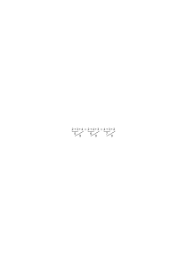

“Siehst du, es kommt tatsächlich immer dasselbe heraus” möchte man sagen. So aufgefaßt, haben wir ein Experiment gemacht. Wir haben die Regeln des Eins-und-Eins angewendet und denen sieht man es nicht unmittelbar an, daß sie in den 3 Fällen zum gleichen Resultat führen. Man wundert sich gleichsam, daß die Ziffern, losgelöst von ihren Definitionen so richtig funktionieren. Oder vielmehr: daß die Ziffernregeln so richtig arbeiten (wenn sie nicht von den Definitionen kontrolliert werden.) Das hängt (seltsamerweise) mit der inneren Widerspruchslosigkeit der Geometrie zusammen. Man kann nämlich sagen, daß die Ziffernregeln die Definitionen immer voraussetzen. Aber in welchem Sinne? Was heißt es, daß ein Zeichen ein anderes voraussetzt; was eigentlich gar nicht da ist? Es setzt seine Möglichkeit voraus; die Möglichkeit im Zeichen-Raum (im grammatischen Raum).

### [PR](/w-pr/#ts-209-47.2) [47\[2\]](https://cdn.wittgensteinnachlass.com/2000px/webp/Ts-209/47.webp) {#472}

Es handelt sich immer darum, ob und wie es möglich ist, die allgemeinste Form der Anwendung der Arithmetik darzustellen. Und hier ist eben das Seltsame, daß das in gewissem Sinne nicht nötig zu sein scheint. Und wenn es wirklich nicht nötig ist, dann ist es auch unmöglich.

### [PR](/w-pr/#ts-209-47.3) [47\[3\]](https://cdn.wittgensteinnachlass.com/2000px/webp/Ts-209/47.webp) {#473}

Es scheint nämlich die allgemeine Form ihrer Anwendung dadurch dargestellt zu sein, daß _nichts_ über sie ausgesagt wird. (Und ist das eine mögliche Darstellung, so ist es auch _die_ richtige.)

### [PR](/w-pr/#ts-209-47.4) [47\[4\]](https://cdn.wittgensteinnachlass.com/2000px/webp/Ts-209/47.webp) {#474}

Das Charakteristische an der Zahlangabe ist, daß man statt der einen Zahl jede andere einsetzen kann und der Satz immer sinnvoll bleiben muß; also die unendliche Formenreihe von Sätzen.

### [PR](/w-pr/#ts-209-47.5) [47\[5\]](https://cdn.wittgensteinnachlass.com/2000px/webp/Ts-209/47.webp) {#475}

Der Sinn der Bemerkung, daß die Arithmetik eine Art Geometrie sei, ist eben, daß die arithmetischen Konstruktionen autonom sind, wie die geometrischen, und daher sozusagen ihre Anwendbarkeit selbst garantieren. Denn auch von der Geometrie muß man sagen können, sie sei ihre eigene Anwendung.

### [PR](/w-pr/#ts-209-47.6) [47\[6\]](https://cdn.wittgensteinnachlass.com/2000px/webp/Ts-209/47.webp) {#476}

Das ist eine arithmetische Konstruktion und in _etwas_ erweitertem Sinn auch eine geometrische.

### [PR](/w-pr/#ts-209-47.7) [47\[7\]](https://cdn.wittgensteinnachlass.com/2000px/webp/Ts-209/47.webp) {#477}

Angenommen, mit dieser Rechnung wollte ich folgende Aufgabe lösen: Wenn ich 11 Äpfel habe und Leute mit je 3 Äpfeln beteilen will, wieviele Leute kann ich beteilen? Die Rechnung liefert mir die Lösung 3. Angenommen nun, ich vollzöge alle Handlungen des Beteilens und am Ende hätten 4 Personen je 3 Äpfel in der Hand. Würde ich nun sagen, die Ausrechnung hat ein falsches Resultat ergeben? Natürlich nicht. Und das heißt ja nur, daß die Ausrechnung kein Experiment war. Es könnte scheinen, als berechtigte uns die mathematische Ausrechnung zu einer Vorhersagung, etwa, daß ich 3 Personen werde beteilen können und 2 Äpfel übrigbleiben werden. So ist es aber nicht. Zu dieser Vorhersagung berechtigt uns eine physikalische Hypothese, die außerhalb der Rechnung steht. Die Rechnung ist nur eine Betrachtung der logischen Formen, der Strukturen, und kann an sich nichts Neues liefern.

### [PR](/w-pr/#ts-209-48.1) [48\[1\]](https://cdn.wittgensteinnachlass.com/2000px/webp/Ts-209/48.webp) {#481}

So verschieden Striche und Gerichtsverhandlungen sind, so kann man doch Gerichtsverhandlungen durch Striche in einem Kalender darstellen. Und kann die einen statt der anderen zählen. Es ist nicht so, wenn ich etwa Hutgrößen Zählen will. Drei Hutgrößen durch 3 Striche zu repräsentieren wäre nicht natürlich. Ebenso, wie wenn ich eine Maßzahl, 3 m, durch 3 Striche darstellen wollte. Man kann das ja tun, nur stellt dann “!!!∣∣∣” auf eine andere Weise dar.

### [PR](/w-pr/#ts-209-48.2) [48\[2\]](https://cdn.wittgensteinnachlass.com/2000px/webp/Ts-209/48.webp) {#482}

Wenn 3 Striche auf dem Papier das Zeichen für die 3 sind, dann kann man sagen, die 3 ist so anzuwenden, wie sich 3 Striche anwenden lassen.

### [PR](/w-pr/#ts-209-48.3) [48\[3\]](https://cdn.wittgensteinnachlass.com/2000px/webp/Ts-209/48.webp) {#483}

Wovon drei Striche ein Bild sind, als dessen Bild können sie dienen.

### [PR](/w-pr/#ts-209-48.4) [48\[4\]](https://cdn.wittgensteinnachlass.com/2000px/webp/Ts-209/48.webp) {#484}

Die Anzahlen sind eine in der Wirklichkeit durch die Dinge gegebene Form, so wie die Rationalzahlen durch Ausdehnungen etc. Ich meine, durch wirkliche Formen. So sind die komplexen Zahlen durch wirkliche Mannigfaltigkeiten gegeben. (Die Symbole sind ja wirklich.)

### [PR](/w-pr/#ts-209-48.5) [48\[5\]](https://cdn.wittgensteinnachlass.com/2000px/webp/Ts-209/48.webp) {#485}

Worin liegt der Unterschied zwischen der Zahlangabe über den Umfang eines Begriffs und der Zahlangabe über den Umfang einer Variablen? Die Erste ist ein Satz, die Zweite keiner. Denn die Zahlangabe über eine Variable kann ich aus dieser selbst ableiten. (Sie muß sich zeigen.) Kann ich aber nicht eine Variable dadurch geben, daß ich sage, ihre Werte sollen alle Gegenstände sein, die eine bestimmte materielle Funktion befriedigen? Dann ist die Variable keine Form! Und dann hängt der Sinn eines Satzes davon ab, ob ein anderer wahr oder falsch ist.

### [PR](/w-pr/#ts-209-48.6) [48\[6\]](https://cdn.wittgensteinnachlass.com/2000px/webp/Ts-209/48.webp) {#486}

Die Zahlangabe über eine Variable besteht in einer Transformation der Variablen, die die Anzahl ihrer Werte sichtbar macht.

### [PR](/w-pr/#ts-209-48.7) [48\[7\]](https://cdn.wittgensteinnachlass.com/2000px/webp/Ts-209/48.webp) {#487}

Welcher Art ist der Satz “zwischen 5 und 8 gibt es eine Primzahl”? Ich würde sagen: “Das _zeigt_ sich”. Und das ist richtig; aber kann man nicht die Aufmerksamkeit auf diesen internen Sachverhalt lenken? Man könnte doch sagen: Untersuche das Intervall von 10 bis 20 auf Primzahlen. Wieviel gibt es? Wäre das nicht eine klare Aufgabe? Und wie wäre ihre Lösung richtig auszudrücken oder darzustellen? Was bedeutet der Satz: “Zwischen 10 und 20 gibt es 4 Primzahlen”? Dieser Satz scheint unsere Aufmerksamkeit auf einen gewissen Aspekt der Sache zu lenken.

### [PR](/w-pr/#ts-209-48.8) [48\[8\]](https://cdn.wittgensteinnachlass.com/2000px/webp/Ts-209/48.webp) {#488}

Wenn ich jemanden frage “Wieviele Primzahlen gibt es zwischen zehn und zwanzig”, so wird er sagen, ich weiß es nicht im Augenblick aber ich kann es jederzeit feststellen. Denn es ist ja gleichsam schon irgendwo aufgeschrieben.

### [PR](/w-pr/#ts-209-48.9) [48\[9\]](https://cdn.wittgensteinnachlass.com/2000px/webp/Ts-209/48.webp) {#489}

Wenn man wissen will, was ein Satz bedeutet, so kann man immer fragen “wie weiß ich das”. Weiß ich, daß es 6 Permutationen von 3 Elementen gibt auf die gleiche Weise, wie, daß 6 Personen im Zimmer sind? Nein. Darum ist jener Satz von anderer _Art_ als dieser.

### [PR](/w-pr/#ts-209-49.1) [49\[1\]](https://cdn.wittgensteinnachlass.com/2000px/webp/Ts-209/49.webp) {#491}

Eine andere ebenso nützliche Frage ist “wie wird dieser Satz in praxi wirklich angewandt” und da wird jener Satz der Kombinationslehre natürlich als Schlußgesetz angewandt, zum Übergang von einem Satz zum andern, deren jeder eine Wirklichkeit, keine _Möglichkeit_, beschreibt.

### [PR](/w-pr/#ts-209-49.2) [49\[2\]](https://cdn.wittgensteinnachlass.com/2000px/webp/Ts-209/49.webp) {#492}

Man kann wohl überhaupt sagen, daß die Verwendung der scheinbaren Sätze über Möglichkeiten – und Unmöglichkeiten – immer der Übergang von einem wirklichen Satz zum andern ist. So kann ich z.B. aus dem Satz “ich bezeichne 7 Felder durch Permutationen von a, b, c” schließen, daß zum mindesten _eine_ mit Wiederholung unter ihnen ist. – Und aus dem Satz “ich verteile 5 Löffel auf 4 Tassen” folgt, daß eine Tasse 2 Löffel kriegt, usw.

### [PR](/w-pr/#ts-209-49.3) [49\[3\]](https://cdn.wittgensteinnachlass.com/2000px/webp/Ts-209/49.webp) {#493}

Wenn jemand mit uns über die Anzahl der Menschen in diesem Zimmer nicht übereinstimmt und behauptet, es seien 7, während wir nur 6 sehen, so können wir ihn verstehen, obwohl wir nicht mit ihm übereinstimmen. Behauptet er aber, für ihn gäbe es 5 reine Farben, dann verstehen wir ihn nicht, oder wir müssen annehmen, daß wir einander gänzlich mißverstehen. Diese Zahl wird im Wörterbuch und der Grammatik abgegrenzt und nicht innerhalb der Sprache.

### [PR](/w-pr/#ts-209-49.4) [49\[4\]](https://cdn.wittgensteinnachlass.com/2000px/webp/Ts-209/49.webp) {#494}

Die Zahlangabe enthält nicht immer eine Verallgemeinerung oder Unbestimmtheit: “Die Strecke A B ist in zwei (3, 4, etc.) gleiche Teile geteilt”.

### [PR](/w-pr/#ts-209-49.5) [49\[5\]](https://cdn.wittgensteinnachlass.com/2000px/webp/Ts-209/49.webp) {#495}

Nicht einmal eine gewisse Allgemeinheit ist der Zahlangabe wesentlich. Wenn ich z.B. sage “ich sehe 3 gleichgroße Kreise in gleichen Abständen angeordnet”. Wenn ich eine richtige Beschreibung des Gesichtsfeldes gebe, in dem 3 rote Kreise auf blauem Grund stehen, so wird da gewiß nicht der Ausdruck vorkommen “(∃x,y,z):x ist kreisförmig und rot und y ist kreisförmig und rot etc. etc.”

### [PR](/w-pr/#ts-209-49.6) [49\[6\]](https://cdn.wittgensteinnachlass.com/2000px/webp/Ts-209/49.webp) {#496}

Freilich könnte man so schreiben: Es gibt 3 Kreise, die die Eigenschaft haben rot zu sein. Aber hier tritt der Unterschied zu Tage zwischen den uneigentlichen Gegenständen, Farbflecken im Gesichtsfeld, Tönen, etc. und den Elementen der Erkenntnis, den eigentlichen Gegenständen. Es fällt auf, daß der Satz von den 3 Kreisen nicht die Allgemeinheit, oder Unbestimmtheit hat, die ein Satz der Form (∃x,y,z)․Fx & Fy & Fz besitzt. In diesem Fall kann man nämlich sagen: Ich weiß zwar, daß 3 Dinge die Eigenschaft F haben, weiß aber nicht, _welche_. Im Fall von den drei Kreisen kann man das nicht sagen. “Es sind jetzt 3 rote Kreise von der und der Größe und Lage in _einem_ Gesichtsfeld” bestimmt die Tatsache vollständig und es wäre unsinnig zu sagen, ich wisse noch nicht, _welche_ Kreise es sind.

### [PR](/w-pr/#ts-209-49.7) [49\[7\]](https://cdn.wittgensteinnachlass.com/2000px/webp/Ts-209/49.webp) {#497}

Denken wir an “Gegenstände” wie: Ein Blitzschlag, das gleichzeitige Eintreffen zweier Ereignisse, die Schnittpunkte einer Geraden mit einem Kreis, etc. für alle diese Fälle sind die 3 Kreise im Gesichtsfeld ein Beispiel.

### [PR](/w-pr/#ts-209-49.8+50.1) [49\[8\]](https://cdn.wittgensteinnachlass.com/2000px/webp/Ts-209/49.webp),[50\[1\]](https://cdn.wittgensteinnachlass.com/2000px/webp/Ts-209/50.webp) {#498501}

Man kann natürlich die Subjekt-Prädikat- oder was dasselbe ist die ArgumentFunktion-Form als eine Norm der Darstellung auffassen und dann ist es allerdings wichtig und charakteristisch, daß sich in jedem Fall, wenn wir Zahlen anwenden, die Zahl als Eigenschaft eines Prädikates darstellen läßt. Nur müssen wir uns darüber im klaren sein, daß wir es nun nicht mit Gegenständen und Begriffen zu tun haben, als den Ergebnissen einer Zerlegung, sondern mit Normen, in die wir den Satz gepreßt haben. Und es hat freilich eine Bedeutung, daß er sich auf diese Norm hat bringen lassen. Aber das In-eine-Norm-Pressen ist das Gegenteil einer Analyse. Wie man, um den natürlichen Wuchs des Apfelbaums zu studieren, nicht den Spalierbaum anschaut, außer, um zu sehen, wie sich _dieser_ Baum unter _diesem_ Zwang verhält.

### [PR](/w-pr/#ts-209-50.2) [50\[2\]](https://cdn.wittgensteinnachlass.com/2000px/webp/Ts-209/50.webp) {#502}

Das würde sagen, daß die Frege'sche Theorie der Zahl so lange anwendbar wäre, als wir nicht eine Analyse der Sätze beabsichtigen. Diese Theorie erklärt den Zahlbegriff für die Ausdrucksform der Umgangssprache. Frege hätte allerdings gesagt (ich erinnere mich an eine Unterredung) daß das Zusammentreffen einer Mondesfinsternis und einer Gerichtsverhandlung ein Gegenstand sei. Und was ist dagegen einzuwenden? Nur, daß wir das Wort “Gegenstand” dann in zweideutiger Weise verwenden und so die Resultate der logischen Analyse verwirren.

### [PR](/w-pr/#ts-209-50.3) [50\[3\]](https://cdn.wittgensteinnachlass.com/2000px/webp/Ts-209/50.webp) {#503}

Wenn ich sage “in diesem Zimmer sind 4 Menschen”, so scheint allerdings eine Disjunktion hineinzuspielen, da nicht gesagt ist, _welche_ Menschen. Aber das ist ganz unwesentlich. Wir könnten uns denken, daß alle Menschen einander gleich wären, abgesehen vom Ort, an dem sie sich befinden (daß es sich also bei ihnen um Menschlichkeit an einem bestimmten räumlichen Ort handelte) und dann fiele jede Unbestimmtheit fort.

### [PR](/w-pr/#ts-209-50.4) [50\[4\]](https://cdn.wittgensteinnachlass.com/2000px/webp/Ts-209/50.webp) {#504}

Wenn ich recht habe, so gibt es keinen Begriff “reine Farbe”; der Satz “A hat eine reine Farbe” heißt einfach “A ist rot, oder gelb, oder blau, oder grün”. “Dieser Hut gehört entweder A oder B oder C” ist nicht derselbe Satz wie “dieser Hut gehört einem Menschen in diesem Zimmer”, selbst wenn tatsächlich nur A, B, C im Zimmer sind, denn das muß erst dazugesagt werden. – Auf dieser Fläche sind zwei reine Farben, _heißt_: Auf dieser Fläche sind rot und gelb, oder rot und blau, oder rot und grün, oder etc. Wenn ich nun nicht sagen kann “es gibt 4 reine Farben”, so sind die reinen Farben und die Zahl 4 doch irgendwie miteinander verbunden und das muß sich auch irgendwie ausdrücken. – Z.B. wenn ich sage “auf dieser Fläche sehe ich 4 Farben: gelb, blau, rot, grün”.

### [PR](/w-pr/#ts-209-50.5) [50\[5\]](https://cdn.wittgensteinnachlass.com/2000px/webp/Ts-209/50.webp) {#505}

Ganz analog muß es sich nun mit den Permutationen verhalten. Die Permutationen (ohne Wiederholung) von A B _sind_ A B, B A. Sie sind nicht die Extension eines Begriffs, sondern sie allein sind der Begriff. Dann kann man aber von ihnen nicht sagen, daß ihrer Zwei sind. Und doch tut man das scheinbar in der Kombinatorik. Es ist mir, als handle es sich da um eine ähnliche Zuordnung, wie die zwischen der Algebra und den Induktionen der Arithmetik. Oder ist die Verbindung die von Geometrie und Arithmetik? Der Satz, daß es 2 Permutationen von A B gibt, ist wirklich ganz analog dem, daß die Gerade dem Kreis in 2 Punkten schneidet. Oder, daß eine Gleichung zweiten Grades zwei Wurzeln hat.

### [PR](/w-pr/#ts-209-50.6+51.1) [50\[6\]](https://cdn.wittgensteinnachlass.com/2000px/webp/Ts-209/50.webp),[51\[1\]](https://cdn.wittgensteinnachlass.com/2000px/webp/Ts-209/51.webp) {#506511}

Wenn man sagt, A B lasse 2 Permutationen zu, so klingt das, als mache man eine _allgemeine_ Aussage, analog der “in dem Zimmer sind 2 Menschen”, wobei über die Menschen noch nichts weiter gesagt ist und bekannt sein braucht. Das ist aber im Falle A B nicht so. Ich kann A B, B A nicht allgemeiner beschreiben und daher kann der Satz, es seien 2 Permutationen möglich, nicht weniger sagen, als, es sind die Permutationen A B und B A möglich. Zu sagen, es sind 6 Permutationen von 3 Elementen möglich kann nicht weniger, d.h. etwas allgemeineres sagen, als das Schema zeigt: A A B B C C | B C A C A B | C B C A B A Denn es ist _unmöglich_ die Zahl der möglichen Permutationen zu kennen, ohne diese selbst zu kennen. Und wäre das nicht so, so könnte die Kombinatorik nicht zu ihren allgemeinen Formeln kommen. Das Gesetz, welches wir in der Bildung der Permutationen erkennen, ist durch die Gleichung p = n! dargestellt. Ich glaube, in demselben Sinn, wie der Kreis durch die Kreisgleichung. – Ich kann freilich die Zahl 2 den Permutationen A B, B A zuordnen, sowie die 6 den ausgeführten Permutationen von A, B, C, aber das gibt mir nicht den Satz der Kombinationslehre. – Das was ich in A B, B A sehe, ist eine interne Relation, die sich daher nicht beschreiben läßt. D.h. _das_ läßt sich nicht beschreiben, was diese Klasse von Permutationen komplett macht. – Zählen kann ich nur was tatsächlich da ist, nicht die Möglichkeiten. Ich kann aber z.B. berechnen, wieviele Zeilen ein Mensch schreiben muß, wenn er in jede Zeile eine Permutation von 3 Elementen setzt und solange permutiert, bis er ohne Wiederholung nicht weiter kann. Und das heißt, er braucht 6 Zeilen um auf diese Weise die Permutationen A B C, A C B etc. hinzuschreiben, denn dies sind eben “_die_ Permutationen von A, B, C”. Es hat aber keinen Sinn zu sagen, dies seien alle Permutationen von A B C.

### [PR](/w-pr/#ts-209-51.2) [51\[2\]](https://cdn.wittgensteinnachlass.com/2000px/webp/Ts-209/51.webp) {#512}

Eine Kombinationsrechenmaschine ist denkbar ganz analog der Russischen.

### [PR](/w-pr/#ts-209-51.3) [51\[3\]](https://cdn.wittgensteinnachlass.com/2000px/webp/Ts-209/51.webp) {#513}

Es ist klar, daß es eine mathematische Frage gibt; “wieviele Permutationen von – z.B. – 4 Elementen gibt es”, eine Frage von genau derselben Art, wie die “wieviel ist 25 × 18”. Denn es gibt eine allgemeine Methode zur Lösung beider. Aber die Frage gibt es auch nur mit Bezug auf diese Methode.

### [PR](/w-pr/#ts-209-51.4) [51\[4\]](https://cdn.wittgensteinnachlass.com/2000px/webp/Ts-209/51.webp) {#514}

Der Satz, es gibt 6 Permutationen von 3 Elementen, ist identisch mit dem Permutationsschema und darum gibt es hier keinen Satz “es gibt 7 Permutationen von 3 Elementen”, denn dem entspricht kein solches Schema.

### [PR](/w-pr/#ts-209-51.5) [51\[5\]](https://cdn.wittgensteinnachlass.com/2000px/webp/Ts-209/51.webp) {#515}

Man kann auch sagen, der Satz “es gibt 6 Permutationen von 3 Elementen” verhält sich genau so zum Satz “es sind 6 Leute im Zimmer”, wie der Satz 3 + 3 = 6, den man auch in der Form “es gibt 6 Einheiten in 3 + 3” aussprechen könnte. Und wie ich in dem einen Fall die Reihen im Permutationsschema zähle, so kann ich im andern die Striche im | | | | | | | | zählen.

### [PR](/w-pr/#ts-209-51.6) [51\[6\]](https://cdn.wittgensteinnachlass.com/2000px/webp/Ts-209/51.webp) {#516}

Wie ich 4 × 3 = 12 durch das Schema beweisen kann: o o o o | o o o o | o o o o, so kann ich 3! = 6 durch das Permutationsschema beweisen.

### [PR](/w-pr/#ts-209-51.7) [51\[7\]](https://cdn.wittgensteinnachlass.com/2000px/webp/Ts-209/51.webp) {#517}

Zu sagen, daß ich so viele Löffel habe, daß sie 1–1 auf ein Dutzend Schalen verteilt werden _können_, was heißt es? Entweder setzt dieser Satz voraus, daß ich 12 Löffel habe, dann kann ich nicht sagen, daß sie den 12 Schalen zugeordnet werden können, denn das Gegenteil wäre unmöglich; oder aber, der Satz setzt nicht voraus, daß ich 12 Löffel habe, dann sagt er, daß ich 12 Löffel haben _kann_ und das ist selbstverständlich und läßt sich wieder nicht sagen. Man könnte auch so fragen: Sagt jener Satz _weniger_, als daß ich 12 Löffel habe? Sagt er etwas, woraus erst mit Hilfe eines weiteren Satzes folgt, daß ich 12 Löffel habe? Wenn p aus q allein folgt, so sagt q bereits p. Ein scheinbarer gedanklicher Prozeß, der den Übergang macht, gilt nicht.

### [PR](/w-pr/#ts-209-51.8) [51\[8\]](https://cdn.wittgensteinnachlass.com/2000px/webp/Ts-209/51.webp) {#518}

Das Symbol für eine Klasse ist eine Liste.

### [PR](/w-pr/#ts-209-52.1) [52\[1\]](https://cdn.wittgensteinnachlass.com/2000px/webp/Ts-209/52.webp) {#521}

Kann ich wissen, daß auf diesem Tisch gleichviel Äpfel und Birnen liegen und nicht wissen, wieviel? Und was heißt es, nicht zu wissen wieviel? Und wie kann ich es herausfinden? Wohl durch zählen. Es ist offenbar, daß man die Gleichzahligkeit durch Zuordnung erkennen kann, ohne die Klassen zu zählen.

<math display="block">
  <mtext>
    <s>❘❘❘❘❘❘❘❘❘❘❘❘❘❘❘❘❘❘❘❘</s>
  </mtext>
</math>

### [PR](/w-pr/#ts-209-52.2) [52\[2\]](https://cdn.wittgensteinnachlass.com/2000px/webp/Ts-209/52.webp) {#522}

In Russells Theorie kann nur die _wirkliche_ Zuordnung die “Ähnlichkeit” zweier Klassen zeigen. Nicht die _Möglichkeit_ der Zuordnung, denn diese besteht eben in der Gleichheit der Zahlen. Die Möglichkeit muß ja eine _interne_ Relation der Begriffsumfänge sein, diese interne Relation aber ist eben nur durch die Gleichheit der beiden Zahlen gegeben.

### [PR](/w-pr/#ts-209-52.3) [52\[3\]](https://cdn.wittgensteinnachlass.com/2000px/webp/Ts-209/52.webp) {#523}

Die Kardinalzahl ist eine interne Eigenschaft einer Liste.

### [PR](/w-pr/#ts-209-52.4) [52\[4\]](https://cdn.wittgensteinnachlass.com/2000px/webp/Ts-209/52.webp) {#524}

Wir sondern die Evidenz für das Eintreten eines physikalischen Ereignisses nach den verschiedenen Arten solcher Evidenz in gehörte, gesehene, gemessene etc., und sehen, daß in jeder dieser einzelnen ein formelles Element der Ordnung ist, welches wir Raum nennen können.

### [PR](/w-pr/#ts-209-52.5) [52\[5\]](https://cdn.wittgensteinnachlass.com/2000px/webp/Ts-209/52.webp) {#525}

<math display="block">
  <mtext>
    <s>❘❘❘❘❘❘❘❘❘❘❘❘❘❘</s>
  </mtext>
</math>

Welcher Art ist die _Unmöglichkeit_ der 1–1 Zuordnung von, z.B., 3 Kreisen und 2 Kreuzen? Man könnte auch fragen – und es wäre offenbar dieselbe Art Frage – welcher Art ist die Unmöglichkeit der zeichnerischen Zuordnung durch parallele Geraden, wenn die Anordnung die gegebene ist?

### [PR](/w-pr/#ts-209-52.6) [52\[6\]](https://cdn.wittgensteinnachlass.com/2000px/webp/Ts-209/52.webp) {#526}

Daß die 1–1 Zuordnung möglich ist, zeigt sich darin, daß ein sinnvoller Satz sie – wahr oder falsch – als bestehend behauptet. Und daß die obige Zuordnung nicht möglich ist, zeigt sich darin, daß wir sie nicht beschreiben können.

### [PR](/w-pr/#ts-209-52.7) [52\[7\]](https://cdn.wittgensteinnachlass.com/2000px/webp/Ts-209/52.webp) {#527}

Wir können sagen, es sind 2 Kreise in diesem Viereck, obwohl in Wirklichkeit ihrer 3 sind und dieser Satz ist nur falsch. Ich kann aber nicht sagen, diese Gruppe von Kreisen besteht aus 2 Kreisen und ebensowenig, sie besteht aus 3 Kreisen, weil ich da eine _interne_ Eigenschaft aussagen würde.

### [PR](/w-pr/#ts-209-52.8) [52\[8\]](https://cdn.wittgensteinnachlass.com/2000px/webp/Ts-209/52.webp) {#528}

Von einer Extension zu sagen, sie habe diese und diese Zahl, ist Unsinn, denn die Zahl ist eine _interne_ Eigenschaft der Extension. Wohl aber kann man die Zahl von dem Begriff aussagen, der die Extension unter einen Hut bringt (ebenso, wie man sagen kann, daß diese Extension den Begriff befriedigt).

### [PR](/w-pr/#ts-209-52.9) [52\[9\]](https://cdn.wittgensteinnachlass.com/2000px/webp/Ts-209/52.webp) {#529}

Es ist merkwürdig, daß man im Fall der Tautologien und Kontradiktion wirklich von Sinn und Bedeutung im Sinne Freges reden könnte. Wenn man die Bedeutung der Tautologie ihre Eigenschaft eine Tautologie zu sein nennt, dann kann man den Sinn der Tautologie die Art und Weise nennen, wie hier die Tautologie zu Stande kommt. Das gleiche für die Kontradiktion.

### [PR](/w-pr/#ts-209-53.1) [53\[1\]](https://cdn.wittgensteinnachlass.com/2000px/webp/Ts-209/53.webp) {#531}

Wenn man, wie Ramsey vorschlägt, das Zeichen “ = ” so erklärt, daß x = x, eine Tautologie, x = y eine Kontradiktion ist, dann kann man sagen, daß hier die Tautologie und die Kontradiktion keinen “Sinn” haben.

### [PR](/w-pr/#ts-209-53.2) [53\[2\]](https://cdn.wittgensteinnachlass.com/2000px/webp/Ts-209/53.webp) {#532}

Wenn also die Tautologie dadurch etwas zeigt, daß gerade _dieser_ Sinn _diese_ Bedeutung ergibt, so zeigt die Tautologie bei Ramsey nichts, denn sie ist Tautologie durch Definition.

### [PR](/w-pr/#ts-209-53.3) [53\[3\]](https://cdn.wittgensteinnachlass.com/2000px/webp/Ts-209/53.webp) {#533}

Welche Beziehung besteht denn zwischen dem Zeichen “≝” und jenem Gleichheitszeichen welches durch Tautologie und Kontradiktion erklärt wird? Ist für dieses Gleichheitszeichen “p & q = non(nonp ⌵ nonq)” eine Tautologie? Man könnte sagen: “p & q = p & q” ist Taut. und da man das eine Zeichen “p & q” hier der Definition entsprechend durch “non (nonp & nonq)” ersetzen darf, so ist auch der obere Ausdruck Taut.

### [PR](/w-pr/#ts-209-53.4) [53\[4\]](https://cdn.wittgensteinnachlass.com/2000px/webp/Ts-209/53.webp) {#534}

Man dürfte also die Erklärung des Gleichheitszeichens nicht so schreiben: x = x ist Taut.

x = y Kont. sondern man müßte sagen: Wenn, und _nur_ wenn, “x” und “y” den Zeichenregeln zufolge die gleiche Bedeutung haben, dann ist „x = y” Taut.; wenn „x” und “y” den Zeichenregeln zufolge nicht dieselbe Bedeutung haben, dann ist „x = y” Kont.. Es wäre dann zweckmäßig, das so erklärte Gleichheitszeichen anders zu schreiben zum Unterschied von “x = y” welches eine Zeichenregel darstellt und besagt, daß wir x durch y ersetzen dürfen. Das nämlich kann ich aus dem oben erklärten Zeichen nicht ersehen, sondern nur daraus daß es eine Tautologie ist, aber auch das weiß ich ja erst, wenn ich schon die Ersetzungsregeln kenne.

### [PR](/w-pr/#ts-209-53.5) [53\[5\]](https://cdn.wittgensteinnachlass.com/2000px/webp/Ts-209/53.webp) {#535}

Die Gleichungen der Mathematik kann man, so scheint es mir, nur mit sinnvollen Sätzen vergleichen, nicht mit Tautologien. Denn die Gleichung enthält eben dieses aussagende Element – das Gleichheitszeichen – das nicht dazu bestimmt ist, etwas zu zeigen. Denn was sich zeigt, das zeigt sich ohne das Gleichheitszeichen. Das Gleichheitszeichen entspricht nicht dem “․⊃․” in “p & (p⊃q) ․⊃․ q” denn das “․⊃․” ist nur _ein_ Bestandteil unter anderen, die zur Bildung der Tautologie gehören. Es fällt nicht aus dem Zusammenhang heraus, sondern gehört zum Satz, wie das “ & ” oder “⊃”. Das “ = ” aber ist eine Kopula, die allein die Gleichung zu etwas Satzartigem macht. Die Tautologie zeigt etwas, die Gleichung zeigt nichts, sondern weist darauf hin, daß ihre Glieder etwas zeigen.

### [PR](/w-pr/#ts-209-53.6) [53\[6\]](https://cdn.wittgensteinnachlass.com/2000px/webp/Ts-209/53.webp) {#536}

Eine Gleichung ist eine syntaktische Regel.

### [PR](/w-pr/#ts-209-53.7) [53\[7\]](https://cdn.wittgensteinnachlass.com/2000px/webp/Ts-209/53.webp) {#537}

Erklärt das nicht, daß wir in der Mathematik nicht prinzipiell unbeantwortbare Fragen haben können? Denn wenn die Regeln der Syntax nicht verständlich sind, dann taugen sie nichts. Und ebenso erklärt es, daß nicht eine Unendlichkeit in diese Regeln eingehen kann, die unser Fassungsvermögen übersteigt. Und es macht auch die Versuche der Formalisten begreiflich, die in der Mathematik ein Spiel mit Zeichen sehen.

### [PR](/w-pr/#ts-209-53.8) [53\[8\]](https://cdn.wittgensteinnachlass.com/2000px/webp/Ts-209/53.webp) {#538}

Zeichenregeln, z.B. Definitionen kann man zwar als Sätze, die von Zeichen handeln, auffassen, aber man _muß_ sie gar nicht als Sätze auffassen. Sie sind Hilfsmittel der Sprache. Hilfsmittel anderer Art, als die Sätze der Sprache.

### [PR](/w-pr/#ts-209-54.1) [54\[1\]](https://cdn.wittgensteinnachlass.com/2000px/webp/Ts-209/54.webp) {#541}

Die Theorie der Identität bei Ramsey macht den Fehler, den man machen würde, wenn man sagte, ein gemaltes Bild könne man auch als Spiegel benutzen, wenn auch nur für eine einzige Stellung, wo dann übersehen wird, daß das Wesentliche am Spiegel gerade das ist, daß man aus ihm die Stellung des Körpers vor dem Spiegel schließen kann, während man im Fall des gemalten Bildes erst wissen muß, daß die Stellungen übereinstimmen, ehe man das Bild als Spiegelbild auffassen kann.

### [PR](/w-pr/#ts-209-54.2) [54\[2\]](https://cdn.wittgensteinnachlass.com/2000px/webp/Ts-209/54.webp) {#542}

Weyls Widerspruch “Heterologisch”: nonf(“f”) [unreadable] “f” ist heterologisch = F(“f”) ≝. F(“F”) = nonF(“F”) = non[non (nonf̂(“f̂”)) (“nonf̂ (“f̂”)”)]

### [PR](/w-pr/#ts-209-54.3) [54\[3\]](https://cdn.wittgensteinnachlass.com/2000px/webp/Ts-209/54.webp) {#543}

Den mathematischen Satz kann man sich vorstellen als ein Lebewesen, das selbst weiß, ob es wahr oder falsch ist. (Zum Unterschied von den eigentlichen Sätzen.) Der mathematische Satz weiß selbst, daß er wahr oder daß er falsch ist. Wenn er von allen Zahlen handelt, so muß er auch schon alle Zahlen übersehen. Wie der Sinn, so muß auch seine Wahrheit oder Falschheit in ihm liegen.

### [PR](/w-pr/#ts-209-54.4) [54\[4\]](https://cdn.wittgensteinnachlass.com/2000px/webp/Ts-209/54.webp) {#544}

Es ist, als wäre die Allgemeinheit eines Satzes wie “(n)non chromatisch n” nur eine Anweisung auf die eigentliche, wirkliche, mathematische Allgemeinheit eines Satzes. Gleichsam nur eine Beschreibung der Allgemeinheit, nicht diese selbst. Als bilde der Satz nur auf rein äußerliche Weise ein Zeichen, dem man erst von innen Sinn geben muß.

### [PR](/w-pr/#ts-209-54.5) [54\[5\]](https://cdn.wittgensteinnachlass.com/2000px/webp/Ts-209/54.webp) {#545}

Wir fühlen: Die Allgemeinheit, die die mathematische Behauptung hat, ist anders, als die Allgemeinheit des Satzes der bewiesen ist.

### [PR](/w-pr/#ts-209-54.6) [54\[6\]](https://cdn.wittgensteinnachlass.com/2000px/webp/Ts-209/54.webp) {#546}

In welchem Verhältnis steht ein Problem der Mathematik zu seiner Beantwortung?

### [PR](/w-pr/#ts-209-54.7) [54\[7\]](https://cdn.wittgensteinnachlass.com/2000px/webp/Ts-209/54.webp) {#547}

Man könnte sagen: Ein mathematischer Satz ist der Hinweis auf einen Beweis.

### [PR](/w-pr/#ts-209-54.8) [54\[8\]](https://cdn.wittgensteinnachlass.com/2000px/webp/Ts-209/54.webp) {#548}

Eine Allgemeinheit kann nicht zugleich empirisch und beweisbar sein.

### [PR](/w-pr/#ts-209-54.9) [54\[9\]](https://cdn.wittgensteinnachlass.com/2000px/webp/Ts-209/54.webp) {#549}

Wenn ein Satz einen bestimmten Sinn haben soll (und sonst ist er unsinnig) so muß er seinen Sinn ganz erfassen – ganz übersehen; die Allgemeinheit hat nur dann einen Sinn, wenn sie – d.h. alle Werte der Variablen – völlig bestimmt ist.

### [PR](/w-pr/#ts-209-54.10) [54\[10\]](https://cdn.wittgensteinnachlass.com/2000px/webp/Ts-209/54.webp) {#5410}

[unreadable] Wenn ich auf einer endlosen Strecke nur durch Probieren weiterkomme, warum soll es bei einer unendlichen anders sein? Und dann kann ich natürlich nie ans Ziel kommen. Aber wenn ich auf der unendlichen Strecke nur schrittweise weitergehe, so kann ich die unendliche Strecke ja überhaupt nicht erfassen. Ich erfasse sie also auf andere Weise; und wenn ich sie erfaßt habe, so kann der Satz über sie nur so verifiziert werden, wie er sie aufgefaßt hat.

### [PR](/w-pr/#ts-209-54.11+55.1) [54\[11\]](https://cdn.wittgensteinnachlass.com/2000px/webp/Ts-209/54.webp),[55\[1\]](https://cdn.wittgensteinnachlass.com/2000px/webp/Ts-209/55.webp) {#5411551}

Er kann jetzt also nicht durch ein endlos gedachtes Schreiten verifiziert werden, denn auch ein solches würde nicht zu einem Ziel gelangen, da ja der Satz ebenso endlos wieder über unseren Schritt hinausschreiten kann. Sondern nur mit _einem_ Schritt, wie auch die Gesamtheit der Zahlen nur mit _einem_ Schlage gefaßt werden konnte.

### [PR](/w-pr/#ts-209-55.2) [55\[2\]](https://cdn.wittgensteinnachlass.com/2000px/webp/Ts-209/55.webp) {#552}

Man kann auch sagen: Es gibt keinen Weg zur Unendlichkeit, _auch nicht den endlosen_.

### [PR](/w-pr/#ts-209-55.3) [55\[3\]](https://cdn.wittgensteinnachlass.com/2000px/webp/Ts-209/55.webp) {#553}

Es wäre etwa so: Wir haben eine unendlich lange Baumreihe und ich mache, um sie zu inspizieren ihr entlang einen Weg. Sehr gut, so muß dieser Weg endlos sein. Aber wenn er endlos ist, so heißt das eben, daß man ihn nicht zu Ende gehen kann. D.h. er bringt mich _nicht_ dazu, die Reihe zu übersehen. (Eingestandenermaßen nicht) Der endlose Weg hat nämlich nicht ein “unendlich fernes” Ende, sondern kein Ende.

### [PR](/w-pr/#ts-209-55.4) [55\[4\]](https://cdn.wittgensteinnachlass.com/2000px/webp/Ts-209/55.webp) {#554}

Es ist nicht etwa nur “für uns Menschen” unmöglich, alle Zahlen sukzessive zu erfassen, sondern es ist unmöglich, es heißt nichts.

### [PR](/w-pr/#ts-209-55.5) [55\[5\]](https://cdn.wittgensteinnachlass.com/2000px/webp/Ts-209/55.webp) {#555}

Man kann auch nicht sagen: “Der Satz kann alle Zahlen nicht sukzessive erfassen, so muß er sie durch den Begriff fassen”, als ob das faute de mieux so wäre: “Weil er es _so_ nicht kann, muß er es auf die andere Art tun”. Aber so ist es nicht: Ein sukzessives Erfassen ist schon möglich, nur führt es eben _nicht_ zur Gesamtheit. Die Gesamtheit aber ist nur als Begriff vorhanden.

### [PR](/w-pr/#ts-209-55.6) [55\[6\]](https://cdn.wittgensteinnachlass.com/2000px/webp/Ts-209/55.webp) {#556}

Gegen den Einwand: “Wenn ich die Zahlenreihe durchlaufe, so komme ich entweder einmal zu der Zahl von der gewünschten Eigenschaft, oder nie” ist nur zu antworten, daß es keinen Sinn hat zu sagen, man kommt _einmal_ zu der Zahl, und _ebensowenig_, man kommt _nie_ dahin. Wohl ist es richtig, zu sagen, die Zahl 101 ist jene Zahl, oder sie ist es nicht. Aber von _allen_ Zahlen kann man nicht reden, weil es nicht _alle_ Zahlen gibt.

### [PR](/w-pr/#ts-209-55.7) [55\[7\]](https://cdn.wittgensteinnachlass.com/2000px/webp/Ts-209/55.webp) {#557}

Kann man sagen: Daß 6 ‒ 4 gerade 2 ist, konnte man nicht voraussehen, sondern man kann es nur sehen, wenn man dahin kommt.

### [PR](/w-pr/#ts-209-55.8) [55\[8\]](https://cdn.wittgensteinnachlass.com/2000px/webp/Ts-209/55.webp) {#558}

Schon, daß mit dem logischen Begriff [1, ‒ , ‒ + 1] die Existenz seiner Gegenstände bereits gegeben ist, zeigt, daß er sie bestimmt.

### [PR](/w-pr/#ts-209-55.9) [55\[9\]](https://cdn.wittgensteinnachlass.com/2000px/webp/Ts-209/55.webp) {#559}

Das ist übrigens ganz klar: Jede Zahl hat ihre nichtreduzierbare Individualität. Und wenn ich irgend eine Eigenschaft einer Zahl beweisen will, muß ich sie immer selbst irgendwie hineinbringen.

### [PR](/w-pr/#ts-209-55.10) [55\[10\]](https://cdn.wittgensteinnachlass.com/2000px/webp/Ts-209/55.webp) {#5510}

Man kann insofern sagen, daß die Eigenschaften einer bestimmten Zahl nicht _vorauszusehen_ sind. Man sieht sie erst, wenn man dort ist. Man könnte sagen: Kann ich nicht etwas über die Zahl 3¹⁰ beweisen, obwohl ich sie nicht anschreiben kann? Wohl, aber 3¹⁰ ist schon die Zahl, nur auf andere Weise angeschrieben.

### [PR](/w-pr/#ts-209-55.11) [55\[11\]](https://cdn.wittgensteinnachlass.com/2000px/webp/Ts-209/55.webp) {#5511}

Das Fundamentale ist nur die Wiederholung einer Operation. Jedes Stadium dieser Wiederholung hat seine Individualität.

### [PR](/w-pr/#ts-209-56.1) [56\[1\]](https://cdn.wittgensteinnachlass.com/2000px/webp/Ts-209/56.webp) {#561}

Nun ist es nicht etwa so, daß ich durch die Operation von einer Individualität zur andern fortschreite. So daß die Operation das Mittel wäre, um von einer zur andern zu kommen. Etwa das Vehikel, das bei jeder Zahl anhält, die man nun betrachten kann. Sondern die dreimalige Operation + 1 erzeugt und _ist_ die Zahl 3.

### [PR](/w-pr/#ts-209-56.2) [56\[2\]](https://cdn.wittgensteinnachlass.com/2000px/webp/Ts-209/56.webp) {#562}

Ein “unendlich kompliziertes Gesetz” heißt, kein Gesetz. Wie könnte man wissen, daß es unendlich kompliziert ist? Nur so, indem es gleichsam unendlich viele Näherungswerte zu diesem Gesetz gäbe. Aber bedingt das nicht, daß sie sich wirklich einem Ziel _nähern_? Oder kann man die unendlich vielen Beschreibungen von Strecken der Primzahlenreihe solche Näherungswerte des Gesetzes nennen? Nein, denn keine Beschreibung einer endlichen Strecke bringt uns dem Ziele einer Gesamtbeschreibung näher. Wie unterscheidet sich denn ein unendlich kompliziertes Gesetz in diesem Sinne von gar keinem Gesetz? Das Gesetz würde dann höchstens lauten “es ist alles, wie es ist”.

### [PR](/w-pr/#ts-209-56.3) [56\[3\]](https://cdn.wittgensteinnachlass.com/2000px/webp/Ts-209/56.webp) {#563}

Es scheint jetzt doch, daß die Allgemeinheitsbezeichnung für Zahlen keinen Sinn hat. Ich meine: Man kann nicht sagen “(n)Fn” weil eben “alle natürlichen Zahlen” kein begrenzter Begriff ist. Dann darf man aber auch nicht sagen, daß aus einer Aussage über das Wesen der Zahl eine allgemeine Aussage folgt.

### [PR](/w-pr/#ts-209-56.4) [56\[4\]](https://cdn.wittgensteinnachlass.com/2000px/webp/Ts-209/56.webp) {#564}

Dann aber scheint es mir, als könne man die Allgemeinheit – alle, etc. – in der Mathematik überhaupt nicht verwenden. Alle Zahlen gibt es nicht, eben weil unendlich viele da sind. Und weil es sich hier nicht um das amorphe “alle” handelt, wie im Satz “alle Äpfel sind reif”, wo die Menge durch eine äußere Beschreibung gegeben ist, sondern um die Gesamtheit von Strukturen, die eben als solche gegeben werden müssen.

### [PR](/w-pr/#ts-209-56.5) [56\[5\]](https://cdn.wittgensteinnachlass.com/2000px/webp/Ts-209/56.webp) {#565}

Es geht sozusagen die Logik nichts an, wieviel Äpfel vorhanden sind, wenn von _allen_ Äpfeln geredet wird. Dagegen ist es anders bei den Zahlen, für die ist sie einzeln verantwortlich.

### [PR](/w-pr/#ts-209-56.6) [56\[6\]](https://cdn.wittgensteinnachlass.com/2000px/webp/Ts-209/56.webp) {#566}

Was bedeutet ein mathematischer Satz von der Art “(∃n)․4 + n = 7”? Es wäre eine Disjunktion 4 + 0 = 7 ․⌵․ 4 + 1 = 7 ․⌵․ etc. ad inf.. Was aber bedeutet das? Ich kann einen Satz verstehen, der einen Anfang und ein Ende hat. Kann man aber auch einen Satz verstehen, der kein Ende hat? Ich verstehe auch, daß man eine unendliche Regel angeben kann, nach der unendlich viele endliche Sätze gebildet werden können. Was aber bedeutet ein endloser Satz?

### [PR](/w-pr/#ts-209-56.7) [56\[7\]](https://cdn.wittgensteinnachlass.com/2000px/webp/Ts-209/56.webp) {#567}

Wenn der Satz durch kein endliches Produkt wahr gemacht wird, so heißt das: Er wird durch _kein_ Produkt wahr gemacht. Und darum _ist_ er kein logisches Produkt.

### [PR](/w-pr/#ts-209-56.8) [56\[8\]](https://cdn.wittgensteinnachlass.com/2000px/webp/Ts-209/56.webp) {#568}

Aber kann ich denn nicht von einer Gleichung sagen: “Ich weiß, sie stimmt für einige – ich erinnere mich nicht mehr, welche – Substitutionen nicht; ob sie aber allgemein nicht stimmt, weiß ich nicht”? Hat das nicht einen guten Sinn, und ist es nicht mit der Allgemeinheit der Ungleichung verträglich?

### [PR](/w-pr/#ts-209-57.1) [57\[1\]](https://cdn.wittgensteinnachlass.com/2000px/webp/Ts-209/57.webp) {#571}

Soll ich darauf antworten: “Wenn man weiß, daß die Ungleichung für einige Substitutionen stimmt, so kann das nie heißen “für einige (beliebige) unter der unendlichen Reihe der Zahlen”, sondern ich weiß immer auch, daß diese Zahl zwischen 1 und 10⁷ liegt, oder sonst welchen Grenzen”?

### [PR](/w-pr/#ts-209-57.2) [57\[2\]](https://cdn.wittgensteinnachlass.com/2000px/webp/Ts-209/57.webp) {#572}

Kann ich wissen, daß _eine_ Zahl der Gleichung genügt, ohne daß irgend ein endlicher Bereich für ihr Vorkommen in der unendlichen Reihe abgegrenzt ist? Nein.

### [PR](/w-pr/#ts-209-57.3) [57\[3\]](https://cdn.wittgensteinnachlass.com/2000px/webp/Ts-209/57.webp) {#573}

Es wäre eine gute Frage für die Scholastiker gewesen: “Kann Gott alle Stellen von π kennen?” Die Antwort lautet in allen solchen Fällen: Die Frage ist sinnlos.

### [PR](/w-pr/#ts-209-57.4) [57\[4\]](https://cdn.wittgensteinnachlass.com/2000px/webp/Ts-209/57.webp) {#574}

“Alle Helligkeitsgrade unter diesem tun meinen Augen nicht weh”. Das heißt, ich habe beobachtet, daß die bisherigen Erfahrungen einem formellen Gesetz entsprechen.

### [PR](/w-pr/#ts-209-57.5) [57\[5\]](https://cdn.wittgensteinnachlass.com/2000px/webp/Ts-209/57.webp) {#575}

Ein Satz, der von allen Sätzen, oder allen Funktionen handelt, ist von vorn herein eine Unmöglichkeit: Was durch einen solchen ausgedrückt werden sollte, müßte durch eine Induktion gezeigt werden. (Z.B. daß _alle_ Sätze <math class="stacked" display="inline"><mtext>no</mtext><msup><mi>n</mi><mi>n</mi></msup><mi>p</mi></math> dasselbe sagen.) Diese Induktion ist selbst kein Satz und deshalb ist ein circulus vitiosus ausgeschlossen.

### [PR](/w-pr/#ts-209-57.6) [57\[6\]](https://cdn.wittgensteinnachlass.com/2000px/webp/Ts-209/57.webp) {#576}

Wenn wir den Begriff “Satz” bilden, wovon wollen wir die Sätze unterscheiden? Ist es nicht so, daß wir den Satz nur äußerlich allgemein beschreiben können. Ebenso, wenn wir fragen: Gibt es eine allgemeine Form des Gesetzes? Im Gegensatz, wozu? Die Gesetze müssen ja den ganzen logischen Raum füllen, ich kann sie also nicht mehr begrenzen.

### [PR](/w-pr/#ts-209-57.7) [57\[7\]](https://cdn.wittgensteinnachlass.com/2000px/webp/Ts-209/57.webp) {#577}

Die _Allgemeinheit_ in der Arithmetik wird durch die Induktion dargestellt. Die Induktion ist der Ausdruck für die arithmetische Allgemeinheit.

### [PR](/w-pr/#ts-209-57.8) [57\[8\]](https://cdn.wittgensteinnachlass.com/2000px/webp/Ts-209/57.webp) {#578}

Angenommen in einem Spiel lautete eine Spielregel: “Man schreibe einen Bruch auf, der zwischen 0 und 1 liegt”. Ist diese Regel nicht verständlich? Braucht hier eine Grenze gegeben zu werden? Und wie wäre es mit der Regel: “Man schreibe eine Zahl auf größer als 100”? Beide scheinen ganz und gar verständlich.

### [PR](/w-pr/#ts-209-57.9) [57\[9\]](https://cdn.wittgensteinnachlass.com/2000px/webp/Ts-209/57.webp) {#579}

Ich habe immer gesagt: Von _allen_ Zahlen könne man nicht reden, weil es _alle_ Zahlen nicht gibt. Aber das ist nur der Ausdruck eines Gefühls. Eigentlich müßte man sagen “von _allen_ Zahlen _ist_ in der Arithmetik nie die Rede” und wenn man trotzdem so spricht, so dichtet man sozusagen, zu den arithmetischen Fakten etwas – Unsinniges – hinzu. (Was man zur _Logik_ hinzudichtet, muß natürlich _unsinnig_ sein).

### [PR](/w-pr/#ts-209-57.10) [57\[10\]](https://cdn.wittgensteinnachlass.com/2000px/webp/Ts-209/57.webp) {#5710}

Es ist schwer sich von der extensiven Auffassung ganz frei zu machen: So denkt man immer: “Ja, aber es muß doch eine interne Beziehung zwischen x³ + y³ und z³ bestehen, da doch die Extension, wenn ich sie nur kennte, das Resultat einer solchen Beziehung darstellen müßte”. Etwa: “Es müssen doch entweder _wesentlich alle_ n die Eigenschaft haben oder nicht, da doch _alle_ n die Eigenschaft haben oder nicht, wenn ich das auch nicht wissen kann.”

### [PR](/w-pr/#ts-209-58.1) [58\[1\]](https://cdn.wittgensteinnachlass.com/2000px/webp/Ts-209/58.webp) {#581}

Wenn ich (∃x)․x² = 2x schreibe und (∃x) nicht extensiv verstehe, so kann es nur behaupten: “Wenn ich die Regeln der Lösung anwende, so komme ich zu einer bestimmten Zahl, im Gegensatz zu dem Falle, wo ich zu einer Identität oder einer verbotenen Gleichung komme”.

### [PR](/w-pr/#ts-209-58.2) [58\[2\]](https://cdn.wittgensteinnachlass.com/2000px/webp/Ts-209/58.webp) {#582}

Der Fehler (Zirkel) in der Dedekind'schen Erklärung des Unendlichkeitsbegriffes liegt in der Anwendung des Begriffs “_alle_” in der formalen Implikation. Es scheint nämlich eine formale Implikation zu geben, die – wenn man so sagen dürfte – unabhängig davon gilt, ob unter ihre Begriffe eine endliche oder unendliche Zahl von Gegenständen fällt. Sie sagt einfach: Wenn das Eine von einem Gegenstand gilt, so gilt auch das Andere. Sie sieht die Gesamtheit der Gegenstände gar nicht an, sondern sagt nur etwas von dem Gegenstand aus, der ihr gerade vorgelegt wird, und _ihre Anwendung_ ist endlich oder unendlich, je nachdem. Wie könnten wir aber einen solchen Satz wissen? – Wie wird der verifiziert? Was dem, was wir meinen, wirklich entspricht ist gar kein Satz, sondern der _Schluß_ von Fx auf ψx, wenn dieser Schluß gestattet ist – aber der wird nicht durch einen Satz ausgedrückt.

### [PR](/w-pr/#ts-209-58.3) [58\[3\]](https://cdn.wittgensteinnachlass.com/2000px/webp/Ts-209/58.webp) {#583}

Was heißt es: Man kann eine gerade Strecke beliebig verlängern? Gibt es hier nicht ein “und so weiter ad inf.” das ganz verschieden ist von dem der mathematischen Induktion? Nach dem Bisherigen bestünde der Ausdruck für die Möglichkeit des Verlängerns, im Sinn der Beschreibung des verlängerten Stückes, oder des Verlängerns. Hier scheint es sich nun zunächst gar nicht um Zahlen zu handeln. Ich kann mir denken, daß der Bleistift, der die Strecke zeichnet, seine Bewegung fortsetzt und nun immer so weiter geht. Ist es aber auch denkbar, daß die Möglichkeit nicht besteht, diesen Vorgang mit einem zählbaren Vorgang zu begleiten? Ich glaube nicht.

### [PR](/w-pr/#ts-209-58.4) [58\[4\]](https://cdn.wittgensteinnachlass.com/2000px/webp/Ts-209/58.webp) {#584}

Allgemeinheit der euklidischen Beweise. Man sagt, die Demonstration wird an _einem_ Dreieck durchgeführt, der Beweis gilt aber für alle Dreiecke – oder für jedes beliebige Dreieck. Erstens ist es sonderbar, daß, was für ein Dreieck gilt, darum für alle andern gelten sollte. Es wäre doch nicht möglich, daß ein Arzt _einen_ Menschen untersucht und nun schließt, daß, was er bei diesem konstatiert, auch für alle andern wahr sein muß. Und wenn ich nun die Winkel in einem Dreieck messe und addiere, so kann ich auch wirklich nicht schließen, daß sie nun bei jedem andern Dreieck eben so groß sein wird. Es ist ja klar, daß der euklidische Beweis nichts über eine Gesamtheit von Dreiecken aussagen kann. Ein Beweis kann nicht über sich selbst hinausgehen. Die Konstruktion des Beweises ist aber wieder kein Experiment, und wäre sie es, so könnte das Resultat nichts für andere Fälle beweisen. Es ist darum auch gar nicht nötig, die Konstruktion mit Papier und Bleistift wirklich auszuführen, sondern die Beschreibung der Konstruktion muß genügen, um aus ihr alles Wesentliche zu ersehen. (Die Beschreibung eines Experiments genügt nicht, um aus ihr das Resultat des Experiments zu entnehmen, sondern das Experiment muß wirklich ausgeführt werden.) Die Konstruktion im euklidischen Beweis ist genau analog dem Beweise, daß 2 + 2 = 4 mittels der russischen Rechenmaschine.

### [PR](/w-pr/#ts-209-58.5) [58\[5\]](https://cdn.wittgensteinnachlass.com/2000px/webp/Ts-209/58.webp) {#585}

Und ist dies nicht auch die Art der Allgemeinheit der Tautologien der Logik, die für p, q, r etc. demonstriert werden?

### [PR](/w-pr/#ts-209-58.6) [58\[6\]](https://cdn.wittgensteinnachlass.com/2000px/webp/Ts-209/58.webp) {#586}

Das Wesentliche ist in allen diesen Fällen, daß, was demonstriert wird, nicht durch einen Satz ausgedrückt werden kann.

### [PR](/w-pr/#ts-209-59.1) [59\[1\]](https://cdn.wittgensteinnachlass.com/2000px/webp/Ts-209/59.webp) {#591}

Wenn ich sage “_einmal_ wird die Welt untergehen” so sagt das gar nichts, wenn dabei die Zeit unbegrenzt offen gelassen ist. Denn mit dieser Angabe ist es verträglich, daß sie an jedem angegebenen Tag noch existiert. – _Unendlich_ ist die _Möglichkeit_ der Zahlen in den Sätzen von der Form “in n Tagen wird die Welt untergehen”.

### [PR](/w-pr/#ts-209-59.2) [59\[2\]](https://cdn.wittgensteinnachlass.com/2000px/webp/Ts-209/59.webp) {#592}

Um den Sinn einer Frage zu verstehen, bedenken wir: Wie sieht denn die Antwort auf diese Frage aus. Auf die Frage “ist A mein Ahne” kann ich mir nur die Antworten denken “A findet sich in meiner Ahnengalerie” oder “A findet sich nicht in meiner Ahnengalerie” (wo ich unter Ahnengalerie die Gesamtheit aller Arten von Nachrichten über meine Vorfahren verstehe). Dann konnte aber auch die Frage nur dasselbe heißen wie: “Findet sich A in meiner Ahnengalerie”. (Eine Ahnengalerie hat ein Ende: das ist ein Satz der Syntax.) Wenn mir ein Gott offenbarte, A sei mein Ahne, aber nicht, der wievielte, so könnte auch diese Offenbarung für mich nur den Sinn haben, ich werde A unter meinen Ahnen finden, wenn ich nur lang genug suche; da ich aber die Zahl N von Ahnen durchsuchen werde, so muß die Offenbarung bedeuten, A sei unter jenen N Ahnen.

### [PR](/w-pr/#ts-209-59.3) [59\[3\]](https://cdn.wittgensteinnachlass.com/2000px/webp/Ts-209/59.webp) {#593}

Frage ich, wieviele 9 folgen unmittelbar nacheinander auf 3,1415 in der Entwicklung von π, und soll sich die Frage auf die Extension beziehen, so lautet die Antwort entweder, daß man bei der Entwicklung der Extension bis zur letztentwickelten (N-ten) Stelle über die 9-Reihe hinausgekommen ist, oder, daß bis zur N-ten Stelle 9 aufeinander folgen. Dann aber konnte auch die Frage keinen andern Sinn haben, als den “sind die ersten N-5 Stellen von π lauter 9 oder nicht?” – Das ist aber freilich nicht die Frage, die uns interessiert.

### [PR](/w-pr/#ts-209-59.4) [59\[4\]](https://cdn.wittgensteinnachlass.com/2000px/webp/Ts-209/59.webp) {#594}

Es handelt sich in der Philosophie immer um die Anwendung einer Reihe äußerst einfacher Grundsätze, die jedes Kind weiß, und die – enorme – Schwierigkeit ist nur, sie in der Verwirrung, die unsere Sprache schafft, anzuwenden. Es handelt sich nie um die neuesten Ergebnisse der Experimente mit exotischen Fischen, oder der Mathematik. Die Schwierigkeit aber, die einfachen Grundsätze anzuwenden, macht einen an diesen Grundsätzen selbst irre.

### [PR](/w-pr/#ts-209-59.5) [59\[5\]](https://cdn.wittgensteinnachlass.com/2000px/webp/Ts-209/59.webp) {#595}

Was für eine Art Satz ist: “Auf diesem Streifen sind alle Schattierungen von Grau zwischen Schwarz und Weiß zu sehen”? Hier scheint es auf den ersten Blick, daß von unendlich vielen Schattierungen die Rede ist. Ja wir haben hier scheinbar das Paradox, daß wir zwar nur endlich viele Schattierungen von einander unterscheiden können und der Unterschied zwischen ihnen natürlich nicht ein unendlich kleiner ist und wir dennoch einen kontinuierlichen Übergang sehen.

### [PR](/w-pr/#ts-209-59.6+60.1) [59\[6\]](https://cdn.wittgensteinnachlass.com/2000px/webp/Ts-209/59.webp),[60\[1\]](https://cdn.wittgensteinnachlass.com/2000px/webp/Ts-209/60.webp) {#596601}

Man kann ein bestimmtes Grau ebensowenig als eines der unendlich vielen Grau zwischen Schwarz und Weiß auffassen, wie man eine Tangente t als eines der unendlich vielen

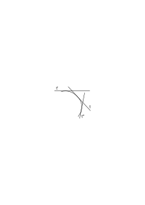

Übergangsstadien von t' nach t'' auffassen kann. Wenn ich etwa ein Lineal sich von t' nach t'' am Kreis abrollen sehe, so sehe ich – wenn es sich kontinuierlich bewegt – keine einzige der Zwischenlagen in dem Sinne, in welchem ich t sehe, wenn die Tangente ruht; oder aber ich sehe nur eine endliche Anzahl von Zwischenlagen. Wenn ich aber in so einem Fall scheinbar von einem allgemeinen Satz auf einen Spezialfall schließe, so ist die Quelle dieses allgemeinen Satzes nie die Erfahrung und der Satz wirklich kein Satz. Wenn ich z.B. sage: “Ich habe das Lineal sich von t' nach t'' bewegen sehen, _also_ muß ich es auch in t gesehen haben”, so haben wir hier keinen richtigen logischen Schluß. Wenn ich nämlich damit sagen will, das Lineal muß mir in der Lage t _erschienen_ sein – wenn ich also von der Lage im Gesichtsraum rede, so folgt das aus dem Vordersatz durchaus nicht. Rede ich aber vom physischen Lineal, so ist es natürlich möglich, daß das Lineal die Lage t übersprungen hat und das Phänomen im Gesichtsraum dennoch kontinuierlich war.

### [PR](/w-pr/#ts-209-60.2) [60\[2\]](https://cdn.wittgensteinnachlass.com/2000px/webp/Ts-209/60.webp) {#602}

Ramsey schlug vor, den Satz, daß unendlich viele Gegenstände eine Funktion befriedigen dadurch auszudrücken, daß er alle Sätze verneint von der Form:

non (∃x)fx

(∃x)fx & non(∃x,y)fx & fy etc.

Aber nehmen wir nun an, daß es nur drei Gegenstände gibt, d.h. daß nur drei Namen Bedeutung haben. Dann können wir den vierten Satz der Reihe gar nicht mehr hinschreiben, denn es hat dann keinen Sinn zu schreiben: non (∃x,y,z,u) fx & fy&fz&fu. Durch die Verneinung aller Sätze jener Reihe komme ich also nicht zum Unendlichen.

### [PR](/w-pr/#ts-209-60.3) [60\[3\]](https://cdn.wittgensteinnachlass.com/2000px/webp/Ts-209/60.webp) {#603}

“Wir kennen die Unendlichkeit aus der Beschreibung”. Nun dann gibt es eben nur diese Beschreibung und nichts sonst.

### [PR](/w-pr/#ts-209-60.4) [60\[4\]](https://cdn.wittgensteinnachlass.com/2000px/webp/Ts-209/60.webp) {#604}

Inwiefern setzt eine Notation für das Unendliche den unendlichen Raum oder die unendliche Zeit voraus? Ein unendlich großes Stück Papier wird natürlich nicht vorausgesetzt. Wohl aber seine Möglichkeit?

### [PR](/w-pr/#ts-209-60.5) [60\[5\]](https://cdn.wittgensteinnachlass.com/2000px/webp/Ts-209/60.webp) {#605}

Wir können uns doch eine Notation denken, die statt im Raum, in der Zeit fortschreitet. Etwa die Rede. Auch hier können wir uns doch offenbar das Unendliche dargestellt denken und dabei machen wir doch gewiß keine _Hypothese_ über die Zeit. Sie erscheint uns essentiell als _unendliche_ Möglichkeit. Und zwar offenbar unendlich, nachdem, was wir über ihre Struktur wissen.

### [PR](/w-pr/#ts-209-60.6) [60\[6\]](https://cdn.wittgensteinnachlass.com/2000px/webp/Ts-209/60.webp) {#606}

Es ist doch gewiß unmöglich, daß die Mathematik von einer Hypothese über den physikalischen Raum abhängen sollte. Und der _Gesichtsraum_ ist doch in diesem Sinne nicht unendlich. Und wenn es sich nicht um die Wirklichkeit, sondern nur um die Möglichkeit der Hypothese vom unendlichen Raum handelt, so muß doch diese Möglichkeit irgendwo vorgebildet sein. Hier stoßen wir auf das Problem, das auch in der Ausdehnung des Gesichtsraumes auftritt, nämlich des kleinsten sichtbaren Unterschieds. Die Existenz eines kleinsten sichtbaren Unterschieds widerspricht der Kontinuität und andererseits müssen sie sich miteinander vereinbaren lassen.

### [PR](/w-pr/#ts-209-60.7) [60\[7\]](https://cdn.wittgensteinnachlass.com/2000px/webp/Ts-209/60.webp) {#607}

Wenn ich eine Reihe von Flecken habe, die abwechselnd schwarz und weiß sind, wie die Figur zeigt

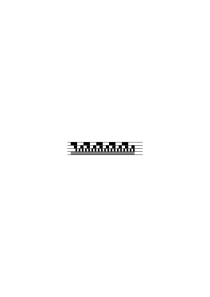

so werde ich bei weiterer Unterteilung bald zu einer Grenze kommen, wo ich die schwarzen und weißen Flecke nicht mehr unterscheiden kann, wo ich also etwa den Eindruck eines grauen Streifens habe. Heißt das aber nicht, daß ich die Strecke in meinem Gesichtsfeld nicht beliebig unterteilen kann; und doch sehe ich keine Diskontinuität und auch das ist ja selbstverständlich, weil ich eine Diskontinuität nur sehen könnte, wenn ich noch nicht an der Grenze des Unterscheidbaren angelangt wäre. Das sieht sehr paradox aus.

### [PR](/w-pr/#ts-209-61.1) [61\[1\]](https://cdn.wittgensteinnachlass.com/2000px/webp/Ts-209/61.webp) {#611}

Aber wie ist es denn mit der Stätigkeit zwischen den einzelnen Reihen? Wir haben offenbar eine vorletzte Reihe von unterscheidbaren Flecken und dann die letzte einfärbig graue Reihe; ist es denn dieser letzten Reihe anzusehen, daß sie wirklich durch Unterteilung der vorletzten entstanden ist? Offenbar nicht. Andererseits: Ist es aber der sogenannten vorletzten Reihe anzusehen, daß sie nicht mehr sichtbar unterteilt werden kann? Es scheint mir, ebensowenig. Dann gäbe es also doch keine letzte sichtbar unterteilte Reihe! Wenn ich die Strecke nicht mehr sichtbar unterteilen kann, so kann ich aber auch nicht den _Versuch_ dieser Unterteilung machen, kann also auch nicht das Mißlingen eines solchen Versuches sehen. (Es ist hier wie mit der Grenzenlosigkeit des Gesichtsraums.) Dasselbe würde natürlich auch von den Farbenunterschieden gelten.

### [PR](/w-pr/#ts-209-61.2) [61\[2\]](https://cdn.wittgensteinnachlass.com/2000px/webp/Ts-209/61.webp) {#612}

Die Kontinuität in unserm Gesichtsfeld besteht darin, daß wir keine Diskontinuität sehen.

### [PR](/w-pr/#ts-209-61.3) [61\[3\]](https://cdn.wittgensteinnachlass.com/2000px/webp/Ts-209/61.webp) {#613}

Aber wenn ich immer nur endlich viele Dinge, Teilungen, Farben, etc. sehe, dann gibt es eben überhaupt keine Unendlichkeit; in keinem Sinne. Das Gefühl ist hier: Wenn ich immer nur so wenige sehe, so gibt es überhaupt nicht mehr. Wie wenn der Fall der wäre: Wenn ich nur 4 sehe, so gibt es eben nicht 100. Aber die Unendlichkeit hat nicht den Platz einer Zahl. Es ist ganz richtig: Wenn ich nur 4 sehe, so gibt es nicht 100 und auch nicht 5. Aber es gibt die unendliche Möglichkeit, die von einer kleinen Zahl ebensowenig ausgefüllt wird, wie von einer großen. Und zwar tatsächlich darum, weil sie selbst _keine_ Größe ist.

### [PR](/w-pr/#ts-209-61.4) [61\[4\]](https://cdn.wittgensteinnachlass.com/2000px/webp/Ts-209/61.webp) {#614}

Wir wissen natürlich alle, was es heißt, daß es eine unendliche Möglichkeit und eine endliche Wirklichkeit gibt, denn wir sagen, die Zeit und der physikalische Raum seien unendlich aber wir könnten immer nur endliche Stücke von ihnen sehen oder durchleben. Aber woher weiß ich dann überhaupt etwas vom Unendlichen? Ich muß also in irgendeinem Sinne zweierlei Erfahrungen haben: Eine des Endlichen, die es nicht übersteigen kann (diese Idee des Übersteigens ist an sich schon unsinnig) und eine des Unendlichen. Und so ist es auch. Die Erfahrung als Erleben der Tatsachen gibt mir das Endliche; die Gegenstände _enthalten_ das Unendliche. Natürlich nicht als eine mit der endlichen Erfahrung konkurrierende Größe, sondern intensional. Nicht als ob ich den Raum sähe, der beinahe ganz leer ist und nur mit einer ganz kleinen endlichen Erfahrung in ihm. Sondern ich sehe im Raum die Möglichkeit für jede endliche Erfahrung. D.h., keine Erfahrung kann für ihn zu groß sein, oder ihn gerade ausfüllen. Und zwar nicht etwa, weil wir alle Erfahrungen ihrer Größe nach kennen und wissen, daß der Raum größer ist als sie, sondern wir verstehen, daß das im Wesen des Raumes liegt. – Dieses unendliche Wesen des Raumes erkennen wir im kleinsten Stück. Das Unsinnige ist schon, daß man so oft denkt, es wäre eine große Zahl dem Unendlichen doch näher als eine kleine. Das Unendliche – wie gesagt – konkurriert mit dem Endlichen nicht. Es ist das, was wesentlich kein Endliches ausschließt. In diesem Satze haben wir das Wort “kein” und das darf wieder nicht als Ausdruck einer unendlichen Konjunktion verstanden werden, sondern “wesentlich kein” gehört zusammen. Es ist kein Wunder, daß ich die Unendlichkeit immer wieder nur durch sich selbst erklären kann, d.h. _nicht erklären_ kann.

### [PR](/w-pr/#ts-209-61.5) [61\[5\]](https://cdn.wittgensteinnachlass.com/2000px/webp/Ts-209/61.webp) {#615}

Der Raum hat keine Ausdehnung, nur die räumlichen Gegenstände sind ausgedehnt, aber die Unendlichkeit ist eine Eigenschaft des Raumes. (Das schon zeigt, daß sie keine unendliche Ausdehnung ist). Und dasselbe gilt von der Zeit.

### [PR](/w-pr/#ts-209-62.1) [62\[1\]](https://cdn.wittgensteinnachlass.com/2000px/webp/Ts-209/62.webp) {#621}

Wie ist es mit der unendlichen Teilbarkeit? Denken wir daran, daß es einen Sinn hat, zu sagen, daß _jede_ endliche Zahl von Teilen denkbar ist, aber keine unendliche; daß aber eben darin die unendliche Teilbarkeit besteht. Hier aber heißt nun “jede” nicht, daß die _Gesamtheit aller_ Teilungen denkbar ist, (die ist es nicht, denn die gibt es nicht). Sondern die _Variable_ “Teilbarkeit” (d.i. den Begriff der Teilbarkeit) gibt es, die der wirklichen Teilbarkeit _keine Grenzen zieht_; und darin besteht ihre Unendlichkeit.

### [PR](/w-pr/#ts-209-62.2) [62\[2\]](https://cdn.wittgensteinnachlass.com/2000px/webp/Ts-209/62.webp) {#622}

Wie aber konstruieren wir eine unendliche Hypothese, etwa die, unendlich vieler Fixsterne (daß sie _schließlich_ nur einer endlichen Realität entsprechen kann, ist klar) –? Sie kann wieder nur durch ein Gesetz gegeben sein. Denken wir an die unendliche Reihe roter Kugeln. – Denken wir an einen unendlichen Filmstreifen. (Er gäbe die Möglichkeit für alles Endliche was auf der Leinwand geschieht.) Er ist der typische Fall einer ins Unendliche greifenden Hypothese. Es ist uns klar, daß ihm keine Erfahrung _entspricht_. Er existiert nur im “zweiten System”, also in der Sprache; wie aber ist er hier ausgedrückt? (Wenn sich ein Mensch einen unendlichen Streifen _vorstellen_ kann, dann gibt es die unendliche Realität für ihn und auch das “eigentlich Unendliche” in der Mathematik). Er ist ausgedrückt durch einen Satz der Art “(n):(∃nx)․Fx”. Alles was sich auf die unendliche Möglichkeit bezieht, also alle unendlichen Aussagen über den Film, sind im Ausdruck der ersten Klammer wiedergegeben und die Wirklichkeit die diese Möglichkeit einschränkt, in der zweiten Klammer.

### [PR](/w-pr/#ts-209-62.3) [62\[3\]](https://cdn.wittgensteinnachlass.com/2000px/webp/Ts-209/62.webp) {#623}

Was aber hat dann die Teilbarkeit mit dem Geteiltsein zu tun, wenn etwas teilbar sein kann, was _nie_ geteilt _ist_? Ja, was heißt in dem primären Gegebenen überhaupt Teilbarkeit? Wie kann man hier zwischen Möglichkeit und Wirklichkeit unterscheiden? Es muß falsch sein, wie ich es tue, von der _Einschränkung_ der unendlichen Möglichkeit auf das Endliche zu reden. Denn so scheint es, als wäre eine unendliche Wirklichkeit denkbar – wenn auch nicht vorhanden, also doch wieder, als handelte es sich um eine mögliche unendliche Extension und eine wirkliche endliche. Als wäre die unendliche Möglichkeit die Möglichkeit einer unendlichen Anzahl. Und das zeigt wieder, daß wir es mit zwei verschiedenen Bedeutungen des Wortes “_möglich_” zu tun haben, wenn ich sage “die Strecke kann in 3 Teile geteilt werden” und andererseits “die Strecke ist unendlich teilbar”. (Darauf weist auch der obere Satz der bezweifelt, ob es im Gesichtsraum wirklich und möglich gibt.) Was besagt es, daß ein Fleck im Gesichtsraum in 3 Teile geteilt werden _kann_? Es kann doch nur heißen, daß ein Satz, welcher einen derart geteilten Fleck beschreibt, Sinn hat. (Wenn es sich nicht um eine Verwechslung der Teilbarkeit physischer Objekte mit der eines Flecks im Gesichtsraum handelt). Dagegen bedeutet die unendliche – oder besser _unbegrenzte_ – Teilbarkeit nicht, daß es einen Satz gibt, der eine in unendlich viele Teile geteilte Strecke beschreibt, denn diesen Satz gibt es nicht. Diese Möglichkeit wird also nicht durch eine Wirklichkeit der Zeichen angezeigt, sondern durch eine Möglichkeit _anderer_ Art der Zeichen selbst.

### [PR](/w-pr/#ts-209-62.4) [62\[4\]](https://cdn.wittgensteinnachlass.com/2000px/webp/Ts-209/62.webp) {#624}

Wenn man sagt: Der Raum ist unendlich teilbar, so heißt das eigentlich: Der Raum besteht nicht aus einzelnen Dingen (Teilen).

### [PR](/w-pr/#ts-209-62.5) [62\[5\]](https://cdn.wittgensteinnachlass.com/2000px/webp/Ts-209/62.webp) {#625}

Die unendliche Teilbarkeit bedeutet in gewissem Sinne, daß der Raum unteilbar ist, daß eine Teilung _ihn_ nicht tangiert. Daß er damit nichts zu tun hat: _Er_ besteht nicht aus Teilen. Er sagt gleichsam zur Wirklichkeit: Du kannst in mir machen was Du willst. (Du kannst in mir so oft geteilt sein als du willst). Der Raum gibt der Wirklichkeit eine unendliche Gelegenheit der Teilung.

### [PR](/w-pr/#ts-209-63.1) [63\[1\]](https://cdn.wittgensteinnachlass.com/2000px/webp/Ts-209/63.webp) {#631}

Und darum steht in der ersten Klammer bloß _ein_ Buchstabe. Offenbar nur eine Gelegenheit, nichts anderes.

### [PR](/w-pr/#ts-209-63.2) [63\[2\]](https://cdn.wittgensteinnachlass.com/2000px/webp/Ts-209/63.webp) {#632}

Ist die primäre Zeit unendlich? D.h. ist sie eine unendliche Möglichkeit? Auch wenn sie nur so weit erfüllt ist, als die Erinnerung reicht, so sagt das keineswegs, daß sie endlich ist. Sie ist in demselben Sinne unendlich, in dem der dreidimensionale Gesichtsraum es ist, auch wenn ich tatsächlich nur bis zu den Wänden meines Zimmers sehen kann. Denn was ich sehe, präsupponiert die Möglichkeit eines Sehens in größere Entfernung. D.h., ich könnte, was ich sehe, korrekt nur durch eine unendliche Form darstellen. Ist es möglich sich die Zeit mit einem Ende zu denken oder mit zwei Enden?

### [PR](/w-pr/#ts-209-63.3) [63\[3\]](https://cdn.wittgensteinnachlass.com/2000px/webp/Ts-209/63.webp) {#633}

Was _jetzt_ geschehen kann, hätte auch früher geschehen können und wird immer in der Zukunft geschehen können, wenn die Zeit bleibt, wie sie ist. Aber _das_ hängt nicht von einer zukünftigen Erfahrung ab. Die Möglichkeit aller Zukunft hat die Zeit _jetzt_ in sich. Aber das alles heißt schon, daß die Zeit nicht im Sinne der primitiven Auffassung der unendlichen Menge unendlich ist. Und dasselbe gilt vom Raum. Wenn ich sage, daß ich mir einen Zylinder unendlich verlängert denken kann, so liegt das schon in seinem Wesen. Wieder im Wesen der Homogenität des Zylinders und des Raums in dem er ist, – und der eine setzt ja den andern voraus, – und diese Homogenität ist in dem endlichen Stück, das ich sehe.

### [PR](/w-pr/#ts-209-63.4) [63\[4\]](https://cdn.wittgensteinnachlass.com/2000px/webp/Ts-209/63.webp) {#634}

Der menschliche Bewegungsraum ist unendlich, wie die Zeit.

### [PR](/w-pr/#ts-209-63.5) [63\[5\]](https://cdn.wittgensteinnachlass.com/2000px/webp/Ts-209/63.webp) {#635}

Die Regeln über das Zahlensystem – etwa das Dezimalsystem – enthalten alles, was an den Zahlen unendlich ist. Daß _diese Regeln_ z.B. die Zahlzeichen nach rechts und links nicht beschränken, _darin_ liegt die Unendlichkeit ausgedrückt. Man könnte vielleicht sagen: Ja, aber die Zahlzeichen sind doch durch den Gebrauch von Papier und Schreibmaterial und andere Umstände beschränkt. Wohl, aber das ist nicht in den _Regeln_ über ihren Gebrauch ausgedrückt und nur in diesen liegt ihr eigentliches Wesen ausgesprochen.

### [PR](/w-pr/#ts-209-63.6) [63\[6\]](https://cdn.wittgensteinnachlass.com/2000px/webp/Ts-209/63.webp) {#636}

Ordnet die Beziehung m = 2n die Klasse aller Zahlen einer ihrer Teilklassen zu? Nein. Sie ordnet jeder beliebigen Zahl eine andere zu und wir bekommen auf diese Weise unendlich viele Klassenpaare, deren eine Klasse der anderen zugeordnet ist, die aber _nie_ im Verhältnis von Klasse und Subklasse stehen. Noch ist dieser unendliche Prozeß selbst in irgend einem Sinne ein solches Klassenpaar. Wir haben es bei dem Aberglauben, daß m = 2n eine Klasse ihrer Teilklasse zuordnet wieder nur mit zweideutiger Grammatik zu tun.

### [PR](/w-pr/#ts-209-63.7) [63\[7\]](https://cdn.wittgensteinnachlass.com/2000px/webp/Ts-209/63.webp) {#637}

Und zwar hängt alles an der Syntax der Wirklichkeit und Möglichkeit. m = 2n enthält die _Möglichkeit der Zuordnung jeder Zahl_ zu einer andern, _aber es ordnet nicht alle Zahlen anderen zu_.

### [PR](/w-pr/#ts-209-64.1) [64\[1\]](https://cdn.wittgensteinnachlass.com/2000px/webp/Ts-209/64.webp) {#641}

Das Wort Möglichkeit ist natürlich irreführend, denn was möglich ist, wird man sagen, soll eben nun wirklich werden. Auch denkt man dabei immer an zeitliche Prozesse und schließt daraus, daß die Mathematik nichts mit der Zeit zu tun hat, daß die Möglichkeit in ihr (bereits) Wirklichkeit ist.

### [PR](/w-pr/#ts-209-64.2) [64\[2\]](https://cdn.wittgensteinnachlass.com/2000px/webp/Ts-209/64.webp) {#642}

(In Wahrheit ist es aber umgekehrt, und was in der Mathematik Möglichkeit genannt wird, ist eben dasselbe, was es auch in der Zeit ist.)

### [PR](/w-pr/#ts-209-64.3) [64\[3\]](https://cdn.wittgensteinnachlass.com/2000px/webp/Ts-209/64.webp) {#643}

m = 2n weist der Zahlenreihe entlang und wenn wir dazusetzen “ins Unendliche” so heißt das nichts anderes, als daß es nicht auf einen Gegenstand in bestimmter Entfernung weist.

### [PR](/w-pr/#ts-209-64.4) [64\[4\]](https://cdn.wittgensteinnachlass.com/2000px/webp/Ts-209/64.webp) {#644}

Die unendliche Zahlenreihe selbst ist nur eine solche Möglichkeit – wie klar aus dem einzigen Symbol für sie “(1, x, x + 1)” hervorgeht. Dieses Symbol selbst ist ein Pfeil, und es ist die erste “1” die Feder des Pfeiles und “x + 1” seine Spitze, und das Charakteristische, daß, wie die Länge eines Pfeiles unwesentlich ist, hier das variable x anzeigt, daß es gleichgültig ist, in welcher Entfernung von der Feder die Pfeilspitze liegt.

### [PR](/w-pr/#ts-209-64.5) [64\[5\]](https://cdn.wittgensteinnachlass.com/2000px/webp/Ts-209/64.webp) {#645}

Es ist möglich von Dingen zu reden, die in der Richtung des Pfeiles liegen, aber unsinnig, von allen möglichen Lagen der Dinge in der Pfeilrichtung als einem Äquivalent dieser Richtung selbst zu reden.

### [PR](/w-pr/#ts-209-64.6) [64\[6\]](https://cdn.wittgensteinnachlass.com/2000px/webp/Ts-209/64.webp) {#646}

Wenn ein Scheinwerfer Licht in den unendlichen Raum wirft, so beleuchtet er allerdings alles, was in seiner Richtung liegt, aber man kann nicht sagen, er beleuchtet die Unendlichkeit.

### [PR](/w-pr/#ts-209-64.7) [64\[7\]](https://cdn.wittgensteinnachlass.com/2000px/webp/Ts-209/64.webp) {#647}

Man kann es auch so sagen: Es hat einen Sinn zu sagen, daß in einer Richtung unendlich viele Dinge liegen können, aber keinen Sinn, daß unendlich viele Dinge dort liegen. Und das steht im Gegensatz zu der gewöhnlichen Art der Anwendung des Wortes “können”. Denn hat es Sinn, zu sagen, daß ein Buch auf diesem Tisch liegen kann, so hat es auch Sinn zu sagen, daß es da liegt. Aber hier führt uns die Sprache irre. Das “unendlich viele” ist sozusagen adverbial gebraucht und so aufzufassen.

### [PR](/w-pr/#ts-209-64.8) [64\[8\]](https://cdn.wittgensteinnachlass.com/2000px/webp/Ts-209/64.webp) {#648}

D.h., die Sätze “in dieser Richtung können 3 Dinge liegen” und “in dieser Richtung können unendlich viele Dinge liegen” sind nur scheinbar gleich gebaut; in Wirklichkeit aber verschiedener Struktur. Und zwar spielt das “unendlich viele” im zweiten Satz nicht die Rolle der “3” im ersten Satz.

### [PR](/w-pr/#ts-209-64.9) [64\[9\]](https://cdn.wittgensteinnachlass.com/2000px/webp/Ts-209/64.webp) {#649}

Es ist auch nur durch die Vieldeutigkeit unserer Sprache, daß es scheint, als kämen die Zahlwörter und das Wort “unendlich” auf die gleiche Frage zur Antwort. Während in Wirklichkeit die Fragen, auf die jene Wörter antworten, grundverschieden sind.

### [PR](/w-pr/#ts-209-64.10) [64\[10\]](https://cdn.wittgensteinnachlass.com/2000px/webp/Ts-209/64.webp) {#6410}

(Die gewöhnliche Auffassung kommt wirklich darauf hinaus, daß der Mangel einer Grenze auch eine Grenze ist. Wenn sie auch nicht so klar ausgedrückt wird.)

### [PR](/w-pr/#ts-209-65.1) [65\[1\]](https://cdn.wittgensteinnachlass.com/2000px/webp/Ts-209/65.webp) {#651}

Wenn zwei Pfeile in derselben Richtung zeigen, ist es dann nicht absurd diese Richtungen gleich _lang_ zu nennen, weil, was in der Richtung des einen Pfeiles liegt, auch in der des andern liegt.

### [PR](/w-pr/#ts-209-65.2) [65\[2\]](https://cdn.wittgensteinnachlass.com/2000px/webp/Ts-209/65.webp) {#652}

Die Allgemeinheit in der Mathematik ist eine Richtung, ein Pfeil, der der Operationsreihe entlang weist. Und zwar kann man sagen, der Pfeil weist ins Unendliche; aber heißt das, daß es ein Etwas, das Unendliche, gibt, auf das er – wie auf ein Ding – hinweist? Wenn man es so auffaßt, muß das natürlich zu endlosem Unsinn führen.

### [PR](/w-pr/#ts-209-65.3) [65\[3\]](https://cdn.wittgensteinnachlass.com/2000px/webp/Ts-209/65.webp) {#653}

Der Pfeil bezeichnet gleichsam die Möglichkeit der Lage in seiner Richtung.

### [PR](/w-pr/#ts-209-65.4) [65\[4\]](https://cdn.wittgensteinnachlass.com/2000px/webp/Ts-209/65.webp) {#654}

Inwiefern ist die endlose Zeit eine Möglichkeit und keine Realität? Denn man könnte gegen mich einwenden, daß doch die Zeit ebenso eine Realität sein muß, wie etwa die Farbe.

### [PR](/w-pr/#ts-209-65.5) [65\[5\]](https://cdn.wittgensteinnachlass.com/2000px/webp/Ts-209/65.webp) {#655}

Aber ist nicht die Farbe allein auch nur eine Möglichkeit, solange sie nicht zu einer bestimmten Zeit an einem bestimmten Ort besteht? Die leere unendliche Zeit ist nur die Möglichkeit von Tatsachen, die erst die Realitäten sind. Aber ist nicht die unendliche _Vergangenheit_ erfüllt zu denken, und gibt das nicht eine unendliche Realität? Und wenn es eine unendliche Realität gibt, dann gibt es auch den Zufall im Unendlichen. Also z.B. auch die unendliche Dezimalzahl, die durch kein Gesetz gegeben ist. Damit steht und fällt alles in der Ramsey'schen Auffassung.

### [PR](/w-pr/#ts-209-65.6) [65\[6\]](https://cdn.wittgensteinnachlass.com/2000px/webp/Ts-209/65.webp) {#656}

Daß wir die Zeit nicht als unendliche Realität sondern intensional unendlich auffassen, zeigt sich so, indem wir uns einerseits einen unendlichen Zeitraum nicht denken können, aber doch sehen, daß kein Tag der letzte sein kann, die Zeit also kein Ende haben kann.

### [PR](/w-pr/#ts-209-65.7) [65\[7\]](https://cdn.wittgensteinnachlass.com/2000px/webp/Ts-209/65.webp) {#657}

Man könnte auch sagen: Die Unendlichkeit liegt in der Natur der Zeit, sie ist nicht ihre zufällige Ausdehnung.

### [PR](/w-pr/#ts-209-65.8) [65\[8\]](https://cdn.wittgensteinnachlass.com/2000px/webp/Ts-209/65.webp) {#658}

Wir kennen ja die Zeit nur – gleichsam – von dem Stück Zeit her, was vor unsern Augen liegt. Es wäre sonderbar, wenn wir so ihre unendliche Ausdehnung erfassen könnten (in dem Sinn nämlich, wie wir sie erfassen würden, wenn wir selbst unendlich lang ihr Zeitgenosse wären).

### [PR](/w-pr/#ts-209-65.9) [65\[9\]](https://cdn.wittgensteinnachlass.com/2000px/webp/Ts-209/65.webp) {#659}

Es geht uns mit der Zeit tatsächlich wie mit dem Raum. Die erfüllte Zeit, die wir kennen, ist begrenzt (endlich). Die Unendlichkeit ist eine innere Qualität der Zeitform.

### [PR](/w-pr/#ts-209-66.1) [66\[1\]](https://cdn.wittgensteinnachlass.com/2000px/webp/Ts-209/66.webp) {#661}

Die unendliche Zahlenreihe ist nur die unendliche Möglichkeit von endlichen Zahlenreihen. Es ist sinnlos von der _ganzen_ unendlichen Zahlenreihe zu reden, als wäre auch sie eine Extension.

### [PR](/w-pr/#ts-209-66.2) [66\[2\]](https://cdn.wittgensteinnachlass.com/2000px/webp/Ts-209/66.webp) {#662}

Die unendliche Möglichkeit wird durch die unendliche Möglichkeit wiedergegeben. In den Zeichen selbst liegt nur die Möglichkeit und nicht die Wirklichkeit der Wiederholung.

### [PR](/w-pr/#ts-209-66.3) [66\[3\]](https://cdn.wittgensteinnachlass.com/2000px/webp/Ts-209/66.webp) {#663}

Heißt es nicht: Die Tatsachen sind endlich, die unendliche Möglichkeit der Tatsachen liegt in den Gegenständen. Darum wird sie gezeigt, nicht beschrieben.

### [PR](/w-pr/#ts-209-66.4) [66\[4\]](https://cdn.wittgensteinnachlass.com/2000px/webp/Ts-209/66.webp) {#664}

Und dem entspricht, daß die Zahlen – die ja die Tatsachen beschreiben – endlich sind, dagegen ihre Möglichkeit, die der _Möglichkeit_ der Tatsachen entspricht, unendlich ist. Sie drückt sich, wie gesagt, in den Möglichkeiten des Symbolismus aus.

### [PR](/w-pr/#ts-209-66.5) [66\[5\]](https://cdn.wittgensteinnachlass.com/2000px/webp/Ts-209/66.webp) {#665}

Das Gefühl ist: In der Mathematik kann es nicht Wirklichkeit und Möglichkeit geben. Alles ist auf _einer_ Stufe. Und zwar in gewissem Sinne wirklich. Und das ist richtig. Denn was die Mathematik mit ihren Zeichen ausdrückt, ist alles auf _einer_ Stufe; d.h.: Sie redet nicht, einmal von ihrer Wirklichkeit, und einmal von ihrer Möglichkeit. Sondern sie darf gar nicht versuchen, von ihrer Möglichkeit zu reden. Wohl aber liegt in ihren Zeichen eine Möglichkeit, dieselbe nämlich, die in den eigentlichen Sätzen liegt, in denen die Mathematik angewandt wird. Und wenn sie versucht (wie in der Mengenlehre) ihre Möglichkeiten _auszusprechen_, d.h., wenn sie sie mit ihrer Wirklichkeit verwechselt, dann darf man sie in ihre Grenzen zurückweisen.

### [PR](/w-pr/#ts-209-66.6) [66\[6\]](https://cdn.wittgensteinnachlass.com/2000px/webp/Ts-209/66.webp) {#666}

Wir denken viel zu wenig daran, daß das Zeichen wirklich nicht mehr bedeuten kann, als es ist.

### [PR](/w-pr/#ts-209-66.7) [66\[7\]](https://cdn.wittgensteinnachlass.com/2000px/webp/Ts-209/66.webp) {#667}

Die unendliche Möglichkeit im Symbol bezieht sich – d.h. deutet – nur auf das Wesen der endlichen Extension und läßt eben dadurch ihre Größe offen.

### [PR](/w-pr/#ts-209-66.8) [66\[8\]](https://cdn.wittgensteinnachlass.com/2000px/webp/Ts-209/66.webp) {#668}

Wenn ich sage: “Wenn wir eine unendliche Extension kennten, so wäre es in Ordnung über das eigentlich Unendliche zu reden”, ist das wirklich so, wie wenn ich sagte “wenn es den Sinn Abrakadabra gibt, dann ist es in Ordnung von abrakadabrischen Sinneswahrnehmungen zu reden”.

### [PR](/w-pr/#ts-209-66.9) [66\[9\]](https://cdn.wittgensteinnachlass.com/2000px/webp/Ts-209/66.webp) {#669}

Wir sehen einen kontinuierlichen Farbübergang und eine kontinuierliche Bewegung, aber dann sehen wir eben _keine_ Teile, _keine_ Sprünge (nicht unendlich viele).

### [PR](/w-pr/#ts-209-66.10) [66\[10\]](https://cdn.wittgensteinnachlass.com/2000px/webp/Ts-209/66.webp) {#6610}

Was ist eine regellose unendliche Dezimalzahl? Kann man eine unendliche Ziffernfolge statt durch ein Gesetz auch durch eine nichtmathematische – also äußere – Beschreibung geben? (Sehr seltsam, daß es eine doppelte Art des Erfassens geben soll).

### [PR](/w-pr/#ts-209-66.11) [66\[11\]](https://cdn.wittgensteinnachlass.com/2000px/webp/Ts-209/66.webp) {#6611}

“Die Zahl die herauskommt, wenn der Mann endlos würfelt” scheint unsinnig zu sein weil keine unendliche Zahl herauskommt.

### [PR](/w-pr/#ts-209-67.1) [67\[1\]](https://cdn.wittgensteinnachlass.com/2000px/webp/Ts-209/67.webp) {#671}

Warum ist aber ein endloses Leben eher denkbar als eine endlose räumliche Reihe? Irgendwie darum, weil wir das endlose Leben eben nie als abgeschlossen empfinden, während die unendliche räumliche Reihe als Ganzes schon vorhanden sein müßte.

### [PR](/w-pr/#ts-209-67.2) [67\[2\]](https://cdn.wittgensteinnachlass.com/2000px/webp/Ts-209/67.webp) {#672}

Stellen wir uns einen Mann vor, der seit unendlicher Zeit lebt und der uns sagt: “Jetzt schreibe ich die letzte Ziffer von π hin nämlich die 2”. Er hat an jedem Tag seines Lebens eine Ziffer hingeschrieben und hat niemals damit angefangen; jetzt ist er fertig geworden. Das scheint völliger Unsinn und eine Ad-absurdum-Führung des Begriffes einer unendlichen _Totalität_.

### [PR](/w-pr/#ts-209-67.3) [67\[3\]](https://cdn.wittgensteinnachlass.com/2000px/webp/Ts-209/67.webp) {#673}

Angenommen, wir wandern auf einer Geraden in den euklidischen Raum hinaus und sagen, wir begegnen alle 10 Meter einer eisernen Kugel von gewissem Durchmesser, ad infinitum; ist das eine Konstruktion? Es scheint ja. Das Merkwürdige ist, daß man einen solchen unendlichen Komplex von Kugeln auffassen kann, als das endlose Wiederkehren derselben Kugel nach einem gewissen Gesetz. Daß aber im selben Augenblick, wenn man eine individuelle Verschiedenheit der Kugeln denkt, ihre unendliche Anzahl Unsinn zu werden scheint.

### [PR](/w-pr/#ts-209-67.4) [67\[4\]](https://cdn.wittgensteinnachlass.com/2000px/webp/Ts-209/67.webp) {#674}

Denken wir uns eine unendliche Baumreihe, alle verschieden hoch zwischen 3 und 4 m. Wenn ein Gesetz gegeben ist, nach welchem die Höhe wechselt, so ist die Reihe durch das Gesetz bestimmt und vorstellbar (ich nehme an, die Bäume unterschieden sich durch nichts als ihre Höhe). Wie aber, wenn die Höhen regellos wechseln, dann – muß man sagen – gibt es nur eine unendlich lange, eine endlose Beschreibung. Aber das ist doch keine Beschreibung! Ich kann mir denken, daß es unendlich viele Beschreibungen der unendlich vielen endlichen Strecken der unendlichen Baumreihe gibt, aber dann muß ich diese unendlich vielen Beschreibungen durch ein Gesetz kennen, dem sie der Reihe nach gehorchen. Oder wenn es kein solches Gesetz gibt, brauche ich wieder eine unendliche Beschreibung dieser Beschreibungen. Und das würde mich wieder zu nichts führen.

### [PR](/w-pr/#ts-209-67.5) [67\[5\]](https://cdn.wittgensteinnachlass.com/2000px/webp/Ts-209/67.webp) {#675}

Nun könnte ich ja sagen: Es ist mir das Gesetz bekannt, daß jeder Baum eine andere Höhe haben muß, als alle vorhergehenden. Das ist allerdings ein Gesetz, aber es bestimmt die Reihe noch nicht. Wenn ich nun annehme, daß es eine regellose Reihe geben kann, so ist das eine Reihe über die mir ihrem Wesen nach nichts anderes bekannt sein kann, als daß ich sie nicht kennen kann. Oder besser, daß sie nicht gekannt werden kann. Denn ist es etwa ein Fall, wo “der menschliche Intellekt nicht ausreicht, aber ein höherer es leisten könnte”? Und wie kommt der menschliche Verstand dann überhaupt zu jener Frage, in jene Gasse, die er nicht zu Ende gehen kann? An der Endlosigkeit ist eben nur die Endlosigkeit unendlich.

### [PR](/w-pr/#ts-209-67.6) [67\[6\]](https://cdn.wittgensteinnachlass.com/2000px/webp/Ts-209/67.webp) {#676}

Woher bezieht das mult. ax. seine Wahrscheinlichkeit? Doch daher, daß man im Falle einer endlichen Klasse von Klassen eine Selektion tatsächlich herstellen kann. Wie ist es aber bei unendlich vielen Teilklassen? Es ist offenbar, daß ich hier nur das Gesetz der Bildung einer Selektion kennen kann. Aus einer endlichen Klasse von Klassen kann ich nun etwas wie eine _willkürliche_ Selektion bilden. Ist das bei einer unendlichen Klasse von Klassen _denkbar_? Es scheint mir unsinnig zu sein.

### [PR](/w-pr/#ts-209-67.7) [67\[7\]](https://cdn.wittgensteinnachlass.com/2000px/webp/Ts-209/67.webp) {#677}

Denken wir uns ein endloses Leben, und der es lebt, wählt nach einander aus den Brüchen zwischen 1 und 2, 2 und 3 usw. ad inf. einen beliebigen Bruch aus. Erhalten wir so eine Selektion aus allen jenen Intervallen? Nein, denn er wird _nicht_ fertig. Kann ich aber nicht sagen, daß doch alle jene Intervalle darankommen müssen, weil ich keines nennen kann, das er nicht _einmal_ erreichen würde? Aber daraus, daß er _jedes_ Intervall _einmal_ erreichen wird, folgt nicht, daß er alle _einmal_ erreicht haben wird.

### [PR](/w-pr/#ts-209-68.1) [68\[1\]](https://cdn.wittgensteinnachlass.com/2000px/webp/Ts-209/68.webp) {#681}

Aber haben wir nun nicht doch die Beschreibung eines Vorganges durch den ohne Ende Selektionen erzeugt werden und heißt das nicht eben, daß eine unendliche Selektion gebildet wird? Aber hier ist eben das Unendliche nur in der Vorschrift enthalten.

### [PR](/w-pr/#ts-209-68.2) [68\[2\]](https://cdn.wittgensteinnachlass.com/2000px/webp/Ts-209/68.webp) {#682}

Angenommen die Hypothese wäre: Es gibt im Raum eine unendliche Reihe roter Kugeln, die in Abständen von 1 m hintereinander liegen. Welcher _denkbaren_ Erfahrung könnte diese Hypothese entsprechen? Ich denke etwa, daß ich dieser Reihe entlang reise und täglich an einer gewissen Anzahl n von roten Kugeln vorbeikomme. Dann sollte meine Erfahrung darin bestehen, daß ich an _jedem_ zukünftigen Tag, _den es geben kann_, n neue Kugeln sehe. Wann aber werde ich diese Erfahrung gemacht haben? Niemals!

### [PR](/w-pr/#ts-209-68.3) [68\[3\]](https://cdn.wittgensteinnachlass.com/2000px/webp/Ts-209/68.webp) {#683}

Auf den Einwand: “Wenn es aber doch unendlich viele Dinge gibt”, kann man nur antworten: “Es gibt sie aber nicht”. Und was uns glauben macht, daß es sie vielleicht gibt, ist nur, daß wir die Dinge der Physik mit den Elementen der Erkenntnis verwechseln.

### [PR](/w-pr/#ts-209-68.4) [68\[4\]](https://cdn.wittgensteinnachlass.com/2000px/webp/Ts-209/68.webp) {#684}

Wir können darum auch nicht einen hypothetischen unendlichen Gesichtsraum annehmen in dem eine unendliche Reihe von roten Flecken sichtbar ist. Was wir uns im physikalischen Raum denken, ist nicht das Primäre, das wir nur mehr oder weniger erkennen können; sondern, was vom physikalischen Raum wir erkennen können, das zeigt uns, wie weit das Primäre geht und wie wir den physikalischen Raum zu _deuten_ haben.

### [PR](/w-pr/#ts-209-68.5) [68\[5\]](https://cdn.wittgensteinnachlass.com/2000px/webp/Ts-209/68.webp) {#685}

Wie ist aber die Analyse eines Satzes von der Form: “Der rote Fleck a liegt irgendwo zwischen b und c”? Hier heißt es nicht “dem Fleck a entspricht eine der unendlich vielen Zahlen zwischen den Zahlen von b und von c” (es handelt sich nicht um eine Disjunktion). Es ist klar, daß die unendliche Möglichkeit der Lagen von a zwischen b und c in dem Satz nicht ausgesprochen wird. Wie auch in dem Satze “ich habe ihn im Zimmer eingesperrt” nicht irgendwie die unendlich vielen Möglichkeiten der Stellung des Eingesperrten im Zimmer eine Rolle spielt.

### [PR](/w-pr/#ts-209-68.6) [68\[6\]](https://cdn.wittgensteinnachlass.com/2000px/webp/Ts-209/68.webp) {#686}

“Jedes Ding hat einen und nur einen Vorgänger; a hat keinen Nachkommer; alle Dinge außer a haben einen und nur einen Nachkommer.” Diese Sätze scheinen eine unendliche Reihe zu beschreiben (und daher auch zu sagen, daß es unendlich viele Dinge gibt. Aber dies Letztere wäre Voraussetzung dafür, daß die Sätze Sinn hätten). Sie scheinen eine Struktur _amorph_ zu beschreiben. Wir können nach diesen Sätzen eine Struktur aufzeichnen, die sie eindeutig beschreiben. Aber wo ist diese Struktur in ihnen zu finden? – (Der Satz muß, wenn es nur endlich viele Dinge gibt, zu einem Widerspruch führen. Wie kommt der zustande? Jedenfalls, wenn wir von dem allgemeinen Satz auf seine Spezialfälle schließen.)

### [PR](/w-pr/#ts-209-68.7) [68\[7\]](https://cdn.wittgensteinnachlass.com/2000px/webp/Ts-209/68.webp) {#687}

Kann man aber nicht die obigen Sätze einfach als Sätze der Physik auffassen, die eine wissenschaftliche Hypothese darstellen? Dann müßten sie unanfechtbar sein. Wie wäre es, wenn die Physiologie eine Tierart fände, in der _jedes_ Individuum von _einem_ früheren herzurühren scheint, und das als Hypothese ausspricht?

### [PR](/w-pr/#ts-209-68.8) [68\[8\]](https://cdn.wittgensteinnachlass.com/2000px/webp/Ts-209/68.webp) {#688}

Werden wir da durch den Schein irregeführt, als wären die Stücke der Materie – also hier etwa die Individuen der Tiergattung – die einfachen Gegenstände? D.h., ist das, was man sich ins Unendliche vermehrt denken kann, nicht die Kombinationen der Dinge nach ihren unendlichen Möglichkeiten, aber nie die Dinge selbst?

### [PR](/w-pr/#ts-209-69.1) [69\[1\]](https://cdn.wittgensteinnachlass.com/2000px/webp/Ts-209/69.webp) {#691}

Die Dinge selbst sind vielleicht die 4 Grundfarben, der Raum, die Zeit, und solches Gegebene mehr.

### [PR](/w-pr/#ts-209-69.2) [69\[2\]](https://cdn.wittgensteinnachlass.com/2000px/webp/Ts-209/69.webp) {#692}

Wie ist es also etwa mit einer Reihe von Fixsternen, in der _jeder_ einen Vorgänger (in einer bestimmten Richtung des Raumes) hat? Und diese Hypothese käme auf dasselbe hinaus, wie die eines endlosen Lebens. Diese scheint mir sinnvoll zu sein und zwar darum, weil sie nicht der Einsicht widerspricht, daß man keine Hypothese über die Zahl der Gegenstände (Elemente der Tatsachen) machen kann. Ihre Analyse setzt nur die unendliche Möglichkeit des Raumes und der Zeit voraus und eine _endliche_ Anzahl von Erfahrungselementen.

### [PR](/w-pr/#ts-209-69.3) [69\[3\]](https://cdn.wittgensteinnachlass.com/2000px/webp/Ts-209/69.webp) {#693}

Man könnte auch fragen: Wie geht denn jener Prozeß vor sich, wenn wir noch gar keine Ahnung haben, wie ein gewisser Satz zu beweisen ist und nun doch fragen: “Läßt er sich beweisen, oder nicht” und nach dem Beweis für ihn ausschauen. Wenn wir “versuchen ihn zu beweisen”, was tun wir da? Ist es wesentlich ein Suchen ohne jedes innere System, also eigentlich _kein Suchen_, oder kann irgend ein Plan vorhanden sein? Die Antwort auf diese Frage ist ein Fingerzeig dafür, ob der noch unbewiesene – oder noch unbeweisbare – Satz sinnlos ist oder nicht. Denn in einem sehr bedeutungsvollen Sinn muß jeder sinnvolle Satz durch seinen Sinn uns anweisen, wie wir uns davon überzeugen sollen, ob er wahr oder falsch ist. “Jeder Satz sagt, was der Fall ist, wenn er wahr ist”. Und dieses “was der Fall ist” muß sich beim mathematischen Satz auf die Art und Weise seines Beweises beziehen. Dagegen nämlich kann man nicht den _Sinn_, den man nicht kennt, logisch planvoll suchen. Der Sinn müßte einem sozusagen geoffenbart werden und zwar von außen, – da er aus dem Satzzeichen allein nicht zu entnehmen ist – im Gegensatz zur Wahrheit, die uns der Satz selbst suchen und mit ihm vergleichen lehrt.

### [PR](/w-pr/#ts-209-69.4) [69\[4\]](https://cdn.wittgensteinnachlass.com/2000px/webp/Ts-209/69.webp) {#694}

Das kommt darauf hinaus zu fragen: Ist durch den allgemeinen mathematischen Satz etwas bis auf Ja und Nein festgelegt? (Nämlich eben ein Sinn).

### [PR](/w-pr/#ts-209-69.5) [69\[5\]](https://cdn.wittgensteinnachlass.com/2000px/webp/Ts-209/69.webp) {#695}

Wo man fragen kann, kann man auch suchen und wo man nicht suchen kann, kann man auch nicht fragen. Und natürlich auch nicht antworten.

### [PR](/w-pr/#ts-209-69.6) [69\[6\]](https://cdn.wittgensteinnachlass.com/2000px/webp/Ts-209/69.webp) {#696}

Meine Erklärung darf nicht das mathematische Problem aus der Welt schaffen. D.h. es ist nicht so, daß ein mathematischer Satz erst dann gewiß einen Sinn hat, wenn er (oder sein Gegenteil) bewiesen worden ist. (In diesem Falle hätte nämlich sein Gegenteil nie Sinn (Weyl)) andererseits könnte es sein, daß gewisse scheinbare Probleme den Charakter des Problems – der Frage nach Ja und Nein – verlieren.

### [PR](/w-pr/#ts-209-69.7) [69\[7\]](https://cdn.wittgensteinnachlass.com/2000px/webp/Ts-209/69.webp) {#697}

Ist es so, daß ich zu jedem Schritt eines Beweises eine frische Intuition brauche? Das hängt mit der Frage der Individualität der Zahlen zusammen. Es wäre etwa so: Angenommen eine gewisse allgemeine Regel, in der also eine Variable vorkommt, so muß ich immer von neuem erkennen, daß diese Regel _hier_ angewendet werden kann. Kein Akt der Voraussicht kann mir diesen Akt der _Einsicht_ ersparen. Denn tatsächlich ist die Form, auf die die Regel angewandt wird, bei jedem Schritte eine andere.

### [PR](/w-pr/#ts-209-70.1) [70\[1\]](https://cdn.wittgensteinnachlass.com/2000px/webp/Ts-209/70.webp) {#701}

Der Beweis der Relevanz wäre ein Beweis der noch nicht den Satz ergeben würde. Und eben das könnte so einen Beweis möglich machen. Er würde die Leiter nicht hinaufsteigen, denn _dazu muß_ man jede Stufe nehmen; sondern nur zeigen, daß die Leiter in dieser Richtung führt. D.h.: Es gibt keinen Ersatz für das Durchlaufen jeder Stufe, und was dem äquivalent ist, muß wieder dieselbe Mannigfaltigkeit haben. (In der Logik gibt es kein Surrogat.) Es ist auch der Pfeil kein Surrogat des Durchschreitens aller Stufen bis zum bestimmten Ziel. Das hängt auch mit der Unmöglichkeit einer Hierarchie von Beweisen zusammen.

### [PR](/w-pr/#ts-209-70.2) [70\[2\]](https://cdn.wittgensteinnachlass.com/2000px/webp/Ts-209/70.webp) {#702}

Würde nicht der Gedanke einer Hierarchie besagen, daß der bloßen Fragestellung schon ein Beweis vorhergehen muß, nämlich der Beweis des Sinnes. Dann aber, sage ich, muß der Beweis des Sinnes radikal verschiedener Natur vom Beweis der Wahrheit sein, sonst setzt dieser Beweis wieder einen voraus und wir kommen in einen endlosen Regreß.

### [PR](/w-pr/#ts-209-70.3) [70\[3\]](https://cdn.wittgensteinnachlass.com/2000px/webp/Ts-209/70.webp) {#703}

Hat die Frage nach der Relevanz einen Sinn? Wenn ja, so muß man immer sagen können, die Grundgesetze sind für diesen Satz relevant oder nicht, und dann muß sich diese Frage immer entscheiden lassen. Läßt sich aber diese Frage entscheiden, so ist damit schon eine Frage der _ersten_ Type entschieden. Und läßt sie sich nicht entscheiden, dann ist sie überhaupt sinnlos.

### [PR](/w-pr/#ts-209-70.4) [70\[4\]](https://cdn.wittgensteinnachlass.com/2000px/webp/Ts-209/70.webp) {#704}

Was uns, abgesehen vom angeblichen Beweis Fermat's, dazu treibt, uns mit der Formel <math class="stacked" display="inline"><msup><mi>x</mi><mi>n</mi></msup><mspace width="0.3em"/><mo>+</mo><msup><mi>y</mi><mi>n</mi></msup><mspace width="0.3em"/><mo>=</mo><msup><mi>z</mi><mi>n</mi></msup><mspace width="0.3em"/><mtext>…</mtext><mo>(</mo><mtext>F)</mtext></math> zu beschäftigen, ist die Tatsache, daß man nie auf Kardinalzahlen gestoßen ist, die der Gleichung genügen; aber das gibt dem allgemeinen Satz _keinerlei_ Stütze (Wahrscheinlichkeit) und ist also kein guter Grund zur Beschäftigung mit dieser Formel. Wohl aber kann man sie einfach als Schreibweise einer bestimmten allgemeinen Form ansehen und sich fragen, ob sich die Syntax in _irgend_ einer Weise mit dieser Form beschäftigt.

### [PR](/w-pr/#ts-209-70.5) [70\[5\]](https://cdn.wittgensteinnachlass.com/2000px/webp/Ts-209/70.webp) {#705}

Ich sagte: Wo man nicht suchen kann, da kann man auch nicht fragen, und d.h.: Wo es keine logische _Methode_ des Findens gibt, da kann auch die Frage keinen Sinn haben.

### [PR](/w-pr/#ts-209-70.6) [70\[6\]](https://cdn.wittgensteinnachlass.com/2000px/webp/Ts-209/70.webp) {#706}

Nur wo eine Methode der Lösung ist, ist ein Problem (d.h. natürlich nicht “nur wo die Lösung gefunden ist, ist ein Problem”).

### [PR](/w-pr/#ts-209-70.7) [70\[7\]](https://cdn.wittgensteinnachlass.com/2000px/webp/Ts-209/70.webp) {#707}

D.h. dort wo die Lösung nur von einer Art Offenbarung erwartet werden kann, ist auch kein Problem. Einer Offenbarung entspricht keine Frage.

### [PR](/w-pr/#ts-209-70.8) [70\[8\]](https://cdn.wittgensteinnachlass.com/2000px/webp/Ts-209/70.webp) {#708}

Das ist so, wie wenn man nach den Erfahrungen eines Sinnes fragen wollte, den man noch nicht hat. Uns einen neuen Sinn geben, das würde ich Offenbarung nennen.

### [PR](/w-pr/#ts-209-70.9) [70\[9\]](https://cdn.wittgensteinnachlass.com/2000px/webp/Ts-209/70.webp) {#709}

Man kann auch nicht nach einem neuen Sinn (Sinneswahrnehmung) _suchen_.

### [PR](/w-pr/#ts-209-70.10) [70\[10\]](https://cdn.wittgensteinnachlass.com/2000px/webp/Ts-209/70.webp) {#7010}

Die Frage taucht wieder auf: Inwiefern kann man einen mathematischen Satz _behaupten_? _Das_ hieße nämlich nichts, daß ich ihn nur dann behaupten kann, wenn er richtig ist. – Sondern behaupten können muß ich auf den Sinn hin, nicht auf die Wahrheit hin. Es scheint mir, wie schon gesagt, klar zu sein, daß ich den allgemeinen Satz so sehr oder so wenig behaupten kann, wie die Gleichung 3 × 3 = 9 oder auch 3 × 3 = 11.

### [PR](/w-pr/#ts-209-71.1) [71\[1\]](https://cdn.wittgensteinnachlass.com/2000px/webp/Ts-209/71.webp) {#711}

Es ist beinahe unglaublich, wie ein Problem durch die falschen Ausdrucksweisen, die Generation auf Generation rundherum stellt, gänzlich, auf Meilen, blockiert wird, sodaß es beinahe unmöglich wird, dazuzukommen.

### [PR](/w-pr/#ts-209-71.2) [71\[2\]](https://cdn.wittgensteinnachlass.com/2000px/webp/Ts-209/71.webp) {#712}

Was das Verständnis erschwert, ist die falsche Auffassung, als wäre die _allgemeine_ Lösungsmethode nur ein – nebensächliches – Hilfsmittel zum Erhalten von Zahlen, die die Gleichung befriedigen. Während sie an sich ein Aufschluß über das Wesen (die Natur) der Gleichung ist. Sie ist – wieder – kein nebensächliches Hilfsmittel zum Finden einer Extension, sondern Selbstzweck.

### [PR](/w-pr/#ts-209-71.3) [71\[3\]](https://cdn.wittgensteinnachlass.com/2000px/webp/Ts-209/71.webp) {#713}

Welche Fragen kann man bezüglich einer Form z.B. Fx = G stellen? – Ist Fx = G (x als allgemeine Konstante) oder nicht? Führen die Regeln zu einer Lösung der Gleichung (x als Unbekannte) oder nicht? Verbieten die Regeln die Form Fx = G (x als leere Stelle aufgefaßt) oder nicht? _Keiner_ dieser Fälle darf sich empirisch, also extensiv, prüfen lassen.

### [PR](/w-pr/#ts-209-71.4) [71\[4\]](https://cdn.wittgensteinnachlass.com/2000px/webp/Ts-209/71.webp) {#714}

Auch die zwei letzten nicht, denn, daß z.B. “x² = 4” erlaubt, sehe ich aus 7² = 4 nicht weniger als aus 2² = 4, und, daß x² = ‒ 4 verboten ist, zeigt mir 2² ≠ ‒ 4 nicht anders als 8² ≠ ‒ 4. D.h. ich sehe hier im Einzelfall doch wieder nur die Regel.

### [PR](/w-pr/#ts-209-71.5) [71\[5\]](https://cdn.wittgensteinnachlass.com/2000px/webp/Ts-209/71.webp) {#715}

Die Frage: “Wird die Gleichung von irgendwelchen Zahlen befriedigt?” hat keinen Sinn, ebensowenig wie der Satz “sie wird von Zahlen befriedigt” und ebensowenig, natürlich, wie die Behauptung “sie wird von allen Zahlen – oder von keiner Zahl – befriedigt”.

### [PR](/w-pr/#ts-209-71.6) [71\[6\]](https://cdn.wittgensteinnachlass.com/2000px/webp/Ts-209/71.webp) {#716}

Das Wichtige ist, daß ich auch dann, wenn mir 3² + 4² = 5² gegeben ist, _nicht_ sagen darf “<math class="stacked" display="inline"><mo>(</mo><mo>∃</mo><mtext>x,</mtext><mtext>y,</mtext><mtext>z,</mtext><mspace width="0.3em"/><mtext>n)</mtext><mtext>․</mtext><msup><mi>x</mi><mi>n</mi></msup><mspace width="0.3em"/><mo>+</mo><msup><mi>y</mi><mi>n</mi></msup><mspace width="0.3em"/><mo>=</mo><msup><mi>z</mi><mi>n</mi></msup></math>”, denn extensiv heißt es nichts und intensional ist es dadurch nicht bewiesen. Sondern ich darf dann eben nur die erste Gleichung aussprechen.

### [PR](/w-pr/#ts-209-71.7) [71\[7\]](https://cdn.wittgensteinnachlass.com/2000px/webp/Ts-209/71.webp) {#717}

Es ist klar, ich kann nur dort den allgemeinen Satz (mit der allgemeinen Konstante) hinschreiben, wo er dem Satz 25 × 25 = 625 analog ist und das ist, wo ich die Rechnungsregeln für a und b ebenso kenne, wie die Rechnungsregeln für 6, 2, und 5. Das illustriert ganz was es heißt, daß a und b hier Konstante sind. Konstante Formen nämlich.

### [PR](/w-pr/#ts-209-71.8) [71\[8\]](https://cdn.wittgensteinnachlass.com/2000px/webp/Ts-209/71.webp) {#718}

Ist es so: Ich kann das Wort “ergibt” nicht anwenden, so lange ich keine Methode der Lösung kenne, weil _ergibt_ eine Struktur bedeutet die ich nicht, ohne sie zu kennen, bezeichnen kann. Weil die Struktur _dargestellt_ werden muß.

### [PR](/w-pr/#ts-209-71.9) [71\[9\]](https://cdn.wittgensteinnachlass.com/2000px/webp/Ts-209/71.webp) {#719}

Ich habe hier nichts anderes als den alten Fall, daß ich nicht sagen kann, 2 Komplexe stünden in einer Relation, ohne die Relation logisch abzubilden.

### [PR](/w-pr/#ts-209-71.10) [71\[10\]](https://cdn.wittgensteinnachlass.com/2000px/webp/Ts-209/71.webp) {#7110}

“Die Gleichung ergibt a” heißt, wenn ich die Gleichung nach gewissen Regeln transformiere, erhalte ich a, so wie die Gleichung 25 × 25 = 620 besagt, daß ich 620 erhalte, wenn ich auf 25 × 25 die Multiplikationsregeln anwende. Aber diese Regeln müssen mir schon gegeben sein, ehe das Wort “ergibt” Bedeutung hat und ehe die Frage einen Sinn hat, ob die Gleichung a ergibt.

### [PR](/w-pr/#ts-209-71.11) [71\[11\]](https://cdn.wittgensteinnachlass.com/2000px/webp/Ts-209/71.webp) {#7111}

Der Fermat'sche Satz hat also keinen _Sinn_, solange ich nach der Auflösung der Gleichung durch Kardinalzahlen nicht _suchen_ kann. Und “suchen” muß immer heißen: Systematisch suchen. Es ist kein suchen, wenn ich im unendlichen Raum nach einem Goldring umherirre.

### [PR](/w-pr/#ts-209-72.2) [72\[2\]](https://cdn.wittgensteinnachlass.com/2000px/webp/Ts-209/72.webp) {#722}

Jeder Satz ist die Anweisung auf eine Verifikation.

### [PR](/w-pr/#ts-209-72.3) [72\[3\]](https://cdn.wittgensteinnachlass.com/2000px/webp/Ts-209/72.webp) {#723}

Wenn ich das Wort “ergibt” wesentlich intensional auffasse, so heißt der Satz “die Gleichung G ergibt die Lösung a” solange nichts, als das Wort “ergibt” nicht für eine bestimmte Methode steht. Denn gerade die ist es ja, die ich bezeichnen will.

### [PR](/w-pr/#ts-209-72.4) [72\[4\]](https://cdn.wittgensteinnachlass.com/2000px/webp/Ts-209/72.webp) {#724}

Suchen kann man nur in einem System: Also gibt es unbedingt etwas, was man _nicht_ suchen kann.

### [PR](/w-pr/#ts-209-72.5) [72\[5\]](https://cdn.wittgensteinnachlass.com/2000px/webp/Ts-209/72.webp) {#725}

Nur dort kann man in der Mathematik fragen (oder vermuten) wo die Antwort lautet “Ich muß es ausrechnen”. Kann ich das denn aber nicht auch im Fall <math class="stacked" display="inline"><mn>1</mn><mspace width="0.3em"/><mo>:</mo><mspace width="0.3em"/><mn>3</mn><mspace width="0.3em"/><mo>=</mo><mspace width="0.3em"/><mtext>0,</mtext><mover><mrow><mn>3</mn></mrow><mtext>˙</mtext></mover></math> sagen, wenn auch das Resultat keine Extension sondern die Entstehung jener Induktionsbeziehung ist? Wohl aber müssen wir dazu von dieser Induktionsbeziehung eine klare Vorstellung haben, wenn wir sie erwarten wollen. D.h., wir können doch auch hier nicht ins Blaue vermuten oder erwarten.

### [PR](/w-pr/#ts-209-72.6) [72\[6\]](https://cdn.wittgensteinnachlass.com/2000px/webp/Ts-209/72.webp) {#726}

Das, was die “mathematische Frage” mit der eigentlichen Frage gemein hat, ist eben die Beantwortbarkeit.

### [PR](/w-pr/#ts-209-72.7) [72\[7\]](https://cdn.wittgensteinnachlass.com/2000px/webp/Ts-209/72.webp) {#727}

Wenn das <math class="stacked" display="inline"><mover><mrow><mn>3</mn></mrow><mtext>˙</mtext></mover></math> in <math class="stacked" display="inline"><mn>1</mn><mspace width="0.3em"/><mo>:</mo><mspace width="0.3em"/><mn>3</mn><mspace width="0.3em"/><mo>=</mo><mspace width="0.3em"/><mtext>0,</mtext><mover><mrow><mn>3</mn></mrow><mtext>˙</mtext></mover></math> auf eine bestimmte Methode hindeutet, so bedeutet <math class="stacked" display="inline"><mtext>0,</mtext><mn>11</mn><mover><mrow><mn>0</mn></mrow><mtext>˙</mtext></mover></math> in Verbindung mit F nichts, da hier eine Methode nicht vorliegt.

### [PR](/w-pr/#ts-209-72.8) [72\[8\]](https://cdn.wittgensteinnachlass.com/2000px/webp/Ts-209/72.webp) {#728}

Ein Gesetz, das ich nicht kenne, ist kein Gesetz.

### [PR](/w-pr/#ts-209-72.9) [72\[9\]](https://cdn.wittgensteinnachlass.com/2000px/webp/Ts-209/72.webp) {#729}

Die mathematische Frage muß so exakt sein, wie der mathematische Satz.

### [PR](/w-pr/#ts-209-72.10) [72\[10\]](https://cdn.wittgensteinnachlass.com/2000px/webp/Ts-209/72.webp) {#7210}

Die Frage “wieviele Lösungen hat diese Gleichung” ist das in-Bereitschaft-Halten der allgemeinen Methode zu ihrer Lösung. Und das ist überhaupt, was eine Frage in der Mathematik ist: Das Bereithalten einer allgemeinen Methode.

### [PR](/w-pr/#ts-209-72.11) [72\[11\]](https://cdn.wittgensteinnachlass.com/2000px/webp/Ts-209/72.webp) {#7211}

Ich brauche kaum zu sagen, daß dort, wo der Satz des ausgeschlossenen Dritten nicht gilt, auch kein anderer Satz der Logik gilt, weil wir es dort nicht mit Sätzen der Mathematik zu tun haben. (Dagegen Weyl und Brouwer)

### [PR](/w-pr/#ts-209-72.12) [72\[12\]](https://cdn.wittgensteinnachlass.com/2000px/webp/Ts-209/72.webp) {#7212}

Würde denn aus dem Allen nicht das Paradox folgen: daß es in der Mathematik keine schweren Probleme gibt, weil, was schwer ist, kein Problem ist? So ist es aber nicht: Die schwierigen Probleme der Mathematik sind die, für deren Lösung wir noch kein _geschriebenes_ System besitzen. Der _suchende_ Mathematiker hat dann ein System in irgendwelchen psychischen Symbolen, Vorstellungen, “im Kopf” und trachtet es aufs Papier zu bringen. Hat er das getan, so ist das Übrige leicht. Hat er aber _kein_ System, weder in geschriebenen noch in ungeschriebenen Symbolen, dann kann er auch nicht nach einer Lösung _suchen_, sondern höchstens herumtappen. – Nun kann man allerdings auch durch planloses Tasten etwas finden. Dann hat man es aber nicht gesucht und das Verfahren, logisch betrachtet, war synthetisch; während Suchen ein analytischer Prozeß ist.

### [PR](/w-pr/#ts-209-73.1) [73\[1\]](https://cdn.wittgensteinnachlass.com/2000px/webp/Ts-209/73.webp) {#731}

Was man anfassen kann, ist ein Problem.

### [PR](/w-pr/#ts-209-73.2) [73\[2\]](https://cdn.wittgensteinnachlass.com/2000px/webp/Ts-209/73.webp) {#732}

Nur wo ein Problem sein kann, kann etwas behauptet werden!

### [PR](/w-pr/#ts-209-73.3) [73\[3\]](https://cdn.wittgensteinnachlass.com/2000px/webp/Ts-209/73.webp) {#733}

Kenne ich die Regeln der elementaren Trigonometrie, so kann ich den Satz sin 2x = 2sinx․cos x kontrollieren aber nicht den Satz <math class="stacked" display="inline"><mtext>sin</mtext><mspace width="0.3em"/><mi>x</mi><mspace width="0.3em"/><mo>=</mo><mspace width="0.3em"/><mn>1</mn><mspace width="0.3em"/><mtext>‒</mtext><mfrac><mrow><mtext>x³</mtext></mrow><mrow><mtext>3!</mtext></mrow></mfrac><mspace width="0.3em"/><mo>+</mo><mspace width="0.3em"/><mtext>…</mtext></math> D.h. aber, daß der Sinus der elementaren Trigonometrie und der der höheren _verschiedene_ Begriffe sind. Wenn wir sie gleich benennen so hat das allerdings den guten Grund, daß der zweite Begriff die Mannigfaltigkeit des ersten in sich schließt; aber für das System der elementaren Trigonometrie hat der zweite Satz _keinen_ Sinn, und die Frage ob sin x = 1 ‒ etc. ist, ist hier natürlich auch sinnlos.

### [73\[4\]](https://cdn.wittgensteinnachlass.com/2000px/webp/Ts-209/73.webp)

Die beiden Sätze stehen gleichsam auf 2 verschiedenen Ebenen. In der ersten kann ich mich bewegen so weit ich will, ich werde nie zu dem Satz der höheren Trigonometrie kommen.

### [PR](/w-pr/#ts-209-73.5) [73\[5\]](https://cdn.wittgensteinnachlass.com/2000px/webp/Ts-209/73.webp) {#735}

Ist es nun eine richtige Frage, ob die Dreiteilung des Winkels möglich ist? Und welcher Art ist der Satz und sein Beweis, daß sie mit Zirkel und Lineal nicht möglich ist?

### [PR](/w-pr/#ts-209-73.6) [73\[6\]](https://cdn.wittgensteinnachlass.com/2000px/webp/Ts-209/73.webp) {#736}

Man könnte sagen: Da sie nicht möglich ist, konnte man auch nie nach ihr suchen.

### [PR](/w-pr/#ts-209-73.7) [73\[7\]](https://cdn.wittgensteinnachlass.com/2000px/webp/Ts-209/73.webp) {#737}

Solange ich nicht das große System _sehe_, das beide umfaßt, kann ich das höhere Problem nicht zu lösen trachten.

### [PR](/w-pr/#ts-209-73.8) [73\[8\]](https://cdn.wittgensteinnachlass.com/2000px/webp/Ts-209/73.webp) {#738}

Ich kann erst dann fragen, ob der Winkel mit Lineal und Zirkel dreigeteilt werden kann, wenn ich das System “Zirkel und Lineal” in ein größeres eingebettet sehe, worin das Problem lösbar ist; oder vielmehr, worin das Problem ein Problem ist, worin diese Frage einen Sinn hat.

### [PR](/w-pr/#ts-209-73.9) [73\[9\]](https://cdn.wittgensteinnachlass.com/2000px/webp/Ts-209/73.webp) {#739}

Das zeigt sich auch darin, daß man zum Beweis der Unmöglichkeit aus dem euklidischen System heraustreten _muß_.

### [PR](/w-pr/#ts-209-73.10) [73\[10\]](https://cdn.wittgensteinnachlass.com/2000px/webp/Ts-209/73.webp) {#7310}

Ein System ist sozusagen eine Welt.

### [PR](/w-pr/#ts-209-73.11) [73\[11\]](https://cdn.wittgensteinnachlass.com/2000px/webp/Ts-209/73.webp) {#7311}

Ein System kann man also nicht suchen. Wohl aber den Ausdruck für ein System, das mir in ungeschriebenen Symbolen gegeben ist.

### [PR](/w-pr/#ts-209-73.12) [73\[12\]](https://cdn.wittgensteinnachlass.com/2000px/webp/Ts-209/73.webp) {#7312}

Der Schüler dem das Rüstzeug der elementaren Trigonometrie zur Verfügung stünde und von dem die Überprüfung der Gleichung sin x = 1 etc. verlangt würde, fände das, was er zur Bewältigung dieser Aufgabe braucht eben nicht vor. Wenn der Lehrer dennoch die Lösung von ihm erwartet, so setzt er voraus, daß die Mannigfaltigkeit der Syntax, die diese Lösung voraussetzt, irgendwie in anderer Form im Kopf des Schülers vorhanden ist. Und zwar so, daß der Schüler den Symbolismus der elementaren Trigonometrie als einen Teil jenes Ungeschriebenen sieht und nun das Übrige aus dem ungeschriebenen in einen geschriebenen übersetzt.

### [PR](/w-pr/#ts-209-74.1) [74\[1\]](https://cdn.wittgensteinnachlass.com/2000px/webp/Ts-209/74.webp) {#741}

Das System von Regeln, welche einen Kalkül bestimmen, bestimmt damit auch die “Bedeutung” seiner Zeichen. Richtiger ausgedrückt: Die Form und die syntaktischen Regeln sind äquivalent. Ändere ich also die Regeln – ergänze ich sie etwa scheinbar – so ändere ich die Form, die Bedeutung.

### [PR](/w-pr/#ts-209-74.2) [74\[2\]](https://cdn.wittgensteinnachlass.com/2000px/webp/Ts-209/74.webp) {#742}

Die Grenzen meiner Welt kann ich nicht ziehen, wohl aber Grenzen innerhalb meiner Welt. Ich kann nicht fragen, ob der Satz p zum System S gehört, wohl aber ob er zum Teil s von S gehört. Ich kann also dem Problem der Dreiteilung des Winkels im großen System seinen Platz bestimmen, aber nicht im euklidischen System darnach fragen, ob es lösbar ist. In welcher _Sprache_ sollte ich denn darnach fragen? In der euklidischen? Und ebensowenig kann ich in der euklidischen Sprache nach der Möglichkeit der Zweiteilung des Winkels im euklidischen System fragen. Denn das würde in dieser Sprache auf eine Frage nach der Möglichkeit schlechthin hinauslaufen und diese Frage ist immer Unsinn.

### [PR](/w-pr/#ts-209-74.3) [74\[3\]](https://cdn.wittgensteinnachlass.com/2000px/webp/Ts-209/74.webp) {#743}

Hier liegt aber nichts vor, was wir als eine Hierarchie von Typen bezeichnen dürften.

### [PR](/w-pr/#ts-209-74.4) [74\[4\]](https://cdn.wittgensteinnachlass.com/2000px/webp/Ts-209/74.webp) {#744}

Man kann in der Mathematik nicht allgemein von Systemen, sondern nur _in_ Systemen reden. Sie sind gerade das, wovon man nicht reden kann. Also auch das, was man nicht suchen kann.

### [PR](/w-pr/#ts-209-74.5) [74\[5\]](https://cdn.wittgensteinnachlass.com/2000px/webp/Ts-209/74.webp) {#745}

Der Schüler, der den Apparat zur Beantwortung der zweiten Frage nicht hat, kann sie nicht nur, nicht beantworten, sondern er kann sie auch nicht verstehen. (Das wäre ähnlich wie die Aufgabe, die der Fürst im Märchen dem Schmied stellt, ihm einen “Klamank” zu bringen).

### [PR](/w-pr/#ts-209-74.6) [74\[6\]](https://cdn.wittgensteinnachlass.com/2000px/webp/Ts-209/74.webp) {#746}

_Jeder_ rechtmäßige Satz der Mathematik muß wie der Satz 12 × 13 = 137 an sein Problem die Leiter anlegen – die ich dann hinaufsteigen kann, wenn ich will. Das gilt von Sätzen aller Art der Allgemeinheit. (N.B. Eine Leiter mit “unendlich vielen” Sprossen gibt es nicht).

### [PR](/w-pr/#ts-209-74.7) [74\[7\]](https://cdn.wittgensteinnachlass.com/2000px/webp/Ts-209/74.webp) {#747}

Angenommen nun, ich habe 2 Systeme, so kann man nicht nach einem System fragen, das sie beide umfaßt, denn nicht nur kann ich dieses System _jetzt_ nicht suchen, sondern auch, im Falle sich einmal eines zeigt, das zwei den ersten analoge Systeme umfaßt, sehe ich, daß ich es nie hätte suchen können.

### [PR](/w-pr/#ts-209-74.8) [74\[8\]](https://cdn.wittgensteinnachlass.com/2000px/webp/Ts-209/74.webp) {#748}

Beweise, die dasselbe beweisen sind ineinander übersetzbar und insofern derselbe Beweis. Das gilt nur für solche Beweise nicht, wie etwa: “Daß er zu Hause ist, ersehe ich aus zwei Tatsachen; erstens hängt sein Rock im Vorzimmer und zweitens höre ich ihn pfeifen”. Hier haben wir zwei unabhängige Quellen der Erkenntnis. Der Beweis bedarf eben von außen kommende Gründe, während ein Beweis der Mathematik die Analyse des mathematischen Satzes ist.

### [PR](/w-pr/#ts-209-74.9) [74\[9\]](https://cdn.wittgensteinnachlass.com/2000px/webp/Ts-209/74.webp) {#749}

Was ist der Beweis der Beweisbarkeit? Er ist ein anderer als der Beweis des Satzes. Und ist etwa der Beweis der Beweisbarkeit der Beweis, daß der Satz Sinn hat? Dann aber müßte dieser Beweis auf _ganz anderen_ Prinzipien beruhen, als der Beweis des Satzes. Es kann keine Hierarchie der Beweise geben?

### [PR](/w-pr/#ts-209-74.10) [74\[10\]](https://cdn.wittgensteinnachlass.com/2000px/webp/Ts-209/74.webp) {#7410}

Andererseits kann es in keinem wesentlichen Sinne eine Metamathematik geben. Alles muß in einer Type (oder also in keiner Type) liegen.

### [PR](/w-pr/#ts-209-75.1) [75\[1\]](https://cdn.wittgensteinnachlass.com/2000px/webp/Ts-209/75.webp) {#751}

Ist es nun möglich, zu zeigen, daß die Grundregeln für einen Satz relevant sind (d.h. ihn oder sein Gegenteil beweisen) ohne sie wirklich bis an ihn heranzubringen. D.h., wissen wir es erst, wenn wir dort sind oder ist es möglich es schon früher zu wissen. Und ist dafür die Möglichkeit der Überprüfung von 36 × 47 = 128 ein Beweis? Es hat offenbar einen Sinn zu sagen: “Ich weiß, wie man das überprüft” noch ehe man es überprüft hat.

### [PR](/w-pr/#ts-209-75.2) [75\[2\]](https://cdn.wittgensteinnachlass.com/2000px/webp/Ts-209/75.webp) {#752}

Es genügt also nicht zu sagen p ist beweisbar, sondern es muß heißen: Beweisbar nach einem bestimmten System.

### [PR](/w-pr/#ts-209-75.3) [75\[3\]](https://cdn.wittgensteinnachlass.com/2000px/webp/Ts-209/75.webp) {#753}

Und zwar behauptet der Satz nicht, p sei beweisbar nach dem System S, sondern nach _seinem_ System, dem System von p. Daß p dem System S angehört, das läßt sich nicht behaupten, das muß sich zeigen.

### [PR](/w-pr/#ts-209-75.4) [75\[4\]](https://cdn.wittgensteinnachlass.com/2000px/webp/Ts-209/75.webp) {#754}

Man kann nicht sagen p gehört zum System S; man kann nicht fragen, zu welchem System p gehört; man kann nicht das System von p suchen. p verstehen heißt, sein System verstehen. Tritt p scheinbar von einem System in das andere über, so hat in Wirklichkeit p seinen Sinn gewechselt.

### [PR](/w-pr/#ts-209-75.5) [75\[5\]](https://cdn.wittgensteinnachlass.com/2000px/webp/Ts-209/75.webp) {#755}

Ramsey meinte, daß das, was ich das Erkennen des Systems nenne, weiter nichts ist, als die – vielleicht unbewußte – Anwendung eines allgemeinen mathematischen Satzes. So, wenn ich wisse, daß sich die Frage nach der Richtigkeit von sin 3x = 5 cos x entscheidbar sei, folgere ich das eben nur aus dem Gesetz für sin x + y etc. Aber das ist nicht wahr, sondern ich folgere es daraus, daß es so ein Gesetz gibt, nicht daraus, wie es lautet.

### [PR](/w-pr/#ts-209-75.6) [75\[6\]](https://cdn.wittgensteinnachlass.com/2000px/webp/Ts-209/75.webp) {#756}

Ich könnte Zahlengleichungen und Buchstabengleichungen dahin zusammenfassen: Die Transformation der linken Seite nach den Regeln liefert die rechte Seite, oder nicht. Dazu müssen aber die beiden Seiten der Gleichung (N.B. der _allgemeinen_) sozusagen _kommensurabel_ sein.

### [75\[7\]](https://cdn.wittgensteinnachlass.com/2000px/webp/Ts-209/75.webp)

Weil die Zahlengleichung F (5) = G (3) kommensurable Seiten hat, folgt nicht, daß F (a) = G (b) kommensurable Seiten haben muß. Denn für a und b gelten andere Rechnungsregeln, als für 3 und 5.

### [PR](/w-pr/#ts-209-75.8) [75\[8\]](https://cdn.wittgensteinnachlass.com/2000px/webp/Ts-209/75.webp) {#758}

Die Klassifikationen die Philosophen und Psychologen machen sind, wie wenn man Wolken nach ihrer Gestalt klassifizieren wollte.

### [PR](/w-pr/#ts-209-75.9) [75\[9\]](https://cdn.wittgensteinnachlass.com/2000px/webp/Ts-209/75.webp) {#759}

Ein mathematischer Satz sagt immer das, was sein Beweis beweist. D.h. er sagt nie mehr, als sein Beweis beweist.

### [PR](/w-pr/#ts-209-75.10) [75\[10\]](https://cdn.wittgensteinnachlass.com/2000px/webp/Ts-209/75.webp) {#7510}

Hätte ich eine Methode, Gleichungen die eine Lösung haben von solchen zu scheiden, die keine haben, dann hätte mit Bezug auf diese Methode der Ausdruck “(∃x)․x² = 2x” Sinn.

### [PR](/w-pr/#ts-209-76.1) [76\[1\]](https://cdn.wittgensteinnachlass.com/2000px/webp/Ts-209/76.webp) {#761}

Ich kann fragen “welche Lösung hat die Gleichung x² = 2x”, aber ich kann nicht fragen “hat sie eine Lösung”. Denn wie würde das aussehen, wenn sie keine hätte? Erst wenn ich weiß, was der Fall ist, wenn ein Satz falsch ist, hat er einen Sinn. – Wenn nun aber jener andere Fall, etwa der der Gleichung “(∃x)․ x² ‒ 2x ‒ x(x ‒ 2) = 0” wäre? Dann hätte der Satz (∃x)․x² = 2x allerdings Sinn und sein Beweis wäre, daß die Regeln es nicht gestatten, die Seiten gegeneinander zu kürzen. Auf die Frage “gibt es eine Lösung der Gleichung <math class="stacked" display="inline"><msup><mi>x</mi><mi>n</mi></msup><mspace width="0.3em"/><mo>+</mo><mtext>axⁿ⁻</mtext><mtext>¹</mtext><mspace width="0.3em"/><mo>+</mo><mspace width="0.3em"/><mtext>…</mtext><mspace width="0.3em"/><mo>+</mo><mspace width="0.3em"/><mi>z</mi><mspace width="0.3em"/><mo>=</mo><mspace width="0.3em"/><mn>0</mn></math>?” kann man immer fragen “im Gegensatz wozu?”.

### [PR](/w-pr/#ts-209-76.2) [76\[2\]](https://cdn.wittgensteinnachlass.com/2000px/webp/Ts-209/76.webp) {#762}

25 × 25 = 625 Worin besteht hier das System, das mir die Kommensurabilität zeigt? Doch wohl darin, daß mir die Multiplikation zweier in dieser Form hingeschriebener Zahlen nach der Regel immer wieder eine Zahl in derselben Form liefert, und eine Regel für zwei Zahlzeichen dieser Form entscheidet, ob sie dieselbe oder verschiedene Zahlen bezeichnen.

### [PR](/w-pr/#ts-209-76.3) [76\[3\]](https://cdn.wittgensteinnachlass.com/2000px/webp/Ts-209/76.webp) {#763}

Man könnte diese Auffassung auch so charakterisieren: Es ist unmöglich Entdeckungen neuartiger Regeln zu machen, die von einer uns bekannten Form gelten. Sind es neue Regeln, so ist es nicht die alte Form. Das Gebäude der Regeln muß _vollständig_ sein, wenn wir überhaupt mit einem Begriff arbeiten wollen. – _Man kann keine Entdeckungen in der Syntax machen_. – Denn erst die Gruppe von Regeln _bestimmt_ den Sinn unserer Zeichen und jede Änderung (z.B. Ergänzung) der Regeln bedeutet eine Änderung des Sinnes. Ebenso wie man die Merkmale eines Begriffes nicht ändern kann, ohne _ihn_ zu ändern. (Frege)

### [PR](/w-pr/#ts-209-76.4) [76\[4\]](https://cdn.wittgensteinnachlass.com/2000px/webp/Ts-209/76.webp) {#764}

Ein System ist eine Formenreihe und die Iterationen, die sukzessive ihre Glieder erzeugen, sind eben in den Regeln beschrieben.

### [PR](/w-pr/#ts-209-76.5) [76\[5\]](https://cdn.wittgensteinnachlass.com/2000px/webp/Ts-209/76.webp) {#765}

Der Gegensatz zu “es ist notwendig, daß p für alle Zahlen gilt” ist allerdings “es ist nicht notwendig, daß …” und nicht “es ist notwendig, daß nicht …”. Aber nun denkt man: Wenn es nicht _notwendig_ ist, daß es für alle Zahlen gilt, so ist es doch möglich. Aber hier liegt der Fehler, denn man sieht nicht, daß man in die extensive Auffassung geraten ist: Der Satz “es ist möglich – wenn auch nicht notwendig – daß p für alle Zahlen gilt” ist unsinnig. Denn “_notwendig_” und “_alle_” gehören in der Mathematik zusammen. (Solange man diese Ausdrucksweise nicht überhaupt durch eine weniger irreführende ersetzt.)

### [PR](/w-pr/#ts-209-76.6) [76\[6\]](https://cdn.wittgensteinnachlass.com/2000px/webp/Ts-209/76.webp) {#766}

Welcher Art ist z.B. die Entdeckung Scheffers, daß man die Wahrheitsfunktionen alle auf p ❘ q zurückführen kann? Oder die Entdeckung der Methode, die Kubikwurzel zu ziehen? Wie ist es, wenn man in der Mathematik einen Trick anwenden muß? (Wie beim Lösen einer Gleichung oder beim Integrieren). Hier ist es, wie beim Lösen eines Knotens. Ich kann auf gut Glück den einen oder andern Weg probieren, und es kann sein, daß sich der Knoten noch mehr verknüpft, oder, daß er sich löst. (Jedenfalls ist jede Operation eine erlaubte Operation und führt irgend wohin).

### [PR](/w-pr/#ts-209-76.7+77.1) [76\[7\]](https://cdn.wittgensteinnachlass.com/2000px/webp/Ts-209/76.webp),[77\[1\]](https://cdn.wittgensteinnachlass.com/2000px/webp/Ts-209/77.webp) {#767771}

Ich will sagen, daß das Finden eines Systems zur Lösung von Problemen, die man früher nur einzeln durch separate Methoden lösen konnte, nicht bloß die Auffindung eines bequemeren Vehikels ist, sondern einer ganz neuen Sache, die man früher überhaupt nicht hatte. Die einheitliche Methode ist eben nicht nur die Methode der Herstellung eines Gegenstands, der der Gleiche ist, auf welche Art immer er hergestellt wurde. Die Methode ist kein Vehikel, das uns an einen Ort führt, der eigentlich unser Ziel ist, wie immer wir ihn auch erreichen. D.h.: Ich glaube, man kann in der Mathematik keinen _Weg_ finden, der nicht eben ein Ziel ist. Man kann nicht sagen: Alle diese Resultate hatte ich schon, ich finde jetzt nur noch einen bessern Weg, der zu allem hinführt. Sondern dieser Weg ist ein neuer Ort, den man bisher noch nicht hatte. Der neue Weg macht ein neues System aus.

### [PR](/w-pr/#ts-209-77.2) [77\[2\]](https://cdn.wittgensteinnachlass.com/2000px/webp/Ts-209/77.webp) {#772}

Soll das nicht heißen, daß man in der Mathematik nichts Neues über einen Gegenstand erfahren kann, weil es dann ein neuer Gegenstand ist?

### [PR](/w-pr/#ts-209-77.3) [77\[3\]](https://cdn.wittgensteinnachlass.com/2000px/webp/Ts-209/77.webp) {#773}

Das kommt auch darauf hinaus: Wenn ich einen Satz z.B. der Zahlentheorie höre, aber seinen Beweis nicht kenne, so verstehe ich auch den Satz nicht. Das klingt sehr paradox. Ich verstehe – heißt das – also den Satz nicht, daß es unendlich viele Primzahlen gibt, ehe ich seinen sogenannten Beweis nicht kenne. Wenn ich den Beweis kennen lerne, so lerne ich also etwas _ganz Neues_ kennen, nicht nur den Weg zu einem mir schon bekannten Ziel. Dann ist es aber unbegreiflich, daß ich, wenn der Beweis geliefert ist, zugebe, daß es der Beweis eben _dieses_ Satzes ist, oder die Induktion, die mit diesem Satz gemeint ist.

### [PR](/w-pr/#ts-209-77.4) [77\[4\]](https://cdn.wittgensteinnachlass.com/2000px/webp/Ts-209/77.webp) {#774}

Ich will sagen, daß ein mathematischer Satz nicht die Prosa ist, sondern der exakte Ausdruck.

### [PR](/w-pr/#ts-209-77.5) [77\[5\]](https://cdn.wittgensteinnachlass.com/2000px/webp/Ts-209/77.webp) {#775}

Es kann nicht zwei unabhängige Beweise eines mathematischen Satzes geben.

### [PR](/w-pr/#ts-209-77.6) [77\[6\]](https://cdn.wittgensteinnachlass.com/2000px/webp/Ts-209/77.webp) {#776}

Das Knoten-Auflösen in der Mathematik: Kann man _versuchen_ einen Knoten aufzulösen, von dem einmal bewiesen wird, daß er nicht auflösbar ist? Die Auflösung der Gleichung dritten Grades ist gelungen, die Dreiteilung des Winkels mit Lineal und Zirkel _konnte_ nicht gelingen; an beiden hat man sich versucht, lang ehe man die Lösung der einen Aufgabe und die Unlösbarkeit der andern wußte.

### [PR](/w-pr/#ts-209-77.7) [77\[7\]](https://cdn.wittgensteinnachlass.com/2000px/webp/Ts-209/77.webp) {#777}

Denken wir uns einen scheinbaren Knoten, der in Wirklichkeit aus vielen in sich zurücklaufenden Fadenstücken besteht und etwa auch aus einigen nicht geschlossenen. Ich stelle nun jemandem die Aufgabe den Knoten aufzulösen. Sieht er den Verlauf der Schnurstücke klar, so wird er sagen, das ist kein Knoten und es gibt daher keine Auflösung. Sieht er nur ein Gewirr von Schnüren, so wird er vielleicht versuchen, es zu lösen, indem er aufs Geratewohl an verschiedenen Enden zieht oder wirklich einige Transformationen vornimmt, die daraus entspringen, daß er ja wirklich einige Teile des Knotens klar sieht, wenn auch nicht seine ganze Struktur.

### [PR](/w-pr/#ts-209-77.8) [77\[8\]](https://cdn.wittgensteinnachlass.com/2000px/webp/Ts-209/77.webp) {#778}

Ich würde nun sagen, von einem eigentlichen Versuch der Lösung kann man nur _insoweit_ sprechen, als die Struktur des Knotens klar gesehen ist. Sofern sie nicht klar gesehen wird, ist alles ein Tappen im Dunklen, denn es kann ja sein, daß, was mir als Knoten erscheint, gar kein Knoten ist; der beste Beweis dafür, daß ich wirklich keine Methode hatte, nach einer Lösung zu suchen. Dieser Prozeß ist nicht mit dem zu vergleichen, wenn ich z.B. in einem Zimmer methodisch nach einem Gegenstand suche, und eben dadurch herausfinde, daß er gar nicht im Zimmer ist. Denn hier suche ich nach einem möglichen Sachverhalt und nicht nach einem unmöglichen.

### [PR](/w-pr/#ts-209-78.1) [78\[1\]](https://cdn.wittgensteinnachlass.com/2000px/webp/Ts-209/78.webp) {#781}

Ich will aber nun sagen, daß das Gleichnis mit dem Knoten hinkt, da ich einen Knoten haben und ihn immer besser kennen lernen kann, während ich sagen will, daß ich in der Mathematik nicht etwas, mir schon in meinen Zeichen Gegebenes, immer besser kennenlernen kann, sondern immer _Neues_ kennen lerne und bezeichne. Ich sehe nicht ein, wie die Zeichen, die wir uns selbst gemacht haben um Gewisses auszudrücken, uns Probleme aufgeben sollten.

### [PR](/w-pr/#ts-209-78.2) [78\[2\]](https://cdn.wittgensteinnachlass.com/2000px/webp/Ts-209/78.webp) {#782}

Es ist eher so, als ob ein Knoten oder Knäuel uns nach und nach gezeigt würde und wir uns fortlaufend Bilder von ihm machten, soweit wir ihn sehen. Was von dem Knoten uns noch nicht geoffenbart ist, davon haben wir keine Ahnung und können darüber in keiner Weise Konjekturen anstellen (indem wir etwa die Bilder des bekannten Teils einer Untersuchung unterziehen).

### [PR](/w-pr/#ts-209-78.3) [78\[3\]](https://cdn.wittgensteinnachlass.com/2000px/webp/Ts-209/78.webp) {#783}

Was hat man denn damals gefunden, als man fand, daß es unendlich viele Primzahlen gibt? Was hat man denn gefunden, wie man eingesehen hat, daß es unendlich viele Kardinalzahlen gibt? – Ist es nicht ganz analog der Erkenntnis – wenn es eine ist – daß der euklidische Raum unendlich ist, nachdem wir schon längst Sätze über die Gegenstände in diesem Raum gebildet haben. Was bedeutet denn eine Untersuchung des Raumes? – Denn jede mathematische Untersuchung ist quasi eine Untersuchung des Raumes. Daß man die _Dinge_ im Raum untersuchen kann, ist klar, aber den Raum! (Geometrie und Grammatik entsprechen einander immer.) Erinnern wir uns, daß in der Mathematik die Zeichen selbst Mathematik _machen_, nicht Mathematik beschreiben. Die mathematischen Zeichen sind ja wie die Kugeln einer Rechenmaschine. Und die Kugeln sind im Raum und eine Untersuchung an der Rechenmaschine ist eine Untersuchung des Raumes.

### [PR](/w-pr/#ts-209-78.4) [78\[4\]](https://cdn.wittgensteinnachlass.com/2000px/webp/Ts-209/78.webp) {#784}

Was nicht vorhergesehen wurde, war nicht vorhersehbar; denn man hatte das System nicht, in welchem es vorhergesehen werden konnte. (Und vorhergesehen worden wäre.)

### [PR](/w-pr/#ts-209-78.5) [78\[5\]](https://cdn.wittgensteinnachlass.com/2000px/webp/Ts-209/78.webp) {#785}

Man kann Mathematik nicht schreiben sondern nur machen. (Eben darum kann man in der Mathematik nicht mit diesen Zeichen “schmusen”.)

### [PR](/w-pr/#ts-209-78.6) [78\[6\]](https://cdn.wittgensteinnachlass.com/2000px/webp/Ts-209/78.webp) {#786}

Angenommen, ich wollte ein regelmäßiges Fünfeck konstruieren, wüßte aber nicht wie, und würde nun herumprobieren und käme endlich durch Zufall auf die richtige Konstruktion: Haben wir hier nicht wirklich den Fall des Knotens, der durch Probieren aufgelöst wurde? Nein, denn wenn ich diese Konstruktion nicht verstehe, so ist sie für mich noch gar nicht die Fünfeck-Konstruktion. Ich kann schon durch Zufall die Auflösung der Gleichungen zweiten Grades hinschreiben, aber nicht sie durch Zufall verstehen. In dem, was ich verstehe, verschwindet dann die Art, wie ich dazugekommen bin. Ich verstehe dann, was ich verstehe. D.h. der Zufall kann sich nur auf ein Äußerliches beziehen, wie etwa, wenn man sagt: “das habe ich herausgefunden, nachdem ich starken Kaffee getrunken hatte”. Der Kaffee ist in dem, was ich entdeckt habe nicht mehr enthalten.

### [PR](/w-pr/#ts-209-78.7) [78\[7\]](https://cdn.wittgensteinnachlass.com/2000px/webp/Ts-209/78.webp) {#787}

Die Entdeckung des Zusammenhangs zweier Systeme war nicht in _einem_ Raum mit jenen beiden Systemen, und wäre sie in demselben Raum gewesen, so wäre es keine Entdeckung gewesen (sondern die Lösung einer Schulaufgabe).

### [PR](/w-pr/#ts-209-78.8) [78\[8\]](https://cdn.wittgensteinnachlass.com/2000px/webp/Ts-209/78.webp) {#788}

Wo jetzt ein Zusammenhang bekannt ist, der früher nicht bekannt war, dort war früher nicht eine offene Stelle, eine Unvollständigkeit, die jetzt ausgefüllt ist. – (Man konnte damals nicht sagen “so weit kenne ich die Sache, von hier an ist sie mir nicht mehr bekannt”).

### [PR](/w-pr/#ts-209-79.1) [79\[1\]](https://cdn.wittgensteinnachlass.com/2000px/webp/Ts-209/79.webp) {#791}

Ich habe also gesagt: Die Mathematik hat keine offenen Stellen. Das widerspricht der gewöhnlichen Auffassung.

### [PR](/w-pr/#ts-209-79.2) [79\[2\]](https://cdn.wittgensteinnachlass.com/2000px/webp/Ts-209/79.webp) {#792}

In der Mathematik gibt es kein “noch nicht” und kein “bis auf weiteres” (außer in dem trivialen Sinne, daß man noch nicht 1000-stellige Zahlen mit einander multipliziert hat).

### [PR](/w-pr/#ts-209-79.3) [79\[3\]](https://cdn.wittgensteinnachlass.com/2000px/webp/Ts-209/79.webp) {#793}

Die Induktion hat manches mit der Multiplizität einer (natürlich endlichen) Klasse gemeinsam. Andererseits ist sie doch keine, und nun nennt man sie eine unendliche Klasse. – Wenn ich z.B. sage “wenn ich eine Windung kenne, so kenne ich die ganze Spirale”, so bedeutet das eigentlich: Wenn ich das Gesetz der Spirale kenne, so ist das in vieler Beziehung analog dem Fall, in dem ich eine Gesamtheit von Windungen kenne. – Natürlich aber eine “endliche” Gesamtheit, denn etwas anderes gibt es ja nicht –. Man kann nun nicht sagen: Ja, einer endlichen Gesamtheit ist sie in vieler Hinsicht analog, aber doch nicht ganz analog, dagegen einer unendlichen ganz, sondern, daß die Induktion sich einer Gesamtheit nicht _ganz_ analog benimmt, ist eben alles, was wir sagen können.

### [PR](/w-pr/#ts-209-79.4) [79\[4\]](https://cdn.wittgensteinnachlass.com/2000px/webp/Ts-209/79.webp) {#794}

Die Mathematik kann nicht unvollständig sein; wie ein _Sinn_ nicht unvollständig sein kann. Was ich verstehen kann, muß ich ganz verstehen. Das hängt damit zusammen, daß meine Sprache, so wie sie ist, in Ordnung ist und daß die logische Analyse um zu vollkommener Klarheit zu gelangen nichts zu dem vorhandenen Sinn meiner Sätze dazufügen muß. Sodaß der unklarst scheinende Satz nach der Analyse seinen bisherigen Inhalt unberührt behält und nur seine Grammatik geklärt wird.

### [PR](/w-pr/#ts-209-79.5) [79\[5\]](https://cdn.wittgensteinnachlass.com/2000px/webp/Ts-209/79.webp) {#795}

Muß es aber denn nicht eine Frage sein, ob es eine endliche Zahl aller Primzahlen gibt oder nicht? Wenn man einmal überhaupt zu diesem Begriff gekommen ist. Denn es scheint doch, daß ich, wenn mir der Begriff Primzahl gegeben ist, unmittelbar fragen kann “wieviele Primzahlen gibt es?”. Wie ich, wenn mir der Begriff “Mensch in diesem Zimmer” gegeben ist ohne weiteres die Frage bilden kann “wieviele Menschen sind in diesem Zimmer?”

### [PR](/w-pr/#ts-209-79.6) [79\[6\]](https://cdn.wittgensteinnachlass.com/2000px/webp/Ts-209/79.webp) {#796}

Wenn diese Analogie mich irreleitet, so kann es nur dadurch sein, daß der “Begriff Primzahl” mir in ganz anderer Weise gegeben ist, als ein eigentlicher Begriff. Denn, wie ist denn der strenge Ausdruck für den Satz “7 ist eine Primzahl”? Offenbar ist es nur der, daß die Division der 7 durch kleinere Zahlen einen Rest ergibt. Einen anderen Ausdruck kann es dafür nicht geben, da wir Mathematik nicht beschreiben, sondern nur treiben können. (Und schon das vernichtet jede “Mengenlehre”.)

### [PR](/w-pr/#ts-209-79.7) [79\[7\]](https://cdn.wittgensteinnachlass.com/2000px/webp/Ts-209/79.webp) {#797}

Wenn ich also einmal die allgemeine Form der Primzahl hinschreiben kann, d.h. einen Ausdruck, in dem überhaupt etwas der “Zahl der Primzahlen” Analoges enthalten ist, dann ist auch keine Frage mehr “wieviel” Primzahlen es gibt, und vorher kann ich diese Frage auch nicht stellen. Denn ich kann nicht fragen “hört die Reihe der Primzahlen _einmal_ auf”, und auch nicht “kommt nach der 7 noch _jemals_ eine Primzahl”.

### [PR](/w-pr/#ts-209-79.8) [79\[8\]](https://cdn.wittgensteinnachlass.com/2000px/webp/Ts-209/79.webp) {#798}

Denn, da wir in der gewöhnlichen Sprache das Wort Primzahl haben konnten, noch ehe der strenge Ausdruck vorhanden war, der quasi eine Zahlangabe zuläßt, so konnte man auch vorher schon die Frage fälschlich bilden, wieviele Primzahlen es gäbe. Dadurch gewinnt es den Anschein, als sei das Problem früher schon vorhanden gewesen und jetzt gelöst worden. Die Wortsprache schien diese Frage nach wie vor zuzulassen und das erzeugte den Schein, als sei ein echtes Problem vorhanden gewesen und eine echte Lösung erfolgt. In der exakten Sprache dagegen hatte man ursprünglich nichts, wovon man nach der Anzahl hätte fragen können, und später einen Ausdruck, an dem man die Mannigfaltigkeit unmittelbar ablesen konnte.

### [PR](/w-pr/#ts-209-80.1) [80\[1\]](https://cdn.wittgensteinnachlass.com/2000px/webp/Ts-209/80.webp) {#801}

Ich will also sagen: Nur in unserer Wortsprache (die hier zu einem Mißverständnis der logischen Form führt) gibt es in der Mathematik “noch ungelöste” Probleme und das Problem der endlichen “Lösbarkeit aller mathematischer Fragen”.

### [PR](/w-pr/#ts-209-80.2) [80\[2\]](https://cdn.wittgensteinnachlass.com/2000px/webp/Ts-209/80.webp) {#802}

Es scheint mir, daß die Idee der Widerspruchsfreiheit in den Axiomen der Mathematik, die jetzt so viel in den Köpfen der Mathematiker herumspukt, auf einem Mißverständnis beruht.

### [PR](/w-pr/#ts-209-80.3) [80\[3\]](https://cdn.wittgensteinnachlass.com/2000px/webp/Ts-209/80.webp) {#803}

Das hängt damit zusammen, daß sie die mathematischen Axiome nicht für das ansehen, was sie sind, nämlich für Sätze der Syntax.

### [PR](/w-pr/#ts-209-80.4) [80\[4\]](https://cdn.wittgensteinnachlass.com/2000px/webp/Ts-209/80.webp) {#804}

Eine Frage nach der Beweisbarkeit gibt es nicht, und in **so**fern auch keinen Beweis der Beweisbarkeit. Der sogenannte Beweis der Beweisbarkeit ist eine Induktion, deren Erkenntnis die Erkenntnis eines neuen Systems ist.

### [PR](/w-pr/#ts-209-80.5) [80\[5\]](https://cdn.wittgensteinnachlass.com/2000px/webp/Ts-209/80.webp) {#805}

Ein Beweis der Widerspruchsfreiheit kann nicht wesentlich sein für die Anwendung der Axiome.

### [PR](/w-pr/#ts-209-80.6) [80\[6\]](https://cdn.wittgensteinnachlass.com/2000px/webp/Ts-209/80.webp) {#806}

Ein Postulat gibt es nur für die Ausdrucksweise. Die “Axiome” sind Postulate der Ausdrucksweise.

### [PR](/w-pr/#ts-209-80.7) [80\[7\]](https://cdn.wittgensteinnachlass.com/2000px/webp/Ts-209/80.webp) {#807}

Vergleich zwischen einer mathematischen Expedition und einer Polarexpedition. Diesen Vergleich anzustellen hat Sinn und ist sehr nützlich.

### [PR](/w-pr/#ts-209-80.8) [80\[8\]](https://cdn.wittgensteinnachlass.com/2000px/webp/Ts-209/80.webp) {#808}

Wie seltsam wäre es, wenn eine geographische Expedition nicht sicher wüßte, ob sie ein Ziel, also auch ob sie überhaupt einen Weg hat. Das können wir uns nicht denken, es gibt Unsinn. Aber in der mathematischen Expedition verhält es sich geradeso. Also wird es vielleicht am besten sein, den Vergleich ganz fallen zu lassen. Es wäre wie eine Expedition, die _des Raumes_ nicht sicher wäre!

### [PR](/w-pr/#ts-209-80.9) [80\[9\]](https://cdn.wittgensteinnachlass.com/2000px/webp/Ts-209/80.webp) {#809}

Wie kann es in der Mathematik Vermutungen geben? Oder vielmehr: Welcher Natur ist das, was in der Mathematik wie eine Vermutung aussieht? Wenn ich also etwa Vermutungen über die Verteilung der Primzahlen anstelle. Ich könnte mir z.B. denken, daß jemand in meiner Gegenwart Primzahlen der Reihe nach hinschriebe, ich wüßte nicht, daß es die Primzahlen sind – ich könnte etwa glauben, es seien Zahlen, wie sie ihm eben einfielen – und nun versuchte ich irgend ein Gesetz in ihnen zu finden. Ich könnte nun geradezu eine Hypothese über diese Zahlenfolge aufstellen, wie über jede andere, die ein physikalisches Experiment ergibt. In welchem Sinne habe ich nun hiedurch eine Hypothese über die Verteilung der Primzahlen aufgestellt?

### [PR](/w-pr/#ts-209-80.10) [80\[10\]](https://cdn.wittgensteinnachlass.com/2000px/webp/Ts-209/80.webp) {#8010}

Man könnte sagen, eine Hypothese in der Mathematik hat den Wert, daß sie die Gedanken an einen bestimmten Gegenstand – ich meine ein bestimmtes Gebiet – heftet und man könnte sagen “wir werden gewiß etwas Interessantes über diese Dinge herausfinden”.

### [PR](/w-pr/#ts-209-80.11) [80\[11\]](https://cdn.wittgensteinnachlass.com/2000px/webp/Ts-209/80.webp) {#8011}

Das Unglück ist, daß unsere Sprache so grundverschiedene Dinge mit jedem der Worte “Frage”, “Problem”, “Untersuchung”, “Entdeckung” bezeichnet. Ebenso mit den Worten “Schluß”, “Satz”, “Beweis”.

### [PR](/w-pr/#ts-209-81.1) [81\[1\]](https://cdn.wittgensteinnachlass.com/2000px/webp/Ts-209/81.webp) {#811}

Es frägt sich wieder, welche Art der Verifikation lasse ich für meine Hypothese gelten? Oder kann ich vorläufig – faute de mieux – die empirische gelten lassen, solange ich noch keinen “strengen Beweis” habe? Nein. Solange ein solcher Beweis nicht besteht, besteht gar keine Verbindung zwischen meiner Hypothese und dem “Begriff” der Primzahl.

### [PR](/w-pr/#ts-209-81.2) [81\[2\]](https://cdn.wittgensteinnachlass.com/2000px/webp/Ts-209/81.webp) {#812}

Der Begriff der Primzahl ist das allgemeine Gesetz, wonach ich prüfe, ob eine Zahl eine Primzahl ist oder nicht.

### [PR](/w-pr/#ts-209-81.3) [81\[3\]](https://cdn.wittgensteinnachlass.com/2000px/webp/Ts-209/81.webp) {#813}

Erst der sogenannte Beweis verbindet die Hypothese überhaupt mit den Primzahlen _als solchen_. Und das zeigt sich daran, daß – wie gesagt – bis dahin die Hypothese als eine rein physikalische aufgefaßt werden kann. – Ist andererseits der Beweis geliefert, so beweist er gar nicht, was vermutet worden war, denn in die Unendlichkeit hinein kann ich nicht vermuten. Ich kann nur vermuten, was bestätigt werden kann, aber durch die Erfahrung kann nur eine endliche Zahl von Vermutungen bestätigt werden, und den Beweis kann man nicht vermuten, solange man ihn nicht hat, und dann auch nicht.

### [PR](/w-pr/#ts-209-81.4) [81\[4\]](https://cdn.wittgensteinnachlass.com/2000px/webp/Ts-209/81.webp) {#814}

Der Begriff “Primzahl” ist die allgemeine Form der Untersuchung einer Zahl auf die betreffende Eigenschaft hin; der Begriff “teilbar” die allgemeine Form der Untersuchung auf die Teilbarkeit u.s.f.

### [PR](/w-pr/#ts-209-81.5) [81\[5\]](https://cdn.wittgensteinnachlass.com/2000px/webp/Ts-209/81.webp) {#815}

Welcher Art war Scheffers Entdeckung, daß p․ ⌵ ․q und non-p sich durch p ❘ q ausdrücken lassen? – Man hatte keine Methode nach p ❘ q zu suchen und wenn man heute eine fände, so könnte das keinen Unterschied machen. Was war es, was wir vor der Entdeckung nicht wußten? Es war nichts, was wir nicht wußten, sondern etwas, was wir nicht kannten. Das sieht man sehr deutlich, wenn man sich den Einspruch erhoben denkt, p ❘ p sei gar nicht das, was non-p sagt. Die Antwort ist natürlich, daß es sich nur darum handelt, daß das System p ❘ q etc. die nötige Multiplizität hat. Scheffer hat also ein symbolisches System gefunden, das die nötige Multiplizität hat. Ist es ein Suchen, wenn ich das System Scheffers nicht kenne und sage, ich möchte ein System mit nur _einer_ logischen Konstante konstruieren. Nein! Die Systeme sind ja gar nicht in _einem_ Raum, so daß ich sagen könnte: Es gibt Systeme mit 3 und 2 logischen Konstanten und nun suche ich die Zahl der Konstanten _in der selben Weise_ zu vermindern. Es gibt hier keine _selbe Weise_.

### [PR](/w-pr/#ts-209-81.6) [81\[6\]](https://cdn.wittgensteinnachlass.com/2000px/webp/Ts-209/81.webp) {#816}

Man könnte das auch so sagen: Der völlig analysierte mathematische Satz ist sein eigener Beweis. Oder auch so: der mathematische Satz ist nur die unmittelbar sichtbare Oberfläche des ganzen Beweiskörpers, den sie vorne begrenzt. Der mathematische Satz ist – im Gegensatz zu einem eigentlichen Satze – _wesentlich_ das letzte Glied einer Demonstration, die ihn als richtig oder unrichtig sichtbar macht.

### [PR](/w-pr/#ts-209-81.7) [81\[7\]](https://cdn.wittgensteinnachlass.com/2000px/webp/Ts-209/81.webp) {#817}

Man kann sich eine Notation denken, in der jeder Satz als Resultat gewisser Operationen – Übergänge – auf der Basis bestimmter “Axiome” dargestellt wird. (Etwa analog der Darstellung einer chemischen Verbindung durch den chemischen Namen “Trimethylamido …” etc.).

### [PR](/w-pr/#ts-209-81.8) [81\[8\]](https://cdn.wittgensteinnachlass.com/2000px/webp/Ts-209/81.webp) {#818}

Aus den Anweisungen, die Russell und Whitehead den Sätzen der Principia Mathematica voraussetzen, ließe sich durch einige Modifikationen eine solche Notation herstellen.

### [PR](/w-pr/#ts-209-82.1) [82\[1\]](https://cdn.wittgensteinnachlass.com/2000px/webp/Ts-209/82.webp) {#821}

Der mathematische Satz verhält sich dann zu seinem Beweis wie die eine oberste Fläche eines Körpers zu diesem selbst. Man könnte vom Beweiskörper des Satzes reden. Nur unter der Voraussetzung, daß ein Körper hinter der Fläche steht, hat der Satz für uns Bedeutung. Man sagt auch: Der mathematische Satz ist (nur) das letzte Glied einer Beweiskette.

### [PR](/w-pr/#ts-209-82.2) [82\[2\]](https://cdn.wittgensteinnachlass.com/2000px/webp/Ts-209/82.webp) {#822}

“a + (b + c) = (a + b) + c” … A(c) kann als Grundregel eines Systems aufgefaßt werden, als solche kann man es nur vorschreiben, aber nicht _behaupten_, oder verneinen (also kein Gesetz des ausgeschlossenen Dritten). Nun kann ich den Satz aber scheinbar auch als Resultat eines Beweises ansehen. Hat dieser Beweis eine Frage beantwortet und welche? Hat er eine Behauptung als wahr erwiesen und also ihr Gegenteil als falsch? Da scheint es nun aber, daß ich den Satz, in dem Sinne, in dem er Grundregel eines Systems ist, gar nicht beweisen kann. Ich beweise vielmehr etwas _über_ ihn.

### [PR](/w-pr/#ts-209-82.3) [82\[3\]](https://cdn.wittgensteinnachlass.com/2000px/webp/Ts-209/82.webp) {#823}

Das hängt mit der Frage zusammen, ob man 2 = 2 verneinen kann, wie 2 × 35 = 70, und warum man eine Definition nicht verneinen kann.

### [PR](/w-pr/#ts-209-82.4) [82\[4\]](https://cdn.wittgensteinnachlass.com/2000px/webp/Ts-209/82.webp) {#824}

Die Kinder lernen in der Schule wohl 2 × 2 = 4, aber nicht 2 = 2.

### [PR](/w-pr/#ts-209-82.5) [82\[5\]](https://cdn.wittgensteinnachlass.com/2000px/webp/Ts-209/82.webp) {#825}

Wenn wir sehen wollen, was bewiesen worden ist, dürfen wir auf nichts anderes schauen als den Beweis.

### [PR](/w-pr/#ts-209-82.6) [82\[6\]](https://cdn.wittgensteinnachlass.com/2000px/webp/Ts-209/82.webp) {#826}

Wir dürfen nicht die unendliche Möglichkeit der Anwendung mit dem verwechseln, was wirklich bewiesen ist. Die unendliche Möglichkeit der Anwendung ist _nicht_ bewiesen!

### [PR](/w-pr/#ts-209-82.7) [82\[7\]](https://cdn.wittgensteinnachlass.com/2000px/webp/Ts-209/82.webp) {#827}

Das was am Beweis durch Rekursion auffällt, ist vor allem, daß das nicht herauskommt, was er zu beweisen vorgibt.

### [PR](/w-pr/#ts-209-82.8) [82\[8\]](https://cdn.wittgensteinnachlass.com/2000px/webp/Ts-209/82.webp) {#828}

Der Beweis zeigt, daß aus der Form 1) “A(c)” mittels der Regel 2) “A(1)” die Form “A(c + 1)” folgt. Oder, was dasselbe heißt, die Form läßt sich mit Hilfe der Regeln 1) und 2) in “(a + b) + (c + 1)” überführen. “a + (b) + (c + 1))”

Das ist die ganze Wirklichkeit des Beweises. Alles andere und die ganze gewöhnliche Interpretation liegt in der Möglichkeit seiner Anwendung. Und der gewöhnliche Fehler, liegt darin, die Extension seiner Anwendung mit dem zu verwechseln, was er eigentlich enthält.

### [PR](/w-pr/#ts-209-82.9) [82\[9\]](https://cdn.wittgensteinnachlass.com/2000px/webp/Ts-209/82.webp) {#829}

Eine Definition kann ich natürlich nicht verneinen. Sie hat daher auch keinen Sinn. Sie ist eine Regel nach der ich vorgehen kann (oder vorzugehen habe).

### [PR](/w-pr/#ts-209-82.10) [82\[10\]](https://cdn.wittgensteinnachlass.com/2000px/webp/Ts-209/82.webp) {#8210}

Die Grundregeln eines Systems kann ich nicht negieren – außer als Folge ihrer selbst.

### [PR](/w-pr/#ts-209-82.11) [82\[11\]](https://cdn.wittgensteinnachlass.com/2000px/webp/Ts-209/82.webp) {#8211}

Das “c” im Skolem'schen Beweis hat _im_ Beweis noch keine Bedeutung, es steht für 1 oder was sich etwa aus dem Beweise noch ergeben mag, und _nach_ dem Beweis sind wir berechtigt es als irgendeine Zahl aufzufassen. Aber etwas muß es doch schon im Beweis geheißen haben. Wenn 1, warum schrieben wir dann nicht “1” statt “c”? Und wenn etwas anderes, was?

### [PR](/w-pr/#ts-209-83.1) [83\[1\]](https://cdn.wittgensteinnachlass.com/2000px/webp/Ts-209/83.webp) {#831}

Nehmen wir nun an, ich will den Satz auf 5, 6, 7, anwenden, so sagt mir der Beweis, daß ich das bestimmt darf. Wenn ich nämlich diese Ziffern in der Form ((1 + 1) + 1) etc. schreibe, so kann ich erkennen, daß der Satz ein Glied jener Satzreihe ist, die mir der letzte Satz der Skolem'schen Beweiskette darstellt. Dieses Erkennen ist wieder nicht beweisbar sondern intuitiv.

### [PR](/w-pr/#ts-209-83.2) [83\[2\]](https://cdn.wittgensteinnachlass.com/2000px/webp/Ts-209/83.webp) {#832}

“Every symbol is what it is and not another symbol”.

### [PR](/w-pr/#ts-209-83.3) [83\[3\]](https://cdn.wittgensteinnachlass.com/2000px/webp/Ts-209/83.webp) {#833}

Kann es keinen Beweis geben, der bloß zeigt, daß jede Multiplikation im Dezimalsystem nach den Regeln eine Zahl des Dezimalsystems liefern muß? (Sodaß also das Erkennen des gleichen Systems doch auf der Erkenntnis der Wahrheit eines mathematischen Satzes beruhen würde.)

### [PR](/w-pr/#ts-209-83.4) [83\[4\]](https://cdn.wittgensteinnachlass.com/2000px/webp/Ts-209/83.webp) {#834}

Er müßte analog sein einem Beweis dafür, daß durch Addition von Formen (1 + 1) + 1) etc. immer wieder Ziffern dieser Form entstehen. Kann man das nun beweisen? Der Beweis liegt offenbar in der Regel der Addition solcher Ausdrücke, d.h. in der Definition und in nichts anderem. Man könnte ja auf die Frage, auf welche dieser Beweis die Antwort geben soll auch sagen: Ja was soll die Addition _denn_ ergeben?

### [PR](/w-pr/#ts-209-83.5) [83\[5\]](https://cdn.wittgensteinnachlass.com/2000px/webp/Ts-209/83.webp) {#835}

Ein rekurrierender Beweis ist nur eine allgemeine Anweisung auf beliebige spezielle Beweise. Ein Wegweiser der alle Sätze einer bestimmten Form auf einem bestimmten Wege heimweist. Er sagt zum Satz 2 + (3 + 4) = (2 + 3) + 4: “Geh in _dieser_ Richtung (durchlaufe diese Spirale) dann kommst du nach Hause.”

### [PR](/w-pr/#ts-209-83.6) [83\[6\]](https://cdn.wittgensteinnachlass.com/2000px/webp/Ts-209/83.webp) {#836}

Inwiefern kann man nun so eine Anweisung auf Beweise, den Beweis eines allgemeinen Satzes nennen? (Ist das nicht, als wollte man fragen “inwiefern kann man einen Wegweiser einen Weg nennen”?) Aber er rechtfertigt doch die Anwendung von A(c) auf Zahlen. Muß es also nicht doch einen legitimen Übergang von dem Beweisschema zu diesem Ausdruck geben?

### [PR](/w-pr/#ts-209-83.7) [83\[7\]](https://cdn.wittgensteinnachlass.com/2000px/webp/Ts-209/83.webp) {#837}

Ich kenne einen Beweis mit endloser Möglichkeit, der z.B. mit “A(1)” anfängt und weiterläuft über “A(2)” etc. etc. Der “rekurrierende Beweis” ist die allgemeine Form des Fortschreitens in dieser Reihe. Aber er muß doch selbst etwas beweisen, denn er erspart mir tatsächlich den Beweis eines jeden Satzes von der Form “A(7)”. Aber wie konnte er diesen Satz beweisen? Er weist offenbar jener Reihe von Beweisen entlang.

<math display="block">
  <mtext>↘</mtext>
  <mspace width="0.3em"/>
  <mi>a</mi>
  <mspace width="0.3em"/>
  <mo>+</mo>
  <mspace width="0.3em"/>
  <mo>(</mo>
  <mi>b</mi>
  <mspace width="0.3em"/>
  <mo>+</mo>
  <mspace width="0.3em"/>
  <mo>(</mo>
  <mtext>ξ</mtext>
  <mspace width="0.3em"/>
  <mo>+</mo>
  <mspace width="0.3em"/>
  <mtext>d)</mtext>
  <mo>)</mo>
  <mspace width="0.3em"/>
  <mo>=</mo>
  <mspace width="0.3em"/>
  <mo>(</mo>
  <mi>a</mi>
  <mspace width="0.3em"/>
  <mo>+</mo>
  <mspace width="0.3em"/>
  <mo>(</mo>
  <mi>b</mi>
  <mspace width="0.3em"/>
  <mo>+</mo>
  <mspace width="0.3em"/>
  <mtext>ξ)</mtext>
  <mo>)</mo>
  <mspace width="0.3em"/>
  <mo>+</mo>
  <mspace width="0.3em"/>
  <mi>d</mi>
  <mspace width="0.3em"/>
  <mo>=</mo>
  <mspace width="0.3em"/>
  <mtext>↘</mtext>
  <mspace width="0.3em"/>
  <mi>a</mi>
  <mspace width="0.3em"/>
  <mo>+</mo>
  <mspace width="0.3em"/>
  <mo>(</mo>
  <mi>b</mi>
  <mspace width="0.3em"/>
  <mo>+</mo>
  <mspace width="0.3em"/>
  <mo>(</mo>
  <mo>(</mo>
  <mtext>ξ</mtext>
  <mspace width="0.3em"/>
  <mo>+</mo>
  <mspace width="0.3em"/>
  <mtext>d)</mtext>
  <mspace width="0.3em"/>
  <mo>+</mo>
  <mspace width="0.3em"/>
  <mtext>d)</mtext>
  <mspace width="0.3em"/>
  <mo>=</mo>
  <mspace width="0.3em"/>
  <mo>(</mo>
  <mi>a</mi>
  <mspace width="0.3em"/>
  <mo>+</mo>
  <mspace width="0.3em"/>
  <mo>(</mo>
  <mi>b</mi>
  <mspace width="0.3em"/>
  <mo>+</mo>
  <mspace width="0.3em"/>
  <mo>(</mo>
  <mtext>ξ</mtext>
  <mspace width="0.3em"/>
  <mo>+</mo>
  <mspace width="0.3em"/>
  <mtext>d)</mtext>
  <mo>)</mo>
  <mo>)</mo>
  <mspace width="0.3em"/>
  <mo>+</mo>
  <mspace width="0.3em"/>
  <mi>d</mi>
  <mspace width="0.3em"/>
  <mo>=</mo>
  <mspace width="0.3em"/>
  <mtext>↘</mtext>
  <mspace width="0.3em"/>
  <mo>|</mo>
  <mtext>↙</mtext>
  <mspace width="0.3em"/>
  <mo>(</mo>
  <mo>(</mo>
  <mi>a</mi>
  <mspace width="0.3em"/>
  <mo>+</mo>
  <mspace width="0.3em"/>
  <mtext>b)</mtext>
  <mspace width="0.3em"/>
  <mo>+</mo>
  <mspace width="0.3em"/>
  <mo>(</mo>
  <mtext>ξ</mtext>
  <mspace width="0.3em"/>
  <mo>+</mo>
  <mspace width="0.3em"/>
  <mtext>d)</mtext>
  <mo>)</mo>
  <mspace width="0.3em"/>
  <mo>+</mo>
  <mspace width="0.3em"/>
  <mi>d</mi>
  <mspace width="0.3em"/>
  <mo>=</mo>
  <mspace width="0.3em"/>
  <mo>(</mo>
  <mi>a</mi>
  <mspace width="0.3em"/>
  <mo>+</mo>
  <mspace width="0.3em"/>
  <mtext>b)</mtext>
  <mspace width="0.3em"/>
  <mo>+</mo>
  <mspace width="0.3em"/>
  <mo>(</mo>
  <mtext>ξ</mtext>
  <mspace width="0.3em"/>
  <mo>+</mo>
  <mspace width="0.3em"/>
  <mtext>d)</mtext>
  <mspace width="0.3em"/>
  <mtext>↙</mtext>
  <mspace width="0.3em"/>
  <mo>(</mo>
  <mo>(</mo>
  <mi>a</mi>
  <mspace width="0.3em"/>
  <mo>+</mo>
  <mspace width="0.3em"/>
  <mtext>b)</mtext>
  <mspace width="0.3em"/>
  <mo>+</mo>
  <mspace width="0.3em"/>
  <mtext>ξ)</mtext>
  <mspace width="0.3em"/>
  <mo>+</mo>
  <mspace width="0.3em"/>
  <mi>d</mi>
  <mspace width="0.3em"/>
  <mo>=</mo>
  <mspace width="0.3em"/>
  <mo>(</mo>
  <mi>a</mi>
  <mspace width="0.3em"/>
  <mo>+</mo>
  <mspace width="0.3em"/>
  <mtext>b)</mtext>
  <mspace width="0.3em"/>
  <mo>+</mo>
  <mspace width="0.3em"/>
  <mo>(</mo>
  <mtext>ξ</mtext>
  <mspace width="0.3em"/>
  <mo>+</mo>
  <mspace width="0.3em"/>
  <mtext>d)</mtext>
  <mspace width="0.3em"/>
  <mo>=</mo>
  <mspace width="0.3em"/>
  <mo>(</mo>
  <mi>a</mi>
  <mspace width="0.3em"/>
  <mo>+</mo>
  <mspace width="0.3em"/>
  <mtext>b)</mtext>
  <mspace width="0.3em"/>
  <mo>+</mo>
  <mspace width="0.3em"/>
  <mo>(</mo>
  <mo>(</mo>
  <mtext>ξ</mtext>
  <mspace width="0.3em"/>
  <mo>+</mo>
  <mspace width="0.3em"/>
  <mtext>d)</mtext>
  <mspace width="0.3em"/>
  <mo>+</mo>
  <mspace width="0.3em"/>
  <mtext>d)</mtext>
  <mtext>↙</mtext>
</math>

Das ist ein Stück der Spirale aus der Mitte heraus. x hält den Platz offen für das, was erst bei der Entwicklung entsteht.

### [PR](/w-pr/#ts-209-83.8) [83\[8\]](https://cdn.wittgensteinnachlass.com/2000px/webp/Ts-209/83.webp) {#838}

Wenn ich diese Reihe ansehe, kann mir auffallen, daß sie mit der Definition A(1) verwandt ist; daß, wenn ich für “c” “1” und für “d” “1” setze, die beiden Systeme gleich werden.

### [PR](/w-pr/#ts-209-83.9) [83\[9\]](https://cdn.wittgensteinnachlass.com/2000px/webp/Ts-209/83.webp) {#839}

Im Beweis ist jedenfalls das zu Beweisende nicht das Ende der _Gleichungskette_.

### [PR](/w-pr/#ts-209-84.1) [84\[1\]](https://cdn.wittgensteinnachlass.com/2000px/webp/Ts-209/84.webp) {#841}

Der Beweis zeigt die Spiralform des Gesetzes. Aber nicht so, daß sie als Resultat der Schlußkette herauskommt.

### [PR](/w-pr/#ts-209-84.2) [84\[2\]](https://cdn.wittgensteinnachlass.com/2000px/webp/Ts-209/84.webp) {#842}

Wir können uns den Beweis ganz gut auch populär mit 1 ausgeführt denken und etwa Pünktchen darnach um anzudeuten, worauf wir sehen sollen. Er wäre nicht wesentlich weniger streng (hier wird nämlich die Andersartigkeit des Beweises noch deutlicher). Denken wir uns ihn so. _Wie_ rechtfertigt er dann den Satz A(c)?

### [PR](/w-pr/#ts-209-84.3) [84\[3\]](https://cdn.wittgensteinnachlass.com/2000px/webp/Ts-209/84.webp) {#843}

Wenn man den Beweis ansieht als einen von der Art der Ableitung von (x + y)² = x² + 2xy + y², so beweist er den Satz “A(c + I)” (unter der Annahme von “A(c)”, also des Satzes, den ich eigentlich beweisen wollte). Und rechtfertigt – unter dieser Voraussetzung – Spezialfälle, wie 3 + (5 + (4 + 1)) = (3 + 5) + (4 + 1). Er hat auch eine Allgemeinheit, aber nicht die gewünschte. Diese Allgemeinheit liegt vielmehr nicht in den Buchstaben, sondern ebensogut in bestimmten Zahlen und besteht darin, daß man den Beweis wiederholen kann.

### [PR](/w-pr/#ts-209-84.4) [84\[4\]](https://cdn.wittgensteinnachlass.com/2000px/webp/Ts-209/84.webp) {#844}

Wie kann ich aber durch das Zeichen “F(a)” das anzeigen, was ich im Übergang von F(1) auf F(2) sehe? (Nämlich die Möglichkeit der Wiederholung.)

### [PR](/w-pr/#ts-209-84.5) [84\[5\]](https://cdn.wittgensteinnachlass.com/2000px/webp/Ts-209/84.webp) {#845}

Daß a + (b + 1) = (a + b) + 1 ein Spezialfall von a + (b + c) = (a + b) + c ist, kann ich auch nicht beweisen, sondern muß es sehen. (Auch keine Regel kann mir da helfen, denn ich muß doch wieder wissen, welches ein Spezialfall der allgemeinen Regel ist.)

### [PR](/w-pr/#ts-209-84.6) [84\[6\]](https://cdn.wittgensteinnachlass.com/2000px/webp/Ts-209/84.webp) {#846}

Das ist die unüberbrückbare Kluft zwischen Regel und Anwendung, oder Gesetz und Spezialfall.

### [PR](/w-pr/#ts-209-84.7) [84\[7\]](https://cdn.wittgensteinnachlass.com/2000px/webp/Ts-209/84.webp) {#847}

A(c) ist eine Definition, eine Regel für das algebraische Rechnen. Sie ist so _gewählt_, daß dieses Rechnen mit dem Zahlenrechnen übereinstimmt. Sie erlaubt den selben Übergang im algebraischen Rechnen der, wie sich im rekursiven Beweis zeigt, für Kardinalzahlen gilt. A(c) ist also nicht das Resultat dieses Beweises, sondern läuft mit ihm quasi parallel. Das was wir aus jenem Beweis entnehmen, kann man überhaupt nicht in einem Satz darstellen und ebendadurch allerdings auch nicht verneinen.

### [PR](/w-pr/#ts-209-84.8) [84\[8\]](https://cdn.wittgensteinnachlass.com/2000px/webp/Ts-209/84.webp) {#848}

Wie ist es aber mit einer Definition, wie A(1). Dies ist nicht als Regel zum algebraischen Rechnen gemeint, sondern als Hilfsmittel zur Erklärung von arithmetischen Ausdrücken. Sie stellt eine _Operation_ dar, die ich auf jedes beliebige Zahlenpaar anwenden _kann_.

### [PR](/w-pr/#ts-209-84.9) [84\[9\]](https://cdn.wittgensteinnachlass.com/2000px/webp/Ts-209/84.webp) {#849}

Der richtige Ausdruck des assoziativen Gesetzes ist kein Satz, sondern gerade sein “Beweis”, der allerdings das Gesetz nicht behauptet sondern zeigt. Und hier wird es klar, daß man dieses Gesetz nun nicht verneinen kann, weil es gar nicht in Form eines Satzes auftritt. Die einzelnen Gleichungen des Beweises könnte man freilich verneinen, aber dadurch wäre das Gesetz nicht verneint. Dieses _entgeht_ der Bejahung und Verneinung.

### [PR](/w-pr/#ts-209-85.1) [85\[1\]](https://cdn.wittgensteinnachlass.com/2000px/webp/Ts-209/85.webp) {#851}

Wissen, daß man etwas beweisen kann, ist, es bewiesen haben.

### [PR](/w-pr/#ts-209-85.2) [85\[2\]](https://cdn.wittgensteinnachlass.com/2000px/webp/Ts-209/85.webp) {#852}

7 + (8 + 9) = (7 + 8) + 9 Wie weiß ich, daß das so ist ohne es besonders bewiesen zu haben? Und weiß ich es _ebensogut_, als hätte ich es vollständig abgeleitet? Ja! – Dann ist es also wirklich bewiesen. Und zwar kann es dann nicht noch _besser_ bewiesen werden; etwa dadurch, daß ich die Ableitung bis zu diesem Satz selbst führe. Ich muß also nach Durchlaufung einer Spiralwindung sagen können “halt! ich brauche nicht mehr, ich sehe schon, wie es weitergeht” und alles höhere Steigen müßte dann einfach überflüssig sein und nicht doch die Sache deutlicher machen. Wenn ich alle Windungen der Spirale bis zu meinem Punkt zeichne, so kann ich also nicht besser sehen, daß sie zu ihm führt, als wenn ich nur _eine_ Windung zeichne. Nur zeigen beide dasselbe in verschiedener Form. Ich kann sozusagen der vollständig gezeichneten Spirale stupid folgen und komme zu meinem Punkt, während ich die _eine_ gezeichnete Windung auf bestimmte Weise interpretieren muß, um aus ihr zu entnehmen, daß sie verlängert zum Punkte A führt. D.h.: Aus dem vollständig durchgerechneten Beweis für 6 + (7 + 8) = (6 + 7) + 8 kann ich dasselbe entnehmen, wie aus dem, der nur eine “Windung” beschreibt, nur auf andere Weise. Und jedenfalls ist die _eine_ Windung _zusammen mit den Zahlformen_ der gegebenen Gleichung ein vollständiger Beweis dieser Gleichung. Es ist, wie wenn ich sage: “Du willst zum Punkt A kommen? Ja, _den_ kannst du mit _dieser_ Spirale erreichen.”

### [PR](/w-pr/#ts-209-85.3) [85\[3\]](https://cdn.wittgensteinnachlass.com/2000px/webp/Ts-209/85.webp) {#853}

Wenn man den Menschen lehrt, einen Schritt zu machen, so gibt man ihm damit die Möglichkeit irgend eine Strecke zu gehen.

### [PR](/w-pr/#ts-209-85.4) [85\[4\]](https://cdn.wittgensteinnachlass.com/2000px/webp/Ts-209/85.webp) {#854}

Was das unmittelbare Datum zu einem Satz der gewöhnlichen Sprache ist, den es verifiziert, das ist die gesehene arithmetische Beziehung der Struktur zu der Gleichung, die sie verifiziert. Es ist das Eigentliche, kein Ausdruck eines Andern, der sich auch durch einen andern Ausdruck ersetzen läßt. D.h., nicht ein Symptom von etwas Anderem, sondern die Sache selbst. Denn so (nämlich falsch) wird es gewöhnlich aufgefaßt. Man sagt, die Induktion ist ein Zeichen, daß das und das für alle Zahlen gilt. Aber die Induktion ist kein Zeichen für irgend etwas Anderes als sich selbst. Gäbe es außer der Induktion noch etwas, wofür _sie_ nur ein Zeichen ist, so müßte dieses Etwas seinen spezifischen Ausdruck haben, der nichts anderes wäre, als der vollständige Ausdruck dieses Etwas.

### [PR](/w-pr/#ts-209-85.5) [85\[5\]](https://cdn.wittgensteinnachlass.com/2000px/webp/Ts-209/85.webp) {#855}

Und diese Auffassung geht dann weiter dahin, daß die algebraische Gleichung das erzählt, was wir in der arithmetischen Induktion sehen. Dazu müßte sie die selbe Mannigfaltigkeit haben, wie das, was sie beschreibt.

### [PR](/w-pr/#ts-209-85.6) [85\[6\]](https://cdn.wittgensteinnachlass.com/2000px/webp/Ts-209/85.webp) {#856}

Wie ein Satz verifiziert wird, das sagt er. Vergleiche die Allgemeinheit der eigentlichen Sätze mit der Allgemeinheit in der Arithmetik. Sie wird anders verifiziert und ist darum eine andere.

### [PR](/w-pr/#ts-209-85.7) [85\[7\]](https://cdn.wittgensteinnachlass.com/2000px/webp/Ts-209/85.webp) {#857}

Die Verifikation ist nicht _ein_ Anzeichen der Wahrheit, sondern _der_ Sinn des Satzes. (Einstein: Wie eine Größe gemessen wird, das ist sie.)

### [PR](/w-pr/#ts-209-85.8) [85\[8\]](https://cdn.wittgensteinnachlass.com/2000px/webp/Ts-209/85.webp) {#858}

Eigentlich hat ja schon Russell durch seine Theorie der Deskriptionen gezeigt, daß man sich nicht eine Kenntnis der Dinge von hinten herum erschleichen kann und daß es nur _scheinen_ kann, als wüßten wir von den Dingen mehr, als sie uns auf geradem Weg geoffenbart haben. Aber er hat durch das Wort “indirect knowledge” wieder alles verhüllt.

### [PR](/w-pr/#ts-209-86.1) [86\[1\]](https://cdn.wittgensteinnachlass.com/2000px/webp/Ts-209/86.webp) {#861}

Das algebraische Schema erhält seinen Sinn durch die Art seiner Anwendung. Diese muß also immer hinter ihm stehen. Daher aber der Induktionsbeweis, denn der rechtfertigt die Anwendung.

### [PR](/w-pr/#ts-209-86.2) [86\[2\]](https://cdn.wittgensteinnachlass.com/2000px/webp/Ts-209/86.webp) {#862}

Der algebraische Satz ist so gut eine Gleichung, wie 2 × 2 = 4, sie wird nur anders angewendet. Ihre Beziehung zur Arithmetik ist anders. Sie handelt von der Ersetzbarkeit anderer Redeteile.

### [PR](/w-pr/#ts-209-86.3) [86\[3\]](https://cdn.wittgensteinnachlass.com/2000px/webp/Ts-209/86.webp) {#863}

D.h. die algebraische Gleichung, also die Gleichung zwischen reellen Zahlen, ist _wohl_ eine arithmetische Gleichung, denn es steht etwas Arithmetisches hinter ihr. Es steht nur anders hinter _ihr_, als hinter 1 + 1 = 2.

### [PR](/w-pr/#ts-209-86.4) [86\[4\]](https://cdn.wittgensteinnachlass.com/2000px/webp/Ts-209/86.webp) {#864}

Die Induktion beweist den algebraischen Satz nicht; weil nur eine Gleichung eine Gleichung beweisen kann. Aber sie rechtfertigt die Bildung der algebraischen Gleichungen vom Standpunkte der Anwendung auf die Arithmetik.

### [PR](/w-pr/#ts-209-86.5) [86\[5\]](https://cdn.wittgensteinnachlass.com/2000px/webp/Ts-209/86.webp) {#865}

D.h. sie erhalten durch die Induktion erst ihren Sinn, nicht ihre Wahrheit.

### [PR](/w-pr/#ts-209-86.6) [86\[6\]](https://cdn.wittgensteinnachlass.com/2000px/webp/Ts-209/86.webp) {#866}

Daher ist das, was nicht mehr auf andere Gleichungen zurückführbar ist und nur durch die Induktion zu rechtfertigen, eine _Festsetzung_. Was damit zusammenhängt, daß ich mich bei der Anwendung dieses algebraischen Satzes nicht auf ihn, sondern doch nur wieder auf die Induktion berufen kann. Daher lassen sich diese letzten Gleichungen nicht verneinen. D.h. ihrer Verneinung entspricht kein arithmetischer Inhalt. Durch sie wird das algebraische System erst auf Zahlen anwendbar. Sie sind daher wohl in einem bestimmten Sinne der Ausdruck von etwas Arithmetischem, aber quasi der Ausdruck einer arithmetischen _Existenz_.

### [PR](/w-pr/#ts-209-86.7) [86\[7\]](https://cdn.wittgensteinnachlass.com/2000px/webp/Ts-209/86.webp) {#867}

Sie machen die Algebra erst zu einem Kleid für die Arithmetik. – Und sind daher insofern willkürlich, als uns ja niemand zwingt, die Algebra dazu zu machen. Sie passen die Algebra der Arithmetik an. Und wenn sie das Kleid anhat, dann kann sie sich mit ihm bewegen.

### [PR](/w-pr/#ts-209-86.8) [86\[8\]](https://cdn.wittgensteinnachlass.com/2000px/webp/Ts-209/86.webp) {#868}

Sie sind nicht der Ausdruck von etwas Ausrechenbarem und insofern Festsetzungen.

### [PR](/w-pr/#ts-209-86.9) [86\[9\]](https://cdn.wittgensteinnachlass.com/2000px/webp/Ts-209/86.webp) {#869}

Kann der, der diese Festsetzungen sieht, durch sie etwas in der Arithmetik lernen? Und was? – Kann ich einen arithmetischen Sachverhalt lernen, und welchen? Die Festsetzung ist mehr wie ein Name, als, wie ein Satz.

### [PR](/w-pr/#ts-209-86.10) [86\[10\]](https://cdn.wittgensteinnachlass.com/2000px/webp/Ts-209/86.webp) {#8610}

Beweisen kann man nur den Satz, nach dessen Wahrheit man fragen kann. “Ist es so oder anders?” “Ich werde dir beweisen, daß es _so_ ist.”

### [PR](/w-pr/#ts-209-86.11) [86\[11\]](https://cdn.wittgensteinnachlass.com/2000px/webp/Ts-209/86.webp) {#8611}

Die Induktion verhält sich zum algebraischen Satz nicht wie der Beweis zum Bewiesenen, sondern wie das Bezeichnete zum Zeichen.

### [PR](/w-pr/#ts-209-86.12) [86\[12\]](https://cdn.wittgensteinnachlass.com/2000px/webp/Ts-209/86.webp) {#8612}

Das System von algebraischen Sätzen entspricht einem _System_ von Induktionen.

### [PR](/w-pr/#ts-209-87.1) [87\[1\]](https://cdn.wittgensteinnachlass.com/2000px/webp/Ts-209/87.webp) {#871}

Der Induktionsbeweis wäre, wenn er ein Beweis wäre, ein Beweis der Allgemeinheit, nicht ein Beweis einer gewissen Eigenschaft aller Zahlen.

### [PR](/w-pr/#ts-209-87.2) [87\[2\]](https://cdn.wittgensteinnachlass.com/2000px/webp/Ts-209/87.webp) {#872}

Fragen kann man nur von einem Standpunkt, von dem aus noch eine Frage möglich ist. Von wo aus ein Zweifel möglich ist. Wollte man nach A(c) fragen, so würde uns die Induktion eigentlich nicht darauf antworten, sondern das beschämende Gefühl, daß wir ja nur durch die Induktion auf den Gedanken dieser Gleichung kommen können.

### [PR](/w-pr/#ts-209-87.3) [87\[3\]](https://cdn.wittgensteinnachlass.com/2000px/webp/Ts-209/87.webp) {#873}

Wenn wir fragen “ist A(c)?” was können wir meinen? Rein algebraisch aufgefaßt, heißt die Frage nichts, denn die Antwort wäre “wie du willst, wie du es bestimmst”. “Gilt das für alle Zahlen” kann die Frage auch nicht heißen, sie kann darnach fragen, was die Induktion sagt, die sagt uns aber gar nichts.

### [PR](/w-pr/#ts-209-87.4) [87\[4\]](https://cdn.wittgensteinnachlass.com/2000px/webp/Ts-209/87.webp) {#874}

Man kann nicht nach dem Ersten fragen, was jede Frage überhaupt erst möglich macht. Nicht nach dem, was das System erst gründet. Daß so etwas vorhanden sein muß, ist klar. Und es ist auch einleuchtend, daß sich dieses Erste in der Algebra als Rechnungsregel darstellen muß mit deren Hilfe man dann die andern Sätze prüft.

### [PR](/w-pr/#ts-209-87.5) [87\[5\]](https://cdn.wittgensteinnachlass.com/2000px/webp/Ts-209/87.webp) {#875}

Der algebraische Satz gewinnt immer nur arithmetische Bedeutung, wenn wir statt der Buchstaben Ziffern in ihn einsetzen und dann immer nur _spezielle_ arithmetische Bedeutung. Seine Allgemeinheit liegt nicht in ihm selbst, sondern in der Möglichkeit seiner richtigen Anwendung. Und für die muß er immer wieder auf die Induktion verweisen. D.h., er sagt seine Allgemeinheit nicht, er spricht sie nicht aus, sondern sie zeigt sich in der formellen Beziehung zu der Substitution, die sich als Glied der Induktionsreihe erweist.

### [PR](/w-pr/#ts-209-87.6) [87\[6\]](https://cdn.wittgensteinnachlass.com/2000px/webp/Ts-209/87.webp) {#876}

(Е 24x)․Fx & (Е 18x)․Gx & Ind:⊃: (Е 24 + 18x)․Fx․ ⌵ ․Gx Wie weiß ich, daß das so ist, wenn ich nicht den Begriff der Addition in Verbindung mit dieser Anwendung eingeführt habe? Ich kann zu diesem Satz nur durch Induktion kommen. D.h. dem allgemeinen Satz – vielmehr, der Tautologie – (Еnx)․Fx & (Еmx)․Gx & Ind :⊃: (Е n + m x)․Fx․ ⌵ ․Gx entspricht eine Induktion und diese Induktion ist der Beweis des oberen Satzes “(Е 24x)․ etc.” noch ehe wir 24 + 18 wirklich ausgerechnet, und versucht haben, ob das eine Tautologie ist.

### [PR](/w-pr/#ts-209-87.7) [87\[7\]](https://cdn.wittgensteinnachlass.com/2000px/webp/Ts-209/87.webp) {#877}

Den Goldbach'schen Satz _glauben_, hieße, einen Beweis für ihn zu haben glauben, denn ihn quasi in extenso glauben kann man nicht, weil das nichts heißt, und eine Induktion der er entspricht, kann man sich nicht vorstellen, bis man sie hat.

### [PR](/w-pr/#ts-209-87.8) [87\[8\]](https://cdn.wittgensteinnachlass.com/2000px/webp/Ts-209/87.webp) {#878}

Wenn der Beweis, daß jede Gleichung eine Wurzel hat ein rekursiver Beweis ist, so heißt das, daß der Hauptsatz der Algebra kein eigentlicher mathematischer _Satz_ ist.

### [PR](/w-pr/#ts-209-87.9) [87\[9\]](https://cdn.wittgensteinnachlass.com/2000px/webp/Ts-209/87.webp) {#879}

Wenn ich wissen will, was “<math class="stacked" display="inline"><mn>1</mn><mspace width="0.3em"/><mo>:</mo><mspace width="0.3em"/><mn>3</mn><mspace width="0.3em"/><mo>=</mo><mspace width="0.3em"/><mtext>0,</mtext><mover><mrow><mn>3</mn></mrow><mtext>˙</mtext></mover></math>” heißt, so ist es eine relevante Frage: “Wie kann ich das wissen?” Denn auf dieses “wie” kommt der Beweis zur Antwort, und mehr als dieser zeigt, weiß ich ja nicht.

### [PR](/w-pr/#ts-209-88.1) [88\[1\]](https://cdn.wittgensteinnachlass.com/2000px/webp/Ts-209/88.webp) {#881}

Es ist klar, daß jede Multiplikation im Dezimalsystem eine Lösung hat und daß man also jede arithmetische Gleichung von der Form a × b = c beweisen, oder ihr Gegenteil beweisen kann. Wie sieht nun ein Beweis dieser Beweisbarkeit aus? Er ist offenbar weiter nichts, als eine Klärung des Symbolismus und das Aufzeigen einer Induktion, die erkennen läßt, welcher Art die Sätze sind, zu denen die Leiter führt.

### [PR](/w-pr/#ts-209-88.2) [88\[2\]](https://cdn.wittgensteinnachlass.com/2000px/webp/Ts-209/88.webp) {#882}

Die _Allgemeinheit_ der allgemeinen arithmetischen Sätze kann ich nicht verneinen.

### [PR](/w-pr/#ts-209-88.3) [88\[3\]](https://cdn.wittgensteinnachlass.com/2000px/webp/Ts-209/88.webp) {#883}

Ist es nicht sie allein, die ich im algebraischen Satz nicht wiederspiegeln kann?

### [PR](/w-pr/#ts-209-88.4) [88\[4\]](https://cdn.wittgensteinnachlass.com/2000px/webp/Ts-209/88.webp) {#884}

Eine Gleichung läßt sich nur beweisen, indem man sie auf Gleichungen zurückführt. Die letzten Gleichungen in diesem Prozeß sind Definitionen. Ist eine Gleichung nicht auf andere Gleichungen zurückführbar, so ist sie eine Definition. Eine Induktion kann eine Gleichung nicht rechtfertigen. Daher kann sich z.B. die Einführung der Notation <math class="stacked" display="inline"><mover><mrow><mn>3</mn></mrow><mtext>˙</mtext></mover></math> nicht auf die Induktion beziehen, deren Zeichen sie zu sein scheint. Es muß ähnlich sein, wie das Verhältnis von “A(c)” zu seinem Induktionsbeweis. Oder vielmehr, er bezieht sich wohl auf die bloßen Tatsachen der Induktion aber nicht auf die Allgemeinheit, die ihr eigentlicher Sinn ist.

### [PR](/w-pr/#ts-209-88.5) [88\[5\]](https://cdn.wittgensteinnachlass.com/2000px/webp/Ts-209/88.webp) {#885}

Die Theorie der Aggregate sucht das Unendliche auf eine allgemeinere Art zu fassen als die Theorie der Vorschriften. Sie sagt, daß das wirklich Unendliche mit dem arithmetischen Symbolismus überhaupt nicht zu fassen ist und daß es also nur beschrieben und nicht dargestellt werden kann. Die Beschreibung würde es etwa so erfassen, wie man eine Menge Dinge, die man nicht alle in den Händen halten kann, in einer Kiste verpackt trägt. Sie sind dann unsichtbar und doch wissen wir, daß wir sie tragen (sozusagen indirekt). Die Theorie der Aggregate kauft gleichsam die Katze im Sack. Soll sich's das Unendliche in ihrer Kiste einrichten wie es will.

### [PR](/w-pr/#ts-209-88.6) [88\[6\]](https://cdn.wittgensteinnachlass.com/2000px/webp/Ts-209/88.webp) {#886}

Darauf beruht auch die Idee, daß man logische Formen mit der Sprache beschreiben kann. In so einer Beschreibung werden die Strukturen und etwa zuordnende Relationen etc. in verpacktem Zustand präsentiert und so sieht es allerdings aus, als könne man von einer Struktur reden, ohne sie in dem Satz selber wiederzugeben. Derart verpackte, also ihrer Struktur nach unkenntliche Begriffe dürfen wir allerdings verwenden, aber sie haben ihre Bedeutung immer über Definitionen die eben die Begriffe solchermaßen einpacken; und gehen wir nun rückwärts durch diese Definitionen, so werden die Begriffe wieder ausgepackt und sind so in ihrer Struktur vorhanden.

### [PR](/w-pr/#ts-209-88.7) [88\[7\]](https://cdn.wittgensteinnachlass.com/2000px/webp/Ts-209/88.webp) {#887}

So macht es Russell mit R*, er wickelt den Begriff ein so daß seine Form verschwindet.

### [PR](/w-pr/#ts-209-88.8) [88\[8\]](https://cdn.wittgensteinnachlass.com/2000px/webp/Ts-209/88.webp) {#888}

Der Sinn dieser Methode ist, alles amorph zu machen und so zu behandeln.

### [PR](/w-pr/#ts-209-88.9) [88\[9\]](https://cdn.wittgensteinnachlass.com/2000px/webp/Ts-209/88.webp) {#889}

Wenn in der Logik eine Frage 1.) allgemein und 2.) im besondern beantwortet werden kann, dann muß sich die besondere Beantwortung immer als ein Sonderfall der allgemeinen ausweisen; oder anders: Der allgemeine Fall muß immer schon den besonderen als Möglichkeit in sich tragen. Ein Fall hievon ist die Berechnung des Limes mit δ und ν, die das Zahlensystem der besonderen Ausrechnung in sich tragen muß. Die allgemeine und die besondere Form müssen auf bestimmte Weise ineinander übersetzbar sein.

### [PR](/w-pr/#ts-209-89.1) [89\[1\]](https://cdn.wittgensteinnachlass.com/2000px/webp/Ts-209/89.webp) {#891}

Alle Beweise der Stetigkeit einer Funktion müssen sich auf eine Leiter – ein Zahlensystem – beziehen.

### [PR](/w-pr/#ts-209-89.2) [89\[2\]](https://cdn.wittgensteinnachlass.com/2000px/webp/Ts-209/89.webp) {#892}

Denn wenn ich sage “für jedes ν gibt es ein δ, das die Funktion kleiner macht als ν” so muß ich mich auf ein allgemeines arithmetisches Kriterium beziehen, das anzeigt, wann φ(δ) kleiner ist als ν.

### [PR](/w-pr/#ts-209-89.3) [89\[3\]](https://cdn.wittgensteinnachlass.com/2000px/webp/Ts-209/89.webp) {#893}

Es ist unmöglich, daß, was bei der Ausrechnung der Funktion wesentlich zu Tage tritt, nämlich die Zahlenleiter, in der allgemeinen Betrachtung verschwinden dürfte.

### [PR](/w-pr/#ts-209-89.4) [89\[4\]](https://cdn.wittgensteinnachlass.com/2000px/webp/Ts-209/89.webp) {#894}

Wenn das Zahlensystem zum Wesen der Zahl gehört, dann kann es die allgemeine Betrachtung nicht ausschalten.

### [PR](/w-pr/#ts-209-89.5) [89\[5\]](https://cdn.wittgensteinnachlass.com/2000px/webp/Ts-209/89.webp) {#895}

Und wenn also die Notation des Zahlensystems das Wesen der Zahl spiegelt, so muß dieses Wesentliche auch in die allgemeine Notation eingehen. Damit erhält die allgemeine Notation die Struktur der Zahlen.

### [PR](/w-pr/#ts-209-89.6) [89\[6\]](https://cdn.wittgensteinnachlass.com/2000px/webp/Ts-209/89.webp) {#896}

Wenn ich wesentlich keine Zahl hinschreiben kann ohne ein Zahlensystem, so muß sich das (auch) in der allgemeinen Behandlung der Zahl wiederzeigen.

### [PR](/w-pr/#ts-209-89.7) [89\[7\]](https://cdn.wittgensteinnachlass.com/2000px/webp/Ts-209/89.webp) {#897}

Das Zahlensystem ist nicht etwas Minderwertiges – wie eine russische Rechenmaschine – das nur für Volksschüler Interesse hat, während die höhere, allgemeine Betrachtung davon absehen kann.

### [PR](/w-pr/#ts-209-89.8) [89\[8\]](https://cdn.wittgensteinnachlass.com/2000px/webp/Ts-209/89.webp) {#898}

Der Widerspruch des Kretischen Lügners könnte auch so hervorgerufen werden, daß man den Satz hinschreibt: “Dieser Satz ist falsch”. – Das hinweisende Fürwort spielt hier die Rolle des “ich” in “ich lüge”. Der fundamentale Fehler liegt, wie in der früheren Philosophie der Logik darin, daß man annimmt, ein Wort könne auf seinen Gegenstand gleichsam anspielen (aus der Entfernung auf ihn hindeuten) ohne ihn vertreten zu müssen.

### [PR](/w-pr/#ts-209-89.9) [89\[9\]](https://cdn.wittgensteinnachlass.com/2000px/webp/Ts-209/89.webp) {#899}

Die Frage wäre dann eigentlich: Läßt sich das Kontinuum beschreiben? Wie es Cantor und andere versucht haben.

### [PR](/w-pr/#ts-209-89.10) [89\[10\]](https://cdn.wittgensteinnachlass.com/2000px/webp/Ts-209/89.webp) {#8910}

Eine Form kann nicht beschrieben sondern nur dargestellt werden.

### [PR](/w-pr/#ts-209-89.11) [89\[11\]](https://cdn.wittgensteinnachlass.com/2000px/webp/Ts-209/89.webp) {#8911}

Es ist auch die Dedekind'sche Definition einer unendlichen Menge eine solche, die das Unendliche beschreiben will, ohne es _darzustellen_. Es wäre so, wie wenn man eine Krankheit durch ihre äußern Symptome beschreibt von denen man weiß, daß sie immer mit der Krankheit zusammen auftreten. Nur gibt es eben in diesem Fall eine Verbindung, die nicht formaler Natur ist.

### [PR](/w-pr/#ts-209-89.12) [89\[12\]](https://cdn.wittgensteinnachlass.com/2000px/webp/Ts-209/89.webp) {#8912}

“Der höchste Punkt einer Kurve” bedeutet nicht “der höchste Punkt unter allen Punkten der Kurve” – die sehen wir ja nicht, sondern es ist ein bestimmter Punkt, den die Kurve erzeugt. Ebenso ist das Maximum einer Funktion nicht der größte Wert unter allen Werten (das ist Unsinn, außer im Fall endlich vieler, diskreter Punkte) sondern ein, durch ein Gesetz und eine Bedingung erzeugter Punkt; der allerdings höher liegt als jeder andere beliebig herausgegriffene Punkt (_Möglichkeit_, nicht Wirklichkeit). Ebenso ist der Schnittpunkt zweier Linien nicht das gemeinsame Glied zweier Klassen von Punkten, sondern der Durchschnitt zweier Gesetze. Wie es auch in der analytischen Geometrie klar zu Tage liegt.

### [PR](/w-pr/#ts-209-90.1) [90\[1\]](https://cdn.wittgensteinnachlass.com/2000px/webp/Ts-209/90.webp) {#901}

Das Maximum einer Funktion ist einer intentionalen Erklärung fähig. Der höchste Punkt einer Kurve ist zwar höher als ein beliebig herausgegriffener anderer Punkt, aber ich finde ihn nicht dadurch, daß ich die Punkt der Kurve einzeln durchgehe und sehe, ob einer noch höher ist.

### [PR](/w-pr/#ts-209-90.2) [90\[2\]](https://cdn.wittgensteinnachlass.com/2000px/webp/Ts-209/90.webp) {#902}

Hier ist es wieder die Grammatik, die wie immer im Bereich des Unendlichen uns einen Streich spielt. Wir sagen “der höchste Punkt der Kurve”. Das kann aber nicht heißen “der höchste Punkt unter allen Punkten der Kurve” in dem Sinn, in dem man vom größten dieser drei Äpfel redet, denn wir haben ja nicht alle Punkte der Kurve vor uns, ja dieser Ausdruck ist unsinnig. Es ist derselbe Fehler unserer Syntax, der den Satz “der Apfel läßt sich in zwei Teile teilen” als die gleiche Form darstellt, wie “eine Strecke ist unbegrenzt teilbar”, so daß man scheinbar in beiden Fällen sagen kann “nehmen wir an die mögliche Teilung sei ausgeführt”. In Wahrheit haben aber die Ausdrücke “in zwei Teile teilbar” und “unbegrenzt teilbar” ganz verschiedene Formen. Es ist das natürlich derselbe Fall, wie der, daß man mit dem Worte “unendlich” wie mit einem Zahlwort operiert; weil beide in der Umgangssprache auf die Frage “wieviel” zur Antwort kommen.

### [PR](/w-pr/#ts-209-90.3) [90\[3\]](https://cdn.wittgensteinnachlass.com/2000px/webp/Ts-209/90.webp) {#903}

Die Kurve ist da, unabhängig von einzelnen ihrer Punkte. Das drückt sich auch dadurch aus, daß ich den höchsten Punkt _konstruieren_ kann. D.h. ihn aus einem Gesetz erhalte und nicht durch Untersuchung einzelner Punkte.

### [PR](/w-pr/#ts-209-90.4) [90\[4\]](https://cdn.wittgensteinnachlass.com/2000px/webp/Ts-209/90.webp) {#904}

Es heißt nicht “unter _allen_ Punkten gibt es nur einen worin sie die Gerade schneidet”, sondern es ist nur von _einem_ Punkt die Rede. Sozusagen von einem, der die Gerade entlang läuft, aber nicht von einem unter allen Punkten der Geraden. Die Gerade _besteht_ nicht aus Punkten.

### [PR](/w-pr/#ts-209-90.5) [90\[5\]](https://cdn.wittgensteinnachlass.com/2000px/webp/Ts-209/90.webp) {#905}

Wie ist es dann aber mit einer richtigen – nicht amorphen – Erklärung des <math class="stacked" display="inline"><msub><mi>R</mi><mtext>*</mtext></msub></math>? Hier brauche ich doch “(n) …”. In diesem Falle scheint dieser Ausdruck erlaubt zu sein. Es sagt ja aber “(∃x)․Fx” auch “es gibt eine Anzahl von x die Fx genügen” und doch darf der Ausdruck “(∃x)․Fx” nicht die Gesamtheit der Zahlen voraussetzen.

### [PR](/w-pr/#ts-209-90.6) [90\[6\]](https://cdn.wittgensteinnachlass.com/2000px/webp/Ts-209/90.webp) {#906}

Auch Ramsey's Erklärung der Unendlichkeit ist aus eben diesem Grunde unsinnig, denn “(n):(∃nx)․Fx” würde die tatsächliche Unendlichkeit als gegeben voraussetzen und nicht bloß die unbegrenzte Möglichkeit des Fortschreitens.

### [PR](/w-pr/#ts-209-90.7) [90\[7\]](https://cdn.wittgensteinnachlass.com/2000px/webp/Ts-209/90.webp) {#907}

Aber ist es undenkbar, daß ich weiß, daß jemand mein Ahne ist, aber _gar keinen_ Begriff davon habe, der wievielte, sodaß die Zahl der Zwischenglieder _unbeschränkt_ wäre?

### [PR](/w-pr/#ts-209-90.8) [90\[8\]](https://cdn.wittgensteinnachlass.com/2000px/webp/Ts-209/90.webp) {#908}

Wie lautet aber der Satz “F wird von ebensovielen Gegenständen befriedigt wie ψ”? Man würde meinen: “(∃n):(Е nx)․Fx․(Е nx) ψx”.

### [PR](/w-pr/#ts-209-91.1) [91\[1\]](https://cdn.wittgensteinnachlass.com/2000px/webp/Ts-209/91.webp) {#911}

Brouwer hat Recht, wenn er sagt, daß die Eigenschaften seiner Pendelzahl sich nicht mit dem Satz vom ausgeschlossenen Dritten vertragen. Nur ist damit keine Besonderheit der Sätze von den unendlichen Aggregaten aufgedeckt. Dem liegt vielmehr zugrunde, daß die Logik zur Voraussetzung hat, daß es nicht a priori – also logisch – unmöglich sein darf, zu erkennen, ob ein Satz wahr oder falsch ist. Ist nämlich die Frage nach der Wahr- oder Falschheit eines Satzes a priori unentscheidbar, dann verliert der Satz dadurch seinen Sinn und eben dadurch verlieren für ihn die Sätze der Logik ihre Geltung.

### [PR](/w-pr/#ts-209-91.2) [91\[2\]](https://cdn.wittgensteinnachlass.com/2000px/webp/Ts-209/91.webp) {#912}

Wie überhaupt die ganze Betrachtungsweise, daß ein Satz, weil er für ein Gebiet in der Mathematik gilt nicht notwendig auch für ein anderes gelten müsse, in der Mathematik gar nicht am Platz, ihrem Wesen ganz entgegen ist. Obwohl die Autoren gerade das für besonders subtil halten und entgegen den Vorurteilen.

### [PR](/w-pr/#ts-209-91.3) [91\[3\]](https://cdn.wittgensteinnachlass.com/2000px/webp/Ts-209/91.webp) {#913}

Die Mathematik ist ganz durch die perniziöse mengentheoretische Ausdrucksweise verseucht. _Ein_ Beispiel dafür ist es, daß man sagt, die Gerade bestehe aus Punkten. Die Gerade ist ein Gesetz und besteht aus gar nichts. Die Gerade als farbiger Strich im visuellen Raum kann aus kürzeren farbigen Strichen bestehen (aber natürlich nicht aus Punkten). Und dann wundert man sich z.B. darüber, daß “zwischen den überall dicht liegenden rationalen Punkten” noch die irrationalen Platz haben! Was zeigt eine Konstruktion, wie die des Punktes √2? Zeigt sie diesen Punkt, wie er doch noch zwischen allen rationalen Punkten Platz hat? Sie zeigt einfach, daß der durch die Konstruktion _erzeugte_ Punkt _nicht rational_ ist. Und was entspricht dieser Konstruktion und diesem Punkt in der Arithmetik? Etwa eine Zahl, die sich _doch_ noch zwischen die rationalen Zahlen hineinzwängt? Ein Gesetz, das nicht vom Wesen der rationalen Zahl ist.

### [PR](/w-pr/#ts-209-91.4) [91\[4\]](https://cdn.wittgensteinnachlass.com/2000px/webp/Ts-209/91.webp) {#914}

Die Erklärung des Dedekind'schen Schnittes tut so, als wäre sie anschaulich, wenn nämlich gesagt wird: Es gibt nur 3 Fälle: entweder hat R ein letztes Glied, und L kein erstes oder etc.. In Wahrheit läßt sich keiner dieser Fälle denken (oder vorstellen).

### [PR](/w-pr/#ts-209-91.5) [91\[5\]](https://cdn.wittgensteinnachlass.com/2000px/webp/Ts-209/91.webp) {#915}

Die Mengenlehre ist darum falsch, weil sie scheinbar einen Symbolismus voraussetzt, den es nicht gibt, statt dessen den es gibt (der allein möglich ist). Sie baut auf einem fiktiven Symbolismus auf, also auf Unsinn.

### [PR](/w-pr/#ts-209-91.6) [91\[6\]](https://cdn.wittgensteinnachlass.com/2000px/webp/Ts-209/91.webp) {#916}

Es gibt keine logische Hypothese.

### [PR](/w-pr/#ts-209-91.7) [91\[7\]](https://cdn.wittgensteinnachlass.com/2000px/webp/Ts-209/91.webp) {#917}

Wenn man sagt “die Menge aller transzendenten Zahlen ist größer als die der algebraischen”, so ist das ein Unsinn, sie ist von anderer Natur. Sie ist nicht “nicht mehr” abzählbar, sondern einfach nicht abzählbar!

### [PR](/w-pr/#ts-209-91.8) [91\[8\]](https://cdn.wittgensteinnachlass.com/2000px/webp/Ts-209/91.webp) {#918}

Die Verteilung der Primzahlen wäre dann einmal etwas in der Logik, was ein Gott wissen könnte und wir nicht. D.h. es gäbe etwas in der Logik, was wir nicht wissen könnten, was aber gewußt werden kann.

### [PR](/w-pr/#ts-209-91.9) [91\[9\]](https://cdn.wittgensteinnachlass.com/2000px/webp/Ts-209/91.webp) {#919}

Daß es einen Prozeß der Lösung gibt, kann man nicht behaupten. Denn gäbe es den nicht, so wäre die Gleichung als allgemeiner Satz unsinnig. Man kann alles behaupten, was sich durch die Tat kontrollieren läßt.

### [PR](/w-pr/#ts-209-91.10) [91\[10\]](https://cdn.wittgensteinnachlass.com/2000px/webp/Ts-209/91.webp) {#9110}

Es handelt sich um die _Möglichkeit_ der Kontrolle.

### [PR](/w-pr/#ts-209-92.1) [92\[1\]](https://cdn.wittgensteinnachlass.com/2000px/webp/Ts-209/92.webp) {#921}

Wenn man sagt (wie Brouwer) daß es im Falle (x)․Fx = Gx außer dem Ja und Nein noch den Fall der Unentscheidbarkeit gibt, so heißt das, daß “(x)…” extensiv gemeint ist und man von dem Falle reden kann, wenn alle x eine Eigenschaft zufälligerweise besitzen. In Wahrheit aber läßt sich von diesem Falle überhaupt nicht reden und das “(x)…” in der Arithmetik sich nicht extensiv auffassen.

### [PR](/w-pr/#ts-209-92.2) [92\[2\]](https://cdn.wittgensteinnachlass.com/2000px/webp/Ts-209/92.webp) {#922}

Man könnte sagen “der mathematische Satz ist eine Anweisung auf eine Einsicht”. Die Annahme, daß ihm keine Einsicht entspricht, würde ihn zu einem vollkommenen Unsinn machen. Wir können eine Gleichung nicht _verstehen_, wenn wir die Verbindung ihrer beiden Seiten nicht einsehen.

### [PR](/w-pr/#ts-209-92.3) [92\[3\]](https://cdn.wittgensteinnachlass.com/2000px/webp/Ts-209/92.webp) {#923}

Die Unentscheidbarkeit setzt voraus, daß zwischen den beiden Seiten, sozusagen, eine unterirdische Verbindung besteht; daß die Brücke nicht in Symbolen geschlagen werden kann. Aber dennoch besteht: Denn sonst wäre die Gleichung sinnlos. Denn die Gleichung deutet eine Brücke an, die zwischen den Symbolen geschlagen werden _kann_.

### [PR](/w-pr/#ts-209-92.4) [92\[4\]](https://cdn.wittgensteinnachlass.com/2000px/webp/Ts-209/92.webp) {#924}

Eine Verbindung zwischen Symbolen, die besteht, sich aber nicht durch symbolische Übergänge darstellen läßt, ist ein Gedanke, der sich nicht denken läßt. Ist die Verbindung da, so muß sie sich einsehen lassen.

### [PR](/w-pr/#ts-209-92.5) [92\[5\]](https://cdn.wittgensteinnachlass.com/2000px/webp/Ts-209/92.webp) {#925}

Denn sie _besteht_ wie die Verbindung von Teilen des Gesichtsraumes. Sie ist keine _kausale_ Verkettung. Der Übergang ist nicht durch eine dunkle Spekulation hergestellt von anderer Art als das, was er verbindet. (Wie ein dunkler Gang zwischen zwei lichten Orten).

### [PR](/w-pr/#ts-209-92.6) [92\[6\]](https://cdn.wittgensteinnachlass.com/2000px/webp/Ts-209/92.webp) {#926}

Wäre freilich die Mathematik die Erfahrungswissenschaft von den unendlichen Extensionen, die man nie ganz kennen kann, so wäre sehr wohl eine prinzipiell unentscheidbare Frage denkbar.

### [PR](/w-pr/#ts-209-92.7) [92\[7\]](https://cdn.wittgensteinnachlass.com/2000px/webp/Ts-209/92.webp) {#927}

Hat es einen Sinn zu sagen: “Ich habe so viele Schuhe als eine Wurzel der Gleichung x³ + 2x ‒ 3 = 0 beträgt”? Selbst dann, wenn die Lösung eine positive ganze Zahl ergeben sollte? Nach meiner Auffassung hätten wir hier nämlich eine Notation, der man nicht unmittelbar ansehen kann, ob sie unsinnig ist oder nicht.

### [PR](/w-pr/#ts-209-92.8) [92\[8\]](https://cdn.wittgensteinnachlass.com/2000px/webp/Ts-209/92.webp) {#928}

Wenn man den Ausdruck “die Wurzel der Gleichung Fx = 0” im Russell'schen Sinne als eine Beschreibung ansieht, dann müßte ein Satz, der von der von der Wurzel der Gleichung x + 2 = 6 handelt, einen andern Sinn haben, als einer, der das Gleiche von 4 aussagt.

### [PR](/w-pr/#ts-209-92.9) [92\[9\]](https://cdn.wittgensteinnachlass.com/2000px/webp/Ts-209/92.webp) {#929}

Ich kann einen Satz nicht gebrauchen, ehe ich weiß ob er Sinn hat, ob er ein Satz ist. Und das weiß ich im obigen Falle einer ungelösten Gleichung nicht, denn ich weiß nicht, ob den Wurzeln Kardinalzahlen in der festgesetzten Weise entsprechen. Daß der Satz im gegebenen Fall unsinnig und nicht falsch wird (auch keine Kontradiktion) ist klar, denn “ich habe n Schuhe und n² = 2” heißt offenbar dasselbe wie “ich habe √2 Schuhe”.

### [PR](/w-pr/#ts-209-93.1) [93\[1\]](https://cdn.wittgensteinnachlass.com/2000px/webp/Ts-209/93.webp) {#931}

Aber das kann ich doch – oder es läßt sich doch – feststellen, wenn man nur die Zeichen ansieht. Aber auf gut Glück darf ich die Gleichung nicht in den Satz nehmen, sondern nur, wenn ich weiß, daß sie eine Kardinalzahl bestimmt, denn dann ist sie einfach eine andere Schreibweise für die Kardinalzahl. Sonst aber ist es eben so, wie wenn ich auf gut Glück Zeichen durcheinander würfelte und es dem Zufall überlasse, ob sie einen Sinn ergeben oder nicht.

### [PR](/w-pr/#ts-209-93.2) [93\[2\]](https://cdn.wittgensteinnachlass.com/2000px/webp/Ts-209/93.webp) {#932}

(x + y)² = x² + y² + 2xy. Ist in demselben Sinne richtig wie 2 × 2 = 4. Und 2 + n = 1 (wo n eine Kardinalzahl ist) ebenso falsch, wie 2 + 3 = 1 und 2 + n ≠ 1 richtig, wie das obere.

### [PR](/w-pr/#ts-209-93.3) [93\[3\]](https://cdn.wittgensteinnachlass.com/2000px/webp/Ts-209/93.webp) {#933}

Was Einen an der bloß internen Allgemeinheit zweifeln macht ist die Tatsache, daß sie durch das Vorkommen eines einzelnen Falles (also von etwas Extensionalem) widerlegt werden kann. Aber wie ist hier die Kollision zwischen dem allgemeinen und dem speziellen Satz? Der besondere Fall widerlegt den allgemeinen Satz von innen heraus, nicht auf externe Weise. Er wendet sich gegen den internen Beweis des Satzes und widerlegt ihn, nicht, wie die Existenz eines einäugigen Menschen, den Satz “alle Menschen haben zwei Augen” widerlegt.

### [PR](/w-pr/#ts-209-93.4) [93\[4\]](https://cdn.wittgensteinnachlass.com/2000px/webp/Ts-209/93.webp) {#934}

“(x)․x² = x + x” scheint falsch zu sein, weil die Untersuchung der Gleichung ergibt, daß <math class="stacked" display="inline"><mi>x</mi><mspace width="0.3em"/><mo>=</mo><mspace width="0.3em"/><mo>(</mo><mfrac linethickness="0"><mrow><mn>0</mn></mrow><mrow><mn>2</mn></mrow></mfrac></math> und nicht, daß sich beide Seiten wegheben. Der Versuch z.B. 3 einzusetzen ergibt auch das allgemeine Resultat – (∃x)․x² ≠ 2x – und muß darum, soweit sein Resultat sich mit dem der allgemeinen Auflösung deckt, sich selbst mit der allgemeinen Methode decken.

### [PR](/w-pr/#ts-209-93.5) [93\[5\]](https://cdn.wittgensteinnachlass.com/2000px/webp/Ts-209/93.webp) {#935}

Wenn die Gleichung x² + 2x + 2 = 0 nach den algebraischen Regeln x = ‒ 1 ± √‒1 ergibt, so ist das ganz in Ordnung, solange wir nicht wollen, daß die Regeln für x im Einklang sind, mit den Regeln für die reellen Zahlen. In diesem Falle bedeutet das Ergebnis der algebraischen Ausrechnung, daß die Gleichung keine Lösung hat.

### [PR](/w-pr/#ts-209-93.6) [93\[6\]](https://cdn.wittgensteinnachlass.com/2000px/webp/Ts-209/93.webp) {#936}

Meine Schwierigkeit ist die: Wenn ich im Gebiet der reellen, rationalen, oder ganzen Zahlen Gleichungen nach den Regeln löse, so komme ich in gewissen Fällen auf scheinbaren Unsinn. Wenn das nun eintritt: Soll ich sagen, es ist damit bewiesen, daß die ursprüngliche Gleichung unsinnig war? So daß ich also erst nach beendeter Anwendung der Regeln sehen könnte, ob sie unsinnig war oder Sinn hatte?! Muß es nicht vielmehr so heißen: Das Resultat der scheinbar unsinnigen Gleichung zeigt doch etwas über die allgemeine Form und bringt die verbotene Gleichung mit solchen die eine normale Lösung haben sehr wohl in Verbindung. Die Lösung zeigt doch immer die Distanz der abnormalen zur normalen Lösung. Wenn z.B. √‒1 herauskommt, so weiß ich, daß √‒1 ÷ 1 schon eine normale Wurzel wäre. Die Kontinuität, die Verbindung mit der normalen Lösung, ist nicht abgebrochen. Würde das bedeuten, daß im Begriff der reellen Zahlen, wie wir ihn durch unseren Symbolismus und seine Regeln darstellen, der Begriff der imaginären bereits präsupponiert ist? Das käme etwa darauf hinaus von der Geraden g zu sagen, sie ist vom Schnitt mit dem Kreis um a entfernt, statt einfach zu sagen, sie schneidet ihn nicht. Man könnte sagen “sie schneidet ihn um einen gewissen Betrag nicht” und würde dadurch die Kontinuität mit dem normalen Schnitt darstellen. “Sie verfehlt ihn um einen bestimmten Betrag”.

### [PR](/w-pr/#ts-209-94.1) [94\[1\]](https://cdn.wittgensteinnachlass.com/2000px/webp/Ts-209/94.webp) {#941}

Der Unterschied zwischen den beiden Gleichungen x² = x ∙ x und x² = 2x ist _nicht_ einer der Extension ihrer Richtigkeit.

### [PR](/w-pr/#ts-209-94.2) [94\[2\]](https://cdn.wittgensteinnachlass.com/2000px/webp/Ts-209/94.webp) {#942}

m größer als n kann ich allerdings definieren (∃x)․n + x = m, aber ob nun x = m ‒ n eine Zahl ergibt, weiß ich nur, wenn ich die Subtraktionsregel kenne und diese vertritt hier die Regel der Bestimmung von größer und kleiner. Diese Regel heißt, so formuliert: m ist größer als n, wenn m ‒ n nach der Subtraktionsregel eine Zahl ergibt.

### [PR](/w-pr/#ts-209-94.3) [94\[3\]](https://cdn.wittgensteinnachlass.com/2000px/webp/Ts-209/94.webp) {#943}

Wie zeigt es sich, daß der Raum keine Kollektion von Punkten, sondern die Realisierung eines Gesetzes ist.

### [PR](/w-pr/#ts-209-94.4) [94\[4\]](https://cdn.wittgensteinnachlass.com/2000px/webp/Ts-209/94.webp) {#944}

Es scheint, als müßte man erst die ganze Raumstruktur ohne Sätze aufbauen; und dann kann man in ihr alle korrekten Sätze bilden.

### [PR](/w-pr/#ts-209-94.5) [94\[5\]](https://cdn.wittgensteinnachlass.com/2000px/webp/Ts-209/94.webp) {#945}

Man braucht – so kommt es mir vor – um den Raum darzustellen gleichsam ein dehnbares Zeichen. Vielleicht Zeichen, das eine Interpolation erlaubt, analog dem Dezimalsystem. Das Zeichen muß die Mannigfaltigkeit und Eigenschaften des Raumes haben.

### [PR](/w-pr/#ts-209-94.6) [94\[6\]](https://cdn.wittgensteinnachlass.com/2000px/webp/Ts-209/94.webp) {#946}

Die Axiome einer Geometrie dürfen keine Wahrheiten enthalten.

### [PR](/w-pr/#ts-209-94.7) [94\[7\]](https://cdn.wittgensteinnachlass.com/2000px/webp/Ts-209/94.webp) {#947}

Man bekommt sicher die richtige Mannigfaltigkeit der Bezeichnungen, wenn man sich der analytischen Geometrie bedient. Daß ein Punkt in der Ebene durch ein Zahlenpaar, im dreidimensionalen Raum durch ein Zahlentrippel dargestellt wird, zeigt schon, daß der dargestellte Gegenstand gar nicht der Punkt, sondern das Punktgewebe ist.

### [PR](/w-pr/#ts-209-94.8) [94\[8\]](https://cdn.wittgensteinnachlass.com/2000px/webp/Ts-209/94.webp) {#948}

Die Geometrie des Gesichtsraums ist die Syntax der Sätze, die von den Gegenständen im Gesichtsraum handeln.

### [PR](/w-pr/#ts-209-94.9) [94\[9\]](https://cdn.wittgensteinnachlass.com/2000px/webp/Ts-209/94.webp) {#949}

Die Axiome – z.B. – der euklidischen Geometrie sind verkappte Regeln einer Syntax. Das wird sehr klar, wenn man zusieht, was ihnen in der analytischen Geometrie entspricht.

### [PR](/w-pr/#ts-209-94.10) [94\[10\]](https://cdn.wittgensteinnachlass.com/2000px/webp/Ts-209/94.webp) {#9410}

Man könnte sich die Konstruktionen der euklidischen Geometrie tatsächlich ausgeführt denken, etwa indem man als Gerade die Kanten und als Ebenen die Oberflächen von Körpern benützt. Das Axiom – z.B. – daß durch je 2 Punkte sich eine Gerade ziehen läßt, hat hier den klaren Sinn, daß zwar nicht durch je 2 beliebige Punkte eine Gerade gezogen _ist_, aber daß es _möglich_ ist eine zu ziehen und d.h. nur, daß der Satz “eine Gerade geht durch diese Punkte” _Sinn_ hat. D.h. die euklidische Geometrie ist die Syntax der Aussagen über Gegenstände im euklidischen Raum. Und diese Gegenstände sind nicht Gerade, Ebenen und Punkte, sondern _Körper_.

### [PR](/w-pr/#ts-209-94.11) [94\[11\]](https://cdn.wittgensteinnachlass.com/2000px/webp/Ts-209/94.webp) {#9411}

Wie hängen die Gleichungen der Analysis mit den Resultaten von Messungen im Raum zusammen. Ich glaube so, daß sie – die Gleichungen – bestimmen, was als genaue Messung, was als Fehler gelten soll.

### [PR](/w-pr/#ts-209-95.2) [95\[2\]](https://cdn.wittgensteinnachlass.com/2000px/webp/Ts-209/95.webp) {#952}

Man könnte beinahe von einer externen und einer internen Geometrie reden. Das, was im Gesichtsraum angeordnet ist, steht in dieser _Art_ von Ordnung a priori, d.h. seiner logischen Natur nach und die Geometrie ist hier einfach Grammatik. Was der Physiker in der Geometrie des physikalischen Raumes in Beziehung zu einander setzt, sind Instrumentablesungen, die ihrer _internen_ Natur nach nicht anders sind, ob wir in einem geraden oder sphärischen physikalischen Raum leben. D.h., nicht eine Untersuchung der logischen Eigenschaften dieser Ablesungen führt den Physiker zu einer Annahme über die Art des physikalischen Raumes, sondern die abgelesenen Tatsachen.

### [PR](/w-pr/#ts-209-95.3) [95\[3\]](https://cdn.wittgensteinnachlass.com/2000px/webp/Ts-209/95.webp) {#953}

Die Geometrie der Physik hat es in diesem Sinn nicht mit der Möglichkeit, sondern mit den Tatsachen zu tun. Sie wird von Tatsachen bestätigt; in dem Sinne nämlich, in dem ein _Teil_ einer Hypothese bestätigt wird.

### [PR](/w-pr/#ts-209-95.4) [95\[4\]](https://cdn.wittgensteinnachlass.com/2000px/webp/Ts-209/95.webp) {#954}

Vergleich des Arbeitens an der Rechenmaschine mit dem Messen geometrischer Gebilde. Machen wir bei dieser Messung ein Experiment, oder verhält es sich so, wie im Falle der Rechenmaschine, daß wir nur interne Relationen feststellen und das physikalische Resultat unserer Operationen nichts beweist?

### [PR](/w-pr/#ts-209-95.5) [95\[5\]](https://cdn.wittgensteinnachlass.com/2000px/webp/Ts-209/95.webp) {#955}

Im Gesichtsraum gibt es natürlich kein geometrisches Experiment.

### [PR](/w-pr/#ts-209-95.6) [95\[6\]](https://cdn.wittgensteinnachlass.com/2000px/webp/Ts-209/95.webp) {#956}

Ich glaube, daß hier der Hauptpunkt des Mißverständnisses über das a priori und a posteriori der Geometrie liegt.

### [PR](/w-pr/#ts-209-95.7) [95\[7\]](https://cdn.wittgensteinnachlass.com/2000px/webp/Ts-209/95.webp) {#957}

Die Frage ist die, in welchem Sinne die Resultate von Messungen uns etwas über _dasjenige_ sagen können, was wir auch sehen.

### [PR](/w-pr/#ts-209-95.8) [95\[8\]](https://cdn.wittgensteinnachlass.com/2000px/webp/Ts-209/95.webp) {#958}

Wie ist es mit dem Satz “die Winkelsumme im Dreieck ist 180 Grad”? Dem sieht man es jedenfalls nicht an, daß er ein Satz der Syntax ist. Der Satz “Gegenwinkel sind gleich” heißt, ich werde, wenn sie sich bei der Messung nicht als gleich erweisen, die Messung für falsch erklären und “die Winkelsumme im Dreieck ist 180 Grad” heißt, ich werde, wenn sie sich bei einer Messung nicht als 180 Grad erweist, einen Messungsfehler annehmen. Der Satz ist also ein Postulat über die Art und Weise der Beschreibung der Tatsachen. Also ein Satz der Syntax.

### [PR](/w-pr/#ts-209-95.9) [95\[9\]](https://cdn.wittgensteinnachlass.com/2000px/webp/Ts-209/95.webp) {#959}

Es gibt offenbar eine Methode, ein gerades Lineal anzufertigen. Diese Methode schließt ein Ideal ein, ich meine, ein Näherungsverfahren mit unbegrenzter _Möglichkeit_, denn eben dieses Verfahren _ist_ das Ideal. Oder vielmehr: Nur, wenn es ein Näherungsverfahren mit unbegrenzter Möglichkeit ist, kann (nicht muß) die Geometrie dieses Verfahrens die euklidische sein.

### [PR](/w-pr/#ts-209-95.10) [95\[10\]](https://cdn.wittgensteinnachlass.com/2000px/webp/Ts-209/95.webp) {#9510}

Die euklidische Geometrie setzt _keine Meßmethode_ der Winkel und Strecken voraus, sie sagt ebensowenig in welchen Fällen zwei Winkel als gleich zu gelten haben, wie die Wahrscheinlichkeitsrechnung sagt, in welchen Fällen zwei Wahrscheinlichkeiten gleich gelten sollen. Ist dann eine bestimmte Meßmethode angenommen, etwa eine mit eisernen Maßstäben, dann frägt es sich, ob die Resultate der so ausgeführten Messungen euklidische Resultate liefern.

### [PR](/w-pr/#ts-209-96.1) [96\[1\]](https://cdn.wittgensteinnachlass.com/2000px/webp/Ts-209/96.webp) {#961}

Denken wir uns, wir würfelten mit einer Münze. Ich will nun durch fortgesetztes Würfeln einen Punkt der Strecke A B bestimmen, indem ich immer diejenige Halbierung vornehme, die der Wurf vorschreibt; wenn etwa Kopf bedeutet, daß ich das rechte, Adler, daß ich das linke Stück halbieren soll.

### [PR](/w-pr/#ts-209-96.2) [96\[2\]](https://cdn.wittgensteinnachlass.com/2000px/webp/Ts-209/96.webp) {#962}

Beschreibt es nun die Lage eines Punktes der Strecke, wenn ich sage “es ist _der_, dem sich bei endlosem Würfeln die Halbierung unbegrenzt nähert”?

### [PR](/w-pr/#ts-209-96.3) [96\[3\]](https://cdn.wittgensteinnachlass.com/2000px/webp/Ts-209/96.webp) {#963}

So kann ich mich jedem Punkt einer Strecke durch fortgesetzte Bisektion unbegrenzt nähern und mit unendlich feinen Augen und Werkzeugen wäre _jeder_ Schritt der Bisektion bestimmt. (Die unendliche Schärfe der Augen gibt keinen Circulus vitiosus).

### [PR](/w-pr/#ts-209-96.4) [96\[4\]](https://cdn.wittgensteinnachlass.com/2000px/webp/Ts-209/96.webp) {#964}

Könnte man nun eine auf diese Weise bestimmte Ziffernfolge einen unendlichen Dezimalbruch nennen? D.h., bestimmt dieses geometrische Verfahren nun eine _Zahl_?

### [PR](/w-pr/#ts-209-96.5) [96\[5\]](https://cdn.wittgensteinnachlass.com/2000px/webp/Ts-209/96.webp) {#965}

Das geometrische Verfahren enthält darum keinen Circulus vitiosus, weil in ihm nur die unendliche Möglichkeit vorausgesetzt wird, keine unendliche Wirklichkeit. (Linien und Punkte sind durch die Grenzlinien von Farbflächen gegeben.)

### [PR](/w-pr/#ts-209-96.6) [96\[6\]](https://cdn.wittgensteinnachlass.com/2000px/webp/Ts-209/96.webp) {#966}

In wiefern kann man sagen, daß ich dadurch die rationalen Zahlen wirklich in zwei Klassen geteilt habe? Tatsächlich kommt ja diese Teilung nie zu Stande. Aber ich habe ein _Verfahren_, mit dem ich mich dieser Teilung unbegrenzt nähere? Ich habe ein unbegrenztes Verfahren, dessen Resultate als solche mich nicht zum Ziele führen, dessen grenzenlose Möglichkeit aber eben das Ziel ist. Worin besteht aber diese Grenzenlosigkeit? haben wir hier nicht wieder bloß eine Operation und das ad infinitum? Gewiß. Aber die Operation ist keine arithmetische. (Und jenen Punkt der mir als Hilfsmittel meiner endlosen Konstruktion dient, kann ich arithmetisch gar nicht geben.)

### [PR](/w-pr/#ts-209-96.7) [96\[7\]](https://cdn.wittgensteinnachlass.com/2000px/webp/Ts-209/96.webp) {#967}

Hier würden nun viele sagen: Daß die Methode eine geometrische war, macht nichts, es ist eben nur die resultierende _Extension_, die unser Ziel ist. Aber habe ich denn die?

### [PR](/w-pr/#ts-209-96.8) [96\[8\]](https://cdn.wittgensteinnachlass.com/2000px/webp/Ts-209/96.webp) {#968}

Was ist das Analoge zu dem geometrischen Prozeß der Bisektion in der Arithmetik? Es muß der umgekehrte Vorgang sein, der, einen Punkt durch ein Gesetz zu bestimmen. (Statt das Gesetz durch einen Punkt).

### [PR](/w-pr/#ts-209-96.9) [96\[9\]](https://cdn.wittgensteinnachlass.com/2000px/webp/Ts-209/96.webp) {#969}

Und zwar entspräche es dem endlosen Vorgang des Wählens zwischen 0 und 1 in einem unendlichen Dualbruch 0˙000111… ad inf.. Das Gesetz hieße hier, “du mußt einmal nach dem andern ad infinitum 0 oder 1 setzen, jedes gibt ein Gesetz, jedes ein anderes”.

### [PR](/w-pr/#ts-209-96.10) [96\[10\]](https://cdn.wittgensteinnachlass.com/2000px/webp/Ts-209/96.webp) {#9610}

Das heißt aber nicht, daß _dadurch_ ein Gesetz gegeben wäre, daß ich sage: “Wirf für jeden Fall Kopf oder Adler”. Dadurch müßte ich freilich einen Spezialfall jenes allgemeinen Gesetzes erhalten, wüßte aber von vornherein nicht, welchen. Durch die Vorschrift zu würfeln ist kein Gesetz der Folge beschrieben.

### [PR](/w-pr/#ts-209-97.1) [97\[1\]](https://cdn.wittgensteinnachlass.com/2000px/webp/Ts-209/97.webp) {#971}

Das, was am Vorgang des Würfelns arithmetisch ist, ist nicht das tatsächliche Resultat, sondern die unendliche Unentschiedenheit. Aber die _bestimmt_ eben keine Zahl.

### [PR](/w-pr/#ts-209-97.2) [97\[2\]](https://cdn.wittgensteinnachlass.com/2000px/webp/Ts-209/97.webp) {#972}

Wenn ich ein Gesetz so andeute “0˙001001001… ad inf.”, so ist nicht die endliche Reihe als Spezimen des Stücks einer unendlichen, was ich zeigen will, sondern die aus ihm entnehmbare Art der Gesetzmäßigkeit. Aus <math class="stacked" display="inline"><mtext>0˙</mtext><mfrac linethickness="0"><mrow><mn>00</mn></mrow><mrow><mn>11</mn></mrow></mfrac><mtext>…</mtext></math> entnehme ich aber eben _kein_ Gesetz, sondern gerade den Mangel eines Gesetzes. Es sei denn etwa, das Gesetz, daß nur “0” und “1” und keine anderen Zeichen die Resultate der speziellen Gesetze darstellen.

### [PR](/w-pr/#ts-209-97.3) [97\[3\]](https://cdn.wittgensteinnachlass.com/2000px/webp/Ts-209/97.webp) {#973}

Die Kombinationsregeln von 0 und 1 ergeben die Gesamtheit _aller_ endlicher Brüche. Das wäre eine unendliche Extension, in dieser müßte sich auch die unendliche Extension der Brüche 0˙1, 0˙101, 0˙10101, etc. ad inf. vorfinden und überhaupt alle Irrationalzahlen.

### [PR](/w-pr/#ts-209-97.4) [97\[4\]](https://cdn.wittgensteinnachlass.com/2000px/webp/Ts-209/97.webp) {#974}

Wie ist es, wenn man die verschiedenen Gesetze durch die Menge der endlichen Kombinationen sozusagen kontrolliert. Die Resultate eines Gesetzes durchlaufen die endlichen Kombinationen und die Gesetze sind daher, was ihre Extensionen anlangt, komplett, wenn _alle_ endlichen Kombinationen durchlaufen werden.

### [PR](/w-pr/#ts-209-97.5) [97\[5\]](https://cdn.wittgensteinnachlass.com/2000px/webp/Ts-209/97.webp) {#975}

Man kann auch nicht sagen: Zwei Gesetze sind dann identisch, wenn sie in jeder Stufe das gleiche Resultat ergeben. Sondern sie sind identisch, wenn sie wesentlich das gleiche Resultat ergeben, d.h. wenn sie identisch sind.

### [PR](/w-pr/#ts-209-97.6) [97\[6\]](https://cdn.wittgensteinnachlass.com/2000px/webp/Ts-209/97.webp) {#976}

Wenn eine amorphe Theorie der unendlichen Aggregate möglich ist, so muß sie nur das Amorphe an diesen Aggregaten beschreiben und darstellen. Sie müßte dann wirklich die Gesetze als bloße unwesentliche Mittel der Darstellung eines Aggregats auffassen. Und von diesem Unwesentlichen abstrahieren und nur auf das Wesentliche schauen. Aber worauf? Ist es möglich im Gesetz vom Gesetz zu abstrahieren und die Extension als Wesentliches dargestellt zu sehen?

### [PR](/w-pr/#ts-209-97.7) [97\[7\]](https://cdn.wittgensteinnachlass.com/2000px/webp/Ts-209/97.webp) {#977}

Soviel ist allerdings klar, daß es nicht die Dualität: Gesetz und unendliche Reihe die ihm folgt, gibt; d.h. nicht etwas in der Logik wie Beschreibung und Wirklichkeit.

### [PR](/w-pr/#ts-209-97.8) [97\[8\]](https://cdn.wittgensteinnachlass.com/2000px/webp/Ts-209/97.webp) {#978}

Angenommen, ich schneide dort, wo keine rationale Zahl ist. Dann _muß_ es doch Näherungswerte zu diesem Schnitt geben. Aber was heißt hier “näher”? _Näher_ wem? Vorläufig habe ich ja im Gebiete der Zahl nichts, dem ich mich nähern kann. Wohl aber auf der geometrischen Strecke. Hier ist es klar, daß ich jedem nichtrationalen Schnitt beliebig nahe kommen kann. – Und es ist auch klar, daß dieser Prozeß kein Ende nimmt und ich durch die räumliche Tatsache unzweideutig weitergeführt werde.

### [PR](/w-pr/#ts-209-97.9) [97\[9\]](https://cdn.wittgensteinnachlass.com/2000px/webp/Ts-209/97.webp) {#979}

Wieder ist es nur die unendliche Möglichkeit, aber jetzt ist das Gesetz auf andere Weise gegeben.

### [PR](/w-pr/#ts-209-98.1) [98\[1\]](https://cdn.wittgensteinnachlass.com/2000px/webp/Ts-209/98.webp) {#981}

Kann ich aber zweifelhaft sein, ob alle Punkte einer Strecke wirklich durch arithmetische Vorschriften dargestellt werden können? Kann ich denn je einen Punkt finden, für den ich zeigen kann, daß das nicht der Fall ist? Ist er durch eine Konstruktion gegeben, dann kann ich diese in eine arithmetische Vorschrift übersetzen und ist er durch Zufall gegeben, dann gibt es, soweit ich auch die Annäherung fortsetze, immer einen arithmetisch bestimmten Dezimalbruch, der sie begleitet. Es ist klar, daß ein Punkt einer Vorschrift entspricht.

### [PR](/w-pr/#ts-209-98.2) [98\[2\]](https://cdn.wittgensteinnachlass.com/2000px/webp/Ts-209/98.webp) {#982}

Wie verhält es sich mit den Typen der Vorschriften und hat es einen Sinn von allen Vorschriften, also von allen Punkten zu reden? In irgend einem Sinne kann es nicht irrationale Zahlen verschiedener Typen geben. Dabei ist mein Gefühl folgendes: Wie immer die Vorschrift lauten mag, stets bekomme ich doch weiter nichts als eine endlose Reihe rationaler Zahlen. Man kann auch so sagen: Wie immer die Vorschrift lautet, wenn ich sie in die geometrische Notation übertrage, ist alles von der gleichen Type.

### [PR](/w-pr/#ts-209-98.3) [98\[3\]](https://cdn.wittgensteinnachlass.com/2000px/webp/Ts-209/98.webp) {#983}

Beim Approximieren durch fortgesetzte Zweiteilung nähert man sich _jedem_ Punkt durch _rationale_ Zahlen. Es gibt keinen Punkt, dem man sich nur mit irrationalen Zahlen einer bestimmten Type nähern könnte.

### [PR](/w-pr/#ts-209-98.4) [98\[4\]](https://cdn.wittgensteinnachlass.com/2000px/webp/Ts-209/98.webp) {#984}

Es ist schon möglich, daß ich bei der Bestimmung eines Maximums auf eine neue Vorschrift stoße, aber diese hat nichts Wesentliches mit der Bestimmung des Maximums zu tun; sie bezieht sich nicht ausdrücklich auf eine Gesamtheit von reellen Zahlen.

### [PR](/w-pr/#ts-209-98.5) [98\[5\]](https://cdn.wittgensteinnachlass.com/2000px/webp/Ts-209/98.webp) {#985}

Die Frage wäre: Welches Kriterium gibt es dafür, daß die irrationalen Zahlen _komplett_ sind?

### [PR](/w-pr/#ts-209-98.6) [98\[6\]](https://cdn.wittgensteinnachlass.com/2000px/webp/Ts-209/98.webp) {#986}

Sehen wir uns eine irrationale Zahl an: Sie läuft entlang einer Reihe rationaler Näherungswerte. Wann verläßt sie diese Reihe? Niemals. Aber sie kommt allerdings auch niemals zu einem Ende. Angenommen wir hätten die Gesamtheit aller irrationalen Zahlen mit Ausnahme einer einzigen. Wie würde uns diese eine abgehen? Und wie würde sie nun – wenn sie dazu käme – die Lücke füllen? – Angenommen es wäre π. Wenn die irrationale Zahl durch die Gesamtheit ihrer Näherungswerte gegeben ist, so gäbe es bis zu _jedem_ beliebigen Punkt eine Reihe, die mit der von π übereinstimmt. Allerdings kommt für jede solche Reihe ein Punkt der Trennung. Aber dieser Punkt kann beliebig weit “draußen” liegen. So daß ich zu jeder Reihe, die π begleitet, eine finden kann, die es weiterbegleitet. Wenn ich also die Gesamtheit aller irrationalen Zahlen habe außer π, und nun π einsetze, so kann ich keinen Punkt angeben, an dem π nun wirklich nötig wird, es hat an _jedem_ Punkt einen Begleiter, der es vom Anfang an begleitet.

### [PR](/w-pr/#ts-209-98.7) [98\[7\]](https://cdn.wittgensteinnachlass.com/2000px/webp/Ts-209/98.webp) {#987}

Das zeigt klar, daß die irrationale Zahl nicht die Extension eines unendlichen Dezimalbruchs sondern ein Gesetz ist.

### [PR](/w-pr/#ts-209-98.8) [98\[8\]](https://cdn.wittgensteinnachlass.com/2000px/webp/Ts-209/98.webp) {#988}

Daraus scheint irgendwie hervorzugehen – was mir sehr einleuchtet – daß die Unendlichkeit der Länge keine Größe der Länge ist.

### [PR](/w-pr/#ts-209-99.1) [99\[1\]](https://cdn.wittgensteinnachlass.com/2000px/webp/Ts-209/99.webp) {#991}

Auf die obige Frage müßte man antworten: “π, wenn es eine Extension wäre, würde uns niemals abgehen”. D.h. wir könnten niemals eine Lücke bemerken. Wenn man uns fragen würde “aber hast Du auch einen unendlichen Dezimalbruch, der m an der r-ten Stelle hat und n an der s-ten” etc. so könnten wir ihm immer dienen.

### [PR](/w-pr/#ts-209-99.2) [99\[2\]](https://cdn.wittgensteinnachlass.com/2000px/webp/Ts-209/99.webp) {#992}

Nehmen wir nun an, wir hätten alle irrationalen Zahlen gegeben, die sich durch Gesetze darstellen lassen, das seien aber nicht alle, und wird mir ein Schnitt gegeben der eine in dieser ersten Klasse nicht enthaltene Zahl darstellt: Wie kann ich erkennen, daß das der Fall ist? Es ist unmöglich, denn wie weit ich auch mit meinen Werten fortschreite, immer wird sich ein entsprechender Bruch finden. Man kann also nicht sagen, daß die gesetzmäßig fortschreitenden unendlichen Dezimalbrüche noch ergänzungsbedürftig sind durch eine unendliche Menge ungeordneter unendlicher Dezimalbrüche, die “unter den Tisch fielen” wenn wir uns auf die _gesetzmäßig erzeugten beschränken_ würden. Wo ist so ein ungesetzmäßig erzeugter unendlicher Bruch? Und wie können wir ihn vermissen? Wo ist die Lücke, die er auszufüllen hätte?

### [PR](/w-pr/#ts-209-99.3) [99\[3\]](https://cdn.wittgensteinnachlass.com/2000px/webp/Ts-209/99.webp) {#993}

Wenn von vornherein nur die Gesetze ins Unendliche reichen, so könnte die Frage, ob die Gesamtheit der Gesetze die Gesamtheit der unendlichen Dezimalbrüche erschöpft, gar keinen Sinn haben.

### [PR](/w-pr/#ts-209-99.4) [99\[4\]](https://cdn.wittgensteinnachlass.com/2000px/webp/Ts-209/99.webp) {#994}

Die gewöhnliche Auffassung ist etwa die, daß zwar die reellen Zahlen eine andere Mannigfaltigkeit haben als die rationalen, man aber beide Reihen zuerst nebeneinander hinschreiben kann und die der reellen Zahlen die andere irgendwo hinter sich läßt und unendlich weiterläuft.

### [PR](/w-pr/#ts-209-99.5) [99\[5\]](https://cdn.wittgensteinnachlass.com/2000px/webp/Ts-209/99.webp) {#995}

Meine Auffassung aber ist: Man kann überhaupt nur endliche Reihen nebeneinander legen und miteinander so vergleichen; nach diesen endlichen Stücken Punkte zu setzen (als Zeichen daß die Reihe ins Unendliche fortläuft) hat keinen Sinn. Ferner kann man ein Gesetz mit einem Gesetz vergleichen, aber nicht ein Gesetz mit _keinem_ Gesetz.

### [PR](/w-pr/#ts-209-99.6) [99\[6\]](https://cdn.wittgensteinnachlass.com/2000px/webp/Ts-209/99.webp) {#996}

<math class="stacked" display="inline"><mover><mrow><msqrt><mrow><mn>2</mn></mrow></msqrt></mrow><mstyle mathsize="small"><mtext>5→</mtext><mn>3</mn></mstyle></mover></math> Man möchte sagen, die einzelnen Ziffern sind immer nur die Resultate, die Rinde des fertigen Baumes. Das worauf es ankommt, oder woraus noch etwas Neues wachsen kann, ist im Innern des Stammes, wo die Triebkräfte sind. Eine Änderung des Äußern ändert den Baum überhaupt nicht. Um ihn zu ändern muß man in den noch lebenden Stamm gehen.

### [PR](/w-pr/#ts-209-99.7) [99\[7\]](https://cdn.wittgensteinnachlass.com/2000px/webp/Ts-209/99.webp) {#997}

Es ist also so, als wären die Ziffern tote Exkretionen des lebenden Wesens der Wurzel. Wie wenn eine Schnecke durch ihren Lebensprozeß Kalk absondert und ihr Haus weiterbaut.

### [PR](/w-pr/#ts-209-99.8) [99\[8\]](https://cdn.wittgensteinnachlass.com/2000px/webp/Ts-209/99.webp) {#998}

Die Ziffernregeln müssen erst da sein, dann drückt sich in ihnen – z.B. – eine Wurzel aus. Aber dieser Ausdruck der Ziffernfolge ist nur dadurch von Bedeutung, daß er der Ausdruck einer reellen Zahl ist. Wenn man ihn nachträglich ändert, so hat man damit nur den Ausdruck gestört, aber nicht eine neue Zahl gewonnen.

### [PR](/w-pr/#ts-209-99.9) [99\[9\]](https://cdn.wittgensteinnachlass.com/2000px/webp/Ts-209/99.webp) {#999}

Die Ziffernregeln gehören an den Anfang, als Vorbereitung zum Ausdruck. Zum Bau des Systems, in dem sich das Gesetz auslebt.

### [PR](/w-pr/#ts-209-100.1) [100\[1\]](https://cdn.wittgensteinnachlass.com/2000px/webp/Ts-209/100.webp) {#1001}

Ich würde also sagen: Wenn √2' überhaupt etwas ist, dann dasselbe, wie die √2, nur ein anderer Ausdruck; der Ausdruck in einem andern System.

### [PR](/w-pr/#ts-209-100.2) [100\[2\]](https://cdn.wittgensteinnachlass.com/2000px/webp/Ts-209/100.webp) {#1002}

Man könnte es dann auch ganz naiv so sagen: Was √2' heißt, verstehe ich, nicht aber √2', weil ja die √2 gar keine Stellen hat, ich also auch keine durch andere ersetzen kann.

### [PR](/w-pr/#ts-209-100.3) [100\[3\]](https://cdn.wittgensteinnachlass.com/2000px/webp/Ts-209/100.webp) {#1003}

Wie ist es mit ⅐ (5→3)? Freilich <math class="stacked" display="inline"><mtext>0,</mtext><mn>14283</mn><mover><mrow><mn>7</mn></mrow><mtext>˙</mtext></mover></math> ist keine unendliche Extension sondern wieder eine unendliche Regel mit der eine Extension gebildet werden kann. Aber es ist eine solche Regel, die das “(5→3)”, sozusagen, verdauen kann.

### [PR](/w-pr/#ts-209-100.4) [100\[4\]](https://cdn.wittgensteinnachlass.com/2000px/webp/Ts-209/100.webp) {#1004}

Dem Gesetz 0,1010010001… greift der Zusatz “(1–3)” sozusagen ins Herz. Es ist im Gesetz von einer 1 die Rede und die wird durch 5 ersetzt.

### [PR](/w-pr/#ts-209-100.5) [100\[5\]](https://cdn.wittgensteinnachlass.com/2000px/webp/Ts-209/100.webp) {#1005}

Könnte man etwa so sagen, die √2' mißt nicht, ehe sie in einem System ist.

### [PR](/w-pr/#ts-209-100.6) [100\[6\]](https://cdn.wittgensteinnachlass.com/2000px/webp/Ts-209/100.webp) {#1006}

Es ist, als ob man zur Durchführung der Regel √2' einen Menschen brauchte. Quasi: Die Regel, um eine arithmetische Angelegenheit zu sein, muß _sich selbst_ verstehen. Die Regel √2' tut das nicht, sie ist aus zwei heterogenen Bestandteilen zusammengesetzt. Der Mensch, der sie anwendet, vereinigt diese Bestandteile miteinander.

### [PR](/w-pr/#ts-209-100.7) [100\[7\]](https://cdn.wittgensteinnachlass.com/2000px/webp/Ts-209/100.webp) {#1007}

Heißt das, daß der Regel √2' etwas abgeht, nämlich die Verbindung des Systems der Wurzel mit dem System der Ziffernfolge?

### [PR](/w-pr/#ts-209-100.8) [100\[8\]](https://cdn.wittgensteinnachlass.com/2000px/webp/Ts-209/100.webp) {#1008}

Man würde von der Regel √2' ebensowenig je sagen, sie sei eine Grenze, der die Werte der Reihe zustreben, wie man es von der Vorschrift zu würfeln sagen würde.

### [PR](/w-pr/#ts-209-100.9) [100\[9\]](https://cdn.wittgensteinnachlass.com/2000px/webp/Ts-209/100.webp) {#1009}

Wie weit muß man die √2 entwickeln, um sie einigermaßen zu kennen? Das heißt natürlich nichts. Wir kennen sie also schon, ohne sie überhaupt zu entwickeln. Dann aber bedeutet √2' überhaupt nichts.

### [PR](/w-pr/#ts-209-100.10) [100\[10\]](https://cdn.wittgensteinnachlass.com/2000px/webp/Ts-209/100.webp) {#10010}

Die Idee der √2 ist die: Wir suchen eine rationale Zahl, die mit sich selbst multipliziert 2 ergibt. Die gibt es nicht. Aber es gibt welche, die der 2 auf diese Weise nahe kommen und immer solche, die der 2 näher kommen. Es gibt ein Verfahren, das mir erlaubt der 2 unbegrenzt näher zu kommen. Dieses Verfahren ist auch etwas. Und ich nenne es eine reelle Zahl. Es drückt sich dadurch aus, daß es immer weiter rechts liegende Dezimalstellen eines Dezimalbruches liefert.

### [PR](/w-pr/#ts-209-100.11) [100\[11\]](https://cdn.wittgensteinnachlass.com/2000px/webp/Ts-209/100.webp) {#10011}

Nur, was an der Ziffernfolge vorauszusehen ist, ist für die reelle Zahl wesentlich.

### [PR](/w-pr/#ts-209-100.12) [100\[12\]](https://cdn.wittgensteinnachlass.com/2000px/webp/Ts-209/100.webp) {#10012}

Daß man das Gesetz anwenden kann, gilt auch von dem Gesetz die Ziffern zu würfeln.

### [PR](/w-pr/#ts-209-101.1) [101\[1\]](https://cdn.wittgensteinnachlass.com/2000px/webp/Ts-209/101.webp) {#1011}

Und das was π' davon unterscheidet, kann nur die arithmetische Bestimmtheit sein. Besteht die aber nicht darin, daß wir wissen, es muß ein Gesetz geben, nach dem die Ziffern 7 in π auftreten, wenn wir dieses Gesetz auch noch nicht kennen?

### [PR](/w-pr/#ts-209-101.2) [101\[2\]](https://cdn.wittgensteinnachlass.com/2000px/webp/Ts-209/101.webp) {#1012}

Man könnte also auch so sagen: π' spielt auf ein noch unbekanntes Gesetz an. (⅐' nicht).

### [PR](/w-pr/#ts-209-101.3) [101\[3\]](https://cdn.wittgensteinnachlass.com/2000px/webp/Ts-209/101.webp) {#1013}

Könnte man nun aber nicht sagen: π' enthält die Beschreibung eines Gesetzes. Nämlich “das Gesetz nach welchem 7 in der Entwicklung von π vorkommt”. Oder hätte diese Anspielung nur dann einen Sinn, wenn wir wissen, wie wir dieses Gesetz erhalten können. (Lösung eines mathematischen Problems).

### [PR](/w-pr/#ts-209-101.4) [101\[4\]](https://cdn.wittgensteinnachlass.com/2000px/webp/Ts-209/101.webp) {#1014}

Dann kann ich eben dieses Gesetz ex confesso nicht aus dieser Vorschrift herauslesen und daher ist das Gesetz in ihr in einer mir nicht lesbaren Sprache enthalten. Ich verstehe also in diesem Sinne auch π' nicht.

### [PR](/w-pr/#ts-209-101.5) [101\[5\]](https://cdn.wittgensteinnachlass.com/2000px/webp/Ts-209/101.webp) {#1015}

Wie ist es denn aber mit der Lösbarkeit des Problems, dieses Gesetz zu finden? Ist denn das nicht nur insoweit ein Problem, als die Methode seiner Lösung _bekannt_ ist? Und ist sie bekannt, so bekommt eben π' _dadurch_ seinen Sinn, und wenn unbekannt, so können wir von dem Gesetz, das wir noch nicht kennen, nicht reden, und π' verliert allen Sinn. Denn liegt kein Gesetz vor, so wird das π' der Vorschrift des Würfelns analog.

### [PR](/w-pr/#ts-209-101.6) [101\[6\]](https://cdn.wittgensteinnachlass.com/2000px/webp/Ts-209/101.webp) {#1016}

Die reelle Zahl lebt in dem Substrat der Operationen aus dem sie geboren ist.

### [PR](/w-pr/#ts-209-101.7) [101\[7\]](https://cdn.wittgensteinnachlass.com/2000px/webp/Ts-209/101.webp) {#1017}

Man könnte auch sagen: “√2” heißt die Approximationsmethode eines x² an 2.

### [PR](/w-pr/#ts-209-101.8) [101\[8\]](https://cdn.wittgensteinnachlass.com/2000px/webp/Ts-209/101.webp) {#1018}

Nur ein Weg nähert sich einem Ziel, nicht Orte. Und nur ein Gesetz nähert sich einem Wert.

### [PR](/w-pr/#ts-209-101.9) [101\[9\]](https://cdn.wittgensteinnachlass.com/2000px/webp/Ts-209/101.webp) {#1019}

Die Annäherung von x² an 2 nennen wir die Annäherung von x an √2.

### [PR](/w-pr/#ts-209-101.10) [101\[10\]](https://cdn.wittgensteinnachlass.com/2000px/webp/Ts-209/101.webp) {#10110}

Der Buchstabe π steht für ein Gesetz. Das Zeichen π' heißt nichts, wenn in dem Gesetz des π von keiner 7 die Rede ist, die man durch eine 3 ersetzen kann. Analoges gilt für<msub><mtext>3→</mtext><mn>5</mn></msub><math display="inline"><msqrt><mrow><mn>2</mn></mrow></msqrt></math>. (Dagegen könnte<math class="stacked" display="inline"><msub><mtext>2→</mtext><mn>5</mn></msub><msqrt><mrow><mn>2</mn></mrow></msqrt></math> bedeuten √5.)

### [PR](/w-pr/#ts-209-101.11) [101\[11\]](https://cdn.wittgensteinnachlass.com/2000px/webp/Ts-209/101.webp) {#10111}

Eine reelle Zahl _liefert_ Extensionen, sie ist keine Extension. Die reelle Zahl ist: Ein arithmetisches Gesetz, welches endlos die Stellen eines Dezimalbruchs liefert. Dieses Gesetz hat seinen Ort im arithmetischen Raum. Oder man könnte auch sagen: im algebraischen Raum. Während π' sich nicht der arithmetischen Ausdrucksweise bedient und dem Gesetz darum keinen Platz in diesem Raum anweist. Es fehlt quasi das arithmetische Lebewesen, das diese Exkretionen produziert. Die Unvergleichbarkeit der Größen von π und π' hängt mit dieser Heimatlosigkeit von π' zusammen.

### [PR](/w-pr/#ts-209-102.1) [102\[1\]](https://cdn.wittgensteinnachlass.com/2000px/webp/Ts-209/102.webp) {#1021}

Man kann nicht sagen: Zwei reelle Zahlen sind identisch, wenn sie in allen Stellen übereinstimmen. Man kann nicht sagen: Sie sind verschieden, wenn sie an einer Stelle ihrer Entwicklung nicht übereinstimmen. Man kann ebensowenig sagen, die eine sei größer als die andere, wenn ihre erste nicht übereinstimmende Stelle größer sei als die entsprechende der andern.

### [PR](/w-pr/#ts-209-102.2) [102\[2\]](https://cdn.wittgensteinnachlass.com/2000px/webp/Ts-209/102.webp) {#1022}

Es ist klar, daß, wenn ich x' anwenden könnte, alle Zweifel über die Berechtigung behoben wären. Denn die Möglichkeit der Anwendung ist das eigentliche Kriterium für die arithmetische Wirklichkeit.

### [PR](/w-pr/#ts-209-102.3) [102\[3\]](https://cdn.wittgensteinnachlass.com/2000px/webp/Ts-209/102.webp) {#1023}

Angenommen, es erfände jemand eine neue arithmetische Operation, die die normale Multiplikation wäre, nur mit der Abänderung, daß er im Produkt statt jeder 7 eine 3 setzte. Dann hätte auch diese Operation x' das Unverstandene an sich, solange das Auftreten der 7 im Produkt nicht allgemein durch ein Gesetz verstanden wäre.

### [PR](/w-pr/#ts-209-102.5) [102\[5\]](https://cdn.wittgensteinnachlass.com/2000px/webp/Ts-209/102.webp) {#1025}

Hier wäre eben das Merkwürdige, daß mein Symbolismus etwas ausdrückte, was ich nicht verstehe. (Das gibt es aber nicht).

### [PR](/w-pr/#ts-209-102.6) [102\[6\]](https://cdn.wittgensteinnachlass.com/2000px/webp/Ts-209/102.webp) {#1026}

Auch wenn mir die Bildungsvorschrift der √2 nicht bereits bekannt wäre und ich mir <math class="stacked" display="inline"><mover><mrow><msqrt><mrow><mn>2</mn></mrow></msqrt></mrow><mstyle mathsize="small"><mtext>7→</mtext><mn>3</mn></mstyle></mover></math> als die primäre Vorschrift denke, würde ich doch fragen: Was hat diese merkwürdige Zeremonie der Ersetzung der 7 durch 3 für einen Witz? Ist am Ende die 7 Tabu, daß man sie nicht hinschreiben darf? Denn das Ersetzen der 7 durch 3 fügt ja dem Gesetz gar nichts hinzu und ist in diesem System gar keine arithmetische Operation.

### [PR](/w-pr/#ts-209-102.7) [102\[7\]](https://cdn.wittgensteinnachlass.com/2000px/webp/Ts-209/102.webp) {#1027}

Geometrisch gesprochen: Es genügt nicht, daß man den Punkt durch Verkleinerung seines Aufenthaltsortes – angeblich – mehr und mehr bestimmt, sondern man muß _ihn_ konstruieren können. Fortgesetztes Würfeln schränkt zwar den möglichen Aufenthalt des Punktes unbeschränkt ein, aber es bestimmt keinen Punkt. Der Punkt ist nach _jedem_ Wurf noch unendlich unbestimmt.

### [PR](/w-pr/#ts-209-102.8) [102\[8\]](https://cdn.wittgensteinnachlass.com/2000px/webp/Ts-209/102.webp) {#1028}

Freilich, auch im Verlauf des normalen Wurzelziehens müssen immer wieder die, gerade passenden, Regeln des Einmaleins angewendet werden, und man hat ihre Anwendung auch nicht vorhergesehen. Aber es ist auch von ihnen und ihrer Anwendung im Prinzip der √2 nicht die Rede.

### [PR](/w-pr/#ts-209-102.9) [102\[9\]](https://cdn.wittgensteinnachlass.com/2000px/webp/Ts-209/102.webp) {#1029}

Eine Zahl muß messen. Und zwar nicht nur: Werte ihrer Entwicklung müssen messen. Denn, von _allen_ Werten kann nicht geredet werden, und, daß rationale Zahlen (die ich nach irgend einer Vorschrift gebildet habe) messen, ist selbstverständlich.

### [PR](/w-pr/#ts-209-102.10) [102\[10\]](https://cdn.wittgensteinnachlass.com/2000px/webp/Ts-209/102.webp) {#10210}

Was ich meine, könnte man so ausdrücken, daß zu einer reellen Zahl eine Konstruktion und nicht bloß eine Approximation denkbar sein muß. – Die Konstruktion entspricht der Einheit des Gesetzes.

### [PR](/w-pr/#ts-209-103.1) [103\[1\]](https://cdn.wittgensteinnachlass.com/2000px/webp/Ts-209/103.webp) {#1031}

<math display="inline"><mn>10</mn><mspace width="0.3em"/><mo>:</mo><mspace width="0.3em"/><mn>3</mn><mspace width="0.3em"/><mo>=</mo><mspace width="0.3em"/><mtext>0˙</mtext><mn>3</mn><mn>10</mn></math> Daß sich der Kreis schließt, ist, was ich eigentlich sehe und durch <math class="stacked" display="inline"><mover><mrow><mn>3</mn></mrow><mtext>˙</mtext></mover></math> ausdrücke. <math class="stacked" display="inline"><mover><mrow><mn>3</mn></mrow><mtext>˙</mtext></mover></math> heißt nicht “es kommen lauter 3”, sondern “es muß immer wieder eine 3 kommen”.

### [PR](/w-pr/#ts-209-103.2) [103\[2\]](https://cdn.wittgensteinnachlass.com/2000px/webp/Ts-209/103.webp) {#1032}

Das Verständnis der Vorschrift und ihrer praktischen Ausführung hilft uns immer nur über endliche Strecken. Um eine reelle Zahl zu bestimmen, muß sie _in sich_ vollkommen verständlich sein. D.h., es darf nicht wesentlich unentschieden sein, ob ein Teil von ihr zu entbehren wäre.

### [PR](/w-pr/#ts-209-103.3) [103\[3\]](https://cdn.wittgensteinnachlass.com/2000px/webp/Ts-209/103.webp) {#1033}

Denn dann ist sie eben nicht klar gegeben, denn eine Extension, die ihr äquivalent wäre, gibt es nicht und in sich ist sie unbestimmt. π' ginge dann auf Abenteuer aus in dem unendlichen Raum.

### [PR](/w-pr/#ts-209-103.4) [103\[4\]](https://cdn.wittgensteinnachlass.com/2000px/webp/Ts-209/103.webp) {#1034}

Gewiß, wenn a und b an der vierten Stelle zum ersten Mal nicht übereinstimmen, so kann man sagen, daß sie darum ungleich sind. Diese vierte Stelle gehört eben zu den beiden Zahlen; aber nicht die n-te unbestimmte im unendlichen Verlauf.

### [PR](/w-pr/#ts-209-103.5) [103\[5\]](https://cdn.wittgensteinnachlass.com/2000px/webp/Ts-209/103.webp) {#1035}

Man kann daher die Verschiedenheit von π und e wohl daran erkennen, daß ihre _erste_ Stelle verschieden ist. Aber man kann nicht sagen, sie wären gleich, wenn alle ihre Stellen gleich wären.

### [PR](/w-pr/#ts-209-103.6) [103\[6\]](https://cdn.wittgensteinnachlass.com/2000px/webp/Ts-209/103.webp) {#1036}

Stimmen die Extensionen zweier Gesetze bis auf weiteres überein und kann ich die Gesetze als solche nicht vergleichen, so sind die definierten Zahlen, wenn ich ein Recht habe von solchen Zahlen zu reden, unvergleichbar, und die Frage, welche größer ist, oder ob sie einander gleich sind, ist unsinnig. Ja, eine Gleichung, die die beiden einander gleichsetzt, muß unsinnig sein! Und das gibt zu denken. Und es ist wahr, wir können nichts damit meinen, sie einander gleichzusetzen, wenn zwischen ihnen keine innere Verbindung besteht; wenn sie verschiedenen Systemen angehören. (Und die Extension kann uns nicht helfen.)

### [PR](/w-pr/#ts-209-103.7) [103\[7\]](https://cdn.wittgensteinnachlass.com/2000px/webp/Ts-209/103.webp) {#1037}

Aber sind das denn wirklich zwei _Zahlen_, die miteinander unvergleichbar sind? Widerspricht das nicht der einfachen Vorstellung von der Zahlengeraden?

### [PR](/w-pr/#ts-209-103.8) [103\[8\]](https://cdn.wittgensteinnachlass.com/2000px/webp/Ts-209/103.webp) {#1038}

Es gibt keine Zahl außerhalb eines Systems.

### [PR](/w-pr/#ts-209-103.9) [103\[9\]](https://cdn.wittgensteinnachlass.com/2000px/webp/Ts-209/103.webp) {#1039}

Die Entwicklung von π ist zugleich ein Ausdruck des Wesens von π _und des Wesens des Dezimalsystems_.

### [PR](/w-pr/#ts-209-103.10) [103\[10\]](https://cdn.wittgensteinnachlass.com/2000px/webp/Ts-209/103.webp) {#10310}

Die arithmetischen Operationen gebrauchen das Dezimalsystem nur als Mittel zum Zweck; die Operationsregeln sind also solcher Art, daß sie sich in die Sprache jedes anderen Zahlensystems übersetzen lassen und keines von ihnen zu ihrem _Gegenstand_ haben. Die Entwicklung von π ist zwar ein Ausdruck sowohl des Wesens von π als auch der Dezimalnotation, aber unser Interesse gehört, für gewöhnlich, ausschließlich dem für π Wesentlichen, und um das andere kümmern wir uns nicht. Das ist ein Diener, den wir nur als Werkzeug betrachten, und nicht als selbstberechtigtes Wesen. Betrachten wir ihn aber nun als Teil der Gesellschaft, so hat sich die Gesellschaft damit verändert.

### [PR](/w-pr/#ts-209-104.1) [104\[1\]](https://cdn.wittgensteinnachlass.com/2000px/webp/Ts-209/104.webp) {#1041}

Eine allgemeine Operationsregel hat ihre Allgemeinheit durch die Allgemeinheit der Veränderung, die sie an den Zahlen hervorbringt. Darum taugt x' nicht als allgemeine Operationsregel, weil das Resultat von a x'b nicht bloß vom Wesen der Zahlen a und b abhängt sondern außerdem das Dezimalsystem hineinspielt. Nun würde es freilich nichts machen, wenn dieses System als eine weitere Konstante der Operation zu Grunde läge <math class="stacked" display="inline"><mo>(</mo><mtext>Σ</mtext><mfrac><mrow><mn>1</mn></mrow><mrow><mtext>10n</mtext></mrow></mfrac><mo>)</mo></math> und es läßt sich wohl eine Operation finden, die dem x' entspricht und die dann nicht nur a und b, sondern auch das Dezimalsystem zu ihrem _Gegenstand_ hat. Diese Operation wird in einem Zahlensystem geschrieben sein, welches sich als Diener zurückzieht und _von dem_ in der Operation nicht die Rede ist.

### [PR](/w-pr/#ts-209-104.2) [104\[2\]](https://cdn.wittgensteinnachlass.com/2000px/webp/Ts-209/104.webp) {#1042}

Genau so macht π' das Dezimalsystem zu seinem Gegenstand (oder müßte es machen, wenn es richtig wäre) daher genügt jetzt nicht mehr, daß man die Regel bei der Bildung der Extension anwenden kann. Denn diese Anwendung ist jetzt nicht mehr das Kriterium dafür, daß die Regel in Ordnung ist, denn sie ist gar nicht der Ausdruck des arithmetischen Gesetzes, sondern ändert nur äußerlich an der Sprache.

### [PR](/w-pr/#ts-209-104.3) [104\[3\]](https://cdn.wittgensteinnachlass.com/2000px/webp/Ts-209/104.webp) {#1043}

Wenn es also nicht mehr Diener sein soll, dann muß es sich in aller Form zu den andern an die Tafel setzen und muß daher das Bedienen lassen, denn beides zugleich kann es nicht tun.

### [PR](/w-pr/#ts-209-104.4) [104\[4\]](https://cdn.wittgensteinnachlass.com/2000px/webp/Ts-209/104.webp) {#1044}

Es ist so: Die Zahl π ist im Dezimalsystem dargestellt. Eine Modifikation dieses Gesetzes kann man nicht dadurch erzeugen, daß man an den spezifischen Ausdruck des Dezimalsystems anknüpft. Was man so beeinflußt, ist gar nicht das Gesetz, sondern sein zufälliger Ausdruck. Diese Beeinflussung dringt ja gar nicht bis zum Gesetz. Sie steht ja abgesondert von ihm auf der andern Seite. Es ist, wie wenn man ein Lebewesen beeinflussen wollte, indem man auf die bereits abgeschiedene Sekretion einwirkt.

### [PR](/w-pr/#ts-209-104.5) [104\[5\]](https://cdn.wittgensteinnachlass.com/2000px/webp/Ts-209/104.webp) {#1045}

Wie ist es aber mit einem Gesetz <math class="stacked" display="inline"><mtext>Σ</mtext><mfrac><mrow><mn>1</mn></mrow><mrow><mtext>10p</mtext></mrow></mfrac></math> (wo p die Reihe der Primzahlen durchläuft) oder wenn p die Reihe der ganzen Zahlen durchläuft, mit Ausnahme deren für die der Fermat'sche Satz nicht gilt. – Bestimmen diese Vorschriften reelle Zahlen?

### [PR](/w-pr/#ts-209-104.6) [104\[6\]](https://cdn.wittgensteinnachlass.com/2000px/webp/Ts-209/104.webp) {#1046}

Ich sage: Der sogenannte “Fermat'sche Satz” ist kein _Satz_. (Auch nicht im Sinne der Arithmetik). Ihm entspräche vielmehr ein Induktionsbeweis. Wenn es nun aber eine Zahl F gibt 0,11000 etc. und jener Beweis gelingt, dann wäre doch damit bewiesen, daß F = 0,11 und das ist doch nun ein Satz! Oder: Es ist dann ein Satz, wenn das Gesetz F eine Zahl ist.

### [PR](/w-pr/#ts-209-104.7) [104\[7\]](https://cdn.wittgensteinnachlass.com/2000px/webp/Ts-209/104.webp) {#1047}

Ein Beweis beweist, was er beweist, und nicht mehr.

### [PR](/w-pr/#ts-209-104.8) [104\[8\]](https://cdn.wittgensteinnachlass.com/2000px/webp/Ts-209/104.webp) {#1048}

Die Zahl F will die Spirale <math class="stacked" display="inline"><mtext>Σ</mtext><mfrac><mrow><mn>1</mn></mrow><mrow><mtext>10n</mtext></mrow></mfrac></math> benutzen und nun nach einem Prinzip Gänge dieser Spirale auswählen. Aber dieses Prinzip gehört nicht zur Spirale. Wenn ich mir Windungen der Spirale <math class="stacked" display="inline"><mfrac><mrow><mn>1</mn></mrow><mrow><mtext>10⁰</mtext></mrow></mfrac></math>, <math class="stacked" display="inline"><mfrac><mrow><mn>1</mn></mrow><mrow><mtext>10⁰</mtext></mrow></mfrac><mspace width="0.3em"/><mo>+</mo><mfrac><mrow><mn>1</mn></mrow><mrow><mtext>10¹</mtext></mrow></mfrac></math>, etc. aufgeschrieben denke, so macht F zu jeder Windung eine Bemerkung, es bestätigt sie oder streicht sie aus; und zwar in einer Auswahl, _deren Gesetz wir nicht kennen_.

### [PR](/w-pr/#ts-209-105.1) [105\[1\]](https://cdn.wittgensteinnachlass.com/2000px/webp/Ts-209/105.webp) {#1051}

So entsteht auch das Paradox, daß es unsinnig wird zu fragen, ob F = 0,11 ist. Denn die Annahme von F beruht ja doch auf der Annahme eines Gesetzes, eines unendlichen Gesetzes, wonach sich die Zahlen in der Fermat'schen Formel verhalten. – Was bedeutet uns aber die Unendlichkeit des Gesetzes? Nur die Induktion. Und wo liegt die hier? In der unendlichen Möglichkeit des Exponenten n in <math class="stacked" display="inline"><msup><mi>x</mi><mi>n</mi></msup><mspace width="0.3em"/><mo>+</mo><msup><mi>y</mi><mi>n</mi></msup><mspace width="0.3em"/><mo>=</mo><msup><mi>z</mi><mi>n</mi></msup></math>, also, in der unendlichen Möglichkeit der Versuche. Die hat aber für uns keinen anderen Wert, als die unendliche Möglichkeit des Würfelns, da wir kein Gesetz kennen, dem die _Resultate_ dieser Versuche entsprechen.

### [PR](/w-pr/#ts-209-105.2) [105\[2\]](https://cdn.wittgensteinnachlass.com/2000px/webp/Ts-209/105.webp) {#1052}

Es ist schon ein Gesetz da (und dabei auch ein arithmetisches Interesse) aber das bezieht sich nicht unmittelbar auf die Zahl. Die Zahl ist gleichsam ein ungesetzmäßiges Nebenprodukt des Gesetzes. Wie wenn einer eine Straße entlang geht, in gesetzmäßigem Schritt und nun bei jedem Schritt würfelt und je nach dem Ausfall des Würfelns einen Pflock in die Erde steckte oder nicht; dann würden diese Pflöcke nicht gesetzmäßig stehen. Oder vielmehr, das Gesetz, worin sie stehen würden, wäre nur das des Schreitens und kein anderes.

### [PR](/w-pr/#ts-209-105.3) [105\[3\]](https://cdn.wittgensteinnachlass.com/2000px/webp/Ts-209/105.webp) {#1053}

Hat es also keinen Sinn auch dann, wenn der Fermat'sche Satz bewiesen ist, zu sagen, daß <math class="stacked" display="inline"><mi>F</mi><mspace width="0.3em"/><mo>=</mo><mspace width="0.3em"/><mtext>0,</mtext><mn>11</mn><mover><mrow><mn>0</mn></mrow><mtext>˙</mtext></mover></math>? (Wenn ich etwa in der Zeitung davon läse)

### [PR](/w-pr/#ts-209-105.4) [105\[4\]](https://cdn.wittgensteinnachlass.com/2000px/webp/Ts-209/105.webp) {#1054}

Das eigentliche Wesen der reellen Zahl muß die Induktion sein. Was ich an der reellen Zahl sehen muß, ihr Zeichen, ist die Induktion. – Das _So_ von dem man sagen kann “und so weiter”. Wenn das Gesetz, die Spiralwindung, eine Zahl ist, dann muß sie ihrer Lage nach (auf der Zahlengeraden) mit allen anderen vergleichbar sein. Ich bestimme ja die Lage nach nichts anderem als dem Gesetz.

### [PR](/w-pr/#ts-209-105.5) [105\[5\]](https://cdn.wittgensteinnachlass.com/2000px/webp/Ts-209/105.webp) {#1055}

Nur was ich sehe, ist ein Gesetz; nicht was ich _beschreibe_. Ich glaube, nur das hindert mich, mehr in meinen Zeichen auszudrücken, als ich verstehen kann.

### [PR](/w-pr/#ts-209-105.6) [105\[6\]](https://cdn.wittgensteinnachlass.com/2000px/webp/Ts-209/105.webp) {#1056}

Es tritt uns hier immer wieder etwas entgegen, was man “arithmetisches Experiment” nennen könnte. Was herauskommt, ist zwar durch das Gegebene bestimmt, aber ich kann nicht erkennen, _wie_ es dadurch bestimmt ist. (Ähnlich, wie es z.B. mit dem Auftreten der 7 in π geht). So kommen auch die Primzahlen bei der Methode sie zu suchen heraus, als Resultate eines Experiments. Ich kann mich zwar davon überzeugen, daß 7 eine Primzahl ist, aber ich sehe den Zusammenhang nicht zwischen ihr und der Bedingung der sie entspricht. – Ich habe sie nur gefunden und nicht erzeugt. Ich suche sie, aber ich erzeuge sie nicht. Ich sehe wohl ein Gesetz in der Vorschrift, die mich lehrt die Primzahlen zu finden, aber nicht in den Zahlen, die dabei herauskommen. Es ist also nicht wie in, <math class="stacked" display="inline"><mspace width="0.3em"/><mo>+</mo><mfrac><mrow><mn>1</mn></mrow><mrow><mtext>1!</mtext></mrow></mfrac><mo>,</mo><mspace width="0.3em"/><mtext>‒</mtext><mfrac><mrow><mn>1</mn></mrow><mrow><mtext>3!</mtext></mrow></mfrac><mo>,</mo><mspace width="0.3em"/><mo>+</mo><mfrac><mrow><mn>1</mn></mrow><mrow><mtext>5!</mtext></mrow></mfrac></math>, etc. wo ich ein Gesetz _in den Zahlen_ sehe.

### [PR](/w-pr/#ts-209-105.7) [105\[7\]](https://cdn.wittgensteinnachlass.com/2000px/webp/Ts-209/105.webp) {#1057}

Ich muß ein Stück der Reihe anschreiben können, so daß man das Gesetz _erkennt_. D.h., in diesem Angeschriebenen darf keine _Beschreibung_ vorkommen, sondern alles muß dargestellt sein.

### [PR](/w-pr/#ts-209-105.8) [105\[8\]](https://cdn.wittgensteinnachlass.com/2000px/webp/Ts-209/105.webp) {#1058}

Die Näherungswerte müssen selbst eine _offenbare_ Reihe bilden. D.h. die Näherungswerte selbst müssen sich in einem Gesetz bewegen.

### [PR](/w-pr/#ts-209-105.9) [105\[9\]](https://cdn.wittgensteinnachlass.com/2000px/webp/Ts-209/105.webp) {#1059}

Kann man denn sagen, daß, wenn ich nicht die geometrische Darstellung von π und √2 kennte, mir diese Zahlen nur näherungsweise bekannt wären? Gewiß nicht.

### [PR](/w-pr/#ts-209-106.1) [106\[1\]](https://cdn.wittgensteinnachlass.com/2000px/webp/Ts-209/106.webp) {#1061}

Die Zahl muß an und für sich messen. Das scheint mir quasi ihr Amt. Tut sie das nicht, überläßt sie das den rationalen Zahlen, so brauchen wir sie nicht.

### [PR](/w-pr/#ts-209-106.2) [106\[2\]](https://cdn.wittgensteinnachlass.com/2000px/webp/Ts-209/106.webp) {#1062}

Das scheint eine gute Regel zu sein, daß ich das eine Zahl nenne, was mit jeder beliebigen rationalen Zahl vergleichbar ist. D.h. wofür sich feststellen läßt, ob es größer, kleiner oder gleich ist als einer rationalen Zahl.

### [PR](/w-pr/#ts-209-106.3) [106\[3\]](https://cdn.wittgensteinnachlass.com/2000px/webp/Ts-209/106.webp) {#1063}

Das heißt, es hat Sinn nach Analogie ein Gebilde Zahl zu nennen, welches zu den rationalen Zahlen Beziehungen hat, die denen von größer, kleiner und gleich analog (von der gleichen Multiplizität) sind.

### [PR](/w-pr/#ts-209-106.4) [106\[4\]](https://cdn.wittgensteinnachlass.com/2000px/webp/Ts-209/106.webp) {#1064}

Reelle Zahl ist das, was mit den Rationalzahlen vergleichbar ist.

### [PR](/w-pr/#ts-209-106.5) [106\[5\]](https://cdn.wittgensteinnachlass.com/2000px/webp/Ts-209/106.webp) {#1065}

Wenn ich sage, ich nenne irrationale Zahlen nur, was mit den rationalen Zahlen vergleichbar ist, so will ich damit nicht die Festsetzung einer bloßen Benennung überschätzen. Ich will sagen, daß es gerade das ist, was unter dem Namen “irrationale Zahl” gemeint oder gesucht worden ist.

### [PR](/w-pr/#ts-209-106.6) [106\[6\]](https://cdn.wittgensteinnachlass.com/2000px/webp/Ts-209/106.webp) {#1066}

Ja, die Art, wie die irrationalen Zahlen in den Lehrbüchern eingeführt werden, klingt immer so, als sollte gesagt werden: Seht ihr, es ist da keine rationale Zahl, aber es ist doch eine Zahl da. Aber warum nennen wir denn das, was da _ist_, doch “eine Zahl”? Und die Antwort muß sein: Weil es in bestimmter Weise mit den Rationalzahlen vergleichbar ist.

### [PR](/w-pr/#ts-209-106.7) [106\[7\]](https://cdn.wittgensteinnachlass.com/2000px/webp/Ts-209/106.webp) {#1067}

“Der Prozeß würde erst, wenn er zu Ende ist, eine Zahl bestimmen, da er aber ins Unendliche läuft und nie fertig wird, so bestimmt er _keine_ Zahl.” Der Prozeß muß unendlich vorausschauen, sonst bestimmt er keine Zahl. Es darf kein “ich weiß es noch nicht” geben, denn es gibt kein _noch_ im Unendlichen.

### [PR](/w-pr/#ts-209-106.8) [106\[8\]](https://cdn.wittgensteinnachlass.com/2000px/webp/Ts-209/106.webp) {#1068}

Jede rationale Zahl muß in einem sichtbaren Verhältnis zu dem Gesetz, das eine Zahl ist, stehen.

### [PR](/w-pr/#ts-209-106.9) [106\[9\]](https://cdn.wittgensteinnachlass.com/2000px/webp/Ts-209/106.webp) {#1069}

Die eigentliche Entwicklung ist eben die Methode des Vergleichs mit den Rationalzahlen. Die eigentliche Entwicklung der Zahl ist die, die den unmittelbaren Vergleich mit den Rationalzahlen erlaubt. Wenn man dem Gesetz eine Rationalzahl in die Nähe bringt, so muß es darauf in einer bestimmten Weise reagieren. Auf die Frage “ist es _die_” muß es antworten. Ich möchte so sagen: Die eigentliche Entwicklung ist das, was der Vergleich mit einer rationalen Zahl aus dem Gesetz hervorruft. Das Zusammenziehen des Intervalls dient ja dem Vergleich dadurch, daß dadurch jede Zahl rechts oder links zu liegen kommt. Das geht nur dann, wenn der Vergleich mit einer gegebenen Rationalzahl das Gesetz zwingt, sich im Vergleich zu dieser Zahl auszusprechen.

### [PR](/w-pr/#ts-209-107.1) [107\[1\]](https://cdn.wittgensteinnachlass.com/2000px/webp/Ts-209/107.webp) {#1071}

Die reelle Zahl ist mit der Fiktion einer unendlichen Spirale vergleichbar, Gebilde wie F, P, oder π' dagegen nur mit endlichen Stücken einer Spirale. Denn, daß ich nicht feststellen kann, wie sie an einem Punkt vorbeikommt heißt eben, daß es absurd ist, sie mit einer vollkommenen (ganzen) Spirale zu vergleichen, denn bei der würde ich sehen, wie sie den Punkt liegen läßt. Im Hintergrunde der Gedanken ist nämlich dann immer noch die Idee, daß ich zwar die Spirale nicht ganz kenne, daher nicht weiß, wie sie an dieser Stelle läuft, aber, daß das was ich nicht kenne, doch so oder so tatsächlich der Fall ist.

### [PR](/w-pr/#ts-209-107.2) [107\[2\]](https://cdn.wittgensteinnachlass.com/2000px/webp/Ts-209/107.webp) {#1072}

Wenn ich sage <math class="stacked" display="inline"><msub><mo>(</mo><mi>n</mi></msub><msqrt><mrow><mn>2</mn></mrow></msqrt><mo>)</mo><mtext>²</mtext></math> nähert sich der 2 und erreicht also _einmal_ die Zahlen 1,9, 1,99, 1,999 so ist das unsinnig, wenn ich nicht angeben kann, binnen wieviel Schritten diese Werte erreicht werden, denn “_einmal_” heißt nichts.

### [PR](/w-pr/#ts-209-107.3) [107\[3\]](https://cdn.wittgensteinnachlass.com/2000px/webp/Ts-209/107.webp) {#1073}

Um die Rationalzahlen mit √2 zu vergleichen, muß ich sie quadrieren. – Sie nehmen dann die Form √a an und √a ist hier eine arithmetische Operation. In diesem System hingeschrieben sind sie mit √2 vergleichbar und es ist mir, als wäre hier die “Spirale” der irrationalen Zahl zu einem Punkt zusammengeschrumpft.

### [PR](/w-pr/#ts-209-107.4) [107\[4\]](https://cdn.wittgensteinnachlass.com/2000px/webp/Ts-209/107.webp) {#1074}

Wir verstehen die 4 an der dritten Dezimalstelle der √2 nicht, aber wir _brauchen_ sie auch nicht zu verstehen. – Denn dieses Unverständnis wird durch den weiteren (einheitlichen) Gebrauch des Dezimalsystems aufgehoben.

### [PR](/w-pr/#ts-209-107.5) [107\[5\]](https://cdn.wittgensteinnachlass.com/2000px/webp/Ts-209/107.webp) {#1075}

Das Dezimalsystem tritt ja endlich als Ganzes zurück und dann bleibt in der Rechnung nur, was der √2 wesentlich ist.

### [PR](/w-pr/#ts-209-107.6) [107\[6\]](https://cdn.wittgensteinnachlass.com/2000px/webp/Ts-209/107.webp) {#1076}

Ist ein arithmetisches Experiment noch möglich, wo eine Definition durch Rekursion statt hat? Ich glaube offenbar nein; weil durch die Rekursion jede Stufe arithmetisch verständlich wird.

### [PR](/w-pr/#ts-209-107.7) [107\[7\]](https://cdn.wittgensteinnachlass.com/2000px/webp/Ts-209/107.webp) {#1077}

Und zwar wird rekurriert, nicht wieder auf eine Allgemeinheit sondern auf einen bestimmten arithmetischen Fall. Die rekurrierende Definition vermittelt das Verständnis dadurch, daß sie auf einem bestimmten Fall, der keine Allgemeinheit voraussetzt, aufbaut.

### [PR](/w-pr/#ts-209-107.8) [107\[8\]](https://cdn.wittgensteinnachlass.com/2000px/webp/Ts-209/107.webp) {#1078}

Wohl kann ich im Fall χ, F, P die Vorschrift der Untersuchung der Zahlen rekursiv erklären, aber nicht ihr Resultat. Ich kann das Resultat nicht aufbauen.

### [PR](/w-pr/#ts-209-107.9) [107\[9\]](https://cdn.wittgensteinnachlass.com/2000px/webp/Ts-209/107.webp) {#1079}

“𝔭↣ 4” soll bedeuten: “Die vierte Primzahl”. Kann 𝔭↣ 4 = 5 als arithmetische Operation aufgefaßt werden mit der Basis 4? So daß also 𝔭↣ 4 = 5 eine arithmetische Gleichung ist, wie 4² = 16? Oder ist es so, daß man 𝔭↣ 4 “nur suchen, aber nicht aufbauen” kann?

### [PR](/w-pr/#ts-209-107.10) [107\[10\]](https://cdn.wittgensteinnachlass.com/2000px/webp/Ts-209/107.webp) {#10710}

Ist es möglich, zu beweisen, daß a größer ist als b, ohne beweisen zu können, an welcher Stelle der Unterschied zu Tage treten wird? Ich glaube nicht!

### [PR](/w-pr/#ts-209-107.11) [107\[11\]](https://cdn.wittgensteinnachlass.com/2000px/webp/Ts-209/107.webp) {#10711}

Wieviele Nullen können in e nacheinander auftreten? bleibt nach n + r Schritten die n-te Dezimalstelle stehen und geht ihr eine 0 vorher, so muß die zugleich mit der n-ten Stelle stehen bleiben, denn eine Null kann aus einer andern Ziffer nur werden, wenn sich auch die nächste Stelle noch ändert. So ist die Zahl der Nullen beschränkt.

### [PR](/w-pr/#ts-209-107.12) [107\[12\]](https://cdn.wittgensteinnachlass.com/2000px/webp/Ts-209/107.webp) {#10712}

Man kann und muß zeigen, daß die Dezimalstellen nach einer _bestimmten_ Anzahl von Schritten stehenbleiben.

### [PR](/w-pr/#ts-209-107.13) [107\[13\]](https://cdn.wittgensteinnachlass.com/2000px/webp/Ts-209/107.webp) {#10713}

Wenn ich nicht weiß, wieviele Neuner auf 3,1415 folgen können, so kann ich also keine Distanz angeben, die kleiner ist, als der Unterschied zwischen π und 3,1416 und d.h., glaube ich, daß π nicht einem Punkt auf der Zahlengeraden entspricht, denn, entspricht es einem Punkt, dann muß sich eine Strecke angeben lassen, die kleiner ist, als die Strecke von diesem Punkt zum Punkt 3,1416.

### [PR](/w-pr/#ts-209-108.1) [108\[1\]](https://cdn.wittgensteinnachlass.com/2000px/webp/Ts-209/108.webp) {#1081}

Wenn die Rationalzahl, mit der ich meine reelle Zahl vergleichen will, in der Dezimalnotation gegeben ist, dann muß mir zur Durchführung des Vergleichs eine Beziehung zwischen dem Gesetz der reellen Zahl und der Dezimalnotation gegeben sein.

### [PR](/w-pr/#ts-209-108.2) [108\[2\]](https://cdn.wittgensteinnachlass.com/2000px/webp/Ts-209/108.webp) {#1082}

1,4, ist das die Wurzel 2? Nein, denn es ist die Wurzel aus 1,96. D.h., ich kann es sofort als einen Näherungswert von √2 hinschreiben; und natürlich sehen, ob es ein oberer oder unterer Näherungswert ist.

### [PR](/w-pr/#ts-209-108.3) [108\[3\]](https://cdn.wittgensteinnachlass.com/2000px/webp/Ts-209/108.webp) {#1083}

Was ist ein Näherungswert? (Alle rationalen Zahlen sind doch entweder ober- oder unterhalb der Irrationalzahl.) Näherungswert ist eine Rationalzahl, so hingeschrieben, daß wir sie mit der Irrationalzahl vergleichen können.

### [108\[4\]](https://cdn.wittgensteinnachlass.com/2000px/webp/Ts-209/108.webp)

(Analog dem Oberen: “Ist 3,14 der Umfang des Einheits-Kreises? Nein, denn es ist der Umfang des – – – Ecks.”)

### [PR](/w-pr/#ts-209-108.5) [108\[5\]](https://cdn.wittgensteinnachlass.com/2000px/webp/Ts-209/108.webp) {#1085}

Die Dezimalentwicklung ist dann eine Methode des Vergleichs mit Rationalzahlen, wenn es von vornherein bestimmt ist, wieviele Stellen ich entwickeln muß, um eine Entscheidung herbeizuführen.

### [PR](/w-pr/#ts-209-108.6) [108\[6\]](https://cdn.wittgensteinnachlass.com/2000px/webp/Ts-209/108.webp) {#1086}

Die Zahl, als Resultat eines arithmetischen Experiments, also das Experiment als die _Beschreibung_ einer Zahl ist ein Unding. Das Experiment wäre die Beschreibung, nicht die _Darstellung_ einer Zahl.

### [PR](/w-pr/#ts-209-108.7) [108\[7\]](https://cdn.wittgensteinnachlass.com/2000px/webp/Ts-209/108.webp) {#1087}

Ich _kann_ F mit <math class="stacked" display="inline"><mfrac><mrow><mn>11</mn></mrow><mrow><mn>100</mn></mrow></mfrac></math> nicht vergleichen, also ist es keine Zahl.

### [108\[8\]](https://cdn.wittgensteinnachlass.com/2000px/webp/Ts-209/108.webp)

Das zeigt nämlich, daß F gar keine Spirale ist. Denn der Witz der Spirale ist, daß ich an jedem beliebigen Punkt mit ihr oben oder unten muß vorbeikommen können.

### [PR](/w-pr/#ts-209-108.9) [108\[9\]](https://cdn.wittgensteinnachlass.com/2000px/webp/Ts-209/108.webp) {#1089}

Wenn die reelle Zahl eine rationale Zahl a ist, so muß der Vergleich ihres Gesetzes mit a das ergeben. Das heißt, das Gesetz muß so beschaffen sein, daß es gleichsam in die rationale Zahl einschnappt, wenn es an die entsprechende Stelle (dieser Zahl) kommt.

### [PR](/w-pr/#ts-209-108.10) [108\[10\]](https://cdn.wittgensteinnachlass.com/2000px/webp/Ts-209/108.webp) {#10810}

Es ginge z.B. nicht an, daß man nicht sicher sein könnte, ob √25 wirklich bei 5 abbricht (oder ob vielleicht noch etwas nachkommt).

### [PR](/w-pr/#ts-209-108.11) [108\[11\]](https://cdn.wittgensteinnachlass.com/2000px/webp/Ts-209/108.webp) {#10811}

Man könnte das auch so sagen: Das Gesetz müsse so sein, daß sich jede rationale Zahl darin einsetzen und probieren läßt.

### [PR](/w-pr/#ts-209-108.12) [108\[12\]](https://cdn.wittgensteinnachlass.com/2000px/webp/Ts-209/108.webp) {#10812}

Wie ist es aber dann mit der Zahl P = 0,1110101 etc. Angenommen einer behauptete, sie würde periodisch und es hätte auch an irgend einer Stelle den Anschein, dann müßte ich die angenommene Zahl unmittelbar im Gesetz probieren können, wie ich unmittelbar durch Multiplikation sehen kann, ob <math class="stacked" display="inline"><mtext>1,</mtext><mn>41</mn><mover><mrow><mn>4</mn></mrow><mtext>˙</mtext></mover></math> die √2 ist. Das ist aber nicht möglich.

### [PR](/w-pr/#ts-209-108.13) [108\[13\]](https://cdn.wittgensteinnachlass.com/2000px/webp/Ts-209/108.webp) {#10813}

Das Charakteristische für das arithmetische Experiment ist, daß etwas daran undurchsichtig ist.

### [PR](/w-pr/#ts-209-109.1) [109\[1\]](https://cdn.wittgensteinnachlass.com/2000px/webp/Ts-209/109.webp) {#1091}

Der _nachträgliche_ Beweis der Konvergenz kann nicht die Auffassung als Zahl rechtfertigen. Wo sich die Konvergenz _zeigt_, da müßte die Zahl zu suchen sein.

### [PR](/w-pr/#ts-209-109.2) [109\[2\]](https://cdn.wittgensteinnachlass.com/2000px/webp/Ts-209/109.webp) {#1092}

Der Beweis, der zeigt, daß etwas die, einer Zahl nötigen, Eigenschaften hat, muß diese Zahl _zeigen_. D.h. er ist eben das, was die Zahl aufzeigt.

### [PR](/w-pr/#ts-209-109.3) [109\[3\]](https://cdn.wittgensteinnachlass.com/2000px/webp/Ts-209/109.webp) {#1093}

Ist F nicht auch eine unendliche Einschränkung eines Intervalls? Wie kann ich wissen, daß, oder ob, sich die Spirale nicht in diesem Punkt zusammenziehen wird? Im Falle der √2 weiß ich es. Kann ich nun eine solche Spirale auch eine Zahl nennen? Eine Spirale, die for all I know, an einem rationalen Punkt stehen bleiben kann. Aber das kann es auch nicht sein: Es ist das Fehlen einer _Methode_ des Vergleichs mit den Rationalzahlen. Denn: das Entwickeln der Extension ist keine solche Methode, da ich nie wissen kann, ob oder wann, es zu einer Entscheidung führen wird. Es ist keine Methode ins Unbestimmte hinein zu entwickeln, wenn auch dieses Entwickeln zu einem Resultat des Vergleichs führt. Dagegen ist es eine Methode, _a_ zu quadratieren und zu sehen, ob das Quadrat größer oder kleiner als 2 ist.

### [PR](/w-pr/#ts-209-109.4) [109\[4\]](https://cdn.wittgensteinnachlass.com/2000px/webp/Ts-209/109.webp) {#1094}

Könnte man sagen: die _allgemeine Methode_ des Vergleichs mit den Rationalzahlen, das ist die reelle Zahl.

### [PR](/w-pr/#ts-209-109.5) [109\[5\]](https://cdn.wittgensteinnachlass.com/2000px/webp/Ts-209/109.webp) {#1095}

Die Frage muß Sinn haben: “Kann diese Zahl π sein?”

### [PR](/w-pr/#ts-209-109.6) [109\[6\]](https://cdn.wittgensteinnachlass.com/2000px/webp/Ts-209/109.webp) {#1096}

F ist nicht das Intervall <math class="stacked" display="inline"><mn>0</mn><mspace width="0.3em"/><mtext>–</mtext><mspace width="0.3em"/><mtext>0,</mtext><mover><mrow><mn>1</mn></mrow><mtext>˙</mtext></mover></math>, denn eine gewisse Entscheidung kann ich auch innerhalb dieses Intervalls treffen, aber eine Zahl in diesem Intervall ist es nicht, denn die Entscheidungen, die dazu nötig wären, können wir nicht fällen. Könnte man also sagen: F ist wohl ein arithmetisches Gebilde, nur keine Zahl (auch kein Intervall). D.h. ich kann F nicht einem Punkt vergleichen und auch keiner Strecke. Gibt es ein geometrisches Gebilde, dem es entspricht? Das Gesetz d.i. die Vergleichsmethode sagt nur, daß sie entweder die Antworten “kleiner, größer oder gleich” oder “größer” (aber nicht gleich) liefern wird. Ähnlich, wenn ich in einem finstern Raum gehe und sage: Ich kann nur konstatieren ob er niedriger als ich oder gleich – oder – höher ist. Und hier könnte man sagen: Eine Höhe kannst du also nicht konstatieren; was ist es also, was du konstatieren kannst. Der Vergleich hinkt nur darum, weil ich ja im Falle des Anstoßens doch die Höhe bestimmen kann, während ich im Falle des F prinzipiell nicht fragen kann “ist es dieser Punkt”. Ich kenne keine Methode um zu bestimmen, ob es dieser Punkt ist, also ist es kein Punkt. Wenn die Frage nach dem Vergleich von F mit einer Rationalzahl keinen Sinn hat, weil alle Entwicklung uns die Antwort noch nicht gegeben hat, dann hat diese Frage auch keinen Sinn, ehe man aufs Geratewohl die Sache durch die Extension zu entscheiden versucht hat. Wenn es jetzt keinen Sinn hat zu fragen “ist F = 0,11”, dann hatte es auch keinen Sinn, ehe man 100 Stellen der Extension untersucht hatte, also auch, ehe man nur _eine_ untersucht hatte. Dann hätte es aber überhaupt keinen Sinn in diesem Fall zu fragen, ob die Zahl irgend _einer_ Rationalzahl gleich ist. Solange man nämlich keine Methode besitzt, die es unbedingt entscheidet.

→ Soviel weiß ich bis jetzt von der „Zahl”

Die gegebene Rationalzahl ist entweder gleich, kleiner, oder größer als das bisher errechnete Intervall. Im ersten Fall bildet der Punkt die untere Grenze des Intervalls, in zweiten liegt er unter, im dritten oberhalb des Intervalls. In keinem ist vom Vergleich der Lage zweier Punkte die Rede.

### [PR](/w-pr/#ts-209-110.1) [110\[1\]](https://cdn.wittgensteinnachlass.com/2000px/webp/Ts-209/110.webp) {#1101}

<math class="stacked" display="inline"><mtext>0,</mtext><mover><mrow><mn>3</mn></mrow><mtext>˙</mtext></mover></math> ist nicht im selben Sinne ein Resultat von 1 : 3 wie etwa 0,25 von 1 : 4; es deutet auf eine andere arithmetische Tatsache hin.

### [PR](/w-pr/#ts-209-110.2) [110\[2\]](https://cdn.wittgensteinnachlass.com/2000px/webp/Ts-209/110.webp) {#1102}

Angenommen, die Division lieferte fortdauernd die gleiche Ziffer 3, ohne daß man aber in ihr die Notwendigkeit dazu sehen würde, hätte es dann einen Sinn, die Vermutung auszusprechen, daß das Resultat <math class="stacked" display="inline"><mtext>0,</mtext><mover><mrow><mn>3</mn></mrow><mtext>˙</mtext></mover></math> sein werde? D.h. bezeichnet <math class="stacked" display="inline"><mtext>0,</mtext><mover><mrow><mn>3</mn></mrow><mtext>˙</mtext></mover></math> nicht eben nur eine gesehene Induktion und nicht – eine Extension.

### [PR](/w-pr/#ts-209-110.3) [110\[3\]](https://cdn.wittgensteinnachlass.com/2000px/webp/Ts-209/110.webp) {#1103}

Man muß immer die Größenordnung bestimmen können. Angenommen, es spricht nichts dagegen (in meiner Notation), daß in e an einer bestimmten Stelle hundert Dreier nacheinander stehen, so spricht etwas dagegen, daß 10¹⁰⁰ Dreier nacheinander auftreten. (Im Dezimalsystem muß vieles offenbleiben, was im Dualsystem bestimmt ist).

### [PR](/w-pr/#ts-209-110.4) [110\[4\]](https://cdn.wittgensteinnachlass.com/2000px/webp/Ts-209/110.webp) {#1104}

Es ist nicht nur notwendig sagen zu können, ob eine gegebene rationale Zahl die reelle Zahl ist, sondern auch, wie nahe sie ihr möglicherweise kommen kann. D.h. es genügt nicht sagen zu können, daß die Spirale durch diesen Punkt nicht geht und unterhalb vorbei, sondern wir müssen auch Grenzen wissen, innerhalb deren der Abstand von dem Punkt liegt. Wir müssen eine Größenordnung des Abstandes kennen.

### [PR](/w-pr/#ts-209-110.5) [110\[5\]](https://cdn.wittgensteinnachlass.com/2000px/webp/Ts-209/110.webp) {#1105}

Die Entwicklung im Dezimalsystem gibt mir diese nicht, da ich nicht wissen kann, wieviele Neuner, z.B., einer entwickelten Stelle folgen werden.

### [PR](/w-pr/#ts-209-110.6) [110\[6\]](https://cdn.wittgensteinnachlass.com/2000px/webp/Ts-209/110.webp) {#1106}

Die Frage “ist <math class="stacked" display="inline"><mi>e</mi><mspace width="0.3em"/><mtext>2,</mtext><mn>7</mn><mover><mrow><mn>3</mn></mrow><mtext>˙</mtext></mover></math>” ist unsinnig, denn sie fragt nicht nach einer Extension sondern nach einem Gesetz, nämlich nach einer Induktion, von der wir aber hier keine Vorstellung haben. Für die Division kann man diese Frage stellen; nur darum, weil wir die Induktionsform kennen, die wir <math class="stacked" display="inline"><mover><mrow><mn>3</mn></mrow><mtext>˙</mtext></mover></math> nennen.

### [PR](/w-pr/#ts-209-110.7) [110\[7\]](https://cdn.wittgensteinnachlass.com/2000px/webp/Ts-209/110.webp) {#1107}

Die Frage “bleiben die Dezimalstellen von e einmal stehen” und die Antwort “sie bleiben einmal stehen” sind beide Unsinn. Die Frage heißt: Nach wieviel Schritten müssen die Stellen stehen bleiben.

### [PR](/w-pr/#ts-209-110.8) [110\[8\]](https://cdn.wittgensteinnachlass.com/2000px/webp/Ts-209/110.webp) {#1108}

Kann man sagen: “e ist nicht diese Zahl” heißt nichts, sondern man muß sagen, es ist mindestens um dieses Intervall von ihr entfernt. Ich glaube so ist es. Das hieße aber, sie könnte auch gar nicht beantwortet werden ohne daß zugleich ein Begriff über den Abstand gegeben würde.

### [PR](/w-pr/#ts-209-111.1) [111\[1\]](https://cdn.wittgensteinnachlass.com/2000px/webp/Ts-209/111.webp) {#1111}

Unser Interesse an der Negation in der Arithmetik scheint auf eine eigentümliche Weise beschränkt zu sein. Und zwar scheint es mir so, als sei eine gewisse Allgemeinheit nötig, um uns die Negation interessant zu machen.

### [PR](/w-pr/#ts-209-111.2) [111\[2\]](https://cdn.wittgensteinnachlass.com/2000px/webp/Ts-209/111.webp) {#1112}

Man kann aber die **Un**teilbarkeit _augenfällig_ darstellen (z.B. im “Sieb”). Man _sieht_ wie alle teilbaren Zahlen ober- oder unterhalb der betrachteten Zahl liegen. Die Negation in der Arithmetik wird hier durch die Negation im Raum, das “wo anders” dargestellt.

### [PR](/w-pr/#ts-209-111.3) [111\[3\]](https://cdn.wittgensteinnachlass.com/2000px/webp/Ts-209/111.webp) {#1113}

Was _weiß_ ich, wenn ich eine mathematische Ungleichung weiß? Ist es möglich nur eine Ungleichung zu wissen, ohne ein _positives_ Wissen?

### [PR](/w-pr/#ts-209-111.4) [111\[4\]](https://cdn.wittgensteinnachlass.com/2000px/webp/Ts-209/111.webp) {#1114}

Daß die Negation in der Arithmetik etwas anderes bedeutet, als in der übrigen Sprache, scheint klar. Wenn ich sage, 7 ist durch 3 nicht teilbar, so kann ich davon auch kein Bild machen, ich kann mir nicht vorstellen, wie es wäre, wenn 7 durch 3 teilbar wäre. Das alles folgt natürlich daraus, daß mathematische Gleichungen keine Sätze sind.

### [PR](/w-pr/#ts-209-111.5) [111\[5\]](https://cdn.wittgensteinnachlass.com/2000px/webp/Ts-209/111.webp) {#1115}

Es ist sehr seltsam, daß man zur Darstellung der Mathematik auch falsche Gleichungen sollte gebrauchen müssen. Denn darauf läuft das alles hinaus. Ist die Negation oder Disjunktion im gewöhnlichen Sinne in der Arithmetik notwendig, dann sind falsche Gleichungen ein wesentlicher Bestandteil ihrer Darstellung.

### [PR](/w-pr/#ts-209-111.6) [111\[6\]](https://cdn.wittgensteinnachlass.com/2000px/webp/Ts-209/111.webp) {#1116}

Was heißt es “non (5 × 5 = 30)”? Es kommt mir vor, als dürfte man es nicht _so_ schreiben, sondern “5 × 5 ≠ 30”; und zwar, weil ich nichts negieren, sondern eine, wenn auch unbestimmte, Beziehung zwischen 5 × 5 und 30 feststellen will (also etwas Positives). – Man könnte allerdings sagen: Wohl, aber diese Beziehung ist doch jedenfalls unverträglich mit 5 × 5 = 30”. – Und so ist die Beziehung der Unteilbarkeit zur Beziehung der Teilbarkeit! Es ist ganz klar, daß, wenn ich die Teilbarkeit ausschließe, das in diesem logischen System äquivalent ist mit dem Feststellen der Beziehung der Unteilbarkeit. – Und ist das nicht derselbe Fall, wie der einer Zahl, die kleiner als 5 ist, wenn sie _nicht_ gleich oder größer ist?

### [PR](/w-pr/#ts-209-111.7) [111\[7\]](https://cdn.wittgensteinnachlass.com/2000px/webp/Ts-209/111.webp) {#1117}

Es sträubt sich nun etwas gegen die Anwendung des Satzes vom ausgeschlossenen Dritten in der Mathematik. Freilich ist schon der Name dieses Satzes irreleitend. Denn er klingt immer, als handle es sich in ihm um einen Fall, ähnlich dem: ein Frosch ist entweder braun, oder grün, ein Drittes gibt es nicht.

### [PR](/w-pr/#ts-209-111.8) [111\[8\]](https://cdn.wittgensteinnachlass.com/2000px/webp/Ts-209/111.webp) {#1118}

Man kann durch Induktion zeigen, daß, wenn man von einer Zahl sukzessive 3 subtrahiert bis es nicht mehr geht, wird nur entweder 0, oder 1, oder 2 als Rest bleiben können. Die Fälle der ersten Klasse nennt man die, in denen die Division aufgeht.

### [PR](/w-pr/#ts-209-111.9) [111\[9\]](https://cdn.wittgensteinnachlass.com/2000px/webp/Ts-209/111.webp) {#1119}

Das Suchen nach einem Gesetz der Verteilung der Primzahlen ist einfach das Bestreben, das negative Kriterium der Primzahl durch ein positives zu ersetzen. Oder richtiger, das unbestimmte durch ein bestimmtes.

### [PR](/w-pr/#ts-209-111.10) [111\[10\]](https://cdn.wittgensteinnachlass.com/2000px/webp/Ts-209/111.webp) {#11110}

Ich glaube, die Negation ist hier nicht, was sie in der Logik ist, sondern eine Unbestimmtheit. Denn wie erkenne, verifiziere, ich das Negative? Durch ein Unbestimmtes aber Positives.

### [PR](/w-pr/#ts-209-112.1) [112\[1\]](https://cdn.wittgensteinnachlass.com/2000px/webp/Ts-209/112.webp) {#1121}

Eine Ungleichung, wie eine Gleichung muß entweder das Resultat einer Ausrechnung, oder eine Festsetzung sein.

### [PR](/w-pr/#ts-209-112.2) [112\[2\]](https://cdn.wittgensteinnachlass.com/2000px/webp/Ts-209/112.webp) {#1122}

So wie die Gleichungen als Zeichenregeln, im Gegensatze zu Sätzen, aufgefaßt werden können, so muß es auch bei den Ungleichungen geschehen können.

### [PR](/w-pr/#ts-209-112.3) [112\[3\]](https://cdn.wittgensteinnachlass.com/2000px/webp/Ts-209/112.webp) {#1123}

Wie kann man denn eine Ungleichung gebrauchen? Das führt zu dem Gedanken, daß es in der Logik auch die interne Beziehung des Nicht-Folgens gibt und es kann wichtig sein zu erkennen, daß ein Satz aus einem anderen _nicht_ folgt.

### [PR](/w-pr/#ts-209-112.4) [112\[4\]](https://cdn.wittgensteinnachlass.com/2000px/webp/Ts-209/112.webp) {#1124}

Die Verneinung der Gleichung ist so ähnlich und so verschieden von der Verneinung eines Satzes, wie die Bejahung der Gleichung von der Bejahung eines Satzes.

### [PR](/w-pr/#ts-209-112.5) [112\[5\]](https://cdn.wittgensteinnachlass.com/2000px/webp/Ts-209/112.webp) {#1125}

Es ist ganz klar, daß die Negation in der Arithmetik gänzlich verschieden ist von der eigentlichen Negation von Sätzen. Und es ist ja klar, daß dort, wo sie wesentlich – aus den logischen Verhältnissen heraus – einer Disjunktion entspricht, oder einer Ausschließung eines Teiles einer logischen Reihe zu Gunsten eines anderen – daß sie dort eine ganz andere Bedeutung haben muß. Sie muß ja eins sein mit jenen logischen Formen und also nur scheinbar eine Negation. Wenn “nicht-gleich” größer oder kleiner bedeutet, so kann das für das “nicht” nicht, sozusagen, ein Zufall sein.

### [PR](/w-pr/#ts-209-112.6) [112\[6\]](https://cdn.wittgensteinnachlass.com/2000px/webp/Ts-209/112.webp) {#1126}

Ein mathematischer _Satz_ kann nur, entweder eine Festsetzung sein, oder ein nach einer bestimmten Methode aus Festsetzungen errechnetes Resultat. Und das muß für “9 ist durch 3 teilbar” oder “9 ist durch 3 nicht teilbar” gelten.

### [PR](/w-pr/#ts-209-112.7) [112\[7\]](https://cdn.wittgensteinnachlass.com/2000px/webp/Ts-209/112.webp) {#1127}

Wie errechnet man 2 × 2 ≠ 5? Anders als 2 × 2 = 4? Wenn überhaupt, dann mit 2 × 2 = 4 und 4 ≠ 5.

### [PR](/w-pr/#ts-209-112.8) [112\[8\]](https://cdn.wittgensteinnachlass.com/2000px/webp/Ts-209/112.webp) {#1128}

Und wie errechnet man “9 ist durch 3 teilbar”? Man könnte es als eine Disjunktion auffassen und erst rechnen 9 : 3 = 3 und dann statt dieses bestimmten Satzes die Disjunktion nach einer Schlußregel ableiten.

### [PR](/w-pr/#ts-209-112.9) [112\[9\]](https://cdn.wittgensteinnachlass.com/2000px/webp/Ts-209/112.webp) {#1129}

Hilft uns hier nicht die Bemerkung, daß die Negation in der Arithmetik immer nur in Verbindung mit der Allgemeinheit von Wichtigkeit ist: Die Allgemeinheit wird aber durch eine Induktion ausgedrückt.

### [PR](/w-pr/#ts-209-112.10) [112\[10\]](https://cdn.wittgensteinnachlass.com/2000px/webp/Ts-209/112.webp) {#11210}

Es ist mir klar, daß die Arithmetik nicht falsche Gleichungen zu ihrem Aufbau braucht, aber es scheint mir, daß man wohl sagen kann “zwischen 11 und 17 liegt eine Primzahl” ohne sich dabei auf falsche Gleichungen zu beziehen.

### [PR](/w-pr/#ts-209-112.11) [112\[11\]](https://cdn.wittgensteinnachlass.com/2000px/webp/Ts-209/112.webp) {#11211}

(Zu dem vorletzten Satz) Und dadurch wird es möglich, daß Negation und Disjunktion, die im Einzelfall als überflüssige Unbestimmtheiten wirken, im allgemeinen “Satz”, d.h. in der Induktion, der Arithmetik wesentlich werden.

### [PR](/w-pr/#ts-209-113.1) [113\[1\]](https://cdn.wittgensteinnachlass.com/2000px/webp/Ts-209/113.webp) {#1131}

Ist nicht eine Ungleichung eine völlig verständliche Zeichenregel, wie eine Gleichung? Die eine erlaubt eine Ersetzung, die andere verbietet eine Ersetzung. √( ) = √² ( ), √( ) ≠ √² ( )

### [PR](/w-pr/#ts-209-113.2) [113\[2\]](https://cdn.wittgensteinnachlass.com/2000px/webp/Ts-209/113.webp) {#1132}

Wesentlich ist vielleicht nur, daß man einsieht, daß, was sich durch Ungleichungen ausdrückt _wesentlich_ verschieden ist von dem durch Gleichungen Ausgedrückten. Und so kann man ein Gesetz, das die Stellen eines Dezimalbruchs liefert und mit Ungleichungen arbeitet, gar nicht unmittelbar mit einem vergleichen, welches mit Gleichungen arbeitet. Wir haben hier ganz verschiedene Methoden vor uns, und daher verschiedene Arten arithmetischer Gebilde.

### [PR](/w-pr/#ts-209-113.3) [113\[3\]](https://cdn.wittgensteinnachlass.com/2000px/webp/Ts-209/113.webp) {#1133}

D.h. man kann nicht in der Arithmetik Gleichungen und etwas Anderes (etwa Ungleichungen) ohne weiteres auf _eine_ Stufe stellen, als wären es etwa verschiedene Tiergattungen. Sondern die beiden Methoden werden dann kathegorisch verschieden sein und mit einander unvergleichbare, Gebilde bestimmen.

### [PR](/w-pr/#ts-209-113.4) [113\[4\]](https://cdn.wittgensteinnachlass.com/2000px/webp/Ts-209/113.webp) {#1134}

Die Negation in der Arithmetik kann nicht das Gleiche sein, wie die Negation von Sätzen, denn sonst müßte ich mir in 2 × 2 ≠ 5 ein Bild machen, wie es wäre, wenn 2 × 2 = 5 wäre.

### [PR](/w-pr/#ts-209-113.5) [113\[5\]](https://cdn.wittgensteinnachlass.com/2000px/webp/Ts-209/113.webp) {#1135}

“ = 5”, “durch 5 teilbar”, “nicht durch 5 teilbar”, “prim” könnte man arithmetische Prädikate nennen und sagen: Die arithmetischen Prädikate entsprechen immer der Anwendung einer bestimmten allgemein definierten Methode. Man kann ein Prädikat auch so definieren (n × 3 = 25) = F(n) Def.

### [PR](/w-pr/#ts-209-113.6) [113\[6\]](https://cdn.wittgensteinnachlass.com/2000px/webp/Ts-209/113.webp) {#1136}

Arithmetische Prädikate, die im besonderen Fall unwichtig sind – weil die bestimmte Form die unbestimmte überflüssig macht – werden im allgemeinen _Gesetz_, d.h. in der Induktion bedeutungsvoll. Denn hier werden sie nicht durch eine bestimmte Form – sozusagen – überholt. Oder vielmehr: Sie sind im allgemeinen Gesetz gar nicht unbestimmt.

### [PR](/w-pr/#ts-209-113.7) [113\[7\]](https://cdn.wittgensteinnachlass.com/2000px/webp/Ts-209/113.webp) {#1137}

Könnte es bei den Berechnungen eines Ingenieurs herauskommen, daß, sagen wir, gewisse Maschinenteile wesentlich die Längen haben müssen, die der Reihe der Primzahlen entsprechen? Nein.

### [PR](/w-pr/#ts-209-113.8) [113\[8\]](https://cdn.wittgensteinnachlass.com/2000px/webp/Ts-209/113.webp) {#1138}

Kann man mit Hilfe der Primzahlen eine Irrationalzahl konstruieren? Die Antwort ist immer: Soweit man die Primzahlen voraussehen kann, ja, und weiter nicht. Wenn es voraussehbar ist, daß in _diesem_ Intervall eine Primzahl stehen muß, dann ist dieses Intervall das Voraussehbare und Konstruierbare und es kann daher glaube ich in der Konstruktion einer Irrationalzahl eine Rolle spielen.

### [PR](/w-pr/#ts-209-113.9) [113\[9\]](https://cdn.wittgensteinnachlass.com/2000px/webp/Ts-209/113.webp) {#1139}

Kann man sagen, daß der kleinere Fleck einfacher ist als der größere? Nehmen wir an sie seien einfärbige Kreise, worin soll die größere Einfachheit des kleineren Kreises bestehen? Man könnte sagen, der größere kann zwar aus dem kleineren und noch einem Teil bestehen, aber nicht vice versa. Aber warum soll ich nicht den kleineren als die Differenz des größeren und des Ringes darstellen? Es scheint mir also, der kleinere Fleck ist nicht einfacher als der größere.

### [PR](/w-pr/#ts-209-113.10) [113\[10\]](https://cdn.wittgensteinnachlass.com/2000px/webp/Ts-209/113.webp) {#11310}

Es scheint als könne man einen einfärbigen Fleck nicht zusammengesetzt sehen, außer wenn man ihn sich _nicht_ einfärbig vorstellt. Die Vorstellung einer Trennungslinie macht den Fleck mehrfärbig, denn die Trennungslinie muß eine andere Farbe haben als der übrige Fleck.

### [PR](/w-pr/#ts-209-114.1) [114\[1\]](https://cdn.wittgensteinnachlass.com/2000px/webp/Ts-209/114.webp) {#1141}

Kann man sagen: Wenn man im Gesichtsfeld eine Figur, etwa ein rotes Dreieck sieht, so kann man sie nicht dadurch beschreiben, daß man etwa eine Hälfte des Dreiecks in einem Satz, die andere Hälfte in einem anderen Satz beschreibt. D.h. man kann sagen, daß es in gewissem Sinne eine Hälfte _dieses_ Dreiecks gar nicht gibt. Man kann von dem Dreieck überhaupt nur reden, wenn seine Grenzlinien die Grenzen zweier Farben sind.

### [PR](/w-pr/#ts-209-114.3) [114\[3\]](https://cdn.wittgensteinnachlass.com/2000px/webp/Ts-209/114.webp) {#1143}

Ob es einen Sinn hat zu sagen “dieser Teil einer roten Fläche (der durch keine sichtbare Grenze abgegrenzt ist) ist rot” hängt davon ab, ob es einen absoluten Ort gibt. Denn wenn im Gesichtsraum von einem absoluten Ort die Rede sein kann, dann kann ich auch diesem absoluten Ort eine Farbe zuschreiben, wenn seine Umgebung gleichfärbig ist.

### [PR](/w-pr/#ts-209-114.4) [114\[4\]](https://cdn.wittgensteinnachlass.com/2000px/webp/Ts-209/114.webp) {#1144}

Ich sehe etwa ein gleichförmig gelbes Gesichtsfeld und sage: “Die Mitte meines Gesichtsfeldes ist gelb”. Kann ich dann aber eine _Gestalt_ auf diese Weise beschreiben?

### [PR](/w-pr/#ts-209-114.5) [114\[5\]](https://cdn.wittgensteinnachlass.com/2000px/webp/Ts-209/114.webp) {#1145}

Ein scheinbarer Ausweg wäre (natürlich) der, zu sagen, rot, und kreisförmig, sind Eigenschaften (externe) von zwei Gegenständen, die man etwa Flecke nennen könnte und diese Flecke stehen außerdem in gewissen räumlichen Beziehungen zu einander; aber das ist Unsinn.

### [PR](/w-pr/#ts-209-114.6) [114\[6\]](https://cdn.wittgensteinnachlass.com/2000px/webp/Ts-209/114.webp) {#1146}

Es ist offenbar möglich, die Identität eines Ortes im Gesichtsfeld festzustellen, denn sonst könnte man nicht unterscheiden, ob ein Fleck immer im gleichen Ort bleibt oder ob er seinen Ort ändert. Denken wir uns einen Fleck, der verschwindet, und wieder auftaucht, so können wir doch sagen, ob er am gleichen Ort wieder erscheint, oder an einem anderen. Man kann also wirklich von gewissen Orten im Gesichtsfelde sprechen und zwar mit demselben Recht, wie man von verschiedenen Orten auf der Netzhaut spricht. Wäre ein solcher Raum mit einer Fläche zu vergleichen, die in jedem ihrer Punkte eine andere Krümmung hätte, so daß jeder Punkt ein ausgezeichneter Punkt ist?

### [PR](/w-pr/#ts-209-114.7) [114\[7\]](https://cdn.wittgensteinnachlass.com/2000px/webp/Ts-209/114.webp) {#1147}

Man kann auch sagen, der Gesichtsraum ist ein gerichteter Raum, ein Raum, in dem es ein Oben und Unten, und ein Rechts und Links gibt. Und _dieses_ Oben und Unten, Rechts und Links hat nichts mit der Schwerkraft oder der rechten und linken Hand zu tun. Es würde z.B. auch dann seinen Sinn beibehalten, wenn wir unser ganzes Leben lang durch ein Teleskop nach den Sternen sähen.

### [PR](/w-pr/#ts-209-114.8) [114\[8\]](https://cdn.wittgensteinnachlass.com/2000px/webp/Ts-209/114.webp) {#1148}

Angenommen, wir sähen durch ein Fernrohr nach dem Sternhimmel, dann wäre unser Gesichtsfeld gänzlich dunkel mit einem helleren Kreis und in diesem Kreis wären Lichtpunkte. Nehmen wir ferner an, wir hätten unsern Körper nie gesehen, sondern immer nur dieses Bild, wir könnten also nicht die Lage eines Sterns mit der unseres Kopfes oder unserer Füße vergleichen. Was zeigt mir dann, daß mein Raum ein Oben und Unten etc. hat, oder einfach, daß er gerichtet ist? Ich kann jedenfalls wahrnehmen, daß sich das ganze Sternbild im lichten Kreis _dreht_ und d.h., ich kann verschiedene Richtungen des Sternbilds wahrnehmen. Wenn ich ein Buch verkehrt halte, so kann ich die Buchstaben nicht oder schwer lesen. Dieser Sachverhalt ist nicht vielleicht dadurch _erklärt_, daß man sagt: Die Retina hat eben ein Oben und Unten etc. und so ist es leicht verständlich, daß es das Analoge im Gesichtsfeld gibt. Vielmehr ist eben das nur eine _Darstellung_ des Sachverhalts auf dem Umweg über die Verhältnisse in der Retina.

### [PR](/w-pr/#ts-209-115.1) [115\[1\]](https://cdn.wittgensteinnachlass.com/2000px/webp/Ts-209/115.webp) {#1151}

Wir können auch sagen, es verhält sich in unserem Gesichtsfeld immer als sähen wir mit allem Übrigen ein gerichtetes Koordinatensystem, wonach wir alle Richtungen fixieren können. – Aber auch das ist keine richtige Darstellung, denn sähen wir wirklich ein solches Koordinatenkreuz (etwa mit Pfeilen) so wären wir tatsächlich im Stande nicht nur die relativen Richtungen der Objekte gegen dieses Kreuz zu fixieren, sondern auch die Lage des Kreuzes selbst im Raum, gleichsam gegen ein ungesehenes im Wesen dieses Raumes enthaltenes Koordinatensystem.

### [PR](/w-pr/#ts-209-115.2) [115\[2\]](https://cdn.wittgensteinnachlass.com/2000px/webp/Ts-209/115.webp) {#1152}

Wie müßte es sich mit unserem Gesichtsfeld verhalten, wenn das nicht so wäre? Ich könnte dann natürlich relative Lagen und Lageänderungen sehen, aber nicht absolute. D.h. aber z.B. es hätte keinen Sinn von einer Drehung des ganzen Gesichtsfelds zu reden. So weit ist es vielleicht noch verständlich. Nehmen wir nun aber an wir sähen mit unserem Fernrohr etwa nur einen Stern in einer gewissen Entfernung vom schwarzen Rand. Dieser Stern würde verschwinden und wieder in der gleichen Entfernung vom Rand auftauchen. Dann könnten wir nicht wissen ob er an der gleichen Stelle auftaucht oder an einer andern. Oder es würden zwei Sterne abwechselnd in gleicher Entfernung vom Rand kommen und verschwinden, dann könnten wir nicht sagen, ob – oder daß – es der gleiche oder verschiedene Sterne sind.

### [PR](/w-pr/#ts-209-115.3) [115\[3\]](https://cdn.wittgensteinnachlass.com/2000px/webp/Ts-209/115.webp) {#1153}

Wir könnten nicht nur “nicht wissen ob”, sondern es hätte _keinen Sinn_ in diesem Zusammenhange vom gleichen oder von verschiedenen Orten zu reden. Und da es in Wirklichkeit Sinn hat, so hat unser Gesichtsfeld nicht diese Struktur. Es ist eben das eigentliche Kriterium der Struktur, welche Sätze für sie Sinn haben – nicht, welche wahr sind. Das zu suchen ist die Methode der Philosophie.

### [PR](/w-pr/#ts-209-115.4) [115\[4\]](https://cdn.wittgensteinnachlass.com/2000px/webp/Ts-209/115.webp) {#1154}

Wir können das auch so darstellen: Nehmen wir an, daß einmal für ein paar Augenblicke ein gerichtetes Koordinatenkreuz in unserem Gesichtsfeld aufgeflammt sei und wieder verschwunden, so könnten wir bei genügendem Gedächtnis die Richtung jedes später eintretenden Bildes nach der Erinnerung an das Kreuz fixieren. Gäbe es keine absolute Richtung, so wäre das logisch unmöglich.

### [PR](/w-pr/#ts-209-115.5) [115\[5\]](https://cdn.wittgensteinnachlass.com/2000px/webp/Ts-209/115.webp) {#1155}

D.h. aber, wir haben die Möglichkeit, eine mögliche Lage – d.h. also eine Stelle – im Gesichtsfeld zu beschreiben ohne uns auf etwas zu beziehen, was sich eben dort befindet. Wir können also z.B. sagen, etwas kann oben rechts sein usw. (Die Analogie mit der gekrümmten Fläche wäre etwa, zu sagen: ein Fleck auf einem Ei kann sich nahe am stumpfen Ende befinden.)

### [PR](/w-pr/#ts-209-115.6) [115\[6\]](https://cdn.wittgensteinnachlass.com/2000px/webp/Ts-209/115.webp) {#1156}

Ich kann offenbar das Zeichen V einmal als ein v, einmal als ein A, als das Zeichen für größer oder für kleiner sehen auch wenn ich es durch ein Fernrohr sähe und seine Lage nicht mit der Lage meines Körpers vergleichen kann. Vielleicht wird man sagen, daß ich die Lage meines Körpers fühle ohne ihn zu sehen. Aber die Lage im Gefühlsraum (wie ich ihn einmal nennen will) hat mit der Lage im Gesichtsraum nichts zu tun, die beiden sind von einander unabhängig und gäbe es im Gesichtsraum keine absolute Richtung, so könnte man die Richtung im Gefühlsraum ihr gar nicht zuordnen.

### [PR](/w-pr/#ts-209-115.7) [115\[7\]](https://cdn.wittgensteinnachlass.com/2000px/webp/Ts-209/115.webp) {#1157}

Kann ich nun etwa sagen: Die obere Hälfte meines Gesichtsfeldes ist rot? Und was bedeutet das? Kann es sagen, daß ein Gegenstand (die obere Hälfte) die Eigenschaft rot hat? Man muß sich daran erinnern, daß jeder Teil des Gesichtsraumes eine Farbe haben _muß_ und daß jede Farbe einen Teil des Gesichtsraumes einnehmen _muß_. Die Formen _Farbe_ und _Gesichtsraum_ durchdringen einander.

### [PR](/w-pr/#ts-209-116.1) [116\[1\]](https://cdn.wittgensteinnachlass.com/2000px/webp/Ts-209/116.webp) {#1161}

Es ist klar, daß es keine Relation des “Sich-Befindens” gibt, die zwischen einer Farbe und einem Ort bestünde, in dem sie “sich befindet”. Es gibt kein Zwischenglied zwischen Farbe und Raum. Farbe und Raum sättigen einander. Und die Art, wie sie einander durchdringen, macht das Gesichtsfeld.

### [PR](/w-pr/#ts-209-116.2) [116\[2\]](https://cdn.wittgensteinnachlass.com/2000px/webp/Ts-209/116.webp) {#1162}

Mit der Zusammengesetztheit der räumlichen Gebilde aus ihren kleineren räumlichen Bestandteilen verhält es sich so: Das größere geometrische Gebilde ist nicht aus kleineren _geometrischen_ Gebilden zusammengesetzt, ganz ebensowenig wie man sagen kann, daß 5 aus 3 und 2 zusammengesetzt ist, oder etwa gar 2 aus 5 und ‒ 3. Denn hier bedingt das Größere das Kleinere ganz ebenso, wie das Kleinere das Größere. Das Viereck

ist nicht aus den Vierecken

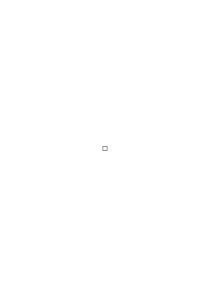

zusammengesetzt, vielmehr bedingt die erste geometrische Figur die beiden andern und umgekehrt. Hier hätte also Nicod recht wenn er sagt, daß die größere Figur nicht die kleineren als Bestandteile enthält. Anders aber ist es im erfüllten Raum: Die Figur

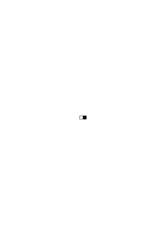

besteht tatsächlich aus den Bestandteilen

und

,

obwohl die rein geometrische Figur des großen Quadrats _nicht_ aus den Figuren der beiden Rechtecke besteht. Diese “rein geometrischen Figuren” sind ja nur logische Möglichkeiten. – Man kann nun tatsächlich ein materielles Schachbrett als Einheit – nicht aus seinen Feldern zusammengesetzt – sehen, indem man es als ein großes Viereck sieht und von seinen Feldern absieht. – Sieht man aber von seinen Feldern nicht ab, dann ist es ein Komplex und die Felder sind seine Bestandteile, die es konstituieren, um die Ausdrucksweise Nicod's anzuwenden. (Was es übrigens heißen soll, daß etwas von irgendwelchen Gegenständen “determiniert” aber nicht “konstituiert” wird, kann ich nicht verstehen. Diese beiden Ausdrücke, wenn sie überhaupt einen Sinn haben, haben denselben.) Ein Intellekt der die Bestandteile und ihre Relationen übersieht, das Ganze aber nicht, ist ein Unding. Wenn jeder Punkt im Gesichtsraum ein ausgezeichneter Punkt ist, so hat es allerdings einen Sinn von Hier und Dort im Gesichtsraum zu sprechen und das scheint mir jetzt die Darstellung der visuellen Sachverhalte einfacher zu gestalten. Aber ist diese Eigenschaft der ausgezeichneten Punkte für den Gesichtsraum wirklich wesentlich; ich meine, könnten wir uns nicht einen Gesichtsraum denken, in dem man nur gewisse Lagenverhältnisse, aber keine absolute Lage wahrnähme, d.h., könnten wir uns so eine Erfahrung ausmalen? Etwa in dem Sinn, wie wir uns die Erfahrungen eines Einäugigen vorstellen können –? Ich glaube nicht. Man könnte z.B. eine Drehung des ganzen Gesichtsbildes nicht wahrnehmen, oder vielmehr, sie wäre nicht denkbar. Wie würde etwa der Zeiger einer Uhr aussehen, der sich dem Zifferblatt entlang bewegt? (Ich nehme an, daß das Zifferblatt, wie bei manchen großen Uhren nur Punkte aber keine Ziffern hat.) Wir würden dann zwar die Bewegung von einem Punkt zum andern wahrnehmen – wenn sie nicht in _einem_ Ruck geschieht – aber wenn der Zeiger in einem Punkt angelangt wäre, so könnten wir seine Lage von der im vorigen Punkt nicht unterscheiden. Ich glaube es zeigt sich, daß das mit unserem Gesichtssinn nicht vorstellbar ist.

### [PR](/w-pr/#ts-209-116.3) [116\[3\]](https://cdn.wittgensteinnachlass.com/2000px/webp/Ts-209/116.webp) {#1163}

Im Gesichtsraum gibt es absolute Lage und daher auch absolute Bewegung. Man denke sich das Bild zweier Sterne in stockfinsterer Nacht, in der ich nichts sehen kann als diese und diese bewegen sich im Kreise umeinander.

### [PR](/w-pr/#ts-209-116.4) [116\[4\]](https://cdn.wittgensteinnachlass.com/2000px/webp/Ts-209/116.webp) {#1164}

Es scheint mir, daß der Begriff der Distanz in der Struktur des Gesichtsraumes unmittelbar gegeben ist. Wenn das nicht so wäre und der Begriff der Distanz nur durch eine Korrelation eines distanzlosen Gesichtsraumes mit einer andern distanzhältigen Struktur mit dem Gesichtsraum assoziiert ist, dann ist der Fall denkbar, daß durch eine Änderung dieser Assoziation z.B. die Strecke a größer erscheint als die Strecke b, obwohl wir den Punkt B noch immer zwischen A und C gewahren. (Siehe Figur)

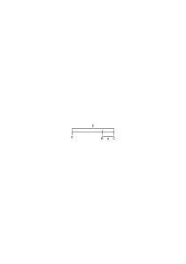

### [PR](/w-pr/#ts-209-117.1) [117\[1\]](https://cdn.wittgensteinnachlass.com/2000px/webp/Ts-209/117.webp) {#1171}

Wie ist es, wenn man an ein Objekt des Gesichtsraumes einen Maßstab _zeitweilig_ anlegt. Ist es auch dann gemessen, wenn der Maßstab nicht da ist? Ja, wenn die Identität des Gemessenen mit dem Nichtgemessenen überhaupt mit Sinn festgestellt werden kann.

### [PR](/w-pr/#ts-209-117.2) [117\[2\]](https://cdn.wittgensteinnachlass.com/2000px/webp/Ts-209/117.webp) {#1172}

_Wenn_ ich sagen kann: “_Diese_ Strecke _habe_ ich gemessen und sie war dreimal so lang als _jene_”, dann hat es einen Sinn und ist richtig zu sagen, daß die Strecken auch jetzt im selben Verhältnis zu einander stehen.

### [PR](/w-pr/#ts-209-117.3) [117\[3\]](https://cdn.wittgensteinnachlass.com/2000px/webp/Ts-209/117.webp) {#1173}

<math display="block">
  <mi>A</mi>
  <mtext>❘</mtext>
  <mspace width="0.3em"/>
  <mo>|</mo>
  <mi>B</mi>
  <mtext>❘</mtext>
  <mspace width="0.3em"/>
  <mo>|</mo>
  <mi>C</mi>
  <mtext>❘</mtext>
  <mspace width="0.3em"/>
  <mo>|</mo>
  <mi>C</mi>
  <mtext>❘</mtext>
  <mspace width="0.3em"/>
  <mo>|</mo>
  <mi>B</mi>
  <mtext>❘</mtext>
  <mspace width="0.3em"/>
  <mo>|</mo>
  <mi>A</mi>
  <mtext>❘</mtext>
</math>

Aus “CC zwischen BB” folgt “CC zwischen AA”, aber nur, wenn die Teilung wirklich durch Farbgrenzen gegeben ist.

### [PR](/w-pr/#ts-209-117.4) [117\[4\]](https://cdn.wittgensteinnachlass.com/2000px/webp/Ts-209/117.webp) {#1174}

Es ist offenbar möglich, daß mir die Strecken a und b gleichlang erscheinen, daß mir auch die Stücke c und d gleichlang erscheinen, daß aber ihre Zählung ergibt, daß ich 25 c und 24 d habe. Hier haben wir die Frage: Wie kann das möglich sein? Ist es hier richtig zu sagen: Es ist eben so, und wir sehen nur, daß der Gesichtsraum nicht den Regeln – etwa – des euklidischen Raumes folgt. Das würde heißen, daß die Frage “wie kann das möglich sein” unsinnig und also unberechtigt wäre. Hier läge also gar nichts Paradoxes, sondern wir hätten das nur einfach hinzunehmen. – Ist es aber _denkbar_, daß a gleich b und die c gleich den d erscheinen und von den c und d _übersehbare_ ungleiche Zahlen vorhanden sind? Oder soll ich nun sagen, daß eben doch auch im Gesichtsraum etwas anders _scheinen_ kann, als es _ist_? Gewiß nicht! Oder, daß n-mal eine Strecke und n + 1 mal dieselbe Strecke im Gesichtsraum eben das Gleiche ergeben können? Ebensowenig! Es sei denn, daß es überhaupt keinen Sinn hat, von Strecken im _Gesichtsraum_ auszusagen, daß sie gleich _sind_. Daß es also auch für den Gesichtsraum allein einen Sinn hätte von einem “Scheinen” zu reden und dieser Ausdruck nicht nur das Verhältnis zweier unabhängiger Erfahrungen beträfe. Daß es also ein _absolutes_ Scheinen gäbe. Also vielleicht auch eine _absolute_ Verschwommenheit, oder eine _absolute_ Unklarheit. (Während meine Auffassung ist, daß etwas nur gegen etwas von uns als Ziel der Klarheit Gesetztes verschwommen oder unklar sein kann; also relativ.)

### [PR](/w-pr/#ts-209-117.5+118.1) [117\[5\]](https://cdn.wittgensteinnachlass.com/2000px/webp/Ts-209/117.webp),[118\[1\]](https://cdn.wittgensteinnachlass.com/2000px/webp/Ts-209/118.webp) {#11751181}

Kann ich mich denn – im ersten Fall – wenn ich die Zahl nicht “mit einem Blick” erfassen kann, nicht beim Bestimmen dieser Zahl irren? Oder: besteht dann a und b überhaupt aus einer Zahl von Teilen – im gewöhnlichen Sinn – wenn ich diese Zahl nicht in a und b _sehe_? Es scheint mir nämlich, als ob ich allerdings auch nicht das Recht hätte, etwa zu _schließen_, daß von den c und d die gleiche Anzahl vorhanden sein müssen. Und zwar auch dann nicht, wenn die Zählung wirklich die gleiche Zahl ergibt! Ich meine: Auch dann nicht, wenn es _nie_ vorkäme, daß bei gleichem a und b etc. die Zählung verschiedene Resultate liefert. (Das zeigt übrigens, wie schwer es ist, das wirklich Gesehene zu beschreiben.) Angenommen aber, wir hätten das Recht, von einer Zahl von Teilen – wohl gemerkt, immer im rein Gesehenen – zu reden, auch wenn wir die Anzahl nicht unmittelbar sehen; dann käme die Frage: Kann ich denn sicher sein, daß das was ich zähle wirklich die Zahl ist, die ich sehe, oder vielmehr, deren visuelles Resultat ich sehe. Könnte ich sicher sein, daß nicht in einem Moment die Anzahl der Teile von 24 auf 25 wechselt, ohne daß ich es wahrnehme?

### [PR](/w-pr/#ts-209-118.2) [118\[2\]](https://cdn.wittgensteinnachlass.com/2000px/webp/Ts-209/118.webp) {#1182}

Wenn ich a = b und c = d sehe und ein anderer zählt die Teile und findet gleichviel, so werde ich das jedenfalls nicht als meinem Gesehenen widersprechend empfinden. Es ist mir aber auch bekannt, daß ich das Gleiche sehen kann, wenn in a 25c und in b 24d sind. Daraus kann ich schließen, daß ich das Mehr oder Weniger eines Teils nicht bemerke und also auch nicht bemerken kann, wenn die Anzahl der Teile in b zwischen 24 und 25 wechselt.

### [PR](/w-pr/#ts-209-118.3) [118\[3\]](https://cdn.wittgensteinnachlass.com/2000px/webp/Ts-209/118.webp) {#1183}

Wenn man aber nicht sagen kann, daß in a und b eine bestimmte Anzahl von Teilen ist, wie soll ich das Gesichtsbild dann beschreiben? Es zeigt sich – glaube ich – hier, daß das Gesichtsbild viel komplizierter ist, als es auf den ersten Blick zu sein scheint. Was es so viel komplizierter macht, ist z.B. der Faktor, der die Bewegung des Auges erzeugt. Wenn ich etwa das auf einen Blick Gesehene statt durch die Wortsprache durch ein gemaltes Bild beschreiben sollte, so dürfte ich nicht alle Teile c und d wirklich malen. Statt dessen müßte ich an manchen Stellen etwas “Verschwommenes”, also etwa eine graue Partie malen.

### [PR](/w-pr/#ts-209-118.4) [118\[4\]](https://cdn.wittgensteinnachlass.com/2000px/webp/Ts-209/118.webp) {#1184}

“Verschwommen” und “unklar” sind relative Ausdrücke. Wenn es oft nicht so scheint so kommt es daher, daß wir die gegebenen Phänomene noch zu wenig in ihrer wirklichen Beschaffenheit erkennen, daß wir sie uns primitiver denken, als sie sind. So ist es z.B. möglich, daß kein wie immer geartetes färbiges Bild im Stande ist, den Eindruck der “Verschwommenheit” richtig darzustellen. Daraus folgt aber nicht, daß eben das Gesichtsbild an und für sich verschwommen ist und darum nicht durch ein wie immer geartetes bestimmtes Bild dargestellt werden kann. Sondern es würde das nur darauf hindeuten, daß – etwa durch die Bewegung der Augen – ein Faktor in das Gesichtsfeld eintritt, den das gemalte Bild allerdings nicht wiedergeben kann, der aber an sich so “bestimmt” ist, wie jeder andere. Man könnte dann sagen, das wirklich Gegebene sei relativ zu dem gemalten Bild noch immer unbestimmt oder verschwommen, aber eben nur, weil wir das gemalte Bild dann willkürlich zum Standard für das Gegebene setzen, das eine größere Mannigfaltigkeit hat, als die malerische Darstellung.

### [PR](/w-pr/#ts-209-118.5) [118\[5\]](https://cdn.wittgensteinnachlass.com/2000px/webp/Ts-209/118.webp) {#1185}

Wenn wir wirklich 24 und 25 Teile in a und b _sähen_, dann könnten wir a und b nicht als gleich sehen. Ist dies falsch, so muß Folgendes möglich sein: Es müßte möglich sein unmittelbar zwischen den Fällen zu unterscheiden, wenn a und b beide gleich 24 sind und wenn a 24 und b 25 ist, aber es wäre nur möglich, die Zahlen der Teile zu unterscheiden, nicht aber die resultierende Länge von a und b.

### [PR](/w-pr/#ts-209-118.6) [118\[6\]](https://cdn.wittgensteinnachlass.com/2000px/webp/Ts-209/118.webp) {#1186}

Man könnte das einfacher auch so sagen: Es müßte dann möglich sein unmittelbar zu sehen, daß eine Strecke aus 24 Teilen, die andere aus 25 ebenso großen Teilen zusammengesetzt ist, ohne daß es möglich wäre, zwischen den resultierenden Längen zu unterscheiden. – Ich glaube, daß das Wort “gleich” auch für den Gesichtsraum eine Bedeutung hat, die dies zum Widerspruch stempelt.

### [PR](/w-pr/#ts-209-118.7+119.1) [118\[7\]](https://cdn.wittgensteinnachlass.com/2000px/webp/Ts-209/118.webp),[119\[1\]](https://cdn.wittgensteinnachlass.com/2000px/webp/Ts-209/119.webp) {#11871191}

Erkenne ich 2 Strecken des Gesichtsraums dadurch als gleich, daß ich sie nicht als ungleich erkenne? Das ist eine sehr weittragende Frage. Könnte ich nicht nach einander zwei Eindrücke haben: In einem eine Strecke, die sichtbar in 5 Teile, das andere Mal eine Strecke, die ebenso in 6 Teile geteilt wäre und ich könnte doch nicht sagen, daß ich die Teile oder die ganzen Strecken als verschieden lang gesehen habe. Würde ich gefragt: “Waren die Strecken verschieden lang oder gleich lang”, so könnte ich nicht antworten “ich habe sie verschieden lang gesehen”, denn es ist mir, sozusagen, kein Längenunterschied “aufgefallen”. Und doch könnte ich – glaube ich – nicht sagen ich habe sie als gleichlang gesehen. Andererseits könnte ich aber doch nicht sagen: “Ich weiß nicht, ob sie gleich oder verschieden waren” (außer das Gedächtnis hätte mich verlassen), denn das heißt nichts, solange ich nur vom unmittelbar Gegebenen rede.

### [PR](/w-pr/#ts-209-119.2) [119\[2\]](https://cdn.wittgensteinnachlass.com/2000px/webp/Ts-209/119.webp) {#1192}

Es kommt darauf an, gewisse Widersprüche zu erklären, wenn wir auf den Gesichtsraum die Schlußweisen des euklidischen Raumes anwenden. Ich meine: Es ist möglich im Gesichtsraum einer Konstruktion (also einer Schlußkette) zu folgen, deren sämtliche Schritte (Übergänge) wir einsehen, deren Resultat aber unsern geometrischen Begriffen widerspricht.

### [PR](/w-pr/#ts-209-119.3) [119\[3\]](https://cdn.wittgensteinnachlass.com/2000px/webp/Ts-209/119.webp) {#1193}

Ich glaube nun, das kommt immer daher, daß wir die Konstruktion nur gliedweise, aber nicht als Eines sehen können. Diese Erklärung wäre also, daß es gar keine visuelle Konstruktion gibt, die aus diesen einzelnen visuellen Stücken zusammengesetzt wäre. Das wäre etwa so, wie wenn ich jemandem einen kleinen Ausschnitt einer großen Kugelfläche zeigte und ihn fragte, ob er den darauf sichtbaren größten Kreis als Gerade anerkennt, und wenn er das getan hätte, so drehte ich die Kugel und würde ihm zeigen, daß er wieder zur selben Stelle des Kreises zurückkäme. Ich habe ihm aber auf diese Weise doch nicht bewiesen, daß etwa eine Gerade des Gesichtsraumes in sich selbst zurückläuft.

### [PR](/w-pr/#ts-209-119.4) [119\[4\]](https://cdn.wittgensteinnachlass.com/2000px/webp/Ts-209/119.webp) {#1194}

Diese Erklärung wäre also: Das sind visuelle _Stücke_, die sich aber nicht zu einem visuellen Ganzen zusammensetzen, oder jedenfalls nicht zu dem Ganzen, dessen letztes Resultat ich am Schluß zu sehen glaube.

### [PR](/w-pr/#ts-209-119.5) [119\[5\]](https://cdn.wittgensteinnachlass.com/2000px/webp/Ts-209/119.webp) {#1195}

Die einfachste Konstruktion dieser Art wäre ja die obere zweier gleichlanger Strecken, in deren einer ein Stück n-mal abzutragen geht und in der anderen n + 1 mal. Die Schritte der Konstruktion wären das Fortschreiten von einem Teilstück zum anderen und das Konstatieren der Gleichheit dieser Stücke. Hier könnte man erklären, daß ich durch dieses Fortschreiten nicht wirklich das ursprüngliche Gesichtsfeld mit den gleichlangen Strecken untersuche. Sondern sich der Untersuchung etwas Anderes vorschiebt, das dann zu dem verblüffenden Resultat führt.

### [PR](/w-pr/#ts-209-119.6) [119\[6\]](https://cdn.wittgensteinnachlass.com/2000px/webp/Ts-209/119.webp) {#1196}

Gegen diese Erklärung gibt es aber einen Einwand. Man könnte sagen: Wir haben dir ja, als du die einzelnen Teile prüftest, nicht einen Teil der Konstruktion zugehalten. Du konntest also sehen, ob sich inzwischen am Übrigen etwas verändert, verschoben, hat. Ist das nicht geschehen, so konntest du ja doch sehen, daß alles mit rechten Dingen zuging.

### [PR](/w-pr/#ts-209-119.7) [119\[7\]](https://cdn.wittgensteinnachlass.com/2000px/webp/Ts-209/119.webp) {#1197}

Von der Teilbarkeit im Gesichtsraum zu reden hat einen Sinn, denn es muß sich in einer Beschreibung ein ungeteiltes Stück durch ein geteiltes ersetzen lassen. Und dann ist es klar, was nach dem, was ich früher ausgeführt habe, die unendliche Teilbarkeit dieses Raumes bedeutet.

### [PR](/w-pr/#ts-209-120.1) [120\[1\]](https://cdn.wittgensteinnachlass.com/2000px/webp/Ts-209/120.webp) {#1201}

Sobald man exakte Begriffe der Messung auf die unmittelbare Erfahrung anwenden will, stößt man auf eine eigentümliche Verschwommenheit in dieser Erfahrung. D.h. aber nur eine Verschwommenheit relativ zu jenen Maßbegriffen. Und es scheint mir nun, daß diese Verschwommenheit nicht etwas Vorläufiges ist, das genauere Kenntnis später eliminieren wird, sondern eine charakteristische logische Eigentümlichkeit. Wenn ich z.B. sage, “ich sehe jetzt einen roten Kreis auf blauem Grund und erinnere mich einen vor ein paar Minuten gesehen zu haben, der gleich groß, oder vielleicht etwas kleiner war und ein wenig lichter” so ist _diese_ Erfahrung nicht exakter zu beschreiben. Die Wörter “ungefähr”, “beiläufig”, etc. haben freilich nur relativen Sinn, aber sie sind doch _nötig_ und sie charakterisieren die Natur unserer Erfahrung; nicht als an sich beiläufig, oder verschwommen, aber doch als beiläufig und verschwommen in Relation zu den Mitteln unserer Darstellung.

### [PR](/w-pr/#ts-209-120.2) [120\[2\]](https://cdn.wittgensteinnachlass.com/2000px/webp/Ts-209/120.webp) {#1202}

Das alles hängt mit dem Problem zusammen “wieviel Sandkörner geben einen Haufen”. Man könnte sagen: Ein Haufen ist jede Gruppe von mehr als 100 Körnern und weniger als 10 Körner sind kein Haufen: Das muß aber so verstanden werden, daß nicht vielleicht hundert und zehn Grenzen sind, die dem Begriff Haufen wesentlich wären. Und das ist dasselbe Problem wie das, anzugeben, bei welchem der vertikalen Striche man zuerst einen Längenunterschied gegen den ersten bemerkt.

_Figur._

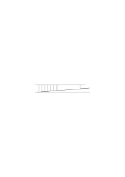

### [PR](/w-pr/#ts-209-120.3) [120\[3\]](https://cdn.wittgensteinnachlass.com/2000px/webp/Ts-209/120.webp) {#1203}

Das was dem Gesichtskreis in der euklidischen Geometrie entspricht, ist nicht ein Kreis, sondern eine Klasse von Figuren, unter denen auch der Kreis ist, aber etwa auch das 100-Eck etc. Das Merkmal dieser Klasse könnte etwa sein, daß es alle die Figuren sind, die innerhalb eines Streifens liegen, der durch Vibration eines Kreises entsteht. – Aber auch das ist falsch: Denn warum soll ich gerade den Streifen nehmen, der durch Vibration eines Kreises, und nicht den, der durch Vibration des 100-Ecks entsteht? Und hier stoße ich auf die Hauptschwierigkeit, denn es scheint, als wäre auch die exakte _Begrenzung_ der Unexaktheit unmöglich. Die Begrenzung ist nämlich willkürlich, denn wie unterscheidet sich das, was dem vibrierenden Kreis entspricht, von dem, was dem vibrierenden 100-Eck entspricht?

### [PR](/w-pr/#ts-209-120.4) [120\[4\]](https://cdn.wittgensteinnachlass.com/2000px/webp/Ts-209/120.webp) {#1204}

Etwas zieht zu folgender Erklärung hin: Alles was innerhalb a a ist, erscheint als der Gesichtskreis K, alles was außerhalb bb ist, erscheint nicht als K. Das wäre dann der Fall des Wortes “Haufen”. Es wäre eine unbestimmte Zone offengelassen und die Grenzen a und b sind für den definierten Begriff nicht wesentlich. – Die Grenzen a und b sind sozusagen doch nur die Mauern der _Vorhöfe_. Sie sind willkürlich dort gezogen, wo man noch etwas Festes ziehen kann. – Wie man einen Sumpf durch eine Mauer abgrenzt, die Mauer ist aber nicht _die_ Grenze des Sumpfes, sondern sie steht nur um ihn auf festem Erdreich. Sie ist ein Zeichen dafür, daß innerhalb ihrer ein Sumpf ist, aber nicht, daß der Sumpf genau so groß ist, wie die von ihr begrenzte Fläche.

### [PR](/w-pr/#ts-209-120.5) [120\[5\]](https://cdn.wittgensteinnachlass.com/2000px/webp/Ts-209/120.webp) {#1205}

Ist nun nicht die Korrelation zwischen Gesichtsraum und euklidischem Raum die: Welche euklidische Figur immer ich dem Betrachter zeige, so muß er unterscheiden können, ob sie der Gesichtskreis K ist oder nicht. D.h. ich werde durch ständiges Verkleinern des Intervalls zwischen den vorgewiesenen Figuren das unbestimmte Intervall beliebig verkleinern können, mich “einer Grenze zwischen dem was ich als K, und dem was ich nicht als K sehe, beliebig nähern” können. Andererseits aber werde ich eine solche Grenze als Linie im euklidischen Raum nie ziehen können, denn könnte ich sie ziehen, so müßte sie selbst zu einer der beiden Klassen gehören und die letzte dieser Klasse sein, dann müßte ich also doch eine euklidische Linie sehen können.

### [PR](/w-pr/#ts-209-121.1) [121\[1\]](https://cdn.wittgensteinnachlass.com/2000px/webp/Ts-209/121.webp) {#1211}

Wenn man z.B. sagt, man sähe nie einen wirklichen Kreis, sondern immer nur angenäherte Kreise, so hat das einen guten, einwandfreien, Sinn, wenn es heißt, daß man an einem Körper, der kreisförmig aussieht, durch genaue Messung oder durch Anschauen mit dem Vergrößerungsglas noch immer Ungenauigkeiten entdecken kann. Wir verlieren diesen Sinn aber so wie wir statt des kreisförmigen Körpers das unmittelbar Gegebene, den Fleck, oder wie man es nennen will, setzen.

### [PR](/w-pr/#ts-209-121.2) [121\[2\]](https://cdn.wittgensteinnachlass.com/2000px/webp/Ts-209/121.webp) {#1212}

_Wenn_ ein Kreis überhaupt das ist, was wir sehen – sehen, in demselben Sinn, in dem wir den blauen Fleck sehen – dann müssen wir _ihn_ sehen können und nicht bloß etwas ihm Ähnliches.

### [PR](/w-pr/#ts-209-121.3) [121\[3\]](https://cdn.wittgensteinnachlass.com/2000px/webp/Ts-209/121.webp) {#1213}

Wenn ich keinen genauen Kreis sehen kann, so kann ich in diesem Sinne, auch keinen angenäherten sehen. – Sondern dann ist der euklidische Kreis – wie auch der euklidische angenäherte Kreis – in diesem Sinn gar nicht Gegenstand meiner Wahrnehmung, sondern etwa nur eine andere logische Konstruktion, die aus den Gegenständen eines ganz anderen Raumes, als des unmittelbaren Sehraumes, gewonnen werden können. Aber auch diese Ausdrucksweise ist irreführend und man muß vielmehr sagen, daß wir den euklidischen Kreis in einem anderen Sinne sehen. Daß also zwischen dem euklidischen Kreis und dem Wahrgenommenen eine andere Projektionsart besteht, als man naiverweise annehmen würde.

### [PR](/w-pr/#ts-209-121.4) [121\[4\]](https://cdn.wittgensteinnachlass.com/2000px/webp/Ts-209/121.webp) {#1214}

Wenn ich sage, man kann ein 1000-Eck nicht von einem Kreis unterscheiden, so muß mir hier das 1000-Eck durch seine Konstruktion, durch seine Entstehung gegeben sein. Denn, wie wüßte ich sonst, daß es “tatsächlich” ein 1000-Eck ist und _nicht_ ein Kreis.

### [PR](/w-pr/#ts-209-121.5) [121\[5\]](https://cdn.wittgensteinnachlass.com/2000px/webp/Ts-209/121.webp) {#1215}

Im Gesichtsraum gibt es keine Messung.

### [PR](/w-pr/#ts-209-121.6) [121\[6\]](https://cdn.wittgensteinnachlass.com/2000px/webp/Ts-209/121.webp) {#1216}

Man könnte z.B. im Gesichtsraum sehr wohl definieren: “Gerade ist, was nicht krumm ist” und “Kreis ist eine Linie konstanter Krümmung”.

### [PR](/w-pr/#ts-209-121.7) [121\[7\]](https://cdn.wittgensteinnachlass.com/2000px/webp/Ts-209/121.webp) {#1217}

Wir brauchten neue Begriffe und wir nehmen immer wieder die der physikalischen Sprache. Das Wort “Genauigkeit” ist einer jener zweifelhaften Ausdrücke. In der gewöhnlichen Sprache bezieht es sich auf einen _Vergleich_ und da ist es ganz verständlich. Wo ein gewisser Grad der Ungenauigkeit vorhanden ist, dort ist auch vollkommene Genauigkeit möglich. Was soll es aber heißen, wenn ich sage, ich kann nie einen genauen Kreis sehen und dieses Wort jetzt nicht relativ, also absolut, gebrauche?

### [PR](/w-pr/#ts-209-121.8) [121\[8\]](https://cdn.wittgensteinnachlass.com/2000px/webp/Ts-209/121.webp) {#1218}

Die Worte “ich sehe” in “ich sehe einen Fleck” und “ich sehe eine Linie” haben also verschiedene Bedeutung.

### [PR](/w-pr/#ts-209-121.9) [121\[9\]](https://cdn.wittgensteinnachlass.com/2000px/webp/Ts-209/121.webp) {#1219}

Angenommen, ich muß sagen “ich sehe nie eine ganz scharfe Linie”, so ist die Frage: “Ist eine scharfe denkbar?” Ist es richtig, zu sagen “ich sehe keine scharfe Linie”, dann _ist_ eine scharfe Linie denkbar. Hat es Sinn zu sagen “ich sehe nie einen genauen Kreis” dann heißt das: Ein genauer Kreis ist im Gesichtsraum denkbar. Ist ein genauer Kreis im Gesichtsfeld undenkbar, dann muß der Satz “ich sehe nie einen genauen Kreis im Gesichtsfeld” von der Art des Satzes sein, “ich sehe nie das hohe C im Gesichtsfeld”.

### [PR](/w-pr/#ts-209-122.1) [122\[1\]](https://cdn.wittgensteinnachlass.com/2000px/webp/Ts-209/122.webp) {#1221}

Wenn ich sage “die obere Strecke ist so lang wie die untere” und mit diesem Satz das meine, was sonst der Satz “die obere Strecke erscheint mir so lang, wie die untere” sagt, dann hat in dem Satz das Wort “gleich” eine ganz andere Bedeutung, wie im gleichlautenden Satz, für den die Verifikation die Übertragung der Länge mit dem Zirkel ist. Darum kann ich z.B. im zweiten Fall von einem Verbessern der Vergleichsmethoden reden, aber nicht im ersten Falle. Der Gebrauch desselben Wortes “gleich” in ganz verschiedenen Bedeutungen ist sehr verwirrend. Er ist der typische Fall, daß Worte und Redewendungen, die sich ursprünglich auf die “Dinge” der physikalischen Ausdrucksweise, die “Körper im Raum” beziehen, auf die Teile unseres Gesichtsfeldes angewendet werden, wobei sie ihre Bedeutung gänzlich wechseln müssen und die Aussagen ihren Sinn verlieren, die früher einen hatten, und andere einen Sinn gewinnen, die in der ersten Ausdrucksart keinen hatten. Wenn auch eine gewisse Analogie bestehen bleibt, eben die, die uns verführt, den gleichen Ausdruck zu gebrauchen.

### [PR](/w-pr/#ts-209-122.2) [122\[2\]](https://cdn.wittgensteinnachlass.com/2000px/webp/Ts-209/122.webp) {#1222}

Es ist z.B. wichtig, daß in dem Satz “ein roter Fleck befindet sich nahe an der Grenze des Gesichtsfeldes” das “nahe an” eine andere Bedeutung hat als in einem Satz “der rote Fleck im Gesichtsfeld befindet sich nahe an dem braunen Fleck”. Das Wort “Grenze” in dem vorigen Satz hat ferner eine andere Bedeutung – und ist eine andere Wortart – als in dem Satz “die Grenze zwischen Rot und Blau im Gesichtsfeld ist ein Kreis”!

### [PR](/w-pr/#ts-209-122.3) [122\[3\]](https://cdn.wittgensteinnachlass.com/2000px/webp/Ts-209/122.webp) {#1223}

Welchen Sinn hat es, zu sagen: Unser Gesichtsbild ist an den Rändern undeutlicher als gegen die Mitte? Wenn wir hier nämlich nicht davon reden, daß wir die physikalischen Gegenstände in der Mitte des Gesichtsfeldes deutlicher sehen. Eines der klarsten Beispiele der Verwechslung zwischen physikalischer und phänomenologischer Sprache ist das Bild, welches Mach von seinem Gesichtsfeld entworfen hat und worin die sogenannte Verschwommenheit der Gebilde gegen den Rand des Gesichtsfeldes durch eine Verschwommenheit (in ganz anderem Sinne) der Zeichnung wiedergegeben wurde. Nein, ein sichtbares Bild des Gesichtsbildes kann man nicht machen. Kann ich also sagen, daß die Farbflecken in der Nähe des Randes des Gesichtsfeldes keine scharfen Konturen mehr haben: Sind denn Konturen dort _denkbar_? Ich glaube es ist klar, daß jene Undeutlichkeit eine interne Eigenschaft des Gesichtsraumes ist. Hat z.B. das Wort “Farbe” eine andere Bedeutung, wenn es sich auf Gebilde in der Randnähe bezieht? Die Grenzenlosigkeit des Gesichtsraums ist ohne jene “Verschwommenheit” nicht denkbar.

### [PR](/w-pr/#ts-209-122.4) [122\[4\]](https://cdn.wittgensteinnachlass.com/2000px/webp/Ts-209/122.webp) {#1224}

Es frägt sich, welche Unterschiede gibt es im Gesichtsraum? Kann man darüber aus der Koordination, z.B. des Tastraumes mit dem Gesichtsraum etwas erfahren? Indem man etwa angibt, welche Veränderungen in dem einen Raum keiner Veränderung im anderen entsprechen? Die Tatsache, daß man ein physikalisches Hunderteck als Kreis sieht, es nicht von einem physikalischen Kreis unterscheiden kann, sagt gar nichts über die _Möglichkeit_ ein Hunderteck zu sehen. Daß es mir nicht gelingt einen physikalischen Körper zu finden, der das Gesichtsbild eines Hundertecks gibt, ist nicht von logischer Bedeutung. Es frägt sich: Hat es _Sinn_ von einem Gesichts-Hunderteck zu reden? Oder: Hat es Sinn von _zugleich gesehenen_ 30 Strichen nebeneinander zu reden. Ich glaube, nein. Der Vorgang ist gar nicht so, daß man zuerst ein Dreieck, dann ein Viereck, Fünfeck etc. bis z.B. zum 50-Eck sieht und dann der Kreis kommt; sondern man sieht ein Dreieck, ein Viereck etc. bis vielleicht zum Achteck, dann sieht man nur mehr Viel-Ecke mit mehr oder weniger langen Seiten. Die Seiten werden kleiner, dann beginnt ein Fluktuieren zum Kreis hin und dann kommt der Kreis.

### [PR](/w-pr/#ts-209-123.1) [123\[1\]](https://cdn.wittgensteinnachlass.com/2000px/webp/Ts-209/123.webp) {#1231}

Daß eine physikalische Gerade als Tangente an einen Kreis gezogen das Gesichtsbild einer geraden Linie gibt, die ein Stück weit mit der gekrümmten zusammenläuft, beweist auch nicht, daß unser Sehraum nicht euklidisch ist, denn es könnte sehr wohl ein anderes physikalisches Gebilde das der euklidischen Tangente entsprechende Bild erzeugen. Tatsächlich aber ist ein solches Bild undenkbar.

### [PR](/w-pr/#ts-209-123.2) [123\[2\]](https://cdn.wittgensteinnachlass.com/2000px/webp/Ts-209/123.webp) {#1232}

Was bedeutet der Satz: “Wir sehen nie einen genauen Kreis”? Was ist das Kriterium der Genauigkeit? Könnte ich nicht auch sehr wohl sagen “ich sehe vielleicht einen genauen Kreis, kann es aber nie wissen”? Das alles hat nur dann Sinn, wenn man festgelegt hat, in welchem Fall man eine Messung genauer nennt, als eine andere. Der Begriff des Kreises setzt nun – glaube ich – einen Begriff der “größeren Genauigkeit” voraus, der eine unendliche Möglichkeit der Steigerung hat. Und man kann sagen, der Begriff des Kreises _ist_ der Begriff der unendlichen Steigerungsmöglichkeit der Genauigkeit. Diese unendliche Steigerungsfähigkeit wäre ein Postulat der Ausdrucksweise. Es muß dann natürlich in jedem Fall klar sein, was ich als eine Vergrößerung der Genauigkeit auffassen würde. Das heißt natürlich nichts, zu sagen, der Kreis sei nur ein Ideal, dem sich die Wirklichkeit nur nähern könnte. Das ist ein irreführendes Gleichnis. Denn nähern kann man sich nur einer Sache, die vorhanden ist; und ist uns der Kreis in irgend einer Form gegeben, so daß wir uns ihm nähern können, dann wäre eben jene Form das für uns Wichtige und die Annäherung einer andern Form an sie nebensächlich. Es kann aber auch so sein, daß wir eine unendliche Möglichkeit selbst den Kreis nennen. Es verhält sich dann mit dem Kreis wie mit einer irrationalen Zahl. Es scheint mir der Applikation der euklidischen Geometrie wesentlich, daß wir von einem _ungenauen_ Kreis, einer _ungenauen_ Kugel etc. sprechen. Und auch, daß diese Ungenauigkeit einer Verkleinerung logisch unbegrenzt fähig sein muß. Um also die Anwendung der euklidischen Geometrie zu verstehen, muß man wissen, was das Wort “_ungenau_” heißt. – Denn etwas anderes ist uns nicht gegeben als das Resultat unserer Messung und der Begriff der Ungenauigkeit. Diese beiden zusammen müssen der euklidischen Geometrie entsprechen.

### [PR](/w-pr/#ts-209-123.3) [123\[3\]](https://cdn.wittgensteinnachlass.com/2000px/webp/Ts-209/123.webp) {#1233}

Ist nun die Ungenauigkeit der Messung der gleiche Begriff, wie die Ungenauigkeit des Gesichtsbildes? Ich glaube: Gewiß nicht.

### [PR](/w-pr/#ts-209-123.4) [123\[4\]](https://cdn.wittgensteinnachlass.com/2000px/webp/Ts-209/123.webp) {#1234}

Wenn die Aussage, daß wir nie einen genauen Kreis _sehen_, bedeuten soll, daß wir z.B. keine Gerade sehen, die den Kreis in einem Punkt berührt (d.h., daß nichts in unserm Sehraum die Multiplizität der einen Kreis berührenden Geraden hat) dann ist zu _dieser_ Ungenauigkeit nicht ein beliebig hoher Grad der Genauigkeit denkbar. Das Wort “Gleichheit” hat eine andere Bedeutung, wenn wir es auf Strecken im Sehraum anwenden, als, die es auf den physikalischen Raum angewendet hat. Die Gleichheit im Sehraum hat eine andere Multiplizität als die Gleichheit im physikalischen Raum, _darum_ können im Sehraum g' und g' Gerade (Sehgerade)

<math display="block">
  <mtext>🖵</mtext>
</math>

sein und die Strecken a' = a'', a'' = a''' etc. aber _nicht_ a' = a''''' sein. Ebenso hat der Kreis und die Gerade im Gesichtsraum eine andere Multiplizität als Kreis und Gerade im physikalischen Raum, denn ein kurzes Stück eines gesehenen Kreises kann gerade sein; “Kreis” und “Gerade” eben im Sinne der Gesichtsgeometrie angewandt. Die gewöhnliche Sprache hilft sich hier mit dem Worte “scheint” oder “erscheint”. Sie sagt a' und a'' scheinen gleich zu sein, während zwischen a' und a''''' dieser Schein schon nicht mehr besteht. Aber sie benutzt das Wort “scheint” zweideutig. Denn seine Bedeutung hängt davon ab, was diesem Schein nun als das Sein entgegengestellt wird. In einem Fall, ist es das Resultat einer Messung, im anderen eine weitere Erscheinung. In diesen Fällen ist also die Bedeutung des Wortes “scheinen” eine verschiedene.

### [PR](/w-pr/#ts-209-124.1) [124\[1\]](https://cdn.wittgensteinnachlass.com/2000px/webp/Ts-209/124.webp) {#1241}

Es ist jetzt an der Zeit Kritik am Worte “Sinnesdatum” zu üben. Sinnesdatum ist die Erscheinung dieses Baumes, ob nun “wirklich ein Baum dasteht” oder eine Attrappe, ein Spiegelbild, eine Halluzination etc. Sinnesdatum ist die Erscheinung des Baumes, und was wir sagen wollen ist, daß diese sprachliche Darstellung nur _eine_ Beschreibung, aber nicht _die_ wesentliche ist. Genau so, wie man von dem Ausdruck “_mein_ Gesichtsbild” sagen kann, daß es nur _eine_ Form der _Beschreibung_, aber nicht etwa die einzig mögliche und richtige ist. Die Ausdrucksform “die Erscheinung dieses Baumes” enthält nämlich die Anschauung, als bestünde ein notwendiger Zusammenhang dessen, was wir diese Erscheinung nennen, mit der “Existenz eines Baumes” und zwar, entweder durch eine wahre Erkenntnis oder einen Irrtum. D.h., wenn von der “Erscheinung eines Baumes” die Rede ist, so hielten wir entweder etwas für einen Baum, was einer ist, oder etwas, was keiner ist. Dieser Zusammenhang aber besteht nicht. Die Idealisten möchten der Sprache vorwerfen, daß sie das Sekundäre als primär und das Primäre als sekundär darstellt. Aber das ist nur in diesen unwesentlichen, und mit der Erkenntnis nicht zusammenhängenden, Wertungen der Fall (“nur” die Erscheinung). Davon abgesehen enthält die gewöhnliche Sprache keine Entscheidung über primär und sekundär. Es ist nicht einzusehen, inwiefern der Ausdruck “die Erscheinung eines Baumes” etwas dem Ausdruck “Baum” Sekundäres darstellt. Der Ausdruck “nur ein Bild” geht auf die Vorstellung zurück, daß wir das Bild eines Apfels nicht essen können.

### [PR](/w-pr/#ts-209-124.2) [124\[2\]](https://cdn.wittgensteinnachlass.com/2000px/webp/Ts-209/124.webp) {#1242}

Man könnte denken, daß das richtige Abbild des Gesichtsraums eine euklidische Zeichenebene mit ihren ideal feinen Konstruktionen wäre, die man zittern läßt, sodaß alle Konstruktionen um ein Gewisses verschwimmen (und zwar zittert die Ebene nach allen in ihr liegenden Richtungen gleichmäßig). Ja man könnte auch so sagen: Sie soll genau so stark zittern, daß wir es noch nicht merken, dann ist ihre physikalische Geometrie ein Bild unserer phänomenologischen.

### [PR](/w-pr/#ts-209-124.3) [124\[3\]](https://cdn.wittgensteinnachlass.com/2000px/webp/Ts-209/124.webp) {#1243}

Die große Frage aber ist: Kann man die “Verschwommenheit” des Phänomens in eine Ungenauigkeit der Zeichnung übersetzen? Es scheint mir, nein. Es ist z.B. unmöglich die Ungenauigkeit des unmittelbar Gesehenen auf der Zeichnung durch dicke Striche und Punkte darzustellen. Genau so, wie man die Erinnerung an ein Bild nicht durch dieses Bild in blassen Farben gemalt darstellen kann. Die Blässe der Erinnerung ist etwas ganz anderes als die Blässe des gesehenen Farbtons und die Unklarheit des Sehens, von anderer _Art_ als die Verschwommenheit einer unscharfen Zeichnung. (Ja, die unscharfe Zeichnung wird mit eben der Unklarheit gesehen, die man durch ihre Unschärfe darstellen wollte.) (Wenn im Kino eine Erinnerung oder ein Traum dargestellt werden soll, so gibt man den Bildern einen bläulichen Ton. Aber die Erinnerungsbilder haben keinen bläulichen Ton, also sind die bläulichen Projektionen nicht korrekte _anschauliche_ Bilder der Träume, sondern Bilder in einem nicht unmittelbar visuellen Sinn.)

### [PR](/w-pr/#ts-209-124.4) [124\[4\]](https://cdn.wittgensteinnachlass.com/2000px/webp/Ts-209/124.webp) {#1244}

Eine Strecke im Gesichtsfeld muß weder gerade noch krumm sein. Natürlich heißt die dritte Möglichkeit nicht “zweifelhaft” (das ist Unsinn) sondern man müßte ein anderes Wort dafür gebrauchen, oder vielmehr die ganze Ausdrucksweise durch eine andere ersetzen.

### [PR](/w-pr/#ts-209-124.5) [124\[5\]](https://cdn.wittgensteinnachlass.com/2000px/webp/Ts-209/124.webp) {#1245}

Daß der Gesichtsraum nicht euklidisch ist, zeigt schon das Vorkommen zweier verschiedener Arten von Linien und Punkten: Die Fixsterne sehen wir als Punkte: d.h. wir können nicht die Kontur eines Fixsterns sehen und der Schnitt zweier Farbengrenzen ist in einem andern Sinne auch ein Punkt; Analoges von den Linien. Ich kann eine leuchtende Linie ohne Dicke sehen, denn andernfalls müßte ich ihren Durchschnitt als Viereck erkennen können, oder doch die 4 Durchschnittspunkte der Konturen erkennen.

### [PR](/w-pr/#ts-209-125.1) [125\[1\]](https://cdn.wittgensteinnachlass.com/2000px/webp/Ts-209/125.webp) {#1251}

Ein Gesichts-Kreis und eine Gesichts-Gerade können ein Stück miteinander gemein haben. Wenn ich einen gezeichneten Kreis mit einer Tangente anschaue, so wäre nicht das merkwürdig, daß ich niemals einen vollkommenen Kreis und eine vollkommene Gerade einander berühren sehe, interessant wäre es erst, wenn ich das sehe, und dann die Gerade ein Stück weit mit dem Kreis zusammenläuft. Denn erst das würde sagen, daß der Gesichts-Kreis und die Gesichts-Gerade sich wesentlich von Kreis und Gerade der euklidischen Geometrie unterscheiden; nicht aber das Erste, daß man nie einen vollkommenen Kreis und eine vollkommene Gerade einander hat berühren sehen.

### [PR](/w-pr/#ts-209-125.2) [125\[2\]](https://cdn.wittgensteinnachlass.com/2000px/webp/Ts-209/125.webp) {#1252}

Es scheint einfache Farben zu geben. Einfach als psychologische Erscheinungen. Was ich brauche, ist eine psychologische oder vielmehr phänomenologische Farbenlehre, keine physikalische und ebensowenig eine physiologische. Und zwar muß es eine _rein_ phänomenologische Farbenlehre sein, in der nur von wirklich Wahrnehmbarem die Rede ist und keine hypothetischen Gegenstände, – Wellen, Zellen etc. – vorkommen.

### [PR](/w-pr/#ts-209-125.3) [125\[3\]](https://cdn.wittgensteinnachlass.com/2000px/webp/Ts-209/125.webp) {#1253}

Man kann nun _unmittelbar_ Farben als Mischungen von rot, grün, blau, gelb, schwarz und weiß erkennen. Dabei ist Farbe immer color, nie pigmentum, nie Licht, nie Vorgang auf oder in der Netzhaut etc. Man kann auch sehen, daß die eine Farbe rötlicher ist als die andere, oder weißlicher etc. Aber kann ich eine Metrik der Farben finden? Hat es einen Sinn zu sagen, daß die eine Farbe etwa in Bezug auf ihren Gehalt an Rot _in der Mitte_ zwischen zwei andern Farben steht? Es scheint jedenfalls einen Sinn zu haben, zu sagen, die eine Farbe steht einer andern in dieser Beziehung näher als einer dritten.

### [PR](/w-pr/#ts-209-125.4) [125\[4\]](https://cdn.wittgensteinnachlass.com/2000px/webp/Ts-209/125.webp) {#1254}

Man könnte sagen, Violett und Orange löschen einander bei der Mischung teilweise aus, nicht aber Rot und Gelb.

### [PR](/w-pr/#ts-209-125.5) [125\[5\]](https://cdn.wittgensteinnachlass.com/2000px/webp/Ts-209/125.webp) {#1255}

Orange ist jedenfalls ein Gemisch von Rot und Gelb in einem Sinne, in dem Gelb kein Gemisch von Rot und Grün ist, obwohl ja Gelb im Kreis zwischen Rot und Grün liegt. Und wenn das offenbar Unsinn wäre, so frägt es sich, an welcher Stelle es anfängt Sinn zu werden; d.h., wenn ich nun im Kreis von Rot und Grün aus dem Gelb näherrücke und Gelb ein Gemisch der betreffenden beiden Farben nenne.

### [PR](/w-pr/#ts-209-125.6) [125\[6\]](https://cdn.wittgensteinnachlass.com/2000px/webp/Ts-209/125.webp) {#1256}

Ich erkenne nämlich im Gelb wohl die Verwandtschaft zu Rot und Grün, nämlich die Möglichkeit zum Rötlichgelb und Grünlichgelb – und dabei erkenne ich doch nicht Grün und Rot als Bestandteile von Gelb in dem Sinne, in dem ich Rot und Gelb als Bestandteile von Orange erkenne. Ich will sagen, daß Rot nur in dem Sinn zwischen Violett und Orange ist, wie Weiß zwischen Rosa und Grünlichweiß. Aber ist in diesem Sinn nicht jede Farbe zwischen jeden zwei anderen, oder doch zwischen solchen zweien, zu denen man auf unabhängigen Wegen von der dritten gelangen kann. Kann man sagen, in diesem Sinne liegt eine Farbe nur in einem gegebenen kontinuierlichen Übergang zwischen zwei andern. Also etwa Blau zwischen Rot und Schwarz.

### [PR](/w-pr/#ts-209-126.1) [126\[1\]](https://cdn.wittgensteinnachlass.com/2000px/webp/Ts-209/126.webp) {#1261}

Ist es also so: Zu sagen, ein Fleck habe eine Mischfarbe von Orange und Violett, schreibt ihm eine andere Farbe zu als zu sagen, der Fleck habe die Farbe, die Orange und Violett miteinander gemein haben? – Aber das geht auch nicht; denn in dem Sinn, in welchem Orange eine Mischung von Rot und Gelb ist, gibt es gar keine Mischung von Orange und Violett. Wenn ich mir die Mischung zwischen einem Blaugrün und einem Gelbgrün denke, so sehe ich, daß sie ohne Weiteres nicht geschehen kann, sondern erst ein Bestandteil gleichsam getötet werden muß, ehe die Vereinigung vor sich gehen kann. Das ist zwischen Rot und Gelb nicht der Fall. Ich sehe dabei keinen kontinuierlichen Übergang – über Grün – in der Fantasie vor mir, sondern es sind nur die diskreten Farbtöne beteiligt.

### [PR](/w-pr/#ts-209-126.2) [126\[2\]](https://cdn.wittgensteinnachlass.com/2000px/webp/Ts-209/126.webp) {#1262}

Die Bedeutung des Ausdrucks “Mischung der Farben A und B” muß mir allgemein bekannt sein, da seine Anwendung nicht auf eine endliche Anzahl von Paaren beschränkt ist. Zeigt man mir also z.B. irgend ein Orange und Weiß, und sagt, die Farbe eines Flecks sei eine Mischung dieser beiden, so muß ich das verstehen und ich kann es verstehen. Wenn man mir sagt, die Farbe eines Flecks liege zwischen Violett und Rot, so verstehe ich das und kann mir ein rötlicheres Violett als das gegebene denken. Sagt man mir nun, die Farbe liege zwischen diesem Violett und einem Orange – wobei mir kein bestimmter kontinuierlicher Übergang in Gestalt eines gemalten Farbenkreises vorliegt – so kann ich mir höchstens denken, es sei auch hier ein rötlicheres Violett gemeint, es könnte aber auch ein rötlicheres Orange gemeint sein, denn eine Farbe, die, abgesehen von einem gegebenen Farbenkreis _in der Mitte_ zwischen den beiden Farben liegt, gibt es nicht und aus eben diesem Grunde kann ich auch nicht sagen, an welchem Punkt das Orange, welches die eine Grenze bildet, schon zu nahe dem Gelb liegt, um noch mit dem Violett gemischt werden zu können; ich kann eben nicht erkennen, welches Orange in einem Farbenkreis 45 Grad vom Violett entfernt liegt. Das Dazwischenliegen der Mischfarbe ist eben hier kein anderes, als das des Rot zwischen Blau und Gelb.

### [PR](/w-pr/#ts-209-126.3) [126\[3\]](https://cdn.wittgensteinnachlass.com/2000px/webp/Ts-209/126.webp) {#1263}

Wenn ich im gewöhnlichen Sinn sage, Rot und Gelb geben Orange, so ist hier nicht von einer _Quantität_ der Bestandteile die Rede. Wenn daher ein Orange gegeben ist, so kann ich nicht sagen, daß noch _mehr_ rot es zu einem röteren Orange gemacht hätte (ich rede ja nicht von Pigmenten) obwohl es natürlich einen Sinn hat, von einem röteren Orange zu sprechen. Es hat aber z.B. keinen Sinn zu sagen, dies Orange und dies Violett enthalten gleichviel Rot. Und wieviel Rot enthielte _Rot_? Der Vergleich, den man fälschlicherweise zu machen geneigt ist, ist der der Farbenreihe mit einem System von 2 Gewichten an einem Maßstab, durch deren Vermehrung oder Verschiebung ich den Schwerpunkt des Systems beliebig verschieben kann.

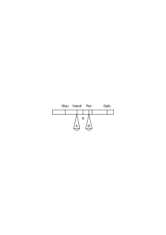

Es ist nun Unsinn, zu glauben, daß, wenn ich die Schale A auf Violett halte und B in das Feld Rot-Gelb hineinverschiebe, S sich gegen Rot hin bewegen wird. Und wie ist es mit den Gewichten, die ich auf die Schalen lege: Heißt es denn etwas, zu sagen, “_mehr_ von _diesem_ Rot”? Wenn ich nicht von Pigmenten spreche. Das kann nur dann etwas heißen, wenn ich unter reinem Rot eine bestimmte vorher angenommene Anzahl von Einheiten verstehe. Dann aber bedeutet die volle Anzahl dieser Einheiten nichts, als, daß die Wagschale auf _Rot_ steht. Es ist also mit den Verhältniszahlen wieder nur ein Ort der Wagschale aber nicht ein Ort und ein Gewicht angegeben.

### [PR](/w-pr/#ts-209-126.4) [126\[4\]](https://cdn.wittgensteinnachlass.com/2000px/webp/Ts-209/126.webp) {#1264}

Solange ich nun im Farbenkreis mit meinen beiden Grenzfarben – z.B. – im Gebiete Blau-Rot stehe und die rötere Farbe gegen Rot verschiebe, so kann ich sagen, daß die Resultante auch gegen Rot wandert. Überschreite ich aber mit der einen Grenzfarbe das Rot und bewege mich gegen Gelb, so wird die Resultierende nun nicht röter! Die Mischung eines gelblichen Rot mit einem Violett macht das Violett nicht röter, als die Mischung von reinem Rot und dem Violett. Daß das eine Rot nun gelber geworden ist, nimmt ja vom Rot etwas weg und gibt nicht Rot dazu.

### [PR](/w-pr/#ts-209-127.1) [127\[1\]](https://cdn.wittgensteinnachlass.com/2000px/webp/Ts-209/127.webp) {#1271}

Man könnte das auch so beschreiben: Habe ich einen Farbtopf mit violettem Pigment und einen mit Orange und nun vergrößere ich die Menge des der Mischung zugesetzten Orange, so wird zwar die Farbe der Mischung nach und nach aus dem Violett ins Orange übergehen, aber nicht über das reine Rot.

### [PR](/w-pr/#ts-209-127.2) [127\[2\]](https://cdn.wittgensteinnachlass.com/2000px/webp/Ts-209/127.webp) {#1272}

Ich kann von zwei verschiedenen Tönen von Orange sagen, daß ich von keinem Grund habe zu sagen, er liege näher an Rot als an Gelb. – Ein “in der Mitte” gibt es eben hier nicht. – Dagegen kann ich nicht zwei verschiedene Rot sehen und im Zweifel sein, ob eines, und welches, von ihnen das reine Rot ist. Das reine Rot ist eben ein Punkt, das Mittel zwischen Gelb und Rot aber nicht.

### [PR](/w-pr/#ts-209-127.3) [127\[3\]](https://cdn.wittgensteinnachlass.com/2000px/webp/Ts-209/127.webp) {#1273}

Es ist freilich wahr, daß man von einem Orange sagen kann, es sei beinahe Gelb, also es liege “näher am Gelb als am Rot” und Analoges von einem beinahe roten Orange. Daraus folgt aber nicht, daß es nun auch eine Mitte im Sinne eines Punktes zwischen Rot und Gelb geben müsse. Es ist eben hier ganz wie in der Geometrie des Gesichtsraums, verglichen mit der euklidischen. Es ist hier eine andere Art von Quantitäten als die, welche durch unsere rationalen Zahlen dargestellt werden. Die Begriffe näher und weiter sind eben hier überhaupt nicht zu brauchen, oder sind irreführend, wenn wir diese Worte anwenden.

### [PR](/w-pr/#ts-209-127.4) [127\[4\]](https://cdn.wittgensteinnachlass.com/2000px/webp/Ts-209/127.webp) {#1274}

Auch so: Von einer Farbe zu sagen, sie liege zwischen Rot und Blau bestimmt sie nicht scharf (eindeutig). Die reinen Farben aber müßte ich _eindeutig_ durch die Angabe bestimmen, sie liegen zwischen gewissen Mischfarben. Also bedeutet hier das Wort “dazwischen liegen” etwas _anderes_ als im ersten Fall. D.h.: Wenn der Ausdruck “dazwischen liegen” einmal die Mischung zweier einfachen Farben, ein andermal den gemeinsamen einfachen Bestandteil zweier Mischfarben bezeichnet, so ist die Multiplizität seiner Anwendung in jedem Falle eine andere. Und das ist _kein_ Grad Unterschied, sondern ein Ausdruck dafür, daß es sich um 2 ganz verschiedene Kategorien handelt.

### [PR](/w-pr/#ts-209-127.5) [127\[5\]](https://cdn.wittgensteinnachlass.com/2000px/webp/Ts-209/127.webp) {#1275}

Wir sagen, eine Farbe kann nicht zwischen Grüngelb und Blaurot liegen, in demselben Sinne, wie zwischen Rot und Gelb, aber das können wir nur sagen, weil wir in diesem Falle den Winkel von 45 Grad unterscheiden können; weil wir _Punkte_ Gelb, Rot sehen. Aber eben diese Unterscheidung gibt es im andern Fall – wo die Mischfarben als primär angenommen werden – nicht. Hier könnten wir also sozusagen nie sicher sein, ob die Mischung noch möglich ist oder nicht. Freilich könnte ich beliebige Mischfarben wählen und bestimmen, daß sie einen Winkel von 45 Graden einschließen, das wäre aber ganz willkürlich, wogegen es nicht willkürlich ist, wenn wir sagen, daß es keine Mischung von Blaurot und Grüngelb im ersten Sinne gibt. In dem einen Falle gibt die Grammatik also den “Winkel von 45 Grad” und nun glaubt man fälschlich, man brauche ihn nur zu halbieren und den nächsten Abschnitt ebenso um einen andern Abschnitt von 45 Grad zu kriegen. Aber hier bricht eben das _Gleichnis_ des Winkels zusammen.

### [PR](/w-pr/#ts-209-127.6) [127\[6\]](https://cdn.wittgensteinnachlass.com/2000px/webp/Ts-209/127.webp) {#1276}

Man kann freilich auch alle Farbtöne in einer geraden Linie anordnen, etwa mit den Grenzen Schwarz und Weiß, wie das geschehen ist, aber dann muß man eben durch Regeln gewisse Übergänge ausschließen und endlich muß das Bild auf der Geraden die gleiche Art des topologischen Zusammenhangs bekommen, wie auf dem Oktoeder. Es ist dies ganz analog, wie das Verhältnis der gewöhnlichen Sprache zu einer “logisch geklärten” Ausdrucksweise. Beide sind einander vollkommen äquivalent, nur drückt die eine die Regeln der Grammatik schon durch die äußere Erscheinung aus.

### [PR](/w-pr/#ts-209-128.2) [128\[2\]](https://cdn.wittgensteinnachlass.com/2000px/webp/Ts-209/128.webp) {#1282}

In wiefern kann man sagen, daß Grau _im selben Sinne_ eine Mischung von Schwarz und Weiß ist, in dem Orange eine Mischung von Rot und Gelb ist. Und nicht in dem Sinne zwischen Schwarz und Weiß liegt, in dem Rot zwischen Blaurot und Orange liegt. Stellt man die Farben durch einen Doppelkegel dar, statt eines Oktoeders, so gibt es auf dem Farbenkreis nur ein _Zwischen_, und Rot erscheint auf ihm in demselben Sinne zwischen Blaurot und Orange, in welchem Blaurot zwischen Blau und Rot liegt. Und wenn das wirklich alles ist, was man sagen kann, dann genügt die Darstellung durch den Doppelkegel, oder mindestens die durch eine doppelte achtseitige Pyramide.

### [PR](/w-pr/#ts-209-128.3) [128\[3\]](https://cdn.wittgensteinnachlass.com/2000px/webp/Ts-209/128.webp) {#1283}

Nun scheint es merkwürdigerweise von vornherein klar zu sein, daß man nicht in demselben Sinne sagen kann, Rot habe einen orangen Stich, wie, Orange hat einen rötlichen Stich. D.h. es scheint klar zu sein, daß die Ausdrucksweise “x besteht aus (ist ein Gemisch von) y und z” und “x ist der gemeinsame Bestandteil von y und z” hier nicht vertauschbar sind. Wären sie vertauschbar, so genügt die Relation _Zwischen_ zur Darstellung.

### [PR](/w-pr/#ts-209-128.4) [128\[4\]](https://cdn.wittgensteinnachlass.com/2000px/webp/Ts-209/128.webp) {#1284}

Die Ausdrucksweise “gemeinsamer Bestandteil von” und “Gemisch von” haben überhaupt nur dann verschiedene Bedeutung, wenn der eine dort verwendet werden kann, wo der andere nicht verwendet werden kann.

### [PR](/w-pr/#ts-209-128.5) [128\[5\]](https://cdn.wittgensteinnachlass.com/2000px/webp/Ts-209/128.webp) {#1285}

Nun sagt es nichts zu unserer Untersuchung, daß, wenn ich ein blaues und grünes Pigment mische, ich ein blaugrünes erhalte, wenn ich aber ein blaugrünes und blaurotes mische, kein blaues herauskommt.

### [PR](/w-pr/#ts-209-128.6) [128\[6\]](https://cdn.wittgensteinnachlass.com/2000px/webp/Ts-209/128.webp) {#1286}

Wenn ich mit meiner Auffassung recht habe, so ist es kein Satz “Rot ist eine reine Farbe” und was damit angezeigt werden soll keiner experimentellen Entscheidung fähig. Es ist dann nicht denkbar, daß mir einmal Rot, ein andermal Blaurot rein erscheinen sollte.

### [PR](/w-pr/#ts-209-128.7) [128\[7\]](https://cdn.wittgensteinnachlass.com/2000px/webp/Ts-209/128.webp) {#1287}

Es scheint außer dem Übergang von Farbe zu Farbe auf dem Farbenkreis noch einen bestimmten anderen zu geben, den wir vor uns haben, wenn wir kleine Flecke der einen Farbe mit kleinen Flecken der andern untermischt sehen. Ich meine hier natürlich einen _gesehenen_ Übergang. Und diese Art des Übergangs gibt dem Wort “Mischung” eine neue Bedeutung, die mit der Relation Zwischen auf dem Farbenkreis nicht zusammenfällt. Man könnte es so beschreiben: Einen orangefarbigen Fleck kann ich mir entstanden denken durch Untermischen kleiner roter und gelber Flecke, dagegen einen roten nicht durch Untermischen von violetten und orangefarbigen. – In diesem Sinne ist Grau eine Mischung von Schwarz und Weiß, und Rosa eine von Rot und Weiß, aber Weiß nicht eine Mischung von Rosa und einem weißlichen Grün. Nun meine ich aber nicht, daß es durch ein Experiment der Mischung festgestellt wird, daß gewisse Farben so aus anderen entstehen. Ich könnte das Experiment etwa mit einer rotierenden Farbenscheibe anstellen. Es kann dann gelingen, oder nicht gelingen, aber das zeigt nur, ob der betreffende visuelle Vorgang auf diese physikalische Weise hervorzurufen ist, oder nicht; es zeigt aber nicht, ob er möglich ist. Genau so, wie die physikalische Unterteilung einer Fläche nicht die visuelle Teilbarkeit beweisen oder widerlegen kann. Denn angenommen, ich sehe eine physikalische Unterteilung nicht mehr als visuelle Unterteilung, sehe aber die nicht geteilte Fläche im betrunkenen Zustande geteilt, war dann die visuelle Fläche nicht teilbar?

### [PR](/w-pr/#ts-209-129.1) [129\[1\]](https://cdn.wittgensteinnachlass.com/2000px/webp/Ts-209/129.webp) {#1291}

Wenn mir 2 nahe aneinander liegende – etwa – rötliche Farbtöne gegeben sind, so ist es unmöglich darüber zu zweifeln, ob beide zwischen Rot und Blau, beide zwischen Rot und Gelb, oder der eine zwischen Rot und Blau, der andere zwischen Rot und Gelb gelegen ist. Und mit dieser Entscheidung haben wir auch entschieden, ob beide sich mit Blau, mit Gelb, oder der eine sich mit Blau, der andere mit Gelb mischen, und das gilt, wie nahe immer man die Farbtöne aneinander bringt, solange wir die Pigmente überhaupt der Farbe nach unterscheiden können.

### [PR](/w-pr/#ts-209-129.2) [129\[2\]](https://cdn.wittgensteinnachlass.com/2000px/webp/Ts-209/129.webp) {#1292}

Wenn man frägt, ob die Tonleiter eine unendliche Möglichkeit der Fortsetzung in sich trägt, so ist die Antwort nicht dadurch gegeben, daß man Luftschwingungen, die eine gewisse Schwingungszahl überschreiten nicht mehr als Töne wahrnimmt, denn es könnte ja die Möglichkeit bestehen, höhere Tonempfindungen auf andere Art und Weise hervorzurufen. Die Endlichkeit der Tonleiter kann vielmehr nur aus ihren internen Eigenschaften hervorgehen. Etwa so, indem man es einem Ton _selber_ anerkennt, daß er der Abschluß ist, daß also dieser letzte Ton, oder die letzten Töne, innere Eigenschaften zeigen, die die mittleren nicht haben. So wie dünne Linien in unserem Gesichtsfeld interne Eigenschaften zeigen, die die dickeren nicht haben, so daß es eine Linie in unserem Gesichtsfeld gibt, die keine Farbgrenze ist, sondern selbst Farbe hat und doch in einem bestimmten Sinne keine Breite hat, sodaß bei ihrem Schnitt mit einer anderen ebensolchen nicht 4 Punkte A, B, C, D gesehen werden.

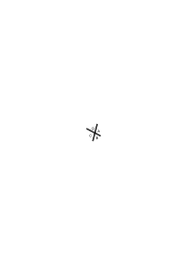

### [PR](/w-pr/#ts-209-129.3) [129\[3\]](https://cdn.wittgensteinnachlass.com/2000px/webp/Ts-209/129.webp) {#1293}

Die Gefahr, die darin liegt Dinge einfacher sehen zu wollen, als sie in Wirklichkeit sind, wird heute oft sehr überschätzt. Diese Gefahr besteht aber tatsächlich im höchsten Grade in der phänomenologischen Untersuchung der Sinneseindrücke. Diese werden immer für _viel_ einfacher gehalten als sie sind.

### [PR](/w-pr/#ts-209-129.4) [129\[4\]](https://cdn.wittgensteinnachlass.com/2000px/webp/Ts-209/129.webp) {#1294}

Wenn ich die Regelmäßigkeit einer Figur sehe, die ich früher nicht bemerkt habe, so sehe ich jetzt eine andere Figur. So kann ich !!!!!!∣∣∣∣∣∣ ∣∣∣∣∣∣ als Spezialfall von !!∣∣ !!∣∣ !!∣∣ ∣∣ ∣∣ ∣∣ oder von !!!∣∣∣ !!!∣∣∣ ∣∣∣ ∣∣∣ oder von !∣ !!!!∣∣∣∣ !∣ ∣ ∣∣∣∣ ∣ sehen etc. Das zeigt bloß, daß was wir sehen nicht so einfach ist, als es scheint.

### [PR](/w-pr/#ts-209-129.5) [129\[5\]](https://cdn.wittgensteinnachlass.com/2000px/webp/Ts-209/129.webp) {#1295}

Eine Kirchentonart verstehen, heißt nicht, sich an die Tonfolge gewöhnen, in dem Sinne, in dem ich mich an einen Geruch gewöhnen kann und ihn nach einiger Zeit nicht mehr unangenehm empfinde. Sondern es heißt, etwas Neues hören, was ich früher noch nicht gehört habe, etwa in der Art – ja ganz analog – wie es wäre 10 Striche !!!!!!!!!!∣∣∣∣∣∣∣∣∣∣ ∣∣∣∣∣∣∣∣∣∣, die ich früher nur als 2 mal 5 Striche habe sehen können, plötzlich als ein charakteristisches Ganzes sehen zu können. Oder die Zeichnung eines Würfels, die ich nur als flaches Ornament habe sehen können, auf einmal räumlich zu sehen.

### [PR](/w-pr/#ts-209-129.6) [129\[6\]](https://cdn.wittgensteinnachlass.com/2000px/webp/Ts-209/129.webp) {#1296}

Die Grenzenlosigkeit des Gesichtsraumes ist am klarsten, wenn wir nichts sehen, bei vollständiger Dunkelheit.

### [PR](/w-pr/#ts-209-129.7) [129\[7\]](https://cdn.wittgensteinnachlass.com/2000px/webp/Ts-209/129.webp) {#1297}

Der Satz, die Hypothese, ist mit der Wirklichkeit gekuppelt und mehr oder weniger lose. Im extremen Fall besteht keine Verbindung mehr, die Wirklichkeit kann tun, was sie will, ohne mit dem Satz in Konflikt zu kommen: dann ist der Satz, die Hypothese, sinnlos! –

### [PR](/w-pr/#ts-209-129.8) [129\[8\]](https://cdn.wittgensteinnachlass.com/2000px/webp/Ts-209/129.webp) {#1298}

Alles Wesentliche ist, daß die Zeichen sich, in wie immer komplizierter Weise, am Schluß doch auf die unmittelbare Erfahrung beziehen und nicht auf ein Mittelglied (ein Ding an sich).

### [PR](/w-pr/#ts-209-130.1) [130\[1\]](https://cdn.wittgensteinnachlass.com/2000px/webp/Ts-209/130.webp) {#1301}

Alles was nötig ist, damit unsere Sätze (über die Wirklichkeit) Sinn haben, ist, daß unsere Erfahrung in _irgend einem Sinne_ mit ihnen eher übereinstimmt oder eher nicht übereinstimmt. D.h., die unmittelbare Erfahrung muß nur irgend etwas an ihnen, irgend _eine_ Fassette bewahrheiten. Und dieses Bild ist ja unmittelbar aus der Wirklichkeit genommen, denn wir sagen “hier ist ein Sessel”, wenn wir nur _eine_ Seite von ihm sehen.

### [PR](/w-pr/#ts-209-130.2) [130\[2\]](https://cdn.wittgensteinnachlass.com/2000px/webp/Ts-209/130.webp) {#1302}

Nach meinem Prinzip müssen die beiden Annahmen ihrem Sinne nach identisch sein, wenn alle _mögliche_ Erfahrung, die die eine bestätigt, auch die andere bestätigt. Wenn also keine Entscheidung zwischen den beiden durch die Erfahrung denkbar ist.

### [PR](/w-pr/#ts-209-130.3) [130\[3\]](https://cdn.wittgensteinnachlass.com/2000px/webp/Ts-209/130.webp) {#1303}

Ein Satz, so aufgefaßt, daß er unkontrollierbar wahr und falsch sein kann, ist von der Realität gänzlich detachiert und funktioniert nicht mehr als Satz.

### [PR](/w-pr/#ts-209-130.4) [130\[4\]](https://cdn.wittgensteinnachlass.com/2000px/webp/Ts-209/130.webp) {#1304}

Die Anschauungen neuerer Physiker (Eddington) stimmen ganz mit der meinen überein, wenn sie sagen, daß die Zeichen in ihren Gleichungen keine “Bedeutungen” mehr haben, und daß die Physik zu keinen solchen Bedeutungen gelangen kann, sondern bei den Zeichen stehen bleiben muß. Sie sehen nämlich nicht, daß diese Zeichen insofern Bedeutung haben – und nur insofern – als ihnen das unmittelbar beobachtete Phänomen (etwa Lichtpunkte) entspricht, oder nicht entspricht.

### [PR](/w-pr/#ts-209-130.5) [130\[5\]](https://cdn.wittgensteinnachlass.com/2000px/webp/Ts-209/130.webp) {#1305}

Das Phänomen ist nicht Symptom für etwas anderes, sondern ist die Realität. Das Phänomen ist nicht Symptom für etwas anderes, was den Satz erst wahr oder falsch macht, sondern ist selbst das was ihn verifiziert.

### [PR](/w-pr/#ts-209-130.6) [130\[6\]](https://cdn.wittgensteinnachlass.com/2000px/webp/Ts-209/130.webp) {#1306}

Die Hypothese ist ein logisches Gebilde. D.h. ein Symbol, wofür gewisse Regeln der Darstellung gelten.

### [PR](/w-pr/#ts-209-130.7) [130\[7\]](https://cdn.wittgensteinnachlass.com/2000px/webp/Ts-209/130.webp) {#1307}

Das Reden von Sinnesdaten und der unmittelbaren Erfahrung hat den Sinn, daß wir eine nicht-hypothetische Darstellung suchen. Wenn eine Hypothese nicht definitiv verifiziert werden kann, so kann sie überhaupt nicht verifiziert werden und es gibt für sie nicht Wahr- und Falschheit.

### [PR](/w-pr/#ts-209-130.8) [130\[8\]](https://cdn.wittgensteinnachlass.com/2000px/webp/Ts-209/130.webp) {#1308}

Meine Erfahrung spricht dafür, daß _diese_ Hypothese sie und die zukünftige Erfahrung _einfach_ wird darstellen können. Zeigt es sich, daß eine andere Hypothese das Erfahrungsmaterial einfacher darstellt, so wähle ich die einfachere Methode. Die Wahl der Darstellung ist ein Vorgang, der auf der sogenannten Induktion (nicht der mathematischen) beruht.

### [PR](/w-pr/#ts-209-130.9) [130\[9\]](https://cdn.wittgensteinnachlass.com/2000px/webp/Ts-209/130.webp) {#1309}

So könnte man den Verlauf einer Erfahrung, der sich in dem Verlauf einer Kurve darstellt, durch verschiedene Kurven darzustellen versuchen, je nachdem, wieviel uns von dem tatsächlichen Verlauf bekannt ist.

### [PR](/w-pr/#ts-209-130.10) [130\[10\]](https://cdn.wittgensteinnachlass.com/2000px/webp/Ts-209/130.webp) {#13010}

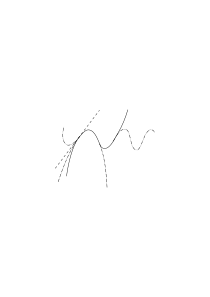

Die Linie ist der tatsächliche Verlauf, soweit er überhaupt beobachtet wurde. Die Linien a, b, c stellen Darstellungsversuche dar, denen ein mehr oder weniger großes Stück des ganzen Beobachtungsmaterials zu Grunde liegt.

### [PR](/w-pr/#ts-209-131.1) [131\[1\]](https://cdn.wittgensteinnachlass.com/2000px/webp/Ts-209/131.webp) {#1311}

Man gibt die Hypothese nur um einen immer höheren Preis auf.

### [PR](/w-pr/#ts-209-131.2) [131\[2\]](https://cdn.wittgensteinnachlass.com/2000px/webp/Ts-209/131.webp) {#1312}

Die Induktion ist ein Vorgang nach einem ökonomischen Prinzip.

### [PR](/w-pr/#ts-209-131.3) [131\[3\]](https://cdn.wittgensteinnachlass.com/2000px/webp/Ts-209/131.webp) {#1313}

Die Hypothese steht mit der Realität gleichsam in einem loseren Zusammenhang, als dem der Verifikation.

### [PR](/w-pr/#ts-209-131.4) [131\[4\]](https://cdn.wittgensteinnachlass.com/2000px/webp/Ts-209/131.webp) {#1314}

Die Frage der Einfachheit der Darstellung durch eine bestimmte angenommene Hypothese hängt, glaube ich, unmittelbar mit der Frage der Wahrscheinlichkeit zusammen.

### [PR](/w-pr/#ts-209-131.5) [131\[5\]](https://cdn.wittgensteinnachlass.com/2000px/webp/Ts-209/131.webp) {#1315}

Eine Hypothese könnte man offenbar durch Bilder erklären. Ich meine, man könnte z.B. die Hypothese “hier liegt ein Buch” durch Bilder erklären, die das Buch im Grundriß, Aufriß, und verschiedenen Schnitten zeigen.

### [PR](/w-pr/#ts-209-131.6) [131\[6\]](https://cdn.wittgensteinnachlass.com/2000px/webp/Ts-209/131.webp) {#1316}

Eine solche Darstellung gibt ein _Gesetz_. Wie die Gleichung einer Kurve ein Gesetz gibt, nach der die Ordinatenabschnitte aufzufinden sind, wenn man in verschiedenen Abszissen schneidet. Die fallweisen Verifikationen entsprechen dann solchen wirklich ausgeführten Schnitten. Wenn unsere Erfahrungen die Punkte auf einer Geraden ergeben, so ist der Satz, daß diese Erfahrungen die verschiedenen Ansichten einer Geraden sind, eine Hypothese. Die Hypothese ist eine Art der Darstellung dieser Realität, denn eine neue Erfahrung kann mit ihr übereinstimmen oder nicht übereinstimmen, bezw. eine Änderung der Hypothese nötig machen.

### [PR](/w-pr/#ts-209-131.7) [131\[7\]](https://cdn.wittgensteinnachlass.com/2000px/webp/Ts-209/131.webp) {#1317}

Das Wesen einer Hypothese ist , glaube ich, daß sie eine Erwartung erzeugt, indem sie eine zukünftige Bestätigung zuläßt. D.h., es ist das Wesen einer Hypothese, daß ihre Bestätigung nie abgeschlossen ist. Wenn ich sage, daß eine Hypothese nicht definitiv verifizierbar ist, so ist damit _nicht_ gemeint, daß es für sie eine Verifikation gibt, der man sich immer mehr nähern kann, ohne sie je zu erreichen. Das ist Unsinn und einer, in den man oft verfällt. Sondern eine Hypothese hat zur Realität eben eine andere formelle Relation, als die der Verifikation. (Daher sind hier natürlich auch die Worte “wahr” und “falsch” nicht anzuwenden oder haben eine andere Bedeutung).

### [PR](/w-pr/#ts-209-131.8) [131\[8\]](https://cdn.wittgensteinnachlass.com/2000px/webp/Ts-209/131.webp) {#1318}

Die Natur des Glaubens an die Gleichförmigkeit des Geschehens wird _vielleicht_ am klarsten im Falle, in dem wir Furcht vor dem erwarteten Ereignis empfinden. Nichts könnte mich dazu bewegen, meine Hand in die Flamme zu stecken, obwohl ich mich doch _nur in der Vergangenheit_ verbrannt habe.

### [PR](/w-pr/#ts-209-131.9) [131\[9\]](https://cdn.wittgensteinnachlass.com/2000px/webp/Ts-209/131.webp) {#1319}

Wenn die Physik einen Körper von bestimmter Form im physikalischen Raum beschreibt, so muß sie, wenn auch unausgesprochen, die Möglichkeit der Verifikation annehmen. Die Stellen müssen vorgesehen sein, wo die Hypothese mit der unmittelbaren Erfahrung zusammenhängt.

### [PR](/w-pr/#ts-209-132.1) [132\[1\]](https://cdn.wittgensteinnachlass.com/2000px/webp/Ts-209/132.webp) {#1321}

Eine Hypothese ist ein Gesetz zur Bildung von Sätzen. Man könnte auch sagen: Eine Hypothese ist ein Gesetz zur Bildung von Erwartungen. Ein Satz ist sozusagen ein Schnitt durch eine Hypothese in einem bestimmten Ort.

### [PR](/w-pr/#ts-209-132.2) [132\[2\]](https://cdn.wittgensteinnachlass.com/2000px/webp/Ts-209/132.webp) {#1322}

Die Wahrscheinlichkeit einer Hypothese hat ihr Maß darin, wieviel Evidenz nötig ist, um es vorteilhaft zu machen, sie umzustoßen. Nur in diesem Sinne kann man sagen, daß wiederholte gleichförmige Erfahrung in der Vergangenheit das Andauern dieser Gleichförmigkeit in der Zukunft wahrscheinlich macht. Wenn ich nun in diesem Sinne sage: Ich nehme an, daß morgen die Sonne wieder aufgehen wird, weil das Gegenteil zu unwahrscheinlich ist, so meine ich hier mit “wahrscheinlich” oder “unwahrscheinlich” etwas ganz Anderes, als mit diesen Worten im Satz “es ist gleich wahrscheinlich, daß ich Kopf oder Adler werfe” gemeint ist. Die beiden Bedeutungen des Wortes “wahrscheinlich” stehen zwar in einem gewissen Zusammenhang, aber sie sind nicht identisch.

### [PR](/w-pr/#ts-209-132.3) [132\[3\]](https://cdn.wittgensteinnachlass.com/2000px/webp/Ts-209/132.webp) {#1323}

Es ist das Wesentliche, daß ich die Erwartung nicht nur mit dem muß vergleichen können, was als die endgültige Antwort (Verifikation oder Falsifikation) betrachtet wird, sondern auch mit dem gegenwärtigen Stand der Dinge. Nur das macht die Erwartung zum Bild. D.h.: Sie muß _jetzt_ Sinn haben.

### [PR](/w-pr/#ts-209-132.4) [132\[4\]](https://cdn.wittgensteinnachlass.com/2000px/webp/Ts-209/132.webp) {#1324}

Zu sagen, ich sehe etwa eine Kugel, heißt nichts anderes als, ich habe einen Anblick, wie ihn eine Kugel gewährt, aber das heißt nur, daß ich nach einem bestimmten Gesetz, dem der Kugel, Anblicke konstruieren kann und daß dies ein solcher ist.

### [PR](/w-pr/#ts-209-132.5) [132\[5\]](https://cdn.wittgensteinnachlass.com/2000px/webp/Ts-209/132.webp) {#1325}

Die Beschreibung der Phänomene mittels der Hypothese der Körperwelt ist unumgänglich durch ihre Einfachheit, verglichen mit der unfaßbar komplizierten phänomenologischen Beschreibung. Wenn ich verschiedene zerstreute Stücke einer Kreislinie sehe, so ist ihre genaue direkte Beschreibung vielleicht unmöglich, aber die Angabe, daß es die Stücke eines Kreises sind, den ich, aus nicht weiter untersuchten Gründen, nicht ganz sehe, – ist einfach.

### [PR](/w-pr/#ts-209-132.6) [132\[6\]](https://cdn.wittgensteinnachlass.com/2000px/webp/Ts-209/132.webp) {#1326}

Diese Beschreibung führt immer irgendeinen Parameter ein, dessen Untersuchung wir für unsere Zwecke unterlassen dürfen.

### [PR](/w-pr/#ts-209-132.7) [132\[7\]](https://cdn.wittgensteinnachlass.com/2000px/webp/Ts-209/132.webp) {#1327}

Was ist der Unterschied, zwischen der logischen Multiplizität einer Erklärung der Erscheinungen durch die Naturwissenschaft und der logischen Multiplizität einer Beschreibung?

### [PR](/w-pr/#ts-209-132.8) [132\[8\]](https://cdn.wittgensteinnachlass.com/2000px/webp/Ts-209/132.webp) {#1328}

Wäre z.B. ein gleichmäßig tickendes Geräusch in der Physik darzustellen, so würde dazu die Multiplizität des Bildes

<math display="block">
  <mtext>├</mtext>
  <mtext>─</mtext>
  <mtext>─</mtext>
  <mtext>─</mtext>
  <mtext>┼</mtext>
  <mtext>─</mtext>
  <mtext>─</mtext>
  <mtext>─</mtext>
  <mtext>┼</mtext>
  <mtext>─</mtext>
  <mtext>─</mtext>
  <mtext>─</mtext>
  <mtext>┼</mtext>
  <mtext>─</mtext>
  <mtext>─</mtext>
  <mtext>─</mtext>
  <mtext>┼</mtext>
  <mtext>─</mtext>
  <mtext>─</mtext>
  <mtext>─</mtext>
  <mtext>┼</mtext>
  <mtext>–</mtext>
  <mspace width="0.3em"/>
  <mtext>→</mtext>
</math>

genügen, aber hier handelt es sich nicht um die logische Multiplizität des Tones, sondern um die der Regelmäßigkeit der beobachteten Erscheinung. Und so stellt die Relativitäts-Theorie nicht etwa die logische Mannigfaltigkeit der Phänomene selbst dar, sondern die Mannigfaltigkeit der beobachteten Regelmäßigkeiten.

### [PR](/w-pr/#ts-209-133.1) [133\[1\]](https://cdn.wittgensteinnachlass.com/2000px/webp/Ts-209/133.webp) {#1331}

Drücken wir z.B. den Satz, daß eine Kugel sich in einer bestimmten Entfernung von unseren Augen befindet mit Hilfe eines Koordinatensystems und der Kugelgleichung aus, so hat diese Beschreibung eine größere Mannigfaltigkeit, als die einer Verifikation durch das Auge. Jene Mannigfaltigkeit entspricht nicht _einer_ Verifikation, sondern einem _Gesetz_, welchem Verifikationen gehorchen.

### [PR](/w-pr/#ts-209-133.2) [133\[2\]](https://cdn.wittgensteinnachlass.com/2000px/webp/Ts-209/133.webp) {#1332}

Solange man sich unter der Seele ein _Ding_, einen _Körper_ vorstellt, der in unserem Kopfe ist, solange ist diese Hypothese _nicht_ gefährlich. Nicht in der Unvollkommenheit und Rohheit unserer Modelle liegt die Gefahr, sondern in ihrer Unklarheit (Undeutlichkeit). Die Gefahr beginnt, wenn wir merken, daß das alte Modell nicht genügt, es nun aber nicht ändern, sondern nur gleichsam sublimieren. Solange ich sage, der Gedanke ist in meinem Kopf, ist alles in Ordnung; gefährlich wird es, wenn wir sagen, der Gedanke ist nicht in meinem Kopfe, aber in meinem Geist.

### [PR](/w-pr/#ts-209-133.3) [133\[3\]](https://cdn.wittgensteinnachlass.com/2000px/webp/Ts-209/133.webp) {#1333}

Was man mit einem Satze meinen _kann_, das _darf_ man auch mit ihm meinen. Wenn Leute sagen, mit dem Satz “hier steht ein Sessel” meine ich nicht bloß, was die unmittelbare Erfahrung mir zeigt, sondern noch etwas darüber hinaus, so kann man nur antworten: Was ihr meinen könnt, muß mit irgend einer Art von Erfahrung zusammenhängen, und was immer ihr meinen _könnt_, ist unantastbar.

### [PR](/w-pr/#ts-209-133.4) [133\[4\]](https://cdn.wittgensteinnachlass.com/2000px/webp/Ts-209/133.webp) {#1334}

Man kann einen Teil einer Hypothese vergleichen mit der Bewegung eines Teils eines Getriebes, einer Bewegung, die man festlegen kann, ohne dadurch die bezweckte Bewegung zu präjudizieren. Wohl aber hat man dann das übrige Getriebe auf eine bestimmte Art einzurichten, daß es die gewünschte Bewegung hervorbringt. Ich denke an ein Differentialgetriebe. –

Habe ich die Entscheidung getroffen, daß von einem gewissen Teil meiner Hypothese nicht abgewichen werden soll, was immer die zu beschreibende Erfahrung sei, so habe ich eine Darstellungsweise festgelegt und jener Teil der Hypothese ist nun ein Postulat. Ein Postulat muß von solcher Art sein, daß keine denkbare Erfahrung es widerlegen kann, wenn es auch äußerst unbequem sein mag, an dem Postulat festzuhalten. In dem Maße, wie man hier von einer größeren oder geringeren Bequemlichkeit reden kann, gibt es eine größere oder geringere Wahrscheinlichkeit des Postulats.

### [PR](/w-pr/#ts-209-133.5) [133\[5\]](https://cdn.wittgensteinnachlass.com/2000px/webp/Ts-209/133.webp) {#1335}

Von einem Maß dieser Wahrscheinlichkeit zu reden, ist nun vorderhand sinnlos. Es verhält sich hier ähnlich, wie im Falle, etwa, zweier Zahlenarten, wo wir mit einem gewissen Recht sagen können, die eine sei der andern ähnlicher (stehe ihr näher) als einer dritten, ein zahlenmäßiges Maß der Ähnlichkeit aber nicht existiert. Man könnte sich natürlich auch in solchen Fällen ein Maß konstruiert denken, indem man etwa die Postulate oder Axiome zählt, die beide Systeme gemein haben etc. etc.

### [PR](/w-pr/#ts-209-134.1) [134\[1\]](https://cdn.wittgensteinnachlass.com/2000px/webp/Ts-209/134.webp) {#1341}

Wir können unser altes Prinzip auf die Sätze, die eine Wahrscheinlichkeit ausdrücken, anwenden und sagen, daß wir ihren Sinn erkennen werden, wenn wir bedenken, was sie verifiziert. Wenn ich sage “das wird wahrscheinlich eintreffen”, wird dieser Satz durch das Eintreffen verifiziert, oder durch das Nichteintreffen falsifiziert? Ich glaube, offenbar nein. Dann sagt er auch nichts darüber aus. Denn, wenn ein Streit darüber entstünde, ob es wahrscheinlich ist oder nicht, so würden immer nur Argumente aus der Vergangenheit herangezogen werden. Und auch dann nur, wenn es bereits bekannt wäre, was eingetroffen ist.

### [PR](/w-pr/#ts-209-134.2) [134\[2\]](https://cdn.wittgensteinnachlass.com/2000px/webp/Ts-209/134.webp) {#1342}

Wenn man die Gedanken über Wahrscheinlichkeit und ihre Anwendung betrachtet, so ist es immer, als vermischten sich a priori und a posteriori, als könnte derselbe Sachverhalt durch Erfahrung gefunden oder bestätigt werden, dessen Bestehen a priori einleuchtet. Das zeigt natürlich, daß in unseren Gedanken etwas nicht in Ordnung ist und zwar vermengen wir scheinbar immer das angenommene Naturgesetz mit der Erfahrung.

### [PR](/w-pr/#ts-209-134.3) [134\[3\]](https://cdn.wittgensteinnachlass.com/2000px/webp/Ts-209/134.webp) {#1343}

Es scheint nämlich immer, als stimmte unsere Erfahrung (etwa beim Mischen) mit der a priori berechneten Wahrscheinlichkeit überein. Aber das ist Unsinn. Wenn die Erfahrung mit der Berechnung übereinstimmt, so heißt das, es wird durch die Erfahrung meine Berechnung gerechtfertigt und natürlich nicht das an ihr, was a priori ist, sondern die Grundlagen, die a posteriori sind. Das aber müssen gewisse Naturgesetze sein, die ich zur Grundlage meiner Berechnungen nehme, und _diese_ werden bestätigt, nicht die Wahrscheinlichkeitsrechnung.

### [PR](/w-pr/#ts-209-134.4) [134\[4\]](https://cdn.wittgensteinnachlass.com/2000px/webp/Ts-209/134.webp) {#1344}

Die Wahrscheinlichkeitsrechnung kann das Naturgesetz nur auf eine andere Form bringen. Sie transformiert das Naturgesetz. Sie ist das Medium durch welches wir das Naturgesetz betrachten, und anwenden.

### [PR](/w-pr/#ts-209-134.5) [134\[5\]](https://cdn.wittgensteinnachlass.com/2000px/webp/Ts-209/134.webp) {#1345}

Wenn ich z.B. würfle, so kann ich scheinbar a priori vorhersagen, daß die Ziffer 1 durchschnittlich in 6 Würfen einmal vorkommen wird und kann das dann durch die Erfahrung bestätigen. Aber durch das Experiment bestätige ich nicht die Rechnung, sondern das angenommene Naturgesetz, das mir die Wahrscheinlichkeitsrechnung in verschiedenen Formen darbieten kann. Ich kontrolliere durch das Medium der Wahrscheinlichkeitsrechnung hindurch, das Naturgesetz, das der Rechnung zugrunde liegt. Dieses Naturgesetz stellt sich in unserem Falle so dar, daß die Wahrscheinlichkeit, daß die einzelnen Flächen oben zu liegen kommen, für alle 6 Flächen die gleiche ist. Dieses Gesetz ist es, was wir überprüfen.

### [PR](/w-pr/#ts-209-134.6) [134\[6\]](https://cdn.wittgensteinnachlass.com/2000px/webp/Ts-209/134.webp) {#1346}

Dies ist natürlich nur dann ein Naturgesetz, wenn es durch einen bestimmten Versuch bestätigt und auch durch einen bestimmten Versuch widerlegt werden kann. Das ist in der gewöhnlichen Auffassung nicht der Fall, denn, wenn _jedes_ Ereignis durch irgend ein Zeitintervall gerechtfertigt werden kann, so kann _jede beliebige_ Erfahrung mit dem Gesetz in Übereinstimmung gebracht werden. D.h. aber, das Gesetz läuft leer; es ist sinnlos.

### [PR](/w-pr/#ts-209-134.7) [134\[7\]](https://cdn.wittgensteinnachlass.com/2000px/webp/Ts-209/134.webp) {#1347}

Gewisse mögliche Ereignisse müssen dem Gesetz, wenn es überhaupt eines sein soll, widersprechen und treten diese ein, so müssen sie durch ein anderes Gesetz erklärt werden.

### [PR](/w-pr/#ts-209-135.1) [135\[1\]](https://cdn.wittgensteinnachlass.com/2000px/webp/Ts-209/135.webp) {#1351}

Man wettet immer auf eine Möglichkeit unter der Annahme der Uniformität der Naturgeschehnisse.

### [PR](/w-pr/#ts-209-135.2) [135\[2\]](https://cdn.wittgensteinnachlass.com/2000px/webp/Ts-209/135.webp) {#1352}

Wenn man sagt, die Moleküle eines Gases bewegen sich nach den Gesetzen der Wahrscheinlichkeit, so macht das den Eindruck, als bewegten sie sich nach irgend welchen Gesetzen a priori. Das ist natürlich Unsinn. Die Gesetze der Wahrscheinlichkeit, d.h. die, die der Rechnung zu _Grunde_ liegen sind hypothetische Annahmen, die dann von der Rechnung ausgeschrotet und in anderer Form von der Erfahrung bestätigt – oder widerlegt – werden.

### [PR](/w-pr/#ts-209-135.3) [135\[3\]](https://cdn.wittgensteinnachlass.com/2000px/webp/Ts-209/135.webp) {#1353}

Wenn man das ansieht, was man die aprioristische Wahrscheinlichkeit nennt und dann ihre Bestätigung durch die relative Häufigkeit von Ereignissen, so fällt einem vor allem auf, daß die Wahrscheinlichkeit a priori, die gleichsam etwas Glattes ist, die relative Häufigkeit bedingen soll, die etwas Ungleichmäßiges ist. Wenn die beiden Heubündel gleich groß und in gleicher Entfernung sind, so würde das erklären, daß der Esel zwischen beiden untätig stehen bleibt, aber es ist keine Erklärung dafür, daß er ungefähr ebenso oft von dem einen als von dem andern frißt. _Das_ bedarf _anderer_ Naturgesetze zu seiner Erklärung. – Die Tatsache, daß der Würfel homogen und genau gleichseitig ist und daß die mir bekannten Naturgesetze nichts über das Resultat eines Wurfes sagen, genügt nicht, um auf eine ungefähr gleichmäßige Verteilung der Ziffern 1 bis 6 in den Wurfresultaten zu schließen. Vielmehr liegt in der Voraussage, daß eine solche Verteilung der Fall sein wird, eine Annahme über jene Naturgesetze, die ich _nicht_ genau kenne. Eben die Annahme, daß _sie_ eine solche Verteilung hervorbringen werden.

### [PR](/w-pr/#ts-209-135.4) [135\[4\]](https://cdn.wittgensteinnachlass.com/2000px/webp/Ts-209/135.webp) {#1354}

Widerspricht folgende Tatsache nicht meiner Auffassung von der Wahrscheinlichkeit: Es ist offenbar denkbar, daß jemand, der täglich würfelt – sagen wir – eine Woche lang nur Einser wirft, und zwar, nicht darum, weil die Würfel schlecht sind, sondern einfach, weil sich die Bewegung seiner Hand, die Lage des Würfels im Becher, die Reibung an der Tischfläche, so zusammenfinden, daß sich immer dieses Resultat ergibt. Der Mann hat den Würfel untersucht, auch gefunden, daß er, wenn ihn andere werfen die normalen Ergebnisse liefert. Hat er nun Grund zu denken, daß hier ein Naturgesetz waltet, das ihn immer Einser werfen läßt; hat er Grund zu glauben, daß das nun wohl so weitergehen wird, oder hat er Grund anzunehmen, daß diese Regelmäßigkeit nicht lange mehr dauern kann? D.h.: hat er Grund das Spiel aufzugeben, da es sich gezeigt hat, daß er nur Einser werfen kann, oder weiterzuspielen, da es nur um so wahrscheinlicher ist, daß er jetzt eine höhere Zahl werfen wird? In Wirklichkeit wird er sich weigern es als ein Naturgesetz anzuerkennen, daß er nur Einser werfen kann. Zum mindesten wird es lange andauern müssen, ehe er diese Möglichkeit in Betracht zieht. Aber warum? Ich glaube, weil so viel frühere Erfahrung im Leben gegen ein solches Naturgesetz spricht, die alle – sozusagen – erst überwunden werden muß, ehe wir eine ganz neue Betrachtungsweise akzeptieren.

### [PR](/w-pr/#ts-209-135.5) [135\[5\]](https://cdn.wittgensteinnachlass.com/2000px/webp/Ts-209/135.webp) {#1355}

Wenn wir aus der relativen Häufigkeit eines Ereignisses auf seine relative Häufigkeit in der Zukunft Schlüsse ziehen, so können wir das natürlich nur nach der bisher tatsächlich beobachteten Häufigkeit tun. Und nicht nach einer, die wir aus der beobachteten durch irgend einen Prozeß der Wahrscheinlichkeitsrechnung erhalten haben. Denn die berechnete Wahrscheinlichkeit stimmt _mit jeder beliebigen_ tatsächlich beobachteten Häufigkeit überein, da sie die Zeit offen läßt.

### [PR](/w-pr/#ts-209-136.1) [136\[1\]](https://cdn.wittgensteinnachlass.com/2000px/webp/Ts-209/136.webp) {#1361}

Wenn sich der Spieler, oder die Versicherungsgesellschaft, nach der Wahrscheinlichkeit richten, so richten sie sich nicht nach der Wahrscheinlichkeitsrechnung, denn nach dieser allein kann man sich nicht richten, da, _was immer_ geschieht, mit ihr in Übereinstimmung zu bringen ist; sondern die Versicherungsgesellschaft richtet sich nach einer tatsächlich beobachteten Häufigkeit. Und zwar ist das natürlich eine absolute Häufigkeit.

### [PR](/w-pr/#ts-209-136.2) [136\[2\]](https://cdn.wittgensteinnachlass.com/2000px/webp/Ts-209/136.webp) {#1362}

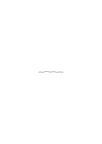

Die Gleichung dieser Linie kann man darstellen als Gleichung einer Geraden mit einem variablen Parameter, dessen Verlauf die Abweichungen von der Geraden ausdrückt. Es ist nicht wesentlich, daß diese Abweichungen “gering” seien. Sie können so groß sein, daß die Linie einer Geraden nicht ähnlich sieht. Die “Gerade mit Abweichungen” ist _nur eine Form_ der Beschreibung. Sie macht es mir möglich, einen bestimmten Teil der Beschreibung zu vernachlässigen – wenn ich will. (Die Form der “Regel mit Ausnahmen”).

### [PR](/w-pr/#ts-209-136.3) [136\[3\]](https://cdn.wittgensteinnachlass.com/2000px/webp/Ts-209/136.webp) {#1363}

Die Galton'sche Photographie ist das Bild einer Wahrscheinlichkeit. Das Gesetz der Wahrscheinlichkeit ist das Naturgesetz, was man sieht, wenn man blinzelt.

### [PR](/w-pr/#ts-209-136.4) [136\[4\]](https://cdn.wittgensteinnachlass.com/2000px/webp/Ts-209/136.webp) {#1364}

Zu sagen, die Punkte, die dieses Experiment liefert, liegen durchschnittlich auf dieser Linie, z.B., einer Geraden, heißt etwas Ähnliches, wie: aus einer gewissen Entfernung angesehen, scheinen sie in einer Geraden zu liegen.

### [PR](/w-pr/#ts-209-136.5) [136\[5\]](https://cdn.wittgensteinnachlass.com/2000px/webp/Ts-209/136.webp) {#1365}

Wenn ich behaupte “das ist die Regel”, so hat das nur so lange Sinn, als ich bestimmt habe, wieviele Ausnahmen von der Regel ich maximal zulasse, ohne die Regel umzustoßen.

### [PR](/w-pr/#ts-209-136.6) [136\[6\]](https://cdn.wittgensteinnachlass.com/2000px/webp/Ts-209/136.webp) {#1366}

Ich kann von einer Linie sagen, der allgemeine Eindruck ist der einer Geraden, aber nicht von der Linie

,

obwohl es möglich wäre, dieses Stück im Laufe eines langen Linienstückes zu sehen, in dem sich seine Abweichung von der Geraden verlieren würde. Ich meine: Nur von dem wirklich gesehenen Stück hat es Sinn zu sagen, es mache den allgemeinen Eindruck einer Geraden, und nicht von einem hypothetisch angenommenen.

### [PR](/w-pr/#ts-209-136.7) [136\[7\]](https://cdn.wittgensteinnachlass.com/2000px/webp/Ts-209/136.webp) {#1367}

Was heißt bei einem Häufigkeitsexperiment “in the long run”? Ein Experiment muß einen Anfang und ein Ende haben.

### [PR](/w-pr/#ts-209-136.8) [136\[8\]](https://cdn.wittgensteinnachlass.com/2000px/webp/Ts-209/136.webp) {#1368}

Das Experiment des Würfelns dauert eine gewisse Zeit und unsere Erwartungen für die Zukunft können sich nur auf Tendenzen gründen, die wir in den Ergebnissen dieses Experiments wahrnehmen. D.h., das Experiment kann nur die Erwartung begründen, daß es nun _so_ weitergehen wird, wie es das Experiment gezeigt hat; aber wir können nicht erwarten, daß das Experiment, wenn fortgesetzt, nun Ergebnisse liefern wird, die mehr als die des wirklich ausgeführten Experiments mit einer vorgefaßten Meinung über seinen Verlauf übereinstimmen.

### [PR](/w-pr/#ts-209-136.9) [136\[9\]](https://cdn.wittgensteinnachlass.com/2000px/webp/Ts-209/136.webp) {#1369}

Wenn ich also z.B. Kopf und Adler werfe und in den Ergebnissen des Experiments selbst keine Tendenz der Kopf- und Adler-Zahlen finde, sich weiter einander zu nähern, so gibt das Experiment mir keinen Grund zur Annahme, daß die Fortsetzung eine solche Annäherung zeigen wird. Ja, die Erwartung dieser Annäherung muß sich _selbst_ auf einen bestimmten Zeitpunkt beziehen, denn ich kann nicht erwarten, daß etwas _einmal_ eintreten wird, ohne jede endliche Zeitbestimmung.

### [PR](/w-pr/#ts-209-136.10) [136\[10\]](https://cdn.wittgensteinnachlass.com/2000px/webp/Ts-209/136.webp) {#13610}

Ich kann nicht sagen, “Die Linie <math display="inline"><mtext>🖵</mtext></math> schaut gerade aus”, denn es kann das Stück einer Linie sein, die mir als ganze den Eindruck der Geraden macht.

### [PR](/w-pr/#ts-209-137.2) [137\[2\]](https://cdn.wittgensteinnachlass.com/2000px/webp/Ts-209/137.webp) {#1372}

Alle “begründete” Erwartung, ist Erwartung, daß eine bis jetzt beobachtete Regel weiter gelten wird.

### [PR](/w-pr/#ts-209-137.3) [137\[3\]](https://cdn.wittgensteinnachlass.com/2000px/webp/Ts-209/137.webp) {#1373}

Die Regel aber muß beobachtet worden sein und kann nicht selbst wieder bloß erwartet werden.

### [PR](/w-pr/#ts-209-137.4) [137\[4\]](https://cdn.wittgensteinnachlass.com/2000px/webp/Ts-209/137.webp) {#1374}

Die Theorie der Wahrscheinlichkeit hat es nur insofern mit dem Zustand der Erwartung zu tun, wie etwa die Logik mit dem Denken.

### [PR](/w-pr/#ts-209-137.5) [137\[5\]](https://cdn.wittgensteinnachlass.com/2000px/webp/Ts-209/137.webp) {#1375}

Die Wahrscheinlichkeit hat es vielmehr mit der Form und einem Standard der Erwartung zu tun.

### [PR](/w-pr/#ts-209-137.6) [137\[6\]](https://cdn.wittgensteinnachlass.com/2000px/webp/Ts-209/137.webp) {#1376}

Es handelt sich um die Erwartung, daß die zukünftige Erfahrung einem Gesetz entsprechen wird, dem die bisherige Erfahrung entsprochen hat.

### [PR](/w-pr/#ts-209-137.7) [137\[7\]](https://cdn.wittgensteinnachlass.com/2000px/webp/Ts-209/137.webp) {#1377}

Es ist wahrscheinlich, daß ein Ereignis eintrifft, heißt: _Es spricht etwas dafür_, daß es eintrifft.

### [PR](/w-pr/#ts-209-137.8) [137\[8\]](https://cdn.wittgensteinnachlass.com/2000px/webp/Ts-209/137.webp) {#1378}

Von der Lichtquelle Q wird ein Lichtstrahl ausgesendet der die Scheibe AB trifft und dort einen Lichtpunkt erzeugt und dann die Scheibe AB' trifft und auf ihr einen Lichtpunkt erzeugt. Wir haben keinen Grund anzunehmen, daß der Punkt auf AB rechts oder links von M, aber auch keinen Grund, anzunehmen, daß der Punkt auf AB' rechts oder links von m ist; das gibt scheinbar widersprechende Wahrscheinlichkeiten. Aber, angenommen, ich habe eine Annahme über die Wahrscheinlichkeit gemacht, daß der Punkt auf AB in AM liegt, wie wird diese Annahme verifiziert? Doch durch einen Häufigkeitsversuch. Angenommen, dieser bestätigt die eine Auffassung, so ist sie damit als die richtige erkannt und erweist sich so als eine _physikalische_ Hypothese. Die geometrische Konstruktion zeigt nur, daß die Gleichheit der Strecken AM und BM _kein_ Grund zur Annahme gleicher Wahrscheinlichkeit war.

### [PR](/w-pr/#ts-209-137.10+138.1) [137\[10\]](https://cdn.wittgensteinnachlass.com/2000px/webp/Ts-209/137.webp),[138\[1\]](https://cdn.wittgensteinnachlass.com/2000px/webp/Ts-209/138.webp) {#137101381}

Ich gebe jemandem die Information und nur diese: Du wirst um die und die Zeit auf der Strecke A B einen Lichtpunkt erscheinen sehen. Hat nun die Frage einen Sinn

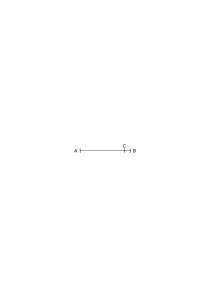

“ist es wahrscheinlicher, daß dieses Punkt im Intervall A C erscheint, als in C B”? Ich glaube, offenbar nein. – Ich kann freilich bestimmen, daß die Wahrscheinlichkeit, daß das Ereignis in C B eintritt, sich zu der, daß es in AC eintritt verhalten soll, wie <math class="stacked" display="inline"><mfrac><mrow><mtext>CB</mtext></mrow><mrow><mtext>AC</mtext></mrow></mfrac></math>, aber das ist eine Bestimmung, zu der ich empirische Gründe haben kann, aber a priori ist darüber nichts zu sagen. Die beobachtete Verteilung von Ereignissen kann mich zu dieser Annahme führen. Die Wahrscheinlichkeit, wo unendlich viele Möglichkeiten in Betracht kommen, muß natürlich als Limes betrachtet werden. Teile ich nämlich die Strecke AB in beliebig viele, beliebig ungleiche Teile und betrachte die Wahrscheinlichkeiten, daß das Ereignis in irgend einem dieser Teile stattfindet als untereinander gleich, so haben wir sofort den einfachen Fall des Würfels vor uns. Und nun kann ich ein Gesetz – willkürlich – aufstellen, wonach Teile gleicher Wahrscheinlichkeit gebildet werden sollen. Z.B., das Gesetz, daß gleiche Länge der Teile gleiche Wahrscheinlichkeit bedingt. Aber auch jedes andere Gesetz ist gleichermaßen erlaubt. Könnte ich nicht auch im Fall des Würfels etwa 5 Flächen zusammennehmen als eine Möglichkeit und sie der sechsten als der zweiten Möglichkeit gegenüberstellen? Und was, außer der Erfahrung, kann mich hindern, diese beiden Möglichkeiten als gleich wahrscheinlich zu betrachten? Denken wir uns etwa einen roten Ball geworfen, der nur eine ganz kleine grüne Kalotte hat. Ist es in diesem Fall nicht viel wahrscheinlicher, daß er auf dem roten Teil auffällt, als auf den grünen? – Wie würde man aber diesen Satz begründen? Wohl dadurch, daß der Ball, wenn man ihn wirft, viel öfter auf die rote, als auf die grüne Fläche auffällt. Aber das hat nichts mit der Logik zu tun. – Man könnte die rote und grüne Fläche und die Ereignisse, die auf ihnen stattfinden immer auf solche Art auf eine Fläche projizieren, daß die Projektion der grünen Fläche gleich oder größer wäre, als die der roten; so, daß die Ereignisse, in dieser Projektion betrachtet, ein ganz anderes Wahrscheinlichkeitsverhältnis zu haben scheinen, als auf der ursprünglichen Fläche. Wenn ich z.B. die Ereignisse in einem geeigneten gekrümmten Spiegel sich abbilden lasse und mir nun denke, was ich für das wahrscheinlichere Ereignis gehalten hätte, wenn ich nur das Bild im Spiegel sehe. Dasjenige, was der Spiegel nicht verändern kann, ist die Anzahl bestimmt umrissener Möglichkeiten. Wenn ich also auf meinem Ball n Farbflecke habe, so zeigt der Spiegel auch n, und habe ich _bestimmt_, daß diese als gleichwahrscheinlich gelten sollen, so kann ich diese Bestimmung auch für das Spiegelbild aufrecht erhalten. Um mich noch deutlicher zu machen: Wenn ich das Experiment im Hohlspiegel ausführe, d.h. die _Beobachtungen_ im Hohlspiegel mache, so wird es vielleicht scheinen, als fiele der Ball öfter auf die kleine Fläche, als auf die viel größere und es ist klar, daß keinem der Experimente – im Hohlspiegel und außerhalb – ein Vorzug gebührt.

### [PR](/w-pr/#ts-209-138.2) [138\[2\]](https://cdn.wittgensteinnachlass.com/2000px/webp/Ts-209/138.webp) {#1382}

Was heißt es nun aber eigentlich, zu bestimmen, zwei Möglichkeiten hätten die gleiche Wahrscheinlichkeit? Heißt es nicht, daß, erstens die uns bekannten Naturgesetze keine der beiden Möglichkeiten bevorzugen und zweitens die relativen Häufigkeiten der Ereignisse in beiden Fällen sich unter gewissen Umständen einander nähern.