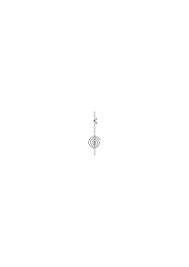

# Ts-211

### [1\[1\]](https://cdn.wittgensteinnachlass.com/2000px/webp/Ts-211/1.webp)

Historisches Drama; kann man es falsch nennen? “Nein, es ist ja nicht als Geschichtsschreibung gemeint”. Worin liegt diese _Meinung?_

### [1\[2\]](https://cdn.wittgensteinnachlass.com/2000px/webp/Ts-211/1.webp)

Denken wir uns den Fall, daß einer ein Geschichtswerk in aller Form geschrieben hätte, es aber dennoch nicht als Geschichtswerk, sondern als die Erdichtung eines Geschichtswerkes _meinte_. Was würde es heißen, dieses Werk einmal so, einmal so aufzufassen? Worin besteht diese Auffassung? Doch offenbar in etwas _außer_ dem Werk. Quasi in einem _Zusatz_ zu dem Werk. Oder nicht vielmehr, in einer bestimmten Verwendung, Wirkung, des Werks, in einem Eindruck, den es mir macht? Denn ein Zusatz von Zeichen kann doch wieder einer Auffassung unterliegen.

### [1\[3\]](https://cdn.wittgensteinnachlass.com/2000px/webp/Ts-211/1.webp)

Wir neigen dazu, jede Erscheinung (nur) als ein Symptom der Auffassung, Meinung, gelten zu lassen, aber nicht als diese selbst.

### [1\[4\]](https://cdn.wittgensteinnachlass.com/2000px/webp/Ts-211/1.webp)

Wie sich die Sprache von der Beschreibung der Verifikation entfernt. Man muß wieder entdecken, daß man die Zeit mit der Uhr mißt. – Und erkennt dabei nicht einmal, daß man eine grammatische Entdeckung gemacht hat.

### [1\[5\]](https://cdn.wittgensteinnachlass.com/2000px/webp/Ts-211/1.webp)

Auffassung ist _eine_ im Gegensatz zu einer anderen.

### [1\[6\]](https://cdn.wittgensteinnachlass.com/2000px/webp/Ts-211/1.webp)

“p ist der Fall”. “Es ist _wahr_, daß p der Fall ist”. “Es ist wirklich wahr, daß p der Fall ist”. Wenn der Multiplizität nichts hinzugesetzt wird, ist das Hinzugefügte bedeutungs-, zwecklos. Der Zusatz, der eine Auffassung ausdrückt, darf also nicht von dieser Art sein.

### [2\[1\]](https://cdn.wittgensteinnachlass.com/2000px/webp/Ts-211/2.webp)

Was ist der Unterschied zwischen der wirklichen Anwendung eines Satzes und der nachgeahmten, gespielten?

### [2\[2\]](https://cdn.wittgensteinnachlass.com/2000px/webp/Ts-211/2.webp)

Kann man von “Beschreibung” und “Ausdruck” der Auffassung reden?

### [2\[3\]](https://cdn.wittgensteinnachlass.com/2000px/webp/Ts-211/2.webp)

“Hast du das im Ernst oder im Spaß gemeint?” – Das “im Ernst Meinen” besteht nicht darin, daß zu dem ausgesprochenen Satz im Stillen noch etwas hinzugesetzt wird, etwa die Worte “ich meine das im Ernst”. Von dem _ganzen_ Satz, dem ausgesprochenen mit den dazugedachten Worten, könnte man wieder fragen: wie war er gemeint? Von Ernst oder Spaß kann man das aber nicht fragen. Also ist die Meinung (Auffassung) in diesem Sinne ein bestimmtes Erlebnis, das mit den Zeichen des Satzes Hand in Hand geht, aber an dem Sinn des Satzes nichts ändert, ob es nun so oder anders ist.

### [2\[4\]](https://cdn.wittgensteinnachlass.com/2000px/webp/Ts-211/2.webp)

Wäre der Sinn nicht durch die Zeichen und Regeln bestimmt, gäbe es keine Verständigung und nichts, was wir Sprache nennen könnten.

### [2\[5\]](https://cdn.wittgensteinnachlass.com/2000px/webp/Ts-211/2.webp)

“Ich habe gesagt ‘sie ist nicht zu Hause’, habe aber _dabei_ gewußt, daß sie zu Hause war”. Wie geht dieses Wissen zeitlich mit dem Sagen des Satzes zusammen? Wie eine kontinuierliche Begleitung, ein Orgelpunkt, zu einem Thema? Hast du es in jedem Augenblick gewußt, und braucht das Wissen keine Zeit? Ein falsches Bild verführt uns.

### [2\[6\]](https://cdn.wittgensteinnachlass.com/2000px/webp/Ts-211/2.webp),[3\[1\]](https://cdn.wittgensteinnachlass.com/2000px/webp/Ts-211/3.webp)

Diese Art der Betrachtung, die immer wiederkehrt, nimmt ihre Wichtigkeit daher, daß sie uns über einen falschen Begriff aufklärt, den wir vom Unmittelbaren haben.

### [3\[2\]](https://cdn.wittgensteinnachlass.com/2000px/webp/Ts-211/3.webp)

Es hat freilich Sinn, zu sagen: “während ich ihm das erzählte, wußte ich (_die ganze Zeit_), daß es nicht wahr war”, so wie auch “während ich es erzählte, glaubte ich es auch”. Nur sind die beiden Vorgänge sehr kompliziert und sehen sehr einfach aus; d.h., jeder der beiden Sätze kann viele verschiedene Prozesse beschreiben. Etwa, wie wenn ich sage “ich habe mich eine halbe Stunde lang umgezogen”, diesem Satz die mannigfachsten Tätigkeiten nacheinander entsprechen.

### [3\[3\]](https://cdn.wittgensteinnachlass.com/2000px/webp/Ts-211/3.webp)

Wir laborieren nämlich unter dem Irrtum, daß Glauben, Meinen, Wissen, Wünschen, Suchen, Denken etc. _Zustände_ sind, und daß daher hinter den symbolischen Prozessen im Denken etwas von andrer Art verborgen sein muß, das den Sinn eines Satzes gleichsam in amorpher Form enthalte, d.h. intuitiv, dem Sehen eines gleichbleibenden Bildes ähnlich, nicht diskursiv, also einer Tätigkeit (wie dem Waschen) vergleichbar.

### [3\[4\]](https://cdn.wittgensteinnachlass.com/2000px/webp/Ts-211/3.webp)

Es ist nämlich die Anschauung aufzugeben, daß, um vom Unmittelbaren zu reden, wir von dem Zustand in einem Zeitmoment reden müßten. Diese Anschauung ist darin ausgedrückt, wenn man sagt: “alles, was uns gegeben ist, ist das Gesichtsbild und die Daten der übrigen Sinne, sowie die Erinnerung, in dem gegenwärtigen Augenblick”. Das ist Unsinn; denn was meint man mit dem “gegenwärtigen Augenblick”? Dieser Vorstellung liegt vielmehr schon ein physikalisches Bild zu Grunde, nämlich das, vom Strom der Erlebnisse, den ich nun _in einem Punkt_ quer durchschneide. Es liegt hier eine ähnliche Tendenz und ein ähnlicher Fehler vor, wie beim Idealismus (oder Solipsismus).

### [4\[1\]](https://cdn.wittgensteinnachlass.com/2000px/webp/Ts-211/4.webp)

Woher aber diese Tendenz, “zum Unmittelbaren” kommen zu wollen? Entspringt sie nicht aus dem Bedürfnis, die Verifikation des Satzes verstehen zu wollen, die durch unsere Sprache ganz verschleiert ist.

### [4\[2\]](https://cdn.wittgensteinnachlass.com/2000px/webp/Ts-211/4.webp)

Intuitives Denken, das wäre so, wie eine Schachpartie auf die Form eines dauernden, gleichbleibenden Zustandes gebracht (ebenso undenkbar).

### [4\[3\]](https://cdn.wittgensteinnachlass.com/2000px/webp/Ts-211/4.webp)

Auf die Frage “wie hast du das gemeint”, können eben mehrerlei Antworten kommen:

“Ich hab's im Ernst (Spaß) gemeint.”

“Ich wollte damit sagen; daß ‥‥ (folgt ein Satz).”

“Ich wollte dich nur aufsitzen lassen.”

### [4\[4\]](https://cdn.wittgensteinnachlass.com/2000px/webp/Ts-211/4.webp)

Wie geht das vor _sich_, wenn man einen Satz ausspricht und dabei den anderen nur aufsitzen lassen will? Man spricht, lächelt, beobachtet den andern, fühlt eine Spannung. Aber nirgends ist die amorphe Meinung. Diese stellt man sich gleichsam vor, wie den Inhalt eines Tiegels, dessen Aufschrift der Satz ist.

### [4\[5\]](https://cdn.wittgensteinnachlass.com/2000px/webp/Ts-211/4.webp)

“Inhalt des Satzes.”

### [4\[6\]](https://cdn.wittgensteinnachlass.com/2000px/webp/Ts-211/4.webp),[5\[1\]](https://cdn.wittgensteinnachlass.com/2000px/webp/Ts-211/5.webp)

Es stört uns _quasi_, daß der Gedanke eines Satzes in keinem Moment ganz vorhanden ist. Hier sehen wir, daß wir den Gedanken mit einem Ding vergleichen, welches wir erzeugen, und das wir nie als Ganzes besitzen; sondern, kaum entsteht ein Teil, so verschwindet ein andrer. **D**as hat _gewissermaßen_ etwas Unbefriedigendes, weil wir – wieder durch eine Erklärung verführt – uns etwas Anderes erwarten.

### [5\[2\]](https://cdn.wittgensteinnachlass.com/2000px/webp/Ts-211/5.webp)

Im lebendigen Gebrauch der Sprache fühlen wir ja eine solche Unbefriedigung nicht, sondern erst, wenn wir ein bestimmtes Bild auf die _Vorgänge_ anwenden wollen. Aber es ist schwer zu sagen, welches das ist.

### [5\[3\]](https://cdn.wittgensteinnachlass.com/2000px/webp/Ts-211/5.webp)

(Methodologie, wenn sie von _der_ Messung redet, sagt nicht, aus welchem Material etwa wir den Maßstab am vorteilhaftesten herstellen um dies und dies Resultat zu erzielen; obwohl doch das auch zur Methode des Messens gehört. Vielmehr interessiert diese Untersuchung bloß, unter welchen Umständen wir sagen, eine Länge, eine Stromstärke, (u.s.w.) sei gemessen. Sie will die, von uns bereits verwendeten, uns geläufigen, Methoden tabulieren, um dadurch die Bedeutung der Worte “Länge”, “Stromstärke”, etc., festzulegen.)

### [5\[4\]](https://cdn.wittgensteinnachlass.com/2000px/webp/Ts-211/5.webp)

Der Zeitmoment, von dem ich sage, er sei die Gegenwart, die alles enthält, was mir gegeben ist, gehört selbst zur physikalischen Zeit.

### [5\[5\]](https://cdn.wittgensteinnachlass.com/2000px/webp/Ts-211/5.webp)

Denn, wie ist so ein Moment bestimmt? Etwa durch einen Glockenschlag? Und kann ich denn nun die ganze, mit diesem Schlag gleichzeitige Erfahrung wirklich beschreiben? Wenn man daran denkt es zu versuchen, wird man sofort gewahr, daß es eine Fiktion ist, wovon wir reden.

### [5\[6\]](https://cdn.wittgensteinnachlass.com/2000px/webp/Ts-211/5.webp),[6\[1\]](https://cdn.wittgensteinnachlass.com/2000px/webp/Ts-211/6.webp)

Wir stellen uns _das Erleben_ wie einen Filmstreifen vor, _so daß_ man sagen kann: dieses Bild, und kein anderes, ist in diesem Augenblick vor der Linse.

### [6\[2\]](https://cdn.wittgensteinnachlass.com/2000px/webp/Ts-211/6.webp)

Aber nur im Film kann man von einem in diesem Moment gegenwärtigen Bild reden; nicht, wenn man aus dem physikalischen Raum _und seiner Zeit_ in dem Gesichtsraum _und seine Zeit_ übergeht.

### [6\[3\]](https://cdn.wittgensteinnachlass.com/2000px/webp/Ts-211/6.webp)

Es ist viel seltsamer als man wohl glaubt, daß man im Bereich der _gewöhnlichen_ Sprache auf den Begriff des Lichtstrahls gekommen ist.

### [6\[4\]](https://cdn.wittgensteinnachlass.com/2000px/webp/Ts-211/6.webp)

Schwerlich wäre es geschehen, wenn man nicht manchmal “Lichtstrahlen” im Staub der Luft sähe.

### [6\[5\]](https://cdn.wittgensteinnachlass.com/2000px/webp/Ts-211/6.webp)

Und die Annahme einer Lichtgeschwindigkeit hängt damit zusammen.

### [6\[6\]](https://cdn.wittgensteinnachlass.com/2000px/webp/Ts-211/6.webp)

“Das was ein cm³ Wasser wiegt, hat man ‘1 Gramm’ genannt”. – “Ja, was wiegt er denn?” (“Bedeutung eines Wortes”).

### [6\[7\]](https://cdn.wittgensteinnachlass.com/2000px/webp/Ts-211/6.webp)

Wenn das Bild die Krönung Napoleons darstellen soll, so müßte man das nicht darunter schreiben, wenn es in dem Bild enthalten wäre. Wenn es also auch in der bloßen Beschreibung des Bildes mitbeschrieben wäre. Und da könnte man nun den Unterschied zwischen Gedanken und Bild scharf fassen, indem man sagt, daß die Beschreibung des _Gedankens_ im Gegensatz zu der, des bloßen Bildes, auch die Beschreibung der Realität enthalten muß, auf die sich der Gedanke bezieht. Aber hier liegt ein Fehler.

### [7\[1\]](https://cdn.wittgensteinnachlass.com/2000px/webp/Ts-211/7.webp)

Liegt denn der Grund der Verschiedenheit nicht darin, daß das gemalte Bild an sich nicht ein Teil eines viel umfassenderen Bildes – einer Sprache – ist? Durch die Überschrift gliedern wir das Bild in das umfassendere ein. Könnten wir es nicht auch so tun, daß wir es in eine Serie von gemalten Bildern mit demselben Erfolg eingliederten?

### [7\[2\]](https://cdn.wittgensteinnachlass.com/2000px/webp/Ts-211/7.webp)

Das Charakteristische an der Sprache ist, daß alle Erklärungen zum voraus gegeben werden können. D.h., daß man sie alle mußte voraussehen können und keine erst ad hoc gegeben werden muß. (Und das ist es, was die Bildhaftigkeit auszumachen scheint.)

### [7\[3\]](https://cdn.wittgensteinnachlass.com/2000px/webp/Ts-211/7.webp)

Ich könnte mein Problem so darstellen: Wenn ich untersuchen wollte, ob die Krönung Napoleons so und so stattgefunden hat, so könnte ich mich dabei, als einer Urkunde, des Bildes bedienen, statt einer Beschreibung. Und es frägt sich nun, ist die ganze Vergleichung der Urkunde mit der Wirklichkeit von der Art, wie der Vergleich der Wirklichkeit mit dem Bild, oder gibt es dabei noch etwas Andres, von andrer Art?

### [7\[4\]](https://cdn.wittgensteinnachlass.com/2000px/webp/Ts-211/7.webp)

Aber womit soll man die Wirklichkeit vergleichen, als mit dem Satz? Und was soll man andres tun, als sie mit ihm zu vergleichen?

### [7\[5\]](https://cdn.wittgensteinnachlass.com/2000px/webp/Ts-211/7.webp)

Oder soll ich sagen: Solange man das Bild mit nichts vergleicht, _kann_ man es mit Allem vergleichen. Wenn wir aber denken, so vergleichen wir das Bild schon mit der Wirklichkeit, denn wir wissen z.B., daß Napoleon jetzt nicht hier ist, wohl aber Herr N.N.

### [7\[6\]](https://cdn.wittgensteinnachlass.com/2000px/webp/Ts-211/7.webp)

Das hängt mit dem Problem von _hier_ und _jetzt_ zusammen.

### [8\[1\]](https://cdn.wittgensteinnachlass.com/2000px/webp/Ts-211/8.webp)

(Die Fähigkeit zur Philosophie besteht in der Fähigkeit, von einer Tatsache der Grammatik einen starken und nachhaltigen Eindruck zu empfangen.)

### [8\[2\]](https://cdn.wittgensteinnachlass.com/2000px/webp/Ts-211/8.webp)

In gewissem Sinne ist die Bedeutung der Wörter “hier”, “jetzt” (etc.) die einzige, die ich nicht von vornherein festlegen kann. Aber das ist natürlich _irreführend_ ausgedrückt: Die Bedeutung _ist_ festzulegen und festgelegt, wenn die Regeln bezüglich dieser Worte festgelegt sind, und das kann geschehen, ehe sie in einem bestimmten Fall angewandt werden; denn wozu auch sonst _ein_ Wort in verschiedenen Fällen gebrauchen.

### [8\[3\]](https://cdn.wittgensteinnachlass.com/2000px/webp/Ts-211/8.webp)

Die Wörter “hier”, “jetzt”, etc. bezeichnen den Ursprung eines Koordinatensystems: Wie der Buchstabe “O”, aber sie beschreiben nicht seine Lage gegenüber den Gegenständen im Raum.

### [8\[4\]](https://cdn.wittgensteinnachlass.com/2000px/webp/Ts-211/8.webp)

Die Bedeutung eines Worts verstehen, heißt, seinen Gebrauch kennen, verstehen.

### [8\[5\]](https://cdn.wittgensteinnachlass.com/2000px/webp/Ts-211/8.webp),[9\[1\]](https://cdn.wittgensteinnachlass.com/2000px/webp/Ts-211/9.webp)

Kann ein logisches Produkt in einem Satz verborgen sein? Und wenn, wie erfährt man das, und was für Methoden haben wir, das im Satz Verborgene ans Tageslicht zu ziehen? Haben wie noch keine sicheren Methoden, (_es zu finden_,) dann können wir auch nicht davon reden, daß etwas verborgen ist, oder verborgen sein könnte. Und haben wir eine Methode des Suchens, so kann – das logische Produkt etwa, im Satz nur so verborgen sein, wie es etwa die Teilbarkeit durch 3 in der Zahl 753 ist, solange ich das Kriterium noch nicht angewandt habe, ich das Kriterium noch nicht angewandt habe, oder aber auch die √7 solange ich sie noch nicht ausgerechnet habe. Denn, das verborgene logische Produkt finden, ist eine mathematische Aufgabe.

### [9\[2\]](https://cdn.wittgensteinnachlass.com/2000px/webp/Ts-211/9.webp)

Das fingierte Porträt. In einem Buch eine Illustration mit der Überschrift: Baron Münchhausen.

### [9\[3\]](https://cdn.wittgensteinnachlass.com/2000px/webp/Ts-211/9.webp)

“Doch solcherlei Verdrüsse pflegen die Denkungskräfte anzuregen”. Wie hilft der Gedanke einem Verdruß ab?

### [9\[4\]](https://cdn.wittgensteinnachlass.com/2000px/webp/Ts-211/9.webp)

Also ist Elementarsatz ein solcher, der sich in dem Kalkül, wie ich es jetzt benütze, nicht als Wahrheitsfunktion anderer Sätze darstellt.

### [9\[5\]](https://cdn.wittgensteinnachlass.com/2000px/webp/Ts-211/9.webp)

Unsere Weise von den Wörtern zu reden, können wir durch das beleuchten, was Sokrates im “Kratylos” sagt. Kratylos: “Bei weitem und ohne Frage ist es vorzüglicher, Sokrates, durch ein Ähnliches darzustellen, was jemand darstellen will, als durch das erste beste.” – Sokrates: “Wohlgesprochen, …”.

### [9\[6\]](https://cdn.wittgensteinnachlass.com/2000px/webp/Ts-211/9.webp)

Verbindung von Wort und Sache durch die Erklärung hergestellt. Was ist das für eine Verbindung, welche Art? Was für Arten von Verbindungen gibt es? Eine Verbindung kann funktionieren oder nicht funktionieren: Anwendung auf die Verbindung, die die Worterklärung herstellt.

### [9\[7\]](https://cdn.wittgensteinnachlass.com/2000px/webp/Ts-211/9.webp),[10\[1\]](https://cdn.wittgensteinnachlass.com/2000px/webp/Ts-211/10.webp)

Sokrates zu Theaitetos: “Und wer vorstellt, sollte nicht etwas vorstellen?” Th.: “Notwendig.” Sok.: “Und wer etwas vorstellt, nichts Wirkliches?” Th.: “So scheint es.”

### [10\[2\]](https://cdn.wittgensteinnachlass.com/2000px/webp/Ts-211/10.webp)

Was heißt es: Sich eine Vorstellung machen, die der Wirklichkeit nicht entspricht?

### [10\[3\]](https://cdn.wittgensteinnachlass.com/2000px/webp/Ts-211/10.webp)

Wie unendlich einfach dieses Problem! Und wie seltsam, daß man es überhaupt als Problem _kann ansehen wollen_.

### [10\[4\]](https://cdn.wittgensteinnachlass.com/2000px/webp/Ts-211/10.webp)

Ich versuche etwas, kann es aber nicht. – Was heißt es aber: “etwas nicht versuchen können”?

### [10\[5\]](https://cdn.wittgensteinnachlass.com/2000px/webp/Ts-211/10.webp)

“Wir können auch nicht _einmal versuchen_, uns ein rundes Viereck vorzustellen.”

### [10\[6\]](https://cdn.wittgensteinnachlass.com/2000px/webp/Ts-211/10.webp)

Man vergleiche das Vorstellen mit dem Malen eines Bildes. Er malt also ein Bild des Menschen, wie dieser in Wirklichkeit nicht ist. Sehr einfach. Aber warum nennen wir es das Bild dieses Menschen? Denn, wenn es das nicht ist, ist es (ja) nicht falsch. – Wir nennen es so, weil er selbst es drübergeschrieben hat. Also hat er nichts weiter getan, als jenes Bild zu malen, und jenen Namen drüberzuschreiben. Und das tat er wohl auch in der Vorstellung.

### [10\[7\]](https://cdn.wittgensteinnachlass.com/2000px/webp/Ts-211/10.webp)

Plato nennt die Hoffnung eine Rede. (Philebos)

### [10\[8\]](https://cdn.wittgensteinnachlass.com/2000px/webp/Ts-211/10.webp),[11\[1\]](https://cdn.wittgensteinnachlass.com/2000px/webp/Ts-211/11.webp)

Augustinus, wenn er vom Lernen der Sprache redet, redet ausschließlich davon, wie wir den Dingen Namen beilegen, oder die Namen der Dinge verstehen. Hier scheint also das Benennen Fundament und Um- und Auf der Sprache zu sein. (Und was Augustinus sagt, ist für uns wichtig, weil es die Auffassung eines natürlich-klar denkenden Mannes ist, der von uns zeitlich weit entfernt, gewiß nicht zu unserem besonderen Gedankenkreis gehört.) Diese Auffassung des Fundaments der Sprache ist offenbar äquivalent mit der, die die Erklärungsform “das ist ‥․” als fundamental auffaßt. – Von einem Unterschied der Worte redet Augustinus nicht, meint also mit “Namen” offenbar Wörter, wie “Baum”, “Tisch”, “Brot”, und gewiß die Eigennamen der Personen, dann aber wohl auch “essen”, “gehen”, “hier”, “dort”; kurz, alle Wörter. Gewiß aber denkt er _zunächst an Hauptwörter_ und an die übrigen als etwas, was sich finden wird. (Und Plato sagt, daß der Satz aus Haupt- und Zeitwörtern besteht.) Sie beschreiben _eben_ das Spiel einfacher, als es ist. Dieses Spiel kommt aber wohl in der Wirklichkeit vor. Nehmen wir etwa an, ich wolle aus Bausteinen ein Haus bauen, die mir ein Andrer zureichen soll, so könnten wir erst ein Übereinkommen dadurch treffen, daß ich auf einen Stein zeigend sagte “das ist eine Säule”, auf einen andern zeigend “das ist ein Würfel”, – “das ist eine Platte” u.s.w. Und nun bestünde die Anwendung im Ausrufen jener Wörter “Säule”, “Platte”, etc. in der Reihenfolge, wie ich sie brauche. Und ganz ähnlich ist ja das Übereinkommen <math display="inline"><mi>a</mi><mtext>∣</mtext><mi>b</mi><mtext>∣</mtext><mi>c</mi><mtext>∣</mtext><mi>d</mi><mtext>∣</mtext><mspace width="0.3em"/><mo>|</mo><mtext>↑</mtext><mspace width="0.3em"/><mtext>→</mtext><mspace width="0.3em"/><mtext>↓</mtext><mspace width="0.3em"/><mtext>←</mtext></math> und etwa eines, was mit Farben arbeiten würde.

### [11\[2\]](https://cdn.wittgensteinnachlass.com/2000px/webp/Ts-211/11.webp)

Ich will damit sagen: Augustinus beschreibt wirklich einen Kalkül; nur ist nicht alles, was wir Sprache nennen, dieser Kalkül.

### [11\[3\]](https://cdn.wittgensteinnachlass.com/2000px/webp/Ts-211/11.webp)

(Und _das_ muß man in einer großen Anzahl von Fällen sagen, wo es sich frägt: ist diese Darstellung brauchbar, oder unbrauchbar. Die Antwort ist dann: “ja, brauchbar; aber nur _dafür_, nicht für das ganze Gebiet, das Du darzustellen vorgabst”.)

### [12\[1\]](https://cdn.wittgensteinnachlass.com/2000px/webp/Ts-211/12.webp)

Es ist also so, wie wenn jemand erklärte: “spielen besteht darin, daß man Dinge, gewissen Regeln gemäß, auf einer Fläche verschiebt ‥‥” und wir ihm antworteten: Du denkst da gewiß an die Brettspiele, und auf sie ist Deine Beschreibung auch anwendbar. Aber das sind nicht die einzigen Spiele. Du kannst also Deine Erklärung richtigstellen, indem Du sie ausdrücklich auf diese Spiele einschränkst. (Man könnte also sagen, Augustinus stelle das Lernen der Sprache zu einfach dar; aber auch: er stelle eine einfachere Sache dar.)

### [12\[2\]](https://cdn.wittgensteinnachlass.com/2000px/webp/Ts-211/12.webp)

(Wer das Schachspiel einfacher beschreibt – mit einfacheren Regeln – als es ist, beschreibt damit dennoch ein Spiel, aber ein anderes.)

### [12\[3\]](https://cdn.wittgensteinnachlass.com/2000px/webp/Ts-211/12.webp)

Ich wollte eigentlich sagen: Wie Augustinus das Lernen der Sprache beschreibt, kann uns zeigen, woher sich diese Auffassung _überhaupt_ schreibt. (Von welcher primitiven _Anschauung_.)

Man könnte den Fall mit dem einer Schrift vergleichen, in der Buchstaben zum Bezeichnen von Lauten benützt würden, aber auch etwa zur Bezeichnung der Stärke und Schwäche der Aussprache und als Interpunktionszeichen. Fassen wir dann diese Schrift als eine Sprache zur Beschreibung des Lautbildes auf, so könnte man sich denken, daß Einer diese Schrift beschriebe, als entspräche einfach jedem Buchstaben ein Laut und als hätten die Buchstaben nicht auch ganz andere Funktionen. – Und so einer – zu einfachen – Beschreibung der Schrift gleicht Augustin's Beschreibung der Sprache völlig.

### [12\[4\]](https://cdn.wittgensteinnachlass.com/2000px/webp/Ts-211/12.webp),[13\[1\]](https://cdn.wittgensteinnachlass.com/2000px/webp/Ts-211/13.webp)

Man kann z.B. – für andre verständlich – von _Kombinationen von Farben mit Formen_ sprechen (etwa der Farben rot und blau mit den Formen Quadrat und Kreis) ebenso wie von Kombinationen verschiedener Formen oder Körper. Und hier haben wir die Wurzel des irreleitenden Ausdrucks, die Tatsache sei ein Komplex von Gegenständen. Es wird also hier, daß ein Mensch krank ist, _verglichen_ mit der Zusammenstellung zweier Dinge, wovon das eine der Mensch ist, das andere die Krankheit repräsentiert. Und ich kann nur sagen: hüten wir uns vor diesem Gleichnis, oder davor, zu vergessen, daß es ein Gleichnis ist. Oder man muß sagen, es verhält sich hier mit dem Wort “Kombination”, oder “Komplex”, wie mit dem Wort “Zahl”, das auch in verschiedenen – mehr oder weniger logisch ähnlichen – Weisen _(oder, wenn man will_, Bedeutungen) gebraucht wird.

### [13\[2\]](https://cdn.wittgensteinnachlass.com/2000px/webp/Ts-211/13.webp)

Philosophieren ist: falsche Argumente zurückweisen.

### [13\[3\]](https://cdn.wittgensteinnachlass.com/2000px/webp/Ts-211/13.webp)

Sokrates: Wer also vorstellt, was nicht ist, der stellt nichts vor? – Theaitetos: So scheint es. – S.: Wer aber nichts vorstellt, der wird gewiß überhaupt garnicht vorstellen? – Th.: Offenbar, wie wir sehen. Setzen wir in diesem Argument und dem ihm vorhergehenden statt “vorstellen” etwa “zerschneiden”, so läuft es auf eine Regel der Verwendung dieses Wortes hinaus. Man dürfe nicht sagen: “ich zerschneide etwas, was nicht existiert”.

### [13\[4\]](https://cdn.wittgensteinnachlass.com/2000px/webp/Ts-211/13.webp),[14\[1\]](https://cdn.wittgensteinnachlass.com/2000px/webp/Ts-211/14.webp)

Ich kann mir einen Hirsch auf dieser Wiese vorstellen, der nicht da ist, aber keinen töten, der nicht da ist. – Und sich einen Hirsch vorstellen, der nicht da ist, heißt, sich vorstellen, daß ein Hirsch da ist, obwohl keiner da ist. Einen Hirsch töten aber, heißt nicht: töten, daß ein Hirsch da ist (also: verschiedene grammatische Regeln). Wenn aber jemand sagt: “um mir einen Hirsch vorzustellen, muß es ihn doch in einem gewissen Sinne geben”, so ist die Antwort: nein, es muß ihn dazu in keinem Sinne _geben_. Und wenn darauf gesagt würde: Aber z.B. die braune Farbe muß es doch geben, damit ich mir sie vorstellen kann, so ist zu sagen: “‘Es gibt die braune Farbe’ heißt überhaupt nichts, außer etwa, daß sie da oder dort als Färbung eines Gegenstandes (Flecks) _auftritt_ und das ist nicht nötig, damit ich mir einen braunen Hirsch vorstellen kann.”

### [14\[2\]](https://cdn.wittgensteinnachlass.com/2000px/webp/Ts-211/14.webp)

“Der Klang scheint mir von _dort_ zu kommen”. – “Genau aus welcher Richtung?”

### [14\[3\]](https://cdn.wittgensteinnachlass.com/2000px/webp/Ts-211/14.webp)

Euklidischer Haufe und Haufe im Gesichtsfeld.

### [14\[4\]](https://cdn.wittgensteinnachlass.com/2000px/webp/Ts-211/14.webp)

“Er kam _ungefähr_ von dort ”. “Ungefähr _da_ ist der hellste Punkt des Horizontes”. “Mach' das Brett ungefähr 2 m lang”. Muß ich, um das sagen zu können, Grenzen wissen, die den Spielraum dieser Länge bestimmen? Offenbar nicht. Genügt es nicht z.B. zu sagen: “der Spielraum ± 1 cm ist ohne weiteres erlaubt; ± 2 cm wäre schon zu viel”? – Es ist doch dem Sinn meines Satzes auch wesentlich, daß ich nicht imstande bin, dem Spielraum “genaue” Grenzen zu geben. Kommt das nicht offenbar daher, daß der Raum, in dem ich hier arbeite, eine andere Metrik hat, als der Euklidische? Wenn man nämlich den Spielraum genau durch den Versuch feststellen wollte, indem man die Länge ändert und sich den Grenzen des Spielraums nähert und immer fragt, ob diese Länge noch angehe oder schon nicht mehr, so käme man nach einigen Einschränkungen zu Widersprüchen, indem einmal ein Punkt noch als innerhalb der Grenzen liegend bezeichnet würde, ein andermal ein weiter innerhalb gelegener als schon unzulässig erklärt würde; beides etwa mit der Bemerkung, die Angaben seien nicht mehr (_ganz_) sicher.

### [15\[1\]](https://cdn.wittgensteinnachlass.com/2000px/webp/Ts-211/15.webp)

Ist es denn nicht so, wie man etwa beim Fleischhauer nur auf Deka genau abwiegt, obwohl das anderseits willkürlich ist, und nur bestimmt durch die herkömmlichen Messinggewichte. Es genügt hier zu wissen: mehr als <math class="stacked" display="inline"><msub><mi>P</mi><mn>1</mn></msub></math> wiegt es nicht und weniger als <math class="stacked" display="inline"><msub><mi>P</mi><mn>2</mn></msub></math> auch nicht. Man könnte sagen: die Gewichtsangabe besteht hier prinzipiell nicht aus einer Zahlangabe, sondern aus der Angabe eines Intervalls, und die Intervalle bilden eine diskontinuierliche Reihe.

### [15\[2\]](https://cdn.wittgensteinnachlass.com/2000px/webp/Ts-211/15.webp)

Man könnte doch sagen: “halte Dich jedenfalls _innerhalb_ ± 1 cm”, damit eine willkürliche Grenze setzend. – Würde nun gesagt: “gut, aber dies ist doch nicht die wirkliche Grenze des zulässigen Spielraums; welche ist es also?” so wäre etwa die Antwort “ich weiß keine, ich weiß nur, daß ± 2 cm schon zu viel wäre”.

### [15\[3\]](https://cdn.wittgensteinnachlass.com/2000px/webp/Ts-211/15.webp)

Träte nun auch bei dem Experiment zur Bestimmung der Grenzen kein Schwanken ein, so lange wir tatsächlich das Experiment weiterführen, so müssen wir doch damit einmal aufhören und das Ergebnis wird immer nur sein, daß eine gewisse Länge noch erlaubt, eine andere schon unerlaubt ist. Hier führt uns wieder die falsche Vorstellung vom Unendlichen irre, wenn wir den Prozeß dieser Untersuchung uns abgeschlossen denken und nun von einem Grenzpunkt reden, als gäbe es hier ein Gesetz, eine geometrische Konstruktion, der der Grenzpunkt entspräche.

### [15\[4\]](https://cdn.wittgensteinnachlass.com/2000px/webp/Ts-211/15.webp)

“Mach' mir hier einen Haufen Sand”. – “Gut, das nennt er gewiß noch einen Haufen”. Ich konnte dem Befehl Folge leisten, also war er in Ordnung. Wie aber ist es mit diesem Befehl: “Mach' mir den kleinsten Haufen, den Du noch so nennst”? Ich würde sagen: das ist Unsinn; ich kann nur eine vorläufige obere und untere Grenze bestimmen.

### [16\[1\]](https://cdn.wittgensteinnachlass.com/2000px/webp/Ts-211/16.webp)

Aber auch das trifft nicht genau, wie es sich wirklich verhält. Vielmehr scheint die Unsicherheit meistens von der Art, wie die, der Angabe des höchsten Punktes einer Kurve. Wir sind eben nicht im euklidischen Raum und es gibt nicht im euklidischen Sinne einen höchsten Punkt. Die Antwort wird heißen: “der höchste Punkt ist ungefähr _da_”, und die Grammatik des Wortes “ungefähr” – in diesem Zusammenhang – gehört _dann_ zur Geometrie unseres Raumes.

### [16\[2\]](https://cdn.wittgensteinnachlass.com/2000px/webp/Ts-211/16.webp)

“Ich war der Meinung, Napoleon sei 1805 gekrönt worden”. – “Warst Du die ganze Zeit ununterbrochen dieser Meinung?”

### [16\[3\]](https://cdn.wittgensteinnachlass.com/2000px/webp/Ts-211/16.webp)

Was hat aber Deine Meinung mit Napoleon zu tun? Welcher Zusammenhang besteht zwischen Deiner Meinung und Napoleon? Es kann, z.B., der sein, daß das Wort “Napoleon” in dem Ausdruck meiner Meinung vorkommt, plus dem Zusammenhang den dieses Wort mit seinem Träger hat. Also etwa, daß er sich so unterschrieben hat, so angeredet wurde, etc. etc.

### [16\[4\]](https://cdn.wittgensteinnachlass.com/2000px/webp/Ts-211/16.webp),[17\[1\]](https://cdn.wittgensteinnachlass.com/2000px/webp/Ts-211/17.webp)

“Aber mit dem Wort ‘Napoleon’ bezeichnest Du doch, während Du es aussprichst, eben diesen Menschen”. – “Wie geht denn, Deiner Meinung nach, dieser Akt des Bezeichnens vor sich? Momentan? oder braucht er Zeit?” – “Ja aber, wenn man Dich fragt ‘hast du jetzt (_eben_) den Mann gemeint, der die Schlacht bei Austerlitz gewonnen hat?’ wirst Du doch sagen ‘ja’. Also hast Du diesen Mann gemeint, _als Du den Satz, in dem sein Name vorkommt, aussprachst_!” – Wohl, aber nur etwa in dem Sinne, in welchem ich damals auch wußte, daß 2 + 2 = 4 ist. Nämlich nicht so, als ob zu dieser Zeit ein besonderer _Vorgang stattgefunden_ hätte, den wir dieses ‘Meinen’ nennen könnten; auch wenn vielleicht gewisse Bilder das Aussprechen begleitet haben, die für diese Meinung charakteristisch sind und bei andrer _Bedeutung_ des Wortes ‘Napoleon’ vielleicht andre gewesen wären. Vielmehr ist die Antwort “ja, ich habe den Sieger von Austerlitz gemeint” ein weiterer Schritt im Kalkül. Täuschend ist an ihm die vergangene Form, die eine Beschreibung dessen zu geben scheint, was “in mir” während des Aussprechens des Satzes vorgegangen war. In Wirklichkeit knüpft das Präteritum nur an den früher ausgesprochenen Satz an.

### [17\[2\]](https://cdn.wittgensteinnachlass.com/2000px/webp/Ts-211/17.webp)

Wie sich der Gedanke zur Rede verhält, kann man am besten verstehen, wenn man bedenkt, ob etwa das Verständnis (der Gedanke) einer Rechnung (_etwa_ einer Multiplikation) als gesonderter Prozeß neben dem Rechnungsvorgang einherläuft.

### [17\[3\]](https://cdn.wittgensteinnachlass.com/2000px/webp/Ts-211/17.webp)

Wenn man das Verstehen, Wissen, etc., als _Zustand_ auffaßt, dann nur hypothetisch im Sinne einer psychischen Disposition, welche auf derselben Stufe steht, wie eine physiologische Disposition.

### [17\[4\]](https://cdn.wittgensteinnachlass.com/2000px/webp/Ts-211/17.webp)

“Dachtest Du denn, als Du den Satz sagtest, daran, daß Napoleon ‥‥‥” – “ich dachte nur, was ich sagte”.

### [17\[5\]](https://cdn.wittgensteinnachlass.com/2000px/webp/Ts-211/17.webp)

Ich finde bei Plato auf eine Frage wie “was ist Erkenntnis” nicht die vorläufige Antwort: Sehen wir einmal nach, wie dieses Wort gebraucht wird.

### [17\[6\]](https://cdn.wittgensteinnachlass.com/2000px/webp/Ts-211/17.webp)

Etwas wissen, ist von der Art dessen, einen Zettel in der Lade meines Schreibtisches zu haben, auf dem es aufgeschrieben steht.

### [17\[7\]](https://cdn.wittgensteinnachlass.com/2000px/webp/Ts-211/17.webp)

Wenn ich sage: “in meine Gedanken tritt die gegenwärtige Situation ein”, so heißt das nicht: die Situation, soweit ich sie beschreiben kann. Denn soweit ich sie beschreiben kann, kann ich sie malen.

### [18\[1\]](https://cdn.wittgensteinnachlass.com/2000px/webp/Ts-211/18.webp)

Hier und Jetzt sind geometrische Begriffe, wie etwa der Mittelpunkt meines Gesichtsfeldes.

### [18\[2\]](https://cdn.wittgensteinnachlass.com/2000px/webp/Ts-211/18.webp)

Hier und Jetzt haben nicht eine größere Multiplizität, als sie zu haben scheinen. Das anzunehmen ist die große Gefahr. Ersetze sie, durch welchen Ausdruck Du willst, immer ist es nur _ein_ Wort – und daher eins so gut wie das andere.

### [18\[3\]](https://cdn.wittgensteinnachlass.com/2000px/webp/Ts-211/18.webp)

“Ich bin jetzt hier”: In welcher Situation hat dies Sinn, in welcher nicht?

### [18\[4\]](https://cdn.wittgensteinnachlass.com/2000px/webp/Ts-211/18.webp)

Denken wir uns einen Brief datiert: “Hier, jetzt”. Aber ich glaube, das zeigt, was diese Wörter bedeuten; sie stehen für das _vorgedruckte_ “Ort ‥‥, Datum ‥‥”.

### [18\[5\]](https://cdn.wittgensteinnachlass.com/2000px/webp/Ts-211/18.webp)

Unterschied zwischen Sage und Märchen, Märchen (und andere Dichtungen) vom Jetzt und Hier abgeschnitten.

### [18\[6\]](https://cdn.wittgensteinnachlass.com/2000px/webp/Ts-211/18.webp)

Es ist aber ein wichtiger Satz in der Grammatik des Wortes “hier”, daß es keinen Sinn hat, “hier” zu schreiben, wo eine Ortsangabe stehen soll; daß ich also auf einen Gegenstand kein Täfelchen befestigen soll, mit der Aufschrift “Dieser Gegenstand ist immer nur hier zu benützen”.

### [18\[7\]](https://cdn.wittgensteinnachlass.com/2000px/webp/Ts-211/18.webp)

Ich kann natürlich in bezug auf die Wörter “jetzt” und “hier” etc. nur tun, was ich sonst tue, nämlich ihren Gebrauch beschreiben. Und diese Beschreibung muß allgemein sein, d.h. im Vorhinein, _vor_ jedem Gebrauch.

### [18\[8\]](https://cdn.wittgensteinnachlass.com/2000px/webp/Ts-211/18.webp),[19\[1\]](https://cdn.wittgensteinnachlass.com/2000px/webp/Ts-211/19.webp)

Ist ein Raum denkbar, der nur alle rationalen Punkte, aber nicht die irrationalen enthält? Wäre etwa diese Struktur für unsern Raum zu ungenau? Weil wir zu den irrationalen Punkten dann (_immer_) nur näherungsweise gelangen könnten? Unser Netz wäre also nicht fein genug? Nein. Die Gesetze gingen uns ab, nicht die Extensionen.

### [19\[2\]](https://cdn.wittgensteinnachlass.com/2000px/webp/Ts-211/19.webp)

Ist ein Raum denkbar, der nur alle rationalen aber nicht die irrationalen Punkte enthält? Und das heißt nur: Sind die irrationalen Zahlen nicht in den rationalen präjudiziert? So wenig, wie das Schachspiel im Damespiel. Die irrationalen Zahlen füllen keine Lücke aus, die die rationalen offen lassen.

### [19\[3\]](https://cdn.wittgensteinnachlass.com/2000px/webp/Ts-211/19.webp)

Der einfärbige Fleck in der färbigen Ebene ist nicht aus kleineren Teilen zusammengesetzt, außer so, wie die Zehn etwa aus tausend Hundertsteln.

### [19\[4\]](https://cdn.wittgensteinnachlass.com/2000px/webp/Ts-211/19.webp)

Das kleinste sichtbare Stück ist ein Stück der physikalischen Fläche, nicht des Gesichtsfeldes. Der Versuch, der das kleinste noch Sichtbare ermittelt, stellt eine Relation fest zwischen _zwei_ Erscheinungen.

### [19\[5\]](https://cdn.wittgensteinnachlass.com/2000px/webp/Ts-211/19.webp)

Der Versuch untersucht nicht den Gesichtsraum und man kann den Gesichtsraum nicht untersuchen. Nicht in ihn tiefer eindringen.

### [19\[6\]](https://cdn.wittgensteinnachlass.com/2000px/webp/Ts-211/19.webp)

(Wenn man beschreiben wollte, was auf der Hand liegt, könnte man nicht “untersuchen, was auf der Hand liegt”.)

### [19\[7\]](https://cdn.wittgensteinnachlass.com/2000px/webp/Ts-211/19.webp),[20\[1\]](https://cdn.wittgensteinnachlass.com/2000px/webp/Ts-211/20.webp)

Man könnte glauben, das Gesichtsfeld sei aus den minima visibilia zusammengesetzt; etwa aus lauter kleinen Quadraten, die man als unteilbare Flecke sieht. Unsinn. Das Gesichtsfeld ist nicht zusammengesetzt, wenn wir die Zusammensetzung nicht sehen. Denn bei _dem Wort_ “Zusammensetzung” denken wir doch an die Zusammensetzung eines größeren Flecks aus kleineren. Von kleinsten sichtbaren Teilen des Gesichtsfeldes zur reden ist irreführend; gibt es denn auch Teile des Gesichtsfeldes, die wir nicht mehr sehen? Und wenn wir etwa das Bild eines Fixsterns so nennen, so könnte das nur heißen, daß es keinen Sinn habe, hier von ‘kleiner’ zu reden, und nicht, daß tatsächlich kein Fleck im Gesichtsfeld kleiner ist. Also ist der Superlativ “das kleinste…” falsch angewendet.

### [20\[2\]](https://cdn.wittgensteinnachlass.com/2000px/webp/Ts-211/20.webp)

Es scheint, man kann einen einfärbigen Fleck nicht zusammengesetzt sehen, außer, wenn man ihn sich _nicht_ einfärbig vorstellt. Die Vorstellung einer Trennungslinie macht den Fleck mehrfärbig, denn die Trennungslinie muß eine andere Farbe haben, als der übrige Fleck. [Auslassung 1]

### [20\[3\]](https://cdn.wittgensteinnachlass.com/2000px/webp/Ts-211/20.webp)

“Ein Gegenstand läßt sich, in gewissem Sinne, nicht beschreiben” (auch bei Plato: “er kann nicht beschrieben werden, sondern nur benannt”). Mit “Gegenstand” meint man hier “Bedeutung eines nicht weiter definierbaren Wortes” und mit “Bedeutung” oder “Erklärung” eigentlich: Definition. Denn, daß der Gegenstand ‘von außen beschrieben werden’ kann, daß ihm etwa Eigenschaften beigelegt werden können, wird natürlich nicht geleugnet.

### [20\[4\]](https://cdn.wittgensteinnachlass.com/2000px/webp/Ts-211/20.webp)

Wir denken also bei einem Satz, wie dem oberen, an einen Kalkül mit undefinierbaren – aber richtig gesagt, undefinierten – Zeichen, den Namen, und sagen von ihnen, daß sie nicht erklärt werden können.

### [20\[5\]](https://cdn.wittgensteinnachlass.com/2000px/webp/Ts-211/20.webp),[21\[1\]](https://cdn.wittgensteinnachlass.com/2000px/webp/Ts-211/21.webp)

Folgt der Satz, daß der Kreis zwischen den beiden Geraden liegt, aus dem Satz, daß er gerade _hier_ liegt? – Aber wie ist dieses Hier bestimmt? Aus den Worten “der Kreis liegt hier” folgt der erste (_Satz_) natürlich nicht. Zu dem ‘hier’ gehört ein Bild. Folgt also aus dem Satz “der Kreis liegt _so_ zu den Geraden a und b: ∣ o ∣” der Satz “der Kreis liegt zwischen den Geraden a und b”? Der Kreis wäre etwa jetzt verdeckt, so daß man nicht wissen kann, ob er zwischen den Geraden a und b (die sichtbar sind) liegt, und ich weiß, daß ich das _Verdeckende_ wegnehmen muß, um zu sehen, ob der Satz wahr ist.

### [21\[2\]](https://cdn.wittgensteinnachlass.com/2000px/webp/Ts-211/21.webp)

p & q = p heißt “q folgt aus p”.

### [21\[3\]](https://cdn.wittgensteinnachlass.com/2000px/webp/Ts-211/21.webp)

Wie ist der Umfang des Begriffs “Dazwischenliegen” bestimmt? Denn es soll doch im Vorhinein festgelegt werden, welche Möglichkeiten zu diesem Begriff gehören. Es kann, wie ich sage, keine Überraschung sein, daß ich auch _das_ “dazwischenliegen” nenne. Oder: wie können die Regeln für das Wort “dazwischenliegen” angegeben werden, da ich doch nicht die Fälle des Dazwischenliegens aufzählen kann? Natürlich muß gerade das für die Bedeutung dieses Worts charakteristisch sein.

### [21\[4\]](https://cdn.wittgensteinnachlass.com/2000px/webp/Ts-211/21.webp)

Wir würden das Wort ja auch nicht durch Hinweisen auf _alle besonderen Fälle_ jemandem zu erklären suchen, sondern indem wir auf einen solchen Fall (oder einige) zeigten und in irgend einer Weise andeuteten, daß es auf den besonderen Fall nicht ankomme.

### [21\[5\]](https://cdn.wittgensteinnachlass.com/2000px/webp/Ts-211/21.webp)

Das Aufzählen von Lagen ist nicht nur nicht nötig, sondern es kann hier wesentlich von so _einem Aufzählen_ keine Rede sein.

### [21\[6\]](https://cdn.wittgensteinnachlass.com/2000px/webp/Ts-211/21.webp)

Wie aber fügt sich dann das Folgen in die Regeln von den Wahrheitsfunktionen ein? Oder geschieht das durch eine _festgesetzte_ Regel der Art p & q = p?

### [22\[1\]](https://cdn.wittgensteinnachlass.com/2000px/webp/Ts-211/22.webp)

Ich werde also ein allgemeines Zeichen der Art “∣ o ∣” haben, das sich zu dem früher gebrauchten so verhält, wie x² + x zu 4,3² + 4,3. Und diese beiden Zeichen müssen äußerlich unterscheidbar sein und verschiedene Regeln von ihnen gelten (wie von “x” und “4”). – Eine Regel aber muß sagen, daß 4, aber auch irgend eine andre Zahl, für x eintreten darf.

### [22\[2\]](https://cdn.wittgensteinnachlass.com/2000px/webp/Ts-211/22.webp)

Und nun könnte man fragen: wie soll man es ausdrücken, daß jede beliebige Zahl für “x” stehen darf, da doch dazu auch schon eine solche Variable nötig wäre.

### [22\[3\]](https://cdn.wittgensteinnachlass.com/2000px/webp/Ts-211/22.webp)

p ⌵ q = q heißt “q folgt aus p”. Das folgt aus p & q = p, denn p ⌵ q ist im allgemeinen gleich (p & q) ⌵ (p & non-q) ⌵ (non-p & q). Wenn aber q aus p folgt, so wird dies gleich p ⌵ Cont ⌵ (non-p & q) = p ⌵ (non-p & q) = q.

### [22\[4\]](https://cdn.wittgensteinnachlass.com/2000px/webp/Ts-211/22.webp)

Zu sagen “der Kreis liegt entweder zwischen den beiden Geraden oder _hier_” (wo dieses ‘hier’ ein Ort zwischen den Geraden ist) heißt offenbar nur, zu sagen “der Kreis liegt zwischen den beiden Geraden”, und der Zusatz “oder hier” erscheint überflüssig. Man wird sagen: in dem ‘irgendwo’ ist das ‘hier’ schon mitinbegriffen. Das ist aber merkwürdig, weil es nicht (_darin_) genannt ist.

### [22\[5\]](https://cdn.wittgensteinnachlass.com/2000px/webp/Ts-211/22.webp)

Eine bestimmte Schwierigkeit besteht darin, daß die Worte das nicht zu sagen scheinen, was der Gedanke erfaßt, oder: wenn die Worte das nicht sagen, was der Gedanke zu erfassen scheint.

### [22\[6\]](https://cdn.wittgensteinnachlass.com/2000px/webp/Ts-211/22.webp)

So, wenn wir sagen “dieser Satz gilt von allen Zahlen” und glauben in dem Gedanken alle Zahlen wie die Äpfel in einer Kiste gefaßt zu haben.

### [23\[1\]](https://cdn.wittgensteinnachlass.com/2000px/webp/Ts-211/23.webp)

Man kann für den Gebrauch der Variablen wohl eine Regel aufstellen und es ist kein Pleonasmus, daß wir dabei eben diese Art der Variablen gebrauchen. Denn brauchten wir sie nicht, so wäre ja durch die Regeln die Variable definiert. Und wir nehmen ja nicht an, daß sie sich definieren lasse, oder: daß sie definiert werden müsse (denn einmal nehmen die Definitionen doch ein Ende).

### [23\[2\]](https://cdn.wittgensteinnachlass.com/2000px/webp/Ts-211/23.webp)

Das heißt (nur), daß – z.B. – die Variable “x²” keine Abkürzung ist (etwa für eine logische Summe) und daß in unserm Gedanken auch nur ein Zeichen dieser Multiplizität vorhanden ist.

### [23\[3\]](https://cdn.wittgensteinnachlass.com/2000px/webp/Ts-211/23.webp)

Nun könnte man aber fragen: Wie kann ich (nun) im voraus wissen, aus welchen Sätzen dieser allgemeine Satz folgt? Wenn ich diese Sätze nicht angeben kann.

### [23\[4\]](https://cdn.wittgensteinnachlass.com/2000px/webp/Ts-211/23.webp)

Kann man aber sagen: “man kann nicht sagen, aus welchen Sätzen dieser Satz folgt”? Das klingt so wie: man weiß es nicht. Aber so ist es natürlich nicht. Und ich kann ja Sätze sagen, und im Vorhinein sagen, aus denen er folgt. – “Nur nicht _alle_”. – Aber das heißt ja eben nichts.

### [23\[5\]](https://cdn.wittgensteinnachlass.com/2000px/webp/Ts-211/23.webp)

Es ist eben nur der allgemeine Satz und besondere Sätze (nicht: die besonderen Sätze). Aber der allgemeine Satz zählt besondere Sätze nicht auf. Aber was charakterisiert ihn denn dann als allgemein, und was zeigt, daß er nicht einfach diejenigen besonderen Sätze umschließt, von denen wir in _diesem_ bestimmten Falle sprechen?

### [23\[6\]](https://cdn.wittgensteinnachlass.com/2000px/webp/Ts-211/23.webp)

Er kann nicht durch seine Spezialfälle charakterisiert werden; denn wieviele man auch aufzählt, so könnte er immer mit dem Produkt der angeführten _Fälle_ verwechselt werden. Seine Allgemeinheit liegt also in einer Eigenschaft (grammatischen Eigenschaft) der Variablen.

### [24\[1\]](https://cdn.wittgensteinnachlass.com/2000px/webp/Ts-211/24.webp)

Wie man die Zeichnung ∣ o ∣ als eine Darstellung des “allgemeinen Falls” ansehen kann. Quasi nicht im Maßraum, sondern so, daß die Distanzen des Kreises von den Geraden _garnichts ausmachen_. Man sieht dann das Bild als _Fall_ eines anderen Systems, wie wenn man es als Darstellung einer besonderen Lage des Kreises zwischen den Geraden sieht. Oder richtiger: Es ist dann Bestandteil eines andren Kalküls. Von der Variablen gelten eben andre Regeln, als von ihrem besonderen Wert.

### [24\[2\]](https://cdn.wittgensteinnachlass.com/2000px/webp/Ts-211/24.webp)

Worin besteht aber – z.B. – die unendliche Möglichkeit der _Besetzung einer_ Variablen? Wie kann man sich etwa nach der Regel richten: “an diese Stelle darf keine Zahl gesetzt werden”? Die Allgemeinheit so einer Vorschrift muß von der Art der hypothetischen Allgemeinheit (alle Menschen sind sterblich) sein.

### [24\[3\]](https://cdn.wittgensteinnachlass.com/2000px/webp/Ts-211/24.webp)

Es scheint mir nicht, als könnte eine Allgemeinheit über eine bestimmte Aufzählung mit einer Art schattenhafter Aufzählung hinausgehen.

### [24\[4\]](https://cdn.wittgensteinnachlass.com/2000px/webp/Ts-211/24.webp)

Denn nehmen wir an, ich hätte 7 Fälle aufgezählt und sagte “ihre logische Summe ist aber nicht der allgemeine Satz”, so ist das nicht genug und ich will noch sagen, daß auch keine andere _Zahl_ von Fällen den allgemeinen Satz ergibt. Aber in diesem Zusatz scheine ich nun wiederum eine Aufzählung, wenn auch nicht wirklich, so doch quasi schattenhaft _auszuführen_. Aber so ist es nicht, denn in dem Zusatz kommen ganz andere Wörter als die Zahlwörter vor.

### [24\[5\]](https://cdn.wittgensteinnachlass.com/2000px/webp/Ts-211/24.webp)

“Wie aber soll ich es verbieten, daß _ein_ Zahlwort dort und dort eingesetzt wird? Ich kann doch nicht vorhersehen, welches Zahlwort Einer wird einsetzen wollen, _um es zu verbieten_.” – Du kannst es ja verbieten, wenn es kommt. – Aber da sprechen wir ja schon, allgemein, vom Zahlbegriff!

### [25\[1\]](https://cdn.wittgensteinnachlass.com/2000px/webp/Ts-211/25.webp)

Ich müßte sagen: Die Zahlvariable ist ein dem Zahlzeichen verwandtes Zeichen (durch die Regeln, die von ihm gelten – wie etwa der Läufer der Königin verwandter ist als dem Rössel). Und in der Verwandtschaft der Regeln muß es auch liegen, was wir damit meinen, daß das eine ein Spezialfall des anderen ist.

### [25\[2\]](https://cdn.wittgensteinnachlass.com/2000px/webp/Ts-211/25.webp)

Aber es gibt nicht etwas, was eine Aufzählung ist und doch keine Aufzählung. Eine Allgemeinheit, die quasi nebelhaft aufzählt, aber nicht wirklich und bis zu einer bestimmten _Grenze_.

### [25\[3\]](https://cdn.wittgensteinnachlass.com/2000px/webp/Ts-211/25.webp)

Die Punkte in “1 + 1 + 1 + 1…” sind eben auch nur die vier Punkte. Ein Zeichen, für das sich gewisse Regeln angeben lassen müssen. (Nämlich dieselben, wie für das Zeichen “u.s.w. ad inf.”) Dieses Zeichen ahmt zwar die Aufzählung in gewisser Weise nach, ist aber keine Aufzählung. Und das heißt wohl, daß die Regeln, die von ihm gelten, bis zu einem Punkt mit denen, die von einer Aufzählung gelten, übereinstimmen, aber nicht ganz übereinstimmen.

### [25\[4\]](https://cdn.wittgensteinnachlass.com/2000px/webp/Ts-211/25.webp)

Es gibt kein Mittelding zwischen einer bestimmten Aufzählung und der Variablen.

### [25\[5\]](https://cdn.wittgensteinnachlass.com/2000px/webp/Ts-211/25.webp)

Ich habe einmal gesagt, es könne nicht Zahlen geben _und_ den Begriff der Zahl. Und das ist richtig, wenn es heißt, daß die Variable zur Zahl nicht so steht, wie der Begriff Apfel zu einem Apfel (oder der Begriff Schwert zu Nothung). Anderseits _ist die Zahlvariable kein Zahlzeichen_.

### [26\[1\]](https://cdn.wittgensteinnachlass.com/2000px/webp/Ts-211/26.webp)

Ich wollte aber auch sagen, daß der Zahlbegriff nicht unabhängig von den Zahlen (_gegeben_) sein könnte, und das ist nicht wahr. Sondern die Zahlvariable ist in dem Sinne von einzelnen Zahlen unabhängig, als es einen Kalkül mit einer Klasse unsrer Zahlzeichen, und ohne die allgemeine Zahlvariable, wohl gibt. Freilich gelten dann eben nicht alle Regeln von diesem Zahlzeichen, die von unsern gelten, aber doch entsprechen sie unserem, wie die Damesteine im Damespiel denen im Schlagdamespiel.

### [26\[2\]](https://cdn.wittgensteinnachlass.com/2000px/webp/Ts-211/26.webp)

Was aber macht ein Zeichen zum Ausdruck der Unendlichkeit? Was gibt ihm den eigentümlichen Charakter dessen, was wir unendlich nennen? Ich glaube, daß es sich ähnlich verhält wie das Zeichen einer enormen Zahl. Denn das Charakteristische des Unendlichen, wie man es so auffaßt, ist seine enorme Größe.

### [26\[3\]](https://cdn.wittgensteinnachlass.com/2000px/webp/Ts-211/26.webp)

Wenn man etwa fragt “ist das nun die letzte Regel in der Reihe”, so wäre die Antwort: natürlich nicht. – Auch kann man sagen: keine wird die letzte sein. – Aber hier bedient man sich schon einer Variablen, denn dem “keine” entspricht nicht ein logisches Produkt.

### [26\[4\]](https://cdn.wittgensteinnachlass.com/2000px/webp/Ts-211/26.webp)

Soll ich nun sagen: keine ist die letzte, – oder: Es ist sinnlos, von einer “letzten” zu sprechen, und auch das Wort “keine” ist in diesem Zusammenhang nicht _erlaubt_?

### [26\[5\]](https://cdn.wittgensteinnachlass.com/2000px/webp/Ts-211/26.webp)

Wenn wir etwa die Regeln für Division oder Multiplikation geben, so enthalten die schon die ‘unendliche Allgemeinheit’. Nämlich die Unbeschränktheit und das ‘u.s.w.’. (Und so kann man sich überzeugen, daß alles mit rechten Dingen zugeht.)

### [26\[6\]](https://cdn.wittgensteinnachlass.com/2000px/webp/Ts-211/26.webp),[27\[1\]](https://cdn.wittgensteinnachlass.com/2000px/webp/Ts-211/27.webp)

Schon das Kind in der Schule lernt die Rechenregeln mit dieser unendlichen Allgemeinheit. Wir zeigen ihm einige Multiplikationen und verlangen, daß es dann andre mit größeren Zahlen selbst ausführe.

### [27\[2\]](https://cdn.wittgensteinnachlass.com/2000px/webp/Ts-211/27.webp)

Man hat natürlich nur die Zahlen bis zu einer gewissen höchsten – sagen wir 10¹⁰ – hingeschrieben. Worin besteht nun die _Möglichkeit_, Zahlen hinzuschreiben, die man noch nicht hingeschrieben hat? Wie seltsam dieses Gefühl, als wären sie doch schon alle irgendwie vorhanden! (Frege sagte, eine Konstruktionslinie sei in gewissem Sinne schon vorhanden, auch ehe sie gezogen wurde.)

### [27\[3\]](https://cdn.wittgensteinnachlass.com/2000px/webp/Ts-211/27.webp)

Hier ist die Schwierigkeit, sich zu wehren gegen den Gedanken, die Möglichkeit sei eine Art schattenhafter Existenz.

### [27\[4\]](https://cdn.wittgensteinnachlass.com/2000px/webp/Ts-211/27.webp)

In den Regeln für die Variable _a_ kann eine Variable _b_ vorkommen und auch besondere Zahlzeichen; aber auch keine Gesamtheit von Zahlen.

### [27\[5\]](https://cdn.wittgensteinnachlass.com/2000px/webp/Ts-211/27.webp)

Nun scheint es aber, als wäre damit etwas (_aus der Logik_) _weggeleugnet_. Etwa gerade die Allgemeinheit; oder das, was die Punkte andeuten. Das Unfertige (Lockere, Dehnbare) der Reihe. Und natürlich dürfen und können wir nichts wegleugnen. Wo kommt also diese Unbestimmtheit zum Ausdruck? Etwa so: Wenn wir Zahlen anführen, die wir statt der Variablen _a_ einsetzen dürfen, so sagen wir von keiner, es sei die letzte, oder höchste.

### [27\[6\]](https://cdn.wittgensteinnachlass.com/2000px/webp/Ts-211/27.webp)

Würde uns aber nun nach der Erklärung einer Rechnungsart jemand fragen: “und ist nun 103 das letzte Zeichen, welches ich benützen kann was sollen wir antworten? “Nein, es ist nicht das letzte”, oder “es gibt kein letztes”? – Aber muß ich ihn nicht zurückfragen: “Und wenn es nicht das letzte ist, was käme dann noch?” Und sagt er nun “104”, so müßte ich sagen: Ganz richtig, du kannst die Reihe selber fortsetzen.

### [28\[1\]](https://cdn.wittgensteinnachlass.com/2000px/webp/Ts-211/28.webp)

Von einem Ende der Möglichkeit kann ich überhaupt nicht reden.

### [28\[2\]](https://cdn.wittgensteinnachlass.com/2000px/webp/Ts-211/28.webp)

(Nur vor dem Geschwätz muß man sich in der Philosophie hüten. Eine Regel aber, die praktisch anwendbar ist, ist immer in Ordnung.)

### [28\[3\]](https://cdn.wittgensteinnachlass.com/2000px/webp/Ts-211/28.webp)

Es ist klar, daß man einer Regel von der Art [a, x, x + 1] folgen kann; ich meine, ohne schon von vornherein die Reihe hinschreiben zu können, sondern, indem man sich wirklich nach der Bildungsregel richtet. Es ist ja dann dasselbe, wie wenn ich eine Reihe etwa mit der Zahl 1 anfinge und sagte: “nun gib 7 dazu, multipliziere mit 5 und zieh' die Wurzel, und diese zusammengesetzte Operation wende immer wieder auf das Resultat an”. (Das wäre ja die Regel <math class="stacked" display="inline"><mo>[</mo><mtext>1,</mtext><mspace width="0.3em"/><mtext>x,</mtext><mo>√</mo><mover><mrow><mo>(</mo><mi>x</mi><mspace width="0.3em"/><mo>+</mo><mspace width="0.3em"/><mtext>7)</mtext><mspace width="0.3em"/><mtext>∙</mtext><mspace width="0.3em"/><mn>5</mn></mrow><mo>‾</mo></mover><mo>]</mo></math>.)

### [28\[4\]](https://cdn.wittgensteinnachlass.com/2000px/webp/Ts-211/28.webp)

(Aber was tut der, der diese Regel versteht? Wendet er sie etwa schon in schattenhafter Weise auf alle Zahlen an? –)

### [28\[5\]](https://cdn.wittgensteinnachlass.com/2000px/webp/Ts-211/28.webp)

Um nun die Regel etwa dreimal nacheinander anzuwenden, braucht es keine weitere Regel, die diese Anwendung regelt (die Verbindung der ersten Regel mit der Zahl 3 herstellt). Sondern, daß wir den Raum für die Anwendung offen lassen, ist gerade unser Zeichen für die endlose Allgemeinheit.

### [28\[6\]](https://cdn.wittgensteinnachlass.com/2000px/webp/Ts-211/28.webp)

Schließlich ist ja das Wort “u.s.w.” nichts anderes, als das _Wort “u.s.w.”,_ (d.h. wieder als ein Zeichen des Kalküls, das nicht mehr tun kann, als durch die Regeln zu bedeuten, die von ihm _gelten_. Das nicht mehr _sagen_ kann, als es zeigt.) D.h. es wohnt dem Wort “u.s.w.” keine geheime Kraft inne, durch die nun die Reihe fortgesetzt wird, ohne fortgesetzt zu werden.

### [29\[1\]](https://cdn.wittgensteinnachlass.com/2000px/webp/Ts-211/29.webp)

Das wohl nicht, wird man sagen, aber eben die Bedeutung der _unendlichen Fortsetzung_.

### [29\[2\]](https://cdn.wittgensteinnachlass.com/2000px/webp/Ts-211/29.webp)

“Kann man sich einen leeren Raum vorstellen?” (Diese Frage gehört merkwürdigerweise hierher.)

### [29\[3\]](https://cdn.wittgensteinnachlass.com/2000px/webp/Ts-211/29.webp)

Es ist einer der tiefstwurzelnden Fehler der Philosophie: die Möglichkeit als ein Schatten der Wirklichkeit. Anderseits aber kann es kein Irrtum sein und ist es auch nicht, wenn man den Satz diesen Schatten nennt.

### [29\[4\]](https://cdn.wittgensteinnachlass.com/2000px/webp/Ts-211/29.webp)

Es muß, um die unendliche Möglichkeit _zu erklären_, genug sein, auf die Züge des Zeichens hinzuweisen, die uns eben zur _Annahme_ dieser unendlichen Möglichkeit führen, besser: aus denen wir diese unendliche Möglichkeit ersehen. Das heißt (_nur_), das Tatsächliche des Zeichens muß genügen und nicht die Möglichkeiten des Zeichens in Betracht kommen, die sich nur wieder in einer Beschreibung von Zeichen zeigen könnten. Es muß also in dem Zeichen “[1, x, x + 1]” – dem Ausdruck der Bildungsregel – schon alles enthalten sein. Ich darf mit der unendlichen Möglichkeit nicht wieder ein mythisches Element in die _Logik_ einführen. Beschreibt man den Vorgang der Division 1,0 : 3 = 0,31, der zu dem Quotienten 0,3 und dem Rest 1 führt, so muß in dieser Beschreibung schon die unendliche Möglichkeit der Fortsetzung mit immer dem gleichen Erfolg liegen, denn etwas Anderes ist uns ja nicht gegeben, wenn wir sehen, “daß es immer so weiter gehen muß”. Und wenn wir die “unendliche Möglichkeit der Fortsetzung sehen”, so können wir doch nichts sehen, was nicht beschrieben ist, wenn wir eben das Zeichen beschreiben, was wir sehen.

### [30\[1\]](https://cdn.wittgensteinnachlass.com/2000px/webp/Ts-211/30.webp)

Die Gefahr ist natürlich hier wieder, in einen _Positivismus_ zu verfallen, nämlich einen, der einen eigenen Namen verdient und daher _natürlich ein_ Irrtum sein muß. Denn wir dürfen überhaupt keine Tendenz haben, keine besondere Auffassung der Dinge, sondern müssen alles anerkennen, was jeder Mensch darüber je gesagt hat, außer soweit er selbst eine besondere Auffassung oder Theorie hatte.

### [30\[2\]](https://cdn.wittgensteinnachlass.com/2000px/webp/Ts-211/30.webp)

Denn das Zeichen “u.s.w.”, oder ein ihm entsprechendes, ist wohl für die Bezeichnung der Endlosigkeit wesentlich. Natürlich durch die Regeln, die von einem solchen Zeichen gelten. D.h. wir können wohl das Reihenstück “1, 1 + 1, 1 + 1 + 1” unterscheiden von der Reihe “1, 1 + 1, 1 + 1 + 1, u.s.w.”. Und das letzte Zeichen und sein Gebrauch ist so wesentlich für den Kalkül, als _eines der vorhergehenden_.

### [30\[3\]](https://cdn.wittgensteinnachlass.com/2000px/webp/Ts-211/30.webp)

Das, was mich nun bedrückt, ist, daß das “u.s.w.” scheinbar auch in den Regeln für das Zeichen “u.s.w.” vorkommen muß. Z.B. ist 1, 1 + 1, u.s.w. = 1, 1 + 1, 1 + 1 + 1, u.s.w. u.s.w.

### [30\[4\]](https://cdn.wittgensteinnachlass.com/2000px/webp/Ts-211/30.webp)

Aber haben wir denn hier nicht die alte Erkenntnis, daß wir die Sprache nur von außen beschreiben können? Daß wir also nicht erwarten dürfen, durch eine Beschreibung der Sprache in andere Tiefen zu dringen, _als die Sprache selbst offenbart_: Denn die Sprache beschreiben wir mittels der Sprache.

### [30\[5\]](https://cdn.wittgensteinnachlass.com/2000px/webp/Ts-211/30.webp)

Wir könnten sagen: Es ist ja gar kein Anlaß, zu fürchten, daß wir das Wort “u.s.w.” in einer das Endliche übersteigen Weise gebrauchen.

### [30\[6\]](https://cdn.wittgensteinnachlass.com/2000px/webp/Ts-211/30.webp),[31\[1\]](https://cdn.wittgensteinnachlass.com/2000px/webp/Ts-211/31.webp)

Übrigens kann der, für das “u.s.w.” charakteristische, Teil seiner Grammatik nicht in Regeln über die Verbindung vom “u.s.w.” mit einzelnen Zahlzeichen (nicht: “_den_ einzelnen Zahlzeichen”) bestehen – denn diese Regeln geben ja wieder ein beliebiges Stück einer Reihe – sondern in Regeln der Verbindung von “u.s.w.” mit “u.s.w.”.

### [31\[2\]](https://cdn.wittgensteinnachlass.com/2000px/webp/Ts-211/31.webp)

Aber hier habe ich schon das Wort “beliebig” gebraucht, und wie drückt es sich aus, daß ein _angegebener_ Teil der Reihe beliebig ist?

### [31\[3\]](https://cdn.wittgensteinnachlass.com/2000px/webp/Ts-211/31.webp)

Das Zeichen “1, 1 + 1, 1 + 1 + 1, ‥‥” kann _im wesentlichen_ nicht deutlicher sein als “[1, x, x + 1]”. (Das ist sehr wichtig.)

### [31\[4\]](https://cdn.wittgensteinnachlass.com/2000px/webp/Ts-211/31.webp)

Was sieht der, der in 1,0 : 3 = 0,31 erkennt, daß es nun periodisch so weitergeht? Kann man denn diese Division nicht sehen, ohne dies zu sehen?

### [31\[5\]](https://cdn.wittgensteinnachlass.com/2000px/webp/Ts-211/31.webp)

Von dem Zeichen <math class="stacked" display="inline"><mtext>“</mtext><mtext>0,</mtext><mover><mrow><mn>3</mn></mrow><mtext>˙</mtext></mover><mtext>”</mtext></math> kann man sagen: _es ist keine Abkürzung._

### [31\[6\]](https://cdn.wittgensteinnachlass.com/2000px/webp/Ts-211/31.webp)

Ich hätte einmal von der Division gesagt: “ich sehe eben etwas Bestimmtes _in ihr_, wenn ich die Periodizität erkenne”. – Muß ich nun nicht sagen, sie gehört in diesem Fall zu einem andern System, als im Falle, wenn ich die Periodizität nicht erkenne?

### [31\[7\]](https://cdn.wittgensteinnachlass.com/2000px/webp/Ts-211/31.webp)

Es ist übrigens klar, daß es keinen _exakteren_ Beweis der Periodizität dieser Division gibt, als das oben ausgeführte Stück. Das, was ich an dieser Division sehe, befähigt mich z.B. das vierstellige Resultat 0,3333 auf Verlangen, ohne weitere Rechnung, anzuschreiben. Und hierin liegt die andere Art der Benützung dieses Zeichens.

### [31a\[1\]](https://cdn.wittgensteinnachlass.com/2000px/webp/Ts-211/31a.webp)

Es ist, als entdeckten wir an gewissen Körpern, die vor uns liegen, Flächen, _mit_ denen sie aneinandergereiht werden können. Oder vielmehr, als entdeckten wir, daß sie mit den und den Flächen, die wir auch schon früher gekannt hatten, aneinandergereiht werden können. Es ist das die Art der Lösung vieler Spiele oder Rätselfragen.

### [31a\[2\]](https://cdn.wittgensteinnachlass.com/2000px/webp/Ts-211/31a.webp)

Der, welcher die Periodizität entdeckt, erfindet einen neuen Kalkül. Die Frage ist, wie unterscheidet sich der Kalkül mit der periodischen Division von dem Kalkül, der die Periodizität nicht kennt?

### [31a\[3\]](https://cdn.wittgensteinnachlass.com/2000px/webp/Ts-211/31a.webp)

(Wir hätten einen Kalkül mit Würfeln _betreiben_ können, ohne je auf die Idee zu kommen, sie zu Prismen aneinanderzureihen.)

### [31a\[4\]](https://cdn.wittgensteinnachlass.com/2000px/webp/Ts-211/31a.webp)

Was macht es, daß ich weiß, daß die Definition “a + ((b) + 1) = (a + b) + 1 Def” rekursiv auf alle Zahlen angewandt werden kann? Oder: Wie zeigt sich die Periodizität dieser Division?

### [31a\[5\]](https://cdn.wittgensteinnachlass.com/2000px/webp/Ts-211/31a.webp)

Ich könnte übrigens sagen, daß sich das Zeichen “1, 1 + 1, 1 + 1 + 1, u.s.w.” vom Zeichen “1, 1 + 1, 1 + 1 + 1” durch die Anwendung unterscheidet. Daß sie verschiedenen Kalkülen angehören.

### [31a\[6\]](https://cdn.wittgensteinnachlass.com/2000px/webp/Ts-211/31a.webp)

Die Schwierigkeit fängt schon da an, wenn ich sagen soll, daß an Stelle der Buchstaben, Zeichen von der Form “1, (1) + 1, ((1) + 1) + 1, u.s.w. _zugelassen werden_. (Schon die willkürliche Länge der Aufzählung ist unangenehm.)

### [31a\[7\]](https://cdn.wittgensteinnachlass.com/2000px/webp/Ts-211/31a.webp)

Diese Aufzählung muß sich durch “[1, x, (x) + 1]” ersetzen lassen.

### [32\[1\]](https://cdn.wittgensteinnachlass.com/2000px/webp/Ts-211/32.webp)

Anderseits aber muß es auch klar sein, daß “1, (1) + 1, ((1) + 1) + 1, u.s.w. _keine Abkürzung ist_.

### [32\[2\]](https://cdn.wittgensteinnachlass.com/2000px/webp/Ts-211/32.webp)

Vielmehr muß es auch das vollständige Zeichen sein eines Kalküls. D.h., man muß mit ihm ebenso exakt arbeiten können, wie mit jedem anderem.

### [32\[3\]](https://cdn.wittgensteinnachlass.com/2000px/webp/Ts-211/32.webp)

Man könnte nun aber fragen: Wie kommt es, daß der, welcher die allgemeine Regel auf eine _weitere_ Zahl anwendet, nur _dieser_ Regel folgt. Daß keine weitere Regel nötig war, die ihm erlaubt, die allgemeine auch auf diesen Fall anzuwenden; und daß doch dieser Fall in der (_allgemeinen_) Regel nicht genannt war.

### [32\[4\]](https://cdn.wittgensteinnachlass.com/2000px/webp/Ts-211/32.webp)

Es wundert uns also, daß wir diesen Abgrund zwischen den einzelnen Zahlen und dem allgemeinen Satz nicht überbrücken können.

### [32\[5\]](https://cdn.wittgensteinnachlass.com/2000px/webp/Ts-211/32.webp)

“Woher weißt Du, daß er im Zimmer ist?” – “Weil ich ihn hineingesteckt habe und er nirgends heraus kann.” – So ist also Dein Wissen der allgemeinen Tatsache, daß er irgendwo im Zimmer ist, auch von der Multiplizität dieses Grundes. Gezeichnet etwa so:

🖵 Das Bild des allgemeinen Sachverhalts wäre also auch ∣ o ∣. Und dieses Zeichen würde nur anders benützt, als dann, wenn es eine spezielle Lage angibt. Übrigens haben wir ja dasselbe, wenn wir in der Geometrie einen Beweis durch Zeichnung führen und _ein_ (allgemeines) Dreieck hinzeichnen. Von dem Gebrauch des allgemeinen Dreiecks gelten dann andere Regeln _als von dem, des speziellen_. (Man sagt: “auf die Größe dieses Dreiecks kommt es hier nicht an”.)

### [33\[1\]](https://cdn.wittgensteinnachlass.com/2000px/webp/Ts-211/33.webp)

Wenn die Intuitionisten von der “Grundintuition” sprechen, – ist diese ein psychologischer Prozeß? Und wie kommt er dann in die Mathematik? Oder ist, was sie meinen, nicht doch nur ein Urzeichen (im Sinne Freges); ein Bestandteil eines Kalküls?

### [33\[2\]](https://cdn.wittgensteinnachlass.com/2000px/webp/Ts-211/33.webp)

Es ist wohl charakteristisch für das allgemeine ∣ o ∣, daß ∣o∣ = ∣o∣, aber man kann das allgemeine Zeichen nicht durch eine Aufzählung solcher Gleichungen _erklären_, da man ja wieder nicht _alle_ aufzählen kann. (Darum sagte ich früher, das “u.s.w.” müsse durch die möglichen Verbindungen mit sich selbst, nicht mit _seinen_ besonderen Fällen _charakterisiert_ werden.)

### [33\[3\]](https://cdn.wittgensteinnachlass.com/2000px/webp/Ts-211/33.webp)

Es ist, als gäbe es eine allgemeine _Auffassung_ des Zeichens (etwa eines Dreiecks in der geometrischen Konstruktion etc.).

### [33\[4\]](https://cdn.wittgensteinnachlass.com/2000px/webp/Ts-211/33.webp)

Es gibt eine Relation “zwischen”, für die man nicht von einem besonderen Ort reden kann. Die also quasi alle Züge des räumlichen “Zwischen” hat, außer denen, die sich auf bestimmte Lagen beziehen. Das heißt, es gibt einen Kalkül mit einer Relation, die man “zwischen” nennen könnte, bei der aber von (einer) Allgemeinheit nicht die Rede wäre. Anderseits aber ist dieser Kalkül derjenige der Allgemeinheitsbezeichnung für die räumliche Lage. Wie kriegt er aber den Charakter der Allgemeinheit, wenn er ihn doch nicht durch die Beziehungen zu speziellen Fällen bekommt? – Aber worin besteht denn dieser Charakter der Allgemeinheit? Handelt es sich nicht hier wieder um einen falschen Vergleich?

### [33\[5\]](https://cdn.wittgensteinnachlass.com/2000px/webp/Ts-211/33.webp)

Die Allgemeinheit ist so vieldeutig, wie die Subjekt-Prädikat- Form.

### [34\[1\]](https://cdn.wittgensteinnachlass.com/2000px/webp/Ts-211/34.webp)

Alles, was man eigentlich in der Philosophie wissen muß, ist, daß jeder Unterschied des Gebrauchs eines Worts ein logischer Unterschied ist, und daß es sich also um verschiedene Formen handelt (deren _grammatische Verwandtschaft_ höchstens, durch das gleiche Wort angedeutet wird).

### [34\[2\]](https://cdn.wittgensteinnachlass.com/2000px/webp/Ts-211/34.webp)

D.h. man darf nur nicht an einem Unterschied der Formen vorbeigehen – wie man wohl an einem Unterschied zwischen Anzügen vorbeigehen kann, wenn er etwa sehr gering ist. In gewissem Sinne gibt es für uns – nämlich in der Grammatik – nicht ‘geringe Unterschiede’. Und überhaupt bedeutet ja das Wort Unterschied etwas ganz anderes, als dort wo es sich um einen Unterschied zweier Dinge handelt.

### [34\[3\]](https://cdn.wittgensteinnachlass.com/2000px/webp/Ts-211/34.webp)

Worin besteht der Charakter der Allgemeinheit des allgemeinen Kalküls? Denn ich möchte, daß er die besonderen Fälle allgemein behandelt und nicht gleichsam etwas von den besonderen Fällen ganz Losgelöstes ist. (Wie es auch in der Bezeichnung “1, 1 + 1, 1 + 1 + 1, u.s.w.” angedeutet ist.) Wo ist die _Verwandtschaft_ zwischen der Allgemeinheit und dem Besonderen? Die muß offenbar in der Bezeichnung zum Ausdruck kommen. (Und darum enthält ja auch die allgemeine Zahlform “[1, x, (x) + 1]” das Zeichen “1”.)

### [34\[4\]](https://cdn.wittgensteinnachlass.com/2000px/webp/Ts-211/34.webp)

Ich möchte sagen: das allgemeine Bild ∣ o ∣ hat eine andre Metrik als das besondere.

### [34\[5\]](https://cdn.wittgensteinnachlass.com/2000px/webp/Ts-211/34.webp),[35\[1\]](https://cdn.wittgensteinnachlass.com/2000px/webp/Ts-211/35.webp)

Die Möglichkeit noch weitere Zahlen anzuführen. Die Schwierigkeit scheint uns die zu sein, daß die Zahlen, die ich tatsächlich angeführt habe, ja gar nicht wesentlich sind und nichts dies andeutet, daß sie eine _beliebige_ Kollektion sind: _die zufällig aufgeschriebenen unter allen Zahlen._ (So, als hätte ich in einer Schachtel alle Steine eines Spiels und auf dem Tisch daneben eine zufällige Auswahl aus dieser Schachtel. Oder, als wären die einen Ziffern in Tinte _nachgezogen_, während sie alle schon gleichsam blaß vorgezeichnet sind.) Daß wir aber außer diesen zufällig benützten nur die allgemeine Form haben. Haben wir hier übrigens nicht – so komisch das klingt – den Unterschied zwischen Zahlzeichen und Zahlen?

### [35\[2\]](https://cdn.wittgensteinnachlass.com/2000px/webp/Ts-211/35.webp)

Im allgemeinen Zeichen “❘ ⚬ ❘” spielen die Distanzen so wenig eine Rolle wie im Zeichen “aRb”.

### [35\[3\]](https://cdn.wittgensteinnachlass.com/2000px/webp/Ts-211/35.webp)

Bedenke, daß aus dem allgemeinen Satz eine logische Summe von, sagen wir, hundert Summanden folgen könnte, an die wir doch bestimmt nicht gedacht haben, als wir den allgemeinen Satz aussprachen. Können wir dennoch sagen, daß sie aus ihm folgt?

### [35\[4\]](https://cdn.wittgensteinnachlass.com/2000px/webp/Ts-211/35.webp)

Die Allgemeinheitsbezeichnung unserer gewöhnlichen Sprache faßt die logische Form noch viel oberflächlicher, als ich früher geglaubt habe. Sie ist eben in dieser Beziehung mit der Subjekt-Prädikat-Form vergleichbar.

### [35\[5\]](https://cdn.wittgensteinnachlass.com/2000px/webp/Ts-211/35.webp)

Nehmen wir die besonderen Fälle des allgemeinen Sachverhalts, daß das Kreuz sich zwischen den Grenzstrichen befindet:

├─x───────┤ ├──x──────┤ ├──────x──┤. Jeder dieser Fälle z.B., hat eine _besondere_ Individualität. Tritt diese Individualität irgendwie in den Sinn des allgemeinen Satzes ein? Offenbar nicht.

### [36\[1\]](https://cdn.wittgensteinnachlass.com/2000px/webp/Ts-211/36.webp)

“Das Kreuz liegt _so_ auf der Geraden: ├──x──────┤” – “Es liegt _also_ zwischen den Strichen ‥․.” “Es hat hier 16½˚”. – “Es hat also jedenfalls mehr als 15˚.” Wenn man sich übrigens wundert, daß dieser Satz aus jenem folgt, obwohl man doch bei jenem gar nicht an ihn dachte, so denke man nur daran, daß p⌵q aus p folgt, und ich denke doch gewiß nicht alle Sätze p⌵x wenn ich p denke.

### [36\[2\]](https://cdn.wittgensteinnachlass.com/2000px/webp/Ts-211/36.webp)

Die ganze Idee, daß man bei dem Satz, aus dem ein anderer folgt, diesen denken muß, beruht auf einer falschen, und psychologisierenden, Auffassung. Wir haben uns ja nur um das zu kümmern, was in den Zeichen und (_ihren_) Regeln liegt.

### [36\[3\]](https://cdn.wittgensteinnachlass.com/2000px/webp/Ts-211/36.webp)

Dagegen ist es eine _wirkliche Schwierigkeit_, daß das Folgen immer gebunden scheint an den Kalkül der Wahrheitsfunktionen.

### [36\[4\]](https://cdn.wittgensteinnachlass.com/2000px/webp/Ts-211/36.webp),[37\[1\]](https://cdn.wittgensteinnachlass.com/2000px/webp/Ts-211/37.webp)

Will ich sagen, daß sich das Folgen immer aus der Übereinstimmung der Wahrheitsmöglichkeiten ergeben muß?

p W W F F | q WFWF | | | | p ⌵ qWWWF | | | | qWFWF | | | | q(p ⌵ q) & qWFWF | | | (p ⌵ q)(p ⌵ q) ⌵ qWWWF

(∃x)․fx⌵fa = (∃x)․fx, (∃x)․fx & fa = fa. Wie weiß ich das? (denn das Obere habe ich sozusagen bewiesen). Man möchte etwa sagen: “ich verstehe ‘(∃x).fx’ eben”. (Ein herrliches Beispiel dessen, was ‘verstehen’ heißt.) Ich könnte aber ebensogut fragen “wie weiß ich, daß (∃x).fx aus fa folgt” und antworten: “weil ich ‘(∃x).fx’ verstehe”. Wie weiß ich aber wirklich, daß es folgt? – _Weil ich so kalkuliere._ Wie weiß ich, daß (∃x).fx aus fa folgt? Sehe ich quasi hinter das Zeichen “(∃x).fx”, und sehe den Sinn, der hinter ihm steht und daraus , daß er aus fa folgt? ist _das_ das Verstehen? Nein, jene Gleichung ist ein Teil des Verstehens (das so ausgebreitet vor mir liegt). Denn die Annahme eines Verstehens, das ursprünglich _mit einem_ _Schlag erfaßbar_, _erst_ so ausgebreitet werden kann, ist ja unrichtig. Wenn ich sage “ich weiß, daß (∃x).fx folgt, weil ich es verstehe”, so hieße das, daß ich, es verstehend, etwas _anderes_ sehe, als das gegebene Zeichen, gleichsam eine _Definition_ des Zeichens, aus der das Folgen hervorgeht.

### [37\[2\]](https://cdn.wittgensteinnachlass.com/2000px/webp/Ts-211/37.webp)

Die Mathematik besteht aus Rechnungen.

### [37\[3\]](https://cdn.wittgensteinnachlass.com/2000px/webp/Ts-211/37.webp)

Meine Auffassung des allgemeinen Satzes war doch, daß (∃x).fx eine logische Summe ist und daß nur ihre Summanden _hier_ nicht aufgezählt seien, sich aber aufzählen ließen (und zwar aus dem Wörterbuch und der Grammatik der Sprache). Denn ließen sie sich nicht aufzählen, so handelt es sich ja doch nicht um eine logische Summe. (Vielleicht ein Gesetz, logische Summen zu bilden.)

### [37\[4\]](https://cdn.wittgensteinnachlass.com/2000px/webp/Ts-211/37.webp),[38\[1\]](https://cdn.wittgensteinnachlass.com/2000px/webp/Ts-211/38.webp)

Die Zahl ist durchaus kein “grundlegender mathematischer Begriff”. Es gibt so viele Kalküle, in denen von Zahlen nicht die Rede ist. Und was die Arithmetik betrifft, so ist es mehr oder weniger willkürlich, was wir noch Zahlen nennen wollen. Und im Übrigen ist der Kalkül – z.B. – der Kardinalzahlen zu beschreiben, d.h. seine Regeln sind anzugeben, und damit sind die Grundlagen der Arithmetik gegeben.

### [38\[2\]](https://cdn.wittgensteinnachlass.com/2000px/webp/Ts-211/38.webp)

Lehre sie uns, dann hast Du begründet.

### [38\[3\]](https://cdn.wittgensteinnachlass.com/2000px/webp/Ts-211/38.webp)

(∃x)․fxWWFF | faWFWF Aber, meinte ich, muß also nicht (∃x)․fx eine Wahrheitsfunktion von fa sein, damit das möglich ist? Damit diese Abhängigkeit möglich ist?

### [38\[4\]](https://cdn.wittgensteinnachlass.com/2000px/webp/Ts-211/38.webp)

Ja sagt denn eben (∃x)․fx⌵fa = (∃x)․fx nicht, daß fa schon in (∃x)․fx enthalten ist? Zeigt es nicht die Abhängigkeit des fa vom (∃x)․fx? Nein, außer, wenn (∃x)․fx als logische Summe _definiert_ ist (mit einem Summanden fa). – Ist das der Fall, so ist (∃x)․fx (_nichts als_) eine Abkürzung.

### [38\[5\]](https://cdn.wittgensteinnachlass.com/2000px/webp/Ts-211/38.webp)

Einen verborgenen Zusammenhang gibt es in der Logik nicht.

### [38\[6\]](https://cdn.wittgensteinnachlass.com/2000px/webp/Ts-211/38.webp)

(Eines der größten Hindernisse für die Philosophie ist die Erwartung neuer tiefer Aufschlüsse.)

### [38\[7\]](https://cdn.wittgensteinnachlass.com/2000px/webp/Ts-211/38.webp)

Wird nicht vielmehr die Abhängigkeit durch die Gleichung hergestellt und festgesetzt? Denn eine verborgene Abhängigkeit gibt es eben nicht.

### [38\[8\]](https://cdn.wittgensteinnachlass.com/2000px/webp/Ts-211/38.webp)

(∃x)․ fx & non-fa, (∃x)․fx & non-fa & non-fb & non-fc

“Das Kreuz befindet sich irgendwo zwischen den Strichen, außer in der Lage a.” Man könnte nun fragen: wird durch solche fortgesetzte Subtraktionen von Möglichkeiten endlich eine Kontradiktion erzeugt?

### [38\[9\]](https://cdn.wittgensteinnachlass.com/2000px/webp/Ts-211/38.webp),[39\[1\]](https://cdn.wittgensteinnachlass.com/2000px/webp/Ts-211/39.webp)

Angenommen, ich gäbe eine Disjunktion von so vielen Stellungen an, daß es mir unmöglich wäre, eine Stellung von allen angegebenen als verschieden zu erkennen; wäre _nun_ die Disjunktion der allgemeine Satz (∃x)․fx? Wäre es nicht sozusagen Pedanterie, die Disjunktion noch immer nicht als den allgemeinen Satz anzuerkennen? Oder besteht ein wesentlicher Unterschied, und ist die Disjunktion vielleicht dem allgemeinen Satz gar nicht ähnlich?

### [39\[2\]](https://cdn.wittgensteinnachlass.com/2000px/webp/Ts-211/39.webp)

Das, was uns auffällt, ist, daß der eine Satz so kompliziert, der andere so einfach ist. Oder ist der einfache nur eine kurze Schreibweise des komplizierteren?

### [39\[3\]](https://cdn.wittgensteinnachlass.com/2000px/webp/Ts-211/39.webp)

Es scheint uns aber das ‘zwischen den Strecken, oder Wenden, Liegen’ etwas Einfaches, wovon die verschiedenen Lagen (ob die Gesichtserscheinungen, oder die durch Messen festgestellten Lagen) ganz unabhängig sind. D.h., wenn wir von den einzelnen (gesehenen) Lagen reden, so scheinen wir von etwas ganz Anderem zu reden, als von dem, wovon im allgemeinen Satz die Rede ist.

### [39\[4\]](https://cdn.wittgensteinnachlass.com/2000px/webp/Ts-211/39.webp)

Es ist ein anderer Kalkül, zu dem unsere Allgemeinheitsbezeichnung gehört und ein anderer, in dem es jene Disjunktion gibt. Wenn wir sagen, das Kreuz liegt zwischen diesen Strichen, so haben wir keine Disjunktion bereit, die den Platz des allgemeinen Satzes nehmen könnte.

### [39\[5\]](https://cdn.wittgensteinnachlass.com/2000px/webp/Ts-211/39.webp)

Ist aber gegen eine Allgemeinheit etwas prinzipiell einzuwenden, die als _Allgemeinheit_ auftritt, für die also (∃x)․fx & fa = fa ist und die doch keine Wahrheitsfunktion einer gegebenen Anzahl von Sätzen ist?

### [39\[6\]](https://cdn.wittgensteinnachlass.com/2000px/webp/Ts-211/39.webp)

Oder: Ist es möglich, daß (∃x)․fx & fa = fa ist, ohne daß (∃x)․fx eine Wahrheitsfunktion von fa ist?

### [40\[1\]](https://cdn.wittgensteinnachlass.com/2000px/webp/Ts-211/40.webp)

(Es kann keine Wahrheitsfunktion von fa sein, ohne daß man es weiß.) Ich kann doch einen Kalkül haben, in dem es nur ein a-b-a, ein b-a-a und ein a-a-b gibt – ─ | a❘ | ────── | b* | ── | a❘ | ─ – anderseits aber einen, in welchem ─ | a❘ | ────── | b* | ── | a❘ | ─ eine bestimmte Lage bedeutet, und ─ | a❘ | ── | b* | ────── | a❘ | ─ eine andere, etc. Und warum sollte ich nun nicht die beiden so verbinden, daß man ein Zeichen “─ | a❘ | ── | b* | ────── | a❘ | ─” oder “─ | b❘ | ── | a* | ────── | a❘ | ─” etc. immer auf beide Weisen auffassen kann, daß also dann “a-b-a” aus “─ | a❘ | ─── | b* | ─── | a❘ | ─” folgt, etc.?

### [40\[2\]](https://cdn.wittgensteinnachlass.com/2000px/webp/Ts-211/40.webp)

Kann ich denn aber die Regeln des Folgens in diesem Fall angeben? Denn, wie weiß ich, daß gerade aus fa (∃x)․fx folgt? ich kann ja doch nicht _alle_ Sätze angeben, aus denen es folgt. – Das ist aber auch gar nicht nötig; folgt (∃x)․fx aus fa, so war _das_ jedenfalls vor jeder besonderen Erfahrung zu wissen, und möglich, es in der Grammatik anzugeben. – Aber ist dann nicht die Grammatik in diesem Sinn unvollendbar, da immer neue Zeichen der Form fx gebraucht werden können? – Die gebraucht werden, werden gebraucht, und für sie kann ich immer in der Grammatik vorsorgen.

### [40\[3\]](https://cdn.wittgensteinnachlass.com/2000px/webp/Ts-211/40.webp)

Ich sagte “es war möglich, vor jeder Erfahrung zu wissen, daß (∃x)․fx aus fa folgt und es in der Grammatik anzugeben”. Es sollte aber heißen: ‘(∃x)․fx folgt aus fa’ ist kein Satz (Erfahrungssatz) der Sprache, der ‘ (∃x)․fx’ und ‘fa’ angehören, sondern eine in ihrer Grammatik festgesetzte Regel.

### [40\[4\]](https://cdn.wittgensteinnachlass.com/2000px/webp/Ts-211/40.webp)

Ich betrachte die Sprache und Grammatik unter dem Gesichtspunkt des Kalküls, d.h. des Operierens nach festgelegten Regeln.

### [41\[1\]](https://cdn.wittgensteinnachlass.com/2000px/webp/Ts-211/41.webp)

Es ist nur wesentlich, daß wir (hier) nicht sagen können, wir sind durch Erfahrung daraufgekommen, daß es auch noch diesen Fall der Grammatik gibt. Denn den müßten wir in dieser Aussage (statement) beschreiben und diese Beschreibung, obwohl ich ihre Wahrheit erst jetzt einsehe, hätte ich doch schon vor dieser Erfahrung verstehen müssen.

### [41\[2\]](https://cdn.wittgensteinnachlass.com/2000px/webp/Ts-211/41.webp)

Es ist die alte Frage: inwiefern kann man jetzt von einer Erfahrung sprechen, die man jetzt nicht hat. Was ich nicht voraussehen kann, kann ich nicht voraussehen. Und wovon ich jetzt sprechen kann, kann ich jetzt sprechen, unabhängig von dem, wovon ich jetzt _nicht_ sprechen kann. Die Logik ist eben immer komplett.

### [41\[3\]](https://cdn.wittgensteinnachlass.com/2000px/webp/Ts-211/41.webp)

“Wie kann ich wissen, was alles folgen wird?” – Was ich dann wissen kann, kann ich auch jetzt wissen.

### [41\[4\]](https://cdn.wittgensteinnachlass.com/2000px/webp/Ts-211/41.webp)

Aber gibt es denn auch allgemeine Regeln der Grammatik, oder nicht nur Regeln über allgemeine Zeichen? Was wäre etwa eine allgemeine und eine besondere Regel im Schachspiel (oder einem andern)? Jede Regel ist ja allgemein. Doch ist eine andere Art der Allgemeinheit in der Regel, daß p⌵q aus p folgt, als in der, daß jeder Satz der Form p, non-non-p, ‥‥ aus p & q folgt. Ist aber nicht die Allgemeinheit der Regel für den Rößlsprung eine andere als die, einer Regel für den Anfang einer Partie?

### [41\[5\]](https://cdn.wittgensteinnachlass.com/2000px/webp/Ts-211/41.webp)

Ist das Wort “Regel” überhaupt vieldeutig? Und sollen wir also nicht von Regeln im allgemeinen reden, wie auch nicht von Sprachen im allgemeinen? Sondern nur von Regeln in besonderen Fällen.

### [42\[1\]](https://cdn.wittgensteinnachlass.com/2000px/webp/Ts-211/42.webp)

(Sokrates stellt die Frage, was Erkenntnis sei und ist nicht mit der Aufzählung von Erkenntnissen zufrieden. Wir aber kümmern uns nicht viel um diesen allgemeinen Begriff und sind froh, wenn wir Schuhmacherei, Geometrie etc. verstehen.)

### [42\[2\]](https://cdn.wittgensteinnachlass.com/2000px/webp/Ts-211/42.webp)

Gilt diese Überlegung aber nicht auch für den Begriff des Folgens?

### [42\[3\]](https://cdn.wittgensteinnachlass.com/2000px/webp/Ts-211/42.webp)

Wir glauben nicht, daß nur der ein Spiel versteht, der eine Definition des Begriffs ‘Spiel’ geben kann.

### [42\[4\]](https://cdn.wittgensteinnachlass.com/2000px/webp/Ts-211/42.webp)

(Ich mache es mir in der Philosophie immer leichter und leichter. Aber die Schwierigkeit ist, es sich leichter zu machen und doch exakt zu bleiben.)

### [42\[5\]](https://cdn.wittgensteinnachlass.com/2000px/webp/Ts-211/42.webp)

Hinter die Regeln kann man nicht dringen, weil es kein Dahinter gibt.

### [42\[6\]](https://cdn.wittgensteinnachlass.com/2000px/webp/Ts-211/42.webp)

fE & fa = fa Kann man sagen: das ist nur möglich, wenn fE aus fa folgt; oder muß man sagen: das bestimmt, daß fE aus fa folgt?

### [42\[7\]](https://cdn.wittgensteinnachlass.com/2000px/webp/Ts-211/42.webp)

Wenn das erste, so muß es vermöge der Struktur folgen, etwa indem fE durch eine Definition so bestimmt ist, daß es die _entsprechende_ Struktur hat. Aber kann denn wirklich das folgen, gleichsam aus der sichtbaren Struktur der Zeichen hervorgehen, wie ein physikalisches Verhalten aus einer physikalischen Eigenschaft, und braucht es etwa nicht vielmehr immer solche _Bestimmungen_, wie die Gleichung fE & fa = fa? Ist es etwa den p⌵q anzusehen, daß es aus p folgt, oder auch nur den Regeln, welche Russell für die Wahrheitsfunktionen gibt?

### [42a\[1\]](https://cdn.wittgensteinnachlass.com/2000px/webp/Ts-211/42a.webp)

Und warum sollte auch die Regel fE & fa = fa aus einer andern Regel hervorgehen und nicht die primäre Regel sein?

### [42a\[2\]](https://cdn.wittgensteinnachlass.com/2000px/webp/Ts-211/42a.webp)

Denn was soll es heißen “fE muß doch fa in irgendeiner Weise enthalten”? Es enthält es eben nicht, insofern wir mit fE arbeiten können, ohne fa zu erwähnen. Wohl, aber, insofern eben die Regel fE & fa = fa gilt.

### [42a\[3\]](https://cdn.wittgensteinnachlass.com/2000px/webp/Ts-211/42a.webp)

Die _Meinung_ ist nämlich, daß fE & fa = fa nur vermöge einer Definition von fE gelten kann.

### [42a\[4\]](https://cdn.wittgensteinnachlass.com/2000px/webp/Ts-211/42a.webp)

Und zwar – glaube ich – darum, weil es sonst den falschen Anschein hat, als würde nachträglich noch eine Bestimmung über fE getroffen, nachdem es schon in die Sprache eingeführt _sei_. Es wird aber tatsächlich keine Bestimmung einer künftigen Erfahrung überlassen.

### [42a\[5\]](https://cdn.wittgensteinnachlass.com/2000px/webp/Ts-211/42a.webp)

Und die Definition des fE aus ‘allen Einzelfällen’ ist ja _ebenso_ unmöglich, wie die Aufzählung _aller_ Regeln von der Form fE & fx = fx.

### [42a\[6\]](https://cdn.wittgensteinnachlass.com/2000px/webp/Ts-211/42a.webp)

Ja, die Einzelgleichungen fE & fx = fx sind eben gerade ein Ausdruck dieser Unmöglichkeit.

### [42a\[7\]](https://cdn.wittgensteinnachlass.com/2000px/webp/Ts-211/42a.webp),[43\[1\]](https://cdn.wittgensteinnachlass.com/2000px/webp/Ts-211/43.webp)

Wie äußert es sich aber in unsern Regeln, daß die behandelten Fälle fx keine _wesentlich abgeschlossene_ Klasse sind? – Doch wohl nur durch die Allgemeinheit der allgemeinen Regel. – Daß sie nicht _die_ Bedeutung für den Kalkül haben, wie eine abgeschlossene Gruppe von Grundzeichen (etwa den Namen der 6 Grundfarben). Wie anders, als durch die Regeln, die von ihnen ausgesagt sind. – Wenn ich etwa in einem Spiel die Erlaubnis habe, eine gewisse Art von Steinen in beliebiger Anzahl zu borgen, andere aber in festgesetzter Anzahl vorhanden sind oder das Spiel zwar zeitlich unbegrenzt, aber räumlich begrenzt ist, haben wir ja wohl denselben Fall. Und der Unterschied zwischen den einen und den anderen Figuren des Spiels muß eben durch die Spielregeln festgesetzt sein. Es heißt dann etwa von der einen: Du kannst soviele Steine dieser Art nehmen als Du willst. – Und nach einem anderen exakteren Ausdruck der Regel darf ich nicht suchen.

### [43\[2\]](https://cdn.wittgensteinnachlass.com/2000px/webp/Ts-211/43.webp)

Das heißt, daß der Ausdruck für die Unbegrenztheit der behandelten Einzelfälle (_eben_) ein allgemeiner Ausdruck sein wird und kein andrer sein kann, kein Ausdruck, in dem die anderen nicht behandelten Einzelfälle in schattenhafter Weise vorkämen.

### [43\[3\]](https://cdn.wittgensteinnachlass.com/2000px/webp/Ts-211/43.webp)

Es ist ja klar, daß ich keine logische Summe als Definition des Satzes “das Kreuz liegt zwischen den Strichen” anerkenne. Und damit ist doch alles gesagt.

### [43\[4\]](https://cdn.wittgensteinnachlass.com/2000px/webp/Ts-211/43.webp)

Wenn man gefragt wird: ist es aber nun auch sicher, daß ein anderer Kalkül als dieser nicht gebraucht wird, so muß man sagen: Wenn das heißt “gebrauchen wir nicht in unserer _tatsächlichen_ Sprache noch andere Kalküle”, so kann ich nur antworten “ich weiß (jetzt) keine anderen” (so, wie wenn jemand fragte “sind das alle Kalküle der (gegenwärtigen) Mathematik”, ich sagen könnte “ich erinnere mich keiner anderen, aber ich kann etwa noch genauer nachlesen). Die Frage kann aber nicht heißen “kann kein anderer Kalkül gebraucht werden?” Denn wie sollte ich diese Frage beantworten? Ein Kalkül ist ja da, indem man ihn beschreibt.

### [43\[5\]](https://cdn.wittgensteinnachlass.com/2000px/webp/Ts-211/43.webp)

Kann man sagen: ‘Kalkül’ ist kein mathematischer Begriff?

### [44\[1\]](https://cdn.wittgensteinnachlass.com/2000px/webp/Ts-211/44.webp)

Plato: “– Wie? sagte er, die sollte nicht nutzen? Denn wenn doch einmal die Besonnenheit die Erkenntnis der Erkenntnisse ist und den andern Erkenntnissen vorsteht, so muß sie ja auch dieser sich auf das Gute beziehenden Erkenntnis vorstehen und uns so doch nutzen. – Macht auch sie uns, sprach ich, etwa gesund und nicht die Heilkunde? Und so auch mit den andern Künsten; verrichtet sie die Geschäfte derselben und nicht vielmehr jede von ihnen das Ihrige? Oder haben wir nicht lange schon eingestanden, daß sie nur der Erkenntnisse und Unkenntnisse Erkenntnis wäre und keiner anderen Sache? – Allerdings wohl. – Sie also wird uns nicht die Gesundheit bewirken? – Wohl nicht. – Weil nämlich die Gesundheit für eine andere Kunst gehört? – Ja. – Also auch nicht den Nutzen, Freund, wird sie uns bewirken. Denn auch dieses Geschäft haben wir jetzt einer andern Kunst beigelegt. – Freilich. – Wie kann also die Besonnenheit nützlich sein, wenn sie uns gar keinen Nutzen bringt?”

### [44\[2\]](https://cdn.wittgensteinnachlass.com/2000px/webp/Ts-211/44.webp)

Das ist klar, daß die Frage “was ist ein Kalkül” von genau der gleichen Art ist wie die: “was ist ein Spiel”, oder wie die: “was ist eine Regel”.

### [44\[3\]](https://cdn.wittgensteinnachlass.com/2000px/webp/Ts-211/44.webp)

Daß wir nun jemandem das Schachspiel beibringen können, ist klar. Und es fragt sich: Versteht er es nun doch weniger, weil er nicht gelernt hat ‘was ein Spiel ist’? Oder macht das gar nichts aus?

### [44\[4\]](https://cdn.wittgensteinnachlass.com/2000px/webp/Ts-211/44.webp),[45\[1\]](https://cdn.wittgensteinnachlass.com/2000px/webp/Ts-211/45.webp)

Was bedeutet “undefinierbar”? Dieses Wort ist offenbar irreführend, denn es _erweckt_ den Anschein, als könnten wir _hier_ etwas versuchen, was sich dann als unausführbar erwiese. Als wäre also das Undefinierbare etwas, was sich nicht weiter definieren ließe, wie sich ein zu großes Gewicht nicht heben läßt. Wir könnten sagen: “Wie denn ‘undefinierbar’?! Können wir denn _versuchen_, es zu definieren?”

### [45\[2\]](https://cdn.wittgensteinnachlass.com/2000px/webp/Ts-211/45.webp)

Nun könnte man freilich sagen: die Definition ist ja etwas Willkürliches, d.h., wie ich ein Wort definiere, so ist es definiert. Aber darauf kann geantwortet werden: Es kommt darauf an, es so zu definieren, wie wir das Wort meinen. Also so, daß wir zur Definition des Wortes “Tisch”, z.B., sagen: ja, das ist es, was ich mit dem Wort meine. – Ja hat Dich nun aber die Definition dahin gebracht, das mit dem Wort zu meinen oder willst Du sagen, daß Du das schon immer gemeint hast? Und wenn das Letztere, so hast Du also immer _das_ gemeint, was die Definition sagt (im Gegensatz zu etwas Anderem, was sie auch sagen könnte). D.h.: die Definition ist auch eine Beschreibung dessen, was Du schon früher gemeint hast. Du warst also auch früher schon im Besitz einer Übersetzung dieser Definition; sie hat sozusagen nur laut gesagt, was Du schon im Stillen wußtest. Sie hat also auch wesentlich nichts zergliedert.

### [45\[3\]](https://cdn.wittgensteinnachlass.com/2000px/webp/Ts-211/45.webp)

Der, welcher darauf aufmerksam macht, daß ein Wort in zwei verschiedenen Bedeutungen gebraucht wurde, oder daß bei dem Gebrauch _dieses_ Ausdrucks uns _dieses_ Bild vorschwebt, und der überhaupt die Regeln feststellt (tabuliert), nach welchen Worte gebraucht werden, hat gar keine Pflicht eine Erklärung (Definition) des Wortes “Regel” (oder “Wort”, “Sprache”, “Satz”, etc.) zu geben.

### [45\[4\]](https://cdn.wittgensteinnachlass.com/2000px/webp/Ts-211/45.webp)

Ich sagte oben “Kalkül ist kein mathematischer Begriff”; das heißt, das Wort ‘Kalkül’ ist kein _Schachstein_ der Mathematik. Es brauchte in der Mathematik nicht vorzukommen. – Und wenn es doch in einem Kalkül gebraucht wird, so ist dieser nun kein Metakalkül. Vielmehr ist dann _dieses Wort_ wieder nur ein Schachstein wie alle andern.

### [46\[1\]](https://cdn.wittgensteinnachlass.com/2000px/webp/Ts-211/46.webp)

So ist es mir erlaubt, das Wort ‘Regel’ zu verwenden, ohne notwendig erst die Regeln über dieses Wort zu tabulieren. Und diese Regeln sind nicht Über-Regeln.

### [46\[2\]](https://cdn.wittgensteinnachlass.com/2000px/webp/Ts-211/46.webp)

Das Wort “Regel” muß in der Erklärung eines Spiels nicht gebraucht werden (natürlich auch kein äquivalentes).

### [46\[3\]](https://cdn.wittgensteinnachlass.com/2000px/webp/Ts-211/46.webp),[47\[1\]](https://cdn.wittgensteinnachlass.com/2000px/webp/Ts-211/47.webp)

Wie gebrauchen wir denn auch das Wort ‘Regel’ (wenn wir etwa von Spielen reden)? Im Gegensatz wozu? Wir sagen z.B. “das folgt aus dieser Regel”, aber dann könnten wir ja die Regel des Spiels zitieren, und so das Wort “Regel” ersetzen. Oder wir sprechen von “allen Regeln des Spiels” und müssen sie dann entweder aufgezählt haben (und dann liegt (wieder) der erste Fall vor), oder wir sprechen von den Regeln, als einer Gruppe, die auf bestimmte Art aus gegebenen _Grundpositionen_ erzeugt werden und dann steht das Wort “Regel” für den Ausdruck _dieser_ Grundpositionen und Operationen. Oder wir sagen “_Das_ ist eine Regel, _das_ nicht”, wenn etwa das Zweite nur ein einzelnes Wort ist, oder eine Konfiguration der Spielsteine. (Oder: “nein, das ist nach der neuen Abmachung auch eine Regel”.) Wenn wir etwa das Regelverzeichnis des Spiels aufzuschreiben hätten, so könnte so etwas gesagt werden und dann hieße es _Das_ gehört hinein, _das_ nicht. Aber nicht vermöge einer bestimmten Eigenschaft (nämlich der, eine Regel zu sein), wie wenn man etwa lauter Äpfel in eine Kiste packen möchte und sagt “nein, das gehört nicht hinein das ist eine Birne”. Ja aber wir nennen doch manches “Spiel”, manches nicht und manches “Regel”, und manches nicht! Aber auf die Abgrenzung alles dessen, was wir Spiel nennen gegen alles andere, kommt es ja _nie_ an. Die Spiele sind für uns _die_ Spiele, von denen wir gehört haben, die wir aufzählen können, und etwa noch einige nach Analogie anderer neu gebildete; und wenn jemand etwa ein Buch über die Spiele schriebe, so brauchte er eigentlich das Wort “Spiel” auch im Titel nicht, sondern als Titel könnte eine Aufzählung der Namen der einzelnen Spiele stehen. Und gefragt: Was ist denn aber das Gemeinsame aller dieser Dinge, _weshalb_ Du sie zusammenfaßt? könnte er sagen: ich weiß es nicht in einem Satz anzugeben, aber Du siehst ja viele Analogien. Im übrigen ist diese Frage müßig, da ich auch wieder nach Analogien fortfahrend, durch unmerkbare Stufen, zu Gebilden kommen kann, die niemand mehr im gewöhnlichen Leben “Spiel” nennen würde, so daß es doch wieder willkürlich wäre, was man “Spiel” nennen wollte. Ich nenne daher “Spiel” das, was auf dieser Liste steht, wie auch, was diesen Spielen bis zu einem gewissen (von mir nicht näher bestimmten) Grade ähnlich ist. Im übrigen behalte ich mir vor, in jedem neuen Fall zu entscheiden, ob ich etwas zu den Spielen rechnen will oder nicht.

### [47\[2\]](https://cdn.wittgensteinnachlass.com/2000px/webp/Ts-211/47.webp),[48\[1\]](https://cdn.wittgensteinnachlass.com/2000px/webp/Ts-211/48.webp)

Ebenso verhält es sich nun auch mit dem Begriff der Regel. Nur in ganz besonderen Fällen handelt es sich uns darum, die Regeln von etwas abzugrenzen, was nicht Regel ist, und in allen diesen Fällen ist es leicht, ein unterscheidendes Kriterium zu geben. Das heißt, wir brauchen das Wort “Regel” im Gegensatz zu “Wort”, “Konfiguration der Steine” und einigem andern, und diese Grenzen sind klar gezogen. Dagegen ist es müßig, Grenzen dort zu ziehen, wo wir sie nicht brauchen. Verhält es sich hier nicht ebenso, wie mit dem Begriff ‘Pflanze’? Wir gebrauchen dieses Wort in bestimmtem Sinne, aber, im Falle einzelliger Lebewesen war die Frage eine Zeitlang schwebend, ob man sie Tiere oder Pflanzen nennen solle, und es ließen sich auch beliebig viel andere Grenzfälle konstruieren, für die die Entscheidung, ob etwas noch unter den Begriff Pflanze falle, erst zu treffen wäre. Ist aber darum die Bedeutung des Wortes “Pflanze” in allen anderen Fällen verschwommen, sodaß man sagen könnte, wir gebrauchen das Wort, ohne es zu verstehen? Ja, würde uns eine Definition, die den Begriff nach _verschiedenen_ Seiten begrenzte, die Bedeutung des Wortes in allen Sätzen klarer machen, sodaß wir auch alle Sätze, in denen es vorkommt, besser verstehen würden? Offenbar nein.

### [48\[2\]](https://cdn.wittgensteinnachlass.com/2000px/webp/Ts-211/48.webp)

Was heißt es, zu wissen, was eine Pflanze ist? Was heißt es, es zu wissen und es nicht sagen zu können? “Du weißt es und kannst hellenisch reden, also mußt Du es doch sagen können.” Müßigkeit einer Definition, etwa der, des Begriffs Pflanze. Aber ist die Definition kein Erfordernis der Exaktheit? “Der Boden war ganz mit Pflanzen bedeckt”: damit meinen wir nicht Bazillen. Ja wir denken dabei vielleicht an grüne Pflanzen einer bestimmten Größenordnung. Wer uns sagen würde, wir wissen nicht, was wir reden, ehe wir keine Definition der Pflanze gegeben haben, den würden wir mit Recht für verrückt halten. Ja, wir könnten auch mit einer solchen Definition uns in den gewöhnlichen Fällen nicht besser verständigen. Ja, es scheint sogar, in gewissem Sinne schlechter, weil gerade das Undefinierte in diesem Fall zu unserer Sprache zu gehören scheint.

### [48\[3\]](https://cdn.wittgensteinnachlass.com/2000px/webp/Ts-211/48.webp)

Denken wir uns in dem Satz einer Erzählung “der Boden war ganz mit Gräsern und Kräutern bedeckt” die Wörter “Gräser” und “Kräuter” durch Definitionen ersetzt. Es ist klar, daß diese Definitionen lange und komplizierte Ausdrücke sein müssen; und nun ist die Frage, ob wir denn wirklich mit dem Satz das gemeint haben, was jetzt in dem ungleich viel komplizierteren steht. Wir würden – glaube ich – sagen, daß wir an alles das gar nicht gedacht hätten.

### [48\[4\]](https://cdn.wittgensteinnachlass.com/2000px/webp/Ts-211/48.webp),[49\[1\]](https://cdn.wittgensteinnachlass.com/2000px/webp/Ts-211/49.webp)

Kann man nun aber auf eine solche Sprache die Idee des Kalküls anwenden? Und ist das nicht so, als wollte man in einem Bild, worin alle Farbflecken ineinander verlaufen, von Farbgrenzen reden? Oder liegt die Sache so: Denken wir uns ein Spiel, etwa das Tennis, in dessen Regeln nichts über die Höhe gesagt ist, die ein Ball im Flug nicht übersteigen darf. Und nun sagte Einer: Das Spiel ist ja gar nicht geregelt, denn, wenn Einer den Ball so hoch wirft, daß er nicht wieder auf die Erde zurückfällt, oder so weit, daß er um die Erde herumfliegt, so wissen wir nicht, ob dieser Ball als ‘out’ oder ‘in’ gelten soll. Man würde ihm – glaube ich – antworten, wenn ein solcher Fall einträte, so werde man Regeln für ihn geben, jetzt sei es nicht nötig. Könnten wir uns nicht überhaupt ein Spiel mit unvollständigem Regelverzeichnis denken und wir hätten ausgemacht, die Regeln nach Bedarf später zu ergänzen, allerdings so, daß den bereits festgesetzten Regeln keine künftige widersprechen dürfte? (Wie ja beim Tennis nichts über die erlaubte Länge der Schritte beim Laufen festgesetzt ist, aber, wenn nötig, noch festgesetzt werden könnte.) Denken wir an die Regeln über das Überspringen von Steinen im Brettspiel und an die besonderen Fälle, die eintreten, wenn der zu überspringende Stein am Rand des Brettes oder unmittelbar neben einem weiteren Stein steht.

### [49\[2\]](https://cdn.wittgensteinnachlass.com/2000px/webp/Ts-211/49.webp)

So können doch grammatische Regeln über den Gebrauch des Wortes “Pflanze” gegeben werden und wir können also auf Fragen von der Art “folgt aus _diesem_ Sachverhalt, daß dort eine Pflanze steht” Bescheid geben. Auf andere solche Fragen aber sind wir nicht gerüstet und können antworten: Ein solcher Fall ist noch nie vorgekommen und es wäre für uns müßig, für ihn vorzusorgen. (Wenn es etwa gelänge, ein Lebewesen halb maschinell und halb auf organischem Weg zu erzeugen, und nun gefragt würde: ist das nun noch ein Tier oder eine Pflanze.)

### [49\[3\]](https://cdn.wittgensteinnachlass.com/2000px/webp/Ts-211/49.webp),[50\[1\]](https://cdn.wittgensteinnachlass.com/2000px/webp/Ts-211/50.webp)

Wenn etwa beim Preisschießen für gewisse Grenzfälle keine Bestimmung getroffen wäre, ob dieser Schuß noch als Treffer ins Schwarze gelten soll (_oder nicht_). Nehmen wir nun aber an, ein solcher Schuß komme bei unserem Preisschießen gar nicht vor; könnte man dann dennoch sagen, die ganze Preisverteilung gelte nichts, weil für diesen Fall nicht vorgesehen war?

### [50\[2\]](https://cdn.wittgensteinnachlass.com/2000px/webp/Ts-211/50.webp)

Denken wir uns nun das Verzeichnis der Statuten für dieses Schießen, und es sei in ihm von jenen Grenzfällen gar nicht die Rede. (Das wäre etwa ähnlich, wie wenn Einer bei der Berechnung von Längenausmaßen nur nach den Regeln der Kardinalarithmetik verführe.) Kann man nun sagen, das Regelverzeichnis sei wesentlich unvollständig? Denn, wenn ein Schuß auf die Grenze zwischen Schwarz und Weiß trifft, wird sich doch der Richter irgendwie entscheiden müssen: er wird dann entweder sagen können, dieser Schuß gilt nicht, oder er wird ihn zum Schwarzen rechnen, u.s.w.. Wenn er das gegebene Schema anwenden will, so wird er es _irgendwie_ anwenden müssen. Ich meine: Er wird die Regeln nur entweder anwenden können, wie sie sind, oder andere. Man könnte es auch so sagen: Diese Regeln sind eigentlich für ein anderes Spiel gemacht, nämlich für eines, in dem es wirklich nur die zwei Möglichkeiten gibt, ganz innerhalb und ganz außerhalb des Kreises zu treffen. Wende ich die gleichen Regeln also auf das Scheibenschießen an, so muß ich seine Möglichkeiten auf andere Art in die Multiplizität _dieser_ Regeln projizieren.

### [50\[3\]](https://cdn.wittgensteinnachlass.com/2000px/webp/Ts-211/50.webp)

(Unsere Aufgabe ist es nur, gerecht zu sein. D.h., wir haben nur die Ungerechtigkeiten der Philosophie aufzuzeigen und zu lösen, aber nicht neue Parteien – und Glaubensbekenntnisse – aufzustellen.)

### [50\[4\]](https://cdn.wittgensteinnachlass.com/2000px/webp/Ts-211/50.webp)

Was versteckt ist, muß gefunden werden können. (Versteckter Widerspruch.)

### [51\[1\]](https://cdn.wittgensteinnachlass.com/2000px/webp/Ts-211/51.webp)

Was versteckt ist, muß sich auch, ehe es gefunden wurde, ganz beschreiben lassen, als wäre es (schon) gefunden.

### [51\[2\]](https://cdn.wittgensteinnachlass.com/2000px/webp/Ts-211/51.webp)

Wenn man sagt, der Gegenstand ist so versteckt, daß es unmöglich ist, ihn zu finden, so hat das guten Sinn und die Unmöglichkeit ist hier natürlich keine logische; d.h., es hat _Sinn_, von dem Finden des Gegenstandes zu reden und auch, es zu beschreiben; und wir leugnen nur, daß _das_ geschehen wird.

### [51\[3\]](https://cdn.wittgensteinnachlass.com/2000px/webp/Ts-211/51.webp)

Ich mache mich doch anheischig, das Regelverzeichnis unserer Sprache aufzustellen: Was soll ich nun in einem Fall, wie dem des Begriffes “Pflanze”, tun? Soll ich sagen, daß für diesen und diesen Fall keine Regel aufgestellt ist? Gewiß, wenn es sich so verhält. Soll ich aber also sagen, es gäbe kein Regelverzeichnis unserer Sprache und das ganze Unternehmen, eins aufzustellen, ist Unsinn? – Aber es ist ja klar, daß es nicht unsinnig ist, denn wir stellen ja mit Erfolg Regeln auf, und wir müssen uns nur enthalten, Dogmen aufzustellen. (Was ist das Wesen eines Dogmas? Besteht es nicht darin, naturnotwendige Sätze über alle möglichen Regeln zu behaupten?)

### [51\[4\]](https://cdn.wittgensteinnachlass.com/2000px/webp/Ts-211/51.webp),[52\[1\]](https://cdn.wittgensteinnachlass.com/2000px/webp/Ts-211/52.webp)

“Ich weiß, was eine Pflanze ist, kann es aber nicht sagen”. Hat dieses Wissen die Multiplizität eines Satzes, der nur nicht ausgesprochen wurde? _So daß_, wenn der Satz ausgesprochen würde, ich ihn als den Ausdruck meines Wissens anerkennen würde? – Ist es nicht vielmehr wahr, daß jede exakte Definition als Ausdruck unseres Verstehens abgelehnt werden müßte? D.h., würden wir nicht von so einer sagen müssen, sie bestimme zwar einen, dem unseren verwandten, Begriff, aber nicht diesen selbst. Und die Verwandtschaft sei etwa die, zweier Bilder, deren eines aus unscharf begrenzten Farbflecken, das andere aus ähnlich geformten und verteilten, aber scharf begrenzten, bestünde. Die Verwandtschaft wäre dann ebenso unleugbar, wie die Verschiedenheit.

### [52\[2\]](https://cdn.wittgensteinnachlass.com/2000px/webp/Ts-211/52.webp)

Die Frage ist nun: kannst Du bei dem ersten Bild auch von Flecken reden? Gewiß, nur in einem anderen, aber verwandten, Sinn.

### [52\[3\]](https://cdn.wittgensteinnachlass.com/2000px/webp/Ts-211/52.webp)

Das heißt: die unscharfen Grenzen gehören zu meinem Begriff der Pflanze, so wie er jetzt ist, d.h. so, wie ich dieses Wort jetzt gebrauche, und es charakterisiert diesen Begriff, daß ich z.B. sage: ich habe darüber keine Bestimmung getroffen, ob dieses Ding eine Pflanze heißen soll oder nicht.

### [52\[4\]](https://cdn.wittgensteinnachlass.com/2000px/webp/Ts-211/52.webp)

Es scheint mir hier aber auch eine falsche Verwendung des Wortes “unscharf” vorzuliegen, in einem Fall nämlich, wo kein “scharf” denkbar ist. – So, als wendete man diesen Begriff aus der farbigen euklidischen Ebene genommen, auf den Gesichtsraum an. –

### [52\[5\]](https://cdn.wittgensteinnachlass.com/2000px/webp/Ts-211/52.webp)

Die Erfahrung (der Begriff der Erfahrung) scheint (uns) von völligem Dunkel begrenzt. Aber auch Schwarz ist eine Farbe, und wenn eine Farbe gegen Schwarz abgegrenzt ist, so durch eine Farbgrenze, wie jede andre.

### [52\[6\]](https://cdn.wittgensteinnachlass.com/2000px/webp/Ts-211/52.webp),[53\[1\]](https://cdn.wittgensteinnachlass.com/2000px/webp/Ts-211/53.webp)

Es verhält sich doch mit dem Begriff ‘Pflanze’ ähnlich, wie mit dem der Eiförmigkeit, wie wir sie im gewöhnlichen Leben meinen. Die Grenzen dieses Begriffs sind nicht scharf bestimmt und wir würden z.B. ein Osterei von dieser Form 🖵 nicht als solches gelten lassen und doch nicht sagen können, bei welchem Verhältnis der Länge und Breite etwas anfängt, ein Osterei zu sein. Ja, wenn Einer nun ein solches Verhältnis angäbe, _was es auch sei_, so könnten wir es nicht als die richtige Begrenzung unseres Begriffs anerkennen. Sondern wir müßten entweder sagen: nein, das nenne ich kein Osterei, es ist zu schlank, oder zu dick etc., oder: ja, das ist _auch_ ein Osterei, aber der Grenzfall ist es nicht gerade. Diesen gibt es eben nicht in unserm Kalkül und wer einen Grenzfall einführt, führt einen andern Kalkül ein.

### [53\[2\]](https://cdn.wittgensteinnachlass.com/2000px/webp/Ts-211/53.webp)

Ist nun aber etwa eine Verschwommenheit in den Regeln dieses Kalküls? Und ist eine solche Verschwommenheit überhaupt denkbar? Oder ist dies schon wieder eine der sinnlosen Fragen über alle _möglichen_ Kalküle?

### [53\[3\]](https://cdn.wittgensteinnachlass.com/2000px/webp/Ts-211/53.webp),[54\[1\]](https://cdn.wittgensteinnachlass.com/2000px/webp/Ts-211/54.webp)

Denken wir uns die Erklärung des Begriffs der Pflanze. Wir zeigen jemand mehrere Gegenstände und sagen, das sind Pflanzen. Dann zeigt auch er auf einen weiteren Gegenstand und sagt “ist auch das eine Pflanze” und wir antworten “ja, das auch”, u.s.w.. Ich hätte nun einmal gesagt, er habe nun in dem Gezeigten den Begriff ‘Pflanze’ – das gewisse Gemeinsame – gesehen und er sähe die Beispiele der Erklärung anders, wenn er in ihnen eben diesen Begriff sieht als, wenn er sie etwa als Repräsentanten dieser bestimmten Form und Farbe allein auffasse. (So wie ich auch sagte, er sähe in der Variablen, wenn er sie als solche versteht, etwas, was er im Zeichen für den besonderen Fall nicht sieht.) Aber der Gedanke des ‘darin Sehens’ ist von dem Fall hergenommen, wo ich z.B. die Figur !!!!∣∣∣∣ verschieden ‘phrasiert’ sehe. Aber dann sehe ich eben in einem andern Sinn wirklich verschiedene Figuren und, was diese gemein haben, ist außer ihrer Ähnlichkeit die Verursachung durch das gleiche physikalische Bild. Aber diese Erklärung ist doch nicht ohne weiteres auf den Fall des Verstehens der Variablen oder der Beispiele für den Begriff ‘Pflanze’ anzuwenden. Denn angenommen, wir hätten wirklich etwas anderes in ihnen gesehen, als in Pflanzen, die nur um ihrer selbst willen gezeigt wurden, so ist die Frage, kann denn dieses oder irgendein anderes Bild uns zu der Anwendung als Variablen berechtigen? Ich hätte Einem also die Pflanzen zur Erklärung zeigen können und ihm dazu einen Trank gegeben, durch den es verursacht wird, daß er die Beispiele in der bestimmten Weise sieht. (Wie es möglich wäre, daß ein Alkoholisierter eine Gruppe !!!!∣∣∣∣ immer als !!!∣∣∣!∣ sieht.) Und damit wäre die Erklärung des Begriffs in eindeutiger Weise gegeben und wer sie verstanden hat, hätte von den vorgezeigten Spezimina und den begleitenden Gesten _dieses_ Bild empfangen. So ist es aber doch nicht. – Es ist nämlich wohl möglich, daß der, welcher z.B. das Zeichen !!!!!!∣∣∣∣∣∣ als Zahlzeichen für die 6 sieht, es anders sieht (etwas anderes darin sieht) als der, welcher es nur als Zeichen für “einige” auffaßt, weil er seine Aufmerksamkeit nicht auf das Gleiche richten wird; aber es kommt dann auf das System von Regeln an, die von diesen Zeichen gelten und das Verstehen wird wesentlich kein Sehen des Zeichens in gewisser Weise sein.

### [54\[2\]](https://cdn.wittgensteinnachlass.com/2000px/webp/Ts-211/54.webp)

Es wäre also möglich, zu sagen ‘jetzt sehe ich das nicht mehr als Rose, sondern nur noch als Pflanze’! Oder: “Jetzt sehe ich es nur als Rose, nicht mehr als _diese_ Rose”. “Ich sehe den Fleck nur noch im Quadrat, aber nicht mehr in einer bestimmten Lage”.

### [54\[3\]](https://cdn.wittgensteinnachlass.com/2000px/webp/Ts-211/54.webp)

Der seelische Vorgang des Verstehens interessiert uns eben gar nicht. (So wenig, wie der einer Intuition.)

### [54\[4\]](https://cdn.wittgensteinnachlass.com/2000px/webp/Ts-211/54.webp),[55\[1\]](https://cdn.wittgensteinnachlass.com/2000px/webp/Ts-211/55.webp)

“Es ist doch gar kein Zweifel, daß der, welcher die Beispiele als beliebige Fälle zur Veranschaulichung des Begriffs versteht, etwas andres versteht, als der, welcher sie als _bestimmt begrenzte_ Aufzählung auffaßt”. Sehr richtig, aber _was_ versteht der erste also, was der zweite nicht versteht? Nun, er sieht eben nur _Beispiele_ in den vorgezeigten Dingen, die nur gewisse Züge _aufzeigen_ sollen, aber er meint nicht, daß ich ihm im Übrigen diese Dinge um ihrer selbst willen zeige. –

### [55\[2\]](https://cdn.wittgensteinnachlass.com/2000px/webp/Ts-211/55.webp)

Ich möchte die eine _Aufzählung_ ‘logisch begrenzt’ die andere ‘logisch nicht begrenzt’ nennen.

### [55\[3\]](https://cdn.wittgensteinnachlass.com/2000px/webp/Ts-211/55.webp)

Ja, aber ist es denn so, daß er nun tatsächlich nur diese Züge an den Dingen sieht? Etwa am Blatt nur das, was allen Blättern gemeinsam ist? Das wäre so, als sähe er alles Übrige “in blanko”. Also gleichsam ein unausgefülltes Formular, in dem die wesentlichen Züge vorgedruckt sind. (Aber die Funktion “f (‥․)” ist ja so ein Formular.)

### [55\[4\]](https://cdn.wittgensteinnachlass.com/2000px/webp/Ts-211/55.webp)

Aber was ist denn das für ein Prozeß, wenn mir Einer mehrere verschiedene Dinge als Beispiele eines Begriffes zeigt, um mich darauf zu führen, das Gemeinsame in ihnen zu sehen; und wenn ich es nun suche und wirklich sehe? Er kann mich auch auf das Gemeinsame _aufmerksam machen_. – Bringt er aber dadurch hervor, daß ich den Gegenstand anders _sehe_? Vielleicht auch, denn ich kann jedenfalls _besonders_ auf einen seiner Teile schauen, während ich sonst etwa alle gleichmäßig deutlich gesehen hätte. Aber dieses Sehen ist nicht das Verstehen des Begriffs. Denn wir sehen nicht etwas mit einer _leeren_ Argumentstelle.

### [55\[5\]](https://cdn.wittgensteinnachlass.com/2000px/webp/Ts-211/55.webp)

“Such' aus diesen Federstielen die _so_ geformten heraus”. ‒ ‒ “Ich wußte nicht, ob Du diesen auch noch dazu rechnest”.

### [55\[6\]](https://cdn.wittgensteinnachlass.com/2000px/webp/Ts-211/55.webp),[56\[1\]](https://cdn.wittgensteinnachlass.com/2000px/webp/Ts-211/56.webp)

Man könnte auch fragen: Sieht der, welcher das Zeichen “!!!∣∣∣ ‥‥” als Zeichen des Zahlbegriffs (im Gegensatz zu “!!!∣∣∣”, welches 3 bezeichnen soll) auffaßt, jene erste Gruppe von Strichen anders, als die zweite? Aber auch wenn er sie anders – gleichsam, vielleicht, verschwommener – sieht, _sieht_ er da etwa das Wesentliche des Zahlbegriffs? Hieße das nicht, daß er dann “!!!∣∣∣ ‥‥” und “!!!!∣∣∣∣ ‥‥” tatsächlich nicht voneinander müßte unterscheiden können? (Wenn ich ihm (nämlich) etwa den Trank eingegeben hätte, der ihn den _Begriff_ sehen macht.)

### [56\[2\]](https://cdn.wittgensteinnachlass.com/2000px/webp/Ts-211/56.webp)

Denn wenn ich sage: Er bewirkt dadurch, daß er uns mehrere Beispiele zeigt, daß wir das Gemeinsame in ihnen sehen und von dem Übrigen absehen, so heißt das eigentlich, daß das Übrige in den Hintergrund tritt, also gleichsam blasser wird (und warum soll es dann nicht ganz verschwinden) und “das Gemeinsame”, etwa die Eiförmigkeit, allein im Vordergrund bleibt. Aber so ist es nicht. Übrigens wären die mehreren Beispiele nur ein technisches Hilfsmittel, und wenn ich einmal das Gewünschte gesehen hätte, so könnte ich's auch in _einem_ Beispiel sehen. (Wie ja auch ‘(∃x)fx’ nur _ein_ Beispiel enthält.)

### [56\[3\]](https://cdn.wittgensteinnachlass.com/2000px/webp/Ts-211/56.webp)

Es sind also die Regeln, die von dem Beispiel gelten, die es zum Beispiel machen. –

### [56\[4\]](https://cdn.wittgensteinnachlass.com/2000px/webp/Ts-211/56.webp),[57\[1\]](https://cdn.wittgensteinnachlass.com/2000px/webp/Ts-211/57.webp)

Nun genügt aber doch heute jedenfalls das bloße Begriffswort ohne eine Illustration, um sich mit mir zu verständigen (und die Geschichte des Verständnisses interessiert uns ja nicht) z.B., wenn mir Einer sagt “forme ein Ei”; und ich will doch nicht sagen, daß ich etwa dabei den Begriff des Ei's vor meinem inneren Aug sehe, wenn ich diesen Befehl (und das Wort “Ei”) verstehe. Wenn wir eine Anwendung des Begriffes ‘Ei’ oder ‘Pflanze’ machen, so schwebt uns gewiß nicht vorerst ein allgemeines Bild vor, oder bei dem Hören des Wortes “Pflanze” das Bild des bestimmten Gegenstandes, den ich dann als eine Pflanze bezeichne. Sondern ich mache die Anwendung sozusagen spontan. Dennoch gibt es eine Anwendung, von der ich sagen würde: nein, das habe ich unter ‘Pflanze’ nicht gemeint; oder anderseits “ja, das habe ich auch gemeint”. Aber heißt das, daß mir diese Bilder vorgeschwebt haben und ich sie in meinem Geist ausdrücklich abgewiesen und zugelassen habe? – Und doch hat es diesen Anschein, wenn ich sage: “ja, das und das und das habe ich alles gemeint, aber _das_ nicht”. Man könnte aber fragen: ja, hast Du denn alle diese Fälle vorausgesehen? und die Antwort würde dann lauten “ja”, oder “nein, aber ich dachte mir, es solle etwas zwischen dieser und dieser Form sein”, oder dergleichen. Meistens aber habe ich in diesem Moment gar keine Grenzen gezogen und diese ergeben sich nur auf einem Umweg durch eine Überlegung. Ich sage z.B. “bring' mir noch eine ungefähr so große Blume” und er bringt eine und ich sage: ja, so eine habe ich gemeint. So erinnere ich mich vielleicht an ein Bild, was mir vorschwebte, aber aus diesem geht nicht hervor, daß auch die herbeigebrachte Blume noch zulässig ist. Sondern hier wende ich eben jenes Bild an. Und diese Anwendung war nicht antizipiert worden.

### [57\[2\]](https://cdn.wittgensteinnachlass.com/2000px/webp/Ts-211/57.webp)

Wer aufgefordert würde, das Gesichtsfeld zu malen und es im Ernst versuchte, würde bald sehen, daß es unmöglich ist.

### [57\[3\]](https://cdn.wittgensteinnachlass.com/2000px/webp/Ts-211/57.webp),[58\[1\]](https://cdn.wittgensteinnachlass.com/2000px/webp/Ts-211/58.webp)

Eines möchte ich immer sagen, um den Unterschied der _Fälle_ zu erklären, die als Beispiele für einen Begriff beigebracht werden, von denen, die in der Grammatik eine bestimmte abgeschlossene Gruppe bilden. Wird nämlich zuerst erklärt “a, b, c, d sind Bücher. – Nun bringe mir ein Buch” und er bringt eines, das von allen gezeigten verschieden ist, so kann dennoch erklärt werden, er habe ganz richtig nach der aufgestellten Regel gehandelt. Hätte es aber geheißen “a, b, c, d sind meine Bücher. – Bringe mir eines von meinen Büchern”, so wäre es falsch gewesen, überhaupt ein _fünftes_ zu bringen und die Antwort hätte gelautet: Ich habe Dir doch gesagt, daß a, b, c, d meine Bücher sind. Im ersten Fall handelt der der Regel nicht zuwider, der einen anderen Gegenstand bringt, als die in der Regel genannten, im zweiten Fall würde er dadurch der Regel zuwider handeln. Wenn Du aber auch nur a, b, c, d im Befehl nanntest, aber die Handlung f(e) als Befolgung des Befehls ansahst, heißt das nicht, daß Du mit F(a, b, c, d ‥․) doch F(a, b, c, d, e) meintest? Oder, wie unterscheiden sich diese Befehle, wenn sie doch von dem Selben befolgt werden? – Ja, aber es hätte ja auch f(g) mit dem Befehl übereingestimmt und nicht nur f(e). – Gut, dann meintest Du eben mit dem ersten Befehl: F(a, b, c, d, e, g), u.s.f. Was immer Du mir bringst, ich hätte es doch in einer Disjunktion einschließen können. Wenn wir also eine Disjunktion aller von uns tatsächlich _gebrauchten Fälle konstruieren_, wie würde sich die syntaktisch von dem allgemeinen Satz unterscheiden? Denn wir dürfen nun nicht sagen: dadurch, daß der allgemeine Satz auch noch durch r (das nicht in der Disjunktion steht) _wahr gemacht_ wird. Denn dadurch unterscheidet sich der allgemeine Satz nicht von einer Disjunktion, die r enthält. (Und also ist auch jede andere ähnliche Antwort unmöglich.) Wohl aber wird es einen Sinn haben, zu sagen: F(a, b, c, d, e) ist die Disjunktion aller tatsächlich von uns gebrauchten Fälle, aber auch _andere Fälle_ (es wird natürlich keiner erwähnt) machen den allgemeinen Satz “F(a, b, c, d, ‥․)” wahr. Während man hierin natürlich nicht den allgemeinen Satz für F(a, b, c, d, e) einsetzen kann.

### [58\[2\]](https://cdn.wittgensteinnachlass.com/2000px/webp/Ts-211/58.webp)

Es ist übrigens hier gerade wichtig, daß die Parenthese im vorigen Satz “und also ist auch jede andere ähnliche Antwort unmöglich” ein Unsinn ist, weil man zwar verschiedene besondere Fälle als Beispiele einer Allgemeinheit geben kann, aber nicht verschiedene Variable, da die Variablen r, s, t sich ihrer Bedeutung nach nicht unterschieden.

### [59\[1\]](https://cdn.wittgensteinnachlass.com/2000px/webp/Ts-211/59.webp),[60\[1\]](https://cdn.wittgensteinnachlass.com/2000px/webp/Ts-211/60.webp)

Darf ich nicht sagen: Wer auf den Befehl “F(a, b, c ‥․)” f(d) tut, richtet sich auf andere Weise nach dem Befehl, als wer f(d) auf “F(a, b, c, d” tut? – Denn nicht darum handelt es sich, daß in einem Kalkül “F(a, b, c, ‥․)” “F(a, b, c, d)” bedeuten kann (d.h., in den Regeln so definiert ist), sondern, daß es in _unserem_ Kalkül nicht so definiert ist. – Nun könnte man aber fragen: kommt denn das nicht dieser Definition gleich, daß ich bestimme, f(d) solle F(a, b, c, ‥․) befriedigen und gleicherweise F(a, b, c, d)? Denn ich hatte ja doch die Befolgung durch f(d) voraussehen können und (_zum Voraus_) bestimmen, daß f(d) F(a, b, c ‥․) befriedigt; und kommt das nicht auf eine Definition des F(a, b, c ‥․) hinaus? Der Prozeß wäre dann der, daß statt des allgemeinen Satzes F(E) zuerst F(E)⌵f(a) dann F(E)⌵f(a)⌵f(b) dann F(E)⌵f(a)⌵f(b)⌵ f(c) gesetzt würde u.s.w. bis endlich das F(E) überflüssig wäre. Wir weigern uns aber eine Disjunktion als Ersatz des allgemeinen Satzes anzuerkennen. (Es gibt freilich eine empirisch bestimmte Disjunktion physikalischer Gegenstände, deren Unterschied wir nicht mehr wahrnehmen können.) Also kommen wir nie dazu, das F(E) aus der Disjunktion weglassen zu können. Man könnte dann freilich nicht sagen, wir befolgen F(E) anders, wenn wir f(d) tun, als eine Disjunktion, worin f(d) vorkommt, denn F(E) = F(E)⌵f(d). Wem der Befehl gegeben wird “hole mir irgend eine Pflanze, oder diese” (von welcher ihm ein Bild mitgegeben wird), der wird dieses Bild ruhig beiseite legen und sich sagen “da es irgend eine tut, so geht mich dieses Bild nichts an”. Dagegen werden wir das Bild nicht einfach beiseite legen dürfen, wenn es uns mit fünf anderen gegeben wurde und der Befehl lautete, eine von diesen sechs Pflanzen zu bringen. (Es kommt also darauf an, in _welcher_ Disjunktion sich der besondere Befehl befindet.) Und nach dem Befehl “f(a)⌵f(b) ⌵ f(c)” wird man sich anders richten, als nach dem Befehl “f(E)” ( = f(E)⌵f(c)) auch wenn man jedes Mal f(c) tut. – Das Bild f(c) geht in f(E) unter. (Und es hilft uns ja nichts in einem Kahn zu sitzen, wenn wir mitsamt ihm unter Wasser sind und sinken.) Man möchte (uns) sagen: Wenn Du auf den Befehl “f(E)” f(e) tust, so hätte Dir ja auch f(c) ausdrücklich erlaubt sein können, und wie hätte sich dann der allgemeine Befehl von einer Disjunktion unterschieden? – Aber auf diese Erlaubnis hättest Du Dich eben, in der Disjunktion mit dem allgemeinen Satz, gar nicht _stützen_ können.

### [60\[2\]](https://cdn.wittgensteinnachlass.com/2000px/webp/Ts-211/60.webp)

Ist es also so, daß der Befehl “bringe mir eine Blume” nie durch den Befehl ersetzt werden kann von der Form “bringe mir a oder b oder c”, sondern immer lauten muß “bringe mir a oder b oder c, _oder eine andere Blume_”? Aber warum tut der allgemeine Satz so unbestimmt, wenn ich ja doch jeden Fall, der wirklich eintritt, auch im Voraus hätte beschreiben können? Aber eine Aufzählung ist ja wohl die vollständigste, die ich geben kann – in irgend einem Sinne vollständig, etwa die Aufzählung aller besonderen Fälle, die mir vorgekommen sind – und auch nach ihr wird das “oder eine andere” seinen Sinn behalten. Aber auch das scheint mir noch nicht den wichtigsten Punkt dieser _Sache_ zu treffen. Weil es, wie ich glaube, nicht eigentlich auf die Unendlichkeit der Möglichkeiten ankommt, sondern auf eine Art von Unbestimmtheit. Ja, gefragt, wieviele Möglichkeiten es denn für einen Kreis im Gesichtsfeld gäbe, innerhalb eines bestimmten Vierecks zu liegen, könnte ich weder eine endliche Anzahl nennen, noch sagen, es gäbe unendlich viele (wie in der euklidischen Ebene). Sondern wir kommen hier zwar nie zu einem Ende, aber die Reihe ist nicht endlos im Sinne von [1, x, x + 1]. Sondern, kein Ende, zu dem wir kommen, ist wesentlich das Ende. Das heißt, ich könnte immer sagen: ich seh' nicht ein, warum das alle Möglichkeiten sein sollen. – Und das heißt doch wohl, daß es sinnlos ist, von “allen Möglichkeiten” zu sprechen. Der Begriff ‘Pflanze’ und ‘Ei’ wird also von der Aufzählung _gar nicht angetastet_.

### [61\[1\]](https://cdn.wittgensteinnachlass.com/2000px/webp/Ts-211/61.webp)

Würde fa darum im fE untergehen, weil dieses schon eine Disjunktion wäre, so würde eine Disjunktion der Art fE⌵fa⌵fb⌵fc gleich sein fa⌵fb⌵fc. Wirklich aber liegt es in der Natur des Fe, daß das nicht eintritt. Wenn wir auch sagen, wir hätten die besondere Befolgung fa immer als möglich voraussehen können, so haben wir dies doch in Wirklichkeit nie getan. – Aber selbst, wenn ich die Möglichkeit fa vorhersehe und ausdrücklich in meinen Befehl aufnehme, so verliert sie sich neben dem allgemeinen Satz und zwar, weil ich eben aus dem allgemeinen Satz ersehe, daß dieser besondere Fall erlaubt ist, und nicht einfach daraus, daß er im Befehl als erlaubt festgesetzt ist. Denn, steht der allgemeine Satz da, so nützt mir das Hinzusetzen des besonderen Falles nichts mehr (d.h. es macht den Befehl nicht expliziter). Denn nur aus dem allgemeinen Satz leite ich ja die Rechtfertigung her, diesen besonderen Fall neben ihn zu setzen. Man könnte nämlich glauben, und darauf geht ja meine ganze Argumentation aus, daß durch das Hinzusetzen des besonderen Falles die – gleichsam verschwommene – Allgemeinheit des Satzes aufgehoben wird. Man könnte sagen: “jetzt brauchen wir sie nicht mehr, wir haben ja hier den bestimmten Fall”. Ja, aber wenn ich doch zugebe, daß ich den besonderen Fall darum _hierhersetze_, weil er mit dem allgemeinen Satz übereinstimmt! Oder, daß ich doch anerkenne, daß fa ein besonderer Fall von fE ist! Denn nun kann ich nicht sagen: das beweist eben, daß fE eine Disjunktion ist, deren ein Glied fa ist. Denn wenn dies so ist, so muß sich diese Disjunktion angeben lassen. fE muß dann als eine Disjunktion definiert sein. Eine solche Definition wäre auch ohne weiteres zu geben, sie entspräche aber nicht dem Gebrauch von fE, den wir meinen. Nicht so, daß die Disjunktion immer noch etwas übrig läßt; sondern, daß sie das Wesentliche der Allgemeinheit gar nicht berührt, ja, wenn man sie dieser beifügt, ihre Rechtfertigung erst von dem allgemeinen Satz nimmt.

### [62\[1\]](https://cdn.wittgensteinnachlass.com/2000px/webp/Ts-211/62.webp)

Ich befehle zuerst fE; er befolgt den Befehl und tut fa. Nun denke ich, ich hätte ihm ja gleich den Befehl “fE⌵fa” geben können. (Denn, daß fa den Befehl fE befolgt, wußte ich ja früher und es kam ja auf dasselbe hinaus, ihm fE⌵fa zu befehlen.) Und dann hätte er sich also bei der Befolgung nach der Disjunktion “tue eines oder fa” gerichtet. Und ist es, wenn er den Befehl durch fa befolgt, nicht gleichgültig, was in Disjunktion mit fa steht? Wenn er auf jeden Fall fa tut, so ist ja doch der Befehl befolgt, was immer die Alternative ist. Ich möchte auch sagen: In der Grammatik ist nichts nachträglich, keine Bestimmung _nach_ einer anderen, sondern alles ist zugleich da. Insofern kann ich also (auch) nicht sagen, ich habe zuerst den Befehl fE gegeben und bin dann erst draufgekommen, daß fa ein Fall von fE ist; jedenfalls aber war und blieb mein Befehl fE, und fa setzte ich dazu _wissend_, daß fa mit fE übereinstimmt. Und diese Bestimmung, daß fa mit fE übereinstimmt, setzt doch eben den Sinn des Satzes fE voraus, wenn er überhaupt selbständig festgehalten wird, und nicht erklärt wird, er sei durch eine Disjunktion zu ersetzen. Und mein Satz “jedenfalls war und blieb aber mein Befehl fE u.s.w.” hieß nur, daß ich den allgemeinen Befehl _nicht_ durch eine Disjunktion _ersetzt_ hatte.

### [62\[2\]](https://cdn.wittgensteinnachlass.com/2000px/webp/Ts-211/62.webp),[63\[1\]](https://cdn.wittgensteinnachlass.com/2000px/webp/Ts-211/63.webp)

Man kann sich nun denken, daß ich einen Befehl p⌵fa gebe und der Andre den ersten Teil des Befehls nicht deutlich versteht, wohl aber, daß der Befehl “‥‥⌵fa” lautet. Er könnte dann fa tun und sagen “ich weiß gewiß, daß ich den Befehl befolgt habe, wenn ich auch den ersten Teil nicht verstanden habe”. So nun denke ich es mir auch, wenn ich sage, es käme ja auf die andere Alternative nicht an. Aber dann hat er doch nicht den _gegebenen_ Befehl befolgt, sondern ihn als “fa∣” aufgefaßt. Man könnte fragen: Hat der, welcher auf den Befehl “fE⌵fa” fa tut, den Befehl darum (d.h. insofern) befolgt, weil der Befehl von der Form x⌵fa ist, oder darum, weil fE⌵fa = fE ist? Wer fE versteht, also weiß, daß fE⌵fa = fE ist, der befolgt durch fa fE, auch wenn ich es “fE⌵fa” schreibe, weil er ja _doch_ sieht, daß fa ein Fall von fE ist. – Und nun kann man uns entgegenhalten: Wenn er sieht, daß fa ein Fall von fE ist, so heißt das ja doch, daß fa disjunktiv in fE enthalten ist, daß also fE _mit Hilfe_ von fa definiert ist! Und – muß er jetzt weiter sagen – die übrigen Teile der Disjunktion gehen mich eben nichts an, wenn die Glieder, die ich sehe, alle sind, _die ich jetzt brauche_. “Du hast eben mit der Erklärung ‘daß fa ein Fall von fE ist’ nichts weiter gesagt, als daß fa in fE vorkommt, und noch andere Glieder.” – Aber gerade das meinen wir nicht. Und es ist nicht so, als hätten wir durch unsere Bestimmung fE _unvollständig definiert_. Denn dann wäre ja eine vollständige Definition _möglich_. Und es wäre diejenige Disjunktion, nach welcher das angehängte “⌵fE” gleichsam lächerlich wäre, weil ja doch nur die _genannten_ Fälle für uns in Betracht kämen. Wie wir aber fE auffassen, ist die Bestimmung, daß fa ein Fall von fE ist, keine unvollkommene, sondern gar keine Definition von fE. Ich nähere mich also auch nicht dem Sinn von fE, wenn ich die Disjunktion der Fälle vermehre; die Disjunktion der Fälle ⌵fE ist zwar gleich fE, aber niemals gleich der Disjunktion der Fälle, sondern ein ganz anderer Satz.

### [63\[2\]](https://cdn.wittgensteinnachlass.com/2000px/webp/Ts-211/63.webp)

Auf keinem Umweg kann, was über eine _Aufzählung_ von Einzelfällen gesagt ist, die Erklärung der Allgemeinheit ergeben.

### [63\[3\]](https://cdn.wittgensteinnachlass.com/2000px/webp/Ts-211/63.webp)

Statt “Bildnis des Herrn N.N.” könnte die Aufschrift des Bildes auch sein: “ein solcher Mensch ist jetzt dort und dort zu sehen”. Und hier würde man klarer sehen, wie sich die Überschrift auf jetzt und hier bezieht.

### [64\[1\]](https://cdn.wittgensteinnachlass.com/2000px/webp/Ts-211/64.webp)

Das Gemälde, die Krönung Napoleons darstellend, ohne die Überschrift, entspräche ganz einer fiktiven Beschreibung.

### [64\[2\]](https://cdn.wittgensteinnachlass.com/2000px/webp/Ts-211/64.webp)

“Ich stelle mir die _Sonne_ vor” ist Bild und Überschrift.

### [64\[3\]](https://cdn.wittgensteinnachlass.com/2000px/webp/Ts-211/64.webp)

Ich richte mich nach seinen _Worten und Gebärden_. Die Gebärden müssen als Grundlage des Kalküls dienen, wie immer dieser Kalkül auch ausgeführt werden mag.

### [64\[4\]](https://cdn.wittgensteinnachlass.com/2000px/webp/Ts-211/64.webp)

Ist nun nicht mein Ausdruck, daß der Satz ein Bild ist, ein schiefer Ausdruck, der eine gewisse Analogie zu weit treibt?

### [64\[5\]](https://cdn.wittgensteinnachlass.com/2000px/webp/Ts-211/64.webp)

Nicht das ist wahr, daß, was ich sage, nur für eine “ideale Sprache” gilt (oder Geltung hätte); wohl aber kann man sagen, daß wir eine ideale Sprache konstruieren, in die aber dann alles übersetzbar ist, was in den anderen Sprachen gesagt werden kann.

### [64\[6\]](https://cdn.wittgensteinnachlass.com/2000px/webp/Ts-211/64.webp)

Was ist denn die “gegenwärtige Situation”? Nun, daß das und das der Fall ist. _Nicht_: “daß das und das _jetzt_ der Fall ist”.

### [64\[7\]](https://cdn.wittgensteinnachlass.com/2000px/webp/Ts-211/64.webp)

“Jetzt” ist ein Wort. Wozu brauche ich dieses Wort? ‘Jetzt’ – im Gegensatz wozu? – Im Gegensatz zu ‘in einer Stunde’, ‘vor 5 Minuten’, etc. etc. “Jetzt” bezeichnet kein System, sondern gehört zu einem System. “Jetzt” bezeichnet kein System, sondern gehört zu einem System. Es wirkt nicht magisch; wie auch sonst kein Wort.

### [64\[8\]](https://cdn.wittgensteinnachlass.com/2000px/webp/Ts-211/64.webp),[65\[1\]](https://cdn.wittgensteinnachlass.com/2000px/webp/Ts-211/65.webp)

Wenn die Sprache sich mit dem Gelde vergleichen läßt, an dem an und für sich nichts liegt, sondern das nur indirekt von Bedeutung ist, weil man damit Gegenstände kaufen kann, die für uns Bedeutung haben; so kann man sagen, daß hier beim Gebrauch der Wörter “ich”, “hier”, “jetzt”, etc. der Tauschhandel in den Geldhandel eintritt.

### [65\[2\]](https://cdn.wittgensteinnachlass.com/2000px/webp/Ts-211/65.webp)

Es ist klar, daß, wer einen Plan macht, ein Bild macht. Aber es gibt noch etwas anderes: Wenn er nämlich auf den Plan und die Wirklichkeit Orientierungszeichen macht.

### [65\[3\]](https://cdn.wittgensteinnachlass.com/2000px/webp/Ts-211/65.webp)

Erklärung der Sprache, z.B. des Planes durch Vormachen des Gebrauches in einem bestimmten Fall: aber dieses Vormachen interessiert uns nicht, soweit es Ursache des richtigen Nachahmens ist, sondern, soweit es (nachträglich) als _Erklärung_ gedeutet werden kann.

### [65\[4\]](https://cdn.wittgensteinnachlass.com/2000px/webp/Ts-211/65.webp)

Das, was “particular” ist, ist das Ereignis. Das Ereignis, das durch die Worte beschrieben wird, “heute hat es geregnet” und am nächsten Tag durch “gestern hat es geregnet”.

### [65\[5\]](https://cdn.wittgensteinnachlass.com/2000px/webp/Ts-211/65.webp)

(Scheinbare Konsequenz, wenn Einer heute verspricht “morgen werde ich Dich besuchen” und dieses Versprechen am nächsten Tag wörtlich wiederholt.)

### [65\[6\]](https://cdn.wittgensteinnachlass.com/2000px/webp/Ts-211/65.webp)

Bild und Wirklichkeit müssen _ein_ System geben. Sowie das Resultat der Rechnung und die ganze übrige Rechnung.

### [65\[7\]](https://cdn.wittgensteinnachlass.com/2000px/webp/Ts-211/65.webp)

Wenn wir eine Abbildung vormachen, so geht es uns nicht an, ob dies Vormachen die Wirkung hat, daß es richtig nachgemacht wird, sondern uns interessiert nur, was geschieht, _wenn_ das Beispiel richtig verstanden wird.

### [66\[1\]](https://cdn.wittgensteinnachlass.com/2000px/webp/Ts-211/66.webp)

Was uns interessiert ist nur die _exakte_ Beziehung des Beispiels zum Folgen.

### [66\[2\]](https://cdn.wittgensteinnachlass.com/2000px/webp/Ts-211/66.webp)

Die Philosophie hat es in demselben Sinn mit Kalkülen zu tun, wie sie es mit Gedanken zu tun hat (oder mit Sätzen und Sprachen). Hätte sie's aber wesentlich mit dem Begriff des Kalküls zu tun, also mit dem Begriff des Kalküls vor allen Kalkülen, so gäbe es eine Metaphilosophie. Und die gibt es nicht. (Man könnte alles, was wir zu sagen haben, so darstellen, daß das als ein leitender Gedanke erschiene.)

### [66\[3\]](https://cdn.wittgensteinnachlass.com/2000px/webp/Ts-211/66.webp)

Es wird aus dem Beispiel heraus wieder kalkuliert.

### [66\[4\]](https://cdn.wittgensteinnachlass.com/2000px/webp/Ts-211/66.webp)

Beispiele sind ordentliche Zeichen, nicht Abfall, nicht Beeinflussung.

### [66\[5\]](https://cdn.wittgensteinnachlass.com/2000px/webp/Ts-211/66.webp)

Denn uns interessiert nur die Geometrie des Mechanismus. (das heißt doch, die Grammatik seiner Beschreibung.)

### [66\[6\]](https://cdn.wittgensteinnachlass.com/2000px/webp/Ts-211/66.webp)

Die Bedeutung ist eine Festsetzung, nicht Erfahrung. Und damit nicht Kausalität.

### [66\[7\]](https://cdn.wittgensteinnachlass.com/2000px/webp/Ts-211/66.webp)

Das Exakte ist die interne Beziehung.

### [66\[8\]](https://cdn.wittgensteinnachlass.com/2000px/webp/Ts-211/66.webp)

Das Zeichen, soweit es suggeriert, also soweit es wirkt, interessiert uns gar nicht. Es interessiert uns nur als Zug in einem Spiel: [hier ist das Satzzeichen gemeint] _Glied_ in einem System, das selb**ständig** ist.

### [67\[1\]](https://cdn.wittgensteinnachlass.com/2000px/webp/Ts-211/67.webp)

Der Unterschied der Wortarten ist immer wie der Unterschied der Spielfiguren, oder, wie der noch größere, einer Spielfigur und des Schachbrettes.

### [67\[2\]](https://cdn.wittgensteinnachlass.com/2000px/webp/Ts-211/67.webp)

Der Name “Napoleon” hat nur Sinn als Zeichen eines Kalküls (wie jeder Name). Das System ist hier z.B. das, daß dieser Name über verschiedenen Bildern stehen könnte und über einem steht.

### [67\[3\]](https://cdn.wittgensteinnachlass.com/2000px/webp/Ts-211/67.webp)

Was das Zeichen suggeriert, findet man durch Erfahrung. Es ist die Erfahrung, die uns lehrt, welche Zeichen am seltensten mißverstanden werden.

### [67\[4\]](https://cdn.wittgensteinnachlass.com/2000px/webp/Ts-211/67.webp)

Es muß uns klar sein, daß der Zusammenhang unseres Gedankens mit Napoleon nur durch diesen selbst und durch kein Bild (Vorstellung, etc.) und sei es noch so ähnlich, _gemacht_ werden kann. Anderseits aber ist Napoleon für uns in seiner Abwesenheit nicht weniger enthalten, als in seiner Anwesenheit.

### [67\[5\]](https://cdn.wittgensteinnachlass.com/2000px/webp/Ts-211/67.webp)

“Aber der Gedanke an Napoleon muß doch mit Napoleon etwas zu tun haben”. Gewiß, und er muß das enthalten, dessen Existenz nicht zweifelhaft ist.

### [67\[6\]](https://cdn.wittgensteinnachlass.com/2000px/webp/Ts-211/67.webp)

Und _das_ muß den Wörtern entsprechen, dessen Existenz nicht zweifelhaft ist.

### [67\[7\]](https://cdn.wittgensteinnachlass.com/2000px/webp/Ts-211/67.webp)

Wer Grün einen Gegenstand nennt, muß sagen, daß dieser Gegenstand im Symbolismus vorkommt. Denn sonst wäre der Sinn des Symbolismus, also daß es ein Symbolismus ist nicht gewährleistet.

### [68\[1\]](https://cdn.wittgensteinnachlass.com/2000px/webp/Ts-211/68.webp)

Das stößt natürlich den ganzen Begriff vom Gegenstand um! Und mit Recht. ‘Gegenstand’ darf nicht rot, links, viel, etc. sein, sondern nur der rote Fleck, der Tisch, etc. Will man sich mit diesen Dingen nicht abgeben, so ist es wohl besser, man gebraucht das Wort “Gegenstand” nicht.

### [68\[2\]](https://cdn.wittgensteinnachlass.com/2000px/webp/Ts-211/68.webp)

Die Unbeholfenheit mit der das Zeichen wie ein Stummer durch allerlei suggestive Gebärden sich verständlich zu machen sucht, verschwindet, wenn wir erkennen, daß das Wesentliche am Zeichen das System ist, dem es zugehört und sein übriger Inhalt wegfällt.

### [68\[3\]](https://cdn.wittgensteinnachlass.com/2000px/webp/Ts-211/68.webp)

Denken ist Pläne machen. Wenn Du Pläne machst, so machst Du _einen_ Plan zum Unterschied von andern Plänen.

### [68\[4\]](https://cdn.wittgensteinnachlass.com/2000px/webp/Ts-211/68.webp)

Du machst diesen zum Unterschied von anderen. Und so charakterisiert das Zeichen, das Vorstellungsbild, den Plan. Im Gegensatz nämlich zu anderen Zeichen und Vorstellungsbildern.

### [68\[5\]](https://cdn.wittgensteinnachlass.com/2000px/webp/Ts-211/68.webp)

Wir sind nicht im Bereiche der Erklärungen und jede Erklärung klingt _für_ uns trivial.

### [68\[6\]](https://cdn.wittgensteinnachlass.com/2000px/webp/Ts-211/68.webp)

Aber dieser Verzicht auf die Erklärung macht es so schwer zu fassen, was der Gedanke eigentlich leistet.

### [68\[7\]](https://cdn.wittgensteinnachlass.com/2000px/webp/Ts-211/68.webp)

Man kann sagen: Er rechnet auf Grund von _Gegebenem_ und endet in einer Handlung.

### [68\[8\]](https://cdn.wittgensteinnachlass.com/2000px/webp/Ts-211/68.webp),[69\[1\]](https://cdn.wittgensteinnachlass.com/2000px/webp/Ts-211/69.webp)

Die Berechnung der Wandstärke eines Kessels und, _der_ entsprechenden, Verfertigung ist ein sicheres Beispiel des Denkens.

### [69\[2\]](https://cdn.wittgensteinnachlass.com/2000px/webp/Ts-211/69.webp)

Der Schritt, der von der Berechnung auf dem Papier zur Handlung führt, ist noch ein Schritt der Rechnung.

### [69\[3\]](https://cdn.wittgensteinnachlass.com/2000px/webp/Ts-211/69.webp)

Wenn man sagt: “es muß der Mathematik wesentlich sein, daß sie angewandt werden kann”, so meint man, daß diese _Anwendbarkeit_ nicht die eines Stückes Holz ist, von dem ich sage “das werde ich zu dem und dem anwenden können”.

### [69\[4\]](https://cdn.wittgensteinnachlass.com/2000px/webp/Ts-211/69.webp)

Wenn das Denken nicht in gewissem Sinne mechanisch – zwangsläufig – wäre, so wäre es nichts nütze.

### [69\[5\]](https://cdn.wittgensteinnachlass.com/2000px/webp/Ts-211/69.webp)

“Der Plan besteht darin, daß ich mich das und das tun sehe”. Aber wie weiß ich, daß _ich_ es bin. – Nun, ich bin es ja nicht, was ich sehe, sondern etwa ein Bild. Warum aber nenne ich es _mein_ Bild? Nicht etwa, weil es mir ähnlich sieht. “Woher weiß ich, daß ich es bin”: Das ist ein gutes Beispiel einer falsch angebrachten Frage. Die Frage hat nämlich Sinn, wenn es etwa heißt: Woher weiß ich, daß ich es bin, den ich da im Spiegel sehe. Und die Antwort gibt dann Merkmale, nach denen ich zu erkennen bin. –

### [69\[6\]](https://cdn.wittgensteinnachlass.com/2000px/webp/Ts-211/69.webp)

Hieße das nicht: Der Träger des Namens ist nicht seine Bedeutung?

### [69\[7\]](https://cdn.wittgensteinnachlass.com/2000px/webp/Ts-211/69.webp)

Aber ist nicht N der Träger des Namens “N”? Und ist nicht N die Bedeutung von “N”?

### [70\[1\]](https://cdn.wittgensteinnachlass.com/2000px/webp/Ts-211/70.webp)

Ist nicht “N ist tot” derselbe Satz wie “der Träger des Namens ‘N’ ist tot”?

### [70\[2\]](https://cdn.wittgensteinnachlass.com/2000px/webp/Ts-211/70.webp)

Ist es aber nicht Unsinn zu sagen, N sei die Bedeutung des Namens “N”? Das hieße doch wohl, daß ich statt des Wortes “N” in meiner Sprache die Worte “die Bedeutung von ‘N’” substituieren könnte. Und das ist jedenfalls ganz gegen den normalen Gebrauch dieses Ausdrucks.

### [70\[3\]](https://cdn.wittgensteinnachlass.com/2000px/webp/Ts-211/70.webp)

Man kann sagen, daß die Worte “der Träger des Namens ‘N’” dieselbe Bedeutung haben wie der Name “N” – also für einander eingesetzt werden können.

### [70\[4\]](https://cdn.wittgensteinnachlass.com/2000px/webp/Ts-211/70.webp)

Aber heißt es nicht dasselbe, zu sagen “zwei Namen haben _einen_ Träger” und “zwei Namen haben ein und dieselbe Bedeutung”? (Morgenstern, Abendstern, Venus.)

### [70\[5\]](https://cdn.wittgensteinnachlass.com/2000px/webp/Ts-211/70.webp)

Wenn mit dem Satz “‘a’ und ‘b’ haben denselben Träger” gemeint ist: “der Träger von ‘a’” bedeutet dasselbe wie “der Träger von ‘b’”, so ist alles in Ordnung, weil das dasselbe heißt wie a = b. Ist aber mit dem Träger von ‘a’ etwa der Mensch gemeint, von dem es sich feststellen läßt, daß er auf den Namen ‘a’ getauft ist; oder der Mensch, der das Täfelchen mit dem Namen ‘a’ um den Hals trägt; etc., so ist es garnicht gesagt, daß ich mit ‘a’ diesen Menschen meine, und daß die Namen, die den gleichen Träger haben, dasselbe bedeuten.

### [70\[6\]](https://cdn.wittgensteinnachlass.com/2000px/webp/Ts-211/70.webp),[71\[1\]](https://cdn.wittgensteinnachlass.com/2000px/webp/Ts-211/71.webp)

Die Frage “woher weiß ich, daß ich das bin” oder richtiger “‥‥ daß das _mich_ vertritt” ist Unsinn, denn, daß es mich vertritt, ist meine (_eigene_) Bestimmung. Ja, ich könnte ebensogut fragen: “woher weiß ich, daß das Wort ‘ich’ mich vertritt”, denn meine Figur im Bild war nur ein anderes Wort ‘ich’.

### [71\[2\]](https://cdn.wittgensteinnachlass.com/2000px/webp/Ts-211/71.webp)

Wohl aber könnte man fragen “was hat denn der Name ‘a’ mit diesem Menschen zu tun”. Und die Antwort wäre: Nun, das _ist_ a.

### [71\[3\]](https://cdn.wittgensteinnachlass.com/2000px/webp/Ts-211/71.webp)

Aber zeigen wir nicht zur Erklärung der Bedeutung auf den Gegenstand, den der Name vertritt? Ja; aber dieser Gegenstand ist nicht die Bedeutung, obwohl sie durch das Zeigen auf diesen Gegenstand bestimmt wird.

### [71\[4\]](https://cdn.wittgensteinnachlass.com/2000px/webp/Ts-211/71.webp)

“Diese Figur des Bildes bin ich” ist ein Übereinkommen.

### [71\[5\]](https://cdn.wittgensteinnachlass.com/2000px/webp/Ts-211/71.webp)

Ja, aber _worin_ kommen wir überein? Welche Beziehung zwischen Zeichen und mir stellen wir her? Nun, _nur_ die, die etwa durch das Zeigen mit der Hand oder das Umhängen eines Täfelchens besteht. Denn diese Relation ist nur durch das System bedeutungsvoll, dem sie angehört.

### [71\[6\]](https://cdn.wittgensteinnachlass.com/2000px/webp/Ts-211/71.webp)

Es ist von der größten Bedeutung, daß wir uns zu einem Kalkül der Logik immer ein Beispiel denken, auf das der Kalkül wirklich angewandt wird, und nicht Beispiele, von denen wir sagen, sie seien eigentlich nicht die idealen, diese aber hätten wir noch nicht. Das ist das Zeichen einer ganz falschen Auffassung. Kann ich den Kalkül überhaupt verwenden, dann ist das auch die ideale Verwendung und _die_ Verwendung, _um die_ es sich handelt. Man geniert sich nämlich einerseits, das Beispiel als das eigentliche anzuerkennen, weil man in ihm noch eine Komplikation erkennt, auf die der Kalkül sich nicht bezieht; anderseits ist es doch das Urbild des Kalküls und er davon hergenommen, und auf eine geträumte Anwendung kann man nicht warten. Man muß sich also eingestehen, welches das eigentliche Urbild des Kalküls ist.

### [71\[7\]](https://cdn.wittgensteinnachlass.com/2000px/webp/Ts-211/71.webp),[72\[1\]](https://cdn.wittgensteinnachlass.com/2000px/webp/Ts-211/72.webp)

Das ist aber kein Eingeständnis – als habe man damit einen Fehler gemacht, den Kalkül von **da**her genommen zu haben, sondern der Fehler liegt darin, ihn jetzt in nebelhafter Weise anzuwenden, oder eine Anwendung zu versprechen.

### [72\[2\]](https://cdn.wittgensteinnachlass.com/2000px/webp/Ts-211/72.webp),[73\[1\]](https://cdn.wittgensteinnachlass.com/2000px/webp/Ts-211/73.webp)

(So könnte Spengler besser verstanden werden, wenn er sagte: ich _vergleiche_ verschiedene Kulturperioden dem Leben von Familien; innerhalb der Familie gibt es eine Familienähnlichkeit, während es auch zwischen Mitgliedern verschiedener Familien eine Ähnlichkeit gibt; die Familienähnlichkeit unterscheidet sich von der andern Ähnlichkeit so und so, etc.. Ich meine: das Vergleichsobjekt, der Gegenstand von welchem diese Betrachtungsweise abgezogen ist, muß uns angegeben werden, damit nicht in die Diskussion immer Ungerechtigkeiten _einfließen_. Denn da wird dann alles, was für das Urbild _der Betrachtung_ stimmt, nolens volens auch von dem Objekt, worauf wir die Betrachtung anwenden, behauptet; und behauptet “es _müsse immer_ ‥‥”. Das kommt nun daher, daß man den Merkmalen des Urbilds einen Halt in der Betrachtung geben will. Da man aber Urbild und Objekt vermischt, dem Objekt dogmatisch beilegen muß, was nur das Urbild charakterisieren muß. Anderseits glaubt man, die Betrachtung ermangle ja der Allgemeinheit, die man ihr geben will, wenn sie nur für den einen Fall wirklich stimmt. Aber das Urbild soll ja eben als solches hingestellt werden; daß es die ganze Betrachtung charakterisiert, ihre Form bestimmt. Es steht also an der Spitze und ist dadurch allgemein gültig, daß es die Form der Betrachtung bestimmt, nicht dadurch, daß alles, was nur von ihm gilt, von allen Objekten der Betrachtung ausgesagt wird. Man möchte so bei allen übertriebenen, dogmatisierenden Behauptungen immer fragen: Was ist denn nun daran wirklich wahr. Oder auch: In welchem Fall stimmt denn das nun wirklich. Wer so dogmatisiert, weiß seinem Satz nicht den richtigen Platz zu geben. (Das ist so, als wollte ich, daß Einer Präsident bei einer Sitzung ist, wüßte aber nicht, wie ich ihm die richtige Stellung, das richtige Ansehen geben solle. Denn er kann nicht etwa statt jedes der Mitglieder sprechen, er kann nicht auf allen Stühlen sitzen; sondern nur auf _einem_, aber auf dem einen an der Spitze.) Was ich hier sage, ist eigentlich, was Boltzmann über die Stellung des mechanischen Modells, etwa in der Theorie der Elektrizität, sagt.)

### [73\[2\]](https://cdn.wittgensteinnachlass.com/2000px/webp/Ts-211/73.webp)

Die Zuordnung von Gegenstand und Name ist keine andere, als die durch die Worte “das ist ‥‥” oder eine Tabelle erzeugte etc.. Sie ist ein Teil des Symbolismus. Es ist daher Unsinn zu sagen, die Beziehung zwischen Name und Gegenstand sei eine psychologische.

### [73\[3\]](https://cdn.wittgensteinnachlass.com/2000px/webp/Ts-211/73.webp)

Das Denken ist eine fortlaufende Kalkulation.

### [73\[4\]](https://cdn.wittgensteinnachlass.com/2000px/webp/Ts-211/73.webp)

Wenn ich also auf einen Fleck zeige und als Worterklärung sage “das ist rot”, so hätte ich nicht sagen dürfen “das ist die Bedeutung des Wortes ‘rot’”.

### [73\[5\]](https://cdn.wittgensteinnachlass.com/2000px/webp/Ts-211/73.webp)

Daß mich das Feuer brennen wird, wenn ich die Hand hineinstecke: das ist Sicherheit. D.h., da sehe ich, was Sicherheit bedeutet. (Nicht nur was das Wort “Sicherheit” bedeutet, sondern auch, was es mit ihr auf sich hat.)

### [73\[6\]](https://cdn.wittgensteinnachlass.com/2000px/webp/Ts-211/73.webp)

Daß die Zahlenreihe unendlich ist, muß doch eine _Bestimmung_ sein, nicht die Konstatierung einer Tatsache.

### [74\[1\]](https://cdn.wittgensteinnachlass.com/2000px/webp/Ts-211/74.webp)

Darin hatte ich freilich recht, daß die unendliche Möglichkeit (z.B. unendliche Teilbarkeit) einer ganz anderen grammatischen Kathegorie angehört, als die endliche (Möglichkeit in 3 Teile zu teilen). Aber damit ist noch nicht die Grammatik des Wortes “unendlich” _bestimmt_.

### [74\[2\]](https://cdn.wittgensteinnachlass.com/2000px/webp/Ts-211/74.webp)

Wenn ich z.B. sage “‘Kardinalzahlen’ nenne ich alles, was aus 1 durch fortgesetztes Addieren von 1 entsteht”, so vertritt das Wort “fortgesetzt” nicht eine nebelhafte Fortsetzung von 1, 1 + 1, 1 + 1 + 1, vielmehr ist auch das Zeichen “1, 1 + 1, 1 + 1 + 1, ‥‥” ganz exakt zu nehmen; als verschieden von “1, 1 + 1, 1 + 1 + 1” anderen bestimmten Regeln unterworfen und nicht ein Ersatz einer Reihe “die sich nicht hinschreiben läßt”.

### [74\[3\]](https://cdn.wittgensteinnachlass.com/2000px/webp/Ts-211/74.webp)

Das heißt: mit dem Zeichen “1, 1 + 1, 1 + 1 + 1, ‥‥” wird auch _gerechnet_, wie mit (den) Zahlzeichen, nur nach andern Regeln.

### [74\[4\]](https://cdn.wittgensteinnachlass.com/2000px/webp/Ts-211/74.webp)

Was bildet man sich denn aber ein? Welchen Fehler macht man denn? Wofür hält man das Zeichen “1, 1 + 1, ‥‥”? D.h.: wo kommt denn das _wirklich_ vor, was man in diesem Zeichen zu sehen meint? Etwa, wenn ich sage “er zählte 1, 2, 3, 4 und so weiter bis 1000”? wo es auch möglich wäre, wirklich alle Zahlen hinzuschreiben.

### [74\[5\]](https://cdn.wittgensteinnachlass.com/2000px/webp/Ts-211/74.webp),[75\[1\]](https://cdn.wittgensteinnachlass.com/2000px/webp/Ts-211/75.webp)

Als was _sieht_ man denn “1, 1 + 1, 1 + 1 + 1, ‥‥” an? Als eine ungenaue Ausdrucksweise. Die Pünktchen sind so, wie weitere Zahlzeichen, die aber verschwommen sind. So, als hörte man auf, Zahlzeichen hinzuschreiben, weil man ja doch nicht alle hinschreiben kann, aber als seien sie allerdings, quasi, in einer Kiste, vorhanden. Etwa auch, wie wenn ich von einer Melodie nur die ersten Töne deutlich singe und den Rest nur noch andeute und in nichts auslaufen lasse. (Oder wenn man beim Schreiben von einem Wort nur wenige Buchstaben deutlich schreibt und mit einem unartikulierten Strich endet.) _Wo dann dem ‘undeutlich’ ein ‘deutlich’ entspräche._

### [75\[2\]](https://cdn.wittgensteinnachlass.com/2000px/webp/Ts-211/75.webp)

Es frägt sich auch, wo denn der Zahlbegriff (oder Begriff der Kardinalzahl) unbedingt gebraucht wird. Zahl, im Gegensatz wozu?

[1, x, x + 1] wohl im Gegensatz zu [5, x √x] u.s.w.. – Denn wenn ich so ein Zeichen (wie “[1, x, x + 1]”) wirklich einführe – und nicht nur als Luxus mitschleppe, so muß ich auch etwas mit ihm tun, d.h., es in einem Kalkül verwenden, und dann verliert es seine Alleinherrlichkeit und kommt in ein System ihm koordinierter Zeichen.

### [75\[3\]](https://cdn.wittgensteinnachlass.com/2000px/webp/Ts-211/75.webp)

Man wird vielleicht sagen: aber ‘Kardinalzahl’ steht doch im Gegensatz zu ‘Rationalzahl’, ‘reelle Zahl’ etc.. Aber dieser Unterschied ist ein Unterschied der Regeln (der von ihnen geltenden Spielregeln) – nicht einer, der Stellung auf dem Schachbrett – nicht ein Unterschied, für den man im selben Kalkül verschiedene _koordinierte_ Worte braucht.

### [75\[4\]](https://cdn.wittgensteinnachlass.com/2000px/webp/Ts-211/75.webp)

Wir sagen nicht, daß der Satz f(x), wenn f(1) gilt und aus f(c) f(c + 1) folgt, _also_ für alle Kardinalzahlen wahr ist; sondern: “der Satz f(x) gilt für alle Kardinalzahlen” _heißt_ “er gilt für x = 1 und f(c + 1) folgt aus f(c)”. Und hier ist ja der Zusammenhang mit der Allgemeinheit in endlichen Bereichen ganz klar, denn eben das wäre in einem endlichen Bereich allerdings der Beweis dafür, daß f(x) für alle Werte von x gilt und _eben das_ ist der Grund, warum wir auch im arithmetischen Falle sagen, f(x) gelte für alle Zahlen.

### [75\[5\]](https://cdn.wittgensteinnachlass.com/2000px/webp/Ts-211/75.webp),[76\[1\]](https://cdn.wittgensteinnachlass.com/2000px/webp/Ts-211/76.webp)

Wie aber weiß ich 28 + (45 + 17) = (28 + 45) + 17 ohne es bewiesen zu haben? Wie kann mir ein allgemeiner Beweis einen besonderen Beweis schenken? Denn ich könnte doch den besonderen Beweis führen, und wie treffen sich da die beiden Beweise, und wie, wenn sie nicht übereinstimmen?

### [76\[2\]](https://cdn.wittgensteinnachlass.com/2000px/webp/Ts-211/76.webp)

Und wenn man nun fragt: ja, _kann_ denn etwas anderes bei dem besondern Beweis herauskommen, als 28 + (45 + 17) = (28 + 45) + 17, so müßte ich antworten: freilich kann etwas anderes herauskommen (wenn dieses Herauskommen eine unabhängige Tatsache ist) aber, wenn etwas andres herauskommt, so werde ich sagen: ich habe mich verrechnet.

### [76\[3\]](https://cdn.wittgensteinnachlass.com/2000px/webp/Ts-211/76.webp)

Aber wir würden doch sagen: der allgemeine Beweis zeigt schon, daß nichts anderes herauskommen kann.

### [76\[4\]](https://cdn.wittgensteinnachlass.com/2000px/webp/Ts-211/76.webp)

Hier kommen wir wieder auf den Fall der Spirale, von der wir sagen, sie schneidet auf der Geraden, wenn sie so weiterläuft, immer das gleiche Stück a ab und kommt daher in weiteren drei Windungen nach A. Diesen Punkt könnte ich konstruieren, indem ich die Spirale bis A verlängere, aber auch, indem ich einfach a dreimal auf der Geraden abtrage. –

### [76\[5\]](https://cdn.wittgensteinnachlass.com/2000px/webp/Ts-211/76.webp)

Aber so verhält es sich doch auch mit einem allgemeinen geometrischen Beweis; etwa, daß der Winkel im Halbkreis ein rechter ist. 🖵 Ich nehme den Satz dann auch für einen andern Fall B als bewiesen an; könnte ihn aber auch für diesen Fall ausdrücklich beweisen.

### [76\[6\]](https://cdn.wittgensteinnachlass.com/2000px/webp/Ts-211/76.webp),[77\[1\]](https://cdn.wittgensteinnachlass.com/2000px/webp/Ts-211/77.webp)

Zuerst ist es nötig, klar zu sehen, daß wir keine Tatsache beweisen. Denn, weil es sich in dem einen Fall so verhält – wie kann ich wissen, daß es sich in dem _andern_ so verhält? Und ein ‘Sich so verhalten müssen’ gibt es nicht. Ist es nicht so, so kann man auch nichts machen. Nur was von uns abhängt, können wir im Voraus _bestimmen_. Man möchte wohl sagen: Die selbe Konstruktion ist ein Beweis des geometrischen Satzes für das bestimmte Dreieck; wir können sie aber auch allgemein meinen; oder: wir können an ihr auch einsehen, daß das, was für dieses Dreieck gilt, für jedes andre auch gelten muß. – Aber worin besteht dieses “meinen” und das “einsehen”? Die psychologischen Prozesse kümmern uns ja nicht. “Das Dreieck steht eben hier für _irgend_ ein Dreieck”. Aber worin besteht dieses “für etwas stehen”? Es handelt sich für uns eben wieder nur um den _Ausdruck_ jener ‘Auffassung’, d.h. den Ausdruck dessen, _was_ wir auffassen oder einsehen und den Ausdruck dafür, daß das Dreieck nur für sich selbst oder für alle Dreiecke steht. Der Kalkül muß (wieder) festgestellt werden.

### [77\[2\]](https://cdn.wittgensteinnachlass.com/2000px/webp/Ts-211/77.webp)

Nicht seelische Vorgänge interessieren uns, sondern symbolische.

### [77\[3\]](https://cdn.wittgensteinnachlass.com/2000px/webp/Ts-211/77.webp)

Der Beweis kann also nichts prophezeien.

### [77\[4\]](https://cdn.wittgensteinnachlass.com/2000px/webp/Ts-211/77.webp)

Ist der Beweis, für A ausgeführt, auch der Beweis für B? so daß es ganz gleichgültig ist, in welchem Dreieck er gezeichnet ist. Und, wenn er also in beiden Dreiecken gezeichnet wäre, nur _derselbe_ Beweis wiederholt wäre. Daß also das Zeichen des Beweises – der Beweis als Zeichen – eben so gut aus der Konstruktion in A und dem Dreieck B bestehen könnte, wie aus diesem Dreieck und einer Konstruktion in ihm.

### [77\[5\]](https://cdn.wittgensteinnachlass.com/2000px/webp/Ts-211/77.webp)

[1,23,42,55,6Incomplete representation; see the facsimile as well as the figure's original manuscript source. A more satisfactory representation will be added later.(x + y)² = .... = x² + 2xy + y²]

### [77\[6\]](https://cdn.wittgensteinnachlass.com/2000px/webp/Ts-211/77.webp),[78\[1\]](https://cdn.wittgensteinnachlass.com/2000px/webp/Ts-211/78.webp)

Das Zeichen des Beweises, daß (3 + 4)² = 3² + 2 ∙ 3 ∙ 4 + 4² bestünde dann in einer Sprache in: [3↓(x + ][4↓y)² = .... = x² + 2xy + y² und könnte auch in:] [3↓(5 + ][4↓6)² = ‥‥ = 5² + 2 ∙ 5 ∙ 6 + 6² bestehen. ]

### [78\[2\]](https://cdn.wittgensteinnachlass.com/2000px/webp/Ts-211/78.webp)

Das heißt, es darf mir der Beweis, an 28, 45 und 17 durchgeführt, keine größere Sicherheit geben, als der ‘allgemeine’. Oder aber, die beiden müssen gänzlich unabhängig sein. Aber dann nicht _unabhängige_ Beweise _Desselben_, denn das ist Unsinn. (Sie hängen ja durch dasselbe Ende zusammen.)

### [78\[3\]](https://cdn.wittgensteinnachlass.com/2000px/webp/Ts-211/78.webp)

_Wie_ macht mich der allgemeine Induktionsbeweis sicher, daß der besondere das ergeben wird?

### [78\[4\]](https://cdn.wittgensteinnachlass.com/2000px/webp/Ts-211/78.webp)

(Verachte nur nicht die simplen Kalküle, wie sie jedes Kind und jede Kaufmannsfrau benützt.)

### [78\[5\]](https://cdn.wittgensteinnachlass.com/2000px/webp/Ts-211/78.webp)

Dies muß auch ein vollkommen strenger

Beweis des assoziativen Gesetzes sein.

### [78\[6\]](https://cdn.wittgensteinnachlass.com/2000px/webp/Ts-211/78.webp)

Und hier kann man die beiden Fälle deutlich unterscheiden, von denen wir im geometrischen Beweis sprachen. Denn die Figur kann als allgemeiner Beweis gelten, und auch nur als Beweis von 6 + (4 + 3) = (6 + 4) + 3, und ich kann den Beweis von 3 + (7 + 2) = (3 + 7) + 2 so hinschreiben: Ich habe den Beweis nur oben ausgeführt (die Konstruktion gezeichnet).

### [78\[7\]](https://cdn.wittgensteinnachlass.com/2000px/webp/Ts-211/78.webp),[79\[1\]](https://cdn.wittgensteinnachlass.com/2000px/webp/Ts-211/79.webp)

Ein Kalkül ist nicht strenger, als ein anderer! Man muß nur die Grenzen eines jeden kennen. Nur insofern kann man einen Kalkül unstreng nennen, als seine Regeln nicht _klar_ formuliert sind.

### [79\[2\]](https://cdn.wittgensteinnachlass.com/2000px/webp/Ts-211/79.webp)

Man sagt “dieser Satz ist für alle Kardinalzahlen bewiesen”. Aber sehen wir doch nur hin, wie der Begriff der Kardinalzahl in den Beweis eintritt. Doch nur, indem im Beweis von 1 und der Operation x + 1 die Rede ist – aber nicht im Gegensatz zu etwas, was den Rationalzahlen entspräche. Wenn man also den Beweis in Prosa mit Hilfe des Begriffsworts ‘Kardinalzahl’ beschreibt, so sehen wir wohl, daß diesem Wort _kein Begriff entspricht_.

### [79\[3\]](https://cdn.wittgensteinnachlass.com/2000px/webp/Ts-211/79.webp)

Ich _könnte_ oben die gleiche Konstruktion zeichnen wie unten. Genügt aber das als Beweis?! Ja, denn der Beweis besteht nun in der Beschreibung dessen, was ich zeichnen könnte. Und die Beschreibung eines Beweises ist ja (auch) der Beweis. – Und nun muß ich ja das Zeichen <math class="stacked" display="inline"><mspace width="0.3em"/><mtext>“</mtext><mfrac><mrow><mo>(</mo><mo>(</mo><mo>(</mo><mtext>1)</mtext><mspace width="0.3em"/><mo>+</mo><mspace width="0.3em"/><mtext>1)</mtext><mspace width="0.3em"/><mo>+</mo><mspace width="0.3em"/><mtext>1)</mtext></mrow><mrow><mi>a</mi></mrow></mfrac><mspace width="0.3em"/><mo>+</mo><mfrac><mrow><mo>(</mo><mo>(</mo><mo>(</mo><mtext>1)</mtext><mspace width="0.3em"/><mo>+</mo><mspace width="0.3em"/><mtext>1)</mtext></mrow><mrow><mi>b</mi></mrow></mfrac><mspace width="0.3em"/><mo>+</mo><mfrac><mrow><mo>(</mo><mo>(</mo><mo>(</mo><mo>(</mo><mtext>1)</mtext><mspace width="0.3em"/><mo>+</mo><mspace width="0.3em"/><mtext>1)</mtext><mspace width="0.3em"/><mo>+</mo><mspace width="0.3em"/><mtext>1)</mtext><mspace width="0.3em"/><mo>+</mo><mspace width="0.3em"/><mtext>1)</mtext><mo>)</mo></mrow><mrow><mi>c</mi></mrow></mfrac><mspace width="0.3em"/><mo>=</mo><mfrac><mrow><mo>(</mo><mi>a</mi><mspace width="0.3em"/><mo>+</mo><mspace width="0.3em"/><mtext>b)</mtext><mspace width="0.3em"/><mo>+</mo><mspace width="0.3em"/><mi>c</mi></mrow><mrow><mtext>∣</mtext><mtext>∣</mtext><mtext>∣</mtext><mtext>∣</mtext></mrow></mfrac><mtext>”</mtext></math> Schritt für Schritt durchgehen, um mich zu vergewissern, daß es nach diesem Plan gebaut ist. Dem Plan, für welchen der allgemeine Beweis gilt.

### [79\[4\]](https://cdn.wittgensteinnachlass.com/2000px/webp/Ts-211/79.webp)

Muß ich hier nicht auch von einem _System_ von Beweisen reden?

### [79\[5\]](https://cdn.wittgensteinnachlass.com/2000px/webp/Ts-211/79.webp)

Wie verhält sich der ‘ausgeführte’ Beweis zum allgemeinen, _scheinbar nur angedeuteten?_ Oder: Gehören sie verschiedenen Symbolsystemen an? Sonst aber muß doch, was der erste mehr enthält als der zweite, überflüssig sein.

### [79\[6\]](https://cdn.wittgensteinnachlass.com/2000px/webp/Ts-211/79.webp),[80\[1\]](https://cdn.wittgensteinnachlass.com/2000px/webp/Ts-211/80.webp)

Man kann übrigens das Übereinkommen treffen, einen Ausdruck der Form ((((1) + 1) + 1) + 1) (der Kardinalzahlform) nur durch die Zahl der ersten Klammern ((((anzudeuten, da durch sie alles weitere gegeben ist. Und nun kann man ihn !!!!∣∣∣∣ schreiben. (Ein Umweg.)

### [80\[2\]](https://cdn.wittgensteinnachlass.com/2000px/webp/Ts-211/80.webp)

Es wird eben in dem Zeichen <math class="stacked" display="inline"><mspace width="0.3em"/><mtext>“</mtext><mfrac><mrow><mtext>∣</mtext><mtext>∣</mtext><mtext>∣</mtext></mrow><mrow><mi>a</mi></mrow></mfrac><mspace width="0.3em"/><mo>+</mo><mspace width="0.3em"/><mo>(</mo><mfrac><mrow><mtext>∣</mtext><mtext>∣</mtext><mtext>∣</mtext><mtext>∣</mtext></mrow><mrow><mi>b</mi></mrow></mfrac><mspace width="0.3em"/><mo>+</mo><mfrac><mrow><mtext>∣</mtext><mtext>∣</mtext></mrow><mrow><mi>c</mi></mrow></mfrac><mspace width="0.3em"/><mo>)</mo><mspace width="0.3em"/><mo>=</mo><mfrac><mrow><mo>(</mo><mi>a</mi><mspace width="0.3em"/><mo>+</mo><mspace width="0.3em"/><mtext>b)</mtext><mspace width="0.3em"/><mo>+</mo><mspace width="0.3em"/><mi>c</mi></mrow><mrow><mtext>∣</mtext><mtext>∣</mtext><mtext>∣</mtext><mtext>∣</mtext></mrow></mfrac></math> ” das gesehen, was durch den allgemeinen Beweis bewiesen wird.

### [80\[3\]](https://cdn.wittgensteinnachlass.com/2000px/webp/Ts-211/80.webp)

(Man muß sich in die Fehler hineindenken. “Laß' ihn Dir den rechten Eindruck machen ‥․.”)

### [80\[4\]](https://cdn.wittgensteinnachlass.com/2000px/webp/Ts-211/80.webp)

(Zeitdauer eines Tones und Zeitdauer einer akustischen Schwingung.)

### [80\[5\]](https://cdn.wittgensteinnachlass.com/2000px/webp/Ts-211/80.webp)

Kritik meiner früher dargelegten Auffassung des induktiven Beweises. Ein Beweis ist Beweis eines (bestimmten) Satzes, wenn er es nach einer Regel ist, nach der dieser Satz diesem Beweis zugeordnet ist. D.h., der Satz muß einem System von Sätzen angehören und der Beweis einem System von Beweisen. Und jeder Satz der Mathematik muß einem Kalkül der Mathematik angehören. (Und kann nicht in Einsamkeit thronen und sich sozusagen nicht unter andere Sätze mischen.) Also ist auch der Satz “jede Gleichung n-ten Grades hat n Lösungen” nur ein Satz der Mathematik, sofern er einem System von Sätzen, und sein Beweis einem korrespondierenden System von Beweisen, entspricht. Denn welchen guten Grund habe ich, dieser Kette von Gleichungen etc. (dem sogenannten Beweis) _diesen_ Prosasatz zuzuordnen. Es muß doch aus dem Beweis – nach einer Regel – hervorgehen, von welchem Satz er der Beweis ist.

### [80\[6\]](https://cdn.wittgensteinnachlass.com/2000px/webp/Ts-211/80.webp),[81\[1\]](https://cdn.wittgensteinnachlass.com/2000px/webp/Ts-211/81.webp)

Nun liegt es aber im Wesen dessen, _was wir als Satz bezeichnen_, daß es sich verneinen lassen muß. Und auch die Verneinung des bewiesenen Satzes muß mit dem Beweis zusammenhängen; so nämlich, daß sich zeigen läßt, unter welchen andern, entgegengesetzten, Bedingungen sie herausgekommen wäre.

### [81\[2\]](https://cdn.wittgensteinnachlass.com/2000px/webp/Ts-211/81.webp)

Man möchte den Induktionsbeweis als einen gleichsam indirekten Beweis der Allgemeingültigkeit ansehen. (Aber in der Logik ist nicht mehr da, als wir sehen.)

### [81\[3\]](https://cdn.wittgensteinnachlass.com/2000px/webp/Ts-211/81.webp)

(Mit “sweeping statements” ist in der Philosophie nichts gemacht; sondern es muß alles so dargestellt werden, wie es ist.)

### [81\[4\]](https://cdn.wittgensteinnachlass.com/2000px/webp/Ts-211/81.webp)

Hat das Gesichtsfeld einen Mittelpunkt? – Es hat Sinn, in einem Bild etwa ein Kreuzchen anzubringen und zu sagen: schau auf das Kreuz; Du wirst dann auch das Übrige sehen, aber das Kreuz ist dann im Mittelpunkt des Gesichtsfeldes.

### [81\[5\]](https://cdn.wittgensteinnachlass.com/2000px/webp/Ts-211/81.webp)

Alle Überlegungen können viel hausbackener angestellt werden, als ich sie in früherer Zeit angestellt habe. Und darum brauchen in der Philosophie auch keine neuen Wörter angewendet werden, sondern die alten, gewöhnlichen Wörter der Sprache reichen aus.

### [81\[6\]](https://cdn.wittgensteinnachlass.com/2000px/webp/Ts-211/81.webp)

“Ist das ein Beweis dieses Satzes?” Wird er als Beweis _gebraucht_? Wenn ja, warum soll ich ihn nicht einen Beweis nennen? Jede Multiplikation ist ein Beweis. Sie entscheidet, daß 16 × 25 400 ist und keine andere Zahl, und wird wirklich als Beweis dafür gebraucht.

### [81\[7\]](https://cdn.wittgensteinnachlass.com/2000px/webp/Ts-211/81.webp)

Im euklidischen Beweis ist nicht die Figur allein maßgebend, sondern auch die Reihenfolge der konstruktiven Operationen, und man könnte sich den Beweis durch eine Serie von Figuren geführt denken (den Gang des Beweises).

### [82\[1\]](https://cdn.wittgensteinnachlass.com/2000px/webp/Ts-211/82.webp)

Man hört immer wieder die _Bemerkung_, daß die Philosophie eigentlich keinen Fortschritt mache, daß die gleichen philosophischen Probleme, die schon die Griechen beschäftigten, uns noch beschäftigen. Die das aber _sagen_, verstehen nicht den Grund, warum es so ist. Der ist aber, daß unsere Sprache sich gleich geblieben ist und uns immer wieder zu denselben Fragen verführt. Solange es ein Verbum ‘sein’ geben wird, das zu funktionieren scheint wie ‘essen’ und ‘trinken’, solange es Adjektive ‘identisch’, ‘wahr’, ‘falsch’, ‘möglich’ geben wird, solange von einem Fluß der Zeit und von einer Ausdehnung des Raumes die Rede sein wird, u.s.w., u.s.w., solange werden die Menschen immer wieder an die gleichen _rätselhaften Schwierigkeiten_ stoßen, und auf etwas starren, was keine Erklärung scheint wegheben zu können. Und dies befriedigt im Übrigen ein Verlangen nach dem Überirdischen, denn, indem sie die “Grenze des menschlichen Verstandes” zu sehen glauben, glauben sie natürlich, über ihn hinaus sehen zu können.

### [82\[2\]](https://cdn.wittgensteinnachlass.com/2000px/webp/Ts-211/82.webp)

Ich lese: “‥‥ philosophers are no nearer to the meaning of ‘Reality’ than Plato got, ‥‥”. Welche seltsame Sachlage. Wie sonderbar, daß Plato dann überhaupt so weit hat kommen können! Oder, daß wir dann nicht weiter kommen konnten! War es, weil Plato _so_ gescheit war?

### [82\[3\]](https://cdn.wittgensteinnachlass.com/2000px/webp/Ts-211/82.webp)

Ist nicht die Hauptgefahr die, daß uns der Prosa-Ausdruck des Ergebnisses einer mathematischen _Operation_ einen Kalkül vortäuscht, der gar nicht vorhanden ist. Indem er seiner äußern Form nach einem System anzugehören scheint, das es hier gar nicht gibt.

### [82\[4\]](https://cdn.wittgensteinnachlass.com/2000px/webp/Ts-211/82.webp),[83\[1\]](https://cdn.wittgensteinnachlass.com/2000px/webp/Ts-211/83.webp)

Ist der Induktionsbeweis ein Beweis von a + (b + c) = (a + b) + c, so muß man sagen können: die _Rechnung liefert_, daß a + (b + c) = (a + b) + c ist (_und kein anderes Resultat_). Denn dann muß erst die Methode der Berechnung (allgemein) bekannt sein und, wie wir _darauf_ 25 × 16 ausrechnen können, so auch a + (b + c). Es wird _also erst_ eine allgemeine Regel zur Ausrechnung aller solcher Aufgaben gelehrt und darnach die besondere gerechnet. – Welches ist aber hier die allgemeine Methode der Ausrechnung? Sie muß auf allgemeinen Zeichenregeln beruhen (– etwa, wie dem assoziativen Gesetz –).

### [83\[2\]](https://cdn.wittgensteinnachlass.com/2000px/webp/Ts-211/83.webp)

Ist nun etwa dieser Beweis des assoziativen Gesetzes der, daß a + (b + c) = (a + b) + c und nicht (a + 2b) + c?

### [83\[3\]](https://cdn.wittgensteinnachlass.com/2000px/webp/Ts-211/83.webp)

Wenn man die irrationalen Zahlen einführt, so tut man immer so, als hätte man nun etwas Neues entdeckt (etwa neue Punkte zwischen den alten). Während es sich nicht um eine neue Entdeckung, sondern um eine neue Konstruktion handelt (die man dann auch “Zahl” nennen kann, oder nicht).

### [83\[4\]](https://cdn.wittgensteinnachlass.com/2000px/webp/Ts-211/83.webp)

Angenommen, wir nennen den Satz, daß 7 durch keine kleinere Zahl außer der 1 teilbar ist “das Gesetz der heiligen Zahl” und würden es in den Worten “7 ist die heilige Zahl” aussprechen. Dann hätten wir hier einen ähnlichen Fall wie den des “Hauptsatzes der Algebra” und anderer ‘Sätze’, die eigentlich eine individuelle Rechnung benennen, die wir den Beweis des Satzes nennen.

### [83\[5\]](https://cdn.wittgensteinnachlass.com/2000px/webp/Ts-211/83.webp)

Nur für einen _solchen_ ‘Satz der Mathematik’ gibt es verschiedene unabhängige Beweise. Die voneinander unabhängigen Rechnungen erhalten nämlich willkürlich den gleichen Namen.

### [83\[6\]](https://cdn.wittgensteinnachlass.com/2000px/webp/Ts-211/83.webp),[84\[1\]](https://cdn.wittgensteinnachlass.com/2000px/webp/Ts-211/84.webp)

Ich brauche nicht zu _behaupten_, man müsse die n Wurzeln der Gleichung n-ten Grades konstruieren können, sondern ich sage nur, daß der Satz “diese Gleichung hat n Wurzeln” etwas _anderes heißt_, wenn ich ihn durch Abzählen der konstruierten Wurzeln, und wenn ich ihn anderswie bewiesen habe. Finde ich aber eine Formel für die Wurzeln einer Gleichung, so habe ich einen neuen Kalkül konstruiert und keine Lücke eines alten ausgefüllt.

### [84\[2\]](https://cdn.wittgensteinnachlass.com/2000px/webp/Ts-211/84.webp)

Es ist daher Unsinn zu sagen, der Satz ist erst bewiesen, wenn man eine solche Konstruktion aufzeigt. Denn dann haben wir eben etwas Neues konstruiert, und was wir jetzt unter dem Hauptsatz der Algebra verstehen, ist eben, was der gegenwärtige ‘Beweis’ uns zeigt.

### [84\[3\]](https://cdn.wittgensteinnachlass.com/2000px/webp/Ts-211/84.webp)

Zu fürchten, es könne also der Algebra diese Stütze entrissen werden, ist Blödsinn.

### [84\[4\]](https://cdn.wittgensteinnachlass.com/2000px/webp/Ts-211/84.webp)

“Ich habe das vorausgesehen” – wie ist das möglich, da es doch damals nicht (und vielleicht niemals) geschehen ist?!

### [84\[5\]](https://cdn.wittgensteinnachlass.com/2000px/webp/Ts-211/84.webp)

Wozu denkt der Mensch? wozu ist es nütze? Wozu _berechnet_ er Dampfkessel und überläßt es nicht dem Zufall, wie stark er ihre Wand macht? Es ist doch nur Erfahrungstatsache, daß Kessel, die so berechnet wurden, nicht so oft explodieren. Aber so, wie er alles eher täte, als die Hand ins Feuer stecken, das ihn früher gebrannt hat, so wird er alles eher tun, als den Kessel nicht berechnen. Da uns aber Ursachen nicht interessieren, so können wir nur sagen: die Menschen denken tatsächlich: sie gehen z.B. auf diese Weise vor, wenn sie einen Dampfkessel bauen. Kann nun ein so erzeugter Kessel nicht explodieren? Oh ja. –

### [84\[6\]](https://cdn.wittgensteinnachlass.com/2000px/webp/Ts-211/84.webp)

Augustinus: “_Wann_ messe ich einen Zeitraum?” Ähnlich meiner Frage: _Wann kann_ ich Schach spielen.

### [85\[1\]](https://cdn.wittgensteinnachlass.com/2000px/webp/Ts-211/85.webp)

I. a + (b + (c + 1)) ≝ a + ((b + c) + 1) ≝ (a + (b + c)) + 1 S = ((a + (b + c) + 1 ≝ (a + b) + (c + 1) II. a + (b + c) = (a + b) + c

Wenn wir I den Beweis von II nennen, was ist das allgemeine Prinzip dieses Beweises? Denn es nützt ja nichts, zu sagen, I beweise II, da mir dadurch doch nicht mehr als nur I und II gegeben wird; es sei denn, daß ich nun (noch) eine allgemeine Regel erfahre, von der der Schluß von I auf II nur ein Beispiel ist.

### [85\[2\]](https://cdn.wittgensteinnachlass.com/2000px/webp/Ts-211/85.webp)

Ein merkwürdiges Wort: “Es ist mir _gelungen_, das zu beweisen”. (Das ist es, was im Falle 25 × 16 = 400 niemand sagen würde.)

### [85\[3\]](https://cdn.wittgensteinnachlass.com/2000px/webp/Ts-211/85.webp)

Das System des oberen Beweises ist dies:

<math class="stacked" display="inline"><msub><mi>F</mi><mn>1</mn></msub><mo>(</mo><mtext>c)</mtext><mspace width="0.3em"/><mo>=</mo><msub><mi>F</mi><mn>2</mn></msub><mo>(</mo><mtext>c)</mtext><mtext>‥</mtext><mtext>‥</mtext><mspace width="0.3em"/><mi>S</mi></math> ist zu beweisen. <math class="stacked" display="inline"><msub><mi>F</mi><mn>1</mn></msub><mo>(</mo><mtext>1)</mtext><mspace width="0.3em"/><mo>=</mo><msub><mi>F</mi><mn>2</mn></msub><mo>(</mo><mtext>1)</mtext></math> ist eine anerkannte Regel. Wenn aus dieser und den andern bereits anerkannten Regeln hervorgeht, daß einerseits <math class="stacked" display="inline"><msub><mi>F</mi><mn>1</mn></msub><mo>(</mo><mi>c</mi><mspace width="0.3em"/><mo>+</mo><mtext>1)</mtext><mspace width="0.3em"/><mo>=</mo><mspace width="0.3em"/><mtext>f(</mtext><msub><mi>F</mi><mn>1</mn></msub><mo>(</mo><mtext>c)</mtext><mo>)</mo></math>,

anderseits <math class="stacked" display="inline"><msub><mi>F</mi><mn>2</mn></msub><mo>(</mo><mi>c</mi><mspace width="0.3em"/><mo>+</mo><mspace width="0.3em"/><mtext>1)</mtext><mspace width="0.3em"/><mo>=</mo><mspace width="0.3em"/><mtext>f(</mtext><msub><mi>F</mi><mn>2</mn></msub><mo>(</mo><mtext>c)</mtext><mo>)</mo></math>, dann gilt S als bewiesen.

### [85\[4\]](https://cdn.wittgensteinnachlass.com/2000px/webp/Ts-211/85.webp),[86\[1\]](https://cdn.wittgensteinnachlass.com/2000px/webp/Ts-211/86.webp)

Ist nun I ein Beweis für 5 + (2 + 7) = (5 + 2) + 7? Es ist ein Beweis für !!!!!∣∣∣∣∣

+ (!!∣∣ + !!!!!!!∣∣∣∣∣∣∣)

=

(!!!!!∣∣∣∣∣ + !!∣∣) + !!!!!!!∣∣∣∣∣∣∣. Denn begännen wir den linken Ausdruck nach der Definition a + (b + 1) = (a + b) + 1 zu transformieren, wie im Beweis, so sähen wir bald, daß uns jede Transformation der rechten Seite näher brächte und wir könnten den Prozeß nach dem ersten Mal aufgeben und sehen (eben, was wir im Induktionsbeweis sehen), daß sich die rechte Seite nach !!!!!!!∣∣∣∣∣∣∣ Operationen ergeben muß. Und wir sehen dies auch nicht deutlicher, wenn wir alle diese Operationen durchgehen. Und kämen wir dann nicht ans _vorausgesehene_ Ziel, so würden wir sagen, wir haben uns verrechnet. So ist der allgemeine Beweis ein Beweis für 5 + (2 + 7) = (5 + 2) + 7 _wenn_ wir diese Gleichung als Fall des Beweises darstellen (auffassen) und in dieser Auffassung liefern wir die notwendige Multiplizität des Beweises für den besondern Fall. (Ist es nicht so, wie ich fünf Männer durch “MMMMM” darstellen kann, aber auch durch “M !!!!!∣∣∣∣∣”.) Insofern der Beweis also auf Zahlen, mit denen wir rechnen, angewandt werden kann, können wir ihn allgemein nennen (wie etwa einen Hut, den jedes Familienmitglied benützen kann).

### [86\[2\]](https://cdn.wittgensteinnachlass.com/2000px/webp/Ts-211/86.webp)

(In dem Sinne von möglichen und wirklich gezogenen Geraden könnten wir auch von möglichen und wirklich dargestellten Zahlen reden.)

### [86\[3\]](https://cdn.wittgensteinnachlass.com/2000px/webp/Ts-211/86.webp)

Wie ist es aber mit dem andern Beweis von 25 + (8 + 71) = (25 + 8) + 71, der nach den Regeln des 1 + 1 die rechte und die linke Seite ausrechnet und sie gleich befindet? 25 + 8 = 33 läßt sich nämlich beweisen, und könnte ich es nicht beweisen, so könnte ich mich zur Rechtfertigung nur darauf berufen, daß ich gelernt habe: wenn oben eine 5 und unten eine 8 steht, mußt Du eine 3 unter den Strich schreiben und 1 weiterzählen. Aber mit dieser Regel wäre es ja vereinbar, daß man etwa 5 + 5 = 8 schreiben dürfte, wenn nicht das ganze System bekannt ist, wonach wir addieren. D.h., der Satz 25 + (8 + 71) = (25 + 8) + 71 ist erst bewiesen, wenn wir alles auf die Addition von Einsen zurückgeführt haben und dann ist sein Beweis dem von !!!!∣∣∣∣ + (!!∣∣ + !!!∣∣∣)

=

(!!!!∣∣∣∣ + !!∣∣) + !!!∣∣∣ gleichwertig.

### [86\[4\]](https://cdn.wittgensteinnachlass.com/2000px/webp/Ts-211/86.webp)

Wenn man die rekursiven Beweise Skolem's gleichsam von oben ansieht, so stellen sie sich (uns) dar, als Gleichungsketten, deren Übergänge nach gewissen Regeln erlaubt sind und die eine besondere strukturelle Eigentümlichkeit haben: gewisse Höhepunkte, durch welche sie besondern Gleichungen zugeordnet werden können.

### [87\[1\]](https://cdn.wittgensteinnachlass.com/2000px/webp/Ts-211/87.webp)

Man könnte auch so sagen: Der Beweis aller dieser Sätze _gelingt_ Skolem; aber er gibt uns nicht _ein_ System, in welchem wir mittels _einer_ Regel alle zu beweisenden Sätze ableiten können. Sondern wir müssen immer von Neuem lernen, wie ein weiterer Satz abzuleiten ist – also nicht, wie Einer, der multiplizieren gelernt hat, jede Multiplikationsaufgabe ohne weiteres lösen kann.

### [87\[2\]](https://cdn.wittgensteinnachlass.com/2000px/webp/Ts-211/87.webp)

(Daß das Bewiesene nicht am Ende der Gleichungskette steht, macht garnichts. Der Beweis könnte dem zu vergleichen sein, daß 25 × 16 = 400 ist: Wir nehmen das an und dividieren dann 4000 durch 16, dann durch 25, und wenn 10 herauskommt, war die Annahme richtig.)

### [87\[3\]](https://cdn.wittgensteinnachlass.com/2000px/webp/Ts-211/87.webp)

Die Frage ist, wie geht denn der Kalkül weiter, nachdem die Grundgesetze durch Induktion bewiesen sind?

### [87\[4\]](https://cdn.wittgensteinnachlass.com/2000px/webp/Ts-211/87.webp)

“Streng” heißt: klar.

### [87\[5\]](https://cdn.wittgensteinnachlass.com/2000px/webp/Ts-211/87.webp)

Zwei Beweise “desselben Satzes” können nur unabhängig voneinander sein, wenn sie _den_ Satz niemals erreichen. (Denn sonst kommunizieren sie ja miteinander.) Wenn sie also im strengen Sinn keine Beweise dieses Satzes sind.

### [87\[6\]](https://cdn.wittgensteinnachlass.com/2000px/webp/Ts-211/87.webp)

Es gibt eben in der Mathematik sehr Verschiedenes, was alles Beweis genannt wird und diese Verschiedenheiten sind _logische_. Was also ‘Beweis’ genannt wird, hat nicht mehr miteinander zu tun, als was ‘_Zahl_’ genannt wird.

### [87\[7\]](https://cdn.wittgensteinnachlass.com/2000px/webp/Ts-211/87.webp),[88\[1\]](https://cdn.wittgensteinnachlass.com/2000px/webp/Ts-211/88.webp)

Man nennt es eine Aufgabe, wenn gefragt wird “wieviel ist 25 × 16”, aber auch eine Aufgabe: was ist das S sin²x dx? Die erste hält man zwar für viel leichter als die zweite, sieht aber nicht, daß sie in verschiedenem Sinn ‘Aufgaben’ sind. Der Unterschied ist _natürlich_ kein psychologischer; und es handelt sich nicht drum, ob der Schüler die Aufgabe lösen kann, sondern ob der Kalkül sie lösen kann, oder, welcher Kalkül sie lösen kann.

### [88\[2\]](https://cdn.wittgensteinnachlass.com/2000px/webp/Ts-211/88.webp)

Die Unterschiede, auf die ich aufmerksam machen kann, sind solche, wie sie jeder Bub in der Schule wohl kennt. Aber man verachtet diese Unterschiede später, wie die russische Rechenmaschine (und den zeichnerischen Beweis in der Geometrie) und sieht sie als unwesentlich an, wie den Unterschied zwischen endlich und unendlich; statt als wesentlich und fundamental.

### [88\[3\]](https://cdn.wittgensteinnachlass.com/2000px/webp/Ts-211/88.webp)

Es ist gleichgültig, ob _man eine Regel weiß_, nach der man S sin²x.dx gewiß lösen kann, sondern interessant ist ob der _Kalkül_, den wir vor uns haben (und er zufälligerweise benützt) eine solche Regel enthält. Nicht, ob der Schüler es kann, sondern ob der Kalkül es kann und _wie_ _er_ es tut, interessiert uns.

### [88\[4\]](https://cdn.wittgensteinnachlass.com/2000px/webp/Ts-211/88.webp)

Im Falle 25 × 16 = 370 nun, schreibt der Kalkül den wir benützen jeden Schritt zur Prüfung dieser Gleichung vor.

### [88\[5\]](https://cdn.wittgensteinnachlass.com/2000px/webp/Ts-211/88.webp),[89\[1\]](https://cdn.wittgensteinnachlass.com/2000px/webp/Ts-211/89.webp)

Wenn Frege gegen die formale Auffassung der Arithmetik spricht, so sagt er _gleichsam_ immer: diese kleinlichen Erklärungen, die Symbole betreffend, sind müßig, wenn wir sie verstehen. Und das Verstehen besteht quasi im Sehen eines Bildes, aus dem dann alle Regeln folgen (wodurch sie verständlich werden). Frege sieht aber nicht, daß dieses Bild nur wieder ein Zeichen ist, oder ein Kalkül, der uns den geschriebenen Kalkül erklärt. Aber das Verständnis gleicht überhaupt (_immer_) dem, welches wir für einen Kalkül kriegen, wenn wir seine Entstehung, oder praktische Anwendung, kennen lernen. Und natürlich lernen wir auch da wieder nur einen und uns übersichtlichern Symbolismus statt des uns fremden kennen. (Verstehen heißt hier übersehen.)

### [89\[2\]](https://cdn.wittgensteinnachlass.com/2000px/webp/Ts-211/89.webp)

Sich etwas überlegen. Ich überlege ob ich jetzt ins Kino gehen soll. Ich mache mir ein Bild der Zeiteinteilung des Abends. Ich könnte es auch sehr wohl graphisch darstellen. Aber _wozu_ tue ich das?? Ich mache ja kein “Gedankenexperiment”!

### [89\[3\]](https://cdn.wittgensteinnachlass.com/2000px/webp/Ts-211/89.webp)

Falsche Ideen über das Funktionieren der Sprache: Dr Broad, der sagte, etwas _werde_ eintreffen, sei kein Satz. Was spricht man dieser Aussage damit ab? Etwas anderes, als, daß sie Gegenwärtiges oder Vergangenes _beschreibt_? – Die Magie mit Wörtern. Ein solcher Satz, wie der Broads, kommt mir so vor, wie ein Versuch, eine chemische Änderung magisch zu bewirken; indem man den Substanzen, quasi, zu verstehen gibt, was sie tun sollen (wenn man etwa Eisen in Gold überführen wollte, indem man ein Stück Eisen mit der rechten und zugleich ein Stück Gold mit der linken Hand faßte).

### [89\[4\]](https://cdn.wittgensteinnachlass.com/2000px/webp/Ts-211/89.webp)

Hier kommen wir auch zur Frage: inwieweit hilft denken, die Wahrheit finden? (Johnson)

### [89\[5\]](https://cdn.wittgensteinnachlass.com/2000px/webp/Ts-211/89.webp)

“Ich male mir das aus”.

### [89\[6\]](https://cdn.wittgensteinnachlass.com/2000px/webp/Ts-211/89.webp)

Das Denken faßt in gewissem Sinne nur zusammen.

### [89\[7\]](https://cdn.wittgensteinnachlass.com/2000px/webp/Ts-211/89.webp),[90\[1\]](https://cdn.wittgensteinnachlass.com/2000px/webp/Ts-211/90.webp)

“Der Satz ist ein Bild”. Ein Bild wovon? Kann man sagen: “von der Tatsache, die ihn wahr macht, wenn er wahr ist und von der Tatsache, die ihn falsch macht, wenn er falsch ist. Im ersten Fall ist er ein korrektes Bild, im zweiten ein unkorrektes”? Denn er ist nicht ein Bild davon, wie es wäre, wenn ‥‥․ . Das heißt nichts. Dann wäre er höchstens ein Bild des Satzes, oder eines andern Bildes davon, wie es wäre, wenn ‥‥․ .

### [90\[2\]](https://cdn.wittgensteinnachlass.com/2000px/webp/Ts-211/90.webp)

Wenn man mit Bild meint: die richtige, oder falsche Darstellung der Realität, dann muß man wissen, welcher Realität, oder welches Teils der Realität; d.h., man muß ein _Mittel_ haben, den Satz in bestimmter Weise mit der Wirklichkeit zu vergleichen. Ich kann dieses Zimmer richtig oder falsch darstellen, aber um heraus zu finden, ob richtig oder nicht, muß ich wissen, daß dieses Zimmer gemeint ist.

### [90\[3\]](https://cdn.wittgensteinnachlass.com/2000px/webp/Ts-211/90.webp)

Denken wir an eine Chiffre: Ein Satz sei uns in der Chiffre gegeben und auch der Schlüssel, dann ist uns natürlich, in gewisser _Beziehung_, alles zum Verständnis der Chiffre gegeben. Und doch würde ich, gefragt “verstehst du diesen Satz in der Chiffre”, etwa antworten: Nein, ich muß ihn erst entziffern; und erst, wenn ich ihn z.B. ins Deutsche übertragen hätte, würde ich sagen “jetzt verstehe ich ihn”. Kommt das daher, daß ich auf den ersten Blick auch nicht hätte sagen können, ob der Chiffreausdruck überhaupt ein Satz ist und nicht Wörter, unsinnig aneinandergereiht?

### [90\[4\]](https://cdn.wittgensteinnachlass.com/2000px/webp/Ts-211/90.webp)

Wenn man hier die Frage stellte: “In welchem Augenblick der Übertragung (aus der Chiffre ins Deutsche) verstehe ich den Satz”, würde man einen Einblick in das Wesen des Verstehens erhalten.

### [90\[5\]](https://cdn.wittgensteinnachlass.com/2000px/webp/Ts-211/90.webp),[91\[1\]](https://cdn.wittgensteinnachlass.com/2000px/webp/Ts-211/91.webp)

Wir verstehen alle, was es heißt, in einem Kalender nachschlagen, an welchem Tag der Woche wir frei sind. Das Bild, das wir sehen, ist etwa <math class="stacked" display="inline"><mover><mrow><munder><mrow><mo>|</mo><mtext><s>M</s></mtext><mo>|</mo><mtext><s>D</s></mtext><mo>|</mo><mtext><s>M</s></mtext><mo>|</mo><mtext><s>D</s></mtext><mo>|</mo><mtext>F|</mtext><mtext><s>S</s></mtext><mo>|</mo><mtext><s>S</s></mtext><mo>|</mo></mrow><mo>_</mo></munder></mrow><mo>‾</mo></mover></math> und wir sagen nun, wir seien nur Freitag frei, und handeln demgemäß. Nun ist es aber _dabei_ schwer zu sagen, was hier eigentlich geschieht und mit welcher Berechtigung wir nach dem Bild handeln. Was geschieht, wenn ich mir einen Schachzug überlege? In diesem Falle kann ich die Züge im Vorhinein machen und also das direkteste Bild dessen entwerfen, was geschehen wird.

### [91\[2\]](https://cdn.wittgensteinnachlass.com/2000px/webp/Ts-211/91.webp)

“Wieviel Punkte muß man nach der Reihe setzen, um das ‘u.s.w.’ anzudeuten?” Tut es nicht _einer_?

### [91\[3\]](https://cdn.wittgensteinnachlass.com/2000px/webp/Ts-211/91.webp)

Kann man von der Zahlenreihe sagen, sie habe kein Ende? “Aber, wie wäre es, wenn es anders wäre?” Aber kann ich nicht vom Schachspiel sagen, die Reihe der Schachfiguren habe ein Ende, und in einem andern Spiel, sie habe kein Ende? wenn man die Erlaubnis hätte, beliebig viele Felder, einer Regel gemäß, mit Steinen zu besetzen.

### [91\[4\]](https://cdn.wittgensteinnachlass.com/2000px/webp/Ts-211/91.webp)

(Was ich mit den Zeichen tue, ist für den Mathematiker ein Herum‥‥ [und war es für Ramsey], und mit Recht, denn er will vorwärtskommen, während ich mich _ungestört_ bei einigen wenigen Zeichen und zwei Schritten des Kalküls aufhalte.)

### [91\[5\]](https://cdn.wittgensteinnachlass.com/2000px/webp/Ts-211/91.webp),[92\[1\]](https://cdn.wittgensteinnachlass.com/2000px/webp/Ts-211/92.webp)

<math display="block">
  <mi>a</mi>
  <mspace width="0.3em"/>
  <mo>+</mo>
  <mspace width="0.3em"/>
  <mo>(</mo>
  <mi>b</mi>
  <mspace width="0.3em"/>
  <mo>+</mo>
  <mspace width="0.3em"/>
  <mtext>1)</mtext>
  <mspace width="0.3em"/>
  <mo>=</mo>
  <mspace width="0.3em"/>
  <mo>(</mo>
  <mi>a</mi>
  <mspace width="0.3em"/>
  <mo>+</mo>
  <mspace width="0.3em"/>
  <mtext>b)</mtext>
  <mspace width="0.3em"/>
  <mo>+</mo>
  <mspace width="0.3em"/>
  <mn>1</mn>
  <mo>(</mo>
  <mtext>R)</mtext>
  <mi>a</mi>
  <mspace width="0.3em"/>
  <mo>+</mo>
  <mspace width="0.3em"/>
  <mo>(</mo>
  <mi>b</mi>
  <mspace width="0.3em"/>
  <mo>+</mo>
  <mspace width="0.3em"/>
  <mo>(</mo>
  <mi>c</mi>
  <mspace width="0.3em"/>
  <mo>+</mo>
  <mspace width="0.3em"/>
  <mtext>1)</mtext>
  <mo>)</mo>
  <mfrac linethickness="0">
    <mrow>
      <mi>R</mi>
    </mrow>
    <mrow>
      <mo>=</mo>
    </mrow>
  </mfrac>
  <mspace width="0.3em"/>
  <mi>a</mi>
  <mspace width="0.3em"/>
  <mo>+</mo>
  <mspace width="0.3em"/>
  <mo>(</mo>
  <mo>(</mo>
  <mi>b</mi>
  <mspace width="0.3em"/>
  <mo>+</mo>
  <mspace width="0.3em"/>
  <mtext>c)</mtext>
  <mspace width="0.3em"/>
  <mo>+</mo>
  <mspace width="0.3em"/>
  <mtext>1)</mtext>
  <mfrac linethickness="0">
    <mrow>
      <mi>R</mi>
    </mrow>
    <mrow>
      <mo>=</mo>
    </mrow>
  </mfrac>
  <mspace width="0.3em"/>
  <mo>(</mo>
  <mi>a</mi>
  <mspace width="0.3em"/>
  <mo>+</mo>
  <mspace width="0.3em"/>
  <mo>(</mo>
  <mi>b</mi>
  <mspace width="0.3em"/>
  <mo>+</mo>
  <mspace width="0.3em"/>
  <mtext>c)</mtext>
  <mo>)</mo>
  <mspace width="0.3em"/>
  <mo>+</mo>
  <mspace width="0.3em"/>
  <mn>1</mn>
  <mspace width="0.3em"/>
  <mo>(</mo>
  <mi>a</mi>
  <mspace width="0.3em"/>
  <mo>+</mo>
  <mspace width="0.3em"/>
  <mtext>b)</mtext>
  <mspace width="0.3em"/>
  <mo>+</mo>
  <mspace width="0.3em"/>
  <mo>(</mo>
  <mi>c</mi>
  <mspace width="0.3em"/>
  <mo>+</mo>
  <mspace width="0.3em"/>
  <mtext>1)</mtext>
  <mfrac linethickness="0">
    <mrow>
      <mi>R</mi>
    </mrow>
    <mrow>
      <mo>=</mo>
    </mrow>
  </mfrac>
  <mspace width="0.3em"/>
  <mo>(</mo>
  <mo>(</mo>
  <mi>a</mi>
  <mspace width="0.3em"/>
  <mo>+</mo>
  <mspace width="0.3em"/>
  <mtext>b)</mtext>
  <mspace width="0.3em"/>
  <mo>+</mo>
  <mspace width="0.3em"/>
  <mtext>c)</mtext>
  <mspace width="0.3em"/>
  <mo>+</mo>
  <mspace width="0.3em"/>
  <mn>1</mn>
  <mspace width="0.3em"/>
  <mo>|</mo>
  <mspace width="0.3em"/>
  <mo>|</mo>
  <mtext>
    <mo>}</mo>
  </mtext>
  <mspace width="0.3em"/>
  <mi>a</mi>
  <mspace width="0.3em"/>
  <mo>+</mo>
  <mspace width="0.3em"/>
  <mo>(</mo>
  <mi>b</mi>
  <mspace width="0.3em"/>
  <mo>+</mo>
  <mspace width="0.3em"/>
  <mtext>c)</mtext>
  <mspace width="0.3em"/>
  <mo>=</mo>
  <mspace width="0.3em"/>
  <mo>(</mo>
  <mi>a</mi>
  <mspace width="0.3em"/>
  <mo>+</mo>
  <mspace width="0.3em"/>
  <mtext>b)</mtext>
  <mspace width="0.3em"/>
  <mo>+</mo>
  <mspace width="0.3em"/>
  <mi>c</mi>
  <mo>(</mo>
  <mtext>I)</mtext>
  <mspace width="0.3em"/>
  <mo>|</mo>
  <mspace width="0.3em"/>
  <mo>(</mo>
  <mi>a</mi>
  <mspace width="0.3em"/>
  <mo>+</mo>
  <mspace width="0.3em"/>
  <mtext>1)</mtext>
  <mspace width="0.3em"/>
  <mo>+</mo>
  <mspace width="0.3em"/>
  <mn>1</mn>
  <mfrac linethickness="0">
    <mrow>
      <mi>i</mi>
      <mspace width="0.3em"/>
      <mi>I</mi>
    </mrow>
    <mrow>
      <mo>=</mo>
    </mrow>
  </mfrac>
  <mspace width="0.3em"/>
  <mo>(</mo>
  <mi>a</mi>
  <mspace width="0.3em"/>
  <mo>+</mo>
  <mspace width="0.3em"/>
  <mtext>1)</mtext>
  <mspace width="0.3em"/>
  <mo>+</mo>
  <mspace width="0.3em"/>
  <mn>1</mn>
  <mn>1</mn>
  <mspace width="0.3em"/>
  <mo>+</mo>
  <mspace width="0.3em"/>
  <mo>(</mo>
  <mi>a</mi>
  <mspace width="0.3em"/>
  <mo>+</mo>
  <mspace width="0.3em"/>
  <mtext>1)</mtext>
  <mfrac linethickness="0">
    <mrow>
      <mi>R</mi>
    </mrow>
    <mrow>
      <mo>=</mo>
    </mrow>
  </mfrac>
  <mspace width="0.3em"/>
  <mo>(</mo>
  <mn>1</mn>
  <mspace width="0.3em"/>
  <mo>+</mo>
  <mspace width="0.3em"/>
  <mtext>a)</mtext>
  <mspace width="0.3em"/>
  <mo>+</mo>
  <mspace width="0.3em"/>
  <mn>1</mn>
  <mspace width="0.3em"/>
  <mo>|</mo>
  <mspace width="0.3em"/>
  <mo>|</mo>
  <mspace width="0.3em"/>
  <mo>|</mo>
  <mtext>
    <mo>}</mo>
  </mtext>
  <mspace width="0.3em"/>
  <mi>a</mi>
  <mspace width="0.3em"/>
  <mo>+</mo>
  <mspace width="0.3em"/>
  <mn>1</mn>
  <mspace width="0.3em"/>
  <mo>=</mo>
  <mspace width="0.3em"/>
  <mn>1</mn>
  <mspace width="0.3em"/>
  <mo>+</mo>
  <mspace width="0.3em"/>
  <mi>a</mi>
  <mo>(</mo>
  <mtext>II)</mtext>
  <mspace width="0.3em"/>
  <mo>|</mo>
  <mspace width="0.3em"/>
  <mi>a</mi>
  <mspace width="0.3em"/>
  <mo>+</mo>
  <mspace width="0.3em"/>
  <mo>(</mo>
  <mi>b</mi>
  <mspace width="0.3em"/>
  <mo>+</mo>
  <mspace width="0.3em"/>
  <mtext>1)</mtext>
  <mfrac linethickness="0">
    <mrow>
      <mi>R</mi>
    </mrow>
    <mrow>
      <mo>=</mo>
    </mrow>
  </mfrac>
  <mspace width="0.3em"/>
  <mo>(</mo>
  <mi>a</mi>
  <mspace width="0.3em"/>
  <mo>+</mo>
  <mspace width="0.3em"/>
  <mtext>b)</mtext>
  <mspace width="0.3em"/>
  <mo>+</mo>
  <mspace width="0.3em"/>
  <mn>1</mn>
  <mo>(</mo>
  <mi>b</mi>
  <mspace width="0.3em"/>
  <mo>+</mo>
  <mspace width="0.3em"/>
  <mtext>1)</mtext>
  <mspace width="0.3em"/>
  <mo>+</mo>
  <mspace width="0.3em"/>
  <mi>a</mi>
  <mfrac linethickness="0">
    <mrow>
      <mi>R</mi>
    </mrow>
    <mrow>
      <mo>=</mo>
    </mrow>
  </mfrac>
  <mspace width="0.3em"/>
  <mi>b</mi>
  <mspace width="0.3em"/>
  <mo>+</mo>
  <mspace width="0.3em"/>
  <mo>(</mo>
  <mn>1</mn>
  <mspace width="0.3em"/>
  <mo>+</mo>
  <mspace width="0.3em"/>
  <mtext>a)</mtext>
  <mfrac linethickness="0">
    <mrow>
      <mtext>II</mtext>
    </mrow>
    <mrow>
      <mo>=</mo>
    </mrow>
  </mfrac>
  <mspace width="0.3em"/>
  <mi>b</mi>
  <mspace width="0.3em"/>
  <mo>+</mo>
  <mspace width="0.3em"/>
  <mo>(</mo>
  <mi>a</mi>
  <mspace width="0.3em"/>
  <mo>+</mo>
  <mspace width="0.3em"/>
  <mtext>1)</mtext>
  <mfrac linethickness="0">
    <mrow>
      <mi>R</mi>
    </mrow>
    <mrow>
      <mo>=</mo>
    </mrow>
  </mfrac>
  <mspace width="0.3em"/>
  <mo>(</mo>
  <mi>b</mi>
  <mspace width="0.3em"/>
  <mo>+</mo>
  <mspace width="0.3em"/>
  <mtext>a)</mtext>
  <mspace width="0.3em"/>
  <mo>+</mo>
  <mspace width="0.3em"/>
  <mn>1</mn>
  <mspace width="0.3em"/>
  <mo>|</mo>
  <mspace width="0.3em"/>
  <mo>|</mo>
  <mspace width="0.3em"/>
  <mo>|</mo>
  <mtext>
    <mo>}</mo>
  </mtext>
  <mspace width="0.3em"/>
  <mi>a</mi>
  <mspace width="0.3em"/>
  <mo>+</mo>
  <mspace width="0.3em"/>
  <mi>b</mi>
  <mspace width="0.3em"/>
  <mo>=</mo>
  <mspace width="0.3em"/>
  <mi>b</mi>
  <mspace width="0.3em"/>
  <mo>+</mo>
  <mspace width="0.3em"/>
  <mi>a</mi>
  <mo>(</mo>
  <mtext>III)</mtext>
  <mspace width="0.3em"/>
  <mo>|</mo>
  <mspace width="0.3em"/>
  <mi>a</mi>
  <mspace width="0.3em"/>
  <mtext>∙</mtext>
  <mn>1</mn>
  <mspace width="0.3em"/>
  <mo>=</mo>
  <mspace width="0.3em"/>
  <mi>a</mi>
  <mspace width="0.3em"/>
  <mo>(</mo>
  <mtext>D)</mtext>
  <mi>a</mi>
  <mspace width="0.3em"/>
  <mtext>∙</mtext>
  <mo>(</mo>
  <mi>b</mi>
  <mspace width="0.3em"/>
  <mo>+</mo>
  <mspace width="0.3em"/>
  <mtext>1)</mtext>
  <mspace width="0.3em"/>
  <mo>=</mo>
  <mspace width="0.3em"/>
  <mi>a</mi>
  <mspace width="0.3em"/>
  <mtext>∙</mtext>
  <mi>b</mi>
  <mspace width="0.3em"/>
  <mo>+</mo>
  <mspace width="0.3em"/>
  <mi>a</mi>
  <mo>(</mo>
  <mtext>M)</mtext>
  <mspace width="0.3em"/>
  <mi>a</mi>
  <mspace width="0.3em"/>
  <mtext>∙</mtext>
  <mo>(</mo>
  <mi>b</mi>
  <mspace width="0.3em"/>
  <mo>+</mo>
  <mspace width="0.3em"/>
  <mo>(</mo>
  <mi>c</mi>
  <mspace width="0.3em"/>
  <mo>+</mo>
  <mspace width="0.3em"/>
  <mtext>1)</mtext>
  <mo>)</mo>
  <mfrac linethickness="0">
    <mrow>
      <mi>R</mi>
    </mrow>
    <mrow>
      <mo>=</mo>
    </mrow>
  </mfrac>
  <mspace width="0.3em"/>
  <mi>a</mi>
  <mspace width="0.3em"/>
  <mtext>∙</mtext>
  <mo>(</mo>
  <mo>(</mo>
  <mi>b</mi>
  <mspace width="0.3em"/>
  <mo>+</mo>
  <mspace width="0.3em"/>
  <mtext>c)</mtext>
  <mspace width="0.3em"/>
  <mo>+</mo>
  <mspace width="0.3em"/>
  <mtext>1)</mtext>
  <mfrac linethickness="0">
    <mrow>
      <mi>M</mi>
    </mrow>
    <mrow>
      <mo>=</mo>
    </mrow>
  </mfrac>
  <mspace width="0.3em"/>
  <mi>a</mi>
  <mspace width="0.3em"/>
  <mtext>∙</mtext>
  <mo>(</mo>
  <mi>b</mi>
  <mspace width="0.3em"/>
  <mo>+</mo>
  <mspace width="0.3em"/>
  <mtext>c)</mtext>
  <mspace width="0.3em"/>
  <mo>+</mo>
  <mspace width="0.3em"/>
  <mi>a</mi>
  <mspace width="0.3em"/>
  <mi>a</mi>
  <mspace width="0.3em"/>
  <mtext>∙</mtext>
  <mi>b</mi>
  <mspace width="0.3em"/>
  <mo>+</mo>
  <mspace width="0.3em"/>
  <mo>(</mo>
  <mi>a</mi>
  <mspace width="0.3em"/>
  <mtext>∙</mtext>
  <mspace width="0.3em"/>
  <mo>(</mo>
  <mi>c</mi>
  <mspace width="0.3em"/>
  <mo>+</mo>
  <mspace width="0.3em"/>
  <mtext>1)</mtext>
  <mo>)</mo>
  <mfrac linethickness="0">
    <mrow>
      <mi>M</mi>
    </mrow>
    <mrow>
      <mo>=</mo>
    </mrow>
  </mfrac>
  <mspace width="0.3em"/>
  <mi>a</mi>
  <mspace width="0.3em"/>
  <mtext>∙</mtext>
  <mi>b</mi>
  <mspace width="0.3em"/>
  <mo>+</mo>
  <mspace width="0.3em"/>
  <mo>(</mo>
  <mi>a</mi>
  <mspace width="0.3em"/>
  <mtext>∙</mtext>
  <mi>c</mi>
  <mspace width="0.3em"/>
  <mo>+</mo>
  <mspace width="0.3em"/>
  <mtext>a)</mtext>
  <mfrac linethickness="0">
    <mrow>
      <mi>I</mi>
    </mrow>
    <mrow>
      <mo>=</mo>
    </mrow>
  </mfrac>
  <mspace width="0.3em"/>
  <mo>(</mo>
  <mi>a</mi>
  <mspace width="0.3em"/>
  <mtext>∙</mtext>
  <mi>b</mi>
  <mspace width="0.3em"/>
  <mo>+</mo>
  <mspace width="0.3em"/>
  <mi>a</mi>
  <mspace width="0.3em"/>
  <mtext>∙</mtext>
  <mtext>c)</mtext>
  <mspace width="0.3em"/>
  <mo>+</mo>
  <mspace width="0.3em"/>
  <mi>a</mi>
  <mspace width="0.3em"/>
  <mo>|</mo>
  <mspace width="0.3em"/>
  <mo>|</mo>
  <mtext>
    <mo>}</mo>
  </mtext>
  <mspace width="0.3em"/>
  <mi>a</mi>
  <mspace width="0.3em"/>
  <mtext>∙</mtext>
  <mo>(</mo>
  <mi>b</mi>
  <mspace width="0.3em"/>
  <mo>+</mo>
  <mspace width="0.3em"/>
  <mtext>c)</mtext>
  <mspace width="0.3em"/>
  <mo>=</mo>
  <mspace width="0.3em"/>
  <mi>a</mi>
  <mspace width="0.3em"/>
  <mtext>∙</mtext>
  <mspace width="0.3em"/>
  <mi>b</mi>
  <mspace width="0.3em"/>
  <mo>+</mo>
  <mspace width="0.3em"/>
  <mi>a</mi>
  <mspace width="0.3em"/>
  <mtext>∙</mtext>
  <mi>c</mi>
  <mo>(</mo>
  <mtext>IV)</mtext>
  <mspace width="0.3em"/>
  <mo>|</mo>
</math>

### [PG II](/w-pg-2/#ts-211-92.2) [92\[2\]](https://cdn.wittgensteinnachlass.com/2000px/webp/Ts-211/92.webp) {#922}

Eine Untersuchung Schritt für Schritt dieser Beweise wäre sehr lehrreich. Der erste Übergang in I a + (b + (c + 1)) = a + ((b + c) + 1) wenn er nach R vorsichgehen soll, zeigt, daß die Variablen in R anders gemeint sind, als die in den Gleichungen von I, denn sonst erlaubte R nur a + (b + 1) durch (a + b) + 1 zu ersetzen, aber nicht b + (c + 1) durch (b + c) + 1. Dasselbe zeigen auch die anderen Übergänge dieses Beweises. Wenn ich nun sagte, die beiden Zeilen des Beweises berechtigen mich die Regel a + (b + c) = (a + b) + c zu folgern, so hieße das gar nichts, es sei denn, ich hätte nach einer vorher aufgestellten Regel so geschlossen. Diese Regel aber könnte wohl nur sein:

<math display="block">
  <msub>
    <mi>F</mi>
    <mn>1</mn>
  </msub>
  <mo>(</mo>
  <mtext>1)</mtext>
  <mspace width="0.3em"/>
  <mo>=</mo>
  <msub>
    <mi>F</mi>
    <mn>2</mn>
  </msub>
  <mo>(</mo>
  <mtext>1)</mtext>
  <mo>,</mo>
  <mspace width="0.3em"/>
  <mo>|</mo>
  <mspace width="0.3em"/>
  <mo>|</mo>
  <msub>
    <mi>F</mi>
    <mn>1</mn>
  </msub>
  <mo>(</mo>
  <mi>x</mi>
  <mspace width="0.3em"/>
  <mo>+</mo>
  <mspace width="0.3em"/>
  <mtext>1)</mtext>
  <mspace width="0.3em"/>
  <mo>=</mo>
  <mspace width="0.3em"/>
  <mtext>f(</mtext>
  <msub>
    <mi>F</mi>
    <mn>1</mn>
  </msub>
  <mo>(</mo>
  <mtext>x)</mtext>
  <mo>)</mo>
  <msub>
    <mi>F</mi>
    <mn>2</mn>
  </msub>
  <mo>(</mo>
  <mi>x</mi>
  <mspace width="0.3em"/>
  <mo>+</mo>
  <mspace width="0.3em"/>
  <mtext>1)</mtext>
  <mspace width="0.3em"/>
  <mo>=</mo>
  <mspace width="0.3em"/>
  <mtext>f(</mtext>
  <msub>
    <mi>F</mi>
    <mn>2</mn>
  </msub>
  <mo>(</mo>
  <mtext>x)</mtext>
  <mo>)</mo>
  <mspace width="0.3em"/>
  <mo>|</mo>
  <mspace width="0.3em"/>
  <mo>|</mo>
  <mtext>
    <mo>}</mo>
  </mtext>
  <msub>
    <mi>F</mi>
    <mn>1</mn>
  </msub>
  <mo>(</mo>
  <mtext>x)</mtext>
  <mspace width="0.3em"/>
  <mo>=</mo>
  <msub>
    <mi>F</mi>
    <mn>2</mn>
  </msub>
  <mo>(</mo>
  <mtext>x)</mtext>
  <mspace width="0.3em"/>
  <mtext>…</mtext>
  <mspace width="0.3em"/>
  <mo>(</mo>
  <mtext>r)</mtext>
  <mspace width="0.3em"/>
  <mo>|</mo>
</math>

Aber diese Regel ist vague in bezug auf F1, F2 und f.

### [92\[3\]](https://cdn.wittgensteinnachlass.com/2000px/webp/Ts-211/92.webp)

An dieser Regel scheint aber eines merkwürdig: daß es nämlich möglich ist, sie als Vorschrift zu verstehen, auch ohne zu sehen, daß aus ihr die Reihe <math class="stacked" display="inline"><msub><mi>F</mi><mn>1</mn></msub><mo>(</mo><mo>(</mo><mtext>1)</mtext><mspace width="0.3em"/><mo>+</mo><mspace width="0.3em"/><mtext>1)</mtext><mspace width="0.3em"/><mo>=</mo><msub><mi>F</mi><mn>2</mn></msub><mo>(</mo><mo>(</mo><mtext>1)</mtext><mspace width="0.3em"/><mo>+</mo><mspace width="0.3em"/><mtext>1)</mtext></math>, <math class="stacked" display="inline"><msub><mi>F</mi><mn>1</mn></msub><mo>(</mo><mo>(</mo><mo>(</mo><mtext>1)</mtext><mspace width="0.3em"/><mo>+</mo><mspace width="0.3em"/><mtext>1)</mtext><mspace width="0.3em"/><mo>+</mo><mspace width="0.3em"/><mtext>1)</mtext><mspace width="0.3em"/><mo>=</mo><msub><mi>F</mi><mn>2</mn></msub><mo>(</mo><mo>(</mo><mo>(</mo><mtext>1)</mtext><mspace width="0.3em"/><mo>+</mo><mspace width="0.3em"/><mtext>1)</mtext><mspace width="0.3em"/><mo>+</mo><mspace width="0.3em"/><mtext>1)</mtext></math>, u.s.w. hervorgeht.

### [92\[4\]](https://cdn.wittgensteinnachlass.com/2000px/webp/Ts-211/92.webp),[93\[1\]](https://cdn.wittgensteinnachlass.com/2000px/webp/Ts-211/93.webp)

Die allgemeine Regel für den Induktionsbeweis kann ich natürlich nur dann anwenden, wenn ich die Substitution entdecke, durch die sie anwendbar wird. So wäre es möglich, daß einer die Gleichungen

(a + 1) + 1 = (a + 1) + 1

1 + (a + 1) = (1 + a) + 1 sähe, ohne auf die Substitution <math class="stacked" display="inline"><mi>a</mi><mspace width="0.3em"/><mo>=</mo><mspace width="0.3em"/><mtext>x,</mtext><msub><mi>F</mi><mn>1</mn></msub><mfrac><mrow><mo>(</mo><mtext>x)</mtext></mrow><mrow><mi>s</mi></mrow></mfrac><mspace width="0.3em"/><mo>=</mo><mfrac><mrow><mo>(</mo><mtext>x)</mtext></mrow><mrow><mi>s</mi></mrow></mfrac><mspace width="0.3em"/><mo>+</mo><mspace width="0.3em"/><mtext>1,</mtext><msub><mi>F</mi><mn>1</mn></msub><mfrac><mrow><mo>(</mo><mi>x</mi><mspace width="0.3em"/><mo>+</mo><mspace width="0.3em"/><mtext>1)</mtext></mrow><mrow><mi>s</mi></mrow></mfrac><mspace width="0.3em"/><mo>=</mo><mfrac><mrow><mo>(</mo><mi>x</mi><mspace width="0.3em"/><mo>+</mo><mspace width="0.3em"/><mtext>1)</mtext></mrow><mrow><mi>s</mi></mrow></mfrac><mspace width="0.3em"/><mo>+</mo><mspace width="0.3em"/><mtext>1,</mtext><msub><mi>F</mi><mn>2</mn></msub><mfrac><mrow><mo>(</mo><mi>x</mi><mspace width="0.3em"/><mo>+</mo><mspace width="0.3em"/><mtext>1)</mtext></mrow><mrow><mi>s</mi></mrow></mfrac><mspace width="0.3em"/><mo>=</mo><mspace width="0.3em"/><mn>1</mn><mspace width="0.3em"/><mo>+</mo><mfrac><mrow><mo>(</mo><mi>x</mi><mspace width="0.3em"/><mo>+</mo><mspace width="0.3em"/><mtext>1)</mtext></mrow><mrow><mi>s</mi></mrow></mfrac><mo>,</mo><msub><mi>F</mi><mn>2</mn></msub><mfrac><mrow><mo>(</mo><mtext>x)</mtext></mrow><mrow><mi>s</mi></mrow></mfrac><mspace width="0.3em"/><mo>=</mo><mspace width="0.3em"/><mn>1</mn><mspace width="0.3em"/><mo>+</mo><mfrac><mrow><mo>(</mo><mtext>x)</mtext></mrow><mrow><mi>s</mi></mrow></mfrac></math>

zu kommen.

### [93\[2\]](https://cdn.wittgensteinnachlass.com/2000px/webp/Ts-211/93.webp)

Wenn ich übrigens sage, ich _verstehe_ die Gleichungen als besondern Fall jener Regel, so muß doch das Verständnis das sein, was sich in der Erklärung der Beziehung zwischen der Regel und den Gleichungen zeigt, also, was wir durch die Substitutionen ausdrücken. Sehe ich diese nicht als einen Ausdruck dessen an, was ich verstehe, dann gibt es keinen; aber dann hat es auch keinen Sinn, von einem Verständnis zu reden, zu sagen, ich verstehe etwas Bestimmtes. Denn nur dort hat es Sinn, vom Verstehen zu reden, wo wir _eines_ verstehen, im Gegensatz zu etwas anderem. Und _dies_ drücken eben Zeichen aus. Ja das Sehen der internen Beziehung kann nur wieder das Sehen von etwas sein, das sich beschreiben läßt, wovon man sagen kann, “ich sehe, daß es sich so verhält”, also wirklich etwas von der Natur der Zeichen der Zuordnung (wie Verbindungsstriche, Klammern, Substitutionen, etc.). Und alles andere kann nur in der Anwendung des Zeichens der allgemeinen Regel in einem besonderen Fall liegen.

### [93\[3\]](https://cdn.wittgensteinnachlass.com/2000px/webp/Ts-211/93.webp)

Kann man nun sagen, wir haben I, II, und III aus R errechnet? Nein. – Aber aus R und r?

### [93\[4\]](https://cdn.wittgensteinnachlass.com/2000px/webp/Ts-211/93.webp),[94\[1\]](https://cdn.wittgensteinnachlass.com/2000px/webp/Ts-211/94.webp)

Wir könnten nun die _obigen_ Beweise auch anders hinschreiben, nämlich als Gleichungen zwischen besonderen Zahlen, die als Beispiele _funktionieren_. Ein solcher Beweis ist ganz von ähnlicher Art, wie der eines geometrischen Satzes über das Dreieck durch eine Konstruktion in _einem Dreieck_. (Aber doch nur ähnlich, also logisch verwandt, aber nicht ganz gleich.) Dem Satz I entspricht dann folgender Beweis: 5 + (4 + 3) = 5 + (4 + (2 + 1)) = 5 + ((4 + 2) + 1) = (5 + (4 + 2)) + 1 = (5 + (4 + (1 + 1))) + 1 = ((5 + 4) + 2) + 1 = (5 + 4) + 3 ‥‥․ (A)

### [94\[2\]](https://cdn.wittgensteinnachlass.com/2000px/webp/Ts-211/94.webp)

Das ist einerseits der Beweis von 5 + (4 + 3) = (5 + 4) + 3, anderseits kann man es als Beweis von 5 + (4 + 4) = (5 + 4) + 4 etc. etc. _gelten lassen_, d.h. _benützen_. Wenn ich nun sage: A ist der Beweis des Satzes a + (b + c) = (a + b) + c, so würde das Eigentümliche am Übergang vom Beweis zum Satz viel auffälliger. Und was wäre die Regel, nach der dieser Übergang _berechtigt_ ist?

### [94\[3\]](https://cdn.wittgensteinnachlass.com/2000px/webp/Ts-211/94.webp)

Ein Satz (wie) “es gibt keine letzte Kardinalzahl” _verletzt_ den naiven – und rechten – Sinn mit Recht. Wenn ich frage “wer war der letzte Mann der Prozession” und die Antwort lautet “es gibt keinen letzten”, so verwirrt sich mir das Denken; was heißt das “es gibt keinen letzten”? ja, wenn die Frage geheißen hätte “wer war der Fahnenträger”, so hätte ich die Antwort verstanden “es gibt keinen Fahnenträger”. Und nach einer solchen Antwort ist ja jene _sinnlose_ modelliert. Wir fühlen nämlich mit Recht: wo von einem Letzten die Rede sein kann, da kann nicht ‘kein Letzter’ sein. Das heißt aber natürlich: Der Satz “es gibt keine letzte” müßte richtig lauten: es hat keinen Sinn, von einer “letzten Kardinalzahl” zu reden, dieser Ausdruck ist unrechtmäßig gebildet.

### [95\[1\]](https://cdn.wittgensteinnachlass.com/2000px/webp/Ts-211/95.webp)

Ist nicht unser Prinzip: keinen _Begriff_ zu verwenden, wo keiner nötig ist? – D.h. die Fälle zu zeigen, in denen das Begriffswort in Wirklichkeit für eine Liste steht.

### [95\[2\]](https://cdn.wittgensteinnachlass.com/2000px/webp/Ts-211/95.webp)

Was ich über das Verstehen eines Satzes sage, _kommt darauf hinaus_, daß, wenn wir aus dem _Wirkungsbereich_ der Sprache etwa das Phänomen eines Befehls und seiner Befolgung (_an und für sich_) betrachten, und auch mit allen psychischen Phänomenen, die es begleiten, und die wir das Verstehen des Befehls nennen möchten, das Wesen der Sprache in diesen Phänomenen nicht zum Ausdruck käme.

### [95\[3\]](https://cdn.wittgensteinnachlass.com/2000px/webp/Ts-211/95.webp)

Muß ich sagen, daß die Übergänge des Beweises A nach der Regel a + (b + 1) = (a + b) + 1 geschehen? – Und inwieweit gehen sie nach einer solchen Buchstabenregel vor sich?

### [95\[4\]](https://cdn.wittgensteinnachlass.com/2000px/webp/Ts-211/95.webp),[96\[1\]](https://cdn.wittgensteinnachlass.com/2000px/webp/Ts-211/96.webp)

Der erste Übergang geschieht nach der Regel 3 = 2 + 1, der zweite nach der Regel 4 + (2 + 1) = (4 + 2) + 1, der dritte nach der Regel 5 + ((4 + 2) + 1) = (5 + (4 + 2)) + 1, u.s.w.. Diese Regeln haben allerdings einen gemeinsamen Zug und der ist in a + (b + 1) = (a + b) + 1 zusammengefaßt. Da wir aber jetzt nicht mit Buchstaben arbeiten wollen, sondern mit Zahlen**beispielen**, so möchten wir (_vielleicht_) sagen, die Regel, nach der wir vorgehen, ist 5 + (3 + 1) = (5 + 3) + 1. Aber hier ist uns (5 + 3) unverständlich, da wir alles auf die Addition von Einsen zurückführen wollen. Und das Beispiel der Regel muß also lauten: 5 + 3 = 5 + (2 + 1) = (5 + 2) + 1 = (5 + ((1) + 1)) + 1 = (((5 + 1) + 1) + 1) oder: 5 + (((1) + 1) + 1) = (5 + ((1) + 1)) + 1 = ((5 + 1) + 1) + 1 ‥‥ (P) Diese Regel erklärt das Zuzählen einer Zahl als das sukzessive Zuzählen so vieler Einer, als die Zahl enthält. Nach dieser Regel P gehen alle Übergänge in A vor sich und man könnte sie alle auf die Form von P bringen, indem man etwa

statt 4 + (2 + 1) = (4 + 2) + 1 schriebe: 4 + (2 + 1) = 4 + ((1 + 1) + 1) P = ((4 + 1) + 1) + 1 P = (4 + ((1) + 1)) + 1 = (4 + 2) + 1. Daraus sieht man übrigens, daß ich in P nicht hätte schreiben sollen “5 + (((1) + 1) + 1) = (5 + ((1) + 1)) + 1) = etc.” sondern unmittelbar: 5 + (((1) + 1) + 1) = ((5 + 1) + 1) + 1, denn die Zwischenschaltung des zweiten Gliedes geschähe ja wieder nur gemäß einer Regel, die doch erst durch das letzte Resultat der Gleichungskette gerechtfertigt wird.

### [96\[2\]](https://cdn.wittgensteinnachlass.com/2000px/webp/Ts-211/96.webp)

Wenn übrigens 3 z.B. als ((1) + 1) + 1 definiert ist, wie unterscheidet sich dieses Zeichen von 2 + 1? Denn, wenn kein Unterschied ist, so ist in diesem Symbolismus auch keiner zwischen ((5 + 1) + 1) + 1 und 8. Ich möchte aber doch zeigen, daß die 8 dann aus 5 und 3 besteht. ‒ ‒

### [96\[3\]](https://cdn.wittgensteinnachlass.com/2000px/webp/Ts-211/96.webp)

Definitionen führen nur praktische Abkürzungen ein, aber wir könnten auch ohne sie auskommen. Aber wie ist es mit den rekursiven Definitionen?

### [96\[4\]](https://cdn.wittgensteinnachlass.com/2000px/webp/Ts-211/96.webp)

Anwendung der Regel a + (b + 1) = (a + b) + 1 kann man zweierlei nennen: 4 + (2 + 1) = (4 + 2) + 1 ist eine Anwendung in einem Sinne, im andern: 4 + (2 + 1) = ((4 + 1) + 1) + 1 = (4 + 2) + 1.

### [96\[5\]](https://cdn.wittgensteinnachlass.com/2000px/webp/Ts-211/96.webp),[96\[1\]](https://cdn.wittgensteinnachlass.com/2000px/webp/Ts-211/96.webp)

Das Resultat der Rechnung A ist 5 + (4 + 3) = (5 + 4) + 3, außerdem aber hat sie in einem andern Sinne ein Ergebnis. Kann man dieses nun durch die Gleichung a + (b + c) = (a + b) + c ausdrücken, wie das erste durch 5 + (4 + 3) = (5 + 4) + 3?

### [97\[2\]](https://cdn.wittgensteinnachlass.com/2000px/webp/Ts-211/97.webp)

(Es ist beinahe unglaublich, daß die Analyse einer so einfachen Sache so schwer sein sollte.)

### [97\[3\]](https://cdn.wittgensteinnachlass.com/2000px/webp/Ts-211/97.webp)

Das Charakteristische an einem Beweise wie dem von (a + b)․(a + b) = a.a + b.b + 2.a.b ist, daß die Buchstaben nicht abgebrochen werden, wie die Ziffern in einer Rechnung (in der das Zeichen 5 verschwindet und statt dessen eine 4 und 1 auftaucht).

### [97\[4\]](https://cdn.wittgensteinnachlass.com/2000px/webp/Ts-211/97.webp)

(Die unendliche Schwierigkeit ist die “allseitige Betrachtung” des Kalküls.)

### [97\[5\]](https://cdn.wittgensteinnachlass.com/2000px/webp/Ts-211/97.webp)

Wenn ich sage, daß beim Beweis A a + (b + c) = (a + b) + c herauskommt; habe ich da schon vorher einen Begriff dessen, was ich als den Beweis dieser Formel ansehen würde?

### [97\[6\]](https://cdn.wittgensteinnachlass.com/2000px/webp/Ts-211/97.webp),[98\[1\]](https://cdn.wittgensteinnachlass.com/2000px/webp/Ts-211/98.webp)

“Jeder Existenzbeweis muß eine Konstruktion dessen enthalten, dessen Existenz er beweist”. Man kann nur sagen “ich nenne ‘Existenzbeweis’ nur einen, der eine solche Konstruktion enthält”. Der Fehler ist daß man glaubt einen klaren _Begriff_ des Existenzbeweises zu besitzen. Man glaubt ein Etwas, die Existenz, beweisen zu können, sodaß man nun _unabhängig vom Beweis_ von ihr überzeugt ist. (Die Idee des, voneinander – und daher wohl auch vom Bewiesenen – unabhängigen Beweises!) In Wirklichkeit ist Existenz das, was man mit _dem_ beweist, was man “Existenzbeweis” nennt. Wenn die Intuitionisten und andere darüber reden, _so sagen sie_: “Dieser Sachverhalt, die Existenz, kann man nur so, und nicht so, beweisen”. Und sehen nicht, daß sie damit einfach das definiert haben, was _sie_ Existenz nennen. Denn die Sache verhält sich eben nicht so, wie wenn man sagt: “daß ein Mann in dem Zimmer ist, kann man nur dadurch beweisen, daß man hineinschaut, aber nicht, indem man an der Türe horcht”.

### [98\[2\]](https://cdn.wittgensteinnachlass.com/2000px/webp/Ts-211/98.webp)

Wir haben keinen Begriff der Existenz unabhängig von unserm Begriff des Existenzbeweises.

### [98\[3\]](https://cdn.wittgensteinnachlass.com/2000px/webp/Ts-211/98.webp)

17 + 28 kann ich mir nach Regeln ausrechnen, ich brauche 17 + 28 = 45 (s) nicht als Regel zu geben. Kommt also in einem Beweis der Übergang von f(17 + 28) auf f(45) vor, so brauche ich nicht sagen, er geschähe nach der Regel s, sondern nach andern Regeln des 1 + 1.

### [98\[4\]](https://cdn.wittgensteinnachlass.com/2000px/webp/Ts-211/98.webp)

Wie ist es hiermit aber in der (((1) + 1) + 1)-Notation? Kann ich sagen, ich könne mir in ihr z.B. 2 + 3 ausrechnen? Und nach welcher Regel? Es geschähe so: [(1) + 1] + [((1) + 1) + 1] = (([(1) + 1] + 1) + 1) + 1 = [((((1) + 1) + 1) + 1) + 1]‥ (t)

### [98\[5\]](https://cdn.wittgensteinnachlass.com/2000px/webp/Ts-211/98.webp)

Als die Zahlen im Dezimalsystem hingeschrieben waren, gab es Regeln, nämlich die der Addition für je zwei Zahlen von 0 bis 9, und die reichten mir, entsprechend angewandt, für Additionen aller Zahlen aus. Welche Regel entspricht nun diesen Elementarregeln? Es ist offenbar, daß wir uns in einer Rechnung wie t weniger Regeln merken brauchen als in 17 + 28. Ja, wohl nur _eine_ allgemeine und gar keine der Art 3 + 2 = 5. Im Gegenteil, wieviel 3 + 2 ist, scheinen wir jetzt _ableiten_, ausrechnen, zu können.

### [98\[6\]](https://cdn.wittgensteinnachlass.com/2000px/webp/Ts-211/98.webp),[99\[1\]](https://cdn.wittgensteinnachlass.com/2000px/webp/Ts-211/99.webp)

Es hat hier übrigens mit den Zahlzeichen (1), ((1) + 1), etc. eine gewisse Schwierigkeit: Nämlich die, daß wir sie nach einer gewissen Länge nicht mehr unterschieden können, ohne die Striche zu zählen, also ohne die Zeichen in _andere_ zu übersetzen. “!!!!!!!!!!∣∣∣∣∣∣∣∣∣∣” und “!!!!!!!!!!!∣∣∣∣∣∣∣∣∣∣∣” kann man nicht in dem Sinne unterscheiden – sie sind also nicht in demselben Sinn verschiedene Zeichen – wie “10” und “11”. Übrigens würde dasselbe natürlich auch im Dezimalsystem geschehen (denken wir an die Zahlen 1111111111 und 11111111111), aber das ist nicht ohne Bedeutung. –

### [99\[2\]](https://cdn.wittgensteinnachlass.com/2000px/webp/Ts-211/99.webp)

Haben wir 45 in s in demselben Sinne ausgerechnet, wie das Ergebnis in t?

### [99\[3\]](https://cdn.wittgensteinnachlass.com/2000px/webp/Ts-211/99.webp)

In einem andern Symbolismus ließe es sich vielleicht eher sehen. Ich schreibe [ohne weitere Erklärung]: 1, 2, 3, 4, 5, 6, 7, 8, etc. [(1) + 2] + [((1) + 2) + 3] = ((([(1) + 2] + 1) + 1) + 1) = [((((1) + 2) + 3) + 4) + 5]

Die Rechnung hätte man auch dann so durchführen können: Die Aufgabe ist 2 + 3 = ? und man schreibt 1, 2, 3, 4, 5, 6, 7 1, 2; 1, 2, 3

So rechnen Kinder tatsächlich, wenn sie “abzählen”. (Und dieser Kalkül muß so gut sein wie ein andrer.)

### [99\[4\]](https://cdn.wittgensteinnachlass.com/2000px/webp/Ts-211/99.webp),[100\[1\]](https://cdn.wittgensteinnachlass.com/2000px/webp/Ts-211/100.webp)

Denken wir uns den Fall, es gäbe uns Einer eine Rechenaufgabe in der Strichnotation, etwa: !!!!!!!!!!!∣∣∣∣∣∣∣∣∣∣∣ + !!!!!!!!!!∣∣∣∣∣∣∣∣∣∣ und während wir rechneten machte er sich den Spaß, Striche, ohne daß wir es bemerkten, wegzuwischen und dazuzugeben. Er würde uns dann immer sagen “die Rechnung stimmt ja nicht” und wir würden sie immer von neuem durchlaufen, stets zum Narren gehalten. – Ja, streng genommen, ohne den Begriff eines Kriteriums der Richtigkeit der Rechnung. – Hier könnte man nun Fragen aufwerfen, wie die: Ist es nun nur _sehr_ _wahrscheinlich_, daß 464 + 272 = 736 ist? Und ist also nicht auch 2 + 3 = 5 nur sehr wahrscheinlich? Und was ist denn die objektive Wahrheit, der sich diese Wahrscheinlichkeit nähert? D.h., wie bekommen wir denn einen Begriff davon, daß 2 + 3 eine gewisse Zahl wirklich _ist_, abgesehen von dem, was sie uns zu sein _scheint_? –

### [100\[2\]](https://cdn.wittgensteinnachlass.com/2000px/webp/Ts-211/100.webp)

Wenn man nämlich fragen würde: was ist das Kriterium in der Strichnotation, daß wir zweimal das gleiche Zahlzeichen vor uns haben? – Die Antwort könnte sein: “wenn es beidemale gleich aussieht”, oder “wenn es beidemale die gleiche Anzahl von Strichen enthält”. Oder soll es heißen: wenn eine eins-zu-eins Zuordnung etc. möglich ist?

### [100\[3\]](https://cdn.wittgensteinnachlass.com/2000px/webp/Ts-211/100.webp)

Man könnte auch fragen: ist “!!∣∣!!!∣∣∣” ein Beweis von 2 + 3 = 5, oder zeigt er sozusagen nur daß 2 + 3 2 + 3 ist? Ich kann aber doch sagen !!!!!∣∣∣∣∣ = 5, !!∣∣ = 2, !!!∣∣∣ = 3, nun mache ich die (geometrische) Konstruktion !!!∣∣∣!!∣∣ und zeige so, daß 2 + 3 = 5 ist.

### [100\[4\]](https://cdn.wittgensteinnachlass.com/2000px/webp/Ts-211/100.webp)

Oder sollen wir das Additionstheorem so lauten lassen:

a + (b + 1) = (a + 1) + b, also so addieren:

((1) + 1) + (((1) + 1) + 1) = (((1) + 1) + 1) + ((1) + 1) = ((((1) + 1) + 1) + 1) + (1) = (((((1) + 1) + 1) + 1) + 1)?

### [100\[5\]](https://cdn.wittgensteinnachlass.com/2000px/webp/Ts-211/100.webp)

Es ist übrigens klar, daß das Problem, ob 5 + (4 + 3) = (5 + 4) + 3 ist, sich _so_ lösen läßt:

denn diese Konstruktion hat genau die Multiplizität jedes andern Beweises dieses Satzes.

### [101\[1\]](https://cdn.wittgensteinnachlass.com/2000px/webp/Ts-211/101.webp)

AAAA AA | BB | CC | DD | EE, E, | FA AAA | GB B | HC C | IDI, D, | J A A | K B B | L CLCGGL | M | N | O

Wenn ich die Zahl nach ihrem letzten Buchstaben nenne, so beweist das, daß (E + D) + C = E + (D + C) = L. Diese Form des Beweises ist gut, weil sie deutlich zeigt, daß das Ergebnis wirklich errechnet ist und weil man aus ihr doch auch wieder den allgemeinen Beweis herauslesen kann.

### [101\[2\]](https://cdn.wittgensteinnachlass.com/2000px/webp/Ts-211/101.webp)

Es ist hier eine gute Mahnung – so seltsam sie klingt –: treibe hier nicht Philosophie sondern Mathematik.

### [101\[3\]](https://cdn.wittgensteinnachlass.com/2000px/webp/Ts-211/101.webp)

Was ein geometrischer Satz bedeutet, welche Allgemeinheit er hat, das muß sich alles zeigen, wenn wir sehen, wie er angewendet wird. Denn, wenn Einer auch etwas Unfaßbares _mit ihm meinte_, so hilft ihm das nicht, da er ihn ja doch nur ganz offenbar, und jedem verständlich, anwenden kann. Wenn sich etwa jemand unter dem Schachkönig auch etwas Mystisches vorstellt, so kümmert uns das nicht, weil er ja doch mit ihm nur auf den 8 × 8 Feldern des Schachbretts ziehen kann.

### [101\[4\]](https://cdn.wittgensteinnachlass.com/2000px/webp/Ts-211/101.webp)

a + (b + 1) = (a + b) + 1 kann doch nur eine _Abkürzung_ des Induktionsbeweises sein.

### [101\[5\]](https://cdn.wittgensteinnachlass.com/2000px/webp/Ts-211/101.webp)

Denn wir müßten ja im Notfall mit den Induktionsbeweisen als Einheiten allein kalkulieren können.

### [101\[6\]](https://cdn.wittgensteinnachlass.com/2000px/webp/Ts-211/101.webp)

Was immer die Regel a + (b + 1) = (a + b) + 1 rechtfertigt, kann auch der Induktionsbeweis rechtfertigen.

### [102\[1\]](https://cdn.wittgensteinnachlass.com/2000px/webp/Ts-211/102.webp)

Man kann nicht eine Rechnung als den Beweis eines Satzes bestimmen.

### [102\[2\]](https://cdn.wittgensteinnachlass.com/2000px/webp/Ts-211/102.webp)

Ich möchte sagen: _Muß_ man diese Rechnung den Beweis des Satzes I nennen? D.h., tut's keine andere Beziehung?

### [102\[3\]](https://cdn.wittgensteinnachlass.com/2000px/webp/Ts-211/102.webp)

Auch nach der herkömmlichen _Interpretation_ gibt der Induktionsbeweis nicht vor I zu beweisen, sondern nur, zu beweisen, daß dieser Satz für alle Zahlen gilt.

### [102\[4\]](https://cdn.wittgensteinnachlass.com/2000px/webp/Ts-211/102.webp)

Der Induktionsbeweis scheint _eine_ Einheit zu sein und nicht aus den einzelnen Übergängen als seinen Einheiten zu bestehen.

### [102\[5\]](https://cdn.wittgensteinnachlass.com/2000px/webp/Ts-211/102.webp)

So ist z.B. das Resultat der Division 1:3 auf zwei Stellen berechnet 0,33, aber außerdem sieht man in dieser Division die Periodizität, und die ist nicht in dem Sinne _ein_ Resultat, wie der Quotient 0,33.

### [102\[6\]](https://cdn.wittgensteinnachlass.com/2000px/webp/Ts-211/102.webp)

Wir könnten ja den Induktionsbeweis sehr wohl eine periodische Rechnung nennen.

### [102\[7\]](https://cdn.wittgensteinnachlass.com/2000px/webp/Ts-211/102.webp)

Und ihr Resultat I wäre dann mit 0,3̇ analog, dagegen das Ende der Schlußkette mit 0,33.

### [102\[8\]](https://cdn.wittgensteinnachlass.com/2000px/webp/Ts-211/102.webp)

Ich möchte sagen: ich konnte doch nicht darauf ausgehen, die Periodizität in der Rechnung zu finden. – Außer, wenn ich schon _eine habe_ und eine Methode, mit ihrer Hilfe andere zu erzeugen.

### [102\[9\]](https://cdn.wittgensteinnachlass.com/2000px/webp/Ts-211/102.webp),[103\[1\]](https://cdn.wittgensteinnachlass.com/2000px/webp/Ts-211/103.webp)

Man kann die Rechnung als Ornament betrachten. Eine Figur in der Ebene kann an eine andere passen oder nicht, mit anderen in verschiedener Weise zusammengefaßt werden. Wenn die Figur noch gefärbt ist, so gibt es dann noch ein Passen in Bezug auf die Farbe. (Die Farbe ist nur eine weitere Dimension.)

### [103\[2\]](https://cdn.wittgensteinnachlass.com/2000px/webp/Ts-211/103.webp)

Die Rechnung als Ornament zu betrachten, das ist auch Formalismus, aber einer guten Art.

### [103\[3\]](https://cdn.wittgensteinnachlass.com/2000px/webp/Ts-211/103.webp)

Wenn ich den Satz mit einem Maßstab verglichen habe, so habe ich, strenggenommen, nur einen Satz, der mit Hilfe eines Maßstabes die Länge eines Gegenstands beschreibt, als Beispiel _für alle Sätze_ herangezogen.

### [103\[4\]](https://cdn.wittgensteinnachlass.com/2000px/webp/Ts-211/103.webp)

Der bewiesene Satz wird planmäßig erzeugt; die Periodizität wurde nicht _planmäßig_ erzeugt.

### [103\[5\]](https://cdn.wittgensteinnachlass.com/2000px/webp/Ts-211/103.webp)

Bei der Division 1:3 kommt nicht <math class="stacked" display="inline"><mtext>0,</mtext><mover><mrow><mn>3</mn></mrow><mtext>˙</mtext></mover></math> heraus, im Gegensatz etwa zu 0,3, sondern im Gegensatz zu einer andern _Periode_.

### [103\[6\]](https://cdn.wittgensteinnachlass.com/2000px/webp/Ts-211/103.webp),[104\[1\]](https://cdn.wittgensteinnachlass.com/2000px/webp/Ts-211/104.webp)

Unter welchen Umständen wäre es denn wahr, daß a + (b + c) = (a + 2b) + c statt (a + b) + c wäre? Unter diesen Bedingungen:

1) a + (b + 1) = (a + 2b) + 1

2) a + (b + (c + 1)) = [a + (b + c)] + 1

3) (a + 2b) + (c + 1) = [a + (2b + c)] + 1

Aber warum soll 1) nicht gelten? darf ich es nicht willkürlich bestimmen? (Ich möchte sagen: Man kann nur sagen: Es verhält sich a + (b + c) = (a + b) + c zu seiner Induktion, wie a + b = b + a zu der seinen.)

### [104\[2\]](https://cdn.wittgensteinnachlass.com/2000px/webp/Ts-211/104.webp)

Liegt die Hauptsache darin, daß nicht

a + (b + (c + 1)) = [a + (b + c)] + 1 und

(a + b) + (c + 1) = [(a + b) + c] + 1 allein den Beweis ausmachen, sondern erst zusammen mit a + (b + 1) = (a + b) + 1?

### [104\[3\]](https://cdn.wittgensteinnachlass.com/2000px/webp/Ts-211/104.webp)

So daß man schon deshalb nicht sagen kann, es gehe nun I (bloß) aus R hervor.

### [104\[4\]](https://cdn.wittgensteinnachlass.com/2000px/webp/Ts-211/104.webp)

Ist es nicht so, daß alles Denken über die Wirklichkeit auf der Induktion fußt?

### [104\[5\]](https://cdn.wittgensteinnachlass.com/2000px/webp/Ts-211/104.webp)

Das Lernen der Philosophie ist _wirklich_ ein Rückerinnern. Wir erinnern uns, daß wir die Worte wirklich auf diese Weise gebraucht haben.

### [104\[6\]](https://cdn.wittgensteinnachlass.com/2000px/webp/Ts-211/104.webp)

Von der Erwartung zur Erfüllung ist ein Schritt einer Rechnung. Ja die Rechnung <math class="stacked" display="inline"><munder><mrow><mn>25</mn><mspace width="0.3em"/><mo>×</mo><mspace width="0.3em"/><mn>25</mn></mrow><mo>_</mo></munder><mn>50</mn><munder><mrow><mn>125</mn></mrow><mo>_</mo></munder></math>

steht zu ihrem Resultat 625 genau im Verhältnis der Erwartung zur Erfüllung.

### [104\[7\]](https://cdn.wittgensteinnachlass.com/2000px/webp/Ts-211/104.webp)

Und so weit – und nur so weit – als diese Rechnung ein Bild des Resultats ist, ist auch die Erwartung ein Bild der Erfüllung.

### [104\[8\]](https://cdn.wittgensteinnachlass.com/2000px/webp/Ts-211/104.webp)

Und so weit das Resultat von der Rechnung, so weit ist die Erfüllung durch die Erwartung bestimmt.

### [104\[9\]](https://cdn.wittgensteinnachlass.com/2000px/webp/Ts-211/104.webp),[105\[1\]](https://cdn.wittgensteinnachlass.com/2000px/webp/Ts-211/105.webp)

Wir erwarten etwas und handeln nach der Erwartung. Muß die Erwartung eintreffen? Nein. Warum aber handeln wir nach der Erwartung? Weil wir dazu getrieben werden, wie dazu, einem Automobil auszuweichen, uns niederzusetzen, wenn wir müde sind und aufzuspringen, wenn wir uns auf einen Dorn gesetzt haben.

### [105\[2\]](https://cdn.wittgensteinnachlass.com/2000px/webp/Ts-211/105.webp)

Ich lege meine Hand auf die Herdplatte, fühle unerträgliche Hitze und ziehe die Hand schnell zurück: War es nicht möglich, daß die Hitze der Platte im nächsten Augenblick _aufgehört_ hätte? konnte ich es wissen? Und war es nicht möglich, daß ich gerade durch meine Bewegung mich einem Schmerz aussetzte? Es ist also in gewissem Sinne keine gute Begründung zu sagen: “Ich zog die Hand zurück, weil die Platte zu heiß war”! –

### [105\[3\]](https://cdn.wittgensteinnachlass.com/2000px/webp/Ts-211/105.webp)

Wenn man nun fragte: Bist Du sicher, daß du es _deswegen_ getan hast? Würde man da nicht schwören, daß man es nur deswegen getan hat? Und ist es nicht doch Erfahrung?

### [105\[4\]](https://cdn.wittgensteinnachlass.com/2000px/webp/Ts-211/105.webp)

“Ich hab' es nicht mehr _(länger)_ ausgehalten”. “Ich halte es nicht mehr aus; ich muß die Hand zurückziehen”. Aber worin besteht dieses Zurückziehen, als zu wünschen die Hand würde sich zurückziehen, während sie sich wirklich zurückzieht? Zieht sie sich nicht zurück, so können wir auch nichts machen. Jedenfalls ist ‘sie zurückziehen wollen’ eine Erfahrung, die wir zwar wünschen können, aber nicht herbeiführen. Denke an die Erfahrung beim Zeichnen eines Quadrats mit seinen Diagonalen durch den Spiegel.

### [105\[5\]](https://cdn.wittgensteinnachlass.com/2000px/webp/Ts-211/105.webp),[106\[1\]](https://cdn.wittgensteinnachlass.com/2000px/webp/Ts-211/106.webp)

Wenn ich sage, die Erfahrung des Wollens könne ich zwar wünschen, aber nicht herbeiführen, so bin ich da wieder bei einem, für die Erkenntnistheorie sehr charakteristischen Unsinn. Denn in dem Sinne, in welchem ich überhaupt etwas herbeiführen kann (etwa Magenschmerzen durch Überessen), kann ich auch das Wollen herbeiführen. (In diesem Sinne führe ich das Schwimmen-Wollen herbei, indem ich in's tiefe Wasser springe.) Ich wollte wohl sagen: ich könnte das Wollen nicht wollen; d.h., es hat keinen Sinn, vom Wollen-wollen zu sprechen. Und mein falscher Ausdruck kam daher, daß man sich das Wollen als ein direktes nicht-kausales Herbeiführen denken will. Und dem liegt wieder eine _falsche_ Analogie zugrunde, etwa, daß der kausale Nexus durch eine Reihe von Zahnrädern gebildet wird (die auslassen kann, wenn der Mechanismus _gestört_ wird), während der Nexus des Willens etwa dem des Innern zum Äußern entspricht, oder dem der Bewegung des physikalischen Körpers zur Bewegung seiner Erscheinung.

### [106\[2\]](https://cdn.wittgensteinnachlass.com/2000px/webp/Ts-211/106.webp)

Was ist ein Satz? wodurch ist dieser Begriff bestimmt? – Wie wird dieses Wort (“Satz”) in der nicht-philosophischen Sprache gebraucht? Satz, im Gegensatz wozu?

### [106\[3\]](https://cdn.wittgensteinnachlass.com/2000px/webp/Ts-211/106.webp)

Ich kenne einen Satz, wenn ich ihn sehe.

### [106\[4\]](https://cdn.wittgensteinnachlass.com/2000px/webp/Ts-211/106.webp)

Diese Frage ist fundamental: Wie, wenn wir eine neue Erfahrung machen, etwa einen neuen Geschmack oder einen neuen Hautreiz kennen lernen; woher weiß ich, daß, was diese Erfahrung beschreibt, ein Satz ist? Oder, warum soll ich das einen Satz nennen? Wohl mit demselben Recht, womit ich von einer neuen Erfahrung gesprochen habe. Denn Erfahrung und Satz sind äquivalent. Aber warum habe ich das Wort Erfahrung gebraucht, im Gegensatz wozu?

### [106\[5\]](https://cdn.wittgensteinnachlass.com/2000px/webp/Ts-211/106.webp),[107\[1\]](https://cdn.wittgensteinnachlass.com/2000px/webp/Ts-211/107.webp)

Habe ich denn, was geschehen ist, schon bis zu einem Grade damit charakterisiert, daß ich sagte, es sei eine Erfahrung? Doch offenbar _garnicht_. Aber es scheint doch, als hätte ich es _schon_ getan, als hätte ich _davon_ schon etwas ausgesagt: “daß es eine Erfahrung sei”. In diesem falschen Schein liegt unser _ganzes_ Problem. Denn, was vom Prädikat “Erfahrung” gilt, gilt vom Prädikat “Satz”.

### [107\[2\]](https://cdn.wittgensteinnachlass.com/2000px/webp/Ts-211/107.webp)

Das Wort “Satz” und das Wort “Erfahrung” haben schon eine bestimmte Grammatik.

### [107\[3\]](https://cdn.wittgensteinnachlass.com/2000px/webp/Ts-211/107.webp)

Das heißt, ihre Grammatik muß im Vorhinein bestimmt sein und hängt nicht von irgend einem künftigen Ereignis ab.

### [107\[4\]](https://cdn.wittgensteinnachlass.com/2000px/webp/Ts-211/107.webp)

Hier ist auch der Unsinn in der “experimentellen Theorie der Bedeutung” _ausgesprochen_. Denn die Bedeutung ist in der Grammatik festgelegt.

### [107\[5\]](https://cdn.wittgensteinnachlass.com/2000px/webp/Ts-211/107.webp)

Wie verhält sich die Grammatik des Wortes “Satz” zur Grammatik der Sätze?

### [107\[6\]](https://cdn.wittgensteinnachlass.com/2000px/webp/Ts-211/107.webp)

“Satz” ist offenbar die Überschrift der Grammatik der Sätze. In einem Sinne aber auch die Überschrift der Grammatik überhaupt, also äquivalent den Worten “Grammatik” und “Sprache”.

### [107\[7\]](https://cdn.wittgensteinnachlass.com/2000px/webp/Ts-211/107.webp)

Das ist es auch, was damit gemeint ist, daß es in der Welt zwar Überraschungen gibt, aber nicht in der Grammatik.

### [107\[8\]](https://cdn.wittgensteinnachlass.com/2000px/webp/Ts-211/107.webp)

Grenze, die die Grammatik _sichtbar **in**_ der Sprache zieht, und Darstellung einer Reise auf dem Globus einerseits und auf seiner Projektion in zwei Kreisen in der Ebene anderseits.

### [108\[1\]](https://cdn.wittgensteinnachlass.com/2000px/webp/Ts-211/108.webp)

Es scheint unsere Frage noch zu erschweren, daß auch die Worte “Welt” und “Wirklichkeit” Äquivalente des Wortes “Satz” sind.

### [108\[2\]](https://cdn.wittgensteinnachlass.com/2000px/webp/Ts-211/108.webp)

Aber es ist doch lächerlich, die Welt, oder die Wirklichkeit, abgrenzen zu wollen. Wem soll man sie denn entgegenstellen. Und so ist es mit der _Bedeutung des Wortes_ “Tatsache”. Aber man gebraucht ja diese Wörter auch nicht als Begriffs**wörter**.

### [108\[3\]](https://cdn.wittgensteinnachlass.com/2000px/webp/Ts-211/108.webp)

We are only concerned with what can be said. Wir haben es nur mit dem zu tun, was gesagt werden kann. Das heißt: Zum Glück müssen wir keine Enttäuschungen eingestehen; es gibt nichts, was wir versuchen, aber nicht ausführen können.

### [108\[4\]](https://cdn.wittgensteinnachlass.com/2000px/webp/Ts-211/108.webp)

Etwas ist ein Satz nur in einer Sprache.

### [108\[5\]](https://cdn.wittgensteinnachlass.com/2000px/webp/Ts-211/108.webp)

Wenn ich nun sage: aber die Sprache kann sich doch ausdehnen, so ist die Antwort: Gewiß, aber wenn dieses Wort “ausdehnen” hier einen Sinn hat, so muß ich _jetzt_ schon wissen, was ich damit meine, muß angeben können, wie ich mir so eine Ausdehnung vorstelle. Und was ich jetzt nicht denken kann, das kann ich jetzt auch nicht ausdrücken, und auch nicht andeuten.

### [108\[6\]](https://cdn.wittgensteinnachlass.com/2000px/webp/Ts-211/108.webp)

Und das Wort “jetzt” bedeutet hier: “in _diesem_ Kalkül” , oder: “wenn die Worte mit _diesen_ grammatischen Regeln gebraucht werden”.

### [108\[7\]](https://cdn.wittgensteinnachlass.com/2000px/webp/Ts-211/108.webp),[109\[1\]](https://cdn.wittgensteinnachlass.com/2000px/webp/Ts-211/109.webp)

Hier haben wir _dieses_ bohrende Problem: wie es möglich ist, an die Existenz von Dingen auch nur zu denken, wenn wir immer nur Vorstellungen – ihre Abbilder – sehen.

### [109\[2\]](https://cdn.wittgensteinnachlass.com/2000px/webp/Ts-211/109.webp)

Hierher gehört die alte Frage: “wie bin ich dann aber überhaupt zu diesem Begriff gekommen” (etwa zu dem der außer mir liegenden Gegenstände). (Es ist ein Glück, eine solche Frage aus der Entfernung als alte Gedankenbewegung betrachten zu können; ohne in ihr verstrickt zu sein.) Zu dieser Frage ist ganz richtig der Nachsatz zu denken: “ich konnte doch nicht mein eigenes Denken transzendieren”, “ich konnte doch nicht sinnvoll das transzendieren, was für mich Sinn hat”. Es ist das Gefühl, daß ich nicht auf Schleichwegen (hinterrücks) dahinkommen kann, etwas zu denken, was zu denken mir eigentlich verwehrt ist. Daß es hier keine Schleichwege gibt, auf denen ich weiter kommen könnte, als auf dem direkten Weg.

### [109\[3\]](https://cdn.wittgensteinnachlass.com/2000px/webp/Ts-211/109.webp)

Wir haben es natürlich wieder mit einer _falschen Analogie_ zu tun: Es hat _guten_ Sinn zu sagen “ich weiß, daß er in diesem Zimmer ist, weil ich ihn höre, wenn ich auch nicht hinein gehen und ihn sehen kann”.

### [109\[4\]](https://cdn.wittgensteinnachlass.com/2000px/webp/Ts-211/109.webp)

Wenn ich “es verhält sich so und so” als allgemeine Satzform gelten lasse, dann muß ich 2 + 2 = 4 unter die Sätze rechnen, denn es ist grammatisch richtig, zu sagen: “es verhält sich so, daß 2 + 2 gleich 4 ist”. Es braucht weitere Regeln, um die Sätze der Arithmetik auszuschließen.

### [109\[5\]](https://cdn.wittgensteinnachlass.com/2000px/webp/Ts-211/109.webp)

Ist es quasi eine Verunreinigung des Sinnes, daß wir ihn in einer bestimmten Sprache, mit ihren Zufälligkeiten, ausdrücken und nicht gleichsam körperlos und rein? Nein, denn es ist wesentlich, daß ich die Idee der Übersetzung von einer Sprache in die andere verstehe.

### [109\[6\]](https://cdn.wittgensteinnachlass.com/2000px/webp/Ts-211/109.webp),[110\[1\]](https://cdn.wittgensteinnachlass.com/2000px/webp/Ts-211/110.webp)

(Kleist schrieb einmal, es wäre dem Dichter am liebsten, er könnte die Gedanken _an sich_ ohne Worte übertragen. (Welch seltsames Eingeständnis.

### [110\[2\]](https://cdn.wittgensteinnachlass.com/2000px/webp/Ts-211/110.webp)

Spiele ich eigentlich doch nicht das Schachspiel selbst, da die Figuren ja auch anders sein könnten?!

### [110\[3\]](https://cdn.wittgensteinnachlass.com/2000px/webp/Ts-211/110.webp)

Da der Sinn eines Satzes ganz in der Sprache fixiert ist und es auf den Sinn ankommt, so ist jede Sprache gleich gut. Der Sinn aber ist das, was Sätze, die in einander übersetz**bar** sind, gemein haben. Sätze können aber nur innerhalb ihrer Sprachen in einander übersetzt werden. Denn, wenn ich z.B. ein Wort in ein anderes übersetze, so mache ich eine Regel für alle Verbindungen, in denen das Wort vorkommt.

### [110\[4\]](https://cdn.wittgensteinnachlass.com/2000px/webp/Ts-211/110.webp)

Was heißt es nun, die Idee der Übersetzung oder Übersetzbarkeit verstehen?

### [110\[5\]](https://cdn.wittgensteinnachlass.com/2000px/webp/Ts-211/110.webp)

Hier liegt übrigens der Unterschied zwischen der philologischen und der philosophischen Betrachtung.

### [110\[6\]](https://cdn.wittgensteinnachlass.com/2000px/webp/Ts-211/110.webp)

Es kann doch nicht heißen: jede mögliche Übersetzung, also alle möglichen äquivalenten Sprachen, kennen!

### [110\[7\]](https://cdn.wittgensteinnachlass.com/2000px/webp/Ts-211/110.webp),[111\[1\]](https://cdn.wittgensteinnachlass.com/2000px/webp/Ts-211/111.webp)

Sondern die Übersetzungen verhalten sich zur Sprache, wie die verschiedenen Ansichten oder Projektionen zu einem Körper, dessen Projektionen es sind. Ist der Körper gegeben – etwa durch eine Gleichung bezüglich eines Koordinatensystems, so sind auch seine Gleichungen bezüglich jedes anderen Koordinatensystems gegeben, da ja das andere Koordinatensystem, als eines im selben Raum wie das erste, nur durch dieses beschrieben sein kann. So daß also die Transformationsregel durch die Beschreibung des zweiten Koordinatensystems in der Sprache des ersten _bereits_ gegeben ist.

### [111\[2\]](https://cdn.wittgensteinnachlass.com/2000px/webp/Ts-211/111.webp)

“2 + 2 = 4”, “die Rose ist rot”, etc. Warum soll ich nicht schreiben: ‘2 + 2 = 4’, ‘die Rose = rot’. Wenn es mit ‘ist’ geht, dann auch mit ‘ = ’. Gewiß, aber was die logische Form charakterisiert, ist gerade die _Bestimmung_, daß das Zeichen ‘ = ’ in der zweiten Verbindung nicht gebraucht werden _darf_.

### [111\[3\]](https://cdn.wittgensteinnachlass.com/2000px/webp/Ts-211/111.webp)

Die Bedeutung des Zeichens ‘ist’ auch ohne diese Übertragung richtig auffassen, heißt, im besondern Fall keine falschen Operationen machen; also z.B. nicht die Worte ‘die Rose’ für ‘rot’ substituieren.

### [111\[4\]](https://cdn.wittgensteinnachlass.com/2000px/webp/Ts-211/111.webp)

Ein ernster Einwand gegen das, was ich sage, ist nicht die Frage nach der Erweiterung der Grammatik, denn was ich unter dieser Erweiterung verstehe, mußte ich in der unerweiterten Grammatik wissen. Wohl aber könnte man fragen, ob denn die Grammatik überhaupt abgeschlossen sei; oder, ob wir sagen können, wir kennen alle Regeln über die Anwendung eines Wortes. Soll das heißen, daß ich in jedem bestimmten Fall weiß, oder wissen kann, ob das Wort der Regel gemäß, oder nicht, angewendet ist.

### [111\[5\]](https://cdn.wittgensteinnachlass.com/2000px/webp/Ts-211/111.webp)

Das ist eine der vielen Stellen, wo man versucht ist, mehr zu sagen, als klar, und nötig, ist. Das heißt, daß man versucht ist, eine Annahme zu machen.

### [111\[6\]](https://cdn.wittgensteinnachlass.com/2000px/webp/Ts-211/111.webp)

Kann man sagen: “Ich meine etwas mit diesen Worten”, das heißt, sie sind ein Teil einer Rechnung.

### [111\[7\]](https://cdn.wittgensteinnachlass.com/2000px/webp/Ts-211/111.webp),[112\[1\]](https://cdn.wittgensteinnachlass.com/2000px/webp/Ts-211/112.webp)

Suchen zum Finden verhält sich nicht, wie Hunger zur Stillung des Hungers.

### [112\[2\]](https://cdn.wittgensteinnachlass.com/2000px/webp/Ts-211/112.webp)

Kann ich sagen: Mich interessiert die Sprache nur so weit, als sie ein Kalkül ist.

### [112\[3\]](https://cdn.wittgensteinnachlass.com/2000px/webp/Ts-211/112.webp)

Die grammatischen Regeln gelten nicht “nur für den luftleeren Raum”.

### [112\[4\]](https://cdn.wittgensteinnachlass.com/2000px/webp/Ts-211/112.webp)

Die Philosophie rein deskriptiv, und zwar beschreibt sie die Sprache. D.h.: sie gibt keine Gründe.

### [112\[5\]](https://cdn.wittgensteinnachlass.com/2000px/webp/Ts-211/112.webp)

Das schwierigste Problem scheint der _Gegensatz_, das Verhältnis, zu sein zwischen dem Operieren mit der Sprache in der Zeit und dem momentanen Erfassen des Satzes.

### [112\[6\]](https://cdn.wittgensteinnachlass.com/2000px/webp/Ts-211/112.webp)

Aber _wann_ erfassen oder verstehen wir den Satz?! _Nachdem_ wir ihn ausgesprochen haben? – Und wenn, während wir ihn aussprechen: ist das Verstehen ein artikulierter Vorgang, wie das Bilden des Satzes, oder ein inartikulierter? Und wenn ein artikulierter: muß er nicht projektiv mit dem andern verbunden sein? Denn sonst wäre seine Artikulation von der ersten unabhängig.

### [112\[7\]](https://cdn.wittgensteinnachlass.com/2000px/webp/Ts-211/112.webp)

Man könnte fragen: Wie lange braucht es, um einen Satz zu verstehen. Und wenn man ihn eine Stunde lang versteht, beginnt man da immer von frischem?

### [112\[8\]](https://cdn.wittgensteinnachlass.com/2000px/webp/Ts-211/112.webp)

Das Läuten der Glocke; das Zeichen, daß etwas gefunden wurde.

### [112\[9\]](https://cdn.wittgensteinnachlass.com/2000px/webp/Ts-211/112.webp),[113\[1\]](https://cdn.wittgensteinnachlass.com/2000px/webp/Ts-211/113.webp)

The bridge _can_ only be crossed when we get there, _not before_. (Gemeint ist die Brücke zwischen Zeichen und Realität.)

### [113\[2\]](https://cdn.wittgensteinnachlass.com/2000px/webp/Ts-211/113.webp)

Ist das Verstehen nicht das Erfassen des Satzes, so kann es auch nach diesem (und warum nicht auch vorher) vor sich gehen.

### [113\[3\]](https://cdn.wittgensteinnachlass.com/2000px/webp/Ts-211/113.webp)

Das Verstehen ist, wie es meistens aufgefaßt wird, ein vaguer Vorgang – uns interessiert nur, was exakt ist. Aber nicht, weil uns nur das “Ideal” einer Sprache interessiert, “der sich die Wirklichkeit nur nähert”, sondern weil wir nur so das fassen können, was in jeder Sprache ausgedrückt ist.

### [113\[4\]](https://cdn.wittgensteinnachlass.com/2000px/webp/Ts-211/113.webp)

Aber was sagte ich damit “daß mich nur Exaktes interessiert”? Was ist denn das Unexakte? Was ist das Vague, das ich ausschließe?

### [113\[5\]](https://cdn.wittgensteinnachlass.com/2000px/webp/Ts-211/113.webp)

Warum sage ich: die Gefühle, Stimmungen, etc. die einen Satz begleiten, oder ihm folgen, oder vorhergehen, interessieren mich nicht? Weil es nur die symbolische Struktur ist, die mich interessiert.

### [113\[6\]](https://cdn.wittgensteinnachlass.com/2000px/webp/Ts-211/113.webp)

Besteht das Vague nicht darin, daß es nicht zum Symbol gehört, so und anders sein kann, auch wenn das Symbol das gleiche ist? Nein, es ist noch etwas anderes: Quasi, daß es nur meine Aufgabe ist, etwas klar zu sagen und nichts anzudeuten.

### [113\[7\]](https://cdn.wittgensteinnachlass.com/2000px/webp/Ts-211/113.webp)

Soll ich sagen: die Exaktheit besteht darin, daß uns, was zweifelhaft ist, nicht angeht?

### [113\[8\]](https://cdn.wittgensteinnachlass.com/2000px/webp/Ts-211/113.webp)

Frege über die psychologische Logik. Seine Bemerkungen beziehen sich _alle_ auf die Inexaktheit der psychologischen Betrachtung im Gegensatz zur logischen.

### [114\[1\]](https://cdn.wittgensteinnachlass.com/2000px/webp/Ts-211/114.webp)

Kann ich sagen, mich interessiert nur der _Inhalt_ des Satzes? Und der Inhalt des Satzes ist in ihm.

### [114\[2\]](https://cdn.wittgensteinnachlass.com/2000px/webp/Ts-211/114.webp)

Seinen Inhalt hat der Satz als Glied des Kalküls.

### [114\[3\]](https://cdn.wittgensteinnachlass.com/2000px/webp/Ts-211/114.webp)

Ist also “einen Satz verstehen” von der gleichen Art, wie “einen Kalkül _beherrschen_”? Also wie: multiplizieren können? Das glaube ich.

### [114\[4\]](https://cdn.wittgensteinnachlass.com/2000px/webp/Ts-211/114.webp)

Denn ist nicht die Probe auf das Verstehen immer ein Weitergehen von dem Satz aus?!

### [114\[5\]](https://cdn.wittgensteinnachlass.com/2000px/webp/Ts-211/114.webp)

Und es muß heißen auf die Frage “was heißt ‘einen Satz verstehen’”: Was ist die Probe des Verstehens?

### [114\[6\]](https://cdn.wittgensteinnachlass.com/2000px/webp/Ts-211/114.webp)

Bei der Frage nach der allgemeinen Satzform bedenken wir, daß die gewöhnliche Sprache zwar einen bestimmten Satzrhythmus hat, aber nicht alles, was diesen Rhythmus hat, ein Satz ist. D.h. _wie ein Satz klingt_ und keiner ist. – Daher die Idee vom sinnvollen und unsinnigen ‘_Satz_’.

### [114\[7\]](https://cdn.wittgensteinnachlass.com/2000px/webp/Ts-211/114.webp)

Anderseits ist dieser Rhythmus aber natürlich nicht wesentlich. Der Ausdruck “Zucker Tisch” _klingt_ nicht wie ein Satz, kann aber doch sehr wohl den Satz “auf dem Tisch liegt Zucker” ersetzen. Und zwar nicht etwa so, daß wir uns etwas Fehlendes hinzudenken müßten, sondern, es kommt wieder nur auf das System an, dem der Ausdruck “Zucker Tisch” angehört.

### [114\[8\]](https://cdn.wittgensteinnachlass.com/2000px/webp/Ts-211/114.webp)

Es fragt sich also, ob wir außer diesem irreführenden Satzklang noch einen allgemeinen Begriff vom Satz haben. (Ich rede jetzt von dem, was durch ‘ & ’, ‘⌵’, ‘⊃’, _zusammengehalten wird_.)

### [115\[1\]](https://cdn.wittgensteinnachlass.com/2000px/webp/Ts-211/115.webp)

Wovon unterscheide ich denn einen Satz? Oder, wovon will ich ihn denn unterscheiden? Von Satzteilen in seinem grammatischen System (wie die Gleichung vom Gleichheitszeichen), oder (von) _allem_, was wir nicht Satz nennen, also diesem Sessel, meiner Uhr, etc. etc.? Denn, daß es Schrift- oder Lautbilder gibt, die Sätzen besonders ähnlich sind, braucht uns eigentlich nicht zu kümmern.

### [115\[2\]](https://cdn.wittgensteinnachlass.com/2000px/webp/Ts-211/115.webp)

Oder wir müssen sagen: Vom _Satzbegriff_ kann nur in einem grammatischen System gesprochen werden.

### [115\[3\]](https://cdn.wittgensteinnachlass.com/2000px/webp/Ts-211/115.webp)

Es geht mit dem Wort “Satz” wie mit dem Wort “Gegenstand” und andern: Nur auf eine beschränkte Sphäre angewandt sind sie zulässig und dort sind sie natürlich. Soll die Sphäre ausgedehnt werden, damit der Begriff ein philosophischer wird, so verflüchtigt sich die Bedeutung der Worte und es sind leere Schatten. Wir müssen sie dort aufgeben und wieder in den engen Grenzen benützen.

### [115\[4\]](https://cdn.wittgensteinnachlass.com/2000px/webp/Ts-211/115.webp)

Nun möchte man aber sagen: “Satz ist alles, womit ich etwas meine”. Und gefragt “was heißt das, ‘etwas’ meinen”, müßte ich Beispiele anführen. Nun haben diese Beispiele zwar ihren Bereich, auf den _sie ausgedehnt_ werden können, aber _weiter_ führen sie mich doch nicht. Wie ich ja in der Logik nicht ins Blaue verallgemeinern kann. Hier handelt es sich aber nicht um Typen, sondern, darum, daß die Verallgemeinerung selbst etwas Bestimmtes ist; nämlich ein Zeichen mit vorausbestimmten grammatischen Regeln. D.h., daß die Unbestimmtheit der Allgemeinheit keine logische Unbestimmtheit ist. So als hätten wir nun nicht nur Freiheit im logischen Raum, sondern auch Freiheit, diesen Raum zu erweitern, oder zu verändern.

### [115\[5\]](https://cdn.wittgensteinnachlass.com/2000px/webp/Ts-211/115.webp),[116\[1\]](https://cdn.wittgensteinnachlass.com/2000px/webp/Ts-211/116.webp)

Also nicht nur Bewegungsfreiheit, sondern eine Unbestimmtheit der Geometrie.

### [116\[2\]](https://cdn.wittgensteinnachlass.com/2000px/webp/Ts-211/116.webp)

Über sich selbst führt uns kein Zeichen hinaus; und auch kein Argument.

### [116\[3\]](https://cdn.wittgensteinnachlass.com/2000px/webp/Ts-211/116.webp)

Wenn wir sagen, Satz ist jedes Zeichen, womit wir etwas meinen, so könnte man fragen: was meinen wir, und _wann_ meinen wir es? Während wir das Zeichen geben? u.s.w., u.s.w.. Und da wird es wieder klar, daß dieses Meinen, wenn es relevant sein soll, zum Vorgang des Symbols gehören muß. Es sei denn, daß unter dem ‘Meinen’ ein Vorgang verstanden würde, der durch seine psychologische oder physiologische Art für uns besondere Bedeutung hätte. Es könnte z.B. sein, daß wir erst dann von einem Befehl sagen, er habe für uns Sinn, wenn er gewisse Muskelkontraktionen in uns hervorruft, oder auch, wenn wir ihn in eine Sprache von Muskelkontraktionen übersetzt hätten. Es wäre, als würde man sagen: Der Satz hat Sinn, wenn er Bedeutung für's Leben gewinnt.

### [116\[4\]](https://cdn.wittgensteinnachlass.com/2000px/webp/Ts-211/116.webp)

Wenn ich frage “was ist die allgemeine Form des Satzes”, so kann die Gegenfrage lauten: “_haben_ wir denn einen allgemeinen Begriff vom Satz, den wir nun exakt fassen wollen?” – So wie: Haben wir einen allgemeinen Begriff von der Wirklichkeit?

### [116\[5\]](https://cdn.wittgensteinnachlass.com/2000px/webp/Ts-211/116.webp)

Die Frage kann auch lauten: Was geschieht, wenn ein neuer Satz in die Sprache aufgenommen wird: Was ist das Kriterium dafür, daß er ein Satz ist? oder, wenn das Aufnehmen in die Sprache ihn zum Satz stempelt, worin besteht diese Aufnahme? Oder: was ist Sprache?

### [116\[6\]](https://cdn.wittgensteinnachlass.com/2000px/webp/Ts-211/116.webp),[117\[1\]](https://cdn.wittgensteinnachlass.com/2000px/webp/Ts-211/117.webp)

Da scheint es nun offenbar, daß man das Zeichengeben _von anderen Tätigkeiten_ unterscheidet. Ein Mensch schläft, ißt, trinkt, gibt Zeichen, etc.

### [117\[2\]](https://cdn.wittgensteinnachlass.com/2000px/webp/Ts-211/117.webp)

Zeichengeben = sich einer Sprache bedienen.

### [117\[3\]](https://cdn.wittgensteinnachlass.com/2000px/webp/Ts-211/117.webp)

In der Grammatik wird also das Wort “Sprache” nicht vorkommen.

### [117\[4\]](https://cdn.wittgensteinnachlass.com/2000px/webp/Ts-211/117.webp)

‘Sprache’ im Gegensatz zu Sport, ja, – aber damit hat ja die Grammatik nichts zu tun.

### [117\[5\]](https://cdn.wittgensteinnachlass.com/2000px/webp/Ts-211/117.webp)

Wenn man sagte: Sprache ist alles, womit man sich verständigen kann, so muß man fragen: Aber worin besteht es, ‘sich verständigen’? Ich könnte als Antwort darauf einen realen oder fiktiven Fall einer Verständigung von Menschen oder andern Lebewesen beschreiben. In dieser Beschreibung werden dann fingierte kausale Verbindungen eine Rolle spielen. Aber wenn der Begriff Sprache durch solche bestimmt ist, so interessiert er uns nicht. Aber abgesehen von jenen empirischen Regelmäßigkeiten _der Ereignisse haben_ wir dann nur noch einen _willkürlichen_ Kalkül. – Aber worin besteht denn das Wesentliche eines Kalküls?

### [117\[6\]](https://cdn.wittgensteinnachlass.com/2000px/webp/Ts-211/117.webp)

‘Sprache’ und ‘Lebewesen’. Der Begriff des Lebewesens hat die gleiche Unbestimmtheit wie der der Sprache.

### [117\[7\]](https://cdn.wittgensteinnachlass.com/2000px/webp/Ts-211/117.webp)

“Ist dieser Satz nicht _vielleicht_ ein logisches Produkt mehrerer Sätze?” Wie würde sich das ergeben?

### [117\[8\]](https://cdn.wittgensteinnachlass.com/2000px/webp/Ts-211/117.webp)

Wir halten uns an die Worte.

### [117\[9\]](https://cdn.wittgensteinnachlass.com/2000px/webp/Ts-211/117.webp),[118\[1\]](https://cdn.wittgensteinnachlass.com/2000px/webp/Ts-211/118.webp)

Wenn wir eine Erklärung, etwa des logischen Folgens, lesen, so halten wir uns an das, was Er schreibt. Wir halten uns an die Worte; an die Zeichen.

### [118\[2\]](https://cdn.wittgensteinnachlass.com/2000px/webp/Ts-211/118.webp)

Die Unendlichkeit ist keine Größe, schaut aber aus wie eine Größe. (Das ist unsere Schwierigkeit.)

### [118\[3\]](https://cdn.wittgensteinnachlass.com/2000px/webp/Ts-211/118.webp)

Alles was ich in der Sprache tun kann, ist _etwas_ sagen: das _eine_ sagen. (Das eine sagen im Raume dessen, was ich hätte sagen können.)

### [118\[4\]](https://cdn.wittgensteinnachlass.com/2000px/webp/Ts-211/118.webp)

Wenn ein Satz nicht _eine_ mögliche Bindung unter anderen wäre, so hätte er keine Funktion. D.h.: Wenn ein Satz nicht das Ergebnis einer Entscheidung wäre, hätte er nichts zu sagen.

### [118\[5\]](https://cdn.wittgensteinnachlass.com/2000px/webp/Ts-211/118.webp)

Der Beweis der Widerspruchsfreiheit der Axiome, von dem die Mathematiker heute soviel Aufsehens machen. Ich habe das Gefühl: wenn in den Axiomen eines Systems ein Widerspruch wäre, so wäre das garnicht so ein großes Unglück. Nichts leichter, als ihn zu beseitigen.

### [118\[6\]](https://cdn.wittgensteinnachlass.com/2000px/webp/Ts-211/118.webp),[119\[1\]](https://cdn.wittgensteinnachlass.com/2000px/webp/Ts-211/119.webp)

Wir sagen: für uns gibt es nicht wesentlich äußere und innere Vorgänge. (Jeder Vorgang ist in gewissem Sinne ein äußerer Vorgang.) Wir werden das Denken untersuchen von dem Standpunkt aus, daß es auch von einer Maschine ausgeführt werden könnte. Aber hier befinden wir uns in einer gänzlich falschen Betrachtungsweise. Wir sehen das Denken für einen Vorgang wie das Schreiben an, oder das Weben, als wäre es das Erzeugen eines Produkts, des Gedankens, wie das Weben das Erzeugen eines Stoffes, etc.. Und dann läßt sich natürlich sagen, daß dieser Vorgang der Erzeugung sich im wesentlichen auch maschinell muß denken lassen. Aber hier ist unsere Auffassung ganz falsch. Das Denken interessiert uns nur, sofern es uns unmittelbar bewußt, gegeben, ist. Es ist ein Vorgang nur im unmittelbar Gegebenen. Von einem Produkt und Etwas, das es hervorbringt, ist für uns überhaupt keine Rede.

### [119\[2\]](https://cdn.wittgensteinnachlass.com/2000px/webp/Ts-211/119.webp)

Schon die Bezeichnung ‘Tätigkeit’ für's Denken ist in einer Weise irreführend. Wir sagen: das Reden ist eine Tätigkeit unseres Mundes. Denn wir sehen dabei unseren Mund sich bewegen und fühlen es, etc. In demselben Sinne kann man nicht sagen, das Denken sei eine Tätigkeit unseres Gehirns. Und kann man sagen, das Denken sei eine Tätigkeit des Mundes oder des Kehlkopfs oder der Hände (etwa, wenn wir schreibend denken)? Zu sagen, Denken sei eben eine Tätigkeit des Geistes, wie Sprechen des Mundes, ist eine Travestie (_der Wahrheit_). Wir gebrauchen eben ein Bild, wenn wir von der Tätigkeit des Geistes reden.

### [119\[3\]](https://cdn.wittgensteinnachlass.com/2000px/webp/Ts-211/119.webp)

Das Denken ist nicht mit der Tätigkeit eines Mechanismus zu vergleichen, die wir von außen sehen deren Inneres wir aber sehen müßten um sie zu verstehen.

### [119\[4\]](https://cdn.wittgensteinnachlass.com/2000px/webp/Ts-211/119.webp)

Denn, was uns am Denken nicht bewußt wäre, gehörte nicht dazu.

### [119\[5\]](https://cdn.wittgensteinnachlass.com/2000px/webp/Ts-211/119.webp)

Im Denken wird nicht etwas in einem abgeschlossenen Raum verdaut.

### [120\[1\]](https://cdn.wittgensteinnachlass.com/2000px/webp/Ts-211/120.webp)

Das Denken ist ganz dem Zeichnen von Bildern zu vergleichen. Man kann aber auch sagen: Das Denken ist (wesentlich) mit keinem Vorgang zu vergleichen und was wie ein Vergleichs**objekt** scheint, ist in Wirklichkeit ein Beispiel.

### [120\[2\]](https://cdn.wittgensteinnachlass.com/2000px/webp/Ts-211/120.webp)

Der Vorgang der Übersetzung – etwa des Spielens nach Noten – wird durch die Worte beschrieben: er, der Übersetzende, richtet sich nach den Noten. Ist das nun die eigentliche, rein sachliche Beschreibung des Vorgangs, oder ist in sie schon ein Bild (Gleichnis) hineingetragen (gleichsam ein Anthropomorphismus)?

### [120\[3\]](https://cdn.wittgensteinnachlass.com/2000px/webp/Ts-211/120.webp)

‘Er richtet nach den Noten’ heißt vor allem nicht, daß er “richtig” spielt. Wohl aber beschreibt es seine Absicht.

### [120\[4\]](https://cdn.wittgensteinnachlass.com/2000px/webp/Ts-211/120.webp)

Zu sagen “Er hat die Absicht _dieses_ Stück zu spielen” (wobei man auf die Noten zeigt) hat gar keinen Sinn, wenn nicht eine Projektionsregel vorausgesetzt ist. Denn sonst ist jede Folge von Tönen oder keine _dieses Stück_.

### [120\[5\]](https://cdn.wittgensteinnachlass.com/2000px/webp/Ts-211/120.webp)

Wer liest, macht das, was er abliest abhängig von dem, was da steht. Aber die Abhängigkeit kann nur durch eine Regel ausgedrückt werden.

### [120\[6\]](https://cdn.wittgensteinnachlass.com/2000px/webp/Ts-211/120.webp)

Was hätte übrigens eine allgemeine Regel überhaupt auszudrücken, wenn das nicht?

### [120\[9\]](https://cdn.wittgensteinnachlass.com/2000px/webp/Ts-211/120.webp),[121\[1\]](https://cdn.wittgensteinnachlass.com/2000px/webp/Ts-211/121.webp)

Soweit er, was er tut, nicht von dem abhängig macht, was da steht, (soweit) liest er nicht; wenn auch das, was da steht, ihn zu dem veranlaßt, was er tut.

### [121\[2\]](https://cdn.wittgensteinnachlass.com/2000px/webp/Ts-211/121.webp)

Der Vorsatz muß so sein, daß sein Ausdruck es möglich macht, zu überprüfen, ob er ausgeführt wurde. Es muß sich also die richtige Ausführung aus der Vorlage und dem Ausdruck des Vorsatzes ableiten (quasi berechnen) lassen.

### [121\[3\]](https://cdn.wittgensteinnachlass.com/2000px/webp/Ts-211/121.webp)

Wenn ich etwas beschreibe, so muß ich die Beschreibung von dem zu Beschreibenden herunterlesen.

### [121\[4\]](https://cdn.wittgensteinnachlass.com/2000px/webp/Ts-211/121.webp)

Wenn man sagt, die Sinnesdaten seien “privat”, niemand anderer könne meine Sinnesdaten sehen, hören fühlen, und meint damit nicht eine Tatsache unserer Erfahrung, so müßte das ein philosophischer Satz sein. Den gibt es aber nicht, und was gemeint ist, drückt sich darin aus, daß eine Person in die Beschreibung von Sinnesdaten nicht eintritt.

### [121\[5\]](https://cdn.wittgensteinnachlass.com/2000px/webp/Ts-211/121.webp)

Denn, _kann_ ein Anderer meine Zahnschmerzen nicht haben, so kann _ich_ sie – in diesem Sinne – auch nicht haben.

### [121\[6\]](https://cdn.wittgensteinnachlass.com/2000px/webp/Ts-211/121.webp)

In dem Sinne, in welchem es nicht erlaubt ist zu sagen, der Andere habe diese Schmerzen, ist es auch nicht erlaubt zu sagen, ich habe sie.

### [121\[7\]](https://cdn.wittgensteinnachlass.com/2000px/webp/Ts-211/121.webp)

Was wesentlich privat ist, oder scheint, hat keinen Besitzer.

### [121\[8\]](https://cdn.wittgensteinnachlass.com/2000px/webp/Ts-211/121.webp)

Was soll es heißen: er hat _diese_ Schmerzen? außer, er hat _solche_ Schmerzen: d.h., von solcher Stärke, Art, etc.. Aber nur in dem Sinn kann auch ich “**d**iese Schmerzen” haben.

### [122\[1\]](https://cdn.wittgensteinnachlass.com/2000px/webp/Ts-211/122.webp)

Das heißt, die Subjekt-Objekt Form ist darauf nicht anwendbar. Die Subjekt-Objekt Form bezieht sich auf den Leib und die Dinge um ihn, die auf ihn wirken.

### [122\[2\]](https://cdn.wittgensteinnachlass.com/2000px/webp/Ts-211/122.webp)

Es scheint ein Einwand gegen die Beschreibung des unmittelbar Erfahrenen zu sein: “für wen beschreibe ich's?” Aber wie, wenn ich es abzeichne? Und die Beschreibung muß immer ein Nachzeichnen sein. Und soweit eine Person für das Verstehen in Betracht kommt, steht die Meine und die des Anderen auf einer Stufe. Es ist doch hier ebenso wie mit den Zahnschmerzen. Beschreiben ist nachbilden, und ich muß nicht notwendigerweise _für_ irgendjemand nachbilden.

### [122\[3\]](https://cdn.wittgensteinnachlass.com/2000px/webp/Ts-211/122.webp)

Wenn ich mich mit der Sprache dem Andern verständlich mache, so muß es sich hier um ein Verstehen im Sinne des Behaviourism handeln. Daß er mich verstanden hat, ist eine Hypothese, wie, daß ich ihn verstanden habe.

### [122\[4\]](https://cdn.wittgensteinnachlass.com/2000px/webp/Ts-211/122.webp)

In der nicht-hypothetischen Beschreibung des Gesehenen, Gehörten – diese Wörter bezeichnen hier grammatische Formen – tritt das Ich nicht auf, es ist hier von Subjekt und Objekt nicht die Rede.

### [122\[5\]](https://cdn.wittgensteinnachlass.com/2000px/webp/Ts-211/122.webp),[123\[1\]](https://cdn.wittgensteinnachlass.com/2000px/webp/Ts-211/123.webp)

“Für wen würde ich meine unmittelbare Erfahrung beschreiben? Nicht für mich, denn ich habe sie ja; und nicht für jemand andern, denn der könnte sie nie aus der Beschreibung entnehmen?” – Er kann sie soviel und so wenig aus der Beschreibung entnehmen, wie aus einem gemalten Bild. Die Vereinbarungen über die Sprache sind doch mit Hilfe von gemalten Bildern (oder was diesem gleichkommt) getroffen worden. Und, unserer gewöhnlichen Ausdrucksweise nach, entnimmt er doch aus einem gemalten Bild etwas. Und, zu fragen, ob er dasselbe entnimmt, was wir sehen, ist ja Unsinn; ebensolcher Unsinn, wie die Frage, ob mich mein Gedächtnis nicht täuscht, wenn es mir sagt, daß das die Farbe ist, die ich vor einer Minute in diesem Bild gesehen habe.

### [123\[2\]](https://cdn.wittgensteinnachlass.com/2000px/webp/Ts-211/123.webp)

Es ist eben irreführend, zu sagen “das Gedächtnis sagt mir, daß dies dieselbe Farbe ist etc.” Sofern es mir etwas sagt, kann es mich auch täuschen (d.h. etwas Falsches sagen). Wenn ich die unmittelbar gegebene Vergangenheit beschreibe, so beschreibe ich mein Gedächtnis, und nicht etwas, was dieses Gedächtnis anzeigt. (Wofür dieses Gedächtnis ein Symptom wäre.)

### [123\[3\]](https://cdn.wittgensteinnachlass.com/2000px/webp/Ts-211/123.webp)

Und “Gedächtnis” bezeichnet hier – wie früher “Gesicht” und “Gehör” – auch nicht ein psychisches Vermögen, sondern einen bestimmten Teil der logischen Struktur unserer Welt.

### [123\[4\]](https://cdn.wittgensteinnachlass.com/2000px/webp/Ts-211/123.webp)

Handelt die Mathematik von Zeichen? Ebensowenig, wie das Schachspiel von Holzfiguren handelt. Wenn wir von dem Sinn mathematischer Sätze reden, oder, wovon sie handeln, so gebrauchen wir ein falsches Bild. Es ist nämlich hier auch so, als ob unwesentliche, willkürliche, Zeichen das Wesentliche – eben den Sinn – miteinander gemein hätten.

### [123\[5\]](https://cdn.wittgensteinnachlass.com/2000px/webp/Ts-211/123.webp)

Weil die Mathematik ein Kalkül ist und daher wesentlich von nichts handelt, gibt es keine Metamathematik.

### [123\[6\]](https://cdn.wittgensteinnachlass.com/2000px/webp/Ts-211/123.webp),[124\[1\]](https://cdn.wittgensteinnachlass.com/2000px/webp/Ts-211/124.webp)

Man kann nur immer Unwesentliches ausdrücken. Wenn ich z.B. die Philosophie mit dem Satz beginnen wollte, daß wir eine Sprache zur Darstellung der Tatsachen gebrauchen, so wäre dies wieder unwesentlich, das Wesentliche aber, daß eine solche Sprache gebraucht werden _kann_, kann nicht gesagt werden.

### [124\[2\]](https://cdn.wittgensteinnachlass.com/2000px/webp/Ts-211/124.webp)

Irgendetwas sagt mir: eigentlich dürfte ein Widerspruch in den Axiomen eines Systems nicht schaden, als bis er offenbar wird. Man denkt sich einen versteckten Widerspruch wie eine versteckte Krankheit, die schadet, obwohl (und vielleicht gerade deshalb weil) sie sich uns nicht deutlich zeigt. Zwei Spielregeln aber, die einander für einen bestimmten Fall widersprechen, sind vollkommen in Ordnung, bis dieser Fall eintritt und dann erst wird es nötig, durch eine weitere Regel zwischen ihnen zu entscheiden.

### [124\[3\]](https://cdn.wittgensteinnachlass.com/2000px/webp/Ts-211/124.webp)

Auch die Logik ist keine Mathematik, d.h. auch Operationen des logischen Kalküls können keine wesentlichen Wahrheiten _über_ die Mathematik zu Tage fördern. Siehe hierzu das “Entscheidungsproblem” und ähnliches in der modernen mathematischen Logik.

### [124\[4\]](https://cdn.wittgensteinnachlass.com/2000px/webp/Ts-211/124.webp)

Der Denker gleicht _sehr_ dem Zeichner. Der alle Zusammenhänge nachzeichnen will.

### [124\[5\]](https://cdn.wittgensteinnachlass.com/2000px/webp/Ts-211/124.webp)

Laß die Grammatik, wie sie ist.

### [124\[6\]](https://cdn.wittgensteinnachlass.com/2000px/webp/Ts-211/124.webp)

Aber wie ist es: Ich gehe diesen Weg, um dorthin zu kommen; ich drehe den Hahn auf, um Wasser zu erhalten, ich winke, damit jemand zu mir kommt und endlich teile ich ihm meinen Wunsch mit, damit er ihn erfüllt!

### [124\[7\]](https://cdn.wittgensteinnachlass.com/2000px/webp/Ts-211/124.webp),[125\[1\]](https://cdn.wittgensteinnachlass.com/2000px/webp/Ts-211/125.webp)

Aber was geht vor sich, wenn ich den Hahn aufdrehe, _damit_ Wasser herausfließt? Was geschieht ist, daß ich den Hahn aufdrehe, und daß dann Wasser herauskommt, oder nicht. Was geschieht, ist also, daß ich den Hahn aufdrehe. – Was auf das Wort “damit” folgt, die Absicht, ist darin nicht enthalten. Ist sie vorhanden, so muß sie ausgedrückt sein und sie kann nur dann bereits durch das Aufdrehen des Hahnes ausgedrückt sein, wenn es Teil einer Sprache ist.

### [125\[2\]](https://cdn.wittgensteinnachlass.com/2000px/webp/Ts-211/125.webp)

Ich suche meinen Bleistift; dann ist in den Bewegungen des Suchens die Absicht des Suchens nicht ausgedrückt.

### [125\[3\]](https://cdn.wittgensteinnachlass.com/2000px/webp/Ts-211/125.webp)

Es gibt jedenfalls eine bestimmte Erfahrung: jemandem etwas mitteilen wollen. Beschränkt man die Bedeutung des Worts “Sprache” auf _diese Mitteilung_, so ist es vielleicht klar abgegrenzt, _anderseits_ aber sieht man hier die Unbestimmtheit im Begriff ‘Sprache’.

### [125\[4\]](https://cdn.wittgensteinnachlass.com/2000px/webp/Ts-211/125.webp)

Wenn ich etwas suche, so ist es wesentlich, daß ich das Finden ebenso ausführlich muß beschreiben können (ob es (_je so_) eintritt oder nicht) ehe der Gegenstand gefunden ist. Nun wende das auf das Suchen der Lösung einer mathematischen Aufgabe an.

### [125\[5\]](https://cdn.wittgensteinnachlass.com/2000px/webp/Ts-211/125.webp)

Eine der gefährlichsten Ideen ist, merkwürdigerweise, daß wir mit dem Kopf, oder im Kopf, denken.

### [125\[6\]](https://cdn.wittgensteinnachlass.com/2000px/webp/Ts-211/125.webp)

Die Idee von einem Vorgang im Kopf, in dem gänzlich abgeschlossenen Raum, _gibt dem Denken_ etwas Okkultes.

### [125\[7\]](https://cdn.wittgensteinnachlass.com/2000px/webp/Ts-211/125.webp)

Es wird oft gesagt, daß die neue Religion die Götter der alten zu Teufeln stempelt. Aber in Wirklichkeit sind diese _(dann) wohl_ schon zu Teufeln geworden.

### [125\[8\]](https://cdn.wittgensteinnachlass.com/2000px/webp/Ts-211/125.webp),[126\[1\]](https://cdn.wittgensteinnachlass.com/2000px/webp/Ts-211/126.webp)

Aber warum zerbreche ich mir über den Begriff ‘Sprache’ den Kopf, statt Sprache zu gebrauchen?! Dieses Kopfzerbrechen ist nur dann berechtigt, wenn wir einen allgemeinen Begriff _haben_.

### [126\[2\]](https://cdn.wittgensteinnachlass.com/2000px/webp/Ts-211/126.webp),[127\[1\]](https://cdn.wittgensteinnachlass.com/2000px/webp/Ts-211/127.webp)

“Diese Gegend macht mich melancholisch”. Woher weißt Du, daß es die Gegend ist? Ist das eine Hypothese – wie Du auch nur _glaubst_, daß es jene Speise war, die die Magenschmerzen verursachte, oder gehört es zur _unmittelbaren_ Erfahrung. Wäre es also widerlegt, wenn Du, in eine andere Gegend versetzt, melancholisch bliebest; oder ist es nicht durch eine künftige Erfahrung zu widerlegen, da es die Beschreibung der gegenwärtigen ist? Ja, wie bist Du auf den Gedanken gekommen, daß es die Gegend ist, die diese Stimmung hervorruft? Oder handelt es sich eben gar nicht um einen durch sie hervorgerufenen Zustand meiner Person, sondern, _etwa_, darum, daß das Bild der Gegend melancholisch _ist_? (Dies hängt unmittelbar zusammen mit dem Problem: Motiv und Ursache.) “Das ist ein furchtbarer Anblick”. – “Wie weißt Du, daß _er_ furchtbar ist?” “Ich zittere, weil ich ihn sehe”. _Das_ kannst Du nicht wissen. Vielleicht hättest Du auch sonst gezittert. Wie hängt die Furcht mit dem Anblick zusammen? oder mit der furchtbaren Vorstellung? Oder soll ich etwa sagen: “sich vor dieser Vorstellung fürchten” _heißt_, sie haben und sich fürchten? Wenn man nun aber mehrere Vorstellungen hat, während man sich fürchtet (mehreres sieht oder hört), ist da ein Zweifel darüber, was das Furchtbare ist? Oder weiß man es eben aus Erfahrung, wovor (von allen diesen Sachen) man sich fürchtet? Kann man anderseits nicht Anblick und Furcht trennen, also sagen, daß der “Anblick an sich” nicht furchtbar ist? – Ich möchte auch sagen “das Fürchten ist eine Beschäftigung mit dem Anblick”. Kann ich sagen: es sei ein sehr komplizierter Vorgang, in welchen die Vorstellung an charakteristischen Stellen eintritt? Denken wir an ein furchtbares Antlitz. Welche Rolle spielt der Anblick im Vorgang der Furcht.

### [127\[2\]](https://cdn.wittgensteinnachlass.com/2000px/webp/Ts-211/127.webp)

Ich will sagen: die Furcht _begleitet_ nicht den Anblick. Sondern das Furchtbare und die Furcht haben die Struktur des Gesichtes. Denken wir, daß wir den Zügen eines Gesichts mit den Augen in _Aufregung_ folgen. Sie gleichsam zitternd nachfahren. So daß die Schwingungen der Furcht den Linien des Gesichts superponiert wären.

### [127\[3\]](https://cdn.wittgensteinnachlass.com/2000px/webp/Ts-211/127.webp)

Bedenke die merkwürdige Projektionsweise, durch die die Zeichnung 🖵 in ein menschliches Gesicht projiziert wird.

### [127\[4\]](https://cdn.wittgensteinnachlass.com/2000px/webp/Ts-211/127.webp)

Die Musik scheint manchem eine primitive Kunst zu sein, mit ihren wenigen Tönen und Rhythmen. Aber einfach ist nur ihre Oberfläche, während der Körper, der die Deutung dieses manifesten Inhalts ermöglicht, die ganze unendliche Komplexität besitzt, die wir in dem Äußeren der anderen Künste angedeutet finden und die Musik verschweigt. Sie ist in gewissem Sinne die raffinierteste aller Künste.

### [127\[5\]](https://cdn.wittgensteinnachlass.com/2000px/webp/Ts-211/127.webp)

Kein Kalkül kann ein philosophisches Problem entscheiden. Der Kalkül kann uns nicht prinzipielle Aufschlüsse über die Mathematik geben.

### [127\[6\]](https://cdn.wittgensteinnachlass.com/2000px/webp/Ts-211/127.webp)

Es kann daher auch keine “führenden Probleme” der mathematischen Logik geben, denn das wären solche, deren Lösung uns endlich berechtigen würde Arithmetik zu treiben, wie wir es tun.

### [128\[1\]](https://cdn.wittgensteinnachlass.com/2000px/webp/Ts-211/128.webp)

Und dazu können wir nicht auf den Glücksfall der Lösung eines mathematischen Problems warten.

### [128\[2\]](https://cdn.wittgensteinnachlass.com/2000px/webp/Ts-211/128.webp)

Das Verständnis eines Satzes kann nur die Bedingung dafür sein, daß wir ihn anwenden können. D.h., es kann nichts sein, als diese Bedingung und es muß die Bedingung der Anwendung sein.

### [128\[3\]](https://cdn.wittgensteinnachlass.com/2000px/webp/Ts-211/128.webp)

Alles, was zum Verständnis des Symbols nötig ist, enthält es und was es nicht enthält, ist für die Sache überhaupt belanglos. Also muß die Kenntnis des Symbols nicht nur ausreichend sein, sondern keine Kenntnis _außerdem_ auch nur eine Hilfe; sondern – wie gesagt – ganz belanglos.

### [128\[4\]](https://cdn.wittgensteinnachlass.com/2000px/webp/Ts-211/128.webp)

Das Verständnis eines Befehls kann nur die Bedingung dessen sein, daß ich ihn ausführen kann. Nicht mehr und nicht weniger. Wenn mir das Verstehen des Befehles bei der Ausführung nicht hilft, dann interessiert es mich überhaupt nicht.

### [128\[5\]](https://cdn.wittgensteinnachlass.com/2000px/webp/Ts-211/128.webp)

Einen Satz verstehen heißt, eine Sprache verstehen.

### [128\[6\]](https://cdn.wittgensteinnachlass.com/2000px/webp/Ts-211/128.webp)

Von einem Verständnis, das herbeizuführen wir wesentlich kein Mittel haben, können wir nicht reden.

### [128\[7\]](https://cdn.wittgensteinnachlass.com/2000px/webp/Ts-211/128.webp)

Der Philosoph trachtet das erlösende Wort zu finden, das ist das Wort, das uns endlich erlaubt, das zu fassen, was bis jetzt immer ungreifbar unser Bewußtsein belastet hat.

### [128\[8\]](https://cdn.wittgensteinnachlass.com/2000px/webp/Ts-211/128.webp),[129\[1\]](https://cdn.wittgensteinnachlass.com/2000px/webp/Ts-211/129.webp)

Kein psychologischer Vorgang kann besser symbolisieren, als Zeichen, die auf dem Papier stehen. Der psychologische Vorgang kann auch nicht mehr leisten, als die Schriftzeichen auf dem Papier. Denn immer wieder ist man in _der_ Versuchung, einen symbolischen _Vorgang_ durch einen besonderen psychischen Vorgang erklären zu wollen, als ob die Psyche in dieser Sache viel mehr tun könnte, als das Zeichen.

### [129\[2\]](https://cdn.wittgensteinnachlass.com/2000px/webp/Ts-211/129.webp)

Es mißleitet uns da die falsche Analogie mit einem Mechanismus, der mit anderen Mitteln arbeitet, und daher besondere Bewegungen erklären kann. Wie wenn wir sagen: diese Bewegung kann nicht durch den Eingriff von Zahnrädern allein erklärt werden.

### [129\[3\]](https://cdn.wittgensteinnachlass.com/2000px/webp/Ts-211/129.webp)

Hierher gehört irgendwie: daß es nicht selbstverständlich ist, daß sich das Zeichen durch seine Erklärung _ersetzen_ läßt. Sondern eine merkwürdige, wichtige Einsicht in das Wesen _dieser_ (_Art von_) Erklärung.

### [129\[4\]](https://cdn.wittgensteinnachlass.com/2000px/webp/Ts-211/129.webp)

Die Beschreibung des Psychischen müßte sich ja doch wieder als Symbol verwenden lassen.

### [129\[5\]](https://cdn.wittgensteinnachlass.com/2000px/webp/Ts-211/129.webp)

Wenn wir die Disposition, ein Zeichen “a a d d d c b a” mittels der Regel <math display="inline"><mi>a</mi><mtext>∣</mtext><mi>b</mi><mtext>∣</mtext><mi>c</mi><mtext>∣</mtext><mi>d</mi><mtext>∣</mtext><mspace width="0.3em"/><mo>|</mo><mtext>→</mtext><mspace width="0.3em"/><mtext>↑</mtext><mspace width="0.3em"/><mtext>←</mtext><mspace width="0.3em"/><mtext>↓</mtext></math> zu übersetzen, eben durch <math display="inline"><mi>a</mi><mtext>∣</mtext><mi>b</mi><mtext>∣</mtext><mi>c</mi><mtext>∣</mtext><mi>d</mi><mtext>∣</mtext><mspace width="0.3em"/><mo>|</mo><mtext>→</mtext><mspace width="0.3em"/><mtext>↑</mtext><mspace width="0.3em"/><mtext>←</mtext><mspace width="0.3em"/><mtext>↓</mtext></math> ausdrücken, dann kann in jener Disposition auch nicht wesentlich mehr liegen, als in dem Zeichenausdruck für die Regel.

### [129\[6\]](https://cdn.wittgensteinnachlass.com/2000px/webp/Ts-211/129.webp)

Das heißt, diese Disposition unterscheidet sich etwa von der, den Satz nach a |b |c |d | | ← ↗ ↙ → zu übersetzen wie das erste Regelzeichen vom zweiten.

### [129\[7\]](https://cdn.wittgensteinnachlass.com/2000px/webp/Ts-211/129.webp),[130\[1\]](https://cdn.wittgensteinnachlass.com/2000px/webp/Ts-211/130.webp)

Wenn ich den Satz “a a d d d b c” nach <math display="inline"><mi>a</mi><mtext>∣</mtext><mi>b</mi><mtext>∣</mtext><mi>c</mi><mtext>∣</mtext><mi>d</mi><mtext>∣</mtext><mspace width="0.3em"/><mo>|</mo><mtext>→</mtext><mspace width="0.3em"/><mtext>←</mtext><mspace width="0.3em"/><mtext>↑</mtext><mspace width="0.3em"/><mtext>↓</mtext></math> in 🖵 übertrage, so richte ich mich nach der Regel im

selben Sinn, wie wenn ich

1, 2, 3, 4 nach ‘x…x²’ in

1 4 9 16 übertrage.

### [130\[2\]](https://cdn.wittgensteinnachlass.com/2000px/webp/Ts-211/130.webp)

Im speziellen Fall kommt natürlich die Regel nicht mit Betonung ihrer Allgemeinheit vor, wie in f(a) nicht f(x) als etwas Allgemeines vorkommt.

### [130\[3\]](https://cdn.wittgensteinnachlass.com/2000px/webp/Ts-211/130.webp)

Wenn ich nun wie oben übertrage, so liegt die Art der Übertragung in der Art, wie ich zu dem Resultat der Übertragung gekommen bin. Es ist ja unleugbar, daß ich auf verschiedene Weisen von 1, 2, 3, 4 zu 1, 4, 9, 16 kommen kann und mehr kann ich nicht behaupten. Wenn ich nun einen Sachverhalt in Worten beschreibe, etwa die Gestalt und Farbe eines Flecks, so schaue ich allerdings dazu auf keine Übertragungsregel, wohl aber erhalte ich doch die Worte der Beschreibung in einer ganz bestimmten Weise, verschieden von der, einfach irgendwelche Laute auszustoßen, oder auch, mich auf assoziativem Wege zu solchen Lauten führen zu lassen. Beschreibe ich z.B. einen Fleck mit gewissen Worten, so ist es ja denkbar, daß ich dazu Worte gebrauche, die ich noch nie gehört und nie gebraucht habe. Es wäre wenigstens der Fall denkbar, daß meine Umgebung (die etwa ständig bei mir wäre) diese Worte nie gehört hat und mich (also) auch nicht versteht; daß ich mir aber (wie sich die Leute ausdrücken würden) einbilde, die Dinge hießen so. Dann habe ich eben damit eine Sprache erfunden. Denn, wie ich es verstehe, heißen die Dinge so, wenn ich mir einbilde, daß sie so heißen.

### [130\[4\]](https://cdn.wittgensteinnachlass.com/2000px/webp/Ts-211/130.webp)

Einen Satz verstehen, heißt, eine Sprache verstehen; einen Satz sprechen, heißt eine Sprache sprechen.

### [130\[5\]](https://cdn.wittgensteinnachlass.com/2000px/webp/Ts-211/130.webp),[131\[1\]](https://cdn.wittgensteinnachlass.com/2000px/webp/Ts-211/131.webp)

Es ist eben ein Unterschied, ob ich, von dem einen Zeichen irgendwie beeinflußt, das andere hinschreibe, oder es von dem _ersten_ ablese. Und die kausale Beeinflussung ist ja kein bewußter Vorgang. Wenn ich mich aber nun ärgere, _weil_ jemand zur Türe hereinkommt, kann ich mich hier im Nexus irren, oder _erlebe_ ich ihn wie den Ärger? In einem gewissen Sinne kann ich mich irren, denn ich kann mir sagen “ich weiß nicht, warum mich sein Kommen heute so ärgert”. Das heißt, über die Ursache meines Ärgers läßt sich streiten. – Anderseits nicht darüber, daß der Gedanke an sein Kommen – wie man sagt – unlustbetont ist. Wie aber in dem Fall: Ich sehe den Menschen und der Haß gegen ihn steigt bei seinem Anblick in mir gegen ihn auf. – Könnte man fragen: wie weiß ich, daß ich _ihn_ hasse, daß _er_ die Ursache meines Hasses ist. Und wie weiß ich, daß sein Anblick diesen Haß neu erweckt? Auf die erste Frage: –‘ich hasse ihn’ heißt nicht ‘ich hasse und er ist die Ursache meines Hasses’. Sondern er, beziehungsweise sein Gesichtsbild – etc. – kommt in meinem Haß vor, ist ein Bestandteil meines Hasses. (Auch hier tut's die Vertretung nicht, denn was garantiert mir dafür, daß das Vertretene existiert.) Im zweiten Fall _kommt_ eben unmittelbar die Erscheinung des Menschen in meinem Haß _vor_, oder, wenn nicht, dann ist seine Erscheinung wirklich nur die hypothetische Ursache meines Gefühls und ich kann mich darin irren, daß _sie_ es ist, die das Gefühl hervorruft.

### [131\[2\]](https://cdn.wittgensteinnachlass.com/2000px/webp/Ts-211/131.webp)

Ganz ebenso muß es sich auch mit dem Handeln _nach_ einem Zeichenausdruck verhalten. Der Zeichenausdruck muß in diesem Vorgang involviert sein, während er nicht involviert ist, wenn er _bloß_ die Ursache meines Handelns ist.

### [131\[3\]](https://cdn.wittgensteinnachlass.com/2000px/webp/Ts-211/131.webp)

Und so ist es auch: aus ihm leite ich mein Handeln ab.

### [131\[4\]](https://cdn.wittgensteinnachlass.com/2000px/webp/Ts-211/131.webp),[132\[1\]](https://cdn.wittgensteinnachlass.com/2000px/webp/Ts-211/132.webp)

Wenn ich nun sage, ich leite mein Handeln aus dem Zeichenausdruck _auf eine gewisse Weise_ ab, so kann diese Weise im tatsächlichen Vorgang nur so enthalten sein, wie eben eine Funktion f(x) in f(a).

### [132\[2\]](https://cdn.wittgensteinnachlass.com/2000px/webp/Ts-211/132.webp)

Wenn der Satz “ich hasse ihn” so aufgefaßt wird: ich hasse und er ist die Ursache; dann ist die Frage möglich “bist Du sicher, daß Du _ihn_ haßt, ist es nicht vielleicht ein Anderer oder etwas Anderes” und das ist offenbarer Unsinn.

### [132\[3\]](https://cdn.wittgensteinnachlass.com/2000px/webp/Ts-211/132.webp)

Übrigens ist der einzige Beweis, daß eine Analyse falsch ist, daß sie zu offenbarem Unsinn führt; d.h. zu einem Ausdruck, der offenbar gegen die Grammatik verstößt, die der normalen Anwendung entspricht.

### [132\[4\]](https://cdn.wittgensteinnachlass.com/2000px/webp/Ts-211/132.webp)

Wenn ich an ihn denke: welche Bedingungen müssen erfüllt sein, daß das der Fall ist? Welche nicht-hypothetischen Bedingungen? Wenn ich ihn – z.B. – erwarte: muß er jetzt existieren, muß ich ein Erinnerungsbild seiner Person haben? Muß ich ihn einmal gesehen haben? Und in welchem Sinne? Was immer nicht der Fall sein muß, schalten wir aus, und was der Fall sein muß, macht die Existenz des Gedankens aus.

### [132\[5\]](https://cdn.wittgensteinnachlass.com/2000px/webp/Ts-211/132.webp)

Wenn ich eine Lautreihe hervorbringe und nun sage, ich habe diesen Satz gelesen, so kann kein Zweifel darüber bestehen, ob ich wirklich diesen Satz gelesen habe, oder ob meine Lautreihe anderswie verursacht wurde. D.h., daß ich diesen Satz gelesen habe, sagt gar nichts über die Ursache der Entstehung der Lautreihe aus.

### [132\[6\]](https://cdn.wittgensteinnachlass.com/2000px/webp/Ts-211/132.webp)

Es kann nie essentiell für uns sein, daß ein Phänomen in der Seele sich abspielt und nicht auf dem Papier, für den Andern sichtbar.

### [132\[7\]](https://cdn.wittgensteinnachlass.com/2000px/webp/Ts-211/132.webp),[133\[1\]](https://cdn.wittgensteinnachlass.com/2000px/webp/Ts-211/133.webp)

Man kann sagen, daß, ob ich lese oder nur Laute hervorbringe, während ein Text vor meinen Augen ist, sich nicht durch die Beobachtung von außen entscheiden läßt. Aber das Lesen kann nicht wesentlich eine _innere_ Angelegenheit sein. Das Ableiten der Übersetzung vom Zeichen, wenn es überhaupt ein Vorgang ist, muß auch ein sichtbarer Vorgang sein können. Man muß also z.B. auch den Vorgang dafür nehmen können, der sich auf dem Papier abspielt, wenn die Glieder der Reihe 1, 4, 9, 16 (als Übersetzung von 1, 2, 3, 4) durch die Gleichungen 1 × 1 = 1, 2 × 2 = 4, 3 × 3 = 9, etc. ausgerechnet erscheinen. 1 × 1 1 | 2 × 2 4 | 3 × 3 9 | 4 × 4 16 Man könnte dann vom Standpunkt des Behaviourism sagen: Wenn ein Mensch das hinschreibt, dann hat er die untere Reihe durch Rechnung gewonnen, schreibt er aber bloß die untere Reihe an, dann nicht. Schriebe er aber nun: 1 × 1 1 | 2 × 2 5 | 3 × 3 9 | 4 × 4 20 so würden wir sagen, er hat falsch gerechnet, weil 2 × 2 nicht 5 ist etc..

### [133\[2\]](https://cdn.wittgensteinnachlass.com/2000px/webp/Ts-211/133.webp)

Man könnte natürlich ebensogut schreiben x x² | 1 1 | 2 4 | 3 9 | 4 16 und diese Darstellung ist ganz gleichwertig mit der ersten, oder überhaupt jeder andern, wenn eine Regel festgesetzt ist, die sie von einer anderen Darstellung unterscheidet.

### [133\[3\]](https://cdn.wittgensteinnachlass.com/2000px/webp/Ts-211/133.webp)

Das Gefühl, welches man bei jeder solchen Darstellung hat, daß sie roh (unbeholfen) ist, leitet irre, denn wir sind versucht, nach einer “besseren” Darstellung zu suchen. Die gibt es aber gar nicht. Eine ist so gut wie die andere, solange die Multiplizität die richtige ist; d.h., solange jedem Unterschied im Dargestellten ein Unterschied in der Darstellung entspricht.

### [133\[4\]](https://cdn.wittgensteinnachlass.com/2000px/webp/Ts-211/133.webp),[134\[1\]](https://cdn.wittgensteinnachlass.com/2000px/webp/Ts-211/134.webp)

Und nun kann aber auch der Gedanke als psychischer Prozeß nicht mehr tun, als dieses “rohe” Zeichen.

### [134\[2\]](https://cdn.wittgensteinnachlass.com/2000px/webp/Ts-211/134.webp)

Man kann nicht fragen: Welcher Art sind die geistigen Vorgänge, daß sie wahr und falsch sein können, was die außergeistigen nicht können. Denn, wenn es die “geistigen” können, so müssen's auch die anderen können; und umgekehrt. Denn, können es die seelischen Vorgänge, so muß es auch ihre Beschreibung können. Denn in ihrer Beschreibung muß es sich zeigen, wie es möglich ist.

### [134\[3\]](https://cdn.wittgensteinnachlass.com/2000px/webp/Ts-211/134.webp)

Wenn man sagt, der Gedanke sei eine seelische Tätigkeit, oder eine Tätigkeit des Geistes, so denkt man an den Geist als an ein trübes, gasförmiges Wesen, in dem manches geschehen kann, das außerhalb nicht geschehen kann. Und von dem man manches erwarten _kann_, das sonst nicht möglich ist. Es handelt gleichsam die Lehre vom Gedanken vom organischen Teil, im Gegensatz zum anorganischen des Zeichens. Es ist gleichsam der Gedanke der organische Teil des Symbols, das Zeichen der anorganische. Und jener organische Teil kann _Dinge_ leisten, die der anorganische nicht könnte. Als geschähe _hinter_ dem Ausdruck noch etwas Wesentliches, was sich nicht ausdrücken läßt – auf das sich etwa nur hinweisen läßt – was in dieser Wolke (dem Geist) geschieht und den Gedanken erst zum Gedanken macht. Wir denken hier an einen Vorgang analog dem Vorgang der Verdauung und _die Idee_ ist, daß im Inneren des Körpers andere chemische Veränderungen vor sich gehen, als wir sie außen produzieren können, daß der organische Teil der Verdauung einen anderen Chemismus _hat_, als, was wir außen mit den Nahrungsmitteln vornehmen könnten.

### [135\[1\]](https://cdn.wittgensteinnachlass.com/2000px/webp/Ts-211/135.webp)

Oder: Als bestünde _gleichsam_ der Gedanke aus einem anorganischen Teil (dem Zeichen) und einem organischen, etwa der Interpretation, die wesentlich geistig wäre.

### [135\[2\]](https://cdn.wittgensteinnachlass.com/2000px/webp/Ts-211/135.webp)

Man kann natürlich nicht sagen: Der Satz ist, was wahr oder falsch ist. (Als würde dadurch noch etwas ausgeschlossen.)

### [135\[3\]](https://cdn.wittgensteinnachlass.com/2000px/webp/Ts-211/135.webp)

Die Intention, so weit sie uns etwas angeht, kann nichts wesentlich Psychisches sein.

### [135\[4\]](https://cdn.wittgensteinnachlass.com/2000px/webp/Ts-211/135.webp)

Da uns eine Maschinerie des Geistes nichts angeht, so müssen wir uns auch einen Maschinenmenschen konstruieren können, der alles muß leisten können, was für uns wesentlich ist.

### [135\[5\]](https://cdn.wittgensteinnachlass.com/2000px/webp/Ts-211/135.webp)

“Ein Zeichen ist doch immer für ein lebendes Wesen da, also muß das etwas dem Zeichen Wesentliches sein”. Gewiß: auch ein Sessel ist immer nur für einen Menschen da, aber er läßt sich beschreiben, ohne daß wir von seinem Zweck reden. Das Zeichen hat nur einen Zweck in der menschlichen Gesellschaft, aber dieser Zweck kümmert uns gar nicht. Ja am Schluß sagen wir überhaupt keine Eigenschaften von den Zeichen aus – denn diese interessieren uns nicht – sondern nur die (_allgemeinen_) Regeln ihres Gebrauchs. Wer das Schachspiel beschreibt, gibt weder Eigenschaften der Schachfiguren an, noch redet er vom Nutzen und Gebrauch des Schachspiels.

### [135\[6\]](https://cdn.wittgensteinnachlass.com/2000px/webp/Ts-211/135.webp),[136\[1\]](https://cdn.wittgensteinnachlass.com/2000px/webp/Ts-211/136.webp)

Wäre der Gedanke sozusagen eine Privatbelustigung und hätte nichts mit der Außenwelt zu tun, so wäre er für uns ohne jedes Interesse (wie etwa die Gefühle bei einer Magenverstimmung). Was wir wissen wollen ist: Was hat der Gedanke mit dem zu tun, was außer dem Gedanken vorfällt. Denn seine Bedeutung, ich meine seine Wichtigkeit, bezieht er ja nur daher. Was hat das, was ich denke, mit dem zu tun, was der Fall ist.

### [136\[2\]](https://cdn.wittgensteinnachlass.com/2000px/webp/Ts-211/136.webp)

“Das, was der Gedanke wahr macht, kann nicht vorausbestimmt sein, weil es eben sonst da wäre.” – “Aber es ist vorausbestimmt, wie es ist, wenn der Gedanke wahr ist”. – “Aber mehr brauchte es doch nicht, eben die Tatsache, die Verifikation, zu geben. Dieses ‘der Satz sagt, was der Fall ist, wenn er wahr ist’ sagt eben nichts, denn p zeigt eben, daß p der Fall ist, wenn etc.. D.h. auf die Frage ‘was wäre denn der Fall, wenn ‥‥?’ könnte nur p zur Antwort kommen. Das ist also eine bloße Tautologie.” – Die Schwierigkeit liegt im Begriff des Bestimmens.

### [136\[3\]](https://cdn.wittgensteinnachlass.com/2000px/webp/Ts-211/136.webp)

Was der Satz eigentlich bestimmen müßte, wäre _quasi_, daß p oder non-p der Fall sein muß, aber das ist nur scheinbar eine Bestimmung, in Wirklichkeit bestimmt es aber gar nichts. Und wenn ich sagte, daß er die Wahrheit auf Ja und Nein festlegt, so heißt das, daß er nichts festlegt, nichts was sich sagen läßt.

### [136\[4\]](https://cdn.wittgensteinnachlass.com/2000px/webp/Ts-211/136.webp)

Ich sagte, der Satz wäre wie ein Maßstab an die Wirklichkeit angelegt: Aber der Maßstab ist, wie alle richtigen Gleichnisse des Satzes, ein besonderer Fall eines Satzes. Und auch er bestimmt nichts, solange man nicht mit ihm mißt. Aber Messen ist Vergleichen (und muß heißen, Übersetzen).

### [136\[5\]](https://cdn.wittgensteinnachlass.com/2000px/webp/Ts-211/136.webp),[137\[1\]](https://cdn.wittgensteinnachlass.com/2000px/webp/Ts-211/137.webp)

Man möchte sagen: Lege den Maßstab an einen Körper an; er sagt nicht, daß der Körper so lang ist. Vielmehr ist er an sich gleichsam tot und leistet nichts von dem, was der Gedanke leistet. Es ist, als hätten wir uns eingebildet, das Wesentliche am lebenden Menschen sei die äußere Gestalt, und hätten nun einen Holzblock von dieser Gestalt hergestellt und sähen mit Enttäuschung den toten Klotz, der auch keine Ähnlichkeit mit dem _Leben_ hat.

### [137\[2\]](https://cdn.wittgensteinnachlass.com/2000px/webp/Ts-211/137.webp)

Wenn das Verstehen eine notwendige Vorbereitung des Folgens war, so muß es dem Zeichen etwas hinzugefügt haben; aber etwas, was jedenfalls nicht die Ausführung war.

### [137\[3\]](https://cdn.wittgensteinnachlass.com/2000px/webp/Ts-211/137.webp)

Kann man denn, und in welchem Sinne kann man, aus dem Zeichen plus dem Verständnis (also der Interpretation) die Ausführung ableiten, ehe sie _geschieht_? Alles was man ableitet, ist doch nur eine Beschreibung der Ausführung und auch diese Beschreibung war erst da, nachdem man _sie_ abgeleitet hatte.

### [137\[4\]](https://cdn.wittgensteinnachlass.com/2000px/webp/Ts-211/137.webp)

Die _Ausführung_ des Befehls leiten wir von diesem erst ab, wenn wir ihn ausführen.

### [137\[5\]](https://cdn.wittgensteinnachlass.com/2000px/webp/Ts-211/137.webp)

Nun könnte man aber fragen: Warum nenne ich gerade die eine Übertragung des Symbols die Ausführung und nicht auch die anderen _Übertragungen_. Nun, man könnte auch eine der andern Übertragungen als Ausführung des Befehls auffassen und wenn der Befehlende dies nicht für die gewünschte Übertragung hält, so muß er dem Befehl eine weitere Erklärung beifügen, also den Befehl _selbst verändern und erweitern._

### [137\[6\]](https://cdn.wittgensteinnachlass.com/2000px/webp/Ts-211/137.webp)

Alles, was man im voraus weiß, ist, daß, was immer man von diesem Befehl ableiten wird, von ihm abgeleitet sein wird.

### [137\[7\]](https://cdn.wittgensteinnachlass.com/2000px/webp/Ts-211/137.webp),[138\[1\]](https://cdn.wittgensteinnachlass.com/2000px/webp/Ts-211/138.webp)

Wenn ich sage “der Satz bestimmt doch schon im voraus, was ihn wahr machen wird”: Gewiß, der Satz ‘p’ bestimmt, daß p der Fall sein muß, um ihn wahr zu machen; das ist aber auch alles, was man darüber sagen kann.

### [138\[2\]](https://cdn.wittgensteinnachlass.com/2000px/webp/Ts-211/138.webp)

Wenn gesagt würde, daß der, der den Befehl erhält, eben außer den Worten Vorstellungen erhält, die der Ausführung des Befehls ähnlich sind, (während es die Worte nicht seien) so gehe ich noch weiter und nehme an, daß der Befehl dadurch gegeben wird, daß wir den Andern die Bewegungen, die er etwa in 5 Minuten ausführen soll, jetzt durch mechanische Beeinflussung (etwa indem wir seine Hand führen) auszuführen veranlassen; und näher kann ich doch wohl der Ausführung des Befehls im Ausdruck des Befehls nicht kommen. Dann haben wir die Ähnlichkeit der Vorstellung durch eine viel größere (_Ähnlichkeit_) ersetzt. Und der Weg vom Symbol zur Wirklichkeit scheint hier sehr verkürzt zu sein. (Ebenso könnte ich, um zu beschreiben, in welcher Stellung ich mich bei der und der Gelegenheit befunden habe, diese Stellung einnehmen.) Es ist damit auch gezeigt, daß das Vorkommen von Phantasiebildern, für den Gedanken ganz unwesentlich ist.

### [138\[3\]](https://cdn.wittgensteinnachlass.com/2000px/webp/Ts-211/138.webp)

(Man muß mit manchem Problem erst vertraut werden, dadurch daß man zu unzähligen Malen daran anläuft. Man lernt dann den Geschmack des Problems kennen.)

### [138\[4\]](https://cdn.wittgensteinnachlass.com/2000px/webp/Ts-211/138.webp)

Ich stoße hier an die Einmaligkeit einer Tatsache, und das hängt mit _dem Sinn des Satzes_ “Alles fließt” zusammen.

### [138\[5\]](https://cdn.wittgensteinnachlass.com/2000px/webp/Ts-211/138.webp),[139\[1\]](https://cdn.wittgensteinnachlass.com/2000px/webp/Ts-211/139.webp)

Wenn einer den Befehl mißversteht und eine Übertragung, die wir nur als Bild der Ausführung auffassen, für die Ausführung selbst hält, so entspräche doch seine Übersetzung auch einem Befehl unserer Sprache und zwar einem, der dem unsern sehr ähnlich sähe. Der Befehl etwa, eine bestimmte Bewegung auszuführen und der, diese Bewegung nur zu zeichnen, haben eben die Beschreibung dieser Bewegung miteinander gemein. Aber sie unterscheiden sich auch von einander und nur dadurch kann der eine das eine, der andere das andere befehlen.

### [139\[2\]](https://cdn.wittgensteinnachlass.com/2000px/webp/Ts-211/139.webp)

Der Befehl kann die Ausführung nur insofern bestimmen, als man sie von ihm ableiten kann. –

### [139\[3\]](https://cdn.wittgensteinnachlass.com/2000px/webp/Ts-211/139.webp)

Nur das kann es heißen ‘daß er sie bestimmt’, daß man sie von ihm ableiten kann.

### [139\[4\]](https://cdn.wittgensteinnachlass.com/2000px/webp/Ts-211/139.webp)

Der Befehl x x² | 1 | 2 | 3 | 4 kommt uns unvollständig vor. Es scheint uns, als wäre nur etwas angedeutet, was nicht ausgesprochen ist.

### [139\[5\]](https://cdn.wittgensteinnachlass.com/2000px/webp/Ts-211/139.webp)

Angedeutet aber ist etwas nur insofern, als ein System nicht ausdrücklich, oder unvollkommen festgelegt ist. Wir möchten sagen, es sei uns unvollkommen angedeutet oder, das Zeichen _suggeriere_ nur undeutlich, was wir zu tun hätten. Es sei etwa in dem Sinn undeutlich, wie eine Tafel mit der Aufschrift “Links Gehen” deutlicher wird, wenn zugleich ein Pfeil die Richtung zeigt.

### [139\[6\]](https://cdn.wittgensteinnachlass.com/2000px/webp/Ts-211/139.webp)

Aber für uns ist der Befehl deutlich, der unzweideutig ist; und einen deutlichern gibt es nicht.

### [139\[7\]](https://cdn.wittgensteinnachlass.com/2000px/webp/Ts-211/139.webp)

Eindeutig aber kann er nur werden, dadurch, daß in dem System von Befehlen eine Unterscheidung gemacht wird, die, wenn sie fehlt, eben die Zweideutigkeit hervorruft. (Wenn also das System die richtige Mannigfaltigkeit erhält.)

### [140\[1\]](https://cdn.wittgensteinnachlass.com/2000px/webp/Ts-211/140.webp)

Ich könnte auch sagen: Es scheint uns, als ob, wenn wir den Befehl – x x² | 1 | 2 | 3 z.B. – verstehen, wir etwas hinzufügen, was die Lücke füllt. Sodaß wir dem, der (uns) sagt “aber Du verstehst ihn ja” antworten können: Ja, aber nur, weil ich noch etwas hinzufüge: die Deutung nämlich.

### [140\[2\]](https://cdn.wittgensteinnachlass.com/2000px/webp/Ts-211/140.webp)

Nun müßte man allerdings darauf sagen: Aber was veranlaßt Dich denn zu gerade _dieser_ Deutung? Ist es der Befehl, dann war er ja schon eindeutig, da er nur diese Deutung _befahl._ Oder, hast Du die Deutung willkürlich hinzugefügt –, dann hast Du ja auch den Befehl nicht verstanden, sondern erst das, was Du aus ihm (auf eigene Faust) gemacht hast.

### [140\[3\]](https://cdn.wittgensteinnachlass.com/2000px/webp/Ts-211/140.webp)

(Meine Methode ist in gewissem Sinne eine psychologische.)

### [140\[4\]](https://cdn.wittgensteinnachlass.com/2000px/webp/Ts-211/140.webp)

Wissen, was der _Satz besagt_, kann nur heißen: die Frage beantworten können “was _besagt_ er?”.

### [140\[5\]](https://cdn.wittgensteinnachlass.com/2000px/webp/Ts-211/140.webp)

Den Sinn eines Satzes verstehen, kann nur heißen: die Frage “was ist sein Sinn” beantworten können.

### [140\[6\]](https://cdn.wittgensteinnachlass.com/2000px/webp/Ts-211/140.webp)

Denn ist hier “Sinn haben” intransitiv gebraucht, so daß man also nicht _den_ Sinn eines Satzes von dem eines anderen Satzes unterscheiden kann, dann ist das Sinnhaben eine, den Gebrauch des Satzes begleitende, Angelegenheit, die uns nicht interessiert.

### [140\[7\]](https://cdn.wittgensteinnachlass.com/2000px/webp/Ts-211/140.webp)

Wenn ich aber sage: ‘Ich leite meine Handlung von dem Befehl ab mit Hilfe einer Regel’, so hat das nur dann Sinn, wenn ich fragen kann: Mit Hilfe _welcher_ Regel? Und auf diese Frage muß ein Ausdruck der Regel zur Antwort kommen. (Denn es kann sich hier natürlich wieder nur um _eine_ Regel im Gegensatz zu einer andern handeln.)

### [141\[1\]](https://cdn.wittgensteinnachlass.com/2000px/webp/Ts-211/141.webp)

Wie aber kommt die Regel in dem Handeln nach der Regel vor?

### [141\[2\]](https://cdn.wittgensteinnachlass.com/2000px/webp/Ts-211/141.webp)

Nicht unbedingt so, daß meine Handlung der Regel entspricht. Aber ein Teil des ganzen Vorgangs der Ableitung muß der Regel entsprechen: es muß unsere Absicht sein, der Regel zu folgen. – Und man könnte sagen, daß das eben darin besteht, daß unsere Absicht der Regel folgt.

### [141\[3\]](https://cdn.wittgensteinnachlass.com/2000px/webp/Ts-211/141.webp)

Wie ist aber der Zusammenhang des Gebrauchs der Sprache und der Regeln der Grammatik? Soll ich sagen, die Regeln der Grammatik seien die Regeln, nach denen (d.h. in Übereinstimmung mit welchen) das Sprechen einer Gruppe von Menschen tatsächlich vor sich geht.

### [141\[4\]](https://cdn.wittgensteinnachlass.com/2000px/webp/Ts-211/141.webp)

Heißt ‘den Regeln der Grammatik folgen’, in irgend einem Sinne, während des Sprechens an diese Regeln denken? Nein. – Heißt es, bestimmten Regeln immer gemäß sprechen? Nein. – Es heißt, Regeln folgen. – Aber das tut doch jeder, der irgend etwas macht: Denn eine Regel wird es schon geben, der das entspricht, was er tut.

### [141\[5\]](https://cdn.wittgensteinnachlass.com/2000px/webp/Ts-211/141.webp)

Man möchte sagen: “man muß nur etwas mit dem _meinen_, was man sagt, dann ist alles Wesentliche gegeben”. Und ich betrachte also ‘etwas meinen’ und ‘einer Regel folgen’ als gleichbedeutend.

### [141\[6\]](https://cdn.wittgensteinnachlass.com/2000px/webp/Ts-211/141.webp)

Ist die Grammatik nur die Beschreibung der tatsächlichen Handhabung der Sprache? So daß ihre Sätze eigentlich wie Sätze einer Naturwissenschaft aufgefaßt werden könnten? Das ist aber dann nicht die deskriptive Wissenschaft des Denkens, sondern des Sprechens.

### [141\[7\]](https://cdn.wittgensteinnachlass.com/2000px/webp/Ts-211/141.webp),[142\[1\]](https://cdn.wittgensteinnachlass.com/2000px/webp/Ts-211/142.webp)

Es könnten ja auch die Regeln des Schachspiels als Sätze aus der Naturgeschichte des Menschen aufgefaßt werden. (Wie die Spiele der Tiere in naturgeschichtlichen Büchern beschrieben werden.)

### [142\[2\]](https://cdn.wittgensteinnachlass.com/2000px/webp/Ts-211/142.webp)

“Ich meine aber doch mit diesen Worten etwas”. Gewiß: im Gegensatz zu dem Falle wo ich nichts meine, wo ich etwa Silben ihres komischen Klangs wegen aneinander reihe. Ich will _eigentlich_ sagen, daß ‘ich meine etwas mit den Worten’ nur heißt: ich unterscheide doch diesen Fall von dem des sinnlosen _Plapperns_ etc.. Und das ist zugegeben. Aber es ist damit noch keine besondere Theorie des Meinens gegeben.

### [142\[3\]](https://cdn.wittgensteinnachlass.com/2000px/webp/Ts-211/142.webp)

Und so geht es in allen solchen Fällen. Wenn etwa jemand sagt: “aber ich meine doch wirklich, daß der Andere Zahnschmerzen hat; nicht, daß er sich bloß so benimmt”. Immer muß man antworten: “Gewiß” und zugeben, daß auch wir diese Unterscheidung machen müssen.

### [142\[4\]](https://cdn.wittgensteinnachlass.com/2000px/webp/Ts-211/142.webp)

Der Vorgang ‘einer Regel folgen’ muß durch eine Regel beschrieben werden. Man könnte sagen, er heißt so, weil er durch eine Regel beschrieben werden muß.

### [142\[5\]](https://cdn.wittgensteinnachlass.com/2000px/webp/Ts-211/142.webp)

Oder auch so: Man könnte aus jedem sinnvollen Satz eine Grammatik _ableiten_.

### [142\[6\]](https://cdn.wittgensteinnachlass.com/2000px/webp/Ts-211/142.webp),[143\[1\]](https://cdn.wittgensteinnachlass.com/2000px/webp/Ts-211/143.webp)

Aus dem Vorgang der _Übertragung_ von 1, 2, 3, 4 in 1, 4, 9, 16 muß ich eine Regel entnehmen können. – Was heißt das? Doch, daß ich einen Ausdruck einer Regel aus dem Vorgang muß ableiten können; d.h. _einen_ Ausdruck im Gegensatz zu einem anderen. D.h., daß ich in einem _System_ von Regeln _eine_ als die passende muß auswählen können.

### [143\[2\]](https://cdn.wittgensteinnachlass.com/2000px/webp/Ts-211/143.webp)

Wenn ich z.B. sage: “ich glaube, daß er kommen wird” – woher nehme ich diese Worte. Warum wähle ich _sie_. Ist etwas vor diesem Ausdruck da, das ich abbilde.

### [143\[3\]](https://cdn.wittgensteinnachlass.com/2000px/webp/Ts-211/143.webp)

Ich bin mir zwar nicht grammatischer Regeln explicite bewußt, wenn ich die Sprache gebrauche, aber ich bin mir bewußt, die Sprache nicht ad hoc zu erfinden. Und erfände ich sie, so wäre sie _nichts nütze_, wenn ich mich nach den erfundenen Regeln nicht _wieder_ richten wollte.

### [143\[4\]](https://cdn.wittgensteinnachlass.com/2000px/webp/Ts-211/143.webp)

D.h. die Sprache funktioniert als Sprache nur durch die Regeln, nach denen wir uns in ihrem Gebrauch richten. (Wie das Spiel nur durch Regeln als Spiel funktioniert.)

### [143\[5\]](https://cdn.wittgensteinnachlass.com/2000px/webp/Ts-211/143.webp)

Und zwar, ob ich zu mir oder Andern rede. Denn auch mir teile ich nichts mit, wenn ich Lautgruppen ad hoc mit irgend welchen Fakten assoziiere.

### [143\[6\]](https://cdn.wittgensteinnachlass.com/2000px/webp/Ts-211/143.webp)

Ich muß, wenn ich zu mir rede, schon auf einem bestehenden Sprachklavier spielen.

### [143\[7\]](https://cdn.wittgensteinnachlass.com/2000px/webp/Ts-211/143.webp)

Wenn ich ein Wort in der Sprache gebrauche, so ist es entweder, weil ich es als einen bereits bekannten Ton anschlagen will, oder, _indem_ ich festsetzen will, daß ich das Wort in Hinkunft so gebrauchen werde.

### [143\[8\]](https://cdn.wittgensteinnachlass.com/2000px/webp/Ts-211/143.webp),[144\[1\]](https://cdn.wittgensteinnachlass.com/2000px/webp/Ts-211/144.webp)

‘Ich verstehe diese Worte’ (die ich etwa zu mir selbst sage), ‘ich meine etwas damit’, ‘sie haben einen Sinn’ muß immer dasselbe heißen, wie: ‘sie sind nicht ad hoc erfundene Laute, sondern Zeichen aus einem System’.

### [144\[2\]](https://cdn.wittgensteinnachlass.com/2000px/webp/Ts-211/144.webp)

_Etwa_, wie die Teilstriche auf einem Maßstab nur solche sind, wenn sie ein System bilden.

### [144\[3\]](https://cdn.wittgensteinnachlass.com/2000px/webp/Ts-211/144.webp)

Wir verwenden die Sprache nur ihrer Konsequenz wegen.

### [144\[4\]](https://cdn.wittgensteinnachlass.com/2000px/webp/Ts-211/144.webp)

Man kann sagen: “so wie ich das Wort ‘grün’ gebrauche, kann ich nicht davon sagen ‥‥․ .”

### [144\[5\]](https://cdn.wittgensteinnachlass.com/2000px/webp/Ts-211/144.webp)

Das _Verstehen_ dessen, was der Andere sagt, kann nur als das Befolgen einer im Vorhinein gegebenen Regel beschrieben werden.

### [144\[6\]](https://cdn.wittgensteinnachlass.com/2000px/webp/Ts-211/144.webp)

Denn, wenn wir einen Befehl befolgen, so deuten wir die Worte nicht willkürlich. D.h. wieder, wir müssen die Unterscheidung anerkennen zwischen dem ‘Befolgen eines Befehls’ und einem ‘willkürlichen Zuordnen einer Handlung’.

### [144\[7\]](https://cdn.wittgensteinnachlass.com/2000px/webp/Ts-211/144.webp)

Und die Rechtfertigung einer Handlungsweise _als der Befolgung eines Befehls_ wäre immer: “so habe ich's gelernt.”

### [144\[8\]](https://cdn.wittgensteinnachlass.com/2000px/webp/Ts-211/144.webp)

Wie aber funktioniert so eine Rechtfertigung: “Man hat mir gesagt, _das_ sei ein Sessel” oder “‥‥ das sei rot”, etc.. Oder auch “man hat mir gesagt, wenn es heißt ‘tu p und q’, so soll ich's _so_ machen” (wobei ich die Tätigkeit vormache).

### [145\[1\]](https://cdn.wittgensteinnachlass.com/2000px/webp/Ts-211/145.webp)

Das sind aufklärbare Mißverständnisse: “Ist _das_ eine Orange? ich dachte _das_ sei eine”. Kann man sagen: “Ist das rot? ich dachte das sei ein Sessel”. Aber kann man sich nicht einbilden (wenn man etwa nicht deutsch kann) “rot” heiße laut (d.h. werde so gebraucht, wie in Wirklichkeit “laut” gebraucht wird). Wie wäre aber die Aufklärung dieses Mißverständnisses? Etwa so: “rot ist eine Farbe, keine Tonstärke”? – Eine solche Erklärung könnte man natürlich geben, aber sie wäre nur dem verständlich, der sich bereits ganz in der Grammatik auskennt.

### [145\[2\]](https://cdn.wittgensteinnachlass.com/2000px/webp/Ts-211/145.webp)

Der Satz “ist das rot? ich dachte, das sei ein Sessel” hat nur Sinn, wenn das Wort “das” beide Male im gleichen Sinn gebraucht wird und dann muß ich entweder “rot” als Substantiv, oder “ein Sessel” als Adjektiv auffassen.

### [145\[3\]](https://cdn.wittgensteinnachlass.com/2000px/webp/Ts-211/145.webp)

Die Rechtfertigung kann nur verstanden werden, wenn sie in einer Sprache gegeben wird, die unabhängig von dem Mißverständnis besteht.

### [145\[4\]](https://cdn.wittgensteinnachlass.com/2000px/webp/Ts-211/145.webp)

Man kann ein Mißverständnis nur aufklären, wenn die Aufklärung verstanden wird.

### [145\[5\]](https://cdn.wittgensteinnachlass.com/2000px/webp/Ts-211/145.webp)

In der Erklärung “_das_ ist ein Sessel, nicht _das_” müssen die beiden Wörter “das” und die dazugehörigen Gebärden verstanden werden und sind dann vollwertige Zeichen. Die Erklärung kann dann auch so gegeben werden: “_das_ heißt ‘Sessel’, nicht _das_” und dies ist ein Satz, wie etwa “der Sessel ist blau, nicht rot”. – Aber freilich wird hier nicht die Sprache erklärt, sondern _eine_ Sprache (mit Hilfe einer vorhandenen andern).

### [145\[6\]](https://cdn.wittgensteinnachlass.com/2000px/webp/Ts-211/145.webp)

Ist es so: Grammatik hat nur die Sprache als in der Zeit ausgedehntes Phänomen.

### [146\[1\]](https://cdn.wittgensteinnachlass.com/2000px/webp/Ts-211/146.webp)

Aber der Satz ist doch etwas in Raum oder Zeit, oder in Raum und Zeit, Ausgedehntes.

### [146\[2\]](https://cdn.wittgensteinnachlass.com/2000px/webp/Ts-211/146.webp)

Das Aussprechen eines Satzes wäre kein Porträtieren, wenn ich meine Worte nicht aus einem System wählte, so daß man sagen kann, ich wähle _sie_ im Gegensatz zu anderen. Aber die Worte, wenn sie nicht in einem grammatischen System stehen, sind ja alle gleichwertig und also wäre es dann ganz gleichgültig, welche ich wählte, ja – man könnte sagen – als Worte würden sie sich (_dann_) von einander gar nicht unterscheiden. Man muß die Worte wählen, wie man die Striche wählt, mit denen man einen Körper abbildet.

### [146\[3\]](https://cdn.wittgensteinnachlass.com/2000px/webp/Ts-211/146.webp)

Wer die Notenschrift lernt, lernt nicht alle Musikstücke, sondern die Noten und Regeln, und nur dadurch ist ihm die Notenschrift nütze. Aber nicht vielleicht, weil sie nur dann ökonomisch ist, sondern, weil sie sonst keine Schrift ist.

### [146\[4\]](https://cdn.wittgensteinnachlass.com/2000px/webp/Ts-211/146.webp)

Wenn man einen Hund gelehrt hätte, den Zeichenverbindungen von a, b, c, d zu folgen (wobei a = 🖵, b = 🖵, c = 🖵, d = 🖵), so mag er das mechanisch tun, aber, wenn ich nun wissen will, welches Zeichen ich ihm geben muß, um ihn einen bestimmten Linienzug laufen zu lassen, so muß ich das Zeichen von dem Linienzug nach der Regel ableiten.

### [146\[5\]](https://cdn.wittgensteinnachlass.com/2000px/webp/Ts-211/146.webp)

Die Aufschreibung der Regel nützt mir nur, insofern sie mich an diese Regel im Gegensatz zu anderen erinnert, verhindert, daß ich etwa denke, a bedeute 🖵 etc..

### [146\[6\]](https://cdn.wittgensteinnachlass.com/2000px/webp/Ts-211/146.webp),[147\[1\]](https://cdn.wittgensteinnachlass.com/2000px/webp/Ts-211/147.webp)

Wenn ich sage, ich folge einer Regel, so muß darauf die Frage Sinn haben: Welcher Regel? Und die Antwort ist der Ausdruck einer Regel (wie der obige). Mehr aber kann darauf nicht zur Antwort kommen und also kann auch die Frage nach weiter nichts fragen, als dieser Ausdruck beantwortet. Woher aber die Unbefriedigung? Was ist es, das wir sagen möchten _und_ sich nicht sagen läßt?

### [147\[2\]](https://cdn.wittgensteinnachlass.com/2000px/webp/Ts-211/147.webp)

Wenn ich, den Regeln folgend, statt “🖵” “a” schreibe, so ist es, als wäre hier eine Kausalität im Spiel, die nicht hypothetisch, sondern unmittelbar **erl**ebt, wäre. (Natürlich ist nichts dergleichen der Fall.)

### [147\[3\]](https://cdn.wittgensteinnachlass.com/2000px/webp/Ts-211/147.webp)

Eines ist klar, daß, wenn ich der Regel (_richtig_) gefolgt bin, das Resultat zu der Vorlage und dem Ausdruck der Regel in einer internen Beziehung stehen wird, die ich nicht anders ausdrücken kann, als durch die Wiedergabe jener drei Komplexe, weil (so sonderbar das klingt) durch diese Wiedergabe allein schon alles bestimmt ist.

### [147\[4\]](https://cdn.wittgensteinnachlass.com/2000px/webp/Ts-211/147.webp)

“Die interne Relation sehen” kann natürlich auch nichts anderes heißen, als die Komplexe sehen, die in ihr stehen. Vielleicht wendet man ein, daß man die Komplexe auch sehen kann, ohne die interne Relation zu bemerken. Aber dann sieht man eben etwas Anderes als, was man sieht, ‘wenn sie einem auffällt’. Aber sie, die einem auffällt, kann nur etwas sein, was sich beschreiben läßt und die interne Relation läßt sich nur durch die Beschreibung der Komplexe beschreiben.

### [147\[5\]](https://cdn.wittgensteinnachlass.com/2000px/webp/Ts-211/147.webp)

(Immer wieder die Gedankenbewegung, die z.B. Freud macht, wenn er sagt, er werde den manifesten Traum das nennen, was nach dem Erwachen als solcher erzählt wird.)

### [148\[1\]](https://cdn.wittgensteinnachlass.com/2000px/webp/Ts-211/148.webp)

Wenn ich sage, beim Nachbilden einer Vorlage richte ich mich nach ihr, _gemäß_ einer Regel, so will ich sagen: im Gegensatz zu dem Fall, wenn ich mich nicht nach einer Vorlage einer Regel gemäß richte. Dann kann dieses Merkmal des Abbildens nur ein äußeres sein, wie jedes andere, was einen Vorgang von einem anderen unterscheidet.

### [148\[2\]](https://cdn.wittgensteinnachlass.com/2000px/webp/Ts-211/148.webp)

Eigentlich sind die Worte “gemäß einer Regel” überflüssig. Alles liegt in den Worten “sich nach einer Vorlage _richten”_. Die Regel beschreibt nur _eine_ Art des Sich-Richtens im Gegensatz zu einer andern. – Die Worte sind überflüssig, weil man sich nur einer Regel gemäß nach etwas richten kann.

### [148\[3\]](https://cdn.wittgensteinnachlass.com/2000px/webp/Ts-211/148.webp)

Das heißt, das Abbilden kann sich von einem andern Vorgang auch nur so unterscheiden, wie eben ein Vorgang vom andern und _das heißt_, daß dieser Unterschied nicht logische Bedeutung haben kann.

### [148\[4\]](https://cdn.wittgensteinnachlass.com/2000px/webp/Ts-211/148.webp)

So wie ich früher einmal gesagt habe: Die Intention kann auch nur ein Phänomen wie jedes andere sein, wenn ich überhaupt von ihr reden darf.

### [148\[5\]](https://cdn.wittgensteinnachlass.com/2000px/webp/Ts-211/148.webp)

Das Wählen der Striche beim Abbilden einer Vorlage ist also allerdings ein anderer Vorgang, als etwa das bloße Zeichnen dieser Striche, wenn ich mich “nicht nach der Vorlage richte”, aber der Unterschied ist ein äußerer, beschreibbarer, wie der Unterschied zwischen den Zeichengruppen 2, 4 | 4, 16 | 6, 36 | 864 und x x² | 2, 4 | 4, 16 | 6, 36 | 864 und steht mit diesem Unterschied auf gleicher Stufe.

### [148\[6\]](https://cdn.wittgensteinnachlass.com/2000px/webp/Ts-211/148.webp),[149\[1\]](https://cdn.wittgensteinnachlass.com/2000px/webp/Ts-211/149.webp)

Und so steht es also auch mit dem Wählen der Worte, wenn ich etwas mit Worten beschreibe: dieser Vorgang unterscheidet sich von dem, des willkürlichen Zuordnens von Worten, aber _eben_ nur (_äußerlich_), wie sich die beiden Zeichen im vorigen Satze unterscheiden.

### [149\[2\]](https://cdn.wittgensteinnachlass.com/2000px/webp/Ts-211/149.webp)

Nicht nur sind wir uns beim Sprechen der grammatischen Regeln nicht bewußt, sondern wären wir es, so würde es nicht helfen, nichts deutlicher machen.

### [149\[3\]](https://cdn.wittgensteinnachlass.com/2000px/webp/Ts-211/149.webp)

Sich der Regeln bewußt sein, kann doch nur heißen, einen Ausdruck der Regel _vor uns haben_.

### [149\[4\]](https://cdn.wittgensteinnachlass.com/2000px/webp/Ts-211/149.webp)

Was, in der Logik, nicht nötig ist, _hilft_ auch nicht. Was nicht nötig ist, ist überflüssig.

### [149\[5\]](https://cdn.wittgensteinnachlass.com/2000px/webp/Ts-211/149.webp)

Ja, wären wir uns immer der grammatischen Regeln beim Sprechen bewußt, so würde das meinem Fall nicht auf die Beine helfen.

### [149\[6\]](https://cdn.wittgensteinnachlass.com/2000px/webp/Ts-211/149.webp)

Die gesamte Sprache kann nicht mißverstanden werden. Denn sonst gäbe es zu diesem Mißverständnis wesentlich keine Erklärung. Das heißt eben, die ganze Sprache muß für sich selbst sprechen.

### [149\[7\]](https://cdn.wittgensteinnachlass.com/2000px/webp/Ts-211/149.webp)

Warum wir ein Wort – und nicht ein anderes – an dieser Stelle gebrauchen, erfahren wir, wenn wir jemand fragen: warum gebrauchst Du hier das Wort A. Die Antwort _wird_ sein: das und das heißt A. Und das ist eine Regel der Grammatik, die die Position des Wortes in der Sprache bestimmt. Und (zum Zeichen, daß es sich hier wirklich um Grammatik handelt) wenn A das Wort “und” gewesen wäre, so könnte man weiter nichts tun, als die Regeln für “und” angeben.

### [150\[1\]](https://cdn.wittgensteinnachlass.com/2000px/webp/Ts-211/150.webp)

Eine Erklärung “_das_ ist rot” oder “_das_ ist süß” gehört auch zur Grammatik (denn sie erklärt nur Zeichen durch Zeichen). Und was uns außer dem Wort “rot” durch diese Erklärung noch bleibt, ist nicht in dem Sinne willkürlich, wie das Laut- oder Schriftbild “rot”. Denn die Vorstellung eines roten und eines grünen Flecks bilden ein System, während die bloßen Wörter ‘rot’ und ‘grün’ keines bilden.

### [150\[2\]](https://cdn.wittgensteinnachlass.com/2000px/webp/Ts-211/150.webp)

Was hat die Vorstellung meines Spaziergangs mit diesem (_Spaziergang_) gemein? Eben das, was dadurch ausgedrückt ist, daß ich das eine ‘meinen Spaziergang’ das andere ‘die Vorstellung von ihm’ nenne.

### [150\[3\]](https://cdn.wittgensteinnachlass.com/2000px/webp/Ts-211/150.webp)

Was heißt es, wenn man sagt: “ich kann mir das Gegenteil davon nicht vorstellen” oder “wie wäre es denn, wenn's anders wäre”; z.B. wenn jemand gesagt hat, daß meine Vorstellungen privat seien, oder daß nur ich selbst wissen kann, ob ich Schmerz empfinde, und dergleichen.

### [150\[4\]](https://cdn.wittgensteinnachlass.com/2000px/webp/Ts-211/150.webp)

Wenn ich mir nicht vorstellen kann, wie es anders wäre, so kann ich mir auch nicht vorstellen, wie es _so_ sein kann. “Ich kann mir nicht vorstellen” heißt nämlich hier nicht, was es im Satz “ich kann mir keinen Totenkopf vorstellen” heißt. Ich will damit nicht auf eine mangelnde Vorstellungskraft deuten.

### [150\[5\]](https://cdn.wittgensteinnachlass.com/2000px/webp/Ts-211/150.webp)

Die Vorstellung liefert uns hier die Sprache, die jedenfalls die richtige Multiplizität hat. _Die Sprache mit der einfacheren Grammatik._

### [150\[6\]](https://cdn.wittgensteinnachlass.com/2000px/webp/Ts-211/150.webp)

Die Rechtfertigung auf die Frage “warum gebrauchst Du hier das Wort ‘blau’?”: “weil diese Farbe ‘blau’ heißt”, entspricht genau der Antwort auf die Frage “warum liest Du hier (den Laut) a”: “weil das Zeichen als a-Laut gelesen wird”. In beiden Fällen berufe ich mich auf eine Regel.

### [151\[1\]](https://cdn.wittgensteinnachlass.com/2000px/webp/Ts-211/151.webp)

Worin besteht das Vorgehen nach einer Regel? – Kann man das fragen? – Es heißt doch wohl, daß man den allgemeinen Befehl, der in der Regel liegt, befolgt. Ich gehe nach einer Regel vor heißt: ich gehe so vor, daß das, was herauskommt, ‥‥ . Daß das, was herauskommt dieser Regel genügt. Nach der Regel vorgehen, heißt _so_ vorgehen, und das ‘so’ muß die Regel enthalten.

### [151\[2\]](https://cdn.wittgensteinnachlass.com/2000px/webp/Ts-211/151.webp)

Wenn die Regel heißt “wo Du ein 🖵 siehst, schreib' ein ‘c’”, so ist damit gegeben, was ich tun soll, so weit es überhaupt gegeben sein kann.

### [151\[3\]](https://cdn.wittgensteinnachlass.com/2000px/webp/Ts-211/151.webp)

Denn mehr bestimmt, als durch eine genaue Beschreibung, kann etwas nicht sein. Denn, bestimmen kann nur _heißen_, es beschreiben. Und das ist sehr wichtig. Denn dies scheint die einfache Antwort auf unsere langen _Schwierigkeiten_ zu sein.

### [151\[4\]](https://cdn.wittgensteinnachlass.com/2000px/webp/Ts-211/151.webp)

Alle Schwierigkeit der Philosophie kann nur auf Mißverständnissen beruhen. Eine Entdeckung ist nie nötig, kann nie nötig sein sie aufzulösen. Es ist ein Mißverständnis und kann nur als solches aufgelöst werden. D.h. ohne Gewalt. Denn die Tür geht auf und es ist alles (_an ihr_) in Ordnung, Du mußt nur das Schloß verstehen und in der _richtigen_ Weise bewegen.

### [151\[5\]](https://cdn.wittgensteinnachlass.com/2000px/webp/Ts-211/151.webp),[152\[1\]](https://cdn.wittgensteinnachlass.com/2000px/webp/Ts-211/152.webp)

Dann ist eine Handlung nicht bestimmt, wenn die Beschreibung noch etwas offen läßt (so, daß man sagen kann “ich weiß noch nicht ob ‥‥”) was also die Beschreibung _bestimmen_ kann. Ist die Beschreibung vollständig, so ist die Handlung bestimmt. Und das heißt, es kann der Beschreibung nur _eine_ Handlung entsprechen. (Nur so können wir _das Wort_ gebrauchen.) (Erinnern wir uns an die Argumentation über “Zahnschmerzen”.)

### [152\[2\]](https://cdn.wittgensteinnachlass.com/2000px/webp/Ts-211/152.webp)

Hier ist auch der Zusammenhang mit der Frage: “sieht der Andere wirklich dieselbe Farbe, wenn er blau sieht, wie ich?” Freilich, er sieht blau! Das ist ja eben dieselbe Farbe. – _D.h._, die Frage, ob er als blau dieselbe Farbe sieht, ist unsinnig, wenn _angenommen_ ist, daß wir das Recht haben, was er sieht und ich sehe als ‘blau’ zu bezeichnen. Läßt sich im gewöhnlichen Sinne – d.h. nach der gewöhnlichen Methode – konstatieren, daß er nicht dieselbe Farbe sieht, so kann ich nicht sagen, daß wir beide blau sehen. Und läßt es sich konstatieren, daß wir beide blau sehen, dann “sehen wir beide die gleiche Farbe”, denn dieser Satz hat ja nur auf diese Proben Bezug.

### [152\[3\]](https://cdn.wittgensteinnachlass.com/2000px/webp/Ts-211/152.webp)

Und so verhält es sich mit der Frage: “ist das, was ich jetzt ‘gelb’ nenne, gewiß die gleiche Farbe, die ich früher ‘gelb’ genannt habe?” – Gewiß, denn es ist ja gelb. – Aber woher weißt du das? – Weil ich mich daran erinnere. – Aber kann die Erinnerung nicht täuschen? – Nein. Nicht, wenn ihr Datum gerade das ist, wonach ich mich richte. (Übrigens weiß ich nicht, ob es noch Sinn hat, zu sagen “weil ich mich dran erinnere”; könnte ich nicht eben so gut antworten “weil ich's weiß”?) Es gibt keinen Test dafür, daß _das_ blau ist (d.h., daß ich _diese_ Farbe blau nenne.)

### [152\[4\]](https://cdn.wittgensteinnachlass.com/2000px/webp/Ts-211/152.webp)

Wir fragen: “wie kann der Satz einen Sachverhalt bestimmen?” Aber hat es denn Sinn zu sagen: “der Satz bestimmt einen Sachverhalt”?

### [152\[5\]](https://cdn.wittgensteinnachlass.com/2000px/webp/Ts-211/152.webp),[153\[1\]](https://cdn.wittgensteinnachlass.com/2000px/webp/Ts-211/153.webp)

Ist das nicht der Sinn des Gleichnisses von der Nähmaschine: Wenn es sich um die kausale Erklärung des Mechanismus handelt, hat die Frage “wie macht die Nähmaschine das” einen Sinn. Ist das aber nicht, was gemeint ist, dann liegt die Antwort in der Beschreibung _desjenigen **was** sie macht_.

### [153\[2\]](https://cdn.wittgensteinnachlass.com/2000px/webp/Ts-211/153.webp)

Der Solipsismus könnte durch die Tatsache widerlegt werden, daß das Wort “ich” in der Grammatik keine zentrale Stellung hat, sondern ein Wort ist, wie jedes andre Wort.

### [153\[3\]](https://cdn.wittgensteinnachlass.com/2000px/webp/Ts-211/153.webp)

Gäbe es in der Welt wesentlich Subjekt und Objekt, dann müßte das Wort ‘ich’ in einer einzigartigen Weise den anderen Worten entgegengestellt sein.

### [153\[4\]](https://cdn.wittgensteinnachlass.com/2000px/webp/Ts-211/153.webp)

Wie im Gesichtsraum, so gibt es in der Sprache kein metaphysisches Subjekt.

### [153\[5\]](https://cdn.wittgensteinnachlass.com/2000px/webp/Ts-211/153.webp)

Die Worte “sicher sein, daß” kann man nur _vor_ einer Hypothese _gebrauchen_. Es heißt nichts, zu sagen “ich bin sicher, daß ich Zahnschmerzen habe”, außer in einem Sinn, in dem es doch möglich ist, zu zweifeln, ob es Zahnschmerzen sind. Kann ich denn aber nicht sagen: Ich bin sicher, daß ich bald ein Licht sehen werde? (Oder: “daß ich bald Zahnschmerzen kriegen werde”.)

### [153\[6\]](https://cdn.wittgensteinnachlass.com/2000px/webp/Ts-211/153.webp)

Was heißt es, sicher zu sein, daß man Zahnschmerzen haben wird. (_Kann_ man nicht sicher sein, dann erlaubt es die Grammatik nicht, das Wort “sicher” in dieser Verbindung zu gebrauchen.)

### [153\[7\]](https://cdn.wittgensteinnachlass.com/2000px/webp/Ts-211/153.webp)

Man kann von einem Satz “im engeren Sinne” nicht sagen, daß die Wahrheit eines anderen ihn bestätigt – ohne ihn zu beweisen.

### [153\[8\]](https://cdn.wittgensteinnachlass.com/2000px/webp/Ts-211/153.webp),[154\[1\]](https://cdn.wittgensteinnachlass.com/2000px/webp/Ts-211/154.webp)

Man sagt: “Wenn ich sage, daß ich einen Sessel dort sehe, so sage ich mehr, als ich sicher weiß”. Und nun heißt es meistens: “Aber _eines_ weiß ich doch sicher”. Wenn man aber nun sagen will, was das ist, so kommt man in eine gewisse Verlegenheit. “Ich sehe etwas _Braunes_, – das ist sicher”; damit will man _eigentlich_ sagen, daß die braune Farbe gesehen, und nicht vielleicht auch nur vermutet ist (wie etwa in dem Fall, wo ich es aus gewissen anderen Anzeichen vermute). Und man sagt ja auch einfach: “Etwas Braunes _sehe_ ich”.

### [154\[2\]](https://cdn.wittgensteinnachlass.com/2000px/webp/Ts-211/154.webp)

Wenn mir gesagt wird: “Sieh in dieses Fernrohr und zeichne mir auf, was Du siehst”, so ist, was ich zeichne, der Ausdruck eines Satzes, nicht einer Hypothese.

### [154\[3\]](https://cdn.wittgensteinnachlass.com/2000px/webp/Ts-211/154.webp)

Ist es nicht klar, daß es nur am Mangel von entsprechenden Übereinkommen liegt, wenn ich das, was ich – z.B. – zeichnerisch darstellen, durch Worte wiedergeben kann?

### [154\[4\]](https://cdn.wittgensteinnachlass.com/2000px/webp/Ts-211/154.webp)

Wenn ich sage “hier steht ein Sessel”, so ist damit – wie man sagt – “mehr” gemeint, als die Beschreibung dessen was ich wahrnehme. Und das kann nur heißen, daß dieser Satz nicht _wahr sein muß_, auch wenn die Beschreibung des Gesehenen stimmt. Unter welchen Umständen werde ich nun sagen, daß jener Satz nicht wahr war? Offenbar: wenn gewisse andere Sätze nicht wahr sind, die in dem ersten mit beinhaltet waren. Aber es ist nicht so, als ob nun der erste ein logisches Produkt gewesen wäre.

### [154\[5\]](https://cdn.wittgensteinnachlass.com/2000px/webp/Ts-211/154.webp),[155\[1\]](https://cdn.wittgensteinnachlass.com/2000px/webp/Ts-211/155.webp)

Wenn man fragt “wie macht der Gedanke das, daß er darstellt?” So könnte die Antwort sein: “Weißt Du es denn (_wirklich_) nicht? Du siehst es doch wenn Du denkst”. Es ist ja nichts verborgen. Wie macht der Satz das? – Weißt Du es denn nicht? Es ist ja nichts versteckt.

### [155\[2\]](https://cdn.wittgensteinnachlass.com/2000px/webp/Ts-211/155.webp)

Daß ‘alles fließt’ scheint uns am Ausdruck der Wahrheit zu hindern, denn es ist, als ob wir sie nicht auffassen könnten, da sie _uns_ entgleitet.

### [155\[3\]](https://cdn.wittgensteinnachlass.com/2000px/webp/Ts-211/155.webp)

Aber es hindert uns eben nicht am Ausdruck. – Was es heißt, etwas Entfliehendes in der Beschreibung festhalten zu wollen, wissen wir. Das geschieht etwa, wenn wir das Eine vergessen, während wir das Andere beschreiben wollen. Aber darum handelt es sich doch hier nicht. Und so ist der Ausdruck “entfliehen” anzuwenden.

### [155\[4\]](https://cdn.wittgensteinnachlass.com/2000px/webp/Ts-211/155.webp)

Wir führen die Wörter von ihrer metaphysischen, wieder auf ihre richtige Verwendung in der Sprache zurück. (Der Mann, der sagte, man könne nicht zweimal in den gleichen Fluß steigen, sagte etwas Falsches; man kann zweimal in den gleichen Fluß steigen.) Und so sieht die Lösung aller philosophischen Schwierigkeiten aus. Ihre Antworten müssen, wenn sie richtig sind, _hausbacken_ und _gewöhnlich_ sein. Aber man muß sie im richtigen Geist anschauen, _dann macht das nichts_.

### [155\[5\]](https://cdn.wittgensteinnachlass.com/2000px/webp/Ts-211/155.webp)

Aber auf die Antwort “Du weißt ja, wie es der Satz macht, es ist ja nichts verborgen”, möchte man sagen: “ja, aber es fließt alles so rasch vorüber und ich möchte es gleichsam breiter auseinander gelegt sehen”.

### [155\[6\]](https://cdn.wittgensteinnachlass.com/2000px/webp/Ts-211/155.webp)

Aber auch hier irren wir uns. Denn es geschieht _dabei_ auch nichts, was uns durch die Geschwindigkeit entgeht.

### [156\[1\]](https://cdn.wittgensteinnachlass.com/2000px/webp/Ts-211/156.webp)

Warum können wir uns keine Maschine mit einem Gedächtnis denken? Es wurde oft gesagt, daß das Gedächtnis darin besteht, daß Ereignisse Spuren hinterlassen, in denen nun gewisse Vorgänge vor sich gehen müßten. Wie wenn Wasser sich ein Bett macht und das folgende Wasser in diesem Bett fließen muß; der eine Vorgang fährt für den nächsten das Gleise aus. Geschieht dies nun aber in einer Maschine, wie es wirklich geschieht, so sagt niemand, die Maschine habe Gedächtnis, oder habe sich den einen Vorgang gemerkt.

### [156\[2\]](https://cdn.wittgensteinnachlass.com/2000px/webp/Ts-211/156.webp)

Nun ist das aber ganz so, wie wenn man sagt, eine Maschine kann nicht denken, oder kann keine Schmerzen haben. Und hier kommt es darauf an, was man darunter versteht “Schmerzen zu haben”: Es ist klar, daß ich mir eine Maschine denken kann, die sich genau so benimmt (in allen Details), wie ein Mensch der Schmerzen hat. Oder vielmehr: ich kann den Andern eine Maschine nennen, die Schmerzen hat, d.h.: den andern _Körper_. Und ebenso, natürlich, meinen Körper. Dagegen hat das Phänomen der Schmerzen, wie es _auftritt_, wenn ‘ich Schmerzen habe’, mit meinem Körper, d.h. mit den Erfahrungen die ich als Existenz meines Körpers zusammenfasse, gar nichts zu tun. (Ich kann Zahnschmerzen haben ohne Zähne.) Und hier hat nun die Maschine gar keinen Platz. – Es ist klar, die Maschine kann nur einen physikalischen Körper ersetzen. Und in dem Sinne, _wie_ man von einem _solchen_ sagen kann, er “habe” Schmerzen, kann man es auch von einer Maschine sagen. Oder wieder, die _Körper_, von denen wir sagen, sie hätten Schmerzen, können wir mit Maschinen vergleichen und auch Maschinen nennen.

### [156\[3\]](https://cdn.wittgensteinnachlass.com/2000px/webp/Ts-211/156.webp)

Und ganz ebenso verhält es sich mit dem Denken und dem Gedächtnis.

### [156\[4\]](https://cdn.wittgensteinnachlass.com/2000px/webp/Ts-211/156.webp),[157\[1\]](https://cdn.wittgensteinnachlass.com/2000px/webp/Ts-211/157.webp)

Es ist uns – wie gesagt – als ginge es uns mit dem Gedanken so, wie mit einer Landschaft, die wir gesehen haben und beschreiben sollen, aber wir erinnern uns ihrer nicht genau genug, um sie in allen ihren Zusammenhängen beschreiben zu können. So, glauben wir, können wir das Denken nachträglich nicht beschreiben, weil uns _alle_ die vielen _feineren_ Vorgänge dann verloren gegangen sind. Diese feinen Verhäkelungen möchten wir sozusagen unter der Lupe sehen.

### [157\[2\]](https://cdn.wittgensteinnachlass.com/2000px/webp/Ts-211/157.webp)

(Einen unausgebrüteten Gedanken muß man zart behandeln, um ihn am Leben zu erhalten. Man darf von ihm noch nichts verlangen und muß ihn im weichen Medium der fortwährenden Unsicherheit betten. Ist er flügge, dann verläßt er dieses Nest von selbst.)

### [157\[3\]](https://cdn.wittgensteinnachlass.com/2000px/webp/Ts-211/157.webp),[158\[1\]](https://cdn.wittgensteinnachlass.com/2000px/webp/Ts-211/158.webp)

Es gibt Probleme, an die ich nie herankomme, die nicht in meiner Linie oder in meiner Welt liegen. Probleme der abendländischen Gedankenwelt, an die Beethoven (und vielleicht teilweise Goethe) herangekommen ist und mit denen gerungen hat, die aber kein Philosoph je angegangen hat. (Vielleicht ist Nietzsche an ihnen vorbeigekommen.) Und vielleicht sind sie für die abendländische Philosophie verloren; d.h., es wird niemand da sein der den Fortgang dieser Kultur als Epos empfindet, also beschreiben kann. Oder richtiger, sie ist eben kein Epos mehr, – oder doch nur für den, der sie von außen betrachtet und vielleicht hat dies Beethoven vorschauend getan (wie Spengler einmal andeutet). Man könnte sagen, die Zivilisation muß ihren Epiker _voraus haben_. Wie man den eignen Tod nur voraussehen und vorausschauend beschreiben, nicht als Gleichzeitiger von ihm berichten kann. Man könnte also sagen: Wenn Du das Epos einer ganzen Kultur geschrieben sehen willst, so mußt du es unter den Werken der Größten dieser Kultur, also zu einer Zeit, suchen, in der das Ende dieser Kultur nur hat **voraus**gesehen werden können, denn später ist niemand mehr da, es zu _beschreiben_. Und so ist es also kein Wunder, wenn es nur in der dunklen Sprache der Vorausahnung geschrieben ist, und für die Wenigsten verständlich.

### [158\[2\]](https://cdn.wittgensteinnachlass.com/2000px/webp/Ts-211/158.webp)

Ich aber komme zu diesen Problemen überhaupt nicht. “When I have done with the world”, so habe ich eine amorphe (durchsichtige) Masse geschaffen und die Welt mit ihrer ganzen Vielfältigkeit bleibt wie eine uninteressante Gerümpelkammer links liegen. Oder vielleicht richtiger: das ganze Resultat der (_ganzen_) Arbeit ist das Links-liegen-lassen der Welt. (Das In-die-Rumpelkammer-werfen der ganzen Welt.)

### [158\[3\]](https://cdn.wittgensteinnachlass.com/2000px/webp/Ts-211/158.webp)

Eine Tragik gibt es in dieser Welt (der meinen) nicht und damit all das Unendliche nicht, was eben die Tragik (als sein Ergebnis) hervorbringt. Es ist sozusagen alles in dem Äther löslich; es gibt keine Härten. Das heißt, die Härte und der Konflikt wird nicht zu etwas Herrlichem, sondern zu einem _Fehler_.

### [158\[4\]](https://cdn.wittgensteinnachlass.com/2000px/webp/Ts-211/158.webp)

Der Konflikt löst sich etwa, wie die Spannung einer Feder, die man schmilzt (oder in einer Säure auflöst). In _dieser_ Lösung gibt es keine Spannungen mehr.

### [158\[5\]](https://cdn.wittgensteinnachlass.com/2000px/webp/Ts-211/158.webp)

Das meiste, was sich mir als ahnungsvolle Gedankenform zeigt, kann ich gar nicht ausdrücken und meine Ausdruckskraft erlahmt vielleicht immer mehr und mehr.

### [158\[6\]](https://cdn.wittgensteinnachlass.com/2000px/webp/Ts-211/158.webp),[159\[1\]](https://cdn.wittgensteinnachlass.com/2000px/webp/Ts-211/159.webp)

Der Philosoph trachtet, das erlösende Wort zu finden, das ist das Wort, das uns endlich erlaubt, das zu fassen, was bis jetzt immer, ungreifbar, unser Bewußtsein belastet hat. (Es ist, wie wenn man ein Haar auf der Zunge liegen hat; man spürt es, aber kann es nicht erfassen und darum nicht loswerden.)

### [159\[2\]](https://cdn.wittgensteinnachlass.com/2000px/webp/Ts-211/159.webp)

Der Philosoph liefert uns das Wort, womit man die Sache ausdrücken und unschädlich machen kann.

### [159\[3\]](https://cdn.wittgensteinnachlass.com/2000px/webp/Ts-211/159.webp)

Wie Frege in Cantor's angebliche Definition von “größer”, “kleiner”, “+”, “ ‒ ”, etc. statt dieser Zeichen neue Wörter einsetzte, um zu zeigen, daß keine wirkliche Definition vorliege, ebenso könnte man in der ganzen Mathematik statt der geläufigen Wörter, insbesondere statt des Wortes “unendlich” und seiner Verwandten ganz neue, bisher bedeutungslose Ausdrücke setzen, um zu sehen, was der Kalkül mit diesen Zeichen wirklich leistet und was er nicht leistet. Wenn die Meinung verbreitet wäre, daß das Schachspiel uns einen Aufschluß über Könige und Türme gäbe, so würde ich vorschlagen, den Figuren neue Formen und andere Namen zu geben, um die Einsicht zu erleichtern, daß alles zum Schachspiel Gehörige in _seinen_ Regeln liegen muß.

### [159\[4\]](https://cdn.wittgensteinnachlass.com/2000px/webp/Ts-211/159.webp)

Dem, der sagt “aber es steht doch wirklich ein Tisch hier” muß man antworten: “Freilich steht ein wirklicher Tisch hier, – im Gegensatz zu einem nachgemachten”. Wenn er aber nun weiterginge und sagte: die Vorstellungen seien nur Bilder der Dinge, so müßte ich (_ihm_) widersprechen und sagen, daß der Vergleich der Vorstellung mit einem Bilde des Körpers gänzlich irreführend sei, da es für ein Bild wesentlich sei, daß es mit seinem Gegenstand verglichen werden kann.

### [159\[5\]](https://cdn.wittgensteinnachlass.com/2000px/webp/Ts-211/159.webp),[160\[1\]](https://cdn.wittgensteinnachlass.com/2000px/webp/Ts-211/160.webp)

Wenn aber Einer sagt “die Vorstellungen sind das einzig Wirkliche”, so muß ich sagen, daß ich hier das Wort “wirklich” nicht verstehe und nicht weiß, was für eine Eigenschaft man damit eigentlich den Vorstellungen zuspricht und – etwa – den Körpern abspricht. Ich kann ja nicht begreifen, wie man mit Sinn – ob wahr oder falsch – eine Eigenschaft Vorstellungen und physischen Körpern zuschreiben kann.

### [160\[2\]](https://cdn.wittgensteinnachlass.com/2000px/webp/Ts-211/160.webp)

Wenn man sagt, daß ‘alles fließt’, so fühlen wir, daß wir gehindert sind das Eigentliche, die eigentliche Realität festzuhalten. Der Vorgang auf der Leinwand entschlüpft uns eben, weil er ein Vorgang ist. Aber wir beschreiben doch etwas; und ist das ein anderer Vorgang? Die Beschreibung steht doch offenbar gerade mit dem Bild auf der Leinwand in Zusammenhang. Es muß dem Gefühl unserer Ohnmacht ein falsches Bild zugrunde liegen. Denn was wir beschreiben wollen können, das können wir beschreiben.

### [160\[3\]](https://cdn.wittgensteinnachlass.com/2000px/webp/Ts-211/160.webp)

Ist nicht dieses falsche Bild das eines Bilderstreifens, der so geschwind vorbeiläuft, daß wir keine Zeit haben, ein Bild aufzufassen.

### [160\[4\]](https://cdn.wittgensteinnachlass.com/2000px/webp/Ts-211/160.webp)

Wir würden nämlich in diesem Fall geneigt sein, dem Bilde nachzulaufen. Aber dazu gibt es ja im Ablauf eines Vorgangs nichts Analoges.

### [160\[5\]](https://cdn.wittgensteinnachlass.com/2000px/webp/Ts-211/160.webp)

Wenn das Wort, daß man nicht zweimal in den gleichen Fluß steigen kann (nur) heißt, daß inzwischen ein anderes Wasser an die Stelle des alten _gekommen_ ist, so kann man aber zweimal den gleichen grünen Fleck sehen und es ist hier nichts, was dem Verfließen des Wassers analog wäre.

### [160\[6\]](https://cdn.wittgensteinnachlass.com/2000px/webp/Ts-211/160.webp)

Das Gleichnis vom Fluß der Zeit ist natürlich irreführend und muß uns, wenn wir daran festhalten, in _Verlegenheiten_ _führen_.

### [161\[1\]](https://cdn.wittgensteinnachlass.com/2000px/webp/Ts-211/161.webp)

Die Wendung “daß etwas in unserem Geist vor sich geht”, soll, glaube ich, andeuten, daß es im physikalischen Raum nicht lokalisierbar ist. Von Magenschmerzen sagt man nicht, daß sie in unserem Geist vor sich gehen, obwohl der physikalische Magen ja nicht der unmittelbare Ort der Schmerzen ist.

### [161\[2\]](https://cdn.wittgensteinnachlass.com/2000px/webp/Ts-211/161.webp)

“Das Denken geht im Kopf vor sich” heißt eigentlich nichts anderes, als, unser Kopf hat etwas mit dem Denken zu tun. Man sagt freilich auch: “ich denke mit der Feder auf dem Papier” und diese Ortsangabe ist mindestens so gut, wie die erste.

### [161\[3\]](https://cdn.wittgensteinnachlass.com/2000px/webp/Ts-211/161.webp)

Wenn wir fragen “wo geht das Denken vor sich”, so ist dahinter immer die Vorstellung eines maschinellen Prozesses, der in einem abgeschlossenen Raum vor sich geht, sehr ähnlich, wie der Vorgang in der Rechenmaschine.

### [161\[4\]](https://cdn.wittgensteinnachlass.com/2000px/webp/Ts-211/161.webp)

Wenn “einen Satz verstehen” heißt, in gewissem Sinn nach ihm handeln, dann kann das Verstehen nicht die Bedingung dafür sein, daß wir nach ihm handeln.

### [161\[5\]](https://cdn.wittgensteinnachlass.com/2000px/webp/Ts-211/161.webp)

Das Verstehen einer Beschreibung kann man, glaube ich, mit dem Zeichnen eines Bildes nach dieser Beschreibung vergleichen. (Und hier ist wieder das Gleichnis ein besonderer Fall dessen, wofür es ein Gleichnis ist.) Und es würde auch in vielen Fällen als _der Beweis_ des Verständnisses aufgefaßt.

### [161\[6\]](https://cdn.wittgensteinnachlass.com/2000px/webp/Ts-211/161.webp),[162\[1\]](https://cdn.wittgensteinnachlass.com/2000px/webp/Ts-211/162.webp)

Was heißt es, ein gemaltes Bild zu verstehen? Auch da gibt es Verständnis und Nichtverstehen. Und auch hier kann ‘verstehen’ und ‘nicht verstehen’ verschiedenerlei heißen. – Wir können uns ein Bild denken, das eine Anordnung von Gegenständen im dreidimensionalen Raum darstellen soll, aber wir sind für einen Teil des Bildes unfähig, Körper im Raum darin zu sehen, sondern sehen nur die gemalte Bildfläche. Wir können dann sagen, wir verstehen _diese_ Teile des Bildes nicht. Es kann sein, daß die räumlichen Gegenstände, die dargestellt sind, uns bekannt, d.h. Formen sind, die wir aus der Anschauung von Körpern her kennen, es können aber auch Formen nach dem Bild dargestellt sein, die wir noch nie gesehen haben. Und da gibt es wieder den Fall, wo etwas – z.B. – wie ein Vogel aussieht, nur nicht wie einer, dessen Art ich kenne, oder aber, wo ein räumliches Gebilde dargestellt ist, desgleichen ich noch nie gesehen habe. Auch in diesem letzten Fall kann man von einem Nichtverstehen des Bildes reden, aber in einem anderen Sinne als im ersten Fall.

### [162\[2\]](https://cdn.wittgensteinnachlass.com/2000px/webp/Ts-211/162.webp)

Man könnte – analog früheren Erklärungen – sagen: Das Bild verstehen heißt, imstande sein es plastisch nachzubilden. Aber was heißt “im Stande sein”? Wenn es nicht heißt, das Bild tatsächlich so nachzubilden, so ist eben diese Nachbildung für das Verständnis nicht nötig und was wesentlich ist, muß das Andere sein, was mich sagen macht, ich sei _im Stande_, das Bild plastisch _darzustellen_.

### [162\[3\]](https://cdn.wittgensteinnachlass.com/2000px/webp/Ts-211/162.webp)

Aber noch etwas: Angenommen, das Bild stellte Menschen dar, wäre aber klein und die Menschen darauf etwa einen Zoll lang. Angenommen nun, es gäbe Menschen die diese Länge hätten, so würden wir _sie_ in dem Bild erkennen und es würde uns nun einen ganz andern Eindruck machen, obwohl doch die Illusion der dreidimensionalen Gegenstände ganz dieselbe wäre. Und doch ist _der tatsächliche_ Eindruck, wie er da ist, unabhängig davon, daß ich tatsächlich einmal Menschen in der gewöhnlichen Größe, und nie Zwerge, gesehen habe, wenn auch dies die Ursache des Eindrucks ist.

### [162\[4\]](https://cdn.wittgensteinnachlass.com/2000px/webp/Ts-211/162.webp),[163\[1\]](https://cdn.wittgensteinnachlass.com/2000px/webp/Ts-211/163.webp)

Dieses Sehen der gemalten Menschen als Menschen (im Gegensatz etwa zu Zwergen) ist ganz _analog dem_ Sehen des Bildes als dreidimensionales _Gebilde_. Wir können hier nicht sagen, wir sehen immer dasselbe und fassen es nachträglich einmal als das eine und einmal als das andre auf, sondern wir sehen jedes Mal etwas Anderes.

### [163\[2\]](https://cdn.wittgensteinnachlass.com/2000px/webp/Ts-211/163.webp)

Und so auch, wenn wir einen Satz mit Verständnis und ohne Verständnis lesen. (Erinnere Dich daran, wie es ist, wenn man einen Satz mit falscher Betonung liest, ihn daher nicht versteht und nun darauf kommt, wie er zu lesen ist.)

### [163\[3\]](https://cdn.wittgensteinnachlass.com/2000px/webp/Ts-211/163.webp)

Ich verstehe dieses Bild genau, ich könnte es in Ton kneten. – Ich verstehe diese Beschreibung genau, ich könnte eine Zeichnung nach ihr machen.

### [163\[4\]](https://cdn.wittgensteinnachlass.com/2000px/webp/Ts-211/163.webp)

Das Verständnis des Bildes hat es nur mit dem Bild zu tun. Das Verständnis des Satzes nur mit dem Satz.

### [163\[5\]](https://cdn.wittgensteinnachlass.com/2000px/webp/Ts-211/163.webp)

Das Satzzeichen verstehen, heißt durch dieses ein Datum zu erhalten, das, da es nicht der dargestellte Sachverhalt ist, noch der Satz genannt werden kann.

### [163\[6\]](https://cdn.wittgensteinnachlass.com/2000px/webp/Ts-211/163.webp)

Wenn uns die ostensive Definition Verständnis mitteilt, dann muß hinfort beim Hören des erklärten Wortes etwas anderes geschehen, als vorher. (Wenn wir es im Satz hören.)

### [163\[7\]](https://cdn.wittgensteinnachlass.com/2000px/webp/Ts-211/163.webp),[164\[1\]](https://cdn.wittgensteinnachlass.com/2000px/webp/Ts-211/164.webp)

Ich sage “wähle alle blauen Kugeln aus”; er aber weiß nicht, was “blau” heißt. Nun zeige ich und sage “das ist blau”. Nun versteht er mich und kann meinem Befehl folgen. Ich setze ihn in Stand, dem Befehl zu folgen. Was geschieht nun aber, wenn er in Zukunft diesen Befehl hört? Ist es nötig, daß er sich jener _Erklärung_, d.h. des einmaligen Ereignisses jener Erklärung erinnert? Ist es nötig, daß das Vorstellungsbild des blauen Gegenstands oder eines blauen Gegenstands vor seine Seele tritt? Alles das scheint _nicht_ nötig zu sein, obwohl es möglicherweise geschieht. Und doch hat das Wort “blau” jetzt einen andern Aspekt für ihn, als da es ihm noch nicht erklärt war. Es gewinnt gleichsam Tiefe. Er sieht jetzt etwas anderes darin.

### [164\[2\]](https://cdn.wittgensteinnachlass.com/2000px/webp/Ts-211/164.webp)

Man könnte es aber in gewissen Fällen geradezu als Bedingung des Verstehens setzen, daß man den Sinn des Satzes muß zeichnen können. – Wenn ich aber frage: Woher weißt Du, daß Du den Sinn zeichnen kannst? (Außer es heißt, daß Du ihn gezeichnet _hast_.)

### [164\[3\]](https://cdn.wittgensteinnachlass.com/2000px/webp/Ts-211/164.webp)

Denken wir an das Verstehen einer Bildergeschichte. Hier wird übrigens das Kriterium des Verstehens darin gesehen, daß wir die Geschichte nach den Bildern in Worten erzählen können.

### [164\[4\]](https://cdn.wittgensteinnachlass.com/2000px/webp/Ts-211/164.webp)

Welche Wirkung hatte nun die hinweisende Erklärung? Hatte sie sozusagen nur eine automatische Wirkung? Das heißt aber, wird sie nun immer wieder benötigt, oder hatte sie eine ursächliche Wirkung, wie etwa eine Impfung, die uns ein für alle Mal, oder doch bis auf weiteres, _geändert_ hat.

### [164\[5\]](https://cdn.wittgensteinnachlass.com/2000px/webp/Ts-211/164.webp)

Ist es nicht so, daß, so weit die Definition uns ein für alle Mal Verständnis gegeben hat, sie unsere Sprache geändert hat und daher nur als Geschichte unseres Verständnisses in Betracht kommt, oder: für uns darum _nicht_ in Betracht kommt.

### [164\[6\]](https://cdn.wittgensteinnachlass.com/2000px/webp/Ts-211/164.webp),[165\[1\]](https://cdn.wittgensteinnachlass.com/2000px/webp/Ts-211/165.webp)

Die Definition kommt für uns nur dort in Betracht, wo sie wieder gebraucht wird.

### [165\[2\]](https://cdn.wittgensteinnachlass.com/2000px/webp/Ts-211/165.webp)

Ich könnte bildlich sagen: ich finde in meinem _Geist_ das Wort “rot” als Etikette eines roten Vorstellungsbildes (vor). (Bergson)

### [165\[3\]](https://cdn.wittgensteinnachlass.com/2000px/webp/Ts-211/165.webp)

Wenn ich die Zeichen “non” und “ & ” verstehe, so kann ich p ❘ q durch non-p & non-q = p ❘ q Def. erklären. Aber ich kann nun im Gebrauch der Form x ❘ y so weit kommen, daß ich, um sie zu verstehen, die Übersetzung in non-x & non-y nicht mehr vornehmen muß und dann ist die Definition obsolet geworden und damit gezeigt, daß sie von vornherein nicht unbedingt nötig gewesen wäre; denn alles was nötig war, war, die grammatischen Regeln für ‘x ❘ y’ zu kennen.

### [165\[4\]](https://cdn.wittgensteinnachlass.com/2000px/webp/Ts-211/165.webp)

Eine Erklärung kann nicht in die Ferne wirken. Ich meine: sie wirkt nur, wo sie angewandt wird. Wenn sie außerdem noch eine “Wirkung” hat, dann nicht als Erklärung.

### [165\[5\]](https://cdn.wittgensteinnachlass.com/2000px/webp/Ts-211/165.webp)

Das Verstehen _des Satzes_ kann nicht (wesentlich) in dem Abbilden in eine andre Sprache liegen. Es handelt sich vielmehr um die “Möglichkeit” dieses Abbildens und die muß darin liegen, wie man den Satz selbst sieht. Wie die Möglichkeit, das gemalte Bild plastisch abzubilden, darin liegt, daß man es plastisch sieht.

### [165\[6\]](https://cdn.wittgensteinnachlass.com/2000px/webp/Ts-211/165.webp)

Wenn das Verständnis darin besteht, daß man den Satz abbilden _kann_, dann gibt es hier die zwei Fälle: Erstens, daß ich mich darin irren kann, wie in dem Fall, wenn ich sage, ich kann 50 kg heben und der Versuch ergibt, daß ich es nicht kann. Oder zweitens, daß der Satz “ich kann ‥․” die Beschreibung einer unmittelbaren Erfahrung ist; daß es also auch nicht gegen die Wahrheit der Aussage spricht, wenn ich aus “äußeren Gründen” an der Ausführung verhindert bin.

### [166\[1\]](https://cdn.wittgensteinnachlass.com/2000px/webp/Ts-211/166.webp)

“Ich kann das zeichnen, wenn nichts mich hindert”: welche seltsame Verklausulierung. Heißt das nicht: ich kann, wenn ich kann? Denn es ist ja nicht von der Art: “ich kann diese Arbeit machen, wenn ich nicht krank werde”. Denn hier habe ich nur eine äußere Ursache ausgeschaltet, und ist das die einzige die ich ausgeschaltet habe, so heißt der Satz: ich werde die Arbeit machen, wenn ich nicht krank werde. In dem oberen Satz aber habe ich gar nichts vorausgesagt und jedes Hindernis als solches gelten lassen (denn voraus _wissen_ kann ich ja nichts).

### [166\[2\]](https://cdn.wittgensteinnachlass.com/2000px/webp/Ts-211/166.webp)

Wir sagen jemandem “_das_ ist grün; vergiß es nicht!” Nun kommt das Wort “grün” vor und er will darnach handeln. Und nun sucht er sich daran zu erinnern, welche Farbe “grün” genannt war. Aber worin besteht dieses Suchen? Nachschauen was grün genannt war? Er drückt etwa auf einen bestimmten Knopf und was dann hervorspringt ist das Gesuchte (wenn etwas hervorspringt).

### [166\[3\]](https://cdn.wittgensteinnachlass.com/2000px/webp/Ts-211/166.webp)

Man kann also auch so sagen: Er ist davon abhängig, ob sich beim Hören des Wortes “grün” etwas – in bestimmter Weise – meldet.

### [166\[4\]](https://cdn.wittgensteinnachlass.com/2000px/webp/Ts-211/166.webp)

Heißt ‘Verstehen’ schon: übersetzen, dann muß man nicht verstehen um übersetzen zu können.

### [166\[5\]](https://cdn.wittgensteinnachlass.com/2000px/webp/Ts-211/166.webp)

Und da bietet sich uns ein Ausweg an, der aber keiner ist, nämlich: daß die erste Übersetzung des Verstehens eine automatische ist, während die dem Verstehen folgende eine _willkürliche_. (Jeder solche falsche Ausweg ist _aber_ interessant, denn er böte sich uns nicht an, wenn nicht irgendetwas Richtiges an ihm wäre.)

### [166\[6\]](https://cdn.wittgensteinnachlass.com/2000px/webp/Ts-211/166.webp),[167\[1\]](https://cdn.wittgensteinnachlass.com/2000px/webp/Ts-211/167.webp)

Wenn verstehen nicht übersetzen heißt, dann heißt es: das Zeichen im Raum seiner grammatischen Regeln sehen.

### [167\[2\]](https://cdn.wittgensteinnachlass.com/2000px/webp/Ts-211/167.webp)

Man kann der Philosophie keinen größern Gefallen tun, als wenn man die gewöhnliche und irrige Auffassung paraphrasiert und deutlich hinstellt.

### [167\[3\]](https://cdn.wittgensteinnachlass.com/2000px/webp/Ts-211/167.webp)

Das Schachspiel ist gewiß einzig und allein durch seine Regeln (sein Regelverzeichnis) charakterisiert. Ebenso ist es klar, daß Einer, der eine Partie Schach spielt und jetzt einen Zug macht, etwas anderes tut, als der, der nicht Schach spielen kann (d.h. das Spiel nicht kennt) und nun eine Figur in die Hand nimmt und sie zufällig der Regel gemäß bewegt. Anderseits ist es aber ebenso klar, daß der Unterschied nicht darin besteht, daß der Erste in irgendeiner Form die Regeln des Schachspiels vor sich hersagt oder überdenkt. – Wenn ich nun sage: daß er Schach spielen kann, besteht darin, daß er die Regeln kennt, ist diese Kenntnis der Regeln in jedem Zuge in irgendeiner Form enthalten? In gewissem Sinne, scheint es, ja! Denn sonst müßte es erst eine zukünftige Erfahrung ergeben, ob er wirklich Schach spielt, d.h. “er spielt Schach” wäre dann eine Hypothese, _die_ übrigens deshalb nur durch die Erfahrung bestätigt, aber nicht erwiesen werden könnte. Andrerseits scheint in gewissem Sinne kein Zweifel möglich, daß ich Schach spiele und in diesem Sinne muß das also in dem liegen, was jetzt bei meinem Zug stattfindet. Es muß also darin liegen, daß ich diesen Zug anders sehe (vergleiche 🖵) als der, welcher nicht spielt.

### [167\[4\]](https://cdn.wittgensteinnachlass.com/2000px/webp/Ts-211/167.webp)

Gefragt, was ich mit “und” im Satze “gib mir das Brot _und_ die Butter” meine, würde ich mit einer Gebärde antworten, und diese Gebärde würde die Bedeutung illustrieren. Wie das grüne Täfelchen “grün” illustriert und wie die W-F-Notation “und”, “nicht” etc. illustriert.

### [168\[1\]](https://cdn.wittgensteinnachlass.com/2000px/webp/Ts-211/168.webp)

Das heißt, es gibt einen Sinn, in welchem der Satz “ich spiele Schach” eine Hypothese ist, und einen andern, in dem es keine ist.

### [168\[2\]](https://cdn.wittgensteinnachlass.com/2000px/webp/Ts-211/168.webp)

Nun könnte man nämlich sagen: Wenn so komplizierte Vorgänge beim Verstehen des Wortes “und” eine Rolle spielen und das Verstehen etwas _für uns_ Wesentliches ist, wie kommt es, daß diese Vorgänge in der symbolischen Logik nie erwähnt werden? Wie kommt es, daß von ihnen in der Logik nie die Rede ist, noch sein braucht?

### [168\[3\]](https://cdn.wittgensteinnachlass.com/2000px/webp/Ts-211/168.webp)

Das Verständnis wird nicht nur durch die Erklärungen hervorgerufen, sondern muß (_auch_) selbst von der Multiplizität dieser Erklärungen sein.

### [168\[4\]](https://cdn.wittgensteinnachlass.com/2000px/webp/Ts-211/168.webp)

D.h., wir können wieder das System der Erklärungen für das Verständnis nehmen.

### [168\[5\]](https://cdn.wittgensteinnachlass.com/2000px/webp/Ts-211/168.webp)

Erinnere Dich daran, wie schwer es Kindern fällt, zu glauben, (_oder einzusehen_) daß ein Wort wirklich zwei ganz verschiedene Bedeutungen hat .

### [168\[6\]](https://cdn.wittgensteinnachlass.com/2000px/webp/Ts-211/168.webp)

Ein unartikuliertes Verständnis ist für uns kein Verständnis Was immer den Satz unartikuliert begleitet, interessiert uns nicht.

### [168\[7\]](https://cdn.wittgensteinnachlass.com/2000px/webp/Ts-211/168.webp)

Es ist eine Auffassung, daß Einer gleichsam nur unvollkommen zeigen kann, ob er verstanden hat.

### [168\[8\]](https://cdn.wittgensteinnachlass.com/2000px/webp/Ts-211/168.webp)

Daß er gleichsam nur immer aus der Ferne darauf deuten, auch sich ihm nähern, es aber nie mit der Hand berühren kann. Und das Letzte immer ungesagt bleibt.

### [169\[1\]](https://cdn.wittgensteinnachlass.com/2000px/webp/Ts-211/169.webp)

Man will sagen: Er versteht es zwar ganz, kann es aber nicht ganz zeigen, da er sonst schon tun müßte, was ja erst in Befolgung des Befehls geschehen darf. So kann er es also nicht zeigen, daß er ganz versteht. D.h. also, er weiß immer mehr, als er zeigen kann. Aber so ist es nicht. Er weiß nicht mehr, als er zeigen kann. Und nur was er zeigen kann, das weiß er.

### [169\[2\]](https://cdn.wittgensteinnachlass.com/2000px/webp/Ts-211/169.webp)

Man möchte sagen: er ist mit seinem Verständnis _bei_ der Tatsache, aber die Erklärung kann nie die Ausführung enthalten. Aber das Verständnis enthält nicht die Ausführung, sondern ist nur das Symbol, das bei der Ausführung übersetzt wird.

### [169\[3\]](https://cdn.wittgensteinnachlass.com/2000px/webp/Ts-211/169.webp)

Unsere Frage durfte nicht lauten “was heißt es, einen Satz verstehen”, sondern “was heißt es, ihn _so_ zu verstehen”. Denn die Erklärung entspricht _diesem_ Verständnis (dieser Deutung) und nicht dem Verständnis _überhaupt_.

### [169\[4\]](https://cdn.wittgensteinnachlass.com/2000px/webp/Ts-211/169.webp)

Wenn ich sage, alles Verständnis entspricht einer Erklärung und es gibt kein Verständnis, das nicht erklärt werden könnte, so meine ich mit ‘Verständnis’ das So-Verstehen (im Gegensatz zum anders Verstehen). Aber nicht das Verstehen überhaupt (im Gegensatz zum Nicht-Verstehen d.h. ‘nicht als Satz auffassen’). _Dem_ aber entspricht keine Erklärung.

### [169\[5\]](https://cdn.wittgensteinnachlass.com/2000px/webp/Ts-211/169.webp)

Was heißt es dann aber, einen Satz überhaupt (_als solchen_) zu verstehen?

### [169\[6\]](https://cdn.wittgensteinnachlass.com/2000px/webp/Ts-211/169.webp)

Das Verständnis, das nicht die Erklärung geben kann, kann die Sprache nicht geben.

### [170\[1\]](https://cdn.wittgensteinnachlass.com/2000px/webp/Ts-211/170.webp)

Aber, wenn es eine Erklärung dieses Verständnisses (d.h. des Vorgangs dieses Verständnisses) gäbe, so müßte es auch eine Unterweisung darin geben. (Also eine Erklärung im ersten Sinn.)

### [170\[2\]](https://cdn.wittgensteinnachlass.com/2000px/webp/Ts-211/170.webp)

Wir haben gesagt; Verständnis entspricht der Erklärung; soweit es aber der Erklärung nicht entspricht, ist es unartikuliert und geht uns deswegen nicht an; oder es ist artikuliert und entspricht dem Satz selbst, dessen Verständnis wir _beschreiben_ wollten.

### [170\[3\]](https://cdn.wittgensteinnachlass.com/2000px/webp/Ts-211/170.webp)

Die Frage um die es sich handelt, ist eigentlich die: Sind die Vorgänge beim Verstehen (Denken) beschrieben, wenn ich sage, daß es gewisse Vorstellungen sind etc.; oder ist außer diesen Vorstellungen, _welcher Art sie auch sein mögen_, noch etwas weiteres _anderer_ Art, was man die Interpretation nennen müßte, vorhanden.

### [170\[4\]](https://cdn.wittgensteinnachlass.com/2000px/webp/Ts-211/170.webp)

Ich müßte dann aber sagen: Denken ist keine abgeschlossene Tatsache, von welcher Art immer. Denn ‘Art’ muß hier logische Art heißen.

### [170\[5\]](https://cdn.wittgensteinnachlass.com/2000px/webp/Ts-211/170.webp)

Ich sage: Das Verstehen bestehe darin, daß ich eine bestimmte _Erfahrung_ habe. ‒ ‒ Daß diese Erfahrung aber das Verstehen _dessen_ ist – _was ich verstehe_ – _besteht_ darin, daß diese Erfahrung ein Teil meiner _Sprache_ ist.

### [170\[6\]](https://cdn.wittgensteinnachlass.com/2000px/webp/Ts-211/170.webp)

Daß ein Satz ein Satz ist, besteht nicht darin, daß ich _das_ mit ihm meine, sondern, daß ich _mit ihm ausdrücke_; daß ich _das_ mit ihm meine, muß aus _ihm_ hervorgehen.

### [170\[7\]](https://cdn.wittgensteinnachlass.com/2000px/webp/Ts-211/170.webp),[171\[1\]](https://cdn.wittgensteinnachlass.com/2000px/webp/Ts-211/171.webp)

(Da scheinen wir nun auf etwas Transzendentes zu stoßen. Und sind zu einer besonders intensiven Introspektion geneigt.)

### [171\[2\]](https://cdn.wittgensteinnachlass.com/2000px/webp/Ts-211/171.webp)

Könnten wir etwas ‘Sprache’ nennen, was nicht wirklich angewandt würde? Könnte man von Sprache reden, wenn nie eine gesprochen worden wäre? (Ist denn Sprache ein Begriff, wie ‘Zentaur’, der besteht, auch wenn es nie ein solches Wesen gegeben hat?)

### [171\[3\]](https://cdn.wittgensteinnachlass.com/2000px/webp/Ts-211/171.webp)

Sprache läßt sich nur mit der Sprache beschrieben, darin liegt die Lösung des Rätsels.

### [171\[4\]](https://cdn.wittgensteinnachlass.com/2000px/webp/Ts-211/171.webp)

Die Grenze der Sprache zeigt sich in der Unmöglichkeit, die Tatsache zu beschreiben, die einem Satz entspricht (seine Übersetzung ist) ohne eben den Satz zu wiederholen.

### [171\[5\]](https://cdn.wittgensteinnachlass.com/2000px/webp/Ts-211/171.webp)

(Wir haben es hier mit der Kant'schen Lösung des Problems der Philosophie zu tun.)

### [171\[6\]](https://cdn.wittgensteinnachlass.com/2000px/webp/Ts-211/171.webp)

Man könnte eine wesentliche Frage auch so stellen: Wenn ich jemandem sage “male diesen Kreis rot”, wie entnimmt er aus dem Wort ‘rot’, welche Farbe er zu nehmen hat?

### [171\[7\]](https://cdn.wittgensteinnachlass.com/2000px/webp/Ts-211/171.webp)

Wie soll er wissen, welche Farbe er zu wählen hat, wenn er das Wort ‘rot’ hört? – Sehr einfach: er soll die Farbe nehmen, deren Bild ihm beim _Hören des Wortes_ einfällt. – Aber wie soll er wissen, was die ‘Farbe’ ist, ‘deren Bild ihm einfällt’? Braucht es dafür ein weiteres Kriterium? u.s.f..

### [171\[8\]](https://cdn.wittgensteinnachlass.com/2000px/webp/Ts-211/171.webp),[172\[1\]](https://cdn.wittgensteinnachlass.com/2000px/webp/Ts-211/172.webp)

Wie weiß er, welche Farbe er bei dem Wort ‘rot’ zu wählen hat? – Weil es ihm erklärt worden ist. Und so weit diese Erklärung als Erklärung wirkt, hat sie die Multiplizität des Verständnisses.

### [172\[2\]](https://cdn.wittgensteinnachlass.com/2000px/webp/Ts-211/172.webp)

Es gibt kein Kriterium, kein Symptom, dafür, daß diese Farbe Rot ist.

### [172\[3\]](https://cdn.wittgensteinnachlass.com/2000px/webp/Ts-211/172.webp)

Der Satz, wenn ich ihn verstehe, bekommt für mich Tiefe.

### [172\[4\]](https://cdn.wittgensteinnachlass.com/2000px/webp/Ts-211/172.webp)

Wenn ich sage “zeichne einen Kreis an der Wand”, so zeige ich von mir zur Wand, und ist das nicht das Vorbild jenes Nach-außen-weisens des Satzes?

### [172\[5\]](https://cdn.wittgensteinnachlass.com/2000px/webp/Ts-211/172.webp)

Man würde etwa (so) sagen: Ich sage ja nicht nur “zeichne einen Kreis”, sondern ich wünsche doch, daß _der Andre_ etwas tut. (Gewiß!) Und dieses Tun ist doch etwas anderes als das Sagen, und ist eben das Außerhalb worauf ich weise.

### [172\[6\]](https://cdn.wittgensteinnachlass.com/2000px/webp/Ts-211/172.webp)

Jedes Symbol scheint als solches etwas offen zu lassen.

### [172\[7\]](https://cdn.wittgensteinnachlass.com/2000px/webp/Ts-211/172.webp)

In wiefern kann man den Wunsch ‘unbefriedigt’ nennen? Was ist das Urbild der Unbefriedigung? Ist es der leere Hohlraum (_in den etwas hineinpaßt_)? Und würde man von einem leeren Raum sagen er sei unbefriedigt? Wäre _das_ nicht auch eine Metapher? Ist es nicht ein gewisses Gefühl, das wir Unbefriedigung nennen? Etwa der Hunger. Aber der Hunger enthält nicht das Bild seiner Befriedigung. Ist also unser Urbild der Unbefriedigung etwa der leere Magen _und_ der Hunger?

### [172\[8\]](https://cdn.wittgensteinnachlass.com/2000px/webp/Ts-211/172.webp)

Ich könnte mir vorstellen: Wenn ich Hunger habe, öffne ich meinen Mund und der offene Mund ist nun (_quasi_) ein Symbol der Unbefriedigung. – Aber warum ist er allein nicht unbefriedigt, noch auch der Hunger allein?

### [173\[1\]](https://cdn.wittgensteinnachlass.com/2000px/webp/Ts-211/173.webp)

Wieder: Der offene Mund ist nur als Teil einer Sprache unbefriedigt. Oder soll ich sagen: Nur als Teil eines Systems, das auch die Befriedigung enthält.

### [173\[2\]](https://cdn.wittgensteinnachlass.com/2000px/webp/Ts-211/173.webp)

Die Hohlform ist nur unbefriedigt in dem System, in dem auch die entsprechende Vollform vorkommt.

### [173\[3\]](https://cdn.wittgensteinnachlass.com/2000px/webp/Ts-211/173.webp)

Das heißt, man kann das Wort “unbefriedigt” nicht schlechtweg von einer Tatsache gebrauchen. Es kann aber in einem System eine Tatsache beschreiben helfen. Ich könnte z.B. ausmachen, daß ich den Hohlzylinder ‘den unbefriedigten Zylinder’ nennen _werde_, den entsprechenden Vollzylinder, _seine_ Befriedigung; und daß so eine Notation _möglich_ ist, ist natürlich für das System charakteristisch. Daß man also sagen kann: “Er sagte ‘p ist der Fall’ und _so_ war es”.

### [173\[4\]](https://cdn.wittgensteinnachlass.com/2000px/webp/Ts-211/173.webp)

Aber man kann nicht sagen, daß der Wunsch ‘p möge der Fall sein’ durch die Tatsache p befriedigt wird. Denn, hat das erste p schon einen Sinn, dann sagt es das schon selber; hat es aber noch keinen, dann war _das erste_ noch kein Wunsch, und der Satz kommt einer Zeichenerklärung gleich, die übrigens hier ein Zeichen durch sich selber, also nicht, erklärt.

### [173\[5\]](https://cdn.wittgensteinnachlass.com/2000px/webp/Ts-211/173.webp)

Rechtmäßiger Gebrauch des Wortes ‘Sprache’: Es bedeutet entweder die Erfahrungstatsache, daß Menschen reden (auf gleicher Stufe mit der, daß Hunde bellen), oder es bedeutet: festgesetztes System _der Verständigung_ in den Ausdrücken “die englische Sprache”, “deutsche Sprache”, “Sprache der Neger” etc.. ‘Sprache’ als logischer Begriff könnte nur mit ‘Satz’ äquivalent, und dann eine Überschrift eines Teiles der Grammatik sein.

### [174\[1\]](https://cdn.wittgensteinnachlass.com/2000px/webp/Ts-211/174.webp)

Wenn ich sage “die Sprache ist einzig”, so heißt das eben, daß ‘Sprache’ hier kein Wort ist, d.h., sich so nicht anwenden läßt.

### [174\[2\]](https://cdn.wittgensteinnachlass.com/2000px/webp/Ts-211/174.webp)

Was ich zum Beweis meines Verständnisses zeigen kann, kann mein Verständnis auch ganz ausdrücken.

### [174\[3\]](https://cdn.wittgensteinnachlass.com/2000px/webp/Ts-211/174.webp)

Das sieht man, glaube ich, klar, wenn man einen Befehl, etwa in anderer Form, wiederholt, um zu zeigen, daß man ihn verstanden hat.

### [174\[4\]](https://cdn.wittgensteinnachlass.com/2000px/webp/Ts-211/174.webp)

Wenn man das Problem des Verständnisses überdenkt, so meint man immer, es müsse einem doch beim Verstehen zu wenig sein, bloß einer Vorstellung (oder dergleichen) habhaft zu werden. Aber wie will man denn mehr wollen?!

### [174\[5\]](https://cdn.wittgensteinnachlass.com/2000px/webp/Ts-211/174.webp)

Das was Einen befriedigt ist freilich nicht die Vorstellung selbst, sondern ihre Stellung zu uns.

### [174\[6\]](https://cdn.wittgensteinnachlass.com/2000px/webp/Ts-211/174.webp)

Das Bild, das mit dem Verständnis kommt, muß Teil einer Bildersprache sein.

### [174\[7\]](https://cdn.wittgensteinnachlass.com/2000px/webp/Ts-211/174.webp)

Ich erkläre jemandem einen Plan und wie er zu gehen hat, und sage, auf eine Stelle des Planes zeigend: “Hier stehen wir; Du gehst ‥‥”. Nun sieht er die Karte anders.

### [174\[8\]](https://cdn.wittgensteinnachlass.com/2000px/webp/Ts-211/174.webp)

Kann ich sagen, das Drama hat seine eigene Zeit die nicht ein Abschnitt der historischen Zeit ist. D.h., ich kann in ihm von früher und später reden, aber die Frage hat _keinen Sinn_, ob die Ereignisse, etwa, vor oder nach Cäsars Tod geschehen sind.

### [174\[9\]](https://cdn.wittgensteinnachlass.com/2000px/webp/Ts-211/174.webp),[175\[1\]](https://cdn.wittgensteinnachlass.com/2000px/webp/Ts-211/175.webp)

Wer den Auftrag ‘geh dort hin’ versteht, muß dabei seine gegenwärtige Lage verstehen. Ich meine, er muß die gegenwärtige Lage sehen und die Relation der beiden Lagen.

### [175\[2\]](https://cdn.wittgensteinnachlass.com/2000px/webp/Ts-211/175.webp)

Wenn ich mit verbundenen Augen die Richtung verloren habe und man mir nun sagt: geh dort und dort hin, so hat dieser Befehl keinen Sinn für mich.

### [175\[3\]](https://cdn.wittgensteinnachlass.com/2000px/webp/Ts-211/175.webp)

Gibt es nicht einen Raum “der bekannten Gegenstände”? Sodaß, wenn alles um uns sich fortwährend bewegte – _alle_ Gestalten sich fortwährend auflösten wie Nebelschwaden – wir in einer anderen Art vom physikalischen Raum wären?

### [175\[4\]](https://cdn.wittgensteinnachlass.com/2000px/webp/Ts-211/175.webp)

(Der Plan kann mich nur leiten, wenn ich auch auf dem Plan bin.)

### [175\[5\]](https://cdn.wittgensteinnachlass.com/2000px/webp/Ts-211/175.webp)

Aber wie immer, – wer den Plan erklärt, gibt weitere Zeichen. Und wer ihn versteht, faßt sie auf.

### [175\[6\]](https://cdn.wittgensteinnachlass.com/2000px/webp/Ts-211/175.webp)

Das Verstehen des Befehles kann zur Ausführung keine andere Beziehung haben, als eben eine Tatsache zu einer völlig anderen.

### [175\[7\]](https://cdn.wittgensteinnachlass.com/2000px/webp/Ts-211/175.webp)

“Dasselbe was ich jetzt getan habe, wollte ich vor 5 Minuten”. Was ich damals getan habe heißt eben “_wollen_, was ich jetzt getan habe”.

### [175\[8\]](https://cdn.wittgensteinnachlass.com/2000px/webp/Ts-211/175.webp)

So wird die Sprache gebraucht.

### [175\[9\]](https://cdn.wittgensteinnachlass.com/2000px/webp/Ts-211/175.webp)

Man möchte fragen: Welcher außerordentliche Prozeß muß das Wollen sein, daß ich _das_ wollen kann, was ich erst in 5 Minuten tun werde?!

### [175\[10\]](https://cdn.wittgensteinnachlass.com/2000px/webp/Ts-211/175.webp),[176\[1\]](https://cdn.wittgensteinnachlass.com/2000px/webp/Ts-211/176.webp)

Die Antwort: Wenn Dir das sonderbar vorkommt, so vergleichst Du es mit etwas, womit es nicht zu vergleichen ist. – Etwa damit: Wie kann ich jetzt dem Mann die Hand geben, der erst in 5 Minuten hereintreten wird? (Oder etwa gar: Wie kann ich dem die Hand geben, den es vielleicht gar nicht gibt?)

### [176\[2\]](https://cdn.wittgensteinnachlass.com/2000px/webp/Ts-211/176.webp)

Das ‘foreshadowing’ der Tatsache besteht offenbar darin, daß wir jetzt denken können, daß _das_ eintreffen wird, was erst eintreffen _wird_. Oder, wie das irreführend ausgedrückt wird: daß wir an _das_ denken können, was erst eintreffen _wird_.

### [176\[3\]](https://cdn.wittgensteinnachlass.com/2000px/webp/Ts-211/176.webp)

“Der Befehl nimmt die Ausführung voraus”. In wiefern nimmt er sie denn voraus? Dadurch, daß er _das_ befiehlt, was später ausgeführt (oder nicht ausgeführt) wird. Oder: Das, was wir damit meinen, wenn wir sagen, der Befehl nimmt die _Ausführung_ voraus, ist _dasselbe_, was dadurch ausgedrückt ist, daß der Befehl befiehlt, was später geschieht. Aber richtig: “geschieht, oder nicht geschieht”. Und das sagt nichts. (Der Befehl kann sein Wesen eben nur _zeigen_.)

### [176\[4\]](https://cdn.wittgensteinnachlass.com/2000px/webp/Ts-211/176.webp)

Ich sage: Hier ist zwar nichts Rotes um mich, aber wenn hier etwas wäre, so _könnte_ ich es erkennen. – Hier sage ich offenbar etwas über den gegenwärtigen Zustand aus, da es nicht von der weiteren Erfahrung abhängt ob ich recht hatte zu sagen, daß ich rot erkennen kann. Im Gegenteil, es läßt sich gar nicht durch eine weitere Erfahrung bestätigen.

### [176\[5\]](https://cdn.wittgensteinnachlass.com/2000px/webp/Ts-211/176.webp)

Man kann auch nicht sagen: Wenn jetzt nichts Rotes um Dich ist, so hat doch der Satz, der das sagt, nur Sinn, wenn Du einmal etwas Rotes gesehen hast. Auf die Geschichte meiner Begriffe kommt es nicht an. Hat es Sinn, das Wort ‘rot’ zu gebrauchen, so hat es Sinn; d.h., kann ich es gewissen Regeln gemäß gebrauchen, dann darf ich es gebrauchen.

### [177\[1\]](https://cdn.wittgensteinnachlass.com/2000px/webp/Ts-211/177.webp)

Aber, wenn auch mein Wunsch nicht bestimmt, was der Fall sein wird, so bestimmt er doch sozusagen das Thema einer Tatsache, ob die nun den Wunsch erfüllt, oder nicht.

### [177\[2\]](https://cdn.wittgensteinnachlass.com/2000px/webp/Ts-211/177.webp)

Muß er nun dazu etwas voraus wissen? Nein. p․⌵․non-p sagt wirklich _nichts_.

### [177\[3\]](https://cdn.wittgensteinnachlass.com/2000px/webp/Ts-211/177.webp)

Wir wundern uns – sozusagen – nicht darüber, daß Einer die Zukunft weiß, sondern – darüber, daß er überhaupt (richtig oder falsch) prophezeien kann.

### [177\[4\]](https://cdn.wittgensteinnachlass.com/2000px/webp/Ts-211/177.webp)

Es ist, als würde die bloße Prophezeiung (gleichgültig ob richtig oder falsch) schon einen Schatten der Zukunft vorausnehmen. – Während sie über die Zukunft nicht weiß, und weniger als nichts nicht wissen kann.

### [177\[5\]](https://cdn.wittgensteinnachlass.com/2000px/webp/Ts-211/177.webp)

(Es ist mir immer, als könnte ich nachweisen, daß das Wort “Gedanke” unrichtig gebraucht wird, wenn ich sage, der Gedanke sei unbefriedigt. Daß dann dieses Wort gleichsam eine Funktion darstellt. Daß, wenn ich den Gedanken unbefriedigt nenne, ich das Wort sozusagen als Funktion in einem Satz gebrauchen muß, in dem er zusammen mit etwas Anderem befriedigt ist. Ich möchte dann sagen, das Wort wird nicht absolut sondern relativ gebraucht.)

### [177\[6\]](https://cdn.wittgensteinnachlass.com/2000px/webp/Ts-211/177.webp)

_Die Gebärde_ kann den Wunsch ausdrücken. Ob sie ihn aber ausdrückt, hängt davon ab, ob _wir_ ihn dadurch ausgedrückt haben, d.h. ob wir das als Sprache festgesetzt haben. Das Kreuz in meinem Kalender _kann_ ausdrücken, daß ich heute eine Vorlesung halten soll, wenn ich es dazu bestimme. Durch eine beliebige einmalige Zuordnung dieses Zeichens zu meiner Vorlesung wird es nicht zu diesem Ausdruck.

### [178\[1\]](https://cdn.wittgensteinnachlass.com/2000px/webp/Ts-211/178.webp)

Der Ort _des_ Wortes in _der_ Sprache ist seine Bedeutung.

### [178\[2\]](https://cdn.wittgensteinnachlass.com/2000px/webp/Ts-211/178.webp)

Man kann den Wunsch nicht durch etwas anderes ersetzen, was nicht ein Wunsch ist; und sich dann wundern, daß es nicht ein Wunsch ist.

### [178\[3\]](https://cdn.wittgensteinnachlass.com/2000px/webp/Ts-211/178.webp)

Wenn ich frage: worin besteht es zu wünschen, der Tisch wäre so hoch, und gäbe nun eine Antwort; etwa die, es bestehe darin die Hand über den Tisch zu halten etc. etc., so habe ich doch das, was ich “erklären” wollte, durch etwas anderes ersetzt. Und wie soll dieses Andere, dessen Ausdruck in der Sprache _neben_ dem zu Erklärenden besteht, das Wünschen erklären?

### [178\[4\]](https://cdn.wittgensteinnachlass.com/2000px/webp/Ts-211/178.webp)

Denn ‘erklären’ kann hier wieder nicht heißen: Verborgenes ans Licht zu ziehen – da hier nichts verborgen ist.

### [178\[5\]](https://cdn.wittgensteinnachlass.com/2000px/webp/Ts-211/178.webp)

Man kann wieder nur die Grammatik des Wortes ‘wünschen’ explicit machen. (Und so des Wortes “denken”, etc..)

### [178\[6\]](https://cdn.wittgensteinnachlass.com/2000px/webp/Ts-211/178.webp)

Ein Pfeil zeigt in einer bestimmten Richtung, und auch wieder nicht.

### [178\[7\]](https://cdn.wittgensteinnachlass.com/2000px/webp/Ts-211/178.webp)

Man kann nichts absichtlich oder unabsichtlich mit Absicht übersetzen.

### [178\[8\]](https://cdn.wittgensteinnachlass.com/2000px/webp/Ts-211/178.webp)

Wenn die Sprache auf einer Übereinkunft beruht, so muß doch diese Übereinkunft wieder durch Zeichen, also Sprache, geschlossen sein und daher beruht die (_gesamte_) Sprache nicht auf Übereinkunft.

### [178\[9\]](https://cdn.wittgensteinnachlass.com/2000px/webp/Ts-211/178.webp),[179\[1\]](https://cdn.wittgensteinnachlass.com/2000px/webp/Ts-211/179.webp)

Es scheint (nämlich), daß das Wort ‘Wunsch’, ‘Gedanke’, etc. nur manchmal einen Vorgang, eine Tatsache zu bezeichnen gebraucht wird, manchmal aber anders, gleichsam als unvollständiges Symbol durch ein anderes ergänzt.

### [179\[2\]](https://cdn.wittgensteinnachlass.com/2000px/webp/Ts-211/179.webp)

Ich sage, die Hand über dem Tisch haltend, “ich wollte, dieser Tisch wäre so hoch”. Nun ist das Merkwürdige: die Hand über dem Tisch an und für sich drückt gar nichts aus. D.h., sie ist eine Hand über einem Tisch, aber kein Symbol (wie der Pfeil, der etwa die Gehrichtung anzeigen soll, an sich nichts ausdrückt).

### [179\[3\]](https://cdn.wittgensteinnachlass.com/2000px/webp/Ts-211/179.webp)

🖵 im Gegensatz zu 🖵 ist ein anderes Zeichen als 🖵 im Gegensatz zu 🖵.

### [179\[4\]](https://cdn.wittgensteinnachlass.com/2000px/webp/Ts-211/179.webp)

Die grammatische Regel beschreibt auch das Verständnis.

### [179\[5\]](https://cdn.wittgensteinnachlass.com/2000px/webp/Ts-211/179.webp)

Denn die Frage ist: würde er dieses Wort auch gebraucht haben, wenn andere Regeln davon gälten?

### [179\[6\]](https://cdn.wittgensteinnachlass.com/2000px/webp/Ts-211/179.webp)

Und wird er sagen, er habe die Zeichen so verstanden, wenn ich die grammatischen Regeln ändere?

### [179\[7\]](https://cdn.wittgensteinnachlass.com/2000px/webp/Ts-211/179.webp)

Die Schachfigur ist nicht das Holzklötzchen, sondern der Schnitt gewisser Regeln. Daher handeln die Regeln nicht von Holz oder Elfenbein. So wenig, wie die Gesetze der euklidischen Geometrie von Graphit auf Papier.

### [179\[8\]](https://cdn.wittgensteinnachlass.com/2000px/webp/Ts-211/179.webp)

So handeln auch die grammatischen Regeln nicht von Tinte.

### [179\[9\]](https://cdn.wittgensteinnachlass.com/2000px/webp/Ts-211/179.webp)

“Geh so 🖵 nicht so 🖵” hat nur Sinn, wenn es die Richtung ist, die dem Pfeil hier wesentlich ist, und nicht, etwa nur die Länge.

### [179\[10\]](https://cdn.wittgensteinnachlass.com/2000px/webp/Ts-211/179.webp)

Es wäre unsinnig am Plan der Untergrundbahn auszusetzen, er gehöre so: 🖵, nicht so: 🖵

### [180\[1\]](https://cdn.wittgensteinnachlass.com/2000px/webp/Ts-211/180.webp)

Kann ich nicht sagen: ich meine die Verneinung, welche verdoppelt eine Bejahung gibt?

### [180\[2\]](https://cdn.wittgensteinnachlass.com/2000px/webp/Ts-211/180.webp)

Wäre das nicht, als würde man sagen: Ich meine die Gerade, deren zwei sich in einem Punkt schneiden.

### [180\[3\]](https://cdn.wittgensteinnachlass.com/2000px/webp/Ts-211/180.webp)

Das heißt: Wenn Du von Rot gesprochen hast, hast Du dann das gemeint, wovon man sagen kann, es sei hell, aber nicht grün, auch wenn Du an diese Regel nicht gedacht, oder von ihr Gebrauch gemacht hast? – Hast Du das ‘non’ verwendet, wofür non-non-non-p = non-p ist? auch wenn Du diese Regel nicht verwendet hast? Ist es etwa eine Hypothese, daß es _das_ non war? Kann es zweifelhaft sein, ob es dasselbe war, und durch die Erfahrung bestätigt werden.

### [180\[4\]](https://cdn.wittgensteinnachlass.com/2000px/webp/Ts-211/180.webp)

Die Geometrie unseres Gesichtsraumes ist uns gegeben, d.h., es bedarf keiner Untersuchung bis jetzt verborgener Tatsachen, um sie zu finden. Die Untersuchung ist keine, im Sinn einer physikalischen oder psychologischen _Untersuchung_. Und doch kann man sagen, wir kennen diese Geometrie noch nicht.

### [180\[5\]](https://cdn.wittgensteinnachlass.com/2000px/webp/Ts-211/180.webp)

Man kann sagen, diese Geometrie liegt offen vor uns (wie alles Logische – im Gegensatz zur _praktischen_ Geometrie des physikalischen Raumes).

### [180\[6\]](https://cdn.wittgensteinnachlass.com/2000px/webp/Ts-211/180.webp)

Wenn es die wesentliche Verwendung des Symbols ist, übersetzt zu werden, so kann es kein wesentliches Verständnis des Symbols geben, das nicht im Hinblick auf die Übersetzung geschieht.

### [180\[7\]](https://cdn.wittgensteinnachlass.com/2000px/webp/Ts-211/180.webp)

Aber was heißt es “im Hinblick” auf die Übersetzung, wenn diese nicht erfolgt ist?

### [181\[1\]](https://cdn.wittgensteinnachlass.com/2000px/webp/Ts-211/181.webp)

Und wenn wir sagen, das Verständnis des Befehls sei eine andere Übersetzung, als die Befolgung, was nützt uns dann diese (_andere_) Übersetzung?

### [181\[2\]](https://cdn.wittgensteinnachlass.com/2000px/webp/Ts-211/181.webp)

Das Element der Betonung in der Wortsprache kümmert uns an und für sich gar nicht, daß es aber verwendet werden _kann_, um den Sinn deutlich zu machen, ist für uns sehr wichtig.

### [181\[3\]](https://cdn.wittgensteinnachlass.com/2000px/webp/Ts-211/181.webp)

Was heißt es: verstehen, daß etwas ein Befehl ist, wenn man auch den Befehl selbst noch nicht versteht? (“Er meint: ich soll etwas tun, aber was er wünscht, weiß ich nicht”.)

### [181\[4\]](https://cdn.wittgensteinnachlass.com/2000px/webp/Ts-211/181.webp)

Ich verstehe doch einen Befehl als Befehl, d.h., ich sehe in ihm nicht nur ein Gebilde, sondern es hat – sozusagen – einen Einfluß auf mich. Ich reagiere auf einen Befehl (auch ehe ich ihn befolge) anders, als etwa auf eine Mitteilung oder Frage.

### [181\[5\]](https://cdn.wittgensteinnachlass.com/2000px/webp/Ts-211/181.webp)

Es kann keine _notwendige_ Zwischenstufe zwischen dem Auffassen eines Befehles und dem Befolgen geben.

### [181\[6\]](https://cdn.wittgensteinnachlass.com/2000px/webp/Ts-211/181.webp)

Es sagt mir jemand etwas; nun, wie immer er es meint, _ich_ fasse es als einen Befehl auf, ohne ihn aber noch auszuführen. Wie es der Andere meint, ist für uns überhaupt immer ganz gleichgültig. Gegeben sind mir ja nur seine Worte und eventuell seine Gebärden und sein Gesichtsausdruck, welche aber alle auf gleicher Stufe stehen. – D.h., ich muß sie _alle_ deuten.

### [181\[7\]](https://cdn.wittgensteinnachlass.com/2000px/webp/Ts-211/181.webp)

Deuten. – Deuten wir denn etwas, wenn uns jemand einen Befehl gibt? wir fassen auf, was wir sehen: oder: wir sehen, was wir sehen.

### [182\[1\]](https://cdn.wittgensteinnachlass.com/2000px/webp/Ts-211/182.webp)

Es sei denn, daß wir “deuten” doch nur auf die Worte beziehen und sagen: wir deuten sie mit Hilfe seiner Gebärde, was dann nur heißt, wir nehmen Worte und Gebärde wahr.

### [182\[2\]](https://cdn.wittgensteinnachlass.com/2000px/webp/Ts-211/182.webp)

Wenn mich jemand fragt: ‘wieviel Uhr ist es’, so geht in mir dann keine Arbeit des Deutens vor. Sondern ich reagiere unmittelbar auf das, was ich sehe und höre.

### [182\[3\]](https://cdn.wittgensteinnachlass.com/2000px/webp/Ts-211/182.webp)

Philosophie wird nicht in Sätzen, sondern in einer Sprache niedergelegt.

### [182\[4\]](https://cdn.wittgensteinnachlass.com/2000px/webp/Ts-211/182.webp)

Ich deute die Worte; wohl; aber deute ich auch die Mienen? _Deute_ ich etwa, einen Gesichtsausdruck als drohend? oder freundlich? –

### [182\[5\]](https://cdn.wittgensteinnachlass.com/2000px/webp/Ts-211/182.webp)

Wenn ich nun den früheren Einwand hier _geltend machte und sagte:_ Es ist nicht genug, daß ich das drohende Gesicht als Gebilde wahrnehme, sondern ich muß es erst deuten. Es zückt jemand das Messer und ich sage: “ich verstehe das als eine Drohung”.

### [182\[6\]](https://cdn.wittgensteinnachlass.com/2000px/webp/Ts-211/182.webp)

Das Subjekt tritt in das Verstehen, im primären Sinn, so wenig ein, wie in das Sehen des Zeichens.

### [182\[7\]](https://cdn.wittgensteinnachlass.com/2000px/webp/Ts-211/182.webp)

Ich sehe eine deutsche Aufschrift und eine chinesische. – Ist die chinesische etwa ungeeignet etwas mitzuteilen? – Ich sage, ich habe Chinesisch nicht gelernt. Aber das Lernen der Sprache fällt als bloße Ursache, Geschichte, aus der _Gegenwart_ heraus. Nur auf seine Wirkungen kommt es an und die sind Phänomene, die eben nicht eintreten, wenn ich das Chinesische sehe. (Warum sie nicht eintreten, ist ganz gleichgültig.)

### [183\[1\]](https://cdn.wittgensteinnachlass.com/2000px/webp/Ts-211/183.webp)

Das Lernen der Sprache ist in ihrer _Benützung_ nicht _enthalten_. (Wie die Ursache eben nicht in ihrer Wirkung.)

### [183\[2\]](https://cdn.wittgensteinnachlass.com/2000px/webp/Ts-211/183.webp)

Das Festsetzen einer Regel ist die Vorgeschichte des _Handelns nach dieser Regel_. Es fällt aus letzterem heraus, nicht aber die Regel, die in dem Folgen verkörpert ist (indem das Folgen durch den Ausdruck der Regel beschrieben ist).

### [183\[3\]](https://cdn.wittgensteinnachlass.com/2000px/webp/Ts-211/183.webp)

Ich kann die Regel selbst _festsetzen_ und mich eine Sprache lehren. Ich gehe spazieren und sage mir: Wo immer ich einen Baum treffe, soll mir das das Zeichen sein, bei der nächsten Kreuzung links zu gehen, und nun richte ich mich nach den Bäumen in dieser Weise (fasse ihre Stellung als _einen_ Befehl auf).

### [183\[4\]](https://cdn.wittgensteinnachlass.com/2000px/webp/Ts-211/183.webp)

Das _Fassen_ des Vorsatzes gehört zur Geschichte seiner Ausführung, dagegen ist _er_ in seiner Ausführung enthalten.

### [183\[5\]](https://cdn.wittgensteinnachlass.com/2000px/webp/Ts-211/183.webp)

“Die Hand zeigt dahin”. Aber in wiefern zeigt sie dahin? einfach, weil sie sich in einer Richtung verjüngt? (Zeigt ein Nagel in die Wand?) D.h., ist es dasselbe zu sagen “sie zeigt etc.” oder “sie verjüngt sich in dieser Richtung”?

### [183\[6\]](https://cdn.wittgensteinnachlass.com/2000px/webp/Ts-211/183.webp)

“Das Betreten dieser Brücke ist gefährlich” zeigt nicht auf die Gefahr des Betretens der Brücke. Und sofern es auf die Brücke zeigt, gehört diese mit zum Symbol.

### [183\[7\]](https://cdn.wittgensteinnachlass.com/2000px/webp/Ts-211/183.webp)

Was heißt die Frage: Ist das dasselbe ‘non’, für welches die Regel non-non-non-p = non-p gilt?

### [184\[1\]](https://cdn.wittgensteinnachlass.com/2000px/webp/Ts-211/184.webp)

“Meinst du das ‘non’ so, daß ich aus non-p non-non-non-p schließen kann?”

### [184\[2\]](https://cdn.wittgensteinnachlass.com/2000px/webp/Ts-211/184.webp)

Wie Gesetze nur Interesse gewinnen, wenn die Neigung besteht, sie zu übertreten, so gewinnen _gewisse_ grammatische Regeln erst dann Interesse, wenn die Philosophen sie übertreten möchten.

### [184\[3\]](https://cdn.wittgensteinnachlass.com/2000px/webp/Ts-211/184.webp)

Könnten wir für ‘blau’, ‘rot’, ‘grün’, dasselbe Wort verwenden wie wir es für ‘ = ’ und ‘🖵’ tun, wenn auch mit der Gefahr der Verwechslung, aber doch der _Möglichkeit_ zu unterscheiden?

### [184\[4\]](https://cdn.wittgensteinnachlass.com/2000px/webp/Ts-211/184.webp)

Daß das deutsche Wort ‘ist’ und das englische ‘is’ dasselbe bedeuten, kann man auf zweierlei Art erfahren. Entweder ich habe die eine Sprache unabhängig von der andern gelernt und lerne die andere mit Hilfe (durch Übersetzung) der ersten, lerne also aus dem Wörterbuche ‘is’ heiße ‘ist’. Oder ich habe beide Sprachen unabhängig voneinander so gelernt, wie man in der Kindheit seine eigene Muttersprache lernt und komme dann darauf, daß ‘is’ und ‘ist’ einander entsprechen.

### [184\[5\]](https://cdn.wittgensteinnachlass.com/2000px/webp/Ts-211/184.webp)

Man sagt dem Kind: “nein, kein Stück Zucker mehr!” und nimmt es ihm weg. So lernt _das Kind_ die Bedeutung des Wortes ‘kein’. Hätte man ihm mit denselben Worten ein Stück Zucker gereicht, so hätte es gelernt, das Wort anders zu verstehen.

### [184\[6\]](https://cdn.wittgensteinnachlass.com/2000px/webp/Ts-211/184.webp)

Die Regel beschreibt ihre Anwendung.

### [184\[7\]](https://cdn.wittgensteinnachlass.com/2000px/webp/Ts-211/184.webp),[185\[1\]](https://cdn.wittgensteinnachlass.com/2000px/webp/Ts-211/185.webp)

Ist es denn willkürlich, welche Interpretation wir den Worten geben, die uns gesagt werden? Kommt nicht das Erlebnis der Interpretation mit dem Erlebnis des Hörens der Zeichen, wenn wir ‘die Sprache der Andern verstehen’?

### [185\[2\]](https://cdn.wittgensteinnachlass.com/2000px/webp/Ts-211/185.webp)

Soweit man also das Verständnis als einen Vorgang beschreiben kann, ist es ein Phänomen, wie das Sehen des Zeichens selbst. Die Frage aber ist dann, wo finden wir (nun) jenes von sich in den Raum Weisende, was das Symbol zu sein scheint.

### [185\[3\]](https://cdn.wittgensteinnachlass.com/2000px/webp/Ts-211/185.webp)

Denn alle Zeichen, und was sie mit sich bringen, scheint uns wesentlich von gleicher Art zu sein. Es ist, was es ist, ist aber kein Symbol.

### [185\[4\]](https://cdn.wittgensteinnachlass.com/2000px/webp/Ts-211/185.webp)

Als Symbol kann ich die Dinge nur sehen, wenn ich sie von einem andern Standpunkt betrachte.

### [185\[5\]](https://cdn.wittgensteinnachlass.com/2000px/webp/Ts-211/185.webp),[186\[1\]](https://cdn.wittgensteinnachlass.com/2000px/webp/Ts-211/186.webp)

Wenn ich z.B. sage 🖵 stellt eine Hand vor, oder: ich verstehe es als Hand, so sage ich etwas über den Eindruck, den das Zeichen _macht_. Es ist aber doch keine Hand, noch ist eine wirkliche Hand im Spiele und wenn ich sage, es erinnert mich an eine Hand, so heißt das, es ruft Vorstellungen in mir wach, in denen eine Hand nicht vorkommt. Heißt das nun also, daß ich diese Vorstellungen etc. auch anders ohne Erwähnung der Hand hätte beschreiben können, und die Anspielung auf die Hand überflüssig war? Aber das ist offenbar dieselbe Frage wie die: Wenn ich mir einen roten Fleck an der Wand vorstelle, der nicht da ist, so geschieht doch etwas, worin nichts wirklich Rotes, und jedenfalls kein roter Fleck an dieser Wand, eine Rolle spielt, denn es ist doch keiner da: Kann ich also, was bei _diesem Vorstellen_ geschieht, nicht beschreiben, ohne der Gegenstände Erwähnung zu tun, die nicht in der Tatsache beteiligt sind, oder doch nur als ein Teil einer indirekten Beschreibung des Gegenstandes, von dem eigentlich die Rede ist. – Aber so ist es natürlich nicht. Und diese Ausführung zeigt nur, worin der falsche Gedankengang besteht, den zu _machen_ wir versucht sind.

### [186\[2\]](https://cdn.wittgensteinnachlass.com/2000px/webp/Ts-211/186.webp)

Wenn ich sage: ich stelle mir einen roten Fleck an dieser Wand vor, so ist das allerdings die Beschreibung eines Vorgangs, einer Tatsache, unabhängig von jener andern, die der Satz “an dieser Wand ist ein roter Fleck” beschreibt; aber ich kann _diese_ Tatsache nicht anders als durch die Ausdrücke ‘rot’ und ‘Fleck’ etc., ja nur in dieser Zusammenstellung, beschreiben (in einer Sprache nämlich, in der die Tatsache, daß ein roter Fleck an der Wand ist, mit diesen Worten beschrieben wird).

### [186\[3\]](https://cdn.wittgensteinnachlass.com/2000px/webp/Ts-211/186.webp)

Und wenn ich mich _darüber_ wundere, so muß ich mich über jeden sprachlichen Ausdruck wundern.

### [186\[4\]](https://cdn.wittgensteinnachlass.com/2000px/webp/Ts-211/186.webp)

Hier, glaube ich, sieht man, was ‘Mißverstehen unserer Sprachlogik’ bedeutet.

### [186\[5\]](https://cdn.wittgensteinnachlass.com/2000px/webp/Ts-211/186.webp)

Wir sind durch falsche Analogien in die Irre geführt und können uns nicht aus dieser Verstrickung erretten. Das ist der morbus philosophicus.

### [186\[6\]](https://cdn.wittgensteinnachlass.com/2000px/webp/Ts-211/186.webp)

D.h., es ist _eben_ nicht mehr Grund, sich über den Ausdruck “ich stelle mir einen roten Fleck an der Wand vor” (oder, ich wünsche mir etc.) zu wundern, als über den: ‘an der Wand ist ein roter Fleck’ und über die Ähnlichkeit dieses mit dem Satz: ‘auf dem Tisch ist kein roter Fleck’. Das Vorkommen des Wortes ‘rot’ bedeutet eben nicht, daß etwas rot ist und die Gemeinsamkeit des Wortes ‘rot’ nicht, daß zwei Gegenstände die Farbe gemeinsam haben (es kann das Gegenteil davon bedeuten, wie in den Sätzen “A ist rot” und “B ist nicht rot”).

### [186\[7\]](https://cdn.wittgensteinnachlass.com/2000px/webp/Ts-211/186.webp),[187\[1\]](https://cdn.wittgensteinnachlass.com/2000px/webp/Ts-211/187.webp)

Wir könnten uns den Marsbewohner denken, der auf der Erde erst nach und nach den Gesichtsausdruck des Menschen als solchen verstehen lernte und den drohenden erst nach gewissen Erfahrungen als solchen empfinden lernt. Er hätte bis dahin diese Gesichtsform angeschaut, wie wir die Form eines Steins _betrachten_.

### [187\[2\]](https://cdn.wittgensteinnachlass.com/2000px/webp/Ts-211/187.webp)

Kann ich so nicht sagen: er _lernt_ erst die befehlende Geste in einer gewissen Satzform verstehen.

### [187\[3\]](https://cdn.wittgensteinnachlass.com/2000px/webp/Ts-211/187.webp)

Wenn mir jemand etwas sagt und ich verstehe es, so geschieht mir dies ebenso, wie, daß ich höre, was er sagt.

### [187\[4\]](https://cdn.wittgensteinnachlass.com/2000px/webp/Ts-211/187.webp)

Kann man den Vorgang des Verständnisses eines Befehls mit dem Vorgang der Befolgung vergleichen, um zu zeigen, daß _diese_ Befolgung _diesem_ Verständnis, dieser Auffassung, wirklich entspricht? und in wiefern sie übereinstimmen?

### [187\[5\]](https://cdn.wittgensteinnachlass.com/2000px/webp/Ts-211/187.webp)

Wie beschreibt die Sprache den Vorgang des Verständnisses des Satzes ‘p’. Kann sie es anders als durch den Satz, daß ich ‘p’ verstehe? Und kann sie die Befolgung des Befehls ‘q’ anders beschreiben, als indem sie sagt, daß ich ‘q’ befolge? Denn alles, was bei diesen Vorgängen dadurch noch nicht beschrieben ist, ist unwesentlich und kann sich so und anders verhalten.

### [187\[6\]](https://cdn.wittgensteinnachlass.com/2000px/webp/Ts-211/187.webp)

Einen Satz verstehen heißt, ihn als Satz sehen und seine Befolgung kann keine Beschreibung haben, als ihn selbst.

### [187\[7\]](https://cdn.wittgensteinnachlass.com/2000px/webp/Ts-211/187.webp),[188\[1\]](https://cdn.wittgensteinnachlass.com/2000px/webp/Ts-211/188.webp)

Drury sagte mir einmal, er habe überlegt, daß es unmöglich sei, sich des Zustandes vor der _Erlernung_ der Sprache zu erinnern. – Man könnte natürlich Erinnerungsbilder aus dieser Zeit besitzen, aber man kann sich nicht an ein Fühlen des Mangels der Sprache erinnern, da man keinen Begriff der Sprache haben kann, ehe man spricht, und freilich auch nachher nicht, weil es einen solchen Begriff nicht gibt. Auch kann man sich nicht an das Bedürfnis nach dem sprachlichen Ausdruck erinnern, denn, wo das vorhanden ist, gibt es schon eine Sprache, in der man denkt.

### [188\[2\]](https://cdn.wittgensteinnachlass.com/2000px/webp/Ts-211/188.webp)

Kann man jemandem befehlen, einen Satz zu verstehen?

### [188\[3\]](https://cdn.wittgensteinnachlass.com/2000px/webp/Ts-211/188.webp)

Beim Hören eines Wortes kann ich mir die Erklärung dieses Worts nicht ins Gedächtnis zurückrufen; sie kommt, oder sie kommt nicht.

### [188\[4\]](https://cdn.wittgensteinnachlass.com/2000px/webp/Ts-211/188.webp)

Da alles offen daliegt, ist auch nichts zu erklären. Denn was etwa nicht offen daliegt, interessiert uns nicht.

### [188\[5\]](https://cdn.wittgensteinnachlass.com/2000px/webp/Ts-211/188.webp)

Die Antwort auf die Frage _nach der Erklärung_ der Negation ist wirklich: verstehst Du sie denn nicht? Nun, wenn Du sie verstehst, _was gibt es da noch zu erklären,_ was hat eine Erklärung da noch zu tun?

### [188\[6\]](https://cdn.wittgensteinnachlass.com/2000px/webp/Ts-211/188.webp)

Wir unterscheiden doch aber Sprache, von dem was nicht Sprache ist. Wir sehen Striche und sagen, wir verstehen sie, und andere, und sagen, sie bedeuten nichts (oder, uns nichts). Damit ist doch eine allgemeine Erfahrung charakterisiert, die wir nennen könnten: “etwas als Sprache verstehen” – ganz abgesehen davon, _was_ wir aus dem gegebenen Gebilde herauslesen.

### [188\[7\]](https://cdn.wittgensteinnachlass.com/2000px/webp/Ts-211/188.webp)

Wir unterscheiden eine Schrift von dem, was keine Schrift ist. Was heißt es, etwas als Schrift sehen? Heißt es, mich darnach richten?

### [188\[8\]](https://cdn.wittgensteinnachlass.com/2000px/webp/Ts-211/188.webp),[189\[1\]](https://cdn.wittgensteinnachlass.com/2000px/webp/Ts-211/189.webp)

Wenn ich mich nun darnach richte – wähle ich die Art, wie ich mich darnach richte? Nein, denn sonst würde ich mich, wenigstens in dieser Beziehung, nicht nach dem Zeichen richten. Wie aber, wenn ich doch die Art der Interpretation wähle? (Würfeln)

### [189\[2\]](https://cdn.wittgensteinnachlass.com/2000px/webp/Ts-211/189.webp)

Angenommen, ich lasse mich (wie ich oben beschrieben habe) von den Bäumen auf meinem Spazierweg leiten: Das setzt doch voraus, daß ich eine Regel festsetze und mich nach der _Festsetzung_ richte, d.h., es hätte keinen Sinn, zu sagen, _ich richte mich_ nach den Bäumen, wenn ich die Art der Interpretation erst für jeden einzelnen Fall bestimmen wollte; d.h., in diesem Fall wäre es eben keine Interpretation, sondern eine _ganz überflüssige_ Zuordnung. Es kann nicht heißen: Hier ist ein Baum, also will ich hier einmal links gehen, sondern: Hier ist ein Baum, also muß ich hier etc.. Das ‘also’ im ersten _Satz_ hat keinen Sinn und es muß hier einfach ‘und’ heißen. Bei der Interpretation aber hat es Sinn. Und das ‘also’ ist natürlich kein kausales, und wir können nicht fragen “bist Du sicher, daß Du _deswegen_ links gehen mußt?”

### [189\[3\]](https://cdn.wittgensteinnachlass.com/2000px/webp/Ts-211/189.webp)

Das ist aber doch falsch. Wahr ist es, daß zur Interpretation das ‘_also_’ gehört und nicht das ‘_und_’. Aber ich könnte etwa sagen, daß es nicht nötig war, eine Festsetzung zu treffen, d.h. die allgemeine Regel vorher auszusprechen (das ist Geschichte), wohl aber, einer Festsetzung zu folgen. Und ich könnte sagen, es ist nicht genug einer Regel zu folgen, denn das geschieht, was immer ich tue, sondern ich muß einer Festsetzung folgen; das ist ein anderer Prozeß.

### [189\[4\]](https://cdn.wittgensteinnachlass.com/2000px/webp/Ts-211/189.webp)

Ich könnte nun auch sagen “_also_ muß ich nach meiner Festsetzung links gehen”. Aber hier ist das Merkwürdige, daß ich nun nicht noch einmal sage: “und diese Festsetzung ist nach jener anderen so zu deuten”, und es wäre ja auch unsinnig, denn diese Regression ist endlos.

### [189\[5\]](https://cdn.wittgensteinnachlass.com/2000px/webp/Ts-211/189.webp),[190\[1\]](https://cdn.wittgensteinnachlass.com/2000px/webp/Ts-211/190.webp)

Aber ich will sagen, dieser Prozeß kann nur äußerlich verschieden sein von einem Handeln, das sich nicht nach einer Festsetzung richtet. So verschieden, wie auch zwei Arten des Benehmens sein können (oder zwei Zeichengruppen an der Tafel).

### [190\[2\]](https://cdn.wittgensteinnachlass.com/2000px/webp/Ts-211/190.webp)

‘Der Festsetzung folgen’ muß ein Vorgang sein, aus dem man den Ausdruck der Regel ablesen kann. Es besteht also nicht darin, daß mehrere Vorgänge, Intentionen, einer Regel folgen, denn dann wäre diese Regel wieder ein Erfahrungssatz und natürlich nicht eindeutig durch die Vorgänge bestimmt. Und ich muß die Regel _eindeutig_ aus dem Vorgang ablesen können. Sonst könnte sie ja auch in der Beschreibung des Vorgangs nicht enthalten sein müssen.

### [190\[3\]](https://cdn.wittgensteinnachlass.com/2000px/webp/Ts-211/190.webp)

Wer die allgemeine Regel, die er erkennt, _nun_ herausschreibt, schreibt mehr auf, als er sieht.

7 49 | | | | 5 25 | | 3 9 | | 4 16 | | 2 4

Behaviouristische Deutung:

7, 49 | | 5, 25 | | 3, 9 | | 4 16 | | Er schreibt die Quadrate der oberen Zahlen.

7, 49 | | 5, 24 | | 3, 18 | | 4 16 | | Er schreibt nicht die Quadrate ‥‥.

<math display="block">
  <mtext>7,</mtext>
  <munder>
    <mrow>
      <mn>7</mn>
      <mspace width="0.3em"/>
      <mo>×</mo>
      <mspace width="0.3em"/>
      <mn>7</mn>
    </mrow>
    <mo>_</mo>
  </munder>
  <mn>49</mn>
  <mtext>5,</mtext>
  <munder>
    <mrow>
      <mn>5</mn>
      <mspace width="0.3em"/>
      <mo>×</mo>
      <mspace width="0.3em"/>
      <mn>5</mn>
    </mrow>
    <mo>_</mo>
  </munder>
  <mn>25</mn>
  <mtext>3,</mtext>
  <munder>
    <mrow>
      <mn>3</mn>
      <mspace width="0.3em"/>
      <mo>×</mo>
      <mspace width="0.3em"/>
      <mn>3</mn>
    </mrow>
    <mo>_</mo>
  </munder>
  <mn>9</mn>
  <mtext>4,</mtext>
  <munder>
    <mrow>
      <mn>4</mn>
      <mspace width="0.3em"/>
      <mo>×</mo>
      <mspace width="0.3em"/>
      <mn>4</mn>
    </mrow>
    <mo>_</mo>
  </munder>
  <mn>16</mn>
  <mspace width="0.3em"/>
  <mo>|</mo>
  <mspace width="0.3em"/>
  <mo>|</mo>
  <mi>E</mi>
  <mi>r</mi>
  <mtext>
    <mtext>will</mtext>
  </mtext>
  <mspace width="0.3em"/>
  <mtext>die</mtext>
  <mspace width="0.3em"/>
  <mtext>Quadrate</mtext>
  <mspace width="0.3em"/>
  <mtext>anschreiben</mtext>
  <mspace width="0.3em"/>
  <mtext>und</mtext>
  <mspace width="0.3em"/>
  <mtext>tut</mtext>
  <mspace width="0.3em"/>
  <mtext>es.</mtext>
</math>

<math display="block">
  <mtext>7,</mtext>
  <munder>
    <mrow>
      <mn>7</mn>
      <mspace width="0.3em"/>
      <mo>×</mo>
      <mspace width="0.3em"/>
      <mn>6</mn>
    </mrow>
    <mo>_</mo>
  </munder>
  <mn>49</mn>
  <mtext>5,</mtext>
  <munder>
    <mrow>
      <mn>5</mn>
      <mspace width="0.3em"/>
      <mo>×</mo>
      <mspace width="0.3em"/>
      <mn>2</mn>
    </mrow>
    <mo>_</mo>
  </munder>
  <mn>25</mn>
  <mtext>3,</mtext>
  <mn>.</mn>
  <mn>.</mn>
  <mn>.</mn>
  <mn>.</mn>
  <mn>.</mn>
  <mn>.</mn>
  <mn>.</mn>
  <mn>.</mn>
  <mn>.</mn>
  <mtext>4,</mtext>
  <mn>.</mn>
  <mn>.</mn>
  <mn>.</mn>
  <mn>.</mn>
  <mn>.</mn>
  <mn>.</mn>
  <mn>.</mn>
  <mn>.</mn>
  <mn>.</mn>
  <mspace width="0.3em"/>
  <mo>|</mo>
  <mspace width="0.3em"/>
  <mo>|</mo>
  <mi>E</mi>
  <mi>r</mi>
  <mspace width="0.3em"/>
  <mtext>will</mtext>
  <mspace width="0.3em"/>
  <mtext>die</mtext>
  <mspace width="0.3em"/>
  <mtext>Quadrate</mtext>
  <mspace width="0.3em"/>
  <mtext>nicht</mtext>
  <mspace width="0.3em"/>
  <mtext>anschreiben,</mtext>
  <mspace width="0.3em"/>
  <mtext>tut</mtext>
  <mspace width="0.3em"/>
  <mtext>es</mtext>
  <mspace width="0.3em"/>
  <mtext>aber</mtext>
  <mtext>etc.</mtext>
  <mtext>etc.</mtext>
</math>

### [190\[4\]](https://cdn.wittgensteinnachlass.com/2000px/webp/Ts-211/190.webp)

Der Prozeß des Lernens hat natürlich etwas mit der Anwendung der Sprache gemein. Das, was der Ausdruck der allgemeinen Regel mit ihrer Anwendung gemein hat.

### [191\[1\]](https://cdn.wittgensteinnachlass.com/2000px/webp/Ts-211/191.webp)

Der Befehl ist die Beschreibung seiner Ausführung.

### [191\[2\]](https://cdn.wittgensteinnachlass.com/2000px/webp/Ts-211/191.webp)

Haben wir hier nicht das Wesen des Motivs im Gegensatz zur Ursache? Offenbar ja. Der Befehl wird, wenn ich ihn befolge, zum Motiv meiner Handlungsweise.

### [191\[3\]](https://cdn.wittgensteinnachlass.com/2000px/webp/Ts-211/191.webp)

Und das Motiv ist nicht hypothetisch. In dem Motiv kann ich mich nicht irren, es ist in meiner Handlung enthalten, aber nicht so ihre Ursache.

### [191\[4\]](https://cdn.wittgensteinnachlass.com/2000px/webp/Ts-211/191.webp)

(Ogdens und Richards' und Russells Theorie der Bedeutung beruht also auf einer Verwechslung, oder Gleichsetzung, von Motiv und Ursache.)

### [191\[5\]](https://cdn.wittgensteinnachlass.com/2000px/webp/Ts-211/191.webp)

Das Befolgen des Befehls liegt darin, daß ich etwas tue – – Kann ich aber auch sagen, ‘daß ich das tue, was er befiehlt’? Gibt es ein Kriterium dafür, daß das die Handlung ist, die ihn befolgt?

### [191\[6\]](https://cdn.wittgensteinnachlass.com/2000px/webp/Ts-211/191.webp)

Es gibt kein Kriterium dafür, daß das die Handlung ist, die den Befehl befolgt.

### [191\[7\]](https://cdn.wittgensteinnachlass.com/2000px/webp/Ts-211/191.webp)

Das muß natürlich heißen “wir können von so einem Kriterium nicht reden”.

### [191\[8\]](https://cdn.wittgensteinnachlass.com/2000px/webp/Ts-211/191.webp),[192\[1\]](https://cdn.wittgensteinnachlass.com/2000px/webp/Ts-211/192.webp)

Was wir wollen, ist doch wohl, die Grammatik des Ausdrucks “der Befehl wird befolgt” klarzulegen. “Ja, woher weiß ich aber dann, daß ich den Befehl befolgt habe?” ‒ ‒ (Ich kann den zentralen grammatischen Fehler nicht finden, auf dem alle diese Probleme beruhen.) Es ist natürlich dieselbe Frage wie die: Woher weiß ich, daß dieser Satz diese Tatsache beschreibt? Und ich möchte immer antworten: “weil ich ihn ja von dieser Tatsache heruntergelesen habe”. Und: “ich muß doch wissen, wie ich zu ihm gekommen bin”.

### [192\[2\]](https://cdn.wittgensteinnachlass.com/2000px/webp/Ts-211/192.webp)

Wenn ich ein Kriterium angeben könnte, so muß ich es mit der Sprache angeben und dann müßte ich es nach dem sprachlichen Ausdruck erkennen können; aber zu diesem Erkennen brauchte ich ja selbst wieder das Kriterium.

### [192\[3\]](https://cdn.wittgensteinnachlass.com/2000px/webp/Ts-211/192.webp)

Wenn ich Worte wählen kann, daß sie der Tatsache – in irgendeinem Sinne – passen, dann muß ich also schon vorher einen Begriff dieses Passens gehabt haben. Und nun fängt das Problem von neuem an, denn, wie weiß ich, daß dieser Sachverhalt dem Begriffe vom Passen entspricht.

### [192\[4\]](https://cdn.wittgensteinnachlass.com/2000px/webp/Ts-211/192.webp)

Aber warum beschreibe ich dann die Tatsache gerade _so_? Was machte Dich _diese_ Worte sagen?

### [192\[5\]](https://cdn.wittgensteinnachlass.com/2000px/webp/Ts-211/192.webp)

Und wenn ich nun sagen würde: “alles was geschieht, ist eben, daß ich auf diese Gegenstände sehe und dann diese Worte gebrauche”, so wäre die Antwort: “also besteht das Beschreiben in weiter nichts, und ist es immer eine Beschreibung, wenn Einer ‥‥‥?” Und darauf müßte ich sagen: “Nein. Nur kann ich den Vorgang nicht anders, oder doch nicht mit einer andern Multiplizität beschreiben, als indem ich sage: ‘ich beschreibe was ich sehe’; und _darum_ ist keine Erklärung mehr möglich, weil mein Satz bereits die _richtige_ Multiplizität hat.”

### [192\[6\]](https://cdn.wittgensteinnachlass.com/2000px/webp/Ts-211/192.webp)

Ich könnte auch so fragen: Warum verlangst Du Erklärungen? Wenn diese gegeben sein werden, wirst Du ja doch wieder vor einem Ende stehen. Sie können Dich nicht weiterführen, als Du jetzt bist.

### [192\[7\]](https://cdn.wittgensteinnachlass.com/2000px/webp/Ts-211/192.webp)

Wir müssen am Schluß die Sprache ohne Erklärung benützen.

### [193\[1\]](https://cdn.wittgensteinnachlass.com/2000px/webp/Ts-211/193.webp)

Erklären des Nähens oder des Rauchens im Gegensatz zum Erklären des Übersetzens. Dort gibt die Erklärung immer eine Beschreibung, die nicht die des unmittelbar Wahrgenommenen ist. Der Mensch hatte vom Nähen oder Rauchen einen Begriff, ehe man's ihm erklärt hatte. Und nach der Erklärung weiß er _mehr_ davon, als vorher. Die Erklärung des Denkens, die wir fordern, _soll_ uns aber nicht mehr darüber sagen, als was wir wissen. Deshalb kann Er nach der Erklärung des Rauchens fragen. Und die Antwort kann nicht die Beschreibung dessen sein, was er unter “Rauchen” versteht, sondern die Beschreibung eines andern Vorgangs.

### [193\[2\]](https://cdn.wittgensteinnachlass.com/2000px/webp/Ts-211/193.webp)

(Ich kann nie sagen: “aus diesen Gründen _muß_ es sich _so_ verhalten”. Denn, was nicht offenbar ist, _ist für mich nicht vorhanden._)

### [193\[3\]](https://cdn.wittgensteinnachlass.com/2000px/webp/Ts-211/193.webp)

Das Triviale, was ich zu sagen habe ist, daß auf den Satz “ich _sage_ das nicht nur, ich meine etwas damit” und die Frage “was?”, ein weiterer Satz, in irgendwelchen Zeichen, zur Antwort _steht_.

### [193\[4\]](https://cdn.wittgensteinnachlass.com/2000px/webp/Ts-211/193.webp)

(Ich kann nur die Schlüssel reichen, aufsperren muß jeder selbst.)

### [193\[5\]](https://cdn.wittgensteinnachlass.com/2000px/webp/Ts-211/193.webp)

Ich kann aber doch auch fragen: Wie sieht ein Sonnenuntergang aus? Auch wenn ich von allem Hypothetischen absehe. Und so kann ich natürlich auch das Denken beschreiben, denn ich kann ja auch das Reden beschreiben.

### [193\[6\]](https://cdn.wittgensteinnachlass.com/2000px/webp/Ts-211/193.webp),[194\[1\]](https://cdn.wittgensteinnachlass.com/2000px/webp/Ts-211/194.webp)

“Ich sage das nicht nur, ich meine auch etwas damit”. – Wenn man sich überlegt was dabei in uns vorgeht, wenn wir Worte _meinen_ (und nicht nur sagen) so ist es uns, als wäre dann etwas mit diesen Worten gekuppelt, während sie sonst leer liefen. – Als ob sie gleichsam in uns eingriffen.

### [194\[2\]](https://cdn.wittgensteinnachlass.com/2000px/webp/Ts-211/194.webp)

Niemand kann uns unseren Gesichtsraum näher kennen lehren. Aber wir können seine sprachliche Darstellung übersehen lernen.

### [194\[3\]](https://cdn.wittgensteinnachlass.com/2000px/webp/Ts-211/194.webp)

Wenn ich recht habe, so müssen sich philosophische Probleme wirklich restlos lösen lassen, im Gegensatz zu allen andern.

### [194\[4\]](https://cdn.wittgensteinnachlass.com/2000px/webp/Ts-211/194.webp)

Wenn ich sage: Hier sind wir an der Grenze der Sprache, so scheint das immer, als wäre hier eine Resignation nötig, während im Gegenteil volle Befriedigung eintritt, da _keine_ Frage übrig bleibt.

### [194\[5\]](https://cdn.wittgensteinnachlass.com/2000px/webp/Ts-211/194.webp)

Die Probleme werden im eigentlichen Sinne aufgelöst – wie ein Stück Zucker im Wasser.

### [194\[6\]](https://cdn.wittgensteinnachlass.com/2000px/webp/Ts-211/194.webp)

Die ‘Erklärung des Denkens’ müßte dem, der nicht weiß, was Denken ist, es erklären können.

Sie müßte also auch den dazu anleiten können, der es früher nicht getan hat. Und das alles mittels Gedankens.

### [194\[7\]](https://cdn.wittgensteinnachlass.com/2000px/webp/Ts-211/194.webp)

So weit jede Tätigkeit (Schreiben, Sprechen, Nähen, Rauchen) beschreibbar, lehrbar, ist, ist Denken keine Tätigkeit. So wenig, wie Sich-ärgern, das auch so wenig lehrbar ist. (Meine Bemerkung über ‘kein Subjekt im Denken’. Keine Tätigkeit ohne Täter.)

### [194\[8\]](https://cdn.wittgensteinnachlass.com/2000px/webp/Ts-211/194.webp)

**D**as Interesse an dem Psychologischen des Denkens ist dadurch für uns aufgehoben, daß wir uns nur für die Beziehung des Denkens zu sich selbst interessieren und das Psychologische dadurch wegfällt, sich kürzt.

### [195\[1\]](https://cdn.wittgensteinnachlass.com/2000px/webp/Ts-211/195.webp)

Wenn ich nun aber das Wort “ist” _betrachte_: Wie kann ich hier zwei verschiedene Anwendungsarten unterscheiden, wenn ich nur auf die grammatischen Regeln sehe? Denn diese erlauben ja eben _die Verwendung_ des Wortes im Zusammenhang “die Rose ist rot” und “zweimal zwei ist vier”. An _diesen_ Regeln sehe ich nicht, daß es sich um zwei verschiedene Wörter handelt. – Ich ersehe es aber z.B. wenn ich versuche in beiden Sätzen statt “ist” “ist gleich” zu setzen (oder auch den Ausdruck “hat die Eigenschaft”). Aber nur wieder, weil ich für den Ausdruck “ist gleich” die Regel kenne, daß er in “die Rose ‥․ rot” nicht eingesetzt werden darf.

### [195\[2\]](https://cdn.wittgensteinnachlass.com/2000px/webp/Ts-211/195.webp)

Überhaupt: wovon gelten die grammatischen Regeln, wenn sie vom Wort “ist” gelten? Vom Laut, den ich dann und da ausspreche? Von dem was allen “ist”-Lauten gemeinsam ist? Sie gelten von “ist”, wenn es in diesem Sinne gebraucht wird. – “Wenn Du es _so_ anwendest, so gebrauchst Du es eben nicht in _diesem_ Sinne”.

### [195\[3\]](https://cdn.wittgensteinnachlass.com/2000px/webp/Ts-211/195.webp)

Die Frage ist nämlich: ist alles was ich hier treibe nicht Mythologie? Dichte ich nicht zu dem Offenbaren hinzu? Wenn ich nämlich von dem Vorgang rede der beim Verstehen (verständnisvollen Aussprechen oder Hören) des Satzes vor sich geht.

### [195\[4\]](https://cdn.wittgensteinnachlass.com/2000px/webp/Ts-211/195.webp)

D.h., könnte ich nicht die Sprache als soziale Einrichtung betrachten, die gewissen Regeln unterliegt, weil sie sonst nicht wirksam wäre. Aber hier liegt es: dieses Letztere kann ich nicht sagen; eine Rechtfertigung der Regeln kann ich, auch so, nicht geben. Ich könnte sie nur als ein Spiel, das die Menschen spielen, beschreiben.

### [196\[1\]](https://cdn.wittgensteinnachlass.com/2000px/webp/Ts-211/196.webp)

Wenn ich mich weigere ein Wort, z.B. das Wort ‘ist gleich’ in zwei Zusammenhängen zu gebrauchen, so ist der Grund das, was wir mit den Worten beschreiben “das Wort habe in den beiden Fällen verschiedene Bedeutung”.

### [196\[2\]](https://cdn.wittgensteinnachlass.com/2000px/webp/Ts-211/196.webp)

Kann ich nun aber das, was die grammatischen Regeln von einem Worte sagen, auch anders beschreiben, nämlich durch die Beschreibung des Vorgangs, der beim Verstehen des Wortes stattfindet?

### [196\[3\]](https://cdn.wittgensteinnachlass.com/2000px/webp/Ts-211/196.webp)

Wenn also die Grammatik – z.B. – die Geometrie der Verneinung ist, kann ich sie durch eine Beschreibung dessen ersetzen, was bei der Verwendung sozusagen hinter dem Wort ‘nicht’ steht?

### [196\[4\]](https://cdn.wittgensteinnachlass.com/2000px/webp/Ts-211/196.webp)

Aber so eine Beschreibung wäre doch – wie gesagt – ein Ersatz des Wortes ‘nicht’, etwa wie pWF | ∣∣∣ | FW und könnte die Grammatik nicht ersetzen.

### [196\[5\]](https://cdn.wittgensteinnachlass.com/2000px/webp/Ts-211/196.webp)

In meiner Darstellung schienen doch die grammatischen Regeln die Auseinanderlegung dessen, was ich im Gebrauch des Wortes auf einmal erlebe. Sozusagen (_nur_) Folgen, Äußerungen, der Eigenschaften, die ich beim Verstehen auf einmal _erlebe_. Das muß natürlich ein Unsinn sein.

### [196\[6\]](https://cdn.wittgensteinnachlass.com/2000px/webp/Ts-211/196.webp)

Man würde ja geradezu sagen: die Verneinung hat die Eigenschaft, daß sie verdoppelt eine Bejahung ergibt. (Etwa wie: Eisen hat die Eigenschaft, mit Schwefelsäure Eisensulfat zu geben.) Während die Regel die Verneinung nicht näher _beschreibt,_ sondern konstituiert.

### [196\[7\]](https://cdn.wittgensteinnachlass.com/2000px/webp/Ts-211/196.webp),[197\[1\]](https://cdn.wittgensteinnachlass.com/2000px/webp/Ts-211/197.webp)

Daß wir dieses Wort dieser Regel gemäß gebrauchen, das dafür einsetzen etc., damit dokumentieren wir, wie wir es meinen.

### [197\[2\]](https://cdn.wittgensteinnachlass.com/2000px/webp/Ts-211/197.webp)

Das Wort ‘nicht’ in der grammatischen Regel hat keine Bedeutung, sonst könnte _das_ nicht von ihm ausgesagt werden.

### [197\[3\]](https://cdn.wittgensteinnachlass.com/2000px/webp/Ts-211/197.webp)

Die Negation hat keine andere Eigenschaft, als etwa die, in gewissen Sätzen, die Wahrheit zu ergeben. Und ebenso hat ein Kreis die Eigenschaft, da oder dort zu stehen, diese Farbe zu haben, von einer Geraden _tatsächlich_ geschnitten zu werden; aber nicht, was ihm die Geometrie zuzuschreiben scheint. (Nämlich diese Eigenschaften haben zu können.)

### [197\[4\]](https://cdn.wittgensteinnachlass.com/2000px/webp/Ts-211/197.webp)

Was heißt es: “Dieses Papier ist nicht schwarz und ‘nicht’ ist hier in dem Sinne gebraucht, daß eine dreifache Verneinung eine Verneinung ergibt”? Wie hat sich denn das im Gebrauch geäußert? Oder: “Dieses Papier ist nicht schwarz und zwei von diesen Verneinungen geben eine Bejahung”. Kann ich das sagen? Oder: “Dieses Buch ist rot und die Rose ist rot und die beiden Wörter ‘rot’ haben die gleiche Bedeutung”. (Dieser Satz ist von gleicher Art wie die beiden oberen.) Was ist denn das für ein Satz? ein grammatischer? Sagt er etwas über das Buch und die Rose? Ist der Zusatz zum Verständnis des ersten Satzes nicht nötig, so ist er Unsinn, und wenn nötig, dann war das erste noch kein Satz; und dasselbe gilt in den oberen Fällen.

### [197\[5\]](https://cdn.wittgensteinnachlass.com/2000px/webp/Ts-211/197.webp)

“Daß 3 Verneinungen wieder eine Verneinung ergeben, muß doch schon in der einen Verneinung, die ich jetzt gebrauche, liegen”. Aber deute ich hier nicht schon wieder? (D.h. bin ich nicht im Begriffe eine Mythologie zu erfinden?)

### [198\[1\]](https://cdn.wittgensteinnachlass.com/2000px/webp/Ts-211/198.webp)

Aber sind die grammatischen Regeln nicht nur Regeln des Übergangs von einem Satz zum andern?

### [198\[2\]](https://cdn.wittgensteinnachlass.com/2000px/webp/Ts-211/198.webp)

In wiefern kann man sagen: “diese Regel gilt von _dieser_ Verneinung”?

### [198\[3\]](https://cdn.wittgensteinnachlass.com/2000px/webp/Ts-211/198.webp)

Heißt es etwas, zu sagen, daß drei _solche_ Verneinungen eine Verneinung ergeben. (Das erinnert immer an “drei solche Pferde können diesen Wagen fortbewegen”.) Aber, wie gesagt, in jenem logischen Satz ist gar nicht von der Verneinung die Rede (von der Verneinung handeln nur Sätze wie: es regnet nicht) sondern nur vom Wort ‘nicht’, und es ist eine Regel über die Ersetzung eines Zeichens durch ein anderes.

### [198\[4\]](https://cdn.wittgensteinnachlass.com/2000px/webp/Ts-211/198.webp)

Aber können wir die Berechtigung dieser Regel nicht einsehen, wenn wir die Verneinung verstehen? Ist sie nicht eine Folge aus dem Wesen der Verneinung? Sie ist nicht eine Folge, aber ein Ausdruck dieses Wesens.

### [198\[5\]](https://cdn.wittgensteinnachlass.com/2000px/webp/Ts-211/198.webp)

Was wir sehen, wenn wir einsehen, daß eine doppelte Verneinung etc. ‥‥․, muß von der Art dessen sein, was wir im Zeichen pWF | ∣∣∣ | FW | ∣∣ | WF wahrnehmen.

### [198\[6\]](https://cdn.wittgensteinnachlass.com/2000px/webp/Ts-211/198.webp)

Wenn ich ein dreidimensionales Gebilde, etwa einen Würfel, sehe, so sehe ich in gewissem Sinne die Möglichkeit, Würfel gleicher Größe in drei Richtungen an diesen Würfel anzubauen. Die Geometrie sagt mir dann, daß ich dies _könne_. Sehe ich ein Quadrat, so sehe ich diese Möglichkeit nicht etc..

### [198\[7\]](https://cdn.wittgensteinnachlass.com/2000px/webp/Ts-211/198.webp)

(Die perspektivische Zeichnung eines Würfels und solcher Würfelgruppen ist ein herrliches Exempel, wie man den dreidimensionalen Raum in die Ebene abbilden kann.)

### [199\[1\]](https://cdn.wittgensteinnachlass.com/2000px/webp/Ts-211/199.webp)

Die Geometrie spricht aber so wenig von Würfeln, wie die Logik von der Verneinung. (Man möchte hier vielleicht einwenden, daß die Geometrie vom Begriff des Würfels und die Logik vom Begriff der Negation handelt. Aber diese Begriffe gibt es nicht.)

### [199\[2\]](https://cdn.wittgensteinnachlass.com/2000px/webp/Ts-211/199.webp)

Man kann einen Würfel – ich meine das Wesentliche des Würfels – nicht beschreiben. Aber kann ich denn nicht beschreiben, wie man z.B. eine Kiste macht? und ist damit nicht eine Beschreibung des Würfels _gegeben_? Das Wesentliche am Würfel ist damit nicht beschrieben, das steckt vielmehr in der Möglichkeit dieser Beschreibung, d.h. darin, daß sie eine Beschreibung ist; nicht darin, daß sie zutrifft.

### [199\[3\]](https://cdn.wittgensteinnachlass.com/2000px/webp/Ts-211/199.webp)

Nun kann ich doch aber sagen: “Ich sehe die Figur 3-dimensional”. Aber dieser Satz entspricht der Beschreibung einer Kiste. Er beschreibt einen bestimmten Würfel, nicht die Würfelform. Freilich kann ich das Wort “Würfelform” definieren. D.h. Zeichen geben, durch die es ersetzt werden _kann_.

### [199\[4\]](https://cdn.wittgensteinnachlass.com/2000px/webp/Ts-211/199.webp)

Man kann eine geometrische Figur nicht beschreiben. Auch die Gleichung beschreibt sie nicht, sondern vertritt sie durch die Regeln, die von ihr gelten.

### [199\[5\]](https://cdn.wittgensteinnachlass.com/2000px/webp/Ts-211/199.webp)

Und haben wir hier nicht das Wort “Figur” so angewendet, wie in unseren Betrachtungen so oft das Wort “Gedanke” oder “Symbol”? Die Art der Anwendung dieses Wortes, von welcher ich sagte, es bedeute dann kein Phänomen, sondern sei quasi ein unvollständiges _Zeichen_ und entspreche eben einer _Funktion._

### [199\[6\]](https://cdn.wittgensteinnachlass.com/2000px/webp/Ts-211/199.webp),[200\[1\]](https://cdn.wittgensteinnachlass.com/2000px/webp/Ts-211/200.webp)

Man kann auch nicht sagen, die Würfelform habe die Eigenschaft, lauter gleiche Seiten zu besitzen. Wohl aber hat ein Holzklotz diese Eigenschaft. (Noch hat “die Eins die Eigenschaft, zu sich selbst addiert, zwei zu ergeben”.)

### [200\[2\]](https://cdn.wittgensteinnachlass.com/2000px/webp/Ts-211/200.webp)

Ich sagte doch: Es schien, als wären die grammatischen Regeln die ‘Folgen in der Zeit’ dessen, was wir in einem Augenblick wahrnehmen, wenn wir eine Verneinung verstehen. Und als gebe es also zwei Darstellungen des Wesens der Verneinung: Den Akt (etwa den seelischen Akt) der Verneinung selbst, und seine Spiegelung in dem System der Grammatik.

### [200\[3\]](https://cdn.wittgensteinnachlass.com/2000px/webp/Ts-211/200.webp)

Man ist versucht zu sagen: die Gestalt eines Würfels wird doch sowohl durch die Grammatik des Wortes “Würfel”, als auch durch einen Würfel 🖵 dargestellt.

### [200\[4\]](https://cdn.wittgensteinnachlass.com/2000px/webp/Ts-211/200.webp)

In “non-p & (non-non-p = p)” kann der zweite Teil nur eine Spielregel sein.

### [200\[5\]](https://cdn.wittgensteinnachlass.com/2000px/webp/Ts-211/200.webp)

Es hat den Anschein, als könnte man aus der Bedeutung der Negation _schließen_, daß non-non-p, p _heißt._

### [200\[6\]](https://cdn.wittgensteinnachlass.com/2000px/webp/Ts-211/200.webp)

Als würden aus der Natur der Negation die Regeln über das Negationszeichen _folgen_. So daß, in gewissem Sinne, die Negation zuerst vorhanden wäre und dann die Regeln der Grammatik.

### [200\[7\]](https://cdn.wittgensteinnachlass.com/2000px/webp/Ts-211/200.webp),[201\[1\]](https://cdn.wittgensteinnachlass.com/2000px/webp/Ts-211/201.webp)

Es ist also, als hätte das Wesen der Negation einen zweifachen Ausdruck in der Sprache: Dasjenige, was ich sehe, wenn ich die Negation verstehe, und die Folgen dieses Wesens in der Grammatik. Anderseits ist es klar, daß die Regeln, wenn sie aus dem Wesen der Negation hervorgehen, nicht (_wie_) aus einer Regel, einem Satze, folgen. Und täten sie es, so wäre eben dieser Satz die eigentliche Regel, auf die es uns ankäme.

### [201\[2\]](https://cdn.wittgensteinnachlass.com/2000px/webp/Ts-211/201.webp)

Ich will also sagen: die Regeln _folgen_ nicht aus dem Wesen der Negation, sondern sie drücken es aus.

### [201\[3\]](https://cdn.wittgensteinnachlass.com/2000px/webp/Ts-211/201.webp)

(Ich kann _sozusagen_ die Regeln über die Negation von ihr ablesen. Aber das scheint eben zu besagen, daß sie schon irgendwo anders, nämlich in der Negation, aufgeschrieben stehen. Das, wovon ich sie ablese, muß die gleiche Mannigfaltigkeit haben, wie sie selbst.)

### [201\[4\]](https://cdn.wittgensteinnachlass.com/2000px/webp/Ts-211/201.webp)

Ist das nicht so, wie ich aus einer Figur geometrische Sätze ablesen kann?

### [201\[5\]](https://cdn.wittgensteinnachlass.com/2000px/webp/Ts-211/201.webp)

Statt der Betrachtung der Negation, könnte ich auch die eines Pfeiles setzen und z.B. sagen: wenn ich ihn zweimal um 180˚ drehe, zeigt er wieder, wohin er jetzt zeigt; welcher Satz dem non-non-p = p entspricht. Wie ist es nun hier mit der Darstellung des Wesens dieses Pfeils durch die Sprache? Jener Satz muß doch unmittelbar von diesem Wesen abgeleitet sein und es also darstellen. Oder nehmen wir den Fall eines Quadrats und eines Rechtecks und die Sätze, daß das Quadrat durch eine Vierteldrehung mit sich selbst zur Deckung gebracht werden kann; das Rechteck aber erst durch eine halbe Drehung. Ich habe sie offenbar von dem Quadrat und dem Rechteck abgelesen. Aber was sind das überhaupt für Sätze? Wenn sie von bestimmten quadratischen oder rechteckigen _Stücken_ handelten, wären es Hypothesen. Hier aber sind es geometrische Sätze.

### [202\[1\]](https://cdn.wittgensteinnachlass.com/2000px/webp/Ts-211/202.webp)

Zu sagen, daß eine Vierteldrehung ein Quadrat mit sich selbst zur Deckung bringt, heißt doch offenbar nichts andres als: Das Quadrat ist um zwei zueinander senkrechte Achsen symmetrisch, und das wieder, daß es Sinn hat, von zwei senkrechten Achsen zu reden, ob sie vorhanden sind oder nicht. Dies ist ein Satz der Grammatik.

### [202\[2\]](https://cdn.wittgensteinnachlass.com/2000px/webp/Ts-211/202.webp)

Die Schwierigkeit ist wieder, daß es scheint, als wäre in einem Satz, der etwa das Wort ‘Quadrat’ enthält, schon der Schatten eines andern Satzes mit diesem Worte enthalten. – Nämlich eben die _Möglichkeit_ jenen anderen Satz zu bilden, die ja, wie ich sagte, im _Sinn des Wortes_ ‘Quadrat’ liegt.

### [202\[3\]](https://cdn.wittgensteinnachlass.com/2000px/webp/Ts-211/202.webp)

Und doch kann man eben nur sagen, der andere Satz ist nicht mit diesem ausgesprochen, auch nicht schattenhaft. (Und wird vielleicht nie ausgesprochen werden.)

### [202\[4\]](https://cdn.wittgensteinnachlass.com/2000px/webp/Ts-211/202.webp)

Aber er ist doch schon ausgesprochen, wenn ich sage “_er_ kann ausgesprochen werden”.

### [202\[5\]](https://cdn.wittgensteinnachlass.com/2000px/webp/Ts-211/202.webp)

Die Grammatik sagt z.B.: so wird das Wort ‘Quadrat’ gebraucht. Aber das muß doch schon in dem _einen_ Gebrauch dieses Wortes liegen! Was heißt aber: Es _muß_ darin liegen? Heißt es etwas andres, als daß ich auch nach diesem einen Gebrauch die Regeln für das Wort muß angeben können? Daß ich sagen kann: “Nein so _habe_ ich es nicht gebraucht, nicht in dem Sinn, in dem ich sagen könnte ‥‥‥ sondern in dem Sinn ‥‥‥”.

### [202\[6\]](https://cdn.wittgensteinnachlass.com/2000px/webp/Ts-211/202.webp),[203\[1\]](https://cdn.wittgensteinnachlass.com/2000px/webp/Ts-211/203.webp)

Mein Problem könnte man auch so _aussprechen_: “Wie kann sich jene Erklärung (die ich einmal gelernt habe) auf _dieses_ Wort (das ich eben aussprach) beziehen?”

### [203\[2\]](https://cdn.wittgensteinnachlass.com/2000px/webp/Ts-211/203.webp)

Denken wir daran, daß man ja die Regeln der Grammatik nie auszusprechen brauchte und die Sprache dennoch gebrauchen kann. (Die menschliche Sprache bestand gewiß, ehe jemand grammatische Regeln aussprach und ein Kind lernt die Sprache ohne solche, und die Wilden haben keine Grammatik. D.h. natürlich nicht, daß ihre Sprache keinen grammatischen Regeln folgt, sie sprechen diese Regeln nur nicht aus.)

### [203\[3\]](https://cdn.wittgensteinnachlass.com/2000px/webp/Ts-211/203.webp)

Daß ein Wort nur im Satz Bedeutung hat, heißt nichts, als daß es seine Funktion nur im Satz hat. Einzeln kann es wohl eine Vorstellung erwecken, aber diese ist nicht seine Bedeutung, noch ist es die Funktion eines Wortes, eine bestimmte Vorstellung aufzurufen.

### [203\[4\]](https://cdn.wittgensteinnachlass.com/2000px/webp/Ts-211/203.webp)

Es könnte nun eingewandt werden, daß ich die Bedeutung, z.B., der Worte ‘blau’ und ‘rot’ vertauschen könnte und dadurch zwar Sätze, die früher wahr, jetzt falsch würden (und umgekehrt), aber kein Satz, der früher Sinn hatte, jetzt unsinnig würde (und umgekehrt). Das ist wahr. Es ist aber dabei nicht bedacht, daß auch Sätze wie “das hat diese Farbe” zu unserer Sprache gehören und die Grammatik mir dann sagen muß, daß dieser Satz soviel heißt, wie “das ist rot”.

### [203\[5\]](https://cdn.wittgensteinnachlass.com/2000px/webp/Ts-211/203.webp)

Es frägt sich einfach: Was ist das für ein Satz “das Wort ‘ist’ in ‘die Rose ist rot’ ist dasselbe, wie in ‘das Buch ist rot’, aber nicht dasselbe, wie in ‘zweimal zwei ist vier’”? Man kann nicht antworten, es heiße, verschiedene Regeln gelten von den beiden Wörtern, denn damit geht man im Zirkel. Wohl aber heißt es, das Wort ist in seinen verschiedenen Verbindungen durch zwei _Zeichen_ ersetzbar, die nicht für einander einzusetzen sind. Ersetze ich dagegen das Wort in den beiden ersten Sätzen durch zwei verschiedene Wörter, so kann ich sie für einander einsetzen.

### [204\[1\]](https://cdn.wittgensteinnachlass.com/2000px/webp/Ts-211/204.webp)

Nun könnte ich wieder fragen: sind diese Regeln nur eine _Folge_ des _Ersten_: daß im einen Fall die beiden Wörter ‘ist’ die gleiche Bedeutung haben, im andern Fall nicht? Oder ist es so, daß diese Regel eben der sprachliche Ausdruck dafür ist, daß die Wörter das gleiche bedeuten?

### [204\[2\]](https://cdn.wittgensteinnachlass.com/2000px/webp/Ts-211/204.webp)

Ich will es damit vergleichen, daß das Wort ‘ist’ einen andern Wortkörper hinter sich hat. Daß es beide Male die gleiche Fläche ist, die einem andern Körper angehört, wie wenn ich ein Dreieck im Vordergrund sehe, das das eine Mal die Endfläche eines Prismas, das andere Mal eines Tetraeders ist.

### [204\[3\]](https://cdn.wittgensteinnachlass.com/2000px/webp/Ts-211/204.webp)

Oder denken wir uns diesen Fall: Wir hätten Glaswürfel deren eine Seite rot gefärbt wäre. Wenn wir sie aneinander reihen, so wird im Raum nur eine ganz bestimmte Anordnung roter Quadrate entstehen können, bedingt durch die Würfelform der Körper. Ich könnte nun die Regel, nach der hier rote Quadrate angeordnet sein können, auch ohne Erwähnung der Würfel _angeben_, aber in ihr wäre doch bereits das Wesen der Würfelform präjudiziert. Freilich nicht, daß wir gläserne Würfel haben, wohl aber die Geometrie des Würfels.

### [204\[4\]](https://cdn.wittgensteinnachlass.com/2000px/webp/Ts-211/204.webp)

Wenn wir nun aber einen solchen Würfel _sehen_, sind _damit_ wirklich schon alle Gesetze der möglichen Zusammenstellung gegeben?! Also die ganze Geometrie? Kann ich die Geometrie des Würfels von einem Würfel ablesen?

### [204\[5\]](https://cdn.wittgensteinnachlass.com/2000px/webp/Ts-211/204.webp)

Der Würfel ist dann eine Notation der Regel. Und hätten wir eine solche Regel gefunden, so könnten wir sie wirklich nicht besser notieren als durch die Zeichnung eines Würfels (und daß es hier eine Zeichnung tut, ist wieder ungemein wichtig).

### [205\[1\]](https://cdn.wittgensteinnachlass.com/2000px/webp/Ts-211/205.webp)

Und nun ist die Frage: in wiefern kann der Würfel oder die Zeichnung (denn die beiden kommen hier auf dasselbe hinaus) als Notation der geometrischen Regeln dienen?

### [205\[2\]](https://cdn.wittgensteinnachlass.com/2000px/webp/Ts-211/205.webp)

Doch auch nur, sofern er einem System angehört: nämlich der Würfel mit der einen roten Endfläche wird etwas anderes notieren, als eine Pyramide mit quadratischer roter Basis, etc.. D.h., es wird dasjenige Merkmal der Regeln notieren, worin sich z.B. der Würfel von der Pyramide unterscheidet.

### [205\[3\]](https://cdn.wittgensteinnachlass.com/2000px/webp/Ts-211/205.webp)

Und das bringt mich wieder darauf, daß ja jede Erklärung eines Zeichens statt des Zeichens sollte dienen können. D.h. wenn ich ein Zeichen durch Erklärungen gleichsam aufbaue, dann muß das Aufbauen mit dem Resultat des Aufbauens äquivalent sein. (Da es nie auf (_verschiedene_) Attribute ankommt.)

### [205\[4\]](https://cdn.wittgensteinnachlass.com/2000px/webp/Ts-211/205.webp)

“Es liegt schon in dem Akt der Negation, daß sie verdoppelt sich selbst aufhebt”. Das, was schon ‘darin liegt’, kann man immer nur durch eine Regel _ausdrücken_, weil man es nicht ausdrücken kann, sofern es darin liegt, sondern nur _detachiert._ Darum ist ‘non’ in “non-non-p = p” keine Negation.

### [205\[5\]](https://cdn.wittgensteinnachlass.com/2000px/webp/Ts-211/205.webp)

Das einzige Korrelat, in der Sprache, zu einer Naturnotwendigkeit ist eine willkürliche Regel. Sie ist das einzige, was man von dieser Notwendigkeit in Sätze abziehen kann.

### [205\[6\]](https://cdn.wittgensteinnachlass.com/2000px/webp/Ts-211/205.webp),[206\[1\]](https://cdn.wittgensteinnachlass.com/2000px/webp/Ts-211/206.webp)

“Ich sage doch diese Worte nicht bloß, sondern ich meine auch etwas mit ihnen”. Wenn ich z.B. sage “Du darfst nicht hereinkommen”, so ist es der natürliche Akt, zur Begleitung dieser Worte, mich vor die Tür zu stellen und sie zuzuhalten. Aber es wäre nicht so _offenbar_ naturgemäß, wenn ich sie ihm bei diesen Worten öffnen würde. Diese Worte haben, wie sie hier verstanden werden, offenbar etwas mit jenem Akt zu tun. Der Akt ist sozusagen eine Illustration zu ihnen – müßte als Sprache aufgefaßt werden können. Anderseits ist er aber auch der Akt, den ich _abgesehen_ von jedem Symbolismus aus _meiner Natur tun will_.

### [206\[2\]](https://cdn.wittgensteinnachlass.com/2000px/webp/Ts-211/206.webp)

Die grammatische Regel spiegelt in der Sprache die Weise, wie wir die Negation befolgen.

### [206\[3\]](https://cdn.wittgensteinnachlass.com/2000px/webp/Ts-211/206.webp)

Wie ich einen Befehl befolge, zeigt doch wohl, wie ich ihn verstehe. Aber das Band zwischen Befolgung und Befehl ist der unsichtbare (gläserne) Körper des Symbols, der in den Regeln der Sprache sichtbar gemacht wird.

### [206\[4\]](https://cdn.wittgensteinnachlass.com/2000px/webp/Ts-211/206.webp)

Jedes Zeichen der Negation ist gleichwertig jedem andern, denn “pWF | ∣∣∣ | FW” ist ebenso ein Komplex von Strichen, wie das Wort “nicht”, und zur Negation wird es nur durch die Art, wie es ‘_wirkt_’. Hier aber ist nicht die Wirkung im Sinne der Psychologie (das Wort ‘Wirkung’ also nicht kausal) gemeint, sondern die _Form seiner Wirkung_.

### [206\[5\]](https://cdn.wittgensteinnachlass.com/2000px/webp/Ts-211/206.webp)

Ich möchte sagen: Nur dynamisch wirkt das Zeichen, nicht statisch. Der Gedanke ist dynamisch.

### [206\[6\]](https://cdn.wittgensteinnachlass.com/2000px/webp/Ts-211/206.webp)

Wenn ich die Verneinung übersetze, so muß ich doch von ihren geometrischen Eigenschaften Gebrauch machen.

### [206\[7\]](https://cdn.wittgensteinnachlass.com/2000px/webp/Ts-211/206.webp),[207\[1\]](https://cdn.wittgensteinnachlass.com/2000px/webp/Ts-211/207.webp)

Jeder, der einen Satz liest und versteht, sieht die Worte in verschiedener Weise, obwohl sich ihr Bild und Klang der Art nach nicht unterscheidet. Wir vergaßen ganz, daß ‘nicht’ und ‘Tisch’ und ‘grün’ als Laute oder Schriftbilder betrachtet sich nicht wesentlich voneinander unterscheiden und sehen es nur klar in einer uns fremden Sprache.

### [207\[2\]](https://cdn.wittgensteinnachlass.com/2000px/webp/Ts-211/207.webp)

Die Wörter haben offenbar ganz verschiedene Funktionen im Satz. Und diese Funktionen _scheinen aus_ ausgedrückt in den Regeln, die von den Wörtern gelten.

### [207\[3\]](https://cdn.wittgensteinnachlass.com/2000px/webp/Ts-211/207.webp)

Man denke nur daran, was es heißt, daß sich ein Wort auf diesen Bereich des Satzes _bezieht_!

### [207\[4\]](https://cdn.wittgensteinnachlass.com/2000px/webp/Ts-211/207.webp)

(Beim Lesen einer schleuderhaften Schrift kann man erkennen, was es heißt, etwas in das gegebene Bild hineinsehen. Denke an die Vexierbilder. Ein Komplex von Strichen wird _plötzlich_ als das umgekehrte Bild eines Mannes erkannt und gesehen.)

### [207\[5\]](https://cdn.wittgensteinnachlass.com/2000px/webp/Ts-211/207.webp)

Wenn man eine Uhr abliest, so sieht man einen _Komplex_ von Strichen, Flecken, etc., aber auf ganz bestimmte Weise, wenn man ihn als Uhr und Zeiger _auffassen_ will.

### [207\[6\]](https://cdn.wittgensteinnachlass.com/2000px/webp/Ts-211/207.webp)

Das ‘Nicht’ macht eine abwehrende Geste.

### [207\[7\]](https://cdn.wittgensteinnachlass.com/2000px/webp/Ts-211/207.webp)

(Jede ethische Rechtfertigung einer Handlung must appeal to the man vor dem ich sie rechtfertige.)

### [207\[8\]](https://cdn.wittgensteinnachlass.com/2000px/webp/Ts-211/207.webp),[208\[1\]](https://cdn.wittgensteinnachlass.com/2000px/webp/Ts-211/208.webp)

Das Verstehen der Verneinung ist das Sehen ihrer abwehrenden Geste.

### [208\[2\]](https://cdn.wittgensteinnachlass.com/2000px/webp/Ts-211/208.webp)

Oder: Das Verstehen der Verneinung ist dasselbe, wie das Verstehen einer abwehrenden Geste. Und was ich oben über ‘statisch’ und ‘dynamisch’ gesagt habe, bezieht sich auch ganz auf diese Geste.

### [208\[3\]](https://cdn.wittgensteinnachlass.com/2000px/webp/Ts-211/208.webp)

Wir können sagen: Ich kann mir denken, daß ich diese Geste wahrnehme und sie nicht ‘abwehrend’ empfinde. Denn die bloße vorgestreckte Hand und der zurückgelehnte Körper ist nicht mehr abwehrend als ein Sessel oder Wasserkrug. Ich möchte sagen: es ist die Wirkung der Bewegung auf mich, die das Abwehrende ausmacht. Aber es ist nicht die Wirkung, denn von der _wüßte_ ich nicht, die Ursache, und ein Medikament, das dieselbe Wirkung hätte (welche immer sie sein mag) würde ich nicht abwehrend nennen. Es ist, wie ich mich früher ausdrückte, ‘die Art, wie ich diese Bewegung sehe’. Aber das wäre wieder statisch. Ich glaube, es ist, daß sich etwas Bestimmtes in mir nach dieser Bewegung richtet. Aber was in dieser Behauptung ist nun bloße Hypothese (Mythologie)?

### [208\[4\]](https://cdn.wittgensteinnachlass.com/2000px/webp/Ts-211/208.webp)

Und nun will ich sagen: Es liegt nicht an der speziellen Bewegung, daß sie an und für sich keine abwehrende Geste ist, sondern eine Bewegung ist an sich überhaupt keine Geste. Es ist natürlich auch nicht, daß sie keine ruhende Attitude ist, sondern Bewegung, denn die Bewegung ist an sich, in meinem Sinne, ebenso ‘statisch’ wie die ruhende Stellung.

### [209\[1\]](https://cdn.wittgensteinnachlass.com/2000px/webp/Ts-211/209.webp)

Die Gebärdensprache ist eine _Sprache_ und wir haben sie nicht – im gewöhnlichen Sinne – gelernt. Das heißt: Sie wurde uns nicht (_absichtlich,_) geflissentlich gelehrt. Und doch haben wir sie gelernt. –

### [209\[2\]](https://cdn.wittgensteinnachlass.com/2000px/webp/Ts-211/209.webp)

Chinesische Gesten verstehen wir so wenig, wie chinesische Sätze.

### [209\[3\]](https://cdn.wittgensteinnachlass.com/2000px/webp/Ts-211/209.webp)

Man könnte sich das Lernen einer Sprache analog dem Fingerhutsuchen vorstellen, wo die gewünschte Bewegung durch “heiß, heiß”, “kalt, kalt” herbeigeführt wird. Man könnte sich denken, daß der Lehrende statt dieser Worte auf irgendeine Weise (etwa durch Mienen) angenehme und unangenehme Empfindungen hervorruft, und der Lernende nun dazu gebracht wird, _die_ Bewegung auf den Befehl hin auszuführen, die regelmäßig von der angenehmen Empfindung begleitet wird (oder zu ihr führt). Wir könnten uns denken, daß er auf diese Art abgerichtet wird, auf gewisse Zeichen in bestimmter Art zu reagieren. (Und Abrichten geschieht wirklich so.)

### [209\[4\]](https://cdn.wittgensteinnachlass.com/2000px/webp/Ts-211/209.webp)

Hätten wir nun dadurch den Zeichen folgen gelernt, so verhielte es sich so: Wir würden beobachten, daß wir bei gewissen Bewegungen und Worten des Andern reflexartig gewisse Bewegungen machen und würden dies nachträglich dadurch erklären, daß diese Bewegungen uns seinerzeit zu angenehmen Empfindungen verholfen haben. Diese Erklärung verhielte sich zu unseren Handlungen so, wie die Darwin'sche Erklärung des Stirnrunzelns – aus einem gewissen Nutzen, den es unsern tierischen Vorfahren gebracht habe – zu dem Akt des Stirnrunzelns, der jetzt keine Beziehung zu diesem Zweck hat. Die Erklärung wäre eine hypothetische und würde die Ursache der Handlung betreffen, nicht das Motiv.

### [210\[1\]](https://cdn.wittgensteinnachlass.com/2000px/webp/Ts-211/210.webp)

Es ist sehr sonderbar: Das Verstehen einer Geste möchten wir durch ihre Übersetzung in Worte erklären, und das Verstehen von Worten, durch diesen entsprechende Gesten.

### [210\[2\]](https://cdn.wittgensteinnachlass.com/2000px/webp/Ts-211/210.webp)

Und wirklich werden wir Worte durch eine Geste und eine Geste durch Worte erklären.

### [210\[3\]](https://cdn.wittgensteinnachlass.com/2000px/webp/Ts-211/210.webp)

Das Abbilden (Nachahmen) enthält wesentlich eine gewisse Bereitschaft – Empfänglichkeit, die Bereitschaft sich führen zu lassen, sich nach dem Modell zu richten, die Funktion zu sein, zu der das Argument das Modell _sein wird_. Und wirklich ist der Ausdruck dafür der, daß ich gleichsam x² oder ( )² bin, und wenn nun das Modell 5 ist, so ergibt es “von selbst” 5². (Sich für das Modell unbestimmt halten, _und_ von ihm bestimmen lassen.)

### [210\[4\]](https://cdn.wittgensteinnachlass.com/2000px/webp/Ts-211/210.webp)

Wenn ich nun x² war und es kommt die 5 daher, so müßte es _nun_ daraus allein folgen, daß ich zu 5² werde. Und das ist in einem Sinn der Fall und in einem andern nicht. Es ist nicht der Fall in dem Sinn: daß ich eine Handlung nicht als die Befolgung eines Befehls durch Vergleichen der Handlung mit dem Befehl erweisen kann. Und es ist der Fall in dem Sinn, in dem ich die Handlung durch Kollationieren mit dem Befehl rechtfertigen kann.

### [210\[5\]](https://cdn.wittgensteinnachlass.com/2000px/webp/Ts-211/210.webp),[211\[1\]](https://cdn.wittgensteinnachlass.com/2000px/webp/Ts-211/211.webp)

Ich bin x², nun kommt die 5 daher und ich werde 5². Nun kann ich die 5² mittels der 5 und x² in einem Sinne rechtfertigen, in einem andern nicht. Und ich möchte sagen: soweit ich sie nicht rechtfertigen kann, hat es keinen Sinn, das Wort “rechtfertigen” zu gebrauchen.

### [211\[2\]](https://cdn.wittgensteinnachlass.com/2000px/webp/Ts-211/211.webp)

Ich kann 5² mittels x² rechtfertigen, wenn ich dabei x² einem x³ oder einem andern Zeichen des Systems entgegenstelle.

### [211\[3\]](https://cdn.wittgensteinnachlass.com/2000px/webp/Ts-211/211.webp)

Die Schwierigkeit ist offenbar, das nicht zu rechtfertigen versuchen, was keine Rechtfertigung _verträgt_.

### [211\[4\]](https://cdn.wittgensteinnachlass.com/2000px/webp/Ts-211/211.webp)

Wenn man fragt: “warum schreibst Du 5²?” und ich antworte “es steht doch da, ich soll quadrieren”, so ist das eine Rechtfertigung – und eine _volle_ –. Eine Rechtfertigung verlangen, in dem Sinne in dem dies keine ist, ist sinnlos.

### [211\[5\]](https://cdn.wittgensteinnachlass.com/2000px/webp/Ts-211/211.webp)

Ich hätte jemandem alle möglichen Erklärungen dafür gegeben, was der Befehl “quadriere diese Zahlen” _heißt._ (Und diese Erklärungen sind doch sämtlich Zeichen.) Er quadriere darauf, und nun frage ich ihn “warum tust Du _das_ auf diese Erklärung hin?” Dann hätte es keinen Sinn mir zu antworten: “Du hast mir doch gesagt: (es folgt die Wiederholung der Erklärungen)”. Eine andre Art der Antwort ist aber auf diese Frage auch nicht möglich und die Frage _heißt_ eben nichts. Sie müßte sinnvoll lauten: “Warum tust Du _das_ und nicht jenes auf diese Erklärungen hin (ich habe Dir doch gesagt ‥‥․)”.

### [211\[6\]](https://cdn.wittgensteinnachlass.com/2000px/webp/Ts-211/211.webp)

Wenn man nun fragen würde: Wie lange vor der Anwendung der Regel muß die Disposition “x²” gedauert haben? Eine Sekunde, oder zwei? Diese Frage klingt natürlich, und mit Recht, wie eine Persiflage. Wir fühlen, daß es darauf gar nicht ankommen kann. Aber diese Art der Frage _taucht_ immer wieder _auf_.

### [211\[7\]](https://cdn.wittgensteinnachlass.com/2000px/webp/Ts-211/211.webp),[212\[1\]](https://cdn.wittgensteinnachlass.com/2000px/webp/Ts-211/212.webp)

“Die Weise”, wie ich mich nach der Regel richte, wenn dieses Wort überhaupt einen Sinn haben soll, muß das sein, was durch eine weitere Regel über die Anwendung der ersten ausgedrückt ist. Ist eine solche weitere Regel nicht vorhanden, so gibt es keine _Weise_ der Anwendung der ersten, sondern nur ihre Anwendung. Eine Weise ist dies, im Gegensatz zu einer andern Weise.

### [212\[2\]](https://cdn.wittgensteinnachlass.com/2000px/webp/Ts-211/212.webp)

Warum sollte ich mir vor der Ausführung des Quadrierens die Regel wiederholen? Denn, wenn ich _im Stande bin_, sie zu wiederholen, dann kann ich sie ja auch gleich anwenden. Den Wortlaut der allgemeinen Regel wiederholen, hätte nur Sinn, wenn ich _sie_ im Gegensatz zu anderen Regeln _hervorheben_ will. Weil das allgemeine Zeichen der Regel ja nicht magisch wirkt, sondern nur in sofern Sinn hat, als es auf eine Stelle eines Systems zeigt.

### [212\[3\]](https://cdn.wittgensteinnachlass.com/2000px/webp/Ts-211/212.webp)

Könnte man also sagen: Das Zeichen muß, um verstanden zu werden, als Argument in eine Funktion fallen, die eben den Raum charakterisiert, in dem dann das Zeichen die Stelle im Gegensatz zu anderen Stellen anzeigt?

### [212\[4\]](https://cdn.wittgensteinnachlass.com/2000px/webp/Ts-211/212.webp)

Darum kann das Zeichen ohne Grammatik nicht existieren.

### [212\[5\]](https://cdn.wittgensteinnachlass.com/2000px/webp/Ts-211/212.webp)

Das heißt, ich kann auch eine Geste nicht verstehen, wenn ich sie nicht als eine Möglichkeit in einem bestimmten Raum sehe. Und also gibt es auch eine Grammatik der Gesten (nämlich ihre Geometrie).

### [212\[6\]](https://cdn.wittgensteinnachlass.com/2000px/webp/Ts-211/212.webp)

Wenn ich die Geste des Uhrzeigers verstehen soll, so muß ich sie als den einen Wert einer bestimmten Variablen auffassen. Die Grammatik sagt mir die möglichen Stellungen des Uhrzeigers, d.h., _gibt mir diese_ Variable.

### [212\[7\]](https://cdn.wittgensteinnachlass.com/2000px/webp/Ts-211/212.webp)

(Nun, glaube ich, sehen wir auch den Grund, warum uns der Gedanke im gewissen Sinne als ergänzungsbedürftig, unvollständig, erschien.)

### [213\[1\]](https://cdn.wittgensteinnachlass.com/2000px/webp/Ts-211/213.webp)

Man kann zu einem Zeichen, etwa dem Pfeil der eine bestimmte Richtung andeuten soll, die Erklärung hinzusetzen: im Gegensatz zu 🖵 oder 🖵. Und, obwohl das keine erschöpfende Grammatik ist, so zeigt es doch, daß wir damit eine Erklärung andeuten können; daß, was in dieser Erklärung _angedeutet_ wird, im Verständnis irgendwo mit-verstanden ist.

### [213\[2\]](https://cdn.wittgensteinnachlass.com/2000px/webp/Ts-211/213.webp)

Nicht darin besteht das Abbilden der Strecke a, daß ich daneben die gleichlange a' setze, sondern darin, daß a, in die allgemeine Disposition eingesetzt, a' ergibt. Die allgemeine Disposition wird dadurch beschrieben, daß ich sage: wenn a doppelt so lang gewesen _wäre, hätte_ ich auch a' doppelt so lange gemacht. etc.

### [213\[3\]](https://cdn.wittgensteinnachlass.com/2000px/webp/Ts-211/213.webp)

Wenn man fragt: “Warum muß denn die Sprache Grammatik haben? das muß doch mit ihrer Anwendung zu tun haben”. So müßte ich sagen: Ja, denn wie sollte ich sonst etwas beschreiben, einer Tatsache einen Satz zuordnen, wenn ich nicht in einem bestimmten System das Passende wählen könnte, oder – was auf dasselbe hinauskommt – _nach_ einem bestimmten System wählen könnte. _Sonst_ wäre ja die Zuordnung willkürlich. Und umgekehrt, wie sollte ich mich nach einem Zeichen richten, ihm eine Bewegung, Handlung, zuordnen, wenn nicht nach einem System.

### [213\[4\]](https://cdn.wittgensteinnachlass.com/2000px/webp/Ts-211/213.webp),[214\[1\]](https://cdn.wittgensteinnachlass.com/2000px/webp/Ts-211/214.webp)

Wenn ich mich mit der Bewegung des Punktes P von A nach B nach dem Pfeil 🖵 richte, so ist, was hier geschieht, nur dadurch beschrieben, daß ich das System von Pfeilen beschreibe, dem dieser angehört. – Ich könnte nun wohl sagen: Ist das genug? muß ich nicht auch die Regel angeben, nach der die Übersetzung geschieht, z.B. hier, daß ich mich parallel zum Pfeil bewegen soll? Aber diese Übersetzungsregel kann ich mir in Gestalt etwa des Zeichens “!!∣∣” (im Gegensatz etwa zu “├–”) dem Pfeile zugesetzt denken; aber dann würde das Zeichen “!!∣∣” auf keiner andern Stufe stehen wie “!∣” und ich könnte doch jetzt nur das System beschreiben, dem dieses Zeichen angehört, wenn ich nicht ad infinitum, _also erfolglos_, weitere Zeichen zu den obigen setzen will.

### [214\[2\]](https://cdn.wittgensteinnachlass.com/2000px/webp/Ts-211/214.webp)

Das Wort “in Übereinstimmung mit” (dem Pfeil, z.B.) hat keinen Sinn, wenn es sich nicht auf ein System bezieht, dem der Pfeil angehört.

### [214\[3\]](https://cdn.wittgensteinnachlass.com/2000px/webp/Ts-211/214.webp)

Denken wir uns, daß das Schachspiel nicht als Brettspiel erfunden worden wäre, sondern als Spiel, das mit Ziffern und Buchstaben auf Papier zu spielen ist und so, daß sich niemand dabei ein Quadrat mit 64 Feldern etc. vorgestellt hätte. Nun aber hätte jemand die Entdeckung gemacht, daß dieses Spiel ganz einem entspricht, das man auf einem Brett in der und der Weise spielen könnte. Diese Erfindung wäre eine große Erleichterung des Spiels gewesen (Leute, denen es früher zu schwer gewesen wäre, könnten es nun spielen). Aber es ist klar, daß diese neue Illustration der Spielregeln nur ein neuer, leichter übersehbarer, Symbolismus wäre, der übrigens mit dem Geschriebenen auf gleicher Stufe stünde. Vergleiche nun damit das Gerede darüber, daß die Physik heute nicht mehr mit mechanischen Modellen, sondern “nur mit Symbolen” arbeitet.

### [214\[4\]](https://cdn.wittgensteinnachlass.com/2000px/webp/Ts-211/214.webp),[215\[1\]](https://cdn.wittgensteinnachlass.com/2000px/webp/Ts-211/215.webp)

Wenn man fragte: Aber wäre es nicht doch möglich von dem, was beim Quadrieren von 5 in x²... | 55² geschieht Rechenschaft zu geben, indem man nur sagt, daß ich vom Zeichen ‘x²’ beeinflußt, unter ‘5’ ‘5²’ geschrieben habe; so muß ich fragen: aber woher weiß ich, daß es auf den Einfluß des ‘x²’ geschehen ist? Das ist doch nur eine Hypothese und eine, die mich hier gar nicht interessieren kann. Dann kann ich also nur sagen, daß ‘x²’ dagestanden hat _und_ daß ich ‘5²’ unter die ‘5’ geschrieben habe! Und nun ist es klar, daß alles, was ich erklären will, gerade das “_daher_” ist.

### [215\[2\]](https://cdn.wittgensteinnachlass.com/2000px/webp/Ts-211/215.webp)

Wir stoßen hier immer auf die peinliche Frage, ob denn nicht das Anschreiben des ‘5²’ (z.B.) mehr oder weniger (oder ganz) automatisch erfolgt sein könne, und fühlen, daß das der Fall sein mag und daß es uns gar nichts angeht. Daß wir hier auf ganz _irrelevantem Boden_ sind wo wir nicht hingehören.

### [215\[3\]](https://cdn.wittgensteinnachlass.com/2000px/webp/Ts-211/215.webp)

Wir möchten nämlich sagen: Soweit das Hinschreiben automatisch erfolgt, geht es uns nichts an und es hat keine Deutung eines Zeichens stattgefunden. – Erst wenn ich das, was ich hinschreibe, durch ein Zeichen rechtfertige, liegt in dieser Rechtfertigung der Hinweis auf das, was in der Regel der Grammatik ausgedrückt ist.

### [215\[4\]](https://cdn.wittgensteinnachlass.com/2000px/webp/Ts-211/215.webp)

Das heißt: Wenn immer ich x schreibe _weil_ hier y steht, setzt dieses Weil eine Regel voraus.

### [215\[5\]](https://cdn.wittgensteinnachlass.com/2000px/webp/Ts-211/215.webp)

“Ich schreibe ‘5²’, weil hier ‘x²’ steht”. Was aber, wenn ich sagte: “Ich schreibe ‘+’, weil hier ‘A’ steht”? Man würde fragen: Schreibst Du denn überall ‘ + ’ wo ‘A’ steht? D.h., man würde nach einer allgemeinen Regel fragen. Und das ‘weil’ im letzten Satz hätte sonst keinen Sinn.

### [215\[6\]](https://cdn.wittgensteinnachlass.com/2000px/webp/Ts-211/215.webp)

Gehen wir zum Uhrzeiger zurück: gewiß stellen wir uns den Uhrzeiger nicht in verschiedenen Stellungen vor, wenn wir seine gegenwärtige Stellung ablesen (auch würde uns das nicht helfen). Und vielleicht, wenn wir sagen “es ist 5 Uhr, ich muß gehen”, sagen wir dies und gehen automatisch. Aber ich hätte ja auch wie der Betrunkene, auf die Streichholzschachtel sehen können und sagen “Donnerstag, da muß ich gehen”. Und soweit Ursache und Wirkung in Frage kommen, sehe ich zwischen den beiden Fällen keinen Unterschied.

### [215\[7\]](https://cdn.wittgensteinnachlass.com/2000px/webp/Ts-211/215.webp),[216\[1\]](https://cdn.wittgensteinnachlass.com/2000px/webp/Ts-211/216.webp)

Wenn also Einer sagt “5, – da muß ich ‘5²’ schreiben”, so muß dazugeschrieben werden können: “weil ich jede Zahl, _die mir unterkommt,_ quadrieren muß”, und zwar darf dieser Zusatz der Tatsache nichts hinzufügen.

### [216\[2\]](https://cdn.wittgensteinnachlass.com/2000px/webp/Ts-211/216.webp)

Es kann keine Diskussion darüber geben, ob diese Regeln oder andere die richtigen für das Wort ‘nicht’ sind. Denn das Wort hat ohne diese Regeln noch keine Bedeutung, und wenn wir die Regeln ändern, so hat es nun eine andere Bedeutung (oder keine) und wir können dann ebensogut auch das Wort ändern. Daher sind diese Regeln willkürlich, weil die Regeln erst das Zeichen machen.

### [216\[3\]](https://cdn.wittgensteinnachlass.com/2000px/webp/Ts-211/216.webp)

| |

Ich habe die <math class="stacked" display="inline"><mfrac><mrow><mn>5</mn></mrow><mrow><mn>4</mn></mrow></mfrac></math> durch den Ausdruck <math class="stacked" display="inline"><mfrac><mrow><mi>x</mi></mrow><mrow><mi>x</mi><mspace width="0.3em"/><mtext>‒</mtext><mspace width="0.3em"/><mn>1</mn></mrow></mfrac></math> auf eine

Weise erhalten. Diese Weise ist das Konstante in

den Fällen <math class="stacked" display="inline"><mo>[</mo><mspace width="0.3em"/><mtext>x²]</mtext><mfrac linethickness="0"><mrow><mtext>←</mtext></mrow><mrow><mtext>↘</mtext></mrow></mfrac><mo>[</mo><mtext>525]</mtext><mo>,</mo><mo>[</mo><mspace width="0.3em"/><mi>x</mi><mspace width="0.3em"/><mo>+</mo><mspace width="0.3em"/><mtext>1]</mtext><mfrac linethickness="0"><mrow><mtext>←</mtext></mrow><mrow><mtext>↘</mtext></mrow></mfrac><mo>[</mo><mtext>56]</mtext><mo>,</mo></math> etc. ist also durch das System der Zeichen f(x) gegeben. Diese Weise kann dadurch ausgedrückt werden, daß ich sage: ich setze in den Ausdruck f(x) für x 5 ein (die Zahl ein, die mir gegeben wird). Bestimmt das nicht schon die Grammatik des Zeichens “<math class="stacked" display="inline"><mfrac><mrow><mi>x</mi></mrow><mrow><mi>x</mi><mspace width="0.3em"/><mtext>‒</mtext><mspace width="0.3em"/><mn>1</mn></mrow></mfrac></math>”, etc.?

### [216\[4\]](https://cdn.wittgensteinnachlass.com/2000px/webp/Ts-211/216.webp)

Ich benütze das Zeichen “<math class="stacked" display="inline"><mfrac><mrow><mi>x</mi></mrow><mrow><mi>x</mi><mspace width="0.3em"/><mtext>‒</mtext><mspace width="0.3em"/><mn>1</mn></mrow></mfrac></math>” um von 5 zu <math class="stacked" display="inline"><mfrac><mrow><mn>5</mn></mrow><mrow><mn>4</mn></mrow></mfrac></math> zu gelangen.

### [216\[5\]](https://cdn.wittgensteinnachlass.com/2000px/webp/Ts-211/216.webp)

Die Rechtfertigung, daß ich ‘<math class="stacked" display="inline"><mfrac><mrow><mn>5</mn></mrow><mrow><mn>4</mn></mrow></mfrac></math>’ schreibe, _weil_ da ‘<math class="stacked" display="inline"><mfrac><mrow><mi>x</mi></mrow><mrow><mi>x</mi><mspace width="0.3em"/><mtext>‒</mtext><mspace width="0.3em"/><mn>1</mn></mrow></mfrac></math>’ steht, sagt natürlich nicht andres, als: “ich habe <math class="stacked" display="inline"><mfrac><mrow><mn>5</mn></mrow><mrow><mn>4</mn></mrow></mfrac></math> _aus_ <math class="stacked" display="inline"><mfrac><mrow><mi>x</mi></mrow><mrow><mi>x</mi><mspace width="0.3em"/><mtext>‒</mtext><mspace width="0.3em"/><mn>1</mn></mrow></mfrac></math> _gewonnen_”. Und hier kann man fragen: “wie?” und die Antwort muß eine Regel sein, die sich nicht nur auf das Zeichen ‘<math class="stacked" display="inline"><mfrac><mrow><mi>x</mi></mrow><mrow><mi>x</mi><mspace width="0.3em"/><mtext>‒</mtext><mspace width="0.3em"/><mn>1</mn></mrow></mfrac></math>’ bezieht, denn man brauchte dieses Zeichen nicht, wenn es allein stünde. Daß ein Zeichen mich _so_ leiten kann, setzt voraus, daß es mich auch anders hätte leiten können.

### [217\[1\]](https://cdn.wittgensteinnachlass.com/2000px/webp/Ts-211/217.webp)

Man muß wissen, worauf im Zeichen man zu sehen hat. Etwa: auf welcher Ziffer der Zeiger steht, nicht darauf, wie lang er ist.

### [217\[2\]](https://cdn.wittgensteinnachlass.com/2000px/webp/Ts-211/217.webp)

“Geh' in der Richtung, in der der Zeiger zeigt”. “Geh' so viele Meter in der Sekunde, als der Pfeil cm lang ist”. “Mach' so viele Schritte, als ich Pfeile zeichne”. “Zeichne diesen Pfeil nach”.

Für jeden dieser Befehle kann der gleiche Pfeil stehen. – – –

### [217\[3\]](https://cdn.wittgensteinnachlass.com/2000px/webp/Ts-211/217.webp)

Ist es so: Den Befehl zum Motiv meiner Handlung nehmen, heißt das Gleiche wie: während man handelt, wissen, daß man damit den Befehl befolgt, oder ihm entgegenhandelt?

### [217\[4\]](https://cdn.wittgensteinnachlass.com/2000px/webp/Ts-211/217.webp)

Es zeigt mir jemand zum ersten Mal eine Uhr und will, daß ich mich nach ihr richte. Ich frage nun: worauf soll ich bei diesem Ding achten. Und er sagt: auf die Stellung der Zeiger.

### [217\[5\]](https://cdn.wittgensteinnachlass.com/2000px/webp/Ts-211/217.webp)

“Folge der Richtung des Pfeils”, das gibt die ganze Grammatik des Pfeils. Das Wort ‘Richtung’ ist die Variable, die den Raum darstellt.

### [217\[6\]](https://cdn.wittgensteinnachlass.com/2000px/webp/Ts-211/217.webp)

“Ich muß auf die Länge achten”, “ich muß auf die Richtung achten”, das heißt schon: auf die Länge im Gegensatz zu anderen, etc..

### [217\[7\]](https://cdn.wittgensteinnachlass.com/2000px/webp/Ts-211/217.webp)

Kann man nun auch, ohne der Richtung des Pfeils zu folgen, auf seine Richtung _achten_? (Denn das heißt so viel wie: kann man verstehen, ohne zu übersetzen?)

### [217\[8\]](https://cdn.wittgensteinnachlass.com/2000px/webp/Ts-211/217.webp)

“Folge dem Pfeil” hat gar keinen Sinn, wenn es nicht eine Abkürzung einer bestimmten Erklärung (_von_ mehreren möglichen) ist.

### [218\[1\]](https://cdn.wittgensteinnachlass.com/2000px/webp/Ts-211/218.webp)

<math class="stacked" display="inline"><mo>[</mo><mtext>y]</mtext><mfrac linethickness="0"><mrow><mtext>←</mtext></mrow><mrow><mtext>↘</mtext></mrow></mfrac><mo>[</mo><mtext>525]</mtext></math> Warum schreibst Du 25? – Weil dort ‘y’ steht. – Ja ist das das Signal für 25? –

Nein, aber ich habe ‘25’ geschrieben, weil dort ‘y’ steht. – Woher weißt Du denn, daß Du es deswegen geschrieben hast?

### [218\[2\]](https://cdn.wittgensteinnachlass.com/2000px/webp/Ts-211/218.webp)

Was heißt es aber? Ich geh zur Tür, _weil_ der Befehl gelautet hat “geh' zur Tür”? Und wie vergleicht sich dieser Satz mit: ich geh zur Tür, obwohl der Befehl gelautet hat “geh' zur Tür”. Oder: Ich geh zur Tür, aber nicht weil der Befehl lautete “geh' ‥․”, sondern ‥‥․. Oder: Ich geh _nicht_ zur Tür, weil der Befehl gelautet hat “geh' zur Tür”.

### [218\[3\]](https://cdn.wittgensteinnachlass.com/2000px/webp/Ts-211/218.webp)

“Ich wünsche, daß sein Wunsch erfüllt wird”. Damit meine ich nicht nur: ich wünsche, was er wünscht; sondern auch, ich wünsche seine Befriedigung.

### [218\[4\]](https://cdn.wittgensteinnachlass.com/2000px/webp/Ts-211/218.webp)

“Wie kann das Wort ‘nicht’ verneinen?” Ja, haben wir denn abgesehen von der Verneinung durch ein Zeichen, noch einen Begriff von der Verneinung? Doch es fällt uns dabei etwas ein, wie: Hindernis, abwehrende Geste, Ausschluß. Aber das alles (_ist_) doch immer in einem Zeichen verkörpert.

### [218\[5\]](https://cdn.wittgensteinnachlass.com/2000px/webp/Ts-211/218.webp)

Wie soll ich mich nach der Uhr richten? Wie kann ich mich nach diesem Bild 🖵 _richten_? (Wie nach jedem andern.)

### [218\[6\]](https://cdn.wittgensteinnachlass.com/2000px/webp/Ts-211/218.webp)

Die Zeigerstellung konnte mir natürlich auch als unabhängiges Signal erklärt werden, indem mir gesagt würde: “Sieh' immer wieder auf die Uhr und wenn sie einmal so ausschaut, dann ‥‥․”. Das wäre so wie: Wenn Du einmal ein Trompetensignal hörst, dann ‥‥‥

### [219\[1\]](https://cdn.wittgensteinnachlass.com/2000px/webp/Ts-211/219.webp)

Das heißt übrigens, daß ich nicht von einer _allgemeinen_ Regel für ein Zeichen reden muß, denn die Regel kann lauten: “Wenn Du in einer halben Stunde läuten hörst, dann ‥‥․” und nur für dieses Mal gelten. Eine Allgemeinheit gibt es freilich auch hier, da ich mich nach dem genauen Zeitpunkt des Signals zu richten habe. Aber auch das kann wegfallen, wenn es heißt: “Wenn es genau in einer halben Stunde läutet, dann kommt; wenn es zu dieser Zeit nicht läutet, dann nicht”.

### [219\[2\]](https://cdn.wittgensteinnachlass.com/2000px/webp/Ts-211/219.webp)

Wenn Einer fragt “wie kann das Wort ‘nicht’ verneinen”, so könnte man als Antwort fragen: Wie kann der Pfeil 🖵 eine Zeit angeben (und er kann's, wenn wir in ihm den Stundenzeiger einer Uhr sehen). Aber wie kann der Ausdruck “7 Uhr” eine (_Zeit_) angeben? Und das Zeichen ‘7’ (wie alle Ziffern von 0 bis 9) ist gerade so ein Signal, _von dem man_ sich wundern kann, daß es eine Zahl bezeichnet.

### [219\[3\]](https://cdn.wittgensteinnachlass.com/2000px/webp/Ts-211/219.webp)

“Ich muß jetzt gehen”. – “Warum?” – “Weil der Pfeil in dieser Richtung zeigt”. – “Zeigt Dir (_also_) der Pfeil die Richtung, _in der_ Du zu gehen hast?” – “Nein, er zeigt, daß es 7 Uhr ist und um 7 Uhr muß ich gehen”.

### [219\[4\]](https://cdn.wittgensteinnachlass.com/2000px/webp/Ts-211/219.webp)

Und was ich sagen will, ist, daß ich ursprünglich, als ich sagte “ich muß jetzt gehen, weil der Pfeil _so_ zeigt”, mich nach ihm in dem einen und nicht in dem andern Sinne gerichtet habe. Daß also diese Erklärung (daß der Pfeil mir die Zeit und nicht die Bewegungsrichtung anzeigt) eine Beschreibung des früheren Vorgangs ist und nicht einer neuen Tatsache, die mit der ersten etwa kausal zusammenhinge.

### [219\[5\]](https://cdn.wittgensteinnachlass.com/2000px/webp/Ts-211/219.webp),[220\[1\]](https://cdn.wittgensteinnachlass.com/2000px/webp/Ts-211/220.webp)

Könnte ich einfach so sagen: Die Bedeutung eines Wortes spielt eine Rolle in seiner Anwendung und die grammatischen Regeln beschreiben seine Bedeutung. Man könnte z.B. ausmachen, im Deutschen statt ‘nicht’ immer ‘not’ zu setzen und dafür statt ‘rot’ ‘nicht’. So daß das Wort ‘nicht’ in der Sprache bliebe und doch könnte man nun sagen, daß ‘not’ _so_ gebraucht wird, wie früher ‘nicht’, und daß jetzt ‘nicht’ _anders_ gebraucht wird als früher.

### [220\[2\]](https://cdn.wittgensteinnachlass.com/2000px/webp/Ts-211/220.webp)

Es ist eine andere Versuchung anzunehmen, daß beim Aussprechen des Wortes, wenn es mit Bedeutung gebraucht (gedacht) wird, ein sehr komplizierter Vorgang stattfinden müsse, der etwa so lang dauert, wie das Aussprechen des Wortes und sehr rasch vor sich geht. Dies ist – natürlich – ebensowenig der Fall, wie, daß man beim Ablesen der Uhr in Gedanken irgendwie einen komplizierteren _Vorgang_ ausführt, als der durch die Zeigerstellung _gegebene_. So ein komplizierter Vorgang würde uns ja doch nichts helfen. Warum sollte denn der Vorgang gerade komplizierter sein müssen?! Nein. Der Zeiger, in diesem Raume gesehen, ist nicht komplizierter; und ‘nicht’ als Verneinung _gesehen_, ist nicht _komplizierter_. Die Regeln beschreiben nicht einen komplizierten Vorgang, der hinter dem Zeichen stattfindet.

### [220\[3\]](https://cdn.wittgensteinnachlass.com/2000px/webp/Ts-211/220.webp)

Ist alles, was ich sagen darf damit gesagt: Man kann nicht von den grammatischen Regeln sagen, sie seien eine Einrichtung dazu, daß die Sprache ihren Zweck erfüllen könne. Wie man etwa sagt: wenn die Dampfmaschine keine Steuerung hätte, so könnte der Kolben nicht hin und her gehen, wie er soll. Als könne man sich eine Sprache auch ohne Grammatik denken.

### [220\[4\]](https://cdn.wittgensteinnachlass.com/2000px/webp/Ts-211/220.webp),[221\[1\]](https://cdn.wittgensteinnachlass.com/2000px/webp/Ts-211/221.webp)

Die grammatischen Regeln sind, wie sie nun einmal da sind, Regeln des Gebrauchs der Wörter. Übertreten wir sie, so können wir deswegen die Wörter dennoch mit Sinn gebrauchen. Wozu wären dann die grammatischen Regeln da? Um den Gebrauch der Sprache im Ganzen gleichförmig zu machen? (etwa aus ästhetischen Gründen?) Um den Gebrauch der Sprache als gesellschaftliche Einrichtung zu ermöglichen? also wie eine Verkehrsordnung, damit keine Kollision geschieht? (Aber was macht es uns, wenn eine entsteht?) Die Kollision, die nicht geschehen darf, darf nicht entstehen können! D.h., ohne Grammatik ist es nicht eine schlechte Sprache, sondern keine Sprache.

### [221\[2\]](https://cdn.wittgensteinnachlass.com/2000px/webp/Ts-211/221.webp)

Aber die _Notwendigkeit_ der Grammatik kann wieder nicht ausgesprochen werden, sondern nur die Grammatik selbst (_beschrieben werden_). Sie ist eben nicht vergleichbar einer Verkehrsordnung.

### [221\[3\]](https://cdn.wittgensteinnachlass.com/2000px/webp/Ts-211/221.webp)

Anderseits muß man doch sagen, die Grammatik einer Sprache als _allgemein anerkannte Institution ist_ eine Verkehrsordnung. Denn, daß man das Wort “Tisch” _immer_ in dieser Weise gebraucht, ist nicht der Sprache _als solcher_ wesentlich, sondern quasi nur eine praktische Einrichtung.

### [221\[4\]](https://cdn.wittgensteinnachlass.com/2000px/webp/Ts-211/221.webp)

Was aber nun der Sprache “als solcher” wesentlich ist, wie kann man das beschreiben? Es ist auch in jener Institution gegeben, nämlich eben darin, daß sie _gebraucht_ werden _kann_. Auch darin, daß ich die Grammatik ändern kann.

### [221\[5\]](https://cdn.wittgensteinnachlass.com/2000px/webp/Ts-211/221.webp)

Man könnte auch so fragen: Ist der ganze Satz nur ein unartikuliertes Zeichen, in dem ich erst nachträglich Ähnlichkeiten mit anderen Sätzen erkenne?

### [221\[6\]](https://cdn.wittgensteinnachlass.com/2000px/webp/Ts-211/221.webp)

Ja, man könnte unsere Frage in einer sehr elementaren Form stellen: Warum eine Sprache nicht mit bloß einem Wort möglich ist, da es ja doch vorkommt, daß ein Wort (_in einer Sprache_) mehrere Bedeutungen hat. (Warum also nicht alle?)

### [222\[1\]](https://cdn.wittgensteinnachlass.com/2000px/webp/Ts-211/222.webp)

Gibt es so etwas, wie eine komplette Grammatik, z.B., des Wortes ‘nicht’?

### [222\[2\]](https://cdn.wittgensteinnachlass.com/2000px/webp/Ts-211/222.webp)

Das eine kann man sicher sagen, daß in dieser Sprache diese Zusammenstellung kein Satz ist. Und daß dadurch (_aber_) kein Sinn verloren geht. Und das sollte schon genug sein.

### [222\[3\]](https://cdn.wittgensteinnachlass.com/2000px/webp/Ts-211/222.webp)

Nun möchte ich sagen: Und die Worte bestimmen allein den Sinn des Satzes. Aber was heißt das eigentlich? Da doch die Worte außerhalb des Satzes keine Bedeutung haben. Ich möchte sagen: Um den Satz zu verstehen, braucht es keiner weiteren Abmachung, als die Abmachungen, welche die Worte betreffen. Das heißt eben, um den Satz zu verstehen, lernen wir nur Worte verstehen. Aber wir lernen die Worte schon in Sätzen verstehen.

### [222\[4\]](https://cdn.wittgensteinnachlass.com/2000px/webp/Ts-211/222.webp)

Die ‘Abmachung’ als Geschichte der Bedeutung eines Wortes hat für uns kein Interesse. Sie scheint mir aber in einem logischen Sinn in die Funktion eines Wortes einzutreten. Etwa so, daß, wenn man ein Wort versteht, man diesem Verständnis immer eine Abmachung zu Grunde liegend denken kann.

### [222\[5\]](https://cdn.wittgensteinnachlass.com/2000px/webp/Ts-211/222.webp)

Das Wort ‘Teekanne’ hat Bedeutung, gewiß, im Gegensatz zum Worte ‘Abracadabra’, nämlich in der deutschen Sprache. Aber wir könnten ihm natürlich auch eine Bedeutung geben; das wäre ein Akt ganz analog dem, wenn ich ein Täfelchen mit der Aufschrift ‘Teekanne’ an eine Teekanne hänge. Aber was habe ich hier anders als eine Teekanne mit einer Tafel, auf der Striche gemalt sind? Also wieder nichts logisch Interessantes. Die Festsetzung der Bedeutung eines Wortes kann nie (_wesentlich_) von anderer Art sein.

### [222\[6\]](https://cdn.wittgensteinnachlass.com/2000px/webp/Ts-211/222.webp),[223\[1\]](https://cdn.wittgensteinnachlass.com/2000px/webp/Ts-211/223.webp)

🖵 Hat es also keinen Sinn zu sagen, der Pfeil ist so gemeint, daß er auf B zeigt? Und das heißt natürlich etwas. Und zwar etwa: “Gib acht, wohin das Schwanzende des Pfeiles zeigt”.

### [223\[2\]](https://cdn.wittgensteinnachlass.com/2000px/webp/Ts-211/223.webp)

(Der Mensch, der in den Spiegel sieht um sich zwinkern zu sehen; und was er nun wirklich sieht. Ungeeignete physikalische Theorien.)

### [223\[3\]](https://cdn.wittgensteinnachlass.com/2000px/webp/Ts-211/223.webp)

Nicht die anderen _Lagen_ kommen in Betracht, sondern nur der Raum (die Möglichkeit jener Lagen). Aber dieser Raum kann doch unmöglich beschrieben werden: ich meine, nicht im Zeichen selbst. Es _kann_ eben nur in der Grammatik, außerhalb des Satzes beschrieben werden.

### [223\[4\]](https://cdn.wittgensteinnachlass.com/2000px/webp/Ts-211/223.webp)

non²-p = p ist ja nicht eine nachträgliche Beschreibung der Verneinung. Von der man fragen könnte, ob sie schon früher gestimmt _hat_. Das ist die Versuchung, es so anzusehen.

### [223\[5\]](https://cdn.wittgensteinnachlass.com/2000px/webp/Ts-211/223.webp)

“Ich brauche das Wort ‘non’ so, daß non³-p = non-p”, “ich meine ‘Drehung um 180˚’ in dem Sinne, daß drei solche Drehungen dasselbe leisten, wie eine”. Wie verhält sich nun das Wesen einer halben Drehung zu dieser Regel? (Übrigens genau so, wie das Wesen der Verneinung zu _jener_.) Die Regel scheint wie ein Spiegelbild des Wesens in der Sprache. (Wie ein Definition.)

### [223\[6\]](https://cdn.wittgensteinnachlass.com/2000px/webp/Ts-211/223.webp)

“Wenn Du _das_ damit meinst, dann gilt diese Regel”; – wenn Du _was_ damit meinst? Nein, die Regel kann nur ein Ausdruck dessen sein, was gemeint ist.

### [223\[7\]](https://cdn.wittgensteinnachlass.com/2000px/webp/Ts-211/223.webp)

Ganz richtig: wie ich früher einmal bemerkt habe, ich lese die Regel von der Verneinung ab, wie einen Satz der Geometrie von einer Figur.

### [224\[1\]](https://cdn.wittgensteinnachlass.com/2000px/webp/Ts-211/224.webp)

Alle Probleme verflüchtigen sich in der ursach- und wirkungslosen _Welt der Vorstellung_. Wir sind nicht im Reich der Erklärungen.

### [224\[2\]](https://cdn.wittgensteinnachlass.com/2000px/webp/Ts-211/224.webp)

Sich nach einem Zeichen richten, heißt, daß das Zeichen in eine variable Disposition eingesetzt, die Handlungsweise ergibt.

### [224\[3\]](https://cdn.wittgensteinnachlass.com/2000px/webp/Ts-211/224.webp)

Wir finden in uns die Bedeutung eines Wortes vor, nicht anders, als wäre sie uns in einer Erklärungstafel (Legende einer Karte) gegeben.

### [224\[4\]](https://cdn.wittgensteinnachlass.com/2000px/webp/Ts-211/224.webp)

Das Wort mit seiner Bedeutung, das nenne ich “Symbol”.

### [224\[5\]](https://cdn.wittgensteinnachlass.com/2000px/webp/Ts-211/224.webp)

“Die doppelte Negation gibt eine Bejahung”, das klingt so wie: Kohle und Sauerstoff gibt Kohlensäure. Aber in Wirklichkeit _gibt_ die doppelte Negation nichts, sondern _ist_ etwas.

### [224\[6\]](https://cdn.wittgensteinnachlass.com/2000px/webp/Ts-211/224.webp)

“Wer die Negation versteht, der weiß, daß die doppelte Negation ‥‥․”

### [224\[7\]](https://cdn.wittgensteinnachlass.com/2000px/webp/Ts-211/224.webp)

Es täuscht uns da etwas eine Tatsache vor. So, als sähen wir ein Ergebnis _des logischen_ Prozesses. Während das Ergebnis nur das des physischen Prozesses ist.

### [224\[8\]](https://cdn.wittgensteinnachlass.com/2000px/webp/Ts-211/224.webp)

Man kann eine Kreisfläche beschreiben, die durch Durchmesser in 8 kongruente Teile geteilt ist, aber es ist sinnlos, das von einer elliptischen Fläche zu sagen. Und darin liegt, was die Geometrie _in dieser Beziehung_ von der Kreis- und Ellipsenfläche aussagt.

### [224\[9\]](https://cdn.wittgensteinnachlass.com/2000px/webp/Ts-211/224.webp),[225\[1\]](https://cdn.wittgensteinnachlass.com/2000px/webp/Ts-211/225.webp)

Auch das Kind _lernt_ nur eine Sprache vermittels einer anderen. Es lernt die Wortsprache durch die Gebärdensprache. Aber das Verständnis dieser müssen die Erwachsenen bei ihm voraussetzen, oder abwarten. Niemand denkt daran, das Kind die Gebärdensprache zu lehren. Niemand könnte daran denken.

### [225\[2\]](https://cdn.wittgensteinnachlass.com/2000px/webp/Ts-211/225.webp)

Ich kollationiere etwa einen Linienzug nach einem andern und sage: ja, _es stimmt_. Was heißt das? In den beiden Linienzügen liegt das Stimmen natürlich nicht. Und überhaupt nie in zwei Tatsachen. Von keiner Tatsache kann man sagen, daß sie mit einer andern übereinstimmt (natürlich auch mit keiner psychischen). Es ist nicht vielleicht eine besondere Eigentümlichkeit gewisser seelischer Vorgänge, daß mit ihnen etwas übereinstimmen kann. (Wenn ich sage, daß “eine Tatsache mit einer anderen nicht übereinstimmen könne”, so heißt das selbstverständlich, daß es keinen _Sinn_ hat, so etwas zu sagen.)

### [225\[3\]](https://cdn.wittgensteinnachlass.com/2000px/webp/Ts-211/225.webp)

Meine Anschauung könnte ich so ausdrücken, daß im Satz “geh' dort hin” die Worte auch nur die gleiche Funktion haben, wie die Handbewegung.

### [225\[4\]](https://cdn.wittgensteinnachlass.com/2000px/webp/Ts-211/225.webp)

In welchem Sinne sagt man, man kennt die Bedeutung des Wortes A noch ehe man den Befehl, in dem es vorkommt, befolgt hat? Und in wiefern kann man sagen, man hat die Bedeutung durch die Befolgung des Befehls kennen gelernt? Können die beiden Bedeutungen mit einander in Widerspruch stehen?

### [225\[5\]](https://cdn.wittgensteinnachlass.com/2000px/webp/Ts-211/225.webp)

Das Fundamentale grammatisch ausgedrückt: Wie ist es mit dem Satz “man kann nicht zweimal in den gleichen Fluß steigen”?

### [225\[6\]](https://cdn.wittgensteinnachlass.com/2000px/webp/Ts-211/225.webp),[226\[1\]](https://cdn.wittgensteinnachlass.com/2000px/webp/Ts-211/226.webp)

Ich wünsche, einen Apfel zu bekommen. In welchem Sinne kann ich sagen, daß ich noch vor der Erfüllung des Wunsches die Bedeutung des Wortes “Apfel” kenne? Wie äußert sich denn die Kenntnis der Bedeutung? d.h., was versteht man denn unter ihr. Offenbar wird das Verständnis des Wortes durch eine Worterklärung gegeben; welche nicht die Erfüllung des Wunsches ist.

### [226\[2\]](https://cdn.wittgensteinnachlass.com/2000px/webp/Ts-211/226.webp)

Übrigens Eines: Der Satz “ich kann ihn zeichnen, wenn Du mir einen Bleistift gibst” (_als Beweis des Verstehens_), wenn er gewiß ist und nicht erst durch die Tat bewiesen wird, wird dann auch von einer Tatsache wahr gemacht, die von jener Tat ganz unabhängig ist, und der Satz ist dann auch richtig, wenn die Zeichnung bei gegebener Gelegenheit _nicht_ ausgeführt wird. (Dadurch verliert aber dann jener Satz für uns an Bedeutung.) Jener Satz, wenn er gewiß ist und nicht ‘erst’ durch die Tat bewiesen wird, wird dann durch die Tat überhaupt nicht bewiesen, und durch die _entgegengesetzte_ wird nicht sein Gegenteil bewiesen; d.h., er ist von _dieser_ Tat einfach unabhängig.

### [226\[3\]](https://cdn.wittgensteinnachlass.com/2000px/webp/Ts-211/226.webp)

Denken wir uns den Standpunkt eines Forschers: er findet, daß in der Sprache der Erde ein Zeichen benützt wird, das nach diesen und diesen Regeln (etwa nach denen der Negation) gebraucht wird, und fragt sich: Wozu können sie das brauchen? Die Antwort wäre aber: _Wenn_ immer ein Zeichen mit diesen Regeln zu gebrauchen ist.

### [226\[4\]](https://cdn.wittgensteinnachlass.com/2000px/webp/Ts-211/226.webp)

Wir können in der alten Ausdrucksweise sagen: das Wesentliche am Wort ist seine Bedeutung.

### [226\[5\]](https://cdn.wittgensteinnachlass.com/2000px/webp/Ts-211/226.webp)

Es ist wirklich “the meaning of meaning” was wir untersuchen: Nämlich die Grammatik des Wortes “Bedeutung”.

### [226\[6\]](https://cdn.wittgensteinnachlass.com/2000px/webp/Ts-211/226.webp),[227\[1\]](https://cdn.wittgensteinnachlass.com/2000px/webp/Ts-211/227.webp)

Wir sagen: das Wesentliche am Wort ist seine Bedeutung; wir können das Wort durch ein anderes ersetzen, das die gleiche Bedeutung hat. Damit ist gleichsam ein Platz für das Wort fixiert und man kann ein Wort für das andere setzen, wenn man es an den gleichen Platz setzt.

### [227\[2\]](https://cdn.wittgensteinnachlass.com/2000px/webp/Ts-211/227.webp)

Woher weiß ich, daß zwei Worte die gleiche Bedeutung haben? Doch entweder dadurch, daß es heißt A = B, oder daß sie beide auf die gleiche Art erklärt werden. Das heißt aber, daß sie beide dasselbe Zeichen ersetzen (A = C und B = C). Man könnte aber meinen, es gäbe eine Art der Erklärung (gleichsam durch Anwendung) die nicht die Ersetzung eines Zeichens durch ein anderes wäre! Wie wenn man etwa dem Kind die Negation beibringt, indem man es verhindert Gewisses zu tun. Veranlassen wir es dadurch nicht, Worten einen Sinn beizulegen, ohne daß wir sie durch ein anderes Zeichen ersetzen, also ohne diesen Sinn auf andere Weise auszudrücken. Veranlassen wir es nicht gleichsam, für sich etwas zu tun, dem kein äußerer Ausdruck gegeben wird, oder wozu der äußere Ausdruck nur im Verhältnis einer Hindeutung, _eines Signals_, steht? Die Bedeutung ließe sich nicht aussprechen, sondern nur auf sie _von ferne_ hinweisen. Aber welchen Sinn hat es dann überhaupt, wenn wir von dieser Bedeutung reden?

### [227\[3\]](https://cdn.wittgensteinnachlass.com/2000px/webp/Ts-211/227.webp)

Denken wir uns einen Zerstreuten der auf den Befehl “rechtsum” sich nach links gedreht hätte und nun, an die Stirne greifend, sagte “ach so – ‘rechtsum’!” und rechtsum machte.

### [227\[4\]](https://cdn.wittgensteinnachlass.com/2000px/webp/Ts-211/227.webp)

Welcher Art ist unsere Untersuchung? Untersuche ich die Fälle, die ich als Beispiele anführe, auf ihre Wahrscheinlichkeit? oder _Tatsächlichkeit_? Nein, ich führe nur an, was möglich ist, gebe also grammatische Beispiele.

### [227\[5\]](https://cdn.wittgensteinnachlass.com/2000px/webp/Ts-211/227.webp),[228\[1\]](https://cdn.wittgensteinnachlass.com/2000px/webp/Ts-211/228.webp)

Die Untersuchung, ob die Bedeutung eines Zeichens seine Wirkung ist, ist auch eine grammatische Untersuchung.

### [228\[2\]](https://cdn.wittgensteinnachlass.com/2000px/webp/Ts-211/228.webp)

Kann man sagen: nur in sofern ist 🖵 von 🖵 abgeleitet, als man es dadurch rechtfertigen kann?

### [228\[3\]](https://cdn.wittgensteinnachlass.com/2000px/webp/Ts-211/228.webp)

Gewiß, ich _rechtfertige_ meine Handlung mit dem Paradigma.

### [228\[4\]](https://cdn.wittgensteinnachlass.com/2000px/webp/Ts-211/228.webp)

Das Phänomen der Rechtfertigung. x² | ∣∣ | 33² . Ich rechtfertige das Resultat 3² durch x². So schaut jede Rechtfertigung aus.

### [228\[5\]](https://cdn.wittgensteinnachlass.com/2000px/webp/Ts-211/228.webp)

In gewissem Sinn bringt uns das nicht weiter. Aber es kann uns ja auch nicht _weiter_, d.h., zu einem Fundament, bringen.

### [228\[6\]](https://cdn.wittgensteinnachlass.com/2000px/webp/Ts-211/228.webp)

Das Problem äußert sich auch in der Frage: Wie erweist sich ein Mißverständnis? Denn das ist dasselbe wie _das Problem_: Wie zeigt es sich, daß ich richtig verstanden habe? Und das ist: Wie kann ich die Bedeutung erklären? Es fragt sich nun: Kann sich ein Mißverständnis darin äußern, daß, was der Eine bejaht, der Andere verneint?

### [228\[7\]](https://cdn.wittgensteinnachlass.com/2000px/webp/Ts-211/228.webp)

Nein, denn dies ist, wie es steht, eine Meinungsverschiedenheit und kann als solche aufrecht erhalten werden. Bis wir _annehmen_, der Andere habe Recht ‥‥‥

### [228\[8\]](https://cdn.wittgensteinnachlass.com/2000px/webp/Ts-211/228.webp),[229\[1\]](https://cdn.wittgensteinnachlass.com/2000px/webp/Ts-211/229.webp)

Wenn ich also, um das Wort “lila” zu erklären, auf einen Fleck zeigend sage “dieser Fleck ist lila”, kann diese Erklärung dann auf zwei Arten funktionierten?: einerseits als Definition, die den Fleck als Zeichen gebraucht und anderseits als Erläuterung? Und wie das letztere? Ich müßte annehmen, daß der Andere die Wahrheit sagt und dasselbe sieht, was ich sehe. Der Fall, der wirklich vorkommt, ist der: A erzählt dem B in meiner Gegenwart, daß ein bestimmter Gegenstand lila ist. Ich höre das, habe den Gegenstand auch gesehen und denke mir: “jetzt weiß ich doch, was ‘lila’ heißt”. Das heißt, ich habe aus jenen Sätzen eine Worterklärung gezogen. Ich könnte sagen: Wenn das, was A dem B erzählt, die Wahrheit ist, so muß das Wort ‘lila’ _diese_ Bedeutung haben. Ich kann diese Bedeutung also auch quasi hypothetisch annehmen und sagen: wenn ich das Wort _so_ verstehe, hat A Recht.

### [229\[2\]](https://cdn.wittgensteinnachlass.com/2000px/webp/Ts-211/229.webp)

Man sagt: “ja, wenn das Wort _das_ bedeutet, so ist der Satz wahr”.

### [229\[3\]](https://cdn.wittgensteinnachlass.com/2000px/webp/Ts-211/229.webp)

Aber dieses “das” muß doch irgendwie ausgedrückt sein.

### [229\[4\]](https://cdn.wittgensteinnachlass.com/2000px/webp/Ts-211/229.webp)

Nehmen wir an, die Erklärung der Bedeutung war nur eine _Andeutung_: konnte man da nicht sagen: Ja, wenn diese Andeutung _so_ verstanden wird, dann gibt das Wort in dieser Verbindung einen wahren Satz etc.. Aber dann muß nun dieses “so” ausgedrückt sein.

### [229\[5\]](https://cdn.wittgensteinnachlass.com/2000px/webp/Ts-211/229.webp)

Man könnte auch so fragen: Ist die Erklärung etwas Exaktes, oder muß sie nichts Exaktes sein?

### [229\[6\]](https://cdn.wittgensteinnachlass.com/2000px/webp/Ts-211/229.webp),[230\[1\]](https://cdn.wittgensteinnachlass.com/2000px/webp/Ts-211/230.webp)

“In 5 Minuten wird hier ein schwarzer Fleck erscheinen”. “In 5 Minuten wird hier ein schwarzer <math display="inline"><mtext>§</mtext></math> erscheinen”. “Verstehst Du das?” Ein § ist das: 🖵” das muß auch in bestimmter Weise gemeint sein. Das heißt, die Zeichenerklärung muß selbst _so und so_ gemeint sein. Wie könnte man hier ein Mißverständnis aufdecken? (Verifikation des Verständnisses.) Könnte man sagen: Wenn kein Mißverständnis festzustellen ist, dann ist auch kein Unterschied der Bedeutung. Der Fleck 🖵 als Zeichen, statt des Wortes “Fleck” hat eben auch seine Grammatik und zwar eine andere, als er als Zeichen – etwa – dieser besonderen Gestalt hat. Aber wie ist uns denn die gegenwärtig, wenn wir die Zeichenerklärung geben?

### [230\[2\]](https://cdn.wittgensteinnachlass.com/2000px/webp/Ts-211/230.webp)

Nicht “wie kann ich es _so_ verstehen” ist das Problem, sondern “wie kann ich es überhaupt in einer Weise, sozusagen, auf einmal verstehen”.

### [230\[3\]](https://cdn.wittgensteinnachlass.com/2000px/webp/Ts-211/230.webp)

So seltsam es klingt: die Worte ‘Linie’, ‘Fläche’, ‘Punkt’ sind _so_ verschieden, wie eine Linie, eine Fläche und ein Punkt.

### [230\[4\]](https://cdn.wittgensteinnachlass.com/2000px/webp/Ts-211/230.webp)

“Ich habe etwas bestimmtes damit gemeint, als ich sagte ‥‥․”. – “Wann hast Du es gemeint und wie lange hat es gebraucht. Und hast Du bei jedem Wort etwas anderes gemeint oder während des ganzen Satzes dasselbe?” Man sieht klar: hier ist eine Unklarheit in dem Gebrauch des Wortes “meinen”.

### [230\[5\]](https://cdn.wittgensteinnachlass.com/2000px/webp/Ts-211/230.webp)

Übrigens komisch, daß, wenn man bei jedem – sagen wir, deutschen – Wort etwas meint, eine Zusammenstellung solcher Wörter Unsinn sein kann!

### [230\[6\]](https://cdn.wittgensteinnachlass.com/2000px/webp/Ts-211/230.webp),[231\[1\]](https://cdn.wittgensteinnachlass.com/2000px/webp/Ts-211/231.webp)

Wiedererkennen: “Diesen Mann habe ich gestern gesehen”. – “Woher weißt Du das?” – “Ich erinnere mich an sein Gesicht”. – “Woher weißt Du _das_?” Diese Frage ist nun sinnlos. Das Wiedererkennen des Menschen war hypothetisch, das Erinnern nicht. Aber als nicht-hypothetisch bürgt es auch nicht für etwas Anderes, sondern nur für sich selbst.

### [231\[2\]](https://cdn.wittgensteinnachlass.com/2000px/webp/Ts-211/231.webp)

Gibt mir die Erklärung des Wortes die Bedeutung, oder verhilft sie mir nur zur Bedeutung? So daß also diese Bedeutung in der Erklärung nicht niedergelegt wäre, sondern durch sie nur äußerlich bewirkt, wie die Krankheit durch eine Speise.

### [231\[3\]](https://cdn.wittgensteinnachlass.com/2000px/webp/Ts-211/231.webp)

Zu sagen, daß der Satz ein Bild sei, hebt gewisse Züge in der Grammatik des Wortes “Satz” hervor.

### [231\[4\]](https://cdn.wittgensteinnachlass.com/2000px/webp/Ts-211/231.webp)

Woher nehmen die Alten philosophischen Probleme ihre Bedeutung?

### [231\[5\]](https://cdn.wittgensteinnachlass.com/2000px/webp/Ts-211/231.webp)

Der Satz der Identität z.B. schien eine fundamentale Bedeutung zu haben. Aber der Satz, daß dieser “Satz” ein Unsinn ist, hat diese Bedeutung übernommen.

### [231\[6\]](https://cdn.wittgensteinnachlass.com/2000px/webp/Ts-211/231.webp)

Wie unterscheiden sich dann die Sprachregeln von denen des Benehmens? Wenn man kein Ziel angeben kann, das nicht erreicht würde, wenn diese Regeln anders wären.

### [231\[7\]](https://cdn.wittgensteinnachlass.com/2000px/webp/Ts-211/231.webp)

Woher die Bedeutung der Sprache? Kann man denn sagen: Ohne Sprache könnten wir uns nicht miteinander verständigen. Nein, das ist ja nicht so, wie: ohne Telephon könnten wir nicht von Amerika nach Europa reden. (Es sei denn, daß wir unter “Telephon” jede Vorrichtung verstehen, welche etc. etc..)

### [231\[8\]](https://cdn.wittgensteinnachlass.com/2000px/webp/Ts-211/231.webp),[232\[1\]](https://cdn.wittgensteinnachlass.com/2000px/webp/Ts-211/232.webp)

Wir können aber sagen: Ohne Sprache könnten wir die Menschen nicht beeinflussen. Oder, nicht trösten. Oder nicht ohne eine Sprache Häuser und Maschinen bauen.

### [232\[2\]](https://cdn.wittgensteinnachlass.com/2000px/webp/Ts-211/232.webp)

Es ist auch _richtig_ zu sagen, ohne den Gebrauch des Mundes oder der Hände können sich Menschen nicht verständigen.

### [232\[3\]](https://cdn.wittgensteinnachlass.com/2000px/webp/Ts-211/232.webp)

Das Paradox ist doch das, daß die willkürliche Regel eine Wichtigkeit für uns hat. Während sonst gerade des Willkürliche uns nicht interessiert. (Z.B. Spielregeln.)

### [232\[4\]](https://cdn.wittgensteinnachlass.com/2000px/webp/Ts-211/232.webp)

Die Lösung kann nur kommen, wenn man den Widerstand der falschen Methode aufgibt.

### [232\[5\]](https://cdn.wittgensteinnachlass.com/2000px/webp/Ts-211/232.webp)

Das Wort von den grammatischen Regeln, die willkürlich sind, muß ja auch irreführend sein. Was heißt es denn: “sie lassen sich nicht begründen”? Und was heißt es, zu sagen, die Regeln eines Spiels seien willkürlich und welche Regeln sind es nicht? Sie können nicht willkürlich in dem Sinne sein, in dem man dies von Regeln aussagt, die auch anders als willkürlich sein könnten.

### [232\[6\]](https://cdn.wittgensteinnachlass.com/2000px/webp/Ts-211/232.webp)

Man würde sagen: Die Regeln, nach denen ein Dampfkessel bemessen wird, sind nicht willkürlich, im Gegensatz zu denen der Farbe seines Anstrichs.

### [232\[7\]](https://cdn.wittgensteinnachlass.com/2000px/webp/Ts-211/232.webp)

In welchem Sinne kann ich sagen, der Satz sei ein Bild? Wenn ich darüber denke, möchte ich sagen: er muß ein Bild sein, damit er mir zeigen kann, was ich tun soll, damit ich mich nach ihm richten kann. Aber, ist die Antwort, dann willst Du eben bloß sagen, daß Du Dich nach dem Satz richtest in demselben Sinne, in dem Du Dich nach einem Bild richtest.

### [233\[1\]](https://cdn.wittgensteinnachlass.com/2000px/webp/Ts-211/233.webp)

Ist jedes Bild ein Satz? Und was heißt es, etwa zu sagen, daß jedes als ein Satz gebraucht werden kann?

### [233\[2\]](https://cdn.wittgensteinnachlass.com/2000px/webp/Ts-211/233.webp)

Ich kann die Beschreibung des Gartens in ein gemaltes Bild, das Bild in eine Beschreibung übersetzen.

### [233\[3\]](https://cdn.wittgensteinnachlass.com/2000px/webp/Ts-211/233.webp)

“Was ein Wort bedeutet, kann man nicht sagen”.

### [233\[4\]](https://cdn.wittgensteinnachlass.com/2000px/webp/Ts-211/233.webp)

Ich kann die ganze Sprache zum Voraus beschreiben; ja, in gewissem Sinne auch aussprechen.

### [233\[5\]](https://cdn.wittgensteinnachlass.com/2000px/webp/Ts-211/233.webp)

Kann ich mich nach einem roten Täfelchen im Satz besser richten, als nach dem Wort “rot”?

### [233\[6\]](https://cdn.wittgensteinnachlass.com/2000px/webp/Ts-211/233.webp)

“Ja, aber das Wort ‘rot’ hat mir einmal mit Hilfe eines solchen Täfelchens erklärt werden müssen”. Vielleicht, aber das rote Täfelchen ist mir jetzt eben nicht gegeben. Ja, Du hast auch ganz vergessen, wie Du eigentlich die Bedeutung des Wortes “rot” gelernt hast und gebrauchst es und es tut Dir dieselben Dienste, wie das rote Täfelchen (ja, bessere).

### [233\[7\]](https://cdn.wittgensteinnachlass.com/2000px/webp/Ts-211/233.webp)

Man sollte also meinen, daß man mit dem Wort ganz dasselbe, und ebensogut, meinen kann, wie mit dem Täfelchen.

### [233\[8\]](https://cdn.wittgensteinnachlass.com/2000px/webp/Ts-211/233.webp)

Damit ist aber nicht gesagt, daß nicht die Gebärdensprache, die sich des roten Gegenstandes bedient, uns menschlich natürlicher ist.

### [233\[9\]](https://cdn.wittgensteinnachlass.com/2000px/webp/Ts-211/233.webp)

Kann ich nicht mit “rot” dasselbe meinen, wie mit dem roten Täfelchen, und kann ich nicht mit dem roten Täfelchen auch etwas andres meinen, als, was ich jetzt mit “rot” meine?!

### [234\[1\]](https://cdn.wittgensteinnachlass.com/2000px/webp/Ts-211/234.webp)

Wie verhält es sich mit dem Blinden; kann ihm ein Teil der _Sprache_ nicht erklärt werden? Oder vielmehr, nicht _beschrieben_ werden?

### [234\[2\]](https://cdn.wittgensteinnachlass.com/2000px/webp/Ts-211/234.webp)

Wenn das Wort ‘rot’ ebensogut ist, wie das rote Täfelchen, so sollte man glauben, der Blinde könne die Sprache ebensowohl lernen, wie ein Sehender.

### [234\[3\]](https://cdn.wittgensteinnachlass.com/2000px/webp/Ts-211/234.webp)

Könnte ich denn nicht z.B. annehmen, daß er etwas Rotes sieht, wenn ich ihm auf den Kopf schlage? Das angenommen, so ist er doch für das _praktische Leben_ blind. D.h., er reagiert nicht wie der normale Mensch. Wenn aber jemand mit den Augen blind wäre, dagegen sich so benähme, daß wir sagen müßten, er sieht mit den Handflächen (dieses Benehmen ist leicht auszumalen), so würden wir ihn als Sehenden behandeln und auch die Erklärung des Wortes ‘rot’ mit dem Täfelchen würden wir hier für möglich halten.

### [234\[4\]](https://cdn.wittgensteinnachlass.com/2000px/webp/Ts-211/234.webp)

Nehmen wir aber an, _ich_ wäre blind. Aber was hilft das? Ich kann natürlich annehmen, daß ich mit den Augen nicht mehr sehe. Aber hier bin ich im Reiche der Tatsachen (nicht der Grammatik).

### [234\[5\]](https://cdn.wittgensteinnachlass.com/2000px/webp/Ts-211/234.webp)

Oder muß ich nicht jetzt sagen: Die Gebärdensprache gibt es für den Blinden nicht und sie ist ein wesentlicher Bestandteil unserer Sprache? Nein, denn es kann nur heißen, daß ich durch meine Gebärden nicht bewirke, daß er Gebärden sieht. Vielleicht aber ginge es auf ganz andere Weise.

### [234\[6\]](https://cdn.wittgensteinnachlass.com/2000px/webp/Ts-211/234.webp),[235\[1\]](https://cdn.wittgensteinnachlass.com/2000px/webp/Ts-211/235.webp)

Ist der Blindgeborene in einem wesentlich andern Fall als der Erblindete? Ich kann mir doch vorstellen, daß auch der Blindgeborene ein visuelles Innenleben hat, und wenn Einer dazu eine Erklärung verlangt, so will ich sagen, er habe die Eindrücke geerbt. (Natürlich ist das ganz gleichgültig.) Nur ist er trotz dieser Annahme für alle praktischen Zwecke ein Blinder. Und ich will damit nur zeigen, daß es sich hier nicht um einen Unterschied der Grammatik, also des Wesentlichen der Welt handelt, sondern um Tatsachen.

### [235\[2\]](https://cdn.wittgensteinnachlass.com/2000px/webp/Ts-211/235.webp)

_Ich_ könnte dem Blinden die hinweisende Erklärung “das ist rot” nicht geben. Aber in seiner Phantasie könnte er sie sich geben. Aber das würde für _praktische_ Zwecke keinen Unterschied machen.

### [235\[3\]](https://cdn.wittgensteinnachlass.com/2000px/webp/Ts-211/235.webp)

Wir bezeichnen ja in der Geometrie auch sowohl Linien als auch Punkte, wie Flächen und Körper mit Buchstaben.

### [235\[4\]](https://cdn.wittgensteinnachlass.com/2000px/webp/Ts-211/235.webp)

Daß das Wort nur im Satzverband Bedeutung hat, heißt dasselbe wie, daß Wörter, von denen wir sagen, sie haben in unserer Sprache Bedeutung, in gewissen Zusammenstellungen _keinen_ Sinn ergeben. D.h., nichts weniger Unsinniges, als eine beliebige Zusammenstellung von Lautreihen, von denen wir nicht sagen, sie hätten Bedeutung.

### [235\[5\]](https://cdn.wittgensteinnachlass.com/2000px/webp/Ts-211/235.webp)

Kann man von einem Verstehen reden, für das es kein exaktes Kriterium gibt? Oder von einer Unterscheidung des Verstehens, oder der Bedeutung, für welche es kein solches Kriterium gibt? Das heißt, von einem Unterschied der Bedeutung, der nicht in dem Unterschied zweier Erklärungen gegeben ist? Das heißt aber: nicht endlich in dem Unterschied zweier Zeichen. Oder, was noch sonderbarer wäre: Gibt es _einen_ Unterschied der Bedeutung, der sich erklären läßt, und einen, der in einer Erklärung nicht zu Tage tritt?

### [236\[1\]](https://cdn.wittgensteinnachlass.com/2000px/webp/Ts-211/236.webp)

Erfahrung ist nicht etwas, das man durch Bestimmungen von einem Andren abgrenzen kann, was nicht Erfahrung ist; sondern eine logische Form.

### [236\[2\]](https://cdn.wittgensteinnachlass.com/2000px/webp/Ts-211/236.webp)

Wenn man sich die Namengebung durch Etikettierung der Gegenstände denkt, so könnte man eine Farbe nicht in demselben Sinne etikettieren (ihr ein Täfelchen anhängen), wie (etwa) einem Menschen oder der Kreisform.

### [236\[3\]](https://cdn.wittgensteinnachlass.com/2000px/webp/Ts-211/236.webp)

Ich kann doch offenbar eine Erwartung einmal in den Worten “ich erwarte einen roten Kreis”, ein ander Mal statt der letzten Worte durch das farbige Bild eines roten Kreises ausdrücken. Aber in diesem Ausdruck entsprechen den beiden Wörtern “rot” und “Kreis” nicht zwei Dinge. Also ist der Ausdruck der zweiten Sprache von _ganz anderer Art_.

### [236\[4\]](https://cdn.wittgensteinnachlass.com/2000px/webp/Ts-211/236.webp)

Zeigt das nicht, daß die Erklärungen “das ist rot”, “das ist ein Kreis” noch nicht alles sind, sondern, daß es eine solche Erklärung gibt: “das ist ein roter Kreis”.

### [236\[5\]](https://cdn.wittgensteinnachlass.com/2000px/webp/Ts-211/236.webp)

Es gäbe außer dieser auch eine Sprache, in der ‘roter Kreis’ durch Nebeneinanderstellen eines Kreises und eines roten Flecks ausgedrückt würde.

### [236\[6\]](https://cdn.wittgensteinnachlass.com/2000px/webp/Ts-211/236.webp)

Wenn ich nun auch zwei Zeichen bei mir habe, den Ausdruck “roter Kreis” und das farbige Bild, oder die Vorstellung, des roten Kreises, so wäre doch die Frage: Wie ist denn dann das eine Wort der Farbe, das andere der Form zugeordnet? Denn man scheint sagen zu können, das eine Wort lenke die Aufmerksamkeit auf die Farbe, das andere auf die Form. Aber was heißt das? Wie kann man diese Wörter in dieses Bild übersetzen?

### [237\[1\]](https://cdn.wittgensteinnachlass.com/2000px/webp/Ts-211/237.webp)

Oder auch: Wenn mir das Wort ‘rot’ eine Farbe ins Gedächtnis ruft, so muß sie doch mit einer Form verbunden sein; wie kann ich denn dann von der Form abstrahieren?

### [237\[2\]](https://cdn.wittgensteinnachlass.com/2000px/webp/Ts-211/237.webp)

Die wichtige Frage ist dabei nie: wie weiß er, wovon er abstrahieren soll? sondern: wie ist das überhaupt möglich? oder: was heißt es?

### [237\[3\]](https://cdn.wittgensteinnachlass.com/2000px/webp/Ts-211/237.webp)

Vielleicht wird es klarer, wenn man _die_ beiden Sprachen vergleicht, in deren einer ein rotes Täfelchen und eines mit einem Kreis darauf (etwa einem schwarzen auf weißem Grund) die Worte “roter Kreis” ersetzen; und in der andren statt dessen ein roter Kreis gemalt wird. Wie geht denn hier die Übersetzung vor sich? Er schaut etwa zuerst auf das rote Täfelchen und wählt einen roten Stift, dann auf den Kreis, und macht nun mit diesem Stift einen Kreis. Es würde etwa zuerst gelernt, daß das erste Täfelchen immer die Wahl des Bleistiftes bestimmt, das zweite, was wir mit ihm zeichnen sollen. Die beiden Täfelchen gehören also verschiedenen Wortarten an (etwa Hauptwort und Tätigkeitswort). In der zweiten Sprache aber gäbe es nichts, was man _hier_ zwei Wörter nennen könnte.

### [237\[4\]](https://cdn.wittgensteinnachlass.com/2000px/webp/Ts-211/237.webp)

Der Befehl sei: “Stelle Dir einen roten Kreis vor”. Und ich tue es. Wie konnte ich den Worten auf diese Weise folgen? Das ist doch ein Zeichen dafür, daß wir den Worten auch ohne Vorstellungen gehorchen können.

### [237\[5\]](https://cdn.wittgensteinnachlass.com/2000px/webp/Ts-211/237.webp)

Unsere größte Schwierigkeit ist, die Welt zu nehmen, wie sie ist.

### [237\[6\]](https://cdn.wittgensteinnachlass.com/2000px/webp/Ts-211/237.webp)

Wie kann ich es _rechtfertigen_, daß ich mir auf diese Worte hin diese Vorstellung mache?

### [238\[1\]](https://cdn.wittgensteinnachlass.com/2000px/webp/Ts-211/238.webp)

Oder: Wo endet die Rechtfertigung? Denn, wo sie endet, verlassen auch wir die Betrachtung.

### [238\[2\]](https://cdn.wittgensteinnachlass.com/2000px/webp/Ts-211/238.webp)

Wie könnte man mit dem a-Laut das Schriftzeichen “A” rechtfertigen, oder zeigen, daß “E” falsch wäre!

### [238\[3\]](https://cdn.wittgensteinnachlass.com/2000px/webp/Ts-211/238.webp)

“Du hast ja den Befehl gar nicht _befolgt_. Ich habe gesagt ‘schreibe a’ und Du hast ‘A’ geschrieben. Wo liegt da die Befolgung?” Darauf müßte ich antworten: “Nein; es war ein Zusammenhang zwischen den Worten und dem was ich schrieb”.

### [238\[4\]](https://cdn.wittgensteinnachlass.com/2000px/webp/Ts-211/238.webp)

Der “kausale Zusammenhang” ist kein primärer Zusammenhang, es heißt also auch nichts, ihn fühlen (oder ähnliches).

### [238\[5\]](https://cdn.wittgensteinnachlass.com/2000px/webp/Ts-211/238.webp)

Ich sage: “was ich mir vorgestellt habe, war nicht willkürlich (und kausale Bedingtheit ist keine Bedingtheit), sondern es ist bestimmt durch ein Wort”.

### [238\[6\]](https://cdn.wittgensteinnachlass.com/2000px/webp/Ts-211/238.webp)

Diese Abhängigkeit muß sich beschreiben lassen: Weil Du _das_ gesagt hast, habe ich mir _das_ vorgestellt. Das heißt nur, in dem, was da beschrieben wird, _besteht_ die Abhängigkeit.

### [238\[7\]](https://cdn.wittgensteinnachlass.com/2000px/webp/Ts-211/238.webp)

Immer wieder ist der Fehler, in den man zu fallen droht der, der in der Frage ausgedrückt ist “sehen zwei Leute wirklich die selbe Farbe, wenn sie von Rot reden”. (Wobei man nicht das Kriterium der Gleichheit bedenkt.)

### [238\[8\]](https://cdn.wittgensteinnachlass.com/2000px/webp/Ts-211/238.webp),[239\[1\]](https://cdn.wittgensteinnachlass.com/2000px/webp/Ts-211/239.webp)

Die Rechtfertigung muß immer so ausschauen: Du sagtest so ‥‥․ und ich tat das ‥‥․ Und fragt man weiter, so müssen Worterklärungen folgen. Und fragt man “warum hast Du A geschrieben, wie ich sagte ‘schreibe ein großes A’?” so kann man sich zur Rechtfertigung nur auf etwas von der Art einer Tabelle berufen. Anders kann eine Rechtfertigung nicht aussehen.

### [239\[2\]](https://cdn.wittgensteinnachlass.com/2000px/webp/Ts-211/239.webp)

Der Zweck der Grammatik ist nur der Zweck der Sprache. Der Zweck der Grammatik ist der Zweck der Sprache.

### [239\[3\]](https://cdn.wittgensteinnachlass.com/2000px/webp/Ts-211/239.webp)

Die Wichtigkeit der Grammatik ist die Wichtigkeit der Sprache.

### [239\[4\]](https://cdn.wittgensteinnachlass.com/2000px/webp/Ts-211/239.webp)

Denken wir an die witzige Bedeutung, die wir den grammatischen Spielen Lewis Carroll's _geben_. – – –

### [239\[5\]](https://cdn.wittgensteinnachlass.com/2000px/webp/Ts-211/239.webp)

Ich könnte fragen: Warum empfinde ich einen grammatischen Witz in gewissem Sinne als tief? (Und das ist natürlich die philosophische Tiefe.)

### [239\[6\]](https://cdn.wittgensteinnachlass.com/2000px/webp/Ts-211/239.webp)

Die Worte, die einer bei gewisser Gelegenheit sagt, sind in sofern nicht willkürlich, als gerade _diese_ in der Sprache, die er sprechen will (oder muß) das meinen, was er sagen will; d.h., als gerade für sie diese grammatischen Regeln gelten. Was er aber meint, d.h. die grammatischen Regeln, sind in sofern nicht willkürlich, als er einen bestimmten Zweck nur so glaubt erreichen zu können.

### [239\[7\]](https://cdn.wittgensteinnachlass.com/2000px/webp/Ts-211/239.webp)

Man könnte auch ein Wort z.B. ‘rot’ wichtig nennen in sofern als es oft und zu Wichtigem gebraucht wird im Gegensatz etwa zu dem Wort ‘Pfeifendeckel’. Und die Grammatik des Wortes ‘rot’ ist dann wichtig, weil sie die Bedeutung des Wortes ‘rot’ beschreibt.

### [239\[8\]](https://cdn.wittgensteinnachlass.com/2000px/webp/Ts-211/239.webp),[240\[1\]](https://cdn.wittgensteinnachlass.com/2000px/webp/Ts-211/240.webp)

Eine _Sprache_ erfinden. Im Gegensatz zur Erfindung einer Maschine.)

### [240\[2\]](https://cdn.wittgensteinnachlass.com/2000px/webp/Ts-211/240.webp)

Nehmen wir an: in den ägyptischen Urkunden wird immer wieder eine Farbe erwähnt, die besonders herrlich sei. Wir wissen nicht, welche es war. Können uns nur aus Andeutungen denken, daß es ein bestimmtes Braunrot gewesen sein muß. Eines Tages aber findet sich eine braunrote Platte in besonderer Weise (durch Luftabschluß etc. etc.) konserviert und darunter jener Name der Farbe. Nun heißt es: jetzt wissen wir, welche Farbe es war. (Und alle Cambridger Ästheten werden solche Krawatten tragen.)

### [240\[3\]](https://cdn.wittgensteinnachlass.com/2000px/webp/Ts-211/240.webp)

Für uns gibt es keinen Zusammenhang, der sich beschreiben läßt, sondern nur den, der sich zeigt.

### [240\[4\]](https://cdn.wittgensteinnachlass.com/2000px/webp/Ts-211/240.webp)

Wie werde ich denn wissen, daß ich ein Wort zweimal in derselben Bedeutung gebraucht habe? Kann ich denn die Bedeutung niederlegen? Oder: nur in sofern ich sie niederlegen kann, kann ich von _ihr_ reden.

### [240\[5\]](https://cdn.wittgensteinnachlass.com/2000px/webp/Ts-211/240.webp)

Was wir Bedeutung nennen, muß mit der primitiven Gebärden- (Zeige-) Sprache zusammenhängen.

### [240\[6\]](https://cdn.wittgensteinnachlass.com/2000px/webp/Ts-211/240.webp)

In wiefern kann nun diese hinweisende Erklärung mit den Regeln der Verwendung kollidieren?

### [240\[7\]](https://cdn.wittgensteinnachlass.com/2000px/webp/Ts-211/240.webp)

Denn eigentlich dürfen ja Regeln nicht kollidieren, außer sie widersprechen einander. Denn im Übrigen bestimmen sie ja eine Bedeutung, und sind nicht einer verantwortlich, so daß sie ihr widersprechen könnten.

### [240\[8\]](https://cdn.wittgensteinnachlass.com/2000px/webp/Ts-211/240.webp),[241\[1\]](https://cdn.wittgensteinnachlass.com/2000px/webp/Ts-211/241.webp)

Wenn Einer von einer idealen Sprache redet, so müßte man fragen: in welcher Beziehung ‘ideal’?

### [241\[2\]](https://cdn.wittgensteinnachlass.com/2000px/webp/Ts-211/241.webp)

Man kann keine Sprache lernen, wenn man nicht schon eine versteht.

### [241\[3\]](https://cdn.wittgensteinnachlass.com/2000px/webp/Ts-211/241.webp)

Ob einer der mir einen deutschen Satz sagt, ihn wirklich so meint, wie ich ihn verstehe, ist nur eine Hypothese. Sicher ist nur, daß ich ihn _so_ deute.

### [241\[4\]](https://cdn.wittgensteinnachlass.com/2000px/webp/Ts-211/241.webp)

Aber was heißt es, ihn _so_ zu deuten. Wie unterscheidet sich diese Deutung von einer andern? Doch wohl durch die Erklärung, die ich von ihr geben kann. Wenn ich etwa sage “in diesem Sinne wird der Satz von _dieser_ Tatsache bewahrheitet, in jenem Sinne von jener”, so habe ich mich durch den Hinweis auf diese und jene Tatsache wieder eines Zeichens bedient. Am Schluß also müssen sich die _Zeichen_ unterscheiden.

### [241\[5\]](https://cdn.wittgensteinnachlass.com/2000px/webp/Ts-211/241.webp)

Beispiel: Man muß manchen Satz öfter lesen, um ihn als Satz zu verstehen.

### [241\[6\]](https://cdn.wittgensteinnachlass.com/2000px/webp/Ts-211/241.webp)

Kann man denn etwas Anderes als einen Satz verstehen? Oder: Ist es nicht erst ein Satz, wenn man es versteht. Also: Kann man etwas anders, als _als Satz_ verstehen?

### [241\[7\]](https://cdn.wittgensteinnachlass.com/2000px/webp/Ts-211/241.webp)

Man könnte davon reden “einen Satz zu erleben”. Läßt sich dieses Erlebnis niederschreiben?

### [241\[8\]](https://cdn.wittgensteinnachlass.com/2000px/webp/Ts-211/241.webp)

Wenn ich einen deutschen Satz höre, oder ausspreche, so kommt es ja nicht darauf an, daß mir das Deutsche wohl bekannt ist und auf die Geschichte der Bekanntschaft kommt es nicht an. Aber das Wesentliche des besonderen Erlebnisses ist _das_, ich erlebe eine Tatsache als Satz.

### [242\[1\]](https://cdn.wittgensteinnachlass.com/2000px/webp/Ts-211/242.webp)

Da ist es wichtig, daß es in einem gewissen Sinne keinen halben Satz gibt. Das heißt, vom halben Satz gilt, was vom Wort gilt, daß es nur im Zusammenhang des Satzes Sinn hat.

### [242\[2\]](https://cdn.wittgensteinnachlass.com/2000px/webp/Ts-211/242.webp)

Das Verstehen fängt aber erst mit dem Satz an.

### [242\[3\]](https://cdn.wittgensteinnachlass.com/2000px/webp/Ts-211/242.webp)

Man kann nicht sagen “dieser Struktur fehlt noch etwas, um ein Satz zu sein”. Sondern es fehlt ihr etwas um _dieser_ Satz zu sein.

### [242\[4\]](https://cdn.wittgensteinnachlass.com/2000px/webp/Ts-211/242.webp)

Den Russen, welche statt “er ist gut” sagen “er gut” geht nichts verloren, und sie denken sich auch kein Verbum dazu.

### [242\[5\]](https://cdn.wittgensteinnachlass.com/2000px/webp/Ts-211/242.webp)

Den kompletten Satz zu charakterisieren ist so unmöglich, wie die komplette Tatsache.

### [242\[6\]](https://cdn.wittgensteinnachlass.com/2000px/webp/Ts-211/242.webp)

Die Philosophie darf den wirklichen Gebrauch der Sprache in keiner Weise antasten, sie kann ihn am Ende also nur beschreiben.

### [242\[7\]](https://cdn.wittgensteinnachlass.com/2000px/webp/Ts-211/242.webp)

Denn sie kann ihn auch nicht begründen.

### [242\[8\]](https://cdn.wittgensteinnachlass.com/2000px/webp/Ts-211/242.webp)

Sie läßt alles wie es ist. Sie läßt auch die Mathematik wie sie ist (jetzt ist) und keine mathematische Entdeckung kann sie weiter bringen. Ein “führendes Problem der mathematischen Logik” (Ramsey) ist ein Problem der Mathematik _wie jedes andere_.

### [242\[9\]](https://cdn.wittgensteinnachlass.com/2000px/webp/Ts-211/242.webp),[243\[1\]](https://cdn.wittgensteinnachlass.com/2000px/webp/Ts-211/243.webp)

Wie es keine Metaphysik gibt, so gibt es keine Metalogik. Das Wort “Verstehen”, der Ausdruck “einen Satz verstehen”, ist auch nicht metalogisch, sondern ein Ausdruck wie _jeder_ andre der Sprache.

### [243\[2\]](https://cdn.wittgensteinnachlass.com/2000px/webp/Ts-211/243.webp)

Wie ich oft gesagt habe, führt die Philosophie mich zu keinem Verzicht, da ich mich nicht entbreche, etwas zu sagen, sondern eine gewisse Wortverbindung als sinnlos aufgebe. In anderem Sinne aber erfordert die Philosophie dann eine Resignation, aber des Gefühls, nicht des Verstandes. Und das ist es vielleicht, was sie Vielen so schwer macht. Es kann schwer sein, einen Ausdruck nicht zu gebrauchen, wie es schwer ist, die Tränen zurückzuhalten, oder einen Ausbruch des Zorns.

### [243\[3\]](https://cdn.wittgensteinnachlass.com/2000px/webp/Ts-211/243.webp)

“Einen Satz verstehen heißt: wissen was er sagt”. “Die Gebärde verstehen, heißt wissen, was sie bedeutet” (“wissen, was er meint”). Das müßte heißen “wissen, daß sie dies und nicht jenes bedeutet”. Dann aber müßte dieses Verstehen die Multiplizität eines Satzes haben.

### [243\[4\]](https://cdn.wittgensteinnachlass.com/2000px/webp/Ts-211/243.webp)

Nun ist die Frage: muß ich wirklich in so einem Sinne das Zeichen verstehen, um etwa darnach handeln zu können? – Wenn jemand sagt: “gewiß! sonst wüßte ich ja nicht, was ich zu tun habe”, so würde ich antworten: “Aber es gibt ja keinen Übergang vom Wissen zum Tun. Und keine prinzipielle Rechtfertigung _dessen_, daß es _das_ war, was dem Befehl entsprach”.

### [243\[5\]](https://cdn.wittgensteinnachlass.com/2000px/webp/Ts-211/243.webp)

Man beachte in diesem Satz den Ausdruck “handeln zu _können_” und das Wort “was” in “_was_ ich zu tun habe”.

### [243\[6\]](https://cdn.wittgensteinnachlass.com/2000px/webp/Ts-211/243.webp),[244\[1\]](https://cdn.wittgensteinnachlass.com/2000px/webp/Ts-211/244.webp)

Was heißt dann also der Satz: “Ich muß den Befehl verstehen, ehe ich nach ihm handeln kann”? Denn dieser Satz hat natürlich einen Sinn. Aber gewiß wieder keinen metalogischen.

### [244\[2\]](https://cdn.wittgensteinnachlass.com/2000px/webp/Ts-211/244.webp)

“Aber ich muß doch einen Befehl verstehen, um nach ihm handeln zu können”. Hier ist das ‘muß’ verdächtig. Wenn das wirklich ein Muß ist – ich meine – wenn es ein logisches Muß ist, so handelt es sich hier um eine grammatische Anmerkung.

### [244\[3\]](https://cdn.wittgensteinnachlass.com/2000px/webp/Ts-211/244.webp)

Auch wäre da eine Frage möglich: Wie lange vor dem Befolgen mußt Du denn den Befehl verstehen?

### [244\[4\]](https://cdn.wittgensteinnachlass.com/2000px/webp/Ts-211/244.webp)

Wie, wenn man sagte: “ich kann den Befehl nicht ausführen, wenn ich ihn nicht deute”? – Das heißt nichts, denn seine Ausführung ist eine Deutung.

### [244\[5\]](https://cdn.wittgensteinnachlass.com/2000px/webp/Ts-211/244.webp)

“Ich kann den Befehl nicht ausführen, weil ich nicht verstehe, was Du meinst. – Ja, jetzt verstehe ich Dich”. Was ging da vor, als ich plötzlich den Andern verstand? Ich konnte mich natürlich irren, und daß ich den Andern verstand, war eine Hypothese. Aber es fiel mir plötzlich eine Deutung ein, die mir einleuchtete. Aber war diese Deutung etwas anderes, als ein Satz einer Sprache?

### [244\[6\]](https://cdn.wittgensteinnachlass.com/2000px/webp/Ts-211/244.webp)

Es konnten mir auch vor diesem Verstehen mehrere Deutungen vorschweben, für deren eine ich mich _endlich_ entscheide. Aber das Vorschweben der Deutungen war das Vorschweben von Ausdrücken.

### [244\[7\]](https://cdn.wittgensteinnachlass.com/2000px/webp/Ts-211/244.webp)

Statt dem Spiel der Vorstellungen könnten wir immer ein Produzieren physischer Bilder – etwa mit dem Bleistift auf Papier – annehmen, so daß keine “private” Sprache entstünde.

### [244\[8\]](https://cdn.wittgensteinnachlass.com/2000px/webp/Ts-211/244.webp),[245\[1\]](https://cdn.wittgensteinnachlass.com/2000px/webp/Ts-211/245.webp)

Wenn ich einen philosophischen Fehler rektifiziere und sage, man hat sich das immer so vorgestellt, aber so ist es nicht, so zeige ich immer auf eine Analogie, nach der man sich gerichtet hat, und, daß diese Analogie nicht _stimmt_.

### [245\[2\]](https://cdn.wittgensteinnachlass.com/2000px/webp/Ts-211/245.webp)

Die Idee, die man von dem Verstehen hat, ist etwa, daß man dabei von dem Zeichen näher an die verifizierende Tatsache kommt, etwa durch die Vorstellung. Und wenn man auch nicht wesentlich, d.h. logisch, näher kommt, so ist doch etwas an der Idee richtig, daß das Verstehen in dem Vorstellen der Tatsache besteht. Die Sprache der Vorstellung ist in dem gleichen Sinne wie die Gebärdensprache primitiv.

### [245\[3\]](https://cdn.wittgensteinnachlass.com/2000px/webp/Ts-211/245.webp)

Daher ist auch etwas daran richtig, daß die Unvorstellbarkeit ein Kriterium der Unsinnigkeit ist.

### [245\[4\]](https://cdn.wittgensteinnachlass.com/2000px/webp/Ts-211/245.webp)

Warum empfinden wir die Untersuchung der Grammatik als fundamental?

### [245\[5\]](https://cdn.wittgensteinnachlass.com/2000px/webp/Ts-211/245.webp)

Das Wort “fundamental” kann auch nichts metalogisches, oder philosophisches bedeuten, wenn es überhaupt eine Bedeutung hat.

### [245\[6\]](https://cdn.wittgensteinnachlass.com/2000px/webp/Ts-211/245.webp)

Die Untersuchung der Grammatik ist im selben Sinne fundamental, wie wir die Sprache fundamental – etwa ihr eigenes Fundament – nennen können.

### [245\[7\]](https://cdn.wittgensteinnachlass.com/2000px/webp/Ts-211/245.webp),[246\[1\]](https://cdn.wittgensteinnachlass.com/2000px/webp/Ts-211/246.webp)

Unsere grammatische Untersuchung unterscheidet sich ja von der eines Anglisten oder Germanisten etc.; uns interessiert z.B. die Übersetzung von einer Sprache in andre Sprachen. Überhaupt interessieren uns Regeln, die der Philologe gar nicht betrachtet. Diesen Unterschied können wir also wohl hervorheben.

### [246\[2\]](https://cdn.wittgensteinnachlass.com/2000px/webp/Ts-211/246.webp)

Anderseits wäre es irreführend zu sagen, daß wir das Wesentliche der Grammatik behandeln (er, das Zufällige).

### [246\[3\]](https://cdn.wittgensteinnachlass.com/2000px/webp/Ts-211/246.webp)

“Aber das ist ja nur eine äußere Unterscheidung”. Ich glaube, eine andere gibt es nicht.

### [246\[4\]](https://cdn.wittgensteinnachlass.com/2000px/webp/Ts-211/246.webp)

Eher könnten wir sagen, daß wir doch etwas Anderes Grammatik nennen, als er. Wie wir eben Wortarten unterscheiden, wo für ihn kein Unterschied (_vorhanden_) ist.

### [246\[5\]](https://cdn.wittgensteinnachlass.com/2000px/webp/Ts-211/246.webp)

Was tut der, der eine neue Sprache konstruiert (erfindet)? nach welchem Prinzip geht er vor? Denn dieses Prinzip ist der Begriff ‘Sprache’.

### [246\[6\]](https://cdn.wittgensteinnachlass.com/2000px/webp/Ts-211/246.webp)

Eine Sprache erfinden, heißt nicht auf Grund von Naturgesetzen (oder im _Einklang_ mit ihnen) eine Vorrichtung zu einem bestimmten Zweck erfinden. Wie es etwa die Erfindung des Benzinmotors oder der Nähmaschine ist. Auch die Erfindung eines Spiels ist nicht in _diesem_ Sinne eine Erfindung, aber vergleichbar der Erfindung einer Sprache.

### [246\[7\]](https://cdn.wittgensteinnachlass.com/2000px/webp/Ts-211/246.webp)

Ich brauchte nicht zu sagen, daß ich nur die Grammatik des Wortes “Sprache” weiter beschreibe, indem ich sie mit der Grammatik des Wortes “Erfindung” in Verbindung bringe.

### [246\[8\]](https://cdn.wittgensteinnachlass.com/2000px/webp/Ts-211/246.webp),[247\[1\]](https://cdn.wittgensteinnachlass.com/2000px/webp/Ts-211/247.webp)

Beiläufig gesprochen, hat es in der alten Auffassung – etwa der, der (großen) westlichen Philosophen – zwei Arten von Problemen im wissenschaftlichen Sinne gegeben: wesentliche, große, universelle, und unwesentliche, quasi akzidentelle Probleme. Und dagegen ist unsere Auffassung, daß es kein _großes_, wesentliches Problem im Sinne der Wissenschaft gibt.

### [247\[2\]](https://cdn.wittgensteinnachlass.com/2000px/webp/Ts-211/247.webp)

Eine Sprache erfinden, heißt eine Sprache konstruieren. Ihre Regeln aufstellen. Ihre Grammatik verfassen.

### [247\[3\]](https://cdn.wittgensteinnachlass.com/2000px/webp/Ts-211/247.webp)

Erweitert jede erfundene Sprache den Begriff der Sprache?

### [247\[4\]](https://cdn.wittgensteinnachlass.com/2000px/webp/Ts-211/247.webp)

Was für das Wort “Sprache” gilt, muß auch für den Ausdruck “System von Regeln” gelten. Also auch für das Wort “Kalkül”.

### [247\[5\]](https://cdn.wittgensteinnachlass.com/2000px/webp/Ts-211/247.webp)

Ist es da übrigens nicht merkwürdig, daß die Mathematiker immer mit der Feder auf dem Papier arbeiten? Und warum z.B. nie mit kontinuierlichen Farbübergängen? (Vergleiche aber eine gezeichnete geometrische Konstruktion. Hier haben wir einen kontinuierlichen Übergang von einem Raumpunkt zum andern.)

### [247\[6\]](https://cdn.wittgensteinnachlass.com/2000px/webp/Ts-211/247.webp)

Wie bin ich denn zum Begriff ‘Sprache’ gekommen? Doch nur durch die Sprachen, die ich gelernt habe. Aber die haben mich in gewissem Sinne über sich hinausgeführt, denn ich wäre jetzt im Stande, eine neue Sprache zu konstruieren, z.B. Wörter zu erfinden. Also gehört diese Methode der Konstruktion noch zum Begriff der Sprache. Aber nur, wenn ich ihn so festlege.

### [247\[7\]](https://cdn.wittgensteinnachlass.com/2000px/webp/Ts-211/247.webp)

Der Begriff: sich einander etwas mitteilen. Wenn ich z.B. sage: ‘Sprache’ werde ich jedes System von Zeichen nennen, das Menschen untereinander vereinbaren, um sich miteinander zu verständigen, so könnte man hier schon fragen: Und was schließt Du unter dem Begriff ‘Zeichen’ ein?

### [247\[8\]](https://cdn.wittgensteinnachlass.com/2000px/webp/Ts-211/247.webp)

Immer wieder hat mein “u.s.w.” eine Grenze.

### [248\[1\]](https://cdn.wittgensteinnachlass.com/2000px/webp/Ts-211/248.webp)

Was nenne ich “Handlung”, was “Sinneswahrnehmung”?

### [248\[2\]](https://cdn.wittgensteinnachlass.com/2000px/webp/Ts-211/248.webp)

Die Worte “Welt”, “Erfahrung”, “Sprache”, “Satz”, “Kalkül”, “Mathematik” können alle nur für triviale Abgrenzungen stehen, wie “essen”, “ruhen”, etc..

### [248\[3\]](https://cdn.wittgensteinnachlass.com/2000px/webp/Ts-211/248.webp)

Denn, wenn auch ein solches Wort der Titel unserer Grammatik wäre – etwa das Wort “Grammatik” – so hätte doch dieser Titel nur dieses Buch von andern Büchern zu unterscheiden.

### [248\[4\]](https://cdn.wittgensteinnachlass.com/2000px/webp/Ts-211/248.webp)

Allgemeine Ausführungen über die Welt und die Sprache gibt es nicht.

### [248\[5\]](https://cdn.wittgensteinnachlass.com/2000px/webp/Ts-211/248.webp)

Daß der Befehl ein Bild ist, heißt, daß aus dem Befehl hervorgehen muß, was ich zu tun habe. Oder sagen wir so: Es muß aus dem Befehl hervorgehen, so weit es überhaupt aus etwas hervorgehen kann. (Das ist natürlich alles eine falsche Darstellung. Man kann nicht sagen, aus dem Befehl müsse es hervorgehen, was ich zu tun habe, denn dies hieße: aus dem Befehl muß der Befehl hervorgehen.) Nehmen wir nämlich an, es könnte aus einem Bild klarer hervorgehen, dann müßte Einer etwas tun können, das zwar dem Wortbefehl entgegen, aber dem Bild, das diesen Befehl – nur deutlicher – ausdrückt, nicht entgegen wäre. Das Bild aber müßte aus dem Wortbefehl hervorgehen können, oder doch ein Vergleich zeigen können, daß beide das Gleiche befehlen.

### [248\[6\]](https://cdn.wittgensteinnachlass.com/2000px/webp/Ts-211/248.webp),[249\[1\]](https://cdn.wittgensteinnachlass.com/2000px/webp/Ts-211/249.webp)

Die Handlung kann _ebenso_ wohl durch den Befehl bestimmt werden, wie sie nachträglich beschrieben werden kann. D.h., so weit sie überhaupt beschrieben werden kann, so weit wir (also) von ihr reden können, (sie von anderen Handlungen unterscheiden können) so weit kann sie auch durch die Sprache (den Befehl) vorausbestimmt werden.

### [249\[2\]](https://cdn.wittgensteinnachlass.com/2000px/webp/Ts-211/249.webp)

(Hier führe ich natürlich durch die Worte “so weit sie überhaupt etc.” irre. Denn das hieße ja, daß man einen noch erreichbaren Grad der Beschreibung von einem nicht mehr erreichbaren unterscheiden könnte; Daß man von einem Grade der Beschreibung reden könnte, bis zu dem man gelangen könnte, im Gegensatz zu etwas, was sich nicht mehr beschreiben ließe. So als wäre am Schluß die Handlung natürlich doch nicht ganz beschrieben.)

### [249\[3\]](https://cdn.wittgensteinnachlass.com/2000px/webp/Ts-211/249.webp)

So weit die Tatsache die Worte der Beschreibung bestimmen kann, so weit können Worte die Tatsache bestimmen.

### [249\[4\]](https://cdn.wittgensteinnachlass.com/2000px/webp/Ts-211/249.webp)

Ich sage einen Satz “ich sehe einen schwarzen Kreis”; aber auf die Worte kommt es doch nicht an; sagen wir also statt dessen “a b c d e”. Aber nun kann ich nicht ohne weiteres mit diesem Zeichen den oberen Sinn verbinden (es sei denn, daß ich “a b c d e” als _ein_ Wort auffasse und dies als Abkürzung des oberen Satzes). Diese Schwierigkeit ist doch aber sonderbar. Ich könnte sie so ausdrücken: Ich bin nicht gewöhnt statt ‘ich’ ‘a’ zu sagen und statt ‘sehe’ ‘b’, und statt ‘einen’ ‘c’, etc.. Aber damit meine ich nicht, daß ich, wenn ich daran gewöhnt wäre, mit dem Worte ‘a’ sofort das Wort ‘ich’ assoziieren würde; sondern daß ich nicht gewöhnt bin ‘a’ an der Stelle von ‘ich’ zu gebrauchen – in der Bedeutung von ‘ich’.

### [249\[5\]](https://cdn.wittgensteinnachlass.com/2000px/webp/Ts-211/249.webp)

Ich halte meine Wange, und jemand fragt, warum ich es tue und ich antworte: “Zahnschmerzen”. Das heißt offenbar dasselbe, wie “ich habe Zahnschmerzen”, aber weder stelle ich mir die fehlenden Worte im Geiste vor, noch gehen sie mir im Sinn irgendwie ab. Daher ist es auch möglich, daß ich die Worte “ich habe Zahnschmerzen” in _dem_ Sinne ausspreche, als sagte ich nur das letzte Wort oder, als wären die drei nur _ein_ Wort.

### [250\[1\]](https://cdn.wittgensteinnachlass.com/2000px/webp/Ts-211/250.webp)

Und doch ist noch etwas unklar, was sich z.B. in der dreifachen Verwendung des Wortes ‘ist’ zeigt. Denn, was heißt es, wenn ich sage, daß im Satz ‘die Rose ist rot’ das ‘ist’ eine andere Bedeutung hat, als in ‘zweimal zwei ist vier’? Wenn man sagt, es heiße, daß verschiedene Regeln von diesen beiden Wörtern gelten, so muß man zunächst sagen, daß wir hier nur _ein_ Wort haben. Zu sagen aber: von diesem gelten in einem Fall _die_ Regeln im anderen jene, ist Unsinn. Und das hängt wieder mit der Frage zusammen, wie wir uns denn aller Regeln bewußt sind, wenn wir ein Wort in einer bestimmten Bedeutung gebrauchen, und doch die Regeln die Bedeutung ausmachen?

### [250\[2\]](https://cdn.wittgensteinnachlass.com/2000px/webp/Ts-211/250.webp)

Es wäre eine Sprache denkbar, in der die Bedeutungen von Worten nach bestimmten Regeln abwechselten, etwa: Vormittag heißt das Wort A dies Nachmittag jenes. Oder eine Sprache, in der die Wörter sich täglich änderten, indem an jedem Tag jeder Buchstabe des vorigen Tages durch den nächsten im Alphabet (und z durch a) ersetzt würde.

### [250\[3\]](https://cdn.wittgensteinnachlass.com/2000px/webp/Ts-211/250.webp)

Man sagt, die Seele _verläßt_ den Körper. Um ihr dann aber jede Ähnlichkeit mit dem Körper zu nehmen und damit man beileibe nicht denkt, es sei irgendein gasförmiges Ding gemeint, sagt man, die Seele ist unkörperlich, unräumlich; aber mit dem Worte “verläßt” hat man schon alles gesagt. Zeige mir _wie_ Du das Wort seelisch” gebrauchst, und ich werde sehen, ob die Seele “unkörperlich” ist, und was Du unter “Geist” verstehst.

### [250\[4\]](https://cdn.wittgensteinnachlass.com/2000px/webp/Ts-211/250.webp)

Ich möchte sagen: nichts zeigt unsere Verwandtschaft mit jenen Wilden besser, als daß Frazer ein ihm und uns so geläufiges Wort wie “ghost” oder“shade” bei der Hand hat, um die Ansichten dieser Leute zu beschreiben.

### [251\[1\]](https://cdn.wittgensteinnachlass.com/2000px/webp/Ts-211/251.webp)

(Das ist ja doch etwas anderes, als wenn er etwa beschriebe, die Wilden bildeten sich ein, daß ihnen ihr Kopf herunterfällt, wenn sie einen Feind erschlagen haben. Hier hätte _unsere Beschreibung_ nichts Abergläubisches oder Magisches an sich.)

### [251\[2\]](https://cdn.wittgensteinnachlass.com/2000px/webp/Ts-211/251.webp)

Ja, diese Sonderbarkeit bezieht sich nicht nur auf die Ausdrücke “ghost”und “shade”, und es wird viel zu wenig Aufhebens davon gemacht, daß wir das Wort “Seele”, “Geist” (“spirit”) zu unserem eigenen gebildeten Vokabular zählen. _Dagegen_ ist eine _Kleinigkeit_, daß wir nicht glauben, daß unsere Seele ißt und trinkt.

### [251\[3\]](https://cdn.wittgensteinnachlass.com/2000px/webp/Ts-211/251.webp)

In unserer Sprache ist eine ganze Mythologie niedergelegt.

### [251\[4\]](https://cdn.wittgensteinnachlass.com/2000px/webp/Ts-211/251.webp)

Austreiben des Todes oder Umbringen des Todes; aber anderseits wird er als Gerippe dargestellt, also selbst in gewissem Sinne tot. “As dead as death”. ‘Nicht ist so tot wie der Tod; nichts so schön wie die Schönheit selbst’. Das Bild, worunter man sich hier die Realität denkt ist, daß die Schönheit, der Tod, etc. die reine (konzentrierte) Substanz ist, während sie in einem schönen Gegenstand als Beimischung vorhanden ist. – Und erkenne ich hier nicht meine eigenen Betrachtungen über ‘Gegenstand’ und ‘Komplex’?

### [251\[5\]](https://cdn.wittgensteinnachlass.com/2000px/webp/Ts-211/251.webp)

Die primitiven Formen unserer Sprache: Substantiv, Eigenschaftswort und Tätigkeitswort zeigen das einfache Bild, _auf_ dessen Form _sie_ alles zu bringen sucht.

### [251\[6\]](https://cdn.wittgensteinnachlass.com/2000px/webp/Ts-211/251.webp)

Aber wenn so der allgemeine Begriff der Sprache sozusagen zerfließt, zerfließt da nicht auch die Philosophie? Nein, denn ihre Aufgabe ist es nicht, eine neue Sprache zu schaffen, sondern die zu reinigen, die vorhanden ist.

### [252\[1\]](https://cdn.wittgensteinnachlass.com/2000px/webp/Ts-211/252.webp)

Nun könnte man aber sagen: “Du gibst uns Regeln für den Gebrauch der Sätze; woran sollen wir aber erkennen, daß etwas ein Satz ist?”

### [252\[2\]](https://cdn.wittgensteinnachlass.com/2000px/webp/Ts-211/252.webp)

Ich hätte nicht sagen sollen, daß sich die Naturnotwendigkeit charakteristisch durch eine willkürliche Regel ausdrückt. Sondern: Das Naturnotwendige wird nicht, wie das Notwendige, durch einen notwendigen Satz ausgedrückt, sondern charakteristisch durch eine Regel, die einfach beschreibt was ist.

### [252\[3\]](https://cdn.wittgensteinnachlass.com/2000px/webp/Ts-211/252.webp)

Ich möchte sagen: Es muß die ganze Grammatik als eine Veranstaltung äußerlicher Regeln genommen werden, mit allen Regeln für das Ersetzen z.B., und das Wesentliche nur in der Anwendung eben dieses ganzen Gebildes gesehen werden.

### [252\[4\]](https://cdn.wittgensteinnachlass.com/2000px/webp/Ts-211/252.webp)

Die grammatische Regel soll z.B. etwas verbieten, etwa, daß das Wort ‘A’ an die Stelle des Wortes ‘B’ gesetzt wird. Wie kann sie denn aber (_dann_) verbieten, daß das ‘ist’ aus “zweimal zwei ist vier” an die Stelle des Wortes ‘ist’ in “die Rose ist rot” gesetzt wird? Das ist ja Unsinn.

### [252\[5\]](https://cdn.wittgensteinnachlass.com/2000px/webp/Ts-211/252.webp)

Der rührt von der verderblichen Vorstellung her, als sei hinter dem Wort ein unsichtbarer Schweif von Regeln, so daß es einen Sinn hätte, von _zwei_ Worten zu reden die gleich ausschauen. Es handelt sich um _ein_ Wort, das sich durch zwei Worte ersetzen läßt, die nicht für einander eingesetzt werden dürfen.

### [252\[6\]](https://cdn.wittgensteinnachlass.com/2000px/webp/Ts-211/252.webp)

Denken wir uns die absurde Regel: Es gibt _ein_ Wort ‘A’ das ich in f(x) als Argument einsetzen darf und eines, das ich nicht einsetzen darf.

### [252\[7\]](https://cdn.wittgensteinnachlass.com/2000px/webp/Ts-211/252.webp),[253\[1\]](https://cdn.wittgensteinnachlass.com/2000px/webp/Ts-211/253.webp)

Die Sprache muß als ganze Institution genommen und betrachtet werden.

### [253\[2\]](https://cdn.wittgensteinnachlass.com/2000px/webp/Ts-211/253.webp)

Denken wir uns ein Tagebuch mit Signalen geführt. Etwa die Seite in Abschnitte für jede Stunde eingeteilt und nun heißt ‘A’ ich schlafe, ‘B’ ich stehe auf, ‘C’ ich schreibe, etc..

### [253\[3\]](https://cdn.wittgensteinnachlass.com/2000px/webp/Ts-211/253.webp)

Muß denn nicht die Regel der Sprache – daß also dieses Zeichen _das_ bedeutet – irgendwo niedergelegt sein? Muß denn nicht schon, daß sie niedergelegt werden _kann_, alles besagen? Freilich auch: _Mehr_ als die Regel niederlegen, kann ich nicht.

### [253\[4\]](https://cdn.wittgensteinnachlass.com/2000px/webp/Ts-211/253.webp)

Und warum soll ich, daß ‘A’ in dieser Zeile steht, nicht ein Bild dessen nennen, daß ich dann schlafen gehe? Freilich, daß es die Multiplizität dessen wiedergeben soll die in jenen Worten liegt, kann ich nicht verlangen. Der Akt des Schlafengehens war ja auch nicht dadurch bestimmt.

### [253\[5\]](https://cdn.wittgensteinnachlass.com/2000px/webp/Ts-211/253.webp)

Wie kann ich denn kontrollieren, daß es immer dasselbe ist was ich ‘A’ nenne. Es sei denn, daß ich etwa ein Erinnerungsbild zuziehe. Das aber dann zum Zeichen gehört.

### [253\[6\]](https://cdn.wittgensteinnachlass.com/2000px/webp/Ts-211/253.webp)

Und wenn ich es nur in der Signalsprache beschreibe, so weiß ich auch nur, daß A von B verschieden ist und sonst nichts.

### [253\[7\]](https://cdn.wittgensteinnachlass.com/2000px/webp/Ts-211/253.webp)

Wenn z.B. Einer fragte: wie weißt Du, daß Du jetzt dasselbe tust, wie vor einer Stunde, und ich antwortete: ich habe mir's ja aufgeschrieben, hier steht ja ein ‘A’!

### [254\[1\]](https://cdn.wittgensteinnachlass.com/2000px/webp/Ts-211/254.webp)

Wenn ich mich in _dieser_ Sprache ausdrücke, so werde ich also mit ‘B’ immer dasselbe meinen. Es muß einen Sinn haben, zu sagen, daß ich beide Male dasselbe tue, wenn ich den Befehl ‘B’ befolge (oder dasselbe getan habe, als ich tat, was ich durch ‘B’ bezeichnete).

### [254\[2\]](https://cdn.wittgensteinnachlass.com/2000px/webp/Ts-211/254.webp)

Ist “ a c c b | | a |b |c | | ABC” ein Bild von A C C B?

### [254\[3\]](https://cdn.wittgensteinnachlass.com/2000px/webp/Ts-211/254.webp)

Erinnern wir uns, daß auch das gezeichnete Bild ein solches nur durch eine Projektionsart ist.

### [254\[4\]](https://cdn.wittgensteinnachlass.com/2000px/webp/Ts-211/254.webp)

Erinnere Dich, wenn Du in einem Projektionssystem etwas Komplexes in etwas Einfaches projizierst, wird doch die komplexe Natur des Projizierten in der weiteren Anwendung der Projektionsregel zu Tage treten.

### [254\[5\]](https://cdn.wittgensteinnachlass.com/2000px/webp/Ts-211/254.webp)

Keine logische Verbindung der Dinge kann der Sprache entgehen, sobald sie alle Verhältnisse will beschreiben können.

### [254\[6\]](https://cdn.wittgensteinnachlass.com/2000px/webp/Ts-211/254.webp)

Wenn man fragt: “ist der Satz ‘geh aus dem Zimmer’ wirklich ein Bild dieser Handlung”, so kann ich entgegenfragen: ist dieser Strich das Bild dieses Buches? Und doch kann er das sehr wohl sein, es kommt nur auf die Projektionsart an. Sie muß sehr kompliziert sein, wenn der Strich wirklich das Bild des Buches sein soll, und das wird sich wo anders zeigen; es werden dann sehr einfache Verhältnisse sehr komplizierte Projektionen erhalten.

### [254\[8\]](https://cdn.wittgensteinnachlass.com/2000px/webp/Ts-211/254.webp),[255\[1\]](https://cdn.wittgensteinnachlass.com/2000px/webp/Ts-211/255.webp)

Wie unterscheidet sich denn blau von rot? Wir meinen doch nicht, daß das eine die, das andere jene Eigenschaften hat. Übrigens sind Eigenschaften von Blau und Rot, daß dieser Körper (oder Ort) blau, jener Rot ist.

### [255\[2\]](https://cdn.wittgensteinnachlass.com/2000px/webp/Ts-211/255.webp)

Auf die Frage “welcher Unterschied ist denn zwischen blau und rot” möchte man antworten: das eine ist blau das andre rot. Aber das heißt natürlich nichts und man denkt hier in Wirklichkeit an den Unterschied der Flächen oder Örter, die diese Farben haben. _Sonst nämlich_ hat die Frage _überhaupt_ keinen Sinn.

### [255\[3\]](https://cdn.wittgensteinnachlass.com/2000px/webp/Ts-211/255.webp)

Was ich sage heißt also: Rot kann man nicht beschreiben. Aber kann man es denn nicht malerisch darstellen, indem man etwas rot malt?

### [255\[4\]](https://cdn.wittgensteinnachlass.com/2000px/webp/Ts-211/255.webp)

Nein, das ist keine malerische Darstellung der Bedeutung des Wortes ‘rot’ (_die_ gibt es nicht). Das Porträt von Rot.

### [255\[5\]](https://cdn.wittgensteinnachlass.com/2000px/webp/Ts-211/255.webp)

Aber jedenfalls ist es doch nicht Zufall, daß man zur Erklärung der Bedeutung des Wortes ‘rot’ _ganz natürlich_ auf einen roten Gegenstand zeigt!

### [255\[6\]](https://cdn.wittgensteinnachlass.com/2000px/webp/Ts-211/255.webp)

(Was daran natürlich ist, ist in diesem Satze dargestellt durch das zweimalige _Vorkommen_ des Wortes ‘rot’.)

### [255\[7\]](https://cdn.wittgensteinnachlass.com/2000px/webp/Ts-211/255.webp)

In wiefern hilft die hinweisende Erklärung “_das_ ist ‘rot’” zum Verständnis des Wortes.

### [255\[8\]](https://cdn.wittgensteinnachlass.com/2000px/webp/Ts-211/255.webp)

(Sie _‘hilft’_ gar nicht, sondern _ist_ eben eine der symbolischen Regeln für den Gebrauch des Wortes ‘rot’.)

### [255\[9\]](https://cdn.wittgensteinnachlass.com/2000px/webp/Ts-211/255.webp)

Muß es nicht _so_ sein, wenn ich recht habe: Aus der Beschreibung der Sprache muß hervorgehen, welche Bedeutung jedes Wort hat?

### [256\[1\]](https://cdn.wittgensteinnachlass.com/2000px/webp/Ts-211/256.webp)

(Und hier ist das Wort “wenn ich recht habe” unrichtig; denn wenn ich wirklich Philosophie betreibe, darf ich nicht recht haben müssen. Denn erst, wenn ich nur das Selbstverständliche sage, ist es Philosophie.)

### [256\[2\]](https://cdn.wittgensteinnachlass.com/2000px/webp/Ts-211/256.webp)

D.h. das Bild des Bildes muß selbst ein Bild _im ersten Sinn_ sein.

### [256\[3\]](https://cdn.wittgensteinnachlass.com/2000px/webp/Ts-211/256.webp)

D.h.: Das Bild des Bildes muß dieses ersetzen können.

### [256\[4\]](https://cdn.wittgensteinnachlass.com/2000px/webp/Ts-211/256.webp)

Wenn die Beschreibung der Sprache zugleich ihre Bedeutung gibt, dann kann man die Sprache ein Bild der Welt nennen.

### [256\[5\]](https://cdn.wittgensteinnachlass.com/2000px/webp/Ts-211/256.webp)

Die Beschreibung der Sprache muß dasselbe leisten wie die Sprache.

### [256\[6\]](https://cdn.wittgensteinnachlass.com/2000px/webp/Ts-211/256.webp)

Denn dann kann ich wirklich aus dem Satz, der Beschreibung, ersehen, wie es sich verhält.

### [256\[7\]](https://cdn.wittgensteinnachlass.com/2000px/webp/Ts-211/256.webp)

(Aber nur _das_ nennt man ja “Beschreibung” und nur das nennt man ja “ersehen, wie es sich verhält”!)

### [256\[8\]](https://cdn.wittgensteinnachlass.com/2000px/webp/Ts-211/256.webp)

(Und etwas anderes ist es ja nicht, was wir alle damit sagen: daß wir aus der Beschreibung ersehen, wie es sich in Wirklichkeit verhält.)

### [256\[9\]](https://cdn.wittgensteinnachlass.com/2000px/webp/Ts-211/256.webp)

Angenommen, wir lassen die Übersetzung in die Gebärdensprache fort; zeigt es sich dann in der Anwendung (ich meine, in den grammatischen Regeln der Anwendung), daß diese Übersetzung möglich ist?

### [257\[1\]](https://cdn.wittgensteinnachlass.com/2000px/webp/Ts-211/257.webp)

Und kann es sich nur zeigen, daß sie _möglich_ ist, oder auch, daß sie notwendig ist? Wenn sie _notwendig_ ist, so heißt das, daß die Sprache vermittels des roten Täfelchens in irgend einem Sinn notwendig ist; und nicht gleichberechtigt der Wortsprache.

### [257\[2\]](https://cdn.wittgensteinnachlass.com/2000px/webp/Ts-211/257.webp)

Aber wie könnte das sein? denn dann wären ja die hinweisenden Erklärungen überflüssig; das heißt aber schon, implicite in den andern enthalten. Wie kann denn eine Regel eines Spiels überflüssig sein, _wenn_ es eben _das_ Spiel sein soll, was auch durch _diese_ Regel charakterisiert wird.

### [257\[3\]](https://cdn.wittgensteinnachlass.com/2000px/webp/Ts-211/257.webp)

Der Fehler besteht hier immer wieder darin, daß ich vergesse, daß erst _alle_ Regeln das Spiel, die Sprache, charakterisieren, und daß diese Regeln nicht einer Wirklichkeit verantwortlich sind, so daß sie von ihr kontrolliert würden, und so daß man von einer Regel Bezweifeln könnte, daß sie notwendig, oder richtig, wäre. (Vergleiche das Problem der Widerspruchsfreiheit der nicht-euklidischen Geometrie.)

### [257\[4\]](https://cdn.wittgensteinnachlass.com/2000px/webp/Ts-211/257.webp)

Die Grammatik ist keiner Wirklichkeit verantwortlich.

### [257\[5\]](https://cdn.wittgensteinnachlass.com/2000px/webp/Ts-211/257.webp)

(Die Grammatik ist der Wirklichkeit nicht Rechenschaft schuldig.)

### [257\[6\]](https://cdn.wittgensteinnachlass.com/2000px/webp/Ts-211/257.webp)

Ich kann ein helles Rot ‘A’ nennen und ein dunkles ‘B’, aber es wird sich in der Grammatik dieser Wörter zeigen, daß sie in dem Sinne Verwandtes bedeuten, wie eben hellrot und dunkelrot verwandt sind. Es wird z.B. gesagt werden können, daß die Farbe eines Flecks A ist und dann immer dunkler wird bis sie B wird.

### [257\[7\]](https://cdn.wittgensteinnachlass.com/2000px/webp/Ts-211/257.webp),[258\[1\]](https://cdn.wittgensteinnachlass.com/2000px/webp/Ts-211/258.webp)

(Ein Gleichnis gehört zu unserem _Gebäude_; aber wir können auch aus ihm keine Folgen ziehen; es führt uns nicht über sich selbst hinaus, sondern muß als Gleichnis stehen bleiben. Wir können keine Folgerungen daraus ziehen. So, wenn wir den Satz mit einem Bild vergleichen (wobei ja, was wir unter ‘Bild’ verstehen, schon früher in uns festliegen muß) oder, wenn ich die Anwendung der Sprache mit der, etwa, des Multiplikationskalküls vergleiche. Die Philosophie stellt eben alles bloß hin und erklärt und folgert nichts.)

### [258\[2\]](https://cdn.wittgensteinnachlass.com/2000px/webp/Ts-211/258.webp)

Woher aber die Sicherheit, daß es sich zeigen muß? Da fehlt mir ein Ausdruck.

### [258\[3\]](https://cdn.wittgensteinnachlass.com/2000px/webp/Ts-211/258.webp)

Denn nur, was sich in der Anwendung zeigt, ist ja die Bedeutung! Anderseits: Wenn man sagt “es muß sich in der Anwendung zeigen, daß das Wort _diese_ Bedeutung hat”, ist das irreführend. _Welche_ Bedeutung denn? – Und der Ausdruck, der _diese Frage_ beantwortet, muß die Anwendung enthalten, die die Bedeutung zeigt.

### [258\[4\]](https://cdn.wittgensteinnachlass.com/2000px/webp/Ts-211/258.webp)

Die Erklärung der Wortbedeutung ist die Erklärung der Anwendung des Wortes.

### [258\[5\]](https://cdn.wittgensteinnachlass.com/2000px/webp/Ts-211/258.webp)

Zu sagen, daß das Wort “rot” mit allen Vorschriften, die von ihm gelten, das bedeuten könnte, was tatsächlich das Wort “blau” bedeutet; daß also durch diese Regeln die Bedeutung nicht fixiert ist, hat nur einen Sinn, wenn ich die beiden Möglichkeiten der Bedeutung ausdrücken kann und dann sagen, welche die von mir _bestimmte_ ist.

### [258\[6\]](https://cdn.wittgensteinnachlass.com/2000px/webp/Ts-211/258.webp)

(Diese letztere Aussage ist aber _eben_ die Regel, die vorher zur Eindeutigkeit gefehlt hat.)

### [258\[7\]](https://cdn.wittgensteinnachlass.com/2000px/webp/Ts-211/258.webp),[259\[1\]](https://cdn.wittgensteinnachlass.com/2000px/webp/Ts-211/259.webp)

Wie, wenn eine Sprache aus lauter einfachen und unabhängigen Signalen bestünde?! Denken wir uns diesen Fall: Es handle sich etwa um die Beschreibung einer Fläche, auf der in schwarz und weiß sich allerlei Figuren zeigen können. Wäre es nun möglich, alle möglichen Figuren durch unabhängige Symbole zu bezeichnen? (Ich nehme dabei an, daß ich nur über, sagen wir, 10000 Figuren reden will.) Wenn ich recht habe, so muß die ganze Geometrie in den Regeln über die Verwendung dieser 10000 Signale wiederkehren. (Und zwar ebenso, wie die Arithmetik, wenn wir statt 10 unabhängiger Zahlzeichen eine Billion verwendeten.)

### [259\[2\]](https://cdn.wittgensteinnachlass.com/2000px/webp/Ts-211/259.webp)

Um eine Abhängigkeit auszudrücken, bedarf es einer Abhängigkeit.

### [259\[3\]](https://cdn.wittgensteinnachlass.com/2000px/webp/Ts-211/259.webp)

Wenn man sagt: es muß sich doch in den Regeln für die Anwendung zweier Worte zeigen, wenn sie Dinge bezeichnen, die eine innere Verwandtschaft haben, so macht man hier den Fehler zu vergessen, daß ich ja von dieser Verwandtschaft der Bedeutung nur reden kann, wenn sie sich in der Erklärung – etwa der hinweisenden – der Bedeutung zeigt. Wenn ich also etwa sage “‘A’ bedeutet _diese_ Farbe, ‘B’ _diese_”, so habe ich, welche Verwandtschaft immer in den Bedeutungen liegt, in die Erklärung gelegt.

### [259\[4\]](https://cdn.wittgensteinnachlass.com/2000px/webp/Ts-211/259.webp)

Die Anwendung der Sprache geht über diese hinaus, aber nicht die Deutung. Die Deutung vollzieht sich noch im Allgemeinen, als Vorbereitung auf jede Anwendung. Sie geht in der _Sprachlehre_ vor sich und nicht im Gebrauch der Sprache.

### [259\[5\]](https://cdn.wittgensteinnachlass.com/2000px/webp/Ts-211/259.webp)

Die Anwendung der Sprache geht über diese hinaus, aber nicht die Deutung. Die Deutung vollzieht sich noch im Allgemeinen, als Vorbereitung auf jede Anwendung. Sie geht in der _Sprachlehre_ vor sich und nicht im Gebrauch der Sprache.

### [259\[6\]](https://cdn.wittgensteinnachlass.com/2000px/webp/Ts-211/259.webp)

Wir reden von dem räumlichen und zeitlichen _Phänomen_ der Sprache. Nicht von einem unräumlichen und unzeitlichen Unding. Aber wir reden von ihr so, wie von den Figuren des Schachspiels, indem wir Regeln für sie tabulieren, nicht ihre physikalischen Eigenschaften beschreiben.

### [259\[7\]](https://cdn.wittgensteinnachlass.com/2000px/webp/Ts-211/259.webp),[260\[1\]](https://cdn.wittgensteinnachlass.com/2000px/webp/Ts-211/260.webp)

Wir können in der Philosophie auch keine größere _Allgemeinheit_ erreichen, als in dem, was wir in Leben und Wissenschaft sagen (D.h., auch hier lassen wir alles, wie es ist.)

### [260\[2\]](https://cdn.wittgensteinnachlass.com/2000px/webp/Ts-211/260.webp)

So ist eine aufsehenerregende Definition der Zahl keine Sache der Philosophie.

### [260\[3\]](https://cdn.wittgensteinnachlass.com/2000px/webp/Ts-211/260.webp)

Die Philosophie hat es mit den bestehenden Sprachen zu tun und nicht vorzugeben, daß sie von einer abstrakten Sprache handeln müsse.

### [260\[4\]](https://cdn.wittgensteinnachlass.com/2000px/webp/Ts-211/260.webp)

Ich kann mich doch offenbar von der Farbe führen lassen und zwar, wie ich mich durch Worte nicht führen lassen kann, weil ich nicht für alle Schattierungen Worte habe.

### [260\[5\]](https://cdn.wittgensteinnachlass.com/2000px/webp/Ts-211/260.webp)

Was immer Beiläufiges beim Aussprechen des Satzes vor sich geht, ich muß mich dann nach ihm richten können. Und dabei wird sich die Bedeutung der Wörter zeigen; aber nicht so, als ob sie nun erst in der Handlung zum Vorschein käme. Denn sie kommt ja nur bei der Handlung zum Vorschein, die dem Satz entspricht. Und ob sie ihm entspricht, kann ja wieder nur auf Grund der Bedeutung der Wörter entschieden werden. Sondern bei der _Entscheidung ob_ die Handlung dem Satz entspricht, zeigt sich die Wortbedeutung. D.h. beim Kollationieren der Tatsache gegen den Satz zeigt sich die Bedeutung. Aber dieses Kollationieren ist eben unabhängig davon, ob der Satz stimmt oder nicht.

### [260\[6\]](https://cdn.wittgensteinnachlass.com/2000px/webp/Ts-211/260.webp)

Soweit die Bedeutung der Wörter in der Tatsache (Handlung) _zum Vorschein_ kommt, kommt sie (_schon_) in der Beschreibung der Tatsache zum Vorschein. (Sie wird also ganz in der Sprache bestimmt.) (In dem, was sich hat voraussehen lassen; worüber man schon vor dem Eintreffen der Tatsache _reden_ konnte.)

### [260\[7\]](https://cdn.wittgensteinnachlass.com/2000px/webp/Ts-211/260.webp)

“Bedeutung” kommt von “deuten”.

### [261\[1\]](https://cdn.wittgensteinnachlass.com/2000px/webp/Ts-211/261.webp)

Nun ist aber dieses Kollationieren, wie auch der Begriff der Bedeutung ein Überbleibsel einer primitiven Anschauung.

### [261\[2\]](https://cdn.wittgensteinnachlass.com/2000px/webp/Ts-211/261.webp)

Wenn ich etwa die wirkliche Sitzordnung an einer Tafel nach einer Aufschreibung kollationiere, so hat es einen guten Sinn beim Lesen jedes Namens auf einen bestimmten Menschen zu zeigen. Sollte ich aber etwa die Beschreibung eines Bildes mit dem Bild vergleichen und außer dem Personenverzeichnis sagte die Beschreibung auch daß N den M küßt, so wüßte ich nicht, worauf ich als Korrelat des Wortes ‘küssen’ zeigen sollte. Oder, wenn etwa stünde “A ist größer als B”, worauf soll ich beim Wort ‘größer’ zeigen? – Ganz offenbar kann ich ja gar nicht auf etwas diesem Wort entsprechendes in dem Sinne zeigen, wie ich etwa auf die Person A im Bilde zeige.

### [261\[3\]](https://cdn.wittgensteinnachlass.com/2000px/webp/Ts-211/261.webp)

Das Wort “ein gewisser” und seine Grammatik. Ein Beispiel, wie man Worte häuft um eine Bedeutung zu sichern, statt auf die Spielregeln zu achten. (Als wollte man dem Schachkönig ein wirkliches Gesicht anmalen, um ihm die richtige Wirkung zu sichern.)

### [261\[4\]](https://cdn.wittgensteinnachlass.com/2000px/webp/Ts-211/261.webp)

Es gibt freilich einen Akt “die Aufmerksamkeit auf die Größe der Personen richten”, oder auf ihre Tätigkeit, und in diesem Sinne kann man auch das Küssen und die Größenverhältnisse kollationieren. Das zeigt, wie der allgemeine Begriff der Bedeutung entstehen konnte. Es geschieht da etwas Analoges, wie wenn das Pigment an Stelle der Farbe tritt.

### [261\[5\]](https://cdn.wittgensteinnachlass.com/2000px/webp/Ts-211/261.webp)

Die deutsche, und jede, Sprache legt nicht nur Sprachformen fest, sondern sagt auch, was sie bedeuten sollen, fixiert ihre Bedeutung.

### [261\[7\]](https://cdn.wittgensteinnachlass.com/2000px/webp/Ts-211/261.webp)

Was ein Satz ist, wird durch die Grammatik bestimmt. D.h., innerhalb der Grammatik. (Dahin zielte auch meine “allgemeine Satzform”.)

### [262\[1\]](https://cdn.wittgensteinnachlass.com/2000px/webp/Ts-211/262.webp)

“Ich kann das Wort ‘gelb’ anwenden” – ist das auf einer anderen Stufe als “ich kann Schach spielen”, oder “ich kann den König im Schachspiel verwenden”?

### [262\[2\]](https://cdn.wittgensteinnachlass.com/2000px/webp/Ts-211/262.webp)

Denken wir wieder an die Intention, Schach zu spielen. Ich setze mich hin und sage “nun wollen wir Schach spielen”. In gewissem Sinne habe ich mir damit vorgenommen, die Regeln des Schachspiels zu befolgen. Aber habe ich diese Regeln alle an mir vorbeipassieren lassen? Nein. – Ich habe z.B. nicht an die Regel des Rochierens gedacht. Nun kommt es aber zum Rochieren. Warum erkenne ich diese Regel als Regel des Schachspiels an? Weil sie im Schachbuch steht? Nein. Ich könnte mir ja denken, daß sie, wenn ich nachsehen will, in keinem Buch steht. – Weil ich sie mir vorgesetzt hatte? Nein, denn ich hatte nicht an sie gedacht. Es wird also auf andere Weise entschieden, ob eine Regel zum Schachspiel gehört, ob ich also meinem Vorsatz gefolgt bin oder nicht.

### [262\[3\]](https://cdn.wittgensteinnachlass.com/2000px/webp/Ts-211/262.webp)

In der Grammatik des Wortes “Schach” stehen auch die Schachregeln.

### [262\[4\]](https://cdn.wittgensteinnachlass.com/2000px/webp/Ts-211/262.webp)

Wenn ich nun sage: das Schachspiel besteht _in den_ Regeln: wo sind denn diese Regeln vorhanden. Ich erkenne ja die Autorität der Schachbücher nicht an, da ich es für _möglich_ halte, daß sie nicht die Regeln enthalten, die ich meine. Und mein Vorsatz wird ein anderer, wenn ich mir vornehme, die Regeln zu befolgen, welche immer es sein mögen, die ich in einem bestimmten Buche finde.

### [262\[5\]](https://cdn.wittgensteinnachlass.com/2000px/webp/Ts-211/262.webp)

Kann man nun etwa sagen; mein Vorsatz sei der, zu tun, was ich an einer bestimmten Stelle meines Gedächtnisses finde?

### [263\[1\]](https://cdn.wittgensteinnachlass.com/2000px/webp/Ts-211/263.webp)

Das heißt, es wird im Vorsatz ein bestimmtes Kriterium _gegeben_, wonach dann entschieden wird, ob etwas einer Schachregel gemäß ist. (Quasi der _Begriff_ der Schachregel.)

### [263\[2\]](https://cdn.wittgensteinnachlass.com/2000px/webp/Ts-211/263.webp)

Wenn ich daher sage, ich verstehe das Wort “gelb”, so werde ich auch _erst später_ entscheiden, ob diese Verwendung der ursprünglichen Bedeutung gemäß ist, oder nicht. Denn nach einem Regelverzeichnis kann ich mich auch hier nicht richten. Denn wer weiß, was ich darin finde.

### [263\[3\]](https://cdn.wittgensteinnachlass.com/2000px/webp/Ts-211/263.webp)

Ich kann nichts tun, als Regeln in einem _Buche_ niederlegen.

### [263\[4\]](https://cdn.wittgensteinnachlass.com/2000px/webp/Ts-211/263.webp)

Und das zeigt das Verhältnis, welches meine Tätigkeit zum Unmittelbaren hat.

### [263\[5\]](https://cdn.wittgensteinnachlass.com/2000px/webp/Ts-211/263.webp)

Wenn ich _z.B._ sage, von der Verneinung gelten diese Regeln, so darf es keinen Sinn haben zu fragen: Woher weißt Du, daß Du noch immer vom Selben (der Verneinung im selben Sinne) sprichst. Denn _in diesem Sinne_ konstituieren die Regeln die Verneinung, wie die Schachregeln das Schach.

### [263\[6\]](https://cdn.wittgensteinnachlass.com/2000px/webp/Ts-211/263.webp)

Wenn ich von ‘der Bedeutung’ des Wortes “Schach’ (oder “gelb”) rede, statt das Wort (_bloß_) zu gebrauchen, so setze ich dabei ein Regelverzeichnis voraus. Wenn ich ein Buch über eine Sprache schreibe, so muß das die Regeln enthalten, oder in andere Bücher eingreifen, die sie enthalten. (Ich meine “eingreifen”, wie ein Zahnrad ins andre.)

### [263\[7\]](https://cdn.wittgensteinnachlass.com/2000px/webp/Ts-211/263.webp)

Über die Sprache sind nicht mehr Skrupeln berechtigt, als ein Schachspieler über das Schachspiel hat, nämlich keine.

### [264\[1\]](https://cdn.wittgensteinnachlass.com/2000px/webp/Ts-211/264.webp)

Kann man eine Intention haben, ohne sie auszudrücken? Kann man die Absicht haben, Schach zu spielen (in dem Sinne, in welchem man apodiktisch sagt “ich hatte die Absicht Schach zu spielen; _ich muß_ _es doch wissen_”), ohne einen Ausdruck dieser Absicht? – Könnte man da nicht fragen: Woher weißt Du, daß das, was Du hattest, _diese_ Absicht war? Ist die Absicht Schach zu spielen etwa wie die Vorliebe für das Spiel, oder für eine Person. Wo man auch fragen könnte: Hast Du diese Vorliebe die ganze Zeit oder etc. und die Antwort ist, daß “eine Vorliebe haben” gewisse Handlungen, Gedanken und Gefühle einschließt und andere ausschließt.

### [264\[2\]](https://cdn.wittgensteinnachlass.com/2000px/webp/Ts-211/264.webp)

Muß ich nicht sagen: “Ich weiß, daß ich die Absicht hatte, _denn_ ich habe mir gedacht ‘jetzt komme ich endlich zum Schachspielen’” oder etc. etc..

### [264\[3\]](https://cdn.wittgensteinnachlass.com/2000px/webp/Ts-211/264.webp)

Es würde sich mit der Absicht in diesem Sinne auch vollkommen vertragen, daß ich beim ersten Zug darauf käme, daß ich alle Schachregeln vergessen habe, und zwar so, daß ich nicht etwa sagen könnte “ja, als ich den Vorsatz hatte, da hatte ich sie noch gewußt”.

### [264\[4\]](https://cdn.wittgensteinnachlass.com/2000px/webp/Ts-211/264.webp)

Es wäre wichtig, den Fehler allgemein auszudrücken, den ich in allen diesen Betrachtungen zu machen neige. Die falsche Analogie, aus der er entspringt.

### [264\[5\]](https://cdn.wittgensteinnachlass.com/2000px/webp/Ts-211/264.webp)

Eine der wichtigsten Aufgaben ist es ja, alle falschen Gedankengänge so charakteristisch auszudrücken, daß der Leser sagt “ja, genau so habe ich es gemeint”. Die Physiognomie jedes Irrtums nachzuzeichnen.

### [265\[1\]](https://cdn.wittgensteinnachlass.com/2000px/webp/Ts-211/265.webp)

Wir können ja auch nur dann den Andern eines Fehlers überführen, wenn er anerkennt, daß dies wirklich der Ausdruck seines Gefühls ist.

### [265\[2\]](https://cdn.wittgensteinnachlass.com/2000px/webp/Ts-211/265.webp)

Nämlich, nur wenn er ihn als solchen anerkennt, _ist_ er der richtige Ausdruck. (Psychoanalyse.)

### [265\[3\]](https://cdn.wittgensteinnachlass.com/2000px/webp/Ts-211/265.webp)

Ich glaube, jener Fehler liegt in der Idee, daß die Bedeutung eines Wortes eine Vorstellung ist, die das Wort begleitet. Und diese Konzeption hat wieder mit der des Bewußt-Seins zu tun. Dessen, was ich immer “das Primäre” nannte.

### [265\[4\]](https://cdn.wittgensteinnachlass.com/2000px/webp/Ts-211/265.webp)

Wenn ich nämlich über die Sprache – Wort, Satz etc. – rede, muß ich die Sprache des Alltags reden. – Aber gibt es denn eine andere?

### [265\[5\]](https://cdn.wittgensteinnachlass.com/2000px/webp/Ts-211/265.webp)

Ist diese Sprache etwa zu grob, materiell, für das, was wir sagen wollen? Und kann es eine andere geben? Und wie merkwürdig, daß wir dann mit der Unseren dennoch etwas anfangen können.

### [265\[6\]](https://cdn.wittgensteinnachlass.com/2000px/webp/Ts-211/265.webp)

Es ist doch klar, daß jede Sprache die dasselbe leistet, dieselbe sein müßte. Daß also unsere gewöhnliche nicht schlechter ist als irgend eine andere.

### [265\[7\]](https://cdn.wittgensteinnachlass.com/2000px/webp/Ts-211/265.webp)

Daß ich beim Erklären der Sprache (in unserem Sinne) schon die volle Sprache (nicht etwa eine vorbereitende, vorläufige) anwenden muß, zeigt schon, daß ich nur Äußerliches über die Sprache sagen kann.

### [266\[1\]](https://cdn.wittgensteinnachlass.com/2000px/webp/Ts-211/266.webp)

Ja, aber wie können uns diese Ausführungen dann befriedigen? – Nun, Deine Fragen waren ja auch schon in dieser Sprache abgefaßt; mußten in dieser Sprache ausgedrückt werden, wenn etwas zu fragen war!

### [266\[2\]](https://cdn.wittgensteinnachlass.com/2000px/webp/Ts-211/266.webp)

Und Deine Skrupel sind Mißverständnisse.

### [266\[3\]](https://cdn.wittgensteinnachlass.com/2000px/webp/Ts-211/266.webp)

Deine Fragen beziehen sich auf Wörter, so muß ich von Wörtern reden.

### [266\[4\]](https://cdn.wittgensteinnachlass.com/2000px/webp/Ts-211/266.webp)

Man sagt: Es kommt doch nicht auf das Wort an, sondern auf seine Bedeutung, und denkt dabei immer an die Bedeutung, als ob sie nun eine Sache von der Art des Worts wäre, allerdings vom Wort verschieden. Hier ist das Wort, hier die Bedeutung. (Das Geld, und die Kuh die man dafür kaufen kann. Anderseits aber: Das Geld, und sein Nutzen.)

### [266\[5\]](https://cdn.wittgensteinnachlass.com/2000px/webp/Ts-211/266.webp)

Was der Andre anerkennt, ist die Analogie die ich ihm darbiete, als Quelle seines Gedankens.

### [266\[6\]](https://cdn.wittgensteinnachlass.com/2000px/webp/Ts-211/266.webp)

Wenn ich sagte, in die Grammatik des Wortes “Schach” treten die Regeln des Spiels ein, so hätte ich statt dessen auch sagen können: das Wort “Schach” wird mit Hilfe der Regeln definiert. Seine Bedeutung durch diese Regeln erklärt.

### [266\[7\]](https://cdn.wittgensteinnachlass.com/2000px/webp/Ts-211/266.webp)

Für den, der die Spielregeln vergessen hat, kann aber das Schach nicht auf diese Weise definiert sein, sondern, etwa, als das Brettspiel mit diesen Figuren. – Aber ist das wahr? Er wird doch, wenn ich ihm die Regeln in Erinnerung bringe, sie als die Regeln des Spiels anerkennen, das er gemeint hat.

### [267\[1\]](https://cdn.wittgensteinnachlass.com/2000px/webp/Ts-211/267.webp)

Der Spieler, der die Intention hatte, Schach zu spielen, hatte sie schon dadurch, daß er zu sich etwa die Worte sagte “jetzt wollen wir Schach spielen”. Ich will sagen, daß das Wort “Schach” eben auch (_nur_) ein Stein in einem Kalkül ist. Wird der Kalkül beschrieben, so müssen wir die Regeln tabulieren, wird er aber angewandt, so wird jetzt gemäß der einen, dann gemäß der andern Regel vorgegangen, dabei kann uns ihr Ausdruck vorschweben, oder auch nicht.

### [267\[2\]](https://cdn.wittgensteinnachlass.com/2000px/webp/Ts-211/267.webp)

Muß denn dem, der das Wort “Schach” gebraucht eine Definition des Wortes vorschweben? Gewiß nicht. – Gefragt, was er unter “Schach” versteht, wird er erst eine geben. Diese Definition ist selber ein bestimmter Schritt in _seinem_ Kalkül.

### [267\[3\]](https://cdn.wittgensteinnachlass.com/2000px/webp/Ts-211/267.webp)

Wenn ich ihn aber nun fragte: Wie Du das Wort ausgesprochen hast, was hast Du damit gemeint? Wenn er mir darauf antwortet: “ich habe das Spiel gemeint, das wir so oft gespielt haben etc., etc.”, so weiß ich, daß ihm diese Erklärung in keiner Weise beim Gebrauch des Wortes vorgeschwebt hatte, und daß seine Antwort meine Frage nicht in _dem_ Sinn beantwortet, daß sie mir sagt, was, quasi, “in ihm vorging”, als er dieses Wort sagte.

### [267\[4\]](https://cdn.wittgensteinnachlass.com/2000px/webp/Ts-211/267.webp)

Denn die Frage ist eben, ob unter der “Bedeutung, in der man ein Wort gebraucht” ein Vorgang verstanden werden soll, den wir beim Sprechen oder Hören des Wortes erleben.

### [267\[5\]](https://cdn.wittgensteinnachlass.com/2000px/webp/Ts-211/267.webp),[268\[1\]](https://cdn.wittgensteinnachlass.com/2000px/webp/Ts-211/268.webp)

Die Quelle des Fehlers scheint die Idee vom _Gedanken_ zu sein, _der den Satz begleitet_. Oder der seinem Ausdruck vorangeht. Dem Wortausdruck kann natürlich ein andrer Ausdruck vorangehen, aber für uns kommt der Unterschied dieser beiden Ausdrücke – oder Gedanken – nicht in Betracht. Und es kann der Gedanke unmittelbar in seiner Wortform gedacht werden.

### [268\[2\]](https://cdn.wittgensteinnachlass.com/2000px/webp/Ts-211/268.webp)

“Er hat diese Worte gesagt, sich aber dabei gar nichts gedacht.” – “Doch, ich habe mir etwas dabei gedacht”. – “Und zwar was denn?” – “Nun, das, was ich gesagt habe”.

### [268\[3\]](https://cdn.wittgensteinnachlass.com/2000px/webp/Ts-211/268.webp)

Man muß sich aber hüten die Vorstellungen, die ein Wort begleiten, nebensächliche Begleiterscheinungen – sozusagen Abfallsprodukte – zu nennen. Sie können sehr wesentlich und wichtig sein, aber für uns sind sie nur _von Interesse_, insofern sie wieder Glieder eines Kalküls, also Symbole, sind. Und als solche sind sie den Worten _gleichberechtigt_, sind aber nicht “die Bedeutungen” der Worte.

### [268\[4\]](https://cdn.wittgensteinnachlass.com/2000px/webp/Ts-211/268.webp)

“Dieses Wort hat doch eine ganz bestimmte Bedeutung”. Wie ist sie denn (_ganz_) bestimmt?

### [268\[5\]](https://cdn.wittgensteinnachlass.com/2000px/webp/Ts-211/268.webp)

Es läßt sich kein Grund abgeben, weswegen man denken soll. Es sei denn ein Grund von der Art dessen, weswegen man essen soll.

### [268\[6\]](https://cdn.wittgensteinnachlass.com/2000px/webp/Ts-211/268.webp)

Man kann einen Gedanken aus anderen begründen, aber nicht das Denken. Das, glaube ich, ist es, was unsere Untersuchung rein beschreibend macht.

### [268\[7\]](https://cdn.wittgensteinnachlass.com/2000px/webp/Ts-211/268.webp)

Ich glaube, wenn einer sagt “ich weiß doch, was das Wort ‘gelb’ bedeutet”, so ruft er sich eine Vorstellung _auf_, oder er meint gar nichts. Oder aber er meint es ganz so, wie man sagt: “ich kann Schach spielen, aber nicht Dame”.

### [269\[1\]](https://cdn.wittgensteinnachlass.com/2000px/webp/Ts-211/269.webp)

Wie, wenn man fragte: Wann _kannst_ Du Schach spielen? Immer? oder während Du es sagst? aber während des ganzen Satzes? – Und wie seltsam, daß Schachspielen-Können so kurze Zeit braucht und eine Schachpartie so viel länger!

### [269\[2\]](https://cdn.wittgensteinnachlass.com/2000px/webp/Ts-211/269.webp)

Wenn nun “das Wort ‘gelb’ verstehen” heißt, es anwenden können, so _besteht_ die gleiche Frage: Wann _kannst_ Du es anwenden. Redest Du von einer Disposition? Ist es eine Vermutung?

### [269\[3\]](https://cdn.wittgensteinnachlass.com/2000px/webp/Ts-211/269.webp)

Kannst Du das Alphabet? Bist Du sicher? – Ja! – Ist das damit vereinbar, daß Du versuchen wirst es herzusagen und stecken bleiben wirst? – _Ja_! Das ist doch der gleiche Fall, wie: “Kannst Du Deinen Arm heben?” In welchem Falle würde ich dies verneinen müssen, oder bezweifeln? Solche Fälle sind leicht zu denken. Als Bestätigung dessen, daß wir den Arm heben können, sehen wir etwa ein Zucken mit den Muskeln an, oder eine kleine Bewegung des Arms. Oder die geforderte Bewegung selbst, jetzt ausgeführt, als Kriterium dafür, daß ich sie gleich darauf ausführen _kann_.

### [269\[4\]](https://cdn.wittgensteinnachlass.com/2000px/webp/Ts-211/269.webp)

Das Können und Verstehen wird scheinbar als Zustand beschrieben, wie der Zahnschmerz, und das ist die falsche Analogie, unter der ich laboriere.

### [269\[5\]](https://cdn.wittgensteinnachlass.com/2000px/webp/Ts-211/269.webp),[270\[1\]](https://cdn.wittgensteinnachlass.com/2000px/webp/Ts-211/270.webp)

Der Gebrauch des Wortes “Tatsache” und “Tat”. – “Das war eine edle Tat”. – “Aber das ist ja nie geschehen”. – Es liegt nahe, das Wort “Tat” so gebrauchen zu wollen, daß es nur dem _wahren_ Satz entspricht. Man redet dann also nicht von einer Tat die nie getan wurde. Aber der Satz “das war eine edle Tat” muß doch seinen Sinn behalten, auch wenn ich mich darin irre, daß geschehen ist, was ich die Tat nenne. Und darin liegt bereits alles Wichtige und ich kann nur die Bestimmung treffen, daß ich die Wörter “Tat”, “Tatsache”, (etwa auch “Ereignis”) nur in einem Satz verwenden werde, der komplett, das Bestehen dieser Tatsache behauptet.

### [270\[2\]](https://cdn.wittgensteinnachlass.com/2000px/webp/Ts-211/270.webp)

(p & q) ⌵ (p & non-q) ⌵ (non-p & q) ⌵ (non-p & non-q): Das wird meine Tautologie, und ich würde dann nur sagen, daß sich jeder “Satz der Logik” nach bestimmten Regeln auf diese Form bringen läßt. Das heißt aber dasselbe, wie: sich von ihr ableiten läßt; und hier wären wir bei der Russell'schen Art der Demonstration angelangt und alles, was wir dazusetzen ist nur, daß diese Ausgangsform selber kein selbständiger Satz ist und daß dieses und alle anderen “Gesetze der Logik” die Eigenschaft haben p & Log = p, p ⌵ Log = Log.

### [270\[3\]](https://cdn.wittgensteinnachlass.com/2000px/webp/Ts-211/270.webp)

Absurde Fragen, wie “wie lange braucht man dazu, Schach spielen zu _können_” sind einerseits absurd, weil es Unsinn wäre, zu fragen “wie lange braucht man dazu, Zahnschmerzen zu haben”, anderseits rechtfertigen sie sich scheinbar, weil sie die Dauer aus der Frage “wie lange dauert eine Schachpartie” in die Frage nach der Fähigkeit überträgt.

### [270\[4\]](https://cdn.wittgensteinnachlass.com/2000px/webp/Ts-211/270.webp)

Es wäre besser, die Einschränkung in dem Gebrauch dieser Wörter fallen zu lassen, da sie nur irreführend wirkt, und ruhig zu sagen “diese Tat ist nicht begangen worden”, “diese Tatsache besteht nicht”, “dieses Ereignis ist nicht eingetreten”.

### [270\[5\]](https://cdn.wittgensteinnachlass.com/2000px/webp/Ts-211/270.webp)

Die _Angabe_ der Verifikation eines Satzes ist ein Beitrag zu seiner Grammatik.

### [270\[6\]](https://cdn.wittgensteinnachlass.com/2000px/webp/Ts-211/270.webp),[271\[1\]](https://cdn.wittgensteinnachlass.com/2000px/webp/Ts-211/271.webp)

Wir haben es also (in der Logik) mit dem Verstehen des Satzes nicht zu tun; denn wir selbst müssen ihn verstehen, daß er für uns ein Satz ist.

### [271\[2\]](https://cdn.wittgensteinnachlass.com/2000px/webp/Ts-211/271.webp)

Es wäre ja auch seltsam, daß die Wissenschaft und die Mathematik die Sätze gebraucht, aber von ihrem Verstehen nicht spricht.

### [271\[3\]](https://cdn.wittgensteinnachlass.com/2000px/webp/Ts-211/271.webp)

Man sieht in dem Verstehen das Eigentliche, im Zeichen das Nebensächliche. – Übrigens, wozu dann das Zeichen überhaupt? – Nur um sich Andern verständlich zu machen? Aber wie ist das überhaupt möglich. – Hier wird das Zeichen als eine Art Medizin _behandelt_, daß im Andern die gleichen Magenschmerzen hervorrufen soll, wie ich sie habe.

### [271\[4\]](https://cdn.wittgensteinnachlass.com/2000px/webp/Ts-211/271.webp)

In wiefern ist eine rote Tafel ein besseres Zeichen für rot, als das Wort ‘rot’? (Versuch' das einmal ohne das Wort “rot” in den zwei ersten Plätzen zu sagen!)

### [271\[5\]](https://cdn.wittgensteinnachlass.com/2000px/webp/Ts-211/271.webp)

Oder: heißt es etwas, zu sagen, daß das Wort ‘rot’, um ein brauchbares Zeichen zu sein, ein Supplement – etwa im Gedächtnis – braucht? D.h., in wiefern ist es allein nicht Zeichen, und besteht nicht ein Irrtum, wenn wir glauben, daß noch etwas zur Erzeugung dieses Zeichens nötig ist?

### [271\[6\]](https://cdn.wittgensteinnachlass.com/2000px/webp/Ts-211/271.webp)

(Das Wort ‘rot’ ist ein Stein in einem Kalkül und das rote Täfelchen ist auch einer.)

### [271\[7\]](https://cdn.wittgensteinnachlass.com/2000px/webp/Ts-211/271.webp)

Ich möchte sagen, der Schritt, den wir bei der Erfüllung des Zeichens machen, kann _auch_ nur beschrieben, nicht bezeichnet werden.

### [271\[8\]](https://cdn.wittgensteinnachlass.com/2000px/webp/Ts-211/271.webp)

Oder will ich sagen: die Identifizierung ist nur durch eine Beschreibung möglich?

### [272\[1\]](https://cdn.wittgensteinnachlass.com/2000px/webp/Ts-211/272.webp)

Das Wahre am Idealismus ist eigentlich, daß der Sinn des Satzes aus seiner Verifikation ganz hervorgeht.

### [272\[2\]](https://cdn.wittgensteinnachlass.com/2000px/webp/Ts-211/272.webp)

Wenn der Idealismus sagt, der Baum sei nur meine Vorstellung, so ist ihm vorzuhalten, daß der Ausdruck “dieser Baum” nicht dieselbe Bedeutung hat wie “meine Vorstellung von diesem Baum”. Sagt der Idealismus, meine Vorstellung allein existiert, (hat Realität) nicht der Baum, so mißbraucht er das Wort “existieren” oder “Realität haben”. 1.) Du scheinst ja hier zu sagen, daß die Vorstellung eine Eigenschaft hat, die der Baum nicht hat. Aber wie weißt Du das? Hast Du alle Vorstellungen und Bäume daraufhin untersucht. Oder ist das ein Satz a priori, dann soll er in eine grammatische Regel gefaßt werden, die sagt, daß man von der Vorstellung etwas Bestimmtes mit Sinn aussagen darf, nicht aber vom Baum. 2.) Was soll es aber heißen von einer Vorstellung Realität auszusagen? Dem Sprachgebrauch entsprechend _höchstens_, daß diese Vorstellung vorhanden ist. In anderm Sinne – freilich – sagen wir aber auch von einem Baum aus, er existiere (habe Realität) im Gegensatz zu dem Fall etwa, daß er bereits umgehauen ist. Und es bleibt nur übrig, daß das Wort “Baum” in der Bedeutung, in der man sagen kann “der Baum wird umgehauen und verbrannt” einer anderen grammatischen Kathegorie angehört, als der Ausdruck “meine Vorstellung vom Baum” etwa im Satz: “Meine Vorstellung vom Baum wird immer undeutlicher”. Sagt aber der Realismus, die Vorstellungen seien doch “nur die subjektiven Bilder der Dinge”, so ist zu sagen, daß dem eine _falsche Analogie_ zwischen der Vorstellung von einem Ding und dem Bild des Dinges zu Grunde liegt. Und zwar einfach, weil es wohl möglich ist, ein Ding zu sehen _und_ sein Bild (etwa nebeneinander), aber nicht ein Ding und die Vorstellung davon. Es handelt sich um die Grammatik des Wortes ‘Vorstellung’ im Gegensatz zur Grammatik der ‘Dinge’.

### [273\[1\]](https://cdn.wittgensteinnachlass.com/2000px/webp/Ts-211/273.webp)

Ja, was einen Satz erfüllt, kann _in der Sprache_ nur durch einen Satz niedergelegt werden. Und wenn durch ein gemaltes oder plastisches Bild, so ist dieses Bild ein Satz.

### [273\[2\]](https://cdn.wittgensteinnachlass.com/2000px/webp/Ts-211/273.webp)

(Ich will sagen, ich kann mich auch nicht darüber beschweren, daß dieses Zeichen nicht die nötige Multiplizität hat, außer in einer Sprache, die sie hat.)

### [273\[3\]](https://cdn.wittgensteinnachlass.com/2000px/webp/Ts-211/273.webp)

Wenn ich eine Erfahrung mit den Worten beschreibe “vor mir steht ein blauer Kessel”, ist die Rechtfertigung dieser Worte, außer der Erfahrung, die in den Worten beschrieben wird, noch eine andere, etwa die Erinnerung, daß ich das Wort ‘blau’ immer für diese Farbe verwendet habe, etc.?

### [273\[4\]](https://cdn.wittgensteinnachlass.com/2000px/webp/Ts-211/273.webp)

Oder umgekehrt: Was, außer dem Befehl, rechtfertigt die Handlung die ihm folgt?

### [273\[5\]](https://cdn.wittgensteinnachlass.com/2000px/webp/Ts-211/273.webp)

Wenn ich jemandem sage “wenn ich läute, komm zu mir”, so wird er zuerst, wenn er läuten hört, sich diesen Befehl (das Läuten) in Worte übersetzen und erst den übersetzten befolgen. Nach einiger Zeit aber wird er das Läuten ohne Intervention anderer Zeichen in die Handlung übersetzen. Und so, wenn ich sage “zeige auf einen roten Fleck”, befolgt er diesen Befehl, ohne daß ihm dabei zuerst das Phantasiebild eines roten Flecks als Zeichen für ‘rot’ erscheint.

### [273\[6\]](https://cdn.wittgensteinnachlass.com/2000px/webp/Ts-211/273.webp)

Wenn er läutet, so komme ich zu ihm, ohne mir erst ein Bild meiner Bewegungen vorzustellen, wonach ich (_dann_) handle.

### [273\[7\]](https://cdn.wittgensteinnachlass.com/2000px/webp/Ts-211/273.webp),[274\[1\]](https://cdn.wittgensteinnachlass.com/2000px/webp/Ts-211/274.webp)

Wenn er nun heute läutet, so kann (nicht muß) ich mich doch dran erinnern, daß er das auch gestern getan hat und ich auch gestern zu ihm gegangen bin. (Wie ich mich auch erinnern könnte, gestern auf das Läuten hin etwas anderes getan zu haben.) Und dann wäre diese Erinnerung auch ein Zeichen, dem ich folgen kann. – Der Befehl könnte auch lauten: tu heute, was Du gestern auf das Läuten (hin) getan hast. Und nun kann ich mich nach dem Erinnerungsbild richten; aber jetzt hat es keinen Sinn, eine weitere Anweisung dafür zu verlangen, wie ich mich nach diesem Bild richten soll. Und darin besteht eigentlich, was ich sagen will.

### [274\[2\]](https://cdn.wittgensteinnachlass.com/2000px/webp/Ts-211/274.webp)

Wenn ich sage, jedes Bild braucht noch eine Interpretation, so heißt ‘Interpretation’ die Übersetzung in ein weiteres Bild, oder in die Tat. Aber wie stimmt das mit der Behauptung überein, daß der Befehl seine Befolgung bestimmt – wird dem nicht dadurch widersprochen, daß man sagt, der Befehl müsse _noch immer_ interpretiert werden (auch wenn er in Form eines Modells der Tat gegeben wäre)? Nein; bestimmt wird die Tat durch den Befehl nur insofern, als sie aus ihm ableitbar ist wie 5² aus x², x = 5.

### [274\[3\]](https://cdn.wittgensteinnachlass.com/2000px/webp/Ts-211/274.webp)

Du beziehst von dem Befehl die Kenntnis dessen, was Du zu tun hast. Und doch gibt Dir der Befehl nur sich selbst, und seine _Wirkung_ ist gleichgültig.

### [274\[4\]](https://cdn.wittgensteinnachlass.com/2000px/webp/Ts-211/274.webp)

Der Befehl sagt mir, was ich zu tun habe; er kann es mir nur in sich selbst mitteilen. D.h., er muß alles, was wir mit dieser Mitteilung meinen, in sich haben. Ich weiß, was ich zu tun habe, heißt eben nicht, daß es geschieht.

### [274\[5\]](https://cdn.wittgensteinnachlass.com/2000px/webp/Ts-211/274.webp),[275\[1\]](https://cdn.wittgensteinnachlass.com/2000px/webp/Ts-211/275.webp)

Das wird erst dann seltsam, wenn der Befehl etwa ein Glockenzeichen ist. – Denn, in welchem Sinne mir dieses Zeichen mitteilt, was ich zu tun habe, außer daß ich es einfach tue _und_ das Zeichen da war – –. Denn es ist auch nicht das, daß ich es erfahrungsgemäß immer tue, wenn das Zeichen gegeben wird.

### [275\[2\]](https://cdn.wittgensteinnachlass.com/2000px/webp/Ts-211/275.webp)

Darum hat es ja auch ohne weiteres _keinen Sinn_, zu sagen: “Ich muß gehen, weil die Glocke geläutet hat”. Sondern, dazu muß noch etwas anderes gegeben sein.

### [275\[3\]](https://cdn.wittgensteinnachlass.com/2000px/webp/Ts-211/275.webp)

Normal – abnormal: Wir setzen die Norm fest und betrachten sie dann als etwas a priori Gegebenes. Es ist eine gegebene Form der Darstellung.

### [275\[4\]](https://cdn.wittgensteinnachlass.com/2000px/webp/Ts-211/275.webp)

Dieses andere ist, oder hängt damit zusammen, daß ich es mir – z.B. – vorgenommen habe, auf das Glockenzeichen so zu handeln. Aber in dem Vorsatz geschah es ja auch nicht, daß ich so handelte, und wenn ich auch eine Handlung derselben Art ausführte, so führte ich doch meinen Vorsatz nicht aus und meine Handlung war ein weiteres Symbol. Ich meine: Ich rede hier immer von “dieser Handlung” (oder sage, ich habe mir vorgenommen _“so”_ zu handeln), aber damit kann ich doch höchstens ein Bild von ihr geben.

### [275\[5\]](https://cdn.wittgensteinnachlass.com/2000px/webp/Ts-211/275.webp),[276\[1\]](https://cdn.wittgensteinnachlass.com/2000px/webp/Ts-211/276.webp)

(Aber auch das ist irreführend ausgedrückt. “Nur ein Bild von ihr”? Nur ein Bild _wessen_? – Hier sehen wir die Sache wieder so, als wäre die Tatsache ein Ding, etwa ein Mensch, der sich hier befinden kann, was dem entspricht, daß die Tatsache besteht, oder abwesend, wenn auch existent ist, und das soll nun dem entsprechen, daß diese Tatsache nicht besteht. Denn, wenn ich sage: ich habe auch hier _nur_ ein Bild von ihr, nicht sich selbst, so setzt das natürlich voraus, daß es Sinn hat, zu sagen, ich habe sie selbst vor mir im Gegensatz zu einem bloßen Bild. Aber das könnte doch nur heißen, daß sie jetzt stattfindet und daß das nicht der Fall ist, ist ja zugegeben. Der falsche Vergleich läßt es erscheinen, daß ich die Tatsache wahrnehmen könnte, auch wenn sie (_noch_) nicht eingetreten ist, wie ich einen Menschen sehen kann, auch wenn er nicht bei mir im Zimmer ist. Und daß die Tatsache in irgendwelchem Sinn besteht (intakt ist) auch wenn sie nicht eingetreten ist, wie ein Mensch auch in sich existiert, auch wenn er nicht hier ist.)

### [276\[2\]](https://cdn.wittgensteinnachlass.com/2000px/webp/Ts-211/276.webp)

D.h., der Vorsatz könnte entweder in Worten, oder Phantasiebildern bestehen, oder auch darin, daß ich eine Handlung _wie_ die vorgenommene selbst ausführte.

### [276\[3\]](https://cdn.wittgensteinnachlass.com/2000px/webp/Ts-211/276.webp)

Wie unterscheidet sich denn das Vornehmen dieser Handlung vom Vornehmen einer anderen?

### [276\[4\]](https://cdn.wittgensteinnachlass.com/2000px/webp/Ts-211/276.webp)

Wenn ich nun bei einem weiteren Glockenschlag wieder so handle, so ist diese Wiederholung keine hypothetische, sondern ich wiederhole die Handlung _bewußt_. D.h., richte mich nach meiner Erinnerung.

### [276\[5\]](https://cdn.wittgensteinnachlass.com/2000px/webp/Ts-211/276.webp)

Wenn immer ich über die Erfüllung eines Satzes rede, rede ich über sie im Allgemeinen. Ich beschreibe sie in irgend einer Form. Ja, es liegt diese Allgemeinheit schon darin, daß ich die Beschreibung zum Voraus geben kann und jedenfalls unabhängig von dem Eintreten der Tatsache.

### [276\[6\]](https://cdn.wittgensteinnachlass.com/2000px/webp/Ts-211/276.webp)

(Das sind schwere grammatische Erkrankungen, die diese Sätze zeigen.)

### [276\[7\]](https://cdn.wittgensteinnachlass.com/2000px/webp/Ts-211/276.webp),[277\[1\]](https://cdn.wittgensteinnachlass.com/2000px/webp/Ts-211/277.webp)

Wenn ich sage ich rede über die Erfüllung des Satzes _im allgemeinen_, so meine ich, ich rede mit Worten, die nicht für diese _bestimmte_ Gelegenheit _gemacht_ sind.

### [277\[2\]](https://cdn.wittgensteinnachlass.com/2000px/webp/Ts-211/277.webp)

Alles ist natürlich schon in den Worten “ich beschreibe die Tatsache” ausgedrückt. Und was ich machen kann ist nur, falsche Deutungen _von diesem Satz_ fern zu halten. Falsche Vergleiche, die sich zudrängen, auszuschließen.

### [277\[3\]](https://cdn.wittgensteinnachlass.com/2000px/webp/Ts-211/277.webp)

Die oberen Sätze z.B. sind nur gut, weil sie die Krankheiten der Auffassung zeigen und soweit sie sie klar zum Ausdruck bringen. Die Heilung aber ist das Aufzeigen des irreführenden Bildes, das zu diesen Sätzen führt.

### [277\[4\]](https://cdn.wittgensteinnachlass.com/2000px/webp/Ts-211/277.webp)

Wenn man sagt, daß die Tatsache auf “allgemeine Art” beschrieben wird, so setzen wir diese Art im Geiste einer andern entgegen. (Diese Entgegenstellung nehmen wir aber natürlich von wo anders her.) Wir denken uns, daß bei der Erfüllung etwas Neues entsteht und nun das ist, was früher nicht da war. Das heißt, wir denken an einen Gegenstand oder Komplex, auf den wir nun zeigen können, beziehungsweise, der sich nun selbst repräsentieren kann, während die Beschreibung nur sein Bild war. Wie wenn ich den Apfel, der auf diesem Zweig wachsen wird, _zum Voraus_ gemalt hätte, nun aber er selber kommt. Man könnte dann sagen, die Beschreibung des Apfels war allgemein, d.h. mit Wörtern, Farben, etc.. bewerkstelligt, die schon vor dem Apfel und nicht speziell für ihn da waren. Gleichsam altes Gerümpel im Vergleich mit dem wirklichen Apfel. Vorläufer, die alle abdanken müssen, wenn der Erwartete (_selber_) kommt.

### [277\[5\]](https://cdn.wittgensteinnachlass.com/2000px/webp/Ts-211/277.webp)

Aber _der Erwartete_ ist nicht die Erfüllung, sondern: daß er gekommen ist.

### [278\[1\]](https://cdn.wittgensteinnachlass.com/2000px/webp/Ts-211/278.webp)

Dieser Fehler ist tief in unserer Sprache verankert: Wir sagen “ich erwarte ihn” und “ich erwarte sein Kommen” und “ich erwarte, daß er kommt”.

### [278\[2\]](https://cdn.wittgensteinnachlass.com/2000px/webp/Ts-211/278.webp)

Die Tatsache wird allgemein beschrieben heißt, sie wird aus alten Bestandteilen zusammengesetzt. _Sie_ wird beschrieben, das ist so, als wäre sie uns, außer durch die Beschreibung, noch anders gegeben.

### [278\[3\]](https://cdn.wittgensteinnachlass.com/2000px/webp/Ts-211/278.webp)

Hier wird die Tatsache mit einem Haus oder einem _andern_ Komplex gleichgestellt.

### [278\[4\]](https://cdn.wittgensteinnachlass.com/2000px/webp/Ts-211/278.webp)

Noch einmal der Vergleich: der Mensch tritt ein – die Tatsache tritt ein: Als wäre die Tatsache schon vorgebildet vor der Tür der Wirklichkeit und würde nun in diese eintreten, wenn sie eintritt.

### [278\[5\]](https://cdn.wittgensteinnachlass.com/2000px/webp/Ts-211/278.webp)

Komplex ist nicht gleich Tatsache. Denn von einem Komplex sage ich z.B., er bewege sich von einem Ort zum andern, aber nicht von einer Tatsache. Daß aber dieser Komplex sich jetzt dort befindet, ist eine Tatsache.

### [278\[6\]](https://cdn.wittgensteinnachlass.com/2000px/webp/Ts-211/278.webp)

Man kann im Deutschen auch sagen “in diesem Zimmer bilden die drei Vasen ein Ornament” oder (wenn auch geschraubt) “in diesem Zimmer besteht die Tatsache, daß ‥‥․”, und das ist gleichbedeutend mit: in diesem Zimmer befindet sich das Ornament (der Komplex) der drei Vasen.

### [278\[7\]](https://cdn.wittgensteinnachlass.com/2000px/webp/Ts-211/278.webp)

“Wenn ein Komplex von Kugeln in diesem Raum liegt” heißt dasselbe wie “wenn Kugeln in diesem Raum in irgend einer Anordnung stehen”.

### [279\[1\]](https://cdn.wittgensteinnachlass.com/2000px/webp/Ts-211/279.webp)

“Dieser Gebäudekomplex wird eingerissen” heißt so viel wie “die Gebäude, die so beisammenstehen, werden eingerissen”.

### [279\[2\]](https://cdn.wittgensteinnachlass.com/2000px/webp/Ts-211/279.webp)

Die Blume, das Haus, das Sternbild nenne ich Komplexe, und zwar, von Ziegeln, von Blättern, von Sternen, etc.. Daß dieses Sternbild hier steht, kann allerdings durch einen Satz beschrieben werden, worin nur von seinen Sternen die Rede ist und das Wort ‘Sternbild’, oder sein Name, nicht vorkommen.

### [279\[3\]](https://cdn.wittgensteinnachlass.com/2000px/webp/Ts-211/279.webp)

Aber das ist auch alles, was man von der Beziehung zwischen Komplex und Tatsache sagen kann. Und Komplex ist ein räumlicher Gegenstand, bestehend aus räumlichen Gegenständen. (Wobei der Begriff ‘räumlich’ einiger Ausdehnung fähig ist.)

### [279\[4\]](https://cdn.wittgensteinnachlass.com/2000px/webp/Ts-211/279.webp)

Ein Komplex besteht aus seinen Teilen, den gleichartigen Dingen, die ihn bilden. (Dies ist natürlich ein Satz der Grammatik über die Wörter ‘Komplex’, ‘Teil’ und ‘bestehen’.)

### [279\[5\]](https://cdn.wittgensteinnachlass.com/2000px/webp/Ts-211/279.webp)

Zu sagen, ein roter Kreis _bestehe aus_ Röte und Kreisförmigkeit, oder sei ein Komplex aus diesen Bestandteilen, ist ein Mißbrauch dieser Wörter und irreführend, (Frege wußte dies). Ebenso irreführend, zu sagen, die Tatsache, daß dieser Kreis rot ist (daß ich müde bin), sei ein Komplex aus den Bestandteilen Kreis und Röte (aus Mir und der Müdigkeit).

### [279\[6\]](https://cdn.wittgensteinnachlass.com/2000px/webp/Ts-211/279.webp)

Auch ist das Haus nicht ein Komplex aus den Ziegeln und ihren räumlichen Beziehungen. D.h., auch das ist gegen den richtigen Gebrauch der Worte.

### [279\[7\]](https://cdn.wittgensteinnachlass.com/2000px/webp/Ts-211/279.webp),[280\[1\]](https://cdn.wittgensteinnachlass.com/2000px/webp/Ts-211/280.webp)

Man kann nun zwar auf eine Konstellation zeigen und sagen: diese Konstellation besteht ganz aus _Gegenständen_, die ich schon kenne; aber man kann nicht ‘auf eine Tatsache zeigen’ und diese sagen.

### [280\[2\]](https://cdn.wittgensteinnachlass.com/2000px/webp/Ts-211/280.webp)

Ich kann nicht, mit dem Finger auf etwas zeigend, sagen: “schau Dir diese Tatsache an”. Denn dann würde der Andere mit Recht fragen “welche Tatsache?” und als Antwort müßte ein Satz kommen, der die Tatsache _aussagt_, und nicht etwa die Bemerkung “nun _diese_ hier”, wie man antworten könnte auf die Frage “welche Blume meinst Du?”

### [280\[3\]](https://cdn.wittgensteinnachlass.com/2000px/webp/Ts-211/280.webp)

Der Ausdruck “eine Tatsache beschreiben” oder “die Beschreibung einer Tatsache” für die Aussage, die das Bestehen der Tatsache behauptet, ist auch _irreführend_, weil das so klingt, wie “das Tier beschreiben, das ich gesehen habe”.

### [280\[4\]](https://cdn.wittgensteinnachlass.com/2000px/webp/Ts-211/280.webp)

Man sagt freilich auch “auf eine Tatsache hinweisen”, aber das heißt immer “auf die Tatsache hinweisen, daß ‥‥”. Dagegen heißt “auf eine Blume zeigen” (oder “hinweisen”) nicht, darauf hinweisen, daß diese Blüte auf diesem Stengel sitzt; denn von dieser Blüte und diesem Stengel braucht da gar nicht die Rede zu sein.

### [280\[5\]](https://cdn.wittgensteinnachlass.com/2000px/webp/Ts-211/280.webp)

Ebensowenig kann es heißen, auf die Tatsache hinweisen, daß dort diese Blume steht.

### [280\[6\]](https://cdn.wittgensteinnachlass.com/2000px/webp/Ts-211/280.webp)

Auf eine Tatsache hinweisen, heißt, etwas behaupten, aussagen. ‘Auf eine Blume hinweisen’ heißt das nicht.

### [280\[7\]](https://cdn.wittgensteinnachlass.com/2000px/webp/Ts-211/280.webp)

Auch die Kette besteht (nur) aus ihren Gliedern, nicht aus ihnen und ihren räumlichen Beziehungen.

### [280\[8\]](https://cdn.wittgensteinnachlass.com/2000px/webp/Ts-211/280.webp),[281\[1\]](https://cdn.wittgensteinnachlass.com/2000px/webp/Ts-211/281.webp)

Die Tatsache, daß diese Glieder so zusammenhängen, _besteht_ aus gar nichts.

### [281\[2\]](https://cdn.wittgensteinnachlass.com/2000px/webp/Ts-211/281.webp)

Die Wurzel dieser Verwechslung ist der verwirrende Gebrauch des Wortes “Gegenstand”.

### [281\[3\]](https://cdn.wittgensteinnachlass.com/2000px/webp/Ts-211/281.webp)

Der Teil kleiner als das Ganze. Das gäbe auf Tatsache und Konstituent angewandt eine Absurdität.

### [281\[4\]](https://cdn.wittgensteinnachlass.com/2000px/webp/Ts-211/281.webp)

Man kann in der Logik die Allgemeinheit nicht weiter ausdehnen, als unsere logische Voraussicht reicht. Oder richtiger: als unser logischer Blick reicht.

### [281\[5\]](https://cdn.wittgensteinnachlass.com/2000px/webp/Ts-211/281.webp)

Man kann nur scheinbar “über jede mögliche Erfahrung hinausgehen”; ja, _dieses Wort_ hat auch nur scheinbar Sinn, weil es nach Analogie sinnvoller Ausdrücke gebildet ist.

### [281\[6\]](https://cdn.wittgensteinnachlass.com/2000px/webp/Ts-211/281.webp)

Die “Philosophie des Als Ob” beruht _selbst_ auf dieser Verwechslung zwischen Gleichnis und Wirklichkeit.

### [281\[7\]](https://cdn.wittgensteinnachlass.com/2000px/webp/Ts-211/281.webp)

In den alten Riten haben wir den Gebrauch einer äußerst ausgebildeten Gebärdensprache. Und wenn ich in Frazer lese, so möchte ich auf Schritt und Tritt sagen: Alle diese Prozesse, diese Wandlungen der Bedeutung, haben wir noch in unserer Wortsprache vor uns. Wenn das, was sich in der letzten Garbe verbirgt, der ‘Kornwolf’ genannt wird, aber auch diese Garbe selbst, und auch der Mann der sie bindet, so erkennen wir hierin einen uns wohlbekannten sprachlichen Vorgang.

### [GB I](/w-gb-1/#ts-211-281.8+282.1) [281\[8\]](https://cdn.wittgensteinnachlass.com/2000px/webp/Ts-211/281.webp),[282\[1\]](https://cdn.wittgensteinnachlass.com/2000px/webp/Ts-211/282.webp) {#28182821}

Der Begriff der übersichtlichen Darstellung ist für uns von grundlegender Bedeutung. Er bezeichnet unsere Darstellungsform, die Art, wie wir die Dinge sehen. (Eine Art der ‘Weltanschauung’, wie sie scheinbar für unsere Zeit typisch ist. Spengler.)

### [GB I](/w-gb-1/#ts-211-282.2) [282\[2\]](https://cdn.wittgensteinnachlass.com/2000px/webp/Ts-211/282.webp) {#2822}

Diese übersichtliche Darstellung vermittelt das Verstehen, welches eben darin besteht, daß wir die “Zusammenhänge sehen”. Daher die Wichtigkeit der _Zwischenglieder_.

### [282\[3\]](https://cdn.wittgensteinnachlass.com/2000px/webp/Ts-211/282.webp)

Die Hypothese kann so aufgefaßt werden, daß sie nicht über die Erfahrung hinausgeht, d.h. nicht der Ausdruck der Erwartung künftiger Erfahrung ist. So kann der Satz “es scheint vor mir auf dem Tisch eine Lampe zu stehen” nichts weiter tun, als meine Erfahrung (oder, wie man sagt, unmittelbare Erfahrung) zu beschreiben.

### [282\[4\]](https://cdn.wittgensteinnachlass.com/2000px/webp/Ts-211/282.webp)

Wie verhält es sich mit der Genauigkeit dieser Beschreibung. Ist es richtig zu sagen: Mein Gesichtsbild ist so kompliziert, es ist unmöglich es ganz zu beschreiben? Dies ist eine sehr fundamentale Frage.

### [282\[5\]](https://cdn.wittgensteinnachlass.com/2000px/webp/Ts-211/282.webp)

Das scheint nämlich zu sagen, daß man von Etwas sagen könnte, es könne nicht beschrieben werden, oder nicht mit den jetzt vorhandenen Mitteln, oder (_doch_) man wisse nicht, wie es beschreiben. (Die Frage, das Problem, in der Mathematik.) Wie ist denn das Es gegeben, das ich nicht zu beschreiben weiß? – Mein Gesichtsbild ist ja kein gemaltes Bild, oder der Ausschnitt der Natur den ich sehe, daß ich es näher untersuchen könnte. – Ist dieses Es schon artikuliert, und die Schwierigkeit nur es in Worten darzustellen, oder soll es noch auf seine Artikulation warten?

### [282\[6\]](https://cdn.wittgensteinnachlass.com/2000px/webp/Ts-211/282.webp),[283\[1\]](https://cdn.wittgensteinnachlass.com/2000px/webp/Ts-211/283.webp)

“Die Blume war von einem Rötlichgelb, welches ich aber nicht genauer (oder, nicht genauer mit Worten) beschreiben kann”. Was heißt das? “Ich sehe es vor mir und könnte es malen”. Wenn man sagt, man könnte diese Farbe nicht mit Worten genauer beschreiben, so denkt man (_immer_) an eine Möglichkeit einer solchen Beschreibung (freilich, denn sonst hätte das Wort “genaue Beschreibung” keinen Sinn) und es schwebt einem dabei der Fall einer Messung vor, die wegen unzureichender Mittel nicht ausgeführt wurde.

### [283\[2\]](https://cdn.wittgensteinnachlass.com/2000px/webp/Ts-211/283.webp)

Es ist mir nichts zur Hand, was diese oder eine ähnliche Farbe hätte.

### [283\[3\]](https://cdn.wittgensteinnachlass.com/2000px/webp/Ts-211/283.webp)

Die eigentlichen Grundlagen seiner Forschung fallen dem Menschen gar nicht auf. Es sei denn, daß ihm _dies_ einmal aufgefallen ist. (Frazer etc. etc..) Und das heißt, das Auffallendste (Stärkste) fällt ihm nicht auf.

### [283\[4\]](https://cdn.wittgensteinnachlass.com/2000px/webp/Ts-211/283.webp)

Wollte man _Thesen_ in der Philosophie aufstellen, es könnte nie über sie zur Diskussion kommen, weil Alle mit ihnen einverstanden wären.

### [283\[5\]](https://cdn.wittgensteinnachlass.com/2000px/webp/Ts-211/283.webp)

Wenn man sagt, man könne das Gesichtsbild nicht ganz beschreiben, so meint man, man kann keine Beschreibung geben, nach der man sich dieses Gesichtsbild genau reproduzieren könnte.

### [283\[6\]](https://cdn.wittgensteinnachlass.com/2000px/webp/Ts-211/283.webp)

Aber was heißt hier “genaue Reproduktion”? Hier liegt _selbst_ wieder ein falsches Bild zu Grunde.

### [283\[7\]](https://cdn.wittgensteinnachlass.com/2000px/webp/Ts-211/283.webp)

Was ist das Kriterium der genauen Reproduktion?

### [283\[8\]](https://cdn.wittgensteinnachlass.com/2000px/webp/Ts-211/283.webp),[284\[1\]](https://cdn.wittgensteinnachlass.com/2000px/webp/Ts-211/284.webp)

Wir können von dem Gesichtsbild nicht _weiter_ reden, als unsere Sprache _jetzt_ reicht. Und auch nicht mehr _meinen_ (denken) als unsere Sprache sagt. (_Nicht mehr meinen, als wir sagen können._)

### [284\[2\]](https://cdn.wittgensteinnachlass.com/2000px/webp/Ts-211/284.webp)

Einer der gefährlichsten Vergleiche ist der des Gesichtsfelds mit einer gemalten Fläche (oder, was auf dasselbe hinauskommt, einem farbigen räumlichen Modell).

### [284\[3\]](https://cdn.wittgensteinnachlass.com/2000px/webp/Ts-211/284.webp)

Hiermit hängt es zusammen: Könnte ich denn das Gesichtsbild “mit allen Einzelheiten” wiedererkennen? Oder vielmehr, hat diese Frage überhaupt einen Sinn?

### [284\[4\]](https://cdn.wittgensteinnachlass.com/2000px/webp/Ts-211/284.webp)

Denn als einwandfreiste Darstellung des Gesichtsbildes erscheint uns immer noch ein gemaltes Bild oder Modell. Aber, daß die Frage nach dem “Wiedererkennen in allen Einzelheiten” sinnlos ist, zeigt schon, _wie inadäquat_ Bild und Modell sind.

### [284\[5\]](https://cdn.wittgensteinnachlass.com/2000px/webp/Ts-211/284.webp)

Man sagt “der Mensch nährt mich”, der mir Nahrung gibt, aber auch “die Nahrung nährt mich”.

### [284\[6\]](https://cdn.wittgensteinnachlass.com/2000px/webp/Ts-211/284.webp)

“Ich sagte, ‘geh aus dem Zimmer’ und er ging aus dem Zimmer”. “Ich sagte, ‘geh aus dem Zimmer’ und er ging langsam aus dem Zimmer”. “Ich sagte, ‘geh aus dem Zimmer’ und er sprang zum Fenster hinaus”. Hier ist eine Rechtfertigung möglich, auch wo die Beschreibung der Handlung nicht die ist, die der Befehl gibt.

### [284\[7\]](https://cdn.wittgensteinnachlass.com/2000px/webp/Ts-211/284.webp)

Ich kann gewiß sagen: “Tu jetzt, was Du Deiner Erinnerung nach gestern um diese Zeit getan hast”. Und wenn er sich daran erinnert, kann er seiner Erinnerung folgen. Erinnert er sich aber nicht, so hat der Befehl keinen Sinn für ihn.

### [284\[8\]](https://cdn.wittgensteinnachlass.com/2000px/webp/Ts-211/284.webp),[285\[1\]](https://cdn.wittgensteinnachlass.com/2000px/webp/Ts-211/285.webp)

Wäre dieser Befehl also wie der: “Tu, was auf dem Zettel in dieser Lade aufgeschrieben steht”. Wenn in der Lade kein Zettel ist, so ist das kein Befehl.

### [285\[2\]](https://cdn.wittgensteinnachlass.com/2000px/webp/Ts-211/285.webp)

Ist es nicht so: Wenn ich das Signal für eine Tätigkeit setze, so mußte ich mir vornehmen _können_, dieses Signal _so_ zu gebrauchen. Aber damit mußte ich es bereits mit einem andern Symbolismus zusammenbringen.

### [285\[3\]](https://cdn.wittgensteinnachlass.com/2000px/webp/Ts-211/285.webp)

Aber auch, wenn dieses Vornehmen so geschah, daß ich sagte, dieses Signal heißt _das_, und führte dabei eine gewisse Tätigkeit aus, so muß die Erinnerung an diese Tätigkeit später mit dem Zeichen zusammenwirken.

### [285\[4\]](https://cdn.wittgensteinnachlass.com/2000px/webp/Ts-211/285.webp)

Ich kann vergessen, welche Farbe ein Wort bezeichnet und auch, wie eine bestimmte Farbe (etwa auf englisch) heißt.

### [285\[5\]](https://cdn.wittgensteinnachlass.com/2000px/webp/Ts-211/285.webp)

Ich werde aufgefordert, mir die Farbe Orange vorzustellen und habe vergessen, was “orange” heißt. Was geschieht hier? Und was geschieht, wenn ich mich nun wieder daran erinnere? Die Frage ist nämlich: wovon hängt es ab, daß ich der Aufforderung, mir die Farbe A vorzustellen, folgen kann?

### [285\[6\]](https://cdn.wittgensteinnachlass.com/2000px/webp/Ts-211/285.webp)

Noch eine Frage: Kann man von verschiedenen Interpretationen des Gedächtnisbildes sprechen? In welchem Sinne nicht?

### [285\[7\]](https://cdn.wittgensteinnachlass.com/2000px/webp/Ts-211/285.webp)

Wenn das Wort ‘rot’, um Bedeutung zu haben, eine Vorstellung hervorrufen muß, die erst das eigentliche Bild ist, warum sollte es da nicht genügen, wenn das Wort, mit einer wirklichen Farbe konfrontiert, ein bestimmtes Gefühl, etwa einer Befriedigung, auslöste?

### [285\[8\]](https://cdn.wittgensteinnachlass.com/2000px/webp/Ts-211/285.webp),[286\[1\]](https://cdn.wittgensteinnachlass.com/2000px/webp/Ts-211/286.webp)

Sagte ich nicht, die Rechtfertigung müßte immer von der Art sein: 🖵 schwarz ‥‥‥; also: mach' einen schwarzen Kreis ‥‥‥

### [286\[2\]](https://cdn.wittgensteinnachlass.com/2000px/webp/Ts-211/286.webp)

Könnte denn die Rechtfertigung Lauten: “Du hast gesagt ‘bring’ etwas Rotes’ und dieses hier hat mir daraufhin ein Gefühl der Befriedigung erzeugt, darum habe ich es gebracht”?

### [286\[3\]](https://cdn.wittgensteinnachlass.com/2000px/webp/Ts-211/286.webp)

Müßte man da nicht antworten: Ich habe Dir doch nicht geschafft, mir das zu bringen, was Dir auf Deine Worte hin ein solches Gefühl geben wird!

### [286\[4\]](https://cdn.wittgensteinnachlass.com/2000px/webp/Ts-211/286.webp)

Aber gälte dieser Einwand nun auch, wenn ich geantwortet hätte: “Du hast doch gesagt, ich soll etwas Rotes bringen und da habe ich mich erinnert, daß Du _das_ früher ‘rot’ genannt hast”. Ich glaube, hier gälte der Einwand nicht.

### [286\[5\]](https://cdn.wittgensteinnachlass.com/2000px/webp/Ts-211/286.webp)

Ich konnte mich auf jeden Fall zur Rechtfertigung auf eine Tabelle der Farben mit ihren Namen berufen.

### [286\[6\]](https://cdn.wittgensteinnachlass.com/2000px/webp/Ts-211/286.webp)

Es könnte aber auch sein, daß ich mich so einer Tafel widersetze und mich auf mein Gedächtnis (oder ist es etwas Andres?) berufe.

### [286\[7\]](https://cdn.wittgensteinnachlass.com/2000px/webp/Ts-211/286.webp)

Heißt das nun, daß ich in meinem Gedächtnis gleichsam eine andere, anders lautende Tafel habe?! Und was rechtfertigt die Wahl zwischen diesen beiden?

### [286\[8\]](https://cdn.wittgensteinnachlass.com/2000px/webp/Ts-211/286.webp)

Wenn ich jemandem sage “male das Grün Deiner Zimmertür nach dem Gedächtnis”, so bestimmt das, was er zu tun hat, nicht eindeutiger, als der Befehl “male das Grün, was Du auf dieser Tafel siehst”.

### [286\[9\]](https://cdn.wittgensteinnachlass.com/2000px/webp/Ts-211/286.webp),[287\[1\]](https://cdn.wittgensteinnachlass.com/2000px/webp/Ts-211/287.webp)

Wenn es bei der Bedeutung des Wortes “rot” auf das Bild ankommt, das mein Gedächtnis beim Klang dieses Wortes automatisch reproduziert, so muß ich mich auf diese Reproduktion gerade so verlassen, als wäre ich determiniert, die Bedeutung durch Nachschlagen in einem Buche zu bestimmen, wobei ich mich diesem Buche quasi auf Gnade und Ungnade ergeben würde.

### [287\[2\]](https://cdn.wittgensteinnachlass.com/2000px/webp/Ts-211/287.webp)

Das würde aber heißen: Die Bedeutung des Wortes ist, was mir in einer bestimmten Weise dabei einfällt.

### [287\[3\]](https://cdn.wittgensteinnachlass.com/2000px/webp/Ts-211/287.webp)

Ich bin dem Gedächtnis ausgeliefert.

### [287\[4\]](https://cdn.wittgensteinnachlass.com/2000px/webp/Ts-211/287.webp)

In irgend einem Sinn heißt es nichts “eine Farbe wiedererkennen.” Und doch kann ich sagen: “Wo habe ich nur dieses Grün schon gesehen”, oder “diese Farbenzusammenstellung”.

### [287\[5\]](https://cdn.wittgensteinnachlass.com/2000px/webp/Ts-211/287.webp)

Ich möchte sagen: Wiedererkennen läßt sich nur, was sich beschreiben läßt.

### [287\[6\]](https://cdn.wittgensteinnachlass.com/2000px/webp/Ts-211/287.webp)

Und nun _scheint_ “grün” die Beschreibung einer _Farbe_ zu sein!

### [287\[7\]](https://cdn.wittgensteinnachlass.com/2000px/webp/Ts-211/287.webp)

Es ist doch offenbar nicht unmöglich, daß Einer die gelbe Blume so mit einem Phantasiebild sucht, wie ein Anderer mit dem färbigen Täfelchen, oder ein Dritter in irgend einem Sinne, mit dem Bild einer Reaktion, die durch das, was er sucht, hervorgerufen werden soll (Klingel). Womit immer aber er suchen geht (mit welchem Paradigma immer), nichts zwingt ihn, das als das Gesuchte anzuerkennen, was er am Schluß wirklich anerkennt, und die Rechtfertigung in Worten, oder andern Zeichen, die er dann von dem _Resultat_ gibt, rechtfertigt wieder nur im Bezug auf eine andere Beschreibung in derselben Sprache.

### [287\[8\]](https://cdn.wittgensteinnachlass.com/2000px/webp/Ts-211/287.webp),[288\[1\]](https://cdn.wittgensteinnachlass.com/2000px/webp/Ts-211/288.webp)

Die Schwierigkeit ist aufzuhören, ‘warum’ zu fragen (ich meine, sich dieser Frage zu enthalten).

### [288\[2\]](https://cdn.wittgensteinnachlass.com/2000px/webp/Ts-211/288.webp)

Es ist offenbar ein Unterschied: ob ich sage “dieser Streifen ist weiß”, oder “die Farbe dieses Streifens werde ich ‘A’ nennen”.

### [288\[3\]](https://cdn.wittgensteinnachlass.com/2000px/webp/Ts-211/288.webp)

Eine ‘Interpretation’ ist doch wohl etwas, was in Worten gegeben wird! Es ist _diese_ Interpretation im Gegensatz zu einer anderen (die anders lautet). – Wenn man also sagt “jeder Satz bedarf noch einer Interpretation”, so hieße das: kein Satz kann ohne einen Zusatz verstanden werden, – was Unsinn ist. – Sagt man aber, jeder Satz sei noch einer Interpretation fähig, so heißt das, daß jedes Zeichen durch weitere Zusätze in Systeme von noch größerer Multiplizität einzureihen ist. Und dies wäre, wenn überhaupt etwas, ein mathematischer Satz; wie er aber da steht, ist er, glaube ich, vague und bedeutungslos.

### [288\[4\]](https://cdn.wittgensteinnachlass.com/2000px/webp/Ts-211/288.webp)

Wir können uns denken, daß jemand die Bedeutungen der Farbnamen aus einer Tabelle entnimmt, wo sie bei den entsprechenden Farben stehen, bis er, wie man sagt, die _Tabelle im Kopf hat_.

### [288\[5\]](https://cdn.wittgensteinnachlass.com/2000px/webp/Ts-211/288.webp)

Das heißt doch wohl, daß etwas diese Tabelle jetzt ersetzt hat.

### [288\[6\]](https://cdn.wittgensteinnachlass.com/2000px/webp/Ts-211/288.webp)

Könnte nicht, was ich früher gegen den Gebrauch einer solchen Tabelle eingewendet habe, gegen jede Rechnung eingewendet werden?

### [288\[7\]](https://cdn.wittgensteinnachlass.com/2000px/webp/Ts-211/288.webp)

Wie ist es mit den beiden Sätzen: “dieses Blatt ist rot” und “dieses Blatt hat die Farbe, die auf Deutsch ‘rot’ heißt”? Sagen beide _dasselbe_?

### [288\[8\]](https://cdn.wittgensteinnachlass.com/2000px/webp/Ts-211/288.webp)

Hängt das nicht davon ab, was das Kriterium dafür ist, daß eine Farbe auf Deutsch ‘rot’ heißt?

### [289\[1\]](https://cdn.wittgensteinnachlass.com/2000px/webp/Ts-211/289.webp)

Kann man auch statt “hol' mir eine gelbe Blume” sagen: “hol' mir eine Blume, deren Farbe Du ‘gelb’ nennst”?

### [289\[2\]](https://cdn.wittgensteinnachlass.com/2000px/webp/Ts-211/289.webp)

Wird der Ausdruck der Beschreibung nur von dem Beschriebenen abgeleitet, oder aus diesem und einer Tabelle, oder etwas dem Analoges.

### [289\[3\]](https://cdn.wittgensteinnachlass.com/2000px/webp/Ts-211/289.webp)

Du befiehlst mir “bringe mir eine gelbe Blume”; ich bringe eine und Du fragst: “warum hast Du mir so eine gebracht?” Dann hat diese Frage nur einen Sinn, wenn sie zu ergänzen ist “und nicht eine von dieser (andern) Art”. D.h., diese Frage gehört schon in ein System; und die Antwort muß sich auf das gleiche System beziehen.

### [289\[4\]](https://cdn.wittgensteinnachlass.com/2000px/webp/Ts-211/289.webp)

Auf die Frage “warum tust Du _das_ auf meinen Befehl?” kann man fragen: “was?” Da wäre es nun absurd zu fragen “warum bringst Du mir eine gelbe Blume, wenn ich Dir befohlen habe, mir eine gelbe Blume zu bringen”. Eher könnte man fragen “warum bringst Du eine rote Blume, wenn ich sagte, Du sollest eine gelbe bringen” oder “warum bringst Du ein dunkelgelbe auf den Befehl ‘bring' eine gelbe’?”

### [289\[5\]](https://cdn.wittgensteinnachlass.com/2000px/webp/Ts-211/289.webp)

Wie kann man die Handlung von dem Befehl “hole eine Gelbe Blume” ableiten? – Wie kann man das Zeichen “5” aus dem Zeichen “2 + 3” ableiten?

### [289\[6\]](https://cdn.wittgensteinnachlass.com/2000px/webp/Ts-211/289.webp)

Wie verhält es sich denn mit der Bezeichnung eines ganz bestimmten Tones von gelb. Da scheint es doch klar, daß die Wortsprache nicht genügt, jeden solchen Ton zu beschrieben, obwohl sie sagen kann, ein rötliches oder grünliches gelb u.s.w.? Anderseits: Gib diesem Ton einen Namen und er steht auf gleicher Stufe, ist in keiner andern Lage, als das Wort “gelb” oder “rot”.

### [290\[1\]](https://cdn.wittgensteinnachlass.com/2000px/webp/Ts-211/290.webp)

Ist es denn nicht denkbar, daß ein grammatisches System in der Wirklichkeit zwei (oder mehr) Anwendungen hat.

### [290\[2\]](https://cdn.wittgensteinnachlass.com/2000px/webp/Ts-211/290.webp)

Ja, aber wenn wir das überhaupt sagen können, so müssen wir die beiden Anwendungen auch durch eine Beschreibung unterscheiden können.

### [290\[3\]](https://cdn.wittgensteinnachlass.com/2000px/webp/Ts-211/290.webp)

Denken wir an zwei Anwendungen des grammatischen Farbenschemas, so können wir diese beschreiben. Aber das Wesentliche dieser Beschreibung ist, daß sie nur eine neue Multiplizität von Zeichen beschreibt und nicht in irgend einem Sinne mit der Realität anknüpft, in einem Sinne, in welchem das Zeichen mehr als ein Zeichen wäre. Woher aber (_überhaupt_) der Begriff eines solchen Sinnes? Woher die Idee, daß wir das Gebiet der Zeichen verlassen könnten?

### [290\[4\]](https://cdn.wittgensteinnachlass.com/2000px/webp/Ts-211/290.webp)

Kommt das nicht daher, daß wir, wie ich sagen möchte, mit gewissen Zeichen _ganz_ vertraut sind? Abgesehen von den Sprachen die wir geläufig sprechen, sind uns viele Gebärden in diesem Sinne vertraut. Aber worin besteht diese Vertrautheit? Ich winke Einem und er kommt zu mir. Nehmen wir aber an, er verstünde diese Sprache nicht so leicht, nach einer Überlegung aber deutete er sie doch (_richtig_), so hätte er sie in Gedanken in eine Sprache übersetzt, die ihm geläufig ist.

### [290\[5\]](https://cdn.wittgensteinnachlass.com/2000px/webp/Ts-211/290.webp)

Ist nicht der Grund, warum wir glauben, mit der hinweisenden Erklärung das Gebiet der Sprache, des Zeichensystems, zu verlassen, daß wir dieses Heraustreten aus dem **Schrift**zeichen mit einer Anwendung der Sprache, etwa einer Beschreibung dessen, was ich sehe, verwechseln.

### [290\[6\]](https://cdn.wittgensteinnachlass.com/2000px/webp/Ts-211/290.webp),[291\[1\]](https://cdn.wittgensteinnachlass.com/2000px/webp/Ts-211/291.webp)

Man könnte fragen wollen: Ist es denn aber ein Zufall, daß ich zur Erklärung von Zeichen, also zur Vervollständigung des Zeichensystems, aus den Schrift- oder Lautzeichen heraustreten muß? Trete ich damit nicht eben in das Gebiet, in dem sich dann das zu Beschreibende abspielt? Aber dann ist es seltsam, daß ich überhaupt mit dem Schriftzeichen etwas anfangen kann. – Man faßt es dann (etwa) so auf, daß die Schriftzeichen bloß die Vertreter jener Dinge sind, auf die man zeigt. – Aber wie seltsam, _daß so eine Vertretung möglich_ ist. Und es wäre nun das Wichtigste zu verstehen, wie denn Schriftzeichen die andern Dinge vertreten _können_. Welche Eigenschaft müssen sie haben, die sie zu dieser Vertretung befähigt. Denn ich kann nicht sagen: statt Milch trinke ich Wasser und esse statt Brot Holz, indem ich das Wasser die Milch und Holz das Brot vertreten lasse. Ich kann nun freilich doch sagen, daß das Definiendum das Definiens vertritt; und hier steht dieses hinter jenem, wie die Wählerschaft hinter ihrem Vertreter. Und in diesem Sinne kann man auch sagen, daß das in der hinweisenden Definition erklärte Zeichen den Hinweis vertreten kann, da man ja diesen wirklich in einer Gebärdensprache für jenes setzen könnte. Aber doch handelt es sich hier um eine Vertretung im Sinne einer Definition, denn die Gebärdensprache ist eine Sprache wie jede andere. Und das ist vielleicht der _Succus dieser Betrachtung_. Ich möchte sagen: Von einem Befehl in der Gebärdensprache zu seiner Befolgung ist es ebensoweit, wie von diesem Befehl in der Wortsprache.

### [291\[2\]](https://cdn.wittgensteinnachlass.com/2000px/webp/Ts-211/291.webp)

Denn auch die hinweisenden Erklärungen müssen ein für allemal gegeben werden.

### [291\[3\]](https://cdn.wittgensteinnachlass.com/2000px/webp/Ts-211/291.webp)

D.h., auch sie gehören zu dem Grundstock von Erklärungen, die den Kalkül vorbereiten und nicht zu seiner Anwendung ad hoc.

### [291\[4\]](https://cdn.wittgensteinnachlass.com/2000px/webp/Ts-211/291.webp),[292\[1\]](https://cdn.wittgensteinnachlass.com/2000px/webp/Ts-211/292.webp)

Denn so sehe ich eine Sprache: daß man sie lernt (ihre Grammatik, ihr Wörterbuch); und sie dann spricht. Oder: daß es eine Lehre gibt, die von ihr handelt und Lehren, in denen sie gesprochen wird.

### [292\[2\]](https://cdn.wittgensteinnachlass.com/2000px/webp/Ts-211/292.webp)

Die hinweisenden Erklärungen könnten alle in dem Buch der Sprachlehre gegeben werden. Sie gehören alle zur Sprachlehre.

### [292\[3\]](https://cdn.wittgensteinnachlass.com/2000px/webp/Ts-211/292.webp)

Mit einem Draht nach einem Kurzschluß suchen; er ist gefunden, wenn es läutet. Aber suche ich dabei auch nach etwas, was der Idee des Klingelns gleich ist? u.s.w., u.s.w..

### [292\[4\]](https://cdn.wittgensteinnachlass.com/2000px/webp/Ts-211/292.webp)

Ich kann doch sagen: “mische Farben nach denen, die ich Dir vormale”, aber nicht: “mische Farben nach den Wörtern, die ich Dir ansage” – wenn diese Wörter mir nicht schon bekannt sind. – Ich kann ebenso sagen “zeichne die Kurven, die ich Dir vorzeichne”; aber nur in gewissen Fällen: “zeichne die Kurven, die ich Dir ansage”. Ist das aber nicht der Fall, den wir hätten, wenn wir verschiedene, komplizierte Wahrheitsfunktionen einerseits mit neuen Namen, anderseits durch die W-F-Notation bezeichnen?

### [292\[5\]](https://cdn.wittgensteinnachlass.com/2000px/webp/Ts-211/292.webp)

“Mische Farben nach den Wörtern, die ich Dir sage” kommt natürlich auf dasselbe hinaus wie: “Mische eine Farbe nach dem Wort ‘A’”.

### [292\[6\]](https://cdn.wittgensteinnachlass.com/2000px/webp/Ts-211/292.webp)

Das heißt doch, eine Farbe, die sich mit dem Wort ‘A’ rechtfertigen läßt. In wiefern läßt sich denn aber eine Farbe durch eine _Farbe_ rechtfertigen?

### [292\[7\]](https://cdn.wittgensteinnachlass.com/2000px/webp/Ts-211/292.webp)

Wir stehen im Kampf mit der Sprache.

### [293\[1\]](https://cdn.wittgensteinnachlass.com/2000px/webp/Ts-211/293.webp)

Das ganze Problem der Bedeutung der Worte ist darin aufgerollt, daß ich den A suche, ehe ich ihn gefunden habe. – Es ist darüber zu sagen, daß ich ihn suchen kann, auch wenn er in gewissem Sinne nicht existiert. Wenn wir sagen, ein Bild ist dazu nötig, wir müssen in irgend einem Sinne ein Bild von ihm herumtragen, so sage ich: vielleicht; aber was hat es für einen Sinn, zu sagen, es sei ein Bild von _ihm_. Das hat also auch nur einen Sinn, wenn ich ein weiteres Bild von ihm habe, das dem Wort “ihm” entspricht.

### [293\[2\]](https://cdn.wittgensteinnachlass.com/2000px/webp/Ts-211/293.webp)

Man sagt etwa: Wenn ich von der Sonne spreche, muß ich ein Bild der Sonne in mir haben. – Aber wie kann man sagen, daß es ein Bild der Sonne ist. Hier wird doch die Sonne wieder erwähnt, im Gegensatz zu ihrem Bilde. Und damit ich sagen kann: “das ist ein Bild der Sonne”, müßte ich ein weiteres Bild der Sonne besitzen, u.s.w..

### [293\[3\]](https://cdn.wittgensteinnachlass.com/2000px/webp/Ts-211/293.webp)

Zu sagen, die Erinnerung ist ein Bild dessen, was war, hat nur Sinn, wenn ich das, was war, diesem Bild gegenüberstellen kann und die beiden etwa vergleichen. Das ist auch möglich, wenn man unter dem, was war, das Hypothetische versteht, aber nicht, wenn man darunter eben das versteht, was in der Erinnerung gegeben ist.

### [293\[4\]](https://cdn.wittgensteinnachlass.com/2000px/webp/Ts-211/293.webp)

Wie seltsam, ich kann ihn suchen, wenn er nicht da ist, aber ich kann nicht auf ihn zeigen, wenn er nicht da ist. Das ist eigentlich das Problem des Suchens und zeigt den irreführenden Vergleich. Man könnte sagen wollen: da muß er doch auch dabei sein, wenn ich ihn suche. – Dann muß er auch dabei sein, wenn ich ihn nicht finde, und auch, wenn es ihn nicht gibt.

### [293\[5\]](https://cdn.wittgensteinnachlass.com/2000px/webp/Ts-211/293.webp),[294\[1\]](https://cdn.wittgensteinnachlass.com/2000px/webp/Ts-211/294.webp)

_Ihn_ (etwa meinen Stock) suchen, ist eine Art des Suchens und unterscheidet sich davon, daß man etwas andres sucht, durch das, was man beim Suchen tut (sagt, denkt), nicht durch das, was man findet.

### [294\[2\]](https://cdn.wittgensteinnachlass.com/2000px/webp/Ts-211/294.webp)

Und trage ich beim Suchen ein Bild mit mir oder eine Vorstellung, nun gut. Und sage ich das Bild sei das Bild des Gesuchten, so sagt das nur, welchen Platz das Bild im Vorgang des Suchens einnimmt. Und finde ich ihn und sage “da ist er! _den_ habe ich gesucht”, so sind die letzten Worte nicht etwa eine Worterklärung für die Bezeichnung des gesuchten Gegenstandes (etwa für die Worte “mein Stock”), die erst jetzt, wo er gefunden ist, gegeben werden könnte. – Wie man das, was man wünscht, nach der Erfüllung des Wunsches nicht besser weiß, oder erklären kann, als vorher.

### [294\[3\]](https://cdn.wittgensteinnachlass.com/2000px/webp/Ts-211/294.webp)

Man kann den Dieb nicht hängen ehe man ihn hat, wohl aber schon suchen.

### [294\[4\]](https://cdn.wittgensteinnachlass.com/2000px/webp/Ts-211/294.webp)

“Du hast _den_ Menschen (auf ihn zeigend) gesucht? Wie war das möglich, er war doch gar nicht da!”

### [294\[5\]](https://cdn.wittgensteinnachlass.com/2000px/webp/Ts-211/294.webp)

“Ich suche meinen Stock. – Da ist er!” Dies letztere ist keine Erklärung des Ausdrucks “mein Stock”, die für das Verständnis des ersten Satzes wesentlich wäre und die ich _daher_ nicht hätte geben können, ehe mein Stock gefunden war. Vielmehr muß der Satz “da ist er”, wenn er nicht eine Wiederholung der (_auch_) früher möglichen Worterklärung ist, ein neuer synthetischer Satz sein.

### [294\[6\]](https://cdn.wittgensteinnachlass.com/2000px/webp/Ts-211/294.webp)

Das Problem entspricht einer Verwechslung eines Wortes oder Ausdrucks mit dem Satz, der die Existenz, das Dasein, des Gegenstands behauptet.

### [294\[7\]](https://cdn.wittgensteinnachlass.com/2000px/webp/Ts-211/294.webp)

“_Den_ hast Du gesucht? Du konntest ja nicht einmal wissen, ob er da ist!” (Vergleiche dagegen das Suchen nach der Dreiteilung des Winkels.)

### [295\[1\]](https://cdn.wittgensteinnachlass.com/2000px/webp/Ts-211/295.webp)

Auch haben wir hier die Verwechslung zwischen der Bedeutung und dem Träger eines Wortes. Denn der Gegenstand, auf den ich bei dem Worte “_den_” zeige, ist der Träger des Namens, nicht seine Bedeutung.

### [295\[2\]](https://cdn.wittgensteinnachlass.com/2000px/webp/Ts-211/295.webp)

Kurz: ich suche den Träger des Namens, nicht dessen Bedeutung. Aber anderseits: ich suche und hänge den Träger des Namens.

### [295\[3\]](https://cdn.wittgensteinnachlass.com/2000px/webp/Ts-211/295.webp)

Man kann von dem Träger des Namens sagen, daß er (_existiert oder_) nicht existiert, und das ist natürlich keine Tätigkeit, obwohl man es mit einer verwechseln könnte und sagen, er müsse doch dabei sein, wenn er nicht existiert (und das ist von einem Philosophen bestimmt schon einmal geschrieben worden.)

### [295\[4\]](https://cdn.wittgensteinnachlass.com/2000px/webp/Ts-211/295.webp)

(“Ich suche ihn”. – Wie schaut er aus”. – “Ich weiß es nicht aber (_ich bin sicher_) ich werde ihn wiedererkennen, wenn ich ihn sehe”.)

### [295\[5\]](https://cdn.wittgensteinnachlass.com/2000px/webp/Ts-211/295.webp)

Man könnte nur sagen: Wenn er von der Sonne spricht, muß er ein visuelles Bild (oder Gebilde von der und der Beschaffenheit – rund, gelb, etc.) vor sich sehen. Nicht, daß das wahr ist, aber es hat Sinn, und dieses Bild ist dann ein Teil des Zeichens.

### [295\[6\]](https://cdn.wittgensteinnachlass.com/2000px/webp/Ts-211/295.webp)

Ich gehe die gelbe Blume suchen. Auch wenn mir während des Gehens ein Bild vorschwebt, brauche ich es denn, wenn ich die gelbe Blume – oder eine andere – sehe? – Und wenn ich sage “sobald ich eine gelbe Blume sehe, schnappt, gleichsam, etwas in der Erinnerung ein”: kann ich denn dieses Einschnappen eher voraussehen, erwarten, als die gelbe Blume? Ich wüßte nicht, warum. D.h., wenn es in einem bestimmten Fall wirklich so ist, daß ich nicht die gelbe Blume, sondern ein anderes (indirektes) Kriterium erwarte, so ist das jedenfalls keine Erklärung des Erwartens.

### [296\[1\]](https://cdn.wittgensteinnachlass.com/2000px/webp/Ts-211/296.webp)

Aber geht nicht mit dem Eintreffen des Erwarteten immer ein Phänomen der Zustimmung (oder Befriedigung) _Hand in Hand_? Dann frage ich: Ist dieses Phänomen ein anderes, als das Eintreten des Erwarteten? Wenn ja, dann weiß ich nicht, ob so ein anderes Phänomen die Erfüllung immer begleitet. – Oder ist es dasselbe, wie die Erfüllung? Wenn ich sage: Der, dem die Erwartung erfüllt wird, _muß_ doch nicht sagen “ja, das ist es” (oder dergleichen), so kann man mir antworten: “gewiß, aber er muß doch _wissen_, daß die Erwartung erfüllt ist”. – Ja, soweit das Wissen dazu gehört, daß sie erfüllt ist. In diesem Sinne: wüßte er's nicht, so wäre sie nicht erfüllt. – “Wohl, aber, wenn einem eine Erwartung erfüllt wird, _so_ tritt doch immer eine Entspannung auf!” – _Woher weißt Du das_? –

### [296\[2\]](https://cdn.wittgensteinnachlass.com/2000px/webp/Ts-211/296.webp)

Es ist vielleicht am instruktivsten zu denken, daß, wenn wir mit einem gelben Täfelchen die Blume suchen, uns jedenfalls nicht die Relation der Farbengleichheit in einem weiteren Bild gegenwärtig ist. Sondern wir sind mit dem einen ganz zufrieden.

### [296\[3\]](https://cdn.wittgensteinnachlass.com/2000px/webp/Ts-211/296.webp)

(So wie wir nicht für einen Augenblick daran dächten, ein Kind die Gebärdensprache zu lehren.)

### [296\[4\]](https://cdn.wittgensteinnachlass.com/2000px/webp/Ts-211/296.webp),[297\[1\]](https://cdn.wittgensteinnachlass.com/2000px/webp/Ts-211/297.webp)

Wir könnten uns freilich denken, daß der, welcher mir das gelbe Täfelchen zum Suchen der Blume gibt, mir dabei auch das Wort “gleich” erklärte, indem er auf farbengleiche Flecken zeigte. Ja, daß er mir zwei farbengleiche Täfelchen zur Erinnerung an diese Erklärung mitgäbe, oder aber auf einem Zettel den Satz “suche eine diesem Täfelchen gleichfärbige Blume”. Und das Wort “gleichfärbig” entspräche dann den beiden gleichfärbigen Täfelchen. Aber: Er hatte mir also seinen ersten Auftrag erklärt und diese Erklärung selbst _bestand aus_ Zeichen, wie der Auftrag und diese Zeichen konnten also weiter erklärt werden. Jede Erklärung gesellt sich als Zeichen zu den schon vorhandenen und gibt nun eben ein _anderes_ System (eine andere Multiplizität). (_Keine_ Erklärung ist daher absolut wesentlich, macht das Zeichen zu einem Zeichen; und _keine_ ist wesentlich die letzte.)

### [297\[2\]](https://cdn.wittgensteinnachlass.com/2000px/webp/Ts-211/297.webp)

So kann ich die Bedeutung der Zeichen 🖵, 🖵, 🖵 durch die Tabelle 🖵 erklären; aber diese Tabelle wieder erklären, indem ich sie so schreibe 🖵 und sie einer anderen entgegenstelle: 🖵

### [297\[3\]](https://cdn.wittgensteinnachlass.com/2000px/webp/Ts-211/297.webp)

Aber konnte denn auch die erste Erklärung wegbleiben? Gewiß, wenn die Zeichen 🖵, 🖵, 🖵, 🖵 uns (etwa) ursprünglich ebenso beigebracht worden wären, wie die Wörter “Kirche”, “Haus”, “Stadt”. Aber diese mußten uns doch erklärt werden! – Soweit sie uns überhaupt ‘erklärt’ wurden, geschah es durch eine Gebärdensprache, die uns nicht erklärt wurde. – Aber wäre denn diese Gebärdensprache einer Erklärung fähig gewesen? – Gewiß; z.B. durch eine Wortsprache.

### [297\[4\]](https://cdn.wittgensteinnachlass.com/2000px/webp/Ts-211/297.webp)

Freilich kann man sagen: dasselbe Täfelchen ist in Wirklichkeit auch nicht maßgebend, weil das Gedächtnis als Kontrolle des Täfelchens verwendet wird. Aber erstens ist das nicht wahr, wenn wir uns nach einem ganz bestimmten Farbton richten sollen (dann trauen wir oft dem Täfelchen und nicht dem Gedächtnis) und zweitens: Wie ist es mit der Relation zwischen dem, was das Gedächtnis gibt und dem, was ich, als ihm entsprechend, in der Wirklichkeit anerkenne? Trage ich von dieser Relation ein Bild herum?

### [297\[5\]](https://cdn.wittgensteinnachlass.com/2000px/webp/Ts-211/297.webp),[298\[1\]](https://cdn.wittgensteinnachlass.com/2000px/webp/Ts-211/298.webp)

Das Wort “gegeben”. Damit läßt sich viel Unfug anstellen. “Nur die Vorstellungen vom Baum sind mir gegeben, nicht der Baum selbst”. “Was ich mir erwarte, ist mir nur durch seine Beschreibung gegeben”. “Das ist mir nur in einer Beschreibung gegeben”. – “Was?!” Das hängt unmittelbar mit der Vorstellung des letzten Satzes zusammen. Denn ich möchte fragen: Wie ist mir denn “das, der Erinnerung in der Wirklichkeit Entsprechende”, gegeben? Das Gedächtnis ist eben selbst eine Sprache.

### [298\[2\]](https://cdn.wittgensteinnachlass.com/2000px/webp/Ts-211/298.webp)

Die Frage “wie ist mir denn das gegeben” hat Sinn, wenn sie nach der Verifikation eines Satzes frägt, um seinen Sinn deutlich zu machen. Z.B. können wir sagen, die Länge dieses Körpers ist uns durch das Resultat einer Messung mit dem Maßstab gegeben – nicht durch das Augenmaß. Die Antwort auf die Frage “wie ist _es_ mir gegeben” soll also die Bedeutung des “es” klarer machen, ist also eine grammatische Erklärung. (Wie ja vorauszusehen war, daß sie doch gewiß nicht durch einen Versuch zu lösen ist.)

### [298\[3\]](https://cdn.wittgensteinnachlass.com/2000px/webp/Ts-211/298.webp)

Ich habe früher “das, was mir das Gedächtnis gibt” dem entgegengestellt, “was ich als das, ihm in der Wirklichkeit Entsprechende, anerkenne”. Aber das können doch nur zwei Symbole sein und _solche_, die sich ineinander übersetzen lassen, wenn sie überhaupt etwas miteinander zu tun haben. Oder ist es die Erinnerung (oder Erwartung) und die Erfüllung der Erwartung?

### [298\[4\]](https://cdn.wittgensteinnachlass.com/2000px/webp/Ts-211/298.webp)

Ich wollte oben sagen, daß das Gedächtnis, auch wenn es zur Kontrolle des Täfelchens verwendet wird, im gleichen Fall ist, wie das Täfelchen. Daß nämlich auch hier von einer Interpretation (jener Relation “des im Gedächtnis Gegebenen zu ‥‥”) die Rede sein könne und gefragt werden kann, ob ein Ausdruck dieser Interpretation dem, nach dem Gedächtnis Suchenden, mitgegeben werden müßte.

### [298\[5\]](https://cdn.wittgensteinnachlass.com/2000px/webp/Ts-211/298.webp),[299\[1\]](https://cdn.wittgensteinnachlass.com/2000px/webp/Ts-211/299.webp)

Könnte ich behaupten, daß mein Gedächtnis immer etwas nachdunkle? Jedenfalls könnte ich sagen: “wähle die Farbe, die Du im Gedächtnis hast” und auch “wähle eine etwas dunklere Farbe, als die Du im Gedächtnis hast”. Von einem Nachdunkeln kann man natürlich nur im Vergleich zu Etwas sprechen und es genügt nicht, zu sagen “nun, mit der Farbe, wie sie wirklich war”, weil hier die besondere Art der Verifikation, d.h., die (_besondere_) Grammatik der Worte “wie sie war” noch nicht festgelegt ist, diese Worte (_also_) noch mehrdeutig sind.

### [299\[2\]](https://cdn.wittgensteinnachlass.com/2000px/webp/Ts-211/299.webp)

Die Frage aber ist: Ist im Falle einer relativen Veränderung der Farbe des Täfelchens zu meinem Gedächtnis (ein gewagter Ausdruck) in irgend einem Sinne unbedingt der Deutung der Vorzug zu geben, das Täfelchen habe sich geändert und ich müsse mich also nach dem Gedächtnis richten? Offenbar nein. Übrigens besagt die ‘Deutung’, das Täfelchen und nicht das Gedächtnisbild habe sich verändert, nichts als eine Worterklärung der Wörter “verändern” und “gleichbleiben”.

### [299\[3\]](https://cdn.wittgensteinnachlass.com/2000px/webp/Ts-211/299.webp)

(Über einem Musikstück steht, vom Komponisten drübergeschrieben 🖵 = 88, aber um es heute richtig zu spielen, muß es 🖵 = 94 gespielt werden; welches ist _das vom Komponisten gemeinte Tempo._)

### [299\[4\]](https://cdn.wittgensteinnachlass.com/2000px/webp/Ts-211/299.webp)

Man könnte auch so sagen: Wenn meine Absicht dahin geht, etwas dunkleres oder helleres zu malen (oder zu finden), als das Täfelchen mir zeigt, so ist die Relation des Gefundenen zum Paradigma _keine weniger direkte_, als die der Farbengleichheit. Oder: Wenn der Auftrag lautet “bringe mir eine dunklere Blume, als dieses Täfelchen ist”, so spielt bei dem Suchen das Täfelchen keine andre Rolle (wird nicht indirekter angewendet), als in dem früher angenommenen Fall.

### [299\[5\]](https://cdn.wittgensteinnachlass.com/2000px/webp/Ts-211/299.webp),[300\[1\]](https://cdn.wittgensteinnachlass.com/2000px/webp/Ts-211/300.webp)

Und das zeigt auch, daß die Erinnerung noch einer Interpretation fähig ist. Denn, wenn ich sage “die Blume soll die gleiche Farbe haben, wie die, die Du im Gedächtnis hast”, so zeigt das Wort “gleiche” schon, wo die Interpretation ansetzen kann. (Und ich könnte eine Sprache festlegen in der das Weglassen jeder solchen Bestimmung, also “die Blume soll die Farbe des Täfelchens haben”, eben das bedeutet, was jetzt der Satz mit der Bestimmung “dunkler als” sagt.)

### [300\[2\]](https://cdn.wittgensteinnachlass.com/2000px/webp/Ts-211/300.webp)

Alle Erklärung scheint hier aufzuhören. Freilich, wir sind ja gar nicht im Gebiete der Erklärungen.

### [300\[3\]](https://cdn.wittgensteinnachlass.com/2000px/webp/Ts-211/300.webp)

Beim Versteckenspiel erwarte ich, den Fingerhut zu Finden. Wenn ich ihn finde, gebe ich ein Zeichen der Befriedigung von mir, oder ich fühle doch (_eine_) Befriedigung. Dieses Phänomen mag ich auch erwartet haben (oder auch nicht), aber diese Erwartung ist nicht die, den Fingerhut zu finden. Ich kann beide Erwartungen haben und die sind offenbar ganz getrennt.

### [300\[4\]](https://cdn.wittgensteinnachlass.com/2000px/webp/Ts-211/300.webp)

Ich erwarte mir, eine gelbe Blume zu finden, dabei schwebt mir das Bild einer gelben Blume vor. Könnte mir nicht dabei das Bild einer roten vorschweben – also einer nicht-gelben Blume?

### [300\[5\]](https://cdn.wittgensteinnachlass.com/2000px/webp/Ts-211/300.webp),[301\[1\]](https://cdn.wittgensteinnachlass.com/2000px/webp/Ts-211/301.webp)

Es ist nicht so, daß wir eine Unbefriedigung spüren, die dann durch finden des Fingerhutes _aufgehoben wird_, und nun sagen: “also war jenes Phänomen die Erwartung des Fingerhutes”. Nein, das erste Phänomen ist die Erwartung des Fingerhutes so sicher, als das zweite das Finden des Fingerhutes ist. Das Wort “Fingerhut” gehört zu der Beschreibung des ersten so notwendig, wie zur Beschreibung des zweiten. Nur verwechseln wir nicht “die Bedeutung des Wortes ‘Fingerhut’” (den Ort dieses Worts im grammatischen Raume) mit der Tatsache, daß ein Fingerhut hier ist.

### [301\[2\]](https://cdn.wittgensteinnachlass.com/2000px/webp/Ts-211/301.webp)

Der Gedanke, daß uns (erst) das Finden zeigt, was wir erwartet haben, heißt, den Vorgang so beurteilen, wie etwa die _Symptome der Erwartung_ bei einem Andern. Ich sehe ihn etwa unruhig auf und ab gehen; da kommt jemand zur Tür herein und er wird ruhig und gibt Zeichen der Befriedigung; und nun sage ich: “er hat offenbar diesen Menschen erwartet”.

### [301\[3\]](https://cdn.wittgensteinnachlass.com/2000px/webp/Ts-211/301.webp)

Die ‘Symptome der Erwartung’ sind nicht der Ausdruck der Erwartung. Und zu glauben, ich wüßte erst nach dem Finden, was ich gesucht (nach der Erfüllung, was ich gewünscht) habe, läuft auf einen unsinnigen “behaviourism” hinaus.

### [301\[4\]](https://cdn.wittgensteinnachlass.com/2000px/webp/Ts-211/301.webp)

“Ich wünsche mir eine gelbe Blume”. – Ja, ich gehe und suche Dir eine gelbe Blume. Hier habe ich eine gefunden”. – Gehört die Bedeutung von “gelbe Blume” mehr zum letzten Satz, als zu den zwei vorgehenden?

### [301\[5\]](https://cdn.wittgensteinnachlass.com/2000px/webp/Ts-211/301.webp)

Worin besteht das Suchen einer gelben Blume? Nun, ich gehe umher, sehe mir die Blumen an und – wenn ich eine gelbe Blume sehe, pflücke ich sie etwa.

### [301\[6\]](https://cdn.wittgensteinnachlass.com/2000px/webp/Ts-211/301.webp)

Wir haben uns eben außerhalb (_des Bereichs_) aller Erklärung gestellt.

### [301\[7\]](https://cdn.wittgensteinnachlass.com/2000px/webp/Ts-211/301.webp)

Wir können nur beschreiben, da uns kausale Zusammenhänge, d.i. die tatsächliche Folge der Vorgänge, nicht interessiert (da wir hierin bereit sind, alles zu glauben). Und die Zusammenhänge, die dann bleiben, sind formelle, die sich nicht beschreiben lassen, sondern sich in der Grammatik ausdrücken.

### [302\[1\]](https://cdn.wittgensteinnachlass.com/2000px/webp/Ts-211/302.webp)

Worin besteht es, sich eine gelbe Blume zu wünschen? Wesentlich darin, daß man in dem, was man sieht, eine gelbe Blume vermißt. Also auch darin, daß man erkennt, was in dem Satz ausgedrückt ist “ich sehe jetzt keine gelbe Blume”.

### [302\[2\]](https://cdn.wittgensteinnachlass.com/2000px/webp/Ts-211/302.webp)

Dieser Satz ist aus der Ansicht hervorgegangen, daß der sinnvolle Gebrauch des Ausdrucks “gelbe Blume” zwar nicht das Sehen einer gelben Blume, wohl aber die Gegenwärtigkeit des Farbenraumes voraussetzt. Ich will sagen: wenn ich über eine gelbe Blume rede, muß ich zwar keine sehen, aber ich muß _etwas_ sehen und das Wort “gelbe Blume” hat quasi nur in Übereinstimmung mit oder im Gegensatz zu dem Bedeutung, was ich sehe. Seine Bedeutung würde quasi nur von dem aus bestimmt, was ich sehe, entweder als das, was ich sehe, oder als das, was davon in der und der Richtung so und so weit weg liegt. Hier meine ich aber weder Richtung noch Distanz räumlich im gewöhnlichen Sinn, sondern es kann die Richtung von Rot nach Blau und die Farbendistanz von Rot auf ein bestimmtes Blaurot gemeint sein. – Aber auch so stimmt meine Auffassung nicht. Es ist schon richtig, daß der Satz “ich wünsche eine gelbe Blume” den Gesichtsraum voraussetzt, nämlich nur insofern, als er in unserer Sprache voraussetzt, daß der Satz “ich sehe jetzt eine gelbe Blume” und sein Gegenteil Sinn haben muß. Ja, es muß auch Sinn haben, oder vielmehr, es hat auch Sinn, zu sagen “das Gelb, was ich mir wünsche, ist grünlicher als das, welches ich sehe”. Aber anderseits wird der grammatische Ort des Wortes “gelbe Blume” nicht durch eine Maßangabe, bezogen auf das, was ich jetzt sehe, bestimmt. Obwohl, soweit von einer solchen Entfernung und Richtung die Rede überhaupt sein kann, durch die Beschreibung des gegenwärtigen Gesichtsbildes und des Gewünschten diese Entfernung und Richtung im grammatischen Raum gegeben sein muß.

### [302\[3\]](https://cdn.wittgensteinnachlass.com/2000px/webp/Ts-211/302.webp)

Die Bedeutung des Wortes “gelb” ist nicht die Existenz eines gelben Flecks: Das ist es, was ich über das Wort “Bedeutung” sagen möchte.

### [303\[1\]](https://cdn.wittgensteinnachlass.com/2000px/webp/Ts-211/303.webp)

Was die Erklärung des Pfeils betrifft, so ist es klar, daß man sagen kann: “Dieser Pfeil bedeutet nicht, daß Du dorthin (mit der Hand zeigend) gehen sollst, sondern dahin.” – Und ich würde diese Erklärung natürlich verstehen. – Das müßte man (_aber_) dazuschreiben”.

### [303\[2\]](https://cdn.wittgensteinnachlass.com/2000px/webp/Ts-211/303.webp)

Unmittelbare Erfahrung (Sinnes-Datum) ist entweder ein Begriff von trivialer Abgrenzung oder eine Form.

### [303\[3\]](https://cdn.wittgensteinnachlass.com/2000px/webp/Ts-211/303.webp)

Ich will doch sagen: Die ganze Sprache kann man nicht interpretieren. Eine Interpretation ist immer nur _eine_ im Gegensatz zu einer _andern_. Sie hängt sich an das Zeichen und reiht es in ein weiteres System ein.

### [303\[4\]](https://cdn.wittgensteinnachlass.com/2000px/webp/Ts-211/303.webp)

Ist es nun _notwendig_ zur Interpretation, Erklärung, des Wortes ‘gelb’ auf einen gelben Gegenstand zu zeigen? Könnte man nicht z.B. auf einen blauen zeigen mit den Worten “das ist gelb”, auf einen grünen und sagen “das ist rot”, u.s.w., immer den Namen der Komplementärfarbe nennend. Daß dadurch ein Mißverständnis _hervorgerufen_ würde, ist zwar klar, aber wäre diese Erklärung nicht im gleichen Fall, wie etwa die: Es zeigt einer mit dem Finger in eine Richtung und sagt, das ist ‘rot’ und _erklärt_ dadurch die Farbe des Gegenstandes, der in der entgegensetzen Richtung liegt. Auch diese Erklärung würde Mißverständnisse hervorrufen, wäre aber so einwandfrei wie der Zeiger einer Uhr der so auf 6 zeigt.

### [303\[5\]](https://cdn.wittgensteinnachlass.com/2000px/webp/Ts-211/303.webp)

Es ist also richtig: “Ich erinnere mich _**da**ran_” an das, was ich hier von mir sehe. Das Bild ist dann in einem gewissen Sinne gegenwärtig und vergangen.

### [304\[1\]](https://cdn.wittgensteinnachlass.com/2000px/webp/Ts-211/304.webp)

Der Vorgang des Vergleiches eines Bildes mit der Wirklichkeit ist also der Erinnerung nicht wesentlich.

### [304\[2\]](https://cdn.wittgensteinnachlass.com/2000px/webp/Ts-211/304.webp)

Wenn man mir sagt “bringe eine gelbe Blume” und ich stelle mir vor, wie ich eine gelbe Blume hole, so habe ich bewiesen, daß ich den Befehl verstanden habe. Aber ebenso, wenn ich ein Bild des _Vorgangs_ malte. – Warum? Wohl, weil das, was ich tue, mit Worten des Befehls beschrieben werden muß. Oder soll ich sagen, ich habe tatsächlich einen (_dem ersten_) verwandten Befehl ausgeführt.

### [304\[3\]](https://cdn.wittgensteinnachlass.com/2000px/webp/Ts-211/304.webp)

Warum sieht man es als einen Beweis dafür an, daß ein Satz Sinn hat, daß ich mir, was er sagt, vorstellen kann? Weil ich diese Vorstellung mit einem dem ersten verwandten Satz beschreiben müßte. Ich habe ja damit nur den Satz in einem primitiven Symbolismus wiederholt.

### [304\[4\]](https://cdn.wittgensteinnachlass.com/2000px/webp/Ts-211/304.webp)

Ist aber daher kein Unterschied zwischen Bild und Bild? Symbol und Symbol?

### [304\[5\]](https://cdn.wittgensteinnachlass.com/2000px/webp/Ts-211/304.webp)

”Ich stelle mir vor, wie das sein wird” (wenn der Sessel weiß gestrichen sein wird) – wie kann ich es mir denn vorstellen, wenn es nicht ist?! Ist denn die Vorstellung eine Zauberei? Nein, die Beschreibung der Vorstellung ist (ja) nicht dieselbe, wie die Beschreibung des erwarteten Ereignisses.

### [304\[6\]](https://cdn.wittgensteinnachlass.com/2000px/webp/Ts-211/304.webp)

Wie kann man kalkulieren daß 3 + 2 = 5 ist?! da doch ‘5’ zu ‘3 + 2’ keine interne Beziehung hat? Es geht auch nur auf einem Weg, der diese Beziehung herstellt.

### [304\[7\]](https://cdn.wittgensteinnachlass.com/2000px/webp/Ts-211/304.webp),[305\[1\]](https://cdn.wittgensteinnachlass.com/2000px/webp/Ts-211/305.webp)

Der Satz ist der Tatsache so ähnlich wie das Zeichen ‘5’ dem Zeichen ‘3 + 2’. Und das gemalte Bild der Tatsache, wie ‘!!!!!∣∣∣∣∣’ dem Zeichen ‘!!∣∣ + !!!∣∣∣’.

### [305\[2\]](https://cdn.wittgensteinnachlass.com/2000px/webp/Ts-211/305.webp)

Wenn man sagt: Ich stelle mir die Sonne vor, wie sie über den Himmel zieht; so ist doch nicht die Vorstellung damit beschrieben, daß “die Sonne über den Himmel zieht”! Nun könnte ich einerseits fragen: ist nicht, was Du vor Dir siehst, eine gelbe Scheibe in Bewegung? aber doch nicht gerade die Sonne. – Andrerseits, wenn ich sage “ich stelle mir die Sonne in dieser Bewegung vor”, so ist das nicht dasselbe, wie wenn ich (etwa kinematographisch) ein solches Bild zu sehen bekäme. Ja, es hätte Sinn, von diesem Bild zu fragen: “stellt das die Sonne vor?”

### [305\[3\]](https://cdn.wittgensteinnachlass.com/2000px/webp/Ts-211/305.webp)

Über das Vorstellen als Beweis des Sinnes: Wenn es Sinn hat, zu sagen “ich kann mir vorstellen, daß p der Fall ist”, so hat es auch Sinn zu sagen “p ist der Fall”.

### [305\[4\]](https://cdn.wittgensteinnachlass.com/2000px/webp/Ts-211/305.webp),[306\[1\]](https://cdn.wittgensteinnachlass.com/2000px/webp/Ts-211/306.webp)

Was heißt es denn “entdecken, daß ein Satz Sinn hat”? Oder fragen wir so: Wie kann man denn die Unsinnigkeit eines Satzes (etwa: “dieser Körper ist ausgedehnt”) dadurch bekräftigen, daß man sagt: “Ich kann mir nicht vorstellen, wie es anders wäre”? Denn, kann ich etwa versuchen, es mir vorzustellen? Heißt es nicht: Zu sagen, daß ich es mir vorstelle, ist sinnlos? Wie hilft mir dann also diese Umformung von einem Unsinn in einen andern? – Und warum sagt man gerade: “ich kann mir nicht vorstellen, wie es _anders_ wäre”? und nicht – was doch auf dasselbe hinauskommt – “ich kann mir nicht vorstellen, wie das wäre”? Man anerkennt scheinbar in dem unsinnigen Satz etwas wie eine Tautologie, zum Unterschied von einer Kontradiktion. Aber das ist ja auch falsch. – Man sagt gleichsam: “Ja, es ist ausgedehnt, aber wie könnte es denn anders sein? also, wozu es sagen”. Es ist dieselbe Tendenz, die uns auf den Satz “dieser Stab hat eine bestimmte Länge” nicht antworten läßt “Unsinn!”, sondern: “Freilich!” Was ist aber der Grund (zu) dieser Tendenz? Sie könnte auch so beschrieben werden: wenn wir die beiden Sätze “dieser Stab hat eine Länge” und seine Verneinung “dieser Stab hat keine Länge” hören, so sind wir parteiisch und neigen dem ersten Satz zu (statt beide für Unsinn zu erklären). Der Grund _hiervon_ ist aber eine Verwechselung: Wir sehen den ersten Satz verifiziert (und den zweiten falsifiziert) dadurch, “daß der Stab 4 m hat”. Und man wird sagen: “und 4 m ist doch eine Länge” und vergißt, daß man hier einen Satz der Grammatik hat.

### [306\[2\]](https://cdn.wittgensteinnachlass.com/2000px/webp/Ts-211/306.webp)

Wenn man manchmal sagt: man könne das Helle nicht sehen, wenn man nicht das Dunkle sähe; so ist das kein Satz der Physik oder Psychologie – denn _hier_ stimmt es nicht und ich kann sehr wohl eine ganz weiße Fläche sehen und nichts Dunkles daneben – sondern es muß heißen: Es hat keinen Sinn in unserer Sprache von Helligkeit zu reden, wenn es nicht Sinn hat, von etwas Dunklem zu reden.

### [306\[3\]](https://cdn.wittgensteinnachlass.com/2000px/webp/Ts-211/306.webp)

Was heißt es denn “entdecken, daß ein Satz keinen Sinn hat”? Und was heißt das: “wenn ich etwas damit meine, muß es doch Sinn haben”? “Wenn ich etwas damit meine ‥‥” – wenn ich _was_ damit meine?!

### [306\[4\]](https://cdn.wittgensteinnachlass.com/2000px/webp/Ts-211/306.webp),[307\[1\]](https://cdn.wittgensteinnachlass.com/2000px/webp/Ts-211/307.webp)

Was heißt es: “Wenn ich mir etwas dabei vorstellen kann, muß es doch Sinn haben”? Wenn ich mir _was_ dabei vorstellen kann? Das was ich sage? – Das heißt nichts. – Und ‘Etwas’? Das würde heißen: Wenn ich die Worte auf diese Weise benützen kann, dann haben sie Sinn. Oder eigentlich: wenn ich sie zum Kalkulieren benütze, dann haben sie Sinn.

### [307\[2\]](https://cdn.wittgensteinnachlass.com/2000px/webp/Ts-211/307.webp)

(Philosophie versteht niemand: Entweder er versteht nicht was geschrieben ist, oder er versteht es: aber nicht, daß es Philosophie ist.)

### [307\[3\]](https://cdn.wittgensteinnachlass.com/2000px/webp/Ts-211/307.webp)

“Du hast mit der Hand eine Bewegung gemacht; hast Du etwas damit gemeint? – Ich dachte, Du meintest, ich solle zu Dir kommen”. Die Frage ist ob man fragen darf “_was_ hast Du gemeint”. Auf diese Frage (aber) kommt ein Satz zur Antwort. Während, wenn man so nicht fragen darf, das Meinen – sozusagen – amorph ist. Und “ich meine etwas mit dem Satz” ist dann von derselben _Form_, wie “der Satz ist nützlich”, oder “dieser Satz greift in mein Leben ein”.

### [307\[4\]](https://cdn.wittgensteinnachlass.com/2000px/webp/Ts-211/307.webp)

Wenn man nun fragt “hast Du etwas mit dieser Handbewegung gemeint”, so kann die Antwort sein “nein, ich hab' gar nichts damit gemeint”, oder “ja, ich habe etwas gemeint”. Und in diesem Falle wird man fragen “was?” und die Antwort werden etwa Worte sein.

### [307\[5\]](https://cdn.wittgensteinnachlass.com/2000px/webp/Ts-211/307.webp)

Könnte man aber antworten: “ich habe etwas mit dieser Bewegung gemeint, was ich nur durch diese Bewegung ausdrücken kann”?

### [307\[6\]](https://cdn.wittgensteinnachlass.com/2000px/webp/Ts-211/307.webp)

Ich scheine sagen zu wollen: Verstehen, heißt nur, eine bestimmte Art (von) Zeichen zu erfassen (zu erhalten).

### [307\[7\]](https://cdn.wittgensteinnachlass.com/2000px/webp/Ts-211/307.webp),[308\[1\]](https://cdn.wittgensteinnachlass.com/2000px/webp/Ts-211/308.webp)

“Nein, ich hab' nichts mit dieser Bewegung gemeint. Ich hab' sie ganz unwillkürlich gemacht”. Oder aber: “Ja, ich habe etwas gemeint, ich wollte, daß Du kommst”. Aber dann war dieses Wollen, daß der Andre kommen soll, ein besonderer Vorgang. Das heißt, ich habe jetzt den ganzen Vorgang in den Satz übersetzt “ich wollte, daß Du kommst”. Aber er war nun doch wieder nur ein Zeichen.

### [308\[2\]](https://cdn.wittgensteinnachlass.com/2000px/webp/Ts-211/308.webp)

Auf die Frage “was meinst Du” müßte die Antwort die Erklärung des _Zeichensystems_ sein, zu dem das gegebene Zeichen gehört. – Und durch die Antwort “ich meine, daß Du kommen sollst” ist ja auch nur eben das getan, denn das Zeichen wurde jetzt in einen Satz einer uns bekannten Sprache übersetzt. Und eine Sprache ist uns nur verständlich, weil wir sie, ihr System, kennen. Denn alle Erklärung kann nichts tun, als uns die Sprache kennen lehren.

### [308\[3\]](https://cdn.wittgensteinnachlass.com/2000px/webp/Ts-211/308.webp)

Aber dieser letzte Satz ist mit Vorsicht aufzufassen. Denn, kann man sagen, wir verstünden die Gebärdensprache, weil wir ihr System kennen? Ja und nein.

### [308\[4\]](https://cdn.wittgensteinnachlass.com/2000px/webp/Ts-211/308.webp)

Der Vorgang könnte auch so sein, daß nach der Antwort “ja, ich habe etwas mit der Bewegung gemeint” und der Frage “was?” die Antwort kommt: “Du weißt's schon, Du verstehst mich schon”. Und diese Antwort zeigt am klarsten das Wesen des Verstehens, denn wenn nun der Andere auf einmal versteht, was gemeint war, so sieht er in dem Zeichen jetzt _eines_ im Gegensatz zu anderen. Wenn er es nun deutet, so deutet er es _so_ im Gegensatz zu anders.

### [308\[5\]](https://cdn.wittgensteinnachlass.com/2000px/webp/Ts-211/308.webp)

Die Erklärung: “Hast Du mich denn nicht verstanden; ich habe auf _ihn_ gezeigt” erklärt ein System, denn es erklärt, aus welchem Gesichtspunkt ich das Zeichen hätte auffassen sollen. “Schau doch, auf wen er zeigt!”

### [308\[6\]](https://cdn.wittgensteinnachlass.com/2000px/webp/Ts-211/308.webp),[309\[1\]](https://cdn.wittgensteinnachlass.com/2000px/webp/Ts-211/309.webp)

Ich bin nun immer zu dem Fehler geneigt, zu glauben, ein System könnte außerhalb seines Ausdrucks, in der Grammatik etwa, existieren.

### [309\[2\]](https://cdn.wittgensteinnachlass.com/2000px/webp/Ts-211/309.webp)

“Jetzt sehe ich's erst, er zeigt immer auf die Leute, die dort vorübergehen”. Er hat ein System verstanden: wie Einer, dem ich die Ziffern 1, 4, 9, 16 zeige und der sagt “ich verstehe jetzt das System, ich kann jetzt selbst weiterschreiben”. Aber was ist diesem Menschen geschehen, als er das System plötzlich verstand? Ist es etwas anderes, als daß ihm die Variable “x²”, oder ein _analoges_ Zeichen, eingefallen ist?

### [309\[3\]](https://cdn.wittgensteinnachlass.com/2000px/webp/Ts-211/309.webp)

Man wird vielleicht sagen: ganz richtig, es ist ihm die Form x² eingefallen, aber im Gegensatz zu x³ oder <math class="stacked" display="inline"><msup><mi>x</mi><mtext>½</mtext></msup></math>. Aber was heißt es denn “im Gegensatz zu ‥‥”. Dieser Gegensatz steht vielleicht in einem Buch, oder kommt durch einen weitern Schritt _zu Tage_. Kurz, die Entwickelung des Systems geschieht in der Zeit (und im Raum des Buches).

### [309\[4\]](https://cdn.wittgensteinnachlass.com/2000px/webp/Ts-211/309.webp)

Was dem Können in “ich kann jetzt selbst weiterschreiben” zu Grunde liegt, ist auch nur der Einfall des Variablen-Ausdrucks (also eines _Zeichens_, wieder nur eines Steins im Kalkül, welches selbst sich erst in der Zeit entfaltet) und etwa das Ausrechnen “im Kopf” von einigen weiteren Zahlen.

### [309\[5\]](https://cdn.wittgensteinnachlass.com/2000px/webp/Ts-211/309.webp)

Es handelt sich beim Verstehen nicht um einen Akt des momentanen, sozusagen nicht diskursiven, Erfassens der Grammatik. Als könnte man sie gleichsam auf einmal herunterschlucken.

### [309\[6\]](https://cdn.wittgensteinnachlass.com/2000px/webp/Ts-211/309.webp),[310\[1\]](https://cdn.wittgensteinnachlass.com/2000px/webp/Ts-211/310.webp)

Das also, was der macht, der auf einmal die Bewegung des Andern deutet (ich sage nicht “richtig deutet”), ist ein Schritt in einem Kalkül. Er _tut_ ungefähr was er _sagt_, wenn er seinem Verständnis Ausdruck gibt. – Und das ist ja immer unser _Erkenntnisprinzip_ –. Und wenn ich sage “was er macht, ist der Schritt eines Kalküls”, so heißt das, daß ich diesen Kalkül schon kenne; in dem Sinne, in dem ich die deutsche Sprache kenne, oder das Einmaleins. Welche ich ja auch nicht so in mir habe, als wäre die ganze deutsche Grammatik und die Einmaleins-Sätze zusammengeschoben auf Etwas, was was _man_ auf einmal, als Ganzes, _erfassen kann_.

### [310\[2\]](https://cdn.wittgensteinnachlass.com/2000px/webp/Ts-211/310.webp)

Ich fasse das Verstehen also, in irgend einem Sinne, behaviouristisch auf.

### [310\[3\]](https://cdn.wittgensteinnachlass.com/2000px/webp/Ts-211/310.webp)

‘Sprache’ nenne ich nur das, wovon sich eine Grammatik schreiben läßt.

### [310\[4\]](https://cdn.wittgensteinnachlass.com/2000px/webp/Ts-211/310.webp)

‘Kalkül’ nur, wovon sich ein Regelverzeichnis anlegen läßt.

### [310\[5\]](https://cdn.wittgensteinnachlass.com/2000px/webp/Ts-211/310.webp)

Gewiß, der Vorgang des “jetzt versteh ich ‥‥!” ist ein ganz _spezifischer_, aber es _ist_ eben auch ein ganz _spezifischer_ Vorgang, wenn wir _auf einen bekannten Kalkül stoßen_, wenn wir “weiter wissen”. Aber dieses Weiter-Wissen ist eben auch _diskursiv_ (_nicht intuitiv_). (Und es kommt eben hier heraus, was ich vor langer Zeit aufgeschrieben habe, daß wir nämlich “von Büchern” und derlei Dingen reden müssen und nicht von einem sprachlichen Wolkenkuckucksheim.)

### [310\[6\]](https://cdn.wittgensteinnachlass.com/2000px/webp/Ts-211/310.webp)

Das Behaviouristische an meiner Auffassung besteht nur darin, daß ich keinen Unterschied zwischen ‘außen’ und ‘innen’ mache. Weil mich die Psychologie nichts angeht.

### [310\[7\]](https://cdn.wittgensteinnachlass.com/2000px/webp/Ts-211/310.webp),[311\[1\]](https://cdn.wittgensteinnachlass.com/2000px/webp/Ts-211/311.webp)

“Ist die Vorstellung nur die Vorstellung, oder ist die Vorstellung von Etwas in der Wirklichkeit?” “Ist die Vorstellung nur die Vorstellung, oder ist die Vorstellung in Beziehung auf die Wirklichkeit?” “Ist die Vorstellung nur die Vorstellung, oder ist sie Vorstellung von Etwas in der Wirklichkeit?” Und von dieser Frage könnte man auch die Beziehung der Vorstellung zum gemalten Bild erfassen.

### [311\[2\]](https://cdn.wittgensteinnachlass.com/2000px/webp/Ts-211/311.webp)

Die Frage könnte aber nicht heißen: “Ist die Vorstellung immer Vorstellung von etwas, was in der Wirklichkeit existiert” – denn das ist sie offenbar nicht immer –; sondern, es müßte heißen: bezieht sich die Vorstellung immer, wahr oder falsch, auf Wirklichkeit. – Denn das kann man von einem gemalten Bild nicht sagen. –

### [311\[3\]](https://cdn.wittgensteinnachlass.com/2000px/webp/Ts-211/311.webp)

Aber warum sollte man dann nicht sagen, daß eine Vorstellung Vorstellung eines Traumes sei?

### [311\[4\]](https://cdn.wittgensteinnachlass.com/2000px/webp/Ts-211/311.webp)

Verhalten sich nicht Vorstellung und Wirklichkeit zueinander, wie ein ebenes Bild zum dreidimensionalen Raum? in dem immer etwas existieren _kann_, dessen Projektion das ebene Bild ist? (Also doch wohl, wie die Sprache zur Wirklichkeit im Raum.)

### [311\[5\]](https://cdn.wittgensteinnachlass.com/2000px/webp/Ts-211/311.webp)

‥‥ quia plus loquitur inquisitio quam inventio ‥‥ (Augustinus)

### [311\[6\]](https://cdn.wittgensteinnachlass.com/2000px/webp/Ts-211/311.webp)

Manifestissima et usitatissima sunt, et eadem rursus nimis latent, et nova est inventio eorum. (Augustinus)

### [311\[7\]](https://cdn.wittgensteinnachlass.com/2000px/webp/Ts-211/311.webp)

Wenn man sagt, Vorstellungen seien privat, so ist man wieder von einer Analogie irregeleitet.

### [311\[8\]](https://cdn.wittgensteinnachlass.com/2000px/webp/Ts-211/311.webp),[312\[1\]](https://cdn.wittgensteinnachlass.com/2000px/webp/Ts-211/312.webp)

Könnte ich malen, daß es sich so verhält, wenn es keinen Sinn hätte, zu sagen “es verhält sich so”? Aber dieser Ausdruck “malen, daß es sich so verhält” ist selbst problematisch. Er trägt bereits eine Deutung in das Bild hinein.

### [312\[2\]](https://cdn.wittgensteinnachlass.com/2000px/webp/Ts-211/312.webp)

Man wird sagen: der Maler der “Malheurs de Chasse” hat _nicht gemeint_, daß es wirklich so zugeht; hätte er aber seine Bilder lehrhaft (um zu zeigen, wie es zugeht) gemeint, so wäre er im Unrecht gewesen.

### [312\[3\]](https://cdn.wittgensteinnachlass.com/2000px/webp/Ts-211/312.webp)

Aber dasselbe gilt doch auch von Erzählungen, etwa des Baron Münchhausen. In _dem_ Sinne in welchem man von ihnen sagen kann, sie seien nicht wahr, kann man es allerdings auch von irgend einem Bild sagen, das keine historische Begebenheit darstellen soll.

### [312\[4\]](https://cdn.wittgensteinnachlass.com/2000px/webp/Ts-211/312.webp)

Anderseits kann man von jenen Erzählungen _insofern_ nicht sagen, sie seien unwahr, als sie gar nicht auf eine Methode der Verifikation deuten. (Ebenso wie ein Genre-Bild.)

### [GB I](/w-gb-1/#ts-211-313.1) [313\[1\]](https://cdn.wittgensteinnachlass.com/2000px/webp/Ts-211/313.webp) {#3131}

Man muß beim Irrtum ansetzen und ihn in die Wahrheit überführen. D.h. man muß die Quelle des Irrtums aufdecken, sonst nützt uns das Hören der Wahrheit nichts. Sie kann nicht eindringen, solange etwas anderes ihren Platz einnimmt. (Einen von der Wahrheit zu überzeugen, genügt es nicht, die Wahrheit zu konstatieren, sondern man muß den _Weg_ vom Irrtum zur Wahrheit finden.)

### [GB I](/w-gb-1/#ts-211-313.2) [313\[2\]](https://cdn.wittgensteinnachlass.com/2000px/webp/Ts-211/313.webp) {#3132}

Ich muß immer wieder im Wasser des Zweifels untertauchen.

### [GB I](/w-gb-1/#ts-211-313.3) [313\[3\]](https://cdn.wittgensteinnachlass.com/2000px/webp/Ts-211/313.webp) {#3133}

Frazers Darstellung der magischen und religiösen Anschauungen der Menschen ist _unbefriedigend_: sie läßt diese Anschauungen als _Irrtümer_ erscheinen. So war also Augustinus im Irrtum, wenn er Gott auf jeder Seite der Confessiones anruft? Aber – kann man sagen – wenn er nicht im Irrtum war, so war es doch der buddhistische Heilige – oder welcher immer – dessen Religion ganz andere Anschauungen zum Ausdruck bringt. Aber _keiner_ von ihnen war im Irrtum, außer wo er eine Theorie aufstellte.

### [GB I](/w-gb-1/#ts-211-313.4+314.1) [313\[4\]](https://cdn.wittgensteinnachlass.com/2000px/webp/Ts-211/313.webp),[314\[1\]](https://cdn.wittgensteinnachlass.com/2000px/webp/Ts-211/314.webp) {#31343141}

Schon die Idee, den Gebrauch – etwa die Tötung des Priesterkönigs – erklären zu wollen, scheint mir verfehlt. Alles was Frazer tut ist, sie Menschen, die so ähnlich denken wie er, plausibel zu machen. Es ist sehr merkwürdig, daß alle diese Gebräuche endlich so zu sagen als Dummheiten dargestellt werden. Nie wird es aber plausibel, daß die Menschen aus purer Dummheit alle diese Dinge tun. Wenn er uns z.B. erklärt, der König müsse in seiner Blüte getötet werden, weil nach den Anschauungen der Wilden sonst seine Seele nicht frisch erhalten würde, so kann man doch nur sagen: wo jener Gebrauch und diese Anschauung zusammengehen, dort entspringt nicht der Gebrauch der Anschauung, sondern sie sind eben beide da. Es kann schon sein, und kommt heute oft vor, daß ein Mensch einen Gebrauch aufgibt, nachdem er einen Irrtum erkannt hat, auf den sich dieser Gebrauch stützte. Aber dieser Fall besteht eben nur dort, wo es genügt den Menschen auf seinen Irrtum aufmerksam zu machen, um ihn von seiner Handlungsweise abzubringen. Aber das ist doch bei dem religiösen Gebrauche eines Volkes nicht der Fall und _darum_ handelt es sich eben um _keinen_ Irrtum.

### [GB I](/w-gb-1/#ts-211-314.2) [314\[2\]](https://cdn.wittgensteinnachlass.com/2000px/webp/Ts-211/314.webp) {#3142}

Frazer sagt, es sei sehr schwer, den Irrtum in der Magie zu entdecken – und darum halte sie sich so lange – weil z.B. eine Beschwörung, die Regen herbeiführen soll, früher oder später gewiß als wirksam erscheint. Aber dann ist es eben merkwürdig, daß die Menschen nicht früher darauf kommen, daß es ohnehin früher oder später regnet.

### [GB I](/w-gb-1/#ts-211-314.3) [314\[3\]](https://cdn.wittgensteinnachlass.com/2000px/webp/Ts-211/314.webp) {#3143}

Ich glaube, daß das Unternehmen einer Erklärung schon darum verfehlt ist, weil man nur richtig zusammenstellen muß, was man _weiß_, und nichts dazusetzen, und die Befriedigung, die durch die Erklärung angestrebt wird, ergibt sich von selbst. Und die Erklärung ist es hier gar nicht, die befriedigt. Wenn Frazer anfängt und uns die Geschichte von dem Waldkönig von Nemi erzählt, so tut er dies in einem Ton, der zeigt, daß er fühlt und uns fühlen lassen will, daß hier etwas Merkwürdiges und Furchtbares geschieht. Die Frage aber “warum geschieht dies?” wird eigentlich dadurch beantwortet: Weil es furchtbar ist. Das heißt, dasselbe, was uns bei diesem Vorgang furchtbar, großartig, schaurig, tragisch, etc., nichts weniger als trivial und bedeutungslos vorkommt, _das_ hat diesen _Vorgang_ ins Leben gerufen.

### [GB I](/w-gb-1/#ts-211-315.1) [315\[1\]](https://cdn.wittgensteinnachlass.com/2000px/webp/Ts-211/315.webp) {#3151}

Nur _beschreiben_ kann man hier und sagen: so ist das menschliche Leben.

### [GB I](/w-gb-1/#ts-211-315.2) [315\[2\]](https://cdn.wittgensteinnachlass.com/2000px/webp/Ts-211/315.webp) {#3152}

Die Erklärung ist im Vergleich mit dem Eindruck, den uns das Beschriebene macht, zu unsicher.

### [GB I](/w-gb-1/#ts-211-315.3) [315\[3\]](https://cdn.wittgensteinnachlass.com/2000px/webp/Ts-211/315.webp) {#3153}

Jede Erklärung ist ja eine Hypothese.

### [GB I](/w-gb-1/#ts-211-315.4) [315\[4\]](https://cdn.wittgensteinnachlass.com/2000px/webp/Ts-211/315.webp) {#3154}

Wer aber, etwa, von der Liebe beunruhigt ist, dem wird eine hypothetische Erklärung wenig helfen. – Sie wird ihn nicht beruhigen.

### [GB I](/w-gb-1/#ts-211-315.5) [315\[5\]](https://cdn.wittgensteinnachlass.com/2000px/webp/Ts-211/315.webp) {#3155}

Das Gedränge der Gedanken, die nicht heraus können, weil sich alle vordrängen wollen und so am Ausgang verkeilen.

### [GB I](/w-gb-1/#ts-211-315.6) [315\[6\]](https://cdn.wittgensteinnachlass.com/2000px/webp/Ts-211/315.webp) {#3156}

Wenn man mit jener Erzählung vom Priesterkönig von Nemi das Wort “die Majestät des Todes” zusammenstellt, so sieht man, daß die beiden Eins sind. Das Leben des Priesterkönigs stellt das dar, was mit jenem Wort gemeint ist.

### [GB I](/w-gb-1/#ts-211-315.7) [315\[7\]](https://cdn.wittgensteinnachlass.com/2000px/webp/Ts-211/315.webp) {#3157}

Wer von der Majestät des Todes ergriffen ist, kann dies durch so ein Leben zum Ausdruck bringen. – Dies ist natürlich auch keine Erklärung, sondern setzt nur ein Symbol für ein anderes. Oder: eine Zeremonie für eine andere.

### [GB I](/w-gb-1/#ts-211-315.8) [315\[8\]](https://cdn.wittgensteinnachlass.com/2000px/webp/Ts-211/315.webp) {#3158}

Einem religiösen Symbol liegt keine _Meinung_ zu Grunde. Und nur der Meinung entspricht der Irrtum.

### [GB I](/w-gb-1/#ts-211-315.9) [315\[9\]](https://cdn.wittgensteinnachlass.com/2000px/webp/Ts-211/315.webp) {#3159}

Man möchte sagen: Dieser und dieser Vorgang hat stattgefunden; lach', wenn Du kannst.

### [GB I](/w-gb-1/#ts-211-316.1) [316\[1\]](https://cdn.wittgensteinnachlass.com/2000px/webp/Ts-211/316.webp) {#3161}

Die religiösen Handlungen, oder das religiöse Leben des Priesterkönigs ist von keiner andern Art, als jede echt religiöse Handlung _heute_, etwa ein Geständnis der Sünden. Auch dieses läßt sich “_erklären_” und läßt sich nicht erklären.

### [GB I](/w-gb-1/#ts-211-316.2) [316\[2\]](https://cdn.wittgensteinnachlass.com/2000px/webp/Ts-211/316.webp) {#3162}

In effigie verbrennen. Das Bild der Geliebten küssen. Das basiert _natürlich nicht_ auf einem Glauben an eine bestimmte Wirkung auf den Gegenstand, den das Bild darstellt. Es bezweckt eine Befriedigung und erreicht sie auch. Oder vielmehr, es _bezweckt_ gar nichts; wir handeln eben so und fühlen uns dann befriedigt.

### [GB I](/w-gb-1/#ts-211-316.3) [316\[3\]](https://cdn.wittgensteinnachlass.com/2000px/webp/Ts-211/316.webp) {#3163}

Man könnte auch den Namen der Geliebten küssen, und hier wäre die Stellvertretung durch den Namen klar.

### [GB I](/w-gb-1/#ts-211-316.4) [316\[4\]](https://cdn.wittgensteinnachlass.com/2000px/webp/Ts-211/316.webp) {#3164}

Der selbe Wilde, der, anscheinend um seinen Feind zu töten, dessen Bild durchsticht, baut seine Hütte aus Holz wirklich und schnitzt seinen Pfeil kunstgerecht und nicht in effigie.

### [GB I](/w-gb-1/#ts-211-316.5) [316\[5\]](https://cdn.wittgensteinnachlass.com/2000px/webp/Ts-211/316.webp) {#3165}

Die Idee, daß man einen leblosen Gegenstand zu sich herwinken kann, wie man einen Menschen zu sich herwinkt. Hier ist das Prinzip das, der Personifikation.

### [GB I](/w-gb-1/#ts-211-316.6) [316\[6\]](https://cdn.wittgensteinnachlass.com/2000px/webp/Ts-211/316.webp) {#3166}

Und immer beruht die Magie auf der Idee des Symbolismus und der Sprache.

### [GB I](/w-gb-1/#ts-211-316.7+317.1+318.1+319.1) [316\[7\]](https://cdn.wittgensteinnachlass.com/2000px/webp/Ts-211/316.webp),[317\[1\]](https://cdn.wittgensteinnachlass.com/2000px/webp/Ts-211/317.webp),[318\[1\]](https://cdn.wittgensteinnachlass.com/2000px/webp/Ts-211/318.webp),[319\[1\]](https://cdn.wittgensteinnachlass.com/2000px/webp/Ts-211/319.webp) {#3167317131813191}

Die Darstellung eines Wunsches ist, eo ipso, die Darstellung seiner Erfüllung. Die Magie aber bringt einen Wunsch zur Darstellung; sie äußert einen Wunsch. Die Taufe als Waschung. – Ein Irrtum entsteht erst, wenn die Magie wissenschaftlich ausgelegt wird. Wenn die Adoption eines Kindes so vor sich geht, daß die Mutter es durch ihre Kleider zieht, so ist es doch verrückt zu glauben, daß hier ein _Irrtum_ vorliegt und sie glaubt, das Kind geboren zu haben. Von den magischen Operationen sind die zu unterscheiden, die auf einer falschen, zu einfachen, Vorstellung der Dinge und Vorgänge beruhen. Wenn man etwa sagt, die Krankheit ziehe von einem Teil des Körpers in den andern, oder Vorkehrungen trifft, die Krankheit abzuleiten, als wäre sie eine Flüssigkeit oder ein Wärmezustand. Man macht sich dann also ein falsches, das heißt hier, unzutreffendes Bild. Welche Enge des seelischen Lebens bei Frazer! Daher: Welche Unmöglichkeit, ein anderes Leben zu begreifen, als das englische seiner Zeit! Frazer kann sich keinen Priester vorstellen, der nicht im Grunde ein englischer Parson unserer Zeit ist, mit seiner ganzen Dummheit und Flauheit. Warum sollte dem Menschen sein Name nicht heilig sein können. Ist er doch einerseits das wichtigste Instrument, das ihm gegeben wird, anderseits wie ein Schmuck**stück**, das ihm bei der Geburt umgehangen wird. Wie irreführend die Erklärungen Frazers sind, sieht man – glaube ich – daraus, daß man primitive Gebräuche sehr wohl selbst erdichten könnte und es müßte ein Zufall sein, wenn sie nicht irgendwo wirklich gefunden würden. Das heißt, das Prinzip, nach welchem diese Gebräuche geordnet sind, ist ein viel allgemeineres als Frazer es erklärt und in unserer eigenen Seele vorhanden, so daß wir uns alle Möglichkeiten selbst ausdenken könnten. – Daß etwa der König eines Stammes für niemanden sichtbar bewahrt wird, können wir uns wohl vorstellen, aber auch, daß jeder Mann des Stammes ihn sehen soll. Das letztere wird dann gewiß nicht in irgendeiner mehr oder weniger zufälligen Weise geschehen dürfen, sondern er wird den Leuten _gezeigt_ werden. Vielleicht wird ihn niemand berühren dürfen, vielleicht aber jeder berühren _müssen_. Denken wir daran, daß nach Schubert's Tod sein Bruder Partituren Schubert's in kleine Stücke zerschnitt und seinen Lieblingsschülern solche Stücke von einigen Takten gab. Diese Handlung, als Zeichen der Pietät, ist uns _ebenso_ verständlich, wie die andere, die Partituren unberührt, niemandem zugänglich, aufzubewahren. Und hätte Schubert's Bruder die Partituren verbrannt, so wäre auch das als Zeichen der Pietät verständlich. Das Zeremonielle (heiße oder kalte) im Gegensatz zum _Zufälligen_ (lauen) charakterisiert die Pietät. Ja, Frazers Erklärungen wären überhaupt keine Erklärungen, wenn sie nicht letzten Endes an eine Neigung in uns selbst appellierten. Das Essen und Trinken ist mit Gefahren verbunden, nicht nur für den Wilden, sondern auch für uns; nichts natürlicher, als daß man sich vor _diesen_ schützen will; und nun könnten wir uns selbst solche Schutzmaßnahmen ausdenken. – Aber nach welchem Prinzip denken wir sie uns aus ? Offenbar danach, daß alle Gefahren der Form nach auf einige sehr einfache reduziert werden, die dem Menschen ohne weiteres sichtbar sind. Also nach dem selben Prinzip, nach dem die ungebildeten Leute unter uns sagen, die Krankheit ziehe sich vom Kopf in die Brust etc., etc.. In diesen einfachen Bildern wird natürlich die Personifikation eine große Rolle spielen, denn, daß Menschen (also Geister) dem Menschen gefährlich werden können, ist uns bekannt. Daß der Schatten des Menschen, der wie ein Mensch ausschaut, oder sein Spiegelbild, daß Regen, Gewitter, die Mondphasen, der Jahreszeitwechsel, die Ähnlichkeit und Verschiedenheit der Tiere unter einander und zum Menschen, die Erscheinungen des Todes, der Geburt und des Geschlechtslebens, kurz alles, was der Mensch jahraus jahrein um sich wahrnimmt, in mannigfaltigster Weise mit einander verknüpft, in seinem Denken (seiner Philosophie) und seinen Gebräuchen _auftreten_ wird, ist selbstverständlich, oder ist eben das, was wir wirklich wissen und interessant ist.

### [GB I](/w-gb-1/#ts-211-319.2+320.1) [319\[2\]](https://cdn.wittgensteinnachlass.com/2000px/webp/Ts-211/319.webp),[320\[1\]](https://cdn.wittgensteinnachlass.com/2000px/webp/Ts-211/320.webp) {#31923201}

Wie hätte das Feuer oder die Ähnlichkeit des Feuers mit der Sonne verfehlen können auf den erwachenden Menschengeist einen Eindruck zu machen. Aber nicht vielleicht “weil er sich's nicht erklären kann” (der dumme Aberglaube unserer Zeit) – denn wird es durch eine “Erklärung” weniger eindrucksvoll? – Die Magie in “Alice in Wonderland” beim Trocknen durch Vorlesen des Trockensten was es gibt. Bei der magischen Heilung einer Krankheit _bedeutet_ man ihr, sie möge den Patienten verlassen. Man möchte nach der Beschreibung so einer magischen Kur immer sagen: Wenn _das_ die Krankheit nicht versteht, so weiß ich nicht, _wie_ man es ihr sagen soll. Nichts ist so schwierig, wie Gerechtigkeit gegen die Tatsachen. Ich meine nicht, daß gerade das _Feuer_ Jedem einen Eindruck machen muß. Das Feuer nicht mehr, wie jede andere Erscheinung, und die eine Erscheinung Dem, die andere Jenem. Denn keine Erscheinung ist an sich besonders geheimnisvoll, aber jede kann es uns werden, und das ist eben das Charakteristische am erwachenden Geist des Menschen, daß ihm eine Erscheinung bedeutend wird. Man könnte fast sagen, der Mensch sei ein zeremonielles Tier. Das ist wohl teils falsch, teils unsinnig, aber es ist auch etwas Richtiges daran. Das heißt, man könnte ein Buch über Anthropologie so anfangen: Wenn man das Leben und Benehmen der Menschen auf der Erde betrachtet, so sieht man, daß sie außer den Handlungen, die man tierische nennen könnte, der Nahrungsaufnahme, etc., etc., etc., auch solche ausführen, die einen ganz anderen Charakter tragen und die man rituelle Handlungen nennen könnte. Nun aber ist es Unsinn, so fortzufahren, daß man als das Charakteristische _dieser_ Handlungen sagt, sie seien solche, die aus fehlerhaften Anschauungen über die Physik der Dinge entsprängen. (So tut es Frazer, wenn er sagt, Magie sei wesentlich falsche Physik, bezw. falsche Medizin, Technik, etc..) Vielmehr ist das Charakteristische der rituellen Handlung gar keine Ansicht, Meinung, ob sie nun richtig oder falsch ist, obgleich eine Meinung – ein Glaube – selbst auch rituell sein kann, zum Ritus gehören kann.

### [GB I](/w-gb-1/#ts-211-320.2) [320\[2\]](https://cdn.wittgensteinnachlass.com/2000px/webp/Ts-211/320.webp) {#3202}

Wenn man es für selbstverständlich hält, daß sich der Mensch an seiner Phantasie vergnügt, so bedenke man, daß diese Phantasie nicht wie ein gemaltes Bild oder ein plastisches Modell ist, sondern ein kompliziertes Gebilde aus heterogenen Bestandteilen: Wörtern und Bildern. Man wird dann das Operieren mit Schrift- und Lautzeichen nicht mehr in Gegensatz stellen zu dem Operieren mit “Vorstellungsbildern” der Ereignisse.

### [GB I](/w-gb-1/#ts-211-320.3) [320\[3\]](https://cdn.wittgensteinnachlass.com/2000px/webp/Ts-211/320.webp) {#3203}

Wir müssen die ganze Sprache durchpflügen.

### [GB I](/w-gb-1/#ts-211-320.4+321.1) [320\[4\]](https://cdn.wittgensteinnachlass.com/2000px/webp/Ts-211/320.webp),[321\[1\]](https://cdn.wittgensteinnachlass.com/2000px/webp/Ts-211/321.webp) {#32043211}

Frazer: “‥‥․ That these observances are dictated by fear of the ghost of the slain seems certain; ‥‥” Aber warum gebraucht Frazer denn das Wort “ghost”? Er versteht also sehr wohl diesen Aberglauben, da er ihn uns mit einem ihm geläufigen abergläubischen Wort erklärt. Oder vielmehr, er hätte daraus sehen können, daß auch in uns etwas für jene Handlungsweisen der Wilden spricht. – Wenn ich, der ich nicht glaube, daß es irgendwo menschlich-übermenschliche Wesen gibt, die man Götter nennen kann – wenn ich sage: “ich fürchte die Rache der Götter”, so zeigt das, daß ich damit etwas meinen (_kann_), oder einer Empfindung Ausdruck geben kann, die nichts mit jenem Glauben zu tun hat.

### [GB I](/w-gb-1/#ts-211-321.2) [321\[2\]](https://cdn.wittgensteinnachlass.com/2000px/webp/Ts-211/321.webp) {#3212}

Frazer wäre im Stande zu glauben, daß ein Wilder aus Irrtum stirbt. In Volksschullesebüchern steht, daß Attila seine großen Kriegszüge unternommen hat, weil er glaubte, das Schwert des Donnergottes zu besitzen.

### [GB I](/w-gb-1/#ts-211-321.3) [321\[3\]](https://cdn.wittgensteinnachlass.com/2000px/webp/Ts-211/321.webp) {#3213}

Frazer ist viel mehr savage, als die meisten seiner savages, denn diese werden nicht so weit vom Verständnis einer geistigen Angelegenheit entfernt sein, wie ein Engländer des 20sten Jahrhunderts. _Seine_ Erklärungen der primitiven Gebräuche sind viel roher, als der Sinn dieser Gebräuche selbst.

### [GB I](/w-gb-1/#ts-211-321.4) [321\[4\]](https://cdn.wittgensteinnachlass.com/2000px/webp/Ts-211/321.webp) {#3214}

Die historische Erklärung, die Erklärung als eine Hypothese der Entwicklung ist nur _eine_ Art der Zusammenfassung der Daten – ihrer Synopsis. Es ist ebensowohl möglich, die Daten in ihrer Beziehung zu einander zu sehen und in ein allgemeines Bild zusammenfassen, ohne es in Form einer Hypothese über die zeitliche Entwicklung zu tun.

### [GB I](/w-gb-1/#ts-211-321.5) [321\[5\]](https://cdn.wittgensteinnachlass.com/2000px/webp/Ts-211/321.webp) {#3215}

Identifizierung der eigenen Götter mit Göttern andrer Völker. Man überzeugt sich davon, daß die Namen die gleiche Bedeutung haben.

### [GB I](/w-gb-1/#ts-211-321.6) [321\[6\]](https://cdn.wittgensteinnachlass.com/2000px/webp/Ts-211/321.webp) {#3216}

“Und so deutet das Chor auf ein geheimes Gesetz” möchte man zu der Frazer'schen Tatsachensammlung sagen. Dieses Gesetz, diese Idee _kann_ ich nun durch eine Entwicklungshypothese ausdrucken oder auch, analog dem Schema einer Pflanze, durch das Schema einer religiösen Zeremonie, oder aber durch die Gruppierung des Tatsachenmaterials allein, in einer “_übersichtlichen_” Darstellung.

### [GB I](/w-gb-1/#ts-211-322.2) [322\[2\]](https://cdn.wittgensteinnachlass.com/2000px/webp/Ts-211/322.webp) {#3222}

Ein hypothetisches Zwischenglied aber soll in diesem Falle nichts tun, als die Aufmerksamkeit auf die Ähnlichkeit, den Zusammenhang, der _Tatsachen_ lenken. Wie wenn man eine interne Beziehung der Kreisform zur Ellipse dadurch illustrieren _wollte_, daß man eine Ellipse allmählich in einen Kreis überführt; _aber nicht um zu behaupten, daß eine gewisse Ellipse tatsächlich, historisch, aus einem Kreis entstanden wäre_ (Entwicklungshypothese), sondern nur um unser Auge für einen formalen Zusammenhang zu schärfen. Aber auch die Entwicklungshypothese kann ich als weiter Nichts sehen, als die Einkleidung eines formalen Zusammenhangs.

### [323\[1\]](https://cdn.wittgensteinnachlass.com/2000px/webp/Ts-211/323.webp)

Ist der Mechanismus von “non-p” damit erklärt, daß man sagt: ‘non-p’ ist wahr, wenn ‘p’ nicht wahr ist? Was sollte diese “Erklärung” für ein Satz sein? Sie ist doch keine grammatische Regel. Ist es nicht sehr charakteristisch, daß die Erklärung, ausgedrückt wie in der W-F-Notation einfach zum Zeichen gehört und nur eine Handhabe für den Angriff grammatischer Regeln – Spielregeln – wird? Das “W” und “F” verfolgte eine Tendenz, aber sie ist vereitelt, dadurch, daß nun doch wieder alles zum Zeichen gehört. “W-F” ist nur noch eine Anspielung und nicht mehr. Und zwar nur eine Anspielung auf eine andere _Notation_, nicht auf eine Erklärung. – Es ist ja selbstverständlich: es kann nicht eine Erklärung der Notation _und_ die Notation geben. Denn die Erklärung wird _sofort_ zur Notation und mehr als diese kann sie auch nicht enthalten. Denn, wenn ich erkläre “‘non-p’ ist wahr, wenn ‘p’ nicht wahr ist”, so setzt das voraus, daß ich verstehe, was es heißt, ‘p’ sei nicht wahr. Dann habe ich aber nichts getan als zu definieren:

non-p = ‘p’ ist falsch.

Es kommt nämlich wesentlich darauf an, daß es nicht möglich ist, das Zeichen “p” auf der rechten Seite der Definition auszulassen, bezw. durch ein anderes zu ersetzen (es sei denn wieder durch eine Definition). Solange das nicht möglich ist, kann und muß man auch die rechte Seite als Funktion auffassen von p, nämlich: ‘( )’ ist falsch, oder, wie Russell schreiben würde: ‘x̂’ ist falsch. Das hängt auch damit zusammen, daß ja der Tintenstrich nicht _falsch_ ist. (Wie auch das Bild nicht, es sei denn, daß es als Portrait aufgefaßt wird.)

### [324\[1\]](https://cdn.wittgensteinnachlass.com/2000px/webp/Ts-211/324.webp)

Das ‘p’ auf der rechten Seite muß nun nicht eine Anspielung auf p, _als Satz aufgefaßt_, sein, und ist nicht der Name des Tintenstrichs “p”. Wenn ich also auch dem Schriftzug “p” den Namen A gebe und daher schreibe: non-p = A ist falsch, so hat das nur einen Sinn, d.h. die rechte Seite kann nur verstanden werden, wenn A für uns als _Satzzeichen_ steht. Dann aber ist nichts gewonnen; zum mindesten keine _Erklärung_ der Negation.

### [324\[2\]](https://cdn.wittgensteinnachlass.com/2000px/webp/Ts-211/324.webp)

Und dasselbe muß der Fall sein, wenn man erklärt, “(x)․fx” sei wahr, wenn f(🖵) für alle Substitutionen wahr ist. Man muß auch dazu schon den logischen Mechanismus der Verallgemeinerung verstehen. Es ist auch nicht so, daß man erst ahnungslos ist und die Verallgemeinerung nun durch die Erklärung erst zum _Funktionieren gebracht_ wird. Wie wenn man in eine Maschine ein Rad einsetzt und sie dann erst funktioniert (oder, die Maschine erst in zwei getrennten Teilen da ist und sie nun erst durch das Zusammensetzen als _diese_ Maschine funktionieren).

### [324\[3\]](https://cdn.wittgensteinnachlass.com/2000px/webp/Ts-211/324.webp),[325\[1\]](https://cdn.wittgensteinnachlass.com/2000px/webp/Ts-211/325.webp)

Wenn man die allgemeinen Sätze von der Art “der Kreis befindet sich im Quadrat” betrachtet, so kommt es einem immer wieder so vor, als sei die Angabe der Lage im Quadrat _nicht eine nähere Bestimmung_ zur Angabe, der Kreis liege _im Quadrat_ (wenigsten nicht, soweit der Gesichtsraum in Betracht kommt), als sei vielmehr das “im Quadrat” eine komplette Bestimmung, die an sich nicht mehr näher zu _beschreiben_ sei. So wie eine Angabe der Farbe eine Angabe der Härte eines Materials nicht näher bestimmt. – So ist nun das Verhältnis der Angaben über den Kreis natürlich nicht, und doch hat das Gefühl einen Grund.

### [325\[2\]](https://cdn.wittgensteinnachlass.com/2000px/webp/Ts-211/325.webp)

In den grammatischen Regeln für die Termini des allgemeinen Satzes muß es liegen, welche Mannigfaltigkeit er für mögliche Spezialfälle vorsieht. Was in den Regeln nicht liegt, ist nicht vorhergesehen.

### [325\[3\]](https://cdn.wittgensteinnachlass.com/2000px/webp/Ts-211/325.webp)

🖵 Alle diese Verteilungen könnten verschiedene Zerrbilder desselben Sachverhalts sein. (Man denke sich die beiden weißen Streifen und den schwarzen Streifen in der Mitte dehnbar.)

### [325\[4\]](https://cdn.wittgensteinnachlass.com/2000px/webp/Ts-211/325.webp)

Ist es unmöglich, daß aus einem Satz unendlich viele Sätze folgen, – in dem Sinn nämlich, daß nach einer Regel immer neue Sätze aus dem einen gebildet werden könnten ad infinitum?

### [325\[5\]](https://cdn.wittgensteinnachlass.com/2000px/webp/Ts-211/325.webp),[326\[1\]](https://cdn.wittgensteinnachlass.com/2000px/webp/Ts-211/326.webp)

Angenommen die ersten tausend Sätze dieser _Reihe_ schrieben wir in Konjunktion an. Müßte der Sinn dieses Produktes dem Sinne des ursprünglichen Satzes nicht näherkommen, als das Produkt der ersten hundert Sätze? Müßte man nicht eine immer bessere Annäherung an den ersten Satz bekommen, je mehr man das Produkt ausdehnte und würde das nicht zeigen, daß aus dem Satz nicht unendlich viele andere folgen können, da ich schon nicht mehr imstande bin, das Produkt aus 10¹⁰ Gliedern zu verstehen und doch den Satz verstanden habe, dem das Produkt aus 10¹⁰⁰ Gliedern noch näher kommt als das von 10¹⁰ Gliedern?

### [326\[2\]](https://cdn.wittgensteinnachlass.com/2000px/webp/Ts-211/326.webp)

Man denkt sich wohl, der allgemeine Satz ist eine abgekürzte Ausdrucksweise des Produkts. Aber was ist am Produkt abzukürzen, es enthält ja nichts Überflüssiges.

### [326\[3\]](https://cdn.wittgensteinnachlass.com/2000px/webp/Ts-211/326.webp)

Wenn p aus q folgt, so ist q & p = q.

### [326\[4\]](https://cdn.wittgensteinnachlass.com/2000px/webp/Ts-211/326.webp)

🖵 Wie verhält es sich nun mit dem Satz: “die Fläche ist von A bis B weiß”? Aus ihm folgt doch, daß sie auch von A' bis B' weiß ist. Es braucht sich da nicht um gesehenes Weiß zu handeln; und der Schluß von dem ersten Satz auf den zweiten wird jedenfalls immer wieder _ausgeführt_. Es sagt mir einer “ich habe die Fläche von A bis B damit bestrichen” und ich sage darauf “also ist sie jedenfalls von A' bis B' damit angestrichen”. Wenn aber aus jenem F(AB) F(A'B') folgt, dann muß in F(AB) _schon_ von A' und B' die Rede sein. – “A'”, “B'” müssen also Symbole sein, die aus “A” und “B” konstruiert werden können, wie etwa die Unterteilungen eines Maßstabes aus seinen Endpunkten.

### [326\[5\]](https://cdn.wittgensteinnachlass.com/2000px/webp/Ts-211/326.webp),[327\[1\]](https://cdn.wittgensteinnachlass.com/2000px/webp/Ts-211/327.webp)

Ist denn in (x)․fx von a die Rede, da fa aus (x)․fx folgt? In dem Sinne des allgemeinen Satzes, dessen Verifikation in einer Aufzählung besteht, ja.

### [327\[2\]](https://cdn.wittgensteinnachlass.com/2000px/webp/Ts-211/327.webp)

Ist es nicht vielmehr so, daß aus dem Satz “der Streifen von A bis B ist weiß” folgt “der Streifen A'B' ist weiß”, wenn in dem Streifen AB eben die Striche A' und B' gezogen waren. Unendlich ist nur die Möglichkeit dieser Art _Figuren_.

### [327\[3\]](https://cdn.wittgensteinnachlass.com/2000px/webp/Ts-211/327.webp)

“Was aus einem Gedanken folgt, muß in ihm mitgedacht werden. Denn an einem Gedanken ist nichts, was wir nicht wissen, während wir ihn denken. Er ist keine Maschine, deren Untersuchung Ungeahntes zu Tage fördern kann, oder eine Maschine, die etwas leisten kann, was man ihr _zuerst_ nicht ansieht. D.h. er wirkt eben _logisch_ überhaupt nicht als Maschine. Als Gedanke liegt in ihm nicht mehr, als hineingelegt wurde. Als Maschine, d.h. kausal, wäre ihm alles zuzutrauen; logisch ergibt er nur, was wir _mit ihm gemeint haben_.” Wenn ich sage, das Viereck ist ganz weiß, so denke ich nicht an zehn kleinere, in ihm enthaltene Rechtecke, die weiß sind; und an “_alle_” in ihm enthaltene Rechtecke oder Flecken, kann ich nicht denken. Ebenso denke ich im Satz “er ist im Zimmer” nicht an hundert mögliche Stellungen, die er einnehmen kann, und gewiß nicht an _alle_.

### [327\[4\]](https://cdn.wittgensteinnachlass.com/2000px/webp/Ts-211/327.webp),[328\[1\]](https://cdn.wittgensteinnachlass.com/2000px/webp/Ts-211/328.webp)

“Wo immer, innerhalb dieses Kreises Du die Scheibe triffst, hast Du gewonnen”. “Ich denke, Du wirst die Scheibe irgendwo innerhalb dieses Kreises treffen”. Was den ersten Satz betrifft, könnte man fragen: woher weißt Du das? Hast Du _alle_ möglichen Orte ausprobiert? Und die Antwort müßte dann lauten: das ist ja kein Satz, sondern eine allgemeine _Festsetzung_.

### [328\[2\]](https://cdn.wittgensteinnachlass.com/2000px/webp/Ts-211/328.webp),[329\[1\]](https://cdn.wittgensteinnachlass.com/2000px/webp/Ts-211/329.webp)

Auf den ersten Blick gibt es zwei Arten der Deduktion: in der einen ist in der Prämisse von dem die Rede, wovon die Konklusion handelt, in der anderen nicht. Von der ersten Art ist der Schluß von p & q auf q. Von der anderen der Schluß: der ganze Stab ist weiß, also ist auch das mittlere Drittel weiß. In dieser Konklusion wird von Grenzen gesprochen, von denen im ersten Satz nicht die Rede war. (Das ist verdächtig.) Oder wenn ich sage: “wo immer in diesem Kreise Du die Scheibe triffst, wirst Du den Preis gewinnen” und dann “Du hast sie hier getroffen, also ‥‥”, so war dieser Ort im ersten Satz nicht vorausgesehen. Die Scheibe mit dem Einschuß hat zu der Scheibe, wie ich sie früher gesehen habe, eine bestimmte interne Beziehung und darin _besteht_ es, daß das Loch hier unter die vorausgesehene allgemeine Möglichkeit fällt. Aber es selbst war nicht vorausgesehen und es kam in dem ersten Bild nicht vor. Oder mußte doch nicht darin vorkommen. Denn selbst angenommen, ich hätte dabei an tausend bestimmte Möglichkeiten gedacht, so hätte es zum mindesten geschehen können, daß die ausgelassen wurde, die später eintraf. Und wäre das Voraussehen dieser Möglichkeit wesentlich gewesen, so hätte die Prämisse durch das Übersehen dieser einen Möglichkeit den unrechten Sinn bekommen und die Konklusion würde nun nicht aus ihr folgen. Anderseits wird dem Satz “wohin immer Du in diesem Kreis triffst, ‥‥” nichts _hinzugefügt_, wenn man sagt: “wohin immer Du in diesem Kreis triffst, und wenn Du insbesondere den schwarzen Punkt triffst, ‥‥”. Aber, war der schwarze Punkt schon da, als man den ersten Satz aussprach, so war er natürlich mitgemeint; war er aber nicht da, so hat sich durch ihn eben der Sinn des Satzes geändert.

### [329\[2\]](https://cdn.wittgensteinnachlass.com/2000px/webp/Ts-211/329.webp)

“Das Ganze ist weiß, folglich ist auch ein Teil, der durch eine solche Grenzlinie charakterisiert ist, weiß”. “Das Ganze war weiß, also _war_ auch jener Teil davon weiß, auch wenn ich ihn damals nicht begrenzt darin wahrgenommen habe.” – Hatte denn das Rechteck keine rechte und linke Hälfte, ehe ich sie _als solche_ wahrgenommen hatte? Und doch muß man das sagen.

### [329\[3\]](https://cdn.wittgensteinnachlass.com/2000px/webp/Ts-211/329.webp)

Der Schluß lautet auch nicht so: “wo immer auf der Scheibe der Schuß hintrifft, hast Du gewonnen. Du hast auf der Scheibe **da**hin getroffen, also hast Du den Preis gewonnen”. Denn wo ist dieses _da_? wie ist es außer dem Schuß bezeichnet, etwa durch einen Kreis? Und war der auch schon früher auf der Scheibe? Wenn nicht, so hat die Scheibe sich ja verändert, wäre er aber schon dort gewesen, dann wäre er als eine Möglichkeit des Treffens vorgesehen worden. Es muß vielmehr heißen: “Du hast die Scheibe getroffen, also ‥‥”.

### [329\[4\]](https://cdn.wittgensteinnachlass.com/2000px/webp/Ts-211/329.webp)

Hat es nun einen Sinn zu sagen: “aber wenn man die Scheibe trifft, muß man sie _irgendwo_ treffen”? Oder auch: “wo immer er die Fläche trifft, wird es keine Überraschung sein, so daß man etwa sagen würde ‘das habe ich mir nicht erwartet, ich habe gar nicht gewußt, daß es diesen Ort gibt’”. Das heißt aber doch, es kann keine geometrische Überraschung sein.

### [329\[5\]](https://cdn.wittgensteinnachlass.com/2000px/webp/Ts-211/329.webp),[330\[1\]](https://cdn.wittgensteinnachlass.com/2000px/webp/Ts-211/330.webp)

Der Ort auf der Scheibe muß nicht notwendig durch ein Zeichen, einen Kreis, auf der Scheibe angegeben sein. Denn es gibt jedenfalls die Beschreibung “näher dem Mittelpunkt”, “näher dem Rand”, “rechts oben” etc.. Wie immer die Scheibe getroffen wird, stets _muß_ so eine Beschreibung möglich sein. (Aber von diesen Beschreibungen gibt es auch nicht “unendlich viele”.)

### [330\[2\]](https://cdn.wittgensteinnachlass.com/2000px/webp/Ts-211/330.webp)

Wenn man ein Beispiel braucht dafür, daß unendlich viele Sätze aus _einem_ folgen, so wäre vielleicht das Einfachste das, daß aus “a ist rot” die Negation aller Sätze folgt, die a eine andere Farbe zuschreiben. Diese negativen Sätze werden gewiß in dem einen nicht mitgedacht. Man könnte natürlich sagen: wir unterscheiden doch nicht unendlich viele Farbtöne; aber die Frage ist: hat die Anzahl der Farbtöne, die wir unterscheiden, überhaupt etwas mit der _Komplikation_ jenes _ersten_ Satzes zu tun; ist er mehr oder weniger komplex, je nachdem wir mehr oder weniger Farbtöne unterscheiden? Müßte man nun nicht so sagen: Ein Satz folgt erst aus _ihm_, wenn er da ist. Erst wenn wir zehn Sätze gebildet haben, die aus dem ersten folgen, folgen zehn Sätze aus ihm.

### [330\[3\]](https://cdn.wittgensteinnachlass.com/2000px/webp/Ts-211/330.webp)

Was soll es aber dann heißen, zu sagen: wenn ein Satz aus dem andern folgt, so muß der erste im zweiten mitgedacht sein, da es doch nicht nötig ist, im Satz “ich bin 170 cm hoch” auch nur einem einzigen der aus ihm folgenden negativen Längenangaben mitzudenken.

### [330\[4\]](https://cdn.wittgensteinnachlass.com/2000px/webp/Ts-211/330.webp),[331\[1\]](https://cdn.wittgensteinnachlass.com/2000px/webp/Ts-211/331.webp)

Ich möchte sagen, ein Satz folgt erst dann aus dem anderen, wenn er mit ihm konfrontiert wird. Jenes “u.s.w. ad infinitum” bezieht sich nur auf die Möglichkeit der Bildung von Sätzen, die aus dem ersten folgen, ergibt aber keine Zahl solcher Sätze. Könnte ich also einfach sagen: Unendlich viele Sätze folgen _darum_ nicht aus einem Satz, weil es unmöglich ist, unendlich viele Sätze hinzuschreiben (d.h. ein Unsinn ist, das zu sagen).

### [331\[2\]](https://cdn.wittgensteinnachlass.com/2000px/webp/Ts-211/331.webp)

“Wenn aus <math class="stacked" display="inline"><msub><mi>F</mi><mn>1</mn></msub><mo>(</mo><mtext>a)</mtext></math> (a hat die Farbe <math class="stacked" display="inline"><msub><mi>F</mi><mn>1</mn></msub></math>) folgt <math class="stacked" display="inline"><mtext>non-</mtext><msub><mi>F</mi><mn>2</mn></msub><mspace width="0.3em"/><mo>(</mo><mtext>a)</mtext></math>, so mußte in der Grammatik des ersten Satzes auch schon die Möglichkeit des zweiten vorausgesehen sein (wie könnten wir auch sonst <math class="stacked" display="inline"><msub><mi>F</mi><mn>1</mn></msub></math> und <math class="stacked" display="inline"><msub><mi>F</mi><mn>2</mn></msub></math> Farben nennen).” “Wenn der zweite Satz dem ersten, sozusagen, unerwartet gekommen wäre, so könnte er nie aus ihm folgen”. “Der erste Satz muß den anderen als seine Folge anerkennen. Oder vielmehr es muß dann beide _eine_ Grammatik vereinigen und diese muß dieselbe sein, wie vor dem Schluß.” (Es ist schwer, hier keine Märchen von den Vorgängen im Symbolismus zu erzählen, wie an anderer Stelle keine Märchen über die psychologischen Vorgänge. Denn alles ist ja einfach und allbekannt (und nichts neues zu erfinden). Das ist ja eigentlich das Unerhörte an der Logik, daß ihre außerordentliche Schwierigkeit darauf beruht, daß nichts zu konstruieren, _sondern_ alles schon da und bekannt ist.)

### [331\[3\]](https://cdn.wittgensteinnachlass.com/2000px/webp/Ts-211/331.webp),[332\[1\]](https://cdn.wittgensteinnachlass.com/2000px/webp/Ts-211/332.webp)

“Welchen Satz p nicht als seine Folge erkennt, der ist nicht seine Folge.” D.h., aus der kompletten Grammatik des Satzes p muß auch hervorgehen, welcher Satz aus ihm folgt; und würde nun ein neuer Satz gefunden, der aus p folgt, so würde damit der Satz von p geändert werden. “Wenn z.B. aus “a ist grün” folgt “a ist nicht rot”, so muß “a ist grün” den zweiten Ausdruck als seinen Verwandten anerkennen.”

### [332\[2\]](https://cdn.wittgensteinnachlass.com/2000px/webp/Ts-211/332.webp)

Die Grammatik ist nicht unendlich kompliziert, weil sie die endlose Bildung von Zahlzeichen zuläßt.

### [332\[3\]](https://cdn.wittgensteinnachlass.com/2000px/webp/Ts-211/332.webp)

Ist es nicht einfach so: Aus der Grammatik des Satzes – und aus ihr allein, muß es _hervorgehen_, ob ein Satz aus ihm folgt. Keine Einsicht in einen neuen Sinn kann das ergeben; – sondern nur die Einsicht in den alten Sinn. – Es ist nicht möglich, einen neuen Satz zu bilden, der aus jenem folgt, den man nicht hätte bilden können (wenn auch ohne zu wissen, ob er wahr oder falsch ist) als jener gebildet wurde. Entdeckte man einen neuen Sinn und folgte dieser aus jenem ersten Satz, so hätte dieser Satz dann nicht seinen Sinn geändert.

### [332\[4\]](https://cdn.wittgensteinnachlass.com/2000px/webp/Ts-211/332.webp)

Man überlege: welchen Grund hat man, ein _neues_ Phänomen _Farbe_ zu nennen, wenn es sich nicht in unser bisheriges Farbenschema einfügt.

### [332\[5\]](https://cdn.wittgensteinnachlass.com/2000px/webp/Ts-211/332.webp)

Ich möchte sagen: die _alte_ Logik hat viel mehr Konvention und Physik in sich als man geglaubt hat. Wenn das Substantiv der Name eines _Körpers_ ist, das Verbum etwa zur Bezeichnung einer Bewegung, das Adjektiv der Eigenschaft eines Körpers dient, dann sieht man wohl, wie voraussetzungsvoll diese Logik ist und kann annehmen, daß diese ursprünglichen Voraussetzungen (_auch_) noch tiefer in die Anwendung dieser Worte, in die Logik der Sätze reicht.

### [333\[1\]](https://cdn.wittgensteinnachlass.com/2000px/webp/Ts-211/333.webp)

Man könnte glauben, daß es günstig ist, in der Logik möglichst “bestimmte” Sätze zu Beispielen zu nehmen. In Wahrheit aber muß ein Satz wie “dieser Anzug ist mir etwas zu groß” oder “ich sehe meinem Vater ähnlich” für uns ebenso gut taugen. – Beispiele taugen für uns nur dann nicht, wenn sie einer andern _Art_ von Sätzen angehören als der, die wir betrachten wollen. Vague Sätze würden uns also dann nicht taugen, wenn wir sie für eine eigene logische Art von Sätzen hielten und sie augenblicklich nicht betrachten wollten.

### [333\[2\]](https://cdn.wittgensteinnachlass.com/2000px/webp/Ts-211/333.webp)

Die Aristotelische Logik ist ein Spiel, das sich auf Sätze anwenden _läßt_.

### [333\[3\]](https://cdn.wittgensteinnachlass.com/2000px/webp/Ts-211/333.webp)

Es werden immer Fassetten der Hypothese verifiziert.

### [333\[4\]](https://cdn.wittgensteinnachlass.com/2000px/webp/Ts-211/333.webp)

Ist es nun nicht etwa so, daß _das_, was die Hypothese erklärt, selbst nur wieder durch eine Hypothese ausdrückbar ist. Das heißt natürlich: gibt es überhaupt primäre Sätze; die also endgültig verifizierbar sind, und nicht die Fassetten einer Hypothese sind? (Das ist etwa, als würde man fragen “gibt es Flächen, die nicht Oberflächen von Körpern sind?”)

### [333\[5\]](https://cdn.wittgensteinnachlass.com/2000px/webp/Ts-211/333.webp)

Es kann jedenfalls kein Unterschied sein zwischen einer Hypothese, als Ausdruck einer unmittelbaren Erfahrung gebraucht, und einem Satz im engeren Sinne.

### [334\[1\]](https://cdn.wittgensteinnachlass.com/2000px/webp/Ts-211/334.webp)

Es ist ein Unterschied zwischen einem Satz wie “hier liegt eine Kugel vor mir” und “es schaut so aus, als läge eine Kugel vor mir”. – Das zeigt sich auch so: man kann sagen “es scheint eine Kugel vor mir zu liegen”, aber es ist sinnlos zu sagen: “es schaut so aus, als schiene eine Kugel hier zu liegen”. Wie man auch sagen kann “hier liegt wahrscheinlich eine Kugel”, aber nicht “wahrscheinlich scheint hier eine Kugel zu liegen”. Man würde in so einem Falle sagen: “ob es _scheint_, mußt Du doch wissen”.

### [334\[2\]](https://cdn.wittgensteinnachlass.com/2000px/webp/Ts-211/334.webp)

Es ist wohl auch Unsinn zu sagen, die Übereinstimmung (oder Nichtübereinstimmung) zwischen Satz und Welt sei willkürlich durch eine Zuordnung _geschaffen_. Denn, wie ist diese Zuordnung auszudrücken? Sie besteht darin, daß der Satz “p” sagt, es sei _gerade das_ der Fall. Aber wie ist dieses “gerade das” ausgedrückt? Wenn durch einen andern Satz so gewinnen wir nichts dabei; wenn aber durch die Realität, dann muß _diese_ schon in bestimmter Weise – artikuliert – aufgefaßt sein. Das heißt: man kann nicht auf einen Satz und auf eine Realität deuten und sagen: “_das_ entspricht _dem_”. Sondern, dem Satz entspricht nur wieder das schon Artikulierte.

### [334\[3\]](https://cdn.wittgensteinnachlass.com/2000px/webp/Ts-211/334.webp),[335\[1\]](https://cdn.wittgensteinnachlass.com/2000px/webp/Ts-211/335.webp)

Was hat es nun mit der allgemeinen Regel auf sich, die etwa das Wort “Gasthaus” auf einem Haus zum _Satz_ macht? Das ist klar: wir verstehen dieses Wort, wenn es in einem (gewöhnlichen) Satz vorkommt; wenn ich es dagegen allein auf einen Zettel schreibe so sagt es nichts, und man könnte etwa, wenn man es sieht, fragen: nun, was ist's damit? Es ist dann eben ein einzelnes Rad, das wir zwar als Teil eines Mechanismus kennen, das aber hier, außerhalb jedes Verbandes keinen Zweck erfüllt. Jenes Wort auf dem Haus aber erfüllt den Zweck einer Mitteilung. In welchem Verbande steht es nun? – Man könnte sagen, das Charakteristische eines Zeichens ist, daß es sich von _vornherein_ muß lernen lassen, wie der Lokomotivführer die Eisenbahnsignale lernt. Was er da lernt, ist eben die “allgemeine Regel”. Ich will also sagen: er lernt _dabei_ nicht nur Wörter einer Sprache, sondern auch eine Grammatik. Wäre z.B. “halt” eines dieser Wörter, so genügte es allein gar nicht, denn es bedarf einer Regel zu wissen, _welcher_ Zug nun halten soll. Das Schiffssignal “Stop” ist auch ein einwörtiger Satz; wo ist hier der _Satzzusammenhang_? Oder soll ich so sagen: Das Wort “Stop” hat nur hat nur im Schiff Sinn, nicht, wenn ich es allein etwa auf einen Zettel schreibe; wenn andererseits das Wort an seinem Ort durch kein anderes zu ersetzen wäre, so wäre es wiederum sinnlos.

### [335\[2\]](https://cdn.wittgensteinnachlass.com/2000px/webp/Ts-211/335.webp)

Hätte das Wort außer allem Zusammenhang Sinn, dann genügte es, daß es im Wörterbuch steht; d.h., es brauchte sonst nirgends erwähnt zu werden. Es würde sozusagen genügen, daß man es ein für allemal weiß. (Man könnte dann sagen “wozu steht dieses Wort da? Ich weiß es ja ohnehin schon”.) – Dieses Wort sollte aber wahr und falsch sein können: dann nur ein für allemal das eine oder das andere; es müßte dann _sozusagen_ von der Natur des Satzes 2 + 2 = 4 sein.

### [335\[3\]](https://cdn.wittgensteinnachlass.com/2000px/webp/Ts-211/335.webp)

In dem, was den Satz mit der gegebenen Tatsache verbindet, ist nichts hypothetisches.

### [335\[4\]](https://cdn.wittgensteinnachlass.com/2000px/webp/Ts-211/335.webp),[336\[1\]](https://cdn.wittgensteinnachlass.com/2000px/webp/Ts-211/336.webp)

Es ist doch klar, daß eine Hypothese von der Wirklichkeit – ich meine von der unmittelbaren Erfahrung – einmal mit ja, einmal mit nein beantwortet wird; (wobei freilich das “ja” und “nein” hier nur Bestätigung und _Fehlen der Bestätigung_ ausdrückt) und daß man dieser Bejahung und Verneinung Ausdruck verleihen kann.

### [336\[2\]](https://cdn.wittgensteinnachlass.com/2000px/webp/Ts-211/336.webp)

Die Hypothese wird, mit _der_ Fassette an die Realität angelegt, zum Satz.

### [336\[3\]](https://cdn.wittgensteinnachlass.com/2000px/webp/Ts-211/336.webp)

Wie ist es mit den Sätzen, die in Dichtungen vorkommen. Hier kann doch gewiß von einer Verifikation nicht geredet werden und doch haben diese Sätze Sinn. Sie verhalten sich zu den Sätzen, für die es Verifikation gibt, wie ein Genrebild zu einem Portrait. Und dieses Gleichnis dürfte wirklich die Sache _vollständig_ darstellen.

### [336\[4\]](https://cdn.wittgensteinnachlass.com/2000px/webp/Ts-211/336.webp)

Entsprechen diese Sätze etwa dem, was Frege und Meinong “Annahmen” nannten?

### [336\[5\]](https://cdn.wittgensteinnachlass.com/2000px/webp/Ts-211/336.webp)

Denn in jenen _erdichteten_ Sätzen haben doch die Wörter Bedeutung, wie in den anderen; “rot”, “blau”, “rechts”, “links”, “Kopf”, “Fuß”, bedeuten dasselbe wie sonst. D.h. es ist eine Verbindung mit der Wirklichkeit vorhanden. In _einem_ Sinne wenigstens; – aber es fehlt die Verbindung mit dem Jetzt und Hier. (Erinnern wir uns aber, wie die Bedeutung eines Wortes fixiert ist.)

### [336\[6\]](https://cdn.wittgensteinnachlass.com/2000px/webp/Ts-211/336.webp),[337\[1\]](https://cdn.wittgensteinnachlass.com/2000px/webp/Ts-211/337.webp)

Wenn ich ein Bild anschaue, so sagt es mir etwas, auch wenn ich keinen Augenblick glaube (mir einbilde), die Menschen seien wirklich oder es habe wirkliche Menschen gegeben, von denen dies ein verkleinertes Bild sei. “Es sagt mir etwas” kann aber hier nur heißen, es bringt eine gewisse Einstellung _in mir_ hervor.

### [337\[2\]](https://cdn.wittgensteinnachlass.com/2000px/webp/Ts-211/337.webp)

Meine Stellung gegen das Bild ist auch keine hypothetische, so daß ich mir etwa sagte “wenn es solche Menschen gäbe, dann ‥‥”

### [337\[3\]](https://cdn.wittgensteinnachlass.com/2000px/webp/Ts-211/337.webp)

Ist der Satz ein Bild, so kann ihn nicht erst die Meinung dazu machen. Die Meinung macht ihn nur zum Portrait.

### [337\[4\]](https://cdn.wittgensteinnachlass.com/2000px/webp/Ts-211/337.webp)

Daß die Sprache ein Bild hervorbringt, zeigt sich schon darin, daß Bilder – im gewöhnlichen Sinn des Wortes – sich ihr _natürlich_ einfügen. Die Illustration in einem Buch ist dem Buch nichts fremdes, sondern gesellt sich hinzu wie ein verwandter Behelf einem anderen, – wie etwa eine Reibahle dem Bohrer. (Wenn einen die Häßlichkeit eines Menschen abstößt, so kann sie im Bild, im gemalten, _gleichfalls_ abstoßen, aber auch in der Beschreibung, in den Worten.)

### [337\[5\]](https://cdn.wittgensteinnachlass.com/2000px/webp/Ts-211/337.webp)

Übereinstimmung von Gedanke und Wirklichkeit. Wie alles Metaphysische ist die (prästabilierte) Harmonie zwischen Gedanken und Wirklichkeit in der Grammatik der Sprache _aufzufinden_.

### [337\[6\]](https://cdn.wittgensteinnachlass.com/2000px/webp/Ts-211/337.webp),[338\[1\]](https://cdn.wittgensteinnachlass.com/2000px/webp/Ts-211/338.webp)

Ob der Körper, den ich sehe, eine Kugel ist, kann zweifelhaft sein, aber, daß er von hier etwa eine Kugel zu sein scheint, kann nicht zweifelhaft sein. – Der Mechanismus der Hypothese würde nicht funktionieren, wenn der Schein auch noch zweifelhaft wäre; wenn also auch nicht eine Fassette der Hypothese unzweifelhaft verifiziert würde. Wenn es hier Zweifel gäbe, was könnte den Zweifel heben? Wenn auch diese Verbindung locker wäre, so gäbe es auch nicht Bestätigung einer Hypothese, die Hypothese hinge dann gänzlich in der Luft und wäre zwecklos (und damit sinnlos).

### [338\[2\]](https://cdn.wittgensteinnachlass.com/2000px/webp/Ts-211/338.webp),[339\[1\]](https://cdn.wittgensteinnachlass.com/2000px/webp/Ts-211/339.webp)

Es ist eine _ungemein_ wichtige Sache, daß ich mich bei dem Gebrauch der Sprache nicht erinnere, wie ich sie gelernt habe. Ich sage “hier sehe ich eine schwarze Kugel”. Ich weiß nicht wie ich “schwarz” und “Kugel” gelernt habe. Meine Anwendung der Wörter ist unabhängig von diesem _Erlernen_. Es ist so, als hätte ich die Wörter selbst geprägt. Und nun kommt wieder die alte Frage: Wenn die Grammatik, die von den Wörtern handelt, für _ihre Bedeutung_ wesentlich ist, muß ich die grammatischen Regeln, die von einem Wort handeln alle im Kopf haben, wenn es für mich etwas bedeuten soll? Oder ist es hier, wie im Mechanismus: Das Rad, das stillsteht, oder auch sich dreht, das Rad in einer Lage, weiß, gleichsam, nicht, welche Bewegung ihm noch erlaubt ist, der Kolben weiß nicht, welches Gesetz seiner Bewegung vorgeschrieben ist; und doch wirkt das Rad und der Kolben nur durch jene Gebundenheit. Soll ich also sagen: Die grammatischen Regeln wirken in der Zeit? (Wie jene Führung.) Also: Das Wort “Kugel” wirkt nur in der Art seiner Anwendung. Und es wäre die seltsame Frage denkbar: “wie kann ich denn dann _gleich_ wissen, was ich mit ‘Kugel’ meine, ich kann doch nicht die ganze Art der Anwendung _auf einmal_ im Kopf haben?” Und wenn mich jemand fragt “siehst Du dort eine schwarze Kugel”, so muß ich doch diese Anwendung des Wortes vor Augen haben, um ihn verstehen und ihm antworten zu können. Nun ist es seltsam, daß ich das Gefühl habe, als trüge ich die grammatischen Regeln auf irgend eine Weise mit mir herum, wenn ich das Wort gebrauche. Wie ich nicht überrascht bin, daß sich das Rad nur drehen kann und ich seine Bewegungsfreiheit gleichsam mit einem Blicke übersehe. So, möchte ich sagen, weiß ich in irgend einem Sinn schon, daß hinter der Halbkugel die ich sehe, eine zweite gleichgroße ist und nicht etwa eine Spitze; ich weiß, daß die Kugel von der Seite gesehen auch als Kreis erscheint etc. etc.. Oder kann es mir doch durch das, was ich mit mir herumtrage, ableiten. Das Schließen in schwierigeren Fällen geht tatsächlich in der Zeit so vor sich, daß ich die Regeln anschauen, die Prämissen nachschlagen muß, und so den sprachlichen Apparat wie eine Maschine gebrauche.

### [339\[2\]](https://cdn.wittgensteinnachlass.com/2000px/webp/Ts-211/339.webp)

Und ist es nicht ähnlich mit dem Schachspiel: in irgend einem Sinne kann man sagen, ich wisse die Regeln des Schachspiels (habe sie im Kopf) die ganze Zeit, während ich spiele. Aber ist dieses “sie im Kopf haben” nicht wirklich nur eine Hypothese. Habe ich sie nicht nur insofern im Kopf, als ich sie in jedem besondern Falle anwende? – Gewiß, dies wissen ist nur das hypothetische Reservoir, woraus das wirklich gesehene Wasser fließt.

### [340\[1\]](https://cdn.wittgensteinnachlass.com/2000px/webp/Ts-211/340.webp)

(Die Wahl unserer Worte ist so wichtig, weil es gilt, die Physiognomie der Sache _genau_ zu treffen, weil nur der genau gerichtete Gedanke auf die richtige Bahn führen kann. Der Wagen muß haargenau auf die Schiene gesetzt werden, damit er richtig weiterrollen kann.)

### [340\[2\]](https://cdn.wittgensteinnachlass.com/2000px/webp/Ts-211/340.webp)

Die Frage, die unmittelbar mit unserer in Beziehung steht, ist die nach dem Sinn der Aussage “ich _kann_ Schach spielen”? “Ich weiß, wie ein Bauer ziehen darf”. “Ich weiß, wie das Wort ‘Kugel’ gebraucht werden darf”.

### [340\[3\]](https://cdn.wittgensteinnachlass.com/2000px/webp/Ts-211/340.webp),[341\[1\]](https://cdn.wittgensteinnachlass.com/2000px/webp/Ts-211/341.webp)

Wenn ich sage “ich kann dieses Gewicht heben”, so kann man antworten: “das wird sich zeigen, wenn Du es versuchst”; und geht es dann nicht, so kann man sagen “siehst Du, Du konntest es nicht”; und ich kann darauf nicht antworten “doch, ich konnte es, als ich es sagte, nur als es zum Aufheben kam, konnte ich es nicht”. D.h.: dieses Können ist nicht ein Erlebnis. Ob man es kann, _wird die Erfahrung zeigen_. Anders ist es, wenn ich sage “ich verstehe diesen Befehl”; dies ist, oder scheint ein Erlebnis zu sein. “Ich muß wissen, ob ich ihn (_jetzt_) verstehe” – aber nicht: Ich muß wissen, ob ich das Gewicht _jetzt_ heben kann. – Wie ist es nun in dieser Hinsicht mit dem Satz “ich kann Schach spielen”? Ist das etwas, was sich zeigen wird, oder kann man sagen, “als ich es behauptete, konnte ich Schach spielen, nur jetzt kann ich es nicht”. (Ich sehe hier von dem Fall ab, wo man zur Zeit, als man _es behauptete_, eine bestimmte Regel im Kopf hatte, die man dann vergaß. Denn im allgemeinen, wenn ich sage ich kann Schach spielen, denke ich in diesem Augenblick an gar keine der Regeln.) Ist nicht das, was mich rechtfertigt, nur, daß ich mich erinnere, früher Schach gespielt zu haben? Und etwa, daß ich, aufgefordert zur Probe die Regeln im Geiste durchfliegen kann?

### [341\[2\]](https://cdn.wittgensteinnachlass.com/2000px/webp/Ts-211/341.webp)

Ist es nicht auch so beim Gebrauch des Wortes “Kugel”? Ich gebrauche das Wort instinktiv. Aufgefordert aber, Rechenschaft darüber zu geben, ob ich es verstehe, rufe ich mir, gleichsam zur Probe, gewisse Vorstellungen hervor. (Es kann nicht darauf ankommen, ob die Sprache instinktiv oder halbinstinktiv gebraucht wird. Wir sind hier im Sumpf der graduellen Unterschiede, nicht auf dem festen Grund der Logik.)

### [341\[3\]](https://cdn.wittgensteinnachlass.com/2000px/webp/Ts-211/341.webp)

Wenn ich sage “sieh', dort ist eine Kugel”, oder “dort ist ein Kegel”, so kann die Ansicht (ein Kreis) auf beides passen, und wenn ich sage “ja, ich sehe es”, so unterscheide ich doch zwischen den beiden Hypothesen. Wie ich im Schachspiel zwischen einem Bauern und dem König unterscheide, auch wenn der gegenwärtige Zug einer ist, den beide machen könnten, und wenn selbst eine Königfigur als Bauer fungierte. Das Wort “Kugel” ist mir _bekannt_ und steht in mir für etwas; d.h., es bringt mich in eine gewisse Stellung zu sich (wie ein Magnet eine Nadel in seine Richtung bringt).

### [341\[4\]](https://cdn.wittgensteinnachlass.com/2000px/webp/Ts-211/341.webp),[342\[1\]](https://cdn.wittgensteinnachlass.com/2000px/webp/Ts-211/342.webp)

Dieses “Übersehen der Wirkungsweise” eines Rades, ist es nicht darin vorhanden, wenn wir mit einem Wort eine Vorstellung verbinden? Haftet der Vorstellung, die etwa das Wort “rot” in uns erweckt, auch jene Unbestimmtheit an, die erst, quasi, geschriebener Regeln bedarf, um ihr einen _bestimmten_ Freiheitsgrad zu geben?

### [342\[2\]](https://cdn.wittgensteinnachlass.com/2000px/webp/Ts-211/342.webp)

Jedenfalls aber machen geschriebene Regeln die Sprache nicht weniger unmittelbar, denn sonst könnten sich geschriebene Regeln – die langen Schlußketten der Mathematik – nicht ohne _Bruch_ in unsere Sprache einfügen.

### [342\[3\]](https://cdn.wittgensteinnachlass.com/2000px/webp/Ts-211/342.webp)

Das ist klar: die Grammatik ist das Leben des Satzzeichens.

### [342\[4\]](https://cdn.wittgensteinnachlass.com/2000px/webp/Ts-211/342.webp)

Wie weiß ich, was der Begriff ‘Kugel’ _alles_ beinhaltet, – wenn ich das Wort “Kugel” gebrauche, und doch wissen muß, was ich damit meine? Da geschieht doch folgendes: für manche der Konsequenzen muß ich mich an die Geometrie (also Grammatik) wenden, und andere sind in der Vorstellung _selbst_ klar.

### [342\[5\]](https://cdn.wittgensteinnachlass.com/2000px/webp/Ts-211/342.webp),[343\[1\]](https://cdn.wittgensteinnachlass.com/2000px/webp/Ts-211/343.webp)

Man könnte fragen: Wie mach ich's denn, um ein Wort immer richtig anzuwenden, schau ich immer in der Grammatik nach? Nein, daß ich etwas meine – was ich meine – hindert mich Unsinn zu sagen; – aber was meine ich denn? Ich sage: ich rede vom Teilen eines Apfels, aber nicht vom Teilen der Farbe Rot, weil ich beim „Teilen eines Apfels” mir etwas denken kann, etwas vorstellen, etwas wollen kann; beim Ausdruck “Teilen einer Farbe” nicht. Und ist es etwa so, daß man bei diesem Wort nur noch keine Wirkung auf andere Menschen beobachtet hat?!

### [343\[2\]](https://cdn.wittgensteinnachlass.com/2000px/webp/Ts-211/343.webp)

“Woher weiß ich, daß ich Rot nicht teilen kann?” – Die Frage selbst heißt nichts. Ich möchte sagen: Ich muß mit der Unterscheidung von Sinn und Unsinn _anfangen_. Vor ihr ist nichts möglich.

### [343\[3\]](https://cdn.wittgensteinnachlass.com/2000px/webp/Ts-211/343.webp)

Was ich sage, kommt eigentlich darauf hinaus, daß Sprechen und Denken nicht einerlei sind. Anderseits aber, was ich hier unter Denken verstehe, nicht wesentlich ein menschlicher Vorgang sein kann, weil der mich hier nicht interessiert.

### [343\[4\]](https://cdn.wittgensteinnachlass.com/2000px/webp/Ts-211/343.webp)

Es scheint, als könnte man so etwas sagen wie: Die Wortsprache läßt unsinnige _Ausdrücke_ zu, die Sprache der Vorstellung aber nicht unsinnige Vorstellungen. (Natürlich kann das, so wie es da steht, nichts heißen.)

### [343\[5\]](https://cdn.wittgensteinnachlass.com/2000px/webp/Ts-211/343.webp),[344\[1\]](https://cdn.wittgensteinnachlass.com/2000px/webp/Ts-211/344.webp)

Wenn ich mich entschlösse (_in meinen Gedanken_) statt “rot” ein neues Wort zu sagen, wie würde es sich zeigen, daß dieses an dem Platz des “rot” steht? Wodurch ist die Stelle eines Wortes bestimmt? Angenommen etwa, ich wollte auf einmal alle Wörter meiner Sprache durch andere ersetzen, wie könnte _ich_ wissen, welches Wort an der Stelle _welches früheren_ steht. Sind es da die Vorstellungen, die bleiben und den Platz des Wortes halten? So daß an einer Vorstellung quasi ein Haken ist, und hänge ich an _den_ ein Wort, so ist ihm damit der Platz angewiesen? Ich kann es nicht glauben. Ich kann mir nicht denken, daß den Vorstellungen im Denken ein anderer Platz zukommt als den Worten.

### [344\[2\]](https://cdn.wittgensteinnachlass.com/2000px/webp/Ts-211/344.webp)

Man kann das Wort “existieren” so auffassen, daß der Ausdruck “rot existiert” bedeutet: es gibt ein Ding, das rot ist (dies ist ein Satz oder eine Hypothese), oder man faßt ihn so auf, daß damit gemeint ist, der Satz “a ist rot” hat Sinn.

### [344\[3\]](https://cdn.wittgensteinnachlass.com/2000px/webp/Ts-211/344.webp)

Die Frage “habe ich diese Farbe schon einmal gesehen” ist unsinnig, wenn ich in einem primären Sinne frage, und nicht das Gedächtnis als _einzigen_ Richter anerkenne. Es hängt damit zusammen: Wenn ich mir eine Farbe zu sehen erwarte und es kommt eine und ich sage “das ist die, die ich erwartet habe”: Läßt sich fragen “woher weißt Du das, die Farbe war ja nicht da, wie Du sie erwartet hast”? Im primären Sinne ist das Wiedererkennen nicht das Symptom der Gleichheit, sondern der Ursprung des Begriffs der Gleichheit. Und zwar sowohl das Wiedererkennen der Erinnerung, wie das des Erwartens.

### [344\[4\]](https://cdn.wittgensteinnachlass.com/2000px/webp/Ts-211/344.webp),[345\[1\]](https://cdn.wittgensteinnachlass.com/2000px/webp/Ts-211/345.webp)

Kann man denn die Erwartung mit der eingetroffenen Tatsache _vergleichen_? Man sagt ja, die Tatsache stimme mit der Erwartung überein oder nicht überein; aber dieses Übereinstimmen bezieht sich nicht auf Eigenschaften der Erwartung (des Vorgangs der Erwartung) und Eigenschaften des Ereignisses, _vielmehr_ drückt sich die Übereinstimmung durch eine Übereinstimmung der Zeichen aus.

### [345\[2\]](https://cdn.wittgensteinnachlass.com/2000px/webp/Ts-211/345.webp)

Es ist aber nicht so als ob ich sagte: “ich habe Lust auf einen Apfel, was immer also diese Lust stillen wird, werde ich einen Apfel nennen”. (Also etwa auch ein Schlafmittel.)

### [345\[3\]](https://cdn.wittgensteinnachlass.com/2000px/webp/Ts-211/345.webp)

Ich suche ein Buch und sage, es ist rot, so drücke ich durch diese Namengebung das Wiedererkennen (_in der Sprache_) aus, es ist also nicht durch einen Satz auszudrücken.

### [345\[4\]](https://cdn.wittgensteinnachlass.com/2000px/webp/Ts-211/345.webp)

Was ich erwarte ist nicht dem ähnlich, was die Erwartung erfüllt, sondern es _ist das_, was die Erwartung erfüllt. So heißt es in der Sprache: ich erwarte es und _es_ geschieht.

### [345\[5\]](https://cdn.wittgensteinnachlass.com/2000px/webp/Ts-211/345.webp)

Es hat auch einen Sinn zu sagen, es sei nicht das geschehen, was ich erwartet habe, sondern etwas ähnliches; im Gegensatze aber zu dem Fall, wenn _das_ geschieht, was erwartet wurde. Und das zeigt, welcher Art der Mißbrauch _der Sprache_ ist, zu welchem wir hier verleitet werden.

### [345\[6\]](https://cdn.wittgensteinnachlass.com/2000px/webp/Ts-211/345.webp),[356\[1\]](https://cdn.wittgensteinnachlass.com/2000px/webp/Ts-211/356.webp)

Wenn man nun sagte: Das Rot, das Du Dir vorstellst, ist doch gewiß nicht dasselbe (dieselbe Sache) wie das, was Du wirklich vor Dir siehst, – wie kannst Du dann sagen ‘das ist dasselbe, was ich mir vorgestellt habe’? – Zeigt denn das nicht nur, daß, was ich “dieses Rot” nenne, eben das ist, was meiner Vorstellung und der Wirklichkeit gemein ist? Denn das Vorstellen des Rot ist natürlich anders als das Sehen des Rot, aber darum heißt ja auch das eine “Vorstellen eines roten Flecks” und das andere “Sehen eines roten Flecks”. In beiden (verschiedenen) Ausdrücken aber kommt dasselbe Wort “rot” vor und so muß dieses Wort nur das bezeichnen, was _beiden_ Vorgängen zukommt. Ist es _denn_ nicht dasselbe in den Sätzen “hier ist ein roter Fleck” und “hier ist kein roter Fleck”? In beiden kommt das Wort “rot” vor, _also_ kann dieses Wort nicht das Vorhandensein von etwas Rotem bedeuten. – (Der Satz “das ist rot” ist nur _eine_ Anwendung des Wortes “rot”, gleichberechtigt mit allen anderen, wie mit dem Satz “das ist nicht rot”.) (Das Wort “rot” hat eben – wie jedes Wort – nur im Satzzusammenhang eine Funktion. Und ist das Mißverständnis das, in dem Wort allein schon den Sinn eines Satzes zu sehen glauben?)

### [346\[2\]](https://cdn.wittgensteinnachlass.com/2000px/webp/Ts-211/346.webp)

Wenn man sagt, ich könne das Wort “rot” nicht sinnvoll gebrauchen, wenn ich _nie_ etwas Rotes gesehen hätte, so ist das Unsinn, wenn es sich hier um den physikalischen Vorgang des Sehens handeln soll. In irgend einem Sinne konnte man sagen: das Wort “rot” hätte für mich keinen Sinn, wenn ich mich nicht erinnerte schon rot gesehen zu haben; aber auch hier brauche ich mich nicht an einen bestimmten Fall zu erinnern, wo ich etwas Rotes gesehen habe, und so bliebe nur übrig, daß ich mir Rot muß vorstellen können.

### [346\[3\]](https://cdn.wittgensteinnachlass.com/2000px/webp/Ts-211/346.webp),[347\[1\]](https://cdn.wittgensteinnachlass.com/2000px/webp/Ts-211/347.webp)

Wie komisch wäre es, zu sagen: ein Vorgang sieht anders aus, wenn er geschieht, als wenn er nicht geschieht. Oder “Ein roter Fleck sieht anders aus, wenn er da ist, als wenn er nicht da ist, aber die Sprache abstrahiert von diesem _Unterschied_, denn sie spricht von einem roten Fleck, ob er da ist oder nicht”.

### [347\[2\]](https://cdn.wittgensteinnachlass.com/2000px/webp/Ts-211/347.webp)

Wie unterscheidet sich das Rot eines Flecks, den wir vor uns sehen, von dem _dieses Flecks_, wenn wir ihn uns _bloß_ vorstellen? – Aber wie wissen wir denn, daß es das Rot _dieses_ Flecks ist, wenn es (_von dem Ersten_) verschieden ist? – Woher wissen wir denn, daß es dasselbe Rot ist, wenn es verschieden ist? – Dieser Galimathias zeigt, daß hier ein Mißbrauch der Sprache vorliegt.

### [347\[3\]](https://cdn.wittgensteinnachlass.com/2000px/webp/Ts-211/347.webp)

Wie ist es möglich, daß ich erwarte, und das, was ich erwarte, kommt? Wie konnt' ich es erwarten, da es nicht da war? Die Realität ist keine Eigenschaft, die dem Erwarteten noch fehlt und die nun hinzutritt, wenn es eintritt. – Sie ist auch nicht wie das Tageslicht, das den Dingen erst _ihre_ Farbe gibt, wenn sie im Dunkeln schon gleichsam farblos vorhanden sind. Wie konnte ich _es_ erwarten, und _es_ kommt dann wirklich; – als ob die Erwartung ein dunkles Transparent wäre und mit der Erfüllung das Licht dahinter angezündet würde. – Aber jedes solche Gleichnis ist falsch, weil es die Realität als einen beschreibbaren Zusatz zur Erwartung darstellt; was unsinnig ist. (Es ist das im Grunde derselbe Unsinn, wie der, der die vorgestellte Farbe als _matt_ im Vergleich zur wirklichen _darstellt_.)

### [347\[4\]](https://cdn.wittgensteinnachlass.com/2000px/webp/Ts-211/347.webp),[348\[1\]](https://cdn.wittgensteinnachlass.com/2000px/webp/Ts-211/348.webp)

Du siehst also, möchte ich sagen, an diesen Beispielen, wie die Sprache tatsächlich funktioniert. – Aber auch das stellt die Sache falsch dar, denn es scheint dann, daß man sich die Funktion der Sprache anders vorgestellt hat (sie sich anders vorstellen konnte) und nun resignieren muß. Aber es ist richtig zu sagen: Du siehst also, wie die Worte wirklich gebraucht werden.

### [348\[2\]](https://cdn.wittgensteinnachlass.com/2000px/webp/Ts-211/348.webp)

Die ganze Antwort auf mein Problem liegt darin, daß ich nicht fragen kann: “woher weißt Du, daß das wirklich _das_ ist, was Du Dir erwartet hast”. – Denn, weder kann man es an einem Dritten (einem Gefühl der Befriedigung) erkennen (sonst müßte zum voraus durch eine Regel bestimmt sein, daß immer wenn dieses Gefühl eintritt, ‥‥․ Aber das setzt wieder die Möglichkeit einer _Annahme_ voraus). Noch _erklärt_ es etwas, wenn ich sage, ich erkenne das Erwartete wieder. Das ist nur ein hinzugefügtes Wort, das uns nicht hilft.

### [348\[3\]](https://cdn.wittgensteinnachlass.com/2000px/webp/Ts-211/348.webp)

Denn, könnte man diese Frage beantworten (hätte die Frage einen Sinn), so enthielte die Antwort eine Beschreibung von Gedanken und Wirklichkeit, und der Bedingung ihrer Übereinstimmung.

### [348\[4\]](https://cdn.wittgensteinnachlass.com/2000px/webp/Ts-211/348.webp),[349\[1\]](https://cdn.wittgensteinnachlass.com/2000px/webp/Ts-211/349.webp)

Ist zwischen der Vorstellung eines Erinnerungsbildes und der eines Erwartungsbildes ein Unterschied? Ich kann doch z.B. erwarten, die Farbe zu sehen, die ich mich erinnere, dort und dort gesehen zu haben. Ich erinnere mich z.B., einen Menschen heute in einer bestimmten Stellung gesehen zu haben und kann mir nun vorstellen, daß er morgen wieder in dieser Stellung da und da erscheinen wird. Ändert da das Vorstellungsbild seinen Charakter, wenn ich von der Erinnerung zur Erwartung übergehe?

### [349\[2\]](https://cdn.wittgensteinnachlass.com/2000px/webp/Ts-211/349.webp)

Das “ja” (oder “nein”) oder die Beschreibung des Ereignisses _deutet_ das Ereignis als Erfüllung der Erwartung.

### [349\[3\]](https://cdn.wittgensteinnachlass.com/2000px/webp/Ts-211/349.webp)

_In der Sprache_ berühren sich Erwartung und Ereignis.

### [349\[4\]](https://cdn.wittgensteinnachlass.com/2000px/webp/Ts-211/349.webp)

Es ist, als brächte die Beschreibung am Ereignis jene Marken an, die sich dann mit denen der Erwartung berühren.

### [349\[5\]](https://cdn.wittgensteinnachlass.com/2000px/webp/Ts-211/349.webp)

“Ich erwarte mir einen Schuß”. Der Schuß fällt. Wie, das hast Du Dir erwartet; war also dieser Krach irgend wie schon in Deiner Erwartung? Oder stimmt Deine Erwartung nur in anderer Beziehung mit dem Eingetretenen überein, war dieser Lärm nicht in Deiner Erwartung enthalten und kam nur als Akzidens hinzu, als die Erwartung erfüllt wurde? Aber nein, wenn der Lärm nicht eingetreten wäre, so wäre meine Erwartung nicht erfüllt worden; der Lärm hat sie erfüllt, er kam nicht zu der Erfüllung _hinzu_ wie ein zweiter Gast zu dem einen, den ich erwartete.

### [349\[6\]](https://cdn.wittgensteinnachlass.com/2000px/webp/Ts-211/349.webp),[350\[1\]](https://cdn.wittgensteinnachlass.com/2000px/webp/Ts-211/350.webp)

War das am Ereignis, was nicht auch in der Erwartung war, ein Akzidens, eine Beigabe des _Schicksals_? Aber was war denn _dann nicht_ Beigabe, kam denn irgend etwas vom Schuß schon in meiner Erwartung vor? Und was war denn Beigabe, denn hatte ich mir nicht den ganzen Schuß erwartet?

### [350\[2\]](https://cdn.wittgensteinnachlass.com/2000px/webp/Ts-211/350.webp)

Um in einer Sprache einen Satz bilden zu können, dazu genügt es nicht, die Lautreihe zu lernen und zu wissen, daß sie, etwa in der Fibel neben einem bestimmten Bild steht. Denn das befähigt mich nicht, die Tatsache in jener Sprache zu portraitieren. Ja, wenn es mir im Deutschen so geschähe, daß ich die ganze Sprache vergäße, mir aber bei einer bestimmten Gelegenheit doch die Lautverbindung einfiele, die man in diesem Falle gebraucht, so würde ich diese Lautverbindung _in diesem Falle_ nicht _verstehen_.

### [350\[3\]](https://cdn.wittgensteinnachlass.com/2000px/webp/Ts-211/350.webp)

Wenn man jemandem fragt “wie weißt Du, daß diese Beschreibung wiedergibt, was Du siehst”, so könnte er etwa antworten “ich meine das mit diesen Worten”. Aber was ist dieses “_das_”, wenn es nicht (_selbst_) wieder artikuliert, also schon Sprache ist? Also ist “ich meine das” gar keine Antwort. Die Antwort ist eine Erklärung der Bedeutung der Worte.

### [350\[4\]](https://cdn.wittgensteinnachlass.com/2000px/webp/Ts-211/350.webp)

Wenn ich die Beschreibung nach Regeln bilde, was auch möglich ist, dann übersetze ich sie als eine Sprache aus einer anderen. Und das kann ich natürlich mit Grammatik und Wörterbuch tun und so rechtfertigen. – Aber dann ist die Übertragung von Artikuliertem in Artikuliertes. Und wenn ich sie durch Berufung auf die Grammatik und das Wörterbuch rechtfertige, so tue ich nichts, als eine Beziehung zwischen Wirklichkeit und Beschreibung (eine projektive Beziehung) festzustellen, von der Intention aber, meiner Beschreibung ist hiebei keine Rede. (D.h. ich kann eben nur die Ähnlichkeit des Bildes prüfen, nichts weiter.)

### [351\[1\]](https://cdn.wittgensteinnachlass.com/2000px/webp/Ts-211/351.webp)

Wie kann man durch Denken die Wahrheit lernen? Wie man ein Gesicht besser sehen lernt, wenn man es zeichnet.

### [351\[2\]](https://cdn.wittgensteinnachlass.com/2000px/webp/Ts-211/351.webp)

Nehmen wir an, ich erwarte jemand: ich sehe auf die Uhr, dann zum Fenster hinaus, richte etwas in meinem Zimmer zurecht, schaue wieder hinaus, etc.. Diese Tätigkeit könnte ich das Erwarten nennen. Denke ich nun die ganze Zeit dabei? (D.h. ist diese Tätigkeit wesentlich eine Denktätigkeit, oder von ihr begleitet?) Letzteres bestimmt nicht. Und wenn ich jene Tätigkeiten Denken nenne, welches wären die Worte, durch die dieser Gedanke ausgedrückt würde? – Wohl aber werden auch Gedanken während dieses Wartens sich einfinden. Ich werde mir _sagen_: “vielleicht ist er zu Hause aufgehalten worden”, und dgl. mehr; vielleicht auch die artikulierte Erwartung “wenn er nur käme”. In allen jenen erwartenden Handlungen ist nichts, was uns interessiert (die Erfüllung der Erwartung in diesem Sinn ist nichts anderes, als die Stillung eines Hungers). Uns interessiert nur das zu einem Zweck gemachte Bild. – Der _artikulierte_ Gedanke.

### [351\[3\]](https://cdn.wittgensteinnachlass.com/2000px/webp/Ts-211/351.webp)

Ich mache einen Plan nicht nur, um mich Andern verständlich zu machen, sondern auch, um selbst über die Sache klar zu werden. (D.h. die Sprache ist nur Mittel zur Mitteilung.)

### [351\[4\]](https://cdn.wittgensteinnachlass.com/2000px/webp/Ts-211/351.webp)

Die Verwendung des Plans ist eine _Übersetzung_ in unsere Handlungen. Eine Übertragung in unsere Handlungen. (Es ist klar, daß da kausale Zusammenhänge gesehen werden, aber es wäre komisch, die als das Wesen eines Planes _auszugeben_.)

### [352\[1\]](https://cdn.wittgensteinnachlass.com/2000px/webp/Ts-211/352.webp)

Wenn ich sage “der Sinn eines Satzes ist dadurch bestimmt, wie er zu verifizieren ist”, was muß ich dann von dem Sinn des Satzes, daß dieser Satz die Übersetzung jenes Gegenstandes sein soll, sagen? Wie ist das denn zu verifizieren?

### [352\[2\]](https://cdn.wittgensteinnachlass.com/2000px/webp/Ts-211/352.webp)

Was zum Wesen des Satzes gehört, kann die Sprache schon darum nicht ausdrücken, weil es für jeden Satz das Gleiche wäre; und ein Zeichen, das in jedem Satz vorkommen muß, logisch eine bloße Spielerei wäre. Die Zeichen des Satzes sind ja nicht _Talismane_ oder magische Zeichen, die auf den Betrachter einen bestimmten Eindruck _hervorrufen_ sollen. Gäbe es philosophische Zeichen im Satz, so müßte ihre Wirkung eine solche _unmittelbare_ sein.

### [352\[3\]](https://cdn.wittgensteinnachlass.com/2000px/webp/Ts-211/352.webp)

Insofern jeder Satz ein Plan ist und man mit einem Plan einen Plan nicht erklären kann, kann man keinen Plan mit einem Satz erklären. Jede Erklärung durch einen Satz liefert – wie gesagt – einen neuen Plan und nie das Wesen des Planes.

### [352\[4\]](https://cdn.wittgensteinnachlass.com/2000px/webp/Ts-211/352.webp)

Einem Plan folgen ist wesentlich dieselbe Tätigkeit, wie eine Projektion (Übersetzung) nach einer bestimmten Regel zu kontrollieren.

### [352\[5\]](https://cdn.wittgensteinnachlass.com/2000px/webp/Ts-211/352.webp)

Der Satz ist als Richter hingestellt und wir fühlen uns vor ihm verantwortlich.

### [353\[1\]](https://cdn.wittgensteinnachlass.com/2000px/webp/Ts-211/353.webp)

Der Plan, den ich gezeichnet habe, um später nach ihm zu gehen, ist für mich nicht irgend eine Zeichnung auf einem Stück Papier. Wie unterscheidet er sich für mich von einem _beliebigen_ Fetzen Papier? Durch eine Beziehung auf etwas Anderes. Aber da das Ereignis, dessen Plan er ist, nicht stattgefunden _haben muß_, so kann er darauf nicht zeigen, sondern nur auf Gegenstände die vorhanden sind, ob dieses Ereignis stattfindet oder nicht. Gegenstände, die ihm seinen Sinn gestatten, nicht, die ihn wahr machen. Aber diese Gegenstände zusammen mit der Zeichnung machen auch nicht einen Plan, denn die Beziehung nach außen, die für ihn wesentlich ist, richtet sich gerade auf das Eventuelle, das Unbestimmte. Der Plan kann (_also_) nur seine Fühler ausstrecken, bis dorthin, wo das Ereignis eintrifft oder nicht eintrifft. Und das _verlangende_ Ausstrecken ist es, was wir im Plan als Plan verstehen. Das Verlangende besteht darin, daß der Plan nicht abgeschlossen ist (keine Tatsache); denn ist er ein abgeschlossener Komplex, so hört er auf, nach außen zu deuten. Der Plan ist als Plan etwas Unbefriedigtes. (Wie der Wunsch, die Erwartung, die Vermutung u.s.f..) Ich möchte manchmal mein Gefühl dem Plan gegenüber als eine Innervation bezeichnen. Aber auch die Innervation an sich ist nicht unbefriedigt, ergänzungsbedürftig.

### [353\[2\]](https://cdn.wittgensteinnachlass.com/2000px/webp/Ts-211/353.webp),[354\[1\]](https://cdn.wittgensteinnachlass.com/2000px/webp/Ts-211/354.webp)

Wenn man nach einer Regel einen _Tatbestand_ abbildet, so ist _dieser_ dabei die _Vorlage_. Ich brauche keine weitere Vorlage, die mir zeigt, wie die Abbildung vor sich zu gehen hat, wie also die erste Vorlage zu benützen ist, denn sonst brauchte ich auch eine Vorlage, um mir die Anwendung der zweiten zu zeigen, u.s.f. ad infinitum. D.h. eine weitere Vorlage nützt mich nichts, ich muß ja doch einmal ohne Vorlage handeln.

### [354\[2\]](https://cdn.wittgensteinnachlass.com/2000px/webp/Ts-211/354.webp)

‘p’ ist wahr = p. Man gebraucht das Wort “wahr” in Zusammenhängen wie “was er sagt ist wahr”, das aber sagt dasselbe wie “er sagt ‘p’ und p ist der Fall”.

### [354\[3\]](https://cdn.wittgensteinnachlass.com/2000px/webp/Ts-211/354.webp)

Die Verneinung _verbindet_ sich mit dem verneinten Plan und der verneinte kommt als Plan nicht im neuen Plan vor: d.h., wenn ich non-p glaube, so glaube ich dabei nicht zugleich p, weil “p” in “non-p” vorkommt.

### [354\[4\]](https://cdn.wittgensteinnachlass.com/2000px/webp/Ts-211/354.webp)

Es wäre charakteristisch für eine bestimmte irrige Auffassung, wenn ein Philosoph glaubte, einen Satz mit roter Farbe drucken lassen zu müssen, da er erst so ganz das ausdrücke, was der Autor sagen will. (Hier hätten wir die magische Auffassung der Zeichen statt der logischen.) (Das magische Zeichen würde wirken wie eine Droge, und für sie wäre die Kausalitätstheorie _richtig_.)

### [354\[5\]](https://cdn.wittgensteinnachlass.com/2000px/webp/Ts-211/354.webp)

p kommt in non-p in demselben Sinne vor, wie non-p in p.

### [354\[6\]](https://cdn.wittgensteinnachlass.com/2000px/webp/Ts-211/354.webp),[355\[1\]](https://cdn.wittgensteinnachlass.com/2000px/webp/Ts-211/355.webp)

Die Worte “vorkommen” etc. sind eben unbestimmt, wie alle solche Prosa. Exakt und unzweideutig und unbestreitbar sind nur die grammatischen Regeln, die am Schluß zeigen müssen, was gemeint ist .

### [355\[2\]](https://cdn.wittgensteinnachlass.com/2000px/webp/Ts-211/355.webp)

Ich zeichne einen Plan (wie ich gehen will) und schreibe das Verneinungszeichen dazu; aber das nützt nichts, solange man nicht weiß, daß es das Verneinungszeichen ist. Aber wie weiß man es denn? _Etwa_ dadurch, daß es uns gesagt wird? Aber wie wird es uns denn gesagt? Dabei kann doch nur ein Zeichen für ein anderes gesetzt werden. Denn eine Erklärung der Negation wäre _nur wieder_ ein Zeichen für sie.

### [355\[3\]](https://cdn.wittgensteinnachlass.com/2000px/webp/Ts-211/355.webp)

“Wie ich einen Körper durch seine verschiedenen Ansichten geben kann und er mit diesen äquivalent ist, so offenbart sich die Natur der Negation in den verschiedenen, grammatisch erlaubten Anwendungen des Negationszeichens.”

### [355\[4\]](https://cdn.wittgensteinnachlass.com/2000px/webp/Ts-211/355.webp)

“Was hilft es, daß als Negationszeichen nur ein Haken vor dem Satz p steht, ich muß ja doch die _ganze_ Negation denken.”

### [355\[5\]](https://cdn.wittgensteinnachlass.com/2000px/webp/Ts-211/355.webp)

Eine Projektionsmethode mag einen Punkt in einen Kreis projizieren, aber die Komplikation dieser Projektionsmethode wird sich offenbaren, wenn man nun alle die Gebilde durchgeht, die sie ineinander verwandelt. Wenn ich z.B. sage “ich gehe nicht diesen Weg” so stimmt damit überein, daß ich alle jene anderen Wege gehe (und daß ich einen Weg gehe verträgt sich nicht damit, daß ich einen anderen gehe) und so zeigt es sich, was das ‘nicht’ bedeutet.

### [356\[1\]](https://cdn.wittgensteinnachlass.com/2000px/webp/Ts-211/356.webp)

Das Zeichen “non” deutet an, Du sollst das, was folgt, negativ auffassen. Es deutet an, heißt, daß das nicht der letzte sprachliche Ausdruck ist. Daß das nicht das Bild des Gedankens ist. Daß mehr in der Negation ist als das.

### [356\[2\]](https://cdn.wittgensteinnachlass.com/2000px/webp/Ts-211/356.webp)

Die Erklärung eines Zeichens ist _gleich wieder_ ein Zeichen. Denn sie konnte doch nur darin bestehen, daß sie den Gedanken genauer darstellt als jenes Zeichen.

### [356\[3\]](https://cdn.wittgensteinnachlass.com/2000px/webp/Ts-211/356.webp)

Denken wir uns den Plan eines Weges gezeichnet und mit einem Strich durchgestrichen, der anzeigen soll, daß dieser Plan nicht auszuführen ist. Auf dem Plan sind viele Striche gezogen, aber der, der ihn durchstreicht hat eine gänzlich andere Funktion als die anderen.

### [356\[4\]](https://cdn.wittgensteinnachlass.com/2000px/webp/Ts-211/356.webp)

Das Zeichen hat nur einen Zweck, uns etwas mitzuteilen; eine Erklärung des Zeichens kann also nur diese Mitteilung verdeutlichen, ist also selbst nur ein Zeichen statt des ersten. Eine Erklärung des Zeichens der Negation muß also selbst nur eine grammatische Auseinanderlegung der Negation sein.

### [356\[5\]](https://cdn.wittgensteinnachlass.com/2000px/webp/Ts-211/356.webp)

Könnte eine Erklärung, die nicht zur Grammatik gehört, etwas Wesentliches über die Negation sagen, so müßten wir gerade dieses Wesentliche im Gebrauch des Zeichens entbehren. – Es würde dann das Sachliche nicht genügen und das Unsachliche enthielte das, was zum Verständnis nötig ist.

### [357\[1\]](https://cdn.wittgensteinnachlass.com/2000px/webp/Ts-211/357.webp)

Vergleich der verschiedenen Arten von Linien auf der Landkarte mit den Wortarten im Satz. Der Unbelehrte sieht eine Menge Linien und weiß nicht, daß sie sehr verschiedene Bedeutungen haben.

### [357\[2\]](https://cdn.wittgensteinnachlass.com/2000px/webp/Ts-211/357.webp)

Ich sage, die Verneinung ist nur eine Veranlassung um etwas viel Komplexeres zu tun; aber was? Läßt sich die Frage nicht beantworten (und das eine Symbol der Negation durch ein anderes zu ersetzen, ist keine Antwort) so ist sie unsinnig, und dann ist es auch jener erste Satz. Es ist, als veranlaßte uns das Zeichen der Negation zu etwas; aber was, das wird scheinbar nicht gesagt. Es ist, als brauchte es nur angedeutet werden, als wüßten wir es schon. Als wäre eine Erklärung jetzt unnötig, da wir die Sache ohnehin schon kennen. Nun könnte man sagen, die Erklärung liegt in extenso in allen Anwendungen, in den grammatischen Regeln.

### [357\[3\]](https://cdn.wittgensteinnachlass.com/2000px/webp/Ts-211/357.webp)

Gäbe es eine explizitere Ausdrucksweise der Negation, so müßte sie sich doch in die andere abbilden lassen und könnte darum nicht von anderer Multiplizität sein. Es wäre denn in dem Falle, daß es _ein Gebiet, einen Komplex_ gäbe, der immer nur im ganzen betrachtet würde, sodaß wir nie über die bloße Andeutung hinausgingen. Aber das widerspricht der Annahme einer möglichen Auseinanderlegung (Erklärung), die ja eben in das Innere dieses Komplexes dringen müßte.

### [357\[4\]](https://cdn.wittgensteinnachlass.com/2000px/webp/Ts-211/357.webp)

– – – D.h. es darf nichts geben, was die Sprache nur andeutet, der Gedanke aber ausführt. Denn der Gedanke ist selbst nur eine angewandte Sprache.

### [358\[1\]](https://cdn.wittgensteinnachlass.com/2000px/webp/Ts-211/358.webp)

Sprache und Gedanke verhalten sich nicht wie Signal und Ausführung _des signalisierten Befehls_. Denn in diesem Falle gibt es ja noch eine ausführlichere Erklärung, auf die sich das Signal (gleichsam durch Definition) bezieht. Während im Fall Sprache und Gedanke die ausführliche Erklärung ja _selbst zur Sprache gehört_. Sodaß, wo es überhaupt eine Ausbreitung gibt, die selbst zur Sprache gehört; und wo es in der Sprache keine gibt, überhaupt von keiner die Rede sein kann und also auch nicht von einem _Signal_.

### [358\[2\]](https://cdn.wittgensteinnachlass.com/2000px/webp/Ts-211/358.webp)

Der Gedanke ist kein geheimer – und verschwommener – Prozeß von dem wir nur Andeutungen in der Sprache sehen, als wäre die Negation ein Stoß und der Gedanke darauf _wie_ ein unbestimmter Schmerz, von diesem Stoß hervorgerufen, aber gänzlich von ihm verschieden.

### [358\[3\]](https://cdn.wittgensteinnachlass.com/2000px/webp/Ts-211/358.webp)

Nun wäre aber die Frage: wie zeigt sich das uns bekannte Spezifische der Negation in den Regeln, die vom Negationszeichen gelten . Daß z.B. ein gezeichneter Plan eines Weges ein Bild des Weges ist verstehen wir ohne weiteres; wo sich der gezeichnete Strich nach links biegt, biegt sich auch der Weg nach links, etc. etc.. Daß aber das Zeichen “nicht” den Plan ausschließt, sehen wir nicht. Eher noch, wenn wir etwas ausgeschlossenes mit einem Strich umfahren, gleichsam abzäunen. Aber so könnte man ja das “non” als eine Tafel auffassen “verbotener Weg”. Aber damit verstehen wir es natürlich noch immer nicht als Bild.

### [358\[4\]](https://cdn.wittgensteinnachlass.com/2000px/webp/Ts-211/358.webp),[359\[1\]](https://cdn.wittgensteinnachlass.com/2000px/webp/Ts-211/359.webp)

Wie ist es aber mit diesem Gedanken: Wenn “non-p” ein Bild sein soll, wäre, was es bedeutet, nicht am besten dadurch darzustellen, daß das im Zeichen _nicht_ der Fall ist, was darstellen würde, daß p der Fall ist. Es ist aber klar, daß so ein Symbolismus nicht funktioniert. Es ist dafür keine Erklärung, zu sagen (was ich einmal sagte) ein solcher negativer Symbolismus ginge schon, er sei nur darum nicht zu gebrauchen, weil man aus ihm nicht erfahren könne, _was_ verneint sei. Dann ist er eben kein Symbolismus der Negation, wenn er uns nicht das Nötige mitteilt. Und dann fehlt es ihm an etwas Wesentlichem. Es hat ja seinen Grund, warum in gewissen Fällen der negative Symbolismus funktioniert und z.B. keine Antwort auch eine Antwort ist. In diesen Fällen ist eben der Sinn des Schweigens eindeutig bestimmt.

### [359\[2\]](https://cdn.wittgensteinnachlass.com/2000px/webp/Ts-211/359.webp)

Es wird eine andere Art Portrait entworfen, durch ein Bild, was zeigen soll, wie es sich nicht verhält, als durch eines, was zeigt wie es sich verhält.

### [359\[3\]](https://cdn.wittgensteinnachlass.com/2000px/webp/Ts-211/359.webp)

Es wäre die Frage: kann je ein Portrait der negativen Art das Gleiche portraitieren, wie eines der positiven Art; d.h. von dem gleichen Sachverhalt wahr oder falsch gemacht werden?

### [359\[4\]](https://cdn.wittgensteinnachlass.com/2000px/webp/Ts-211/359.webp)

Die Farbangabe, daß etwas nicht rot ist, ist von anderer Art als die, daß etwas rot (oder blau) ist. D.h. sie ist nicht in dem gleichen Sinn eine Farbangabe.

### [359\[5\]](https://cdn.wittgensteinnachlass.com/2000px/webp/Ts-211/359.webp)

_Dagegen kann_ die Negation eines Satzes eine Angabe gleicher Art sein, wie der negierte Satz.

### [360\[1\]](https://cdn.wittgensteinnachlass.com/2000px/webp/Ts-211/360.webp)

Ich kann ein Bild davon zeichnen, wie Zwei miteinander fechten; aber doch nicht davon wie Zwei miteinander nicht fechten (d.h. nicht ein Bild, das bloß dies darstellt). “Sie fechten nicht miteinander” heißt nicht, daß davon nicht die Rede ist, sondern, es _ist_ eben davon die Rede und wird (nur) ausgeschlossen. Das Fechten wird hier, quasi, weggeworfen. Aber könnte man den Zustand dann nicht eben so darstellen, daß eben das Fechten weggeworfen ist, also nicht da ist. Wohl, aber dann muß man den tatsächlichen Zustand etwa in einer allgemeinen Weise darstellen (wenn man nämlich einen bestimmten positiven nicht darstellen will), so daß dadurch das Fechten und nur dieses ausgeschlossen ist, und dann ist es eben durch das Dargestellte doch wieder bestimmt. Wenn ich sagen will “er ist nicht in diesem Kreis” so kann ich das freilich so darstellen, daß er irgendwo außerhalb ist, aber dann tritt der Kreis doch wieder in der Darstellung auf. Ich brauche im negativen Satz das intakte Bild des positiven Satzes.

### [360\[2\]](https://cdn.wittgensteinnachlass.com/2000px/webp/Ts-211/360.webp)

“Eine ungeteilt gesehene Fläche hat keine Teile”. Denken wir uns aber einen Maßstab an die Fläche angelegt, sodaß wir etwa zuerst das Bild 🖵, dann das Bild 🖵 und dann vor uns hätten, dann folgt daraus, daß das erste Band durchaus weiß ist durchaus nicht, daß im zweiten und dritten alles mit Ausnahme der Teilstriche weiß ist.

### [360\[3\]](https://cdn.wittgensteinnachlass.com/2000px/webp/Ts-211/360.webp),[361\[1\]](https://cdn.wittgensteinnachlass.com/2000px/webp/Ts-211/361.webp)

Die gewöhnliche Auffassung vom Beispiel _des Anstrichs_ ist dadurch charakterisiert, daß es gleichgültig ist, ob wir uns die Striche A' und B' schon vorhanden denken, wenn der Stab gestrichen wird, oder ob wir das Stück A'B' erst später auf ihm abtragen. – Sind die Striche A' und B' schon ursprünglich _hier_, dann folgt allerdings jener zweite Satz aus dem ersten (dann ist die _Zusammengesetztheit_ schon in dem ersten Satz offenbar vorhanden) dann folgen aber aus dem ersten Satz nur so viele Sätze, als seiner _Zusammengesetztheit_ entspricht (also nie unendlich viele).

### [361\[2\]](https://cdn.wittgensteinnachlass.com/2000px/webp/Ts-211/361.webp)

Wenn ich sage “in dem Quadrat ist ein schwarzer Kreis” so ist es mir immer, als habe ich hier wieder etwas Einfaches vor mir. Als müsse ich nicht an verschiedene mögliche Stellungen oder Größen des Kreises denken. Und doch kann man sagen: wenn ein Kreis in dem Quadrat ist, so muß er irgendwo und von irgend einer Größe sein. Nun kann aber doch auf keinen Fall davon die Rede sein, daß ich mir _alle_ möglichen Lagen und Größen zum voraus denke. – In dem ersten Satz scheine ich sie vielmehr, sozusagen, durch ein Sieb zu fassen, sodaß “Kreis innerhalb des Quadrats” _einem_ Eindruck zu entsprechen scheint, für den das _Wo_ etc. überhaupt noch nicht in Betracht kommt, als sei es (gegen allen Anschein) etwas, was mit jenem ersten _Sachverhalt_ nur physikalisch, nicht logisch verbunden sei. Der Ausdruck “Sieb” kommt daher: wenn ich etwa eine Landschaft ansehe, durch ein Glas, das nur die Unterschiede von Dunkelheit und Helligkeit durchläßt, nicht aber die Farbunterschiede, so kann man so ein Glas ein Sieb nennen. Denkt man sich nun das Quadrat durch ein Glas betrachtet, das nur den Unterschied “Kreis im Quadrat, oder nicht im Quadrat” durchläßt, nicht aber einen Unterschied der Lage oder Größe des Kreises, so könnten wir auch hier von einem Sieb sprechen.

### [362\[1\]](https://cdn.wittgensteinnachlass.com/2000px/webp/Ts-211/362.webp)

Wir müssen wissen, was _Erklärung_ heißt. Es ist die ständige Gefahr, dieses Wort in der Logik in einem Sinn verwenden zu wollen, der von der Physik hergenommen ist.

### [362\[2\]](https://cdn.wittgensteinnachlass.com/2000px/webp/Ts-211/362.webp)

Wenn ich sage, der Fleck liegt im Quadrat, so weiß ich – und muß wissen – daß es verschiedene mögliche Lagen für ihn gibt. Aber auch, daß ich nicht eine bestimmte Zahl aller solcher Lagen nennen könnte. Ich weiß von vornherein nicht, wieviele Lagen “ich unterscheiden könnte”. – Und ein Versuch darüber lehrt mich auch nicht das, was ich hier wissen will. Das Dunkel, welches über den Möglichkeiten der Lage etc. herrscht, ist die _gegenwärtige_ logische Situation. So wie trübe Beleuchtung auch eine bestimmte Beleuchtung ist.

### [362\[3\]](https://cdn.wittgensteinnachlass.com/2000px/webp/Ts-211/362.webp)

Es ist wichtig, daß ich den Sachverhalt “der Kreis ist irgendwo im Quadrat” nicht malen könnte, ohne einen bestimmten Fall zu malen, den ich aber hier nicht meine.

### [362\[4\]](https://cdn.wittgensteinnachlass.com/2000px/webp/Ts-211/362.webp)

Es ist da immer so, als könnte man eine logische Form nicht ganz übersehen, da man nicht weiß, wieviel, oder welche mögliche Lagen es für den Fleck im Viereck gibt. Anderseits weiß man es doch, denn man ist von keiner überrascht, wenn sie auftritt. Aber so wäre es ja mit allem Gesehenen. Wenn ich eine seltene Blume sehe, wie ich nie eine gesehen habe, so bin ich nicht über ihre _Möglichkeit_ überrascht, und doch überrascht, weil ich mir dergleichen nie vorgestellt habe.

### [363\[1\]](https://cdn.wittgensteinnachlass.com/2000px/webp/Ts-211/363.webp)

Man könnte sagen, der Satz ist immer ein Sieb (das sondert, das eine durchläßt, das Andre zurückhält). Und dann ist eben auch der allgemeine Satz eins.

### [363\[2\]](https://cdn.wittgensteinnachlass.com/2000px/webp/Ts-211/363.webp)

In wiefern sieht der allgemeine Gedanke hier jeden besonderen Fall voraus? Ich sage: ich kann keine neue Möglichkeit durch die Erfahrung lernen.

### [363\[3\]](https://cdn.wittgensteinnachlass.com/2000px/webp/Ts-211/363.webp)

Ich möchte sagen, in dem Satz “ein Kreis liegt im Quadrat” ist von der besonderen Lage überhaupt nicht die Rede. Ich sehe dann in dem Bild nicht die Lage, ich sehe von ihr ab. So als wären etwa die Abstände von den Quadratseiten dehnbar und als gälten ihre Längen nicht. Ja, kann denn nicht der Fleck sich wirklich im Viereck bewegen? Ist das nicht nur ein spezieller Fall von _dem_, im Viereck zu sein? Dann wäre es also doch nicht so, daß der Fleck an einer bestimmten Stelle im Viereck liegen muß, wenn er überhaupt darin ist.

### [363\[4\]](https://cdn.wittgensteinnachlass.com/2000px/webp/Ts-211/363.webp)

Ich will sagen, daß es eine Beziehung des Flecks zum Rand zu geben scheint, die unabhängig von dem Abstand ist. – Gleichsam als bediente ich mich einer Geometrie, in der es keinen Abstand gibt, wohl aber ein Innen und Außen. So gesehen, sind allerdings auch die Bilder 🖵 und 🖵 gleich.

### [363\[5\]](https://cdn.wittgensteinnachlass.com/2000px/webp/Ts-211/363.webp),[364\[1\]](https://cdn.wittgensteinnachlass.com/2000px/webp/Ts-211/364.webp)

Der Satz “der Fleck ist im Quadrat” hält gleichsam _selbst_ den Fleck bloß im Quadrat, das heißt, er beschränkt die Freiheit des Flecks nur auf diese Weise und gibt ihm in dem Quadrat volle Freiheit. Der Satz _bildet_ dann einen Rahmen, der die Freiheit des Flecks beschränkt und ihn innerhalb frei läßt, das heißt, mit seiner Lage _nichts zu schaffen hat_. – Dazu muß aber der Satz (gleichsam eine Kiste, in der der Fleck eingesperrt ist) die logische Natur dieses Rahmens haben und das hat er, denn ich könnte jemandem den Satz erklären und dann jene Möglichkeiten auseinandersetzen und zwar unabhängig davon, ob ein solcher Satz wahr ist oder nicht, also unabhängig _von einer Tatsache_.

### [364\[2\]](https://cdn.wittgensteinnachlass.com/2000px/webp/Ts-211/364.webp)

Es ist natürlich nicht “Stellung des Kreises in diesem Quadrat” ein Begriff, und die besondere Stellung ein Gegenstand, der unter ihn fällt. So daß Gegenstände gefunden würden, von denen man sich überzeugt, daß sie (auch) Stellungen des Kreises im Quadrat sind, von denen man aber früher nichts gewußt hat.

### [364\[3\]](https://cdn.wittgensteinnachlass.com/2000px/webp/Ts-211/364.webp)

Die Mittelstellung des Kreises in andere ausgezeichnete Stellungen sind übrigens ganz analog den primären Farben in der Farbenskala. (Dieses Gleichnis könnte man mit Vorteil fortsetzen.)

### [364\[4\]](https://cdn.wittgensteinnachlass.com/2000px/webp/Ts-211/364.webp),[365\[1\]](https://cdn.wittgensteinnachlass.com/2000px/webp/Ts-211/365.webp)

Die Grammatik, wenn sie in der Form eines Buches uns vorläge, bestünde nicht aus einer Reihe bloß nebengeordneter Artikel, sondern würde eine andere Struktur zeigen. Und in dieser müßte man – wenn ich Recht habe – auch den Unterschied zwischen Phänomenologischem und Nicht-Phänomenologischem sehen. Es wäre da etwa ein Kapitel von den Farben, worin der Gebrauch der Farbwörter geregelt wäre; aber dem vergleichbar wäre nicht, was über die Wörter “nicht”, “oder”, etc. (die “logischen Konstanten”) in der Grammatik gesagt würde. Es würde z.B. aus den Regeln hervorgehen, daß diese letzteren Wörter in jedem Satz anzuwenden seien (nicht aber die Farbwörter). Und dieses “jedem” hätte nicht den Charakter einer erfahrungsmäßigen Allgemeinheit; sondern der _inappellablen_ Allgemeinheit einer obersten Spielregel. Es scheint mir ähnlich, wie das Schachspiel wohl ohne gewisse Figuren zu spielen (oder doch fortzusetzen) ist, aber nie ohne das Schachbrett.

### [365\[2\]](https://cdn.wittgensteinnachlass.com/2000px/webp/Ts-211/365.webp)

(Eine Modedummheit der heutigen populären Physik ist es, zu sagen, daß der Raum, etwa, eines Eisenwürfels nicht, wie der Laie glaubt, ganz oder beinahe ganz von Materie erfüllt sei, sondern, daß er vielmehr beinahe leer sei, da die Elektronen im Vergleich zu ihren Abständen voneinander winzig klein seien. In Wahrheit aber wäre die Ansicht des Laien natürlich gerechtfertigt _wie klein immer_ man die Elektronen annimmt, denn dem Erfülltsein des Raumes mit Materie im gewöhnlichen Sinn, dem erfahrungsmäßigen Erfülltsein, entspricht in der physikalischen Hypothese gar nicht das Erfülltsein mit Elektronenmasse, sondern _die Häufigkeit_ der Elektronen.)

### [365\[3\]](https://cdn.wittgensteinnachlass.com/2000px/webp/Ts-211/365.webp)

Das beste Gleichnis für jede Hypothese, und selbst ein Beispiel, ist ein Körper mit seinen nach einer bestimmten Regel konstruierten Ansichten aus den verschiedenen Punkten des Raumes.

### [365\[4\]](https://cdn.wittgensteinnachlass.com/2000px/webp/Ts-211/365.webp),[366\[1\]](https://cdn.wittgensteinnachlass.com/2000px/webp/Ts-211/366.webp)

Man bedenkt gar nicht wie merkwürdig das dreidimensionale Sehen ist. Wie seltsam etwa ein Bild, eine Photographie aussähe, wenn wir im Stande wären, sie als Verteilung grauer, weißer und schwarzer Flecken in einer ebenen Fläche zu sehen. Was wir sehen, würde dann ganz sinnlos wirken. Ebenso, wenn wir mit einem Aug flächenhaft sehen könnten. Es ist z.B. garnicht klar, was geschieht, wenn wir mit zwei Augen die Gegenstände _plastischer_ sehen, als mit einem. Denn sie wirken auch mit einem gesehen schon plastisch. Und der Unterschied zwischen Relief und Rundplastik ist auch keine richtige Analogie.

### [366\[2\]](https://cdn.wittgensteinnachlass.com/2000px/webp/Ts-211/366.webp)

“Wahr” und “falsch” sind tatsächlich nur Wörter einer bestimmten Notation der Wahrheitsfunktion.

### [366\[3\]](https://cdn.wittgensteinnachlass.com/2000px/webp/Ts-211/366.webp)

Negation und Disjunktion, möchten wir sagen, hat mit dem Wesen des Satzes zu tun, die Zeit aber nicht, sondern mit seinem Inhalt. Wie aber kann es sich in der Grammatik zeigen, daß Etwas mit dem Wesen des Satzes zusammenhängt und etwas anderes nicht, wenn sie beide gleich allgemein sind? Oder sollte ich sagen, die geringere Allgemeinheit wäre auf seiten der Zeit, da die mathematischen Sätze negiert und disjungiert werden können, aber nicht zeitlich sind? Ein Zusammenhang ist wohl da, wenn auch diese Form, die Sache darzustellen, irreführend ist.

### [366\[4\]](https://cdn.wittgensteinnachlass.com/2000px/webp/Ts-211/366.webp)

Es kommt mir so vor, als wäre die Gegenwart, wie sie in dem Satz “der Himmel ist blau” steht (wenn dieser Satz nicht-hypothetisch gemeint ist) keine Form der Zeit. Als ob also die Gegenwart in _diesem_ Sinne unzeitlich wäre.

### [366\[5\]](https://cdn.wittgensteinnachlass.com/2000px/webp/Ts-211/366.webp),[367\[1\]](https://cdn.wittgensteinnachlass.com/2000px/webp/Ts-211/367.webp)

Wie unterscheidet die Grammatik zwischen Satzform und Inhalt? Denn dies soll ja ein grammatikalischer Unterschied sein. Wie sollte man ihn beschreiben können, wenn ihn die Grammatik nicht zeigt? Was hat es mit dem Schema “Es verhält sich so und so” für eine Bewandtnis? Man könnte sagen, das “Es verhält sich” ist die _Handhabe_ für den Angriff der Wahrheitsfunktionen. Es verhält sich” ist also nur ein Ausdruck aus einer Notation der Wahrheitsfunktionen. “Es verhält sich” ist also nur ein Ausdruck aus einer Notation der Wahrheitsfunktionen. Ein Ausdruck, der uns zeigt, welcher Teil der Grammatik hier in Funktion tritt.

### [367\[2\]](https://cdn.wittgensteinnachlass.com/2000px/webp/Ts-211/367.webp)

Die Grammatik, das sind die Geschäftsbücher der Sprache; aus denen alles zu ersehen sein muß, was nicht Gefühle betrifft, sondern Fakten.

### [367\[3\]](https://cdn.wittgensteinnachlass.com/2000px/webp/Ts-211/367.webp)

Ich will also eigentlich sagen: Es gibt nicht Grammatik und Interpretation der Zeichen. Sondern, soweit von einer Interpretation, also von einer Erklärung der Zeichen, die Rede sein kann, so weit muß sie die Grammatik selbst besorgen. Denn ich brauchte nur zu fragen: Soll die Interpretation durch Sätze erfolgen? Und in welchem Verhältnis _sollen_ diese Sätze zu der Sprache stehen, die sie schaffen?

### [367\[4\]](https://cdn.wittgensteinnachlass.com/2000px/webp/Ts-211/367.webp)

Jene zweifache Art der Allgemeinheit wäre so seltsam, wie wenn von zwei Regeln eines Spiels, die beide gleich ausnahmslos gelten, die eine als die fundamentalere angesprochen würde. Als könnte man also _fragen_, ob der König oder das Schachbrett für das Schachspiel essentieller wäre. Welches von beiden das Wesentlichere, welches das Zufälligere wäre.

### [368\[1\]](https://cdn.wittgensteinnachlass.com/2000px/webp/Ts-211/368.webp)

Wie ist das richtig in Worten wiederzugeben, was ich deutlich als den Unterschied zwischen inhaltlicher und formaler Logik im Satz empfinde. (Das sind noch immer nicht die richtigen Ausdrücke.) Der Unterschied zwischen der Logik des Inhalts und der Logik der Satzform überhaupt. Das eine erscheint gleichsam bunt, das andere _matt_. Das eine handelt von dem, was das Bild darstellt, das andere ist, wie der Rahmen des Bildes ein Charakteristikum der Bildform.

### [368\[2\]](https://cdn.wittgensteinnachlass.com/2000px/webp/Ts-211/368.webp)

Es ist nämlich, als könnte man sagen, die Zeit habe zwar mit dem Wesen _des Satzes_ nichts zu tun, dennoch aber käme die Zeit in _jedem_ Satz vor. Und wieder muß man fragen, was ist das für eine Allgemeinheit? Wie kann ich wissen, daß die Zeit in jedem Satz vorkommt, es sei denn, daß sie zum Wesen des Satzes gehört? Ich möchte _darauf_ antworten: sie gehört zum Wesen der Wirklichkeit, nicht zum Wesen des Satzes (d.h. der Darstellung durch Sätze).

### [368\[3\]](https://cdn.wittgensteinnachlass.com/2000px/webp/Ts-211/368.webp)

Nun ist es aber merkwürdig, daß die Zeit, von der ich hier rede, nicht die im physikalischen Sinne ist. Es handelt sich hier nicht um eine Zeitmessung. Und es ist verdächtig, daß etwas, was mit einer solchen Messung nichts zu tun hat, in den Sätzen eine _ähnliche_ Rolle spielen soll, wie die physikalische Zeit in den Hypothesen der Physik.

### [368\[4\]](https://cdn.wittgensteinnachlass.com/2000px/webp/Ts-211/368.webp)

Auch unbegreiflich ist es, daß die Zeit, wenn sie im _Wesen_ der Wirklichkeit liegen soll, nicht offenbar zum Wesen des Satzes gehören soll.

### [369\[1\]](https://cdn.wittgensteinnachlass.com/2000px/webp/Ts-211/369.webp)

Zum mindesten scheint eine Frage berechtigt: Wenn ich die Grammatik aufgeschrieben hätte und die verschiedenen Kapitel, über die Farbwörter, etc. etc. der Reihe nach da stünden, wie Regeln über alle die Figuren des Schachspiels, wie wüßte ich dann, daß dies nun _alle_ Kapitel sind? Und wenn sich nun in allen vorhandenen Kapiteln eine gemeinsame Eigentümlichkeit findet, so haben wir es _hier scheinbar_ mit einer logischen Allgemeinheit, aber keiner wesentlichen, d.h. voraussehbaren Allgemeinheit, zu tun. Man kann aber doch nicht sagen, daß die Tatsache, daß das Schachspiel mit 16 Figuren gespielt wird, ihm weniger wesentlich ist, als, daß es auf dem Schachbrett gespielt wird.

### [369\[2\]](https://cdn.wittgensteinnachlass.com/2000px/webp/Ts-211/369.webp)

Wie offenbart sich die Zeitlichkeit der Tatsachen, wie drückt sie sich aus, als dadurch, daß gewisse _Ausdrücke_ in _unsern_ Sätzen vorkommen müssen. D.h.: Wie drückt sich die Zeitlichkeit der Tatsachen aus, als grammatisch?

### [369\[3\]](https://cdn.wittgensteinnachlass.com/2000px/webp/Ts-211/369.webp)

Die Sprache kann nicht durch eine Erklärung gelehrt werden.

### [369\[4\]](https://cdn.wittgensteinnachlass.com/2000px/webp/Ts-211/369.webp)

Da Zeit und Wahrheitsfunktionen so verschieden schmecken und da sie ihr Wesen allein und ganz in der Grammatik offenbaren, so muß die Grammatik den verschiedenen Geschmack erklären. Das eine schmeckt nach Inhalt, das andere nach Darstellungsform. Sie schmecken so verschieden, wie der Plan und der Strich durch den Plan.

### [369\[5\]](https://cdn.wittgensteinnachlass.com/2000px/webp/Ts-211/369.webp),[370\[1\]](https://cdn.wittgensteinnachlass.com/2000px/webp/Ts-211/370.webp)

Wenn man sagt, Satz sei alles was wahr oder falsch sein könne, so heißt das _dasselbe_ wie: Satz ist alles, was sich verneinen läßt.

### [370\[2\]](https://cdn.wittgensteinnachlass.com/2000px/webp/Ts-211/370.webp)

Wenn wir von dem sprechen, was der Satzform _als solcher_ wesentlich ist, so meinen wir die Wahrheitsfunktionen.

### [370\[3\]](https://cdn.wittgensteinnachlass.com/2000px/webp/Ts-211/370.webp)

Wenn ich sage “ich gehe jetzt dorthin”, so kommt in dem Symbol manches vor, was in dem Zeichen allein nicht liegt. Der Satz, wenn ich ihn etwa von unbekannter Hand geschrieben, irgendwo vorfinde, sagt garnichts; das Wort “ich”, das Wort “jetzt” und “dorthin” sind allein ohne die Gegenwart der sprechenden Person, der gegenwärtigen Situation und der im Raum gezeigten Richtung bedeutungslos.

### [370\[4\]](https://cdn.wittgensteinnachlass.com/2000px/webp/Ts-211/370.webp)

“Jetzt”, “früher”, “hier”, “dort”, “ich”, “Du”, “dieses”, sind solche Wörter zur Anknüpfung an die Wirklichkeit. “Aber die Wirklichkeit, die solcherart zum Symbol gehört, fällt unter die Herrschaft der Grammatik”.

### [370\[5\]](https://cdn.wittgensteinnachlass.com/2000px/webp/Ts-211/370.webp)

Wenn ich sage, daß ein Satz, der Mengenlehre etwa, in Ordnung ist, aber eine neue Interpretation erhalten muß, so heißt das nur, dieser Teil der Mengenlehre bleibt in sich unangetastet, muß aber in eine andere grammatische Umgebung gerückt werden.

### [370\[6\]](https://cdn.wittgensteinnachlass.com/2000px/webp/Ts-211/370.webp),[371\[1\]](https://cdn.wittgensteinnachlass.com/2000px/webp/Ts-211/371.webp)

Nun könnte man fragen: Gehört die Windrose noch zum Plan? Oder vielmehr: gehört die Regel, nach der die Windrose angewandt wird, noch zum Plan? Und es ist klar, daß ich diese Regel durch eine andere Orientierungsregel ersetzen kann, in der von der Windrose nicht die Rede ist, sondern statt dessen etwa von einem Weg auf dem Plan und was ihm in der Gegend entspricht.

### [371\[2\]](https://cdn.wittgensteinnachlass.com/2000px/webp/Ts-211/371.webp)

Wenn (in einem Satz “ich will, daß Du dorthin gehst”) der Sprechende, der Angesprochene und der Pfeil der die Richtung weist, zum Symbolismus gehören, so spielen sie in ihm jedenfalls eine ganz andere Rolle, als die Wörter.

### [371\[3\]](https://cdn.wittgensteinnachlass.com/2000px/webp/Ts-211/371.webp)

Wenn aber die Grammatik den ganzen Symbolismus umfassen soll, wie zeigt sich in ihr die Ergänzungsbedürftigkeit der Wörter “ich”, “Du”, “dieses”, etc. durch _Gegenstände der Realität_?

### [371\[4\]](https://cdn.wittgensteinnachlass.com/2000px/webp/Ts-211/371.webp)

Denn, daß jener Satz ohne eine solche Ergänzung nichts sagt, muß die _Grammatik_ sagen. Wenn sie das vollständige Geschäftsbuch der Sprache sein soll (wie ich es meine).

### [371\[5\]](https://cdn.wittgensteinnachlass.com/2000px/webp/Ts-211/371.webp)

Ich will immer zeigen, daß alles was in der Logik “business” ist, in der Grammatik gesagt werden muß. Wie etwa der Fortgang eines Geschäftes aus den Geschäftsbüchern muß _vollständig_ herausgelesen werden können. Sodaß man, auf die Geschäftsbücher deutend, muß sagen können: Hier! hier muß sich alles zeigen; und was sich hier nicht zeigt, gilt nicht. Denn am Ende muß sich hier alles Wesentliche _abspielen_. Alles wirklich Geschäftliche – heißt das – muß sich in der Grammatik abwickeln.

### [371\[6\]](https://cdn.wittgensteinnachlass.com/2000px/webp/Ts-211/371.webp),[372\[1\]](https://cdn.wittgensteinnachlass.com/2000px/webp/Ts-211/372.webp)

“Die Kinder müßten, um das Rechnen der Volksschule zu verstehen, bedeutende Philosophen sein; in Ermanglung dessen brauchen sie die Übung.”

### [372\[2\]](https://cdn.wittgensteinnachlass.com/2000px/webp/Ts-211/372.webp)

Wie erklärt die Grammatik das Wort “jetzt”? Doch wohl durch die Regeln, die sie für seinen Gebrauch angibt. Das Gleiche für das Wort “ich”.

### [372\[3\]](https://cdn.wittgensteinnachlass.com/2000px/webp/Ts-211/372.webp)

Die Grammatik erklärt die Bedeutung der Wörter, soweit sie zu erklären ist. Und zu erklären ist sie soweit, als nach ihr zu fragen ist, und nach ihr fragen kann man soweit, als sie zu erklären ist.

### [372\[4\]](https://cdn.wittgensteinnachlass.com/2000px/webp/Ts-211/372.webp)

Die Bedeutung kann nur das sein, was wir in der _Erklärung_ eines Wortes erklären.

### [372\[5\]](https://cdn.wittgensteinnachlass.com/2000px/webp/Ts-211/372.webp)

Ich könnte mir denken, daß Einer, um das Wort “jetzt” zu erklären, auf den gegenwärtigen Stand der Zeiger einer Uhr zeigt. Sowie er zur Erklärung des Ausdrucks “in fünf Minuten” auf die Ziffer der Uhr zeigen kann, wo der Zeiger sich in fünf Minuten befinden wird. Es ist klar, daß dadurch nur die Uhr in unsere Zeichensprache einbezogen wird.

### [372\[6\]](https://cdn.wittgensteinnachlass.com/2000px/webp/Ts-211/372.webp),[373\[1\]](https://cdn.wittgensteinnachlass.com/2000px/webp/Ts-211/373.webp)

Das Wort “jetzt” wirkt gleichsam als Schlag eines Zeitmessers. Es gibt durch sein Ertönen eine Zeit an. Man kann es ja auch wirklich durch ein anderes Zeitzeichen ersetzen. Wenn man z.B. sagt: tu das, wenn ich in die Hände klatsche. Das Klatschen ist dann ein Zeitzeichen, wie der Pfeil ein Richtungszeichen ist, wenn ich sage “gehe dorthin”.

### [373\[2\]](https://cdn.wittgensteinnachlass.com/2000px/webp/Ts-211/373.webp)

Wenn mir z.B. die Rede, die ein Anderer gestern gesprochen hat, mitgeteilt wird: “es geschieht heute das und das”, so muß ich verstehen, daß der Satz, wenn ich ihn höre, nicht so verifiziert werden kann, wie er zu verifizieren war, als er ursprünglich ausgesprochen wurde. Die Grammatik sagt mir: wenn ich gestern sagte “heute geschieht es”, so heißt das soviel, wie wenn ich heute sage “gestern ist es geschehen”.

### [373\[3\]](https://cdn.wittgensteinnachlass.com/2000px/webp/Ts-211/373.webp)

Zur Grammatik gehört nur das nicht, was die Wahrheit und Falschheit _eines Satzes_ ausmacht. Nur darum kümmert sich die Grammatik nicht. Zu ihr gehören alle Bedingungen des Vergleichs des Satzes mit _der Wirklichkeit_. Das heißt, alle Bedingungen des Verständnisses. (Alle Bedingungen des Sinnes.)

### [373\[4\]](https://cdn.wittgensteinnachlass.com/2000px/webp/Ts-211/373.webp)

Wenn man nun sagt “dieser Mensch heißt N”, so muß uns die Grammatik sagen, daß diese _Wortfolge_ keinen Sinn hat, wenn sie nicht durch ein Hinweisen ergänzt wird.

### [373\[5\]](https://cdn.wittgensteinnachlass.com/2000px/webp/Ts-211/373.webp)

Ist nicht auch dies ein Satz: Ich zeige zuerst auf einen Kreis, dann auf einen andern und sage dabei “‥‥ größer als ‥‥”? Und fungieren da nicht eben jene Gegenstände als Zeichen, die ich bei der hinweisenden Erklärung in die Namen übersetze? In diesem Sinn könnte ich auch auf die Punkte des Zifferblatts einer Uhr zeigen, an denen jetzt die Zeiger stehen und sagen “er kommt ‥‥” und meinen “er kommt jetzt”.

### [374\[1\]](https://cdn.wittgensteinnachlass.com/2000px/webp/Ts-211/374.webp)

Wie schaut die Erklärung eines Zeichens aus? Das müßte doch eine für die Sprache außerordentlich wichtige Form sein, _sei dieser Behelf_ nun ein Satz oder nicht.

### [374\[2\]](https://cdn.wittgensteinnachlass.com/2000px/webp/Ts-211/374.webp)

Denke an das Kollationieren des Satzes mittels der Wirklichkeit. Hier wird sie Schritt für Schritt mit dem Satz verglichen, in ihm übersetzt.

### [374\[3\]](https://cdn.wittgensteinnachlass.com/2000px/webp/Ts-211/374.webp)

Denken wir uns aber eine Sprache, in der ich “A ist größer als B” nicht nur so ausdrücke: “🖵 ist größer als 🖵”, sondern in der ich auch statt des Wortes “größer” eine Geste mache, die die Bedeutung des Wortes zeigt. – Wie könnte ich nun so eine Sprache erklären? (Wie könnte ich die Zeichen so einer Sprache erklären?)

### [374\[4\]](https://cdn.wittgensteinnachlass.com/2000px/webp/Ts-211/374.webp)

Ich glaube: Wenn es eine Erklärung für die Bedeutung eines Wortes gibt, so muß diese Erklärung statt des Wortes treten können. Man könnte sich ja die Wörter des Satzes “A ißt zwei Äpfel” durch Gesten erklärt denken; auf die Frage “wer ist A” zeige ich auf einen Menschen und sage “dieser heißt A”; auf die Frage “was ist ‘essen’” macht man es vor und sagt “das heißt ‘essen’”, und das Analoge für die Worte “zwei” und “Äpfel”. Und nun könnte man den Satz durch eine Bilder- und Gebärdensprache aussprechen. Aber hätten wir nun die Dinge statt der Zeichen gesetzt? Mit Menschen, deren Sprache man nicht versteht, verständigt man sich ja manchmal durch eine solche Gebärdensprache.

### [374\[5\]](https://cdn.wittgensteinnachlass.com/2000px/webp/Ts-211/374.webp)

Vergessen wir nicht: der Satz “das heißt A” zusamt der zeigenden Gebärde muß auch verstanden werden.

### [375\[1\]](https://cdn.wittgensteinnachlass.com/2000px/webp/Ts-211/375.webp)

Die Frage, worauf dieser Satz zur Antwort kommt, kann nicht gestellt werden, wenn man das Wesen, die Methode, der Sprache nicht _schon_ versteht.

### [375\[2\]](https://cdn.wittgensteinnachlass.com/2000px/webp/Ts-211/375.webp)

Die Erklärungen müßten eigentlich lauten: “diese Farbe heißt ‘rot’”, “dieser Mensch heißt ‘Paul’”, “diese Tätigkeit heißt ‘essen’” (statt “das heißt ‘rot’”, “das heißt ‘Mensch’”, etc.); und wenn diese Sätze einen Sinn haben sollen, so müssen die Ausdrücke “diese Farbe”, “diese Tätigkeit”, etc. bereits verstanden werden und könnten wie gesagt, (mit der zeigenden _Hand_) statt der Namen verwendet werden.

### [375\[3\]](https://cdn.wittgensteinnachlass.com/2000px/webp/Ts-211/375.webp)

Ich möchte sagen: wenn das Verstehen der Sprache ohne _fortwährendes_ gleichzeitiges Verstehen von Erklärungen möglich ist, so ist die Erklärung am Verstehen der Sprache nur historisch (also nur hypothetisch, unwesentlich) beteiligt. Ist die Erklärung nötig, so ist dann doch nur ihr Resultat wichtig, und wenn sich das nicht zur Erklärung verhält, wie ein mathematischer Satz zu seinem Beweis, sodaß es ohne die Erklärung nicht bestehen kann, so ist die Erklärung kein _wesentliches_ Hilfsmittel des Verständnisses.

### [375\[4\]](https://cdn.wittgensteinnachlass.com/2000px/webp/Ts-211/375.webp),[376\[1\]](https://cdn.wittgensteinnachlass.com/2000px/webp/Ts-211/376.webp)

Wenn aber diese Erklärung dem Verständnis wesentlich ist, wie kann ich dann in Abwesenheit der Erklärung, in Abwesenheit von etwas Rotem, z.B., das Wort “rot” gebrauchen und verstehen. Denn das Verständnis muß in sich komplett sein. Und unabhängig davon, wie es einmal erreicht wurde. Denn “rot” kommt ebenso im Satze “das ist nicht rot” vor, wie im Satze “das ist rot”; und warum kann man, was das Wort bedeutet, nur dort zeigen, wo etwas die Farbe _hat_, und nicht, wo etwas die Farbe nicht hat?

### [376\[2\]](https://cdn.wittgensteinnachlass.com/2000px/webp/Ts-211/376.webp)

Nehmen wir aber an, ich sage jemandem “diese Farbenmischung von rot und gelb heißt ‘orange’” (wobei ich ihm die Farbe zeige): erhält er dann nicht durch diese Erklärung ein Wissen um eine Bedeutung sozusagen mit auf den Weg, die nun die Bedeutung des Wortes ‘orange’ ist, wann immer er das Wort braucht? Ja, – aber dem steht entgegen, daß nun alle _Fälle des Auftretens_ von “orange” verschwinden können und das Wort für ihn doch seine Bedeutung behält – es muß also an der Verbindung (zwischen Gegenstand und Wort), die durch die Erklärung _gemacht_ wurde, nur das wesentlich sein, was auch, wenn wir etwas Orangefarbenes nicht wirklich sehen, bestehen bleibt. Das, was bestehen bleibt, ist, beiläufig gesprochen, eine Vorstellung. Dasjenige, was es ermöglicht, daß ich eine wirklich gesehene Farbe mit Orange vergleichen kann – sagen kann, daß sie gelblicher, rötlicher etc. ist als Orange. Es wäre auch möglich, daß ich die Bedeutung des Wortes wiederum vergäße. Andererseits gehört aber, was immer von jener Verbindung wesentlich ist, zum Bestand des Symbols.

### [376\[3\]](https://cdn.wittgensteinnachlass.com/2000px/webp/Ts-211/376.webp)

Ich meine also: Die Vorstellung, die zum Gebrauch des Zeichens _notwendig_(, _wesentlich_,) ist, gehört zum Symbol.

### [376\[4\]](https://cdn.wittgensteinnachlass.com/2000px/webp/Ts-211/376.webp)

Wenn die Erklärung des Zeichens uns die Bedingung gibt, das Zeichen sinnvoll zu gebrauchen, (und tut sie das nicht, so ist sie irrelevant) so gibt sie uns erst das Symbol.

### [377\[1\]](https://cdn.wittgensteinnachlass.com/2000px/webp/Ts-211/377.webp)

Die gewöhnliche Sprache sagt “in diesem Viereck ist ein roter Kreis”, die Russell'sche Notation sagt “es gibt einen Gegenstand, der ein roter Kreis in diesem Viereck ist”. Diese Ausdrucksform ist _offenbar_ nach dem Modell gebildet: “es gibt eine Substanz, die im Dunkeln leuchtet”, “es gibt einen Kreis in diesem Viereck, der rot ist”. – Vielleicht ist schon der Ausdruck “es gibt” irreführend. “Es gibt” heißt eigentlich soviel wie “es findet sich”, oder “es gibt unter diesen Kreisen einen ‥‥”. Wenn man also in größtmöglicher Annäherung an die Russell'sche Ausdrucksweise sagt “es gibt einen Ort in diesem Viereck, wo ein roter Kreis ist”, so heißt das eigentlich, unter diesen Orten gibt es einen, an welchem etc..

### [377\[2\]](https://cdn.wittgensteinnachlass.com/2000px/webp/Ts-211/377.webp)

(Der schwierigste Standpunkt in der Logik ist der des gesunden Menschenverstandes. Denn er verlangt zur Rechtfertigung seiner Meinung die volle Wahrheit und hilft uns nicht, durch die geringste Konzession, oder Konstruktion.)

### [377\[3\]](https://cdn.wittgensteinnachlass.com/2000px/webp/Ts-211/377.webp)

Der _richtige_ Ausdruck dieser Art Allgemeinheit ist also der, der gewöhnlichen Sprache “in dem Viereck ist ein Kreis”, welcher die Lage des Kreises einfach _offen_ läßt (_unentschieden_ läßt). (“Unentschieden” ist ein richtiger Ausdruck, weil die Entscheidung einfach _fehlt_.)

### [377\[4\]](https://cdn.wittgensteinnachlass.com/2000px/webp/Ts-211/377.webp),[378\[1\]](https://cdn.wittgensteinnachlass.com/2000px/webp/Ts-211/378.webp)

Daß die Tautologie und Kontradiktion nichts sagen, geht nicht etwa aus dem W-F-Schema hervor, sondern muß festgesetzt werden. Und die Schemata machen nur die Form der allgemeinen Festsetzung einfach.

### [378\[2\]](https://cdn.wittgensteinnachlass.com/2000px/webp/Ts-211/378.webp)

Die Erklärung, die man erhält, wenn man nach dem Wesen des Satzes fragt: Satz sei alles, was wahr oder falsch sein könne – ist nicht so ganz unrichtig. Es ist die Form der Wahrheitsfunktion (in welcher Form der Zeichengebung immer ausgedrückt), die das logische Wesen des Satzes ausmacht.

### [378\[3\]](https://cdn.wittgensteinnachlass.com/2000px/webp/Ts-211/378.webp)

“Wo immer der Fleck im Viereck ist ‥‥” heißt “wenn er im Viereck ist ‥‥” und hier ist nur die Freiheit (Ungebundenheit) im Viereck _gemeint_, aber keine Menge von Lagen.

### [378\[4\]](https://cdn.wittgensteinnachlass.com/2000px/webp/Ts-211/378.webp)

Es besteht freilich eine logische Ähnlichkeit (_formelle Analogie_) zwischen dieser Freiheit und der Gesamtheit von Möglichkeiten, daher gebraucht man oft in beiden Fällen dieselben Wörter (“alle”, “jeder”, etc.).

### [378\[5\]](https://cdn.wittgensteinnachlass.com/2000px/webp/Ts-211/378.webp)

Die Bildung von Wortzeichen ist nur präliminär. D.h. sie ist an sich wertlos und ihr Zweck ist erst die Bildung einer Kombination . Denken wir uns, jemand sagte “dieses Holzstückchen soll der A sein, dieses soll der B sein”. So würden wir fragen: was ist es nun mit ihnen, warum hast Du A und B durch die Hölzer repräsentiert? Denn das kann doch nur die Vorbereitung dazu sein, daß Du etwas über sie sagen willst. Wie gesagt: das Satzzeichen repräsentiert nicht. – Es stellt dar.

### [378\[6\]](https://cdn.wittgensteinnachlass.com/2000px/webp/Ts-211/378.webp),[379\[1\]](https://cdn.wittgensteinnachlass.com/2000px/webp/Ts-211/379.webp)

Wäre der Satz einfach, was soll ich mit ihm anfangen? Nehmen wir an, ich wollte jemandem die Mitteilung machen: a. Aber damit er sie versteht, mußte ich ihm das Zeichen “a” erklären; dann wüßte er aber auch schon alles, was ich ihm mit “a” sagen könnte. Es muß Eines sein die Sprache zu lernen, und ein Anderes eine Mitteilung in der Sprache zu erhalten. Hier aber, wenn der Satz einfach wäre, wäre es _ein und dasselbe_. Dann bedürfte es aber der Sprache garnicht.

### [379\[2\]](https://cdn.wittgensteinnachlass.com/2000px/webp/Ts-211/379.webp)

Denn, gebe ich jemandem ein Zeichen, so versteht er es nicht. Es muß ihm erklärt werden. Wozu es ihm aber dann überhaupt geben? (Anders ist es, wenn man es zum zukünftigen Gebrauch erklärt.)

### [379\[3\]](https://cdn.wittgensteinnachlass.com/2000px/webp/Ts-211/379.webp)

Der Unterschied zwischen etwas Allgemeinem, das man wissen könne und dem Besonderen, das man aber nicht wisse; oder zwischen der Beschreibung des Gegenstandes, die man kenne, und dem Gegenstand, den man nicht gesehen hat, ist auch ein Stück, das man von der physikalischen Beschreibung der Welt in die Logik hinüber genommen hat. Daß unsere Vernunft Fragen erkennen kann, aber deren Antworten nicht, gehört auch hierher.

### [379\[4\]](https://cdn.wittgensteinnachlass.com/2000px/webp/Ts-211/379.webp)

Bemerkung “Lies ‥‥”. Erklärung der Aussprache von Zeichen durch die Aussprache anderer. Aber nicht eine Erklärung des Aussprechens von Zeichen überhaupt, also der Beziehung zwischen Zeichen und Aussprache überhaupt.

### [380\[1\]](https://cdn.wittgensteinnachlass.com/2000px/webp/Ts-211/380.webp)

Wenn ich sage “A hat einen grauen Hut” und ich gefragt werde “wer ist A” und antworte “dieser ist der A”, so mache ich damit den Menschen A zu einem Symbol in meinem Satz, oder es ist doch _möglich_, daß ich ihn zu einem Bestandteil meines Symboles mache; aber das _muß_ nicht geschehen, und der Name kann für eine Beschreibung stehen – die ihren Sinn behält, auch wenn der Gegenstand A zerstört wird. Das ist aber merkwürdig und widerspricht einem Gefühl, daß wir, wenn wir den Namen “A” gebrauchen, uns nicht bewußt sind, einmal des Umstandes, daß “A” für eine Beschreibung steht, das andre Mal, daß es nur mit dem Körper A zusammen Bedeutung hat. Tritt dieses Problem auch auf, wenn es sich z.B. um die Erklärung eines Farbnamens handelt? Wenn ich etwa sage “dieses Tuch ist mauve” und auf die Frage “was bedeutet ‘mauve’”, auf einen Gegenstand von dieser Farbe zeige. Man könnte dabei sagen “merke Dir, das ist mauve” und hat dabei eine ganz bestimmte Art der _Wirkung_ dieses Zeigens im Sinn.

### [380\[2\]](https://cdn.wittgensteinnachlass.com/2000px/webp/Ts-211/380.webp)

Wenn nun der Betreffende (wie es geschehen kann) vergißt, welche Farbe man so bezeichnet hat, aber nicht vergißt, daß bei einer bestimmten Gelegenheit ihm die Bedeutung des Wortes “mauve” erklärt wurde, und nun fällt dieses Wort wieder und er weiß nur, es ist die Farbe von der bei jener Gelegenheit die Rede war: hat nun das Wort für ihn eine andere Bedeutung, als damals, wie er wußte, wie mauve ausschaut? Ich glaube ja.

### [380\[3\]](https://cdn.wittgensteinnachlass.com/2000px/webp/Ts-211/380.webp),[381\[1\]](https://cdn.wittgensteinnachlass.com/2000px/webp/Ts-211/381.webp)

Das verhält sich aber doch ebenso, wenn ich einen Menschen A kennen lerne und vergesse wie er ausschaut und später von ihm reden höre. Und es lassen sich Sätze angeben die für mich sinnlos sind, wenn dem Namen “A” kein visuelles Erinnerungsbild entspricht.

### [381\[2\]](https://cdn.wittgensteinnachlass.com/2000px/webp/Ts-211/381.webp)

Aber könnte ich nicht auch die falsche Erinnerung in jemandem wachrufen, daß er etwas Rotes gesehen habe, oder überhaupt die Vorstellung von Rot, ohne daß er je Rot gesehen hat?

### [381\[3\]](https://cdn.wittgensteinnachlass.com/2000px/webp/Ts-211/381.webp)

a bc d | ∣ ∣ ∣ ∣ | efgh Es ist etwa dies mein Wörterbuch, und ich übersetze darnach den Satz bdca in fhge. Nun habe ich, im _gewöhnlichen_ Sinne, gezeigt, daß ich den Gebrauch des Wörterbuchs verstehe und kann sagen. daß ich auf gleiche Weise den Satz cdab übersetzen kann, wenn ich will. – Wenn also der Satz cdab ein Befehl ist, den entsprechenden Satz in der zweiten Sprache hinzuschreiben, so verstehe ich diesen Befehl, wie ich etwa den Befehl verstehe, !!!!!!∣∣∣∣∣∣ Schritte zu gehen, wenn mir gezeigt wurde, wie die entsprechenden Befehle mit den Zahlen !∣, II!!∣∣, !!!∣∣∣, ausgeführt werden. Man kann geradezu sagen: “Ich habe Dir jetzt gezeigt, was f(!∣), f(!!∣∣), f(!!!∣∣∣), heißt, jetzt wirst Du verstehen, was f(!!!!!!∣∣∣∣∣∣) bedeutet. D.h., man rechnet damit, daß ihm von der Demonstration der Ausführung von f(!∣), f(!!∣∣), etc. etwas – quasi ein Eindruck – geblieben ist, was er nun auf f(!!!!!!∣∣∣∣∣∣) _anwenden_ wird.

### [381\[4\]](https://cdn.wittgensteinnachlass.com/2000px/webp/Ts-211/381.webp)

Aber natürlich kann das nicht anders sein, als wenn ich z.B. sage “ich will diesen Fleck rot anstreichen”, eine Vorstellung von der Farbe habe und nun “_weiß_”, wie diese Vorstellung in die Wirklichkeit zu übersetzen ist.

### [381\[5\]](https://cdn.wittgensteinnachlass.com/2000px/webp/Ts-211/381.webp),[382\[1\]](https://cdn.wittgensteinnachlass.com/2000px/webp/Ts-211/382.webp)

Ja, das ganze Problem ist schon darin enthalten: Was heißt es, zu wissen, wie der Fleck aussähe, wenn er meiner Vorstellung entspräche?

### [382\[2\]](https://cdn.wittgensteinnachlass.com/2000px/webp/Ts-211/382.webp)

Was heißt es, eine allgemeine Regel zu verstehen? Man kann die Zahlen !!∣∣, !!!!∣∣∣∣, !!!!!!∣∣∣∣∣∣, sehen, ohne eine allgemeine Regel ihrer Bildung zu verstehen und man kann eine allgemeine Regel aus ihnen entnehmen. Der Befehl kann ja wirklich lauten: !!∣∣, !!!!∣∣∣∣, !!!!!!∣∣∣∣∣∣, – setze diese Reihe fort.

### [382\[3\]](https://cdn.wittgensteinnachlass.com/2000px/webp/Ts-211/382.webp)

Wenn ich sage, ich erwarte mir hier einen roten Kreis, so erwarte ich doch etwas ganz Bestimmtes, es kann dann doch nicht etwa eben so gut dieser blaue Kreis meine Erwartung befriedigen. Freilich nicht, aber das sagte ich auch nicht, und wir sind damit doch nicht bis zur Entscheidung unserer Erwartung _vorgedrungen_, sondern haben nur eine Übersetzung abgelehnt.

### [382\[4\]](https://cdn.wittgensteinnachlass.com/2000px/webp/Ts-211/382.webp)

Wenn man nun fragt: Ist also die Tatsache durch die Erwartung auf ja und nein bestimmt, oder nicht, d.h. ist es bestimmt, in welchem Sinne die Erwartung durch ein Ereignis – welches immer eintrifft – beantwortet werden wird, so muß man antworten: _ja_! Unbestimmt wäre es etwa im Falle einer Disjunktion im Ausdruck der Erwartung.

### [382\[5\]](https://cdn.wittgensteinnachlass.com/2000px/webp/Ts-211/382.webp),[383\[1\]](https://cdn.wittgensteinnachlass.com/2000px/webp/Ts-211/383.webp)

Die scheinbare Unbestimmtheit von der ich sprach, ist eben so wenig vorhanden, wie die, von der manche Leute reden, die daher kommen soll, daß wir nicht wissen können, ob zwei Menschen die gleiche Farbe sehen, wenn sie nicht wissen können, ob zwei Menschen die gleiche Farbe sehen, wenn sie den gleichen Gegenstand betrachten. Das ist Unsinn, denn unter dem Sehen verschiedener Farben verstehen wir etwas ganz Anderes und es gibt in diesem Sinne Kriterien dafür, ob die beiden die gleiche oder verschiedene Farben sehen.

### [383\[2\]](https://cdn.wittgensteinnachlass.com/2000px/webp/Ts-211/383.webp)

Der Ausdruck der Erwartung ist die Erwartung.

### [383\[3\]](https://cdn.wittgensteinnachlass.com/2000px/webp/Ts-211/383.webp)

“Meine Erwartung ist so gemacht, daß, was immer kommt, mit ihr übereinstimmen muß, oder nicht.”

### [383\[4\]](https://cdn.wittgensteinnachlass.com/2000px/webp/Ts-211/383.webp)

Wenn ich gehe, so enthält der einzelne Schritt nicht das Ziel, wohin mich das _Gehen_ bringen wird. Komme ich ans Ziel, so war jeder Schritt ein Schritt zu diesem Ziel.

### [383\[5\]](https://cdn.wittgensteinnachlass.com/2000px/webp/Ts-211/383.webp)

In dem Faktum des Verstehens muß das Verstehen (was immer es ist) seinen Ausdruck finden. In dem Vorgang des Verstehens (welcher immer der sei) muß das Verstehen _ausgedrückt_ sein.

### [383\[6\]](https://cdn.wittgensteinnachlass.com/2000px/webp/Ts-211/383.webp)

Man ist (durch die falsche Grammatik) versucht, zu fragen: wie denkt man den Satz p, wie erwartet man, daß das und das eintreffen wird (wie macht man das). Und in dieser falschen Frage liegt wohl die ganze Schwierigkeit in nuce enthalten.

### [383\[7\]](https://cdn.wittgensteinnachlass.com/2000px/webp/Ts-211/383.webp)

Das Etwas, was wir erwarten, erscheint uns immer als der Mensch, der etwa zur Türe hereinkommen soll, nicht wie das Ereignis, daß er kommen soll.

### [384\[1\]](https://cdn.wittgensteinnachlass.com/2000px/webp/Ts-211/384.webp)

In irgend einem Sinne kann man sagen: ein Satzzeichen hat nur im System einer Sprache Sinn. D.h. ein Satz kann nur als Teil eines Systems verstanden werden. Man kann einen Satz nicht losgelöst von einer Sprache verstehen.

### [384\[2\]](https://cdn.wittgensteinnachlass.com/2000px/webp/Ts-211/384.webp)

Kann man sagen: Verstehen was der Satz sagt “hier wird ein roter Kreis erscheinen” heißt, den gegenwärtigen Zustand in die _gleiche_ Sprache übersetzen können (den gegenwärtigen Zustand in der _gleichen_ Sprache beschreiben können).

### [384\[3\]](https://cdn.wittgensteinnachlass.com/2000px/webp/Ts-211/384.webp)

Gedankenlesen kann nur darin bestehen, daß wir Zeichen interpretieren, also einfach lesen (nur vielleicht _andere_ Zeichen). Oder aber es besteht darin, daß Einem, wenn man des Anderen Hand hält (oder in andrer Art mit ihm in Kontakt steht) Gedanken kommen, die durch nachträgliches Fragen als die Gedanken auch des Anderen erkannt werden. Aber da handelt es sich überhaupt um kein Lesen, sondern es wäre nur die _Hypothese_ erlaubt, daß zwei Leute unter gewissen Umständen das Gleiche dächten.

### [384\[4\]](https://cdn.wittgensteinnachlass.com/2000px/webp/Ts-211/384.webp)

Ist das Denken ein augenblicklicher Vorgang oder etwa ein andauernder Zustand, wovon die Worte, der Satz, nur eine ungeschickte Wiedergabe sind (sodaß man etwa sagen könnte, wie von dem Eindruck einer Landschaft: Worte können das gar nicht wiedergeben)? Der Gedanke braucht solange wie sein Ausdruck. Weil der Ausdruck der Gedanke ist.

### [384\[5\]](https://cdn.wittgensteinnachlass.com/2000px/webp/Ts-211/384.webp),[385\[1\]](https://cdn.wittgensteinnachlass.com/2000px/webp/Ts-211/385.webp)

Ich habe einmal gelesen, daß ein französischer Politiker gesagt hat, die französische Sprache sei dadurch ausgezeichnet, daß in ihr die Wörter eines Satzes in der Ordnung folgen, wie man wirklich denkt. – Wenn die Logiker die psychologischen Operation beschreiben, die sie für das Denken und die Interpretation von Sätzen halten, so ist es immer ein Wunder, wie bei so vaguen Vorgängen etwas so Bestimmtes wie ein Urteil soll herauskommen können.

### [385\[2\]](https://cdn.wittgensteinnachlass.com/2000px/webp/Ts-211/385.webp)

Niemand würde fragen, ob die Multiplikation zweier Zahlen (etwa nach der gewöhnlichen Art durchgeführt) gleichläuft mit dem Gedanken. Weil jeder die Multiplikation als ein Instrument ansieht. Während man den Gedanken nicht als ein Instrument ansieht.

### [385\[3\]](https://cdn.wittgensteinnachlass.com/2000px/webp/Ts-211/385.webp)

Ist das Verstehen eines Satzes dem Verstehen eines Schachzuges als solchen nicht analog? Wer das Schachspiel gar nicht kennt und sieht jemand einen Zug machen, der wird ihn nicht verstehen, d.h. nicht als Zug eines Spieles verstehen. Und es ist etwas anderes, dem Spiel mit Verständnis zu folgen, als es bloß zu sehen.

### [385\[4\]](https://cdn.wittgensteinnachlass.com/2000px/webp/Ts-211/385.webp)

Was ist es aber dann, was uns immer das Gefühl gibt, daß das Verstehen eines Satzes das _Verstehen_ von etwas außerhalb ihm Liegendem ist und nicht von der Welt außerhalb des Zeichens, wie sie eben ist, sondern von der Welt, wie sie das Zeichen – gleichsam – wünscht.

### [385\[5\]](https://cdn.wittgensteinnachlass.com/2000px/webp/Ts-211/385.webp)

Wie kann ich mir vornehmen, einer allgemeinen Regel zu folgen? Nicht nur soweit, als ich die Regel ausdrücken kann?

### [386\[1\]](https://cdn.wittgensteinnachlass.com/2000px/webp/Ts-211/386.webp)

Ich kann mir vornehmen, _einer_ Regel zu folgen und nicht einer anderen. Dann müssen beide ausgedrückt sein.

### [386\[2\]](https://cdn.wittgensteinnachlass.com/2000px/webp/Ts-211/386.webp)

Man kann freilich dem Gedächtnis durch eine Notiz nachhelfen, aber die Deutung der Notiz kann man sich nicht aufheben.

### [386\[3\]](https://cdn.wittgensteinnachlass.com/2000px/webp/Ts-211/386.webp)

Die Regeln des Schachspiels unterscheiden das Schachspiel von einem Spiel, das in derselben Sprache andere Regeln hat.

### [386\[4\]](https://cdn.wittgensteinnachlass.com/2000px/webp/Ts-211/386.webp)

Jeder Satz einer Sprache hat nur Sinn im Gegensatz zu anderen Wortzusammenstellungen derselben Sprache.

### [386\[5\]](https://cdn.wittgensteinnachlass.com/2000px/webp/Ts-211/386.webp)

Man könnte so fragen: Ist Schachspielen-können ein andauernder – quasi amorpher – Geisteszustand, etwa wie Zahnschmerzen?

### [386\[6\]](https://cdn.wittgensteinnachlass.com/2000px/webp/Ts-211/386.webp)

Das Verständnis der Sprache – quasi des Spiels – scheint wie ein Hintergrund, auf dem der einzelne Satz erst Bedeutung gewinnt.

### [386\[7\]](https://cdn.wittgensteinnachlass.com/2000px/webp/Ts-211/386.webp)

Die allgemeine Regel erst enthüllt den Freiheitsgrad, die Beweglichkeit des Mechanismus. Das Bild des Mechanismus in einer seiner Stellungen enthält _hievon_ nichts.

### [386\[8\]](https://cdn.wittgensteinnachlass.com/2000px/webp/Ts-211/386.webp),[387\[1\]](https://cdn.wittgensteinnachlass.com/2000px/webp/Ts-211/387.webp)

Soll ich nun sagen, der Freiheitsgrad des Mechanismus kann sich nur mit der Zeit enthüllen? Aber wie kann ich dann je wissen, daß er gewisse Bewegungen _nicht_ machen kann (und daß er gewisse Bewegungen machen kann, die er gerade noch nicht gemacht hat). Darauf ist doch die Antwort: Der Freiheitsgrad des Mechanismus kann doch _beschrieben_ werden. Wohl, aber dann ist eben nichts mehr gegeben, als was diese Beschreibung gibt. (Die doch selber nur eine Stellung eines Mechanismus ist!)

### [387\[2\]](https://cdn.wittgensteinnachlass.com/2000px/webp/Ts-211/387.webp)

Das Verständnis als eine _Disposition_ der Seele, oder des Gehirns, geht uns nicht an.

### [387\[3\]](https://cdn.wittgensteinnachlass.com/2000px/webp/Ts-211/387.webp)

Der Ausdruck des Verständnisses der Schachregeln ist doch gewiß das Hersagen dieser Regeln in irgend einer Form. Aber das ist doch nur ein Ausdruck der Kenntnis _dieser_ Regeln im Gegensatz zu anderen, die in dieser Sprache hätten hergesagt werden können.

### [387\[4\]](https://cdn.wittgensteinnachlass.com/2000px/webp/Ts-211/387.webp)

Aber man kann fragen: ist denn das Verständnis nicht etwas anderes, als der Ausdruck des Verständnisses? Ist es nicht so, daß der Ausdruck des Verständnisses eben ein unvollkommener Ausdruck ist? Das heißt doch wohl, ein Ausdruck, der etwas ausläßt, was wesentlich unausdrückbar ist. Denn sonst könnte ich ja eben einen besseren finden. Also wäre der Ausdruck ein vollkommener _Ausdruck_. – – –

### [387\[5\]](https://cdn.wittgensteinnachlass.com/2000px/webp/Ts-211/387.webp)

Ich sage “genau so habe ich mir's vorgestellt”. Und jemand antwortet etwa “das ist unmöglich, denn das eine war eine Vorstellung und das andere ist keine; und hast Du etwa Deine Vorstellung für Wirklichkeit gehalten?”

### [388\[1\]](https://cdn.wittgensteinnachlass.com/2000px/webp/Ts-211/388.webp)

Kann man den Vorgang des Vorbeiziehenlassens von Vorstellungen beim Denken durch einen anderen, etwa das Schreiben von Zeichen (oder sonst einem), ersetzen der den gleichen Dienst tut, so ist der Zug der Vorstellungen für uns damit gleichgültig geworden. Uns interessiert am Gedanken nur der Gebrauch.

### [388\[2\]](https://cdn.wittgensteinnachlass.com/2000px/webp/Ts-211/388.webp)

Bei einem onomatopoetischen Wort gehört der Klang mit zum Symbol. Es ist, als schreibe man des Wort “rot” mit roter, das Wort “grün” mit grüner Tinte.

### [388\[3\]](https://cdn.wittgensteinnachlass.com/2000px/webp/Ts-211/388.webp)

Wie wird ein Plan gebraucht? denn das ist die einzige Frage, die uns hier angeht und deren Beantwortung zeigen kann, worin das Verstehen des Planes besteht, soweit es für uns Interesse hat.

### [388\[4\]](https://cdn.wittgensteinnachlass.com/2000px/webp/Ts-211/388.webp)

Man kann manchen Satz nur im Zusammenhang mit anderen verstehen. Wenn ich z.B. irgendwo lese “nachdem er das gesagt hatte, verließ er sie, wie am vorigen Tag”. Wenn man mich fragt, ob ich diesen Satz verstehe, wäre es nicht leicht darauf zu antworten. Es ist ein deutscher Satz und insofern verstehe ich ihn. Ich wußte, wie man diesen Satz etwa gebrauchen _könnte_, ich könnte selbst einen Zusammenhang für ihn erfinden. Und doch verstehe ich ihn nicht _so_, wie ich ihn verstünde, wenn ich das Buch bis zu dieser Stelle gelesen hätte.

### [388\[5\]](https://cdn.wittgensteinnachlass.com/2000px/webp/Ts-211/388.webp),[389\[1\]](https://cdn.wittgensteinnachlass.com/2000px/webp/Ts-211/389.webp)

Die philosophischen Probleme kann man mit den Kassenschlössern vergleichen, die durch Einstellen eines bestimmten Wortes oder einer bestimmten Zahl geöffnet werden, sodaß keine Gewalt die Tür öffnen kann, ehe gerade dieses Wort getroffen ist, und ist es getroffen, jedes Kind sie öffnen kann.

### [389\[2\]](https://cdn.wittgensteinnachlass.com/2000px/webp/Ts-211/389.webp),[399\[1\]](https://cdn.wittgensteinnachlass.com/2000px/webp/Ts-211/399.webp)

Wenn ich gefragt würde “kannst Du das Alphabet hersagen”, so würde ich antworten: ja. – “Bist Du sicher” – “Ja”. Wenn ich nun aber im Hersagen steckenbliebe und nicht weiter wüßte, so könnte ich nicht sagen: “als ich sagte, ich kann es hersagen, da konnte ich es, nur jetzt geht es nicht.” – Nun gibt es aber doch einen Fall, in welchem ich sagen würde “ja, als ich sagte, ich könne es hersagen, da konnte ich es”, und zwar dann, wenn ich es mir damals “im Geiste” hergesagt hätte. Ich würde dies auch als Beweis angeben. Das heißt aber, daß das Hersagen im Geiste die Fähigkeit zum wirklichen Hersagen – so wie wir hier das Wort Fähigkeit verstehen – enthält. (Es kann nicht sein, daß dieses Hersagen im Geiste nur ein _Symptom_ der Fähigkeit des wirklichen Hersagens ist, denn sonst wäre die Annahme dieser Fähigkeit wieder nur eine Hypothese.) Anderseits erstreckt sich die Fähigkeit, die mit dem Hersagen im Geiste bewiesen ist, nicht auf das tatsächliche Hervorbringen der Laute beim wirklichen Aussprechen. D.h., wenn mir dabei die Zunge oder der Atem versagen würde, könnte ich nicht sagen, auch das hätte ich damals gekonnt. Das heißt – glaube ich – ich habe doch nur die Fähigkeit zu dem bewiesen, was ich tatsächlich getan habe. Etwas tun _können_ hat ja eben jenen schattenhaften Charakter, das heißt, es erscheint wie ein Schatten des wirklichen Tuns, gerade wie der Sinn des Satzes als Schatten seiner Verifikation erscheint; oder das Verständnis des Befehles als Schatten seiner Ausführung. Der Befehl “wirft, gleichsam, seinen Schatten schon voraus”, oder, im Befehl wirft die Tat ihren Schatten voraus. – Dieser Schatten aber, _was immer_ er sein mag, ist, was er ist, und nicht das Ereignis. Er ist in sich selbst abgeschlossen und weist nicht weiter als er selbst reicht.

### [390\[2\]](https://cdn.wittgensteinnachlass.com/2000px/webp/Ts-211/390.webp)

Die Idee, daß eine Sprache eine Wortfolge haben kann, die der Reihenfolge des Denkens entspricht, im Gegensatz zu einer anderen Sprache, rührt von der Auffassung her, daß das Denken vom Ausdruck der Gedanken getrennt vorgeht. Also ein wesentlich anderer Vorgang ist. Nach dieser Auffassung könnte man nun freilich sagen: Die wesentlichen Eigenschaften des Negationszeichens offenbaren sich freilich erst _nach und nach_ im Gebrauch, aber ich _denke_ die Negation auf einmal. Das Zeichen “nicht” ist ja nur ein Hinweis auf den Gedanken “nicht”. Es stößt mich nur, daß ich das Rechte denke. (Es ist nur Signal.)

### [390\[3\]](https://cdn.wittgensteinnachlass.com/2000px/webp/Ts-211/390.webp)

Was ich oben gesagt habe, kommt aber so heraus, wie: eine Sache können, heißt, eine andere tun. Aber welche Beziehung muß zwischen den beiden bestehen?

### [390\[4\]](https://cdn.wittgensteinnachlass.com/2000px/webp/Ts-211/390.webp)

Wenn man fragt: was macht den Schatten dieses Ereignisses gerade zum Schatten _dieses_ Ereignisses, oder: was macht diesen Schatten zum Schatten dieses Ereignisses, so kann man etwa Ähnlichkeiten des Schattens und des Ereignisses angeben, die die beiden verbinden. Aber im Fall von Gedanke und Tatsache geht das nicht. Denn die Tatsache macht nur das zur Verifikation des Gedankens, daß man sie als solche aufgefaßt hat, daß man den Gedanken in die Tatsache übersetzt hat. Denn ehe sie geschehen ist, konnte man den Gedanken ja nicht in sie übersetzen.

### [391\[1\]](https://cdn.wittgensteinnachlass.com/2000px/webp/Ts-211/391.webp)

Und übersetzt man den Gedanken, oder vielmehr den Ausdruck des Gedankens in die Tat, dann reicht der Ausdruck plus der Projektionsmethode, d.i. der Gedanke, _allerdings_ bis zur Tatsache heran und berührt sie wie der Maßstab den Gegenstand.

### [391\[2\]](https://cdn.wittgensteinnachlass.com/2000px/webp/Ts-211/391.webp)

Man könnte sich ein negatives Bildnis denken, das ist eins das darstellen _soll_ wie Herr N. _nicht_ aussieht (das also ein schlechtes Portrait ist, wenn es dem N. ähnlich sieht).

### [391\[3\]](https://cdn.wittgensteinnachlass.com/2000px/webp/Ts-211/391.webp)

“Wie weißt Du, daß Du einen roten Fleck erwartest?” – Aber eben so gut könnte man fragen, “wie weißt Du, daß das ein roter Fleck _ist_?” Wie weißt Du, daß, was Du getan hast, wirklich war, das Alphabet im Geist herzusagen? – Aber wie weißt Du, daß, was Du hersagst, nun wirklich das Alphabet _ist_? Das ist natürlich die gleiche Frage wie: Woher weißt Du, daß, was Du rot nennst, wirklich dasselbe ist, was der Andre so nennt. Und die eine Frage ist ebenso unsinnig wie die andere.

### [391\[4\]](https://cdn.wittgensteinnachlass.com/2000px/webp/Ts-211/391.webp)

Von einem Wiedererkennen sollte man eigentlich nur reden, wo es außer dem Wiedererkennen noch ein Kriterium dafür gibt, daß ich es richtig wiedererkannt habe.

### [391\[5\]](https://cdn.wittgensteinnachlass.com/2000px/webp/Ts-211/391.webp),[392\[1\]](https://cdn.wittgensteinnachlass.com/2000px/webp/Ts-211/392.webp)

(Einer, dem man eine Photographie des A zeigt und den man fragt, findest Du nicht, daß ihm die Photographie ähnlich sieht, könnte sagen: Keine Spur, sie ist gar nicht ähnlich; das Papier ist viereckig und ganz dünn und er nicht ‥‥

### [392\[2\]](https://cdn.wittgensteinnachlass.com/2000px/webp/Ts-211/392.webp)

Wenn ich sage, das Symbol ist das, was diesen Effekt hervorruft, so fragt es sich eben, wie ich von diesem Effekt reden kann, wenn er (noch) gar nicht da ist. Und wie ich weiß, daß es _der ist, den ich gemeint_ _habe_, wenn er eintritt.

### [392\[3\]](https://cdn.wittgensteinnachlass.com/2000px/webp/Ts-211/392.webp)

Es ist darum keine Erklärung, zu sagen: sehr einfach, wir vergleichen die _Tatsache_ mit unserem Erinnerungsbild, – weil vergleichen eine bestimmte Vergleichsmethode voraussetzt, die nicht gegeben ist.

### [392\[4\]](https://cdn.wittgensteinnachlass.com/2000px/webp/Ts-211/392.webp)

Hat mir jemand die Vorstellung der blauen Farbe gezeigt und gesagt, daß sie das ist?

### [392\[5\]](https://cdn.wittgensteinnachlass.com/2000px/webp/Ts-211/392.webp)

Das Frege'sche Behauptungszeichen ist am Platze, wenn es nichts weiter bezeichnen soll, als den Anfang des Satzes. Man könnte sagen “den Anfang der Behauptung”, im Gegensatz zu den Sätzen, die in der Behauptung vorkommen können. Das Behauptungszeichen dient dann demselben Zweck, wie der Schlußpunkt des vorhergehenden Satzes. “Ich denke p” hat dann mit “⊢p” eben _nur_ das Zeichen “p” gemeint.

### [392\[6\]](https://cdn.wittgensteinnachlass.com/2000px/webp/Ts-211/392.webp),[393\[1\]](https://cdn.wittgensteinnachlass.com/2000px/webp/Ts-211/393.webp)

Im gewöhnlichen Leben, wenn ich jemandem einen Befehl gebe, so ist es mir _ganz genug_, ihm Zeichen zu geben. Und ich würde nie sagen: das sind ja nur Worte, und ich muß hinter die Worte dringen. Ebenso, wenn ich jemandem etwas gefragt hätte und er gibt mir eine Antwort (also Zeichen), bin ich zufrieden – das war gerade, was ich erwartete – und wende nicht ein: das ist ja eine bloße Antwort. Es ist klar, daß nichts anderes erwartet werden konnte und daß die Antwort den Gebrauch der Sprache voraussetze. Wie alles, was zu sagen ist.

### [393\[2\]](https://cdn.wittgensteinnachlass.com/2000px/webp/Ts-211/393.webp)

Die Analyse eines Satzes ist nur durch _Definitionen_ möglich; dadurch aber werden wir nur von einem Satzzeichen zu einem anderen zurückgeführt. Wenn man also fragt, was hat die Erwartung mit der sie erfüllenden Tatsache gemein, so muß es etwas sein, was sich in einem Ausdruck der Erwartung zeigt; denn ist es etwas, was in diesem Ausdruck nicht enthalten ist, sondern von der Erwartung ausgesagt wird , so muß also von der Erfüllung dieses selbe gelten; und dann erwarte ich eben nicht nur das, was in dem sogenannten Ausdruck der Erwartung gesagt ist, sondern noch etwas anderes. Denn, konnte ich jene Aussage von dem Erwarteten machen, dann hatte es auch Sinn, die entgegengesetzte (_Aussage_) zu machen, und dann wäre es möglich, daß das eintritt, was der Ausdruck der Erwartung sagt und die Erwartung doch nicht erfüllt wäre. Dann aber war der Ausdruck der Erwartung nicht vollständig.

### [393\[3\]](https://cdn.wittgensteinnachlass.com/2000px/webp/Ts-211/393.webp)

Was immer ich über die Erfüllung der Erwartung sagen mag, was sie zur Erfüllung dieser Erwartung machen soll, zählt sich zur Erwartung, ändert den _Ausdruck_ der Erwartung. D.h., der Ausdruck der Erwartung ist der _vollständige_ Ausdruck der Erwartung. Und nichts kann außer ihm über die Erwartung gesagt werden, was ihr logisch wesentlich ist (nur Psychologisches und Physiologisches). Ich hätte sagen sollen “was ihr wesentlich ist” – – –

### [394\[1\]](https://cdn.wittgensteinnachlass.com/2000px/webp/Ts-211/394.webp)

Ich kann nichts von einem Gedanken aussagen, was ihn genauer beschreibt, als sein Ausdruck.

### [394\[2\]](https://cdn.wittgensteinnachlass.com/2000px/webp/Ts-211/394.webp)

Zu sagen “ja, die Demonstration dieses euklidischen Satzes mit Zirkel und Lineal überzeugt mich schon in diesem Fall, aber wie weiß ich, daß er auch in allen anderen Fällen stimmt”, ist ganz ebenso, als wollte man sagen “ja, jetzt um 4 Uhr stimmt der Satz, aber wie weiß ich, ob er zu jeder andern Zeit stimmt”. Wer das sagte, zeigte damit, daß er die Demonstration, ihr Wesen, ganz falsch verstanden hat. Er hat sie etwa als Experiment verstanden und dann ist allerdings der zweite Einwand (so) gültig, wie der erste.

### [394\[3\]](https://cdn.wittgensteinnachlass.com/2000px/webp/Ts-211/394.webp)

Der Sündenbock auf den man seine Sünde legt und der damit in die Wüste hinausläuft, – ein falsches Bild ähnlich denen die die philosophischen Irrtümer verursachen.

### [394\[4\]](https://cdn.wittgensteinnachlass.com/2000px/webp/Ts-211/394.webp)

Wir fragen: Was ist ein Gedanke, welcher Art muß etwas sein, um die Funktion des Gedankens verrichten zu können? Und diese Frage ist ganz analog der: Was ist, oder wie funktioniert, eine Nähmaschine. “Wie macht sie das?” Aber die Antwort könnte sein: Schau den Stich an; alles, was der Nähmaschine _wesentlich_ ist, ist in ihm zu sehen; alles andre kann so, oder anders sein.

### [394\[5\]](https://cdn.wittgensteinnachlass.com/2000px/webp/Ts-211/394.webp)

Wir fragen, wie muß der Gedanke beschaffen sein, um seine _Bestimmung_ zu erfüllen; aber was ist denn seine _Bestimmung_? Wenn sie nicht in ihm selbst liegt (d.h. wenn sie nicht ist, (das) zu sein, was er ist), liegt sie in seiner _Wirkung_, aber die interessiert uns nicht.

### [395\[1\]](https://cdn.wittgensteinnachlass.com/2000px/webp/Ts-211/395.webp)

Welcher Art _muß_ die Bewegung der nähenden Hand und Nadel sein, damit dieser Stich entsteht? – Alles kann man ändern – d.h. ist unwesentlich – außer das, was dem Stich selbst wesentlich ist. Das, was der Stich mit jener ganzen Vorrichtung gemein haben muß. Die _logische_ Erklärung der Nähmaschine könnte also nichts tun, als den Stich beschreiben.

### [395\[3\]](https://cdn.wittgensteinnachlass.com/2000px/webp/Ts-211/395.webp)

Wie arbeitet der Gedanke, wie bedient er sich seines Ausdrucks?” – das ist analog _der Frage_: “wie arbeitet der Webstuhl, wie bedient er sich der Karten?”

### [395\[4\]](https://cdn.wittgensteinnachlass.com/2000px/webp/Ts-211/395.webp)

Das Gefühl ist, daß mit dem Satz “ich glaube, daß p der Fall ist” der Vorgang des Glaubens nicht beschrieben sei, (daß vom Webstuhl nur die Karten gegeben seien und alles übrige bloß angedeutet ist). Daß man die Beschreibung “ich glaube p” durch die Beschreibung eines Mechanismus ersetzen könnte, worin dann p, d.h. _jetzt_ die Wortfolge “p”, wie die Karten im Webstuhl nur als _ein_ Bestandteil vorkommen würde. Aber hier ist der Irrtum: Was immer diese Beschreibung enthielte, wäre für uns wertlos, außer eben der Satz p _mit seiner Grammatik_. Sie ist der eigentliche Mechanismus, in welchem er eingebettet liegt.

### [395\[5\]](https://cdn.wittgensteinnachlass.com/2000px/webp/Ts-211/395.webp),[396\[1\]](https://cdn.wittgensteinnachlass.com/2000px/webp/Ts-211/396.webp)

Man hat vielleicht das Gefühl: es kann doch nicht im Satz “ich glaube, daß p der Fall ist” das ‘p’ dasselbe bedeuten, wie in der Behauptung “p”, weil ja in der Tatsache des Glaubens, daß p der Fall ist, die Tatsache daß p der Fall ist, nicht enthalten ist. Aber “p” ist ja auch im ersten Satz zusammengesetzt und nicht ein Name.

### [396\[2\]](https://cdn.wittgensteinnachlass.com/2000px/webp/Ts-211/396.webp)

Man hat das Gefühl, daß ich mich im Satz “ich erwarte, daß er kommt” der Worte “er kommt” in anderer Weise bediene, als in der Behauptung “er kommt”. – Aber wäre es so, so könnte ich nie wissen, ob die Tatsache jene Erwartung befriedigt.

### [396\[3\]](https://cdn.wittgensteinnachlass.com/2000px/webp/Ts-211/396.webp)

Nun könnte man aber fragen: Wie schaut das aus, wenn er kommt? – “Es geht die Tür auf und ein Mann tritt herein, der ‥‥”. Wie schaut das aus, wenn ich erwarte, daß er kommt? – “Ich gehe auf und ab, sehe auf die Uhr, ‥‥”. – Aber der eine Vorgang hat ja mit dem anderen nicht die geringste Ähnlichkeit! Wie kann man dann dieselben Worte zu ihrer Beschreibung gebrauchen? Aber, auf- und abgehen konnte ich ja auch, ohne zu erwarten, daß er kommen werde, auf die Uhr sehen auch, etc.; das ist also nicht das Charakteristische des Erwartens, daß er kommt. Das Charakteristische aber ist nur eben durch diese Worte gegeben. Und “er” heißt dasselbe, wie in der Behauptung “er kommt” und “kommt” heißt dasselbe, wie in der Behauptung, und ihre Zusammenstellung bedeutet nichts anderes.

### [396\[4\]](https://cdn.wittgensteinnachlass.com/2000px/webp/Ts-211/396.webp),[397\[1\]](https://cdn.wittgensteinnachlass.com/2000px/webp/Ts-211/397.webp)

““Die Vorstellung, die mit dem Wort rot verbunden ist, ist gewiß die, welche der Tatsache entspricht, daß etwas rot ist, – nicht die, die der Tatsache entspricht, daß etwas blau, also _nicht rot_ ist. Statt der Worterklärung “das 🖵 ist rot” sollte ich sagen “so sieht es aus, wenn etwas rot ist”. Ja, die Vorstellung rot ist die Vorstellung, daß etwas rot ist. Und darauf beruht jene Verwechslung von Wort und Satz, von der ich früher sprach.””

### [397\[2\]](https://cdn.wittgensteinnachlass.com/2000px/webp/Ts-211/397.webp)

Der Vorgang des Denkens zeichnet die Wirklichkeit nach.

### [397\[3\]](https://cdn.wittgensteinnachlass.com/2000px/webp/Ts-211/397.webp)

Daß das Wort kein Satz ist, daß der Satz – wie ich sagte – zusammengesetzt sein muß, heißt nichts anderes, als daß der Satz Teil eines grammatischen Systems (Mechanismus) sein muß.

### [397\[4\]](https://cdn.wittgensteinnachlass.com/2000px/webp/Ts-211/397.webp)

Ist es nicht ein schiefer Ausdruck “den Satz in einem System sehen”? – Kann es eine andere Bedeutung haben als die, die Stellung des Mechanismus als _eine_, in einem System von Stellungen sehen?

### [397\[5\]](https://cdn.wittgensteinnachlass.com/2000px/webp/Ts-211/397.webp)

Was heißt es, ein Gesetz in einer Reihe von Erscheinungen wahrnehmen?

### [397\[6\]](https://cdn.wittgensteinnachlass.com/2000px/webp/Ts-211/397.webp)

Natürlich, das Zeichen eines Systems bezeichnet es nur im Gegensatz zu anderen Systemen und setzt selbst ein System voraus. (Interne Relation, die nur besteht, wenn ihre Glieder da sind.)

### [397\[7\]](https://cdn.wittgensteinnachlass.com/2000px/webp/Ts-211/397.webp)

Das Denken als Ganzes _und_ seine Anwendung geht sozusagen automatisch vor sich. – Wieviele Zwischenstufen ich auch zwischen den Gedanken und die Anwendung setze, immer folgt eine Zwischenstufe der nächsten – und die Anwendung der letzten – ohne Zwischenglied. Und hier haben wir den gleichen Fall, wie wenn wir zwischen Entschluß und Tat durch Zwischenglieder vermitteln wollen.

### [398\[1\]](https://cdn.wittgensteinnachlass.com/2000px/webp/Ts-211/398.webp)

Die Verbindung unseres Hauptproblems mit dem epistemologischen Problem des Wollens ist mir schon früher einmal aufgefallen. Wenn in der Psychologie ein solches hartnäckiges Problem auftritt, so ist es nie eine Frage nach der tatsächlichen Erfahrung (eine solche ist immer viel gutmütiger), sondern ein logisches, also eigentlich grammatisches Problem.

### [398\[2\]](https://cdn.wittgensteinnachlass.com/2000px/webp/Ts-211/398.webp)

Warum die grammatischen Probleme so hart und scheinbar unausrottbar sind – weil sie mit den ältesten Denkgewohnheiten, d.h. mit den ältesten Bildern, die in unsere Sprache selbst geprägt sind, _zusammenhängen_.

### [398\[3\]](https://cdn.wittgensteinnachlass.com/2000px/webp/Ts-211/398.webp)

Ich habe eine bestimmte Vorstellung, – und dann kommt jemand zur Türe herein: Aber warum nenne ich nun die Vorstellung die ich hatte “die (_Vorstellung davon_), daß dieser Mensch zur Türe hereinkommen wird”? Aber so verwenden wir die Sprache eben.

### [398\[4\]](https://cdn.wittgensteinnachlass.com/2000px/webp/Ts-211/398.webp)

Jede für uns relevante Beschreibung der Erwartung ist eine Beschreibung des Erwarteten.

### [398\[5\]](https://cdn.wittgensteinnachlass.com/2000px/webp/Ts-211/398.webp)

Aber, wird man sagen, daß ich die Sprache so verwende ist nicht genug, sondern ich muß berechtigt sein, sie so zu verwenden. – Aber die Verwendung der Sprache läßt sich nicht rechtfertigen. Denn rechtfertigen hieße, sie durch Sätze rechtfertigen.

### [398\[6\]](https://cdn.wittgensteinnachlass.com/2000px/webp/Ts-211/398.webp),[399\[1\]](https://cdn.wittgensteinnachlass.com/2000px/webp/Ts-211/399.webp)

Woher aber dann das Bedürfnis nach Rechtfertigung? die Unbefriedigung? Es ist jedenfalls das _selbe_ Mißverständnis unserer Sprachlogik, das uns _das Gefühl gibt_, daß “p․⌵․non-p” doch (noch) etwas sagt, daß es nicht den ganzen logischen Raum erfüllt, oder wenn, daß man doch diesen Raum abgrenzen kann gegen etwas außer ihm. Ja, das Wort “den ganzen” im vorigen Satz enthält schon dasselbe Mißverständnis.

### [399\[2\]](https://cdn.wittgensteinnachlass.com/2000px/webp/Ts-211/399.webp)

Und hier ist, glaube ich, ein Hauptanstoß zum Mißverständnis, daß das “Vorkommen von rot” in zwei Tatbeständen als deren gemeinsamer Bestandteil einen doppelten Sinn hat. In dem einen Fall heißt es, daß sowohl da wie dort etwas _rot ist_ – d.h. die Eigenschaft rot hat. In dem andern handelt es sich nicht um eine Gemeinsamkeit der Farbe (die ja durch eine Farbangabe ausgedrückt würde). Diese Gemeinsamkeit ist eben die Harmonie zwischen Welt und Gedanken, die nicht zu beschreiben ist.

### [399\[3\]](https://cdn.wittgensteinnachlass.com/2000px/webp/Ts-211/399.webp)

Wenn man einen Satz braucht, so muß er schon irgendwie _funktionieren_. Das heißt, man gebraucht ihn nicht, um einer Tatsache einen Lärm beizuordnen.

### [399\[4\]](https://cdn.wittgensteinnachlass.com/2000px/webp/Ts-211/399.webp)

Jemand sagt “diese Blume hat vier Blätter”; ich gehe hin und sage “ja”. Um die Angabe mit der Wirklichkeit zu vergleichen, mußte ich die Blätter zählen, meine Aufmerksamkeit in _bestimmter_ Weise auf sie richten. Und darin bestand das Deuten des Satzes entsprechend den grammatischen Regeln. Ich mußte die Wirklichkeit artikulieren, um sie mit dem Satz zu vergleichen. Dieses Artikulieren kommt im Kollationieren der Wirklichkeit mit dem Satz klar zum Ausdruck.

### [400\[1\]](https://cdn.wittgensteinnachlass.com/2000px/webp/Ts-211/400.webp)

Es wäre doch nicht, einen Tatbestand portraitieren, wenn ich etwa beliebige Striche auf das Papier kritzelte und sagte “es gibt gewiß eine Projektionsmethode, die diesen Tatbestand in diese Zeichnung projiziert.

### [400\[2\]](https://cdn.wittgensteinnachlass.com/2000px/webp/Ts-211/400.webp)

Ja auch hier (beim Portraitieren) fühle ich mich schon beim ersten Strich verpflichtet – d.h. er ist nicht willkürlich. Jedenfalls aber fängt das _Bild_ erst dort an, wo die Verpflichtung anfängt.

### [400\[3\]](https://cdn.wittgensteinnachlass.com/2000px/webp/Ts-211/400.webp)

Wenn ich absichtlich eine gewisse Form nachzeichne, so hat der Vorgang des Kopierens – ich meine, der ganze seelische Vorgang – mit der Wirklichkeit an einer bestimmten Stelle diese Form gemein. Sie ist eine Fassette des Vorgangs des Kopierens. Eine Fassette, die an dem kopierten Gegenstand anliegt und sich dort mit ihm deckt.

### [400\[4\]](https://cdn.wittgensteinnachlass.com/2000px/webp/Ts-211/400.webp)

Man könnte dann sagen: Wenn auch mein Bleistift die Vorlage nicht trifft, die Absicht trifft sie immer.

### [400\[5\]](https://cdn.wittgensteinnachlass.com/2000px/webp/Ts-211/400.webp)

So könnte ich sagen, der Körper des Beschreibens, wenn ich etwa sage “hier ist ein roter Kreis”, liegt mit einer seiner Fassetten an dem Beschriebenen an. Dadurch, daß ich mit diesen Worten die Tatsache portraitiert, nachgezeichnet, habe. D.h. die Handlung dieses Nachzeichnens liegt mit einer ganz _bestimmten_ ihrer Fassetten an der Vorlage. (Hat diese Fassette mit der Vorlage gemein – oder auch, die Vorlage bildet diese Fassette.)

### [401\[1\]](https://cdn.wittgensteinnachlass.com/2000px/webp/Ts-211/401.webp)

Der Satz “ich erwarte mir hier einen roten Fleck” bildet offenbar etwas von dem gegenwärtigen Zustand und noch etwas anderes ab.

### [401\[2\]](https://cdn.wittgensteinnachlass.com/2000px/webp/Ts-211/401.webp)

Bildet man aber auch etwas nach, wenn man eine Erwartung ausdrückt?

### [401\[3\]](https://cdn.wittgensteinnachlass.com/2000px/webp/Ts-211/401.webp)

Wie, wenn ich eine Erinnerung beschreibe? – Ist es nicht _wesentlich_ anders, als wenn ich eine Erwartung beschreibe?

### [401\[4\]](https://cdn.wittgensteinnachlass.com/2000px/webp/Ts-211/401.webp)

Wie aber, wenn ich sage: “Stell' Dir ein Zimmer vor ‥‥” und nun beschreibe ich ein Zimmer und etwa einen Vorgang darin. Ein solcher Satz hat zu einer Behauptung dasselbe Verhältnis, wie ein Bild im allgemeinen zu einem Portrait. Wenn ich nun etwa ein holländisches Genrebild ansehe, so halte ich die gemalten Menschen darin nicht für wirkliche Menschen, andererseits ist ihre Ähnlichkeit mit Menschen für das Verständnis des Bildes wesentlich.

### [401\[5\]](https://cdn.wittgensteinnachlass.com/2000px/webp/Ts-211/401.webp)

Ich kann jene Beschreibung eines Zimmers in eine Zeichnung übersetzen. Und das ist ihr wesentlich. Ich kann mir nach einer Beschreibung (d.h. einer Beschreibung folgend) eine Vorstellung machen. Dann übersetze ich offenbar die Beschreibung in die Vorstellung ebenso, wie ich die Wirklichkeit in die Beschreibung übertragen _konnte_.

### [402\[1\]](https://cdn.wittgensteinnachlass.com/2000px/webp/Ts-211/402.webp)

Denken wir uns den einfachen Fall, daß jemand eine Strecke absichtlich im Maßstab 1 : 1 kopiert. Ist dann in dem Vorgang des Kopierens schon das Verständnis des Nachzeichnens irgend einer Strecke im Maßstab 1 : 1 enthalten? D.h. ist die Weise, in der mein Bleistift von der Strecke geführt wird, eben dieses allgemeine Gesetz? Mein Stift wurde von mir quasi ganz voraussetzungslos gehalten und _nur_ von der Länge der Vorlage geführt. Ich würde dann sagen: Wäre die Vorlage länger gewesen, so wäre ich mit meinem Bleistift noch weitergefahren und wenn kürzer, weniger weit. Aber war, gleichsam, der Geist, der sich hierin ausspricht, schon im Nachziehen des einen Strichs enthalten?

### [402\[2\]](https://cdn.wittgensteinnachlass.com/2000px/webp/Ts-211/402.webp)

Ich kann mir vornehmen: Ich gehe solange, bis ich ihn finde (ich will etwa jemand auf einer Straße treffen). Und nun gehe ich die Straße entlang und treffe ihn an einem bestimmten Punkt und bleibe stehen. War in dem Vorgang des Gehens, oder irgend einem andern gleichzeitigen, die Befolgung der allgemeinen Regel, die ich mir vorgesetzt hatte, enthalten? Oder war der Vorgang nur _in Übereinstimmung_ mit dieser Regel, aber auch mit anderen _entgegengesetzten_ Regeln? Aber, wenn ich mir die allgemeine Regel vornehmen konnte, so war schon in dem Festhalten dieses Vorsatzes dasjenige enthalten, was das Gehen zu einer Befolgung eben der einen allgemeinen Regel machte. In dem Vorsatz wird die Länge der Strecke _absichtlich_ offen gelassen. Das wollte ich früher mit dem Wort “voraussetzungslos” andeuten.

### [402\[3\]](https://cdn.wittgensteinnachlass.com/2000px/webp/Ts-211/402.webp),[403\[1\]](https://cdn.wittgensteinnachlass.com/2000px/webp/Ts-211/403.webp)

Das kann aber nur heißen: Es ist ein Unterschied zwischen einem Vorsatz und dem anderen. Ich hätte mir auch vornehmen können, 1 km weit zu gehen und das war zufällig die Weglänge, die ich gehen mußte, um jenen Menschen zu treffen. (Hier erklärt sich auch das Wort “Grund”.) Muß nun dieses Vornehmen darin bestehen, daß ich _vor_ der Ausführung _meiner Handlung_ einen Satz, den Vorsatz, ausspreche?

### [403\[2\]](https://cdn.wittgensteinnachlass.com/2000px/webp/Ts-211/403.webp)

Ich könnte z.B. eine Linie so ziehen wollen, daß sie parallel mit einer Vorlage wird, die übrigens eine Parabel ist. Aber ich will keine Parabel ziehen, sondern ziehe sie nur “_incidental_” wenn ich der _Vorlage_ parallel _fahre_. Ich hätte aber auch können eine Parabel ziehen wollen, die dann zufällig mit jener Vorlage parallel geworden wäre. Der gesamte Vorgang wäre aber in jedem der beiden Fälle ein andrer gewesen.

### [403\[3\]](https://cdn.wittgensteinnachlass.com/2000px/webp/Ts-211/403.webp)

Unsere Sprache macht immer wieder neue Knoten ins Denken. Und die Philosophie wird nicht fertig damit, sie aufzulösen.

### [403\[4\]](https://cdn.wittgensteinnachlass.com/2000px/webp/Ts-211/403.webp)

Beabsichtigen ist ein menschlicher, psychischer Vorgang.

### [403\[5\]](https://cdn.wittgensteinnachlass.com/2000px/webp/Ts-211/403.webp)

🖵 Ich gebe jemandem den Befehl von A eine Linie parallel zu a zu ziehen. Er versucht (beabsichtigt) es zu tun, aber mit dem Erfolg, daß die Linie parallel zu b wird. War nun der Vorgang des Kopierens derselbe, als hätte er beabsichtigt, parallel zu b zu ziehen und seine Absicht ausgeführt? Ich glaube offenbar, nein. Er hat sich von der Linie a führen lassen.

### [404\[1\]](https://cdn.wittgensteinnachlass.com/2000px/webp/Ts-211/404.webp)

Wenn das allgemeine Gesetz der Abbildung sich in der Tätigkeit des Abbildens ausdrückt, dann muß es in einem Zug dieser Tätigkeit liegen und das allgemeine Gesetz ein notwendiger Teil der Beschreibung des Vorgangs sein.

### [404\[2\]](https://cdn.wittgensteinnachlass.com/2000px/webp/Ts-211/404.webp)

D.h., das allgemeine Gesetz der Abbildung muß ein Teil der _besonderen_ Beschreibung _dieses_ Vorgangs der Abbildung sein.

### [404\[3\]](https://cdn.wittgensteinnachlass.com/2000px/webp/Ts-211/404.webp)

Die Allgemeinheit muß darin bestehen, daß man etwas offen läßt. Und dieses Offenlassen ist darin _ausgedrückt_, daß ich sage: Ich lasse meinen Bleistift nur von der Linie leiten; _wie immer_ sie geht, gehe ich ihr nach.

### [404\[4\]](https://cdn.wittgensteinnachlass.com/2000px/webp/Ts-211/404.webp)

Die Frage ist nun: wenn ich (nun) auf diese Weise eine Vorlage nachgezeichnet habe, ist es dann möglich, den Vorgang des Nachzeichnens, wie er war, auch nach einer anderen allgemeinen Regel richtig zu beschreiben? Oder kann ich so eine Beschreibung _zurückweisen_ mit den Worten: “nein, ich habe mich wirklich nur von _dieser_ (_allgemeinen_) Regel leiten lassen (und nicht von jener anderen, die _in diesem Falle_ allerdings auch dasselbe Resultat ergeben hätte)”.

### [404\[5\]](https://cdn.wittgensteinnachlass.com/2000px/webp/Ts-211/404.webp),[405\[1\]](https://cdn.wittgensteinnachlass.com/2000px/webp/Ts-211/405.webp)

Ein Mechanismus ist nicht der Ausdruck einer allgemeinen Regel, auch dann nicht, wenn seine Bewegungen erfahrungsgemäß mit einer bestimmten Regel übereinstimmen. Es sei denn, daß ich dem Fall des Nicht-Funktionierens dadurch ausschalte, daß ich bestimme: wie immer er sich bewegt, ist, der Definition nach, der Regel gemäß.

### [405\[2\]](https://cdn.wittgensteinnachlass.com/2000px/webp/Ts-211/405.webp)

Man könnte sich denken, daß die Bedeutung von “rot” in einem Archiv gleich dem Urmeter in Form eines Täfelchens von der betreffenden Farbe festgelegt wäre. (Auch im Fall des Urmeters muß _Etwas_ 1 m lang sein.)

### [405\[3\]](https://cdn.wittgensteinnachlass.com/2000px/webp/Ts-211/405.webp)

Wenn die Philosophen ein Wort gebrauchen und nach seiner Bedeutung forschen, muß man sich immer fragen: wird denn dieses Wort in der Sprache, die es geschaffen hat, je tatsächlich so gebraucht? Man wird dann meistens finden, daß es nicht so ist, und das Wort gegen seine normale Grammatik gebraucht wird. (“Wissen”, “Sein”, “Ding”)

### [405\[4\]](https://cdn.wittgensteinnachlass.com/2000px/webp/Ts-211/405.webp)

Vielleicht ist die eigentliche Schwierigkeit die: daß ich das Wort “rot” erkläre, indem ich auf etwas Rotes zeige und sage “das ist rot”, während doch dieses Rote später meinem Blick entschwindet. Und nun scheinbar _etwas_ _Anderes_ an seine Stelle tritt (die Erinnerung oder wie man es heißen _mag_).

### [405\[5\]](https://cdn.wittgensteinnachlass.com/2000px/webp/Ts-211/405.webp)

“Also _so_ wird dieses Wort gebraucht!” Aber wie bewahre ich denn dieses _So_ in der Erinnerung?

### [405\[6\]](https://cdn.wittgensteinnachlass.com/2000px/webp/Ts-211/405.webp),[406\[1\]](https://cdn.wittgensteinnachlass.com/2000px/webp/Ts-211/406.webp)

Die Erklärung eines Zeichens muß natürlich jede Meinungsverschiedenheit im Bezug auf seine Bedeutung beseitigen können. D.h., sie muß alle Gegensätze der Bedeutung zum Ausdruck bringen. Und nun ist die Frage: ist dann noch eine Frage zu entscheiden.

### [406\[2\]](https://cdn.wittgensteinnachlass.com/2000px/webp/Ts-211/406.webp)

Die Erklärung des Symbols muß die ganze Verantwortung für seine Anwendung tragen.

### [406\[3\]](https://cdn.wittgensteinnachlass.com/2000px/webp/Ts-211/406.webp)

Z.B. a, b, c, d bedeuten Bewegungen und zwar a = 🖵, b = 🖵, c = 🖵, d = 🖵. Also heißt z.B. bccbda der Linienzug 🖵 Nun, ist der Satz “bccbda” nicht ähnlich jenem Linienzug? Offenbar ja, in gewisser Weise. (Ist es nicht genau die Ähnlichkeit einer Photographie und des photographierten Gegenstandes?)

### [406\[4\]](https://cdn.wittgensteinnachlass.com/2000px/webp/Ts-211/406.webp)

Kann man etwas in einem wesentlich anderem Sinne “_offen lassen_”, als man eine Klammer leer läßt?

### [406\[5\]](https://cdn.wittgensteinnachlass.com/2000px/webp/Ts-211/406.webp)

Ich lasse mich von der Sprache (_der Vorlage_) führen, aber dazu muß ich ihr die Zügel in gewisser Weise in die Hand geben. Und dann erst kann sie mich führen.

### [406\[6\]](https://cdn.wittgensteinnachlass.com/2000px/webp/Ts-211/406.webp)

Wir werden nicht durch das _Notenbild_ dazu geführt, überhaupt Klavier zu spielen, sondern, _so_ zu spielen (_wie wir es tun_). D.h., wir werden nicht durch das _System_ von Signalen dazu gebracht, uns ihm zu übergeben, sondern wir überlassen uns ihm und werden dann, ihm entsprechend, geführt.

### [406\[7\]](https://cdn.wittgensteinnachlass.com/2000px/webp/Ts-211/406.webp)

So übergeben wir uns auch der Sprache.

### [407\[1\]](https://cdn.wittgensteinnachlass.com/2000px/webp/Ts-211/407.webp)

“Welchen Ton wirst Du spielen?” – “Ich werde mich darnach richten, welche Note dort steht”.

### [407\[2\]](https://cdn.wittgensteinnachlass.com/2000px/webp/Ts-211/407.webp)

Mein Gedanke ist, daß aus dem einzelnen Fall des Sich-nach-etwas-Richtens die sogenannte allgemeine Regel muß abgelesen werden können. Diese allgemeine Regel ist also nicht etwa eine Hypothese, die durch mehr Einzelfälle mit größerer Sicherheit zu bestimmen ist, sondern, im Gegenteil, muß man schon von einem zweiten Einzelfall sagen können, daß er nicht nach derselben Regel gebildet ist, wie der erste.

### [407\[3\]](https://cdn.wittgensteinnachlass.com/2000px/webp/Ts-211/407.webp)

Wenn ich eine Anzahl Striche auf einem Blatt Papier abzähle, so lasse ich mich von ihrer Anzahl leiten. Und hier haben wir, im Dezimalsystem, und wo etwa weniger als zehn Striche vorhanden sind, den Fall, daß wir zu formal unabhängigen Zeichen, den Wörtern 1, 2, 3, u.s.w. _geleitet_ werden. Aber haben wir es da nicht mit einer falschen Verwendung der Analogie des Leitens zu tun?

### [407\[4\]](https://cdn.wittgensteinnachlass.com/2000px/webp/Ts-211/407.webp)

Wenn ich den Befehl – etwa das _Notenbild_ – als Bild der Ausführung auffasse, so ist das Auftreten des Zeichens 🖵 _jedenfalls_ kein Bild der Tätigkeit, die ich in Befolgung des 🖵 ausführe, sondern bildhaft wird das Auftreten dieses Zeichens erst dadurch, daß, wo immer es auftritt, ich dieselbe Tätigkeit wiederhole.

### [407\[5\]](https://cdn.wittgensteinnachlass.com/2000px/webp/Ts-211/407.webp),[408\[1\]](https://cdn.wittgensteinnachlass.com/2000px/webp/Ts-211/408.webp)

Es ist nur die Absicht, die an das Modell heranreicht. Und das ist dadurch ausgedrückt, daß der Ausdruck der Absicht die Beschreibung des Modells und den Ausdruck der Projektionsregel enthält. Was ich tatsächlich spiele, ist gleichgültig; die Erfahrung wird es lehren und die Beschreibung des Gespielten muß nichts mit der Beschreibung des Notenbildes gemein haben. Wenn ich dagegen meine Absicht beschreiben will, so muß es heißen, daß ich dieses Notenbild auf die Weise in Tönen abzubilden beabsichtige. Und nur das kann der Ausdruck dafür sein, daß die Absicht an die Vorlage heranreicht und eine allgemeine Regel enthält.

### [408\[2\]](https://cdn.wittgensteinnachlass.com/2000px/webp/Ts-211/408.webp)

Von der Vorlage geführt werden, heißt nichts anderes, als die Absicht haben, die Vorlage auf diese Weise abzubilden. Die einzige Beschreibung dieser Absicht ist ihr Ausdruck.

### [408\[3\]](https://cdn.wittgensteinnachlass.com/2000px/webp/Ts-211/408.webp)

Wenn ich einen Apparat _machte_, der nach Noten spielen könnte, der also auf das Notenbild in der Weise reagierte, daß er die entsprechenden Tasten einer Klaviatur drückte, und wenn dieser Apparat bis jetzt immer klaglos funktioniert hätte, so wäre doch weder er, noch sein Funktionieren der Ausdruck einer allgemeinen Regel. Ferner, dieses Funktionieren ist, wie immer er funktioniert, an sich weder richtig noch falsch; d.h. weder der Notenvorlage entsprechend, noch ihr nichtentsprechend. Kein Mechanismus, welcher Art immer, kann eine solche Regel etablieren. Man kann nur sagen: der Mechanismus arbeitet bis jetzt dieser Regel gemäß (was natürlich heißt, daß er auch anderen Regeln _gemäß_ arbeitet). Das Funktionieren des Apparates bis zum gegenwärtigen Zeitpunkt würde gewisse Regeln zu seiner Beschreibung ausschließen, aber nie eine Regel eindeutig bestimmen.

### [409\[1\]](https://cdn.wittgensteinnachlass.com/2000px/webp/Ts-211/409.webp)

Das Wort “psychischer Vorgang”, “mental process”, ist an vieler Verwirrung schuld. Wenn wir sagen, der Gedanke, die Intention sind psychische Vorgänge, so stellen wir uns darunter etwas ähnliches oder analoges vor, wie unter dem Wort chemischer Vorgang, oder physiologischer Vorgang. – Und soweit das richtig ist, haben wir mit dem Gedanken und der Intention nichts zu tun.

### [409\[2\]](https://cdn.wittgensteinnachlass.com/2000px/webp/Ts-211/409.webp)

Die Intention, wie ich _das Wort_ verstehe, ist nicht eine psychische Maschine die das leisten kann, was eine aus Holz und Eisen nicht leisten kann. Sondern ich brauche das Wort überhaupt nicht zur Bezeichnung einer Art von Mechanismus. Ist es die _Form_ eines Mechanismus? Das Verhältnis eines bestimmten Vorgangs zur _Sprache_?

### [409\[3\]](https://cdn.wittgensteinnachlass.com/2000px/webp/Ts-211/409.webp)

“Wenn man kopiert, d.h. überhaupt abbildet, sich von einer Vorlage leiten läßt, so ist das Charakteristische daran, daß nur die Vorlage mir bewußt wird, dagegen nicht die Projektionsart. Ich bin mir bewußt, daß mich die Vorlage einmal so, einmal so lenkt, aber das _Wie_ dieser Übertragung nehme ich sozusagen hin; ich bemerke es weiter nicht. Und zwar, weil ich es nicht mit einem Anderen vergleiche. Ich befolge die Projektionsregel, aber ich drücke sie nicht aus und sie fällt sozusagen aus der Betrachtung heraus, weil sie mit nichts verglichen wird. Wenn ich sie beschreibe, so setzt das voraus, daß ich sie mit anderen Regeln vergleiche.”

### [409\[4\]](https://cdn.wittgensteinnachlass.com/2000px/webp/Ts-211/409.webp),[410\[1\]](https://cdn.wittgensteinnachlass.com/2000px/webp/Ts-211/410.webp)

“Ja, im gewissem Sinne ist alles, was beim Nachbilden der Vorlage geschieht, daß diese Vorlage an uns vorüberzieht und wir sie besser oder weniger gut treffen. D.h. es ist das Ende der Kopiermaschine, das unserer Vorlage entlangläuft, was wir beobachten; die ganze übrige Maschine nehmen wir als gegeben hin. Wir merken sozusagen nur, was sich ändert, nicht, was gleichbleibt. Der Abbildungsweise haben wir durch eine Einstellung (_die gleichbleibt_) (ein für alle Mal) Rechnung getragen. – Und was wir _spüren_, ist nur das Modell.”

### [410\[2\]](https://cdn.wittgensteinnachlass.com/2000px/webp/Ts-211/410.webp)

“Darum, wenn wir falsch nach Noten singen oder spielen – so verschieden diese Abbildung der Art nach von ihrem Vorbild ist – fühlen wir es als einen Verstoß gegen das _Modell_.”

### [410\[3\]](https://cdn.wittgensteinnachlass.com/2000px/webp/Ts-211/410.webp)

“Die ganze Verbindung zwischen Ton und Note muß gegeben sein. Ihre Verbindung muß fühlbar sein. Das aber, was diesen Ton mit dieser Note verbindet, ist die allgemeine Regel. – Das, was macht, daß ich einen Ton als Verstoß gegen diese Note empfinden kann. Das heißt natürlich, daß etwas vom Ton bis zur Note reichen muß; denn wie könnte der Ton sonst gegen sie verstoßen? (gleichsam gegen sie stoßen). Die Verbindung ist offenbar dadurch ausgedrückt, daß ich aus der Stellung der Note die Lage des Tons muß berechnen, erhalten, können.”

### [410\[4\]](https://cdn.wittgensteinnachlass.com/2000px/webp/Ts-211/410.webp)

“Wenn ich mich bei der Konstruktion der Reihe 1, 2, 5, 26, 677, nach der Regel

<math class="stacked" display="inline"><msub><mi>a</mi><mi>n</mi></msub><mspace width="0.3em"/><mo>=</mo><mspace width="0.3em"/><mi>a</mi><msub><mtext>²</mtext><mi>n</mi><mspace width="0.3em"/><mtext>‒</mtext><mspace width="0.3em"/><mn>1</mn></msub><mspace width="0.3em"/><mo>+</mo><mspace width="0.3em"/><mn>1</mn></math> richte, so muß ich natürlich dabei diese Regel deuten. Man könnte glauben, daß es das Entstehungsgesetz der Reihe ausdrückt, daß ich 677 tatsächlich dadurch erhalten habe, daß ich (26 × 26) + 1 gerechnet habe; aber das ist nicht wahr, denn es handelt sich darum, daß diese 26 die 26 des vorhergehenden Gliedes ist. Ich mußte mich nach diesem Glied _richten_ (und nicht zufällig die Rechnung mit 26 ausführen).”

### [411\[1\]](https://cdn.wittgensteinnachlass.com/2000px/webp/Ts-211/411.webp)

“Es ist wichtig, daß ich eine Projektionsregel verstehen (sehen) kann, ohne sie in einer allgemeinen Notation vor mir zu haben. Ich kann aus der Reihe <math class="stacked" display="inline"><mfrac><mrow><mn>1</mn></mrow><mrow><mn>1</mn></mrow></mfrac><mfrac><mrow><mn>2</mn></mrow><mrow><mn>4</mn></mrow></mfrac><mfrac><mrow><mn>3</mn></mrow><mrow><mn>9</mn></mrow></mfrac><mfrac><mrow><mn>4</mn></mrow><mrow><mn>16</mn></mrow></mfrac></math> eine allgemeine Regel entnehmen – freilich auch beliebig viele andere, _aber doch auch eine bestimmte_ und das heißt, daß für mich diese Reihe irgendwie der Ausdruck dieser einen Regel war.”

### [411\[2\]](https://cdn.wittgensteinnachlass.com/2000px/webp/Ts-211/411.webp)

Das was ich bezeichnen will, ist doch etwas, was <math class="stacked" display="inline"><mfrac><mrow><mn>1</mn></mrow><mrow><mn>1</mn></mrow></mfrac><mo>,</mo><mfrac><mrow><mn>2</mn></mrow><mrow><mn>4</mn></mrow></mfrac><mo>,</mo><mfrac><mrow><mn>3</mn></mrow><mrow><mn>9</mn></mrow></mfrac><mo>,</mo><mfrac><mrow><mn>4</mn></mrow><mrow><mn>16</mn></mrow></mfrac></math> gemeinsam haben. Aber das, was sie gemeinsam haben, kann ich unmöglich abgesondert von der Reihe hinschreiben. Es handelt sich ja hier nicht um einen Bestandteil.

### [411\[3\]](https://cdn.wittgensteinnachlass.com/2000px/webp/Ts-211/411.webp)

Wir können wohl eine Maschine zur Illustration der Koordination zweier Vorgänge, der Abbildung des einen in dem andern, verwenden, aber nur die Maschine _wie sie funktionieren soll_, also die Maschine in ganz bestimmter Weise als Ausdruck aufgefaßt, also als Teil der Sprache.

### [411\[4\]](https://cdn.wittgensteinnachlass.com/2000px/webp/Ts-211/411.webp)

Nur in diesem Sinne bildet z.B. das Pianola die LochSchrift auf dem Streifen in die Tonfolge ab. Oder der Musterwebstuhl die Sprache der gelochten Karten in das Muster des gewebten Stoffes.

### [411\[5\]](https://cdn.wittgensteinnachlass.com/2000px/webp/Ts-211/411.webp)

Unter dem Verstehen verstehe ich ein Korrelat zur Erklärung, _nicht_ (zu) einer – etwa medizinischen – Beeinflussung. Unter “Mißverständnis” meine ich also wesentlich etwas, was sich durch Erklärung beseitigen läßt. Eine andere Nichtübereinstimmung nenne ich nicht “Mißverständnis”.

### [412\[1\]](https://cdn.wittgensteinnachlass.com/2000px/webp/Ts-211/412.webp)

Es ist unsinnig zu sagen “ich sehe die Dinge im Gesichtsraum”. Im Gegensatz wozu? Ist es denkbar, daß ich sie höre, oder daß ein Anderer sie sieht?

### [412\[2\]](https://cdn.wittgensteinnachlass.com/2000px/webp/Ts-211/412.webp)

Darum kann ich auch nicht sagen, daß der Gegenstand in meinem Gesichtsraum die Ursache dessen ist, daß ich ihn sehe. (Darum ist es auch Unsinn zu sagen: aus dem Urnebel haben sich die Sonnen, Planeten, die einfachsten Lebewesen und endlich ein Wesen entwickelt, das so organisiert ist, daß es all diese Dinge sehen und über sie Betrachtungen anstellen kann. Es sei denn, daß man unter diesen Betrachtungen die (rein) physikalischen Äußerungen, im Sinne des Behaviourism, versteht. In diesem Sinne kann man auch von einer photographischen Kamera sagen, daß sie etwas wahrnehme.)

### [412\[3\]](https://cdn.wittgensteinnachlass.com/2000px/webp/Ts-211/412.webp)

Wenn man gefragt wurde: was ist der Unterschied zwischen einem Ton und einer Farbe, und die Antwort wäre “Töne hören wir, dagegen sehen wir die Farben”, so ist das nur eine durch Erfahrung gerechtfertigte Hypothese, wenn es überhaupt einen Sinn haben soll, das zu sagen. Und in diesem Sinn ist es denkbar, daß ich einmal Töne mit den Augen wahrnehmen, also sehen werde, und Farben hören. Das Wesentliche der Töne und Farben ist offenbar in der Grammatik der Wörter für Töne und Farben gezeigt.

### [413\[1\]](https://cdn.wittgensteinnachlass.com/2000px/webp/Ts-211/413.webp)

Was spricht man der Mathematik ab, wenn man sagt, sie sei nur ein Spiel (oder: sie sei ein Spiel)?

### [413\[2\]](https://cdn.wittgensteinnachlass.com/2000px/webp/Ts-211/413.webp)

Ein Spiel, im Gegensatz wozu? – Was spricht man ihr zu, wenn man sagt, ihre Sätze hätten Sinn?

### [413\[3\]](https://cdn.wittgensteinnachlass.com/2000px/webp/Ts-211/413.webp)

Der Sinn außerhalb des Satzes. Und was geht uns der an? Wo zeigt er sich und was können wir mit ihm anfangen? (Auf die Frage “was ist der Sinn dieses Satzes?” antwortet ein Satz. (“Aber der mathematische Satz drückt doch einen Gedanken aus”. – Welchen Gedanken? –)

### [413\[4\]](https://cdn.wittgensteinnachlass.com/2000px/webp/Ts-211/413.webp)

Kann er durch einen anderen Satz ausgedrückt werden? oder nur durch _diesen_ Satz? – Oder überhaupt nicht? In _diesem_ Falle geht er uns nichts an.

### [413\[5\]](https://cdn.wittgensteinnachlass.com/2000px/webp/Ts-211/413.webp)

Will man durch die mathematischen Sätze von andern Gebilden, den Hypothesen, etc. etwa unterscheiden? Daran tut man Recht, und daß dieser Unterschied besteht, unterliegt ja keinem Zweifel.

### [413\[6\]](https://cdn.wittgensteinnachlass.com/2000px/webp/Ts-211/413.webp)

Will man sagen, die Mathematik werde gespielt, wie das Schach, oder eine Patience und es gebe dabei ein Gewinnen oder Ausgehen so ist das offenbar unrichtig.

### [414\[1\]](https://cdn.wittgensteinnachlass.com/2000px/webp/Ts-211/414.webp)

Sagt man, daß die seelischen Vorgänge, die den Gebrauch der mathematischen Symbole begleiten, andere sind, als die, die das Schachspielen begleiten, so weiß ich darüber nichts zu sagen.

### [414\[2\]](https://cdn.wittgensteinnachlass.com/2000px/webp/Ts-211/414.webp)

Es gibt auch beim Schach einige Konfigurationen, die unmöglich sind, obwohl jeder Stein in einer ihm erlaubten Stellung steht. (Z.B. wenn die Anfangsstellung der Bauern intakt ist und ein Läufer schon auf dem Feld.) Aber man könnte sich ein Spiel denken, in welchem die Anzahl der Züge vom Anfang der Partie notiert würde, und dann _gäbe es den Fall_, daß nach n Zügen diese Konfiguration nicht eintreten könnte und man es der Konfiguration doch nicht ohne weiters ansehen kann, ob sie als n-te möglich ist, oder nicht.

### [414\[3\]](https://cdn.wittgensteinnachlass.com/2000px/webp/Ts-211/414.webp)

Die Handlungen im Spiel müssen den Handlungen im Rechnen entsprechen. (Ich meine: darin muß die Entsprechung bestehen, oder, so müssen die beiden einander zugeordnet sein.)

### [414\[4\]](https://cdn.wittgensteinnachlass.com/2000px/webp/Ts-211/414.webp)

Welche Gleichung, etwa, von der Form

abc… × cde… = ghi…

ist richtig, welche falsch?

### [414\[5\]](https://cdn.wittgensteinnachlass.com/2000px/webp/Ts-211/414.webp),[415\[1\]](https://cdn.wittgensteinnachlass.com/2000px/webp/Ts-211/415.webp)

Ja, kann man von dem Schriftzeichen (_überhaupt_) sagen, es sei richtig (oder falsch)? Das nämlich hängt mit dem Sinn der Antwort zusammen: “richtig ist die Gleichung, die man nach den Regeln erzeugen kann” im Gegensatz zu _der_: “richtig ist die Gleichung, die man nach den Regeln erzeugt hat”.

### [415\[2\]](https://cdn.wittgensteinnachlass.com/2000px/webp/Ts-211/415.webp)

Das ist klar, daß die Position (Gleichung) nur im System, worin sie erzeugt werden kann, richtig oder falsch ist.

### [415\[3\]](https://cdn.wittgensteinnachlass.com/2000px/webp/Ts-211/415.webp)

“Man darf ein System von Axiomen nicht benützen, ehe seine Widerspruchsfreiheit nachgewiesen ist”. “In den Spielregeln dürfen keine Widersprüche vorkommen”. Warum nicht? “Weil man dann nicht wüßte, wie man zu spielen hat”? Aber wie kommt es, daß man auf den Widerspruch mit dem Zweifel reagiert? Auf den Widerspruch reagiert man überhaupt nicht. Man könnte nur sagen: Wenn das wirklich so gemeint ist (wenn der Widerspruch hier stehen _soll_), so versteh' ich es nicht. _Oder_: ich hab' es nicht gelernt. Ich verstehe die Zeichen nicht. Ich habe nicht gelernt, was ich daraufhin tun soll, ob es überhaupt ein Befehl ist; etc..

### [415\[4\]](https://cdn.wittgensteinnachlass.com/2000px/webp/Ts-211/415.webp)

Wie wäre es etwa, wenn man in der Arithmetik zu den üblichen _Axiomen_ die Gleichung 2 × 2 = 5 hinzunehmen wollte? Das hieße natürlich, daß das Gleichheitszeichen nun seine Bedeutung geändert hätte, d.h., daß nun andere Regeln für das Gleichheitszeichen gälten.

### [415\[5\]](https://cdn.wittgensteinnachlass.com/2000px/webp/Ts-211/415.webp)

Hilbert stellt Regeln eines bestimmten Kalküls als Regeln einer Metamathematik auf.

### [415\[6\]](https://cdn.wittgensteinnachlass.com/2000px/webp/Ts-211/415.webp),[416\[1\]](https://cdn.wittgensteinnachlass.com/2000px/webp/Ts-211/416.webp)

Wenn ich nun sagte: “also kann ich es nicht als Ersetzungszeichen gebrauchen; so hieße das, daß _seine_ Grammatik nun nicht mehr mit der des Wortes “ersetzen” (“Ersetzungszeichen”, etc.) übereinstimmt. Denn das Wort “kann” in diesem Satz deutet nicht auf eine physische (physiologische, _psychologische_) Möglichkeit.

### [416\[2\]](https://cdn.wittgensteinnachlass.com/2000px/webp/Ts-211/416.webp)

“Die Regeln dürfen einander nicht widersprechen”, das ist wie: “die Negation darf nicht verdoppelt eine Negation ergeben”. Es liegt nämlich in der Grammatik des Wortes “Regel”, daß “p & non-p” (wenn “p” eine Regel ist) keine Regel ist.

### [416\[3\]](https://cdn.wittgensteinnachlass.com/2000px/webp/Ts-211/416.webp)

Das heißt, man könnte also _auch_ sagen: die Regeln können einander widersprechen, wenn andre Regeln für das Wort “Regel” gelten – wenn das Wort “Regel” eine andere Bedeutung hat.

### [416\[4\]](https://cdn.wittgensteinnachlass.com/2000px/webp/Ts-211/416.webp)

Wir können eben auch hier nicht begründen (außer (_etwa_) biologisch oder historisch) und (_können_) nur beschreiben, wie das Wort “Regel” gebraucht wird.

### [416\[5\]](https://cdn.wittgensteinnachlass.com/2000px/webp/Ts-211/416.webp)

Es läßt sich nicht zeigen, beweisen, daß man gewisse Regeln als Regeln dieser Handlung gebrauchen _kann_. Außer, indem man zeigt, daß die Grammatik der _Bezeichnung_ der Handlung mit der, jener Regeln übereinstimmt.

### [417\[1\]](https://cdn.wittgensteinnachlass.com/2000px/webp/Ts-211/417.webp)

Zu dem Problem vom “Sandhaufen”: Man könnte sich hier, wie in ähnlichen Fällen, einen offiziellen Begriff denken, etwa: Haufe ist alles, was über einen halben m³ groß ist. Dieser wäre aber dennoch nicht unser gewöhnlich gebrauchter Begriff. Für diesen liegt keine Abgrenzung vor (und bestimmen wir eine, so ändern wir den Begriff); sondern es liegen nur Fälle vor, welche wir zu dem Umfang des Begriffs rechnen und solche, die wir nicht mehr zu dem Umfang des Begriffs rechnen.

### [417\[2\]](https://cdn.wittgensteinnachlass.com/2000px/webp/Ts-211/417.webp)

(Punkt am Ende des Satzes. Gefühl des Unabgeschlossenen, wenn er fehlt.)

### [417\[3\]](https://cdn.wittgensteinnachlass.com/2000px/webp/Ts-211/417.webp)

Man sagt _für gewöhnlich_, die rekursiven Beweise _beweisen_, daß die algebraischen Gleichungen für alle Kardinalzahlen gelten; aber es kommt hier momentan nicht darauf an, ob dieser Ausdruck glücklich oder schlecht gewählt ist, sondern nur darauf, ob er in allen Fällen die gleiche Bedeutung hat.

### [417\[4\]](https://cdn.wittgensteinnachlass.com/2000px/webp/Ts-211/417.webp)

Die Ausdehnung eines Begriffes der Zahl, des Begriffs ‘alle’, etc. erscheint uns (_ganz_) harmlos; aber sie ist es nicht wenn wir vergessen, daß wir unsern Begriff tatsächlich geändert haben.

### [417\[5\]](https://cdn.wittgensteinnachlass.com/2000px/webp/Ts-211/417.webp),[418\[1\]](https://cdn.wittgensteinnachlass.com/2000px/webp/Ts-211/418.webp)

Und ist es da nicht klar, daß die rekursiven Beweise tatsächlich _dasselbe_ für alle “bewiesenen” Gleichungen zeigen?

### [418\[2\]](https://cdn.wittgensteinnachlass.com/2000px/webp/Ts-211/418.webp)

Und das heißt doch, daß zwischen dem rekursiven Beweis und dem von ihm bewiesenen Satz immer die gleiche (interne) Beziehung besteht?

### [418\[3\]](https://cdn.wittgensteinnachlass.com/2000px/webp/Ts-211/418.webp)

Es ist ja übrigens ganz klar, daß es so einen rekursiven, oder richtiger, iterativen “Beweis” geben muß. (Der uns die Einsicht vermittelt, daß es “mit allen Zahlen so gehen muß”.) D.h. es scheint _mir_ klar, und daß ich einem Anderen die Richtigkeit dieser Sätze für die Kardinalzahlen durch einen Prozeß der Iteration begreiflich machen könnte.

### [418\[4\]](https://cdn.wittgensteinnachlass.com/2000px/webp/Ts-211/418.webp)

D.h.: Ich möchte Einem zeigen, daß das distributive Gesetz wirklich im Wesen der Anzahl liegt; werde ich da nicht durch einen Prozeß der Iteration zu zeigen versuchen, daß das Gesetz gilt und immer weiter gelten muß?

### [418\[5\]](https://cdn.wittgensteinnachlass.com/2000px/webp/Ts-211/418.webp)

Und in wiefern kann man _diesen_ Vorgang nicht den Beweis des (_distributiven_) Gesetzes nennen?

### [418\[6\]](https://cdn.wittgensteinnachlass.com/2000px/webp/Ts-211/418.webp),[419\[1\]](https://cdn.wittgensteinnachlass.com/2000px/webp/Ts-211/419.webp)

Und dieser Begriff des ‘begreiflich-Machens’ kann uns hier wirklich helfen. Denn man könnte sagen: das Kriterium dafür, ob etwas ein Beweis eines Satzes ist, ist, ob man ihn dadurch begreiflich machen kann. (Natürlich handelt es sich da wieder nur um eine Erweiterung unserer grammatischen Betrachtungen über das Wort “Beweis”; nicht um ein psychologisches Interesse an dem Vorgang des Begreiflich-Machens.)

### [419\[2\]](https://cdn.wittgensteinnachlass.com/2000px/webp/Ts-211/419.webp)

“Dieser Satz ist für alle Zahlen durch das rekursive Verfahren bewiesen”. Das ist der Ausdruck, der so ganz irreführend ist. Es klingt so, als würde hier ein Satz, der konstatiert, daß das und das für alle Kardinalzahlen gilt, auf einem Wege als wahr erwiesen, und _als sei_ dieser Weg ein Weg in einem Raum denkbarer Wege. Während die Rekursion in _Wahrheit_ nur sich selber zeigt, wie auch die Periodizität.

### [419\[3\]](https://cdn.wittgensteinnachlass.com/2000px/webp/Ts-211/419.webp)

Ist die Frage also nicht: Kann man 4 + (2 + 3) = (4 + 2) + 3 ausrechnen? Wenn ja, so konnte man also von diesem speziellen Zahlensatz einen Beweis geben und es ist klar, daß sich dann eine “Möglichkeit der Weiterführung” einer Reihe solcher Beweise zeigen wird.

### [419\[4\]](https://cdn.wittgensteinnachlass.com/2000px/webp/Ts-211/419.webp)

Das Problem der Unterscheidung von 1 + 1 + 1 + 1 + 1 + 1 + 1 und 1 + 1 + 1 + 1 + 1 + 1 + 1 + 1 ist viel wichtiger, als es auf den ersten Blick scheint. Es handelt sich um den Unterschied zwischen physikalischer und visueller Zahl.

### [419\[5\]](https://cdn.wittgensteinnachlass.com/2000px/webp/Ts-211/419.webp),[420\[1\]](https://cdn.wittgensteinnachlass.com/2000px/webp/Ts-211/420.webp)

Wir haben also hier nicht den Fall, in welchem eine Gruppe von Grundgesetzen durch eine mit weniger Gliedern bewiesen wird, aber nun weiter in den Beweisen alles im Gleichen bleibt. (Wie auch in einem System von Grundbegriffen an der späteren Entwicklung dadurch nichts geändert wird, daß man die Anzahl der Grundbegriffe durch Definitionen reduziert.) (Übrigens, welche verdächtige Analogie, zwischen “Grundgesetzen” und “Grundbegriffen”!)

### [420\[2\]](https://cdn.wittgensteinnachlass.com/2000px/webp/Ts-211/420.webp)

Es ist gleichsam so: der Beweis eines _alten_ Grundgesetzes setzt sonst das System der Beweise (_einfach_) nach rückwärts fort. Die Rekursionsbeweise aber setzen das System von algebraischen Beweisen (mit den alten Grundgesetzen) nicht nach rückwärts fort, sondern sind ein neues System, das mit dem ersten nur parallel zu laufen scheint.

### [420\[3\]](https://cdn.wittgensteinnachlass.com/2000px/webp/Ts-211/420.webp),[421\[1\]](https://cdn.wittgensteinnachlass.com/2000px/webp/Ts-211/421.webp)

Ich sprach früher von Verbindungsstrichen, Unterstreichungen, etc. um die korrespondierenden, homologen, Teile der Gleichungen eines Rekursionsbeweises zu zeigen. Im Beweis

a + (b + h1) = (a + b) + i1

a + (b + (c + k1)) = (a + (b + c)) + m1

(a + b) + (c + n1) = ((a + b) + c) + p1

entspricht z.B. die Eins i nicht der m sondern dem c der nächsten Gleichung; m aber entspricht nicht k, sondern dem p; und h nicht dem k sondern dem c + k etc..

Oder in:

<math display="block">
  <mspace width="0.3em"/>
  <mo>(</mo>
  <mi>h</mi>
  <mi>a</mi>
  <mi>v</mi>
  <mspace width="0.3em"/>
  <mo>+</mo>
  <mi>i</mi>
  <mn>1</mn>
  <mo>)</mo>
  <mspace width="0.3em"/>
  <mo>+</mo>
  <mi>k</mi>
  <mn>1</mn>
  <mspace width="0.3em"/>
  <mo>=</mo>
  <mspace width="0.3em"/>
  <mo>(</mo>
  <mi>m</mi>
  <mi>a</mi>
  <mspace width="0.3em"/>
  <mo>+</mo>
  <mi>n</mi>
  <mn>1</mn>
  <mo>)</mo>
  <mspace width="0.3em"/>
  <mo>+</mo>
  <mi>p</mi>
  <mn>1</mn>
  <mi>q</mi>
  <mn>1</mn>
  <mspace width="0.3em"/>
  <mo>+</mo>
  <mspace width="0.3em"/>
  <mo>(</mo>
  <mi>a</mi>
  <mi>r</mi>
  <mspace width="0.3em"/>
  <mo>+</mo>
  <mtext>1)</mtext>
  <mspace width="0.3em"/>
  <mo>=</mo>
  <mspace width="0.3em"/>
  <mo>(</mo>
  <mi>s</mi>
  <mn>1</mn>
  <mspace width="0.3em"/>
  <mo>+</mo>
  <mi>t</mi>
  <mi>a</mi>
  <mo>)</mo>
  <mspace width="0.3em"/>
  <mo>+</mo>
  <mi>u</mi>
  <mn>1</mn>
</math>

entspricht nicht m dem h und n dem i, sondern m dem v und n dem k; und nicht k dem p, aber p dem u und v dem r und k dem q und q dem s, aber nicht dem u, u.s.w..

### [421\[2\]](https://cdn.wittgensteinnachlass.com/2000px/webp/Ts-211/421.webp)

Das ist eine seltsame Bemerkung, daß in den Induktionsbeweisen der Grundregeln nach wie vor ihre Unreduzierbarkeit (Unabhängigkeit) sich zeigen muß. Was, wenn man das für den Fall von gewöhnlichen Beweisen (oder Definitionen) sagte, also für den Fall, wo die Grundregeln eben weiter reduziert werden, eine neue Verwandtschaft zwischen ihnen gefunden (oder konstruiert) wird.

### [421\[3\]](https://cdn.wittgensteinnachlass.com/2000px/webp/Ts-211/421.webp)

(Alles, was die Philosophie tun kann ist, Götzen zerstören. Und das heißt, keinen neuen (etwa: die Abwesenheit von Götzen) zu schaffen.)

### [421\[4\]](https://cdn.wittgensteinnachlass.com/2000px/webp/Ts-211/421.webp)

Wenn ich darin Recht habe, daß durch die Rekursionsbeweise die Unreduzierbarkeit intakt bleibt, dann ist damit (wohl) alles gesagt, was sich gegen den Begriff vom Rekursions“Beweis” sagen wollte.

### [421\[5\]](https://cdn.wittgensteinnachlass.com/2000px/webp/Ts-211/421.webp)

(Der Stil meiner Sätze ist außerordentlich stark von Frege beeinflußt. Und wenn ich wollte, so könnte ich wohl diesen Einfluß feststellen, wo ihn auf den ersten Blick Keiner sähe.)

### [421\[6\]](https://cdn.wittgensteinnachlass.com/2000px/webp/Ts-211/421.webp),[422\[1\]](https://cdn.wittgensteinnachlass.com/2000px/webp/Ts-211/422.webp)

Der Grund, warum alle Philosophien der Mathematik fehlgehen, ist der, daß man in der Logik nicht allgemeine Dikta durch Beispiele begründen kann, wie in der Naturgeschichte. Sondern jeder besondere Fall hat die größtmögliche Bedeutung, und anderseits ist mit ihm alles erschöpft, und man kann keinen allgemeinen Schluß aus ihm ziehen (also _keinen_ Schluß).

### [422\[2\]](https://cdn.wittgensteinnachlass.com/2000px/webp/Ts-211/422.webp)

Wozu brauchen wir denn das kommutative Gesetz? Doch nicht, um die Gleichung 4 + 6 = 6 + 4 anschreiben zu können, denn _diese Gleichung_ wird durch ihren besonderen Beweis gerechtfertigt. Und es kann freilich auch der Beweis des kommutativen Gesetzes als ihr Beweis verwendet werden, aber dann ist er eben (hier) ein spezieller (_arithmetischer_) Beweis. Ich brauche das Gesetz also, um danach mit Buchstaben zu operieren. Und diese Berechtigung kann mir der Induktionsbeweis nicht geben.

### [422\[3\]](https://cdn.wittgensteinnachlass.com/2000px/webp/Ts-211/422.webp)

Aber eines ist klar: Wenn uns der Rekursionsbeweis das Recht gibt, algebraisch zu rechnen, dann auch der arithmetische Beweis.

### [422\[4\]](https://cdn.wittgensteinnachlass.com/2000px/webp/Ts-211/422.webp)

Kann man versuchen, zu einer Melodie den falschen Takt zu schlagen? Oder: Wie verhält sich dieses Versuchen zu dem, ein Gewicht zu heben, das uns zu schwer ist?

### [422\[5\]](https://cdn.wittgensteinnachlass.com/2000px/webp/Ts-211/422.webp),[423\[1\]](https://cdn.wittgensteinnachlass.com/2000px/webp/Ts-211/423.webp)

(Ich habe noch nie eine Bemerkung darüber gelesen, daß, wenn man ein Auge schließt und “nur mit einem Auge sieht”, man die Finsternis (Schwärze) nicht zugleich mit dem geschlossenen sieht.)

### [423\[2\]](https://cdn.wittgensteinnachlass.com/2000px/webp/Ts-211/423.webp)

Wie verhält sich die Schachaufgabe (das Schachproblem) zur Schachpartie? – Denn, daß die Schachaufgabe der Rechenaufgabe entspricht, eine Rechenaufgabe ist, ist klar.

### [423\[3\]](https://cdn.wittgensteinnachlass.com/2000px/webp/Ts-211/423.webp)

Ein arithmetisches Bild wäre z.B. folgendes: Wir schreiben auf gut Glück eine vierstellige Zahl hin, etwa 7368; dieser Zahl soll man sich dadurch nähern, daß man die Zahlen 7, 3, 6 und 8 in irgend einer Reihenfolge miteinander multipliziert. Die Spielteilnehmer rechnen mit Bleistift auf Papier, und wer in der geringsten Anzahl von Operationen der Zahl 7368 am nächsten kommt, hat gewonnen. (Übrigens lassen sich eine Menge der mathematischen Rätselfragen zu solchen Spielen umformen.)

### [423\[4\]](https://cdn.wittgensteinnachlass.com/2000px/webp/Ts-211/423.webp)

Angenommen, einem Menschen wäre Arithmetik nur zum Gebrauch in einem arithmetischen Spiel gelehrt worden. Hätte er etwas Anderes gelernt als der, welcher Arithmetik zum normalen Gebrauch lernt? Und wenn er nun im Spiel 21 mit 8 multipliziert und 168 erhält, tut er etwas Andres, als der, welcher herausfinden wollte, wieviel 21 × 8 ist?

### [423\[5\]](https://cdn.wittgensteinnachlass.com/2000px/webp/Ts-211/423.webp)

Man wird sagen: Der Eine wollte doch eine Wahrheit finden, während der Andre nichts dergleichen wollte.

### [423\[6\]](https://cdn.wittgensteinnachlass.com/2000px/webp/Ts-211/423.webp),[424\[1\]](https://cdn.wittgensteinnachlass.com/2000px/webp/Ts-211/424.webp)

Nun könnte man diesen Fall etwa mit dem des Tennisspiels vergleichen wollen, in welchem der Spieler eine bestimmte Bewegung macht, der Ball darauf in bestimmter Weise fliegt und man diesen Schlag nun als Experiment auffassen kann, durch welches man eine bestimmte Wahrheit erfahren hat, oder aber auch als eine Spielhandlung, mit dem alleinigen Zweck, das Spiel zu gewinnen. Dieser Vergleich würde aber nicht stimmen, denn wir sehen im Schachzug kein Experiment (was wir übrigens _auch_ könnten), sondern eine Handlung einer Rechnung.

### [424\[2\]](https://cdn.wittgensteinnachlass.com/2000px/webp/Ts-211/424.webp)

Es könnte Einer vielleicht sagen: In dem arithmetischen Spiel werden wir zwar multiplizieren <math class="stacked" display="inline"><munder><mrow><mn>21</mn><mspace width="0.3em"/><mo>×</mo><mspace width="0.3em"/><mn>8</mn></mrow><mo>_</mo></munder><mn>168</mn></math>, aber die Gleichung 21 × 8 = 168 wird nicht im Spiel vorkommen. Aber ist das nicht ein äußerlicher Unterschied? und warum sollen wir nicht auch so multiplizieren (und gewiß dividieren), daß die Gleichung als solche angeschrieben wird? Also kann man nur einwenden, daß in dem Spiel die Gleichung kein Satz ist. Aber was heißt das? Wodurch wird sie dann zu einem Satz? Was muß noch dazu kommen, damit sie ein Satz wird? – Handelt es sich nicht um die Anwendung der Gleichung (oder der Multiplikation)? – Und Mathematik ist es wohl dann, wenn es zum Übergang von einem Satz zu einem andern verwendet wird. Und so wäre das unterscheidende Merkmal zwischen Mathematik und Spiel mit dem Begriff des Satzes (nicht ‘mathematischen Satzes’) gekuppelt, und verliert damit für uns seine Aktualität.

### [424\[3\]](https://cdn.wittgensteinnachlass.com/2000px/webp/Ts-211/424.webp),[425\[1\]](https://cdn.wittgensteinnachlass.com/2000px/webp/Ts-211/425.webp)

Man könnte aber sagen, daß der eigentliche Unterschied darin bestehe, daß für Bejahung und Verneinung im Spiel kein Platz sei. Es wird da z.B. multipliziert und 21 × 8 = 148 wäre ein falscher Zug, aber “non (21 × 8 = 148)”, welches ein richtiger arithmetischer Satz ist, hätte in unserm Spiel nichts zu suchen.

### [425\[2\]](https://cdn.wittgensteinnachlass.com/2000px/webp/Ts-211/425.webp)

(Da mag man sich daran erinnern, daß in der Volksschule nie mit Ungleichungen gearbeitet wird, vom Kind nur die richtige Ausführung der Multiplikation verlangt wird und nie – oder höchst selten – die Konstatierung einer Ungleichung.)

### [425\[3\]](https://cdn.wittgensteinnachlass.com/2000px/webp/Ts-211/425.webp)

Wenn ich in unserm Spiel 21 × 8 ausrechne, und wenn ich es tue, um damit eine praktische Aufgabe zu lösen, so ist jedenfalls die Handlung der Rechnung in beiden Fällen die Gleiche (und auch für Ungleichungen könnte in einem Spiele Platz geschaffen werden). Dagegen ist mein übriges Verhalten zu der Rechnung jedenfalls in den zwei Fällen verschieden. Die Frage ist nun: kann man von dem Menschen, der im Spiel die Stellung “21 × 8 = 168” erhalten hat, sagen, er habe herausgefunden, daß 21 × 8 168 sei? Und was fehlt ihm dazu? Ich glaube, es fehlt nichts, es sei denn eine Anwendung der Rechnung.

### [425\[4\]](https://cdn.wittgensteinnachlass.com/2000px/webp/Ts-211/425.webp)

Die Arithmetik ein Spiel zu nennen, ist ebenso falsch, wie das Schieben von Schachfiguren (den Schachregeln gemäß) ein Spiel zu nennen; denn es kann auch eine Rechnung sein.

### [425\[5\]](https://cdn.wittgensteinnachlass.com/2000px/webp/Ts-211/425.webp),[426\[1\]](https://cdn.wittgensteinnachlass.com/2000px/webp/Ts-211/426.webp)

Man müßte also sagen: Nein, das Wort “Arithmetik” ist nicht der Name eines Spiels. (Das ist natürlich wieder eine Trivialität.) – Aber die Bedeutung des Wortes “Arithmetik” kann erklärt werden durch die Beziehung der Arithmetik zu einem arithmetischen Spiel, oder auch durch die Beziehung der Schachaufgabe zum Schachspiel. Dabei aber ist es _wesentlich_, zu erkennen, daß dieses Verhältnis nicht das ist, einer Tennisaufgabe zum Tennisspiel. Mit “Tennisaufgabe” meine ich etwa die Aufgabe, einen Ball unter gegebenen Umständen in bestimmter Richtung zurückzuwerfen. (Klarer wäre der Fall, vielleicht, einer Billardaufgabe.) Die Billardaufgabe ist keine mathematische Aufgabe (obwohl zu ihrer Lösung Mathematik angewendet werden kann). Die Billardaufgabe ist eine physikalische Aufgabe und daher “Aufgabe” im Sinne der Physik; die Schachaufgabe ist eine mathematische Aufgabe und daher “Aufgabe” in einem andern (im mathematischen) Sinn.

### [426\[2\]](https://cdn.wittgensteinnachlass.com/2000px/webp/Ts-211/426.webp)

In dem Kampf zwischen dem “Formalismus” und der “inhaltlichen Mathematik”, – was behauptet denn jeder Teil? Dieser Streit ist so ähnlich dem, zwischen Realismus und Idealismus! Darin z.B., daß er bald obsolet (geworden) sein wird und daß beide Parteien, entgegen ihrer täglichen Praxis, Ungerechtigkeiten behaupten.

### [426\[3\]](https://cdn.wittgensteinnachlass.com/2000px/webp/Ts-211/426.webp)

Die Arithmetik _ist_ kein Spiel, niemandem wäre es eingefallen, unter den Spielen der Menschen die Arithmetik zu nennen.

### [426\[4\]](https://cdn.wittgensteinnachlass.com/2000px/webp/Ts-211/426.webp)

Worin besteht denn das Gewinnen und Verlieren in einem Spiel (oder das Ausgehen der Patience)? Natürlich nicht in der Konfiguration, die das Gewinnen – z.B. – hervorbringt. Wer gewinnt, muß durch eine eigene Regel festgestellt werden. (“Dame” und “Schlagdame” sind nur durch diese Regel unterschieden.)

### [427\[1\]](https://cdn.wittgensteinnachlass.com/2000px/webp/Ts-211/427.webp)

Konstatiert nun die Regel etwas, die sagt, “wer zuerst seine Steine im Feld des Andern hat, hat gewonnen”? Wie ließe sich das verifizieren? Wie weiß ich, ob Einer gewonnen hat? Etwa daraus, daß er sich freut? Diese Regel sagt doch wohl: Du mußt versuchen, Deine Steine so rasch als möglich etc. Die Regel in dieser Form bringt das Spiel schon mit dem Leben in Zusammenhang. Und man könnte sich denken, daß in einer Volksschule, in der das Schachspielen eine obligater Gegenstand wäre, die Reaktion des Lehrers auf das schlechte Spiel eines Schülers dieselbe wäre, wie die auf eine falsch gerechnete Rechenaufgabe.

### [427\[2\]](https://cdn.wittgensteinnachlass.com/2000px/webp/Ts-211/427.webp)

Ich möchte beinahe sagen: Im Spiel gibt es (_zwar_) kein “wahr” und “falsch”, dafür gibt es aber in der Arithmetik kein “Gewinnen” und “Verlieren”.

### [427\[3\]](https://cdn.wittgensteinnachlass.com/2000px/webp/Ts-211/427.webp)

Ich sagte einmal, es wäre denkbar, daß Kriege auf einer Art großem Schachbrett nach den Regeln des Schachspiels ausgefochten würden. Aber: wenn es wirklich bloß nach den Regeln des Schachspiels ginge dann brauchte man eben kein Schlachtfeld für diesen Krieg, sondern er könnte auf einem gewöhnlichen Brett gespielt werden. Und dann wäre es (eben) im _gewöhnlichen_ Sinne kein Krieg. Aber man könnte sich ja auch eine Schlacht von den Regeln des Schachspiels geleitet denken. Etwa so, daß der “Läufer” mit der “Dame” nur kämpfen dürfte, wenn seine Stellung zu ihr es ihm im Schachspiel erlaubte, sie zu “nehmen”.

### [427\[4\]](https://cdn.wittgensteinnachlass.com/2000px/webp/Ts-211/427.webp),[428\[1\]](https://cdn.wittgensteinnachlass.com/2000px/webp/Ts-211/428.webp)

Könnte man sich eine Schachpartie gespielt denken, d.h., sämtliche Spezialhandlungen ausgeführt denken, aber _in einer andern Umgebung_, so daß dieser Vorgang nun nicht die Partie eines Spiels genannt würde? Gewiß, es könnte sich ja um eine _Aufgabe_ handeln, die die Beiden miteinander lösen. (Und einen Fall für die Nützlichkeit einer solchen Aufgabe kann man sich ja nach dem Oberen leicht konstruieren.)

### [428\[2\]](https://cdn.wittgensteinnachlass.com/2000px/webp/Ts-211/428.webp)

Die Regel über das Gewinnen und Verlieren unterscheidet eigentlich nur zwei Pole. Welche Bewandtnis es (dann) mit dem hat, der gewinnt (oder verliert), geht sie eigentlich nichts an. Ob z.B. der Verlierende dann etwas zu zahlen hat. (Und ähnlich, kommt es uns ja vor, verhält es sich mit dem “richtig” und “falsch” im Rechnen.)

### [428\[3\]](https://cdn.wittgensteinnachlass.com/2000px/webp/Ts-211/428.webp)

Der Wirrwarr _in der Auffassung_ des “wirklich Unendlichen” kommt von dem unklaren Begriff der irrationalen Zahl her. D.h. davon, daß die logisch verschiedensten Gebilde, ohne klare Begrenzung des Begriffs, “irrationale Zahl” genannt werden. Die Täuschung, als hätte man einen festen Begriff, rührt daher, daß man in Zeichen von der Art “0, abcd… ad inf.” einen _Standard_ zu haben glaubt, dem sie (die Irrationalzahlen) jedenfalls entsprechen müssen.

### [428\[4\]](https://cdn.wittgensteinnachlass.com/2000px/webp/Ts-211/428.webp),[429\[1\]](https://cdn.wittgensteinnachlass.com/2000px/webp/Ts-211/429.webp)

In der Logik geschieht immer wieder, was in dem Streit über das Wesen der Definition geschehen ist. Wenn man sagt, die Definition habe es nur mit Zeichen zu tun und ersetze bloß ein kompliziertes Zeichen durch ein einfacheres, so wehren sich die Menschen dagegen und sagen, die Definition leiste nicht _nur_ das, oder es gebe eben verschiedene Arten von Definitionen und die interessante und wichtige sei nicht die (_reine_) “Verbaldefinition”. Sie glauben nämlich, man nehme der Definition ihre Bedeutung, Wichtigkeit, wenn man sie als bloße Ersetzungsregel, die von Zeichen handelt, hinstellt. Während die _Bedeutung_ der Definition in ihrer Anwendung liegt, quasi in ihrer Lebenswichtigkeit. Und eben das geht (_heute_) in dem Streit zwischen Formalismus, Intuitionismus, etc. vor sich. Es ist den Leuten unmöglich, die Wichtigkeit einer _Sache_, ihre Konsequenzen, ihre Anwendung, von ihr selbst zu unterscheiden; die Beschreibung einer Sache von der Beschreibung ihrer Wichtigkeit.

### [429\[2\]](https://cdn.wittgensteinnachlass.com/2000px/webp/Ts-211/429.webp)

Immer wieder hören wir (so), daß der Mathematiker mit dem Instinkt arbeitet (_oder etwa_, daß er nicht mechanisch nach der Art eines Schachspielers _vorgehe_), aber wir erfahren nicht, was das mit dem Wesen der Mathematik zu tun haben soll. Und wenn ein solches psychisches Phänomen in der Mathematik eine Rolle spielt, wie weit wir überhaupt exakt über die Mathematik reden können, und wie weit nur mit der Art der Unbestimmtheit, mit der wir über Instinkte, etc. reden müssen.

### [429\[3\]](https://cdn.wittgensteinnachlass.com/2000px/webp/Ts-211/429.webp)

Immer wieder möchte ich sagen: _Ich_ kontrolliere die _Geschäftsbücher_ der Mathematiker; die seelischen Vorgänge in den Inhabern, so wichtig sie sind, kümmern mich nicht.

### [429\[4\]](https://cdn.wittgensteinnachlass.com/2000px/webp/Ts-211/429.webp)

Die Menschen sind im Netz der Sprache gefangen und wissen es nicht.

### [430\[1\]](https://cdn.wittgensteinnachlass.com/2000px/webp/Ts-211/430.webp)

Auch so: Der Rekursionsbeweis hat es – offenbar – wesentlich mit Zahlen zu tun. Aber was gehen mich die an, wenn ich rein algebraisch operieren will. Oder: Der Rekursionsbeweis ist nur dann zu gebrauchen, wenn ich mit ihm den Übergang in einer Zahlenrechnung rechtfertigen will.

### [430\[2\]](https://cdn.wittgensteinnachlass.com/2000px/webp/Ts-211/430.webp)

Man könnte nun aber fragen: Also brauchen wir _(**beide**:) sowohl_ den Induktionsbeweis _als auch_ das assoziative Gesetz, da ja dieses Übergänge der Zahlenrechnung nicht begründen kann, und jener nicht Transformationen in der Algebra?

### [430\[3\]](https://cdn.wittgensteinnachlass.com/2000px/webp/Ts-211/430.webp)

Ja, hat man (denn) vor den Skolem'schen Beweisen das assoziative Gesetz – etwa – hingenommen ohne den entsprechenden Übergang in einer Zahlenrechnung durch Rechnung _begründen_ zu können? D.h.: Konnte man vorher 5 + (4 + 3) = (5 + 4) + 3 nicht ausrechnen, sondern hat es als _Axiom betrachtet_?

### [430\[4\]](https://cdn.wittgensteinnachlass.com/2000px/webp/Ts-211/430.webp)

Die Mathematiker verirren sich nur dann, wenn sie über Kalküle im Allgemeinen reden wollen. Und zwar darum, weil sie dann die besonderen Bestimmungen vergessen, die jedem besonderen Kalkül als Grundlagen dienen.

### [430\[5\]](https://cdn.wittgensteinnachlass.com/2000px/webp/Ts-211/430.webp),[431\[1\]](https://cdn.wittgensteinnachlass.com/2000px/webp/Ts-211/431.webp)

Zum indirekten Beweis, daß eine Gerade über einen Punkt hinaus nur _eine_ Fortsetzung hat: Wir nahmen an, es könne eine Gerade zwei Fortsetzungen haben. – Wenn wir das annehmen, so muß diese Annahme einen Sinn haben –. Was heißt es aber: das annehmen? Es heißt nicht, eine naturgeschichtlich falsche Annahme machen, wie etwa die, daß ein Löwe zwei Schwänze hätte. – Es heißt nicht, etwas annehmen, was gegen die Konstatierung einer Tatsache _spricht_. Es heißt vielmehr, eine Regel annehmen; und gegen die ist weiter nichts zu sagen, außer daß sie etwa einer anderen widerspricht und ich sie darum fallen lasse. Wenn im Beweis nun eine Gerade gezeichnet wird, die sich gabelt, so darf das an und für sich nicht absurd sein, und ich kann nur sagen: so etwas nenne ich keine Gerade.

### [431\[2\]](https://cdn.wittgensteinnachlass.com/2000px/webp/Ts-211/431.webp)

Wen nachträglichen ein Widerspruch gefunden wird, so waren vorher die Regeln noch nicht klar und eindeutig. Der Widerspruch macht also nichts, denn er ist dann durch das Aussprechen einer Regel zu entfernen.

### [431\[3\]](https://cdn.wittgensteinnachlass.com/2000px/webp/Ts-211/431.webp)

In einem völlig geklärten System gibt es keinen versteckten Widerspruch, denn da muß die Regel gegeben sein, nach welcher ein Widerspruch zu finden ist. Versteckt kann der Widerspruch nur in dem Sinn sein, daß er gleichsam im “Kraut-und-Rüben” der Regeln, in dem ungeordneten Teil der Grammatik versteckt ist; das aber macht nichts, da er durch ein Ordnen der Grammatik zu entfernen ist.

### [431\[4\]](https://cdn.wittgensteinnachlass.com/2000px/webp/Ts-211/431.webp)

Warum dürfen sich Regeln nicht widersprechen? Weil es sonst keine Regeln wären.

### [432\[1\]](https://cdn.wittgensteinnachlass.com/2000px/webp/Ts-211/432.webp)

Zum mindesten muß ich sagen, daß, welcher Einwand gegen den Beweis B gilt, auch z.B. gegen den der Formel <math class="stacked" display="inline"><mo>(</mo><mi>a</mi><mspace width="0.3em"/><mo>+</mo><mspace width="0.3em"/><mi>b</mi><msup><mo>)</mo><mi>n</mi></msup><mspace width="0.3em"/><mo>=</mo></math> etc. gilt. Auch hier müßte ich dann sagen, nehme ich nur eine algebraische Regel in Übereinstimmung mit den Induktionen der Arithmetik an.

### [432\[2\]](https://cdn.wittgensteinnachlass.com/2000px/webp/Ts-211/432.webp)

f(n) & (a + b) = f(n + 1)

f(1) = a + b

also: f(1) & (a + b) = (a + b)² = f(2)

also: f(2) & (a + b) = (a + b)³ = f(3) u.s.w.

Soweit ist es klar. Aber nun: “_also_ <math class="stacked" display="inline"><mo>(</mo><mi>a</mi><mspace width="0.3em"/><mo>+</mo><mspace width="0.3em"/><mi>b</mi><msup><mo>)</mo><mi>n</mi></msup><mspace width="0.3em"/><mo>=</mo><mspace width="0.3em"/><mtext>f(</mtext><mtext>n)</mtext></math>”! Ist denn hier ein weiterer Schluß gezogen? Ist denn hier noch etwas zu konstatieren?

### [432\[3\]](https://cdn.wittgensteinnachlass.com/2000px/webp/Ts-211/432.webp)

Ich würde aber doch fragen, wenn mir Einer die Formel <math class="stacked" display="inline"><mo>(</mo><mi>a</mi><mspace width="0.3em"/><mo>+</mo><mspace width="0.3em"/><mi>b</mi><msup><mo>)</mo><mi>n</mi></msup><mspace width="0.3em"/><mo>=</mo><mspace width="0.3em"/><mtext>f(</mtext><mtext>n)</mtext></math> zeigt: wie ist man denn dazugekommen? Und als Antwort käme doch die Gruppe

f(n) & (a + b) = f(n + 1)

f(1) = a + b 🖵.

Ist sie also nicht ein Beweis des algebraischen Satzes? – Oder antwortet sie eher auf die Frage “was bedeutet der algebraische Satz”?

### [432\[4\]](https://cdn.wittgensteinnachlass.com/2000px/webp/Ts-211/432.webp)

Ich will sagen: hier ist doch mit der Induktion alles erledigt.

### [432\[5\]](https://cdn.wittgensteinnachlass.com/2000px/webp/Ts-211/432.webp),[433\[1\]](https://cdn.wittgensteinnachlass.com/2000px/webp/Ts-211/433.webp)

Wie ich Philosophie betreibe, ist es ihre ganze Aufgabe, den Ausdruck so zu gestalten, daß gewisse Beunruhigungen verschwinden.

### [433\[2\]](https://cdn.wittgensteinnachlass.com/2000px/webp/Ts-211/433.webp)

Wenn ich sage, die periodische Zahlenrechnung beweist den Satz, der mich zu jenen Übergangen berechtigt, wie hätte dieser Satz gelautet, wenn man ihn als Axiom angenommen und nicht bewiesen hätte? Wie hätte der Satz gelautet, nach welchem ich 5 + (7 + 9) = (5 + 7) + 9 gesetzt hätte, ohne es beweisen zu können? Es ist doch offenbar, daß es so einen Satz nie gegeben hat.

### [433\[3\]](https://cdn.wittgensteinnachlass.com/2000px/webp/Ts-211/433.webp)

Die Arbeit an der Philosophie ist – wie vielfach die Arbeit in der Architektur – eigentlich mehr die Arbeit an Einem selbst. An der eignen Auffassung. Daran, wie man die Dinge sieht. (Und was man von ihnen verlangt.)

### [433\[4\]](https://cdn.wittgensteinnachlass.com/2000px/webp/Ts-211/433.webp)

Ein philosophisches Problem ist immer von der Form: “Ich kenne mich einfach nicht aus”.

### [433\[5\]](https://cdn.wittgensteinnachlass.com/2000px/webp/Ts-211/433.webp),[434\[1\]](https://cdn.wittgensteinnachlass.com/2000px/webp/Ts-211/434.webp)

Wie verhält es sich mit einer Rechnung wie: (5 + 3)² = (5 + 3)(5 + 3) = 5(5 + 3) + 3(5 + 3) = 5 × 5 + 5 × 3 + 3 × 5 + 3 × 3 = 5² + 2 × 5 × 3 + 3²…R) aus welcher wir auch eine allgemeine Regel des Quadrierens eines Binoms herauslesen können? Wir können diese Rechnung sozusagen arithmetisch und algebraisch auffassen. Und dieser Unterschied in der Auffassung träte z.B. zu Tage, wenn das Beispiel gelautet hätte <math class="stacked" display="inline"><mo>(</mo><mn>5</mn><mspace width="0.3em"/><mo>+</mo><mspace width="0.3em"/><mtext>2)</mtext><mtext>²</mtext><mspace width="0.3em"/><mo>=</mo><mspace width="0.3em"/><mtext>5²</mtext><mspace width="0.3em"/><mo>+</mo><mfrac linethickness="0"><mrow><mi>i</mi></mrow><mrow><mn>2</mn></mrow></mfrac><mspace width="0.3em"/><mo>×</mo><mfrac linethickness="0"><mrow><mi>k</mi></mrow><mrow><mn>2</mn></mrow></mfrac><mspace width="0.3em"/><mo>×</mo><mspace width="0.3em"/><mn>5</mn><mspace width="0.3em"/><mo>+</mo><mfrac linethickness="0"><mrow><mi>k</mi></mrow><mrow><mn>2</mn></mrow></mfrac><mtext>²</mtext></math> und wir nun in der algebraischen Auffassung die 2 an den Stellen k einerseits, und an der Stelle i anderseits unterscheiden müßten, während sie in der arithmetischen Auffassung nicht zu unterscheiden wären. Wir betreiben eben – glaube ich – beide Male einen andern Kalkül.

### [434\[2\]](https://cdn.wittgensteinnachlass.com/2000px/webp/Ts-211/434.webp)

Nach der einen Auffassung wäre z.B. die _obige_ Rechnung ein Beweis von (7 + 8)² = 7² + 2 × 7 × 8 + 8², nach der anderen nicht.

### [434\[3\]](https://cdn.wittgensteinnachlass.com/2000px/webp/Ts-211/434.webp)

Ich muß, um ‘A zu beweisen’, erst – wie man sagen würde – die Aufmerksamkeit auf etwas ganz Bestimmtes richten. (Wie in der Division <math class="stacked" display="inline"><mtext>1,</mtext><mn>0</mn><mspace width="0.3em"/><mo>:</mo><mspace width="0.3em"/><mn>3</mn><mspace width="0.3em"/><mo>=</mo><mspace width="0.3em"/><mtext>0,</mtext><mover><mrow><mn>3</mn></mrow><mtext>˙</mtext></mover><mn>1</mn></math>).

### [434\[4\]](https://cdn.wittgensteinnachlass.com/2000px/webp/Ts-211/434.webp)

(Und von dem, was ich dann sehe, hatte das α sozusagen noch gar keine Ahnung.)

### [434\[5\]](https://cdn.wittgensteinnachlass.com/2000px/webp/Ts-211/434.webp)

Es verhält sich hier zwischen Allgemeinheit und Beweis der Allgemeinheit, wie zwischen Existenz und Existenzbeweis.

### [434\[6\]](https://cdn.wittgensteinnachlass.com/2000px/webp/Ts-211/434.webp)

Auf die Frage “ist 5 × 4 = 20?” könnte man antworten: “sehen wir nach, ob es mit den Grundregeln der Arithmetik übereinbestimmt”; und entsprechend könnte ich sagen: sehen wir nach, ob A mit den Grundregeln übereinstimmt. Aber mit welchen? Nun, wohl mit Alpha.

### [434\[7\]](https://cdn.wittgensteinnachlass.com/2000px/webp/Ts-211/434.webp)

Aber zwischen α und A liegt eben die Notwendigkeit einer Festsetzung darüber, was wir hier “Übereinstimmung” nennen wollen.

### [435\[1\]](https://cdn.wittgensteinnachlass.com/2000px/webp/Ts-211/435.webp)

“Hat die Prozession ein Ende” könnte auch heißen: ist sie eine in sich geschlossene Prozession. Und nun könnte man sagen “da siehst Du ja, daß Du Dir sehr wohl einen solchen Fall vorstellen kannst, daß etwas kein Ende hat; warum soll es dann nicht auch andere solche Fälle geben können?” – Aber die Antwort ist: Die “Fälle” in diesem Sinn des Wortes sind grammatische Fälle und sie bestimmen erst den Sinn der Frage. Die Frage “warum soll es nicht auch andere Fälle geben können” ist _der_ analog gebildet: “Warum soll es nicht noch andere Fälle von Mineralien geben können, die im Dunkeln leuchten”, aber hier handelt es sich um Fälle der Wahrheit einer Aussage, dort um Fälle, die den Sinn eines Satzes bestimmen.

### [435\[2\]](https://cdn.wittgensteinnachlass.com/2000px/webp/Ts-211/435.webp)

D.h. zwischen α und A liegt die Kluft von Arithmetik und Algebra, und wenn B als Beweis von A gelten soll, so muß diese (Kluft) durch eine Bestimmung überbrückt werden.

### [435\[3\]](https://cdn.wittgensteinnachlass.com/2000px/webp/Ts-211/435.webp)

Nun ist ganz klar, daß wir Gebrauch von so einer Idee der Übereinstimmung machen, wenn wir uns nur z.B. rasch ein Zahlenbeispiel ausrechnen, um dadurch die Richtigkeit eines algebraischen Satzes zu kontrollieren. Und in diesem Sinne könnte ich z.B. rechnen

<math display="block">
  <munder>
    <mrow>
      <mn>25</mn>
      <mspace width="0.3em"/>
      <mo>×</mo>
      <mspace width="0.3em"/>
      <mn>16</mn>
    </mrow>
    <mo>_</mo>
  </munder>
  <mn>25</mn>
  <mn>150</mn>
  <mover>
    <mrow>
      <mn>400</mn>
    </mrow>
    <mo>‾</mo>
  </mover>
  <mspace width="0.3em"/>
  <mo>|</mo>
  <mspace width="0.3em"/>
  <mo>|</mo>
  <munder>
    <mrow>
      <mn>16</mn>
      <mspace width="0.3em"/>
      <mo>×</mo>
      <mspace width="0.3em"/>
      <mn>25</mn>
    </mrow>
    <mo>_</mo>
  </munder>
  <mn>32</mn>
  <mn>80</mn>
  <mover>
    <mrow>
      <mn>400</mn>
    </mrow>
    <mo>‾</mo>
  </mover>
</math>

und sagen: “ja, es stimmt, a × b = b × a” – wenn ich mir vorstelle, daß ich das vergessen hätte.

### [436\[1\]](https://cdn.wittgensteinnachlass.com/2000px/webp/Ts-211/436.webp)

Wir könnten ein Beispiel rechnen, um uns zu vergewissern, daß (a + b)² gleich a² + b² + 2ab und nicht a² + b² + 3ab ist – wenn wir es etwa vergessen hätten; aber wir könnten nicht in diesem Sinn kontrollieren, ob die Formel _allgemein_ gilt. Auch _diese_ Kontrolle gibt es natürlich und ich könnte in der Rechnung (5 + 3)² = … = 5² + 2 × 5 × 3 + 3² nachsehen, ob die 2 im zweiten Glied ein allgemeiner Zug der Gleichung ist oder einer, der von den speziellen Zahlen des Beispiels abhängt.

### [436\[2\]](https://cdn.wittgensteinnachlass.com/2000px/webp/Ts-211/436.webp)

Es ist seltsam, daß ich geschrieben habe, der Gesichtsraum hat nicht die Form 🖵 und nicht, er habe die Form 🖵 und daß ich das Erste geschrieben habe, ist sehr bezeichnend.

### [436\[3\]](https://cdn.wittgensteinnachlass.com/2000px/webp/Ts-211/436.webp)

Ich mache (5 + 2)² = 5² + 2 × 2 × 5 + 2² zu einem andern Zeichen, indem ich schreibe: <math class="stacked" display="inline"><mo>(</mo><mfrac linethickness="0"><mrow><mi>i</mi></mrow><mrow><mn>5</mn><mspace width="0.3em"/><mo>+</mo></mrow></mfrac><mfrac linethickness="0"><mrow><mi>k</mi></mrow><mrow><mn>2</mn></mrow></mfrac><mo>)</mo><mtext>²</mtext><mspace width="0.3em"/><mo>=</mo><mfrac linethickness="0"><mrow><mi>i</mi><mspace width="0.3em"/><mtext>‒</mtext></mrow><mrow><mtext>5²</mtext><mspace width="0.3em"/><mo>+</mo></mrow></mfrac><mfrac linethickness="0"><mrow><mtext>‒</mtext></mrow><mrow><mn>2</mn><mspace width="0.3em"/><mo>×</mo></mrow></mfrac><mfrac linethickness="0"><mrow><mi>k</mi></mrow><mrow><mn>2</mn><mspace width="0.3em"/><mo>×</mo></mrow></mfrac><mfrac linethickness="0"><mrow><mi>i</mi></mrow><mrow><mn>5</mn><mspace width="0.3em"/><mo>+</mo></mrow></mfrac><mfrac linethickness="0"><mrow><mi>k</mi><mspace width="0.3em"/><mtext>‒</mtext></mrow><mrow><mtext>2²</mtext></mrow></mfrac></math>

und dadurch “andeute, welche Züge der rechten Seite von dem besonderen Zahlen der linken herrühren”, etc..

### [436\[4\]](https://cdn.wittgensteinnachlass.com/2000px/webp/Ts-211/436.webp)

(Ich erkenne jetzt die Wichtigkeit dieses Prozesses der Zuordnung. Er ist der Ausdruck einer neuen Betrachtung der Rechnung und daher _die_ Betrachtung einer neuen Rechnung.)

### [436\[5\]](https://cdn.wittgensteinnachlass.com/2000px/webp/Ts-211/436.webp),[437\[1\]](https://cdn.wittgensteinnachlass.com/2000px/webp/Ts-211/437.webp)

“Du sagst ‘wo eine Frage ist, da ist auch ein Weg zu ihrer Beantwortung’, aber in der Mathematik gibt es doch Fragen, zu deren Beantwortung wir keinen Weg sehen”. – Ganz richtig, und daraus folgt nur, daß wir in diesem Fall das Wort ‘Frage’ in anderem Sinn gebrauchen, als im oberen Fall. Und ich hätte vielleicht sagen sollen “es sind hier zwei verschiedene Formen und nur für die erste möchte ich das Wort ‘Frage’ gebrauchen”. Aber dieses Letztere ist nebensächlich. Wichtig ist, daß wir es hier mit zwei verschiedenen Formen zu tun haben. (Und daß Du Dich in der Grammatik des Wortes ‘Art’ nicht auskennt, wenn Du nun sagen willst, es seien eben nur zwei verschiedene _Arten_ von Fragen.)

### [437\[2\]](https://cdn.wittgensteinnachlass.com/2000px/webp/Ts-211/437.webp)

Könnte man auch so sagen: In der Arithmetik wird das assoziative Gesetz überhaupt nicht gebraucht, sondern da arbeiten wir (nur) mit besonderen Zahlenrechnungen. Und die Algebra, auch wenn sie sich der arithmetischen _Notation_ bedient, ist ein ganz anderer Kalkül, und nicht aus dem arithmetischen abzuleiten.

### [437\[3\]](https://cdn.wittgensteinnachlass.com/2000px/webp/Ts-211/437.webp)

Der Philosoph notiert eigentlich nur das, was der Mathematiker so gelegentlich über seine _Tätigkeit_ hinwirft.

### [437\[4\]](https://cdn.wittgensteinnachlass.com/2000px/webp/Ts-211/437.webp)

Der Philosoph kommt leicht in die Lage eines ungeschickten Direktors, der, statt _seine_ Arbeit zu tun und nur darauf zu schauen, daß seine Angestellten ihre Arbeit richtig machen, ihnen ihre Arbeit abnimmt und sich so eines Tages mit fremder Arbeit überladen sieht, während die Angestellten zuschauen und ihn kritisieren. Besonders ist er geneigt, sich die Arbeit des Mathematikers aufzuhalsen.

### [438\[1\]](https://cdn.wittgensteinnachlass.com/2000px/webp/Ts-211/438.webp)

Eine logische Fiktion gibt es nicht und darum kann man nicht mit logischen Fiktionen arbeiten; und muß jedes Beispiel ganz ausführen.

### [438\[2\]](https://cdn.wittgensteinnachlass.com/2000px/webp/Ts-211/438.webp)

In der Mathematik kann es nur mathematische Schwierigkeiten geben, nicht philosophische.

### [438\[3\]](https://cdn.wittgensteinnachlass.com/2000px/webp/Ts-211/438.webp)

Wenn α, β, γ bewiesen sind, muß der allgemeine Kalkül erst erfunden werden.

### [438\[4\]](https://cdn.wittgensteinnachlass.com/2000px/webp/Ts-211/438.webp)

Es kommt uns ganz selbstverständlich vor, auf die Induktionsreihe hin “a + (b + c) = (a + b) + c” zu schreiben; weil wir nicht sehen, daß wir damit einen ganz neuen Kalkül beginnen. (Ein Kind, das gerade rechnen lernt, würde in dieser Beziehung klarer sehen als wir.)

### [438\[5\]](https://cdn.wittgensteinnachlass.com/2000px/webp/Ts-211/438.webp)

“Die rationalen Punkte liegen auf der Zahlengeraden nahe beisammen”: irreführendes Bild.

### [438\[6\]](https://cdn.wittgensteinnachlass.com/2000px/webp/Ts-211/438.webp)

Der Satz, daß A für alle Kardinalzahlen gilt, ist eigentlich der Komplex B. Und sein Beweis, der Beweis von β und γ. Aber das zeigt auch, daß dieser Satz in einem andern Sinne Satz ist, als eine Gleichung, und sein Beweis in anderm Sinne Beweis eines Satzes. Vergiß hier nicht, daß wir nicht erst den Begriff des Satzes haben, dann wissen, daß die Gleichungen mathematische Sätze sind, und dann erkennen, daß es noch andere Arten von mathematischen Sätzen gibt!

### [439\[1\]](https://cdn.wittgensteinnachlass.com/2000px/webp/Ts-211/439.webp)

“Der Übergang ist gerechtfertigt” heißt in einem Falle, daß er nach bestimmen gegebenen Formen vollzogen werden kann. Im andern Fall wäre die Rechtfertigung, daß der Übergang nach Paradigmen geschieht, die selbst eine bestimmte Bedingung befriedigen.

### [439\[2\]](https://cdn.wittgensteinnachlass.com/2000px/webp/Ts-211/439.webp)

Man denke sich, daß für ein Brettspiel solche Regeln gegeben würden, die aus lauter Wörtern ohne “r” bestünden, und daß ich eine Regel gerechtfertigt nenne, wenn sie kein “r” enthält. Wenn nun jemand sagte, er habe für das und das Spiel nur _eine_ Regel aufgestellt, nämlich, daß die Züge Regeln entsprechen müßten, die kein “r” enthalten. – Ist denn das eine Spielregel (im ersten Sinn)? Geht das Spiel nicht doch nach den Regeln vor sich, die nur alle jener ersten Regel entsprechen sollen?

### [439\[3\]](https://cdn.wittgensteinnachlass.com/2000px/webp/Ts-211/439.webp)

Es macht mir jemand die Konstruktion von B vor und sagt nun, A ist bewiesen. Ich frage: “Wieso? – ich sehe nur, daß Du um A eine Konstruktion mit Hilfe von <math class="stacked" display="inline"><mfrac linethickness="0"><mrow><mtext>ρ</mtext></mrow><mrow><mtext>α</mtext></mrow></mfrac></math> gemacht hast”. Nun sagt er: “Ja, aber wenn das möglich ist, so sage ich eben, A sei bewiesen”. Darauf antworte ich: “Damit hast Du mir nur gezeigt, welchen neuen Sinn Du mit dem Wort ‘beweisen’ verbindest”.

### [439\[4\]](https://cdn.wittgensteinnachlass.com/2000px/webp/Ts-211/439.webp)

In einem Sinn heißt es, daß Du das Paradigma mittels α so und so konstruiert hast, in dem andern, nach wie vor, daß eine Gleichung dem Paradigma entspricht.

### [439\[5\]](https://cdn.wittgensteinnachlass.com/2000px/webp/Ts-211/439.webp),[440\[1\]](https://cdn.wittgensteinnachlass.com/2000px/webp/Ts-211/440.webp)

Wenn wir fragen “ist das ein Beweis oder nicht?”, so bewegen wir uns in den Formen der Wortsprache. Nun ist natürlich nichts dagegen einzuwenden, wenn Einer sagt: Wenn die Glieder des Übergangs in einer Konstruktion der und der Art stehen, so sage ich, die Rechtmäßigkeit des Übergangs ist bewiesen.

### [440\[2\]](https://cdn.wittgensteinnachlass.com/2000px/webp/Ts-211/440.webp)

Was wehrt sich in mir gegen die Auffassung von B als einem Beweis von A? Zuerst entdecke ich, daß ich den Satz von “allen Kardinalzahlen” in meiner Rechnung nirgends brauche. Ich habe den Komplex B mit Hilfe von r konstruiert und bin dann auf die Gleichung A übergegangen; von “allen Kardinalzahlen” war dabei keine Rede. (Diese Satz ist eine Begleitung der Rechnung in der Wortsprache, die mich _hier_ nur verwirren kann.) Aber nicht nur fällt dieser allgemeine Satz überhaupt fort, sondern kein anderer tritt an seine Stelle.

### [440\[3\]](https://cdn.wittgensteinnachlass.com/2000px/webp/Ts-211/440.webp)

Der Satz, der die Allgemeinheit behauptet, fällt also weg, “es ist nichts _bewiesen_”, “es _folgt_ nichts”. “Ja, aber die Gleichung A folgt, sie steht nun an Stelle des allgemeinen Satzes”. – Ja in wiefern folgt sie denn? Offenbar verwende ich hier “folgt” in einem ganz andern Sinn, als dem normalen, da das, woraus A folgt, kein Satz ist. Das ist es auch, warum wir fühlen, daß das Wort “folgen” nicht richtig angewandt ist.

### [440\[4\]](https://cdn.wittgensteinnachlass.com/2000px/webp/Ts-211/440.webp)

Wenn man sagt “aus dem Komplex B folgt, daß a + (b + c) = (a + b) + c”, so schwindelt Einem. Man fühlt, daß man da auf irgend eine Weise einen Unsinn geredet hat, obwohl es äußerlich richtig klingt.

### [440\[5\]](https://cdn.wittgensteinnachlass.com/2000px/webp/Ts-211/440.webp)

Daß eine Gleichung folgt, heißt eben schon etwas (hat seine bestimmte Grammatik).

### [441\[1\]](https://cdn.wittgensteinnachlass.com/2000px/webp/Ts-211/441.webp)

Aber wenn ich höre “aus B folgt A”, so möchte ich fragen: “_was_ folgt?” Daß a + (b + c) gleich (a + b) + c ist, ist ja eine Festsetzung, wenn es nicht auf _normale_ Weise aus einer Gleichung folgt.

### [441\[2\]](https://cdn.wittgensteinnachlass.com/2000px/webp/Ts-211/441.webp)

Wir können unsern Begriff des Folgens mit A und B nicht zur Deckung bringen.

### [441\[3\]](https://cdn.wittgensteinnachlass.com/2000px/webp/Ts-211/441.webp)

“Ich werde Dir beweisen, daß a + (b + n) = (a + b) + n”. Niemand erwartet sich nun den Komplex B zu sehen. Man erwartet eine andere Regel über a, b und n zu hören, die den Übergang von der einen auf die andere Seite vermittelt. Wenn mir statt dessen B und das Schema R gegeben wird, so kann ich das keinen Beweis nennen, eben weil ich unter Beweis etwas anderes verstehe. Ja ich werde dann etwa sagen: “Ach so, das nennst Du ‘Beweis’, ich habe mir vorgestellt ‥‥”.

### [441\[4\]](https://cdn.wittgensteinnachlass.com/2000px/webp/Ts-211/441.webp)

Der Beweis von 17 + (18 + 5) = (17 + 18) + 5 wird allerdings nach dem Schema B geführt und dieser Zahlensatz ist von der Form A. Oder auch: B ist der Beweis des Zahlensatzes; aber eben deshalb nicht von A.

### [441\[5\]](https://cdn.wittgensteinnachlass.com/2000px/webp/Ts-211/441.webp),[442\[1\]](https://cdn.wittgensteinnachlass.com/2000px/webp/Ts-211/442.webp)

“Ich werde Dir <math class="stacked" display="inline"><msub><mi>A</mi><mn>1</mn></msub></math>, <math class="stacked" display="inline"><msub><mi>A</mi><mn>2</mn></msub></math>, <math class="stacked" display="inline"><msub><mi>A</mi><mn>3</mn></msub></math> aus dem _einen_ Satz ableiten”. – Man denkt dabei natürlich an eine Ableitung, wie sie _mit Hilfe_ dieser Sätze gemacht wird. – Man denkt, es wird eine Art von kleineren Kettengliedern gegeben werden, durch die wir alle diese großen ersetzen können. Und da haben wir doch ein bestimmtes Bild; und es wird uns etwas ganz Anderes geboten. Die Gleichung wird durch den induktiven Beweis, quasi, der Quere, statt der Länge nach zusammengesetzt.

### [442\[2\]](https://cdn.wittgensteinnachlass.com/2000px/webp/Ts-211/442.webp)

Wenn wir nun die Ableitung ausführen, so kommen wir endlich zu dem Punkt, wo die Konstruktion von B vollendet ist. Aber hier heißt es nun “also gilt diese Gleichung”. Aber diese Worte heißen ja nun etwas anderes als, wo wir sonst eine Gleichung aus Gleichungen folgern. Die Worte “die Gleichung folgt daraus” haben ja schon eine Bedeutung. Und hier wird eine Gleichung allerdings konstruiert, aber nach einem andern Prinzip.

### [442\[3\]](https://cdn.wittgensteinnachlass.com/2000px/webp/Ts-211/442.webp)

Wenn ich sage “aus dem Komplex folgt die Gleichung”, so ‘folgt’ hier eine Gleichung aus etwas, was gar keine Gleichung ist.

### [442\[4\]](https://cdn.wittgensteinnachlass.com/2000px/webp/Ts-211/442.webp)

Man kann nicht sagen: die Gleichung, wenn sie aus B folgt, folge doch aus einem Satz, nämlich aus u & v & w; denn es kommt eben darauf an, _wie_ ich aus diesem Satz A erhalte; ob nach einer Regel des Folgens. Welches die Verwandtschaft der Gleichung zum Satz u & v & w ist. (Die Regel, die in diesem Falle zu A führt macht gleichsam einen Querschnitt durch u & v & w, sie faßt den Satz anders auf, als eine Regel des Folgens.)

### [442\[5\]](https://cdn.wittgensteinnachlass.com/2000px/webp/Ts-211/442.webp)

Wenn uns die Ableitung von A aus u versprochen war und wir sehen nun den Übergang von B auf A, so möchten wir sagen: “ach, so war es nicht gemeint”. So, als hätte jemand mir versprochen, er werde mir etwas schenken und nun sagt er: so, jetzt schenke ich Dir meine Zeit.

### [443\[1\]](https://cdn.wittgensteinnachlass.com/2000px/webp/Ts-211/443.webp)

Darin, daß der Übergang von B auf A kein Folgen ist, liegt auch, was ich damit meinte, daß nicht das logische Produkt u & v & w die Allgemeinheit ausdrückt.

### [443\[2\]](https://cdn.wittgensteinnachlass.com/2000px/webp/Ts-211/443.webp)

Die Hervorhebungen geschehen durch das Schema R und könnten so ausschauen:

[f1 (1)a + (b + 1)] = [f2 (1)(a + b) + 1]

[f1 (c + 1)a + (b + (c + 1))] = [f1 (c) + 1[a + (b + c)] + 1]

[f2 (c + 1)(a + b) + (c + 1)] = [f2 (c) + 1[(a + b) + c] + 1]

Es hätte aber natürlich auch genügt (d.h. wäre ein Symbol derselben Multiplizität gewesen) B anzuschreiben und dazu:

<math class="stacked" display="inline"><msub><mi>f</mi><mn>1</mn></msub><mi>x</mi><mspace width="0.3em"/><mo>=</mo><mspace width="0.3em"/><mi>a</mi><mspace width="0.3em"/><mo>+</mo><mspace width="0.3em"/><mo>(</mo><mi>b</mi><mspace width="0.3em"/><mo>+</mo><mspace width="0.3em"/><mtext>x)</mtext></math>, <math class="stacked" display="inline"><msub><mi>f</mi><mn>2</mn></msub><mi>x</mi><mspace width="0.3em"/><mo>=</mo><mspace width="0.3em"/><mo>(</mo><mi>a</mi><mspace width="0.3em"/><mo>+</mo><mspace width="0.3em"/><mtext>b)</mtext><mspace width="0.3em"/><mo>+</mo><mspace width="0.3em"/><mi>x</mi></math>.

(Und dabei ist wieder zu _bedenken_, daß _jedes_ Symbol – wie explicit auch immer – mißverstanden werden _kann_. –)

### [443\[3\]](https://cdn.wittgensteinnachlass.com/2000px/webp/Ts-211/443.webp)

Wer etwa zuerst darauf aufmerksam macht, daß B so gesehen werden kann, der führt ein neues Zeichen ein; ob er nun die Hervorhebungen mit B verbindet oder auch das Schema R daneben schreibt. Denn _dann_ ist eben R das neue Zeichen. Oder, wenn man will, auch B zusammen mit R.

### [443\[4\]](https://cdn.wittgensteinnachlass.com/2000px/webp/Ts-211/443.webp),[444\[1\]](https://cdn.wittgensteinnachlass.com/2000px/webp/Ts-211/444.webp)

Wer entdeckt, daß ein Satz p aus einem von der Form q⊃p & q folgt, der konstruiert ein neues Zeichen, das Zeichen dieser Regel. (Ich nehme dabei an, ein Kalkül mit p, q, ⊃, & , sei schon früher gebraucht worden, und nun träte diese Regel hinzu und schaffe damit einen neuen Kalkül.)

### [444\[2\]](https://cdn.wittgensteinnachlass.com/2000px/webp/Ts-211/444.webp)

Man könnte etwa sagen: Hier wurde die untere Gleichung als a + b = b + a gebraucht; und analog: hier wurde B als A gebraucht, wobei B aber gleichsam der Quere nach gelesen wurde. Oder: B wurde als A gebraucht, aber die neue Gleichung wird aus u & v & w so zusammengestellt, daß, indem man nun A aus B herausliest, man nicht u & v & w in jener Art von Verkürzung liest, in der man die Prämisse im Folgesatz vor sich hat.

### [444\[3\]](https://cdn.wittgensteinnachlass.com/2000px/webp/Ts-211/444.webp)

Was heißt es nun: “Ich mache Dich drauf aufmerksam, daß hier in beiden Funktionszeichen das gleiche Argument steht (vielleicht hast Du es nicht bemerkt)”? Heißt das, daß er den Satz nicht verstanden hatte? Und doch hat er etwas nicht bemerkt, was wesentlich zum Satz gehörte; nicht etwa (so), als hätte er eine externe Eigenschaft des Satzes nicht bemerkt. (Hier sieht man wieder, welcher Art das ist, was man “verstehen eines Satzes” nennt.)

### [444\[4\]](https://cdn.wittgensteinnachlass.com/2000px/webp/Ts-211/444.webp)

Denken wir uns, wir läsen die Sätze eines Buches verkehrt, die Worte in umgekehrter Reihenfolge; könnten wir nicht dennoch den Satz verstehen? Und klänge er jetzt nicht ganz unsatzmäßig?

### [444\[5\]](https://cdn.wittgensteinnachlass.com/2000px/webp/Ts-211/444.webp),[446\[1\]](https://cdn.wittgensteinnachlass.com/2000px/webp/Ts-211/446.webp)

Das Bild vom längs und quer Durchlaufen ist natürlich wieder ein _logisches_ Bild und darum ein ganz exakter Ausdruck eines grammatischen Verhältnisses. Es ist also nicht davon zu sagen: “das ist ein bloßes Gleichnis, wer weiß, wie es sich in der Wirklichkeit verhält”.

### [445\[2\]](https://cdn.wittgensteinnachlass.com/2000px/webp/Ts-211/445.webp)

Wenn ich sagte, das neue Zeichen mit den Hervorhebungen müsse ja doch aus dem alten ohne die Hervorhebungen abgeleitet sein, so heißt das nichts, weil ich ja das Zeichen mit den Hervorhebungen abgesehen von seiner Entstehung betrachten kann. Es stellt sich mir dann (Frege) dar, als drei Gleichungen, d.h., als die Figur dreier Gleichungen mit gewissen Unterstreichungen etc.. Daß diese Figur ganz analog der der drei Gleichungen ohne den Unterstreichungen ist, ist allerdings bedeutsam, wie es ja auch bedeutsam ist, daß die Kardinalzahl 1 und die Rational 1 analogen Regeln unterworfen sind, aber es hindert nicht, daß wir hier ein anderes Zeichen haben.

### [445\[3\]](https://cdn.wittgensteinnachlass.com/2000px/webp/Ts-211/445.webp)

Ich treibe jetzt etwas ganz Neues mit diesem Zeichen.

### [445\[4\]](https://cdn.wittgensteinnachlass.com/2000px/webp/Ts-211/445.webp)

Verhält es sich hier nicht so, wie in dem Fall, den ich einmal annahm, daß der Kalkül der Wahrheitsfunktionen von Frege und Russell mit der Kombination non-p & non-q der Zeichen “non” und “ & ” _betrieben_ worden wäre, ohne daß man das gemerkt hätte, und daß nun Scheffer, statt eine neue Definition zu geben, nur auf eine Eigentümlichkeit der bereits benützen Zeichen aufmerksam gemacht hätte.

### [446\[1\]](https://cdn.wittgensteinnachlass.com/2000px/webp/Ts-211/446.webp)

Man hätte immer Dividieren können, ohne je auf die Periodizität aufmerksam zu werden. Hat man sie gesehen, so hat man etwas Neues gesehn.

### [446\[2\]](https://cdn.wittgensteinnachlass.com/2000px/webp/Ts-211/446.webp)

Könnte man das aber dann nicht ausdehnen und sagen: “ich hätte Zahlen miteinander multiplizieren können, ohne je auf den Spezialfall aufmerksam zu werden, in dem ich eine Zahl mit sich selbst multipliziere, und also ist x² nicht einfach x ∙ x”. Die Schaffung des Zeichens “x²” könnte man den Ausdruck dafür nennen, daß man auf diesen Spezialfall aufmerksam geworden ist. Oder, man hätte (immer) a mit b multiplizieren und durch c dividieren können, ohne darauf aufmerksam zu werden, daß man “(a∙b)/c” auch “a∙(b/c)” schreiben kann und daß das analog a ∙ b ist. Und weiter: das ist doch der Fall des Wilden, der die Analogie zwischen !!!!!∣∣∣∣∣ und !!!!!!∣∣∣∣∣∣ noch nicht sieht, oder die, zwischen !!∣∣ und !!!!!∣∣∣∣∣.

### [446\[3\]](https://cdn.wittgensteinnachlass.com/2000px/webp/Ts-211/446.webp)

Ein Satz, der auf einer falschen Rechnung beruht (wie etwa “er teilte das 3 m lange Brett in 4 Teile zu je 1 m”) hat keinen Sinn und das wirft ein Licht auf den Sinn der Ausdrücke “Sinn haben” und “etwas mit dem Satz meinen.

### [446\[4\]](https://cdn.wittgensteinnachlass.com/2000px/webp/Ts-211/446.webp),[447\[1\]](https://cdn.wittgensteinnachlass.com/2000px/webp/Ts-211/447.webp)

Es hat Sinn zu sagen: Ich verteile viele unter viele. Aber der Satz “ich konnte die vielen Nüsse nicht unter die vielen Menschen verteilen” kann nicht heißen, daß es logisch unmöglich war. Man kann auch nicht sagen: “in manchen Fällen ist es möglich, viele unter viele zu verteilen und in manchen nicht”; denn darauf frage ich: in _welchen_ Fällen ist dies möglich und in welchen unmöglich? und darauf könnte nicht mehr im Viele-System geantwortet werden.

### [447\[2\]](https://cdn.wittgensteinnachlass.com/2000px/webp/Ts-211/447.webp)

In der Notation “x²” verschwindet ja wirklich die Möglichkeit, das eine der x durch eine andere Zahl zu ersetzen. Ja, es wären zwei Stadien der Entdeckung (oder Konstruktion) von x² denkbar. Daß man etwa zuerst statt “x²” “<math class="stacked" display="inline"><msup><mi>x</mi><mspace width="0.3em"/><mo>=</mo></msup></math>” setzt, ehe es Einem nämlich auffällt, daß es das System x ∙ x, x ∙ x ∙ x, etc. gibt, und daß man dann erst hierauf kommt. Ähnliches ist in der Mathematik unzählige Male vorgekommen. (Liebig bezeichnete ein Oxyd noch nicht so, daß der Sauerstoff _darin_ als gleichwertiges Element mit dem oxydierten auftrat. Und, so seltsam das klingt, man könnte auch mit allem uns heute bekannten Daten dem Sauerstoff durch eine ungeheuer künstliche Interpretation – d.h. grammatische Konstruktion – eine solche Ausnahmsstellung verschaffen; natürlich nur in der _Form der Darstellung.)_

### [447\[3\]](https://cdn.wittgensteinnachlass.com/2000px/webp/Ts-211/447.webp)

[a + (b + 1) u = (a + b) + 1] & [a + (b + (c + 1)) v = (a + (b + c)) + 1] & [(a + b) + (c + 1) w = ((a + b) + c) + 1] ․≝․ a + (b + c)․I․(a + b) + c …U) und allgemein:

<math display="block">
  <mo>[</mo>
  <msub>
    <mi>f</mi>
    <mn>1</mn>
  </msub>
  <mo>(</mo>
  <mtext>1)</mtext>
  <mi>r</mi>
  <mspace width="0.3em"/>
  <mo>=</mo>
  <msub>
    <mi>f</mi>
    <mn>2</mn>
  </msub>
  <mo>(</mo>
  <mtext>1)</mtext>
  <mo>]</mo>
  <mspace width="0.3em"/>
  <mtext>&</mtext>
  <mo>[</mo>
  <msub>
    <mi>f</mi>
    <mn>1</mn>
  </msub>
  <mo>(</mo>
  <mi>c</mi>
  <mspace width="0.3em"/>
  <mo>+</mo>
  <mspace width="0.3em"/>
  <mtext>1)</mtext>
  <mi>v</mi>
  <mspace width="0.3em"/>
  <mo>=</mo>
  <msub>
    <mi>f</mi>
    <mn>1</mn>
  </msub>
  <mo>(</mo>
  <mtext>c)</mtext>
  <mspace width="0.3em"/>
  <mo>+</mo>
  <mspace width="0.3em"/>
  <mn>1</mn>
  <mo>]</mo>
  <mspace width="0.3em"/>
  <mtext>&</mtext>
  <mo>[</mo>
  <msub>
    <mi>f</mi>
    <mn>2</mn>
  </msub>
  <mo>(</mo>
  <mi>c</mi>
  <mspace width="0.3em"/>
  <mo>+</mo>
  <mspace width="0.3em"/>
  <mtext>1)</mtext>
  <mi>w</mi>
  <mspace width="0.3em"/>
  <mo>=</mo>
  <msub>
    <mi>f</mi>
    <mn>2</mn>
  </msub>
  <mo>(</mo>
  <mtext>c)</mtext>
  <mspace width="0.3em"/>
  <mo>+</mo>
  <mspace width="0.3em"/>
  <mn>1</mn>
  <mo>]</mo>
  <mspace width="0.3em"/>
  <mtext>․</mtext>
  <mtext>≝</mtext>
  <mtext>․</mtext>
  <msub>
    <mi>f</mi>
    <mn>1</mn>
  </msub>
  <mo>(</mo>
  <mtext>c)</mtext>
  <mtext>․</mtext>
  <mtext>I․</mtext>
  <msub>
    <mi>f</mi>
    <mn>2</mn>
  </msub>
  <mo>(</mo>
  <mtext>c)</mtext>
  <mspace width="0.3em"/>
  <mtext>…</mtext>
  <mi>V</mi>
</math>

### [447\[4\]](https://cdn.wittgensteinnachlass.com/2000px/webp/Ts-211/447.webp)

Mit den Definitionen x ∙ x = x², x ∙ x ∙ x = x³ kommen nur die Zeichen “x²” und “x³” zur Welt (und so weit war es noch nicht nötig, Ziffern als Exponenten zu schreiben).

### [448\[1\]](https://cdn.wittgensteinnachlass.com/2000px/webp/Ts-211/448.webp)

Man könnte die Definition U sehen, ohne zu wissen, _warum_ Ich so _definiere_. Man könnte die Definition _sehen_, ohne ihren Witz zu verstehen. – Aber dieser Witz ist eben etwas Neues, das in ihr als spezieller Ersetzungsregel noch nicht liegt.

### [448\[2\]](https://cdn.wittgensteinnachlass.com/2000px/webp/Ts-211/448.webp)

Auch ist “I” natürlich kein Gleichheitszeichen, in dem Sinn wie sie in u, v und w stehen. Aber man kann leicht zeigen, daß I gewisse formale Eigenschaften mit = gemeinsam hat.

### [448\[3\]](https://cdn.wittgensteinnachlass.com/2000px/webp/Ts-211/448.webp)

Der Prozeß der Generalisation schafft ein neues Zeichensystem.

### [448\[4\]](https://cdn.wittgensteinnachlass.com/2000px/webp/Ts-211/448.webp)

Daß man sagt “_die Richtigkeit_ der Gleichung ist bewiesen”, zeigt schon, daß Beweis nicht jede Ableitung ist.

### [448\[5\]](https://cdn.wittgensteinnachlass.com/2000px/webp/Ts-211/448.webp)

Die eigentliche Entdeckung ist die, die mich fähig macht, mit dem Philosophieren aufzuhören, wann ich will. Die die Philosophie zur Ruhe bringt, so daß sie nicht mehr von Fragen gepeitscht ist, die _sie selbst_ in Frage stellen. Sondern es wird jetzt an Beispielen eine Methode gezeigt, und die Reihe dieser Beispiele kann man abbrechen.

### [449\[1\]](https://cdn.wittgensteinnachlass.com/2000px/webp/Ts-211/449.webp)

Richtiger hieße es aber: Es werden Probleme gelöst (Beunruhigungen beseitigt), nicht _ein_ Problem.

### [449\[2\]](https://cdn.wittgensteinnachlass.com/2000px/webp/Ts-211/449.webp)

Es ist eine sehr wichtige Bemerkung, daß c in A nicht dieselbe Variable ist, wie das c in v und w. Ich habe also den Beweis nicht ganz richtig hingeschrieben, und zwar in einer für uns sehr wichtigen Beziehung. In A könnten wir statt c _etwa_ n setzen, dagegen sind die c in v und w identisch. Es ist aber auch noch das zu fragen: kann ich nun aus A ableiten, daß i + (k + m) = (i + k) + m ist? und, wenn ja, warum dann nicht gleich aus B? Also ist auch a und b in A nicht identisch mit a und b in u, v und w?

### [449\[3\]](https://cdn.wittgensteinnachlass.com/2000px/webp/Ts-211/449.webp)

Was die irrationalen Zahlen betrifft, so sagt meine Untersuchung nur, daß es falsch (oder irreführend) ist, von Irrationalzahlen zu sprechen, indem man sie als Zahlenart den Kardinalzahlen und Rationalzahlen gegenüberstellt, weil man “Irrationalzahlen” in Wirklichkeit verschiedene Zahlenarten nennt, – von einander so verschieden, wie die Rationalzahlen von jeder dieser Arten.

### [449\[4\]](https://cdn.wittgensteinnachlass.com/2000px/webp/Ts-211/449.webp)

Die Frage nach der Verifikation ist nur eine andere Form der Frage “wie meinst Du das?”.

### [449\[5\]](https://cdn.wittgensteinnachlass.com/2000px/webp/Ts-211/449.webp),[550\[1\]](https://cdn.wittgensteinnachlass.com/2000px/webp/Ts-211/550.webp)

Es ist nicht nur höchst bedeutsam, daß man die Gruppe !!!!!∣∣∣∣∣ auf vielerlei Arten sehen kann (in vielerlei Gruppierungen), sondern (noch) viel mehr _bemerkenswert_, daß man es willkürlich tun kann. D.h., daß es einen ganz bestimmten Vorgang gibt, eine bestimmte “Auffassung” auf Befehl zu _bekommen_; und daß es – dem entsprechend – auch einen ganz bestimmten Vorgang des vergeblichen Versuchens gibt. So kann man auf Befehl die Figur so sehen, daß der eine oder andere Vertikalstrich 🖵 die Nase, dieser oder jener Strich der Mund wird, und kann unter Umständen das eine oder das andere vergeblich versuchen.

### [450\[2\]](https://cdn.wittgensteinnachlass.com/2000px/webp/Ts-211/450.webp)

Das Wesentliche ist hier, daß dieser Versuch den Charakter desjenigen hat, ein Gewicht mit der Hand zu heben; nicht den Charakter des Versuchs, in welchem man Verschiedenes tut, verschiedene Mittel ausprobiert, um z.B. ein Gewicht zu heben. In den zwei Fällen hat das Wort “Versuch” ganz verschiedene Bedeutungen. (Eine außerordentlich folgenreiche grammatische Tatsache.)

### [450\[3\]](https://cdn.wittgensteinnachlass.com/2000px/webp/Ts-211/450.webp)

Heißt, was ich oben geschrieben habe, etwas anderes, als daß der Schein des algebraischen Beweises von A dadurch entsteht, daß wir in den Gleichungen A die gleichen Variablen a, b, c wieder zu finden meinen, wie in u, v, w und daher A für das Resultat einer Transformation _jener_ Gleichungen ansehen. (Während ich ja in Wirklichkeit dem Schriftzeichen “u v w” eine ganz neue Auffassung gebe, worin es liegt, daß das c in v und w nicht in derselben Weise als Variable gebraucht wird, wie a und b. So daß es also ein Ausdruck dieser andern Auffassung von B ist, daß in A das c nicht vorkommt.)

### [450\[4\]](https://cdn.wittgensteinnachlass.com/2000px/webp/Ts-211/450.webp),[451\[1\]](https://cdn.wittgensteinnachlass.com/2000px/webp/Ts-211/451.webp)

Wenn auf die Lösung – etwa – des Fermat'schen Problems Preise ausgesetzt sind, so könnte _man mir vorhalten_: Wie kannst Du behaupten, daß es dieses Problem nicht gebe; wenn Preise auf die Lösung ausgesetzt sind, so muß es das Problem wohl geben. Ich müßte sagen: Gewiß, nur mißverstehen die, die darüber reden, die Grammatik des Wortes “mathematisches Problem” und des Wortes “Lösung”. Der Preis ist eigentlich auf die Lösung einer naturwissenschaftlichen Aufgabe gesetzt; (_gleichsam_) auf das _Äußere_ der Lösung (darum spricht man z.B. auch von einer Riemann'schen _Hypothese_). Die Bedingungen der Aufgabe sind äußerliche; und wenn die Aufgabe gelöst ist, so entspricht, was geschehen ist, der gestellten Aufgabe, wie die Lösung einer physikalischen Aufgabe dieser Aufgabe.

### [451\[2\]](https://cdn.wittgensteinnachlass.com/2000px/webp/Ts-211/451.webp)

Wäre die Aufgabe, eine Konstruktion des regelmäßigen Fünfecks zu finden, so ist die Konstruktion in dieser Aufgabestellung durch das physikalische Merkmal charakterisiert, daß sie tatsächlich _ein durch Messung definiertes_ regelmäßiges Fünfeck liefern soll. Denn den Begriff der _konstruktiven Fünfteilung_ (oder des _konstruktiven Fünfecks_) haben wir ja noch gar nicht.

### [451\[3\]](https://cdn.wittgensteinnachlass.com/2000px/webp/Ts-211/451.webp)

Ebenso im Fermat'schen Satz haben wir ein empirisches Gebilde, das wir als _Hypothese_ deuten, also – natürlich – nicht als Ende einer Konstruktion. Die Aufgabe fragt also, in gewissem Sinne, nach etwas Anderem, als was die Lösung gibt.

### [451\[4\]](https://cdn.wittgensteinnachlass.com/2000px/webp/Ts-211/451.webp)

Natürlich steht auch der Beweis des Gegenteils des Fermat'schen Satzes, z.B., im gleichen Verhältnis zur Aufgabe, wie der Beweis des Satzes. (Beweis der Unmöglichkeit einer Konstruktion.)

### [451\[5\]](https://cdn.wittgensteinnachlass.com/2000px/webp/Ts-211/451.webp)

(Der Philosoph übertreibt, schreibt gleichsam, in seiner Ohnmacht, so lange er den Kern der Konfusion noch nicht entdeckt hat.)

### [452\[1\]](https://cdn.wittgensteinnachlass.com/2000px/webp/Ts-211/452.webp)

Ich sage, (a + b)² = etc. ist mit Hilfe von <math class="stacked" display="inline"><msub><mi>A</mi><mn>1</mn></msub></math>, <math class="stacked" display="inline"><msub><mi>A</mi><mn>2</mn></msub></math>, etc. bewiesen, weil die Übergänge von (a + b)² zu a² + 2ab + b² alle von der Form <math class="stacked" display="inline"><msub><mi>A</mi><mn>1</mn></msub></math>, oder <math class="stacked" display="inline"><msub><mi>A</mi><mn>2</mn></msub></math>, etc., sind. In diesem Sinne ist in III auch der Übergang von (b + 1) + a auf (b + a) + 1 nach <math class="stacked" display="inline"><msub><mi>A</mi><mn>1</mn></msub></math> gemacht, aber nicht der Übergang von a + n auf n + a!

### [452\[2\]](https://cdn.wittgensteinnachlass.com/2000px/webp/Ts-211/452.webp)

Es zeigt mir jemand die Komplexe B und ich sage “das sind keine Beweise der Gleichungen A”. Nun sagt er: “Du siehst aber noch nicht das System, nach dem diese Komplexe gebildet sind”, und zeigt es mir. Wie konnte das die B zu beweisen machen? –

### [452\[3\]](https://cdn.wittgensteinnachlass.com/2000px/webp/Ts-211/452.webp)

Durch diese Einsicht steige ich in eine andere, sozusagen höhere, Ebene; während der _Beweis_ auf der tieferen hätte geführt werden müssen.

### [452\[4\]](https://cdn.wittgensteinnachlass.com/2000px/webp/Ts-211/452.webp)

Nur ein bestimmter Übergang von Gleichungen zu einer Gleichung ist ein Beweis dieser _letzteren_. Dieser ist hier nicht gemacht und alles Andere kann auf die Sprache keinen Einfluß (mehr) haben.

### [452\[5\]](https://cdn.wittgensteinnachlass.com/2000px/webp/Ts-211/452.webp)

Aber kann ich eben nicht sagen, daß, wenn ich dies über A bewiesen habe, ich damit A bewiesen habe? Und woher kam dann überhaupt die Täuschung, daß ich es dadurch bewiesen hätte? denn diese muß doch einen tieferen Grund haben.

### [453\[1\]](https://cdn.wittgensteinnachlass.com/2000px/webp/Ts-211/453.webp)

Nun, wenn es eine Täuschung ist, so kam sie jedenfalls von unserer Ausdrucksweise in der Wortsprache her “dieser Satz gilt für _alle_ Zahlen”; denn der algebraische Satz war ja nach _dieser Auffassung_ nur eine andere Schreibweise dieses Satzes (_der Wortsprache_). Und diese Ausdrucksweise ließ den Fall _aller_ Zahlen mit dem Fall ‘aller Menschen in diesem Zimmer’ verwechseln. (Während wir, um die Fälle zu unterscheiden, fragen: Wie verifiziert man den einen und wie den andern.)

### [453\[2\]](https://cdn.wittgensteinnachlass.com/2000px/webp/Ts-211/453.webp)

Wenn ich mir die Funktionen <math class="stacked" display="inline"><msub><mi>f</mi><mn>1</mn></msub></math>, <math class="stacked" display="inline"><msub><mi>f</mi><mn>2</mn></msub></math>, F exakt _definiert_ denke und nun das Schema des Induktionsbeweises schreibe, –

<math display="block">
  <mi>B</mi>
  <mtext>
    <mo>{</mo>
  </mtext>
  <mspace width="0.3em"/>
  <mo>|</mo>
  <mspace width="0.3em"/>
  <mo>|</mo>
  <mi>u</mi>
  <mi>v</mi>
  <mi>w</mi>
  <mspace width="0.3em"/>
  <mo>|</mo>
  <mspace width="0.3em"/>
  <mo>|</mo>
  <msub>
    <mi>f</mi>
    <mn>1</mn>
  </msub>
  <mo>(</mo>
  <mtext>1)</mtext>
  <mspace width="0.3em"/>
  <mo>=</mo>
  <msub>
    <mi>f</mi>
    <mn>2</mn>
  </msub>
  <mo>(</mo>
  <mtext>1)</mtext>
  <msub>
    <mi>f</mi>
    <mn>1</mn>
  </msub>
  <mo>(</mo>
  <mi>c</mi>
  <mspace width="0.3em"/>
  <mo>+</mo>
  <mspace width="0.3em"/>
  <mtext>1)</mtext>
  <mspace width="0.3em"/>
  <mo>=</mo>
  <mspace width="0.3em"/>
  <mi>F</mi>
  <mspace width="0.3em"/>
  <mo>(</mo>
  <msub>
    <mi>f</mi>
    <mn>1</mn>
  </msub>
  <mo>(</mo>
  <mtext>c)</mtext>
  <mo>)</mo>
  <mtext>
    <mo>}</mo>
  </mtext>
  <msub>
    <mi>f</mi>
    <mn>2</mn>
  </msub>
  <mo>(</mo>
  <mi>c</mi>
  <mspace width="0.3em"/>
  <mo>+</mo>
  <mspace width="0.3em"/>
  <mtext>1)</mtext>
  <mspace width="0.3em"/>
  <mo>=</mo>
  <mspace width="0.3em"/>
  <mi>F</mi>
  <mspace width="0.3em"/>
  <mo>(</mo>
  <msub>
    <mi>f</mi>
    <mn>2</mn>
  </msub>
  <mo>(</mo>
  <mtext>c)</mtext>
  <mo>)</mo>
  <mspace width="0.3em"/>
  <mo>|</mo>
  <mspace width="0.3em"/>
  <mo>|</mo>
  <mspace width="0.3em"/>
  <mo>|</mo>
  <mtext>
    <mi>A</mi>
  </mtext>
  <mspace width="0.3em"/>
  <mtext>…</mtext>
  <msub>
    <mi>f</mi>
    <mn>1</mn>
  </msub>
  <mi>n</mi>
  <mspace width="0.3em"/>
  <mo>=</mo>
  <msub>
    <mi>f</mi>
    <mn>2</mn>
  </msub>
  <mi>n</mi>
</math>

auch dann kann ich nicht sagen, der Übergang von <math class="stacked" display="inline"><msub><mi>f</mi><mn>1</mn></msub><mi>y</mi></math> und <math class="stacked" display="inline"><msub><mi>f</mi><mn>2</mn></msub><mi>y</mi></math> sei auf Grund von r gemacht worden (wenn der Übergang in u, v, w nach r gemacht wurde – in speziellen Fällen r = u). Er bleibt der Gleichung A entsprechend gemacht und ich könnte nur sagen, er entspreche dem Komplex B, wenn ich nämlich diesen als ein anderes Zeichen statt der Gleichung A auffasse.

### [453\[3\]](https://cdn.wittgensteinnachlass.com/2000px/webp/Ts-211/453.webp)

Denn das Schema des Übergangs mußte ja u, v und w enthalten.

### [453\[4\]](https://cdn.wittgensteinnachlass.com/2000px/webp/Ts-211/453.webp),[454\[1\]](https://cdn.wittgensteinnachlass.com/2000px/webp/Ts-211/454.webp)

Tatsächlich ist R nicht das Schema des Induktionsbeweises <math class="stacked" display="inline"><msub><mi>B</mi><mn>3</mn></msub></math>; dieses ist viel komplizierter, da es das Schema <math class="stacked" display="inline"><msub><mi>B</mi><mn>1</mn></msub></math> enthalten muß.

### [454\[2\]](https://cdn.wittgensteinnachlass.com/2000px/webp/Ts-211/454.webp)

Es ist nur dann nicht ratsam, etwas ‘Beweis’ zu nennen, wenn die übliche Grammatik des Wortes ‘Beweis’ mit der Grammatik des betrachteten Gegenstandes nicht übereinstimmt.

### [454\[3\]](https://cdn.wittgensteinnachlass.com/2000px/webp/Ts-211/454.webp)

Die tiefgehende Beunruhigung rührt am Schluß von einem kleinen, aber offen zu Tage liegendem Zug des überkommenen Ausdrucks her.

### [454\[4\]](https://cdn.wittgensteinnachlass.com/2000px/webp/Ts-211/454.webp)

(Die Philosophen sind oft wie kleine Kinder, die zuerst mit ihrem Bleistift beliebige Striche auf ein Papier kritzeln und nun den Erwachsenen fragen “was ist das?” – Das ging so zu: Der Erwachsene hatte dem Kind öfters etwas vorgezeichnet und gesagt: “das ist ein Mann”, “das ist ein Haus”, u.s.w.. Und nun macht das Kind auch Striche und fragt: was ist nun _das_?)

### [454\[5\]](https://cdn.wittgensteinnachlass.com/2000px/webp/Ts-211/454.webp)

Es wäre – nach den angenommenen Regeln – falsch, das Gleichheitszeichen _so_ zu gebrauchen:

D … [(a + b)² = a ∙ (a + b) + b ∙ (a + b) = … = a² + 2ab + b²] ․ = . [(a + b)² = a² + 2ab + b²]

wenn damit gemeint sein soll, daß die linke Seite der Beweis der rechten ist. Könnte man sich aber nicht diese Gleichung als Definition aufgefaßt denken? Wenn es z.B. immer Gebrauch gewesen wäre, statt der rechten Seite die ganze Kette anzuschreiben, und man nun die Abkürzung einführte.

### [455\[1\]](https://cdn.wittgensteinnachlass.com/2000px/webp/Ts-211/455.webp)

Freilich _kann_ D als Definition aufgefaßt werden! Denn das links Zeichen wird tatsächlich gebraucht, und warum sollte man es nicht nach dieser Übereinkunft abkürzen. Nur gebraucht man dann dieses oder jenes anders, als er jetzt üblich ist.

### [455\[2\]](https://cdn.wittgensteinnachlass.com/2000px/webp/Ts-211/455.webp)

Es ist nie genügend hervorgehoben worden, daß _ganz verschiedene_ Arten von Zeichenregeln in der Form der Gleichung geschrieben werden.

### [455\[3\]](https://cdn.wittgensteinnachlass.com/2000px/webp/Ts-211/455.webp)

Die ‘Definition’ x ∙ x = x² kann so aufgefaßt werden, daß sie nur erlaubt, statt des Zeichens “x ∙ x” das Zeichen “x²” zu setzen, also analog der Definition 1 + 1 = 2; aber auch so (und so wird sie tatsächlich aufgefaßt), daß sie erlaubt, a² statt a ∙ a, und (a + b)² statt (a + b) ∙ (a + b) zu setzen; auch so, daß für das x jede beliebige Zahl eintreten kann.

### [455\[4\]](https://cdn.wittgensteinnachlass.com/2000px/webp/Ts-211/455.webp),[456\[1\]](https://cdn.wittgensteinnachlass.com/2000px/webp/Ts-211/456.webp)

Was heißt es, daß R den Übergang A rechtfertigt? Es heißt wohl, daß ich mich entschieden habe, nur solche Übergänge in meinem Kalkül zuzulassen, denen ein Schema B entspricht, dessen Sätze u, v, w wieder nach r ableitbar sein sollen. (Und das hieße natürlich nichts anderes, als daß ich nur die Übergänge <math class="stacked" display="inline"><msub><mi>A</mi><mn>1</mn></msub></math>, <math class="stacked" display="inline"><msub><mi>A</mi><mn>2</mn></msub></math>, etc., zuließe und diesen Schemata B entsprächen.) ((Richtiger wäre es, zu schreiben “und diesen Schemata der Form R entsprechen”. Ich wollte mit dem Nachsatz in der Klammer sagen, der Schein der Allgemeinheit – ich meine, der Allgemeinheit des Begriffs der Induktionsmethode – ist _unnötig_, denn es kommt am Schluß doch nur darauf hinaus, daß die speziellen _Konstruktionen_ <math class="stacked" display="inline"><msub><mi>B</mi><mn>1</mn></msub></math>, <math class="stacked" display="inline"><msub><mi>B</mi><mn>2</mn></msub></math>, etc. um die Seiten der Gleichungen <math class="stacked" display="inline"><msub><mi>A</mi><mn>1</mn></msub></math>, <math class="stacked" display="inline"><msub><mi>A</mi><mn>2</mn></msub></math>, etc. _konstruiert_ wurden. Oder: es ist ein Luxus, dann noch das Gemeinsame dieser Konstruktionen zu erkennen; alles was maßgebend ist, sind _diese_ Konstruktionen (_selber_). Denn alles, was da steht, sind _diese_ Beweise. Und der Begriff, unter den die Beweise fallen, ist überflüssig, denn wir haben nie etwas mit ihm gemacht. Wie der Begriff Sessel überflüssig ist, wenn ich nur – auf die Gegenstände weisend – sagen will “stelle dies und dies und dies in mein Zimmer” (obwohl die drei Gegenstände Sessel sind). (Und eignen sich diese Geräte nicht, um darauf zu sitzen, so wird das dadurch nicht anders, daß man auf eine Ähnlichkeit zwischen ihnen aufmerksam macht.) Das heißt aber nichts anderes, als daß der einzelne Beweis unsere Anerkennung als solchen braucht (wenn ‘Beweis’ bedeuten soll, was es bedeutet); hat er die nicht, so kann keine Entdeckung einer Analogie mit anderen solchen Gebilden sie ihm _geben_. Und der Schein des Beweises entsteht dadurch, daß u, v, w und A Gleichungen sind, und daß eine allgemeine Regel gegeben werden kann, nach der man aus B A bilden (und es in diesem Sinne ableiten) kann. Auf diese _allgemeine Regel_ kann man _nachträglich_ aufmerksam werden. (Wird man nun dadurch aber _darauf_ aufmerksam, daß die B doch in Wirklichkeit Beweise der A sind?) Man wird da auf eine Regel aufmerksam, mit der man hätte beginnen können und mittels der und u man <math class="stacked" display="inline"><msub><mi>A</mi><mn>1</mn></msub></math>, <math class="stacked" display="inline"><msub><mi>A</mi><mn>2</mn></msub></math>, etc. hätte konstruieren können. Niemand aber würde sie in diesem _Spiel_ einen Beweis genannt haben.

### [456\[2\]](https://cdn.wittgensteinnachlass.com/2000px/webp/Ts-211/456.webp)

Woher dieser Konflikt: “Das ist doch kein Beweis!” – “das ist doch ein Beweis!”?

### [457\[1\]](https://cdn.wittgensteinnachlass.com/2000px/webp/Ts-211/457.webp)

Man könnte sagen: Es ist wohl wahr, ich zeichne im Beweis von B mittels u die Konturen der Gleichung A nach, aber nicht auf die Weise, die ich nenne “A mittels u beweisen”.

### [457\[2\]](https://cdn.wittgensteinnachlass.com/2000px/webp/Ts-211/457.webp)

Die Schwierigkeit, die in dieser Betrachtung zu überwinden ist ist, den Induktionsbeweis als etwas Neues, sozusagen, _naiv_ zu betrachten.

### [457\[3\]](https://cdn.wittgensteinnachlass.com/2000px/webp/Ts-211/457.webp)

Wenn wir also oben sagten, wir können mit R beginnen, so ist dieses Beginnen mit R in gewisser Weise _Humbug_. Es ist nicht so, wie wenn ich eine Rechnung mit der Ausrechnung von 526 × 718 beginne. Denn hier ist diese Problemstellung der Anfangspunkt eines Weges. Während ich dort das R sofort wieder verlasse und wo anders beginnen muß. Und wenn es geschehen ist, daß ich einen Komplex von der Form R konstruiert habe, dann ist es wieder gleichgültig, ob ich mir das früher _äußerlich_ vorgesetzt habe, weil mir dieser Vorsatz, mathematisch (_gesprochen_), d.h. im Kalkül, doch nichts geholfen hat. Es bleibt also bei der Tatsache, daß ich jetzt einen Komplex von der Form R vor mir habe.

### [457\[4\]](https://cdn.wittgensteinnachlass.com/2000px/webp/Ts-211/457.webp),[458\[1\]](https://cdn.wittgensteinnachlass.com/2000px/webp/Ts-211/458.webp)

Wir könnten uns denken, wir kennten nur den Beweis <math class="stacked" display="inline"><msub><mi>B</mi><mn>1</mn></msub></math> und würden nun sagen: Alles, was wir haben, ist diese Konstruktion. Von einer Analogie dieser mit anderen Konstruktionen, von einem allgemeinen Prinzip bei der Ausführung dieser Konstruktionen, ist gar keine Rede. – Wenn ich nun so B und A sehe, muß ich fragen: warum nennst Du das aber einen Beweis gerade von <math class="stacked" display="inline"><msub><mi>A</mi><mn>1</mn></msub></math>? – (ich frage noch nicht: warum nennst Du es einen _Beweis_ von A). Was hat dieser Komplex mit <math class="stacked" display="inline"><msub><mi>A</mi><mn>1</mn></msub></math> zu tun? Als Antwort muß er mich auf die Beziehung zwischen A und B aufmerksam machen, die in V ausgedrückt ist.

### [458\[2\]](https://cdn.wittgensteinnachlass.com/2000px/webp/Ts-211/458.webp)

Es zeigt uns jemand <math class="stacked" display="inline"><msub><mi>B</mi><mn>1</mn></msub></math> und erklärt uns den Zusammenhang mit <math class="stacked" display="inline"><msub><mi>A</mi><mn>1</mn></msub></math>, d.i., daß die rechte Seite von A so und so erhalten wurde, etc. etc.. Wir verstehen ihn; und er fragt uns (nun): ist nun das ein Beweis von A? Wir würden antworten: gewiß _nicht_! Hatten wir nun alles verstanden, was über diesen Beweis zu verstehen war? Ja. Hatten wir auch die allgemeine Form des Zusammenhangs von B und A gesehen? Ja! Und wir könnten auch daraus schließen, daß man so aus jedem A ein B konstruieren kann _und also auch umgekehrt A aus B_.

### [458\[3\]](https://cdn.wittgensteinnachlass.com/2000px/webp/Ts-211/458.webp)

Dieser Beweis ist nach einem bestimmten Plan gebaut (nach dem noch andere Beweise gebaut sind). Aber dieser Plan kann den Beweis nicht zum Beweis machen. Denn wir haben jetzt hier nur die eine Verkörperung dieses Planes, und können von dem Plan als allgemeinem Begriff (ganz) absehen. Der Beweis muß für sich sprechen und der Plan ist nur in ihm verkörpert, aber selbst kein Bestandteil des Beweises. (Das wollte ich immer sagen.) Daher nützt es mich nichts, wenn man mich auf die Ähnlichkeiten zwischen Beweisen aufmerksam macht, um mich davon zu überzeugen, daß sie Beweise sind.

### [458\[4\]](https://cdn.wittgensteinnachlass.com/2000px/webp/Ts-211/458.webp),[459\[1\]](https://cdn.wittgensteinnachlass.com/2000px/webp/Ts-211/459.webp)

Wenn ich sagte: “ob p aus q folgt, muß aus p und q allein zu ersehen sein”; so müßte es heißen: daß p aus q folgt, ist eine Bestimmung, die den Sinn von p und q bestimmt; nicht etwas, das, von dem Sinn dieser beiden ausgesagt, wahr ist. Daher kann man (_sehr_) wohl die Schlußregeln angeben, gibt damit aber Regeln für die Benützung der Schriftzeichen an, die deren Sinn erst bestimmen; was nichts andres heißt, als daß diese Regeln willkürlich festzusetzen sind; d.h. nicht von der Wirklichkeit abzulesen, wie eine Beschreibung. Denn, wenn ich sage, die Regeln sind willkürlich, so meine ich, sie sind nicht von der Wirklichkeit determiniert, wie die Beschreibung dieser Wirklichkeit. Und das heißt: Es ist Unsinn, von ihnen zu sagen, sie stimmen mit der Wirklichkeit überein, überein; die Regel über die Wörter “blau”, “rot”, etwa, stimmten mit den Tatsachen, die diese Farben betreffen, überein etc..

### [459\[2\]](https://cdn.wittgensteinnachlass.com/2000px/webp/Ts-211/459.webp),[460\[1\]](https://cdn.wittgensteinnachlass.com/2000px/webp/Ts-211/460.webp)

Wenn ich nun früher sagte “das ist doch kein Beweis”, so meinte ich ‘Beweis’ in einem bereits festgelegtem Sinne, in welchem es aus A und B allein zu ersehen ist. Denn in diesem Sinne kann ich sagen: Ich verstehe doch ganz genau, was B tut und in welchem Verhältnis es zu A steht. Jede weitere Belehrung ist überflüssig und _das_ ist kein Beweis. In diesem Sinne habe ich es nur mit B und A allein zu tun; ich sehe außer ihnen nichts und nichts Anderes geht mich an. Dabei sehe ich das Verhältnis nach der Regel V sehr gut, aber es kommt für mich als _Konstruktionsbehelf_ gar nicht in Frage. Sagte mir jemand, während meiner Betrachtung von B und A, daß man auch hätte B aus A (oder umgekehrt) nach einer Regel konstruieren können, so könnte ich ihm nur sagen “komm' mir nicht mit unwesentlichen Sachen”. Denn das ist ja selbstverständlich, und ich sehe sofort, daß es B nicht zu einem Beweis von A macht. Denn, daß es so eine allgemeine Regel gibt, könnte nur zeigen, daß B der Beweis _von A und keinem andern Satz_ ist, wenn es überhaupt ein Beweis wäre. D.h., daß der Zusammenhang zwischen B und A einer Regel gemäß ist, kann nicht zeigen, daß B ein _Beweis_ von A ist. Und jeder solche Zusammenhang könnte zur Konstruktion von B aus A (und umgekehrt) benützt werden.

### [460\[2\]](https://cdn.wittgensteinnachlass.com/2000px/webp/Ts-211/460.webp)

Wenn ich also sagte “R wird ja gar nicht zur Konstruktion benützt, also haben wir mit ihm nichts zu tun”, so hätte es heißen müssen: Ich habe es doch nur mit A und B allein zu tun. Es genügt doch, wenn ich A und B mit einander konfrontiere und nun frage “ist B ein Beweis von A”; und also brauche ich A nicht aus B nach einer vorher festgelegten Regel zu konstruieren, sondern es genügt, daß ich die einzelnen A – wie viele es sind – den einzelnen B gegenüberstelle. Ich brauche eine Konstruktionsregel nicht; und das ist wahr. Ich brauche eine vorher aufgestellte Konstruktionsregel nicht (aus der ich dann erst die A gewonnen hätte).

### [460\[3\]](https://cdn.wittgensteinnachlass.com/2000px/webp/Ts-211/460.webp)

Ich meine: Im Skolem'schen Kalkül _brauchen_ wir diesen Begriff nicht, _es genügt_ die Liste. Es geht uns nichts verloren, wenn wir nicht sagen “wir haben die Grundgesetze A bewiesen”, sondern bloß zeigen, daß sich ihnen – in gewisser Beziehung analoge – Konstruktionen zuordnen lassen.

### [460\[4\]](https://cdn.wittgensteinnachlass.com/2000px/webp/Ts-211/460.webp)

Der Begriff der Allgemeinheit (_und der Rekursion_), der in diesen Beweisen gebraucht wird, ist nicht allgemeiner, als er aus diesen Beweisen unmittelbar herauszulesen ist.

### [460\[5\]](https://cdn.wittgensteinnachlass.com/2000px/webp/Ts-211/460.webp),[461\[1\]](https://cdn.wittgensteinnachlass.com/2000px/webp/Ts-211/461.webp)

Die Klammer in R, welche u, v, und w zusammenhält, kann weiter nichts bedeuten, als daß wir den Übergang in A (oder einem von der Form A) als berechtigt ansehen, wenn die Glieder (Seiten) des Übergangs in einer, durch das Schema B charakterisierten Beziehung, zu einander stehen. Es nimmt dann B den Platz von A. Und wie es früher hieß: der Übergang ist in meinem Kalkül erlaubt, wenn er einem der A entspricht, so kann es jetzt heißen: er ist erlaubt, wenn er einem der B entspricht. Damit aber hätten wir noch keine Vereinfachung, keine Reduktion gewonnen.

### [461\[2\]](https://cdn.wittgensteinnachlass.com/2000px/webp/Ts-211/461.webp)

Der induktive Beweis zerlegt den Übergang in A nicht. Ist es nicht das, was macht, daß ich mich dagegen sträube, ihn Beweis zu nennen? Warum ich versucht bin zu sagen, er kann auf keinen Fall – nämlich auch, wenn man A durch R und u konstruiert – mehr tun, als etwas _über_ den Übergang _zu zeigen_.

### [461\[3\]](https://cdn.wittgensteinnachlass.com/2000px/webp/Ts-211/461.webp)

Wenn man sich einen Mechanismus aus Zahnrädern und diese aus lauter gleichen keilförmigen Stücken und je einem Ring, der sie zu einem Rad zusammenhält, zusammengesetzt denkt, so blieben in einem gewissen Sinne die Einheiten des Mechanismus doch die Zahnräder.

### [461\[4\]](https://cdn.wittgensteinnachlass.com/2000px/webp/Ts-211/461.webp)

Es ist so: Wenn ein Faß aus Dauben und Böden besteht, so halten doch nur alle diese in dieser (_bestimmten_) Verbindung (als Komplex) die Flüssigkeit und bilden als Behälter neue Einheiten.

### [461\[5\]](https://cdn.wittgensteinnachlass.com/2000px/webp/Ts-211/461.webp),[462\[1\]](https://cdn.wittgensteinnachlass.com/2000px/webp/Ts-211/462.webp)

Der Gleichungskalkül ist gegeben. In diesem Kalkül hat ‘Beweis’ eine festgelegte Bedeutung. Nenne ich nun auch die induktive _Rechnung_ einen Beweis, so erspart mir dieser Beweis doch nicht die Kontrolle, ob die Übergänge der Gleichungskette, nach _diesen_ bestimmten Regeln (oder Paradigmen) gemacht sind. Ist das der Fall, so sage ich, die letzte Gleichung der Kette sei bewiesen; oder auch, die Gleichungskette stimme.

### [462\[2\]](https://cdn.wittgensteinnachlass.com/2000px/webp/Ts-211/462.webp)

Denken wir uns eine Kette, sie besteht aus Gliedern und es ist möglich, (je) ein solches Glied durch zwei kleinere zu ersetzen. Die Verbindung, die die Kette macht, kann dann, statt durch die großen, ganz durch die kleineren Glieder gemacht werden. Man könnte sich aber auch denken, daß jedes Glied der Kette aus – etwa – zwei halbringförmigen Teilen bestünde, die zusammen das Glied bildeten, einzeln aber nicht als Glieder verwendet werden könnten. Es hätte nun ganz verschiedenen Sinn, einerseits, zu sagen: die Verbindung, die die großen Glieder machen, kann durch lauter kleine Glieder gemacht werden; – und anderseits: diese Verbindung kann durch lauter halbe große Glieder gemacht werden. Was ist der Unterschied?

### [462\[3\]](https://cdn.wittgensteinnachlass.com/2000px/webp/Ts-211/462.webp)

Der eine Beweis ersetzt eine großgliedrige Kette durch eine kleingliedrige, der andere zeigt, wie man die (_alten_) großen Glieder aus mehreren Bestandteilen zusammensetzen kann.

### [462\[4\]](https://cdn.wittgensteinnachlass.com/2000px/webp/Ts-211/462.webp)

Ähnlichkeit, sowie Verschiedenheit der beiden Fälle sind augenfällig.

### [462\[5\]](https://cdn.wittgensteinnachlass.com/2000px/webp/Ts-211/462.webp)

Der Vergleich des Beweises mit der Kette ist natürlich ein _logischer_ Vergleich und also ein vollkommen exakter Ausdruck dessen, was er illustriert.

### [463\[1\]](https://cdn.wittgensteinnachlass.com/2000px/webp/Ts-211/463.webp)

Denken wir uns, wir kontrollieren die Rechnung (a + b)³ = … in der ersten Weise und beim ersten Übergang sagt er: “ja, dieser Übergang geschieht (_wohl_) nach a․(b + c) = ab + ac, aber stimmt das auch?” Und nun zeigten wir ihm die Ableitung dieser Gleichung im induktiven Sinne. –

### [463\[2\]](https://cdn.wittgensteinnachlass.com/2000px/webp/Ts-211/463.webp)

In einer Bedeutung heißt die Frage “stimmt die Gleichung G”: läßt sie sich nach den Paradigmen herleiten? – Im andern Fall heißt es: lassen sich die Gleichungen u, v, w nach dem Paradigma (oder den Paradigmen) herleiten? – Und hier haben wir die beiden Bedeutungen der Frage (oder des Wortes ‘Beweis’) auf _eine_ Ebene gestellt (in _einem_ System ausgedrückt) und können sie nun vergleichen (und sehen, daß sie nicht Eines sind).

### [463\[3\]](https://cdn.wittgensteinnachlass.com/2000px/webp/Ts-211/463.webp)

Und zwar leistet dieser neue Beweis nicht, was man annehmen könnte, daß er nämlich den Kalkül auf eine _kleinere_ Grundlage setzte – wie es etwa geschieht, wenn wir durch p ❘ q p⌵q und non-p ersetzen, oder die Zahl der Axiome vermindern. Denn, wenn man nun sagt, man habe alle die Grundgleichungen A aus r allein abgeleitet, so heißt hier das Wort “abgeleitet” etwas (_ganz_) andres. (Was man sich bei dieser Versprechung erwartet, ist die Ersetzung der großen Kettenglieder durch kleinere, nicht durch zwei halbe Kettenglieder.) Und in einem Sinne hat man durch diese Ableitungen alles beim alten gelassen. Denn es bleibt im neuen Kalkül ein Kettenglied des alten wesentlich als ein solches bestehn. Die alte Struktur wird _nicht_ aufgelöst. So daß man sagen muß, der alte Gang des Beweises bleibt bestehen. Und es bleibt im _alten_ Sinne auch die Unreduzierbarkeit.

### [464\[1\]](https://cdn.wittgensteinnachlass.com/2000px/webp/Ts-211/464.webp)

Man kann daher auch nicht sagen, Skolem habe das algebraische System auf eine kleinere Grundlage gesetzt, denn er hat es in einem andern Sinne als _dem algebraischen_ ‘begründet’.

### [464\[2\]](https://cdn.wittgensteinnachlass.com/2000px/webp/Ts-211/464.webp)

“Ich weiß, daß es für diese Aufgabe eine Lösung gibt, obwohl ich die Lösung noch nicht habe”. – In welchem Symbolismus _weiß_ ich es?

### [464\[3\]](https://cdn.wittgensteinnachlass.com/2000px/webp/Ts-211/464.webp)

🖵 “Ich weiß, daß es da ein Gesetz geben muß”. Ist dieses Wissen ein amorphes, das Aussprechen des Satzes begleitendes Gefühl? Dann interessiert es uns nicht. Und ist es ein symbolischer Prozeß – nun, dann ist die Aufgabe, ihn in einem _klaren_ Symbolismus _auszudrücken_.

### [464\[4\]](https://cdn.wittgensteinnachlass.com/2000px/webp/Ts-211/464.webp)

Lichtenberg: “Unsere ganze Philosophie ist Berichtigung des Sprachgebrauchs, also, die Berichtigung einer Philosophie, und zwar der allgemeinsten.”

### [464\[5\]](https://cdn.wittgensteinnachlass.com/2000px/webp/Ts-211/464.webp)

Wird ein Zusammenhang der A durch die Induktionsbeweise mittels u gezeigt und ist dies nicht das Zeichen dafür, daß wir es hier doch mit Beweisen zu tun haben? – Es wird nicht _der_ Zusammenhang gezeigt, den ein Zerlegen der Übergänge A im Übergänge r herstellen würde. Und _ein_ Zusammenhang der A ist ja schon vor jedem Beweis zu sehen.

### [464\[6\]](https://cdn.wittgensteinnachlass.com/2000px/webp/Ts-211/464.webp),[465\[1\]](https://cdn.wittgensteinnachlass.com/2000px/webp/Ts-211/465.webp)

Die Unruhe in der Philosophie kommt daher, daß die Philosophen die Philosophie falsch ansehen, falsch sehen, nämlich gleichsam in (unendliche) Längsstreifen zerlegt, statt in (endliche) Querstreifen. Diese Umstellung der Auffassung macht die _größte_ Schwierigkeit. Sie wollen also gleichsam den unendlichen Streifen erfassen, und klagen, daß es nicht Stück für Stück möglich ist. Freilich nicht, wenn man unter einem Stück einen endlosen Längsstreifen versteht. Wohl aber, wenn man einen Querstreifen als Stück sieht. – Aber dann kommen wir ja mit unserer Arbeit nie zu Ende! Freilich nicht, denn sie hat ja keins.

### [465\[2\]](https://cdn.wittgensteinnachlass.com/2000px/webp/Ts-211/465.webp)

(Der Philosoph ist nicht Bürger einer Denkgemeinde. Das ist, was ihn zum Philosophen macht.)

### [465\[3\]](https://cdn.wittgensteinnachlass.com/2000px/webp/Ts-211/465.webp)

Die Worterklärung könnte auch lauten: die Farbe dieses Orts nenne ich ‘rot’.

### [465\[4\]](https://cdn.wittgensteinnachlass.com/2000px/webp/Ts-211/465.webp)

Aber das hätte doch nur Sinn, wenn Farbe im Gegensatz zu etwas Anderm stünde, also etwa zu Form. Ich könnte _also_ erklären: die Farbe dieses Flecks heißt “rot”, die Form “Kreis”. Und hier stehen die Wörter “Farbe” und “Form” für Anwendungsarten (grammatische Regeln) und sind in Wirklichkeit Wortarten, wie “Eigenschaftswort”, “Hauptwort”. Man könnte sehr wohl in der (gewöhnlichen) Grammatik neben diesen Wörtern die Wörter “Farbwort”, “Formwort”, “Klangwort” einführen. (Daß aber nicht jemand einwendet: “warum dann nicht auch ‘Baumwort’, ‘Buchwort’”!)

### [465\[5\]](https://cdn.wittgensteinnachlass.com/2000px/webp/Ts-211/465.webp),[466\[1\]](https://cdn.wittgensteinnachlass.com/2000px/webp/Ts-211/466.webp)

Wenn ich sage “die Farbe dieses Dings nenne ich ‘blau’”, so müssen die Worte “die Farbe dieses Dings” bereits eine Bezeichnung der Farbe sein und als solche dienen können. Diese Worte präsentieren das Kind zur Taufe.

### [466\[2\]](https://cdn.wittgensteinnachlass.com/2000px/webp/Ts-211/466.webp)

Welches ist die ‘_wirkliche Lage_’ des Körpers, den ich unter Wasser sehe, was, die ‘_wirkliche Farbe_’ des Tisches. Hier macht eben die Frage nach der Verifikation den Sinn _der Worte_ klar.

### [466\[3\]](https://cdn.wittgensteinnachlass.com/2000px/webp/Ts-211/466.webp)

Der falsche Ton in der Frage, ob es nicht primäre Zeichen (hinweisende Gesten) geben _müsse_, während unsre Sprache auch ohne die andern (Worte) auskommen könnte, liegt darin, daß man eine _Erklärung_ der bestehenden Sprache zu erhalten erwartet, statt der bloßen Beschreibung.

### [466\[4\]](https://cdn.wittgensteinnachlass.com/2000px/webp/Ts-211/466.webp)

(Statt der turbulenten Mutmaßungen und Erklärungen wollen wir ruhige _Darlegungen_ sprachlicher Tatsachen geben.)

### [466\[5\]](https://cdn.wittgensteinnachlass.com/2000px/webp/Ts-211/466.webp)

Nicht die Farbe Rot tritt an Stelle des Wortes “rot”, sondern die Gebärde, die auf einen roten Gegenstand hinweist, oder das rote Täfelchen.

### [466\[6\]](https://cdn.wittgensteinnachlass.com/2000px/webp/Ts-211/466.webp),[467\[1\]](https://cdn.wittgensteinnachlass.com/2000px/webp/Ts-211/467.webp),[468\[1\]](https://cdn.wittgensteinnachlass.com/2000px/webp/Ts-211/468.webp)

Nun sage ich aber: “Es gilt mit Recht als ein Kriterium des Verstehens des Wortes “rot”, daß Einer einen roten Gegenstand auf Befehl aus anders gefärbten _herausgreifen_ kann; dagegen ist das richtige Übersetzen des Wortes “rot” ins Englische oder Französische kein Beweis des Verstehens. Also ist das rote Täfelchen ein primäres Zeichen für “rot”, dagegen jedes Wort ein sekundäres Zeichen.” ((Aber das zeigt nur, was ich unter dem “Verstehen des Wortes ‘rot’” verstehe. Und was heißt “es gilt _mit recht_ ‥‥”? Heißt es: Wenn ein Mensch einen roten Gegenstand auf Befehl etc. etc., dann hat er erfahrungsgemäß auch das Wort ‘rot’ verstanden. Wie man sagen kann, gewisse Schmerzen gälten mit Recht als Symptom dieser und dieser Krankheit? So ist es natürlich nicht gemeint. Also soll es wohl heißen, daß die Fähigkeit rote Gegenstände herauszugreifen der spezifische Test dessen ist, was wir Verständnis des Wortes ‘rot’ nennen. Dann bestimmt diese _Angabe_ also, was wir unter diesem Verständnis _meinen_. Aber dann fragt es sich noch: wenn wir das Übersetzen ins Englische etc. als Kriterium ansähen, wäre es nicht auch das Kriterium von dem, was wir ein Verständnis des Wortes nennen? Es gibt nun den Fall, in welchem wir sagen: ich weiß nicht, was das Wort “rot” bedeutet, ich weiß nur, daß es das Gleiche bedeutet, wie das englische ‘red’. So ist es, wenn ich die beiden Wörter in einem Wörterbuch auf der gleichen Zeile gesehen habe, und dies ist die Verifikation des Satzes und sein Sinn. Wenn ich dann sage “ich weiß nicht, was das Wort “rot” bedeutet”, so bezieht sich dieser Satz auf eine Möglichkeit der Erklärung dieser Bedeutung und ich könnte, wenn gefragt “wie stellst Du Dir denn vor, daß Du erfahren könntest, was das Wort bedeutet”, Beispiele solcher Erklärungen geben (die die Bedeutung des Wortes “Bedeutung” _beleuchten_ würden). Diese Beispiele wären dann entweder der Art, daß statt des unverständenen Worts ein verstandenes – etwas das deutsche – _gesetzt_ würde, oder daß die Erklärung von der Art wäre “_diese_ Farbe heißt ‘violett’”. Im ersten Falle wäre es für mich ein Kriterium dafür, daß er das Wort ‘rouge’ versteht, daß er sagt, es entspreche dem deutschen ‘rot’. “Ja”, wird man sagen, “aber nur, weil Du schon weißt, was das deutsche ‘rot’ bedeutet”. – Aber das bezieht sich ja ebenso auf die hinweisende Definition. Das Hinweisen auf das rote Täfelchen ist auch nur darum ein _Zeichen_ des Verständnisses, weil vorausgesetzt wird, daß er die Bedeutung _dieses_ Zeichens versteht, was so viel heißt, als daß er das Zeichen auf bestimmte Weise verwendet. – Es gibt also wohl den Fall wo Einer sagt “ich weiß, daß dieses Wort dasselbe bedeutet wie jenes, weiß aber nicht, was es bedeutet (sie bedeuten)”. Willst Du den ersten Teil dieses Satzes verstehen, so frage Dich: “wie konnte er es wissen?” – willst Du den zweiten Teil verstehen, so frage: “wie kann er erfahren, was das Wort bedeutet?” – Ferner aber ist das Ersetzen eines Worts durch ein andres, oder durch eine hinweisende Geste, nur sofern eine Erklärung der Bedeutung, als wir sagen können, daß wir die Bedeutung des Definiens kennen. Endlich könnte die Bedeutung eines Worts auch dadurch bestimmt sein, daß es das Zeichen für die und die Wörter ist (deren Bedeutung wir nicht kennen brauchen). Es wäre dann etwa eine Bezeichnung für die Klänge der Wörter ‘rouge’ und ‘red’, oder auch ein Begriffswort, unter dessen Begriff alle Wörter fielen, die _nach den Lexiken gewisser Sprachen_ dem Worte ‘rouge’ entsprächen.

### [468\[2\]](https://cdn.wittgensteinnachlass.com/2000px/webp/Ts-211/468.webp),[469\[1\]](https://cdn.wittgensteinnachlass.com/2000px/webp/Ts-211/469.webp),[470\[1\]](https://cdn.wittgensteinnachlass.com/2000px/webp/Ts-211/470.webp)

Welches ist denn das Kriterium unseres Verständnisses: das Aufzeigen des roten Täfelchens, wenn gefragt wurde “welches von diesen Täfelchen ist rot”, – oder, das Wiederholen der hinweisenden Definition “das ist ‘rot’”? ((Ist denn das Zweite nicht eine (Art) Probe zum Ersten? Wie, wenn die erste Aufgabe gelautet hätte: zeige auf das rote Täfelchen mit den Worten “diese Farbe nenne ich ‘rot’”? – Vergleiche die beiden Aufgaben: “welche Farbe nennen wir ‘rot’?” und “welches ist das rote Täfelchen”. Die erste dieser Aufgaben lautet nicht “welche dieser Farben _nennst Du_ ‘rot’?” denn sonst könnte er nun auf irgend eine Farbe zeigen und was von ihm verlangt war, war nicht die Lösung einer Aufgabe im ersten Sinn, sondern, daß er eine willkürliche Bestimmung mache. So wie die Aufgabe gestellt ist, verlange ich, daß der Andre einer Festsetzung gemäß handelt. Nun ist aber ein Unterschied zwischen der Probe (Generalprobe) der gewünschten Handlung und dieser Handlung selber. Wir können uns denken, daß Einer auf die Frage “welche Farbe nennen wir ‘rot’” auf ein grünes Täfelchen zeigt und wir damit ganz zufrieden sind (und etwa sagen “ich weiß, er meint das Richtige”). Wenn wir dagegen die Ausführung des Befehls “zeige auf das rote Täfelchen” verlangen und er zeigt auf das grüne, so sagen wir nun nicht “es ist in Ordnung, denn er meint das Richtige”, sondern wir weisen diese Ausführung als falsch zurück. Und ähnlich ist es immer, wenn wir einerseits Proben des Verständnisses (Generalproben der Ausführung) eines Befehls verlangen und anderseits die Ausführung selbst. Aber auch, was ich jetzt gesagt habe, ist etwas irreführend. Denn, was ist das Kriterium dafür, daß der, welcher sein Verständnis in einer ungewöhnlichen Art (wie oben) _zeigen_ will “das Richtige meint”? Doch wohl nur eine Handlung, von der man dann nicht wieder – quasi entschuldigend – sagt “er meint das Richtige”. Also z.B. die richtige Ausführung des Befehls. In der Logik können wir immer behaviouristisch denken, da uns den Unterschied zwischen Äußerem und Innerem nichts angeht. Was ich aber oben sagte, ist auch deshalb irreführend, weil ich, wenn mich das Hinweisen auf ein grünes Täfelchen (als Antwort auf die Frage “welche Farbe nennen wir ‘rot’”) befriedigt, zu dieser Befriedigung einen Grund haben muß. D.h.: weil mich doch dann nicht jede beliebige Antwort hätte befriedigen können und ich also in dem Sinne befriedigt bin, wie von der richtigen Ausführung eines Befehls. Denn ich mußte eben meine Gründe haben, zu sagen “er meint schon das Richtige”. – Wieder zu den zwei Aufgaben: Die Lösung beider betrachten wir als Zeichen des Verständnisses. Hören wir jemand das Wort ‘rot’ gebrauchen und zweifeln daran, daß er es versteht, so können wir ihn zur Prüfung fragen “welche Farbe nennen wir ‘rot’”. Anderseits: wenn wir jemandem die hinweisende Erklärung gegeben hätten “diese Farbe heißt ‘rot’” und nun sehen wollten, ob er diese Erklärung richtig verstanden hat, so würden wir nicht von ihm verlangen, daß er sie wiederholt, sondern wir gäben ihm etwa die Aufgabe, aus _einer Anzahl von_ Dingen die roten herauszusuchen. In jedem Fall ist das, was wir ‘Verständnis’ nennen, eben dadurch bestimmt, was wir als Probe des Verständnisses ansehen (durch die Aufgaben bestimmt, die wir zur Prüfung des Verständnisses stellen).

### [470\[2\]](https://cdn.wittgensteinnachlass.com/2000px/webp/Ts-211/470.webp),[471\[1\]](https://cdn.wittgensteinnachlass.com/2000px/webp/Ts-211/471.webp)

Das Verstehen eines Satzes der Wortsprache ist dem Verstehen eines musikalischen Themas (oder Musikstückes) viel verwandter, als man glaubt. Und zwar so, daß das Verstehen des sprachlichen Satzes näher als man denkt dem liegt, was man gewöhnlich das Verständnis des musikalischen Ausdrucks nennt. – Warum pfeife ich das gerade _so_? warum bringe ich den Rhythmus der Stärke und des Zeitmaßes gerade auf dieses ganz bestimmte _Ideal_? Ich möchte sagen: “weil ich weiß, was das alles heißt” – aber was heißt es denn? – Ich wüßte es nicht zu sagen, außer durch eine Übersetzung in einen Vorgang vom gleichen Rhythmus. Ich könnte nur sagen: so wohnt dieses Musikstück in mir, diesen Platz nimmt dieses Schema in meiner Seele ein. So als gäbe mir jemand ein Kleidungsstück und ich legte es an _meinen_ Körper an und es nähme also dort eine ganz bestimmte Gestalt an, indem es sich da ausdehnte, dort zusammenzöge und nur dadurch und _so_ für mich Bedeutung gewönne. Diese Gestalt nimmt dieses Thema als Kleid _meiner_ Seele an. – Ja, man sagt manchmal: “Man könnte das auch in _diesem_ Tempo spielen, dann heißt es aber etwas ganz Anderes”. Und auf die Frage “was heißt es denn?” wäre man wieder in der alten Verlegenheit. Aber man könnte sagen: nun dient es als Kopftuch, nun als Halstuch (nun setze ich es so auf, nun so). ((Aber freilich ist der Teil der Seele, dem ich die Melodie anziehe (nur) eine Fiktion, eine Ergänzung, die die Beschreibung des Kleides erleichtert und wohl auch die Beschreibung seiner Anwendung. Aber das Tuch von dem und dem Schnitt, in dieser Lage und _Ausdehnung_ im Raume und mit diesen Wirkungen ist und bleibt alles was da ist.

### [471\[2\]](https://cdn.wittgensteinnachlass.com/2000px/webp/Ts-211/471.webp)

Auch wenn wir verstehen, daß der Ausdruck “das ist rot” zwei ganz verschiedene Funktionen haben kann: als hinweisende Definition einerseits (“die Farbe dieses Flecks nenne ich ‘rot’”), und als Aussage, daß dieser Fleck rot ist, – so bleibt doch die formale Verwandtschaft der beiden Zeichen merkwürdig. (Die eben ihre häufige Verwechslung hervorruft.)

### [471\[3\]](https://cdn.wittgensteinnachlass.com/2000px/webp/Ts-211/471.webp)

Ich kann nicht auf die Bedeutung eines Wortes zeigen. (Höchstens auf den Träger eines Namens.) Das, was in der hinweisenden Definition auf der linken Seite des Gleichheitszeichens steht (wenn auf der rechten das Wort steht), ist nicht die Bedeutung des Wortes (das hieße nichts).

### [471\[4\]](https://cdn.wittgensteinnachlass.com/2000px/webp/Ts-211/471.webp)

🖵 “Dieses Buch hat die Farbe, die ‘rot’ heißt.” “Die Farbe, die dieses Buch hat, heißt ‘rot’.” So klingen die beiden Sätze am ähnlichsten; aber wir könnten offenbar auch einem dieser Sätze den Sinn des andern geben. Aber in einem Fall setzen wir den Gebrauch des Wortes fest, _verkünden_ also eine grammatische Regel, im andern Fall _machen_ wir eine Behauptung, die durch die Erfahrung bestätigt oder widerlegt werden kann.

### [472\[1\]](https://cdn.wittgensteinnachlass.com/2000px/webp/Ts-211/472.webp)

Im einen Fall machen wir den Zug eines bestehenden Spiels, im andern setzen wir eine Spielregel fest. Man könnte auch das Ziehen mit einer Spielfigur auf diese beiden _Arten_ auffassen: als Paradigma für künftige Züge, und als Zug des Spiels.

### [472\[2\]](https://cdn.wittgensteinnachlass.com/2000px/webp/Ts-211/472.webp)

(Es könnte sich eine seltsame Analogie daraus ergeben, daß das Okular auch des riesigsten Fernrohrs nicht größer sein darf, als unser Auge.)

### [472\[3\]](https://cdn.wittgensteinnachlass.com/2000px/webp/Ts-211/472.webp)

Wie ist es, wenn ich für mich selbst eine Bezeichnungsweise festsetze; wenn ich z.B. für den eigenen Gebrauch gewissen Farbtönen Namen geben will. Ich werde das etwa mittels einer Tabelle tun (es kommt immer auf _derlei_ hinaus). Und nun werde ich doch nicht den Namen zur falschen Farbe schreiben (zu der Farbe der ich ihn nicht geben will). Aber warum nicht? Warum soll nicht ‘rot’ gegenüber dem grünen Täfelchen stehen und ‘grün’ gegenüber dem roten, etc.? – Ja, aber dann müssen wir doch wenigsten wissen, daß ‘rot’ nicht das gegenüberliegende Täfelchen meint. – Aber was heißt es “das wissen”, außer, daß wir uns etwa neben der geschriebenen Tabelle noch eine andere vorstellen, in der die Ordnung richtiggestellt ist. – “Ja aber _dieses_ Täfelchen ist doch rot, und nicht _dieses_!” – Gewiß; und das ändert sich ja auch nicht, wie immer ich die Täfelchen und Wörter setze; und es wäre natürlich falsch, auf das grüne Täfelchen zu zeigen und zu sagen “dieses ist rot”. Aber das ist auch keine Definition, sondern eine Aussage. – Gut, dann nimmt aber doch unter allen möglichen Anordnungen die gewöhnliche (in der das rote Täfelchen dem Wort ‘rot’ gegenübersteht) einen ganz besonderen Platz ein. –

### [473\[1\]](https://cdn.wittgensteinnachlass.com/2000px/webp/Ts-211/473.webp),[474\[1\]](https://cdn.wittgensteinnachlass.com/2000px/webp/Ts-211/474.webp),[475\[1\]](https://cdn.wittgensteinnachlass.com/2000px/webp/Ts-211/475.webp)

((Da gibt es jedenfalls zwei verschiedene Fälle: Es kann die Tabelle mit grün gegenüber ‘rot’ etc. so gebraucht werden, wie wir die Tabelle in der gewöhnlichen Anordnung gewöhnlich gebrauchen. Wir würden also etwa dem, der sie gebraucht, von dem Wort ‘rot’ nicht auf das gegenüberliegende Täfelchen blicken sehen, sondern auf das rote, das schräg darunter steht (aber wir müßten auch diesen Blick nicht sehen) und finden, daß er dann statt des Wortes ‘rot’ in einem Ausdruck das rote Täfelchen einsetzt. Wir würden dann sagen, die Tabelle sei nur anders angeordnet (nach einem andern räumlichen Schema), aber sie verbinde die Zeichen, wie die gewohnte. – Es könnte aber auch sein, daß der, welcher die Tabelle benützt, von der einen Seite horizontal zur andern blickt und nun in irgend welchen Sätzen das Wort ‘rot’ durch ein grünes Täfelchen ersetzt; aber nicht etwa auf den Befehl “gib mir das rote Buch” ein grünes bringt, sondern ganz richtig das rote (d.h. das, welches auch wir ‘rot’ nennen). Dieser hat nun die Tabelle anders benützt, als der Erste, aber doch so, daß ‘rot’ die gleiche Bedeutung für ihn hatte, wie für uns. (Zu einer Tabelle gehört übrigens wesentlich die _Tätigkeit_ des _Nachschauens_ in der Tabelle.) Es ist nun offenbar der zweite Fall welcher uns interessiert und die Frage ist: kann ein grünes Täfelchen als _Muster_ der roten Farbe dienen? Und da ist es klar, daß dies (_in **einem** Sinn_) nicht möglich ist. Ich kann mir eine Abmachung denken, wonach Einer dem ich eine grüne Tafel zeige und sage, male mir diese Farbe, mir ein Rot malt; wenn ich dasselbe sage und zeige ihm blau, so hat er gelb zu malen u.s.w. immer die komplementäre Farbe; und daher kann ich mir auch denken, daß Einer meinen Befehl auch ohne eine vorhergehende Abmachung so deutet. Ich kann mir ferner denken, daß die Abmachung gelautet hätte “auf den Befehl ‘male mir diese Farbe’, male immer eine gelblichere, als ich Dir zeige”; und wieder kann ich mir die Deutung auch ohne Verabredung denken. Aber kann man sagen, daß Einer ein rotes Täfelchen genau kopiert, indem er einen bestimmten Ton von grün (oder ein anderes Rot als das des Täfelchens) malt und zwar so, wie er eine gezeichnete Figur, nach verschiedenen Projektionsmethoden, verschieden und genau kopieren kann? – Ist also hier der Vergleich zwischen Farben und Gestalten richtig, und kann ein grünes Täfelchen einerseits als der Name einer Schattierung von rot stehen und anderseits als ein Muster dieses Tones? wie ein Kreis als der Name einer bestimmten Ellipse verwendet werden kann, aber auch als ihr Muster. – Kann man also dort wie hier von verschiedenen Projektionsmethoden sprechen, oder gibt es für das Kopieren einer Farbe nur _eine_ solche: das Malen der gleichen Farbe? Wir meinen diese Frage so, daß sie nicht dadurch verneint wird, daß uns die Möglichkeit gezeigt wird, mittels eines bestimmten Farbenkreises und der Festsetzung eines Winkels von einem Farbton auf irgend einen andern überzugehn. Das, glaube ich, zeigt nun, in wiefern das rote Täfelchen gegenüber dem Wort ‘rot’ in einem andern Fall ist, als das grüne. Übrigens bezieht sich, was wir hier für die Farben gesagt haben, auch auf die Formen von Figuren, wenn das Kopieren ein Kopieren nach dem Augenmaß und nicht eines mittels Meßinstrumenten ist. – Denken wir uns nun aber doch einen Menschen, der vorgäbe “er könne die Schattierungen von Rot in Grün kopieren” und auch wirklich beim Anblick des roten Täfelchens mit allen (_äußeren_) Zeichen des genauen Kopierens einen grünen Ton mischte und so fort bei allen ihm gezeigten roten Tönen. Der wäre für uns auf derselben Stufe, wie Einer, der auf die gleiche Weise (durch genaues Hinhorchen) Farben nach Violintönen mischte. Wir würden in _dem_ Fall sagen: “Ich weiß nicht, _wie_ er es macht”; aber nicht in dem Sinne, als verstünden wir nicht die verborgenen Vorgänge in seinem Gehirn oder seinen Muskeln, sondern, wir verstehen nicht, was es heißt “dieser Farbton sei eine Kopie dieses Violintones”. Es sei denn, daß damit nur gemeint ist, daß ein bestimmter Mensch erfahrungsgemäß einen bestimmten Farbton mit einem bestimmten Klang assoziiert (ihn zu sehen behauptet, malt, etc.). Der Unterschied zwischen dieser Assoziation und dem Kopieren, auch wenn ich selbst beide Verfahren kenne, besteht darin, daß es für assoziierte Gestalt keinen Sinn hat, von Projektionsmethoden zu reden, und daß ich von dem assoziierten Farbton sagen kann “jetzt fällt mir bei dieser Farbe (oder diesem Klang) diese Farbe ein, vor 5 Minuten war es eine andere”. etc.. Wir könnten auch niemandem sagen “Du hast nicht richtig assoziiert”, wohl aber “Du hast nicht richtig kopiert”. Und die Kopie einer Farbe – wie ich das Wort gebrauche – ist nur Eine; und es hat keinen Sinn (hier) von verschiedenen Projektionsmethoden zu reden.

### [475\[2\]](https://cdn.wittgensteinnachlass.com/2000px/webp/Ts-211/475.webp),[476\[1\]](https://cdn.wittgensteinnachlass.com/2000px/webp/Ts-211/476.webp),[477\[1\]](https://cdn.wittgensteinnachlass.com/2000px/webp/Ts-211/477.webp)

Man könnte sich denken, daß das Hindeuten auf ein grünes Täfelchen, wenn ich will, daß der Andere ein rotes Ding holt, ursprünglich als eine Art Gaunersprache festgelegt worden wäre, sich dann aber bei mir _eingebürgert_ habe. Ich hätte dann etwa in der ersten Zeit nach dieser Abmachung mir auf das grüne Täfelchen hin ein rotes vorgestellt (ein rotes _Bild_ wäre mir vor die Seele getreten – _was dasselbe heißt_), später aber wäre das so wenig erfolgt, wie etwa beim Hören des Wortes ‘rot’ und ich würde jetzt den Befehl unmittelbar auf das grüne Zeichen hin ausführen. Wenn das aber geschieht, ändert es dann etwas an der Verwendung des grünen Zeichens, daß ich mir einmal _damit_ etwas Rotes vorgestellt habe, ehe ich den roten Gegenstand brachte? Das alles ist nur Geschichte. ((Soll das so viel heißen, als daß eine Erklärung, eine Tabelle, zuerst so gebraucht werden kann, daß man sie “nachschlägt”; daß man sie dann gleichsam im Kopf nachschlägt, d.h., sie sich vor das innere Auge ruft (oder dergleichen); und daß man endlich ohne diese Tabelle arbeitet, also so, als wäre sie nie da gewesen. In diesem letzten Fall spielt man also ein anderes Spiel. Denn es ist nun nicht so, daß jene Tabelle ja doch im Hintergrund steht und man immer auf sie zurückgreifen kann; sie ist aus unserm Spiel ausgeschieden und wenn ich auf sie ‘zurückgreife’, so tue ich, was der Erblindete tut, der etwa auf den Tastsinn zurückgreift. Eine Erklärung ist das _Anlegen_ einer Tabelle und sie wird Geschichte, wenn ich die Tabelle nicht mehr benütze. Ich muß unterscheiden zwischen den Fällen: wenn ich mich einmal nach einer Tabelle richte, und ein andermal in Übereinstimmung mit der Tabelle (der Regel, welche die Tabelle ausdrückt) handle, ohne die Tabelle zu benutzen. – Die Regel, deren Erlernung uns veranlaßte jetzt so und so zu handeln, ist als Ursache unserer Handlungsweise Geschichte und (_für uns_) ohne Interesse. Sofern sie aber eine allgemeine Beschreibung unserer Handlungsweise ist, ist sie eine Hypothese. Es ist die Hypothese, daß diese zwei Leute, die am Schachbrett sitzen, so und so handeln werden (wobei auch ein Verstoß gegen die Spielregeln unter die Hypothese fällt, denn diese sagt dann etwas darüber aus, wie sich die Beiden benehmen werden, wenn sie auf diesen Verstoß aufmerksam werden). Die Spieler können aber die Regel auch benützen, indem sie in jedem besonderen Fall nachschlagen, was zu tun ist; hier tritt die Regel in die Spielhandlung selbst ein und verhält sich zu ihr nicht, wie eine Hypothese zu ihrer Bestätigung. “Hier gibt es aber eine Schwierigkeit. Denn der Spieler, welcher ohne Benützung des Regelverzeichnisses spielt, ja, der nie eins gesehen hätte, könnte dennoch, wenn es verlangt würde, ein Regelverzeichnis anlegen und zwar nicht – behaviouristisch – indem er durch wiederholte Beobachtung feststellte, wie er in diesem und in jenem Fall gehandelt hat, sondern, indem er vor einem Zug stehend sagt: “in diesem Fall _zieht man so_‘.” – Aber wenn das so ist, so zeigt es doch nur, daß er unter gewissen Umständen eine Regel aussprechen wird, nicht, daß er von ihr beim Zug expliciten Gebrauch gemacht hat. Daß er ein Regelverzeichnis anlegen würde, wenn man es verlangte, ist eine Hypothese und wenn man eine Disposition, ein Vermögen, ein Regelverzeichnis anzulegen annimmt, so ist es eine psychische Disposition auf gleicher Stufe mit einer physiologischen. Wenn gesagt wird, diese Disposition charakterisiert den Vorgang des Spieles, so charakterisiert sie ihn als einen psychischen oder physiologischen, was er tatsächlich ist. (Im Studium des Symbolismus gibt es keinen Vordergrund und Hintergrund, nicht ein sichtbares Zeichen und ein es begleitendes unsichtbares Vermögen, oder Verständnis. Kann nun aber nicht das grüne Zeichen auf mehrere Arten statt des Wortes ‘rot’ treten? Einmal als Wort, ein andermal als komplementär gefärbtes Zeichen? In dem letzteren Fall liegt natürlich eine Ähnlichkeit mit dem Kopieren der Farbe nach einer andern Projektionsmethode vor (das farbige Zeichen ist jetzt eine Art Muster).

### [477\[2\]](https://cdn.wittgensteinnachlass.com/2000px/webp/Ts-211/477.webp),[478\[1\]](https://cdn.wittgensteinnachlass.com/2000px/webp/Ts-211/478.webp)

+ Es ist die Frage: Wenn sich diese Regel ihrem Wesen nach nur auf die Farben (oder Wörter) blau, rot, grün, gelb bezieht, ist sie dann nicht identisch mit der, welche das grüne Zeichen als Wort für “rot” und umgekehrt etc. festsetzt? Denn eine Regel, die ihrem logischen Wesen nach einem logischen Produkt äquivalent ist, ist nichts anderes, als dieses logische Produkt. (Denn man kann nicht sagen: hier ist das grüne Zeichen; nun hole mir ein Ding von der komplementären Farbe, _welche immer das sein mag_. D.h. “die komplementäre Farbe von rot” ist keine Beschreibung von grün.) Die Bestimmung, die Komplementärfarbe als Bedeutung des Täfelchens zu nehmen, ist dann wie ein Querstrich in einer Tabelle;

ein Querstrich in der Grammatik der Farben gezogen. Anders wäre es, wenn die Regel (R) hieße: das Täfelchen bedeutet immer einen etwas dunkleren Farbton, als sein eigener ist. Man muß nur wieder auf verschiedenen Sinn der Farb- und der Gestaltprojektion achten (und bei der letzteren wieder auf den Unterschied der Abbildung nach visuellen Kriterien _und_ der Übertragung mit Meßinstrumenten). Das Kopieren nach der Regel R ist ‘kopieren’ in einem andern Sinne als dem, in welchem das Hervorbringen des gleichen Farbtons so genannt wird. Es handelt sich also nicht um zwei Projektionsmethoden vergleichbar, etwa, der Parallel- und der Zentralprojektion, durch die ich eine geometrische Figur mit Zirkel und Lineal in eine andere projizieren kann. (Die Metrik der Farbtöne.) Wenn ich das berücksichtige, so kann ich also in dem veränderten Sinn des Wortes “Muster” (der dem veränderten Sinn des Worts “kopieren” entspricht) das hellere Täfelchen zum Muster des dunkleren _Gegenstandes_ nehmen.

### [478\[2\]](https://cdn.wittgensteinnachlass.com/2000px/webp/Ts-211/478.webp),[479\[1\]](https://cdn.wittgensteinnachlass.com/2000px/webp/Ts-211/479.webp)

Die ursprüngliche Frage war: Könnten wir nicht zur hinweisenden Erklärung von ‘rot’ ebensowohl auf ein grünes, wie auf ein rotes Täfelchen zeigen? denn, wenn diese Definition nur ein Zeichen statt des andern setzt, so sollte dies doch aufs gleiche hinauslaufen. – Wenn die Erklärung nur ein Wort für ein andres setzt, ist es auch gleichgültig. Bringt aber die Erklärung das Wort mit einem Muster in Zusammenhang, so ist es nun nicht unwesentlich, mit welchem Täfelchen das Zeichen verbunden wird (denke auch wieder daran, daß eine Farbe der andern nicht im gleichen Sinn zum Muster dienen kann, wie ihr selbst). “Aber dann gibt es also willkürliche Zeichen und solche, die nicht willkürlich sind!” – Aber denken wir nur an die Verständigung durch Landkarten, Zeichnungen, und Sätze anderseits: die Sätze sind so wenig willkürlich, wie die Zeichnungen. Aber die Worte sind willkürlich. (Vergleiche die Abbildung | = o, – = x.) Wird denn aber ein Wort eigentlich als Wort gebraucht, wenn ich es nur in Verbindung mit einer Tabelle gebrauche, die den Übergang zu Mustern macht? Ist es also nicht falsch, zu sagen, ein Satz sei ein Bild, wenn ich doch nur ein Bild nach ihm und der Tabelle zusammenstelle? Aber so ist also doch der Satz und die Tabelle zusammen ein Bild? Also zwar nicht adbcb allein, aber dieses Zeichen zusammen mit a |b |c |d | | → ↑ ↓ ← Aber es ist offenbar, daß auch adbcb ein Bild von 🖵 genannt werden kann. Ja aber, ist nicht doch das Zeichen adbcb ein willkürlicheres Bild von 🖵 als dieses Zeichen von der Ausführung der Bewegung? Etwas ist auch an dieser Übertragung willkürlich (die Projektionsmethode) und wie sollte ich bestimmen, was willkürlicher ist? Ich vergleiche also die Festsetzung der Wortbedeutung durch die hinweisende Definition, der Festsetzung einer Projektionsmethode zur Abbildung räumlicher Gebilde. Dies ist freilich nicht mehr als ein Vergleich. Ein ganz guter Vergleich, aber er enthebt uns nicht der Untersuchung des Funktionierens der Worte, getrennt von dem Fall der räumlichen Projektion. Wir können allerdings sagen – d.h. es entspricht ganz dem Sprachgebrauch –, daß wir uns durch Zeichen verständigen, ob wir Wörter oder Muster gebrauchen; aber das Muster ist kein Wort, und das Spiel, sich nach Worten zu richten, ein anderes als das, sich nach Mustern (zu) zu richten. (Wörter sind der Sprache nicht wesentlich.) Kann man aber vielleicht sagen, daß Muster ihr wesentlich wären? (Muster sind der Benützung von Mustern wesentlich, Worte, der Benützung von Worten.) Was Worte leisten, _können_ Muster nicht leisten, oder doch nur scheinbar, nämlich als Wörter gebraucht. Ich könnte natürlich – gegen den allgemeinen Gebrauch – festsetzen, Sprache sei nur, was mit dem Gebrauch von Mustern anfängt und aufhört, aber dann müßte dennoch in dieser Sprache mit Worten operiert werden.

### [479\[2\]](https://cdn.wittgensteinnachlass.com/2000px/webp/Ts-211/479.webp),[480\[1\]](https://cdn.wittgensteinnachlass.com/2000px/webp/Ts-211/480.webp),[481\[1\]](https://cdn.wittgensteinnachlass.com/2000px/webp/Ts-211/481.webp)

Die Frage war ursprünglich: Muß ein _rotes_ Täfelchen ‘rot’ vertreten oder macht dies nur den Übergang für uns leicht (natürlicher), wie es leichter ist, sich in einer Tabelle zurechtzufinden, die nach dem gewöhnlichen Schema, als in einer, die nach einem verwickelteren Schema angeordnet ist? Und es ist klar, daß ein grünes Täfelchen das Wort “rot” so gut vertreten kann, wie ein blaues. Auch, daß ein grünes nicht in dem Sinn als Muster eines roten Farbtons dienen kann, wie ein Täfelchen von diesem Farbton. – Es fragt sich nun: Wenn es sich nur um die Bezeichnung der Farben rot, grün, blau, gelb handelt, ist dann das rote Täfelchen in einem andern Verhältnis zu ‘rot’ als zu ‘grün’, etc.? D.h., kommt in diesem Fall das Täfelchen überhaupt als Muster in Betracht, oder nur als Wort? so daß es dann gleichgültig ist, welches Täfelchen rot bezeichnet? – Ja, aber wir müssen doch einen Weg haben, die Bedeutung, die ‘rot’ wirklich hat, im Gegensatz zu einer andern festzulegen. – Eins ist klar: Wenn die Täfelchen nicht als Muster fungieren, so ist kein Grund, warum ich das Wort ‘rot’ eher einem farbigen Täfelchen als einer bestimmten Zeichnung oder einem Klang zuordnen soll; und das heißt: Wenn die Täfelchen nicht als Muster irgend welcher Art fungieren, so fungieren sie einfach als Worte. Kann ich also sagen: wenn ein grünes Täfelchen rot bezeichnen kann, dann nicht anders, als das a auf der Violine? Aber man hat ein Gefühl, als wäre das nicht so; als gäbe es hier eine Projektionsmethode (nur nicht eine so bequeme wie die, welche rot in rot projiziert), die rot in grün projiziert. Wenn das so ist, so müssen wir wissen, was diese Projektionsmethode, auf ein _anderes Argument_ angewandt, ergibt (denn eine Projektionsmethode ist wesentlich eine Variable). Nun, da denken wir natürlich an die Regel, eine Farbe durch ihr Komplement zu ersetzen. – Kommt aber das Kopieren überhaupt in Betracht, wenn Worte definiert werden? D.h., muß nicht alles, wodurch ein Wort definiert ist, eo ipso, ein Wort sein, als Wort wirken, auch wenn es ein farbiges Täfelchen ist (und daher auch anders funktionieren könnte)? Ist es also nicht so, daß die Farbmuster, sobald sie Wörter definieren, Wörter sind? – Aber es ist doch klar, daß wir im Musterkatalog sehr wohl von den Nummern auf das Muster übergehen und dieses dann auch als Muster gebrauchen können. Wenn es auch wahr ist, daß wir es nicht als Muster benützen müssen, sondern auch als Wort benützen können (zwei verschiedene Spiele). – Wenn aber die Anzahl der Muster von vornherein _bestimmt_ ist, – ist dann Platz für das Kopieren? Nun, ich kann doch auch dann die Farbe des Zeichens kopieren. (Es kommt mir aber z.B. gar nicht auf den genauen Ton an, sondern nur darauf an, ob es ein Ton in der Nachbarschaft von Rot, Blau, etc. ist. Ich kann aber auch so kopieren, daß nur die Nachbarschaft der _gegebenen_ Farbe gewahrt bleibt.) Wenn also mein Zeichensystem nur aus den Wörtern “rot”, “blau”, “grün”, “gelb” und vier entsprechenden Farbtäfelchen besteht, – ist eine Erklärung (Tabelle), die das rote Täfelchen dem Wort “blau” zuordnet, auf gleicher Stufe wie eine, die es mit “rot” verbindet? Wenn ich festsetze, das blaue Täfelchen solle rot bedeuten, u.s.w. im Kreis der primären Farben, so folgt, daß das rote Täfelchen gelb, das gelbe grün, das grüne blau bedeutet und dieser Fall ist ähnlich, wie der, der Bezeichnung durch die Komplementärfarbe. Es ist klar, daß ich mit Hilfe einer solchen Regel eine Tabelle konstruieren kann (ohne noch aus der Grammatik herauszutreten, also vor jeder Anwendung der Sprache), indem ich erst “rot” mit dem blauen Täfelchen und darauf dieses mit dem roten verbände, etc.. Und das heißt doch, daß die eine Bezeichnung genau so gut ist, wie die andere, und in diesem grammatischen System die gleiche Bezeichnung ist. Ich habe durch die Bestimmung, das rote Täfelchen solle blau bezeichnen u.s.w. im Kreise, tatsächlich eine Projektionsmethode bestimmt, die sich auf die internen Beziehungen der Farben stützt (wie die Darstellung durch Komplementärfarben). Durch die Angabe dieser Projektionsmethode wird die Bezeichnung von rot mittels des blauen Täfelchens gleichwertig der, mittels des roten. Das grüne Täfelchen kann also zum Muster für rot werden, im System der Komplementärfarben (vergleiche auch photographisches Negativ und Positiv). Das Charakteristische an diesen Projektionsmethoden ist, daß sie in eine Tabelle münden (im Gegensatz zu den räumlichen). Daher sind alle Regeln dieser Tabelle gleichwertig. In diesem System ist also die Bezeichnung von rot durch das rote Täfelchen nur eine Bequemlichkeit. Nicht aber, wenn es sich um das Hervorbringen des “genauen” Farbtons handelt. So weit die Farben miteinander in internen Beziehungen stehen, so weit kann man auch von der einen natürlich auf die andere übergehen; ich meine, einen Übergang in der Grammatik der Farben selber machen im Gegensatz etwa zu einem geometrischen Übergang auf einen bestimmten gemalten Farbenkreis.

### [482\[1\]](https://cdn.wittgensteinnachlass.com/2000px/webp/Ts-211/482.webp)

Das Wort in Anführungszeichen ist ein Muster.

### [482\[2\]](https://cdn.wittgensteinnachlass.com/2000px/webp/Ts-211/482.webp)

Die Schwierigkeit, die uns das Sprechen über den Gesichtsraum ohne Subjekt macht und über “_meine_ und _seine_ Zahnschmerzen”, ist die, die Sprache einzurenken, daß sie richtig in den Tatsachen sitzt.

### [482\[3\]](https://cdn.wittgensteinnachlass.com/2000px/webp/Ts-211/482.webp)

““Aber wenn ich, auf einen roten Gegenstand zeigend, sage “diese Farbe nennt man ‘rot’”, gebe ich doch gewiß nicht nur ein Zeichen statt des andern! Und was wäre der Nutzen dieser Ersetzung?”” – Ich gebe ihm ein Zeichen, dessen Gebrauch er kennt, für eines, dessen Gebrauch er nicht kannte, und lehre ihn damit den Gebrauch des letzteren. ((Die Erklärung, daß ich den Gebrauch eines Zeichens lehre, indem ich es durch eins definiere, dessen Gebrauch ich kenne – oder durch eine bestimmte Verbindung solcher Zeichen – beschreibt auch den Fall der Erklärung eines mir bisher unverständlichen spanischen Wortes durch das Wort ‘rot’. Hier gebe ich statt eines Wortes ein anderes, im _früheren_ Fall ein Muster statt eines Worts.

### [482\[4\]](https://cdn.wittgensteinnachlass.com/2000px/webp/Ts-211/482.webp)

Wenn ich sage “diese Farbe nennt man ‘sepia’”, so habe ich in diesem Satz das Wort ‘sepia’ noch nicht gebraucht. (Auch nicht – wie jemand glauben könnte – um zu sagen, daß die Farbe des gezeigten Ortes sepia ist.) Gebrauche ich nun in Hinkunft das Wort, so könnte ich immer statt seiner _die Geste_ gebrauchen, durch die ich es damals erklärt habe.

### [482\[5\]](https://cdn.wittgensteinnachlass.com/2000px/webp/Ts-211/482.webp),[483\[1\]](https://cdn.wittgensteinnachlass.com/2000px/webp/Ts-211/483.webp)

Wäre diese Geste nun in jedem Fall unmittelbarer (oder leichter) zu verstehen, als das Wort? So daß man sich nun in der Bedeutung des gebrauchten Zeichens nicht irren könnte (kein Zweifel über die Deutung möglich wäre), während das Wort erst einer Erklärung bedürfte? So daß zwar “bring' mir eine gelbe Blume” auf eine Erklärung des Wortes “gelb” zurückgreifen müßte, aber der Befehl “bring' mir eine solche Blume” (wobei man auf ein gelbes Täfelchen deutet) eine weitere Erklärung nicht zuließe. Denken wir hier an den Befehl “bring' mir zwei Äpfel” und “bring' mir !!∣∣ Äpfel”, denn ähnlich verhält sich das Wort ‘rot’ zum roten Täfelchen. ((Was hier nicht klar war, war der Unterschied zwischen Muster und Wort und ihrem Gebrauch. Dasselbe Muster und dasselbe Wort sind verschiedener Verwendung fähig; dieses Muster kann in verschiedener Weise als Muster, dieses Wort in verschiedener Weise als Wort gebraucht werden. Sofern sind Muster und Wort einander ähnlich, aber ihr Gebrauch ist dennoch verschieden.

### [483\[2\]](https://cdn.wittgensteinnachlass.com/2000px/webp/Ts-211/483.webp),[484\[1\]](https://cdn.wittgensteinnachlass.com/2000px/webp/Ts-211/484.webp),[485\[1\]](https://cdn.wittgensteinnachlass.com/2000px/webp/Ts-211/485.webp)

“Aber es hat doch gewiß etwas zu bedeuten, daß ich bei der Erklärung eines Namens gerade auf dessen Träger zeige”. Zeigen ist doch wohl etwas, was geometrisch bestimmt ist. Der Pfeil P zeigt auf A und nicht auf B. Aber ich konnte 🖵 sehr wohl auf A zeigen und sagen “dieser Punkt heißt ‘B’” und der Andere könnte mich doch richtig verstehen, und wenn ich etwa sage “wische B weg”, B wegwischen und nicht A. – Freilich, aber dann mußte er eben meine Erklärung anders _verstehen_, als sie normalerweise verstanden wird. – Aber was ist das Verstehen für ein symbolischer Vorgang? _Mußte_ er sich also bei meinen Worten die Hand unbedingt, auf B hinzeigend, vorstellen? oder doch auf B hinblinzeln? Aber, wenn er das auch während der Erklärung getan hat: was hilft es ihm, wenn er nun das Zeichen “B” gebrauchen soll? – Aber eines ist doch klar: wenn ich Dir Herrn N. vorstellen will (damit Du den Namen “N” künftig verstehst), so kann ich wohl auf Herrn M. zeigen (wenn etwa schon eine Abmachung betreffs des Zeigens besteht), aber Herr N. muß doch jedenfalls anwesend sein. – Aber die Abmachung ist ja jetzt nur Geschichte meines Verständnisses, also gleichgültig, und zweitens braucht Herr N. nicht gegenwärtig zu sein und die Vorstellung könnte doch so verstanden werden, als wäre er hier. – Aber da brauchst Du ja gerade das Wort “so verstanden werden”! das heißt also, Du gibst zu, daß bei der Vorstellung des abwesenden N. durch Zeigen auf M. etwas anderes (ein anderer Komplementärvorgang in mir) stattfinden muß, als bei (während) der Vorstellung des anwesenden. Ja, ein Komplementärvorgang (etwa ein ergänzender Phantasiepfeil) sei nötig, wenn wir nicht auf N. selbst zeigen. – Nein, das gebe ich nicht zu: Dieses Verstehen muß sich nicht in so einem Vorgang _äußern_, sondern in der Anwendung des Wortes “N”. Wenn ich also den Andern frage “hast Du mich verstanden”, so kann sich das in seinen weiteren Erklärungen und Handlungen äußern. Eben, wie ich das Wort “rot” in einem Satz verstehen kann, ohne rotes dabei zu halluzinieren. ((Auch hier wieder Muster und Wort. Gewiß könnte die hinweisende Geste auf M. statt des Namens N. treten; dann ist diese Geste ein anderes Wort. So wird sie aber tatsächlich nicht gebraucht, denn sonst ist sie so gut wie etwa ein Pfiff. Von der Vorstellung des N. machen wir ganz andern Gebrauch, sie ist wesentlich ein Zeigen im Raum und wir machen von der zeigenden Hand den Gebrauch, daß ihr räumlich folgen. (Daher ist es freilich auch richtig, daß wir einen Pfeil nicht unbedingt in der Richtung vom Schwanz zur Spitze, und auch nicht unbedingt in dieser oder der entgegengesetzten Richtung, folgen müssen.) Die zeigende Hand (oder der Pfeil) werden nicht als Worte sondern als Muster gebraucht (und sind als solche natürlich _auch_ vieldeutig). Wenn ich sagte “was nützt mich das Hinblinzeln auf B bei der Erklärung des Namens ‘B’”, so hätte ich gleich sagen können: was nützt mich diese Erklärung. Denn _die Erklärung_ wird jedenfalls eine andere dadurch, daß ich, wenn sie in der früher beschriebenen Art gegeben wird, dabei auf B schaue. Und diese Erklärung ist ja doch nur eine Tabelle, und wenn ich sie in Zukunft benütze, so muß ich den Prozeß (auf B zu schauen) wiederholen. So benützt man ja eine Erklärung. Es ist freilich möglich, daß ich nach dem Kode einer Gaunersprache bei den Worten “das ist Herr N.” nicht auf diesen, sondern etwa auf seinen Nebenmann, oder den Mann am andern Ende des Zimmers, etc. etc., zeige, aber hier ist auch die Art und Weise der Benützung dieser Erklärung klar. Und ich kann freilich auch auf M. zeigend zur Erklärung sagen “das ist Herr N.” der gar nicht anwesend ist. Aber da wird doch jeder fragen: warum tust Du das überhaupt? und die Antwort wird dann eine Erklärung etwa der Art sein: Wir haben ausgemacht, ich werde auf einen Herrn zeigen, der eben solche Anzüge trägt wie Herr N.; oder ich werde auf einen Herrn zeigen, der in der gleichen Richtung von uns steht wie N., oder der gleichen. Kurz, es wird dann eben die Vorstellung des N. anders funktionieren, als im normalen Fall und wird also eine Vorstellung in anderem Sinne sein. Und zwar sowohl dann, wenn ich mit dieser Vorstellung im Gedächtnis, wie mit einer Tabelle arbeite, die ich _nachsehe_, als auch, wenn die Erklärung für später nur noch als Beschreibung der Benützung des Wortes “N.” dient und nicht nachgeschlagen wird. Denken wir uns den Vorgang, ich sage auf M. zeigend (in dem oben beschriebenen Sinne) “das ist N., nun geh' und erschlag' ihn“. Worauf der Andere richtig nicht M. erschlägt, sondern nach dem Haus in der bezeichneten Richtung geht und N. erschlägt. Er konnte sich dabei den Wortlaut der Abmachung ins Gedächtnis rufen (nachschlagen). Es mußte aber nicht geschehen, sondern er führte den Befehl aus, als sei das die gewöhnliche Art, diesen Befehl zu geben; dann fiel allerdings die Erklärung als Hilfsmittel, als Teil des Kalküls fort. Dennoch gibt sie nun die Grammatik seiner Sprache wieder, indem sie sie mit unserer Sprache verbindet. –

### [485\[2\]](https://cdn.wittgensteinnachlass.com/2000px/webp/Ts-211/485.webp),[486\[1\]](https://cdn.wittgensteinnachlass.com/2000px/webp/Ts-211/486.webp),[487\[1\]](https://cdn.wittgensteinnachlass.com/2000px/webp/Ts-211/487.webp)

Als ich Lesen lernte, zeigte man mir die Buchstaben und sprach sie dabei aus. Diese Erklärung rufe ich mir nicht ins Gedächtnis, wenn ich heute lese; aber sie (ihr Wortlaut) ist jetzt eine Beschreibung dessen, was tatsächlich geschieht wenn ich lese. Freilich nur im Verhältnis einer Hypothese zur Wirklichkeit. Und weiter wird man finden, daß ich auf die Frage “warum sprichst du dieses Wort so aus” mit einer Erklärung jener Form antworte; wobei es dennoch so bleibt, daß, als ich das Wort las, dieser Grund, etwa als _symbolischer Akt_, nicht vorhanden war. Dies trifft übrigens alles, was ich seinerzeit über das Motiv einer Handlung gesagt habe. Wenn ich dem Andern den Befehl gegeben und ihm dabei zugenickt hätte mit den Worten “Du weißt schon, was ich meine”, so hätten diese Worte offenbar nur als Erinnerung an die in der Abmachung gegebene Übersetzung des Befehls in die normale Sprache Sinn. Wenn ich jemand, der Deutsch versteht, unter ganz gewöhnlichen Umständen den Befehl gebe “geh' zu Bett”, so werde ich ihm nicht zunicken “Du weißt schon, was ich meine”; und täte ich's, er würde nur – vielleicht in erstauntem Ton – den Wortlaut meines Befehls wiederholen, und zwar, um meine Bemerkung “Du weißt schon etc.” ad absurdum zu führen. Denn die richtige Antwort auf diese Bemerkung ist immer die Übersetzung des gegebenen Befehls in eine _andere_ Sprache. – Wenn nun eine Replik früher lautete: “dann mußte er eben meine Erklärung anders verstehen”, so war das richtig, auch wenn der Vorgang (bei) der Erklärung – auch im _aufnehmenden Teil_ – genau der gleiche war, ob die Erklärung so oder so gemeint war. Denn, wie immer ich das Wort “Verstehen” auffasse, d.h., was immer ich als Kriterium des Verständnisses ansehe, so wird die Übersetzung aus seiner Sprache in die meine ergeben müssen, daß die Erklärung “dieser Punkt heißt ‘B’” mit der hinweisenden Geste auf A in seiner Gebärdensprache dasselbe heißt wie die gleichen Worte mit der hinweisenden Geste auf B in meiner Sprache. Die Erklärung ist ja die Übersetzung von einer Sprache in die andere und warum soll er diese Übersetzung bedürfen (selbst wenn er sie einst bedurft hat), warum soll die (ursprünglich) erklärte Sprache nicht seine Sprache sein. Aber die Erklärung als Regel der Übersetzung von der einen Sprache in die andere bleibt bestehen.

### [487\[2\]](https://cdn.wittgensteinnachlass.com/2000px/webp/Ts-211/487.webp)

Es liegt in der menschlichen Natur, das Zeigen mit dem Finger _so_ zu verstehen.

### [487\[3\]](https://cdn.wittgensteinnachlass.com/2000px/webp/Ts-211/487.webp),[488\[1\]](https://cdn.wittgensteinnachlass.com/2000px/webp/Ts-211/488.webp)

Nun gebe ich aber natürlich zu, daß ich, ohne vorhergehende Abmachung einer Chiffre, ein Mißverständnis hervorrufen würde, wenn ich, auf den Punkt A zeigend, sagte, dieser Punkt heißt ‘B’. Wie ich ja auch, wenn ich jemandem den Weg weisen will, mit dem Finger in der Richtung weise, in der er gehen soll, und nicht in der entgegengesetzten. Aber auch diese Art des Zeigens könnte richtig verstanden werden, und zwar ohne daß dieses Verständnis das gegebene Zeichen durch ein weiteres ergänzte. Es liegt in der menschlichen Natur, das Zeigen mit dem Finger _so_ zu verstehen. Und so ist die menschliche Gebärdensprache primär in einem psychologischen Sinne. ((Die Schwierigkeit ist die Grammatik des Wortes “meinen” klar zu sehen. Aber der Weg dazu ist nur der über die Antwort auf die Frage “welches ist das Kriterium dafür, daß wir etwas _so_ meinen” und welcher Art ist der Ausdruck, den dieses “_so_” vertritt. Die Antwort auf die Frage “wie ist das gemeint” stellt die Verbindung zwischen zwei sprachlichen Ausdrücken her. Also fragt auch die Frage nach dieser Verbindung. Der Gebrauch der Hauptwörter “Sinn”, “Bedeutung”, “Auffassung” und anderer Wörter verleitet uns zu glauben, daß dieser Sinn etc. dem Zeichen so gegenübersteht, wie das Wort, der Name, dem Ding, das sein Träger ist. So daß man sagen könnte: “‘der Pfeil hat eine ganz bestimmte Bedeutung.’ ist in einer ganz bestimmten Weise gemeint, die ich nur faute de mieux wieder durch ein Zeichen ausdrücken muß”. Die Meinung, die Intention wäre quasi seine Seele, die ich am liebsten direkt zeigen möchte, aber auf die ich leider nur indirekt durch ihren Körper hinweisen kann. – Wenn ich sage: “ich meine diesen Pfeil so, daß man ihm durch eine Bewegung in der Richtung vom Schwanz zur Spitze folgt”, so gebe ich eine Definition (ich setze ein Zeichen für ein andres), während es scheint, als hätte ich sozusagen die Aussage des Pfeils ergänzt. Ich habe den Pfeil durch ein neues Zeichen ersetzt, das wir statt des Pfeiles gebrauchen können. – _Gebrauchen können_ –. Während es _scheint_, als wäre der Pfeil selbst wesentlich unvollständig, ergänzungsbedürftig, und als hätte ich ihm nun die nötige Ergänzung gegeben. Wie man eine Beschreibung eines Gegenstandes als unvollkommen erkennt und vervollständigt. Als hätte der Pfeil die Beschreibung angefangen und wir sie durch den Satz vollendet. – Auch so: Wenn ich wie oben sage “ich meine diesen Pfeil so, daß ‥‥․”, so macht es den Eindruck, als hätte ich jetzt erst das Eigentliche beschrieben, die _Meinung_; als wäre der Pfeil gleichsam nur das Musikinstrument, die Meinung aber die Musik, oder besser: der Pfeil das Zeichen – das heißt in diesem Falle – die Ursache des inneren, seelischen, Vorgangs und die Worte der Erklärung erst die Beschreibung dieses Vorgangs. Hier spukt die Auffassung des Satzes als des Zeichens des Gedankens; und des Gedankens als eines Vorgangs in der Seele, oder im Kopf.

### [488\[2\]](https://cdn.wittgensteinnachlass.com/2000px/webp/Ts-211/488.webp)

Die Worte sind diskontinuierlich; die Wortsprache eine Abbildung durch diskontinuierliche Zeichen. Das ist einer der wichtigsten Gesichtspunkte, von dem man sie betrachten muß. Aber Ziffern sind ja auch Worte und wir haben das Dezimalsystem.

### [489\[1\]](https://cdn.wittgensteinnachlass.com/2000px/webp/Ts-211/489.webp)

Wenn wir einen geometrischen Beweis mit Zirkel und Lineal führen, so bedienen wir uns eines Symbolismus mit kontinuierlichen Symbolen.

### [489\[2\]](https://cdn.wittgensteinnachlass.com/2000px/webp/Ts-211/489.webp)

Vergiß hier auch nicht, daß die Wortsprache nur _eine_ unter vielen möglichen Sprachen ist und es Übergänge von ihr in die andern gibt. Untersuche die Landkarte darauf hin, was in ihr _dem Ausdruck_ der Wortsprache entspricht.

### [489\[3\]](https://cdn.wittgensteinnachlass.com/2000px/webp/Ts-211/489.webp),[490\[1\]](https://cdn.wittgensteinnachlass.com/2000px/webp/Ts-211/490.webp),[491\[1\]](https://cdn.wittgensteinnachlass.com/2000px/webp/Ts-211/491.webp)

Wenn man sagt “N. existiert nicht”, so kann das verschiedenerlei bedeuten. Es kann auch heißen, daß ein Mann, der als er lebte diesen Namen trug, nicht, oder nicht zu einer gewissen Zeit, in einem gewissen Land existiert hat; aber auch, daß spätere Geschichtsschreiber den Charakter, den wir so (etwa “Moses”) nennen, erfunden haben, daß die und die Ereignisse nie stattgefunden haben und ihr Held also nie gelebt hat. D.h. also: kein Mensch hat Moses geheißen und diese Taten vollbracht; oder: das Ding, das Dir als Herr N vorgestellt wurde, war eine Puppe; etc.. Denken wir uns, es sagte uns Einer, er habe Moses auf der Straße gesehen. Wir würden ihn dann fragen: “wie meinst Du das, Du hast ihn gesehen? Wie wußtest Du denn, daß er es war? und nun könnte der Andre sagen: “er hat es mir gesagt”, oder “er sah so aus, wie ich mir Moses vorstelle”, oder “er hatte diese und diese Merkmale”, etc.. Ich will doch wohl das sagen, was Russell dadurch ausdrückt, daß der Name Moses durch verschiedene Beschreibungen definiert sein kann (“der Mann, welcher ‘Moses’ hieß und zu dieser Zeit an diesem Ort lebte”, oder “der Mann – wie immer er damals genannt wurde – welcher die Israeliten durch die Wüste führte”, oder “der Mann, der als kleines Kind von der Königstochter aus dem Nil gefischt wurde”, etc. etc.). Und je nachdem wir die eine oder andere Definition annehmen, bekommt der Satz “Moses hat existiert” einen andern Sinn und ebenso jeder andere Satz, der von Moses handelt. Man würde auch immer, wenn uns jemand sagte “N existiert nicht” fragen: “was meinst Du? willst du sagen, daß ‥‥․, oder daß ‥‥․etc.?” – Wenn ich nun sage: “N ist gestorben” so hat es mit “N” gewöhnlich _etwa_ folgende Bewandtnis: Ich glaube, daß ein Mensch N gelebt hat: den ich 1.) dort und dort gesehen habe, der 2.) so und so ausschaut, 3.) das und das getan hat und 4.) in der bürgerlichen Welt den Namen “N” führt. Gefragt, was ich unter “N” verstehe, würde ich alle diese Dinge, oder einige von ihnen, und bei verschiedenen Gelegenheiten verschiedene, aufzählen. Meine Definition von “N” wäre also: der Mann, von dem alles das stimmt. Wenn aber nun einiges davon sich als falsch erwiese, – wäre der Satz “N ist gestorben” nun als falsch anzusehen? auch, wenn nur etwas vielleicht ganz Nebensächliches, was ich von dem Menschen glaubte, nicht stimmen würde; – und wo fängt das _Hauptsächliche_ an? Das kommt nun darauf hinaus, daß wir den Namen “N” in gewissen Sinne ohne feste Bedeutung gebrauchen, oder: daß wir bereit sind, die Spielregeln nach Bedarf zu verändern (make the rules as we go along). Das erinnert an das, was ich früher einmal über die Benützung der Begriffswörter, z.B. des Wortes “Blatt” oder “Pflanze”, geschrieben habe. – Und hier erinnere ich mich daran, daß Ramsey einmal betont hat, die Logik sei eine “normative Wissenschaft”. Wenn man damit meint, sie stelle ein Ideal auf, dem sich die Wirklichkeit nur nähere, so muß gesagt werden, daß dann dieses “Ideal” uns nur als ein Instrument der annähernden Beschreibung der Wirklichkeit interessiert. Es ist allerdings möglich, einen Kalkül genau zu beschreiben und zwar zu dem Zweck, um dadurch eine Gruppe anderer Kalküle beiläufig zu charakterisieren. Wollte z.B. jemand wissen, was ein Brettspiel ist, so könnte ich ihm zur Erklärung das Damespiel genau beschreiben und dann sagen: siehst Du, so ungefähr _funktioniert_ jedes Brettspiel. – War es nun nicht ein Fehler von mir (denn so scheint es mir jetzt) anzunehmen, daß der, der die Sprache gebraucht, immer _ein bestimmtes Spiel_ spiele? Denn, war das nicht der Sinn meiner Bemerkung, daß alles an einem Satz – wie beiläufig immer er ausgedrückt sein mag – ‘in Ordnung ist’? Aber wollte ich nicht sagen: alles müsse in Ordnung sein, wenn Einer einen Satz sage und ihn anwende? Aber daran ist doch weder etwas in Ordnung noch in Unordnung, – in Ordnung wäre es, wenn man sagen könnte: auch dieser Mann spielt ein Spiel nach einem bestimmten, festen Regelverzeichnis. Und setzt das nicht wieder voraus, daß dieses ganze Regelverzeichnis irgendwie schon in jedem einzelnen Zug des Spiels gegenwärtig ist? Ist es nicht vielmehr so, daß sich zwar zu jeder Handlung ein Regelverzeichnis aufstellen ließe, dem sie entspricht, daß wir aber dann in gewissen Fällen den Gebrauch der Sprache als ein fortwährendes Wechseln des Spiels (des Regelverzeichnisses) beschreiben müßten (als ob Einer eine Partie Dame anfinge und mitten im Spiel anfinge Schlagdame zu spielen). Und daß wir also sagen müssen, wir betrachten die Sprache _unter der Form_ des Spiels, des Handelns nach einem Regelverzeichnis.

### [491\[2\]](https://cdn.wittgensteinnachlass.com/2000px/webp/Ts-211/491.webp),[492\[1\]](https://cdn.wittgensteinnachlass.com/2000px/webp/Ts-211/492.webp)

Denn ich habe zur Feststellung der Regel, nach der er handelt, zwei Wege angegeben. Der eine, der hypothetische, bestand in der Beobachtung seiner Handlungen und die Regel war dann von der Art eines naturwissenschaftlichen Satzes. Der andere war, den Andern zu fragen, nach welcher Regel er vorgehe. Wie aber, wenn der erste Weg kein klares Resultat ergibt und die Frage keine Regel zu Tage fördert, wie es im Fall “N ist gestorben” geschieht. Denn, wenn wir den, _der das sagte_, fragen “was ist N?” so wird er zwar ‘N’ durch eine Beschreibung erklären, wird aber bereit sein, diese Beschreibung zu widerrufen und abzuändern, wenn wir ihm den einen oder andern Satz _widerlegen_. Wie soll ich also die Regel bestimmen, nach der er spielt? er weiß sie selbst nicht. Ich könnte eine Regel nur nach dem bestimmen, was er auf die Frage “wer ist N” in diesem Fall gerade antwortet. Steckt uns da nicht die Analogie der Sprache mit dem Spiel ein Licht auf? Wir können uns doch sehr wohl denken, daß sich Menschen auf einer Wiese damit unterhielten mit einem Ball zu spielen; und zwar so, daß sie verschiedene bestehende Spiele _der Reihe nach_ anfingen, nicht zu Ende spielten und etwa dazwischen sogar planlos den Ball würfen, auffingen, fallen ließen etc.. Nun sagte Einer: die ganze Zeit hindurch spielen die Leute ein Ballspiel und richten sich daher bei jedem Wurf nach gewissen Regeln. – Aber – wird man einwenden – der den Satz “N ist gestorben” gesagt hat, hat doch nicht planlos Worte aneinander gereiht (und darin besteht es ja, daß er ‘etwas mit seinen Worten gemeint hat’). – Aber man kann wohl sagen: er sagt den Satz planlos, was sich eben in der beschriebenen Unsicherheit zeigt. Freilich ist der Satz von irgendwo hergenommen und wenn man will, so spielt er nun auch ein Spiel mit sehr primitiven Regeln; denn es bleibt ja wahr, daß ich auf die Frage “wer ist N” _eine Antwort_ bekam, oder eine Reihe von Antworten, die nicht gänzlich regellos waren. – Wir können sagen: Untersuchen wir die Sprache auf ihre Regeln hin. Hat sie dort und da keine Regeln, so ist _das_ das Resultat unsrer Untersuchung.

### [492\[2\]](https://cdn.wittgensteinnachlass.com/2000px/webp/Ts-211/492.webp),[493\[1\]](https://cdn.wittgensteinnachlass.com/2000px/webp/Ts-211/493.webp),[494\[1\]](https://cdn.wittgensteinnachlass.com/2000px/webp/Ts-211/494.webp)

Wenn aber der Träger dem Namen abhanden kommen, oder nie existiert haben, kann, so mußte man beim Gebrauch des Namens von vornherein damit rechnen. Das mußte in seiner Bedeutung liegen. ((Es sei denn, daß wir diese Bedeutung geändert haben, oder, daß das Wort keine _bestimmte_ Bedeutung hatte; denn welches ist die Bedeutung, wenn er sie nicht angeben kann? Nun, wir werden sein tatsächliches Verhalten durch ein “Schwanken zwischen mehreren Bedeutungen” beschreiben können. Es ist wohl wesentlich, daß ich ihn fragen kann: was hast Du eigentlich gemeint. Und als Antwort wird er mir _vieles sagen_, und sich etwa an mich wenden, daß ich ihm das Regelverzeichnis einrichte, das seinem Zweck entspricht. Es wird sich dann in unserm Gespräch oft die Redeweise finden “Du wolltest also eigentlich sagen ‥‥․” (und diese kann wieder ganz mißverstanden werden – sie ist keine Beschreibung des damaligen Geisteszustands des Sprechenden; als ob das “was er sagen wollte” irgendwo in seinem Geist ausgedrückt gewesen wäre). Aber hier ist eine Gefahr: Es scheint nämlich dann (_leicht_), als landeten wir am Schluß bei etwas, was wir mit unserer gewöhnlichen Sprache gar nicht mehr ausdrücken können. Das ist aber das sicherste Zeichen (_dafür_), daß wir fehl gegangen sind; aus unserm Spiel herausgetreten sind. – Was versteht man unter “allen Regeln des Tennisspiels”? Alle Regeln, die in einem bestimmten Buche stehen, oder alle die der Spieler im Kopf hat, oder alle die je ausgesprochen wurden, oder gar: alle die sich angeben lassen?! – Daher wollen wir lieber nicht so vague von ‘allen Regeln’ reden, sondern nur von bestimmten Regeln, oder allen Regeln eines Verzeichnisses, etc.. Und das gleiche gilt von den Regeln über die Verwendung eines Wortes. Wenn Einer mich, z.B., etwas fragt, so will ich, wenn ich ihm antworte, wissen ob diese Antwort in seinem Spiel als Antwort auf seine Frage gilt; ob in seinem Spiel dieser Satz aus jenem folgt. Für uns ist es genügend, daß es eine Frage gibt: “wie meinst Du das?” und daß als Antwort auf diese Frage das _zuerst gegebene_ Zeichen durch ein neues ersetzt wird. – Der Einwand dagegen ist, daß mir _eine_ Erklärung ja nichts hilft, wenn sie nicht die letzte ist, und daß sie nie die letzte ist. Ich kann zwar erklären: unter ‘Moses’ verstehe ich den Mann, wenn es einen solchen gegeben hat, der die Israeliten aus Ägypten geführt hat, wie immer er damals genannt worden sein mag und was immer er sonst getan oder nicht getan haben mag –, aber ähnliche Fragen ergeben sich nun in Bezug auf die Wörter _dieses_ Satzes (was nennst Du “Ägypten”? wen, “die Israeliten”? etc.). Ja, diese Fragen kommen auch nicht zu einem Ende, wenn wir etwa bei Worten wie ‘rot’, ‘dunkel’, ‘süß’, angelangt wären. Unrichtig war es nur, zu sagen, daß mir deshalb eine dieser Erklärungen nichts hilft. Im Gegenteil, sie ist es gerade, was ich brauche, ja alles, was ich brauchen, und auch geben, kann. Und wenn ich auf eine solche Erklärung hin sage jetzt “weiß ich, was Du meinst”, so kann man nicht einwenden, das könne ich ja doch nie verstehen; sondern seine Erklärung hat mir eben das gegeben, was ich Verständnis nenne; sie hat _die_ Schwierigkeit beseitigt, _die ich hatte_. Was uns quälte, ist, glaube ich, ganz in dem Pseudoproblem ausgedrückt: Das Schachspiel ist doch durch die Gesamtheit der Schachregeln konstituiert, – was macht dann das Rücken einer Figur im Spiel zu einem Schachzug, da doch dabei in keiner Weise alle Regeln des Schachspiels beteiligt sind.

### [494\[2\]](https://cdn.wittgensteinnachlass.com/2000px/webp/Ts-211/494.webp)

Wenn man fragt “in welchem Verhältnis stehen Namen und Sachen”, so kann die Antwort sein: in dem Verhältnis der Hausnummer zum Haus.

### [494\[3\]](https://cdn.wittgensteinnachlass.com/2000px/webp/Ts-211/494.webp),[495\[1\]](https://cdn.wittgensteinnachlass.com/2000px/webp/Ts-211/495.webp)

Ich erzähle jemandem von einem Herrn N; er habe mit mir studiert; sei dann in das und das Geschäft gekommen, etc.. Und nun zeige ich ihm eine Gruppe von Leuten und sage: schau, ob einer von diesen Herr N ist. – Das ist doch so sinnlos, wie die Aufgabe, das Alter des Kapitäns zu bestimmen, wenn die Dimensionen des Schiffs gegeben wurden. Nicht mehr und nicht weniger sinnlos. – Hätte ich das Äußere des N beschrieben, so wäre die Aufforderung nicht absurd. ((Es ist doch so, daß die Aufforderung im einen Fall hätte lauten können: schau Dir diese Leute an und sage, ob einer mit mir studiert hat und dann nach Amerika gegangen ist. Im andern Fall: schau Dir diese Leute an, und sage, ob einer klein und dick ist und eine rote Nase hat. Es kommt also darauf hinaus, daß der Name N in den zwei Fällen (wenn die Aufforderung gelautet hätte “schau, ob einer von ihnen N ist”) verschiedene Bedeutung gehabt hätte. – Nun ist aber doch auch die erste Aufforderung nicht absurd, denn warum soll es Einem nicht irgendwo anzusehen sein, daß er mit mir studiert hat (etwa durch sein Alter) etc.. Aber, sage ich ‘anzusehen’ in einem andern Sinn. – Aber was heißt das? Dieser Sinn kann nur ausgedrückt sein durch das, was auf die Frage “wie ist es ihm anzusehen” zu antworten ist; z.B. also durch die Bemerkung “durch sein Alter”. Die ich ja gemacht habe um zu erklären, wie der Ausdruck gedeutet werden kann.

### [495\[2\]](https://cdn.wittgensteinnachlass.com/2000px/webp/Ts-211/495.webp)

Sage ich jemandem “bringe eine rote Blume” und er bringt eine, und nun frage ich” “warum hast Du mir eine von dieser Farbe gebracht” – und er: “das ist doch rot”: so ist dies Letzte ein Satz der Grammatik. Er rechtfertigt eine Anwendung des Worts.

### [495\[3\]](https://cdn.wittgensteinnachlass.com/2000px/webp/Ts-211/495.webp)

Fehlt dieser Satz so ist die Grammatik des Worts (seine Bedeutung) eine andere.

### [495\[4\]](https://cdn.wittgensteinnachlass.com/2000px/webp/Ts-211/495.webp),[496\[1\]](https://cdn.wittgensteinnachlass.com/2000px/webp/Ts-211/496.webp)

Er hätte zweierlei sagen können: 1.) “ich bringe sie, weil sie rot ist (und Du hast doch eine rote verlangt)”, 2.) “ich bringe sie, denn diese Farbe nenne ich ‘rot’”. – Sind diese beiden Verteidigungen _gleichwertig_? ((Ich hätte einfach fragen können: heißt es dasselbe “dieses Ding ist rot” und “die Farbe dieses Dings heißt ‘rot’”. Zuerst könnte ich da fragen: auf welche Sprache heißt sie so? Aber es ist doch gewiß eine eindeutige Beschreibung, wenn ich sage: bring' mir eine Blume von der Farbe, die auf Deutsch ‘rot’ heißt. Die Verteidigung hätte auch lauten können: “ich bringe sie, weil sie rot ist, denn diese Farbe nennst Du doch ‘rot’”. “Die Farbe dieser Blume heißt auf Deutsch ‘rot’” ist derselbe Satz, wie “der deutsche Satz ‘diese Blume ist rot’ ist wahr”.

### [496\[2\]](https://cdn.wittgensteinnachlass.com/2000px/webp/Ts-211/496.webp)

Die Wilden haben Spiele (oder wir nennen es doch so), für die sie keine geschriebenen Regeln, kein Regelverzeichnis besitzen. Denken wir uns die Tätigkeit _eines Forschers_, die Länder dieser Völker zu bereisen und Regelverzeichnisse für ihre Spiele anzulegen. Das ist das genaue Analogen zu dem, was der Philosoph tut.

### [496\[3\]](https://cdn.wittgensteinnachlass.com/2000px/webp/Ts-211/496.webp)

Die primären Definitionen (oder Definitionen mittels primärer Zeichen) sind wohl die Regeln der Anwendung der Zeichen auf die Dinge außerhalb der Welt der geschriebenen oder gesprochenen Zeichen. Denn es gibt, praktisch gesprochen, offenbar die Welt der Bücher und der Rede, und anderseits die Welt außerhalb dieser. Die primäre Regel soll quasi die “Verbindung der Zeichen mit dem Leben” herstellen. ((Dies bezieht sich offenbar nur auf die Welt der Wortsprache, nicht auf die Zeichnungen in den Büchern. Die _Auffassung_ ist: Wenn ich die Zeichnung 🖵 kopiere, kann ich dies unmittelbar tun; wenn ich aber |–||–| auf die, seinerzeit beschriebene, Art kopieren will, so geht das nur durch die Intervention einer Tabelle. Aber ist es selbstverständlicher, daß die Zeichnung gerade in _dieser_ (von mir angenommenen) Weise kopiert wird, als |–||–| nach der Regel | = o, – = x? Ja ist es sicher, daß ich während des Kopierens der Zeichnung die Regel des Kopierens nicht wechsle; sicherer, als daß ich beim Kopieren von |–||–| die Regel nicht wechsle? Die beiden sind, was das betrifft, auf genau der gleichen Stufe. Ist hier nicht Kontinuität und Diskontinuität der in die Augen springende Unterschied?))

### [497\[1\]](https://cdn.wittgensteinnachlass.com/2000px/webp/Ts-211/497.webp)

Man kann in gewissem Sinn mit philosophischen Irrtümern nicht vorsichtig genug umgehn, sie erhalten so viel Wahrheit.

### [497\[2\]](https://cdn.wittgensteinnachlass.com/2000px/webp/Ts-211/497.webp)

Wenn ich sage “die Farbe _dieses_ Gegenstands heißt ‘violett’”, so muß ich die Farbe mit den ersten Worten “die Farbe dieses Gegenstands” schon benannt haben, sie schon zur Taufe _gehalten_ haben, damit der Akt der Namengebung das sein kann, was er ist. Denn ich könnte auch sagen “der Name dieser Farbe (der Farbe dieses Dings) ist von Dir zu bestimmen”, und der den Namen gibt, müßte nun schon wissen, wem er ihn gibt (an welchen Platz der Sprache er ihn stellt).

### [497\[3\]](https://cdn.wittgensteinnachlass.com/2000px/webp/Ts-211/497.webp)

“Wenn ich nun auch sage, der Träger des Namens ist nicht seine Bedeutung, so bestimmt doch der Träger die Bedeutung; und wenn ich, auf ihn zeigend, sage ‘das ist N’, so ist die Bedeutung von ‘N’ bestimmt.” Aber es bestimmt hier schon das richtige Verstehen des Wortes ‘Träger’ in dem besondern Fall (Farbe, Gestalt, Ton, etc.) die Bedeutung bis auf eine letzte Bestimmung.

### [497\[4\]](https://cdn.wittgensteinnachlass.com/2000px/webp/Ts-211/497.webp)

“Aber ich habe _ihn_ gemeint”. Sonderbarer Vorgang, dieses Meinen! Kann man jemanden meinen, auch wenn er in Amerika und man in Europa ist? Und gar, wenn er schon tot ist?

### [497\[5\]](https://cdn.wittgensteinnachlass.com/2000px/webp/Ts-211/497.webp)

Die Bedeutung des Namens ist seine Stellung (ich meine, seine Funktion) im Spiel.

### [497\[6\]](https://cdn.wittgensteinnachlass.com/2000px/webp/Ts-211/497.webp),[498\[1\]](https://cdn.wittgensteinnachlass.com/2000px/webp/Ts-211/498.webp)

“Ich will nicht verlangen, daß in der erklärenden Tabelle das rote Täfelchen, horizontal gegenüber dem Wort ‘rot’ stehen soll, aber irgend ein Gesetz des Lesens der Tabelle muß es doch geben. Denn sonst verliert ja die Tabelle ihren Sinn”. Ist es aber gesetzlos, wenn die Tabelle so aufgefaßt wird, wie die Pfeile andeuten? 🖵 “Aber muß dann nicht eben das Schema vorher _gegeben_ werden?” Nur, sofern auch das Schema 🖵 früher gegeben _wird_.

### [498\[2\]](https://cdn.wittgensteinnachlass.com/2000px/webp/Ts-211/498.webp)

““Wird aber dann nicht wenigstens eine gewisse Regelmäßigkeit im Gebrauch gefordert?! Würde es angehen, wenn wir einmal eine Tabelle nach diesem, einmal nach jenem Schema zu gebrauchen hätten? _Wie soll man denn wissen_, wie man diese Tabelle zu gebrauchen hat?”” – Ja, wie weiß man es denn _heute_? Die Zeichenerklärungen haben doch irgend einmal ein Ende.

### [498\[3\]](https://cdn.wittgensteinnachlass.com/2000px/webp/Ts-211/498.webp)

Es gibt eine Betrachtungsweise der elektrischen Maschinen und Apparate (Dynamos, Radiostationen etc. etc.), die sozusagen ohne vorgefaßtes Verständnis diese Gegenstände als eine Verteilung von Kupfer, Eisen, Gummi, etc. im Raum ansieht. Und diese Betrachtungsweise könnte zu manchem interessanten Resultat führen. Sie ist ganz analog der eines mathematischen Satzes als Ornament. – Es ist natürlich eine durchaus strenge und korrekte Auffassung; und das Charakteristische und Schwierige an ihr ist, daß sie den Gegenstand ohne jede vorgefaßte Idee betrachtet (sozusagen von einem Marsstandpunkt), oder vielleicht richtiger: die normale vorgefaßte Idee zerstört (durchkreuzt).

### [498\[4\]](https://cdn.wittgensteinnachlass.com/2000px/webp/Ts-211/498.webp),[499\[1\]](https://cdn.wittgensteinnachlass.com/2000px/webp/Ts-211/499.webp)

“Es ist kein Zeichen, es ist der Gegenstand selbst, – der den Namen erhält. Man ernennt ‘rot’ zum Namen der Farbe, wie man einen Mensch zum Stellvertreter eines andern ernennt.” Aber ist diese Namengebung nicht wieder der Deutung – der Anwendung – unterworfen? Ist die Namengebung etwas anderes, als das Anhängen eines Namensschildes? Und der Zweck ist doch der, einen Übergang von (den) Operationen mit dem Namen zu Operationen mit dem Träger des Namens (Schildchens) zu machen. Aber die Träger der Namen, wenn auch nicht (_selbst_) Schrift – oder Lautzeichen, sind doch, für unsern Standpunkt, von ihnen nicht wesentlich verschieden. Denn der Zweck und Nutzen der Operationen geht uns nichts an und auch nicht, ob wir mit Körpern oder Buchstaben operieren.

### [499\[2\]](https://cdn.wittgensteinnachlass.com/2000px/webp/Ts-211/499.webp)

Denn nun könnte ich ja sagen: In jeder Definition wird einem Ding ein Name gegeben, und zwar wird eben einem Zeichen ein Name umgehangen. Und wenn ich schreibe “1 + 1 = 2 Def”, oder in der Tabelle ‘2’ dem ‘1 + 1’ gegenüberstelle, wie oben ‘rot’ dem färbigen Täfelchen, so könnte ich alle Fragen, die ich über diese Gegenüberstellung aufwarf, auch bezüglich jener stellen.

### [499\[3\]](https://cdn.wittgensteinnachlass.com/2000px/webp/Ts-211/499.webp)

Durch Russell, aber besonders durch Whitehead, ist in die Philosophie eine Pseudoexaktheit gekommen, die die schlimmste Feindin wirklicher Exaktheit ist. Am Grunde liegt hier der Irrtum, ein Kalkül könne die metamathematische Grundlage der Mathematik sein.

### [499\[4\]](https://cdn.wittgensteinnachlass.com/2000px/webp/Ts-211/499.webp),[500\[1\]](https://cdn.wittgensteinnachlass.com/2000px/webp/Ts-211/500.webp)

Ist das Zeigen mit dem Finger unserer Sprache wesentlich? Es ist gewiß ein merkwürdiger Zug unserer Sprache, daß wir Wörter hinweisend erklären: das ist ein Baum, das ist ein Pferd, das ist grün, etc.. ((Überall _auf der Erde_ finden sich Brettspiele, die mit kleinen Klötzchen auf Feldern gespielt werden. Überall auf der Erde findet sich eine Schrift, die aus geschriebenen Zeichen auf einer Fläche besteht.

### [500\[2\]](https://cdn.wittgensteinnachlass.com/2000px/webp/Ts-211/500.webp)

Verhält es sich hier nicht wieder, wie mit Papiergeld und Waren? Ich kann Geld kaufen und verkaufen und Waren kaufen und verkaufen, etc.. Und solange nur von kaufen und verkaufen die Rede ist, unterscheiden sich Geld und Waren nicht. Nur in ihrer _Nützlichkeit_ unterscheiden sie sich. Und so könnte ich gesprochene und geschriebene Zeichen ‘Geld’ nennen, und die Träger der Namen ‘Waren’. (Auch dieses Gleichnis ist wieder mehr als ein Gleichnis.)

### [500\[3\]](https://cdn.wittgensteinnachlass.com/2000px/webp/Ts-211/500.webp)

“Das Stück Kuchen war für Dich gemeint”; wie äußert sich das, was ist die Verifikation dieses Satzes? So werden wir erfahren, was sein Sinn ist.

### [500\[4\]](https://cdn.wittgensteinnachlass.com/2000px/webp/Ts-211/500.webp)

Was es also mit dem primären und sekundären Zeichen auf sich hat, müssen wir ganz an dem Musterkatalog und seiner Verwendung sehen können, denn offenbar sind die Muster, was man primäre Zeichen nennt und die Nummern die sekundären.

### [500\[5\]](https://cdn.wittgensteinnachlass.com/2000px/webp/Ts-211/500.webp)

Eine Sprache ist, was sie ist, und eine andere Sprache ist nicht _diese_ Sprache. Ich gebrauche also die Nummern des Musterkatalogs anders, als die Wörter “rot”, “blau”, etc..

### [500\[6\]](https://cdn.wittgensteinnachlass.com/2000px/webp/Ts-211/500.webp),[501\[1\]](https://cdn.wittgensteinnachlass.com/2000px/webp/Ts-211/501.webp)

Denken wir an das laute Lesen nach der Schrift (oder das Schreiben nach dem Gehör). Wir könnten uns natürlich eine Art Tabelle denken, nach der wir uns dabei richten könnten. Aber wir richten uns nach keiner. Kein Akt des Gedächtnisses, nichts, vermittelt zwischen dem geschriebenen Zeichen und dem Laut.

### [501\[2\]](https://cdn.wittgensteinnachlass.com/2000px/webp/Ts-211/501.webp)

Es handelt sich doch darum, daß der Schritt des Kalküls durch keine Vorbereitung ersetzt werden kann, sondern immer von Neuem gemacht werden muß. Oder: die Tabelle ist die Tabelle, aber nicht die Anwendung der Tabelle. Das heißt, ich muß den Schritt vom Buchstaben zum Laut _gehen_. Er ist in der Tabelle nicht gemacht. Ich mache ihn (wenn ich die Tabelle benütze) in der Tabelle. (Ich könnte sagen: der Sprung bleibt mir nicht erspart, wenn auch alles für ihn hergerichtet ist.)

### [501\[3\]](https://cdn.wittgensteinnachlass.com/2000px/webp/Ts-211/501.webp)

Ich mache nach den Zeilen der Tabelle (oder nach den Strichen des Gleichheitszeichens) den Sprung, den ich auch ohne die Hilfen hätte machen können. ((Die Tabelle ist daher allerdings sinnlos, wenn sie mir nicht hilft; wenn sie also so angeordnet ist, daß ich sie nicht verstehen kann (mich in ihr nicht auskenne). Ob ich sie aber verstehen kann, d.h. verstehe, ist etwas, was sich nur durch die Erfahrung entscheiden läßt. D.h.: _welches_ Schema _uns_ den Sprung (tatsächlich) erleichtert, ist Sache der Erfahrung.

### [501\[4\]](https://cdn.wittgensteinnachlass.com/2000px/webp/Ts-211/501.webp),[502\[1\]](https://cdn.wittgensteinnachlass.com/2000px/webp/Ts-211/502.webp),[503\[1\]](https://cdn.wittgensteinnachlass.com/2000px/webp/Ts-211/503.webp),[503\[2\]](https://cdn.wittgensteinnachlass.com/2000px/webp/Ts-211/503.webp),[504\[1\]](https://cdn.wittgensteinnachlass.com/2000px/webp/Ts-211/504.webp),[505\[1\]](https://cdn.wittgensteinnachlass.com/2000px/webp/Ts-211/505.webp)

Das Definiendum ist der Name des Definiens. ((Das ist nicht wahr. Denn das Definiendum _vertritt_ das Definiens, d.h. es wird an dessen Stelle eingesetzt. Kann man aber sagen, daß Namen an der Stelle ihrer Träger stehen und die Träger dann wieder für sie eingesetzt werden? Nun, ein Name kann so gebraucht werden; wenn etwa die Sitzordnung an einem Tisch durch Tischkarten angegeben ist. Und anderseits kann ich das definierte Zeichen als Name des Definierenden gebrauchen, indem ich z.B. sage, ich will statt “u & v & w” “B” schreiben, was ich ja auch durch eine Definition u & v & w = B hätte ausdrucken können. Ich sage also “schreibe ‘B’ dorthin”, “‘B’ ist ein langer Ausdruck”, etc. und gebrauche es so als Name des Zeichens “u & v & w”. Aber dieser Gebrauch ist schon zweideutig, denn auf den ersten Befehl hätte der Andre sehr wohl den Buchstaben ‘B’ setzen können. (Man sagt dann meistens “den Ausdruck B”.) Wir können den Fall, wo im strengsten Sinn ein Ding verwendet wird, um in einer Darstellung ein anderes zu vertreten; wenn wir etwa, einen Vorfall beschreibend, sagen “wo ich diesen Sessel hinstelle, stand er und wo ich das Buch hinlege, lag der Revolver ‥‥․”. Oder auch “dieser Sessel ist jetzt _er_, ‥‥․”. Ist nun die Nummer im Musterkatalog der Name des Musters? – Sie kann als Name des Musters gebraucht werden z.B. in den Sätzen: “№ 5 wurde zerrissen”, “ich hatte № 5 in der Hand”. Aber _im übrigen_ bezeichnet die Nummer nicht das Muster, sondern das, wovon es ein Muster ist. – Anderseits muß man sagen, daß der Satz “führe N aus dem Zimmer und erschlage ihn” so aufgefaßt werden kann: Handle mit N nach dem, was im Satz mit seinem Namen geschieht (und es hat hier nichts zu sagen, daß natürlich der Name ‘N’ im Satz nicht an Stelle von N erschlagen wird), aber etwas geschieht in dem Satz mit ‘N’, und etwas anderes, als im Satz “gib N die Hand”, – wonach ich mich in meiner Handlung richte. In einem Sinn sind also die Namen stellvertretend, und die Definitionen setzen doch Stellvertreter für Zeichen ein. – Wenn es nun heißt: gib dem Weber das Muster № 5 zum Kopieren (und das ist doch der typische Gebrauch der Nummer und der Übergang von der Nummer zum Muster), so kann die Nummer hier gewiß als Name des Musters aufgefaßt werden und sie funktioniert jedenfalls genau so (oder kann so funktionieren) wie die Hausnummer, wenn ich jemandem den Befehl gebe in das Haus № 5 zu gehen. – Ist hier nicht die Quelle des Wirrwarrs die Mehrdeutigkeit des Wortes “stellvertreten”? Wenn in den Geschäftsbüchern eines Obsthändlers von “100 Kisten Äpfel” die Rede ist, so kann man doch in _einem_ Sinn nicht sagen, daß dieser Ausdruck die Kisten vertritt, denn sonst müßten sie ja für ihren Vertreter eintreten können, und was täten sie da? (_sie_ sollten ja eben verschickt werden). ‘2’ ist der _buchstäbliche_ Stellvertreter von ‘1 + 1’, und vertritt es in den verschiedenen Operationen in derselben Art, wie der Finger die Schachfigur, wenn ich, um mir die Folgen eines Schachzuges auszumalen, den Zug mit dem Finger (gleichsam provisorisch) ausführe. Wenn man mathematischen Ausdrücken oder Gleichungen am Rande der Seite eine Nummer gibt, um sich auf sie kurz beziehen zu können, so gibt man damit gewiß dem Ausdruck einen Namen; aber ist das wirklich eine Definition? Wenn ja, müßte man die Definition dann nicht so schreiben, daß das Definierende in Anführungszeichen steht? Sind die Buchstaben im Satz “a a c c c b d d”, der die Beschreibung des Linienzuges ist, Namen der Pfeile in der Tabelle? 🖵 Ich hätte die Buchstaben im Satz auch durch die Pfeile ersetzen können und schreiben: 🖵 Ich will natürlich sagen, daß der Übergang vom definierten zum definierenden Zeichen _einfach_ geschieht, indem man das definierende an die Stelle im Satzzusammenhang stellt, wo das definierte stand; daß aber das nicht der Übergang vom Satz, in dem der Name steht, zu dem ist, was wir auf diesen Satz hin mit dem Träger des Namens tun. – Kann man aber sagen, daß die Definition doch eine _sehr_ spezielle Art der Namengebung ist? Da müßte man zuerst wissen, wem dieser Name gegeben wird. Doch nicht dem physikalischen Objekt des Zeichens. Denn zwei gleichlautende Tabellen gelten für die Anwendung wie _eine_ Tabelle und anderseits erhielten ja _dadurch_ zwei Objekte denselben Namen. Was also den Namen erhält, wäre wohl die _Gestalt_. – Die wichtigste Überlegung ist wohl, daß wir ja auch außerhalb der Schrift diejenige Stellvertretung brauchen, in der ein Zeichen für ein anderes steht. Wäre nicht ein Fall dieser Stellvertretung auch der, wenn wir eine Schachpartie etwa auf dem Brett begönnen, sie dann mit Schriftzeichen fortsetzten und ihre letzten Züge dann wieder auf dem Brett ausführten. – Und ist der Vertreter einer Figur hier, was wir den Namen der Figur in der Zeichensprache nennen _könnten_? Das, worauf ich hinaus will ist, klar zu sehen, was die Ähnlichkeit und Verschiedenheit zwischen dem Übergang vom stellvertretenden zum vertretenen Zeichen einerseits und dem Übergang von der Überlegung zur Ausführung anderseits ist. Der Linienzug, der nach a a b b b c gemacht wurde, kann sehr wohl auch nur ein Zeichen sein und die Ausführung des Befehls in einer andern Bewegung bestehn, die erst wieder von dem Linienzug abgeleitet ist. Und dann ist es natürlich klar, daß der Übergang vom Zeichen zur Tat von der selben Art war, wie der Übergang vom Zeichen zu Zeichen. Die Definition und die Namengebung ordnet einer Sache ein Zeichen bei (im ersten Falle einem Zeichen ein Zeichen). – Aber ein _Name_ wird dem Ding gegeben, daß ich von ihm sprechen kann. – Das klingt, als wäre der Name wie ein Fernglas und der vorige Satz analog dem Satz: ein Fernglas wird mir gegeben, daß ich ihn sehen kann. Aber das “von ihm reden” besteht nur darin, daß zuerst gesagt wurde “er heißt ‘N’” und dann der Name ‘N’ in der Sprache gebraucht wird, und beim Übergang von der Sprache zu Handlungen, etc.. – _Immerhin_ ist, von N reden, verschieden von einer Operation, die ich mit N vornehme. Ja, auch verschieden davon, mit einem Gegenstand zu operieren, den N vertritt, für den aber auch N gebraucht werden könnte. – Wenn ich nun aber z.B. sehen möchte, an welcher Stelle des Zimmers ein Tisch am vorteilhaftesten stehen würde und ich verschiebe zu diesem Zweck eine etwa gleichgroße Kiste: kann ich nicht sagen, ich _rede_ hier von dem Tisch, _meine_ den Tisch, und die Kiste bedeute den Tisch? Ist das nicht _die Form_ jeder Überlegung?

### [505\[2\]](https://cdn.wittgensteinnachlass.com/2000px/webp/Ts-211/505.webp),[506\[1\]](https://cdn.wittgensteinnachlass.com/2000px/webp/Ts-211/506.webp),[507\[1\]](https://cdn.wittgensteinnachlass.com/2000px/webp/Ts-211/507.webp),[508\[1\]](https://cdn.wittgensteinnachlass.com/2000px/webp/Ts-211/508.webp)

Ich kann gewiß auch das sagen, daß ich mich beim Einsetzen _nach_ der Definition nach dem Zeichen richte; und dasselbe, wenn ich einen Befehl befolge (wenn ich einen Befehl in Übereinstimmung mit Worterklärungen befolge). – Wenn ich zur Abkürzung setze: Ludwig = L – so ist nur ‘L’ der Name des selben Gegenstandes wie ‘Ludwig’, aber doch nicht der Name des Namens ‘Ludwig’. Die beiden haben _einen_ Träger, aber der linke ist nicht der Träger des rechten. – Gut, – was, wenn ich aber dem linken Zeichen jetzt einen Namen gebe, – wie kann der gebraucht werden, und kann er nicht gebraucht werden wie ‘L’? Geben wir ihm den Namen ‘A’. Wenn ich dann also sage “zeige auf A”, so heißt das so viel wie “zeige auf das Wort ‘Ludwig’”, oder auch “zeige auf ‘Ludwig’”. Also ist A = “Ludwig”. Also ist A nicht dasselbe wie L. Ich kann ja auch, so lächerlich das klingen mag, definieren N = N, also N zum Stellvertreter seiner selbst nehmen, – aber wird es dadurch zu einem eigenen Namen? D.h. eigentlich: Ich kann ein Ding statt seines Stellvertreters setzen und den Stellvertreter überflüssig machen; kann ich aber auch das Ding statt seines Namens setzen und diesen überflüssig machen? Kann man also doch das Zeichen N statt des Zeichens ‘N’ gebrauchen? Ja, das ist möglich, aber dann gebraucht man das erste Zeichen in einem andern Sinn, als es geschieht, wenn man es als Name für die Person gebraucht; d.h., die Sätze, in denen das Zeichen vorkommt hätten jetzt (_ganz_) andere Konsequenzen. (_Ich kenne mich nicht aus_. Und das ist die Formulierung jedes philosophischen Problems.) Und zwar hauptsächlich nicht in der Rolle, die ein Stellvertreter in einem Kalkül spielt. Das ist doch eigentlich kein Stellvertreten. Der Stellvertreter einer Schachfigur ist eben die Schachfigur, also nicht, als solcher, Stellvertreter eines bestimmten Stückchens Holz. Er würde nur das vertreten, was willkürlich ist. Eher könnte man sagen, daß eine Spielfigur jetzt ins Amt tritt, das früher eine andere inne hatte. Und die Definition ist ja wie eine Übergabe eines Amtes von einem Zeichen an ein anderes. Das Amt des Namens zu übertragen ist nicht, dem Namen einen Namen geben. Jedes verbindet Zeichen miteinander, aber in anderer Weise. Die linke Seite der Definition steht (_einfach_) nicht im Verhältnis zur rechten des Trägers eines Namens zum Namen. Das heißt, der Übergang vom Namen zur Bedeutung muß anderer Natur sein, als der von Definierendem zu Definiertem. Aber sind nicht beide Übergänge, Übersetzungen von einer Sprache in die andere? Wie kommt es, daß der erstere, gleichsam, nicht der Übergang in _einem_ Kalkül zu sein scheint? Es ist, als ob die Befolgung eines Befehls nicht eine (_weitere_) _Konsequenz_ aus dem Befehle zöge. – Ich will aber sagen: sie ist doch eine Transformation dieses Befehls. (Ja, könnte als weiterer Befehl gelten, und der Gegenstand A entspricht doch in dieser Transformation dem Zeichen ‘A’.) Oder liegt der Unterschied darin, daß zwar ein Mensch für das Wort ‘Mensch’, aber nicht der Mensch N für ‘N’ eintreten kann? also im Unterschied zwischen Begriffsnamen und Eigennamen? Ist es denn also nicht einfach so: das Gleichheitszeichen zwischen zwei Ausdrücken bedeutet, daß die beiden die gleiche Bedeutung haben, d.h., daß die gleichen grammatischen Regeln von ihnen gelten. Aber dies kann man doch von Namen und Benanntem nicht sagen. Auch nicht, wenn beide Zeichen sind. Es ist ja auch die Relation der Bedeutungsgleichheit symmetrisch und transitiv, nicht aber die, von Namen und Benanntem. Der Mensch ist nicht der Name seines Namens (d.h. jedenfalls nicht _dadurch_, daß dieses Wort sein Name ist; obwohl er natürlich als Name seines Namens gebraucht werden _könnte_). – Wenn ich einem Ding einen Namen gebe, so gebrauche ich damit das Ding nicht als ein Zeichen. – Es gibt wohl Fälle, wo die Ausführung des Befehls, darin besteht, daß die Träger an Stelle der Namen treten (in Fällen ähnlich dem der Sitzordnung); aber in einem Fall wird A für B eingesetzt, weil die beiden Zeichen gleicher Bedeutung sind, im anderen, weil das eine der Name des andern ist und in diesem bestimmten Fall, das der Übergang vom Satz zur Handlung ist. – Der _Wesensunterschied zeigt sich_ in der Intransitivität der Namengebung. Denken wir uns eine Sprache, in der eine Raute _⬫ das_ bedeutet, was in der unsern “Quadrat”; und daß in jener Sprache ein Quadrat □ das Zeichen statt unseres Wortes “Rechteck” ist. Es handelt sich hier nicht um eine Projektion, die von der Raute durch das Quadrat zum Rechteck führt. Sondern der Prozeß der Namengebung endet beim Benannten. Und der Name des Namens von N ist so wenig (ein) Name von N, als die Frau, die meiner Wäscherin ihre Wäsche wäscht, damit meine Wäsche wäscht. Ich bestimme allerdings die Bedeutung eines Worts, indem ich es als Name eines Gegenstandes erkläre, und auch, indem ich es als gleichbedeutend mit einem andern Wort erkläre. Aber habe ich denn nicht gesagt, man könne ein Zeichen nur durch ein anderes Zeichen erklären? Und das ist gewiß so, sofern ja die hinweisende Erklärung “das ist N” ein Zeichen ist. Aber ferner bildet hier auch der Träger von “N”, auf den gezeigt wird, einen Teil des Zeichens. Denn:

_[Dieser hat es getan] = [N hat es getan]._

Dann heißt aber ‘N’ der Name von diesem Menschen, nicht vom Zeichen “dieser ”, von dem ein Teil auch dieser Mensch ist. Und zwar spielt der Träger in dem Zeichen eine ganz besondere Rolle, verschieden von der eines andern Teiles eines Zeichens. (Eine Rolle, nicht ganz ungleich der des Musters.) Diese Rolle ist gänzlich verschieden von der, eines mit dem Namen des Trägers gleichbedeutenden Namens. Der Gegenstand des Namens ist von einem andern, gleichbedeutenden Namen so verschieden, wie die Befolgung eines Befehls von einem, mit dem ersten gleichbedeutenden, Befehl (und da ist doch ein Unterschied). Ich will sagen: Die hinweisende Erklärung eines Namens ist nicht nur äußerlich verschieden von einer Definition wie “1 + 1 = 2”, indem etwa das eine Zeichen aus einer Geste meiner Hand, statt in einem Laut oder Schriftzeichen besteht, sondern sie unterscheidet sich von dieser _logisch_; wie die Definition, die das Wort dem Muster beigesellt von der, eines Wortes durch ein Wort. Es wird von ihr in andrer Weise Gebrauch gemacht. Das Zeichen “1 + 1” hat eine bestimmte Bedeutung, d.h. für das Zeichen gelten gewisse Regeln, es darf in bestimmten Verbindungen vorkommen; durch die Definition setze ich die gleichen Regeln für “2” fest; ich würde aber gänzlich andere Regeln dadurch für “2” festsetzen, daß ich es zum Namen von “1 + 1” erklärte. Durch beide Bestimmungen also setze ich grammatische Regeln fest – das haben sie gemeinsam –, aber die Regeln sind ganz andre. Weil nämlich die Angabe eines Gegenstands als seines Trägers die Bedeutung des Namens in grundverschiedener Weise bestimmt, als die Angabe etwa dieses selben Gegenstandes als eines gleichbedeutenden Zeichens (weil ich ja auch für dieses erst Regeln angeben muß; im Gegensatz zum _Fall des Trägers_). Daran ändert sich auch nichts in dem Fall, wenn die Befolgung des Befehls im Einsetzen der Gegenstände an die Plätze der Namen besteht. Denn dann ist eben dies die _Befolgung_ des Befehls und eine Einsetzung anderer Gegenstände, die ich etwa als mit dem Namen gleichbedeutend erkläre, wäre _nicht_ die Befolgung; und eben so wenig die Einsetzung der Namen der ersten Namen für diese.

### [508\[2\]](https://cdn.wittgensteinnachlass.com/2000px/webp/Ts-211/508.webp),[509\[1\]](https://cdn.wittgensteinnachlass.com/2000px/webp/Ts-211/509.webp)

Wenn ich also einen Namen hinweisend definiere und einen zweiten durch ihn, so steht dieser zu jenem in anderem Verhältnis, als zum Zeichen, das in der hinweisenden Definition gegeben wurde. D.h., dieses letztere ist seinem Gebrauch nach wesentlich von dem Namen verschieden und daher die Verbaldefinition und die hinweisende Definition, ‘Definitionen’ in verschiedenem Sinne des Worts. Wie wirkt nun die hinweisende Erklärung? Sie lehrt den Gebrauch eines Zeichens; und das Merkwürdige ist nur, daß sie ihn auch für die Fälle zu lehren scheint, in denen ein Zurückgehen auf das hinweisende Zeichen nicht möglich ist. Aber geschieht das nicht, indem wir, quasi, die in der hinweisenden Definition gelernten Regeln in bestimmter Weise transformieren? (Wenn z.B. der Mann, der mir vorgestellt wurde, abwesend ist und ich nun trotzdem seinen Namen gebrauche, dessen Gebrauch mir durch die Vorstellung – hinweisende Erklärung – erklärt wurde.) Wenn ich ihn nun brauche, _in wiefern mache ich da von der Erklärung der Vorstellung Gebrauch_? Offenbar nicht in der Weise, in welcher ich in der Anwesenheit des Menschen von ihr Gebrauch machen konnte. Es gibt ein Spiel, worin ich immer statt des Namens das hinweisende Zeichen geben kann, und eins, in welchem das nicht mehr möglich ist. Und wir müssen nur daran festhalten, daß die Erklärung, als fortwirkende _Ursache_ unseres Gebrauchs von Zeichen, uns nicht interessiert, sondern nur, sofern wir von ihr in unserm Kalkül Gebrauch machen können. Eine Schwierigkeit in der Erklärung des Gebrauchs der hinweisenden Definition macht es, daß wir verschiedene Kriterien der Identität anwenden (also das Wort ‘Identität’ in verschiedener Weise gebrauchen), je nachdem ob ein Ding sich vor unsern Augen bewegt, oder unserm Blick entschwindet und vielleicht wieder erscheint. Das ist wichtig, denn für den zweiten Fall gibt uns die hinweisende Definition eigentlich nur ein _Muster_ und tut nur, was auch der Hinweis auf ein Bild tut. Das drückt sich darin aus, daß die gegebene hinweisende Erklärung nichts nützt, wenn wir vergessen haben, wie der Mensch, auf den gezeigt wurde, aussah.

### [510\[1\]](https://cdn.wittgensteinnachlass.com/2000px/webp/Ts-211/510.webp)

Behandle die deutlichen Fälle in der Philosophie, nicht die undeutlichen. Diese werden sich lösen wenn jene gelöst sind. Die Tendenz mit der Untersuchung eines Satzes da anzufangen, wo seine Anwendung ganz nebelhaft und unsicher ist (der Satz der Identität ist ein gutes Beispiel), anstatt diese Fälle vorläufig beiseite zu lassen und den Satz dort anzugehen, wo wir mit gesundem Menschenverstand über ihn reden können, diese Tendenz ist für die aussichtslose Methode der meisten Menschen, die philosophieren bezeichnend.

### [510\[2\]](https://cdn.wittgensteinnachlass.com/2000px/webp/Ts-211/510.webp)

Es klingt wie eine lächerliche Selbstverständlichkeit, wenn ich sage, daß der, welcher glaubt die Gebärden seien die primären Zeichen, die allen andern zu Grunde liegen, außer Stande wäre, den gewöhnlichsten Satz durch Gebärden zu ersetzen.

### [510\[3\]](https://cdn.wittgensteinnachlass.com/2000px/webp/Ts-211/510.webp),[511\[1\]](https://cdn.wittgensteinnachlass.com/2000px/webp/Ts-211/511.webp)

Du sagst, das Hinweisen auf einen roten Gegenstand ist das primäre Zeichen für ‘rot’. Aber das Hinweisen auf einen roten Gegenstand ist nicht mehr, als die bestimmte Handbewegung gegen einen roten Gegenstand, und ist vorläufig gar kein Zeichen. Wenn Du sagst, Du meinst: das Hinweisen auf den roten Gegenstand _als Zeichen verstanden_ – so sage ich: das Verständnis, auf das es uns ankommt, ist kein Vorgang, der das Hindeuten begleitet (etwa ein Vorgang im Gehirn) und wenn Du doch so einen Vorgang meinst, so ist dieser an sich wieder kein Zeichen. ((Die Idee ist hier immer wieder, daß die Meinung, die Interpretation, ein Vorgang sei, der das Hinweisen begleitet und ihm sozusagen die Seele gibt (ohne welche es tot wäre). Das scheint besonders dort so, wo ein Zeichen die ganze Grammatik zusammenzufassen scheint, daß wir sie aus ihm ableiten können, _und es scheint_, daß sie in ihm enthalten wäre, wie eine Perlenschnur in einer Schachtel und wir sie nur herausziehen müßten. (Aber dieses Bild ist es eben, was uns irreführt.) Als wäre also das Verständnis ein momentanes Erfassen von etwas, wovon später nur die Konsequenzen gezogen werden; und zwar so, daß diese Konsequenzen bereits in einem ideellen Sinn existieren, ehe sie gezogen wurden. Als ob also der Würfel – z.B. – schon die ganze Geometrie des Würfels enthielte und ich sie nun nur noch auszubreiten habe. Aber welcher Würfel? Der Gesichtswürfel, oder ein Eisenwürfel? Oder gibt es einen ideellen Würfel? – Offenbar schwebt uns der Vorgang vor, aus einer Zeichnung, Vorstellung (oder einem Modell) Sätze der Geometrie abzuleiten. Aber welche Rolle spielt dabei das Modell? Doch wohl die des Zeichens! Des Zeichens, welches eine bestimmte Verwendungsart hat und _nur durch dieses bezeichnet_. Es ist allerdings interessant und merkwürdig, wie dieses Zeichen verwendet wird, wie wir etwa die Zeichnung des Würfels wieder und wieder _bringen_ mit immer andern Zutaten. Einmal sind die Diagonalen gezogen, einmal Würfel aneinander gereiht, etc. etc.. Und es ist dieses Zeichen (_mit der Identität eines Zeichens)_, welches wir für jenen Würfel nehmen, in dem die geometrischen Gesetze bereits liegen. (Sie liegen in ihm so wenig, wie im Schachkönig die Dispositionen, in gewisser Weise benützt zu werden.) Die geometrischen Gesetze _konstituieren_ den Begriff des Würfels (sie geben eine Konstitution, eine Verfassung). Was ich seinerzeit über den “Wortkörper” geschrieben habe, ist der klare Ausdruck des besprochenen Irrtums.

### [511\[2\]](https://cdn.wittgensteinnachlass.com/2000px/webp/Ts-211/511.webp),[512\[1\]](https://cdn.wittgensteinnachlass.com/2000px/webp/Ts-211/512.webp)

(Tolstoi: die Bedeutung (Bedeutsamkeit) eines Gegenstandes liegt in seiner allgemeinen Verständlichkeit. – Das ist wahr und falsch. Das, was den Gegenstand schwer verständlich macht ist – wenn er bedeutend, wichtig, ist – nicht, daß irgend eine besondere Instruktion über abstruse Dinge zu seinem Verständnis erforderlich wäre, sondern der Gegensatz zwischen dem Verstehen des Gegenstandes und dem, was die meisten Menschen sehen _wollen_. Dadurch kann gerade das Naheliegendste am allerschwersten verständlich werden. Nicht eine Schwierigkeit des Verstandes, sondern des Willens ist zu überwinden.)

### [512\[2\]](https://cdn.wittgensteinnachlass.com/2000px/webp/Ts-211/512.webp)

‘Primär’ müßte eigentlich heißen: unmißverständlich.

### [512\[3\]](https://cdn.wittgensteinnachlass.com/2000px/webp/Ts-211/512.webp)

(Es gibt keine Logik für den luftleeren Raum. In sofern es keine Hypothese in der Logik gibt.

### [512\[4\]](https://cdn.wittgensteinnachlass.com/2000px/webp/Ts-211/512.webp)

Das Wesentliche ist nicht, daß das Zeichen für ‘schwarz’ schwarz ist, oder nur dort, wo es nicht _wie dieses Wort_ als Zeichen gebraucht wird. Wird es aber als Vorlage (zum Nachmalen) gebraucht, dann ist es Unsinn, zu sagen, es stehe nur für ‘schwarz’, wenn es schwarz sei. Denn in dem System der Farbvorlagen (Muster) ist das schwarze Täfelchen überhaupt nicht hervorgehoben, sondern erst dadurch, daß ich dem einen Täfelchen (ich sage nicht “dem schwarzen”) den Namen “schwarz” zuordne. ((Es klärt die Situation, wenn man, auf die Behauptung “das Muster, das dem Wort ‘schwarz’ entspricht, muß schwarz sein” fragt: “Warum?” – Und überlege, was die Antwort darauf sein kann.

### [512\[5\]](https://cdn.wittgensteinnachlass.com/2000px/webp/Ts-211/512.webp),[513\[1\]](https://cdn.wittgensteinnachlass.com/2000px/webp/Ts-211/513.webp)

Wenn eine rote Blume da war; wozu brauchte er das rote Täfelchen, Bildchen, sie mit ihm zu suchen? Denn, wenn er die Farbe des Bildchens als rot anerkannt hat, warum dann nicht gleich die Farbe der Blume? – Nun wird man sagen: er erkennt ja die Farbe des Bildes gar nicht als rot an, denn _dieser_ Vorgang ist nur mit dem farbigen Vorbild möglich. Denn es heißt die Farbe dieser Blume als rot anerkennen nichts anderes, als, sie als farbengleich anerkennen mit dem Täfelchen, auf dem das Wort ‘rot’ steht. – Gewiß, in diesem Sinne kann man dann das rote Vorbild selbst nicht als rot anerkennen (es ist so durch Definition). Und das heißt: es ist ein anderes Spiel, mit einem Täfelchen herumgehen, es an die Gegenstände anzulegen und so die Farbengleichheit zu prüfen; und anderseits: ohne ein solches Muster nach Wörtern in einer Wortsprache handeln. Man denkt nun: Ja, das erste Spiel verstehe ich; das ist ja ganz einfach: Der erste Schritt ist der, von einem geschriebenen Wort auf das gleiche geschriebene Wort des Musters; der zweite ist der Übergang von dem Wort auf dem Mustertäfelchen zu der Farbe auf dem _gleichen_ Täfelchen; und der dritte, das Vergleichen von Farben. Jeden Schritt dieses Kalküls gehen wir also auf einer Brücke. (Wir sind geführt, der Schritt ist vorgezeichnet.) Aber wir sind doch hier nur in sofern geführt, als wir uns führen lassen. Auf diese Weise _kann_ ich alles, und _muß_ ich nichts eine Führung nennen. – Und am Schluß tu ich, was ich tue und das ist Alles. Aber ein Unterschied bleibt doch: Wenn ich gefragt werde “warum nennst Du gerade diese Farbe ‘rot’”, so würde ich tatsächlich antworten: weil sie auf dem gleichen Täfelchen mit dem Wort ‘rot’ steht. Würde ich aber in dem zweiten Spiel gefragt “warum nennst Du diese Farbe ‘rot’”, so gäbe es darauf keine Antwort und die Frage hätte keinen Sinn. – Aber im ersten Spiel hat die Frage keinen Sinn: “warum nennst Du _die_ Farbe ‘rot’, die auf dem gleichen Täfelchen mit dem Wort ‘rot’ steht”. So handle ich eben (und man kann dafür wohl eine Ursache angeben, aber keinen Grund). Bedenke vor allem: Wie weiß man, daß das Täfelchen rot bleibt? Braucht man dazu wieder ein Bild? und wie ist es mit dem? etc.. Woran erkennt er das Vorbild als Vorbild?

### [513\[2\]](https://cdn.wittgensteinnachlass.com/2000px/webp/Ts-211/513.webp)

(Ein Grund läßt sich nur _innerhalb_ eines Spiels angeben.)

### [514\[1\]](https://cdn.wittgensteinnachlass.com/2000px/webp/Ts-211/514.webp)

Die Kette der Gründe kommt zu einem Ende und zwar dem Ende in diesem Spiel.

### [514\[2\]](https://cdn.wittgensteinnachlass.com/2000px/webp/Ts-211/514.webp),[515\[1\]](https://cdn.wittgensteinnachlass.com/2000px/webp/Ts-211/515.webp)

Man kann sagen: die Regeln des Spiels sind die, die gelehrt werden, wenn das Spiel gelehrt wird. – Nun wird z.B. dem Menschen, der lesen lernt, tatsächlich gelehrt: das ist ein a, das ein e, etc.; also, könnte man sagen, gehören diese Regeln, gehört diese Tabelle mit zum Spiel. – Aber erstens: lehrt man denn auch den Gebrauch dieser Tabelle? und _könnte_ man ihn, anderseits, nicht lehren? Und zweitens kann doch das Spiel _wirklich_ auf zwei verschiedene Arten gespielt werden. Man kann nun fragen: ist es denn aber auch noch ein Spiel, wenn Einer die Buchstaben abbc sieht und _irgend etwas_ macht? Und wo hört das Spiel auf, und wo fängt es an? Die Antwort ist natürlich: Spiel ist es, wenn es nach einer Regel vor sich geht. Aber was ist noch eine Regel und was keine mehr? Eine Regel kann ich nicht anders geben, als durch ihren Ausdruck; denn auch Beispiele, wenn sie Beispiele sein sollen, sind ein Ausdruck für die Regel, wie jeder andre. Wenn ich also sage: Spiel nenne ich es nur, wenn es einer Regel gemäß geschieht und die Regel ist eine Tabelle, so kann ich nicht die Verwendungsart dieser Tabelle garantieren, denn ich kann sie nur durch eine weitere Tabelle festlegen, oder durch Beispiele. Diese Beispiele tragen nicht weiter, als sie selbst gehen und die zweite Tabelle ist im gleichen Fall wie die erste. Ich könnte auch sagen: was ist das Schachspiel andres (oder was ist vom Schachspiel andres vorhanden), als Regelverzeichnisse (gesprochen, geschrieben, etc.) und die Beschreibung einer Anzahl von Schachpartien? Es steht mir (_danach_) natürlich frei, ‘Spielregel’ nur ein Ding von bestimmt festgelegter äußeren Erscheinung zu nennen. Und ich kann von primären und sekundären Zeichen sprechen – in _einem_ bestimmten Spiel, einer bestimmten Sprache. – Im Musterkatalog _kann_ ich die Muster die primären Zeichen und die Nummern die sekundären nennen. Was soll man aber in einem Fall, wie dem der gesprochenen und geschriebenen Buchstaben sagen? Welches sind hier die primären, welches die sekundären Zeichen? Die Idee ist doch die: sekundär ist ein Zeichen dann, wenn, um mich danach zu richten, ich eine Tabelle brauche, die es mit einem andern (primären) Zeichen verbindet, _über welches_ ich mich erst nach dem sekundären richten kann. Die Tabelle garantiert mir die Gleichheit aller Übergänge nicht, denn sie zwingt mich ja nicht, sie immer gleich zu gebrauchen. Sie ist da wie ein Feld, durch das Wege führen, aber ich kann ja auch querfeldein gehen. Ich mache den Übergang in der Tabelle bei jeder Anwendung von Neuem. Er ist nicht, quasi, ein für allemal in der Tabelle gemacht. (Die Tabelle _verleitet_ mich höchstens, ihn so zu machen.) Und also richte ich mich doch _unmittelbar_ nach dem sekundären Zeichen, wenn ich in der Tabelle von diesem sekundären Zeichen gerade _dorthin_ gehe.

### [515\[2\]](https://cdn.wittgensteinnachlass.com/2000px/webp/Ts-211/515.webp)

Welcher Art ist denn meine Aussage über die Tabelle: daß sie mich nicht zwingt, sie so und so zu gebrauchen? Und: daß die Anwendung durch die Regeln (oder die Tabelle) nicht antizipiert wird?

### [515\[3\]](https://cdn.wittgensteinnachlass.com/2000px/webp/Ts-211/515.webp),[516\[1\]](https://cdn.wittgensteinnachlass.com/2000px/webp/Ts-211/516.webp)

Woher nimmt die Betrachtung ihre Wichtigkeit, da sie doch nur alles Interessante, d.h. alles Große und Wichtige, zu zerstören scheint? (Gleichsam alle Bauwerke, indem sie nur Steinbrocken und Schutt übrig läßt.)

### [516\[2\]](https://cdn.wittgensteinnachlass.com/2000px/webp/Ts-211/516.webp)

Woher nimmt die Betrachtung ihre Wichtigkeit: die uns darauf aufmerksam macht, daß man eine Tabelle auf mehr als _eine_ Weise brauchen kann, daß man sich eine Tabelle als Anleitung zum Gebrauch einer Tabelle _ausdenken_ kann, daß man einen Pfeil auch als Zeiger der Richtung von der Spitze zum Schwanzende auffassen kann, daß ich eine Vorlage auf mancherlei Weise als Vorlage benützen kann?

### [516\[3\]](https://cdn.wittgensteinnachlass.com/2000px/webp/Ts-211/516.webp)

“Verifying by inspection” ist ein gänzlich irreführender Ausdruck. Er sagt nämlich, daß zuerst ein Vorgang, die Inspektion, geschieht, und die wäre mit dem Schauen durch ein Mikroskop vergleichbar, oder mit dem Vorgang des Umwendens des Kopfes _um etwas zu sehen_. Und, daß dann das Sehen notwendig erfolge. Man könnte von “sehen durch umwenden” oder “sehen durch schauen” reden. Aber dann ist eben das Umwenden (oder Schauen) ein dem Sehen externer Vorgang, der uns (_daher_) nur praktisch interessiert. Was man sagen möchte ist: “sehen durch sehen”.

### [516\[4\]](https://cdn.wittgensteinnachlass.com/2000px/webp/Ts-211/516.webp)

Die Sprache hat für Alle die Gleichen Fallen bereit; das ungeheure Netz gut erhaltener Irrwege. Und so sehen wir also Einen nach dem Andern die gleichen Wege gehen und wissen schon, wo er jetzt abbiegen wird, wo er geradaus fortgehen wird, ohne die Abzweigung zu bemerken, etc. etc.. Ich sollte also an allen den Stellen, wo falsche Wege abzweigen, Tafeln aufstellen, die über die gefährlichen Punkte hinweghelfen.

### [516\[5\]](https://cdn.wittgensteinnachlass.com/2000px/webp/Ts-211/516.webp),[517\[1\]](https://cdn.wittgensteinnachlass.com/2000px/webp/Ts-211/517.webp)

Was Eddington über ‘die Richtung der Zeit’ und den Enthropiesatz sagt, läuft darauf hinaus, daß die Zeit ihre Richtung umkehren würde, wenn die Menschen eines Tages anfingen rückwärts zu gehen. Wenn man will, kann man das freilich so nennen; man muß dann nur darüber klar sein, daß man damit nichts anderes sagt, als daß die Menschen ihre Gehrichtung geändert haben.

### [517\[2\]](https://cdn.wittgensteinnachlass.com/2000px/webp/Ts-211/517.webp)

Untersuchen wir die Sprache _auf ihre Regeln hin_.

### [517\[3\]](https://cdn.wittgensteinnachlass.com/2000px/webp/Ts-211/517.webp)

Finden wir irgendwo keine Regeln, nun so ist _das_ das Resultat.

### [517\[4\]](https://cdn.wittgensteinnachlass.com/2000px/webp/Ts-211/517.webp)

Wenn ich sagte “ich sah einen Sessel”; so widerspricht dem (in _einem_ Sinne) nicht der Satz “es war keiner da”. Denn den ersten Satz würde ich auch in der Beschreibung eines Traums _verwenden_ und niemand würde mir dann mit den Worten des zweiten widersprechen. Aber die Beschreibung des Traums mit jenen Worten wirft ein Licht auf den Sinn der Worte “_ich sah_”. In dem Satz “es war ja keiner da” kann das “da” übrigens verschiedene Bedeutung haben.

### [517\[5\]](https://cdn.wittgensteinnachlass.com/2000px/webp/Ts-211/517.webp),[518\[1\]](https://cdn.wittgensteinnachlass.com/2000px/webp/Ts-211/518.webp)

(Die meisten Menschen, wenn sie eine philosophische Untersuchung anstellen sollen, machen es wie Einer, der äußerst nervös einen Gegenstand in einer Lade sucht. Er wirft Papiere aus der Lade heraus – das Gesuchte mag darunter sein – blättert hastig und ungenau unter den übrigen. Wirft wieder einige in die Lade zurück, bringt sie mit den andern durcheinander, u.s.w.. Man kann ihm dann nur sagen: Halt, wenn Du _so_ suchst, kann ich Dir nicht suchen helfen. Erst mußt Du anfangen in vollster Ruhe methodisch eins nach dem andern zu untersuchen; dann bin ich auch bereit, mit Dir zu suchen und mich auch _in der Methode_ nach Dir zu richten.

### [518\[2\]](https://cdn.wittgensteinnachlass.com/2000px/webp/Ts-211/518.webp)

Die philosophisch wichtigsten Aspekte der Dinge sind durch ihre Einfachheit und Alltäglichkeit verborgen. (Man kann es nicht bemerken, weil man es immer (_offen_) vor Augen hat.)

### [518\[3\]](https://cdn.wittgensteinnachlass.com/2000px/webp/Ts-211/518.webp)

(Das eigentliche Verdienst eines Kopernikus oder Darwin war nicht die Entdeckung einer wahren Theorie, sondern eines fruchtbaren neuen Aspekts.)

### [518\[4\]](https://cdn.wittgensteinnachlass.com/2000px/webp/Ts-211/518.webp)

Das philosophische Problem ist ein Bewußtsein der Unordnung in unsern Begriffen, und durch ordnen derselben zu heben.

### [518\[5\]](https://cdn.wittgensteinnachlass.com/2000px/webp/Ts-211/518.webp),[519\[1\]](https://cdn.wittgensteinnachlass.com/2000px/webp/Ts-211/519.webp)

Es hat Einer gehört, daß der Anker eines Schiffes durch eine Dampfmaschine aufgezogen werde. Er denkt nur an die, welche das Schiff treibt (und nach welcher es Dampfschiff heißt) und kann sich, was er gehört hat, nicht erklären. (Vielleicht fällt ihm die Schwierigkeit auch erst später ein.) Nun sagen wir ihm: Nein, es ist nicht _diese_ Dampfmaschine, sondern außer ihr gibt es noch eine Reihe anderer an Bord und eine von diesen hebt den Anker. – War sein Problem ein philosophisches? War es ein philosophisches, wenn er von der Existenz anderer Dampfmaschine auf dem Schiff gehört hatte, und nur daran erinnert werden mußte? – Ich glaube, seine Unklarheit hat zwei Teile: Was der Erklärende ihm als Tatsache mitteilt, hätte der Fragende sehr wohl als Möglichkeit sich selber ausdenken können, und seine Frage in bestimmter Form, statt in der des bloßen Zugeständnisses der Unklarheit vorlegen können. Diesen Teil des Zweifels hätte er selber beheben können, dagegen konnte ihn Nachdenken nicht über die Tatsachen belehren. Oder: Die Beunruhigung, die davon herkommt, daß er die Wahrheit nicht wußte, konnte ihm kein Ordnen seiner Begriffe nehmen. Die andere Beunruhigung und Unklarheit wird durch die Worte “hier stimmt mir etwas nicht” gekennzeichnet und die Lösung, durch (_die Worte_): “Ach so, Du meinst nicht _die_ Dampfmaschine” oder – für einen andern Fall – “‥‥Du meinst mit Dampfmaschine nicht nur Kolbenmaschine”.

### [519\[2\]](https://cdn.wittgensteinnachlass.com/2000px/webp/Ts-211/519.webp)

Die Arbeit des Philosophen ist ein Zusammentragen von Erinnerungen zu einem bestimmten Zweck.

### [519\[3\]](https://cdn.wittgensteinnachlass.com/2000px/webp/Ts-211/519.webp),[520\[1\]](https://cdn.wittgensteinnachlass.com/2000px/webp/Ts-211/520.webp)

Eine philosophische Frage ist ähnlich der, nach der Verfassung einer bestimmten Gesellschaft. – Und es wäre etwa so, als ob eine Gesellschaft ohne klar geschriebene Regeln zusammenkäme, aber mit einem Bedürfnis nach solchen; ja, auch mit einem Instinkt, durch welchen sie gewisse Regeln in ihren Zusammenkünften beobachten; nur, daß dies dadurch erschwert wird, daß nichts _hierüber_ klar ausgesprochen ist und keine Einrichtung getroffen, die die Regeln deutlich macht. So betrachten sie tatsächlich einen von ihnen als Präsidenten, aber er sitzt nicht oben an der Tafel, ist durch nichts kenntlich und das erschwert die Verhandlung. Daher kommen wir und schaffen eine klare Ordnung: Wir setzen den Präsidenten an einen leicht kenntlichen Platz und seinen Sekretär zu ihm an ein eigenes Tischchen und die übrigen gleichberechtigten Mitglieder zwei Reihen zu beiden Seiten des Tisches etc. etc..

### [520\[2\]](https://cdn.wittgensteinnachlass.com/2000px/webp/Ts-211/520.webp)

“Etwas habe ich aber doch gemeint, als ich das sagte!” Gut, – aber wie können wir, was es ist, herausbringen? Doch wohl nur dadurch, daß er es uns sagt. Wenn wir nicht sein übriges Verhalten zum Kriterium nehmen sollen, dann also das, was er uns erklärt.

### [520\[3\]](https://cdn.wittgensteinnachlass.com/2000px/webp/Ts-211/520.webp),[521\[1\]](https://cdn.wittgensteinnachlass.com/2000px/webp/Ts-211/521.webp)

Wenn man die Philosophie fragt: “_was ist_ – z.B. – Substanz?” so wird um eine Regel gebeten. Eine allgemeine Regel, die für das Wort “Substanz” _gilt_, d.h.: nach welcher ich zu spielen entschlossen bin. – Ich will sagen: die Frage “was ist ‥‥” bezieht sich nicht auf einen besonderen – praktischen – Fall, sondern wir fragen sie von unserm Schreibtisch aus. Erinnere Dich nur an den Fall des Gesetzes der Identität, um zu sehen, daß es sich bei der Erledigung einer philosophischen Schwierigkeit nicht um das Aussprechen neuer Wahrheiten über den Gegenstand der Untersuchung (der Identität) handelt. Die Schwierigkeit besteht nur darin, zu verstehen, was uns die Festsetzung einer Regel hilft. Warum die uns beruhigt, nachdem wir so _schwer_ beunruhigt waren. Was uns beruhigt ist offenbar, daß wir ein System sehen, das diejenigen Gebilde (_systematisch_) ausschließt, die uns immer beunruhigt haben, mit denen wir nichts anzufangen wußten und die wir doch respektieren zu müssen glaubten. Ist die Festsetzung einer solchen grammatischen Regel in dieser Beziehung nicht wie die Entdeckung einer Erklärung in der Physik? z.B., des Kopernikanischen Systems? Eine Ähnlichkeit ist vorhanden. – Das Seltsame an der philosophischen Beunruhigung und ihrer Lösung _möchte scheinen_, daß sie ist, wie die _Qual_ des Asketen, der, eine schwere Kugel unter Stöhnen stemmend, da stand und den ein Mann erlöste, indem er ihm sagte: “laß' sie fallen”. Man fragt sich: wenn Dich diese Sätze beunruhigen, Du nichts mit ihnen anzufangen wußtest, warum ließest Du sie nicht schon früher fallen, was hat Dich daran gehindert? Nun, ich glaube, es war das falsche System, dem er sich anbequemen zu müssen glaubte; etc..

### [521\[2\]](https://cdn.wittgensteinnachlass.com/2000px/webp/Ts-211/521.webp)

““Ich sagte einmal, es gäbe keine extensive Unendlichkeit. Ramsey sagte darauf: “Kann man sich nicht vorstellen, daß ein Mensch ewig lebt, d.h. einfach, nie stirbt, und ist das nicht extensive Unendlichkeit?” – Ich kann mir doch gewiß denken, daß ein Rad sich dreht und _nie_ stehen bleibt.”” Welches seltsame Argument: “ich kann es mir denken”! Überlegen wir (uns), welche Erfahrung wir als Bestätigung oder Beweis dafür betrachten würden, daß das Rad nie aufhören wird sich zu drehen. Vergleichen wir diese Erfahrung mit der, welche uns lehrt, daß das Rad einen Tag, ein Jahr, 10 Jahre lang, sich dreht und wir werden einfach den Unterschied der Grammatik der Aussagen “‥‥ bleibt nie stehn” und “‥‥ bleibt in 100 Jahren stehn” erkennen. Denken wir an die Art der Evidenz, welche man für die Behauptung anführen könnte, daß zwei Himmelskörper sich ohne aufzuhören in einander drehen. Denken wir an das Gesetz der Trägheit, und daran, wie es bestätigt wird.

### [521\[3\]](https://cdn.wittgensteinnachlass.com/2000px/webp/Ts-211/521.webp),[522\[1\]](https://cdn.wittgensteinnachlass.com/2000px/webp/Ts-211/522.webp)

““Angenommen wir wanderten auf einer Geraden in den euklidischen Raum hinaus und begegneten alle 10 m einer eisernen Kugel ad inf..”” Wieder: Welcherlei Erfahrung würde ich als Bestätigung hiefür ansehen und welche, anderseits dafür, daß 10000 Kugeln in einer Reihe vorhanden sind? – Eine Bestätigung der ersten Art wäre etwa folgende: Ich beobachte die schwingende Bewegung eines Körpers. Experimente haben mich gelehrt, daß dieser Körper durch eiserne Kugeln nach einem bestimmten Gesetz angezogen wird; die Annahme von 100 solchen Kugeln in einer Reihe in bestimmter Lage zum Testkörper erklärt, unter der Annahme jenes Anziehungsgesetzes, das beobachtete (oder angenommene) Verhalten annähernd; je mehr Kugeln wir aber in der Reihe annehmen, um so genauer entspricht das errechnete Resultat dem beobachteten, ad inf.. Es hat dann Sinn zu sagen, die Erfahrung bestätige die Annahme einer unendlichen Reihe von Kugeln. Aber so verschieden diese Erfahrung vom Sehen einer Anzahl von Kugeln ist, so verschieden ist der Sinn der Zahlangabe von der, einer “unendlichen Zahl”.

### [522\[2\]](https://cdn.wittgensteinnachlass.com/2000px/webp/Ts-211/522.webp)

““Die bloß negative Beschreibung des _nichtAufhörens_ kann keine positive Unendlichkeit liefern.”” Bei dem Ausdruck “positive Unendlichkeit” dachte ich natürlich an eine zählbare ( = endliche) Menge von Dingen (Stühle in diesem Zimmer) und wollte sagen, das Vorhandensein der kolossalen Anzahl solcher Dinge könne aus dem, was uns das nicht-Aufhören anzeigt, nicht geschlossen werden. “Ich mache also hier den seltsamen Fehler in der Form meiner Aussage, eine Tatsache zu leugnen, statt zu leugnen, daß ein bestimmter Satz Sinn hat, oder richtiger, zu zeigen, daß zwei ähnlich klingende Angaben verschiedene Grammatik haben.

### [522\[3\]](https://cdn.wittgensteinnachlass.com/2000px/webp/Ts-211/522.webp),[523\[1\]](https://cdn.wittgensteinnachlass.com/2000px/webp/Ts-211/523.webp)

““Angenommen mein Gesichtsbild wären zwei gleichgroße rote Kreise auf blauem Grund: was ist hier in zweifacher Zahl vorhanden, und was einmal? (Und was bedeutet diese Frage überhaupt?) – Man könnte sagen: wir haben hier _eine_ Farbe, aber zwei Örtlichkeiten. Es wurde aber auch gesagt, rot und kreisförmig seien Eigenschaften von zwei Gegenständen, die man Flecke nennen könnte, und die in gewissen räumlichen Beziehungen zu einander stehen.”” Die Erklärung “es sind hier zwei Gegenstände – Flecke –, die ‥‥” klingt wie eine Erklärung der Physik. Wie wenn Einer fragt “was sind das für rote Kreise, die ich dort sehe” und ich antworte “das sind zwei rote Laternen, etc.”. Eine Erklärung wird aber hier nicht gefordert (unsere Unbefriedigung durch eine Erklärung lösen zu wollen ist der Fehler der Metaphysik). Was uns beunruhigt, ist die Unklarheit über die Grammatik des Satzes “ich sehe zwei rote Kreise auf blauem Grund”; insbesondere die Beziehungen zur Grammatik der Sätze wie “auf dem Tisch liegen zwei rote Kugeln”; und wieder “auf diesem Bild sehe ich zwei Farben”. Ich kann natürlich statt des ersten Satzes sagen: “ich sehe zwei Flecken von den Eigenschaften Rot und Kreisförmig und in der räumlichen Beziehung Nebeneinander” – und ebensowohl: “ich sehe die Farbe rot an zwei kreisförmigen Örtlichkeiten nebeneinander” – wenn ich bestimme, daß diese Ausdrücke das gleiche bedeuten sollen, wie der obige Satz. Es wird sich dann einfach die Grammatik der Wörter “Fleck”, “Örtlichkeit”, “Farbe”, etc. nach der (_Grammatik_) der Wörter des ersten Satzes richten müssen. Die Konfusion entsteht hier dadurch, daß wir glauben, über das Vorhandensein oder Nichtvorhandensein eines Gegenstands (Dinges) – des Flecks – entscheiden zu müssen; wie wenn man entscheidet, ob, was ich sehe (im physikalischen Sinn) ein roter Anstrich oder ein Reflex ist.

### [523\[2\]](https://cdn.wittgensteinnachlass.com/2000px/webp/Ts-211/523.webp)

Wir können in einem absoluten Sinne von einem Ort im Gesichtsfeld reden. Denken wir uns, daß ein roter Fleck im Gesichtsfeld verschwindet und in gänzlich neuer Umgebung wieder auftaucht, so hat es Sinn zu sagen, er tauche am gleichen Ort oder an einem andern Ort wieder auf. (Wäre ein solcher Raum mit einer Fläche vergleichbar, die von Punkt zu Punkt eine andere Krümmung hätte, so daß wir jeden Ort auf der Fläche als absolutes Merkmal angeben könnten?)

### [523\[3\]](https://cdn.wittgensteinnachlass.com/2000px/webp/Ts-211/523.webp),[524\[1\]](https://cdn.wittgensteinnachlass.com/2000px/webp/Ts-211/524.webp)

Der Gesichtsraum ist ein gerichteter Raum, in dem es ein Oben und Unten, Rechts und Links gibt. Und diese Bestimmungen haben nichts mit der Richtung der Schwerkraft oder der rechten und linken Hand zu tun. Sie würden auch dann ihren Sinn beibehalten, wenn wir unser ganzes Leben lang durch ein Teleskop zu den Sternen sähen. – Dann wäre unser Gesichtsfeld dunkel mit einem helleren Kreis und in diesem Lichtpunkte. Nehmen wir an, wir hätten nie unsern Körper gesehen, sondern immer nur dieses Bild, wir könnten also die Lage eines Sterns nicht mit der unseres Kopfes oder unserer Füße vergleichen: was zeigt mir dann, daß mein Raum ein Oben und Unten etc. hat, oder einfach: daß er gerichtet ist? Es hat Sinn, zu sagen, daß sich das ganze Sternbild im Kreis _dreht_, obwohl es dadurch seine relative Lage zu nichts im Gesichtsraum ändert. Oder richtiger ausgedrückt: ich rede auch dann von einer Drehung im Gesichtsraum, wenn keine relative Lageänderung in ihm stattfindet. Dieser Sachverhalt ist nicht vielleicht dadurch wegerklärt, daß man sagt: die Retina hat eben ein Oben, Unten, etc., und so ist es leicht verständlich, daß es das Analoge im Gesichtsfeld gibt. Vielmehr ist eben das nur eine _Darstellung_ des Sachverhalts auf dem Umweg über die Verhältnisse in der Retina.

### [524\[2\]](https://cdn.wittgensteinnachlass.com/2000px/webp/Ts-211/524.webp)

Man könnte meinen: es verhält sich im Gesichtsfeld immer so, als sähen wir mit allem Übrigen ein gerichtetes Koordinatenkreuz, wonach wir alle Richtungen fixieren können. – Aber auch das ist keine richtige Darstellung; denn sähen wir wirklich ein solches Kreuz (etwa mit Pfeilen), so wären wir im Stande, nicht nur die relativen Richtungen der Objekte dagegen zu fixieren, sondern auch die Lage des Kreuzes selbst im Raum, gleichsam gegen ein ungesehenes im Wesen dieses Raums enthaltenes Koordinatensystem.

### [525\[1\]](https://cdn.wittgensteinnachlass.com/2000px/webp/Ts-211/525.webp)

Ich kann die Figur 🖵 als Buchstaben, als Zeichen für “kleiner”, oder für “größer” sehen, auch ohne es mit meinem Körper zusammen zu sehen. Vielleicht wird man sagen, daß ich die Lage meines Körpers fühle, ohne ihn zu sehen. Gewiß, und ich sage eben, daß ‘die gefühlte Lage’ nicht ‘die gesehene Lage’ ist; daher können sie auch nicht miteinander verglichen, wohl aber einander zugeordnet werden. Die Wörter “oben”, “unten”, “rechts”, “links” haben andere Bedeutung im Gesichtsraum, andere im Gefühlsraum. Aber auch das Wort “Gefühlsraum” ist mehrdeutig. (Definitionen der Wörter “oben”, “unten”, etc. durch die Spitze des Buchstaben “V”, des Zeichens “kleiner” und “größer” einerseits, anderseits durch Kopf- und Fußschmerzen; oder durch Gleichgewichtsgefühle.)

### [525\[2\]](https://cdn.wittgensteinnachlass.com/2000px/webp/Ts-211/525.webp),[526\[1\]](https://cdn.wittgensteinnachlass.com/2000px/webp/Ts-211/526.webp)

“Ist ein Feld eines Schachbretts einfacher, als das ganze Schachbrett?” Das kommt darauf an, wie Du das Wort “einfacher” gebrauchst. Meinst Du damit “aus einer kleineren Anzahl von Teilen bestehend”, so sage ich: Wenn diese Teile etwa die Atome des Schachbretts sind, so ist also das Feld einfacher als das Schachbrett, – wenn Du aber vom visuellen Schachbrett sprichst, so bestehen ja die Felder nicht aus Teilen, es sei denn, daß sie wieder aus kleineren Flecken bestehen, und wenn Du dann den Fleck den einfacheren nennst, der weniger Flecken enthält, so ist wieder das Feld einfacher als das Schachbrett. “Ist aber die gleichmäßig gefärbte Fläche einfach?” – Wenn “einfach” bedeutet: nicht aus Flecken mehrerer Farben zusammengesetzt, – ja! Aber können wir nicht sagen: einfach ist, was sich nicht teilen _läßt_? – _Wie_ teilen läßt? Mit dem Messer? Und mit welchem Messer? Beschreibe mir erst die Methode der Teilung, die Du erfolglos anwendest, dann werde ich wissen, was Du “unteilbar” nennst. Aber vielleicht willst Du sagen: ‘unteilbar’ nenne ich nicht das, was man erfolglos zu teilen versucht, sondern das, wovon es sinnlos (unerlaubt) ist zu sagen, es bestehe aus Teilen. – Dann ist ‘unteilbar’ eine grammatische Bestimmung. Eine Bestimmung also, die Du Selbst machen kannst und durch welche Du die Bedeutung, den Gebrauch andrer Wörter festlegst. Wenn ich etwa sage: ein einfärbiger Fleck ist unteilbar (einfach), denn, wenn ich ihn – z.B. – durch einen Strich teile, so ist er nicht mehr einfärbig, – so setze ich damit fest, in welcher Bedeutung ich das Wort “teilen” gebrauchen will. Wenn nun gefragt wird: “besteht das Gesichtsbild aus minima visibilia”, so fragen wir zurück: wie verwendest Du das Wort “aus ‥‥ bestehen”? Wenn in dem Sinn, in welchem ein Schachbrett aus schwarzen und weißen Feldern besteht, – nein! – Denn Du wolltest doch nicht leugnen, daß wir einfärbige Flecke sehen (ich meine Flecke deren _Erscheinung_ einfärbig ist). Wenn Du aber etwa sagen willst, daß ein _physikalischer_ Fleck (ein _meßbarer_ Fleck im physikalischen Raum) verkleinert werden kann, bis wir ihn aus einer bestimmten Entfernung nicht mehr sehen, daß er dann beim Entschwinden gemessen und in dieser Ausdehnung der kleinst sichtbare Fleck genannt werden kann, so stimmen wir bei.

### [526\[2\]](https://cdn.wittgensteinnachlass.com/2000px/webp/Ts-211/526.webp)

Wenn wir in der Geometrie sagen, das regelmäßige Sechseck bestehe aus sechs gleichseitigen Dreiecken, so heißt das daß es Sinn hat, von einem regelmäßigen Sechseck zu reden, das aus sechs gleichseitigen Dreiecken besteht. Wenn darauf hin gefragt würde “ist also das Sechseck einfach oder zusammengesetzt”, so müßte ich antworten: Bestimme Du selbst, wie Du die Wörter “einfach” und “zusammengesetzt” gebrauchen willst.

### [526\[3\]](https://cdn.wittgensteinnachlass.com/2000px/webp/Ts-211/526.webp),[527\[1\]](https://cdn.wittgensteinnachlass.com/2000px/webp/Ts-211/527.webp)

“Ist Distanz in der Struktur des Gesichtsraums schon enthalten, oder scheint es uns nur so, weil wir gewisse Erscheinungen das Gesichtsbildes mit gewissen Erfahrungen des Tastsinnes assoziieren, welche letztere erst Distanzen betreffen?” Woher nehmen wir diese Vermutung? Wir scheinen dergleichen irgendwo angetroffen zu haben. Denken wir nicht an folgenden Fall? diese Melodie mißfiele mir nicht, wenn ich sie nicht unter diesen unangenehmen Umständen zum erstenmal gehört hätte. Aber hier gibt es zwei Möglichkeiten: Entweder die Melodie mißfällt mir, wie manche andere, für deren Mißfallen ich jenen Grund nicht angeben würde, und es ist bloß eine Vermutung, daß die Ursache meines Mißfallens in jenem früheren Erlebnis liegt. Oder aber, wenn immer ich die Melodie höre, fällt mir jenes Erlebnis ein und macht mir das Hören der Melodie unangenehm; dann ist meine Aussage keine Hypothese über die Ursache meines Mißfallens, sondern eine Beschreibung dieses Mißfallens selbst. – Wenn also gefragt wird: “scheint es uns nur so, daß eine Strecke im Gesichtsraum selbst länger ist, als eine andere und bezieht sich das ‘länger’ nicht bloß auf eine Erfahrung des Tastsinns, die wir mit dem Gesehenen assoziieren”, – so ist zu antworten: Weißt Du etwas von dieser Assoziation? _beschreibst_ Du mit ihr Dein Erlebnis, oder vermutest Du sie nur als Ursache Deines Erlebnisses? – Wenn das letztere, so können wir von Distanzen im Gesichtsraum reden, ohne auf die mögliche Ursache unserer Erfahrung Rücksicht zu nehmen. Dabei muß man _sich daran erinnern_, daß die Aussagen über Distanzen (daß diese Strecke gleichlang ist wie jene, oder länger als jene, etc.) einen andern Sinn haben, wenn sie sich auf den Gesichtsraum, und einen andern, wenn sie sich auf den euklidischen Raum beziehen.

### [527\[2\]](https://cdn.wittgensteinnachlass.com/2000px/webp/Ts-211/527.webp),[528\[1\]](https://cdn.wittgensteinnachlass.com/2000px/webp/Ts-211/528.webp),[529\[2\]](https://cdn.wittgensteinnachlass.com/2000px/webp/Ts-211/529.webp),[530\[1\]](https://cdn.wittgensteinnachlass.com/2000px/webp/Ts-211/530.webp),[531\[1\]](https://cdn.wittgensteinnachlass.com/2000px/webp/Ts-211/531.webp)

Zu sagen, der Punkt B ist nicht zwischen A und C

(die Strecke a nicht kürzer als c), sondern dies erscheine uns nur so wegen gewisser Assoziationen, klingt und ist absurd, weil wir uns eben in unserer Aussage gar nicht um eventuelle Ursachen der Erscheinung kümmern, sondern nur diese im Gegensatz zu andern Erscheinungen beschreiben. Wenn Du sagst der Punkt B _erscheint_ Dir nur zwischen A und C (_zu liegen_), so antworte ich: _das ist es ja, was ich sage_, nur gebrauche _dafür_ den Ausdruck “er liegt zwischen A und C”. Und wenn Du fragst “scheint es nicht nur so”, so antworte ich: Welche Methode würdest Du denn anwenden, um die Antwort auf deine Frage zu finden. Dann nämlich werde ich verstehen, was Dein Verdacht eigentlich betrifft. Wenn Du sagst: ist auf diesem Tisch nicht doch vielleicht etwas, was ich nicht sehe, so antworte ich: Wie könnten wir denn das Betreffende finden? Versuche mir doch eine Erfahrung zu beschreiben, die Dich _Sagen lassen würde_: “es war doch noch etwas da“. Beschreibe mir die Erfahrung, die Dich davon überzeugen würde, daß B doch nicht zwischen A und C liegt, und ich werde verstehen, welcher Art der wirkliche Sachverhalt im Gegensatz zum scheinbaren ist. Aber Eines ist klar: die Erfahrung, die Dich das lehrt, kann nicht diejenige ändern, die ich mit den Worten beschreibe “B liegt zwischen A und C”. Dem Einwurf liegt aber eine falsche Auffassung der logischen Analyse zugrunde. Was wir vermissen ist nicht ein genaueres Hinsehen (etwa auf A, B und C) und die Entdeckung eines Vorgangs _hinter_ dem gewöhnlich beobachteten (dies wäre die Untersuchung eines physikalischen oder psychologischen Phänomens), sondern die Klarheit in der Grammatik der Beschreibung des _alten_ Phänomens. Denn, sähen wir genauer hin, so sähen wir eben etwas _Anderes_ und hätten nichts für unser Problem gewonnen. _Diese_ Erfahrung, nicht eine andere, sollte beschrieben werden.

### [528\[2\]](https://cdn.wittgensteinnachlass.com/2000px/webp/Ts-211/528.webp),[529\[1\]](https://cdn.wittgensteinnachlass.com/2000px/webp/Ts-211/529.webp)

Zu sagen, daß diese Farbe jetzt an einem Ort ist, heißt, diesen Ort _vollständig_ beschreiben. – Zwei Farben, zwei Dampfspannungen, zwei Geschwindigkeiten, zwei elektrische Spannungen, haben nicht zugleich an einem Ort Platz. – Eine merkwürdige Gesellschaft, die sich da zusammenfindet. Und auch der ‘Punkt’ von dem ich rede, hat verschiedene Bedeutungen. Wenn also “f(x)” sagt, x sei jetzt an einem bestimmten Ort, so ist also ‘f(a) & f(b)’ ein Widerspruch. Warum nenne ich aber ‘f(a) & f(b)’ einen Widerspruch; da doch p & non-p die Form des Widerspruchs ist? Bedeutet es einfach, daß das Zeichen “fa & fb” kein Satz ist, wie etwa “ffaa” keiner ist? Unsere Schwierigkeit ist nur, daß wir doch das Gefühl haben, daß hier ein Sinn vorliegt, wenn auch ein degenerierter (Ramsey). Daß, wenn ich “und” zwischen zwei Aussagen setze, ein lebendes Wesen entstehen muß und nicht etwas Totes, wie wenn ich etwa “a & f” geschrieben hätte. Das ist ein sehr merkwürdiges und sehr tiefliegendes Gefühl. Man müßte sich darüber klar werden, was die Worte “daß hier ein Sinn vorliegt” sagen wollen. Die Entscheidung darüber, ob “fa & fb” Unsinn ist, wie “a & f”, könnte man _so_ fällen: Ist p & non(fa & fb) = p, oder ist die linke Seite dieser Gleichung (und also die Gleichung) Unsinn? – Kann ich nicht entscheiden, wie ich will? Kann ich die Regel, die dem allem zu Grunde liegt, _so_ schreiben: fa = (fa & non(fb))? d.i.: aus fa folgt non-fb. Ich glaubte, als ich die “Abhandlung” schrieb (und auch später noch), daß fa = fa & non-fb nur möglich wäre, wenn fa das logische Produkt aus irgend einem andern Satz und non-fb – also fa = p & non-fb – wäre, und war der Meinung, fa (z.B. eine Farbenangabe) werde sich in ein solches Produkt zerlegen lassen. Dabei hatte ich keine klare Vorstellung davon, wie ich mir die Auffindung einer solchen Zerlegung dachte. Oder vielmehr: ich dachte wohl an die Konstruktion eines Zeichens, das die richtige grammatische Verwendung in jedem Zusammenhang durch seine Beschaffenheit zum Ausdruck brächte (d.h., seine Regeln ganz einfach gestaltete und in gewissem Sinne schon in sich trüge, wie jede _übersichtliche_ Notation); aber ich übersah, daß, wenn diese Umgestaltung des Satzes f(a) in seiner Ersetzung durch ein logisches Produkt bestehen sollte, dann die Faktoren dieses Produkts einen unabhängigen und uns bereits bekannten Sinn haben mußten. Als ich dann eine solche Analyse einer Farbangabe durchführen wollte, kam zum Vorschein, was es war, was ich mir unter der Analyse vorgestellt hatte. Ich glaubte die Farbangabe als ein logisches Produkt r & s & t ‥․ auffassen zu können, dessen einzelne Faktoren die Ingredienzien angaben (wenn es mehrere waren), aus denen die Farbe (color, nicht pigmentum) besteht. Es muß dann natürlich auch gesagt werden, daß dies _alle_ Ingredienzien sind und diese abschließende Bemerkung S bewirkt, daß r & s & t & S mit r & s & t & u & S in Widerspruch steht. Die Farbangabe hieße dann: “an diesem Ort sind jetzt diese Farben (oder: ist jetzt diese Farbe) _und sonst keine_”. D.h.: die Farbangabe, die in unsrer gewöhnlichen Ausdrucksweise lautet “dies (oder: hier) ist rot” würde nun “hier ist rot und sonst keine Farbe” zu lauten haben; während die Angabe “hier ist rot und blau” bedeuten sollte, daß die Farbe dieses Orts eine Mischfarbe aus rot und blau sei. Die Farbangaben nähmen da folgende Form an: “in dieser Farbe ist rot enthalten”, “in dieser Farbe ist _nur_ rot enthalten”, “in dieser Farbe ist nur rot und blau enthalten”, etc..– Aber dies gibt nicht die rechte Grammatik: Es müßte das Vorhandensein eines roten Stiches ohne irgend einen andern Stich die rein rote Färbung dieses Orts bedeuten; das scheint uns unsinnig und der Fehler klärt sich _so_ auf: Es muß im Wesen (in der Grammatik) dieses roten Stiches liegen, daß ein Mehr oder Weniger von ihm möglich ist; ein rötliches Blau kann dem reinen Rot näher und weniger nahe liegen, also in diesem Sinne mehr oder weniger Rot enthalten. Der Satz, welcher angibt, daß Rot als Ingrediens einer Farbe hier vorhanden ist, müßte also irgendwie eine Quantität von Rot _nennen_; dann aber muß dieser Satz auch außerhalb des logischen Produkts Sinn haben, und es müßte also Sinn haben zu sagen, daß dieser Ort rein rot gefärbt ist und die und die Quantität von Rot _enthalte_; und das hat keinen Sinn. Und wie verhält es sich mit den einzelnen Sätzen, die einem Ort verschiedene Quantitäten, oder Grade, von Rot zuschreiben? Nennen wir zwei solche <math class="stacked" display="inline"><msub><mi>q</mi><mn>1</mn></msub><mi>r</mi></math> und <math class="stacked" display="inline"><msub><mi>q</mi><mn>2</mn></msub><mi>r</mi></math>; sollen sich diese widersprechen? Angenommen <math class="stacked" display="inline"><msub><mi>q</mi><mn>2</mn></msub></math> sei größer als <math class="stacked" display="inline"><msub><mi>q</mi><mn>1</mn></msub></math>, dann könnte zwar unsere Festsetzung sein daß <math class="stacked" display="inline"><msub><mi>q</mi><mn>2</mn></msub><mi>r</mi><mspace width="0.3em"/><mtext>&</mtext><msub><mi>q</mi><mn>1</mn></msub><mi>r</mi></math> kein Widerspruch sein solle (wie die Sätze “in diesem Korb sind 4 Äpfel” und “in diesem Korb sind 3 Äpfel”, wenn das “nur” fehlt), aber dann müssen <math class="stacked" display="inline"><msub><mi>q</mi><mn>2</mn></msub><mi>r</mi></math> und <math class="stacked" display="inline"><mtext>non-</mtext><msub><mi>q</mi><mn>1</mn></msub><mi>r</mi></math> einander widersprechen; und daher müßte nach meiner alten Auffassung <math class="stacked" display="inline"><msub><mi>q</mi><mn>2</mn></msub><mi>r</mi></math> ein Produkt aus <math class="stacked" display="inline"><msub><mi>q</mi><mn>1</mn></msub><mi>r</mi></math> und einem andern Satz sein. Dieser andre Satz müßte die von <math class="stacked" display="inline"><msub><mi>q</mi><mn>1</mn></msub></math> auf <math class="stacked" display="inline"><msub><mi>q</mi><mn>2</mn></msub></math> fehlende Quantität angeben und für ihn bestünde daher die selbe Schwierigkeit. – Das Schema der Ingredienzien paßt auf den Fall der Farbenmischung, wenn man unter ‘Farben’ nicht Farbstoffe versteht, _nicht_. Und auch in diesem Schema sind verschiedene Angaben über das verwendete Quantum eines Bestandteils widersprechende Angaben; oder, wenn ich festsetze daß p ( = ich habe 3 kg Salz verwendet) und q ( = ich habe 5 kg Salz verwendet) einander nicht widersprechen sollen, dann doch q und non-p. Und es läuft alles darauf hinaus, daß der Satz “ich habe 2 kg Salz verwendet” nicht heißt “ich habe 1 kg Salz verwendet und ich habe 1 kg Salz verwendet”, daß also f(1 + 1) nicht gleich ist f(1) & f(1).

### [531\[2\]](https://cdn.wittgensteinnachlass.com/2000px/webp/Ts-211/531.webp)

Der Satz “an einem Ort hat zu einer Zeit nur _eine_ Farbe Platz” ist natürlich ein verkappter Satz der Grammatik. Seine Verneinung ist kein Widerspruch, _widerspricht_ aber einer Regel unserer angenommen Grammatik.

### [532\[1\]](https://cdn.wittgensteinnachlass.com/2000px/webp/Ts-211/532.webp)

Die meisten Rätsel, die uns das Wesen der Zeit aufzugeben scheint, kann man durch die Betrachtung einer Analogie verstehen, die in einer oder andern Form den verschiedenen falschen Auffassungen zu Grunde liegt: Es ist der Vorgang, im Projektionsapparat durch welchen der Film läuft einerseits, und auf der Leinwand anderseits. Wenn man sagt, die Zukunft sei bereits präformiert, so heißt das offenbar: die Bilder des Filmstreifens, welche den zukünftigen Vorgängen auf der Leinwand entsprechen, sind bereits vorhanden. Aber für das, was ich in einer Stunde tun werde, gibt es ja keine solchen Bilder, und wenn es sie gibt, so dürfen wir wieder nicht die Bilder auf dem Zukunftsteil des Filmstreifens mit den zukünftigen Ereignissen auf der Leinwand verwechseln. Nur von jenen können wir sagen, daß sie präformiert sind, d.h. jetzt schon existieren. Und bedenken wir, daß der Zusammenhang der Ereignisse auf der Leinwand mit dem, was die Filmbilder zeigen ein empirischer ist; wir können aus ihnen kein Ereignis auf der Leinwand prophezeien, sondern nur hypothetisch vorhersagen. Auch – und hier liegt eine andere Quelle des Mißverständnisses – können wir nicht sagen “es ist jetzt der Fall, daß dieses Ereignis in einer Stunde eintreten wird” oder “es ist um 5 Uhr der Fall, daß ich um 7 Uhr spazierengehen werde.”

### [532\[2\]](https://cdn.wittgensteinnachlass.com/2000px/webp/Ts-211/532.webp),[533\[1\]](https://cdn.wittgensteinnachlass.com/2000px/webp/Ts-211/533.webp)

Es hat Sinn von einer Färbung zu sagen, sie sei nicht rein rot, sondern enthalte einen gelblichen, oder bläulichen, weißlichen, oder schwärzlichen Stich; und es hat Sinn zu sagen, sie enthalte keinen dieser Stiche, sondern sei reines Rot. Man kann in diesem Sinne von einem reinen Blau, Gelb, Grün, Weiß, Schwarz reden, aber nicht von einem reinen Orange, Grau, oder Rötlichblau. (Von einem ‘reinen Grau’ übrigens wohl, sofern man damit ein nicht-grünliches, nicht-gelbliches u.s.w. Weiß-Schwarz meint; und ähnliches gilt für ‘reines Orange’, etc..) D.h. der Farbenkreis hat vier ausgezeichnete Punkte. Es hat nämlich Sinn zu sagen “dieses Orange liegt (nicht in der Ebene des Farbenkreises, sondern im _Farbenraum_) näher dem Rot als jenes”; aber wir können nicht, um das gleiche auszudrücken sagen “dieses Orange liegt näher dem Blaurot als jenes” oder “dieses Orange liegt näher dem Blau als jenes”. Orange hat eine Beziehung zu Rot und Gelb, die es nicht zu einem Rötlichblau und Grünlichgelb hat.

### [533\[2\]](https://cdn.wittgensteinnachlass.com/2000px/webp/Ts-211/533.webp)

Die Farbenmischung, von der hier die Rede ist, bringt der Farbenkreisel hervor, aber auch er nicht, wenn ich ihn nur ruhend und dann in rascher Drehung sehe. Denn es wäre ja denkbar, daß der Kreisel im ruhenden Zustand halb rot und halb gelb ist und daß er in rascher Drehung (aus welcher Ursache immer) grün erscheint. Vielmehr bringt der Farbenkreisel die Mischung nur in sofern zustande, als wir sie optisch als solche wahrnehmen können. Wenn er sich nämlich nach und nach schneller und schneller dreht und wir _sehen_, wie aus rot und gelb orange wird. Wir sind aber darin nicht dem Farbkreisel ausgeliefert; sondern, wenn durch irgend einen unbekannten Einfluß, während der Kreisel sich schneller und schneller dreht, die Farbe seiner Scheibe ins Weißliche überginge, so würden wir nun nicht sagen, die Zwischenfarbe zwischen Rot und Gelb sei ein weißliches Orange. So wenig wie wir sagen würden 3 + 4 sei 6, wenn beim Zusammenlegen von 3 und 4 Äpfeln einer auf unbekannte Weise verschwände und 6 Äpfel vor uns lägen. Ich gebrauche hier den Farbenkreisel nicht zu einem Experiment, sondern zu einer Rechnung.

### [533\[3\]](https://cdn.wittgensteinnachlass.com/2000px/webp/Ts-211/533.webp),[534\[1\]](https://cdn.wittgensteinnachlass.com/2000px/webp/Ts-211/534.webp)

Gibt es einen kleinst sichtbaren Farbunterschied? – Welche Farben sind hier gemeint? Nennen wir Farbe das Ergebnis der Mischung von Farbstoffen: dann kann ich das Experiment machen, z.B. zu einer Menge eines roten Farbstoffes eine kleine Menge eines gelben beizumischen und zu versuchen, ob ich einen Farbunterschied _sehe_; wenn ja, so wiederhole ich den Versuch mit einem kleineren Zusatz des gelben Farbstoffes und immer so fort, bis der Zusatz keinen sichtbaren Unterschied mehr hervorbringt; das kleinste Quantum, welches noch einen sichtbaren Unterschied hervorbrachte, nenne ich, mit einem gewissen Faktor von Ungenauigkeit, den kleinst sichtbaren Unterschied. Das Wesentliche ist (hier), daß der Unterschied noch da war, also noch konstatiert wurde, als kein Unterschied mehr _gesehen_ wurde. Was ich so konstatiert habe, war der kleinst sichtbare Unterschied in den Pigmenten. Und ähnlich könnte ich von einem kleinst sichtbaren Unterschied zwischen farbigen Lichtern reden; wenn ich nur außer dem Gesicht ein anderes Mittel der Unterscheidung habe. – Anders wird es, wenn man fragt: “gibt es einen kleinst sichtbaren Unterschied zwischen den gesehenen Farben”. Der müßte der kleinste in dem Sinne sein, in dem die Null die kleinste Kardinalzahl ist. Es wäre also nicht ein Unterschied, den man nicht mehr unterteilen könnte, weil das Experiment seiner Unterteilung immer mißlänge; sondern die Unmöglichkeit der Unterteilung wäre eine logische, was so viel heißt, als daß es keinen Sinn hätte, von einer Unterteilung zu reden. Der kleinst sichtbare Unterschied in diesem Sinne wäre also ein Farbunterschied einer andern Art.

### [534\[2\]](https://cdn.wittgensteinnachlass.com/2000px/webp/Ts-211/534.webp),[535\[1\]](https://cdn.wittgensteinnachlass.com/2000px/webp/Ts-211/535.webp)

Wenn man einen schwarzen Streifen auf weißem Grund immer dünner und dünner werden läßt, so kommt man endlich zu dem, was ich einen visuellen Strich (im Gegensatz zu einer visuellen Linie, der Grenze zweier Farben) nennen möchte. Der Strich ist kein Streifen, er hat keine Breite; d.h., wenn er von einem andern Strich durchkreuzt wird, sehen wir nicht die 4 Eckpunkte, in denen sich die Grenzlinien zweier Streifen schneiden. Es ist unsinnig, von der optischen Unterteilung eines Strichs zu reden. Ihm entspricht die Erscheinung eines Fixsterns, die sich zum visuellen Punkt, dem Schnitt zweier Farbgrenzen, ebenso verhält, wie der Strich zur Farbgrenze. Den optischen Fixstern könnte man also ein Minimum visibile nennen. Aber man kann nun nicht etwa sagen, das Gesichtsfeld bestehe aus solchen Teilen! Es bestünde nur daraus, wenn wir sie sähen. Das Bild eines Fixsternnebels im Fernrohr, besteht aus ihnen, soweit wir sie unterscheiden können. Denn diese beiden Ausdrücke heißen eben dasselbe.

### [535\[2\]](https://cdn.wittgensteinnachlass.com/2000px/webp/Ts-211/535.webp)

Wenn gefragt wird “ist unser Gesichtsfeld kontinuierlich oder diskontinuierlich”, so müßte man erst wissen, von welcher Kontinuität man redet. Einen Farbübergang nennen wir kontinuierlich, wenn wir keine Diskontinuität in ihm sehen.

### [535\[3\]](https://cdn.wittgensteinnachlass.com/2000px/webp/Ts-211/535.webp),[536\[1\]](https://cdn.wittgensteinnachlass.com/2000px/webp/Ts-211/536.webp)

““Wenn die Erinnerung kein sehen in die Vergangenheit ist, wie wissen wir dann überhaupt, daß sie mit Beziehung auf die Vergangenheit zu deuten ist? Wir könnten uns dann einer Begebenheit erinnern und zweifeln, ob wir in unserm Erinnerungsbild ein Bild der Vergangenheit oder der Zukunft haben. Ich kann natürlich sagen: Ich sehe nicht die Vergangenheit, sondern nur ein Bild der Vergangenheit. Aber woher _weiß_ ich, daß es ein Bild der _Vergangenheit_ ist, wenn dies nicht im Wesen des Erinnerungsbildes liegt. Haben wir etwa durch die Erfahrung gelernt, diese Bilder als Bilder der Vergangenheit zu deuten? Aber was hieße hier überhaupt “Vergangenheit“?”” Die Daten unseres Gedächtnisses sind geordnet; diese Ordnung nennen wir Gedächtniszeit, im Gegensatz zur physikalischen Zeit, der Ordnung der Ereignisse in der physikalischen Welt. Gegen den Ausdruck “Sehen in die Vergangenheit” sträubt sich unser Gefühl mit Recht; denn es gibt uns ein Bild davon –﹖, daß Einer einen Vorgang in der physikalischen Welt sieht, der jetzt gar nicht geschieht, sondern schon vorüber ist. Und die Vorgänge, welche wir “Vorgänge in der physikalischen Welt”, und die, welche wir “Vorgänge in unserer Erinnerung” nennen, sind einander wirklich nur zugeordnet. Denn wir reden von einem Fehlerinnern und das Gedächtnis ist nur _eines_ von den Kriterien dafür, daß etwas in der physikalischen Welt geschehen ist.

### [536\[2\]](https://cdn.wittgensteinnachlass.com/2000px/webp/Ts-211/536.webp)

Die Erinnerungszeit unterscheidet sich unter anderem dadurch von der physikalischen, daß sie ein Halbstrahl ist, dessen Endpunkt die Gegenwart ist. Der Unterschied zwischen Erinnerungszeit und physikalischer Zeit ist natürlich ein logischer. D.h.: die beiden Ordnungen könnten sehr wohl mit ganz verschiedenen Namen bezeichnet werden und man nennt sie nur beide “Zeit”, weil eine gewisse grammatische Verwandtschaft besteht, ganz wie zwischen Kardinal- und Rationalzahlen; Gesichtsraum, Tastraum und physikalischen Raum; Farbtönen und Klangfarben, etc., etc..

### [536\[3\]](https://cdn.wittgensteinnachlass.com/2000px/webp/Ts-211/536.webp),[537\[1\]](https://cdn.wittgensteinnachlass.com/2000px/webp/Ts-211/537.webp)

(∃x)․fx & non(∃x,y)․fx & fy

(∃x,y)․fx & fy․ & ․non(∃x,y,z)․fx & fy & fz

(∃x,y,z)․fx & fy & fz․ & ․non(∃x,y,z,u)․fx & fy & fz & fu

““Wie müßte man es nun anfangen, die allgemeine Form solcher Sätze zu schreiben? Die Frage hat offenbar einen guten Sinn. Denn, wenn ich nur einige solcher Sätze als Beispiele hinschreibe, so versteht man, was das _Wesentliche_ dieser Sätze sein soll.”” Nun, dann ist also die Reihe der Beispiele schon eine Notation; denn das Verstehen dieser Reihe besteht doch in der Verwendung dieses Symbols und darin, daß wir es von andern in demselben System unterscheiden, z.B. von:

(∃x)․fx

(∃x,y,z)․fx & fy & fz

(∃x,y,z,u,v)․fx & fy & fz & fu & fv. Warum sollen wir aber nicht das allgemeine Glied der ersten Reihe _so_ schreiben: <math class="stacked" display="inline"><mo>(</mo><mo>∃</mo><msub><mi>x</mi><mn>1</mn></msub><mtext>‥</mtext><mtext>‥</mtext><msub><mi>x</mi><mi>n</mi></msub><mo>)</mo><mtext>․</mtext><mtext>Π</mtext><msub><mi>x</mi><mi>n</mi></msub><msub><mi>x</mi><mn>1</mn></msub><mtext>fx</mtext><mspace width="0.3em"/><mtext>&</mtext><mspace width="0.3em"/><mo>(</mo><mo>∃</mo><msub><mi>x</mi><mn>1</mn></msub><mtext>‥</mtext><mtext>‥</mtext><msub><mi>x</mi><mi>n</mi><mspace width="0.3em"/><mo>+</mo><mspace width="0.3em"/><mn>1</mn></msub><mo>)</mo><mtext>․</mtext><mspace width="0.3em"/><mtext>Π</mtext><msub><mi>x</mi><mi>n</mi><mspace width="0.3em"/><mo>+</mo><mspace width="0.3em"/><mn>1</mn></msub><msub><mi>x</mi><mn>1</mn></msub><mtext>fx</mtext></math>?

Ist diese Notation unexakt? Sie selbst soll ja nichts bildhaft machen, sondern nur auf die Regeln ihres Gebrauchs, das System in dem sie gebraucht wird, kommt es an. Die Skrupel, die ihr anhaften, schreiben sich von einem Gedankengang her, der sich mit der Zahl der Urzeichen in dem Kalkül der ‘Principia Mathematica’ beschäftigte.

### [537\[2\]](https://cdn.wittgensteinnachlass.com/2000px/webp/Ts-211/537.webp),[538\[1\]](https://cdn.wittgensteinnachlass.com/2000px/webp/Ts-211/538.webp)

Hat die Anzahl wesentlich etwas mit einem Begriff zu tun? Ich glaube, das kommt darauf hinaus, zu fragen, ob es einen Sinn hat, von einer Anzahl von Gegenständen zu reden, die nicht unter einen Begriff gebracht sind. Hat es z.B. Sinn zu sagen “a, b und c sind drei Gegenstände”? – Es ist allerdings ein Gefühl vorhanden, das uns sagt: Wozu von Begriffen reden, die Zahl hängt ja nur vom _Umfang_ des Begriffes ab, und wenn der einmal bestimmt ist, so kann der Begriff sozusagen abtreten. Der Begriff ist _nur eine Methode_, um einen Umfang zu bestimmen, der Umfang aber ist selbständig und in seinem Wesen unabhängig vom Begriff; denn es kommt ja auch nicht darauf an, durch welchen Begriff wir den Umfang bestimmt haben. Das ist das Argument für die extensive Auffassung. Dagegen kann man zuerst sagen: Wenn der Begriff wirklich nur ein Hilfsmittel ist, um zum Umfang zu gelangen, dann hat der Begriff in der Arithmetik nichts zu suchen; dann muß man eben die Klasse gänzlich von dem zufällig mit ihr verknüpften Begriff scheiden. Im entgegengesetzten Fall aber ist der vom Begriff unabhängige Umfang nur eine Chimaire und dann ist es besser, von ihm überhaupt nicht zu reden, sondern nur vom Begriff. Das Zeichen für den Umfang eines Begriffes ist eine Liste. Man könnte – beiläufig – sagen: die Zahl ist die externe Eigenschaft eines Begriffs und die interne seines Umfangs (der Liste der Gegenstände, die unter ihn fallen). Die Anzahl ist das Schema eines Begriffsumfangs. D.h.: die Zahlangabe ist, wie Frege sagte, die Aussage über einen Begriff (ein Prädikat). Sie bezieht sich nicht auf einen Begriffsumfang, d.i. auf eine Liste, die etwa der Umfang eines Begriffes sein kann. Aber die Zahlangabe über einen Begriff ist ähnlich dem Satz, welcher aussagt, daß eine bestimmte Liste der Umfang dieses Begriffs sei. Von so einer Liste wird Gebrauch gemacht wenn ich sage: “a, b, c, d fallen unter den Begriff F(x)”. “a, b, c, d” ist die Liste. Natürlich sagt der Satz nichts anderes, als Fa & Fb & Fc & Fd; aber er zeigt, mit Hilfe der Liste geschrieben, seine Verwandtschaft mit “(∃x,y,z,u)․Fx & Fy & Fz & Fu”, welches wir kurz “(E∃!!!!∣∣∣∣ ∣∣∣∣x).F(x)” schreiben können. Die Arithmetik hat es mit dem Schema !!!!∣∣∣∣ ∣∣∣∣ zu tun. – Aber redet denn die Arithmetik von Strichen, die ich mit Bleistift auf Papier mache? – Die Arithmetik redet nicht von den Strichen, sie _operiert_ mit ihnen.

### [538\[2\]](https://cdn.wittgensteinnachlass.com/2000px/webp/Ts-211/538.webp),[539\[1\]](https://cdn.wittgensteinnachlass.com/2000px/webp/Ts-211/539.webp)

Ramsey schlug einst vor, den Satz, daß unendlich viele Gegenstände eine Funktion f(x) befriedigen, durch die Verneinung, sämtlicher Sätze

non(∃x)․fx

(∃x)․fx & non(∃x,y)․fx & fy

(∃x,y)․fx & fy ․ & ․ non(∃x,y,z)․fx & fy & fz

_u.s.w._

auszudrücken. – Aber diese Verneinung ergäbe die Reihe

(∃x)․fx

(∃x,y)․fx & fy

(∃x,y,z) etc. etc..

Aber diese Reihe ist wieder ganz überflüssig: denn erstens enthält ja der zuletzt angeschriebene Satz alle vorhergehenden und zweitens nützt uns dieser auch nichts, da er ja nicht von einer unendlichen Anzahl von Gegenständen handelt. Die Reihe kommt also in Wirklichkeit auf einen Satz hinaus:

“(∃x,y,z… ad inf.)․fx & fy & fz… ad inf.”.

Und mit diesem Zeichen können wir gar nichts anfangen, wenn wir nicht seine Grammatik kennen. Eines aber ist klar: wir haben es nicht mit einem Zeichen von der Form “(∃x,y,z)․fx & fy & fz” zu tun; wohl aber mit einem Zeichen, dessen Ähnlichkeit mit _diesem_ dazu _gemacht_ scheint, uns irrezuführen.

### [539\[2\]](https://cdn.wittgensteinnachlass.com/2000px/webp/Ts-211/539.webp)

““Die Zeit erscheint uns essentiell als _unendliche_ Möglichkeit. Und zwar, offenbar, unendlich nach dem, was wir über ihre Struktur wissen.”” D.h. unendlich, nach ihrer Grammatik.

### [539\[3\]](https://cdn.wittgensteinnachlass.com/2000px/webp/Ts-211/539.webp)

Wie kann ich wissen, daß !!!!!!!!∣∣∣∣∣∣∣∣ ∣∣∣∣∣∣∣∣ und !!!!!!!!∣∣∣∣∣∣∣∣ ∣∣∣∣∣∣∣∣ _dasselbe_ Zeichen sind? Es genügt doch nicht, daß sie _ähnlich_ ausschauen. Denn es ist nicht die ungefähre Gleichheit der Gestalt, was die Identität der Zeichen ausmachen darf, sondern gerade eben die Zahlengleichheit.

### [539\[4\]](https://cdn.wittgensteinnachlass.com/2000px/webp/Ts-211/539.webp)

Ob es einen Sinn hat zu sagen “dieser Teil einer roten Fläche (der durch keine sichtbare Grenze abgegrenzt ist) ist rot” hängt davon ab, ob es einen absoluten Ort gibt. Denn, wenn im Gesichtsraum von einem absoluten Ort die Rede sein kann, dann kann ich auch diesem absoluten Ort eine Farbe zuschreiben, wenn seine Umgebung gleichfärbig ist.

### [539\[5\]](https://cdn.wittgensteinnachlass.com/2000px/webp/Ts-211/539.webp),[540\[1\]](https://cdn.wittgensteinnachlass.com/2000px/webp/Ts-211/540.webp)

Die Idee Elementarsätze zu konstruieren (wie dies z.B. Carnap versucht hat), beruht auf einer falschen Auffassung der logischen Analyse. Sie betrachtet das Problem dieser Analyse als das, eine _Theorie_ der Elementarsätze zu finden. Sie lehnt sich an das an, was, in der Mechanik z.B., geschieht, wenn eine Anzahl von Grundgesetzen gefunden wird, aus denen das ganze System von Sätzen hervorgeht.

### [540\[2\]](https://cdn.wittgensteinnachlass.com/2000px/webp/Ts-211/540.webp)

Meine eigene Auffassung war falsch: Teils, weil ich mir über den Sinn der Worte “in einem Satz ist ein logisches Produkt _versteckt_” (und ähnlicher) nicht klar war, zweitens, weil auch ich dachte, die logische Analyse müsse verborgene Dinge an den Tag bringen (wie es die chemische und physikalische tut).

### [540\[3\]](https://cdn.wittgensteinnachlass.com/2000px/webp/Ts-211/540.webp)

Wenn ich z.B. sage, ein Fleck ist zugleich hellrot und dunkelrot, so denke ich dabei, daß der eine Ton den andern deckt. Hat es dann aber noch einen Sinn zu sagen, der Fleck habe den unsichtbaren, verdeckten Farbton? Hat es gar einen Sinn, zu sagen, eine vollkommen schwarze Fläche sei weiß, man sehe nur das Weiß nicht, weil es vom Schwarz gedeckt sei? Und warum deckt das Schwarz das Weiß und nicht Weiß das Schwarz? Wenn ein Fleck eine sichtbare und eine unsichtbare Farbe hat, so hat er diese Farben jedenfalls in ganz verschiedenem Sinne.

### [540\[4\]](https://cdn.wittgensteinnachlass.com/2000px/webp/Ts-211/540.webp),[541\[1\]](https://cdn.wittgensteinnachlass.com/2000px/webp/Ts-211/541.webp)

Man kann den Satz “dieser Ort ist jetzt rot” (oder “dieser Kreis ist jetzt rot”, etc.) einen Elementarsatz nennen, wenn man damit sagen will, daß er weder eine Wahrheitsfunktion anderer Sätze ist, noch als solche definiert (ist). (Ich sehe hier von Verbindungen der Art p & (q․⌵․non-q) und analogen ab.) Aus “a ist jetzt rot” folgt aber “a ist jetzt nicht grün” und die Elementarsätze in diesem Sinn sind also nicht von einander unabhängig, wie die Elementarsätze in meinem seinerzeit beschriebenen Kalkül, von dem ich annahm, der ganze Gebrauch der Sätze müsse sich auf ihn zurückführen lassen; – verleitet durch einen falschen Begriff von diesem “zurückführen” .

### [541\[2\]](https://cdn.wittgensteinnachlass.com/2000px/webp/Ts-211/541.webp)

“Rot und grün gehen nicht zugleich an denselben Ort” heißt nicht, sie sind tatsächlich nie beisammen, sondern, es ist Unsinn zu sagen, sie seien zugleich am selben Ort und also auch Unsinn zu sagen, sie seien nie zugleich am selben Ort.

### [541\[3\]](https://cdn.wittgensteinnachlass.com/2000px/webp/Ts-211/541.webp)

Eine Mischfarbe, oder besser Zwischenfarbe, von blau und rot ist dies durch eine interne Relation zu den Strukturen von blau und rot. Richtiger ausgedrückt: was wir “eine Zwischenfarbe von blau und rot” (oder “blaurot”) nennen, heißt so, wegen einer Verwandtschaft, die sich in der Grammatik der Wörter “blau”, “rot” und “blaurot” zeigt. (Der Satz, der von einer internen Relation der Strukturen redet, entspringt schon aus einer unrichtigen Vorstellung; aus _der_, welche in den Begriffen ‘rot’, ‘blau’, etc. komplizierte Strukturen sieht; deren innere Konstruktion die Analyse zeigen muß.) Die Verwandtschaft aber der reinen Farben und ihrer Zwischenfarbe ist _elementarer_ Art, d.h., sie besteht nicht darin, daß der Satz, welcher einem Gegenstand die Farbe blaurot zuschreibt, aus den Sätzen besteht, die ihm die Farben rot und blau zuschreiben. Und so ist auch die Verwandtschaft verschiedener Grade eines rötlichen Blau, z.B., eine elementare Verwandtschaft.

### [541\[4\]](https://cdn.wittgensteinnachlass.com/2000px/webp/Ts-211/541.webp),[542\[1\]](https://cdn.wittgensteinnachlass.com/2000px/webp/Ts-211/542.webp)

Worin liegt der Unterschied zwischen der Zahlangabe über einen Begriff und der Zahlangabe, die sich auf eine Variable bezieht? Die Erste ist ein Satz, der von dem Begriff handelt, die zweite eine grammatische Regel die Variable betreffend. Kann ich aber nicht eine Variable dadurch bestimmen, daß ich sage, ihre Werte sollen alle Gegenstände sein, die eine bestimmte Funktion befriedigen? – Dadurch _bestimme_ ich ja die Variable nicht, außer wenn ich _weiß_, welche Gegenstände die Funktion befriedigen, d.h., wenn mir diese Gegenstände auch auf andre Weise (etwa durch eine Liste) gegeben sind; und dann wird die Angabe der Funktion überflüssig. Wissen wir nicht, ob ein Gegenstand die Funktion befriedigt, so wissen wir nicht, ob er ein Wert der Variablen sein soll und die Grammatik der Variablen ist dann in dieser Beziehung einfach nicht bestimmt.

### [542\[2\]](https://cdn.wittgensteinnachlass.com/2000px/webp/Ts-211/542.webp)

Zahlangaben _in_ der Mathematik (z.B. “die Gleichung x² = 1 hat 2 Wurzeln”) sind daher von ganz anderer Art, als Zahlangaben außerhalb der Mathematik (“auf dem Tisch liegen 2 Äpfel”.)

### [542\[3\]](https://cdn.wittgensteinnachlass.com/2000px/webp/Ts-211/542.webp),[543\[1\]](https://cdn.wittgensteinnachlass.com/2000px/webp/Ts-211/543.webp)

(Es wäre unsere Aufgabe, Figuren verschiedener Gestalt, die sich in einer Ebene I befänden in eine Ebene II zu projizieren. Wir könnten dann eine Projektionsmethode bestimmen (etwa in der orthogonalen Projektion) und nach ihr die Abbildung ausführen. Wir könnten dann auch leicht von den Bildern auf der Ebene II auf die Figuren in I schließen. Wir können aber auch diesen Weg einschlagen: Wir bestimmen etwa (vielleicht weil uns diese Darstellung am bequemsten ist), daß die Bilder in der zweiten Ebene sämtlich Kreise sein sollen, – was immer die abgebildeten Figuren in der ersten Ebene sein mögen. D.h., verschiedene Figuren der ersten Ebene werden durch verschiedene Projektionsmethoden in die zweite abgebildet. Um dann die Kreise in II als Bilder der Figuren in I zu verstehen, werde ich zu jedem Kreis die Projektionsmethode angeben müssen; die (_bloße_) Tatsache aber, daß sich eine Figur in II als ein Kreis in I darstellt, sagt nun (_allein noch_) nichts über die _Gestalt der_ abgebildeten Figur (aus). Daß das Bild in II ein Kreis ist, ist ja die festgesetzte Norm der Abbildung. – Dasselbe geschieht nun, wenn wir die Wirklichkeit nach der Subjekt-Prädikat-Norm in unsere Sprache abbilden. Das SubjektPrädikat Schema dient als Projektion unzähliger verschiedener logischer Formen.

### [543\[2\]](https://cdn.wittgensteinnachlass.com/2000px/webp/Ts-211/543.webp)

“Begriff und Gegenstand” Freges, das ist nichts anderes als Subjekt und Prädikat.

### [543\[3\]](https://cdn.wittgensteinnachlass.com/2000px/webp/Ts-211/543.webp)

Ich sagte: “Eine Schwierigkeit der Frege'schen Theorie ist die Allgemeinheit der Worte ‘Begriff’ und ‘Gegenstand’. Denn, da man Tische, Töne, Schwingungen und Gedanken zählen kann, so ist es schwer, sie alle unter einen Hut zu bringen.” – Aber was heißt es: “man _kann_ sie zählen”? Doch, daß es _Sinn hat_, sie zu zählen. Wenn wir aber das wissen, _diese_ grammatische Regel wissen, was brauchen wir uns da den Kopf über die andern grammatischen Regeln zu zerbrechen, wenn es sich uns nur um eine Rechtfertigung der Anwendung der Kardinalarithmetik handelt? Es ist nicht schwer “sie alle unter einen Hut zu bringen”, sondern sie sind, soweit das _für diesen Zweck_ nötig ist, unter einen Hut gebracht.

### [543\[4\]](https://cdn.wittgensteinnachlass.com/2000px/webp/Ts-211/543.webp),[544\[1\]](https://cdn.wittgensteinnachlass.com/2000px/webp/Ts-211/544.webp)

Die Arithmetik aber kümmert sich (wie wir alle sehr wohl wissen) überhaupt nicht um diese Anwendung. Ihre Anwendbarkeit sorgt für sich selbst.

### [544\[2\]](https://cdn.wittgensteinnachlass.com/2000px/webp/Ts-211/544.webp)

Daher ist alles ängstliche Suchen nach den Unterschieden zwischen Subjekt-Prädikat-Formen, aber auch die Konstruktion von Funktionen ‘in extension’ (Ramsey), zur Begründung der Arithmetik Zeitverschwendung.

### [544\[3\]](https://cdn.wittgensteinnachlass.com/2000px/webp/Ts-211/544.webp)

Wenn die Dirichlet'sche Auffassung der Funktion einen strengen Sinn hat, so muß sie sich in einer _Definition_ ausdrücken, die das Funktionszeichen mit der Tabelle als gleichbedeutend erklärt.

### [544\[4\]](https://cdn.wittgensteinnachlass.com/2000px/webp/Ts-211/544.webp)

Wenn Leute sagen, der Satz “es ist wahrscheinlich, daß p eintreffen wird” sage etwas über das Ereignis p, so vergessen sie, daß es auch wahrscheinlich bleibt, wenn das Ereignis p _nicht_ eintrifft.

### [544\[5\]](https://cdn.wittgensteinnachlass.com/2000px/webp/Ts-211/544.webp)

Wir sagen mit dem Satz “p wird wahrscheinlich eintreffen” zwar etwas über die Zukunft, aber nicht etwas “_über_ das Ereignis p”, wie die grammatische Form der Aussage uns glauben macht.

### [544\[6\]](https://cdn.wittgensteinnachlass.com/2000px/webp/Ts-211/544.webp)

Wenn ich nach dem Grund einer Behauptung frage, so ist die Antwort auf diese Frage nicht für den Gefragten und eben _diese_ Handlung (die Behauptung), sondern _allgemein_ gültig.

### [544\[7\]](https://cdn.wittgensteinnachlass.com/2000px/webp/Ts-211/544.webp),[545\[1\]](https://cdn.wittgensteinnachlass.com/2000px/webp/Ts-211/545.webp)

Wenn ich sage: “das Wetter deutet auf Regen”, sage ich etwas über das zukünftige Wetter? Nein, sondern über das gegenwärtige, mit Hilfe eines Gesetzes, welches das Wetter zu einer Zeit mit dem Wetter zu einer _späteren_ Zeit in Verbindung bringt. Dieses Gesetz muß bereits vorhanden sein, und mit seiner Hilfe fassen wir gewisse Aussagen über unsere Erfahrung zusammen. – Aber dasselbe könnte man dann auch für historische Aussagen behaupten. Aber es war ja auch vorschnell, zu sagen, der Satz “das Wetter deutet auf Regen” sage nichts über das zukünftige Wetter. Das kommt darauf an, was man darunter versteht “etwas über etwas auszusagen”. Der Satz sagt eben seinen Wortlaut! Der Satz “p wird wahrscheinlich eintreten” sagt nur etwas über die Zukunft in einem Sinn, in welchem seine Wahr- und Falschheit gänzlich unabhängig ist von dem, was in der Zukunft geschehen wird.

### [545\[2\]](https://cdn.wittgensteinnachlass.com/2000px/webp/Ts-211/545.webp)

🖵 Wenn wir sagen, “das Gewehr zielt jetzt auf den Punkt P”, so sagen wir nichts darüber, wohin der Schuß treffen wird. Der Punkt auf den es zielt, ist ein _geometrisches_ Hilfsmittel zur Angabe seiner Richtung. Daß wir gerade dieses Mittel verwenden, hängt allerdings mit gewissen Erfahrungen zusammen (Wurfparabel, etc.), aber diese treten jetzt nicht in die Beschreibung der Richtung ein.

### [545\[3\]](https://cdn.wittgensteinnachlass.com/2000px/webp/Ts-211/545.webp),[546\[1\]](https://cdn.wittgensteinnachlass.com/2000px/webp/Ts-211/546.webp),[547\[1\]](https://cdn.wittgensteinnachlass.com/2000px/webp/Ts-211/547.webp)

Ramsey definiert x = y als <math class="stacked" display="inline"><mo>(</mo><msub><mtext>φ</mtext><mi>e</mi></msub><mo>)</mo><mtext>․</mtext><msub><mtext>φ</mtext><mi>e</mi></msub><mi>x</mi><mspace width="0.3em"/><mtext>≡</mtext><msub><mtext>φ</mtext><mi>e</mi></msub><mi>y</mi></math>.

Aber nach den Erklärungen, die er über seine Funktionszeichen “<math class="stacked" display="inline"><msub><mtext>φ</mtext><mi>e</mi></msub></math>” gibt, ist

<math class="stacked" display="inline"><mo>(</mo><msub><mtext>φ</mtext><mi>e</mi></msub><mo>)</mo><mtext>․</mtext><msub><mtext>φ</mtext><mi>e</mi></msub><mi>x</mi><mspace width="0.3em"/><mtext>≡</mtext><msub><mtext>φ</mtext><mi>e</mi></msub><mi>x</mi></math> die Aussage: “jeder Satz ist sich selbst äquivalent”,

<math class="stacked" display="inline"><mo>(</mo><msub><mtext>φ</mtext><mi>e</mi></msub><mo>)</mo><mtext>․</mtext><msub><mtext>φ</mtext><mi>e</mi></msub><mi>x</mi><mspace width="0.3em"/><mtext>≡</mtext><msub><mtext>φ</mtext><mi>e</mi></msub><mi>y</mi></math> die Aussage: “jeder Satz ist jedem Satz äquivalent”.

Er hat also mit seiner Erklärung nichts andres erreicht, als was die zwei Definitionen

x = x ≝ Tautologie

x = y ≝ Kontradiktion

bestimmen. (Das Wort “Tautologie” kann hier durch jede beliebige Tautologie ersetzt werden und das gleiche gilt für “Kontradiktion”.) Soweit ist nichts geschehn, als Erklärungen der zwei verschiedenen Zeichenformen x = x und x = y zu geben. Diese Erklärungen können natürlich durch zwei Klassen von Erklärungen ersetzt werden, z.B.:

a = ab = bc = c | = Taut. | | a = bb = cc = a | = Cont.

Nun aber schreibt Ramsey:

“(∃x,y)․ x ≠ y”, d.h. “(∃x,y)․ non(x = y)”, –

dazu hat er aber gar kein Recht: denn, was bedeutet in diesem Zeichen das “x = y”? Es ist ja weder das Zeichen “x = y”, welches ich in der Definition oben gebraucht habe, noch natürlich das “x = x” in der vorhergehenden Definition. Also ist es ein noch unerklärtes Zeichen. Um übrigens die Müßigkeit jener Definitionen einzusehen, lese man sie (wie sie der Unvoreingenommene lesen würde) so: Ich erlaube, statt des Zeichens “Taut.”, dessen Gebrauch wir kennen, das Zeichen “a = a” oder “b = b”, etc. zu setzen; und statt des Zeichens “Cont.” (“non-Taut.”) die Zeichen “a = b”, “a = c”, etc.. Woraus übrigens hervorgeht, daß

(a = b) = (c = d) = (a ≠ a) = etc.!

Es braucht wohl nicht gesagt zu werden, daß ein so definiertes Gleichheitszeichen nichts mit demjenigen zu tun hat, welches wir zum Ausdruck einer Ersetzungsregel brauchen. Ich kann nun “(∃x,y)․ x ≠ y” natürlich wieder erklären; etwa als a ≠ a ․⌵․ a ≠ b ․⌵․ b ≠ c ․⌵․ a ≠ c; diese Erklärung aber ist eigentlich Humbug und ich sollte unmittelbar schreiben (∃x,y)․ x ≠ y≝Taut.. (D.h. das Zeichen auf der linken Seite würde mir als ein neues – unnötiges – Zeichen für “Taut.” gegeben.) Denn wir dürfen nicht vergessen, daß nach _der_ Erklärung “a = a”, “a = b”, etc. unabhängige Zeichen sind und nur insofern zusammenhängen, als eben die Zeichen “Taut.” und “Cont.”.

### [547\[2\]](https://cdn.wittgensteinnachlass.com/2000px/webp/Ts-211/547.webp),[548\[1\]](https://cdn.wittgensteinnachlass.com/2000px/webp/Ts-211/548.webp)

Die Frage ist hier die nach der Nützlichkeit der “extensiven” Funktionen, denn die Ramsey'sche Erklärung des Gleichheitszeichens ist ja so eine Bestimmung durch die Extension. Welcher Art ist nun die extensive Bestimmung einer Funktion? Sie ist offenbar eine Gruppe von Definitionen. Z.B. die: fa = pfb = qfc = r | DefDefDef

Diese Definitionen erteilen uns die Erlaubnis, statt der uns bekannten Sätze “p”, “q”, “r” die Zeichen “fa”, “fb”, “fc” zu setzen. Zu sagen, durch diese drei Definitionen werde die Funktion f(x) bestimmt, sagt gar nichts, oder dasselbe, was die drei Definitionen sagen. Denn die Zeichen “fa”, “fb”, “fc” sind Funktion und Argument nur, sofern es auch die Wörter “Ko(rb)”, “Ko(pf)” und “Ko(hl)” sind. (Es macht dabei keinen Unterschied, ob die “Argumente” “rb”, “pf”, “hl” sonst noch als Wörter gebraucht werden, oder nicht.) (Welchen Zweck also die Definitionen haben können, außer den, uns irrezuführen, ist schwer einzusehen.) Das Zeichen “(∃x)․fx” heißt zunächst gar nichts; denn die Regeln für Funktionen im alten Sinn des Wortes gelten ja hier nicht. Für diese wäre eine Definition fa = … Unsinn. Das Zeichen “(∃x)․fx” ist, wenn keine ausdrückliche Erklärung dafür gegeben wird, nur wie ein Rebus zu verstehen, in welchem auch die Zeichen eine Art uneigentliche Bedeutung haben. Jedes der Zeichen “a = a”, “a = c”, etc. in den Definitionen (a = a)․≝․Taut., etc. ist ein _Wort_. Der Endzweck der Einführung der extensiven Funktionen war übrigens die Analyse von Sätzen über unendliche Extensionen und dieser Zweck ist verfehlt, da eine extensive Funktion durch eine Liste von Definitionen eingeführt wird.

### [548\[2\]](https://cdn.wittgensteinnachlass.com/2000px/webp/Ts-211/548.webp)

Wenn man wissen will, was “2 + 2 = 4” heißt, muß man fragen, wie wir es (_erhalten_), es ausrechnen. Wir betrachten dann den Vorgang der Berechnung als das Wesentliche, und diese Betrachtungsweise ist die des gewöhnlichen Lebens, wenigstens, was die Zahlen anbelangt, für die wir eine Ausrechnung bedürfen. Wir dürfen uns ja nicht schämen, die Zahlen und Rechnungen so aufzufassen, wie sie die alltägliche Arithmetik jedes Kaufmanns auffaßt. Wir rechnen dann 2 + 2 = 4 und überhaupt die Regeln des kleinen Einmaleins gar nicht aus, sondern nehmen sie – sozusagen als Axiome – an und rechnen nur _mit ihrer Hilfe_. Wir könnten aber natürlich auch 2 + 2 = 4 ausrechnen und die Kinder tun es auch durch Abzählen. Gegeben die Ziffernfolge 1 2 3 4 5 6, ist die Ausrechnung: 1 1 | 2 2 | 1 3 | 2 4 .

### [548\[3\]](https://cdn.wittgensteinnachlass.com/2000px/webp/Ts-211/548.webp),[549\[1\]](https://cdn.wittgensteinnachlass.com/2000px/webp/Ts-211/549.webp)

Die Erklärung von (∃x)․fx als einer logischen Summe und (x)․fx als logischem Produkt kann natürlich nicht aufrecht erhalten werden. Sie ging mit einer falschen Auffassung der logischen Analyse zusammen, indem ich etwa dachte, das logische Produkt für ein bestimmtes (x)․fx werde sich schon einmal finden. – Es ist natürlich richtig, daß (∃x)․fx irgendwie als logische Summe funktioniert und (x)․fx als Produkt; ja in _einer_ Verwendungsart der Worte “alle” und “einige” ist meine alte Erklärung richtig, nämlich – z.B. – in dem Falle “alle primären Farben finden sich in diesem Bild” oder “alle Töne der C-Dur Tonleiter kommen in diesem Thema vor”. In Fällen aber wie “alle Menschen sterben, ehe sie 200 Jahre alt werden” stimmt meine Erklärung nicht. Daß nun aber (∃x)․fx als logische Summe funktioniert ist darin ausgedrückt, daß es aus fa und aus fa․⌵․fb folgt, also in den Regeln: (∃x)․fx ․ & ․ fa = fa und (∃x)․fx : & : fa․⌵․fb = fa․⌵․fb. Aus diesen Regeln ergeben sich dann die Grundgesetze Russells fx ․⊃․ (∃z)․fz und fx․⌵․fy :⊃: (∃z)․fz als Tautologien.

### [549\[2\]](https://cdn.wittgensteinnachlass.com/2000px/webp/Ts-211/549.webp)

Das Wesen des “logischen Gesetzes” ist es ja, daß es im Produkt mit irgend einem Satz diesen Satz ergibt. Und man könnte den Kalkül Russells auch mit Erklärungen beginnen von der Art: p⊃p ․ & ․ q = q p ․ & ․ p⌵ = p etc..

### [549\[3\]](https://cdn.wittgensteinnachlass.com/2000px/webp/Ts-211/549.webp)

Für (∃x)․fx, etc. brauchen wir auch die Regeln: (∃x). fx ⌵ Fx = (∃x)․fx ․⌵․ (∃x).Fx,

(∃x,y)․ fx & Fy ․⌵․ (∃x)․fx & Fx = (∃x)․fx ․ & ․ (∃x).Fx.

Jede solche Regel ist ein Ausdruck der Analogie zwischen (∃x)․fx und einer logischen Summe.

### [549\[4\]](https://cdn.wittgensteinnachlass.com/2000px/webp/Ts-211/549.webp),[550\[1\]](https://cdn.wittgensteinnachlass.com/2000px/webp/Ts-211/550.webp)

_Definitionen zur Abkürzung:_

(∃x). fx ․ & ․ non(∃x,y)․ fx & fy ․≝․ (εx). fx

(∃x,y)․ fx & fy ․ & ․ non(∃x,y,z)․ fx & fy & fz ≝ (εx,y)․ fx & fy

u.s.w.

(εx). fx ≝ (ε 1x)fx

(εx,y)․ fx & fy ․ = ․ (ε ∣∣x)fx ․ = ․ (ε 2x)fx u.s.w..

_Man kann zeigen daß_

(Е∣∣x)fx & (Е∣∣∣x)Fx & [non-( E ∃ x).

fx

& Fx Ind.] :⊃: (Е∣∣∣∣∣x)․fx ⌵ Fx eine Tautologie ist. Hat man damit den arithmetischen Satz 2 + 3 = 5 demonstriert? Natürlich nicht. Man hat auch nicht gezeigt, daß

(éЕ!!∣∣x)fx

& (éЕ!!!∣∣∣x)Fx & Ind.

:C⊃: (éЕ !!∣∣ + !!!∣∣∣

x). fx & Fx tautologisch ist, denn von einer Summe “!!∣∣ + !!!∣∣∣ ∣∣ + ∣∣∣” war in unsern Definitionen _noch_ gar keine Rede. (Ich werde die Tautologie zur Abkürzung in der Form “éЕ!!∣∣ &

éЕ!!!∣∣∣ C⊃

éЕ!!!!!∣∣∣∣∣” schreiben.) Wenn nun die Frage ist, welche Anzahl von Strichen rechts von “⊃” bei gegebener linker Seite das Ganze zu einer Tautologie machen, so kann man diese Zahl finden, man kann auch finden, daß sie im vorigen Fall !!∣∣ + !!!∣∣∣ ∣∣ + ∣∣∣ ist, aber genau so gut, daß sie !∣ + !!!!∣∣∣∣ ∣ + ∣∣∣∣ oder !∣ + !!!∣∣∣ + !∣ ∣ + ∣∣∣ + ∣ ist, denn sie ist dies alles. Man kann aber auch eine Induktion finden, die zeigt, daß – algebraisch ausgedrückt –

Еn & Еm․⊃․Е(n + m) tautologisch wird. Dann habe ich z.B. ein Recht

Е17 & Е28 ․⊃․ Е(17 + 28) als Tautologie anzusehen. Aber ist nun dadurch die Gleichung 17 + 28 = 45 gegeben? Durchaus nicht! Dies muß ich mir vielmehr nun erst ausrechnen. Es hat nun auch Sinn, nach dieser allgemeinen Regel Е2 & Е3 ⊃ Е5 als Tautologie hinzuschreiben; wenn ich, (_sozusagen_), noch nicht weiß, was 2 + 3 ergeben wird; denn 2 + 3 hat nur sofern Sinn, als es noch ausgerechnet werden muß. Daher hat die Gleichung !!∣∣ + !!!∣∣∣

= !!!!!∣∣∣∣∣ ∣∣ + ∣∣∣ =

∣∣∣∣∣ nur dann einen Witz, wenn das Zeichen “!!!!!∣∣∣∣∣ ∣∣∣∣∣” so wiedererkannt wird, wie das Zeichen “5”; nämlich unabhängig von der Gleichung.

### [550\[2\]](https://cdn.wittgensteinnachlass.com/2000px/webp/Ts-211/550.webp),[551\[1\]](https://cdn.wittgensteinnachlass.com/2000px/webp/Ts-211/551.webp)

Mein Standpunkt unterscheidet sich dadurch von dem der Leute, die heute über die Grundlagen der Arithmetik schreiben, daß ich es nicht nötig habe, einen bestimmten Kalkül, z.B. den des Dezimalsystems, zu verachten. Einer ist für mich so gut wie der andere. Einen besondern Kalkül gering zu achten ist so, als wollte man Schach spielen ohne wirkliche Figuren, weil das zu wenig abstrakt, zu speziell sei. Soweit es auf die Figuren _nicht_ ankommt, sind eben die einen so gut wie die andern. Und soweit ein Spiel sich von dem andern doch unterscheidet, ist eben ein Spiel so gut, d.h. so interessant, wie das andere. Keines aber ist sublimer als das andre.

### [551\[2\]](https://cdn.wittgensteinnachlass.com/2000px/webp/Ts-211/551.webp)

Welches ist der Beweis von éЕ!!∣∣ &

éЕ!!!∣∣∣ C⊃

éЕ!!!!!∣∣∣∣∣, der der Ausdruck unseres Wissens ist, daß dies ein richtiger logischer Satz ist? Er macht offenbar davon Gebrauch, daß man (∃x) ‥‥ als logische Summe behandeln kann. Wir übersetzen etwa von dem Symbolismus 🖵 (“wenn in jedem Quadrat ein Stern ist, so sind zwei im ganzen Rechteck”) in dem Russell'schen. Und es ist nicht, als gäben wir mit der Tautologie in dieser Schreibweise einer Meinung Ausdruck, die uns plausibel erscheint und (die) der Beweis dann bestätigt; sondern, was uns plausibel erscheint ist, daß dieser Ausdruck eine Tautologie (ein Gesetz der Logik) ist.

### [551\[3\]](https://cdn.wittgensteinnachlass.com/2000px/webp/Ts-211/551.webp)

Wenn man in der Logik scheinbar mehrere verschiedene Universen betrachtet (wie Ramsey), so betrachtet man in Wirklichkeit verschiedene Spiele. Die Erklärung eines “Universums” würde z.B. in Ramsey's Fall einfach die Definition (∃x)․fx ≝ fa ⌵ fb ⌵ fc ⌵ fd sein.

### [551\[4\]](https://cdn.wittgensteinnachlass.com/2000px/webp/Ts-211/551.webp),[552\[1\]](https://cdn.wittgensteinnachlass.com/2000px/webp/Ts-211/552.webp)

Man könnte übrigens wirklich eine Notation für (∃x)․fx einführen, in der man es durch ein Zeichen “fr ⌵ fs ⌵ ft ⌵ ‥‥” ersetzt und dürfte dann damit rechnen, wie mit einer logischen Summe; es müßten aber die Regeln vorgesehen sein, nach denen ich diese Notation immer in die von “(∃x)․fx” zurücknehmen kann und die also das Zeichen “fa ⌵ fb ⌵ fc ⌵ ‥‥” von dem einer logischen Summe unterscheiden. Der Zweck dieser Notation wäre nur der, in gewissen Fällen leichter mit (∃x)․fx rechnen zu können.

### [552\[2\]](https://cdn.wittgensteinnachlass.com/2000px/webp/Ts-211/552.webp)

Der Satz “die Relation R verbindet zwei Gegenstände miteinander”, wenn das soviel heißen soll, wie “R ist eine zweistellige Relation” ist ein Satz der Grammatik.

### [552\[3\]](https://cdn.wittgensteinnachlass.com/2000px/webp/Ts-211/552.webp)

Die Gleichung 4 Äpfel + 4 Äpfel = 8 Äpfel ist eine Ersetzungsregel die ich verwende, wenn ich nicht das Zeichen “4 + 4” durch “8”, sondern das Zeichen “4 Äpfel + 4 Äpfel” durch “8 Äpfel” ersetze. Man muß sich aber davor hüten zu glauben “4 Äpfel + 4 Äpfel = 8 Äpfel” ist die konkrete Gleichung, dagegen 4 + 4 = 8 der abstrakte Satz, wovon die erste Gleichung nur eine spezielle Anwendung _ist_. So daß zwar die Arithmetik der Äpfel viel weniger allgemein ist, als die eigentliche allgemeine, aber eben in ihrem beschränkten Bereich (für Äpfel) gälte. – Es gibt aber keine “Arithmetik der Äpfel”, denn die Gleichung mit den benannten Zahlen ist nicht ein Satz, der von Äpfeln handelt. Man kann sagen, daß in dieser Gleichung das Wort “Äpfel” keine Bedeutung hat. (Wie man es überhaupt von dem Zeichen in einer Zeichenregel sagen kann, die seine Bedeutung bestimmen hilft.)

### [552\[4\]](https://cdn.wittgensteinnachlass.com/2000px/webp/Ts-211/552.webp),[553\[1\]](https://cdn.wittgensteinnachlass.com/2000px/webp/Ts-211/553.webp)

Die Zahlen sind der Mathematik nicht fundamental, wie ich seinerzeit glaubte.

### [553\[2\]](https://cdn.wittgensteinnachlass.com/2000px/webp/Ts-211/553.webp)

Die Null ist keine der Kardinalzahlen, denn “es ist 1 Mensch im Zimmer” ist vereinbar mit “es sind 2 Menschen im Zimmer” und das mit “es sind 3 Menschen im Zimmer” u.s.f.; dagegen ist der Satz “es ist kein (0) Mensch im Zimmer” mit dem ersten der früheren Reihe nicht vereinbar.

### [553\[3\]](https://cdn.wittgensteinnachlass.com/2000px/webp/Ts-211/553.webp),[554\[1\]](https://cdn.wittgensteinnachlass.com/2000px/webp/Ts-211/554.webp)

_Die Reihe von Sätzen_

(∃x):aRx & xRb (∃x,y):aRx & xRy & yRb (∃x,y,z):aRx & xRy & yRz & zRb u.s.f.

kann man sehr wohl so ausdrücken:

“es gibt ein Glied zwischen a und b”

“es gibt zwei Glieder zwischen a und b”

u.s.w.

und kann das etwa schreiben (∃1x).aRxRb, (∃2x). aRxRb, etc.. Es ist aber klar, daß zum Verständnis dieser Ausdrücke die obere Erklärung nötig ist, weil man sonst nach Analogie von (∃2x). fx = (∃x,y).fx & fy glauben könnte (∃2x). aRxRb sei gleichbedeutend einem Ausdruck

(∃x,y)․aRxRb & aRyRb. Ich könnte natürlich auch statt “(∃x,y)․F(x,y)” schreiben “(∃2x,y)․F(x,y)”. Aber die Frage wäre nun: was habe ich dann unter “(∃3x,y)․F(x,y)” zu verstehen? Aber hier läßt sich eine Regel geben; und zwar brauchen wir eine, die uns in der Zahlenreihe beliebig weiterführt. Z.B. die:

(∃3 x,y)․F(x,y) = (∃x,y,z): F(x,y) & F(x,z) & F(y,z)

(∃4 x,y)․F(x,y) = (∃x,y,z,u): F(x,y) & F(x,z) & … es folgen die Kombinationen zu zwei Elementen. U.s.f.. Es könnte aber auch definiert werden: (∃3 x,y)․F(x,y) = (∃x,y,z)․F(x,y) & F(y,x) & F(x,z) & F(z,x) & F(y,z) & F(z,y) u.s.f.. “(∃3x).F(x,y)” entspräche etwa dem Satz der Wortsprache “F(x,y) wird von 3 Dingen befriedigt” und auch dieser Satz bedürfte einer Erklärung um eindeutig zu werden. Soll ich nun sagen, daß in den verschiedenen Fällen das Zeichen “3” eine andere Bedeutung hat? Drückt nicht vielmehr das Zeichen “3” das aus, was den verschiedenen Interpretationen gemeinsam ist? Warum hätte ich es sonst gewählt. Es gelten ja auch die gleichen Regeln von dem Zeichen “3” in dieser wie in jener Verwendung . Es ist nach wie vor durch 2 + 1 zu ersetzen; etc.. Allerdings aber ist ein Satz nach dem Vorbild von

éЕ!!∣∣ &

éЕ!!!∣∣∣ C⊃

éЕ!!!!!∣∣∣∣∣ nun keine Tautologie. Zwei Menschen, die miteinander in Frieden leben und drei weitere Menschen, die miteinander in Frieden leben geben nicht fünf Menschen, die miteinander in Frieden leben. Aber das heißt nicht, daß nun 2 + 3 nicht 5 ist. Vielmehr läßt sich die Addition nur nicht so anwenden. Mit andern Worten die Zeichen von der Form (∃1 x,y)․F(x,y), (∃2 x,y)․F(x,y), etc. haben die Multiplizität der Kardinalzahlen, wie die Zeichen (∃1x). fx, (∃2x). fx, etc. und wie auch die Zeichen (Е1x). fx, (Е2x). fx, etc..

### [554\[2\]](https://cdn.wittgensteinnachlass.com/2000px/webp/Ts-211/554.webp)

Von einem Teil meines Gesichtsfeldes zu sagen, er habe keine Farbe, ist Unsinn; ebenso – natürlich auch – zu sagen, er habe Farbe (oder, eine Farbe). Wohl aber hat es Sinn zu sagen, er habe nur _eine_ Farbe (sei einfärbig, oder _gleichfärbig_), er habe mindestens zwei Farben, nur zwei Farben, u.s.w.. Ich kann also in dem Satz “dieses Viereck in meinem Gesichtsfeld hat mindestens zwei Farben” statt “zwei” nicht “eine” substituieren. Oder auch: “das Viereck hat nur eine Farbe” heißt nicht – analog (∃x). fx & non(∃x,y)․ fx & fy – “das Viereck hat eine Farbe, aber nicht zwei Farben”.

### [555\[1\]](https://cdn.wittgensteinnachlass.com/2000px/webp/Ts-211/555.webp)

Ich rede hier von dem Fall, in dem es sinnlos ist zu sagen, “der Teil des Raumes habe keine Farbe”. Wenn ich die gleichfärbigen (einfärbigen) Flecke in dem Viereck zähle, so hat es übrigens Sinn zu sagen, es seien keine solchen vorhanden, wenn die Farbe des Vierecks sich kontinuierlich ändert. Es hat dann natürlich auch Sinn zu sagen, in dem Viereck sei “ein gleichfärbiger Fleck oder mehrere” und auch, das Viereck habe eine Farbe aber nicht zwei Farben. – Von diesem Gebrauch aber des Satzes “das Viereck hat keine Farbe” sehe ich jetzt ab und spreche von einem System, in welchem, daß eine _Fläche_ eine Farbe hat, selbstverständlich ist also, richtig ausgedrückt, in welchem dieser Satz Unsinn ist. Wenn man den Satz selbstverständlich nennt, so meint man eigentlich das, was eine grammatische Regel ausdrückt, die die Form der Sätze über den Gesichtsraum, z.B., beschreibt. Wenn man nun die Zahlangabe der Farben im Viereck mit dem Satz “in dem Viereck ist eine Farbe” beginnt, dann darf das natürlich nicht der Satz der Grammatik über die “Färbigkeit” des Raumes sein.

### [555\[3\]](https://cdn.wittgensteinnachlass.com/2000px/webp/Ts-211/555.webp),[556\[1\]](https://cdn.wittgensteinnachlass.com/2000px/webp/Ts-211/556.webp),[557\[1\]](https://cdn.wittgensteinnachlass.com/2000px/webp/Ts-211/557.webp)

Was meint man, wenn man sagt “der Raum ist färbig”? (Und, eine sehr interessante Frage: welcher Art ist diese Frage?) Nun, man sieht etwa zur Bestätigung herum und blickt auf die verschiedenen Farben um sich her und möchte etwa sagen: wohin ich schaue, ist eine Farbe. _Oder_: Es ist doch alles färbig, alles sozusagen angestrichen. Man denkt sich hier die Farben im Gegensatz zu einer Art (von) Farblosigkeit, die aber bei näheren Zusehen wieder zur Farbe wird. Wenn man übrigens zur Bestätigung sich umsieht, so schaut man vor allem auf ruhige und einfärbige Teile des Raumes und lieber nicht auf bewegte, unklar gefärbte (fließendes Wasser, Schatten, etc.). Muß man sich dann gestehen, daß man eben alles Farbe nennt, was man sieht, so will man es nun als eine Eigenschaft des Raumes an und für sich (nicht mehr der Raumteile) aussagen, daß er färbig sei. Das heißt aber, vom Schachspiel zu sagen, daß es das Schachspiel sei und es kann nun nur auf eine Beschreibung des Spiels hinauslaufen. Und nun kommen wir zu einer Beschreibung der räumlichen Sätze; aber ohne (eine) Begründung, und als müßte man sie mit einer andern Wirklichkeit in Übereinstimmung bringen. Zur Bestätigung des Satzes “der Gesichtsraum ist färbig” sieht man sich (_etwa_) um und sagt: das hier ist schwarz, und schwarz ist eine Farbe; das ist weiß, und weiß ist eine Farbe; u.s.w.. “Schwarz ist eine Farbe” aber faßt man so auf, wie “Eisen ist ein Metall” (oder vielleicht besser “Gips ist eine Schwefelverbindung”). Mache ich es sinnlos zu sagen, ein Teil des Gesichtsraumes habe keine Farbe, so wird die (_Frage nach der_) Analyse der Angabe der Zahl der Farben in einem Teil des Gesichtsraumes ganz ähnlich der, der Angabe der Zahl der Teile eines Vierecks, etwa, das ich durch Striche in begrenzte Flächenteile teile. Auch hier kann ich es als sinnlos ansehen, zu sagen, das Viereck “bestehe aus 0 Teilen”. Man kann daher nicht sagen, es bestehe “aus einem oder mehreren Teilen”, oder es “habe mindestens _einen_ Teil”. Denken wir uns den speziellen Fall eines Vierecks, das durch parallele Striche geteilt ist. Daß dieser Fall sehr _speziell ist_, macht (_uns_) nichts, denn wir halten ein Spiel nicht für weniger bemerkenswert, weil es nur eine sehr beschränkte Anwendung hat. Ich kann hier die Teile entweder so 🖵 zählen, wie es gewöhnlich geschieht, und dann heißt es nichts, zu sagen, es seien 0 Teile vorhanden. Ich könnte aber auch eine Zählung denken, die den ersten Teil sozusagen als selbstverständlich ansieht und ihn nicht zählt oder als 0, und die nur die Teile hinzuzählt, die hinzugeteilt wurden. Anderseits könnte man sich ein Herkommen denken, nach dem, etwa, Soldaten in Reih und Glied immer mit der Anzahl _von Soldaten_ gezählt werden, welche über _einen_ Soldaten angetreten sind (etwa, indem die Anzahl der möglichen Kombinationen des Flügelmanns und eines andern Soldaten der Reihe angegeben werden soll). Aber auch ein Herkommen könnte existieren, wonach die Anzahl der Soldaten immer um 1 größer als die wirkliche angegeben wird. Das wäre etwa ursprünglich geschehen, um einen bestimmten Vorgesetzten über die wirkliche Zahl zu täuschen, dann aber habe es sich als Zählweise für Soldaten eingebürgert. (Akademisches Viertel.) Die Anzahl der verschiedenen Farben in einer Fläche könnte auch durch die Anzahl der möglichen Kombinationen zu zwei Gliedern angegeben werden. Und dann kämen für diese Anzahl nur die Zahlen <math class="stacked" display="inline"><mfrac><mrow><mtext>n.</mtext><mspace width="0.3em"/><mo>(</mo><mi>n</mi><mspace width="0.3em"/><mtext>‒</mtext><mspace width="0.3em"/><mtext>1)</mtext></mrow><mrow><mn>2</mn></mrow></mfrac></math> in Betracht und es wäre dann sinnlos, von 2 oder 4 Farben in einer Fläche zu reden, wie jetzt von √2 oder i Farben. Ich will sagen, daß nicht die Kardinalzahlen wesentlich primär und die – nennen wir's – Kombinationszahlen 1, 3, 6, 10, etc. sekundär sind. Man könnte auch eine Arithmetik der Kombinationszahlen konstruieren und diese wäre in sich so geschlossen, wie die Arithmetik der Kardinalzahlen. Aber ebenso natürlich kann es eine Arithmetik der geraden Zahlen oder der Zahlen 1, 3, 4, 5, 6, 7 … geben. Es ist natürlich das Dezimalsystem zur Schreibung dieser Zahlenarten ungeeignet.

### [557\[2\]](https://cdn.wittgensteinnachlass.com/2000px/webp/Ts-211/557.webp),[558\[1\]](https://cdn.wittgensteinnachlass.com/2000px/webp/Ts-211/558.webp),[559\[1\]](https://cdn.wittgensteinnachlass.com/2000px/webp/Ts-211/559.webp)

Wie soll man nun den Satz auffassen “diese Hüte haben die gleiche Größe”, oder “diese Stäbe haben die gleiche Länge”, oder “diese Flecke haben die gleiche Farbe”? Soll man sie in der Form schreiben: “(∃L)․La & Lb”? Aber wenn das in der gewöhnlichen Weise gemeint wird, also mit den gewöhnlichen Regeln gebraucht wird, so müßte es ja dann Sinn haben zu schreiben “(∃L)․La” also “der Fleck a hat eine Farbe”, “der Stab hat eine Länge”. Ich kann freilich “(∃L)․La & Lb” für “a und b sind gleich lang” schreiben, wenn ich nur weiß und berücksichtige, daß “(∃L)․La” sinnlos ist; aber dann wird die Notation irreführend und verwirrend. (“Eine Länge haben”, “einen Vater haben”.) – Wir haben hier den Fall, den wir in der gewöhnlichen Sprache oft so ausdrücken: “Wenn a die Länge L hat, so hat b auch L”; aber hier hätte der Satz “a hat die Länge L” gar keinen Sinn, oder doch nicht als Aussage über a; und der Satz lautet richtiger “nennen wir die Länge von a ‘L’, so ist die Länge von b auch L” und ‘L’ ist eben hier wesentlich eine Variable. Der Satz hat übrigens die Form eines Beispiels, eines Satzes, der als Beispiel zum allgemeinen Satz dienen kann und man würde etwa auch fortfahren: “wenn z.B. a 5 m lang ist, so hat b auch 5 m, u.s.w.”. – Zu sagen “die Stäbe a und b haben die gleiche Länge” sagt nämlich gar nichts über die Länge jedes Stabes; denn es sagt auch nicht, “daß jeder der beiden eine Länge hat”. Der Fall hat also gar keine Ähnlichkeit mit dem: “A und B haben den gleichen Vater” und “der Name des Vaters von A und B ist ‘N’”, wo ich einfach für die allgemeine Bezeichnung den Eigennamen einsetze. ‘5 m’ ist aber nicht der Name der _betreffenden_ Länge, von der zuerst nur gesagt wurde, daß a und b sie beide besäßen. Wenn es sich um Längen im Gesichtsfeld handelt, können wir zwar sagen, die beiden Längen seien gleich, aber wir können sie im allgemeinen nicht mit einer Zahl “benennen”. – Der Satz “ist L die Länge von a, so hat auch b die Länge L” schreibt seine Form nur als eine von der Form eines Beispiels derivierte hin. Und man könnte den allgemeinen Satz auch wirklich durch eine _Anführung_ von Beispielen mit einem “u.s.w.” ausdrücken. Und es ist eine Wiederholung desselben Satzes, wenn ich sage: “a und b sind gleichlang; ist die Länge von a L, so ist die Länge von b auch L; ist a 5 m lang, so ist auch b 5 m lang, ist a 7 m, so ist b 7 m, u.s.w.”. Die dritte Fassung zeigt schon, daß in dem Satz nicht das “und” zwischen zwei Formen steht, wie in “(∃x). fx & Fx”, so daß man auch (∃x). fx” und (∃x).Fx” schreiben dürfte. Nehmen wir als Beispiel _auch_ den Satz “in den beiden Kisten sind gleichviel Äpfel”. Wenn man diesen Satz in der Form schreibt “es gibt eine Zahl, die die Zahl der Äpfel in beiden Kisten ist”, so kann man auch hier nicht die Form bilden: “es gibt eine Zahl, die die Zahl der Äpfel in dieser Kiste ist”, oder “die Äpfel in dieser Kiste haben eine Zahl”. Schreibe ich: <math class="stacked" display="inline"><mo>(</mo><mo>∃</mo><mtext>x)</mtext><mn>.</mn><mspace width="0.3em"/><mtext>fx․</mtext><mspace width="0.3em"/><mtext>&</mtext><mspace width="0.3em"/><mtext>․</mtext><mtext>non(</mtext><mo>∃</mo><mtext>x,</mtext><mtext>y)</mtext><mtext>․</mtext><mspace width="0.3em"/><mtext>fx</mtext><mspace width="0.3em"/><mtext>&</mtext><mspace width="0.3em"/><mtext>fy</mtext><mspace width="0.3em"/><mtext>․</mtext><mspace width="0.3em"/><mo>=</mo><mspace width="0.3em"/><mtext>․</mtext><mspace width="0.3em"/><mo>(</mo><msub><mo>∃</mo><mi>n</mi></msub><mtext>1x)</mtext><mn>.</mn><mspace width="0.3em"/><mtext>fx</mtext><mspace width="0.3em"/><mtext>․</mtext><mspace width="0.3em"/><mo>=</mo><mspace width="0.3em"/><mtext>․</mtext><mspace width="0.3em"/><mtext>f1</mtext></math> etc., so könnte man den Satz “die Anzahl der Äpfel in den beiden Kisten ist die gleiche” schreiben: “(∃n)․ fn & Fn”. “(∃n)․ fn” aber wäre kein Satz.

### [559\[2\]](https://cdn.wittgensteinnachlass.com/2000px/webp/Ts-211/559.webp)

Denken wir uns eine Rechenmaschine, die, anstatt mit Kugeln, mit Farben in einem Streifen rechnet. Und während wir jetzt auf unserm Abakus mit Kugeln, oder den Fingern, die Farben in einem Streifen zählen, so würden wir dann die Kugeln auf einer Stange, oder die Finger an unserer Hand, mit Farben in einem Streifen zählen. Wie aber müßte diese Farbenrechenmaschine konstruiert sein, um funktionieren zu können? Wir brauchten ein Zeichen dafür, daß keine Kugeln an der Stange sitzen. Man muß sich den Abakus als ein Gebrauchsinstrument denken und als Mittel der Sprache. Und, so wie man etwa 5 durch die fünf Finger einer Hand darstellen kann (man denke an eine Gebärdensprache), so würde man es durch den Streifen mit 5 Farben darstellen. Aber für die 0 brauche ich ein Zeichen, sonst habe ich die nötige Multiplizität nicht. Nun, da kann ich entweder die Bestimmung treffen, daß die Farbe schwarz die 0 bezeichnen soll (dies ist natürlich willkürlich und die einfärbige rote Fläche täte es ebensogut); oder aber die einfärbige Fläche soll 0 _bezeichnen_, die zweifärbige 1, etc.. Es ist ganz gleichgültig, welche Bezeichnungsweise ich wähle. Und man sieht hier, wie sich die Mannigfaltigkeit der Kugeln auf die Mannigfaltigkeit der Farben in einer Fläche projiziert.

### [559\[3\]](https://cdn.wittgensteinnachlass.com/2000px/webp/Ts-211/559.webp),[560\[1\]](https://cdn.wittgensteinnachlass.com/2000px/webp/Ts-211/560.webp)

Denken wir uns jemand, der die Formen in diesem Zimmer beschreibt, indem er sie mit ebenflächigen geometrischen Formen vergleicht. Gibt es in diesem Zimmer nur solche Formen? Nein. – Muß der, der die Formen _unter_ dem Gesichtspunkt der ebenflächigen Körper beschreibt, behaupten, es gäbe nur solche Formen im Zimmer? Auch nicht. Kann man sagen, daß das einseitig ist, weil er alle Formen durchgängig nach diesem Schema auffaßt? Und sollte es ihn in dieser Auffassung irremachen, wenn er bemerkt, daß auch runde Körper vorhanden sind? Nein. Es wäre auch irreführend, den ebenflächigen Körper ein “Ideal” zu nennen, dem sich die Wirklichkeit nur mehr oder weniger nähert. Aber die Geometrie der ebenflächigen Körper könnte man mit Bezug auf diese Darstellungsweise eine normative Wissenschaft nennen. (Eine, die das Darstellungsmittel darstellt; gleichsam eine, die die Meßgläser eicht.)

### [560\[2\]](https://cdn.wittgensteinnachlass.com/2000px/webp/Ts-211/560.webp),[561\[1\]](https://cdn.wittgensteinnachlass.com/2000px/webp/Ts-211/561.webp)

Die Schwierigkeit, daß “(∃n)․fn” sinnlos ist, könnte man übrigens aus dem Weg schaffen, indem man es bedeuten läßt, daß f eine Anzahl größer als 0 hat. Was nur zeigt, daß hier keine _wirkliche_ Schwierigkeit gelegen hatte, oder doch keine, die jetzt weggeräumt ist. Die eigentliche Schwierigkeit liegt nämlich im Begriff des ‘(∃n) ’ und allgemein des ‘(∃x)’. Ursprünglich stammt diese Notation vom Ausdruck unsrer Wortsprache her: “es gibt ein ‥‥ von der und der Eigenschaft”. Und was hier an Stelle der Punkte steht, ist etwa “Buch meiner Bibliothek”, oder “Ding (Körper) in diesem Zimmer”, “Wort in diesem Brief”, u.s.w.. Man denkt dabei an Gegenstände, die man _der Reihe nach_ durchgehen kann. Durch einen, so oft _verwendeten_, Prozeß der Sublimierung wurde diese Form dann zu der: “es gibt einen Gegenstand, für welchen ‥‥”, und hier dachte man sich ursprünglich auch die Gegenstände der Welt ganz analog den ‘Gegenständen’ im Zimmer (nämlich den Tischen, Stühlen, Büchern, etc.). Obwohl es ganz klar ist, daß die Grammatik dieses “(∃x).etc.” in vielen Fällen eine ganz andere ist, als im primitiven und als Urbild dienenden Fall. Besonders kraß wird die Diskrepanz zwischen dem ursprünglichen Bild und dem, worauf die Notation nun angewendet werden soll, wenn ein Satz “in diesem Viereck sind nur zwei Kreise” wiedergegeben wird durch die Form “es gibt keinen Gegenstand, der die Eigenschaft hat, ein Kreis in diesem Viereck, aber weder der Kreis a noch der Kreis b zu sein”, oder “es gibt nicht drei Gegenstände, die die Eigenschaft haben, ein Kreis in diesem Viereck zu sein”. Der Satz “es gibt nur zwei Dinge, die Kreise in diesem Viereck sind” (analog gebildet dem Satz “es gibt nur zwei Menschen, die diesen Berg erstiegen haben”) klingt verrückt; und mit Recht. D.h., es ist nichts damit gewonnen, daß wir den Satz “in diesem Viereck sind zwei Kreise” in jene Form pressen; vielmehr hilft uns das nur zu übersehen, daß wir die Grammatik dieses Satzes nicht _klargestellt_ haben. Zugleich aber gibt hier die Russell'sche Notation einen Schein von Exaktheit, der Manchen glauben macht, die Probleme seien dadurch gelöst, daß man den Satz auf die Russell'sche Form gebracht hat. (Es ist das ebenso gefährlich, wie der Gebrauch des Wortes “wahrscheinlich”, ohne weitere Untersuchung darüber, wie das Wort in diesem speziellen Fall gebraucht wird. Auch das Wort “wahrscheinlich” ist, aus leicht verständlichen Gründen, mit einer Idee der Exaktheit verbunden.) In allen den Fällen: “Einer der vier Füße dieses Tisches hält nicht”, “es gibt Engländer mit schwarzen Haaren”, “auf dieser Wand ist ein Fleck”, “die beiden Töpfe haben das gleiche Gewicht”, “auf beiden Seiten stehen gleichviel Wörter” – wird in der Russell'schen Notation das “(∃…)…” gebraucht; und jedesmal mit anderer Grammatik. Damit will ich also sagen, daß mit einer Übersetzung so eines Satzes aus der Wortsprache in die Russell'sche Notation nicht viel gewonnen ist.

### [561\[2\]](https://cdn.wittgensteinnachlass.com/2000px/webp/Ts-211/561.webp),[562\[1\]](https://cdn.wittgensteinnachlass.com/2000px/webp/Ts-211/562.webp)

Will man den Satz “unter f und F fallen gleichviele Gegenstände” in übersichtlicher Notation schreiben, so ist man vor allem versucht, ihn in der Form “fn & Fn” _zu schreiben_. Und ferner empfindet man das nicht als logisches Produkt von fn und Fn, so daß es also auch Sinn hätte zu schreiben fn & F5 – sondern es ist wesentlich, daß nach ‘f’ und ‘F’ der gleiche Buchstabe folgt und fn & Fn ist eine Abstraktion aus logischen Produkten f4 & F4, f5 & F5, etc., nicht selbst ein logisches Produkt. (Es würde also auch nicht aus fn & Fn fn folgen. ‘fn & Fn’ verhält sich vielmehr zu einem logischen Produkt ähnlich wie der Differenzialquotient zu einem Quotienten.) Es ist so wenig ein Logisches Produkt, wie die Photographie einer Familiengruppe eine Gruppe von Photographien ist. Darum kann uns also die Form “fn & Fn” irreführen und es wäre vielleicht eine Schreibweise der Art “ + ----- + fn & Fn” vorzuziehen; aber auch “(∃n)․ fn & Fn”, wenn die Grammatik dieses Zeichens festgelegt ist. Man kann dann festlegen: (∃n)․ fn = Taut., was soviel heißt wie (∃n)․ fn & p = p. Also (∃n)․ fn ⌵ Fn = Taut., (∃n)․ fn ⊃ Fn = Taut., (∃n)․ fn ∣ Fn = Cont., etc.. f1 & F1 & (∃n)․ fn & Fn = f1 & (∃n)․ fn & Fn f2 & F2 & (∃n)․ fn & Fn = f2 & (∃n)․ fn & Fn etc. ad inf..

Und überhaupt sind die Rechnungsregeln für (∃n)․ fn & Fn daraus abzuleiten, daß man schreiben kann: (∃n)․ fn & Fn = f0 & F0 ․⌵․ f1 & F1 ․⌵․ f2 & F2 u.s.w. ad inf.. Es ist klar, daß dies keine logische Summe ist, da “u.s.w. ad inf.” kein Satz ist. Die Notation (∃n)․ fn & Fn ist aber auch nicht unmißverständlich; denn man könnte sich wundern, warum man hier statt fn & Fn nicht Gn sollte setzen können und dann sollte ja “(∃n)․Gn” nichtssagend werden. Das klärt sich natürlich auf, wenn man auf die Notation non(∃x). fx für f0, (∃x). fx & non(∃x,y)․ fx & fy für f1, etc. zurückgeht, beziehungsweise auf <math class="stacked" display="inline"><mo>(</mo><msub><mo>∃</mo><mi>n</mi></msub><mn>0</mn><mtext>x)</mtext><mn>.</mn><mspace width="0.3em"/><mtext>fx</mtext></math> für f0, <math class="stacked" display="inline"><mo>(</mo><msub><mo>∃</mo><mi>n</mi></msub><mtext>1x)</mtext><mn>.</mn><mspace width="0.3em"/><mtext>fx</mtext></math> für f1, etc.. Denn dann ist zu unterscheiden zwischen <math class="stacked" display="inline"><mo>(</mo><msub><mo>∃</mo><mi>n</mi></msub><mtext>1x)</mtext><mn>.</mn><mspace width="0.3em"/><mtext>fx</mtext><mspace width="0.3em"/><mtext>&</mtext><mspace width="0.3em"/><mo>(</mo><msub><mo>∃</mo><mi>n</mi></msub><mtext>1x)</mtext><mn>.</mn><mtext>Fx</mtext></math> und <math class="stacked" display="inline"><mo>(</mo><msub><mo>∃</mo><mi>n</mi></msub><mtext>1x)</mtext><mn>.</mn><mspace width="0.3em"/><mtext>fx</mtext><mspace width="0.3em"/><mtext>&</mtext><mspace width="0.3em"/><mtext>Fx</mtext></math>. Und geht man auf (∃n)․ fn & Fn über, so bedeutet das <math class="stacked" display="inline"><mo>(</mo><mo>∃</mo><mtext>n)</mtext><mo>:</mo><mo>(</mo><msub><mo>∃</mo><mi>n</mi></msub><mtext>nx)</mtext><mn>.</mn><mspace width="0.3em"/><mtext>fx</mtext><mspace width="0.3em"/><mtext>&</mtext><mspace width="0.3em"/><mo>(</mo><msub><mo>∃</mo><mi>n</mi></msub><mtext>nx)</mtext><mn>.</mn><mtext>Fx</mtext></math> (welches nicht nichtssagend ist) und nicht <math class="stacked" display="inline"><mo>(</mo><mo>∃</mo><mtext>n)</mtext><mo>:</mo><mo>(</mo><msub><mo>∃</mo><mi>n</mi></msub><mtext>nx)</mtext><mn>.</mn><mspace width="0.3em"/><mtext>fx</mtext><mspace width="0.3em"/><mtext>&</mtext><mspace width="0.3em"/><mtext>Fx</mtext></math>, welches nichtssagend ist.

### [563\[1\]](https://cdn.wittgensteinnachlass.com/2000px/webp/Ts-211/563.webp)

Die Worte “gleichzahlig”, “längengleich”, “gleichfärbig”, etc. haben ähnliche aber verschiedene Grammatik. – In allen Fällen liegt die Auffassung des Satzes als eine endlose logische Summe nahe, deren Glieder die Form fn & Fn haben. Außerdem hat jedes dieser Worte mehrere verschiedene Bedeutungen, d.h., könnte selbst wieder durch mehrere Wörter mit verschiedener Grammatik ersetzt werden. Denn “gleichzahlig” heißt etwas anderes, wenn es auf Striche angewandt wird, die gleichzeitig im Gesichtsraum sind, als wenn es sich auf die Äpfel in zwei Kisten bezieht; und “gleichlang” auf den Gesichtsraum angewandt ist verschieden von “gleichlang” im euklidischen Raum; und die Bedeutung von “gleichfärbig” hängt von dem Kriterium ab, das wir für die Gleichfärbigkeit annehmen.

### [563\[2\]](https://cdn.wittgensteinnachlass.com/2000px/webp/Ts-211/563.webp)

Wenn es sich um _Flecke_ im Gesichtsraum handelt, die wir zu gleicher Zeit sehen, so hat das Wort “gleichlang” verschiedene Bedeutung, je nachdem die Strecken unmittelbar angrenzend oder von einander entfernt sind. In der Wortsprache hilft man sich da oft mit dem Wort “es scheint”.

### [563\[3\]](https://cdn.wittgensteinnachlass.com/2000px/webp/Ts-211/563.webp)

Die Gleichzahligkeit, wenn es sich um eine Anzahl von Strichen handelt, “die man übersehen kann”, ist eine andere als die, welche nur durch Zählen der Striche festgestellt werden kann. 🖵 Verschiedene Kriterien der Gleichzahligkeit: I und II die Zahl, die man unmittelbar erkennt; III das Kriterium der Zuordnung; IV hier muß man beide Klassen zählen; V man erkennt das gleiche Muster. (Das sind natürlich nicht die einzigen Fälle.)

### [564\[1\]](https://cdn.wittgensteinnachlass.com/2000px/webp/Ts-211/564.webp)

Im Fall der Längengleichheit im euklidischen Raum mag man sagen, sie bestehe darin, daß beide Strecken die gleiche Zahl von cm messen, beide 5 cm, beide 10 cm, etc.. Wenn es sich aber um die Längengleichheit zweier Strecken im Gesichtsraum handelt, so gibt es hier nicht eine Länge L die beide haben.

### [564\[2\]](https://cdn.wittgensteinnachlass.com/2000px/webp/Ts-211/564.webp)

Man möchte sagen: zwei Stäbe müssen immer entweder gleichlang oder verschieden lang sein. Aber was heißt das? Es ist natürlich eine Regel der Ausdrucksweise. “In den zwei Kisten müssen entweder gleichviel Äpfel oder verschiedene Anzahlen sein”. Das Anlegen zweier Maßstäbe an je eine Strecke soll die Methode sein, wie ich herausfinde, ob die beiden Strecken gleichlang sind: sind sie aber gleich lang, wenn die beiden Maßstäbe gerade nicht angelegt sind? Wir würden in diesem Fall sagen, wir wissen nicht, ob die beiden während dieser Zeit gleich oder verschieden lang sind. Aber man könnte auch sagen, sie haben während dieser Zeit keine Längen, oder etwa keine numerischen Längen.

### [564\[3\]](https://cdn.wittgensteinnachlass.com/2000px/webp/Ts-211/564.webp)

Ähnliches, wenn auch nicht das Gleiche, gilt von der Zahlengleichheit.

### [564\[4\]](https://cdn.wittgensteinnachlass.com/2000px/webp/Ts-211/564.webp)

Es gibt hier die Erfahrung, daß wir eine Anzahl Punkte sehen, deren Anzahl wir nicht unmittelbar sehen können, die wir aber während des Zählens überblicken können, so daß es Sinn hat zu sagen, sie haben sich während des Zählens nicht verändert. Anderseits aber gibt es auch den Fall einer Gruppe von Körpern oder Flecken, die wir nicht übersehen können, während wir sie zählen, so daß es hier das frühere Kriterium, dafür, daß die Gruppe sich während des Zählens nicht verändert, nicht gibt.

### [565\[1\]](https://cdn.wittgensteinnachlass.com/2000px/webp/Ts-211/565.webp)

Wenn man bei geschlossenen Augen ein Flimmern sieht, unzählige Lichtpünktchen, die kommen und verschwinden – wie man es etwa beschreiben würde – so hat es keinen Sinn hier von einer ‘Anzahl’ der zugleich gesehenen Pünktchen zu reden. Und man kann nicht sagen “es sind immer eine bestimmte Anzahl von Lichtpünktchen da, wir wissen sie bloß nicht”; dies entspräche einer Regel, die dort angewandt wird, wo von einer Kontrolle dieser Anzahl gesprochen werden kann.

### [565\[2\]](https://cdn.wittgensteinnachlass.com/2000px/webp/Ts-211/565.webp),[566\[1\]](https://cdn.wittgensteinnachlass.com/2000px/webp/Ts-211/566.webp)

Russells Erklärung der Gleichzahligkeit ist aus verschiedenen Gründen ungenügend. Aber die Wahrheit ist, daß man in der Mathematik keine solche Erklärung der Gleichzahligkeit braucht. Hier ist überhaupt alles falsch aufgezäumt. Was uns verführt die Russell'sche, oder Frege'sche, Erklärung anzunehmen, ist der Gedanke, zwei Klassen von Gegenständen (Äpfeln in zwei Kisten) seien gleichzahlig, wenn man sie einander 1 zu 1 zuordnen _könne_. Man denkt sich die Zuordnung als eine Kontrolle der Gleichzahligkeit. Und hier macht man in Gedanken wohl noch eine Unterscheidung zwischen Zuordnung und Verbindung durch eine Relation; und zwar wird die Zuordnung zur Verbindung, was die “geometrische Gerade” zu einer wirklichen ist, eine Art idealer Verbindung; einer Verbindung, die quasi von der Logik vorgezeichnet ist und durch die Wirklichkeit nun nachgezogen werden kann. Es ist die Möglichkeit, aufgefaßt als eine schattenhafte Wirklichkeit. Dies hängt dann wieder mit der Auffassung von “(∃x). fx” als Ausdruck der Möglichkeit von fx zusammen. “f und F sind gleichzahlig” (ich werde dies schreiben “S(f,F)”, oder auch einfach “S”) soll ja aus “f5 & F5” folgen; aber aus f5 & F5 folgt nicht, daß f und F durch eine 1–1 Relation R verbunden sind (dies werde ich “Π(f,F)” oder “Π” schreiben). Man hilft sich, indem man sagt, es bestehe dann eine Relation der Art “x = a & y = b ․⌵․ x = c & y = d ․⌵․ u.s.w.”.

Aber, erstens, warum definiert man dann nicht gleich S als das Bestehen einer _solchen_ Relation. Und wenn man darauf antwortet, diese Definition würde die Gleichzahligkeit bei unendlichen Anzahlen nicht einschließen, so ist zu sagen, daß dies nur auf eine Frage der “Eleganz” hinausläuft, da ich letzten Endes für endliche Zahlen meine Zuflucht doch zu den “extensiven” Beziehungen nehmen müßte. Aber diese führen uns auch zu nichts: denn, zu sagen, zwischen f und F bestehe eine Beziehung – z.B. – der Form x = a & y = b ․⌵․ x = c & y = d sagt nichts andres, als (∃x,y)․ fx & fy ․ & ․ non(∃x,y,z)․ fx & fy & fz : & : : & : (∃x,y)․Fx & Fy ․ & ․ non(∃x,y,z)․ Fx & Fy & Fz.

(Was ich in der Form schreibe

<math class="stacked" display="inline"><mo>(</mo><msub><mo>∃</mo><mi>n</mi></msub><mtext>2x)</mtext><mn>.</mn><mspace width="0.3em"/><mtext>fx</mtext><mspace width="0.3em"/><mtext>&</mtext><mspace width="0.3em"/><mo>(</mo><msub><mo>∃</mo><mi>n</mi></msub><mtext>2x)</mtext><mn>.</mn><mtext>Fx</mtext></math>.

Und, zu sagen, zwischen f und F bestehe _eine_ der Beziehungen

x = a & y = b ; x = a & y = b ․⌵․ x = c & y = d ; etc. etc., heißt nichts andres als, es bestehe eine der Tatsachen f1 & F1 ; f2 & F2 ; etc. etc. Nun hilft man sich mit der größeren Allgemeinheit, indem man sagt, zwischen f und F bestehe irgend eine 1–1 Relation und vergißt, daß man dann doch für die Bezeichnung dieser Allgemeinheit die Regel festlegen muß, nach welcher “irgend eine Relation” auch die Relationen der Form x = a & y = b etc. einschließt. Dadurch, daß man mehr sagt, kommt man nicht drum herum, das _Engere_ zu sagen, das in dem Mehr vorhanden sein soll. (Die Logik läßt sich nicht betrügen.)

### [566\[2\]](https://cdn.wittgensteinnachlass.com/2000px/webp/Ts-211/566.webp),[567\[1\]](https://cdn.wittgensteinnachlass.com/2000px/webp/Ts-211/567.webp)

In dem Sinne von S also, in welchem S aus f5 & F5 folgt, wird es durch die Russell'sche Erklärung nicht erklärt. Vielmehr braucht man da eine Reihe von Erklärungen f0 & S = f0 & F0 = F0 & S f1 & S = f1 & F1 = F1 & S …A etc. ad inf.

Dagegen wird Π als Kriterium der Gleichzahligkeit gebraucht und kann natürlich _in einem andern Sinne von_ S auch S gleichgesetzt werden. (Und man kann dann nur sagen: Wenn in Deiner Notation S = Π ist, dann bedeutet S nichts andres als Π.) Es folgt zwar nicht Π aus f5 & F5, wohl aber f5 & F5 aus Π & f5.

Π & f5 = Π & f5 & F5 = Π & F5

_u.s.w.._

Also kann man schreiben: Π & f0 = Π & f0 & F0 = Π & f0 & S Π & f1 = Π & f1 & F1 = Π & f1 & S …B Π & f2 = Π & f2 & F2 = Π & f2 & S

_u.s.w. ad inf.._

Und dies kann man dadurch ausdrücken, daß man sagt, die Gleichzahligkeit folge aus Π. Und man kann auch die Regel geben Π & S = Π, die mit den Regeln, oder _der_ Regel, B und der Regel A übereinstimmt.

### [567\[2\]](https://cdn.wittgensteinnachlass.com/2000px/webp/Ts-211/567.webp)

Wenn Einer konstatieren wollte “der Gesichtsraum ist farbig”, so wären wir versucht ihm zu antworten: “Wir können ihn uns ja gar nicht anders vorstellen (denken)”. Oder: “Wenn er nicht färbig wäre, so wäre er in dem Sinne verschieden vom Gesichtsraum, wie ein Klang von einer Farbe”. Richtiger aber könnte man sagen: er wäre dann eben nicht, was wir “Gesichtsraum” nennen. In der Grammatik wird auch die Anwendung der Sprache beschrieben; das, was man den Zusammenhang zwischen Sprache und Wirklichkeit nennen möchte. Wäre er aber nicht beschrieben, so wäre einerseits die Grammatik unvollständig, anderseits könnte sie aus dem Beschriebenen nicht vervollständigt werden. In dem Sinn, in welchem wir ihn uns nicht anders denken können, ist die “Färbigkeit” in der Definition des Begriffs “Gesichtsraum”, d.h. in der Grammatik des Wortes “Gesichtsraum”, enthalten.

### [567\[3\]](https://cdn.wittgensteinnachlass.com/2000px/webp/Ts-211/567.webp)

Es läßt sich kein rationaler Grund angeben, weshalb wir denken müssen.

### [568\[1\]](https://cdn.wittgensteinnachlass.com/2000px/webp/Ts-211/568.webp)

Die Regel “aus Π folgt S” also Π & S = Π könnte man auch ganz gut weglassen; die Regel B tut denselben Dienst. Schreibt man S in der Form f0 & F0 ․⌵․ f1 & F1 ․⌵․ f2 & F2 ․⌵․ ․⌵․…ad inf., so kann man mit grammatischen Regeln, die der gewohnten Sprache entsprechen, leicht Π & S = Π ableiten. Denn (f0 & F0 ․⌵․ f1 & F1 etc. ad inf.) & Π = f0 & F0 & Π ․⌵․ f1 & F1 & Π ․⌵․ etc. ad inf. = f0 & Π ․⌵․ f1 & Π ․⌵․ f2 & Π ․⌵․ etc. ad inf. = Π & (f0 ⌵ f1 ⌵ f2 ⌵ etc. ad inf.) = Π. Der Satz

“f0 ⌵ f1 ⌵ f2 ⌵ etc. ad inf.” muß als Tautologie behandelt werden.

### [568\[2\]](https://cdn.wittgensteinnachlass.com/2000px/webp/Ts-211/568.webp)

🖵 Man kann den Begriff der Gleichzahligkeit so auffassen, daß es keinen Sinn hat, von zwei Gruppen von Punkten Gleichzahligkeit oder das Gegenteil auszusagen, wenn es sich nicht um zwei Reihen handelt, deren eine zum mindesten einem Teil der andern 1–1 zugeordnet ist. Zwischen solchen Reihen kann dann nur von einseitiger oder gegenseitiger Inklusion die Rede sein. Und diese hat eigentlich mit besondern Zahlen so wenig zu tun, wie die Längengleichheit oder Ungleichheit im Gesichtsraum mit Maßzahlen. Die Verbindung mit den Zahlen _kann_ gemacht werden, muß aber nicht gemacht werden. Wird die Verbindung mit der Zahlenreihe gemacht, so wird die Beziehung der gegenseitigen Inklusion oder Längengleichheit der Reihen zur Beziehung der Zahlengleichheit. Aber nun folgt nicht nur F5 aus Π & f5 sondern auch Π aus f5 & F5. Das heißt, hier ist S = Π.

### [568\[3\]](https://cdn.wittgensteinnachlass.com/2000px/webp/Ts-211/568.webp),[569\[1\]](https://cdn.wittgensteinnachlass.com/2000px/webp/Ts-211/569.webp)

Der Philosoph spürt Wechsel im Stil einer Ableitung, an denen der Mathematiker von heute, mit seinem stumpfen Gesicht ruhig vorübergeht. – Eine höhere Sensibilität ist es eigentlich, was den Mathematiker der Zukunft von dem heutigen unterscheiden wird; und _die_ wird die Mathematik – gleichsam – stutzen; weil man dann mehr auf die absolute Klarheit, als auf _ein_ Erfinden neuer Spiele bedacht sein wird.

### [569\[2\]](https://cdn.wittgensteinnachlass.com/2000px/webp/Ts-211/569.webp)

Regel und Erfahrungssatz. Ist eine Regel ein Erfahrungssatz – etwa über den Gebrauch der Sprache? Ist eine Regel des Schachspiels ein Satz darüber, wie die Menschen seit dem Ereignis der Erfindung des Schachspiels es gespielt haben; d.h. etwa mit so geformten Figuren gezogen haben? Denn, wenn davon die Rede ist, daß die Menschen das Schachspiel so gespielt haben, so muß das Schachspiel so definiert sein, daß es Sinn hat, davon auszusagen, es sei anders gespielt worden. Sonst nämlich gehören die Regeln zur Definition des Schachspiels. Daß jemand der Regel ‥‥ gemäß spielt, das ist eine Erfahrungstatsache; oder: “A spielt der Regel ‥‥ gemäß”, “die meisten Menschen spielen der Regel ‥‥ gemäß”, “niemand spielt der Regel ‥‥ gemäß” sind Erfahrungssätze. Die Regel ist kein Erfahrungssatz, sondern nur der Teil eines solchen Satzes. Die Regel ist die Festsetzung der Maßeinheit, und der Erfahrungssatz sagt, wie lang ein Gegenstand ist. (Und hier sieht man, wie logische Gleichnisse funktionieren, denn die Festsetzung der Maßeinheit ist wirklich eine grammatische Regel und die Angabe einer Länge in dieser Maßeinheit ein Satz, der von der Regel Gebrauch macht.)

### [569\[3\]](https://cdn.wittgensteinnachlass.com/2000px/webp/Ts-211/569.webp),[570\[1\]](https://cdn.wittgensteinnachlass.com/2000px/webp/Ts-211/570.webp)

Wenn man die Regel dem Satz beifügt, so ändert sich der Sinn des Satzes nicht. Wenn die Definition des Meters die Länge des Pariser Urmeters ist, so sagt der Satz “dieses Zimmer ist 4 m lang” dasselbe wie, “dieses Zimmer ist 4 m lang, und 1 m = die Länge des Pariser Urmeters”. Die Legende zu einer Landkarte ist so eine Anweisung zum Gebrauch – oder zum Verständnis – einer Beschreibung. Diese Legende sagt jedenfalls nichts über die Geographie des Landes aus. So wenig, wie der Satz “1 m ist die Länge des Urmeters in Paris” etwas über die Länge eines Gegenstandes aussagt.

### [570\[2\]](https://cdn.wittgensteinnachlass.com/2000px/webp/Ts-211/570.webp)

Das Lehren der Philosophie hat dieselbe ungeheure Schwierigkeit, welche der Unterricht in der Geographie hätte, wenn der Schüler eine Menge falsche und viel zu einfache Vorstellungen über den Lauf und _Zusammenhang_ der Flußläufe und Gebirgsketten mitbrächte.

### [570\[3\]](https://cdn.wittgensteinnachlass.com/2000px/webp/Ts-211/570.webp)

Ferner muß sich die Regel auf die Anwendung in der Beschreibung (der _Wirklichkeit_) beziehen. Denn, was hat es für einen Sinn von einem Stab zu sagen “das ist das Urmeter”, wenn sich diese Aussage nicht auf Messungen mit dem Metermaß bezieht. Insofern könnten wir uns die Regel jedem Satz beigefügt denken. Die Regel ist eine Art vorgezeichneter Route; ein vorgezeichneter Weg. Man könnte sich in einem Wald Spazierwege markiert denken, zu dem Zweck, daß sich die Menschen über Spaziergänge im Wald verständigen können. Aber täte es für diesen Zweck nicht auch irgend ein Koordinatensystem?

### [570\[4\]](https://cdn.wittgensteinnachlass.com/2000px/webp/Ts-211/570.webp),[571\[1\]](https://cdn.wittgensteinnachlass.com/2000px/webp/Ts-211/571.webp)

Die Menschen sind tief in den philosophischen d.i. grammatischen Konfusionen eingebettet. Und, sie daraus zu befreien, _setzt voraus_, daß man sie aus den ungeheuer mannigfachen Verbindungen herausreißt, in denen sie gefangen sind. Man muß sozusagen ihre ganze Sprache umgruppieren. – Aber diese Sprache ist ja so entstanden, weil Menschen die Neigung hatten – und haben – _so_ zu denken. Darum geht das Herausreißen nur bei denen, die in einer instinktiven Auflehnung gegen die Sprache leben. Nicht bei denen, die ihrem ganzen Instinkt nach in _der_ Herde leben, die diese Sprache als ihren _eigentlichen_ Ausdruck geschaffen hat.

### [571\[2\]](https://cdn.wittgensteinnachlass.com/2000px/webp/Ts-211/571.webp)

Die Regel möchte ich ein Instrument nennen.

### [571\[3\]](https://cdn.wittgensteinnachlass.com/2000px/webp/Ts-211/571.webp)

“Die Grammatik aufklären” heißt, sie in die Form eines Spiels mit Regeln bringen.

### [571\[4\]](https://cdn.wittgensteinnachlass.com/2000px/webp/Ts-211/571.webp)

Ich will jemandem die Form eines Linienzugs beschreiben und gebe zuerst die Regel (der Darstellung): a |b |c |d | | ↗ ↘ → ← Die Regel ist ein Teil seines Apparates; der besondere Satz, etwa aacbdd – ist ein andrer Teil. Es ist, als wäre der letztere ein Einsatzstück und die Regel ein für viele Fälle vorbereiteter _Grundbestandteil_. Denn, können wir nicht wirklich statt “aacbdd” schreiben <math display="inline"><mi>a</mi><mtext>∣</mtext><mi>b</mi><mtext>∣</mtext><mi>c</mi><mtext>∣</mtext><mi>d</mi><mtext>∣</mtext><mspace width="0.3em"/><mo>|</mo><mtext>↗</mtext><mspace width="0.3em"/><mtext>↘</mtext><mspace width="0.3em"/><mtext>→</mtext><mspace width="0.3em"/><mtext>←</mtext></math> aacbdd und so für jeden Satz des Systems den Regelteil wiederholen? Und gäbe es dann außer diesen Sätzen noch die erste Regel?

### [571\[5\]](https://cdn.wittgensteinnachlass.com/2000px/webp/Ts-211/571.webp)

Wenn eine Regel ein Satz ist, dann wohl einer, der von den Wörtern der Sprache handelt. Aber was sagt so ein Satz von den Wörtern aus? Daß sie in dem und dem Zusammenhang gebraucht werden? Aber von wem und wann? Oder, daß jemand wünscht, daß sie so gebraucht werden? Und wer? – Vielmehr ist die Regel von allen diesen Aussagen ein Teil.

### [572\[1\]](https://cdn.wittgensteinnachlass.com/2000px/webp/Ts-211/572.webp)

Verhält es sich mit einer grammatischen Regel, wie mit einem Gesetz im Staat? Ist es nicht von so einem Gesetz wahr, daß es nichts darüber aussagt, was geschieht, noch auch sagt, daß jemand wünscht, daß so und so gehandelt werde? Aber _könnte_ nicht ein Gesetz immerhin so geschrieben werden: “der König befiehlt, daß ‥‥”; und könnte man eine Regel der Grammatik eventuell auch so geben? Nein. Denn dann könnte die Regel, dem Satz von dessen Worten sie gilt beigefügt, nicht diesen Satz ergeben.

### [572\[2\]](https://cdn.wittgensteinnachlass.com/2000px/webp/Ts-211/572.webp),[573\[1\]](https://cdn.wittgensteinnachlass.com/2000px/webp/Ts-211/573.webp)

Die Regel “links gehen!” oder einfach ein Pfeil. Wie, wenn ich mir in meinem Zimmer einen Pfeil an die Wand malte – wäre der auch der Ausdruck eines Gesetzes, wie es der Pfeil auf einem Bahnhof wohl sein könnte? Um ihn zu einem Gesetz zu machen, gehört _doch_ noch der übrige Apparat, dessen einer Teil der Pfeil nur ist. (Sraffa) Ein Ingenieur baut eine Brücke; er schlägt dazu in mehreren Handbüchern nach; in technischen Handbüchern und in juridischen. Aus dem einen erfährt er, daß die Brücke zusammenbrechen würde, wenn er diesen Teil schwächer machen würde als etc. etc.; aus den andern, daß er eingesperrt würde, wenn er sie so und so bauen wollte. – Stehn nun die beiden Bücher nicht auf gleicher Stufe? – Das kommt drauf an, was für eine Rolle sie in seinem Leben spielen. Das juridische Handbuch kann ja für ihn einfach ein Buch über die Naturgeschichte der ihn umgebenden Menschen sein. Vielleicht muß er auch ein Buch über das Leben der Biber nachschlagen, um zu erfahren, wie er die Brücke streichen muß, daß die Biber sie nicht annagen. – Gibt es aber nicht noch eine andere Weise, die Gesetze zu betrachten? Fühlen wir nicht sogar deutlich, daß wir sie nicht so betrachten? – Ist dies nicht die gleiche Frage, wie: – Ist ein Vertrag nur die Feststellung, daß es für die Parteien nützlich ist, so und so zu handeln? Fühlen wir uns nicht in manchen Fällen (wenn auch nicht in allen) auf andre Weise “durch den Vertrag gebunden”? – Kann man nun sagen: “Wer sich durch einen Vertrag oder ein Gesetz gebunden fühlt, stellt sich irrtümlicherweise das Gesetz als einen Menschen (oder Gott) vor, der ihn mit physischer Gewalt zwingt”? – Nein; denn, wenn er handelt, als ob ihn jemand zwänge, so ist doch seine Handlung jedenfalls Wirklichkeit und auch die Vorstellungsbilder, die er etwa dabei hat, sind nicht Irrtümer; und er braucht sich in nichts irren und kann doch handeln wie er handelt und sich auch vorstellen, was er sich etwa vorstellt. Die Worte “der Vertrag bindet mich” sind zwar eine bildliche Darstellung und daher mit der gewöhnlichen Bedeutung des Wortes “binden” ein falscher Satz: aber, richtig aufgefaßt, sind sie wahr (oder können es sein) und unterscheiden einen Fall von dem, in welchem der Vertrag mir bloß sagt, was zu tun mir nützlich ist. Und wenn man etwas gegen die Worte einwendet “der Vertrag (oder das Gesetz) bindet mich”, so kann man nichts sagen gegen die Worte: “ich _fühle_ mich durch den Vertrag gebunden”.

### [573\[2\]](https://cdn.wittgensteinnachlass.com/2000px/webp/Ts-211/573.webp)

Der Sinn der Sprache ist nicht durch ihren Zweck bestimmt. Oder: Was man den Sinn, die Bedeutung, in der Sprache nennt, ist nicht ihr Zweck.

### [573\[3\]](https://cdn.wittgensteinnachlass.com/2000px/webp/Ts-211/573.webp),[574\[1\]](https://cdn.wittgensteinnachlass.com/2000px/webp/Ts-211/574.webp)

Die Regel – wie ich sie verstehe – ist wie ein Weg in einem Garten. Oder wie die vorgezeichneten Felder auf einem Schachbrett, oder die Linien einer Tabelle. Von diesen Linien etc. wird man nicht sagen, daß sie uns etwas mitteilen (obwohl sie ein Teil einer Mitteilung sein können, ja auch selbst Mitteilungen). Ich lege in einer Abmachung mit jemandem eine Regel fest. In dieser Abmachung teile ich ihm etwa die Regel (einer künftigen Darstellung) mit. Ich sage ihm etwa: “der Plan, den ich Dir von meinem Haus zeichne, ist im Maßstab 1:10”. Das ist eigentlich ein Teil der Beschreibung des Hauses. Und wenn ich schreibe non-p & (non-non-p = p) so ist das wirklich ähnlich, wie wenn ich dem Plan den Maßstab beifüge. Ich könnte auch so sagen: Ich will nur das mitteilen, was der Satz der Sprache mitteilt; und die Regel ist nichts als ein Hilfsmittel _dieser_ Mitteilung (so wie ich sie, die Regel, verstehe). Schon deshalb darf die Regel nicht selbst eine Mitteilung sein; denn sonst würde der Sinn des Satzes irgendwie zugleich den Sinn der Mitteilung über den Sprachgebrauch beinhalten. Wir müssen uns vergegenwärtigen, wie wir in der Philosophie, d.h. beim Klären grammatischer Fragen, wirklich von Regeln reden; – damit wir auf der Erde bleiben und nicht nebelhafte Konstruktionen machen. Ich gebe z.B. Regeln wie: (∃x). fx:⌵:fa:⌵:fb = (∃x)․fx oder non-non-p = p, oder ich sage, daß es sinnlos ist von einem “rötlichen Grün” zu reden, oder von einem “schwärzlichen Schwarz”, oder ich sage, daß “a = a” sinnlos ist, oder beschreibe eine Notation die dieses Gebilde und “(∃x).x = x” vermeidet, oder sage, es habe keinen Sinn zu sagen, etwas “scheine rot zu scheinen”, oder es habe Sinn zu sagen, daß im Gesichtsraum eine krumme Linie aus geraden Stücken zusammengesetzt sei, oder es habe den gleichen Sinn, zu sagen “der Stein falle, weil er von der Erde angezogen werde” und “der Stein _müsse_ fallen, weil er von der Erde etc.”. Ich biete dem Verwirrten eine Regel an und er nimmt sie an. Ich könnte auch sagen: ich biete ihm eine Notation an. Wie schaut nun so eine Notation aus? Nun, in den meisten Fällen werde ich Sätze der alten Notation (etwa der Wortsprache) in die entsprechenden Sätze der neuen Schreibweise übersetzen; etwa indem ich schreibe:

alt: (∃x,y)․ f(x,y) … (∃x,y)․ f(x,y) & x ≠ y … | neu: (∃x,y)․ f(x,y) :⌵: (∃x). f(x,x) (∃x,y)․ f(x,y)

_etc.._

### [575\[1\]](https://cdn.wittgensteinnachlass.com/2000px/webp/Ts-211/575.webp)

Die Regel entspricht aber in gewissem Sinne dem, was man eine “Annahme” genannt hat. Sie ist quasi ein Satzradikal (chemisch gesprochen). Und es ist charakteristisch für die Art unserer Untersuchung, daß wir uns nicht für die Sätze interessieren, die mit diesem Radikal gebildet werden (_können_). Im Mittelpunkt der Betrachtung steht die Regel; nicht, daß ich sie jemandem anbiete, nicht, daß jemand sie benützt, etc.. Sie könnte, glaube ich, verglichen werden dem Plan eines Hauses, ich meine einer Zeichnung, die als Plan eines Hauses gebraucht werden kann, der aber kein existierendes Haus entspricht und von der auch nicht gesagt wird, daß ihr einmal eines entsprechen soll, etc..

### [575\[2\]](https://cdn.wittgensteinnachlass.com/2000px/webp/Ts-211/575.webp)

Das Rätselhafte am Kontinuum ist, wie das Rätselhafte der Zeit für Augustinus, dadurch bedingt, daß wir durch die Sprache verleitet werden, ein Bild auf sie anzuwenden, das nicht paßt. Die Mengenlehre behält das unpassende Bild des Diskontinuierlichen bei, aber sagt diesem Bilde Widersprechendes _von ihm aus, mit der Idee_, mit Vorurteilen zu brechen. Während in _Wirklichkeit_ darauf hingewiesen werden sollte, daß dieses Bild eben nicht paßt und daß man es allerdings nicht strecken kann, ohne es zu zerbrechen, aber ein neues und in gewissem Sinne dem alten ähnliches brauchen kann.

### [575\[3\]](https://cdn.wittgensteinnachlass.com/2000px/webp/Ts-211/575.webp),[576\[1\]](https://cdn.wittgensteinnachlass.com/2000px/webp/Ts-211/576.webp)

Die Beschreibung einer neuen, etwa übersichtlicheren, Notation (denn auf die Übersichtlichkeit kommt es _uns_ an) ist dann von der gleichen Art, wie die Beschreibung einer jener Sprachen, die die Kinder erfinden oder von einander lernen, worin z.B. jeder Vokal der gewöhnlichen Sprache verdoppelt und zwischen die Teile der Verdoppelung ein b gestellt wird. Hier sind wir ganz nah an's Spiel herangekommen. So eine Beschreibung oder ein Regelverzeichnis kann man als Definiens des Namens der Sprache oder des Spiels auffassen. Denken wir auch an die Beschreibung des Zeichnens, Konstruierens, irgend einer Figur, etwa eines Sternes (welches auch in Spielen _eine Rolle spielt_). Sie lautet etwa so: “Man zieht eine Gerade von einem Punkt A nach einem Punkt B, etc. etc.”. Diese Beschreibung könnte ich offenbar auch durch eine Vorlage, d.h. Zeichnung, ersetzen. Das, was hier irrezuführen scheint, ist ein Doppelsinn des Wortes “Beschreibung”, wenn man einmal von der Beschreibung eines wirklichen Hauses oder Baumes etc. spricht, _ein andermal_ von der Beschreibung einer Gestalt, Konstruktion, etc., einer Notation, eines Spiels. Worunter aber eben nicht ein Satz gemeint ist der sagt, daß ein solches Spiel irgendwo wirklich gespielt, oder eine solche Notation wirklich verwendet wird; vielmehr steht die Beschreibung statt der hier gebrauchten Wörter “ein solches Spiel” und “eine solche Notation”. Die Beschreibung einer Notation fängt (man) charakteristischerweise oft mit den Worten an: “Wir _können_ auch so schreiben: ‥‥”. Man könnte fragen: “was ist das für eine Mitteilung ‘wir können ‥‥’” etc.. Man schreibt auch etwa: “übersichtlicher wird unsere Darstellung, wenn wir statt ‥‥ schreiben: ‥‥; und die Regeln geben ‥‥”; und hier stehen die Regeln in einem Satz.

### [576\[2\]](https://cdn.wittgensteinnachlass.com/2000px/webp/Ts-211/576.webp)

Denken wir uns etwa ein Bild, einen Boxer in bestimmter Kampfstellung darstellend. Dieses Bild kann nun dazu gebraucht werden um jemandem mitzuteilen, wie er stehen, sich halten soll; oder, wie er sich nicht halten soll; oder, wie ein bestimmter Mann dort und dort gestanden hat; etc. etc.. Man könnte dieses Bild ein Satzradikal nennen.

### [576\[3\]](https://cdn.wittgensteinnachlass.com/2000px/webp/Ts-211/576.webp),[577\[1\]](https://cdn.wittgensteinnachlass.com/2000px/webp/Ts-211/577.webp)

‘Regel’ ist in demselben Sinne ein Begriff mit verschwommenen Rändern, wie ‘Blatt’ oder ‘Stiel’ oder ‘Tisch’, etc..

### [577\[2\]](https://cdn.wittgensteinnachlass.com/2000px/webp/Ts-211/577.webp)

Wenn man eine Notation beschreibt, sagt man etwa: “ich will in diesem Buch statt ‘p oder q’ ‘p ⌵ q’ schreiben”, und das ist natürlich ein kompletter Satz. Das aber, was ich ‘Regel’ nennen will, und etwa “p oder q ․ = ․ p ⌵ q” geschrieben wird, ist keiner. – Was ich ‘Regel’ nenne, soll nichts von einer bestimmten (oder auch unbestimmten) Zeit oder einem Ort der Anwendung enthalten, sich auf keine bestimmten (oder unbestimmten) Personen beziehen; sondern nur Instrument der Darstellung sein. Wir sagen nun: “wir gebrauchen die Wörter ‘rot’ und ‘grün’ in solcher Weise, daß es als sinnlos gilt (kontradiktorisch ist) zu sagen, am selben Ort sei zu gleicher Zeit rot und grün”. Und dies ist natürlich ein Satz. Erfahrungssatz über unsere tatsächliche Sprache.

### [577\[3\]](https://cdn.wittgensteinnachlass.com/2000px/webp/Ts-211/577.webp),[578\[1\]](https://cdn.wittgensteinnachlass.com/2000px/webp/Ts-211/578.webp)

Welcher Art nun sind die Regeln, welche sagen, daß die und die Zusammenstellungen von Wörtern keinen Sinn haben? Sind sie von der Art derjenigen _Vorschriften_, welche etwa sagen, daß es keine Spielstellung im Schach ist, wenn zwei Figuren auf dem gleichen Feld stehen, oder wenn eine Figur auf der Grenze zwischen zwei Feldern steht, etc.? Diese Sätze sind wieder wie gewisse Handlungen, wie wenn man etwa ein Schachbrett aus einem größeren Stück karierten Papiers herausschneidet. Sie ziehen eine Grenze. – Was heißt es denn, zu sagen: “diese Wortzusammenstellung heißt nichts”. Von einem Namen kann man sagen “diesen Namen habe ich niemandem gegeben” und das Namengeben ist eine bestimmte Handlung (Umhängen eines Täfelchens). Denken wir an die Darstellung einer Reise auf der Erde durch eine Linie in der Projektion der zwei Halbkugeln und daß wir sagen: ein Linienstück, das auf der Zeichenebene die Grenzkreise Projektionen verläßt, ist in dieser Darstellung sinnlos. Man könnte auch sagen: nichts ist darüber ausgemacht worden.

### [578\[2\]](https://cdn.wittgensteinnachlass.com/2000px/webp/Ts-211/578.webp)

Wer etwas dagegen hat, daß man sagt, die Regeln der Grammatik seien Spielregeln, hat in dem Sinne Recht, daß das was das Spiel zum Spiel macht, die Konkurrenz von Spielern, der Zweck der Unterhaltung und Erholung, in der Grammatik abwesend ist, etc.. Aber niemand wird leugnen, daß das Studium des Wesens der Spielregeln für das Studium der grammatischen Regeln nützlich sein muß, da _irgend_ eine Ähnlichkeit zweifellos besteht. Es ist überhaupt besser, ohne ein gefaßtes Urteil oder Vorurteil über die Analogie zwischen Grammatik und Spiel, und nur getrieben von dem sicheren Instinkt, daß hier eine Verwandtschaft vorliegt, die Spielregeln zu betrachten. Und hier wieder soll man einfach berichten, was man sieht und nicht fürchten, daß man damit eine _wichtige_ Anschauung untergräbt, oder auch, seine Zeit mit etwas Überflüssigem verliert. Man sieht dann vor allem, wie der Begriff des Spiels und damit der Spielregel ein an den Rändern verschwimmender ist. Ferner sieht man etwa Folgendes, wenn man die Regeln z.B. des Schachspiels betrachtet: Es gibt hier Sätze, die die Züge der einzelnen Figuren beschreiben; allgemeiner ausgedrückt, Regeln über Spielhandlungen. Dann aber gibt es doch die Sätze, die die Grundstellung beschreiben und solche, die das Schachbrett beschreiben.

### [578\[3\]](https://cdn.wittgensteinnachlass.com/2000px/webp/Ts-211/578.webp),[579\[1\]](https://cdn.wittgensteinnachlass.com/2000px/webp/Ts-211/579.webp)

Eine sehr interessante Erwägung über die Stellung des Zahlbegriffs in der Logik ist die: Wie steht es mit dem Zahlbegriff, wenn ein Volk keine Zahlwörter besitzt, sondern sich statt dieser _immer_ eines Abakus bedient, etwa einer Russischen Rechenmaschine? (Nichts wäre interessanter, als die Arithmetik dieser Menschen zu untersuchen und man verstünde wirklich, daß es hier keinen Unterschied zwischen 20 und 21 gibt.)

### [579\[2\]](https://cdn.wittgensteinnachlass.com/2000px/webp/Ts-211/579.webp),[580\[1\]](https://cdn.wittgensteinnachlass.com/2000px/webp/Ts-211/580.webp)

Ich nehme an, daß dieses Haus nicht in einer halben Stunde zusammenstürzen wird. Wann nehme ich das an? Die ganze Zeit? und was ist dieses Annehmen für eine Tätigkeit? Heißt, das annehmen, nicht (wieder) zweierlei? Einmal bezeichnet es eine hypothetische psychologische Disposition; einmal den Akt des Denkens, Ausdrückens, _jenes Satzes_. Im ersten Sinne ist das Kriterium dafür, daß ich jene _Annahme mache_ das, was ich sonst sage, fühle und tue; im andern Sinn, daß ich einen Satz sage, der wieder ein Glied einer _Rechnung_ ist. Nun sagt man: Du mußt aber doch einen Grund haben, das anzunehmen, sonst ist die Annahme ungestützt und wertlos (erinnere Dich daran, daß wir zwar auf der Erde stehen, die Erde aber nicht wieder auf irgend etwas; und Kinder glauben, sie müsse fallen, wenn sie nicht gestützt ist). Nun, ich habe auch Gründe zu meiner Annahme. Sie lauten etwa: daß das Haus schon jahrelang gestanden hat, aber nicht so lang, daß es schon baufällig sein könnte, etc. etc.. _Was_ ein Grund _wofür_ ist (Was als Grund wofür gilt) kann von vornherein angegeben werden und beschreibt einen Kalkül, in welchem eben das eine ein Grund des andern ist. Soll aber nun ein Grund für diesen ganzen Kalkül gegeben werden, so sehen wir, daß er fehlt. Fragt man aber, ob der Kalkül also eine willkürliche Annahme ist, so ist die Antwort, daß er so wenig ist, wie die Furcht vor dem Feuer oder einem wütenden Menschen, der sich uns nähert. Wenn man nun sagt: gewiß sind doch die Regeln der Grammatik, nach denen wir vorgehen und operieren nicht willkürlich; so müßte man zur Antwort fragen: Gut also, warum denkt denn ein Mensch wie er denkt? warum geht er denn durch diese Denkhandlungen? (gefragt ist hier natürlich nach den _Gründen_, nicht Ursachen). Nun, da lassen sich Gründe in dem Kalkül angeben; und ganz zum Schluß ist man dann versucht zu sagen: “es ist eben sehr wahrscheinlich, daß sich das Ding jetzt so verhalten wird, wie es sich immer verhalten hat”, – oder dergleichen. Eine Redensart, die den Anfang des _Raisonnements_ verhüllt und _hier_ eine ähnliche Rolle spielt, wie der Schöpfer am Beginn der Welt, der zwar in Wirklichkeit nichts erklärt, aber ein den Menschen akzeptabler Anfang ist. Das, was so schwer einzusehen ist, ist, daß, _solange_ wir ein Wahr-Falsch-Spiel spielen, eine Änderung der Grammatik uns nur von einem solchen _Spiel_ zu einem andern führen kann, aber nicht von etwas Wahrem zu etwas Falschem. Und wenn wir anderseits aus dem Bereich dieser Spiele heraustreten, so nennen wir es eben nicht mehr Grammatik, und zu einem Widerspruch mit der Wirklichkeit kommen wir wieder nicht.

### [580\[2\]](https://cdn.wittgensteinnachlass.com/2000px/webp/Ts-211/580.webp),[581\[1\]](https://cdn.wittgensteinnachlass.com/2000px/webp/Ts-211/581.webp)

Denken wir uns die Tätigkeit in einem Haus, in einer Werkstätte. Da wird gehobelt, gesägt, gestrichen, etc. etc.; und außerdem gibt es da eine Tätigkeit, die man ‘rechnen’ nennt, und die sich scheinbar von allen den andern unterscheidet, besonders, was den Grund anbelangt. Wir machen da etwa ein Bild. Die Tätigkeit des Rechnens (Zeichnens, etc.) verbindet Teile der andern Tätigkeit. Er setzt aus, rechnet etwas, dann mißt er und arbeitet mit dem Hobel weiter. Er setzt auch manchmal aus, um das Hobelmesser zu schleifen; aber ist diese Tätigkeit analog der andern des Kalkulierens? – “Aber Du glaubst doch auch, daß mehr Kessel explodieren würden, wenn die Kessel nicht berechnet würden”. “Ja, ich glaube es; – aber was will das sagen?” Folgt daraus, daß weniger _sein_ werden? Und was ist denn die Grundlage dieses Glaubens? Wenn man nun nach dem Grund einer einzelnen Denkhandlung (Kalkülhandlung) fragt, so erhält man als Antwort die Auseinandersetzung eines Systems dem die Handlung angehört.

### [581\[2\]](https://cdn.wittgensteinnachlass.com/2000px/webp/Ts-211/581.webp)

Die Menschen, welche kein Bedürfnis nach Durchsichtigkeit ihrer Argumentation haben, sind für die Philosophie verloren.

### [581\[3\]](https://cdn.wittgensteinnachlass.com/2000px/webp/Ts-211/581.webp),[582\[1\]](https://cdn.wittgensteinnachlass.com/2000px/webp/Ts-211/582.webp)

Wenn man fragt “warum gibst Du Eier in diesen Teig”, so ist die Antwort etwa “weil der Kuchen dann besser schmeckt”. Also, man hört eine Wirkung und sie wird als Grund gegeben. Wenn ich dem Holzblock eine bestimmte Form geben will, so ist der Hieb der richtige, der diese Form erzeugt. – Ich nenne aber nicht das Argument das richtige, das die erwünschten Folgen hat. Vielmehr nenne ich die Rechnung falsch, obwohl die Handlungen, die dem Resultat entspringen, zum gewünschten Ende geführt haben. (“Ich mach' den Haupttreffer, und er will mich belehren!”) Das zeigt, daß die Rechtfertigungen in den beiden Fällen verschiedene sind, und also “Rechtfertigung” verschiedenes in beiden bedeutet. In einem Fall kann man sagen: “Wart' nur, Du wirst schon sehen, daß das Richtige (d.h. hier: Gewünschte) herauskommt”; im andern ist dies keine Rechtfertigung. Wenn man nun von der Willkürlichkeit der grammatischen Regeln spricht, so kann das nur bedeuten, daß es die Rechtfertigung, die _in_ der Grammatik als solche gilt, nicht _für_ die Grammatik gilt. Und wenn man das Rechnen und nicht das Kochen dem Spiel vergleicht, so ist es eben aus diesem Grund. Das ist aber auch der Grund, warum man das Kochen keinen Kalkül nennen würde. Wie ist es aber mit dem Aufräumen eines Zimmers, oder dem Ordnen eines Bücherschrankes, – oder dem Stricken eines bestimmten Musters? Diese Dinge kommen dem Spiel in irgend einer Weise näher. Ich glaube, der Grund, warum man das Kochen kein Spiel zu nennen versucht ist, ist der: es gibt natürlich auch für das Kochen Regeln, aber “Kochen” bezeichnet nicht wesentlich eine Tätigkeit nach diesen Regeln, sondern eine Tätigkeit, die ein bestimmtes Resultat hat. Es ist z.B. etwa eine Regel, daß man Eier 3 Minuten lang kocht um weiche Eier zu erhalten; wird aber durch irgend welche Umstände das gleiche Ergebnis durch 5 Minuten langes Kochen erreicht, so sagt man nun nicht “das heißt dann nicht ‘weiche Eier kochen’”. Dagegen heißt “Schachspielen” nicht die Tätigkeit, die ein bestimmtes Ergebnis hat, sondern dieses Wort bedeutet eine Tätigkeit, die nach gewissen Regeln ausgeführt wird. Die Regeln der Kochkunst hängen mit der Grammatik des Wortes “kochen” anders zusammen, als die Regeln des Schachspiels mit der Grammatik des Wortes “Schach spielen” und als die Regeln des Multiplizierens mit der Grammatik des Wortes “multiplizieren”. Die Regeln der Grammatik sind so (d.h. in demselben Sinne) willkürlich, wie die Wahl einer Maßeinheit. Aber das kann doch nur heißen, daß sie von der Länge des zu messenden unabhängig ist. Und daß nicht die Wahl der einen Einheit ‘wahr’, der andern ‘falsch’ ist, wie die Angabe der Länge wahr oder falsch ist. Was natürlich nur eine Bemerkung über die Grammatik des Wortes “Längeneinheit” ist.

### [582\[2\]](https://cdn.wittgensteinnachlass.com/2000px/webp/Ts-211/582.webp),[583\[1\]](https://cdn.wittgensteinnachlass.com/2000px/webp/Ts-211/583.webp),[584\[1\]](https://cdn.wittgensteinnachlass.com/2000px/webp/Ts-211/584.webp)

Man ist versucht, die Regeln der Grammatik durch Sätze zu rechtfertigen von der Art: “Aber es gibt doch wirklich 4 primäre Farben”; und gegen die Möglichkeit dieser Rechtfertigung, die nach dem Modell der Rechtfertigung eines Satzes durch (den) Hinweis auf seine Verifikation _gebaut_ ist, richtet sich das Wort, daß die Regeln der Grammatik willkürlich sind. Kann man aber nicht doch in irgend einem Sinne sagen, daß die Grammatik der Farbwörter die Welt, wie sie tatsächlich ist, charakterisiert? Man möchte sagen: kann ich nicht wirklich vergebens nach einer fünften primären Farbe suchen? – (Und wenn man suchen kann, dann ist ein Finden denkbar.) Nimmt man nicht die primären Farben zusammen, weil sie eine Ähnlichkeit haben, oder zum mindesten die Farben, im Gegensatz z.B. von Formen oder Tönen, weil sie eine Ähnlichkeit haben? Oder habe ich, wenn ich diese Einteilung der Welt als die richtige hinstelle, schon eine vorgefaßte Idee als Paradigma im Kopf? Von der ich dann etwa nur sagen kann: “ja, das ist die _Weise_, wie wir die Dinge betrachten”, oder “wir wollen eben ein solches Bild (_von der Wirklichkeit_) machen”. Wenn ich nämlich sage: “die primären Farben haben doch eine bestimmte Ähnlichkeit miteinander” – woher nehme ich den Begriff dieser Ähnlichkeit? D.h.: habe ich hier eine Funktion “x ähnlich mit y”, in die ich die Farben als Argumente einsetzen kann? Ist nicht so, wie der Begriff “primäre Farbe” nichts andres ist, als “blau oder rot oder grün oder gelb”, – auch der Begriff jener Ähnlichkeit nur durch die vier Farben gegeben? Ja, sind sie nicht die gleichen! – Ja, könnte man denn auch rot, grün und kreisförmig zusammenfassen? Warum nicht?! Die Wichtigkeit _in einem Spiel_ liegt darin, daß wir dieses Spiel spielen. Daß wir _diese_ Handlungen ausführen. Es verliert seine Wichtigkeit nicht dadurch, daß es selbst nicht wieder eine Handlung in einem andern (übergeordneten) Spiel ist. Warum nenne ich die Regeln des Kochens nicht willkürlich; und warum bin ich versucht, die Regeln der Grammatik willkürlich zu nennen? Weil das Kochen durch seinen Zweck definiert ist, dagegen der Gebrauch der Sprache nicht. Darum ist der Gebrauch der Sprache in einem gewissen Sinne autonom, in dem das Kochen und Waschen es nicht ist. Denn, wer sich beim Kochen nach andern als den richtigen Regeln richtet, kocht schlecht; aber wer sich nach andern Regeln als denen des Schach richtet, spielt _ein anderes Spiel_ und wer sich nach andern grammatischen Regeln richtet, als den und den, spricht darum nichts Falsches, sondern von etwas Anderem.

### [584\[2\]](https://cdn.wittgensteinnachlass.com/2000px/webp/Ts-211/584.webp)

Die Stellung der Spielregeln zu den Sätzen. Eine Regel verhält sich zu einem Erfahrungssatz ähnlich, wie die Zeichnung, die die charakteristischen Merkmale eines Wohnhausplanes hat, zu der Beschreibung, welche sich einer solchen Zeichnung bedient, und welche sagt, daß so ein Haus dort und dort existiere. Der Respekt, den man vor den Regeln des Schachspiels – etwa – hat, entspringt daher, daß die Spiele die diese Regeln charakterisieren, uns in vielerlei Beziehung gemäß sind. Denken wir uns aber, ich erfände ein Spiel, das ich etwa “Abrakadabra” nenne und gebe dafür die Regel: “Man lege einen Feldstein in eine viereckige Kiste, nagle die Kiste zu und werfe mit einem andern Stein nach ihr” – gewiß hat dieses Gebilde auch der Recht, eine Regel genannt zu werden. Man wird nur fragen: “was soll das alles? wozu sollen wir das machen?” Aber auf solche Fragen geben ja auch die Schachregeln keine Antwort. Aber in dem Fall der _eben gegebenen_ Regel fällt das Wort “man lege ‥‥ und werfe” auf, nämlich die imperative Form; man möchte fragen: warum soll ich ‥‥ legen etc., oder in welchem Fall? Was muß mein Zweck sein, damit ich das tun soll? Das heißt, der Imperativ scheint uns hier unsinnig. Aber er ist es ebensowenig, wie in einer gewöhnlichen Spielregel. Nur sieht man _hier_ klar, daß man es nicht mit einem kompletten Satz zu tun hat. Höchstens mit der Definition von “Abrakadabra”; nämlich: “Abrakadabra spielen” heißt, einen Feldstein in eine Kiste legen, etc..

### [584\[3\]](https://cdn.wittgensteinnachlass.com/2000px/webp/Ts-211/584.webp),[585\[1\]](https://cdn.wittgensteinnachlass.com/2000px/webp/Ts-211/585.webp)

Statt der Zeichnung allein, die zur Beschreibung eines bestimmten Hauses dienen kann, könnte man sich auch die unangewandte Beschreibung eines Haushaltes, etwa die Einteilung eines ganzen Tages denken, von welcher Beschreibung die Planzeichnung einen Teil bilden würde. Das entspräche etwa der Beschreibung des Schachbretts und der Figuren und der erlaubten Züge, und etwas Ähnliches gibt es auch in der Grammatik.

### [585\[2\]](https://cdn.wittgensteinnachlass.com/2000px/webp/Ts-211/585.webp)

Das Schema: Ding-Eigenschaft. Man sagt: eine Handlung habe eine Eigenschaft! etwa die der Schnelligkeit; oder die der Güte.

### [585\[3\]](https://cdn.wittgensteinnachlass.com/2000px/webp/Ts-211/585.webp)

Die Gleichung p & q = p zeigt eigentlich den Zusammenhang des Folgens und der Wahrheitsfunktionen.

### [585\[4\]](https://cdn.wittgensteinnachlass.com/2000px/webp/Ts-211/585.webp)

“In den Regeln _darf_ kein Widerspruch sein”, das klingt so, wie eine Vorschrift: “in einer Uhr darf der Zeiger nicht locker auf seiner Welle sitzen”. Man erwartet sich dann eine Begründung: weil sonst ‥‥ . Im ersten Falle könnte diese Begründung aber nur lauten: weil es sonst kein Regelverzeichnis ist. Es ist eben wieder ein Fall der grammatischen _Struktur_, die sich logisch nicht begründen läßt.

### [585\[5\]](https://cdn.wittgensteinnachlass.com/2000px/webp/Ts-211/585.webp)

Es hat keinen Sinn von einem schwarzen Zweieck im weißen Kreis zu reden; und dieser Fall ist analog dem: es ist sinnlos zu sagen, das Viereck bestehe aus 0 Teilen (keinem Teil). Hier haben wir etwas, wie eine untere Grenze des Zählens, noch ehe wir die Eins erreichen.

### [585\[6\]](https://cdn.wittgensteinnachlass.com/2000px/webp/Ts-211/585.webp),[586\[1\]](https://cdn.wittgensteinnachlass.com/2000px/webp/Ts-211/586.webp)

🖵 Ist Teile Zählen in I das Gleiche, wie Punkte Zählen in IV? Und worin besteht der Unterschied? Man kann das Zählen der Teile in I auffassen als ein Zählen von Vierecken. Dann kann man aber auch sagen “in dieser Zeile ist _kein_ Viereck”; und dann zählt man nicht _Teile_. Es beunruhigt uns die Analogie zwischen dem Zählen der Punkte und der Teile, und das Versagen dieser Analogie. Darin, die ungeteilte Fläche als “Eins” zu zählen, ist etwas Seltsames; dagegen finden wir keine Schwierigkeit darin, die einmal geteilte als Bild der 2 zu sehen. Man möchte hier viel lieber zählen “0, 2, 3, etc.”. Und dies entspricht der Satzreihe: “das Viereck ist ungeteilt”, “das Viereck ist in 2 Teile geteilt”, etc..

### [586\[2\]](https://cdn.wittgensteinnachlass.com/2000px/webp/Ts-211/586.webp)

Das Natürlichste ist, die Reihe der Schemata 🖵 aufzufassen als | | | A

| | A | | B

| A | | B | | C

A | | B | | C | | D

| | | etc.. Und hier kann man nun das erste Schema mit ‘0’ bezeichnen, das zweite mit ‘1’, das dritte aber etwa mit ‘3’, wenn man an alle möglichen Unterschiede denkt, und das vierte mit ‘6’. Oder man nennt das dritte Schema ‘2’ (wenn man sich bloß um _eine_ Anordnung kümmert) und das vierte ‘3’.

### [586\[3\]](https://cdn.wittgensteinnachlass.com/2000px/webp/Ts-211/586.webp)

Man kann die _Teiligkeit_ des Vierecks 🖵 beschreiben, indem man sagt: es ist in fünf Teile geteilt, oder: es sind 4 Teile davon abgetrennt worden, oder: es hat das Teilungsschema ABCDE, oder: man kommt durch alle Teile, indem man 4 Grenzen passiert, oder: das Viereck ist geteilt (d.h. in 2 Teile), der eine Teil wieder geteilt und beide Teile _dieser_ Teilung geteilt, – etc.. Ich will zeigen, daß nicht nur _eine_ Methode besteht, die _Teiligkeit_ zu beschreiben.

### [587\[1\]](https://cdn.wittgensteinnachlass.com/2000px/webp/Ts-211/587.webp)

Man wird sich aber vielleicht auch enthalten, den Unterschied überhaupt mit einer Zahl zu bezeichnen, sondern sich ganz an die Schemata A, AB, ABC, etc. halten. Oder es auch so schreiben:

1, 12, 123, etc., oder, was auf das Gleiche hinauskommt: 0, 01, 012, etc.. Diese kann man sehr wohl auch Zahlzeichen nennen.

### [587\[2\]](https://cdn.wittgensteinnachlass.com/2000px/webp/Ts-211/587.webp)

Die Schemata: A, AB, ABC, etc.; 1, 12, 123, etc.; !∣, !!∣∣ ∣∣, !!!∣∣∣, etc.; !∣.!∣ ∣․∣, !∣..!∣ ∣..∣, !∣...!∣ ∣...∣, etc.; 0, 1, 2, 3, etc.; 1, 2, 3, etc.; 1, 12, 121323, etc.; etc. – sind alle gleich fundamental.

### [587\[3\]](https://cdn.wittgensteinnachlass.com/2000px/webp/Ts-211/587.webp)

Man wundert sich nun darüber, daß das Zahlenschema, mit welchem man Soldaten in einer Kaserne zählt, nicht auch für die Teile eines Vierecks gelten soll. Aber das Schema der Soldaten in der Kaserne ist 🖵, das der Teile des Vierecks 🖵. Keines ist im Vergleich zum andern primär.

### [587\[4\]](https://cdn.wittgensteinnachlass.com/2000px/webp/Ts-211/587.webp)

Ich kann die Reihe der Teilungsschemata sowohl mit der Reihe 1, 2, 3, etc. als auch mit der Reihe 0, 1, 2, 3, etc. vergleichen. Zähle ich die Teile, so gibt es in meiner Zahlenreihe keine 0, denn die Reihe | | | A

| | A | | B

| A | | B | | C

| | | etc. fängt mit _einem_ Buchstaben an, während die Reihe !∣ !∣ ∣∣, !∣.!∣ ∣․∣, !∣..!∣ ∣..∣, etc. nicht mit _einem_ Punkt anfängt. Ich kann dagegen auch mit dieser Reihe alle Tatsachen der Teilung darstellen, nur “zähle ich dann nicht die Teile”.

### [587\[6\]](https://cdn.wittgensteinnachlass.com/2000px/webp/Ts-211/587.webp),[588\[1\]](https://cdn.wittgensteinnachlass.com/2000px/webp/Ts-211/588.webp)

Könnte man auch eine Zahlenart den Kardinalzahlen entgegensetzen, deren Reihe der der Kardinalzahlen ohne der 5 entspräche? Oh ja; nur wäre diese Zahlenart zu _nichts_ zu brauchen, wozu die Kardinalzahlen es sind. Und die 5 fehlt diesen Zahlen nicht, wie ein Apfel, den man aus einer Kiste voller Äpfel herausgenommen hat und wieder hineinlegen kann, sondern die 5 fehlt dem Wesen dieser Zahlen; sie _kennen_ die 5 nicht (wie die Kardinalzahlen die Zahl ½ nicht kennen). Angewendet würden also diese Zahlen (wenn man sie so nennen will) in einem Fall, in dem die Kardinalzahlen (mit der 5) nicht mit Sinn angewendet werden könnten. (Zeigt sich hier nicht die Unsinnigkeit des Geredes von der “Grundintuition”?)

### [588\[2\]](https://cdn.wittgensteinnachlass.com/2000px/webp/Ts-211/588.webp)

Regeln der Grammatik, die eine “Verbindung zwischen Sprache und Wirklichkeit” herstellen, und solche, die es nicht tun. Von der ersten Art etwa: “diese Farbe nenne ich ‘rot’”, – von der zweiten: “non-non-p = p”. Aber über diesen Unterschied besteht ein Irrtum: der Unterschied scheint prinzipieller Art zu sein; und die Sprache wesentlich etwas, dem eine Struktur gegeben, und was dann der Wirklichkeit aufgepaßt wird.

### [588\[3\]](https://cdn.wittgensteinnachlass.com/2000px/webp/Ts-211/588.webp)

Die Philosophen, welche sagen: “nach dem Tod wird ein zeitloser Zustand eintreten”, oder “mit dem Tod tritt ein zeitloser Zustand ein”, und nicht merken, daß sie im zeitlichen Sinne “nach” und “mit” und “tritt ein” gesagt haben, und daß die Zeitlichkeit in ihrer Grammatik liegt. –

### [588\[4\]](https://cdn.wittgensteinnachlass.com/2000px/webp/Ts-211/588.webp),[589\[1\]](https://cdn.wittgensteinnachlass.com/2000px/webp/Ts-211/589.webp)

Unrichtig ausgedrückt, aber so, wie man es zunächst ausdrücken würde, lautet das Problem: “warum kann man sagen ‘es gibt 2 Farben auf dieser Fläche’ und nicht ‘es gibt _eine_ Farbe auf dieser Fläche’?” Oder: wie muß ich die grammatische Regel ausdrücken, daß ich nicht mehr versucht bin Unsinniges zu sagen, und daß sie mir selbstverständlich ist? Wo liegt der falsche Gedanke, die falsche Analogie, durch die ich verführt werde, die Sprache unrichtig zu gebrauchen? Wie muß ich die Grammatik darstellen, daß diese Versuchung wegfällt? Ich glaube, daß die Darstellung durch die Reihen | | | A

| | A | | B

| A | | B | | C

| | | u.s.w. und | ∣ ∣ |

∣ | . | ∣

∣ | . . | ∣

| u.s.w. | | die Unklarheit hebt. Es kommt alles darauf an, ob ich mit einer Zahlenreihe zähle, die mit 0 anfängt, oder mit einer, die mit 1 anfängt. So ist es auch, wenn ich die Längen von Stäben, oder die Größen von Hüten zähle. Wenn ich mit Zählstrichen zähle, so könnte ich sie _dann_ so schreiben: 🖵, um zu zeigen, daß es auf den Richtungs**unterschied** ankommt und der einfache Strich der 0 entspricht (d.h. der Anfang ist).

### [589\[2\]](https://cdn.wittgensteinnachlass.com/2000px/webp/Ts-211/589.webp)

(Der aufregende Charakter der grammatischen Unklarheit.)

### [589\[3\]](https://cdn.wittgensteinnachlass.com/2000px/webp/Ts-211/589.webp)

Der Sinn eines Satzes ist nicht pneumatisch, sondern ist das, was auf die Frage nach der Erklärung des Sinnes zur Antwort kommt. Und – oder – der eine Sinn unterscheidet sich vom andern, wie die Erklärung des einen von der Erklärung des andern.

### [589\[4\]](https://cdn.wittgensteinnachlass.com/2000px/webp/Ts-211/589.webp)

Welche Rolle der Satz im Kalkül spielt, das ist sein Sinn.

### [590\[1\]](https://cdn.wittgensteinnachlass.com/2000px/webp/Ts-211/590.webp)

Der Sinn steht also nicht _hinter_ ihm (wie der psychische Vorgang der Vorstellungen etc.).

### [590\[2\]](https://cdn.wittgensteinnachlass.com/2000px/webp/Ts-211/590.webp)

Welche Sätze aus ihm folgen und aus welchen Sätzen er folgt, das macht seinen Sinn aus. Daher auch die Frage nach seiner Verifikation eine Frage nach seinem Sinn ist.

### [590\[3\]](https://cdn.wittgensteinnachlass.com/2000px/webp/Ts-211/590.webp),[591\[1\]](https://cdn.wittgensteinnachlass.com/2000px/webp/Ts-211/591.webp)

Wende das auf einen Satz an, wie etwa “es wird niemals Menschen mit 2 Köpfen geben”. Dieser Satz scheint irgendwie ins Unendliche, Unverifizierbare zu reichen und sein Sinn von jeder Verifikation unabhängig zu sein. Aber wenn wir seinen Sinn erforschen wollen, so meldet sich ganz richtig die Frage: Können wir die Wahrheit eines solchen Satzes je wissen, und _wie_ können wir sie wissen; und welche Gründe können wir haben, was der Satz sagt anzunehmen oder abzulehnen? Nun wird man vielleicht sagen: es ist ja nach dem Sinn gefragt worden; und nicht danach, ob und wie man ihn wissen kann. Aber die Antwort auf die Frage “wie kann man diesen Satz wissen?” ist nicht eine psychologische, sondern sagt, aus welchem andern Satz er folgt, gehört also zur Grammatik des erstern. Und die Gründe, die möglich sind den Satz anzunehmen, sind nicht persönliche Angelegenheiten, sondern Teile des Kalküls zu dem der Satz gehört. Wenn ich frage: wie _kann_ ich den Satz “jemand ist im Nebenzimmer” verifizieren, oder wie kann ich herausfinden, daß jemand im Nebenzimmer ist, so ist etwa eine Antwort: indem ich ins Nebenzimmer gehe und ihn sehe”. Wenn nun gefragt wird “wie _kann_ ich ins Nebenzimmer kommen, wenn die Türe versperrt ist”, so ist dieses “kann” ein anderes als das erste: Die erste Frage nach der Möglichkeit (der logischen) hatte eine Erklärung über den Satzkalkül zur Antwort, daß nämlich dieser Satz aus jenem folgt; die zweite Frage war eine nach der physikalischen Möglichkeit und hatte einen Erfahrungssatz zur Antwort: daß man, etwa, die Mauer nicht durchbrechen könne, weil sie zu stark sei, dagegen die Tür mit einem Sperrhaken öffnen könne. Beide Fragen nun sind in gewissem Sinn, aber nicht im gleichen, Fragen nach der Verifikation. Und, indem man die erste Art mit der zweiten verwechselt, glaubt man, die Frage nach der Verifikation sei für den Sinn ohne Belang. Die Gründe für die Annahme eines Satzes sind nicht zu verwechseln mit den Ursachen der _Annahme_. Jene gehören zum Kalkül des Satzes.

### [591\[2\]](https://cdn.wittgensteinnachlass.com/2000px/webp/Ts-211/591.webp)

Die Ursachen, warum wir einen Satz glauben, wären bei der Frage, was es denn ist, was wir glauben, allerdings irrelevant, aber nicht so die Gründe, die ja mit dem Satz intern verwandt sind und uns sagen, wer er ist.

### [591\[3\]](https://cdn.wittgensteinnachlass.com/2000px/webp/Ts-211/591.webp)

Und der Sinn des Satzes ist ja nicht etwas, was wir erforschen, und vielleicht zum Teil unerforschlich ist. So daß wir später erst noch einmal daraufkommen könnten, daß dieser Satz von andern Wesen als wir sind, auf eine andere Art gewußt werden kann. So daß er _dieser_ Satz mit _diesem_ Sinn bliebe, dieser Sinn aber Eigenschaften hätte, die wir jetzt nicht ahnen. Der Satz, oder sein Sinn, ist nicht das pneumatische Wesen, was sein Eigenleben hat und nun Abenteuer besteht, von denen wir nichts zu wissen brauchen. Wir hätten ihm quasi Geist von unserm Geist eingehaucht – seinen Sinn – aber nun hat er sein Eigenleben – wie unser Kind – und wir können ihn (_nur_) erforschen und mehr oder weniger verstehen.

### [591\[4\]](https://cdn.wittgensteinnachlass.com/2000px/webp/Ts-211/591.webp),[592\[1\]](https://cdn.wittgensteinnachlass.com/2000px/webp/Ts-211/592.webp)

Der Instinkt führt Einen richtig, der zur Frage führt: Wie kann man so etwas wissen; was für einen Grund können wir haben, das anzunehmen; aus welchen Erfahrungen würden wir so einen Satz ableiten; etc..

### [592\[2\]](https://cdn.wittgensteinnachlass.com/2000px/webp/Ts-211/592.webp)

Der Sinn ist keine Seele des Satzes. Er muß, so weit wir an ihm interessiert sind, sich gänzlich ausmessen lassen, sich ganz in Zeichen _offenbaren_.

### [592\[3\]](https://cdn.wittgensteinnachlass.com/2000px/webp/Ts-211/592.webp)

Wenn man nun fragt: hat es Sinn zu sagen “es wird _nie_ das und das geben”? – Nun, welche Evidenz gibt es dafür; und was folgt daraus? – Denn, wenn es keine Evidenz dafür gibt – nicht, daß wir noch nicht im Stande waren sie zu kriegen – sondern, daß keine im Kalkül _vorgesehen_ wurde, – dann ist damit der Charakter dieses Satzes bestimmt. Wie das Wesen einer Zahlenart dadurch, daß kein Vergleich zwischen ihr und gewissen Rationalzahlen möglich ist.

### [592\[4\]](https://cdn.wittgensteinnachlass.com/2000px/webp/Ts-211/592.webp)

Übrigens: Eine Zahl, die heute auf bewußte Weise mittels des Fermat'schen Satzes definiert ist, wird dadurch nicht geändert, daß der Beweis dieses Satzes, oder des Gegenteils, gefunden wird. Denn der Kalkül dieser Zahl weiß von dieser Lösung des Problems nichts (und wird auch dann nichts von ihr wissen).

### [592\[5\]](https://cdn.wittgensteinnachlass.com/2000px/webp/Ts-211/592.webp),[593\[1\]](https://cdn.wittgensteinnachlass.com/2000px/webp/Ts-211/593.webp)

“Ich werde nie einen Menschen mit 2 Köpfen sehen”: man glaubt, durch diesen Satz irgendwie in die Unendlichkeit zu reichen. Quasi, zum mindesten eine Eisenbahn dorthin gelegt zu haben, wenn wir auch noch nicht die ganze Strecke bereist haben. Es liegt da die Idee zu Grunde, daß z.B. das Wort “nie” die Unendlichkeit bereits mitbringe, da das eben seine Bedeutung ist. Es kommt darauf an: Was kann ich mit so einem Satz tun; denn, auf die Frage “was bedeutet er?” kommt ja wieder ein Satz zur Antwort, und der führt mich solange nicht weiter, als ich aus der Erklärung nichts über die Züge erfahre, die ich mit den Figuren machen darf. (Als ich, sozusagen, nur immer wieder die gleiche Konfiguration vor mir sehe und keine anderen, die ich aus ihr bilden kann.) So höre ich z.B., daß keine Erfahrung diesen Satz _beweisen_ kann und das beruhigt mich über seine unendliche Bedeutung.

### [593\[2\]](https://cdn.wittgensteinnachlass.com/2000px/webp/Ts-211/593.webp)

Manche Philosophen (oder wie man sie nennen soll) leiden an dem, was man “loss of problems”, “Problemverlust” nennen kann. Es scheint ihnen dann alles ganz einfach und es scheinen keine tiefen Probleme mehr zu existieren, die Welt wird weit und flach und verliert jede Tiefe; und was sie schreiben, wird unendlich seicht und trivial. Russell und H.G. Wells haben dieses Leiden.

### [593\[3\]](https://cdn.wittgensteinnachlass.com/2000px/webp/Ts-211/593.webp)

Aus keiner Evidenz folgt, daß dieser Satz wahr ist. – Ja, aber ich kann doch _glauben_, daß _er wahr ist_! Aber was heißt das: “glauben, daß das der Fall ist”? Reicht etwa dieser Glaube in die Unendlichkeit; fliegt er der Verifikation voran? – Was heißt es, das glauben? Diesen Satz mit bestimmten Gefühlen sagen? ist es ein bestimmtes Benehmen? denn etwas andres kann es doch nicht sein. – Und dann interessiert es uns nur insofern, als es ein Kalkulieren mit dem Satz ist.

### [593\[4\]](https://cdn.wittgensteinnachlass.com/2000px/webp/Ts-211/593.webp),[594\[1\]](https://cdn.wittgensteinnachlass.com/2000px/webp/Ts-211/594.webp)

Es gibt so viel verschiedene Allgemeinheiten, als es verschiedene Zahl**arten** gibt.

### [594\[2\]](https://cdn.wittgensteinnachlass.com/2000px/webp/Ts-211/594.webp)

Darum nützt es nichts, zur Klärung das Wort “alle” zu gebrauchen, wenn man seine Grammatik in _diesem_ Fall noch nicht kennt.

### [594\[3\]](https://cdn.wittgensteinnachlass.com/2000px/webp/Ts-211/594.webp)

Ein einfaches Sprachspiel ist z.B. dieses: Man spricht zu einem Kind (es kann aber auch ein Erwachsener sein) indem man das elektrische Licht in einem Raum andreht: “Licht”, dann, indem man es abdreht: “Finster”; und tut das etwa mehrere Male mit Betonung und _variierenden Zeitlängen_. Dann geht man etwa in das Nebenzimmer, dreht von dort aus das Licht im ersten an und ab und bringt das Kind dazu, daß es mitteilt, ob es licht oder finster ist. Soll ich da nun “Licht” und “Finster” ‘Sätze’ nennen? Nun, wie ich will. – Und wie ist es mit der ‘Übereinstimmung mit der Wirklichkeit’?

### [594\[4\]](https://cdn.wittgensteinnachlass.com/2000px/webp/Ts-211/594.webp)

Wenn ich bestimmte einfache Spiele beschreibe, so geschieht es nicht, um mit ihnen nach und nach die wirklichen Vorgänge der Sprache – oder des Denkens – aufzubauen, was nur zu Ungerechtigkeiten führt, – sondern ich stelle die Spiele als solche hin, und lasse sie ihre aufklärende Wirkung auf die besonderen Probleme ausstrahlen.

### [594\[5\]](https://cdn.wittgensteinnachlass.com/2000px/webp/Ts-211/594.webp)

Ich habe ein Bild mit verschwommenen Farben und komplizierten Übergängen. Ich stelle ein einfaches mit klargeschiedenen Farben, aber mit dem ersten verwandtes, daneben. Ich sage nicht, daß das erste eigentlich das _zweite_ sei; aber ich lade den Andern ein, das einfache anzusehen, und verspreche mir davon, daß gewisse Beunruhigungen für ihn _verschwinden_ werden.

### [595\[1\]](https://cdn.wittgensteinnachlass.com/2000px/webp/Ts-211/595.webp)

(Hängt meine Art des Denkens mit dem Zerfall der großen Staaten in kleine unabhängige, mit dem Hervortreten der Minoritäten zusammen?)

### [595\[2\]](https://cdn.wittgensteinnachlass.com/2000px/webp/Ts-211/595.webp)

Man könnte oben sagen: “die Worte ‘Licht’, ‘Finster’ sind hier als Sätze gemeint und sind nicht einfach Wörter”. Das heißt, sie sind hier nicht so gebraucht, wie wir sie in der gewöhnlichen Sprache gebrauchen (obwohl wir tatsächlich auch oft _so_ sprechen). Aber wenn ich plötzlich ohne sichtbaren Anlaß das Wort “Licht” isoliert ausspreche, so wird man allerdings sagen: “was heißt das? das ist doch kein Satz” oder: “Du sagst ‘Licht’, nun was soll's damit?” Das Aussprechen des Wortes “Licht” ist in diesem Fall sozusagen noch (_kompletter_) Zug des Spiels, which we expect the other to play.

### [595\[3\]](https://cdn.wittgensteinnachlass.com/2000px/webp/Ts-211/595.webp)

Wie unterscheidet sich nun “Licht”, wenn es den Wunsch nach Licht ausdrückt, von “Licht”, wenn es konstatiert, daß es im Zimmer licht ist? Daß wir es in jedem Fall anders _meinen_? Und worin besteht das? In bestimmten Vorgängen, die das Aussprechen begleiten, oder in einem bestimmten Benehmen, das ihm vorangeht, eventuell es begleitet, und ihm folgt?

### [595\[4\]](https://cdn.wittgensteinnachlass.com/2000px/webp/Ts-211/595.webp)

Wenn ein Mann im Ertrinken “Hilfe!” schreit, – konstatiert er die Tatsache, daß er Hilfe bedarf? daß er ohne Hilfe ertrinken wird? – Dagegen gibt es den Fall, in dem man, quasi, sich beobachtend sagt “ich hätte (oder: habe) jetzt den Wunsch nach ‥‥”.

### [595\[5\]](https://cdn.wittgensteinnachlass.com/2000px/webp/Ts-211/595.webp),[596\[1\]](https://cdn.wittgensteinnachlass.com/2000px/webp/Ts-211/596.webp)

Ich sage das Wort “Licht!”, – der Andere fragt mich: “was meinst Du?” – und ich sage: “Ich meinte, Du sollst Licht machen”. – Wie war das, als ich es _meinte_? Sprach ich den “kompletten Satz” in der Vorstellung unhörbar aus, oder den entsprechenden in einer andern Sprache? (Ja, das _kann_ vorkommen oder auch nicht.) Die Fälle, die man alle mit dem Ausdruck “ich meinte” _zusammenfaßt_, sind _sehr mannigfach_.

### [596\[2\]](https://cdn.wittgensteinnachlass.com/2000px/webp/Ts-211/596.webp)

Nun kann man ruhig annehmen: ‘ich meinte, Du solltest Licht machen’ heißt, daß mir dabei ein Phantasiebild von Dir in dieser Tätigkeit vorgeschwebt hat, und ebensogut: der Satz heißt, daß mir dabei die Worte des vollständigen Satzes in der Phantasie gegenwärtig waren, oder, daß eins von diesen beiden der Fall war; – nur muß ich wissen, daß ich damit eine Festsetzung über die Worte “ich meinte” getroffen habe und eine engere als die ist, welche dem tatsächlichen allgemeinen Gebrauch des Ausdrucks entspricht.

### [596\[3\]](https://cdn.wittgensteinnachlass.com/2000px/webp/Ts-211/596.webp)

Wenn das Meinen für uns irgend eine Bedeutung, Wichtigkeit, haben soll, so muß dem System der Sätze ein System der Meinungen zugeordnet sein, _was immer_ für Vorgänge die Meinungen sein sollen.

### [596\[4\]](https://cdn.wittgensteinnachlass.com/2000px/webp/Ts-211/596.webp),[597\[1\]](https://cdn.wittgensteinnachlass.com/2000px/webp/Ts-211/597.webp)

Inwiefern stimmt nun das Wort “Licht” im _obigen_ Symbolismus oder Zeichenspiel mit einer Wirklichkeit überein, – oder nicht überein? Wie gebrauchen wir überhaupt das Wort “übereinstimmen”? – Wir sagen “die beiden Uhren stimmen überein”, wenn sie die gleiche Zeit zeigen, “die beiden Maßstäbe stimmen überein”, wenn gewisse Teilstriche zusammenfallen, “die beiden Farben stimmen überein”, wenn etwa ihre Zusammenstellung uns angenehm ist. Wir sagen “die beiden Längen stimmen überein”, wenn sie gleich sind, aber auch, wenn sie in einem von uns gewünschten Verhältnis stehen. Und, daß sie “übereinstimmen” heißt dann nichts andres, als daß sie in diesem Verhältnis – etwa 1 : 2 – stehen. So muß also in jedem Fall erst festgesetzt werden, was unter “Übereinstimmung” zu verstehen ist. – So ist es nun auch mit der Übereinstimmung einer Längenangabe mit einer Länge. Wenn ich sage: “dieser Stab ist 2 m lang”, so kann ich z.B. erklären, wie man nach diesem Satz mit einem Maßstab die Länge des Stabes kontrolliert, wie man etwa nach diesem Satz einen Meßstreifen für den Stab erzeugt. Und ich sage nun, der Satz stimmt mit der Wirklichkeit überein, wenn der auf diese Weise konstruierte, Meßstreifen, mit dem Stab übereinstimmt. Diese Konstruktion eines Meßstreifens illustriert übrigens, was ich in der “Abhandlung” damit meinte, daß der Satz bis an die Wirklichkeit herankommt. – Man könnte das auch so klar machen: Wenn ich die Wirklichkeit daraufhin prüfen will, ob sie mit einem Satz übereinstimmt, so kann ich das auch so machen, daß ich sie nun beschreibe und sehe, ob der gleiche Satz herauskommt. Oder: ich kann die Wirklichkeit nach grammatischen Regeln in die Sprache des Satzes übersetzen und nun im Land der Sprache den Vergleich durchführen. Als ich nun dem Andern erklärte: “Licht” (indem ich Licht machte), “Finster” (indem ich auslöschte), hätte ich auch sagen können und mit genau derselben Bedeutung: “das ist ‘Licht’” (wobei ich Licht mache) und “das ist ‘Finster’” etc., und auch ebensogut: “das stimmt mit ‘Licht’ überein”, “das stimmt mit ‘Finster’ überein”.

### [597\[2\]](https://cdn.wittgensteinnachlass.com/2000px/webp/Ts-211/597.webp),[598\[1\]](https://cdn.wittgensteinnachlass.com/2000px/webp/Ts-211/598.webp)

Es kommt eben wieder auf die Grammatik des Wortes “Übereinstimmung” an, auf seinen Gebrauch. Und hier liegt die Verwechslung mit ‘Ähnlichkeit’ nahe, in dem Sinn, in dem zwei Personen einander ähnlich sind, wenn ich sie leicht miteinander verwechseln kann. Ich kann auch wirklich nach der Aussage über die Gestalt eines Körpers eine Hohlform konstruieren, in die nun der Körper paßt, oder nicht paßt, je nachdem die Beschreibung richtig oder falsch war, und die konstruierte Hohlform gehört dann in dieser Auffassung noch zur Sprache (die bis an die Wirklichkeit herankommt).

### [598\[2\]](https://cdn.wittgensteinnachlass.com/2000px/webp/Ts-211/598.webp)

Aber auch die Hohlform macht kein finsteres Gesicht, wenn der Körper nicht in sie paßt.

### [598\[3\]](https://cdn.wittgensteinnachlass.com/2000px/webp/Ts-211/598.webp)

Behauptung, Annahme, Frage. Man kann auf dem Schachbrett einen Zug in einer Schachpartie machen, – aber auch während eines Gesprächs über ein Schachproblem zur Illustration, oder wenn man jemand das Spiel lehrt, – etc.. Man sagt dann auch etwa: “angenommen, ich zöge _so_, ‥‥”. So ein Zug hat Ähnlichkeit mit dem, was man in der Sprache ‘Annahme’ nennt. Ich sage etwa “im Nebenzimmer ist ein Dieb”, – der Andre fragt mich “woher weißt Du das?” und ich antworte: “oh ich wollte nicht sagen, daß wirklich ein Dieb im Nebenzimmer ist, ich habe es nur in Erwägung gezogen”. – Möchte man da nicht fragen: _Was_ hast Du erwogen? wie Du Dich benehmen würdest, wenn ein Dieb da wäre, oder, was für ein Geräusch es machen würde, oder, was er Dir wohl stehlen würde? Freges Anschauung könnte man so wiedergeben: daß die Annahme (so wie er das Wort gebraucht) das ist, was die Behauptung, daß p der Fall ist, mit der Frage, ob p der Fall ist, gemeinsam hat.

### [598\[4\]](https://cdn.wittgensteinnachlass.com/2000px/webp/Ts-211/598.webp)

Kann man statt der Frage “ist p der Fall” den Satz setzen: “ich möchte wissen, ob p der Fall ist”? (Und wie ist es mit _dieser_ Frage? – –)

### [599\[1\]](https://cdn.wittgensteinnachlass.com/2000px/webp/Ts-211/599.webp)

Es gibt wirkliche Annahmen, die wir eben durch Sätze von der Form “angenommen p wäre (oder: ist) der Fall” ausdrücken. Aber solche Sätze nennen wir nicht vollständig und sie _scheinen sehr ähnlich_ den Sätzen der Form “wenn p der Fall ist, ‥‥”.

### [599\[2\]](https://cdn.wittgensteinnachlass.com/2000px/webp/Ts-211/599.webp)

Wenn ich die Behauptung, daß p der Fall ist “⊢p” schreibe, die Frage, ob p der Fall ist “?p” und den Wunsch, daß p der Fall sein möge “∣p”, so kann man also nicht schreiben “(⊢p) ⌵ (?q)”.

### [599\[3\]](https://cdn.wittgensteinnachlass.com/2000px/webp/Ts-211/599.webp)

Und welcher Art ist ein Satz, wenn sich Einer eine mögliche Situation, etwa ihrer Seltsamkeit wegen, notiert? Oder: die Erzählung eines Witzes?

### [599\[4\]](https://cdn.wittgensteinnachlass.com/2000px/webp/Ts-211/599.webp)

Ist nun aber eine solche Annahme _ein Teil_ einer Behauptung? Ist das nicht, als sagte man, die Frage, ob p der Fall ist, sei ein Teil der Behauptung, daß p der Fall ist?

### [599\[5\]](https://cdn.wittgensteinnachlass.com/2000px/webp/Ts-211/599.webp)

Ist es aber nicht auffällig, daß wir es in unsern gewöhnlichen philosophisch-grammatischen Problemen nie damit zu tun haben, ob sie sich auf Behauptungen oder Fragen beziehen? (Etwa in dem Problem von Idealismus und Realismus.)

### [599\[6\]](https://cdn.wittgensteinnachlass.com/2000px/webp/Ts-211/599.webp)

Übrigens tritt der Unterschied zwischen dem, was man Sätze der Mathematik nennt und Erfahrungssätzen zu Tage, wenn man bedenkt, ob es Sinn hat zu sagen: “ich wünschte 2 × 2 wäre 5!”

### [599\[7\]](https://cdn.wittgensteinnachlass.com/2000px/webp/Ts-211/599.webp),[600\[1\]](https://cdn.wittgensteinnachlass.com/2000px/webp/Ts-211/600.webp)

Und, daß das Problem _der_ Behauptung, Frage und Annahme in anderm Zusammenhang nicht auftritt, hängt wohl auch damit zusammen, daß jeder Frage eine Behauptung und eine Annahme entspricht. Und irgendwie ist die Lösung, daß wir uns nur für Kalküle interessieren, und psychische Begleiterscheinungen, die nicht zum Kalkül gehören, uns nicht angehen.

### [600\[2\]](https://cdn.wittgensteinnachlass.com/2000px/webp/Ts-211/600.webp)

Wenn das Wort “Übereinstimmung mit der Wirklichkeit” gebraucht wird, dann nicht als metalogischer Ausdruck, sondern als Teil eines Kalküls, als Teil der gewöhnlichen Sprache. Man kann etwa sagen: Im Sprachspiel “Licht! – Finster!” kommt der Ausdruck “Übereinstimmung mit der Wirklichkeit” nicht vor.

### [600\[3\]](https://cdn.wittgensteinnachlass.com/2000px/webp/Ts-211/600.webp)

Wenn es so etwas gäbe, wie eine Annahme im Sinne Freges, müßte dann nicht die Annahme, daß p der Fall ist gleich der sein, daß non-p der Fall ist?

### [600\[4\]](https://cdn.wittgensteinnachlass.com/2000px/webp/Ts-211/600.webp)

In dem Sinn, in welchem die Frage “ist p der Fall?” die gleiche ist wie “ist p nicht der Fall?”.

### [600\[5\]](https://cdn.wittgensteinnachlass.com/2000px/webp/Ts-211/600.webp)

Es ist sinnlos, von einer Frage zu sagen, sie sei wahr oder falsch; ihr ein “non” vorzusetzen (nämlich der Frage als solchen); zu sagen, sie stimme (oder stimme nicht) mit der Wirklichkeit überein.

### [600\[6\]](https://cdn.wittgensteinnachlass.com/2000px/webp/Ts-211/600.webp)

In dem Sprachspiel “Licht – Finster” kommt keine Frage vor. – Aber wir könnten es auch mit Fragen spielen.

### [601\[1\]](https://cdn.wittgensteinnachlass.com/2000px/webp/Ts-211/601.webp)

Man hat natürlich das Recht, ein Behauptungszeichen zu verwenden, wenn man es im Gegensatz etwa zu einem Fragezeichen gebraucht. Irreleitend ist es nur, wenn man meint, daß die Behauptung nun aus zwei Akten bestehe, dem Erwägen und dem Behaupten (Beilegen des Wahrheitswertes, oder dergl.) und daß wir diese Akte nach dem geschriebenen Satz ausführen, ungefähr wie wir nach Noten Klavier spielen. Mit dem Klavierspielen nach Noten ist nun allerdings das laute, oder auch leise, Lesen nach dem geschriebenen oder gedruckten Satz zu vergleichen und ganz analog, aber nichts, was wir denken nennen. Ist also z.B. ein Behauptungszeichen im geschriebenen Satz, so wird wieder ein Behauptungs**zeichen** im gelesenen sein (etwa die Betonung, oder der Stimmfall). Aber nicht, als ob im geschriebenen Satz das Zeichen, im gedachten aber die Bedeutung anwesend wäre. –

### [601\[2\]](https://cdn.wittgensteinnachlass.com/2000px/webp/Ts-211/601.webp)

Eine Sprache (ich meine _eine Sprechart_) ist denkbar, in der es keine Behauptungssätze gibt, sondern nur Fragen und die Bejahung und Verneinung.

### [601\[3\]](https://cdn.wittgensteinnachlass.com/2000px/webp/Ts-211/601.webp)

Welche Rolle spielen falsche Sätze in einem Sprachspiel? Ich glaube, es gibt verschiedene Fälle. 1.) Einer hat die Signallaternen an einer Straßenkreuzung zu beobachten und einem Andern zu sagen, welche Farben sie zeigen. Er verspricht sich dabei und sagt die falsche Farbe. 2.) Es werden meteorologische Beobachtungen gemacht und nach gewissen Regeln aus ihnen das Wetter für den nächsten Tag vorhergesagt. Die Vorhersage trifft ein, oder nicht. Im ersten Fall kann man sagen, er spielt falsch; in zweiten nicht –.

### [602\[1\]](https://cdn.wittgensteinnachlass.com/2000px/webp/Ts-211/602.webp)

Man wird hier (_nämlich_) von einer Frage geplagt, die etwa so lautet: Gehört die Verifikation noch (mit) zum Sprachspiel?

### [602\[2\]](https://cdn.wittgensteinnachlass.com/2000px/webp/Ts-211/602.webp)

Glauben. Hiermit verwandt: erwarten, hoffen, fürchten, wünschen. Aber auch: zweifeln, suchen, etc.. Man sagt: “Ich habe ihn von 5 bis 6 Uhr erwartet”, “ich habe den ganzen Tag gehofft, er werde kommen”, “in meiner Jugend habe ich gewünscht ‥‥”, etc.. Daher der falsche Vergleich mit in der Zeit amorphen Zuständen (Zahnschmerz, das Hören eines Tones, etc., obwohl diese unter sich wieder verschieden sind).

### [602\[3\]](https://cdn.wittgensteinnachlass.com/2000px/webp/Ts-211/602.webp)

Was heißt es nun: “ich glaube, er wird um 5 Uhr kommen”? oder: “er glaubt N werde um 5 Uhr kommen”? Nun, woran erkenne ich, daß er das glaubt? Daran, daß er es sagt? oder aus seinem übrigen Verhalten? oder aus beiden? Danach wird man dem Satz “er glaubt ‥‥” verschiedenen Sinn geben können.

### [602\[4\]](https://cdn.wittgensteinnachlass.com/2000px/webp/Ts-211/602.webp)

Hat es einen Sinn zu fragen: “Woher weißt Du, daß Du das glaubst”? Und ist etwa die Antwort: “ich erkenne es durch Introspektion”? In _manchen_ Fällen wird man so etwas sagen können, in manchen aber nicht.

### [602\[5\]](https://cdn.wittgensteinnachlass.com/2000px/webp/Ts-211/602.webp)

Es hat einen Sinn, zu fragen: “liebe ich sie wirklich? mache ich mir das nicht nur vor?” Und der Prozeß der Introspektion ist hier das _Aufrufen_ von Erinnerungen, das Vorstellen möglicher Situationen und der Gefühle, die man hätte, etc..

### [603\[1\]](https://cdn.wittgensteinnachlass.com/2000px/webp/Ts-211/603.webp)

Introspektion nennt man einen Prozeß des _Schauens_ im Gegensatz zum _Sehen_.

### [603\[2\]](https://cdn.wittgensteinnachlass.com/2000px/webp/Ts-211/603.webp)

“Woher weiß ich, daß ich das glaube?”, “wie weiß ich, daß ich Zahnschmerzen habe?”: in mancher Beziehung sind diese _Fälle_ ähnlich.

### [603\[3\]](https://cdn.wittgensteinnachlass.com/2000px/webp/Ts-211/603.webp)

Man konstruiert hier nach dem Schema: “Woher weißt Du, daß jemand im andern Zimmer ist?” – “Ich habe ihn drin singen gehört”. “Ich weiß, daß ich Zahnschmerzen habe, weil ich es fühle” ist nach diesem Schema konstruiert und heißt nichts. Vielmehr: ich habe Zahnschmerzen = ich fühle Zahnschmerzen = ich fühle, daß ich Zahnschmerzen habe (ungeschickter und irreführender Ausdruck). “Ich weiß, daß ich Zahnschmerzen habe” sagt dasselbe, nur noch ungeschickter, es sei denn, daß unter “ich habe Zahnschmerzen” eine Hypothese verstanden wird. Wie in dem Fall: “ich weiß, daß die Schmerzen vom schlechten Zahn herrühren und nicht von einer Neuralgie”. Denken wir auch an die Frage “wie merkst Du, daß Du Zahnschmerzen hast?”, oder gar: “wie merkst Du, daß Du fürchterliche Zahnschmerzen hast?” (Dagegen: “wie merkst Du, daß Du Zahnschmerzen bekommen wirst”.)

### [603\[4\]](https://cdn.wittgensteinnachlass.com/2000px/webp/Ts-211/603.webp)

(Hierher gehört die Frage: welchen Sinn hat es, von der Verifikation des Satzes ‘ich habe Zahnschmerzen’ zu reden? Und hier sieht man deutlich, daß die Frage “wie wird dieser Satz verifiziert” von einem Gebiet der Grammatik zum andern ihren Sinn ändert.)

### [603\[5\]](https://cdn.wittgensteinnachlass.com/2000px/webp/Ts-211/603.webp),[604\[1\]](https://cdn.wittgensteinnachlass.com/2000px/webp/Ts-211/604.webp)

Man könnte nun die Sache so (falsch) auffassen: Die Frage “wie weißt Du, daß Du Zahnschmerzen hast” wird darum nicht gestellt, weil man dies von den Zahnschmerzen (_selbst_) aus erster Hand erfährt, während man, daß ein Mensch im andern Zimmer ist, aus zweiter Hand, etwa durch ein Geräusch, erfährt. Das eine weiß ich durch unmittelbare Beobachtung, das andere erfahre ich indirekt. Also: “Wie weißt Du, daß Du Zahnschmerzen hast” – “Ich weiß es, weil ich sie habe” – “Du entnimmst es daraus, daß Du sie hast; aber mußt Du dazu nicht schon wissen, daß Du sie hast?”. – – Der Übergang von den Zahnschmerzen zur Aussage “ich habe Zahnschmerzen” ist eben ein ganz anderer, als der vom Geräusch zur Aussage “in diesem Zimmer ist jemand”. Das heißt, die Übergänge gehören ganz andern Sprachspielen an.

### [604\[2\]](https://cdn.wittgensteinnachlass.com/2000px/webp/Ts-211/604.webp)

Ist, daß ich Zahnschmerzen habe _ein Grund_ zur Annahme, daß ich Zahnschmerzen habe?

### [604\[3\]](https://cdn.wittgensteinnachlass.com/2000px/webp/Ts-211/604.webp)

(Man kann die Philosophen dadurch _verwirren_ (confound), daß man nicht bloß da Unsinn spricht, wo auch sie es tun, sondern auch solchen, den zu sagen sie sich scheuen (_würden_).)

### [604\[4\]](https://cdn.wittgensteinnachlass.com/2000px/webp/Ts-211/604.webp)

Erschließt man aus der Wirklichkeit einen Satz? Also etwa “aus den wirklichen Zahnschmerzen, darauf, daß man Zahnschmerzen hat”? Aber das ist doch nur eine unkorrekte Ausdrucksweise; es müßte heißen: man schließt, daß man Zahnschmerzen hat daraus, daß man Zahnschmerzen hat (offenbarer Unsinn).

### [604\[5\]](https://cdn.wittgensteinnachlass.com/2000px/webp/Ts-211/604.webp),[605\[1\]](https://cdn.wittgensteinnachlass.com/2000px/webp/Ts-211/605.webp)

“Warum glaubst Du, daß Du Dich an der Herdplatte verbrennen wirst?” – Hast Du Gründe für diesen Glauben, und brauchst Du Gründe? Hast Du diese Gründe – gleichsam – immer bei Dir, wenn Du es glaubst? Und glaubst Du es immer – ausdrücklich – wenn Du Dich etwa wehrst, die Herdplatte anzurühren? Meint man mit ‘Gründen _des Glaubens_’ dasselbe, wie mit ‘Ursachen des Glaubens’ (Ursachen des Vorgangs des Glaubens)?

### [605\[2\]](https://cdn.wittgensteinnachlass.com/2000px/webp/Ts-211/605.webp)

Was für einen Grund habe ich, anzunehmen, daß mein Finger, wenn er den Tisch berühren, einen Widerstand spüren wird? Was für einen Grund, zu glauben, daß dieser Bleistift sich nicht schmerzlos durch meine Hand stecken läßt? Wenn ich dies frage, melden sich hundert Gründe, die einander gar nicht zu Wort kommen lassen wollen. “Ich habe es doch selbst ungezählte Male erfahren; und ebenso oft von ähnlichen Erfahrungen gehört; wenn es nicht so wäre, würde ‥‥․; etc.”.

### [605\[3\]](https://cdn.wittgensteinnachlass.com/2000px/webp/Ts-211/605.webp)

Glaube ich, wenn ich auf meine Türe zugehe, ausdrücklich, daß sie sich öffnen lassen wird, – daß dahinter ein Zimmer und nicht ein Abgrund sein wird, etc.? Setzen wir statt des Glaubens den Ausdruck des Glaubens. –

### [605\[4\]](https://cdn.wittgensteinnachlass.com/2000px/webp/Ts-211/605.webp)

Was heißt es, etwas aus einem bestimmten Grunde glauben? Entspricht es, wenn wir statt des Glaubens den Ausdruck des Glaubens setzen, dem, daß Einer den Grund sagt, ehe er das Begründete sagt?

### [605\[5\]](https://cdn.wittgensteinnachlass.com/2000px/webp/Ts-211/605.webp),[606\[1\]](https://cdn.wittgensteinnachlass.com/2000px/webp/Ts-211/606.webp)

“Hast Du es aus diesen Gründen geglaubt?” ist dann eine ähnliche Frage, wie: “hast Du, als Du mir sagtest, 25 × 25 sei 625, die Multiplikation wirklich ausgeführt?”

### [606\[2\]](https://cdn.wittgensteinnachlass.com/2000px/webp/Ts-211/606.webp)

Die Frage “warum glaubst Du das” könnte _bedeuten_: “aus welchen Gründen leitest Du das jetzt ab (hast Du es jetzt abgeleitet)”; aber auch: “welche Gründe kannst Du mir nachträglich für diese Annahme angeben”.

### [606\[3\]](https://cdn.wittgensteinnachlass.com/2000px/webp/Ts-211/606.webp)

Ich könnte also unter ‘Gründen’ zu einer Meinung tatsächlich nur das verstehen, was der Andere sich vorgesagt hat, ehe er zu der Meinung kam. Die Rechnung, die er tatsächlich ausgeführt hat.

### [606\[4\]](https://cdn.wittgensteinnachlass.com/2000px/webp/Ts-211/606.webp)

Frage ich jemand: “warum glaubst Du, daß diese Armbewegung einen Schmerz mit sich bringen wird?”, und er antwortet: “weil sie ihn einmal hervorgebracht und einmal nicht hervorgebracht hat”, so werde ich sagen: “das ist doch kein Grund zu Deiner Annahme”. Wie nun, wenn er mir darauf antwortet: “oh doch! ich habe diese Annahme noch immer gemacht, wenn ich diese Erfahrung gemacht hatte”? – Da würden wir doch sagen: “Du scheinst mir die Ursache (psychologische Ursache) Deiner Annahme anzugeben, aber nicht den Grund”.

### [606\[5\]](https://cdn.wittgensteinnachlass.com/2000px/webp/Ts-211/606.webp)

“Warum glaubst Du, daß das geschehen wird?” – “Weil ich es zweimal beobachtet habe”. Oder: “Warum glaubst Du, daß das geschehen wird?” – “Weil ich es mehrmals beobachtet habe; und es geht offenbar _so_ vor sich: ‥‥․” (es folgt eine Darlegung einer _umfassenden_ Hypothese). Aber diese Hypothese, dieses Gesamtbild, muß Dir einleuchten. Hier geht die Kette der Gründe _nicht_ weiter. – (Eher könnte man sagen, daß sie sich schließt.)

### [607\[1\]](https://cdn.wittgensteinnachlass.com/2000px/webp/Ts-211/607.webp)

Man möchte sagen: Wir schließen nur dann aus der früheren Erfahrung auf die zukünftige, wenn wir die Vorgänge verstehen (im Besitze der richtigen Hypothese sind). Wenn wir den richtigen, tatsächlichen, Mechanismus zwischen den beiden beobachteten Rädern annehmen. Aber denken wir doch nur: Was ist denn das Kriterium dafür, daß unsere Annahme die richtige ist? – Das Bild und die Daten überzeugen uns und führen uns nicht wieder weiter – zu andern Gründen.

### [607\[2\]](https://cdn.wittgensteinnachlass.com/2000px/webp/Ts-211/607.webp)

Wir sagen: “diese Gründe sind überzeugend”; und dabei handelt es sich nicht um Prämissen, aus denen das _folgt_, wovon wir überzeugt wurden.

### [607\[3\]](https://cdn.wittgensteinnachlass.com/2000px/webp/Ts-211/607.webp)

Wenn man sagt: “die gegebenen Daten sind insofern Gründe, zu glauben, p werde geschehen, als dies aus den Daten zusammen mit dem angenommenen Naturgesetz folgt”, – dann kommt das eben darauf hinaus, zu sagen, das Geglaubte folge aus den Daten _nicht_, sondern komme vielmehr einer neuen Annahme gleich.

### [607\[4\]](https://cdn.wittgensteinnachlass.com/2000px/webp/Ts-211/607.webp)

Wenn man nun fragt: wie _kann_ aber frühere Erfahrung ein Grund zur Annahme sein, es werde später das und das eintreffen, – so ist die Antwort: welchen allgemeinen Begriff vom Grund zu solch einer Annahme haben wir denn? Diese Art Angabe über die Vergangenheit nennen wir eben Grund zur Annahme, es werde das in Zukunft geschehn. – Und wenn man sich wundert, daß wir ein solches Sprachspiel spielen, dann berufe ich mich auf die _Wirkung_ einer vergangenen Erfahrung (daß ein gebranntes Kind das Feuer fürchtet).

### [608\[1\]](https://cdn.wittgensteinnachlass.com/2000px/webp/Ts-211/608.webp)

Wer sagt, er ist durch Angaben über Vergangenes nicht davon zu überzeugen, daß in Zukunft etwas geschehen wird, der muß etwas anderes mit dem Wort “überzeugen” meinen, als wir es tun. – Man könnte ihn fragen: Was willst Du denn hören? Was für Angaben nennst Du Gründe um, das zu glauben? Was nennst Du “überzeugen”? Welche Art des “Überzeugens” erwartest Du Dir. – Wenn _das_ keine Gründe sind, was sind denn Gründe? – Wenn Du sagst, das sind keine Gründe, so mußt Du doch angeben können, was der Fall sein müßte, damit wir mit Recht sagen könnten, es seien Gründe für unsern Glauben vorhanden. ‘Keine Gründe’ –: im Gegensatz wozu?

### [608\[2\]](https://cdn.wittgensteinnachlass.com/2000px/webp/Ts-211/608.webp)

Denn, wohlgemerkt: Gründe sind hier nicht Sätze, aus denen das Geglaubte _folgt_.

### [608\[3\]](https://cdn.wittgensteinnachlass.com/2000px/webp/Ts-211/608.webp)

Aber nicht, als ob man sagen könnte: Für's Glauben genügt eben weniger, als für das Wissen. – Denn hier handelt es sich nicht um eine Annäherung an das logische Folgen.

### [608\[4\]](https://cdn.wittgensteinnachlass.com/2000px/webp/Ts-211/608.webp)

Irregeführt werden wir durch die Ausdrucksweise: “Das ist ein guter Grund zu unserer Annahme, denn er macht das Eintreffen des Ereignisses wahrscheinlich”. Hier ist es, als ob wir nun etwas weiteres über den Grund ausgesagt hätten, was seine Zugrundelegung rechtfertigt; während mit dem Satz, daß dieser Grund das Eintreffen wahrscheinlich macht, nichts gesagt ist, wenn nicht, daß dieser Grund dem bestimmten Standard des guten Grundes entspricht, – der Standard aber nicht begründet ist!

### [609\[1\]](https://cdn.wittgensteinnachlass.com/2000px/webp/Ts-211/609.webp)

Ein guter Grund ist einer der _so_ aussieht.

### [609\[2\]](https://cdn.wittgensteinnachlass.com/2000px/webp/Ts-211/609.webp)

“Das ist ein guter Grund, denn er macht das Eintreffen wahrscheinlich” erscheint uns so wie: “das ist ein guter Hieb, denn er macht den Gegner kampfunfähig”.

### [609\[3\]](https://cdn.wittgensteinnachlass.com/2000px/webp/Ts-211/609.webp)

Man möchte sagen: “ein guter Grund ist er nur darum, weil er das Eintreffen _wirklich_ wahrscheinlich macht”. Weil er sozusagen wirklich einen Einfluß auf das Ereignis hat, also quasi einen erfahrungsmäßigen.

### [609\[4\]](https://cdn.wittgensteinnachlass.com/2000px/webp/Ts-211/609.webp)

“Warum nimmst Du an, daß er besserer Stimmung sein wird, weil ich Dir sage, daß er gegessen hat? ist denn das ein Grund?” – “Das ist ein guter Grund, denn das Essen hat erfahrungsgemäß einen Einfluß auf seine Stimmung”. Und das könnte man auch so sagen: “Das Essen macht es wirklich wahrscheinlicher, daß er guter Stimmung sein wird”. Wenn man aber fragen wollte: “Und ist alles das, was Du von der früheren Erfahrung vorbringst, ein guter Grund, anzunehmen, daß es sich auch diesmal so verhalten wird”, so kann ich nun nicht sagen: ja, denn das macht das Eintreffen der Annahme wahrscheinlich. Ich habe oben meinen Grund mit Hilfe des Standards für den guten Grund gerechtfertigt; jetzt kann ich aber nicht den Standard rechtfertigen.

### [609\[5\]](https://cdn.wittgensteinnachlass.com/2000px/webp/Ts-211/609.webp)

Wenn man sagt “die Furcht ist begründet”, so ist nicht wieder begründet, daß wir das als guten Grund zur Furcht ansehen. Oder vielmehr: es kann hier nicht wieder von einer Begründung die Rede sein.

### [610\[1\]](https://cdn.wittgensteinnachlass.com/2000px/webp/Ts-211/610.webp)

“Wie weißt Du, daß das wirklich der Grund ist, weswegen Du es glaubst? – (das) ist, als fragte ich: “wie weißt Du, daß es _das_ ist, was Du glaubst”. Denn er gibt nicht die Ursache eines Glaubens an, die er nur vermuten könnte, sondern beschreibt einen _Vorgang von Operationen_, die zu dem Geglaubten führen (und etwa geführt haben). Einen Vorgang, der seiner Art nach zu dem des Glaubens gehört. – Der Unterschied zwischen der Frage nach der Ursache und der (_Frage_) nach dem Grund des Glaubens ist etwa so, wie der, zwischen der Frage: “was ist die physikalische Ursache davon, daß Du da bist” und der Frage: “auf welchem Wege bist Du hergekommen”. – Und hier sieht man sehr klar, wie auch die Angabe der Ursache als Angabe eines Weges aufgefaßt werden kann, aber in ganz anderem Sinne.

### [610\[2\]](https://cdn.wittgensteinnachlass.com/2000px/webp/Ts-211/610.webp),[611\[1\]](https://cdn.wittgensteinnachlass.com/2000px/webp/Ts-211/611.webp)

“Man kann die Ursache einer Erscheinung nur vermuten” (nicht _wissen_). – Das muß ein Satz der Grammatik sein. Es ist nicht gemeint, daß wir ‘mit dem besten Willen’ die Ursache nicht wissen können. Der Satz ist insofern ähnlich dem: “wir können in der Zahlenreihe, soweit wir auch zählen, kein Ende erreichen”. Das heißt: von einem “Ende der Zahlenreihe” kann keine Rede sein; und dies ist – irreführend – in das Gleichnis gekleidet von Einem, der wegen der großen Länge des Weges das Ende nicht erreichen kann. – So gibt es einen Sinn, in dem ich sagen kann: “ich kann die Ursache dieser Erscheinung nur vermuten” d.h.: es ist mir noch nicht gelungen, sie (im gewöhnlichen Sinn) ‘festzustellen’. Also im Gegensatz zu dem Fall, in dem es mir gelungen ist, wo ich also die Ursache weiß. – Sage ich nun aber, als metaphysischen Satz, “ich kann _die_ Ursache immer nur vermuten”, so heißt das: ich will im Falle der Ursache immer nur von ‘vermuten’ und nicht von ‘wissen’ sprechen, um so Fälle verschiedener Grammatik voneinander zu unterscheiden. (Das ist also so, wie wenn ich sage: ich will in einer Gleichung das Zeichen “ = ” und nicht das Wort “ist” gebrauchen.) Was also an unserem ersten Beispiel _falsch ist_, ist das Wort “nur”, aber freilich gehört das eben ganz zu dem Gleichnis, das schon im Gebrauch des Wortes “können” liegt.

### [611\[2\]](https://cdn.wittgensteinnachlass.com/2000px/webp/Ts-211/611.webp)

“Wie weißt Du, daß Du es aus diesem Motiv getan hast?” – “Ich erinnere mich daran, es darum getan zu haben”. – “_Woran_ erinnerst Du Dich? Hast Du es Dir damals gesagt; oder erinnerst Du Dich an die Stimmung in der Du warst; oder daran, daß Du Mühe hattest, einen Ausdruck Deines Gefühls zu unterdrücken?” Und wenn man etwa einen Ausdruck seines Gefühls nur mit Mühe unterdrückt hat, – wie war das? Hatte man sich ihn damals leise vorgesagt? etc. etc..

### [611\[3\]](https://cdn.wittgensteinnachlass.com/2000px/webp/Ts-211/611.webp)

Das Motiv ist nicht eine Ursache ‘von innen gesehen’! Das Gleichnis von ‘innen und außen’ ist hier – wie so oft – gänzlich irreleitend. – Es ist von der _Idee_ der Seele (eines Lebewesens) im Kopfe (als Hohlraum vorgestellt) hergenommen. Aber diese Idee ist darin mit andern unvereinbaren vermengt, wie die Metaphern in dem Satz: “der Zahn der Zeit, der alle Wunden heilt, etc.”.

### [611\[4\]](https://cdn.wittgensteinnachlass.com/2000px/webp/Ts-211/611.webp)

Der Vorgang einer Erkenntnis in einer wissenschaftlichen Untersuchung (in der Experimentalphysik etwa) ist freilich nicht der einer Erkenntnis im Leben außerhalb dem Laboratorium; aber er ist ein _ähnlicher_ und kann, neben den andern gestellt, diesen beleuchten.

### [611\[5\]](https://cdn.wittgensteinnachlass.com/2000px/webp/Ts-211/611.webp),[612\[1\]](https://cdn.wittgensteinnachlass.com/2000px/webp/Ts-211/612.webp)

Nach den Gründen zu einer Annahme gefragt, _besinnt_ man sich auf diese Gründe. Geschieht hier dasselbe, wie, wenn man über die Ursachen eines Ereignisses nachdenkt?

### [612\[2\]](https://cdn.wittgensteinnachlass.com/2000px/webp/Ts-211/612.webp)

Wie kann man Vorbereitungen zum Empfang von etwas eventuell Existierendem treffen, – in dem Sinn, in welchem Russell und Ramsey das (_immer_) tun wollten? Man bereitet etwa die Logik für die Existenz von vielstelligen Relationen vor, oder für die Existenz einer unendlichen Zahl von Gegenständen. –

### [612\[3\]](https://cdn.wittgensteinnachlass.com/2000px/webp/Ts-211/612.webp)

Nun kann man doch für die Existenz eines Dinges vorsorgen: Ich mache z.B. ein Kästchen, um den Schmuck hineinzulegen, der vielleicht einmal gemacht werden wird. – Aber hier kann ich doch sagen, was der Fall sein muß, – welcher Fall es ist, für den ich vorsorge. Ich kann diesen Fall jetzt so gut beschreiben, wie, nachdem er schon eingetreten ist; und auch dann, wenn er nie eintritt. (Lösung mathematischer Probleme.) Dagegen sorgen Russell und Ramsey für eine eventuelle Grammatik vor.

### [612\[4\]](https://cdn.wittgensteinnachlass.com/2000px/webp/Ts-211/612.webp),[613\[1\]](https://cdn.wittgensteinnachlass.com/2000px/webp/Ts-211/613.webp)

Man denkt einerseits, daß es die Mathematik mit der Art der Funktionen zu tun hat und ihren _Gegenständen_, von deren Anzahlen sie handelt. Aber man will sich nicht durch die uns jetzt bekannten Funktionen binden lassen und man weiß nicht, ob jemals eine gefunden werden wird, die 100 Argumentstellen hat; also muß man vorsorgen und eine Funktion konstruieren, die alles für die 100-stellige Relation vorbereitet, wenn sich eine finden sollte. – Was heißt es aber überhaupt: “es findet sich (oder: es gibt) eine 100-stellige Relation”? Welchen Begriff haben wir von ihr? oder auch von einer 2-stelligen? – Als Beispiel einer 2-stelligen Relation gibt man etwa die zwischen Vater und Sohn. Aber welche Bedeutung hat dieses Beispiel für die weitere logische Behandlung der 2-stelligen Relationen? Sollen wir uns jetzt statt jedes “aRb” vorstellen “a ist der Vater des b”? Wenn aber nicht, ist dann das Beispiel, oder irgend eines überhaupt, essentiell? Spielt dieses Beispiel nicht die gleiche Rolle, wie eines in der Arithmetik, wenn ich jemandem 3 × 6 = 18 an 3 Reihen zu je 6 Äpfeln erkläre? Hier handelt es sich um unsern Begriff der _Anwendung_. – Man hat etwa die Vorstellung von einem Motor, der erst leer geht, und dann eine Arbeitsmaschine treibt.

### [613\[2\]](https://cdn.wittgensteinnachlass.com/2000px/webp/Ts-211/613.webp)

Aber was gibt die Anwendung der Rechnung? Fügt sie ihr einen neuen Kalkül zu? dann ist sie ja jetzt eine _andere_ Rechnung. Oder gibt sie ihr in irgend einem, der Mathematik (Logik) wesentlichem, Sinne Substanz? Wie kann man dann überhaupt, auch nur zeitweise, von der Anwendung absehen?

### [613\[3\]](https://cdn.wittgensteinnachlass.com/2000px/webp/Ts-211/613.webp)

Nein, die Rechnung mit Äpfeln ist wesentlich dieselbe, wie die mit Strichen oder Ziffern. Die Arbeitsmaschine setzt den Motor fort, aber die Anwendung (in diesem Sinne) nicht die Rechnung.

### [613\[4\]](https://cdn.wittgensteinnachlass.com/2000px/webp/Ts-211/613.webp)

Wenn ich nun sage: “die Liebe ist ein Beispiel einer 2-stelligen Relation”, – sage ich hier etwas über die Liebe aus? Natürlich nicht. Ich gebe eine Regel für den Gebrauch des Wortes “Liebe” und will etwa sagen, daß wir _dieses_ Wort z.B. so gebrauchen.

### [614\[1\]](https://cdn.wittgensteinnachlass.com/2000px/webp/Ts-211/614.webp)

Nun hat man aber doch das Gefühl, daß mit dem Hinweis auf die 2-stellige Relation ‘Liebe’ in die Hülse des Relationskalküls Sinn gesteckt wurde. – Denken wir uns eine geometrische Demonstration statt an einer Zeichnung oder an analytischen Symbolen an einem Lampenzylinder vorgenommen. In wiefern ist hier von der Geometrie eine Anwendung gemacht? Tritt denn der Gebrauch des Glaszylinders als Lampenglas in die geometrische Überlegung ein? Und tritt der Gebrauch des Wortes “Liebe” in einer Liebeserklärung in meine Überlegungen über die 2-stelligen Relationen ein?

### [614\[2\]](https://cdn.wittgensteinnachlass.com/2000px/webp/Ts-211/614.webp)

Wir haben es mit verschiedenen Verwendungen, Bedeutungen, des Wortes “Anwendung” zu tun. “Die Multiplikation wird in der Division angewandt”; “der Glaszylinder wird in der Lampe angewandt”; “die Rechnung ist auf diese Äpfel angewandt”.

### [614\[3\]](https://cdn.wittgensteinnachlass.com/2000px/webp/Ts-211/614.webp)

Hier kann man nun sagen: Die Arithmetik ist ihre eigene Anwendung. Der Kalkül ist seine eigene Anwendung. Wir können nicht in der Arithmetik für eine grammatische Anwendung vorsorgen. Denn, ist die Arithmetik nur ein Spiel, so ist für sie auch ihre Anwendung nur ein Spiel, und entweder das gleiche Spiel (dann führt es uns nicht weiter), oder ein anderes – und dann konnten wir das schon in der _reinen_ Arithmetik betreiben.

### [614\[4\]](https://cdn.wittgensteinnachlass.com/2000px/webp/Ts-211/614.webp),[615\[1\]](https://cdn.wittgensteinnachlass.com/2000px/webp/Ts-211/615.webp)

Wenn also der Logiker sagt, er habe für eventuell existierende 6-stellige Relationen in der Arithmetik vorgesorgt, so können wir fragen: Was wird denn nun zu dem, was Du vorbereitet hast, hinzukommen , wenn es seine Anwendung findet? Ein neuer Kalkül? – aber den hast Du ja eben nicht vorbereitet. Oder etwas, was den Kalkül nicht tangiert? – dann interessiert uns das nicht, und der Kalkül, den Du uns gezeigt hast, ist uns Anwendung genug.

### [615\[2\]](https://cdn.wittgensteinnachlass.com/2000px/webp/Ts-211/615.webp)

Die unrichtige Idee ist, daß die Anwendung eines Kalküls in der Grammatik der wirklichen Sprache, ihm eine Realität zuordnet, eine Wirklichkeit gibt, die er früher nicht hatte.

### [615\[3\]](https://cdn.wittgensteinnachlass.com/2000px/webp/Ts-211/615.webp)

Aber, wie gewöhnlich in unserem Gebiet, liegt hier der Fehler nicht darin, daß man etwas Falsches glaubt, sondern darin, daß man auf eine irreführende Analogie hinsieht.

### [615\[4\]](https://cdn.wittgensteinnachlass.com/2000px/webp/Ts-211/615.webp)

Was geschieht denn, wenn die 6-stellige Relation gefunden wird? Wird quasi ein Metall gefunden, das nun die gewünschten (vorher beschriebenen) Eigenschaften (das richtige spezifische Gewicht, die Festigkeit, etc.) hat? Nein; ein _Wort_ wird gefunden, das wir tatsächlich in unsrer Sprache so verwenden, wie wir etwa den Buchstaben R verwendet haben. “Ja, aber dieses Wort hat doch Bedeutung und “R” hatte keine! Wir sehen also jetzt, daß dem “R” etwas entsprechen kann”. Aber die Bedeutung des Wortes besteht ja nicht darin, daß ihm etwas entspricht. Außer etwa, wo es sich um Namen und benannten Gegenstand handelt, aber da setzt der Träger des Namens nur den Kalkül fort, also die Sprache. Und es ist _nicht_ so, wie wenn man sagt: “diese Geschichte hat sich tatsächlich zugetragen, sie war nicht bloße Fiktion”.

### [615\[5\]](https://cdn.wittgensteinnachlass.com/2000px/webp/Ts-211/615.webp),[616\[1\]](https://cdn.wittgensteinnachlass.com/2000px/webp/Ts-211/616.webp)

Das alles hängt auch mit dem falschen Begriff der logischen Analyse Zusammen, den Russell, Ramsey und ich hatten. So daß man auf eine endliche logische Analyse der Tatsachen wartet, wie auf eine chemische von Verbindungen. Eine Analyse, durch die man dann etwa eine 7-stellige Relation wirklich findet, wie ein Element, das tatsächlich das spezifische Gewicht 7 hat.

### [616\[2\]](https://cdn.wittgensteinnachlass.com/2000px/webp/Ts-211/616.webp)

Die Grammatik ist für uns ein reiner Kalkül. (Nicht die Anwendung eines auf die Realität.)

### [616\[3\]](https://cdn.wittgensteinnachlass.com/2000px/webp/Ts-211/616.webp)

“Es gibt nur 4 rote Dinge, aber die bestehen nicht aus 2 und 2, weil es keine Funktion gibt, die sie zu je zweien unter einen Hut bringt”. Das hieße, den Satz 2 + 2 = 4 etwa so auffassen: Wenn auf einer Fläche 4 Kreise zu sehen sind, so haben je 2 von ihnen 🖵 immer eine bestimmte Eigentümlichkeit miteinander gemein; sagen wir etwa ein Zeichen innerhalb des Kreises. (Dann sollen natürlich auch je 3 der Kreise ein Zeichen gemeinsam haben, etc..) Denn, wenn ich überhaupt etwas über die Wirklichkeit annehme, warum nicht _das_? Das “axiom of reducibility” ist wesentlich von keiner andern Art. In diesem Sinne könnte man sagen, daß zwar 2 und 2 immer 4 ergeben, aber 4 nicht immer aus 2 und 2 besteht. (Nur durch die gänzliche Vagheit und Allgemeinheit des Reduktionsaxioms werden wir zu dem Glauben verleitet, als handle es sich hier – wenn überhaupt um einen sinnvollen Satz – um mehr, als eine willkürliche Annahme, zu der kein Grund vorhanden ist. Drum ist es hier und in allen ähnlichen Fällen äußerst klärend, diese Allgemeinheit, die die Sache ja doch nicht mathematischer macht, ganz fallen zu lassen und statt ihrer ganz spezialisierte Annahmen zu machen).

### [616\[4\]](https://cdn.wittgensteinnachlass.com/2000px/webp/Ts-211/616.webp),[617\[1\]](https://cdn.wittgensteinnachlass.com/2000px/webp/Ts-211/617.webp)

Man möchte sagen: 4 muß nicht immer aus 2 und 2 bestehen, aber es kann, wenn es wirklich aus Gruppen besteht, aus 2 und 2 wie aus 3 und 1, etc., bestehen; aber nicht aus 2 und 1, oder 3 und 2, etc.; und so bereiten wir eben alles für den Fall vor, daß 4 in Gruppen zerlegbar ist. Aber dann hat es eben die Arithmetik gar nicht mit der wirklichen Zerlegung zu tun, sondern nur mit jener Möglichkeit der Zerlegung. Die Behauptung könnte ja auch die sein, daß von einer Gruppe von 4 Punkten auf dem Papier immer je 2 durch einen Strich verbunden sind. Oder: um je 2 solche Gruppen von 2 Punkten sei in der Welt immer ein Kreis gezogen.

### [617\[2\]](https://cdn.wittgensteinnachlass.com/2000px/webp/Ts-211/617.webp)

Dazu kommt nun, daß, z.B., die Aussage, daß in einem weißen Viereck 2 schwarze Kreise zu sehen sind, nicht die Form “(∃x,y)․ etc.” hat. Denn, gebe ich den Kreisen Namen, dann beziehen sich diese Namen gerade auf die Orte der Kreise und ich kann nicht von ihnen sagen, sie seien entweder in dem einen oder dem andern Viereck. Ich kann wohl sagen: “in beiden Vierecken zusammen sind 4 Kreise”, aber das heißt nicht, daß ich von jedem einzeln sagen kann, daß er im einen oder andern Viereck sei. Denn der Satz “dieser Kreis ist in diesem Viereck” ist im angenommenen Fall sinnlos.

### [617\[3\]](https://cdn.wittgensteinnachlass.com/2000px/webp/Ts-211/617.webp),[618\[1\]](https://cdn.wittgensteinnachlass.com/2000px/webp/Ts-211/618.webp)

Was bedeutet nun der Satz “in den 2 Vierecken _zusammen_ sind 4 Kreise”? Wie konstatiere ich das? Indem ich die Zahlen in beiden addiere? Die Zahl der Kreise in beiden Vierecken zusammen _bedeutet_ also dann das Resultat der Addition der beiden Zahlen. – Oder ist es etwa das Resultat einer _besondern_ Zählung, die durch beide Vierecke geht; oder die Zahl von Strichen, die ich erhalte, wenn ich einen Strich einem Kreis zuordne, ob er nun in einem _oder_ im andern Viereck ist. Man kann nämlich sagen: “jeder Strich ist entweder einem Kreis 🖵 zugeordnet, der in dem einen, oder einem Kreis, der in dem andern Viereck steht”; aber nicht: “dieser Kreis steht entweder in diesem oder im andern Viereck”, wenn “dieser Kreis” eben durch seine Lage charakterisiert ist. _Dies_ kann nur dann _hier_ sein, wenn “dies” und “hier” nicht dasselbe bedeuten. Dagegen kann _dieser_ Strich einem Kreis in diesem Viereck zugeordnet sein, denn er bleibt dieser Strich, auch wenn er einem Kreis im andern Viereck zugeordnet ist.

### [618\[2\]](https://cdn.wittgensteinnachlass.com/2000px/webp/Ts-211/618.webp)

🖵 Sind in diesen beiden Kreisen zusammen 9 Punkte oder 7? Wie man es gewöhnlich versteht, 7. Aber muß ich es so verstehen? Warum soll ich nicht die Punkte, die beiden Kreisen gemeinsam angehören, doppelt zählen: 🖵

Anders ist es, wenn man fragt: “wieviel Punkte sind innerhalb der stark ausgezogenen Grenze?” Denn hier kann ich sagen: es sind 7, in dem Sinne, in welchem in den Kreisen 5 und 4 sind.

### [618\[3\]](https://cdn.wittgensteinnachlass.com/2000px/webp/Ts-211/618.webp),[619\[1\]](https://cdn.wittgensteinnachlass.com/2000px/webp/Ts-211/619.webp)

Man könnte nun sagen: die Summe von 4 und 5 nenne ich die Zahl, welche die unter den Begriff fx ⌵ Fx fallenden Gegenstände haben, wenn <math class="stacked" display="inline"><mo>(</mo><msub><mo>∃</mo><mi>n</mi></msub><mtext>4x)</mtext><mtext>․</mtext><mtext>fx</mtext><mspace width="0.3em"/><mtext>&</mtext><mspace width="0.3em"/><mo>(</mo><msub><mo>∃</mo><mi>n</mi></msub><mtext>5x)</mtext><mtext>․</mtext><mtext>Fx</mtext><mspace width="0.3em"/><mtext>&</mtext><mtext>Ind.</mtext></math> der Fall ist. Und zwar heißt das (nun) nicht, daß die Summe von 4 und 5 nur in der Verbindung mit Sätzen von der Art (∃4x)․fx etc. verwendet werden darf, sondern es heißt: Wenn Du die Summe von n und m bilden willst, setze die Zahlen links von “․⊃․” in die Form (∃nx)․fx & (∃mx)․Fx etc. ein, und die Zahl, die rechts stehen muß, um aus dem ganzen Satz eine Tautologie zu machen, ist die Summe von m und n. Dies ist also eine Additionsmethode, und zwar eine äußerst umständliche.

### [619\[2\]](https://cdn.wittgensteinnachlass.com/2000px/webp/Ts-211/619.webp)

Vergleiche: “Wasserstoff und Sauerstoff geben zusammen Wasser” – “2 Punkte und 3 Punkte geben zusammen 5 Punkte”.

### [619\[3\]](https://cdn.wittgensteinnachlass.com/2000px/webp/Ts-211/619.webp)

Bestehen denn z.B. 4 Punkte in meinem Gesichtsfeld, die ich “als 4”, nicht “als 2 und 2 sehe”, aus 2 und 2? Ja, was heißt das? Soll es heißen, ob sie in irgend einem Sinne in Gruppen von je 2 Punkten geteilt waren? Gewiß nicht. (Denn dann müßten sie ja wohl auch in allen andern denkbaren Weisen geteilt sein.) Heißt es, daß sie sich in Gruppen von 2 und 2 teilen _lassen_? also, daß es _Sinn hat_, von solchen Gruppen in den vieren zu reden? – Jedenfalls entspricht doch das dem Satz “2 + 2 = 4”, daß ich nicht sagen kann, die Gruppe der 4 Punkte, die ich gesehen habe, habe aus getrennten Gruppen von 2 und 3 Punkten bestanden. Jeder wird sagen: das ist unmöglich, _denn_ 3 + 2 = 5. (Und “unmöglich” heißt hier “unsinnig”.)

### [619\[4\]](https://cdn.wittgensteinnachlass.com/2000px/webp/Ts-211/619.webp)

“Bestehen 4 Punkte aus 2 und 2” kann eine Frage nach einer physikalischen oder _optischen_ Tatsache sein; dann ist es nicht die Frage der Arithmetik. Die arithmetische Frage könnte aber allerdings in der Form gestellt werden: “_Kann_ eine Gruppe von 4 Punkten aus getrennten Gruppen von je 2 Punkten bestehen”.

### [619\[5\]](https://cdn.wittgensteinnachlass.com/2000px/webp/Ts-211/619.webp),[620\[1\]](https://cdn.wittgensteinnachlass.com/2000px/webp/Ts-211/620.webp),[621\[1\]](https://cdn.wittgensteinnachlass.com/2000px/webp/Ts-211/621.webp),[622\[1\]](https://cdn.wittgensteinnachlass.com/2000px/webp/Ts-211/622.webp)

“Wie kann man Vorbereitungen für etwas eventuell Existierendes treffen” heißt: Wie kann man die Arithmetik auf eine Logik aufbauen, in der man im Speziellen noch Resultate einer Analyse der Sätze erwartet, und dabei für alle eventuellen Resultate durch eine Konstruktion a priori aufkommen wollen? – Man will sagen: “Wir wissen nicht ob es sich nicht herausstellen wird, daß es keine Funktionen mit 4 Argumentstellen gibt, oder, daß es nur 100 Argumente gibt, die in Funktionen _einer_ Variablen sinnvoll eingesetzt werden können. Gibt es z.B. (die Annahme scheint immerhin möglich) nur _eine_ solche Funktion F und 4 Argumente a, b, c, d, und hat es in diesem Falle Sinn, zu sagen ‘2 + 2 = 4’, da es keine Funktionen gibt, um die Teilung in 2 und 2 zu bewerkstelligen?” Und nun, sagt man sich, werden wir für alle eventuellen Fälle vorbauen. Aber das heißt natürlich nichts: Denn einerseits baut der Kalkül nicht für eine eventuelle Existenz vor, sondern er konstruiert sich die Existenz, die er überhaupt braucht. Anderseits sind die scheinbaren hypothetischen Annahmen über die logischen Elemente (den logischen Aufbau) der Welt nichts andres, als Angaben der Elemente eines Kalküls; und die können freilich auch so getroffen werden, daß es _darin_ ein 2 + 2 nicht gibt. Treffen wir etwa Vorbereitungen für die Existenz von 100 Gegenständen, indem wir 100 Namen einführen und einen Kalkül mit ihnen. Und nehmen wir jetzt an, es werden wirklich 100 Gegenstände gefunden. Aber wie ist das, wenn jetzt den Namen Gegenstände zugeordnet werden, die ihnen früher nicht zugeordnet waren? ändert sich jetzt der Kalkül? – was hat diese Zuordnung überhaupt mit ihm zu tun? Erhält er durch sie mehr Wirklichkeit? Oder gehörte er früher bloß zur Mathematik, jetzt aber zur Logik? – Was ist das für eine Frage: “gibt es 3-stellige Relationen”, “gibt es 1000 Gegenstände”? Wie ist das zu entscheiden? – Aber es ist doch Tatsache, daß wir eine 2-stellige Relation angeben können, etwa die Liebe, und eine 3-stellige, etwa die Eifersucht, aber, vielleicht, nicht eine 27-stellige! – Aber was heißt es “eine 2-stellige Relation angeben”? Das klingt (ja) so, als würden wir auf ein Ding hinweisen und sagen “siehst Du, das ist so ein Ding” (wie wir es nämlich vorher beschrieben haben). Aber so etwas findet ja gar nicht statt (der Vergleich von dem Hinweisen ist gänzlich falsch). “Die Beziehung der Eifersucht kann nicht in 2-stellige Beziehungen aufgelöst werden”: das klingt ähnlich wie: “Alkohol kann nicht in Wasser und eine feste Substanz zerlegt werden”. Liegt das nun in der Natur der Eifersucht? (Vergessen wir nicht: der Satz “A ist wegen B auf C eifersüchtig” kann ebenso wenig zerlegt werden wie der: “A ist wegen B auf C nicht eifersüchtig”.) Das, worauf man hinweist, ist etwa die Gruppe der Leute A, B und C. – “Aber wenn nun Lebewesen plötzlich den 3-dimensionalen Raum kennen lernten, nachdem sie bisher nur die Ebene kannten, aber in ihr doch eine 3-dimensionale Geometrie entwickelt hätten?!” Würde diese Geometrie _nun_ geändert, würde sie inhaltsreicher? – “Ja, aber ist es denn nicht so, als hätte ich mir z.B. einmal beliebige Regeln gesetzt, die es mir verböten in meinem Zimmer bestimmte Wege zu gehen, die ich, was die physikalischen Hindernisse betrifft, ohne weiteres gehen könnte, – und als würden dann physikalische Bedingungen eintreten, etwa Möbel in das Zimmer gestellt, die mich nun zwängen, mich nach den Regeln zu bewegen, die ich mir erst willkürlich gegeben hätte? Wie also der 3-dimensionale Kalkül noch ein Spiel war, da gab es eigentlich noch keine 3 Dimensionen; denn das x, y, z gehorchten nur den Regeln, weil ich es so wollte; jetzt, wo wir sie mit den wirklichen 3 Dimensionen gekuppelt haben, _können_ sie sich nicht mehr anders bewegen”. Aber das ist eine bloße Fiktion. Denn hier handelt es sich nicht um eine Verbindung mit der Wirklichkeit, die nun die Grammatik in ihrer Bahn hält! Die “Verbindung der Sprache mit der Wirklichkeit”, etwa durch die hinweisenden Definitionen, macht die Grammatik nicht zwangsläufig (rechtfertigt die Grammatik nicht). Denn diese bleibt immer nur ein frei im Raume schwebender Kalkül, der nur erweitert, aber nicht gestützt werden kann. Die “Verbindung mit der Wirklichkeit” erweitert nur die Sprache, aber zwingt sie zu nichts. Wir reden von der Auffindung einer 27-stelligen Relation: aber einerseits kann mich keine Entdeckung zwingen, (das _Zeichen und_) den Kalkül der 27-stelligen Relation zu gebrauchen; andrerseits kann ich _diesen Kalkül_ selbst mittels dieser Notation beschreiben.

### [622\[2\]](https://cdn.wittgensteinnachlass.com/2000px/webp/Ts-211/622.webp)

Daß das axiom of infinity nicht ist, wofür Russell es gehalten hat, daß es weder ein Satz der Logik, noch auch – wie es da steht – ein Satz der Physik ist, ist klar. Ob der Kalkül damit, in eine ganz andre Umgebung gebracht (in ganz anderer “Interpretation”), irgendwo eine praktische Anwendung finden könnte, weiß ich nicht. Von den logischen Begriffen, z.B. von dem (oder: einem) der Unendlichkeit, könnte man sagen: ihre Essenz beweise ihre Existenz.

### [622\[3\]](https://cdn.wittgensteinnachlass.com/2000px/webp/Ts-211/622.webp)

“Angenommen, ich glaubte, es gäbe überhaupt nur eine Funktion und die 4 Gegenstände, die sie befriedigen. Später komme ich darauf, daß sie noch von einem fünften Ding befriedigt wird; ist jetzt das Zeichen ‘4’ sinnlos geworden?” – Ja, wenn _im Kalkül_ die 4 nicht existiert, dann ist ‘4’ sinnlos.

### [622\[4\]](https://cdn.wittgensteinnachlass.com/2000px/webp/Ts-211/622.webp),[623\[1\]](https://cdn.wittgensteinnachlass.com/2000px/webp/Ts-211/623.webp),[624\[1\]](https://cdn.wittgensteinnachlass.com/2000px/webp/Ts-211/624.webp)

Wenn man sagt, es wäre möglich, mit Hilfe der Tautologie <math class="stacked" display="inline"><mo>(</mo><msub><mo>∃</mo><mi>n</mi></msub><mtext>2x)</mtext><mtext>․</mtext><mtext>fx</mtext><mspace width="0.3em"/><mtext>&</mtext><mspace width="0.3em"/><mo>(</mo><msub><mo>∃</mo><mi>n</mi></msub><mtext>3x)</mtext><mtext>․</mtext><mtext>Fx</mtext><mspace width="0.3em"/><mtext>&</mtext><mspace width="0.3em"/><mtext>Ind.</mtext><mspace width="0.3em"/><mtext>․</mtext><mo>⊃</mo><mtext>․</mtext><mspace width="0.3em"/><mo>(</mo><msub><mo>∃</mo><mi>n</mi></msub><mtext>5x)</mtext><mtext>․</mtext><mspace width="0.3em"/><mtext>fx</mtext><mtext>⌵</mtext><mspace width="0.3em"/><mtext>Fx</mtext><mspace width="0.3em"/><mtext>‥</mtext><mtext>‥</mtext><mtext>‥</mtext><mtext>‥</mtext><mtext>A)</mtext></math> zu addieren, so wäre das folgendermaßen zu verstehen: Zuerst ist es möglich, nach gewissen Regeln herauszufinden, daß <math class="stacked" display="inline"><mo>(</mo><msub><mo>∃</mo><mi>n</mi></msub><mtext>x)</mtext><mtext>․</mtext><mtext>fx</mtext><mspace width="0.3em"/><mtext>&</mtext><mspace width="0.3em"/><mo>(</mo><msub><mo>∃</mo><mi>n</mi></msub><mtext>x)</mtext><mtext>․</mtext><mtext>Fx</mtext><mspace width="0.3em"/><mtext>&</mtext><mspace width="0.3em"/><mtext>Ind.</mtext><mspace width="0.3em"/><mtext>․</mtext><mo>⊃</mo><mtext>․</mtext><mspace width="0.3em"/><mo>(</mo><msub><mo>∃</mo><mi>n</mi></msub><mtext>x,</mtext><mtext>y)</mtext><mo>:</mo><mspace width="0.3em"/><mtext>fx</mtext><mtext>⌵</mtext><mspace width="0.3em"/><mtext>Fx</mtext><mspace width="0.3em"/><mtext>․</mtext><mspace width="0.3em"/><mtext>&</mtext><mspace width="0.3em"/><mtext>․</mtext><mspace width="0.3em"/><mtext>fy</mtext><mtext>⌵</mtext><mspace width="0.3em"/><mtext>Fy</mtext></math>

tautologisch ist. <math class="stacked" display="inline"><mo>(</mo><msub><mo>∃</mo><mi>n</mi></msub><mtext>x)</mtext><mtext>․</mtext><mtext>fx</mtext></math> ist eine Abkürzung für (∃x)․fx & non(∃x,y)․ fx & fy. Ich werde ferner Tautologien der Art A zur Abkürzung so schreiben: (Е🖵) & (∃🖵) ⊃ (Е🖵) So geht also aus den Regeln hervor, daß (Еx) & (Еx) ⊃ (Еx,y), (Еx,y) & (Еx) ⊃ (Еx,y,z) und andere Tautologien. Ich schreibe “und andere” und nicht “u.s.w. ad inf.”, weil man mit diesem Begriff noch nicht operieren muß. Unser Kalkül braucht überhaupt noch nichts von der Bildung einer Reihe ‘(Еx)’, ‘(Еx,y)’, ‘(Еx,y,z)’, _etc._ zu wissen, sondern kann einfach einige, etwa 3, dieser Zeichen einführen, ohne das “u.s.w.”. Wir können nun einen Kalkül mit einer endlichen Reihe von Zeichen einführen, indem wir eine Reihenfolge gewisser Zeichen festsetzen, etwa die der Buchstaben des Alphabets, und schreiben: (Еa) & (Еa) ⊃ (Еa,b) (Еa,b) & (Еa) ⊃ (Еa,b,c) (Еa,b) & (Еa,b) ⊃ (Еa,b,c,d) u.s.w. bis zum z.

Die rechte Seite (rechts vom “⊃”) kann man dann aus der linken durch einen Kalkül der Art finden: <math class="stacked" display="inline"><mspace width="0.3em"/><mi>a</mi><mspace width="0.3em"/><mi>b</mi><mspace width="0.3em"/><mi>c</mi><mspace width="0.3em"/><mi>d</mi><mspace width="0.3em"/><mi>e</mi><mspace width="0.3em"/><mi>f</mi><mspace width="0.3em"/><mn>.</mn><mspace width="0.3em"/><mn>.</mn><mspace width="0.3em"/><mn>.</mn><mspace width="0.3em"/><mn>.</mn><mspace width="0.3em"/><mn>.</mn><mspace width="0.3em"/><mi>z</mi><mspace width="0.3em"/><mi>a</mi><mspace width="0.3em"/><mi>b</mi><mspace width="0.3em"/><mo>-</mo><mspace width="0.3em"/><mo>-</mo><mspace width="0.3em"/><mo>-</mo><munder><mrow><mo>-</mo><mspace width="0.3em"/><mo>-</mo><mspace width="0.3em"/><mi>a</mi><mspace width="0.3em"/><mi>b</mi><mspace width="0.3em"/><mi>c</mi></mrow><mo>_</mo></munder><mtext>B)</mtext><mspace width="0.3em"/><mi>a</mi><mspace width="0.3em"/><mi>b</mi><mspace width="0.3em"/><mi>c</mi><mspace width="0.3em"/><mi>d</mi><mspace width="0.3em"/><mi>e</mi></math>

Dieser Kalkül ergäbe sich aus den Regeln zur Bildung der Tautologien als eine Vereinfachung. – Dieses Gesetz der Bildung eines Reihenstückes aus zwei andern vorausgesetzt, kann ich für das erste nun die Bezeichnung “Summe der beiden andern” einführen und also definieren:

a + a ≝ ab

a + ab ≝ abc

u.s.w. bis z.

Hätte man an einigen Beispielen die Regel des Kalküls B erklärt, so könnte man auch diese Definitionen als Spezialfälle einer allgemeinen Regel betrachten und nun Aufgaben stellen von der Art: “abc + ab = ?”.

Es liegt nun nahe, die Tautologie

s) (Еa,b) & (Еa,b) ⊃ (Еa,b,c,d) mit der Gleichung

t) ab + ab = abcd zu verwechseln. – Aber diese ist eine Ersetzungsregel, jene ist keine Regel, sondern eben eine Tautologie. Das Zeichen “⊃” in s entspricht in keiner Weise dem “ = ” in t. Man vergißt, daß das Zeichen “⊃” in s ja nicht sagt, daß die beiden Zeichen rechts und links von ihm eine Tautologie ergeben. Dagegen könnte man einen Kalkül konstruieren, in welchem die Gleichung x + y = z als eine Transformation erhalten wird (aus) der Gleichung: u) (Еx) & (Еy) ⊃ (Еz) = Taut..

So, daß ich also sozusagen z = x + y erhalte, wenn ich z aus der Gleichung u herausrechne.

### [624\[2\]](https://cdn.wittgensteinnachlass.com/2000px/webp/Ts-211/624.webp)

Wie tritt der Begriff der Summe in diese Überlegungen ein? – Im ursprünglichen Kalkül, der (_etwa_) feststellt, daß die Form (Еx) & (Еy) ⊃ (Еz)

v)

(z.B.) tautologisch wird für x = ij, y = i und z = ijk, ist von Summierung nicht die Rede. – Dann bringen wir ein Zahlensystem in den Kalkül (etwa das System a b c d ‥‥‥ z). Und endlich definieren wir die Summe zweier Zahlen als diejenige Zahl z, welche die Gleichung u löst.

### [624\[3\]](https://cdn.wittgensteinnachlass.com/2000px/webp/Ts-211/624.webp),[625\[1\]](https://cdn.wittgensteinnachlass.com/2000px/webp/Ts-211/625.webp)

(Wenn wir statt “(Еx) & (Еx) ⊃ (Еx,y)” schrieben: “(Еx) & (Еx) ⊃ (Еx + x)”, so hätte das keinen Sinn; es sei denn, daß die Notation von vornherein nicht I) “(Еx) etc.”, “(Еx,y) etc.”, “(Еx,y,z) etc.” lautet, sondern:

K) “(Еx) etc.”, “(Еx + x) etc.”, “(Еx + x + x) etc.”. Denn warum sollten wir plötzlich statt “(Еx,y) & (Еx) ⊃ (Еx,y,z)” schreiben: “(∃'x,y) & (Еx) ⊃ (Е xy + x)”? das wäre nur eine Verwirrung der Notation. – Nun sagt man: Es vereinfacht doch das Hinschreiben der Tautologie sehr, wenn man in der rechten Klammer gleich die Ausdrücke der beiden linken hinschreiben kann. Aber diese Schreibweise ist ja noch gar nicht erklärt; ich weiß ja nicht, was (Е xy + x) bedeutet, daß nämlich (Е xy + x) = (Еx,y,z) ist. Wenn man aber von vornherein die Notation “(Еx)”, “(Е x + x)”, “(Е x + x + x)”, so hätte vorerst nur der Ausdruck “(Е x + x + x + x)” Sinn, aber nicht “(Е (x + x) + (x + x))”. Die Notation K ist _auf einer Stufe mit_ I. Daß sich in der Form v eine Tautologie ergibt, kann man etwa kurz durch das Ziehen von Verbindungslinien kalkulieren, also

(Еx,y) & (Еx,y) ⊃ (Еx,y,z,u) und analog

(Еx + x) & (Еx + x) ⊃ (Еx + x + x + x).

Die Bögen entsprechen _nur_ der Regel, die in jedem Fall für die Kontrolle der Tautologie gegeben sein muß. Von einer Addition ist hier noch keine Rede. Die tritt erst ein, wenn ich mich entschließe – z.B. – statt “x, y, z, u” “xy + xy” zu schreiben, und zwar in Verbindung mit einem Kalkül, der nach Regeln die Ableitung einer Ersetzungsregel “xy + xy = xyzu” erlaubt. Addition liegt auch dann nicht vor, wenn ich in der Notation K schreibe “(∃'x) & (Еx) ⊃ (Е x + x)”, sondern erst, wenn ich zwischen “x + x” und “(x) + (x)” unterscheide und schreibe: (x) + (x) = (x + x).

### [625\[2\]](https://cdn.wittgensteinnachlass.com/2000px/webp/Ts-211/625.webp)

Ich kann “die Summe von x und y” (“x + y”) als die Zahl z definieren (oder: “den Ausdruck” – wenn wir uns scheuen, das _Wort_ Zahl zu gebrauchen) – ich kann “x + y” als die Zahl z definieren, die den Ausdruck v tautologisch macht; – man kann aber auch “x + y”, z.B., durch den Kalkül B definieren (unabhängig von dem der Tautologien) und nun die Gleichung (Еx) & (Еy) ⊃ (Е x + y) = Taut. _beweisen_.

### [625\[3\]](https://cdn.wittgensteinnachlass.com/2000px/webp/Ts-211/625.webp),[626\[1\]](https://cdn.wittgensteinnachlass.com/2000px/webp/Ts-211/626.webp)

Eine Frage, die sich leicht einstellt, ist die: müssen wir die Kardinalzahlen in Verbindung mit der Notation (∃x,y, ‥‥․)․ fx & fy & ‥‥ einführen? Ist der Kalkül der Kardinalzahlen irgendwie an den mit den Zeichen “(∃x,y ‥‥․)․ fx & fy ‥‥” gebunden? Ist etwa der letztere die einzige, und vielleicht wesentlich einzige, Anwendung der Kardinalzahlen? Was die “Anwendung der Kardinalarithmetik auf die Grammatik” betrifft, so kann man auf das verweisen, was wir über den Begriff der Anwendung eines Kalküls gesagt haben. – Man könnte nun unsere Frage auch so stellen: Kommen die Kardinalzahlen in den Sätzen unserer Sprache immer hinter dem Zeichen “∃” vor: wenn wir uns nämlich die Sprache in die Russell'sche Notation übersetzt denken? Diese Frage hängt unmittelbar mit der zusammen: Wird das Zahlzeichen in der Sprache immer als Charakterisierung eines Begriffes – einer Funktion – gebraucht? Die Antwort darauf ist, daß unsere Sprache die Zahlzeichen immer _in Verbindung mit_ Begriffswörtern gebraucht – daß aber diese Begriffswörter unter sich gänzlich verschiedenen grammatischen Systemen angehören (was man daraus sieht, daß das eine in Verbindungen Bedeutung hat, in denen das andre _sinnlos_ ist), so daß die Norm, die sie zu Begriffswörtern macht, für uns uninteressant wird. Eine ebensolche Norm aber ist die Schreibweise “(∃x,y, ‥‥) etc.”; sie ist die direkte Übersetzung einer Norm unserer Wortsprachen, nämlich des Ausdruckes “es gibt ‥‥”, eines Sprachschemas, in das unzählige logische Formen gepreßt sind.

### [626\[2\]](https://cdn.wittgensteinnachlass.com/2000px/webp/Ts-211/626.webp)

Übrigens ist das Zahlzeichen, jetzt in einem andern Sinne, nicht mit “∃” verbunden: insofern nämlich “(∃3x)…” nicht in “(∃2 + 3 x)…” enthalten ist.

### [626\[3\]](https://cdn.wittgensteinnachlass.com/2000px/webp/Ts-211/626.webp),[627\[1\]](https://cdn.wittgensteinnachlass.com/2000px/webp/Ts-211/627.webp)

Es besteht eine Versuchung, die Form der Gleichung für die Form von Tautologien und Kontradiktionen zu halten, und zwar darum, weil es scheint, als könne man sagen, x = x ist selbstverständlich wahr (und) x = y selbstverständlich falsch. Eher noch kann man natürlich sagen, daß x = x die Rolle einer Tautologie spielt, als x = y die der Kontradiktion, da ja alle richtigen (und “sinnvollen”) Gleichungen der Mathematik von der Form x = y sind. Man könnte x = x eine degenerierte Gleichung nennen (Ramsey nannte sehr richtig Tautologien und Kontradiktionen degenerierte Sätze) und zwar eine richtige degenerierte Gleichung (den Grenzfall einer Gleichung). Denn wir gebrauchen Ausdrücke der Form x = x wie richtige Gleichungen, wobei wir uns vollkommen bewußt sind, daß es sich um degenerierte Gleichungen handelt. Im gleichen Fall sind Sätze in geometrischen Beweisen, wie etwa: “der Winkel 🖵 ist gleich dem Winkel 🖵, der Winkel 🖵 ist sich selbst gleich, ‥‥”. Man könnte nun einwenden, daß richtige Gleichungen der Form x = y auch Tautologien, dagegen falsche, Kontradiktionen sein müßten, weil man ja die richtige Gleichung muß beweisen können und das, indem man die beiden Seiten der Gleichung transformiert, bis eine Identität x = x herauskäme. Aber obwohl durch diesen Prozeß die erste Gleichung als richtig erwiesen ist und insofern die Identität x = x das Endziel der Transformationen war, so ist sie nicht das Endziel in dem Sinne, als hätte man durch die Transformationen der Gleichung ihre richtige Form geben wollen, wie man einen krummen Gegenstand zurechtbiegt, und als habe sie nun in der Identität diese vollkommene Form (_endlich_) erreicht. Man kann also nicht sagen: die richtige Gleichung ist ja _eigentlich_ eine Identität. Sie ist eben _keine_ Identität.

### [627\[2\]](https://cdn.wittgensteinnachlass.com/2000px/webp/Ts-211/627.webp),[628\[1\]](https://cdn.wittgensteinnachlass.com/2000px/webp/Ts-211/628.webp),[629\[1\]](https://cdn.wittgensteinnachlass.com/2000px/webp/Ts-211/629.webp)

Wenn wir von den, mittels “ = ” konstruierten Funktionen (x = a ⌵ x = b etc.) absehen, so wird nach Russells Theorie 5 = 1, wenn es keine Funktion gibt, die nur von _einem_ Argument, oder nur von 5 Argumenten, befriedigt wird. Dieser Satz scheint natürlich auf den ersten Blick unsinnig; denn, wie kann man dann sinnvoll sagen, daß es keine solchen Funktionen gibt. Russell müßte sagen, daß man die beiden Aussagen, daß es Fünfer- und Einserfunktionen gibt, nur dann _getrennt_ machen kann, wenn wir in unserem Symbolismus eine Fünfer- und eine Einserklasse haben. Er könnte etwa sagen, daß seine Auffassung richtig sei, weil ich, ohne das Paradigma der Klasse 5 im Symbolismus, gar nicht sagen könne, eine Funktion werde von 5 Argumenten befriedigt. – D.h., daß aus der Existenz des Satzes “(∃f): (Е1x)․fx” seine Wahrheit schon hervorgeht. – Man scheint also sagen zu können: schau' auf diesen Satz, dann wirst Du sehen, daß er wahr ist. Und in einem, für uns irrelevanten, Sinn ist das auch möglich: Denken wir uns etwa auf die Wand eines Zimmers mit roter Farbe geschrieben: “in diesem Zimmer befindet sich etwas Rotes”. Dieses Problem hängt damit zusammen, daß ich in der hinweisenden Definition von dem Paradigma (Muster) nichts aussage, sondern nur mit seiner Hilfe Aussagen mache; daß es zum Symbolismus gehört und nicht einer der Gegenstände ist, auf den ich ihn anwende. Ist z.B. “1 Fuß” definiert als die Länge eines bestimmten Stabes in meinem Zimmer, und ich würde etwa statt “diese Tür ist 6 Fuß hoch” sagen: “diese Tür hat sechsmal _diese_ Länge (wobei ich auf den Einheitsstab zeige)”, – dann könnte man nicht (_etwa_) sagen: “der Satz ‘es gibt einen Gegenstand von 1 Fuß Länge’ beweist sich selbst, denn ich könnte diesen Satz gar nicht aussprechen, wenn es keinen Gegenstand von dieser Länge gäbe”; denn vom Einheitsstab kann ich nicht aussagen, daß er 1 Fuß lang sei. (Wenn ich nämlich statt “1 Fuß” das Zeichen “_diese_ Länge” einführe, so hieße die Aussage, daß der Einheitsstab die Länge 1 Fuß hat: “dieser Stab hat diese Länge” (wobei ich beide Male auf den gleichen Stab zeige).) So kann man von der Gruppe der Striche, welche etwa als Paradigma der 3 steht nicht sagen, es bestehe aus 3 Strichen. “Wenn jener Satz nicht wahr ist, so gibt es diesen Satz gar nicht” – das heißt: “wenn es diesen Satz nicht gibt, so gibt es ihn nicht”. Und ein Satz kann das Paradigma im andern nie beschreiben, sonst ist es eben nicht Paradigma. Wenn die Länge des Einheitsstabes durch _die_ Längenangabe “_1 Fuß_” beschrieben werden kann, dann ist er nicht das Paradigma der Längeneinheit, denn sonst müßte jede Längenangabe mit seiner Hilfe gemacht werden.

### [629\[2\]](https://cdn.wittgensteinnachlass.com/2000px/webp/Ts-211/629.webp)

Ein Satz, “non(∃f):(Е x)․fx” muß, wenn wir ihm überhaupt einen Sinn geben, von der Art _dessen_ sein: “es gibt keinen Kreis auf dieser Fläche, der nur _einen_ schwarzen Fleck enthält”. (Ich meine: er muß einen ähnlich _bestimmten_ Sinn haben; und nicht vague bleiben, wie er in der Russell'schen Logik und in meiner der Abhandlung wäre.) Wenn nun aus den Sätzen “non(∃f):(Еx)․fx” ‥‥․R)

und “non(∃f):(Еx,y)․fx & fy” ‥‥․S)

folgt, daß 1 = 2 ist, so ist hier mit “1” und “2” nicht das gemeint, was wir sonst damit meinen, denn die Sätze R und S würden in der Wortsprache lauten: “es gibt keine Funktion, die nur von einem Ding befriedigt wird” und “es gibt keine Funktion, die nur von 2 Dingen befriedigt wird”. Und dies sind nach den Regeln unserer Sprache Sätze mit verschiedenem Sinn.

### [629\[3\]](https://cdn.wittgensteinnachlass.com/2000px/webp/Ts-211/629.webp),[630\[1\]](https://cdn.wittgensteinnachlass.com/2000px/webp/Ts-211/630.webp)

Man ist versucht zu sagen: “Um ‘(∃x,y)․fx & fy’ ausdrücken zu können, brauchen wir 2 Zeichen ‘x’ und ‘y’.” Aber das heißt nichts. Was wir dazu _brauchen_, ist vielleicht Papier und Feder; und der Satz so wenig, wie: “um ‘p’ auszudrücken, brauchen wir ‘p’”.

### [630\[2\]](https://cdn.wittgensteinnachlass.com/2000px/webp/Ts-211/630.webp),[631\[1\]](https://cdn.wittgensteinnachlass.com/2000px/webp/Ts-211/631.webp)

“Welchen Sinn hat ein Satz der Art ‘(∃n)․3 + n = 7’?” Man ist hier in einer seltsamen Schwierigkeit: einerseits empfindet man es als Problem, daß der Satz die Wahl zwischen unendlich vielen Werten von n hat, andrerseits scheint uns der Sinn des Satzes in sich gesichert und nur für uns (_etwa_) noch zu erforschen, da wir doch “wissen, was ‘(∃x)․fx’ bedeutet”. Wenn Einer sagte, er wisse nicht, _was “(∃n)․ 3 + n = 7” bedeute_ , so würde man ihm antworten: “aber Du weißt doch, was dieser Satz sagt: 3 + 0 = 7 ․⌵․ 3 + 1 = 7 ․⌵․ 3 + 2 = 7 und so weiter!” Aber darauf kann man antworten: “Ganz richtig – der Satz ist also keine logische Summe, denn die endet nicht mit ‘und so weiter’ und das, worüber ich nicht klar bin, ist eben diese Satzform ‘f(0) ⌵ f(1) ⌵ f(2) ⌵ u.s.w.’ – und Du hast mir nur statt der ersten unverständlichen Satzform eine zweite gegeben und zwar mit dem Schein, als gäbest Du mir etwas altbekanntes, nämlich eine Disjunktion.” Wenn wir nämlich meinen, daß wir doch unbedingt “(∃n) etc.” verstehen, so denken wir zur Rechtfertigung an andre Fälle des Gebrauchs der Notation “(∃‥‥)‥‥”, beziehungsweise der Ausdrucksform “es gibt ‥‥” unserer Wortsprache. Darauf kann man aber nur sagen: Du _vergleichst_ also den Satz “(∃n)‥‥” mit jenem Satz “es gibt ein Haus in dieser Stadt, welches ‥‥”, oder “es gibt zwei Fremdwörter auf dieser Seite”. Aber mit dem Vorkommen der Worte “es gibt” in diesen Sätzen ist ja die Grammatik dieser Allgemeinheit noch nicht bestimmt. Und dieses Vorkommen weist auf nichts andres hin, als eine gewisse Analogie in den Regeln. Wir werden also ruhig diese Regeln von vorne untersuchen können, ohne uns von der Bedeutung von “(∃‥․)‥․” in andern Fällen stören zu lassen.

### [631\[2\]](https://cdn.wittgensteinnachlass.com/2000px/webp/Ts-211/631.webp),[632\[1\]](https://cdn.wittgensteinnachlass.com/2000px/webp/Ts-211/632.webp)

Wir werden uns zuerst fragen müssen: Ist der mathematische Satz bewiesen? und wie? Denn der Beweis gehört zur Grammatik des Satzes! – Daß das so oft nicht eingesehen wird, kommt daher, daß wir hier wieder auf der Bahn einer uns irreführenden Analogie denken. Es ist, wie gewöhnlich in diesen Fällen, eine Analogie aus unserm naturwissenschaftlichen Denken. Wir sagen z.B. “dieser Mann ist vor 2 Stunden gestorben”, und wenn man uns fragt “wie läßt sich das feststellen”, so können wir eine Reihe von Anzeichen (Symptomen) dafür angeben. Wir lassen aber auch die Möglichkeit dafür offen, daß etwa die Medizin bis jetzt unbekannte Methoden entdeckt, _die Zeit_ des Todes festzustellen und das heißt: Wir können solche mögliche Methoden auch jetzt schon beschreiben, denn nicht ihre Beschreibung wird entdeckt, sondern, es wird nur experimentell festgestellt, ob die Beschreibung den Tatsachen entspricht. So kann ich z.B. sagen: eine Methode besteht darin, die Quantität des Hämoglobins im Blut zu finden, denn diese nehme mit der Zeit nach dem Tode, nach dem und dem Gesetz, ab. Das stimmt natürlich nicht, aber, wenn es stimmte, so würde sich dadurch an der von mir erdichteten Beschreibung nichts ändern. Nennt man nun die medizinische Entdeckung “die Entdeckung eines Beweises dafür, daß der Mann vor 2 Stunden gestorben ist”, so muß man sagen, daß diese Entdeckung an der Grammatik des Satzes “der Mann ist vor 2 Stunden gestorben”, nichts ändert. Die Entdeckung ist die Entdeckung, daß eine bestimmte Hypothese wahr ist (oder: mit den Tatsachen übereinstimmt). Diese Denkweise sind wir nun so gewöhnt, daß wir den Fall der Entdeckung eines Beweises in der Mathematik unbesehen für den gleichen oder einen ähnlichen halten. Mit Unrecht: denn, kurz gesagt, den mathematischen Beweis konnte man nicht beschreiben, ehe er gefunden war. Der ‘medizinische Beweis’ hat die Hypothese, die er bewiesen hat, nicht in einen neuen Kalkül eingegliedert und ihm _also_ keinen neuen Sinn gegeben; der mathematische Beweis gliedert den mathematischen Satz in einen neuen Kalkül ein, er verändert seine Stellung in der Mathematik. Der Satz mit seinem Beweis gehört einer andern Kategorie an, als der Satz ohne den Beweis. (Der unbewiesene mathematische Satz – Wegweiser der mathematischen Forschung, Anregung zu mathematischen Konstruktionen.)

### [632\[2\]](https://cdn.wittgensteinnachlass.com/2000px/webp/Ts-211/632.webp),[633\[1\]](https://cdn.wittgensteinnachlass.com/2000px/webp/Ts-211/633.webp)

“Alle Zahlen haben vielleicht die Eigenschaft ε”. Wieder ist die Frage was ist die Grammatik dieses allgemeinen Satzes? Denn damit ist uns nicht gedient, daß wir die Verwendung des Ausdrucks “alle ‥‥” in andern grammatischen Systemen kennen. Sagt man: “Du weißt doch, was es heißt! es heißt: ε(0) & ε(1) & ε(2) u.s.w.”, so ist damit wieder nichts erklärt; außer, daß der Satz _kein_ logisches Produkt ist. Und man wird, um die Grammatik des Satzes verstehen zu lernen, fragen: Wie gebraucht man diesen Satz? Was sieht man als Kriterium seiner Wahrheit an? Was ist seine Verifikation? – Wenn keine Methode vorgesehen ist, um zu entscheiden, ob der Satz wahr oder falsch ist, ist er ja zwecklos und d.h. sinnlos. Aber hier kommen wir nun zur Illusion, daß allerdings eine solche Methode der Verifikation vorgesehen ist, die sich nur einer menschlichen Schwäche wegen nicht durchführen läßt. Diese Verifikation besteht darin, daß man alle (unendlich vielen) Glieder des Produktes ε(0) & ε(1) & ε(2) ‥‥ auf ihre Richtigkeit prüft. Hier wird logische mit physischer Möglichkeit verwechselt. Denn dem Ausdruck “alle Glieder des unendlichen Produktes auf ihre Richtigkeit prüfen” glaubt man Sinn gegeben zu haben, weil man das Wort “unendlich viele” für die Bezeichnung einer riesig großen Zahl hält. Und bei der “Unmöglichkeit, die unendliche Zahl von Sätzen zu prüfen” schwebt uns die Unmöglichkeit vor, eine sehr große Anzahl von Sätzen zu prüfen, wenn wir etwa nicht die nötige Zeit haben. Erinnere Dich daran, daß, in dem Sinne, in welchem es unmöglich ist eine unendliche Anzahl von Sätzen zu prüfen, es auch unmöglich ist, das zu versuchen. – Wenn wir uns mit den Worten “Du weißt doch, was ‘alle ‥‥’ heißt” auf die Fälle berufen, in welchen diese Redeweise gebraucht wird, so kann es uns doch nicht gleichgültig sein, wenn wir einen Unterschied zwischen diesen Fällen und dem Fall sehen, für welchen der Gebrauch der Worte gerechtfertigt werden sollte. – (_Gewiß_), wir wissen, was es heißt, “eine Anzahl von Sätzen auf ihre Richtigkeit prüfen” und gerade auf dieses Verständnis berufen wir uns ja, wenn wir verlangen, man solle nun auch den Ausdruck “unendlich viele Sätze ‥‥” verstehen. Aber ist denn der Sinn des ersten Ausdrucks von der Erfahrung, die mit ihm verknüpft ist, unabhängig? Und gerade diese Erfahrungen fehlen ja in der Verwendung (dem Kalkül) des zweiten Ausdrucks; es sei denn, daß ihm solche Erfahrungen zugeordnet werden, die von den ersten grundverschieden sind.

### [633\[2\]](https://cdn.wittgensteinnachlass.com/2000px/webp/Ts-211/633.webp)

“Alle Punkte dieser Fläche sind weiß”. Wie verifizierst Du das? – dann werde ich wissen, was es heißt.

### [633\[3\]](https://cdn.wittgensteinnachlass.com/2000px/webp/Ts-211/633.webp),[634\[1\]](https://cdn.wittgensteinnachlass.com/2000px/webp/Ts-211/634.webp)

“Den mathematischen Satz kann man sich vorstellen, als ein Lebewesen, das selbst weiß, ob es wahr oder falsch ist. (Zum Unterschied von den empirischen Sätzen.) Der mathematische Satz weiß selbst, daß er wahr, oder daß er falsch ist. Wenn er von allen Zahlen handelt, so muß er auch schon alle Zahlen übersehen. Wie der Sinn, so muß auch seine Wahrheit oder Falschheit in ihm liegen.”

### [634\[2\]](https://cdn.wittgensteinnachlass.com/2000px/webp/Ts-211/634.webp)

“Es ist, als wäre die Allgemeinheit eines Satzes ‘(n)․ε(n)’ nur eine Anweisung auf die eigentliche, wirkliche, mathematische Allgemeinheit eines Satzes. Gleichsam nur eine Beschreibung der Allgemeinheit, nicht diese selbst. Als bilde der Satz nur auf rein äußerliche Weise ein Zeichen, dem erst von innen Sinn gegeben werden muß.”

### [634\[3\]](https://cdn.wittgensteinnachlass.com/2000px/webp/Ts-211/634.webp)

“Wir fühlen: Die Allgemeinheit, die die mathematische Behauptung hat, ist anders als die Allgemeinheit des Satzes, der bewiesen ist.”

### [634\[4\]](https://cdn.wittgensteinnachlass.com/2000px/webp/Ts-211/634.webp)

“Man könnte sagen: ein mathematischer Satz ist der Hinweis auf einen Beweis.”

### [634\[5\]](https://cdn.wittgensteinnachlass.com/2000px/webp/Ts-211/634.webp)

Wie wäre es, wenn ein Satz seinen Sinn selber nicht ganz erfaßte. Wenn er sich quasi selber zu hoch wäre? – Und das nehmen eigentlich die Logiker an.

### [634\[6\]](https://cdn.wittgensteinnachlass.com/2000px/webp/Ts-211/634.webp),[635\[1\]](https://cdn.wittgensteinnachlass.com/2000px/webp/Ts-211/635.webp)

Den Satz, der von allen Zahlen handelt, kann man sich nicht durch ein endloses Schreiten verifiziert denken, denn, wenn das Schreiten endlos ist, so führt es ja eben nicht zu einem Ziel. Denken wir uns eine unendlich lange Baumreihe, und ihr entlang, damit wir sie inspizieren können, einen Weg. Sehr gut, so muß dieser Weg endlos sein. Aber wenn er endlos ist, so heißt das, daß man ihn nicht zu Ende gehen kann. D.h., er bringt mich _nicht_ dazu, die Reihe zu übersehen. Der endlose Weg hat nämlich nicht ein “unendlich fernes” Ende, sondern kein Ende.

### [635\[2\]](https://cdn.wittgensteinnachlass.com/2000px/webp/Ts-211/635.webp)

Man kann auch nicht sagen: “Der Satz kann alle Zahlen nicht sukzessive erfassen, so muß er sie durch den Begriff fassen”, – als ob das faute de mieux so wäre: “Weil er es _so_ nicht kann, muß er es auf andre Weise tun”. Aber ein sukzessives Erfassen ist schon möglich, nur führt es eben nicht zur Gesamtheit. Diese liegt: _nicht_ auf dem Weg, den wir schrittweise gehn, – und nicht: am unendlich fernen Ende dieses Weges. (Das alles heißt nur “ε(0) & ε(1) & ε(2) & u.s.w.” ist nicht das Zeichen eines logischen Produkts.)

### [635\[3\]](https://cdn.wittgensteinnachlass.com/2000px/webp/Ts-211/635.webp),[636\[1\]](https://cdn.wittgensteinnachlass.com/2000px/webp/Ts-211/636.webp)

“Alle Zahlen können nicht _zufällig_ eine Eigenschaft ε besitzen; sondern nur ihrem Wesen _(als Zahlen)_ nach.” – Der Satz “die Menschen, welche rote Nasen haben, sind gutmütig” hat auch dann nicht denselben Sinn wie der Satz “die Menschen, welche Wein trinken, sind gutmütig”, wenn die Menschen, welche rote Nasen haben, eben die sind, die Wein trinken. Dagegen: wenn die Zahlen m, n, o der Umfang eines mathematischen Begriffs sind, so daß also fm & fn & fo der Fall ist, dann hat der Satz, welcher sagt, daß die Zahlen, die f befriedigen, die Eigenschaft ε haben, den gleichen Sinn wie “ε(m) & ε(n) & ε(o)”. Denn die beiden Sätze “f(m) & f(n) & f(o)” und “ε(m) & ε(n) & ε(o)” lassen sich, ohne daß wir dabei den Bereich der Grammatik verlassen, in einander umformen. Sehen wir uns nun den Satz an: “alle n Zahlen, welche der Bedingung F(x) genügen, haben zufälligerweise die Eigenschaft ε.” Da kommt es drauf an, ob die Bedingung F(x) eine mathematische ist. Ist sie das, nun dann kann ich ja aus F(x) ε(x) ableiten, wenn auch über die Disjunktion der n Werte von F(x). (Denn hier gibt es eben eine Disjunktion.) Hier werde ich also nicht von einem Zufall reden. – Ist die Bedingung eine nicht-mathematische, so wird man dagegen vom Zufall reden können. Z.B. wenn ich sage: alle Zahlen, die ich heute auf den Omnibussen gelesen habe, waren zufällig Primzahlen. (Dagegen kann man natürlich nicht sagen: “die Zahlen 17, 3, 5, 31, sind zufällig Primzahlen”, ebensowenig wie: “die Zahl 3 ist zufällig eine Primzahl”.) “Zufällig” ist wohl der Gegensatz von “allgemein ableitbar”; aber man kann sagen: der Satz “17, 3, 5, 31 sind Primzahlen” ist allgemein ableitbar – so sonderbar das klingt –, wie auch der Satz 2 + 3 = 5. Sehen wir nun zu unserm ersten Satz zurück, so fragen wir wieder: Wie soll denn der Satz “alle Zahlen haben die Eigenschaft ε” gemeint sein? wie soll man ihn denn wissen können? denn diese Festsetzung gehört ja zur Festsetzung seines Sinnes! Das Wort “zufällig” deutet doch auf eine Verifikation durch sukzessive Versuche und dem widerspricht, daß wir nicht von einer endlichen Zahlenreihe reden.

### [636\[2\]](https://cdn.wittgensteinnachlass.com/2000px/webp/Ts-211/636.webp)

In der Mathematik sind Beschreibung und Gegenstand äquivalent. “Die fünfte Zahl der Zahlenreihe hat diese Eigenschaften” sagt _dasselbe_, wie “5 hat diese Eigenschaften”. Die Eigenschaften eines Hauses _folgen_ nicht aus seiner Stellung in einer Häuserreihe; dagegen sind die Eigenschaften einer Zahl die Eigenschaften einer Stellung.

### [636\[3\]](https://cdn.wittgensteinnachlass.com/2000px/webp/Ts-211/636.webp),[637\[1\]](https://cdn.wittgensteinnachlass.com/2000px/webp/Ts-211/637.webp)

Welche seltsame Frage: “kann man sich eine endlose Baumreihe denken?”! Wenn man von einer ‘endlosen Baumreihe’ spricht, so wird doch, was man meint, mit den Erfahrungen zusammenhängen, die man “das Sehen einer Baumreihe”, “das Zählen einer Baumreihe”, “das Messen einer Baumreihe”, etc. nennt. “Können wir uns eine unendliche Baumreihe denken”! Gewiß, wenn wir festgesetzt haben, was darunter zu verstehen ist; d.h.: wenn wir diesen Begriff mit all dem in Verbindung gebracht haben, mit den Erfahrungen, die für uns den Begriff der Baumreihe bestimmen. Was ist das Kriterium in der Erfahrung, dafür daß eine Baumreihe unendlich ist? denn daraus werde ich sehen, wie diese Aussage zu verstehen ist. Oder gibst Du mir kein solches Kriterium, – was fange ich dann mit dem Begriff “unendliche Baumreihe” an? Was hat dieser Begriff etwa mit dem zu tun, was ich sonst eine Baumreihe nenne? Oder meintest Du am Ende doch nur: eine ungeheuer lange Baumreihe?!

### [637\[2\]](https://cdn.wittgensteinnachlass.com/2000px/webp/Ts-211/637.webp),[638\[1\]](https://cdn.wittgensteinnachlass.com/2000px/webp/Ts-211/638.webp)

“Aber wir kennen doch eine Erfahrung, wenn wir eine Baumreihe entlang gehen, die wir das Aufhören der Reihe nennen können. Nun, eine endlose Baumreihe ist eine solche, an der wir diese Erfahrung nie _machen_”. – Aber was bedeutet hier “nie”? Ich kenne eine Erfahrung, die ich mit den Worten beschreibe: “er hat in dieser Stunde nie gehustet”, oder “er hat in seinem Leben nie gelacht”. Von einer _entsprechenden_ Erfahrung kann nicht gesprochen werden, wenn sich das “nie” nicht auf ein Zeitintervall bezieht. Die Analogie läßt uns also hier wieder im Stich und ich muß von neuem untersuchen, wie das Wort “nie” in diesem Falle sinnvoll verwendet werden kann. – Solche Verwendungen lassen sich nun allerdings finden, aber sie sind eben eigens auf ihre Regeln zu untersuchen. Es kann z.B. der Satz, daß eine Baumreihe unendlich lang ist (oder der, daß wir _nie_ zu einem Ende kommen werden), ein Naturgesetz von der Art des Trägheitsgesetzes sein, das ja sagt, ein Körper bewege sich unter bestimmten Umständen mit konstanter Geschwindigkeit in einer Geraden; und hier könnte ja auch gesagt werden, die Bewegung werde unter diesen Umständen _nie_ enden. Fragt man nach der Verifikation so eines Satzes, so kann man vor allem sagen, daß er falsifiziert wird, wenn die Bewegung (die Baumreihe) zu einem Ende kommt. Von einer Verifikation kann hier keine Rede sein, und das heißt, daß wir es mit einer grundverschiedenen Art von Satz (oder mit einem Satz, in einem andern Sinn dieses Wortes) zu tun haben. Ich will natürlich nicht sagen, daß dies die einzige sinnvolle Verwendung des Ausdrucks “unendliche Baumreihe”, oder des Wortes “nie” (in alle Ewigkeit) sei. Aber jede dieser Verwendungen muß eigens beschrieben werden und hat ihre eigenen Gesetze. Es nützt uns nichts, daß wir eine Redeform fertig in unserer gewöhnlichen Sprache vorfinden, weil diese Sprache jedes ihrer Wörter in den verschiedensten Bedeutungen gebraucht, und, daß wir den Gebrauch des Wortes in _einem_ Fall verstehn, erspart uns nicht die Untersuchung seiner Grammatik in einem andern. So meinen wir etwa: “es ist doch gewiß möglich, sich ein unendlich langes Leben vorzustellen, denn unendlich lang lebt der, der einfach nie stirbt”. Aber der Gebrauch des Wortes “nie” ist eben _gar_ nicht so einfach.

### [638\[2\]](https://cdn.wittgensteinnachlass.com/2000px/webp/Ts-211/638.webp),[639\[1\]](https://cdn.wittgensteinnachlass.com/2000px/webp/Ts-211/639.webp)

Reden wir nun von einem endlosen Leben im Sinne einer Hypothese (vergl. Trägheitsgesetz) und, der es lebt, wählt nacheinander aus den Brüchen zwischen 1 und 2, 2 und 3, 3 und 4, etc. ad inf. einen beliebigen Bruch aus und schreibt ihn auf. Erhalten wir so eine “Selektion aus allen jenen Intervallen”? Nein, denn sein Wählen hat kein Ende. Es hat keinen Sinn, jemals von ihm zu sagen, er habe die Selektion beendet. Kann ich aber nicht sagen, daß doch alle Intervalle an die Reihe kommen müssen, da ich keines nennen kann, das nicht an die Reihe käme? Aber daraus, daß er jedes Intervall einmal erreichen wird, folgt doch nicht, daß er alle einmal erreicht haben wird. Denn, wenn wir das Wort “erreichen” so verwenden, daß “er etwas zu einer bestimmten Zeit erreicht” (d.h. in diesem grammatischen Zusammenhang), dann heißt, daß er “jedes Intervall einmal erreicht” etwa: daß er das erste nach der ersten Sekunde, das zweite nach der zweiten, das dritte nach der dritten erreicht, u.s.w. ad inf.. Es wird also hier ein Gesetz mit dem Ausdruck “u.s.w. ad inf.” gegeben. Dann hieße aber, daß er alle Intervalle erreicht, daß er sie zu einer bestimmten Zeit erreicht, der Prozeß also zu einem Ende kommt, – was der ersten Annahme widerspricht. Folgert man also daraus, daß er jedes Intervall erreicht, daß er sie alle erreicht, so verwendet man das Wort “erreicht” das zweitemal in ganz anderer Weise! “Denken wir uns aber nun einen Mann, der im Auswählen aus den Intervallen eine immer größere Übung bekäme, so daß er zur ersten Wahl eine Stunde, zur zweiten eine halbe, zur dritten ein Viertel brauchte, u.s.w. ad inf.. Dann würde der ja in zwei Stunden mit der ganzen Arbeit fertig!” Stellen wir uns einmal den Vorgang vor. Das Auswählen bestünde etwa im Aufschreiben des Bruches, also in einer Bewegung der Hand. Diese Bewegung würde nun immer schneller; so schnell sie aber auch wird, so gibt es immer ein letztes Intervall, das in einer bestimmten Zeit von ihr erledigt wird. Die Überlegung unseres Einwands beruhte auf der Bildung der Summe 1 + ½ + ¼ + ‥‥, aber die ist ja ein _Grenzwert_ von Summen und keine Summe, in dem Sinne dieses Wortes, in welchem z.B. 1 + ½ + ¼ eine Summe ist. Wenn ich sage “er braucht eine Stunde zur ersten Wahl, eine halbe Stunde zur zweiten, ein Viertel zur dritten, u.s.w. ad inf.” so hat diese Angabe nur so lange Sinn, als ich _nicht_ nach der Geschwindigkeit des Wählens im Zeitpunkte t = 2 frage, denn für diesen ergibt unsere Rechnung _keinen_ Wert (denn den Wert c = unendlich gibt es hier für uns nicht, da wir ihm keine Erfahrung zugeordnet haben). Für jeden Punkt _vor_ t = 2 liefert mir mein Gesetz eine Geschwindigkeit, ist also soweit brauchbar und in Ordnung. Der Fehlschluß liegt also erst im Satz “dann würde er in zwei Stunden mit der Arbeit fertig”. (Soweit man dies einen Fehlschluß nennen darf, da ja der Satz für diesen Fall sinnlos ist.)

### [639\[2\]](https://cdn.wittgensteinnachlass.com/2000px/webp/Ts-211/639.webp),[640\[1\]](https://cdn.wittgensteinnachlass.com/2000px/webp/Ts-211/640.webp)

Denken wir uns nun die Hypothese, jemand werde unter gewissen Umständen die Ziffern der Zahl π (etwa im Sechsersystem) würfeln. Diese Hypothese ist also ein Gesetz, mit dessen Hilfe ich für jeden Wurf die Zahl der geworfenen Augen ausrechnen kann. Wie aber, wenn wir die Hypothese dahin modifizierten, daß jemand unter gewissen Umständen _nicht_ die Ziffern von π werfen werde! Sollte das nicht auch einen Sinn haben? Wie aber kann man je wissen, daß diese Hypothese richtig ist, da er ja zu jeder gegebenen Zeit π gemäß geworfen haben mag und die Hypothese dadurch doch nicht widerlegt ist. Aber das heißt doch eben, daß wir es hier mit einer andern _Art_ von Hypothese zu tun haben; mit einer Satzart, für die in ihrer Grammatik keine Falsifikation _vorgesehen_ ist. Und es steht mir frei, das “Satz”, oder “Hypothese”, oder ganz anders zu nennen, wenn ich will. (π ist kein _Dezimalbruch_, sondern ein _Gesetz_, nach welchem Brüche gebildet werden.)

### [640\[2\]](https://cdn.wittgensteinnachlass.com/2000px/webp/Ts-211/640.webp)

Die Unendlichkeit der Zeit ist keine Ausdehnung.

### [640\[3\]](https://cdn.wittgensteinnachlass.com/2000px/webp/Ts-211/640.webp),[641\[1\]](https://cdn.wittgensteinnachlass.com/2000px/webp/Ts-211/641.webp)

Wenn wir fragen: “worin besteht die Unendlichkeit der Zeit”, so wird man uns sagen: “darin, daß kein Tag der letzte ist, daß auf jeden Tag wieder ein Tag folgt”. Hier werden wir aber wieder verleitet, die Sache durch eine Analogie falsch zu sehen. Wir vergleichen nämlich etwa die Folge der Tage mit der Folge von Ereignissen (_in der Zeit_) z.B. den Schlägen einer Uhr. Wir machen dann manchmal die Erfahrung, daß 4 Schlägen ein 5ter folgt. Hat es nun auch Sinn, von der Erfahrung zu reden, daß auf vier Tage ein fünfter folgt? Und kann man sagen: “siehst Du, ich habe es Dir vorhergesagt: es wird auf den vierten noch einer folgen”? (So gut könnte man sagen, es sei eine Erfahrung, daß auf den vierten gerade der fünfte folgt und kein andrer.) Wir reden hier aber nicht von der Vorhersage, es werde die Sonne nach dem vierten Tag sich so wie bisher bewegen; _das_ ist eine echte Vorhersage. Nein, in unserm Fall handelt es sich nicht um eine Vorhersage, kein Ereignis wird prophezeit, sondern wir sagen etwa: daß es Sinn hat, in Bezug auf jeden Sonnenauf- und Untergang von einem nächsten zu sprechen. Denn die Bedeutung der Bezeichnung eines Zeitmaßes ist ja an ein Geschehnis gebunden: den Umlauf eines Zeigers, die Bewegung der Erde, etc. etc.; sagen wir aber “auf jede Stunde folgt eine nächste”, und haben wir die Stunde etwa durch den Umlauf eines bestimmten Zeigers (als Paradigma) definiert, so wollen wir mit jeder Aussage dennoch (doch) nicht prophezeien, daß sich dieser Zeiger in alle Ewigkeit so weiter drehen wird; – wir wollen aber sagen: daß er sich “immer so weiter drehen _kann_”; und das ist eben eine Aussage über die Grammatik unserer Zeitbestimmungen.

### [641\[2\]](https://cdn.wittgensteinnachlass.com/2000px/webp/Ts-211/641.webp)

“Regellose unendliche Dezimalzahl”. Die Auffassung ist immer die, als ob wir nur Wörter unserer Umgangssprache zusammenstellen brauchten, und die Zusammenstellung hätte damit einen Sinn, den wir jetzt eben erforschen müßten – wenn er uns nicht gleich ganz klar sein sollte. Es ist, als wären die Wörter Ingredienzien einer chemischen Verbindung, die wir zusammenschütten, sich miteinander verbinden lassen, und nun müßten wir eben die Eigenschaften der (_betreffenden_) Verbindung untersuchen. Wer sagte, er verstünde den Ausdruck “regellose unendliche Dezimalzahl” nicht, dem würde geantwortet: “das ist nicht wahr, Du verstehst ihn sehr gut! weist Du nicht, was die Worte “regellos”, “unendlich” und “Dezimalzahl” bedeuten?! – Nun, dann verstehst Du auch ihre Verbindung”. Und mit dem ‘Verständnis’ ist hier gemeint, daß er diese Wörter in gewissen Fällen anzuwenden weiß und etwa eine _Vorstellung mit ihnen verbindet_. In Wirklichkeit tut der, welcher diese Worte zusammenstellt und fragt “was bedeutet das” etwas ähnliches, wie die kleinen Kinder, die ein Papier mit regellosen Strichen bekritzeln, es dem Erwachsenen zeigen und fragen: “was ist das?”

### [642\[1\]](https://cdn.wittgensteinnachlass.com/2000px/webp/Ts-211/642.webp)

“Eine regellose unendliche Dezimalzahl kann man sich z.B. dadurch erzeugt denken, daß endlos gewürfelt wird und die Zahl der Augen jedesmal eine Dezimalstelle ist”. Aber, wenn endlos gewürfelt wird, kommt ja eben kein endgültiges Resultat heraus.

### [642\[2\]](https://cdn.wittgensteinnachlass.com/2000px/webp/Ts-211/642.webp)

Stellen wir uns vor, daß ein Mann, der unendlich lange Zeit gelebt hat, weil er nie geboren wurde, sagt: “Jetzt schreibe ich die letzte Ziffer von II hin, nämlich die 3 Einer.” Er hatte an jedem Tag seines Lebens eine Ziffer hingeschrieben und niemals damit angefangen; jetzt ist er fertig geworden.

### [642\[3\]](https://cdn.wittgensteinnachlass.com/2000px/webp/Ts-211/642.webp)

“Nur der menschliche Intellekt kann das nicht erfassen, ein höherer könnte es!” Gut, dann beschreibe mir die Grammatik des Ausdrucks “höherer Intellekt”; was kann ein solcher erfassen und was nicht, und unter welchen Umständen sage ich, daß ein Intellekt etwas erfaßt? Du wirst dann sehen, daß die Beschreibung des Erfassens das Erfassen selbst ist. (Vergleiche: Lösung eines mathematischen Problems.)

### [642\[4\]](https://cdn.wittgensteinnachlass.com/2000px/webp/Ts-211/642.webp),[643\[1\]](https://cdn.wittgensteinnachlass.com/2000px/webp/Ts-211/643.webp)

Nehmen wir an, wir würfen mit einer Münze “Kopf und Adler” und teilen nun eine Strecke AB nach folgender Regel: “Kopf” sagt: 🖵 nimm die linke Hälfte und teile sie, wie der nächste Wurf vorschreibt. “Adler” sagt: nimm die rechte Hälfte etc.. Durch fortgesetztes Würfeln erzeuge ich dann Schnittpunkte, die sich in einem immer kleineren Intervall bewegen. Beschreibt es nun die Lage eines Punktes, wenn ich sage, es solle der sein, dem sich bei fortgesetztem Würfeln die Schnitte unendlich nähern? Hier glaubt man etwa einen Punkt bestimmt zu haben, der einer regellosen unendlichen Dezimalzahl entspricht. Aber die Beschreibung bestimmt doch _ausdrücklich: keinen_ Punkt; es sei denn, daß man sagt, daß die Worte “Punkt auf dieser Strecke” auch “einen Punkt bestimmen”. Wir verwechseln hier die Vorschrift des Würfelns mit der mathematischen Vorschrift, etwa Dezimalstellen der √2 zu erzeugen. Diese mathematischen Vorschriften _sind_ die Punkte. D.h., es lassen sich zwischen diesen Vorschriften Beziehungen _finden_, die in ihrer Grammatik den Beziehungen “größer” und “kleiner” zwischen zwei Strecken analog sind und daher mit diesen Worten bezeichnet werden. Die Vorschrift, Stellen der √2 auszurechnen, ist das Zahlzeichen der irrationalen Zahl selbst; und ich rede hier von einer “Zahl”, weil ich mit diesen Zeichen (gewissen Vorschriften zur Bildung von Rationalzahlen) ähnlich rechnen kann, wie mit den Rationalzahlen selbst. Will ich also analog sagen, die Vorschrift des endlosen Halbierens nach Kopf und Adler bestimme einen Punkt, eine Zahl, so müßte das heißen, daß diese Vorschrift als Zahlzeichen, d.h. analog andern Zahlzeichen, gebraucht werden kann. Das ist aber natürlich nicht der Fall. Sollte diese Vorschrift einem Zahlzeichen entsprechen, so höchstens (sehr entfernt) dem unbestimmten Zahlwort “einige”, denn sie tut nichts, als eine Zahl offen zu lassen. Mit einem Wort, ihr entspricht nichts anderes, als das ursprüngliche Intervall AB.

### [643\[2\]](https://cdn.wittgensteinnachlass.com/2000px/webp/Ts-211/643.webp),[644\[1\]](https://cdn.wittgensteinnachlass.com/2000px/webp/Ts-211/644.webp)

Kann man den Begriff des “Satzes” festlegen? oder die allgemeine Form des Gesetzes? – Warum nicht! Wie man ja auch den Begriff ‘Zahl’ festlegen könnte, etwa durch das Zeichen “[0, x, x + 1]”. Es steht mir ja frei, nur das Zahl zu nennen; und so steht es mir auch frei, nur das Zahl zu nennen; und so steht es mir auch frei, eine analoge Vorschrift zur Bildung von Sätzen oder Gesetzen zu geben und das Wort “Satz” oder “Gesetz” als ein Äquivalent dieser Vorschrift zu gebrauchen. Wehrt man sich dagegen und sagt, es sei doch klar, daß damit nur gewisse Gesetze von andern abgegrenzt worden seien, so antworte ich: Ja, Du kannst freilich nicht eine Grenze ziehen, wenn Du von vornherein entschlossen bist, keine anzuerkennen! – Sollen die “Sätze” den unendlichen logischen Raum erfüllen, so kann von keiner allgemeinen Satzform die Rede sein. Es fragt sich dann natürlich: Wie gebrauchst Du nun das Wort “Satz”? im Gegensatz wozu? Etwa im Gegensatz zu “Wort”, “Satzteil”, “Buchtitel”, “Erzählung”, etc..

### [644\[2\]](https://cdn.wittgensteinnachlass.com/2000px/webp/Ts-211/644.webp),[645\[1\]](https://cdn.wittgensteinnachlass.com/2000px/webp/Ts-211/645.webp)

“Unendlich kompliziertes Gesetz”, “unendlich komplizierte Konstruktion”. (“Es glaubt der Mensch, wenn er nur Worte hört, es müsse sich dabei auch etwas denken lassen”.) “Die Lage aller Primzahlen muß doch irgendwie vorausbestimmt sein. Wir rechnen sie nur sukzessive aus, aber sie sind alle schon bestimmt. Gott kennt sie sozusagen alle. Und dabei scheint es doch möglich, daß sie nicht durch ein Gesetz bestimmt sind. –” – Immer wieder das Bild von der Bedeutung eines Wortes, als einer vollen Kiste, deren Inhalt uns mit ihr und in ihr verpackt gebracht wird, und den wir nur zu untersuchen haben. – Was wissen wir denn von den Primzahlen? Wie ist uns denn dieser Begriff überhaupt gegeben? Treffen wir nicht selbst die Bestimmungen über ihn? Und wie seltsam, daß wir dann annehmen, es müssen Bestimmungen über ihn getroffen sein, die wir nicht getroffen haben. Aber der Fehler ist begreiflich. Denn wir gebrauchen das Wort “Primzahlen” und es lautet ähnlich wie “Kardinalzahlen’, “Quadratzahlen”, “gerade Zahlen”, etc.. So denken wir, es wird sich ähnlich gebrauchen lassen, vergessen aber, daß wir ganz andere – _andersartige_ – Regeln für das Wort “Primzahl” gegeben haben, und kommen nun mit uns selbst in einen seltsamen Konflikt. – Aber wie ist das möglich? die Primzahlen sind doch die uns wohlbekannten Kardinalzahlen, – wie kann man dann sagen, der Begriff der Primzahl sei in anderem Sinne ein Zahlbegriff, als der der Kardinalzahl? Aber hier spielt uns wieder die Vorstellung einer “unendlichen Extension” als einem Analogon zu den uns bekannten “endlichen” Extensionen einen Streich. Der Begriff ‘Primzahl’ ist freilich mit Hilfe des Begriffes ‘Kardinalzahl’ erklärt, aber nicht “die Primzahlen” mit Hilfe der “Kardinalzahlen”; und den Begriff ‘Primzahl’ _haben wir_ in wesentlich anderer Weise aus dem Begriff ‘Kardinalzahl’ abgeleitet, als etwa, den Begriff ‘Quadratzahl’. (Wir können uns also nicht wundern, wenn er sich anders benimmt.) Man könnte sich sehr wohl eine Arithmetik denken, die – sozusagen – beim Begriff ‘Kardinalzahl’ sich nicht aufhält, sondern gleich zu dem der Quadratzahl übergeht (diese Arithmetik wäre natürlich nicht so anzuwenden, wie die unsere). Aber der Begriff ‘Quadratzahl’ hätte dann nicht den _Charakter_, den er in unserer Arithmetik hat; daß er nämlich wesentlich ein Teilbegriff sei, daß die Quadratzahlen wesentlich ein Teil der Kardinalzahlen seien; sondern sie wären eine komplette Reihe mit einer kompletten Arithmetik. Und nun denken wir uns dasselbe für die Primzahlen gemacht! Da würde es klar, daß diese nun in einem andern Sinne “Zahlen” seien, als z.B. die Quadratzahlen; und als die Kardinalzahlen.

### [645\[2\]](https://cdn.wittgensteinnachlass.com/2000px/webp/Ts-211/645.webp)

Hat es einen Sinn, zu sagen: “Ich habe so viele Schuhe, als eine Wurzel der Gleichung x³ + 2x ‒ 3 = 0 Einheiten hat”? Hier könnte es scheinen, als hätten wir eine Notation, der wir es eventuell nicht ansehen können, ob sie Sinn hat oder nicht. Wenn der Ausdruck “die Wurzel der Gleichung F(x) = 0” eine Beschreibung im Russell'schen Sinne wäre, so hätte der Satz “ich habe n Äpfel und n + 2 = 6” einen andern Sinn, als der: “ich habe 4 Äpfel”. Wir haben in dem ersten Satz ein außerordentlich lehrreiches Beispiel dafür, wie eine Notation auf den ersten Blick einwandfrei erscheinen kann, nämlich so, als verstünden wir sie; und daß wir in Wirklichkeit einen unsinnigen Satz nach Analogie eines sinnvollen gebildet haben und nur _glauben_, die Regeln des ersteren zu übersehen. So ist “ich habe n Schuhe und n² = 4” ein sinnvoller Satz; aber nicht: “ich habe n Schuhe und n² = 2”.

### [646\[1\]](https://cdn.wittgensteinnachlass.com/2000px/webp/Ts-211/646.webp)

Gleichungen sind eine Art von Zahlen. (D.h. sie können den Zahlen ähnlich behandelt werden.)

### [646\[2\]](https://cdn.wittgensteinnachlass.com/2000px/webp/Ts-211/646.webp)

Die Ausdrücke “die Kardinalzahlen”, “die reellen Zahlen” sind außerordentlich irreführend, außer, wo sie als Teil einer Bestimmung verwendet werden, wie in: “die Kardinalzahlen von 1 bis 100”, etc.. “Die Kardinalzahlen” gibt es nicht, sondern nur “Kardinalzahlen” und den Begriff, die Form, ‘Kardinalzahl’. Nun sagt man: “die Zahl der Kardinalzahlen ist kleiner, als die der reellen Zahlen” und denkt sich, man könnte die beiden Reihen etwa nebeneinander schreiben (wenn wir nicht schwache Menschen wären) und dann würde die eine im Endlosen enden, während die andere ins Wirklich-Unendliche über sie hinaus liefe. Aber das ist alles Unsinn. Wenn von einer Beziehung, die man nach Analogie “größer” und “kleiner” nennen kann, die Rede sein kann, dann nur zwischen den Formen ‘Kardinalzahl’ und ‘reelle Zahl’. Was eine Reihe ist, erfahre ich dadurch, daß man es mir erklärt und nur soweit, als man es erklärt. Eine endliche Reihe wurde mir durch Beispiele der Art 1, 2, 3, 4 erklärt, eine endlose durch Zeichen der Art “1, 2, 3, 4, u.s.w.” oder “1, 2, 3, 4 ‥‥”.

### [646\[3\]](https://cdn.wittgensteinnachlass.com/2000px/webp/Ts-211/646.webp)

Der Konflikt, in welchem wir uns in logischen Betrachtungen immer wieder befinden, ist wie der Konflikt zweier Personen, die miteinander einen Vertrag abgeschlossen haben, dessen letzte Formulierungen in leicht mißdeutbaren _Worten_ niedergelegt sind, wogegen die Erläuterungen zu diesen Formulierungen alles in unmißverständlicher Weise erklären. Die eine der beiden Personen nun hat ein kurzes Gedächtnis, vergißt die Erläuterungen immer wieder, mißdeutet die Bestimmungen des Vertrages und kommt fortwährend in Schwierigkeiten. Die andere muß immer von frischem an die Erläuterungen im Vertrag erinnern und die Schwierigkeit wegräumen.

### [647\[1\]](https://cdn.wittgensteinnachlass.com/2000px/webp/Ts-211/647.webp)

Man kann sagen, daß die Eigenschaften einer bestimmten Zahl nicht vorauszusehen sind. Man sieht sie erst, wenn man zu ihr kommt. Das Allgemeine ist die Wiederholung einer Operation. Jedes Stadium dieser Wiederholung hat seine Individualität. Nun ist es nicht etwa so, daß ich durch die Operation von einer Individualität zur andern fortschreite. So daß die Operation das Mittel wäre, um von einer zur andern zu kommen. Gleichsam das Vehikel, das bei jeder Zahl anhält, die man nun betrachten kann. Sondern die dreimalige Operation +1 erzeugt und _ist_ die Zahl drei. (Im Kalkül sind Prozeß und Resultat einander äquivalent.) Ehe ich aber nun von “allen diesen Individualitäten”, oder “der Gesamtheit dieser Individualitäten” sprechen wollte, müßte ich mir _gut_ überlegen, welche Bestimmungen ich in diesem Falle für den Gebrauch der Worte “alle” und “Gesamtheit” gelten lassen will.

### [647\[2\]](https://cdn.wittgensteinnachlass.com/2000px/webp/Ts-211/647.webp)

Wie unterscheidet sich ein unendlich kompliziertes Gesetz vom Fehlen eines Gesetzes?

### [647\[3\]](https://cdn.wittgensteinnachlass.com/2000px/webp/Ts-211/647.webp)

(Vergessen wir nicht: Die Überlegungen der Mathematiker über das Unendliche sind doch lauter endliche Überlegungen. Womit ich nur meine, daß sie ein Ende haben.)

### [647\[4\]](https://cdn.wittgensteinnachlass.com/2000px/webp/Ts-211/647.webp),[648\[1\]](https://cdn.wittgensteinnachlass.com/2000px/webp/Ts-211/648.webp)

“Angenommen, ich schneide eine Strecke dort, wo kein rationaler Punkt (keine rationale Zahl) ist”. Aber kann man denn das? Von was für Strecken sprichst Du? – “Aber, wenn meine Meßinstrumente fein genug wären, so könnte ich mich doch durch fortgesetzte Bisektionen einem gewissen Punkt unbegrenzt nähern.” – Nein, denn ich könnte ja eben niemals erfahren, ob mein Punkt ein solcher ist. Meine Erfahrung wird immer nur sein, daß ich ihn bis jetzt nicht erreicht habe. “Aber wenn ich nun mit einem absolut genauen Reißzeug die Konstruktion der √2 durchgeführt hätte und mich nun dem erhaltenen Punkt durch Bisektion nähere, dann _weiß_ ich doch, daß dieser Prozeß den konstruierten Punkt niemals erreichen wird.” – Aber das wäre doch sonderbar, wenn so die eine Konstruktion der andern sozusagen etwas vorschreiben könnte! Und so ist es ja auch nicht. Es ist sehr leicht möglich, daß ich bei der ‘genauen’ Konstruktion der √2 zu einem Punkt komme, den die Bisektion, sagen wir nach 100 Stufen, erreicht; – aber dann werden wir sagen: unser Raum ist nicht euklidisch. –

### [648\[2\]](https://cdn.wittgensteinnachlass.com/2000px/webp/Ts-211/648.webp)

Der “Schnitt in einem irrationalen Punkt” ist ein Bild, und ein irreführendes Bild.

### [648\[3\]](https://cdn.wittgensteinnachlass.com/2000px/webp/Ts-211/648.webp)

Sind durch den Schnitt einer Strecke die Resultate aller Bisektionen, die sich dem Schnittpunkt nähern sollen, vorausbestimmt? Nein.

### [648\[4\]](https://cdn.wittgensteinnachlass.com/2000px/webp/Ts-211/648.webp),[649\[1\]](https://cdn.wittgensteinnachlass.com/2000px/webp/Ts-211/649.webp)

In dem vorigen Beispiel, in dem ich mich bei der sukzessiven Einschränkung eines Intervalls durch Bisektionen einer Strecke von den Ergebnissen des Würfelns leiten ließ, hätte ich ebensowohl das Anschreiben eines Dezimalbruchs von Würfeln leiten lassen können. So bestimmt auch die Beschreibung “endloser Vorgang des Wählens zwischen 1 und 0” beim Anschreiben eines Dezimalbruches kein Gesetz. Man möchte etwa sagen: Die Vorschrift des endlosen Wählens zwischen 0 und 1 in diesem Falle könnte durch ein Symbol “0,000111‥‥ad inf.” wiedergegeben werden. Wenn ich aber ein Gesetz so andeute: “0,001001001‥‥ad inf.”, so ist es nicht das endliche Reihenstück als Spezimen der unendlichen Reihe, was ich zeigen will, sondern die aus ihm entnehmbare Gesetzmäßigkeit. Aus “0,000‥‥111 ‥‥ ad inf.” entnehme ich eben _kein_ Gesetz, sondern gerade den Mangel eines Gesetzes.

### [649\[2\]](https://cdn.wittgensteinnachlass.com/2000px/webp/Ts-211/649.webp)

Es gibt unendlich viele Kardinalzahlen, weil _wir_ dieses unendliche System konstruieren und es das der Kardinalzahlen nennen. Es gibt auch ein Zahlensystem “1, 2, 3, 4, 5, viele” und auch eines: “1, 2, 3, 4, 5,”. Und warum sollte ich das nicht auch ein System von Kardinalzahlen nennen? (und also ein endliches).

### [649\[3\]](https://cdn.wittgensteinnachlass.com/2000px/webp/Ts-211/649.webp)

Wenn man wissen will, was der Ausdruck “das Maximum einer Kurve” bedeutet, so frage man sich: wie findet man es? – Was anders gefunden wird, ist etwas anderes. Man definiert es als den Punkt der Kurve, der höher liegt als alle andern, und hat dabei wieder die Idee, daß es nur unsere menschliche Schwäche ist, die uns verhindert, alle Punkte der Kurve einzeln durchzugehen und den höchsten unter ihnen auszuwählen. Und dies führt zu der Meinung, daß der höchste Punkt unter einer endlichen Anzahl von Punkten wesentlich dasselbe ist, wie der höchste Punkt einer Kurve, und das man hier eben auf zwei verschiedene Methoden das Gleiche findet, wie man auf verschiedene Weise feststellt, daß jemand im Nebenzimmer ist: anders etwa, wenn die Tür geschlossen ist und wir zu schwach sind, sie zu öffnen, und anders, wenn wir hinein können. Aber, wie gesagt, menschliche Schwäche liegt dort nicht vor, wo die scheinbare Beschreibung der Handlung “die wir nicht ausführen können” sinnlos ist. Es würde freilich nichts schaden, ja sehr interessant sein, die Analogie zwischen dem Maximum einer Kurve und dem Maximum (in anderm Sinne) einer Klasse von Punkten zu sehen, so lange uns die Analogie nicht das Vorurteil eingibt, es liege im Grunde beide Male dasselbe vor.

### [650\[1\]](https://cdn.wittgensteinnachlass.com/2000px/webp/Ts-211/650.webp)

Es ist der gleiche Fehler unserer Syntax, der den geometrischen Satz “die Strecke läßt sich durch einen Punkt in zwei Teile teilen” als die gleiche Form darstellt, wie den Satz: “die Strecke ist unbegrenzt teilbar”; so daß man scheinbar in beiden Fällen sagen kann: “nehmen wir an, die mögliche Teilung sei ausgeführt”. “In zwei Teile teilbar” und “unbegrenzt teilbar” haben eine gänzlich verschiedene Grammatik. Man operiert fälschlich mit dem Worte “unendlich”, wie mit einem Zahlwort; weil beide in der Umgangssprache auf die Frage “wieviele ‥‥” zur Antwort kommen.

### [650\[2\]](https://cdn.wittgensteinnachlass.com/2000px/webp/Ts-211/650.webp)

“Das Maximum ist doch aber höher, als jeder beliebige andre Punkt der Kurve.” Aber die Kurve besteht ja nicht aus Punkten, sondern ist ein Gesetz, dem Punkte gehorchen. Oder auch: ein Gesetz, nach dem Punkte konstruiert werden können. Wenn man nun fragt: “welche Punkte”, – so kann ich nur sagen: “nun, z.B., die Punkte P, Q, R, etc.”. Und es ist einerseits so, daß keine Anzahl von Punkten gegeben werden kann, von denen man sagen könnte, sie seien alle Punkte, die auf der Kurve liegen, daß man anderseits auch nicht von einer solchen Gesamtheit von Punkten reden kann, die nur wir Menschen nicht aufzählen können, die sich aber beschreiben läßt und die man die Gesamtheit aller Punkte der Kurve nennen könnte, – eine Gesamtheit, die für uns Menschen zu groß wäre. Es gibt ein Gesetz einerseits und Punkte auf der Kurve anderseits – aber nicht _“alle_ Punkte der Kurve”. Das Maximum liegt höher als irgend welche Punkte der Kurve, die man etwa konstruiert, aber nicht höher als eine Gesamtheit von Punkten; es sei denn, daß das Kriterium hiervon, und also der Sinn dieser Aussage, wieder nur die Konstruktion aus dem Gesetz der Kurve ist.

### [650\[3\]](https://cdn.wittgensteinnachlass.com/2000px/webp/Ts-211/650.webp),[651\[1\]](https://cdn.wittgensteinnachlass.com/2000px/webp/Ts-211/651.webp)

Das Gewebe der Irrtümer auf diesem Gebiet ist natürlich ein sehr kompliziertes. Es tritt z.B. noch die Verwechslung zweier verschiedener Bedeutungen des Wortes “Art” hinzu. Man gibt nämlich zu, daß die unendlichen Zahlen eine andre _Art_ Zahlen sind, als die endlichen, aber man mißversteht nun, worin hier der Unterschied verschiedener Arten besteht. Daß es sich nämlich hier nicht um die Unterscheidung von Gegenständen nach ihren Eigenschaften handelt, wie wenn man rote Äpfel von gelben unterscheidet, sondern um verschiedene logische Formen. – So versucht Dedekind eine unendliche Klasse zu _beschreiben_; indem er sagt, es sei eine, die einer echten Teilklasse ihrer selbst ähnlich ist. Hierdurch hat er scheinbar eine Eigenschaft angegeben, die die Klasse haben muß, um unter den Begriff ‘unendliche Klasse’ zu fallen. (Frege.) Denken wir uns nun die Anwendung dieser Definition. Ich soll also in einem bestimmten Fall untersuchen, ob eine Klasse endlich ist oder nicht, etwa ob eine bestimmte Baumreihe endlich oder endlos ist. Ich nehme also, der Definition folgend, eine Teilklasse dieser Baumreihe und untersuche, ob sie der ganzen Klasse ähnlich (d.h. 1–1 koordinierbar) ist! (Hier fängt gleichsam schon Alles an zu lachen.) Das heißt ja gar nichts: denn, nehme ich eine “endliche Klasse” als Teilklasse, so muß ja der Versuch, sie der ganzen Klasse 1 zu 1 zuzuordnen eo ipso mißlingen; und mache ich den Versuch an einer unendlichen Teilklasse, – – aber das heißt ja schon erst recht nichts, denn, wenn sie unendlich ist, kann ich den Versuch dieser Zuordnung gar nicht machen. – Das, was man im Fall einer endlichen Klasse ‘Zuordnung aller ihrer Glieder mit andern’ nennt, ist etwas ganz anderes, als das, was man z.B. eine Zuordnung aller Kardinalzahlen mit allen Rationalzahlen nennt. Die beiden Zuordnungen, oder, was man in den zwei Fällen mit diesem Wort bezeichnet, gehören verschiedenen logischen _Kathegorien_ an. Und es ist nicht die “unendliche Klasse” eine Klasse, die mehr Glieder im gewöhnlichen Sinn des Wortes “mehr” enthält, als die endlichen. Und wenn man sagt, daß eine unendliche Zahl größer ist, als eine endliche, so macht das die beiden nicht vergleichbar, weil in dieser Aussage das Wort “größer” _eine andere Bedeutung hat_, als etwa im Satz “5 größer als 4”.

### [652\[1\]](https://cdn.wittgensteinnachlass.com/2000px/webp/Ts-211/652.webp)

Die Definition gibt nämlich vor, daß aus dem Gelingen oder Mißlingen des Versuchs eine wirkliche Teilklasse der ganzen Klasse zuzuordnen, hervorgeht, daß sie unendlich bezw. endlich ist. Während es einen solchen entscheidenden Versuch gar nicht gibt. – ‘Unendliche Klasse’ und ‘endliche Klasse’ sind verschiedene logische Kathegorien; was von der einen Kathegorie sinnvoll ausgesagt werden kann, kann es nicht von der andern.

### [652\[2\]](https://cdn.wittgensteinnachlass.com/2000px/webp/Ts-211/652.webp)

(Welches Kriterium gibt es dafür, daß die irrationalen Zahlen komplett sind? Sehen wir uns eine irrationale Zahl an: Sie läuft entlang einer Reihe rationaler Näherungswerte. Wann verläßt sie diese Reihe? Niemals. Aber sie kommt allerdings auch niemals zu einem Ende. Angenommen, wir hätten die Gesamtheit aller irrationalen Zahlen mit Ausnahme einer einzigen. Wie würde uns diese abgehen? Und wie würde sie nun – wenn sie dazukäme, die Lücke füllen? – Angenommen, es wäre π. Wenn die irrationale Zahl durch die Gesamtheit ihrer Näherungswerte gegeben ist, so gäbe es bis zu _jedem_ beliebigen Punkt eine Reihe, die mit der von π übereinstimmt. Allerdings kommt für jede solche Reihe ein Punkt der Trennung. Aber dieser Punkt kann beliebig weit “draußen” liegen, so daß ich zu jeder Reihe, die π begleitet, eine finden kann, die es weiter begleitet. Wenn ich also die Gesamtheit der irrationalen Zahlen habe, außer π, und nun π einsetze, so kann ich keinen Punkt angeben, an dem π nun wirklich nötig wird, es hat an _jedem_ Punkt einen Begleiter, der es vom Anfang an begleitet. Auf die Frage “wie würde uns π abgehen”, müßte man antworten: π, wenn es eine Extension wäre, würde uns niemals abgehen. D.h., wir könnten niemals eine Lücke bemerken, die es füllt. Wenn man uns fragte: “aber hast Du auch einen unendlichen Dezimalbruch, der die Ziffer m an der r-ten Stelle hat und n an der s-ten, etc.?” – wir könnten ihm immer dienen.)

### [653\[1\]](https://cdn.wittgensteinnachlass.com/2000px/webp/Ts-211/653.webp)

“Die gesetzmäßig fortschreitenden unendlichen Dezimalbrüche sind noch ergänzungsbedürftig durch eine unendliche Menge ungeordneter unendlicher Dezimalbrüche, die ‘unter den Tisch fielen’, wenn wir uns auf die _gesetzmäßig erzeugten beschränkten_.” Wo ist so ein nicht gesetzmäßig erzeugter unendlicher Dezimalbruch? Und wie können wir ihn vermissen? Wo ist die Lücke, die er auszufüllen hätte?

### [653\[2\]](https://cdn.wittgensteinnachlass.com/2000px/webp/Ts-211/653.webp)

Wie ist es, wenn man die verschiedenen Gesetze der Bildung von Dualbrüchen durch die Menge der endlichen Kombinationen der Ziffern 0 und 1 sozusagen kontrolliert? – Die Resultate eines Gesetzes durchlaufen die endlichen Kombinationen und die Gesetze sind daher, was ihre Extensionen anlangt, komplett, wenn _alle_ endlichen Kombinationen durchlaufen werden.

### [653\[3\]](https://cdn.wittgensteinnachlass.com/2000px/webp/Ts-211/653.webp)

Wenn man sagt: Zwei Gesetze sind identisch, wenn sie auf jeder Stufe das gleiche Resultat ergeben, so erscheint uns das wie eine ganz allgemeine Regel. In Wirklichkeit aber hat dieser Satz verschiedenen Sinn, je nachdem was das Kriterium dafür ist, daß sie auf jeder Stufe das gleiche Resultat liefern. (Denn die supponierte allgemein anwendbare Methode des endlosen Probierens gibt es ja nicht! Wir decken also die verschiedensten Bedeutungen mit einer, von einer Analogie hergenommenen, Redeweise und glauben nun, wir hätten die verschiedensten Fälle in _einem_ System vereinigt.

### [653\[4\]](https://cdn.wittgensteinnachlass.com/2000px/webp/Ts-211/653.webp),[654\[1\]](https://cdn.wittgensteinnachlass.com/2000px/webp/Ts-211/654.webp)

(Die Vorschriften, die den irrationalen Zahlen entsprechen, gehören insofern alle der gleichen Type an, als sie alle schließlich Vorschriften zur sukzessiven Erzeugung von Dezimalbrüchen sein müssen. Die gemeinsame Dezimalnotation bedingt in gewissem Sinne, eine gemeinsame Type.) Man könnte das auch so sagen: Beim Approximieren durch fortgesetzte Zweiteilung kann man sich _jedem_ Punkt der Strecke durch _rationale_ Zahlen nähern. Es gibt keinen Punkt, dem man sich nur durch irrationale Schritte einer bestimmten Type nähern könnte. Dies ist natürlich nur, in andere Worte gekleidet, die Erklärung, daß wir unter irrationaler Zahl einen unendlichen Dezimalbruch verstehen. Und diese Erklärung wieder ist weiter nichts, als eine beiläufige Erklärung der Dezimalnotation, etwa mit einer Andeutung, daß wir Gesetze unterscheiden, die periodische Dezimalbrüche liefern und andere.

### [654\[2\]](https://cdn.wittgensteinnachlass.com/2000px/webp/Ts-211/654.webp),[655\[1\]](https://cdn.wittgensteinnachlass.com/2000px/webp/Ts-211/655.webp)

Die Mengenlehre sucht das Unendliche auf eine allgemeinere Art zu fassen, als es die Untersuchung der Gesetze der reellen Zahlen kann. Sie sagt, daß das wirklich Unendliche mit dem mathematischen Symbolismus überhaupt nicht zu fassen ist, und daß es also nur beschrieben und nicht dargestellt werden kann. Die Beschreibung würde es etwa so erfassen, wie man eine Menge von Dingen, die man nicht alle in der Hand halten kann, in einer Kiste verpackt trägt. Sie sind dann unsichtbar, und doch wissen wir, daß wir sie tragen (gleichsam indirekt). Man könnte von dieser Theorie sagen, sie kaufe die Katze im Sack. Soll sich's das Unendliche in seiner Kiste einrichten, wie es will. Darauf beruht auch die Idee, daß man logische Formen _beschreiben_ kann. In so einer Beschreibung werden die Strukturen und etwa zuordnende Relationen in verpacktem Zustand präsentiert und so sieht es aus, als könne man von einer Struktur reden, ohne sie in der Sprache selber wiederzugeben. So verpackte Begriffe dürfen wir allerdings verwenden, aber unsere Zeichen haben ihre Bedeutung dann über Definitionen, die eben die _Begriffe_ so verhüllt haben; und gehen wir diesen Definitionen nach, so werden die Strukturen wieder enthüllt. (Vergl. Russells Definition von “<math class="stacked" display="inline"><msub><mi>R</mi><mtext>*</mtext></msub></math>”.)

### [655\[2\]](https://cdn.wittgensteinnachlass.com/2000px/webp/Ts-211/655.webp)

Es geht, sozusagen, die Logik nichts an, wieviele Äpfel vorhanden sind, wenn von “allen Äpfeln” geredet wird; dagegen ist es anders mit den Zahlen: für die ist sie einzeln verantwortlich.

### [655\[3\]](https://cdn.wittgensteinnachlass.com/2000px/webp/Ts-211/655.webp)

“Es gibt einen Punkt, in dem die beiden Kurven einander schneiden”. Wie weißt Du das? Wenn Du es mir sagst, werde ich wissen, was der Satz “es gibt ‥‥” für einen Sinn hat.

### [655\[4\]](https://cdn.wittgensteinnachlass.com/2000px/webp/Ts-211/655.webp),[656\[1\]](https://cdn.wittgensteinnachlass.com/2000px/webp/Ts-211/656.webp)

Wenn in den Diskussionen über die Beweisbarkeit der mathematischen Sätze gesagt wird, es gäbe wesentlich Sätze der Mathematik, deren Wahrheit oder Falschheit unentschieden bleiben müsse, so bedenken , die es sagen, nicht, daß solche Sätze, _wenn_ wir sie gebrauchen können und “Sätze” nennen wollen, ganz andere Gebilde sind, als was sonst “Satz” genannt wird: denn der Beweis ändert die Grammatik des Satzes. Man kann wohl ein und dasselbe Brett einmal als Windfahne, ein andermal als Wegweiser verwenden; aber das feststehende nicht als Windfahne und das bewegliche nicht als Wegweiser. Wollte jemand sagen “es gibt auch bewegliche Wegweiser”, so würde ich ihm antworten: “Du willst wohl sagen, ‘es gibt auch bewegliche _Bretter_’; und ich sage nicht, daß das bewegliche Brett unmöglich irgendwie verwendet werden kann, – nur nicht als Wegweiser”. Das Wort “Satz”, wenn es hier überhaupt Bedeutung haben soll, ist äquivalent einem Kalkül und zwar jedenfalls dem, in welchem p․.⌵․ non-p = Taut. ist (das “Gesetz des ausgeschlossenen Dritten” gilt). Soll es nicht gelten, so haben wir den Begriff des Satzes geändert. Aber wir haben damit keine Entdeckung gemacht (etwas gefunden, das ein Satz ist, und dem und dem Gesetz nicht gehorcht); sondern eine neue Festsetzung getroffen, ein neues Spiel angegeben.

### [656\[2\]](https://cdn.wittgensteinnachlass.com/2000px/webp/Ts-211/656.webp)

“Wenn ich die Zahlenreihe durchlaufe, so komme ich entweder einmal zu einer Zahl von der Eigenschaft ε, oder niemals.” Der Ausdruck “die Zahlenreihe durchlaufen” ist Unsinn; außer es wird ihm ein Sinn _gegeben_, der aber die vermutete Analogie mit dem “durchlaufen der Zahlen von 1 bis 100” aufhebt.

### [656\[3\]](https://cdn.wittgensteinnachlass.com/2000px/webp/Ts-211/656.webp)

Sind die Variablen von derselben Art in den Gleichungen:

x² + y² + 2xy = (x + y)²

x² + 3x + 2 = 0

x² + ax + b = 0

x² + xy + z = 0?

Das kommt auf die Verwendung dieser Gleichungen an. – Aber der Unterschied zwischen № 1 und № 2 (wie sie gewöhnlich gebraucht werden) ist nicht einer der Extension der Werte, die sie befriedigen. Wie beweist Du den Satz “№ 1 gilt für alle Werte von x und y” und wie den Satz “es gibt Werte von x, die № 2 befriedigen”? So viel Analogie in diesen Beweisen ist, soviel Analogie ist im Sinn der beiden Sätze.

### [656\[4\]](https://cdn.wittgensteinnachlass.com/2000px/webp/Ts-211/656.webp),[657\[1\]](https://cdn.wittgensteinnachlass.com/2000px/webp/Ts-211/657.webp)

“A ist mein Ahne” das heißt: “A ist mein Vater, oder der Vater meines Vaters, oder der Vater des Vaters meines Vaters, oder u.s.w.”. Wohl, aber dadurch haben wir nur _ein_ Satzzeichen für ein anderes gesetzt, den Sinn aber noch nicht bestimmt, denn wir haben ihn ja nicht – wie es leicht scheint – auf den uns bekannten Sinn einer logischen Summe zurückgeführt. – Ich werde also weiter fragen: “Wie weiß man das, daß A ein Ahne des B ist?” denn das heißt: “in welchen Fällen will ich sagen, A sei ein Ahne des B”, oder auch: “was verstehe ich unter einem ‘Ahnen des B’”. Nenne ich so Jeden der eine bestimmte Eigenschaft hat, die unserer Erfahrung nach in der Familie des B erblich ist? Wenn das die Definition ist, so kann ich etwa von einem Menschen feststellen, daß er _kein_ Ahne des B ist. Oder aber, ist der Satz so aufzufassen, daß es eine Feststellung, daß Einer _kein_ Ahne des B ist, nicht gibt (daß diese Feststellung also in unserer Grammatik nicht vorgesehen wurde), sondern nur die, daß jemand Ahne des B ist: dann aber haben wir es mit einer ganz andern Satzart zu tun, als im ersten Fall. (Erinnere Dich übrigens daran, daß unter den Eigenschaften, die in der Familie des B erblich sind, natürlich nicht die sein darf, ‘ein Ahne des B, oder B, zu sein’ und vergleiche Russells Definition von “<math class="stacked" display="inline"><msub><mi>R</mi><mtext>*</mtext></msub></math>”.)

### [657\[2\]](https://cdn.wittgensteinnachlass.com/2000px/webp/Ts-211/657.webp)

Aber kann ich nicht von einer Gleichung sagen: “Ich weiß, sie stimmt für einige Substitutionen nicht – ich erinnere mich nicht, für _welche_ – ; ob sie aber allgemein nicht stimmt, das weiß ich nicht? – Aber was meinst Du damit, wenn Du sagst, Du weißt das? Wie weißt Du es? Hinter den Worten “ich weiß ‥‥” ist ja nicht ein bestimmter Geisteszustand, der der Sinn dieser Worte wäre. Was kannst Du mit diesem Wissen anfangen? denn das wird zeigen, worin dieses Wissen besteht. Kennst Du eine Methode, um festzustellen, daß die Gleichung allgemein ungiltig ist? Erinnerst Du Dich daran, daß die Gleichung für einige Werte von x zwischen 0 und 1000 nicht stimmt? Hat Dir jemand bloß die Gleichung gezeigt und gesagt, er habe Werte für x gefunden, die die Gleichung nicht befriedigen, und weißt Du vielleicht selbst nicht, wie man dies für einen gegebenen Wert konstatiert? etc. etc..

### [658\[1\]](https://cdn.wittgensteinnachlass.com/2000px/webp/Ts-211/658.webp)

_Die Ausdrucksweise_: m = 2n ordne eine Klasse einer ihrer echten Teilklassen zu, kleidet einen _einfachen_ Sinn durch Heranziehung einer irreführenden Analogie in eine paradoxe Form. (Und statt sich dieser paradoxen Form als etwas Lächerlichem zu schämen, brüstet man sich eines Sieges über alle Vorurteile des Verstandes.) Es ist genau so, als stieße man die Regeln des Schach um und sagte, es habe sich gezeigt, daß man Schach auch ganz anders spielen könne. So verwechselt man erst das Wort “Zahl” mit einem Begriffswort wie “Apfel”, spricht dann von einer “Anzahl der Anzahlen” und sieht nicht, daß man in diesem Ausdruck nicht beidemal das gleiche Wort “Anzahl” gebrauchen sollte; und endlich hält man es für eine Entdeckung, daß die Anzahl der geraden Zahlen die gleiche ist wie die der geraden und ungeraden.

### [658\[2\]](https://cdn.wittgensteinnachlass.com/2000px/webp/Ts-211/658.webp)

Weniger irreführend ist es, zu sagen “m = 2n gibt die Möglichkeit der Zuordnung jeder Zahl mit einer andern”, als “m = 2n ordnet alle Zahlen anderen zu”. Aber auch hier muß erst die Grammatik die Bedeutung des Ausdrucks “Möglichkeit der Zuordnung” lehren.

### [658\[3\]](https://cdn.wittgensteinnachlass.com/2000px/webp/Ts-211/658.webp),[659\[1\]](https://cdn.wittgensteinnachlass.com/2000px/webp/Ts-211/659.webp)

Wenn 2 Pfeile in derselben Richtung zeigen, ist es dann nicht absurd, diese Richtungen “gleich _lang_” zu nennen, weil, was in der Richtung des einen Pfeiles liegt, auch in der des andern liegt? – Die Allgemeinheit von m = 2n ist ein Pfeil, der der Operationsreihe entlang weist. Und zwar kann man sagen, der Pfeil weist in's Unendliche; aber heißt das, daß es ein Etwas, das Unendliche, gibt, auf das er – wie auf ein Ding – hinweist? – Der Pfeil bezeichnet gleichsam die Möglichkeit der Lage von Dingen in seiner Richtung. Das Wort “Möglichkeit” ist aber irreführend, denn, was möglich ist, wird man sagen, soll eben nun wirklich werden. Auch denkt man dabei immer an zeitliche Prozesse und schließt _daraus_ daß die Mathematik nichts mit der Zeit zu tun hat, daß die Möglichkeit in ihr bereits Wirklichkeit ist. Die “unendliche Reihe der Kardinalzahlen” oder “der Begriff der Kardinalzahl” ist nur so eine Möglichkeit, – wie aus dem Symbol “[0, x, x + 1]” klar hervorgeht. Dieses Symbol selbst ist ein Pfeil, dessen Feder die “0”, dessen Spitze “x + 1” ist. Es ist möglich, von Dingen zu reden, die in der Richtung des Pfeils liegen, aber irreführend oder absurd, von allen möglichen Lagen der Dinge in der Pfeilrichtung als einem Äquivalent dieser Richtung selbst zu reden. Wenn ein Scheinwerfer Licht in den unendlichen Raum wirft, so beleuchtet er allerdings alles, was in der Richtung seiner Strahlen liegt, aber man soll nicht sagen, er beleuchtet die Unendlichkeit.

### [659\[2\]](https://cdn.wittgensteinnachlass.com/2000px/webp/Ts-211/659.webp)

Die Mengenlehre, wenn sie sich auf die menschliche Unmöglichkeit eines direkten Symbolismus des Unendlichen beruft, führt dadurch die denkbar krasseste Mißdeutung ihres eigenen Kalküls ein. Es ist freilich eben diese Mißdeutung, die für die Erfindung dieses Kalküls verantwortlich ist. Aber der Kalkül an sich ist natürlich dadurch nicht als etwas Falsches erwiesen (höchstens als etwas Uninteressantes), und es ist sonderbar, zu glauben, daß dieser Teil der Mathematik durch irgend welche philosophische (oder mathematische) Untersuchungen gefährdet ist. (Ebenso könnte das Schachspiel durch die Entdeckung gefährdet werden, daß sich Kriege zwischen zwei Armeen nicht so abspielen, wie der Kampf auf dem Schachbrett.) Was der Mengenlehre verloren gehen muß, ist vielmehr die Atmosphäre von _Gedankennebeln_, die den bloßen Kalkül umgibt. Also die Hinweise auf einen, der Mengenlehre zugrunde liegenden, fiktiven Symbolismus, der nicht zu ihrem Kalkül verwendet wird, und dessen scheinbare Beschreibung in Wirklichkeit Unsinn ist. (In der Mathematik können wir alles fingieren, nur nicht einen Teil unseres Kalküls.)

_84_

### [660\[1\]](https://cdn.wittgensteinnachlass.com/2000px/webp/Ts-211/660.webp),[661\[1\]](https://cdn.wittgensteinnachlass.com/2000px/webp/Ts-211/661.webp),[662\[1\]](https://cdn.wittgensteinnachlass.com/2000px/webp/Ts-211/662.webp)

Verschiedene Verwendung des Wortes “können” in den Sätzen: “in dieser Richtung können 3 Dinge liegen” und “in dieser Richtung können unendlich viele Dingen liegen”. Welchen Sinn, d.h. welche Grammatik, könnte nun so eine Ausdrucksweise haben? Man könnte z.B. sagen: “in der natürlichen Zahlenreihe 1, 2, 3, 4, ‥‥ können auf die “1” unendlich viele Ziffern folgen”; das heißt dasselbe wie: “die Operation +1 darf immer wieder (oder: ohne Ende) gebraucht werden. Wenn also z.B. Einer nach der Ziffer 100 die Ziffer 100 + 1 anschreibt. so hat er nach jener Regel das Recht dazu. Dagegen hat es hier keinen Sinn, zu sagen: “wenn es erlaubt ist unendlich viele Ziffern hinzuschreiben, so schreiben wir unendlich viele Ziffern hin (oder versuchen es)!” – Ich würde den, der das sagt, darauf hinweisen, daß “unendlichviele” nicht als Zahlwort gebraucht ist; daß es nicht in die Form “ich schreibe n Ziffern” statt dem n eingesetzt werden darf. Daß also, was ich erlaube, nicht ist, _eine_ bestimmte Anzahl von Ziffern hinzuschreiben (nämlich eine Anzahl, die etwa “unendlichviele” hieße, denn so habe ich keine der Ziffern genannt), sondern: daß man in dem Anschreiben von Ziffern nach der gegebenen Regel soweit gehen darf, als man will, wie weit das auch sein mag. Ich darf dann natürlich auch nicht sagen: “ich kann in dem Anschreiben der Ziffern soweit gehn, als ich will, aber nicht bis zur Anzahl Unendlich”, weil ja von so einer Ziffer “Unendlich” _gar keine Rede ist_ (da ich keine solche eingeführt habe). “Es können ‥‥ unendlich viele Ziffern folgen” könnte also besser gesagt werden: “Es können ‥‥ unendlich Ziffern folgen”. “Unendlich” wird hier also adverbial gebraucht. Analog, wenn ich sage, eine Division erzeugt einen unendlichen Dezimalbruch, so gibt es nicht _ein_ Resultat der Division, das “unendlicher Dezimalbruch” heißt, in dem Sinn, in welchem die Zahl 0,142 ein Resultat von 1 : 7 ist. Die Division liefert nicht als Endresultat _eine_ Dezimalzahl, oder eine Anzahl von Dezimalzahlen – vielmehr kann man nicht von “ihrem Endresultat” reden; und sie liefert endlos Dezimalbrüche; nicht “einen endlosen Dezimalbruch”. “Endlos” _wird_ adverbial gebraucht. Denken wir uns nun folgenden Fall: Ich hätte eine besondere Art Würfel konstruiert und würde nun voraussagen: “ich werde mit diesem Würfel die Stellen von π würfeln”. Diese Aussage ist von anderer Form, als die scheinbar analoge: “ich werde mit diesem Würfel die ersten 10 Stellen von π würfeln”. Denn im zweiten Fall gibt es einen Satz “ich werde in einer Stunde die ersten 10 Stellen von π gewürfelt haben”, während dieser Satz unsinnig (nicht falsch) wird, wenn ich in ihm statt “die ersten 10 Stellen” “die Stellen” setze. Würde ich nun sagen: “es ist möglich, mit einem Würfel unendlich oft zu würfeln”, so könnte das heißen “es ist jede beliebige Anzahl von Würfen möglich, denkbar” und nicht, es sei eine bestimmte Anzahl von Würfen denkbar, die “unendlich” hieße. “Unendlich oft” hieße “beliebig oft”, und zu sagen: “wenn Du unendlich oft würfeln kannst, so tue es”, hieße: “wenn Du beliebig oft werfen kannst, so tue es”. (Diener: “Und wann pflegen der Herr Baron zu speisen?” – Neuer Reicher: “Ich speise, wann vornehme Herren speisen”. – Diener: “Vornehme Herren speisen zu verschiedenen Zeiten”. – Neuer Reicher: “So werde ich auch zu verschiedenen Zeiten speisen”.) Im Satz “es ist jede beliebige Anzahl von Würfen möglich” kann “möglich” soviel heißen wie “logisch möglich” (“denkbar”) und dann ist der Satz eine Regel, kein Erfahrungssatz, und von analoger Art, wie die Regel: “auf 1 können endlos Ziffern folgen”. Wir könnten ihn aber auch als eine Art Erfahrungssatz auffassen, eine Art Hypothese: dann aber wäre er die Art Hypothese, für welche keine Verifikation vorgesehen ist, aber eine Falsifikation, und er wäre also ein Satz von andrer Art (‘Satz’ in einem andern Sinne) als der Erfahrungssatz: “es sind mit diesem Würfel 3 Würfe möglich”. Dieser – im Gegensatz zu der _Regel_ “es sind 3 Würfe denkbar” – würde etwa sagen: “der Würfel wird nach 3 Würfen noch brauchbar sein”; die Hypothese “es sind mit diesem Würfel unendlich viele Würfe möglich” würde sagen: “so oft man auch würfelt, dieser Würfel wird nicht abgenützt werden”. Daß dies Sätze von verschiedener Art sind, sieht man sehr klar, wenn man an den unsinnigen Befehl “würfle unendlich oft” oder “würfle ad infinitum” denkt, im Gegensatz zum sinnvollen: “würfle 3mal”. Denn für den Befehl ist die Kontrolle seiner Ausführung wesentlich.

### [662\[2\]](https://cdn.wittgensteinnachlass.com/2000px/webp/Ts-211/662.webp)

Damit, daß gesagt wird, daß aus der unendlichen Hypothese “(n):(∃nx)․fx” (wie ich sie, der Kürze wegen, jetzt schreiben will) jeder beliebige Satz (∃nx)․fx folgt und sie selbst aus keinem logischen Produkt dieser Sätze, ist natürlich noch gar nichts über den weiteren Gebrauch dieses Spiels gesagt.

### [662\[3\]](https://cdn.wittgensteinnachlass.com/2000px/webp/Ts-211/662.webp),[663\[1\]](https://cdn.wittgensteinnachlass.com/2000px/webp/Ts-211/663.webp),[664\[1\]](https://cdn.wittgensteinnachlass.com/2000px/webp/Ts-211/664.webp)

Vergleichen wir die Sätze: “ich richte meine Handlungsweise darauf ein, daß dieser Zustand noch 2 Jahre dauern wird” und “ich richte meine Handlungsweise darauf ein, daß dieser Zustand ewig dauern wird”. – Hat der Satz Sinn: “ich glaube (oder erwarte, oder hoffe), daß es die unendliche Zeit hindurch so bleiben wird”? – Man kann sagen: “ich mache Vorbereitungen für die nächsten 3 Tage”, oder 10 Jahre, etc., und auch “ich mache Vorbereitungen auf unbestimmte Zeit”; – aber auch: “auf unendliche Zeit”? Wenn ich “Vorbereitungen auf unbestimmte Zeit treffe”, dann läßt sich gewiß ein Zeitraum angeben, für den ich jedenfalls keine Vorbereitungen mehr mache. D.h., aus dem Satz “ich mache Vorbereitungen für unbestimmte Zeit” folgt nicht jeder beliebige Satz von der Form: “ich mache Vorbereitungen für n Jahre”. Denken wir gar an den Satz: “ich _vermute_, daß dieser Zustand ohne Ende _andauern_ wird”! Oder an den komischen Klang der Widerlegung: “Du hast gesagt, dieses Uhrwerk werde immer so weitergehen, – nun, es steht _jetzt_ schon”. Wir fühlen, daß ja doch auch jede endliche Vorhersage einer zu langen _Gangdauer_ durch die Tatsache widerlegt wäre, und die Widerlegung daher in irgend einem Sinn mit der Behauptung inkommensurabel sei. – Es ist nämlich Unsinn, zu sagen: “das Uhrwerk ist nicht unendlich weiter gelaufen, sondern nach 10 Jahren stehen geblieben” (oder, noch komischer: “‥‥, sondern schon nach 10 Jahren stehen geblieben”). Wie seltsam, wenn man sagte: “Es gehört große Kühnheit dazu, etwas auf 100 Jahre vorauszusagen; – aber welche Kühnheit muß dazu gehören, um etwas auf unendliche Zeit vorauszusagen, wie es Newton im Trägheitsgesetz getan hat!” Ich glaube, das wird immer so weiter gehen”. – “Ist es nicht genug (for all practical purposes), wenn Du sagst, Du glaubst, es werde noch 10000 Jahre so weiter gehen?” – Wir müssen nämlich fragen: kann es Gründe zu diesem Glauben geben? Welches sind sie? Welches sind die Gründe zur Annahme, daß die Uhr noch 1000 Jahre lang weiter gehen wird; welches, die Gründe für die Annahme, daß sie noch 10000 Jahre gehen wird; – und welches nun die Gründe zur unendlichen Annahme?! – Das ist es ja, was den Satz “ich vermute, daß es endlos so weitergehen wird” so komisch macht; wir wollen fragen: warum vermutest Du das? Wir wollen nämlich sagen, daß es sinnlos ist zu sagen, man vermute das, – weil es sinnlos ist, von Gründen so einer Vermutung zu reden. Denken wir an den Satz: “dieser Komet wird sich in einer Parabel von der Gleichung ‥‥ bewegen”. Wie wird dieser Satz gebraucht? Er kann nicht verifiziert werden; d.h.: _wir_ haben keine Verifikation in seiner Grammatik für ihn vorgesehen (das heißt natürlich nicht, daß man nicht sagen kann, es sei wahr; denn “p ist wahr” sagt dasselbe wie “p”). Der Satz kann uns nun dazu bringen, bestimmte Beobachtungen zu machen. Aber für die hätte es immer auch eine endliche Vorhersage getan. Er wird auch gewisse Handlungen bestimmen. Z.B. könnte er uns davon abhalten, den Kometen an dem und dem Ort zu suchen. Aber auch dazu hätte eine endliche Angabe genügt. Die Unendlichkeit der Hypothese besteht nicht in ihrer _Größe_, sondern in ihrer Unabgeschlossenheit.

### [664\[2\]](https://cdn.wittgensteinnachlass.com/2000px/webp/Ts-211/664.webp)

Wenn man vom Begriff ‘Unendlichkeit’ redet, muß man sich daran erinnern, daß dieses Wort viele verschiedene Bedeutungen hat, und daran, von welcher wir jetzt gerade reden. Ob z.B. von der Unendlichkeit einer Zahlenreihe und der Kardinalzahlen insbesondere. Wenn ich z.B. sage: ‘unendlich’ sei eine Charakteristik einer Regel, so beziehe ich mich auf _eine_ bestimmte Bedeutung des Worts. Wir könnten aber sehr wohl sagen, ein kontinuierlicher Farbenübergang sei ein Übergang “durch unendlich viele Stufen, wenn wir nur nicht vergessen, daß wir hier die Bedeutung des Ausdrucks “unendlich viele Stufen” durch die Erfahrung des Farbenübergangs _neu_ definieren. (Wenn auch nach Analogie mit anderen Gebrauchsweisen des Wortes “unendlich”.)

### [664\[3\]](https://cdn.wittgensteinnachlass.com/2000px/webp/Ts-211/664.webp)

(Die besondere Beruhigung, welche eintritt, wenn wir einem Fall, den wir für einzigartig hielten, andere ähnliche Fälle an die Seite stellen können, tritt in unseren Untersuchungen immer wieder ein, wenn wir zeigen, daß ein Wort nicht nur _eine_ Bedeutung (oder, nicht nur zwei) hat, sondern in fünf oder sechs verschiedenen (_Bedeutungen_) gebraucht wird.)

### [664\[4\]](https://cdn.wittgensteinnachlass.com/2000px/webp/Ts-211/664.webp),[665\[1\]](https://cdn.wittgensteinnachlass.com/2000px/webp/Ts-211/665.webp),[666\[1\]](https://cdn.wittgensteinnachlass.com/2000px/webp/Ts-211/666.webp)

Wenn wir sagen möchten, die Unendlichkeit ist eine Eigenschaft der Möglichkeit, nicht der Wirklichkeit, oder: das Wort “unendlich” gehöre immer zum Wort “möglich”, und dergleichen, – so kommt das darauf hinaus, zu sagen: das Wort “unendlich” sei immer ein Teil einer _Regel_. Wir wehren uns gegen die Auffassung des Unendlichen, als einer ungeheuern Größe. (Die wir merkwürdigerweise ohne Schwierigkeit erfassen, während eine große endliche Zahl zu groß sein kann, um von uns hingeschrieben zu werden. Gleichsam, als könnten wir uns zwar durch die Reihe der endlichen Zahlen nicht durcharbeiten, aber wohl von außen herum zum Unendlichen gelangen.) Denken wir uns, wir erzählten jemandem: “gestern kaufte ich mir ein Lineal mit unendlichem Krümmungsradius”. Aber hier kommt doch das Wort “unendlich” in einer Beschreibung der Wirklichkeit vor. – Aber ich kann doch nie die Erfahrung haben, die mich berechtigte zu sagen, daß das Lineal wirklich den Radius unendlich hat, da der Radius 100¹⁰⁰km es gewiß auch schon tut. – Wohl, aber dann kann ich eben auch nicht die Erfahrung haben, die mich berechtigt, zu sagen, das Lineal sei _gerade_. Und die Worte “gerade” (oder ein andermal “parallel”) und “unendlich” sind im _gleichen_ Fall. Ich meine: Wenn das Wort “gerade”, oder “parallel”, oder “längengleich”, etc. etc. in einem Erfahrungssatz stehn darf, dann auch das Wort “unendlich”. “Unendlich ist nur die Möglichkeit” heißt “‘unendlich’ ist ein Zusatz zu ‘u.s.w.’”. Und soweit es dies ist, gehört es in eine Regel, ein Gesetz. In die Beschreibung der Erfahrung gehört es nur soweit nicht, als man unter “Erfahrung, die einem Gesetz entspricht” eine endlose Reihe von Erfahrungen meint. – Das Wort “unendlich ist nur die Möglichkeit, nicht die Wirklichkeit” ist irreleitend. Man kann sagen: “unendlich ist _hier_ nur die Möglichkeit”. – Und man fragt mit Recht: Was ist denn an dieser Hypothese (vom Lauf des Kometen z.B.) unendlich? ist an dieser Annahme, an diesem Gedanken, etwas ungeheuer groß?! Denken wir uns, die Fee im Märchen sagte: “Du wirst so viel Goldstücke erhalten, als Du Dir wünscht, aber Du darfst nur einmal wünschen”. – Ist ihr Versprechen nicht erfüllt, wenn ich kriege, was ich mir wünsche? Und war meine Wahl nicht unbeschränkt? Wäre der Fall nicht ein anderer gewesen, wenn sie dem Betrag eine Grenze gesetzt hätte, – wie weit immer sie sie auch gezogen hätte? Kann ich nun nicht sagen: die Freiheit, die mir die Fee gelassen hat, war unendlich? Und ist damit eine Wirklichkeit beschrieben? – Wenn nun Einer sagt: “Nein, die Freiheit der Wahl ist nur eine Möglichkeit”, so vermengt er die Aussage: daß mir die Fee eine unendliche Freiheit gelassen hat, – welche keine Regel der Grammatik ist –, mit der Regel, die mir erlaubt, in Übereinstimmung mit dem Versprechen der Fee eine beliebige Zahl von Goldstücken zu nennen. Man könnte das auch so sagen: Wenn der Begriff der Unendlichkeit in der Beschreibung der Realität angewendet wird, so ist in solchen Beschreibungen nicht von ‘unendlichen Linealen’ die Rede, sondern etwa von Linealen mit unendlichem Krümmungsradius; und nicht von ‘unendlich vielen Goldstücken’, sondern etwa von der unendlichen Freiheit, die mir Einer läßt, mir Goldstücke zu wünschen. Wenn wir sagen: “die Möglichkeit der Bildung von Dezimalstellen in der Division 1 : 3 ist unendlich”, so stellen wir damit keine Naturtatsache fest, sondern geben eine Regel des Kalküls. Sage ich aber: “ich lasse Dir die unendliche Freiheit, so viele Stellen zu bilden, als Du willst, ich werde Dich nicht hindern”, so stelle ich damit nicht die Regel eines Kalküls auf, sondern mache eine Vorhersage. “Ja, aber doch nur als Beschreibung einer Möglichkeit”. – Nein, einer Wirklichkeit! aber _natürlich_ nicht der von “unendlich vielen Stellen”; das wäre doch gerade der grammatische Fehler, den wir vermeiden müssen. Und es bleibt natürlich in diesen Erfahrungssätzen “unendlich” die Eigenschaft einer Regel, wenn man es so ausdrücken will, und das heißt nichts anderes, als daß es auch hier durch “u.s.w. ad inf.” wiedergegeben werden kann; und zugleich ist das auch alles, was damit gemeint ist, wenn man sagt: die Unendlichkeit sei ein Prädikat der Möglichkeit.

### [666\[2\]](https://cdn.wittgensteinnachlass.com/2000px/webp/Ts-211/666.webp),[667\[1\]](https://cdn.wittgensteinnachlass.com/2000px/webp/Ts-211/667.webp)

(Wenn man sagt, daß dieses Gebiet unseres Gegenstands außerordentlich schwer ist, so ist das insofern nicht wahr, als nicht etwa von außerordentlich schwer vorstellbaren oder komplizierten Dingen die Rede ist, sondern nur insofern, als es außerordentlich schwer ist, an den unzähligen Fallen, die hier in der Sprache für uns aufgestellt sind, vorbeizukommen.)

### [667\[2\]](https://cdn.wittgensteinnachlass.com/2000px/webp/Ts-211/667.webp)

Es gibt ein Gefühl: “In der Mathematik kann es nicht Wirklichkeit und Möglichkeit geben. Alles ist auf _einer_ Stufe. Und zwar in gewissem Sinne _wirklich_”. – Und das ist richtig. Denn Mathematik ist ein Kalkül; und der Kalkül sagt von keinem Zeichen, daß es nur _möglich_ wäre, sondern er hat es nur mit den Zeichen zu tun, mit denen er _wirklich_ operiert. (Vergleiche die Begründung der Mengenlehre mit der Annahme eines möglichen Kalküls mit unendlichen Zeichen.)

### [667\[3\]](https://cdn.wittgensteinnachlass.com/2000px/webp/Ts-211/667.webp)

Der Schnittpunkt zweier Kurven ist nicht das gemeinsame Glied zweier Klassen von Punkten, sondern der Durchschnitt zweier Gesetze. Es sei denn, daß man die erste Ausdrucksweise, sehr irreführend, durch die zweite definiert.

### [667\[4\]](https://cdn.wittgensteinnachlass.com/2000px/webp/Ts-211/667.webp)

“Einmal wird die Welt untergehen”: eine unendliche Hypothese.

### [667\[5\]](https://cdn.wittgensteinnachlass.com/2000px/webp/Ts-211/667.webp)

Was wir im physikalischen Raum denken, ist nicht das Primäre, das wir nur mehr oder weniger erkennen können; sondern, was vom physikalischen Raum wir erkennen können, zeigt uns, wie weit das Primäre reicht und wie wir den physikalischen Raum zu deuten haben.

### [667\[6\]](https://cdn.wittgensteinnachlass.com/2000px/webp/Ts-211/667.webp),[668\[1\]](https://cdn.wittgensteinnachlass.com/2000px/webp/Ts-211/668.webp)

Angenommen, in einem Spiel lautete eine Spielregel: “Man schreibe einen Bruch auf, der zwischen 0 und 1 liegt”; – ist diese Regel nicht ganz verständlich? braucht hier eine Einschränkung gegeben zu werden? (Oder die Regel: “Man schreibe eine Zahl auf, die größer als 100 ist”.)

### [668\[2\]](https://cdn.wittgensteinnachlass.com/2000px/webp/Ts-211/668.webp)

Der Satz: daß einmal – in der unendlichen Zukunft – ein Ereignis (z.B. der Weltuntergang) eintreten werde, hat eine gewisse formale Ähnlichkeit mit dem, was wir Tautologie nennen.

### [668\[3\]](https://cdn.wittgensteinnachlass.com/2000px/webp/Ts-211/668.webp)

Man denkt, eine große Zahl sei dem Unendlichen doch näher als eine kleine. Das Unendliche konkurriert mit dem Endlichen nicht. Es ist das, was wesentlich kein Endliches ausschließt. Der Raum hat keine Ausdehnung, nur die räumlichen Gegenstände sind ausgedehnt. Die Unendlichkeit ist eine Eigenschaft des Raumes. (Und das zeigt, daß sie keine unendliche Ausdehnung ist.)

### [668\[4\]](https://cdn.wittgensteinnachlass.com/2000px/webp/Ts-211/668.webp)

Die unendliche Teilbarkeit besteht darin, daß jede beliebige endliche Anzahl von Teilen denkbar ist (aber keine unendliche).

### [668\[5\]](https://cdn.wittgensteinnachlass.com/2000px/webp/Ts-211/668.webp)

Wenn man sagt: “der Raum ist unendlich teilbar”, so heißt das eigentlich: der Raum besteht nicht aus einzelnen Dingen (Teilen). Die unendliche Teilbarkeit bedeutet in gewissem Sinne, daß der Raum nicht teilbar ist, daß eine Teilung _ihn_ nicht tangiert. Daß er damit nichts zu tun hat: _Er_ besteht nicht aus Teilen. Er sagt gleichsam zur Realität: Du kannst in mir machen, was Du willst. (Du kannst in mir so oft geteilt sein, als Du willst.) Der Raum gibt der Wirklichkeit eine unendliche Gelegenheit der Teilung.

### [669\[1\]](https://cdn.wittgensteinnachlass.com/2000px/webp/Ts-211/669.webp)

(Und darum steht in der ersten Klammer vom “(n):(∃nx)․fx” nur _ein_ Buchstabe. Offenbar nur eine Gelegenheit, nichts anderes. – Wir denken zu wenig daran, daß das Zeichen wirklich nicht mehr bedeuten kann, _als es ist_.)

### [669\[2\]](https://cdn.wittgensteinnachlass.com/2000px/webp/Ts-211/669.webp)

Sehen wir einen kontinuierlichen Farbenübergang, eine kontinuierliche Bewegung, dann sehen wir _keine_ Teile, _keine_ Sprünge (nicht “unendlich viele”; außer, ich _gebe_ diesem Ausdruck jetzt diese Bedeutung).

### [669\[3\]](https://cdn.wittgensteinnachlass.com/2000px/webp/Ts-211/669.webp)

Die Annahme der Unentscheidbarkeit setzt voraus, daß zwischen den beiden Seiten einer Gleichung, sozusagen, eine unterirdische Verbindung besteht; daß die Brücke nicht in Symbolen geschlagen werden kann. Aber dennoch besteht: denn sonst wäre die Gleichung sinnlos. – Aber die Verbindung besteht nur, wenn _wir_ sie durch _Symbole_ gemacht haben. Der Übergang ist nicht durch eine dunkle Spekulation hergestellt, von andrer Art als das was er verbindet. (Wie ein dunkler Gang zwischen zwei lichten Orten.)

### [669\[4\]](https://cdn.wittgensteinnachlass.com/2000px/webp/Ts-211/669.webp),[670\[1\]](https://cdn.wittgensteinnachlass.com/2000px/webp/Ts-211/670.webp)

Wenn Brouwer die Anwendung des Satzes vom ausgeschlossenen Dritten in der Mathematik bekämpft, so hat er Recht, soweit er sich gegen ein _Vorgehen_ richtet, das den Beweisen empirischer Sätze analog ist. Man kann in der Mathematik nie etwas auf _die_ Art beweisen: Ich habe 2 Äpfel auf dem Tisch liegen gesehen; jetzt ist nur _einer_ da; also hat A einen Apfel gegessen. – Man kann nämlich nicht durch Ausschließung gewisser Möglichkeiten eine neue beweisen, die nicht, durch die von uns gegebenen Regeln, schon in jener Ausschließung liegt. Insofern gibt es in der Mathematik keine echten Alternativen. Wäre die Mathematik die Untersuchung von erfahrungsmäßig gegebenen Aggregaten, so könnte man durch die Ausschließung eines Teils das Nichtausgeschlossene beschreiben, und hier wäre der nicht ausgeschlossene Teil der Ausschließung des andern nicht äquivalent.

### [670\[2\]](https://cdn.wittgensteinnachlass.com/2000px/webp/Ts-211/670.webp)

Die Betrachtungsweise: daß ein logisches Gesetz, weil es für ein Gebiet der Mathematik gilt, nicht notwendig auch für ein anderes gelten müsse, ist in der Mathematik gar nicht am Platz, ihrem Wesen ganz entgegen. Obwohl manche Autoren gerade das für besonders subtil halten, und entgegen den Vorurteilen.

### [670\[3\]](https://cdn.wittgensteinnachlass.com/2000px/webp/Ts-211/670.webp)

Man wundert sich darüber, daß “zwischen den überall dicht liegenden rationalen Punkten” noch die irrationalen Platz haben. (Welche Verdummung!) Was zeigt eine Konstruktion, wie die des Punktes √2? Zeigt sie diesen Punkt, wie er doch noch zwischen den rationalen Punkten Platz hat? Sie zeigt, daß der durch die Konstruktion _erzeugte_ Punkt, nämlich als Punkt _dieser_ Konstruktion, _nicht rational_ ist. – Und was entspricht dieser Konstruktion in der Arithmetik? Etwa eine Zahl, die sich _doch_ noch zwischen die rationalen Zahlen hineinzwängt? Ein Gesetz, das nicht vom Wesen der rationalen Zahl ist.

### [670\[4\]](https://cdn.wittgensteinnachlass.com/2000px/webp/Ts-211/670.webp),[671\[1\]](https://cdn.wittgensteinnachlass.com/2000px/webp/Ts-211/671.webp)

Die Erklärung des Dedekind'schen Schnittes gibt vor, sie wäre anschaulich, wenn _sie sagt_ : Es gibt 3 Fälle: entweder hat die Klasse R ein erstes Glied und L kein letztes, etc.. In Wahrheit lassen sich 2 dieser 3 Fälle gar nicht vorstellen. Außer, wenn die Wörter “Klasse”, “erstes Glied”, “letztes Glied” gänzlich ihre _anscheinend_ beibehaltenen alltäglichen Bedeutungen wechseln. Wenn man nämlich – starr darüber, daß Einer von einer Klasse von Punkten redet, die rechts von einem gegebenen Punkt liegt und keinen Anfang hat – sagt: gib uns doch ein Beispiel so einer Klasse, – so zieht er das von den rationalen Zahlen hervor! Aber hier ist ja gar keine Klasse von Punkten im _alltäglichen_ Sinn!

### [671\[2\]](https://cdn.wittgensteinnachlass.com/2000px/webp/Ts-211/671.webp)

“m größer als n” kann ich allerdings definieren als (∃x)․ m ‒ n = x, aber dadurch habe ich es in keiner Weise analysiert. Man denkt nämlich, daß durch die Verwendung des Symbolismus “(∃‥‥)‥‥” eine Verbindung hergestellt ist zwischen “m größer als n” und andern Sätzen von der Form “es gibt ‥‥”, vergißt aber, daß damit zwar eine gewisse Analogie betont ist, aber nicht mehr, da das Zeichen “(∃‥‥)‥‥” in unzählig vielen verschiedenen ‘Spielen’ gebraucht wird. (Wie es eine ‘Dame’ im Schach- und im Damespiel gibt.) Wir müssen also erst die Regeln wissen, wie es _hier_ verwendet wird. Und da wird sofort klar, daß diese Regeln hier mit den Regeln für die Subtraktion zusammenhängen. Denn, wenn wir – wie gewöhnlich – fragen: “wie weiß ich – d.h. woraus geht es hervor –, daß es eine Zahl x gibt, die der Bedingung m ‒ n = x genügt”, so kommen darauf die Regeln für die Subtraktion zur Antwort. Und nun sehen wir, daß wir mit unserer Definition nicht viel gewonnen haben. Ja, wir hätten gleich als Erklärung von ‘m größer als n’ die Regeln angeben können, nach welchen man so einen Satz – z.B. im Falle ‘32 größer als 17’ – überprüft.

### [671\[3\]](https://cdn.wittgensteinnachlass.com/2000px/webp/Ts-211/671.webp)

Wenn ich sage: “für jedes n gibt es ein d, das die Funktion kleiner macht als n”, so muß ich mich auf ein allgemeines arithmetisches Kriterium beziehen, das anzeigt, wann F(d) kleiner ist als n.

### [671\[4\]](https://cdn.wittgensteinnachlass.com/2000px/webp/Ts-211/671.webp),[672\[1\]](https://cdn.wittgensteinnachlass.com/2000px/webp/Ts-211/672.webp)

Wenn ich wesentlich keine Zahl hinschreiben kann, ohne ein Zahlensystem, so muß sich das auch in der allgemeinen Behandlung der Zahl wiederspiegeln. Das Zahlensystem ist nicht etwas Minderwertiges – wie eine Russische Rechenmaschine – das nur für Volksschüler Interesse hat, während die höhere, allgemeine Betrachtung davon absehen kann.

### [672\[2\]](https://cdn.wittgensteinnachlass.com/2000px/webp/Ts-211/672.webp)

Es geht auch nichts von der Allgemeinheit der Betrachtung verloren, wenn ich die Regeln, die die Richtigkeit und Falschheit von ‘m größer als n’ (also seinen Sinn) bestimmen, etwa im Dezimalsystem gebe. _Ein_ System brauche ich ja doch und die Allgemeinheit ist dadurch gewahrt, daß man die Regeln gibt, nach denen von einem System in ein anderes übersetzt wird.

### [672\[3\]](https://cdn.wittgensteinnachlass.com/2000px/webp/Ts-211/672.webp)

Wenn Du wissen willst, was der Ausdruck “Stetigkeit einer Funktion” bedeutet, schau' den Beweis der Stetigkeit an; der wird ja zeigen, was er beweist. Aber sieh nicht das Resultat an, wie es in Prosa hingeschrieben ist und auch nicht, wie es in der Russellschen Notation lautet, die ja bloß eine Übersetzung des Prosaausdrucks ist; sondern richte Deinen Blick dorthin, wo im Beweis noch gerechnet wird. Denn der Wortausdruck des angeblich bewiesenen Satzes ist meist irreführend, denn er verschleiert das eigentliche Ziel des Beweises, das in diesem mit voller Klarheit zu sehen ist.

### [672\[4\]](https://cdn.wittgensteinnachlass.com/2000px/webp/Ts-211/672.webp),[673\[1\]](https://cdn.wittgensteinnachlass.com/2000px/webp/Ts-211/673.webp)

Der Beweis der Beweisbarkeit eines Satzes wäre der Beweis des Satzes selbst. Dagegen gibt es etwas, was wir den Beweis der Relevanz nennen könnten. Das wäre z.B. der Beweis, der mich davon überzeugt, daß ich die Gleichung 17 × 38 = 456 nachprüfen _kann_, noch ehe ich es getan habe. Woran erkenne ich nun, daß ich 17 × 38 = 456 überprüfen kann, während ich das beim Anblick eines Integralausdrucks vielleicht nicht weiß? Ich erkenne offenbar, daß er nach einer bestimmten Regel gebaut ist und auch, wie die Regel zur Lösung der Aufgabe an dieser Bauart des Satzes _haftet_. Der Beweis der Relevanz ist dann etwa eine Darstellung der allgemeinen Form der Lösungsmethode, etwa der Multiplikationsaufgaben, die die allgemeine Form der Sätze erkennen läßt, deren Kontrolle sie möglich macht. Ich kann dann sagen, ich erkenne, daß diese Methode auch diese Gleichung nachprüft, obwohl ich die Nachprüfung noch nicht vollzogen habe.

### [673\[2\]](https://cdn.wittgensteinnachlass.com/2000px/webp/Ts-211/673.webp)

Wenn man den Menschen lehrt, einen Schritt zu machen, so gibt man ihm damit die Möglichkeit, irgend eine Strecke zu gehen.

### [673\[3\]](https://cdn.wittgensteinnachlass.com/2000px/webp/Ts-211/673.webp)

Es ist schwer, sich von der extensiven Auffassung ganz frei zu machen: So denkt man: “Ja, aber es muß doch eine innere Beziehung zwischen x³ + y³ und z³ bestehen, da doch (_zum mindesten_) die Extensionen dieser Ausdrücke, wenn ich sie nur kennte, das Resultat einer solchen Beziehung darstellen müßten”. Etwa: “Es müssen doch entweder _wesentlich alle_ Zahlen die Eigenschaft ε haben, oder nicht; da doch _alle_ Zahlen die Eigenschaften haben, oder nicht; wenn ich auch nicht wissen kann, welches der Fall ist.”

### [673\[4\]](https://cdn.wittgensteinnachlass.com/2000px/webp/Ts-211/673.webp)

Wo man fragen kann, kann man auch suchen, und wo man nicht suchen kann, kann man auch nicht fragen. Und auch nicht antworten. (Das ist der Vorschlag einer Festsetzung für den Gebrauch der Wörter “fragen”, “antworten”, “suchen”.)

### [673\[5\]](https://cdn.wittgensteinnachlass.com/2000px/webp/Ts-211/673.webp),[674\[1\]](https://cdn.wittgensteinnachlass.com/2000px/webp/Ts-211/674.webp)

Wenn von Beweisen der Relevanz (und ähnlichen Dingen der Mathematik) geredet wird, so geschieht es immer, als hätten wir, abgesehen von den einzelnen Operationsreihen, die wir Beweise der Relevanz nennen, noch einen ganz scharfen umfassenden Begriff so eines Beweises oder überhaupt eines mathematischen Beweises. Während in Wirklichkeit dieses Wort wieder in vielen, mehr oder weniger verwandten Bedeutungen angewandt wird. (Wie etwa die Wörter “Volk”, “König”, “Religion”, etc.; siehe Spengler.) Denken wir nur an die Rolle, die in der Erklärung so eines Wortes ein Beispiel spielt. Denn, wenn ich erklären will, was ich unter “Beweis” verstehe, werde ich auf Beispiele von Beweisen zeigen müssen, wie ich bei der Erklärung des Wortes “Apfel” auf Äpfel zeigen werde. Mit der Erklärung des Wortes “Beweis” verhält es sich nun wie mit der des Wortes “Zahl”: ich kann das Wort “Kardinalzahl” erklären, indem ich auf Beispiele von Kardinalzahlen weise, ja, ich kann geradezu für dieses Wort das Zeichen “1, 2, 3, u.s.w. ad inf.” gebrauchen; ich kann anderseits das Wort “Zahl” erklären, indem ich auf verschiedene Zahlenarten hinweise; aber dadurch werde ich den Begriff “Zahl” nun nicht so scharf fassen, wie früher den der Kardinalzahl, es sei denn, daß ich sagen will, daß nur diejenigen Gebilde, die wir heute als Zahlen Bezeichnen, den Begriff “Zahl” konstituieren. Dann aber kann man von keiner neuen Konstruktion sagen, sie sei die Konstruktion einer Zahlenart. Das Wort “Beweis” aber wollen wir ja so gebrauchen, daß es nicht einfach durch eine Disjunktion gerade heute üblicher Beweise definiert wird, sondern in Fällen gebrauchen, von denen wir uns heute “noch gar keine Vorstellung machen können”. Soweit der Begriff des Beweises _scharf_ gefaßt ist, ist er es durch einzelne Beweise, oder durch Reihen von Beweisen (den Zahlenreihen analog) und das müssen wir bedenken, wenn wir uns anschicken, mit voller Exaktheit über Beweise der Relevanz, der Widerspruchsfreiheit, etc. etc. zu reden.

### [674\[2\]](https://cdn.wittgensteinnachlass.com/2000px/webp/Ts-211/674.webp),[675\[1\]](https://cdn.wittgensteinnachlass.com/2000px/webp/Ts-211/675.webp)

Man kann sagen: Ein Beweis der Relevanz wird den Kalkül des Satzes, auf den er sich bezieht, _ändern_. Einen Kalkül mit diesem Satz _rechtfertigen_ kann er nicht; in dem Sinn, in welchem die Ausführung der Multiplikation 17 × 23 das Anschreiben der Gleichung 17 × 23 = 391 rechtfertigt. Wir müßten nur dem Wort “rechtfertigen” ausdrücklich jene Bedeutung geben. Dann darf man aber nicht glauben, daß die Mathematik, ohne diese Rechtfertigung, in irgend einem allgemeineren und allgemein feststehenden Sinne unerlaubt, oder mit einem Dolus behaftet sei. (Das wäre ähnlich, als wollte Einer sagen: “der Gebrauch des Wortes ‘Steinhaufen’ ist im Grunde unerlaubt, ehe wir nicht offiziell festgelegt haben, wieviel Steine einen Haufen machen”. Durch so eine Festlegung würde der Gebrauch des Wortes “Haufen” modifiziert, aber nicht in irgend einem allgemein anerkannten Sinne ‘gerechtfertigt’. Und wenn eine solche offizielle Definition gegeben würde, so wäre dadurch nicht der Gebrauch, den man früher von dem Wort gemacht hat, als _unrichtig_ gekennzeichnet.)

### [675\[2\]](https://cdn.wittgensteinnachlass.com/2000px/webp/Ts-211/675.webp)

Der Beweis der Kontrollierbarkeit von 17 × 23 = 391 ist ‘Beweis’ in einem andern Sinne dieses Worts, als der, der Gleichung selbst. (Der Müller mahlt, der Maler malt: beide ‥‥) Die Kontrollierbarkeit der Gleichung _ersehen_ wir aus ihrem Beweis in analoger Weise, wie die Kontrollierbarkeit des Satzes “die Punkte A und B sind nicht

durch eine Windung der Spirale getrennt” aus der Figur. Und man sieht auch schon, daß der Satz, der die Kontrollierbarkeit aussagt, ‘Satz’ in einem andern Sinne ist, als der, dessen Kontrollierbarkeit behauptet wird. Und hier kann man wieder nur sagen: Sieh Dir den Beweis an, dann wirst Du sehen, _was_ hier bewiesen wird, was “der bewiesene Satz” genannt wird.

### [675\[3\]](https://cdn.wittgensteinnachlass.com/2000px/webp/Ts-211/675.webp),[676\[1\]](https://cdn.wittgensteinnachlass.com/2000px/webp/Ts-211/676.webp)

Kann man sagen, daß wir zu jedem Schritt eines Beweises eine frische Intuition brauchen? (Individualität der Zahlen.) Es wäre etwa so: Ist mir eine allgemeine (variable) Regel gegeben, so muß ich immer von neuem erkennen, daß diese Regel auch _hier_ angewendet werden kann (daß sie auch für _diesen_ Fall gilt). Kein Akt der Voraussicht kann mir diesen Akt der _Einsicht_ ersparen. Denn tatsächlich ist die Form, auf die die Regel angewandt wird, bei jedem neuen Schritte eine neue. – Es handelt sich aber hier nicht um einen Akt der _Einsicht_, sondern um einen Akt der _Entscheidung_.

### [676\[2\]](https://cdn.wittgensteinnachlass.com/2000px/webp/Ts-211/676.webp)

Der sogenannte Beweis der Relevanz steigt die Leiter zu _seinem_ Satz nicht hinauf, denn dazu _muß_ man jede Stufe nehmen, sondern zeigt nur, daß die Leiter in der Richtung zu jenem Satze führt. (In der Logik gibt es kein Surrogat.) Es ist auch der Pfeil, der die Richtung weist, kein Surrogat für das Durchschreiten aller Stufen bis zum bestimmten Ziel.

### [676\[3\]](https://cdn.wittgensteinnachlass.com/2000px/webp/Ts-211/676.webp)

Ich sagte: Wo man nicht suchen kann, da kann man auch nicht fragen, und d.h.: wo es keine logische Methode des Findens gibt, da kann auch die Frage keinen Sinn haben. – Nur wo eine Methode der Lösung ist, ist ein Problem (d.h. natürlich nicht: “nur wo die Lösung gefunden ist, ist ein Problem”). – D.h.: dort wo die Lösung des Problems nur von einer Art Offenbarung erwartet werden kann, ist auch kein Problem. Einer Offenbarung entspricht keine Frage. – Diese Sätze sind nur verkappte Erklärungen eines Gebrauches der Worte “Problem”, “Frage”, etc.. (Frage nach der Erfahrung eines “sechsten” Sinnes, den wir nicht haben. Suchen nach einer neuen Sinneserfahrung.)

### [676\[4\]](https://cdn.wittgensteinnachlass.com/2000px/webp/Ts-211/676.webp),[677\[1\]](https://cdn.wittgensteinnachlass.com/2000px/webp/Ts-211/677.webp)

(Es ist beinahe unglaublich, wie ein Problem durch die irreführenden Ausdrucksweisen, die Generation auf Generation rundherum stellt, gänzlich, auf Meilen, blockiert wird, so daß es beinahe unmöglich wird, dazuzukommen.)

### [677\[2\]](https://cdn.wittgensteinnachlass.com/2000px/webp/Ts-211/677.webp)

“Wird die Gleichung von irgend welchen Zahlen befriedigt?”; “sie wird von Zahlen befriedigt”; “sie wird von allen Zahlen (von keiner Zahl) befriedigt”. Hat Dein Kalkül Beweise? Und welche? daraus erst wird man den Sinn dieser Sätze und Fragen entnehmen können.

### [677\[3\]](https://cdn.wittgensteinnachlass.com/2000px/webp/Ts-211/677.webp)

Ich kann den Ausdruck “die Gleichung G ergibt die Lösung L” nicht _eindeutig_ anwenden, solange ich keine Methode der Lösung besitze; weil “ergibt” eine Struktur bedeutet, die ich, ohne sie zu kennen, nicht bezeichnen kann. Denn das heißt das Wort “ergibt” zu verwenden, ohne seine Grammatik zu kennen. Ich könnte aber auch sagen: Das Wort “ergibt” hat andere Bedeutung, wenn ich es so verwende, daß es sich auf eine Methode der Lösung bezieht, und eine andere, wenn dies nicht der Fall ist. Es verhält sich hier mit “ergibt” ähnlich, wie mit dem Wort “gewinnen” (oder “verlieren”), wenn das Kriterium des “Gewinnens” einmal ein bestimmter Verlauf der Partie ist (hier muß ich die Spielregeln kennen, um sagen zu können, ob Einer gewonnen hat), oder ob ich mit “gewinnen” etwas meine, was sich etwa durch “zahlen müssen” ausdrücken ließe. Wenn wir “ergibt” im ersten Sinne anwenden, so heißt “die Gleichung ergibt L”: wenn ich die Gleichung nach gewissen Regeln transformiere, so erhalte ich L. So wie die Gleichung 25 × 25 = 620 besagt, daß ich 620 erhalte, wenn ich auf 25 × 25 die Multiplikationsregeln anwende. Aber diese Regeln müssen mir _nun_ schon gegeben sein, ehe das Wort “ergibt” Bedeutung hat, und ehe die Frage einen Sinn hat, ob die Gleichung L ergibt.

### [678\[1\]](https://cdn.wittgensteinnachlass.com/2000px/webp/Ts-211/678.webp)

Der Fermat'sche Satz hat keinen strengen Sinn, solange ich nach der Auflösung der Gleichung durch Kardinalzahlen nicht _suchen_ kann. Und “suchen” heißt: systematisch suchen. Es ist kein Suchen, wenn ich im unendlichen Raum nach einem Gegenstand umherirre. – An unserer Schwierigkeit ist natürlich die falsche Auffassung der Variablen schuld: die Auffassung, als _verträte_ die Variable Zahlen (und zwar einer Klasse, Liste, von Zahlen), während sie nichts vertritt, sondern ist, was sie ist. Verträte sie Zahlen, dann brauchte allerdings nur 5³ + 7³ = 9³ Sinn zu haben und der Sinn der allgemeinen Sätze über die Form x³ + y³ = z³ folgte daraus. Aber, da die Variable autonom ist, so hat der Satz, in welchem sie vorkommt, erst dann Sinn, wenn er nach seinen eigenen Prinzipien kontrollierbar ist, wie die Zahlengleichung nach dem ihrigen.

### [678\[2\]](https://cdn.wittgensteinnachlass.com/2000px/webp/Ts-211/678.webp)

Es genügt also nicht zu sagen “p ist beweisbar”, sondern es muß heißen: beweisbar nach einem bestimmten System. Und zwar behauptet der Satz nicht, p sei beweisbar nach dem System S, sondern nach _seinem_ System, dem System von p. Daß p dem System S angehört, das läßt sich nicht behaupten (das muß sich zeigen). – Man kann nicht sagen, p gehört zum System S; man kann nicht fragen, zu welchem System p gehört; man kann nicht das System von p suchen. “p verstehen” heißt, sein System kennen. Tritt p scheinbar von einem System in das andere über, so hat in Wirklichkeit p seinen Sinn gewechselt.

### [678\[3\]](https://cdn.wittgensteinnachlass.com/2000px/webp/Ts-211/678.webp),[679\[1\]](https://cdn.wittgensteinnachlass.com/2000px/webp/Ts-211/679.webp)

Würde denn aus dem Allen nicht das Paradox folgen: daß es in der Mathematik keine schweren Probleme gibt; weil, was schwer ist, kein Problem ist? Was folgt, ist, daß das “schwere mathematische Problem”, d.h. das Problem der mathematischen Forschung, zur Aufgabe “25 × 25 = ?” nicht in dem Verhältnis steht, wie etwa ein akrobatisches Kunststück zu einem einfachen Purzelbaum (also einfach in dem Verhältnis: sehr leicht zu sehr schwer), sondern daß es ‘Probleme’ in verschiedenen Bedeutungen des Wortes sind.

### [679\[2\]](https://cdn.wittgensteinnachlass.com/2000px/webp/Ts-211/679.webp)

Man könnte erklären: “Was man anfassen kann, ist ein Problem. – Nur wo ein Problem sein kann, kann etwas behauptet werden.”

### [679\[3\]](https://cdn.wittgensteinnachlass.com/2000px/webp/Ts-211/679.webp),[680\[1\]](https://cdn.wittgensteinnachlass.com/2000px/webp/Ts-211/680.webp)

Welcher Art ist der _Satz_ “die 3-Teilung des Winkels mit Zirkel und Lineal ist unmöglich”? Doch wohl von derselben, wie: “in der Reihe der Winkelteilungen F(n) kommt keine F(3) vor, wie in der Reihe der Kombinationszahlen ½.n․(n ‒ 1) keine 4”. Aber welcher Art ist _dieser_ Satz? Von der des Satzes: “in der Reihe der Kardinalzahlen kommt ½ nicht vor”. Das ist offenbar eine (überflüssige) Spielregel, etwa wie die: im Damespiel kommt keine Figur vor, die “König” genannt wird. Und die Frage, ob eine 3-Teilung möglich ist, ist dann die, ob es eine 3-Teilung im Spiel gibt, ob es eine Figur im Damespiel gibt, die “König” genannt wird, und etwa eine ähnliche Rolle spielt, wie der Schachkönig. Diese Frage wäre natürlich einfach durch eine Bestimmung zu beantworten, aber sie würde kein Problem, keine Rechenaufgabe stellen. Hätte also einen andern Sinn, als eine, deren Antwort lautete: ich werde es mir ausrechnen, ob es so etwas gibt. (Etwa: “ich werde ausrechnen, ob es unter den Zahlen 5, 7, 18, 25, eine gibt, die durch 3 teilbar ist”.) Ist nun die Frage nach der Möglichkeit der 3-Teilung des Winkels von dieser Art? Ja, – wenn man im Kalkül ein allgemeines System hat, um, etwa, die Möglichkeit der n-Teilung zu berechnen. Warum nennt man _diesen_ Beweis den Beweis _dieses_ Satzes? Der Satz ist ja kein Name, sondern gehört (_als Satz_) einem Sprachsystem an: Wenn ich sagen kann “es gibt keine 3-Teilung”, so hat es Sinn zu sagen “es gibt keine 4-Teilung” etc. etc.. Und ist _dies_ ein Beweis des ersten Satzes (ein Teil seiner Syntax), so muß es also entsprechende Beweise (oder Gegenbeweise) für die andern Sätze des Satzsystems geben, denn sonst gehören sie nicht zu demselben System.

### [680\[2\]](https://cdn.wittgensteinnachlass.com/2000px/webp/Ts-211/680.webp)

Der bewiesene mathematische Satz hat in seiner Grammatik zur Wahrheit hin ein Übergewicht. Ich kann, um den Sinn von 25 × 25 = 625 zu verstehen, fragen: wie wird dieser Satz bewiesen. Aber ich kann nicht fragen: wie wird – oder würde – sein Gegenteil bewiesen; denn es hat keinen Sinn, vom Beweis des Gegenteils von 25 × 25 = 625 zu reden. Will ich also _eine Frage stellen_, die von der Wahrheit des Satzes unabhängig ist, so muß ich von der _Kontrolle_ seiner Wahrheit, nicht von ihrem Beweis, oder _Gegenbeweis_, reden. Die Methode der Kontrolle entspricht dem, was man den Sinn des mathematischen Satzes nennen kann. Die Beschreibung dieser Methode ist allgemein und bezieht sich auf ein System von Sätzen, etwa den Sätzen der Form a × b = c.

### [680\[3\]](https://cdn.wittgensteinnachlass.com/2000px/webp/Ts-211/680.webp)

Wenn ich a + (b + c) = (a + b) + c negiere, so hat das nur Sinn, wenn ich etwa sagen will: es ist nicht a + (b + c) = (a + b) + c, sondern = (a + 2b) + c. Denn es fragt sich: was ist der Raum, in welchem ich den Satz negiere? wenn ich ihn abgrenze, ausschließe, – wovon? Die Kontrolle von 25 × 25 = 625 ist die Ausrechnung von 25 × 25, die Berechnung der rechten Seite; – kann ich nun a + (b + c) = (a + b) + c errechnen, das Resultat (a + b) + c ausrechnen? Je nachdem man es als berechenbar oder unberechenbar betrachtet, ist es beweisbar oder nicht. Denn ist der Satz eine Regel, der jede Ausrechnung folgen muß, ein Paradigma, dann hat es keinen Sinn, von einer Ausrechnung der Gleichung zu reden; sowenig, wie von der einer Definition.

### [681\[1\]](https://cdn.wittgensteinnachlass.com/2000px/webp/Ts-211/681.webp)

Das, was die Ausrechnung möglich macht, ist das System, dem der Satz angehört und das auch die Rechenfehler bestimmt, die sich bei der Ausrechnung machen lassen. Z.B. ist (a + b)² = a² + 2ab + b² und nicht = a² + ab + b²; aber (a + b)² = ‒ 4 ist kein möglicher Rechenfehler in diesem System.

### [681\[2\]](https://cdn.wittgensteinnachlass.com/2000px/webp/Ts-211/681.webp)

Sofern man die Unmöglichkeit der 3-Teilung als eine physische Unmöglichkeit darstellen kann, indem man z.B. sagt: “versuch' nicht, den Winkel in 3 gleiche Teile zu teilen, es ist hoffnungslos!”, insofern beweist der “Beweis der Unmöglichkeit” diese _nicht_. Daß es _hoffnungslos_ ist die Teilung zu versuchen, das hängt mit physikalischen Tatsachen zusammen.

### [681\[3\]](https://cdn.wittgensteinnachlass.com/2000px/webp/Ts-211/681.webp)

Man kann nicht sagen: “ich werde ausrechnen, _daß_ es so ist”, sondern “_ob_ es so ist”. Also, ob _so_, oder anders

### [681\[4\]](https://cdn.wittgensteinnachlass.com/2000px/webp/Ts-211/681.webp)

Ich könnte ja auch ganz beiläufig (siehe andere Bemerkungen) sagen: “25 × 64 = 160, 64 × 25 = 160; das beweist, daß a × b = b × a ist” (und diese Redeweise ist nicht vielleicht lächerlich und falsch; sondern man muß sie nur recht deuten). Und man kann richtig daraus schließen: also läßt sich “a ∙ b = b ∙ a” in _einem_ Sinne berechnen . Und ich will sagen: _Nur_ in dem Sinne, in welchem die Ausrechnung so eines Beispiels Beweis des algebraischen Satzes genannt werden kann, ist der Induktionsbeweis ein Beweis dieses Satzes. Nur insofern kontrolliert er den algebraischen Satz. (Er kontrolliert _seine Struktur_, nicht seine Allgemeinheit.)

### [682\[1\]](https://cdn.wittgensteinnachlass.com/2000px/webp/Ts-211/682.webp)

(Die Philosophie prüft nicht die Kalküle der Mathematik, sondern nur, was die Mathematiker über diese Kalküle sagen.)

### [682\[2\]](https://cdn.wittgensteinnachlass.com/2000px/webp/Ts-211/682.webp)

“Ich habe ausgerechnet, daß es keine Zahl gibt, welche ‥‥”. – In welchem Rechnungssystem kommt diese Rechnung vor? – Dies wird uns zeigen, in welchem Satzsystem der errechnete Satz ist. (Man fragt auch: “wie rechnet man _so etwas_ aus?”)

### [682\[3\]](https://cdn.wittgensteinnachlass.com/2000px/webp/Ts-211/682.webp),[683\[1\]](https://cdn.wittgensteinnachlass.com/2000px/webp/Ts-211/683.webp)

“Ich habe gefunden, daß es so eine Zahl gibt”. “Ich habe ausgerechnet, daß es keine solche Zahl gibt”. Im ersten Satz darf ich nicht “keine” statt “eine” einsetzen. – Und wie, wenn ich im zweiten statt “keine” “eine” setze? Nehmen wir an, die Rechnung ergibt nicht den Satz “non(∃n) etc.”, sondern “(∃n) etc.”. Hat es dann etwa Sinn zu sagen: “nur Mut! jetzt mußt Du _einmal_ auf eine solche Zahl kommen, wenn Du nur lang genug probierst”? _Das_ hat nur Sinn, wenn der Beweis nicht “(∃n) etc.” ergeben, sondern dem Probieren Grenzen gesteckt hat, also etwas ganz anderes geleistet hat. D.h., das, was wir den Existenzsatz nennen, der uns eine Zahl suchen lehrt, hat zum Gegenteil nicht den Satz “(n)․ etc.”, sondern einen Satz, der sagt, daß in dem und dem Intervall keine Zahl ist, die ‥‥. Was ist das Gegenteil des Bewiesenen? – Dazu muß man auf den Beweis schauen. Man kann sagen: das Gegenteil des bewiesenen Satzes ist das, was statt seiner durch einen bestimmten Rechnungsfehler im Beweis bewiesen worden wäre. Wenn nun z.B. der Beweis, daß non(∃n)․ etc. der Fall ist eine Induktion ist, die zeigt, daß, soweit ich auch gehe, eine solche Zahl nicht vorkommen kann, so ist das Gegenteil dieses Beweises (ich will einmal diesen Ausdruck gebrauchen) nicht der Existenzbeweis in unserem Sinne. – Es ist hier nicht, wie im Fall des Beweises, daß keine oder eine der Zahlen a, b, c, d die Eigenschaft ε hat; und diesen Fall hat man immer als Vorbild vor Augen. Hier könnte ein Irrtum darin bestehen, daß ich glaube c hätte die Eigenschaft und, nachdem ich den Irrtum eingesehen hätte, wüßte ich, daß _keine_ der Zahlen die Eigenschaft hat. Die Analogie bricht eben hier zusammen. (Das hängt damit zusammen, daß ich nicht in jedem Kalkül, in dem ich Gleichungen gebrauchen, eo ipso auch die Verneinungen von Gleichungen gebrauchen darf. Denn 2 × 3 ≠ 7 heißt nicht, daß die Gleichung “2 × 3 = 7” nicht vorkommen soll, wie etwa die Gleichung “3 × 3 = Sinus”, sondern die Verneinung ist eine Ausschließung innerhalb eines von vornherein bestimmten Systems. Eine Definition kann ich nicht verneinen, wie eine nach Regeln abgeleitete Gleichung.) Sagt man, das Intervall im Existenzbeweis sei nicht wesentlich, da ein andres Intervall es auch getan hätte, so heißt das natürlich nicht, daß das Fehlen einer Intervallangabe es auch getan hätte. – Der Beweis der Nichtexistenz hat zum Beweis der Existenz nicht das Verhältnis eines Beweises von p zum Beweis des Gegenteils. Man sollte glauben, in den Beweis des Gegenteils von “(∃n)․ etc.” müßte sich eine Negation einschleichen können, durch die irrtümlicherweise “non(∃n)․ etc.” bewiesen wird. Gehen wir doch einmal, umgekehrt, von den Beweisen aus und nehmen wir an, sie wären uns ursprünglich gezeigt worden und man hätte uns dann gefragt: was beweisen diese Rechnungen? Sieh auf die Beweise und entscheide _dann_, was sie beweisen.

### [683\[2\]](https://cdn.wittgensteinnachlass.com/2000px/webp/Ts-211/683.webp),[684\[1\]](https://cdn.wittgensteinnachlass.com/2000px/webp/Ts-211/684.webp)

Die Methode der Kontrolle der Wahrheit entspricht dem Sinn des mathematischen Satzes. Kann von so einer Kontrolle nicht die Rede sein, dann fällt die Analogie der “mathematischen Sätze” mit dem, was wir sonst Satz nennen, zusammen. So gibt es eine Kontrolle für die Sätze der Form “<math class="stacked" display="inline"><mo>(</mo><mo>∃</mo><mtext>k)</mtext><mfrac linethickness="0"><mrow><mi>n</mi></mrow><mrow><mi>m</mi></mrow></mfrac><mtext>‥</mtext><mtext>‥</mtext></math>” und “<math class="stacked" display="inline"><mtext>non(</mtext><mo>∃</mo><mtext>k)</mtext><mfrac linethickness="0"><mrow><mi>n</mi></mrow><mrow><mi>m</mi></mrow></mfrac><mtext>‥</mtext><mtext>‥</mtext></math>”, die sich auf Intervalle beziehen. Denken wir nun an die Frage: “hat die Gleichung x² + ax + b = 0 eine reelle Lösung”. Hier gibt es wieder eine Kontrolle und die Kontrolle scheidet zwischen den Fällen (∃‥‥) etc. und non(∃‥‥) etc.. Kann ich aber in demselben Sinne auch fragen und kontrollieren “ob die Gleichung eine Lösung hat”? es sei denn, daß ich diesen Fall wieder mit andern in ein System bringe.

### [684\[2\]](https://cdn.wittgensteinnachlass.com/2000px/webp/Ts-211/684.webp)

(In Wirklichkeit konstruiert der “Beweis des Hauptsatzes der Algebra” eine neue Art von Zahlen.)

### [684\[3\]](https://cdn.wittgensteinnachlass.com/2000px/webp/Ts-211/684.webp)

Der “Satz der Mathematik”, welcher durch eine Induktion bewiesen ist –, so aber, daß man nach dieser Induktion nicht in einem System von Kontrollen suchen kann, – ist nicht ‘Satz’ in dem Sinne, in welchem es die Antwort auf eine mathematische Frage ist. “Jede Gleichung G hat eine Wurzel”. Und wie, wenn sie keine hat? können wir diesen Fall beschreiben, wie den, daß sie keine rationale Lösung hat? Was ist das Kriterium dafür, daß eine Gleichung keine Lösung hat? Denn dieses Kriterium muß gegeben sein, wenn die mathematische _Frage_ einen Sinn haben soll und wenn das, was die Form eines Existenzsatzes hat, “Satz” im Sinne der Antwort auf eine Frage sein soll. (Worin besteht die Beschreibung des Gegenteils; worauf stützt sie sich; auf welche Beispiele, und wie sind diese Beispiele mit einem besonderen Fall des bewiesenen Gegenteils verwandt? Diese Fragen sind nicht etwa nebensächlich, sondern absolut wesentlich.) (Die Philosophie der Mathematik besteht in einer _genauen_ Untersuchung der mathematischen Beweise – nicht darin, daß man die Mathematik mit einem Dunst umgibt.)

### [685\[1\]](https://cdn.wittgensteinnachlass.com/2000px/webp/Ts-211/685.webp)

“Wie kommt es, daß ich diesen Satz (der Geometrie oder Arithmetik) nicht eigens beweisen muß, sondern, daß er durch den allgemeinen Beweis schon bewiesen ist?” Aber Du mußt ihn ja beweisen, – indem Du nämlich den besondern Satz hinschreibst, denn das Übrige ist nur, was allen Beweisen solcher Sätze gemeinsam ist. (Du mußt diesen euklidischen Satz für jedes Dreieck von neuem beweisen; nur besteht allerdings das Besondere dieses Beweises nur in der Zeichnung dieses Dreiecks, da das Übrige durch die allgemeine Form (den euklidischen Beweis) schon vorgesehen ist.)

### [685\[2\]](https://cdn.wittgensteinnachlass.com/2000px/webp/Ts-211/685.webp),[686\[1\]](https://cdn.wittgensteinnachlass.com/2000px/webp/Ts-211/686.webp)

3 × 2 = 5 + 1

3 × (a + 1) = 3 + (3 × a) = (5 + b) + 3 = 5 + (b + 3)

Warum nennst Du denn diese Induktion den Beweis dafür, daß (n): n > 2 ․⊃․ 3 × n ≠ 5?! – Nun, siehst Du denn nicht, daß der Satz, wenn er für n = 2 gilt, auch für n = 3 gilt, und dann auch für n = 4, und daß es immer so weiter geht? (Was erkläre ich denn, wenn ich das Funktionieren des induktiven Beweises erkläre?) Du nennst ihn also einen Beweis für “f(2) & f(3) & f(4) & u.s.w.”, ist er aber nicht vielmehr die Form der Beweise für “f(2)” und “f(3)” und “f(4)” u.s.w.? Oder kommt das auf _eins_ hinaus? Nun, wenn ich die Induktion den Beweis _eines_ Satzes nenne, dann darf ich es nur, wenn das nichts anderes heißen soll, als daß sie jeden Satz einer gewissen Form beweist. (Und mein Ausdruck bedient sich der Analogie vom Verhältnis der Sätze “alle Säuren färben Lackmuspapier rot”, “Schwefelsäure färbt Lackmuspapier rot”.) Denken wir nun, jemand sagte “prüfen wir nach, ob f(n) für alle n gilt” und nun fängt er an, die Reihe zu schreiben:

3 × 2 = 5 + 1

3 × (2 + 1) = (3 × 2) + 3 = (5 + 1) + 3 = 5 + (1 + 3)

3 × (2 + 2) = (3 × (2 + 1)) + 3 = (5 + (1 + 3)) + 3 = 5 + (1 + 3 + 3)

und nun bricht er ab und sagt: “ich sehe schon, daß es für alle n gilt”. – So hat er also eine _Induktion_ gesehen! Aber hatte er denn nach einer Induktion _gesucht_? Er hatte ja gar keine Methode, um nach ihr zu suchen. Und hätte er nun keine entdeckt, hätte er damit eine Zahl gefunden, die der Bedingung nicht entspricht? – _Die Regel_ der Kontrolle kann ja nicht lauten: sehen wir nach, ob sich eine Induktion findet, oder ein Fall, für den das Gesetz nicht gilt. – Wenn das Gesetz vom ausgeschlossenen Dritten nicht gilt, so heißt das nur, daß unser Ausdruck nicht mit einem Satz zu vergleichen ist. Wenn wir sagen, die Induktion beweise den allgemeinen Satz, so denken wir: sie beweist, daß dieser Satz und nicht sein Gegenteil wahr ist . Welches wäre aber das Gegenteil des Bewiesenen? Nun, daß (∃n)․non.negfn der Fall ist. Damit verbinden wir zwei Begriffe: den einen, den ich aus meinem gegenwärtigen Begriff des Beweises von (n)․f(n) herleite, und einen andern, der von der Analogie mit (∃x)․fx hergenommen ist. (Wir müssen ja bedenken, daß “(n)․fn” kein Satz ist, solange ich kein Kriterium seiner Wahrheit habe; und dann nur den Sinn hat, den ihm dieses Kriterium gibt. Ich konnte freilich, schon ehe ich das Kriterium _hatte_, etwa nach einer Analogie zu (x)․fx ausschauen.) Was ist nun das Gegenteil von dem, was die Induktion beweist? Der Beweis von (a + b)² = a² + 2ab + b² rechnet diese Gleichung aus im Gegensatz etwa zu (a + b)² = a² + 3ab + b². Was rechnet der Induktionsbeweis aus?

### [686\[2\]](https://cdn.wittgensteinnachlass.com/2000px/webp/Ts-211/686.webp),[687\[1\]](https://cdn.wittgensteinnachlass.com/2000px/webp/Ts-211/687.webp)

Die Gleichungen: 3 + 2 = 5 + 1, 3 × (a + 1) = (3 × a) + 3, (5 + b) + 3 = 5 + (b + 3) im Gegensatz also etwa zu 3 + 2 = 5 + 6, 3 × (a + 1) = (4 × a) + 2, etc.. Aber dieses Gegenteil entspricht ja nicht dem Satz (∃x)․fx. – Ferner ist nun mit jener Induktion im Gegensatz jeder Satz von der Form non-f(n), nämlich der Satz “non-f(2)”, “non-f(3)”, u.s.w.; d.h. die Induktion ist _das Gemeinsame_ in der Ausrechnung von f(2), f(3), u.s.w.; aber sie ist nicht die Ausrechnung “aller Sätze der Form f(n)”, da ja nicht eine Klasse von Sätzen in dem Beweis vorkommt, die ich “alle Sätze der Form f(n)” nenne. Jede einzelne nun von diesen Ausrechnungen ist die Kontrolle eines Satzes von der Form f(n). Ich konnte nach der Richtigkeit dieses Satzes fragen und eine Methode zu ihrer Kontrolle anwenden, die durch die Induktion nur auf eine einfache Form gebracht war. Nenne ich aber die Induktion “den Beweis eines allgemeinen Satzes”, so kann ich nach der Richtigkeit dieses Satzes nicht fragen (sowenig, wie nach der Richtigkeit der Form der Kardinalzahlen). Denn, was ich Induktionsbeweis nenne, gibt mir keine Methode zur _Prüfung_, ob der allgemeine Satz richtig oder falsch ist; diese Methode müßte mich vielmehr lehren, auszurechnen (zu prüfen), ob sich für einen bestimmten Fall eines Systems von Sätzen eine Induktion bilden läßt, oder nicht. (Was so geprüft wird, ist, ob alle n die oder jene Eigenschaft haben, wenn ich so sagen darf; aber nicht, ob alle sie haben, oder ob es einige gibt, die sie nicht haben. Wir rechnen z.B. aus, daß die Gleichung x² + 3x + 1 = 0 keine rationalen Lösungen hat (daß es keine rationale Zahl gibt, die ‥‥) und nicht die Gleichung x² + 2x + ½, dagegen die Gleichung x² + 2x + 1 = 0, etc..)

### [687\[2\]](https://cdn.wittgensteinnachlass.com/2000px/webp/Ts-211/687.webp),[688\[1\]](https://cdn.wittgensteinnachlass.com/2000px/webp/Ts-211/688.webp)

Daher wir es seltsam empfinden, wenn uns gesagt wird, die Induktion beweise den allgemeinen Satz; da wir das richtige Gefühl haben, daß wir ja in der Sprache der Induktion die allgemeine Frage gar nicht hätten stellen können. Da uns ja nicht zuerst eine Alternative gestellt war (sondern nur zu sein schien, solange uns ein Kalkül mit endlichen Klassen vorschwebte). Die Frage nach der Allgemeinheit hätte vor dem Beweis noch gar keinen Sinn, also ist sie auch keine Frage, denn die Frage hätte nur Sinn gehabt, wenn eine allgemeine Methode der Entscheidung bekannt war, _ehe_ der besondere Beweis bekannt war. Denn der Induktionsbeweis entscheidet nichts.

### [688\[2\]](https://cdn.wittgensteinnachlass.com/2000px/webp/Ts-211/688.webp)

Wenn gesagt wird: “der Satz ‘(n)․fn’ folgt aus der Induktion” heiße nur: jeder Satz der Form f(n) folge aus der Induktion; – “der Satz ‘(∃n)․ non-f(n)’ widerspreche der Induktion” heiße nur: jeder Satz der Form non-f(n) werde durch die Induktion widerlegt, – so kann man sich damit zufrieden geben, aber wenn wir jetzt fragen: Wie gebrauchen wir den Ausdruck “der Satz (n)․f(n)” richtig? Was ist seine Grammatik. (Denn daraus, daß ich ihn in gewissen Verbindungen gebrauche, folgt nicht, daß ich ihn überall dem Ausdruck “der Satz (x)․fx” analog gebrauche.)

### [688\[3\]](https://cdn.wittgensteinnachlass.com/2000px/webp/Ts-211/688.webp),[689\[1\]](https://cdn.wittgensteinnachlass.com/2000px/webp/Ts-211/689.webp)

Denken wir, es stritten sich Leute darüber, ob in der Division 1 : 3 lauter Dreier im Quotienten herauskommen müßten; sie hätten aber keine Methode, wie dies zu entscheiden sei. Nun bemerkt Einer von ihnen die induktive Eigenschaft von 1,0 : 3 = 0,31 und sagt: jetzt weiß ich's, es müssen lauter 3 im Quotienten stehen. Die Andern hatten an _diese_ Art der Entscheidung nicht gedacht. Ich nehme an, es habe ihnen unklar etwas von einer Entscheidung durch stufenweise Kontrolle vorgeschwebt, und daß sie diese Entscheidung freilich nicht herbeiführen könnten. Halten sie nun an ihrer extensiven Auffassung fest, so ist allerdings durch die Induktion eine Entscheidung herbeigeführt, denn die Induktion zeigt für jede Extension des Quotienten, daß sie aus lauter 3 besteht. Lassen sie aber die extensive Auffassung fallen, so entscheidet die Induktion nichts. Oder nur das, was die Ausrechnung von 1,0 : 3 = 0,31 entscheidet: nämlich, daß ein Rest bleibt, der gleich dem Dividenden ist. Aber mehr nicht. Und nun kann es allerdings eine richtige Frage geben, nämlich: ist der Rest, der bei dieser Division bleibt, gleich dem Dividenden? und diese Frage ist jetzt an die Stelle der alten extensiven getreten und ich kann natürlich den alten Wortlaut beibehalten, aber er ist jetzt außerordentlich irreleitend, denn sie läßt es immer so erscheinen, als wäre die Erkenntnis der Induktion nur ein Vehikel, das uns in die Unendlichkeit tragen kann. (Das hängt auch damit zusammen, daß das Zeichen “u.s.w.” sich auf eine interne Eigenschaft des Reihenstückes, das ihm vorhergeht, bezieht und nicht auf seine Extension.) Die Frage “gibt es eine rationale Zahl, die die Wurzel von x² + 3x + 1 = 0 ist” ist freilich durch eine Induktion entschieden, – aber hier habe ich eben eine Methode _konstruiert_, um Induktionen zu _bilden_; und die Frage hat ihren Wortlaut nur, weil es sich um eine Konstruktion von Induktionen handelt. D.h. die Frage wird durch eine Induktion entschieden, wenn ich nach dieser Induktion fragen konnte. Wenn mir also ihr Zeichen von vornherein auf ja und nein bestimmt war, so daß ich rechnerisch zwischen ihnen entscheiden konnte, wie z.B., ob der Rest in 5 : 7 gleich oder ungleich dem Dividenden sein wird. (Die Verwendung der Ausdrücke “alle ‥‥” und “es gibt ‥” für diese Fälle hat eine gewisse Ähnlichkeit mit der Verwendung des Wortes “unendlich” im Satz “heute habe ich ein Lineal mit unendlichem Krümmungsradius gekauft”.)

### [689\[2\]](https://cdn.wittgensteinnachlass.com/2000px/webp/Ts-211/689.webp),[690\[1\]](https://cdn.wittgensteinnachlass.com/2000px/webp/Ts-211/690.webp)

Kenne ich die Regeln der elementaren Trigonometrie, so kann ich den Satz sin 2x = 2 sin x․cos x kontrollieren, aber nicht den Satz <math class="stacked" display="inline"><mtext>sin</mtext><mspace width="0.3em"/><mi>x</mi><mspace width="0.3em"/><mo>=</mo><mspace width="0.3em"/><mi>x</mi><mspace width="0.3em"/><mtext>‒</mtext><mfrac><mrow><mtext>x³</mtext></mrow><mrow><mtext>3!</mtext></mrow></mfrac><mspace width="0.3em"/><mo>+</mo><mfrac><mrow><mtext>x⁵</mtext></mrow><mrow><mtext>5!</mtext></mrow></mfrac><mspace width="0.3em"/><mtext>‒</mtext><mspace width="0.3em"/><mtext>‥</mtext><mtext>․</mtext></math>. Das heißt aber, daß der Sinus der elementaren Trigonometrie und der Sinus der höheren Trigonometrie verschiedene Begriffe sind. Die beiden Sätze stehen gleichsam auf zwei verschiedenen Ebenen. In der ersten kann ich mich bewegen, soweit ich will, ich werde nie zu dem Satz auf der höheren Ebene kommen. Der Schüler, dem das Rüstzeug der elementaren Trigonometrie zur Verfügung stünde und von dem die Überprüfung der Gleichung <math class="stacked" display="inline"><mtext>sin</mtext><mspace width="0.3em"/><mi>x</mi><mspace width="0.3em"/><mo>=</mo><mspace width="0.3em"/><mi>x</mi><mspace width="0.3em"/><mtext>‒</mtext><mfrac><mrow><mtext>x³</mtext></mrow><mrow><mtext>3!</mtext></mrow></mfrac><mspace width="0.3em"/><mtext>‥</mtext><mtext>‥</mtext></math> verlangt würde, fände das, was er zur Bewältigung dieser Aufgabe braucht, eben nicht vor. Er kann die Frage nicht nur nicht beantworten, sondern er kann sie auch nicht verstehen. (Sie wäre wie die Aufgabe, die der Fürst im Märchen dem Schmied stellt: ihm einen “Klamank” zu bringen. Busch, Volksmärchen.)

### [690\[2\]](https://cdn.wittgensteinnachlass.com/2000px/webp/Ts-211/690.webp)

Man könnte sagen: In der Geometrie der euklidischen Ebene kann man nach der 3-Teilung des Winkels nicht suchen, weil es sie nicht gibt – und nach der 2-Teilung nicht, weil es sie gibt.

### [690\[3\]](https://cdn.wittgensteinnachlass.com/2000px/webp/Ts-211/690.webp)

In der Welt der euklidischen Elemente kann ich ebensowenig nach der 3-Teilung des Winkels fragen, wie ich nach ihr suchen kann. Es ist von ihr einfach nicht die Rede.

### [690\[4\]](https://cdn.wittgensteinnachlass.com/2000px/webp/Ts-211/690.webp),[691\[1\]](https://cdn.wittgensteinnachlass.com/2000px/webp/Ts-211/691.webp)

Wir müssen übrigens hier eine Unterscheidung zwischen gewissen Arten von Fragen machen, eine Unterscheidung, die wieder zeigt, daß, was wir in der Mathematik “Frage” nennen, von dem verschieden ist, was wir im _alltäglichen Leben_ so nennen. Wir müssen unterscheiden zwischen einer Frage “wie teilt man den Winkel in 2 gleiche Teile” und der Frage “ist _diese_ Konstruktion die Halbierung des Winkels”. Die Frage hat nur Sinn in einem Kalkül, der uns eine Methode zu ihrer Lösung gibt; nun kann uns ein Kalkül sehr wohl eine Methode zur Beantwortung der einen Frage geben, aber nicht zur Beantwortung der andern. Euklid z.B. lehrt uns nicht nach der Lösung seiner Probleme suchen, sondern gibt sie uns und beweist, daß es die Lösungen sind. Das ist aber keine psychologische oder pädagogische Angelegenheit, sondern eine mathematische. D.h. der _Kalkül_ (den er uns gibt) ermöglicht es uns nicht, nach der Konstruktion zu suchen. Und ein Kalkül, der es ermöglicht, ist eben ein _anderer_. (Vergleiche auch Methoden des Integrierens mit denen des Differenzierens; etc..)

### [691\[2\]](https://cdn.wittgensteinnachlass.com/2000px/webp/Ts-211/691.webp)

Ich kann nicht fragen, ob die 4 unter den Kombinationszahlen vorkommt, wenn dieses mein Zahlensystem ist. Und nicht, ob ½ unter den Kardinalzahlen vorkommt, oder zeigen, daß es nicht eine von ihnen ist, außer wenn ich “Kardinalzahlen” einen Teil eines Systems nenne, welches auch ½ enthält. (Ebensowenig kann ich aber auch sagen oder beweisen, daß 3 eine der Kardinalzahlen ist.) Die Frage _heißt_ vielmehr etwa so: “Geht die Division 1 : 2 in ganzen Zahlen aus”, und das läßt sich nur fragen in einem System, worin das Ausgehen und das Nichtausgehen vorkommt. (Die _Ausrechnung_ muß Sinn haben.) Bezeichnen wir mit “Kardinalzahlen” nicht einen Teil der rationalen Zahlen, so können wir nicht ausrechnen, ob <math class="stacked" display="inline"><mfrac><mrow><mn>81</mn></mrow><mrow><mn>3</mn></mrow></mfrac></math> eine Kardinalzahl ist, sondern, ob die Division 81 : 3 ausgeht oder nicht.

### [691\[3\]](https://cdn.wittgensteinnachlass.com/2000px/webp/Ts-211/691.webp)

Statt des Problems der 3-Teilung des Winkels mit Lineal und Zirkel können wir nun ein ganz entsprechendes, aber viel übersichtlicheres, untersuchen. Es steht uns ja frei, die Möglichkeiten der Konstruktion mit Lineal und Zirkel weiter einzuschränken. So können wir z.B. die Bedingung setzen, daß sich die Öffnung des Zirkels nicht verändern läßt. Und wir können festsetzen, daß die einzige Konstruktion, die wir kennen – oder besser: die unser Kalkül kennt – diejenige ist, die man zur Halbierung einer Strecke AB benützt, nämlich: <math display="inline"><mtext>🖵</mtext></math>

### [692\[1\]](https://cdn.wittgensteinnachlass.com/2000px/webp/Ts-211/692.webp),[693\[1\]](https://cdn.wittgensteinnachlass.com/2000px/webp/Ts-211/693.webp),[694\[1\]](https://cdn.wittgensteinnachlass.com/2000px/webp/Ts-211/694.webp)

(Das könnte z.B. tatsächlich die primitive Geometrie eines Volkes sein. Und für sie gälte das, was ich über die Gleichberechtigung der Zahlenreihe “1, 2, 3, 4, 5, viele” mit der Reihe der Kardinalzahlen gesagt habe. Überhaupt ist es für unsere Untersuchungen ein guter _Trick_, sich die Arithmetik oder Geometrie eines primitiven Volks _auszumalen_ .) Ich will diese Geometrie das System T nennen und fragen: “ist die 3-Teilung der Strecke im System T möglich?” Welche 3-Teilung ist in dieser Frage gemeint? – denn davon hängt offenbar der Sinn der Frage ab. Ist z.B. die physikalische 3-Teilung gemeint? D.h. die 3-Teilung durch Probieren und Nachmessen. In diesem Falle ist die Frage vielleicht zu bejahen. Oder die optische 3-Teilung? d.h. die Teilung, deren Resultat drei gleichlang aussehende Teile sind? Wenn wir z.B. durch ein verzerrendes Medium sehen, so ist es ganz leicht vorstellbar, daß uns die Teile a, b, und c gleichlang erscheinen. 🖵 Nun könnte man die Resultate der Teilungen im System T nach der Zahl der erzeugten Teile durch die Zahlen 2, 2², 2³, u.s.w. darstellen; und die Frage, ob die 3-Teilung möglich ist, könnte bedeuten: ist eine der Zahlen in dieser Reihe = 3. Diese Frage kann freilich nur gestellt werden, wenn die 2, 2², 2³, etc. in einem andern System (etwa den Kardinalzahlen) eingebettet sind; nicht, wenn sie selbst unser Zahlensystem sind; denn dann kennen wir – oder unser System – eben die 3 nicht. – Aber wenn unsere Frage lautet: ist eine der Zahlen 2, 2², etc. gleich 3, so ist hier eigentlich von einer 3-_Teilung_ der Strecke nicht die Rede. Immerhin kann die Frage nach der Möglichkeit der 3-Teilung so aufgefaßt werden. – Eine andere Auffassung erhalten wir nun, wenn wir dem System T ein System V hinzufügen, worin es die Streckenteilung nach Art dieser Figur 🖵 gibt. Es kann nun gefragt werden: ist die Teilung V in 108 Teile eine Teilung der Art T? Und diese Frage könnte wieder auf die hinauslaufen: ist 108 eine Potenz von 2? aber sie könnte auch auf eine andere Entscheidungsart hinweisen (einen andern Sinn haben), wenn wir die Systeme T und V zu einem geometrischen Konstruktionssystem verbinden; so zwar, daß es sich nun in diesem System beweisen läßt, daß die beiden Konstruktionen die gleichen Teilungspunkte B, C, D “liefern müssen”. Denken wir nun, es hätte Einer im 🖵 System T eine Strecke AB in 8 Teile geteilt, nehme diese nun zu den Strecken a, b, c zusammen und fragte: ist das eine 3-Teilung . 🖵 (Wir könnten uns den Fall übrigens leichter mit einer größeren Anzahl ursprünglicher Teile vorstellen, die es möglich macht, 3 gleichlang aussehende _Gruppen_ von Teilen zu bilden.) Die Antwort auf diese Frage wäre der Beweis, daß 2³ nicht durch 3 teilbar ist; oder der Hinweis darauf, daß sich die Teile a, b, c wie 1:3:4 verhalten. Und nun könnte man fragen: habe ich also im System T nicht doch einen Begriff von der 3-Teilung, nämlich der Teilung, die die Teile a, b, c im Verhältnis 1:1:1 hervorbringt? Gewiß, ich habe nun einen neuen Begriff ‘3-Teilung einer Strecke’ eingeführt; wir könnten ja sehr wohl sagen, daß wir durch die 8-Teilung der Strecke AB die Strecke CB in 3 gleiche Teile geteilt haben, wenn das eben 🖵 _heißen_ soll: wir haben eine Strecke erzeugt, die aus 3 gleichen Teilen besteht. Die _Perplexität_, in der wir uns bezüglich des Problems der 3-Teilung befanden, war etwa die: Wenn die 3-Teilung des Winkels unmöglich ist – logisch unmöglich – wie kann man dann überhaupt nach ihr fragen? Wie kann man das logisch Unmögliche beschreiben und nach seiner Möglichkeit sinnvoll fragen? D.h., wie kann man _logisch_ nicht zusammenpassende Begriffe zusammenstellen (gegen die Grammatik, also unsinnig) und sinnvoll nach der Möglichkeit dieser Zusammenstellung fragen? – Aber dieses Paradox fände sich ja wieder, wenn man fragt: “ist 25 × 25 = 620?” – da es doch _logisch_ unmöglich ist, daß diese Gleichung stimmt; ich kann ja nicht beschreiben, wie es wäre, wenn –. Ja, der Zweifel ob 25 × 25 = 620 (oder der, ob es = 625 ist) hat eben den Sinn, den die Methode der Prüfung ihm gibt. Und die Frage nach der Möglichkeit der 3-Teilung hat den Sinn, den die Methode der Prüfung ihr gibt. Es ist ganz richtig: wir stellen uns hier nicht vor, oder beschreiben, wie es ist, wenn 25 × 25 = 620 ist, und das heißt eben, daß wir es hier mit einer andern (logischen) Art von Frage zu tun haben, als etwa der: “ist diese Straße 620 oder 625 m lang?”

### [694\[2\]](https://cdn.wittgensteinnachlass.com/2000px/webp/Ts-211/694.webp)

(Wir sprechen von einer “_Teilung des Kreises_ in 7 Teile” und von einer Teilung des Kuchens in 7 Teile.)

### [694\[3\]](https://cdn.wittgensteinnachlass.com/2000px/webp/Ts-211/694.webp)

Man ist geneigt, zu glauben, daß die Notation, die eine Reihe durch Anschreiben einiger Glieder mit dem Zeichen “u.s.w.” _darstellt_, wesentlich unexakt ist, im Gegensatz zur Angabe des allgemeinen Gliedes. Dabei vergißt man, daß die Angabe des allgemeinen Gliedes sich auf eine Grundreihe bezieht, welche nicht wieder durch ein allgemeines Glied beschrieben sein kann. So ist 2n + 1 das allgemeine Glied der ungeraden Zahlen, _wenn_ n die Kardinalzahlen durchläuft, aber es wäre Unsinn zu sagen, n sei das allgemeine Glied der Reihe der Kardinalzahlen. Wenn man diese Reihe erklären will, so kann man es nicht durch Angabe des “allgemeinen Gliedes n”, sondern natürlich nur durch eine Erklärung der Art 1, 1 + 1, 1 + 1 + 1, u.s.w.. Und es ist natürlich kein wesentlicher Unterschied zwischen dieser Reihe und der: 1, 1 + 1 + 1, 1 + 1 + 1 + 1 + 1, u.s.w., die ich ganz ebensogut als Grundreihe hätte nehmen können (sodaß dann das allgemeine Glied der Kardinalzahlenreihe ½․(n ‒ 1) _gelautet_ hätte).

### [695\[1\]](https://cdn.wittgensteinnachlass.com/2000px/webp/Ts-211/695.webp)

(Frege hätte noch gesagt: “es gibt vielleicht Völker , die in der Kenntnis der Kardinalzahlenreihe nicht über die 5 hinausgekommen sind (und etwa das Übrige der Reihe nur in unbestimmter Form sehen), aber diese Reihe existiert unabhängig von uns”. Existiert das Schachspiel unabhängig von uns, oder nicht? –)

### [695\[2\]](https://cdn.wittgensteinnachlass.com/2000px/webp/Ts-211/695.webp)

Den Mathematiker muß es bei meinen mathematischen Ausführungen grausen, denn seine Schulung hat ihn immer davon abgelenkt, sich Gedanken und Zweifeln, wie ich sie aufrolle, hinzugeben. Er hat sie als etwas Verächtliches ansehen lernen und hat, um eine Analogie aus der Psychoanalyse (dieser Absatz erinnert an Freud) zu gebrauchen, einen Ekel vor diesen Dingen erhalten, wie vor etwas Infantilem. D.h., ich rolle alle jene Probleme auf, die etwa ein Knabe beim Lernen der Arithmetik, etc. als Schwierigkeiten empfindet und die der Unterricht unterdrückt, ohne sie zu lösen. Ich sage also zu diesen unterdrückten Zweifeln: ihr habt ganz recht, fragt nur, und verlangt nach Aufklärung!

### [695\[3\]](https://cdn.wittgensteinnachlass.com/2000px/webp/Ts-211/695.webp)

Die Wirkung einer in die Sprache aufgenommen falschen Analogie: Sie _bedeutet_ einen ständigen Kampf und Beunruhigung (quasi einen ständigen Reiz). Es ist, wie wenn ein Ding aus der Entfernung ein Mensch zu sein scheint, weil wir dann _Gewisses_ nicht wahrnehmen, und in der Nähe sehen wir, daß es ein Baumstumpf ist. Kaum entfernen wir uns ein wenig und verlieren die Erklärungen aus dem Auge, so erscheint uns _eine_ Gestalt, sehen wir darauf hin näher zu, so sehen wir eine andere; nun entfernen wir uns wieder, etc. etc..

### [695\[4\]](https://cdn.wittgensteinnachlass.com/2000px/webp/Ts-211/695.webp),[696\[1\]](https://cdn.wittgensteinnachlass.com/2000px/webp/Ts-211/696.webp)

(Ich kann der Aufgabe der 3-Teilung des Winkels in einem größern System ihren Platz bestimmen, aber nicht im System der euklidischen Elemente nach ihrer Lösbarkeit fragen. In welcher _Sprache_ sollte ich denn danach fragen? in der euklidischen? – Und ebensowenig kann ich in der euklidischen Sprache nach der Möglichkeit der 2-Teilung des Winkels im euklidischen System fragen. Denn das würde in dieser Sprache auf eine Frage nach der Möglichkeit schlechthin hinauslaufen, welche immer Unsinn ist.)

### [696\[2\]](https://cdn.wittgensteinnachlass.com/2000px/webp/Ts-211/696.webp)

(Die Klassifikationen der Philosophen und Psychologen: sie klassifizieren Wolken nach ihrer Gestalt.)

### [696\[3\]](https://cdn.wittgensteinnachlass.com/2000px/webp/Ts-211/696.webp)

Es ist unmöglich, Entdeckungen neuartiger Regeln zu machen, die von einer uns bekannten Form (etwa dem Sinus eines Winkels) gelten. Sind es neue Regeln, so ist es nicht die alte Form.

### [696\[4\]](https://cdn.wittgensteinnachlass.com/2000px/webp/Ts-211/696.webp),[697\[1\]](https://cdn.wittgensteinnachlass.com/2000px/webp/Ts-211/697.webp)

Man faßt die Periodizität eines Bruches, z.B. ⅓, so auf, als _bestünde_ sie darin, daß etwas, was man die Extension des unendlichen Dezimalbruchs nennt, nur aus Dreien besteht, und daß die Gleichheit des Restes dieser Division mit dem Dividenden nur das _Anzeichen_ für diese Eigenschaft der unendlichen Extension sei. Oder aber man korrigiert diese Meinung dahin, daß nicht eine unendliche Extension diese Eigenschaft habe, sondern eine unendliche Reihe endlicher Extensionen; und hierfür sei wieder die Eigenschaft der Division ein Anzeigen. Man kann nun sagen: die Extension mit _einem_ Glied sei 0,3, die mit 2 Gliedern 0,33, die mit dreien 0,333, u.s.w.. Das ist eine _Regel_ und das “u.s.w.” bezieht sich auf die Regelmäßigkeit, und die Regel könnte auch geschrieben werden “[0,3, 0, x, 0, x3]”. Das, was aber durch die Division <math class="stacked" display="inline"><munder><mrow><mn>1</mn></mrow><mo>_</mo></munder><mspace width="0.3em"/><mo>:</mo><mspace width="0.3em"/><mn>3</mn><mspace width="0.3em"/><mo>=</mo><mspace width="0.3em"/><mtext>0,</mtext><mn>3</mn><munder><mrow><mn>1</mn></mrow><mo>_</mo></munder></math> bewiesen ist, ist _diese_ Regelmäßigkeit im Gegensatz zu einer andern, nicht die Regelmäßigkeit im Gegensatz zur Unregelmäßigkeit. Die periodische Division, also <math class="stacked" display="inline"><munder><mrow><mn>1</mn></mrow><mo>_</mo></munder><mspace width="0.3em"/><mo>:</mo><mspace width="0.3em"/><mn>3</mn><mspace width="0.3em"/><mo>=</mo><mspace width="0.3em"/><mtext>0,</mtext><mn>3</mn><munder><mrow><mn>1</mn></mrow><mo>_</mo></munder></math> (im Gegensatz zu 1 : 3 = 0,31 beweist _eine_ Periodizität der Quotienten, d.h. sie _bestimmt_ die Regel (die Periode), legt sie fest, aber ist nicht ein Anzeichen dafür, daß eine Regelmäßigkeit “vorhanden ist”. _Wo_ ist sie denn vorhanden? Etwa in den bestimmten Entwicklungen, die ich auf diesem Papier gebildet habe. Aber das sind doch nicht “die Entwicklungen”. (Hier werden wir irregeführt von der Idee der nicht aufgeschriebenen, idealen Extensionen, die ein ähnliches Unding sind, wie die idealen, nicht gezogenen geometrischen Geraden, die wir gleichsam nur in der Wirklichkeit nachziehen, wenn wir sie zeichnen.) Wenn ich sagte “das ‘u.s.w.’ bezieht sich auf die Regelmäßigkeit”, so unterschied ich es von dem ‘u.s.w.’ in “er las alle Buchstaben: a, b, c, u.s.w.”. Wenn ich sage: “die Extensionen von 1 : 3 sind 0,3, 0,33, 0,333, u.s.w.”, so gebe ich _drei_ Extensionen und – eine Regel. Unendlich ist nur diese, und zwar in keiner andern Weise, als die Division <math class="stacked" display="inline"><munder><mrow><mn>1</mn></mrow><mo>_</mo></munder><mspace width="0.3em"/><mo>:</mo><mspace width="0.3em"/><mn>3</mn><mspace width="0.3em"/><mo>=</mo><mspace width="0.3em"/><mtext>0,</mtext><mn>3</mn><munder><mrow><mn>1</mn></mrow><mo>_</mo></munder></math>.

### [697\[2\]](https://cdn.wittgensteinnachlass.com/2000px/webp/Ts-211/697.webp),[698\[1\]](https://cdn.wittgensteinnachlass.com/2000px/webp/Ts-211/698.webp)

Und das Zeichen “[0,3, 0,x, 0,x3]” ist kein Ersatz für eine Extension, sondern das vollwertige Zeichen selbst; und ebensogut ist “<math class="stacked" display="inline"><mtext>0,</mtext><mover><mrow><mn>3</mn></mrow><mtext>˙</mtext></mover></math>”. Es sollte uns doch zu denken geben, daß ein Zeichen der Art “<math class="stacked" display="inline"><mtext>0,</mtext><mover><mrow><mn>3</mn></mrow><mtext>˙</mtext></mover></math>” _genügt_, um damit zu machen, was wir brauchen. Es ist kein Ersatz, und im Kalkül gibt es keinen Ersatz. Wenn man meint, die besondere Eigenschaft der Division <math class="stacked" display="inline"><munder><mrow><mn>1</mn></mrow><mo>_</mo></munder><mspace width="0.3em"/><mo>:</mo><mspace width="0.3em"/><mn>3</mn><mspace width="0.3em"/><mo>=</mo><mspace width="0.3em"/><mtext>0,</mtext><mn>3</mn><munder><mrow><mn>1</mn></mrow><mo>_</mo></munder></math> sei ein Anzeichen für die Periodizität des unendlichen Dezimalbruchs, oder _der_ Dezimalbrüche der Entwicklung, so heißt das, das etwas regelmäßig _ist_; aber was? Die Extensionen, die ich gebildet habe? Aber andere gibt es ja nicht. Am absurdesten würde die Redeweise, wenn man sagte: die Eigenschaft der Division sei ein Anzeigen dafür, daß das Resultat die Form [0,a, 0, x, 0, xa] habe; das wäre so, als wollte man sagen: eine Division ist das Anzeichen dafür, daß eine Zahl herauskommt. Das Zeichen “<math class="stacked" display="inline"><mtext>0,</mtext><mover><mrow><mn>3</mn></mrow><mtext>˙</mtext></mover></math>” drückt seine Bedeutung nicht von einer größeren Entfernung aus, als “0,333‥‥”, denn dieses Zeichen gibt eine Extension von drei Gliedern und eine Regel; die Extension 0,333 ist für unsere Zwecke nebensächlich und so bleibt nur die Regel, die “[0,3, 0, x, 0, x3]” ebensogut gibt. Der Satz “die Division wird nach der ersten Stelle periodisch” _heißt soviel_ wie: “der erste Rest ist gleich dem Dividenden”. Oder auch: der Satz “die Division wird von der ersten Stelle an ins Unendliche die gleiche Ziffer erzeugen” _heißt_ “der erste Rest ist gleich dem Dividenden”; so wie der Satz “dieses Lineal hat einen unendlichen Radius” heißt, es sei gerade.

### [698\[2\]](https://cdn.wittgensteinnachlass.com/2000px/webp/Ts-211/698.webp)

Man könnte nun sagen: die Stellen des Quotienten von 1 : 3 sind _notwendig alle_ 3, und das würde wieder nur heißen, daß der erste Rest gleich dem Dividenden ist und die erste Stelle des Quotienten 3. Die Verneinung des ersten Satzes ist daher gleich der Verneinung des zweiten. Es ist also dem “notwendig alle” nichts entgegengesetzt, was man “zufällig alle” nennen könnte; “notwendig alle” ist sozusagen _ein_ Wort. Ich brauche nur fragen: Was ist das Kriterium der notwendigen Allgemeinheit, und was wäre das, der zufälligen (das Kriterium dafür also, daß zufällig alle Zahlen die Eigenschaft ε haben)?

### [698\[3\]](https://cdn.wittgensteinnachlass.com/2000px/webp/Ts-211/698.webp)

Hat der rekursive Beweis von a + (b + c) = (a + b) + c ‥‥A) eine Frage beantwortet? und welche? Hat er eine Behauptung als wahr erwiesen und also ihr Gegenteil als falsch?

### [699\[1\]](https://cdn.wittgensteinnachlass.com/2000px/webp/Ts-211/699.webp),[700\[1\]](https://cdn.wittgensteinnachlass.com/2000px/webp/Ts-211/700.webp),[701\[1\]](https://cdn.wittgensteinnachlass.com/2000px/webp/Ts-211/701.webp)

Das, was Skolem den rekursiven Beweis von A nennt, kann man so schreiben:

a + (b + 1) = (a + b) + 1

a + (b + (c + 1)) = a + ((b + c) + 1) = (a + (b + c)) + 1B

(a + b) + (c + 1) = ((a + b) + c) + 1

In diesem Beweis kommt offenbar der bewiesene Satz gar nicht vor. – Man müßte nur eine allgemeine Bestimmung machen, die den Übergang zu ihm erlaubt. Diese Bestimmung könnte man so ausdrücken:

uvw | | f(1) = g(1) f(c + 1) = F(f(c)) g(c + 1) = F(g(c)) | |

D

f(c) = g(c)

Wenn 3 Gleichungen von der Form u, v, w bewiesen sind, so sagen wir, es sei “die Gleichung D für alle Kardinalzahlen bewiesen”. Das ist eine Erklärung dieser Ausdrucksform durch die erste. Sie zeigt, daß wir das Wort “beweisen” im zweiten Fall anders gebrauchen als im ersten. Es ist jedenfalls irreführend, zu sagen, wir hätten die Gleichung D oder A bewiesen, und vielleicht besser zu sagen, wir hätten ihre Allgemeingültigkeit bewiesen, obwohl das wieder in anderer Hinsicht irreführend ist. Hat nun der Beweis B eine Frage beantwortet, eine Behauptung als wahr erwiesen? Ja, welches ist denn der Beweis B: Ist es die Gruppe der 3 Gleichungen von der Form u, v, w, oder die _Klasse_ der Beweise dieser Gleichungen? Diese Gleichungen _behaupten_ ja etwas (und beweisen nichts in dem Sinne, in dem _sie_ bewiesen werden). Die Beweise von u, v, w aber beantworten die Frage, ob diese 3 Gleichungen stimmen, und erweisen die Behauptung als wahr, daß sie stimmen. Ich kann nun erklären: die Frage, ob A für alle Kardinalzahlen gilt, solle bedeuten: “gelten für die Funktionen

f(x) = a + (b + x), g(x) = (a + b) + x

Gleichungen u, v und w?” Und dann ist diese Frage durch den rekursiven Beweis von A beantwortet, wenn _hierunter_ die Beweise von u, v, w verstanden werden (bezw. die Festsetzung von u und die Beweise von v und w mittels u). Ich kann also sagen, daß der rekursive Beweis ausrechnet, daß die Gleichung A einer gewissen Bedingung genügt; aber es ist nicht eine Bedingung der Art, wie sie etwa die Gleichung (a + b)² = a² + 2ab + b² erfüllen muß, um “richtig” genannt zu werden. Nenne ich A “richtig”, weil sich Gleichungen von der Form u, v, w dafür beweisen lassen, so verwende ich jetzt das Wort “richtig” anders, als im Falle der Gleichungen u, v, w, oder (a + b)² = a² + 2ab + b². Was heißt “<math class="stacked" display="inline"><mn>1</mn><mspace width="0.3em"/><mo>:</mo><mspace width="0.3em"/><mn>3</mn><mspace width="0.3em"/><mo>=</mo><mspace width="0.3em"/><mtext>0,</mtext><mover><mrow><mn>3</mn></mrow><mtext>˙</mtext></mover></math>”? heißt es dasselbe wie “<math class="stacked" display="inline"><munder><mrow><mn>1</mn></mrow><mo>_</mo></munder><mspace width="0.3em"/><mo>:</mo><mspace width="0.3em"/><mn>3</mn><mspace width="0.3em"/><mo>=</mo><mspace width="0.3em"/><mtext>0,</mtext><mn>3</mn><munder><mrow><mn>1</mn></mrow><mo>_</mo></munder></math>”? – Oder ist diese Division der Beweis des ersten Satzes? D.h.: steht sie zu ihm im Verhältnis der Ausrechnung zum Bewiesenen? “<math class="stacked" display="inline"><mn>1</mn><mspace width="0.3em"/><mo>:</mo><mspace width="0.3em"/><mn>3</mn><mspace width="0.3em"/><mo>=</mo><mspace width="0.3em"/><mtext>0,</mtext><mover><mrow><mn>3</mn></mrow><mtext>˙</mtext></mover></math>” ist nicht von der Art, wie “1 : 2 = 0,5”; vielmehr entspricht

“<math class="stacked" display="inline"><msub><mn>1</mn><mn>0</mn></msub><mspace width="0.3em"/><mo>:</mo><mspace width="0.3em"/><mn>2</mn><mspace width="0.3em"/><mo>=</mo><mspace width="0.3em"/><mtext>0,</mtext><mn>5</mn></math>” dem “1 : 3 = 0,31” (aber nicht dem “<math class="stacked" display="inline"><munder><mrow><mn>1</mn></mrow><mo>_</mo></munder><mspace width="0.3em"/><mo>:</mo><mspace width="0.3em"/><mn>3</mn><mspace width="0.3em"/><mo>=</mo><mspace width="0.3em"/><mtext>0,</mtext><mn>3</mn><munder><mrow><mn>1</mn></mrow><mo>_</mo></munder></math>”.)

Ich will einmal statt der Schreibweise “1 : 4 = 0,25” die adoptieren: “1-0 : 4 = 0,25” also z.B. “3--0 : 8 = 0,375”

dann kann ich sagen, diesem Satz entspricht nicht der: <math class="stacked" display="inline"><mn>1</mn><mspace width="0.3em"/><mo>:</mo><mspace width="0.3em"/><mn>3</mn><mspace width="0.3em"/><mo>=</mo><mspace width="0.3em"/><mtext>0,</mtext><mover><mrow><mn>3</mn></mrow><mtext>˙</mtext></mover></math>, sondern z.B. der: “1--1 : 3 = 0,333”. <math class="stacked" display="inline"><mtext>0,</mtext><mover><mrow><mn>3</mn></mrow><mtext>˙</mtext></mover></math> ist nicht in dem Sinne Resultat (Quotient) der Division, wie 0,375. Denn die Zahl 0,375 war uns vor der Division 3 : 8 bekannt; was aber bedeutet “<math class="stacked" display="inline"><mtext>0,</mtext><mover><mrow><mn>3</mn></mrow><mtext>˙</mtext></mover></math>” losgelöst von der periodischen Division? – Die Behauptung, daß die Division a : b als Quotienten <math class="stacked" display="inline"><mtext>0,</mtext><mover><mrow><mi>c</mi></mrow><mtext>˙</mtext></mover></math> ergibt, ist dieselbe wie die: die erste Stelle des Quotienten sei c und der erste Rest gleich dem Dividenden. Nun steht B zur Behauptung, A gelte für alle Kardinalzahlen, im selben Verhältnis, wie <math class="stacked" display="inline"><munder><mrow><mn>1</mn></mrow><mo>_</mo></munder><mspace width="0.3em"/><mo>:</mo><mspace width="0.3em"/><mn>3</mn><mspace width="0.3em"/><mo>=</mo><mspace width="0.3em"/><mtext>0,</mtext><mn>3</mn><munder><mrow><mn>1</mn></mrow><mo>_</mo></munder></math> zu <math class="stacked" display="inline"><mn>1</mn><mspace width="0.3em"/><mo>:</mo><mspace width="0.3em"/><mn>3</mn><mspace width="0.3em"/><mo>=</mo><mspace width="0.3em"/><mtext>0,</mtext><mover><mrow><mn>3</mn></mrow><mtext>˙</mtext></mover></math>

### [701\[2\]](https://cdn.wittgensteinnachlass.com/2000px/webp/Ts-211/701.webp)

Der Gegensatz zu der Behauptung “A gilt für alle Kardinalzahlen” ist nun: eine der Gleichungen u, v, w sei falsch. Und die entsprechende Frage sucht keine Entscheidung zwischen einem (x)․fx und einem (∃x)․non-fx.

### [701\[3\]](https://cdn.wittgensteinnachlass.com/2000px/webp/Ts-211/701.webp)

Die Konstruktion der Induktion ist nicht _ein_ Beweis, sondern eine bestimmte Zusammenstellung (ein Muster im Sinne von Ornament) von Beweisen. Man kann ja auch nicht sagen: ich beweise eine Gleichung, wenn ich drei beweise. Wie die Sätze einer Suite nicht _einen_ Satz ergeben.

### [701\[4\]](https://cdn.wittgensteinnachlass.com/2000px/webp/Ts-211/701.webp)

Der “rekursive Beweis” ist das allgemeine Glied einer Reihe von Beweisen. Er ist also ein Gesetz, nach dem man Beweise konstruieren kann. Wenn gefragt wird, wie es möglich ist, daß mir diese allgemeine Form den Beweis eines speziellen Satzes, z.B. 7 + (8 + 9) = (7 + 8) + 9 ersparen kann, so ist die Antwort, daß sie nur alles zum Beweis dieses Satzes vorbereitet hat, ihn aber nicht beweist (er kommt ja in ihr nicht vor). Der Beweis besteht vielmehr aus der allgemeinen Form zusammen mit dem Satz.

### [701\[5\]](https://cdn.wittgensteinnachlass.com/2000px/webp/Ts-211/701.webp),[702\[1\]](https://cdn.wittgensteinnachlass.com/2000px/webp/Ts-211/702.webp)

Unsere gewöhnliche Ausdrucksweise trägt den Keim der Verwirrung in ihre _Fundamente_, indem sie das Wort “Reihe” einerseits im Sinne von ‘Extension’, anderseits im Sinne von ‘Gesetz’ gebraucht. Das Verhältnis der beiden kann man sich an der Maschine klarmachen, die Schraubenfedern erzeugt. Hier wird durch einen _schraubenförmig_ gewundenen Gang 🖵 ein Draht geschoben, der nun so viele Schraubenwindungen erzeugt, als man erzeugen will. Das, was man die unendliche Schraube nennt, ist nicht vielleicht etwas von der Art der endlichen Drahtstücke, oder etwas, dem sich diese nähern je länger sie werden, sondern das Gesetz der Schraube, wie es in dem kurzen Gangstück verkörpert ist. Der Ausdruck “unendliche Schraube” oder “unendliche Reihe” ist daher gänzlich irreführend.

### [702\[2\]](https://cdn.wittgensteinnachlass.com/2000px/webp/Ts-211/702.webp)

Wir können also den rekurrierenden Beweis immer auch als Reihenstück mit dem “u.s.w.” anschreiben und er verliert dadurch nicht seine Strenge. Und zugleich zeigt diese Schreibweise klarer sein Verhältnis zur Gleichung A. Denn nun verliert der rekursive Beweis jeden Schein einer Rechtfertigung von A im Sinne eines algebraischen Beweises – etwa von (a + b)² = a² + 2ab + b². Dieser Beweis mit Hilfe der algebraischen Rechnungsregeln ist vielmehr ganz analog einer Ziffernrechnung.

### [702\[3\]](https://cdn.wittgensteinnachlass.com/2000px/webp/Ts-211/702.webp)

Man kann auch so sagen: Sofern man die Regel, in irgend einem Spiel Dezimalbrüche zu bilden, die nur aus der Ziffer 3 bestehen, – sofern man _diese Regel_ als eine Art Zahl auffaßt, kann eine Division sie nicht zum Resultat haben, sondern nur _das_, was man periodische Division nennen kann und was die Form <math class="stacked" display="inline"><msub><mi>a</mi><mi>a</mi></msub><mspace width="0.3em"/><mo>:</mo><mspace width="0.3em"/><mi>b</mi><mspace width="0.3em"/><mo>=</mo><mspace width="0.3em"/><mi>c</mi></math> hat.

### [702\[4\]](https://cdn.wittgensteinnachlass.com/2000px/webp/Ts-211/702.webp),[703\[1\]](https://cdn.wittgensteinnachlass.com/2000px/webp/Ts-211/703.webp)

Kann es keinen Beweis geben, der bloß zeigt, daß z.B. jede Multiplikation im Dezimalsystem nach den Regeln eine Zahl des Dezimalsystems liefern muß? – Er müßte analog sein einem Beweis dafür, daß durch Addition von Ausdrücken der Art (1), ((1) + 1), (((1) + 1) + 1), u.s.w. immer wieder Ziffern von dieser Form erzeugt werden. Kann man das nun beweisen? Der Beweis liegt offenbar in der Regel der Addition solcher Ausdrücke, d.h. in der Definition und in nichts anderem. (Man könnte ja auf die Frage, auf die der Beweis die Antwort geben sollte, auch sagen: “Ja, was soll die Addition denn sonst ergeben?”)

### [703\[2\]](https://cdn.wittgensteinnachlass.com/2000px/webp/Ts-211/703.webp)

Die rekursive Definition ist eine Regel zur Bildung von Ersetzungsregeln. Oder auch das allgemeine Glied einer Reihe von Definitionsreihen. Sie ist ein Wegweiser, der alle Ausdrücke einer bestimmten Form auf _einem_ Wege heimweist.

### [703\[3\]](https://cdn.wittgensteinnachlass.com/2000px/webp/Ts-211/703.webp)

A, als Regel für das algebraische Rechnen, kann nicht rekursiv bewiesen werden; das würde man besonders klar sehen, wenn man den “rekursiven Beweis” als eine Reihe arithmetischer Ausdrücke hinschriebe. Denkt man sie sich hingeschrieben (d.h. ein Reihenstück mit dem “u.s.w.”), aber ohne die Absicht irgend etwas zu “beweisen”, und nun fragte Einer: “beweist dies a + (b + c) = (a + b) + c?”, so würden wir erstaunt zurückfragen: “wie kann es denn so was beweisen? in der Reihe kommen doch nur Ziffern und keine Buchstaben vor!” – Wohl aber könnte man nun sagen: Wenn ich für das Buchstabenrechnen die Regel A einführe, so kommt dieser Kalkül dadurch in einem bestimmten Sinn in Einklang mit dem Kalkül der Kardinalzahlen, wie ich ihn durch das Gesetz der Additionsregeln (rekursive Definition a + (b + 1) = (a + b) + 1) festgelegt habe.

### [703\[4\]](https://cdn.wittgensteinnachlass.com/2000px/webp/Ts-211/703.webp),[702\[1\]](https://cdn.wittgensteinnachlass.com/2000px/webp/Ts-211/702.webp)

Wenn die Regeln des algebraischen Rechnens mit denen des Rechnens mit reellen Zahlen übereinstimmen sollen, so muß ich z.B. von der Gleichung x² + 2x + 2 = 0 sagen, sie habe _keine_ Lösung. Ich werfe dann alle quadratischen Gleichungen, die eine Lösung haben, sozusagen, in einen Topf. Wenn ich aber einmal frage: wie nahe kommt denn diese Gleichung, die keine Lösung hat, einer, die eine Lösung hat, – so operiere ich bereits mit komplexen Zahlen, indem ich die Gleichungen selbst als eine Art Zahlen behandle; d.h. einen Kalkül mit Gleichungen konstruiere, der dem, mit den reellen Zahlen (z.B.) in gewisser Beziehung analog ist.)

### [704\[2\]](https://cdn.wittgensteinnachlass.com/2000px/webp/Ts-211/704.webp)

Phänomenologische _Sprache_: Die Beschreibung der unmittelbaren Sinneswahrnehmung, ohne hypothetische Zutat. Wenn etwas, dann muß doch wohl die Abbildung durch ein gemaltes Bild oder dergleichen eine solche Beschreibung der unmittelbaren Erfahrung sein. Wenn wir also z.B. in ein Fernrohr sehen und die gesehene Konstellation aufzeichnen oder malen. Denken wir uns sogar unsere Sinneswahrnehmung dadurch reproduziert, daß zu ihrer Beschreibung ein Modell erzeugt wird, welches von einem bestimmten Punkt gesehen, diese Wahrnehmungen erzeugt; das Modell könnte mit einem Kurbelantrieb in die richtige Bewegung gesetzt werden und wir könnten durch Drehen der Kurbel die Beschreibung herunterlesen. (Eine Annäherung hierzu wäre eine Darstellung im Film.) Ist _das_ keine Darstellung des Unmittelbaren – was sollte eine sein? – Was noch unmittelbarer sein wollte, müßte es aufgeben, eine Beschreibung zu sein. Es kommt dann vielmehr statt einer Beschreibung jener unartikulierte Laut heraus, mit dem manche Autoren die Philosophie gerne anfangen möchten. (“Ich habe, um mein Wissen wissend, bewußt etwas” Driesch.)

### [704\[3\]](https://cdn.wittgensteinnachlass.com/2000px/webp/Ts-211/704.webp),[705\[1\]](https://cdn.wittgensteinnachlass.com/2000px/webp/Ts-211/705.webp)

Was wir die Zeit im Phänomen (specious present) nennen können, liegt nicht in der Zeit (Vergangenheit, Gegenwart und Zukunft) der Geschichte, ist keine Strecke der Zeit. Während, was wir unter “Sprache” verstehen, in der homogenen geschichtlichen Zeit abläuft. (Denke an den Mechanismus zur Beschreibung der unmittelbaren Wahrnehmung.)

### [705\[2\]](https://cdn.wittgensteinnachlass.com/2000px/webp/Ts-211/705.webp)

(Von welcher Wichtigkeit ist denn diese Beschreibung des _gegenwärtigen_ Phänomens, die für uns gleichsam zur fixen Idee werden kann. Daß wir darunter leiden, daß die Beschreibung nicht das beschreiben kann, was beim Lesen der Beschreibung vor sich geht. Es scheint, als wäre die Beschäftigung mit dieser Frage geradezu kindisch und wir in eine Sackgasse hineingeraten. Und doch ist es eine bedeutungsvolle Sackgasse, denn in sie lockt es Alle zu gehen; als wäre dort die letzte Lösung der philosophischen Probleme zu suchen. – Es ist, als käme man mit dieser Darstellung des gegenwärtigen Phänomens in einen verzauberten Sumpf, wo alles Erfaßbare verschwindet.) Anderseits brauchen wir eine Ausdrucksweise, die Vorgänge des Gesichtsraums getrennt von den Erfahrungen andrer Art darstellt.

### [705\[3\]](https://cdn.wittgensteinnachlass.com/2000px/webp/Ts-211/705.webp)

Wenn wir vom Gesichtsraum reden, so werden wir leicht zu der Vorstellung verführt, als wäre er eine Art von Guckkasten, den jeder mit sich herumtrüge. D.h. wir verwenden dann das Wort “Raum” ähnlich, wie wenn wir ein Zimmer einen Raum nennen. In _Wirklichkeit_ aber bezieht sich doch das Wort “Gesichtsraum” nur auf eine Geometrie, ich meine, auf einen Abschnitt der Grammatik unserer Sprache. In diesem Sinne gibt es keine “Gesichtsräume”, die etwa jeder seinen Besitzer hätten. (Und etwa auch solche, vazierende, die gerade niemandem gehören?)

### [706\[1\]](https://cdn.wittgensteinnachlass.com/2000px/webp/Ts-211/706.webp)

“Aber kann nicht ich in meinem Gesichtsraum eine Landschaft, und Du in dem Deinen ein Zimmer sehen?” – Nein, – ‘ich sehe in meinem Gesichtsraum’ ist Unsinn. Es muß heißen “ich sehe eine Landschaft und Du etc.” – und das wird nicht bestritten. Was uns hier irreführt, ist eben das Gleichnis vom Guckkasten, oder etwa von einer kreisrunden _weißen_ Scheibe, die wir gleichsam als Projektionsleinwand mit uns trügen, und die der Raum ist, in dem das jeweilige Gesichtsbild erscheint. Aber der Fehler an diesem Gleichnis ist, daß es sich die Gelegenheit – die Möglichkeit – zum Erscheinen eines visuellen Bildes selbst visuell vorstellt; denn die weiße Leinwand ist ja selbst ein Bild.

### [706\[2\]](https://cdn.wittgensteinnachlass.com/2000px/webp/Ts-211/706.webp)

Es ist nun wichtig, daß der Satz “das Auge, womit ich sehe, kann ich nicht unmittelbar sehen” ein verkappter Satz der Grammatik, oder Unsinn, ist. Der Ausdruck “näher am (oder, weiter vom) sehenden Auge” hat nämlich eine andere Grammatik, als der “näher an dem blauen Gegenstand, welchen ich sehe”. Die visuelle Erscheinung, die der Beschreibung entspricht “A setzt die Brille auf”, ist von der grundverschieden, die ich mit den Worten beschreibe: “ich setze die Brille auf”. Ich könnte nun sagen: “mein Gesichtsraum hat Ähnlichkeit mit einem Kegel”, aber dann muß es verstanden werden, daß ich hier den Kegel als Raum, als Repräsentanten einer Geometrie, nicht als Teil eines Raumes (Zimmer) denke. (Also ist es mit dieser Idee nicht verträglich, daß ein Mensch durch ein Loch an der Spitze in den Kegel hineinschaut.)

### [706\[3\]](https://cdn.wittgensteinnachlass.com/2000px/webp/Ts-211/706.webp),[707\[1\]](https://cdn.wittgensteinnachlass.com/2000px/webp/Ts-211/707.webp)

Zwingt mich etwas zu der Deutung, daß der Baum, den ich durch mein Fenster sehe, größer ist als das Fenster? Das kommt darauf an, wie ich die Wörter “größer” und “kleiner” gebrauche. – Denken wir uns die _normale_ visuelle Erfahrung wäre es für uns, Stäbe in verschiedenen Lagen zu sehen, die durch Teilstriche in (visuell) gleiche Teile geteilt, wären. Könnte sich da nicht ein doppelter Gebrauch der Worte “länger” und “kürzer” einbürgern. Wir würden nämlich manchmal den Stab den längeren nennen, der in mehr Teile geteilt wäre; etc..

### [707\[2\]](https://cdn.wittgensteinnachlass.com/2000px/webp/Ts-211/707.webp)

Im Gesichtsraum gibt es absolute Lage. Wenn ich durch ein Aug schaue, sehe ich meine Nasenspitze. Würde diese abgeschnitten und entfernt, mir aber dann in die Hand gegeben, so könnte ich sie ohne Hilfe des Spiegels und bloß durch die Kontrolle des Sehens wieder an ihre alte Stelle setzen; auch dann, wenn sich inzwischen alles in meinem Gesichtsbild geändert hätte. Der Satz “ich sehe das sehende Auge im Spiegel” ist nur scheinbar von der Form des Satzes “ich sehe das Auge des Andern im Spiegel”, denn es hat keinen Sinn zu sagen: “ich sehe das sehende Auge”. Wenn ich “_visuelles_ Auge” das Bild nenne, was mir etwa das Auge eines Andern bietet, so kann ich sagen, daß das Wort “das sehende Aug” nicht einem visuellen Auge entspricht.

### [707\[3\]](https://cdn.wittgensteinnachlass.com/2000px/webp/Ts-211/707.webp)

Mein Gesichtsfeld weist keine Unvollständigkeit auf, die mich dazu bringen könnte, mich umzuwenden und zu sehen, was hinter mir liegt. Im Gesichtsraum gibt es kein “hinter mir”; und wenn ich mich umwende, _ändert_ sich ja bloß mein Gesichtsbild, wird aber nicht vervollständigt. (Der “Raum um mich herum” ist eine _Verbindung_ von Sehraum und Muskelgefühlsraum.) Es hat keinen Sinn, im Gesichtsraum von der Bewegung eines Gegenstandes zu reden, die um das sehende Auge hinten herum führt.

### [707\[4\]](https://cdn.wittgensteinnachlass.com/2000px/webp/Ts-211/707.webp)

Beziehung zwischen physikalischem Raum und Gesichtsraum. Denke an das Sehen bei geschlossenen Augen (Nachbilder, etc.) und an die Traumbilder.

### [708\[1\]](https://cdn.wittgensteinnachlass.com/2000px/webp/Ts-211/708.webp)

(Wir befinden uns mit unserer Sprache (als physischer Erscheinung) sozusagen nicht im Bereich des projizierten Bildes auf der Leinwand, sondern im Bereich des Films, der durch die Laterne geht. Und wenn ich zu dem Vorgang auf der Leinwand Musik machen will, muß das, was sie hervorruft, sich wieder im Gebiet des Films abspielen. Das gesprochene Wort im Sprechfilm, das die Vorgänge auf der Leinwand begleitet, ist ebenso fliehend, wie diese Vorgänge, und nicht das Gleiche wie der Tonstreifen. Der Tonstreifen begleitet nicht das Spiel auf der Leinwand.)

### [708\[2\]](https://cdn.wittgensteinnachlass.com/2000px/webp/Ts-211/708.webp)

Gedächtniszeit. Sie ist (wie der Gesichtsraum) nicht ein Teil der _großen Zeit_, sondern die spezifische Ordnung der Ereignisse oder Situationen im Gedächtnis. In dieser Zeit gibt es z.B. keine Zukunft. Gesichtsraum und physikalischer Raum, Gedächtniszeit und physikalische Zeit, verhalten sich zueinander nicht wie ein Stück der Kardinalzahlenreihe zum Gesetz dieser Reihe (“der ganzen Zahlenreihe”), sondern, wie das System der Kardinalzahlen zu dem, der rationalen Zahlen. Und dieses Verhältnis erklärt auch den Sinn der _Meinung_, daß der eine Raum den andern einschließt, enthält.

### [708\[3\]](https://cdn.wittgensteinnachlass.com/2000px/webp/Ts-211/708.webp),[709\[1\]](https://cdn.wittgensteinnachlass.com/2000px/webp/Ts-211/709.webp),[710\[1\]](https://cdn.wittgensteinnachlass.com/2000px/webp/Ts-211/710.webp)

Begriff und Gegenstand: das ist bei Russell und Frege eigentlich Eigenschaft und Ding; und zwar denke ich hier an einen räumlichen _Körper_ und seine Farbe. Man kann auch sagen: Begriff und Gegenstand, – das ist Prädikat und Subjekt. Und die Subjekt-Prädikat-Form ist eine Ausdrucksform menschlicher Sprachen. Es ist die Form “x ist y” (“x ε y”): “mein Bruder ist groß”, “das Gewitter ist nahe”, “dieser Kreis ist rot”, “August ist stark”, “2 ist eine Zahl”, “dieses Ding ist ein Stück Kohle”. Wie nun die Physik von Körpern der Erfahrung den Begriff des materiellen Punktes abgezogen hat, ähnlich hat man von der Subjekt-PrädikatForm unserer Sprachen die Subjekt-Prädikat-Form der Logik abgezogen. Die reine S-P-Form soll nun a f(x) sein, wo “a” der Name eines Gegenstandes ist. Sehen wir uns nun nach einer Anwendung dieses Schemas um. Bei “Name eines Gegenstandes” denkt man zuerst an Namen von Personen und andern räumlichen Gegenständen (der Diamant Kohinoor). So ein Name wird dem Ding durch eine hinweisende Erklärung gegeben (“das (Pfeil) ist ‘N’”). Diese Erklärung könnte aufgefaßt werden als eine Regel zur Ersetzung der auf den Gegenstand hinweisenden Geste durch das Wort “N”; so zwar, daß man statt des Namens “N” immer wieder jene Geste setzen kann. Ich hätte also z.B. erklärt “dieser Mann heißt ‘N’” und sage nun: “‘N’ ist ein Mathematiker”, “N ist faul”, etc., und hätte in jedem dieser Sätze statt ‘N’ ‘dieser Mann’ (mit der hinweisenden Geste) setzen können. Dann wäre es übrigens besser gewesen, die hinweisende Erklärung lauten zu lassen: “dieser Mann heiße ‘N’”, oder “diesen Mann will ich ‘N’ nennen”, denn die frühere Fassung ist auch der Satz, daß dieser Mann so genannt wird. Dies ist aber nicht die normale Art der Anwendung eines Namens; für die ist es _wesentlich_, daß ich nicht vom Namen auf ein Zeichen der Gebärdensprache zurückgreifen kann. Wenn nämlich N aus dem Zimmer geht und später ein Mann ins Zimmer tritt, so hat – wie wir den Namen “N” gebrauchen – die Frage Sinn, ob dieser Mann N ist, ob dieser Mann derselbe ist, der vorhin das Zimmer verlassen hat. Und der Satz “N ist wieder eingetreten” hat nur Sinn, wenn ich die Frage entscheiden kann. Und es wird einen andern Sinn haben, je nachdem, was das Kriterium dafür ist, daß dies derselbe Gegenstand ist, den ich früher ‘N’ genannt habe. Je nach der Art dieses Kriteriums werden also für das Zeichen “N” andere Regeln gelten, es wird in anderem Sinne des Wortes ein ‘Name” sein. Und so kommt es, daß das Wort ‘Name’ und das ihm entsprechende ‘Gegenstand’ die Überschrift für eine Unzahl verschiedene Regelverzeichnisse ist. Geben wir räumlichen Gegenständen Namen, so beruht unsere Verwendung dieser Namen auf einem Kriterium der Identität, das die Kontinuität der Bewegung der Körper und ihre Undurchdringlichkeit zur Voraussetzung hat. Könnte ich also mit zwei Körpern A und B das tun, was ich mit ihren Schattenbildern an der Wand tun kann, aus ihnen Eins machen und aus dem einen wieder zwei, so wäre die Frage sinnlos, welcher von den Beiden nach der Trennung A und welcher B ist. Es sei denn, daß ich nun ein ganz neues Kriterium der Identität einführe, etwa die Form ihrer Bahn (für den Namen eines Flusses, der aus dem Zusammenfluß zweier Flüsse entsteht, gibt es so eine Regel: der resultierende Fluß erhält den Namen desjenigen Quellflusses, in dessen Richtung annähernd er weiterfließt). Denken wir an die möglichen Kriterien der Identität, etwa von Farbflecken in meinem Gesichtsfeld (oder den Figuren auf der Leinwand des Kinos) und an die verschiedenen Verwendungsarten eines Namens, den ich einem solchen Fleck oder eine Figur gebe.

### [710\[2\]](https://cdn.wittgensteinnachlass.com/2000px/webp/Ts-211/710.webp),[711\[1\]](https://cdn.wittgensteinnachlass.com/2000px/webp/Ts-211/711.webp)

Gehen wir nun zur Schreibweise “(∃x)․fx” über, so ist klar, daß dies eine Sublimierung der Ausdrucksform unserer Sprache ist: “es gibt Menschen auf dieser Insel”, “es gibt Sterne, die wir nicht sehen”. Und einem Satz “(∃x)․fx” soll nun immer ein Satz “fa” entsprechen, und “a” soll ein Name sein. Man soll also sagen können: “(∃x)․fx, nämlich a und b” (“es gibt einen Wert von x, der fx befriedigt, nämlich a und b”), oder “(∃x)․fx, z.B. a” etc.. Und dies ist auch möglich in einem Falle wie: “es gibt Menschen auf dieser Insel, nämlich die Herrn A, B, C, D”. Aber ist es denn für den Sinn des Satzes “es gibt Menschen auf dieser Insel” wesentlich, daß wir sie benennen können, also ein bestimmtes Kriterium für die Identifizierung festlegen? Das ist es nur dann, wenn der Satz “(∃x)․fx” als eine Disjunktion von Sätzen von der Form “f(x)” definiert wird, wenn also z.B. festgesetzt wird: “es gibt Menschen auf dieser Insel” heiße “auf dieser Insel ist entweder Herr A oder B oder C oder D oder E”; wenn man also den Begriff ‘Mensch’ als eine Extension bestimmt (was natürlich ganz gegen die normale Verwendung dieses Wortes wäre). (Dagegen bestimmt man z.B. den Begriff “primäre Farbe” wirklich als Extension.) Es hat also auf den Satz “(∃x)․fx” nicht in allen Fällen die Frage einen Sinn “_welche_ x befriedigen f”. “Welcher rote Kreis vom Durchmesser 1 cm befindet sich in der Mitte dieses Vierecks?” – Man darf die Frage “_welcher_ Gegenstand befriedigt f?” nicht mit der Frage verwechseln “_was für ein_ Gegenstand etc.?” Auf die erste Frage müßte ein Name zur Antwort kommen, die Antwort müßte also die Form “f(a)” annehmen können; auf die Frage “_was für ein_ ‥‥․” aber ist die Antwort “(∃x)․fx & Fx”. So kann es sinnlos sein, zu fragen “welchen roten Fleck siehst Du?” aber Sinn haben, zu fragen: “was für einen roten Fleck siehst Du” (einen runden, viereckigen, etc.).

### [711\[2\]](https://cdn.wittgensteinnachlass.com/2000px/webp/Ts-211/711.webp)

Wenn man fragt: “was heißt denn dann ‘5 + 7 = 12’ – was für ein Sinn oder Zweck bleibt denn, noch für diesen Ausdruck, nachdem man die Tautologien etc. aus dem arithmetischen Kalkül ausgeschaltet hat”, – so ist die Antwort: Diese Gleichung ist eine Ersetzungsregel, die sich auf bestimmte allgemeine Ersetzungsregeln, die Regeln der Addition, stützt. Der Inhalt von 5 + 7 = 12 ist (wenn einer es nicht wüßte) genau das, was den Kindern Schwierigkeiten macht, wenn sie diesen Satz im Rechenunterricht lernen.

### [711\[3\]](https://cdn.wittgensteinnachlass.com/2000px/webp/Ts-211/711.webp),[712\[1\]](https://cdn.wittgensteinnachlass.com/2000px/webp/Ts-211/712.webp)

Keine Untersuchung der Begriffe, nur die Einsicht in den Zahlenkalkül kann vermitteln, daß 3 + 2 = 5 ist. Das ist es, was sich in uns auflehnt gegen den Gedanken, daß

“(Е3x)․fx & (Е2x)․gx & Ind.․⊃․(Е5x)․fx ⌵ gx”

der Satz 3 + 2 = 5 sein könnte. Denn das, wodurch wir diesen Ausdruck als Tautologie erkennen, kann sich selbst nicht aus einer Betrachtung von Begriffen ergeben, sondern muß aus dem Kalkül zu ersehen sein. Denn die Grammatik ist ein Kalkül. D.h., was im Tautologien-Kalkül noch außer dem Zahlenkalkül _da ist_, rechtfertigt diesen nicht und ist, wenn wir uns für ihn interessieren, nur Beiwerk.

### [712\[2\]](https://cdn.wittgensteinnachlass.com/2000px/webp/Ts-211/712.webp)

Was die Zahlen sind? – Die Bedeutungen der Zahlzeichen; und die Untersuchung dieser Bedeutung ist die Untersuchung der Grammatik der Zahlzeichen.

### [712\[3\]](https://cdn.wittgensteinnachlass.com/2000px/webp/Ts-211/712.webp)

Wir suchen nicht nach einer Definition des Zahl-Begriffs, sondern nach einer Klärung der Grammatik des Wortes “Zahl” und der Zahlwörter.

### [712\[4\]](https://cdn.wittgensteinnachlass.com/2000px/webp/Ts-211/712.webp),[713\[1\]](https://cdn.wittgensteinnachlass.com/2000px/webp/Ts-211/713.webp)

Messen einer Länge im Gesichtsfeld durch Anlegen eines visuellen Maßstabes. D.i., eines Stabes, der durch Teilstriche in gleiche Teile geteilt ist. Es gibt hier eine Messung, die darin besteht, daß der Maßstab an zwei Längen angelegt wird. Und zwar können 2 Maßstäbe je einer an eine Länge angelegt werden und das Kriterium für die Gleichheit der Maßeinheit ist, daß die Einheiten gleichlang aussehen. Es kann aber auch ein Maßstab von einer Länge zur andern transportiert werden und das Kriterium der Konstanz der Maßeinheit ist, daß wir keine Veränderung merken. Während das Kriterium dafür, daß die gemessenen Längen sich nicht verändern etwa darin besteht, daß wir keine Bewegung der Endpunkte wahrgenommen haben. Ich kann unzählige verschiedene Bestimmungen darüber treffen, welches das Kriterium der Längengleichheit im Gesichtsbild sein soll und danach werden sich wieder verschiedene Bedeutungen der Maßangaben ergeben.

### [713\[2\]](https://cdn.wittgensteinnachlass.com/2000px/webp/Ts-211/713.webp),[714\[1\]](https://cdn.wittgensteinnachlass.com/2000px/webp/Ts-211/714.webp),[715\[1\]](https://cdn.wittgensteinnachlass.com/2000px/webp/Ts-211/715.webp)

_Teilbarkeit. Unendliche Teilbarkeit._

Die unendliche Teilbarkeit der euklidischen Strecke besteht in der _Regel_ (Festsetzung), daß es Sinn hat, von einem n-ten Teil jedes Teils zu sprechen. Spricht man aber von der Teilbarkeit einer Länge im Gesichtsraum und fragt, ob eine solche noch teilbar, oder endlos teilbar, ist, so suchen wir hier nach einer Regel, die einer gewissen Realität entspricht (aber _wie_ entspricht sie ihr?). Ich sehe einen schwarzen Streifen an der Wand vor mir, – ist seine Breite teilbar? Was ist das Kriterium dafür? Hier gibt es nun unzählige Kriterien, die wir alle als Kriterien der Teilbarkeit im Gesichtsfeld bezeichnen würden, und die stufenweise ineinander übergehen. Vor allem könnte die Bedeutung von “Teilbarkeit” so festgelegt werden, daß ein Versuch sie erweist; dann ist es also nicht “logische Möglichkeit” der Teilung, sondern physische Möglichkeit, und die logische Möglichkeit, die hier in Frage kommt, ist in der Beschreibung des Versuchs der Teilung gegeben – wie immer dieser Versuch ausgehn mag. Was würden wir nun einen “Versuch der Teilung” nennen? – Etwa den, einen Strich neben den ersten zu malen, der gleichbreit aussieht und aus einem grünen und roten Längsstreifen besteht, wobei die Erinnerung das Kriterium dafür gäbe, daß der schwarze Streifen die gleiche Breite habe, die er hatte, als wir die Frage stellten. (D.h., daß wir als gleiche Breite des schwarzen Streifens jetzt und früher das _bezeichnen_, was als gleichbreit erinnert wird.) Anderseits könnte ich als Kriterium der Teilbarkeit des schwarzen Streifens festsetzen, daß zugleich mit ihm ein gleichbreit aussehender und geteilter Streifen gesehen wird. Und als Vollzug der möglichen Teilung würde ich dann die Ersetzung des ungeteilten durch einen geteilten bezeichnen, bei welcher der zuerst gesehene ungeteilte Streifen bestehen bleibt. Ich würde also sagen “a sei geteilt” – weil ich 🖵 b daneben sehe und “a sei geteilt”, wenn ich danach 2 Streifen von der Art b sehe. In der Aussage “a ist geteilt” bezeichnet “a” also einen _Ort_; das nämlich, was _gleichbleibt_, ob a geteilt oder ungeteilt ist. Hier gibt es nun wieder Verschiedenes, was wir als “Ort im Gesichtsfeld” und “_Festlegung_ eines Ortes im Gesichtsfeld” bezeichnen. – Wir könnten aber einen Streifen nur dann teilbar nennen, wenn er sich in gleicher (gesehener) Breite in einen geteilten Streifen fortsetzt, oder aber, wenn es uns gelingt, einen geteilten Streifen zeitweilig an ihn (im 🖵 Gesichtsfeld) anzulegen, etc. etc. – Dann aber gibt es das Kriterium der Vorstellbarkeit der Teilung. Wir sagen: “oh ja, diesen Streifen kann ich mir noch ganz leicht geteilt denken” (oder “vorstellen”). “Wenn eine Teilung dieses Streifens a in ungleiche Teile möglich ist, dann _umsomehr_ 🖵 in gleiche Teile”. Und hier haben wir wieder die Festsetzung eines neuen Kriteriums der Teilbarkeit in gleiche Teile. Und hier sagt man: ich kann mir doch in diesem Fall gewiß denken, daß der Streifen halbiert wäre. Aber worin besteht diese Möglichkeit des Denkens? Kann ich es, wenn ich es versuche? Und wie, wenn es mir nicht gelingt? Was hier mit dem “ich kann mir ‥‥ denken” gemeint ist, erfährt man, wenn man fragt “wieso kannst Du Dir nun die Halbierung denken”. Darauf ist die Antwort: “ich brauche mir doch nur den schwarzen Teil des Streifens etwas breiter zu denken”; und es wird offenbar angenommen, daß, das zu denken, keine Schwierigkeit mehr hat. In Wirklichkeit aber handelt es sich hier nicht um Schwierigkeiten, sich ein bestimmtes Bild vor's innere Auge zu rufen, und nicht um etwas, was ich versuchen und mir mißlingen kann; sondern um die Anerkennung einer Regel der Ausdrucksweise. Diese Regel kann allerdings gegründet sein auf der Fähigkeit, sich etwas vorzustellen; d.h. die Vorstellung funktioniert in diesem Fall als Muster, also als Zeichen, und kann natürlich auch ersetzt werden durch ein gemaltes Muster. Wenn ich nämlich frage: “was versteht man unter dem Wachsen der Breite eines Streifens”, so wird mir als Erklärung so etwas vorgeführt, es wird mir ein Muster gegeben, das ich, oder dessen Erinnerung ich etwa meiner Sprache einverleibe. Und so kann der, den ich frage “wieso ist der breite Streifen a 🖵 teilbar, weil b teilbar ist” als Antwort den Streifen b verbreitern und mir vorführen, wie aus b ein geteilter Streifen von der Breite des a wird. Aber bei dieser Antwort hätte es nun sein Bewenden. Und was hat er zur Erklärung getan? Er hat mir ein Zeichen, ein Muster, in mein Zeichensystem gegeben; das ist alles.

### [715\[2\]](https://cdn.wittgensteinnachlass.com/2000px/webp/Ts-211/715.webp),[716\[1\]](https://cdn.wittgensteinnachlass.com/2000px/webp/Ts-211/716.webp)

Gibt es nun für die Teilbarkeit des Streifens im Gesichtsraum eine Grenze? Nun – das kann ich festsetzen, wie ich will. – Das heißt: ich kann ein Zeichensystem mit begrenzter Teilbarkeit, oder eins mit unbegrenzter Teilbarkeit einführen – nur kann ich natürlich die Tatsachen nicht kommandieren und muß sie dann mit dem von mir festgesetzten Zeichensystem entsprechend beschreiben. Wenn also meine Vorstellung, bezw. das Gesichtsbild eines geteilten Streifens, einen Teil meines Zeichensystems bildet, so endet dieser Teil meines Symbolismus, wo ich, aus irgend welchen Gründen unfähig bin, eine weitere Verkleinerung der Teile zu bewirken. Dann aber kann ich mich entscheiden, entweder, zu sagen, es gäbe keine weitere Teilung mehr, d.h. von einer solchen zu reden sei sinnlos – und in diesem Falle habe ich mich gebunden, ein eventuell auftretendes Phänomen, das ich versucht wäre, eine weitere Teilung zu nennen, anders zu beschreiben; – oder aber, die Teilbarkeit im Symbolismus weitergehen zu lassen, wodurch aber nichts geändert wird, weil ja meine Reihe von Mustern, die auch zur Sprache gehört, ein Ende hat. Soweit diese Reihe von Mustern eine Reihe von Zeichen ist, kommt durch jedes neue Muster ein _neues_ Zeichen in die Sprache. Diese Betrachtung ist meist ohne Wichtigkeit; manchmal aber wird sie wichtig. Wir haben einen dem Problem der Teilbarkeit analogen Fall, wenn gefragt wird: ist es möglich, jede beliebige Anzahl 3n von Strichen !!!!!!!!!!!!∣∣∣∣∣∣∣∣∣∣∣∣ mit einem Blick als Gruppe von Trippeln zu erfassen, oder jede beliebig lange Reihe solcher Striche als ein für ihre Anzahl charakteristisches Bild zu sehen, wie es für !∣ !!∣∣ ∣∣ !!!∣∣∣

∣∣∣ !!!!∣∣∣∣ ∣∣∣∣ können? Auch hier können wir zur Beschreibung unserer Erfahrung ein endliches oder ein unendliches Zahlensystem verwenden, – denn die Reihe der Muster übersehbarer Gruppen hat ein Ende und sie determiniert den Sinn unsrer Sätze ebensosehr, wie das verwendete Zahlensystem. Wenn ich also sagte “wir suchen nach einer Regel, die einer gewissen Realität entspricht”, so liegt die _Entsprechung_ in der Einfachheit und _leichten Verständlichkeit_ der Darstellung. Die Regel wird durch die Tatsachen nur insofern gerechtfertigt, als die Wahl eines Koordinatensystems durch ihre Anwendung auf eine Kurve gerechtfertigt wird, die sich in dem System besonders einfach darstellen läßt.

### [716\[2\]](https://cdn.wittgensteinnachlass.com/2000px/webp/Ts-211/716.webp),[717\[1\]](https://cdn.wittgensteinnachlass.com/2000px/webp/Ts-211/717.webp)

Es ist möglich, im Gesichtsfeld zwei gleichlange (d.h. gleichlang gesehen) Strecken zu sehen, deren jede durch Farbgrenzen in mehrere Teile, gleiche Teile, geteilt ist und beim Zählen dieser Teile zu finden, daß ihre Anzahlen ungleich sind. Wie ist es nun mit einer Frage: “Angenommen, ich könnte 30 und 31 Teile als Zahl übersehen, wäre es auch dann möglich, zwei Strecken von 30 und 31 gesichtsgleichen Teilen als gleichlang zu sehen?” – Nun, wie ist diese Frage zu entscheiden? Vor allem: wie ist das, wenn man 30 Teile als Zahl übersieht? Was kann man dafür als Erklärung geben? Wir können freilich niemandem einen Zentaur zeigen, weil es keinen gibt, aber es ist für die Bedeutung des Wortes “Zentaur” wesentlich, daß wir einen malen, oder modellieren können. – So aber ist es auch für den Sinn des Satzes “ich kann 30 Teile als Zahl übersehen” wesentlich, _was_ ich etwa als Beispiel dieses Überblickens zeigen kann, und daß ich keinen Fall eines Überblickens von 30 Strichen als Muster zeigen kann. Hier kann man sagen: ich kann mir das Übersehen von 30 Strichen nicht vorstellen, ich weiß nicht, wie das wäre, und die Frage “wie wäre es, wenn ‥‥” ist für mich unsinnig, denn es ist mir kein Kriterium zur Entscheidung gegeben.

### [717\[2\]](https://cdn.wittgensteinnachlass.com/2000px/webp/Ts-211/717.webp)

Verschiedene Bedeutungen der Wörter “verschwommen”, “unklar”.

### [717\[3\]](https://cdn.wittgensteinnachlass.com/2000px/webp/Ts-211/717.webp)

Wenn das Kriterium dafür, daß p aus q folgt, darin besteht, daß man “beim Denken von q p mitdenkt”, so denkt man wohl beim Denken des Satzes “in dieser Kiste sind 10⁵ Sandkörner” die 10⁵ Sätze: “in dieser Kiste ist _ein_ Sandkorn”, “‥‥ 2 Sandkörner”, etc. etc.? Was ist denn hier das Kriterium des Mitdenkens! Und wie ist es mit einem Satz: “ein Fleck (F) 🖵 liegt zwischen den Grenzen AA”? Folgt aus ihm nicht, daß F auch zwischen BB und zwischen CC liegt, u.s.w.? Folgen hier aus _einem_ Satz unendlich viele? und ist er also unendlich vielsagend? – Aus dem Satz “ein Fleck liegt zwischen den Grenzen AA” folgt jeder Satz von der Art “ein Fleck liegt zwischen den Grenzen BB”, den ich hinschreibe – und so viele, als ich hinschreibe. Wie aus p soviele Sätze der Form p ⌵ x folgen, als ich hinschreibe (oder ausspreche, etc.). (Der Induktionsbeweis beweist soviele Sätze von der Form ‥‥, als ich hinschreibe.)

### [718\[1\]](https://cdn.wittgensteinnachlass.com/2000px/webp/Ts-211/718.webp)

Wenn wir die Bedeutungen der Ausdrücke “gleichlang” und anderer im Gesichtsraum mit den Bedeutungen derselben Wörter im euklidischen Raum verwechseln, dann geraten wir in Widersprüche und fragen dann: “Wie ist so eine Erfahrung möglich?! Wie ist es möglich, daß 24 gleichlange Strecken zusammen die gleiche Länge ergeben, wie 25 ebensolange? Habe ich wirklich so eine Erfahrung gehabt?”

### [718\[2\]](https://cdn.wittgensteinnachlass.com/2000px/webp/Ts-211/718.webp)

π' ist eine Regel zur Erzeugung von Dezimalbrüchen, und zwar ist die Entwicklung von π' dieselbe, wie die von π, außer wenn in der Entwicklung von π eine Gruppe 777 vorkommt; in diesem Falle tritt statt dieser Gruppe die Gruppe 000. Unser Kalkül kennt keine Methode, um zu finden, wo wir in der Entwicklung von π auf so eine Gruppe stoßen. P ist eine Regel zur Erzeugung von Dualbrüchen. In der Entwicklung steht an der n-ten Stelle eine 1 oder eine 0, je nachdem n prim ist oder nicht. F ist eine Regel zur Erzeugung von Dualbrüchen. An der n-ten Stelle steht eine 0, außer dann, wenn ein Zahlentrippel x, y, z aus den ersten 100 Kardinalzahlen die Gleichung <math class="stacked" display="inline"><msup><mi>x</mi><mi>n</mi></msup><mspace width="0.3em"/><mo>+</mo><msup><mi>y</mi><mi>n</mi></msup><mspace width="0.3em"/><mo>=</mo><msup><mi>z</mi><mi>n</mi></msup></math> löst.

### [718\[3\]](https://cdn.wittgensteinnachlass.com/2000px/webp/Ts-211/718.webp)

Man möchte sagen, die einzelnen Ziffern der Entwicklung (von π z.B.) sind immer nur die Resultate, die Rinde des fertigen Baumes. Das worauf es ankommt, oder woraus noch etwas Neues wachsen kann, ist im Innern des Stammes, wo die Triebkräfte sind. Eine Änderung des Äußeren ändert den Baum überhaupt nicht. Um ihn zu ändern, muß man in den noch lebenden Stamm gehen.

### [719\[1\]](https://cdn.wittgensteinnachlass.com/2000px/webp/Ts-211/719.webp)

Ich nenne “<math class="stacked" display="inline"><msub><mtext>π</mtext><mi>n</mi></msub></math>” die Entwicklung von π bis zur n-ten Stelle. Dann kann ich sagen: Welche Zahl <math class="stacked" display="inline"><mtext>π</mtext><msub><mtext>'</mtext><mn>100</mn></msub></math> ist, verstehe ich; nicht aber π', weil π ja gar keine Stellen hat, ich also auch keine durch andere ersetzen kann. Anders wäre es, wenn ich z.B. die Division <math class="stacked" display="inline"><mi>a</mi><mfrac linethickness="0"><mrow><mtext>5→</mtext><mn>3</mn></mrow><mrow><mo>:</mo></mrow></mfrac><mi>b</mi></math> als eine Regel zur Erzeugung von Dezimalbrüchen erkläre, durch Division und Ersetzung jeder 5 im Quotienten durch eine 3. Hier kenne ich z.B. die Zahl <math class="stacked" display="inline"><mn>1</mn><mfrac linethickness="0"><mrow><mtext>5→</mtext><mn>3</mn></mrow><mrow><mo>:</mo></mrow></mfrac><mn>7</mn></math>. – Und wenn unser Kalkül eine Methode _enthält_, ein Gesetz der Lagen von 777 in der Entwicklung von π zu berechnen, dann ist nun im Gesetz von π von 777 die Rede, und das Gesetz kann durch die Substitution von 000 für 777 geändert werden. Dann aber ist π' etwas anderes, als das, was ich oben definiert habe; es hat eine andere Grammatik, als die von mir angenommene. In unserm Kalkül gibt es keine Frage, ob π gleich oder größer ist als π' und keine solche Gleichung oder Ungleichung. π' ist mit π unvergleichbar. Und zwar kann man nun nicht sagen “_noch_ unvergleichbar”, denn, sollte ich einmal etwas π' Ähnliches konstruieren, das mit π vergleichbar ist, dann wird das eben darum nicht mehr π' sein. Denn π' sowie π sind ja Bezeichnungen für ein Spiel, und ich kann nicht sagen, das Damespiel werde _noch_ mit weniger Steinen gespielt als das Schach, da es sich ja einmal zu einem Spiel mit 16 Steinen entwickeln könne. Dann wird es nicht mehr das sein, was wir “Damespiel” nennen. (Es sei denn, daß ich mit diesem Wort gar nicht ein Spiel bezeichne, sondern etwa eine Charakteristik mehrerer Spiele; und auch diesen Nachsatz kann man auf π' und π anwenden.) Da es nun ein Hauptcharakteristikum einer Zahl ist, mit andern Zahlen vergleichbar zu sein, so ist die Frage, ob man π' eine Zahl nennen soll und ob eine reelle Zahl; wie immer man es aber _nennt_, so ist das Wesentliche, daß π' in einem andern Sinne Zahl ist, als π. – Ich kann ja auch ein Intervall einen Punkt nennen; ja es kann einmal praktisch sein, das zu tun; aber wird es nun einem Punkt ähnlicher, wenn ich vergesse, daß ich hier das Wort “Punkt” in _doppelter_ Bedeutung gebraucht habe?

### [720\[2\]](https://cdn.wittgensteinnachlass.com/2000px/webp/Ts-211/720.webp)

Es zeigt sich hier klar, daß die Möglichkeit der Dezimalentwicklung π' nicht zu einer Zahl im Sinne von π macht. Die Regel für diese Entwicklung ist natürlich eindeutig, so eindeutig, wie die für π oder √2, aber das ist kein Argument dafür, daß π' eine reelle Zahl ist; wenn man die Vergleichbarkeit mit andern reellen Zahlen _für_ ein wesentliches Merkmal der reellen Zahl _nimmt_. Man kann ja auch von dem Unterschied zwischen den rationalen und den irrationalen Zahlen abstrahieren, aber der Unterschied verschwindet doch dadurch nicht. Daß π' eine eindeutige Regel zur Entwickelung von Dezimalbrüchen ist, _bedeutet_ natürlich eine Ähnlichkeit zwischen π' und π oder √2; aber auch ein Intervall hat Ähnlichkeit mit einem Punkt, etc.. Allen Irrtümern, die in diesem Kapitel der Philosophie der Mathematik gemacht werden, liegt immer wieder die Verwechslung zu Grunde zwischen internen Eigenschaften einer Form (der Regel als Bestandteil des Regelverzeichnisses) und dem, was man im gewöhnlichen Leben “Eigenschaft” nennt (rot als Eigenschaft dieses Buches). Man könnte auch sagen: die Widersprüche und Unklarheiten werden dadurch hervorgerufen, daß die _Mathematiker_ einmal unter einem Wort, z.B. “Zahl”, ein bestimmtes Regelverzeichnis verstehen, ein andermal ein variables Regelverzeichnis; so als nennte ich “Schach” einmal das bestimmte Spiel, wie wir es heute spielen, ein andermal das Substrat einer bestimmten historischen Entwicklung.

### [720\[3\]](https://cdn.wittgensteinnachlass.com/2000px/webp/Ts-211/720.webp),[721\[1\]](https://cdn.wittgensteinnachlass.com/2000px/webp/Ts-211/721.webp)

“Wie weit muß ich π entwickeln, um es einigermaßen zu kennen?” – Das heißt natürlich nichts. Wir kennen es also schon, ohne es überhaupt zu entwickeln. Und, in diesem Sinne, könnte man sagen, kenne ich π' gar nicht. Hier zeigt sich nur ganz deutlich, daß π' einem anderen System angehört als π, und das erkennt man, wenn man, statt “die Entwicklungen” der beiden zu vergleichen, die Art der Gesetze allein _ins Auge faßt_.

### [721\[2\]](https://cdn.wittgensteinnachlass.com/2000px/webp/Ts-211/721.webp),[722\[1\]](https://cdn.wittgensteinnachlass.com/2000px/webp/Ts-211/722.webp)

Zwei mathematische Gebilde, deren eines ich in meinem Kalkül mit jeder rationalen Zahl vergleichen kann, das andere nicht, – sind nicht Zahlen im gleichen Sinne des Wortes. Der Vergleich der Zahl mit einem Punkt auf der Zahlgeraden ist nur stichhältig, wenn man für je zwei Zahlen a und b sagen kann, ob a rechts von b, oder b rechts von a liegt. Es genügt nicht, daß man den Punkt durch Verkleinerung seines Aufenthaltsortes – angeblich – mehr und mehr bestimmt, sondern man muß _ihn_ konstruieren. Fortgesetzten Würfeln schränkt zwar den möglichen Aufenthalt des Punktes unbeschränkt ein, aber es bestimmt keinen Punkt. Der Punkt ist nach _jedem_ Wurf (oder jeder Wahl) noch unendlich unbestimmt – oder richtiger: er ist nach jedem Wurf unendlich unbestimmt. Ich glaube, hier werden wir von der _absoluten_ Größe der Gegenstände in unserem Gesichtsraum irregeführt; und andrerseits von der Zweideutigkeit des Ausdrucks “sich einem Punkte nähern”. Von einer Strecke im Gesichtsfeld kann man sagen, sie nähere sich durch Einschrumpfen immer mehr einem Punkt; d.h. sie werde einem Punkt immer ähnlicher. Dagegen wird die euklidische Strecke durch Einschrumpfen einem Punkt _nicht_ ähnlicher, sie bleibt ihm vielmehr immer _gleich_ unähnlich, weil ihre Länge den Punkt, sozusagen, gar nichts angeht. Wenn man von der euklidischen Strecke sagt, sie nähere sich durch Einschrumpfen einem Punkt, so hat das nur Sinn, sofern schon ein Punkt bezeichnet ist, dem sich ihre Enden nähern, und kann nicht heißen, sie _erzeuge_ durch Einschrumpfen einen Punkt. Sich einem Punkt nähern hat eben zwei Bedeutungen: es heißt einmal, ihm räumlich näher kommen, dann muß er schon da sein, denn ich kann mich in diesem Sinne einem Menschen nicht nähern, der nicht vorhanden ist. Anderseits heißt es “einem Punkt ähnlicher werden”, wie man etwa sagt, die Affen haben sich dem Stadium des Menschen in ihrer Entwicklung genähert, die Entwicklung habe den Menschen erzeugt.

### [722\[2\]](https://cdn.wittgensteinnachlass.com/2000px/webp/Ts-211/722.webp)

Zu sagen “zwei reelle Zahlen sind identisch, wenn sie in _allen_ Stellen ihrer Entwicklung übereinstimmen”, hat nur dann Sinn, wenn ich dem Ausdruck “in allen Stellen übereinstimmen”, durch eine Methode diese Übereinstimmung festzustellen, einen Sinn _gegeben_ habe. Und das Gleiche gilt natürlich für den Satz “sie stimmen nicht überein, wenn sie an _irgend einer_ Stelle nicht übereinstimmen”.

### [722\[3\]](https://cdn.wittgensteinnachlass.com/2000px/webp/Ts-211/722.webp)

Könnte man aber nicht auch umgekehrt π' als das Ursprüngliche, und also als den zuerst angenommenen Punkt, betrachten und dann über die Berechtigung von π im Zweifel sein? – Was ihre Extensionen betrifft, sind sie natürlich gleichberechtigt; was uns aber dazu veranlaßt, π einen Punkt auf der Zahlengeraden zu nennen, ist seine Vergleichbarkeit mit den Rationalzahlen.

### [722\[4\]](https://cdn.wittgensteinnachlass.com/2000px/webp/Ts-211/722.webp),[723\[1\]](https://cdn.wittgensteinnachlass.com/2000px/webp/Ts-211/723.webp)

Wenn ich π, oder sagen wir √2, als Regel zur Erzeugung von Dezimalbrüchen auffasse, so kann ich natürlich eine Modifikation dieser Regel erzeugen, indem ich sage, es solle jede 7 in der Entwicklung von √2 durch eine 5 ersetzt werden; aber diese Modifikation ist von ganz andrer _Art_ als die, welche, etwa, durch eine Änderung des Radikanden, oder des Wurzelexponenten erzeugt wird. Ich nehme z.B. in das modifizierte Gesetz eine Beziehung zum Zahlensystem der Entwicklung auf, die in dem ursprünglichen Gesetz √2 nicht vorhanden war. Die Änderung des Gesetzes ist von viel fundamentalerer Art, als es zuerst den Anschein haben könnte. Ja, wenn wir das falsche Bild von der unendlichen Extension vor uns haben, dann kann es allerdings scheinen, als ob ich durch die Hinzufügung der Ersetzungsregel 7 → 5 zur √2 diese viel weniger verändert hätte, als etwa durch Änderung der √2 in √2,1, denn die Entwicklungen von <math class="stacked" display="inline"><mover><mrow><msqrt><mrow><mn>2</mn></mrow></msqrt></mrow><mstyle mathsize="small"><mtext>7→</mtext><mn>5</mn></mstyle></mover></math> lauten denen von √2 sehr ähnlich, während die Entwicklung der √2,1 schon nach der zweiten Stelle gänzlich von der der √2 abweicht.

### [723\[2\]](https://cdn.wittgensteinnachlass.com/2000px/webp/Ts-211/723.webp)

Durch die falsche Auffassung des Wortes “unendlich” und der Rolle der “unendlichen Entwicklung” in der Arithmetik der reellen Zahlen, wird man zu der Meinung verführt, es gäbe eine einheitliche Notation der irrationalen Zahlen (nämlich eben die der unendlichen Extension, z.B. der unendlichen Dezimalbrüche). Dadurch, daß man bewiesen hat, daß für jedes Paar von Kardinalzahlen x und y <math class="stacked" display="inline"><mo>(</mo><mfrac><mrow><mi>x</mi></mrow><mrow><mi>y</mi></mrow></mfrac><mo>)</mo><mtext>²</mtext><mspace width="0.3em"/><mtext>≠</mtext><mspace width="0.3em"/><mn>2</mn></math> ist, ist doch nicht √2 _einer_ Zahlenart – genannt “die irrationalen Zahlen” – eingeordnet. Diese Zahlenart müßte ich doch erst aufbauen; oder: von der neuen Zahlenart ist mir doch nicht mehr bekannt, als _ich_ bekannt mache.

### [723\[3\]](https://cdn.wittgensteinnachlass.com/2000px/webp/Ts-211/723.webp),[724\[1\]](https://cdn.wittgensteinnachlass.com/2000px/webp/Ts-211/724.webp)

Gebe ich eine Regel R zur Bildung von Extensionen an, aber so, daß mein Kalkül kein Mittel kennt, vorherzusagen, wie oft höchstens sich eine scheinbare Periode der Extension wiederholen kann, dann ist R von einer reellen Zahl insofern verschieden, als ich R ‒ a in gewissen Fällen nicht mit einer Rationalzahl vergleichen kann, so daß der Ausdruck R ‒ a = b unsinnig wird. Wäre z.B. die mir bekannte Entwicklung von R bis auf weiteres 3,141111‥‥, so ließe es sich von der Differenz <math class="stacked" display="inline"><mi>R</mi><mspace width="0.3em"/><mtext>‒</mtext><mspace width="0.3em"/><mtext>3,</mtext><mn>14</mn><mover><mrow><mn>1</mn></mrow><mtext>˙</mtext></mover></math> nicht sagen, sie sei größer, oder sie sei kleiner, als 0; sie läßt sich also in diesem Sinne nicht mit 0 vergleichen, also nicht mit einem Punkt der Zahlenachse, und sie und R nicht in demselben Sinne Zahl nennen wie einen dieser Punkte.

### [724\[2\]](https://cdn.wittgensteinnachlass.com/2000px/webp/Ts-211/724.webp)

Es wäre eine gute Frage für die Scholastiker gewesen: “Kann Gott alle Stellen von π kennen”.

### [724\[3\]](https://cdn.wittgensteinnachlass.com/2000px/webp/Ts-211/724.webp)

Es tritt uns bei diesen Überlegungen immer wieder etwas entgegen, was man “arithmetisches Experiment” nennen möchte. Was herauskommt ist zwar durch das Gegebene bestimmt, aber ich kann nicht erkennen, _wie_ es dadurch bestimmt ist. So geht es mit dem Auftreten der 7 in der Entwicklung von π; so ergeben sich auch die Primzahlen als Resultate eines Experiments. Ich kann mich davon überzeugen, daß 31 eine Primzahl ist, aber ich sehe den Zusammenhang nicht zwischen ihr (ihrer Lage in der Reihe der Kardinalzahlen) und der Bedingung, der sie entspricht. – Aber diese _Perplexität_ ist nur die Folge eines falschen Ausdrucks. Der Zusammenhang, den ich nicht zu sehen glaube, existiert gar nicht. Ein – sozusagen unregelmäßiges – Auftreten der 7 in der Entwicklung von π gibt es gar nicht, denn es gibt ja keine Reihe, die “_die_ Entwicklung von π” hieße. Es gibt Entwicklungen von π, nämlich die, die man entwickelt hat (vielleicht 1000) und in diesen kommt die 7 nicht “regellos” vor, denn ihr Auftreten in ihnen läßt sich beschreiben. – (Dasselbe für die “Verteilung der Primzahlen”. Wer uns ein Gesetz dieser Verteilung gibt, gibt uns eine _neue_ Zahlenreihe, _neue_ Zahlen.) (Ein Gesetz des Kalküls, das ich nicht kenne, ist kein Gesetz.) (Nur was ich _sehe_, ist ein Gesetz; nicht, was ich _beschreibe_. Nur das hindert mich, mehr in meinen Zeichen auszudrücken, als ich verstehen kann.)

### [724\[4\]](https://cdn.wittgensteinnachlass.com/2000px/webp/Ts-211/724.webp),[725\[1\]](https://cdn.wittgensteinnachlass.com/2000px/webp/Ts-211/725.webp)

Die Kinder lernen in der Schule wohl 2 × 2 = 4, aber nicht 2 = 2.

### [725\[2\]](https://cdn.wittgensteinnachlass.com/2000px/webp/Ts-211/725.webp)

Die Allgemeinheit in der Arithmetik wird durch die Induktion dargestellt. Die Induktion ist der Ausdruck der arithmetischen Allgemeinheit.

### [725\[3\]](https://cdn.wittgensteinnachlass.com/2000px/webp/Ts-211/725.webp)

Wogegen ich mich wehre, ist die Anschauung, daß eine unendliche Zahlenreihe etwas uns Gegebenes sei, worüber es nun spezielle Zahlensätze und auch allgemeine Sätze über alle Zahlen der Reihe gibt. So daß der arithmetische Kalkül nicht vollständig wäre, wenn er nicht auch die allgemeinen Sätze über die Kardinalzahlen enthielte, nämlich allgemeine Gleichungen der Art a + (b + c) = (a + b) + c. Während schon <math class="stacked" display="inline"><mn>1</mn><mspace width="0.3em"/><mo>:</mo><mspace width="0.3em"/><mn>3</mn><mspace width="0.3em"/><mo>=</mo><mspace width="0.3em"/><mtext>0,</mtext><mover><mrow><mn>3</mn></mrow><mtext>˙</mtext></mover></math> einem andern Kalkül angehört als 1 : 3 = 0,3. Und so ist eine allgemeine Zeichenregel (z.B. rekursive Definition), die für 1, (1) + 1, ((1) + 1) + 1, (((1) + 1) + 1) + 1, u.s.w. gilt, etwas andres, als eine spezielle Definition. Und die allgemeine Regel fügt dem Zahlenkalkül etwas neues bei, ohne welches er ebenso vollständig gewesen wäre, wie die Arithmetik der Zahlenreihe 1, 2, 3, 4, 5.

### [725\[4\]](https://cdn.wittgensteinnachlass.com/2000px/webp/Ts-211/725.webp)

Hat es keinen Sinn, – auch dann, wenn der Fermat'sche Satz bewiesen ist, – zu sagen F = 0,11? (Wenn ich etwa in der Zeitung davon läse.) Ja, ich werde dann sagen: “nun können wir also schreiben ‘F = 0,11’ ”. D.h. es liegt nahe, das Zeichen “F” aus dem früheren Kalkül, in dem es keine Rationalzahl bezeichnete, in den neuen hinüberzunehmen und nun 0,11 damit zu bezeichnen.

### [725\[5\]](https://cdn.wittgensteinnachlass.com/2000px/webp/Ts-211/725.webp),[726\[1\]](https://cdn.wittgensteinnachlass.com/2000px/webp/Ts-211/726.webp)

F wäre ja eine Zahl, von der wir nicht wüßten, ob sie rational oder irrational ist. Denken wir uns eine Zahl, von der wir nicht wüßten, ob sie eine Kardinalzahl oder eine Rationalzahl ist. – Eine Beschreibung im Kalkül gilt eben nur als dieser bestimmte Wortlaut und hat nichts mit einem Gegenstand _der Beschreibung_ zu tun, der vielleicht einmal gefunden werden wird.

### [726\[2\]](https://cdn.wittgensteinnachlass.com/2000px/webp/Ts-211/726.webp),[727\[1\]](https://cdn.wittgensteinnachlass.com/2000px/webp/Ts-211/727.webp)

Man könnte – wie gesagt – den Induktionsbeweis ganz ohne die Benützung von Buchstaben (mit voller Strenge) anschreiben. Die rekursive Definition a + (b + 1) = (a + b) + 1 müßte dann als Definitionsreihe geschrieben werden. Diese Reihe verbirgt sich nämlich in der Erklärung _ihres_ Gebrauchs. Man kann natürlich auch der Bequemlichkeit halber die Buchstaben in der Definition beibehalten, muß sich aber dann in der Erklärung auf ein Zeichen der Art “1, (1) + 1, ((1) + 1) + 1, u.s.w.” beziehen; oder, was auf dasselbe hinausläuft, “[1, x, x + 1]”. Hier darf man aber nicht etwa glauben, daß dieses Zeichen eigentlich lauten sollte “(x)․[1, x, x + 1]”! – Der Witz unserer Darstellung ist ja, daß der Begriff “alle Zahlen” nur durch eine Struktur der Art “[1, x, x + 1]” gegeben ist. Die Allgemeinheit ist durch diese Struktur im Symbolismus _dargestellt_ und kann nicht durch ein (x)․fx _beschrieben_ werden. Natürlich ist die sogenannte “rekursive Definition” keine Definition im hergebrachten Sinne des Worts, weil keine Gleichung. Denn die Gleichung “a + (b + 1) = (a + b) + 1” ist nur ein Bestandteil von ihr. Noch ist sie das logische Produkt von Gleichungen. Sie ist vielmehr ein Gesetz, wonach Gleichungen gebildet werden; wie [1, x, x + 1] keine Zahl ist, sondern ein Gesetz etc.. (Das Überraschende am Beweis von a + (b + c) = (a + b) + c ist ja, daß er aus einer Definition allein hervorgehen soll. Aber u ist keine Definition, sondern eine allgemeine Additionsregel.) Anderseits ist die Allgemeinheit dieser Regel keine andere, als die der periodischen Division <math class="stacked" display="inline"><munder><mrow><mn>1</mn></mrow><mo>_</mo></munder><mspace width="0.3em"/><mo>:</mo><mspace width="0.3em"/><mn>3</mn><mspace width="0.3em"/><mo>=</mo><mspace width="0.3em"/><mtext>0,</mtext><mn>3</mn><munder><mrow><mn>1</mn></mrow><mo>_</mo></munder></math>. D.h. es ist in der Regel nichts offen gelassen, ergänzungsbedürftig oder dergleichen. Und vergessen wir nicht: Das Zeichen “[1, x, x + 1]”‥‥N interessiert uns nicht als ein suggestiver Ausdruck des allgemeinen Gliedes der Kardinalzahlenreihe, sondern nur, sofern es mit analog gebauten Zeichen in Gegensatz tritt: N _im Gegensatz zu_, etwa, [2, x, x + 3]; kurz als Zeichen, als Instrument, in einem Kalkül. Und das Gleiche gilt natürlich von <math class="stacked" display="inline"><munder><mrow><mn>1</mn></mrow><mo>_</mo></munder><mspace width="0.3em"/><mo>:</mo><mspace width="0.3em"/><mn>3</mn><mspace width="0.3em"/><mo>=</mo><mspace width="0.3em"/><mtext>0,</mtext><mn>3</mn><munder><mrow><mn>1</mn></mrow><mo>_</mo></munder></math>. (Offen gelassen wird in der Regel nur ihre Anwendung.)

### [727\[2\]](https://cdn.wittgensteinnachlass.com/2000px/webp/Ts-211/727.webp)

1 + (1 + 1) = (1 + 1) + 1, 2 + (1 + 1) = (2 + 1) + 1, 3 + (1 + 1) = (3 + 1) + 1 ‥․u.s.w. 1 + (2 + 1) = (1 + 2) + 1, 2 + (2 + 1) = (2 + 2) + 1, 3 + (2 + 1) = (3 + 2) + 1 ‥․u.s.w. 1 + (3 + 1) = (1 + 3) + 1, 2 + (3 + 1) = (2 + 3) + 1, 3 + (3 + 1) = (3 + 3) + 1 ‥․u.s.w.

_**u.s.w..**_

So könnte man die Regel “a + (b + 1) = (a + b) + 1” anschreiben.

### [727\[3\]](https://cdn.wittgensteinnachlass.com/2000px/webp/Ts-211/727.webp),[728\[1\]](https://cdn.wittgensteinnachlass.com/2000px/webp/Ts-211/728.webp)

Vielleicht wird die Sache klarer, wenn man als Additionsregel statt der rekursiven Regel u folgende gibt:

a + (1 + 1) = (a + 1) + 1

a + ((1 + 1) + 1) = ((a + 1) + 1) + 1

a + (((1 + 1) + 1) + 1) = (((a + 1) + 1) + 1) + 1

_u.s.w.._

Wir schreiben diese Regel in der Form [1, x, x + 1] so:

a + (1↓ + 1) = (a + 1↓) + 1

a + (x + 1) (a + x) + 1

R

a + ((x + 1) + 1) ((a + x) + 1) + 1

Dann entspricht der Regel u die Form

a + (1 + 1) = (a + 1) + 1 a + (x + 1) (a + x) + 1

S

a + ((x + 1) + 1) ((a + x) + 1) + 1

In der Anwendung der Regel R, deren Beschreibung ja zu der Regel selbst als ein Teil ihres Zeichens gehört, läuft a der Reihe [1, x, x + 1] entlang und das könnte natürlich durch ein beigefügtes Zeichen, etwa “a → N” angegeben werden. (Die zweite und dritte Zeile der Regel R könnte man zusammen die Operation nennen, wie das zweite und dritte Glied des Zeichens N.) So ist auch die Erläuterung zum Gebrauch der rekursiven Definition u ein Teil dieser Regel selber; oder auch eine Wiederholung ebenderselben Regel in andrer Form: sowie “1, 1 + 1, 1 + 1 + 1, u.s.w.” das _gleiche_ bedeutet, wie (d.h. übersetzbar ist in) “[1, x, x + 1]”. Die Übersetzung in die Wortsprache _erklärt_ den Kalkül mit den neuen Zeichen, da wir den Kalkül mit den Zeichen der Wortsprache schon beherrschen. Das Zeichen einer Regel ist ein Zeichen eines Kalküls wie jedes andere; seine Aufgabe ist nicht, suggestiv (auf eine Anwendung hin) zu wirken, sondern, im Kalkül nach einem System gebraucht zu werden. Daher ist die äußere Form, wie die eines Pfeiles 🖵 nebensächlich, wesentlich aber das System, worin das Regelzeichen verwendet wird. Das System von Gegensätzen – sozusagen – _wovon_ das Zeichen sich unterscheidet, etc.. Das, was ich hier die Beschreibung der Anwendung nenne, enthält ja selbst ein “u.s.w.”, kann also nur eine Ergänzung oder ein Ersatz des Regelzeichens selbst sein.

### [728\[2\]](https://cdn.wittgensteinnachlass.com/2000px/webp/Ts-211/728.webp),[729\[1\]](https://cdn.wittgensteinnachlass.com/2000px/webp/Ts-211/729.webp),[730\[1\]](https://cdn.wittgensteinnachlass.com/2000px/webp/Ts-211/730.webp)

Was ist nun der Gegensatz eines allgemeinen Satzes, wie a + (b + (1 + 1)) = a + ((b + 1) + 1)? Welches ist das System von Sätzen, innerhalb dessen diese Regel verneint wird? Oder auch: wie, in welcher Form, kann dieser Satz mit andern in Widerspruch geraten? Oder: welche Frage kann er beantworten, zwischen welchen Alternativen entscheiden? – Nicht zwischen einer “(n)․fn” und einer “(∃n)․ non fn”; denn die Allgemeinheit ist dem Satz von der Regel R zugebracht. Sie kann ebensowenig in Frage gestellt werden, wie das System der Kardinalzahlen. Die Allgemeinheit einer Regel kann eo ipso nicht in Frage gestellt werden. Denken wir uns nun den allgemeinen Satz als Reihe geschrieben

<math display="block">
  <msub>
    <mi>p</mi>
    <mn>11</mn>
  </msub>
  <mo>,</mo>
  <msub>
    <mi>p</mi>
    <mn>12</mn>
  </msub>
  <mo>,</mo>
  <msub>
    <mi>p</mi>
    <mn>13</mn>
  </msub>
  <mo>,</mo>
  <mspace width="0.3em"/>
  <mtext>‥</mtext>
  <mtext>‥</mtext>
  <msub>
    <mi>p</mi>
    <mn>21</mn>
  </msub>
  <mo>,</mo>
  <msub>
    <mi>p</mi>
    <mn>22</mn>
  </msub>
  <mo>,</mo>
  <msub>
    <mi>p</mi>
    <mn>23</mn>
  </msub>
  <mo>,</mo>
  <mspace width="0.3em"/>
  <mtext>‥</mtext>
  <mtext>‥</mtext>
  <msub>
    <mi>p</mi>
    <mn>31</mn>
  </msub>
  <mo>,</mo>
  <msub>
    <mi>p</mi>
    <mn>32</mn>
  </msub>
  <mo>,</mo>
  <msub>
    <mi>p</mi>
    <mn>33</mn>
  </msub>
  <mo>,</mo>
  <mspace width="0.3em"/>
  <mtext>‥</mtext>
  <mtext>‥</mtext>
  <mtext>‥</mtext>
  <mtext>‥</mtext>
  <mtext>‥</mtext>
  <mtext>‥</mtext>
  <mtext>‥</mtext>
  <mtext>‥</mtext>
  <mtext>‥</mtext>
  <mtext>‥</mtext>
  <mtext>‥</mtext>
  <mtext>․</mtext>
</math>

und verneint. Wenn wir ihn als (x)․f(x) auffassen, so ist er ein logisches Produkt und sein Gegenteil ist die logische Summe der Verneinungen von <math class="stacked" display="inline"><msub><mi>p</mi><mn>11</mn></msub><mo>,</mo><msub><mi>p</mi><mn>12</mn></msub></math>, etc.. Diese Disjunktion (nun) ist mit jedem beliebigen Produkt <math class="stacked" display="inline"><msub><mi>p</mi><mn>11</mn></msub><mspace width="0.3em"/><mtext>&</mtext><msub><mi>p</mi><mn>21</mn></msub><mspace width="0.3em"/><mtext>&</mtext><msub><mi>p</mi><mn>22</mn></msub><mspace width="0.3em"/><mtext>&</mtext><msub><mi>p</mi><mn>12</mn></msub><mspace width="0.3em"/><mtext>‥</mtext><mtext>‥</mtext><mtext>․</mtext><msub><mi>p</mi><mtext>mn</mtext></msub></math> vereinbar. (Gewiß, wenn man den Satz mit einem logischen Produkt vergleicht, so wird er unendlich vielsagend und sein Gegenteil nichtssagend.) (Bedenke aber: das “u.s.w.” steht im Satz nach einem Beistrich, nicht nach einem “und” (“ & ”). Das “u.s.w.” ist kein Zeichen ihrer _Unvollständigkeit_.) Ist denn die Regel R unendlich vielsagend? wie ein ungeheuer langes logisches Produkt? Daß man die Zahlenreihe durch die Regel laufen läßt, ist eine gegebene Form; darüber wird nichts behauptet und kann nichts verneint werden. Das Durchleiten des Zahlenstromes ist ja nichts, wovon ich sagen kann, ich könne es beweisen. Beweisen kann ich nur etwas über die Form, den Model, durch den ich den Zahlenstrom leite. Kann man nun nicht sagen, daß die allgemeine Zahlenregel a + (b + c) = (a + b) + c ‥‥A) eben die Allgemeinheit hat wie a + (1 + 1) = (a + 1) + 1 (indem diese für jede Kardinalzahl, jene für jedes Kardinalzahlentrippel gilt); und daß der rekursive Beweis von A die Regel A _rechtfertigt_? Daß wir also die Regel A geben dürfen, weil der Beweis zeigt, daß sie immer stimmt? Rechtfertigt <math class="stacked" display="inline"><munder><mrow><mn>1</mn></mrow><mo>_</mo></munder><mspace width="0.3em"/><mo>:</mo><mspace width="0.3em"/><mn>3</mn><mspace width="0.3em"/><mo>=</mo><mspace width="0.3em"/><mtext>0,</mtext><mn>3</mn><munder><mrow><mn>1</mn></mrow><mo>_</mo></munder></math> die Regel <math class="stacked" display="inline"><mtext>“</mtext><mn>1</mn><mfrac linethickness="0"><mrow><mn>1</mn></mrow><mrow><mo>:</mo></mrow></mfrac><mn>3</mn><mspace width="0.3em"/><mo>=</mo><mspace width="0.3em"/><mtext>0,</mtext><mtext>3,</mtext><mspace width="0.3em"/><mn>1</mn><mn>2</mn><mspace width="0.3em"/><mo>:</mo><mn>3</mn><mspace width="0.3em"/><mo>=</mo><mspace width="0.3em"/><mtext>0,</mtext><mtext>33,</mtext><mspace width="0.3em"/><mn>1</mn><mn>3</mn><mspace width="0.3em"/><mo>:</mo><mn>3</mn><mspace width="0.3em"/><mo>=</mo><mspace width="0.3em"/><mtext>0,</mtext><mtext>333,</mtext><mtext>u.</mtext><mtext>s.</mtext><mtext>w.</mtext><mtext>”</mtext><mtext>?</mtext><mspace width="0.3em"/><mtext>‥</mtext><mtext>‥</mtext><mtext>‥</mtext><mspace width="0.3em"/><mtext>P)</mtext></math> A ist eine vollkommen verständliche Regel; so wie die Ersetzungsregel P. Eine solche Regel kann ich aber darum nicht geben, weil ich die einzelnen Fälle von A schon durch eine andere Regel berechnen kann, wie ich P nicht als Regel geben kann, wenn ich eine Regel gegeben habe, mit der ich <math class="stacked" display="inline"><mn>1</mn><mfrac linethickness="0"><mrow><mn>1</mn></mrow><mrow><mo>:</mo></mrow></mfrac><mn>3</mn><mspace width="0.3em"/><mo>=</mo><mspace width="0.3em"/><mtext>0,</mtext><mn>3</mn></math>, etc. _berechnen_ kann.

### [730\[2\]](https://cdn.wittgensteinnachlass.com/2000px/webp/Ts-211/730.webp),[731\[1\]](https://cdn.wittgensteinnachlass.com/2000px/webp/Ts-211/731.webp)

Wie wäre es, wenn man außer den Multiplikationsregeln noch “25 × 25 = 625” als Regel festsetzen wollte? (Ich sage nicht “25 × 25 = 624”!) – 25 × 25 = 625 hat nur Sinn, wenn die Art der Rechnung bekannt ist, die zu dieser Gleichung gehört, und hat nur Sinn in Bezug auf diese Rechnung. A hat nur Sinn mit Bezug auf die Art der Ausrechnung von A. Denn die erste Frage wäre hier eben: ist das eine Bestimmung, oder ein errechneter Satz? Denn ist 25 × 25 = 625 eine Festsetzung (Grundregel), dann bedeutet das Multiplikationszeichen etwas anderes, als es z.B. in Wirklichkeit bedeutet. (D.h. wir haben es mit einer andern Rechnungsart zu tun.) Und ist A eine Festsetzung, dann definiert das die Addition anders, als wenn es ein errechneter Satz ist. Denn die Festsetzung ist ja dann eine Erklärung des Additionszeichens und die Rechenregeln, die A auszurechnen erlauben, eine andere Erklärung desselben Zeichens. Ich darf hier nicht vergessen, daß u, v, w nicht der Beweis von A ist, sondern nur die Form des Beweises, oder des Bewiesenen ist; u, v, w definiert also A. Darum kann ich nur sagen “25 × 25 = 625 wird bewiesen”, wenn die Beweismethode fixiert ist, unabhängig von dem speziellen Beweis. Denn diese Methode _bestimmt erst_ die Bedeutung von “x.y”, also, _was_ bewiesen wird. Insofern gehört also die Form

<math display="block">
  <msub>
    <munder>
      <mrow>
        <mi>a</mi>
      </mrow>
      <mo>_</mo>
    </munder>
    <munder>
      <mrow>
        <mi>a</mi>
      </mrow>
      <mo>_</mo>
    </munder>
  </msub>
  <mspace width="0.3em"/>
  <mo>:</mo>
  <mspace width="0.3em"/>
  <mi>b</mi>
  <mspace width="0.3em"/>
  <mo>=</mo>
  <mspace width="0.3em"/>
  <mi>c</mi>
</math>

zur Beweismethode, die den Sinn von <math class="stacked" display="inline"><mover><mrow><mi>c</mi></mrow><mtext>˙</mtext></mover></math> erklärt. Etwas anderes ist dann die Frage, ob ich richtig gerechnet habe. – Und so gehört u, v, w zur Beweismethode, die den Sinn des Satzes A erklärt. Die Arithmetik ist ohne eine Regel A vollständig, es fehlt ihr nichts. Der Satz A wird (nun) mit Entdeckung einer Periodizität, mit der Konstruktion eines _neuen_ Kalküls, in die Arithmetik eingeführt. Die Frage nach der Richtigkeit dieses Satzes hätte vor dieser Entdeckung (oder Konstruktion) so wenig Sinn, wie die Frage nach der Richtigkeit von <math class="stacked" display="inline"><mtext>“</mtext><mn>1</mn><mfrac linethickness="0"><mrow><mn>1</mn></mrow><mrow><mo>:</mo></mrow></mfrac><mn>3</mn><mspace width="0.3em"/><mo>=</mo><mspace width="0.3em"/><mtext>0,</mtext><mtext>3,</mtext><mspace width="0.3em"/><mn>1</mn><mn>2</mn><mspace width="0.3em"/><mo>:</mo><mn>3</mn><mspace width="0.3em"/><mo>=</mo><mspace width="0.3em"/><mtext>0,</mtext><mn>33</mn></math>, ‥‥ ad inf.”. Nun ist die Festsetzung P verschieden vom Satz “<math class="stacked" display="inline"><mn>1</mn><mspace width="0.3em"/><mo>:</mo><mspace width="0.3em"/><mn>3</mn><mspace width="0.3em"/><mo>=</mo><mspace width="0.3em"/><mtext>0,</mtext><mover><mrow><mn>3</mn></mrow><mtext>˙</mtext></mover></math>” und in diesem Sinne ist “<math class="stacked" display="inline"><mi>a</mi><mspace width="0.3em"/><mo>+</mo><mspace width="0.3em"/><mo>(</mo><mi>b</mi><mspace width="0.3em"/><mo>+</mo><mover><mrow><mi>c</mi></mrow><mtext>˙</mtext></mover><mo>)</mo><mspace width="0.3em"/><mo>=</mo><mspace width="0.3em"/><mo>(</mo><mi>a</mi><mspace width="0.3em"/><mo>+</mo><mspace width="0.3em"/><mtext>b)</mtext><mspace width="0.3em"/><mo>+</mo><mover><mrow><mi>c</mi></mrow><mtext>˙</mtext></mover></math>” verschieden von einer Regel (Festsetzung) A. Die beiden gehören andern Kalkülen an. Der Beweis, die Rechtfertigung, einer Ersetzungsregel A ist der rekursive Beweis _nur_ insofern, als er die allgemeine Form der Beweise arithmetischer Sätze von der Form A ist.

### [731\[2\]](https://cdn.wittgensteinnachlass.com/2000px/webp/Ts-211/731.webp)

Die Periodizität ist nicht das Anzeichen (Symptom) dafür, daß es so weitergeht, aber der Ausdruck “so geht es immer weiter” ist nur eine Übersetzung in eine andere Ausdrucksweise der Periodizität des Zeichens. (Gäbe es außer dem periodischen Zeichen noch etwas, wofür die Periodizität nur ein Symptom ist, so müßte dieses Etwas seinen spezifischen Ausdruck haben, der nichts anderes wäre, als der vollständige Ausdruck dieses Etwas.)

### [731\[3\]](https://cdn.wittgensteinnachlass.com/2000px/webp/Ts-211/731.webp),[732\[1\]](https://cdn.wittgensteinnachlass.com/2000px/webp/Ts-211/732.webp)

Wie ein Satz verifiziert wird, das sagt er. Vergleiche die Allgemeinheit in der Arithmetik mit der Allgemeinheit von nicht arithmetischen Sätzen. Sie wird anders verifiziert und ist darum eine Andere. Die Verifikation ist nicht _bloß_ ein Anzeichen der Wahrheit, sondern sie bestimmt den Sinn des Satzes. (Einstein: wie ein Größe gemessen wird, das ist sie.)

### [732\[2\]](https://cdn.wittgensteinnachlass.com/2000px/webp/Ts-211/732.webp)

Eigentlich hat ja schon Russell durch seine “theory of descriptions” gezeigt, daß man sich nicht eine Kenntnis der Dinge _von hinten herum_ erschleichen kann, und daß es nur _scheinen_ kann, als wüßten wir von den Dingen mehr, als sie uns auf geradem Weg geoffenbart haben. Aber er hat durch die Idee der “indirect knowledge” wieder alles _verschleiert_.

### [732\[3\]](https://cdn.wittgensteinnachlass.com/2000px/webp/Ts-211/732.webp)

Wie es sich nun mit derjenigen Allgemeinheit in der Mathematik verhält, deren Sätze nicht von “allen Kardinalzahlen”, sondern, z.B. von “allen reellen Zahlen” handeln, kann man nur erkennen, wenn man diese Sätze und ihre Beweise untersucht.

### [732\[4\]](https://cdn.wittgensteinnachlass.com/2000px/webp/Ts-211/732.webp)

Warum ich sage, daß wir einen Satz, wie den Hauptsatz der Algebra, nicht finden, sondern konstruieren? – Weil wir ihm beim Beweis einen neuen Sinn geben, den er früher gar nicht gehabt hat. Für diesen Sinn gab es vor dem sogenannten Beweis nur eine beiläufige Vorlage in der Wortsprache.

### [732\[5\]](https://cdn.wittgensteinnachlass.com/2000px/webp/Ts-211/732.webp),[733\[1\]](https://cdn.wittgensteinnachlass.com/2000px/webp/Ts-211/733.webp)

Wenn durch Entdeckungen ein Kalkül der Mathematik geändert wird, – können wir den alten Kalkül nicht behalten (aufheben)? (D.h., müssen wir ihn wegwerfen?) Das ist ein sehr interessanter Aspekt. Wir haben nach der Entdeckung des Nordpols nicht zwei Erden: eine mit, und eine ohne den Nordpol. Aber nach der Entdeckung des Gesetzes der Verteilung der Primzahlen, zwei Arten von Primzahlen.

### [733\[2\]](https://cdn.wittgensteinnachlass.com/2000px/webp/Ts-211/733.webp)

Denken wir, Einer würde sagen; das Schachspiel mußte nur _entdeckt_ werden, es war immer da! Oder das _reine_ Schachspiel war immer da, nur das materielle, von Materie verunreinigte, haben wir gemacht.

### [733\[3\]](https://cdn.wittgensteinnachlass.com/2000px/webp/Ts-211/733.webp)

Messung des Raumes und des räumlichen Gegenstandes. Das Seltsame am leeren Raum und an der leeren Zeit. Die Zeit (und der Raum) ein ätherischer Stoff. Von Substantiven verleitet, glauben wir an eine Substanz. Ja, wenn wir der Sprache die Zügel überlassen und nicht _dem Leben_, dann entstehen die philosophischen Probleme. “Was ist die Zeit?” – schon in der Frage liegt der Irrtum: als wäre die Frage: woraus, aus welchem Stoff, ist die Zeit gemacht. Wie man etwa sagt, woraus ist dieses feine Kleid gemacht.

### [733\[4\]](https://cdn.wittgensteinnachlass.com/2000px/webp/Ts-211/733.webp)

“Ergibt die Operation, z.B., eine rationale Zahl” – wie kann das gefragt werden, wenn man keine Methode zur Entscheidung der Frage hat? denn die Operation _ergibt_ doch nur im festgesetzten Kalkül. Ich meine: “ergibt” ist doch wesentlich Präsens. Es heißt doch nicht: “ergibt mit der Zeit”! – sondern, ergibt nach der gegenwärtigen Regel.

### [734\[1\]](https://cdn.wittgensteinnachlass.com/2000px/webp/Ts-211/734.webp)

Die alles gleichmachende Gewalt der Sprache, die sich am krassesten im Wörterbuch zeigt, und die es möglich macht, daß die _Zeit_ personifiziert werden konnte; was nicht weniger merkwürdig ist, als es wäre, wenn wir Gottheiten der logischen Konstanten hätten.

### [734\[2\]](https://cdn.wittgensteinnachlass.com/2000px/webp/Ts-211/734.webp)

Die philosophische Klarheit wird auf das Wachstum der Mathematik den gleichen Einfluß haben, wie das Sonnenlicht auf das Wachsen der Kartoffeltriebe. (Im dunklen Keller wachsen sie meterlang.)

### [734\[3\]](https://cdn.wittgensteinnachlass.com/2000px/webp/Ts-211/734.webp)

Denken wir uns, jemand stellte sich _folgendes_ Problem: Es ist ein Spiel zu erfinden: das Spiel soll auf einem Schachbrett gespielt werden; jeder Spieler soll 8 Steine haben; von den weißen Steinen sollen 2 (die “Konsulen”), die an den Enden der Anfangsposition stehen, durch die Regeln irgendwie ausgezeichnet sein; sie sollen eine größere Bewegungsfreiheit haben als die andern; von den schwarzen Steinen soll einer (der “Feldherr”) ein ausgezeichneter sein; ein weißer Stein nimmt einen schwarzen (und umgekehrt), indem er sich an dessen Stelle setzt; das ganze Spiel soll eine gewisse Analogie mit den Punischen Kriegen haben. Das sind die Bedingungen, denen das Spiel zu genügen hat. – Das ist gewiß eine Aufgabe, und eine Aufgabe ganz andrer Art, als die, herauszufinden, wie Weiß im Schachspiel unter gewissen Bedingungen gewinnen könne. – Denken wir uns nun aber die Frage: “Wie kann Weiß in unserm Kriegsspiel, dessen Regeln wir noch nicht genau kennen, in 20 Zügen gewinnen?” – Dieses Problem wäre ganz analog den Problemen der Mathematik (nicht ihren Rechenaufgaben).

### [734\[4\]](https://cdn.wittgensteinnachlass.com/2000px/webp/Ts-211/734.webp),[735\[1\]](https://cdn.wittgensteinnachlass.com/2000px/webp/Ts-211/735.webp)

“Er sagt das, und _meint_ es”: Vergleiche das einerseits mit: “er sagt das, und schreibt _es_ nieder”; anderseits mit: “er sagt das und unterschreibt _es_”.

### [735\[2\]](https://cdn.wittgensteinnachlass.com/2000px/webp/Ts-211/735.webp)

Der Glaube, daß mich das Feuer brennen wird, ist von der Natur der Furcht, daß es mich brennen wird.

### [735\[3\]](https://cdn.wittgensteinnachlass.com/2000px/webp/Ts-211/735.webp)

Wenn man mich ins Feuer zöge, so würde ich mich wehren und nicht gutwillig gehn; und ebenso würde ich schreien: “das Feuer wird mich brennen!” und ich würde nicht schreien: “vielleicht wird es ganz angenehm sein!”

### [735\[4\]](https://cdn.wittgensteinnachlass.com/2000px/webp/Ts-211/735.webp)

Ich kalkuliere _so_, weil ich nicht anders kalkulieren kann. (Ich glaube _das_, weil ich nicht anders glauben kann.)

### [735\[5\]](https://cdn.wittgensteinnachlass.com/2000px/webp/Ts-211/735.webp),[736\[1\]](https://cdn.wittgensteinnachlass.com/2000px/webp/Ts-211/736.webp),[737\[1\]](https://cdn.wittgensteinnachlass.com/2000px/webp/Ts-211/737.webp)

Ich kann die Regel R auch _so_ schreiben:

a + (1 + 1) a + (x + 1)a + ((x + 1) + 1) | = | | (a + 1) + 1(a + x) + 1 S (a + (x + 1)) + 1

oder auch so: a + (b + 1) = (a + b) + 1, wenn ich R oder S als Erklärung oder Ersatz für diese Form nehme. Wenn ich nun sage, in

_uvw | | a + (b + 1)a + (b + (c + 1))(a + b) + (c + 1) | = = = | (a + b) + 1a + ((b + c) + 1) = (a + (b + c)) + 1 B ((a + b) + c) + 1_

seien die Übergänge durch die Regel R gerechtfertigt, – so kann man mir drauf antworten: “Wenn Du das eine Rechtfertigung nennst, so hast Du die Übergänge gerechtfertigt. Du hättest uns aber ebensoviel gesagt, wenn Du uns nur auf die Regel R und ihre formale Beziehung zu u (oder zu u, v und w) aufmerksam gemacht hättest.” Ich hätte also auch sagen können: Ich nehme die Regel R in der und der Weise als Paradigma meiner Übergänge. Wenn nun Skolem etwa nach seinem Beweis für das assoziative Gesetz übergeht zu:

a + 1 = 1 + a a + (b + 1) = (a + b) + 1)

C

(b + 1) + a = b + (1 + a) = b + (a + 1) = (b + a) + 1

und sagt, der erste und dritte Übergang in der dritten Zeile seien nach dem bewiesenen assoziativen Gesetz gerechtfertigt, – so sagt er uns damit nicht mehr, als wenn er sagte, die Übergänge seien nach dem Paradigma a + (b + c) = (a + b) + c gemacht (d.h., sie entsprechen dem Paradigma) und es sei ein Schema u, v, w mit Übergängen nach dem Paradigma u abgeleitet. – “Aber rechtfertigt B nun diese Übergänge, oder nicht?” – Was meinst Du mit dem Wort “rechtfertigen”? – “Nun, der Übergang ist gerechtfertigt, wenn wirklich ein Satz, der für alle Zahlen gilt, bewiesen ist.” – Aber in welchem Falle wäre das geschehen? Was nennst Du einen Beweis davon, daß ein Satz für alle Kardinalzahlen gültig ist? Wie weißt Du, ob der Satz (_wirklich_) für alle Kardinalzahlen giltig ist, da Du es nicht ausprobieren kannst. Dein _einziges_ Kriterium ist ja der Beweis. Du _bestimmst_ also wohl eine Form und nennst sie die des Beweises, daß ein Satz für alle Kardinalzahlen gilt. Dann haben wir eigentlich gar nichts davon, daß uns zuerst die allgemeine Form dieser Beweise gezeigt wird; da ja dadurch nicht gezeigt wird, daß nur der besondere Beweis wirklich das leistet, was wir von ihm verlangen; ich meine: da hiedurch der besondere Beweis nicht als einer gerechtfertigt, erwiesen ist, der einen Satz für alle Kardinalzahlen beweist. Der rekursive Beweis muß vielmehr seine eigene Rechtfertigung sein. Wenn wir unsern Beweisvorgang wirklich als den Beweis einer solchen Allgemeinheit rechtfertigen wollen, tun wir vielmehr etwas anderes: wir gehen Beispiele einer Reihe durch, und diese Beispiele und das Gesetz, was wir in ihnen erkennen, befriedigt uns nun, und wir sagen: ja, unser Beweis leistet wirklich, was wir wollten. Aber wir müssen nun bedenken, daß wir mit der Angabe dieser Beispielreihe die Schreibweise B und C nur in eine andere (_Schreibweise_) übersetzt haben. (Denn die Beispielreihe ist nicht die unvollständige Anwendung der allgemeinen Form, sondern ein anderer Ausdruck dieser Form.) Und weil die Wortsprache, wenn sie den Beweis erklärt, erklärt was er beweist, den Beweis nur in eine andere Ausdrucksform übersetzt, so können wir diese Erklärung auch ganz weglassen. Und wenn wir das tun, so werden die mathematischen Verhältnisse viel klarer, nicht verwischt durch die mehrdeutigen Ausdrücke der Wortsprache. Wenn ich z.B. B unmittelbar neben A setze, ohne Dazwischenkunft des Wortes “alle”, so kann kein falscher Schein eines Beweises von A durch B entstehen. Wir sehen dann ganz nüchtern, wie weit die Beziehungen von B zu A und zu a + b = b + a reichen _und wo sie aufhören_. Man lernt so erst, unbeirrt von der alles gleichmachenden Form der Wortsprache, die eigentliche Struktur dieser Beziehung kennen, und was es mit ihr auf sich hat.

### [737\[2\]](https://cdn.wittgensteinnachlass.com/2000px/webp/Ts-211/737.webp),[738\[1\]](https://cdn.wittgensteinnachlass.com/2000px/webp/Ts-211/738.webp)

Man sieht hier vor allem, daß wir _in_ dem Baum der Strukturen B, C, etc. interessiert sind, und daß an ihm zwar allenthalben die Form

f(1) = g(1)

f(n + 1) = F(fn)

g(n + 1) = F(gn)

zu sehen ist, gleichsam eine bestimmte Astgabelung, – daß aber diese Gebilde in verschiedenen Anordnungen, und Verbindungen untereinander, auftreten, und daß sie nicht in dem Sinne Konstruktionselemente _bilden_, wie die Paradigmen im Beweis von a + (b + (c + 1)) = (a + (b + c)) + 1 oder (a + b)² = a² + 2ab + b². Der Zweck der “rekursiven Beweise” ist ja, den algebraischen Kalkül mit dem der Zahlen in Verbindung zu setzen. Und der Baum der rekursiven Beweise “rechtfertigt” den algebraischen Kalkül nur, wenn das heißen soll, daß er ihn mit dem arithmetischen in Verbindung bringt. Nicht aber in dem Sinn, in welchem die Liste der Paradigmen den algebraischen Kalkül, d.h. die Übergänge in ihm, rechtfertigt. Wenn man also die Paradigmen der Übergänge tabuliert, so hat das dort Sinn, wo das Interesse darin liegt, zu zeigen, daß die und die Transformationen alle bloß mit Hilfe jener – im übrigen willkürlich gewählten – Übergangsformen zustande gebracht sind. Nicht aber dort, wo sich die Rechnung in einem andern Sinne rechtfertigen soll, wo also das Anschauen der Rechnung – ganz _abgesehen_ von dem Vergleich mit einer Tabelle vorher festgelegter Normen – uns lehren muß, ob wir sie zulassen sollen oder nicht. Skolem hätte uns also keinen Beweis des assoziativen und kommutativen Gesetzes versprechen brauchen, sondern einfach sagen können, er werde uns einen Zusammenhang der Paradigmen der Algebra mit den Rechnungsregeln der Arithmetik zeigen. Aber ist das nicht Wortklauberei? hat er denn nicht die Zahl der Paradigmen reduziert und uns z.B. statt jener beiden Gesetze eines, nämlich a + (b + 1) = (a + b) + 1 gegeben? Nein. Wenn wir z.B. (a + b)⁴ = etc. (r) beweisen, so könnten wir dabei von dem vorher bewiesenen Satz (a + b)² = etc. (s) Gebrauch machen. Aber in diesem Fall lassen sich die Übergänge in r, die durch s gerechtfertigt wurden, auch durch jene Regeln rechtfertigen, mit denen s bewiesen wurde. Und es verhält sich dann s zu jenen ersten Regeln, wie ein durch Definition eingeführtes Zeichen zu dem primären Zeichen, mit deren Hilfe es definiert wurde. Man kann die Definition immer auch eliminieren und auf die primären Zeichen übergehen. Wenn wir aber in C einen Übergang machen, der durch B gerechtfertigt ist, so können wir diesen Übergang nun nicht auch mit u allein machen. Wir haben eben mit dem, was hier Beweis genannt wird, nicht einen Schritt in Stufen zerlegt, sondern etwas ganz andres getan.

### [739\[1\]](https://cdn.wittgensteinnachlass.com/2000px/webp/Ts-211/739.webp)

Wenn gefragt würde: ist die Negation in der Mathematik, etwa in non (2 + 2 = 5), die gleiche, wie die nicht-mathematischer Sätze? so müßte erst bestimmt werden, was als Charakteristikum _der_ Verneinung _als solcher aufzufassen_ ist. Die Bedeutung eines Zeichens liegt ja in den Regeln, nach denen es verwendet wird. Welche dieser Regeln machen das Zeichen “non” zur Verneinung? Denn es ist klar, daß gewisse Regeln, die sich auf “non” beziehen, für beide Fälle die gleichen sind; z.B. non-non-p = p. Man könnte ja auch fragen: ist die Verneinung eines Satzes “ich sehe einen roten Fleck” die gleiche, wie die von “die Erde bewegt sich in einer Ellipse um die Sonne”; und die Antwort müßte auch sein: Wie hast Du “Verneinung” definiert, durch welche Klasse von Regeln? – daraus wird sich ergeben, ob wir in beiden Fällen “die gleiche Verneinung” haben. Wenn die Logik allgemein von der Verneinung redet, oder einen Kalkül mit ihr treibt, so ist die Bedeutung des Verneinungszeichens nicht weiter festgelegt, als die Regeln seines Kalküls. Wir dürfen hier nicht vergessen, daß ein Wort seine Bedeutung nicht als etwas, ihm ein für allemal verliehenes, mit sich herumträgt, sodaß wir sicher sind, wenn wir nach dieser Flasche greifen, auch die bestimmte Flüssigkeit, etwa Spiritus, zu erwischen.

### [739\[2\]](https://cdn.wittgensteinnachlass.com/2000px/webp/Ts-211/739.webp),[740\[1\]](https://cdn.wittgensteinnachlass.com/2000px/webp/Ts-211/740.webp),[741\[1\]](https://cdn.wittgensteinnachlass.com/2000px/webp/Ts-211/741.webp)

Irrtümliche Anwendung unserer physikalischen Ausdrucksweise auf Sinnesdaten. “Gegenstände”, d.h. Dinge, Körper im Raum des Zimmers – und “Gegenstände” im Gesichtsfeld; der Schatten eines Körpers an der Wand als Gegenstand! Wenn man gefragt wird: “existiert der Kasten noch, wenn ich ihn nicht anschaue”, so ist die korrekte Antwort: “ich glaube nicht, daß ihn jemand gerade dann wegtragen wird, oder zerstören”. Die Sprachform “ich nehme x wahr” bezieht sich ursprünglich auf ein Phänomen (als Argument) im physikalischen Raum (ich meine hier: im “Raum” der alltäglichen Ausdrucksweise). Ich kann diese Form daher nicht unbedenklich auf das anwenden, was man Sinnesdatum nennt, etwa auf ein optisches Nachbild. (Vergleiche auch, was wir über die Identifizierung von Körpern, und anderseits von Farbflecken im Gesichtsfeld gesagt haben.) Was es heißt: ich, das Subjekt, stehe dem Tisch, als Objekt, gegenüber, kann ich leicht verstehen; in welchem Sinne aber stehe ich meinem optischen Nachbild des Tisches gegenüber? “Ich kann diese Glasscheibe nicht sehen, aber ich kann sie fühlen”. Kann man sagen: “ich kann das Nachbild nicht _sehen_, aber ‥‥”?

Vergleiche: “Ich sehe den Tisch deutlich”; “ich sehe das Nachbild deutlich”. “Ich höre die Musik deutlich”; “ich höre das Ohrensausen deutlich”. Ich sehe den Tisch nicht deutlich, heißt etwa: ich sehe nicht alle Einzelheiten des Tisches; – was aber heißt es: “ich sehe nicht alle Einzelheiten des Nachbildes”, oder: “ich höre nicht alle Einzelheiten des Ohrenklingens”? Könnte man nicht sehr wohl statt “ein Nachbild sehen” sagen: “ein Nachbild haben”? Denn: ein Nachbild “_sehen_”? im Gegensatz wozu? – “Wenn Du mich auf den Kopf schlägst, sehe ich Kreise”. – “Sind es genaue Kreise, hast Du sie gemessen?” (Oder: “sind es gewiß Kreise, oder täuscht Dich Dein Augenmaß?”) – Was heißt es nun, wenn man sagt: “wir können nie einen genauen Kreis sehen”? Soll das eine Erfahrungstatsache sein, oder die Konstatierung einer logischen Unmöglichkeit? – Wenn das letztere, so heißt es also, daß es keinen Sinn hat, vom Sehen eines genauen Kreises zu reden. Nun, das kommt drauf an, wie man das Wort gebrauchen will. “Genauer Kreis” im Gegensatz zu einem Gesichtsbild, das wir eine sehr kreisähnliche Ellipse nennen würden, kann man doch gewiß sagen. Das Gesichtsbild ist ein genauer Kreis, welches uns wirklich, wie wir sagen würden, kreisförmig erscheint und nicht vielleicht nur sehr ähnlich einem Kreis . Ist anderseits von einem Gegenstand der Messung die Rede, so gibt es wieder verschiedene Bedeutungen des Ausdrucks “genauer Kreis”, je nach dem Erfahrungskriterium, welches ich dafür bestimme, daß der Gegenstand genau kreisförmig ist. Wenn ich nun sage : “keine Messung ist absolut genau”, so erinnern wir hier an einen Zug in der Grammatik der Angabe von Messungsresultaten. Denn sonst könnte uns Einer sehr wohl antworten: “wie weißt Du das, hast Du alle Messungen untersucht?” – “Man kann nie einen genauen Kreis sehen” kann die _Hypothese_ sein, daß genauere Messung eines kreisförmig aussehenden Gegenstandes immer zu dem Resultat führen wird, daß der Gegenstand von der Kreisform abweicht. – Der Satz “man kann ein 100-Eck nicht von einem Kreis unterscheiden” hat nur Sinn, wenn man die beiden auf irgend _eine_ Weise unterscheiden kann, und sagen will, man könne sie, etwa visuell, nicht unterscheiden. Wäre keine Methode der Unterscheidung vorgesehen, so hätte es also keinen Sinn, zu sagen, daß diese zwei Figuren (_zwar_) gleich aussehen, aber “in Wirklichkeit” verschieden sind. Und jener Satz wäre dann etwa die Definition 100-Eck = Kreis. Ist in irgend einem Sinne ein genauer Kreis im Gesichtsfeld undenkbar, dann muß der Satz “ich sehe nie einen genauen Kreis im Gesichtsfeld” von der Art des Satzes sein: “ich sehe nie ein hohes C im Gesichtsfeld”.

### [741\[2\]](https://cdn.wittgensteinnachlass.com/2000px/webp/Ts-211/741.webp),[742\[1\]](https://cdn.wittgensteinnachlass.com/2000px/webp/Ts-211/742.webp)

_Verschwommen, unklar, unscharf._

“Die Linien dieser Zeichnung sind unscharf”, “meine Erinnerung an die Zeichnung ist unklar, verschwommen”, “die Gegenstände am Rand meines Gesichtsfeldes sehe ich verschwommen”. – Wenn man von der Verschwommenheit der Bilder am Rande des Gesichtsfeldes spricht, so schwebt Einem _oft_ ein Bild dieses Gesichtsfeldes vor, wie es etwa Mach entworfen hat. Die Verschwommenheit aber, die die Ränder eines Bildes auf der Papierfläche haben können, ist von gänzlich andrer Natur, als die, die man von den Rändern des Gesichtsfeldes aussagt. So verschieden, wie die Blässe der Erinnerung an eine Zeichnung, von der Blässe einer Zeichnung (selbst). Wenn im Film eine Erinnerung oder ein Traum dargestellt werden sollte, so gab man den Bildern einen bläulichen Ton. Aber die Traum- und Erinnerungsbilder haben natürlich keinen bläulichen Ton – sowenig, wie unser Gesichtsbild verwaschene Ränder hat; also sind die bläulichen Projektionen auf der Leinwand nicht unmittelbar anschauliche Bilder der Träume, sondern ‘Bilder’ in noch einem andern Sinn. – Bemerken wir im gewöhnlichen Leben, wo wir doch unablässig schauen, die Verschwommenheit an den Rändern des Gesichtsfeldes? Ja, welcher Erfahrung entspricht sie eigentlich, denn im normalen Sehen kommt sie nicht vor! Nun, wenn wir den Kopf nicht drehen und wir beobachten etwas, was wir durch Drehen der Augen gerade noch sehen können, dann sehen wir etwa einen Menschen, können aber sein Gesicht nicht erkennen, sondern sehen es in gewisser Weise verschwommen. Die Erfahrung hat nicht die geringste Ähnlichkeit mit dem Sehen einer Scheibe, auf der Bilder gemalt sind, in der Mitte der Scheibe mit scharfen Umrissen, nach dem Rand zu mehr und mehr verschwimmend, etwa in ein allgemeines Grau _unmerklich_ übergehend. Wir denken an so eine Scheibe, wenn wir z.B. fragen: könnte man sich nicht ein Gesichtsfeld mit gleichbleibender Klarheit der Umrisse etc. denken? Es gibt keine Erfahrung, die im Gesichtsfeld der entspräche, wenn man den Blick einem Bild entlang gleiten läßt, das von scharfen Figuren zu immer verschwommeneren übergeht.

### [743\[1\]](https://cdn.wittgensteinnachlass.com/2000px/webp/Ts-211/743.webp)

Die visuelle Gerade berührt den visuellen Kreis nicht in _einem_ Punkt, sondern in einer visuellen Strecke. – Wenn ich die Zeichnung eines Kreises und einer Tangente ansehe, so ist nicht das merkwürdig, wenn ich etwa niemals einen vollkommenen Kreis und eine vollkommene Gerade miteinander in Berührung sehe; interessant _ist_ es erst, wenn ich sie sehe, und dann die Tangente mit dem Kreis ein Stück zusammenläuft.

### [743\[2\]](https://cdn.wittgensteinnachlass.com/2000px/webp/Ts-211/743.webp),[744\[1\]](https://cdn.wittgensteinnachlass.com/2000px/webp/Ts-211/744.webp),[745\[1\]](https://cdn.wittgensteinnachlass.com/2000px/webp/Ts-211/745.webp)

🖵 Denken wir uns folgendes psychologisches Experiment: Wir zeigen dem Subjekt zwei Linien G1, G2, durch welche quer die Gerade A gezogen ist. Das Stück dieser Geraden, welches zwischen G1 und G2 liegt, werde ich die Strecke a nennen. Wir ziehen nun in beliebiger Entfernung von a und parallel dazu b und fragen, ob er die Strecke b größer sieht als a, oder die beiden Längen nicht mehr unterscheidet. Er antwortet, b erscheine größer als a. Darauf nähern wir uns a, indem wir die Distanz von a zu b mit unsern Meßinstrumenten halbieren und ziehen c. “Siehst Du c größer als a?” – “Ja”. Wir halbieren die Distanz c–a und ziehen d. “Siehst Du d größer als a?” – “Ja”. Wir halbieren a–d. “Siehst Du e größer als a?” – “Nein”. Wir halbieren daher e–d. “Siehst Du f größer als e?” – “Ja”. Wir halbieren also e–f und ziehen h. Wir könnten uns so auch von der linken Seite der Strecke a nähern, und dann sagen, daß einer gesehenen Länge a im euklidischen Raum nicht _eine_ Länge, sondern ein Intervall von Längen entspricht, und in ähnlicher Weise _einer_ gesehenen Lage eines Strichs (etwa des Zeigers eines Instruments) ein Intervall von Lagen im euklidischen Raum; aber dieses Intervall hat nicht scharfe Grenzen. Das heißt: es ist nicht von Punkten begrenzt, sondern von konvergierenden Intervallen, die nicht gegen einen Punkt konvergieren. (Wie die Reihe der Dualbrüche, die wir durch Werfen von Kopf und Adler erzeugen.) Das Charakteristische zweier Intervalle, die so nicht durch Punkte sondern _unscharf_ begrenzt sind, ist, daß auf die Frage, ob sie einander übergreifen oder getrennt voneinander liegen, in gewissen Fällen die Antwort lautet: “unentschieden”. Und daß die Frage, ob sie einander berühren, einen Endpunkt miteinander gemein haben, immer sinnlos ist, da sie ja keine Endpunkte haben. Man könnte aber sagen: sie haben _vorläufige_ Endpunkte. In dem Sinne, in welchem die Entwicklung von π ein vorläufiges Ende hat. An dieser Eigenschaft des ‘unscharfen’ Intervalls ist natürlich nichts geheimnisvolles, sondern das _etwas_ Paradoxe klärt sich durch die doppelte Verwendung des Wortes “Intervall” auf. Es ist dies der gleiche Fall, wie der der doppelten Verwendung des Wortes “Schach”, wenn es einmal die Gesamtheit der jetzt geltenden Schachregeln bedeutet, ein andermal: das Spiel, welches N.N. in Persien erfunden hat und welches sich so und so entwickelt hat. In einem Fall ist es unsinnig, von einer Änderung der Schachregeln zu reden, im andern Fall nicht. Wir können “Länge einer gemessenen Strecke” entweder das nennen, was bei einer bestimmten Messung, die ich heute um 5 Uhr durchführe, herauskommt, – dann gibt es für diese Längenangabe kein “ ± etc.” –, oder etwas, dem sich Messungen nähern etc.; in den zwei Fällen wird das Wort “Länge” mit ganz verschiedener Grammatik gebraucht. Und ebenso das Wort “Intervall”, wenn ich einmal etwas Fertiges, einmal etwas sich Entwickelndes ein Intervall nenne.

I) die Intervalle liegen getrennt

II) sie liegen getrennt und berühren sich vorläufig

III) unentschieden

IV) unentschieden

V) unentschieden

VI) sie übergreifen

VII) sie übergreifen

Wir können uns aber nicht wundern, daß nun ein Intervall so seltsame Eigenschaften haben soll; da wir eben das Wort “Intervall” jetzt in einem nicht gewöhnlichen Sinn gebrauchen. Und wir können nicht sagen, wir haben neue Eigenschaften gewisser Intervalle entdeckt. Sowenig wie wir neue Eigenschaften des Schachkönigs entdecken würden, wenn wir die Regeln des Spiels änderten, aber die Bezeichnung “Schach” und “König” beibehielten. (Vergl. dagegen Brouwer, über das Gesetz des ausgeschlossenen Dritten.) Jener Versuch ergibt also wesentlich, was wir ein “unscharfes” Intervall genannt haben; dagegen wären natürlich andere Experimente möglich, die statt dessen ein scharfes Intervall ergeben. Denken wir etwa, wir bewegten ein Lineal von der Anfangsstellung b, und parallel zu dieser, gegen a hin, bis in unserm Subjekt irgend eine bestimmte Reaktion einträte: dann könnten wir den Punkt, an dem die Reaktion beginnt, die Grenze unseres Streifens nennen. – So könnten wir natürlich auch ein Wägungsresultat “das Gewicht eines Körpers” nennen und es gäbe dann in diesem Sinn eine absolut genaue Wägung, d.i. eine, deren Resultat nicht die Form “G ± g” hat. Wir haben damit unsere Ausdrucksweise geändert, und müssen nun sagen, daß das Gewicht des Körpers schwankt und zwar nach einem uns unbekannten Gesetz. (Die Unterscheidung zwischen “absolut genauer” Wägung und “wesentlich ungenauer” Wägung ist eine grammatische und bezieht sich auf zwei verschiedene Bedeutungen des Ausdrucks “Ergebnis der Wägung”.)

### [745\[2\]](https://cdn.wittgensteinnachlass.com/2000px/webp/Ts-211/745.webp),[746\[1\]](https://cdn.wittgensteinnachlass.com/2000px/webp/Ts-211/746.webp)

Die Unbestimmtheit des Wortes “Haufen”. Ich könnte definieren: ein Körper von gewisser Form und Konsistenz etc. sei ein Haufe, wenn sein Volumen K m³ beträgt, oder mehr; was darunter liegt, will ich ein Häufchen nennen. Dann gibt es kein größtes Häufchen; das heißt: dann ist es sinnlos, von dem “größten Häufchen” zu reden. Umgekehrt könnte ich bestimmen: Haufe solle alles das sein, was größer als K m³ ist, und dann hätte der Ausdruck “der kleinste Haufe” keine Bedeutung. Ist aber diese Unterscheidung nicht müßig? Gewiß, – wenn wir unter dem Volumen ein Messungsresultat im gewöhnlichen Sinne verstehen; denn dieses Resultat hat die Form “V ± v”. Sonst aber könnte die Unterscheidung so unbrauchbar sein, wie die, zwischen einem Schock Äpfel und 61 Äpfeln.

### [746\[2\]](https://cdn.wittgensteinnachlass.com/2000px/webp/Ts-211/746.webp)

Die Verschwommenheit, Unbestimmtheit unserer Sinneseindrücke ist nicht etwas, dem sich abhelfen läßt, eine Verschwommenheit, der auch völlige Schärfe entspricht (oder entgegensteht). Vielmehr ist diese allgemeine Unbestimmtheit, Ungreifbarkeit, dieses Schwimmen der Sinneseindrücke, das, was mit dem Worte “alles fließt” bezeichnet worden ist. Wir sagen “man sieht nie einen genauen Kreis”, und wollen sagen, daß, auch wenn wir keine Abweichung von der Kreisform sehen, _uns das keinen_ genauen Kreis _gibt_. (Es ist, als wollten wir sagen: wir können dieses Werkzeug nie genau führen, denn wir halten nur den Griff und das Werkzeug sitzt im Griff lose.) Was aber verstehen wir dann unter dem _Begriff_ ‘genauer Kreis’? Wie sind wir zu diesem Begriff überhaupt gekommen? Nun, wir denken z.B. an eine genau gemessene Kreisscheibe aus einem sehr harten Stahl. Aha – also dorthin zielen wir mit dem Begriff ‘genauer Kreis’. Freilich, davon finden wir im Gesichtsbild nichts. Wir haben eben die Darstellungsform gewählt, die die Stahlscheibe genauer nennt als die Holzscheibe und die Holzscheibe genauer als die Papierscheibe. Wir haben den Begriff “genau” durch eine Reihe bestimmt, und reden von den Sinneseindrücken als Bildern, ungenauen Bildern, der physikalischen Gegenstände.

### [747\[1\]](https://cdn.wittgensteinnachlass.com/2000px/webp/Ts-211/747.webp)

Die Galton'sche Photographie, das Bild einer Wahrscheinlichkeit. Das Gesetz der Wahrscheinlichkeit, das Naturgesetz, was man sieht, wenn man blinzelt.

### [747\[2\]](https://cdn.wittgensteinnachlass.com/2000px/webp/Ts-211/747.webp)

In den Theorien und Streitigkeiten der Philosophie finden wir die Worte, deren Bedeutungen uns vom alltäglichen Leben her wohlbekannt sind, in einem ultraphysischen Sinne angewandt.

### [747\[3\]](https://cdn.wittgensteinnachlass.com/2000px/webp/Ts-211/747.webp)

<math display="inline"><mn>2</mn><mspace width="0.3em"/><mo>+</mo><mspace width="0.3em"/><mn>3</mn><mspace width="0.3em"/><mo>+</mo><mspace width="0.3em"/><mn>4</mn><mn>5</mn><mn>9</mn><mspace width="0.3em"/><mo>|</mo><mspace width="0.3em"/><mo>|</mo><mn>2</mn><mspace width="0.3em"/><mo>+</mo><mspace width="0.3em"/><mn>4</mn><mspace width="0.3em"/><mo>+</mo><mspace width="0.3em"/><mn>3</mn><mn>6</mn><mn>9</mn><mspace width="0.3em"/><mo>|</mo><mspace width="0.3em"/><mo>|</mo><mn>4</mn><mspace width="0.3em"/><mo>+</mo><mspace width="0.3em"/><mn>3</mn><mspace width="0.3em"/><mo>+</mo><mspace width="0.3em"/><mn>2</mn><mn>7</mn><mn>9</mn></math> “Siehst Du, es kommt tatsächlich immer dasselbe heraus”, möchte man sagen. So aufgefaßt, war die Rechnung ein Experiment. Wir haben die Regeln des Einsund-Eins angewendet und denen sieht man es nicht unmittelbar an, daß sie in den drei Fällen zum gleichen Resultat führen. Man wundert sich gleichsam, daß die Ziffern, losgelöst von ihren Definitionen, so richtig funktionieren. Oder vielmehr: daß die Ziffernregeln so richtig arbeiten, wenn sie nicht von den Definitionen kontrolliert werden. – Denken wir an den Schritt, der zu machen ist von der gelernten Regel des Eins-und-Eins zu der Anwendung der Regel in dem speziellen Fall. –

### [747\[4\]](https://cdn.wittgensteinnachlass.com/2000px/webp/Ts-211/747.webp)

Könnten die Berechnungen eines Ingenieurs ergeben, daß die Stärke eines Maschinenteils bei gleichmäßig wachsender Belastung in der Reihe der Primzahlen fortschreiten müsse?

### [747\[5\]](https://cdn.wittgensteinnachlass.com/2000px/webp/Ts-211/747.webp),[748\[1\]](https://cdn.wittgensteinnachlass.com/2000px/webp/Ts-211/748.webp)

<math class="stacked" display="inline"><munder><mrow><mn>1</mn></mrow><mo>_</mo></munder><mspace width="0.3em"/><mo>:</mo><mspace width="0.3em"/><mn>3</mn><mspace width="0.3em"/><mo>=</mo><mspace width="0.3em"/><mtext>0,</mtext><mn>3</mn><munder><mrow><mn>1</mn></mrow><mo>_</mo></munder></math> entscheidet durch ihre Periodizität nichts, was früher offen gelassen war. Wenn vor der Entdeckung der Periodizität Einer vergebens nach einer 4 in der Entwicklung von 1 : 3 gesucht hätte, so hätte er doch die Frage “gibt es eine 4 in der Entwicklung von 1 : 3” nicht sinnvoll stellen können; d.h., _abgesehen davon_, daß er tatsächlich zu keiner 4 gekommen war, können wir ihn davon überzeugen, daß er keine Methode besitzt, seine Frage zu entscheiden. Oder wir könnten auch sagen: abgesehen von dem Resultat seiner Tätigkeit könnten wir ihn über die Grammatik seiner Frage und die Natur seines Suchens aufklären (wie einen heutigen Mathematiker über analoge Probleme). “Aber als Folge der Entdeckung der Periodizität hört er nun doch gewiß auf, nach einer 4 zu suchen! Sie überzeugt ihn also, daß er nie eine finden wird”. – Nein. Die Entdeckung der Periodizität bringt ihn vom Suchen ab, _wenn_ er sich nun neu einstellt. Man könnte ihn fragen: “Wie ist es nun, willst Du noch immer nach einer 4 suchen?” (Oder hat Dich, sozusagen, die Periodizität auf andere Gedanken gebracht.) Und die Entdeckung der Periodizität ist in Wirklichkeit die Konstruktion eines neuen Zeichens und Kalküls. Denn es ist irreführend ausgedrückt, wenn wir sagen, sie bestehe darin, daß es uns _aufgefallen_ sei, daß der erste Rest gleich dem Dividenden ist. Denn hätte man Einen, der die periodische Division nicht kannte, gefragt, ist in dieser Division der erste Rest gleich dem Dividenden, so hätte er natürlich “ja” gesagt; es wäre ihm also aufgefallen. Aber damit hätte ihm nicht die Periodizität auffallen brauchen; d.h.: er hätte damit nicht den Kalkül mit den Zeichen <math class="stacked" display="inline"><msub><mi>a</mi><mi>a</mi></msub><mspace width="0.3em"/><mo>:</mo><mspace width="0.3em"/><mi>b</mi><mspace width="0.3em"/><mo>=</mo><mspace width="0.3em"/><mi>c</mi></math> gefunden. Ist nicht, was ich hier sage, immer dasselbe, was Kant damit meinte, daß 5 + 7 = 12 nicht analytisch, sondern synthetisch a priori sei?

### [748\[2\]](https://cdn.wittgensteinnachlass.com/2000px/webp/Ts-211/748.webp),[749\[1\]](https://cdn.wittgensteinnachlass.com/2000px/webp/Ts-211/749.webp)

Der Satz, daß eine Klasse einer ihrer Subklassen nicht ähnlich ist, ist für endliche Klassen nicht wahr, sondern eine Tautologie. Die grammatischen Regeln über die Allgemeinheit der generellen Implikation in dem Satz “k ist eine Subklasse von K” enthalten das, was der Satz, K sei eine unendliche Klasse, sagt.

### [749\[2\]](https://cdn.wittgensteinnachlass.com/2000px/webp/Ts-211/749.webp),[750\[1\]](https://cdn.wittgensteinnachlass.com/2000px/webp/Ts-211/750.webp)

Unzulänglichkeit der Frege'schen und Russell'schen Allgemeinheitsbezeichnung. Es hat Sinn, zu sagen “schreib' eine beliebige Kardinalzahl hin”, ist aber Unsinn zu sagen: “schreib' alle Kardinalzahlen hin”. “In dem Viereck befindet sich ein Kreis” ((∃x)․fx) hat Sinn, aber nicht non(∃x)․ non fx: “in dem Viereck befinden sich alle Kreise”. “Auf einem andersfarbigen Hintergrund befindet sich ein roter Kreis” hat Sinn, aber nicht “es gibt keine von rot verschiedene Farbe eines Hintergrundes, auf der sich kein roter Kreis befindet”. “In diesem Viereck ist ein schwarzer Kreis”: Wenn dieser Satz die Form “(∃x)․x ist ein schwarzer Kreis im Viereck” hat, was ist so ein Ding x, welches die Eigenschaft hat, ein schwarzer Kreis zu sein (und also auch die haben kann, _kein_ schwarzer Kreis zu sein)? Ist es etwa ein Ort im Quadrat? dann aber gibt es keinen Satz “(x)․x ist ein schwarzer ‥‥․”. Anderseits könnte jener Satz bedeuten “es gibt einen Fleck im Quadrat, der ein schwarzer Kreis ist”. Wie verifiziert man diesen Satz? Nun, man geht die verschiedenen Flecken im Quadrat durch und untersucht sie daraufhin, ob sie ganz schwarz und kreisförmig sind. Welcher Art ist aber der Satz: “Es ist kein Fleck in dem Quadrat”? Denn, wenn das ‘x’ in ‘(∃x)’ im vorigen Fall ‘Fleck im Quadrat’ _hieß_, dann kann es zwar einen Satz “(∃x)․fx” geben, aber keinen “(∃x)” oder “non(∃x)”. Oder, ich könnte wieder fragen: Was ist das für ein Ding, das die Eigenschaft hat (oder nicht hat) ein Fleck im Quadrat zu sein? Und wenn man sagen kann “ein Fleck ist in dem Quadrat”, hat es dann auch schon Sinn, zu sagen “alle Flecken sind in dem Quadrat”? Welche _alle_?

### [750\[2\]](https://cdn.wittgensteinnachlass.com/2000px/webp/Ts-211/750.webp)

Was heißt es: “die Punkte, die das Experiment liefert, liegen durchschnittlich auf einer Geraden”? oder: “wenn ich mit einem guten Würfel würfle, so werfe ich durchschnittlich alle 6 Würfe eine 1”? Ist dieser Satz mit _jeder_ Erfahrung, die ich etwa mache, vereinbar? Wenn er das ist, so sagt er nichts. Habe ich (_vorher_) angegeben, mit welcher Erfahrung er nicht mehr vereinbar ist, welches die Grenze ist, bis zu der die Ausnahmen von der Regel gehen dürfen, ohne die Regel umzustoßen? Nein. Hätte ich aber nicht eine solche Grenze aufstellen können? Gewiß. – Denken wir uns, die Grenze wäre so gezogen: wenn unter 6 aufeinander folgenden Würfen 4 gleiche auftreten, ist der Würfel schlecht. Nun fragt man aber: “Wenn das aber nur selten genug geschieht, ist er dann nicht doch gut?” – Darauf lautet die Antwort: Wenn ich das Auftreten von 4 gleichen Würfen unter 6 aufeinander folgenden für eine bestimmte Zahl von Würfen erlaube, so ziehe ich damit eine _andere_ Grenze, als die erste war. Wenn ich aber sage “jede Anzahl gleicher aufeinander folgender Würfe ist erlaubt, wenn sie nur selten genug auftritt”, dann habe ich damit die Güte des Würfels im strengen Sinne _als_ unabhängig von den Wurfresultaten erklärt. Es sei denn, daß ich unter der Güte des Würfels nicht eine Eigenschaft des Würfels, sondern eine Eigenschaft einer bestimmten Partie im Würfelspiel verstehe. Denn dann kann ich allerdings sagen: Ich nenne den Würfel in einer Partie gut, wenn unter den N Würfen der Partie nicht mehr als log N gleiche aufeinander folgende vorkommen. Hiermit wäre aber eben kein Test zur Überprüfung von Würfeln gegeben, sondern ein Kriterium zur Beurteilung einer Partie des Spiels.

### [750\[3\]](https://cdn.wittgensteinnachlass.com/2000px/webp/Ts-211/750.webp),[751\[1\]](https://cdn.wittgensteinnachlass.com/2000px/webp/Ts-211/751.webp)

Man sagt, wenn der Würfel ganz gleichmäßig und sich selbst überlassen ist, dann muß die Verteilung der Ziffern 1, 2, 3, 4, 5, 6 unter den Wurfresultaten gleichförmig sein, weil _kein Grund vorhanden ist_, weshalb die eine Ziffer öfter vorkommen sollte als die andere. Stellen wir nun aber die Wurfresultate statt durch die Ziffern 1 – 6 durch die Werte der Funktion (x ‒ 3)² für die Argumente 1 bis 6 dar, also durch die Ziffern 0, 1, 4, 9. Ist ein Grund vorhanden, warum eine _dieser_ Ziffern öfter in den neuen Wurfresultaten fungieren soll, als eine andere? Dies lehrt uns, daß das Gesetz a priori der Wahrscheinlichkeit eine Form von Gesetzen ist, wie die der Minimumgesetze der Mechanik etc.. Hätte man durch Versuche herausgefunden, daß die Verteilung der Würfe 1 bis 6 mit einem regelmäßigen Würfel so ausfällt, daß die Verteilung der Werte (x ‒ 3)² eine gleichmäßige wird, so hätte man nun _diese_ Gleichmäßigkeit als die Gleichmäßigkeit a priori erklärt. So machen wir es auch in der kinetischen Gastheorie: wir stellen die Verteilung der Molekülbewegungen in der Form irgend einer gleichförmigen Verteilung dar; _was_ aber gleichförmig verteilt ist – so wie an andrer Stelle _was_ zu einem Minimum wird – wählen wir so, daß unsere Theorie mit der Erfahrung übereinstimmt.

### [751\[2\]](https://cdn.wittgensteinnachlass.com/2000px/webp/Ts-211/751.webp),[752\[1\]](https://cdn.wittgensteinnachlass.com/2000px/webp/Ts-211/752.webp)

“Die Moleküle bewegen sich bloß nach den Gesetzen der Wahrscheinlichkeit”, das soll heißen: die Physik tritt ab, und die Moleküle bewegen sich jetzt quasi bloß nach Gesetzen der Logik. Diese Meinung ist verwandt der, daß das Trägheitsgesetz ein Satz a priori ist; und auch hier redet man davon, was ein Körper tut, wenn er sich selbst überlassen ist. Was ist das Kriterium dafür, daß er sich selbst überlassen ist? Ist es am Ende das, daß er sich gleichförmig in einer Geraden bewegt? Oder ist es ein anderes. Wenn das letztere, dann ist es eine Sache der Erfahrung, ob das Trägheitsgesetz stimmt; im ersten Fall aber war es gar kein Gesetz, sondern eine Definition. Und Analoges gilt von einem Satz: “wenn die Teilchen sich selbst überlassen sind, dann ist die Verteilung ihrer Bewegungen die und die”. Welches ist das Kriterium dafür, daß sie sich selbst überlassen sind? etc..

### [752\[2\]](https://cdn.wittgensteinnachlass.com/2000px/webp/Ts-211/752.webp)

Wenn die Messung ergibt, daß der Würfel genau und homogen ist, – ich nehme an, daß die Ziffern auf seinen Flächen die Wurfresultate nicht beeinflussen – und die werfende Hand bewegt sich regellos – folgt daraus die durchschnittlich gleichmäßige Verteilung der Würfe 1 bis 6? Woraus sollte man die schließen? Über die Bewegung beim Werfen hat man keine Annahme gemacht und die Prämisse der Genauigkeit des Würfels ist doch von ganz anderer Art, als eine durchschnittlich gleichförmige Verteilung von Resultaten. Die Prämisse ist gleichsam einfärbig, die Konklusion gesprenkelt. Warum hat man gesagt, der Esel werde zwischen den beiden gleichen Heubündeln verhungern, und nicht, er werde durchschnittlich so oft von dem einen, wie von dem andern fressen?

### [752\[3\]](https://cdn.wittgensteinnachlass.com/2000px/webp/Ts-211/752.webp),[753\[1\]](https://cdn.wittgensteinnachlass.com/2000px/webp/Ts-211/753.webp)

Behaviourism. “Mir scheint, ich bin traurig, ich lasse den Kopf so hängen”. Warum hat man kein Mitleid, wenn eine Tür ungeölt ist und beim Auf- und Zumachen schreit? Haben wir mit dem Andern, der sich benimmt wie wir, wenn wir Schmerzen haben, Mitleid – auf philosophische Erwägungen hin, die zu dem Ergebnis geführt haben, daß er leidet, wie wir? Ebensogut können uns die Physiker damit Furcht einflößen, daß sie uns versichern, der Fußboden sei gar nicht kompakt, wie er scheine, sondern bestehe aus losen Partikeln, die regellos herumschwirren. “Aber wir hätten doch mit dem Andern nicht Mitleid, wenn wir wüßten, daß er nur eine Puppe ist, oder seine Schmerzen bloß heuchelt.” Freilich, – aber wir haben auch ganz bestimmte Kriterien dafür, daß etwas eine Puppe ist, oder daß Einer seine Schmerzen heuchelt und diese Kriterien stehen eben im Gegensatz zu denen, die wir Kriterien dafür nennen, daß etwas keine Puppe (sondern etwa ein Mensch) ist und seine Schmerzen nicht heuchelt (sondern wirklich Schmerzen hat).

### [753\[2\]](https://cdn.wittgensteinnachlass.com/2000px/webp/Ts-211/753.webp)

Die Untersuchung der Regeln des Gebrauchs unserer Sprache, die Erkenntnis dieser Regeln und übersichtliche Darstellung, läuft auf das hinaus, d.h., leistet dasselbe, was man oft durch die Konstruktion einer phänomenologischen Sprache leisten will. Jedesmal, wenn wir erkennen, daß die und die Darstellungsweise auch durch eine andre ersetzt werden kann, machen wir einen Schritt zu diesem Ziel.

### [753\[3\]](https://cdn.wittgensteinnachlass.com/2000px/webp/Ts-211/753.webp)

Wie kommt, daß die Philosophie ein so komplizierter Bau ist. Sie sollte doch gänzlich einfach sein, wenn sie jenes Letzte, von aller Erfahrung Unabhängige ist, wofür Du sie ausgibt. – Die Philosophie löst Knoten auf, die wir in unser Denken gemacht haben ; daher muß ihr Resultat einfach sein, ihre Tätigkeit aber so kompliziert wie die Knoten, die sie auflöst.

### [753\[4\]](https://cdn.wittgensteinnachlass.com/2000px/webp/Ts-211/753.webp),[754\[1\]](https://cdn.wittgensteinnachlass.com/2000px/webp/Ts-211/754.webp)

Hat es Sinn zu sagen, zwei Menschen hätten den selben Körper? Welches wären die Erfahrungen, die wir mit diesem Satz beschrieben? Daß ich darauf käme, daß das, was ich meine Hand nenne, und bewege, an dem Körper eines Andern sitzt, ist natürlich denkbar, denn ich sehe, während ich jetzt schreibe, die Verbindung meiner Hand mit meinem übrigen Körper nicht. Und ich könnte wohl darauf kommen, daß sich die frühere Verbindung gelöst hat und also auch, daß meine Hand jetzt an dem Arm eines Andern sitzt.

### [754\[2\]](https://cdn.wittgensteinnachlass.com/2000px/webp/Ts-211/754.webp)

Die Geometrie ist nicht die Wissenschaft (Naturwissenschaft) von den geometrischen Ebenen, geometrischen Geraden und geometrischen Punkten, im Gegensatz etwa zu einer andern Wissenschaft, die von den groben, physischen Geraden, Strichen, Flächen etc. handelt und _deren_ Eigenschaften angibt. Der Zusammenhang der Geometrie mit Sätzen des praktischen Lebens, die von Strichen, Farbgrenzen, Kanten und Ecken etc. handeln, ist nicht der, daß sie über ähnliche Dinge spricht, wie diese Sätze, wenn auch über _ideale_ Kanten, Ecken, etc.; sondern der, zwischen diesen Sätzen und ihrer Grammatik. Die angewandte Geometrie ist die Grammatik der Aussagen über die räumlichen Gegenstände. Die sogenannte geometrische Gerade verhält sich zu einer Farbgrenze nicht wie etwas Feines zu etwas Grobem, sondern wie Möglichkeit zur Wirklichkeit. (Denke an die Auffassung der Möglichkeit als Schatten der Wirklichkeit.)

### [754\[3\]](https://cdn.wittgensteinnachlass.com/2000px/webp/Ts-211/754.webp)

Der Name, den ich einem Körper gebe, einer Fläche, einem Ort, einer Farbe, hat jedesmal andere Grammatik. Der Name “a” in “a ist gelb” hat eine andere Grammatik, wenn a der Name eines Körpers und wenn es der Name einer Fläche eines Körpers ist; ob nun ein Satz “dieser Körper ist gelb” sagt, daß die Oberfläche des Körpers gelb ist, oder daß er durch und durch gelb ist. “Ich zeige auf a” hat verschiedene Grammatik, je nachdem a ein Körper, eine Fläche, eine Farbe ist etc.. Und so hat auch das hinweisende Fürwort “dieser” andere Bedeutung (d.h. Grammatik), wenn es sich auf Hauptwörter verschiedener Grammatik bezieht.

### [755\[1\]](https://cdn.wittgensteinnachlass.com/2000px/webp/Ts-211/755.webp)

Zu sagen, die Punkte, die dieses Experiment liefert, liegen durchschnittlich auf dieser Linie, z.B. einer Geraden, _sagt_ etwas Ähnliches wie: “aus dieser Entfernung gesehen, scheinen sie in einer Geraden zu liegen”. Ich kann von einer Linie sagen, der allgemeine Eindruck ist der einer Geraden; aber nicht: “die Linie schaut gerade aus, denn sie kann das Stück einer Linie sein, die mir als Ganzes den Eindruck der Geraden macht”. (Berge auf der Erde und auf dem Mond. Erde eine Kugel.)

### [755\[2\]](https://cdn.wittgensteinnachlass.com/2000px/webp/Ts-211/755.webp),[756\[1\]](https://cdn.wittgensteinnachlass.com/2000px/webp/Ts-211/756.webp)

Von Sinnesdaten in dem Sinne dieses Worts, in dem es undenkbar ist, daß der Andere sie hat, kann man eben aus diesem Grunde auch nicht sagen, daß der Andere sie nicht hat. Und eben darum ist es auch sinnlos zu sagen, daß _ich_, im Gegensatz zum Andern, sie _habe_. – Wenn man sagt “seine Zahnschmerzen kann ich nicht fühlen”, meint man damit, daß man die Zahnschmerzen des Andern bis jetzt nie gefühlt hat? Wie unterscheiden sich _seine_ Zahnschmerzen von den _meinen_? Wenn das Wort “Schmerzen” in den Sätzen “ich habe Schmerzen” und “er hat Schmerzen” die gleiche Bedeutung hat, – was heißt es dann zu sagen, daß er nicht dieselben Schmerzen haben kann, wie ich? Wie können sich denn verschiedene Schmerzen voneinander unterscheiden? Durch Stärke, durch den Charakter des Schmerzes (stechend, bohrend, etc.) und durch die Lokalisation im Körper. Wenn nun aber diese Charakteristika bei beiden dieselben sind? – Wenn man aber einwendet, ihr Unterschied, sei eben der, daß in einem Falle ich sie habe, im andern Fall er! – dann ist also die besitzende Person eine Charakteristik der Schmerzen selbst. Aber was ist dann mit dem Satz “ich habe Schmerzen” oder “er hat Schmerzen” ausgesagt? – Wenn das Wort “Schmerzen” in beiden Fällen die gleiche Bedeutung hat, dann muß man die Schmerzen der Beiden miteinander vergleichen können; und wenn sie in Stärke etc., etc. miteinander übereinstimmen, so sind sie die gleichen; wie zwei Anzüge die _gleiche_ Farbe besitzen, wenn sie in Bezug auf Helligkeit, Sättigung, etc. miteinander übereinstimmen. Wenn man fragt “ist es denkbar, daß ein Mensch die Schmerzen des Andern fühlt?” so schweben einem dabei die Schmerzen (etwa Zahnschmerzen) des Andern gleichsam als ein Körper, ein Volumen, vor im Mund des Andern und die Frage scheint zu fragen, ob wir an diesem Schmerzvolumen teilhaben können. Etwa dadurch, daß sich unser beider Wangen durchdrängen. Aber auch das scheint dann nicht zu genügen und wir müßten ganz mit ihm zusammenfallen.

### [756\[2\]](https://cdn.wittgensteinnachlass.com/2000px/webp/Ts-211/756.webp)

Das Experiment des Würfelns dauert eine gewisse Zeit, und unsere Erwartungen über die zukünftigen Ergebnisse des Würfelns können sich nur auf Tendenzen gründen, die wir in den Ergebnissen des Experiments wahrnehmen. D.h., das Experiment kann nur die Erwartung begründen, daß es _so_ weitergehen wird, wie (es) das Experiment gezeigt hat. Aber wir können nicht erwarten, daß das Experiment, wenn fortgesetzt, nun Ergebnisse liefern wird, die mehr als die des wirklich ausgeführten Experiments mit einer vorgefaßten Meinung über seinen Verlauf übereinstimmen. Wenn ich also z.B. Kopf und Adler werfe und in den Ergebnissen des Experiments keine Tendenz der Kopf- und Adler-Zahlen finde, sich _weiter_ einander zu nähern, so gibt das Experiment mir keinen Grund zur Annahme, daß seine Fortsetzung eine solche Annäherung zeigen wird. Ja die Erwartung dieser Annäherung muß sich selbst auf einen bestimmten Zeitpunkt beziehen, denn man kann nicht sagen, man erwarte, daß ein Ereignis _einmal_ – in der unendlichen Zukunft – eintreten werde.

### [756\[3\]](https://cdn.wittgensteinnachlass.com/2000px/webp/Ts-211/756.webp),[757\[1\]](https://cdn.wittgensteinnachlass.com/2000px/webp/Ts-211/757.webp)

Ein Gedanke über die Darstellbarkeit der unmittelbaren Realität durch die Sprache: “Der Strom des Lebens, oder der Strom der Welt, fließt dahin, und unsere Sätze werden, sozusagen, nur in Augenblicken verifiziert. Unsere Sätze werden nur von der Gegenwart verifiziert. – Sie müssen also so gemacht sein, daß sie von ihr verifiziert werden können. Sie müssen das Zeug haben, um von ihr verifiziert werden zu können. Dann haben sie also in irgend einer Weise die Kommensurabilität mit der Gegenwart und diese können sie nicht haben _trotz_ ihrer raum-zeitlichen Natur, sondern diese muß sich zur Kommensurabilität verhalten, wie die Körperlichkeit eines Maßstabes zu seiner Ausgedehntheit, mit der er mißt. Im Falle des Maßstabes kann man auch nicht sagen: ‘Ja, der Maßstab mißt die Länge trotz seiner Körperlichkeit; freilich, ein Maßstab, der nur Länge hätte, wäre das Ideal, wäre der _reine_ Maßstab’. Nein, wenn ein Körper Länge hat, so kann es keine Länge ohne einen Körper geben – und wenn ich auch verstehe, daß in einem bestimmten Sinn nur die Länge des Maßstabs mißt, so bleibt doch was ich in die Tasche stecke der Maßstab, – der Körper und nicht die Länge.”

### [757\[2\]](https://cdn.wittgensteinnachlass.com/2000px/webp/Ts-211/757.webp)

Ich stimme mit den Anschauungen neuerer Physiker überein, wenn sie sagen, daß die Zeichen in ihren Gleichungen keine “Bedeutungen” mehr haben, und daß die Physik zu keinen solchen Bedeutungen gelangen könne, sondern bei den Zeichen stehen bleiben müsse: sie sehen nämlich nicht, daß diese Zeichen insofern Bedeutung haben – und nur insofern – als ihnen, auf welchen Umwegen immer, das beobachtete Phänomen entspricht, oder nicht entspricht.

### [757\[3\]](https://cdn.wittgensteinnachlass.com/2000px/webp/Ts-211/757.webp),[758\[1\]](https://cdn.wittgensteinnachlass.com/2000px/webp/Ts-211/758.webp)

Darstellung einer Linie als Gerade mit Abweichungen. Die Gleichung der Linie enthält einen Parameter, dessen Verlauf die Abweichungen von der Geraden _ausdrückt_. Es ist nicht wesentlich, daß diese Abweichungen “gering” seien. Sie können so groß sein, daß die Linie einer Geraden nicht ähnlich sieht. Die “Gerade mit Abweichungen” ist nur eine Form der Beschreibung. Sie erleichtert es mir, einen bestimmten Teil der Beschreibung auszuschalten, zu vernachlässigen, wenn ich will. (Die Form “Regel mit Ausnahmen”.)

### [758\[2\]](https://cdn.wittgensteinnachlass.com/2000px/webp/Ts-211/758.webp)

Alle “begründete Erwartung” ist Erwartung, daß eine bis jetzt beobachtete Regel weiterhin gelten wird. (Die Regel aber muß beobachtet worden sein und kann nicht selbst wieder bloß erwartet werden.)

### [758\[3\]](https://cdn.wittgensteinnachlass.com/2000px/webp/Ts-211/758.webp)

Die Logik der Wahrscheinlichkeit hat es mit dem Zustand der Erwartung nur soweit zu tun, wie die Logik überhaupt, mit dem Denken.

### [758\[4\]](https://cdn.wittgensteinnachlass.com/2000px/webp/Ts-211/758.webp),[759\[1\]](https://cdn.wittgensteinnachlass.com/2000px/webp/Ts-211/759.webp)

🖵 Von der Lichtquelle Q wird ein Lichtstrahl ausgesandt, der die Scheibe AB trifft, dort einen Lichtpunkt erzeugt und dann die Scheibe AC trifft. Wir haben _nun_ keinen Grund zur Annahme, der Lichtpunkt auf AB werde rechts von der Mitte M liegen, noch zur entgegengesetzten; aber auch keinen Grund anzunehmen, der Lichtpunkt auf AC werde auf _der_ und nicht auf jener Seite von der Mitte m liegen. Das gibt also widersprechende Wahrscheinlichkeiten. Wenn ich nun eine Annahme über den Grad der Wahrscheinlichkeit mache, daß der eine Lichtpunkt im Stück AM liegt, – wie wird diese Annahme verifiziert? _Wir denken doch_, durch einen Häufigkeitsversuch. Angenommen nun, dieser bestätigt die Auffassung, daß die Wahrscheinlichkeiten für das Stück AM und BM gleich sind (also für Am und Cm verschieden), so ist sie damit als die richtige erkannt und erweist sich also als eine physikalische Hypothese. Die geometrische Konstruktion zeigt nur, daß die Gleichheit der Strecken AM und BM _kein_ Grund zur Annahme gleicher Wahrscheinlichkeit war.

### [759\[2\]](https://cdn.wittgensteinnachlass.com/2000px/webp/Ts-211/759.webp)

Was heißt es: den Goldbach'schen Satz _glauben_? Worin besteht dieser Glaube? In einem Gefühl der Sicherheit, wenn wir den Satz aussprechen, oder hören? Das interessiert uns nicht. Ich weiß ja auch nicht, wie weit dieses Gefühl durch den Satz selbst hervorgerufen sein mag. Wie greift der Glaube in diesen Satz ein? Sehen wir nach, welche Konsequenzen er hat, wozu er uns bringt. “Er bringt mich zum Suchen nach einem Beweis dieses Satzes”. – Gut, jetzt sehen wir noch nach, worin Dein Suchen eigentlich besteht; dann werden wir wissen, wie es sich mit Deinem Glauben an den Satz verhält.

### [759\[3\]](https://cdn.wittgensteinnachlass.com/2000px/webp/Ts-211/759.webp)

“Der Kretische Lügner”. Statt zu sagen “ich lüge”, könnte er auch hinschreiben “dieser Satz ist falsch”. Die Antwort darauf wäre: “Wohl, aber welchen Satz meinst Du?” – “Nun, _diesen_ Satz.” – “Ich verstehe, aber von welchem Satz ist in _ihm_ die Rede?” – “Von _diesem_.” – “Gut, und auf welchen Satz spielt _dieser_ an?” u.s.w.. Er könnte uns so nicht erklären, was er meint, ehe er zu einem kompletten Satz übergeht. – Man kann auch sagen: Der fundamentale Fehler liegt darin, daß man _denkt_, ein Wort, z.B. “dieser Satz”, könne auf seinen Gegenstand gleichsam anspielen (aus der Entfernung hindeuten), ohne ihn vertreten zu müssen.

### [760\[1\]](https://cdn.wittgensteinnachlass.com/2000px/webp/Ts-211/760.webp)

(Ein Satz der von allen Sätzen oder allen Funktionen handelt. Was stellt man sich darunter vor? Es wäre wohl ein Satz der Logik. Denken wir nun daran, wie der Satz <math class="stacked" display="inline"><mtext>no</mtext><msup><mi>n</mi><mtext>2n</mtext></msup><mi>p</mi><mspace width="0.3em"/><mo>=</mo><mspace width="0.3em"/><mi>p</mi></math> bewiesen wird.)

### [760\[2\]](https://cdn.wittgensteinnachlass.com/2000px/webp/Ts-211/760.webp),[761\[1\]](https://cdn.wittgensteinnachlass.com/2000px/webp/Ts-211/761.webp)

Wenn ich annehme, die Messung ergebe, daß der Würfel genau und homogen ist, und die Ziffern auf seinen Flächen die Wurfresultate nicht beeinflussen, und die Hand, die ihn wirft, bewegt sich ohne bestimmte Regel; folgt daraus die durchschnittlich gleichförmige Verteilung der Würfe 1 bis 6 unter den Wurfergebnissen? – Woraus sollte sie hervorgehen? Daß der Würfel genau und homogen ist, kann doch keine _durchschnittlich gleichförmige_ Verteilung von Resultaten begründen. (Die Voraussetzung ist sozusagen homogen, die Folgerung wäre gesprenkelt.) Und über die Bewegung beim Werfen haben wir ja keine Annahme gemacht. (Mit der Gleichheit der beiden Heubündel hat man _zwar_ begründet, daß der Esel in ihrer Mitte verhungern (werde); aber nicht, daß er ungefähr gleich oft von jedem fressen werde.) – Mit unseren Annahmen ist es auch vollkommen vereinbar, daß mit dem Würfel 100 Einser nacheinander geworfen werden, wenn Reibung, Handbewegung, Luftwiderstand so zusammentreffen. Die Erfahrung, daß das nie geschieht, ist eine, die diese Faktoren betrifft. Und die Vermutung der gleichmäßigen Verteilung der Wurfergebnisse ist eine Vermutung über das Arbeiten dieser Faktoren. Wenn man sagt, ein gleicharmiger Hebel, auf den symmetrische Kräfte wirken, müsse in Ruhe bleiben, weil keine Ursache vorhanden ist, weshalb er sich eher auf die eine als auf die andre Seite neigen sollte, so heißt das nur, daß, wenn wir gleiche Hebelarme und symmetrische Kräfte konstatiert haben und nun der Hebel sich nach der einen Seite neigt, wir dies aus den uns bekannten – oder von uns angenommenen – Voraussetzungen nicht erklären können. (Die Form, die wir “Erklärung” nennen, muß auch asymmetrisch sein; wie die Operation, die aus “a + b” “2a + 3b” macht.) Wohl aber können wir die andauernde Ruhe des Hebels aus unsern Voraussetzungen erklären. – Aber auch eine schwingende Bewegung, die durchschnittlich gleich oft von der Mitte nach rechts und nach links gerichtet ist? Die schwingende Bewegung nicht, denn in der ist ja wieder Asymmetrie. Nur die Symmetrie in dieser Asymmetrie. Hätte sich der Hebel gleichförmig nach rechts gedreht, so könnte man analog sagen: Mit der Symmetrie der Bedingungen kann ich die Gleichförmigkeit der Bewegung, aber nicht ihre Richtung erklären. Eine Ungleichförmigkeit der Verteilung der Wurfresultate ist mit der Symmetrie des Würfels _nicht_ zu erklären. Und nur insofern erklärt diese Symmetrie die Gleichförmigkeit der Verteilung. – Denn man kann natürlich sagen: Wenn die Ziffern auf den Würfelflächen keine Wirkung haben, dann kann ihre Verschiedenheit nicht eine Ungleichförmigkeit der Verteilung erklären; und gleiche Umstände können selbstverständlich nicht Verschiedenheiten erklären; soweit also könnte man auf eine Gleichförmigkeit schließen. Aber woher dann überhaupt verschiedene Wurfresultate? Gewiß, was diese erklärt, muß nun auch ihre durchschnittliche Gleichförmigkeit erklären. Die Regelmäßigkeit des Würfels stört nur eben diese Gleichförmigkeit nicht.

### [761\[2\]](https://cdn.wittgensteinnachlass.com/2000px/webp/Ts-211/761.webp),[762\[1\]](https://cdn.wittgensteinnachlass.com/2000px/webp/Ts-211/762.webp)

Angenommen, Einer der täglich im Spiel würfelt, würde etwa eine Woche lang nichts als Einser werfen, und zwar mit Würfeln, die nach allen anderen Arten der Untersuchung sich als gut erweisen, und wenn ein Andrer sie wirft, auch die gewöhnlichen Resultate _geben_. Hat er nun Grund, _hier_ ein Naturgesetz anzunehmen, dem gemäß er immer Einser wirft; hat er Grund zu glauben, daß das nun so weiter gehen wird; – oder (_vielmehr_) Grund anzunehmen, daß diese Regelmäßigkeit nicht lange _mehr_ andauern kann? Hat er also Grund das Spiel aufzugeben, da es sich gezeigt hat, daß er nur Einser werfen kann; oder weiterzuspielen, da es jetzt nur um so wahrscheinlicher ist, daß er beim nächsten Wurf eine höhere Zahl werfen wird? – In Wirklichkeit wird er sich weigern, die Regelmäßigkeit als ein Naturgesetz anzuerkennen; zum mindesten wird sie lang andauern müssen, ehe er diese _Auffassung_ in Betracht zieht. Aber warum? – “Ich glaube, weil so viel frühere Erfahrung seines Lebens gegen ein solches Gesetz spricht, die alle sozusagen – erst überwunden werden muß, ehe wir eine ganz neue Betrachtungsweise _annehmen_.

### [762\[2\]](https://cdn.wittgensteinnachlass.com/2000px/webp/Ts-211/762.webp)

Wenn wir aus der relativen Häufigkeit eines Ereignisses auf seine relative Häufigkeit in der Zukunft Schlüsse ziehen, so können wir das natürlich nur nach der bisher tatsächlich beobachteten Häufigkeit tun. Und nicht nach einer, die wir aus der beobachteten durch irgend einen Prozeß der Wahrscheinlichkeitsrechnung erhalten haben. Denn die berechnete Wahrscheinlichkeit stimmt _mit jeder beliebigen_ tatsächlich beobachteten Häufigkeit überein, da sie die Zeit offen läßt.

### [762\[3\]](https://cdn.wittgensteinnachlass.com/2000px/webp/Ts-211/762.webp)

Wenn sich der Spieler, oder die Versicherungsgesellschaft, nach der Wahrscheinlichkeit richten, so richten sie sich nicht nach der Wahrscheinlichkeitsrechnung, denn nach dieser allein kann man sich nicht richten, da, _was immer_ geschieht, mit ihr in Übereinstimmung zu bringen ist; sondern die Versicherungsgesellschaft richtet sich nach einer tatsächlich beobachteten Häufigkeit. Und zwar ist das natürlich eine absolute Häufigkeit.

### [763\[1\]](https://cdn.wittgensteinnachlass.com/2000px/webp/Ts-211/763.webp)

Was zum Wesen der Welt gehört, kann die Sprache nicht ausdrücken. Daher kann sie nicht _sagen_, daß Alles fließt. Nur was wir uns auch anders vorstellen könnten, kann die Sprache sagen. Daß Alles fließt, muß in dem Wesen der Anwendung der Sprache auf die Wirklichkeit liegen. Oder besser: daß Alles fließt, muß im Wesen der Sprache liegen. Und, erinnern wir uns: im gewöhnlichen Leben fällt uns das nicht auf – sowenig, wie die verschwommenen Ränder unseres Gesichtsfeldes (“weil wir so daran gewöhnt sind”, wird mancher sagen). Wie, bei welcher Gelegenheit, glauben wir denn darauf aufmerksam zu werden? Ist es nicht, wenn wir Sätze gegen die Grammatik der Zeit bilden wollen?

### [763\[2\]](https://cdn.wittgensteinnachlass.com/2000px/webp/Ts-211/763.webp),[764\[1\]](https://cdn.wittgensteinnachlass.com/2000px/webp/Ts-211/764.webp)

“Nur die Erfahrung des gegenwärtigen Augenblicks hat Realität”. – Soll das heißen, daß ich heute früh nicht aufgestanden bin? Oder, daß ein Ereignis, dessen ich mich in diesem Augenblick nicht erinnere, nicht stattgefunden hat? – Soll hier ‘gegenwärtige Erfahrung’ im Gegensatz stehen zu zukünftiger und vergangener Erfahrung? Oder ist es ein Beiwort, wie das Wort “rational” in “rationale Zahl”, so daß man die beiden Wörter auch durch _eines_ ersetzen könnte und das Beiwort auf eine grammatische Eigentümlichkeit hinweist. Und was wird in diesem Falle vom Subjekt ausgesagt, wenn ihm Realität zugesprochen wird? Betonen wir hier nicht wieder eine grammatische Eigentümlichkeit, in derselben Weise, wie wenn man sagt “nur die Kardinalzahlen sind wirkliche Zahlen”. (Kronecker soll gesagt haben, nur die Kardinalzahlen seien von Gott erschaffen, alle anderen seien Menschenwerk.) – Heißt es ‘gegenwärtige Erfahrung’ im Gegensatz zu zukünftiger und vergangener, dann meint man mit diesen Erfahrungen etwa physikalische Vorgänge; und wenn ich das Bild von der Laterna magica gebrauche und die zeitlichen Beziehungen in räumliche übersetze, so ist die gegenwärtige Erfahrung im physikalischen Sinn das Bild auf dem Filmstreifen, das sich vor dem Objektiv der Laterne befindet. (Ich kann nicht sagen: “das sich _jetzt_ vor dem Objektiv der Laterne befindet”.) Auf der einen Seite dieses Bildes sind die vergangenen, auf der andern die zukünftigen Bilder (die beiden Seiten sind durch Eigentümlichkeiten des Apparates charakterisiert). Das Bild auf der Leinwand gehört der Zeit des Filmstreifens nicht an; man kann von ihm nicht in dem _eben beschriebenen_ Sinne sagen, es sei gegenwärtig. (Im Gegensatz wozu? – Das Wort ‘gegenwärtig’, wenn man es hier benützt, bezeichnet nicht einen Teil eines Raumes im Gegensatz zu andern Teilen, sondern charakterisiert einen Raum.) Der Satz, nur die gegenwärtige Erfahrung habe Realität, wäre nun hier der Satz, daß nur das Bild vor dem Objektiv dem Bild auf der Leinwand entspricht. Und das könnte allerdings ein Erfahrungssatz sein und das Gleichnis läßt uns hier in Stich, wenn wir die Entsprechung zwischen Film und Leinwand (die Projektionsart) nicht so festsetzen, daß sich dadurch das Bild auf dem Film, welches dem Bild auf der Leinwand entspricht, als das Bild vor dem Objektiv der Laterne ergibt.

### [764\[2\]](https://cdn.wittgensteinnachlass.com/2000px/webp/Ts-211/764.webp),[765\[1\]](https://cdn.wittgensteinnachlass.com/2000px/webp/Ts-211/765.webp)

Wer den Satz, nur die gegenwärtige Erfahrung sei real, bestreiten will (was ebenso falsch ist, wie ihn zu behaupten) wird etwa fragen, ob denn ein Satz wie “Julius Cäsar ging über die Alpen” nur den gegenwärtigen Geisteszustand desjenigen beschreibt, der sich mit dieser Sache beschäftigt. Und die Antwort ist natürlich: Nein! er beschreibt ein Ereignis, das, wie wir glauben, vor ca. 2000 Jahren stattgefunden hat. Wenn nämlich das Wort “beschreibt” so aufgefaßt wird, wie in dem Satz “der Satz ‘ich schreibe’ beschreibt, was ich gegenwärtig tue”. Der Name Julius Cäsar bezeichnet eine Person. – Aber was sagt denn das alles? Ich scheine mich ja um die eigentliche philosophische Antwort drücken zu wollen! – Aber Sätze, die von Personen handeln, d.h. Personennamen enthalten, können eben auf sehr verschiedene Weise verifiziert werden. – Fragen wir uns nur, warum wir _den_ Satz glauben. – Daß es (_z.B._) denkbar ist, die Leiche Cäsars noch zu finden, hängt unmittelbar mit dem Sinn des Satzes über Julius Cäsar zusammen. Aber auch, daß es denkbar ist, eine Schrift zu finden, aus der hervorgeht, daß so ein Mann nie gelebt hat und seine Existenz zu bestimmten Zwecken erdichtet worden ist. Diese Möglichkeiten gibt es (_aber_) für einen Satz: “ich sehe einen roten Fleck über einen grünen dahinziehen” nicht; und das ist es, was wir damit meinen, wenn wir sagen, daß dieser Satz in unmittelbarerer _Art_ Sinn hat, als jener über Julius Cäsar.

### [765\[2\]](https://cdn.wittgensteinnachlass.com/2000px/webp/Ts-211/765.webp),[766\[1\]](https://cdn.wittgensteinnachlass.com/2000px/webp/Ts-211/766.webp),[767\[1\]](https://cdn.wittgensteinnachlass.com/2000px/webp/Ts-211/767.webp),[768\[1\]](https://cdn.wittgensteinnachlass.com/2000px/webp/Ts-211/768.webp),[768\[2\]](https://cdn.wittgensteinnachlass.com/2000px/webp/Ts-211/768.webp),[769\[1\]](https://cdn.wittgensteinnachlass.com/2000px/webp/Ts-211/769.webp),[770\[1\]](https://cdn.wittgensteinnachlass.com/2000px/webp/Ts-211/770.webp)

1.) “Ich habe Schmerzen” “N hat Schmerzen” dagegen 2.) “Ich habe graue Haare” “N hat graue Haare”

Die verschiedenen philosophischen Schwierigkeiten und Konfusionen in Verbindung mit dem ersten Beispiel lassen sich _zum größten Teil_ auf die Verwechslung der Grammatik der Fälle 1) und 2) _zurückführen_. Es hat Sinn zu sagen: “ich sehe seine Haare, aber nicht die meinen”, oder “ich sehe meine Hände täglich, aber nicht die seinen” und dieser Satz ist analog dem: “ich sehe meine Wohnung täglich, aber nicht die seine”. – Dagegen ist es Unsinn: “ich fühle meine Schmerzen, aber nicht die seinen”. Die Ausdrucksweise unserer Sprache in den beiden Fällen 1) und 2) ist natürlich nicht ‘falsch’, aber sie ist irreführend. “Eine herrenlose Wohnung”, “herrenlose Zahnschmerzen”. Es gibt Menschen, die Untersuchungen darüber anstellen, “ob es ungesehene Gesichtsbilder gibt” und sie glauben, daß das eine Art wissenschaftlicher Untersuchung (_über diese Phänomene_) ist. “Wie ein Satz verifiziert wird, – das sagt er”: und nun sieh Dir daraufhin die Sätze an: “Ich habe Schmerzen”, “N hat Schmerzen”. Wenn nun aber ich der N bin? – Dann haben dennoch die beiden Sätze verschiedenen Sinn. “Die Sache ist doch ganz einfach: ich spüre freilich seine Schmerzen nicht, aber _er_ spürt sie eben (und so sind alle Verhältnisse _doch_ symmetrisch)”. Aber dieser Satz ist eben Unsinn. – Um nun die Asymmetrie der Erfahrung mit Bezug auf mich und den Andern deutlich zum Ausdruck zu bringen, _könnte_ ich eine asymmetrische Ausdrucksweise vorschlagen:

Alte Ausdrucksweise: W. hat Schmerzen. W. hat Schmerzen in seiner linken Hand. N. hat Schmerzen. ∙ N. heuchelt Schmerzen in seiner Hand. Ich bedauere N., weil er Schmerzen hat. | Neue Ausdrucksweise: Es sind Schmerzen vorhanden. Es sind Schmerzen in der linken Hand des W.. N. benimmt sich wie W., wenn Schmerzen vorhanden sind. N. heuchelt das Benehmen des W., wenn Schmerzen in seiner Hand sind. Ich bedauere N., weil er sich benimmt, wie etc.. Da wir für jeden sinnvollen Ausdruck der alten Ausdrucksweise einen der neuen setzen und für _verschiedene_ alte, _verschiedene_ neue, so muß, was Eindeutigkeit und Verständlichkeit anlangt, die neue Ausdrucksweise der alten gleichwertig sein. – Aber könnte man denn nicht eine solche asymmetrische Ausdrucksweise ebensogut für Sätze der Art “ich habe graue Haare”, “N. hat graue Haare” konstruieren? Nein. Man muß nämlich verstehen, daß der Name “W.” in den Sätzen der rechten Seite sinnvoll durch andere Namen ersetzt werden können muß. Und ist das nicht der Fall, dann braucht weder “W.” noch ein anderer Name in diesen Sätzen vorzukommen. Ersetzt man nämlich “W.” durch den Namen eines andern Menschen, so wird etwa gesagt, daß ich in der Hand eines anderen Körpers als des meinigen Schmerzen empfinde. Es wäre z.B. denkbar, daß ich mit einem Andern Körper wechsle; etwa aufwache, meinen alten Körper mir gegenüber auf einem Sessel sitzen sehe, und mich im Spiegel sehend fände, daß ich das Gesicht und den Körper meines Freundes angenommen habe. Ich betrachte nun den Personennamen als Name eines Körpers. Und es hat nun Sinn zu sagen: “ich habe im Körper des N (oder im Körper N) Zahnschmerzen (in der asymmetrischen Ausdrucksweise: “in einem Zahn des N sind Schmerzen”); aber es hat keinen Sinn, zu sagen “ich habe auf dem Kopf des N graue Haare”, außer, das soll heißen: “N hat graue Haare”. Aber ist (_denn_) die vorgeschlagene asymmetrische Ausdrucksweise richtig? Warum sage ich “N benimmt sich wie W, wenn er ‥‥”? Wodurch ist denn W charakterisiert? Doch durch die Formen etc. seines Körpers und durch dessen kontinuierliche Existenz im Raum. Sind aber diese Dinge für die Erfahrung der Schmerzen wesentlich? Könnte ich mir nicht folgende Erfahrung denken: ich wache mit Schmerzen in der linken Hand auf und finde, daß sie ihre Gestalt geändert hat und jetzt so aussieht, wie die Hand meines Freundes, während er meine Hand erhalten hat. Und worin besteht die Kontinuität meiner Existenz im Raum? Wenn mir jemand verläßlicher erzählte, er sei, während ich geschlafen habe, bei mir gesessen, plötzlich sei mein Körper verschwunden und sei plötzlich wieder erschienen – ist es unmöglich das zu glauben? – Und worin besteht etwa die Kontinuität meines Gedächtnisses? In welcher Zeit ist es kontinuierlich? Oder besteht die Kontinuität darin, daß im Gedächtnis keine Lücke ist? Wie im Gesichtsfeld keine ist. (Denn überlege nur, wie wir den blinden Fleck merken!) Und was hätte diese Kontinuität mit der zu tun, die für den Gebrauch des Personennamens W. wesentlich ist? Die Erfahrung der Schmerzen läßt sich in ganz anderer Umgebung als der von uns gewohnten denken. (Denken wir doch nur, daß man tatsächlich Schmerzen in der Hand haben kann, obwohl es diese im physikalischen Sinn gar nicht mehr gibt, weil sie einem amputiert worden ist.) In diesem Sinne könnte man Zahnschmerzen ohne Zahn, Kopfschmerzen ohne Kopf etc. haben. Wir machen eben hier einfach eine Unterscheidung, wie die zwischen Gesichtsraum und physikalischem Raum, oder Gedächtniszeit und physikalischer Zeit. – Danach nun ist es unrichtig, die Ausdrucksweise einzuführen “N benimmt sich wie W, wenn ‥‥”. Man könnte vielleicht sagen “N benimmt sich, wie der Mensch in dessen Hand Schmerzen sind”. Warum sollte man aber überhaupt die Erfahrung der Schmerzen zur Beschreibung des bewußten Benehmens heranziehen? – Wir wollen doch einfach zwei verschiedene Erfahrungsgebiete trennen; wie wenn wir Tasterfahrung und Gesichtserfahrung an einem Körper trennen. Und verschiedener kann nichts sein, als die Schmerzerfahrung und die Erfahrung, einen menschlichen Körper sich winden sehen , Laute ausstoßen zu hören, etc.. Und zwar besteht hier kein Unterschied zwischen meinem Körper und dem des Andern, denn es gibt auch die Erfahrung, die Bewegungen des eigenen Körpers zu sehen und die von ihm ausgestoßenen Laute zu hören. Denken wir uns, unser Körper würde aus unserem Gesichtsfeld entfernt, etwa, indem man ihn gänzlich durchsichtig machte; er behielte aber die Fähigkeit, in einem geeigneten Spiegel in der uns gewohnten Weise zu erscheinen, so daß wir etwa die sichtbaren Äußerungen unserer Zahnschmerzen wesentlich wie die eines fremden Körpers wahrnähmen. Dies ergäbe auch eine ganz andere Koordination zwischen sehendem Auge und Gesichtsraum, als die uns selbstverständlich erscheinende alltägliche. (Denke an das Zeichnen eines Vierecks mit seinen Diagonalen im Spiegel.) Wenn wir uns aber so die Möglichkeit denken können, daß wir unsern sichtbaren Körper nur als Bild in einem Spiegel kennten, so ist es nun auch denkbar, daß dieser Spiegel wegfiele und wir _ihn_ nicht anders sähen, als irgend einen andern menschlichen Körper. – Wodurch wäre er dann aber als _mein_ Körper charakterisiert? Nun, nur dadurch, daß ich z.B. die Berührung dieses Körpers fühlen würde, nicht aber die eines andern, etc.. So ist es auch nicht mehr wesentlich, daß der Mund unterhalb des sehenden Auges _meine_ Worte spricht. (Und das ist von großer Wichtigkeit.) Auch wenn ich _meinen_ Körper sehe, wie ich ihn jetzt sehe, d.h. von seinen Augen aus, ist es denkbar, daß ich mit Andern den Körper tausche. Die Erfahrung bestünde einfach in dem, was man als eine sprunghafte Änderung meines Körpers und seiner Umgebung beschreiben würde. Ich würde einmal 🖵 die Körper A, B, C, D von E aus, und E von den Augen dieses Körpers sehen, und plötzlich etwa C, D, E, A von B aus und B aus dessen Augen; etc.. Noch einfacher aber wird die Sache, wenn ich alle Körper – meinen, sowie die fremden – überhaupt nicht aus Augen sehe, und sie also, was ihre visuelle Erscheinung betrifft, alle auf gleicher Stufe stehen. Dann ist es klar, was es heißt, daß ich im Zahn des Andern Schmerzen haben kann; – wenn ich dann überhaupt noch bei der Bezeichnung bleiben will, die einen Körper “_meinen_” nennt und also einen anderen den “eines Andern”. Denn es ist nun vielleicht praktischer, die Körper einfach mit Eigennamen zu bezeichnen. – Es gibt also jetzt eine Erfahrung: die, der Schmerzen in einem Zahn eines der existierenden menschlichen Körper; das ist nicht die, die ich in der gewöhnlichen Ausdrucksweise mit den Worten “A hat Zahnschmerzen” beschriebe, sondern mit den Worten “ich habe in einem Zahn des A Schmerzen”. Und es gibt die andere Erfahrung: einen Körper, sei es meiner oder ein andrer, sich winden zu sehen. Denn, vergessen wir nicht: Die Schmerzen haben zwar einen Ort im Raum, sofern man z.B. sagen kann, sie wandern, oder seien an zwei Orten zugleich, etc.: aber ihr Raum ist nicht der visuelle oder physikalische. – Und nun haben wir zwar eine neue Ausdrucksweise, sie ist aber nicht mehr asymmetrisch. Sie bevorzugt nicht _einen_ Körper, einen Menschen zum _Nachteil_ des andern, ist also _nicht_ solipsistisch. – So ist alles ohne Ansehen der Person verteilt. _Aber wir teilen anders_. Es werden die Dinge in unsrer Betrachtungsweise anders zusammengefaßt. Wie wenn man einmal die Zeit zum Raum rechnet und einmal nicht, oder wie wenn man einen Wald als Holzblock mit Löchern ansähe. Oder die Bahn des Mondes in die Sonne einmal als Kreisbahn um die Erde, die sich verschiebt, – ein andermal als Wellenlinie, die um die Sonne läuft. (Wäre die Erde etwa nicht sichtbar, so könnte es eine merkwürdige neue Betrachtungsweise sein, die Wellenbewegung des Mondes um die Sonne als Kreisbahn um einen kreisenden Körper aufzufassen.) Man könnte auf diese Weise gewisse Vorurteile zerstören, die auf die besondere uns geläufige Betrachtungsart aufgebaut wären. – Sehr klar wird der Charakter der anderen Betrachtungsweise, wenn man an die analoge Verschiebung der Grenzen durch die Einführung des Begriffs der Gedächtniszeit denkt. Es ist ganz ähnlich der veränderten Betrachtung der Mondbewegung. Eine Grenze, die früher mit anderen in der Zeichnung _zusammenlief_, wird plötzlich stark ausgezogen und hervorgehoben. – –

### [770\[2\]](https://cdn.wittgensteinnachlass.com/2000px/webp/Ts-211/770.webp),[771\[1\]](https://cdn.wittgensteinnachlass.com/2000px/webp/Ts-211/771.webp)

Die mathematische Frage muß so exakt sein, wie der mathematische Satz. Wie irreführend die Ausdrucksweise der Wortsprache den Sinn der mathematischen Sätze darstellt, sieht man, wenn man sich die Multiplizität eines mathematischen Beweises vor Augen stellt und bedenkt, daß der Beweis zum _Sinn_ des bewiesenen Satzes gehört, d.h. den Sinn bestimmt. Also nicht etwas ist, was bewirkt, daß wir einen bestimmten Satz glauben, sondern etwas, was uns zeigt, _was_ wir glauben, – wenn hier von glauben eine Rede sein kann. Begriffswörter in der Mathematik: Primzahl, Kardinalzahl, etc.. Es scheint darum unmittelbar Sinn zu haben, wenn gefragt wird: “Wieviel Primzahlen gibt es?” (“Es glaubt der Mensch, wenn er nur Worte hört, ‥‥”.) In Wirklichkeit ist diese Wortzusammenstellung einstweilen Unsinn; bis für sie eine besondere Syntax gegeben wurde. Sieh' den Beweis dafür an, “daß es unendlich viele Primzahlen gibt” und dann die Frage, die er zu beantworten scheint. Das Resultat eines intrikaten Beweises kann nur insofern einen einfachen Wortausdruck haben, als das System von Ausdrücken, dem dieser Ausdruck angehört, in seiner Multiplizität einem System solcher Beweise entspricht. – Die Konfusionen in diesen Dingen sind ganz darauf zurückzuführen, daß man die Mathematik als eine Art Naturwissenschaft behandelt. Und das wieder hängt damit zusammen, daß sich die Mathematik von der Naturwissenschaft abgelöst hat. Denn, solange sie in unmittelbarer Verbindung mit der Physik betrieben wird, ist es klar, daß _sie_ keine Naturwissenschaft ist. (Etwa, wie man einen Besen nicht für ein Einrichtungsstück des Zimmers halten kann, solange man ihn dazu benützt, die Einrichtungsgegenstände zu säubern.)

### [771\[2\]](https://cdn.wittgensteinnachlass.com/2000px/webp/Ts-211/771.webp)

In der Mathematik gibt es kein “noch nicht” und kein “bis auf weiteres” (außer in dem Sinne, in welchem man sagen kann, man habe noch nicht 1000-stellige Zahlen miteinander multipliziert).