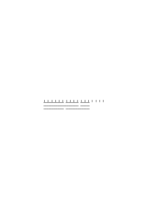
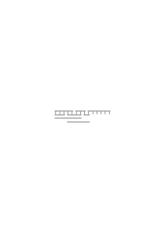

# Ts-218

### [1\[1\]](https://cdn.wittgensteinnachlass.com/2000px/webp/Ts-218/1.webp)

## Wie kann uns ein allgemeiner Beweis den besondern Beweis schenken?

### [1\[2\]](https://cdn.wittgensteinnachlass.com/2000px/webp/Ts-218/1.webp),[2\[1\]](https://cdn.wittgensteinnachlass.com/2000px/webp/Ts-218/2.webp)

Weil es sich in dem einen Fall so verhält – wie kann ich wissen, daß es sich in dem _andern_ so verhält? Und ein ‘Sich so verhalten müssen’ gibt es nicht. Ist es nicht so, so kann man auch nichts machen. Nur was von uns abhängt, können wir im Voraus _bestimmen_. Man möchte wohl sagen: Die selbe Konstruktion ist ein Beweis des geometrischen Satzes für das bestimmte Dreieck; wir können sie aber auch allgemein meinen; oder: wir können an ihr auch einsehen, daß das, was für dieses Dreieck gilt, für jedes andre auch gelten muß. – Aber worin besteht dieses “meinen” und das “einsehen”? Die psychologischen Prozesse kümmern uns ja nicht. “Das Dreieck steht eben hier für _irgend_ ein Dreieck”. Aber worin besteht dieses “für etwas stehen”? Es handelt sich für uns eben wieder nur um den _Ausdruck_ jener ‘Auffassung’, d.h. den Ausdruck dessen, _was_ wir auffassen oder einsehen und den Ausdruck dafür, daß das Dreieck nur für sich selbst oder für alle Dreiecke steht. Der Kalkül muß (wieder) festgestellt werden. Nicht seelische Vorgänge interessieren uns, sondern symbolische.

### [2\[2\]](https://cdn.wittgensteinnachlass.com/2000px/webp/Ts-218/2.webp)

Der Beweis kann also nichts prophezeien.

### [2\[3\]](https://cdn.wittgensteinnachlass.com/2000px/webp/Ts-218/2.webp)

Ist der Beweis, für A ausgeführt, auch der Beweis für B? so daß es ganz gleichgültig ist, im welchem Dreieck er gezeichnet ist. Und, wenn er also in beiden Dreiecken gezeichnet wäre, nur _derselbe_ Beweis wiederholt wäre. Daß also das Zeichen des Beweises – _der Beweis als Zeichen_ – ebensogut aus der Konstruktion in AA und dem Dreieck B bestehen könnte, wie aus diesem Dreieck und einer Konstruktion in ihm.

### [2\[4\]](https://cdn.wittgensteinnachlass.com/2000px/webp/Ts-218/2.webp)

_Wie_ macht mich der allgemeine Induktionsbeweis sicher , daß der besondere das ergeben wird?

### [2\[5\]](https://cdn.wittgensteinnachlass.com/2000px/webp/Ts-218/2.webp)

(Verachte nur nicht die simplen Kalküle, wie sie jedes Kind und jede Kaufmannsfrau benützt.)

### [2\[6\]](https://cdn.wittgensteinnachlass.com/2000px/webp/Ts-218/2.webp)

Dies muß auch ein vollkommen strenger Beweis des assoziativen Gesetzes sein.

### [2\[7\]](https://cdn.wittgensteinnachlass.com/2000px/webp/Ts-218/2.webp)

Und hier kann man die beiden Fälle deutlich unterscheiden, von denen wir im geometrischen Beweis sprachen. Denn die Figur kann als allgemeiner Beweis gelten, und auch nur als Beweis von 6 + (4 + 3) = (6 + 4) + 3, und ich kann den Beweis von 3 + (7 + 2) = (3 + 7) + 2 so hinschreiben:

Ich habe den Beweis nur oben ausgeführt (die Konstruktion gezeichnet).

### [3\[1\]](https://cdn.wittgensteinnachlass.com/2000px/webp/Ts-218/3.webp)

Ein Kalkül ist nicht strenger, als ein anderer! Man muß nur die Grenzen eines jeden kennen. Nur insofern kann man einen Kalkül unstreng nennen, als seine Regeln nicht _klar_ formuliert sind.

### [3\[2\]](https://cdn.wittgensteinnachlass.com/2000px/webp/Ts-218/3.webp)

Ich _könnte_ oben die gleiche Konstruktion zeichnen wie unten. Genügt aber das als Beweis?! Ja, denn der Beweis besteht nun in der Beschreibung dessen, was ich zeichnen könnte. Und die Beschreibung eines Beweises ist ja (auch) der Beweis. – Und nun muß ich ja das Zeichen <math class="stacked" display="inline"><mspace width="0.3em"/><mtext>“</mtext><mfrac><mrow><mo>(</mo><mo>(</mo><mo>(</mo><mtext>1)</mtext><mspace width="0.3em"/><mo>+</mo><mspace width="0.3em"/><mtext>1)</mtext><mspace width="0.3em"/><mo>+</mo><mspace width="0.3em"/><mtext>1)</mtext></mrow><mrow><mi>a</mi></mrow></mfrac><mspace width="0.3em"/><mo>+</mo><mfrac><mrow><mo>(</mo><mo>(</mo><mo>(</mo><mtext>1)</mtext><mspace width="0.3em"/><mo>+</mo><mspace width="0.3em"/><mtext>1)</mtext></mrow><mrow><mi>b</mi></mrow></mfrac><mspace width="0.3em"/><mo>+</mo><mfrac><mrow><mo>(</mo><mo>(</mo><mo>(</mo><mo>(</mo><mtext>1)</mtext><mspace width="0.3em"/><mo>+</mo><mspace width="0.3em"/><mtext>1)</mtext><mspace width="0.3em"/><mo>+</mo><mspace width="0.3em"/><mtext>1)</mtext><mspace width="0.3em"/><mo>+</mo><mspace width="0.3em"/><mtext>1)</mtext><mo>)</mo></mrow><mrow><mi>c</mi></mrow></mfrac><mspace width="0.3em"/><mo>=</mo><mfrac><mrow><mo>(</mo><mi>a</mi><mspace width="0.3em"/><mo>+</mo><mspace width="0.3em"/><mtext>b)</mtext><mspace width="0.3em"/><mo>+</mo><mspace width="0.3em"/><mi>c</mi></mrow><mrow><mtext>∣</mtext><mtext>∣</mtext><mtext>∣</mtext><mtext>∣</mtext></mrow></mfrac><mtext>”</mtext></math> Schritt für Schritt durchgehen, um mich zu vergewissern, daß es nach diesem Plan gebaut ist. Dem Plan, für welchen der allgemeine Beweis gilt.

### [3\[3\]](https://cdn.wittgensteinnachlass.com/2000px/webp/Ts-218/3.webp)

“Wie kommt es, daß ich diesen Satz (der Geometrie oder Arithmetik) nicht eigens beweisen muß, sondern, daß er durch den allgemeinen Beweis schon bewiesen ist?” Aber Du mußt ihn ja beweisen, – indem Du nämlich den besondern Satz hinschreibst, denn das Übrige ist nur, was allen Beweisen solcher Sätze gemeinsam ist. Du mußt diesen euklidischen Satz für jedes Dreieck von neuem beweisen; nur besteht allerdings das Besondere dieses Beweises nur in der Zeichnung dieses Dreiecks, da das Übrige durch die allgemeine Form (den euklidischen Beweis) schon vorgesehen ist.)