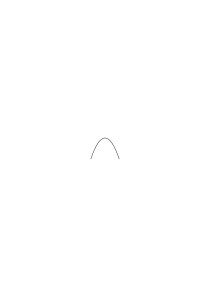

# Ts-219

### [1\[1\]](https://cdn.wittgensteinnachlass.com/2000px/webp/Ts-219/1.webp)

Muß sich denn nicht eine Welt beschreiben lassen, worin der solipsistische Fehler uns weniger naheliegt? Wo die Tatsachen solche sind, daß wir weniger leicht zu einer einseitigen Grammatik verführt werden?

### [1\[2\]](https://cdn.wittgensteinnachlass.com/2000px/webp/Ts-219/1.webp)

In meinen Betrachtungen der Mathematik spielen winzige Veränderungen der _symbolischen_ Ausdrucksweise eine Rolle. Was _so_ gesagt klar und durchsichtig ist, kann, ein wenig anders gesetzt, undurchsichtig oder irreführend sein.

### [1\[3\]](https://cdn.wittgensteinnachlass.com/2000px/webp/Ts-219/1.webp)

Jemandem für etwas denkbar sein, analog: jemanden erwarten, etc..

### [1\[4\]](https://cdn.wittgensteinnachlass.com/2000px/webp/Ts-219/1.webp)

Zeichnung eines vierdimensionalen Würfels (als Erklärung meiner Auffassung der Zeichnung des dreidimensionalen). [→ Gehört zur Betrachtung des mathematischen Beweises als Ornament.]

### [1\[5\]](https://cdn.wittgensteinnachlass.com/2000px/webp/Ts-219/1.webp)

Das Gesichtsfeld, wenn man feinen Regen sieht: man sieht eine Bewegung, aber nichts etwas Bestimmtes sich bewegen.

### [1\[6\]](https://cdn.wittgensteinnachlass.com/2000px/webp/Ts-219/1.webp)

“Ich denke mir viel mehr, als ich sage” – wie kann man das vergleichen?

### [1\[7\]](https://cdn.wittgensteinnachlass.com/2000px/webp/Ts-219/1.webp)

Wir mischen uns nicht in das, was der Mathematiker tut; erst wenn er behauptet Metamathematik zu treiben, dann kontrollieren wir ihn.

### [1\[8\]](https://cdn.wittgensteinnachlass.com/2000px/webp/Ts-219/1.webp)

Wenn wir uns einige Male im Kreis herumdrehen und dann stehenbleiben, so scheint sich das Zimmer um uns zu bewegen, und doch sehen wir nicht, daß Gegenstände um uns dabei unserem Blick entschwinden und andre in unser Blickfeld treten, wie es doch bei einer Drehung des Zimmers der Fall sein müßte. Ganz ähnlich dem ist es aber, wenn ein Musikstück so gespielt wird, daß es uns scheint, es würde schneller und schneller gespielt, und dabei müssen wir uns sagen, daß sich das Tempo im ganzen nicht merkbar verändert.

### [2\[1\]](https://cdn.wittgensteinnachlass.com/2000px/webp/Ts-219/2.webp)

Schwanken des Begriffs “Wortart”. Ist “3” die gleiche Wortart wie “4”?

### [2\[2\]](https://cdn.wittgensteinnachlass.com/2000px/webp/Ts-219/2.webp)

Meine Erklärung, daß die Bedeutung eines Wortes ganz in der Grammatik erklärt ist, ruft leicht den falschen Schein hervor, als verwechselte ich hier Worte mit Wortarten.

### [2\[3\]](https://cdn.wittgensteinnachlass.com/2000px/webp/Ts-219/2.webp)

Die formale Logik, ein Teil der Mathematik.

### [2\[4\]](https://cdn.wittgensteinnachlass.com/2000px/webp/Ts-219/2.webp)

Ich zerstöre die _Probleme_ und lasse nur noch _Fragen_.

### [2\[5\]](https://cdn.wittgensteinnachlass.com/2000px/webp/Ts-219/2.webp)

Meinen, eine Angelegenheit der Psychologie, oder eine Transformation im Symbolismus.

### [2\[6\]](https://cdn.wittgensteinnachlass.com/2000px/webp/Ts-219/2.webp)

Die Verteilung _der_ Primzahlen verstehen:

Kann man, und wie kann man, das Auftreten _einer bestimmten_ Primzahl “_verstehen_”? Etwa der Primzahl 3 (oder 5)? – (Wozu ein allgemeines Problem angehen, wenn das elementare schon interessant ist!) Was heißt es, verstehen, warum 5 eine Primzahl ist, oder: warum an der 5ten Stelle der Kardinalzahlenreihe eine Primzahl steht? (Es _handelt_ sich darum, das Gefühl loszuwerden, daß es sich hier um eine Erfahrungstatsache handelt.)

<math display="block">
  <mtext>❘</mtext>
  <mspace width="0.3em"/>
  <mo>(</mo>
  <mtext>❘</mtext>
  <mo>)</mo>
  <mtext>❘</mtext>
  <mspace width="0.3em"/>
  <mtext>❘</mtext>
  <mspace width="0.3em"/>
  <mo>(</mo>
  <mtext>❘</mtext>
  <mspace width="0.3em"/>
  <mtext>❘</mtext>
  <mo>)</mo>
  <mtext>❘</mtext>
  <mspace width="0.3em"/>
  <mtext>❘</mtext>
  <mspace width="0.3em"/>
  <mtext>❘</mtext>
  <mspace width="0.3em"/>
  <mo>(</mo>
  <mtext>❘</mtext>
  <mspace width="0.3em"/>
  <mtext>❘</mtext>
  <mspace width="0.3em"/>
  <mtext>❘</mtext>
  <mo>)</mo>
</math>

Denken wir uns das Problem der Primzahlverteilung in einer endlichen Arithmetik!

### [2\[7\]](https://cdn.wittgensteinnachlass.com/2000px/webp/Ts-219/2.webp),[3\[1\]](https://cdn.wittgensteinnachlass.com/2000px/webp/Ts-219/3.webp)

Denke erstens daran, was es wirklich bedeutet, zu sagen “das Ereignis ist ein anderes, als das, welches ich erwartet habe”. Zweitens: Wenn zur Konstatierung der Identität ein weiteres Phänomen der Wiedererkennung nötig ist, dann auch eins zur Wiedererkennung _dieser_ u.s.f.. 3.) Denke daran, was es heißt: _wissen_, daß das dasselbe ist.

### [3\[2\]](https://cdn.wittgensteinnachlass.com/2000px/webp/Ts-219/3.webp)

Wodurch unterscheidet sich der Vorsatz, in einer halben Stunde Schach zu spielen, von dem, in 28 Minuten Schach zu spielen? – Gar nicht, wenn dies nicht artikuliert ist. Als Kriterium des Vorsatzes können wir zur Vereinfachung das ansehen, was Er _sagt_.

### [3\[3\]](https://cdn.wittgensteinnachlass.com/2000px/webp/Ts-219/3.webp)

Wir können auch sagen, die beiden Beweise beweisen denselben Satz, dann aber zeigt das, was wir hier unter dem Beweise eines Satzes verstehen.

(Verschiedene Auffassungen des Wortes “Schach”.) Dann gibt es auch mehrere unabhängige Beweise des gleichen Satzes. etc..

### [3\[4\]](https://cdn.wittgensteinnachlass.com/2000px/webp/Ts-219/3.webp)

Die Rechnung reicht an ihre Lösung heran, wie der Maßstab an das Gemessene, die Beschreibung an das Beschriebene.

### [3\[5\]](https://cdn.wittgensteinnachlass.com/2000px/webp/Ts-219/3.webp)

Die Grammatik des Wortes “Gedanke” ist, was gesucht wird. Vergleiche die Grammatik von “Satz”, “Maßstab” und “Gedanke”.

### [3\[6\]](https://cdn.wittgensteinnachlass.com/2000px/webp/Ts-219/3.webp)

Und was heißt “ich weiß, was ich zu tun habe”? Was geht da – etwa in mir – vor, wenn ich das weiß? “Du weißt was Du zu tun hast? – nun, was weißt Du, was hast Du zu tun?”

### [3\[7\]](https://cdn.wittgensteinnachlass.com/2000px/webp/Ts-219/3.webp)

Kann man fragen? Wie ist es mit der “Kenntnis”, die Du vom Befehl beziehst? Wenn Du gefragt wirst, worin diese Kenntnis besteht, so mußt Du entweder in den Worten des Befehls selber antworten, oder mit andern Worten derselben Sprache.

### [4\[1\]](https://cdn.wittgensteinnachlass.com/2000px/webp/Ts-219/4.webp)

“Das ist der Träger des Namens ‘N’” ist eine grammatische Regel für ‘N’. Haben ‘M’ und ‘N’ den gleichen Träger _in gleicher Weise_, so stimmen die Regeln für ‘M’ und ‘N’ überein, und sie haben die gleiche Bedeutung.

### [4\[2\]](https://cdn.wittgensteinnachlass.com/2000px/webp/Ts-219/4.webp)

Worin besteht denn dieser Vorsatz? Wenn es ein artikulierter Vorsatz ist, so ist es nur dann der Vorsatz zu tun “was ich an einer bestimmten Stelle meines Gedächtnisses finde”, wenn dies ausdrücklich gesagt wird.

### [4\[3\]](https://cdn.wittgensteinnachlass.com/2000px/webp/Ts-219/4.webp)

“Jetzt” wirkt eben anders, als (etwa) “Baum”. “Jetzt” ist in gewisser Beziehung ähnlich einem Muster.

### [4\[4\]](https://cdn.wittgensteinnachlass.com/2000px/webp/Ts-219/4.webp)

“Wer den Gedanken, den Wunsch, die Furcht, den Ärger ansieht, muß sehen, was gedacht, gewünscht, gefürchtet wird, worüber er sich ärgert.”

### [4\[5\]](https://cdn.wittgensteinnachlass.com/2000px/webp/Ts-219/4.webp)

Zwischen welchen Gegenständen besteht der kleinste sichtbare Unterschied?

### [4\[6\]](https://cdn.wittgensteinnachlass.com/2000px/webp/Ts-219/4.webp)

Der Schachkönig hat nur im Schachspiel Bedeutung Die Unvereinbarkeit versteckt (siehe: versteckter Widerspruch). Hast Du jetzt in den Haaren Schmerzen? oder in den Schuhsohlen? Sind _keine_ Schmerzen dort das gleiche Gefühl, wie _keine_ Schmerzen in der Hand? Schmerzen im Tastraum, oder im Sehraum.

Der _Zustand_ der Schmerzen, ein Gefühl; aber auch der Zustand der Schmerzlosigkeit?

### [4\[7\]](https://cdn.wittgensteinnachlass.com/2000px/webp/Ts-219/4.webp)

Wenn ich _einen_ Klang höre, so ist damit nicht gesagt, daß ich auch _andere_ hören _könnte_.

### [5\[1\]](https://cdn.wittgensteinnachlass.com/2000px/webp/Ts-219/5.webp)

Verständlichkeit des Ausdrucks “Zwischenfarbe” ohne Angabe eines bestimmten Farbübergangs.

### [5\[2\]](https://cdn.wittgensteinnachlass.com/2000px/webp/Ts-219/5.webp)

Wenn man wirklich wissen will, was Leute unter “particular” im Gegensatz zu “universal” verstehen, so muß man sie fragen: “wie soll die Identität des Partikularen festgestellt werden, was ist als das Kriterium dafür bestimmt, daß das derselbe Mensch ist, den ich gestern gesehen habe; u.s.w.?

### [5\[3\]](https://cdn.wittgensteinnachlass.com/2000px/webp/Ts-219/5.webp)

Wiedererkennen ist eine besondere Erfahrung. Wenn ich in meinem Zimmer auf und abgehe, oder auf der Straße, habe ich da fortwährend Erlebnisse des Wiedererkennens?

### [5\[4\]](https://cdn.wittgensteinnachlass.com/2000px/webp/Ts-219/5.webp)

Woran erinnere ich mich, wenn ich mich an die Absicht erinnere, Schach zu Spielen?

### [5\[5\]](https://cdn.wittgensteinnachlass.com/2000px/webp/Ts-219/5.webp)

Wenn man sich erinnert, etwas geträumt zu haben, wie ist es? Wie weiß man, daß es _geträumt_ war? Gleichsam durch die Färbung des Erinnerungsbildes? – Ich erinnere mich geradeso eines Traums als Traumes, wie eines Gedankens, den ich gestern hatte, als Gedanken.

### [5\[6\]](https://cdn.wittgensteinnachlass.com/2000px/webp/Ts-219/5.webp)

Man kann fragen: wie waren die genauen Vorgänge, als Du ihn erwartetest, auf den Eintritt der Besserung hofftest, etc.. Und denke, was die Antwort sein muß.

### [5\[7\]](https://cdn.wittgensteinnachlass.com/2000px/webp/Ts-219/5.webp)

Vergleiche die Beschreibung etwa der Einrichtung eines Zimmers mit der Beschreibung: Ich glaube, daß er kommen wird. Was beschreibt dieser Satz? meinen Seelenzustand?

### [5\[8\]](https://cdn.wittgensteinnachlass.com/2000px/webp/Ts-219/5.webp)

“I had this at the back of my mind all the time I was reading _this chapter_” (wieder eine Lokalität der Seele). Denke an den Vorgang, wenn wir plötzlich aussprechen, oder uns selbst sagen, was immer schon, gleichsam ganz leise, im Hintergrund unserer Gedanken war. Und diese Vorgänge im Hintergrund haben natürlich wieder nichts mit dem zu tun, was _wir_ den Sinn eines Satzes, oder die Bedeutung seiner Worte nennen.

### [5\[9\]](https://cdn.wittgensteinnachlass.com/2000px/webp/Ts-219/5.webp)

Wortstamm und Wortendung. Kommt es dem primitiven Volk, das keine geschriebene Grammatik seiner Sprache besitzt, zum Bewußtsein, daß seine Wörter etwa einen Stamm und eine Endung haben? Haben die Grammatiker dies erst nachträglich festgestellt, oder _klingt_ der Wortstamm in der primitiven Sprache anders, als die Endung, etwa stärker?

### [6\[1\]](https://cdn.wittgensteinnachlass.com/2000px/webp/Ts-219/6.webp)

Der Mensch mit “gesundem Menschenverstand”, wenn er einen früheren Philosophen liest, denkt (und nicht ohne Recht): “lauter Unsinn!” – wenn er mich hört, so denkt er: “lauter fade Selbstverständlichkeiten!”. Wieder mit Recht. Und so hat sich der Aspekt der Philosophie geändert. (Ich will sagen: “so schaut dieses eine Ding von verschiedenen Standpunkten aus”.)

### [6\[2\]](https://cdn.wittgensteinnachlass.com/2000px/webp/Ts-219/6.webp)

Der Mensch sagt “Oh Gott” und blickt in die Höhe. Nun, das ist eben, was uns lehren kann, was damit gemeint ist, daß Gott in der Höhe wohnt.

### [6\[3\]](https://cdn.wittgensteinnachlass.com/2000px/webp/Ts-219/6.webp)

Man könnte, sehr beiläufig, sagen, daß Menschen, deren Natur es ist, in gewissen Situationen niederzuknien und die Hände zu falten, daß diese in ihrer Sprache einen persönlichen Gott _haben_.

### [6\[4\]](https://cdn.wittgensteinnachlass.com/2000px/webp/Ts-219/6.webp)

Komplette Grammatik eines Wortes. Komplettes Regelverzeichnis eines Spiels. Setzen wir nur fest, daß _dies_ das komplette Regelverzeichnis _unseres_ Spiels ist!

### [6\[5\]](https://cdn.wittgensteinnachlass.com/2000px/webp/Ts-219/6.webp)

Beim Frage und Antwortspiel (als Typus der Sprache) denke an Plato, wo viel öfter Frage und Antwort vorkommen, als wir sie gebrauchen würden.

### [6\[6\]](https://cdn.wittgensteinnachlass.com/2000px/webp/Ts-219/6.webp)

Keller (im Grünen Heinrich) schreibt einmal über einen Mann, der zwar sagt, er glaube nicht an Gott, aber doch alle jene geläufigen Redensarten gebraucht, die das Wort “Gott” enthalten. (“Gott sei Dank”, “wollte Gott”, etc.) Und Keller meint, der Mann widerspreche sich damit selbst. Aber es _müßte_ darin durchaus kein Widerspruch liegen, und man kann sagen: was Du mit dem Wort “Gott” meinst, werde ich daraus erfahren, welche Sätze mit diesem Wort Du gebrauchst und welche für Dich sinnlos sind. Denn auch ich gebrauche das Wort “Sinn eines Satzes”, “Bedeutung eines Worts” in gewissen Zusammenhängen und kenne doch nicht ein Ding ‘die Bedeutung des Worts’, und einen Schatten eines Ereignisses ‘den Sinn eines Satzes’.

### [6\[7\]](https://cdn.wittgensteinnachlass.com/2000px/webp/Ts-219/6.webp)

Ich erwartete ihn zum Tee und stellte mir vor, wie er hereintreten würde. Wie war, was diese Vorstellung vorstellte (ich meine, porträtierte) in ihr enthalten? Sah ich, z.B. in der Vorstellung sein Gesicht wirklich so genau, daß kein Zweifel bestehen konnte, daß _er_ es war? Und zeigte sich das dann, als er hereintrat? Was ist das Kriterium davon, daß _er_ es war, den ich mir hereintreten vorgestellt habe? Nun, vielleicht sagte ich mir “so wird N hereintreten”. Ich schrieb gleichsam den Namen dessen, den es vorstellt, unter das Bild. Aber vielleicht war es auch nur insofern er, den ich mir vorstellte, als _er_ es war, für den ich den Tee herrichtete. Und vielleicht schlage ich eine nicht-kausale Verbindung zwischen ihm und der Vorstellung erst später durch die Worte “ich habe mir Dich vorgestellt, wie Du hereinkommen wirst”.

### [7\[1\]](https://cdn.wittgensteinnachlass.com/2000px/webp/Ts-219/7.webp)

Beschreibe ich denn etwas, wenn ich sage “ich erwarte ihn jetzt”? Beschreibe ich denn einen Zustand, oder eine Tätigkeit der Erwartung? Könnten meine Worte nicht vielmehr auch als Ausdruck der Erwartung dienen, wenn sie die einzige Erscheinung der Erwartung wären? Wenn also mein Erwarten bloß im Aussprechen des Satzes “ich erwarte ihn” bestünde.

### [7\[2\]](https://cdn.wittgensteinnachlass.com/2000px/webp/Ts-219/7.webp)

Wenn ich sage: “ich stelle mir vor, wie das sein wird”, so tritt hier noch kein Problem auf, denn ich konnte ja ein Mittel haben, eine Halluzination in mir hervorzurufen, oder, was hier auf dasselbe hinauskommt, ich konnte mir ja ein Bild des Künftigen malen. Anders aber ist es, wenn ich sage, ich _erwarte_ mir, daß es so sein wird. Denn hier liegt die Zukunft schon in der Erwartung.

### [7\[3\]](https://cdn.wittgensteinnachlass.com/2000px/webp/Ts-219/7.webp)

“Wie weißt Du, das Du _ihn_ erwartet hast?” Ich erinnere mich einfach daran. “Ja, aber woran erinnerst Du Dich denn?” Deine Tätigkeiten und Gefühle in jener Stunde waren ja sehr mannigfach. Was von allen diesen Tätigkeiten läßt sich denn jetzt sagen, daß Du gerade ihn erwartet hast? Wie hat denn Deine Erwartung an ihn angeknüpft?” Und nun machen wir ein schematisches und einfaches Erinnerungsspiel daraus.

### [7\[4\]](https://cdn.wittgensteinnachlass.com/2000px/webp/Ts-219/7.webp)

Die Idee, daß die Logik der Wirklichkeit, die Mathematik ihrer Anwendung verantwortlich ist, ist eine Art Teleologie.

### [7\[5\]](https://cdn.wittgensteinnachlass.com/2000px/webp/Ts-219/7.webp)

Man kann sagen, der Satz “ich glaube p” ist ein Ausdruck meines Glaubens. Ist er aber auch eine Beschreibung meines Geisteszustands? Analog: Ist “ich will jetzt Schach spielen” eine Beschreibung des Geisteszustandes der Intention? Und ist der Ruf “Hilfe!” eine Beschreibung? (Oder: “Ah, da ist er!” – Man kann mit Worten streicheln, wie mit der Hand.)

### [7\[6\]](https://cdn.wittgensteinnachlass.com/2000px/webp/Ts-219/7.webp)

Entwirft der, welcher sagt “ich hoffe, er wird kommen” ein Porträt seines Geisteszustandes; schaut er gleichsam in sich hinein und sagt uns, was er dort sieht, wie wenn er in ein Fenster sieht und uns den Innenraum beschreibt, den er sieht? Spielt er ein solches Spiel? Nein. – Wenn er uns dagegen erzählte: “Ich hoffte die ganze Zeit, er würde kommen, endlich aber gab ich die Hoffnung auf und trachtete, mich mit dem Gedanken abzufinden …”: in diesem Fall würden wir sagen, er beschriebe etwas. Nun, natürlich nicht in eben demselben Sinn, wie er das Zimmer beschreibt, aber in einem verwandten.

### [7\[7\]](https://cdn.wittgensteinnachlass.com/2000px/webp/Ts-219/7.webp)

Denke an den Fatalismus: ist er eine Theorie? und etwa eine falsche? Ist nicht das, was für uns den Schein einer solchen Theorie hat, offenbar nur ein Ausdruck einer bestimmten persönlichen Verfassung?!

### [8\[1\]](https://cdn.wittgensteinnachlass.com/2000px/webp/Ts-219/8.webp)

Die Analogien der Sprache mit dem Schachspiel haben ihren Nutzen dadurch, daß sie die Autonomie der Sprache illustrieren. Es fällt nämlich im Gebiet des Schachspiels die Versuchung weg, das Zeigen auf einen Gegenstand außerhalb als der Bedeutung wesentlich anzusehen.

### [8\[2\]](https://cdn.wittgensteinnachlass.com/2000px/webp/Ts-219/8.webp)

Denken wir uns, jemand behauptete, wir _sähen_ den Kirchturm, den wir durch unser Fenster sehn, immer größer als das Fenster; wir sähen in ihm etwas Größeres und im Fenster etwas Kleineres: wir sähen Größe in sein Bild hinein. So wie ich vom Hineinsehen einer Bedeutung in ein Wort geredet habe.

### [8\[3\]](https://cdn.wittgensteinnachlass.com/2000px/webp/Ts-219/8.webp)

Zum Problem: ist = ε, ist = = . Wie, wenn wir eine Bauernfigur als König verwenden; ist dann in jedem Zug, den wir mit diesem König machen, etwas enthalten, oder geht bei jedem solchen Zug etwas vor sich, das ihn von einem Zug mit einem Bauer unterscheidet? Sind wir nicht immer versucht, diesen Fall etwa mit dem zu vergleichen, wenn ein hölzerner Bauer und ein elfenbeinerner mit der gleichen Farbe gestrichen wären und wir sagten: sie schaun nur gleich aus, aber der eine ist aus Elfenbein, der andere aus Holz. Möchten wir nicht sagen, daß die Königswürde die ganze Zeit in der Bauernfigur versteckt ist, oder in unserm Geist, während wir spielen? Und wenn dann eingewendet würde, daß wir auch halb oder ganz automatisch ziehen können, – möchten wir dann nicht sagen: ja, aber im idealen Spiel wäre es uns immer bewußt? Ist mit den Wörtern “ist” in “die Rose ist rot” und “das ist mein Bruder” wirklich so etwas wie ein anderer Bedeutungskörper verbunden? Und sonderbar, daß ihn die Philosophen nicht bemerkt haben, die über den Sinn dieser Sätze Betrachtungen angestellt haben! –

### [8\[4\]](https://cdn.wittgensteinnachlass.com/2000px/webp/Ts-219/8.webp)

Wie trat denn das Problem auf? Nun, man machte von dem einen Satz eine andre Art Übergang zu anderen und zu Handlungen, als von dem andern. Und die Lösung war: Verwenden wir zwei verschiedene Worte, dann verschwindet das Problem gänzlich (ja es wäre nie eines gewesen, wenn in unserer Sprache zwei verschiedene Wörter gebraucht worden wären). Und denken wir uns nun den gleichen Fall im Schachspiel. Es wäre ständiger Gebrauch gewesen, den König wie einen Bauer zu bilden und der Spieler hätte sich, wie wir sagen würden, erinnert, daß dieser Stein im Anfang auf dem Königsfeld gestanden hätte. Aber wenn ich das sage, so meine ich nicht, daß der Spieler das immer vor sich hergesagt hätte. Er hätte eben mehr oder weniger automatisch so gespielt. – Nun wäre das philosophische Problem _aufgetreten_; man hätte nämlich angefangen, die Regeln zu tabulieren, die Begriffe Bauer und König zu bilden und es wäre nun gefragt worden: Inwiefern ist der König eigentlich ein Bauer? – – –

### [8\[5\]](https://cdn.wittgensteinnachlass.com/2000px/webp/Ts-219/8.webp)

_Das_ ist das Verhängnisvolle an der wissenschaftlichen Denkweise (die heute die ganze Welt besitzt), daß sie jede Beunruhigung mit einer Erklärung beantworten will.

### [9\[1\]](https://cdn.wittgensteinnachlass.com/2000px/webp/Ts-219/9.webp)

Denken wir daran, was es heißt: “es ist jetzt genau 5 Uhr” – wenn dies nämlich bei einer Gelegenheit des täglichen Lebens gesagt wird. Wir glauben vielleicht: freilich weiß der, der das sagt, wahrscheinlich die Zeit nicht absolut genau, aber es wäre doch denkbar. D.h., wir haben doch einen Begriff von dieser absoluten Genauigkeit. Aber in Wirklichkeit könnte der, der nun gefragt würde: was ist das Kriterium dafür, daß es wirklich genau 5 Uhr ist, keines angeben. Im Begriff dieser Zeitangabe selber liegt eine Vagheit (sozusagen in ihrer Geometrie).

### [9\[2\]](https://cdn.wittgensteinnachlass.com/2000px/webp/Ts-219/9.webp)

A sagt zu B: “Gott mit Dir”. – B: “Glaubst Du denn an Gott?” A: “Ja; soweit z.B., daß es für mich Sinn hat zu sagen ‘Gott mit Dir’”.

### [9\[3\]](https://cdn.wittgensteinnachlass.com/2000px/webp/Ts-219/9.webp)

Ich glaube, man muß sagen, daß, wie das Wort “wünschen” gebraucht wird, es wesentlich ist, daß es keinen Sinn hat, jemandem den Befehl zu geben, etwas zu wünschen. Daß also, wenn es sich um einen artikulierten Wunsch handelt, der Ausdruck von irgend einem spezifischen Erlebnis begleitet sein muß.

### [9\[4\]](https://cdn.wittgensteinnachlass.com/2000px/webp/Ts-219/9.webp)

Vergleiche in dieser Beziehung den Befehl, etwas zu suchen, mit dem Befehl, etwas zu denken, zu wünschen, zu hoffen, zu glauben, und mit dem, etwas zu wissen.

### [9\[5\]](https://cdn.wittgensteinnachlass.com/2000px/webp/Ts-219/9.webp)

Denke an die mannigfachen Möglichkeiten, wie Gefühle einen Satz begleiten können.

### [9\[6\]](https://cdn.wittgensteinnachlass.com/2000px/webp/Ts-219/9.webp)

Eine phänomenologische Frage: Inwiefern ist ein Ton derselbe Ton, wie seine Oktav? oder: was hat ein Ton mit seiner Oktav gemeinsam? Können wir aber sozusagen auf der Tonleiter Schritt für Schritt hinaufsteigen und dann überrascht sein, daß alle 8 Töne wieder einer kommt, der die gewisse merkwürdige Ähnlichkeit mit dem Ausgangspunkt hat? Ist es eine Erfahrungstatsache, daß alle 8 Töne eine Oktave kommt?

### [9\[7\]](https://cdn.wittgensteinnachlass.com/2000px/webp/Ts-219/9.webp)

Wie kann man durch Denken die Wahrheit finden? Ich sage N sollte M kennenlernen, das würde ihnen gut tun, denn beide sind Musiker. Dann stelle ich mir ihr Zusammentreffen und ihre Konversation vor und es fällt mir ein, daß sie in diesem und jenem fundamental verschiedener Anschauung wären, und daß N geärgert sein werde, und daß sie ohne Nutzen wieder auseinandergehen würden: und ich entscheide mich nun gegen ein Zusammentreffen der beiden.

### [9\[8\]](https://cdn.wittgensteinnachlass.com/2000px/webp/Ts-219/9.webp)

Wenn man sagt, B ist ein Beweis von A, so zeigt das, in welchem Sinn A als Gleichung gemeint ist.

### [10\[1\]](https://cdn.wittgensteinnachlass.com/2000px/webp/Ts-219/10.webp)

Der Tonfall, der etwa für die Überzeugung charakteristisch ist, _begleitet_ tatsächlich den Satz. Aber nun nicht etwa so, daß derselbe Tonfall ohne die Worte, etwa mit unsinnigen Zeichen, einer Überzeugung ausdrückte.

### [10\[2\]](https://cdn.wittgensteinnachlass.com/2000px/webp/Ts-219/10.webp)

Was heißt es, einen Menschen erkennen?

### [10\[3\]](https://cdn.wittgensteinnachlass.com/2000px/webp/Ts-219/10.webp)

Möglichkeit einer Sprache, die immer gesungen wird, und die also mit einem Notensystem geschrieben werden muß.

### [10\[4\]](https://cdn.wittgensteinnachlass.com/2000px/webp/Ts-219/10.webp)

Die Philosophie löst, oder vielmehr beseitigt, nur philosophische Probleme; sie stellt nicht unser Denken auf einen festeren Grund.

### [10\[5\]](https://cdn.wittgensteinnachlass.com/2000px/webp/Ts-219/10.webp)

Wir wenden uns vor allem dagegen, daß die Frage “was ist Wissen” – z.B. – eine brennende sei. Denn _das_ scheint sie zu sein, und es scheint, als wüßten wir überhaupt noch gar nichts, ehe wir _sie_ beantworten können. Wir möchten gleichsam in unserer philosophischen Untersuchung in großer Eile etwas nachholen, was unerledigt ist, und vor dessen Erledigung alles Andere in der Luft zu hängen scheint.

### [10\[6\]](https://cdn.wittgensteinnachlass.com/2000px/webp/Ts-219/10.webp)

Mercatorprojektion und Darstellung der Sprache _als Spiel_.

### [10\[7\]](https://cdn.wittgensteinnachlass.com/2000px/webp/Ts-219/10.webp)

Wenn der Philosoph den Mathematiker auf eine Unterscheidung oder irreführende Redeweise aufmerksam macht, so sagt dieser: “ja, ja, das wissen wir ohnehin alles und es ist gar nicht sehr interessant”. Aber er weiß nicht, daß, wo ihn philosophische Fragen beunruhigen, gerade die Unklarheiten schuld sind, die er früher achselzuckend übergangen hatte.

### [10\[8\]](https://cdn.wittgensteinnachlass.com/2000px/webp/Ts-219/10.webp)

“Es gibt keine Dreiteilung des Winkels mit Lineal und Zirkel, auf gleicher Stufe wie: es gibt kein Einhorn”. – Denken wir uns Tiere mit einer Zeichnung auf der Stirn und nun die zwei Sätze:

“Es gibt kein Tier mit einem regelmäßigen Fünfeck auf der Stirn” und

“Es gibt kein Tier mit der Konstruktion der Dreiteilung des Winkels auf der Stirn”.

### [10\[9\]](https://cdn.wittgensteinnachlass.com/2000px/webp/Ts-219/10.webp)

Es sei die Aufgabe: “hier siehst Du die Farben des Regenbogens, nun finde eine weitere rechts vom Violett”. Denken wir uns, Einer löste die Aufgabe durch Entdeckung der ultravioletten Strahlen. Vergleichen wir dies mit der Lösung der Aufgabe, die Konstruktion des regelmäßigen Fünfecks zu finden. Anderseits: kann jene Aufgabestellung nicht doch anregend wirken?

### [11\[1\]](https://cdn.wittgensteinnachlass.com/2000px/webp/Ts-219/11.webp)

Wörter, deren Grammatik gleichsam aus Stücken der Grammatik eines gewöhnlichen Substantivs oder Adjektivs besteht: Z.B. “gut”. Die ganze Ethik scheint auf dieser Täuschung zu beruhen. Man sagt, dieser Mensch ist besser als jener, und gleich glaubt man, es nun mit einer Reihe quantitativer Bestimmungen wie eine Reihe von Gewichten zu tun zu haben. Man sagt “mein Vergnügen am Kino überwiegt mein Vergnügen an dieser Zusammenkunft” und denkt nun, es müsse sich bei genauerem Hinsehen ein Kalkül von Vergnügen und Mißvergnügen zeigen. Etc. etc..

### [11\[2\]](https://cdn.wittgensteinnachlass.com/2000px/webp/Ts-219/11.webp)

Konstruktion und Resultat einer Konstruktion. Inwiefern kann man das Resultat einer euklidischen Konstruktion geben, ohne die Konstruktion selbst zu geben? Das Resultat ist die Endfläche des Konstruktionskörpers.

### [11\[3\]](https://cdn.wittgensteinnachlass.com/2000px/webp/Ts-219/11.webp)

Das Resultat der Fünfeckskonstruktion, wie es gewöhnlich aufgefaßt wird, kann sehr wohl die Figur sein, die wir ein Quadrat nennen.

### [11\[4\]](https://cdn.wittgensteinnachlass.com/2000px/webp/Ts-219/11.webp)

“Das ist der Baum, den ich gesehen habe”. “Das ist die Farbe, die ich gesehen habe”.

### [11\[5\]](https://cdn.wittgensteinnachlass.com/2000px/webp/Ts-219/11.webp)

Philosophie ist ein Instrument, das nur zum Gebrauch gegen Philosophen und den Philosophen in uns dient.

### [11\[6\]](https://cdn.wittgensteinnachlass.com/2000px/webp/Ts-219/11.webp)

“Kurve der ein Punkt fehlt”: dieser Ausdruck ist in unserer _gewöhnlichen_ Sprache sinnlos. Das wird klar, wenn wir uns den Punkt als Schnittpunkt zweier Farbgrenzen denken, statt als kleinen Klecks. Wenn wir daher in der Mathematik etwa von einer Geraden reden, der gewisse Punkte fehlen, so zeigt das nur, daß wir uns hier _kategorisch_ (nicht graduell) von der ursprünglichen Auffassung der Wörter entfernen. Der Fehler ist nämlich, daß wir hier den mathematischen Punkt nur als etwas viel feineres als den Klecks betrachten und daher die Mathematik nur als eine viel genauere Betrachtung, als die gewöhnliche. Hätte man gewohnheitsmäßig immer geometrische Konstruktionen mit dem Pinsel, d.h. mit Farbgrenzen, durchgeführt, so sähen heute unsre geometrischen Sätze (_ganz_) anders aus. Man laboriert immer unter der Idee, daß die Zeichnung eine Approximation der mathematischen Verhältnisse ist. Natürlich ist die mathematische Betrachtung nicht “falsch”, sondern nur irreführend in ihrem Prosaausdruck, von dem sie doch wieder ihr Interesse hernimmt.

### [11\[7\]](https://cdn.wittgensteinnachlass.com/2000px/webp/Ts-219/11.webp)

Ich sage jemandem: “denke an Deine linke Hand!”. Er wird sie dann spüren. Geht nun wirklich unbedingt ein in Sätzen ausdrückbarer Gedanke in ihm vor? “Denke an sie” heißt eben etwas anderes, als im Fall, wenn man irgendeinen Satz über sie ausspricht.

### [12\[1\]](https://cdn.wittgensteinnachlass.com/2000px/webp/Ts-219/12.webp)

Was würden wir denn dem erklären, der störrisch wäre und auf den Rekursionsbeweis in seiner strengen Form den Übergang zu A nicht verstünde?

### [12\[2\]](https://cdn.wittgensteinnachlass.com/2000px/webp/Ts-219/12.webp)

Wenn ich sagte, der mathematische Satz sei nur die Endfläche seines Beweises so hieß das, daß sich der Satz nie von seinem Beweis emanzipieren kann.

### [12\[3\]](https://cdn.wittgensteinnachlass.com/2000px/webp/Ts-219/12.webp)

Wer mir den Ausdruck “1 + 1 + 1 + …bis 20” erklärt und mich nun auffordert, den Ausdruck “1 + 1 + 1 + …” zu verstehen, tut dasselbe, wie der, der mir den Ausdruck “A ist größer als B” erklärt und nun verlangt, daß ich den Satz “A ist größer als” verstehen soll.

### [12\[4\]](https://cdn.wittgensteinnachlass.com/2000px/webp/Ts-219/12.webp)

“Kopfrechnen” und Denken.

### [12\[5\]](https://cdn.wittgensteinnachlass.com/2000px/webp/Ts-219/12.webp)

Sprachspiel: Einen Satz bilden und nach ihm eine Zeichnung anfertigen. [→ (Siehe: Behauptung, Annahme, Frage, etc..)]

### [12\[6\]](https://cdn.wittgensteinnachlass.com/2000px/webp/Ts-219/12.webp)

“1 : 3 ist periodisch”.

“√2 ist nicht periodisch”. Inwiefern ist der Beweis des ersten Satzes das Gegenteil des Beweises des zweiten? Was das Gegenteil eines von uns bewiesenen mathematischen Satzes ist, muß sich aus dem Beweis ergeben.

### [12\[7\]](https://cdn.wittgensteinnachlass.com/2000px/webp/Ts-219/12.webp)

Verneinung innerhalb eines bestimmten Systems von Sätzen. “Das ist nicht rot = das ist gelb, oder grün oder …”. Verschiedene Fälle: solche, in denen die Verneinung gleichbedeutend einer Disjunktion ist, und andere.

### [12\[8\]](https://cdn.wittgensteinnachlass.com/2000px/webp/Ts-219/12.webp)

“In der Logik gibt es keine Überraschungen” heißt auch: ich kann keine neue Möglichkeit (etwa die, eines besondern Falls zu einem allgemeinen Satz) durch die Erfahrung lernen. Ich kann keine Möglichkeit durch die Erfahrung lernen, sondern nur eine Wirklichkeit. D.h., ich sage von der Erfahrung, sie lehre mich, ob ein Satz wahr oder falsch ist; aber nicht, sie lehrt mich den Satz selbst bilden.

### [12\[9\]](https://cdn.wittgensteinnachlass.com/2000px/webp/Ts-219/12.webp)

Hätte man das Hauptwort “Zeit” nicht gebildet, so hätte niemand gefragt: “hat Gott das Vorher und Nachher geschaffen, ehe er die Welt erschaffen hat?”

### [13\[1\]](https://cdn.wittgensteinnachlass.com/2000px/webp/Ts-219/13.webp)

Ursache ist etwas in einem physikalischen System. Was als Erklärung einer Erscheinung in diesem System vorgesehen ist, ist Ursache. Indeterministisch ist nur ein System der Darstellung.

### [13\[2\]](https://cdn.wittgensteinnachlass.com/2000px/webp/Ts-219/13.webp)

“Was ist das Kriterium dafür, daß ich Zahnschmerzen habe?” – Dagegen: “Was ist das Kriterium dafür, daß der Andere Zahnschmerzen hat?” –

### [13\[3\]](https://cdn.wittgensteinnachlass.com/2000px/webp/Ts-219/13.webp)

“Grün mit einem rötlichen Stich” ist das so unsinnig wie: “grün mit einem länglichen Stich?”

### [13\[4\]](https://cdn.wittgensteinnachlass.com/2000px/webp/Ts-219/13.webp)

Man möchte immer meinen, grün mischte sich mit rot nicht, wie Öl nicht mit Wasser, oder wie Öl an einer nassen Fläche nicht angreift. Ferner meint man, man brauche das Mischen von Rot und Grün gar nicht wirklich zu versuchen, sondern es gäbe hier ein Gedankenexperiment und _das_ mißlinge! (Während es mit Rot und Gelb gelingt.) Es ist wirklich, als ob die Farben Grün und Gelb sich mischten wie Öl mit etwas Öligem, und Grün und Rot nicht, als griffe das Rot am Grün nicht an als rinne es ab, wie Quecksilber von einer Eisenplatte. Aber ist es nun wirklich so?

### [13\[5\]](https://cdn.wittgensteinnachlass.com/2000px/webp/Ts-219/13.webp)

“Ich lerne eben das Schachbrett besser kennen”.

### [13\[6\]](https://cdn.wittgensteinnachlass.com/2000px/webp/Ts-219/13.webp)

Ich sagte, ich könne mir denken, oder vorstellen, wie ein weißer Fleck nach und nach in einen roten überginge, etc.. Da könnte man doch fragen: “bist Du sicher, daß Du keine Stufe ausgelassen hast?”

### [13\[7\]](https://cdn.wittgensteinnachlass.com/2000px/webp/Ts-219/13.webp)

Wir würden nicht sagen “Blau ist dem Rot ähnlicher, als dem Gelb”. “Grau ist schwärzer als weiß”.

### [13\[8\]](https://cdn.wittgensteinnachlass.com/2000px/webp/Ts-219/13.webp)

Eine Mechanik beweglicher Farbflecken in einer Ebene. Kausalität in dieser Mechanik.

### [13\[9\]](https://cdn.wittgensteinnachlass.com/2000px/webp/Ts-219/13.webp)

Wir möchten von den Farben reden, “die wir in der Natur vorfinden”. Wir möchten z.B. sagen: “wir sind davon abhängig, welche Farben wir in der Natur (Welt) vorfinden”. Aber wie haben wir denn den Begriff der Farbe definiert

### [13\[10\]](https://cdn.wittgensteinnachlass.com/2000px/webp/Ts-219/13.webp)

“Es gibt keine Mischfarbe von Rot und Grün”: Wie konnte das in der Sprache ein _Satz_ sein? Wie konnte ich die Sprache so weit machen, daß hier eine Möglichkeit offen blieb?

### [14\[1\]](https://cdn.wittgensteinnachlass.com/2000px/webp/Ts-219/14.webp)

Man scheint sagen zu können: “Rot löst sich in Grün nicht, sondern gibt nur eine Emulsion”.

### [14\[2\]](https://cdn.wittgensteinnachlass.com/2000px/webp/Ts-219/14.webp)

“Rötlichgelb” bezeichnet nicht das Resultat einer durch den Wortausdruck gekennzeichneten Mischung.

### [14\[3\]](https://cdn.wittgensteinnachlass.com/2000px/webp/Ts-219/14.webp)

Mit einer Sirene Dauer und Höhe eines Tones messen.

### [14\[4\]](https://cdn.wittgensteinnachlass.com/2000px/webp/Ts-219/14.webp)

Mein _Gedanke_, der Satz sei ein Bild, war Gut. Er sagte, denken sei dasselbe oder etwas ähnliches wie, sich ein Bild machen, und denkbar dasselbe oder etwas ähnliches wie vorstellbar. Und so unbestimmt der Begriff Satz, so unbestimmt ist ja auch der Begriff Bild. D.h., das Bild ist allerdings ein perfekter Wegweiser zum Verständnis der Funktion des Satzes.

### [14\[5\]](https://cdn.wittgensteinnachlass.com/2000px/webp/Ts-219/14.webp)

Das Wort “klein” und “groß”, wenn es sich einmal auf eine Länge, einmal auf ein Volumen, auf eine Dauer, auf die Intensität eines Schmerzes bezieht.

### [14\[6\]](https://cdn.wittgensteinnachlass.com/2000px/webp/Ts-219/14.webp)

Die Idee des Komplexes und seiner “einfachen” Bestandteile. Was sind die einfachen Bestandteile eines Sessels? (Die Stücke Holz, aus denen er zusammengesetzt ist? die Elektronen?) “Einfach” heißt: nicht zusammengesetzt; und da kommt es darauf an: in welchem Sinne, nicht zusammengesetzt. Es hat keinen Sinn, von den einfachen Bestandteilen des Sessels, schlechtweg, zu reden. Oder: Besteht das Gesichtsbild dieses Baumes, dieses Sessels, aus Teilen? und aus welchen? und welches sind seine einfachen Bestandteile? Mehrfarbigkeit ist _eine_ Art der Zusammengesetztheit, eine andere ist z.B. die einer gebrochenen Linie aus geraden Stücken. Die Kurve

kann man zusammengesetzt nennen, aus einem aufsteigenden und einem absteigenden Ast.

### [14\[7\]](https://cdn.wittgensteinnachlass.com/2000px/webp/Ts-219/14.webp)

Das Bild der logischen “Analyse” ist so irreführend, weil eine Analyse das Aufsuchen von (einfacheren) Bestandteilen ist, und es sich eben in der logischen Analyse um nicht solches handelt (außer in gewissen speziellen Fällen).

### [14\[8\]](https://cdn.wittgensteinnachlass.com/2000px/webp/Ts-219/14.webp)

“Die Kinder Israel”: wie es kommt, daß das Gleichnis von den Kindern eines Menschen auf die Leute eines Volkes angewandt wird, und dann das Gleichnis mißverstanden wird. Wie in der Philosophie.

### [15\[1\]](https://cdn.wittgensteinnachlass.com/2000px/webp/Ts-219/15.webp)

Statt zu sagen “ein schachbrettartiger Fleck befindet sich dort und dort”, kann ich natürlich die Orte der einzelnen weißen und schwarzen Felder beschreiben, aber das ist nicht wesentlich eine Analyse des ersten Satzes.

### [15\[2\]](https://cdn.wittgensteinnachlass.com/2000px/webp/Ts-219/15.webp)

Denken wir, Einer wendete die Idee des Schnittes auf die Kardinalzahlen an, und sagte, statt einer Kardinalzahl können wir die Klasse aller Kardinalzahlen betrachten, die größer ist als eine gegebene.

### [15\[3\]](https://cdn.wittgensteinnachlass.com/2000px/webp/Ts-219/15.webp)

“Wer auf diese Blume hinweist, weist nicht darauf hin, daß diese Blüte auf diesem Stengel sitzt, denn von dieser Blüte und diesem Stengel braucht hier nicht die Rede zu sein.” Aber muß nicht von _so einer_ Blüte und _so einem_ Stengel die Rede sein? Bedenke, daß man die Blume einmal durch _ein_ gemaltes Bild, anderseits auch durch die Bilder von Stengel und Blüte beschreiben kann, mit Worten, die die Zusammensetzung der beiden darstellen.

### [15\[4\]](https://cdn.wittgensteinnachlass.com/2000px/webp/Ts-219/15.webp)

“Wenn eine ungeheure Zahl Äpfel in einer geringen Zahl von Kisten ist, so muß mindestens in einer Kiste eine ungeheuer große Anzahl Äpfel sein”: dies analog dem Weierstraß'schen Satz. Man möchte sagen: Wenn unendlich viele Punkte auf einer Strecke sind, so müssen sie irgendwo unendlich dicht beisammenliegen.

### [15\[6\]](https://cdn.wittgensteinnachlass.com/2000px/webp/Ts-219/15.webp)

Wird eine lange Addition durch die ihr anhaftende Unsicherheit zum Experiment?! Wir sagen “die Addition muß ein richtiges Resultat haben, wenn wir auch nie sicher sein können, daß wir es wissen”. Wenn wir nie sicher sein _können_, so hat diese Unsicherheit keinen praktischen Wert für uns.

### [15\[7\]](https://cdn.wittgensteinnachlass.com/2000px/webp/Ts-219/15.webp)

Wer eine Rechnung als richtig anerkennt, hat damit ein Maß anerkannt.

### [15\[8\]](https://cdn.wittgensteinnachlass.com/2000px/webp/Ts-219/15.webp)

Man lernt tatsächlich die Negation nicht mit der Regel non-non-p = p, sondern durch eine Art hinweisender Definition. Man hält das Kind zurück und sagt “nein, keine Zucker mehr”, u.dgl.. Ja, wir würden etwas als Negationszeichen anerkennen, wofür es nicht die Regel non-non-p = p sondern die Regel non-non-p = non-p gäbe. Wir würden dann erklären, die doppelte Negation sei als Verstärkung der Negation (oder einfach als überflüssige Wiederholung) gemeint. Es brauchte aber die doppelte Negation in unserem gegenwärtigen Sinn in einer Sprache gar nicht zu existieren.

### [16\[1\]](https://cdn.wittgensteinnachlass.com/2000px/webp/Ts-219/16.webp)

Wäre es richtig zu sagen: “die Zahnschmerzen der Anderen sind ein ganz anderes Phänomen als meine eigenen”? Nein. Es hat einen ganz bestimmten Sinn, in unserer gewöhnlichen Ausdrucksweise zu sagen “er hat viel stärkere Schmerzen als ich” oder “viel geringere”, und es hat daher auch einen Sinn, in gewissen Fällen davon zu reden, daß ich und der Andere etwa die gleichen Schmerzen haben. Was _wir_ sagen, kann nur eine Bemerkung über die gegenwärtige Ausdrucksweise sein, nicht eine Bemerkung über Schmerzen, in dieser Ausdrucksweise.

### [16\[2\]](https://cdn.wittgensteinnachlass.com/2000px/webp/Ts-219/16.webp)

Auf die Frage “wer hat Schmerzen” wird auf einen Körper gezeigt, und auch ich muß auf einen Körper zeigen.

### [16\[3\]](https://cdn.wittgensteinnachlass.com/2000px/webp/Ts-219/16.webp)

Kann ich sagen “das Wort ‘Zahnschmerzen’ hat eine andere Bedeutung, wenn ich von meinen Zahnschmerzen und anderseits von denen des Andern rede”, und dann Einer antwortet “nein, es hat ganz die gleiche Bedeutung”? Was ist das Kriterium für die Richtigkeit dieser Behauptungen?

### [16\[4\]](https://cdn.wittgensteinnachlass.com/2000px/webp/Ts-219/16.webp)

Zu sagen “ich meine, daß er _die_ Zahnschmerzen hat, die ich jetzt habe” ist ähnlich der _Aussage_: ich meine, daß sich die Teilchen eines Stabes im demselben Sinne bewegen, in welchem sich der Stab selbst vor meinen Augen bewegt.

### [16\[5\]](https://cdn.wittgensteinnachlass.com/2000px/webp/Ts-219/16.webp)

Man könnte auch hier sagen: “Meine Zahnschmerzen lassen sich als Bild für sein Benehmen verwenden”.

### [16\[6\]](https://cdn.wittgensteinnachlass.com/2000px/webp/Ts-219/16.webp)

Wie weiß ich, daß der Andere Zahnschmerzen hat und wie weiß ich, daß ich Zahnschmerzen habe. Wenn aber alle Menschenleiber auf gleiche Weise im Spiegel erschienen, könnte die Frage wohl auftreten: “hat L.W. Zahnschmerzen”.

### [16\[7\]](https://cdn.wittgensteinnachlass.com/2000px/webp/Ts-219/16.webp)

Wenn wir uns entschlössen, von unbewußten Zahnschmerzen zu reden, wären meine unbewußten Zahnschmerzen auf gleicher Stufe wie seine. Denn das Kriterium dafür, daß ich unbewußte Zahnschmerzen habe wäre von gleicher Art wie das, daß er sie hat.

### [16\[8\]](https://cdn.wittgensteinnachlass.com/2000px/webp/Ts-219/16.webp)

Wer glaubt, als einen Satz über das Gesichtsfeld sagen zu können, es habe verschwommene Ränder, denke an das Gesichtsfeld, wenn man durch ein schwarzes Rohr auf eine beleuchtete Fläche schaut. Das Bild ist dann etwa Der viereckige Rand ist willkürlich und der Rand des Kreises scharf. Wer fragt, wo im Schwarzen das Gesichtsfeld aufhört, dem muß man sagen, daß es nirgends aufhört.

### [17\[1\]](https://cdn.wittgensteinnachlass.com/2000px/webp/Ts-219/17.webp)

Gleichung, Ungleichung. Die Ungleichung hat auf den ersten Blick mehr das Ansehen eines Satzes, weniger das einer Regel. Aber erinnern wir uns, daß Ungleichungen immer in _einem_ System mit Gleichungen vorkommen.

### [17\[2\]](https://cdn.wittgensteinnachlass.com/2000px/webp/Ts-219/17.webp)

Evidenz, Verifikation: insofern ich im Zweifel sein kann, was ich als Evidenz für p anerkennen werde, handelt es sich um psychologische Evidenz. Insofern ich aber jetzt bestimmen kann, was als Evidenz für p anzusehen ist, handelt es sich um eine Bestimmung der Grammatik, um die Festlegung einer Regel.

### [17\[3\]](https://cdn.wittgensteinnachlass.com/2000px/webp/Ts-219/17.webp)

Es gibt einen Kalkül mit Gleichungen und einen Kalkül mit Ungleichungen. Es gibt Übergänge von einer Ungleichung zu einer andern, nur sind natürlich die Regeln andere, als für die Übergänge, die durch Gleichungen erlaubt werden. Die Ungleichungen werden wie die Gleichungen als grammatische Regeln angewandt.

### [17\[4\]](https://cdn.wittgensteinnachlass.com/2000px/webp/Ts-219/17.webp)

Eine ausgezeichnete Frage, um Einsicht in _das Wesen_ der Frage “was ist …” zu gewinnen, wäre die: “was ist der Schachkönig, – angenommen, daß wir das Spiel nur als Schreibspiel spielen”! Denken wir uns hier den Streit der Formalisten und der Anhänger der inhaltlichen Mathematik auf das Schachspiel übertragen. –

### [17\[5\]](https://cdn.wittgensteinnachlass.com/2000px/webp/Ts-219/17.webp)

“Richtig ist die Gleichung, die nach den Regeln erzeugt werden _kann_”. Was ist das Kriterium für die Möglichkeit der Erzeugung? Doch wohl der Beweis, d.h. der durchgeführte Beweis, nicht die Möglichkeit des Beweises. Aber war also 25 × 25 = 625 nicht richtig, ehe es ausgerechnet war? – Und was hat die Zeit überhaupt in dieser Frage zu schaffen?

### [17\[6\]](https://cdn.wittgensteinnachlass.com/2000px/webp/Ts-219/17.webp)

“Für jedes d gibt es eine e, sodaß …” z.B.: für jedes d gibt es ein e, sodaß e kleiner ist als d. Der Beweis hiervon ist eine _Lösung_ der Ungleichung, etwa e = ½d.

### [17\[7\]](https://cdn.wittgensteinnachlass.com/2000px/webp/Ts-219/17.webp),[18\[1\]](https://cdn.wittgensteinnachlass.com/2000px/webp/Ts-219/18.webp)

Lim f(n) = a

f(n) – a kl. d

(d):․(∃m): n gr. m .C. f(n) – a kl. d Denken wir uns, Einer hätte für diese Rechnung nur die Russell'sche Notation gelernt (oder gar die Frege'sche), ohne die Übersetzung in die Wortsprache. _Müßte_ dieser Mensch daraufkommen, daß diese Notation der und der Ausdrucksweise unserer gewöhnlichen Sprache entspricht? – So würde dieser Kalkül auf einmal ins rechte Licht gerückt. Bedenke hier, daß die Worte “es gibt” etc. in der Wortsprache uns nicht durch die Regeln gelehrt werden, welche auch für die Russell'sche Notation gelten, sondern (wie ich es schon früher von der Negation gesagt habe) durch eine Art hinweisender Erklärungen. D.h., der Sinn des Ausdrucks (d): (∃n) etc. ist dem Sinn der Worte “für alle Zahlen d gibt es eine Zahl n” viel weniger verwandt, als es zuerst scheint.

### [18\[2\]](https://cdn.wittgensteinnachlass.com/2000px/webp/Ts-219/18.webp)

Wird jener Kalkül als ein allgemeiner aufgefaßt, so sind seine besonderen Fälle die Lösungen von besonderen Ungleichungen.

### [18\[3\]](https://cdn.wittgensteinnachlass.com/2000px/webp/Ts-219/18.webp)

Man kann hier immer fragen: Was z.B. wird der Sinn der sogenannten Theorie der irrationalen Zahlen, wenn die Arithmetik keine besonderen irrationalen Zahlen kennt? Der Kalkül, der allgemeine Theorie genannt wird, bleibt natürlich zu Recht bestehen. Aber wären wir dann auch versucht, ihn allgemeine Theorie zu nennen? Wie weit nimmt er also seine Bedeutung von den einzelnen Fällen, und wie weit aus sich selbst?

### [18\[4\]](https://cdn.wittgensteinnachlass.com/2000px/webp/Ts-219/18.webp)

Vergleichen wir nun die Allgemeinheit der Algebra, die etwa voraussetzt, daß wir irgend zwei Kardinalzahlen miteinander multiplizieren können, mit der Allgemeinheit der Theorie der Irrationalzahlen, oder der Limiten.

### [18\[5\]](https://cdn.wittgensteinnachlass.com/2000px/webp/Ts-219/18.webp)

Und nun die Täuschung, als sei der Unterschied der, daß in einem Fall die Allgemeinheit eine _größere_ sei, weil die Zahl der Einzelfälle größer sei als !

### [18\[6\]](https://cdn.wittgensteinnachlass.com/2000px/webp/Ts-219/18.webp)

“Nur die gegenwärtige Vorstellung ist real”. Was bringt einen dazu, das zu sagen? – Eine Antwort – ebenso falsch wie diese _Behauptung,_ ist: “die vergangene und die zukünftige Erfahrung ist geradeso _real_, nur ist sie eben vergangen und zukünftig”. – Ich möchte sagen: “die vergangene Erfahrung kennen wir doch nur aus der Erinnerung, oder aus Dokumenten u. dgl.; nur die gegenwärtige Erfahrung ist vor uns”. Aber hier sieht man gleich, daß uns das Gleichnis vom Film verführt. Etwa zu sagen “ich kann doch nur den gegenwärtigen Zustand des Tisches sehen, nicht den von einer Minute”, ist eben Unsinn. Wir geben hier vor, ein Bild der Welt zu machen, im Gegensatz zu einem andern, welches nicht zutrifft. Vergleiche: “der Rand unseres Gesichtsfeldes ist verschwommen”.

### [18\[7\]](https://cdn.wittgensteinnachlass.com/2000px/webp/Ts-219/18.webp),[19\[1\]](https://cdn.wittgensteinnachlass.com/2000px/webp/Ts-219/19.webp)

Zu sagen (wie Russell): “die Welt könnte vor 5 Minuten so geschaffen worden sein, wie sie tatsächlich vor 5 Minuten war, mit allen Erinnerungen und Dokumenten, die dann ganz irreführend wären”, heißt nichts, denn dann gibt es eben eingestandenermaßen keine Verifikation dieses Satzes. Er ist ein Bild, das nicht als Bild verwendet wird. Ein leerlaufendes Bild. Denken wir uns eine bildliche (zeichnerische) Darstellung, und die Projektionsmethode sei so festgesetzt, daß das gezeichnete Bild das Porträt jedes beliebigen Tatbestandes wäre; dann haben wir das exakte Analogon jenes Vorgangs und auch den Grund, warum wir versucht sind zu sagen: “Aber es ist ja doch nicht sinnlos zu sagen, die Welt sei vor 5 Minuten geschaffen worden (auch wenn ich es nicht wissen kann), denn _etwas_ meine ich doch damit, wenn ich das sage”. Etwas meinen, heißt in diesem Falle, ein bekanntes Bild gebrauchen, nur wird es eben nicht zu einer Darstellung gebraucht.

### [19\[2\]](https://cdn.wittgensteinnachlass.com/2000px/webp/Ts-219/19.webp)

Wie, wenn ich sagte, die Welt könnte vor 3 Minuten untergegangen sein und meine Vorstellungen und Erinnerungen geblieben, die nun ganz täuschend wären. Hier haben wir eben Descartes' Teufel. Aber ein Betrug, auf den wir ex hypothesi nicht kommen können, ist kein Betrug. (“Wen Gott betrügt, der ist gut betrogen”.)

### [19\[3\]](https://cdn.wittgensteinnachlass.com/2000px/webp/Ts-219/19.webp)

Die Physik enthält nicht die Wörter “jetzt”, “hier”, etc..

### [19\[4\]](https://cdn.wittgensteinnachlass.com/2000px/webp/Ts-219/19.webp)

Statt “jetzt” zu sagen, könnte man in die Hände klatschen, wie man zählt “1, 2, 3, los!” Und der Gebrauch der Wörter “jetzt”, “hier”, etc. charakterisiert eben eine Art des Gebrauchs der Sprache. (Denke an Sprachspiele.)

### [19\[5\]](https://cdn.wittgensteinnachlass.com/2000px/webp/Ts-219/19.webp)

Wenn “jetzt” ein Zeitzeichen ist, so entspricht es also nicht dem 6 Uhr Schlage einer Uhr, sondern etwa dem Schlag einer Glocke vor Beginn eines Schauspiels. Man könnte auch statt “tu das jetzt” sagen: “tu das, wenn ich in die Hände klatsche” und dabei dieses Zeichen geben. (Es ist übrigens interessant, daß man das ein Zeichen nennt.

### [19\[6\]](https://cdn.wittgensteinnachlass.com/2000px/webp/Ts-219/19.webp)

Man könnte den Gedanken, daß die einzige Realität die Erfahrung des gegenwärtigen Augenblicks sei, auch so ausdrücken, daß wir es nicht wissen könnten, wenn die Welt in _diesem_ Augenblick mit allen Erinnerungen etc. geschaffen worden wäre: daß daraus eben folge, daß alles Andere nur Konjektur sei, die Erfahrung des gegenwärtigen Augenblicks aber das einzige Material, das zu allen Konjekturen führt. Aber hier hat eben das Wort “gegenwärtig” keinen Sinn, den es soll nicht heißen, gegenwärtig im Gegensatz zu vergangen, sondern eigentlich möchte man hier von einer gegenwärtigen Erfahrung reden. Das, was man aber betonen will ist, daß Gegenwart, Vergangenheit und Zukunft nicht den Bildern auf einem Film entspricht, die alle da sind, nur an verschiedenen Orten. Man will eigentlich sagen, daß dieses Gleichnis _hier_ zusammenbricht.

### [19\[7\]](https://cdn.wittgensteinnachlass.com/2000px/webp/Ts-219/19.webp)

Das Jetzt scheint quasi ein Bild auf dem Filmstreifen zu bezeichnen (herauszugreifen) und zu sagen, dies sei das eigentlich Reale. Aber hier ist es gerade, als ob Einer im Kino statt auf den Film zu zeigen und zu sagen, dies sei das Bild, welches jetzt im Objektiv der Laterne sich befinde, auf die Leinwand zeigte und sagte, dies sei das eigentliche Bild. Das ist, als ob man sagen wollte “jetzt ist jetzt”.

### [20\[1\]](https://cdn.wittgensteinnachlass.com/2000px/webp/Ts-219/20.webp)

Man sagt, eine Hypothese beschreibe nicht nur, was wir sehen, hören, etc., sondern _wir drückten mit ihr auch gewisse Erwartungen aus_. Aber hier sieht man, wie vieldeutig der Ausdruck “Erwartung” ist (wie “glauben”, “denken”, etc.). Denn, wenn ich sage “dort steht ein Sessel”, so _erwarte_ ich gar nichts, in dem Sinn, daß ich etwa auf das Eintreten einer Erscheinung _passe_.

### [20\[2\]](https://cdn.wittgensteinnachlass.com/2000px/webp/Ts-219/20.webp)

Erfahrung als logische Form. Erfahrung im Gegensatz wozu?

### [20\[3\]](https://cdn.wittgensteinnachlass.com/2000px/webp/Ts-219/20.webp)

Daß in die unmittelbare Erfahrung kein Subjekt eintritt wird ganz klar, wenn man z.B. im Laufe einer Untersuchung zeichnet, was man in einem Mikroskop sieht, oder dies beschreibt, so daß die Beschreibung etwa einer Zeichnung äquivalent ist. Diese Zeichnung oder Beschreibung ist dann ein Satz, der unmittelbare Erfahrung ausdrückt, und enthält natürlich kein Subjekt. Ebenso, wenn man eine gehörte Tonfolge etwa durch Noten wiedergeben wollte; etc..

### [20\[4\]](https://cdn.wittgensteinnachlass.com/2000px/webp/Ts-219/20.webp)

“Das Okular des größten Fernrohrs, nicht größer als unser Auge”, das könnte heißen: am Schluß müssen doch _wir_ die Sache sehen, ist alles doch _unsere_ Vorstellung. Oder gar: “alles ist doch am Ende nur in unserem Kopf”. Was man meint, ist der Hinweis auf die Evidenz als Quelle unserer Spekulationen. Wie wenn ich sage: sehen wir den Beweis an; der wird uns zeigen, was das Bewiesene ist. Und so kann man wohl auf die unmittelbare Erfahrung hinweisen, um einen bestimmten Götzendienst zurückzuweisen, der anbetet, was man selbst gemacht hat. Aber es liegt hier der Schwerpunkt nicht auf der Kleinheit des Auges oder des Kopfes, und überhaupt nicht auf dem Subjekt und also nicht auf dem Subjektiven.

### [20\[5\]](https://cdn.wittgensteinnachlass.com/2000px/webp/Ts-219/20.webp)

Der Begriff ‘Lösung’ für eine Gleichung und der Begriff ‘Beweis’. Wenn ich komplexe Zahlen einführe, so führe ich einen neuen Begriff der _Lösung_ einer Gleichung ein. Und wenn der Beweis des Goldbach'schen Satzes gelingen sollte, so würde dadurch etwas Neues ein ‘Beweis’ genannt.

### [20\[6\]](https://cdn.wittgensteinnachlass.com/2000px/webp/Ts-219/20.webp)

Inwiefern ist es nötig, sich, was ein Satz sagt, vorstellen zu können? (“Hast Du an dieser Stelle Schmerzen?”)

### [20\[7\]](https://cdn.wittgensteinnachlass.com/2000px/webp/Ts-219/20.webp)

‘Denkbar’ ist etwas ähnliches wie ‘vorstellbar’. ‘Denkbar’ ist nur eine Ausdehnung des Begriffs ‘vorstellbar. (Das ist es, was meine Auffassung des Satzes als eines Bilds sagen wollte.)

### [20\[8\]](https://cdn.wittgensteinnachlass.com/2000px/webp/Ts-219/20.webp),[21\[1\]](https://cdn.wittgensteinnachlass.com/2000px/webp/Ts-219/21.webp)

Sinn – Unsinn: “Ich werfe einen Ball in den vierdimensionalen Raum hinaus”. Ist ein System gegeben, worin dieser Satz ein Bild genannt werden kann und einen Gebrauch hat, so hat er dadurch Sinn erhalten. Aber wenn ihn Einer ohne weiteres gebraucht, so werden wir mit Recht sagen, er sei unsinnig.

### [21\[2\]](https://cdn.wittgensteinnachlass.com/2000px/webp/Ts-219/21.webp)

Die Aufgabe der Philosophie (in meinem Sinne) ist es, _tatsächliche Irrtümer_ aufzuzeigen.

### [21\[3\]](https://cdn.wittgensteinnachlass.com/2000px/webp/Ts-219/21.webp)

Kann man etwas im Ernst meinen _wollen_? Kann man versuchen, etwas im Ernst (im Spaß) zu meinen? Das Wort Versuchen ist eben vieldeutig. Wie versucht man, z.B. einen Arm zu heben und wie, einen Ton von bestimmter Stärke und bestimmten Charakter hervorzubringen? Wie versucht man, sich eines Wortes zu erinnern, oder sich in jemandes Lage hineinzudenken. Ich wollte nämlich ‘einen Satz im Ernst meinen’ damit vergleichen, ihn zu einer ‘ernsten’ Melodie zu singen. Aber man kann gegen diesen Vergleich einwenden, daß man den Satz willkürlich nach der ernsten Melodie singen, aber ihn nicht willkürlich ernst meinen kann. _Und daß man entsprechend den Ernst simulieren kann._ Wir unterscheiden den Ernst von allem, was man Benehmen nennen könnte. Als etwas Inneres von etwas Äußerem. Und warum nennen wir ihn etwas Inneres? Worin ist er, und woher dieses Gleichnis von Innen und Außen? Man sagt “den Ernst sieht man nicht, nur den Ausdruck des Ernstes”: aber heißt das, daß der Ernst versteckt ist, und ist dieser Satz _analog_ dem: “das Geld siehst Du nicht, sondern nur die Brieftasche”? Und anderseits ist auch der Ernst nicht in dem Sinne unsichtbar, wie etwa die Luft. Sondern es müßte wohl heißen, daß es keinen Sinn hat zu sagen “ich sehe den Ernst”, so wenig wie “ich sehe Magenschmerzen”. Man könnte auch so fragen: ist, einen Satz im Ernst meinen, etwas ähnliches, wie einen ernst gesprochenen Satz hören? Ist, eine Melodie im Ernst singen, etwas ähnliches wie, eine mit ernstem Ausdruck gesungene Melodie hören? Und liegt der Unterschied in etwas Anderem, als darin, daß uns dieses Hören nicht zwingt, uns selbst mit dieser Melodie zu bewegen. Könnte man sagen: nein, hören ist nicht genug, aber wenn Du die Melodie genau so mitsingst, dann bist Du selbst ernst? Oder ist, einen Satz im Ernst meinen, etwas Ähnliches wie, Magenschmerzen haben, während man ihn ausspricht? Sicher ist, daß es ähnlich ist eine Melodie mit Ernst singen und einen Satz im Ernst meinen.

### [21\[4\]](https://cdn.wittgensteinnachlass.com/2000px/webp/Ts-219/21.webp)

Wenn man Endlos eine Zahl nennt, dann verlange ich, daß man auch Einige eine Zahl nennt, und dann wird es sehr klar, daß eine Definition des Zahlbegriffs überflüssig ist.

### [21\[5\]](https://cdn.wittgensteinnachlass.com/2000px/webp/Ts-219/21.webp)

Umgruppierung einer unendlichen Reihe. Die Umgruppierung einer unendlichen Reihe kann man nicht extensiv erklären, sondern nur an einem Beispiel, und d.h. intensiv.

### [21\[6\]](https://cdn.wittgensteinnachlass.com/2000px/webp/Ts-219/21.webp)

Wenn n größer wird, so wird <math class="stacked" display="inline"><mfrac><mrow><mn>1</mn></mrow><mrow><mi>n</mi></mrow></mfrac></math> immer kleiner. Wie tritt dieser neue Gedanke in die Arithmetik ein? Induktion.

### [22\[1\]](https://cdn.wittgensteinnachlass.com/2000px/webp/Ts-219/22.webp)

Man kann nicht sagen: unser Ohr ist nicht fein genug, um die Luftschwingungen einzeln wahrzunehmen, es erhält daher nur einen allgemeinen (verschwommenen) Eindruck.

### [22\[2\]](https://cdn.wittgensteinnachlass.com/2000px/webp/Ts-219/22.webp)

kann sagen “die Sirene kann entweder die genaue Höhe, oder die genaue Dauer des Tones geben, aber nicht beides”?

### [22\[3\]](https://cdn.wittgensteinnachlass.com/2000px/webp/Ts-219/22.webp)

Kann man nun aber sagen, ein Ton müsse sozusagen einen verschwommenen Anfang haben, da die Schwingung nicht eigentlich einen Anfang zugleich mit einer Wellenlänge habe?

### [22\[4\]](https://cdn.wittgensteinnachlass.com/2000px/webp/Ts-219/22.webp)

Was macht ein Kapitel der Mathematik _interessant_?

### [22\[5\]](https://cdn.wittgensteinnachlass.com/2000px/webp/Ts-219/22.webp)

Es ist ja selbstverständlich, daß der Satz einer deutschen oder englischen Erzählung Wort für Wort andere Reaktionen in mir hervorruft, als ein solcher Satz im Chinesischen, der nicht viel anders auf mich wirkt, als ein beliebiges Muster von Strichen. Eben weil ich Deutsch und Englisch gelernt habe. Wie es auch klar ist, daß es ganz andere Reaktionen in uns hervorrufen muß, den Zügen eines uns bekannten Spiels zuzuschauen, als wenn wir einem Spiel zusehen, das wir nicht ‘verstehen’.

### [22\[6\]](https://cdn.wittgensteinnachlass.com/2000px/webp/Ts-219/22.webp)

Erinnere Dich an den Eindruck guter Architektur, daß sie einen Gedanken ausdrückt. Man möchte auch ihr mit einer Geste folgen.

### [22\[7\]](https://cdn.wittgensteinnachlass.com/2000px/webp/Ts-219/22.webp)

“Handelt also die Mathematik vom Zeichen ‘4’?” In dem Sinne, und sowenig, wie eine Zeichen**regel** von dem Zeichen _handelt_. Nämlich nicht in dem Sinne, in welchem ein Erfahrungssatz vom Zeichen handelt. (Etwa: daß das Zeichen 4 leicht zu schreiben ist.)

### [22\[8\]](https://cdn.wittgensteinnachlass.com/2000px/webp/Ts-219/22.webp)

Geometrischer Würfel = Würfelform Geometrischer Kreis = Kreisform Geometrische Gerade = Form einer Geraden. Und nun bedenke die Grammatik dieser beiden ‘Gegenstände’: des Würfels (aus Holz) und der Würfelform (des Holzblocks)!

### [22\[9\]](https://cdn.wittgensteinnachlass.com/2000px/webp/Ts-219/22.webp),[23\[1\]](https://cdn.wittgensteinnachlass.com/2000px/webp/Ts-219/23.webp)

Im Allgemeinen ist es so, daß verschiedene Dinge, wenn sie nur Gewisses miteinander gemein haben, wenn eine Analogie vorhanden ist, von den Theoretikern nicht mehr unterschieden werden und jede Ungerechtigkeit des _Urteils_ begangen wird, nur um die Gleichheit dieser Dinge zu behaupten. Wenn der primitive Mensch “glaubt, daß die Sonne aufgehen wird, wenn ihr ein Menschenopfer gebracht wird” und ich auf Grund von Erfahrungen vermute, oder glaube, daß etwas geschehen wird, wenn ich bestimmte Maßnahmen treffe, so sind das offenbar verschiedene Vorgänge. Es ist viel wahrscheinlicher, daß die ersten Opferhandlungen halb unbewußt geschehen sind, quasi als Reflexbewegungen, wie eine Geste, als daß sie überlegt als Zweckhandlungen vollzogen wurden. Oder eigentlich: das Letztere ist offenbarer Unsinn, denn der Charakter einer Opferhandlung ist eben nicht der einer Zweckhandlung.

### [23\[2\]](https://cdn.wittgensteinnachlass.com/2000px/webp/Ts-219/23.webp)

Die Verfertigung eines Abbildes (etwa aus Ton) eines Menschen ist mit gewissen Gefühlen des Geheimnisvollen verbunden (oder kann es sein), ohne daß der Verfertiger glaubt, das Bild habe Eigenschaften des lebenden Menschen. Sagt man dann, er glaubt es unbewußt, so ist das wieder ein charakteristischer Fall einer Irreführung durch die Sprache. Freilich darf man auch diesen Ausdruck benützen um damit eine Ähnlichkeit im Benehmen des Menschen in beiden Fällen hervorzuheben; aber dann muß man dabei ganz genau wissen und im Auge behalten, wie verschieden die beiden Fälle sind. Und tut man dies, so wird man wohl lieber die dann gezwungene Ausdrucksweise aufgeben. Überhaupt soll nur der hervorheben, der sich dadurch anderseits nicht zur Ungerechtigkeit verleiten läßt.

### [23\[3\]](https://cdn.wittgensteinnachlass.com/2000px/webp/Ts-219/23.webp)

Drückt es sich in einem Satz aus, ob man sich ihn überlegt, oder ihn behauptet? Ist die Behauptung eine Satzform (Zeichenform), oder eine psychische Begleiterscheinung beim Aussprechen der Worte? Gibt das Zeichen “!– – –” das Signal, diese Erscheinung hervorzurufen? Also etwa einen Ton (den Ton der Überzeugung) beim Aussprechen des Satzes. Denn eine Überzeugung kann man doch nicht willkürlich hervorrufen. Und was willkürlich hervorgerufen werden kann, hat wohl wieder den Charakter eines Zeichens? Dann aber kommt es wieder auf die psychische Erscheinung nicht an, sondern das Schriftzeichen tut's ebensogut. Wenn man nun in den Zeichen zwischen Behauptung und Annahme unterscheidet warum tut man das? Wie ist es mit Behauptung und Frage.

### [23\[4\]](https://cdn.wittgensteinnachlass.com/2000px/webp/Ts-219/23.webp)

Die mathematischen Fragen, Probleme, scheinen der Mathematik vorauszulaufen und dorthin zu gelangen, wo die Mathematik noch gar nicht ist.

### [23\[5\]](https://cdn.wittgensteinnachlass.com/2000px/webp/Ts-219/23.webp)

Die Entdeckung der Fünfeckskonstruktionen hätte natürlich ebensogut im analytischen Symbolismus geschehen können. Es wäre das die Entdeckung gewesen, daß man die und die Formel in der Form superponierter Quadratwurzeln schreiben kann. – Als die Fünfeckskonstruktion noch gesucht wurde, wurde also so eine Schreibweise gesucht, die irgendwie beschrieben war.

### [23\[6\]](https://cdn.wittgensteinnachlass.com/2000px/webp/Ts-219/23.webp)

Das Verschwinden der Begriffe “einleuchtend” und “a priori”.

### [24\[1\]](https://cdn.wittgensteinnachlass.com/2000px/webp/Ts-219/24.webp)

Die Zeit: der Lauf der Gestirne (Augustinus). “Ist die Zeit der Lauf der Gestirne? Nein, denn wir könnten uns denken, daß die Gestirne stehenblieben und wir die Zeit messen, während sie stillstehen.” Die Frage erinnert an eine solche: ist die Wärme die Ursache von …? nein, denn auch bei kaltem Wetter … Aber in Wirklichkeit handelt es sich um die Frage: “meine ich mit ‘Zeit’ den Lauf der Gestirne”, und diese Frage fragt nicht nach der Natur eines psychologischen Prozesses und ihre Antwort bezieht sich daher nicht auf das, was während dem Aussprechen des Worts vor sich geht, sondern auf die Verwendung des Worts. – “Nein, auch wenn die Gestirne stille stünden, so würden wir sagen, daß die Zeit weiterläuft”. Aber _würden_ wir das sagen? Und was könnten wir mit so einer Aussage anfangen?

### [24\[2\]](https://cdn.wittgensteinnachlass.com/2000px/webp/Ts-219/24.webp)

Wer sich mit der Messung der Zeit beschäftigt, den wird dieses Problem nicht _berühren_. Er wird die Sprache _benützen_ und nichts von dem Problem merken. Es ist, wie wenn die Sprache in seiner Hand dabei weich und biegsam bliebe, während sie beim Andern (beim Philosophen) _plötzlich_ starr und _unbiegsam_ wird und bei diesem erst Schwierigkeiten zeigt. Er läßt die Sprache gleichsam erkalten und sie wird steif.