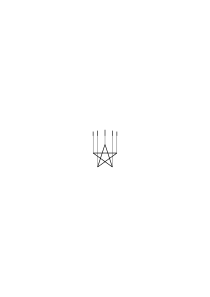
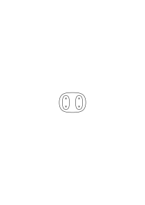
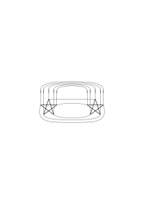
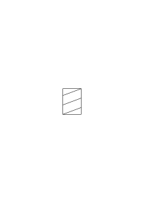
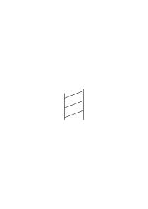
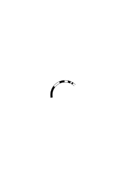

# Ts-221a

### [138\[1\]](https://cdn.wittgensteinnachlass.com/2000px/webp/Ts-221a/138.webp),[139\[1\]](https://cdn.wittgensteinnachlass.com/2000px/webp/Ts-221a/139.webp)

“Aber sind die Übergänge also durch die algebraische Formel _nicht_ bestimmt?” – In der Frage liegt ein Fehler. Wir verwenden den Ausdruck: “die Übergänge sind durch die Formel ‥‥․ bestimmt”. Wie wird er verwendet? Wir können etwa davon reden, daß Menschen durch Erziehung (Abrichtung) dahingebracht werden, die Formel y = x² so zu verwenden, daß Alle, wenn sie die gleiche Zahl für x einsetzen, immer die gleiche Zahl für y herausrechnen. Oder wir können sagen: “Diese Menschen sind so abgerichtet, daß sie alle auf den Befehl ‘+3’ auf der gleichen Stufe den gleichen Übergang machen.” Wir könnten dies so ausdrücken: “Der Befehl ‘+3’ bestimmt für diese Menschen jeden Übergang von einer Zahl zur nächsten völlig.” (Im Gegensatz zu andern Menschen, die auf diesen Befehl nicht wissen, was sie zu tun haben, oder deren jeder zwar mit Sicherheit, aber in anderer Weise auf ihn reagieren.) Wir können anderseits verschiedene Arten von Formeln und zu ihnen gehörige verschiedene Arten der Verwendung (verschiedene Arten der Abrichtung) einander entgegensetzen. Wir _nennen_ dann Formeln einer bestimmten Art (und der dazugehörigen Verwendungsweise) “Formeln, welche eine Zahl y für ein gegebenes x bestimmen”, und Formeln anderer Art, solche, “die die Zahl y für ein gegebenes x nicht bestimmen”. (y = x² + 1 wäre etwa von der ersten Art, y > x² + 1, y = x² ± 1, y = x² + Z von der zweiten.) Der Satz “die Formel ‥‥․ bestimmt eine Zahl y” ist dann eine Aussage über die Form der Formeln und es ist nun zu unterscheiden ein Satz wie: “die Formel, die ich hingeschrieben habe, bestimmt y” oder “hier steht eine Formel, die y bestimmt”, von einem Satz wie: “die Formel y = x² bestimmt die Zahl y für ein gegebenes x”. Die Frage: “Steht dort eine Formel, die y bestimmt?” heißt dann dasselbe wie: “Steht dort eine Formel dieser Art, oder jener Art?”, was wir aber mit der Frage anfangen sollen: “Ist y = x² eine Formel, die y für ein gegebenes x bestimmt?” ist nicht ohne weiteres klar. Diese Frage könnte man etwa an einen Schüler stellen, um zu prüfen, ob er die Verwendung des Ausdrucks “bestimmen” versteht; oder es könnte eine mathematische Aufgabe sein, zu berechnen, ob auf der rechten Seite der Formel nur eine Variable steht, wie z.B. im Fall

y = (x² + Z)² ‒ Z(2x² + Z).

Man kann nun sagen: “Wie die Formel gemeint wird, das bestimmt, welche Übergänge zu machen sind.” Was ist das Kriterium dafür, wie die Formel gemeint ist? Doch wohl die Art und Weise, wie wir sie ständig gebrauchen, wie uns gelehrt wurde, sie zu gebrauchen. Wir sagen z.B. Einem, der ein uns unbekanntes Zeichen gebraucht: “Wenn Du mit ‘<math class="stacked" display="inline"><mtable rowspacing="0.1em"><mtr><mtd><mi>x</mi></mtd></mtr><mtr><mtd><mo>∼</mo></mtd></mtr><mtr><mtd><mn>2</mn></mtd></mtr></mtable></math>’ meinst x², so erhältst Du _diesen_ Wert für y, wenn Du damit √x meinst, _jenen_.” – Frage Dich nun: Wie macht man es, mit ‘<math class="stacked" display="inline"><mtable rowspacing="0.1em"><mtr><mtd><mi>x</mi></mtd></mtr><mtr><mtd><mo>∼</mo></mtd></mtr><mtr><mtd><mn>2</mn></mtd></mtr></mtable></math>’ das eine, oder das andere _meinen_? _So_ kann also das Meinen die Übergänge zum voraus bestimmen.

### [140\[1\]](https://cdn.wittgensteinnachlass.com/2000px/webp/Ts-221a/140.webp),[141\[1\]](https://cdn.wittgensteinnachlass.com/2000px/webp/Ts-221a/141.webp)

“Worin liegt dann aber die eigentümliche Unerbittlichkeit der Mathematik?” – Wäre für sie nicht ein gutes Beispiel die Unerbittlichkeit, mit der auf eins zwei folgt, auf zwei drei, auf drei vier, usw.? ‒ ‒ Das heißt doch wohl: in der _Kardinalzahlenreihe_ folgt, – denn in einer andern Reihe folgt ja etwas anderes? Und ist denn _diese_ Reihe nicht eben durch diese Folge _definiert_? – “Soll das also heißen, daß es gleich richtig ist, wie immer man zählt und daß jeder zählen kann, wie er will?” – Wir würden es wohl nicht “zählen” nennen, wenn jeder _irgendwie_ Ziffern nacheinander ausspricht; aber es ist freilich nicht einfach eine Frage der Benennung. Denn das, was wir “zählen” nennen, ist ja ein wichtiger Teil der Tätigkeiten unseres Lebens. Das Zählen, und Rechnen, ist doch, z.B., nicht einfach ein Zeitvertreib. Zählen (und das heißt: _so_ zählen) ist eine Technik, die täglich in den mannigfachsten Verrichtungen unseres Lebens verwendet wird. Und darum lernen wir zählen, so wie wir es lernen: mit endlosem Üben, mit erbarmungsloser Genauigkeit; darum wird unerbittlich darauf gedrungen, daß wir Alle auf “eins” “zwei”, auf “zwei” “drei”, sagen u.s.f. – “Aber ist dieses Zählen also nur ein _Gebrauch_; entspricht dieser Folge nicht auch eine Wahrheit?” Die _Wahrheit_ ist, daß das Zählen sich sehr gut bewährt hat. – “Willst du also sagen, daß ‘wahr-sein’ heißt: brauchbar (oder nützlich) sein?” – Nein; sondern, daß man von der natürlichen Zahlenreihe – ebenso wie von unserer Sprache – nicht sagen kann, sie sei wahr, sondern: sie sei brauchbar und, vor allem, _sie werde verwendet_.

### [141\[2\]](https://cdn.wittgensteinnachlass.com/2000px/webp/Ts-221a/141.webp)

“Aber folgt es nicht mit logischer Notwendigkeit, daß Du zwei erhältst, wenn Du zu eins eins zählst und drei, wenn Du zu zwei eins zählst, u.s.f.; und ist diese Unerbittlichkeit nicht dieselbe, wie die des logischen Schlusses?” – Doch! Sie ist dieselbe. – “Aber entspricht denn der logische Schluß nicht einer Wahrheit? Ist es nicht _wahr_, daß das aus diesem folgt?” – Der Satz: ‘es ist wahr, daß das aus diesem folgt’, heißt einfach: das folgt aus diesem. Und wie verwenden wir diesen Satz? – Was würde denn geschehen, wenn wir anders schlössen – wie würden wir mit der Wahrheit in Konflikt geraten.

### [141\[3\]](https://cdn.wittgensteinnachlass.com/2000px/webp/Ts-221a/141.webp),[142\[1\]](https://cdn.wittgensteinnachlass.com/2000px/webp/Ts-221a/142.webp)

Da muß man sich klar machen, worin Schließen denn eigentlich besteht. Man wird etwa sagen, es besteht im Übergang von einer Behauptung zu einer andern. Aber was heißt das? Heißt es, daß Schließen etwas ist, was stattfindet beim Übergang von der einen zur andern Behauptung, also _ehe_ die andere ausgesprochen ist – oder heißt es, daß Schließen darin besteht, die eine Behauptung auf die andere folgen zu lassen, d.h., nach ihr auszusprechen? Wir stellen uns, verleitet durch die besondere Verwendung des Verbums “schließen”, gern vor, das Schließen sei eine eigentümliche Tätigkeit, ein Vorgang im Medium des Verstandes, gleichsam ein Brauen der Nebel, aus welchem dann die Folgerung auftaucht. Sehen wir aber doch zu, was dabei geschieht! Einerseits gibt es da einen Übergang von einem Satz zum andern auf dem Weg über andere Sätze, also durch eine Schlußkette, – aber von diesem Übergang brauchen wir nicht zu reden, da er ja eine andere Art von Übergang voraussetzt, nämlich von einem Glied der Kette zum nächsten. Und auch hier gibt es einen Vorgang, den man Übergang _zwischen_ Gliedern nennen kann. An diesem Vorgang ist nun nichts Okkultes; es ist ein Ableiten des einen Satzzeichens aus dem andern nach einer Regel, ein Vergleichen der beiden mit irgendeinem Paradigma, das uns das Schema des Übergangs darstellt, oder dergleichen. Es kann auf dem Papier, mündlich, oder ‘im Kopf’, d.h. in der Vorstellung vor sich gehen. Der Schluß kann aber auch so gezogen werden, daß der eine Satz ohne einen Vorgang der Überleitung nach dem andern ausgesprochen wird; oder die Überleitung besteht nur darin, daß wir sagen; “Also:”, oder: “Daraus folgt:”, oder dergl. Man nennt es dann “Schluß”, wenn der gefolgerte Satz sich tatsächlich aus der Prämisse ableiten _läßt_.

### [142\[2\]](https://cdn.wittgensteinnachlass.com/2000px/webp/Ts-221a/142.webp),[143\[1\]](https://cdn.wittgensteinnachlass.com/2000px/webp/Ts-221a/143.webp)

Was heißt es nun, daß sich ein Satz aus einem andern, vermittels einer Regel, ableiten _läßt_? Läßt sich nicht alles aus allem vermittels _irgend_ einer Regel ableiten? – Was heißt es, wenn ich z.B. sage: diese Zahl läßt sich durch die Multiplikation jener beiden erhalten? Dies ist offenbar eine Regel, die sagt, daß Du diese Zahl erhalten mußt, wenn anders Du _richtig_ multiplizierst; und diese Regel können wir dadurch erhalten, daß wir die beiden Zahlen multiplizieren, oder auch auf andere Weise (obwohl man auch jeden Vorgang, der zu diesem Ergebnis führt, eine ‘Multiplikation’ nennen kann). Man sagt nun, ich habe multipliziert, wenn ich die Multiplikation 165 × 363 ausgeführt habe, aber auch, wenn ich sage: “4 mal 2 ist 8”, obwohl hier kein Rechnungsvorgang zum Produkt geführt hat (das ich aber auch hätte _ausrechnen_ können). Und so sagen wir auch, es werde ein Schluß gezogen, wo er nicht errechnet wird.

### [143\[2\]](https://cdn.wittgensteinnachlass.com/2000px/webp/Ts-221a/143.webp)

Aber die Schlußregel muß doch so sein, daß die Folgerung wahr sein _muß_, wenn die Prämisse wahr ist. Wenn ich also die Prämisse als wahr erkannt habe, so muß der Schluß ein solcher sein, daß ein Nicht-Übereinstimmen der Folgerung mit der Realität ausgeschlossen ist. ‒ ‒ Und das ist nur dadurch möglich, daß ich nichts als ein solches Nicht-Übereinstimmen gelten lasse, wenn die Realität mit den Prämissen übereinstimmt.

### [143\[3\]](https://cdn.wittgensteinnachlass.com/2000px/webp/Ts-221a/143.webp),[144\[1\]](https://cdn.wittgensteinnachlass.com/2000px/webp/Ts-221a/144.webp)

“Ich darf aber doch nur folgern, was wirklich _folgt_!” – Soll das heißen: nur das, was den Schlußregeln gemäß folgt, – oder soll es heißen: nur das, was solchen Schlußregeln gemäß folgt, die irgendwie mit der Realität übereinstimmen? Hier schwebt uns in vager Weise vor, daß diese Realität etwas sehr Abstraktes, sehr Allgemeines und sehr Hartes ist. Die Logik ist eine Art von Ultraphysik, die Beschreibung des ‘logischen Baus’ der Welt, den wir durch eine Art Ultraerfahrung wahrnehmen (mit dem Verstande etwa). Es schweben uns hier vielleicht Schlüsse vor wie dieser: “Der Ofen raucht, also ist das Ofenrohr wieder verlegt.” (Und _so_ wird dieser Schluß gezogen! Nicht so: “Der Ofen raucht, und wenn immer der Ofen raucht, ist das Ofenrohr verlegt; also ‥‥․”.)

### [144\[2\]](https://cdn.wittgensteinnachlass.com/2000px/webp/Ts-221a/144.webp)

Das, was wir ‘logischer Schluß’ nennen, ist nichts als eine Transformation des Ausdrucks. Die Umrechnung von einem Maß auf ein anderes. Auf der einen Kante eines Maßstabes sind Zoll aufgetragen, auf der andern cm. Ich messe den Tisch in Zoll und gehe dann _auf dem Maßstab_ zu cm über. – Und freilich gibt es auch beim Übergang von einem Maß zum andern richtig und falsch; aber mit welcher Realität stimmt hier das Richtige überein? Wohl mit einer _Abmachung_, oder einem _Gebrauch_, und etwa mit den praktischen Bedürfnissen.

### [144\[3\]](https://cdn.wittgensteinnachlass.com/2000px/webp/Ts-221a/144.webp)

Wie würden wir mit der Wahrheit in Konflikt geraten, wenn unsere Zollstäbe aus weichem Gummi wären, statt aus Holz und Stahl? – “Nun, wir würden nicht das richtige Maß des Tisches kennen lernen.” – Du meinst, wir würden nicht, oder nicht zuverlässig, _die_ Maßzahl erhalten, die wir mit unsern harten Maßstäben erhalten. _Der_ wäre also im Unrecht, der den Tisch mit dem dehnbaren Maßstab gemessen hätte und behauptet, er mäße nun 1.80 m nach unserer gewöhnlichen Meßart; sagt er aber bloß, der Tisch mißt 1.80 m nach seiner Meßart, so stimmt das. – “Aber das ist dann doch überhaupt kein Messen!” – Gewiß, es ist nicht, was wir ‘messen’ nennen; kann aber unter Umständen auch ‘praktische Zwecke’ erfüllen. Einen Maßstab, der sich bei geringer Erwärmung außerordentlich stark ausdehnte, würden wir – unter gewöhnlichen Umständen – deshalb _unbrauchbar_ nennen. Wir könnten uns aber Verhältnisse denken, in denen gerade dies das Erwünschte wäre. Ich stelle mir vor, daß wir die Ausdehnung mit freiem Auge wahrnehmen; und Körpern in Räumen von ungleicher Temperatur die gleiche Maßzahl der Länge beilegen, wenn sie auf dem Maßstab, der fürs Auge bald länger bald kürzer ist, gleich weit reichen. Man kann dann sagen: Was hier “messen” und “Länge” und “längengleich” heißt, ist etwas Anderes, als was wir so nennen. Der Gebrauch dieser Wörter ist hier ein anderer, als der unsere; aber er ist mit ihm _verwandt_ und auch wir gebrauchen diese Wörter auf vielerlei Weise. Plinius sagte, es sei eine Eigenschaft der Zahlen, daß nach je zehn eine höhere Art beginne. (Die logische Struktur der Welt. –)

### [146\[1\]](https://cdn.wittgensteinnachlass.com/2000px/webp/Ts-221a/146.webp),[147\[1\]](https://cdn.wittgensteinnachlass.com/2000px/webp/Ts-221a/147.webp)

“Aber muß denn nicht z.B. aus ‘(x)․fx’ fa folgen, _wenn_ <math display="inline"><mtext>🖵</mtext></math> so gemeint ist, wie wir es meinen?” – und wie äußert es sich, _wie_ wir es meinen? Nicht durch die ständige Praxis seines Gebrauchs? und etwa noch durch gewisse _Gesten_ – und was dem ähnlich ist. ‒ ‒ Es ist aber, als hinge dem Wort “alle”, wenn _wir_ es sagen, noch etwas an, womit ein anderer Gebrauch unvereinbar wäre; nämlich die _Bedeutung_. “‘Alle’ heißt doch: _**alle**_!” möchten wir sagen, wenn wir sie erklären sollen; und dabei machen wir eine gewisse Geste und Miene. Hacke alle diese Bäume um! ‒ ‒ Ja, verstehst Du nicht, was ‘_alle_’ heißt? (Er hatte _einen_ stehen gelassen.) Wie hat er gelernt, was ‘alle’ heißt? Doch wohl durch Übung. – Und freilich diese Übung hat nun nicht nur bewirkt, daß er auf den Befehl _das tut_, sondern sie hat das Wort mit einer Menge von Bildern (visuellen und andern) umgeben, von denen das eine oder das andere auftaucht, wenn wir das Wort hören und aussprechen. (Und wenn wir Rechenschaft darüber geben sollen, was die ‘Bedeutung’ des Wortes ist, greifen wir zuerst _ein_ Bild aus dieser Masse heraus – und verwerfen es dann wieder als unwesentlich, wenn wir sehen, daß einmal dies, einmal jenes auftritt, und manchmal keines.) Man könnte sagen: Man lernt die Bedeutung von “alle” indem man lernt, daß aus ‘(x)․fx’ fa folgt. – D.h., die Übungen, die den Gebrauch dieses Wortes einüben, seine Bedeutung lehren, zielen immer dahin, daß eine Ausnahme nicht gemacht werden darf.

### [147\[2\]](https://cdn.wittgensteinnachlass.com/2000px/webp/Ts-221a/147.webp)

“Aus ‘alle’, wenn es _so_ gemeint ist, muß doch _das_ folgen.” – Wenn es _wie_ gemeint ist? Überlege es Dir, wie meinst Du es? Da schwebt Dir etwa noch ein Bild vor – und mehr hast Du nicht. – Nein, es _muß_ nicht – aber es _folgt_: Wir _vollziehen_ diesen Übergang. Und wir sagen: Wenn das nicht folgt, dann waren es eben nicht _**alle**_! – – und das zeigt nur, wie wir mit Worten in so einer Situation reagieren. –

### [147\[3\]](https://cdn.wittgensteinnachlass.com/2000px/webp/Ts-221a/147.webp)

Wir könnten es auch so sagen: Es kommt uns vor, daß, wenn aus (x)․fx nicht mehr fa folgen soll, außer dem _Gebrauch_ des Wortes “alle” noch etwas anderes sich geändert haben muß, etwas, was dem Worte unmittelbar anhängt. Ist das nicht ähnlich, wie wenn man sagt: “Wenn dieser Mensch anders handelte, dann müßte auch sein Charakter ein anderer sein.” Nun das kann in manchen Fällen etwas heißen und in manchen nicht. Wir sagen: “aus dem Charakter fließt die Handlungsweise”, und so fließt aus der Bedeutung der Gebrauch.

### [147\[4\]](https://cdn.wittgensteinnachlass.com/2000px/webp/Ts-221a/147.webp),[148\[1\]](https://cdn.wittgensteinnachlass.com/2000px/webp/Ts-221a/148.webp)

Das zeigt Dir – könnte man sagen – wie fest verbunden gewisse Gesten, Bilder, Reaktionen, mit einem ständig geübten Gebrauch sind. ‘Es drängt sich uns das Bild auf ‥‥․’. Es ist sehr bemerkenswert, daß Bilder sich _aufdrängen_ können.

### [148\[2\]](https://cdn.wittgensteinnachlass.com/2000px/webp/Ts-221a/148.webp)

Wichtig ist, daß in unserer Sprache – in unserer natürlichen Sprache – ‘alle’ ein Grundbegriff ist und ‘alle außer einem’ weniger fundamental; d.h., es gibt dafür nicht _ein_ Wort, auch nicht eine charakteristische Geste.

### [148\[3\]](https://cdn.wittgensteinnachlass.com/2000px/webp/Ts-221a/148.webp),[149\[1\]](https://cdn.wittgensteinnachlass.com/2000px/webp/Ts-221a/149.webp)

Der _Witz_ des Wortes “alle” ist ja, daß es keine Ausnahme zuläßt. – Ja, das ist der Witz seiner Verwendung in unserer Sprache; aber welche Verwendungsarten wir als ‘Witz’ empfinden, das hängt damit zusammen, welche Rolle diese Verwendung in unserm ganzen Leben spielt. (Damit hängt diese Bemerkung zusammen: Wir möchten manchmal sagen, “es muß doch einen Grund haben, warum auf dieses Thema – in einer Symphonie etwa – gerade _das_ Thema folgt”. Als Grund würden wir eine gewisse Beziehung der beiden Themen, eine Verwandtschaft, einen Gegensatz, oder dergleichen, anerkennen. – Aber wir können ja eine solche Beziehung konstruieren: sozusagen eine Operation, die das eine Thema aus dem andern erzeugt; aber damit ist uns nur gedient, wenn diese Beziehung eine uns wohlbekannte ist. Es ist also, als müßte die Folge dieser Themen einem in uns schon vorhandenen Paradigma entsprechen. Von einem Gemälde, das zwei menschliche Gestalten zeigt, könnte man ähnlich sagen: “Es muß einen Grund haben, warum gerade _diese_ zwei Gesichter uns einen solchen Eindruck machen.” Wir möchten – heißt das – diesen Eindruck der beiden Gesichter wo anders wieder finden – in einem anderen Gebiet. – Aber ob er wieder zu finden ist? Man könnte auch fragen: Welche Zusammenstellung von Themen hat eine _Pointe_, welche _keine_? Oder: _Warum_ hat diese Zusammenstellung eine Pointe und _die_ keine? Das mag nicht leicht zu sagen sein! Oft können wir sagen: “Diese entspricht einer Geste, diese nicht.”)

### [149\[2\]](https://cdn.wittgensteinnachlass.com/2000px/webp/Ts-221a/149.webp),[150\[1\]](https://cdn.wittgensteinnachlass.com/2000px/webp/Ts-221a/150.webp)

“_Wie weiß ich_, daß ich im Verfolg der Reihe ‘+2’ schreiben muß

_20004, 20006_

und nicht

_20004, 20008?” –_

Die Frage ist ähnlich der: wie weiß ich, daß diese Farbe ‘rot’ ist? “Aber Du weißt doch, daß Du immer die _gleiche_ Zahlenfolge in den Einern schreiben mußt: 2, 4, 6, 8, 0, 2, 4, u.s.w.” – Ganz richtig! das Problem muß auch schon in dieser Zahlenfolge, ja auch schon in _der_ 2, 2, 2, 2 u.s.w. ad inf. auftreten. – Denn wie weiß ich, daß ich nach der 500sten Zwei “2” schreiben soll; daß nämlich dann “2” ‘die gleiche Zahl’ ist? Ja, weiß ich es denn? Und wenn ich es _zuvor_ weiß, was hilft mir dieses Wissen für später? Ich meine: wie weiß ich dann, wenn der Schritt wirklich zu machen ist, was ich mit diesem Wissen anzufangen habe? Wenn zur Fortsetzung der Reihe <math display="inline"><mtext>🖵</mtext></math> eine Intuition nötig ist, dann auch zur Fortsetzung der Reihe <math display="inline"><mtext>🖵</mtext></math>.

### [150\[2\]](https://cdn.wittgensteinnachlass.com/2000px/webp/Ts-221a/150.webp)

Auf die Frage, worin denn das Schließen besteht, hören wir etwa: “Wenn ich die Wahrheit der Sätze ‥‥‥ erkannt habe, so bin ich nun berechtigt, ‥‥‥ hinzuschreiben.” – Inwiefern berechtigt? Hatte ich früher kein Recht, es hinzuschreiben? ‒ ‒ “Jene Sätze überzeugen mich von der Wahrheit dieses Satzes.” – Aber darum handelt sich's natürlich auch nicht. ‒ ‒ “Nach diesen Gesetzen vollführt der Geist die besondere Tätigkeit des logischen Schließens.” – Das ist gewiß interessant und wichtig; aber ist es denn auch wahr? schließt er immer nach _diesen_ Gesetzen? Und worin besteht die besondere Tätigkeit des Schließens? ‒ ‒ Darum ist es notwendig, zu schauen, wie wir denn in der Praxis der Sprache Schlüsse vollziehen, – was denn das Schließen im Sprachspiel für ein Vorgang ist. Z.B.: In einer Vorschrift steht: “Alle, die über 1.80 m hoch sind, sind in die ‥‥․ Abteilung aufzunehmen.” Ein Kanzlist verliest die Namen der Leute, dazu ihre Höhe. Ein anderer teilt sie den und den Abteilungen zu. – N.N., 1.90 m. – “Also N.N. in die ‥‥․ Abteilung.” Das ist Schließen.

### [151\[1\]](https://cdn.wittgensteinnachlass.com/2000px/webp/Ts-221a/151.webp)

Was nennen wir, z.B., ‘Schlüsse’ bei Russell, oder bei Euklid? Soll ich sagen: die Übergänge von einem Satz zum nächsten im Beweis? Aber wo steht der _Übergang_? – Ich sage, bei Russell folge p aus q, wenn p aus q gemäß der Stellung der beiden in einem ‘Beweise’, und den ihnen beigefügten Zeichen, abzuleiten ist, wenn wir das Buch lesen. Denn, dieses Buch zu lesen ist ein Spiel, welches gelernt sein will.

### [151\[2\]](https://cdn.wittgensteinnachlass.com/2000px/webp/Ts-221a/151.webp)

Man ist sich oft im Unklaren, worin das Folgen und Folgern eigentlich besteht; was für ein Sachverhalt oder Vorgang es ist. Und dies kommt von der eigentümlichen Verwendung dieser Verben. Es wird uns nahe gelegt, daß Folgen das Bestehen einer Verbindung zwischen Sätzen ist, der wir beim Folgern nachgehen. Diese Unklarheit zeigt sich sehr lehrreich in Russell's Darstellung (‘Principia Mathematica’). Daß ein Satz ⊢p aus einem Satz ⊢p⊃q.p folgt, ist hier ein logisches Grundgesetz:

⊢p⊃q.p․⊃․⊢q

Dieses berechtige uns nun, heißt es, ⊢q aus ⊢p⊃q.p zu schließen. Aber worin besteht denn ‘schließen’, diese Prozedur, zu der wir berechtigt werden? Doch darin, den einen Satz – in irgendeinem Sprachspiel – nach dem andern als Behauptung auszusprechen, anzuschreiben und dergl., und wie kann mich jenes Grundgesetz _dazu_ berechtigen?

### [152\[1\]](https://cdn.wittgensteinnachlass.com/2000px/webp/Ts-221a/152.webp)

Russell will doch sagen: “_So_ werde ich schließen und so ist es _richtig_.” Er will uns also einmal mitteilen, wie er schließen will: das geschieht durch eine _Regel_ des Schließens. Wie lautet sie? Daß dieser Satz jenen impliziert? Doch wohl, daß in den Beweisen dieses Buchs ein solcher Satz nach einem solchen stehen soll. – Aber es soll ja ein logisches Grundgesetz sein, daß es _richtig_ ist, so zu schließen! – Dann müßte das Grundgesetz lauten: “Es ist richtig vom ‥‥․ auf ‥‥․ zu schließen”; und dieses Grundgesetz sollte nun wohl einleuchten; aber dann wird uns eben die Regel selbst als richtig, oder berechtigt, einleuchten. “Aber diese Regel handelt doch von Sätzen in einem Buch, und das gehört doch nicht in die Logik!” – Ganz richtig; die Regel ist wirklich nur eine Mitteilung, daß in diesem Buche nur _dieser_ Übergang von einem Satz zum andern gebraucht wird, denn die Richtigkeit des Übergangs muß an Ort und Stelle einleuchten; und der Ausdruck des ‘logischen Grundgesetzes’ ist dann das Aufeinanderfolgen _der Sätze_ selbst.

### [152\[2\]](https://cdn.wittgensteinnachlass.com/2000px/webp/Ts-221a/152.webp),[153\[1\]](https://cdn.wittgensteinnachlass.com/2000px/webp/Ts-221a/153.webp)

Russell scheint mit jenem Grundgesetz von einem Satz q zu sagen: “Er folgt schon – ich brauche ihn nur noch zu folgern.” Ganz analog heißt es einmal bei Frege, die Gerade, welche je zwei Punkte verbindet, sei eigentlich schon da, ehe wir sie zögen und so ist es auch, wenn wir sagen, die Übergänge der Reihe +2 etwa wären eigentlich bereits gemacht, ehe wir sie mündlich oder schriftlich machen, – gleichsam nachzögen.

### [153\[2\]](https://cdn.wittgensteinnachlass.com/2000px/webp/Ts-221a/153.webp),[154\[1\]](https://cdn.wittgensteinnachlass.com/2000px/webp/Ts-221a/154.webp)

Einem, der dies sagt, könnte man antworten: Du verwendest hier ein Bild: Man _kann_ die Übergänge, die einer in einer Reihe machen soll, dadurch _bestimmen_, daß man sie ihm vormacht. Indem man z.B. die Reihe, die er schreiben soll, in einer anderen Notation hinschreibt, daß er sie nur noch zu übertragen hat, oder indem man sie wirklich ganz dünn vorschreibt und er hat sie nachzuziehen. Im ersten Fall können wir auch sagen, wir schreiben nicht _die_ Reihe an, die er zu schreiben hat, machen also die Übergänge dieser Reihe selbst nicht; im zweiten Falle aber werden wir gewiß sagen, die Reihe, die er schreiben soll, sei schon vorhanden. Wir würden dies auch sagen, wenn wir ihm, was er hinzuschreiben hat, _diktieren_, obwohl wir dann eine Reihe von Lauten hervorbringen und er eine Reihe von Schriftzeichen. Es ist jedenfalls eine sichere Art, die Übergänge, die Einer zu machen hat, zu _bestimmen_, sie ihm, in irgendeinem Sinne, schon vorzumachen. – Wenn wir daher diese Übergänge in einem ganz andern Sinne bestimmen, indem wir nämlich unsern Schüler einer Abrichtung unterziehen, wie z.B. unsere Kinder sie im Einmaleins und im Multiplizieren erhalten, so nämlich, daß Alle, die so abgerichtet sind, nun beliebige Multiplikationen, die sie nicht in ihrer Lehrzeit gemacht haben, auf die gleiche Weise und mit übereinstimmenden Resultaten ausführen – wenn also die Übergänge, die Einer auf den Befehl +2 zu machen hat, durch Abrichtung so bestimmt sind, daß wir mit Sicherheit voraussagen können, wie er gehen wird, auch wenn er _diesen_ Übergang bis jetzt noch nie gemacht hat, – dann kann es uns natürlich sein, als Bild dieses Sachverhalts den zu gebrauchen: die Übergänge seien bereits alle gemacht, er schriebe sie nur noch hin.

### [154\[2\]](https://cdn.wittgensteinnachlass.com/2000px/webp/Ts-221a/154.webp)

Wird es nun experimentell festgestellt, ob sich ein Satz aus dem andern ableiten läßt? – Es scheint, ja! Denn ich schreibe gewisse Zeichenfolgen hin, richte mich dabei nach gewissen Paradigmen – dabei ist es allerdings wesentlich, daß ich kein Zeichen übersehe, oder daß es sonstwie abhanden kommt – und was bei diesem Vorgang entsteht, davon sage ich, es folge. ‒ ‒ Dagegen ist ein Argument dies: Wenn 2 und 2 Äpfel nur 3 Äpfel geben, d.h., wenn 3 Äpfel daliegen, nachdem ich zwei und wieder zwei hingelegt habe, sage ich nun nicht: “2 + 2 ist also doch nicht immer 4”; sondern: “Einer muß irgendwie weggekommen sein”.

### [154\[3\]](https://cdn.wittgensteinnachlass.com/2000px/webp/Ts-221a/154.webp)

Aber inwiefern mache ich ein Experiment, wenn ich dem schon hingeschriebenen Beweis nur _folge_? Man könnte sagen: “Wenn Du diese Kette von Umformungen ansiehst, – _kommt_ es _Dir nicht auch so vor, als stimmten sie_ mit den Paradigmen?”

### [155\[1\]](https://cdn.wittgensteinnachlass.com/2000px/webp/Ts-221a/155.webp)

Wenn das also ein Experiment genannt werden soll, dann wohl ein psychologisches. – Der Anschein des Stimmens kann ja auf einer Sinnestäuschung beruhen. Und so ist es ja auch manchmal, wenn wir uns verrechnen. Man sagt auch: “Das kommt mir heraus.” Und es ist doch wohl ein Experiment, das zeigt, daß dies _mir_ herauskommt.

### [155\[2\]](https://cdn.wittgensteinnachlass.com/2000px/webp/Ts-221a/155.webp)

Man könnte sagen: Das Resultat des Experiments ist dies, daß ich, am Ende beim Resultat des Beweises angelangt, mit Überzeugung sage: “Ja, es stimmt.”

### [155\[3\]](https://cdn.wittgensteinnachlass.com/2000px/webp/Ts-221a/155.webp),[156\[1\]](https://cdn.wittgensteinnachlass.com/2000px/webp/Ts-221a/156.webp)

Was ist die charakteristische Verwendung des Vorgangs der Ableitung als _Rechnung_ – im Gegensatz zur Verwendung des Vorgangs als Experiment? Wir betrachten die Berechnung als Demonstration einer _internen Eigenschaft_ (eine Eigenschaft des _Wesens_) der Strukturen. Aber was heißt das? Als Urbild der ‘internen Eigenschaft’ könnte dieses dienen:

10 = 3 × 3 + 1

Wenn ich nun sage: 10 Striche bestehen notwendig aus 3 mal 3 Strichen und einem Strich – das heißt doch nicht: wenn 10 Striche dastehen, so stehen immer die Ziffern und Bogen rund herum. – Setze ich sie aber zu den Strichen hinzu, so sage ich, ich demonstrierte nur das Wesen jener Gruppe von Strichen. – Aber bist Du sicher, daß sich die Gruppe beim Dazuschreiben jener Zeichen nicht verändert hat? – “Ich weiß nicht; aber _eine_ bestimmte Zahl von Strichen stand da; und wenn nicht 10, so eine andre und dann hatte die eben andre Eigenschaften. –”

### [156\[2\]](https://cdn.wittgensteinnachlass.com/2000px/webp/Ts-221a/156.webp)

Man sagt: die Rechnung ‘entfaltet’ die Eigenschaft der Hundert. Was heißt es eigentlich: 100 bestehe aus 50 und 50? Man sagt: der Inhalt der Kiste besteht aus 50 Äpfeln und 50 Birnen. Aber wenn Einer sagte: “der Inhalt der Kiste besteht aus 50 Äpfeln und 50 Äpfeln” –, wir wüßten zunächst nicht, was er meint. – Wenn man sagt: “Der Inhalt der Kiste besteht aus 2 mal 50 Äpfeln”, so heißt das entweder, es seien da zwei Abteilungen zu 50 Äpfeln; oder es handelt sich etwa um eine Verteilung, in der Jeder 50 Äpfel erhalten soll, und ich höre nun, daß man aus dieser Kiste zwei Leute beteilen kann.

### [156\[3\]](https://cdn.wittgensteinnachlass.com/2000px/webp/Ts-221a/156.webp)

“Die 100 Äpfel in der Kiste bestehen aus 50 und 50” – hier ist wichtig der unzeitliche Charakter von ‘bestehen’. Denn es heißt nicht, sie bestünden _jetzt_, oder für einige Zeit aus 50 und 50.

### [157\[1\]](https://cdn.wittgensteinnachlass.com/2000px/webp/Ts-221a/157.webp)

Was ist denn das Charakteristikum der ‘internen Eigenschaften’? Daß sie immer, unveränderlich in dem Ganzen bestehen, das sie bilden; gleichsam unabhängig von allen äußeren Geschehnissen. Wie die Konstruktion einer Maschine auf dem Papier nicht bricht, wenn die Maschine selbst äußeren Kräften erliegt. – Oder ich möchte sagen: daß sie nicht Wind und Wetter unterworfen sind, wie das Physikalische der Dinge; sondern unangreifbar wie Schemen.

### [157\[2\]](https://cdn.wittgensteinnachlass.com/2000px/webp/Ts-221a/157.webp)

Statt, “100 bestehen aus 50 und 50”, könnte man sagen: “ich lasse 100 aus 50 und 50 bestehen”.

### [157\[3\]](https://cdn.wittgensteinnachlass.com/2000px/webp/Ts-221a/157.webp)

“Aber bin ich also in einer Schlußkette nicht gezwungen, zu gehen, wie ich gehe?” – Gezwungen? Ich kann doch wohl gehen, wie ich will! – “Aber wenn Du im Einklang mit den Regeln bleiben willst, _mußt_ Du so gehen.” – Durchaus nicht; ich nenne etwas anderes ‘Einklang’. – Ja, aber dann veränderst Du eben den Sinn des Wortes ‘Einklang’, oder den Sinn der Regel.” – Nein, – wer sagt, was hier ‘verändern’ und was ‘gleichbleiben’ heißt? Wieviele Regeln immer Du mir angibst – ich gebe Dir eine Regel, die _meine_ Verwendung Deiner Regeln rechtfertigt.

### [157\[4\]](https://cdn.wittgensteinnachlass.com/2000px/webp/Ts-221a/157.webp),[158\[1\]](https://cdn.wittgensteinnachlass.com/2000px/webp/Ts-221a/158.webp)

“Du darfst doch das Gesetz jetzt nicht auf einmal anders anwenden!” – Wenn ich darauf antworte: “Ach ja, ich hatte es ja _so_ angewandt!” oder: “Ach, _so_ sollte ich es anwenden – !”; dann spiele ich mit. Antworte ich aber einfach: “Anders? – Das _ist_ doch nicht anders!” – was willst Du tun?

### [158\[2\]](https://cdn.wittgensteinnachlass.com/2000px/webp/Ts-221a/158.webp)

Inwiefern ist das logische Argument ein Zwang? – “Du gibst doch _das_ zu, – und _das_ zu; dann mußt Du auch _das_ zugeben!” Das ist die Art, jemanden zu zwingen. D.h., man kann so tatsächlich Menschen zwingen, etwas zuzugeben. – Nicht anders, als wie man Einen etwa dazu zwingen kann, dorthin zu gehen, indem man gebietend mit dem Finger dorthin zeigt. Denke, ich zeige in so einem Fall mit zwei Fingern zugleich in zwei verschiedenen Richtungen und stelle es damit den Andern frei, in welcher der beiden Richtungen er gehen will – ein andermal zeige ich nur in _einer_ Richtung; so kann man das auch so ausdrücken: mein erster Befehl habe ihn nicht gezwungen, in _einer_ Richtung zu gehen, wohl aber der zweite. Das ist aber eine Aussage, die angeben soll, welcher Art meine Befehle waren; aber nicht, in welcher Art sie wirken, ob sie den und den tatsächlich zwingen, d.h., ob er ihnen gehorcht.

### [158\[3\]](https://cdn.wittgensteinnachlass.com/2000px/webp/Ts-221a/158.webp)

Ist eine Berechnung ein Experiment? – Ist es ein Experiment, wenn ich morgens aus dem Bett steige? Aber könnte dies nicht ein Experiment sein, – welches zeigen soll, ob ich nach so und soviel Stunden Schlafes die Kraft habe, mich zu erheben? “Du darfst doch das Gesetz jetzt nicht auf einmal anders anwenden!” – Wenn ich darauf antworte: “Ach ja, ich hatte es ja _so_ angewandt!” oder: “Ach, _so_ sollte ich es anwenden –!”; dann spiele ich mit. Antworte ich aber einfach: “Anders? – Das _ist_ doch nicht anders!” – was willst Du tun?

### [158a\[2\]](https://cdn.wittgensteinnachlass.com/2000px/webp/Ts-221a/158a.webp)

Inwiefern ist das logische Argument ein Zwang? “Du gibst doch _das_ zu, – und _das_ zu; dann mußt du auch _das_ zugeben!” Das ist die Art, jemanden zu zwingen. D.h., man kann so tatsächlich Menschen zwingen, etwas zuzugeben. – Nicht anders, als wie man Einen etwa dazu zwingen kann, dorthin zu gehen, indem man gebietend mit dem Finger dorthin zeigt. Denke, ich zeige in so einem Fall mit zwei Fingern zugleich in zwei verschiedenen Richtungen und stelle es damit dem Andern frei, in welcher der beiden Richtungen er gehen will – ein andermal zeige ich nur in _einer_ Richtung; so kann man das auch so ausdrücken: mein erster Befehl habe ihn nicht gezwungen, in _einer_ Richtung zu gehen, wohl aber der zweite. Das ist aber eine Aussage, die angeben soll, welcher Art meine Befehle waren; aber nicht, in welcher Art sie wirken, ob sie den und den tatsächlich zwingen, d.h., ob er ihnen gehorcht.

### [158a\[3\]](https://cdn.wittgensteinnachlass.com/2000px/webp/Ts-221a/158a.webp)

Ist eine Berechnung ein Experiment? – Ist es ein Experiment, wenn ich morgens aus dem Bett steige? Aber könnte dies nicht ein Experiment sein, – welches zeigen soll, ob ich nach so und soviel Stunden Schlafes die Kraft habe, mich zu erheben? Und was fehlt dieser Handlung dazu, dies Experiment zu sein? – Bloß, daß sie nicht zu diesem Zwecke, d.h., in der Verbindung mit einer solchen Untersuchung ausgeführt wird. _Experiment_ ist etwas durch den Gebrauch, der davon gemacht wird.

### [158b\[2\]](https://cdn.wittgensteinnachlass.com/2000px/webp/Ts-221a/158b.webp)

Wäre es möglich, daß Leute heute eine unsrer Berechnungen durchgingen und von den Schlüssen befriedigt wären, morgen aber ganz andere Schlüsse ziehen wollen, und einen andern Tag wieder andere? Ja, kann man sich nicht denken, daß dies mit einer _Gesetzmäßigkeit_ so geschähe; daß, wenn er einmal _diesen_ Übergang macht, er ‘_eben darum_’ das nächste Mal einen andern macht, und darum (etwa) das nächste Mal wieder den ersten? (Ähnlich, wie wenn in einer Sprache die Farbe, die einmal “rot” genannt wird, darum beim nächsten Male anders genannt würde und beim übernächsten wieder “rot”, u.s.f.; dies könnte Menschen so natürlich sein. Man könnte es ein Bedürfnis nach Abwechslung nennen.)

### [158b\[3\]](https://cdn.wittgensteinnachlass.com/2000px/webp/Ts-221a/158b.webp),[159\[1\]](https://cdn.wittgensteinnachlass.com/2000px/webp/Ts-221a/159.webp)

Ist es nicht so: Solange man denkt, es kann nicht anders sein, zieht man logische Schlüsse. Das heißt wohl: solange _das und das gar nicht in Frage gezogen wird_. Die Schritte, welche man nicht in Frage zieht, sind logische Schlüsse. Aber man zieht sie nicht darum _nicht_ in Frage, weil sie ‘sicher der Wahrheit entsprechen’ – oder dergl. – sondern, dies ist eben, was man ‘Denken’, ‘Sprechen’, ‘Schließen’, ‘Argumentieren’, nennt. Es handelt sich hier garnicht um irgendeine Entsprechung des Gesagten mit der Realität; vielmehr ist die Logik _vor_ einer solchen Entsprechung; nämlich in dem Sinne, in welchem die Festlegung der Meßmethode _vor_ der Richtigkeit oder Falschheit einer Längenangabe ist.

### [159\[2\]](https://cdn.wittgensteinnachlass.com/2000px/webp/Ts-221a/159.webp),[160\[1\]](https://cdn.wittgensteinnachlass.com/2000px/webp/Ts-221a/160.webp)

“Nach Dir könnte also jeder die Reihe fortsetzen, wie er will; und also auch auf _irgend_ eine Weise schließen!” Wir werden es dann nicht “die Reihe fortsetzen” nennen und auch wohl nicht “schließen”. Denn, daß ihn Schlußgesetze nicht zwingen, das und das zu reden, oder zu schreiben, darüber sind wir ja einig. Und wenn Du sagst, er könne es zwar _reden_, aber er kann es nicht _denken_, so sage ich nur, das heiße nicht: er könne es, quasi trotz aller Anstrengung, nicht denken, sondern es heißt: zum ‘Denken’ gehört für uns wesentlich, daß er – beim Reden, Schreiben, etc. – _solche_ Übergänge macht. Und ferner sage ich, daß die Grenze zwischen dem, was wir noch ‘denken’ und dem, was wir nicht mehr so nennen, so wenig scharf gezogen ist, wie die Grenze zwischen dem, was noch “Gesetzmäßigkeit” genannt wird und dem, was wir nicht mehr so nennen. Nun muß ich dies aber qualifizieren: Denn man kann ja doch sagen, daß die Schlußgesetze uns zwingen; in dem Sinne nämlich, wie andere Gesetze in der menschlichen Gesellschaft. Der Kanzlist, der so schließt, wie in (), _muß_ es so tun, er wäre bestraft worden, wenn er anders schlösse. Wer anders schließt, kommt allerdings in Konflikt: z.B. mit der Gesellschaft; aber auch mit andern praktischen Folgen. Und auch _daran_ ist mehr, als ich oben zugab, wenn Einer sagt: “Er kann es nicht _denken_.” Man will etwa sagen: Er kann es nicht mit persönlichem Inhalt erfüllen: er kann nicht wirklich _mitgehen_ – mit seinem Verstand, mit seiner Person. Es ist ähnlich, wie man sagt: Diese Tonfolgen geben keinen Sinn, ich kann sie nicht mit Ausdruck singen. Ich kann nicht _mitschwingen_. Oder, was hier auf dasselbe hinauskommt: ich schwinge nicht mit. “Wenn er es redet – könnte man sagen – kann er es nur gedankenlos reden”. Und hierzu muß nur bemerkt werden, daß das ‘gedankenlose’ Reden sich von einem anderen wohl auch manchmal durch das unterscheidet, was beim Reden im Redenden an Vorstellungen, Empfindungen und anderem vor sich geht, daß aber diese begleitenden Vorgänge nicht das ‘Denken’ ausmachen und ihr Fehlen noch nicht die ‘Gedankenlosigkeit’.

### [160\[2\]](https://cdn.wittgensteinnachlass.com/2000px/webp/Ts-221a/160.webp),[161\[1\]](https://cdn.wittgensteinnachlass.com/2000px/webp/Ts-221a/161.webp)

Wenn man einen Beweis als Experiment auffaßt, so ist das Resultat des Experiments jedenfalls nicht das, was man das Resultat des Beweises nennt. Das Resultat der Rechnung ist der Satz, mit welchem sie abschließt; das Resultat des Experiments ist: daß ich von diesen Sätzen durch diese Regeln zu diesem Satz geführt wurde.

### [161\[2\]](https://cdn.wittgensteinnachlass.com/2000px/webp/Ts-221a/161.webp)

Aber nicht daran haftet unser Interesse, daß die und die (oder alle) Menschen von diesen Regeln so geleitet worden sind (oder so gegangen sind); es gilt uns als selbstverständlich, daß die Menschen – ‘wenn sie richtig denken können’ – _so_ gehen. Wir haben jetzt aber einen _Weg_ erhalten, sozusagen durch die Fußstapfen derer, die so gegangen sind. Und auf diesem Weg geht nun der Verkehr vor sich – zu verschiedenen Zwecken.

### [161\[3\]](https://cdn.wittgensteinnachlass.com/2000px/webp/Ts-221a/161.webp)

Wenn wir sagen: “dieser Satz folgt aus jenem”, so ist hier “folgen” wieder _unzeitlich_ gebraucht. (Und das zeigt, daß dieser Satz nicht das Resultat eines Experiments ausspricht.)

### [161\[4\]](https://cdn.wittgensteinnachlass.com/2000px/webp/Ts-221a/161.webp)

Vergleiche damit: “Weiß ist heller als Schwarz”. Auch dieser Ausdruck ist unzeitlich und auch er spricht das Bestehen einer _internen_ Relation aus.

### [162\[1\]](https://cdn.wittgensteinnachlass.com/2000px/webp/Ts-221a/162.webp),[163\[1\]](https://cdn.wittgensteinnachlass.com/2000px/webp/Ts-221a/163.webp)

“Diese Relation _besteht_ aber eben” – möchte man sagen. Aber die Frage ist: Hat dieser Satz einen Gebrauch – und welchen? Denn einstweilen weiß ich nur, daß mir dabei ein Bild vorschwebt (aber dies garantiert mir die Verwendung nicht) und daß die Worte einen deutschen Satz geben. Aber es fällt Dir auf, daß die Worte hier anders gebraucht werden, als im alltäglichen Fall einer nützlichen Aussage. (Wie etwa der Radmacher bemerken kann, daß die Aussagen, die er gewöhnlich über Kreisförmiges und Gerades macht, anderer Art sind, als die, die im Euklid stehen.) Denn wir sagen: dieser _Gegenstand_ ist heller als jener, oder, die Farbe dieses Dings ist heller als die Farbe jenes, und dann ist etwas jetzt heller und kann später dunkler sein. Woher die Empfindung, “Weiß ist heller als Schwarz” sage etwas über das _Wesen_ der beiden Farben aus? – Aber ist die Frage überhaupt richtig gestellt? Was meinen wir denn mit dem ‘Wesen’ von Weiß oder Schwarz? Wir denken etwa an ‘das Innere’, ‘die Konstitution’, aber das ergibt hier doch keinen Sinn. Wir sagen etwas auch: “Es liegt in Weiß, daß es heller ist ‥‥”. Ist es nicht so: das Bild eines schwarzen und eines weißen Flecks <math display="inline"><mtext>🖵</mtext></math>

dient uns _zugleich_ als Paradigma dessen, was wir unter “heller” und “dunkler” verstehen und als Paradigma für “weiß” und für “schwarz”. In _so_ fern ‘liegt’ nun die Dunkelheit ‘im’ Schwarz, als sie _beide_ von diesem Fleck dargestellt werden. Er ist dunkel, _dadurch daß_ er schwarz ist. – Aber richtiger gesagt: er _heißt_ “schwarz” und damit, in unserer Sprache, auch “dunkel”. Jene Verbindung, eine Verbindung der Paradigmen und Namen ist in unsrer Sprache hergestellt. Und unser Satz ist unzeitlich, weil er nur die Verbindung der Worte “weiß”, “schwarz” und “heller” mit einem Paradigma ausspricht. Man kann Mißverständnisse vermeiden, dadurch daß man erklärt, es sei Unsinn, zu sagen: “die Farbe dieses Körpers ist heller, als die Farbe jenes”, es müsse heißen: “dieser Körper ist heller als jener”. D.h., man schließt jene Ausdrucksform aus unserer Sprache aus.

### [163\[2\]](https://cdn.wittgensteinnachlass.com/2000px/webp/Ts-221a/163.webp)

Wir könnten auch sagen: Wenn wir den Schlußgesetzen (Schlußregeln) _folgen_, so liegt in einem Folgen immer auch ein Deuten.

### [163\[3\]](https://cdn.wittgensteinnachlass.com/2000px/webp/Ts-221a/163.webp)

“Aber wir folgern doch diesen Satz aus jenem, weil er tatsächlich folgt! Wir überzeugen uns doch, daß er folgt.” Wir überzeugen uns, daß, was hier steht, aus dem folgt, was dort steht. Und dieser Satz ist _zeitlich_ gebraucht.

### [164\[1\]](https://cdn.wittgensteinnachlass.com/2000px/webp/Ts-221a/164.webp)

Wie ist es aber, wenn ich mich davon überzeuge, daß das Schema dieser Striche ❘ ❘ ❘ ❘ ❘

_(a_

gleichzahlig ist dem Schema dieser Eckpunkte:

_(b_

(ich habe die Schemata absichtlich einprägsam gemacht), indem ich zuordne:

_(c_

Nun, wovon überzeuge ich mich denn, wenn ich diese Figur ansehe? Ich sehe einen Stern mit fadenförmigen Fortsätzen. –

### [164\[2\]](https://cdn.wittgensteinnachlass.com/2000px/webp/Ts-221a/164.webp)

Aber ich kann von der Figur so Gebrauch machen: Fünf Leute stehen im Fünfeck aufgestellt; an der Wand stehen Stäbe, wie die Striche in (a); ich sehe auf die Figur (c) und sage: “ich kann jedem der Leute einen Stab geben.” Ich könnte die Figur (c) als schematisches _Bild_ davon auffassen, daß ich fünf Leuten je einen Stab gebe.

### [164\[3\]](https://cdn.wittgensteinnachlass.com/2000px/webp/Ts-221a/164.webp),[165\[1\]](https://cdn.wittgensteinnachlass.com/2000px/webp/Ts-221a/165.webp)

Wenn ich nämlich erst ein beliebiges Vieleck zeichne

und dann eine beliebige Reihe von Strichen

∣∣∣∣∣∣∣∣∣∣∣∣∣∣∣∣∣∣

so kann ich nun durch Zuordnung herausfinden, ob ich oben soviele Ecken habe, wie unten Striche. (Ich weiß nicht, was herauskommen würde.) Und so kann ich auch sagen, ich habe mich durch das Ziehen der Projektionslinien davon überzeugt, daß am oberen Ende der Figur (c) soviele Striche stehen, wie der Stern unten Ecken hat. (Zeitlich!) In dieser Auffassung gleicht die Figur nicht einem mathematischen Beweise (so wenig, wie es ein mathematischer Beweis ist, wenn ich einer Gruppe von Leuten einen Sack Äpfel austeile und finde, daß Jeder gerade _einen_ Apfel kriegen kann). Ich kann die Figur (c) aber als mathematischen Beweis auffassen. Geben wir den Schemata (a) und (b) Namen! (a) heiße “Hand” H., (b) “Drudenfuß”, D. Ich habe bewiesen, daß H. soviel Striche hat, wie D. Ecken. Und dieser Satz ist wieder unzeitlich.

### [165\[2\]](https://cdn.wittgensteinnachlass.com/2000px/webp/Ts-221a/165.webp),[166\[1\]](https://cdn.wittgensteinnachlass.com/2000px/webp/Ts-221a/166.webp)

Der Beweis – kann ich sagen – ist _eine_ Figur, an deren einem Ende gewisse Sätze stehen und an deren anderm Ende ein Satz stehe (den wir den ‘bewiesenen’ nennen). Man kann als Beschreibung so einer Figur sagen: in ihr folge der Satz ‥‥․ aus ‥‥․ Das ist eine Form der Beschreibung eines _Musters_, das z.B. auch ein Ornament (Tapetenmuster) sein könnte. Ich kann also sagen: “In dem Beweise, welcher auf jener Tafel steht, folgt der Satz p aus q und r”, und das ist einfach eine Beschreibung dessen, was dort zu sehen ist. Es ist aber nicht der mathematische Satz, daß p aus q und r folgt. Dieser hat eine andere Anwendung. Er sagt – so könnte man es ausdrücken – daß es Sinn hat, von einem Beweise (Muster) zu reden, in welchem p aus q und r folgt. Wie man sagen kann, der Satz “weiß ist heller als schwarz” sage aus, es habe Sinn, von zwei Gegenständen zu reden, von denen der hellere weiß, der andere schwarz sei, aber nicht von zwei Gegenständen, von denen der hellere schwarz, der andere weiß sei.

### [166\[2\]](https://cdn.wittgensteinnachlass.com/2000px/webp/Ts-221a/166.webp)

Denken wir uns, wir hätten das Paradigma für “heller” und “dunkler” in Form eines weißen und schwarzen Flecks gegeben, und nun leiten wir mit seiner Hilfe – sozusagen – ab: daß Rot dunkler ist als Weiß.

### [166\[3\]](https://cdn.wittgensteinnachlass.com/2000px/webp/Ts-221a/166.webp)

Der durch (c) bewiesene Satz dient nun als neue Vorschrift zum Konstatieren der Gleichzahligkeit: Hat man eine Menge von Gegenständen in Form der Hand angeordnet und eine andere als die Ecken eines Drudenfußes, so sagen wir, die beiden Mengen seien gleichzahlig.

### [166\[4\]](https://cdn.wittgensteinnachlass.com/2000px/webp/Ts-221a/166.webp),[167\[1\]](https://cdn.wittgensteinnachlass.com/2000px/webp/Ts-221a/167.webp)

“Aber ist das nicht bloß, weil wir H. und D. schon einmal zugeordnet haben und gesehen, daß sie gleichzahlig sind?” – Ja aber, wenn sie es in _einem_ Fall waren – wie weiß ich, daß sie es jetzt wieder sein werden? – “Weil es eben im _Wesen_ der H. und des D. liegt, daß sie gleichzahlig sind.” – Aber wie konntest Du _das_ durch die Zuordnung herausbringen? (Ich dachte, die Zählung, oder Zuordnung ergibt nur, daß diese beiden Gruppen, die ich jetzt vor mir habe, gleichzahlig – oder ungleichzahlig – sind.) – “Aber wenn er nun eine H. Dinge hat und einen D. Dinge und er ordnet sie nun tatsächlich einander zu, so ist es doch nicht _möglich_, daß er etwas anderes erhält, als daß sie gleichzahlig sind. – Und, daß es nicht möglich ist, das sehe ich doch aus dem Beweis.” – Aber _ist_ es denn nicht möglich? Wenn er z.B. – wie ein Anderer sagen könnte – eine der Zuordnungslinien zu ziehen _übersieht_. Aber ich gebe zu, daß er in der ungeheuren Mehrzahl der Fälle immer das gleiche Resultat erhalten wird und, erhielte er es nicht, sich für irgendwie gestört halten würde. Und wäre es nicht so, so würde dem ganzen Beweis der Boden entzogen. Wir entscheiden uns nämlich, das Beweisbild statt einer Zuordnung der Gruppen zu gebrauchen; wir ordnen sie _nicht_ zu, sondern vergleichen _statt dessen_ die Gruppen mit denen des Beweises (in welchem allerdings zwei Gruppen einander zugeordnet sind.) (Wie wir uns entscheiden‥‥․

### [167\[2\]](https://cdn.wittgensteinnachlass.com/2000px/webp/Ts-221a/167.webp),[168\[1\]](https://cdn.wittgensteinnachlass.com/2000px/webp/Ts-221a/168.webp)

Ich könnte als Resultat des Beweises auch sagen: “Eine H. und ein D. heißen ‘gleichzahlig’”. Oder: Der Beweis _erforscht_ nicht das Wesen der beiden Figuren, aber er spricht aus, was ich von nun an zum Wesen der Figuren rechnen werde. ‒ ‒ Was zum Wesen gehört, lege ich unter den Paradigmen der Sprache nieder.

### [168\[2\]](https://cdn.wittgensteinnachlass.com/2000px/webp/Ts-221a/168.webp)

Wenn ich sage “Dieser Satz folgt aus jenem”, so ist das die Anerkennung einer Regel. Sie geschieht _auf Grund_ des Beweises. D.h., ich lasse mir diese Kette (diese Figur) als _Beweis_ gefallen. ‒ ‒ “Aber könnte ich denn anders? _Muß_ ich mir sie nicht gefallen lassen?” – Warum sagst Du, Du müßtest? Doch darum, weil Du am Schlusse des Beweises etwa sagst: “Ja – ich muß diesen Schluß anerkennen.” Aber das ist doch nur der Ausdruck Deiner unbedingten Anerkennung. – D.h., glaube ich: die Worte “Das muß ich zugeben” werden in _zweierlei_ Fällen gebraucht: wenn wir einen Beweis erhalten haben – aber auch in Bezug auf den einzelnen Schritt selber des Beweises.

### [168\[3\]](https://cdn.wittgensteinnachlass.com/2000px/webp/Ts-221a/168.webp),[169\[1\]](https://cdn.wittgensteinnachlass.com/2000px/webp/Ts-221a/169.webp)

Und worin äußert es sich denn, daß der Beweis mich _zwingt_? Doch darin, daß ich so und so darauf vorgehe, daß ich mich weigere, einen anderen Weg zu gehen. Als letztes Argument, gegen Einen, der so nicht gehen wollte, würde ich nur noch sagen: “Ja siehst Du denn nicht ‥‥․!” – und das ist doch kein _Argument_.

### [169\[2\]](https://cdn.wittgensteinnachlass.com/2000px/webp/Ts-221a/169.webp)

“Aber, wenn Du recht hast, wie kommt es dann, daß sich alle Menschen (oder doch alle normale Menschen) diese Figuren als Beweise dieser Sätze gefallen lassen?” – Ja, es besteht eine große – und interessante – Übereinstimmung.

### [169\[3\]](https://cdn.wittgensteinnachlass.com/2000px/webp/Ts-221a/169.webp),[170\[1\]](https://cdn.wittgensteinnachlass.com/2000px/webp/Ts-221a/170.webp)

Denk' Dir, Du hättest eine Reihe von Kugeln vor Dir; Du numerierst sie mit arabischen Ziffern und es geht von 1 bis 100; dann machst Du nach je 10 einen größern Abstand; in jedem Reihenstück von je 10 einen etwas kleineren Abstand in der Mitte, zwischen 5 und 5 – so werden die 10 übersichtlich; nun nimmst Du die Zehnerstücke und legst sie _unter_ einander und machst in der Mitte der Kolonne einen etwas größeren Abstand, also zwischen fünf Reihen und fünf Reihen; nun numerierst Du die Reihen von 1 bis 10. Ich kann sagen, ich habe Eigenschaften der hundert Kugeln entfaltet. – Nun aber denke Dir, daß dieser ganze Vorgang, dies Experiment mit den hundert Kugeln, gefilmt wurde. Ich sehe nun auf der Leinwand doch nicht ein Experiment, denn das Bild eines Experiments ist doch nicht selbst ein Experiment. – Aber das ‘mathematisch Wesentliche’ sehe ich nun auch in der Projektion! Denn es erscheinen da zuerst 100 Flecken, dann werden sie in Zehnerstücke eingeteilt, usw., usw. Ich könnte also sagen: der Beweis dient mir nicht als Experiment, wohl aber als Bild eines Experiments.

### [170\[2\]](https://cdn.wittgensteinnachlass.com/2000px/webp/Ts-221a/170.webp)

Lege 2 Äpfel auf die leere Tischplatte, schau daß niemand in ihre Nähe kommt und der Tisch nicht erschüttert wird; nun lege noch 2 Äpfel auf die Tischplatte; nun zähle die Äpfel, die da liegen. Du hast ein Experiment gemacht; das Ergebnis der Zählung ist wahrscheinlich 4. (Wir würden das Ergebnis x so darstellen: wenn man unter den und den Umständen erst 2 dann noch 2 Äpfel auf einen Tisch legt, verschwindet zumeist keiner, noch kommt einer dazu.) Und analoge Experimente kann man, mit dem gleichen Ergebnis, mit allerlei festen Körpern ausführen. – So lernen ja die Kinder bei uns rechnen, denn man läßt sie 3 Bohnen hinlegen und noch 3 Bohnen und dann zählen, was da liegt. Käme dabei einmal 5, einmal 7 heraus (weil, _wie wir jetzt sagen würden_, einmal von selbst eine dazu, einmal eine weg käme), so würden wir zunächst Bohnen als für den Rechenunterricht ungeeignet erklären. Geschähe das Gleiche aber mit Stäben, Fingern, Strichen und den meisten andern Dingen, so hätte das Rechnen damit ein Ende. “Aber wäre dann nicht doch noch 2 + 2 = 2?” – Dieses Sätzchen wäre damit unbrauchbar geworden. –

### [171\[1\]](https://cdn.wittgensteinnachlass.com/2000px/webp/Ts-221a/171.webp)

Wenn wir Geld in eine Lade legen und später finden wir es nicht mehr dort, so sagen wir: “Von selbst ist es nicht verschwunden.” Dies ist ein wichtiger Satz der Physik.

### [171\[2\]](https://cdn.wittgensteinnachlass.com/2000px/webp/Ts-221a/171.webp)

“Du brauchst ja nur auf die Figur

zu sehen, um zu sehen, daß 2 + 2 = 4 ist.” – Dann brauche ich nur auf die Figur

zu schauen, um zu sehen, daß 2 + 2 + 2 = 4 ist.

### [171\[3\]](https://cdn.wittgensteinnachlass.com/2000px/webp/Ts-221a/171.webp),[172\[1\]](https://cdn.wittgensteinnachlass.com/2000px/webp/Ts-221a/172.webp)

Wir lehren jemand eine Methode, Nüsse unter Leute zu verteilen; ein Teil dieser Methode ist das Multiplizieren zweier Zahlen im Dezimalsystem. Wir lehren jemand ein Haus errichten; dabei auch, wie er sich die genügenden Mengen von Material, etwa Brettern, anschaffen soll, hiezu eine Technik des Rechnens. Die Technik des Rechnens ist ein Teil der Technik des Hausbaues. Leute verkaufen und kaufen Scheitholz; die Stöße werden mit einem Maßstab gemessen, die Maßzahlen der Länge, Breite, Höhe multipliziert, und was dabei herauskommt, ist die Zahl der Groschen, die sie zu fordern und zu geben haben. Sie wissen nicht, ‘warum’ dies so geschieht, sondern sie machen es einfach so: so wird es gemacht. – Rechnen diese Leute nicht?

### [172\[2\]](https://cdn.wittgensteinnachlass.com/2000px/webp/Ts-221a/172.webp)

Wer so rechnet, muß er einen ‘arithmetischen _Satz_’ aussprechen? Wir lehren freilich die Kinder das Einmaleins in Form von _Sätzchen_, aber ist das wesentlich? Warum sollten sie nicht einfach: _rechnen lernen_? Und wenn sie es können, haben sie nicht Arithmetik gelernt?

### [172\[3\]](https://cdn.wittgensteinnachlass.com/2000px/webp/Ts-221a/172.webp)

Aber in welchem Verhältnis steht dann die _Begründung_ eines Rechenvorgangs zu der Rechnung selbst?

### [172\[4\]](https://cdn.wittgensteinnachlass.com/2000px/webp/Ts-221a/172.webp)

“Ja, ich verstehe, daß dieser Satz aus diesem folgt.” – Verstehe ich, _warum_ er folgt, oder verstehe ich nur, _daß_ er folgt?

### [172\[5\]](https://cdn.wittgensteinnachlass.com/2000px/webp/Ts-221a/172.webp)

Wie, wenn ich gesagt hätte: Jene Leute zahlen für's Holz _auf Grund der Rechnung_; sie lassen sich die Rechnung als Beweis dafür gefallen, daß sie soviel zu zahlen haben. – Nun, es ist einfach eine Beschreibung ihres Vorgehens (Benehmens).

### [173\[1\]](https://cdn.wittgensteinnachlass.com/2000px/webp/Ts-221a/173.webp)

Wer uns erinnert: “Die Kette der Gründe hat ein Ende”, stellt den Ursprung der Kette mit ihrer Mitte zusammen, daß wir den Unterschied wahrnehmen ‘Schau _das_ an – und schau _das_ an! _Präg' Dir diese beiden Formen ein_!’

### [173\[2\]](https://cdn.wittgensteinnachlass.com/2000px/webp/Ts-221a/173.webp)

Die Logik – kann man sagen – zeigt, was wir unter “Satz” und unter “Sprache” verstehen. –

### [173\[3\]](https://cdn.wittgensteinnachlass.com/2000px/webp/Ts-221a/173.webp)

Trenne die Gefühle (Gebärden) der Übereinstimmung, von dem, was Du mit dem Beweise _machst_!

### [173\[4\]](https://cdn.wittgensteinnachlass.com/2000px/webp/Ts-221a/173.webp)

Jene Leute – würden wir sagen – verkaufen das Holz nach dem Kubikmaß – – aber haben sie darin recht? Wäre es nicht richtiger, es nach dem Gewicht zu verkaufen – oder nach der Arbeitszeit des Fällens – oder nach der Mühe des Fällens, gemessen am Alter und an der Stärke des Holzfällers? Und warum sollten sie es nicht für einen Preis hergeben, der von alledem unabhängig ist: jeder Käufer zahlt ein und dasselbe, wieviel immer er nimmt (man hat gefunden, daß man so leben kann). Und ist etwas dagegen zu sagen, daß man das Holz einfach verschenkt?

### [173\[5\]](https://cdn.wittgensteinnachlass.com/2000px/webp/Ts-221a/173.webp),[174\[1\]](https://cdn.wittgensteinnachlass.com/2000px/webp/Ts-221a/174.webp)

Gut; aber wie, wenn sie das Holz in Stöße von beliebigen, verschiedenen Höhen schlichteten und es dann zu einem Preis proportional der Grundfläche der Stöße verkauften? Und wie, wenn sie dies sogar mit den Worten begründeten: “Ja, wer mehr Holz kauft, muß auch mehr zahlen.”

### [174\[2\]](https://cdn.wittgensteinnachlass.com/2000px/webp/Ts-221a/174.webp)

Wie könnte ich ihnen nun zeigen, daß – wie ich sagen würde – der nicht wirklich mehr Holz kauft, der einen Stoß von größerer Grundfläche kauft? – Ich würde z.B. einen, nach ihren Begriffen, kleinen Stoß nehmen und ihn durch Umlegen der Scheiter in einen ‘großen’ verwandeln. Das _könnte_ sie überzeugen – vielleicht aber würden sie sagen: “ja, jetzt ist es _viel_ Holz und kostet mehr” – und damit wäre es Schluß. – Wir würden in diesem Falle wohl sagen: sie meinen mit “viel Holz” und “wenig Holz” einfach nicht das Gleiche, wie wir; und sie haben ein ganz anderes System der Bezahlung als wir.

### [174\[3\]](https://cdn.wittgensteinnachlass.com/2000px/webp/Ts-221a/174.webp)

Frege sagt im Vorwort der Grundgesetze der Arithmetik: “‥‥․ hier haben wir eine bisher unbekannte Art der Verrücktheit” – aber er hat nie angegeben, wie diese ‘Verrücktheit’ wirklich aussehen würde.

### [174\[4\]](https://cdn.wittgensteinnachlass.com/2000px/webp/Ts-221a/174.webp)

(Eine Gesellschaft, die so handelt, würde uns vielleicht an die “Klugen Leute” in dem Märchen erinnern.)

### [175\[1\]](https://cdn.wittgensteinnachlass.com/2000px/webp/Ts-221a/175.webp)

Worin besteht die Übereinstimmung der Menschen bezüglich der Anerkennung einer Struktur als der eines Beweises? Darin. daß sie Worte als _Sprache_ gebrauchen? Als das, was wir “Sprache” nennen. Denke Dir Menschen, die Geld im Verkehr gebrauchten, nämlich Münzen, die so aussehen wie unsere Münzen, aus Gold oder Silber sind und geprägt; und sie geben sie auch für Waren her – – aber jeder gibt für die Waren, was ihm gerade gefällt und der Kaufmann gibt dem Kunden nicht mehr, oder weniger, je nachdem er bezahlt; kurz, dies Geld, oder was so aussieht, spielt bei ihnen eine ganz andere Rolle als bei uns. Wir würden uns diesen Leuten viel weniger verwandt fühlen, als solchen, die noch gar kein Geld kennen und eine primitive Art des Tauschhandels treiben. – “Aber die Münzen dieser Leute werden doch auch einen Zweck haben!” – Hat denn alles, was man tut, einen Zweck? Etwa religiöse Handlungen –. Es ist schon möglich, daß wir geneigt wären, Menschen, die sich so benehmen, Verrückte zu nennen. Aber doch nennen wir nicht alle die Verrückte, die in den Formen unserer Kultur ähnlich handeln, Worte ‘zwecklos’ verwenden. (Denke an die Krönung eines Königs!)

### [175\[2\]](https://cdn.wittgensteinnachlass.com/2000px/webp/Ts-221a/175.webp),[176\[1\]](https://cdn.wittgensteinnachlass.com/2000px/webp/Ts-221a/176.webp)

Zum Beweis gehört Übersichtlichkeit. Wäre der Prozeß, durch den ich das Resultat erhalte, unübersehbar, so könnte ich zwar das Ergebnis, daß diese Zahl herauskommt, vermerken – welche Tatsache aber soll es mir bestätigen? ich weiß nicht: ‘was herauskommen _soll_’.

### [176\[2\]](https://cdn.wittgensteinnachlass.com/2000px/webp/Ts-221a/176.webp)

Aber ist es denn unmöglich, daß ich mich in der Rechnung geirrt habe? Und wie, wenn mich ein Teufelchen irrt, so daß ich irgend etwas immer wieder übersehe, so oft ich auch, Schritt für Schritt nachrechne. Sodaß, wenn ich aus der Verhexung erwachte, ich sagen würde: “ja, war ich denn blind!” – Aber welchen Unterschied macht es, wenn ich dies ‘annehme’? Ich könnte dann sagen: “Ja ja, die Rechnung ist gewiß falsch – aber so rechne ich. Und das nenne ich nun addieren, und diese Zahl die Summe dieser beiden.”

### [176\[3\]](https://cdn.wittgensteinnachlass.com/2000px/webp/Ts-221a/176.webp)

Denke, jemand würde so behext, daß er rechnete:

also 4 × 3 + 2 = 10

Nun soll er seine Rechnung anwenden. Er nimmt viermal 3 Nüsse und noch 2, und verteilt sie unter 10 Leute; und jeder erhält _eine_ Nuß: denn er teilt sie, den Bögen der Rechnung entsprechend, aus und so oft er Einem eine zweite Nuß gibt, ist sie verschwunden.

### [176\[4\]](https://cdn.wittgensteinnachlass.com/2000px/webp/Ts-221a/176.webp),[177\[1\]](https://cdn.wittgensteinnachlass.com/2000px/webp/Ts-221a/177.webp)

Man könnte auch sagen; Du schreitest in dem Beweis von Satz zu Satz; aber läßt Du Dir denn auch eine Kontrolle dafür gefallen, daß Du richtig gegangen bist? – Oder sagst Du bloß, “Es _muß_ stimmen” und mißt alles andere mit dem Satz, den Du erhältst?

### [177\[2\]](https://cdn.wittgensteinnachlass.com/2000px/webp/Ts-221a/177.webp)

Denn, wenn es _so_ ist, dann schreitest Du nur von Bild zu Bild.

### [177\[3\]](https://cdn.wittgensteinnachlass.com/2000px/webp/Ts-221a/177.webp)

Es könnte praktisch sein, mit einem Maßstab zu messen, der die Eigenschaft hat, sich auf etwa die Hälfte seiner Länge zusammen zu ziehen, wenn er aus diesem Raum in jenen gebracht wird. Eine Eigenschaft, die ihn unter andern Verhältnissen zum Maßstab untauglich machen würde. Es könnte praktisch sein, beim Abzählen einer Menge, unter gewissen Umständen, Ziffern auszulassen; sie abzuzählen: 1, 2, 4, 5, 7, 8, 10.

### [177\[4\]](https://cdn.wittgensteinnachlass.com/2000px/webp/Ts-221a/177.webp)

Wovon überzeuge ich Einen, der jene Abbildung im Film des Versuchs mit den hundert Kugeln verfolgt? Man könnte sagen: davon, daß sich dies so zugetragen hat. – Aber das wäre keine mathematische Überzeugung. ‒ ‒ Aber kann ich denn nicht sagen: _ich präge ihm einen Vorgang ein_? Dieser Vorgang ist die Umgruppierung einer Reihe von 100 Dingen in 10 Reihen zu 10. Und dieser Vorgang ist _tatsächlich_ immer wieder leicht durchzuführen. Und davon kann er mit Recht überzeugt sein.

### [178\[1\]](https://cdn.wittgensteinnachlass.com/2000px/webp/Ts-221a/178.webp)

Und so prägt der Beweis durch Ziehen der Projektionslinien <math display="inline"><mtext>🖵</mtext></math> einen Vorgang ein, den der eins-zu-eins Zuordnung der H. und des D.– “Aber _überzeugt_ er mich nicht auch davon, daß diese Zuordnung _möglich_ ist?” – Wenn das heißen soll: daß Du sie immer ausführen kannst –, so muß das durchaus nicht wahr sein. Aber das Ziehen der Projektionslinien überzeugt uns davon, daß oben soviele Striche sind, wie unten Ecken; und es liefert eine Vorlage, um danach solche Figuren einander zuzuordnen. – “Aber zeigt die Vorlage dadurch nicht, daß es geht? Im dem Sinne, in welchem es nicht ginge, wenn oben statt ❘ ❘ ❘ ❘ ❘ die Figur ❘ ❘ ❘ ❘ ❘ ❘ stünde?” – Wieso? geht es denn da nicht? _So_ z.B.:

“So hab' ich's nicht gemeint!” – Dann zeig' mir, wie Du's meinst, und ich werde es machen. Aber kann ich denn nicht sagen, die Figur zeige, _wie_ eine solche Zuordnung möglich ist – und muß sie darum nicht auch zeigen, _daß_ sie möglich ist? –

### [178\[2\]](https://cdn.wittgensteinnachlass.com/2000px/webp/Ts-221a/178.webp),[179\[1\]](https://cdn.wittgensteinnachlass.com/2000px/webp/Ts-221a/179.webp),[180\[1\]](https://cdn.wittgensteinnachlass.com/2000px/webp/Ts-221a/180.webp)

Was war denn damals der Sinn davon, daß wir vorschlugen, den Formen der 5 parallelen Striche und des Fünfecksterns Namen beizulegen? Was ist damit geschehen, daß sie Namen erhalten haben? Es wird dadurch etwas über die Art des Gebrauchs dieser Figuren angedeutet. Nämlich – daß man sie auf einen Blick als die und die erkennt; man zählt dazu nicht ihre Striche oder Ecken; sie sind für uns Gestalttypen, wie Messer und Gabel, die Buchstaben und Ziffern. Ich kann also auf den Befehl: “Zeichne eine H.” (z.B.) diese Form unmittelbar wiedergeben. – Nun lehrt mich der Beweis eine Zuordnung der beiden Formen. (Ich möchte sagen, es seien in dem Beweis nicht bloß diese individuellen Figuren zugeordnet, sondern die _Formen selbst_; aber das heißt doch nur, daß ich mir jene Formen gut einpräge. ) Kann ich nun, wenn ich die Formen H. und D. einander so zuordnen will, nicht in Schwierigkeiten geraten – indem etwa eine Ecke unten zuviel, oder oben ein Strich zuviel ist? – “Aber doch nicht, wenn Du wirklich wieder H. und D. gezeichnet hast! – Und das läßt sich ja beweisen; sieh diese Figur an!”

– Diese Figur lehrt mich eine neue Art der Kontrolle dafür, daß ich wirklich die gleichen Figuren hingezeichnet habe; aber kann ich, wenn ich mich nun nach dieser Vorlage richten will, nicht dennoch in Schwierigkeiten geraten? Ich sage aber, ich bin sicher, daß ich normalerweise in keine Schwierigkeiten kommen werde.

### [180\[2\]](https://cdn.wittgensteinnachlass.com/2000px/webp/Ts-221a/180.webp)

Es gibt ein Geduldspiel, das darin besteht, eine bestimmte Figur, z.B. ein Rechteck aus gegebenen Stücken zusammenzusetzen. Die Teilung der Figur ist eine solche, daß es uns schwer wird, die richtige Zusammenstellung der Teile zu finden. Sie sei etwa diese

Was findet der, dem die Zusammensetzung gelingt? – Er findet: eine Lage – an welche er früher nicht gedacht hat. – Gut; aber kann man also nicht sagen: er überzeugt sich davon, daß man diese Dreiecke so zusammensetzen kann? – Aber diese Dreiecke: sind es die, welche oben das Rechteck bilden, oder Dreiecke, die erst so zusammengesetzt werden sollen?

### [180\[3\]](https://cdn.wittgensteinnachlass.com/2000px/webp/Ts-221a/180.webp),[181\[1\]](https://cdn.wittgensteinnachlass.com/2000px/webp/Ts-221a/181.webp)

Wer sagt: “Ich hätte nicht geglaubt, daß man diese Figuren so zusammensetzen kann”, dem kann man doch nicht, auf das zusammengesetzte Geduldspiel zeigend, sagen: “So, Du hast nicht geglaubt, daß man die Stücke so zusammensetzen kann?” – Er würde antworten: “Ich meine, ich habe an diese Art der Zusammensetzung garnicht gedacht.”

### [181\[2\]](https://cdn.wittgensteinnachlass.com/2000px/webp/Ts-221a/181.webp)

Denken wir uns die physikalischen Eigenschaften der Teile des Geduldspiels so, daß sie in die gesuchte Lage nicht kommen können. Aber nicht, daß man einen Widerstand empfindet, wenn man sie in diese Lage bringen will, sondern man macht einfach alle andern Versuche, nur _den_ nicht, und die Stücke kommen auch durch Zufall nicht in diese Lage. Es ist gleichsam diese Lage aus dem Raum ausgeschlossen. Als wäre hier ein ‘blinder Fleck’, etwa in unserem Gehirn. – Und _ist_ es denn nicht so, wenn ich glaube, alle _möglichen_ Stellungen versucht zu haben und an dieser, wie durch Verhexung, immer vorbeigegangen bin. Kann man nicht sagen: die Figur, die uns die Lösung zeigt, beseitigt eine Blindheit; oder auch, sie ändert Deine Geometrie? Sie zeigt Dir gleichsam eine neue Dimension des Raumes. (Wie wenn man einer Fliege den Weg aus dem Fliegenglas zeigte.)

### [181\[3\]](https://cdn.wittgensteinnachlass.com/2000px/webp/Ts-221a/181.webp),[182\[1\]](https://cdn.wittgensteinnachlass.com/2000px/webp/Ts-221a/182.webp)

Ein Wesen hat diese Lage mit einem Bann umzogen und aus unserm Raum ausgeschlossen.

### [182\[2\]](https://cdn.wittgensteinnachlass.com/2000px/webp/Ts-221a/182.webp)

Die neue Lage ist wie aus dem Nichts entstanden. Dort, wo früher nichts war, dort ist jetzt auf einmal etwas.

### [182\[3\]](https://cdn.wittgensteinnachlass.com/2000px/webp/Ts-221a/182.webp)

Inwiefern hat Dich denn die Lösung davon überzeugt, daß man dies und dies kann? – Du konntest es ja früher _nicht_ – und jetzt kannst Du es etwa. –

### [182\[4\]](https://cdn.wittgensteinnachlass.com/2000px/webp/Ts-221a/182.webp),[183\[1\]](https://cdn.wittgensteinnachlass.com/2000px/webp/Ts-221a/183.webp)

Es schien zuerst, als sollten diese Überlegungen zeigen, daß, ‘was ein logischer Zwang zu sein scheint, in Wirklichkeit nur ein psychologischer ist’ – und da fragte es sich doch: kenne ich also beide Arten des Zwanges?! – Denke Dir, es würde der Ausdruck gebraucht: “Das Gesetz § ‥‥․ bestraft den Mörder mit dem Tode.” Das könnte doch nur heißen, dieses Gesetz laute: u.s.w. Jene Form des Ausdrucks aber könnte sich uns aufdrängen, weil das Gesetz Mittel ist, wenn der Schuldige der Bestrafung zugeführt wird. – Nun reden wir von ‘Unerbittlichkeit’ bei denen, die jemand bestrafen. Da könnte es uns einfallen, zu sagen: das Gesetz ist _unerbittlich_: die Menschen können den Schuldigen laufen lassen, das Gesetz richtet ihn hin. (Ja auch: “das Gesetz richtet ihn _immer_ hin”.) – Wozu ist so eine Ausdrucksform zu gebrauchen? – Zunächst sagt dieser Satz ja nur, im Gesetz stehe das und das, und die Menschen richten sich manchmal nicht danach. Dann aber zeigt er doch das Bild des einen unerbittlichen – und vieler laxer Richter. Er dient darum als Ausdruck des Respekts vor dem Gesetz. Endlich aber kann man die Ausdrucksform auch so gebrauchen, daß man ein Gesetz ‘unerbittlich’ nennt, wenn es eine Möglichkeit der Begnadigung nicht vorsieht, und im entgegengesetzten Fall etwa ‘einsichtig’. Wir reden nun von der ‘Unerbittlichkeit’ der Logik; und denken uns die logischen Gesetze unerbittlich, unerbittlicher noch, als die Naturgesetze. Wir machen nun darauf aufmerksam, wie das Wort “unerbittlich” auf mehrerlei Weise angewendet wird. Es entsprechen unsern logischen Gesetzen sehr allgemeine Tatsachen der täglichen Erfahrung. Es sind die, die es uns möglich machen, jene Gesetze immer wieder auf einfache Weise (mit Tinte auf Papier z.B.) zu demonstrieren. Sie sind zu vergleichen mit jenen Tatsachen, welche die Messung mit dem Metermaß leicht ausführbar und nützlich machen. Das legt den Gebrauch gerade dieser Schlußgesetze nahe, und nun sind _wir_ unerbittlich in der Anwendung dieser Gesetze. Weil wir ‘_messen_’; und es gehört zum Messen, daß Alle das gleiche Maß haben. Außerdem aber kann man unerbittliche, d.h. _eindeutige_, von nichteindeutigen Schlußregeln unterscheiden, ich meine von solchen, die uns eine Alternative freistellen.

### [184\[1\]](https://cdn.wittgensteinnachlass.com/2000px/webp/Ts-221a/184.webp)

Ich sagte, ‘ich lasse mir das und das als Beweis eines Satzes gefallen’ – aber kann ich mir die Figur, die die Stücke des Geduldspiels zusammengefügt zeigt, _nicht_ als Beweis dafür gefallen lassen, daß man jene Stücke zu diesem Umriß zusammensetzen kann?

### [184\[2\]](https://cdn.wittgensteinnachlass.com/2000px/webp/Ts-221a/184.webp)

Aber denk nun, eines der Stücke liege so, daß es das _Spiegelbild_ des entsprechenden Teils der Vorlage ist. Er will nun die Figur nach der Vorlage zusammensetzen, sieht, es muß gehen, kommt aber nicht auf den Einfall, das Stück umzuwenden und findet, daß ihm das Zusammensetzen nicht gelingt.

### [184\[3\]](https://cdn.wittgensteinnachlass.com/2000px/webp/Ts-221a/184.webp)

[→ (Insertion from p. 241 etc.)]

### [184\[4\]](https://cdn.wittgensteinnachlass.com/2000px/webp/Ts-221a/184.webp),[185\[1\]](https://cdn.wittgensteinnachlass.com/2000px/webp/Ts-221a/185.webp)

Man kann ein Rechteck aus zwei Parallelogrammen und zwei Dreiecken zusammensetzen. Beweis:

Ein Kind würde die Zusammensetzung eines Rechtecks aus diesen Bestandteilen schwer treffen und davon überrascht sein, daß zwei Seiten der Parallelogramme in eine gerade Linie fallen, wo doch die Parallelogramme schief sind. – Es könnte ihm vorkommen, daß das Rechteck gleichsam durch Zauberei aus diesen Figuren wird. Ja, es muß zugeben, daß sie nun ein Rechteck bilden, aber durch einen Trick, durch eine vertrackte Stellung, auf unnatürliche Weise. Ich kann mir denken, daß das Kind, wenn es die beiden Parallelogramme in _der_ Weise zusammengelegt hat, seinen Augen nicht traut, wenn es sieht, daß sie _so_ zusammenpassen. ‘_Sie sehen nicht aus_ als ob sie so zusammenpaßten.’ Und ich könnte mir denken, daß man sagte: Es erscheint uns nur durch ein Blendwerk, als gäben _sie_ das Rechteck – in Wirklichkeit haben sie ihre Natur verändert, sie sind nicht mehr die Parallelogramme.

### [185\[2\]](https://cdn.wittgensteinnachlass.com/2000px/webp/Ts-221a/185.webp),[186\[1\]](https://cdn.wittgensteinnachlass.com/2000px/webp/Ts-221a/186.webp)

Aber kann ich den Satz der Geometrie nicht auch ohne Beweis glauben, z.B. auf die Versicherung eines Andern hin? – Und was verliert der Satz, wenn er seinen Beweis verliert? – Ich soll hier wohl fragen: “Was kann ich mit ihm anfangen?”, denn darauf kommt es an. Den Satz auf die Versicherung des Andern _annehmen_ – wie zeigt sich das? Ich kann ihn z.B. in weiteren Rechenoperationen verwenden, oder ich verwende ihn bei der Beurteilung eines physikalischen Sachverhalts. Versichert mich jemand z.B., 13 mal 13 sei 396, und ich glaube ihm, so werde ich mich nun wundern, daß ich 396 Nüsse nicht in 13 Reihen zu je 13 Nüssen legen kann und vielleicht annehmen, die Nüsse hätten sich von selbst vermehrt. Aber ich fühle mich versucht zu sagen: man könne nicht _**glauben**_, daß 13 × 13 = 396 ist, man könne diese Zahl nur mechanisch vom Andern _annehmen_. Aber warum soll ich nicht sagen, ich glaube es? Ist denn, es glauben, ein geheimnisvoller Akt, der sozusagen unterirdisch mit der richtigen Rechnung in Verbindung steht? Ich kann doch jedenfalls _sagen_: “ich glaube es”, und nun danach handeln. Man möchte fragen: “Was tut der, der glaubt, daß 13 × 13 = 396 ist?” Und die Antwort kann sein: Nun, das wird davon abhängen, ob er z.B. die Rechnung selber gemacht und sich dabei verschrieben hat, – oder ob sie zwar ein Andrer gemacht hat, er aber doch weiß, wie man so eine Rechnung macht, – oder ob er nicht multiplizieren kann, aber weiß, daß das Produkt die Zahl der Leute ist, die in 13 Reihen zu je 13 stehen, – kurz davon, was er denn mit der Gleichung 13 × 13 = 396 anfangen kann. Denn, sie prüfen, ist etwas mit ihr anzufangen.

### [186\[2\]](https://cdn.wittgensteinnachlass.com/2000px/webp/Ts-221a/186.webp)

Denkt man nämlich an die arithmetische Gleichung als den Ausdruck einer internen Relation, so möchte man sagen: “Er kann ja garnicht glauben, daß 13 × 13 _dies_ ergibt, weil das ja keine Multiplikation von 13 mit 13, oder kein _Ergeben_ ist, wenn 396 am Ende steht.” Das heißt aber, daß man das Wort “glauben” für den Fall einer Rechnung und ihres Resultats nicht anwenden will, – oder nur dann, wenn man die richtige Rechnung vor sich hat.

### [187\[1\]](https://cdn.wittgensteinnachlass.com/2000px/webp/Ts-221a/187.webp)

“Was glaubt der, der glaubt 13 × 13 ist 396?” – Wie tief dringt er – könnte man sagen, mit seinem Glauben in das Verhältnis dieser Zahlen ein? Denn bis zum Ende – will man sagen – kann er nicht dringen, – oder er könnte es nicht glauben. Aber wann dringt er in die Verhältnisse der Zahlen ein? Gerade während er sagt, daß er glaubt ‥‥‥? Darauf wirst Du nicht bestehen – denn es ist leicht zu sehen, daß dieser Schein nur durch die Oberflächenform unsrer Grammatik (wie man es nennen könnte) erzeugt wurde.

### [187\[2\]](https://cdn.wittgensteinnachlass.com/2000px/webp/Ts-221a/187.webp)

Denn ich will sagen: “Man kann nur _sehen_, daß 13 × 13 = 369 ist, und man kann auch das nicht _glauben_. Und man kann – mehr oder weniger blind – eine Regel annehmen.” Und was tue ich, wenn ich dies sage? Ich mache einen Schnitt; zwischen der _Rechnung_ mit ihrem Resultat (d.i. einem bestimmten Bild, einer bestimmten Vorlage) und einen Versuch mit seinem Ergebnis.

### [187\[3\]](https://cdn.wittgensteinnachlass.com/2000px/webp/Ts-221a/187.webp),[188\[1\]](https://cdn.wittgensteinnachlass.com/2000px/webp/Ts-221a/188.webp)

Ich möchte sagen: “Wenn ich glaube, daß x × y = z ist – und es kommt ja vor, daß ich so etwas glaube, sage, daß ich es glaube – so glaube ich nicht den mathematischen Satz, denn der steht am Ende eines Beweises, ist das Ende eines Beweises; sondern ich glaube: daß dies die Formel ist, die dort und dort steht, die ich so und so erhalten werde u. dergl.” – Und dies klingt ja, als dränge ich in den Vorgang des Glaubens eines solchen Satzes ein. Während ich nur – in ungeschickter Weise – auf den _fundamentalen_ Unterschied bei scheinbarer Ähnlichkeit der Rollen deute – eines arithmetischen Satzes und eines Erfahrungssatzes. Denn ich _sage_ eben unter gewissen Umständen: “ich glaube daß x × y = z ist”. Was _meine_ ich damit? – Was ich sage! ‒ ‒ Wohl aber ist die Frage interessant: unter was für Umständen sage ich dies, und wie sind sie charakterisiert im Gegensatz zu denen einer Aussage: “ich glaube, es wird regnen”? Denn was uns beschäftigt, ist ja dieser Gegensatz. Wir verlangen danach, ein Bild zu erhalten von der Verwendung der mathematischen Sätze und der Sätze “ich glaube, daß ‥‥․”, wo ein mathematischer Satz der Gegenstand des Glaubens ist.

### [188\[2\]](https://cdn.wittgensteinnachlass.com/2000px/webp/Ts-221a/188.webp),[189\[1\]](https://cdn.wittgensteinnachlass.com/2000px/webp/Ts-221a/189.webp)

“Du glaubst doch nicht den mathematischen Satz. –” Das heißt: “mathematischer Satz” bezeichnet mir eine Rolle für den Satz, eine Funktion, in der ein Glauben nicht vorkommt. Vergleiche: “Wenn du sagst: ‘ich glaube, daß das Rochieren so und so geschieht’, so glaubst Du nicht die Schachregel, sondern Du glaubst etwa, daß _so_ eine Regel des Schach lautet.”

### [189\[2\]](https://cdn.wittgensteinnachlass.com/2000px/webp/Ts-221a/189.webp)

“Man kann nicht _glauben_, die Multiplikation 13 × 13 liefere 369, weil das Resultat zur Rechnung gehört.” – Was nenne ich “die Multiplikation 13 × 13”? Nur das richtige Multiplikationsbild, an dessen unterem Ende 369 steht? oder auch eine ‘falsche Multiplikation’? Wie ist festgelegt, welches Bild die Multiplikation 13 × 13 ist? – Ist es nicht durch die Multiplikationsregeln _bestimmt_? – Aber wie, wenn Dir mit Hilfe dieser Regeln heute etwas anderes herauskommt, als was in allen Rechenbüchern steht? Ist das nicht möglich? – “Nicht, wenn Du die Regeln anwendest, wie _sie_!” – Freilich nicht! aber das ist ja ein Pleonasmus. Und wo steht, wie sie anzuwenden sind – und wenn es wo steht: wo steht, wie _dies_ anzuwenden ist? Und das heißt nicht nur: in welchem Buch steht es, sondern auch, in welchem _Kopf_? – Was ist also die Multiplikation 13 × 13 – oder, wonach soll ich mich beim Multiplizieren richten: nach den Regeln, oder nach der Multiplikation, die in den Rechenbüchern steht – – wenn diese beiden nämlich nicht übereinstimmen? – Nun, es kommt tatsächlich nie vor, daß der, welcher rechnen gelernt hat, bei dieser Multiplikation hartnäckig etwas anderes herausbringt, als was in den Rechenbüchern steht. Sollte es aber geschehen; so würden wir ihn für abnorm erklären, und von seiner Rechnung weiter keine Notiz nehmen.

### [190\[1\]](https://cdn.wittgensteinnachlass.com/2000px/webp/Ts-221a/190.webp)

“Du gibst _das_ zu – dann mußt Du _das_ zugeben.” – Er _muß_ es zugeben – und dabei ist es möglich, daß er es nicht zugibt! Du willst sagen, “Wenn er _denkt_ muß er es zugeben”. “Ich werde Dir zeigen, warum Du es zugeben mußt. –” Ich werde Dir einen Fall vor Augen führen, welcher, wenn Du ihn bedenkst, Dich bestimmen wird, so zu urteilen.

### [190\[2\]](https://cdn.wittgensteinnachlass.com/2000px/webp/Ts-221a/190.webp)

Wie können ihn denn die Manipulationen des Beweises dazu bringen, etwas zuzugeben?

### [190\[3\]](https://cdn.wittgensteinnachlass.com/2000px/webp/Ts-221a/190.webp)

“Du wirst doch zugeben, daß 5 aus 3 und 2 besteht!”

Ich will es nur zugeben, wenn ich damit nichts zugebe. Außer – daß ich _dieses Bild_ verwenden will.

### [190\[4\]](https://cdn.wittgensteinnachlass.com/2000px/webp/Ts-221a/190.webp),[191\[1\]](https://cdn.wittgensteinnachlass.com/2000px/webp/Ts-221a/191.webp)

Man könnte z.B. die Figur

als Beweis dafür nehmen, daß 100 Parallelogramme, so zusammengesetzt, einen geraden Streifen geben müssen. Wenn man dann wirklich 100 zusammenfügt, erhält man nun etwa einen schwach gebogenen Streifen. – Der Beweis aber hat uns bestimmt, das Bild und die Ausdrucksweise zu gebrauchen: Wenn sie keinen geraden Streifen geben, waren sie ungenau hergestellt.

### [191\[2\]](https://cdn.wittgensteinnachlass.com/2000px/webp/Ts-221a/191.webp)

Denke nur, wie kann mich das Bild, das Du mir zeigst (oder der Vorgang) dazu verpflichten, nun so und so immer zu urteilen! Ja, liegt hier ein Experiment vor, so ist _eines_ ja doch zu wenig, mich zu irgendeinem Urteil zu verbinden.

### [191\[3\]](https://cdn.wittgensteinnachlass.com/2000px/webp/Ts-221a/191.webp)

Der Beweisende sagt: “Schau diese Figur an! Was wollen wir dazu sagen? Nicht, daß ein Rechteck aus ‥‥․ besteht? –” Oder auch: “Das nennst Du doch ‘Parallelogramme’ und das ‘Dreiecke’ und _so_ sieht es doch aus, wenn eine Figur aus andern besteht. –”

### [191\[4\]](https://cdn.wittgensteinnachlass.com/2000px/webp/Ts-221a/191.webp),[192\[1\]](https://cdn.wittgensteinnachlass.com/2000px/webp/Ts-221a/192.webp)

“Ja, Du hast mich überzeugt: ein Rechteck besteht immer aus ‥‥․” – Würde ich auch sagen: “Ja Du hast mich überzeugt: _dieses_ Rechteck (das des Beweises) besteht aus ‥‥․”? Und dies wäre ja doch der bescheidenere Satz; den auch der zugeben sollte, der etwa den allgemeinen Satz noch nicht zugibt. Seltsamerweise aber scheint der, der _das_ zugibt, nicht den bescheideneren geometrischen Satz zuzugeben, sondern gar keinen Satz der Geometrie. Freilich, – denn bezüglich des Rechtecks des Beweises hat er mich ja von nichts überzeugt. (Über diese Figur, wenn ich sie früher gesehen hätte, wäre ich ja in keinem Zweifel gewesen.) Ich habe aus freien Stücken, was diese Figur anbelangt, alles zugestanden. Und er hat mich nur _mittels_ ihrer überzeugt. – Aber anderseits, wenn er mich nicht einmal bezüglich _dieses_ Rechtecks von etwas überzeugt hat, wie dann erst von einer Eigenschaft andrer Rechtecke?

### [192\[2\]](https://cdn.wittgensteinnachlass.com/2000px/webp/Ts-221a/192.webp)

Wenn ich ein Rechteck als auf diese Weise zusammengefügt sehe, so vergleiche ich dies dem Fall: meine Blicke dringen in das Innere und sehen dort diese Zusammensetzung. Man kann ja auch sagen: “Ich könnte es nicht so zusammengesetzt sehen, wenn es nicht so zusammengesetzt wäre.”

### [192\[3\]](https://cdn.wittgensteinnachlass.com/2000px/webp/Ts-221a/192.webp)

“Ich habe nicht gewußt, daß die Rechtecksform aus diesen Formen besteht.” Es ist, als wäre die _Form_ aus diesem _Formen_ gemacht, geschweißt.

### [192\[4\]](https://cdn.wittgensteinnachlass.com/2000px/webp/Ts-221a/192.webp)

“Ich wußte nicht, daß die Form aus diesen Formen besteht.” – So hat's Dich das Bild gelehrt.

### [193\[1\]](https://cdn.wittgensteinnachlass.com/2000px/webp/Ts-221a/193.webp)

Du hast etwas _Neues_ gesehen – und willst sagen, Du habest gesehen, daß das Alte so und so zusammengesetzt ist.

### [193\[2\]](https://cdn.wittgensteinnachlass.com/2000px/webp/Ts-221a/193.webp)

Du vergleichst also Dein Erstaunen dem: Du siehst ein rechteckiges Brett und findest, daß es auf diese seltsame Weise zusammengesetzt ist.

### [193\[3\]](https://cdn.wittgensteinnachlass.com/2000px/webp/Ts-221a/193.webp)

“Ja, die Form sieht nicht so aus, als könne sie aus zwei windschiefen Teilen bestehen.” Was überrascht Dich? Doch nicht, daß Du jetzt diese Figur vor Dir siehst! Mich überrascht etwas _in_ dieser Figur. – Aber in dieser Figur geht ja nichts vor! Mich überrascht die Zusammenstellung des Schiefen mit dem Graden. Mir wird, gleichsam, schwindlig.

### [193\[4\]](https://cdn.wittgensteinnachlass.com/2000px/webp/Ts-221a/193.webp),[194\[1\]](https://cdn.wittgensteinnachlass.com/2000px/webp/Ts-221a/194.webp)

Ich sehe ein Bild und umgebe es in der Vorstellung hartnäckig mit einem Vorgang, von welchem ich meine Ausdrucksformen hernehme. Ich habe ein geteiltes Rechteck vor mir; ich gebe vor, ich habe es aus diesen Teilen zusammengesetzt und sei durch das Ergebnis überrascht. Ich gebe vor, ich sei davon überzeugt worden, daß Teile – die nicht danach ausgesehen haben – sich zu dieser Figur zusammenfügen.

### [194\[2\]](https://cdn.wittgensteinnachlass.com/2000px/webp/Ts-221a/194.webp)

Ich sage aber doch wirklich: “Ich habe mich überzeugt, daß man die Figur aus diesen Teilen legen kann”, wenn ich nämlich etwa die Abbildung der Lösung des Geduldspiels gesehen habe. Wenn ich nun Einem das sage, so soll es doch heißen: “Versuch nur! diese Stücke, richtig gelegt, geben wirklich die Figur.” Ich will ihn aufmuntern etwas zu tun und sage ihm einen Erfolg voraus. Und die Vorhersage beruht auf der Leichtigkeit, mit der man die Figur aus den Stücken zusammensetzen kann, sobald man weiß _wie_.

### [194\[3\]](https://cdn.wittgensteinnachlass.com/2000px/webp/Ts-221a/194.webp)

Du sagst, Du bist erstaunt über das, was Dir der Beweis zeigt. Aber bist Du erstaunt darüber, daß sich diese Striche haben ziehen lassen? Nein. Du bist erstaunt nur, wenn Du Dir sagst, daß zwei solche Stücke diese Form _geben_. Wenn Du Dich also in die Situation hineindenkst, Du habest Dir etwas anderes erwartet und nun sähest Du das Ergebnis.

### [194\[4\]](https://cdn.wittgensteinnachlass.com/2000px/webp/Ts-221a/194.webp),[195\[1\]](https://cdn.wittgensteinnachlass.com/2000px/webp/Ts-221a/195.webp)

“Aus _dem_ folgt unerbittlich _das_.” Ja, in dieser Demonstration geht es aus ihm hervor. Und eine Demonstration ist dies für den, der sie als Demonstration anerkennt. Wer sie _nicht_ anerkennt, wer ihr nicht als Demonstration folgt, der trennt sich von uns, noch ehe es zu der Sprache kommt.

### [195\[2\]](https://cdn.wittgensteinnachlass.com/2000px/webp/Ts-221a/195.webp)

<math display="inline"><mtext>🖵</mtext></math> Hier haben wir etwas, was unerbittlich ausschaut. Und doch: ‘unerbittlich’ kann es nur in seinen Folgen sein! Denn sonst ist es nur ein Bild. Worin besteht denn die Fernwirkung – wie man's nennen könnte – dieses Diagramms.

### [195\[3\]](https://cdn.wittgensteinnachlass.com/2000px/webp/Ts-221a/195.webp)

Ich habe einen Beweis gelesen – nun bin ich überzeugt. – Wie wenn ich diese Überzeugtheit sofort vergäße! Denn es ist ein eigentümliches Vorgehen: daß ich den Beweis _durchlaufe_ und dann sein Ergebnis annehme. ‒ ‒ Ich meine: so _machen_ wir es eben. Das ist so bei uns der Brauch, oder eine Tatsache unserer Naturgeschichte.

### [195\[4\]](https://cdn.wittgensteinnachlass.com/2000px/webp/Ts-221a/195.webp),[196\[1\]](https://cdn.wittgensteinnachlass.com/2000px/webp/Ts-221a/196.webp)

‘Wenn ich _fünf_ habe, so habe ich _drei_, und _zwei_.’ ‒ ‒ Aber woher weiß ich, daß ich fünf habe? – Nun, wenn es so ❘ ❘ ❘ ❘ ❘ ausschaut. – Und ist es auch gewiß, daß, wenn es _so_ ausschaut, ich es immer in _solche_ Gruppen zerlegen kann? Es ist Tatsache, daß wir das folgende Spiel spielen können: Ich lehre Einen, wie eine Zweier-, Dreier-, Vierer-, Fünfergruppe aussieht, und ich lehre ihn, Striche einander eins-zu-eins zuzuordnen; dann lasse ich ihn immer je zweimal den Befehl ausführen: ‘Zeichne eine Fünfergruppe” – und dann den Befehl: “Ordne die beiden Gruppen einander zu”; da zeigt es sich, daß er, so gut wie _immer_, die Striche restlos einander zuordnet. Oder auch: es ist Tatsache, daß ich bei eins-zu-eins Zuordnung dessen, was ich als Fünfergruppen hinzeichne, so gut wie nie in Schwierigkeiten komme.

### [196\[2\]](https://cdn.wittgensteinnachlass.com/2000px/webp/Ts-221a/196.webp)

Ich soll das Geduldspiel zusammenlegen, ich versuche hin und her, bin zweifelhaft, ob ich es zusammenbringen werde. Nun zeigt mir jemand das Bild der Lösung: Nun sage ich – ohne irgendeinen Zweifel – “jetzt kann ich's!” – Ist es denn _sicher_, daß ich es nun zusammenbringen werde? – Aber die Tatsache ist: ich zweifle nicht daran. Wenn nun jemand fragte: “Worin besteht die Fernwirkung jenes Bildes?” – darin daß ich es anwende.

### [196\[3\]](https://cdn.wittgensteinnachlass.com/2000px/webp/Ts-221a/196.webp),[197\[1\]](https://cdn.wittgensteinnachlass.com/2000px/webp/Ts-221a/197.webp)

Ich schrieb einmal, es sei keine _Erfahrungstatsache_: daß die Tangente einer visuellen Kurve ein Stück mit dieser gemeinsam läuft; und wenn dies eine Figur zeige, so nicht als das Resultat eines Experiments.

Man könnte auch sagen: Du siehst hier, daß Stücke einer kontinuierlichen visuellen Kurve gerade sind. – Aber sollte ich nicht sagen: – “Das nennst Du doch eine ‘Kurve’. – Und nennst Du dieses Stückchen nun ‘krumm’ oder ‘gerade’? – Das nennst Du doch eine ‘Gerade’, und sie enthält dieses Stück.” Aber warum sollte man nicht für visuelle Strecken einer Kurve, die allein keine Krümmung zeigen, einen neuen Namen gebrauchen? “Das Experiment des Ziehens dieser Linien hat doch gezeigt, daß sie sich nicht in einem _Punkt_ berühren.” – Daß _sie_ sich nicht in einem Punkt berühren? Wie sind ‘_sie_’ definiert? Oder: kannst Du mir ein Bild davon zeigen, wie es ist, wenn sie sich ‘in einem Punkt berühren’? Denn warum soll ich nicht einfach sagen: das Experiment hat ergeben, daß sie – nämlich eine krumme und eine gerade Linie – einander _berühren?_ Denn ist dies _nicht_, was ich “Berührung” solcher Linien nenne?

### [197\[2\]](https://cdn.wittgensteinnachlass.com/2000px/webp/Ts-221a/197.webp),[198\[1\]](https://cdn.wittgensteinnachlass.com/2000px/webp/Ts-221a/198.webp)

Zeichnen wir einen Kreis aus schwarzen und weißen Stücken, die kleiner und kleiner werden.

“Welches dieser Stücke – von links nach rechts – erscheint Dir schon als gerade?” Dies ist ein Experiment.

### [198\[2\]](https://cdn.wittgensteinnachlass.com/2000px/webp/Ts-221a/198.webp)

Wie, wenn jemand sagte: “Die Erfahrung lehrt Dich, daß diese Linie

krumm ist”? – Da wäre zu sagen, daß hier die Worte “diese Linie”, den auf dem Papier gezogenen _Strich_ bedeuten. Man kann ja tatsächlich den Versuch anstellen und diesen Strich verschiedenen Menschen zeigen, und fragen: “was siehst Du; eine gerade, oder eine krumme Linie?” – Wenn aber jemand sagte: “Ich stelle mir jetzt eine krumme Linie vor”, und wir ihm darauf sagen: “Da siehst Du also, daß diese Linie eine krumme ist” – was für einen Sinn hätte das? Nun kann man aber auch sagen: “Ich stelle mir einen Kreis vor aus schwarzen und weißen Stücken, eines ist groß, gekrümmt, die folgenden werden immer kleiner, das sechste ist schon gerade.” Wo liegt hier das Experiment? In der Vorstellung kann ich rechnen, aber nicht experimentieren.

### [199\[1\]](https://cdn.wittgensteinnachlass.com/2000px/webp/Ts-221a/199.webp)

_In_ einer Demonstration _einigen_ wir uns mit jemand. Einigen wir uns in ihr nicht, so trennen sich unsere Wege, ehe es zu einem Verkehr mittels dieser Sprache kommt. Es ist ja nicht wesentlich, daß der Eine den Andern mit der Demonstration überrede. Es können ja beide sie sehen (lesen), und anerkennen.

### [199\[2\]](https://cdn.wittgensteinnachlass.com/2000px/webp/Ts-221a/199.webp)

“Du siehst doch – es kann doch keinem Zweifel unterliegen, daß eine Gruppe wie A wesentlich aus einer wie

B und einer wie C besteht!” – Ich sage auch – d.h., ich drücke mich auch so aus – daß die Gruppe, die Du hingezeichnet hast, aus den beiden kleineren besteht; aber ich weiß nicht, ob jede Gruppe, die ich eine von der Art (oder Gestalt) der ersten nennen würde, unbedingt aus zwei Gruppen von der Art jener kleineren zusammengesetzt sein wird. ‒ ‒ Ich glaube aber, es wird wohl immer so sein (meine Erfahrung hat mich dies vielleicht gelehrt) und darum will ich als Regel annehmen: Ich will eine Gruppe dann, und nur dann, eine von der Gestalt A nennen, wenn sie in zwei Gruppen wie B und C zerlegt werden kann.

### [199\[3\]](https://cdn.wittgensteinnachlass.com/2000px/webp/Ts-221a/199.webp),[200\[1\]](https://cdn.wittgensteinnachlass.com/2000px/webp/Ts-221a/200.webp)

Und so wirkt auch die Zeichnung [→ 282] als Beweis. “Ja wahrhaftig! zwei Parallelogramme stellen sich zu dieser Form zusammen!” (Das ist sehr ähnlich, wie wenn ich sagte: “Ja wirklich! eine Kurve kann aus graden Stücken bestehen.”) – Ich hätte es nicht gedacht. Ja – nicht, daß die Teile dieser Figur diese Figur ergeben. Das heißt ja nichts. – Sondern ich staune nur, wenn ich denke, ich hätte das obere Parallelogramm ahnungslos auf das untere gestellt und sähe nun dieses Ergebnis.

### [200\[2\]](https://cdn.wittgensteinnachlass.com/2000px/webp/Ts-221a/200.webp)

Und man könnte sagen: der Beweis hat mich von _dem_ überzeugt – was mich überrascht.

### [200\[3\]](https://cdn.wittgensteinnachlass.com/2000px/webp/Ts-221a/200.webp)

Denn warum sage ich, jene Figur überzeugt mich von etwas und nicht geradeso auch diese:

Sie zeigt doch auch, daß zwei solche Stücke ein Rechteck geben. “Aber das ist uninteressant”, will man sagen. Und warum ist es uninteressant?

### [200\[4\]](https://cdn.wittgensteinnachlass.com/2000px/webp/Ts-221a/200.webp),[201\[1\]](https://cdn.wittgensteinnachlass.com/2000px/webp/Ts-221a/201.webp)

Wenn man sagt: “Diese Form besteht aus diesen Formen” – so denkt man sich die Form als eine feine Zeichnung, ein feines Gestell von dieser Form, auf das gleichsam die Dinge gespannt sind, die diese Form haben. (Vergleiche: Platos Auffassung der Eigenschaft als Ingredientien eines Dings.)

### [201\[2\]](https://cdn.wittgensteinnachlass.com/2000px/webp/Ts-221a/201.webp)

Hiermit ist in Zusammenhang, daß ich oben schrieb: ‥‥․ daß eine Gruppe _wesentlich_ aus ‥‥․ besteht”. Wann besteht denn eine Gruppe ‘_wesentlich_ aus ‥‥․? Das hängt natürlich von der Art der Verwendung der _Bezeichnung_ ab, die ich der Gruppe gebe. – Meine Hand hat zwar 5 Finger, aber ich hätte nicht gesagt: die Finger meiner Hand bestehen aus 3 und 2. Nun, wesentlich ist es, ‘wenn es nicht anders sein _kann_’; und es kann nicht anders sein, wenn die Gruppe mit ihrer Teilung als Paradigma dienen soll. Der _wesentliche_ Zug ist ein Zug der Darstellungsart.

### [201\[3\]](https://cdn.wittgensteinnachlass.com/2000px/webp/Ts-221a/201.webp),[202\[1\]](https://cdn.wittgensteinnachlass.com/2000px/webp/Ts-221a/202.webp)

“Diese Form besteht aus diesen Formen. Du hast mir eine wesentliche Eigenschaft dieser Form gezeigt.” – Du hast mir ein neues _Bild_ gezeigt. Es ist, als hätte _Gott_ sie so zusammengesetzt. ‒ ‒ _Wir bedienen uns also eines Gleichnisses_. Die _Form_ wird zum ätherischen Wesen, welches diese Form hat; es ist, als wäre sie ein für allemal so zusammengesetzt worden (von dem, der die wesentlichen Eigenschaften in die Dinge gelegt hat). Denn, wird die Form zum Ding, das aus Teilen besteht, so ist der Werkmeister der Form der, der auch Licht und Dunkelheit, Farbe und Härte, etc., gemacht hat. (Denke, jemand fragte: “Die Form ‥‥․ ist aus diesen Teilen zusammengesetzt; wer hat sie zusammengesetzt? Du?) Man hat das Wort “Sein” für eine sublimierte, ätherische Art Existieren gebraucht. Betrachte nun den Satz: “Rot _ist_” (z.B.). Freilich, niemand gebraucht ihn je. Wenn ich mir aber doch einen Gebrauch für ihn erfinden sollte, so wäre es: als einleitende Formel zu Aussagen, die dann vom Wort “rot” Gebrauch machen sollen. Beim Aussprechen der Formel blicke ich auf ein Muster der Farbe Rot. Einen Satz, wie “Rot _ist_.” ist man versucht auszusprechen, wenn man die Farbe mit Aufmerksamkeit betrachtet: also in der gleichen _Situation_ in welcher man die Existenz eines Ding's feststellt (eines blattähnlichen Insekts z.B.). Und ich will sagen: wenn man den Ausdruck gebraucht, “der Beweis hat mich gelehrt – hat mich davon überzeugt – daß es sich so verhält”, ist man noch immer in jenem Gleichnis.

### [203\[1\]](https://cdn.wittgensteinnachlass.com/2000px/webp/Ts-221a/203.webp)

Ich hätte auch sagen können: Wesentlich ist nie die Eigenschaft des Gegenstandes, sondern das Merkmal des Begriffes.

### [203\[2\]](https://cdn.wittgensteinnachlass.com/2000px/webp/Ts-221a/203.webp),[204\[1\]](https://cdn.wittgensteinnachlass.com/2000px/webp/Ts-221a/204.webp)

“War die Gestalt der Gruppe dieselbe, so muß sie dieselben Aspekte, Möglichkeiten der Teilung, haben. Hat sie andere, so ist es nicht die gleiche Gestalt; sie hat Dir dann vielleicht irgendwie den gleichen Eindruck gemacht; aber _dieselbe Gestalt_ ist sie nur, wenn Du sie auf gleiche Weise zerteilen kannst.” Es ist doch, als würde dies das Wesen der Gestalt aussprechen. – Aber ich sage doch: Wer über das _Wesen_ spricht –, konstatiert bloß eine Übereinkunft. Und da möchte man doch entgegnen: es gibt nichts Verschiedeneres, als ein Satz über die Tiefe des Wesens und einer – über eine bloße Übereinkunft. Wie aber, wenn ich antworte: der _Tiefe_ des Wesens entspricht das _tiefe_ Bedürfnis nach der Übereinkunft. Wenn ich also sage: “es ist, als spräche dieser Satz das _Wesen_ der Gestalt aus” – so meine ich: es ist doch, als spräche dieser Satz eine Eigenschaft des Wesens _Gestalt_ aus! – Und man kann sagen: Das Wesen, von dem er eine Eigenschaft aussagt, und das ich hier das Wesen ‘Gestalt’ nenne, ist das Bild, das mir mit dem Wort “Gestalt” untrennbar verbunden scheint.

### [204\[2\]](https://cdn.wittgensteinnachlass.com/2000px/webp/Ts-221a/204.webp)

Wie _lernen_ wir denn Schließen? Oder lernen wir es nicht –? Weiß das Kind, daß aus der doppelten Verneinung die Bejahung folgt? – Und wie _überzeugt_ man es davon? Wohl dadurch, daß man ihm einen Vorgang zeigt (eine doppelte Umkehrung, zweimalige Drehung um 180, u. dergl.) den es nun als Bild der Verneinung annimmt. Und man macht den Sinn von “(x)․fx” klar, indem man darauf dringt, daß aus ihm “fa” folgt.

### [204\[3\]](https://cdn.wittgensteinnachlass.com/2000px/webp/Ts-221a/204.webp)

Ist ein Experiment, in welchem wir die Beschleunigung beim freien Fall beobachten, ein physikalisches Experiment, oder ist es ein psychologisches, das zeigt, was Menschen, unter solchen Umständen, sehen? ‒ ‒ Kann es nicht beides sein? Hängt das nicht von seiner _Umgebung_ ab: von dem, was wir damit machen, darüber sagen? Könnte man nicht sagen: ein bestimmtes Experiment ist etwas erst im Raum einer Theorie?

### [204\[4\]](https://cdn.wittgensteinnachlass.com/2000px/webp/Ts-221a/204.webp),[205\[1\]](https://cdn.wittgensteinnachlass.com/2000px/webp/Ts-221a/205.webp),[206\[1\]](https://cdn.wittgensteinnachlass.com/2000px/webp/Ts-221a/206.webp)

“Das ist ein überraschendes Resultat!” – Wenn es Dich überrascht, dann hast Du es noch nicht verstanden. Denn die Überraschung ist hier nicht legitim, wie beim Ausgang eines Experiments. _Da_ – möchte ich sagen – darfst Du Dich ihrem Reiz hingeben; aber nicht, wenn sie Dir am Ende einer Schlußkette zuteil wird. Denn da ist sie nur ein Zeichen dafür, daß noch Unklarheit, oder ein Mißverständnis herrscht. “Aber warum soll ich nicht überrascht sein, daß ich _dahin_ geleitet worden bin?” – Denk Dir Du hättest einen langen algebraischen Ausdruck vor Dir; es sieht zuerst aus, als ließe er sich nicht wesentlich kürzen; dann aber siehst Du eine Möglichkeit der Kürzung und nun geht sie weiter, bis der Ausdruck zu einer kompakten Form zusammenschrumpft. Können wir hier nicht über dies Resultat überrascht sein? (Beim Patience-Legen geschieht ähnliches.) Gewiß, und es ist eine angenehme Überraschung; und sie ist von psychologischem Interesse, denn sie zeigt ein Phänomen des Nicht-Überblickens und der Änderung des Aspekts eines gesehenen Komplexes. Es ist interessant, daß man es diesem Komplex nicht immer ansieht, daß er sich so kürzen läßt; ist aber der Weg der Kürzung übersichtlich vor unsern Augen, so verschwindet die Überraschung. Wenn man sagt, man sei eben überrascht, daß man _dahin_ geführt worden sei, so ist dies keine ganz richtige Darstellung des Sachverhalts. Denn diese Überraschung hat man doch nur dann, wenn man den Weg noch nicht kennt. Nicht, wenn man ihn ganz vor sich sieht. Daß dieser Weg, den ich ganz vor mir habe, da anfängt, wo er anfängt, und da aufhört, wo er aufhört, das ist keine Überraschung. Die Überraschung und das Interesse kommen dann sozusagen von außen. Ich meine – man kann sagen: “Diese mathematische Untersuchung hat großes psychologisches Interesse”, oder “großes physikalisches Interesse”.

### [206\[2\]](https://cdn.wittgensteinnachlass.com/2000px/webp/Ts-221a/206.webp),[207\[1\]](https://cdn.wittgensteinnachlass.com/2000px/webp/Ts-221a/207.webp)

Ich staune immer wieder bei dieser Wendung des Themas; obwohl ich es unzählige Male gehört habe und es auswendig weiß. Es ist vielleicht sein _Sinn_, Staunen zu erwecken. Was soll es dann heißen, wenn ich sage: ‘Du _darfst_ nicht staunen!’? Denke an mathematische Rätselfragen. Sie werden gestellt, weil sie überraschen; das ist ihr ganzer Sinn. Ich will also sagen: Du sollst nicht glauben, es sei hier etwas verborgen, in das man nicht Einsicht nehmen kann – – als seien wir durch einen unterirdischen Gang gegangen und kämen nun irgendwo ans Licht, ohne aber wissen zu können, wie wir dahin gekommen sind, oder welches die Lage des Anfangspunkts zum Ausgang des Tunnels ist. Wie aber konnte man denn überhaupt in dieser Einbildung sein? Was gleicht in der Rechnung einer Bewegung unter der Erde? Was konnte uns denn dieses Bild nahe legen? Ich glaube: daß kein Tageslicht auf diese Schritte fällt; daß wir den Anfangs- und Endpunkt der Rechnung in einem Sinne verstehen, in dem wir den übrigen Gang der Rechnung nicht verstehen. “Hier ist kein Geheimnis!” – aber wie konnten wir denn _glauben_, daß eines sei? – Nun, ich bin immer wieder den Weg gegangen und war immer wieder überrascht; und auf den Gedanken, daß man hier etwas _verstehen_ kann, bin ich nicht gekommen. “Hier ist kein Geheimnis”, heißt also: Schau Dich doch um!

### [207\[2\]](https://cdn.wittgensteinnachlass.com/2000px/webp/Ts-221a/207.webp)

Ist es nicht, als sähe man in einer Rechnung eine Art Kartenaufschlagen? Man hat die Karten gemischt; man weiß nicht, was dabei vor sich ging: aber am Ende lag obenauf der Zehner, und das bedeutet ‥‥․

### [207\[3\]](https://cdn.wittgensteinnachlass.com/2000px/webp/Ts-221a/207.webp)

Unterschied zwischen dem Werfen des Loses und dem Auszählen vor einem Spiel. Könnten aber nicht naive Menschen auch im Ernstfalle statt einen Mann auszulosen sich des Auszählens bedienen?

### [207\[4\]](https://cdn.wittgensteinnachlass.com/2000px/webp/Ts-221a/207.webp)

Was tut der, der uns darauf aufmerksam macht, daß beim Auszählen das Ergebnis abgekartet ist?

### [207\[5\]](https://cdn.wittgensteinnachlass.com/2000px/webp/Ts-221a/207.webp),[208\[1\]](https://cdn.wittgensteinnachlass.com/2000px/webp/Ts-221a/208.webp)

Ich will sagen: “Wir haben keinen Überblick über das, was wir gemacht haben, und deshalb kommt es uns geheimnisvoll vor”. Denn nun steht ein Resultat vor uns, und wir wissen nicht mehr, wie wir dazu gekommen sind, aber wir sagen (wir haben gelernt zu sagen): “also muß es so sein”; und wir nehmen es hin, und staunen darüber. Könnten wir uns nicht denken, daß ein Mensch verschiedene Befehle von der Form “Du mußt jetzt das und das tun”, einzeln auf Karten geschrieben hätte, daß er die Karten dann mischt, und die, welche obenauf zu liegen kommt, liest und sagt: Also, ich _muß_ das tun! – Denn das Lesen eines geschriebenen Befehls macht nun einmal einen bestimmten Eindruck, hat eine bestimmte Wirkung. Und ebenso auch das Anlangen bei einer Schlußfolgerung. – Man könnte aber vielleicht den Bann eines solchen Befehls brechen, indem man noch einmal klar vor Augen führt, _wie_ man zu diesen Worten gelangt ist, und diesen Vorgang mit anderen vergleicht – indem man z.B. sagt: “Es hat Dir doch niemand den Befehl gegeben!” Und ist es nicht auch _so_, wenn ich sage: “Hier ist kein Geheimnis”? – Er hatte ja, in gewissem Sinne, nicht geglaubt, daß ein Geheimnis vorliegt. Aber er war unter dem _Eindruck_ des Geheimnisses (wie der Andere unter dem _Eindruck_ eines Befehles). In _einem_ Sinne kannte er ja die Situation, aber er verhielt sich zu ihr (im Gefühl und im Handeln) ‘als läge ein andrer Sachverhalt vor’ – wie wir sagen würden.

### [208\[2\]](https://cdn.wittgensteinnachlass.com/2000px/webp/Ts-221a/208.webp),[209\[1\]](https://cdn.wittgensteinnachlass.com/2000px/webp/Ts-221a/209.webp)

Die logischen Gesetze sind allerdings der Ausdruck von ‘Denkgewohnheiten’, aber auch von der Gewohnheit _zu denken_. D.h., man kann sagen, sie zeigten: wie Menschen denken und auch, _was_ Menschen “denken” nennen.

### [209\[2\]](https://cdn.wittgensteinnachlass.com/2000px/webp/Ts-221a/209.webp)

Frege nennt ‘ein Gesetz des menschlichen Fürwahrhaltens’: “Es ist den Menschen ‥‥ unmöglich, einen Gegenstand als von ihm selbst verschieden anzuerkennen”. – Wenn ich denke, daß mir das unmöglich ist, so denke ich, daß ich _versuche_, es zu tun. Ich schaue also auf meine Lampe und sage: “diese Lampe ist verschieden von ihr selbst”. (Aber es rührt sich nichts.) Ich sehe nicht etwa, daß es falsch ist, sondern ich kann damit garnichts anfangen. Außer, wenn die Lampe im Sonnenlicht flimmert, dann kann ich das ganz gut durch diesen Satz ausdrücken. – Man kann sich auch in eine Art Denkkrampf versetzen, in welchem man _tut_, als versuchte man, das Unmögliche zu denken und es gelänge nicht. Ähnlich, wie man auch _tun_ kann, als versuchte man (vergeblich) einen Gegenstand aus der Ferne durch bloßes Wollen an sich zu ziehen. (Dabei schneidet man gewisse Gesichter, so, als wollte man dem Ding durch Mienen zu verstehen geben, es solle herkommen.)

### [209\[3\]](https://cdn.wittgensteinnachlass.com/2000px/webp/Ts-221a/209.webp),[2010\[1\]](https://cdn.wittgensteinnachlass.com/2000px/webp/Ts-221a/2010.webp)

Wie kann man die _Zeit_ schätzen – da das Leben doch _fern_ von einer Uhr ist? – _Daß_ uns die Zeiten übereinstimmend mit der Uhr einfallen, daß wir die Zeit _schätzen_ können, ist ein Grund, warum, was die Uhr mißt, die Zeit, so wichtig ist.

### [210\[2\]](https://cdn.wittgensteinnachlass.com/2000px/webp/Ts-221a/210.webp),[211\[1\]](https://cdn.wittgensteinnachlass.com/2000px/webp/Ts-221a/211.webp)

Denk Dir ein Material härter und fester als irgend ein anderes. Aber wenn man einen Stab aus diesem Stoff aus der horizontalen in die vertikale Lage bringt, so zieht er sich zusammen; oder denk Dir, er biegt sich, wenn man ihn aufrichtet und ist dabei so hart, daß man ihn auf keine andere Weise biegen kann. – Ein Mechanismus aus diesem Stoff, etwa eine Kurbel, Pleuelstange und Kreuzkopf. Andere Bewegungsweise des Kreuzkopfs. Oder: eine Stange biegt sich, wenn man ihr eine gewisse Masse nähert; gegen alle Kräfte aber, die wir auf sie wirken lassen, ist sie vollkommen starr. Denk Dir, die Führungsschienen biegen sich und strecken sich wieder, wenn die Kurbel sich ihnen nähert und sich wieder entfernt. Ich nähme aber an, daß keinerlei besondere äußere Kraft dazu nötig ist, dies hervorzurufen. Dieses Benehmen der Schienen würde wie das eines lebenden Wesens anmuten. Wenn wir sagen: “Wenn die Glieder des Mechanismus ganz starr wären, würden sie sich so und so bewegen”, was ist das Kriterium dafür, daß sie ganz starr sind? Ist es, daß sie gewissen Kräften widerstehen? oder, daß sie sich so und so bewegen? Denke, ich sage: “das ist das Bewegungsgesetz des Kreuzkopfes (die Zuordnung seiner Lage – zur Lage der Kurbel etwa), wenn sich die Länge der Kurbel und der Pleuelstange nicht ändern”. Das heißt wohl: Wenn sich die Lagen der Kurbel und des Kreuzkopfes so zueinander verhalten, dann sage ich, daß die Länge der Pleuelstange gleich bleibt.

### [211\[2\]](https://cdn.wittgensteinnachlass.com/2000px/webp/Ts-221a/211.webp),[212\[1\]](https://cdn.wittgensteinnachlass.com/2000px/webp/Ts-221a/212.webp)

“Wenn die Teile ganz starr wären, würden sie sich so bewegen”: ist das eine Hypothese? Es scheint, nein. Denn wenn wir sagen: “die Kinematik beschreibt die Bewegungen des Mechanismus unter der Voraussetzung, daß seine Teile vollkommen starr sind”, so geben wir einerseits zu, daß diese Voraussetzung in der Wirklichkeit nie zutrifft, anderseits soll es keinem Zweifel unterliegen, daß vollkommen starre Teile sich so bewegen würden. Aber woher diese Sicherheit? Es handelt sich hier wohl nicht um Sicherheit, sondern um eine Bestimmung, die wir getroffen haben. Wir _wissen_ nicht, daß Körper, wenn sie (nach den und den Kriterien) starr wären, sich so bewegen würden; wohl aber würden wir (unter Umständen) Teile ‘starr’ nennen, die sich so bewegen – denke in so einem Fall immer daran, daß ja die Geometrie (oder Kinematik) keine Meßmethode spezifiziert, wenn sie von gleichen Längen oder vom Gleichbleiben einer Länge spricht. Wenn wir also die Kinematik etwa die Lehre von der Bewegung vollkommen starrer Maschinenteile nennen, so liegt hierin einerseits eine Andeutung über die (mathematische) Methode: wir bestimmen gewisse Distanzen als die Längen der Maschinenteile, die sich nicht ändern; anderseits eine _Andeutung_ über die Anwendung des Kalküls.

### [212\[2\]](https://cdn.wittgensteinnachlass.com/2000px/webp/Ts-221a/212.webp)

“Aber willst Du sagen, daß der Ausdruck ‘+2’ es für Dich zweifelhaft läßt, was Du, nach 234 z.B., schreiben sollst?” – Nein; ich sage ohne Bedenken: “236”; aber darum ist es ja überflüssig, daß darüber schon früher etwas bestimmt wurde – daß ich keinen Zweifel habe, wenn die Frage an mich herantritt, – heißt das, daß sie früher bereits beantwortet worden ist? Aber ich weiß doch auch, daß, welche Zahl immer man mir geben wird, ich die folgende gleich mit Sicherheit werde angeben können. – Ausgenommen ist doch gewiß der Fall, daß ich sterbe, ehe ich dazu komme, die nächste Zahl zu nennen, und natürlich auch viele andere Fälle. Daß ich aber so sicher bin, daß ich fortsetzen kann, ist natürlich sehr wichtig. –

### [212\[3\]](https://cdn.wittgensteinnachlass.com/2000px/webp/Ts-221a/212.webp),[213\[1\]](https://cdn.wittgensteinnachlass.com/2000px/webp/Ts-221a/213.webp)

“Eine Definition führt Dich doch nur wieder einen Schritt zurück, zu etwas anderem nicht Definiertem.” Was sagt uns das? Wußte das irgend jemand nicht? – Nein; aber konnte er es nicht aus dem Auge verlieren?

### [213\[2\]](https://cdn.wittgensteinnachlass.com/2000px/webp/Ts-221a/213.webp)

Oder: “Wenn Du schreibst ‘1, 4, 9, 16, ‥‥’, so hast Du nur vier Zahlen angeschrieben, und vier Pünktchen” – worauf machst Du da aufmerksam? Konnte jemand etwas anderes glauben? Man sagt Einem in so einem Falle auch: “Damit hast Du weiter nichts hingeschrieben als vier Zahlzeichen und noch ein fünftes Zeichen, die Pünktchen”. Ja, wußte er das nicht? Aber kann er nicht doch sagen: Ja wirklich, ich habe die Pünktchen nie als _ein_ weiteres Zeichen in dieser Reihe aufgefaßt, – das hier so allerdings so aussieht, wie weitere flüchtig geschriebene Ziffern, aber auch anders geschrieben werden könnte, daß es den Charakter eines Buchstabens oder Zahlzeichens hätte.

### [213\[3\]](https://cdn.wittgensteinnachlass.com/2000px/webp/Ts-221a/213.webp)

Oder wie ist es, wenn man darauf aufmerksam macht, daß eine Linie im Sinne Euklids eine Farbengrenze ist und nicht ein Strich; und ein Punkt der Schnitt solcher Farbengrenzen und kein Tupfen? (Wie oft ist gesagt worden, daß man sich einen Punkt nicht vorstellen kann.)

### [213\[4\]](https://cdn.wittgensteinnachlass.com/2000px/webp/Ts-221a/213.webp),[214\[1\]](https://cdn.wittgensteinnachlass.com/2000px/webp/Ts-221a/214.webp)

Man kann in der Einbildung leben, denken, daß es sich so und so verhält, ohne es zu _glauben_; d.h.: wenn man gefragt wird, so weiß man es, hat man aber nicht auf die Frage zu antworten, so weiß man es _nicht_, sondern man handelt und denkt dann nach einer andern Ansicht.

### [214\[2\]](https://cdn.wittgensteinnachlass.com/2000px/webp/Ts-221a/214.webp)

Denn eine Ausdrucksform läßt uns so und so handeln. Wenn sie unser Denken beherrscht, so möchten wir trotz aller Einwendungen sagen: “in gewissem Sinne verhält es sich _doch_ so.” Obwohl es gerade auf den ‘gewissen Sinn’ ankommt. (Ähnlich beinahe, wie es uns die Unehrlichkeit eines Menschen bedeutet, wenn wir sagen: er sei _kein Dieb_.)

### [214\[3\]](https://cdn.wittgensteinnachlass.com/2000px/webp/Ts-221a/214.webp)

Die Sätze der Logik sind ‘Denkgesetze’, ‘weil sie das Wesen des menschlichen Denkens zum Ausdruck bringen’ – richtiger aber: weil sie das Wesen, die Technik, des Denkens zum Ausdruck bringen, oder zeigen. Sie zeigen, was das Denken ist, und auch Arten des Denkens.

### [214\[4\]](https://cdn.wittgensteinnachlass.com/2000px/webp/Ts-221a/214.webp)

Das Überraschende kann in der Mathematik zweierlei völlig verschiedene Rollen spielen. Man kann den Wert einer mathematischen Gedankenreihe darin erblicken, daß sie etwas Überraschendes zutage fördert: weil es von großem Interesse, von großer Wichtigkeit ist, zu sehen, wie ein _Sachverhalt_ durch die und die Art seiner Darstellung überraschend, oder paradox, wird

### [215\[1\]](https://cdn.wittgensteinnachlass.com/2000px/webp/Ts-221a/215.webp)

Hievon ganz verschieden ist die gegenwärtig gepflogene Darstellungsweise, der das Überraschende, das Erstaunliche, darum als Wert gilt, weil es zeige, in welche Tiefe die mathematische Untersuchung dringt; wie wir den Wert eines Teleskops daran ermessen können, daß es uns Dinge zeigt, die wir ohne dieses Instrument nicht hätten _ahnen_ können. Der Mathematiker sagt gleichsam: “Siehst Du, das ist doch wichtig, das hättest Du ohne mich nicht gewußt.” So als wären durch diese Überlegungen, als durch eine Art höheren Experiments, erstaunliche, ja die erstaunlichsten Tatsachen ans Licht gefördert worden. Der Mathematiker ist kein Entdecker, sondern ein Erfinder.

### [215\[2\]](https://cdn.wittgensteinnachlass.com/2000px/webp/Ts-221a/215.webp)

“Ich kann doch nur folgern, was wirklich folgt!” – D.h.: was die logische Maschine wirklich hervorbringt. Die logische Maschine, das wäre ein Art Weltäther; ein alles durchdringender ätherischer Mechanismus. – Und vor diesem Bild muß man warnen.

### [215\[3\]](https://cdn.wittgensteinnachlass.com/2000px/webp/Ts-221a/215.webp),[216\[1\]](https://cdn.wittgensteinnachlass.com/2000px/webp/Ts-221a/216.webp)

“Ich habe gemeint ‥‥․” heißt hier: ich habe dies _in petto_ gehabt. Aber dies ist doch ein Bild. “Die Maschine _hat es in sich_, sich so zu bewegen.” Der Fall wird also _verglichen_ dem, daß wir etwas aus einem Behälter holen, was dort lag. (Dieses Bild liegt in einer Menge von Wendungen unserer Sprache, wird immer wieder von uns ausgesprochen; kein Wunder, wenn es große Gewalt über uns hat.)

### [216\[2\]](https://cdn.wittgensteinnachlass.com/2000px/webp/Ts-221a/216.webp)

Es singt einer eine ihm wohl bekannte Melodie; wir unterbrechen ihn an irgendeiner Stelle und fragen dann: “Hast du gewußt, wie es weiter geht; wolltest Du _so_ fortsetzen, oder _so_?” – (indem wir ihm die richtige und eine falsche Fortsetzung angeben) – er antwortet: “Freilich wußte ich, wie es weiter geht und ich wollte natürlich _so_ fortsetzen ‥‥․”. Es drängt sich uns das Bild auf, die Fortsetzung der Melodie habe schon existiert, _und zwar in uns_ gleichsam hinter der Mundöffnung. Dies Bild wird verstärkt dadurch, daß wir nach der Unterbrechung noch ein Stückchen der Melodie mit dem innern Ohr hören und es ist, als sähen wir noch ein Stück der Reihe jener Töne entlang, die bereit lagen, ans Licht zu kommen. Und dies ist wieder ganz ähnlich dem, was beim Zählen vor sich geht, oder beim Anschreiben einer Reihe mit ‘Pünktchen’, die ‘u.s.w. ad inf.’ bedeuten.

### [216\[3\]](https://cdn.wittgensteinnachlass.com/2000px/webp/Ts-221a/216.webp),[217\[1\]](https://cdn.wittgensteinnachlass.com/2000px/webp/Ts-221a/217.webp)

“Es ist aber doch ein entscheidender Unterschied zwischen einem Reihenstück, welches ein bestimmtes Ende haben soll, und jenen Anfängen einer Reihe, die _endlos_ ist, ich meine, ein wesentlicher Unterschied in unserer _Auffassung_ von dem hingeschriebenen Reihenstück. Endlos – möchte ich sagen – ist eben wirklich _endlos_. Und hier kann doch die Bedeutung nicht im Gebrauch bestehen, denn der Gebrauch ist ja endlich, und wenn man auf ihn schaut, so kommt man eben auf finitistische Gedanken! Sieht man aber auf die _Bedeutung_, das, was wir uns bei dem Wort _denken_, so sieht man, wovon hier die Mathematik redet.” – Erstens, wenn du sagst, der Gebrauch des Wortes ist ein _endlicher_, was heißt das? Wie sieht denn ein unendlicher Gebrauch aus? – Also kann man wohl ‘endlich’ und ‘unendlich’ garnicht auf die Verwendung eines Wortes anwenden. – Ist nun aber der Gebrauch, den wir von “u.s.w. ad inf.” machen, der gleiche, wie der, den wir von “u.s.w. ad 734” machen? Offenbar nein. Nur ist der Unterschied der Verwendung von: “u.s.w. ad 734” und “u.s.w. ad 100” nicht von der gleichen _Art_, wie der zwischen der Verwendung eines dieser Zeichen und des Zeichens “u.s.w. ad inf.”.

### [217\[2\]](https://cdn.wittgensteinnachlass.com/2000px/webp/Ts-221a/217.webp)

Wie z.B. auch die Verwendung der Befehle “zeichne ein Kreisstück vom Radius 25 cm.”, “zeichne ein Kreisstück vom Radius 6 cm.” nicht von gleicher Art ist, wie die des Befehles: “zeichne ein Kreisstück vom Radius ∞”. In den beiden ersten Fällen benutzen wir einen Zirkel, im dritten ein Lineal.

### [217\[3\]](https://cdn.wittgensteinnachlass.com/2000px/webp/Ts-221a/217.webp),[218\[1\]](https://cdn.wittgensteinnachlass.com/2000px/webp/Ts-221a/218.webp)

An der Verwendung des Wortes “endlos”, oder “unendlich”, ist weiter nichts zu beanstanden, als der _Geist_, in dem sie verwendet werden. Der hocus-pocus, der, bei aller scheinbaren Nüchternheit, in den Worten liegt, mit denen Mathematiker ihre Kalküle begleiten. Zeige uns statt der _Bilder_, die dieses Wort und diese Sätze hervorrufen, ihre _Verwendung_!

### [218\[2\]](https://cdn.wittgensteinnachlass.com/2000px/webp/Ts-221a/218.webp)

Wenn man sich nun nach dem Gebrauch des Zeichens “u.s.w. ad inf.” umschaut, so fällt einem freilich auf, daß das Eigentümliche dieses Gebrauches ja nicht darin bestehen kann, daß er, in irgendeinem Sinne, _ausgedehnter_ ist, als der, jener andern Zeichen. Er unterscheidet sich eben nicht durch die ‘_Länge_’ von dem des begrenzten “u.s.w.”.

### [218\[3\]](https://cdn.wittgensteinnachlass.com/2000px/webp/Ts-221a/218.webp),[219\[1\]](https://cdn.wittgensteinnachlass.com/2000px/webp/Ts-221a/219.webp),[220\[1\]](https://cdn.wittgensteinnachlass.com/2000px/webp/Ts-221a/220.webp)

Aber was für Eigenschaften der 100 Kugeln hast Du entfaltet, oder gezeigt? – Nun, daß man diese Dinge mit ihnen tun kann. – Aber _welche_ Dinge? Meinst Du: daß Du sie hast so bewegen können, daß sie nicht an der Tischfläche festgeleimt waren? – Dies auch, aber hauptsächlich, daß keine von ihnen verschwand, daß man sie verschieben, und der Verschiebung mit den Augen folgen konnte, daß sie dabei ihre Form beibehielten. – Aber warum hast Du den Ausdruck “entfalten” gebraucht? Du hättest doch nicht gesagt, Du entfaltest die Eigenschaften einer Eisenstange, indem Du zeigst, daß sie bei so und soviel Grad schmilzt. Und nimm einen einfachern Fall: ‘entfalte die Eigenschaften’ einer Reihe von 4 Äpfeln, indem Du sie erst so: <math display="inline"><mtext>🖵</mtext></math> dann so: <math display="inline"><mtext>🖵</mtext></math> legst! Könntest Du nicht ebenso gut sagen, Du entfaltest die Eigenschaften unseres Zahlengedächtnisses (z.B.)? Was Du eigentlich _entfaltest_, ist ja wohl die Reihe der Kugeln. – Und Du zeigst, daß, wenn eine Reihe so und so ausschaut, z.B. so und so römisch numeriert ist, daß sie dann auf einfache Weise, und ohne daß eine dazu- oder wegkommt, in jene andere einprägsame Form gebracht werden kann. Aber ebensogut könnte das doch ein psychologisches Experiment sein, das zeigt, daß Du _jetzt_ gewisse Formen einprägsam findest, in die 100 Flecke durch bloßes Verschieben gebracht werden. “Ich habe gezeigt, was sich mit 100 Kugeln machen läßt.” Du hast gezeigt, daß sich _diese_ 100 Kugeln so entfalten ließen. Das Experiment war eines des Entfaltens (im Gegensatz z.B. zu einem des Verbrennens). Und das psychologische Experiment konnte z.B. zeigen, wie leicht man Dich betrügen kann; daß Du es nämlich nicht merkst, wenn man Kugeln zu der Reihe dazu-, oder wegschmuggelt. Man könnte ja auch _so_ sagen: Ich habe gezeigt, was sich mit einer Reihe von 100 Flecken durch scheinbares Verschieben machen läßt, – welche Figuren sich durch scheinbares Verschieben aus ihr erzeugen lassen. – Was aber habe ich in diesem Fall entfaltet? Es kann doch z.B. nicht gut ein Entfalten der Eigenschaften von 100 römisch numerierten Kugeln genannt werden, daß sie sich arabisch bis zur Zahl 100 numerieren lassen! Wie, wenn ich sagte: “Ich habe die Eigenschaften dieser Formation (von Leuten) entfaltet”?

### [220\[2\]](https://cdn.wittgensteinnachlass.com/2000px/webp/Ts-221a/220.webp),[221\[1\]](https://cdn.wittgensteinnachlass.com/2000px/webp/Ts-221a/221.webp),[222\[1\]](https://cdn.wittgensteinnachlass.com/2000px/webp/Ts-221a/222.webp)

Denk Dir, man sagte: wir entfalten die Eigenschaften eines Polygons indem wir je 3 Seiten durch eine Diagonale zusammennehmen. Es zeigt sich dann etwa als 15-Eck. Will ich sagen: ich habe eine Eigenschaft des 15-Ecks entfaltet? Nein. Ich will sagen, ich habe eine Eigenschaft dieses (hier gezeichneten) Vielecks entfaltet. Ist dies ein Experiment? Gewiß. Ich wußte ja nicht, was herauskommen würde, ja noch weiß ich, ob das Gleiche beim nächsten Versuch herauskommen wird. Ja; wie aber, wenn ich so einen Versuch an einem Fünfeck anstelle, das ich ja schon übersehen kann? – Nun, nehmen wir einen Augenblick an, ich könnte es nicht übersehen, was z.B. geschehen kann, wenn es zu groß ist und ich zu nahe. Dann wäre das Ziehen der Diagonalen ein Mittel, um mich davon zu überzeugen, daß da ein Fünfeck steht. Ich könnte wieder sagen, ich habe die Eigenschaften des Polygons, das da gezeichnet ist, entfaltet. – Kann ich es nun übersehen, dann kann sich doch _daran_ nichts ändern. Es war etwa überflüssig, diese Eigenschaft zu entfalten, wie es überflüssig ist, zwei Äpfel, die vor mir liegen, zu zählen. Soll ich nun sagen: “es war wieder ein Experiment, aber ich war des Ausgangs sicher”? Aber bin ich des Ausgangs in der Weise sicher, wie des Ausgangs der Elektrolyse einer Wassermenge? Nein, – sondern anders! Ergäbe die Elektrolyse der Flüssigkeit nicht H2O so würde ich mich nicht für närrisch halten, oder sagen, ich wisse jetzt überhaupt nicht mehr, was ich sagen soll. Denk Dir, ich sagte: “Ja, hier steht ein Quadrat – aber schauen wir noch nach, ob es durch eine Diagonale in zwei Dreiecke zerlegt wird!” Ich ziehe sie dann und sage: “Ja, hier haben wir zwei Dreiecke.” Da würde man mich fragen: Hast Du denn nicht _gesehen_, daß es in zwei Dreiecke zerlegt werden kann? Bist Du erst jetzt überzeugt, daß hier ein Viereck steht; und warum traust Du jetzt Deinen Augen mehr als früher? Aber dann ist es ja auch ein Experiment, wenn ich die Linien garnicht ziehe, sondern nur ‘_mit dem Auge_’ immer so und soviele Seiten zusammennehme. Freilich, auch es so zu prüfen ist ein Experiment. – Und so ist es auch ein Experiment, wenn ich Analoges an einem Quadrat ausführe ; es zeigt, daß ich dies (jetzt) an der Figur, die hier steht, ausführen kann – was immer das zeigen mag. Man könnte es ja auch “die Eigenschaften einer Reihe von Kugeln entfalten” nennen, wenn ich sie einfach zähle; und anderseits könnte man das mehrmalige Umgruppieren einer Reihe auch “ein mehrmaliges Zählen auf verschiedene Arten” nennen. Aber dann ist das Umgruppieren der Bilder _im Film_ auch nur ein Zählen der Flecke. Dann muß es ja aber auch ein Experiment sein. Denk Dir, es würde im Film gezählt, indem das Numerieren der Reihe nach gefilmt würde; dann zählt hier also der Film selbst die Reihe der Flecke – aber damit es mich überzeugt, muß ich mitzählen, d.h., das gefilmte Zählen kontrollieren; denn wenn im Film falsch gezählt würde, so kämen wir zwar dennoch zu der und der Zahl, aber ich dürfte sie nicht als Ergebnis der Zählung anerkennen. Mein Zählen besteht hier _darin_, die Reihenfolge der auftauchenden Ziffern zu _prüfen_.

### [222\[2\]](https://cdn.wittgensteinnachlass.com/2000px/webp/Ts-221a/222.webp)

Aufgaben: Zahl der Töne, die innere Eigenschaft einer Melodie; Zahl der Blätter, – äußere Eigenschaft eines Baumes. Wie hängt das mit der Identität des Begriffes zusammen?

### [222\[3\]](https://cdn.wittgensteinnachlass.com/2000px/webp/Ts-221a/222.webp)

Was wir liefern, sind eigentlich Bemerkungen zur Naturgeschichte des Menschen; aber nicht kuriose Beiträge, sondern solche Feststellungen, an denen niemand gezweifelt hat, und die dem Bemerktwerden nur entgehen, weil sie ständig vor unsern Augen sind.

### [222\[4\]](https://cdn.wittgensteinnachlass.com/2000px/webp/Ts-221a/222.webp)

Was zeigt uns der, der 4 Kugeln in 2 und 2 trennt, sie wieder zusammenschiebt, wieder trennt etc.? Er prägt uns ein Gesicht ein und eine typische Veränderung dieses Gesichts.

### [223\[1\]](https://cdn.wittgensteinnachlass.com/2000px/webp/Ts-221a/223.webp)

Denke an die möglichen Stellungen einer Gliederpuppe. Oder denk, Du hättest eine Kette mit, sagen wir 10 Gliedern und Du zeigst, was für charakteristische (d.h. einprägsame) Figuren man mit ihr legen kann. Die Glieder seien numeriert; dadurch werden sie zu einer leicht einprägbaren Struktur, auch wenn sie in gerader Reihe liegen. Ich präge Dir also charakteristische Lagen und Bewegungen dieser Kette ein. Wenn ich nun sage: “Sieh', man kann auch _das_ aus ihr machen” (und es vorführe), zeige ich Dir da ein Experiment? – Im gewissen Sinne _ja_; ich zeige z.B., daß man sie in diese Form bringen kann; aber daran hast Du nicht gezweifelt. Und was Dich interessiert, ist nicht etwas, was diese individuelle Kette betrifft. – Aber ist, was ich vorführe, nicht doch eine Eigenschaft dieser Kette? Gewiß; aber ich führe nur solche Bewegungen, solche Umformungen, vor, die einprägsamer Art sind; und Dich interessiert, diese Umformungen _zu lernen_. Es interessiert Dich aber darum, weil es so leicht ist, sie immer wieder, an verschiedenen Gegenständen vorzunehmen.

### [223\[2\]](https://cdn.wittgensteinnachlass.com/2000px/webp/Ts-221a/223.webp),[224\[1\]](https://cdn.wittgensteinnachlass.com/2000px/webp/Ts-221a/224.webp)

Die Worte “Sieh, was ich aus ihr machen kann –” sind allerdings dieselben, die ich auch verwenden würde, wenn ich Dir zeigte, was ich alles aus einem Klumpen Ton z.B. formen kann. Hier würde Dich nicht so sehr interessieren, _daß_ sich solche Dinge aus diesem Klumpen formen lassen, als daß ich etwa geschickt genug bin, es zu tun. In einem andern Fall etwa: daß dies Material sich _so_ behandeln läßt. Hier würde man kaum sagen: ich ‘mache Dich darauf aufmerksam’, daß ich dies machen kann, oder daß das Material dies aushält, – während man im Fall der Kette sagen würde: ich mache Dich darauf aufmerksam, daß sich dies mit ihr machen läßt. – Denn Du hättest es Dir auch _vorstellen_ können. Aber Du kannst natürlich keine Eigenschaft der Kette durch Vorstellen erkennen. Das Experimenthafte verschwindet, indem man den Vorgang bloß als einprägsames Bild ansieht.

### [224\[2\]](https://cdn.wittgensteinnachlass.com/2000px/webp/Ts-221a/224.webp)

Man kann daher sagen: Wir entfalten die _Rolle_, die “100” in unserm Rechensystem spielt. Inwiefern kann man denn sagen: die Rechnung analysiert das Zeichen “100”? sie setzt dem Zeichen ja etwas _hinzu_.

### [224\[3\]](https://cdn.wittgensteinnachlass.com/2000px/webp/Ts-221a/224.webp)

(Ich schrieb einmal: “In der Mathematik sind Prozeß und Resultat einander äquivalent.”)

### [224\[4\]](https://cdn.wittgensteinnachlass.com/2000px/webp/Ts-221a/224.webp),[225\[1\]](https://cdn.wittgensteinnachlass.com/2000px/webp/Ts-221a/225.webp)

Und doch fühle ich, daß es eine Eigenschaft von “100” sei, daß es so erzeugt wird, oder werden kann. Aber wie kann es denn eine Eigenschaft der Struktur “_100_” sein, daß sie so erzeugt wird, wenn sie z.B. garnicht so erzeugt würde? Wenn niemand so multiplizierte? Doch nur, wenn man sagen könnte, es ist eine Eigenschaft dieses Zeichens, Gegenstand dieser Regel zu sein. Es ist Eigenschaft der “5”, Gegenstand der Regel “3 + 2 = 5” zu sein. Denn nur als Gegenstand der Regel ist die Zahl _das_ Resultat der Addition jener andern Zahlen. Wenn ich aber nun sage: es ist Eigenschaft der Zahl ‥‥․, das Resultat der Addition von ‥‥․ nach der Regel ‥‥․ zu sein? Es ist also eine Eigenschaft der Zahl, daß sie bei der Anwendung dieser Regel auf diese Zahlen entsteht. Die Frage ist: würden wir es “Anwendung der Regel” nennen, wenn diese Zahl _nicht_ das Resultat wäre? Und das ist dieselbe Frage wie: “Was verstehst Du unter der ‘Anwendung dieser Regel’: das, was Du etwa mit ihr machst (und Du magst sie einmal so, einmal so anwenden), oder ist ‘ihre Anwendung’ anders definiert.”

### [225\[2\]](https://cdn.wittgensteinnachlass.com/2000px/webp/Ts-221a/225.webp)

“Es ist eine Eigenschaft dieser Zahl, daß dieser Prozeß zu ihr führt.” – Aber mathematisch gesprochen führt kein Prozeß zu ihr, sondern sie ist das Ende eines Prozesses (gehört noch zum Prozeß).

### [225\[3\]](https://cdn.wittgensteinnachlass.com/2000px/webp/Ts-221a/225.webp),[226\[1\]](https://cdn.wittgensteinnachlass.com/2000px/webp/Ts-221a/226.webp)

Ich entfalte die Rolle der “100” im Spiel. (Und es ist hier ganz gleichgültig, ob ich die Ziffer “100” betrachte, oder, z.B., 100 Striche.) “Zugegeben, ich interessierte mich nicht für _die_ Eigenschaften: daß keine der Kugeln verschwindet, daß man sie verschieben kann, etc. – die nehme ich alle als selbstverständlich hin – aber ist es nicht dennoch eine Eigenschaft der Reihe, daß wir sie so zerlegen und zu diesen Gestalten umgruppieren können – _gegeben_, daß die Kugeln jene andern Eigenschaften haben? Denn ich könnte doch sehr wohl überrascht sein, zu sehen, daß die 100 Kugeln ein solches Viereck bilden, etc.” – Wohl; aber wenn ich Dir diese Umformung einmal gezeigt hätte, wärest Du da ein zweites Mal wieder überrascht, daß man sie machen kann?

### [226\[2\]](https://cdn.wittgensteinnachlass.com/2000px/webp/Ts-221a/226.webp)

Wenn Du die Eigenschaften, von denen wir oben sprachen, als selbstverständlich hinnimmst, hast Du auch weiter keine Eigenschaften der Reihe demonstriert.

### [226\[3\]](https://cdn.wittgensteinnachlass.com/2000px/webp/Ts-221a/226.webp)

“Diese Reihe gibt durch derlei Umformung diese Formation.” Liegt hier das Gewicht darauf, daß sie nicht eine _andere_ Formation ergibt? – _So_ muß es doch sein. Aber konstituiert dies nicht eben die Tatsache, daß nichts weg und nichts dazukommt?

### [226\[4\]](https://cdn.wittgensteinnachlass.com/2000px/webp/Ts-221a/226.webp),[227\[1\]](https://cdn.wittgensteinnachlass.com/2000px/webp/Ts-221a/227.webp)

Aber warum fühle ich, es werde eine Eigenschaft der Reihe entfaltet, gezeigt? – Weil ich abwechselnd, was gezeigt wird, als der Reihe wesentlich, und nicht wesentlich ansehe. Oder: weil ich an diese Eigenschaften abwechselnd als externe und interne denke. Weil ich abwechselnd etwas als selbstverständlich hinnehme und es bemerkenswert finde.

### [227\[2\]](https://cdn.wittgensteinnachlass.com/2000px/webp/Ts-221a/227.webp)

Es _ist_ eine Eigenschaft der Reihe, _sich so zu bewegen_.

### [227\[3\]](https://cdn.wittgensteinnachlass.com/2000px/webp/Ts-221a/227.webp)

“Du entfaltest doch die Eigenschaften der 100, indem Du zeigst, was aus ihnen gemacht werden kann.” – _Wie_ gemacht werden kann? Denn, daß das aus ihnen gemacht werden _kann_, daran hat ja niemand gezweifelt, es muß also um die Art und Weise gehen, _wie_ dies aus ihnen erzeugt wird. Aber sieh' diese an! ob sie nicht etwa das Resultat schon voraussetzt. – Denn denke Dir, es entsteht auf _diese Weise_ einmal dies, einmal ein anderes Resultat; würdest Du das nun hinnehmen? Würdest Du nicht sagen: “Ich muß mich geirrt haben; auf _diese_ Art und Weise mußte immer das Gleiche entstehen.” Das zeigt, daß Du das Resultat der Umformung mitrechnest zur Art und Weise der Umformung.

### [227\[4\]](https://cdn.wittgensteinnachlass.com/2000px/webp/Ts-221a/227.webp),[228\[1\]](https://cdn.wittgensteinnachlass.com/2000px/webp/Ts-221a/228.webp)

Die Härte des logischen Muß. Wie, wenn man sagte: das Muß der Kinematik ist viel härter, als das kausale Muß, das einen Maschinenteil zwingt, sich _so_ zu bewegen, wenn der andere sich _so_ bewegt? – Denk Dir, wir würden die Bewegungsweise des ‘vollkommen starren’ Mechanismus durch ein kinematographisches Bild, einen Zeichenfilm, darstellen. Wie, wenn man sagen würde, dies Bild sei _vollkommen hart_, und damit meinte, wir hätten dieses Bild als Darstellungsweise genommen, – was immer die Tatsachen seien, wie immer sich die Teile des wirklichen Mechanismus biegen, oder dehnen mögen. – Das wäre ähnlich, als dächte man sich die Länge des Meters unendlich hart: weil sie gleichbleibe, wie immer auch die Längen der Dinge sich änderten, weil sie von den Kräften, die die Dinge ausdehnen und zusammendrücken, unbeeinflußt sei.

### [228\[2\]](https://cdn.wittgensteinnachlass.com/2000px/webp/Ts-221a/228.webp),[229\[1\]](https://cdn.wittgensteinnachlass.com/2000px/webp/Ts-221a/229.webp),[230\[1\]](https://cdn.wittgensteinnachlass.com/2000px/webp/Ts-221a/230.webp)

Die Maschine (ihr Bau) als Symbol für ihre Wirkungsweise: Die Maschine – könnte ich zuerst sagen – ‘scheint ihre Wirkungsweise schon in sich zu haben’. Was heißt das? Indem wir die Maschine kennen, scheint alles Übrige, nämlich die Bewegungen, die sie machen wird, schon ganz bestimmt zu sein. “Wir reden so, als _könnten_ sich diese Teile nur so bewegen, als könnten sie nichts andres tun.” Wie ist es –: vergessen wir also die Möglichkeit, daß sie sich biegen, abbrechen, schmelzen können, etc.? _Ja_; wir denken in _vielen_ Fällen garnicht daran. Wir gebrauchen eine Maschine, oder das Bild einer Maschine, als Symbol für eine bestimmte Wirkungsweise. Wir teilen z.B. Einem dieses Bild mit und setzen voraus, daß er die Erscheinungen der Bewegungen der Teile aus ihm ableitet. (So wie wir jemand eine Zahl mitteilen können, indem wir sagen, sie sei die fünfundzwanzigste der Reihe: 1, 4, 9, 16 ‥‥) “Die Maschine scheint ihre Wirkungsweise schon in sich zu haben” heißt: Du bist geneigt, die künftigen Bewegungen der Maschine in ihrer Bestimmtheit Gegenständen zu vergleichen, die schon in einer Lade liegen und von uns nun herausgeholt werden. So aber reden wir nicht, wenn es sich darum handelt, das wirkliche Verhalten einer Maschine vorauszusagen; da vergessen wir, im allgemeinen, nicht die Möglichkeiten der Deformation der Teile etc. Wohl aber, wenn wir uns darüber wundern, wie wir denn die Maschine als Symbol einer Bewegungsweise verwenden können – da sie sich doch auch ganz _anders_ bewegen kann. Nun, wir könnten sagen, die Maschine, oder ihr Bild, stehe als Anfang einer Bilderreihe, die wir aus diesem Bild abzuleiten gelernt haben. Wenn wir aber bedenken, daß sich die Maschine auch anders hätte bewegen können, so erscheint es uns leicht, als müßte in der Maschine als Symbol ihre Bewegungsart noch viel bestimmter enthalten sein, als in der wirklichen Maschine. Es genüge da nicht, daß dies die erfahrungsmäßig vorausbestimmten Bewegungen seien, sondern sie müßten eigentlich – in einem mysteriösen Sinne – bereits _gegenwärtig_ sein. Und es ist ja wahr: die Bewegung des Maschinensymbols ist in anderer Weise vorausbestimmt, als die einer gegebenen wirklichen Maschine.

### [230\[2\]](https://cdn.wittgensteinnachlass.com/2000px/webp/Ts-221a/230.webp)

“Es ist, als könnten wir die ganze Verwendung des Wortes mit einem Schlag erfassen.” – Wie _was_ z.B.? – _Kann_ man sie nicht – in gewissem Sinne – mit einem Schlag erfassen? Und in _welchem_ Sinne kannst Du dies nicht? Es ist eben, als könnten wir sie in einem noch viel direkteren Sinne mit einem Schlag erfassen. Aber hast Du dafür ein Vorbild? Nein. Es bietet sich uns nur diese Ausdrucksweise an. Als das Resultat sich kreuzender Bilder.

### [230\[3\]](https://cdn.wittgensteinnachlass.com/2000px/webp/Ts-221a/230.webp)

Du hast kein Vorbild dieser übermäßigen Tatsache, aber Du wirst dazu verführt, einen _ÜberAusdruck_ zu gebrauchen.

### [230\[4\]](https://cdn.wittgensteinnachlass.com/2000px/webp/Ts-221a/230.webp),[231\[1\]](https://cdn.wittgensteinnachlass.com/2000px/webp/Ts-221a/231.webp),[232\[1\]](https://cdn.wittgensteinnachlass.com/2000px/webp/Ts-221a/232.webp)

Wann denkt man denn: die Maschine habe ihre möglichen Bewegungen schon in irgend einer mysteriösen Weise in sich? – Nun, wenn man philosophiert. Und was verleitet uns, das zu denken? Die Art und Weise, wie wir von der Maschine reden. Wir sagen z.B., die Maschine _habe_ (_besäße_) diese Bewegungsmöglichkeiten, wir sprechen von der ideal starren Maschine, die sich nur so und so bewegen _könne_. ‒ ‒ Die Bewegungs**möglichkeit**, was ist sie? Sie ist nicht die _Bewegung_; aber sie scheint auch nicht die bloße physikalische _Bedingung_ der Bewegung zu sein, etwa, daß zwischen Lager und Zapfen ein gewisser Zwischenraum ist, der Zapfen nicht zu streng ins Lager paßt. Denn dies ist zwar _erfahrungsmäßig_ die Bedingung der Bewegung, aber man könnte sich die Sache auch anders vorstellen. Die Bewegungsmöglichkeit soll mehr wie ein Schatten der Bewegung selber sein. Aber kennst Du so einen Schatten? Und unter Schatten verstehe ich nicht irgendein Bild der Bewegung; denn dies Bild müßte ja nicht das Bild gerade _dieser_ Bewegung sein. Aber die Möglichkeit dieser Bewegung muß die Möglichkeit gerade dieser Bewegung sein. (Sieh', wie hoch die Wellen der Sprache hier gehen.) Die Wellen legen sich, so wie wir uns fragen: wie gebrauchen wir denn, wenn wir von einer Maschine reden, das Wort “Möglichkeit der Bewegung”? – Woher kamen aber dann diese seltsamen Ideen? Nun, ich zeige Dir die Möglichkeit der Bewegung etwa durch ein _Bild_ der Bewegung: ‘also ist die Möglichkeit etwas der Wirklichkeit Ähnliches’. Wir sagen: “es bewegt sich noch nicht, aber es hat schon die Möglichkeit sich zu bewegen”, ‘also ist die Möglichkeit etwas der Wirklichkeit sehr Nahes’. Wir mögen zwar bezweifeln, ob die und die physikalische Bedingung diese Bewegung möglich macht, aber wir diskutieren nie, ob _dies_ die Möglichkeit dieser oder jener Bewegung _sei_: ‘also steht die Möglichkeit der Bewegung zur Bewegung selbst in einer einzigartigen Relation, enger, als die des Bildes zu seinem Gegenstand’, denn es kann bezweifelt werden, ob dies das Bild dieses oder jenes Gegenstandes ist. Wir sagen: “die Erfahrung wird lehren, ob dies dem Zapfen diese Bewegungsmöglichkeit gibt”, aber wir sagen nicht: “die Erfahrung wird lehren, ob dies die Möglichkeit dieser Bewegung ist”: ‘also ist es nicht Erfahrungstatsache, daß diese Möglichkeit die Möglichkeit gerade dieser Bewegung ist’. Wir achten auf unsere eigene Ausdrucksweise, diese Dinge betreffend, verstehen sie aber nicht, sondern mißdeuten sie. Wir sind, wenn wir philosophieren, wie Wilde, wie primitive Menschen, die die Ausdrucksweise zivilisierter Menschen hören, sie mißdeuten und nun die seltsamsten Schlüsse aus dieser Deutung ziehen. Denke Dir, es verstünde Einer unsre Vergangenheitsform nicht: “er ist hier gewesen”. ‒ ‒ Er sagt: “‘er _ist_’, das ist die Gegenwart, also sagt jener Satz, daß die Vergangenheit in einem gewissen Sinne gegenwärtig ist”.

### [232\[2\]](https://cdn.wittgensteinnachlass.com/2000px/webp/Ts-221a/232.webp),[233\[1\]](https://cdn.wittgensteinnachlass.com/2000px/webp/Ts-221a/233.webp)

“Aber ich meine nicht, daß, was ich jetzt (beim Erfassen) tue, die künftige Verwendung _kausal_ und erfahrungsgemäß bestimmt, sondern daß, in einer _seltsamen_ Weise diese Verwendung selbst in irgendeinem Sinne, gegenwärtig ist.” – Aber ‘in _irgend_ einem Sinne’ ist sie es ja! (Wir sagen ja auch: “die Ereignisse der vergangenen Jahre sind mir gegenwärtig”.) Eigentlich ist an dem, was Du sagst, falsch nur der Ausdruck: “in seltsamer Weise”. Das Übrige ist richtig; und seltsam erscheint der Satz nur, wenn man sich zu ihm ein anderes Sprachspiel vorstellt, als das, worin wir ihn tatsächlich verwenden. (Jemand sagte mir, er habe sich als Kind darüber gewundert, wie denn der Schneider _ein Kleid nähe_ – er dachte, dies heißt, es werde durch bloßes Nähen ein Kleid erzeugt, indem man etwa Faden an Faden legt und aneinander näht.)

### [233\[2\]](https://cdn.wittgensteinnachlass.com/2000px/webp/Ts-221a/233.webp)

Die unverstandene Verwendung des Wortes wird als Ausdruck eines seltsamen _Vorgangs_ gedeutet. (Wie man sich die Zeit als seltsames Medium, die Seele als seltsames Wesen denkt.) Die Schwierigkeit aber entsteht hier in allen Fällen durch die Vermischung von “ist” und “heißt”.

### [233\[3\]](https://cdn.wittgensteinnachlass.com/2000px/webp/Ts-221a/233.webp)

Die Verbindung, die keine kausale, erfahrungsmäßige, sondern eine viel strengere und härtere sein soll, ja, so fest, daß das Eine irgendwie schon das Andere _ist_, ist immer eine Verbindung in der Grammatik.

### [233\[4\]](https://cdn.wittgensteinnachlass.com/2000px/webp/Ts-221a/233.webp)

Woher weiß ich, daß dies Bild meine Vorstellung von der _Sonne_ ist? – Ich _nenne_ es Vorstellung von der Sonne. Ich _verwende_ es als Bild der _Sonne_.

### [234\[1\]](https://cdn.wittgensteinnachlass.com/2000px/webp/Ts-221a/234.webp)

“Es ist, als könnten wir die ganze Verwendung des Wortes mit einem Schlag erfassen.” – Wir sagen ja, daß wir es tun. D.h., wir beschreiben ja, manchmal, was geschieht , mit diesen Worten. Aber es ist an dem, was geschieht, nichts Erstaunliches, nichts Seltsames. Seltsam wird es, wenn wir dazu geführt werden, zu denken, daß die künftige Entwickelung auf irgendeine Weise schon im Akt des Erfassens gegenwärtig sein muß und doch nicht gegenwärtig ist. – Denn wir sagen, es bestehe kein Zweifel, daß wir das Wort ‥‥․ verstehen und anderseits liegt seine Bedeutung in seiner Verwendung. Es ist kein Zweifel, daß ich jetzt _Schach_ spielen will; aber das Schachspiel ist dies Spiel durch _alle seine Regeln_ (u.s.f.). Weiß ich also nicht, was ich spielen wollte, ehe ich gespielt _habe_? Oder aber, sind alle Regeln in meinem Akt der Intention enthalten? Ist es nun Erfahrung, die mich lehrt, daß auf diesen Akt der Intention für gewöhnlich diese Art des Spielens folgt? Kann ich also doch nicht sicher sein, was ich zu tun beabsichtigte? Und wenn dies Unsinn ist, welcherlei über-starre Verbindung besteht zwischen dem Akt der Absicht und dem Beabsichtigten? ‒ ‒ Wo ist die Verbindung gemacht zwischen dem Sinn der Worte “Spielen wir eine Partie Schach!” und allen Regeln des Spiels? – Im Regelverzeichnis des Spiels, im Schachunterricht, in der täglichen Praxis des Spielens.

### [234\[2\]](https://cdn.wittgensteinnachlass.com/2000px/webp/Ts-221a/234.webp),[235\[1\]](https://cdn.wittgensteinnachlass.com/2000px/webp/Ts-221a/235.webp)

Aber ist nicht gleich: _gleich_? Für die Gleichheit scheinen wir ein unfehlbares Paradigma zu haben in der Gleichheit eines Dinges mit sich selbst. Ich will sagen: “Hier kann es doch nicht verschiedene Deutungen geben. Wenn er etwas vor sich sieht, so sieht er auch Gleichheit.” Also sind zwei Dinge gleich, wenn sie so sind, wie _ein_ Ding? Und wie soll ich nun das, was mir das _eine_ Ding zeigt, auf den Fall der zwei anwenden?

### [235\[2\]](https://cdn.wittgensteinnachlass.com/2000px/webp/Ts-221a/235.webp),[236\[1\]](https://cdn.wittgensteinnachlass.com/2000px/webp/Ts-221a/236.webp)

“Ein Ding ist mit sich selbst identisch.” – Es gibt kein schöneres Beispiel eines nutzlosen Satzes, der aber dabei mit einem Spiel der Vorstellung verbunden ist. Es ist, als legten wir das Ding, in der Vorstellung, in seine eigene Form hinein und sähen, daß es paßt. Wir könnten auch sagen: “Jedes Ding paßt in sich selbst.” – Oder anders: “Jedes Ding paßt in seine eigene Form hinein.” Man schaut dabei ein Ding an und stellt sich vor, daß der Raum dafür ausgespart war und es nun genau hineinpaßt. ‘_Paßt_’ dieser Fleck <math display="inline"><mtext>🖵</mtext></math> in seine weiße Umgebung? – _Aber genau so würde es aussehen_, wenn statt seiner erst ein Loch gewesen wäre und er nun genau hineinpaßte. Mit dem Ausdruck “er paßt” wird eben nicht einfach ein _solches_ Bild beschrieben; vergäße man dies aber, so könnte man leicht diesen Satz aufstellen: “Jeder Farbfleck paßt genau in seine Umgebung.”

### [236\[2\]](https://cdn.wittgensteinnachlass.com/2000px/webp/Ts-221a/236.webp)

Wann sagen wir denn: der Vollzylinder _paßt_ in den Hohlzylinder? Da gibt es viele verschiedene Fälle; aber ein wichtiger ist _der_: wir stecken sie zusammen, _probieren_, ob sie passen. Passen sie dann, so sagen wir, sie passen; d.h., auch dann, wenn sie wieder getrennt sind – nämlich unter bestimmten Bedingungen. Probieren wir nun wieder, und sie passen nicht, – wann, sollen wir sagen, haben sie zu passen aufgehört. Diese Frage wird manchmal so beantwortet: der Zeitpunkt der Änderung sei der einer anderen Änderung (als wir den Zylinder erhitzten, da hat er aufgehört, zu passen). Wenn wir aber kein solches Kriterium für diesen Zeitpunkt haben; wenn wir – sozusagen – garnicht wissen, was in dem Intervall zwischen den Proben mit den Dingen geschieht: passen sie nun, oder passen sie nicht.

### [236\[3\]](https://cdn.wittgensteinnachlass.com/2000px/webp/Ts-221a/236.webp),[237\[1\]](https://cdn.wittgensteinnachlass.com/2000px/webp/Ts-221a/237.webp)

Man sagt: “Es ist schwer zu wissen, ob diese Medizin wirklich hilft, oder nicht, weil man nicht weiß, ob der Schnupfen länger gedauert hätte, oder ärger gewesen wäre, wenn man sie nicht genommen hätte.” Wenn man dafür wirklich keinen Anhaltspunkt hat, ist es dann bloß schwer zu wissen? Denke, ich hätte eine Medizin erfunden; ich sage: diese Medizin, einige Monate hindurch genommen, verlängert das Leben _jedes_ Menschen um einen Monat. Hätte er sie nicht genommen, so wäre er einen Monat früher gestorben. “Man kann nicht _wissen_, ob es wirklich die Medizin war; ob er nicht ohne sie ebenso lang gelebt hätte.” – Ist diese Ausdrucksweise nicht irreführend? Sollte es nicht besser heißen: “Es heißt nichts, von dieser Medizin zu sagen, sie verlängere das Leben; wenn eine Prüfung der Behauptung in dieser Weise ausgeschlossen wurde.” Nämlich: wir haben hier zwar einen richtigen deutschen Satz nach Analogie oft gebrauchter Sätze gebildet, aber Du bist Dir nicht klar über den _grundlegenden_ Unterschied in den Verwendungen dieser Sätze. Diese zu überblicken, ist nicht leicht. Der Satz liegt Dir vor Augen, aber nicht eine übersichtliche Darstellung der Verwendung. Mit “Es heißt nichts ‥‥․” will ich also sagen: dies sind Worte, die Dich irreführen, sie spiegeln einen Gebrauch vor, den sie nicht haben. Sie rufen wohl auch eine Vorstellung hervor (der Verlängerung des Lebens, etc.), aber das Spiel mit dem Satz ist so eingerichtet, daß es die wesentliche Pointe nicht hat, die dem Spiel mit ähnlich gebauten Sätzen seinen Nutzen gibt. (Wie der ‘Wettlauf zwischen dem Hasen und dem Igel’ zwar aussieht wie ein Wettlauf, aber keiner ist.)

### [237\[2\]](https://cdn.wittgensteinnachlass.com/2000px/webp/Ts-221a/237.webp),[238\[1\]](https://cdn.wittgensteinnachlass.com/2000px/webp/Ts-221a/238.webp)

Du mußt Dich fragen: was nimmt man als Kriterium dafür, daß eine Medizin geholfen hat? Es gibt verschiedene Fälle. In welchen Fällen sagt man: “Es ist schwer zu sagen, ob sie geholfen hat”. In welchen Fällen ist die Redeweise als sinnlos zu verwerfen: “Man kann natürlich nie sicher sein, ob es die Medizin war, die geholfen hat”.

### [238\[2\]](https://cdn.wittgensteinnachlass.com/2000px/webp/Ts-221a/238.webp)

Wann nennen wir zwei Körper gleich schwer? Wenn wir sie gewogen haben, oder nur während wir sie wägen? Wenn Wägen das einzige Kriterium für das Gewicht wäre, – _wann_ hat nun ein Körper sein Gewicht geändert, wenn er bei einer Wägung mehr wiegt, als bei der vorhergehenden? Der Sprachgebrauch könnte _so_ sein: der Körper hat das und das Gewicht, bis er beim Wägen ein anderes zeigt; auf die Frage: “wann hat er sein Gewicht geändert?” gibt man den Zeitpunkt dieser Wägung an. – Oder: man sagt: “Man kann nicht wissen, wann er sein Gewicht ändert, wir wissen nur: bei der ersten Wägung hatte er dieses, bei der zweiten jenes Gewicht.” – Oder: “Es ist sinnlos, zu fragen, wann er sein Gewicht geändert hat; man kann nur fragen, wann sich die Gewichtsänderung gezeigt hat”.

### [238\[3\]](https://cdn.wittgensteinnachlass.com/2000px/webp/Ts-221a/238.webp),[239\[1\]](https://cdn.wittgensteinnachlass.com/2000px/webp/Ts-221a/239.webp),[240\[1\]](https://cdn.wittgensteinnachlass.com/2000px/webp/Ts-221a/240.webp)

“Aber der Körper hatte doch zu jeder Zeit irgend _ein_ Gewicht, also war doch die Antwort die richtige: wir _wüßten_ nicht, wann er es geändert habe.” – Und wie, wenn wir sagten, ein Körper habe gar kein Gewicht, außer dann, wenn es sich irgendwie zeigt, oder, er habe kein _bestimmtes_ Gewicht, außer, wenn es gemessen wird? Könnten wir nicht auch dieses Spiel spielen? Denke, wir verkaufen ein Material ‘nach dem Gewicht’ und das Herkommen ist so: Wir wägen das Material alle fünf Minuten und berechnen dann den Preis nach dem Resultat der letzten Wägung. Oder ein anderes Herkommen: Wir berechnen den Preis auf diese Weise nur, wenn das Gewicht bei der Wägung nach dem Kauf das gleiche ist, hat es sich dann geändert, so berechnen wir den Preis nach dem arithmetischen Mittel der beiden Gewichte. Welche Art der Preisbestimmung ist die richtigere? – (Wenn sich der Preis einer Ware von gestern auf heute geändert hat, _wann_ hat er sich geändert? Wie hoch stand er um zwölf Uhr Mitternacht, als niemand kaufte?) Resultat: Die Verbindung der Ausdrücke: “der Körper hat jetzt das Gewicht ‥‥․”, “der Körper wiegt jetzt ungefähr ‥‥․”, “ich weiß nicht, wieviel er jetzt wiegt”, – mit den Ergebnissen der Wägung ist keine ganz einfache, hängt von diversen Umständen ab, wir können mit der _Wägung_, und also mit diesen Sätzen, uns leicht verschiedene Spiele gespielt denken. Und das Gleiche gilt von der Rolle des Wortes “passen” in _unsern Sprachspielen_.

### [240\[2\]](https://cdn.wittgensteinnachlass.com/2000px/webp/Ts-221a/240.webp)

Es ist sehr schwer, Gedankenbahnen zu beschreiben, wo schon viel Fahrgeleise sind, ob Deine eigenen, oder andere, und nicht in eins der ausgefahrenen Gleise zu kommen. Es ist schwer: _nur wenig_ von einem alten Gedankengleise abzuweichen.

### [240\[3\]](https://cdn.wittgensteinnachlass.com/2000px/webp/Ts-221a/240.webp),[241\[1\]](https://cdn.wittgensteinnachlass.com/2000px/webp/Ts-221a/241.webp)

Was geht da vor, wenn Einer versucht, eine Figur mit ihrem Spiegelbild durch Verschieben in der Ebene zur Deckung zu bringen und es ihm nicht gelingt? Er legt sie in verschiedener Weise aufeinander, blickt auf die Teile, die sich nicht decken, ist unbefriedigt, sagt etwa: “es _muß_ doch gehen”, und legt die Figuren wieder anders zusammen. Was geht vor, wenn Einer versucht ein Gewicht aufzuheben und es ihm nicht gelingt, weil das Gewicht zu schwer ist? Er nimmt die und die Stellung ein, faßt das Gewicht an und spannt die und die Muskeln an, dann läßt er es los und gibt etwa Zeichen der Unbefriedigung. Worin zeigt sich die geometrische, logische, Unmöglichkeit der ersten _Aufgabe_? “Nun er hätte doch an einem Bild oder in andrer Weise zeigen können, wie das aussieht, was er im zweiten Versuch anstrebt.” Aber er behauptet, das auch im ersten Fall zu können, indem er zwei gleiche, _kongruente_, Figuren mit einander zur Deckung bringt. – Was sollen wir nun sagen? Daß diese beiden Fälle eben verschieden sind? Aber so sind ja auch Bild und Wirklichkeit im zweiten Fall.

### [241\[2\]](https://cdn.wittgensteinnachlass.com/2000px/webp/Ts-221a/241.webp)

In der Philosophie kann man eine Frage durch hundert andere beantworten.

### [241\[3\]](https://cdn.wittgensteinnachlass.com/2000px/webp/Ts-221a/241.webp)

Erfahrung lehrt mich freilich, wie die Rechnung ausgeht; aber damit erkenne ich sie noch nicht an.

### [241\[4\]](https://cdn.wittgensteinnachlass.com/2000px/webp/Ts-221a/241.webp)

Die Erfahrung hat mich gelehrt, daß das diesmal herausgekommen ist, daß es für gewöhnlich herauskommt; aber sagt das der Satz der Mathematik? Die Erfahrung hat mich gelehrt, daß ich diesen Weg gegangen bin. Aber ist _das_ die mathematische Aussage? – Was sagt er aber? In welchem Verhältnis steht er zu diesen Erfahrungssätzen? Der mathematische Satz hat die Würde einer Regel. _Das_ ist wahr daran, daß Mathematik Logik ist: sie bewegt sich in den Regeln unsrer Sprache. Und das gibt ihr ihre besondere Festigkeit, ihre abgesonderte und unangreifbare Stellung.

### [241\[5\]](https://cdn.wittgensteinnachlass.com/2000px/webp/Ts-221a/241.webp),[242\[1\]](https://cdn.wittgensteinnachlass.com/2000px/webp/Ts-221a/242.webp)

Aber wie –, dreht sie sich in diesen Regeln _hin_ und _her_? – Sie schafft _immer_ neue und neue Regeln: baut immer neue Verkehrsstraßen; indem sie die alten verlängert.

### [242\[2\]](https://cdn.wittgensteinnachlass.com/2000px/webp/Ts-221a/242.webp)

Was ist Mathematik? – Nun, was in den Mathematikbüchern steht.

### [242\[3\]](https://cdn.wittgensteinnachlass.com/2000px/webp/Ts-221a/242.webp)

Aber bedarf sie denn dazu nicht einer Sanktion? Kann sie das Netz denn _beliebig_ weiterführen? Nun, ich könnte ja sagen: der Mathematiker erfindet immer neue Darstellungsformen. Die einen, angeregt durch praktische Bedürfnisse, andre aus ästhetischen Bedürfnissen, und noch mancherlei anderen. Und denke Dir hier einen Gartenarchitekt, der Wege für eine Gartenanlage entwirft; es kann wohl geschehen, daß er sie bloß als ornamentale Bänder auf dem Reißbrett zieht und garnicht daran denkt, daß jemand je auf ihnen gehn wird.

### [242\[4\]](https://cdn.wittgensteinnachlass.com/2000px/webp/Ts-221a/242.webp),[243\[1\]](https://cdn.wittgensteinnachlass.com/2000px/webp/Ts-221a/243.webp)

Erfahrung lehrt, daß beim Auszählen, wenn wir die Finger einer Hand brauchen, oder irgend eine Gruppe von Dingen, die so <math display="inline"><mtext>🖵</mtext></math> ausschaut, und an ihnen abzählen: Ich, Du, Ich Du, etc., das letzte Wort das gleiche ist, wie das erste. “Aber _muß_ es denn nicht so sein?” ‒ ‒ Ist es denn so unvorstellbar, daß Einer die Gruppe, <math display="inline"><mtext>🖵</mtext></math> (z.B.) als Gruppe <math display="inline"><mtext>🖵</mtext></math> sieht, in der die beiden Mittelstriche verschmolzen sind und dementsprechend den Mittelstrich zweimal zählt. (Ja, das Gewöhnliche ist es nicht. –)

### [243\[2\]](https://cdn.wittgensteinnachlass.com/2000px/webp/Ts-221a/243.webp)

Wie aber ist es, wenn ich Einen erst darauf aufmerksam mache, daß das Ergebnis des Auszählens durch den Anfang vorausbestimmt ist, und er es nun versteht und sagt: “Ja freilich, – es muß ja so sein!” Was ist das für eine Erkenntnis? – Er hat sich etwa das Schema aufgezeichnet:

<math display="block">
  <mtext>🖵</mtext>
</math>

Und sein Raisonnement wäre etwa: “Es ist doch _so_, wenn ich auszähle. – Also muß ‥‥․”

### [243\[3\]](https://cdn.wittgensteinnachlass.com/2000px/webp/Ts-221a/243.webp)

Denk Dir diese seltsame Möglichkeit: Wir hätten uns bisher immer in der Multiplikation 12 × 12 verrechnet. Ja, es ist unbegreiflich, wie das geschehen konnte, aber es ist geschehen. Also ist alles falsch, was man so ausgerechnet hat! ‒ ‒ Aber was macht das? Es macht ja garnichts! – Dann muß also etwas falsch sein in unsrer Idee von Wahrheit und Falschheit der mathematischen Sätze.

### [243\[4\]](https://cdn.wittgensteinnachlass.com/2000px/webp/Ts-221a/243.webp),[244\[1\]](https://cdn.wittgensteinnachlass.com/2000px/webp/Ts-221a/244.webp)

Wir sagen: “es _paßt_, ich _habe_ es probiert”, nicht nur: “es hat gepaßt, ich habe es probiert”. Und ebenso: “er wiegt 50 kg, ich habe ihn gewogen”, “er ist 1 m lang, ich habe ihn gemessen”, und auch: “ich kann es, ich habe es probiert.” Wir sagen: “der Schuh paßt”, auch wenn wir ihn nicht anhaben.

### [244\[2\]](https://cdn.wittgensteinnachlass.com/2000px/webp/Ts-221a/244.webp)

Was für einen Sinn hätte es, anzunehmen, daß ein Stück Stahl, wann immer man seine Festigkeit gerade nicht prüft, es seine Festigkeit verliert, oder sie sich ändert. Das hängt mit der Idee zusammen, daß die Körper um uns nur solange existieren, als sie wahrgenommen werden. Das ist wirklich: das Zifferblatt mit dem Zeiger kuppeln; denn hier kuppelt man in der Grammatik die Aussage eines Tatbestandes mit der Bedingung der Nichtkontrollierbarkeit. Man hat die Annahme dadurch zu einem leerlaufenden Rad der Sprache gemacht; und sie stört nun den Mechanismus der Sprache jedenfalls nicht.

### [244\[3\]](https://cdn.wittgensteinnachlass.com/2000px/webp/Ts-221a/244.webp)

Hat es einen Sinn, zu fragen: “Hat dieses Stück Eisen nur dann diese Festigkeit, oder Elastizität, wenn sie geprüft wird, oder auch sonst?” Dies ist doch eine gut deutsche Frage! Und, daß wir empfinden: “das heißt ja nichts!” – weist uns darauf hin, den eigentlichen Gebrauch des Ausdrucks, “eine Festigkeit haben” aufzusuchen, seinen Zusammenhang mit den Erfahrungen, die uns die Festigkeit zeigen. (Von so einer Frage sagen wir: ‘sie treibe das Problem auf die Spitze’.)

### [245\[1\]](https://cdn.wittgensteinnachlass.com/2000px/webp/Ts-221a/245.webp)

Vergleiche den ‘Zustand’, diese Festigkeit zu haben, mit dem ‘Zustand’, diese Farbe zu haben. Und wieder mit dem ‘Zustand’, diese Länge zu haben: a) die gesehene, b) die gemessene. – Und nun mit dem ‘Zustand’ einer bestimmten _Fähigkeit_: z.B., der Fähigkeit dieser Feder diesen Druck auszuüben; meiner Fähigkeit dies Gewicht zu stemmen; meiner Fähigkeit dies Gedicht aufzusagen; meiner Fähigkeit diese Reihe fortzusetzen.

### [245\[2\]](https://cdn.wittgensteinnachlass.com/2000px/webp/Ts-221a/245.webp)

Unter welchen Umständen sagt man: “x _ist_ in diesem Zustande”. D.h., wie, unter welchen Umständen, braucht man hier die Gegenwart des Verbums; unter welchen, die andern Zeitformen? Es gibt Umstände, unter denen man sagt: “ich _kann_ es”, während man es nicht gerade _tut_. – Andere, unter denen man in so einem Fall sagt: “ich _glaube_, ich kann es”. Es gibt auch Fälle, in welchen man nur dann sagt: “ich kann es”, wenn man es gerade tut.

### [245\[3\]](https://cdn.wittgensteinnachlass.com/2000px/webp/Ts-221a/245.webp)

Was sind unsere Kriterien dafür, ‘daß wir etwas können’? Daß wir es früher getan haben; daß wir etwas anderes (etwa ‘Schwereres’) früher getan haben; daß wir es jetzt tun; daß wir jetzt gerade etwas getan haben, was als Probe der Fähigkeit gilt. (Sich das Gedicht leise vorsagen, als Probe dafür, daß man es laut aufsagen kann.)

### ([RFM I App III](/w-rfm-1-app-3/#ts-221a-246.1)) [246\[1\]](https://cdn.wittgensteinnachlass.com/2000px/webp/Ts-221a/246.webp) {#2461}

Man kann sich leicht eine Sprache denken, in der es keine Frage- und keine Befehlsform gibt, sondern in der Frage und Befehl in der Form der Behauptung ausgedrückt wird, in Formen z.B., entsprechend unserem: “Ich möchte wissen, ob ‥‥․” und “Ich wünsche, daß ‥‥․”. Niemand würde doch von einer Frage (etwa, ob es draußen regnet) sagen, sie sei wahr oder falsch. Es ist freilich deutsch, dies von einem Satz, “ich wünsche zu wissen, ob ‥‥․”, zu sagen. Wenn nun aber diese Form immer statt der Frage verwendet wird? –

### ([RFM I App III](/w-rfm-1-app-3/#ts-221a-246.2)) [246\[2\]](https://cdn.wittgensteinnachlass.com/2000px/webp/Ts-221a/246.webp) {#2462}

Die große Mehrzahl der Sätze, die wir aussprechen, schreiben und lesen, sind Behauptungssätze. Und – sagst Du – diese Sätze sind wahr oder falsch. Oder, wie ich auch sagen könnte, mit ihnen wird das Spiel der Wahrheitsfunktionen <math display="inline"><mtext>🖵</mtext></math> gespielt. Denn die Behauptung ist nicht etwas, was zu dem Satz hinzutritt, sondern ein wesentlicher Zug des Spiels, das wir mit ihm spielen. Etwa vergleichbar dem Charakteristikum des Schachspiels, daß es ein Gewinnen und Verlieren dabei gibt, und daß der gewinnt, der dem Andern den König nimmt. Freilich, es könnte ein dem Schach sehr verwandtes Spiel geben, das darin besteht, daß man die Schachzüge macht, aber ohne daß es dabei ein Gewinnen und Verlieren gibt, oder die Bedingungen des Gewinnens sind andere.

### ([RFM I App III](/w-rfm-1-app-3/#ts-221a-247.1)) [247\[1\]](https://cdn.wittgensteinnachlass.com/2000px/webp/Ts-221a/247.webp) {#2471}

Denke, man sagte: Ein Befehl besteht aus einem Vorschlag (‘Annahme’) und dem Befehlen des Vorgeschlagenen.

### ([RFM I App III](/w-rfm-1-app-3/#ts-221a-247.2)) [247\[2\]](https://cdn.wittgensteinnachlass.com/2000px/webp/Ts-221a/247.webp) {#2472}

Könnte man nicht Arithmetik treiben, ohne auf den Gedanken zu kommen, arithmetische _Sätze_ auszusprechen, und ohne daß uns die Ähnlichkeit einer Multiplikation mit einem Satz je auffiele? Aber würden wir nicht den Kopf schütteln, wenn Einer uns eine falsch gerechnete Multiplikation zeigte, wie wir es tun, wenn er uns sagt, es regne, wenn es nicht regnet? – Doch; und hier liegt ein Punkt der Anknüpfung. Wir machen aber auch abwehrende Gesten, wenn ein Hund sich nicht benimmt, wie wir es wünschen. Wir sind gewohnt, zu sagen “2 mal 2 ist 4” und das Verbum “ist” macht dies zum Satz und stellt scheinbar eine nahe Verwandtschaft her mit allem, was wir ‘Satz’ nennen; während es sich nur um eine sehr äußerliche Beziehung handelt.

### [247\[3\]](https://cdn.wittgensteinnachlass.com/2000px/webp/Ts-221a/247.webp)

Wo es bei Euklid heißt: das und das sei zu _konstruieren_ und am Schluß “q.e.c.”, könnte man auch setzen: es sei zu _beweisen_, daß das die Konstruktion dieser Figur sei und am Schluß schreiben “q.e.d.”, also das Resultat auf die _Form_ des bewiesenen _Satzes_ bringen.

### ([RFM I App III](/w-rfm-1-app-3/#ts-221a-248.1)) [248\[1\]](https://cdn.wittgensteinnachlass.com/2000px/webp/Ts-221a/248.webp) {#2481}

Gibt es wahre Sätze in Russell's System, die nicht in seinem System zu beweisen sind? – Was nennt man denn einen wahren Satz in Russell's System?

### ([RFM I App III](/w-rfm-1-app-3/#ts-221a-248.2)) [248\[2\]](https://cdn.wittgensteinnachlass.com/2000px/webp/Ts-221a/248.webp) {#2482}

Was heißt denn, ein Satz ‘_ist wahr_’? p _ist wahr_ = p. (dies ist die Antwort.) Man will also etwa fragen: unter welchen Umständen behauptet man einen Satz? oder: wie wird die Behauptung des Satzes im Sprachspiel gebraucht? Und die “Behauptung des Satzes” ist hier entgegengesetzt dem Aussprechen des Satzes etwa als Sprachübung, – oder als _Teil_ eines andern Satzes, u. dergl.. Fragt man also in diesem Sinne: “Unter welchen Umständen behauptet man in Russell's Spiel einen Satz”, so ist die Antwort: Am Ende eines seiner Beweise, oder als ‘Grundgesetz’ (p.p.). Anders werden in diesem System Behauptungssätze in den Russell'schen Symbolen nicht verwendet.

### ([RFM I App III](/w-rfm-1-app-3/#ts-221a-248.3+249.1)) [248\[3\]](https://cdn.wittgensteinnachlass.com/2000px/webp/Ts-221a/248.webp),[249\[1\]](https://cdn.wittgensteinnachlass.com/2000px/webp/Ts-221a/249.webp) {#24832491}

“Kann es aber nicht wahre Sätze geben, die in diesem Symbolismus angeschrieben sind, aber in dem System Russell's nicht beweisbar?” – ‘Wahre Sätze’, das sind also Sätze, die in einem _andern_ System wahr sind, d.h. in einem andern Spiel mit Recht behauptet werden können. Gewiß; warum soll es keine solchen Sätze geben; oder vielmehr: warum soll man nicht Sätze – der Physik z.B. – in Russell's Symbolen anschreiben? Die Frage ist ganz analog der: Kann es wahre Sätze in Euklids Sprache geben, die in seinem System nicht beweisbar, aber wahr sind? – Aber es gibt ja sogar Sätze, die in Euklid's System beweisbar, aber in einem andern System _falsch_ sind. Können nicht Dreiecke – in einem andern System – ähnlich (_sehr_ ähnlich) sein, die nicht gleiche Winkel haben? – “Aber das ist doch ein Witz! sie sind ja dann nicht im selben Sinne einander ‘ähnlich’!” – Freilich; und ein Satz, der nicht in Russell's System zu beweisen ist, ist im andern Sinne “wahr” oder “falsch”, als ein Satz der ‘Principia Mathematica’.

### ([RFM I App III](/w-rfm-1-app-3/#ts-221a-249.2+250.1)) [249\[2\]](https://cdn.wittgensteinnachlass.com/2000px/webp/Ts-221a/249.webp),[250\[1\]](https://cdn.wittgensteinnachlass.com/2000px/webp/Ts-221a/250.webp) {#24922501}

Ich stelle mir vor, es fragte mich Einer um Rat; er sagt: “Ich habe einen Satz (ich will ihn mit “P” bezeichnen) in Russell's Symbolen konstruiert, und den kann man durch gewisse Definitionen und Transformationen so deuten, daß er sagt: ‘P ist nicht in Russell's System beweisbar’. Muß ich nun von diesem Satz nicht sagen: einerseits er sei wahr, anderseits er sei unbeweisbar? Denn angenommen, er wäre falsch, so ist es also wahr, daß er beweisbar ist! Und das kann doch nicht sein. Und ist er bewiesen, so ist bewiesen, daß er nicht beweisbar ist! So kann er also nur wahr, aber unbeweisbar sein.” So wie wir fragen: “in welchem System ‘beweisbar’?”, so müssen wir auch fragen: “in welchem System ‘wahr’?”. ‘In Russell's System wahr’ heißt, wie gesagt: in Russell's System bewiesen; und ‘in Russell's System falsch’ heißt: das Gegenteil sei in Russell's System bewiesen. – Was heißt nun Dein: “angenommen, er sei falsch”? _In Russell's Sinne_ heißt es: “angenommen das Gegenteil sei in Russell's System bewiesen”; _ist das Deine Annahme_, so wirst Du jetzt die Deutung, er sei unbeweisbar, wohl aufgeben. Und unter dieser Deutung verstehe ich die Übersetzung in diesem deutschen Satz. – Nimmst Du an, der Satz sei in Russell's System beweisbar, so ist er damit _in Russell's Sinne_ wahr und die Deutung “P ist nicht beweisbar” ist wieder aufzugeben. Nimmst Du an, der Satz sei in Russell's Sinne wahr, so folgt das _Gleiche_. Ferner: soll der Satz in einem andern als Russell's Sinne falsch sein: so widerspricht dem nicht, daß er in Russell's System bewiesen ist. (Was im Schach “verlieren” heißt, kann doch in einem andern Spiel das Gewinnen ausmachen.)

### ([RFM I App III](/w-rfm-1-app-3/#ts-221a-250.2)) [250\[2\]](https://cdn.wittgensteinnachlass.com/2000px/webp/Ts-221a/250.webp) {#2502}

Was heißt es denn: “P” und “P ist unbeweisbar” seien der gleiche Satz? Es heißt, daß diese _zwei_ deutschen Sätze in der und der Notation _einen_ Ausdruck haben.

### ([RFM I App III](/w-rfm-1-app-3/#ts-221a-250.3+251.1)) [250\[3\]](https://cdn.wittgensteinnachlass.com/2000px/webp/Ts-221a/250.webp),[251\[1\]](https://cdn.wittgensteinnachlass.com/2000px/webp/Ts-221a/251.webp) {#25032511}

“Aber P kann doch nicht beweisbar sein, denn, angenommen es wäre bewiesen, so wäre der Satz bewiesen, er sei nicht beweisbar.” Aber wenn dies nun bewiesen wäre, oder wenn ich glaubte – vielleicht durch Irrtum – ich hätte es bewiesen, warum sollte ich den Beweis nicht gelten lassen und sagen, ich müsse meine Deutung “_unbeweisbar_” zurückziehen?

### ([RFM I App III](/w-rfm-1-app-3/#ts-221a-251.2)) [251\[2\]](https://cdn.wittgensteinnachlass.com/2000px/webp/Ts-221a/251.webp) {#2512}

Nehmen wir an, ich beweise die Unbeweisbarkeit (in Russell's System) von P; so habe ich mit diesem Beweis P bewiesen. Wenn nun dieser Beweis einer in Russell's System wäre, – dann hätte ich also zu gleicher Zeit seine Zugehörigkeit und Unzugehörigkeit zum Russell'schen System bewiesen. – Das kommt davon, wenn man solche Sätze bildet. – Aber hier ist ja ein Widerspruch! – Nun so ist hier ein Widerspruch. Schadet er hier etwas?

### ([RFM I App III](/w-rfm-1-app-3/#ts-221a-251.3)) [251\[3\]](https://cdn.wittgensteinnachlass.com/2000px/webp/Ts-221a/251.webp) {#2513}

Schadet der Widerspruch, der entsteht wenn Einer sagt: “Ich lüge. – Also lüge ich nicht. – Also lüge ich. Etc.” Ich meine: ist unsere Sprache dadurch weniger brauchbar, daß man in diesem Fall aus einem Satz nach den gewöhnlichen Regeln sein Gegenteil und daraus wieder ihn folgern kann? – der Satz _selbst_ ist unbrauchbar, und ebenso dieses Schlüsseziehen; aber warum soll man es nicht tun? – Es ist eine brotlose Kunst! – Es ist ein Sprachspiel, das Ähnlichkeit mit dem Spiel des Daumenfangens hat.

### ([RFM I App III](/w-rfm-1-app-3/#ts-221a-252.1)) [252\[1\]](https://cdn.wittgensteinnachlass.com/2000px/webp/Ts-221a/252.webp) {#2521}

Interesse erhält so ein Widerspruch nur dadurch, daß er Menschen gequält hat und dadurch zeigt, wie aus der Sprache quälende Probleme wachsen können; und was für Dinge uns quälen können.

### [252\[2\]](https://cdn.wittgensteinnachlass.com/2000px/webp/Ts-221a/252.webp)

Ein Beweis der Unbeweisbarkeit ist quasi ein geometrischer Beweis; ein Beweis, die Geometrie der Beweise betreffend. Ganz analog einem Beweise etwa, daß die und die Konstruktion nicht mit Zirkel und Lineal ausführbar ist. Nun enthält so ein Beweis ein Element der Vorhersage, ein physikalisches Element. Denn als Folge dieses Beweises sagen wir ja einem Menschen: “Bemüh' Dich nicht, eine Konstruktion (der Dreiteilung des Winkels, etwa) zu finden, – man kann beweisen, daß es nicht geht.” Das heißt: es ist wesentlich, daß sich der Beweis der Unbeweisbarkeit in dieser Weise soll anwenden lassen. Er muß – könnte man sagen – für uns ein _triftiger Grund_ sein, die Suche nach einem Beweis (also einer Konstruktion der und der Art) aufzugeben.

### [252\[3\]](https://cdn.wittgensteinnachlass.com/2000px/webp/Ts-221a/252.webp),[253\[1\]](https://cdn.wittgensteinnachlass.com/2000px/webp/Ts-221a/253.webp)

Ob etwas mit Recht der Satz genannt wird “X ist unbeweisbar”, hängt davon ab, wie wir diesen Satz beweisen. Nur der Beweis zeigt, was als das Kriterium der Unbeweisbarkeit gilt. Der Beweis ist ein Teil des Systems von Operationen, des Spiels, worin der Satz gebraucht wird, und zeigt uns seinen ‘Sinn’. Der Satz “p ist unbeweisbar” hat einen andern Sinn, nach dem – als ehe er bewiesen ist. Ist er bewiesen, so ist er die Schlußfigur des Unbeweisbarkeitsbeweises. – Ist er unbewiesen, so ist ja noch nicht _klar, was_ als Kriterium seiner Wahrheit zu gelten hat, und sein Sinn ist – kann man sagen – noch verschleiert.

### ([RFM I App III](/w-rfm-1-app-3/#ts-221a-253.2+254.1)) [253\[2\]](https://cdn.wittgensteinnachlass.com/2000px/webp/Ts-221a/253.webp),[254\[1\]](https://cdn.wittgensteinnachlass.com/2000px/webp/Ts-221a/254.webp) {#25322541}

Wie, soll ich nun annehmen, ist P bewiesen? Durch einen Unbeweisbarkeitsbeweis? oder auf eine andere Weise? Nimm an, durch einen Unbeweisbarkeitsbeweis. Nun, um zu sehen, _was_ bewiesen ist, schau auf den Beweis! Vielleicht ist hier bewiesen, daß die und die Form des Beweises nicht zu P führt. – Oder, es sei P auf eine direkte Art bewiesen – wie ich einmal sagen will –, dann folgt also der Satz “P ist unbeweisbar”, und es muß sich nun zeigen, wie diese Deutung der Symbole von P mit der Tatsache des Beweises kollidiert und warum sie hier aufzugeben sei. Angenommen aber, ~ P sei bewiesen. – _Wie_ bewiesen? Etwa dadurch, daß P direkt bewiesen ist – denn daraus folgt, daß es beweisbar ist, also ~ P. Was soll ich nun aussagen: “P”, oder “~ P”? Warum nicht beides? Wenn mich jemand fragt: “Was ist der Fall – P, oder nicht-P?”, so antworte ich: “⊢ P” steht am Ende eines Russell'schen Beweises, Du schreibst also im Russell'schen System: “ ⊢ P”; anderseits ist es aber eben beweisbar und dies drückt man durch “ ⊢ ~ P” aus, dieser Satz aber steht nicht am Ende eines Russell'schen Beweises, gehört also nicht zum Russell'schen System. – Als die Deutung “P ist unbeweisbar” für P gegeben wurde, da kannte man ja diesen Beweis für P nicht und man kann also nicht sagen “P” sage: _dieser_ Beweis existierte nicht. – Ist der Beweis hergestellt, so ist damit eine _neue Lage_ geschaffen: Und wir haben nun zu entscheiden, ob wir _dies_ einen Beweis (_noch_ einen Beweis), oder ob wir _dies_ noch die Aussage der Unbeweisbarkeit nennen wollen. Angenommen ~ P sei direkt bewiesen; es ist also bewiesen, daß sich P direkt beweisen läßt! Das ist also wieder eine Frage der Deutung – es sei denn, daß wir nun auch einen direkten Beweis von P haben. Wäre es nun so, nun, so wäre es so. – (Die abergläubische Angst und Verehrung der Mathematiker vor dem Widerspruch.)

### ([RFM I App III](/w-rfm-1-app-3/#ts-221a-254.2)) [254\[2\]](https://cdn.wittgensteinnachlass.com/2000px/webp/Ts-221a/254.webp) {#2542}

“Aber angenommen, der Satz wäre nun _falsch_ – und daher beweisbar! –” Warum nennst Du ihn ‘falsch’? Weil Du einen Beweis siehst? – Oder aus andern Gründen? Dann macht es ja nichts. Man kann ja den Satz des Widerspruchs sehr wohl falsch nennen, mit der Begründung z.B., daß wir sehr oft mit gutem Sinn auf eine Frage antworten: “Ja, und nein.” Und ebenso den Satz “p ≡ ~~p”: weil wir die Verdoppelung der Verneinung als eine _Verstärkung_ der Verneinung verwenden und nicht bloß als ihre Aufhebung.

### ([RFM I App III](/w-rfm-1-app-3/#ts-221a-255.1)) [255\[1\]](https://cdn.wittgensteinnachlass.com/2000px/webp/Ts-221a/255.webp) {#2551}

Du sagst: “‥‥․” also ist P wahr und unbeweisbar.” Das heißt wohl: “Also ⊢ P.” Von mir aus – aber zu welchem Zweck schreibst Du diese ‘Behauptung’ hin? (Das ist, als hätte jemand aus gewissen Prinzipien über Naturformen und Baustil abgeleitet, auf den Mount Everest, wo niemand wohnen kann, gehöre ein Schlößchen im Barockstile.) Und wie könntest Du mir die Wahrheit der Behauptung plausibel machen, da Du sie ja zu nichts weiter brauchen kannst als zu jenen Kunststückchen?

### ([RFM I App III](/w-rfm-1-app-3/#ts-221a-255.2)) [255\[2\]](https://cdn.wittgensteinnachlass.com/2000px/webp/Ts-221a/255.webp) {#2552}

Man muß sich hier daran erinnern, daß die Sätze der Logik so konstruiert sind, daß sie als _Information_ _keine_ Anwendung in der Praxis haben. Man könnte also sehr wohl sagen, sie seien garnicht _Sätze_; und daß man sie überhaupt hinschreibt, bedarf einer Rechtfertigung. Fügt man diesen ‘Sätzen’ nun ein weiteres satzartiges Gebilde andrer Art hinzu, so sind wir hier schon erst recht im Dunkeln darüber, was dieses System von Zeichenkombinationen nun für eine Anwendung, für einen Sinn haben soll, denn der bloße _Satzklang_ dieser Zeichenverbindungen gibt ihnen ja eine Bedeutung noch nicht.

### [256\[1\]](https://cdn.wittgensteinnachlass.com/2000px/webp/Ts-221a/256.webp)

Könnte ich nicht sagen, zwei Wörter – schreiben wir sie “non” und “ne” – hätten dieselbe Bedeutung, sie seien beide Verneinungszeichen – aber

non non p = p

und

ne ne p = ne p.

– In den Wortsprachen bedeutet eine doppelte Verneinung sehr oft eine Verneinung. – Warum nenne ich dann aber beide “Verneinungen”? Was haben sie miteinander gemein? Nun, es ist klar, daß ein großer Teil ihres Gebrauchs beiden gemeinsam ist. Das löst aber unser Problem noch nicht. Denn wir möchten doch sagen: Auch, daß die doppelte Verneinung eine Bejahung ist, muß für beide stimmen, wenn wir nur die Verdoppelung entsprechend auffassen. Aber _wie_? – Nun so, wie es z.B. durch Klammern ausgedrückt werden kann.

(ne ne) p = ne p, ne (ne p) = p

Wir denken gleich an einen analogen Fall der Geometrie: “Zwei halbe Drehungen addiert heben einander auf”, “Zwei halbe Drehungen addiert sind eine halbe Drehung”.

<math display="block">
  <mtext>🖵</mtext>
</math>

Es kommt eben darauf an, wie wir sie addieren. (Ich könnte es ebenso wohl “sie addieren” nennen, einen Gegenstand zweimal zu drehen, wie das Schema I zeigt; oder auch, ihn einmal um 180˚ zu drehen und dann, gleichsam, um diese Drehung zu bekräftigen, ihn in die erste Stellung zurück, und noch einmal im ersten Sinn zu drehen (II).

### [257\[1\]](https://cdn.wittgensteinnachlass.com/2000px/webp/Ts-221a/257.webp)

Hier stoßen wir auf eine merkwürdige und charakteristische Erscheinung in philosophischen Untersuchungen: Die Schwierigkeit – könnte ich sagen – ist nicht, die Lösung zu finden, sondern, etwas als die Lösung anzuerkennen, was aussieht, als wäre es erst eine Vorstufe zu ihr. “Wir haben schon alles gesagt. – Nicht etwas, was daraus folgt, sondern eben _das_ ist die Lösung!” Das hängt, glaube ich, damit zusammen, daß wir fälschlich eine Erklärung erwarten; während eine Beschreibung die Lösung der Schwierigkeit ist, wenn wir sie richtig in unsere Betrachtung einordnen. Wenn wir bei ihr verweilen und nicht versuchen, über sie hinauszukommen. Die Schwierigkeit ist hier: Halt zu machen.

### [257\[2\]](https://cdn.wittgensteinnachlass.com/2000px/webp/Ts-221a/257.webp),[258\[1\]](https://cdn.wittgensteinnachlass.com/2000px/webp/Ts-221a/258.webp)

“Das ist bereits alles, was sich darüber sagen läßt.” – “non non p” als Verneinung des verneinten Satzes _auffassen_, das ist etwa: eine Erklärung der Art “non non p = non (non p)” zu geben. “Wenn ‘ne’ eine Verneinung ist, so muß ‘ne ne p’, wenn es nur richtig aufgefaßt wird gleich p sein.” “Wenn man ‘ne ne p’ als Negation von p nimmt, muß man die Verdoppelung anders auffassen.” Man möchte sagen, “‘Verdoppelung’ _heißt_ dann etwas anderes, _darum_ ergibt sie jetzt eine Verneinung”, also: daß sie jetzt eine Verneinung ergibt ist die Folge ihres anderen Wesens. “Ich meine sie jetzt als Verstärkung”, würde man sagen. Wir setzen statt der Meinung den Ausdruck der Meinung.

### [258\[2\]](https://cdn.wittgensteinnachlass.com/2000px/webp/Ts-221a/258.webp)

Worin mag das gelegen haben, daß, als ich die doppelte Verneinung sagte, ich sie als Verstärkung meinte? In den Umständen, unter denen ich den Ausdruck gebrauche, im Bild, das mir etwa dabei vorschwebt, im Ton meiner Rede (so wie ich auch im Ton die Klammern in “ne (ne p)” wiedergeben kann). Die Verdoppelung als Verstärkung meinen, ist dann von der Art, es als Verstärkung aussprechen. Die Verdoppelung als Aufhebung meinen, heißt z.B. Klammern setzen (auch im gesprochenen Ausdruck). – “Ja, aber diese Klammern selbst können doch verschiedene Rollen spielen; denn wer sagt, daß sie in ‘non (non p)’ im gewöhnlichen Sinn als Klammern aufzufassen seien und nicht irgendwie anders; etwa die erste als Trennungsstrich zwischen den beiden ‘non’, die zweite als Schlußpunkt des Satzes?” – Niemand sagt es. Und Du hast ja Deine Auffassung wieder durch Worte ersetzt. Was die Klammern bedeuten, wird sich in ihrem Gebrauch zeigen und, in anderm Sinn, liegt es etwa im Aspekt (gesehenen Rhythmus) des Gesichtseindrucks von ‘non (non-p)’.

### [258\[3\]](https://cdn.wittgensteinnachlass.com/2000px/webp/Ts-221a/258.webp),[259\[1\]](https://cdn.wittgensteinnachlass.com/2000px/webp/Ts-221a/259.webp)

Soll ich nun sagen: die Bedeutung von “non” und “ne” sei _etwas_ verschieden? Sie seien verschiedene Abarten der Verneinung? – Das würde niemand sagen. Denn, würde man einwenden, heißt dann “geh nicht in dieses Zimmer!” vielleicht nicht genau dasselbe, wenn wir die Regel aufstellen “nicht nicht” solle als Verneinung gebraucht werden und nicht als Bejahung? – Dagegen aber möchte man einwenden: “Wenn die beiden Sätze ‘ne p’ und ‘non p’ ganz dasselbe sagen, wie kann dann ‘ne ne’ nicht dasselbe bedeuten wie ‘non non’?” Aber hier setzen wir eben einen Symbolismus voraus, d.h., nehmen ihn zum Vorbild, in welchem aus ‘ne p = non p’ folgt, daß die beiden Wörter in allen Fällen gleich verwendet werden. Die Drehung um 180˚ und die Verneinung sind im besonderen Fall tatsächlich dasselbe, und die Anwendung des Satzes ‘non non p = p’ von der Art der Anwendung einer Geometrie.

### [259\[2\]](https://cdn.wittgensteinnachlass.com/2000px/webp/Ts-221a/259.webp)

Denken wir, ich fragte: Zeigt es sich uns klar, wenn wir die Sätze aussprechen “dieser Stab ist 1 m lang” und “hier steht 1 Soldat”, daß wir mit ‘1’ verschiedenes meinen, daß ‘1’ verschiedene Bedeutungen hat? – Es zeigt sich uns garnicht. Besonders, wenn wir einen Satz sagen wie: “auf je 1 m steht 1 Soldat, auf 2 m 2 Soldaten u.s.w.”. Gefragt, “meinst Du dasselbe mit den beiden Einsern”, würde man etwa antworten: “freilich meine ich dasselbe: – _**eins**_!” (wobei man etwa einen Finger in die Höhe hebt).

### [259\[3\]](https://cdn.wittgensteinnachlass.com/2000px/webp/Ts-221a/259.webp),[260\[1\]](https://cdn.wittgensteinnachlass.com/2000px/webp/Ts-221a/260.webp)

Was meint man damit: ‘ne ne p’, auch wenn es nach dem Übereinkommen ‘ne p’ bedeutet, _könnte_ auch als aufgehobene Verneinung gebraucht werden? – Man möchte sagen: “‘ne’, mit der Bedeutung, die wir ihm gegeben haben, könnte sich selbst aufheben, wenn wir es nur richtig applizieren”. Was meint man damit? (Die beiden halben Drehungen in der gleichen Richtung könnten einander aufheben, wenn sie entsprechend zusammengesetzt würden.) “Die _Bewegung_ der Verneinung ‘ne’ kann sich selbst aufheben”. Aber wo ist diese Bewegung? Man möchte natürlich von einer geistigen Bewegung der Verneinung reden, zu deren Ausführung das Zeichen ‘ne’ nur das Signal gibt.

### [260\[2\]](https://cdn.wittgensteinnachlass.com/2000px/webp/Ts-221a/260.webp)

Wir können uns leicht Menschen mit einer ‘primitiveren’ Logik denken, in der es etwas unserer Verneinung Entsprechendes nur für gewisse Sätze gibt; für solche etwa, die keine Verneinung enthalten. In der Sprache dieser Menschen könnte man dann einen Satz wie “Er geht in dieses Haus” verneinen; sie würden aber eine Verdoppelung der Verneinung immer nur als Wiederholung der Verneinung, nie als ihre Aufhebung, verstehen.

### [260\[3\]](https://cdn.wittgensteinnachlass.com/2000px/webp/Ts-221a/260.webp)

Die Frage, ob für diese Menschen die Verneinung dieselbe Deutung hat, wie für uns, wäre dann analog der, ob die Ziffer ‘2’ für Menschen, deren Zahlenreihe mit 5 endigt dasselbe bedeutet wie für uns.

### [260\[4\]](https://cdn.wittgensteinnachlass.com/2000px/webp/Ts-221a/260.webp),[261\[1\]](https://cdn.wittgensteinnachlass.com/2000px/webp/Ts-221a/261.webp)

Wer “~~p = p” (oder auch “~~p ≡ p”) einen “notwendigen Satz der Logik” nennt (nicht, eine Bestimmung über die von uns angenommene Darstellungsart) der hat auch die Tendenz zu sagen, dieser Satz gehe aus der Bedeutung der Verneinung hervor. Wenn in einer dialektischen Redeweise die doppelte Verneinung als Verneinung gebraucht wird, wie in “er hat nirgends nichts gefunden”, so sind wir geneigt zu sagen: _eigentlich_ heiße das, er habe überall etwas gefunden. Überlegen wir, was dieses “eigentlich” heißt! –

### [261\[2\]](https://cdn.wittgensteinnachlass.com/2000px/webp/Ts-221a/261.webp)

Unser Problem könnte man sehr klar so stellen: Angenommen, wir hätten zwei Systeme der Längenmessung; eine Länge wird in beiden durch ein Zahlzeichen ausgedrückt, diesem folgt ein Wort, welches das Maßsystem angibt. Das eine System bezeichnet eine Länge als “n Fuß” und Fuß ist eine Längeneinheit im gewöhnlichen Sinne; im andern System wird eine Länge mit “n W” bezeichnet und

1 Fuß = 1 W.

Aber 2 W = 4 Fuß, 3 W = 9 Fuß, usw. – Also heißt der Satz “dieser Stock ist 1 W lang” dasselbe wie, “dieser Stock ist 1 Fuß lang”. Frage: Hat in diesen beiden Sätzen “W” und “Fuß” dieselbe Bedeutung?

### [261\[3\]](https://cdn.wittgensteinnachlass.com/2000px/webp/Ts-221a/261.webp),[262\[1\]](https://cdn.wittgensteinnachlass.com/2000px/webp/Ts-221a/262.webp)

Die Frage ist falsch gestellt. Das sieht man, wenn wir Bedeutungsgleichheit durch eine Gleichung ausdrücken. Die Frage kann dann nur lauten: “ist W = Fuß, oder nicht?” – Die Sätze, in denen diese Zeichen stehen, verschwinden in dieser Betrachtung. – Ebenso wenig kann man natürlich in dieser Terminologie fragen, ob “ist” das gleiche bedeutet wie “ist”; wohl aber, ob “ε” das gleiche bedeutet wie “ = ”. Nun, wir sagten ja: 1 Fuß = 1 W, aber Fuß ≠ W.

### [262\[2\]](https://cdn.wittgensteinnachlass.com/2000px/webp/Ts-221a/262.webp)

Hat nun “ne” dieselbe Bedeutung wie “non”? – Kann ich “ne” statt “non” setzen? – “Nun, an gewissen Stellen wohl, an andern nicht.” – Aber danach fragte ich nicht. Meine Frage war: kann man, ohne weitere Qualifikation “ne” statt “non” gebrauchen? – Nein.

### [262\[3\]](https://cdn.wittgensteinnachlass.com/2000px/webp/Ts-221a/262.webp)

“‘ne’ und ‘non’ heißen in _diesem_ Fall genau dasselbe.” – Und zwar, was? – “Nun, man solle das und das _nicht_ tun.” – Aber damit hast Du nur gesagt, daß in diesem Fall ne p = non p ist und das leugnen wir nicht. Wenn Du erklärst ne ne p = ne p, non non p = p, so gebrauchst Du die beiden Wörter eben in verschiedener Weise; und hält man dann an der Auffassung fest, daß, was sie in gewissen Kombinationen ergeben, von ihrer Bedeutung ‘abhängt’, der Bedeutung, die sie mit sich herumtragen, dann muß man also sagen, sie müssen verschiedene Bedeutungen haben, wenn sie, auf gleiche Weise zusammengesetzt, verschiedene Resultate ergeben können.

### [262\[4\]](https://cdn.wittgensteinnachlass.com/2000px/webp/Ts-221a/262.webp),[263\[1\]](https://cdn.wittgensteinnachlass.com/2000px/webp/Ts-221a/263.webp)

Man möchte etwa von der Funktion des Wortes in diesem Satz reden. Aber worin besteht diese Funktion? Wie tritt sie zutage? Denn es ist ja nichts verborgen! wir sehen ja den ganzen Satz. Die Funktion muß sich im Laufe des Kalküls zeigen. Man will aber sagen: “‘non’ _tut_ dasselbe mit ‘p’, was ‘ne’ tut: es kehrt ihn um”. Aber das sind nur andere Worte für: “non p = ne p” (was nur gilt, wenn “p” nicht selbst ein verneinter Satz ist). Immer wieder der Gedanke, daß, was wir vom Zeichen sehen, nur eine Außenseite zu einem Innern ist, worin sich die eigentlichen Prozesse des Sinnes und der Bedeutung abspielen.

### [263\[2\]](https://cdn.wittgensteinnachlass.com/2000px/webp/Ts-221a/263.webp)

Ist es nun nicht merkwürdig, daß ich sage, das Wort “ist” werde in zwei verschiedenen Bedeutungen (als ‘ε’ und ‘ = ’) gebraucht, und nicht sagen möchte, seine Bedeutung sei sein Gebrauch als ‘ε’ und ‘ = ’? Man möchte sagen, diese beiden Arten des Gebrauchs geben nicht _eine_ Bedeutung; die Personalunion durch das gleiche Wort sei ein unwesentlicher Zufall.

### [263\[3\]](https://cdn.wittgensteinnachlass.com/2000px/webp/Ts-221a/263.webp),[264\[1\]](https://cdn.wittgensteinnachlass.com/2000px/webp/Ts-221a/264.webp)

Aber wie kann ich entscheiden, welches ein wesentlicher und welches ein unwesentlicher, zufälliger Zug der Notation ist? Liegt denn eine Realität hinter der Notation, nach der sich ihre Grammatik richtet? Denken wir an einen ähnlichen Fall im Spiel: Im Damespiel wird eine Dame dadurch gekennzeichnet, daß man zwei Spielsteine aufeinanderlegt. Wird man nun nicht sagen, es sei für das Spiel unwesentlich, daß eine Dame aus zwei Steinen besteht?

### [264\[2\]](https://cdn.wittgensteinnachlass.com/2000px/webp/Ts-221a/264.webp)

Sagen wir: die Bedeutung eines Steines (einer Figur) ist ihre Rolle im Spiel. – Nun werde vor Beginn jeder Schachpartie durch das Los entschieden, welcher der Spieler Weiß erhält. Dazu halte der eine Spieler in jeder geschlossenen Hand einen Schachkönig und der andere wähle auf gut Glück eine der beiden Hände. Wird man es nun zur Rolle des Königs im Schachspiel rechnen, daß er so beim Auslosen verwendet wird?

### [264\[3\]](https://cdn.wittgensteinnachlass.com/2000px/webp/Ts-221a/264.webp)

Ich bin geneigt auch im Spiel zwischen wesentlichen und unwesentlichen Regeln zu unterscheiden. Das Spiel, möchte ich sagen, hat nicht nur Regeln, sondern auch einen Witz.

### [264\[4\]](https://cdn.wittgensteinnachlass.com/2000px/webp/Ts-221a/264.webp)

Wozu das gleiche Wort? Wir machen ja im Kalkül keinen Gebrauch von dieser Gleichheit! Wozu für Beides die gleichen Steine? – Aber was heißt es hier “von der Gleichheit Gebrauch machen”? Ist es denn nicht ein Gebrauch, wenn wir eben das gleiche Wort gebrauchen?

### [264\[5\]](https://cdn.wittgensteinnachlass.com/2000px/webp/Ts-221a/264.webp),[265\[1\]](https://cdn.wittgensteinnachlass.com/2000px/webp/Ts-221a/265.webp)

Hier scheint es nun, als hätte der Gebrauch des gleichen Worts, des gleichen Steines, einen _Zweck_ – wenn die Gleichheit nicht zufällig, unwesentlich, ist. Und als sei der Zweck, daß man den Stein wiedererkennen, und wissen könne, wie man zu spielen hat. Ist da von einer physikalischen oder einer logischen Möglichkeit die Rede? Wenn das Letztere, so gehört eben die Gleichheit der Steine zum Spiel.

### [265\[2\]](https://cdn.wittgensteinnachlass.com/2000px/webp/Ts-221a/265.webp)

Das Spiel soll doch durch die Regeln bestimmt sein! Wenn also eine Spielregel vorschreibt, daß zum Auslosen vor der Schachpartie die Könige zu nehmen sind, so gehört das, wesentlich, zum Spiel. Was könnte man dagegen einwenden? Daß man den Witz dieser Vorschrift nicht einsähe. Etwa, wie man auch den Witz einer Vorschrift nicht einsähe, jeden Stein dreimal umzudrehen, ehe man mit ihm zieht. Fänden wir diese Regel in einem Brettspiel, so würden wir uns wundern und Vermutungen über den Zweck zu einer Regel anstellen. (“Sollte diese Vorschrift verhindern, daß man ohne Überlegung zieht?”)

### [265\[3\]](https://cdn.wittgensteinnachlass.com/2000px/webp/Ts-221a/265.webp)

“Wenn ich den Charakter des Spiels richtig verstehe”, könnte ich sagen, “so gehört das nicht wesentlich dazu”.

### [265\[4\]](https://cdn.wittgensteinnachlass.com/2000px/webp/Ts-221a/265.webp)

Denken wir uns aber die beiden Ämter in einer Person vereinigt als ein altes Herkommen.

### [265\[5\]](https://cdn.wittgensteinnachlass.com/2000px/webp/Ts-221a/265.webp),[266\[1\]](https://cdn.wittgensteinnachlass.com/2000px/webp/Ts-221a/266.webp)

Man sagt: der Gebrauch des gleichen Wortes ist _hier_ unwesentlich, weil die Gleichheit keine Übergänge überbrückt. Aber damit beschreibt man nur den Charakter des Spiels, welches man spielen will.

### [267\[1\]](https://cdn.wittgensteinnachlass.com/2000px/webp/Ts-221a/267.webp)

Aufgabe: Soll ich es Erfahrungstatsache nennen, daß dieses Gesicht durch diese Veränderung zu jenem wird?

### [267\[2\]](https://cdn.wittgensteinnachlass.com/2000px/webp/Ts-221a/267.webp)

Ist die Eigenschaft, die ich ‘entfalte’ eine externe oder interne?

### [267\[3\]](https://cdn.wittgensteinnachlass.com/2000px/webp/Ts-221a/267.webp)

Man ‘entfaltet’, was schon in der Sache liegt.

### [267\[4\]](https://cdn.wittgensteinnachlass.com/2000px/webp/Ts-221a/267.webp)

Die Eigenschaften der Hundert entfalten heißt, durch Entfalten von 100 Gegenständen Merkmale des Begriffs 100 vor Augen führen.

### [267\[5\]](https://cdn.wittgensteinnachlass.com/2000px/webp/Ts-221a/267.webp)

Man entfaltet eine Reihe (Formation) – – nicht physikalische Eigenschaften der Reihe. Und man sagt, man entfalte interne Eigenschaften der Reihe (das sind Merkmale, die den Begriff dieser Reihe kennzeichnen), wenn man vorführt, was _alles_ Umformung _dieser_ Formation durch Entfalten _der Formation_ genannt wird.

### [267\[6\]](https://cdn.wittgensteinnachlass.com/2000px/webp/Ts-221a/267.webp)

Habe ich gezeigt, daß da ein Fünfeck steht, und war es nur überflüssig? Wenn das Ziehen der Diagonalen hier ein Experiment war, war das ‘_Ergebnis_’ dasselbe, wie im vorigen Fall?

### [267\[7\]](https://cdn.wittgensteinnachlass.com/2000px/webp/Ts-221a/267.webp),[268\[1\]](https://cdn.wittgensteinnachlass.com/2000px/webp/Ts-221a/268.webp)

Man sagt: diese Einteilung _macht klar_, was da für eine Reihe von Kugeln steht. Macht sie klar, was für eine Reihe vor der Einteilung da _stand_, oder macht sie klar, was für eine Reihe jetzt da steht?

### [268\[2\]](https://cdn.wittgensteinnachlass.com/2000px/webp/Ts-221a/268.webp)

‘Ich sehe auf den ersten Blick, wieviele es sind.’ Nun wieviele sind es? _So_ viele? – Nein, das ist nicht die Antwort. Es sind ‘50’, oder ‘100’, etc.

### [268\[3\]](https://cdn.wittgensteinnachlass.com/2000px/webp/Ts-221a/268.webp)

“Die Einteilung macht mir klar, was da für eine Reihe steht”. Nun, was für eine steht da? “_Diese_.” – Es muß natürlich heißen: “Eine von 100 Kugeln”, “Eine, die durch 3 teilbar ist”, oder dergleichen.

### [268\[4\]](https://cdn.wittgensteinnachlass.com/2000px/webp/Ts-221a/268.webp)

Habe ich gezeigt, daß da ein Fünfeck steht, und war es nur überflüssig? Wenn das Ziehen der Diagonalen hier ein Experiment war, war das ‘_Ergebnis_’ dasselbe wie im vorigen Fall? Oder: berechtigt mich das Ziehen der Diagonalen nun, zu sagen: “da steht ein Fünfeck”? – Aber kann es mich nicht dazu berechtigen, obwohl ich dieser Berechtigung garnicht bedarf? –

### [268\[5\]](https://cdn.wittgensteinnachlass.com/2000px/webp/Ts-221a/268.webp)

Auf dieser Stütze liegt im Sprachspiel kein Gewicht; daher trägt sie _auch_ nicht.

### [268\[6\]](https://cdn.wittgensteinnachlass.com/2000px/webp/Ts-221a/268.webp),[269\[1\]](https://cdn.wittgensteinnachlass.com/2000px/webp/Ts-221a/269.webp)

Ich entfalte doch die geometrischen Eigenschaften dieser Kette auch, indem ich die Umformungen einer andern, gleich gebauten Kette vorführe. Aber dadurch zeige ich doch nicht, was ich tatsächlich mit der ersten tun kann, wenn diese sich nämlich tatsächlich als unbiegbar, oder sonstwie physikalisch ungeeignet erweist. Also kann ich doch nicht sagen: ich entfalte die _Eigenschaften dieser Kette_.

### [269\[2\]](https://cdn.wittgensteinnachlass.com/2000px/webp/Ts-221a/269.webp)

Wie kann man denn Eigenschaften der Kette entfalten, die sie garnicht hat.

### [269\[3\]](https://cdn.wittgensteinnachlass.com/2000px/webp/Ts-221a/269.webp)

‘Wir entfalten die Eigenheiten des hier gezogenen Vielecks.’ Nehmen wir an, das Vieleck wäre aus Draht gewoben, statt gezeichnet; wären wir noch geneigt, zu sagen: wir entfalten die Eigenschaften des gebogenen Drahtes? Wir entfalten sie, soll hier _doch_ heißen, wir führen sie vor Augen, machen deutlich, was früher nicht zu sehen war.

### [269\[4\]](https://cdn.wittgensteinnachlass.com/2000px/webp/Ts-221a/269.webp)

Ich messe einen Tisch und er ist 1 m lang. – Nun lege ich meinen Meterstab an einen andern Meterstab. Messe ich ihn dadurch? Finde ich, daß jener zweite Meterstab 1 m lang ist? Mache ich das gleiche Experiment der Messung, nur mit dem Unterschied, daß ich des Ausgangs sicher bin?

### [269\[5\]](https://cdn.wittgensteinnachlass.com/2000px/webp/Ts-221a/269.webp),[270\[1\]](https://cdn.wittgensteinnachlass.com/2000px/webp/Ts-221a/270.webp)

Ja, wenn ich den Maßstab an den Tisch anlege, messe ich immer den Tisch; kontrolliere ich nicht manchmal den Maßstab? Und worin liegt der Unterschied zwischen dem einen Vorgehen und dem andern?

### [270\[2\]](https://cdn.wittgensteinnachlass.com/2000px/webp/Ts-221a/270.webp)

Ich entfalte die Eigenschaften dieses Vielecks, heißt hier, ich zeige z.B., daß es 15 Ecken hat. Ähnlich, als sagte ich: ich entfalte die Länge und Breite dieses Papiers, indem ich das Papier auseinanderfalte.

### [270\[3\]](https://cdn.wittgensteinnachlass.com/2000px/webp/Ts-221a/270.webp)

Das Entfalten ist hier eine Art Zählen.

### [270\[4\]](https://cdn.wittgensteinnachlass.com/2000px/webp/Ts-221a/270.webp)

Das Experiment des Entfaltens einer Reihe kann uns, unter anderem, zeigen, aus wievielen Kugeln die Reihe besteht, oder aber, daß wir diese (sagen wir) 100 Kugeln so und so bewegen können. Die Rechnung aber des Entfaltens zeigt uns, was wir eine ‘Umformung durch bloßes Entfalten’ nennen.

### [270\[5\]](https://cdn.wittgensteinnachlass.com/2000px/webp/Ts-221a/270.webp),[271\[1\]](https://cdn.wittgensteinnachlass.com/2000px/webp/Ts-221a/271.webp)

“Ich entfalte die Eigenschaften dieser Kette, ich zeige, was man alles aus ihr machen kann.” – Was man alles durch bloßes Biegen in ihren Gelenken aus ihr machen kann. Nun, ich könnte sagen, ich zeige nicht nur physikalische, sondern auch geometrische Eigenschaften der Kette. Könnte man sagen: Die Glieder dieser Kette sind zwar so zusammengeschweißt, daß man sie nicht in diese Stellung bringen kann, aber es ist doch eine geometrische Eigenschaft dieser Kette, daß man sie in diese Stellung bringen kann.

### [271\[2\]](https://cdn.wittgensteinnachlass.com/2000px/webp/Ts-221a/271.webp)

“Ich zeige Dir, was man alles aus dieser Kette machen kann.” Dabei nehme ich als selbstverständlich an, daß die Glieder sich bewegen lassen, nicht brechen, sich nicht vermehren, etc. – Zeige ich Dir nun nicht eine Eigenschaft der Kette? Aber _welche_ von den vielen Eigenschaften der Kette zeige ich? Ist es denn noch eine Kette, wenn sie – aus _irgend_ einem Grunde – steif ist wie ein Stock?