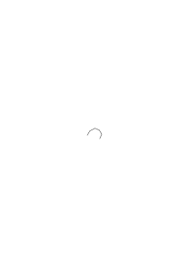
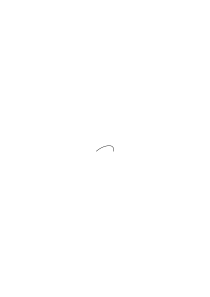
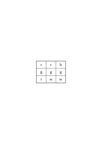
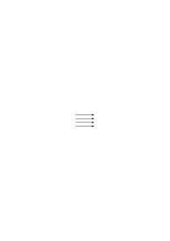
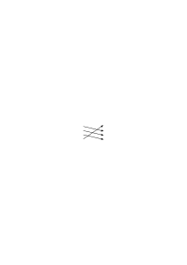
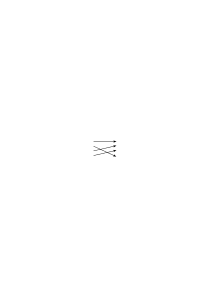

# Ts-226

### [0\[1\]](https://cdn.wittgensteinnachlass.com/2000px/webp/Ts-226/0.webp),[1r\[1\]](https://cdn.wittgensteinnachlass.com/2000px/webp/Ts-226/1r.webp),[1r\[2\]](https://cdn.wittgensteinnachlass.com/2000px/webp/Ts-226/1r.webp),[1r\[3\]](https://cdn.wittgensteinnachlass.com/2000px/webp/Ts-226/1r.webp),[1v\[1\]](https://cdn.wittgensteinnachlass.com/2000px/webp/Ts-226/1v.webp)

1 _Augustinus_, in the Confessions I/8: Cum (majores homines) appellabant rem aliquam, et cum secundum eam vocem corpus ad aliquid movebant, videbam, et tenebam hoc ab eis vocari rem illam, quod sonabant, cum eam vellent ostendere. Hoc autem eos velle ex motu corporis aperiebatur: tamquam verbis naturalibus omnium gentium, quae fiunt vultu et nutu oculorum, ceterorumque membrorum actu, et sonitu vocis indicante affectionem animi in petendis, habendis, rejiciendis, faciendisve rebus. Ita verba in variis sententiis locis suis posita, et crebro audita, quarum rerum signa essent, paulatim colligebam, measque jam voluntates, edomito in eis signis ore, per haec enuntiabam. In these words we get – it seems to me – a definite picture of the nature of human language. Namely this: the words of language name objects – sentences are combinations of such names. In this picture of human language we find the root of the idea: every word has a meaning. This meaning is correlated to the word. It is the object which the word stands for. Augustine however does not speak of a distinction between parts of speech. If one describes the learning of language in this way, one thinks – I should imagine – primarily of substantives, like “table”, “chair”, “bread” and the names of persons; and of the other parts of speech as something that will come out all right eventually.

### [1r\[4\]](https://cdn.wittgensteinnachlass.com/2000px/webp/Ts-226/1r.webp)

2 Consider now this application of language: I send someone shopping. I give him a slip of paper, on which I have written the signs: “five red apples”. He takes it to the grocer; the grocer opens the drawer that has the sign “apples” on it; then he looks up the word “red” in a table, and finds opposite it a coloured square; he now says out loud the series of cardinal numbers – I assume he knows them by heart – up to the word “five” and with each numeral he takes an apple that has the colour of the square from the drawer. – In this way & in similar ways one operates with words. – “But how does he know where and how he is to look up the word ‘red’ and what he has to do with the word ‘five’?” – Well, I am assuming that he _acts_, as I have described. Explanations come to an end somewhere. – But what's the meaning of the word “five”? – There was no question of such an entity ‘meaning’ here; only of the way in which “five” is used.

### [1r\[5\]](https://cdn.wittgensteinnachlass.com/2000px/webp/Ts-226/1r.webp)

3 That philosophical concept of meaning is at home in a primitive picture of the way in which our language functions. But we might also say that it is a picture of a more primitive language than ours.

### [1r\[6\]](https://cdn.wittgensteinnachlass.com/2000px/webp/Ts-226/1r.webp),[2\[1\]](https://cdn.wittgensteinnachlass.com/2000px/webp/Ts-226/2.webp)

4 Let us _imagine_ a language for which the description which Augustine has given would be correct. The language is to be the means of communication between a builder A and his assistant B. A is constructing a building out of building blocks; there are cubes, columns, slabs and beams. B has to hand him the building stones in the order in which A needs them. For this purpose they use a language consisting of the words: “cube”, “column”, “slab”, “beam”. A calls out the words; – B brings the stone that he has learned to bring at this call. Regard this as a complete primitive language.

### [2\[2\]](https://cdn.wittgensteinnachlass.com/2000px/webp/Ts-226/2.webp)

5 Augustine describes, we might say, _a_ system of communication; not everything, however, that we call language is this system. (And this one must say in so many cases when the question arises: “is this an appropriate description or not?”. The answer is, “Yes, it is appropriate; but only for this narrowly restricted field, not for everything that you professed to describe by it.” Think of the theories of economists.)

### [2\[3\]](https://cdn.wittgensteinnachlass.com/2000px/webp/Ts-226/2.webp)

6 It is as though someone explained: “Playing a game consists in moving things about on a surface according to certain rules …”, and we answered him: You seem to be thinking of games played on a board; but these aren't all the games there are. You can put your description right by confining it explicitly to those games.

### [2\[4\]](https://cdn.wittgensteinnachlass.com/2000px/webp/Ts-226/2.webp)

7 Imagine a script in which letters stand for sounds, but are used also as accents and as punctuation signs. (One can regard a script as a language for the description of sounds.) Now suppose someone interpreted our script as though all letters just stood for sounds, and as though the letters here did not also have quite different functions. – Such an oversimplified view of our script is the analogon, I believe, to Augustine's view of language.

### [2\[5\]](https://cdn.wittgensteinnachlass.com/2000px/webp/Ts-226/2.webp),[3\[1\]](https://cdn.wittgensteinnachlass.com/2000px/webp/Ts-226/3.webp)

8 If we look at our example (2) we may perhaps get an idea of how the general concept of the meaning of a word surrounds the working of language with a mist that makes it impossible to see clearly. The fog is dispersed if we study the workings of language in primitive cases of its application, in which it is easy to get a clear view of the purpose of the words and of the way they function. Primitive forms of language of this sort are what the child uses when it learns to speak. And here teaching the language does not consist in explaining but in training.

### [3\[2\]](https://cdn.wittgensteinnachlass.com/2000px/webp/Ts-226/3.webp),[4\[1\]](https://cdn.wittgensteinnachlass.com/2000px/webp/Ts-226/4.webp)

9 We could imagine that the language (4) is the _entire_ language of A and B; even the entire language of a tribe. The children are brought up to carry out the activities in question, to use such & such words and to react in such & such a way to the words of others. An important part of the training will consist in the teacher's pointing to the objects, directing the child's attention to them and pronouncing a word; for instance, the word ‘slab’ in pointing to this block. (I don't want to call this “ostensive explanation” or “definition”, because the child can't as yet _ask_ what the thing is called. I will call it “ostensive teaching of words”. – I say it will constitute an important part of the training, because this is so with human beings, not because we couldn't imagine it otherwise.) This ostensive teaching of the words, one might say, makes an associative connection between the word and the thing. But what does that mean? Well, it may mean various things; but what first occurs to one is probably that an image of the thing comes before the child's mind when it hears the word. But suppose that happens – is that the purpose of the word? – It _may_ be its purpose. – I can imagine such a use of words (i.e. series of sounds). (To pronounce them would be like striking a key on a piano of images.) But in our language (4) it is _not_ the purpose of the words to call up images. (Though this may, of course, be found to be helpful to their purpose.) But if that is what the ostensive teaching brings about, – shall I say that it brings about the understanding of the word? Doesn't he understand the order “slab!” if he acts in such and such a way on hearing it? – The ostensive teaching indeed helped to bring this about, but only in connection with a certain training. With a different training the same ostensive teaching of these words would have brought about a different understanding. – Of this more at a later point. “By connecting up this lever with this rod by means of a peg, I put the brake in order.” – Yes, given all the rest of the mechanism. Only together with this mechanism is it a brake lever; and without its support it isn't even a lever, but it may be anything.

### [4\[2\]](https://cdn.wittgensteinnachlass.com/2000px/webp/Ts-226/4.webp),[5\[1\]](https://cdn.wittgensteinnachlass.com/2000px/webp/Ts-226/5.webp)

10 In the use of the language (4) the one party calls out the words and the other acts according to them. In the teaching of this language however there will be this procedure: the pupil calls the blocks by their names; that is, he pronounces the word when the teacher points to the block. – In fact we will find here an even simpler exercise: the pupil repeats the words which the teacher pronounces for him: both of these exercises already primitive uses of language. We may even imagine that the use of the words we make in (4) is one of those games by means of which our children learn language. I will call these “language games”, and I will frequently speak of a primitive language as a language game. And one might call the exercises of calling the blocks by their names and of repeating the words which the teacher has pronounced language games as well. Think of the use made of words in nursery-rhymes.

### [5\[2\]](https://cdn.wittgensteinnachlass.com/2000px/webp/Ts-226/5.webp)

11 Let us now consider an extension of the language (4): Besides the four words “cube”, “column” etc., let it contain a series of words applied in the way the grocer in (2) applied the numerals, – it may be the series of the letters of the alphabet; further, let there be two words, let us choose “there” and “this”, since this already suggests their purpose, – they are to be used in connection with a pointing gesture; and finally let us use certain bits of paper of various colours. _A_ now gives a command of this sort: “d slab there” – at the same time showing his assistant a coloured square, and with the word “there” pointing to a certain place. B takes from the supply of slabs for each letter of the alphabet up to “d” a slab of the same colour as the coloured square and brings it to the place which A indicates. – On other occasions A gives the command “this there” – with “this” he points at a building block – and so on.

### [5\[3\]](https://cdn.wittgensteinnachlass.com/2000px/webp/Ts-226/5.webp),[6\[1\]](https://cdn.wittgensteinnachlass.com/2000px/webp/Ts-226/6.webp)

12 When the child learns this language it has to learn the series of “numerals” “a”, “b”, “c”, … by heart. – And it has to learn their use. Will an ostensive teaching of words enter into this instruction also? – Well, one will point at slabs, for instance, and count: “a, b, c slabs”. There would be a greater similarity between the ostensive teaching in (4) and the ostensive teaching of numerals if these are not used for counting but refer to groups of objects grasped by the eye. In this way children learn the use of the first five or six cardinal numerals. Do we teach “there” and “this” ostensively? – Imagine how you might teach their use. You point to places and things; but in this case the pointing occurs in the _use_ of the words also, not simply in the teaching of the use. –

### [6\[2\]](https://cdn.wittgensteinnachlass.com/2000px/webp/Ts-226/6.webp),[7\[1\]](https://cdn.wittgensteinnachlass.com/2000px/webp/Ts-226/7.webp)

13 Now what do the words of this language _denote_? – What they denote – how is this to appear, unless in the way they are used? And this is what we have described. The expression, “this word denotes so & so” would now become a part of this description. Or: the description is to be put in the form: “The word … denotes …”. Now it certainly is possible to condense the description of the use of the word “slab” into saying that this word denotes this object. This one would do if the question were, for instance, to prevent the misunderstanding that the word “slab” referred to the kind of block which we actually call a “cube”, the particular sort of “reference”, however, i.e. all the rest of the game with these words, were familiar. Similarly one might say that the signs “a”, “b”, “c”, etc. denote numbers, if this is to remove the misunderstanding that “a”, “b”, “c”, play the role in our language which actually is played by “cube”, “column”, “slab”. And one can say also that “c” denotes this number and not that, – when this is to explain, say, that the letters are to be used in the order “a”, “b”, “c”, “d” etc., and not “a”, “b”, “d”, “c”. But by assimilating in this way descriptions of the uses of words to one another, their uses don't become more similar. For, as we have seen, their uses are of widely different sorts.

### [7\[2\]](https://cdn.wittgensteinnachlass.com/2000px/webp/Ts-226/7.webp)

14 Think of the tools in a tool chest: There is a hammer, pincers, a saw, a screw-driver, a ruler, a pot of glue, glue, nails and screws. – As different as the functions of these objects are the functions of words. (And there are similarities in the one case and in the other.)

### [7\[3\]](https://cdn.wittgensteinnachlass.com/2000px/webp/Ts-226/7.webp)

15 What confuses us, of course, is the uniformity of their appearance when we hear the words or see them written or in print. For their _use_ isn't so clearly there before our eyes. Especially not when we are doing philosophy.

### [7\[4\]](https://cdn.wittgensteinnachlass.com/2000px/webp/Ts-226/7.webp),[8\[1\]](https://cdn.wittgensteinnachlass.com/2000px/webp/Ts-226/8.webp)

16 As when we look into the driver's cabin of a locomotive: we see handles which all look more or less alike. (That's natural, since they are all made to be held with the hand.) But one is the valve that can be regulated by continuous degrees; another is the handle of a switch, which has only two effective positions, it's either shut or open; a third is the handle of a brake, the harder you pull it the more the brake is applied; a fourth, the handle of a pump, works only as long as it is moved back and forth.

### [8\[2\]](https://cdn.wittgensteinnachlass.com/2000px/webp/Ts-226/8.webp)

17 If we say: “every word of language denotes something”, – then, so far, we've said nothing at all, that is, unless we explain what distinction we wish to make. (It might be that we wished to distinguish the words of our language (11) from words ‘without meaning’ which occur in Lewis Carroll's poems.)

### [8\[3\]](https://cdn.wittgensteinnachlass.com/2000px/webp/Ts-226/8.webp)

18 Suppose someone said: “All tools serve to modify something. Thus the hammer modifies the position of the nail, the saw the shape of the board, etc..” – And what does the ruler modify, the glue pot, the nails? – “Our knowledge of the length of a thing, the temperature of the glue and the firmness of the box.” – Would anything be gained by this assimilation of our expressions? –

### [8\[4\]](https://cdn.wittgensteinnachlass.com/2000px/webp/Ts-226/8.webp)

19 The expression “the name of an object” is very straightforwardly applied where the name is actually a mark on the object itself. Suppose then that there are marks scratched on the tools which A uses in building. When A shows his assistant a sign of this sort, then the assistant brings the tool which bears that sign. In this and in more or less similar ways a name denotes a thing, and is given to a thing. (Of this more later.) – It will often prove useful if in doing philosophy we say to ourselves: Naming something is something like attaching a label to a thing. –

### [8\[5\]](https://cdn.wittgensteinnachlass.com/2000px/webp/Ts-226/8.webp),[9\[1\]](https://cdn.wittgensteinnachlass.com/2000px/webp/Ts-226/9.webp)

20 What about the colour-samples that A shows to B, – do they belong to the language? As you like. They don't belong to our spoken language; but if I say to someone, “Pronounce the word ‘the‘”, you will call the second “the” also a part of the sentence. Yet it plays a very similar role to that of a coloured bit of paper in the language game (11): it is a sample of what the other person is supposed to say, just as the coloured square is a sample of what B is supposed to bring. It is the most natural thing and causes least confusion if we count samples among the instruments of language.

### [9\[2\]](https://cdn.wittgensteinnachlass.com/2000px/webp/Ts-226/9.webp)

21 We may say that in language (11) we have various parts of speech. For the functions of “slab” and “cube” are more alike than the functions of “slab” and “d”. But the way we classify the words together as parts of speech will depend on the purpose of the classification, and on our inclination. Think of the different points of view according to which one might classify tools as different kinds of tools. Or chess pieces as different kinds of pieces.

### [9\[3\]](https://cdn.wittgensteinnachlass.com/2000px/webp/Ts-226/9.webp),[10\[1\]](https://cdn.wittgensteinnachlass.com/2000px/webp/Ts-226/10.webp)

22 Don't let it bother you that the languages (4) and (11) consist only of commands. If you are inclined to say that they are therefore incomplete, then ask yourself whether our language is complete; whether it was complete before the symbolism of chemistry and the infinitesimal calculus were embodied in it: for these are, as it were, suburbs of our language. (And with how many houses or streets does a town begin to be a town?) We can regard our language as an old town, the center a maze of narrow alleys and squares, old and new houses, & houses with additions from various periods; and all this surrounded by a mass of new suburbs with straight and regular streets and uniform houses. One can easily imagine a language which consists only of commands and reports in battle. – Or a language which consists only of questions and an expression of affirmation and denial– and countless other things. – And to imagine a language means to imagine a way of living.

### [10\[2\]](https://cdn.wittgensteinnachlass.com/2000px/webp/Ts-226/10.webp),[11\[1\]](https://cdn.wittgensteinnachlass.com/2000px/webp/Ts-226/11.webp)

23 But let's see: is the call “slab!” in (4) a sentence or a word? – If a word, surely it hasn't the same meaning as the word “slab” in our ordinary language, for in our language (4) it is a call; but if it's a sentence, then it isn't the elliptical sentence “slab!” of our language. – – – As regards the first question: you can call “slab!” a word, and you can call it a sentence; perhaps best a “degenerate sentence” (as one speaks of a degenerate hyperbola). And it is precisely our “elliptical” sentence. – – – But isn't this a shortened form of the sentence “Bring me a slab”? And there isn't such a sentence in the language (4). – But why shouldn't I rather call the sentence “Bring me a slab” a _lengthening_ of the sentence “slab!”? – – – Because the person who calls out “slab!” really means “Bring me a slab!”. – – – But how do you do this, _meaning_ this while you _say_ “slab”? Do you say the unshortened sentence to yourself? And why should I, in order to say what you mean by the call “slab!”, translate this expression into another? And if they mean the same, – why shouldn't I say: “When you say ‘slab!’ you mean ‘slab!’”? – Or: Why shouldn't it be possible for you to mean “slab!”, if you can mean “Bring me the slab”? – – – But when I shout “slab!”, then surely what I want is that _he shall bring me a slab_. – – – Certainly, but does “wanting this” consist in the fact that you think in any form a different sentence from the one you speak? –

### [11\[2\]](https://cdn.wittgensteinnachlass.com/2000px/webp/Ts-226/11.webp),[12\[1\]](https://cdn.wittgensteinnachlass.com/2000px/webp/Ts-226/12.webp)

24 “But if someone says ‘Bring me a slab’ it now looks as though he could mean this expression as one long word, – corresponding, that is, to the one word ‘slab!’.” – Can one mean it sometimes as one word and sometimes as four words? And how does one generally mean it? – I believe that what we shall be inclined to say: is that we mean the sentence as a sentence of _four_ words when we are using it as contrasted with sentences like, “_Hand_ me a slab”, “Bring _him_ a slab”, “Bring _two_ slabs”, etc.: as contrasted, that is, with sentences which contain the words of our command in different combinations. – But what does using one sentence in contrast to other sentences consist in? Does one have these other sentences in mind at the time? And _all_ of them? And while one is speaking the sentence, or before or afterwards? – No. Even if such an explanation has some attraction for us, we have only to consider for a moment what actually happens in order to see that we are on a wrong track. We say we use this command in contrast to other sentences. because _our language_ contains the possibility of these other sentences. Someone who did not understand our language, a foreigner who had frequently heard someone giving the command “Bring me the slab”, might suppose that this entire series of sounds was one word and corresponded, say, to the word “building block” in his language. If he had then to give this command himself, he would perhaps pronounce it differently and we should say: He pronounces it so queerly because he thinks it is one word. – But doesn't something different happen in him when he utters it, corresponding to the fact that he regards the sentence as one word? The same thing may happen in him, or again something different may. What happens in you when you give a command of that sort? Are you conscious that it consists of four words _while_ you are uttering it? Of course, you know this language, in which there are those other sentences also, but is this knowing something that happens while you are uttering the sentence? – And I have admitted, that the foreigner who views the sentence differently will probably also pronounce it differently, but what we call his wrong view doesn't necessarily consist in anything that accompanies the uttering of the command. (Of this more later.)

### [12\[2\]](https://cdn.wittgensteinnachlass.com/2000px/webp/Ts-226/12.webp)

25 The sentence is not ‘elliptical’ because it omits something that we think when we utter it, but because it is abbreviated, as _compared_ with a particular standard of our grammar. – One might make the objection: “You admit that the abbreviated and the unabbreviated sentence have the same meaning. Well, what meaning have they? Isn't there an expression for this meaning?” – But doesn't their identical meaning consist in their having the same _application_? (In Russian they say “stone red” instead of “the stone is red”; don't they get the full meaning, as they leave out the copula? or do they _think_ it to themselves without pronouncing it? –)

### [12\[3\]](https://cdn.wittgensteinnachlass.com/2000px/webp/Ts-226/12.webp),[13\[1\]](https://cdn.wittgensteinnachlass.com/2000px/webp/Ts-226/13.webp)

26 One can also imagine a language in which B, in reply to a question by A, has to report to him the number of slabs or cubes stacked up in some place; or the colours or shapes of certain building-blocks. Such a report might be of the form: “five slabs.”. Now what is the difference between the report, or assertion, “five slabs.”, and the command “five slabs!”? – It is the role which saying these words plays in our language games. But probably the tone of voice in which they are uttered will be different too, and the facial expression and various other things. But it may well be that the tone of voice is the same in both cases – for a command and a report may be uttered in a lot of different tones of voice and with a lot of different facial expressions – and the difference may lie only in what is done with the words “five slabs”. – (Of course we might use the words “assertion” and “command” just to indicate a grammatical form of a sentence and a particular intonation, just as one would call the sentence “Isn't it glorious weather today?”, a question, although it is used as an assertion.) We could imagine a language in which _all_ assertions had the form and the intonation of a rhetorical question; or in which every command had the form: “Would you like to …?”. One might say in this case: “What he says has the form of a question but it is really a command”, i.e. has the _function_ of a command. (Similarly one says “you will do so & so” not as a prophecy but as a command. What would make it the one, what the other?)

### [13\[2\]](https://cdn.wittgensteinnachlass.com/2000px/webp/Ts-226/13.webp),[14\[1\]](https://cdn.wittgensteinnachlass.com/2000px/webp/Ts-226/14.webp)

27 Frege's view that an assertion contains a supposal, and that it is this which is asserted, is really based on the possibility in our language of writing every assertion in the form: “It is asserted that so and so is the case”. But “that so and so is the case” is not a sentence in our language – this is not yet a _move_ in our language game. And if instead of “It is asserted that …”, I write “It is asserted: so and so is the case”, then the words “It is asserted” are superfluous. We might write every assertion in the form of a question followed by an affirmative reply; thus instead of “It is raining”, “Is it raining? Yes.”. Would that show that every assertion contained a question?

### [14\[2\]](https://cdn.wittgensteinnachlass.com/2000px/webp/Ts-226/14.webp)

28 Of course one has a right to use an assertion sign in contrast, for instance, to a question mark. The mistake is only to think that the assertion consists of two acts, the considering and the asserting (assigning the truth value, or whatever you call it), and that we perform these acts according to the signs of the sentence, almost as we sing from notes. What can be compared to the singing from notes is the reading aloud, or to oneself, of the signs of the sentence; but not the meaning (the thinking) of the sentence that is read.

### [14\[3\]](https://cdn.wittgensteinnachlass.com/2000px/webp/Ts-226/14.webp),[15\[1\]](https://cdn.wittgensteinnachlass.com/2000px/webp/Ts-226/15.webp)

29 The important point of Frege's assertion sign is perhaps put best by saying: it indicates clearly the beginning of the sentence. – This is important: for our philosophical difficulties concerning the nature of ‘negation’ and ‘thinking’, in a sense, are due to the fact that we don't realise that an assertion “⊢ not p”, or “⊢ I believe p”, and the assertion “⊢ p” have “p” in common, but not “⊢ p”. (For if I hear someone say the words “it's raining”, then I don't know what he has said if I don't know

### [15\[1\]](https://cdn.wittgensteinnachlass.com/2000px/webp/Ts-226/15.webp)

whether I have heard the _beginning_ of the sentence.)

### [15\[2\]](https://cdn.wittgensteinnachlass.com/2000px/webp/Ts-226/15.webp),[16\[1\]](https://cdn.wittgensteinnachlass.com/2000px/webp/Ts-226/16.webp)

30 But how many kinds of sentence are there? Is it assertions, questions and commands? – There are _innumerable_ kinds: innumerable kinds of applications of all that we call “signs”, “words”, “sentences”. And this variety is nothing that is fixed, given once and for all, but new types of language, new language games – as we may say – come into being and others become obsolete and are forgotten. (A _rough picture_ of this we can get if we look at the changes which happen in mathematics.) The expression “language _game_” is used here to emphasise that the speaking of the language is part of an activity, part of a way of living of human beings. To get an idea of the enormous variety of language games consider these examples, & others: giving commands, and acting according to commands; giving a description of an object by describing what it looks like, or by giving its measurements; producing an object according to a description (drawing); reporting an event; making a hypothesis and testing it; presenting the results of an experiment in tables and diagrams; acting a play; singing a catch; asking riddles and guessing them; making a joke, or telling one; solving a problem in applied arithmetic; translating from one language into another; requesting, thanking, swearing, greeting, praying.

– It is interesting to compare the variety of the instruments of our language and of their various uses – the variety of kinds of words & of sentences – with what logicians have said about the structure of our language. (Including the author of Tract. Log.-phil.)

### [16\[2\]](https://cdn.wittgensteinnachlass.com/2000px/webp/Ts-226/16.webp),[17\[1\]](https://cdn.wittgensteinnachlass.com/2000px/webp/Ts-226/17.webp)

31 If we don't see that there is a _multitude_ of language games, we are inclined to ask: “What is a question?” Is it the statement that I don't know so and so, or is it the statement that I wish the other person would tell me …? Or is it the description of my mental state of uncertainty? – And is the cry “help!” such a description? Think of what widely different things we call “descriptions”: the description of the position of a body by means of its coordinates: the description of changes in a sensation of pain. Of course one can replace the usual form of a question by that of a statement or a description: such as “I want to know whether …”, or “I am in doubt whether …” – but one hasn't thereby brought the different language games any nearer to one another. The significance of this possibility of transforming, for instance, all assertions into sentences that begin with the words “I think” or “I believe” (i.e. so to speak into descriptions of my mental states) will appear later.

### [17\[2\]](https://cdn.wittgensteinnachlass.com/2000px/webp/Ts-226/17.webp)

32 It is said sometimes: animals don't speak, because they lack the necessary intellectual capacities. And this means: ‘they don't think, therefore they don't speak’. But they just don't speak. Or rather: they don't _use language_. (If we except the most primitive forms of language.) Giving orders, asking questions, describing, prattling, belong to our natural history just as walking, eating, drinking, playing do. (It makes no difference here whether speaking is done with the mouth or done with the hand.)

### [17\[3\]](https://cdn.wittgensteinnachlass.com/2000px/webp/Ts-226/17.webp)

33 This is connected with the fact that we think that the learning of language consists in naming objects; viz. human beings, shapes, colours, aches, moods, numbers, etc..– As we have said, naming is something like fastening a label to a thing. And this one might call a preparation for the use of a word. But _for what_ is it a preparation?

### [17\[4\]](https://cdn.wittgensteinnachlass.com/2000px/webp/Ts-226/17.webp),[18\[1\]](https://cdn.wittgensteinnachlass.com/2000px/webp/Ts-226/18.webp)

34 “We name things and now we can talk about them; refer to them in what we say.” – As though with the act of naming all that happens after it were already fixed. As though there were only one thing called “speaking about things”. Whereas we actually do the most widely different kinds of things with our sentences. Think only of the interjections– with their very different functions. Water! Away! Ouch! Help! Beautiful! No!

Are you still inclined to call these words “names of objects”?

### [18\[2\]](https://cdn.wittgensteinnachlass.com/2000px/webp/Ts-226/18.webp),[19\[1\]](https://cdn.wittgensteinnachlass.com/2000px/webp/Ts-226/19.webp)

35 In the languages (4) and (11) there was no such thing as asking what a thing is called. This and its correlate, the ostensive explanation, definition, is, we might say, a separate language game. That means really: we are taught, trained, to ask “What is this called?”, – and then the name is given. And there is also a language game: inventing a name for something. I.e., to say, “This is called …” and then to use the new name. (In this way, e.g., children name their dolls and then go on to talk about them. In this connection consider what a very special use we make of a personal name: we use it to _call_ someone.) Now we can ostensively define a personal name, a colour word, the name of a material, a numeral, the name of a point of the compass, etc., etc.. The definition of two: “This is called ‘two’” – pointing to two nuts – is perfectly exact. – But how can you define “two” in this way? The person to whom you give the definition won't then know _what_ it is you wish to call “two”; he'll suppose that you have called _this_ group of nuts “two”. – He _may_ suppose this, but perhaps he won't. He might also do just the opposite: when I want to assign a name to this group of nuts he might take this to be the name of a number. And equally, if I give an ostensive definition of a personal name, he might take it to be the name of a colour, the name of a race, even the name of a point of the compass. That is, the ostensive definition can in all cases be interpreted in this way or in that way.

### [19\[2\]](https://cdn.wittgensteinnachlass.com/2000px/webp/Ts-226/19.webp),[20\[1\]](https://cdn.wittgensteinnachlass.com/2000px/webp/Ts-226/20.webp)

36 You may say: “Two” can be defined ostensively only in this way: “This _number_ is called ‘two’”. For the word “number” here shows what _place_ in our language – in our grammar – we assign to the word; but this means that the word “number” must be explained before that ostensive definition can be understood. – The word “number” in the definition does indeed indicate this place, the post which we assign to the word. And we can prevent misunderstandings by saying “This _colour_ is called so and so”, “This _length_ is called so and so”, etc.. That is: misunderstandings _are_ often avoided in this way. But can the word “colour”, or “length”, be understood only in _this_ way? – Well, we shall have to explain them. That is, explain them by means of other words! And what about the last explanation in this chain? (Don't say “There isn't any ‘last’ explanation”. This is exactly as though you said, “There isn't any last house in this street: you can always build another one.”) Whether the word “number” is necessary in the ostensive definition of “two” depends upon whether he misunderstands my definition if I leave out the word. And this will depend on the circumstances under which the definition is given and on the person to whom I give it. And how he “understands” the explanation will appear in the way he makes use of the word explained.

### [20\[2\]](https://cdn.wittgensteinnachlass.com/2000px/webp/Ts-226/20.webp),[21\[1\]](https://cdn.wittgensteinnachlass.com/2000px/webp/Ts-226/21.webp)

37 One might say: The ostensive definition explains the use – the meaning – of the word if it is already clear what kind of role the word is to play in the language. Thus if I know that someone wants to explain a colour word to me, the explanation “This is called ‘sepia’” will make me understand the word. – And you can say this as long as you remember that all sorts of questions now attach to the words “to know” and “be clear”. You have to know something already before you can ask what something is called. But what do you have to know? If you show someone the king in a set of chess men and say, “This is the king of chess”, you do not thereby explain to him the use of this piece, – unless he already knows the rules of the game except for this last point: the shape of the king. We can imagine that he has learned the rules of the game without ever having been shown a real chessman. The shape of a chessman corresponds here to the sound or the shape of a word. But we can also imagine someone's having learned the game without ever having learned or formulated rules. He perhaps first learned very simple games on boards by watching them and proceeded to more and more complicated ones. To him also you might give the explanation, “This is the king”, if, for instance, you are showing him chess men of an unusual shape. And this explanation teaches him the use of the piece only because, as we might say, we had in the game already prepared the place in which it was to be put. Or: We shall say the explanation teaches him the use, only when the place has already been prepared. And it is prepared in this case not because the person to whom we are giving the explanation already knows rules, but because he has in a different sense, already mastered a game. Consider still another case: I explain the game of chess to someone and begin by showing him a piece, saying, “This is the king. It can move in this and this way, etc. etc.”. – In this case we shall say: the words “This is the king” (or, “This is called ‘king’”) explain the use of the words “the king”, only if the person we teach already knows what a piece in a game is: when he has already played other games, or watched ‘with understanding’ games played by other people, _and the like_. And only then will he be in a position to ask relevantly, in learning the game, “What's this called?” – that is, this piece. We may say: there is only sense in someone's _asking for the name_ if he already knows what to do with the name. For we can imagine that the person I have asked, answers, “give it a name yourself”, – and then I should have to provide _everything_ myself.

### [21\[2\]](https://cdn.wittgensteinnachlass.com/2000px/webp/Ts-226/21.webp),[22\[1\]](https://cdn.wittgensteinnachlass.com/2000px/webp/Ts-226/22.webp)

38 Anyone who comes into a foreign country will often have to learn the language there by ostensive explanations which people give him; and he will often have to _guess_ the interpretation of these explanations, & will guess it sometimes correctly, sometimes wrongly. And now we can say, I think: Augustine describes the child's learning to speak as though the child had come to a foreign country without understanding its language; that is, as though the child already _had_ a language, only not this one. Or, as though the child could already _think_ but not yet speak. And here “think” would mean something like: speak to himself.

### [22\[2\]](https://cdn.wittgensteinnachlass.com/2000px/webp/Ts-226/22.webp),[23\[1\]](https://cdn.wittgensteinnachlass.com/2000px/webp/Ts-226/23.webp)

39 But what if someone objected: “It isn't true that you must already have mastered a language game in order to understand an ostensive definition, but of course, you've got to know (or guess) what the man who gives the explanation is pointing to: e.g., whether to the shape of the object, or to its colour, or to the number of the objects, etc., etc..” – And what does “pointing to the shape”, “pointing to the colour” etc. consist in? Point to a piece of paper. – And now point to its shape – now to its colour – now to its number (that sounds queer). – Well, how did you do it? You will say each time you pointed you “_meant_” something different. And if I ask how you do this, you will say you concentrate your attention on the colour, on the shape etc.. But now I ask again how _this_ is done. Suppose someone points to a vase and says “Look at this marvellous blue! – the shape doesn't matter.” – Or, “Look at this wonderful shape! – the colour's unimportant.” – Undoubtedly you will do something _different_ in each case if you do what he asks you. But do you always do the _same_ thing when you direct your attention to the colour? Imagine various cases – e.g. these: – “Is this blue the same as that? Do you see a difference?” – You are mixing paints on a palette and say “This blue of the sky is hard to get.” “It's going to be fine, you can see the blue sky already.” “Look what different effects these two blues give.” “Do you see that blue book? Please fetch it.” “This blue light means …” “What's this blue called? – is it “indigo”–?”

Directing the attention to the colour sometimes means shutting out the outlines of the shape with your hand, or, not looking directly at the contour of the thing; sometimes it means staring at the thing and trying to remember where one has seen this colour before. You direct your attention to the shape of a thing, sometimes by drawing it, sometimes by screwing up the eyes so as not to see the colour clearly, etc., etc.. I wish to say that: this is the sort of thing that happens _while_ you ‘direct your attention to something’. But it isn't just this which makes us say that someone is directing his attention to the shape, to the colour, etc.. Just as “making a move in chess” doesn't only consist in pushing a piece from here to there – nor in the thoughts and feelings that accompany the move – but rather in the circumstances that we call “playing a game of chess”, or “solving a chess problem”, and the like.

### [23\[2\]](https://cdn.wittgensteinnachlass.com/2000px/webp/Ts-226/23.webp),[24\[1\]](https://cdn.wittgensteinnachlass.com/2000px/webp/Ts-226/24.webp)

40 But suppose someone said: “I always do the same thing when I direct my attention to a shape: I follow the outline with my eyes with the feeling …”. And suppose this person gives to someone the ostensive definition, “This is a ‘circle’”, pointing to a circular object & having all these experiences. Can't the other still interpret this explanation differently, although he sees that the person giving it follows the shape with his eyes, even if he feels what the person giving the explanation feels? That is to say, this “interpretation” may consist in the use he now makes of the word, e.g. in his pointing to such & such an object when given the command: “Point to a circle”. – For neither the expression, “meaning the explanation in such and such a way”, nor the expression, “interpreting the explanation in such and such a way”, indicates a particular process accompanying the giving and receiving of the explanation.

### [24\[2\]](https://cdn.wittgensteinnachlass.com/2000px/webp/Ts-226/24.webp),[25\[1\]](https://cdn.wittgensteinnachlass.com/2000px/webp/Ts-226/25.webp)

41 There are indeed what might be called “characteristic experiences” of pointing to a shape, e.g.. Tracing the outline with one's finger, for instance, or with one's eyes, in pointing. – But just as this doesn't happen in all cases in which I ‘mean the shape’, no other characteristic process occurs in all these cases. But even if such process did occur in all of them, it would still depend upon the circumstances – i.e. upon what happened before and after the pointing – whether we would say: “He pointed to the shape and not to the colour”. For the expressions “pointing to the shape”, “meaning the shape” etc. are not used like these:– “pointing to the book”, “pointing to the letter ‘B’ and not to the letter ‘u’” etc.. – Just think how differently we _learn_ the use of the expressions: “pointing to

### [25\[1\]](https://cdn.wittgensteinnachlass.com/2000px/webp/Ts-226/25.webp)

this thing”, “pointing to that thing”, and on the other hand “pointing to the colour and not to the shape”, “meaning the colour”, etc., etc.. As I have said, in certain cases, particularly in pointing ‘to the shape’, or ‘to the number’, there are characteristic experiences and ways of pointing – “characteristic” because they frequently (not always) occur where shape or number is meant. But do you also know a characteristic experience for pointing to a chessman _as a chessman_? – And yet one may say: “I mean this chessman is called ‘king’, not this particular block of wood I'm pointing to.” And we do here, what we do in a host of similar cases: as we aren't able to point out some _one_ bodily action which we call “pointing to the shape” (as opposed, e.g., to the colour) we say that a _mental_ activity corresponds to these words. Where our language leads us to look for a physical thing, and there isn't a thing; there we are inclined to put a spirit.

### [25\[2\]](https://cdn.wittgensteinnachlass.com/2000px/webp/Ts-226/25.webp),[26\[1\]](https://cdn.wittgensteinnachlass.com/2000px/webp/Ts-226/26.webp)

43 “What is the relation between names and what they name?” – Well, what _is_ it? Look at our language game (4), or at some other language game; that's where you'll see what this relation consists in. Among various things, this relation may consist in the fact that hearing the name calls up in our minds an image of the thing, and it sometimes consists in the fact that the name is written on the thing named, or that the name is uttered when the thing named is pointed to. But what is the word “this” a name of in the language game (11), or in the ostensive explanation “this is called …”? Well, if you don't want to produce confusion it is best not to say that these words name anything. – And, curiously enough, it was once said of the word “this” that it is the _real_ name. Everything else that we call “name” being a name only in an inexact, approximate sense. This curious view has its origin in a tendency to sublimate – as we might call it – the logic of language. The proper answer to it is: we call widely _different_ things “names”; the word “name” characterises many different kinds of uses of words, related to each other in many different ways; – but among these kinds of uses is not that of the word “this”. It is true that we often, e.g. in giving an ostensive definition, point to a thing and in doing so pronounce its name. And similarly we pronounce– e.g. in an ostensive definition– the word “this” in pointing to a thing. And the word “this” and a name can often stand in the same context: we say “Fetch this”, and also “Fetch Paul”. But it is precisely one of the characteristic features of a name that its meaning is explained by the demonstrative “This is N” (or “This is called ‘N’”). But do we also explain, “This is called ‘this’”?

### [26\[2\]](https://cdn.wittgensteinnachlass.com/2000px/webp/Ts-226/26.webp),[27\[1\]](https://cdn.wittgensteinnachlass.com/2000px/webp/Ts-226/27.webp)

45 This is connected with the idea of naming as an occult process, as it were. The naming seems to us to be a _strange_ connection between a word and an object. – And a strange connection really is made– when the philosopher, in order to see what the connection is between a name and a thing, stares at an object before him, repeating a name – or it may be the word “this” – over and over again. For the philosophical problems arise when language _idles_. And then indeed it's easy to imagine that naming is some queer mental act, a kind of christening, as it were, of the object. And we may then also say the word “this” _to_ the object, as it were, _addressing_ it– a strange use of this word, which, I think, is never made outside philosophy. –

### [27\[2\]](https://cdn.wittgensteinnachlass.com/2000px/webp/Ts-226/27.webp),[28\[1\]](https://cdn.wittgensteinnachlass.com/2000px/webp/Ts-226/28.webp)

46 But why should one wish to regard just this word as a name, when it so obviously _isn't_ a name? – For this very reason; for we are inclined to raise an objection to calling “a name” what is generally called so; and this objection can be expressed by saying: _that the name really ought to stand for something simple_. And this can be defended as follows:– A proper name in the ordinary sense is, e.g., the word “Excalibur”. The sword Nothung consists of various parts put together in a certain way. If they are not put together in this way Nothung doesn't exist. Now the sentence “Nothung has a sharp edge” obviously has _sense_, whether Nothung is still whole or has been smashed. Yet if “Nothung” is the name of an object, then this object doesn't exist any more when Nothung has been smashed; and since the name then has no object corresponding to it, it hasn't any meaning. But then in the sentence, “Nothung has a sharp edge”, there is a word without a meaning, and therefore “Nothung has a sharp edge” would be nonsense. But to say this does have meaning, and so to the words of which it consists something must always correspond. Therefore in an analysis of the sense the word “Nothung” must disappear, and instead of it words must appear which denote simple objects. These words we may reasonably call the real names.

### [28\[2\]](https://cdn.wittgensteinnachlass.com/2000px/webp/Ts-226/28.webp)

47 Let us first of all discuss this point of the argument: that the word has no meaning when nothing corresponds to it. – It is important to note that the word “meaning” is used ungrammatically when used to indicate the thing which the word ‘stands for’. This is confusing the meaning of the name with the _bearer_ of the name. If Paul is dead, we say the bearer of the name is dead, but we don't say the meaning of the name is dead. And it would be nonsensical to say this, for if the name had ceased to have meaning, it would have no meaning to say “Paul is dead”.

### [28\[3\]](https://cdn.wittgensteinnachlass.com/2000px/webp/Ts-226/28.webp),[29\[1\]](https://cdn.wittgensteinnachlass.com/2000px/webp/Ts-226/29.webp)

48 In (19) we introduced proper names into our language (11). Now suppose the tool with the name (α) had been broken. _A_ doesn't know this, and gives B the sign (α): has this sign a meaning now, or hasn't it? What's B supposed to do when he receives this sign? – We have made no agreement about this. You might ask, what _will_ he do? Well, perhaps he will stand perplexed, or show A the pieces. You _might_ say here: (α) has become meaningless; and this expression would indicate that there is now no further use for the sign (α) in our language game (unless we give it a new one). (α) may also become meaningless if, for some reason or other, we scratch a mark on the tool and no longer use the sign (α). – But we can also imagine an agreement according to which, when a tool is broken and A shows B the sign of this tool, B has to shake his head as an answer. This, we might say, gives the command (α) a place in the language game, even when the tool no longer exists. And now we may say that the sign (α) has a meaning even when its bearer has ceased to exist.

### [29\[2\]](https://cdn.wittgensteinnachlass.com/2000px/webp/Ts-226/29.webp)

49 We may – for a large class of cases in which the word “meaning” is used, though not for _all_ cases of its use, – explain this word thus: the meaning of a word is its use in the language. And we sometimes explain the _meaning_ of a name by pointing to its _bearer_.

### [29\[3\]](https://cdn.wittgensteinnachlass.com/2000px/webp/Ts-226/29.webp)

50 “But, in that game, do signs have meaning also which have _never_ been used for a tool?” Let's suppose that “X” is such a sign and A shows it to B. Signs of this sort may also be embodied in our language game, and B expected to answer them also by shaking his head. One may e.g. imagine this to be a way of making their work more pleasant.

### [29\[4\]](https://cdn.wittgensteinnachlass.com/2000px/webp/Ts-226/29.webp),[30\[1\]](https://cdn.wittgensteinnachlass.com/2000px/webp/Ts-226/30.webp),[30\[2\]](https://cdn.wittgensteinnachlass.com/2000px/webp/Ts-226/30.webp)

51 We said that the sentence “Nothung has a sharp edge” has sense even when Nothung has been broken to pieces. Now this is so because in this language game a name is used in the absence of its bearer. But we can imagine a language game with names (that is, with signs which we certainly should call “names”) in which names are used only in the presence of their bearers. Suppose that we were watching a surface on which coloured spots move about (as on the screen in a cinema). There are three such spots, which slowly change their shapes and positions. Suppose I have named them “P”, “Q” and “R” by giving ostensive definitions. Our language describes the changes of these three, and we use sentences like: “Do you see how P is contracting now and is approaching R?”. – Now in this language these names are to be used as synonyms for the demonstrative pronoun “this” (plus pointing to a coloured spot). Thus if one of the three spots disappears, I can't say “P has disappeared” – any more than I should say “this has disappeared” – but we might say, “the letter ‘P’ is out.” In this language you may say, a name loses its meaning if its bearer ceases to exist, and there is something which correspond to the words “P”, “Q” and “R” as long as they have any meaning – use in the language game – at all. (For in the sentence “‘P’ is out”, the sign “‘P’” occurs, but not “P”; and I assume that we don't speak about past events, or else use some other mode of expression for them.) In this language game, then, a name can't cease to have a bearer; only this isn't an asset of the language game; for a name can have a purpose, use, i.e. meaning without having a bearer. (And thus, e.g., the name “Odysseus” has meaning.)

### [30\[3\]](https://cdn.wittgensteinnachlass.com/2000px/webp/Ts-226/30.webp)

52 But this language game can, I think, show us a reason why one might wish to say that the demonstrative pronoun is a name: for the demonstrative “this” can never be without a bearer. One might say: “So long as there is a _this_, the word ‘this’ has meaning, no matter whether _this_ is simple or complex.” – But this does not make it a name. On the contrary – for a name isn't used with a demonstrative gesture, but only explained by it.

### [30\[4\]](https://cdn.wittgensteinnachlass.com/2000px/webp/Ts-226/30.webp),[31\[1\]](https://cdn.wittgensteinnachlass.com/2000px/webp/Ts-226/31.webp),[32\[1\]](https://cdn.wittgensteinnachlass.com/2000px/webp/Ts-226/32.webp)

53 Now what about this matter of names really standing for something simple? – Socrates (in the _Theaetetus_): These primary elements are also Russell's “individuals”, and my “objects” (Tractatus Logico-philosophicus).

### [32\[2\]](https://cdn.wittgensteinnachlass.com/2000px/webp/Ts-226/32.webp)

54 But what are the simple elements of which reality is composed? – What are the simple elements of a chair? – The pieces of wood out of which it is put together? Or the molecules? Or the electrons? “Simple” means: not composite. And thus it all depends on: in what sense “composite”? It makes no sense to talk about the “simple components of a chair” without qualification. Does my visual image of this tree, or of this chair, consist of parts? And what are its simple components? Being of different colours is one kind of complexity; another is, e.g., the composition of this broken line

out of straight bits. And you may call this

a curve compound of an ascending and a descending branch. If I say to someone without further explanation: “What I now see before me is complex”, he will rightly ask you: “What do you _mean_ by ‘complex’? This may mean all sorts of things.” – The question “Is what you see complex?”, does have meaning if it is already clear what sort of complexity – i.e., what particular kind of use of this word – is in question. If it had been laid down, e.g., that the visual image of a tree is to be called complex if you see not only a trunk but also branches, then the question “Is the visual appearance of this tree simple or complex?” and the question “What are its simple components?”, would have a clear sense, a clear use. And the answer to the second question is, of course, not: “the branches” (this would be an answer to the _grammatical_ question “What do you _call_ here ‘simple components’?”) but a description of the branches.

### [33\[1\]](https://cdn.wittgensteinnachlass.com/2000px/webp/Ts-226/33.webp),[33\[2\]](https://cdn.wittgensteinnachlass.com/2000px/webp/Ts-226/33.webp)

55 But isn't, say, a chess board obviously and without qualification complex? – I suppose you're thinking of its being composed of 32 white and 32 black squares: but mightn't you say, e.g., that it is made up of the colours white, black and the pattern of a net of squares? And so, if there are entirely different ways of looking at it, do you still want to say that the chess board is ‘complex’ without qualification? The mistake of asking, outside of a particular game: “Is this object complex?”, is similar to that which a small boy once made who had to decide whether the verbs in such & such sentences were used in the active or in the passive form, and who now tried to puzzle out whether the verb “to sleep”, for instance, meant something active or something passive. The word “complex” (and so the word “simple” also) is used by us in innumerable different ways, connected in various ways with each other. (Is the colour of this square of the chess board simple, or does it consist of pure white and pure yellow? And is the white simple, or is it composed of the colours of the rainbow? – Is this line of 2 cm simple, or does it consist of two parts of 1 cm each? But why not of a piece of 3 cm, and a piece of 1 cm added on in a negative sense?)

### [33\[3\]](https://cdn.wittgensteinnachlass.com/2000px/webp/Ts-226/33.webp)

56 To the _philosophical_ question: “Is the visual image of this tree complex, and what are its components?”, the right answer is: “That depends upon what you understand by ‘complex’”. (And this, of course, is not answering the question, but rejecting it.)

### [33\[4\]](https://cdn.wittgensteinnachlass.com/2000px/webp/Ts-226/33.webp),[34\[1\]](https://cdn.wittgensteinnachlass.com/2000px/webp/Ts-226/34.webp),[34\[2\]](https://cdn.wittgensteinnachlass.com/2000px/webp/Ts-226/34.webp),[35\[1\]](https://cdn.wittgensteinnachlass.com/2000px/webp/Ts-226/35.webp)

57 Let us apply the method of № (4) to the account in the Theaetetus: let us consider a language game for which this is the correct account. Let the language serve to describe combinations of coloured patches on a surface. The patches are squares and form a complex like a chess board. There are red, green, white and black squares. The words of the language are (correspondingly): “r”, “g”, “w”, “b”, and a sentence is a row of these words. They describe an arrangement of coloured squares in the order

or

etc..

The sentence “ r r b g g g r w w” describes then, for instance, an arrangement of this sort:

Here the sentence is a complex of names, to which a complex of elements corresponds. The primary elements are the coloured squares – “but are these simple?” – I don't know what I could more naturally call the “simple elements”, in this language game. In other circumstances, however, I would call a coloured square “complex”, composed, say, of two rectangles, or of the elements colour and shape. But the concept ‘complex’ _might_ be extended in such a way that the smaller surface is said to be “composed” of a larger surface and one subtracted from it. Compare the ‘composition’ of forces, the ‘division’ of a line by a point outside it; these expressions show that under certain circumstances we are inclined to regard the smaller thing as the result of combining larger things, and the larger thing as the result of the division of a smaller thing. But I don't know whether I should say that the figure which our sentence describes consists of four elements or of nine. Well, does that sentence consist of four letters or of nine? – And what are _its_ elements: the letter types or the letters? And isn't it _all the same_ which we say, if only in the particular case we avoid misunderstandings?

### [35\[2\]](https://cdn.wittgensteinnachlass.com/2000px/webp/Ts-226/35.webp),[35\[2\]](https://cdn.wittgensteinnachlass.com/2000px/webp/Ts-226/35.webp),[36\[1\]](https://cdn.wittgensteinnachlass.com/2000px/webp/Ts-226/36.webp)

58 But what does it mean, that we can't explain (i.e. describe) these elements but only name them? This might mean, that the description of a complex, if this complex consists (in a limiting case) of only _one_ square, is simply the name of the coloured square. One might say – although this easily leads to all sorts of philosophical superstitions – that a sign “r” or “b” etc., may sometimes be a word and sometimes a sentence. But whether it ‘is a word or a sentence’ depends on the situation in which it is uttered or written. If e.g. A has to describe for B complexes of coloured squares and if he uses the word “r” by itself, we may say that the word is here a description – a sentence. But if e.g. he is memorising the words and what they mean, or if he is teaching someone else the use of the words and utters them with the appropriate gesture, we shall not say that they are sentences. In this situation the word “r” is not a description; you are _naming_ an element with it: but that's why it would be strange to say here that the element can _only_ be named. Naming and describing are not on the same level: naming is a preparation for describing. With naming something you haven't yet made a move in the language game, – any more than you've made a move in chess by putting a piece on the board. We may say: by giving a thing a name nothing's yet been done. It _hasn't_ a name – except in the game. This is what Frege meant by saying that a word has meaning only in the context of a sentence.

### [35\[1\]](https://cdn.wittgensteinnachlass.com/2000px/webp/Ts-226/35.webp),[36\[2\]](https://cdn.wittgensteinnachlass.com/2000px/webp/Ts-226/36.webp),[37\[1\]](https://cdn.wittgensteinnachlass.com/2000px/webp/Ts-226/37.webp),[37\[2\]](https://cdn.wittgensteinnachlass.com/2000px/webp/Ts-226/37.webp)

59 What is meant by saying that we can ascribe neither being nor not-being to the elements? – We might say: If everything that we call being or not-being consists in connections holding or not holding between the elements, then there is no sense in speaking of the being (not-being) of an element; just as, if everything that we call “destroying” consists in tearing apart elements, it has no sense to speak of destroying an element. But we wish to say: we can't predicate being of an element, because if it _were_ not, it couldn't even be named, and therefore nothing could be said of it. – Let's consider an analogous case which will make this matter clearer. There is one thing of which you can't say either that it _is_ 1 m long or that it is _not_ 1 m long, and that is the standard meter in Paris. But, of course, by saying this we haven't attributed any curious property to the standard meter, but have only indicated its peculiar role in the procedures of measuring with the meter-rule. Let's imagine samples of colours preserved in Paris in the way the standard meter is: and we explain e.g. that “sepia” means the colour of the standard sepia preserved there in a vacuum. Then it will have no sense to say of this sample that it has this colour or that it hasn't. This may be expressed thus: the sample is part of the language by means of which we make statements about colours. In this game it is not something which is described, but a means of description. And the same holds of an element in the language game in № (57) when, in assigning a name to it, we say the word “R”: we have thereby given this object a role in our language game, it is now a _means_ of description. And the statement: “If it didn't exist, it could have no _name_”, now says as much and as little as: “If this thing didn't exist, we couldn't use it in our game.” – What, as might seem _must_ exist, is an instrument of language. It plays the role of a paradigm; the role of a standard with which something's compared. And to state this may be to make an important statement. But it is nevertheless a statement concerning our language, our method of describing.

### [37\[3\]](https://cdn.wittgensteinnachlass.com/2000px/webp/Ts-226/37.webp),[38\[1\]](https://cdn.wittgensteinnachlass.com/2000px/webp/Ts-226/38.webp),[38\[2\]](https://cdn.wittgensteinnachlass.com/2000px/webp/Ts-226/38.webp),[38\[3\]](https://cdn.wittgensteinnachlass.com/2000px/webp/Ts-226/38.webp),[38\[4\]](https://cdn.wittgensteinnachlass.com/2000px/webp/Ts-226/38.webp)

60 In the description of the language game in № (57) I said that the words “r”, “g” etc., correspond to the colours of the squares. But what's this correspondence; in what sense can one say that certain colours of the squares correspond to these signs? For the explanation in (57) only made a connection between these signs and certain words in our ordinary language (the names of colours). Well, it was assumed that the use of the signs was taught differently in the actual game– by pointing to paradigms. Quite; but what does it mean to say that in the _practice of the language_ certain elements correspond to the signs? – Does it consist in this, that the person describing the complex of coloured squares always says “r” where there is a red square, “b” where there is a black square, etc.? But what if he makes a mistake in his description and says “r” where there is a black square; what's the criterion here for this being a _mistake_? – Or does “‘r’ stands fora red square” mean that people who use the language always have a red square before their minds when they use the sign “r”? To see more clearly we should here, as in a great number of similar cases, look at what really happens _in detail_; as it were, from close by. If I am inclined to take the view that a mouse springs, by spontaneous generation, from grey rags and dust, then it will be well to examine these rags carefully to see how a mouse could have concealed itself in them, how it could have got there etc.. If, however, I am convinced that a mouse cannot be generated from these things, then this examination may be superfluous. But we have yet got to see what it is that, in doing philosophy, makes it so difficult to scrutinize these details.

### [38\[5\]](https://cdn.wittgensteinnachlass.com/2000px/webp/Ts-226/38.webp),[39\[1\]](https://cdn.wittgensteinnachlass.com/2000px/webp/Ts-226/39.webp),[39\[2\]](https://cdn.wittgensteinnachlass.com/2000px/webp/Ts-226/39.webp)

61 Now there are _various_ possibilities for our language game (57), various cases in which we should say a sign indicates in the game a square of such and such colour. We would say this, e.g., if we knew that the people who use this language were taught in such and such a way how to use the sign. Or if it were laid down in writing, say in the form of a table, that this element corresponds to this sign, and if this table were used in teaching the language and were brought in to decide disputed points. – But we can also imagine that such a table is an instrument in the practice of the language. The description of a complex takes place in this way: The person describing a complex carries the table with him, looks up each element in it and passes in the table from the element to the sign (and the person to whom the description is given may also use a table to translate the words of the description into the pictures of the coloured squares.) We might say that this table here assumes the role which in other cases is played by memory and association. (We would not in general carry out an order “Bring me a red flower”, by looking up the colour called ‘red’ in a colour table and then bringing a flower of the colour we found in the table; but if we have to select, or mix, a particular shade of red, we do make use of a sample or a table.) If we call such a table the expression of a rule of the language game, we can say that what we call a rule of a language game can play very different roles in the game.

### [39\[3\]](https://cdn.wittgensteinnachlass.com/2000px/webp/Ts-226/39.webp),[39\[4\]](https://cdn.wittgensteinnachlass.com/2000px/webp/Ts-226/39.webp),[40\[1\]](https://cdn.wittgensteinnachlass.com/2000px/webp/Ts-226/40.webp)

62 Think of the sort of cases in which we say that a game is played according to a particular rule. The rule may be an aid to instructing people in the game. The pupil is told the rule and is trained to apply it. Or it is an implement of the game itself. Or: a rule is used neither in teaching the game nor in the game itself; nor is it laid down in a book of rules. You learn the game by watching how others play it. But we say it is played according to such and such rules, for a person watching the game could derive these rules from the way the game is played, like natural laws which the actions of the players obey. But how, in this case, does the observer distinguish between a mistake on the part of a player and a correct action? There are signs for this in the behaviour of the players. Think of the characteristic behaviour of someone who corrects a slip of the tongue. It would be possible to recognise this even if we didn't understand his language.

### [40\[2\]](https://cdn.wittgensteinnachlass.com/2000px/webp/Ts-226/40.webp),[40\[3\]](https://cdn.wittgensteinnachlass.com/2000px/webp/Ts-226/40.webp)

63 “What the names of a language stand for must be indestructible, for we must be able to describe the state of affairs when everything that can be destroyed at all has been destroyed. And in this description there will, of course, be words, and what corresponds to them can't have been destroyed, or the words would have no meaning.” I mustn't saw off the branch I'm sitting on. Now one might object (at once) that the description must at any rate make an exception for itself. – But that which corresponds to the words of the description and therefore must not be destroyed if the description is true, is that which gives the words their meaning, without which they would have no meaning. – But this person, in one sense, is surely that which corresponds to his name. But he is destructible, and his name does not lose its meaning when its bearer is destroyed. – That which corresponds to the name, without which it would have no meaning, is, e.g., a paradigm which is used in the language game in conjunction with the name.

### [40\[4\]](https://cdn.wittgensteinnachlass.com/2000px/webp/Ts-226/40.webp),[41\[1\]](https://cdn.wittgensteinnachlass.com/2000px/webp/Ts-226/41.webp),[41\[2\]](https://cdn.wittgensteinnachlass.com/2000px/webp/Ts-226/41.webp)

64 But what if no such sample is used in the language, if e.g., we _remember_ the colour a word stands for? “And if we remember it, that means it comes before our mind's eye when we utter the word. The colour in itself must therefore be indestructible if it is to be possible for us to remember it at any time.” But what do we take as the criterion for remembering it correctly? – If we work with a sample instead of with our memory, we say, sometimes, that the sample has changed its colour, and we judge this by our memory. But mayn't we, under certain circumstances, also speak of a darkening (e.g.) of our memory image? Aren't we just as much at the mercy of memory as we are of a sample? (For someone might wish to say: “If we had no memory we should be at the mercy of a sample.”) Or, say, of a chemical reaction: – Suppose you had to paint a particular colour, its name is “F”, and it is the colour which you see when the substance S combines with the substance T under such and such conditions. Suppose the colour appeared to you one day brighter than on another, wouldn't you then, under certain circumstances, say “I must be mistaken, the colour is certainly the same as yesterday”? This shows that we do not always regard what memory says as the highest verdict, beyond which there is no appeal.

### [41\[3\]](https://cdn.wittgensteinnachlass.com/2000px/webp/Ts-226/41.webp),[42\[1\]](https://cdn.wittgensteinnachlass.com/2000px/webp/Ts-226/42.webp)

65 “Something red can be destroyed, but red cannot be destroyed and so the meaning of the word ‘red’ is independent of the existence of a red thing.” Certainly it has no sense to say that the colour red (hue, not pigment) has been torn up or pounded to bits. But don't we say “the redness vanishes”? And don't cling to the idea that we can call it before our mind's eye when nothing red exists. This is just as though you said that then there is still always a chemical reaction which produces a red flame. For what if you can no longer remember the colour? – If we forget which colour it is that has this name, then the name loses its meaning for us; that means, we can no longer play a certain language game with it. And the situation is then comparable to that which arrives when the sample, which was an implement of our language, has been lost.

### [42\[2\]](https://cdn.wittgensteinnachlass.com/2000px/webp/Ts-226/42.webp),[42\[3\]](https://cdn.wittgensteinnachlass.com/2000px/webp/Ts-226/42.webp),[42\[4\]](https://cdn.wittgensteinnachlass.com/2000px/webp/Ts-226/42.webp),[43\[1\]](https://cdn.wittgensteinnachlass.com/2000px/webp/Ts-226/43.webp)

66 “I want to call ‘_name_’ only that which cannot stand in the connection ‘X exists’. – And thus you can't say ‘red exists’, because if there were no red you could not speak about it.” More correctly: If “X exists” is to say “‘X’ exists”, then it is not a sentence about X but a sentence about our usage of words, viz., the use of the word “X”. It seems to us as though, saying that the words “red exists” do not make sense, said something about the nature of red. It exists – as it were – ‘in itself’. The same idea – that this is a metaphysical statement about red – is expressed when we say that red is timeless, and perhaps still more strongly in the word “indestructible”. But, as a matter of fact, we _want_ to regard “red exists” as the statement: the word “red” has meaning. Or perhaps more correctly: “Red does not exist” as “‘Red’ has no meaning”. Only we don't want to say that the expression _says_ this, but that this is what it would have to say _if_ it had a meaning; but that in trying to say this it contradicts itself – since red exists ‘in itself’. – Whereas a contradiction, if anywhere, lies in the fact that the sentence looks as though it were speaking about the colour, when really it is to say something about the use of the word “red”. – In fact, however, we do say that such & such a colour exists; and this simply means that there is something that has this colour. And the first expression is no less exact than the second; especially not where ‘that which has the colour’ is not a physical object.

### [43\[2\]](https://cdn.wittgensteinnachlass.com/2000px/webp/Ts-226/43.webp)

67 “_Names_ only stand for _elements_ of reality. For what cannot be destroyed – what remains the same throughout all change.” But what _is_ this? – While we were saying the sentence was already before our minds. We expressed an entirely definite idea. A particular picture which we wish to use. For experience does not show us these elements. We see things made up of _parts_ (a chair, for instance). We say the back is a part of a chair, but is itself made up of various pieces of wood, whereas a foot is a simple part. We also see a whole which changes (is destroyed) while its parts remain unchanged. These are the materials out of which we form that picture of reality.

### [43\[3\]](https://cdn.wittgensteinnachlass.com/2000px/webp/Ts-226/43.webp),[44\[1\]](https://cdn.wittgensteinnachlass.com/2000px/webp/Ts-226/44.webp),[45\[1\]](https://cdn.wittgensteinnachlass.com/2000px/webp/Ts-226/45.webp)

68 Now suppose I say: “my broom is standing in the corner”, is this really a statement about the broom stick and the brush? At any rate, one may substitute for it one which described the position of the broom stick and the position of the brush. And surely this statement is now further analysed. – But why do I call it “further analysed”? – Well, if the broom is over there, that means that the broomstick and the brush must be there and that they must be in a particular relative position to one another; and this was before, as it were, concealed in the meaning of the sentence, and in the analysed sentence it is _said_. So the person who says the broom is standing in the corner really means that the broomstick and the brush are standing there and that the broomstick is sticking in the brush? If we asked someone whether he meant this, he would probably say that he just hadn't thought about the broomstick in particular or about the brush in particular. And this would be the _right_ answer, for he didn't want to speak about either the broomstick or about the brush in particular. Suppose, instead of “Bring me the broom”, you said to someone “Bring me the broomstick and the brush which is attached to it”. Isn't the answer: “Do you want the broom? And why do you put it in this queer way?” – So will he understand the sentence better in its analysed form? This sentence – we might say – accomplishes the same as the ordinary one, but by a more tortuous route. – Imagine a language game in which someone is given orders to fetch or to move about certain objects which are composed of various parts. And two methods of playing it: in the one a) the complex things (brooms, chairs, tables etc.) have names, as in (19); in the other b) only the parts have names and the whole is described by means of them. – In what way is an order in the second game an order in the first analysed? Is the former contained in the latter and is it brought out by analysis? Certainly, the structure of the broom is revealed when you separate the broomstick and the brush; but does it follow that the command to bring the brush consists of corresponding parts?

### [45\[2\]](https://cdn.wittgensteinnachlass.com/2000px/webp/Ts-226/45.webp)

69 “But surely you won't deny that a particular command in (a) says the same as one in (b). And what would you call the second, if not an analysis of the first?” – Certainly, I should also say that a command in (a) has the same meaning as a command in (b); or, as I expressed it before, they accomplish the same. And that means: if I were shown a command in (a) and asked, “Which command in (b) has the same meaning?”, or again, “Which command in (b) has the opposite meaning?”, I should give such & such an answer. But this does not mean that we have an agreement about the use of the expression “having the same meaning” or “accomplishing the same” in _general_. For one may ask: In what case do we say “these are only two different forms of the same game”?

### [45\[3\]](https://cdn.wittgensteinnachlass.com/2000px/webp/Ts-226/45.webp),[46\[1\]](https://cdn.wittgensteinnachlass.com/2000px/webp/Ts-226/46.webp)

70 Suppose that the person to whom the commands in (a) and in (b) are given has to refer to a table in which names correspond to pictures before he brings the object: does he do the _same_ thing when carrying out a command in (a) and when carrying out the corresponding command in (b)? – Yes and no. You may say: “the _point_ of the two commands is the same.” I should, in this case, say the same. But it isn't always clear what's to be called the “point” of a command. (In the same way one can say of certain things that their purpose is so and so. What is essential is that this is a _lamp_, that it's used for lighting – that it decorates the room, fills an empty space, etc., is not essential. But essential and unessential aren't always clearly separated.)

### [46\[2\]](https://cdn.wittgensteinnachlass.com/2000px/webp/Ts-226/46.webp),[46\[3\]](https://cdn.wittgensteinnachlass.com/2000px/webp/Ts-226/46.webp),[46\[4\]](https://cdn.wittgensteinnachlass.com/2000px/webp/Ts-226/46.webp)

71 But saying that a sentence in (b) is a sentence in (a) in an analysed form, can easily mislead us into thinking that this form is the more fundamental one; that it reveals for the first time what is meant by the other; etc.. We think: the man who knows the unanalysed sentence only, is short of an analysis. – But can't I say that the latter misses an aspect of the matter, just a much as the former? Let's alter the game in (57) so that the names in it don't stand for squares of a single colour but for rectangles consisting of two such squares. One of these rectangles ⬓, half red, half green, is called “u”; one, half green, half white, “v”; and one, half white, half black, “w”. Couldn't we imagine people who had names for such colour-combinations but not for the individual colours? Think of the cases in which we say: “This combination of colours (the tricolour for instance) has a peculiar character of its own”. With what right can it be said the signs of this language game still need analysis? In fact, to what extent _can_ this game be replaced by the game in (57)? – It is a _different_ language game; though related to the game (57).

### [46\[5\]](https://cdn.wittgensteinnachlass.com/2000px/webp/Ts-226/46.webp),[47\[1\]](https://cdn.wittgensteinnachlass.com/2000px/webp/Ts-226/47.webp),[47\[2\]](https://cdn.wittgensteinnachlass.com/2000px/webp/Ts-226/47.webp)

72 And here we come up against the question lying behind all the enquiries we have been making: for one might say to me: “You're taking it easy! You talk of all sorts of language games, but you have never said what it is that's essential to a language game, and thus to language; what's in common to all these processes and makes us call them languages, or parts of a language. That means you don't bother now about that part of the enquiry which at one time gave you the greatest difficulty, that concerning the _general form of the proposition_ and of language.” And this is true. – Instead of pointing out something which is in common to all that we call language, I say there is no one thing in common to these phenomena that makes us use the same word for all of them – they are _akin_ to each other in many different ways. And because of this kinship we call them all “languages”. I shall try to explain this.

### [47\[3\]](https://cdn.wittgensteinnachlass.com/2000px/webp/Ts-226/47.webp),[48\[1\]](https://cdn.wittgensteinnachlass.com/2000px/webp/Ts-226/48.webp),[48\[2\]](https://cdn.wittgensteinnachlass.com/2000px/webp/Ts-226/48.webp)

73 Let us consider, e.g., the processes we call “games”. I mean board-games, card games, ball games, athletic contests, etc.. What is in common to all these? Don't say: “there _must_ be something in common to them all, or they wouldn't be called ‘games’”– but _see_ whether something is in common to them all. For if you look at them, though you won't see anything that's common to _all_ of them, but you will see similarities, connections – a whole lot of them. As I said: don't think, but look. Look e.g. at board games and the various connections between them. Now pass to card games; you will find many points of similarity between this and the first class; but many common features disappear and new ones appear. If you pass to ball games, much that there was in common remains, but a great deal is lost. – Are they all ‘entertaining’? Compare chess with Noughts & Crosses. Or is there always such a thing as winning and losing or a competition between the players? Think of patiences. In ball games there is winning and losing, but when a child is bouncing a ball against a wall and catching it, there is no winning and losing. Look at the part which skill and luck play. And what a difference there is between skill in chess and skill in tennis. Now think of singing & dancing games: here we have the element of entertainment, but how many of the other characteristic features have disappeared! And so we may go through the many other groups of games– seeing similarities appear and disappear. And the result of these observations is: we see a complicated network of similarities overlapping and crossing each other. Similarities in the large and in the small.

### [48\[3\]](https://cdn.wittgensteinnachlass.com/2000px/webp/Ts-226/48.webp),[48\[4\]](https://cdn.wittgensteinnachlass.com/2000px/webp/Ts-226/48.webp),[49\[1\]](https://cdn.wittgensteinnachlass.com/2000px/webp/Ts-226/49.webp),[49\[2\]](https://cdn.wittgensteinnachlass.com/2000px/webp/Ts-226/49.webp)

74 I can't find a better name for these similarities than “family likenesses”; for this is how the various similarities between the members of a family overlap and cross: build, features, the colour of the eyes, gait, temperament, etc. etc..– And I shall say the ‘games’ constitute a family. And in the same way the kinds of numbers (e.g.) constitute a family. Why do we call something a “number”? Well, perhaps because it has a (direct) kinship to some things which, up to the present, have been called numbers; and thereby, we may say, it gets related indirectly to other things which we call by the same name. And we extend our concept of number, as in spinning a thread we twist fibre on fibre. And the strength of the thread does not lie in the fact that one fibre runs through the whole length of it, but in the fact that many fibres overlap. But if someone said: “Then there is something common to all these objects – the disjunction of all these common properties”, I should answer: Here you are just playing with a word. You may just as well say: _something_ runs through the whole thread– the uninterrupted overlapping of these fibres.

### [49\[3\]](https://cdn.wittgensteinnachlass.com/2000px/webp/Ts-226/49.webp),[49\[4\]](https://cdn.wittgensteinnachlass.com/2000px/webp/Ts-226/49.webp)

75 “Right; then for you the concept of number is defined as the logical sum of the single, interrelated concepts– cardinal number, rational number, real number, etc.– and in the same way the concept game as the logical sum of such & such sub-concepts.” – That need not be so. For we _can_ give the concept “number” fixed boundaries in this way, i.e. use the word “number” as a name for a concept with fixed boundaries, but we can also use it in such a way that its extension is _not_ fixed. And this is how we use the word “game”. In what way is the concept ‘game’ circumscribed? When does something begin to be a game, and when does it cease to be one? Can you say where the boundary-lines are? No. You can _draw_ boundary-lines; _there aren't any drawn yet_. (But this never bothered you, when you used the word “game”.) “But then the use of the word is not regulated, the ‘game’ which we play with it is not regulated.” – It is not bounded by rules at every point; but there aren't any rules, say, for how high you may throw the ball in tennis, or how hard, yet tennis surely is a game and it does have rules.

### [49\[5\]](https://cdn.wittgensteinnachlass.com/2000px/webp/Ts-226/49.webp),[50\[1\]](https://cdn.wittgensteinnachlass.com/2000px/webp/Ts-226/50.webp)

76 How would you explain to someone what a game is? I imagine you would describe _games_ to him, and you might conclude your description with “these _and the like_ we call games”. And do you know any more yourself? Is it just that you can't explain to the other man _exactly_ what a game is? This isn't ignorance, however. You don't know the boundaries because none are drawn. As I said, you may, for some purpose or other, draw a boundary. But is this necessary in order to make it into a useful concept? By no means– unless you mean, useful for this particular purpose. Just as the unit of length “1 pace” was not given a proper use for the first time when someone gave the definition: “1 pace = 75 cm”. And if you say: “but before that it wasn't an exact unit of length”, I answer: all right, then it was an inexact one. – Although you haven't given me a definition of exactness.

### [50\[2\]](https://cdn.wittgensteinnachlass.com/2000px/webp/Ts-226/50.webp),[50\[3\]](https://cdn.wittgensteinnachlass.com/2000px/webp/Ts-226/50.webp),[50\[4\]](https://cdn.wittgensteinnachlass.com/2000px/webp/Ts-226/50.webp),[51\[1\]](https://cdn.wittgensteinnachlass.com/2000px/webp/Ts-226/51.webp)

77 “But if the concept ‘game’ is, in this way, unbounded, then you don't really know what you mean by ‘game’.” – If I give the description: “The ground was covered with plants”, will you say that I don't know what I am talking about as long as I can't give a definition of a plant? Socrates (in Charmides): “You know it and can speak Hellenic, so surely you must be able to say it.” – No. To ‘know it’ does not mean here to be able to say it. This isn't, here, our criterion of knowing. An explanation of what I meant would be, say, a painted picture and the words: “this is roughly what the ground looked like”. But I may say: “This is _exactly_ what it looked like”. – Then were exactly _these_ blades of grass and leaves in these positions? No, this isn't what it means. And I should not recognise any picture as an exact one in _this_ sense.

### [51\[2\]](https://cdn.wittgensteinnachlass.com/2000px/webp/Ts-226/51.webp),[51\[3\]](https://cdn.wittgensteinnachlass.com/2000px/webp/Ts-226/51.webp)

78 We might say the concept “game” is a concept with blurred edges. – “But is a blurred concept a _concept_ at all?” – Is a blurred photo a picture of a man at all? – In fact, is it always desirable to replace an indistinct picture by a sharp one? Isn't an indistinct one often just what we want? Frege compares the concept to a district, and says: a district without clear boundaries you cannot call a district at all. This means, I suppose, we couldn't do anything with it. But is it meaningless to say “Stand roughly there”? Imagine yourself standing in a street with someone and saying this. In saying it you will not even draw _any_ boundary, but just make a pointing gesture – exactly as though you were pointing at a particular spot. And in just this way we explain to someone, say, what a game is. We give him examples and want them to be understood in a certain way. – But by this I do _not_ mean: that he is now to _see what is in common_ to all these examples, the common factor being one which, for some reason or other, I am unable to point out – but I mean that he is to _use_ these examples in a particular way. Giving examples is here not an _indirect_ way of explaining, used for want of a better one. For a general explanation can be misunderstood, just as examples can. – That's how the game is played (I mean the language game with the word “game”).

### [51\[4\]](https://cdn.wittgensteinnachlass.com/2000px/webp/Ts-226/51.webp),[52\[1\]](https://cdn.wittgensteinnachlass.com/2000px/webp/Ts-226/52.webp),[52\[2\]](https://cdn.wittgensteinnachlass.com/2000px/webp/Ts-226/52.webp),[52\[3\]](https://cdn.wittgensteinnachlass.com/2000px/webp/Ts-226/52.webp)

79 _Seeing what is in common_: Suppose I show someone a coloured comic and say: “The colour which you see in _all_ these pictures is called ‘ochre’.” – This is an explanation which is understood by finding what it is that's in common to these pictures. He can then look at this common element, or point to it. Compare with this: – I show him polygons of various shapes, all painted in the same colour, and say: “What these have in common with one another is called ‘ochre’”. – And compare with this: – I show him samples of various shades of blue and say: “The colour which is common to them all I call ‘blue’”.

### [52\[4\]](https://cdn.wittgensteinnachlass.com/2000px/webp/Ts-226/52.webp),[52\[5\]](https://cdn.wittgensteinnachlass.com/2000px/webp/Ts-226/52.webp),[53\[1\]](https://cdn.wittgensteinnachlass.com/2000px/webp/Ts-226/53.webp)

80 If someone explains to me the names of colours by pointing to samples and saying: “This colour is called ‘blue’, this ‘green’” etc., this case can be compared, in many respects, to the case where he gives me a table in which the words stand under the samples of colours – though this comparison may mislead us in various ways. Now we are inclined to extend this comparison: to have understood the explanation means to possess a concept, in your mind, of that which has been explained (to possess a sample or a picture) – so if someone shows me various leaves and says: “This is what's called ‘leaf’”, I obtain a concept of ‘the shape of a leaf’, a picture of it in my mind. – But what does a picture look like which doesn't have any particular shape of leaf but rather ‘that which is in common to all shapes of leaves’? What is the colour of the sample in my mind of the colour green, i.e., of that which is common to all shades of green? “But couldn't there be such ‘universal’ samples? Say a diagram of a leaf, or a sample of _pure_ green.” – Certainly. But that this diagram is understood as a _diagram_ and not as the shape of a particular leaf, and that a coloured square of pure green is understood as a sample of everything that is greenish and not as a sample of pure green: that lies in the way these samples are applied.

_⋎_

---

### [53\[2\]](https://cdn.wittgensteinnachlass.com/2000px/webp/Ts-226/53.webp),[53\[3\]](https://cdn.wittgensteinnachlass.com/2000px/webp/Ts-226/53.webp)

81 Connected with this is the idea that if someone sees this drawing as a sample of the shape of a leaf in general, he _sees_ it differently from someone who sees it as a sample of this particular shape. Well, that might be so(though, in fact, it isn't) – and it would mean only that experience shows that someone who _sees_ the drawing in a particular way then applies it in such and such a way, or according to such and such rules. There is of course such a thing as seeing something in one way and in another way, and _there are cases_ in which a person who sees a particular sample in _this_ way will, in general, use it in such & such a way, and a person who sees it differently, in a different way. If someone sees the drawing

as a plane figure consisting of a square and two rhombi, he will probably carry out the command: “Bring me something like this”, differently from the person who sees the picture as having three dimensions.

### [53\[4\]](https://cdn.wittgensteinnachlass.com/2000px/webp/Ts-226/53.webp)

82 What does it mean, to know what a game is? What does it mean, to know it and not be able to say it? Is this knowledge some equivalent of a definition unuttered? Such that, if it were uttered, I might recognise it as the expression of my knowledge? Isn't my knowledge, my concept, of ‘game’, entirely expressed in the explanations I could give? In describing examples of various kinds of games, in showing how you can construct other games analogous to these in all sorts of ways, in saying that I should hardly call so and so a game; and so forth.

### [53\[5\]](https://cdn.wittgensteinnachlass.com/2000px/webp/Ts-226/53.webp),[54\[1\]](https://cdn.wittgensteinnachlass.com/2000px/webp/Ts-226/54.webp)

83 If someone had drawn a sharp boundary, I could not acknowledge it as the one which I too had always wanted to draw, or as the one I had drawn in my mind. For I never wanted to draw one. We can say in this case: his concept is not the same as mine, but akin to it. And the relationship between them is that of two pictures one of which consists of coloured patches without sharp boundaries, the other of patches similarly shaped and distributed, but having sharp boundaries. The similarity in this case is as undeniable as the difference.

### [54\[2\]](https://cdn.wittgensteinnachlass.com/2000px/webp/Ts-226/54.webp),[54\[3\]](https://cdn.wittgensteinnachlass.com/2000px/webp/Ts-226/54.webp)

84 And, to extend this comparison, it is clear that the degree to which the sharp picture _can_ resemble the indistinct one, depends on the degree of indistinctness of the latter. For suppose you had an indistinct picture and had to draw a ‘corresponding’ sharp picture. In the first there is a blurred red rectangle; you replace it by a sharp one. Of course – various sharp rectangles might be drawn to correspond to the blurred one. But if in the original the colours merge into one another without a trace of a boundary, isn't it then a hopeless task, to draw a sharp picture corresponding to the blurred one? Won't you have to say: “Here I might just as well draw a circle as a rectangle, or a heart; all the colours run into one another; everything's correct, and nothing's correct.” – And this is the position in which you find yourself if, e.g., in aesthetics or in ethics you search for definitions which correspond to our concepts. Always ask yourself, in this difficulty: “How did we _learn_ the meaning of this word – ‘good’, for instance? By what examples; in which language games?” You will then see more easily that the word must have a _family_ of meanings.

### [54\[4\]](https://cdn.wittgensteinnachlass.com/2000px/webp/Ts-226/54.webp),[55\[1\]](https://cdn.wittgensteinnachlass.com/2000px/webp/Ts-226/55.webp)

85 Compare: _knowing_ and _saying_ how many feet high Mont-Blanc is – how the word “game” is used – what a clarinet sounds like.

Anyone who wonders how it is possible to know something and not be able to say it is thinking possibly of a case like the first. Certainly not of a case like the third.

### [55\[2\]](https://cdn.wittgensteinnachlass.com/2000px/webp/Ts-226/55.webp),[55\[3\]](https://cdn.wittgensteinnachlass.com/2000px/webp/Ts-226/55.webp),[56\[1\]](https://cdn.wittgensteinnachlass.com/2000px/webp/Ts-226/56.webp),[56\[2\]](https://cdn.wittgensteinnachlass.com/2000px/webp/Ts-226/56.webp)

86 Consider this example: If someone says: “Moses did not exist”, this can have different meanings. It may mean: the Israelites didn't have _one_ leader when they left Egypt – or: their leader was not called Moses – or: there never was anyone who did all that the Bible records of Moses – etc., etc.. In Russell's terminology we may say: the name “Moses” can be defined by various descriptions. E.g., as “the man who as a child was taken from the Nile by the daughter of Pharao”, etc.. And as we take the one or the other definition the sentence “Moses existed” gets a different meaning, and similarly every sentence which treats of Moses. – And if someone tells us: “N didn't exist”, we really ask questions like: “What do you mean? Do you wish to say that …, or that …, etc.?” But if I make a statement about Moses, am I always prepared to substitute any _one_ of these descriptions for “Moses”? I shall say, perhaps– by “Moses” I mean the man who did what the Bible records of Moses, or at any rate much of it. But how much? Have I decided how much of it must turn out to be false in order that I should give up my statement as false? So is my use of the name “Moses” fixed and determined for all possible cases? Isn't it like this, that I have, as it were, a whole lot of props in readiness, and am prepared to lean on one if another should be taken from under me, and vice versa? Consider yet another case: If I say, “N has died”, the position as regards the meaning of “N” may be this: I believe that a person lived whom (1) I saw in such and such places, who (2) looked like this (pictures), (3) did such and such things, and (4) in the social world had the name “N”. If asked what I mean by “N” I should enumerate all these things, or some of them, and different ones on different occasions. My definition of “N” would thus be, say: “the man of whom all this is true”. But suppose some of it turned out to be false– shall I be prepared to declare “N has died” false, even though something that to me seems quite inessential had turned out to be false? But where is the limit of what's inessential? – Had I, in such a case, given an explanation of the name, I should now be prepared to change it. And this can be expressed thus: I use the name “N” without a _rigid_ meaning. (But this no more impairs its use than standing on _four_ legs instead of three impairs the use of a table though occasionally such a table wobbles.) Ought we to say that I use a word the meaning of which I don't know and thus what I say has no sense? – Say what you like, so long as this does not prevent you from seeing what the situation is. (And if you see this, there are some things you won't say.)

### [56\[3\]](https://cdn.wittgensteinnachlass.com/2000px/webp/Ts-226/56.webp),[57\[1\]](https://cdn.wittgensteinnachlass.com/2000px/webp/Ts-226/57.webp)

87 I say: “There's a chair over there”; what if I walk over to fetch it and it suddenly vanishes from my sight? – “Then it wasn't a chair, but some illusion or other.” – But in a few seconds we see it again and can touch it, etc..– “So the chair was there after all and its disappearance was some sort of illusion.” – But suppose that after a time it disappeared again, or seemed to disappear. What ought we to say? Have you got rules ready for such cases, which say whether such a thing is still called a “chair”? But do we miss them when we use the word “chair”; and ought we to say that we really don't attach a meaning to this word, as we are not provided with rules for all the possibilities of its application?

### [57\[2\]](https://cdn.wittgensteinnachlass.com/2000px/webp/Ts-226/57.webp)

88 Ramsey once, in a discussion with me, stressed the point that logic is a ‘normative science’. I can't say, exactly, what idea he had in mind; but it was undoubtedly closely related to that which I only later got hold of: – that in philosophy we often _compare_ the use of words with games, or with calculi having fixed rules, but that we can't say that whoever uses language _must_ play such a game. – If, however, you say that our languages only approximate to such a calculi, you stand right at the edge of a misunderstanding. For thus it may seem as though in logic we spoke about an _ideal_ language. As though our logic was, so to speak, a logic not taking into account friction & air-resistance. Whereas actually logic doesn't treat of language (or of thought) in the sense in which a natural science treats of a natural phenomenon, and all one might say is that we _construct_ ideal languages. But to use the word “ideal” here would be misleading; for this would make it appear as though these languages were better, more perfect, than our everyday language; and as though we needed a logician to show us, after all this time, what a correct sentence looks like. But all this can only appear in the correct light when we have reached greater clarity concerning the ideas of understanding, meaning and thinking. For then it will get clear also what may mislead one, and has misled me (Tract. Log.-Phil.), into thinking that whoever utters a sentence and means, or understands, it thereby is using a calculus according to definite rules.

### [57\[3\]](https://cdn.wittgensteinnachlass.com/2000px/webp/Ts-226/57.webp),[58\[1\]](https://cdn.wittgensteinnachlass.com/2000px/webp/Ts-226/58.webp),[58\[2\]](https://cdn.wittgensteinnachlass.com/2000px/webp/Ts-226/58.webp)

89 What do I call the “rule according to which he proceeds”? The hypothesis which describes satisfactorily his use of the words as we observe it, or the rule which he looks up in using the signs, or the rule which he gives as an answer when we ask him what his rule is? But what if our observation doesn't show us clearly any rule, and the question doesn't elicit one? – For he gave me an explanation in answer to my question, what he meant by “N”, but he was prepared to withdraw this explanation and alter it. So how shall I determine the rule according to which he plays? He doesn't know them himself. – Or more correctly: what use is there left for the expression “rule according to which he plays”?

### [58\[3\]](https://cdn.wittgensteinnachlass.com/2000px/webp/Ts-226/58.webp),[59\[1\]](https://cdn.wittgensteinnachlass.com/2000px/webp/Ts-226/59.webp),[59\[2\]](https://cdn.wittgensteinnachlass.com/2000px/webp/Ts-226/59.webp)

90 Doesn't the analogy of language with a game throw any light here? For we can easily imagine people amusing themselves on a common field by playing with a ball in such a way that they begin various existing games, not finishing some of them, in between whiles throwing the ball up at random, chasing and hitting each other with the ball etc..– And now someone comes along and says: all the time these people are playing a ball game and therefore at every point act according to definite rules. And isn't there also the case in which we play and make up the rules as we go along? And also that in which we alter them as we go along.

### [59\[3\]](https://cdn.wittgensteinnachlass.com/2000px/webp/Ts-226/59.webp),[59\[4\]](https://cdn.wittgensteinnachlass.com/2000px/webp/Ts-226/59.webp)

91 In (75) I said of the usage of the word “game” that it is not ‘bounded at every point by rules’; but what does a game look like which is bounded at every point by rules? The rules of which don't let in any doubt, stop up all the holes? Can't we imagine a rule which regulates the application of a rule; and a doubt which _that_ rule removes, – and so forth? But this doesn't mean that we are in doubt– because we can imagine a doubt. I can well imagine that someone before he opens the door of his house is always in doubt as to whether a chasm may not have opened on the other side of it; and that he makes certain of it before he steps through the door (and one day it may prove that he was right); but I am not, therefore, myself in doubt in a similar case.

### [59\[5\]](https://cdn.wittgensteinnachlass.com/2000px/webp/Ts-226/59.webp),[60\[1\]](https://cdn.wittgensteinnachlass.com/2000px/webp/Ts-226/60.webp)

92 A rule stands there, like a sign post. Does the sign post leave no doubt as to what path I have to take? Does it show in what direction I have to go when I have passed it; whether along the road, or along the footpath, or over hedge & ditch? But where does it say in what sense I ought to follow it; whether in the direction of the hand or, e.g., in the opposite direction? And suppose instead of one sign post there was a chain of sign posts, or chalk marks running along the ground: is there only _one_ way of interpreting them? – Therefore I can say the sign-post doesn't leave any doubt. Or rather: it sometimes leaves a doubt, and sometimes doesn't. And this isn't any longer a philosophical proposition; it's an experiential proposition.

### [60\[2\]](https://cdn.wittgensteinnachlass.com/2000px/webp/Ts-226/60.webp),[60\[3\]](https://cdn.wittgensteinnachlass.com/2000px/webp/Ts-226/60.webp),[61\[1\]](https://cdn.wittgensteinnachlass.com/2000px/webp/Ts-226/61.webp)

93 Imagine a language game like that in (4) played with the help of a table. The signs which A gives to B are now written characters. B has a table: in the first column are the written characters which are used in the game, in the second column pictures of the different types of building blocks. A shows B such a written sign (writes it, e.g., on a slate); B finds it in the table, looks across at the picture lying opposite, etc.. The table therefore is a rule which he follows in carrying out the commands. – Looking up a picture in this table is something one's trained in, and part of this training may consist in the pupil's learning to draw his finger across the table from left to right, i.e., in learning, as you might put it, to draw a row of horizontal lines. Suppose now various ways of reading a table were introduced; first, as above, according to this diagram:

then again, according to this:

or this:

A diagram of this sort is appended to the table and is a rule showing how the table is to be used. But can't we imagine further rules to explain this rule? On the other hand, was the first table incomplete without the diagram

?

And so, are the other (abnormal) tables incomplete without their diagrams?

### [61\[2\]](https://cdn.wittgensteinnachlass.com/2000px/webp/Ts-226/61.webp),[61\[3\]](https://cdn.wittgensteinnachlass.com/2000px/webp/Ts-226/61.webp),[62\[1\]](https://cdn.wittgensteinnachlass.com/2000px/webp/Ts-226/62.webp)

94 Suppose I explain: “By ‘Moses’ I mean the man, if such a one existed, who led the Israelites out of Egypt; whatever may have been his name and whatever else he may have done or not have done”. But regarding the words of this explanation the same sort of doubts are possible as are possible about the name “Moses” (what do you call “Egypt”, whom do you call “the Israelites”, etc.). In fact, these questions wouldn't come to an end even if we had reached words like “red”, “dark”, “sweet”. – “But how can an explanation help me to understand, if it's never the ultimate one? That means the explanation is never completed; I still don't understand, and never will, what he means.” As though an explanation hung, as it were, in the air unless another one supported it. One explanation may rest on another explanation which has been given, but no explanation needs another – unless _we_ need it in order to avoid a misunderstanding. We may say: an explanation serves to remove a misunderstanding or to prevent one– that is, one which would arise without that explanation; not, _any_ one I could imagine.It can easily appear as though every doubt were just a symptom of some existing gap in the foundations, so that a well-founded understanding is only possible if we first doubt everything that _can_ be doubted, and then remove all these doubts.

### [62\[2\]](https://cdn.wittgensteinnachlass.com/2000px/webp/Ts-226/62.webp),[62\[3\]](https://cdn.wittgensteinnachlass.com/2000px/webp/Ts-226/62.webp)

95 The sign post is in order – if, under normal circumstances, it fulfils its purpose. If I say to someone, as in (78): “Stand roughly there”, – doesn't this explanation work perfectly? (And can't every other explanation break down too?)

### [62\[4\]](https://cdn.wittgensteinnachlass.com/2000px/webp/Ts-226/62.webp),[62\[5\]](https://cdn.wittgensteinnachlass.com/2000px/webp/Ts-226/62.webp),[63\[1\]](https://cdn.wittgensteinnachlass.com/2000px/webp/Ts-226/63.webp),[63\[2\]](https://cdn.wittgensteinnachlass.com/2000px/webp/Ts-226/63.webp),[63\[3\]](https://cdn.wittgensteinnachlass.com/2000px/webp/Ts-226/63.webp)

96 “But isn't it an inexact explanation after all?” – Why shouldn't we call it “inexact”? But let's understand what “inexact” means. For, in the first place, it doesn't mean “useless”, otherwise we should say: “inexact for such & such a purpose”; in the second place: – let's consider what we should call an “exact” explanation as opposed to this inexact one. Perhaps that of drawing a chalk line marking off a ‘district’. – But it at once occurs to us that the chalk line has breadth; thus a colour boundary would be more exact. But has this exactness any function here, doesn't it run idle? And we haven't determined yet what we're to call “crossing this boundary”; how, with what instruments, this fact is to be established, etc.. We understand what it means, setting a watch to the exact time, or regulating it so that it runs accurately. But what if someone asked: is this exactness an ideal exactness, or how far does it approximate to it? – We can, of course, talk of time measurements for which there is a different exactness, and, as we should say, a greater one than that of a time measurement by a watch. Where the words “setting the clock to the exact time” have a different, though a related, meaning, and where reading the clock is a different process, etc..– If now I say to someone: “You ought to come to lunch more punctually; you know we start exactly at one o'clock” – could you say, there's no question of _exactness_ here at all: “think of how the time is measured in a laboratory or in an observatory, there you see what ‘exactness’ means”? “Inexact” – that really suggests blame, and “exact” suggests praise. And that's to say: what's inexact doesn't achieve its aim as completely as what's more exact. So that it all depends upon what we call the “aim”. Are we being inexact if we don't tell the joiner the breadth of the table to <math class="stacked" display="inline"><mfrac><mrow><mn>1</mn></mrow><mrow><mn>1000</mn></mrow></mfrac></math> of an inch? And if we don't give the distance of the sun to the nearest foot? So think of how we stretch the use of the words “exact” and “inexact”. There isn't _one_ ideal of exactness provided; we don't know what such a thing's to be like – unless you stipulate what is to be called “_the_ ideal of exactness”. But you will find it difficult to make such a stipulation, one which satisfies you.

### [63\[4\]](https://cdn.wittgensteinnachlass.com/2000px/webp/Ts-226/63.webp),[63\[5\]](https://cdn.wittgensteinnachlass.com/2000px/webp/Ts-226/63.webp),[64\[1\]](https://cdn.wittgensteinnachlass.com/2000px/webp/Ts-226/64.webp),[64\[2\]](https://cdn.wittgensteinnachlass.com/2000px/webp/Ts-226/64.webp),[64\[3\]](https://cdn.wittgensteinnachlass.com/2000px/webp/Ts-226/64.webp)

97 With these considerations we find ourselves facing the problem: is logic, in some way, sublime? For it seemed as though a special depth – a universal significance – belonged to logic. As though logic lay at the foundation of all sciences. – For the logical investigation investigates the essence of all things. It wants to get at the root of things, and ought not to trouble about whether things actually happen this way or that way. – The logical investigation does not arise from an interest in the facts of nature nor from the urge to understand causal connections. But from our trying to understand the foundation, or essence, of all that's experiential. Not however as though in order to do this we should search for new facts: on the contrary, it is essential to our enquiry that we don't want it to teach us new facts. We want to _understand_ something which already lies there openly before our eyes; for it's this that, in some sense, we don't seem to understand. Augustine (Confessiones XI/14): “quid est ergo tempus? si nemo ex me quaerat scio; si quaerenti explicare velim, nescio.” – You could not say this of a question in natural science (e.g.: how great is the specific gravity of hydrogen). That which we know when no one asks us, but no longer know when we have to explain it, is something we have to call to our mind. (And, obviously, something which, for some reason, it is difficult to call to our mind.)

### [64\[4\]](https://cdn.wittgensteinnachlass.com/2000px/webp/Ts-226/64.webp),[64\[5\]](https://cdn.wittgensteinnachlass.com/2000px/webp/Ts-226/64.webp),[65\[1\]](https://cdn.wittgensteinnachlass.com/2000px/webp/Ts-226/65.webp),[65\[2\]](https://cdn.wittgensteinnachlass.com/2000px/webp/Ts-226/65.webp),[65\[3\]](https://cdn.wittgensteinnachlass.com/2000px/webp/Ts-226/65.webp)

98 It is as though we had to _see through_ the phenomena: our enquiry, however, is not one into the phenomena, but, as we might say, into the ‘_possibilities_’ of phenomena. That's to say, we call to our mind, the _kind of statements_ we make about the phenomena. Thus Augustine calls to mind the various statements made about the duration of events, about events past, present or future. (These statements, of course, are not _philosophical_ statements about time, past, present and future.) Our investigation is therefore a grammatical one. And this investigation brings light into our problem by clearing away misunderstandings. Misunderstandings concerning the use of words of our language, brought about by analogies between different forms of expression. And these misunderstandings can be removed by replacing certain forms of expression by others. This may be called “analysing” our forms of expression, for the procedure sometimes resembles that of an analysis. 99 Thus it may seem as though there were something like an ultimate analysis of our forms of expression, & therefore _one_ completely analysed state of these expressions. That is: it may seem as though our usual forms of expression were, essentially, unanalysed; as though something were hidden in them which has to be brought to light: if this were done, language would be completely clarified and our problem solved. We may put it in this way: we remove misunderstandings by making our expression more exact: thus it may seem as though we were trying to reach _one particular state_ of perfect exactness; and as though this were the real aim of our investigation.

### [65\[4\]](https://cdn.wittgensteinnachlass.com/2000px/webp/Ts-226/65.webp)

100 This is what's expressed in the question as to the _essence_ of language, of a proposition, of thinking. – For although in our investigations we are trying to understand the essence of language (its function, its construction), still it isn't _that_ which the question has in view. For this question does not see the essence as something which already lies open before us, and which by a process of ordering becomes transparent – I mean capable of being all seen at a glance: but rather as something which lies _under_ the surface, which lies within, which we see when we see _into_ the thing, and which an analysis has to dig out.

### [65\[5\]](https://cdn.wittgensteinnachlass.com/2000px/webp/Ts-226/65.webp),[67\[1\]](https://cdn.wittgensteinnachlass.com/2000px/webp/Ts-226/67.webp)

101 “_The **essence** is hidden to us_”: this is the form our problem now takes. We ask: “_What is_ language?”, “_What is_ a proposition?”. And the answer to these questions is to be given once and for all, and independent of all future experience.

### [67\[2\]](https://cdn.wittgensteinnachlass.com/2000px/webp/Ts-226/67.webp)

102 One person might say: “a proposition, that's the most everyday thing in the world”; and another: “a proposition's something very queer – very extraordinary!” – And this latter can't just look and find out how propositions really work, because the expressions we use concerning propositions and thinking stand in his way.

### [67\[3\]](https://cdn.wittgensteinnachlass.com/2000px/webp/Ts-226/67.webp)

103 Why should we say a proposition is something extraordinary? On the one hand because of the immense importance propositions have. (And so far it's correct.) On the other hand this importance, and misunderstandings concerning the logic of our language, mislead us into thinking a proposition must perform a very extraordinary feat, in fact a unique feat. Through a _misunderstanding_ it appears to us that the proposition _does_ something strange.

### [67\[4\]](https://cdn.wittgensteinnachlass.com/2000px/webp/Ts-226/67.webp)

104 ‘The proposition, a strange thing!’: this idea already contains in germ the sublimation of the whole point of view of logic. The tendency to assume a pure (immaterial) entity mediating between the propositional _sign_ and the facts; or to try to purify, sublimate, the propositional sign itself. – For that it all happens by most ordinary means we are in various ways prevented from seeing by our forms of expression, which send us chasing after chimeras.

### [67\[5\]](https://cdn.wittgensteinnachlass.com/2000px/webp/Ts-226/67.webp),[68\[1\]](https://cdn.wittgensteinnachlass.com/2000px/webp/Ts-226/68.webp)

105 Or: “Thinking must be something unique.” If we say (mean) that such and such is the case, then with what we mean we don't stop anywhere short of the fact; but we mean that _this is so_. – But this paradox (which has the form of a truism) can be stated in this way: it is possible to _think_ what is not the case.

### [68\[2\]](https://cdn.wittgensteinnachlass.com/2000px/webp/Ts-226/68.webp)

106 The particular delusion we here refer to is joined by others from various sides. Thinking, language, now seems to us the unique correlate, picture, of the world. The concepts: proposition, language, thought, world, stand in a row one after another, all equivalent to each other. (But where's the use of these words now? No language game's provided in which they're to be used.)

### [68\[3\]](https://cdn.wittgensteinnachlass.com/2000px/webp/Ts-226/68.webp)

107 Thinking is surrounded by a nimbus. – Its essence– logic– presents an order, the order a priori of the world, i.e. the order of the _possibilities_ which the world and thinking must have in common. But it seems that this order must be _extremely simple_. It is prior to all experience, and must run through the whole of experience, no empirical dimness or uncertainty must adhere to it. – Rather it must be of the purest crystal. This crystal, however, doesn't appear as an abstraction, but as something concrete, in fact as the most concrete, as it were the _hardest_, thing there is.

### [68\[4\]](https://cdn.wittgensteinnachlass.com/2000px/webp/Ts-226/68.webp)

108 We are under the delusion that that which is distinctive, profound, essential to us in our investigation lies in the fact that our investigation tries to grasp the incomparable nature of language. That is, the order which holds between the concepts: proposition, word, inference, truth, experience, etc.. This order is a _super_-order between – as it were – _super_-concepts. (Whereas in fact the words “language”, “experience”, “world”, if they have an application must have one just as humble as the words “table”, “lamp” and “door”.)

### [68\[5\]](https://cdn.wittgensteinnachlass.com/2000px/webp/Ts-226/68.webp),[69\[1\]](https://cdn.wittgensteinnachlass.com/2000px/webp/Ts-226/69.webp),[69\[2\]](https://cdn.wittgensteinnachlass.com/2000px/webp/Ts-226/69.webp),[69\[3\]](https://cdn.wittgensteinnachlass.com/2000px/webp/Ts-226/69.webp),[70\[1\]](https://cdn.wittgensteinnachlass.com/2000px/webp/Ts-226/70.webp)

109 On the one hand it is clear that every proposition of our language “is in order just as it is”. That is, that we aren't _trying to reach_ an ideal. As though our ordinary, vague propositions didn't yet have meaning and we had still to show what a _correct_ proposition looks like. On the other hand it seems clear that where there is meaning there must be perfect order. Therefore perfect order must be even in the vaguest proposition. “The meaning of a proposition – we are inclined to say – can certainly leave this or that open, but the proposition must have _one_ definite meaning.” Or: “An ‘indefinite meaning’ would really be _no_ meaning.” This is like saying: “A boundary which isn't sharp, is really no boundary at all”. The line of thought is this: if I say “I've locked him up securely in the room – only _one_ door was left open”, then in fact I haven't locked him in at all; there was only a pretence of his being locked in. We should in such a case be inclined to say: “so nothing's been done at all”. And yet something had been done. (A boundary which has a hole – we'd like to say – is as good as none at all. But is this really true?) Consider also this proposition: “The rules of a game can certainly allow a certain freedom, but they must nevertheless be quite definite rules.” That's as though you said: “By means of four walls you can indeed leave a person a certain freedom of movement, but the walls must be perfectly rigid” – and this isn't true. If, on the other hand, you say: “the walls may, of course, be elastic, but then they have one definite elasticity” – what does this say? It seems to say that you must be able to state this elasticity; but this again is not true. “The thing has always _one definite_ length – whether I know it or not”: by this we really declare that we attach ourselves to a particular expression. The form of expression which uses the _form_ of an ‘ideal of exactness’– so to speak as a parameter of the description.

### [70\[2\]](https://cdn.wittgensteinnachlass.com/2000px/webp/Ts-226/70.webp)

110 Such a declaration in favour of a particular form of expression, if it's expressed in the guise of a statement about the _objects_ (rather than about signs) must be “_a priori_”. For its opposite really becomes unthinkable, as a form of thought, a form of expression corresponds to it, which we have excluded.

### [70\[3\]](https://cdn.wittgensteinnachlass.com/2000px/webp/Ts-226/70.webp)

111 “It isn't a game if there is a vagueness in the rules.” – But _isn't_ it a game? – “Well, perhaps you'll call it a game, but anyway it isn't a perfect game.” That's to say, it has then impurities, and I am interested in the pure article. But what I want to say is: you're misunderstanding the role which the ideal plays in your mode of expression. That is, you too would call it a game; only you're dazzled by the ideal and therefore you don't clearly see the real application of the word “game”. (It is as though you said, “The circumference of this wheel is _really_ dπ” – it's been made that exact.)

### [70\[4\]](https://cdn.wittgensteinnachlass.com/2000px/webp/Ts-226/70.webp),[70\[5\]](https://cdn.wittgensteinnachlass.com/2000px/webp/Ts-226/70.webp),[71\[1\]](https://cdn.wittgensteinnachlass.com/2000px/webp/Ts-226/71.webp),[71\[2\]](https://cdn.wittgensteinnachlass.com/2000px/webp/Ts-226/71.webp),[71\[3\]](https://cdn.wittgensteinnachlass.com/2000px/webp/Ts-226/71.webp)

112 There can't be a vagueness in logic – we wish to say. We now live in the idea: the ideal “_must_” found in the real world. – While we don't yet see _how_ it is there, and don't understand the nature of this “must”. We believe: it must lie in the real world, for we think we already see it there. The ideal, in our thoughts, sits immovable. You can't step outside it. You've always got to go back. There _is_ no outside; outside you can't breathe. – Whence all this? The idea,as it were, sits like a pair of spectacles on our nose, and whatever we look at we see through them. It never enters our head to take them off. How can I understand the sentence _now_, when the analysis is to be able to show what it is I really understand? – Here the idea of understanding as a strange mental process enters in. The strict, and clear rules of the logical construction of a proposition appear to us as something in the background, – hidden in the medium of understanding. I see them even now (although through a medium) since I understand the sign, mean something by it. The ideally rigorous construction appears to me as something concrete: – I had used a simile; but because of the grammatical illusion, that to the general name there corresponds _one_ thing, that which is in _common_ to all the objects falling under it, it did not seem to be a simile.

### [71\[4\]](https://cdn.wittgensteinnachlass.com/2000px/webp/Ts-226/71.webp),[71\[5\]](https://cdn.wittgensteinnachlass.com/2000px/webp/Ts-226/71.webp),[72\[1\]](https://cdn.wittgensteinnachlass.com/2000px/webp/Ts-226/72.webp)

113 We now have a _theory_ (a ‘dynamical’ theory of the proposition, etc.) but it does not appear like a theory. For it is a characteristic of such a theory that it looks at a particular, clearly illustrative case and says: “_This_ shows the way it always is; this case is the prototype of _all_ cases.” – “Of course, that's how it must be”, we say, and are satisfied. We have found a form of presentation which attracts, is _evident_ to us. But it is as though we now saw something which lies beneath the surface. Now this tendency to generalise the clear case seems in logic to be strictly justified: here for once we seem to be _fully_ justified in concluding: “If _one_ proposition is a picture, every proposition must be a picture, for they must all be of the same essence.” For we are under the delusion that what is sublime about our investigation, its essential features, lies in this that it grasps one all comprehending entity.

### [72\[2\]](https://cdn.wittgensteinnachlass.com/2000px/webp/Ts-226/72.webp)

114 But when we believe that we must find that order, the ideal, in actual language we easily get to speaking of a ‘real’ sign, of looking for the real sign, behind that which is ordinarily called “the sign”. ‒ ‒ For we now feel the need for something more pure. The _idea_ (the nature) of our enquiry here requires for purer objects, which the strict rules are about. The totality of these rules – we imagine – constitutes the complete grammar of the sign. The proposition, the word, of which logic treats must be something pure and sharp-cut. We now rack our brains about the essence of the sign. – Mustn't it be the _idea_ of the word; or even, the idea at the present moment?

### [72\[3\]](https://cdn.wittgensteinnachlass.com/2000px/webp/Ts-226/72.webp)

115 Here it's difficult to keep the head above the water, – to see that we must stick to the objects of every day thinking, and not to get on the wrong track, where it seems as though we had to describe the last illusive details, which again, it seems, we can't describe with our means. It is as though we had to restore a ruined spider web with our fingers.

### [72\[4\]](https://cdn.wittgensteinnachlass.com/2000px/webp/Ts-226/72.webp),[72\[5\]](https://cdn.wittgensteinnachlass.com/2000px/webp/Ts-226/72.webp)

116 (In these reflections also what is problematic doesn't come from the fact that we haven't yet reached the reason of the appearances; but rather from the fact that we don't know our way about in the grammar of our mode of expression, the signs, with reference to physical objects.) But the more accurately we observe actual language, the sharper becomes the conflict between it and our demand.