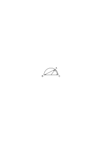
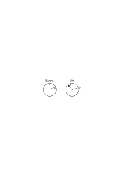

# Ts-236

### [7\[1\]](https://cdn.wittgensteinnachlass.com/2000px/webp/Ts-236/7.webp)

Die Allgemeinheit der Geometrie scheint immer wieder die zu sein, daß von einem Begriff die Rede ist und wir uns nicht um die Gegenstände kümmern, die unter diesen Begriff fallen. Aber so kann es natürlich nicht sein, sondern wir folgen hier – wie so oft – einer falschen Analogie.

### [7\[2\]](https://cdn.wittgensteinnachlass.com/2000px/webp/Ts-236/7.webp)

Welcher Art ist eine allgemeine Anweisung zu einer gewissen euklidischen Konstruktion? Sie hat ihre Wirkung, erfüllt ihren Zweck, erst wenn man sie anwendet, und dann stellt sie sich einem gleichsam zur Verfügung, indem die Variablen in ihr nun Werte annehmen.

### [7\[3\]](https://cdn.wittgensteinnachlass.com/2000px/webp/Ts-236/7.webp)

Man könnte so fragen: Ist etwa ein allgemeiner geometrischer Satz unendlich komplex, da unendlich viele spezielle Anwendungen aus ihm folgen? – Nun, er ist es offenbar nicht. Ich möchte immer sagen: die Allgemeinheit der Geometrie ist nur dadurch möglich, daß sie nicht aus Sätzen besteht.

### [7\[4\]](https://cdn.wittgensteinnachlass.com/2000px/webp/Ts-236/7.webp)

Man kann ein Brotmesser nicht allgemein nennen, weil sich kleine und große Stücke damit schneiden lassen.

### [7\[5\]](https://cdn.wittgensteinnachlass.com/2000px/webp/Ts-236/7.webp)

“Wenn du eine Strecke halbieren willst, so nimm sie in den Zirkel, etc.” Und nun zeichnet man eine Figur, in der dies alles an _einer_ Strecke wirklich vollzogen ist und nimmt an, daß der Andere es nun danach an jeder beliebigen Strecke wird vollziehen können. Die Regel setzt natürlich die unendliche Möglichkeit des Raumes voraus, aber nicht “eine unendliche Anzahl” von Möglichkeiten.

### [7\[6\]](https://cdn.wittgensteinnachlass.com/2000px/webp/Ts-236/7.webp),[8r\[1\]](https://cdn.wittgensteinnachlass.com/2000px/webp/Ts-236/8r.webp)

Stellen wir uns einen Menschen vor, der so eine allgemeine Vorschrift benützt. Er schaut auf die Vorschrift, dann auf sein Papier: Ich soll die Strecke in den Zirkel nehmen, – jetzt einen Kreis schlagen, – etc., etc. Aber in der Vorschrift steht ja garnichts von _dieser_ Strecke. Aber so faßt der sie auf, der sie anwendet.

### [8r\[2\]](https://cdn.wittgensteinnachlass.com/2000px/webp/Ts-236/8r.webp)

Der Vorschrift zur Halbierung entspricht eine Vorrichtung zur Halbierung und in dieser wäre ein Teil etwa ein verstellbarer Schlitten der sich der zu teilenden Strecke anpassen würde. Hier hätten wir das Analogon zur Allgemeinheit des Brotmessers.

### [8r\[3\]](https://cdn.wittgensteinnachlass.com/2000px/webp/Ts-236/8r.webp)

Kann man etwa die Zeichnung

als _eine_ Stellung eines beweglichen Mechanismus auffassen, der sozusagen die eigentliche Beweiskonstruktion wäre? (Man denkt es ist etwa in A eine Kurbel und AB und AC als elastische Schnüre.) (Kann man von einem dehnbaren Beweis reden?)

### [8r\[4\]](https://cdn.wittgensteinnachlass.com/2000px/webp/Ts-236/8r.webp)

Könnte man sagen: die Figur kann durch bestimmte Arten von Zerrspiegeln betrachtet werden und behält, durch sie gesehen, ihre beweisende Kraft. Sie wird von vorn herein so verstanden, daß sie durch _alle diese_ Zerrspiegel betrachtet werden kann. Nur das allen diesen Bildern Gemeinsame, welches sie verkörpert, ist das eigentliche Symbol.

### [8r\[5\]](https://cdn.wittgensteinnachlass.com/2000px/webp/Ts-236/8r.webp)

Man könnte nun freilich – fälschlich – die Figur als den Begriff und ihre verschiedenen Bilder als die unter ihn fallenden Gegenstände auffassen.

### [8r\[6\]](https://cdn.wittgensteinnachlass.com/2000px/webp/Ts-236/8r.webp)

Der Beweis kann nichts prophezeien. D.h. er kann nichts Wirkliches prophezeien.

### [8r\[7\]](https://cdn.wittgensteinnachlass.com/2000px/webp/Ts-236/8r.webp)

(Wir erkennen oft im verzerrtesten Schatten die Figur, die ihn wirft.)

### [8v\[1\]](https://cdn.wittgensteinnachlass.com/2000px/webp/Ts-236/8v.webp)

Der allgemeine geometrische (zeichnerische) Beweis ist das Stück das alle speziellen Beweise miteinander gemein haben.

Das Ende haben sie _nicht_ miteinander gemein.

### [10\[1\]](https://cdn.wittgensteinnachlass.com/2000px/webp/Ts-236/10.webp)

(Die fragliche Allgemeinheit tritt, natürlich, schon in die Definition des Kreises als Ort aller Punkte etc. ein.)

### [10\[2\]](https://cdn.wittgensteinnachlass.com/2000px/webp/Ts-236/10.webp)

Es muß sich da natürlich um die Definition einer Variablen handeln, für die ein gewisses Gebiet von Werten bestimmt wird, aber freilich nicht als Klasse von Werten. – Wenn ich also die vermeintliche Schlußkette mit dem Satz anfinge “alle Radien eines Kreises sind gleich lang”, so wäre das schon falsch, d.h. ein unsinniger Anfang. Wenn ich den Kreis etwa durch die Gleichung r = konstant definiere, so muß die unendliche Möglichkeit der r nach der Lage des Radius natürlich in der Bedeutung dieser Definition beschlossen liegen; aber nicht in Form einer Klasse möglicher Werte, sondern, wenn es sich um eine zahlenmäßige Geometrie handelt, durch das Gesetz der Bildung rationaler Zahlen, und, soweit es sich um eine Gesichtsgeometrie handelt, durch die jedem Radius anhaftende unendliche sichtbare Möglichkeit.

### [10\[3\]](https://cdn.wittgensteinnachlass.com/2000px/webp/Ts-236/10.webp)

Ich sagte früher einmal, man könnte sich eine Euklidische Demonstration auch an einer bewegten Figur ausgeführt denken. Es ist aber nicht wesentlich, daß sie bewegt, sondern daß sie beweglich ist. (d.h. variabel). D.h. ich muß in ihr den Repräsentanten der unendlichen räumlichen Möglichkeit sehen.

### [10\[4\]](https://cdn.wittgensteinnachlass.com/2000px/webp/Ts-236/10.webp)

Wenn ich einen mathematischen Satz und einen Beweis für ihn kenne, und später lerne ich noch einen weiteren Beweis dieses Satzes kennen, so habe ich damit ein neues System kennen gelernt.

### [10\[5\]](https://cdn.wittgensteinnachlass.com/2000px/webp/Ts-236/10.webp)

Angenommen, jemand untersuchte gerade Zahlen auf das Stimmen des Goldbach'schen Satzes hin. Er würde nun die Vermutung aussprechen – und die läßt sich aussprechen – daß, wenn er mit dieser Untersuchung fortfährt, er solange er lebt keinen widersprechenden Fall antreffen werde.

### [23\[1\]](https://cdn.wittgensteinnachlass.com/2000px/webp/Ts-236/23.webp)

Es hat Sinn, von zwei Punkten zu sagen, daß sie durch eine Gerade verbunden seien. Aber heißt das , “es hat Sinn, von zwei Dingen, die Punkte sind, zu sagen etc.”? –

### [23\[2\]](https://cdn.wittgensteinnachlass.com/2000px/webp/Ts-236/23.webp)

Wie weiß ich dann, daß ein Zeichen “A” einen Punkt bezeichnet? Etwa indem ich sehe, daß “A” in bestimmter Weise mit anderen Zeichen verknüpft werden darf. Aber wie weiß ich, daß diese anderen Zeichen Gerade bezeichnen etc.? Dadurch, daß sie mit “A” verknüpft werden dürfen? Sie können doch nicht gegenseitig ihre Bedeutung bestimmen. Das grammatische System (Spiel) ist eben autonom und seine Anwendung ist in ihm nicht _gegeben_.

### [23\[3\]](https://cdn.wittgensteinnachlass.com/2000px/webp/Ts-236/23.webp)

Die Geometrie anders verstanden, als reine Grammatik, muß angewendet sein und dann muß es wirkliche Punkte und Geraden etc. geben; der Satz, daß eine Gerade zwei Punkte verbindet, muß dann eben einen wirklichen Sinn haben.

### [23\[4\]](https://cdn.wittgensteinnachlass.com/2000px/webp/Ts-236/23.webp)

Und es heißt der geometrische Satz dann auch nicht “alle Punktpaare _sind_ durch eine Gerade verbunden,” sondern “_können_ durch eine Gerade verbunden werden.” Und hier braucht man dann das Wort “_je zwei_ Punkte” und nicht “_alle_ Punktpaare,” und deutet damit den Unterschied von einer anderen Art der Allgemeinheit an.

### [23\[5\]](https://cdn.wittgensteinnachlass.com/2000px/webp/Ts-236/23.webp)

Die Grammatik kann ihre Regeln nicht auf gut Glück allgemein _aussprechen_ (d.h. sie offenlassen).

### [34\[1\]](https://cdn.wittgensteinnachlass.com/2000px/webp/Ts-236/34.webp)

Sage ich jemandem “gehe drei Schritte” und er versteht den Befehl, so kann er ihn mir etwa durch eine Zeichnung erklären. Er sagt: Wenn hier der Weg ist und A der Anfang, so willst du, daß ich nach B dann nach C und D kommen soll; oder dergleichen. Und dabei ist es klar, daß er in gewissem Sinne nur einer Sache Ausdruck verliehen hat, die er schon früher – als er den Befehl hörte und verstand – wußte. Er könnte nun so fortfahren und den Befehl noch näher erklären, etwa durch ein ausgeführteres Diagramm und immer würde er doch nur hervorbringen, was ihm schon früher klar war. Er übersetzt nur aus einer Sprache in eine andere. Und wenn er nun endlich den Befehl ausführte, zum Zeichen, daß er ihn verstanden hat – würde er da nicht wieder bloß übersetzen?

### [34\[2\]](https://cdn.wittgensteinnachlass.com/2000px/webp/Ts-236/34.webp)

Zwischen dem Befehl und seiner Ausführung muß eine Kontinuität bestehen. Die Ausführung muß, sozusagen, nur die Endfläche des Befehls (Befehlskörpers) sein.

### [34\[3\]](https://cdn.wittgensteinnachlass.com/2000px/webp/Ts-236/34.webp)

Ich denke, um mir das Wesen des Verstehens klar zu machen, immer an eine Figur und eine Projektion, die man von ihr macht. Die Projektionsmethode kann nur durch den Vergleich des Bildes mit der Realität _festgehalten_ sein, die eben da ist.

### [34\[4\]](https://cdn.wittgensteinnachlass.com/2000px/webp/Ts-236/34.webp)

Aber da scheint es ja, als müsse man den Satz mit der Realität _in einem bestimmten Sinne_ vergleichen – also nicht nur vergleichen. Als müßte also die Realität in gewissen Fällen durch die Vergleichung quasi einen Vorwurf empfinden. Wenn sich etwas einem _Ziele_ nähert, so liegt in dem Wort “Ziel” hier das, was ich meine (die Intention.)

### [38\[1\]](https://cdn.wittgensteinnachlass.com/2000px/webp/Ts-236/38.webp)

Ich meine, daß der Gedanke ganz _Maß_ ist, wie der Maßstab; d.h. daß alles am Maßstab unwesentlich ist außer dem Längenmaß.

### [38\[2\]](https://cdn.wittgensteinnachlass.com/2000px/webp/Ts-236/38.webp)

Der Gedanke ist ein Symbol.

### [38\[3\]](https://cdn.wittgensteinnachlass.com/2000px/webp/Ts-236/38.webp)

Der gegenwärtige Gedanke enthält _alle_ Realität, die gegenwärtig vorhanden ist. (Und mehr _kann_ er ja nicht haben.)

### [38\[4\]](https://cdn.wittgensteinnachlass.com/2000px/webp/Ts-236/38.webp)

Es ist sehr merkwürdig, daß in einem Buch über Differentialrechnung in den Erklärungen mengentheoretische Ausdrücke und Symbole vorkommen, die die im Kalkül gänzlich verschwinden. Das erinnert an die ersten Erklärungen in den Lehrbüchern der Physik, in denen vom Kausalitätsgesetz und Ähnlichem die Rede ist, was, wenn wir einmal zur Sache kommen, nicht mehr erwähnt wird.

### [38\[5\]](https://cdn.wittgensteinnachlass.com/2000px/webp/Ts-236/38.webp)

Das Symbol – ich meine das, was als Symbol gebraucht wird – mit der Wirklichkeit zu vergleichen, ist einfach. Die Schwierigkeit besteht darin, es, mit der symbolisierenden Beziehung zusammen, als Gedanke mit der Wirklichkeit zu vergleichen.

### [38\[6\]](https://cdn.wittgensteinnachlass.com/2000px/webp/Ts-236/38.webp)

“Ich bin froh darüber, daß du kommst” heißt nicht, ich bin froh, weil Du kommst. In diesem Falle wäre es eine Vermutung, daß ich _deshalb_ so guter Stimmung bin.)

### [47\[1\]](https://cdn.wittgensteinnachlass.com/2000px/webp/Ts-236/47.webp)

Also ist eine hinreichende Bedingung dafür, daß <math class="stacked" display="inline"><mfrac><mrow><mn>1</mn></mrow><mrow><mi>n</mi></mrow></mfrac><mspace width="0.3em"/><mo>+</mo><mfrac><mrow><mn>1</mn></mrow><mrow><mo>(</mo><mi>n</mi><mspace width="0.3em"/><mo>+</mo><mspace width="0.3em"/><mtext>1)</mtext></mrow></mfrac><mspace width="0.3em"/><mo>+</mo><mspace width="0.3em"/><mtext>…</mtext><mspace width="0.3em"/><mo>+</mo><mfrac><mrow><mn>1</mn></mrow><mrow><mo>(</mo><mi>n</mi><mspace width="0.3em"/><mo>+</mo><mspace width="0.3em"/><mtext>r)</mtext></mrow></mfrac><mspace width="0.3em"/><mtext>≧</mtext><mspace width="0.3em"/><mn>1</mn></math>, die, daß r ≧ 3n ‒ 1. Denke ich mir nun vom Anfang der Reihe 1 + ½ + ⅓ + … solche Abschnitte aneinandergereiht, die gleich oder größer als 1 sind, so reicht der erste dieser Abschnitte von

1 bis 3, der zweite von

4 bis 15, der dritte von

16 bis 63, der m-te bis <math class="stacked" display="inline"><msup><mn>4</mn><mi>m</mi></msup><mspace width="0.3em"/><mtext>‒</mtext><mspace width="0.3em"/><mn>1</mn></math>.

Die Summe 1 + ½ + ⅓ + … bis zum 4mten Gliede ausgedehnt, überschreitet also gewiß m. Also ist

<math class="stacked" display="inline"><mn>1</mn><mspace width="0.3em"/><mo>+</mo><mtext>½</mtext><mspace width="0.3em"/><mo>+</mo><mtext>⅓</mtext><mspace width="0.3em"/><mo>+</mo><mspace width="0.3em"/><mtext>…</mtext><mfrac><mrow><mn>1</mn></mrow><mrow><mtext>4m</mtext></mrow></mfrac><mspace width="0.3em"/><mtext>></mtext><mspace width="0.3em"/><mo>(</mo><mn>1</mn><mspace width="0.3em"/><mo>+</mo><mtext>½</mtext><mspace width="0.3em"/><mo>+</mo><mfrac><mrow><mn>1</mn></mrow><mrow><mtext>2²</mtext></mrow></mfrac><mspace width="0.3em"/><mo>+</mo><mspace width="0.3em"/><mtext>…</mtext><mo>)</mo><mspace width="0.3em"/><mtext>∙</mtext><mspace width="0.3em"/><mo>(</mo><mn>1</mn><mspace width="0.3em"/><mo>+</mo><mtext>⅓</mtext><mspace width="0.3em"/><mo>+</mo><mfrac><mrow><mn>1</mn></mrow><mrow><mtext>3²</mtext></mrow></mfrac><mspace width="0.3em"/><mo>+</mo><mspace width="0.3em"/><mtext>…</mtext><mo>)</mo><mspace width="0.3em"/><mtext>…</mtext><mspace width="0.3em"/><mo>(</mo><mn>1</mn><mspace width="0.3em"/><mo>+</mo><mfrac><mrow><mn>1</mn></mrow><mrow><mi>m</mi></mrow></mfrac><mspace width="0.3em"/><mo>+</mo><mfrac><mrow><mn>1</mn></mrow><mrow><mtext>m²</mtext></mrow></mfrac><mtext>m²</mtext><mspace width="0.3em"/><mo>+</mo><mspace width="0.3em"/><mtext>…</mtext><mo>)</mo></math> Also muß unter den ersten <math class="stacked" display="inline"><msup><mn>4</mn><mi>m</mi></msup></math> ganzen Zahlen mindestens eine sein, die durch keine der ersten m Zahlen teilbar ist.

### [47\[2\]](https://cdn.wittgensteinnachlass.com/2000px/webp/Ts-236/47.webp)

Ich kann einen Apparat beschreiben, in welchem ein Bolzen in einem Einschnitt eines Rades eingreift, wenn dieses sich in einer bestimmten Stellung befindet. Kann man sagen, der Satz ist so gebaut, daß, wenn die Realität _so_ ist, so schnappt sie ein? Ich müßte also den Gedanken beschreiben können und dann die Realität, die so gebaut ist, daß sie mit ihm _übereinstimmt_. Aber das heißt doch garnichts.

### [47\[3\]](https://cdn.wittgensteinnachlass.com/2000px/webp/Ts-236/47.webp)

Man kann auch nicht sagen, “daß auch die lebhafteste Vorstellung doch nicht an die Wirklichkeit herankommt”, denn damit wäre es also doch denkbar, daß sie herankäme – wenn es auch nie einträte –.

### [54\[1\]](https://cdn.wittgensteinnachlass.com/2000px/webp/Ts-236/54.webp)

Aber ich sage ja selbst, daß der Schatten nicht etwas ist, was auf eine äußere Art mit der Tatsache zusammenhängt, und das heißt, daß in diesem Vergleich ein _logischer_ Fehler ist.

### [54\[2\]](https://cdn.wittgensteinnachlass.com/2000px/webp/Ts-236/54.webp)

Wenn ich sage “b ist nicht so lang wie a”, so scheint das jenen Schatten vorauszusetzen, der Tatsache, daß b so lang wie a ist. Wenn ich aber sage “b ist kleiner als a”, so scheint das diesen Schatten nicht vorauszusetzen und doch sagt es auch, was der erste Satz sagt.

### [54\[3\]](https://cdn.wittgensteinnachlass.com/2000px/webp/Ts-236/54.webp)

Man könnte also sagen: “b ist so lang wie a” hat Sinn, weil b kürzer als a ist. (Oder: “dieses Buch ist blau” hat Sinn, weil es in Wirklichkeit rot ist.)

### [54\[4\]](https://cdn.wittgensteinnachlass.com/2000px/webp/Ts-236/54.webp)

(Es ist eine Methode der Philosophie, die in den Wissenschaften nicht erlaubt ist, den günstigsten Fall anzunehmen. Am ähnlichsten ist diese Methode noch der in der Mathematik, einen extremen Fall anzunehmen, in welchem das _doch jedenfalls_ eintrifft. Argument a fortiori.)

### [54\[5\]](https://cdn.wittgensteinnachlass.com/2000px/webp/Ts-236/54.webp)

Man denke sich, man gebe jemandem den Befehl eine bestimmte Handlung auszuführen, etwa eine Linie mit dem Bleistift nachzuzeichnen. Die Sache wird deutlicher, wenn man sich den Befehl einem unserer Wortsprache Unkundigen mit Zeichen gegeben denkt. Man wird dann die Handlung vormachen und nun ihm den Bleistift geben, etwa seine Hand ein Stück führen (oder dergleichen). Das wird der Befehl sein. Nun wird man freilich sagen: das ist bloß der Ausdruck des Befehls und nicht, was wir eigentlich meinen; was wir meinen ist: … und nun werden wir _andere Zeichen_ für das geben, “was gemeint ist”. – Aber, wenn man nun den Befehl ausführte und auf die Ausführung als nachträgliche Erklärung des Befehls wiese? Oder ist in dem Falle auch die Erfüllung nur ein Zeichen?

### [56\[1\]](https://cdn.wittgensteinnachlass.com/2000px/webp/Ts-236/56.webp)

<math display="inline"><mtext>🖵</mtext></math> Die orthogonale Projektion von s auf b grenzt auf b schon das Stück s' ab. Damit ist freilich nicht gesagt, daß dieses Stück nun auf b eine besondere Farbe hat, also auch durch die Farbe begrenzt ist. Die Projektion des schwarzen Kreises in der oberen Ebene auf die untere begrenzt auf dieser schon einen Kreis; dadurch ist er aber noch kein Farbkreis. (In diesem Satz liegt Richtiges und Falsches.)

### [56\[2\]](https://cdn.wittgensteinnachlass.com/2000px/webp/Ts-236/56.webp)

Wenn ich nun erwarte, daß auf der unteren Ebene ein Kreis erscheinen wird von dem gesagt wird, daß er die orthogonale Projektion des oberen und von gleicher Farbe ist, so gäbe ich weiter nichts als eine Projektionsmethode. Die Projektionsmethode kann ich von anderen Gebilden kennen. Ich kenne sie aber doch nur so, daß eine Figur die orthogonale Projektion einer anderen ist; aber doch nicht so, daß keine Figur die Projektion einer Figur ist. Ich nehme mir vor, die Erscheinungen auf der unteren Ebene in bestimmter Weise zu beurteilen. Dann muß in diesem _Vorsatz_ schon die Projektion _stecken_.

### [56\[3\]](https://cdn.wittgensteinnachlass.com/2000px/webp/Ts-236/56.webp),[57\[1\]](https://cdn.wittgensteinnachlass.com/2000px/webp/Ts-236/57.webp)

Was heißt es, eine Strecke _daraufhin untersuchen_, ob sie die orthogonale Projektion einer anderen sei?

---

Es kann nur heißen, eben die Striche zu ziehen, die man in einem solchen Fall zieht. – Wie ist es aber mit der _Untersuchung_, ob die untere Farbe die gleiche ist, wie die obere. Oder kann man sagen: auch da stelle ich mich in bestimmter Weise ein, so wie ich etwa Linien ziehe, um feststellen zu können, ob die untere Figur die Projektion der oberen ist. Ich glaube, so ist es. Das ist alles ein Einstellen, aber mehr kann ich nun nicht tun. Und dieses Einstellen ist nicht das Einstellen auf etwas anderes, d.h. nicht mit Beziehung auf etwas, was noch nicht da ist, sondern es ist autonom, sozusagen das Aufrichten eines Maßstabes, was immer geschehen mag.

### [57\[2\]](https://cdn.wittgensteinnachlass.com/2000px/webp/Ts-236/57.webp)

(Des Rätsels Lösung muß in der Art und Weise liegen, wie die Erscheinung dann beschrieben wird, wenn sie kommt.)

### [57\[3\]](https://cdn.wittgensteinnachlass.com/2000px/webp/Ts-236/57.webp)

Es ist ungemein schwer, den eigentlichen Ort der Schwierigkeit mit Worten zu erreichen.

### [57\[4\]](https://cdn.wittgensteinnachlass.com/2000px/webp/Ts-236/57.webp)

Denken wir uns die Einstellung durch einen Zeiger, wie den gelben Zeiger am Aneroidbarometer, und etwa ein solches Barometer und eine Uhr. Auf beiden Zifferblättern stelle ich den freien Zeiger ein, und drücke dadurch die Erwartung aus, daß, wenn der Uhrzeiger bei a'

anlangt, der andere auf a stehen wird. (Es ist kein Zweifel, daß das ein vollkommener Ausdruck der Erwartung, des Gedankens, ist.) Bleibt nun die Uhr etwa stehen, so daß ihr Zeiger a' nicht erreicht, dann gilt das Ganze nicht, ebenso, wenn etwa der Zeiger des Barometers plötzlich verschwände. Dann wäre eben kein Zeichen da. Ist es aber da, dann hat das Barometer sozusagen keine andre Wahl, als auf a zu stehen oder nicht auf a zu stehen, und dann ist der Gedanke verifiziert oder er ist falsifiziert worden.

### [57\[5\]](https://cdn.wittgensteinnachlass.com/2000px/webp/Ts-236/57.webp)

Wo haben wir aber in diesem Satzzeichen Worte, oder etwas, was den Worten entspricht? Es “bedeutet” offenbar a' den Uhrzeiger und a den Barometerzeiger.

### [57\[6\]](https://cdn.wittgensteinnachlass.com/2000px/webp/Ts-236/57.webp)

Ich bleibe in den Zeichen, bis ich in ihrer _Anwendung_ aus ihnen heraustrete.

### [57\[7\]](https://cdn.wittgensteinnachlass.com/2000px/webp/Ts-236/57.webp),[58\[1\]](https://cdn.wittgensteinnachlass.com/2000px/webp/Ts-236/58.webp)

Dann weist mein Benehmen, meine Handlung, die logische Verwandtschaft mit den Zeichen auf, die ein solches Zeichen mit seiner, Übersetzung aufweist.

### [58\[2\]](https://cdn.wittgensteinnachlass.com/2000px/webp/Ts-236/58.webp)

Was ich immer sagen will, ist, daß der Gedanke nichts Menschliches ist. Daß er auch nicht ein bestimmtes Gefühl ist, das man eben nur fühlen, aber nicht etwa auch ansehen kann. Man kann z.B. Zahnschmerzen nicht gleichsam herausstellen und ansehen. (Natürlich kann man nicht sagen, die Zahnschmerzen kenne man von innen, indem man sie fühlt und könne sie nicht von außen betrachten. Denn die Zahnschmerzen haben kein Innen und Außen.)

### [58\[3\]](https://cdn.wittgensteinnachlass.com/2000px/webp/Ts-236/58.webp)

Die heute gewöhnliche Auffassung ist die, daß das Denken – durch den Kopf oder die Seele besorgt – ein Privilegium eben des Kopfes oder der Seele ist (wie etwa die Verdauung, des Magens). Und das ist sie auch als naturgeschichtlicher Prozeß betrachtet, wie auch die Verdauung in diesem Sinn dem Magen eigentümlich ist, – aber vom Standpunkt des Chemikers betrachtet ist die Verdauung ein Prozeß, der dem tierischen Magen nicht eignet und ganz unabhängig davon ist, wo er tatsächlich stattfindet. – So hat es der Logiker nicht mit einem spezifisch menschlichen Prozeß zu tun.

### [58\[4\]](https://cdn.wittgensteinnachlass.com/2000px/webp/Ts-236/58.webp)

Die Logik ist eine Geometrie des Denkens.

### [58\[5\]](https://cdn.wittgensteinnachlass.com/2000px/webp/Ts-236/58.webp)

Man könnte freilich sagen, daß die Uhr und das Barometer mit den verstellbaren Zeigern nur der Ausdruck eines Gedankens, aber nicht der Gedanke selbst sind; aber dann sind sie doch Teile, Werkzeuge, eines Gedankens, und was immer der Gedanke selbst ist, so ist er ein anderer Vorgang als der, welcher ihn verifiziert und er hat mit diesem Vorgang nur soviel gemein, als jene Vorrichtungen der Uhr und des Barometers haben. – Darum kann – und muß – man ﹖in der Logik﹖ auch mit dem “Ausdruck” der Gedanken operieren und auf das Andere keine Rücksicht nehmen.

### [64\[1\]](https://cdn.wittgensteinnachlass.com/2000px/webp/Ts-236/64.webp)

Das Denken macht Pläne. Es zeichnet Pläne einfacher oder sehr komplizierter Art. Nun sagt man aber: das ist doch nicht alles, man will doch etwas mit diesen Plänen, sie bedeuten doch etwas, d.h. sie sind _doch_ mit einer Absicht gezeichnet. Ja, aber hier gibt es zwei Möglichkeiten: entweder diese Absicht ist ein Gefühl oder dergleichen, dann interessiert sie uns nicht, oder aber sie ist Teil der _Sache_, dann gehört sie zum _Bild_.

Die Logik ist immer sachlich.

### [64\[2\]](https://cdn.wittgensteinnachlass.com/2000px/webp/Ts-236/64.webp)

Wenn der Befehl z.B. darin besteht, einen gewissen Weg zu machen, so kann ich ihn mit Hilfe einer Karte (eines Planes) ausdrücken. Dabei kann der Befehl auch lauten, einen _oder_ den anderen Weg zu gehen und etwa gewisse Wege _nicht_ zu gehen. Das wird dann auch im Bild seinen Ausdruck finden, indem etwa die ausgeschlossenen Wege durchstrichen werden. Das Bild könnte auch bedeuten, man dürfe _überall_ zwischen den beiden Linien gehen, außer über das schraffierte Feld.

### [64\[3\]](https://cdn.wittgensteinnachlass.com/2000px/webp/Ts-236/64.webp)

Wenn nun tatsächlich ein Weg zwischen zwei Orten abgesperrt wird und etliche andere offen gelassen werden, ist in diesen Tatsachen schon eine Verneinung und eine Disjunktion enthalten?

### [64\[4\]](https://cdn.wittgensteinnachlass.com/2000px/webp/Ts-236/64.webp)

Wie ist es aber, wenn ich einen Befehl auf eine bestimmte Weise interpretiere und ihm zuwiderhandle. Worin liegt es, daß meine Handlung nicht meine Interpretation des Befehls ist, sondern ein Entgegenhandeln? Wird dadurch nicht meine frühere Auffassung über den Haufen geworfen?

Ich kann sagen, wenn der Handelnde es nicht sagte, so könnte man nie wissen, daß es ein Entgegenhandeln ist. Und wenn er es nun sagt, so verstehen wir es nur durch unsere Interpretation der Verneinung.

### [65\[1\]](https://cdn.wittgensteinnachlass.com/2000px/webp/Ts-236/65.webp)

Man würde glauben, wenn ich dem Befehl _so wie ich ihn verstehe,_ zuwiderhandeln kann, dann muß meine Handlung dem Ausdruck meiner Auffassung unmittelbar widerstreiten. – Oder ist es nur die Interpretation meiner Handlung, die der Interpretation des Befehls (sozusagen auf gleicher Ebene) widerspricht?

### [65\[2\]](https://cdn.wittgensteinnachlass.com/2000px/webp/Ts-236/65.webp)

Disjunktion, Negation etc. scheinen in der Einstellung zu einem Bild zu liegen. Sie entsprechen der elektrischen Schaltung, durch die _etwa_ eine Klingel mit Schaltern verbunden ist.

### [65\[3\]](https://cdn.wittgensteinnachlass.com/2000px/webp/Ts-236/65.webp)

Denken wir uns folgende Einstellungen: <math display="inline"><mtext>🖵</mtext></math>

1) Die Glocke läutet nur dann, wenn ich den Zeiger a dem Zeiger b gleichrichte; 2) die Glocke läutet nur dann nicht, wenn ich a dem b gleichrichte; 3) die Glocke läutet nur, wenn a entweder dem b oder auch dem c gleichgerichtet ist; 4) die Glocke läutet in allen anderen Zeigerstellungen von a, außer, wenn er mit b oder c gleichgerichtet ist; 5) die Glocke läutet nur dann, wenn sowohl b als c mit a gleichgerichtet sind; 6) die Glocke läutet nur, wenn b mit a gleichgerichtet, c mit a aber nicht gleichgerichtet ist; etc. Das Glockenzeichen bedeutet Zustimmung (oder auch das Umgekehrte). Man könnte so eine Schaltung auch an dem Modell der erlaubten oder verbotenen Wege anbringen. Dieses Modell wäre dann der Ausdruck eines Befehls. Könnte man es aber mit Recht ein Bild nennen?

### [65\[4\]](https://cdn.wittgensteinnachlass.com/2000px/webp/Ts-236/65.webp)

Eine Meinung (d.h. ein Sinn), die man nicht erklären kann, interessiert uns nicht, denn, ihr kann man auch nicht zuwiderhandeln.

### [65\[5\]](https://cdn.wittgensteinnachlass.com/2000px/webp/Ts-236/65.webp)

Wenn die Interpretation ein Bild ist, so sind zwei entgegengesetzte Interpretationen entgegengesetzte Bilder.

### [65\[6\]](https://cdn.wittgensteinnachlass.com/2000px/webp/Ts-236/65.webp)

In Wahrheit muß aber im Verbot immer das beschrieben werden, was verboten ist.

### [75\[1\]](https://cdn.wittgensteinnachlass.com/2000px/webp/Ts-236/75.webp)

Ich glaube es war nicht richtig zu sagen “der Satz muß zusammengesetzt sein”, sondern er kann tatsächlich auch unzusammengesetzt sein, wenigstens im wörtlichen Sinne; – seine “Zusammensetzung” besteht eigentlich darin, daß er ein besonderer Fall einer allgemeinen Regel der Bildung von Zeichen ist. Denn man kann zwar “ambulo” aus der Stammsilbe und der Endung zusammengesetzt ansehen, aber wie wäre es, wenn diese Form bloß durch die Stammsilbe allein gebildet würde?

### [75\[2\]](https://cdn.wittgensteinnachlass.com/2000px/webp/Ts-236/75.webp)

Wie man von dem Sinn eines Satzes in gewisser Weise nicht reden kann, so auch nicht von dem Ausdruck des Gedankens, Wunsches, Befehls, etc., denn auf die Frage “welcher Wunsch ist durch diesen Satz ausgedrückt”, muß nur ein Ausdruck des Wunsches zur Antwort kommen. Dasselbe gilt auch von dem Ausdruck “dieser Satz teilt mir etwas (bestimmtes) mit”.

### [75\[3\]](https://cdn.wittgensteinnachlass.com/2000px/webp/Ts-236/75.webp)

_Und hier muß man_ – glaube ich – sagen, daß die Verneinung, Disjunktion, etc., im Gedanken ebenso “primitiv” ist, wie in unserer Zeichensprache. Wie vermöchte man auch _in_ ihr die Verneinung zu denken, wenn sie wie ein schlecht passendes Kleid der Verneinung wäre. Oder – würde man erwarten – man müßte doch fühlen, wie einen die Ausdrucksform überall drückt (quasi wie ein harter nicht wirklich passender Schuh.)

### [75\[4\]](https://cdn.wittgensteinnachlass.com/2000px/webp/Ts-236/75.webp)

Gibt es einen Existenzbeweis für Primzahlen, und einen der die Existenz unendlich vieler Primzahlen beweist? Und in welchem Verhältnis stehen diese zueinander?

### [75\[5\]](https://cdn.wittgensteinnachlass.com/2000px/webp/Ts-236/75.webp)

Durch die _Methode des Multiplizierens_ (etwa im Dezimalsystem, aber gleichgültig in welchem System) ist die Existenz von Produkten, von teilbaren Zahlen bewiesen.

### [75\[6\]](https://cdn.wittgensteinnachlass.com/2000px/webp/Ts-236/75.webp),[76\[1\]](https://cdn.wittgensteinnachlass.com/2000px/webp/Ts-236/76.webp)

Wenn n und m relativ prim sind und n die größere und <math class="stacked" display="inline"><mi>n</mi><mspace width="0.3em"/><mo>=</mo><msub><mi>a</mi><mn>0</mn></msub><mi>m</mi><mspace width="0.3em"/><mo>+</mo><msub><mi>r</mi><mn>0</mn></msub></math>, dann können die Fälle eintreten, daß

<math class="stacked" display="inline"><mi>m</mi><mspace width="0.3em"/><mo>=</mo><msub><mi>a</mi><mn>1</mn></msub><msub><mi>r</mi><mn>0</mn></msub></math> und <math class="stacked" display="inline"><msub><mi>r</mi><mn>0</mn></msub><mspace width="0.3em"/><mo>=</mo><mspace width="0.3em"/><mn>1</mn></math> oder daß <math class="stacked" display="inline"><mi>m</mi><mspace width="0.3em"/><mo>=</mo><msub><mi>a</mi><mn>1</mn></msub><msub><mi>r</mi><mn>0</mn></msub><mspace width="0.3em"/><mo>+</mo><msub><mi>r</mi><mn>1</mn></msub></math> und <math class="stacked" display="inline"><msub><mi>r</mi><mn>0</mn></msub><mspace width="0.3em"/><mo>=</mo><msub><mi>a</mi><mn>2</mn></msub><msub><mi>r</mi><mn>1</mn></msub></math> und <math class="stacked" display="inline"><msub><mi>r</mi><mn>1</mn></msub><mspace width="0.3em"/><mo>=</mo><mspace width="0.3em"/><mn>1</mn></math>

oder <math class="stacked" display="inline"><mi>m</mi><mspace width="0.3em"/><mo>=</mo><msub><mi>a</mi><mn>1</mn></msub><msub><mi>r</mi><mn>0</mn></msub><mspace width="0.3em"/><mo>+</mo><msub><mi>r</mi><mn>1</mn></msub><msub><mi>r</mi><mn>0</mn></msub><mspace width="0.3em"/><mo>=</mo><msub><mi>a</mi><mn>2</mn></msub><msub><mi>r</mi><mn>1</mn></msub><mspace width="0.3em"/><mo>+</mo><msub><mi>r</mi><mn>2</mn></msub><msub><mi>r</mi><mn>1</mn></msub><mspace width="0.3em"/><mo>=</mo><msub><mi>a</mi><mn>3</mn></msub><msub><mi>r</mi><mn>2</mn></msub></math> und <math class="stacked" display="inline"><msub><mi>r</mi><mn>2</mn></msub><mspace width="0.3em"/><mo>=</mo><mspace width="0.3em"/><mn>1</mn></math>

oder <math class="stacked" display="inline"><mi>m</mi><mspace width="0.3em"/><mo>=</mo><msub><mi>a</mi><mn>1</mn></msub><msub><mi>r</mi><mn>0</mn></msub><mspace width="0.3em"/><mo>+</mo><msub><mi>r</mi><mn>1</mn></msub><msub><mi>r</mi><mn>0</mn></msub><mspace width="0.3em"/><mo>=</mo><msub><mi>a</mi><mn>2</mn></msub><msub><mi>r</mi><mn>1</mn></msub><mspace width="0.3em"/><mo>+</mo><msub><mi>r</mi><mn>2</mn></msub><msub><mi>r</mi><mn>1</mn></msub><mspace width="0.3em"/><mo>=</mo><msub><mi>a</mi><mn>3</mn></msub><msub><mi>r</mi><mn>2</mn></msub><mspace width="0.3em"/><mo>+</mo><msub><mi>r</mi><mn>3</mn></msub><msub><mi>r</mi><mn>2</mn></msub><mspace width="0.3em"/><mo>=</mo><msub><mi>a</mi><mn>4</mn></msub><msub><mi>r</mi><mn>3</mn></msub><mspace width="0.3em"/><mtext>und</mtext><msub><mi>r</mi><mn>3</mn></msub><mspace width="0.3em"/><mo>=</mo><mspace width="0.3em"/><mn>1</mn></math>

oder <math class="stacked" display="inline"><mi>m</mi><mspace width="0.3em"/><mo>=</mo><msub><mi>a</mi><mn>1</mn></msub><msub><mi>r</mi><mn>0</mn></msub><mspace width="0.3em"/><mo>+</mo><msub><mi>r</mi><mn>1</mn></msub><msub><mi>r</mi><mn>0</mn></msub><mspace width="0.3em"/><mo>=</mo><msub><mi>a</mi><mn>2</mn></msub><msub><mi>r</mi><mn>1</mn></msub><mspace width="0.3em"/><mo>+</mo><msub><mi>r</mi><mn>2</mn></msub><msub><mi>r</mi><mn>1</mn></msub><mspace width="0.3em"/><mo>=</mo><msub><mi>a</mi><mn>3</mn></msub><msub><mi>r</mi><mn>2</mn></msub><mspace width="0.3em"/><mo>+</mo><msub><mi>r</mi><mn>3</mn></msub><msub><mi>r</mi><mn>2</mn></msub><mspace width="0.3em"/><mo>=</mo><msub><mi>a</mi><mn>4</mn></msub><msub><mi>r</mi><mn>3</mn></msub><mspace width="0.3em"/><mo>+</mo><msub><mi>r</mi><mn>4</mn></msub><msub><mi>r</mi><mn>3</mn></msub><mspace width="0.3em"/><mo>=</mo><msub><mi>a</mi><mn>5</mn></msub><msub><mi>r</mi><mn>4</mn></msub></math> | <math class="stacked" display="inline"><msub><mi>m</mi><mo>(</mo><mtext>0)</mtext></msub><mspace width="0.3em"/><mo>=</mo><msub><mi>a</mi><mn>1</mn></msub></math> also <math class="stacked" display="inline"><msub><mi>m</mi><mo>(</mo><mtext>1)</mtext></msub><mspace width="0.3em"/><mo>=</mo><msub><mi>a</mi><mn>1</mn></msub><msub><mi>a</mi><mn>2</mn></msub><mspace width="0.3em"/><mo>+</mo><mspace width="0.3em"/><mn>1</mn></math>

<math display="block">
  <msub>
    <mi>m</mi>
    <mo>(</mo>
    <mtext>2)</mtext>
  </msub>
  <mspace width="0.3em"/>
  <mo>=</mo>
  <msub>
    <mi>a</mi>
    <mn>1</mn>
  </msub>
  <msub>
    <mi>a</mi>
    <mn>2</mn>
  </msub>
  <msub>
    <mi>a</mi>
    <mn>3</mn>
  </msub>
  <mspace width="0.3em"/>
  <mo>+</mo>
  <msub>
    <mi>a</mi>
    <mn>1</mn>
  </msub>
  <mspace width="0.3em"/>
  <mo>+</mo>
  <msub>
    <mi>a</mi>
    <mn>3</mn>
  </msub>
  <msub>
    <mi>m</mi>
    <mo>(</mo>
    <mtext>3)</mtext>
  </msub>
  <mspace width="0.3em"/>
  <mo>=</mo>
  <msub>
    <mi>a</mi>
    <mn>1</mn>
  </msub>
  <msub>
    <mi>a</mi>
    <mn>2</mn>
  </msub>
  <msub>
    <mi>a</mi>
    <mn>3</mn>
  </msub>
  <msub>
    <mi>a</mi>
    <mn>4</mn>
  </msub>
  <mspace width="0.3em"/>
  <mo>+</mo>
  <msub>
    <mi>a</mi>
    <mn>1</mn>
  </msub>
  <msub>
    <mi>a</mi>
    <mn>2</mn>
  </msub>
  <mspace width="0.3em"/>
  <mo>+</mo>
  <msub>
    <mi>a</mi>
    <mn>1</mn>
  </msub>
  <msub>
    <mi>a</mi>
    <mn>4</mn>
  </msub>
  <mspace width="0.3em"/>
  <mo>+</mo>
  <msub>
    <mi>a</mi>
    <mn>3</mn>
  </msub>
  <msub>
    <mi>a</mi>
    <mn>4</mn>
  </msub>
  <mspace width="0.3em"/>
  <mo>+</mo>
  <mspace width="0.3em"/>
  <mn>1</mn>
</math>

<math display="block">
  <msub>
    <mi>m</mi>
    <mo>(</mo>
    <mtext>4)</mtext>
  </msub>
  <mspace width="0.3em"/>
  <mo>=</mo>
  <msub>
    <mi>a</mi>
    <mn>1</mn>
  </msub>
  <msub>
    <mi>a</mi>
    <mn>2</mn>
  </msub>
  <msub>
    <mi>a</mi>
    <mn>3</mn>
  </msub>
  <msub>
    <mi>a</mi>
    <mn>4</mn>
  </msub>
  <msub>
    <mi>a</mi>
    <mn>5</mn>
  </msub>
  <mspace width="0.3em"/>
  <mo>+</mo>
  <msub>
    <mi>a</mi>
    <mn>1</mn>
  </msub>
  <msub>
    <mi>a</mi>
    <mn>2</mn>
  </msub>
  <msub>
    <mi>a</mi>
    <mn>3</mn>
  </msub>
  <mspace width="0.3em"/>
  <mo>+</mo>
  <msub>
    <mi>a</mi>
    <mn>1</mn>
  </msub>
  <msub>
    <mi>a</mi>
    <mn>2</mn>
  </msub>
  <msub>
    <mi>a</mi>
    <mn>5</mn>
  </msub>
  <mspace width="0.3em"/>
  <mo>+</mo>
  <msub>
    <mi>a</mi>
    <mn>1</mn>
  </msub>
  <msub>
    <mi>a</mi>
    <mn>4</mn>
  </msub>
  <msub>
    <mi>a</mi>
    <mn>5</mn>
  </msub>
  <mspace width="0.3em"/>
  <mo>+</mo>
  <msub>
    <mi>a</mi>
    <mn>3</mn>
  </msub>
  <msub>
    <mi>a</mi>
    <mn>4</mn>
  </msub>
  <msub>
    <mi>a</mi>
    <mn>5</mn>
  </msub>
  <mspace width="0.3em"/>
  <mo>+</mo>
  <msub>
    <mi>a</mi>
    <mn>1</mn>
  </msub>
  <mspace width="0.3em"/>
  <mo>+</mo>
  <msub>
    <mi>a</mi>
    <mn>3</mn>
  </msub>
  <mspace width="0.3em"/>
  <mo>+</mo>
  <msub>
    <mi>a</mi>
    <mn>5</mn>
  </msub>
</math>

u.s.w.

### [76\[2\]](https://cdn.wittgensteinnachlass.com/2000px/webp/Ts-236/76.webp)

Fügt man nun n zusammen zu 1n, 2n, 3n etc. so sieht man, daß gegenüber einem Vielfachen von m solange ein Rest bleibt, bis man zu m ∙ n kommt, wo immer der Euklidische Algorithmus endet (d.h. welche der Formeln immer für m anwendbar ist). Im ersten Fall z.B. wenn <math class="stacked" display="inline"><mi>m</mi><mspace width="0.3em"/><mo>=</mo><msub><mi>a</mi><mn>1</mn></msub><msub><mi>a</mi><mn>2</mn></msub><mspace width="0.3em"/><mo>+</mo><mspace width="0.3em"/><mn>1</mn></math>:

<math display="block">
  <mtext>1n</mtext>
  <mspace width="0.3em"/>
  <mo>=</mo>
  <msub>
    <mi>a</mi>
    <mn>0</mn>
  </msub>
  <mi>m</mi>
  <mspace width="0.3em"/>
  <mo>+</mo>
  <msub>
    <mi>a</mi>
    <mn>2</mn>
  </msub>
</math>

<math display="block">
  <mtext>2n</mtext>
  <mspace width="0.3em"/>
  <mo>=</mo>
  <mspace width="0.3em"/>
  <mn>2</mn>
  <msub>
    <mi>a</mi>
    <mn>0</mn>
  </msub>
  <mi>m</mi>
  <mspace width="0.3em"/>
  <mo>+</mo>
  <mn>2</mn>
  <msub>
    <mi>a</mi>
    <mn>2</mn>
  </msub>
</math>

…

<math class="stacked" display="inline"><mtext>vn</mtext><mspace width="0.3em"/><mo>=</mo><mspace width="0.3em"/><mi>v</mi><msub><mi>a</mi><mn>0</mn></msub><mi>m</mi><mspace width="0.3em"/><mo>+</mo><mspace width="0.3em"/><mi>v</mi><msub><mi>a</mi><mn>2</mn></msub></math> der Rest <math class="stacked" display="inline"><mi>v</mi><msub><mi>a</mi><mn>2</mn></msub></math> bleibt jedenfalls solange kleiner als m, bis <math class="stacked" display="inline"><mi>v</mi><mspace width="0.3em"/><mo>=</mo><msub><mi>a</mi><mn>1</mn></msub></math> wird.

### [80\[1\]](https://cdn.wittgensteinnachlass.com/2000px/webp/Ts-236/80.webp)

Inwiefern kann man aber das Bild

<math display="block">
  <mn>1</mn>
  <mspace width="0.3em"/>
  <mo>|</mo>
  <mn>2</mn>
  <mspace width="0.3em"/>
  <mo>|</mo>
  <mn>3</mn>
  <mspace width="0.3em"/>
  <mo>|</mo>
  <mn>4</mn>
  <mspace width="0.3em"/>
  <mn>1</mn>
  <mspace width="0.3em"/>
  <mo>|</mo>
  <mn>5</mn>
  <mspace width="0.3em"/>
  <mn>2</mn>
  <mspace width="0.3em"/>
  <mo>|</mo>
  <mn>6</mn>
  <mspace width="0.3em"/>
  <mn>3</mn>
  <mspace width="0.3em"/>
  <mo>|</mo>
  <mn>7</mn>
  <mspace width="0.3em"/>
  <mn>4</mn>
</math>

den Beweis von 3 + 4 = 7 nennen? (da doch aus dem Bild die Formel in keinem Sinne hervorgeht.) Offenbar nur kraft einer allgemeinen Regel, die Gleichungen mit solchen Bildern verknüpft. Denn wenn ich die Gleichung 2 + 5 = 9 aufstelle, so kann man sagen “wir werden gleich sehen, ob das so ist”, und nun stellt man den _entsprechenden Kalkül_ an und sieht, ob die Gleichung stimmt (und genau dasselbe gilt natürlich von den Ungleichungen). Aber der entsprechende Kalkül entspricht eben nur auf Grund einer allgemeinen Regel.

### [80\[2\]](https://cdn.wittgensteinnachlass.com/2000px/webp/Ts-236/80.webp)

In dem oberen Additionsschema sind die Ziffern _Ordnungsziffern_. Sie bezeichnen also einfach eine bestimmte Stelle, die soundso vielte Stelle. Man könnte das deutlicher machen durch die Schreibung: <math display="inline"><mo>(</mo><mtext>1)</mtext><mspace width="0.3em"/><mo>|</mo><mo>(</mo><mtext>2)</mtext><mspace width="0.3em"/><mo>|</mo><mo>(</mo><mtext>3)</mtext><mspace width="0.3em"/><mo>|</mo><mo>(</mo><mtext>4)</mtext><mo>(</mo><mtext>1)</mtext><mspace width="0.3em"/><mo>|</mo><mo>(</mo><mtext>5)</mtext><mo>(</mo><mtext>2)</mtext><mspace width="0.3em"/><mo>|</mo><mo>(</mo><mtext>6)</mtext><mo>(</mo><mtext>3)</mtext><mspace width="0.3em"/><mo>|</mo><mo>(</mo><mtext>7)</mtext><mo>(</mo><mtext>4)</mtext></math>. Es ist klar, daß man mit diesem Algorithmus auch multiplizieren, subtrahieren und dividieren kann, und daß alles die volle Strenge hat. (Übrigens ist ja diese Rechenmethode die des Rechenschiebers.)

### [80\[3\]](https://cdn.wittgensteinnachlass.com/2000px/webp/Ts-236/80.webp)

Das Wort “Gasthaus” über dem Tor eines Hauses zeigt an, daß _dort_ ein Gasthaus ist. Es muß der besondere Fall einer allgemeinen Regel vorliegen, damit wir das Wort als Mitteilung, also als Satz, verstehen. Das zeigt uns _wie weit_ “Zusammengesetztheit” ein Charakteristikum des Satzes ist.

### [91\[1\]](https://cdn.wittgensteinnachlass.com/2000px/webp/Ts-236/91.webp)

Was geschieht, wenn ich mir einen Schachzug überlege? In diesem Falle kann ich die Züge im Vorhinein machen und also das direkteste Bild dessen entwerfen, was geschehen wird.

### [91\[2\]](https://cdn.wittgensteinnachlass.com/2000px/webp/Ts-236/91.webp)

“Wieviel Punkte muß man nach der Reihe setzen, um das ‘u.s.w.’ anzudeuten?” Tut es nicht _einer_?

### [91\[3\]](https://cdn.wittgensteinnachlass.com/2000px/webp/Ts-236/91.webp)

Kann man von der Zahlenreihe sagen, sie habe kein Ende? “Aber, wie wäre es, wenn es anders wäre?” Aber kann ich nicht vom Schachspiel sagen, die Reihe der Schachfiguren habe ein Ende, und in einem andern Spiel, sie habe kein Ende? wenn man die Erlaubnis hätte, beliebig viele Felder, einer Regel gemäß, mit Steinen zu besetzen.

### [91\[4\]](https://cdn.wittgensteinnachlass.com/2000px/webp/Ts-236/91.webp)

(Was ich mit den Zeichen tue, ist für den Mathematiker ein Herum … [und war es für Ramsey], und mit Recht, denn er will vorwärtskommen, während ich mich _ungestört_ bei einigen wenigen Zeichen und zwei Schritten des Kalküls aufhalte.)

### [91\[5\]](https://cdn.wittgensteinnachlass.com/2000px/webp/Ts-236/91.webp)

<math display="block">
  <mi>a</mi>
  <mspace width="0.3em"/>
  <mo>+</mo>
  <mspace width="0.3em"/>
  <mo>(</mo>
  <mi>b</mi>
  <mspace width="0.3em"/>
  <mo>+</mo>
  <mspace width="0.3em"/>
  <mtext>1)</mtext>
  <mspace width="0.3em"/>
  <mo>=</mo>
  <mspace width="0.3em"/>
  <mo>(</mo>
  <mi>a</mi>
  <mspace width="0.3em"/>
  <mo>+</mo>
  <mspace width="0.3em"/>
  <mtext>b)</mtext>
  <mspace width="0.3em"/>
  <mo>+</mo>
  <mspace width="0.3em"/>
  <mn>1</mn>
  <mo>(</mo>
  <mtext>R)</mtext>
  <mi>a</mi>
  <mspace width="0.3em"/>
  <mo>+</mo>
  <mspace width="0.3em"/>
  <mo>(</mo>
  <mi>b</mi>
  <mspace width="0.3em"/>
  <mo>+</mo>
  <mspace width="0.3em"/>
  <mo>(</mo>
  <mi>c</mi>
  <mspace width="0.3em"/>
  <mo>+</mo>
  <mspace width="0.3em"/>
  <mtext>1)</mtext>
  <mo>)</mo>
  <mfrac linethickness="0">
    <mrow>
      <mi>R</mi>
    </mrow>
    <mrow>
      <mo>=</mo>
    </mrow>
  </mfrac>
  <mspace width="0.3em"/>
  <mi>a</mi>
  <mspace width="0.3em"/>
  <mo>+</mo>
  <mspace width="0.3em"/>
  <mo>(</mo>
  <mo>(</mo>
  <mi>b</mi>
  <mspace width="0.3em"/>
  <mo>+</mo>
  <mspace width="0.3em"/>
  <mtext>c)</mtext>
  <mspace width="0.3em"/>
  <mo>+</mo>
  <mspace width="0.3em"/>
  <mtext>1)</mtext>
  <mfrac linethickness="0">
    <mrow>
      <mi>R</mi>
    </mrow>
    <mrow>
      <mo>=</mo>
    </mrow>
  </mfrac>
  <mspace width="0.3em"/>
  <mo>(</mo>
  <mi>a</mi>
  <mspace width="0.3em"/>
  <mo>+</mo>
  <mspace width="0.3em"/>
  <mo>(</mo>
  <mi>b</mi>
  <mspace width="0.3em"/>
  <mo>+</mo>
  <mspace width="0.3em"/>
  <mtext>c)</mtext>
  <mo>)</mo>
  <mspace width="0.3em"/>
  <mo>+</mo>
  <mspace width="0.3em"/>
  <mn>1</mn>
  <mspace width="0.3em"/>
  <mo>(</mo>
  <mi>a</mi>
  <mspace width="0.3em"/>
  <mo>+</mo>
  <mspace width="0.3em"/>
  <mtext>b)</mtext>
  <mspace width="0.3em"/>
  <mo>+</mo>
  <mspace width="0.3em"/>
  <mo>(</mo>
  <mi>c</mi>
  <mspace width="0.3em"/>
  <mo>+</mo>
  <mspace width="0.3em"/>
  <mtext>1)</mtext>
  <mfrac linethickness="0">
    <mrow>
      <mi>R</mi>
    </mrow>
    <mrow>
      <mo>=</mo>
    </mrow>
  </mfrac>
  <mspace width="0.3em"/>
  <mo>(</mo>
  <mo>(</mo>
  <mi>a</mi>
  <mspace width="0.3em"/>
  <mo>+</mo>
  <mspace width="0.3em"/>
  <mtext>b)</mtext>
  <mspace width="0.3em"/>
  <mo>+</mo>
  <mspace width="0.3em"/>
  <mtext>c)</mtext>
  <mspace width="0.3em"/>
  <mo>+</mo>
  <mspace width="0.3em"/>
  <mn>1</mn>
  <mspace width="0.3em"/>
  <mo>|</mo>
  <mspace width="0.3em"/>
  <mo>|</mo>
  <mtext>
    <mo>}</mo>
  </mtext>
  <mspace width="0.3em"/>
  <mi>a</mi>
  <mspace width="0.3em"/>
  <mo>+</mo>
  <mspace width="0.3em"/>
  <mo>(</mo>
  <mi>b</mi>
  <mspace width="0.3em"/>
  <mo>+</mo>
  <mspace width="0.3em"/>
  <mtext>c)</mtext>
  <mspace width="0.3em"/>
  <mo>=</mo>
  <mspace width="0.3em"/>
  <mo>(</mo>
  <mi>a</mi>
  <mspace width="0.3em"/>
  <mo>+</mo>
  <mspace width="0.3em"/>
  <mtext>b)</mtext>
  <mspace width="0.3em"/>
  <mo>+</mo>
  <mspace width="0.3em"/>
  <mi>c</mi>
  <mo>(</mo>
  <mtext>I)</mtext>
  <mspace width="0.3em"/>
  <mo>|</mo>
  <mspace width="0.3em"/>
  <mo>(</mo>
  <mi>a</mi>
  <mspace width="0.3em"/>
  <mo>+</mo>
  <mspace width="0.3em"/>
  <mtext>1)</mtext>
  <mspace width="0.3em"/>
  <mo>+</mo>
  <mspace width="0.3em"/>
  <mn>1</mn>
  <mfrac linethickness="0">
    <mrow>
      <mi>i</mi>
      <mspace width="0.3em"/>
      <mi>I</mi>
    </mrow>
    <mrow>
      <mo>=</mo>
    </mrow>
  </mfrac>
  <mspace width="0.3em"/>
  <mo>(</mo>
  <mi>a</mi>
  <mspace width="0.3em"/>
  <mo>+</mo>
  <mspace width="0.3em"/>
  <mtext>1)</mtext>
  <mspace width="0.3em"/>
  <mo>+</mo>
  <mspace width="0.3em"/>
  <mn>1</mn>
  <mn>1</mn>
  <mspace width="0.3em"/>
  <mo>+</mo>
  <mspace width="0.3em"/>
  <mo>(</mo>
  <mi>a</mi>
  <mspace width="0.3em"/>
  <mo>+</mo>
  <mspace width="0.3em"/>
  <mtext>1)</mtext>
  <mfrac linethickness="0">
    <mrow>
      <mi>R</mi>
    </mrow>
    <mrow>
      <mo>=</mo>
    </mrow>
  </mfrac>
  <mspace width="0.3em"/>
  <mo>(</mo>
  <mn>1</mn>
  <mspace width="0.3em"/>
  <mo>+</mo>
  <mspace width="0.3em"/>
  <mtext>a)</mtext>
  <mspace width="0.3em"/>
  <mo>+</mo>
  <mspace width="0.3em"/>
  <mn>1</mn>
  <mspace width="0.3em"/>
  <mo>|</mo>
  <mspace width="0.3em"/>
  <mo>|</mo>
  <mspace width="0.3em"/>
  <mo>|</mo>
  <mtext>
    <mo>}</mo>
  </mtext>
  <mspace width="0.3em"/>
  <mi>a</mi>
  <mspace width="0.3em"/>
  <mo>+</mo>
  <mspace width="0.3em"/>
  <mn>1</mn>
  <mspace width="0.3em"/>
  <mo>=</mo>
  <mspace width="0.3em"/>
  <mn>1</mn>
  <mspace width="0.3em"/>
  <mo>+</mo>
  <mspace width="0.3em"/>
  <mi>a</mi>
  <mo>(</mo>
  <mtext>II)</mtext>
  <mspace width="0.3em"/>
  <mo>|</mo>
  <mspace width="0.3em"/>
  <mi>a</mi>
  <mspace width="0.3em"/>
  <mo>+</mo>
  <mspace width="0.3em"/>
  <mo>(</mo>
  <mi>b</mi>
  <mspace width="0.3em"/>
  <mo>+</mo>
  <mspace width="0.3em"/>
  <mtext>1)</mtext>
  <mfrac linethickness="0">
    <mrow>
      <mi>R</mi>
    </mrow>
    <mrow>
      <mo>=</mo>
    </mrow>
  </mfrac>
  <mspace width="0.3em"/>
  <mo>(</mo>
  <mi>a</mi>
  <mspace width="0.3em"/>
  <mo>+</mo>
  <mspace width="0.3em"/>
  <mtext>b)</mtext>
  <mspace width="0.3em"/>
  <mo>+</mo>
  <mspace width="0.3em"/>
  <mn>1</mn>
  <mo>(</mo>
  <mi>b</mi>
  <mspace width="0.3em"/>
  <mo>+</mo>
  <mspace width="0.3em"/>
  <mtext>1)</mtext>
  <mspace width="0.3em"/>
  <mo>+</mo>
  <mspace width="0.3em"/>
  <mi>a</mi>
  <mfrac linethickness="0">
    <mrow>
      <mi>R</mi>
    </mrow>
    <mrow>
      <mo>=</mo>
    </mrow>
  </mfrac>
  <mspace width="0.3em"/>
  <mi>b</mi>
  <mspace width="0.3em"/>
  <mo>+</mo>
  <mspace width="0.3em"/>
  <mo>(</mo>
  <mn>1</mn>
  <mspace width="0.3em"/>
  <mo>+</mo>
  <mspace width="0.3em"/>
  <mtext>a)</mtext>
  <mfrac linethickness="0">
    <mrow>
      <mtext>II</mtext>
    </mrow>
    <mrow>
      <mo>=</mo>
    </mrow>
  </mfrac>
  <mspace width="0.3em"/>
  <mi>b</mi>
  <mspace width="0.3em"/>
  <mo>+</mo>
  <mspace width="0.3em"/>
  <mo>(</mo>
  <mi>a</mi>
  <mspace width="0.3em"/>
  <mo>+</mo>
  <mspace width="0.3em"/>
  <mtext>1)</mtext>
  <mfrac linethickness="0">
    <mrow>
      <mi>R</mi>
    </mrow>
    <mrow>
      <mo>=</mo>
    </mrow>
  </mfrac>
  <mspace width="0.3em"/>
  <mo>(</mo>
  <mi>b</mi>
  <mspace width="0.3em"/>
  <mo>+</mo>
  <mspace width="0.3em"/>
  <mtext>a)</mtext>
  <mspace width="0.3em"/>
  <mo>+</mo>
  <mspace width="0.3em"/>
  <mn>1</mn>
  <mspace width="0.3em"/>
  <mo>|</mo>
  <mspace width="0.3em"/>
  <mo>|</mo>
  <mspace width="0.3em"/>
  <mo>|</mo>
  <mtext>
    <mo>}</mo>
  </mtext>
  <mspace width="0.3em"/>
  <mi>a</mi>
  <mspace width="0.3em"/>
  <mo>+</mo>
  <mspace width="0.3em"/>
  <mi>b</mi>
  <mspace width="0.3em"/>
  <mo>=</mo>
  <mspace width="0.3em"/>
  <mi>b</mi>
  <mspace width="0.3em"/>
  <mo>+</mo>
  <mspace width="0.3em"/>
  <mi>a</mi>
  <mo>(</mo>
  <mtext>III)</mtext>
  <mspace width="0.3em"/>
  <mo>|</mo>
</math>