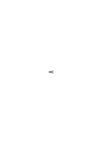
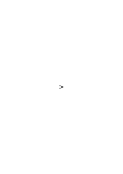
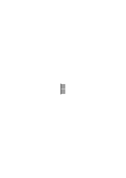
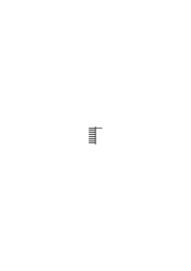
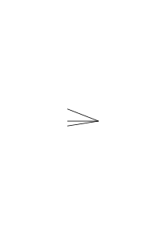

# Ursache und Wirkung

### [Ms-119,1\[2\]](https://cdn.wittgensteinnachlass.com/2000px/webp/Ms-119/1.webp),[2\[1\]](https://cdn.wittgensteinnachlass.com/2000px/webp/Ms-119/2.webp)

Wenn man sagt: “ich fürchte mich, weil er so finster dreinschaut” – so wird hier scheinbar eine Ursache, unmittelbar erkannt, ohne wiederholtes Experiment. Russell sagte, man müsse, ehe man etwas als Ursache durch wiederholte Erfahrung erkenne, etwas durch Intuition als Ursache erkennen. Ist das nicht ähnlich, als sagte man: Man muß, ehe man etwas als 2 m durch Messung anerkennt, etwas durch Intuition als 1 m erkennen?

### [Ms-119,2\[2\]](https://cdn.wittgensteinnachlass.com/2000px/webp/Ms-119/2.webp),[3\[1\]](https://cdn.wittgensteinnachlass.com/2000px/webp/Ms-119/3.webp)

Wie nämlich, wenn jener Intuition durch wiederholte Experimente widersprochen wird? Wer hat dann recht? Und was ist es, was uns die Intuition über die Erfahrung sagt, die wir ‘als Ursache erkennen’? Handelt sich's da um etwas andres, als eine Reaktion unserseits gegen den Gegenstand: die Ursache?

### [Ms-119,3\[2\]](https://cdn.wittgensteinnachlass.com/2000px/webp/Ms-119/3.webp),[4\[1\]](https://cdn.wittgensteinnachlass.com/2000px/webp/Ms-119/4.webp)

Aber erkennen wir nicht unmittelbar, daß der Schmerz von dem Schlag herrührt, den wir erhalten? Ist er nicht die Ursache & kann ein Zweifel sein, daß er es ist? – Aber läßt es sich nicht ganz gut denken, daß wir in gewissen Fällen hierüber getäuscht werden? Und später die Täuschung erkennen. Es scheint uns etwas zu schlagen & zugleich wird ein Schmerz in uns hervorgerufen. (Man glaubt manchmal einen Lärm durch eine gewisse Bewegung hervorzurufen & kommt dann drauf, daß er unabhängig von uns entstanden ist.) Und freilich, es ist hier eine echte Erfahrung, die man ja ‘Erfahrung der Ursache’ nennen kann. Aber nicht, weil sie uns unfehlbar die Ursache zeigt, sondern weil hier, im Ausschauen nach einer Ursache, _eine_ Wurzel des Ursache-Wirkung Schemas liegt.

### [Ms-119,4\[2\]](https://cdn.wittgensteinnachlass.com/2000px/webp/Ms-119/4.webp)

_Wir reagieren auf die Ursache_. Etwas “Ursache” nennen, ist ähnlich, wie, zeigen & sagen: “_Der_ ist schuld!”

### [Ms-119,4\[3\]](https://cdn.wittgensteinnachlass.com/2000px/webp/Ms-119/4.webp)

Wir stellen intuitiv die Ursache ab, wenn die Wirkung uns zuwider ist. Wir schauen instinktiv vom Gestoßenen auf das Stoßende. (Ich nehme an, wir tun es.)

### [Ms-119,5\[1\]](https://cdn.wittgensteinnachlass.com/2000px/webp/Ms-119/5.webp)

Wie nun, wenn ich sagte, wir vergleichen, wenn wir von Ursache & Wirkung reden alles dem Fall des Stoßes; der ist das Urbild der Ursache einer Wirkung? Hätten wir da den Stoß als Ursache _erkannt_? Denk eine Sprache, in der statt ‘Ursache’ immer ‘Anstoß’ gesagt wird!

---

### [Ms-119,21\[2\]](https://cdn.wittgensteinnachlass.com/2000px/webp/Ms-119/21.webp),[22\[1\]](https://cdn.wittgensteinnachlass.com/2000px/webp/Ms-119/22.webp),[23\[1\]](https://cdn.wittgensteinnachlass.com/2000px/webp/Ms-119/23.webp),[24\[1\]](https://cdn.wittgensteinnachlass.com/2000px/webp/Ms-119/24.webp)

Denke Dir zwei verschiedene Pflanzenarten A & B, man erhält von beiden Samen; & die Samen der beiden Arten sehen ganz gleich aus & die genaueste Untersuchung kann keinen Unterschied zwischen ihnen zeigen. Aber aus dem Samen einer A-Pflanze kommen wieder APflanzen, aus den Samen einer B-Pflanze, B-Pflanzen. Du kannst nur dann voraussagen, was für eine Pflanze aus einem solchen Samenkorn entstehen wird, wenn Du weißt, von welcher Pflanze es gekommen ist. – Sollen wir uns nun damit zufrieden geben; oder sollen wir sagen: “Es _muß_ ein Unterschied in den Samen selber sein, oder sie _könnten_ nicht verschiedene Pflanzen erzeugen; ihre Geschichte allein _kann_ nicht die Ursache ihrer weiteren Entwicklung sein, wenn die Vorgeschichte nicht Spuren im Samen (selbst) zurückgelassen hat.” Wenn wir nun aber keinen Unterschied in den Körnern finden! Und es ist nun Tatsache: Wir sagen die Entwickelung nicht aus den Eigentümlichkeiten des Samens voraus, sondern, , aus seiner Vorgeschichte. – Wenn ich sage: diese könne nicht Ursache der Entwicklung sein, so heißt das also nicht, ich könne aus der Vorgeschichte nicht die Entwicklung vorhersagen, das tue ich ja, wohl aber heißt es, daß wir _das_ nicht ‘Ursache’ nennen, daß wir eben hier nicht aus der Ursache die Wirkung vorhersagen. Und die Versicherung: “Es _muß_ ein Unterschied in den Samen sein, auch wenn wir ihn nicht finden” ändert an den Tatsachen nichts, drückt aber aus, wie mächtig in uns der Drang ist, alles durch das Ursache & Wirkung Schema zu sehen. Wenn von Graphologie, Physiognomik u. dergl. die Rede ist, hört man immer wieder den Satz: “… es muß natürlich der Charakter sich _irgendwie_ in der Schrift ausdrücken ….” ‘Es muß’, d.h.: dieses Bild wollen wir unter allen Umständen anwenden.

### [Ms-119,24\[2\]](https://cdn.wittgensteinnachlass.com/2000px/webp/Ms-119/24.webp)

(Es wäre nicht ganz unsinnig zu sagen, die Philosophie sei die Grammatik der Wörter “müssen” & “können”; denn damit zeigt sie, was a priori & a posteriori ist.)

### [Ms-119,25\[1\]](https://cdn.wittgensteinnachlass.com/2000px/webp/Ms-119/25.webp)

Und so kannst Du Dir vorstellen, daß der Same einer Pflanze A eine Pflanze B & der Same dieser (Pflanze), der ganz gleich ist dem Samen von A, wieder eine A-Pflanze u.s.f. abwechselnd – obwohl wir nicht wissen, ‘_warum_’. Etc..

### [Ms-119,25\[2\]](https://cdn.wittgensteinnachlass.com/2000px/webp/Ms-119/25.webp),[26\[1\]](https://cdn.wittgensteinnachlass.com/2000px/webp/Ms-119/26.webp)

Und nimm nun an, im vorigen Beispiel wäre es Einem endlich gelungen, einen Unterschied zwischen den Samen einer A- & einer B-Pflanze zu finden: der würde doch gewiß sagen: “Nun sehen wir, daß es eben doch nicht möglich ist, daß _ein_ Same die & jene Pflanze hervorbringt” – Wenn ich nun entgegnete: “Woher weißt Du, daß das Merkmal, das Du entdeckt hast, nicht rein zufällig ist? Woher weißt Du, daß _das_ etwas damit zu tun hat, daß einmal die einmal jene Pflanze aus dem Samen wird?” –

### [Ms-119,100\[2\]](https://cdn.wittgensteinnachlass.com/2000px/webp/Ms-119/100.webp)

Ein Klang scheint mir von dort her zu kommen, auch ehe ich untersucht habe wo (physikalisch) seine Quelle ist. Im Kino scheint der Laut des Sprechens vom Mund der Figur auf der Leinwand zu kommen. Worin besteht diese Erfahrung? Etwa darin, daß wir (unwillkürlich) den Blick auf eine bestimmte Stelle – die scheinbare Quelle des Lauts – richten, wenn wir einen Laut hören. Und niemand sieht im Kino, wo das Mikrophon angebracht ist.

### [Ms-119,101\[1\]](https://cdn.wittgensteinnachlass.com/2000px/webp/Ms-119/101.webp)

Die _Grundform_ unseres Spiels muß eine sein, in der der Zweifel nicht vorkommt. – Woher diese Sicherheit? Es kann doch nicht eine historische sein.

### [Ms-119,99\[4\]](https://cdn.wittgensteinnachlass.com/2000px/webp/Ms-119/99.webp),[100\[1\]](https://cdn.wittgensteinnachlass.com/2000px/webp/Ms-119/100.webp)

‘Die Grundform des Spiels kann den Zweifel nicht enthalten.’ Wir _stellen_ uns da vor allem eine Grundform _vor_; eine Möglichkeit, & zwar eine _sehr wichtige_ Möglichkeit. (Die wichtige Möglichkeit verwechseln wir ja sehr oft mit geschichtlicher Wahrheit.)

### [Ms-119,101\[2\]](https://cdn.wittgensteinnachlass.com/2000px/webp/Ms-119/101.webp),[102\[1\]](https://cdn.wittgensteinnachlass.com/2000px/webp/Ms-119/102.webp),[103\[1\]](https://cdn.wittgensteinnachlass.com/2000px/webp/Ms-119/103.webp),[104\[1\]](https://cdn.wittgensteinnachlass.com/2000px/webp/Ms-119/104.webp)

13.10.1937

“Der Zweifel – könnte ich sagen – muß ein Ende haben. Irgendwo müssen wir – ohne zu zweifeln – sagen: _das_ geschieht aus _dieser_ Ursache.”

Ähnlich: Wenn ein Kind sich so & so benimmt, so sagen wir, es hat Zahnschmerzen – können wir uns irren? Können wir uns bei _diesen_ Anzeichen irren? – Was wären denn hier die Kriterien des Irrtums? Hier gibt es keine. – Heißt das aber, wir wissen intuitiv das Kind habe Zahnschmerzen? – Der Irrtum & seine Entdeckung ist eine (spätere) _Erweiterung_ des Spiels. Das Spiel sei dies: Wenn ein Kind schreit & sich die Wange hält, wird ihm ein Zahn gerissen. Ist hier ein Irrtum möglich? – “Es wird ja aber auch nichts behauptet!” – Doch; wir gehen zum Zahnarzt mit ihm & sagen ihm: “Das Kind hat Zahnschmerzen”, worauf er ihm einen Zahn reißt. Ähnlich: Wir sagen: “Nimm diesen Sessel!” & es kommt uns nie in den Sinn, daß wir uns irren könnten, daß es vielleicht eigentlich kein Sessel ist, daß spätere Erfahrung uns etwas anderes lehrt. Ein Spiel wird hier gespielt ohne die Möglichkeit des Irrtums, & ein anderes komplizierteres mit dieser Möglichkeit. Ist es nicht dies: Es ist dem Spiel, welches wir spielen sehr wesentlich, daß wir gewisse Worte aussprechen & regelmäßig nach ihnen _handeln_. Der Zweifel ist ein ritardierendes Moment & ist wesentlich eine Ausnahme von der Regel. Man könnte sagen: Es ist dem Verkehr auf unsern Straßen wesentlich, daß die allermeisten Wagen & Fußgänger jeder in gleichbleibender Richtung einem Ziele zu gehen, & _nicht_ gehen, wie Einer, der sich jede Minute anders entscheidet, erst in der Richtung von A nach B geht, dann umkehrt & einige Schritte zurück macht, dann wieder umkehrt, u.s.w.– Und, “es sei ein wesentlicher Zug des Verkehrs auf unsern Straßen”, heißt: es sei ein wichtiger & charakteristischer Zug; wäre dies anders, so würde sich ungeheuer viel ändern.

### [Ms-119,104\[2\]](https://cdn.wittgensteinnachlass.com/2000px/webp/Ms-119/104.webp),[105\[1\]](https://cdn.wittgensteinnachlass.com/2000px/webp/Ms-119/105.webp)

Was heißt es nun, wenn man sagt: das Spiel müsse erst einmal _ohne_ Zweifel anfangen? der Zweifel könne nur nachträglich hinzutreten?– Ja warum soll man nicht von vornherein zweifeln? Aber halt – wie sieht der Zweifel dann aus? – Ja, wie immer nun seine gegenwärtige Erscheinung (z.B. seine Äußerung) ist, er hat nun eine ganz andere _Umgebung_, als die, welche wir kennen. (Denn als Ausnahme hat der Zweifel die Regelmäßigkeit zur Umgebung.) (Haben (die) Augen einen Ausdruck, wenn sie nicht in einem Gesicht stehen?) Die _Gründe_ des Zweifels sind jetzt Gründe, ein eingefahrenes Geleise zu verlassen.

### [Ms-119,106\[2\]](https://cdn.wittgensteinnachlass.com/2000px/webp/Ms-119/106.webp)

Unsere Welt erscheint ganz anders, wenn man sie mit andern Möglichkeiten umgibt.

### [Ms-119,106\[3\]](https://cdn.wittgensteinnachlass.com/2000px/webp/Ms-119/106.webp),[107\[1\]](https://cdn.wittgensteinnachlass.com/2000px/webp/Ms-119/107.webp)

Wir lehren ein Kind: “_Das_ ist ein Sessel”. Könnten wir es von Anfang an den Zweifel daran lehren, ob dies ein Sessel sei? Man wird sagen: “Unmöglich! es muß doch zuerst wissen, was ein Sessel ist, um daran zweifeln zu können, daß dies einer ist.” – Ist es aber nicht denkbar, daß das Kind von Anfang an lernt zu sagen: “Das schaut aus wie ein Sessel – ob es aber wirklich einer ist? –” Oder doch, daß es von Anfang an lernt in zweifelndem Ton zu sagen: “Ich _glaube_, hier steht ein Sessel” & nicht in behauptendem Ton: “Hier steht ein Sessel.”

### [Ms-119,107\[2\]](https://cdn.wittgensteinnachlass.com/2000px/webp/Ms-119/107.webp)

Was ist nun daran:– “man kann nicht mit dem Zweifel beginnen”? So ein “kann” ist immer verdächtig.

### [Ms-119,107\[3\]](https://cdn.wittgensteinnachlass.com/2000px/webp/Ms-119/107.webp)

14.10.1937

Man kann sagen: Der Zweifel kann keine _notwendige_ Ergänzung des Spiels sein, als könnte ohne ihn das Spiel nicht in der Ordnung sein Denn es gibt Kriterien für die Berechtigung des Zweifels, wie dafür daß hier ein Sessel steht, z.B.

### [Ms-119,109\[2\]](https://cdn.wittgensteinnachlass.com/2000px/webp/Ms-119/109.webp)

Man denkt leicht: der Zweifel mache es erst – _naturgetreu_. (Wenn man auf einer Eisenbahn für lange und kurze Fahrstrecken gleich viel zahlen müßte, wäre das eine offenbar ungerechte, unsinnige, Bestimmung?)

### [Ms-119,109\[3\]](https://cdn.wittgensteinnachlass.com/2000px/webp/Ms-119/109.webp),[110\[1\]](https://cdn.wittgensteinnachlass.com/2000px/webp/Ms-119/110.webp)

“Man kann nicht wissen, ob Einer Schmerzen hat? – _Doch_, man kann es _wissen_!” – Das sagt doch nicht: “wir _haben_ ein ‘intuitives Wissen’ dieser Schmerzen!” Es ist nur eine, berechtigte, Auflehnung gegen die, die sagen: “Man kann nicht _wissen_ …”. Es behauptet aber nicht ein Naturvermögen, das jene leugnen. –

### [Ms-119,110\[2\]](https://cdn.wittgensteinnachlass.com/2000px/webp/Ms-119/110.webp)

“Das Spiel kann nicht mit dem Zweifel anfangen.” – Es sollte heißen: das Spiel _fängt_ nicht mit dem Zweifel an. – Oder auch: das “kann” hat die selbe Berechtigung, wie in dem Satz: “der Verkehr auf Straßen kann nicht damit anfangen, daß Alle zweifeln, ob sie da – oder dorthin gehen sollen; d.h. es käme dann nie zu dem, was wir ‘Verkehr’ nennen, & das Schwanken würden wir dann wohl auch nicht ‘Zweifel’ nennen.”

### [Ms-119,110\[3\]](https://cdn.wittgensteinnachlass.com/2000px/webp/Ms-119/110.webp),[111\[1\]](https://cdn.wittgensteinnachlass.com/2000px/webp/Ms-119/111.webp)

(Die philosophische Beteuerung,) “Wir _wissen_, daß dies ein Sessel ist!” beschreibt ja bloß ein Spiel. Aber es _scheint_ zu sagen, daß, wenn ich Einen bitte: “bring mir diesen Sessel dort”, Gefühle der felsenfesten Überzeugung mich bewegen.

### [Ms-119,111\[3\]](https://cdn.wittgensteinnachlass.com/2000px/webp/Ms-119/111.webp),[112\[1\]](https://cdn.wittgensteinnachlass.com/2000px/webp/Ms-119/112.webp),[113\[1\]](https://cdn.wittgensteinnachlass.com/2000px/webp/Ms-119/113.webp),[114\[1\]115\[1\]](https://cdn.wittgensteinnachlass.com/2000px/webp/Ms-119/114.webp)

Das Spiel beginnt nicht mit dem Zweifel, ob Einer Zahnweh hat, denn das entspräche – sozusagen – nicht der biologischen Funktion, des Spiels in unserm Leben. Seine einfachste Form ist eine Reaktion auf die Klagelaute & Gebärden des Anderen, eine Reaktion des Mitleids, oder dergleichen. Wir trösten, wollen helfen. Man kann denken: weil der Zweifel eine Verfeinerung, in gewissem Sinne, Verbesserung des Spiels ist, so wäre es wohl das allerrichtigste, mit dem Zweifel gleich anzufangen. (Ähnlich wie man denkt, weil es oft gut ist, wenn ein Urteil begründet ist, so müßte zur vollkommenen Rechtfertigung eines Urteils die Kette der Gründe in's Unendliche weitergehen.) Denken wir uns den Zweifel & die Überzeugung nicht durch eine Sprache, sondern bloß durch Handlungen, Gebärden, Mienen, ausgedrückt. So könnte es etwa bei sehr primitiven Menschen, oder bei Tieren sein. Denken wir also eine Mutter, deren Kind schreit & sich dabei die Wange hält. _Eine_ Art der Reaktion hierauf ist (also) die, daß die Mutter das Kind zu trösten trachtet & es, auf irgend eine Art & Weise, pflegt. Hier ist nichts was dem Zweifel daran entspricht, ob das Kind wirklich Schmerzen habe. Ein anderer Fall wäre (nun) der: die Reaktion auf die Klage des Kindes ist für gewöhnlich die eben geschilderte, unter gewissen Umständen aber ist die Mutter skeptisch. Sie schüttelt dann etwa mißtrauisch den Kopf, unterbricht das Trösten & Pflegen des Kindes, ja ist sogar unwillig & teilnahmslos Nun aber denken wir uns die Mutter, die von vornherein skeptisch ist: Wenn das Kind schreit, zuckt sie die Achseln & schüttelt den Kopf; eventuell sieht sie es forschend an, untersucht es; in Ausnahmsfällen macht sie zögernde Versuche des Tröstens oder Pflegens.– Sähen wir ein solches Verhalten, so würden wir es durchaus nicht das der Skepsis nennen, es würde uns (nur) seltsam & närrisch anmuten. “Das Spiel kann nicht mit dem Zweifel anfangen” heißt: wir würden es nicht ‘Zweifel’ nennen, wenn das Spiel damit anfinge.

### [Ms-119,115\[2\]](https://cdn.wittgensteinnachlass.com/2000px/webp/Ms-119/115.webp),[116\[1\]](https://cdn.wittgensteinnachlass.com/2000px/webp/Ms-119/116.webp)

Denk' Dir diese Frage: “Kann ein Spiel damit _anfangen_, daß einer der Spieler gewinnt (oder verliert) & dann das Spiel seinen Fortgang nimmt?” Warum soll nicht ein spielähnlicher Vorgang dann mit dem anfangen, was für gewöhnlich unmittelbar bei dem Gewinnen & Verlieren in einem Spiel vorsichgeht? Es wird einem z.B. Geld ausbezahlt, er wird zu seinem Erfolg beglückwünscht, u.a.m.. Nun werden wir dies dennoch nicht “im Spiel gewinnen” nennen & vielleicht das ganze kein “Spiel”. Wenn wir so einen Gebrauch sähen, so erschiene er uns ‘unverständlich’ & wir würden gewiß nicht sagen: “diese Leute gewinnen & verlieren zu _Anfang_ des Spiels”.

### [Ms-119,116\[2\]](https://cdn.wittgensteinnachlass.com/2000px/webp/Ms-119/116.webp)

“_Kann_ das geschehen?” – Gewiß. Beschreib es nur bis in die Einzelheiten & Du wirst schon sehen, daß, was Du beschreibst sich zwar leicht vorstellen läßt, daß Du aber freilich die & die Ausdrücke nicht auf ihn anwenden wirst.

### [Ms-119,116\[3\]](https://cdn.wittgensteinnachlass.com/2000px/webp/Ms-119/116.webp)

“Könnte der Reim in einem Gedicht an den Anfang statt ans Ende der Verszeilen fallen?”

### [Ms-119,116\[4\]](https://cdn.wittgensteinnachlass.com/2000px/webp/Ms-119/116.webp),[117\[1\]](https://cdn.wittgensteinnachlass.com/2000px/webp/Ms-119/117.webp)

“Es kommt also in Deinem primitiven Spiel kein Zweifel vor – aber ist es denn _sicher_, daß er Zahnschmerzen hat?” – _So_ ist das Spiel. – Und daraus kannst Du, wenn Du willst, entnehmen wie das Wort “Zahnschmerzen” gebraucht wird; also, welche Bedeutung es hat.

### [Ms-119,117\[2\]](https://cdn.wittgensteinnachlass.com/2000px/webp/Ms-119/117.webp)

“Wie, wenn er betrügt?” – Aber er kann gar nicht betrügen, wenn, was er tut, in dem Spiel nicht _Betrügen_ ist.

### [Ms-119,118\[2\]](https://cdn.wittgensteinnachlass.com/2000px/webp/Ms-119/118.webp)

15.10.1937

“Ist es denn sicher, daß ein Sessel hier steht?” – ja kann ich nicht beides tun: sicher sein, & zweifeln? Hängt es nicht davon ab, ob ich etwas als Kriterium der Zweifelhaftigkeit gelten lasse?

### [Ms-119,118\[3\]](https://cdn.wittgensteinnachlass.com/2000px/webp/Ms-119/118.webp),[119\[1\]](https://cdn.wittgensteinnachlass.com/2000px/webp/Ms-119/119.webp)

Wir sagen: wenn das & das nicht eintrifft, so haben wir uns _geirrt_, eine falsche Annahme gemacht. Der Irrtum ist ein Fehler; wir werden seinetwegen getadelt, tadeln uns selbst. Vergleiche (damit) folgendes: Wir bestimmen die Mitte zwischen zwei Stellen (im Raum) A & B durch mehrmalige Schätzung auf _die_ Weise: wir sagen

<math display="block">
  <mfrac linethickness="0">
    <mrow>
      <mtext>ACC'</mtext>
      <mi>B</mi>
    </mrow>
    <mrow>
      <mo>|</mo>
      <mtext>─</mtext>
      <mtext>─</mtext>
      <mtext>─</mtext>
      <mtext>─</mtext>
      <mtext>─</mtext>
      <mtext>─</mtext>
      <mo>|</mo>
      <mtext>─</mtext>
      <mo>|</mo>
      <mo>|</mo>
      <mo>|</mo>
      <mtext>─</mtext>
      <mo>|</mo>
      <mtext>─</mtext>
      <mtext>─</mtext>
      <mtext>─</mtext>
      <mtext>─</mtext>
      <mtext>─</mtext>
      <mo>|</mo>
    </mrow>
  </mfrac>
</math>

“Ich nehme an, sie liegt bei C” & machen, mehr oder weniger nahe der Mitte, einen Punkt. – Tragen wir dann AC von B aus auf & erhalten C'. Nun wiederholen wir den Vorgang gegen die Mitte von CC' hin. – War die erste Annahme ein Irrtum? Du kannst sie so nennen – aber dieser ‘Irrtum’ wird hier nicht als Fehler behandelt.

### [Ms-119,119\[2\]](https://cdn.wittgensteinnachlass.com/2000px/webp/Ms-119/119.webp),[120\[1\]](https://cdn.wittgensteinnachlass.com/2000px/webp/Ms-119/120.webp)

Wenn wir nicht zweifeln, so betrachten wir das als einen Fehler, eine Dummheit – der Zweifel ist – so scheint es uns – die tiefere Einsicht in die Natur. Die perspektivische Darstellung der Menschen (etc.) erscheint uns als die richtigere im Vergleich mit der ägyptischen Art. Selbstverständlich; so schauen doch die Menschen nicht wirklich aus! – Aber muß das ein Argument sein? Wer sagt, daß ich auf dem Papier den Menschen so sehen will, wie er wirklich ausschaut?

### [Ms-119,120\[2\]](https://cdn.wittgensteinnachlass.com/2000px/webp/Ms-119/120.webp),[121\[1\]](https://cdn.wittgensteinnachlass.com/2000px/webp/Ms-119/121.webp)

“Wer nicht zweifelt, übersieht doch einfach die Möglichkeit, daß es sich anders verhalten kann!” Durchaus nicht, – wenn es diese Möglichkeit in seiner Sprache gar nicht gibt. (Wie der nichts übersehen muß, der für lange & kurze Arbeitszeit den gleichen Lohn gibt, oder fordert.) “Aber der bezahlt dann eben nicht die Arbeitsleistung!” – So _ist_ es. –

### [Ms-119,121\[3\]](https://cdn.wittgensteinnachlass.com/2000px/webp/Ms-119/121.webp),[122\[1\]](https://cdn.wittgensteinnachlass.com/2000px/webp/Ms-119/122.webp)

Warum nennt man das, was man unmittelbar erkennt ebenso, wie das, was uns wiederholte Erfahrung der Koinzidenz lehrt? _Inwiefern_ ist es denn dasselbe? (Aus einer andern Erkenntnisquelle fließt eine andre Erkenntnis.)

### [Ms-119,122\[2\]](https://cdn.wittgensteinnachlass.com/2000px/webp/Ms-119/122.webp),[123\[1\]](https://cdn.wittgensteinnachlass.com/2000px/webp/Ms-119/123.webp)

“Man kann die Existenz eines Mechanismus auf zwei Arten erkennen: erstens dadurch, daß wir ihn _sehen_, zweitens dadurch, daß wir seine Wirkung erkennen.” Könnte man nicht sagen: Man gebraucht die Aussage, es existiere hier ein Mechanismus der & der Art auf zweifache Weise: a) wenn ein solcher Mechanismus gesehen werden kann – b) wenn man Wirkungen erkennt, wie ein solcher Mechanismus sie hervorruft.

### [Ms-119,123\[2\]](https://cdn.wittgensteinnachlass.com/2000px/webp/Ms-119/123.webp)

Es gibt eine Reaktion, die man “Reaktion auf die Ursache” nennen kann. – Man redet auch davon, daß man der Ursache ‘nachgeht’; im einfachsten Fall geht man etwa einer Schnur nach, um zu sehen, wer an ihr zieht. Wenn ich ihn nun finde – wie weiß ich, daß er, sein Ziehen, die Ursache davon ist, daß sich die Schnur bewegt? Stelle ich das durch eine Reihe von Experimenten fest?

### [Ms-119,124\[2\]](https://cdn.wittgensteinnachlass.com/2000px/webp/Ms-119/124.webp),[125\[1\]](https://cdn.wittgensteinnachlass.com/2000px/webp/Ms-119/125.webp),[126\[1\]](https://cdn.wittgensteinnachlass.com/2000px/webp/Ms-119/126.webp)

Wer nun der Schnur nachgegangen ist & den findet, der an ihr zieht, macht der noch einen weiteren Schritt indem er schließt: also was das die Ursache, – oder ist nicht alles, was er finden wollte, daß jemand, & wer an ihr zieht. Stellen wir uns eben wieder ein einfacheres Sprachspiel vor, als das, was mit dem Wort “Ursache” gespielt wird. Denken wir uns zwei Vorgänge: der eine besteht darin, daß ein Mensch, wenn er den Zug an einer Schnur fühlt, oder eine Erfahrung ähnlicher Art hat, der Schnur – dem Mechanismus– nachgeht, in diesem Sinne die _Ursache_ findet, & etwa beseitigt. Er möge auch fragen: “warum bewegt sich diese Schnur?” oder dergl. –. Der andre Fall sei der: Er hat bemerkt, daß seine Ziegen, seit sie das Futter von dort & dort kriegen, wenig Milch geben. Er schüttelt den Kopf, fragt “warum” – & macht nun Versuche. Er findet, daß das & das Futter schlecht für sie ist. “Aber sind denn diese Fälle nicht von gleicher Art: er hätte ja auch Experimente darüber machen können, ob der Mensch, der ‘an der Schnur zieht’, wirklich die Ursache der Bewegung ist, ob nicht _er_ am Ende durch die Schnur bewegt werde& diese durch eine andre Ursache!” – Er hätte Experimente machen können, aber ich nehme an, er macht _keine_. _Dies_ ist das Spiel, welches er spielt.

### [Ms-119,126\[2\]](https://cdn.wittgensteinnachlass.com/2000px/webp/Ms-119/126.webp),[127\[1\]](https://cdn.wittgensteinnachlass.com/2000px/webp/Ms-119/127.webp),[128\[1\]](https://cdn.wittgensteinnachlass.com/2000px/webp/Ms-119/128.webp),[129\[1\]](https://cdn.wittgensteinnachlass.com/2000px/webp/Ms-119/129.webp)

Was ist es denn, was ich in so einem Fall immer tue? Die Vernunft – möchte ich sagen – gibt sich als (ein) Gradmesser par excellence (aus), als die ewige Skala, an der, was wir machen, sich selber mißt & beurteilt. Und ich sage: Laß Deinen Blick nicht von diesem Maßstab bannen; sieh' ihn als _einen_ unter anderen Maßstäben. Wir sind, sozusagen, gewöhnt diese damit ‘abzutun’, sie seien unvernünftig, entsprechen einem niedern Stande der Intelligenz, etc.. Unser Blick wird von dem Maßstab gefangen gehalten & durch ihn immer wieder von diesen Erscheinungen, gleichsam nach oben zu, abgezogen. – Wie wenn wir von einem gewissen Stil, Baustil oder Stil des Benehmens, so voreingenommen sind, daß wir unsern Blick, gleichsam, nicht _voll_ auf einen andern richten – sondern ihn nur aus dem Augenwinkel betrachten können. (Damit verwandt, eine hübsche Betrachtung, die Eddington über die Demonstration des Trägheitsgesetzes anstellt.)

### [Ms-119,129\[2\]](https://cdn.wittgensteinnachlass.com/2000px/webp/Ms-119/129.webp),[130\[1\]](https://cdn.wittgensteinnachlass.com/2000px/webp/Ms-119/130.webp)

In einem Fall heißt nun “_Der_ ist die Ursache” einfach: _der_ hat an der Schnur gezogen. Im andern Falle, etwa: _das_ sind die Umstände, die ich ändern mußte, um diese Erscheinung abzustellen. “Aber wie ist er denn – wie konnte er überhaupt auf die Idee kommen, einen Umstand abzuändern, _um_ die Erscheinung abzustellen? Das setzt doch voraus, daß er vor allem (einmal) einen Zusammenhang wittert! Einen Zusammenhang wittert, wo keiner zu _sehen_ ist. Er muß also vorher schon die Idee eines solchen, ursächlichen, Zusammenhanges erhalten haben.” Ja, man kann sagen, es setzt voraus, daß er sich nach einer Ursache umschaut; daß er von der Erscheinung – auf eine _andere_ schaut. –

### [Ms-119,132\[2\]](https://cdn.wittgensteinnachlass.com/2000px/webp/Ms-119/132.webp),[133\[1\]](https://cdn.wittgensteinnachlass.com/2000px/webp/Ms-119/133.webp),[134\[1\]](https://cdn.wittgensteinnachlass.com/2000px/webp/Ms-119/134.webp),[135\[1\]](https://cdn.wittgensteinnachlass.com/2000px/webp/Ms-119/135.webp),[136\[1\]](https://cdn.wittgensteinnachlass.com/2000px/webp/Ms-119/136.webp),[137\[1\]](https://cdn.wittgensteinnachlass.com/2000px/webp/Ms-119/137.webp)

17.10.1937

Intuition. Die Ursache durch Intuition wissen. Welches Spiel spielt man mit dem Wort “Intuition”? Was für ein Kunststück wird damit gemacht? Wir haben hier die Auffassung: Das Wissen dieses Sachverhalts ist ein Zustand des Geistes; & _wie_ dieser Zustand zustande gekommen ist, ist nebensächlich, wenn uns nur interessiert, daß Einer das & das _weiß_. Wie Kopfschmerzen aus mancherlei Ursache entstehen können, so auch das Wissen. Daß wir uns in der Logik überhaupt für diesen Zustand interessieren ist dann freilich merkwürdig. Was gehn uns solche Zustände an? – Erinnere Dich an die Frage: “_Wann_ weiß Einer, daß (z.B.) jemand im Nebenzimmer ist?”‒ ‒ Während er den Gedanken denkt? Und wenn er ihn denkt: während aller Glieder (Wörter) des Gedankens? Wenn ich sage: “ich weiß daß jemand im Zimmer ist” & es stellt sich heraus, daß ich mich geirrt habe, so _wußte_ ich's also nicht – habe ich mich da bei der Introspektion in meinen Geisteszustand geirrt? ich sah hinein & hielt etwas für ein _Wissen_, was keines war!– Oder kann ich so etwas nicht _eigentlich_ wissen? sondern solche Tatbestände wie: “Ich sehe etwas Rotes”, “Ich habe Schmerzen” u. dergl. Also nur dort sollte man das Wort “wissen” anwenden, wo es niemand anwendet; wo nämlich “ich weiß, daß p” nichts heißt wenn nicht etwa das Gleiche wie “p”, & die Form “ich weiß nicht, daß p” ein Blödsinn ist. Schau nur ja nicht auf den tatsächlichen Gebrauch der Worte “ich weiß …”! Schau nur auf die Worte & spekuliere, zu welchem Gebrauch sie passen möchten. – Wie geht denn das Sprachspiel – wann sagen wir denn, wir ‘_wissen_’? Wenn wir uns in einem bestimmten _Zustand_ finden? – Nicht, wenn wir eine gewisse Evidenz haben? – Und da ist es also ohne die Evidenz kein Wissen! Was ist nun die Intuition? Ist sie eine nur aus dem gewöhnlichen Leben bekannte Art & Weise, wie wir Dinge erfahren, uns Wissen aneignen? Oder ist sie eine Schimäre, von der wir bloß in der Philosophie Gebrauch machen? – Ist die Meinung, in dem & dem Fall sei Intuition im Spiel, vergleichbar der Meinung, die & die Krankheit werde durch den Stich eines Insekts erzeugt? (Diese Meinung kann richtig & falsch sein, aber wir kennen jedenfalls Krankheiten, die so erzeugt werden.) Oder haben wir hier einen Fall, wo das Wort gilt: “denn eben wo Begriffe fehlen, da stellt ein Wort zur rechten Zeit sich ein.” (Man könnte sich einen Sprachgebrauch denken, in dem es nicht heißt “es ist unbekannt, wer das getan hat”, sondern: “ Herr Unbekannt hat es getan” – damit man nicht sagen muß, man wisse etwas nicht.)

### [Ms-119,137\[3\]](https://cdn.wittgensteinnachlass.com/2000px/webp/Ms-119/137.webp),[138\[1\]](https://cdn.wittgensteinnachlass.com/2000px/webp/Ms-119/138.webp),[139\[1\]](https://cdn.wittgensteinnachlass.com/2000px/webp/Ms-119/139.webp)

18.10.1937

Was wissen wir denn von der Intuition? Was für eine Vorstellung machen wir uns von ihr? Sie soll (wohl) eine Art Sehen sein, ein Erkennen mit _einem_ Blick; mehr wüßte ich nicht. – “Also weißt Du ja doch, was eine Intuition ist!” – Etwa so, wie ich weiß, was es heißt “einen Körper mit einem Blick von allen Seiten zugleich sehen”. Ich will nicht sagen, daß man diesen Ausdruck nicht auf irgend einen Vorgang, aus irgend einem guten Grund, verwenden kann – aber weiß ich darum, was seine Anwendung sein soll? – ‘Die Ursache intuitiv erkennen’, heißt: die Ursache, _irgendwie_, _wissen_ (sie auf andere Weise erfahren, als die gewöhnliche). – Es weiß sie nun Einer – aber was nützt das, – wenn sich sein Wissen nicht _bewährt_? Nämlich, in der gewöhnlichen Weise mit der Zeit bewährt. Aber dann ist er ja in keinem andern Fall als Einer, der die Ursache (irgendwie) _richtig erraten_ hat. Das heißt: wir haben gar keinen Begriff von diesem besondern _Wissen_ der Ursache. Wir können uns ja vorstellen, Einer sage mit der Gebärde der Inspiration, er _wisse_ nun die Ursache; aber das hindert nicht, daß wir nun _prüfen_ ob er das Rechte weiß.

### [Ms-119,139\[2\]](https://cdn.wittgensteinnachlass.com/2000px/webp/Ms-119/139.webp)

Das Wissen interessiert uns nur im Spiel.

### [Ms-119,139\[3\]](https://cdn.wittgensteinnachlass.com/2000px/webp/Ms-119/139.webp)

(Es ist, wie wenn jemand behauptete, er besitze die Kenntnis der Anatomie (des Menschen) durch Intuition; & wir sagen: “Wir zweifeln nicht daran; aber wenn Du Arzt werden willst, mußt Du alle Prüfungen ablegen, wie jeder Andere.”)

### [Ms-119,142\[2\]](https://cdn.wittgensteinnachlass.com/2000px/webp/Ms-119/142.webp),[143\[1\]](https://cdn.wittgensteinnachlass.com/2000px/webp/Ms-119/143.webp),[144\[1\]](https://cdn.wittgensteinnachlass.com/2000px/webp/Ms-119/144.webp),[145\[1\]](https://cdn.wittgensteinnachlass.com/2000px/webp/Ms-119/145.webp),[146\[1\]](https://cdn.wittgensteinnachlass.com/2000px/webp/Ms-119/146.webp)

19.10.1937

20.10.1937 Warum ‘muß der Zweifel einmal irgendwo enden’? – Weil das Spiel nie anfangen könnte, wenn es mit dem Zweifel anfinge? D.h.: die _Grundform_ des Spieles ist eine, in die der Zweifel nicht eintritt. Oder: Wir könnten gar nicht wissen, was ‘Ursache’ ist, wenn wir nicht das eine & andre ohne einen Zweifel als Ursache einer Wirkung anerkennten. – Aber diese Ausdrucksformen sind alle unbefriedigend. – ‘Er muß einmal instinktiv zum Erkennen einer Ursache kommen.’ Er muß ein Vorbild der ‘Ursache’ haben, ehe er zweifeln kann, ob etwas die Ursache ist. Er muß einmal gradewegs etwas ‘Ursache’ nennen, sonst kommt er nie dazu, darüber nachzudenken, ob etwas die Ursache ist. – Denk' doch es finge dann an, daß er sich den Kopf darüber zerbricht, ob _dies_ die Ursache von _dem_. Wie müßte man sich dieses Kopfzerbrechen denken, diese Überlegungen? Doch in einer einfachen Weise. Es ist also etwa ein _Suchen_, & endlich ein Finden irgend eines Gegenstandes (der Ursache). Was ist also daran, daß das Spiel nicht mit dem Zweifel anfangen kann? Der Zweifel muß irgend ein Gesicht haben. Wenn er zweifelt, so ist die Frage: wie schaut sein Zweifel aus? Wie schaut, z.B., die Untersuchung aus, die er anstellt. – Will man nur sagen: das Spiel kann nicht damit anfangen, daß Einer sagt: “Man kann nie _wissen_, was die Ursache von etwas ist”? – Aber warum soll er nicht auch _das_ sagen; wenn er dann nur einen beherzten Schritt macht. – Aber dann brauchen wir ja nicht von den _Anfängen_ des Spiels zu reden, sondern wir können sagen: Das Spiel ‘die Ursache aufsuchen’ besteht vor allem & hauptsächlich darin, daß wir eine gewisse Praxis ausüben. Es erscheint darin auch etwas, was wir Zweifel & Unsicherheit nennen können, aber dies ist ein Zug zweiter Ordnung. Wie es zwar charakteristisch für das Funktionieren der Nähmaschine ist, daß sich ihre Teile abnützen & verbiegen, & die Achsen in den Lagern schlottern können, aber doch ein Charakteristikum zweiter Ordnung verglichen mit dem normalen Gang der Maschine.

### [Ms-119,146\[2\]](https://cdn.wittgensteinnachlass.com/2000px/webp/Ms-119/146.webp)

Denk' Dir diese seltsame Möglichkeit: Wir hätten uns bisher immer in der Multiplikation 12 × 12 verrechnet. Ja, es ist unbegreiflich, wie das geschehen konnte, aber es ist geschehen. Also ist alles falsch, was man so ausgerechnet hat! – Aber was macht das? Es macht ja gar nichts! – Da muß also etwas falsch sein in unsrer Idee von Wahrheit & Falschheit der mathematischen Sätze.

### [Ms-119,146\[4\]](https://cdn.wittgensteinnachlass.com/2000px/webp/Ms-119/146.webp),[147\[1\]](https://cdn.wittgensteinnachlass.com/2000px/webp/Ms-119/147.webp)

Der Ursprung & die primitive Form des Sprachspiels ist eine Reaktion; erst auf dieser können die komplizierteren Formen wachsen. Die Sprache – will ich sagen – ist eine Verfeinerung, ‘im Anfang war die Tat’.

### [Ms-119,147\[3\]](https://cdn.wittgensteinnachlass.com/2000px/webp/Ms-119/147.webp)

Erst muß ein fester, harter Stein zum Bauen da sein, & die Blöcke werden _unbehauen_ auf einander gelegt. _Dann_ ist es freilich wichtig, daß er sich auch behauen läßt, (daß er) nicht vollkommen hart ist.

### [Ms-119,147\[4\]](https://cdn.wittgensteinnachlass.com/2000px/webp/Ms-119/147.webp),[74v\[1\]](https://cdn.wittgensteinnachlass.com/2000px/webp/Ms-119/74v.webp)

Die primitive Form des Sprachspiels ist die Sicherheit, nicht die Unsicherheit. Denn die Unsicherheit könnte nie zur Tat führen.

### [Ms-119,74v\[2\]](https://cdn.wittgensteinnachlass.com/2000px/webp/Ms-119/74v.webp),[75r\[1\]](https://cdn.wittgensteinnachlass.com/2000px/webp/Ms-119/75r.webp)

Ich will sagen: es ist charakteristisch für unsere Sprache, daß sie auf dem Grund fester Lebensformen, regelmäßiger Handlungen, emporwächst. Ihre Funktion ist _vor allem_ durch die Handlung, deren Begleiterin sie ist, bestimmt. Wir haben eben einen Begriff davon, was für Lebensformen primitive sind, & welche erst aus solchen entsprossen sind. Wir glauben, daß der einfachste Pflug vor dem komplizierten da war.

### [Ms-119,75r\[2\]](https://cdn.wittgensteinnachlass.com/2000px/webp/Ms-119/75r.webp)

Die einfache Form (& das ist die Urform) des Ursache-Wirkung Spiels ist die der Bestimmung der Ursache, nicht des Zweifels.

### [Ms-119,75r\[4\]](https://cdn.wittgensteinnachlass.com/2000px/webp/Ms-119/75r.webp),[75v\[1\]](https://cdn.wittgensteinnachlass.com/2000px/webp/Ms-119/75v.webp)

[“…Irgendwo müssen wir – ohne zu zweifeln – sagen: _das_ geschieht aus _dieser_ Ursache.”] Im Gegensatz, etwa, _wozu_? Im Gegensatz dazu wohl, daß man nie den Knoten _anzieht_, sondern immer zweifelhaft bleibt, was die Ursache der Erscheinung wirklich sei. Als hätte es einen Sinn zu sagen: strenggenommen, könne man die Ursache nie mit Sicherheit _wissen_. So daß es also am meisten der _Wahrheit_ entsprechend sei, die Frage _nicht_ zu entscheiden. Welche Idee auf einem gänzlichen Mißverstehen der Rolle der Genauigkeit beruht & dem Zweifel zufallen.

### [Ms-119,77v\[2\]](https://cdn.wittgensteinnachlass.com/2000px/webp/Ms-119/77v.webp)

Die Grundform des Spiels muß eine sein, in der gehandelt wird.

### [Ms-119,78r\[2\]](https://cdn.wittgensteinnachlass.com/2000px/webp/Ms-119/78r.webp)

“Wie sollte der Begriff ‘Ursache’ auf die Beine gestellt werden, wenn immer gezweifelt würde?”

### [Ms-119,78r\[3\]](https://cdn.wittgensteinnachlass.com/2000px/webp/Ms-119/78r.webp)

“Die Ursache muß ursprünglich etwa handgreifliches sein”.

### [Ms-119,78r\[4\]](https://cdn.wittgensteinnachlass.com/2000px/webp/Ms-119/78r.webp)

Heißt es nicht eigentlich: mit der _philosophischen Spekulation_ kann man nicht anfangen –?

### [Ms-119,78r\[5\]](https://cdn.wittgensteinnachlass.com/2000px/webp/Ms-119/78r.webp),[78v\[1\]](https://cdn.wittgensteinnachlass.com/2000px/webp/Ms-119/78v.webp)

Wenn ich nie wüßte, was die Ursache von etwas ist, wie wäre ich dann zu diesem Begriff gekommen? – Das heißt doch: wie hätte ich mich wundern können, was von dem & dem wohl die Ursache ist, wenn ich nicht schon eine Ursache von etwas gesehen hätte? Ja nun, dieses ‘Können’ muß wohl ein logisches sein, – denn sonst könnte man sich ja alle möglichen Erklärungen denken. Das heißt aber nur: Gib bei der Beschreibung dieses ‘Wunderns’ acht, daß Du wirklich etwas beschreibst!

### [Ms-119,78v\[2\]](https://cdn.wittgensteinnachlass.com/2000px/webp/Ms-119/78v.webp)

Das Wesentliche des Sprachspiels ist eine praktische Methode (eine Art des Handelns), – keine Spekulation, kein Geschwätz.

### [Ms-119,28\[1\]](https://cdn.wittgensteinnachlass.com/2000px/webp/Ms-119/28.webp),[29\[1\]](https://cdn.wittgensteinnachlass.com/2000px/webp/Ms-119/29.webp),[30\[1\]](https://cdn.wittgensteinnachlass.com/2000px/webp/Ms-119/30.webp),[31\[1\]](https://cdn.wittgensteinnachlass.com/2000px/webp/Ms-119/31.webp)

Die Maschine (ihr Bau) als Symbol für ihre Wirkungsweise: Die Maschine – könnte ich zuerst sagen – ‘scheint ihre Wirkungsweise schon in sich zu haben’. Was heißt das? Indem wir die Maschine kennen scheint alles Übrige, nämlich die Bewegungen, die sie machen wird, schon ganz bestimmt zu sein. “Wir reden so, als _könnten_ sich diese Teile nur so bewegen, als könnten sie nichts andres tun.” Wie ist es –: vergessen wir also die Möglichkeit, daß sie sich biegen, abbrechen, schmelzen können, etc.? _Ja_; wir denken in _vielen_ Fällen gar nicht daran. Wir gebrauchen eine Maschine, oder ein Bild einer Maschine, als Symbol für eine bestimmte Wirkungsweise. Wir teilen z.B. Einem dieses Bild mit & setzen voraus, daß er die Erscheinungen der Bewegung der Teile aus ihm ableitet. (So wie wir jemand eine Zahl mitteilen können, indem wir sagen, sie sei die 25te der Reihe: 1, 4, 9, 16 …) “Die Maschine scheint ihre Wirkungsweise schon in sich zu haben” heißt: Du bist geneigt die künftigen Bewegungen der Maschine in ihrer Bestimmtheit Dingen zu vergleichen die alle schon in einer Lade liegen & von uns nun nach & nach herausgeholt werden. So aber reden wir nicht, wenn es sich darum handelt, das wirkliche Verhalten einer Maschine vorauszusagen; da vergessen wir, im Allgemeinen, nicht die Möglichkeiten der Deformation der Teile etc. etc.. Wohl aber, wenn wir uns darüber wundern, wie wir denn die Maschine als Symbol einer Bewegungsweise verwenden können – da sie sich doch auch ganz _anders_ bewegen könne. Nun, wir könnten sagen, die Maschine, oder ihr Bild, stehe hier für uns als Anfang einer Bilderreihe, die wir aus diesem Bild abzuleiten gelernt haben. Wenn wir aber bedenken, daß sich die Maschine auch anders hätte bewegen können, so erscheint es uns leicht, als müßte in der Maschine als Symbol ihre Bewegungsart noch viel bestimmter enthalten sein, als in der wirklichen Maschine. Es genüge da nicht, daß dies die erfahrungsmäßig vorausbestimmten Bewegungen seien, sondern sie müßten sogar – in einem mysteriösen Sinne – bereits _gegenwärtig_ sein. Und es ist ja wahr: die Bewegung des Maschinensymbols ist in anderer Weise vorausbestimmt, als die einer gegebenen wirklichen Maschine.

### [Ms-119,43\[2\]](https://cdn.wittgensteinnachlass.com/2000px/webp/Ms-119/43.webp)

Die Schwierigkeit aber entsteht hier überall durch die Verwechslung von “ist” & “heißt”.

### [Ms-119,51\[2\]](https://cdn.wittgensteinnachlass.com/2000px/webp/Ms-119/51.webp),[52\[1\]](https://cdn.wittgensteinnachlass.com/2000px/webp/Ms-119/52.webp),[53\[1\]](https://cdn.wittgensteinnachlass.com/2000px/webp/Ms-119/53.webp),[54\[1\]](https://cdn.wittgensteinnachlass.com/2000px/webp/Ms-119/54.webp)

Man sagt: “Es ist schwer zu wissen, ob diese Medizin wirklich hilft oder nicht, weil man nicht weiß, ob der Schnupfen länger gedauert hätte oder ärger gewesen wäre, wenn man sie nicht genommen hätte.” Wenn man dafür wirklich keinen Anhaltspunkt hat, ist es dann bloß schwer zu wissen? Ich hätte eine Medizin erfunden; ich sage: diese Medizin einige Monate hindurch genommen verlängert das Leben _jedes_ Menschen um einen Monat. Hätte er sie nicht genommen, so wäre er einen Monat früher gestorben. “Man kann nicht _wissen_, ob es wirklich die Medizin war; ob er nicht ohne sie ebenso lang gelebt hätte.” – Ist diese Ausdrucksweise nicht irreführend? Sollte es nicht besser heißen: “Es heißt nichts, von dieser Medizin zu sagen, sie verlängere das Leben; wenn eine Prüfung des Satzes in dieser Weise ausgeschlossen ist.” Nämlich: wir haben hier zwar einen richtigen deutschen Satz nach Analogie oft gebrauchter Sätze gebildet, aber Du bist Dir nicht klar über den _grundlegenden_ Unterschied in den Verwendungen dieser Sätze. Diese zu übersehen, ist nicht leicht. Der Satz liegt Dir vor Augen, aber nicht eine übersichtliche Darstellung der Verwendung. Mit “Es heißt nichts …” will ich also sagen: dies sind Worte, die Dich (etwa) irreführen, sie spiegeln einen Gebrauch vor, den sie nicht haben. Sie rufen wohl auch eine Vorstellung hervor, (der Verlängerung des Lebens, etc.) aber das Spiel mit dem Satz ist so eingerichtet, daß es die wesentliche Pointe nicht hat, die dem Spiel mit ähnlich gebauten Sätzen seinen Nutzen gibt (wie der ‘Wettlauf zwischen dem Hasen & dem Igel’ zwar aussieht wie ein Wettlauf, aber keiner ist).

### [Ms-119,54\[2\]](https://cdn.wittgensteinnachlass.com/2000px/webp/Ms-119/54.webp)

Du mußt Dich fragen: was nimmt man als Kriterien dafür, daß eine Medizin geholfen hat? Es gibt verschiedene Fälle. In welchen Fällen sagt man: “Es ist schwer zu sagen, ob sie geholfen hat”. In welchen Fällen ist die Redeweise als sinnlos zu verwerfen: “Man kann natürlich nie sicher sein, ob es die Medizin war, die geholfen hat”.

### [Ms-119,54\[3\]](https://cdn.wittgensteinnachlass.com/2000px/webp/Ms-119/54.webp),[55\[1\]](https://cdn.wittgensteinnachlass.com/2000px/webp/Ms-119/55.webp),[56\[1\]](https://cdn.wittgensteinnachlass.com/2000px/webp/Ms-119/56.webp)

Wann nennen wir zwei Körper gleich schwer? Wenn wir sie gewogen haben, oder nur während wir sie wägen? Wenn wägen das einzige Kriterium für das Gewicht ist, _wann_ hat nun ein Körper sein Gewicht geändert, wenn er jetzt mehr wiegt, als früher? Der Sprachgebrauch könnte _so_ sein: der Körper hat das & das Gewicht, bis er beim Wägen ein anderes zeigt; Auf die Frage: “wann hat er sein Gewicht geändert?” gibt man den Zeitpunkt dieser Wägung an. – Oder: man sagt: “Man kann nicht wissen, wann er sein Gewicht ändert, wir wissen nur: bei der ersten Wägung hatte er dieses, bei der zweiten jenes Gewicht.” – Oder: “Es ist sinnlos zu fragen, wann er sein Gewicht geändert hat, man kann nur fragen, wann sich die Gewichtsänderung gezeigt hat”.

### [Ms-119,56\[2\]](https://cdn.wittgensteinnachlass.com/2000px/webp/Ms-119/56.webp),[57\[1\]](https://cdn.wittgensteinnachlass.com/2000px/webp/Ms-119/57.webp),[58\[1\]](https://cdn.wittgensteinnachlass.com/2000px/webp/Ms-119/58.webp),[59\[1\]](https://cdn.wittgensteinnachlass.com/2000px/webp/Ms-119/59.webp)

29.09.1937

“Aber der Körper hatte doch zu jeder Zeit irgend _ein_ Gewicht, also war doch die Antwort die richtige: wir _wüßten_ nicht wann er es geändert habe.” – Und wie, wenn wir sagten, ein Körper habe gar kein Gewicht, außer dann wenn es sich irgendwie zeigt, oder, er habe kein _bestimmtes_ Gewicht, außer wenn es gemessen wird? Könnten wir nicht auch dieses Spiel spielen? Denke, wir verkaufen ein Material ‘nach seinem Gewicht’ & das Herkommen ist so: Wir wägen das Material alle fünf Minuten & berechnen dann den Preis nach dem Resultat der letzten Wägung. Oder ein anderes Herkommen: Wir berechnen den Preis auf diese Weise nur wenn das Gewicht bei der Wägung nach dem Kauf das gleiche ist, hat es sich dann geändert, so berechnen wir den Preis nach dem arithmetischen Mittel der beiden Gewichte. Welche Art der Preisbestimmung ist die richtigere? – (Wenn sich der Preis einer Ware von gestern auf heute geändert hat, _wann_ hat er sich geändert? Wie hoch stand er um 12 Uhr Mitternacht, als niemand kaufte?) Resultat: Die Verbindung der Ausdrücke: “der Körper hat jetzt das Gewicht …”, “der Körper wiegt jetzt ungefähr …”, “ich weiß nicht, wieviel er jetzt wiegt”, mit dem Ergebnis einer Wägung ist keine ganz einfache, hängt von verschiedenen Umständen ab, wir können mit der _Wägung_, & also mit diesen Sätzen, uns leicht verschiedene Spiele gespielt denken. Und das Gleiche gilt von der Rolle des Wortes “passen” in unsern Sprachspielen.

### [Ms-159,9v\[1\]](https://cdn.wittgensteinnachlass.com/2000px/webp/Ms-159/9v.webp)

“Immediately aware”

### [Ms-159,9v\[2\]](https://cdn.wittgensteinnachlass.com/2000px/webp/Ms-159/9v.webp)

“I'm immediately aware of that which I can't be wrong about”.

### [Ms-159,9v\[3\]](https://cdn.wittgensteinnachlass.com/2000px/webp/Ms-159/9v.webp)

“I'm not sure whether a man went into this room, but I am sure that it seemed to me that one did, that I saw such an image.”

### [Ms-159,9v\[4\]](https://cdn.wittgensteinnachlass.com/2000px/webp/Ms-159/9v.webp),[10r\[1\]](https://cdn.wittgensteinnachlass.com/2000px/webp/Ms-159/10r.webp),[10v\[1\]](https://cdn.wittgensteinnachlass.com/2000px/webp/Ms-159/10v.webp)

If I painted my impression instead of just describing it in words, I could now point to my picture & say: “I'm sure that _this_ was what I saw”. (Of course the “I'm sure” is really superfluous.) But further: I have painted, portrayed my impression – but have I portrayed, projected it correctly? All justifications you might try to give are idle wheels they don't drive anything. – Now this is why the expression “immediate awareness” or “knowledge” are in this sort of case misleading. The proposition is not unquestionable because it rests so securely on something but there is no question of its resting on anything. To say that we are _certain_ that we have this impression is like saying the earth rests on something that is firm in itself.

### [Ms-159,10v\[2\]](https://cdn.wittgensteinnachlass.com/2000px/webp/Ms-159/10v.webp),[11r\[1\]](https://cdn.wittgensteinnachlass.com/2000px/webp/Ms-159/11r.webp)

“I am immediately aware that my exclamation is caused by something.” – So I'm immediately aware that the word “cause” fits the case? But remember that _words_ are public property.

### [Ms-159,11r\[2\]](https://cdn.wittgensteinnachlass.com/2000px/webp/Ms-159/11r.webp)

Private language: Playing a game of chess in the imagination. Playing a soccer-match in the imagination.

### [Ms-159,11r\[3\]](https://cdn.wittgensteinnachlass.com/2000px/webp/Ms-159/11r.webp),[11v\[1\]](https://cdn.wittgensteinnachlass.com/2000px/webp/Ms-159/11v.webp)

What if I said: the word “cause” fits my impression privately? – But “to fit” is a public word. Ask yourself: What do we make this noise of words for?

### [Ms-159,11v\[2\]](https://cdn.wittgensteinnachlass.com/2000px/webp/Ms-159/11v.webp)

“You are immediately aware” makes one think that you are _right_ about something, that you can be shown to be right about; whereas the point is that there is no _right_ (or wrong) about it. (And of course no one would say: I'm sure I'm right that I have pain.)

### [Ms-159,11v\[3\]](https://cdn.wittgensteinnachlass.com/2000px/webp/Ms-159/11v.webp)

Being _immediately aware_ of the cause when you say: “That's where it hurts!”

### [Ms-159,12r\[1\]](https://cdn.wittgensteinnachlass.com/2000px/webp/Ms-159/12r.webp)

Being _immediately aware_ of the cause of terror, pleasure etc.

### [Ms-159,12r\[2\]](https://cdn.wittgensteinnachlass.com/2000px/webp/Ms-159/12r.webp)

Being _immediately aware_ of the cause in a mechanism. Causal ‘nexus’. ‘Cause – reaction’.

### [Ms-159,12r\[3\]](https://cdn.wittgensteinnachlass.com/2000px/webp/Ms-159/12r.webp)

‘Cause isn't just temporary coincidence but influence.’

### [Ms-159,12r\[4\]](https://cdn.wittgensteinnachlass.com/2000px/webp/Ms-159/12r.webp),[12v\[1\]](https://cdn.wittgensteinnachlass.com/2000px/webp/Ms-159/12v.webp)

“You can't go on having one thing resting on another; in the end there must be something resting on itself.” (The a priori.) Something firm in itself. I propose to drop this mode of speech as it leads to puzzlements.

### [Ms-159,12v\[2\]](https://cdn.wittgensteinnachlass.com/2000px/webp/Ms-159/12v.webp)

“If a stone could think he would think that he wished to drop.”

### [Ms-159,12v\[3\]](https://cdn.wittgensteinnachlass.com/2000px/webp/Ms-159/12v.webp)

“Immediately aware of motive.”

### [Ms-159,12v\[4\]](https://cdn.wittgensteinnachlass.com/2000px/webp/Ms-159/12v.webp)

Immediately aware of what makes me laugh in a joke.

### [Ms-160,6r\[2\]](https://cdn.wittgensteinnachlass.com/2000px/webp/Ms-160/6r.webp)

You know what I mean by ‘sense-datum’: _this_! –

### [Ms-160,6r\[3\]](https://cdn.wittgensteinnachlass.com/2000px/webp/Ms-160/6r.webp)

And how do you know that you mean _it_; how do you know that you hit it with the meaning?

### [Ms-160,6v\[1\]](https://cdn.wittgensteinnachlass.com/2000px/webp/Ms-160/6v.webp)

Eine Lokomotive durch die Sinneseindrücke die wir von ihr erhalten, definieren. – Tun wir das nicht ohnehin, wenn wir jemandem eine Lokomotive zeigen & sagen: dies ist eine Lokomotive? Statt zu sagen: “Das ist eine Lokomotive” – könnte ich Dir nicht sagen: “Was diese Sinneseindrücke erzeugt ist eine Lokomotive.”

### [Ms-160,7r\[2\]](https://cdn.wittgensteinnachlass.com/2000px/webp/Ms-160/7r.webp)

Die Sprache wird verwendet, – ob sie sich der Wörter für physikalische Gegenstände bedient, oder für Sinneseindrücke.

### [Ms-160,7r\[3\]](https://cdn.wittgensteinnachlass.com/2000px/webp/Ms-160/7r.webp),[7v\[1\]](https://cdn.wittgensteinnachlass.com/2000px/webp/Ms-160/7v.webp)

Aber sind nicht die Sinneseindrücke das unmittelbar Wahrgenommene? Die unmittelbaren Gegenstände, auf die sich alles was wir sagen am Schluß beziehen muß? Das Bild von den Bausteinen. Alles was wir bauen besteht endlich aus diesen Bausteinen. Aber das Bild ist falsch, da wir ‘_diese_’ Bausteine nicht andern entgegensetzen.

### [Ms-160,7v\[2\]](https://cdn.wittgensteinnachlass.com/2000px/webp/Ms-160/7v.webp)

Wie weißt Du, welchem Gegenstand Du den Namen gegeben hast? Ja, wie weißt Du, daß Du überhaupt irgend etwas diesen Namen gegeben hast?

### [Ms-160,9r\[1\]](https://cdn.wittgensteinnachlass.com/2000px/webp/Ms-160/9r.webp),[9v\[1\]](https://cdn.wittgensteinnachlass.com/2000px/webp/Ms-160/9v.webp)

Es ist hier gar keine Frage darüber, daß der Name des physikalischen Gegenstands den einen & der Name des Eindrucks einen andern Gegenstand bezeichnet, wie wenn man nacheinander auf zwei verschiedene Gegenstände zeigt & sagt “ich meine diesen Gegenstand, nicht diesen”. Das Bild von den verschiedenen Gegenständen ist hier ganz falsch gebraucht. Nicht, das eine ist der Name für den unmittelbaren Gegenstand, das andere für etwas andres; sondern die zwei Wörter werden einfach verschieden verwendet. Wir zeigen bei der Namenerklärung nicht einmal auf den unmittelbaren Gegenstand & einmal auf den physikalischen.

### [Ms-160,16r\[2\]](https://cdn.wittgensteinnachlass.com/2000px/webp/Ms-160/16r.webp)

“Du redest vom Gegenstand, willst aber eigentlich von Sinneseindrücken reden.” – Ich will reden, wie ich rede & Du kannst sagen, ich rede von Sinneseindrücken. Nur sieht von Sinneseindrücken reden nicht so aus, wie Du es Dir vorstellst.

### [Ms-160,17r\[3\]](https://cdn.wittgensteinnachlass.com/2000px/webp/Ms-160/17r.webp),[17v\[1\]](https://cdn.wittgensteinnachlass.com/2000px/webp/Ms-160/17v.webp)

Die Technik des Gebrauchs der Worte beschreiben wir mit Worten.

### [Ms-160,18r\[1\]](https://cdn.wittgensteinnachlass.com/2000px/webp/Ms-160/18r.webp)

Es gibt ja immer noch eine _Technik_ der Anwendung unserer Erklärung. Und wenn ich die beschreibe, so gibt es eine Technik der Anwendung dieser Beschreibung.

### [Ms-160,18r\[2\]](https://cdn.wittgensteinnachlass.com/2000px/webp/Ms-160/18r.webp),[18v\[1\]](https://cdn.wittgensteinnachlass.com/2000px/webp/Ms-160/18v.webp)

Der Dreher erhält die Werkzeichnung, ein sehr einfaches Bild des Körpers den er zu drehen hat. Könnte er sie nicht anders deuten, nicht etwas ganz anderes nach ihr erzeugen? Auch gegeben seine Abrichtung das Herkommen, etc., etc..

### [Ms-160,18v\[2\]](https://cdn.wittgensteinnachlass.com/2000px/webp/Ms-160/18v.webp),[19r\[1\]](https://cdn.wittgensteinnachlass.com/2000px/webp/Ms-160/19r.webp),[19v\[1\]](https://cdn.wittgensteinnachlass.com/2000px/webp/Ms-160/19v.webp)

Wenn Du etwas von einem Gegenstand aussagst, redest Du natürlich eigentlich von Erscheinungen. Also kannst Du, statt von dem Ding zu reden geradezu von den Erscheinungen reden. Aber wie soll ich von den Erscheinungen reden? Ich erwarte z.B. jemand & weiß natürlich nicht, genau welche Erscheinungen er mir bieten wird. Angenommen nun, ich hätte eine ungeheure Menge von Bildern, – entspricht es nun wirklich dem was ich beim Erwarten tue, wenn ich alle diese Bilder durchsähe & mir sagte, daß eines davon zutreffen wird? Wäre es da nicht besser ich benützte _ein_ Bild des Menschen & sagte dazu, daß er ungefähr so aussehen werde? Ich will sagen: warum soll ich den Namen des Dings durch _alle_ seine Erscheinungen ersetzen, & nicht durch _eine_ & das übrige der Verwendung dieses Bildes überlassen.

### [Ms-160,19v\[2\]](https://cdn.wittgensteinnachlass.com/2000px/webp/Ms-160/19v.webp),[20r\[1\]](https://cdn.wittgensteinnachlass.com/2000px/webp/Ms-160/20r.webp)

14.09.1938

“Wenn Du von einem Ding sprichst, willst Du natürlich von Erscheinungen sprechen.” – Also könntest Du auch unmittelbar von Erscheinungen sprechen, statt _von dem Ding_. Aber wie spricht man unmittelbar von Erscheinungen – – – Was nennt man “unmittelbar von Erscheinungen sprechen”? Ist es: von Bildern sprechen – statt von Dingen? Und von _allen_ Bildern der Dinge?

### [Ms-160,20r\[2\]](https://cdn.wittgensteinnachlass.com/2000px/webp/Ms-160/20r.webp),[20v\[1\]](https://cdn.wittgensteinnachlass.com/2000px/webp/Ms-160/20v.webp),[21r\[1\]](https://cdn.wittgensteinnachlass.com/2000px/webp/Ms-160/21r.webp)

Wenn ich sage: Ich werde in den Garten gehen & mich unter den großen Nußbaum setzen – welches Bild entspricht dem? Nun ich könnte diesen Satz allerdings durch ein Bild illustrieren; aber was wäre die Beziehung dieses Bildes zu meinen Eindrücken von dem Baum? Die Sprache wird hier wieder nicht so verwendet, wie die schematisierende Tendenz annehmen will. Und nichts schwerer, als hier die Augen offen halten für was tatsächlich geschieht & ohne das Gerüst eines Systems sozusagen frei im Raum schwebend anzuerkennen man wisse noch nicht, wie es sich verhalte aber _so_ verhalte es sich nicht.

### [Ms-160,21r\[2\]](https://cdn.wittgensteinnachlass.com/2000px/webp/Ms-160/21r.webp),[21v\[1\]](https://cdn.wittgensteinnachlass.com/2000px/webp/Ms-160/21v.webp)

15.09.1938

“Wenn ich von diesem Baum rede, will ich natürlich, so oder so, von Erscheinungen reden. So laß mich also direkt von Erscheinungen reden & nicht über den Umweg des Baumes.” Aber das ist so, als hätte man eine Menge Erscheinungen (‘des Baumes’) vor sich von denen man reden will & bediente sich des Wortes “Baum” als einer Art abgekürzter Redeweise.

### [Ms-160,24r\[2\]](https://cdn.wittgensteinnachlass.com/2000px/webp/Ms-160/24r.webp),[24v\[1\]](https://cdn.wittgensteinnachlass.com/2000px/webp/Ms-160/24v.webp)

“Aber was mich interessiert, wenn ich von physikalischen Gegenständen spreche, ist doch was ich sehe & höre, rieche, schmecke & fühle. Also sind es Sinneseindrücke was mich interessiert; also kann ich doch _gleich_ von diesen reden.” – Wenn es so ist, so _rede_ ich also ‘von Sinneseindrücken’, indem ich von physikalischen Gegenstände rede.

### [Ms-160,24v\[2\]](https://cdn.wittgensteinnachlass.com/2000px/webp/Ms-160/24v.webp)

“Von etwas reden” kann eben so manches heißen. (Reden wir von zukünftigem oder gegenwärtigem, wenn wir auf den Himmel zeigen & sagen “es wird bald regnen”?)

### [Ms-159,20r\[1\]](https://cdn.wittgensteinnachlass.com/2000px/webp/Ms-159/20r.webp)

The unity of grammar & experience.

### [Ms-159,20r\[2\]](https://cdn.wittgensteinnachlass.com/2000px/webp/Ms-159/20r.webp),[20v\[1\]](https://cdn.wittgensteinnachlass.com/2000px/webp/Ms-159/20v.webp)

“You can't have the relation of ‘knowing’ to a fact of this sort”. The relation of knowing does not fit such a fact it has not the right number of valencies, as O can't combine with one atom of H. “A cube can't lie in a plane or be cut by a straight line in two – – –”. “A fact of this sort hasn't the right structure for being known.”

### [Ms-159,20v\[2\]](https://cdn.wittgensteinnachlass.com/2000px/webp/Ms-159/20v.webp)

“Or else – if you call _this_ knowing it's something else than knowing that you have a sense-datum”.

### [Ms-159,20v\[3\]](https://cdn.wittgensteinnachlass.com/2000px/webp/Ms-159/20v.webp)

Collecting the evidence; distinguishing between evidence & surmise. “Now what did you actually see?” – “Did you touch it?” – No – Then it might also have been a – – –”

### [Ms-159,21r\[1\]](https://cdn.wittgensteinnachlass.com/2000px/webp/Ms-159/21r.webp)

We take one _particular_ game & make it into _the_ game always played.

### [Ms-159,21r\[2\]](https://cdn.wittgensteinnachlass.com/2000px/webp/Ms-159/21r.webp)

“The logical structure of the universe”

---

### [Ms-159,23r\[2\]](https://cdn.wittgensteinnachlass.com/2000px/webp/Ms-159/23r.webp),[23v\[1\]](https://cdn.wittgensteinnachlass.com/2000px/webp/Ms-159/23v.webp)

“You can't ‘know’ it _in the same sense_ ….”

Can you deny in the same sense that 20 × 20 = 400 & that it rains?

### [Ms-159,23v\[2\]](https://cdn.wittgensteinnachlass.com/2000px/webp/Ms-159/23v.webp)

“We can't be directly aware of …”

### [Ms-159,23v\[3\]](https://cdn.wittgensteinnachlass.com/2000px/webp/Ms-159/23v.webp)

‘To be directly aware of the direction the sound comes from.’

### [Ms-159,30v\[1\]](https://cdn.wittgensteinnachlass.com/2000px/webp/Ms-159/30v.webp)

“You can't _know_.”

### [Ms-159,30v\[2\]](https://cdn.wittgensteinnachlass.com/2000px/webp/Ms-159/30v.webp)

_Knowing_ is here like _having_; having in yourself.

### [Ms-159,30v\[3\]](https://cdn.wittgensteinnachlass.com/2000px/webp/Ms-159/30v.webp)

You _know_ only the data; everything else is conjecture.

### [Ms-159,30v\[4\]](https://cdn.wittgensteinnachlass.com/2000px/webp/Ms-159/30v.webp)

We identify knowing & data.

### [Ms-159,31v\[1\]](https://cdn.wittgensteinnachlass.com/2000px/webp/Ms-159/31v.webp)

“This↑

fits this↑

”

Not _any_ sequence of puzzles is beneficial. Language idles

(Socrates is mortal)

Information

“This colour matches this very nicely”.

fits

this↑

fits this↑ “Things being as they are”. ‘Can we imagine it not fitting?’

### [Ms-159,32r\[1\]](https://cdn.wittgensteinnachlass.com/2000px/webp/Ms-159/32r.webp)

“This↑

does not fit this↑

”

How do you know whether this is a statement or a rule? Is it _meant_ as one or the other?

### [Ms-159,32r\[2\]](https://cdn.wittgensteinnachlass.com/2000px/webp/Ms-159/32r.webp)

─────┼─────

This↑ fits this↑

### [Ms-159,32r\[4\]](https://cdn.wittgensteinnachlass.com/2000px/webp/Ms-159/32r.webp)

Everything fits itself.

### [Ms-159,32r\[5\]](https://cdn.wittgensteinnachlass.com/2000px/webp/Ms-159/32r.webp)

‘Does this fit?’ – Make an experiment!

‘Are we to call this a fit?’