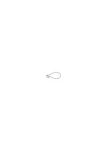
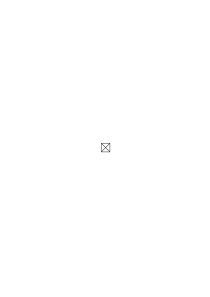

# Tagebücher 1914–1916

1914–1917, 997 remarks, Ms-101, Ms-102, Ms-103

### [Ms-101](/ms-101/#8r.4): [8r\[4\]](https://cdn.wittgensteinnachlass.com/2000px/webp/Ms-101/8r.webp)

22.08.1914

Die Logik muß für sich selber sorgen.

### [Ms-101](/ms-101/#8r.5+9r.1): [8r\[5\]](https://cdn.wittgensteinnachlass.com/2000px/webp/Ms-101/8r.webp),[9r\[1\]](https://cdn.wittgensteinnachlass.com/2000px/webp/Ms-101/9r.webp)

φ(x) Wenn sich syntaktische Regeln für Funktionen _überhaupt_ aufstellen lassen, dann ist die ganze Theorie der Dinge, Eigenschaften etc. überflüssig. Es ist auch gar zu auffällig daß weder in den „Grundgesetzen” noch in den „Principia Mathematica” von dieser Theorie die Rede ist. Nochmals: denn die Logik muß für sich selbst sorgen. Ein _mögliches_ Zeichen muß auch bezeichnen können. Alles was überhaupt möglich ist, ist auch legitim. Erinnern wir uns an die Erklärung warum „Sokrates ist Plato” unsinnig ist. Nämlich darum weil _wir_ eine willkürliche Bestimmung nicht getroffen haben, aber _nicht_ darum weil das Zeichen an und für sich etwa illegitim sei!

### [Ms-101](/ms-101/#12r.2+13r.1): [12r\[2\]](https://cdn.wittgensteinnachlass.com/2000px/webp/Ms-101/12r.webp),[13r\[1\]](https://cdn.wittgensteinnachlass.com/2000px/webp/Ms-101/13r.webp)

02.09.1914

Wir müssen in einem gewissen Sinne uns nicht in der Logik irren können. Dies ist schon teilweise darin ausgedrückt: Die Logik muß für sich selbst sorgen. Dies ist eine ungemein tiefe & wichtige Erkenntnis.

### [Ms-101](/ms-101/#13r.2): [13r\[2\]](https://cdn.wittgensteinnachlass.com/2000px/webp/Ms-101/13r.webp)

Frege sagt: jeder rechtmäßig gebildete Satz muß einen Sinn haben und ich sage: jeder mögliche Satz ist rechtmäßig gebildet & wenn er keinen Sinn hat so kann das nur daran liegen daß wir einigen seiner Bestandteile keine Bedeutung _gegeben_ haben. Wenn wir auch glauben es getan zu haben.

### [Ms-101](/ms-101/#13r.3+14r.1): [13r\[3\]](https://cdn.wittgensteinnachlass.com/2000px/webp/Ms-101/13r.webp),[14r\[1\]](https://cdn.wittgensteinnachlass.com/2000px/webp/Ms-101/14r.webp)

03.09.1914

Gestern nicht ganz erfolglos gearbeitet. In Tolstoi gelesen mit großem Gewinn. Wie ist es mit der Aufgabe der Philosophie vereinbar daß die Logik für sich selbst sorgen soll? Wenn wir z.B. fragen: ist die & die Tatsache von der Subjekt- Prädikat-Form dann müssen wir doch wissen was wir unter der „S.P.-Form” verstehen. Wir müssen wissen _ob_ es so eine Form überhaupt gibt. Wie können wir dies wissen? „Aus den Zeichen!” Aber wie? Wir haben ja gar keine _Zeichen_ von dieser Form. Wir können zwar sagen: wir haben Zeichen die sich so benehmen wie solche von der S.P.-Form, aber beweist das daß es wirklich Tatsachen dieser Form geben muß? Nämlich: wenn diese vollständig analysiert sind. Und hier frägt es sich wieder: Gibt es so eine vollständige Analyse. _Und wenn nicht_: Was ist denn dann die Aufgabe der Philosophie?!!?

### [Ms-101](/ms-101/#14r.2+15r.1): [14r\[2\]](https://cdn.wittgensteinnachlass.com/2000px/webp/Ms-101/14r.webp),[15r\[1\]](https://cdn.wittgensteinnachlass.com/2000px/webp/Ms-101/15r.webp)

Also können wir uns fragen: Gibt es die Subjekt-Prädikat-Form? Gibt es die Relationsform? Gibt es überhaupt irgend eine der Formen von denen Russell und ich immer gesprochen haben? (Russell würde sagen: „ja! denn das ist einleuchtend.” _Jaha_!)

### [Ms-101](/ms-101/#15r.2): [15r\[2\]](https://cdn.wittgensteinnachlass.com/2000px/webp/Ms-101/15r.webp)

Also: wenn _alles_ was gezeigt werden braucht durch die Existenz der Subjekt-Pädikat-_Sätze_ etc. gezeigt wird dann ist die Aufgabe der Philosophie eine andere als ich ursprünglich annahm. Wenn dem aber nicht so ist so müßte das Fehlende durch eine Art Erfahrung gezeigt werden und das halte ich für ausgeschlossen.

### [Ms-101](/ms-101/#15r.3): [15r\[3\]](https://cdn.wittgensteinnachlass.com/2000px/webp/Ms-101/15r.webp)

Die Unklarheit liegt _offenbar_ in der Frage worin eigentlich die logische Identität von Zeichen und Bezeichnetem besteht! Und diese Frage ist (_wieder_) eine Hauptansicht des ganzen philosophischen Problems.

### [Ms-101](/ms-101/#16r.1+17r.1): [16r\[1\]](https://cdn.wittgensteinnachlass.com/2000px/webp/Ms-101/16r.webp),[17r\[1\]](https://cdn.wittgensteinnachlass.com/2000px/webp/Ms-101/17r.webp)

Es sei eine Frage der Philosophie gegeben: etwa die ob „A ist gut” ein Subjekt-Prädikat-Satz sei; oder die ob „A ist heller als B” ein Relationssatz sei! _Wie läßt sich so eine Frage überhaupt entscheiden?!_ Was für eine Evidenz kann mich darüber beruhigen daß – _zum Beispiel_ – die erste Frage bejaht werden muß? (Dies ist eine ungemein wichtige Frage). Ist die einzige Evidenz hier wieder _jenes höchst zweifelhafte „Einleuchten”??_ Nehmen wir eine ganz ähnliche Frage die aber einfacher & grundlegender ist; nämlich diese: ist ein Punkt in unserem Gesichtsbild ein „_einfacher Gegenstand_”, ein _Ding_? Solche Fragen habe ich doch bisher immer als die eigentlichen philosophischen angesehen – und sie sind es auch gewiß in einem Sinne – aber nochmals: welche Evidenz könnte so eine Frage überhaupt entscheiden? Ist hier nicht ein Fehler in der Fragestellung denn es scheint als leuchtete mir über diese Frage _gar nichts_ ein; es scheint als könnte ich mit Bestimmtheit sagen, daß diese Fragen überhaupt nie entschieden werden könnten.

### [Ms-101](/ms-101/#17r.2): [17r\[2\]](https://cdn.wittgensteinnachlass.com/2000px/webp/Ms-101/17r.webp)

04.09.1914

Wenn nicht die Existenz des Subjekt-Prädikat-_Satzes_ alles Nötige zeigt dann könnte es doch nur die Existenz irgend einer besonderen Tatsache jener Form zeigen. Und die Kenntnis einer solchen kann nicht für die Logik wesentlich sein.

### [Ms-101](/ms-101/#17r.3+18r.1): [17r\[3\]](https://cdn.wittgensteinnachlass.com/2000px/webp/Ms-101/17r.webp),[18r\[1\]](https://cdn.wittgensteinnachlass.com/2000px/webp/Ms-101/18r.webp)

Gesetzt den Fall wir hätten ein Zeichen das _wirklich_ von der S.P.-Form wäre, wäre dieses für den Ausdruck von S.P.-Sätzen irgendwie geeigneter als unsere S.P.-Sätze? Es scheint nein! Liegt das an der bezeichnenden Relation?

### [Ms-101](/ms-101/#18r.2): [18r\[2\]](https://cdn.wittgensteinnachlass.com/2000px/webp/Ms-101/18r.webp)

Wenn sich die Logik ohne die Beantwortung gewisser Fragen abschließen läßt dann _muß sie ohne_ sie abgeschlossen werden.

### [Ms-101](/ms-101/#18r.3): [18r\[3\]](https://cdn.wittgensteinnachlass.com/2000px/webp/Ms-101/18r.webp)

Die logische Identität von Zeichen & Bezeichnetem besteht darin daß man im Zeichen nicht mehr & nicht weniger wiedererkennen darf als im Bezeichneten.

### [Ms-101](/ms-101/#18r.4): [18r\[4\]](https://cdn.wittgensteinnachlass.com/2000px/webp/Ms-101/18r.webp)

Wären Zeichen & Bezeichnetes _nicht_ ihrem vollen logischen Inhalte nach identisch dann müßte es noch etwas Fundamentaleres geben als die Logik.

### [Ms-101](/ms-101/#18r.5): [18r\[5\]](https://cdn.wittgensteinnachlass.com/2000px/webp/Ms-101/18r.webp)

05.09.1914

φ(a) . φ(b) . aRb ≝ φ[aRb]

### [Ms-101](/ms-101/#18r.6+19r.1): [18r\[6\]](https://cdn.wittgensteinnachlass.com/2000px/webp/Ms-101/18r.webp),[19r\[1\]](https://cdn.wittgensteinnachlass.com/2000px/webp/Ms-101/19r.webp)

Erinnere dich daß die Worte „Funktion” „Argument” „Satz” etc. in der Logik nicht vorkommen dürfen!

### [Ms-101](/ms-101/#19r.3): [19r\[3\]](https://cdn.wittgensteinnachlass.com/2000px/webp/Ms-101/19r.webp)

<math display="block">
  <mtext>Φ[</mtext>
  <mtext>ẑ</mtext>
  <mtext>ψz]</mtext>
  <mtext>․</mtext>
  <mtext>≝</mtext>
  <mtext>․</mtext>
  <mtext>φx</mtext>
  <msub>
    <mtext>≡</mtext>
    <mi>x</mi>
  </msub>
  <mtext>ψx</mtext>
  <mspace width="0.3em"/>
  <mtext>․</mtext>
  <msub>
    <mo>⊃</mo>
    <mtext>φ</mtext>
  </msub>
  <mtext>․</mtext>
  <mtext>Φφ</mtext>
</math>

Von zwei Klassen zu sagen sie seien identisch sagt etwas. Von zwei Dingen dies zu sagen sagt nichts dies schon zeigt die Unzulässigkeit der Russellschen Definition

### [Ms-101](/ms-101/#19r.5): [19r\[5\]](https://cdn.wittgensteinnachlass.com/2000px/webp/Ms-101/19r.webp)

Der letzte Satz ist eigentlich nichts anderes als der uralte Einwand gegen die Identität in der Mathematik. Nämlich der daß wenn 2 × 2 wirklich _gleich_ 4 wäre daß dieser Satz dann nicht mehr sagen würde als a = a.

### [Ms-101](/ms-101/#19r.6): [19r\[6\]](https://cdn.wittgensteinnachlass.com/2000px/webp/Ms-101/19r.webp)

Könnte man sagen: Die Logik kümmert die Analysierbarkeit der Funktionen mit denen sie arbeitet _nicht_.

### [Ms-101](/ms-101/#20r.2): [20r\[2\]](https://cdn.wittgensteinnachlass.com/2000px/webp/Ms-101/20r.webp)

07.09.1914

Bedenke daß auch ein unanalysierter S.P.-Satz etwas _ganz_ _Bestimmtes_ klar aussagt.

### [Ms-101](/ms-101/#20r.3+21r.1): [20r\[3\]](https://cdn.wittgensteinnachlass.com/2000px/webp/Ms-101/20r.webp),[21r\[1\]](https://cdn.wittgensteinnachlass.com/2000px/webp/Ms-101/21r.webp)

Kann man nicht sagen: Es kommt nicht darauf an daß wir es mit nicht analysierbaren S.P.-Sätzen zu tun haben sondern darauf daß unsere S.P.-Sätze sich in _jeder_ Beziehung wie solche benehmen d.h. also daß die Logik _unserer_ S.P.-Sätze dieselbe ist wie die Logik jener anderen. Es kommt uns ja nur darauf an die Logik abzuschließen und unser Haupteinwand gegen die nicht-analysierten S.P.-Sätze war der, daß wir ihre Syntax nicht aufstellen können solange wir ihre Analyse nicht kennen. Muß aber nicht die Logik eines scheinbaren S.P.-Satzes dieselbe sein wie die Logik eines wirklichen? Wenn eine Definition überhaupt möglich ist, die dem Satz die S.P.-Form gibt ‥‥?

### [Ms-101](/ms-101/#21r.2): [21r\[2\]](https://cdn.wittgensteinnachlass.com/2000px/webp/Ms-101/21r.webp)

08.09.1914

Das „Einleuchten” von dem Russell so viel sprach kann nur dadurch in der Logik entbehrlich werden daß die Sprache selbst jeden logischen Fehler verhindert. Und es ist klar daß jenes „Einleuchten” immer gänzlich trügerisch ist & war.

### [Ms-101](/ms-101/#21r.3): [21r\[3\]](https://cdn.wittgensteinnachlass.com/2000px/webp/Ms-101/21r.webp)

19.09.1914

aRb . bRc . cRd . dRe = φ(a,e)

<math display="block">
  <mo>(</mo>
  <mo>∃</mo>
  <msup>
    <mi>R</mi>
    <mi>s</mi>
  </msup>
  <mo>)</mo>
  <mspace width="0.3em"/>
  <mi>a</mi>
  <msup>
    <mi>R</mi>
    <mi>s</mi>
  </msup>
  <mspace width="0.3em"/>
  <mi>e</mi>
</math>

Ein Satz wie „dieser Sessel ist braun” scheint etwas enorm Kompliziertes zu sagen, denn wollten wir diesen Satz so aussprechen daß uns niemand gegen ihn Einwendungen die aus seiner Vieldeutigkeit entspringen machen könnte so würde er endlos lang werden müssen.

### [Ms-101](/ms-101/#22r.1): [22r\[1\]](https://cdn.wittgensteinnachlass.com/2000px/webp/Ms-101/22r.webp)

20.09.1914

Daß der Satz ein logisches Abbild seiner Bedeutung ist leuchtet dem unbefangenen Auge ein.

### [Ms-101](/ms-101/#22r.2): [22r\[2\]](https://cdn.wittgensteinnachlass.com/2000px/webp/Ms-101/22r.webp)

Gibt es Funktionen von Tatsachen? Z.B. „Es ist besser wenn dies der Fall ist als wenn jenes der Fall ist.”

### [Ms-101](/ms-101/#22r.3): [22r\[3\]](https://cdn.wittgensteinnachlass.com/2000px/webp/Ms-101/22r.webp)

Worin besteht denn die Verbindung zwischen dem Zeichen p und den übrigen Zeichen des Satzes: „Es ist gut daß p der Fall ist.”? Worin besteht diese Verbindung??

### [Ms-101](/ms-101/#22r.4): [22r\[4\]](https://cdn.wittgensteinnachlass.com/2000px/webp/Ms-101/22r.webp)

Der Unbefangene wird sagen: offenbar in der räumlichen Beziehung des Buchstaben p zu den zwei Nachbarzeichen. Wenn aber die Tatsache „p” eine solche wäre in welcher keine Dinge vorkommen??

### [Ms-101](/ms-101/#22r.5+23r.1): [22r\[5\]](https://cdn.wittgensteinnachlass.com/2000px/webp/Ms-101/22r.webp),[23r\[1\]](https://cdn.wittgensteinnachlass.com/2000px/webp/Ms-101/23r.webp)

„Es ist gut _daß_ p” kann wohl analysiert werden in „p . es ist gut wenn p”.

### [Ms-101](/ms-101/#23r.2): [23r\[2\]](https://cdn.wittgensteinnachlass.com/2000px/webp/Ms-101/23r.webp)

_Wir setzen voraus: p sei nicht der Fall_: Was heißt es dann zu sagen, „es ist gut daß p?” Wir können ganz offenbar sagen, der Sachverhalt p sei gut ohne zu wissen ob „p” wahr oder falsch ist.

### [Ms-101](/ms-101/#23r.3): [23r\[3\]](https://cdn.wittgensteinnachlass.com/2000px/webp/Ms-101/23r.webp)

Der Ausdruck der Grammatik: „Ein Wort bezieht sich auf ein anderes” wird hier beleuchtet.

### [Ms-101](/ms-101/#23r.4): [23r\[4\]](https://cdn.wittgensteinnachlass.com/2000px/webp/Ms-101/23r.webp)

Es handelt sich in den obigen Fällen darum anzugeben wie Sätze in sich zusammenhängen. Wie der _Satz-Verband_ zustande kommt.

### [Ms-101](/ms-101/#23r.5): [23r\[5\]](https://cdn.wittgensteinnachlass.com/2000px/webp/Ms-101/23r.webp)

(α β γ) φ(α…)

Wie kann sich eine Funktion _auf einen Satz beziehen_???? Immer die uralten Fragen!

### [Ms-101](/ms-101/#24r.1): [24r\[1\]](https://cdn.wittgensteinnachlass.com/2000px/webp/Ms-101/24r.webp)

Nur sich nicht von Fragen überhäufen lassen; nur es sich bequem machen!

### [Ms-101](/ms-101/#24r.2+25r.1): [24r\[2\]](https://cdn.wittgensteinnachlass.com/2000px/webp/Ms-101/24r.webp),[25r\[1\]](https://cdn.wittgensteinnachlass.com/2000px/webp/Ms-101/25r.webp)

„φ(ψx)”: Nehmen wir an uns sei eine Funktion eines S.P.-Satzes gegeben und wir wollen die Art der Beziehung der Funktion zum Satz dadurch erklären daß wir sagen: Die Funktion bezieht sich unmittelbar nur auf das Subjekt des S.P.-Satzes und was bezeichnet ist das logische Produkt aus dieser Beziehung und dem S.P.-Satzzeichen. Wenn wir das nun sagen so könnte man fragen: wenn du den Satz so erklären kannst warum erklärst du dann nicht auch seine Bedeutung auf die analoge Art & Weise. Nämlich „sie sei keine Funktion einer S.P.-Tatsache sondern das logische Produkt einer solchen & einer Funktion ihres Subjektes”? Muß nicht der Einwand der gegen diese Erklärung gilt auch gegen jene gelten?

### [Ms-101](/ms-101/#25r.2): [25r\[2\]](https://cdn.wittgensteinnachlass.com/2000px/webp/Ms-101/25r.webp)

21.09.1914

Es scheint mir jetzt plötzlich in irgend einem Sinne klar daß eine Eigenschaft eines Sachverhalts immer intern sein muß.

### [Ms-101](/ms-101/#25r.3): [25r\[3\]](https://cdn.wittgensteinnachlass.com/2000px/webp/Ms-101/25r.webp)

φa, ψb aRb man könnte sagen der Sachverhalt aRb habe immer eine gewisse Eigenschaft, wenn die beiden ersten Sätze wahr sind.

### [Ms-101](/ms-101/#25r.4): [25r\[4\]](https://cdn.wittgensteinnachlass.com/2000px/webp/Ms-101/25r.webp)

Wenn ich sage: Es ist gut daß p der Fall ist dann muß dies eben _in sich_ gut sein.

### [Ms-101](/ms-101/#25r.5): [25r\[5\]](https://cdn.wittgensteinnachlass.com/2000px/webp/Ms-101/25r.webp)

Es scheint mir jetzt klar daß es keine Funktionen von Sachverhalten geben kann.

### [Ms-101](/ms-101/#26r.1): [26r\[1\]](https://cdn.wittgensteinnachlass.com/2000px/webp/Ms-101/26r.webp)

Man könnte fragen: wie kann der Sachverhalt p eine Eigenschaft haben, wenn es sich am Ende gar nicht so verhält?

### [Ms-101](/ms-101/#26r.2): [26r\[2\]](https://cdn.wittgensteinnachlass.com/2000px/webp/Ms-101/26r.webp)

24.09.1914

Die Frage, wie ist eine Zuordnung von Relationen möglich, ist identisch mit dem Wahrheits-Problem.

### [Ms-101](/ms-101/#26r.3): [26r\[3\]](https://cdn.wittgensteinnachlass.com/2000px/webp/Ms-101/26r.webp)

25.09.1914

Denn dies ist identisch mit der Frage wie ist die Zuordnung von Sachverhalten möglich (einem bezeichnenden & einem bezeichneten).

### [Ms-101](/ms-101/#26r.4): [26r\[4\]](https://cdn.wittgensteinnachlass.com/2000px/webp/Ms-101/26r.webp)

Sie ist nur durch die Zuordnung der Bestandteile möglich; ein Beispiel bietet die Zuordnung von Namen & Benanntem. (Und es ist klar daß auch eine Zuordnung der Relationen auf irgend eine Weise stattfindet.)

### [Ms-101](/ms-101/#26r.5): [26r\[5\]](https://cdn.wittgensteinnachlass.com/2000px/webp/Ms-101/26r.webp)

❘aRb❘; ❘ab❘; p = aRb Def

Hier wird ein einfaches Zeichen einem Sachverhalt zugeordnet.

### [Ms-101](/ms-101/#27r.1): [27r\[1\]](https://cdn.wittgensteinnachlass.com/2000px/webp/Ms-101/27r.webp)

26.09.1914

Worauf gründet sich unsere – sicher wohl begründete – Zuversicht daß wir jeden beliebigen Sinn in unserer zweidimensionalen Schrift werden ausdrücken können?!

### [Ms-101](/ms-101/#27r.2): [27r\[2\]](https://cdn.wittgensteinnachlass.com/2000px/webp/Ms-101/27r.webp)

27.09.1914

Ein Satz kann seinen Sinn ja nur dadurch ausdrücken daß er dessen logisches Abbild ist!

### [Ms-101](/ms-101/#27r.3): [27r\[3\]](https://cdn.wittgensteinnachlass.com/2000px/webp/Ms-101/27r.webp)

Auffallend ist die Ähnlichkeit zwischen den Zeichen „aRb” und „aσR ∙ Rσb”.

### [Ms-101](/ms-101/#27r.4): [27r\[4\]](https://cdn.wittgensteinnachlass.com/2000px/webp/Ms-101/27r.webp)

29.09.1914

Der allgemeine Begriff des Satzes führt auch einen ganz allgemeinen Begriff der Zuordnung von Satz und Sachverhalt mit sich: Die Lösung aller meiner Fragen muß _höchst_ einfach sein!

### [Ms-101](/ms-101/#28r.1): [28r\[1\]](https://cdn.wittgensteinnachlass.com/2000px/webp/Ms-101/28r.webp)

Im Satz wird eine Welt probeweise zusammengestellt. (Wie wenn im Pariser Gerichtssaal ein Automobilunglück mit Puppen etc. dargestellt wird.)

### [Ms-101](/ms-101/#28r.2): [28r\[2\]](https://cdn.wittgensteinnachlass.com/2000px/webp/Ms-101/28r.webp)

Daraus muß sich (wenn ich nicht blind wäre) sofort das Wesen der Wahrheit ergeben.

### [Ms-101](/ms-101/#28r.3): [28r\[3\]](https://cdn.wittgensteinnachlass.com/2000px/webp/Ms-101/28r.webp)

Denken wir an hieroglyphische Schriften bei denen jedes Wort seine Bedeutung darstellt! Denken wir daran daß auch _wirkliche_ Bilder von Sachverhalten _stimmen_ und _nicht stimmen_ können.

### [Ms-101](/ms-101/#28r.4+29r.1): [28r\[4\]](https://cdn.wittgensteinnachlass.com/2000px/webp/Ms-101/28r.webp),[29r\[1\]](https://cdn.wittgensteinnachlass.com/2000px/webp/Ms-101/29r.webp)

„”:

Wenn in diesem Bild der rechte Mann den Menschen A vorstellt und bezeichnet der linke den Menschen B so könnte etwa das Ganze aussagen „A ficht mit B”. Der Satz in Bilderschrift kann wahr und falsch sein. Er hat einen Sinn unabhängig von seiner Wahr- oder Falschheit. An ihm muß sich alles Wesentliche demonstrieren lassen.

### [Ms-101](/ms-101/#29r.2): [29r\[2\]](https://cdn.wittgensteinnachlass.com/2000px/webp/Ms-101/29r.webp)

Man kann sagen wir haben zwar nicht die Gewißheit daß wir alle Sachverhalte in Bildern aufs Papier bringen können wohl aber die Gewißheit daß wir alle _logischen_ Eigenschaften der Sachverhalte in einer zweidimensionalen Schrift abbilden können.

### [Ms-101](/ms-101/#29r.3): [29r\[3\]](https://cdn.wittgensteinnachlass.com/2000px/webp/Ms-101/29r.webp)

Wir sind hier noch immer sehr an der Oberfläche aber wohl auf einer guten Ader.

### [Ms-101](/ms-101/#29r.4+30r.1): [29r\[4\]](https://cdn.wittgensteinnachlass.com/2000px/webp/Ms-101/29r.webp),[30r\[1\]](https://cdn.wittgensteinnachlass.com/2000px/webp/Ms-101/30r.webp)

30.09.1914

Man kann sagen in unserem Bilde stellt der Rechte etwas dar und auch der Linke, _aber_ selbst wenn dies nicht der Fall wäre so könnte ihre gegenseitige Stellung etwas darstellen. (Nämlich eine Beziehung)

### [Ms-101](/ms-101/#30r.2): [30r\[2\]](https://cdn.wittgensteinnachlass.com/2000px/webp/Ms-101/30r.webp)

Ein Bild kann Beziehungen darstellen die es nicht gibt!!! Wie ist dies möglich?

### [Ms-101](/ms-101/#30r.3): [30r\[3\]](https://cdn.wittgensteinnachlass.com/2000px/webp/Ms-101/30r.webp)

Jetzt scheint es wieder als müßten alle Beziehungen logisch sein damit ihre Existenz durch die des Zeichens verbürgt sei.

### [Ms-101](/ms-101/#30r.4): [30r\[4\]](https://cdn.wittgensteinnachlass.com/2000px/webp/Ms-101/30r.webp)

02.10.1914

Was in „aRb ∙ bSc” a & c verbindet ist nicht das „ ∙ ” Zeichen sondern _das Vorkommen desselben Buchstaben_ „b” in den beiden einfachen Sätzen.

### [Ms-101](/ms-101/#30r.5): [30r\[5\]](https://cdn.wittgensteinnachlass.com/2000px/webp/Ms-101/30r.webp)

Man kann geradezu sagen:

statt „dieser Satz hat diesen & diesen Sinn”: „dieser Satz stellt diesen & diesen Sachverhalt dar!”

### [Ms-101](/ms-101/#31r.1): [31r\[1\]](https://cdn.wittgensteinnachlass.com/2000px/webp/Ms-101/31r.webp)

Er bildet ihn logisch ab.

### [Ms-101](/ms-101/#31r.2): [31r\[2\]](https://cdn.wittgensteinnachlass.com/2000px/webp/Ms-101/31r.webp)

Nur so kann _der Satz_ wahr oder falsch sein: nur dadurch kann er mit der Wirklichkeit übereinstimmen oder nicht übereinstimmen daß er _ein Bild_ eines Sachverhaltes ist.

### [Ms-101](/ms-101/#31r.3): [31r\[3\]](https://cdn.wittgensteinnachlass.com/2000px/webp/Ms-101/31r.webp)

03.10.1914

Nur in**soweit** ist der Satz ein Bild eines Sachverhalts als er logisch gegliedert ist! (Ein einfaches – ungegliedertes – Zeichen kann weder wahr noch falsch sein.)

### [Ms-101](/ms-101/#31r.4): [31r\[4\]](https://cdn.wittgensteinnachlass.com/2000px/webp/Ms-101/31r.webp)

Der _Name_ ist _kein_ Bild des Benannten!

### [Ms-101](/ms-101/#31r.5): [31r\[5\]](https://cdn.wittgensteinnachlass.com/2000px/webp/Ms-101/31r.webp)

Der Satz _sagt nur insoweit etwas aus_, als er _ein Bild_ ist!

### [Ms-101](/ms-101/#31r.6+32r.1): [31r\[6\]](https://cdn.wittgensteinnachlass.com/2000px/webp/Ms-101/31r.webp),[32r\[1\]](https://cdn.wittgensteinnachlass.com/2000px/webp/Ms-101/32r.webp)

Tautologien sagen nichts aus, sie sind nicht Bilder von Sachverhalten: Sie sind selber logisch vollkommen neutral. (Das logische Produkt einer Tautologie und eines Satzes sagt nicht mehr noch weniger aus als dieser allein.)

### [Ms-101](/ms-101/#32r.2): [32r\[2\]](https://cdn.wittgensteinnachlass.com/2000px/webp/Ms-101/32r.webp)

04.10.1914

Es ist klar daß in „xRy” das bezeichnende Element einer Relation enthalten sein kann auch wenn „x” & „y” nichts bezeichnen. Und dann ist die Relation das einzige was in jenem Zeichen bezeichnet wird.

### [Ms-101](/ms-101/#32r.3): [32r\[3\]](https://cdn.wittgensteinnachlass.com/2000px/webp/Ms-101/32r.webp)

Aber wie ist es dann möglich, daß in einem Code „Kilo” heißt: „es geht mir gut”? Hier sagt doch ein _einfaches Zeichen_ etwas aus und wird benützt andern etwas mitzuteilen!! –

### [Ms-101](/ms-101/#32r.4): [32r\[4\]](https://cdn.wittgensteinnachlass.com/2000px/webp/Ms-101/32r.webp)

Kann denn in der vorigen Bedeutung das _Wort_ „Kilo” nicht wahr oder falsch sein?!

### [Ms-101](/ms-101/#33r.1): [33r\[1\]](https://cdn.wittgensteinnachlass.com/2000px/webp/Ms-101/33r.webp)

05.10.1914

Jedenfalls kann man doch ein einfaches Zeichen dem Sinne eines Satzes zuordnen. –

### [Ms-101](/ms-101/#33r.2): [33r\[2\]](https://cdn.wittgensteinnachlass.com/2000px/webp/Ms-101/33r.webp)

Nur die Wirklichkeit interessiert die Logik. Also die Sätze _nur_ insoweit sie _Bilder_ der Wirklichkeit sind.

### [Ms-101](/ms-101/#33r.3): [33r\[3\]](https://cdn.wittgensteinnachlass.com/2000px/webp/Ms-101/33r.webp)

Wie aber _kann ein Wort_ wahr oder falsch sein? Es kann jedenfalls nicht den _Gedanken_ ausdrücken, der mit der Wirklichkeit übereinstimmt oder nicht übereinstimmt. Der muß doch gegliedert sein!

### [Ms-101](/ms-101/#33r.4): [33r\[4\]](https://cdn.wittgensteinnachlass.com/2000px/webp/Ms-101/33r.webp)

Ein Wort kann nicht wahr oder falsch sein in _dem_ Sinne, daß es nicht mit der Wirklichkeit übereinstimmen kann, oder das Gegenteil.

### [Ms-101](/ms-101/#33r.5+34r.1): [33r\[5\]](https://cdn.wittgensteinnachlass.com/2000px/webp/Ms-101/33r.webp),[34r\[1\]](https://cdn.wittgensteinnachlass.com/2000px/webp/Ms-101/34r.webp)

06.10.1914

Der allgemeine Begriff zweier Komplexe von denen der eine das logische Bild des andern sein kann, also in _einem_ Sinne _ist_.

### [Ms-101](/ms-101/#34r.2): [34r\[2\]](https://cdn.wittgensteinnachlass.com/2000px/webp/Ms-101/34r.webp)

Die Übereinstimmung zweier Komplexe ist offenbar _intern_ und kann daher nicht ausgedrückt sondern nur gezeigt werden.

### [Ms-101](/ms-101/#34r.3): [34r\[3\]](https://cdn.wittgensteinnachlass.com/2000px/webp/Ms-101/34r.webp)

„p” ist wahr sagt nichts anderes aus als p!

„‚p’ ist wahr” ist – nach dem Obigen – nur ein Scheinsatz wie alle jene Zeichenverbindungen die scheinbar etwas sagen was nur gezeigt werden kann.

### [Ms-101](/ms-101/#34r.4): [34r\[4\]](https://cdn.wittgensteinnachlass.com/2000px/webp/Ms-101/34r.webp)

07.10.1914

Wenn ein Satz φa gegeben ist so sind mit ihm auch _schon_ alle seine logischen Funktionen (~φa etc.) mitgegeben!

### [Ms-101](/ms-101/#34r.5): [34r\[5\]](https://cdn.wittgensteinnachlass.com/2000px/webp/Ms-101/34r.webp)

08.10.1914

Vollständige und unvollständige Abbildung eines Sachverhaltes.

### [Ms-101](/ms-101/#35r.3): [35r\[3\]](https://cdn.wittgensteinnachlass.com/2000px/webp/Ms-101/35r.webp)

Der Ausdruck „nicht mehr weiter zerlegbar” ist auch einer der mit „Funktion”, „Ding” etc. auf dem Index stehenden; wie aber wird das _gezeigt_ was wir durch ihn ausdrücken wollen?

### [Ms-101](/ms-101/#35r.4): [35r\[4\]](https://cdn.wittgensteinnachlass.com/2000px/webp/Ms-101/35r.webp)

(Man kann natürlich weder von einem Ding noch von einem Komplex sagen sie seien nicht mehr weiter zerlegbar.)

### [Ms-101](/ms-101/#35r.5+36r.1): [35r\[5\]](https://cdn.wittgensteinnachlass.com/2000px/webp/Ms-101/35r.webp),[36r\[1\]](https://cdn.wittgensteinnachlass.com/2000px/webp/Ms-101/36r.webp)

09.10.1914

Wenn es eine unmittelbare Zuordnung von Relationen gäbe so wäre die Frage: wie sind dann die Dinge zu einander zugeordnet die in diesen Relationen stehen?, gibt es eine direkte Zuordnung von Relationen ohne Rücksicht auf ihren _Sinn_?

### [Ms-101](/ms-101/#36r.2): [36r\[2\]](https://cdn.wittgensteinnachlass.com/2000px/webp/Ms-101/36r.webp)

Ob wir zu der Annahme von „Beziehungen zwischen Beziehungen” nicht nur irregeführt werden, durch die scheinbare Analogie zwischen den Ausdrücken: „Beziehungen zwischen Dingen”

und „Beziehungen zwischen Beziehungen”?

### [Ms-101](/ms-101/#36r.3): [36r\[3\]](https://cdn.wittgensteinnachlass.com/2000px/webp/Ms-101/36r.webp)

_Ich mache bei allen diesen Überlegungen irgendwo irgend einen grundlegenden Fehler_.

### [Ms-101](/ms-101/#36r.4): [36r\[4\]](https://cdn.wittgensteinnachlass.com/2000px/webp/Ms-101/36r.webp)

Die Frage nach der Möglichkeit von Existenzsätzen steht nicht in der Mitte sondern am Uranfang der Logik.

### [Ms-101](/ms-101/#36r.5): [36r\[5\]](https://cdn.wittgensteinnachlass.com/2000px/webp/Ms-101/36r.webp)

Alle Probleme die das infin. ax. mit sich bringt sind schon im Satze „(∃x) x = x” zu lösen!

### [Ms-101](/ms-101/#36r.6): [36r\[6\]](https://cdn.wittgensteinnachlass.com/2000px/webp/Ms-101/36r.webp)

10.10.1914

Oft macht man eine Bemerkung und sieht erst später _wie_ wahr sie ist.

### [Ms-101](/ms-101/#37r.1): [37r\[1\]](https://cdn.wittgensteinnachlass.com/2000px/webp/Ms-101/37r.webp)

11.10.1914

Unsere Schwierigkeit liegt jetzt darin daß in der Sprache allem Anscheine nach die Analysierbarkeit oder das Gegenteil nicht wiedergespiegelt wird. Das heißt: wir können, wie es scheint aus der Sprache allein _nicht_ entnehmen ob es z.B. wirkliche Subjekt-Prädikat-Tatsachen gibt oder nicht. Wie aber _könnten_ wir diese Tatsache oder ihr Gegenteil _ausdrücken_? _Dies_ _muß gezeigt_ werden!

### [Ms-101](/ms-101/#37r.2+38r.1): [37r\[2\]](https://cdn.wittgensteinnachlass.com/2000px/webp/Ms-101/37r.webp),[38r\[1\]](https://cdn.wittgensteinnachlass.com/2000px/webp/Ms-101/38r.webp)

Wie aber, wenn wir uns um die Frage der Zerlegbarkeit gar nicht kümmerten? (Wir würden dann mit Zeichen arbeiten die nichts bezeichnen, sondern nur, durch ihre logischen Eigenschaften ausdrücken _helfen_.) Denn auch der unzerlegte Satz spiegelt ja logische Eigenschaften seiner Bedeutung wieder. Wie also wenn wir sagten: daß ein Satz weiter zerlegbar ist das zeigt sich wenn wir ihn durch Definitionen weiter zerlegen und wir arbeiten mit ihm in jedem Fall gerade so als wäre er unanalysierbar.

### [Ms-101](/ms-101/#38r.2): [38r\[2\]](https://cdn.wittgensteinnachlass.com/2000px/webp/Ms-101/38r.webp)

Bedenke, daß die „Sätze von den _unendlichen_ Anzahlen” alle mit _endlichen_ Zeichen dargestellt sind!

### [Ms-101](/ms-101/#38r.3): [38r\[3\]](https://cdn.wittgensteinnachlass.com/2000px/webp/Ms-101/38r.webp)

Aber brauchen wir – wenigstens nach Freges Methode – nicht hundert Millionen Zeichen um die Zahl 100.000.000 zu definieren? (Kommt es hier nicht darauf an ob sie auf Klassen oder Dinge angewandt wird?)

### [Ms-101](/ms-101/#38r.4+39r.1): [38r\[4\]](https://cdn.wittgensteinnachlass.com/2000px/webp/Ms-101/38r.webp),[39r\[1\]](https://cdn.wittgensteinnachlass.com/2000px/webp/Ms-101/39r.webp)

Die Sätze die von den unendlichen Zahlen handeln können wie _alle_ Sätze der Logik dadurch erhalten werden daß man die Zeichen selber berechnet (denn es tritt zu den ursprünglichen Urzeichen ja an keiner Stelle ein fremdes Element hinzu) also müssen auch hier die Zeichen alle logischen Eigenschaften des Dargestellten selber haben.

### [Ms-101](/ms-101/#39r.2): [39r\[2\]](https://cdn.wittgensteinnachlass.com/2000px/webp/Ms-101/39r.webp)

12.10.1914

Die triviale Tatsache daß ein vollkommen analysierter Satz ebensoviel Namen enthält als seine Bedeutung Dinge, diese Tatsache ist ein Beispiel der allumfassenden Darstellung der Welt durch die Sprache.

### [Ms-101](/ms-101/#39r.3): [39r\[3\]](https://cdn.wittgensteinnachlass.com/2000px/webp/Ms-101/39r.webp)

Man müßte jetzt einmal genauer die Definitionen der Kardinalzahlen untersuchen um den eigentlichen Sinn von Sätzen wie dem infin. ax. zu verstehen.

### [Ms-101](/ms-101/#39r.4): [39r\[4\]](https://cdn.wittgensteinnachlass.com/2000px/webp/Ms-101/39r.webp)

13.10.1914

Die Logik sorgt für sich selbst; wir müssen ihr nur zusehen wie sie es macht.

### [Ms-101](/ms-101/#39r.5+40r.1): [39r\[5\]](https://cdn.wittgensteinnachlass.com/2000px/webp/Ms-101/39r.webp),[40r\[1\]](https://cdn.wittgensteinnachlass.com/2000px/webp/Ms-101/40r.webp)

Betrachten wir den Satz: „Es gibt eine Klasse mit nur einem Glied”. Oder, was auf dasselbe hinauskommt den Satz: <math class="stacked" display="inline"><mo>(</mo><mo>∃</mo><mtext>φ)</mtext><mspace width="0.3em"/><mo>:</mo><mn>.</mn><mspace width="0.3em"/><mo>(</mo><mo>∃</mo><mtext>x)</mtext><mspace width="0.3em"/><mo>:</mo><mspace width="0.3em"/><mtext>φx</mtext><mspace width="0.3em"/><mo>:</mo><mspace width="0.3em"/><mtext>φy</mtext><mspace width="0.3em"/><mn>.</mn><mspace width="0.3em"/><mtext>φz</mtext><mspace width="0.3em"/><mtext>․</mtext><msub><mo>⊃</mo><mtext>y,</mtext><mi>z</mi></msub><mn>.</mn><mspace width="0.3em"/><mi>y</mi><mspace width="0.3em"/><mo>=</mo><mspace width="0.3em"/><mi>z</mi></math>

Bei „(∃x)x = x” konnte man verstehen daß er tautologisch sei da er überhaupt nicht hingeschrieben werden könnte wenn er falsch wäre, aber hier! _Dieser_ Satz kann an Stelle des infin. ax. untersucht werden!

### [Ms-101](/ms-101/#40r.2): [40r\[2\]](https://cdn.wittgensteinnachlass.com/2000px/webp/Ms-101/40r.webp)

Ich weiß daß die folgenden Sätze wie sie stehen unsinnig sind: Kann man von den Zahlen reden wenn es nur Dinge gibt? Wenn also z.B. die Welt nur aus einem Dinge bestünde und aus sonst nichts, könnte man sagen es gäbe _ein_ Ding. Russell würde wahrscheinlich sagen: wenn es ein Ding gibt dann gibt es auch die Funktion (∃x) ξ̂ = x. Aber! –

### [Ms-101](/ms-101/#40r.3+41r.1): [40r\[3\]](https://cdn.wittgensteinnachlass.com/2000px/webp/Ms-101/40r.webp),[41r\[1\]](https://cdn.wittgensteinnachlass.com/2000px/webp/Ms-101/41r.webp)

Wenn es diese Funktion nicht tut dann kann von der 1 nur die Rede sein wenn es eine materielle Funktion gibt die nur von einem Argument befriedigt wird.

### [Ms-101](/ms-101/#41r.2): [41r\[2\]](https://cdn.wittgensteinnachlass.com/2000px/webp/Ms-101/41r.webp)

Wie verhält es sich mit Sätzen wie:

(∃φ) . (∃x) ․φ(x)

und:

(∃φ) . (∃x) . ~φ(x)?

Ist einer von diesen eine Tautologie? Sind dies Sätze einer Wissenschaft, d.h. sind dies überhaupt _Sätze_?

### [Ms-101](/ms-101/#41r.3): [41r\[3\]](https://cdn.wittgensteinnachlass.com/2000px/webp/Ms-101/41r.webp)

Erinnern wir uns aber daß die _Variable_ & _nicht_ die Allgemeinheitsbezeichnung die Logik charakterisieren!

### [Ms-101](/ms-101/#41r.4+42r.1): [41r\[4\]](https://cdn.wittgensteinnachlass.com/2000px/webp/Ms-101/41r.webp),[42r\[1\]](https://cdn.wittgensteinnachlass.com/2000px/webp/Ms-101/42r.webp)

14.10.1914

Gibt es denn eine Wissenschaft der vollständig verallgemeinerten Sätze? Dies klingt höchst unwahrscheinlich. _Das ist klar_: Wenn es völlig verallgemeinerte _Sätze_ gibt, dann hängt ihr Sinn von keiner willkürlichen Zeichengebung mehr ab! Dann aber kann eine solche Zeichenverbindung die Welt nur durch ihre eigenen logischen Eigenschaften darstellen d.h. sie kann nicht falsch, & nicht wahr sein. Also gibt es keine vollständig verallgemeinerten _Sätze_. Aber jetzt die Anwendung!

### [Ms-101](/ms-101/#42r.2): [42r\[2\]](https://cdn.wittgensteinnachlass.com/2000px/webp/Ms-101/42r.webp)

Nun aber die Sätze: „(∃φ,x) ․φ(x)” und „~(∃φ,x) . φ(x)”

Welcher von ihnen ist tautologisch welcher kontradiktorisch?

### [Ms-101](/ms-101/#42r.3+43r.1): [42r\[3\]](https://cdn.wittgensteinnachlass.com/2000px/webp/Ms-101/42r.webp),[43r\[1\]](https://cdn.wittgensteinnachlass.com/2000px/webp/Ms-101/43r.webp)

Immer wieder entsteht das Bedürfnis nach einer vergleichenden Zusammenstellung von Sätzen die in internen Beziehungen stehen. Man könnte zu diesem Buch geradezu Bildertafeln anlegen. (Die Tautologie _zeigt_ was sie zu _sagen_ scheint, die Kontradiktion zeigt _das Gegenteil_ von dem was sie zu sagen scheint.)

### [Ms-101](/ms-101/#43r.2): [43r\[2\]](https://cdn.wittgensteinnachlass.com/2000px/webp/Ms-101/43r.webp)

Es ist klar daß wir alle überhaupt möglichen völlig allgemeinen Sätze bilden können sobald uns nur _eine Sprache_ gegeben ist. Und darum ist es doch kaum zu glauben daß solche Zeichenverbindungen wirklich etwas über die Welt aussagen sollten. – Andererseits aber dieser graduelle Übergang vom elementaren Satz zum völlig allgemeinen!!

### [Ms-101](/ms-101/#43r.3): [43r\[3\]](https://cdn.wittgensteinnachlass.com/2000px/webp/Ms-101/43r.webp)

Man kann sagen: die völlig allgemeinen Sätze kann man alle _a priori_ bilden.

### [Ms-101](/ms-101/#43r.4+44r.1): [43r\[4\]](https://cdn.wittgensteinnachlass.com/2000px/webp/Ms-101/43r.webp),[44r\[1\]](https://cdn.wittgensteinnachlass.com/2000px/webp/Ms-101/44r.webp)

15.10.1914

Es scheint doch als könnte die bloße Existenz der in „(∃x,φ)․φx” enthaltenen Formen die Wahr- oder Falschheit dieses Satzes _allein nicht_ bestimmen! Es scheint also nicht **undenk**bar daß, z.B., die Verneinung keines Elementarsatzes wahr sei. Aber würde diese Aussage nicht schon den _Sinn der Verneinung_ betreffen?

### [Ms-101](/ms-101/#44r.2): [44r\[2\]](https://cdn.wittgensteinnachlass.com/2000px/webp/Ms-101/44r.webp)

Offenbar können wir jeden ganz allgemeinen Satz auffassen als die Bejahung oder Verneinung der Existenz irgend einer Art von Tatsachen. Aber gilt dies nicht von allen Sätzen?

### [Ms-101](/ms-101/#44r.3): [44r\[3\]](https://cdn.wittgensteinnachlass.com/2000px/webp/Ms-101/44r.webp)

Jede Zeichenverbindung die etwas über ihren eigenen Sinn auszusagen scheint ist ein Scheinsatz (wie alle Sätze der Logik).

### [Ms-101](/ms-101/#44r.4+45r.1): [44r\[4\]](https://cdn.wittgensteinnachlass.com/2000px/webp/Ms-101/44r.webp),[45r\[1\]](https://cdn.wittgensteinnachlass.com/2000px/webp/Ms-101/45r.webp)

Der Satz soll einen Sachverhalt logisch vorbilden. Das kann er aber doch nur dadurch, daß seinen Elementen willkürlich Gegenstände zugeordnet wurden. Wenn dies nun im ganz allgemeinen Satz nicht der Fall ist so ist nicht einzusehen wie er etwas außerhalb ihm darstellen soll.

### [Ms-101](/ms-101/#45r.2): [45r\[2\]](https://cdn.wittgensteinnachlass.com/2000px/webp/Ms-101/45r.webp)

Im Satze stellen wir – so zu sagen – _zur Probe_ die Dinge zusammen wie sie sich in Wirklichkeit aber _nicht_ zu verhalten brauchen, wir können aber nicht etwas _Unlogisches_ zusammenstellen denn dazu müßten wir in der Sprache aus der Logik heraus können. – Wenn aber der ganz allgemeine Satz _nur_ „logische Konstante” enthält so kann er für uns nicht mehr sein als – einfach – ein logisches Gebilde und kann nicht mehr tun als uns seine eigenen logischen Eigenschaften zu zeigen. – Wenn es ganz allgemeine Sätze gibt, – _was_ stellen wir in ihnen probeweise zusammen??

### [Ms-101](/ms-101/#46r.1): [46r\[1\]](https://cdn.wittgensteinnachlass.com/2000px/webp/Ms-101/46r.webp)

Wenn man sich vor der Wahrheit fürchtet (wie ich jetzt) so ahnt man nie die _volle_ Wahrheit.

### [Ms-101](/ms-101/#46r.2): [46r\[2\]](https://cdn.wittgensteinnachlass.com/2000px/webp/Ms-101/46r.webp)

Ich habe hier die Beziehungen der Satz-Elemente zu ihren Bedeutungen gleichsam als Fühler betrachtet durch welche der Satz mit der Außenwelt in Berührung steht; und das Verallgemeinern eines Satzes gleicht dann dem Einziehen der Fühler; bis endlich der ganz allgemeine Satz ganz isoliert ist. Aber stimmt dieses Bild? (Ziehe ich wirklich einen Fühler ein wenn ich statt φ(a), (∃x).φ(x) sage?)

### [Ms-101](/ms-101/#46r.3+47r.1): [46r\[3\]](https://cdn.wittgensteinnachlass.com/2000px/webp/Ms-101/46r.webp),[47r\[1\]](https://cdn.wittgensteinnachlass.com/2000px/webp/Ms-101/47r.webp)

16.10.1914

Nun scheint es aber als sprächen genau dieselben Gründe die ich anführte um zu zeigen daß „(∃x,φ) . φ(x)” nicht falsch sein _könne_, als sprächen diese Gründe auch dafür daß „~ (∃x,φ) . φ(x)” nicht falsch sein könne; und hier zeigt sich ein grundlegender Fehler. Denn es ist gar nicht einzusehen warum gerade der erste Satz & nicht der zweite eine Tautologie sein soll. Vergiß doch nicht daß auch die Kontradiktion „p ∙ ~p” etc. etc. nicht wahr sein kann & doch selbst ein logisches Gebilde ist.

### [Ms-101](/ms-101/#47r.2): [47r\[2\]](https://cdn.wittgensteinnachlass.com/2000px/webp/Ms-101/47r.webp)

Angenommen daß keine Verneinung eines Elementarsatzes wahr ist hat in diesem Falle „Verneinung” nicht einen anderen Sinn als im entgegengesetzten Fall?

### [Ms-101](/ms-101/#47r.3): [47r\[3\]](https://cdn.wittgensteinnachlass.com/2000px/webp/Ms-101/47r.webp)

_„(∃φ):(x)․φx”_ – von diesem Satz scheint es fast gewiß daß er weder eine Tautologie noch eine Kontradiktion ist. Hier spitzt sich das Problem unerhört zu.

### [Ms-101](/ms-101/#47r.4+48r.1): [47r\[4\]](https://cdn.wittgensteinnachlass.com/2000px/webp/Ms-101/47r.webp),[48r\[1\]](https://cdn.wittgensteinnachlass.com/2000px/webp/Ms-101/48r.webp)

17.10.1914

Wenn es ganz allgemeine Sätze gibt so scheint es also als wären solche Sätze probeweise Zusammenstellungen „logischer Konstanten”. (!)

### [Ms-101](/ms-101/#48r.2): [48r\[2\]](https://cdn.wittgensteinnachlass.com/2000px/webp/Ms-101/48r.webp)

Kann man denn aber nicht die ganze Welt vollständig mit ganz allgemeinen Sätzen beschreiben? (Das Problem zeigt sich von allen Seiten.) Ja, man könnte die Welt vollständig durch ganz allgemeine Sätze beschreiben also ganz ohne irgend einen Namen oder sonst ein bezeichnendes Zeichen zu verwenden. Und um auf die gewöhnliche Sprache zu kommen brauchte man Namen etc. nur dadurch einführen indem man nach einem „(∃x)” sagte „und dieses x ist A” u.s.w..

### [Ms-101](/ms-101/#48r.3): [48r\[3\]](https://cdn.wittgensteinnachlass.com/2000px/webp/Ms-101/48r.webp)

Man kann also ein Bild der Welt entwerfen ohne zu sagen was was darstellt.

### [Ms-101](/ms-101/#49r.1): [49r\[1\]](https://cdn.wittgensteinnachlass.com/2000px/webp/Ms-101/49r.webp)

Nehmen wir z.B. an die Welt bestünde aus den Dingen A und B und der Eigenschaft F und es wäre F(A) der Fall und nicht F(B).

Diese Welt könnten wir auch durch die folgenden Sätze beschreiben: (∃x,y) . (∃φ) . x ≠ y . φx․~φy. φu . φz ․⊃․ u = z (∃φ)․(ψ)․ψ = φ (∃x,y)․(z).z = x⌵z = y

Und hier braucht man auch Sätze von der Art der letzten zwei nur die Gegenstände identifizieren zu können.

### [Ms-101](/ms-101/#49r.2): [49r\[2\]](https://cdn.wittgensteinnachlass.com/2000px/webp/Ms-101/49r.webp)

Aus alledem folgt natürlich daß es _ganz allgemeine Sätze gibt_!

### [Ms-101](/ms-101/#49r.3+50r.1): [49r\[3\]](https://cdn.wittgensteinnachlass.com/2000px/webp/Ms-101/49r.webp),[50r\[1\]](https://cdn.wittgensteinnachlass.com/2000px/webp/Ms-101/50r.webp)

Genügt oben nicht der erste Satz (∃x,y,φ) φx․~φy ∙ x ≠ y? Die Schwierigkeit der Identifizierung kann man dadurch wegschaffen indem man die ganze Welt in _einem_ allgemeinen Satz beschreibt welcher anfängt: „(∃x,y,z… φ,ψ…RSetc.)” und nun folgt ein logisches Produkt etc.

### [Ms-101](/ms-101/#50r.2): [50r\[2\]](https://cdn.wittgensteinnachlass.com/2000px/webp/Ms-101/50r.webp)

Wenn wir sagen „φ ist eine Einheitsfunktion und (x).φx” so heißt das soviel wie: „es gibt nur ein Ding”! (Wir sind hiermit _scheinbar_ um den Satz „(∃x) . (y) . y = x” herumgekommen.)

### [Ms-101](/ms-101/#50r.3): [50r\[3\]](https://cdn.wittgensteinnachlass.com/2000px/webp/Ms-101/50r.webp)

18.10.1914

Mein Fehler liegt offenbar in einer falschen Auffassung der logischen Abbildung durch den Satz.

### [Ms-101](/ms-101/#50r.4+51r.1): [50r\[4\]](https://cdn.wittgensteinnachlass.com/2000px/webp/Ms-101/50r.webp),[51r\[1\]](https://cdn.wittgensteinnachlass.com/2000px/webp/Ms-101/51r.webp)

Eine Aussage kann nicht den logischen Bau der Welt betreffen, denn damit eine Aussage überhaupt möglich sei, damit ein Satz _Sinn_ haben _kann_, muß die Welt schon den logischen Bau haben, den sie eben hat. Die Logik der Welt ist aller Wahr- & Falschheit primär.

_Beiläufig_ gesprochen: bevor irgend ein Satz überhaupt Sinn haben kann müssen die _logischen_ Konstanten Bedeutung haben.

### [Ms-101](/ms-101/#51r.2): [51r\[2\]](https://cdn.wittgensteinnachlass.com/2000px/webp/Ms-101/51r.webp)

19.10.1914

Die Beschreibung der Welt durch Sätze ist nur dadurch möglich daß das Bezeichnete nicht sein eigenes Zeichen ist! Anwendung –.

### [Ms-101](/ms-101/#51r.3): [51r\[3\]](https://cdn.wittgensteinnachlass.com/2000px/webp/Ms-101/51r.webp)

Beleuchtung von Kant's Frage „wie ist reine Mathematik möglich” durch die Theorie der Tautologien!

### [Ms-101](/ms-101/#51r.4): [51r\[4\]](https://cdn.wittgensteinnachlass.com/2000px/webp/Ms-101/51r.webp)

Es leuchtet ein daß man den Bau der Welt ohne irgend welche _Namen_ zu _nennen_ beschreiben können muß.

### [Ms-101](/ms-101/#52r.1): [52r\[1\]](https://cdn.wittgensteinnachlass.com/2000px/webp/Ms-101/52r.webp)

20.10.1914

Aus dem Satz muß man den logischen Bau des Sachverhaltes ersehen der ihn wahr oder falsch macht. (Wie ein Bild zeigen muß in welchen räumlichen Beziehungen die darauf wiedergegebenen Dinge stehen müssen wenn das Bild richtig (wahr) ist.)

### [Ms-101](/ms-101/#52r.2): [52r\[2\]](https://cdn.wittgensteinnachlass.com/2000px/webp/Ms-101/52r.webp)

Die Form eines Bildes könnte man dasjenige nennen worin das Bild mit der Wirklichkeit stimmen _muß_ (um sie überhaupt abbilden zu können).

### [Ms-101](/ms-101/#52r.3): [52r\[3\]](https://cdn.wittgensteinnachlass.com/2000px/webp/Ms-101/52r.webp)

Die Theorie der logischen Abbildung durch die Sprache gibt als erste einen Aufschluß über das Wesen der Wahrheits-Beziehung.

### [Ms-101](/ms-101/#52r.4+53r.1): [52r\[4\]](https://cdn.wittgensteinnachlass.com/2000px/webp/Ms-101/52r.webp),[53r\[1\]](https://cdn.wittgensteinnachlass.com/2000px/webp/Ms-101/53r.webp)

Die Theorie der logischen Abbildung durch die Sprache sagt – ganz allgemein: Damit es möglich ist daß ein Satz wahr oder falsch sei – daß er mit der Wirklichkeit übereinstimme oder nicht – dazu muß im Satze etwas mit der Wirklichkeit _identisch_ sein.

### [Ms-101](/ms-101/#53r.2): [53r\[2\]](https://cdn.wittgensteinnachlass.com/2000px/webp/Ms-101/53r.webp)

Das was in „~p” verneint ist nicht das „~” vor dem „p” sondern dasjenige was allen Zeichen die in dieser Notation mit „~p” gleichbedeutend sind gemeinsam ist; also das Gemeinsame von ~p ~~~p ~p⌵~p ~p ∙ ~p etc. etc. und dasselbe gilt für die Allgemeinheitsbezeichnung etc..

### [Ms-101](/ms-101/#53r.3): [53r\[3\]](https://cdn.wittgensteinnachlass.com/2000px/webp/Ms-101/53r.webp)

Scheinsätze sind solche, die, wenn analysiert, das was sie _sagen_ sollten doch nur wieder _zeigen_.

### [Ms-101](/ms-101/#54r.1): [54r\[1\]](https://cdn.wittgensteinnachlass.com/2000px/webp/Ms-101/54r.webp)

Das Gefühl daß der Satz einen Komplex auf die Art der Russellschen Beschreibungen beschreibe rechtfertigt sich jetzt: Der Satz beschreibt den Komplex durch seine logischen Eigenschaften.

### [Ms-101](/ms-101/#54r.2): [54r\[2\]](https://cdn.wittgensteinnachlass.com/2000px/webp/Ms-101/54r.webp)

Der Satz konstruiert eine Welt mit Hilfe seines logischen Gerüstes und darum kann man am Satz auch sehen wie sich alles Logische verhielte wenn er wahr wäre: man kann aus einem falschen Satz _Schlüsse ziehen_ etc. So kann ich sehen daß, wenn „(x,φ). φ(x)” wahr wäre, dieser Satz im Widerspruch stünde mit einem Satze „ψ(a)”.)

### [Ms-101](/ms-101/#54r.3+55r.1): [54r\[3\]](https://cdn.wittgensteinnachlass.com/2000px/webp/Ms-101/54r.webp),[55r\[1\]](https://cdn.wittgensteinnachlass.com/2000px/webp/Ms-101/55r.webp)

Daß sich von materiellen Sätzen auf ganz allgemeine Sätze schließen läßt – daß diese zu jenen in **bedeutungs**vollen internen Beziehungen stehen können – zeigt daß die ganz allgemeinen Sätze logische Konstruktionen von Sachverhalten sind.

### [Ms-101](/ms-101/#55r.2): [55r\[2\]](https://cdn.wittgensteinnachlass.com/2000px/webp/Ms-101/55r.webp)

21.10.1914

Ist die Russellsche Definition der Null nicht unsinnig? Kann man von einer Klasse x̂ (x ≠ x) überhaupt reden? – Kann man denn von einer Klasse _x̂ (x = x)_ reden? Ist denn x ≠ x oder x = x eine Funktion von x?? – Muß nicht die Null definiert werden durch die _Hypothese_ (∃φ):(x)~φx? Und Analoges würde von allen anderen Zahlen gelten. Dies nun wirft ein Licht auf die ganze Frage nach der Existenz von Anzahlen von Dingen.

### [Ms-101](/ms-101/#55r.3): [55r\[3\]](https://cdn.wittgensteinnachlass.com/2000px/webp/Ms-101/55r.webp)

0 = α̂ {(∃φ):(x)~φx ․α = û (φu)} Def

<math display="block">
  <mn>1</mn>
  <mspace width="0.3em"/>
  <mo>=</mo>
  <mspace width="0.3em"/>
  <mtext>α̂</mtext>
  <mspace width="0.3em"/>
  <mo>{</mo>
  <mo>(</mo>
  <mo>∃</mo>
  <mtext>φ)</mtext>
  <mtext>∷</mtext>
  <mo>(</mo>
  <mo>∃</mo>
  <mtext>x)</mtext>
  <mspace width="0.3em"/>
  <mtext>․</mtext>
  <mtext>φx․</mtext>
  <mtext>φy․</mtext>
  <mtext>φz</mtext>
  <msub>
    <mo>⊃</mo>
    <mtext>yz</mtext>
  </msub>
  <mi>y</mi>
  <mspace width="0.3em"/>
  <mo>=</mo>
  <mspace width="0.3em"/>
  <mtext>z:</mtext>
  <mtext>α</mtext>
  <mspace width="0.3em"/>
  <mo>=</mo>
  <mtext>û</mtext>
  <mo>(</mo>
  <mtext>φu)</mtext>
  <mo>}</mo>
  <mtext>Def</mtext>
</math>

[Das Gleichheitszeichen in der geschweiften Klammer könnte man _vermeiden_ wenn man schriebe

0 = û (φu) {(∃φ) : (x)~φx}.]

### [Ms-101](/ms-101/#56r.1): [56r\[1\]](https://cdn.wittgensteinnachlass.com/2000px/webp/Ms-101/56r.webp)

Der Satz muß die _Möglichkeit seiner Wahrheit enthalten_ (und so zeigen). Aber nicht mehr als die _Möglichkeit_.

### [Ms-101](/ms-101/#56r.2): [56r\[2\]](https://cdn.wittgensteinnachlass.com/2000px/webp/Ms-101/56r.webp)

Nach meiner Definition der Klassen ist (x).~ x̂(φx) die Aussage daß x̂(φx) null ist und die Definition der Null ist dann 0 = α̂ [(x).~α] Def.

### [Ms-101](/ms-101/#56r.3): [56r\[3\]](https://cdn.wittgensteinnachlass.com/2000px/webp/Ms-101/56r.webp)

Ich dachte, die Möglichkeit der Wahrheit eines Satzes φ(a) ist an die Tatsache (∃x,φ) ․φx gebunden. Aber es ist nicht einzusehen warum φa nur dann möglich sein soll wenn es einen anderen Satz derselben Form gibt. φa braucht doch keinen Präzedenzfall. (Denn angenommen es gäbe nur die beiden Elementarsätze „φa” & „ψa” und „φa” sei falsch: warum soll dieser Satz nur dann einen Sinn haben wenn „ψa” wahr ist?!)

### [Ms-101](/ms-101/#56r.4+57r.1+58r.1): [56r\[4\]](https://cdn.wittgensteinnachlass.com/2000px/webp/Ms-101/56r.webp),[57r\[1\]](https://cdn.wittgensteinnachlass.com/2000px/webp/Ms-101/57r.webp),[58r\[1\]](https://cdn.wittgensteinnachlass.com/2000px/webp/Ms-101/58r.webp)

22.10.1914

Im Satz muß etwas mit seiner Bedeutung identisch sein, der Satz darf aber nicht mit seiner Bedeutung identisch sein, also muß etwas in ihm mit seiner Bedeutung _nicht_ identisch sein. (Der Satz ist ein Gebilde mit den logischen Zügen des Dargestellten und mit noch anderen Zügen, diese nun werden willkürlich sein und in verschiedenen Zeichensprachen verschieden.) Es muß also verschiedene Gebilde mit denselben logischen Zügen geben; das Dargestellte wird eines von diesen sein und es wird sich bei der Darstellung darum handeln dieses von anderen Gebilden mit denselben logischen Zügen zu unterscheiden (da ja sonst die Darstellung nicht eindeutig wäre). Dieser Teil der Darstellung (die Namengebung) muß nun durch willkürliche Bestimmungen geschehen. Es muß darnach also jeder Satz Züge mit willkürlich bestimmten Bedeutungen enthalten.

### [Ms-101](/ms-101/#58r.2): [58r\[2\]](https://cdn.wittgensteinnachlass.com/2000px/webp/Ms-101/58r.webp)

Versucht man dies auf die ganz allgemeinen Sätze anzuwenden so scheint es daß darin irgend ein grundlegender Fehler ist.

### [Ms-101](/ms-101/#58r.3): [58r\[3\]](https://cdn.wittgensteinnachlass.com/2000px/webp/Ms-101/58r.webp)

Die Allgemeinheit des ganz allgemeinen Satzes ist die zufällige. Er handelt von allen Dingen die es zufälligerweise gibt. Und darum ist er ein materieller Satz.

### [Ms-101](/ms-101/#58r.4): [58r\[4\]](https://cdn.wittgensteinnachlass.com/2000px/webp/Ms-101/58r.webp)

23.10.1914

Einerseits scheint meine Theorie der logischen Abbildung die einzig mögliche andererseits scheint in ihr ein unlöslicher Widerspruch zu sein!

### [Ms-101](/ms-101/#58r.5): [58r\[5\]](https://cdn.wittgensteinnachlass.com/2000px/webp/Ms-101/58r.webp)

Wenn der ganz allgemeine Satz nicht ganz entmaterialisiert ist so wird ein Satz durch die Verallgemeinerung wohl überhaupt nicht entmaterialisiert, wie ich glaubte.

### [Ms-101](/ms-101/#59r.1): [59r\[1\]](https://cdn.wittgensteinnachlass.com/2000px/webp/Ms-101/59r.webp)

Ob ich von einem bestimmten Ding oder von allen Dingen die es gibt etwas aussage, die Aussage ist gleich materiell.

### [Ms-101](/ms-101/#59r.2): [59r\[2\]](https://cdn.wittgensteinnachlass.com/2000px/webp/Ms-101/59r.webp)

„Alle Dinge”, das ist sozusagen eine Beschreibung statt „a & b & c”.

### [Ms-101](/ms-101/#59r.3): [59r\[3\]](https://cdn.wittgensteinnachlass.com/2000px/webp/Ms-101/59r.webp)

Wie, wenn unsere Zeichen ebenso unbestimmt wären wie die Welt welche sie spiegeln?

### [Ms-101](/ms-101/#59r.4): [59r\[4\]](https://cdn.wittgensteinnachlass.com/2000px/webp/Ms-101/59r.webp)

Um das Zeichen im Zeichen zu erkennen muß man auf den Gebrauch achten.

### [Ms-101](/ms-101/#59r.5+60r.1): [59r\[5\]](https://cdn.wittgensteinnachlass.com/2000px/webp/Ms-101/59r.webp),[60r\[1\]](https://cdn.wittgensteinnachlass.com/2000px/webp/Ms-101/60r.webp)

Wollten wir dasjenige welches wir durch „(x).φ(x)” ausdrücken durch das Vorsetzen eines Index vor „φ(x)” ausdrücken etwa so „Allg.φ(x)”, es würde nicht genügen (wir wüßten nicht was verallgemeinert wurde).

Wollten wir es durch einen Index am „x” anzeigen etwa so <math class="stacked" display="inline"><mtext>φ(</mtext><msub><mi>x</mi><mi>A</mi></msub><mo>)</mo></math> es würde auch nicht genügen (wir wüßten auf diese Weise nicht den Bereich der Allgemeinheit.).

Wollten wir es durch Einfüllen einer Marke in die leeren Argumentstellen versuchen etwa so „(A,A)․ψ(A,A)” es würde nicht genügen (wir könnten die Identität der Variablen nicht feststellen). Alle diese Bezeichnungsweisen genügen nicht _weil sie nicht die notwendigen logischen Eigenschaften haben_. Alle jene Zeichenverbindungen vermögen den gewünschten Sinn – auf die vorgeschlagene Weise – nicht abzubilden.

### [Ms-101](/ms-101/#60r.2): [60r\[2\]](https://cdn.wittgensteinnachlass.com/2000px/webp/Ms-101/60r.webp)

24.10.1914

Um überhaupt eine Aussage machen zu können müssen wir – in einem Sinne – wissen wie es sich verhält wenn die Aussage wahr ist (und dies bilden wir eben ab).

### [Ms-101](/ms-101/#60r.3+61r.1): [60r\[3\]](https://cdn.wittgensteinnachlass.com/2000px/webp/Ms-101/60r.webp),[61r\[1\]](https://cdn.wittgensteinnachlass.com/2000px/webp/Ms-101/61r.webp)

Der Satz _drückt aus_ was ich nicht weiß, was ich aber doch wissen muß um ihn überhaupt aussagen zu können das _zeige ich in ihm_.

### [Ms-101](/ms-101/#61r.2): [61r\[2\]](https://cdn.wittgensteinnachlass.com/2000px/webp/Ms-101/61r.webp)

Die Definition ist eine Tautologie und zeigt interne Relationen zwischen ihren beiden Gliedern!

### [Ms-101](/ms-101/#61r.3): [61r\[3\]](https://cdn.wittgensteinnachlass.com/2000px/webp/Ms-101/61r.webp)

25.10.1914

Warum aber untersuchst Du nie ein einzelnes spezielles Zeichen auf die Art & Weise hin wie es logisch abbildet?

### [Ms-101](/ms-101/#61r.4): [61r\[4\]](https://cdn.wittgensteinnachlass.com/2000px/webp/Ms-101/61r.webp)

Der vollkommen analysierte Satz muß seine Bedeutung vorstellen.

### [Ms-101](/ms-101/#61r.5+62r.1): [61r\[5\]](https://cdn.wittgensteinnachlass.com/2000px/webp/Ms-101/61r.webp),[62r\[1\]](https://cdn.wittgensteinnachlass.com/2000px/webp/Ms-101/62r.webp)

Man könnte auch sagen, unsere Schwierigkeit läuft da hinaus daß der ganz allgemeine Satz nicht zusammengesetzt zu sein scheint. –.

Er scheint nicht wie alle anderen Sätze aus willkürlich bezeichnenden Bestandteilen zu bestehen die in einer logischen Form vereinigt sind. Er scheint keine Form zu _haben_ sondern selbst eine in sich abgeschlossene Form zu sein.

### [Ms-101](/ms-101/#62r.2): [62r\[2\]](https://cdn.wittgensteinnachlass.com/2000px/webp/Ms-101/62r.webp)

Man braucht bei den logischen Konstanten nie nach ihrer Existenz zu fragen, sie können ja auch _verschwinden_!

### [Ms-101](/ms-101/#62r.3): [62r\[3\]](https://cdn.wittgensteinnachlass.com/2000px/webp/Ms-101/62r.webp)

Warum soll „φ(x̂)” nicht vorstellen wie (x).φx ist? Kommt es da nicht _nur_ darauf an _wie_ – auf welche Art & Weise – jenes Zeichen etwas vorstellt?

### [Ms-101](/ms-101/#62r.4): [62r\[4\]](https://cdn.wittgensteinnachlass.com/2000px/webp/Ms-101/62r.webp)

Angenommen ich wollte vier Paare kämpfender Männer darstellen könnte ich es nicht so machen daß ich nur eines darstelle und sage: „_so_ sehen alle viere _aus_”? (Durch diesen Nachsatz bestimme ich die Art & Weise der Darstellung.) (Ähnlich stelle ich (x).φx durch „φ(x̂)” dar.)

### [Ms-101](/ms-101/#62r.5+63r.1): [62r\[5\]](https://cdn.wittgensteinnachlass.com/2000px/webp/Ms-101/62r.webp),[63r\[1\]](https://cdn.wittgensteinnachlass.com/2000px/webp/Ms-101/63r.webp)

Bedenke daß es keine hypothetischen internen Beziehungen gibt. Ist eine Struktur gegeben und eine strukturelle Beziehung zu ihr dann muß es eine andere Struktur geben die jene Beziehung zu der ersten hat. (Dies liegt ja im Wesen der strukturellen Beziehungen.)

Und dies spricht für die Richtigkeit der obigen Bemerkung, sie wird hierdurch zu keiner-Ausflucht.

### [Ms-101](/ms-101/#63r.2): [63r\[2\]](https://cdn.wittgensteinnachlass.com/2000px/webp/Ms-101/63r.webp)

26.10.1914

Es scheint also als wäre nicht die logische _Identität_ von Zeichen & Bezeichnetem nötig sondern nur _eine_ interne, _logische_, Relation zwischen Beiden. (Das Bestehen einer solchen schließt in gewissem Sinne das Bestehen einer Art grundlegender – interner – Identität mit ein.)

### [Ms-101](/ms-101/#63r.3+64r.1): [63r\[3\]](https://cdn.wittgensteinnachlass.com/2000px/webp/Ms-101/63r.webp),[64r\[1\]](https://cdn.wittgensteinnachlass.com/2000px/webp/Ms-101/64r.webp)

Es handelt sich ja nur darum daß das Logische des Bezeichneten durch das Logische des Zeichens & der Bezeichnungsweise allein vollständig bestimmt ist. Zeichen & Bezeichnungsweise _zusammen_ müssen mit dem Bezeichneten logisch identisch sein.

### [Ms-101](/ms-101/#64r.2): [64r\[2\]](https://cdn.wittgensteinnachlass.com/2000px/webp/Ms-101/64r.webp)

Der Sinn des Satzes ist das was er vorstellt.

### [Ms-101](/ms-101/#64r.3): [64r\[3\]](https://cdn.wittgensteinnachlass.com/2000px/webp/Ms-101/64r.webp)

27.10.1914

„x = y” ist _keine_ Satzform. (Folgen)

### [Ms-101](/ms-101/#64r.4): [64r\[4\]](https://cdn.wittgensteinnachlass.com/2000px/webp/Ms-101/64r.webp)

Es ist ja klar daß „aRa” gleichbedeutend wäre mit „aRb ∙ a = b”. Man kann also den Scheinsatz „a = b” durch eine ganz analysierte Notation zum Verschwinden bringen. Bester Beweis für die Richtigkeit der obigen Bemerkung.

### [Ms-101](/ms-101/#64r.5+65r.1): [64r\[5\]](https://cdn.wittgensteinnachlass.com/2000px/webp/Ms-101/64r.webp),[65r\[1\]](https://cdn.wittgensteinnachlass.com/2000px/webp/Ms-101/65r.webp)

Die Schwierigkeit vor meiner Theorie der logischen Abbildung war die, einen Zusammenhang zwischen den Zeichen auf Papier & einem Sachverhalt draußen in der Welt zu finden.

### [Ms-101](/ms-101/#65r.2): [65r\[2\]](https://cdn.wittgensteinnachlass.com/2000px/webp/Ms-101/65r.webp)

Ich sagte immer die Wahrheit ist eine Beziehung zwischen dem Satz & dem Sachverhalt konnte aber niemals eine solche Beziehung ausfindig machen.

### [Ms-101](/ms-101/#65r.3): [65r\[3\]](https://cdn.wittgensteinnachlass.com/2000px/webp/Ms-101/65r.webp)

Die Darstellung der Welt durch ganz allgemeine Sätze könnte man die unpersönliche Darstellung der Welt nennen.

### [Ms-101](/ms-101/#65r.4): [65r\[4\]](https://cdn.wittgensteinnachlass.com/2000px/webp/Ms-101/65r.webp)

Wie geschieht die unpersönliche Darstellung der Welt?

### [Ms-101](/ms-101/#65r.5): [65r\[5\]](https://cdn.wittgensteinnachlass.com/2000px/webp/Ms-101/65r.webp)

Der Satz ist ein Modell der Wirklichkeit so wie wir sie uns denken.

### [Ms-101](/ms-101/#65r.6+66r.1): [65r\[6\]](https://cdn.wittgensteinnachlass.com/2000px/webp/Ms-101/65r.webp),[66r\[1\]](https://cdn.wittgensteinnachlass.com/2000px/webp/Ms-101/66r.webp)

28.10.1914

Was der Scheinsatz „es gibt n Dinge” ausdrücken will zeigt sich in der Sprache durch das Vorhandensein von n Eigennamen mit verschiedener Bedeutung. (etc.)

### [Ms-101](/ms-101/#66r.2): [66r\[2\]](https://cdn.wittgensteinnachlass.com/2000px/webp/Ms-101/66r.webp)

Das was die ganz allgemeinen Sätze beschreiben, sind allerdings in gewissem Sinne strukturelle Eigenschaften der Welt. Dennoch können diese Sätze noch immer wahr oder falsch sein. Auch nachdem sie _Sinn haben_ bleibt der Welt noch immer jener Spielraum.

Schließlich verändert ja die Wahr- oder Falschheit _jedes_ Satzes etwas an der allgemeinen _Struktur_ der Welt. Und der Spielraum der ihre Struktur durch die _Gesamtheit_ aller Elementarsätze gelassen wird ist eben derjenige welchen die ganz allgemeinen Sätze begrenzen.

### [Ms-101](/ms-101/#66r.3+67r.1): [66r\[3\]](https://cdn.wittgensteinnachlass.com/2000px/webp/Ms-101/66r.webp),[67r\[1\]](https://cdn.wittgensteinnachlass.com/2000px/webp/Ms-101/67r.webp)

29.10.1914

Denn, wenn ein Elementarsatz wahr ist so ist doch jedenfalls _ein_ Elementarsatz _mehr_, wahr, u. u..

### [Ms-101](/ms-101/#67r.2): [67r\[2\]](https://cdn.wittgensteinnachlass.com/2000px/webp/Ms-101/67r.webp)

Damit ein Satz wahr sei muß er vor allem wahr sein _können_ und nur das geht die Logik etwas an.

### [Ms-101](/ms-101/#67r.3): [67r\[3\]](https://cdn.wittgensteinnachlass.com/2000px/webp/Ms-101/67r.webp)

Der Satz muß zeigen was er sagen will. – Er muß sich zu seiner Bedeutung ähnlich verhalten wie eine Beschreibung zu ihrem Gegenstand.

Die logische Form des Sachverhaltes aber, läßt sich nicht beschreiben. –

### [Ms-101](/ms-101/#67r.4): [67r\[4\]](https://cdn.wittgensteinnachlass.com/2000px/webp/Ms-101/67r.webp)

Die interne Relation zwischen dem Satz & seiner Bedeutung, die Bezeichnungsweise – ist das System von Koordinaten das den Sachverhalt in den Satz abbildet. Der Satz entspricht den Grundkoordinaten.

### [Ms-101](/ms-101/#67r.5+68r.1): [67r\[5\]](https://cdn.wittgensteinnachlass.com/2000px/webp/Ms-101/67r.webp),[68r\[1\]](https://cdn.wittgensteinnachlass.com/2000px/webp/Ms-101/68r.webp)

Man könnte zwei Koordinaten <math class="stacked" display="inline"><msub><mi>a</mi><mi>P</mi></msub><mspace width="0.3em"/><mtext>&</mtext><msub><mi>b</mi><mi>P</mi></msub></math> als einen Satz auffassen der aussagt der materielle Punkt P befinde sich im Ort (ab). Und damit diese Aussage möglich sei müssen also die Koordinaten a & b wirklich einen Ort bestimmen. Damit eine Aussage möglich ist müssen die logischen Koordinaten wirklich einen logischen Ort bestimmen!

### [Ms-101](/ms-101/#68r.2): [68r\[2\]](https://cdn.wittgensteinnachlass.com/2000px/webp/Ms-101/68r.webp)

(Der Gegenstand von welchem die allgemeinen Sätze handeln ist recht eigentlich die Welt; die in ihnen durch eine logische Beschreibung eintritt. – Und darum kommt die Welt eigentlich doch nicht in ihnen vor so wie ja auch der Gegenstand der Beschreibung nicht in dieser vorkommt.)

### [Ms-101](/ms-101/#68r.3+69r.1): [68r\[3\]](https://cdn.wittgensteinnachlass.com/2000px/webp/Ms-101/68r.webp),[69r\[1\]](https://cdn.wittgensteinnachlass.com/2000px/webp/Ms-101/69r.webp)

Daß in gewissem Sinne die logische Form von p vorhanden sein muß auch wenn p nicht der Fall ist das zeigt sich symbolisch dadurch daß „p” in „~p” vorkommt.

### [Ms-101](/ms-101/#69r.2): [69r\[2\]](https://cdn.wittgensteinnachlass.com/2000px/webp/Ms-101/69r.webp)

Die Schwierigkeit ist die: wie kann es die Form von p geben wenn es keinen Sachverhalt dieser Form gibt. Und worin besteht diese Form dann eigentlich?!

### [Ms-101](/ms-101/#69r.3): [69r\[3\]](https://cdn.wittgensteinnachlass.com/2000px/webp/Ms-101/69r.webp)

Analytische _Sätze_ gibt es nicht.

### [Ms-101](/ms-101/#69r.4): [69r\[4\]](https://cdn.wittgensteinnachlass.com/2000px/webp/Ms-101/69r.webp)

30.10.1914

Könnte man sagen: „in „~φ(x)” stellt „φ․(x)” vor wie es sich _nicht_ verhält”?

### [Ms-101](/ms-101/#69r.5): [69r\[5\]](https://cdn.wittgensteinnachlass.com/2000px/webp/Ms-101/69r.webp)

Man könnte auch auf einem Bild eine negative Tatsache darstellen indem man darstellt was _nicht_ der Fall ist.

### [Ms-101](/ms-101/#69r.6+70r.1): [69r\[6\]](https://cdn.wittgensteinnachlass.com/2000px/webp/Ms-101/69r.webp),[70r\[1\]](https://cdn.wittgensteinnachlass.com/2000px/webp/Ms-101/70r.webp)

Wenn wir aber diese Darstellungsmethoden einräumen was ist dann eigentlich charakteristisch für die Beziehung des _Darstellens_?

### [Ms-101](/ms-101/#70r.2): [70r\[2\]](https://cdn.wittgensteinnachlass.com/2000px/webp/Ms-101/70r.webp)

Kann man nicht sagen: Es gibt eben verschiedene logische Koordinatensysteme!

### [Ms-101](/ms-101/#70r.3): [70r\[3\]](https://cdn.wittgensteinnachlass.com/2000px/webp/Ms-101/70r.webp)

Es gibt eben verschiedene Darstellungsweisen, auch durch das Bild, und das Darstellende ist nicht nur das Zeichen oder Bild sondern auch die Methode der Darstellung. _Aller Darstellung ist gemeinsam daß sie_ _stimmen oder nicht stimmen, wahr oder falsch sein kann_.

### [Ms-101](/ms-101/#70r.4): [70r\[4\]](https://cdn.wittgensteinnachlass.com/2000px/webp/Ms-101/70r.webp)

Denn, Bild _und Darstellungsweise_ sind ganz außerhalb des Dargestellten!

Beide zusammen sind wahr oder falsch, nämlich _das Bild, auf eine bestimmte Art & Weise_. (Dies gilt natürlich auch vom Elementarsatz!)

### [Ms-102](/ms-102/#1r.1): [1r\[1\]](https://cdn.wittgensteinnachlass.com/2000px/webp/Ms-102/1r.webp)

30.10.1914

_Jeder Satz_ kann verneint werden. Und dies zeigt daß für alle Sätze „Wahr” & „Falsch” dasselbe bedeuten. (Dies ist von allerhöchster Wichtigkeit.) (Im Gegensatz zu Russell).

### [Ms-102](/ms-102/#1r.2): [1r\[2\]](https://cdn.wittgensteinnachlass.com/2000px/webp/Ms-102/1r.webp)

Die Bedeutung des Satzes muß durch _ihn und seine Darstellungs_weise auf ja oder nein fixiert sein.

### [Ms-102](/ms-102/#1r.3): [1r\[3\]](https://cdn.wittgensteinnachlass.com/2000px/webp/Ms-102/1r.webp)

In der Logik gibt es kein Nebeneinander, kann es keine Klassifikation geben!

### [Ms-102](/ms-102/#1r.4+2r.1): [1r\[4\]](https://cdn.wittgensteinnachlass.com/2000px/webp/Ms-102/1r.webp),[2r\[1\]](https://cdn.wittgensteinnachlass.com/2000px/webp/Ms-102/2r.webp)

31.10.1914

Ein Satz wie „(∃x,φ)․φx” ist gerade so gut zusammengesetzt wie ein elementarer; dies zeigt sich darin daß wir in der Klammer „φ” & „x” _extra_ erwähnen müssen. Beide stehen – unabhängig – in bezeichnenden Beziehungen zur Welt, gerade wie im Falle eines Elementarsatzes „ψ(a)”.

### [Ms-102](/ms-102/#2r.2): [2r\[2\]](https://cdn.wittgensteinnachlass.com/2000px/webp/Ms-102/2r.webp)

Verhält es sich nicht so: „die logischen Konstanten charakterisieren die Darstellungsweise der Elementarformen des Satzes”?

### [Ms-102](/ms-102/#2r.3): [2r\[3\]](https://cdn.wittgensteinnachlass.com/2000px/webp/Ms-102/2r.webp)

Die Bedeutung des Satzes muß durch ihn und seine Darstellungsweise auf ja oder nein fixiert sein. Dazu muß sie durch ihn vollständig beschrieben sein.

### [Ms-102](/ms-102/#2r.4+3r.1): [2r\[4\]](https://cdn.wittgensteinnachlass.com/2000px/webp/Ms-102/2r.webp),[3r\[1\]](https://cdn.wittgensteinnachlass.com/2000px/webp/Ms-102/3r.webp)

Die Darstellungsweise bildet _nicht_ ab; nur der Satz ist Bild.

### [Ms-102](/ms-102/#3r.2): [3r\[2\]](https://cdn.wittgensteinnachlass.com/2000px/webp/Ms-102/3r.webp)

Die Darstellungsweise bestimmt wie die Wirklichkeit mit dem Bild verglichen werden muß.

### [Ms-102](/ms-102/#3r.3): [3r\[3\]](https://cdn.wittgensteinnachlass.com/2000px/webp/Ms-102/3r.webp)

Vor allem muß die Elementarsatzform abbilden, alle Abbildung geschieht durch diese.

### [Ms-102](/ms-102/#3r.4): [3r\[4\]](https://cdn.wittgensteinnachlass.com/2000px/webp/Ms-102/3r.webp)

01.11.1914

Sehr nahe liegt die Verwechslung zwischen der darstellenden Beziehung des Satzes zu seiner Bedeutung und der Wahrheitsbeziehung. Jene ist für verschiedene Sätze verschieden, diese ist eine und für alle Sätze die gleiche.

### [Ms-102](/ms-102/#3r.5+4r.1): [3r\[5\]](https://cdn.wittgensteinnachlass.com/2000px/webp/Ms-102/3r.webp),[4r\[1\]](https://cdn.wittgensteinnachlass.com/2000px/webp/Ms-102/4r.webp)

Es scheint als wäre „(x,φ)․φx” die Form einer Tatsache Φa ∙ Ψb ∙ Θc etc. (Ähnlich wäre (∃x).φx die Form von φ(a) wie ich auch wirklich glaubte.)

### [Ms-102](/ms-102/#4r.2): [4r\[2\]](https://cdn.wittgensteinnachlass.com/2000px/webp/Ms-102/4r.webp)

Und hier muß eben mein Fehler liegen.

### [Ms-102](/ms-102/#4r.3): [4r\[3\]](https://cdn.wittgensteinnachlass.com/2000px/webp/Ms-102/4r.webp)

Untersuche doch den Elementarsatz: welches ist denn die Form von „φa” & wie verhält sie sich zu „~φ(a)”?

### [Ms-102](/ms-102/#4r.4): [4r\[4\]](https://cdn.wittgensteinnachlass.com/2000px/webp/Ms-102/4r.webp)

Jener Präzedenzfall auf den man sich immer berufen möchte muß schon im Zeichen selber liegen.

### [Ms-102](/ms-102/#4r.5): [4r\[5\]](https://cdn.wittgensteinnachlass.com/2000px/webp/Ms-102/4r.webp)

Die logische Form des Satzes muß schon durch die Formen seiner Bestandteile gegeben sein. (Und diese haben nur mit dem _Sinn_ der Sätze nicht mit ihrer Wahr- und Falschheit zu tun.)

### [Ms-102](/ms-102/#5r.1): [5r\[1\]](https://cdn.wittgensteinnachlass.com/2000px/webp/Ms-102/5r.webp)

In der Form des Subjekts & des Prädikats liegt schon die Möglichkeit des S.-P.-Satzes etc.; aber – wie billig – nichts über seine Wahr- oder Falschheit.

### [Ms-102](/ms-102/#5r.2): [5r\[2\]](https://cdn.wittgensteinnachlass.com/2000px/webp/Ms-102/5r.webp)

Das Bild hat die Relation zur Wirklichkeit die es nun einmal hat. Und es kommt darauf an: wie soll es darstellen. Dasselbe Bild wird mit der Wirklichkeit übereinstimmen oder nicht übereinstimmen jenachdem wie es darstellen soll.

### [Ms-102](/ms-102/#5r.3+6r.1): [5r\[3\]](https://cdn.wittgensteinnachlass.com/2000px/webp/Ms-102/5r.webp),[6r\[1\]](https://cdn.wittgensteinnachlass.com/2000px/webp/Ms-102/6r.webp)

Analogie zwischen Satz & Beschreibung: _Der Komplex welcher_ mit diesem Zeichen kongruent ist (genau so in der graphischen Darstellung).

### [Ms-102](/ms-102/#6r.2): [6r\[2\]](https://cdn.wittgensteinnachlass.com/2000px/webp/Ms-102/6r.webp)

Nur kann man eben nicht _sagen_ dieser Komplex ist mit jenem kongruent (oder dergleichen) sondern dies zeigt sich. Und daher nimmt auch die Beschreibung einen anderen Charakter an.

### [Ms-102](/ms-102/#6r.3): [6r\[3\]](https://cdn.wittgensteinnachlass.com/2000px/webp/Ms-102/6r.webp)

Es muß ja die Abbildungsmethode vollkommen bestimmt sein ehe man überhaupt die Wirklichkeit mit dem Satze vergleichen kann um zu sehen ob er wahr oder falsch ist. Die Vergleichsmethode muß mir gegeben sein ehe ich vergleichen kann.

### [Ms-102](/ms-102/#6r.4+7r.1): [6r\[4\]](https://cdn.wittgensteinnachlass.com/2000px/webp/Ms-102/6r.webp),[7r\[1\]](https://cdn.wittgensteinnachlass.com/2000px/webp/Ms-102/7r.webp)

Ob ein Satz wahr oder falsch ist muß sich zeigen.

Wir müssen aber im Voraus wissen _wie_ es sich zeigen wird.

### [Ms-102](/ms-102/#7r.2): [7r\[2\]](https://cdn.wittgensteinnachlass.com/2000px/webp/Ms-102/7r.webp)

Daß zwei Leute nicht kämpfen kann man darstellen indem man sie nicht-kämpfend darstellt und auch so indem man sie kämpfend darstellt und sagt das Bild zeige wie es sich nicht verhält. Man _könnte_ mit negativen Tatsachen ebensogut darstellen wie mit positiven –. Wir aber wollen bloß die Prinzipe der Darstellung _überhaupt_ untersuchen.

### [Ms-102](/ms-102/#7r.3+8r.1): [7r\[3\]](https://cdn.wittgensteinnachlass.com/2000px/webp/Ms-102/7r.webp),[8r\[1\]](https://cdn.wittgensteinnachlass.com/2000px/webp/Ms-102/8r.webp)

Der Satz „‚p’ ist wahr” ist gleichbedeutend mit dem logischen Produkt von ‚p’ und einem Satz „‚p’” der den Satz ‚p’ beschreibt und einer Zuordnung der Bestandteile der beiden Sätze. – Die internen Beziehungen von Satz & Bedeutung werden durch die internen Beziehungen zwischen ‚p’ und „‚p’” abgebildet.

### [Ms-102](/ms-102/#8r.2): [8r\[2\]](https://cdn.wittgensteinnachlass.com/2000px/webp/Ms-102/8r.webp)

Nur sich nicht in Teilfragen verstricken sondern immer dort hinaus flüchten wo man freien Überblick über das ganze _eine_ große Problem hat, wenn auch dieser Überblick noch unklar ist!

### [Ms-102](/ms-102/#8r.3): [8r\[3\]](https://cdn.wittgensteinnachlass.com/2000px/webp/Ms-102/8r.webp)

„Ein Sachverhalt ist denkbar” („vorstellbar”) heißt: Wir können uns ein Bild von ihm machen.

### [Ms-102](/ms-102/#8r.4+9r.1): [8r\[4\]](https://cdn.wittgensteinnachlass.com/2000px/webp/Ms-102/8r.webp),[9r\[1\]](https://cdn.wittgensteinnachlass.com/2000px/webp/Ms-102/9r.webp)

Der Satz muß einen logischen Ort bestimmen.

Die Existenz dieses logischen Orts ist durch die Existenz der Bestandteile allein verbürgt, durch die Existenz des sinnvollen Satzes.

Wenn auch kein Komplex in dem logischen Ort ist so ist doch Einer: nicht in dem logischen Ort.

### [Ms-102](/ms-102/#9r.2): [9r\[2\]](https://cdn.wittgensteinnachlass.com/2000px/webp/Ms-102/9r.webp)

02.11.1914

In der Tautologie heben die Bedingungen der Übereinstimmung mit der Welt (die Wahrheitsbedingungen) – die darstellenden Beziehungen – einander auf so daß sie in keiner darstellenden Beziehung zur Wirklichkeit steht (nichts sagt).

### [Ms-102](/ms-102/#9r.3): [9r\[3\]](https://cdn.wittgensteinnachlass.com/2000px/webp/Ms-102/9r.webp)

a = a ist nicht in demselben Sinne eine Tautologie wie p⊃p.

### [Ms-102](/ms-102/#10r.1): [10r\[1\]](https://cdn.wittgensteinnachlass.com/2000px/webp/Ms-102/10r.webp)

Daß ein Satz wahr ist besteht nicht darin daß er eine _bestimmte_ Beziehung zur Wirklichkeit hat sondern darin daß er zu ihr eine bestimmte Beziehung wirklich _hat_.

### [Ms-102](/ms-102/#10r.2): [10r\[2\]](https://cdn.wittgensteinnachlass.com/2000px/webp/Ms-102/10r.webp)

Verhält es sich nicht so: Der falsche Satz hat wie der wahre und unabhängig von seiner Falsch- oder Wahrheit einen Sinn, aber keine Bedeutung? (Ist hier nicht ein besserer Gebrauch des Wortes „Bedeutung”?)

### [Ms-102](/ms-102/#10r.3+11r.1): [10r\[3\]](https://cdn.wittgensteinnachlass.com/2000px/webp/Ms-102/10r.webp),[11r\[1\]](https://cdn.wittgensteinnachlass.com/2000px/webp/Ms-102/11r.webp)

Könnte man sagen: sobald mir Subjekt und Prädikat gegeben sind so ist mir eine Relation gegeben die zwischen einem S.-P. Satz & seiner Bedeutung bestehen oder nicht _bestehen_ wird. Sobald ich nur Subjekt & Prädikat kenne kann ich auch um jene Relation wissen die ja auch für den Fall daß der S.-P. Satz falsch ist eine unumgängliche Voraussetzung ist.

### [Ms-102](/ms-102/#11r.2): [11r\[2\]](https://cdn.wittgensteinnachlass.com/2000px/webp/Ms-102/11r.webp)

03.11.1914

Damit es den negativen Sachverhalt geben kann muß es das Bild des positiven geben.

### [Ms-102](/ms-102/#11r.3): [11r\[3\]](https://cdn.wittgensteinnachlass.com/2000px/webp/Ms-102/11r.webp)

Die Kenntnis der darstellenden Relation _darf_ sich ja auch nur auf die Kenntnis der Bestandteile des Sachverhalts gründen!

### [Ms-102](/ms-102/#11r.4+12r.1): [11r\[4\]](https://cdn.wittgensteinnachlass.com/2000px/webp/Ms-102/11r.webp),[12r\[1\]](https://cdn.wittgensteinnachlass.com/2000px/webp/Ms-102/12r.webp)

Könnte man also sagen: Die Kenntnis des S.-P. Satzes & von Subjekt und Prädikat gibt uns die Kenntnis einer internen Relation etc.?

Auch dies ist strenggenommen nicht richtig da wir kein bestimmtes Subjekt oder Prädikat zu kennen brauchen.

### [Ms-102](/ms-102/#12r.2): [12r\[2\]](https://cdn.wittgensteinnachlass.com/2000px/webp/Ms-102/12r.webp)

_Offenbar_ daß wir den Elementarsatz als das Bild eines Sachverhalts empfinden –, wie geht das zu?

### [Ms-102](/ms-102/#12r.3): [12r\[3\]](https://cdn.wittgensteinnachlass.com/2000px/webp/Ms-102/12r.webp)

Muß nicht die Möglichkeit der darstellenden Beziehung durch den Satz _selbst_ gegeben sein?

### [Ms-102](/ms-102/#12r.4+13r.1): [12r\[4\]](https://cdn.wittgensteinnachlass.com/2000px/webp/Ms-102/12r.webp),[13r\[1\]](https://cdn.wittgensteinnachlass.com/2000px/webp/Ms-102/13r.webp)

Der Satz _selber_ scheidet das mit ihm Kongruierende von dem nicht Kongruierenden. Zum Beispiel: ist also der Satz gegeben und Kongruenz dann ist der Satz wahr wenn der Sachverhalt mit ihm kongruent _ist_ oder es sind gegeben der Satz und nicht-Kongruenz, dann ist der Satz wahr wenn der Sachverhalt mit ihm nicht kongruent ist.

### [Ms-102](/ms-102/#13r.2+14r.1): [13r\[2\]](https://cdn.wittgensteinnachlass.com/2000px/webp/Ms-102/13r.webp),[14r\[1\]](https://cdn.wittgensteinnachlass.com/2000px/webp/Ms-102/14r.webp)

Wie aber wird uns die Kongruenz oder nicht-Kongruenz, oder dergl., gegeben.

Wie kann mir _mitgeteilt_ werden _wie_ der Satz darstellt. Oder kann mir das überhaupt nicht _gesagt_ werden. Und wenn dem so ist kann ich es „_wissen_”? Wenn es mir gesagt werden sollte so müßte dies durch einen Satz geschehen; der könnte es aber nur zeigen.

### [Ms-102](/ms-102/#14r.2): [14r\[2\]](https://cdn.wittgensteinnachlass.com/2000px/webp/Ms-102/14r.webp)

Was gesagt werden kann, kann nur durch einen Satz gesagt werden, also kann nichts was zum Verständnis _aller_ Sätze nötig ist gesagt werden.

### [Ms-102](/ms-102/#14r.3+15r.1): [14r\[3\]](https://cdn.wittgensteinnachlass.com/2000px/webp/Ms-102/14r.webp),[15r\[1\]](https://cdn.wittgensteinnachlass.com/2000px/webp/Ms-102/15r.webp)

Jene willkürliche Zuordnung von Zeichen & Bezeichnetem die die Möglichkeit der Sätze bedingt und die ich in den ganz allgemeinen Sätzen vermißte geschieht dort durch die Allgemeinheitsbezeichnung geradeso wie beim Elementarsatz durch Namen (denn die Allgemeinheitsbezeichnung gehört nicht zum _Bild_). Daher empfand man auch immer daß die Allgemeinheit ganz wie ein Argument auftritt.

### [Ms-102](/ms-102/#15r.2): [15r\[2\]](https://cdn.wittgensteinnachlass.com/2000px/webp/Ms-102/15r.webp)

Verneinen kann man nur einen fertigen Satz. (Ähnliches gilt von allen ab-Funktionen.)

### [Ms-102](/ms-102/#15r.3): [15r\[3\]](https://cdn.wittgensteinnachlass.com/2000px/webp/Ms-102/15r.webp)

Der Satz ist das logische Bild eines Sachverhaltes.

### [Ms-102](/ms-102/#15r.4): [15r\[4\]](https://cdn.wittgensteinnachlass.com/2000px/webp/Ms-102/15r.webp)

Die Verneinung bezieht sich auf den _fertigen_ Sinn des verneinten Satzes und nicht auf dessen Darstellungsweise.

### [Ms-102](/ms-102/#15r.5+16r.1): [15r\[5\]](https://cdn.wittgensteinnachlass.com/2000px/webp/Ms-102/15r.webp),[16r\[1\]](https://cdn.wittgensteinnachlass.com/2000px/webp/Ms-102/16r.webp)

Wenn ein Bild auf die vorhin erwähnte Weise darstellt wasnicht-der-Fall-ist so geschieht dies auch nur dadurch daß es _dasjenige_ darstellt was nicht der Fall _ist_.

### [Ms-102](/ms-102/#16r.2): [16r\[2\]](https://cdn.wittgensteinnachlass.com/2000px/webp/Ms-102/16r.webp)

Denn das Bild sagt gleichsam: „_so_ ist es _nicht_” und auf die Frage „_wie_ ist es nicht?” ist eben die Antwort der positive Satz.

### [Ms-102](/ms-102/#16r.3): [16r\[3\]](https://cdn.wittgensteinnachlass.com/2000px/webp/Ms-102/16r.webp)

Man könnte sagen: die Verneinung bezieht sich schon auf den logischen Ort den der verneinte Satz bestimmt.

### [Ms-102](/ms-102/#16r.4): [16r\[4\]](https://cdn.wittgensteinnachlass.com/2000px/webp/Ms-102/16r.webp)

Nur den festen Grund auf dem man einmal gestanden ist nicht verlieren!

### [Ms-102](/ms-102/#16r.5): [16r\[5\]](https://cdn.wittgensteinnachlass.com/2000px/webp/Ms-102/16r.webp)

Der verneinende Satz bestimmt einen _anderen_ logischen Ort als der verneinte.

### [Ms-102](/ms-102/#17r.1): [17r\[1\]](https://cdn.wittgensteinnachlass.com/2000px/webp/Ms-102/17r.webp)

Der verneinte Satz zieht nicht nur die Grenzlinie zwischen dem verneinten Gebiet & dem übrigen, sondern er deutet auch schon auf das verneinte Gebiet.

### [Ms-102](/ms-102/#17r.2): [17r\[2\]](https://cdn.wittgensteinnachlass.com/2000px/webp/Ms-102/17r.webp)

Der verneinende Satz bestimmt seinen logischen Ort mit Hilfe des logischen Ortes des verneinten Satzes. Indem er jenen als den außerhalb diesem liegenden beschreibt.

### [Ms-102](/ms-102/#17r.3): [17r\[3\]](https://cdn.wittgensteinnachlass.com/2000px/webp/Ms-102/17r.webp)

Der Satz ist wahr, wenn es das gibt was er vorstellt.

### [Ms-102](/ms-102/#17r.4): [17r\[4\]](https://cdn.wittgensteinnachlass.com/2000px/webp/Ms-102/17r.webp)

04.11.1914

Wie bestimmt der Satz den logischen Ort?

### [Ms-102](/ms-102/#18r.1): [18r\[1\]](https://cdn.wittgensteinnachlass.com/2000px/webp/Ms-102/18r.webp)

Wie repräsentiert das Bild einen Sachverhalt?

### [Ms-102](/ms-102/#18r.2): [18r\[2\]](https://cdn.wittgensteinnachlass.com/2000px/webp/Ms-102/18r.webp)

Selbst ist es doch nicht der Sachverhalt, ja dieser braucht gar nicht der Fall zu sein.

### [Ms-102](/ms-102/#18r.3): [18r\[3\]](https://cdn.wittgensteinnachlass.com/2000px/webp/Ms-102/18r.webp)

Ein Name repräsentiert ein Ding ein anderer ein anderes Ding und selbst sind sie verbunden; so stellt das Ganze – wie ein lebendes Bild – den Sachverhalt vor.

### [Ms-102](/ms-102/#18r.4+19r.1): [18r\[4\]](https://cdn.wittgensteinnachlass.com/2000px/webp/Ms-102/18r.webp),[19r\[1\]](https://cdn.wittgensteinnachlass.com/2000px/webp/Ms-102/19r.webp)

Die logische Verbindung muß natürlich unter den repräsentierten Dingen möglich sein und dies wird immer der Fall sein wenn die Dinge wirklich repräsentiert sind. Wohlgemerkt jene Verbindung ist keine Relation sondern nur das _Bestehen_ einer Relation.

### [Ms-102](/ms-102/#19r.2): [19r\[2\]](https://cdn.wittgensteinnachlass.com/2000px/webp/Ms-102/19r.webp)

05.11.1914

So stellt der Satz den Sachverhalt gleichsam auf eigene Faust dar.

### [Ms-102](/ms-102/#19r.3): [19r\[3\]](https://cdn.wittgensteinnachlass.com/2000px/webp/Ms-102/19r.webp)

Wenn ich aber sage: Die Verbindung der Satzbestandteile muß für die repräsentierten Dinge möglich sein: liegt nicht hierin das ganze Problem! Wie kann eine Verbindung zwischen Gegenständen möglich sein, die nicht ist.

### [Ms-102](/ms-102/#19r.4+20r.1): [19r\[4\]](https://cdn.wittgensteinnachlass.com/2000px/webp/Ms-102/19r.webp),[20r\[1\]](https://cdn.wittgensteinnachlass.com/2000px/webp/Ms-102/20r.webp)

Die Verbindung muß möglich sein heißt: der Satz & die Bestandteile des Sachverhalts müssen in einer bestimmten Relation stehen.

### [Ms-102](/ms-102/#20r.2): [20r\[2\]](https://cdn.wittgensteinnachlass.com/2000px/webp/Ms-102/20r.webp)

Damit also ein Satz einen Sachverhalt darstelle ist nur nötig daß seine Bestandteile die des Sachverhalt repräsentieren und daß jene in einer für diese möglichen Verbindung stehen.

### [Ms-102](/ms-102/#20r.3): [20r\[3\]](https://cdn.wittgensteinnachlass.com/2000px/webp/Ms-102/20r.webp)

Das Satzzeichen verbürgt die Möglichkeit der Tatsache welche es darstellt (nicht daß diese Tatsache wirklich der Fall ist) das gilt auch für die allgemeinen Sätze.

### [Ms-102](/ms-102/#20r.4+21r.1): [20r\[4\]](https://cdn.wittgensteinnachlass.com/2000px/webp/Ms-102/20r.webp),[21r\[1\]](https://cdn.wittgensteinnachlass.com/2000px/webp/Ms-102/21r.webp)

Denn wenn die positive Tatsache φa gegeben ist dann ist auch die _Möglichkeit_ für (x).φx, ~(∃x).φx, ~φ(a) etc. etc. gegeben. (Alle logischen Konstanten sind bereits im Elementarsatz enthalten.)

### [Ms-102](/ms-102/#21r.2): [21r\[2\]](https://cdn.wittgensteinnachlass.com/2000px/webp/Ms-102/21r.webp)

So entsteht das Bild. – Um mit dem Bilde einen logischen Ort zu bezeichnen müssen wir zu ihm eine Bezeichnungsweise setzen (die positive, negative, etc.).

### [Ms-102](/ms-102/#21r.3): [21r\[3\]](https://cdn.wittgensteinnachlass.com/2000px/webp/Ms-102/21r.webp)

Man könnte z.B. mittelst fechtenden Puppen zeigen wie man _nicht_ fechten solle.

### [Ms-102](/ms-102/#21r.4): [21r\[4\]](https://cdn.wittgensteinnachlass.com/2000px/webp/Ms-102/21r.webp)

06.11.1914

Und der Fall ist hier ganz der gleiche wie bei ~φa obwohl das Bild von dem handelt was nicht geschehen _soll_ statt von dem was nicht geschieht.

### [Ms-102](/ms-102/#21r.5+22r.1): [21r\[5\]](https://cdn.wittgensteinnachlass.com/2000px/webp/Ms-102/21r.webp),[22r\[1\]](https://cdn.wittgensteinnachlass.com/2000px/webp/Ms-102/22r.webp)

Daß man den verneinten Satz wieder verneinen kann zeigt, daß das was verneint wird schon ein Satz und nicht erst die Vorbereitung zu einem Satz ist.

### [Ms-102](/ms-102/#22r.2): [22r\[2\]](https://cdn.wittgensteinnachlass.com/2000px/webp/Ms-102/22r.webp)

Könnte man sagen?: „Hier ist das Bild, aber ob es stimmt oder nicht kann man nicht sagen ehe man weiß was damit gesagt sein soll.”

### [Ms-102](/ms-102/#22r.3): [22r\[3\]](https://cdn.wittgensteinnachlass.com/2000px/webp/Ms-102/22r.webp)

Das Bild muß nun wieder seinen Schatten auf die Welt werfen.

### [Ms-102](/ms-102/#22r.4): [22r\[4\]](https://cdn.wittgensteinnachlass.com/2000px/webp/Ms-102/22r.webp)

07.11.1914

Der räumliche & der logische Ort stimmen darin überein daß beide die Möglichkeit einer Existenz sind.

### [Ms-102](/ms-102/#23r.1): [23r\[1\]](https://cdn.wittgensteinnachlass.com/2000px/webp/Ms-102/23r.webp)

08.11.1914

Was sich in den Sätzen über Wahrscheinlichkeit durch das Experiment bestätigen läßt kann unmöglich Mathematik sein!

### [Ms-102](/ms-102/#23r.2): [23r\[2\]](https://cdn.wittgensteinnachlass.com/2000px/webp/Ms-102/23r.webp)

Wahrscheinlichkeitssätze sind Auszüge naturwissenschaftlicher Gesetze.

### [Ms-102](/ms-102/#23r.3): [23r\[3\]](https://cdn.wittgensteinnachlass.com/2000px/webp/Ms-102/23r.webp)

Sie sind Verallgemeinerungen und drücken eine unvollständige Kenntnis jener Gesetze aus.

### [Ms-102](/ms-102/#23r.4+24r.1): [23r\[4\]](https://cdn.wittgensteinnachlass.com/2000px/webp/Ms-102/23r.webp),[24r\[1\]](https://cdn.wittgensteinnachlass.com/2000px/webp/Ms-102/24r.webp)

Wenn ich z.B. schwarze & weiße Ballen aus einer Urne ziehe so kann ich nicht vor einem Zug sagen ob ich einen weißen oder schwarzen Ballen ziehen werde da ich hierzu die Naturgesetze nicht genau genug kenne aber _das weiß ich doch_ daß im Falle gleich viel schwarze & weiße Ballen vorhanden sind die Zahlen der gezogenen schwarzen sich der der weißen bei fortgesetztem Ziehen nähern wird, _so_ genau kenne ich die Naturgesetze eben _doch_.

### [Ms-102](/ms-102/#24r.2): [24r\[2\]](https://cdn.wittgensteinnachlass.com/2000px/webp/Ms-102/24r.webp)

09.11.1914

Was ich nun in den Wahrscheinlichkeitssätzen kenne, sind gewisse allgemeine Eigenschaften der unverallgemeinerten naturwissenschaftlichen Sätze wie z.B. ihre Symmetrie in gewissen Beziehungen ihre Asymmetrie in anderen etc..

### [Ms-102](/ms-102/#24r.3): [24r\[3\]](https://cdn.wittgensteinnachlass.com/2000px/webp/Ms-102/24r.webp)

Vexierbilder & das Sehen von Sachverhalten.

### [Ms-102](/ms-102/#25r.1): [25r\[1\]](https://cdn.wittgensteinnachlass.com/2000px/webp/Ms-102/25r.webp)

Es war das was ich mein starkes scholastisches Gefühl nennen möchte, was die Ursache meiner besten Entdeckungen war.

### [Ms-102](/ms-102/#25r.2): [25r\[2\]](https://cdn.wittgensteinnachlass.com/2000px/webp/Ms-102/25r.webp)

„nicht p” & „p” widersprechen einander, beide können nicht wahr sein; aber doch kann ich beide aussprechen, _beide Bilder gibt es_. Sie liegen nebeneinander.

### [Ms-102](/ms-102/#25r.3): [25r\[3\]](https://cdn.wittgensteinnachlass.com/2000px/webp/Ms-102/25r.webp)

Oder vielmehr „p” & „~p” sind wie ein Bild und die unendliche Ebene außerhalb dieses Bildes (logischer Ort).

Den unendlichen Raum außerhalb kann ich nur mit Hilfe des Bildes herstellen indem ich ihn durch dieses begrenze.

### [Ms-102](/ms-102/#26r.1): [26r\[1\]](https://cdn.wittgensteinnachlass.com/2000px/webp/Ms-102/26r.webp)

10.11.1914

Wenn ich sage „p ist möglich” heißt das ‚„p” hat einen Sinn’? redet jener Satz von der Sprache so daß also für seinen Sinn die Existenz eines Satzzeichens („p”) wesentlich ist? (Dann wäre er ganz unwichtig.) Aber will er nicht vielmehr das sagen was „p ⌵ ~p” zeigt?

### [Ms-102](/ms-102/#26r.2+27r.1): [26r\[2\]](https://cdn.wittgensteinnachlass.com/2000px/webp/Ms-102/26r.webp),[27r\[1\]](https://cdn.wittgensteinnachlass.com/2000px/webp/Ms-102/27r.webp)

Entspricht nicht mein Studium der Zeichensprache dem Studium der Denkprozesse, welches die Philosophen für die Philosophie der Logik immer für so wesentlich hielten? – Nur verwickelten sie sich immer in unwesentliche psychologische Untersuchungen & eine analoge Gefahr gibt es auch bei meiner Methode.

### [Ms-102](/ms-102/#27r.2): [27r\[2\]](https://cdn.wittgensteinnachlass.com/2000px/webp/Ms-102/27r.webp)

11.11.1914

Da „a = b” kein Satz; „x = y” keine Funktion ist so ist eine ‚Klasse x̂ (x = x)’ ein Unding und ebenso die sogenannte Nullklasse. (Man hatte übrigens immer schon das Gefühl daß überall da wo man sich in Satzkonstruktionen mit x = x, a = a, etc. half, daß es sich in allen solchen Fällen um ein sich-heraus-schwindeln handelte; so wenn man sagte „a existiert” heißt „(∃x) x = a”.)

_Dies ist falsch: da die Definition der Klassen selbst die Existenz der wirklichen Funktionen verbürgt._

### [Ms-102](/ms-102/#28r.1): [28r\[1\]](https://cdn.wittgensteinnachlass.com/2000px/webp/Ms-102/28r.webp)

Wenn ich nun eine Funktion von der Nullklasse auszusagen scheine so sage ich daß diese Funktion von allen Funktionen wahr ist welche null sind – und dies kann ich auch dann sagen wenn _keine_ Funktion null ist.

### [Ms-102](/ms-102/#28r.2): [28r\[2\]](https://cdn.wittgensteinnachlass.com/2000px/webp/Ms-102/28r.webp)

Ist <math class="stacked" display="inline"><mi>x</mi><mspace width="0.3em"/><mtext>≠</mtext><mspace width="0.3em"/><mi>x</mi><mspace width="0.3em"/><mtext>․</mtext><msub><mtext>≡</mtext><mi>x</mi></msub><mtext>․</mtext><mspace width="0.3em"/><mtext>φx</mtext></math> identisch mit (x).~φx? Gewiß!

### [Ms-102](/ms-102/#28r.3): [28r\[3\]](https://cdn.wittgensteinnachlass.com/2000px/webp/Ms-102/28r.webp)

Der Satz deutet auf die Möglichkeit, daß es sich so & so verhält.

### [Ms-102](/ms-102/#28r.4): [28r\[4\]](https://cdn.wittgensteinnachlass.com/2000px/webp/Ms-102/28r.webp)

12.11.1914

Die Verneinung ist im selben Sinne _eine Beschreibung_ wie der Elementarsatz selbst.

### [Ms-102](/ms-102/#29r.1): [29r\[1\]](https://cdn.wittgensteinnachlass.com/2000px/webp/Ms-102/29r.webp)

Man könnte die Wahrheit eines Satzes möglich, die einer Tautologie gewiß und die einer Kontradiktion unmöglich nennen. Hier tritt schon das Anzeichen einer Gradation auf die wir in der Wahrscheinlichkeitsrechnung brauchen.

### [Ms-102](/ms-102/#29r.2): [29r\[2\]](https://cdn.wittgensteinnachlass.com/2000px/webp/Ms-102/29r.webp)

In der Tautologie bildet der Elementarsatz – selbstverständlich – noch immer ab aber er ist mit der Wirklichkeit so lose verbunden daß dieser unbeschränkte Freiheit hat. Die Kontradiktion wieder setzt solche Schranken daß keine Wirklichkeit in ihnen existieren kann.

### [Ms-102](/ms-102/#30r.1): [30r\[1\]](https://cdn.wittgensteinnachlass.com/2000px/webp/Ms-102/30r.webp)

Es ist als projizierten die logischen Konstanten das Bild des Elementarsatzes auf die Wirklichkeit – die dann mit dieser Projektion stimmen oder nichtstimmen kann.

Obwohl im einfachen Satz bereits alle logischen Konstanten vorkommen so _muß_ in ihm doch auch sein eigenes Urbild ganz & unzerlegt vorkommen!

### [Ms-102](/ms-102/#30r.2): [30r\[2\]](https://cdn.wittgensteinnachlass.com/2000px/webp/Ms-102/30r.webp)

Ist also etwa nicht der einfache Satz das Bild sondern vielmehr sein Urbild welches in ihm vorkommen muß.

### [Ms-102](/ms-102/#30r.3+31r.1): [30r\[3\]](https://cdn.wittgensteinnachlass.com/2000px/webp/Ms-102/30r.webp),[31r\[1\]](https://cdn.wittgensteinnachlass.com/2000px/webp/Ms-102/31r.webp)

Dieses Urbild ist dann wirklich kein Satz (hat aber die Gestalt eines Satzes) und _es_ könnte der Fregeschen „Annahme” entsprechen.

### [Ms-102](/ms-102/#31r.2): [31r\[2\]](https://cdn.wittgensteinnachlass.com/2000px/webp/Ms-102/31r.webp)

Der Satz bestünde dann aus Ur**bildern**, die auf die Welt projiziert wären.

### [Ms-102](/ms-102/#31r.3): [31r\[3\]](https://cdn.wittgensteinnachlass.com/2000px/webp/Ms-102/31r.webp)

13.11.1914

Bei dieser Arbeit lohnt es sich mehr als bei jeder anderen Fragen die man für gelöst hält immer wieder von neuen Seiten als ungelöst zu betrachten.

### [Ms-102](/ms-102/#31r.4+32r.1): [31r\[4\]](https://cdn.wittgensteinnachlass.com/2000px/webp/Ms-102/31r.webp),[32r\[1\]](https://cdn.wittgensteinnachlass.com/2000px/webp/Ms-102/32r.webp)

14.11.1914

Denke an die Darstellung _negativer_ Tatsachen durch Modelle. Etwa: So & so dürfen zwei Eisenbahnzüge nicht auf den Gleisen stehen. Der Satz, das Bild, das Modell sind – im negativen Sinn – wie ein fester Körper der die Bewegungsfreiheit der anderen beschränkt, im positiven Sinne wie der von fester Substanz begrenzte Raum worin ein Körper Platz hat.

Diese Vorstellung ist _sehr_ deutlich und müßte zur Lösung führen.

### [Ms-102](/ms-102/#32r.2): [32r\[2\]](https://cdn.wittgensteinnachlass.com/2000px/webp/Ms-102/32r.webp)

15.11.1914

Projektion des Bildes auf die Wirklichkeit

| WirklichkeitModell (Bild)

(Maxwells Methode der mechanischen Modelle)

### [Ms-102](/ms-102/#33r.1): [33r\[1\]](https://cdn.wittgensteinnachlass.com/2000px/webp/Ms-102/33r.webp)

Nur sich nicht um das kümmern was man einmal geschrieben hat! Nur immer von frischem anfangen zu denken als ob noch gar nichts geschehen wäre!

### [Ms-102](/ms-102/#33r.2): [33r\[2\]](https://cdn.wittgensteinnachlass.com/2000px/webp/Ms-102/33r.webp)

Jener Schatten welchen das Bild gleichsam auf die Welt wirft: Wie soll ich ihn exakt fassen? Hier ist ein tiefes Geheimnis.

### [Ms-102](/ms-102/#33r.3): [33r\[3\]](https://cdn.wittgensteinnachlass.com/2000px/webp/Ms-102/33r.webp)

Es ist das Geheimnis der Negation: Es verhält sich nicht so, und doch können wir sagen _wie_ es sich _nicht_ verhält. –

### [Ms-102](/ms-102/#33r.4+34r.1): [33r\[4\]](https://cdn.wittgensteinnachlass.com/2000px/webp/Ms-102/33r.webp),[34r\[1\]](https://cdn.wittgensteinnachlass.com/2000px/webp/Ms-102/34r.webp)

Der Satz ist eben nur die _Beschreibung_ eines Sachverhalts. (Aber das ist alles noch an der Oberfläche.) _Eine_ Einsicht am Ursprung ist mehr wert als noch so viele irgendwo in der Mitte.

### [Ms-102](/ms-102/#34r.2): [34r\[2\]](https://cdn.wittgensteinnachlass.com/2000px/webp/Ms-102/34r.webp)

16.11.1914

Einführung des Zeichens „0” um die Dezimalnotation möglich zu machen: Die logische Bedeutung dieses Vorgehens.

### [Ms-102](/ms-102/#34r.3): [34r\[3\]](https://cdn.wittgensteinnachlass.com/2000px/webp/Ms-102/34r.webp)

17.11.1914

Angenommen „φ(a)” ist wahr: Was heißt es zu sagen ~φa ist möglich?

(φa ist selber gleichbedeutend mit ~(~φa).)

### [Ms-102](/ms-102/#34r.4): [34r\[4\]](https://cdn.wittgensteinnachlass.com/2000px/webp/Ms-102/34r.webp)

18.11.1914

Es handelt sich da immer nur um die Existenz des logischen Ort's.

Was – zum Teufel – ist aber dieser „logische Ort”!?

### [Ms-102](/ms-102/#34r.5+35r.1): [34r\[5\]](https://cdn.wittgensteinnachlass.com/2000px/webp/Ms-102/34r.webp),[35r\[1\]](https://cdn.wittgensteinnachlass.com/2000px/webp/Ms-102/35r.webp)

19.11.1914

Der Satz & die logischen Koordinaten: das ist der logische Ort.

### [Ms-102](/ms-102/#35r.2): [35r\[2\]](https://cdn.wittgensteinnachlass.com/2000px/webp/Ms-102/35r.webp)

20.11.1914

Die Realität die dem Sinne des Satzes entspricht kann doch nichts anderes sein als seine Bestandteile da wir doch _alles_ andere nicht _wissen_.

### [Ms-102](/ms-102/#35r.3): [35r\[3\]](https://cdn.wittgensteinnachlass.com/2000px/webp/Ms-102/35r.webp)

Wenn die Realität in noch etwas anderem besteht so kann dies jedenfalls weder bezeichnet noch ausgedrückt werden, denn im ersten Fall wäre es noch ein Bestandteil im zweiten wäre der Ausdruck ein Satz für den wieder dasselbe Problem bestünde wie für den ursprünglichen.

### [Ms-102](/ms-102/#35r.4+36r.1): [35r\[4\]](https://cdn.wittgensteinnachlass.com/2000px/webp/Ms-102/35r.webp),[36r\[1\]](https://cdn.wittgensteinnachlass.com/2000px/webp/Ms-102/36r.webp)

21.11.1914

Was weiß ich eigentlich wenn ich den Sinn von „φa” verstehe aber nicht weiß ob es wahr oder falsch ist? Dann weiß ich doch nicht mehr als φa ⌵ ~φa; und das heißt ich _weiß_ nichts.

### [Ms-102](/ms-102/#36r.2): [36r\[2\]](https://cdn.wittgensteinnachlass.com/2000px/webp/Ms-102/36r.webp)

Da die Realitäten die dem Sinn des Satzes entsprechen nur seine Bestandteile sind so können sich auch die logischen Koordinaten nur auf jene beziehen.

### [Ms-102](/ms-102/#36r.3): [36r\[3\]](https://cdn.wittgensteinnachlass.com/2000px/webp/Ms-102/36r.webp)

22.11.1914

An dieser Stelle versuche ich wieder etwas auszudrücken was sich nicht ausdrücken läßt.

### [Ms-102](/ms-102/#36r.4+37r.1): [36r\[4\]](https://cdn.wittgensteinnachlass.com/2000px/webp/Ms-102/36r.webp),[37r\[1\]](https://cdn.wittgensteinnachlass.com/2000px/webp/Ms-102/37r.webp)

23.11.1914

Obwohl der Satz nur auf einen Ort des logischen Raumes deuten darf so muß doch durch ihn _schon_ der ganze logische Raum gegeben sein. – Sonst würden durch Verneinung, Disjunktion etc. immer _neue_ Elemente – und zwar in Koordination – eingeführt was natürlich nicht geschehen darf.

### [Ms-102](/ms-102/#37r.2): [37r\[2\]](https://cdn.wittgensteinnachlass.com/2000px/webp/Ms-102/37r.webp)

24.11.1914

Satz und Sachverhalt verhalten sich zu einander wie der Meterstab zu der zu messenden Länge.

### [Ms-102](/ms-102/#37r.3+38r.1): [37r\[3\]](https://cdn.wittgensteinnachlass.com/2000px/webp/Ms-102/37r.webp),[38r\[1\]](https://cdn.wittgensteinnachlass.com/2000px/webp/Ms-102/38r.webp)

Daß man aus dem _Satz_ „(x) φx” auf den _Satz_ „φa” schließen kann das zeigt wie die Allgemeinheit auch im _Zeichen_ „(x) φx” vorhanden ist.

Und das gleiche gilt natürlich für die Allgemeinheitsbezeichnung überhaupt.

### [Ms-102](/ms-102/#38r.2): [38r\[2\]](https://cdn.wittgensteinnachlass.com/2000px/webp/Ms-102/38r.webp)

Im Satze legen wir ein Urbild an die Wirklichkeit an.

### [Ms-102](/ms-102/#38r.3): [38r\[3\]](https://cdn.wittgensteinnachlass.com/2000px/webp/Ms-102/38r.webp)

(Immer wieder ist es einem bei der Untersuchung der negativen Tatsachen als ob sie die Existenz des Satzzeichens voraussetzten.)

### [Ms-102](/ms-102/#38r.4+39r.1): [38r\[4\]](https://cdn.wittgensteinnachlass.com/2000px/webp/Ms-102/38r.webp),[39r\[1\]](https://cdn.wittgensteinnachlass.com/2000px/webp/Ms-102/39r.webp)

_Muß_ das Zeichen des negativen Satzes mit dem Zeichen des positiven gebildet werden? (Ich glaube, Ja!) Warum sollte man den negativen Satz nicht durch eine negative Tatsache ausdrücken können?! Es ist wie wenn man statt des Meterstabes den Raum außerhalb des Meterstabes als Vergleichsobjekt nähme.

### [Ms-102](/ms-102/#39r.2): [39r\[2\]](https://cdn.wittgensteinnachlass.com/2000px/webp/Ms-102/39r.webp)

Wie widerspricht eigentlich der _Satz_ „~p” dem _Satze_ „p”? Die internen Relationen der beiden Zeichen müssen Widerspruch bedeuten.

### [Ms-102](/ms-102/#39r.3): [39r\[3\]](https://cdn.wittgensteinnachlass.com/2000px/webp/Ms-102/39r.webp)

Freilich muß nach jedem negativen Satz gefragt werden können: _Wie_ verhält es sich _nicht_; aber die Antwort hierauf ist ja nur wieder ein Satz.

### [Ms-102](/ms-102/#39r.4): [39r\[4\]](https://cdn.wittgensteinnachlass.com/2000px/webp/Ms-102/39r.webp)

25.11.1914

Jener negative Tatbestand der als Zeichen dient kann doch wohl bestehen ohne einen Satz der ihn wiederum ausdrückt.

### [Ms-102](/ms-102/#39r.5+40r.1): [39r\[5\]](https://cdn.wittgensteinnachlass.com/2000px/webp/Ms-102/39r.webp),[40r\[1\]](https://cdn.wittgensteinnachlass.com/2000px/webp/Ms-102/40r.webp)

Immer wieder ist es bei der Untersuchung dieser Probleme als wären sie schon gelöst und diese Täuschung kommt daher daß die Probleme oft ganz unseren Blicken entschwinden.

### [Ms-102](/ms-102/#40r.2): [40r\[2\]](https://cdn.wittgensteinnachlass.com/2000px/webp/Ms-102/40r.webp)

Daß ~φa der Fall ist kann ich durch die Beobachtung von φ(x̂) & a allein ersehen.

### [Ms-102](/ms-102/#40r.3+41r.1): [40r\[3\]](https://cdn.wittgensteinnachlass.com/2000px/webp/Ms-102/40r.webp),[41r\[1\]](https://cdn.wittgensteinnachlass.com/2000px/webp/Ms-102/41r.webp)

Die Frage ist hier: Ist die positive Tatsache primär die negative sekundär, oder sind sie gleichberechtigt. Und wenn so, wie ist es dann mit den Tatsachen p ⌵ q, p ⊃ q etc. sind diese nicht mit ~p gleichberechtigt? Aber _müssen_ denn nicht _alle Tatsachen_ gleichberechtigt sein. Die Frage ist eigentlich die: Gibt es Tatsachen außer den positiven. (Es ist nämlich schwer das was nicht der Fall ist nicht zu verwechseln mit dem was stattdessen der Fall _ist_.)

### [Ms-102](/ms-102/#41r.2): [41r\[2\]](https://cdn.wittgensteinnachlass.com/2000px/webp/Ms-102/41r.webp)

Es ist ja klar daß alle die ab-Funktionen nur so viele verschiedene Meßmethoden der Wirklichkeit sind. – Und gewiß haben die Meßmethoden durch p und ~p etwas Besonderes allen anderen voraus. –

### [Ms-102](/ms-102/#41r.3+42r.1): [41r\[3\]](https://cdn.wittgensteinnachlass.com/2000px/webp/Ms-102/41r.webp),[42r\[1\]](https://cdn.wittgensteinnachlass.com/2000px/webp/Ms-102/42r.webp)

Es ist der _Dualismus_, positive & negative Tatsachen, der mich nicht zur Ruhe kommen läßt. So einen Dualismus kann es ja nicht geben. Aber wie ihm entgehen?

### [Ms-102](/ms-102/#42r.2): [42r\[2\]](https://cdn.wittgensteinnachlass.com/2000px/webp/Ms-102/42r.webp)

Alles das würde sich von selbst lösen durch ein Verständnis des Wesens des Satzes!

### [Ms-102](/ms-102/#42r.3): [42r\[3\]](https://cdn.wittgensteinnachlass.com/2000px/webp/Ms-102/42r.webp)

26.11.1914

Wenn von einem Dinge alle positiven Aussagen gemacht sind, sind doch nicht schon alle negativen auch gemacht! Und darauf kommt alles an!

### [Ms-102](/ms-102/#42r.4): [42r\[4\]](https://cdn.wittgensteinnachlass.com/2000px/webp/Ms-102/42r.webp)

Der gefürchtete Dualismus von positiv & negativ besteht nicht denn (x).φx etc., etc., sind weder positiv noch negativ.

### [Ms-102](/ms-102/#42r.5+43r.1): [42r\[5\]](https://cdn.wittgensteinnachlass.com/2000px/webp/Ms-102/42r.webp),[43r\[1\]](https://cdn.wittgensteinnachlass.com/2000px/webp/Ms-102/43r.webp)

Wenn schon der positive Satz nicht im negativen vorkommen _muß_, muß nicht in jedem Fall das Urbild des positiven Satzes im negativen vorkommen.

### [Ms-102](/ms-102/#43r.2): [43r\[2\]](https://cdn.wittgensteinnachlass.com/2000px/webp/Ms-102/43r.webp)

Indem wir – und zwar in jeder möglichen Notation – zwischen ~aRb & ~bRa unterscheiden setzen wir in einer jeden eine bestimmte Zuordnung von Argument & Argumentstelle im negativen Satze voraus; die ja das Urbild des verneinten positiven Satzes ausmacht.

### [Ms-102](/ms-102/#43r.3): [43r\[3\]](https://cdn.wittgensteinnachlass.com/2000px/webp/Ms-102/43r.webp)

Ist also nicht jene Zuordnung der Bestandteile des Satzes mit welcher noch nichts _gesagt_ ist das eigentliche Bild im Satze?

### [Ms-102](/ms-102/#44r.1): [44r\[1\]](https://cdn.wittgensteinnachlass.com/2000px/webp/Ms-102/44r.webp)

Ob nicht meine Unklarheit auf dem Unverständnis des Wesens der Relationen beruht?

### [Ms-102](/ms-102/#44r.2): [44r\[2\]](https://cdn.wittgensteinnachlass.com/2000px/webp/Ms-102/44r.webp)

Kann man denn ein _Bild_ verneinen? Nein. Und darin liegt der Unterschied zwischen Bild & Satz. Das Bild kann als Satz dienen. Dann tritt aber etwas zu ihm hinzu was macht daß es nun etwas _sagt_. Kurz: Ich kann nur verneinen daß das Bild stimmt, aber das _Bild_ kann ich nicht verneinen.

### [Ms-102](/ms-102/#44r.3+45r.1): [44r\[3\]](https://cdn.wittgensteinnachlass.com/2000px/webp/Ms-102/44r.webp),[45r\[1\]](https://cdn.wittgensteinnachlass.com/2000px/webp/Ms-102/45r.webp)

Dadurch daß ich den Bestandteilen des Bildes Gegenstände zuordne, _dadurch_ stellt es nun einen Sachverhalt dar und stimmt nun entweder oder stimmt nicht. (Z.B. stellt ein Bild das Innere eines Zimmers dar etc.)

### [Ms-102](/ms-102/#45r.2+46r.1): [45r\[2\]](https://cdn.wittgensteinnachlass.com/2000px/webp/Ms-102/45r.webp),[46r\[1\]](https://cdn.wittgensteinnachlass.com/2000px/webp/Ms-102/46r.webp)

27.11.1914

„~p” ist wahr wenn p falsch ist. Also, in dem wahren Satz „~p” ist der Teil ein falscher Satz. Wie kann ihn nun der Haken „~” mit der Wirklichkeit zum Stimmen bringen? Wir haben freilich schon gesagt daß es nicht der Haken „~” allein ist sondern alles was den verschiedenen Verneinungszeichen gemeinsam ist. Und was diesen allen gemeinsam ist muß offenbar aus der Bedeutung der Verneinung selbst hervorgehen. Und so muß sich also in dem Negationszeichen doch seine eigene Bedeutung spiegeln.

### [Ms-102](/ms-102/#46r.2): [46r\[2\]](https://cdn.wittgensteinnachlass.com/2000px/webp/Ms-102/46r.webp)

28.11.1914

Die Negation vereinigt sich mit den ab-Funktionen des elementaren Satzes. Und die logischen Funktionen des Elementarsatzes müssen ebenso wie alle anderen ihre Bedeutung wiederspiegeln.

### [Ms-102](/ms-102/#46r.3): [46r\[3\]](https://cdn.wittgensteinnachlass.com/2000px/webp/Ms-102/46r.webp)

29.11.1914

Die ab-Funktion bleibt nicht _vor_ dem Elementarsatz stehen sondern sie durchdringt ihn.

### [Ms-102](/ms-102/#46r.4): [46r\[4\]](https://cdn.wittgensteinnachlass.com/2000px/webp/Ms-102/46r.webp)

Was gezeigt werden _kann_ kann nicht gesagt werden.

### [Ms-102](/ms-102/#46r.5+47r.1): [46r\[5\]](https://cdn.wittgensteinnachlass.com/2000px/webp/Ms-102/46r.webp),[47r\[1\]](https://cdn.wittgensteinnachlass.com/2000px/webp/Ms-102/47r.webp)

Ich glaube man könnte das Gleichheitszeichen ganz aus unserer Notation entfernen und die Gleichheit immer nur durch die Gleichheit der Zeichen (u.u.) andeuten. Es wäre dann freilich φ(a, a) kein spezieller Fall von (x,y)․φ(x,y) und φa keiner von (∃x,y)․φx․φy. Dann aber könnte man statt <math class="stacked" display="inline"><mtext>φx․</mtext><mtext>φy</mtext><msub><mo>⊃</mo><mtext>x,</mtext><mi>y</mi></msub><mspace width="0.3em"/><mi>x</mi><mspace width="0.3em"/><mo>=</mo><mspace width="0.3em"/><mi>y</mi></math> einfach schreiben ~(∃x,y) . φx․φy.

### [Ms-102](/ms-102/#47r.2): [47r\[2\]](https://cdn.wittgensteinnachlass.com/2000px/webp/Ms-102/47r.webp)

Durch diese Notation verlören auch der Scheinsatz (x)x = a oder ähnliche allen Schein von Berechtigung.

### [Ms-102](/ms-102/#47r.3+48r.1): [47r\[3\]](https://cdn.wittgensteinnachlass.com/2000px/webp/Ms-102/47r.webp),[48r\[1\]](https://cdn.wittgensteinnachlass.com/2000px/webp/Ms-102/48r.webp)

30.11.1914

01.12.1914 Der Satz sagt gleichsam: Dieses Bild kann auf diese Weise keinen (oder kann einen) Sachverhalt darstellen.

### [Ms-102](/ms-102/#48r.2): [48r\[2\]](https://cdn.wittgensteinnachlass.com/2000px/webp/Ms-102/48r.webp)

02.12.1914

Es kommt eben darauf an das festzusetzen, was den Satz vom bloßen Bild unterscheidet.

### [Ms-102](/ms-102/#48r.3): [48r\[3\]](https://cdn.wittgensteinnachlass.com/2000px/webp/Ms-102/48r.webp)

04.12.1914

Sehen wir uns z.B. die Gleichung ~ ~p = p an: diese bestimmt mit anderen das Zeichen für p da sie besagt daß es etwas sei was „p” & „~~p” gemein haben. Dadurch erhält jenes Zeichen Eigenschaften die wiederspiegeln daß die doppelte Verneinung eine Bejahung ist.

### [Ms-102](/ms-102/#48r.4): [48r\[4\]](https://cdn.wittgensteinnachlass.com/2000px/webp/Ms-102/48r.webp)

05.12.1914

Wie sagt „p ․⌵․ ~p” nichts?

### [Ms-102](/ms-102/#48r.5+49r.1+50r.1+51r.1+52r.1+53r.1): [48r\[5\]](https://cdn.wittgensteinnachlass.com/2000px/webp/Ms-102/48r.webp),[49r\[1\]](https://cdn.wittgensteinnachlass.com/2000px/webp/Ms-102/49r.webp),[50r\[1\]](https://cdn.wittgensteinnachlass.com/2000px/webp/Ms-102/50r.webp),[51r\[1\]](https://cdn.wittgensteinnachlass.com/2000px/webp/Ms-102/51r.webp),[52r\[1\]](https://cdn.wittgensteinnachlass.com/2000px/webp/Ms-102/52r.webp),[53r\[1\]](https://cdn.wittgensteinnachlass.com/2000px/webp/Ms-102/53r.webp)

06.12.1914

Die Newton'sche Mechanik bringt die Weltbeschreibung auf eine einheitliche Form.

Denken wir uns eine weiße Fläche auf der unregelmäßige schwarze Flecken wären. Wir sagen nun: Was immer für ein Bild hierdurch entsteht immer werde ich seiner Beschreibung beliebig nahe kommen können indem ich die Fläche mit einem entsprechend feinen quadratischen Netzwerk bedecke und nun von jedem Quadrat sage daß es weiß oder schwarz ist. Ich werde auf diese Weise die Beschreibung dieser Fläche auf eine einheitliche Form gebracht haben. Diese Form ist beliebig denn ich hätte mit dem gleichen Erfolge ein dreieckiges oder sechseckiges Netz verwenden können. Es kann sein daß die Beschreibung mit Hilfe eines dreieckigen Netzes einfacher geworden wäre d.h. daß wir die Fläche mit einem gröberen Dreiecksnetz genauer beschreiben könnten als mit einem feineren quadratischen (oder umgekehrt) etc. Den verschiedenen Netzen entsprechen verschiedene Systeme der Weltbeschreibung.

Die Mechanik bestimmt die Form der Weltbeschreibung indem sie sagt: Alle Sätze der Weltbeschreibung müssen aus einer Anzahl gegebener Sätze – den mechanischen Axiomen – auf eine gegebene Art & Weise erhalten werden können. Hierdurch liefert sie die Bausteine zum Bau des wissenschaftlichen Gebäudes und sagt welches Gebäude Du immer aufführen willst jedes mußt Du irgendwie mit diesen & nur diesen Bausteinen zusammenbringen. Wie man mit dem Zahlensystem jede beliebige Anzahl muß hinschreiben können so muß man mit dem System der Mechanik jeden beliebigen Satz der Physik hinschreiben können.

Und hier sehen wir nun die gegenseitige Stellung von Logik & Mechanik.

(Man könnte das Netz auch aus verschiedenartigen Figuren bestehen lassen.)

Daß sich ein Bild wie das vorhin erwähnte durch ein Netz von gegebener Form beschreiben läßt, sagt über das Bild nichts aus (denn dies gilt für jedes solche Bild). Das aber charakterisiert das Bild daß es sich durch ein bestimmtes Netz, von _bestimmter_ Feinheit, beschreiben läßt. So auch sagt es nichts über die Welt aus daß sie sich durch die Newtonsche Mechanik beschreiben läßt; aber wohl daß sie sich so durch jene beschreiben läßt wie dies eben der Fall ist. (Dies habe ich schon seit _langer_ Zeit gefühlt.) – Auch das sagt etwas von der Welt daß sie sich durch die eine Mechanik einfacher beschreiben läßt als durch die andere.

Die Mechanik ist _ein_ Versuch alle Sätze welche wir zur Weltbeschreibung benötigen nach _einem_ Plan zu konstruieren. (Die unsichtbaren Massen Hertz's.)

Die unsichtbaren Massen Hertz's sind _eingestandenermaßen_ Scheingegenstände.

### [Ms-102](/ms-102/#53r.2+54r.1): [53r\[2\]](https://cdn.wittgensteinnachlass.com/2000px/webp/Ms-102/53r.webp),[54r\[1\]](https://cdn.wittgensteinnachlass.com/2000px/webp/Ms-102/54r.webp)

07.12.1914

Die logischen Konstanten des Satzes sind die Bedingungen seiner Wahrheit.

### [Ms-102](/ms-102/#54r.2): [54r\[2\]](https://cdn.wittgensteinnachlass.com/2000px/webp/Ms-102/54r.webp)

08.12.1914

Hinter unseren Gedanken, wahren & falschen liegt immer wieder ein dunkler Grund, den wir erst später in's Licht ziehen, & als einen Gedanken aussprechen können.

### [Ms-102](/ms-102/#54r.3): [54r\[3\]](https://cdn.wittgensteinnachlass.com/2000px/webp/Ms-102/54r.webp)

12.12.1914

p . taut. = p d.h. taut. sagt nichts!

### [Ms-102](/ms-102/#54r.4): [54r\[4\]](https://cdn.wittgensteinnachlass.com/2000px/webp/Ms-102/54r.webp)

13.12.1914

Erschöpft es das Wesen der Negation daß sie eine Operation ist die sich selbst aufhebt? Dann müßte χ die Negation bedeuten wenn χχp = p vorausgesetzt daß χp ≠ p.

### [Ms-102](/ms-102/#54r.5+55r.1): [54r\[5\]](https://cdn.wittgensteinnachlass.com/2000px/webp/Ms-102/54r.webp),[55r\[1\]](https://cdn.wittgensteinnachlass.com/2000px/webp/Ms-102/55r.webp)

Das ist einmal sicher daß nach diesen beiden Gleichungen χ nicht mehr die Bejahung ausdrücken kann! Und zeigt nicht die Fähigkeit des Verschwindens dieser Operationen daß sie logische sind?

### [Ms-102](/ms-102/#55r.2): [55r\[2\]](https://cdn.wittgensteinnachlass.com/2000px/webp/Ms-102/55r.webp)

14.12.1914

15.12.1914 Es ist offenbar: wir können als Schriftzeichen der ab-Funktionen einführen welche wir wollen das eigentliche Zeichen wird sich automatisch bilden. Und welche Eigenschaften werden sich hiebei von selbst herausbilden?

### [Ms-102](/ms-102/#55r.3): [55r\[3\]](https://cdn.wittgensteinnachlass.com/2000px/webp/Ms-102/55r.webp)

Das logische Gerüst um das Bild (des Satzes) herum bestimmt den logischen Raum.

### [Ms-102](/ms-102/#55r.4): [55r\[4\]](https://cdn.wittgensteinnachlass.com/2000px/webp/Ms-102/55r.webp)

16.12.1914

Der Satz muß den ganzen logischen Raum durchgreifen.

### [Ms-102](/ms-102/#56r.1): [56r\[1\]](https://cdn.wittgensteinnachlass.com/2000px/webp/Ms-102/56r.webp)

17.12.1914

Die ab-Funktionszeichen sind nicht materiell sonst könnten sie nicht verschwinden.

### [Ms-102](/ms-102/#56r.2): [56r\[2\]](https://cdn.wittgensteinnachlass.com/2000px/webp/Ms-102/56r.webp)

18.12.1914

Am eigentlichen Satzzeichen muß geradesoviel zu unterscheiden sein, als am Sachverhalt zu unterscheiden ist. Darin besteht ihre Identität.

### [Ms-102](/ms-102/#56r.3): [56r\[3\]](https://cdn.wittgensteinnachlass.com/2000px/webp/Ms-102/56r.webp)

20.12.1914

In „p” ist nicht mehr & nicht weniger zu erkennen als in „~p”.

### [Ms-102](/ms-102/#56r.4): [56r\[4\]](https://cdn.wittgensteinnachlass.com/2000px/webp/Ms-102/56r.webp)

Wie kann ein Sachverhalt mit „p” übereinstimmen und mit „~p” nicht übereinstimmen.

### [Ms-102](/ms-102/#56r.5+57r.1): [56r\[5\]](https://cdn.wittgensteinnachlass.com/2000px/webp/Ms-102/56r.webp),[57r\[1\]](https://cdn.wittgensteinnachlass.com/2000px/webp/Ms-102/57r.webp)

Man könnte auch so fragen: Wenn ich zum Zweck der Verständigung mit einem Anderen _Die Sprache_ erfinden wollte was für Regeln müßte ich mit ihm über unseren Ausdruck vereinbaren?

### [Ms-102](/ms-102/#57r.2): [57r\[2\]](https://cdn.wittgensteinnachlass.com/2000px/webp/Ms-102/57r.webp)

23.12.1914

Charakteristisches Beispiel zu meiner Theorie der Bedeutung der physikalischen Naturbeschreibung: die beiden Wärmetheorien; einmal die Wärme als ein Stoff ein andermal als eine Bewegung aufgefaßt.

### [Ms-102](/ms-102/#57r.3+58r.1): [57r\[3\]](https://cdn.wittgensteinnachlass.com/2000px/webp/Ms-102/57r.webp),[58r\[1\]](https://cdn.wittgensteinnachlass.com/2000px/webp/Ms-102/58r.webp)

25.12.1914

Der Satz sagt etwas, ist identisch mit: Er hat ein bestimmtes Verhältnis zur Wirklichkeit, _was immer diese sein mag_. Und, wenn _sie_ gegeben ist und jenes Verhältnis so ist der Sinn des Satzes bekannt. „p ⌵ q” hat ein anderes Verhältnis zur Wirklichkeit als „p.q”, etc.

### [Ms-102](/ms-102/#58r.2): [58r\[2\]](https://cdn.wittgensteinnachlass.com/2000px/webp/Ms-102/58r.webp)

Die Möglichkeit des Satzes basiert natürlich auf dem Prinzip der _Vertretung_ von Gegenständen durch Zeichen.

### [Ms-102](/ms-102/#58r.3): [58r\[3\]](https://cdn.wittgensteinnachlass.com/2000px/webp/Ms-102/58r.webp)

Im Satz haben wir also die Vertretung von etwas durch _etwas anderes_.

Aber auch das _gemeinsame_ Bindemittel.

### [Ms-102](/ms-102/#58r.4): [58r\[4\]](https://cdn.wittgensteinnachlass.com/2000px/webp/Ms-102/58r.webp)

Mein Grundgedanke ist daß die logischen Konstanten nicht vertreten. Daß sich die _Logik_ der Tatsache nicht vertreten _läßt_.

### [Ms-102](/ms-102/#58r.5+59r.1): [58r\[5\]](https://cdn.wittgensteinnachlass.com/2000px/webp/Ms-102/58r.webp),[59r\[1\]](https://cdn.wittgensteinnachlass.com/2000px/webp/Ms-102/59r.webp)

29.12.1914

Im Satze vertritt den Gegenstand der Name.

### [Ms-102](/ms-102/#59r.2): [59r\[2\]](https://cdn.wittgensteinnachlass.com/2000px/webp/Ms-102/59r.webp)

11.01.1915

Ein Meterstab sagt nicht daß ein zu messendes Objekt einen Meter lang sei.

Auch dann nicht wenn wir wissen daß er zum Messen _eines_ _bestimmten_ Objektes dienen soll.

### [Ms-102](/ms-102/#59r.3): [59r\[3\]](https://cdn.wittgensteinnachlass.com/2000px/webp/Ms-102/59r.webp)

Könnte man nicht fragen?: was muß zu jenem Meterstab dazukommen damit er etwas über die Länge des Objektes _aussagt_?

### [Ms-102](/ms-102/#59r.4): [59r\[4\]](https://cdn.wittgensteinnachlass.com/2000px/webp/Ms-102/59r.webp)

(Der Meterstab ohne diesen Zusatz wäre die „Annahme”.)

### [Ms-102](/ms-102/#59r.5+60r.1): [59r\[5\]](https://cdn.wittgensteinnachlass.com/2000px/webp/Ms-102/59r.webp),[60r\[1\]](https://cdn.wittgensteinnachlass.com/2000px/webp/Ms-102/60r.webp)

14.01.1915

15.01.1915 Das Satzzeichen „p ⌵ q” stimmt wenn p der Fall ist, wenn q der Fall ist und wenn beide der Fall sind anderenfalls stimmt es nicht: dies scheint unendlich einfach zu sein; und _so_ einfach wird die Lösung sein.

### [Ms-102](/ms-102/#60r.2): [60r\[2\]](https://cdn.wittgensteinnachlass.com/2000px/webp/Ms-102/60r.webp)

16.01.1914

Der Satz ist einem hypothetischen Sachverhalt zugeordnet.

### [Ms-102](/ms-102/#60r.3): [60r\[3\]](https://cdn.wittgensteinnachlass.com/2000px/webp/Ms-102/60r.webp)

Dieser Sachverhalt ist durch seine Beschreibung gegeben.

### [Ms-102](/ms-102/#60r.4): [60r\[4\]](https://cdn.wittgensteinnachlass.com/2000px/webp/Ms-102/60r.webp)

Der Satz ist die Beschreibung eines Sachverhalts.

### [Ms-102](/ms-102/#60r.5+61r.1): [60r\[5\]](https://cdn.wittgensteinnachlass.com/2000px/webp/Ms-102/60r.webp),[61r\[1\]](https://cdn.wittgensteinnachlass.com/2000px/webp/Ms-102/61r.webp)

Wie die Beschreibung eines Gegenstandes nach seinen externen Eigenschaften, so beschreibt der Satz die Tatsache nach ihren internen Eigenschaften.

### [Ms-102](/ms-102/#61r.2): [61r\[2\]](https://cdn.wittgensteinnachlass.com/2000px/webp/Ms-102/61r.webp)

Die Beschreibung stimmt, wenn der Gegenstand die besagten Eigenschaften hat: Der Satz stimmt, wenn der Sachverhalt die, durch den Satz aufgegebenen, internen Eigenschaften hat.

### [Ms-102](/ms-102/#61r.3): [61r\[3\]](https://cdn.wittgensteinnachlass.com/2000px/webp/Ms-102/61r.webp)

17.01.1915

Der Sachverhalt p.q _fällt unter_ den Satz „p⌵q”.

### [Ms-102](/ms-102/#61r.4+62r.1): [61r\[4\]](https://cdn.wittgensteinnachlass.com/2000px/webp/Ms-102/61r.webp),[62r\[1\]](https://cdn.wittgensteinnachlass.com/2000px/webp/Ms-102/62r.webp)

Zu dem Netz-Gleichnis der Physik: Obwohl die Flecke geometrische Figuren sind so kann uns doch selbstverständlich die Geometrie gar nichts über ihre Form & Lage sagen. Das Netz aber ist _rein_ geometrisch alle seine Eigenschaften können a priori angegeben werden.

### [Ms-102](/ms-102/#62r.2): [62r\[2\]](https://cdn.wittgensteinnachlass.com/2000px/webp/Ms-102/62r.webp)

18.01.1915

Der Vergleich zwischen Satz & Beschreibung ist rein logisch und _muß_ daher weiter geführt werden.

### [Ms-102](/ms-102/#62r.3): [62r\[3\]](https://cdn.wittgensteinnachlass.com/2000px/webp/Ms-102/62r.webp)

20.01.1915

Wieso ist _Alle_ ein logischer Begriff?

### [Ms-102](/ms-102/#62r.4): [62r\[4\]](https://cdn.wittgensteinnachlass.com/2000px/webp/Ms-102/62r.webp)

Wieso ist _Alle_ ein Begriff der Form??

### [Ms-102](/ms-102/#62r.5): [62r\[5\]](https://cdn.wittgensteinnachlass.com/2000px/webp/Ms-102/62r.webp)

Wie kommt es daß _Alle_ in jedem Satz vorkommen kann?

Denn dies ist das Charakteristikum des Formbegriffs!

### [Ms-102](/ms-102/#62r.6+63r.1): [62r\[6\]](https://cdn.wittgensteinnachlass.com/2000px/webp/Ms-102/62r.webp),[63r\[1\]](https://cdn.wittgensteinnachlass.com/2000px/webp/Ms-102/63r.webp)

_Alle scheint_ dem Inhalt des Satzes näher zu stehen als der Form. Alle: Dinge, Alle: Funktionen, Alle: Beziehungen: Es ist als ob Alle ein Binde**glied** zwischen dem Begriff des Dinges, der Funktion etc. und dem einzelnen Ding der einzelnen Funktion sei.

### [Ms-102](/ms-102/#63r.2): [63r\[2\]](https://cdn.wittgensteinnachlass.com/2000px/webp/Ms-102/63r.webp)

Die Allgemeinheit ist wesentlich mit der Elementar-_Form_ verbunden.

### [Ms-102](/ms-102/#63r.3): [63r\[3\]](https://cdn.wittgensteinnachlass.com/2000px/webp/Ms-102/63r.webp)

Das erlösende Wort –?!

### [Ms-102](/ms-102/#63r.4): [63r\[4\]](https://cdn.wittgensteinnachlass.com/2000px/webp/Ms-102/63r.webp)

21.01.1915

Der Übergang von der allgemeinen Betrachtung der Satzform: _Unendlich schwierig_, _fabelhaft_.

### [Ms-102](/ms-102/#63r.5+64r.1): [63r\[5\]](https://cdn.wittgensteinnachlass.com/2000px/webp/Ms-102/63r.webp),[64r\[1\]](https://cdn.wittgensteinnachlass.com/2000px/webp/Ms-102/64r.webp)

22.01.1915

Meine _ganze_ Aufgabe besteht darin, das Wesen des Satzes zu erklären. Das heißt, das Wesen aller Tatsachen anzugeben, deren Bild der Satz _ist_.

### [Ms-102](/ms-102/#64r.2): [64r\[2\]](https://cdn.wittgensteinnachlass.com/2000px/webp/Ms-102/64r.webp)

Das Wesen alles Seins angeben.

### [Ms-102](/ms-102/#64r.3): [64r\[3\]](https://cdn.wittgensteinnachlass.com/2000px/webp/Ms-102/64r.webp)

(Und hier bedeutet Sein nicht existieren – dann wäre es unsinnig.)

### [Ms-102](/ms-102/#64r.4): [64r\[4\]](https://cdn.wittgensteinnachlass.com/2000px/webp/Ms-102/64r.webp)

23.01.1915

Die Verneinung ist eine Operation.

### [Ms-102](/ms-102/#64r.5): [64r\[5\]](https://cdn.wittgensteinnachlass.com/2000px/webp/Ms-102/64r.webp)

Eine Operation bezeichnet eine Operation.

### [Ms-102](/ms-102/#64r.6): [64r\[6\]](https://cdn.wittgensteinnachlass.com/2000px/webp/Ms-102/64r.webp)

Das Wort ist eine Sonde, manches reicht tief; manches nur wenig tief.

### [Ms-102](/ms-102/#64r.7+65r.1): [64r\[7\]](https://cdn.wittgensteinnachlass.com/2000px/webp/Ms-102/64r.webp),[65r\[1\]](https://cdn.wittgensteinnachlass.com/2000px/webp/Ms-102/65r.webp)

Eine Operation sagt natürlich nichts aus, nur ihr Resultat, und dies hängt von ihrem Gegenstand ab.

24.01.1915 Die logischen Scheinfunktionen _sind_ Operationen.

### [Ms-102](/ms-102/#65r.2): [65r\[2\]](https://cdn.wittgensteinnachlass.com/2000px/webp/Ms-102/65r.webp)

Nur Operationen können verschwinden!

### [Ms-102](/ms-102/#65r.3): [65r\[3\]](https://cdn.wittgensteinnachlass.com/2000px/webp/Ms-102/65r.webp)

Der negative Satz schließt die Wirklichkeit aus.

### [Ms-102](/ms-102/#65r.4): [65r\[4\]](https://cdn.wittgensteinnachlass.com/2000px/webp/Ms-102/65r.webp)

Wie kann die allumfassende, weltspiegelnde Logik so spezielle Haken & Manipulationen gebrauchen?! Nur indem sich alle diese zusammen zu einem _unendlich_ feinen Netzwerk, zu dem großen Spiegel verknüpfen!

### [Ms-102](/ms-102/#65r.5): [65r\[5\]](https://cdn.wittgensteinnachlass.com/2000px/webp/Ms-102/65r.webp)

25.01.1915

Man kann auch sagen; ~p ist falsch, wenn p wahr ist.

### [Ms-102](/ms-102/#65r.6+66r.1): [65r\[6\]](https://cdn.wittgensteinnachlass.com/2000px/webp/Ms-102/65r.webp),[66r\[1\]](https://cdn.wittgensteinnachlass.com/2000px/webp/Ms-102/66r.webp)

29.01.1915

Die Sprache ist artikuliert.

### [Ms-102](/ms-102/#66r.2): [66r\[2\]](https://cdn.wittgensteinnachlass.com/2000px/webp/Ms-102/66r.webp)

07.02.1915

Die musikalischen Themen sind in gewissem Sinne Sätze. Die Kenntnis des Wesens der Logik wird deshalb zur Kenntnis des Wesens der Musik führen.

### [Ms-102](/ms-102/#66r.3): [66r\[3\]](https://cdn.wittgensteinnachlass.com/2000px/webp/Ms-102/66r.webp)

14.02.1915

Gäbe es mathematische Gegenstände – logische Konstante – so wäre der Satz „ich esse 5 Pflaumen” ein Satz der Mathematik. Und er ist auch kein Satz der angewandten Mathematik.

### [Ms-102](/ms-102/#66r.4): [66r\[4\]](https://cdn.wittgensteinnachlass.com/2000px/webp/Ms-102/66r.webp)

Der Satz muß seine Bedeutung _vollständig_ beschreiben.

### [Ms-102](/ms-102/#67r.2): [67r\[2\]](https://cdn.wittgensteinnachlass.com/2000px/webp/Ms-102/67r.webp)

Die Melodie ist eine Art Tautologie, sie ist in sich selbst abgeschlossen; sie befriedigt sich selbst.

### [Ms-102](/ms-102/#67r.3): [67r\[3\]](https://cdn.wittgensteinnachlass.com/2000px/webp/Ms-102/67r.webp)

05.03.1915

Die Menschheit hat immer geahnt, daß es ein Gebiet von Fragen geben muß worin die Antworten – a priori – symmetrisch, und zu einem abgeschlossenen regelmäßigen Gebilde vereint – liegen.

### [Ms-102](/ms-102/#67r.4): [67r\[4\]](https://cdn.wittgensteinnachlass.com/2000px/webp/Ms-102/67r.webp)

(Je älter ein Wort ist desto tiefer reicht es.)

### [Ms-102](/ms-102/#67r.5+68r.1): [67r\[5\]](https://cdn.wittgensteinnachlass.com/2000px/webp/Ms-102/67r.webp),[68r\[1\]](https://cdn.wittgensteinnachlass.com/2000px/webp/Ms-102/68r.webp)

06.03.1914

Die Probleme der Verneinung, der Disjunktion, von Wahr & Falsch – sind nur Spiegelbilder des einen, großen Problems, in den verschieden gestellten großen und kleinen Spiegeln der Philosophie.

### [Ms-102](/ms-102/#68r.2): [68r\[2\]](https://cdn.wittgensteinnachlass.com/2000px/webp/Ms-102/68r.webp)

07.03.1915

Wie ~ξ, ~ξ ․⌵․ ~ξ etc. dieselbe Funktion ist so ist auch ~η ⌵ η, η⊃η etc. dieselbe – nämlich die tautologische – Funktion. Wie die anderen so kann auch sie – und vielleicht mit Vorteil – untersucht werden.

### [Ms-102](/ms-102/#68r.3): [68r\[3\]](https://cdn.wittgensteinnachlass.com/2000px/webp/Ms-102/68r.webp)

08.03.1915

Meine Schwierigkeit ist nur eine – enorme – Schwierigkeit des Ausdrucks.

### [Ms-102](/ms-102/#68r.4): [68r\[4\]](https://cdn.wittgensteinnachlass.com/2000px/webp/Ms-102/68r.webp)

18.03.1915

Es ist klar daß die genaueste Untersuchung des Satzzeichens nicht ergeben kann was es aussagt – wohl aber was es aussagen _kann_.

### [Ms-102](/ms-102/#69r.1): [69r\[1\]](https://cdn.wittgensteinnachlass.com/2000px/webp/Ms-102/69r.webp)

27.03.1915

Das Bild kann eine Beschreibung ersetzen.

### [Ms-102](/ms-102/#69r.2): [69r\[2\]](https://cdn.wittgensteinnachlass.com/2000px/webp/Ms-102/69r.webp)

29.03.1915

Das Kausalitätsgesetz ist kein Gesetz sondern die Form _eines_ Gesetzes.

### [Ms-102](/ms-102/#69r.3): [69r\[3\]](https://cdn.wittgensteinnachlass.com/2000px/webp/Ms-102/69r.webp)

„Kausalitätsgesetz” das ist ein Gattungsname. Und wie es in der Mechanik – sagen wir – Minimumgesetze gibt – etwa der kleinsten Wirkung – so gibt es in der Physik _ein_ Kausalitätsgesetz, ein Gesetz von der Kausalitätsform.

### [Ms-102](/ms-102/#69r.4+70r.1): [69r\[4\]](https://cdn.wittgensteinnachlass.com/2000px/webp/Ms-102/69r.webp),[70r\[1\]](https://cdn.wittgensteinnachlass.com/2000px/webp/Ms-102/70r.webp)

Wie die Menschen ja auch eine Ahnung davon gehabt haben daß es _ein_ „Gesetz der kleinsten Wirkung” geben müsse ehe sie genau wußten wie es lautete. (Hier wie so oft stellt sich das Aprioristische als etwas rein Logisches heraus.)

### [Ms-102](/ms-102/#70r.2): [70r\[2\]](https://cdn.wittgensteinnachlass.com/2000px/webp/Ms-102/70r.webp)

03.04.1915

Der Satz ist ein Maß der Welt.

### [Ms-102](/ms-102/#70r.3): [70r\[3\]](https://cdn.wittgensteinnachlass.com/2000px/webp/Ms-102/70r.webp)

Dies ist das Bild eines Vorgangs und stimmt nicht. Wie kann es dann noch immer das Bild jenes Vorgangs sein?

### [Ms-102](/ms-102/#70r.4+71r.1): [70r\[4\]](https://cdn.wittgensteinnachlass.com/2000px/webp/Ms-102/70r.webp),[71r\[1\]](https://cdn.wittgensteinnachlass.com/2000px/webp/Ms-102/71r.webp)

Daß „a” a vertreten _kann_ & „b” b vertreten _kann_ wenn „a” in der Relation „R” zu „b” steht, darin eben besteht jene gesuchte _potentielle_ interne – Relation.

### [Ms-102](/ms-102/#71r.2): [71r\[2\]](https://cdn.wittgensteinnachlass.com/2000px/webp/Ms-102/71r.webp)

05.04.1915

Der Satz ist kein Wörtergemisch.

### [Ms-102](/ms-102/#71r.3): [71r\[3\]](https://cdn.wittgensteinnachlass.com/2000px/webp/Ms-102/71r.webp)

10.04.1915

Auch die Melodie ist kein Tongemisch, wie alle Unmusikalischen glauben.

### [Ms-102](/ms-102/#71r.4): [71r\[4\]](https://cdn.wittgensteinnachlass.com/2000px/webp/Ms-102/71r.webp)

12.04.1915

Ich _kann_ von dem Wesen des Satzes _nicht_ auf die einzelnen logischen Operationen kommen!!!

### [Ms-102](/ms-102/#71r.5+72r.1): [71r\[5\]](https://cdn.wittgensteinnachlass.com/2000px/webp/Ms-102/71r.webp),[72r\[1\]](https://cdn.wittgensteinnachlass.com/2000px/webp/Ms-102/72r.webp)

15.04.1915

Ich kann eben nicht herausbringen inwiefern der Satz das _Bild_ des Sachverhaltes ist! Beinahe bin ich bereit alle Bemühungen aufzugeben. — ——

### [Ms-102](/ms-102/#72r.2): [72r\[2\]](https://cdn.wittgensteinnachlass.com/2000px/webp/Ms-102/72r.webp)

16.04.1915

Die Beschreibung ist auch sozusagen eine Operation deren Basis ihre Hilfsmittel und deren Resultat der beschriebene Gegenstand ist.

### [Ms-102](/ms-102/#72r.3): [72r\[3\]](https://cdn.wittgensteinnachlass.com/2000px/webp/Ms-102/72r.webp)

Das Zeichen „Nicht” ist die Klasse aller verneinender Zeichen.

### [Ms-102](/ms-102/#72r.4): [72r\[4\]](https://cdn.wittgensteinnachlass.com/2000px/webp/Ms-102/72r.webp)

17.04.1915

Das subjektive Universum.

### [Ms-102](/ms-102/#72r.5+73r.1): [72r\[5\]](https://cdn.wittgensteinnachlass.com/2000px/webp/Ms-102/72r.webp),[73r\[1\]](https://cdn.wittgensteinnachlass.com/2000px/webp/Ms-102/73r.webp)

Statt die logischen Operationen im Satz an dessen Teilsätzen zu vollziehen, können wir diesen auch _Marken_ zuordnen und mit ihnen operieren. Dann ist _einem_ Satzbild ein mit ihm in kompliziertester Weise zusammenhängendes Markensternbild zugeordnet.

<math display="block">
  <mspace width="0.3em"/>
  <mo>(</mo>
  <mfrac linethickness="0">
    <mrow>
      <mtext>aRb</mtext>
    </mrow>
    <mrow>
      <mi>p</mi>
    </mrow>
  </mfrac>
  <mo>,</mo>
  <mfrac linethickness="0">
    <mrow>
      <mtext>cSd</mtext>
    </mrow>
    <mrow>
      <mi>q</mi>
    </mrow>
  </mfrac>
  <mo>,</mo>
  <mfrac linethickness="0">
    <mrow>
      <mtext>φe</mtext>
    </mrow>
    <mrow>
      <mi>r</mi>
    </mrow>
  </mfrac>
  <mo>)</mo>
  <mspace width="0.3em"/>
  <mo>(</mo>
  <mo>(</mo>
  <mi>p</mi>
  <mspace width="0.3em"/>
  <mtext>⌵</mtext>
  <mspace width="0.3em"/>
  <mtext>q)</mtext>
  <mspace width="0.3em"/>
  <mn>.</mn>
  <mspace width="0.3em"/>
  <mi>r</mi>
  <mspace width="0.3em"/>
  <mo>:</mo>
  <mo>⊃</mo>
  <mo>:</mo>
  <mspace width="0.3em"/>
  <mi>q</mi>
  <mspace width="0.3em"/>
  <mn>.</mn>
  <mspace width="0.3em"/>
  <mi>r</mi>
  <mspace width="0.3em"/>
  <mtext>≡</mtext>
  <mspace width="0.3em"/>
  <mi>p</mi>
  <mspace width="0.3em"/>
  <mtext>⌵</mtext>
  <mspace width="0.3em"/>
  <mtext>r)</mtext>
</math>

### [Ms-102](/ms-102/#73r.2): [73r\[2\]](https://cdn.wittgensteinnachlass.com/2000px/webp/Ms-102/73r.webp)

18.04.1915

Für die Operation der Verneinung ist der Übergang von p auf ~p _nicht_ charakteristisch. (Der _beste Beweis_: sie führt auch von ~p zu p.)

### [Ms-102](/ms-102/#73r.3): [73r\[3\]](https://cdn.wittgensteinnachlass.com/2000px/webp/Ms-102/73r.webp)

19.04.1915

Was sich in der Sprache spiegelt, kann ich nicht mit ihr ausdrücken.

### [Ms-102](/ms-102/#73r.4+74r.1): [73r\[4\]](https://cdn.wittgensteinnachlass.com/2000px/webp/Ms-102/73r.webp),[74r\[1\]](https://cdn.wittgensteinnachlass.com/2000px/webp/Ms-102/74r.webp)

23.04.1915

Wir glauben nicht a priori an ein Erhaltungsgesetz sondern wir _wissen_ a priori die Möglichkeit seiner logischen Form.

### [Ms-102](/ms-102/#74r.2): [74r\[2\]](https://cdn.wittgensteinnachlass.com/2000px/webp/Ms-102/74r.webp)

Alle jene a priori gewissen Sätze, wie der Satz vom Grunde von der Kontinuität in der Natur etc. etc., alle diese sind aprioristische Einsichten bezüglich der möglichen Formgebung der Sätze der Wissenschaft.

### [Ms-102](/ms-102/#74r.3+75r.1): [74r\[3\]](https://cdn.wittgensteinnachlass.com/2000px/webp/Ms-102/74r.webp),[75r\[1\]](https://cdn.wittgensteinnachlass.com/2000px/webp/Ms-102/75r.webp)

„Ockhams Devise” ist _natürlich_ keine willkürliche oder durch ihren praktischen Erfolg gerechtfertigte Regel. Sie besagt daß unnötige Zeichen-Einheiten nichts bedeuten.

### [Ms-102](/ms-102/#75r.2): [75r\[2\]](https://cdn.wittgensteinnachlass.com/2000px/webp/Ms-102/75r.webp)

Es ist klar daß Zeichen, die denselben Zweck erfüllen logisch identisch sind. Das rein Logische _ist_ eben das was _alle_ diese leisten können.

### [Ms-102](/ms-102/#75r.3): [75r\[3\]](https://cdn.wittgensteinnachlass.com/2000px/webp/Ms-102/75r.webp)

24.04.1915

In der Logik (Mathematik) sind Prozeß & Resultat gleichwertig. (Darum keine Überraschungen.)

### [Ms-102](/ms-102/#75r.4+76r.1): [75r\[4\]](https://cdn.wittgensteinnachlass.com/2000px/webp/Ms-102/75r.webp),[76r\[1\]](https://cdn.wittgensteinnachlass.com/2000px/webp/Ms-102/76r.webp)

25.04.1915

Da die Sprache in _internen_ Relationen zur Welt steht, so bestimmt _sie_ und diese Relationen die logische Möglichkeit der Tatsachen. Haben wir ein bedeutungsvolles Zeichen so muß es in einer bestimmten internen Relation zu einem Gebilde stehen. Zeichen & Relation bestimmen eindeutig die logische Form des Bezeichneten.

### [Ms-102](/ms-102/#76r.2): [76r\[2\]](https://cdn.wittgensteinnachlass.com/2000px/webp/Ms-102/76r.webp)

Aber kann nicht irgendein sogenanntes Ding mit irgend einem solchen auf ein und dieselbe Weise zugeordnet werden? Es ist z.B. ganz klar daß wir die Wörter der Sprache als miteinander logisch äquivalente Einheiten – empfinden und – gebrauchen.

### [Ms-102](/ms-102/#76r.3): [76r\[3\]](https://cdn.wittgensteinnachlass.com/2000px/webp/Ms-102/76r.webp)

Es scheint immer als ob es etwas gäbe was man _als Ding betrachten könne_, _andererseits_ wirkliche einfache Dinge.

### [Ms-102](/ms-102/#77r.1): [77r\[1\]](https://cdn.wittgensteinnachlass.com/2000px/webp/Ms-102/77r.webp)

Es ist klar: Weder ein Bleistiftstrich noch ein Dampfschiff sind einfach. Besteht zwischen diesen beiden wirklich eine logische Äquivalenz?

### [Ms-102](/ms-102/#77r.2): [77r\[2\]](https://cdn.wittgensteinnachlass.com/2000px/webp/Ms-102/77r.webp)

„Gesetze” wie der Satz vom Grunde etc. handeln vom Netz, nicht von dem was das Netz beschreibt.

### [Ms-102](/ms-102/#77r.3): [77r\[3\]](https://cdn.wittgensteinnachlass.com/2000px/webp/Ms-102/77r.webp)

26.04.1915

Durch die Allgemeinheit müssen die gebräuchlichen Sätze ihr einfaches Gepräge kriegen.

### [Ms-102](/ms-102/#77r.4): [77r\[4\]](https://cdn.wittgensteinnachlass.com/2000px/webp/Ms-102/77r.webp)

Wir müssen erkennen, _wie_ die Sprache für sich selbst sorgt.

### [Ms-102](/ms-102/#77r.5+78r.1): [77r\[5\]](https://cdn.wittgensteinnachlass.com/2000px/webp/Ms-102/77r.webp),[78r\[1\]](https://cdn.wittgensteinnachlass.com/2000px/webp/Ms-102/78r.webp)

Der Satz welcher vom „Komplex” handelt steht in interner Beziehung zum Satze welcher von dessen Bestandteil handelt.

### [Ms-102](/ms-102/#78r.2): [78r\[2\]](https://cdn.wittgensteinnachlass.com/2000px/webp/Ms-102/78r.webp)

27.04.1915

Die Willensfreiheit besteht darin daß zukünftige Ereignisse jetzt nicht _gewußt_ werden _können_. Nur dann könnten wir sie wissen, wenn die Kausalität eine _innere_ Notwendigkeit wäre – wie etwa die des logischen Schlusses. – Der Zusammenhang von Wissen & Gewußtem ist _der_ der logischen Notwendigkeit.

### [Ms-102](/ms-102/#78r.3): [78r\[3\]](https://cdn.wittgensteinnachlass.com/2000px/webp/Ms-102/78r.webp)

Ich darf mich nicht um die Sprache kümmern brauchen.

### [Ms-102](/ms-102/#78r.4+79r.1): [78r\[4\]](https://cdn.wittgensteinnachlass.com/2000px/webp/Ms-102/78r.webp),[79r\[1\]](https://cdn.wittgensteinnachlass.com/2000px/webp/Ms-102/79r.webp)

Das Nicht-Stimmen ist ähnlich wie die Nicht-Identität.

28.04.1915

### [Ms-102](/ms-102/#79r.2): [79r\[2\]](https://cdn.wittgensteinnachlass.com/2000px/webp/Ms-102/79r.webp)

Die Operation des Verneinens besteht nicht etwa im Vorsetzen von ~ sondern in der Klasse aller verneinender Operationen.

### [Ms-102](/ms-102/#79r.3): [79r\[3\]](https://cdn.wittgensteinnachlass.com/2000px/webp/Ms-102/79r.webp)

Was für Eigenschaften hat aber dann eigentlich diese ideale verneinende Operation?

### [Ms-102](/ms-102/#79r.4): [79r\[4\]](https://cdn.wittgensteinnachlass.com/2000px/webp/Ms-102/79r.webp)

Wie zeigt es sich wenn sich zwei Aussagen miteinander vertragen?

Wenn man in p ⌵ q statt q p setzt so wird die Aussage zu p!

### [Ms-102](/ms-102/#79r.5+80r.1): [79r\[5\]](https://cdn.wittgensteinnachlass.com/2000px/webp/Ms-102/79r.webp),[80r\[1\]](https://cdn.wittgensteinnachlass.com/2000px/webp/Ms-102/80r.webp)

Gehört das Zeichen p.q auch unter diejenigen welche p bejahen? – Ist p eins von den Zeichen für p ⌵ q?

### [Ms-102](/ms-102/#80r.2): [80r\[2\]](https://cdn.wittgensteinnachlass.com/2000px/webp/Ms-102/80r.webp)

Kann man so sagen?: Alle Zeichen welche p _nicht_ bejahen, _nicht_ von p bejaht werden und p _nicht_ als Tautologie oder Kontradiktion enthalten alle diese Zeichen verneinen p.

### [Ms-102](/ms-102/#80r.3): [80r\[3\]](https://cdn.wittgensteinnachlass.com/2000px/webp/Ms-102/80r.webp)

29.04.1915

Das heißt: alle Zeichen die von p abhängig sind & die weder p bejahen noch von p bejaht werden.

### [Ms-102](/ms-102/#80r.4+81r.1): [80r\[4\]](https://cdn.wittgensteinnachlass.com/2000px/webp/Ms-102/80r.webp),[81r\[1\]](https://cdn.wittgensteinnachlass.com/2000px/webp/Ms-102/81r.webp)

30.04.1915

Das Vorkommen einer _Operation_ kann _natürlich_ allein nichts besagen!

### [Ms-102](/ms-102/#81r.2): [81r\[2\]](https://cdn.wittgensteinnachlass.com/2000px/webp/Ms-102/81r.webp)

p wird von allen Sätzen bejaht aus denen es folgt. Jeder Satz der p widerspricht verneint p.

### [Ms-102](/ms-102/#81r.3): [81r\[3\]](https://cdn.wittgensteinnachlass.com/2000px/webp/Ms-102/81r.webp)

01.05.1915

Daß p․~p eine Kontradiktion ist zeigt daß ~p p widerspricht.

### [Ms-102](/ms-102/#81r.4): [81r\[4\]](https://cdn.wittgensteinnachlass.com/2000px/webp/Ms-102/81r.webp)

Skeptizismus ist _nicht_ unwiderleglich sondern _offenbar unsinnig_ wenn er bezweifeln will wo nicht gefragt werden kann.

### [Ms-102](/ms-102/#81r.5+82r.1): [81r\[5\]](https://cdn.wittgensteinnachlass.com/2000px/webp/Ms-102/81r.webp),[82r\[1\]](https://cdn.wittgensteinnachlass.com/2000px/webp/Ms-102/82r.webp)

Denn Zweifel kann nur bestehen wo eine Frage besteht; eine Frage kann nur bestehen wo eine Antwort besteht, und diese nur wo etwas _gesagt_ werden _kann_.

### [Ms-102](/ms-102/#82r.2): [82r\[2\]](https://cdn.wittgensteinnachlass.com/2000px/webp/Ms-102/82r.webp)

Alle Theorien die besagen: „Es _muß_ sich doch so verhalten, sonst könnten wir ja nicht philosophieren” oder „sonst könnten wir doch nicht leben” etc. etc., müssen natürlich verschwinden.

### [Ms-102](/ms-102/#82r.3): [82r\[3\]](https://cdn.wittgensteinnachlass.com/2000px/webp/Ms-102/82r.webp)

Meine Methode ist es nicht das Harte vom Weichen zu scheiden, sondern die Härte des Weichen zu sehen.

### [Ms-102](/ms-102/#82r.4): [82r\[4\]](https://cdn.wittgensteinnachlass.com/2000px/webp/Ms-102/82r.webp)

Es ist eine Hauptkunst des Philosophen sich nicht mit Fragen zu beschäftigen, die ihn nichts angehen.

### [Ms-102](/ms-102/#82r.5+83r.1): [82r\[5\]](https://cdn.wittgensteinnachlass.com/2000px/webp/Ms-102/82r.webp),[83r\[1\]](https://cdn.wittgensteinnachlass.com/2000px/webp/Ms-102/83r.webp)

Russells Methode in seiner „Scientific Method in Philosophy” ist geradezu ein Rückschritt von der Methode der Physik.

### [Ms-102](/ms-102/#83r.2): [83r\[2\]](https://cdn.wittgensteinnachlass.com/2000px/webp/Ms-102/83r.webp)

02.05.1915

Die Klasse aller Zeichen die sowohl p als auch q bejahen ist das Zeichen für p.q. Die Klasse aller Zeichen die entweder p oder q bejahen ist der Satz „p⌵q”.

### [Ms-102](/ms-102/#83r.3): [83r\[3\]](https://cdn.wittgensteinnachlass.com/2000px/webp/Ms-102/83r.webp)

03.05.1915

Man kann nicht sagen daß sowohl Tautologien als Kontradiktionen _nichts_ sagen in dem Sinne daß sie etwa beide Nullpunkte in der Skala der Sätze wären. Denn zum Mindesten sind sie **entgegenge**setzte Pole.

### [Ms-102](/ms-102/#83r.4+84r.1): [83r\[4\]](https://cdn.wittgensteinnachlass.com/2000px/webp/Ms-102/83r.webp),[84r\[1\]](https://cdn.wittgensteinnachlass.com/2000px/webp/Ms-102/84r.webp)

Kann man sagen: Zwei Sätze sind einander entgegengesetzt wenn es kein Zeichen gibt das sie beide bejaht – was eigentlich heißt: wenn sie kein gemeinsames Glied haben.

### [Ms-102](/ms-102/#84r.2): [84r\[2\]](https://cdn.wittgensteinnachlass.com/2000px/webp/Ms-102/84r.webp)

Man stellt sich also die Sätze als Klassen von Zeichen vor – die Sätze „p” und „q” haben das Glied „p.q” gemeinsam – und zwei Sätze sind einander entgegengesetzt wenn sie ganz außerhalb einander liegen.

### [Ms-102](/ms-102/#84r.3): [84r\[3\]](https://cdn.wittgensteinnachlass.com/2000px/webp/Ms-102/84r.webp)

04.05.1915

Das sogenannte Gesetz der Induktion kann jedenfalls kein logisches Gesetz sein, denn es ist offenbar ein Satz.

### [Ms-102](/ms-102/#84r.4+85r.1): [84r\[4\]](https://cdn.wittgensteinnachlass.com/2000px/webp/Ms-102/84r.webp),[85r\[1\]](https://cdn.wittgensteinnachlass.com/2000px/webp/Ms-102/85r.webp)

Die Klasse aller Sätze von der Form F(x) ist der Satz (x) φx.

### [Ms-102](/ms-102/#85r.2): [85r\[2\]](https://cdn.wittgensteinnachlass.com/2000px/webp/Ms-102/85r.webp)

05.05.1915

Gibt es die allgemeine Satzform?

Ja, wenn darunter die eine „logische Konstante” verstanden ist!

### [Ms-102](/ms-102/#85r.3): [85r\[3\]](https://cdn.wittgensteinnachlass.com/2000px/webp/Ms-102/85r.webp)

Immer wieder scheint die Frage einen Sinn zu haben: „Gibt es einfache Dinge?” Und doch muß diese Frage unsinnig sein! –

### [Ms-102](/ms-102/#85r.4): [85r\[4\]](https://cdn.wittgensteinnachlass.com/2000px/webp/Ms-102/85r.webp)

06.05.1915

Man würde sich vergeblich bemühen den Scheinsatz „gibt es einfache Dinge?” in Zeichen der Begriffsschrift auszudrücken.

### [Ms-102](/ms-102/#86r.1): [86r\[1\]](https://cdn.wittgensteinnachlass.com/2000px/webp/Ms-102/86r.webp)

Es ist doch klar daß ich einen Begriff vom Ding, von der einfachen Zuordnung, vor mir habe wenn ich über diese Sache denke. Wie stelle ich mir aber das Einfache vor? Da kann ich immer nur sagen „‚x’ hat Bedeutung”. – Hier ist ein großes Rätsel!

### [Ms-102](/ms-102/#86r.2): [86r\[2\]](https://cdn.wittgensteinnachlass.com/2000px/webp/Ms-102/86r.webp)

Als Beispiele des Einfachen denke ich immer an Punkte des Gesichtsbildes. (Wie mir als typisch „zusammengesetzte Gegenstände” immer Teile des Gesichtsbildes vorschweben.)

### [Ms-102](/ms-102/#86r.3): [86r\[3\]](https://cdn.wittgensteinnachlass.com/2000px/webp/Ms-102/86r.webp)

07.05.1915

Ist räumliche Zusammengesetztheit auch logische Zusammengesetztheit? Es scheint doch, ja!

### [Ms-102](/ms-102/#87r.1): [87r\[1\]](https://cdn.wittgensteinnachlass.com/2000px/webp/Ms-102/87r.webp)

Aus was besteht aber z.B. ein gleichförmig gefärbter Teil meines Gesichtsbildes? Aus minimum sensibile? Wie sollte man denn den Ort eines jeden solchen bestimmen?

### [Ms-102](/ms-102/#87r.2): [87r\[2\]](https://cdn.wittgensteinnachlass.com/2000px/webp/Ms-102/87r.webp)

Auch wenn die von uns gebrauchten Sätze alle Verallgemeinerungen enthalten, so müssen in ihnen doch die Urbilder der Bestandteile ihrer Spezialfälle vorkommen. Also bleibt die Frage bestehen wie wir zu jenen kommen.

### [Ms-102](/ms-102/#87r.3+88r.1): [87r\[3\]](https://cdn.wittgensteinnachlass.com/2000px/webp/Ms-102/87r.webp),[88r\[1\]](https://cdn.wittgensteinnachlass.com/2000px/webp/Ms-102/88r.webp)

08.05.1915

Daß es keine Zeichen eines bestimmten Urbilds gibt zeigt nicht daß jenes Urbild nicht vorhanden ist. Die zeichensprachliche Abbildung geschieht nicht so daß ein _Zeichen_ eines Urbilds einen _Gegenstand_ desselben Urbilds vertritt. Das Zeichen und die interne Relation zum Bezeichneten bestimmen das Urbild dieses; wie Grundkoordinaten und Ordinaten die Punkte einer Figur bestimmen.

### [Ms-102](/ms-102/#88r.2): [88r\[2\]](https://cdn.wittgensteinnachlass.com/2000px/webp/Ms-102/88r.webp)

09.05.1915

Eine Frage: Können wir ohne einfache Gegenstände in der _Logik_ auskommen?

### [Ms-102](/ms-102/#88r.3+89r.1): [88r\[3\]](https://cdn.wittgensteinnachlass.com/2000px/webp/Ms-102/88r.webp),[89r\[1\]](https://cdn.wittgensteinnachlass.com/2000px/webp/Ms-102/89r.webp)

_Offenbar_ sind Sätze möglich welche keine einfachen Zeichen enthalten d.h. keine Zeichen welche unmittelbar eine Bedeutung haben. Und diese sind wirklich _Sätze_ die einen Sinn haben und die Definitionen ihrer Bestandteile brauchen auch nicht bei ihnen zu stehen.

### [Ms-102](/ms-102/#89r.2): [89r\[2\]](https://cdn.wittgensteinnachlass.com/2000px/webp/Ms-102/89r.webp)

Es ist doch klar daß Bestandteile unserer Sätze durch Definitionen zerlegt werden können, und müssen, wenn wir uns der eigentlichen Struktur des Satzes nähern wollen. _Jedenfalls gibt es also einen Prozeß der Analyse_. Und kann nun nicht gefragt werden ob dieser Prozeß einmal zu einem Ende kommt? Und wenn, ja: Was wird das Ende sein??

### [Ms-102](/ms-102/#89r.3+90r.1): [89r\[3\]](https://cdn.wittgensteinnachlass.com/2000px/webp/Ms-102/89r.webp),[90r\[1\]](https://cdn.wittgensteinnachlass.com/2000px/webp/Ms-102/90r.webp)

Wenn es wahr ist daß jedes definierte Zeichen via seine Definitionen bezeichnet dann muß wohl die Kette der Definitionen einmal ein Ende haben.

### [Ms-102](/ms-102/#90r.2): [90r\[2\]](https://cdn.wittgensteinnachlass.com/2000px/webp/Ms-102/90r.webp)

Der zerlegte Satz redet von mehr als der unzerlegte.

### [Ms-102](/ms-102/#90r.3): [90r\[3\]](https://cdn.wittgensteinnachlass.com/2000px/webp/Ms-102/90r.webp)

Zerlegung macht den Satz komplizierter als er war aber kann & darf ihn nicht komplizierter machen als seine Bedeutung von Haus aus war.

### [Ms-102](/ms-102/#90r.4): [90r\[4\]](https://cdn.wittgensteinnachlass.com/2000px/webp/Ms-102/90r.webp)

Wenn der Satz gerade so komplex ist wie seine Bedeutung, dann ist er _ganz_ zerlegt.

### [Ms-102](/ms-102/#90r.5): [90r\[5\]](https://cdn.wittgensteinnachlass.com/2000px/webp/Ms-102/90r.webp)

Die Bedeutung unserer Sätze aber ist nicht unendlich kompliziert.

### [Ms-102](/ms-102/#91r.1): [91r\[1\]](https://cdn.wittgensteinnachlass.com/2000px/webp/Ms-102/91r.webp)

Der Satz ist das Bild der Tatsachen. Ich kann von einer Tatsache verschiedene Bilder entwerfen. (Dazu dienen mir die logischen Operationen.) Aber das für die _Tatsache_ Charakteristische in diesen Bildern wird in allen dasselbe sein und von mir nicht abhängen.

### [Ms-102](/ms-102/#91r.2): [91r\[2\]](https://cdn.wittgensteinnachlass.com/2000px/webp/Ms-102/91r.webp)

Mit der Zeichenklasse des Satzes „p” ist bereits die Klasse „~p” etc. etc. gegeben. Wie es auch sein muß.

### [Ms-102](/ms-102/#91r.3+92r.1): [91r\[3\]](https://cdn.wittgensteinnachlass.com/2000px/webp/Ms-102/91r.webp),[92r\[1\]](https://cdn.wittgensteinnachlass.com/2000px/webp/Ms-102/92r.webp)

_Aber_, setzt das nicht schon voraus daß uns die Klasse aller Sätze gegeben ist? Und wie kommen wir zu _ihr_?

### [Ms-102](/ms-102/#92r.2): [92r\[2\]](https://cdn.wittgensteinnachlass.com/2000px/webp/Ms-102/92r.webp)

10.05.1915

11.05.1915 Ist die logische Summe zweier Tautologien eine Tautologie im ersten Sinne? Gibt es wirklich die Dualität: Tautologie – Kontradiktion?

### [Ms-102](/ms-102/#92r.3): [92r\[3\]](https://cdn.wittgensteinnachlass.com/2000px/webp/Ms-102/92r.webp)

Unser Einfaches _ist_: das Einfachste was wir kennen. – Das Einfachste zu dem unsere Analyse vordringen kann – es braucht nur als Urbild, als Variable in unseren Sätzen zu erscheinen – _dies_ ist das Einfache welches wir meinen und suchen.

### [Ms-102](/ms-102/#93r.1): [93r\[1\]](https://cdn.wittgensteinnachlass.com/2000px/webp/Ms-102/93r.webp)

12.05.1915

Der allgemeine Begriff der Abbildung und _der_ der Koordinaten.

### [Ms-102](/ms-102/#93r.2): [93r\[2\]](https://cdn.wittgensteinnachlass.com/2000px/webp/Ms-102/93r.webp)

Angenommen der Ausdruck „~(∃x) x = x” wäre ein Satz nämlich etwa der: „Es gibt keine Dinge” dann müßte es sehr wundernehmen daß wir, um diesen Satz in Symbolen auszudrücken eine Relation ( = ) benützen müssen, von der in ihm eigentlich gar nicht die Rede ist.

### [Ms-102](/ms-102/#93r.3): [93r\[3\]](https://cdn.wittgensteinnachlass.com/2000px/webp/Ms-102/93r.webp)

13.05.1915

Eine eigentümliche logische Manipulation, die _Personifizierung_ der _Zeit_!

### [Ms-102](/ms-102/#93r.4+94r.1): [93r\[4\]](https://cdn.wittgensteinnachlass.com/2000px/webp/Ms-102/93r.webp),[94r\[1\]](https://cdn.wittgensteinnachlass.com/2000px/webp/Ms-102/94r.webp)

Nur nicht den Knoten zusammenziehen bevor man sicher ist daß man das rechte Ende erwischt hat.

### [Ms-102](/ms-102/#94r.2): [94r\[2\]](https://cdn.wittgensteinnachlass.com/2000px/webp/Ms-102/94r.webp)

Dürfen wir einen Teil des Raumes als Ding betrachten.

Dies tun wir offenbar in gewissem Sinne immer, wo wir von den räumlichen Dingen reden.

### [Ms-102](/ms-102/#94r.3+95r.1): [94r\[3\]](https://cdn.wittgensteinnachlass.com/2000px/webp/Ms-102/94r.webp),[95r\[1\]](https://cdn.wittgensteinnachlass.com/2000px/webp/Ms-102/95r.webp)

Es scheint nämlich – zum mindesten soweit ich jetzt _sehen_ kann – mit dem Wegschaffen von Namen durch Definitionen nicht getan zu sein: die komplexen räumlichen Gegenstände, zum Beispiel, scheinen mir in irgendeinem Sinn wesentlich Dinge zu sein – ich sehe sie, sozusagen, als Dinge – und ihre Bezeichnung vermittelst Namen scheint mehr zu sein als ein bloß sprachlicher Trick. Die räumlichen zusammengesetzten Gegenstände – z.B. – erscheinen – wie es scheint – wirklich als Dinge.

### [Ms-102](/ms-102/#95r.2): [95r\[2\]](https://cdn.wittgensteinnachlass.com/2000px/webp/Ms-102/95r.webp)

Aber was bedeutet das alles?

### [Ms-102](/ms-102/#95r.3): [95r\[3\]](https://cdn.wittgensteinnachlass.com/2000px/webp/Ms-102/95r.webp)

Schon daß wir so ganz instinktiv jene Gegenstände durch Namen bezeichnen. –

### [Ms-102](/ms-102/#95r.4): [95r\[4\]](https://cdn.wittgensteinnachlass.com/2000px/webp/Ms-102/95r.webp)

14.05.1915

Die Sprache ist ein Teil unseres Organismus, und nicht weniger kompliziert als dieser.

### [Ms-102](/ms-102/#96r.2): [96r\[2\]](https://cdn.wittgensteinnachlass.com/2000px/webp/Ms-102/96r.webp)

Das alte Problem von Komplex und Tatsache!

### [Ms-102](/ms-102/#96r.3+97r.1): [96r\[3\]](https://cdn.wittgensteinnachlass.com/2000px/webp/Ms-102/96r.webp),[97r\[1\]](https://cdn.wittgensteinnachlass.com/2000px/webp/Ms-102/97r.webp)

15.05.1915

Die Komplex-Theorie drückt sich in Sätzen aus wie dieser: „Wenn ein Satz wahr ist dann existiert etwas”; es scheint ein Unterschied zu sein zwischen der Tatsache welche der Satz ausdrückt: a steht in der Relation R zu b, und dem Komplex: _a in der Relation R zu b_ welche eben dasjenige ist welches „existiert” wenn jener Satz wahr ist. Es scheint als könnten wir dieses Etwas _bezeichnen_, und zwar mit einem eigentlichen „zusammengesetzten Zeichen”. – Die Gefühle die sich in diesen Sätzen ausdrücken sind ganz natürlich und ungekünstelt; es muß ihnen also eine Wahrheit zu Grunde liegen. Aber welche?

### [Ms-102](/ms-102/#97r.3): [97r\[3\]](https://cdn.wittgensteinnachlass.com/2000px/webp/Ms-102/97r.webp)

Soviel ist klar, daß ein Komplex nur durch seine Beschreibung gegeben sein kann; und diese stimmen oder nicht stimmen wird.

### [Ms-102](/ms-102/#97r.4): [97r\[4\]](https://cdn.wittgensteinnachlass.com/2000px/webp/Ms-102/97r.webp)

Der Satz in welchem von einem Komplex die Rede ist, wird, wenn dieser nicht existiert, nicht unsinnig, sondern einfach falsch sein!

### [Ms-102](/ms-102/#97r.5+98r.1): [97r\[5\]](https://cdn.wittgensteinnachlass.com/2000px/webp/Ms-102/97r.webp),[98r\[1\]](https://cdn.wittgensteinnachlass.com/2000px/webp/Ms-102/98r.webp)

16.05.1915

Wenn ich den Raum sehe, sehe ich alle seine Punkte?

### [Ms-102](/ms-102/#98r.2): [98r\[2\]](https://cdn.wittgensteinnachlass.com/2000px/webp/Ms-102/98r.webp)

Etwas „der Logik Widersprechendes” in der Sprache darstellen kann man ebensowenig, wie in der Geometrie eine den Gesetzen des Raumes widersprechende Figur durch ihre Koordinaten darzustellen, oder etwa die Koordinaten eines Punktes zu geben welcher nicht existiert.

### [Ms-102](/ms-102/#98r.3+99r.1): [98r\[3\]](https://cdn.wittgensteinnachlass.com/2000px/webp/Ms-102/98r.webp),[99r\[1\]](https://cdn.wittgensteinnachlass.com/2000px/webp/Ms-102/99r.webp)

Gäbe es Sätze welche die Existenz von Urbildern besagten dann wären diese unik und eine Art „logische Sätze” und die Anzahl dieser Sätze würde der Logik eine unmögliche Realität geben. Es gäbe Koordination in der Logik.

### [Ms-102](/ms-102/#99r.2): [99r\[2\]](https://cdn.wittgensteinnachlass.com/2000px/webp/Ms-102/99r.webp)

17.05.1915

18.05.1915 Die Möglichkeit aller Gleichnisse, der ganzen Bildhaftigkeit unserer Ausdrucksweise, ruht in der Logik der Abbildung.

### [Ms-102](/ms-102/#99r.3+100r.1): [99r\[3\]](https://cdn.wittgensteinnachlass.com/2000px/webp/Ms-102/99r.webp),[100r\[1\]](https://cdn.wittgensteinnachlass.com/2000px/webp/Ms-102/100r.webp)

19.05.1915

Wir können sogar einen in Bewegung begriffenen Körper, _und zwar mit seiner Bewegung zusammen_ als Ding auffassen. So bewegt sich, der um die Erde sich drehende Mond, um die Sonne. Hier scheint es nun klar daß in dieser Verdinglichung nichts als eine logische Manipulation vorliegt – deren Möglichkeit übrigens höchst bedeutungsvoll sein mag.

Oder betrachten wir Verdinglichungen wie: eine Melodie, ein gesprochener Satz. –

### [Ms-102](/ms-102/#100r.2): [100r\[2\]](https://cdn.wittgensteinnachlass.com/2000px/webp/Ms-102/100r.webp)

Wenn ich sage „‚x’ hat Bedeutung” empfinde ich da: „es ist unmöglich daß „x” etwa dieses Messer oder diesen Brief bedeute”? Durchaus nicht. Im Gegenteil.

### [Ms-102](/ms-102/#100r.3): [100r\[3\]](https://cdn.wittgensteinnachlass.com/2000px/webp/Ms-102/100r.webp)

20.05.1915

Ein Komplex ist eben ein Ding!

### [Ms-102](/ms-102/#100r.4+101r.1): [100r\[4\]](https://cdn.wittgensteinnachlass.com/2000px/webp/Ms-102/100r.webp),[101r\[1\]](https://cdn.wittgensteinnachlass.com/2000px/webp/Ms-102/101r.webp)

21.05.1915

Wohl können wir einen Tatbestand räumlich darstellen welcher den Gesetzen der Physik, aber keinen der den Gesetzen der Geometrie zuwiderliefe.

### [Ms-102](/ms-102/#101r.2): [101r\[2\]](https://cdn.wittgensteinnachlass.com/2000px/webp/Ms-102/101r.webp)

22.05.1915

Die mathematische Notation der unendlichen Reihen wie <math class="stacked" display="inline"><mtext>„</mtext><mn>1</mn><mspace width="0.3em"/><mo>+</mo><mfrac><mrow><mi>x</mi></mrow><mrow><mtext>1!</mtext></mrow></mfrac><mspace width="0.3em"/><mo>+</mo><mfrac><mrow><mtext>x²</mtext></mrow><mrow><mtext>2!</mtext></mrow></mfrac><mspace width="0.3em"/><mo>+</mo><mspace width="0.3em"/><mtext>‥</mtext><mtext>‥</mtext><mtext>”</mtext></math> _mit den Pünktchen_ ist ein Beispiel jener erweiterten Allgemeinheit. Ein Gesetz ist gegeben und die hingeschriebenen Glieder dienen als Illustration.

So könnte man statt (x) fx schreiben „f(x).f(y) ‥‥”.

### [Ms-102](/ms-102/#101r.3): [101r\[3\]](https://cdn.wittgensteinnachlass.com/2000px/webp/Ms-102/101r.webp)

Räumliche & _zeitliche_ Komplexe.

### [Ms-102](/ms-102/#101r.4): [101r\[4\]](https://cdn.wittgensteinnachlass.com/2000px/webp/Ms-102/101r.webp)

23.05.1915

_Die Grenzen meiner Sprache_ bedeuten die Grenzen meiner Welt.

### [Ms-102](/ms-102/#101r.5+102r.1): [101r\[5\]](https://cdn.wittgensteinnachlass.com/2000px/webp/Ms-102/101r.webp),[102r\[1\]](https://cdn.wittgensteinnachlass.com/2000px/webp/Ms-102/102r.webp)

Es gibt wirklich nur eine Weltseele, welche ich vorzüglich _meine_ Seele nenne, und als welche allein ich das erfasse, was ich die Seelen anderer nenne.

### [Ms-102](/ms-102/#102r.2): [102r\[2\]](https://cdn.wittgensteinnachlass.com/2000px/webp/Ms-102/102r.webp)

Die vorige Bemerkung gibt den Schlüssel zur Entscheidung inwieweit der Solipsismus eine Wahrheit ist.

### [Ms-102](/ms-102/#102r.3): [102r\[3\]](https://cdn.wittgensteinnachlass.com/2000px/webp/Ms-102/102r.webp)

Schon lange war es mir bewußt daß ich ein Buch schreiben könnte „Was für eine Welt ich vorfand.”.

### [Ms-102](/ms-102/#102r.4+103r.1): [102r\[4\]](https://cdn.wittgensteinnachlass.com/2000px/webp/Ms-102/102r.webp),[103r\[1\]](https://cdn.wittgensteinnachlass.com/2000px/webp/Ms-102/103r.webp)

Haben wir nicht eben das Gefühl von der einfachen Relation, welches uns immer als Hauptgrund für die Existenz der „einfachen Gegenstände” vorschwebt”, haben wir nicht dieses selbe Gefühl wenn wir an die Relation zwischen Namen & komplexem Gegenstand denken?

### [Ms-102](/ms-102/#103r.2): [103r\[2\]](https://cdn.wittgensteinnachlass.com/2000px/webp/Ms-102/103r.webp)

Nehmen wir an der komplexe Gegenstand sei dies Buch. Es heiße „A”. Dann zeigt doch das Vorkommen des „A” im Satz das Vorkommen des Buches in der Tatsache an. _Es löst sich eben auch bei der Analyse nicht willkürlich auf, so daß etwa seine Auflösung in jedem Satzgefüge eine gänzlich verschiedene wäre._ –

### [Ms-102](/ms-102/#103r.3+104r.1): [103r\[3\]](https://cdn.wittgensteinnachlass.com/2000px/webp/Ms-102/103r.webp),[104r\[1\]](https://cdn.wittgensteinnachlass.com/2000px/webp/Ms-102/104r.webp)

Und so wie das Vorkommen eines Ding-Namens in verschiedenen Sätzen so zeigt das Vorkommen des Namens zusammengesetzter Gegenstände die Gemeinsamkeit einer Form und eines Inhalts.

### [Ms-102](/ms-102/#104r.2): [104r\[2\]](https://cdn.wittgensteinnachlass.com/2000px/webp/Ms-102/104r.webp)

Trotzdem scheint nun der _unendlich_ komplexe Sachverhalt ein Unding zu sein!

### [Ms-102](/ms-102/#104r.3): [104r\[3\]](https://cdn.wittgensteinnachlass.com/2000px/webp/Ms-102/104r.webp)

Aber auch das scheint sicher, daß wir die Existenz einfacher Gegenstände nicht aus der Existenz bestimmter einfacher Gegenstände schließen, sondern sie vielmehr als Endresultat einer Analyse– sozusagen durch die Beschreibung– durch einen zu ihnen führenden Prozeß, kennen.

### [Ms-102](/ms-102/#104r.4+105r.1): [104r\[4\]](https://cdn.wittgensteinnachlass.com/2000px/webp/Ms-102/104r.webp),[105r\[1\]](https://cdn.wittgensteinnachlass.com/2000px/webp/Ms-102/105r.webp)

Deswegen, weil eine Redewendung unsinnig ist, kann man sie noch immer gebrauchen – siehe die letzte Bemerkung.

### [Ms-102](/ms-102/#105r.2): [105r\[2\]](https://cdn.wittgensteinnachlass.com/2000px/webp/Ms-102/105r.webp)

In dem Buch „Die Welt welche ich vorfand” wäre auch über meinen Leib zu berichten und zu sagen welche Glieder meinem Willen unterstehen etc. Dies ist nämlich eine Methode das Subjekt zu isolieren oder vielmehr zu zeigen daß es in einem wichtigen Sinne kein Subjekt gibt: Von ihm allein nämlich könnte in diesem Buche _nicht_ die Rede sein. –

### [Ms-102](/ms-102/#105r.3+106r.1): [105r\[3\]](https://cdn.wittgensteinnachlass.com/2000px/webp/Ms-102/105r.webp),[106r\[1\]](https://cdn.wittgensteinnachlass.com/2000px/webp/Ms-102/106r.webp)

24.05.1915

Wenn wir auch die einfachen Gegenstände nicht aus der Anschauung kennen; die komplexen Gegenstände _kennen_ wir aus der Anschauung, wir wissen aus der Anschauung daß sie komplex sind. – Und daß sie zuletzt aus einfachen Dingen bestehen müssen? Wir nehmen zum Beispiel aus unserem Gesichtsfeld einen Teil heraus, wir sehen daß er noch immer komplex ist, daß ein Teil von ihm noch immer komplex aber schon einfacher ist, u.s.w..–

### [Ms-102](/ms-102/#106r.2): [106r\[2\]](https://cdn.wittgensteinnachlass.com/2000px/webp/Ms-102/106r.webp)

Ist es denkbar daß wir – z.B. – _sehen_, daß _alle Punkte einer Fläche gelb sind_, ohne irgend _einen_ Punkt dieser Fläche zu sehen. Fast scheint es so.

### [Ms-102](/ms-102/#106r.3): [106r\[3\]](https://cdn.wittgensteinnachlass.com/2000px/webp/Ms-102/106r.webp)

Der Entstehung der Probleme: die drückende Spannung die sich einmal in eine Frage zusammenballt, und sich objektiviert.

### [Ms-102](/ms-102/#107r.1): [107r\[1\]](https://cdn.wittgensteinnachlass.com/2000px/webp/Ms-102/107r.webp)

Wie würden wir, z.B., eine gleichmäßig mit Blau bedeckte Fläche beschreiben?

### [Ms-102](/ms-102/#107r.2): [107r\[2\]](https://cdn.wittgensteinnachlass.com/2000px/webp/Ms-102/107r.webp)

25.05.1915

Erscheint uns das Gesichtsbild eines minimum visibile wirklich als unteilbar? Was Ausdehnung hat ist teilbar. Gibt es Teile in unserem Gesichtsbild die _keine_ Ausdehnung haben? Etwa die der Fixsterne? –

### [Ms-102](/ms-102/#107r.3+108r.1): [107r\[3\]](https://cdn.wittgensteinnachlass.com/2000px/webp/Ms-102/107r.webp),[108r\[1\]](https://cdn.wittgensteinnachlass.com/2000px/webp/Ms-102/108r.webp)

Der Trieb zum Mystischen kommt von der Unbefriedigtheit unserer Wünsche durch die Wissenschaft. Wir _fühlen_ daß selbst, wenn alle _möglichen_ wissenschaftlichen Fragen beantwortet sind _unser Problem noch gar nicht_ _berührt ist_. Freilich bleibt dann eben keine Frage mehr; und eben dies ist die Antwort.

### [Ms-102](/ms-102/#108r.2): [108r\[2\]](https://cdn.wittgensteinnachlass.com/2000px/webp/Ms-102/108r.webp)

Die Tautologie wird von _jedem_ Satze bejaht; die Kontradiktion von jedem verneint. (Man könnte ja an jeden Satz, ohne seinen Sinn zu ändern irgend _eine_ Tautologie mit „und” anhängen und ebenso die Verneinung einer Kontradiktion.)

Und „ohne seinen Sinn zu ändern” heißt: ohne das _Wesentliche_ am Zeichen selbst zu ändern. Denn; man kann das _Zeichen_ nicht ändern ohne seinen Sinn zu ändern.

### [Ms-102](/ms-102/#109r.1): [109r\[1\]](https://cdn.wittgensteinnachlass.com/2000px/webp/Ms-102/109r.webp)

„aRa” _muß_ Sinn haben wenn „aRb” Sinn hat.

### [Ms-102](/ms-102/#109r.2): [109r\[2\]](https://cdn.wittgensteinnachlass.com/2000px/webp/Ms-102/109r.webp)

26.05.1915

Wie aber soll ich jetzt das allgemeine Wesen des _Satzes_ erklären? Wir können wohl sagen: alles, was der Fall ist (oder nicht ist) kann durch einen Satz abgebildet werden. Aber hier haben wir den Ausdruck „_der Fall sein_”! Er ist ebenso problematisch.

### [Ms-102](/ms-102/#109r.3): [109r\[3\]](https://cdn.wittgensteinnachlass.com/2000px/webp/Ms-102/109r.webp)

Das Gegenstück zum Satze bilden die Gegenstände.

### [Ms-102](/ms-102/#109r.4): [109r\[4\]](https://cdn.wittgensteinnachlass.com/2000px/webp/Ms-102/109r.webp)

Die Gegenstände kann ich nur _nennen_. Zeichen vertreten sie.

### [Ms-102](/ms-102/#110r.1): [110r\[1\]](https://cdn.wittgensteinnachlass.com/2000px/webp/Ms-102/110r.webp)

27.05.1915

Ich kann nur _von_ ihnen sprechen, sie aussprechen kann ich nicht.

### [Ms-102](/ms-102/#110r.2): [110r\[2\]](https://cdn.wittgensteinnachlass.com/2000px/webp/Ms-102/110r.webp)

„Aber könnte es nicht etwas geben was durch einen _Satz_ sich nicht ausdrücken läßt (und auch kein Gegenstand ist)?”. Das ließe sich eben dann durch die _Sprache_ nicht ausdrücken; und wir können auch nicht darnach _fragen_.

### [Ms-102](/ms-102/#110r.3+111r.1): [110r\[3\]](https://cdn.wittgensteinnachlass.com/2000px/webp/Ms-102/110r.webp),[111r\[1\]](https://cdn.wittgensteinnachlass.com/2000px/webp/Ms-102/111r.webp)

Wie wenn es etwas außerhalb den _Tatsachen_ gibt? Was unsere Sätze nicht auszudrücken vermögen? Aber da haben wir ja z.B. die _Dinge_, _und wir fühlen gar kein Verlangen_ sie in Sätzen auszudrücken. Was sich nicht ausdrücken läßt das drücken wir nicht aus –. Und wie wollen wir _fragen_ ob sich _das_ ausdrücken läßt, was sich nicht _ausdrücken_ läßt?

### [Ms-102](/ms-102/#111r.2): [111r\[2\]](https://cdn.wittgensteinnachlass.com/2000px/webp/Ms-102/111r.webp)

_Gibt es keinen Bereich außerhalb den Tatsachen_?

### [Ms-102](/ms-102/#111r.3): [111r\[3\]](https://cdn.wittgensteinnachlass.com/2000px/webp/Ms-102/111r.webp)

28.05.1915

„Zusammengesetztes Zeichen” und „Satz” sind _gleichbedeutend_.

### [Ms-102](/ms-102/#111r.4): [111r\[4\]](https://cdn.wittgensteinnachlass.com/2000px/webp/Ms-102/111r.webp)

Ist es eine Tautologie zu sagen: _die Sprache_ besteht aus _Sätzen_? Es scheint, _ja_.

### [Ms-102](/ms-102/#111r.5+112r.1): [111r\[5\]](https://cdn.wittgensteinnachlass.com/2000px/webp/Ms-102/111r.webp),[112r\[1\]](https://cdn.wittgensteinnachlass.com/2000px/webp/Ms-102/112r.webp)

29.05.1915

Aber ist die _Sprache_, die _einzige_ Sprache? Warum soll es nicht eine Ausdrucksweise geben mit der ich _über_ die Sprache reden kann, so daß diese mir in Koordination mit etwas Anderem erscheinen kann?

### [Ms-102](/ms-102/#112r.2): [112r\[2\]](https://cdn.wittgensteinnachlass.com/2000px/webp/Ms-102/112r.webp)

Nehmen wir an die Musik wäre eine solche Ausdrucksweise: Dann ist jedenfalls charakteristisch für die _Wissenschaft_, daß in ihr _keine_ musikalischen Themen vorkommen.

### [Ms-102](/ms-102/#112r.3): [112r\[3\]](https://cdn.wittgensteinnachlass.com/2000px/webp/Ms-102/112r.webp)

Ich selbst schreibe hier nur _Sätze_ hin. Und warum?

### [Ms-102](/ms-102/#112r.4): [112r\[4\]](https://cdn.wittgensteinnachlass.com/2000px/webp/Ms-102/112r.webp)

_Wie_ ist die Sprache unik?

### [Ms-102](/ms-102/#112r.5+113r.1): [112r\[5\]](https://cdn.wittgensteinnachlass.com/2000px/webp/Ms-102/112r.webp),[113r\[1\]](https://cdn.wittgensteinnachlass.com/2000px/webp/Ms-102/113r.webp)

30.05.1915

Die Worte sind wie die Haut auf einem tiefen Wasser.

Es ist klar daß es auf dasselbe hinauskommt zu fragen, was ist ein Satz, wie zu fragen was ist eine Tatsache – oder ein Komplex.

### [Ms-102](/ms-102/#113r.2): [113r\[2\]](https://cdn.wittgensteinnachlass.com/2000px/webp/Ms-102/113r.webp)

Und warum soll man nicht sagen: „Es gibt Komplexe; man kann sie mit Namen benennen oder durch Sätze abbilden”?

### [Ms-102](/ms-102/#113r.3): [113r\[3\]](https://cdn.wittgensteinnachlass.com/2000px/webp/Ms-102/113r.webp)

Der Name eines Komplexes fungiert im Satz wie der Name eines Gegenstandes welchen ich nur durch eine _Beschreibung_ kenne. – Als Beschreibung fungiert der ihn abbildende Satz.

### [Ms-102](/ms-102/#114r.1): [114r\[1\]](https://cdn.wittgensteinnachlass.com/2000px/webp/Ms-102/114r.webp)

Aber wenn es nun einfache Gegenstände gibt, ist es richtig ihre Zeichen und jene anderen „Namen” zu nennen?

### [Ms-102](/ms-102/#114r.2): [114r\[2\]](https://cdn.wittgensteinnachlass.com/2000px/webp/Ms-102/114r.webp)

Oder ist Name sozusagen ein _logischer_ Begriff?

„Er kennzeichnet die Gemeinsamkeit einer Form und eines Inhalts”. –

Je nach der Verschiedenheit der Struktur des Komplexes bezeichnet sein Name in anderer Art & Weise und unterliegt anderen syntaktischen Gesetzen.

### [Ms-102](/ms-102/#114r.3+115r.1): [114r\[3\]](https://cdn.wittgensteinnachlass.com/2000px/webp/Ms-102/114r.webp),[115r\[1\]](https://cdn.wittgensteinnachlass.com/2000px/webp/Ms-102/115r.webp)

Der Fehler in dieser Auffassung muß darin liegen, daß sie einerseits komplexe und einfache Gegenstände einander entgegenstellt andererseits aber sie als verwandt behandelt. Und doch: _Bestandteile_ und _Komplex_ scheinen einander verwandt, _und_ entgegengesetzt zu sein! (Wie der Plan einer Stadt und die Karte eines Landes die vor uns in gleicher Größe, und verschiedenen Maßstäben liegen.)

### [Ms-102](/ms-102/#115r.2+116r.1): [115r\[2\]](https://cdn.wittgensteinnachlass.com/2000px/webp/Ms-102/115r.webp),[116r\[1\]](https://cdn.wittgensteinnachlass.com/2000px/webp/Ms-102/116r.webp)

Woher dies Gefühl!: „Allem was ich sehe, dieser Landschaft, dem Fliegen der Samen in der Luft, all diesem kann ich einen Namen zuordnen; ja, was, wenn nicht dieses, sollten mir Namen benennen”?

### [Ms-102](/ms-102/#116r.2): [116r\[2\]](https://cdn.wittgensteinnachlass.com/2000px/webp/Ms-102/116r.webp)

Namen kennzeichnen die Gemeinsamkeit _einer_ Form und _eines_ Inhalts. – Sie kennzeichnen erst _mit_ ihrer syntaktischen Verwendung zusammen _eine bestimmte_ logische Form.

### [Ms-102](/ms-102/#116r.3): [116r\[3\]](https://cdn.wittgensteinnachlass.com/2000px/webp/Ms-102/116r.webp)

31.05.1915

Mit der Weltbeschreibung durch Namen kann man nicht mehr leisten als mit der allgemeinen Weltbeschreibung!!!

### [Ms-102](/ms-102/#116r.4): [116r\[4\]](https://cdn.wittgensteinnachlass.com/2000px/webp/Ms-102/116r.webp)

Könnte man also ohne Namen auskommen?? Doch wohl nicht.

### [Ms-102](/ms-102/#117r.1): [117r\[1\]](https://cdn.wittgensteinnachlass.com/2000px/webp/Ms-102/117r.webp)

Die Namen sind notwendig zu einer Aussage, daß _dieses_ Ding _jene_ Eigenschaft besitzt u.s.f.. Sie verknüpfen die Satzform mit ganz bestimmten Gegenständen. Und wenn die allgemeine Weltbeschreibung wie eine Schablone der Welt ist, so nageln sie die Namen so an die Welt daß sie sich überall mit ihr deckt.

### [Ms-102](/ms-102/#117r.2): [117r\[2\]](https://cdn.wittgensteinnachlass.com/2000px/webp/Ms-102/117r.webp)

01.06.1915

Das große Problem um welches sich alles dreht, was ich schreibe, ist: Ist, a priori, eine Ordnung in der Welt, und wenn, ja, worin besteht sie?

### [Ms-102](/ms-102/#117r.3+118r.1): [117r\[3\]](https://cdn.wittgensteinnachlass.com/2000px/webp/Ms-102/117r.webp),[118r\[1\]](https://cdn.wittgensteinnachlass.com/2000px/webp/Ms-102/118r.webp)

Du siehst in die Nebelwolke und kannst dir daher einreden das Ziel sei schon nahe.

Aber der Nebel zerrinnt und das Ziel ist noch nicht in Sicht!

### [Ms-102](/ms-102/#118r.2): [118r\[2\]](https://cdn.wittgensteinnachlass.com/2000px/webp/Ms-102/118r.webp)

02.06.1915

Ich sagte: „Eine Tautologie wird von _jedem_ Satze bejaht”; damit ist aber noch nicht gesagt, warum sie kein _Satz_ ist. Ist denn damit schon gesagt _warum_ ein Satz nicht von p _und_ von ~p bejaht werden kann?!

### [Ms-102](/ms-102/#118r.3): [118r\[3\]](https://cdn.wittgensteinnachlass.com/2000px/webp/Ms-102/118r.webp)

Meine Theorie bringt nämlich eigentlich nicht heraus daß der Satz zwei Pole haben _muß_.

### [Ms-102](/ms-102/#119r.1): [119r\[1\]](https://cdn.wittgensteinnachlass.com/2000px/webp/Ms-102/119r.webp)

Ich müßte nämlich jetzt in der Redeweise dieser Theorie einen Ausdruck dafür finden, _wieviel ein Satz sagt._ Und es müßte sich dann eben ergeben daß Tautologien _nichts_ sagen.

### [Ms-102](/ms-102/#119r.2): [119r\[2\]](https://cdn.wittgensteinnachlass.com/2000px/webp/Ms-102/119r.webp)

Aber wie ist dies Maß Vielsagendheit zu finden?

### [Ms-102](/ms-102/#119r.3): [119r\[3\]](https://cdn.wittgensteinnachlass.com/2000px/webp/Ms-102/119r.webp)

Es ist jedenfalls vorhanden; und unsere Theorie _muß_ es zum Ausdruck bringen können.

### [Ms-102](/ms-102/#119r.4): [119r\[4\]](https://cdn.wittgensteinnachlass.com/2000px/webp/Ms-102/119r.webp)

03.06.1915

Man könnte wohl sagen: _Der_ Satz sagt am meisten, aus welchem am meisten folgt.

### [Ms-102](/ms-102/#119r.5+120r.1): [119r\[5\]](https://cdn.wittgensteinnachlass.com/2000px/webp/Ms-102/119r.webp),[120r\[1\]](https://cdn.wittgensteinnachlass.com/2000px/webp/Ms-102/120r.webp)

Könnte man sagen: „aus welchem die meisten, von einander unabhängigen, Sätze folgen”?

### [Ms-102](/ms-102/#120r.2): [120r\[2\]](https://cdn.wittgensteinnachlass.com/2000px/webp/Ms-102/120r.webp)

Aber geht es nicht so?: Wenn p aus q folgt, aber nicht q aus p, dann sagt q mehr als p. Nun aber folgt aus einer Tautologie gar nichts. – Sie aber folgt aus jedem Satz. Analoges gilt von ihrem Gegenteil.

### [Ms-102](/ms-102/#120r.3+121r.1): [120r\[3\]](https://cdn.wittgensteinnachlass.com/2000px/webp/Ms-102/120r.webp),[121r\[1\]](https://cdn.wittgensteinnachlass.com/2000px/webp/Ms-102/121r.webp)

Aber wie! Wäre da die Kontradiktion nicht der vielsagendste Satz? Aus „p․~p” folgt ja nicht nur „p” sondern auch „~p”! Aus ihnen folgt jeder Satz und sie folgen aus keinem!? Aber ich kann doch aus einer Kontradiktion nichts schließen, eben weil sie eine Kontradiktion ist! Aber wenn die Kontradiktion die Klasse _aller Sätze_ ist, so wird die Tautologie das Gemeinsame aller Klassen von Sätzen welche nichts Gemeinsames haben, und verschwindet gänzlich. „p⌵~p” wäre also nur scheinbar ein Zeichen. In Wirklichkeit aber die Auflösung des Satzes.

### [Ms-102](/ms-102/#121r.2+122r.1): [121r\[2\]](https://cdn.wittgensteinnachlass.com/2000px/webp/Ms-102/121r.webp),[122r\[1\]](https://cdn.wittgensteinnachlass.com/2000px/webp/Ms-102/122r.webp)

Die Tautologie verschwindet sozusagen innerhalb allen Sätzen die Kontradiktion außerhalb allen Sätzen.

### [Ms-102](/ms-102/#122r.2): [122r\[2\]](https://cdn.wittgensteinnachlass.com/2000px/webp/Ms-102/122r.webp)

– Bei diesen Betrachtungen scheine ich übrigens immer unbewußt vom Elementarsatz auszugehen. –

### [Ms-102](/ms-102/#122r.3): [122r\[3\]](https://cdn.wittgensteinnachlass.com/2000px/webp/Ms-102/122r.webp)

Die Kontradiktion ist die äußere Grenze der Sätze; kein Satz bejaht sie. Die Tautologie ist ihr substanzloser Mittelpunkt. (Man kann den Mittelpunkt einer Kreisfläche als deren innere Begrenzung auffassen.)

### [Ms-102](/ms-102/#122r.4): [122r\[4\]](https://cdn.wittgensteinnachlass.com/2000px/webp/Ms-102/122r.webp)

(Das erlösende Wort ist übrigens hier noch nicht gesprochen.)

### [Ms-102](/ms-102/#122r.5+123r.1): [122r\[5\]](https://cdn.wittgensteinnachlass.com/2000px/webp/Ms-102/122r.webp),[123r\[1\]](https://cdn.wittgensteinnachlass.com/2000px/webp/Ms-102/123r.webp)

Es ist hier nämlich sehr leicht die logische Addition und das logische Produkt miteinander zu verwechseln.

### [Ms-102](/ms-102/#123r.2): [123r\[2\]](https://cdn.wittgensteinnachlass.com/2000px/webp/Ms-102/123r.webp)

Wir kommen nämlich zu dem scheinbar merkwürdigen Resultat, daß zwei Sätze etwas gemeinsam haben müssen um von einem Satz bejaht werden zu können.

### [Ms-102](/ms-102/#123r.3): [123r\[3\]](https://cdn.wittgensteinnachlass.com/2000px/webp/Ms-102/123r.webp)

(Die Gehörigkeit zu _einer_ Klasse ist aber auch etwas, was Sätze _gemeinsam_ haben können!)

### [Ms-102](/ms-102/#123r.4): [123r\[4\]](https://cdn.wittgensteinnachlass.com/2000px/webp/Ms-102/123r.webp)

(Hier liegt noch eine entschiedene und entscheidende Unklarheit in meiner Theorie. Daher ein gewisses Gefühl der Unbefriedigung!)

### [Ms-102](/ms-102/#123r.5+124r.1): [123r\[5\]](https://cdn.wittgensteinnachlass.com/2000px/webp/Ms-102/123r.webp),[124r\[1\]](https://cdn.wittgensteinnachlass.com/2000px/webp/Ms-102/124r.webp)

04.06.1915

„p.q” hat nur dann Sinn wenn „p⌵q” Sinn hat.

### [Ms-102](/ms-102/#124r.2): [124r\[2\]](https://cdn.wittgensteinnachlass.com/2000px/webp/Ms-102/124r.webp)

05.06.1915

„p.q” bejaht „p” und „q”. Das heißt aber doch nicht daß „p.q” der gemeinsame Bestandteil von „p” und „q” ist sondern im Gegenteil daß sowohl „p” als auch „q” in „p.q” enthalten sind.

### [Ms-102](/ms-102/#124r.3): [124r\[3\]](https://cdn.wittgensteinnachlass.com/2000px/webp/Ms-102/124r.webp)

In diesem Sinne hätten p und ~p sogar etwas gemein zum Beispiel Sätze wie ~p⌵q und p⌵q. Das heißt: es gibt allerdings Sätze welche sowohl von „p” als auch von „~p” bejaht werden – z.B. die obigen –; es gibt aber keine die sowohl p als auch ~p bejahen.

### [Ms-102](/ms-102/#124r.4+125r.1): [124r\[4\]](https://cdn.wittgensteinnachlass.com/2000px/webp/Ms-102/124r.webp),[125r\[1\]](https://cdn.wittgensteinnachlass.com/2000px/webp/Ms-102/125r.webp)

Damit ein Satz wahr sein kann muß er auch falsch sein können.

### [Ms-102](/ms-102/#125r.2): [125r\[2\]](https://cdn.wittgensteinnachlass.com/2000px/webp/Ms-102/125r.webp)

Warum sagt die Tautologie nichts? Weil in ihr von vornherein jede Möglichkeit zugegeben wird; weil ‥‥․

### [Ms-102](/ms-102/#125r.3): [125r\[3\]](https://cdn.wittgensteinnachlass.com/2000px/webp/Ms-102/125r.webp)

Es muß sich _im Satz selbst_ zeigen daß er _etwas_ sagt und an der Tautologie daß sie nichts sagt.

### [Ms-102](/ms-102/#125r.4): [125r\[4\]](https://cdn.wittgensteinnachlass.com/2000px/webp/Ms-102/125r.webp)

p.~ p ist dasjenige – etwa _das Nichts_ – welches p und ~p gemeinsam haben.

### [Ms-102](/ms-102/#125r.5+126r.1): [125r\[5\]](https://cdn.wittgensteinnachlass.com/2000px/webp/Ms-102/125r.webp),[126r\[1\]](https://cdn.wittgensteinnachlass.com/2000px/webp/Ms-102/126r.webp)

In dem _eigentlichen_ Zeichen für p liegt wirklich schon das Zeichen „p⌵q”. (Denn es ist dann möglich dieses Zeichen _ohne Weiteres_ zu bilden.)

### [Ms-102](/ms-102/#126r.2): [126r\[2\]](https://cdn.wittgensteinnachlass.com/2000px/webp/Ms-102/126r.webp)

06.06.1915

(Diese Theorie behandelt die Sätze exklusiv, sozusagen als eine eigene Welt und nicht in Verbindung mit dem was sie darstellen.)

### [Ms-102](/ms-102/#126r.3): [126r\[3\]](https://cdn.wittgensteinnachlass.com/2000px/webp/Ms-102/126r.webp)

Die Verbindung der Bild-Theorie mit der Klassen-Theorie wird erst später ganz einleuchtend werden.

### [Ms-102](/ms-102/#126r.4): [126r\[4\]](https://cdn.wittgensteinnachlass.com/2000px/webp/Ms-102/126r.webp)

Man kann von einer Tautologie nicht sagen daß sie wahr ist, denn sie ist _wahr gemacht_.

### [Ms-102](/ms-102/#126r.5+127r.1): [126r\[5\]](https://cdn.wittgensteinnachlass.com/2000px/webp/Ms-102/126r.webp),[127r\[1\]](https://cdn.wittgensteinnachlass.com/2000px/webp/Ms-102/127r.webp)

Sie ist kein Bild der Wirklichkeit insofern als sie nichts _darstellt_. Sie ist das, was alle _Bilder_ – einander widersprechende – gemeinsam haben.

### [Ms-102](/ms-102/#127r.2): [127r\[2\]](https://cdn.wittgensteinnachlass.com/2000px/webp/Ms-102/127r.webp)

In der Klassen-Theorie ist noch nicht ersichtlich warum der Satz seinen Gegensatz _bedarf_. Warum er ein von dem übrigen Teil des logischen Raumes _abgetrennter_ Teil ist.

### [Ms-102](/ms-102/#127r.3): [127r\[3\]](https://cdn.wittgensteinnachlass.com/2000px/webp/Ms-102/127r.webp)

Der Satz sagt, es ist: _so_, und nicht: _so_. Er stellt eine Möglichkeit dar und bildet doch schon _ersichtlich_ den Teil eines Ganzen – dessen Züge er trägt – und von welchem er sich abhebt.

### [Ms-102](/ms-102/#127r.4+128r.1): [127r\[4\]](https://cdn.wittgensteinnachlass.com/2000px/webp/Ms-102/127r.webp),[128r\[1\]](https://cdn.wittgensteinnachlass.com/2000px/webp/Ms-102/128r.webp)

– p․⌵․q․⌵․~p ist auch ein Tautologie. – Es gibt wohl Sätze die sowohl p als auch ~p _zulassen_ aber _keinen_ den sowohl p als auch ~p _bejaht_.

### [Ms-102](/ms-102/#128r.2): [128r\[2\]](https://cdn.wittgensteinnachlass.com/2000px/webp/Ms-102/128r.webp)

<math class="stacked" display="inline"><mspace width="0.3em"/><mtext>~</mtext><mi>p</mi><msub><mi>p</mi><mtext>•</mtext></msub><mspace width="0.3em"/><mtext>~</mtext><mi>p</mi><mspace width="0.3em"/><mtext>~</mtext><mi>q</mi><msub><mi>q</mi><mtext>•</mtext></msub><mspace width="0.3em"/><mtext>~</mtext><mi>q</mi><mspace width="0.3em"/><mtext>~</mtext><mi>r</mi><msub><mi>r</mi><mtext>•</mtext></msub><mspace width="0.3em"/><mtext>~</mtext><mi>r</mi><mspace width="0.3em"/><mtext>~</mtext><mi>s</mi><msub><mi>s</mi><mtext>•</mtext></msub><mspace width="0.3em"/><mtext>~</mtext><mi>s</mi></math> Die Möglichkeit von „p⌵q” wenn „p” gegeben ist, ist eine Möglichkeit nach einer anderen Dimension als die Unmöglichkeit von „~p”.

### [Ms-102](/ms-102/#128r.3): [128r\[3\]](https://cdn.wittgensteinnachlass.com/2000px/webp/Ms-102/128r.webp)

„p⌵~p” ist ein _ganz spezieller Fall_ von „p⌵q”.

### [Ms-102](/ms-102/#128r.4): [128r\[4\]](https://cdn.wittgensteinnachlass.com/2000px/webp/Ms-102/128r.webp)

„p” hat nichts mit „~p⌵q” gemein.

### [Ms-102](/ms-102/#128r.5): [128r\[5\]](https://cdn.wittgensteinnachlass.com/2000px/webp/Ms-102/128r.webp)

Dadurch daß ich an „p” das „~” hänge, tritt der Satz in eine andere Satzklasse.

### [Ms-102](/ms-102/#129r.1): [129r\[1\]](https://cdn.wittgensteinnachlass.com/2000px/webp/Ms-102/129r.webp)

Jeder Satz hat nur ein Negativ; ‥‥ Es gibt nur einen Satz der ganz außerhalb von „p” liegt.

### [Ms-102](/ms-102/#129r.2): [129r\[2\]](https://cdn.wittgensteinnachlass.com/2000px/webp/Ms-102/129r.webp)

Man könnte auch so sagen: Der Satz welcher p und ~p bejaht, wird von allen Sätzen verneint; der Satz welcher p oder ~p bejaht wird von allen Sätzen bejaht.

### [Ms-102](/ms-102/#129r.3): [129r\[3\]](https://cdn.wittgensteinnachlass.com/2000px/webp/Ms-102/129r.webp)

Mein Fehler muß darin liegen daß ich dasjenige was aus dem Wesen der Verneinung u.a. folgt zu ihrer Definition gebrauchen will. – Die Gemeinsamkeit der Grenze von „p” & „~p” kommt in der von mir versuchten Erklärung der Verneinung gar nicht vor.

### [Ms-102](/ms-102/#130r.1): [130r\[1\]](https://cdn.wittgensteinnachlass.com/2000px/webp/Ms-102/130r.webp)

07.06.1915

Wenn man z.B. sagen könnte: alle Sätze die p nicht bejahen, bejahen ~p so hätte man damit eine genügende Beschreibung. – Aber so geht es nicht.

### [Ms-102](/ms-102/#130r.2): [130r\[2\]](https://cdn.wittgensteinnachlass.com/2000px/webp/Ms-102/130r.webp)

Kann man aber nicht sagen „~p” ist dasjenige was nur solche Sätze gemeinsam haben welche „p” nicht bejahen? – Und hieraus folgt ja schon die Unmöglichkeit von „p․~p”. (All dies setzt natürlich schon die Existenz der gesamten _Satzwelt_ voraus, mit Recht?)

### [Ms-102](/ms-102/#130r.3+131r.1): [130r\[3\]](https://cdn.wittgensteinnachlass.com/2000px/webp/Ms-102/130r.webp),[131r\[1\]](https://cdn.wittgensteinnachlass.com/2000px/webp/Ms-102/131r.webp)

_Es genügt nicht_ darauf hinzuweisen daß ~p außerhalb p liegt! Nur dann wird man alle Eigenschaften von „~p” ableiten können wenn „~p” _wesentlich als das Negativ von p_ eingeführt wird!! Aber wie das tun!?? –

### [Ms-102](/ms-102/#131r.2): [131r\[2\]](https://cdn.wittgensteinnachlass.com/2000px/webp/Ms-102/131r.webp)

Oder verhält es sich so, daß wir den Satz ~p überhaupt nicht „einführen” können, sondern, er tritt uns als vollendete Tatsache entgegen und wir können nur auf seine einzelnen formellen Eigenschaften hinweisen, wie z.B. daß er nichts mit p gemeinsam hat, daß kein Satz ihn und p enthält etc. etc..?

### [Ms-102](/ms-102/#131r.3+132r.1): [131r\[3\]](https://cdn.wittgensteinnachlass.com/2000px/webp/Ms-102/131r.webp),[132r\[1\]](https://cdn.wittgensteinnachlass.com/2000px/webp/Ms-102/132r.webp)

08.06.1915

Jeder „mathematische Satz” ist ein in Zeichen dargestellter Modus ponens. (Und es ist klar, daß man den Modus ponens nicht in einem Satz ausdrücken kann.)

### [Ms-102](/ms-102/#132r.2): [132r\[2\]](https://cdn.wittgensteinnachlass.com/2000px/webp/Ms-102/132r.webp)

Die Gemeinsamkeit der Grenze von p und ~p drückt sich dadurch aus, daß das Negativ eines Satzes nur mit Hilfe eben dieses bestimmt wird. Wir sagen ja eben: das Negativ eines Satzes ist der Satz welcher ‥‥․ und nun folgt die Beziehung von ~p zu p. –

### [Ms-102](/ms-102/#132r.3): [132r\[3\]](https://cdn.wittgensteinnachlass.com/2000px/webp/Ms-102/132r.webp)

09.06.1915

Man könnte natürlich einfach so sagen: Die Verneinung von p ist der Satz welcher keinen Satz mit p gemeinsam hat.

### [Ms-102](/ms-102/#133r.1): [133r\[1\]](https://cdn.wittgensteinnachlass.com/2000px/webp/Ms-102/133r.webp)

Der Ausdruck „tertium non datur” ist eigentlich ein Unsinn. (Von einem Dritten ist eben in p⌵~p nicht die Rede!)

### [Ms-102](/ms-102/#133r.2): [133r\[2\]](https://cdn.wittgensteinnachlass.com/2000px/webp/Ms-102/133r.webp)

Sollten wir das nicht auf unsere Erklärung des Negatives eines Satzes anwenden können?

### [Ms-102](/ms-102/#133r.3): [133r\[3\]](https://cdn.wittgensteinnachlass.com/2000px/webp/Ms-102/133r.webp)

Können wir nicht sagen: Unter allen Sätzen welche nur von p abhängig sind, gibt es nur solche, welche p bejahen und solche, welche es verneinen.

### [Ms-102](/ms-102/#133r.4+134r.1): [133r\[4\]](https://cdn.wittgensteinnachlass.com/2000px/webp/Ms-102/133r.webp),[134r\[1\]](https://cdn.wittgensteinnachlass.com/2000px/webp/Ms-102/134r.webp)

Ich kann also sagen das Negativ von p ist die Klasse aller Sätze welche nur von „p” abhängig sind und _“p” nicht bejahen_.

### [Ms-102](/ms-102/#134r.2): [134r\[2\]](https://cdn.wittgensteinnachlass.com/2000px/webp/Ms-102/134r.webp)

10.06.1915

_“p ∙ q⌵~q” ist von „q” **nicht** abhängig!!_

### [Ms-102](/ms-102/#134r.3): [134r\[3\]](https://cdn.wittgensteinnachlass.com/2000px/webp/Ms-102/134r.webp)

_Ganze Sätze_, verschwinden!

### [Ms-102](/ms-102/#134r.4): [134r\[4\]](https://cdn.wittgensteinnachlass.com/2000px/webp/Ms-102/134r.webp)

Schon das, daß „p ∙ q⌵~q” von „q” unabhängig ist obwohl es das Schriftzeichen „q” offenbar enthält, zeigt uns wie Zeichen von der Form η⌵~η scheinbar, aber doch nur _scheinbar_ existieren können.

### [Ms-102](/ms-102/#134r.5): [134r\[5\]](https://cdn.wittgensteinnachlass.com/2000px/webp/Ms-102/134r.webp)

Dies kommt natürlich daher, daß diese Zusammenstellung „p⌵~p” zwar äußerlich möglich ist, aber nicht den Bedingungen genügt unter welchen ein solcher Komplex _etwas sagt_ also ein Satz ist.

### [Ms-102](/ms-102/#135r.1): [135r\[1\]](https://cdn.wittgensteinnachlass.com/2000px/webp/Ms-102/135r.webp)

„p ∙ q⌵~q” sagt dasselbe wie „p ∙ r⌵~r” – was immer q und r besagen mag –: Alle Tautologien besagen dasselbe. (Nämlich nichts.)

### [Ms-102](/ms-102/#135r.2): [135r\[2\]](https://cdn.wittgensteinnachlass.com/2000px/webp/Ms-102/135r.webp)

Aus der letzten Erklärung der Verneinung folgt daß alle von p allein abhängigen Sätze welche p nicht bejahen – und nur solche –, p verneinen. Also sind „p ∙ ~p” und „p⌵~p” keine Sätze, denn, das erste Zeichen bejaht weder noch verneint es p und das zweite müßte beide bejahen.

### [Ms-102](/ms-102/#135r.3+136r.1): [135r\[3\]](https://cdn.wittgensteinnachlass.com/2000px/webp/Ms-102/135r.webp),[136r\[1\]](https://cdn.wittgensteinnachlass.com/2000px/webp/Ms-102/136r.webp)

Da ich nun aber doch p⌵~p und p․~p hinschreiben kann, zumal in Verbindung mit anderen Sätzen so muß klar gestellt werden welche Rolle diese Scheinsätze nun, besonders in jenen Verbindungen, spielen. Denn sie sind natürlich nicht als ein völlig bedeutungsloses Anhängsel – wie etwa ein bedeutungsloser Name – zu behandeln. Sie gehören vielmehr mit in den Symbolismus – wie die „0” in der Arithmetik.

### [Ms-102](/ms-102/#136r.2): [136r\[2\]](https://cdn.wittgensteinnachlass.com/2000px/webp/Ms-102/136r.webp)

– Da ist es klar, daß p⌵~p die Rolle eines wahren Satzes spielt, der aber _Zero_ sagt.

### [Ms-102](/ms-102/#136r.3): [136r\[3\]](https://cdn.wittgensteinnachlass.com/2000px/webp/Ms-102/136r.webp)

Wir sind also wieder bei der Quantität des Sagens:

### [Ms-102](/ms-102/#137r.1): [137r\[1\]](https://cdn.wittgensteinnachlass.com/2000px/webp/Ms-102/137r.webp)

11.06.1915

Aus allen Sätzen folgt das Gegenteil von „p․~p”, heißt das soviel daß „p․~p” nichts sagt? – Nach meiner früheren Regel müßte die Kontradiktion ja mehr sagen als alle anderen Sätze.

### [Ms-102](/ms-102/#137r.2): [137r\[2\]](https://cdn.wittgensteinnachlass.com/2000px/webp/Ms-102/137r.webp)

<math display="block">
  <mfrac linethickness="0">
    <mrow>
      <mtext>CKontradicktion</mtext>
      <mspace width="0.3em"/>
      <mtext>├</mtext>
      <mtext>⚬</mtext>
      <mtext>┤</mtext>
      <mspace width="0.3em"/>
      <mtext>Tautologie</mtext>
    </mrow>
    <mrow>
      <mtext>Satz</mtext>
    </mrow>
  </mfrac>
</math>

### [Ms-102](/ms-102/#137r.3): [137r\[3\]](https://cdn.wittgensteinnachlass.com/2000px/webp/Ms-102/137r.webp)

Wenn ein vielsagender Satz auch falsch ist, so sollte eben das interessant sein, daß er falsch ist. Es ist befremdend daß das Negativ eines vielsagenden Satzes gänzlich nichtssagend sein soll.

### [Ms-102](/ms-102/#137r.4+138r.1): [137r\[4\]](https://cdn.wittgensteinnachlass.com/2000px/webp/Ms-102/137r.webp),[138r\[1\]](https://cdn.wittgensteinnachlass.com/2000px/webp/Ms-102/138r.webp)

Wir sagten: Wenn p aus q folgt aber nicht q aus p so sagt q mehr als p; wenn nun aber aus p folgt daß q falsch ist nicht aber aus q daß p falsch ist, was dann? Aus p folgt ~q; aus q nicht ~p. —?

### [Ms-102](/ms-102/#138r.2): [138r\[2\]](https://cdn.wittgensteinnachlass.com/2000px/webp/Ms-102/138r.webp)

12.06.1915

Man könnte eigentlich bei jedem Satz fragen: Was hat es zu bedeuten, wenn er wahr ist, was hat es zu bedeuten wenn er falsch ist. Nun ist p․~p seiner Annahme nach immer nur falsch, und dies hat also nichts zu bedeuten; und wieviel es bedeutet wenn er wahr ist kann man ja gar nicht fragen.

### [Ms-102](/ms-102/#138r.3+139r.1): [138r\[3\]](https://cdn.wittgensteinnachlass.com/2000px/webp/Ms-102/138r.webp),[139r\[1\]](https://cdn.wittgensteinnachlass.com/2000px/webp/Ms-102/139r.webp)

13.06.1915

Wenn „p․~p” wahr sein _könnte_, so würde es allerdings _sehr_ viel besagen. Aber _die Annahme_ daß es wahr ist kommt eben bei ihm nicht in Betracht da es seiner Annahme nach immer falsch ist.

### [Ms-102](/ms-102/#139r.2): [139r\[2\]](https://cdn.wittgensteinnachlass.com/2000px/webp/Ms-102/139r.webp)

Eigentümlich: Die Wörter „Wahr” und „Falsch” beziehen sich auf die Beziehung des Satzes zur Welt; daß diese Wörter in ihm selbst zur Darstellung verwendet werden können!

### [Ms-102](/ms-102/#139r.3+140r.1): [139r\[3\]](https://cdn.wittgensteinnachlass.com/2000px/webp/Ms-102/139r.webp),[140r\[1\]](https://cdn.wittgensteinnachlass.com/2000px/webp/Ms-102/140r.webp)

Wir sagten: Wenn ein Satz nur von p abhängig ist und wenn er „p” bejaht dann verneint er es nicht, und umgekehrt.: _Ist_ _dies das Bild jener gegenseitigen Ausschließung von p und ~p?_ Der Tatsache, daß ~p _das_ ist, was _außerhalb_ p liegt?

### [Ms-102](/ms-102/#140r.2): [140r\[2\]](https://cdn.wittgensteinnachlass.com/2000px/webp/Ms-102/140r.webp)

_Es scheint doch so!_ Der Satz „~p” ist in demselben Sinne das was außerhalb „p” liegt. – (Vergiß auch nicht daß das Bild sehr komplizierte Koordinaten zur Welt haben kann.)

### [Ms-102](/ms-102/#140r.3): [140r\[3\]](https://cdn.wittgensteinnachlass.com/2000px/webp/Ms-102/140r.webp)

Man könnte übrigens einfach sagen: „p․~p” sagt im eigentlichen Sinne des Wortes nichts. Weil im vornherein keine Möglichkeit gelassen ist die er _richtig_ darstellen kann.

### [Ms-102](/ms-102/#140r.4+141r.1): [140r\[4\]](https://cdn.wittgensteinnachlass.com/2000px/webp/Ms-102/140r.webp),[141r\[1\]](https://cdn.wittgensteinnachlass.com/2000px/webp/Ms-102/141r.webp)

Wenn, beiläufig gesprochen, „p folgt aus q” heißt, wenn p wahr ist so muß q wahr sein dann kann man überhaupt nicht sagen daß irgend etwas aus „p․~p” folgt, da es die Hypothese daß „p․~p” wahr sei nicht gibt!!

### [Ms-102](/ms-102/#141r.2): [141r\[2\]](https://cdn.wittgensteinnachlass.com/2000px/webp/Ms-102/141r.webp)

14.06.1915

Wir sind uns also darüber klar geworden daß Namen für die verschiedensten Formen stehen, und stehen dürfen, und daß nun erst die syntaktische Anwendung die darzustellende Form charakterisiert.

Was ist nun die syntaktische Anwendung von Namen einfacher Gegenstände?

### [Ms-102](/ms-102/#141r.3+142r.1+143r.1): [141r\[3\]](https://cdn.wittgensteinnachlass.com/2000px/webp/Ms-102/141r.webp),[142r\[1\]](https://cdn.wittgensteinnachlass.com/2000px/webp/Ms-102/142r.webp),[143r\[1\]](https://cdn.wittgensteinnachlass.com/2000px/webp/Ms-102/143r.webp)

Was ist mein Grundgedanke wenn ich von den einfachen Gegenständen rede: Genügen nicht am Ende die „zusammengesetzten Gegenstände” gerade den Anforderungen, die ich scheinbar an jene stelle? Gebe ich diesem Buch einen Namen „N” und rede nun von N, ist nicht das Verhältnis von N zu jenem „zusammengesetzten Gegenstand”, zu jenen Formen und Inhalten _wesentlich_ dasselbe welches ich mir zwischen Namen und einfachem Gegenstand dachte?

Denn wohlgemerkt: wenn auch der Name „N” bei weiterer Analyse verschwindet so deutet er doch _ein Gemeinsames_ an.

### [Ms-102](/ms-102/#143r.2): [143r\[2\]](https://cdn.wittgensteinnachlass.com/2000px/webp/Ms-102/143r.webp)

Wie steht es aber mit der Bedeutung der Namen außerhalb des Satzzusammenhanges?

### [Ms-102](/ms-102/#143r.3+144r.1): [143r\[3\]](https://cdn.wittgensteinnachlass.com/2000px/webp/Ms-102/143r.webp),[144r\[1\]](https://cdn.wittgensteinnachlass.com/2000px/webp/Ms-102/144r.webp)

Man könnte aber die Frage auch so vorbringen: Es scheint daß die Idee des _Einfachen_ in der des Komplexen und in der Idee der Analyse bereits enthalten liegt, so zwar daß, wir ganz absehend von irgendwelchen Beispielen einfacher Gegenstände, oder von Sätzen in welchen von solchen die Rede ist; zu dieser Idee kommen und die Existenz der einfachen Gegenstände als eine logische Notwendigkeit – a priori – einsehen.

Es hat also den Anschein, daß sich die Existenz der einfachen Gegenstände zu der der komplexen so verhält wie der Sinn von ~p zum Sinn von p: Der _einfache_ Gegenstand sei im komplexen _präjudiziert_.

### [Ms-102](/ms-102/#144r.2): [144r\[2\]](https://cdn.wittgensteinnachlass.com/2000px/webp/Ms-102/144r.webp)

15.06.1915

(Dies ist _ja_ nicht zu verwechseln mit der _Tatsache_, daß der _Bestandteil_ im Komplex präjudiziert ist.)

### [Ms-102](/ms-102/#144r.3): [144r\[3\]](https://cdn.wittgensteinnachlass.com/2000px/webp/Ms-102/144r.webp)

(Eine der schwersten Aufgaben des Philosophen ist es zu finden wo ihn der Schuh drückt.)

### [Ms-102](/ms-102/#145r.1): [145r\[1\]](https://cdn.wittgensteinnachlass.com/2000px/webp/Ms-102/145r.webp)

Ich empfinde die Möglichkeit dieser Uhr wie sie vor mir liegt einen Namen einfach zuzuordnen. Ich empfinde daß dieser Name auch außerhalb eines Satzes seine Bedeutung haben wird insoweit ich dies _überhaupt je_ empfinde. Und ich empfinde daß jener Name in einem Satze allen Anforderungen an den Namen des einfachen Gegenstandes entsprechen wird.

### [Ms-102](/ms-102/#146r.2): [146r\[2\]](https://cdn.wittgensteinnachlass.com/2000px/webp/Ms-102/146r.webp)

16.06.1915

Wir wollen jetzt einmal sehen, ob diese Uhr tatsächlich allen Bedingungen entspricht um ein „einfacher Gegenstand” zu sein. –

### [Ms-102](/ms-102/#146r.3): [146r\[3\]](https://cdn.wittgensteinnachlass.com/2000px/webp/Ms-102/146r.webp)

Die Frage ist eigentlich die: Muß ich, um die syntaktische Behandlungsweise eines Namens zu kennen, die Zusammensetzung seiner Bedeutung kennen?, wenn ja so drückt sich die ganze Zusammensetzung auch schon im unanalysierten Satze aus. ‥‥․ –

### [Ms-102](/ms-102/#147r.1): [147r\[1\]](https://cdn.wittgensteinnachlass.com/2000px/webp/Ms-102/147r.webp)

(Man versucht oft, zu große Gedankenklüfte zu überspringen und fällt dann mitten hinein.)

### [Ms-102](/ms-102/#147r.2): [147r\[2\]](https://cdn.wittgensteinnachlass.com/2000px/webp/Ms-102/147r.webp)

Das was uns a priori gegeben scheint ist der Begriff: _Dieses_. – Identisch mit dem Begriff des _Gegenstands_.

### [Ms-102](/ms-102/#147r.3): [147r\[3\]](https://cdn.wittgensteinnachlass.com/2000px/webp/Ms-102/147r.webp)

Auch Relation und Eigenschaften etc. sind _Gegenstände_.

### [Ms-102](/ms-102/#147r.4+148r.1+149r.1): [147r\[4\]](https://cdn.wittgensteinnachlass.com/2000px/webp/Ms-102/147r.webp),[148r\[1\]](https://cdn.wittgensteinnachlass.com/2000px/webp/Ms-102/148r.webp),[149r\[1\]](https://cdn.wittgensteinnachlass.com/2000px/webp/Ms-102/149r.webp)

Meine Schwierigkeit besteht doch darin: In allen mir vorkommenden Sätzen kommen Namen vor welche aber bei weiterer Analyse wieder verschwinden müssen. Ich weiß daß eine solche weitere Analyse möglich ist bin aber nicht im Stande sie vollständig durchzuführen. Trotzdem nun weiß ich allem Anscheine nach daß wenn die Analyse vollständig durchgeführt wäre, ihr Resultat ein Satz sein müßte der wieder Namen Relationen etc. enthielte. Kurz es scheint als wüßte ich auf diese Weise nur eine Form von welcher ich kein einziges Beispiel kenne. Ich sehe: die Analyse kann weitergeführt werden und kann mir nun sozusagen nicht vorstellen, daß sie zu etwas Anderem führt als zu den mir bekannten Satzgattungen.

### [Ms-102](/ms-102/#149r.2): [149r\[2\]](https://cdn.wittgensteinnachlass.com/2000px/webp/Ms-102/149r.webp)

Wenn ich sage diese Uhr ist glänzend und das was ich mit „diese Uhr” meine ändert seine Zusammensetzung im geringsten so ändert sich damit nicht nur der Sinn des Satzes dem Inhalt nach sondern die _Aussage über diese Uhr_ ändert sofort _auch_ ihren Sinn. Die ganze Form des Satzes ändert sich.

### [Ms-102](/ms-102/#149r.3+150r.1): [149r\[3\]](https://cdn.wittgensteinnachlass.com/2000px/webp/Ms-102/149r.webp),[150r\[1\]](https://cdn.wittgensteinnachlass.com/2000px/webp/Ms-102/150r.webp)

Das heißt die syntaktische Verwendung der Namen charakterisiert vollständig die Form der zusammengesetzten Gegenstände welche sie bezeichnen.

### [Ms-102](/ms-102/#150r.2): [150r\[2\]](https://cdn.wittgensteinnachlass.com/2000px/webp/Ms-102/150r.webp)

Jeder Satz der einen Sinn hat hat einen _kompletten_ Sinn, und er ist ein Bild der Wirklichkeit so daß, was in ihm noch nicht gesagt ist einfach nicht zu seinem Sinn gehören kann. Wenn der Satz „diese Uhr glänzt” einen Sinn hat so muß es erklärbar sein, _wie dieser_ Satz _diesen_ Sinn hat.

### [Ms-102](/ms-102/#150r.3+151r.1): [150r\[3\]](https://cdn.wittgensteinnachlass.com/2000px/webp/Ms-102/150r.webp),[151r\[1\]](https://cdn.wittgensteinnachlass.com/2000px/webp/Ms-102/151r.webp)

– Wenn ein Satz uns etwas sagt so muß er wie er da steht ein Bild der Wirklichkeit sein und zwar ein vollständiges – Es wird natürlich auch etwas geben was er _nicht_ sagt – aber _was_ er sagt sagt er vollständig und es muß sich _scharf_ begrenzen lassen.

### [Ms-102](/ms-102/#151r.2): [151r\[2\]](https://cdn.wittgensteinnachlass.com/2000px/webp/Ms-102/151r.webp)

Ein Satz mag also zwar ein unvollständiges Bild einer gewissen Tatsache sein, aber er ist _immer ein vollständiges Bild_.

### [Ms-102](/ms-102/#151r.3+152r.1): [151r\[3\]](https://cdn.wittgensteinnachlass.com/2000px/webp/Ms-102/151r.webp),[152r\[1\]](https://cdn.wittgensteinnachlass.com/2000px/webp/Ms-102/152r.webp)

Daraus schiene es nun als ob in gewissem Sinne alle Namen _echte Namen_ wären. Oder wie ich auch sagen könnte als ob alle Gegenstände in gewissem Sinne einfache Gegenstände wären.

### [Ms-102](/ms-102/#152r.2): [152r\[2\]](https://cdn.wittgensteinnachlass.com/2000px/webp/Ms-102/152r.webp)

17.06.1915

Nehmen wir an jeder räumliche Gegenstand bestehe aus unendlich vielen Punkten, dann ist es klar daß ich diese nicht alle namentlich anführen kann wenn ich von jenem Gegenstand spreche. Hier wäre also ein Fall wo ich zur vollständigen Analyse im alten Sinne gar nicht kommen _kann_; und vielleicht ist gerade dieser der gewöhnliche Fall.

### [Ms-102](/ms-102/#152r.3+153r.1): [152r\[3\]](https://cdn.wittgensteinnachlass.com/2000px/webp/Ms-102/152r.webp),[153r\[1\]](https://cdn.wittgensteinnachlass.com/2000px/webp/Ms-102/153r.webp)

Das ist doch klar daß die Sätze die die Menschheit ausschließlich benützt daß diese so wie sie stehen einen Sinn haben werden und nicht erst auf eine zukünftige Analyse warten um einen Sinn zu erhalten.

### [Ms-102](/ms-102/#153r.2+154r.1): [153r\[2\]](https://cdn.wittgensteinnachlass.com/2000px/webp/Ms-102/153r.webp),[154r\[1\]](https://cdn.wittgensteinnachlass.com/2000px/webp/Ms-102/154r.webp)

Nun scheint es aber doch eine legitime Frage: sind – z.B. – räumliche Gegenstände aus einfachen Teilen zusammengesetzt, kommt man bei ihrer Zerlegung auf Teile die nicht mehr zerlegbar sind, oder ist dies nicht der Fall? – Was für eine Art Frage ist aber dies? – _Ist es, **a priori**, klar daß wir bei der Zerlegung auf einfache Bestandteile kommen müssen – liegt dies etwa schon im Begriff der Zerlegung –_, oder ist eine Zerlegbarkeit ad infinitum möglich? – Oder am Ende gar ein Drittes?

### [Ms-102](/ms-102/#154r.2): [154r\[2\]](https://cdn.wittgensteinnachlass.com/2000px/webp/Ms-102/154r.webp)

Jene Frage ist eine logische und die Zusammengesetztheit der räumlichen Gegenstände ist eine logische denn zu sagen, daß ein Ding ein Teil eines anderen sei ist immer eine Tautologie.

### [Ms-102](/ms-102/#154r.3): [154r\[3\]](https://cdn.wittgensteinnachlass.com/2000px/webp/Ms-102/154r.webp)

Wie aber, wenn ich etwa sagen wollte daß _ein_ Bestandteil einer Tatsache eine bestimmte Eigenschaft habe? Dann müßte ich sie namentlich anführen und eine logische Summe verwenden.

### [Ms-102](/ms-102/#154r.4+155r.1): [154r\[4\]](https://cdn.wittgensteinnachlass.com/2000px/webp/Ms-102/154r.webp),[155r\[1\]](https://cdn.wittgensteinnachlass.com/2000px/webp/Ms-102/155r.webp)

Gegen eine unendliche Zerlegbarkeit scheint auch nichts zu sprechen.

### [Ms-102](/ms-102/#155r.2): [155r\[2\]](https://cdn.wittgensteinnachlass.com/2000px/webp/Ms-102/155r.webp)

_Und immer wieder_ drängt es sich uns auf daß es etwas einfaches Unzerlegbares gibt, ein Element des Seins kurz ein Ding.

### [Ms-102](/ms-102/#155r.3+156r.1): [155r\[3\]](https://cdn.wittgensteinnachlass.com/2000px/webp/Ms-102/155r.webp),[156r\[1\]](https://cdn.wittgensteinnachlass.com/2000px/webp/Ms-102/156r.webp)

Es geht zwar nicht gegen unser Gefühl daß _wir_ _Sätze_ nicht soweit zerlegen können um die Elemente namentlich anzuführen aber wir fühlen daß die _Welt_ aus Elementen bestehen muß. Und es scheint als sei das identisch mit dem Satz die Welt müsse eben sein was sie ist, sie müsse bestimmt sein. Oder mit anderen Worten was schwankt sind unsere Bestimmungen nicht die Welt. Es scheint als hieße die Dinge leugnen soviel als zu sagen: Die Welt könne sozusagen unbestimmt sein in dem Sinne etwa in welchem unser Wissen unsicher und unbestimmt ist.

### [Ms-102](/ms-102/#156r.2): [156r\[2\]](https://cdn.wittgensteinnachlass.com/2000px/webp/Ms-102/156r.webp)

Die Welt hat eine feste Struktur.

### [Ms-102](/ms-102/#156r.3): [156r\[3\]](https://cdn.wittgensteinnachlass.com/2000px/webp/Ms-102/156r.webp)

Ob nicht die Darstellung durch unzerlegbare Namen _nur ein System_ ist?

### [Ms-102](/ms-102/#156r.4+157r.1+158r.1+159r.1+160r.1): [156r\[4\]](https://cdn.wittgensteinnachlass.com/2000px/webp/Ms-102/156r.webp),[157r\[1\]](https://cdn.wittgensteinnachlass.com/2000px/webp/Ms-102/157r.webp),[158r\[1\]](https://cdn.wittgensteinnachlass.com/2000px/webp/Ms-102/158r.webp),[159r\[1\]](https://cdn.wittgensteinnachlass.com/2000px/webp/Ms-102/159r.webp),[160r\[1\]](https://cdn.wittgensteinnachlass.com/2000px/webp/Ms-102/160r.webp)

Alles was ich will ist ja nur vollständige Zerlegtheit _meines Sinnes!!_ Mit anderen Worten der Satz muß vollkommen artikuliert sein. Alles was sein Sinn mit einem anderen Sinn gemeinsam hat muß im Satz separat enthalten sein. Kommen Verallgemeinerungen vor so müssen die Formen der besonderen Fälle ersichtlich sein. – Und es ist klar daß diese Forderung berechtigt ist sonst kann der Satz überhaupt kein Bild von _irgend etwas_ sein. Denn wenn im Satze Möglichkeiten _offen gelassen werden_ so muß _eben das bestimmt_ sein: _was_ offen gelassen wird. Die Verallgemeinerungen der Form – z.B. – müssen bestimmt sein. Was ich nicht weiß das weiß ich nicht, aber der Satz muß mir zeigen _was_ ich weiß. Und ist dann nicht dies _Bestimmte_ zu dem ich kommen _muß_ gerade einfach in dem Sinn der mir immer vorgeschwebt hat? Es ist sozusagen das Harte. „Zusammengesetzte Gegenstände gibt es nicht” heißt dann also für uns: Im Satz muß klar sein wie der Gegenstand zusammengesetzt ist soweit wir überhaupt von seiner Zusammengesetztheit reden können. – Der Sinn des Satzes muß im Satze in seine _einfachen_ Bestandteile zerlegt erscheinen –. Und diese Teile sind dann wirklich unzerlegbar, denn weiter zerlegte wären eben nicht _diese_. Mit anderen Worten der Satz läßt sich eben dann nicht mehr durch einen _ersetzen_ welcher mehr Bestandteile hat sondern jeder der mehr Bestandteile hat hat auch nicht _diesen_ Sinn. Immer wenn der Sinn des Satzes vollkommen in ihm selbst ausgedrückt ist, ist der Satz in seine einfachen Bestandteile zerlegt – eine weitere Zerlegung ist unmöglich und eine scheinbare überflüssig – und diese sind Gegenstände im ursprünglichen Sinne.

### [Ms-102](/ms-102/#160r.2): [160r\[2\]](https://cdn.wittgensteinnachlass.com/2000px/webp/Ms-102/160r.webp)

18.06.1915

Ist die Zusammengesetztheit eines Gegenstandes für den Sinn eines Satzes bestimmend, dann muß sie soweit im Satze abgebildet sein als sie seinen Sinn bestimmt. Und soweit die Zusammensetzung für _diesen_ Sinn _nicht_ bestimmend ist, soweit sind die Gegenstände dieses Satzes _einfach_. _Sie können_ nicht weiter zerlegt werden. –

### [Ms-102](/ms-102/#161r.1): [161r\[1\]](https://cdn.wittgensteinnachlass.com/2000px/webp/Ms-102/161r.webp)

Die Forderung der einfachen Dinge _ist_ die Forderung der Bestimmtheit des Sinnes.

### [Ms-102](/ms-102/#161r.2): [161r\[2\]](https://cdn.wittgensteinnachlass.com/2000px/webp/Ms-102/161r.webp)

– Denn, rede ich etwa von dieser Uhr und meine damit etwas Komplexes und es kommt auf die Zusammensetzung nicht an so wird im Satz eine Verallgemeinerung auftreten und ihre Grundformen werden, _soweit sie überhaupt gegeben sind_, vollkommen bestimmt sein.

### [Ms-102](/ms-102/#161r.3): [161r\[3\]](https://cdn.wittgensteinnachlass.com/2000px/webp/Ms-102/161r.webp)

Wenn es einen endlichen Sinn gibt und einen Satz der diesen vollständig ausdrückt dann gibt es auch Namen für einfache Gegenstände.

### [Ms-102](/ms-102/#162r.1): [162r\[1\]](https://cdn.wittgensteinnachlass.com/2000px/webp/Ms-102/162r.webp)

(Das ist die richtige Designation.)

### [Ms-102](/ms-102/#162r.2+163r.1): [162r\[2\]](https://cdn.wittgensteinnachlass.com/2000px/webp/Ms-102/162r.webp),[163r\[1\]](https://cdn.wittgensteinnachlass.com/2000px/webp/Ms-102/163r.webp)

Wenn nun aber ein einfacher Name einen unendlichen komplexen Gegenstand bezeichnet? Wir sagen zum Beispiel etwas von einem Fleck unseres Gesichtsbilds aus etwa daß er rechts von einer Linie liege und wir nehmen an daß jeder Fleck unseres Gesichtsbilds unendlich komplex ist. Sagen wir dann von einem Punkt in jenem Fleck daß er rechts von der Linie liege dann folgt dieser Satz aus dem früheren und wenn unendlich viele Punkte in dem Flecken liegen _dann folgen unendlich viele Sätze verschiedenen Inhalts **logisch** aus jenem ersten_! Und dies zeigt schon daß er tatsächlich selbst unendlich komplex war. Nämlich nicht das Satzzeichen allein wohl aber _mit seiner syntaktischen Verwendung_.

### [Ms-102](/ms-102/#163r.2+164r.1): [163r\[2\]](https://cdn.wittgensteinnachlass.com/2000px/webp/Ms-102/163r.webp),[164r\[1\]](https://cdn.wittgensteinnachlass.com/2000px/webp/Ms-102/164r.webp)

Nun ist es aber natürlich _sehr_ leicht möglich daß in Wirklichkeit _nicht_ unendlich viele verschiedene Sätze aus einem solchen Satz folgen weil unser Gesichtsbild vielleicht – oder wahrscheinlich – _nicht_ aus unendlichen vielen Teilen besteht – sondern jener kontinuierliche Gesichtsraum erst eine nachträgliche Konstruktion ist –; und dann folgt eben nur eine endliche Zahl Sätze aus dem bewußten und er selbst ist in jedem Sinne _endlich_.

### [Ms-102](/ms-102/#164r.2): [164r\[2\]](https://cdn.wittgensteinnachlass.com/2000px/webp/Ms-102/164r.webp)

Aber beeinträchtigt nun diese _mögliche_ unendliche Zusammengesetztheit des Sinnes, dessen Bestimmtheit?

### [Ms-102](/ms-102/#164r.3+165r.1): [164r\[3\]](https://cdn.wittgensteinnachlass.com/2000px/webp/Ms-102/164r.webp),[165r\[1\]](https://cdn.wittgensteinnachlass.com/2000px/webp/Ms-102/165r.webp)

Man könnte die Bestimmtheit auch so fordern!: Wenn ein Satz Sinn haben soll so muß vorerst die syntaktische Verwendung jedes seiner Teile festgelegt sein. – Man kann z.B. nicht _erst nachträglich draufkommen_ daß ein Satz aus ihm folgt. Sondern z.B. welche Sätze aus einem Satz folgen muß vollkommen feststehen ehe dieser Satz einen Sinn haben kann!

### [Ms-102](/ms-102/#165r.2+166r.1): [165r\[2\]](https://cdn.wittgensteinnachlass.com/2000px/webp/Ms-102/165r.webp),[166r\[1\]](https://cdn.wittgensteinnachlass.com/2000px/webp/Ms-102/166r.webp)

Es scheint mir durchaus möglich daß Flächen in unserem Gesichtsbild einfache Gegenstände sind indem wir nämlich keinen einzigen Punkt dieser Fläche separat wahrnehmen, Gesichtsbilder von Sternen scheinen es sogar sicher zu sein. Wenn ich nämlich z.B. sage diese Uhr liegt nicht in der Lade so braucht daraus durchaus nicht _logisch folgen_ daß ein Rad welches in der Uhr ist nicht in der Lade liegt denn _ich wußte_ vielleicht _gar nicht_ daß das Rad in der Uhr war habe daher auch nicht mit „diese Uhr” einen Komplex meinen können in welchem das Rad vorkommt. Und es ist gewiß daß ich – beiläufig gesprochen – nicht alle Teile meines _theoretischen_ Gesichtsbildes sehe. Wer weiß _ob_ ich unendlich viele Punkte sehe!

### [Ms-102](/ms-102/#168r.1): [168r\[1\]](https://cdn.wittgensteinnachlass.com/2000px/webp/Ms-102/168r.webp)

Nicht: ein Satz folgt aus einem anderen, sondern die Wahrheit des einen folgt aus der Wahrheit des anderen. (Darum _folgt_ aus „Alle Menschen sind sterblich”, „Wenn Sokrates ein Mensch ist, so ist er sterblich.”)

### [Ms-102](/ms-102/#168r.2): [168r\[2\]](https://cdn.wittgensteinnachlass.com/2000px/webp/Ms-102/168r.webp)

Es kann aber wohl ein Satz von unendlich vielen Punkten handeln ohne in einem gewissen Sinne unendlich komplex zu sein.

### [Ms-102](/ms-102/#168r.3): [168r\[3\]](https://cdn.wittgensteinnachlass.com/2000px/webp/Ms-102/168r.webp)

19.06.1915

Wenn wir sehen daß unser Gesichtsbild komplex ist so sehen wir aber auch daß es aus _einfacheren_ Teilen besteht.

### [Ms-102](/ms-102/#168r.4+169r.1): [168r\[4\]](https://cdn.wittgensteinnachlass.com/2000px/webp/Ms-102/168r.webp),[169r\[1\]](https://cdn.wittgensteinnachlass.com/2000px/webp/Ms-102/169r.webp)

Wir können, ohne eine bestimmte Anwendung im Auge zu haben, von Funktionen der und jener Art reden.

### [Ms-102](/ms-102/#169r.2): [169r\[2\]](https://cdn.wittgensteinnachlass.com/2000px/webp/Ms-102/169r.webp)

Es schwebt uns nämlich kein Beispiel vor wenn wir Fx und alle anderen variablen Formzeichen benutzen.

### [Ms-102](/ms-102/#169r.3): [169r\[3\]](https://cdn.wittgensteinnachlass.com/2000px/webp/Ms-102/169r.webp)

Kurz: Wenn wir die Urbilder nur bei Namen anwenden würden so wäre die Möglichkeit daß wir die Existenz der Urbilder aus der Existenz ihrer einzelnen Fälle erkennen würden. Nun aber wenden wir _Variable_ an das heißt wir reden sozusagen von den Urbildern allein ganz abgesehen von irgend welchen einzelnen Fällen.

### [Ms-102](/ms-102/#170r.1): [170r\[1\]](https://cdn.wittgensteinnachlass.com/2000px/webp/Ms-102/170r.webp)

Wir bilden das Ding, die Relation, die Eigenschaft vermittelst Variablen ab und zeigen so daß wir diese Ideen nicht aus gewissen uns vorkommenden Fällen ableiten sondern sie irgendwie a priori besitzen.

### [Ms-102](/ms-102/#170r.2): [170r\[2\]](https://cdn.wittgensteinnachlass.com/2000px/webp/Ms-102/170r.webp)

Es fragt sich nämlich: Wenn die einzelnen Formen mir sozusagen in der Erfahrung gegeben sind, dann darf ich doch in der Logik von ihnen nicht Gebrauch machen dann darf ich eigentlich kein x und kein φy schreiben. Aber das kann ich doch gar nicht vermeiden.

### [Ms-102](/ms-102/#171r.1): [171r\[1\]](https://cdn.wittgensteinnachlass.com/2000px/webp/Ms-102/171r.webp)

Beiläufig gefragt: handelt die Logik von gewissen Gattungen von Funktionen u. dergl.? Und wenn nicht, was bedeuten dann Fx φz _u.s.w._ in der Logik? _Dies müssen dann Zeichen allgemeinerer Bedeutung sein!_

### [Ms-102](/ms-102/#171r.2): [171r\[2\]](https://cdn.wittgensteinnachlass.com/2000px/webp/Ms-102/171r.webp)

Das Aufstellen einer Art logischen Inventars wie ich mir das früher vorstellte scheint es doch wohl nicht zu geben.

### [Ms-102](/ms-102/#171r.3): [171r\[3\]](https://cdn.wittgensteinnachlass.com/2000px/webp/Ms-102/171r.webp)

Die Bestandteile des Satzes müssen einfach sein = Der Satz muß vollkommen artikuliert sein.

### [Ms-102](/ms-102/#172r.1): [172r\[1\]](https://cdn.wittgensteinnachlass.com/2000px/webp/Ms-102/172r.webp)

Nun _scheint_ dies aber den Tatsachen zu widersprechen? –

### [Ms-102](/ms-102/#172r.2): [172r\[2\]](https://cdn.wittgensteinnachlass.com/2000px/webp/Ms-102/172r.webp)

In der Logik nämlich wollen wir scheinbar Idealbilder artikulierter Sätze vorführen. Aber wie ist das möglich?

### [Ms-102](/ms-102/#172r.3): [172r\[3\]](https://cdn.wittgensteinnachlass.com/2000px/webp/Ms-102/172r.webp)

Oder können wir einen Satz wie „die Uhr liegt auf dem Tisch” ohne weiteres nach den Regeln der Logik behandeln. Nein; da sagen wir z.B. daß die Zeitangabe in dem Satze verschwiegen ist daß er nur scheinbar ‥‥ etc. etc.

Also ehe wir ihn behandeln können müssen wir ihn wie es scheint auf eine gewisse Art und Weise umgestalten.

### [Ms-102](/ms-102/#173r.1): [173r\[1\]](https://cdn.wittgensteinnachlass.com/2000px/webp/Ms-102/173r.webp)

Aber dies ist vielleicht nicht maßgebend, denn könnten wir nicht ebensogut unsere gewohnte _logische_ Schreibweise dem speziellen Satz anpassen?

### [Ms-102](/ms-102/#173r.2): [173r\[2\]](https://cdn.wittgensteinnachlass.com/2000px/webp/Ms-102/173r.webp)

20.06.1915

Ja, darum handelt es sich: Können wir mit Recht die Logik wie sie etwa in den „Principia Mathematica” steht ohne weiteres auf die _gebräuchlichen Sätze_ anwenden?

### [Ms-102](/ms-102/#173r.3): [173r\[3\]](https://cdn.wittgensteinnachlass.com/2000px/webp/Ms-102/173r.webp)

_Natürlich_ dürfen wir nicht außer acht lassen was in unseren Sätzen durch Endungen, Vorsilben Umlaute etc. etc. _ausgedrückt_ ist.

### [Ms-102](/ms-102/#174r.1): [174r\[1\]](https://cdn.wittgensteinnachlass.com/2000px/webp/Ms-102/174r.webp)

_Aber wir wenden ja die Mathematik, und zwar mit bestem Erfolge, auf die gewöhnlichen Sätze nämlich auf die der Physik an!!_

### [Ms-102](/ms-102/#174r.2): [174r\[2\]](https://cdn.wittgensteinnachlass.com/2000px/webp/Ms-102/174r.webp)

Aber wie merkwürdig: in den bekannten Lehrsätzen der mathematischen Physik erscheinen weder Dinge noch Funktionen noch Relationen noch sonst logische Gegenstandsformen!! Statt der Dinge haben wir da Zahlen und die Funktionen & Relationen sind durchweg rein mathematisch!!

### [Ms-102](/ms-102/#174r.3): [174r\[3\]](https://cdn.wittgensteinnachlass.com/2000px/webp/Ms-102/174r.webp)

Aber es ist doch Tatsache daß diese Sätze auf die solide Wirklichkeit angewandt werden.

### [Ms-102](/ms-102/#175r.1): [175r\[1\]](https://cdn.wittgensteinnachlass.com/2000px/webp/Ms-102/175r.webp)

Die Variablen in jenen Lehrsätzen stehen durchaus nicht – wie man häufig sagt – für _Längen_, _Gewichte_, Zeiträume etc. sondern sie stehen einfach für Zahlen und weiter nichts.

### [Ms-102](/ms-102/#175r.2): [175r\[2\]](https://cdn.wittgensteinnachlass.com/2000px/webp/Ms-102/175r.webp)

Wenn ich nun aber die Zahlen anwenden will dann komme ich zu den Relationen den Dingen etc. etc. Ich sage z.B.: diese Länge ist 5 Meter und spreche da von Relationen und Dingen, und zwar in dem _ganz gewöhnlichen_ Sinne.

### [Ms-102](/ms-102/#175r.3): [175r\[3\]](https://cdn.wittgensteinnachlass.com/2000px/webp/Ms-102/175r.webp)

Wir kommen hier zur Frage nach der Bedeutung der Variablen in den physikalischen Sätzen. Diese sind ja keine Tautologien.

### [Ms-102](/ms-102/#176r.1): [176r\[1\]](https://cdn.wittgensteinnachlass.com/2000px/webp/Ms-102/176r.webp)

Der physikalische Satz ohne Angabe seiner Anwendung ist offenbar sinnlos. Was hätte es für einen Sinn zu sagen: „k = m ∙ p”? Also handelt der vervollständigte physikalische Satz doch von den Dingen Relationen u.s.w.. (Was eigentlich zu erwarten war.)

### [Ms-102](/ms-102/#176r.2): [176r\[2\]](https://cdn.wittgensteinnachlass.com/2000px/webp/Ms-102/176r.webp)

Es liegt nun alles darin daß ich die Zahlen auf die gewöhnlichen Dinge etc. anwende, was wieder nicht mehr sagt als daß in unseren ganz gewöhnlichen Sätzen Zahlen vorkommen.

### [Ms-102](/ms-102/#176r.3+177r.1): [176r\[3\]](https://cdn.wittgensteinnachlass.com/2000px/webp/Ms-102/176r.webp),[177r\[1\]](https://cdn.wittgensteinnachlass.com/2000px/webp/Ms-102/177r.webp)

Die Schwierigkeit ist eigentlich die: daß wenn wir auch einen _ganz bestimmten_ Sinn ausdrücken wollen die Möglichkeit besteht daß wir dieses Ziel verfehlen. Es scheint also sozusagen daß wir keine Garantie haben daß unser Satz wirklich ein Bild der Wirklichkeit ist.

### [Ms-102](/ms-102/#177r.2): [177r\[2\]](https://cdn.wittgensteinnachlass.com/2000px/webp/Ms-102/177r.webp)

Die Zerlegung der Körper in _materielle Punkte_ wie wir sie in der Physik haben ist weiter nichts als die Analyse in _einfache Bestandteile_.

### [Ms-102](/ms-102/#177r.3+178r.1): [177r\[3\]](https://cdn.wittgensteinnachlass.com/2000px/webp/Ms-102/177r.webp),[178r\[1\]](https://cdn.wittgensteinnachlass.com/2000px/webp/Ms-102/178r.webp)

Aber sollte es möglich sein daß die von uns gewöhnlich gebrauchten Sätze gleichsam nur einen unvollkommenen Sinn haben (ganz abgesehen von ihrer Wahr- oder Falschheit) und die physikalischen Sätze sich sozusagen dem Stadium nähern wo ein Satz wirklich einen vollkommenen Sinn hat??

### [Ms-102](/ms-102/#178r.2): [178r\[2\]](https://cdn.wittgensteinnachlass.com/2000px/webp/Ms-102/178r.webp)

Wenn ich sage „das Buch liegt auf dem Tisch” hat dies wirklich einen vollkommen klaren Sinn? (Eine _höchst_ bedeutungsvolle Frage!)

Der Sinn muß doch klar sein denn _etwas_ meinen wir doch mit dem Satz und soviel als wir _sicher_ meinen muß doch klar sein.

### [Ms-102](/ms-102/#178r.3+179r.1): [178r\[3\]](https://cdn.wittgensteinnachlass.com/2000px/webp/Ms-102/178r.webp),[179r\[1\]](https://cdn.wittgensteinnachlass.com/2000px/webp/Ms-102/179r.webp)

Wenn der Satz „das Buch liegt auf dem Tisch” einen klaren Sinn hat, dann muß ich, was immer auch _der Fall ist_, sagen können ob der Satz wahr oder falsch ist. Es könnten aber sehr wohl _Fälle_ eintreten in welchen ich nicht ohne Weiteres sagen könnte ob das Buch noch „auf dem Tisch liegend” zu nennen ist. Also?

### [Ms-102](/ms-102/#179r.2): [179r\[2\]](https://cdn.wittgensteinnachlass.com/2000px/webp/Ms-102/179r.webp)

Ist also etwa der Fall der daß ich zwar genau weiß was ich sagen will aber dann im Ausdrucke Fehler mache?

### [Ms-102](/ms-102/#179r.3): [179r\[3\]](https://cdn.wittgensteinnachlass.com/2000px/webp/Ms-102/179r.webp)

Oder kann diese Unsicherheit _auch_ noch in den Satz eingeschlossen werden?

### [Ms-102](/ms-102/#179r.4+180r.1): [179r\[4\]](https://cdn.wittgensteinnachlass.com/2000px/webp/Ms-102/179r.webp),[180r\[1\]](https://cdn.wittgensteinnachlass.com/2000px/webp/Ms-102/180r.webp)

Aber es kann auch sein daß der Satz „das Buch liegt auf dem Tisch” meinen Sinn zwar vollkommen darstellt daß ich aber die Worte z.B. darauf-liegen hier in einer _speziellen_ Bedeutung gebrauche und es anderswo eine andere Bedeutung hat. Ich meine mit dem Verbum etwa die ganz spezielle Relation die das Buch jetzt wirklich zu dem Tisch hat.

### [Ms-102](/ms-102/#180r.2): [180r\[2\]](https://cdn.wittgensteinnachlass.com/2000px/webp/Ms-102/180r.webp)

Sind also im Grunde die Sätze der Physik und die Sätze des gewöhnlichen Lebens gleich scharf und besteht der Unterschied nur in der konsequenteren Anwendung der Zeichen in der Sprache der Wissenschaft??

### [Ms-102](/ms-102/#180r.3): [180r\[3\]](https://cdn.wittgensteinnachlass.com/2000px/webp/Ms-102/180r.webp)

Kann man davon reden oder nicht daß ein Satz einen mehr oder weniger scharfen Sinn hat??

### [Ms-102](/ms-102/#181r.1): [181r\[1\]](https://cdn.wittgensteinnachlass.com/2000px/webp/Ms-102/181r.webp)

Es scheint klar daß das was wir _meinen_ immer „_scharf_” sein muß. Unser Ausdruck dessen was wir meinen kann wieder nur richtig oder falsch sein. Und nun können noch die Worte konsequent oder inkonsequent angewendet sein. Eine andere Möglichkeit scheint es nicht zu geben.

### [Ms-102](/ms-102/#181r.2): [181r\[2\]](https://cdn.wittgensteinnachlass.com/2000px/webp/Ms-102/181r.webp)

Wenn ich z.B. sage „der Tisch ist einen Meter lang” so ist es höchst fraglich was ich damit meine. Aber ich meine wohl der Abstand _dieser_ zwei Punkte ist ein Meter und die Punkte gehören zum Tisch.

### [Ms-102](/ms-102/#182r.1): [182r\[1\]](https://cdn.wittgensteinnachlass.com/2000px/webp/Ms-102/182r.webp)

Wir sagten die Mathematik würde ja schon mit Erfolg auf gewöhnliche Sätze angewandt aber die Sätze der Physik handeln durchwegs von anderen Gegenständen als denen unserer gewöhnlichen Sprache! Müssen unsere Sätze _so_ präpariert werden um mathematisch behandelt werden zu können? Offenbar ja! Wenn Quantitäten in Frage kommen so würde z.B. ein Ausdruck wie „die Länge dieses Tisches” nicht genügen. Diese Länge müßte definiert werden etwa als Abstand zweier Flächen etc. etc.

### [Ms-102](/ms-102/#182r.2+183r.1): [182r\[2\]](https://cdn.wittgensteinnachlass.com/2000px/webp/Ms-102/182r.webp),[183r\[1\]](https://cdn.wittgensteinnachlass.com/2000px/webp/Ms-102/183r.webp)

Ja, die mathematischen Wissenschaften unterscheiden sich von den nicht mathematischen dadurch daß jene von Dingen handeln von welchen die gewöhnliche Sprache nicht spricht während diese von den allgemein bekannten Dingen redet. –

### [Ms-102](/ms-102/#183r.2): [183r\[2\]](https://cdn.wittgensteinnachlass.com/2000px/webp/Ms-102/183r.webp)

21.06.1915

Unsere Schwierigkeit war doch die daß wir immer von einfachen Gegenständen sprachen und nicht einen einzigen anzuführen wußten.

### [Ms-102](/ms-102/#183r.3): [183r\[3\]](https://cdn.wittgensteinnachlass.com/2000px/webp/Ms-102/183r.webp)

Wenn der Punkt im Raume nicht existiert dann existieren auch seine Koordinaten nicht und wenn die Koordinaten existieren dann existiert auch der Punkt.

So ist es in der Logik.

### [Ms-102](/ms-102/#184r.1): [184r\[1\]](https://cdn.wittgensteinnachlass.com/2000px/webp/Ms-102/184r.webp)

Das einfache Zeichen ist _wesentlich einfach_. Es fungiert als einfacher Gegenstand. (Was heißt das?) _Seine Zusammensetzung_ wird vollkommen _gleichgültig_. Sie verschwindet uns aus den Augen.

### [Ms-102](/ms-102/#184r.2): [184r\[2\]](https://cdn.wittgensteinnachlass.com/2000px/webp/Ms-102/184r.webp)

Es scheint immer so, als ob es komplexe Gegenstände gäbe die als einfache fungieren, und dann auch _wirklich_ einfache, wie die materiellen Punkte der Physik, etc..

### [Ms-102](/ms-102/#184r.3+185r.1): [184r\[3\]](https://cdn.wittgensteinnachlass.com/2000px/webp/Ms-102/184r.webp),[185r\[1\]](https://cdn.wittgensteinnachlass.com/2000px/webp/Ms-102/185r.webp)

Daß ein Name einen komplexen Gegenstand bezeichnet sieht man aus einer Unbestimmtheit in den Sätzen in welchen er vorkommt, die eben von der Allgemeinheit solcher Sätze herrührt. Wir _wissen_ durch diesen Satz ist noch nicht alles bestimmt. Die Allgemeinheitsbezeichnung _enthält_ ja ein Urbild.

### [Ms-102](/ms-102/#185r.2): [185r\[2\]](https://cdn.wittgensteinnachlass.com/2000px/webp/Ms-102/185r.webp)

Alle unsichtbaren Massen etc. etc. müssen unter die Allgemeinheitsbezeichnung kommen.

### [Ms-102](/ms-102/#185r.3): [185r\[3\]](https://cdn.wittgensteinnachlass.com/2000px/webp/Ms-102/185r.webp)

Wie ist das wenn sich Sätze der Wahrheit nähern?

### [Ms-102](/ms-102/#185r.4+186r.1): [185r\[4\]](https://cdn.wittgensteinnachlass.com/2000px/webp/Ms-102/185r.webp),[186r\[1\]](https://cdn.wittgensteinnachlass.com/2000px/webp/Ms-102/186r.webp)

Aber die Logik wie sie etwa in den „Principia Mathematica” steht läßt sich ganz gut auf unsere gewöhnlichen Sätze anwenden z.B. aus „Alle Menschen sind sterblich” und „Sokrates ist ein Mensch” folgt nach dieser Logik „Sokrates ist sterblich” was offenbar richtig ist obwohl ich, ebenso offenbar, nicht weiß welche Struktur das Ding Sokrates oder die Eigenschaft der Sterblichkeit hat. Diese fungieren eben hier als einfache Gegenstände.

### [Ms-102](/ms-102/#186r.2): [186r\[2\]](https://cdn.wittgensteinnachlass.com/2000px/webp/Ms-102/186r.webp)

Offenbar garantiert schon der Umstand der es möglich macht daß gewisse Formen durch eine Definition in einen Namen projiziert werden; dafür daß dieser Name dann auch wie ein wirklicher behandelt werden kann.

### [Ms-102](/ms-102/#187r.1): [187r\[1\]](https://cdn.wittgensteinnachlass.com/2000px/webp/Ms-102/187r.webp)

Es ist ja dem klar Sehenden offenbar daß ein Satz wie „Diese Uhr liegt auf dem Tisch” eine Menge Unbestimmtheit enthält trotzdem seine Form äußerlich vollkommen klar und einfach erscheint. Wir _sehen_ also daß diese Einfachheit nur konstruiert ist.

### [Ms-102](/ms-102/#187r.2): [187r\[2\]](https://cdn.wittgensteinnachlass.com/2000px/webp/Ms-102/187r.webp)

22.06.1915

Es ist also auch _dem unbefangenen_ _Geist_ klar daß der Sinn des Satzes „die Uhr liegt auf dem Tisch” komplizierter ist als der Satz selbst.

### [Ms-102](/ms-102/#187r.3+188r.1): [187r\[3\]](https://cdn.wittgensteinnachlass.com/2000px/webp/Ms-102/187r.webp),[188r\[1\]](https://cdn.wittgensteinnachlass.com/2000px/webp/Ms-102/188r.webp)

Die Abmachungen unserer Sprache sind außerordentlich kompliziert. Es wird enorm viel zu jedem Satz dazugedacht was nicht gesagt wird. (Diese Abmachungen sind ganz wie die „Conventions” Whiteheads. Sie sind wohl Definitionen mit _einer gewissen Allgemeinheit der Form.)_

### [Ms-102](/ms-102/#188r.2): [188r\[2\]](https://cdn.wittgensteinnachlass.com/2000px/webp/Ms-102/188r.webp)

Ich will nur die Vagheit der gewöhnlichen Sätze rechtfertigen, denn sie _läßt_ sich rechtfertigen.

### [Ms-102](/ms-102/#188r.3+188v.1): [188r\[3\]](https://cdn.wittgensteinnachlass.com/2000px/webp/Ms-102/188r.webp),[188v\[1\]](https://cdn.wittgensteinnachlass.com/2000px/webp/Ms-102/188v.webp)

Es ist klar: _Ich weiß_ was ich mit dem vagen Satz _meine_. Nun versteht es aber ein Anderer nicht und sagt: „ja aber wenn du das meinst, hättest du – das und das – dazu setzen müssen”; und nun wird es noch einer nicht verstehen und den Satz noch ausführlicher verlangen. Ich werde dann antworten: Ja _das_ versteht _sich doch von selbst_. Sage ich jemand „die Uhr liegt auf dem Tisch” und nun sagt er „ja aber wenn die Uhr so läge würdest Du da auch noch sagen „sie liegt auf dem Tisch””. Und ich würde unsicher. Das zeigt, daß ich nicht wüßte was ich mit „liegen” _im allgemeinen_ meinte. Wenn man mich so in die Enge triebe um mir zu zeigen daß ich nicht wisse was ich meine, würde ich sagen: „_Ich weiß_ was ich meine; ich meine eben _das_” und würde dabei etwa auf den betreffenden Komplex mit dem Finger zeigen. Und in diesem Komplex habe ich nun tatsächlich die zwei Gegenstände in einer Relation. – Das heißt aber _wirklich_ nur: Die Tatsache läßt sich _irgendwie_ auch durch diese Form abbilden.

### [Ms-102](/ms-102/#188v.2): [188v\[2\]](https://cdn.wittgensteinnachlass.com/2000px/webp/Ms-102/188v.webp)

Wenn ich dies nun tue und die Gegenstände mit _Namen_ bezeichne, werden sie dadurch einfach? Aber doch ist dieser Satz ein Bild jenes Komplexes.

### [Ms-102](/ms-102/#188v.3): [188v\[3\]](https://cdn.wittgensteinnachlass.com/2000px/webp/Ms-102/188v.webp)

Dieser Gegenstand ist für _mich einfach!_

### [Ms-102](/ms-102/#189r.1): [189r\[1\]](https://cdn.wittgensteinnachlass.com/2000px/webp/Ms-102/189r.webp)

Nenne ich z.B. irgend einen Stab „A” eine Kugel „B” so kann ich von A sagen es lehnt an der Wand aber nicht von B. Hier macht sich die interne Natur von A und B bemerkbar.

### [Ms-102](/ms-102/#189r.2): [189r\[2\]](https://cdn.wittgensteinnachlass.com/2000px/webp/Ms-102/189r.webp)

Wenn ein Name einen Gegenstand bezeichnet so steht er damit in einer Beziehung zu ihm die ganz von der logischen Art des Gegenstandes bedingt ist und diese wieder charakterisiert.

### [Ms-102](/ms-102/#189r.3): [189r\[3\]](https://cdn.wittgensteinnachlass.com/2000px/webp/Ms-102/189r.webp)

Und das ist klar daß der Gegenstand eine bestimmte logische Art haben muß er ist so zusammengesetzt oder so einfach als er eben ist.

### [Ms-102](/ms-102/#189r.4): [189r\[4\]](https://cdn.wittgensteinnachlass.com/2000px/webp/Ms-102/189r.webp)

„Die Uhr _sitzt_ auf dem Tisch” ist sinnlos!

### [Ms-102](/ms-102/#189r.5+189v.1): [189r\[5\]](https://cdn.wittgensteinnachlass.com/2000px/webp/Ms-102/189r.webp),[189v\[1\]](https://cdn.wittgensteinnachlass.com/2000px/webp/Ms-102/189v.webp)

Nur der zusammengesetzte Teil des Satzes kann wahr oder falsch sein.

### [Ms-102](/ms-102/#189v.2): [189v\[2\]](https://cdn.wittgensteinnachlass.com/2000px/webp/Ms-102/189v.webp)

Der Name faßt seine ganze komplexe Bedeutung in Eins zusammen.

### [Ms-103](/ms-103/#1r.1): [1r\[1\]](https://cdn.wittgensteinnachlass.com/2000px/webp/Ms-103/1r.webp)

07.04.1916

15.04.1916 Nur was wir selbst konstruieren, können wir voraussehen!

### [Ms-103](/ms-103/#1r.2): [1r\[2\]](https://cdn.wittgensteinnachlass.com/2000px/webp/Ms-103/1r.webp)

Aber wo bleibt da der Begriff des einfachen Gegenstandes?

### [Ms-103](/ms-103/#1r.3): [1r\[3\]](https://cdn.wittgensteinnachlass.com/2000px/webp/Ms-103/1r.webp)

Dieser Begriff kommt hier überhaupt noch nicht in Betracht.

### [Ms-103](/ms-103/#1r.4): [1r\[4\]](https://cdn.wittgensteinnachlass.com/2000px/webp/Ms-103/1r.webp)

Wir müssen die einfachen Funktionen darum konstruieren können weil wir jedem Zeichen eine Bedeutung geben können müssen.

### [Ms-103](/ms-103/#1r.5): [1r\[5\]](https://cdn.wittgensteinnachlass.com/2000px/webp/Ms-103/1r.webp)

Denn das einzige Zeichen welches für seine Bedeutung bürgt ist Funktion und Argument.

### [Ms-103](/ms-103/#2r.2): [2r\[2\]](https://cdn.wittgensteinnachlass.com/2000px/webp/Ms-103/2r.webp)

_Jeder_ einfache Satz läßt sich auf die Form φx bringen.

### [Ms-103](/ms-103/#2r.3): [2r\[3\]](https://cdn.wittgensteinnachlass.com/2000px/webp/Ms-103/2r.webp)

Darum darf man aus dieser Form alle einfachen Sätze zusammenstellen.

### [Ms-103](/ms-103/#2r.4): [2r\[4\]](https://cdn.wittgensteinnachlass.com/2000px/webp/Ms-103/2r.webp)

Angenommen mir wären _alle_ einfachen Sätze gegeben: Dann läßt sich einfach fragen welche Sätze kann ich aus ihnen bilden. Und das sind _alle_ Sätze und _so_ sind sie _begrenzt_.

### [Ms-103](/ms-103/#2r.5+3r.1): [2r\[5\]](https://cdn.wittgensteinnachlass.com/2000px/webp/Ms-103/2r.webp),[3r\[1\]](https://cdn.wittgensteinnachlass.com/2000px/webp/Ms-103/3r.webp)

<math display="block">
  <mo>(</mo>
  <mi>p</mi>
  <mo>)</mo>
  <mspace width="0.3em"/>
  <mo>:</mo>
  <mi>p</mi>
  <mspace width="0.3em"/>
  <mo>=</mo>
  <mspace width="0.3em"/>
  <mtext>aRx.</mtext>
  <mtext>xRy</mtext>
  <mspace width="0.3em"/>
  <mtext>…</mtext>
  <mspace width="0.3em"/>
  <mtext>zRb</mtext>
  <mspace width="0.3em"/>
  <mo>(</mo>
  <mi>p</mi>
  <mo>)</mo>
  <mspace width="0.3em"/>
  <mo>:</mo>
  <mi>p</mi>
  <mspace width="0.3em"/>
  <mo>=</mo>
  <mspace width="0.3em"/>
  <mtext>aRx</mtext>
  <mspace width="0.3em"/>
  <mi>F</mi>
  <mspace width="0.3em"/>
  <mo>(</mo>
  <mtext>x̂</mtext>
  <mo>(</mo>
  <mtext>φx)</mtext>
  <mo>)</mo>
  <mspace width="0.3em"/>
  <mtext>․</mtext>
  <mspace width="0.3em"/>
  <mo>=</mo>
  <mspace width="0.3em"/>
  <mn>.</mn>
  <mspace width="0.3em"/>
  <mtext>φ</mtext>
  <mspace width="0.3em"/>
  <mtext>≡</mtext>
  <mspace width="0.3em"/>
  <mtext>ψ</mtext>
  <msub>
    <mo>⊃</mo>
    <mtext>ψ</mtext>
  </msub>
  <mspace width="0.3em"/>
  <mtext>Fψ</mtext>
  <mspace width="0.3em"/>
  <mtext>Φ≡</mtext>
  <mtext>ψ</mtext>
  <mspace width="0.3em"/>
  <mtext>․</mtext>
  <msub>
    <mo>⊃</mo>
    <mtext>ψ</mtext>
  </msub>
  <mn>.</mn>
  <mspace width="0.3em"/>
  <mo>[</mo>
  <mi>F</mi>
  <mspace width="0.3em"/>
  <mo>(</mo>
  <mtext>x̂</mtext>
  <mspace width="0.3em"/>
  <mo>(</mo>
  <mtext>ψx)</mtext>
  <mo>)</mo>
  <mspace width="0.3em"/>
  <mo>=</mo>
  <mspace width="0.3em"/>
  <mtext>ψ</mtext>
  <mspace width="0.3em"/>
  <mtext>≡</mtext>
  <mspace width="0.3em"/>
  <mtext>χ</mtext>
  <msub>
    <mo>⊃</mo>
    <mtext>χ</mtext>
  </msub>
  <mtext>Fχ]</mtext>
  <mspace width="0.3em"/>
  <mo>=</mo>
  <mspace width="0.3em"/>
  <mo>[</mo>
  <mtext>F(</mtext>
  <mtext>x̂</mtext>
  <mo>(</mo>
  <mtext>ψx)</mtext>
  <mo>)</mo>
  <mspace width="0.3em"/>
  <mo>=</mo>
  <mspace width="0.3em"/>
  <mi>t</mi>
  <mspace width="0.3em"/>
  <mtext>ε</mtext>
  <mspace width="0.3em"/>
  <mtext>ẑ</mtext>
  <mspace width="0.3em"/>
  <mo>(</mo>
  <mtext>Φz)</mtext>
  <msub>
    <mtext>≡</mtext>
    <mi>t</mi>
  </msub>
  <mspace width="0.3em"/>
  <mtext>χt</mtext>
  <msub>
    <mo>⊃</mo>
    <mtext>χ</mtext>
  </msub>
  <mspace width="0.3em"/>
  <mtext>Fχ]</mtext>
</math>

### [Ms-103](/ms-103/#3r.2): [3r\[2\]](https://cdn.wittgensteinnachlass.com/2000px/webp/Ms-103/3r.webp)

17.04.1916

Die obige Definition kann in ihrer Allgemeinheit nur eine Schriftzeichenregel sein die mit dem Sinne der Zeichen nichts zu tun hat. Aber kann es eine solche Regel geben?

### [Ms-103](/ms-103/#3r.3): [3r\[3\]](https://cdn.wittgensteinnachlass.com/2000px/webp/Ms-103/3r.webp)

Nur dann ist die Definition möglich wenn sie selbst kein Satz ist. Dann kann ein Satz nicht von allen Sätzen handeln, wohl aber eine Definition.

### [Ms-103](/ms-103/#4r.1): [4r\[1\]](https://cdn.wittgensteinnachlass.com/2000px/webp/Ms-103/4r.webp)

23.04.1916

Die obige Definition handelt aber gar nicht von allen Sätzen denn sie enthält wesentlich wirkliche Variable. Sie ist ganz analog einer Operation als deren Basis auch ihr eigenes Resultat genommen werden kann.

### [Ms-103](/ms-103/#4r.2): [4r\[2\]](https://cdn.wittgensteinnachlass.com/2000px/webp/Ms-103/4r.webp)

26.04.1916

So und nur so ist das Fortschreiten von einer Type zur anderen möglich.

### [Ms-103](/ms-103/#4r.3): [4r\[3\]](https://cdn.wittgensteinnachlass.com/2000px/webp/Ms-103/4r.webp)

Und man kann sagen alle Typen stehen in Hierarchien.

### [Ms-103](/ms-103/#4r.4+5r.1): [4r\[4\]](https://cdn.wittgensteinnachlass.com/2000px/webp/Ms-103/4r.webp),[5r\[1\]](https://cdn.wittgensteinnachlass.com/2000px/webp/Ms-103/5r.webp)

Und die Hierarchie ist nur möglich durch den Aufbau durch die Operationen.

### [Ms-103](/ms-103/#5r.2): [5r\[2\]](https://cdn.wittgensteinnachlass.com/2000px/webp/Ms-103/5r.webp)

Die empirische Realität ist begrenzt durch die Zahl der Gegenstände.

Die Grenze zeigt sich wieder in der Gesamtheit der einfachen Sätze.

### [Ms-103](/ms-103/#5r.3): [5r\[3\]](https://cdn.wittgensteinnachlass.com/2000px/webp/Ms-103/5r.webp)

Die Hierarchien sind und müssen unabhängig sein von der Realität. Die Bedeutungen ihrer Glieder werden erst durch Zuordnung der Gegenstände zu den Namen bestimmt.

### [Ms-103](/ms-103/#5r.4+6r.1): [5r\[4\]](https://cdn.wittgensteinnachlass.com/2000px/webp/Ms-103/5r.webp),[6r\[1\]](https://cdn.wittgensteinnachlass.com/2000px/webp/Ms-103/6r.webp)

27.04.1916

φx . ψy

Sagen wir ich wollte eine Funktion von 3 unter einander unauswechselbaren Argumenten darstellen.

### [Ms-103](/ms-103/#6r.2): [6r\[2\]](https://cdn.wittgensteinnachlass.com/2000px/webp/Ms-103/6r.webp)

φ(x) : φ( ), x

### [Ms-103](/ms-103/#6r.3): [6r\[3\]](https://cdn.wittgensteinnachlass.com/2000px/webp/Ms-103/6r.webp)

Soll nun aber in der Logik von unvertauschbaren Argumenten die Rede sein? Wenn ja, so setzt dies doch etwas über die Beschaffenheit der Realität voraus.

### [Ms-103](/ms-103/#6r.5+7r.1): [6r\[5\]](https://cdn.wittgensteinnachlass.com/2000px/webp/Ms-103/6r.webp),[7r\[1\]](https://cdn.wittgensteinnachlass.com/2000px/webp/Ms-103/7r.webp)

06.05.1916

Der ganzen Weltanschauung der Modernen liegt diese Täuschung zu Grunde, daß die sogenannten Naturgesetze die Erklärungen der Naturerscheinungen seien.

### [Ms-103](/ms-103/#7r.2): [7r\[2\]](https://cdn.wittgensteinnachlass.com/2000px/webp/Ms-103/7r.webp)

So bleiben sie bei den Naturgesetzen als bei etwas _Unantastbarem_ stehen wie die Älteren bei Gott und dem Schicksal.

### [Ms-103](/ms-103/#7r.3): [7r\[3\]](https://cdn.wittgensteinnachlass.com/2000px/webp/Ms-103/7r.webp)

Und sie haben ja beide recht und unrecht. Die Alten sind allerdings insofern klarer als sie einen klaren Abschluß anerkannten während es bei dem neuen System scheinen soll als sei _alles_ begründet.

### [Ms-103](/ms-103/#7r.4+8r.1): [7r\[4\]](https://cdn.wittgensteinnachlass.com/2000px/webp/Ms-103/7r.webp),[8r\[1\]](https://cdn.wittgensteinnachlass.com/2000px/webp/Ms-103/8r.webp)

11.05.1916

❘p ❘(a,a)

Es gibt eben auch Operationen mit zwei Basen. Und die ‘ ❘ ’-Operation ist von dieser Art.

### [Ms-103](/ms-103/#8r.2): [8r\[2\]](https://cdn.wittgensteinnachlass.com/2000px/webp/Ms-103/8r.webp)

❘ (ξ,η)… ist ein beliebiges Glied der Reihe der Operationsresultate.

### [Ms-103](/ms-103/#8r.3): [8r\[3\]](https://cdn.wittgensteinnachlass.com/2000px/webp/Ms-103/8r.webp)

(∃x).φx

Ist denn (∃x) etc. wirklich eine Operation?

### [Ms-103](/ms-103/#8r.4): [8r\[4\]](https://cdn.wittgensteinnachlass.com/2000px/webp/Ms-103/8r.webp)

Was wäre aber ihre Basis?

### [Ms-103](/ms-103/#8r.8+9r.1+10r.1): [8r\[8\]](https://cdn.wittgensteinnachlass.com/2000px/webp/Ms-103/8r.webp),[9r\[1\]](https://cdn.wittgensteinnachlass.com/2000px/webp/Ms-103/9r.webp),[10r\[1\]](https://cdn.wittgensteinnachlass.com/2000px/webp/Ms-103/10r.webp)

04.07.1916

Was weiß ich über Gott und den Zweck des Lebens? Ich weiß daß diese Welt ist. Daß ich in ihr stehe wie mein Auge in seinem Gesichtsfeld. Daß etwas an ihr problematisch ist was wir ihren Sinn nennen. Daß dieser Sinn nicht in ihr liegt sondern außer ihr. Daß das Leben die Welt ist. Daß mein Wille die Welt durchdringt. Daß mein Wille gut oder böse ist. Daß also Gut und Böse mit dem Sinn der Welt irgendwie zusammenhängt. Den Sinn des Lebens, d.i. den Sinn der Welt, können wir Gott nennen. Und das Gleichnis von Gott als einem Vater daran knüpfen.

Das Gebet ist der Gedanke an den Sinn des Lebens.

Ich kann die Geschehnisse der Welt nicht nach meinem Willen lenken sondern bin vollkommen machtlos.

Nur so kann ich mich unabhängig von der Welt machen – und sie also doch in gewissem Sinne beherrschen – indem ich auf einen Einfluß auf die Geschehnisse verzichte.

### [Ms-103](/ms-103/#11r.1): [11r\[1\]](https://cdn.wittgensteinnachlass.com/2000px/webp/Ms-103/11r.webp)

05.07.1916

Die Welt ist unabhängig von meinem Willen.

### [Ms-103](/ms-103/#11r.2): [11r\[2\]](https://cdn.wittgensteinnachlass.com/2000px/webp/Ms-103/11r.webp)

Auch wenn alles was wir wünschen geschähe so wäre dies doch nur so zu sagen eine Gnade des Schicksals denn es ist kein logischer Zusammenhang zwischen Willen und Welt der dies verbürgte und den angenommenen physikalischen konnten wir doch nicht wieder wollen.

### [Ms-103](/ms-103/#11r.3+12r.1): [11r\[3\]](https://cdn.wittgensteinnachlass.com/2000px/webp/Ms-103/11r.webp),[12r\[1\]](https://cdn.wittgensteinnachlass.com/2000px/webp/Ms-103/12r.webp)

Wenn das gute oder böse Wollen eine Wirkung auf die Welt hat so kann es sie nur auf die Grenzen der Welt haben, nicht auf die Tatsachen, auf das was durch die Sprache nicht abgebildet sondern nur in der Sprache gezeigt werden kann.

### [Ms-103](/ms-103/#12r.2): [12r\[2\]](https://cdn.wittgensteinnachlass.com/2000px/webp/Ms-103/12r.webp)

Kurz die _Welt_ muß dann dadurch überhaupt eine andere werden.

### [Ms-103](/ms-103/#12r.3): [12r\[3\]](https://cdn.wittgensteinnachlass.com/2000px/webp/Ms-103/12r.webp)

Sie muß sozusagen als Ganzes zunehmen oder abnehmen. Wie durch Dazukommen oder Wegfallen eines Sinnes.

### [Ms-103](/ms-103/#12r.4): [12r\[4\]](https://cdn.wittgensteinnachlass.com/2000px/webp/Ms-103/12r.webp)

Wie auch beim Tode die Welt sich nicht ändert, sondern aufhört zu sein.

### [Ms-103](/ms-103/#13r.1): [13r\[1\]](https://cdn.wittgensteinnachlass.com/2000px/webp/Ms-103/13r.webp)

06.07.1916

Und insofern hat wohl auch Dostojewski recht wenn er sagt daß der welcher glücklich ist den Zweck des Daseins erfüllt.

### [Ms-103](/ms-103/#13r.2): [13r\[2\]](https://cdn.wittgensteinnachlass.com/2000px/webp/Ms-103/13r.webp)

Oder man könnte auch so sagen der erfüllt den Zweck des Daseins der keinen Zweck außer dem Leben mehr braucht. Das heißt nämlich der befriedigt ist.

### [Ms-103](/ms-103/#13r.3): [13r\[3\]](https://cdn.wittgensteinnachlass.com/2000px/webp/Ms-103/13r.webp)

Die Lösung des Problems des Lebens merkt man am Verschwinden dieses Problems.

### [Ms-103](/ms-103/#13r.4+14r.1): [13r\[4\]](https://cdn.wittgensteinnachlass.com/2000px/webp/Ms-103/13r.webp),[14r\[1\]](https://cdn.wittgensteinnachlass.com/2000px/webp/Ms-103/14r.webp)

Kann man aber so leben daß das Leben aufhört problematisch zu sein? Daß man im Ewigen _lebt_ und nicht in der Zeit?

### [Ms-103](/ms-103/#14r.2): [14r\[2\]](https://cdn.wittgensteinnachlass.com/2000px/webp/Ms-103/14r.webp)

07.07.1916

Ist nicht dies der Grund warum Menschen denen der Sinn des Lebens nach langen Zweifeln klar wurde warum diese dann nicht sagen konnten worin dieser Sinn bestand.

### [Ms-103](/ms-103/#14r.3): [14r\[3\]](https://cdn.wittgensteinnachlass.com/2000px/webp/Ms-103/14r.webp)

Wenn ich mir eine „_Art_ von Gegenständen” denken kann ohne zu wissen ob es solche Gegenstände gibt so muß ich mir ihr Urbild konstruiert haben.

### [Ms-103](/ms-103/#14r.4): [14r\[4\]](https://cdn.wittgensteinnachlass.com/2000px/webp/Ms-103/14r.webp)

Beruht hierauf nicht die Methode der Mechanik?

### [Ms-103](/ms-103/#14r.5+15r.1): [14r\[5\]](https://cdn.wittgensteinnachlass.com/2000px/webp/Ms-103/14r.webp),[15r\[1\]](https://cdn.wittgensteinnachlass.com/2000px/webp/Ms-103/15r.webp)

08.07.1916

An einen Gott glauben heißt die Frage nach dem Sinne des Lebens verstehen.

### [Ms-103](/ms-103/#15r.2): [15r\[2\]](https://cdn.wittgensteinnachlass.com/2000px/webp/Ms-103/15r.webp)

An einen Gott glauben heißt sehen daß es mit den Tatsachen der Welt noch nicht abgetan ist.

### [Ms-103](/ms-103/#15r.3): [15r\[3\]](https://cdn.wittgensteinnachlass.com/2000px/webp/Ms-103/15r.webp)

An Gott glauben heißt sehen daß das Leben einen Sinn hat.

### [Ms-103](/ms-103/#15r.4): [15r\[4\]](https://cdn.wittgensteinnachlass.com/2000px/webp/Ms-103/15r.webp)

Die Welt ist mir _gegeben_. d.h. mein Wille tritt an die Welt ganz von außen als an etwas Fertiges heran.

### [Ms-103](/ms-103/#15r.5): [15r\[5\]](https://cdn.wittgensteinnachlass.com/2000px/webp/Ms-103/15r.webp)

(Was mein Wille ist das weiß ich noch nicht.)

### [Ms-103](/ms-103/#15r.6+17r.1): [15r\[6\]](https://cdn.wittgensteinnachlass.com/2000px/webp/Ms-103/15r.webp),[17r\[1\]](https://cdn.wittgensteinnachlass.com/2000px/webp/Ms-103/17r.webp)

Daher haben wir das Gefühl daß wir von einem fremden Willen abhängig sind.

### [Ms-103](/ms-103/#17r.2): [17r\[2\]](https://cdn.wittgensteinnachlass.com/2000px/webp/Ms-103/17r.webp)

_Wie dem auch sei_, jedenfalls _sind_ wir in einem gewissen Sinne abhängig, und das wovon wir abhängig sind können wir Gott nennen.

### [Ms-103](/ms-103/#17r.3): [17r\[3\]](https://cdn.wittgensteinnachlass.com/2000px/webp/Ms-103/17r.webp)

Gott wäre in diesem Sinne einfach das Schicksal oder, was dasselbe ist: die – von unserem Willen unabhängige – Welt.

### [Ms-103](/ms-103/#17r.4): [17r\[4\]](https://cdn.wittgensteinnachlass.com/2000px/webp/Ms-103/17r.webp)

Vom Schicksal kann ich mich unabhängig machen.

### [Ms-103](/ms-103/#17r.5): [17r\[5\]](https://cdn.wittgensteinnachlass.com/2000px/webp/Ms-103/17r.webp)

Es gibt zwei Gottheiten die Welt und mein unabhängiges Ich.

### [Ms-103](/ms-103/#18r.1): [18r\[1\]](https://cdn.wittgensteinnachlass.com/2000px/webp/Ms-103/18r.webp)

Ich bin entweder glücklich oder unglücklich, das ist alles. Man kann sagen: gut oder böse gibt es nicht.

### [Ms-103](/ms-103/#18r.2): [18r\[2\]](https://cdn.wittgensteinnachlass.com/2000px/webp/Ms-103/18r.webp)

Wer glücklich ist der darf keine Furcht haben. Auch nicht vor dem Tode.

### [Ms-103](/ms-103/#18r.3): [18r\[3\]](https://cdn.wittgensteinnachlass.com/2000px/webp/Ms-103/18r.webp)

Nur wer nicht in der Zeit sondern in der Gegenwart lebt ist glücklich.

### [Ms-103](/ms-103/#18r.4): [18r\[4\]](https://cdn.wittgensteinnachlass.com/2000px/webp/Ms-103/18r.webp)

Für das Leben in der Gegenwart gibt es keinen Tod.

### [Ms-103](/ms-103/#18r.5): [18r\[5\]](https://cdn.wittgensteinnachlass.com/2000px/webp/Ms-103/18r.webp)

Der Tod ist kein Ereignis des Lebens. Er ist keine Tatsache der Welt.

### [Ms-103](/ms-103/#18r.6+19r.1): [18r\[6\]](https://cdn.wittgensteinnachlass.com/2000px/webp/Ms-103/18r.webp),[19r\[1\]](https://cdn.wittgensteinnachlass.com/2000px/webp/Ms-103/19r.webp)

Wenn man unter Ewigkeit nicht unendliche Zeitdauer sondern Unzeitlichkeit versteht, dann kann man sagen daß der ewig lebt der in der Gegenwart lebt.

### [Ms-103](/ms-103/#19r.2): [19r\[2\]](https://cdn.wittgensteinnachlass.com/2000px/webp/Ms-103/19r.webp)

Um glücklich zu leben muß ich in Übereinstimmung sein mit der Welt. Und dies _heißt_ ja „glücklich sein”.

### [Ms-103](/ms-103/#19r.3): [19r\[3\]](https://cdn.wittgensteinnachlass.com/2000px/webp/Ms-103/19r.webp)

Ich bin dann sozusagen in Übereinstimmung mit jenem fremden Willen von dem ich abhängig erscheine. Das heißt: „ich tue den Willen Gottes”.

### [Ms-103](/ms-103/#19r.4): [19r\[4\]](https://cdn.wittgensteinnachlass.com/2000px/webp/Ms-103/19r.webp)

Die Furcht vor dem Tode ist das beste Zeichen eines falschen d.h. schlechten Lebens.

### [Ms-103](/ms-103/#20r.1): [20r\[1\]](https://cdn.wittgensteinnachlass.com/2000px/webp/Ms-103/20r.webp)

Wenn mein Gewissen mich aus dem Gleichgewicht bringt, so bin ich nicht in Übereinstimmung mit Etwas. Aber was ist dies? Ist es _die Welt_?

### [Ms-103](/ms-103/#20r.2): [20r\[2\]](https://cdn.wittgensteinnachlass.com/2000px/webp/Ms-103/20r.webp)

Gewiß ist es richtig zu sagen: Das Gewissen ist die Stimme Gottes.

### [Ms-103](/ms-103/#20r.3): [20r\[3\]](https://cdn.wittgensteinnachlass.com/2000px/webp/Ms-103/20r.webp)

Zum Beispiel: es macht mich unglücklich zu denken daß ich den und den beleidigt habe. Ist das mein Gewissen.

### [Ms-103](/ms-103/#20r.4): [20r\[4\]](https://cdn.wittgensteinnachlass.com/2000px/webp/Ms-103/20r.webp)

Kann man sagen: „handle nach deinem Gewissen, es sei beschaffen wie es mag”?

### [Ms-103](/ms-103/#20r.5): [20r\[5\]](https://cdn.wittgensteinnachlass.com/2000px/webp/Ms-103/20r.webp)

Lebe glücklich!

### [Ms-103](/ms-103/#21r.1): [21r\[1\]](https://cdn.wittgensteinnachlass.com/2000px/webp/Ms-103/21r.webp)

09.07.1916

Wenn man nicht die allgemeinste Satzform angeben könnte, dann müßte ein Moment kommen, wo wir plötzlich eine neue Erfahrung machen, so zu sagen eine logische.

### [Ms-103](/ms-103/#21r.2): [21r\[2\]](https://cdn.wittgensteinnachlass.com/2000px/webp/Ms-103/21r.webp)

Dies ist natürlich unmöglich.

### [Ms-103](/ms-103/#21r.3): [21r\[3\]](https://cdn.wittgensteinnachlass.com/2000px/webp/Ms-103/21r.webp)

Nicht vergessen, daß (∃x) fx nicht heißt; es gibt ein x so daß fx, sondern: es gibt einen wahren Satz „fx”.

### [Ms-103](/ms-103/#21r.4+22r.1): [21r\[4\]](https://cdn.wittgensteinnachlass.com/2000px/webp/Ms-103/21r.webp),[22r\[1\]](https://cdn.wittgensteinnachlass.com/2000px/webp/Ms-103/22r.webp)

Der Satz fa spricht von bestimmten Gegenständen, der allgemeine Satz von _allen_ Gegenständen.

### [Ms-103](/ms-103/#22r.2): [22r\[2\]](https://cdn.wittgensteinnachlass.com/2000px/webp/Ms-103/22r.webp)

11.07.1916

Der bestimmte Gegenstand ist eine sehr merkwürdige Erscheinung.

### [Ms-103](/ms-103/#22r.3): [22r\[3\]](https://cdn.wittgensteinnachlass.com/2000px/webp/Ms-103/22r.webp)

Statt „alle Gegenstände” könnte man sagen: alle _bestimmten Gegenstände_.

### [Ms-103](/ms-103/#22r.4): [22r\[4\]](https://cdn.wittgensteinnachlass.com/2000px/webp/Ms-103/22r.webp)

Wenn alle bestimmten Gegenstände gegeben sind, sind „alle Gegenstände” gegeben. Kurz mit den bestimmten Gegenständen sind alle Gegenstände gegeben.

### [Ms-103](/ms-103/#22r.5): [22r\[5\]](https://cdn.wittgensteinnachlass.com/2000px/webp/Ms-103/22r.webp)

Wenn es Gegenstände gibt, gibt es damit auch „alle Gegenstände”.

### [Ms-103](/ms-103/#23r.1): [23r\[1\]](https://cdn.wittgensteinnachlass.com/2000px/webp/Ms-103/23r.webp)

Darum muß sich auch die Einheit der Elementarsätze und der allgemeinen Sätze herstellen lassen.

### [Ms-103](/ms-103/#23r.2): [23r\[2\]](https://cdn.wittgensteinnachlass.com/2000px/webp/Ms-103/23r.webp)

Wenn nämlich die Elementarsätze gegeben sind, so sind damit auch _alle_ Elementarsätze gegeben und damit der allgemeine Satz. – Und ist damit nicht schon die Einheit hergestellt.

### [Ms-103](/ms-103/#23r.3): [23r\[3\]](https://cdn.wittgensteinnachlass.com/2000px/webp/Ms-103/23r.webp)

12.07.1916

13.07.1916 Immer wieder fühlt man daß auch im Elementarsatz von allen Gegenständen die Rede ist. (∃x) . φx . x = a

### [Ms-103](/ms-103/#23r.4+24r.1): [23r\[4\]](https://cdn.wittgensteinnachlass.com/2000px/webp/Ms-103/23r.webp),[24r\[1\]](https://cdn.wittgensteinnachlass.com/2000px/webp/Ms-103/24r.webp)

Wenn zwei Operationen gegeben sind die sich nicht auf _eine_ reduzieren lassen, so muß sich zum mindesten eine allgemeine Form ihrer Kombination aufstellen lassen.

### [Ms-103](/ms-103/#24r.2): [24r\[2\]](https://cdn.wittgensteinnachlass.com/2000px/webp/Ms-103/24r.webp)

φx, ψy❘χz, (∃x) ∙ , (x) ∙

Da sich offenbar leicht erklären läßt wie mit diesen Operationen sich Sätze bilden lassen und wie Sätze nicht zu bilden sind so muß sich dies auch _irgendwie_ exakt ausdrücken lassen.

### [Ms-103](/ms-103/#24r.3): [24r\[3\]](https://cdn.wittgensteinnachlass.com/2000px/webp/Ms-103/24r.webp)

14.07.1916

Und dieser Ausdruck muß auch schon in der allgemeinen Form des Operationszeichens gegeben sein.

### [Ms-103](/ms-103/#24r.4+25r.1): [24r\[4\]](https://cdn.wittgensteinnachlass.com/2000px/webp/Ms-103/24r.webp),[25r\[1\]](https://cdn.wittgensteinnachlass.com/2000px/webp/Ms-103/25r.webp)

Ja muß dies nicht der einzige legitime Ausdruck der Anwendung der Operation sein. Offenbar ja!

### [Ms-103](/ms-103/#25r.2): [25r\[2\]](https://cdn.wittgensteinnachlass.com/2000px/webp/Ms-103/25r.webp)

Denn wenn die Operationsform überhaupt ausgedrückt werden kann, dann muß sie es so, daß sie nur richtig angewendet werden _kann_.

### [Ms-103](/ms-103/#27r.3): [27r\[3\]](https://cdn.wittgensteinnachlass.com/2000px/webp/Ms-103/27r.webp)

Der Mensch kann sich nicht ohne weiteres glücklich machen.

### [Ms-103](/ms-103/#27r.4): [27r\[4\]](https://cdn.wittgensteinnachlass.com/2000px/webp/Ms-103/27r.webp)

Wer in der Gegenwart lebt, lebt ohne Furcht und Hoffnung.

### [Ms-103](/ms-103/#27r.5+28r.1): [27r\[5\]](https://cdn.wittgensteinnachlass.com/2000px/webp/Ms-103/27r.webp),[28r\[1\]](https://cdn.wittgensteinnachlass.com/2000px/webp/Ms-103/28r.webp)

21.07.1916

Was für eine Bewandtnis hat es eigentlich mit dem menschlichen Willen? Ich will „Willen” vor allem den Träger von Gut und Böse nennen.

### [Ms-103](/ms-103/#28r.2): [28r\[2\]](https://cdn.wittgensteinnachlass.com/2000px/webp/Ms-103/28r.webp)

Stellen wir uns einen Menschen vor der keines seiner Glieder gebrauchen und daher im gewöhnlichen Sinne seinen _Willen_ nicht betätigen könnte. Er könnte aber denken und _wünschen_ und einem anderen seine Gedanken mitteilen. Könnte also auch durch den Anderen Böses oder Gutes tun. Dann ist klar daß die Ethik auch für ihn Geltung hätte und er im _ethischen Sinne_ Träger eines _Willens_ ist.

### [Ms-103](/ms-103/#28r.3+29r.1): [28r\[3\]](https://cdn.wittgensteinnachlass.com/2000px/webp/Ms-103/28r.webp),[29r\[1\]](https://cdn.wittgensteinnachlass.com/2000px/webp/Ms-103/29r.webp)

Ist nun ein prinzipieller Unterschied zwischen diesem Willen und _dem_ der den menschlichen Körper in Bewegung setzt?

### [Ms-103](/ms-103/#29r.2): [29r\[2\]](https://cdn.wittgensteinnachlass.com/2000px/webp/Ms-103/29r.webp)

Oder liegt hier der Fehler darin daß auch schon das _Wünschen_ (resp. Denken) eine Handlung des Willens ist? (Und in diesem Sinne wäre allerdings der Mensch _ohne_ Willen nicht lebendig.)

### [Ms-103](/ms-103/#29r.3): [29r\[3\]](https://cdn.wittgensteinnachlass.com/2000px/webp/Ms-103/29r.webp)

Ist aber ein Wesen denkbar das nur vorstellen (etwa sehen) aber gar nicht wollen könnte. In irgend einem Sinne scheint dies unmöglich. Wäre es aber möglich dann könnte es auch eine Welt geben ohne Ethik.

### [Ms-103](/ms-103/#30r.1): [30r\[1\]](https://cdn.wittgensteinnachlass.com/2000px/webp/Ms-103/30r.webp)

24.07.1916

Die Welt und das Leben sind Eins.

### [Ms-103](/ms-103/#30r.2): [30r\[2\]](https://cdn.wittgensteinnachlass.com/2000px/webp/Ms-103/30r.webp)

Das physiologische Leben ist natürlich nicht „das Leben”. Und auch nicht das psychologische. Das Leben, ist die Welt.

### [Ms-103](/ms-103/#30r.3): [30r\[3\]](https://cdn.wittgensteinnachlass.com/2000px/webp/Ms-103/30r.webp)

Die Ethik handelt nicht von der Welt. Die Ethik muß eine Bedingung der Welt sein wie die Logik.

### [Ms-103](/ms-103/#30r.4): [30r\[4\]](https://cdn.wittgensteinnachlass.com/2000px/webp/Ms-103/30r.webp)

Ethik und Ästhetik sind Eins.

### [Ms-103](/ms-103/#30r.5+31r.1): [30r\[5\]](https://cdn.wittgensteinnachlass.com/2000px/webp/Ms-103/30r.webp),[31r\[1\]](https://cdn.wittgensteinnachlass.com/2000px/webp/Ms-103/31r.webp)

29.07.1916

Denn daß der Wunsch mit seiner Erfüllung in keinem logischen Zusammenhang steht ist eine logische Tatsache. Und daß die Welt des Glücklichen eine _andere_ ist als die Welt des Unglücklichen ist auch klar.

### [Ms-103](/ms-103/#31r.2): [31r\[2\]](https://cdn.wittgensteinnachlass.com/2000px/webp/Ms-103/31r.webp)

Ist sehen eine Tätigkeit?

### [Ms-103](/ms-103/#31r.3): [31r\[3\]](https://cdn.wittgensteinnachlass.com/2000px/webp/Ms-103/31r.webp)

Kann man gut wollen, böse wollen und nicht wollen?

### [Ms-103](/ms-103/#31r.4): [31r\[4\]](https://cdn.wittgensteinnachlass.com/2000px/webp/Ms-103/31r.webp)

Oder ist nur der glücklich der _nicht_ will?

### [Ms-103](/ms-103/#31r.5): [31r\[5\]](https://cdn.wittgensteinnachlass.com/2000px/webp/Ms-103/31r.webp)

„Seinen Nächsten lieben” das hieße, Wollen!

### [Ms-103](/ms-103/#31r.6+32r.1): [31r\[6\]](https://cdn.wittgensteinnachlass.com/2000px/webp/Ms-103/31r.webp),[32r\[1\]](https://cdn.wittgensteinnachlass.com/2000px/webp/Ms-103/32r.webp)

Kann man aber wünschen und doch nicht unglücklich sein wenn der Wunsch nicht in Erfüllung geht? (Und diese Möglichkeit besteht ja immer.)

### [Ms-103](/ms-103/#32r.2): [32r\[2\]](https://cdn.wittgensteinnachlass.com/2000px/webp/Ms-103/32r.webp)

Ist es, nach den allgemeinen Begriffen, gut, seinem Nächsten _nichts_ zu wünschen, weder Gutes noch Schlechtes?

### [Ms-103](/ms-103/#32r.3): [32r\[3\]](https://cdn.wittgensteinnachlass.com/2000px/webp/Ms-103/32r.webp)

Und doch scheint in einem gewissen Sinne das nicht Wünschen das einzig Gute zu sein.

### [Ms-103](/ms-103/#32r.4): [32r\[4\]](https://cdn.wittgensteinnachlass.com/2000px/webp/Ms-103/32r.webp)

Hier mache ich noch grobe Fehler! Kein Zweifel!

### [Ms-103](/ms-103/#32r.5+33r.1): [32r\[5\]](https://cdn.wittgensteinnachlass.com/2000px/webp/Ms-103/32r.webp),[33r\[1\]](https://cdn.wittgensteinnachlass.com/2000px/webp/Ms-103/33r.webp)

Allgemein wird angenommen, daß es böse ist dem Anderen Unglück zu wünschen. Kann das richtig sein? Kann es schlechter sein als dem anderen Glück zu wünschen? Es scheint da so zu sagen darauf anzukommen, _wie_ man wünscht.

### [Ms-103](/ms-103/#33r.2): [33r\[2\]](https://cdn.wittgensteinnachlass.com/2000px/webp/Ms-103/33r.webp)

Man scheint nicht mehr sagen zu können als: Lebe glücklich!

### [Ms-103](/ms-103/#33r.3): [33r\[3\]](https://cdn.wittgensteinnachlass.com/2000px/webp/Ms-103/33r.webp)

Die Welt des Glücklichen ist eine andere als die des Unglücklichen.

### [Ms-103](/ms-103/#33r.4): [33r\[4\]](https://cdn.wittgensteinnachlass.com/2000px/webp/Ms-103/33r.webp)

Die Welt des Glücklichen ist _eine glückliche Welt_.

### [Ms-103](/ms-103/#33r.5): [33r\[5\]](https://cdn.wittgensteinnachlass.com/2000px/webp/Ms-103/33r.webp)

Kann es also eine Welt geben die weder glücklich noch unglücklich ist?

### [Ms-103](/ms-103/#34r.1+35r.1): [34r\[1\]](https://cdn.wittgensteinnachlass.com/2000px/webp/Ms-103/34r.webp),[35r\[1\]](https://cdn.wittgensteinnachlass.com/2000px/webp/Ms-103/35r.webp)

30.07.1916

Der erste Gedanke bei der Aufstellung eines allgemeinen ethischen Gesetzes von der Form „Du sollst … ” ist: „Und was dann, wenn ich es nicht tue?”.

Es ist aber klar daß die Ethik nichts mit Strafe und Lohn zu tun hat. Also muß diese Frage nach den Folgen einer Handlung belanglos sein. Zum Mindesten dürfen diese Folgen nicht Ereignisse sein. Denn etwas muß doch an jener Fragestellung richtig sein. Es muß zwar eine _Art_ von Lohn und ethischer Strafe geben aber diese müssen in der Handlung selbst liegen. Und das ist auch klar daß der Lohn etwas Angenehmes die Strafe etwas Unangenehmes sein muß.

### [Ms-103](/ms-103/#35r.2): [35r\[2\]](https://cdn.wittgensteinnachlass.com/2000px/webp/Ms-103/35r.webp)

Immer wieder komme ich darauf zurück, daß einfach das glückliche Leben gut das unglückliche schlecht ist. Und wenn ich mich _jetzt_ frage: aber _warum_ soll ich gerade glücklich leben so erscheint mir das von selbst als eine tautologische Fragestellung; es scheint daß sich das glückliche Leben von selbst rechtfertigt, daß es das einzig richtige Leben _ist_.

### [Ms-103](/ms-103/#36r.1): [36r\[1\]](https://cdn.wittgensteinnachlass.com/2000px/webp/Ms-103/36r.webp)

Alles dies ist eigentlich in gewissem Sinne tief geheimnisvoll! _Es ist klar_ daß sich die Ethik nicht aussprechen _läßt_!

### [Ms-103](/ms-103/#36r.2): [36r\[2\]](https://cdn.wittgensteinnachlass.com/2000px/webp/Ms-103/36r.webp)

Man könnte aber so sagen: Das glückliche Leben scheint in irgend einem Sinne _harmonischer_ zu sein als das unglückliche. In welchem aber??

### [Ms-103](/ms-103/#36r.3+37r.1): [36r\[3\]](https://cdn.wittgensteinnachlass.com/2000px/webp/Ms-103/36r.webp),[37r\[1\]](https://cdn.wittgensteinnachlass.com/2000px/webp/Ms-103/37r.webp)

Was ist das objektive Merkmal des glücklichen, harmonischen Lebens? Da ist es wieder klar daß es kein solches Merkmal, das sich _beschreiben_ ließe, geben kann. Dies Merkmal kann kein physisches sondern nur ein metaphysisches, ein transzendentes sein.

### [Ms-103](/ms-103/#37r.2): [37r\[2\]](https://cdn.wittgensteinnachlass.com/2000px/webp/Ms-103/37r.webp)

Die Ethik ist transzendent.

### [Ms-103](/ms-103/#37r.3): [37r\[3\]](https://cdn.wittgensteinnachlass.com/2000px/webp/Ms-103/37r.webp)

01.08.1916

Wie sich alles verhält, ist Gott.

### [Ms-103](/ms-103/#37r.4): [37r\[4\]](https://cdn.wittgensteinnachlass.com/2000px/webp/Ms-103/37r.webp)

Gott ist, wie sich alles verhält.

### [Ms-103](/ms-103/#37r.5): [37r\[5\]](https://cdn.wittgensteinnachlass.com/2000px/webp/Ms-103/37r.webp)

Nur aus dem Bewußtsein der _Einzigkeit meines Lebens_ entspringt Religion – Wissenschaft – und Kunst.

### [Ms-103](/ms-103/#37r.6): [37r\[6\]](https://cdn.wittgensteinnachlass.com/2000px/webp/Ms-103/37r.webp)

02.08.1916

Und dieses Bewußtsein ist das Leben selber.

### [Ms-103](/ms-103/#37r.7): [37r\[7\]](https://cdn.wittgensteinnachlass.com/2000px/webp/Ms-103/37r.webp)

Kann es eine Ethik geben wenn es außer mir kein Lebewesen gibt?

### [Ms-103](/ms-103/#38r.1): [38r\[1\]](https://cdn.wittgensteinnachlass.com/2000px/webp/Ms-103/38r.webp)

Wenn die Ethik etwas Grundlegendes sein soll, ja!.

### [Ms-103](/ms-103/#38r.2): [38r\[2\]](https://cdn.wittgensteinnachlass.com/2000px/webp/Ms-103/38r.webp)

Wenn ich recht habe; so genügt es nicht zum ethischen Urteil, daß eine Welt gegeben sei. Die Welt ist dann an sich weder gut noch böse.

### [Ms-103](/ms-103/#38r.3): [38r\[3\]](https://cdn.wittgensteinnachlass.com/2000px/webp/Ms-103/38r.webp)

Denn es muß für die Existenz der Ethik gleich bleiben ob es auf der Welt lebende Materie gibt oder nicht. Und es ist klar daß eine Welt in der nur tote Materie ist an sich weder gut noch böse ist also kann auch die Welt der Lebewesen an sich weder gut noch böse sein.

### [Ms-103](/ms-103/#39r.1): [39r\[1\]](https://cdn.wittgensteinnachlass.com/2000px/webp/Ms-103/39r.webp)

Gut und Böse tritt erst durch das _Subjekt_ ein. Und das Subjekt gehört nicht zur Welt sondern ist eine Grenze der Welt.

### [Ms-103](/ms-103/#39r.2): [39r\[2\]](https://cdn.wittgensteinnachlass.com/2000px/webp/Ms-103/39r.webp)

Man könnte (Schopenhauerisch) sagen: Die Welt der Vorstellung ist weder gut noch böse, sondern das wollende Subjekt.

### [Ms-103](/ms-103/#39r.3): [39r\[3\]](https://cdn.wittgensteinnachlass.com/2000px/webp/Ms-103/39r.webp)

Die völlige Unklarheit aller dieser Sätze ist mir bewußt.

### [Ms-103](/ms-103/#39r.4+40r.1): [39r\[4\]](https://cdn.wittgensteinnachlass.com/2000px/webp/Ms-103/39r.webp),[40r\[1\]](https://cdn.wittgensteinnachlass.com/2000px/webp/Ms-103/40r.webp)

Nach dem Früheren müßte also das wollende Subjekt glücklich oder unglücklich sein und Glück und Unglück können nicht zur Welt gehören.

### [Ms-103](/ms-103/#40r.2): [40r\[2\]](https://cdn.wittgensteinnachlass.com/2000px/webp/Ms-103/40r.webp)

Wie das Subjekt kein Teil der Welt ist sondern eine Voraussetzung ihrer Existenz so sind Gut und Böse, Prädikate des Subjekts, nicht Eigenschaften in der Welt.

### [Ms-103](/ms-103/#40r.3): [40r\[3\]](https://cdn.wittgensteinnachlass.com/2000px/webp/Ms-103/40r.webp)

Ganz verschleiert ist hier das Wesen des Subjekts.

### [Ms-103](/ms-103/#40r.4): [40r\[4\]](https://cdn.wittgensteinnachlass.com/2000px/webp/Ms-103/40r.webp)

Ja, meine Arbeit hat sich ausgedehnt von den Grundlagen der Logik zum Wesen der Welt.

### [Ms-103](/ms-103/#40r.5+41r.1): [40r\[5\]](https://cdn.wittgensteinnachlass.com/2000px/webp/Ms-103/40r.webp),[41r\[1\]](https://cdn.wittgensteinnachlass.com/2000px/webp/Ms-103/41r.webp)

04.08.1916

Ist nicht am Ende das vorstellende Subjekt bloßer Aberglaube.

### [Ms-103](/ms-103/#41r.2): [41r\[2\]](https://cdn.wittgensteinnachlass.com/2000px/webp/Ms-103/41r.webp)

Wo in der Welt ist ein metaphysisches Subjekt zu merken?

### [Ms-103](/ms-103/#41r.3): [41r\[3\]](https://cdn.wittgensteinnachlass.com/2000px/webp/Ms-103/41r.webp)

Du sagst es verhält sich hier ganz wie bei Auge und Gesichtsfeld. Aber das Auge siehst Du wirklich _nicht_. Und ich glaube daß nichts am Gesichtsfeld darauf schließen läßt daß es von einem Auge gesehen wird.

### [Ms-103](/ms-103/#41r.4): [41r\[4\]](https://cdn.wittgensteinnachlass.com/2000px/webp/Ms-103/41r.webp)

05.08.1916

Das vorstellende Subjekt ist wohl leerer Wahn. Das wollende Subjekt aber gibt es.

### [Ms-103](/ms-103/#42r.1): [42r\[1\]](https://cdn.wittgensteinnachlass.com/2000px/webp/Ms-103/42r.webp)

Wäre der Wille nicht, so gäbe es auch nicht jenes Zentrum der Welt das wir das Ich nennen und das der Träger der Ethik ist.

### [Ms-103](/ms-103/#42r.2): [42r\[2\]](https://cdn.wittgensteinnachlass.com/2000px/webp/Ms-103/42r.webp)

Gut und böse ist wesentlich nur das Ich, nicht die Welt.

### [Ms-103](/ms-103/#42r.3): [42r\[3\]](https://cdn.wittgensteinnachlass.com/2000px/webp/Ms-103/42r.webp)

Das Ich, das Ich ist das tief Geheimnisvolle!

### [Ms-103](/ms-103/#42r.4): [42r\[4\]](https://cdn.wittgensteinnachlass.com/2000px/webp/Ms-103/42r.webp)

07.08.1916

Das Ich ist kein Gegenstand.

### [Ms-103](/ms-103/#42r.5): [42r\[5\]](https://cdn.wittgensteinnachlass.com/2000px/webp/Ms-103/42r.webp)

08.08.1916

11.08.1916 Jedem Gegenstand stehe ich objektiv gegenüber. Dem Ich nicht.

### [Ms-103](/ms-103/#43r.1): [43r\[1\]](https://cdn.wittgensteinnachlass.com/2000px/webp/Ms-103/43r.webp)

Es gibt also wirklich eine Art und Weise, wie in der Philosophie _in einem nicht psychologischen Sinne_ vom Ich die Rede sein kann und muß.

### [Ms-103](/ms-103/#43r.2): [43r\[2\]](https://cdn.wittgensteinnachlass.com/2000px/webp/Ms-103/43r.webp)

12.08.1916

Das Ich tritt in die Philosophie dadurch ein, daß die Welt _meine_ Welt ist.

### [Ms-103](/ms-103/#43r.3): [43r\[3\]](https://cdn.wittgensteinnachlass.com/2000px/webp/Ms-103/43r.webp)

Das Gesichtsfeld hat nämlich nicht etwa eine solche Form:

.

### [Ms-103](/ms-103/#43r.4+44r.1): [43r\[4\]](https://cdn.wittgensteinnachlass.com/2000px/webp/Ms-103/43r.webp),[44r\[1\]](https://cdn.wittgensteinnachlass.com/2000px/webp/Ms-103/44r.webp)

Das hängt damit zusammen daß kein Teil unserer Erfahrung a priori ist.

### [Ms-103](/ms-103/#44r.2): [44r\[2\]](https://cdn.wittgensteinnachlass.com/2000px/webp/Ms-103/44r.webp)

Alles was wir sehen, könnte auch anders sein. Alles was wir überhaupt beschreiben können, könnte auch anders sein.

### [Ms-103](/ms-103/#44r.3): [44r\[3\]](https://cdn.wittgensteinnachlass.com/2000px/webp/Ms-103/44r.webp)

13.08.1916

Angenommen der Mensch könnte seinen Willen nicht betätigen müßte aber alle Not dieser Welt leiden, was könnte ihn dann glücklich machen?

### [Ms-103](/ms-103/#44r.4+45r.1): [44r\[4\]](https://cdn.wittgensteinnachlass.com/2000px/webp/Ms-103/44r.webp),[45r\[1\]](https://cdn.wittgensteinnachlass.com/2000px/webp/Ms-103/45r.webp)

Wie kann der Mensch überhaupt glücklich sein, da er doch die Not dieser Welt nicht abwehren kann? Eben durch das Leben der Erkenntnis.

### [Ms-103](/ms-103/#45r.2): [45r\[2\]](https://cdn.wittgensteinnachlass.com/2000px/webp/Ms-103/45r.webp)

Das gute Gewissen ist das Glück welches das Leben der Erkenntnis gewährt.

### [Ms-103](/ms-103/#45r.3): [45r\[3\]](https://cdn.wittgensteinnachlass.com/2000px/webp/Ms-103/45r.webp)

Das Leben der Erkenntnis ist das Leben, welches glücklich ist, der Not der Welt zum Trotz.

### [Ms-103](/ms-103/#45r.4): [45r\[4\]](https://cdn.wittgensteinnachlass.com/2000px/webp/Ms-103/45r.webp)

Nur das Leben ist glücklich welches auf die Annehmlichkeiten der Welt verzichten kann. Ihm sind die Annehmlichkeiten der Welt nur so viele Gnaden des Schicksals.

### [Ms-103](/ms-103/#46r.1+47r.1): [46r\[1\]](https://cdn.wittgensteinnachlass.com/2000px/webp/Ms-103/46r.webp),[47r\[1\]](https://cdn.wittgensteinnachlass.com/2000px/webp/Ms-103/47r.webp)

16.08.1916

Daß ein Punkt nicht zugleich rot und grün sein kann muß dem ersten Anschein nach keine _logische_ Unmöglichkeit sein. Aber schon die physikalische Ausdrucksweise reduziert sie zu einer kinetischen Unmöglichkeit. Man sieht zwischen Rot und Grün besteht eine Verschiedenheit der Struktur. Und nun ordnet sie die Physik gar noch in eine Reihe. Und nun sieht man wie hier die wahre Struktur der Gegenstände ans Licht gebracht wird. Daß ein Teilchen nicht zu gleicher Zeit an zwei Orten sein kann das sieht schon vielmehr aus wie eine _logische_ Unmöglichkeit. Fragen wir z.B. warum so taucht sofort der Gedanke auf: Nun wir würden eben Teilchen die sich an zwei Orten befänden verschiedene nennen, und das scheint alles wieder aus der Struktur des Raumes und der Teilchen zu folgen.

### [Ms-103](/ms-103/#47r.2): [47r\[2\]](https://cdn.wittgensteinnachlass.com/2000px/webp/Ms-103/47r.webp)

17.08.1916

Operation ist der Übergang von einem Glied zum folgenden einer Formen-Reihe.

### [Ms-103](/ms-103/#47r.3): [47r\[3\]](https://cdn.wittgensteinnachlass.com/2000px/webp/Ms-103/47r.webp)

Operation und Formen-Reihe sind Äquivalente.

### [Ms-103](/ms-103/#47r.4+48r.1): [47r\[4\]](https://cdn.wittgensteinnachlass.com/2000px/webp/Ms-103/47r.webp),[48r\[1\]](https://cdn.wittgensteinnachlass.com/2000px/webp/Ms-103/48r.webp)

19.08.1916

29.08.1916 Die Frage ist, ob die gewöhnliche kleine Anzahl von Grundoperationen genügt um alle möglichen Operationen herzustellen.

### [Ms-103](/ms-103/#48r.2): [48r\[2\]](https://cdn.wittgensteinnachlass.com/2000px/webp/Ms-103/48r.webp)

Es scheint, daß dies so sein muß.

### [Ms-103](/ms-103/#48r.3): [48r\[3\]](https://cdn.wittgensteinnachlass.com/2000px/webp/Ms-103/48r.webp)

Man kann auch fragen, ob man von jedem Ausdruck auf jeden verwandten mit jenen Grundoperationen übergehen kann.

### [Ms-103](/ms-103/#48r.4): [48r\[4\]](https://cdn.wittgensteinnachlass.com/2000px/webp/Ms-103/48r.webp)

02.09.1916

Hier sieht man daß der Solipsismus streng durchgeführt mit dem reinen Realismus zusammenfällt.

### [Ms-103](/ms-103/#49r.1): [49r\[1\]](https://cdn.wittgensteinnachlass.com/2000px/webp/Ms-103/49r.webp)

Das Ich des Solipsismus schrumpft zum ausdehnungslosen Punkt zusammen und es bleibt die ihm koordinierte Realität bestehen.

### [Ms-103](/ms-103/#49r.2): [49r\[2\]](https://cdn.wittgensteinnachlass.com/2000px/webp/Ms-103/49r.webp)

p ∙ q→p {p ∙ q} ⌵ p ∙ ~q = p

Was geht mich die Geschichte an? Meine Welt ist die erste und einzige!

### [Ms-103](/ms-103/#49r.3): [49r\[3\]](https://cdn.wittgensteinnachlass.com/2000px/webp/Ms-103/49r.webp)

Ich will berichten, wie _ich_ die Welt vorfand.

### [Ms-103](/ms-103/#49r.4+50r.1): [49r\[4\]](https://cdn.wittgensteinnachlass.com/2000px/webp/Ms-103/49r.webp),[50r\[1\]](https://cdn.wittgensteinnachlass.com/2000px/webp/Ms-103/50r.webp)

Was andere mir auf der Welt über die Welt sagten ist ein ganz kleiner und nebensächlicher Teil meiner Welt-Erfahrung.

### [Ms-103](/ms-103/#50r.2): [50r\[2\]](https://cdn.wittgensteinnachlass.com/2000px/webp/Ms-103/50r.webp)

_Ich_ habe die Welt zu beurteilen, die Dinge zu messen.

### [Ms-103](/ms-103/#50r.3+51r.1): [50r\[3\]](https://cdn.wittgensteinnachlass.com/2000px/webp/Ms-103/50r.webp),[51r\[1\]](https://cdn.wittgensteinnachlass.com/2000px/webp/Ms-103/51r.webp)

Das philosophische Ich ist nicht der Mensch, nicht der menschliche Körper oder die menschliche Seele mit den psychologischen Eigenschaften, sondern das metaphysische Subjekt die Grenze (nicht ein Teil) der Welt. Der menschliche Körper aber, _mein_ Körper insbesondere ist ein Teil der Welt unter anderen Teilen der Welt unter Tieren, Pflanzen, Steinen etc. etc..

### [Ms-103](/ms-103/#51r.2): [51r\[2\]](https://cdn.wittgensteinnachlass.com/2000px/webp/Ms-103/51r.webp)

Wer das einsieht wird seinem Körper oder dem menschlichen Körper nicht eine bevorzugte Stelle in der Welt einräumen wollen.

Er wird Menschen und Tiere ganz naiv als ähnliche und zusammengehörige Dinge betrachten.

### [Ms-103](/ms-103/#51r.3): [51r\[3\]](https://cdn.wittgensteinnachlass.com/2000px/webp/Ms-103/51r.webp)

11.09.1916

Die Art und Weise wie die Sprache bezeichnet spiegelt sich in ihrem Gebrauche wieder.

### [Ms-103](/ms-103/#52r.2): [52r\[2\]](https://cdn.wittgensteinnachlass.com/2000px/webp/Ms-103/52r.webp)

Daß die Farben keine Eigenschaften sind, zeigt die Analyse der Physik, zeigen die internen Relationen in welchen die Physik die Farben zeigt.

### [Ms-103](/ms-103/#52r.3): [52r\[3\]](https://cdn.wittgensteinnachlass.com/2000px/webp/Ms-103/52r.webp)

Wende dies auch auf Klänge an.

### [Ms-103](/ms-103/#52r.4+53r.1): [52r\[4\]](https://cdn.wittgensteinnachlass.com/2000px/webp/Ms-103/52r.webp),[53r\[1\]](https://cdn.wittgensteinnachlass.com/2000px/webp/Ms-103/53r.webp)

12.09.1916

Jetzt wird klar warum ich dachte Denken und Sprechen wäre dasselbe. Das Denken nämlich ist eine Art Sprache. Denn der Gedanke ist natürlich _auch_ ein logisches Bild des Satzes, und somit ebenfalls eine Art Satz.

### [Ms-103](/ms-103/#53r.2): [53r\[2\]](https://cdn.wittgensteinnachlass.com/2000px/webp/Ms-103/53r.webp)

19.09.1916

Die Menschheit hat immer nach einer Wissenschaft gesucht in welcher simplex sigillum veri ist.

### [Ms-103](/ms-103/#53r.3+54r.1): [53r\[3\]](https://cdn.wittgensteinnachlass.com/2000px/webp/Ms-103/53r.webp),[54r\[1\]](https://cdn.wittgensteinnachlass.com/2000px/webp/Ms-103/54r.webp)

Es kann nicht eine ordentliche oder eine unordentliche Welt geben so daß man sagen könnte unsere Welt ist ordentlich. Sondern in jeder möglichen Welt ist eine, wenn auch komplizierte Ordnung gerade so wie es im Raume auch nicht unordentliche und ordentliche Punktverteilungen gibt sondern jede Punktverteilung ist ordentlich.

### [Ms-103](/ms-103/#54r.2): [54r\[2\]](https://cdn.wittgensteinnachlass.com/2000px/webp/Ms-103/54r.webp)

Die Kunst ist ein Ausdruck.

### [Ms-103](/ms-103/#54r.3): [54r\[3\]](https://cdn.wittgensteinnachlass.com/2000px/webp/Ms-103/54r.webp)

Das gute Kunstwerk ist der vollendete Ausdruck.

### [Ms-103](/ms-103/#54r.4): [54r\[4\]](https://cdn.wittgensteinnachlass.com/2000px/webp/Ms-103/54r.webp)

07.10.1916

Das Kunstwerk ist der Gegenstand sub specie aeternitatis gesehen; und das gute Leben ist die Welt sub specie aeternitatis gesehen. Dies ist der Zusammenhang zwischen Kunst und Ethik.

### [Ms-103](/ms-103/#55r.1): [55r\[1\]](https://cdn.wittgensteinnachlass.com/2000px/webp/Ms-103/55r.webp)

Die gewöhnliche Betrachtungsweise sieht die Gegenstände gleichsam aus ihrer Mitte, die Betrachtung sub specie aeternitatis von außerhalb.

### [Ms-103](/ms-103/#55r.2): [55r\[2\]](https://cdn.wittgensteinnachlass.com/2000px/webp/Ms-103/55r.webp)

So daß sie die ganze Welt als Hintergrund haben.

### [Ms-103](/ms-103/#55r.3): [55r\[3\]](https://cdn.wittgensteinnachlass.com/2000px/webp/Ms-103/55r.webp)

Ist es etwa das daß sie den Gegenstand _mit_ Raum und Zeit sieht statt _in_ Raum und Zeit.

### [Ms-103](/ms-103/#55r.4): [55r\[4\]](https://cdn.wittgensteinnachlass.com/2000px/webp/Ms-103/55r.webp)

Jedes Ding bedingt die ganze logische Welt, sozusagen den ganzen logischen Raum.

### [Ms-103](/ms-103/#55r.5): [55r\[5\]](https://cdn.wittgensteinnachlass.com/2000px/webp/Ms-103/55r.webp)

(Es drängt sich der Gedanke auf): Das Ding sub specie aeternitatis gesehen ist das Ding mit dem ganzen logischen Raum gesehen.

### [Ms-103](/ms-103/#56r.1): [56r\[1\]](https://cdn.wittgensteinnachlass.com/2000px/webp/Ms-103/56r.webp)

08.10.1916

Als Ding unter Dingen ist jedes Ding gleich unbedeutend als Welt jedes gleich bedeutend.

### [Ms-103](/ms-103/#56r.2): [56r\[2\]](https://cdn.wittgensteinnachlass.com/2000px/webp/Ms-103/56r.webp)

Habe ich den Ofen kontempliert und es wird mir nun gesagt: jetzt kennst Du aber nur den Ofen so scheint mein Resultat allerdings kleinlich. Denn das stellt es so dar als hätte ich den Ofen unter den vielen vielen Dingen der Welt studiert. Habe ich aber den Ofen kontempliert so war _er_ meine Welt. Und alles andere dagegen blaß.

### [Ms-103](/ms-103/#57r.1): [57r\[1\]](https://cdn.wittgensteinnachlass.com/2000px/webp/Ms-103/57r.webp)

Man kann eben die bloße gegenwärtige Vorstellung sowohl auffassen als das nichtige momentane Bild in der ganzen zeitlichen Welt als auch als die wahre Welt unter Schatten.

### [Ms-103](/ms-103/#57r.2): [57r\[2\]](https://cdn.wittgensteinnachlass.com/2000px/webp/Ms-103/57r.webp)

09.10.1916

Nun ist aber endlich der Zusammenhang der Ethik mit der Welt klar zu machen.

### [Ms-103](/ms-103/#57r.3): [57r\[3\]](https://cdn.wittgensteinnachlass.com/2000px/webp/Ms-103/57r.webp)

12.10.1916

Ein Stein, der Körper eines Tiers, der Körper eines Menschen, mein Körper, stehen alle auf gleicher Stufe.

### [Ms-103](/ms-103/#57r.4+58r.1): [57r\[4\]](https://cdn.wittgensteinnachlass.com/2000px/webp/Ms-103/57r.webp),[58r\[1\]](https://cdn.wittgensteinnachlass.com/2000px/webp/Ms-103/58r.webp)

Darum ist was geschieht ob es von einem Stein oder von meinem Körper geschieht weder gut noch schlecht.

### [Ms-103](/ms-103/#58r.2): [58r\[2\]](https://cdn.wittgensteinnachlass.com/2000px/webp/Ms-103/58r.webp)

„Die Zeit ist einsinnig” muß ein Unsinn sein.

### [Ms-103](/ms-103/#58r.3): [58r\[3\]](https://cdn.wittgensteinnachlass.com/2000px/webp/Ms-103/58r.webp)

Die Einsinnigkeit ist eine logische Eigenschaft der Zeit.

### [Ms-103](/ms-103/#58r.4): [58r\[4\]](https://cdn.wittgensteinnachlass.com/2000px/webp/Ms-103/58r.webp)

Denn wenn man jemanden früge wie er sich die Einsinnigkeit vorstellt so würde er sagen: die Zeit wäre nicht einsinnig wenn sich ein Ereignis wiederholen könnte.

### [Ms-103](/ms-103/#58r.5+59r.1): [58r\[5\]](https://cdn.wittgensteinnachlass.com/2000px/webp/Ms-103/58r.webp),[59r\[1\]](https://cdn.wittgensteinnachlass.com/2000px/webp/Ms-103/59r.webp)

Daß sich aber ein Ereignis nicht wiederholen kann liegt geradeso wie daß ein Körper nicht zu gleicher Zeit an zwei Orten sein kann im logischen Wesen des Ereignisses.

### [Ms-103](/ms-103/#59r.2): [59r\[2\]](https://cdn.wittgensteinnachlass.com/2000px/webp/Ms-103/59r.webp)

Es ist wahr: der Mensch _ist_ der Mikrokosmos:

Ich bin meine Welt.

### [Ms-103](/ms-103/#59r.3): [59r\[3\]](https://cdn.wittgensteinnachlass.com/2000px/webp/Ms-103/59r.webp)

15.10.1916

Was man sich nicht denken kann, darüber kann man auch nicht reden.

### [Ms-103](/ms-103/#59r.4): [59r\[4\]](https://cdn.wittgensteinnachlass.com/2000px/webp/Ms-103/59r.webp)

„Bedeutung” bekommen die Dinge erst durch ihr Verhältnis zu meinem Willen.

### [Ms-103](/ms-103/#59r.5): [59r\[5\]](https://cdn.wittgensteinnachlass.com/2000px/webp/Ms-103/59r.webp)

Denn „Jedes Ding ist was es ist und kein ander Ding”.

### [Ms-103](/ms-103/#60r.1): [60r\[1\]](https://cdn.wittgensteinnachlass.com/2000px/webp/Ms-103/60r.webp)

Eine Auffassung: Wie ich aus meiner Physiognomie auf meinen Geist (Charakter, Willen) schließen kann so aus der Physiognomie jedes Dinges auf _seinen_ Geist (Willen).

### [Ms-103](/ms-103/#60r.2): [60r\[2\]](https://cdn.wittgensteinnachlass.com/2000px/webp/Ms-103/60r.webp)

Kann ich aber aus meiner Physiognomie auf meinen Geist _schließen_?

### [Ms-103](/ms-103/#60r.3): [60r\[3\]](https://cdn.wittgensteinnachlass.com/2000px/webp/Ms-103/60r.webp)

Ist dieses Verhältnis nicht rein empirisch?

### [Ms-103](/ms-103/#60r.4): [60r\[4\]](https://cdn.wittgensteinnachlass.com/2000px/webp/Ms-103/60r.webp)

Drückt mein Körper wirklich etwas aus? Ist er selbst der interne Ausdruck von etwas?

### [Ms-103](/ms-103/#60r.5+61r.1): [60r\[5\]](https://cdn.wittgensteinnachlass.com/2000px/webp/Ms-103/60r.webp),[61r\[1\]](https://cdn.wittgensteinnachlass.com/2000px/webp/Ms-103/61r.webp)

Ist etwa das böse Gesicht an sich böse oder bloß weil es empirisch mit böser Laune verbunden ist?

### [Ms-103](/ms-103/#61r.2): [61r\[2\]](https://cdn.wittgensteinnachlass.com/2000px/webp/Ms-103/61r.webp)

Aber es ist klar daß der Kausalnexus gar kein Nexus ist.

### [Ms-103](/ms-103/#61r.3): [61r\[3\]](https://cdn.wittgensteinnachlass.com/2000px/webp/Ms-103/61r.webp)

Ist es denn wahr, daß sich mein Charakter nach der psychophysischen Auffassung nur im Bau _meines_ Körpers oder meines Gehirns und nicht ebenso im Bau der ganzen übrigen Welt ausdrückt? Hier liegt ein springender Punkt.

### [Ms-103](/ms-103/#61r.4): [61r\[4\]](https://cdn.wittgensteinnachlass.com/2000px/webp/Ms-103/61r.webp)

Dieser Parallelismus besteht also eigentlich zwischen meinem Geist i.e. dem Geist und der Welt.

### [Ms-103](/ms-103/#62r.1): [62r\[1\]](https://cdn.wittgensteinnachlass.com/2000px/webp/Ms-103/62r.webp)

Bedenke nur daß der Geist der Schlange des Löwen _dein_ Geist ist. Denn nur von Dir her kennst du überhaupt den Geist.

### [Ms-103](/ms-103/#62r.2): [62r\[2\]](https://cdn.wittgensteinnachlass.com/2000px/webp/Ms-103/62r.webp)

Es ist nun freilich die Frage warum habe ich der Schlange gerade diesen Geist gegeben.

### [Ms-103](/ms-103/#62r.3): [62r\[3\]](https://cdn.wittgensteinnachlass.com/2000px/webp/Ms-103/62r.webp)

Und die Antwort hierauf kann nur im psychophysischen Parallelismus liegen: Wenn Ich so aussähe wie die Schlange und das täte was sie tut so wäre ich so und so.

### [Ms-103](/ms-103/#62r.4): [62r\[4\]](https://cdn.wittgensteinnachlass.com/2000px/webp/Ms-103/62r.webp)

Das Gleiche beim Elefanten, bei der Fliege bei der Wespe.

### [Ms-103](/ms-103/#63r.1): [63r\[1\]](https://cdn.wittgensteinnachlass.com/2000px/webp/Ms-103/63r.webp)

Es frägt sich aber ob nicht eben auch hier wieder (und gewiß ist es so) mein Körper mit dem der Wespe und der Schlange auf einer Stufe stehen so daß ich weder von dem der Wespe auf meinen noch von meinem auf den der Wespe geschlossen habe.

### [Ms-103](/ms-103/#63r.2): [63r\[2\]](https://cdn.wittgensteinnachlass.com/2000px/webp/Ms-103/63r.webp)

Ist das die Lösung des Rätsels warum die Menschen immer glaubten _ein_ Geist sei der ganzen Welt gemein.

### [Ms-103](/ms-103/#63r.3+64r.1): [63r\[3\]](https://cdn.wittgensteinnachlass.com/2000px/webp/Ms-103/63r.webp),[64r\[1\]](https://cdn.wittgensteinnachlass.com/2000px/webp/Ms-103/64r.webp)

Und dann wäre er freilich auch den unbelebten Dingen gemeinsam.

### [Ms-103](/ms-103/#64r.2): [64r\[2\]](https://cdn.wittgensteinnachlass.com/2000px/webp/Ms-103/64r.webp)

Der Weg den ich gegangen bin ist der:

Der Idealismus scheidet aus der Welt als unik die Menschen aus, der Solipsismus scheidet mich allein aus, und endlich sehe ich daß auch ich zur übrigen Welt gehöre auf der einen Seite bleibt also _nichts_ übrig auf der anderen als unik _die Welt_. So führt der Idealismus streng durchdacht zum Realismus.

### [Ms-103](/ms-103/#64r.3+65r.1): [64r\[3\]](https://cdn.wittgensteinnachlass.com/2000px/webp/Ms-103/64r.webp),[65r\[1\]](https://cdn.wittgensteinnachlass.com/2000px/webp/Ms-103/65r.webp)

17.10.1916

Und in diesem Sinne kann ich auch von einem der ganzen Welt gemeinsamen Willen sprechen. Aber dieser Wille ist in einem höheren Sinne _mein_ Wille.

### [Ms-103](/ms-103/#65r.2): [65r\[2\]](https://cdn.wittgensteinnachlass.com/2000px/webp/Ms-103/65r.webp)

Wie meine Vorstellung die Welt ist so ist mein Wille der Welt-Wille.

### [Ms-103](/ms-103/#65r.3): [65r\[3\]](https://cdn.wittgensteinnachlass.com/2000px/webp/Ms-103/65r.webp)

20.10.1916

Es ist klar daß mein Gesichtsraum der Länge nach anders beschaffen ist als der Breite nach.

### [Ms-103](/ms-103/#65r.4+66r.1): [65r\[4\]](https://cdn.wittgensteinnachlass.com/2000px/webp/Ms-103/65r.webp),[66r\[1\]](https://cdn.wittgensteinnachlass.com/2000px/webp/Ms-103/66r.webp)

Es verhält sich nicht so, daß ich mich einfach überall bemerke wo ich etwas sehe, sondern ich befinde mich auch immer in einem bestimmten Punkt meines Gesichtsraumes mein Gesichtsraum hat also quasi eine Form.

### [Ms-103](/ms-103/#66r.2): [66r\[2\]](https://cdn.wittgensteinnachlass.com/2000px/webp/Ms-103/66r.webp)

Trotzdem aber ist es wahr daß ich das Subjekt nicht sehe.

### [Ms-103](/ms-103/#66r.3): [66r\[3\]](https://cdn.wittgensteinnachlass.com/2000px/webp/Ms-103/66r.webp)

Es ist wahr daß das erkennende Subjekt nicht in der Welt ist, daß es kein erkennendes Subjekt gibt.

### [Ms-103](/ms-103/#66r.4+67r.1): [66r\[4\]](https://cdn.wittgensteinnachlass.com/2000px/webp/Ms-103/66r.webp),[67r\[1\]](https://cdn.wittgensteinnachlass.com/2000px/webp/Ms-103/67r.webp)

Ich kann mir jedenfalls vorstellen daß ich den Willensakt ausführe um meinen Arm zu heben aber mein Arm sich nicht bewegt. (Eine Sehne sei etwa gerissen.) Ja, aber wird man sagen, die Sehne bewegt sich doch und dies zeigt eben daß sich mein Willensakt auf die Sehne und nicht auf den Arm bezogen hat. Aber gehen wir weiter und nehmen an, auch die Sehne bewegte sich nicht und so fort. Wir würden dann dazu kommen, daß sich der Willensakt überhaupt nicht auf einen Körper bezieht, daß es also im gewöhnlichen Sinne des Wortes keinen Willensakt gibt.

### [Ms-103](/ms-103/#67r.2): [67r\[2\]](https://cdn.wittgensteinnachlass.com/2000px/webp/Ms-103/67r.webp)

Das künstlerische Wunder ist, daß es die Welt gibt. Daß es das gibt was es gibt.

### [Ms-103](/ms-103/#68r.1): [68r\[1\]](https://cdn.wittgensteinnachlass.com/2000px/webp/Ms-103/68r.webp)

Ist das das Wesen der künstlerischen Betrachtungsweise, daß sie die Welt mit glücklichem Auge betrachtet?

### [Ms-103](/ms-103/#68r.2): [68r\[2\]](https://cdn.wittgensteinnachlass.com/2000px/webp/Ms-103/68r.webp)

Ernst ist das Leben heiter ist die Kunst.

### [Ms-103](/ms-103/#68r.3): [68r\[3\]](https://cdn.wittgensteinnachlass.com/2000px/webp/Ms-103/68r.webp)

21.10.1916

Denn etwas ist wohl an der Auffassung als sei das Schöne der Zweck der Kunst. Und das Schöne ist eben das was glücklich macht.

### [Ms-103](/ms-103/#68r.4+69r.1): [68r\[4\]](https://cdn.wittgensteinnachlass.com/2000px/webp/Ms-103/68r.webp),[69r\[1\]](https://cdn.wittgensteinnachlass.com/2000px/webp/Ms-103/69r.webp)

29.10.1916

Könnte man nicht sagen die Allgemeinheit ist der Zusammensetzung ebensowenig koordiniert wie Tatsache dem Ding? Beide Arten von Operationszeichen müssen oder können im Satz nebeneinander vorkommen.

### [Ms-103](/ms-103/#69r.2): [69r\[2\]](https://cdn.wittgensteinnachlass.com/2000px/webp/Ms-103/69r.webp)

04.11.1916

Ist der Wille eine Stellungnahme zur Welt.

### [Ms-103](/ms-103/#69r.3): [69r\[3\]](https://cdn.wittgensteinnachlass.com/2000px/webp/Ms-103/69r.webp)

Der Wille scheint sich immer auf eine Vorstellung beziehen zu müssen. Wir können uns z.B. nicht vorstellen daß wir einen Willensakt ausgeführt hätten ohne gespürt zu haben daß wir ihn ausgeführt haben.

### [Ms-103](/ms-103/#69r.4+70r.1): [69r\[4\]](https://cdn.wittgensteinnachlass.com/2000px/webp/Ms-103/69r.webp),[70r\[1\]](https://cdn.wittgensteinnachlass.com/2000px/webp/Ms-103/70r.webp)

Es könnte sonst etwa die Frage entstehen ob er schon _ganz_ ausgeführt sei.

### [Ms-103](/ms-103/#70r.2): [70r\[2\]](https://cdn.wittgensteinnachlass.com/2000px/webp/Ms-103/70r.webp)

Es ist sozusagen klar, daß wir für den Willen einen Halt in der Welt brauchen.

### [Ms-103](/ms-103/#70r.3): [70r\[3\]](https://cdn.wittgensteinnachlass.com/2000px/webp/Ms-103/70r.webp)

Der Wille ist eine Stellungnahme des Subjekts zur Welt.

### [Ms-103](/ms-103/#70r.4): [70r\[4\]](https://cdn.wittgensteinnachlass.com/2000px/webp/Ms-103/70r.webp)

Das Subjekt ist das wollende Subjekt.

### [Ms-103](/ms-103/#70r.5+71r.1): [70r\[5\]](https://cdn.wittgensteinnachlass.com/2000px/webp/Ms-103/70r.webp),[71r\[1\]](https://cdn.wittgensteinnachlass.com/2000px/webp/Ms-103/71r.webp)

Haben die Gefühle die mich von dem Vorgang eines Willensakts überzeugen irgend eine besondere Eigenschaft die sie von anderen Vorstellungen unterscheidet?

### [Ms-103](/ms-103/#71r.2): [71r\[2\]](https://cdn.wittgensteinnachlass.com/2000px/webp/Ms-103/71r.webp)

Es scheint nein!

### [Ms-103](/ms-103/#71r.3): [71r\[3\]](https://cdn.wittgensteinnachlass.com/2000px/webp/Ms-103/71r.webp)

Dann wäre es aber denkbar daß ich etwa daraufkäme daß z.B. dieser Sessel direkt meinem Willen folgt.

### [Ms-103](/ms-103/#71r.4): [71r\[4\]](https://cdn.wittgensteinnachlass.com/2000px/webp/Ms-103/71r.webp)

Ist das möglich?

### [Ms-103](/ms-103/#71r.5+72r.1): [71r\[5\]](https://cdn.wittgensteinnachlass.com/2000px/webp/Ms-103/71r.webp),[72r\[1\]](https://cdn.wittgensteinnachlass.com/2000px/webp/Ms-103/72r.webp)

Bei dem Zeichnen des Vierecks

im Spiegel bemerkt man daß man es nur ausführen kann wenn man vom Gesichtsbild ganz absieht und nur das Muskelgefühl zu Hilfe nimmt ∙ also handelt es sich hier doch um zwei ganz verschiedene Willensakte. ∙ Der eine bezieht sich auf den Gesichtsteil der Welt der andere auf den Teil des Muskelgefühls.

### [Ms-103](/ms-103/#72r.2): [72r\[2\]](https://cdn.wittgensteinnachlass.com/2000px/webp/Ms-103/72r.webp)

Haben wir mehr als erfahrungsmäßige Evidenz daß es sich in beiden Fällen um die Bewegung desselben Körperteils handelt?

### [Ms-103](/ms-103/#72r.3): [72r\[3\]](https://cdn.wittgensteinnachlass.com/2000px/webp/Ms-103/72r.webp)

Verhält es sich also so daß ich meine Handlungen mit meinem Willen nur begleite?

### [Ms-103](/ms-103/#72r.4+73r.1): [72r\[4\]](https://cdn.wittgensteinnachlass.com/2000px/webp/Ms-103/72r.webp),[73r\[1\]](https://cdn.wittgensteinnachlass.com/2000px/webp/Ms-103/73r.webp)

Aber wie kann ich dann voraussagen – und das kann ich doch in einem gewissen Sinne – daß ich in 5 Minuten meinen Arm heben werde? Daß ich dies wollen werde?

### [Ms-103](/ms-103/#73r.2): [73r\[2\]](https://cdn.wittgensteinnachlass.com/2000px/webp/Ms-103/73r.webp)

Es ist klar: Es ist unmöglich zu wollen ohne nicht schon den Willensakt auszuführen.

### [Ms-103](/ms-103/#73r.3): [73r\[3\]](https://cdn.wittgensteinnachlass.com/2000px/webp/Ms-103/73r.webp)

Der Willensakt ist nicht die Ursache der Handlung sondern die Handlung selbst.

### [Ms-103](/ms-103/#73r.4): [73r\[4\]](https://cdn.wittgensteinnachlass.com/2000px/webp/Ms-103/73r.webp)

Man kann nicht wollen ohne zu tun.

### [Ms-103](/ms-103/#74r.1): [74r\[1\]](https://cdn.wittgensteinnachlass.com/2000px/webp/Ms-103/74r.webp)

Wenn der Wille ein Objekt in der Welt haben muß so kann es auch die beabsichtigte Handlung sein.

### [Ms-103](/ms-103/#74r.2): [74r\[2\]](https://cdn.wittgensteinnachlass.com/2000px/webp/Ms-103/74r.webp)

Und der Wille muß ein Objekt haben.

### [Ms-103](/ms-103/#74r.3): [74r\[3\]](https://cdn.wittgensteinnachlass.com/2000px/webp/Ms-103/74r.webp)

Sonst hätten wir gar keinen Halt und könnten nicht wissen was wir wollten.

### [Ms-103](/ms-103/#74r.4): [74r\[4\]](https://cdn.wittgensteinnachlass.com/2000px/webp/Ms-103/74r.webp)

Und könnten nicht Verschiedenes wollen.

### [Ms-103](/ms-103/#74r.5+75r.1): [74r\[5\]](https://cdn.wittgensteinnachlass.com/2000px/webp/Ms-103/74r.webp),[75r\[1\]](https://cdn.wittgensteinnachlass.com/2000px/webp/Ms-103/75r.webp)

Geschieht denn nicht die gewollte Bewegung des Körpers gerade so wie jedes Ungewollte in der Welt nur daß sie vom Willen begleitet ist?

### [Ms-103](/ms-103/#75r.2): [75r\[2\]](https://cdn.wittgensteinnachlass.com/2000px/webp/Ms-103/75r.webp)

Aber sie ist nicht nur vom _Wunsch_ begleitet! Sondern vom Willen.

### [Ms-103](/ms-103/#75r.3): [75r\[3\]](https://cdn.wittgensteinnachlass.com/2000px/webp/Ms-103/75r.webp)

Wir fühlen uns sozusagen für die Bewegung verantwortlich.

### [Ms-103](/ms-103/#75r.4): [75r\[4\]](https://cdn.wittgensteinnachlass.com/2000px/webp/Ms-103/75r.webp)

Mein Wille greift irgendwo in der Welt an, und an andern greift er wieder nicht an.

### [Ms-103](/ms-103/#75r.5): [75r\[5\]](https://cdn.wittgensteinnachlass.com/2000px/webp/Ms-103/75r.webp)

Wünschen ist nicht Tun. Aber, Wollen ist Tun.

### [Ms-103](/ms-103/#75r.6+76r.1): [75r\[6\]](https://cdn.wittgensteinnachlass.com/2000px/webp/Ms-103/75r.webp),[76r\[1\]](https://cdn.wittgensteinnachlass.com/2000px/webp/Ms-103/76r.webp)

(Mein Wunsch bezieht sich z.B. auf die Bewegung des Sessels, mein Willen auf ein Muskelgefühl.)

### [Ms-103](/ms-103/#76r.2): [76r\[2\]](https://cdn.wittgensteinnachlass.com/2000px/webp/Ms-103/76r.webp)

Daß ich einen Vorgang will besteht darin daß ich den Vorgang mache nicht darin daß ich etwas anders tue was den Vorgang verursacht.

### [Ms-103](/ms-103/#76r.3): [76r\[3\]](https://cdn.wittgensteinnachlass.com/2000px/webp/Ms-103/76r.webp)

Wenn ich etwas bewege so bewege ich mich.

### [Ms-103](/ms-103/#76r.4): [76r\[4\]](https://cdn.wittgensteinnachlass.com/2000px/webp/Ms-103/76r.webp)

Wenn ich einen Vorgang mache so gehe ich vor.

### [Ms-103](/ms-103/#76r.5): [76r\[5\]](https://cdn.wittgensteinnachlass.com/2000px/webp/Ms-103/76r.webp)

Aber: Ich kann nicht alles wollen. –

### [Ms-103](/ms-103/#77r.1): [77r\[1\]](https://cdn.wittgensteinnachlass.com/2000px/webp/Ms-103/77r.webp)

Aber was heißt das: „Ich kann _das_ nicht wollen.” Kann ich denn versuchen etwas zu wollen.

### [Ms-103](/ms-103/#77r.2): [77r\[2\]](https://cdn.wittgensteinnachlass.com/2000px/webp/Ms-103/77r.webp)

Es scheint nämlich durch die Betrachtung des Wollens als stünde ein Teil der Welt mir näher als ein anderer (was unerträglich wäre).

### [Ms-103](/ms-103/#77r.3): [77r\[3\]](https://cdn.wittgensteinnachlass.com/2000px/webp/Ms-103/77r.webp)

Aber freilich ist es ja unleugbar daß ich in einem populären Sinne Gewisses tue und anderes nicht tue.

### [Ms-103](/ms-103/#77r.4+78r.1): [77r\[4\]](https://cdn.wittgensteinnachlass.com/2000px/webp/Ms-103/77r.webp),[78r\[1\]](https://cdn.wittgensteinnachlass.com/2000px/webp/Ms-103/78r.webp)

So stünde also der Wille der Welt nicht äquivalent gegenüber was unmöglich sein muß.

### [Ms-103](/ms-103/#78r.2): [78r\[2\]](https://cdn.wittgensteinnachlass.com/2000px/webp/Ms-103/78r.webp)

Der Wunsch geht dem Ereignis voran der Wille begleitet es.

### [Ms-103](/ms-103/#78r.3): [78r\[3\]](https://cdn.wittgensteinnachlass.com/2000px/webp/Ms-103/78r.webp)

Angenommen ein Vorgang würde meinen Wunsch begleiten. Hatte ich den Vorgang gewollt.

### [Ms-103](/ms-103/#78r.4): [78r\[4\]](https://cdn.wittgensteinnachlass.com/2000px/webp/Ms-103/78r.webp)

Schiene dies Begleiten nicht zufällig im Gegensatz zu dem gezwungen des Willens.

### [Ms-103](/ms-103/#78r.5+79r.1): [78r\[5\]](https://cdn.wittgensteinnachlass.com/2000px/webp/Ms-103/78r.webp),[79r\[1\]](https://cdn.wittgensteinnachlass.com/2000px/webp/Ms-103/79r.webp)

08.11.1916

Ist der Glaube eine Erfahrung?

Ist der Gedanke eine Erfahrung?

### [Ms-103](/ms-103/#79r.2): [79r\[2\]](https://cdn.wittgensteinnachlass.com/2000px/webp/Ms-103/79r.webp)

Alle Erfahrung ist Welt und braucht nicht das Subjekt.

### [Ms-103](/ms-103/#79r.3): [79r\[3\]](https://cdn.wittgensteinnachlass.com/2000px/webp/Ms-103/79r.webp)

Der Willensakt ist keine Erfahrung.

### [Ms-103](/ms-103/#79r.4): [79r\[4\]](https://cdn.wittgensteinnachlass.com/2000px/webp/Ms-103/79r.webp)

19.11.1916

Was für ein Grund ist da, zur Annahme eines wollenden Subjekts?

### [Ms-103](/ms-103/#79r.5): [79r\[5\]](https://cdn.wittgensteinnachlass.com/2000px/webp/Ms-103/79r.webp)

Genügt nicht wieder _meine Welt_ zur Individualisierung?

### [Ms-103](/ms-103/#79r.6+80r.1): [79r\[6\]](https://cdn.wittgensteinnachlass.com/2000px/webp/Ms-103/79r.webp),[80r\[1\]](https://cdn.wittgensteinnachlass.com/2000px/webp/Ms-103/80r.webp)

21.11.1916

Daß es möglich ist die allgemeine Satzform aufzustellen sagt nichts anderes als: Jede mögliche Satzform muß sich _voraussehen lassen_.

### [Ms-103](/ms-103/#80r.2): [80r\[2\]](https://cdn.wittgensteinnachlass.com/2000px/webp/Ms-103/80r.webp)

Und _das_ heißt: Wir können nie zu einer Satzform kommen von der wir sagen könnten: Ja daß es so etwas gibt, das hat sich nicht voraussehen lassen. Denn das würde heißen daß wir eine neue Erfahrung gemacht hätten die erst diese Satzform ermöglicht hat.

### [Ms-103](/ms-103/#80r.3+81r.1): [80r\[3\]](https://cdn.wittgensteinnachlass.com/2000px/webp/Ms-103/80r.webp),[81r\[1\]](https://cdn.wittgensteinnachlass.com/2000px/webp/Ms-103/81r.webp)

Also: Die allgemeine Satzform muß sich aufstellen lassen, weil die möglichen Satzformen a priori sein müssen. Weil die möglichen Satzformen a priori sind, darum gibt es die allgemeine Satzform.

### [Ms-103](/ms-103/#81r.2): [81r\[2\]](https://cdn.wittgensteinnachlass.com/2000px/webp/Ms-103/81r.webp)

Dabei ist es vollkommen gleichgültig ob die gegebenen Grundoperationen durch die alle Sätze entstehen sollen dieselben über die logischen Stufen hinausführen, oder ob sie innerhalb der Stufen bleiben.

### [Ms-103](/ms-103/#81r.3): [81r\[3\]](https://cdn.wittgensteinnachlass.com/2000px/webp/Ms-103/81r.webp)

Einen Satz den wir jemals werden bilden können, hätten wir auch jetzt gleich bilden können.

### [Ms-103](/ms-103/#81r.4+82r.1): [81r\[4\]](https://cdn.wittgensteinnachlass.com/2000px/webp/Ms-103/81r.webp),[82r\[1\]](https://cdn.wittgensteinnachlass.com/2000px/webp/Ms-103/82r.webp)

Wir brauchen jetzt die Klärung des Begriffes der atomistischen Funktion und des Begriffes „und so weiter”.

### [Ms-103](/ms-103/#82r.2): [82r\[2\]](https://cdn.wittgensteinnachlass.com/2000px/webp/Ms-103/82r.webp)

Der Begriff „Und so weiter”, in Zeichen „‥‥”, ist einer der allerwichtigsten und wie alle anderen unendlich fundamental.

### [Ms-103](/ms-103/#82r.3): [82r\[3\]](https://cdn.wittgensteinnachlass.com/2000px/webp/Ms-103/82r.webp)

Durch ihn allein nämlich sind wir berechtigt die Logik resp. Mathematik „so weiter” aus den Grundgesetzen und Urzeichen aufzubauen.

### [Ms-103](/ms-103/#82r.4+83r.1): [82r\[4\]](https://cdn.wittgensteinnachlass.com/2000px/webp/Ms-103/82r.webp),[83r\[1\]](https://cdn.wittgensteinnachlass.com/2000px/webp/Ms-103/83r.webp)

Das „Und so weiter” tritt sofort im Uranfang der alten Logik ein wenn gesagt wird daß wir nun nach der Angabe der Urzeichen ein Zeichen nach dem anderen „so weiter” entwickeln können.

### [Ms-103](/ms-103/#83r.2): [83r\[2\]](https://cdn.wittgensteinnachlass.com/2000px/webp/Ms-103/83r.webp)

Ohne diesen Begriff würden wir bei den Urzeichen einfach stehen bleiben und könnten nicht „_weiter_”.

### [Ms-103](/ms-103/#83r.3): [83r\[3\]](https://cdn.wittgensteinnachlass.com/2000px/webp/Ms-103/83r.webp)

Der Begriff „und so weiter” ist äquivalent mit dem Begriffe der Operation.

### [Ms-103](/ms-103/#83r.4+84r.1): [83r\[4\]](https://cdn.wittgensteinnachlass.com/2000px/webp/Ms-103/83r.webp),[84r\[1\]](https://cdn.wittgensteinnachlass.com/2000px/webp/Ms-103/84r.webp)

Nach dem Operationszeichen folgt das Zeichen „‥‥”, welches bedeutet daß das Resultat der Operation wieder zur Basis derselben Operation genommen werden kann; „und so weiter”.

### [Ms-103](/ms-103/#84r.2): [84r\[2\]](https://cdn.wittgensteinnachlass.com/2000px/webp/Ms-103/84r.webp)

22.11.1916

Der Begriff der Operation ist ganz allgemein derjenige, nach welchem nach einer Regel Zeichen gebildet werden können.

### [Ms-103](/ms-103/#84r.3): [84r\[3\]](https://cdn.wittgensteinnachlass.com/2000px/webp/Ms-103/84r.webp)

23.11.1916

Worauf stützt sich die Möglichkeit der Operation.

### [Ms-103](/ms-103/#84r.4): [84r\[4\]](https://cdn.wittgensteinnachlass.com/2000px/webp/Ms-103/84r.webp)

Auf den allgemeinen Begriff der strukturellen Ähnlichkeit.

### [Ms-103](/ms-103/#85r.1): [85r\[1\]](https://cdn.wittgensteinnachlass.com/2000px/webp/Ms-103/85r.webp)

Wie ich z.B. die Elementarsätze auffasse, muß ihnen etwas gemeinsam sein; sonst könnte ich überhaupt nicht kollektiv von ihnen allen als den „Elementarsätzen” sprechen.

### [Ms-103](/ms-103/#85r.2): [85r\[2\]](https://cdn.wittgensteinnachlass.com/2000px/webp/Ms-103/85r.webp)

Dann müssen sie aber auch als Resultate von Operationen aus einander entwickelt werden können.

### [Ms-103](/ms-103/#85r.3+86r.1): [85r\[3\]](https://cdn.wittgensteinnachlass.com/2000px/webp/Ms-103/85r.webp),[86r\[1\]](https://cdn.wittgensteinnachlass.com/2000px/webp/Ms-103/86r.webp)

Denn wenn zwei Elementarsätzen wirklich etwas gemeinsam ist was einem Elementarsatz und einem zusammengesetzten nicht gemeinsam ist, so muß sich dies Gemeinsame irgend wie allgemein zum Ausdruck bringen lassen.

### [Ms-103](/ms-103/#86r.2): [86r\[2\]](https://cdn.wittgensteinnachlass.com/2000px/webp/Ms-103/86r.webp)

24.11.1916

Wenn das allgemeine Kennzeichen der Operation bekannt sein wird dann wird auch klar sein aus welchen Elementarbestandteilen eine _Operation_ immer besteht.

### [Ms-103](/ms-103/#86r.3): [86r\[3\]](https://cdn.wittgensteinnachlass.com/2000px/webp/Ms-103/86r.webp)

Wenn die allgemeine Form der Operation gefunden ist so haben wir auch die allgemeine Form des Auftretens des Begriffs „Und so weiter”.

### [Ms-103](/ms-103/#87r.1): [87r\[1\]](https://cdn.wittgensteinnachlass.com/2000px/webp/Ms-103/87r.webp)

26.11.1916

Alle Operationen sind aus den Grundoperationen zusammengesetzt.

### [Ms-103](/ms-103/#87r.2): [87r\[2\]](https://cdn.wittgensteinnachlass.com/2000px/webp/Ms-103/87r.webp)

27.11.1916

28.11.1916 Entweder eine Tatsache ist in einer anderen enthalten, oder sie ist unabhängig von ihr.

### [Ms-103](/ms-103/#87r.3): [87r\[3\]](https://cdn.wittgensteinnachlass.com/2000px/webp/Ms-103/87r.webp)

02.12.1916

Die Ähnlichkeit der Allgemeinheitsbezeichnung mit dem Argument zeigt sich wenn wir statt φa schreiben (ax).φx.

### [Ms-103](/ms-103/#87r.4+88r.1): [87r\[4\]](https://cdn.wittgensteinnachlass.com/2000px/webp/Ms-103/87r.webp),[88r\[1\]](https://cdn.wittgensteinnachlass.com/2000px/webp/Ms-103/88r.webp)

Man könnte die Argumente auch so einführen daß sie nur auf einer Seite des Gleichheitszeichens auftreten. Also immer analog „(Ex) ∙ φx ∙ x = a” statt „φa”.

### [Ms-103](/ms-103/#88r.2): [88r\[2\]](https://cdn.wittgensteinnachlass.com/2000px/webp/Ms-103/88r.webp)

Die richtige Methode in der Philosophie wäre eigentlich die nichts zu sagen als was sich sagen läßt also Naturwissenschaftliches also etwas was mit Philosophie nichts zu tun hat, und dann immer wenn ein anderer etwas Metaphysisches sagen wollte ihm nachweisen daß er gewissen Zeichen in seinen Sätzen keine Bedeutung gegeben hat.

### [Ms-103](/ms-103/#88r.3+89r.1): [88r\[3\]](https://cdn.wittgensteinnachlass.com/2000px/webp/Ms-103/88r.webp),[89r\[1\]](https://cdn.wittgensteinnachlass.com/2000px/webp/Ms-103/89r.webp)

Diese Methode wäre für den anderen unbefriedigend (er hätte nicht das Gefühl daß wir ihn Philosophie lehrten) aber sie wäre die einzig richtige.

### [Ms-103](/ms-103/#89r.2): [89r\[2\]](https://cdn.wittgensteinnachlass.com/2000px/webp/Ms-103/89r.webp)

07.01.1917

In dem Sinne, in welchem es eine Hierarchie der Sätze gibt, gibt es, natürlich, auch eine Hierarchie der Wahrheiten und der Verneinungen etc..

### [Ms-103](/ms-103/#89r.3): [89r\[3\]](https://cdn.wittgensteinnachlass.com/2000px/webp/Ms-103/89r.webp)

In dem Sinne aber in welchem es, im allgemeinsten Sinne, Sätze gibt, gibt es nur eine Wahrheit und eine Verneinung.

### [Ms-103](/ms-103/#90r.1): [90r\[1\]](https://cdn.wittgensteinnachlass.com/2000px/webp/Ms-103/90r.webp)

Dieser Sinn wird aus jenem gewonnen indem der Satz im allgemeinen aufgefaßt wird als das Resultat der _einen_ Operation, welche alle Sätze aus der untersten Stufe erzeugt. etc.

### [Ms-103](/ms-103/#90r.2): [90r\[2\]](https://cdn.wittgensteinnachlass.com/2000px/webp/Ms-103/90r.webp)

Die unterste Stufe und die Operation kann die ganze Hierarchie vertreten.

### [Ms-103](/ms-103/#90r.3): [90r\[3\]](https://cdn.wittgensteinnachlass.com/2000px/webp/Ms-103/90r.webp)

08.01.1917

Es ist klar daß das logische Produkt zweier Elementarsätze nie eine Tautologie sein kann.

### [Ms-103](/ms-103/#91r.1): [91r\[1\]](https://cdn.wittgensteinnachlass.com/2000px/webp/Ms-103/91r.webp)

Ist das logische Produkt zweier Sätze eine Kontradiktion und die Sätze scheinen Elementarsätze zu sein. So sieht man daß in diesem Falle der Schein trügt. (Z.B.: A ist rot und A ist grün.)

### [Ms-103](/ms-103/#91r.2): [91r\[2\]](https://cdn.wittgensteinnachlass.com/2000px/webp/Ms-103/91r.webp)

10.01.1917

Wenn der Selbstmord erlaubt ist dann ist alles erlaubt.

### [Ms-103](/ms-103/#91r.3): [91r\[3\]](https://cdn.wittgensteinnachlass.com/2000px/webp/Ms-103/91r.webp)

Wenn etwas nicht erlaubt ist dann ist der Selbstmord nicht erlaubt.

### [Ms-103](/ms-103/#92r.1): [92r\[1\]](https://cdn.wittgensteinnachlass.com/2000px/webp/Ms-103/92r.webp)

Dies wirft ein Licht auf das Wesen der Ethik. Denn der Selbstmord ist sozusagen die elementare Sünde.

### [Ms-103](/ms-103/#92r.2): [92r\[2\]](https://cdn.wittgensteinnachlass.com/2000px/webp/Ms-103/92r.webp)

Und wenn man ihn untersucht so ist es wie wenn man den Quecksilberdampf untersucht um das Wesen der Dämpfe zu erfassen.

### [Ms-103](/ms-103/#92r.3): [92r\[3\]](https://cdn.wittgensteinnachlass.com/2000px/webp/Ms-103/92r.webp)

Oder ist nicht auch der Selbstmord an sich weder gut noch böse!