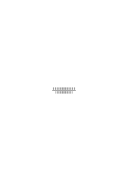
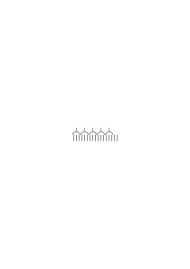
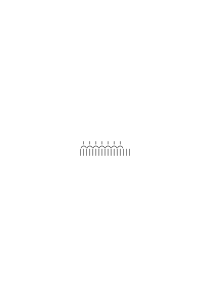
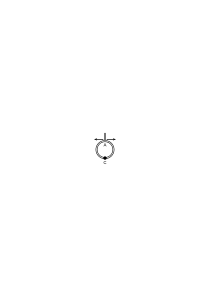

# Bemerkungen über die Grundlagen der Mathematik – III

1939–1940, 356 remarks, Ms-122, Ms-117

### [Ms-122](/ms-122/#5r.2+5v.1): [5r\[2\]](https://cdn.wittgensteinnachlass.com/2000px/webp/Ms-122/5r.webp),[5v\[1\]](https://cdn.wittgensteinnachlass.com/2000px/webp/Ms-122/5v.webp)

1. 25.10.1939

‘Ein Mathematischer Beweis muß übersichtlich sein.’ “Beweis” nennen wir nur eine Struktur, deren Reproduktion eine leicht lösbare Aufgabe ist. Es muß sich mit Sicherheit entscheiden lassen, ob wir hier wirklich zweimal den gleichen Beweis vor uns haben, oder nicht. Der Beweis muß ein Bild sein, welches sich mit Sicherheit genau reproduzieren läßt. Oder auch: was dem Beweise wesentlich ist muß sich mit Sicherheit genau reproduzieren lassen. Er kann z.B. in zwei verschiedenen Handschriften oder Farben niedergeschrieben sein. Zur Reproduktion eines Beweises soll nichts gehören was von der Art einer genauen Reproduktion eines Farbtones oder einer Handschrift ist.

### [Ms-122](/ms-122/#5v.2+6r.1+6v.1): [5v\[2\]](https://cdn.wittgensteinnachlass.com/2000px/webp/Ms-122/5v.webp),[6r\[1\]](https://cdn.wittgensteinnachlass.com/2000px/webp/Ms-122/6r.webp),[6v\[1\]](https://cdn.wittgensteinnachlass.com/2000px/webp/Ms-122/6v.webp)

Es muß leicht sein _genau_ diesen Beweis wieder anzuschreiben. Hierin liegt der Vorteil des Geschriebenen im Vergleich zum gezeichneten Beweis. Dieser ist oft seinem Wesen nach mißverstanden worden. Die Zeichnung eines Euklidischen Beweises kann ungenau sein, in dem Sinne, daß die Geraden nicht gerade sind die Kreisbögen nicht genau kreisförmig etc. etc. & dabei ist die Zeichnung doch ein exakter Beweis & dies zeigt daß diese Zeichnung nicht – z.B. – demonstriert daß eine solche Konstruktion ein Vieleck mit 5 gleichlangen Seiten ergibt, daß sie einen Satz der Geometrie, nicht einen über die Eigenschaften von Papier, Zirkel, Lineal & Bleistift beweist.

### [Ms-122](/ms-122/#7r.2): [7r\[2\]](https://cdn.wittgensteinnachlass.com/2000px/webp/Ms-122/7r.webp)

Denken wir uns nun einen Russellschen Beweis für einen Additionssatz der Art a + b = c der aus ein paar tausend Zeichen bestünde. Du wirst sagen: Zu sehen, ob dieser Beweis stimmt, oder nicht, ist eine rein äußerliche Schwierigkeit, die von keinem mathematischen Interesse ist. (“Ein Mensch übersieht leicht, was ein anderer schwer oder garnicht übersieht”– etc. etc.)

### [Ms-122](/ms-122/#6v.3+7r.1): [6v\[3\]](https://cdn.wittgensteinnachlass.com/2000px/webp/Ms-122/6v.webp),[7r\[1\]](https://cdn.wittgensteinnachlass.com/2000px/webp/Ms-122/7r.webp)

2. 27.10.1939

Ich will sagen: Wenn man eine nicht übersichtliche Beweisfigur durch Veränderung der Notation übersehbar macht, dann schafft man erst einen Beweis, wo früher keiner war.

### [Ms-122](/ms-122/#7v.2): [7v\[2\]](https://cdn.wittgensteinnachlass.com/2000px/webp/Ms-122/7v.webp)

Die Annahme ist, daß die Definitionen nur zur Abkürzung des Ausdrucks dienen, zur Bequemlichkeit des Rechnenden; während sie doch ein Teil der Rechnung sind.

Mit ihrer Hilfe werden Ausdrücke erzeugt, die ohne ihre Hilfe nicht erzeugt werden könnten.

### [Ms-122](/ms-122/#8r.2+8v.1): [8r\[2\]](https://cdn.wittgensteinnachlass.com/2000px/webp/Ms-122/8r.webp),[8v\[1\]](https://cdn.wittgensteinnachlass.com/2000px/webp/Ms-122/8v.webp)

3. Wie ist es aber damit: “Man kann zwar im R'schen Kalkül nicht 234 mit 537 multiplizieren – im gewöhnlichen Sinn – aber es gibt eine R'sche Rechnung die dieser Multiplikation entspricht”? – Welcher Art ist diese Entsprechung? Es könnte so sein:

Man kann auch im R'schen Kalkül diese Multiplikation ausführen nur in einem andern Symbolismus – wie wir ja auch sagen würden wir könnten sie auch in einem andern Zahlensystem ausführen. Wir könnten dann also z.B. die praktischen Aufgaben, zu deren Lösung man jene Multiplikation benützt auch durch die Rechnung im R'schen Kalkül lösen, nur umständlicher.

### [Ms-122](/ms-122/#8v.2+9r.1): [8v\[2\]](https://cdn.wittgensteinnachlass.com/2000px/webp/Ms-122/8v.webp),[9r\[1\]](https://cdn.wittgensteinnachlass.com/2000px/webp/Ms-122/9r.webp)

Denken wir uns nun die Kardinalzahlen erklärt als 1, 1 + 1, (1 + 1) + 1, ((1 + 1) + 1) + 1, u.s.f.. Du sagst, die Definitionen welche die Ziffern des Dezimalsystems einführen dienen bloß zur Bequemlichkeit; man könnte die Rechnung 703000 × 40000101 auch in jener langwierigen Schreibweise ausführen. Aber stimmt das? – “Freilich stimmt es! Ich kann doch eine Rechnung in jener Notation anschreiben, konstruieren, die der Rechnung in der Dezimalnotation entspricht.” – Aber wie weiß ich, daß sie ihr entspricht? – Nun, weil ich sie nach einer gewissen Methode aus der andern abgeleitet habe. – Aber wenn ich sie nun nach einer halben Stunde wieder anschaue, kann sie sich da nicht verändert haben? Sie ist ja nicht übersehbar.

### [Ms-122](/ms-122/#9r.2): [9r\[2\]](https://cdn.wittgensteinnachlass.com/2000px/webp/Ms-122/9r.webp)

Ich frage nun: könnten wir uns von der Wahrheit des Satzes 7034174 + 6594321 = 13628495 auch durch einen Beweis überzeugen, der in der ersten Notation geführt wäre? – Gibt es so einen Beweis dieses Satzes? – Die Antwort ist: nein.

### [Ms-122](/ms-122/#11r.2): [11r\[2\]](https://cdn.wittgensteinnachlass.com/2000px/webp/Ms-122/11r.webp)

4. Aber lehrt uns Russell nicht doch _eine_ Art des Addierens?

### [Ms-122](/ms-122/#11r.3+11v.1): [11r\[3\]](https://cdn.wittgensteinnachlass.com/2000px/webp/Ms-122/11r.webp),[11v\[1\]](https://cdn.wittgensteinnachlass.com/2000px/webp/Ms-122/11v.webp)

30.10.1939

Angenommen wir bewiesen auf R's Methode daß (∃a‥‥․g) ‥‥ (∃a‥‥․i) ⊃ (∃a‥‥․s) eine Tautologie ist; könnten wir nun unser Resultat dahin ausdrücken, g + i sei s? Das setzt doch voraus, daß ich die drei Stücke des Alphabets als Repräsentanten des Beweises nehmen kann. Aber zeigt denn das R's Beweis? Den R'schen Beweis hätte ich doch offenbar auch mit solchen Gruppen von Zeichen in den Klammern führen können, deren Reihenfolgen für mich nichts Charakteristisches gehabt hätten, so daß es nicht möglich gewesen wäre die Zeichengruppe in einer Klammer durch ihr letztes Glied zu repräsentieren.

### [Ms-122](/ms-122/#11v.2+12r.1): [11v\[2\]](https://cdn.wittgensteinnachlass.com/2000px/webp/Ms-122/11v.webp),[12r\[1\]](https://cdn.wittgensteinnachlass.com/2000px/webp/Ms-122/12r.webp)

Angenommen sogar, der R'sche Beweis werde mit einer Notation der Art <math class="stacked" display="inline"><msub><mi>x</mi><mn>1</mn></msub><msub><mi>x</mi><mn>2</mn></msub><mspace width="0.3em"/><mtext>…</mtext><msub><mi>x</mi><mn>10</mn></msub><msub><mi>x</mi><mn>11</mn></msub><mspace width="0.3em"/><mtext>…</mtext><msub><mi>x</mi><mn>100</mn></msub><mspace width="0.3em"/><mtext>…</mtext></math> als in der Dezimalnotation geführt, & es seien 100 Glieder in der ersten 300 Glieder in der zweiten & 400 Glieder in der dritten Klammer, zeigt der Beweis selbst dann, daß 100 + 300 = 400 ist? – Wie wenn dieser Beweis einmal zu diesem einmal zu einem andern Resultat führte z.B. 100 + 300 = 420? Was bedarf es, um zu sehen daß das Resultat des Beweises, wenn er richtig geführt ist, immer nur von den letzten Ziffern der ersten zwei Klammern abhängt?

### [Ms-122](/ms-122/#12r.2+12v.1): [12r\[2\]](https://cdn.wittgensteinnachlass.com/2000px/webp/Ms-122/12r.webp),[12v\[1\]](https://cdn.wittgensteinnachlass.com/2000px/webp/Ms-122/12v.webp)

Aber für kleine Zahlen lehrt uns doch Russell addieren; denn dann übersehen wir eben die Zeichengruppen in den Klammern & können _sie_ als Zahlzeichen nehmen; z.B. ‘xy’, ‘xyz’, ‘xyzuv’.

Russell lehrt uns also einen anderen Kalkül, um von 2 und 3 zu 5 zu gelangen; & das stimmt auch dann, wenn wir sagen der logische Kalkül sei nur – ‘frills’, die dem arithmetischen Kalkül angehängt seien.

### [Ms-122](/ms-122/#12v.2+13r.1): [12v\[2\]](https://cdn.wittgensteinnachlass.com/2000px/webp/Ms-122/12v.webp),[13r\[1\]](https://cdn.wittgensteinnachlass.com/2000px/webp/Ms-122/13r.webp)

Die _Anwendung_ der Rechnung muß für sich selber sorgen. Und das ist, was am ‘Formalismus’ richtig ist. Die Zurückführung der Arithmetik auf symbolische Logik soll die Applikation der Arithmetik zeigen; gleichsam den Ansatz, mittels welchem sie auf ihrer Anwendung sitzt. So als zeigte man Einem erst eine Trompete ohne das Mundstück – & nun das Mundstück, welches uns zeigt, wie eine Trompete verwendet, geblasen, wird. Das Ansatzstück aber, das uns Russell gibt, ist einerseits zu eng anderseits zu weit; zu allgemein und zu speziell. Die Rechnung sorgt für ihre eigene Anwendung.

### [Ms-122](/ms-122/#13r.2+13v.1): [13r\[2\]](https://cdn.wittgensteinnachlass.com/2000px/webp/Ms-122/13r.webp),[13v\[1\]](https://cdn.wittgensteinnachlass.com/2000px/webp/Ms-122/13v.webp)

Wir dehnen unsre Ideen von den Rechnungen mit kleinen Zahlen auf die mit großen Zahlen aus, ähnlich wie wir uns vorstellen, daß wenn die Distanz von hier zur Sonne mit dem Zollstock gemessen werden _könnte_ dann eben das herauskäme was wir heute auf ganz andere Art herausbringen. Das heißt, wir sind geneigt die Längenmessung mit dem Zollstab zum Modell zu nehmen auch für die Messung des Abstandes zweier Sterne. Und man sagt, etwa in der Schule: “Wenn wir uns Zollstäbe von hier bis zur Sonne gelegt denken, …” & scheint damit zu erklären, was wir unter dem Abstand zwischen Sonne und Erde verstehen. Und der Gebrauch eines solchen Bildes ist ganz in Ordnung, so lange es uns klar ist daß wir den Abstand von uns zur Sonne messen können & daß wir ihn nicht mit Zollstäben messen können.

### [Ms-122](/ms-122/#13v.2+14r.1): [13v\[2\]](https://cdn.wittgensteinnachlass.com/2000px/webp/Ms-122/13v.webp),[14r\[1\]](https://cdn.wittgensteinnachlass.com/2000px/webp/Ms-122/14r.webp)

5. 31.10.1939

Wie, wenn jemand sagen würde: “der eigentliche Beweis von 1000 + 1000 = 2000 ist doch erst der Russellsche, der zeigt, daß der Ausdruck … eine Tautologie ist”? Kann ich denn nicht beweisen, daß eine Tautologie herauskommt, wenn ich in den beiden ersten Klammern je 1000 Glieder & in der dritten 2000 habe? Und wenn ich das beweisen kann, so kann ich das als Beweis des arithmetischen Satzes ansehen.

### [Ms-122](/ms-122/#14r.2): [14r\[2\]](https://cdn.wittgensteinnachlass.com/2000px/webp/Ms-122/14r.webp)

In der Philosophie ist es immer gut, statt einer Beantwortung einer Frage eine _Frage_ zu setzen. Denn eine Beantwortung der philosophischen Frage könnte ungerecht sein; ihre Erledigung mittels einer andern Frage ist es nicht.

### [Ms-122](/ms-122/#14r.3): [14r\[3\]](https://cdn.wittgensteinnachlass.com/2000px/webp/Ms-122/14r.webp)

Soll ich also z.B. hier eine _Frage_ setzen statt der Antwort, man könne jenen arithm. Satz mit R's Methode nicht beweisen?

### [Ms-122](/ms-122/#14v.1+15r.1): [14v\[1\]](https://cdn.wittgensteinnachlass.com/2000px/webp/Ms-122/14v.webp),[15r\[1\]](https://cdn.wittgensteinnachlass.com/2000px/webp/Ms-122/15r.webp)

6. 01.11.1939

Der Beweis, daß <math class="stacked" display="inline"><msup><mo>(</mo><mn>1</mn></msup><mo>)</mo><msup><mo>(</mo><mn>2</mn></msup><mo>)</mo><mspace width="0.3em"/><mo>⊃</mo><msup><mo>(</mo><mn>3</mn></msup><mo>)</mo></math>

eine Tautologie ist, besteht darin, daß man immer ein Glied der 3ten Klammer für ein Glied von 1 oder 2 abstreicht. Und es gibt ja viele Methoden dieses Kollationierens. Oder man könnte auch sagen: es gibt viele Arten & Weisen, das Gelingen der 1 → 1 Zuordnung festzustellen. Eine Art wäre z.B. sternförmige Muster eins für die linke eins für die rechte Seite der Implikation zu konstruieren & diese wieder dadurch zu vergleichen daß man ein Ornament aus beiden bildet. Man könnte also die Regel geben: “Wenn Du wissen willst, ob die Zahlen A & B zusammen wirklich C ergeben, schreib einen Ausdruck der Form … an & ordne die Variablen in den Klammern einander zu indem Du den Beweis dafür anschreibst (oder anzuschreiben trachtest) daß der Ausdruck eine Tautologie ist.” Mein Einwand dagegen ist nun _nicht_, daß es willkürlich ist, gerade diese Art des Kollationierens vorzuschreiben, sondern, daß man auf diese Weise nicht feststellen kann, daß 1000 + 1000 = 2000 ist.

### [Ms-122](/ms-122/#16r.4+16v.1): [16r\[4\]](https://cdn.wittgensteinnachlass.com/2000px/webp/Ms-122/16r.webp),[16v\[1\]](https://cdn.wittgensteinnachlass.com/2000px/webp/Ms-122/16v.webp)

7. 03.11.1939

Denke, Du hättest eine meilenlange ‘Formel’ angeschrieben, & zeigtest durch Transformation, daß sie tautologisch ist (‘wenn sie sich inzwischen nicht verändert hat’, müßte man sagen). Nun _zählen_ wir die Glieder in den Klammern oder teilen sie ab & machen den Ausdruck übersichtlich & es zeigt sich, daß in der ersten Klammer 7566 in der zweiten 2434 in der dritten 10000 Glieder stehen. Habe ich nun bewiesen, daß 2434 + 7566 = 10000 ist? – Das kommt drauf an – könnte man sagen – ob Du sicher bist, daß das Zählen wirklich die Zahlen der Glieder ergeben hat, die während des Beweises in den Klammern standen.

### [Ms-122](/ms-122/#16v.2+17r.1): [16v\[2\]](https://cdn.wittgensteinnachlass.com/2000px/webp/Ms-122/16v.webp),[17r\[1\]](https://cdn.wittgensteinnachlass.com/2000px/webp/Ms-122/17r.webp)

Könnte man so sagen: “R. lehrt uns in die 3te Klammer so viele Zeichen schreiben als in den beiden ersten zusammen stehen”? Aber eigentlich: er lehrt uns für je eine Variable in (1) & in (2) eine Variable in (3) schreiben. Aber lernen wir dadurch welche Zahl die Summe zweier gegebener Zahlen ist? Vielleicht sagt man: “Freilich, denn in der 3ten Klammer steht nun das Paradigma, Urbild, der neuen Zahl.” Aber inwiefern ist ∣∣∣∣∣∣∣∣∣∣∣∣∣∣∣∣ das Paradigma einer Zahl? Bedenke, wie man es als solches verwenden kann.

### [Ms-122](/ms-122/#21v.3+22r.1): [21v\[3\]](https://cdn.wittgensteinnachlass.com/2000px/webp/Ms-122/21v.webp),[22r\[1\]](https://cdn.wittgensteinnachlass.com/2000px/webp/Ms-122/22r.webp)

8. 09.11.1939

Die R'sche Tautologie, die dem Satz a + b = c entspricht, zeigt uns vor allem nicht in welcher Notation die Zahl c zu schreiben ist & es ist kein Grund warum sie nicht in der Form a + b geschrieben werden soll. –Denn R. lehrt uns ja nicht die Technik des Addierens, etwa, im Dezimalsystem. – Aber könnten wir sie vielleicht aus seiner Technik ableiten? Fragen wir einmal so: Kann man die Technik des Dezimalsystems aus der des Systems 1, 1 + 1, (1 + 1) + 1, etc. ableiten? Könnte man diese Frage nicht auch so stellen: Wenn man eine Rechentechnik in dem einen System & eine im andern System hat, – wie zeigt man, daß die beiden äquivalent sind?

### [Ms-122](/ms-122/#26v.2): [26v\[2\]](https://cdn.wittgensteinnachlass.com/2000px/webp/Ms-122/26v.webp)

9. “Ein Beweis soll nicht nur zeigen, daß es so ist, sondern daß es so sein muß.”

### [Ms-122](/ms-122/#26v.3): [26v\[3\]](https://cdn.wittgensteinnachlass.com/2000px/webp/Ms-122/26v.webp)

Unter welchen Umständen zeigt dies das Zählen?

### [Ms-122](/ms-122/#26v.4+27r.1): [26v\[4\]](https://cdn.wittgensteinnachlass.com/2000px/webp/Ms-122/26v.webp),[27r\[1\]](https://cdn.wittgensteinnachlass.com/2000px/webp/Ms-122/27r.webp)

17.11.1939

{ Man möchte sagen: wenn die Ziffern & das Gezählte ein einprägsames Bild ergeben. Wenn dieses Bild nun statt jedes neuen Zählens dieser Menge gebraucht wird. – Aber hier scheinen wir nur von _räumlichen_ Bilden zu reden: wenn wir aber eine Reihe von Wörtern auswendig wissen & nun zwei solche Reihen einander eins zu eins zuordnen indem wir z.B. sagen

“der erste – Montag; der zweite – Dienstag; der dritte – Mittwoch; etc.” – können wir so nicht _beweisen_ daß vom Montag zum Donnerstag vier Tage sind? Es fragt sich eben: Was nennen wir ein “einprägsames Bild”. Was ist das Kriterium davon, daß wir es uns eingeprägt haben? Oder ist die Antwort hierauf: “Daß wir es als Paradigma der Identität benützen!”?

### [Ms-122](/ms-122/#27r.2): [27r\[2\]](https://cdn.wittgensteinnachlass.com/2000px/webp/Ms-122/27r.webp)

10. Wir machen nicht _Versuche_, an einem Satz, oder Beweis, um seine Eigenschaften festzustellen.

### [Ms-122](/ms-122/#27r.3+27v.1): [27r\[3\]](https://cdn.wittgensteinnachlass.com/2000px/webp/Ms-122/27r.webp),[27v\[1\]](https://cdn.wittgensteinnachlass.com/2000px/webp/Ms-122/27v.webp)

Wie reproduzieren wir, kopieren wir einen Beweis? – Nicht, z.B., indem wir Messungen an ihm anstellen.

### [Ms-122](/ms-122/#27v.2+28r.1): [27v\[2\]](https://cdn.wittgensteinnachlass.com/2000px/webp/Ms-122/27v.webp),[28r\[1\]](https://cdn.wittgensteinnachlass.com/2000px/webp/Ms-122/28r.webp)

Wie wenn ein Beweis so ungeheuer lang wäre, daß man ihn unmöglich übersehen könnte – oder sehen wir einen anderen Fall an: Man habe als Paradigma der Zahl die wir 1000 nennen eine lange Reihe von Strichen in einen harten Fels gegraben. Diese Reihe nennen wir die Ur-Tausend & um zu erfahren, ob tausend Menschen auf einem Platz sind ziehen wir Striche, oder spannen Schnüre (1 → 1 Zuordnung). Hier hat nun das Zahlzeichen für 1000 nicht die Identität einer Gestalt sondern eines physikalischen Gegenstandes. Wir können uns ähnlich eine Ur-Hundert etc. denken & einen Beweis daß 10 × 100 = 1000 ist, den wir nicht _übersehen_ könnten.

### [Ms-122](/ms-122/#28r.2): [28r\[2\]](https://cdn.wittgensteinnachlass.com/2000px/webp/Ms-122/28r.webp)

Die Ziffer für 1000 im 1 + 1 + 1 + 1… System kann nicht durch ihre _Gestalt_ erkannt werden.

### [Ms-122](/ms-122/#28r.4+28v.1): [28r\[4\]](https://cdn.wittgensteinnachlass.com/2000px/webp/Ms-122/28r.webp),[28v\[1\]](https://cdn.wittgensteinnachlass.com/2000px/webp/Ms-122/28v.webp)

11. <math display="inline"><mtext>∣</mtext><mtext>∣</mtext><mtext>∣</mtext><mtext>∣</mtext><mtext>∣</mtext><mtext>∣</mtext><mtext>∣</mtext><mtext>∣</mtext><mtext>∣</mtext><mtext>∣</mtext><mtext>∣</mtext><mtext>∣</mtext><mtext>∣</mtext><mtext>∣</mtext><mtext>∣</mtext><mtext>∣</mtext><mtext>∣</mtext><mtext>∣</mtext><mtext>∣</mtext><mtext>∣</mtext><mtext>∣</mtext><mtext>∣</mtext><mtext>∣</mtext><mtext>∣</mtext><mtext>∣</mtext><mtext>∣</mtext><mtext>∣</mtext><mtext><mo>|</mo></mtext><mtext>∣</mtext><mtext>∣</mtext><mtext>∣</mtext><mtext>∣</mtext><mtext>∣</mtext><mtext>∣</mtext><mtext>∣</mtext><mtext>∣</mtext><mtext>∣</mtext><mtext>∣</mtext><mtext>∣</mtext><mtext>∣</mtext><mtext>∣</mtext><mtext>∣</mtext><mtext>∣</mtext><mtext>∣</mtext></math>

Ist diese Figur ein Beweis für 27 + 16 = 43: weil man zu “27” kommt, wenn man die Striche der linken Seite zählt, zu “16” auf der rechten Seite, & zu “43” wenn man die ganze Reihe zählt?

Worin liegt hier das Seltsame – wenn man die Figur den Beweis dieses Satzes nennt? Doch darin, wie dieser Beweis zu reproduzieren ist, oder wiederzuerkennen ist, darin, daß er keine charakteristische visuelle Gestalt hat. –

### [Ms-122](/ms-122/#28v.3+29r.1): [28v\[3\]](https://cdn.wittgensteinnachlass.com/2000px/webp/Ms-122/28v.webp),[29r\[1\]](https://cdn.wittgensteinnachlass.com/2000px/webp/Ms-122/29r.webp)

Wenn nun jener Beweis auch keine visuelle Gestalt hat, so kann ich ihn dennoch genau kopieren(, reproduzieren) – ist die Figur also nicht doch der Beweis? Ich könnte ihn etwa in ein Stahlstück einritzen & von Hand zu Hand gehen lassen. Ich würde also Einem sagen: “Hier hast Du den Beweis, daß 27 + 16 = 43 ist.” – – Nun, kann man nicht _doch_ sagen: er beweise den Satz mit Hilfe der Figur? Doch; aber die Figur ist nicht der Beweis.

### [Ms-122](/ms-122/#29r.2+29v.1): [29r\[2\]](https://cdn.wittgensteinnachlass.com/2000px/webp/Ms-122/29r.webp),[29v\[1\]](https://cdn.wittgensteinnachlass.com/2000px/webp/Ms-122/29v.webp)

Das aber würde man doch einen Beweis von 250 + 3220 = 3470 nennen: man zählt über 250 hinaus & fängt zugleich auch bei 1 zu zählen an & ordnet die beiden Zählungen einander zu: 251 … 1 252 … 2 253 … 3 etc. 3470 …3220 Man könnte das einen Beweis nennen, der durch 3220 Stufen fortschreitet. Das ist doch ein Beweis – & kann man ihn übersichtlich nennen??

### [Ms-122](/ms-122/#30r.2+30v.1): [30r\[2\]](https://cdn.wittgensteinnachlass.com/2000px/webp/Ms-122/30r.webp),[30v\[1\]](https://cdn.wittgensteinnachlass.com/2000px/webp/Ms-122/30v.webp)

12. Wie kannst Du sagen, daß Russell den Satz “250 + 3220 = 3470” nicht beweisen kann?! Denk Dir einfach, daß man die Definitionen 1 + 1 = 2, 2 + 1 = 3, etc. nicht _darum_ auswendig weiß, weil sie einem System folgen – man weiß sie eben auswendig. Was ist die Erfindung des Dezimalsystems eigentlich? Die Erfindung eines Systems von Kürzungen – – aber was ist das System der Kürzungen ? ist es bloß das System der neuen Zeichen, oder auch ein System ihrer Anwendungen als Abkürzung? Und ist es das letztere, dann ist es ja eine neue Anschauungsart des alten Zeichensystems.

### [Ms-122](/ms-122/#30v.2): [30v\[2\]](https://cdn.wittgensteinnachlass.com/2000px/webp/Ms-122/30v.webp)

Können wir vom 1 + 1 + 1… System kommend, durch bloße Abkürzungen der Schreibweise im Dezimalsystem rechnen lernen?

### [Ms-122](/ms-122/#31v.2+32r.1): [31v\[2\]](https://cdn.wittgensteinnachlass.com/2000px/webp/Ms-122/31v.webp),[32r\[1\]](https://cdn.wittgensteinnachlass.com/2000px/webp/Ms-122/32r.webp)

13. Angenommen ich habe nach Russell einen Satz der Form (∃xyz…) (∃uvw…) ⊃ (∃abc…) bewiesen – & nun ‘mache ich ihn übersichtlich’, indem ich über die Variablen Zeichen <math class="stacked" display="inline"><msub><mi>x</mi><mn>1</mn></msub><mo>,</mo><msub><mi>x</mi><mn>2</mn></msub><mo>,</mo><msub><mi>x</mi><mn>3</mn></msub><mtext>…</mtext></math> schreibe – soll ich nun sagen, ich habe nach Russell einen arithmetischen Satz im Dezimalsystem bewiesen?

### [Ms-122](/ms-122/#32r.2): [32r\[2\]](https://cdn.wittgensteinnachlass.com/2000px/webp/Ms-122/32r.webp)

22.11.1939

Aber jedem Beweis in Dezimalsystem entspricht doch einer im Russellschen System! – Woher wissen wir, daß es so ist? Lassen wir die Intuition beiseite. – Aber man kann es beweisen. –

### [Ms-122](/ms-122/#32r.3): [32r\[3\]](https://cdn.wittgensteinnachlass.com/2000px/webp/Ms-122/32r.webp)

Wenn man eine Zahl im Dezimalsystem aus 1, 2, 3 ‥․ 9, 0 definiert & die Zeichen 0,1…9 aus 1, 1 + 1, (1 + 1) + 1, ‥․, kann man dann durch die rekursive Erklärung des Dezimalsystems hindurch von irgendeiner Zahl zu einem Zeichen der Form 1 + 1 + 1… gelangen?

### [Ms-122](/ms-122/#32v.1): [32v\[1\]](https://cdn.wittgensteinnachlass.com/2000px/webp/Ms-122/32v.webp)

Wie, wenn Einer sagte: Die R.sche Arithmetik stimmt mit der gewöhnlichen bis zu Zahlen unter 1010 überein; dann aber weicht sie von ihr ab. Und nun führt er uns einen R-Beweis dafür vor daß 1010 + 1 = 1010 ist. Warum soll ich nun einem solchen Beweis nicht trauen? Wie wird man mich davon überzeugen, daß ich mich im R-Beweis verrechnet haben muß? Brauche ich denn aber einen Beweis aus einem anderen System, um mich zu überzeugen, ob ich mich in dem ersten Beweis verrechnet habe? Genügt es nicht, daß ich diesen Beweis übersehbar anschreibe?

### [Ms-122](/ms-122/#32v.2+33r.1): [32v\[2\]](https://cdn.wittgensteinnachlass.com/2000px/webp/Ms-122/32v.webp),[33r\[1\]](https://cdn.wittgensteinnachlass.com/2000px/webp/Ms-122/33r.webp)

14. 23.11.1939

Liegt denn nicht meine ganze Schwierigkeit darin, einzusehen, wie man, ohne aus R's logischem Kalkül herauszutreten zum Begriff der _Menge von Variablen_ im Ausdruck “(∃ x,y,z etc.)” kommen kann, dort wo dieses Zeichen nicht übersehbar ist? – Nun kann man ihn aber doch übersehbar machen indem man schreibt:

(<math class="stacked" display="inline"><mo>∃</mo><msub><mi>x</mi><mn>1</mn></msub><mo>,</mo><msub><mi>x</mi><mn>2</mn></msub><mo>,</mo><msub><mi>x</mi><mn>3</mn></msub><mo>,</mo><mtext>etc</mtext><mn>.</mn></math>). Und dennoch verstehe ich etwas nicht: man hat doch nun das Kriterium für die Identität so eines Ausdrucks geändert! Ich sehe jetzt auf andere Weise, daß die Menge der Zeichen in zwei solchen Ausdrücken die selbe ist.

### [Ms-122](/ms-122/#33v.2): [33v\[2\]](https://cdn.wittgensteinnachlass.com/2000px/webp/Ms-122/33v.webp)

Ich bin eben versucht zu sagen: R's Beweis kann wohl Stufe für Stufe weitergehen, aber am Schluß wisse man nicht recht was man bewiesen habe – wenigstens nicht nach den alten Kriterien; indem ich den R-schen Beweis übersichtlich mache, beweise ich etwas über diesen Beweis.

### [Ms-122](/ms-122/#33v.3+34r.1+34v.1): [33v\[3\]](https://cdn.wittgensteinnachlass.com/2000px/webp/Ms-122/33v.webp),[34r\[1\]](https://cdn.wittgensteinnachlass.com/2000px/webp/Ms-122/34r.webp),[34v\[1\]](https://cdn.wittgensteinnachlass.com/2000px/webp/Ms-122/34v.webp)

Ich will sagen: man brauche die R'sche Rechentechnik gar nicht anzuerkennen, & könne mit einer andern (Rechentechnik) beweisen, daß es einen R'schen Beweis des Satzes geben _müsse_. Dann aber ruht der Satz freilich nicht mehr auf dem R-Beweis. Oder: Daß man sich zu jedem bewiesenen Satz der Form m + n = l einen R'schen Beweis vorstellen kann, zeigt nicht daß der Satz auf diesem Beweis ruht. Denn der Fall ist denkbar, daß man den R-Beweis eines Satzes vom R-Beweis eines andern Satzes gar nicht unterscheiden kann & nur darum sagt sie seien verschieden, weil sie die Übersetzungen zweier erkennbar verschiedener Beweise sind.

### [Ms-122](/ms-122/#34v.2): [34v\[2\]](https://cdn.wittgensteinnachlass.com/2000px/webp/Ms-122/34v.webp)

Oder: Etwas hört auf Beweis zu sein, wenn es aufhört Paradigma zu sein, z.B. R.'s logischer Kalkül; & anderseits ist jeder andere Kalkül annehmbar, der uns als Paradigma dient.

### [Ms-122](/ms-122/#36v.2): [36v\[2\]](https://cdn.wittgensteinnachlass.com/2000px/webp/Ms-122/36v.webp)

15. 25.11.1939

Es ist eine Tatsache, daß verschiedene Methoden der Zählung so gut wie immer übereinstimmen.

### [Ms-122](/ms-122/#36v.3+37r.1): [36v\[3\]](https://cdn.wittgensteinnachlass.com/2000px/webp/Ms-122/36v.webp),[37r\[1\]](https://cdn.wittgensteinnachlass.com/2000px/webp/Ms-122/37r.webp)

Wenn ich die Felder eines Schachbretts zähle, komme ich so gut wie immer zu ‘64’.

### [Ms-122](/ms-122/#37r.2): [37r\[2\]](https://cdn.wittgensteinnachlass.com/2000px/webp/Ms-122/37r.webp)

Wenn ich zwei Reihen von Wörtern auswendig weiß, z.B., Zahlwörter & das Alphabet & ich ordne sie nun einander 1 → 1 zu a 1 b 2 c 3 etc.

so komme ich bei ‘z’ so gut wie immer zu ‘26’.

### [Ms-122](/ms-122/#37r.3+37v.1+38r.1): [37r\[3\]](https://cdn.wittgensteinnachlass.com/2000px/webp/Ms-122/37r.webp),[37v\[1\]](https://cdn.wittgensteinnachlass.com/2000px/webp/Ms-122/37v.webp),[38r\[1\]](https://cdn.wittgensteinnachlass.com/2000px/webp/Ms-122/38r.webp)

Es gibt (so) etwas wie: eine Reihe von Wörtern auswendig können. Wann sagt man ich wisse das Gedicht … auswendig? Die Kriterien sind ziemlich kompliziert. Übereinstimmung mit dem gedruckten Texte ist eines. Was müßte geschehen, das mich zweifeln machte, daß ich wirklich das ABC auswendig weiß? Es ist schwer vorzustellen. Aber ich verwende nun das Aufsagen, oder Anschreiben aus dem Gedächtnis, einer Wortfolge als Kriterium der Zahlengleichheit, Mengengleichheit. [I'm much too slick & all I produce is pretty slick. Es hat nicht genug Falten im Gesicht sondern ist oberflächlich & von glatter Stirn. Zugleich macht es fälschlich den Eindruck der Tiefe, denn es ist von Einem geschrieben der sich so gern tief wüßte. Das Gesicht ist zu faltenlos; aber Falten kommen vom _Kummer_, nicht von der Bequemlichkeit. Wer auf dem Kummer schwimmen will, um ja nie unterzutauchen, wie sollte der Tiefe kennen. Mein ganzes Leben (inneres & äußeres) ist darauf angelegt, auf sicherem Boot _auf_ dem Meere, auf der Oberfläche, zu schwimmen. Ich will doch gar nicht zahlen; wie sollte ich erhalten?]

### [Ms-122](/ms-122/#38r.2): [38r\[2\]](https://cdn.wittgensteinnachlass.com/2000px/webp/Ms-122/38r.webp)

Soll ich nun sagen: Das macht ja alles nichts – die Logik bleibt doch der Grundkalkül nur wird freilich, ob ich zweimal dieselbe Formel vor mir habe, von Fall zu Fall verschieden festgestellt.

### [Ms-122](/ms-122/#38v.3): [38v\[3\]](https://cdn.wittgensteinnachlass.com/2000px/webp/Ms-122/38v.webp)

16. Es ist nicht die Logik, die mich zwingt – möchte ich sagen – einen Satz von der Form (∃) (∃) ⊃ (∃) anzuerkennen, wenn in den ersten beiden Klammern je eine Million Variable ist & in der dritten zwei Millionen. Ich will sagen: die Logik zwänge mich in diesem Falle gar nicht irgend einen Satz anzuerkennen. Etwas _anderes_ zwingt mich so einen Satz als der Logik gemäß anzuerkennen.

### [Ms-122](/ms-122/#38v.4+39r.1): [38v\[4\]](https://cdn.wittgensteinnachlass.com/2000px/webp/Ms-122/38v.webp),[39r\[1\]](https://cdn.wittgensteinnachlass.com/2000px/webp/Ms-122/39r.webp)

27.11.1939

Die Logik zwingt mich nur, sofern mich der logische Kalkül zwingt.

### [Ms-122](/ms-122/#39r.2+39v.1): [39r\[2\]](https://cdn.wittgensteinnachlass.com/2000px/webp/Ms-122/39r.webp),[39v\[1\]](https://cdn.wittgensteinnachlass.com/2000px/webp/Ms-122/39v.webp)

Aber es ist doch dem Kalkül mit 1000000 wesentlich, daß sich diese Zahl muß in eine Summe 1 + 1 + 1… auflösen lassen! Und um sicher zu sein, daß wir die richtige Anzahl von Einsern vor uns haben, können wir ja die Einser numerieren. <math class="stacked" display="inline"><mfrac linethickness="0"><mrow><mn>1</mn></mrow><mrow><mn>1</mn></mrow></mfrac><mspace width="0.3em"/><mo>+</mo><mfrac linethickness="0"><mrow><mn>1</mn></mrow><mrow><mn>2</mn></mrow></mfrac><mspace width="0.3em"/><mo>+</mo><mfrac linethickness="0"><mrow><mn>1</mn></mrow><mrow><mn>3</mn></mrow></mfrac><mspace width="0.3em"/><mo>+</mo><mfrac linethickness="0"><mrow><mn>1</mn></mrow><mrow><mn>4</mn></mrow></mfrac><mspace width="0.3em"/><mo>+</mo><mspace width="0.3em"/><mtext>…</mtext><mfrac linethickness="0"><mrow><mo>+</mo><mspace width="0.3em"/><mn>1</mn></mrow><mrow><mn>1000000</mn></mrow></mfrac></math> Diese Notation wäre ähnlich der: ‘100,000.000,000’, die ja auch das Zahlzeichen übersehbar macht. Und ich kann mir doch denken, jemand hätte große Summen Geldes in Pfennigen in ein Buch eingetragen wo sie etwa als 100-stellige Zahlen erschienen, mit denen ich nun zu rechnen hätte. Ich finge nun damit an, sie mir in eine übersehbare Notation zu übersetzen, würde sie aber doch ‘Zahlzeichen’ nennen, sie als Dokumente von Zahlen behandeln. Ja ich würde es sogar als Dokument einer Zahl ansehen, wenn mir einer sagte N hat soviele Schillinge, als Erbsen in dieses Faß gehen. Anders wieder: “Er hat soviele Schillinge als das Hohelied Buchstaben hat”.

### [Ms-122](/ms-122/#39v.3): [39v\[3\]](https://cdn.wittgensteinnachlass.com/2000px/webp/Ms-122/39v.webp)

17. 29.11.1939

Die Notation ‘<math class="stacked" display="inline"><msub><mi>x</mi><mn>1</mn></msub><mo>,</mo><msub><mi>x</mi><mn>2</mn></msub><mo>,</mo><msub><mi>x</mi><mn>3</mn></msub><mtext>…</mtext></math>’ macht den Ausdruck ‘(∃…)’ zur Gestalt & damit die R-bewiesene Tautologie.

### [Ms-122](/ms-122/#39v.4+40r.1): [39v\[4\]](https://cdn.wittgensteinnachlass.com/2000px/webp/Ms-122/39v.webp),[40r\[1\]](https://cdn.wittgensteinnachlass.com/2000px/webp/Ms-122/40r.webp)

Laß mich so fragen: Ist es nicht möglich, daß die 1 → 1 Zuordnung im R.schen Beweis nicht verläßlich vollzogen werden kann, daß, _z.B._, wenn wir sie zum Addieren benützen wollen, regelmäßig sich ein dem gewöhnlichen Resultat widersprechendes ergibt, & daß wir das auf eine Ermüdung schieben, die , ohne daß wir's wissen uns gewisse Schritte überspringen läßt? Und könnten wir dann nicht sagen: – wenn wir nur nicht ermüdeten, würde sich dieses Resultat ergeben –? Darum, weil es die _Logik_ fordert? Fordert sie es denn? Kontrollieren wir (hier) nicht die Logik mit einem anderen Kalkül?

### [Ms-122](/ms-122/#40v.1): [40v\[1\]](https://cdn.wittgensteinnachlass.com/2000px/webp/Ms-122/40v.webp)

Nehmen wir an wir nähmen immer 100 Schritte des logischen Kalküls zusammen & erhielten nun verläßliche Resultate, während wir sie nicht erhalten, wenn wir alle Schritte auszuführen versuchen – – man möchte sagen: die Rechnung basiert ja doch auf Einerschritten, da ein Hunderterschritt durch Einerschritte definiert ist. – Die Definition sagt doch: einen Hunderterschritt machen sei dasselbe wie …, – & doch machen wir den Hunderterschritt & _nicht_ die hundert Einerschritte. Beim abgekürzten _Rechnen_ folge ich doch einer _Regel_ – – & wie wurde diese Regel abgeleitet? – Wie, wenn der gekürzte & der ungekürzte Beweis verschiedene Resultate ergeben?

### [Ms-122](/ms-122/#41r.1): [41r\[1\]](https://cdn.wittgensteinnachlass.com/2000px/webp/Ms-122/41r.webp)

18. 30.11.1939

Was ich sage kommt doch darauf hinaus: daß ich, z.B., ‘10’ als ‘1 + 1 + 1 + 1…’ definieren kann & ‘100 × 2’ als ‘2 + 2 + 2…’, aber darum nicht notwendig ‘100 × 10’ als ‘10 + 10 + 10…’ oder gar als ‘1 + 1 + 1 + 1…’.

### [Ms-122](/ms-122/#41r.2): [41r\[2\]](https://cdn.wittgensteinnachlass.com/2000px/webp/Ms-122/41r.webp)

Ich kann mich davon, daß 100 × 100 = 10000 ist durch ein ‘abgekürztes’ Verfahren überzeugen. Warum soll ich dann nicht _dieses_ als das ursprüngliche Beweisverfahren betrachten?

### [Ms-122](/ms-122/#41r.3): [41r\[3\]](https://cdn.wittgensteinnachlass.com/2000px/webp/Ms-122/41r.webp)

Ein abgekürztes Verfahren lehrt mich, was bei dem unabgekürzten herauskommen _soll_. (Statt daß es umgekehrt wäre.)

### [Ms-122](/ms-122/#41v.1): [41v\[1\]](https://cdn.wittgensteinnachlass.com/2000px/webp/Ms-122/41v.webp)

19. 01.12.1939

“Die Rechnung basiert ja doch auf den Einerschritten …” Ja; aber auf andre Weise. Der Beweisvorgang ist eben ein anderer.

### [Ms-122](/ms-122/#41v.2): [41v\[2\]](https://cdn.wittgensteinnachlass.com/2000px/webp/Ms-122/41v.webp)

Ich könnte z.B. sagen:

10 = 1 + 1 + 1 + 1 + 1 + 1 + 1 + 1 + 1 + 1 und _gleichermaßen_ 100 = 10 + 10 + 10 + 10 + 10 + 10 + 10 + 10 + 10 + 10. Habe ich nicht die Erklärung von 100 auf die sukzessive Addition von 1 basiert? Aber in der selben Weise, als hätte ich 100 Einser addiert? Braucht es in meiner Notation überhaupt ein Zeichen der Form – ‘1 + 1 + 1…’ mit 100 Summanden geben?

### [Ms-122](/ms-122/#41v.3+42r.1): [41v\[3\]](https://cdn.wittgensteinnachlass.com/2000px/webp/Ms-122/41v.webp),[42r\[1\]](https://cdn.wittgensteinnachlass.com/2000px/webp/Ms-122/42r.webp)

Die Gefahr scheint hier zu sein, das gekürzte Verfahren als einen blassen Schatten des ungekürzten anzusehen. Die Regel des Zählens ist nicht das Zählen.

### [Ms-122](/ms-122/#42r.2): [42r\[2\]](https://cdn.wittgensteinnachlass.com/2000px/webp/Ms-122/42r.webp)

20. 02.12.1939

Worin besteht es 100 Schritte des Kalküls ‘zusammenzunehmen’? Doch darin, daß man nicht die Einerschritte sondern einen andern Schritt als maßgebend ansieht.

### [Ms-122](/ms-122/#42v.2+43r.1): [42v\[2\]](https://cdn.wittgensteinnachlass.com/2000px/webp/Ms-122/42v.webp),[43r\[1\]](https://cdn.wittgensteinnachlass.com/2000px/webp/Ms-122/43r.webp)

Beim gewöhnlichen Addieren von Zahlen im Dezimalsystem machen wir Einerschritte, Zehnerschritte, etc.. Kann man sagen, das Verfahren basiere auf dem, nur Einerschritte zu machen? Und man könnte es so begründen: Das Resultat der Addition schaut allerdings so aus – ‘7583’, aber die Erklärung dieses Zeichens, seine Bedeutung, die endlich auch in seiner Anwendung zum Ausdruck kommen muß ist doch der Art: 1 + 1 + 1 + 1 + 1 u.s.f.. Aber ist dem so? Muß das Zahlzeichen so erklärt werden oder diese Erklärung implicite in seiner Anwendung zum Ausdruck kommen? Ich glaube, wenn wir nachdenken zeigt sich's, es ist nicht der Fall.

### [Ms-122](/ms-122/#43r.2): [43r\[2\]](https://cdn.wittgensteinnachlass.com/2000px/webp/Ms-122/43r.webp)

Das Rechnen mit Kurven oder mit dem Rechenschieber. Freilich wenn wir die eine Art des Rechnens mit der anderen kontrollieren, kommt normalerweise dasselbe heraus. Wenn es nun aber mehrere Arten gibt – wer sagt, wenn sie nicht übereinstimmen, welches die eigentliche, d.h. aus dem _Wesen_ der Zahl stammende, Rechnungsweise ist?

### [Ms-122](/ms-122/#44r.2): [44r\[2\]](https://cdn.wittgensteinnachlass.com/2000px/webp/Ms-122/44r.webp)

21. 04.12.1939

Wo ein Zweifel darüber auftauchen kann, ob _dies_ wirklich das Bild _dieses_ Beweises ist, wo wir bereit sind die Identität eines Beweises anzuzweifeln, dort hat die Ableitung ihre Beweiskraft verloren. Denn der Beweis dient uns ja als Maß.

### [Ms-122](/ms-122/#44r.3): [44r\[3\]](https://cdn.wittgensteinnachlass.com/2000px/webp/Ms-122/44r.webp)

Könnte man sagen: Zu einem Beweise gehört ein von uns anerkanntes Kriterium der richtigen Reproduktion des Beweises?

### [Ms-122](/ms-122/#44r.4+44v.1): [44r\[4\]](https://cdn.wittgensteinnachlass.com/2000px/webp/Ms-122/44r.webp),[44v\[1\]](https://cdn.wittgensteinnachlass.com/2000px/webp/Ms-122/44v.webp)

D.h., (auf den gewöhnlichen Fall angewandt), es muß uns als sicher feststehen, daß wir beim Beweisen (z.B.) kein Zeichen übersehen haben. Daß uns kein Teufelchen betrogen haben kann, indem es Zeichen ohne unserm Wissen verschwinden ließ, hinzusetzte, etc.

### [Ms-122](/ms-122/#44v.3): [44v\[3\]](https://cdn.wittgensteinnachlass.com/2000px/webp/Ms-122/44v.webp)

Man könnte sagen: Wenn man sagen kann: “auch wenn uns ein Dämon betrogen hätte, so wäre doch alles in Ordnung”, dort hat der Schabernack, den er uns antun wollte, eben seinen Zweck verfehlt.

### [Ms-122](/ms-122/#45r.2): [45r\[2\]](https://cdn.wittgensteinnachlass.com/2000px/webp/Ms-122/45r.webp)

22. 05.12.1939

Der Beweis, könnte man sagen, zeigt nicht bloß, _daß_ es so ist, sondern: _wie_ es so ist. Er zeigt, _wie_ 13 + 14 27 ergeben.

### [Ms-122](/ms-122/#45r.3): [45r\[3\]](https://cdn.wittgensteinnachlass.com/2000px/webp/Ms-122/45r.webp)

“Der Beweis muß übersehbar sein” – heißt: wir müssen bereit sein, ihn als Richtschnur unseres [(nicht-mathematischen)] Urteilens zu gebrauchen.

### [Ms-122](/ms-122/#45r.4): [45r\[4\]](https://cdn.wittgensteinnachlass.com/2000px/webp/Ms-122/45r.webp)

Wenn ich sage “der Beweis ist ein Bild” – so kann man sich ihn auch als kinematographisches Bild denken.

### [Ms-122](/ms-122/#45v.1): [45v\[1\]](https://cdn.wittgensteinnachlass.com/2000px/webp/Ms-122/45v.webp)

Den Beweis macht man ein für alle Mal.

### [Ms-122](/ms-122/#46v.2): [46v\[2\]](https://cdn.wittgensteinnachlass.com/2000px/webp/Ms-122/46v.webp)

Der Beweis muß natürlich vorbildlich sein.

### [Ms-122](/ms-122/#46v.3): [46v\[3\]](https://cdn.wittgensteinnachlass.com/2000px/webp/Ms-122/46v.webp)

08.12.1939

Der Beweis(, (das Beweisbild)) zeigt uns das Resultat eines Vorgangs (der Konstruktion); & wir sind überzeugt, daß ein _so_ geregeltes Vorgehen (immer) zu diesem Bild führe.

### [Ms-122](/ms-122/#47r.1): [47r\[1\]](https://cdn.wittgensteinnachlass.com/2000px/webp/Ms-122/47r.webp)

(Der Beweis führt uns ein synthetisches Faktum vor.)

### [Ms-122](/ms-122/#47r.3): [47r\[3\]](https://cdn.wittgensteinnachlass.com/2000px/webp/Ms-122/47r.webp)

23. 09.12.1939

Mit dem Satz, der Beweis sei ein Vorbild, – dürfen wir natürlich nichts neues sagen.

### [Ms-122](/ms-122/#47r.4): [47r\[4\]](https://cdn.wittgensteinnachlass.com/2000px/webp/Ms-122/47r.webp)

Der Beweis muß ein Vorgang sein, von dem ich sage: Ja, so muß es sein; das muß herauskommen, wenn ich mich nach dieser Regel richte.

### [Ms-122](/ms-122/#47r.5+47v.1): [47r\[5\]](https://cdn.wittgensteinnachlass.com/2000px/webp/Ms-122/47r.webp),[47v\[1\]](https://cdn.wittgensteinnachlass.com/2000px/webp/Ms-122/47v.webp)

Der Beweis, könnte man sagen, muß ursprünglich eine Art Experiment sein – wird aber dann einfach als Bild genommen.

### [Ms-122](/ms-122/#47v.2): [47v\[2\]](https://cdn.wittgensteinnachlass.com/2000px/webp/Ms-122/47v.webp)

Wenn ich 200 Äpfel & 200 Äpfel zusammenschütte & zähle, & es es kommt 400 heraus, so ist das kein Beweis für 200 + 200 = 400. D.h., wir würden dieses Faktum nicht als Paradigma zur Beurteilung aller ähnlichen Situationen verwenden wollen.

### [Ms-122](/ms-122/#47v.3): [47v\[3\]](https://cdn.wittgensteinnachlass.com/2000px/webp/Ms-122/47v.webp)

Zu sagen: “diese 200 Äpfel & diese 200 Äpfel geben 400”– sagt: Wenn man sie zusammenschüttet, kommt keiner weg, noch dazu, sie verhalten sich _normal_.

### [Ms-122](/ms-122/#48r.3): [48r\[3\]](https://cdn.wittgensteinnachlass.com/2000px/webp/Ms-122/48r.webp)

24. 11.12.1939

‘Das ist das Vorbild der Addition von 200 & 200’– nicht: ‘ Das ist das Vorbild davon, daß 200 & 200 addiert 400 ergeben’. Der Vorgang des Addierens _er**gab**_ allerdings 400, aber dies Resultat nehmen wir nun zum Kriterium der richtigen Addition – oder einfach: der Addition – dieser Zahlen.

### [Ms-122](/ms-122/#48v.2): [48v\[2\]](https://cdn.wittgensteinnachlass.com/2000px/webp/Ms-122/48v.webp)

← Der Beweis muß unser Vorbild, unser Bild, davon sein, wie diese Operationen _ein Ergebnis_ haben.

### [Ms-122](/ms-122/#48r.4): [48r\[4\]](https://cdn.wittgensteinnachlass.com/2000px/webp/Ms-122/48r.webp)

Der ‘bewiesene Satz’ drückt aus, was aus dem Beweisbild abzulesen ist.

### [Ms-122](/ms-122/#48v.1): [48v\[1\]](https://cdn.wittgensteinnachlass.com/2000px/webp/Ms-122/48v.webp)

Der Beweis ist uns ein Paradigma des richtigen Zusammenzählens von 200 Äpfeln & 200 Äpfeln: D.h., er bestimmt einen neuen Begriff: ‘das Zusammenzählen von 200 & 200 Gegenständen’. Oder man könnte auch sagen: “ein neues Kriterium dafür, daß nichts weggekommen, oder dazugekommen ist”.

### [Ms-122](/ms-122/#48v.3): [48v\[3\]](https://cdn.wittgensteinnachlass.com/2000px/webp/Ms-122/48v.webp)

Der Beweis _definiert_ das ‘richtige Zusammenzählen’.

### [Ms-122](/ms-122/#48v.4+49r.1): [48v\[4\]](https://cdn.wittgensteinnachlass.com/2000px/webp/Ms-122/48v.webp),[49r\[1\]](https://cdn.wittgensteinnachlass.com/2000px/webp/Ms-122/49r.webp)

Der Beweis ist unser Vorbild eines bestimmten _Ergebens_,– welches als Vergleichsobjekt (Maßstab) für wirkliche Veränderungen dient.

### [Ms-122](/ms-122/#50r.2): [50r\[2\]](https://cdn.wittgensteinnachlass.com/2000px/webp/Ms-122/50r.webp)

25. Der Beweis überzeugt uns von etwas – – aber nicht der Gemütszustand der Überzeugung interessiert uns jetzt, sondern die Handlungen die diese Überzeugung belegen.

### [Ms-122](/ms-122/#50r.3): [50r\[3\]](https://cdn.wittgensteinnachlass.com/2000px/webp/Ms-122/50r.webp)

Daher läßt uns die Aussage, der Beweis überzeuge uns von der Wahrheit dieses Satzes, kalt, da dieser Ausdruck der verschiedensten Auslegungen fähig ist.

### [Ms-122](/ms-122/#50r.4+50v.1): [50r\[4\]](https://cdn.wittgensteinnachlass.com/2000px/webp/Ms-122/50r.webp),[50v\[1\]](https://cdn.wittgensteinnachlass.com/2000px/webp/Ms-122/50v.webp)

Wenn ich sage: “der Beweis überzeugt mich von etwas”, so muß aber der Satz, der dieser Überzeugung Ausdruck gibt nicht im Beweise konstruiert werden. Wie wir z.B. multiplizieren, aber nicht notwendigerweise das Ergebnis in Form des Satzes … × … = … hinschreiben. Man wird also wohl sagen, die Multiplikation gebe uns diese Überzeugung, ohne daß der _Satz_ der sie ausdrückt je ausgesprochen wird.

### [Ms-122](/ms-122/#51r.2): [51r\[2\]](https://cdn.wittgensteinnachlass.com/2000px/webp/Ms-122/51r.webp)

Ein psychologischer Nachteil der Beweise, die _Sätze_ konstruieren, ist, daß sie uns leichter vergessen lassen, daß der _Sinn_ des Resultats nicht aus diesem allein abzulesen (ist), sondern aus dem _Beweis_. In dieser Hinsicht hat das Eindringen des Russellschen Symbolismus in die Beweise viel Schaden gemacht.

### [Ms-122](/ms-122/#51r.3+51v.1): [51r\[3\]](https://cdn.wittgensteinnachlass.com/2000px/webp/Ms-122/51r.webp),[51v\[1\]](https://cdn.wittgensteinnachlass.com/2000px/webp/Ms-122/51v.webp)

Die Russellschen Zeichen hüllen die wichtigen Formen des Beweises, gleichsam, bis zur Unkenntlichkeit ein, wie wenn eine menschliche Gestalt in (viele) Tücher gewickelt ist.

### [Ms-122](/ms-122/#52r.4+52v.1): [52r\[4\]](https://cdn.wittgensteinnachlass.com/2000px/webp/Ms-122/52r.webp),[52v\[1\]](https://cdn.wittgensteinnachlass.com/2000px/webp/Ms-122/52v.webp)

26. 18.12.1939

Bedenken wir, wir werden in der Mathematik von _grammatischen_ Sätzen überzeugt; der Ausdruck, das Ergebnis, dieser Überzeugtheit ist also, daß wir eine _Regel annehmen_.

### [Ms-122](/ms-122/#52v.2): [52v\[2\]](https://cdn.wittgensteinnachlass.com/2000px/webp/Ms-122/52v.webp)

Nichts ist wahrscheinlicher, als daß der Wortausdruck des Resultats eines mathem. Beweises dazu angetan ist, uns einen Mythus vorzumachen. Wie sollte es nicht so sein, da jeder Ausdruck in diesen Sätzen in einer sehr speziellen, & dabei, gewissermaßen, übertragenen Bedeutung gebraucht wird.

### [Ms-122](/ms-122/#53r.1): [53r\[1\]](https://cdn.wittgensteinnachlass.com/2000px/webp/Ms-122/53r.webp)

27. Ich will etwa sagen: Wenn auch der bewiesene mathematische Satz hinaus auf eine Realität außerhalb (seiner selbst) zu deuten scheint, (so) ist er doch nur (der) Ausdruck der Anerkennung eines neuen Maßes (der Realität).

### [Ms-122](/ms-122/#53r.2): [53r\[2\]](https://cdn.wittgensteinnachlass.com/2000px/webp/Ms-122/53r.webp)

Wir nehmen also (aus diesen Grundlagen, auf diese Weise) die Konstruierbarkeit (Beweisbarkeit) dieses Symbols (nämlich des math. Satzes) zum Zeichen dafür, daß wir Symbole so & so transformieren sollen – – –

### [Ms-122](/ms-122/#53r.3+53v.1): [53r\[3\]](https://cdn.wittgensteinnachlass.com/2000px/webp/Ms-122/53r.webp),[53v\[1\]](https://cdn.wittgensteinnachlass.com/2000px/webp/Ms-122/53v.webp)

Wir haben uns im Beweis zu einer Erkenntnis durchgerungen? Und der letzte Satz spricht diese Erkenntnis aus? Ist diese Erkenntnis nun frei vom Beweise (ist die Nabelschnur abgeschnitten)? – Nun, der Satz wird jetzt allein & ohne das Anhängsel des Beweises verwendet.

### [Ms-122](/ms-122/#53v.2): [53v\[2\]](https://cdn.wittgensteinnachlass.com/2000px/webp/Ms-122/53v.webp)

Warum soll ich nicht sagen: ich habe mich, im Beweis, zu einer Entscheidung durchgerungen?

### [Ms-122](/ms-122/#53v.3): [53v\[3\]](https://cdn.wittgensteinnachlass.com/2000px/webp/Ms-122/53v.webp)

Der Beweis stellt diese Entscheidung in ein System von Entscheidungen.

### [Ms-122](/ms-122/#53v.4): [53v\[4\]](https://cdn.wittgensteinnachlass.com/2000px/webp/Ms-122/53v.webp)

(Ich könnte natürlich auch sagen: “der Beweis überzeugt mich von der Zweckmäßigkeit dieser Regel”. Aber das zu sagen könnte leicht irreführen.)

### [Ms-122](/ms-122/#53v.5): [53v\[5\]](https://cdn.wittgensteinnachlass.com/2000px/webp/Ms-122/53v.webp)

28. 20.12.1939

Der durch den Beweis bewiesene Satz dient als Regel, also als Paradigma. Denn nach der Regel _richten_ wir uns.

### [Ms-122](/ms-122/#54r.1): [54r\[1\]](https://cdn.wittgensteinnachlass.com/2000px/webp/Ms-122/54r.webp)

Aber bringt uns der Beweis nur dazu, daß wir uns nach dieser Regel richten (sie anerkennen), oder zeigt er uns auch, _wie_ wir uns nach ihr richten sollen?

### [Ms-122](/ms-122/#54r.2): [54r\[2\]](https://cdn.wittgensteinnachlass.com/2000px/webp/Ms-122/54r.webp)

Der math. Satz soll uns ja zeigen, was zu sagen _Sinn_ hat.

### [Ms-122](/ms-122/#54r.3+54v.1): [54r\[3\]](https://cdn.wittgensteinnachlass.com/2000px/webp/Ms-122/54r.webp),[54v\[1\]](https://cdn.wittgensteinnachlass.com/2000px/webp/Ms-122/54v.webp)

Der Beweis konstruiert einen Satz; aber es kommt eben drauf an _wie_ er ihn konstruiert. Manchmal z.B. konstruiert er zuerst eine _Zahl_ & dann folgt der Satz, daß es eine solche Zahl gibt. Wenn wir sagen, die Konstruktion müsse uns von dem Satz _überzeugen_, so heißt das, daß sie uns dazu bringen muß, diesen Satz so & so anzuwenden. Daß sie uns bestimmen muß, das als Sinn, das nicht als Sinn anzuerkennen.

### [Ms-122](/ms-122/#54v.2): [54v\[2\]](https://cdn.wittgensteinnachlass.com/2000px/webp/Ms-122/54v.webp)

29. 21.12.1939

Was hat der Zweck einer Euklidischen Konstruktion, etwa der Halbierung der Strecke, mit dem Zweck der Ableitung einer Regel aus Regeln mittels logischer Schlüsse gemein?

### [Ms-122](/ms-122/#54v.3): [54v\[3\]](https://cdn.wittgensteinnachlass.com/2000px/webp/Ms-122/54v.webp)

Das Gemeinsame scheint zu sein, daß ich durch die Konstruktion eines Zeichens die Anerkennung eines Zeichens erzwinge.

### [Ms-122](/ms-122/#54v.4+55r.1): [54v\[4\]](https://cdn.wittgensteinnachlass.com/2000px/webp/Ms-122/54v.webp),[55r\[1\]](https://cdn.wittgensteinnachlass.com/2000px/webp/Ms-122/55r.webp)

Könnte man sagen: “Die Mathematik schafft neue _Ausdrücke_, nicht neue Sätze”?? In**so**fern nämlich, als die mathematischen Sätze ein für allemal in die Sprache aufgenommene Instrumente sind – & ihr Beweis die Stelle zeigt, an der sie stehen.

### [Ms-122](/ms-122/#55r.2): [55r\[2\]](https://cdn.wittgensteinnachlass.com/2000px/webp/Ms-122/55r.webp)

Inwiefern sind aber z.B. Russells Tautologien ‘Instrumente der Sprache’? Russell hätte sie jedenfalls nicht für solche gehalten. Sein Irrtum, wenn ein solcher vorlag, konnte aber nur darin bestehen, daß er auf ihre _Anwendung_ nicht acht hatte.

### [Ms-122](/ms-122/#55r.3+55v.1): [55r\[3\]](https://cdn.wittgensteinnachlass.com/2000px/webp/Ms-122/55r.webp),[55v\[1\]](https://cdn.wittgensteinnachlass.com/2000px/webp/Ms-122/55v.webp)

Der Beweis läßt ein Gebilde aus einem anderen entstehen. Er führt uns die Entstehung von einem aus anderen vor. Das ist alles recht gut – aber er leistet doch damit in verschiedenen Fällen ganz Verschiedenes! Was ist das _Interesse_ dieser Überleitung?!

### [Ms-122](/ms-122/#55v.2): [55v\[2\]](https://cdn.wittgensteinnachlass.com/2000px/webp/Ms-122/55v.webp)

Wenn ich auch den Beweis in einem Archiv der Sprache niedergelegt denke, wer sagt, _wie_ dies Instrument zu verwenden ist, wozu es dient!

### [Ms-122](/ms-122/#55v.3+56r.1): [55v\[3\]](https://cdn.wittgensteinnachlass.com/2000px/webp/Ms-122/55v.webp),[56r\[1\]](https://cdn.wittgensteinnachlass.com/2000px/webp/Ms-122/56r.webp)

30. 22.12.1939

Der Beweis bringt mich dazu zu sagen, das _müsse_ sich so verhalten. ‒ ‒ Nun, das versteh ich im Fall eines Euklidischen Beweises oder eines Beweises von “25 × 25 = 625”, aber ist es auch so im Fall eines R.schen Beweises etwa von “⊢ p⊃q ∙ p․⊃․q”? Was heißt hier ‘es _müsse_ sich so verhalten’, im Gegensatz zu ‘es verhält sich so’? Soll ich sagen: “nun ich nehme diesen Ausdruck als Paradigma für alle nichtssagenden Sätze dieser Form an”?

### [Ms-122](/ms-122/#56r.2): [56r\[2\]](https://cdn.wittgensteinnachlass.com/2000px/webp/Ms-122/56r.webp)

Ich gehe den Beweis durch & sage: “Ja, so _muß_ es sein; ich muß den Gebrauch der Sprache _so_ festlegen”. Ich schlage gleichsam einen Bolzen ein, & schließe damit gewisse Bewegungen aus.

### [Ms-122](/ms-122/#56r.3): [56r\[3\]](https://cdn.wittgensteinnachlass.com/2000px/webp/Ms-122/56r.webp)

Ich will sagen, daß das _Muß_ einem Gleise entspricht, das ich in der Sprache lege.

### [Ms-122](/ms-122/#56v.3+57r.1): [56v\[3\]](https://cdn.wittgensteinnachlass.com/2000px/webp/Ms-122/56v.webp),[57r\[1\]](https://cdn.wittgensteinnachlass.com/2000px/webp/Ms-122/57r.webp)

31. 24.12.1939

Wenn ich sagte, ein Beweis führe einen neuen Begriff ein so meinte ich so etwas wie: der Beweis setze ein neues Paradigma zu den Paradigmen der Sprache; etwa wie wenn man ein besonderes rötlich-blau mischte die besondere Farbmischung irgendwie festlegte, & ihr einen Namen gäbe. Aber wenn wir auch geneigt sind, einen Beweis ein solches neues Paradigma zu nennen – was ist die genaue Ähnlichkeit eines Beweises zu so einem Paradigma? Man möchte sagen: der Beweis ändert die Grammatik unserer Sprache, ändert unsere Begriffe. Er macht neue Zusammenhänge & er schafft den Begriff dieser Zusammenhänge. (Er stellt nicht fest, daß sie da sind, sondern sie bestehen nicht, ehe er sie nicht macht.)

### [Ms-122](/ms-122/#57v.2): [57v\[2\]](https://cdn.wittgensteinnachlass.com/2000px/webp/Ms-122/57v.webp)

32. Welchen Begriff schafft ‘p⊃p’? Und doch ist es mir als könnte man sagen “p⊃p” diene uns als Begriffszeichen. “p⊃p” ist eine Formel. Legt eine Formel einen Begriff fest? Man kann sagen: “daraus folgt nach der Formel … das & das”. Oder auch: “daraus folgt auf die Art (& Weise) … das & das”. Aber ist das ein Satz, wie ich ihn wünsche? Wie ist es aber damit “Zieh' daraus die Konsequenz auf die Art …”?

### [Ms-122](/ms-122/#58r.2): [58r\[2\]](https://cdn.wittgensteinnachlass.com/2000px/webp/Ms-122/58r.webp)

33. Wenn ich vom Beweis sage, er sei ein Vorbild(, ein Bild,) so muß ich es auch von einer R.schen primitive proposition sagen (als der Eizelle eines Beweises).

### [Ms-122](/ms-122/#58r.3+58v.1): [58r\[3\]](https://cdn.wittgensteinnachlass.com/2000px/webp/Ms-122/58r.webp),[58v\[1\]](https://cdn.wittgensteinnachlass.com/2000px/webp/Ms-122/58v.webp)

Man kann fragen: Wie ist man darauf gekommen den Satz “p⊃p” als eine wahre Behauptung auszusprechen? Nun, man hat ihn nicht im praktischen Sprachverkehr gebraucht, – aber dennoch war man geneigt ihn unter besondern Umständen (wenn man z.B. Logik betrieb) _mit Überzeugung_ auszusprechen.

### [Ms-122](/ms-122/#59r.5+59v.1): [59r\[5\]](https://cdn.wittgensteinnachlass.com/2000px/webp/Ms-122/59r.webp),[59v\[1\]](https://cdn.wittgensteinnachlass.com/2000px/webp/Ms-122/59v.webp)

Wie ist es aber mit ‘p⊃p’? Ich sehe in ihm einen degenerierten Satz, der auf der Seite der Wahrheit ist. Ich lege ihn als wichtigen Schnittpunkt von Sätzen fest. Ein Angelpunkt der Darstellung.

### [Ms-122](/ms-122/#61r.3+61v.1): [61r\[3\]](https://cdn.wittgensteinnachlass.com/2000px/webp/Ms-122/61r.webp),[61v\[1\]](https://cdn.wittgensteinnachlass.com/2000px/webp/Ms-122/61v.webp)

34. 28.12.1939

Die Konstruktion des Beweises beginnt mit irgend welchen Zeichen, & unter diesen müssen einige, die ‘Konstanten’ in der Sprache schon Bedeutung haben. So ist es wesentlich daß “ ⌵ ” & “~” schon eine uns geläufige Anwendung besitzen & die Konstruktion eines Beweises in den Principia Mathematica nimmt ihre Wichtigkeit, ihren Sinn, daher. Die Zeichen aber des Beweises lassen ihre Bedeutung _nicht_ erkennen.

### [Ms-122](/ms-122/#61v.2): [61v\[2\]](https://cdn.wittgensteinnachlass.com/2000px/webp/Ms-122/61v.webp)

Die ‘Verwendung’ des Beweises hat natürlich mit jener Verwendung seiner Zeichen zu tun.

### [Ms-122](/ms-122/#61v.4+62r.1): [61v\[4\]](https://cdn.wittgensteinnachlass.com/2000px/webp/Ms-122/61v.webp),[62r\[1\]](https://cdn.wittgensteinnachlass.com/2000px/webp/Ms-122/62r.webp)

35. Wie gesagt, ich bin ja auch schon von den primitive propositions Russell's in gewissem Sinne überzeugt. Die Überzeugung also, die der Beweis hervorbringt kann nicht nur von der Beweiskonstruktion herrühren.

### [Ms-122](/ms-122/#64v.2): [64v\[2\]](https://cdn.wittgensteinnachlass.com/2000px/webp/Ms-122/64v.webp)

36. Wenn ich das Urmeter in Paris sähe, aber die Institution des Messens & ihren Zusammenhang mit dem ‘Urmeter’ nicht kennte – könnte ich sagen, ich kenne den Begriff des Urmeters?

### [Ms-122](/ms-122/#64v.3): [64v\[3\]](https://cdn.wittgensteinnachlass.com/2000px/webp/Ms-122/64v.webp)

Ist nicht auch so die Beweiskonstruktion ein Teil einer Institution?

### [Ms-122](/ms-122/#64v.4+65r.1): [64v\[4\]](https://cdn.wittgensteinnachlass.com/2000px/webp/Ms-122/64v.webp),[65r\[1\]](https://cdn.wittgensteinnachlass.com/2000px/webp/Ms-122/65r.webp)

Der Beweis ist ein Instrument – aber warum sage ich: “ein Instrument der Sprache“? Ist denn die Rechnung notwendigerweise ein Instrument der Sprache?

---

### [Ms-122](/ms-122/#66r.2): [66r\[2\]](https://cdn.wittgensteinnachlass.com/2000px/webp/Ms-122/66r.webp)

37. Was ich immer tue, scheint zu sein, zwischen Sinnbestimmung & Sinnverwendung einen Unterschied hervorzuheben.

### [Ms-122](/ms-122/#68r.4+68v.1): [68r\[4\]](https://cdn.wittgensteinnachlass.com/2000px/webp/Ms-122/68r.webp),[68v\[1\]](https://cdn.wittgensteinnachlass.com/2000px/webp/Ms-122/68v.webp)

38. Den Beweis anerkennen: Man kann ihn anerkennen als Paradigma der Figur, die entsteht, wenn _diese_ Regeln richtig auf gewisse Figuren angewandt wurden. Man kann ihn anerkennen als die richtige Ableitung einer Schlußregel. Oder als eine richtige Ableitung aus einem richtigen Erfahrungssatz; oder als die richtige Ableitung aus einem falschen Erfahrungssatz; oder einfach als die richtige Ableitung aus einem Erfahrungssatz, von dem wir nicht wissen ob er wahr oder falsch ist.

### [Ms-122](/ms-122/#69r.2+69v.1): [69r\[2\]](https://cdn.wittgensteinnachlass.com/2000px/webp/Ms-122/69r.webp),[69v\[1\]](https://cdn.wittgensteinnachlass.com/2000px/webp/Ms-122/69v.webp)

Kann ich nun aber sagen, daß die Auffassung des Beweises als ‘Beweises der Konstruierbarkeit’ des bewiesenen Satzes in irgend einem Sinn(e) eine einfachere, primärere, als jede andre Auffassung ist? Kann ich also sagen: “Ein jeder Beweis beweist _vor allem_, daß diese Zeichenform herauskommen muß wenn ich diese Regeln auf diese Zeichenformen anwende”?

Oder: “Der Beweis beweist vor allem, daß diese Zeichenform entstehen kann, wenn man nach diesen Transformationsregeln mit diesen Zeichen operiert. – Das würde auf eine geometrische Anwendung deuten. Denn der Satz dessen Wahrheit, wie ich sage, hier bewiesen ist, ist ein geometrischer Satz, ein Satz Grammatik die Transformierungen von Zeichen betreffend. Man könnte z.B. sagen: es sei bewiesen, daß es _Sinn_ habe zu sagen, jemand habe das Zeichen … nach diesen Regeln aus … & … erhalten, aber keinen Sinn etc. etc..

### [Ms-122](/ms-122/#70r.3): [70r\[3\]](https://cdn.wittgensteinnachlass.com/2000px/webp/Ms-122/70r.webp)

Oder: Wenn man die Mathematik jedes Inhalts entkleide, so bleibe, daß gewisse Zeichen aus andern nach gewissen Regeln sich konstruieren lassen. –

### [Ms-122](/ms-122/#70r.4): [70r\[4\]](https://cdn.wittgensteinnachlass.com/2000px/webp/Ms-122/70r.webp)

Das Mindeste, was wir anerkennen (müssen) sei: daß dies Zeichen etc. etc. – & diese Anerkennung liege jeder anderen zu Grunde. –

### [Ms-122](/ms-122/#70v.1): [70v\[1\]](https://cdn.wittgensteinnachlass.com/2000px/webp/Ms-122/70v.webp)

Ich möchte nun sagen: Die Zeichenfolge des Beweises zieht nicht notwendigerweise irgendein Anerkennen nach sich. Wenn wir aber einmal mit dem Anerkennen anfangen, dann braucht es nicht das ‘geometrische’ zu sein.

### [Ms-122](/ms-122/#70v.2): [70v\[2\]](https://cdn.wittgensteinnachlass.com/2000px/webp/Ms-122/70v.webp)

Ein Beweis könnte doch aus bloß zwei Stufen bestehen: etwa einem Satz ‘(x).f(x)’ & einem ‘f(a)’ – spielt hier das richtige Übergehen nach einer Regel eine wichtige Rolle?

### [Ms-122](/ms-122/#72r.3): [72r\[3\]](https://cdn.wittgensteinnachlass.com/2000px/webp/Ms-122/72r.webp)

39. 01.01.1940

_Was_ ist unerschütterlich gewiß am Bewiesenen?

### [Ms-122](/ms-122/#72r.4+72v.1): [72r\[4\]](https://cdn.wittgensteinnachlass.com/2000px/webp/Ms-122/72r.webp),[72v\[1\]](https://cdn.wittgensteinnachlass.com/2000px/webp/Ms-122/72v.webp)

Einen Satz als unerschütterlich gewiß anzunehmen – will ich sagen – heißt, ihn als grammatische Regel zu verwenden: dadurch entzieht man ihn der Ungewißheit.

### [Ms-122](/ms-122/#72v.2): [72v\[2\]](https://cdn.wittgensteinnachlass.com/2000px/webp/Ms-122/72v.webp)

“Der Beweis muß übersehbar sein” heißt eigentlich nichts andres als: der Beweis ist kein Experiment. Was sich in ihm ergibt nehmen wir nicht deshalb an weil es sich einmal ergibt, oder weil es sich oft ergibt. Sondern wir sehen im Beweis den Grund dafür, zu sagen, daß es sich ergeben _muß_.

### [Ms-122](/ms-122/#72v.3+73r.1): [72v\[3\]](https://cdn.wittgensteinnachlass.com/2000px/webp/Ms-122/72v.webp),[73r\[1\]](https://cdn.wittgensteinnachlass.com/2000px/webp/Ms-122/73r.webp)

Nicht, daß das Zuordnen zu diesem Resultat führt _beweist_– sondern daß wir überredet werden, diese Erscheinungen (Bilder) als Vorbilder zu nehmen dafür, wie es ausschaut, wenn ….

### [Ms-122](/ms-122/#73r.2): [73r\[2\]](https://cdn.wittgensteinnachlass.com/2000px/webp/Ms-122/73r.webp)

Der Beweis ist unser neues Vorbild dafür wie es ausschaut, wenn nichts weg- & nichts dazukommt, wenn wir richtig zählen, etc..

### [Ms-122](/ms-122/#73r.3+73v.1): [73r\[3\]](https://cdn.wittgensteinnachlass.com/2000px/webp/Ms-122/73r.webp),[73v\[1\]](https://cdn.wittgensteinnachlass.com/2000px/webp/Ms-122/73v.webp)

Ich will sagen: mit der Logik der Principia Mathematica könnte man eine Arithmetik begründen in der 1000 + 1 = 1000 ist; & alles was dazu nötig ist, wäre die sinnliche Richtigkeit der Rechnungen anzuzweifeln. Wenn wir sie aber nicht anzweifeln, so hat daran nicht unsre Überzeugtheit von der Wahrheit der Logik die Schuld.

### [Ms-122](/ms-122/#73v.2): [73v\[2\]](https://cdn.wittgensteinnachlass.com/2000px/webp/Ms-122/73v.webp)

Wenn wir beim Beweis sagen: “Das _muß_ herauskommen” – so nicht aus Gründen, die wir nicht _sehen_.

### [Ms-122](/ms-122/#73v.3): [73v\[3\]](https://cdn.wittgensteinnachlass.com/2000px/webp/Ms-122/73v.webp)

Nicht, daß wir dieses Resultat erhalten, sondern, daß es das Ende dieses Weges ist, läßt es uns annehmen.

### [Ms-122](/ms-122/#73v.4+74r.1): [73v\[4\]](https://cdn.wittgensteinnachlass.com/2000px/webp/Ms-122/73v.webp),[74r\[1\]](https://cdn.wittgensteinnachlass.com/2000px/webp/Ms-122/74r.webp)

_Das_ ist der Beweis, was uns überzeugt: Das Bild, was uns nicht überzeugt, ist der Beweis auch dann nicht, wenn von ihm gezeigt werden kann, daß es einen Satz exemplifiziert.

### [Ms-122](/ms-122/#74r.2): [74r\[2\]](https://cdn.wittgensteinnachlass.com/2000px/webp/Ms-122/74r.webp)

02.01.1940

Das heißt: es darf keine physikalische Untersuchung des Beweisbildes nötig sein um uns zu zeigen, was bewiesen ist.

### [Ms-122](/ms-122/#75r.3+75v.1): [75r\[3\]](https://cdn.wittgensteinnachlass.com/2000px/webp/Ms-122/75r.webp),[75v\[1\]](https://cdn.wittgensteinnachlass.com/2000px/webp/Ms-122/75v.webp)

40. Wir sagen von zwei Menschen auf einem Bild nicht _vor allem_: der eine erscheine kleiner als der andre, & _erst dann_, er erscheine weiter weg zu sein. Es ist, kann man sagen, wohl möglich daß uns das kürzer sein gar nicht auffällt sondern _bloß_ das Hintenliegen. (Dies scheint mir mit der Frage der ‘geometrischen’ Auffassung des Beweises zusammen zu hängen.)

### [Ms-122](/ms-122/#75v.2): [75v\[2\]](https://cdn.wittgensteinnachlass.com/2000px/webp/Ms-122/75v.webp)

41. 03.01.1940

‘Er ist das Vorbild für das, was man so & so nennt.’

### [Ms-122](/ms-122/#75v.3): [75v\[3\]](https://cdn.wittgensteinnachlass.com/2000px/webp/Ms-122/75v.webp)

Von was soll aber der Übergang von “(x) ∙ φx” auf “φa” ein Vorbild sein? Höchstens davon, wie von Zeichen der Art “(x) ∙ φx” geschlossen werden kann. Das Vorbild dachte ich mir als eine Rechtfertigung, hier aber ist es keine Rechtfertigung. Das Bild (x) ∙ φx :. φa _rechtfertigt_ den Schluß nicht. Wenn wir von einer Rechtfertigung des Schlusses reden wollen, so liegt sie außerhalb dieses Zeichenschemas.

### [Ms-122](/ms-122/#76r.1): [76r\[1\]](https://cdn.wittgensteinnachlass.com/2000px/webp/Ms-122/76r.webp)

Und doch ist etwas daran, daß der math. Beweis einen neuen Begriff schafft. – Jeder Beweis ist gleichsam ein Bekenntnis zu einer bestimmten Zeichenverwendung.

### [Ms-122](/ms-122/#76r.2): [76r\[2\]](https://cdn.wittgensteinnachlass.com/2000px/webp/Ms-122/76r.webp)

Aber wozu ist er ein Bekenntnis? Nur zu _dieser_ Verwendung der Übergangsregeln von Zeichen zu Zeichen? Oder (ist er) auch ein Bekenntnis zur Verwendung der primitive propositions in der & der Weise?

### [Ms-122](/ms-122/#76r.3): [76r\[3\]](https://cdn.wittgensteinnachlass.com/2000px/webp/Ms-122/76r.webp)

Könnte ich sagen: ich bekenne mich zu p ⊃ p als einer Tautologie?

### [Ms-122](/ms-122/#76v.1): [76v\[1\]](https://cdn.wittgensteinnachlass.com/2000px/webp/Ms-122/76v.webp)

Ich nehme p⊃p als Maxime an, etwa des Schließens.

### [Ms-122](/ms-122/#76v.2): [76v\[2\]](https://cdn.wittgensteinnachlass.com/2000px/webp/Ms-122/76v.webp)

Die Idee, der Beweis schaffe einen neuen Begriff könnte man (auch) ungefähr so ausdrücken: Der Beweis ist nicht: seine Grundlagen plus den Schlußregeln; sondern ein _neues_ Haus – obgleich ein Beispiel dieses & dieses Stils. Der Beweis ist ein _neues_ Paradigma.

### [Ms-122](/ms-122/#76v.4+77r.1): [76v\[4\]](https://cdn.wittgensteinnachlass.com/2000px/webp/Ms-122/76v.webp),[77r\[1\]](https://cdn.wittgensteinnachlass.com/2000px/webp/Ms-122/77r.webp)

Der Begriff, den der Beweis schafft, kann z.B. ein neuer Schlußbegriff sein, ein neuer Begriff des richtigen Schließens. _Warum_ ich aber das als _richtiges_ Schließen anerkenne, hat seinen Grund außerhalb des Beweises.

### [Ms-122](/ms-122/#77r.2): [77r\[2\]](https://cdn.wittgensteinnachlass.com/2000px/webp/Ms-122/77r.webp)

Der Beweis schafft einen neuen Begriff – indem er ein neues Zeichen schafft, oder ist. Oder – indem er dem Satz, der sein Ergebnis ist, einen neuen Platz gibt. (Denn der Beweis ist nicht eine Bewegung, sondern ein Weg.)

### [Ms-122](/ms-122/#79v.2): [79v\[2\]](https://cdn.wittgensteinnachlass.com/2000px/webp/Ms-122/79v.webp)

42. Es darf nicht _vorstellbar_ sein, daß _diese_ Substitution in _diesem_ Ausdruck etwas anderes ergibt. Oder: ich muß es für nicht vorstellbar erklären. (Das Ergebnis eines Experiments aber kann man sich _so_ & _so_ vorstellen.)

### [Ms-122](/ms-122/#79v.3+80r.1): [79v\[3\]](https://cdn.wittgensteinnachlass.com/2000px/webp/Ms-122/79v.webp),[80r\[1\]](https://cdn.wittgensteinnachlass.com/2000px/webp/Ms-122/80r.webp)

Man könnte sich doch aber den Fall vorstellen, daß der Beweis sich dem Ansehen nach ändert – er ist in einen Fels gegraben & man sagt es sei der gleiche, was immer der Anschein sagt.

### [Ms-122](/ms-122/#80r.2): [80r\[2\]](https://cdn.wittgensteinnachlass.com/2000px/webp/Ms-122/80r.webp)

Sagst Du eigentlich etwas anderes als: der Beweis wird als _Beweis_ genommen?

### [Ms-122](/ms-122/#80r.3): [80r\[3\]](https://cdn.wittgensteinnachlass.com/2000px/webp/Ms-122/80r.webp)

Der Beweis muß ein anschaulicher Vorgang sein. Oder auch: der Beweis ist der _anschauliche_ Vorgang.

### [Ms-122](/ms-122/#80r.4): [80r\[4\]](https://cdn.wittgensteinnachlass.com/2000px/webp/Ms-122/80r.webp)

Nicht etwas hinter dem Beweise, sondern der Beweis beweist.

### [Ms-122](/ms-122/#82v.3): [82v\[3\]](https://cdn.wittgensteinnachlass.com/2000px/webp/Ms-122/82v.webp)

43. 07.01.1940

Wenn ich sage: “es muß vor allem offenbar sein, daß _diese_ Substitution wirklich _diesen_ Ausdruck ergibt” – so könnte ich auch sagen: “ich muß es als unzweifelhaft annehmen” – aber dann müssen dafür gute Gründe vorliegen: Z.B., daß die gleiche Substitution so gut wie immer das gleiche Resultat ergibt etc. Und besteht darin nicht eben die Übersehbarkeit?

### [Ms-122](/ms-122/#83r.1): [83r\[1\]](https://cdn.wittgensteinnachlass.com/2000px/webp/Ms-122/83r.webp)

Ich möchte sagen, daß, wo die Übersehbarkeit nicht vorhanden ist, wo also für einen Zweifel Raum ist, ob (hier) wirklich das Resultat dieser Substitution vorliegt, der _Beweis_ zerstört ist. Und nicht – in einer dummen & unwichtigen Weise, die mit dem _Wesen_ des Beweises nichts zu tun hat.

### [Ms-122](/ms-122/#83r.2): [83r\[2\]](https://cdn.wittgensteinnachlass.com/2000px/webp/Ms-122/83r.webp)

Oder: Die Logik als Grundlage aller Mathematik tut's schon darum nicht, weil die Beweiskraft der logischen Beweise mit ihrer geometrischen Beweiskraft steht & fällt.

### [Ms-122](/ms-122/#83r.3+83v.1): [83r\[3\]](https://cdn.wittgensteinnachlass.com/2000px/webp/Ms-122/83r.webp),[83v\[1\]](https://cdn.wittgensteinnachlass.com/2000px/webp/Ms-122/83v.webp)

D.h.: der logische Beweis, etwa von der Russellschen Art, ist beweiskräftig nur solange, als er auch geometrische Überzeugungskraft besitzt. Und eine ‘Abkürzung’ eines solchen logischen Beweises kann diese Überzeugungskraft haben & durch sie ein Beweis sein, wenn die (voll) ausgeführte Konstruktion nach R-scher Art es nicht ist.

### [Ms-122](/ms-122/#83v.284r.1): [83v\[2\]84r\[1\]](https://cdn.wittgensteinnachlass.com/2000px/webp/Ms-122/83v.webp)

Wir neigen dazu, zu glauben, daß der _logische_ Beweis eine eigene, absolute Beweiskraft habe, welche von der unbedingten Sicherheit der logischen Grund- & Schlußgesetze herrührt. Während doch die so bewiesenen Sätze nicht sicherer sein können, als es die Richtigkeit der _Anwendung_ jener Schlußgesetze ist.

### [Ms-122](/ms-122/#84r.2): [84r\[2\]](https://cdn.wittgensteinnachlass.com/2000px/webp/Ms-122/84r.webp)

08.01.1940

Die logische Gewißheit der Beweise – will ich sagen – reicht nicht weiter, als ihre geometrische Gewißheit.

### [Ms-122](/ms-122/#84r.4): [84r\[4\]](https://cdn.wittgensteinnachlass.com/2000px/webp/Ms-122/84r.webp)

44. Wenn nun der Beweis ein Vorbild ist, so muß es darauf ankommen, was als eine richtige Reproduktion des Beweises zu gelten hat.

### [Ms-122](/ms-122/#84r.5+84v.1): [84r\[5\]](https://cdn.wittgensteinnachlass.com/2000px/webp/Ms-122/84r.webp),[84v\[1\]](https://cdn.wittgensteinnachlass.com/2000px/webp/Ms-122/84v.webp)

Käme z.B. im Beweis das Zeichen “∣∣∣∣∣∣∣∣∣∣” vor, so ist es nicht klar, ob als Reproduktion davon nur ‘die gleiche Anzahl’ von Strichen (oder etwa Kreuzchen) gelten soll, oder ebensowohl auch eine andere, wenn nicht gar zu kleine Anzahl. Etc.

### [Ms-122](/ms-122/#84v.2): [84v\[2\]](https://cdn.wittgensteinnachlass.com/2000px/webp/Ms-122/84v.webp)

Es ist doch die Frage, was als Kriterium der Reproduktion des Beweises zu gelten hat, – der Gleichheit von Beweisen. Wie sind sie zu vergleichen, um die Gleichheit festzustellen? Sind sie gleich, wenn sie gleich ausschauen?

### [Ms-122](/ms-122/#84v.3): [84v\[3\]](https://cdn.wittgensteinnachlass.com/2000px/webp/Ms-122/84v.webp)

Ich möchte, sozusagen, zeigen, daß wir den logischen Beweisen in der Mathematik davonlaufen können.

### [Ms-122](/ms-122/#85r.1+85v.1): [85r\[1\]](https://cdn.wittgensteinnachlass.com/2000px/webp/Ms-122/85r.webp),[85v\[1\]](https://cdn.wittgensteinnachlass.com/2000px/webp/Ms-122/85v.webp)

45. “Durch entsprechende Definitionen können wir “25 × 25 = 625” in der R.schen Logik beweisen.” – Und kann ich die gewöhnliche Beweistechnik durch die R.sche erklären? Aber wie kann man eine Beweistechnik durch eine andere _erklären_? Wie kann eine _das Wesen_ einer andern erklären? Denn ist die eine eine ‘Abkürzung’ der anderen, so muß sie doch eine _systematische_ Abkürzung sein. Es bedarf doch eines Beweises, daß ich die langen Beweise systematisch abkürzen kann & also wieder ein System von Beweisen erhalte. Die langen Beweise gehen nun (zuerst) immer mit den kurzen einher & geben ihnen gleichsam ihre Sanktion. Aber endlich können sie den kurzen nicht mehr folgen & diese zeigen ihre Selbständigkeit.

### [Ms-122](/ms-122/#85v.2): [85v\[2\]](https://cdn.wittgensteinnachlass.com/2000px/webp/Ms-122/85v.webp)

Das Betrachten der _langen_ unübersehbaren logischen Beweise ist nur ein Mittel um zu zeigen, wie diese Technik zusammenbricht & neue Techniken notwendig werden.

### [Ms-122](/ms-122/#86r.2): [86r\[2\]](https://cdn.wittgensteinnachlass.com/2000px/webp/Ms-122/86r.webp)

46. Ich will sagen: Die Mathematik ist ein _buntes Gemisch_ von Beweistechniken. – – Und darauf beruht ihre mannigfache Anwendbarkeit & ihre Wichtigkeit.

### [Ms-122](/ms-122/#86r.3): [86r\[3\]](https://cdn.wittgensteinnachlass.com/2000px/webp/Ms-122/86r.webp)

Und das kommt doch auf das Gleiche hinaus, wie zu sagen: Wer ein System, wie das R.sche, besäße & aus diesem ‘durch entsprechende Definitionen’ Systeme, wie den Differentialkalkül, erzeugte, der erfände ein neues Stück Mathematik. (Wie ich schon früher gesagt habe.)

### [Ms-122](/ms-122/#86r.4+86v.1): [86r\[4\]](https://cdn.wittgensteinnachlass.com/2000px/webp/Ms-122/86r.webp),[86v\[1\]](https://cdn.wittgensteinnachlass.com/2000px/webp/Ms-122/86v.webp)

Nun, man könnte doch einfach sagen: Wenn ein Mensch das Rechnen im Dezimalsystem erfunden hätte – der hätte doch eine mathematische Erfindung gemacht! – Auch wenn ihm Russell's Principia Mathematica bereits vorgelegen wären. –

### [Ms-122](/ms-122/#86v.2+87r.1): [86v\[2\]](https://cdn.wittgensteinnachlass.com/2000px/webp/Ms-122/86v.webp),[87r\[1\]](https://cdn.wittgensteinnachlass.com/2000px/webp/Ms-122/87r.webp)

Wie ist es, wenn man ein Beweissystem einem anderen koordiniert? Es gibt dann eine Übersetzungsregel mittels derer man die in <math class="stacked" display="inline"><msub><mi>S</mi><mn>1</mn></msub></math> bewiesenen Sätze in die in <math class="stacked" display="inline"><msub><mi>S</mi><mn>2</mn></msub></math> bewiesenen übersetzen kann. Man kann sich doch aber denken, daß einige – oder alle – Beweissysteme der heutigen Mathematik auf solche Weise einem System, etwa dem R.schen zugeordnet wären. So daß alle Beweise, wenn auch umständlich, in diesem System ausgeführt werden könnten. So gäbe es dann nur das eine System – & nicht mehr die vielen Systeme? – Aber es muß sich doch also von dem _einen_ zeigen lassen, daß es sich in den vielen darstellen läßt. – _Ein_ Teil des Systems wird die Eigentümlichkeiten der Trigonometrie besitzen, ein anderer die der Algebra, u.s.w.. Man _kann_ also sagen, daß in diesen Teilen verschiedene Techniken verwendet werden.

### [Ms-122](/ms-122/#87r.2): [87r\[2\]](https://cdn.wittgensteinnachlass.com/2000px/webp/Ms-122/87r.webp)

Ich sagte: der, welcher das Rechnen in der Dezimalnotation erfunden hat, habe doch eine mathematische Entdeckung gemacht. Aber hätte er diese Entdeckung nicht in lauter Russellschen Symbolen machen können. Er hätte, sozusagen (wie ich mich seinerzeit ausdrückte) einen neuen _Aspekt_ entdeckt.

### [Ms-122](/ms-122/#87v.1): [87v\[1\]](https://cdn.wittgensteinnachlass.com/2000px/webp/Ms-122/87v.webp)

‘Aber die Wahrheit der wahren math. Sätze kann dann doch aus jenen allgemeinen Grundlagen bewiesen werden.’ – Mir scheint, hier ist ein Haken. Wann sagen wir, ein math. Satz sei wahr? –

### [Ms-122](/ms-122/#87v.2): [87v\[2\]](https://cdn.wittgensteinnachlass.com/2000px/webp/Ms-122/87v.webp)

Mir scheint, als führten wir, ohne es zu wissen, neue Begriffe in die R.sche Logik ein. ‒ ‒ Z.B., indem wir festsetzen, was für Zeichen der Form (∃x,y,z…) als einander äquivalent & welche nicht als äquivalent gelten sollen. Ist es selbstverständlich, daß “(∃x,y,z)” nicht das gleiche Zeichen ist wie “(∃x,y,z,u)”?

### [Ms-122](/ms-122/#87v.3+88r.1): [87v\[3\]](https://cdn.wittgensteinnachlass.com/2000px/webp/Ms-122/87v.webp),[88r\[1\]](https://cdn.wittgensteinnachlass.com/2000px/webp/Ms-122/88r.webp)

Aber wie ist es – : Wenn ich zuerst ‘p⌵q’ & ‘~p’ einführe & einige Tautologien mit ihnen konstruiere – & dann zeige ich (etwa) die Reihe ~p, ~ ~p, ~ ~ ~p, etc. vor & führe eine Notation ein wie <math class="stacked" display="inline"><msup><mtext>~</mtext><mn>1</mn></msup><mi>p</mi></math>, <math class="stacked" display="inline"><msup><mtext>~</mtext><mn>2</mn></msup><mi>p</mi><mspace width="0.3em"/><mtext>‥</mtext><mtext>‥</mtext><mtext>․</mtext><msup><mtext>~</mtext><mn>10</mn></msup><mi>p</mi><mspace width="0.3em"/><mtext>‥</mtext><mtext>‥</mtext></math> . Ich möchte sagen: wir hatten vielleicht an die _Möglichkeit_ so einer Reihenordnung ursprünglich gar nicht gedacht & wir haben nun einen neuen Begriff in unsre Rechnung eingeführt. Hier ist ein ‘neuer Aspekt’.

### [Ms-122](/ms-122/#88v.2): [88v\[2\]](https://cdn.wittgensteinnachlass.com/2000px/webp/Ms-122/88v.webp)

Es ist ja klar, daß ich den Zahlbegriff, wenn auch in sehr primitiver & unzureichender Weise hätte so einführen können – aber dieses Beispiel zeigt mir alles was ich brauche.

### [Ms-122](/ms-122/#89r.1): [89r\[1\]](https://cdn.wittgensteinnachlass.com/2000px/webp/Ms-122/89r.webp)

In wiefern kann es richtig sein, zu sagen, man hätte mit der Reihe ~p, ~~p, ~~~p, etc. einen neuen Begriff in die Logik eingeführt? – Nun, vor allem könnte man sagen, man habe es mit dem ‘_etc._’ getan. Denn dieses ‘etc.’ steht für ein mir neues Gesetz der Zeichenbildung. Dafür charakteristisch, die Tatsache, daß eine _rekursive_ Definition zur Erklärung der Dezimalnotation benötigt wird.

### [Ms-122](/ms-122/#89r.2): [89r\[2\]](https://cdn.wittgensteinnachlass.com/2000px/webp/Ms-122/89r.webp)

Eine neue _Technik_ wird eingeführt.

### [Ms-122](/ms-122/#89r.3+89v.1): [89r\[3\]](https://cdn.wittgensteinnachlass.com/2000px/webp/Ms-122/89r.webp),[89v\[1\]](https://cdn.wittgensteinnachlass.com/2000px/webp/Ms-122/89v.webp)

Man kann es auch so sagen: Wer den Begriff der R.'schen Beweis- & Satzbildung hat, hat damit _nicht_ den Begriff jeder _Reihe_

### [Ms-122](/ms-122/#89v.2): [89v\[2\]](https://cdn.wittgensteinnachlass.com/2000px/webp/Ms-122/89v.webp)

Ich möchte sagen: R.'s Begründung der Mathematik schiebt die Einführung neuer Techniken hinaus, – bis man endlich glaubt, sie sei (gar) nicht mehr nötig.

### [Ms-122](/ms-122/#89v.3): [89v\[3\]](https://cdn.wittgensteinnachlass.com/2000px/webp/Ms-122/89v.webp)

(Es wäre vielleicht so, als philosophierte ich über den Begriff der Längenmessung so lange, bis man vergäße, daß zur Längenmessung die tatsächliche Festsetzung einer Längeneinheit nötig ist.)

### [Ms-122](/ms-122/#90v.2+91r.1): [90v\[2\]](https://cdn.wittgensteinnachlass.com/2000px/webp/Ms-122/90v.webp),[91r\[1\]](https://cdn.wittgensteinnachlass.com/2000px/webp/Ms-122/91r.webp)

47. 11.01.1940

Kann man nun, was ich sagen will _so_ ausdrücken: “Wenn wir von Anfang an gelernt hätten alle Mathematik in R's System zu schreiben, so wäre natürlich mit dem R'schen Kalkül die Differentialrechnung, z.B., noch nicht erfunden. Wer also diese Rechnungsart _im R'schen Kalkül_ entdeckte – – –.”

### [Ms-122](/ms-122/#91r.2): [91r\[2\]](https://cdn.wittgensteinnachlass.com/2000px/webp/Ms-122/91r.webp)

Angenommen, ich hätte R'sche Beweise der Sätze

<math display="block">
  <mtable columnalign="right center left" columnspacing="1em">
    <mtr>
      <mtd>
        <mrow>
          <mo>&#x2018;</mo>
          <mi>p</mi>
        </mrow>
      </mtd>
      <mtd>
        <mo>≡</mo>
      </mtd>
      <mtd>
        <mrow>
          <mo>∼</mo>
          <mo>∼</mo>
          <mi>p</mi>
          <mo>&#x2019;</mo>
        </mrow>
      </mtd>
    </mtr>
    <mtr>
      <mtd>
        <mrow>
          <mo>&#x2018;</mo>
          <mo>∼</mo>
          <mi>p</mi>
        </mrow>
      </mtd>
      <mtd>
        <mo>≡</mo>
      </mtd>
      <mtd>
        <mrow>
          <mo>∼</mo>
          <mo>∼</mo>
          <mo>∼</mo>
          <mi>p</mi>
          <mo>&#x2019;</mo>
        </mrow>
      </mtd>
    </mtr>
    <mtr>
      <mtd>
        <mrow>
          <mo>&#x2018;</mo>
          <mi>p</mi>
        </mrow>
      </mtd>
      <mtd>
        <mo>≡</mo>
      </mtd>
      <mtd>
        <mrow>
          <mo>∼</mo>
          <mo>∼</mo>
          <mo>∼</mo>
          <mo>∼</mo>
          <mi>p</mi>
          <mo>&#x2019;</mo>
        </mrow>
      </mtd>
    </mtr>
  </mtable>
</math>

vor mir & fände nun einen abgekürzten Weg, den Satz ‘<math class="stacked" display="inline"><mi>p</mi><mspace width="0.3em"/><mtext>≡</mtext><msup><mtext>~</mtext><mn>10</mn></msup><mi>p</mi></math>’

zu beweisen. Es ist als habe ich eine neue Rechnungsart innerhalb des alten Kalküls gefunden. Worin besteht es, daß sie gefunden wurde?

### [Ms-122](/ms-122/#91r.3+91v.1): [91r\[3\]](https://cdn.wittgensteinnachlass.com/2000px/webp/Ms-122/91r.webp),[91v\[1\]](https://cdn.wittgensteinnachlass.com/2000px/webp/Ms-122/91v.webp)

Sage mir: Habe ich eine neue Rechnungsart eingeführt, wenn ich multiplizieren gelernt hätte & mir nun Multiplikationen mit lauter gleichen Faktoren als ein besonderer Zweig dieser Rechnungen auffallen & ich daher die Notation einführe ‘an = …’ ?

### [Ms-122](/ms-122/#91v.3+92r.1): [91v\[3\]](https://cdn.wittgensteinnachlass.com/2000px/webp/Ms-122/91v.webp),[92r\[1\]](https://cdn.wittgensteinnachlass.com/2000px/webp/Ms-122/92r.webp)

12.01.1940

Offenbar die bloße ‘abgekürzte’, oder _andere_, Schreibweise – ‘162’ statt ‘16 × 16’ – macht's nicht. Wichtig ist, daß wir jetzt die Faktoren bloß _zählen_. Ist 1615 das gleiche wie

16 × 16 × 16 × 16 × 16 × 16 × 16 × 16 × 16 × 16 × 16 × 16 × 16 × 16 × 16.? Der Beweis, daß 1615 = ‥‥ ist, besteht nicht einfach darin, daß ich 16 15-mal mit sich selbst multipliziere & daß dabei dies heraus kommt – sondern es muß im Beweis gezeigt sein, daß ich die Zahl _15-mal_ zum Faktor setze.

### [Ms-122](/ms-122/#92r.2+92v.1+93r.1): [92r\[2\]](https://cdn.wittgensteinnachlass.com/2000px/webp/Ms-122/92r.webp),[92v\[1\]](https://cdn.wittgensteinnachlass.com/2000px/webp/Ms-122/92v.webp),[93r\[1\]](https://cdn.wittgensteinnachlass.com/2000px/webp/Ms-122/93r.webp)

Wenn ich frage: “Was ist das neue an der ‘neuen Rechnungsart’ des Potenzierens” – so ist das schwer zu sagen. Das Wort ‘neuer Aspekt’ ist vag. Es heißt, wir sehen die Sache jetzt anders an – aber die Frage ist: was ist die wesentliche, die _wichtige_, Äußerung dieses ‘andersAnsehens’? Zuerst will ich sagen: “Es hätte einem nie _auffallen_ brauchen, daß in gewissen Produkten alle Faktoren gleich sind” – oder: “‘Produkt lauter gleicher Faktoren’ ist ein neuer Begriff” – oder: “Das Neue besteht darin, daß wir die Rechnungen anders zusammenfassen”. Beim Potenzieren ist es offenbar das Wesentliche, daß wir auf die _Zahl_ der Faktoren sehen. Es ist doch nicht gesagt, daß wir auf die Zahl der Faktoren je geachtet haben. Es mag uns zum ersten mal auffallen daß es Produkte mit 2, 3, 4 etc. Faktoren gibt, obwohl wir schon lange solche Produkte ausgerechnet haben. Ein neuer Aspekt – aber wieder: Was ist seine _wichtige_ Seite? Wozu benütze ich diesen neuen Aspekt? – Nun vor allem lege ich ihn vielleicht in einer Notation nieder. Ich schreibe also, z.B. statt ‘a × a’ ‘<math class="stacked" display="inline"><msup><mi>a</mi><mn>2</mn></msup></math>’. Dadurch beziehe ich mich auf die Zahlenreihe (spiele auf sie an), was früher nicht geschehen war. Ich stelle also doch eine neue Verbindung her! – Eine Verbindung – zwischen welchen Dingen? Zwischen der Technik des Zählens von Faktoren & der Technik des Multiplizierens.

### [Ms-122](/ms-122/#93v.2): [93v\[2\]](https://cdn.wittgensteinnachlass.com/2000px/webp/Ms-122/93v.webp)

Aber so macht ja jeder Beweis, jede einzelne Rechnung neue Verbindungen!

### [Ms-122](/ms-122/#93v.3+94r.1): [93v\[3\]](https://cdn.wittgensteinnachlass.com/2000px/webp/Ms-122/93v.webp),[94r\[1\]](https://cdn.wittgensteinnachlass.com/2000px/webp/Ms-122/94r.webp)

Aber der _gleiche_ Beweis, der zeigt, daß a × a × a × a… = b ist beweist doch auch, daß <math class="stacked" display="inline"><msup><mi>a</mi><mi>n</mi></msup><mspace width="0.3em"/><mo>=</mo><mi>b</mi></math> ist; nur, daß wir den Übergang nach der Definition von ‘an’ machen müssen. Aber dieser Übergang ist gerade das Neue. Aber wenn er nur ein Übergang zu dem alten Beweis ist, wie kann er dann wichtig sein?

### [Ms-122](/ms-122/#94r.2): [94r\[2\]](https://cdn.wittgensteinnachlass.com/2000px/webp/Ms-122/94r.webp)

‘Es ist nur ein andere Schreibweise.’ Wo hört es auf – bloß eine andre Schreibweise zu sein?

### [Ms-122](/ms-122/#94r.3): [94r\[3\]](https://cdn.wittgensteinnachlass.com/2000px/webp/Ms-122/94r.webp)

Nicht dort: wo nur die eine Schreibweise, & nicht die andre, so & so verwendet werden kann?

### [Ms-122](/ms-122/#94r.4+94v.1): [94r\[4\]](https://cdn.wittgensteinnachlass.com/2000px/webp/Ms-122/94r.webp),[94v\[1\]](https://cdn.wittgensteinnachlass.com/2000px/webp/Ms-122/94v.webp)

Man könnte es “einen neuen Aspekt finden” nennen wenn Einer statt f(a) schreibt a(f); man könnte sagen: ‘Er _sieht_ die Funktion als Argument ihres Arguments an’. Oder wenn Einer statt ‘a × a’ schriebe ‘x(a)’ könnte man sagen: ‘Was man früher als Spezialfall einer Funktion mit zwei Argumentstellen ansah, sieht er als Funktion mit _einer_ Argumentstelle an.’ Wer das tut, hat gewiß in einem Sinn den Aspekt verändert, er hat z.B. _diesen_ Ausdruck mit anderen zusammengestellt, verglichen, mit denen er früher nicht verglichen wurde. – Aber ist das nun eine _wichtige_ Aspektänderung? _Nicht_, solange sie nicht gewisse Konsequenzen hat.

### [Ms-122](/ms-122/#94v.2+95r.1): [94v\[2\]](https://cdn.wittgensteinnachlass.com/2000px/webp/Ms-122/94v.webp),[95r\[1\]](https://cdn.wittgensteinnachlass.com/2000px/webp/Ms-122/95r.webp)

Es ist schon wahr, daß ich durch das Hineinbringen des Begriffs der _Zahl_ der Negationen von p den Aspekt der logischen Rechnung geändert habe: ‘So hab ich es noch nicht angeschaut’– könnte man sagen. Aber wichtig wird diese Änderung erst dadurch, daß sie die Anwendung des Zeichens ändert.

### [Ms-122](/ms-122/#95r.2): [95r\[2\]](https://cdn.wittgensteinnachlass.com/2000px/webp/Ms-122/95r.webp)

13.01.1940

Einen Fuß als _12 Zoll_ auffassen, hieße allerdings den Aspekt des Fußes ändern, aber wichtig würde diese Änderung erst, wenn man nun auch Längen in Zoll _mäße_.

### [Ms-122](/ms-122/#95r.4+95v.1): [95r\[4\]](https://cdn.wittgensteinnachlass.com/2000px/webp/Ms-122/95r.webp),[95v\[1\]](https://cdn.wittgensteinnachlass.com/2000px/webp/Ms-122/95v.webp)

Wer das Zählen der Negationszeichen einführt, führt eine neue Art der Reproduktion der Zeichen ein.

### [Ms-122](/ms-122/#95v.2): [95v\[2\]](https://cdn.wittgensteinnachlass.com/2000px/webp/Ms-122/95v.webp)

Es ist zwar für die Arithmetik, die (doch) von der Gleichheit von Anzahlen spricht, ganz gleichgültig, wie Anzahlengleichheit zweier Klassen festgestellt wird – aber es ist für ihre Schlüsse nicht gleichgültig, wie ihre Zeichen mit einander verglichen werden, nach welcher Methode also, z.B., festgestellt wird, ob die Anzahl der Ziffern zweier Zahlzeichen die gleiche ist.

### [Ms-122](/ms-122/#96r.2): [96r\[2\]](https://cdn.wittgensteinnachlass.com/2000px/webp/Ms-122/96r.webp)

Nicht die Einführung der Zahlzeichen als Abkürzungen ist wichtig, sondern der _Methode_ des Zählens.

### [Ms-122](/ms-122/#96r.3+96v.1): [96r\[3\]](https://cdn.wittgensteinnachlass.com/2000px/webp/Ms-122/96r.webp),[96v\[1\]](https://cdn.wittgensteinnachlass.com/2000px/webp/Ms-122/96v.webp)

48. Ich will die Buntheit der Mathematik erklären.

### [Ms-122](/ms-122/#96v.2+97r.1): [96v\[2\]](https://cdn.wittgensteinnachlass.com/2000px/webp/Ms-122/96v.webp),[97r\[1\]](https://cdn.wittgensteinnachlass.com/2000px/webp/Ms-122/97r.webp)

49. ‘Ich kann auch in Russell's System den Beweis führen, daß 127 : 18 = 7˙055 ist.’ Warum nicht. – Aber muß beim R.schen Beweis dasselbe herauskommen, wie bei der gewöhnlichen Division? Die beiden sind freilich durch eine _Rechnung_ (durch Übersetzungsregeln etwa) mit einander verbunden; aber ist es nicht doch gewagt die Division in der ‘sekundären’ Technik zu rechnen?

### [Ms-122](/ms-122/#97r.2): [97r\[2\]](https://cdn.wittgensteinnachlass.com/2000px/webp/Ms-122/97r.webp)

Aber wenn nun Einer sagte: “Unsinn – solche Bedenken spielen gar keine Rolle!” –

### [Ms-122](/ms-122/#97r.3+97v.1): [97r\[3\]](https://cdn.wittgensteinnachlass.com/2000px/webp/Ms-122/97r.webp),[97v\[1\]](https://cdn.wittgensteinnachlass.com/2000px/webp/Ms-122/97v.webp)

14.01.1940

– Aber nicht um die Unsicherheit handelt sich's, denn wir sind (ja) unsrer Schlüsse sicher, sondern darum, ob wir noch (Russellsche) Logik betreiben, wenn wir z.B. _dividieren_. Wie weiß ich, wie ich einen R.schen Beweis als Division anwenden kann? Ich sehe z.B. nach, wie oft eine Länge in einer andern enthalten ist: wie zeigt mir ein R-scher Beweis diese Anwendung? – Z.B., in R.schen Beweisen braucht kein Zählen vorkommen. Aber kann ich nicht doch einen Satz wie ‘127 : 18 = 7˙05’ in R.sche Notation übertragen? – Ja, wenn ich eine gewisse Übertragung _annehme_. Aber ist es denn nicht einfach eine Übertragung nach einer Definition? ‒ ‒

### [Ms-122](/ms-122/#98v.1): [98v\[1\]](https://cdn.wittgensteinnachlass.com/2000px/webp/Ms-122/98v.webp)

50. Die Trigonometrie hat ihre Wichtigkeit ursprünglich in ihrer Verbindung mit Längen- & Winkelmessungen: sie ist ein Stück Mathematik, das zur Anwendung auf Längen- & Winkelmessungen eingerichtet ist. Man könnte die Anwendbarkeit auf dieses Gebiet auch einen ‘Aspekt’ der Trigonometrie nennen.

### [Ms-122](/ms-122/#98v.2): [98v\[2\]](https://cdn.wittgensteinnachlass.com/2000px/webp/Ms-122/98v.webp)

Wenn ich einen Kreis in 7 gleiche Teile teile & den Kosinus eines dieser Teile durch Messung bestimme – ist das eine Rechnung oder ein Experiment? Wenn eine Rechnung – ist sie denn _übersehbar_?

### [Ms-122](/ms-122/#99r.1): [99r\[1\]](https://cdn.wittgensteinnachlass.com/2000px/webp/Ms-122/99r.webp)

Ist das Rechnen mit dem Rechenschieber _übersehbar_?

### [Ms-122](/ms-122/#99r.3): [99r\[3\]](https://cdn.wittgensteinnachlass.com/2000px/webp/Ms-122/99r.webp)

Wenn man den Cosinus eines Winkels durch Messung bestimmen muß, ist dann ein Satz der Form cos α = n ein _mathematischer_ Satz? Was ist das Kriterium dieser Entscheidung? Sagt der Satz etwas Äußeres über unsre Lineale, u. dergl., aus; oder etwas Internes über unsre Begriffe? – Wie ist das zu entscheiden?

### [Ms-122](/ms-122/#99r.4+99v.1): [99r\[4\]](https://cdn.wittgensteinnachlass.com/2000px/webp/Ms-122/99r.webp),[99v\[1\]](https://cdn.wittgensteinnachlass.com/2000px/webp/Ms-122/99v.webp)

Gehören die Figuren (Illustrationen) in der Trigonometrie zur reinen Mathematik, oder sind sie nur Beispiele einer möglichen _Anwendung_?

### [Ms-122](/ms-122/#99v.4): [99v\[4\]](https://cdn.wittgensteinnachlass.com/2000px/webp/Ms-122/99v.webp)

51. 16.01.1940

Wenn an dem, was ich sagen will, irgend etwas Wahres ist, so muß, _z.B._, das Rechnen in der Dezimalnotation sein eigenes Leben haben. – Man kann natürlich jede Dezimalzahl darstellen in der Form:

& daher die vier Rechnungsarten in dieser Notation ausführen. Aber das Leben der Dezimalnotation müßte unabhängig sein von dem der Strichnotation.

### [Ms-122](/ms-122/#100r.1): [100r\[1\]](https://cdn.wittgensteinnachlass.com/2000px/webp/Ms-122/100r.webp)

52. In diesem Zusammenhang fällt mir immer wieder dies ein: Daß man in R.'s Logik zwar einen Satz a : b = c _beweisen_ kann, daß sie uns aber einen richtigen Satz dieser Form nicht konstruieren lehrt, d.h. daß sie uns nicht _Dividieren_ lehrt. Der Vorgang des Dividierens entspräche z.B. dem eines _systematischen Probierens_ R'scher Beweise zu dem Zwecke etwa den Beweis eines Satzes von der Form 37 × 15 = x zu erhalten. ‘Aber die Technik eines solchen systematischen Probierens gründet sich doch wieder auf Logik. Man kann doch wieder logisch beweisen, daß diese Technik zum Ziel führen muß.’ Es ist also ähnlich, wie wenn wir im Euklid beweisen, daß sich das & das so & so konstruieren läßt.

### [Ms-122](/ms-122/#100v.3+101r.1): [100v\[3\]](https://cdn.wittgensteinnachlass.com/2000px/webp/Ms-122/100v.webp),[101r\[1\]](https://cdn.wittgensteinnachlass.com/2000px/webp/Ms-122/101r.webp)

53. 17.01.1940

Was will Einer zeigen, der zeigen will, daß Mathematik nicht Logik ist? Er will doch etwas sagen wie: – Wenn man Tische, Stühle, Schränke etc. in genug Papier wickelt, werden sie endlich gewiß alle kugelförmig ausschauen.

### [Ms-122](/ms-122/#101r.2): [101r\[2\]](https://cdn.wittgensteinnachlass.com/2000px/webp/Ms-122/101r.webp)

Er will nicht zeigen, daß es unmöglich ist, zu jedem math. Beweis einen R'schen zu konstruieren, der ihm (irgendwie) ‘entspricht’; sondern, daß das Annehmen so einer Entsprechung sich nicht auf Logik stützt.

### [Ms-122](/ms-122/#101r.3+101v.1): [101r\[3\]](https://cdn.wittgensteinnachlass.com/2000px/webp/Ms-122/101r.webp),[101v\[1\]](https://cdn.wittgensteinnachlass.com/2000px/webp/Ms-122/101v.webp)

18.01.1940

“Aber wir können doch immer auf die primitive logische Methode zurückgehen!” Nun, angenommen, daß wir es können – wie kommt es, daß wir es nicht tun _müssen_? Oder sind wir vorschnell, unvorsichtig, wenn wir es nicht tun? Aber wie gehen wir denn zurück zum primitiven Ausdruck? Gehen wir, z.B., den Weg durch den sekundären Beweis & von seinem Ende aus zurück in's primäre System & sehen zu, wo wir so hingelangen; oder gehen wir in beiden Systemen vor & machen dann die Verbindung der Endpunkte? Und wie wissen wir, daß wir im primären System in beiden Fällen zum gleichen Resultat gelangen? Führt das Vorgehen im sekundären System nicht Überzeugungskraft mit sich?

### [Ms-122](/ms-122/#101v.2+102r.1): [101v\[2\]](https://cdn.wittgensteinnachlass.com/2000px/webp/Ms-122/101v.webp),[102r\[1\]](https://cdn.wittgensteinnachlass.com/2000px/webp/Ms-122/102r.webp)

“Aber wir können uns doch bei jedem Schritt im sekundären System denken, daß er auch im primären gemacht werden könnte!” – Das ist es eben: _wir können uns denken, daß er gemacht werden könnte_ – ohne, daß wir ihn machen.

### [Ms-122](/ms-122/#102r.2): [102r\[2\]](https://cdn.wittgensteinnachlass.com/2000px/webp/Ms-122/102r.webp)

Und warum nehmen wir den einen an Stelle des andern an? Aus _logischen_ Gründen?

### [Ms-122](/ms-122/#102r.3): [102r\[3\]](https://cdn.wittgensteinnachlass.com/2000px/webp/Ms-122/102r.webp)

“Aber kann man nicht logisch beweisen, daß beide Umwandlungen zum gleichen Resultat gelangen müssen?” – Aber es handelt sich doch hier um Umwandlungen von Zeichen – wie soll denn die Logik hier ein Urteil sprechen?

### [Ms-122](/ms-122/#104v.2): [104v\[2\]](https://cdn.wittgensteinnachlass.com/2000px/webp/Ms-122/104v.webp)

54. Wie kann der Beweis im Strichsystem beweisen, daß der Beweis im Dezimalsystem ein Beweis ist?

### [Ms-122](/ms-122/#104v.3): [104v\[3\]](https://cdn.wittgensteinnachlass.com/2000px/webp/Ms-122/104v.webp)

Nun, – ist es hier mit dem Beweis im Dezimalsystem nicht so, wie mit einer _Konstruktion_ bei Euklid, von der _bewiesen_ wird, daß sie wirklich eine Konstruktion dieses & dieses Gebildes ist?

### [Ms-122](/ms-122/#104v.4+105r.1): [104v\[4\]](https://cdn.wittgensteinnachlass.com/2000px/webp/Ms-122/104v.webp),[105r\[1\]](https://cdn.wittgensteinnachlass.com/2000px/webp/Ms-122/105r.webp)

Darf ich es so sagen: “Die Übertragung des Strichsystems ins Dezimalsystem setzt eine rekursive Definition voraus. Diese Definition führt aber nicht die Abkürzung _eines_ Ausdrucks durch einen andern ein. Der Induktive Beweis im Dezimalsystem aber enthält natürlich nicht die Menge jener Zeichen die durch die rekursive Definition in Strichzeichen zu übertragen wären. Dieser allgemeine Beweis kann daher durch die rekursive Definition nicht in einen Beweis des Strichsystems übertragen werden.”?

### [Ms-122](/ms-122/#105r.2+105v.1): [105r\[2\]](https://cdn.wittgensteinnachlass.com/2000px/webp/Ms-122/105r.webp),[105v\[1\]](https://cdn.wittgensteinnachlass.com/2000px/webp/Ms-122/105v.webp)

Der rekursive Beweis führt eine neue Zeichentechnik ein. – Er muß also den Übergang in eine neue ‘Geometrie’ machen. (Können wir sagen): wir erhalten eine neue Methode ein Zeichen wiederzuerkennen?

### [Ms-122](/ms-122/#105v.3+106r.1+106v.1): [105v\[3\]](https://cdn.wittgensteinnachlass.com/2000px/webp/Ms-122/105v.webp),[106r\[1\]](https://cdn.wittgensteinnachlass.com/2000px/webp/Ms-122/106r.webp),[106v\[1\]](https://cdn.wittgensteinnachlass.com/2000px/webp/Ms-122/106v.webp)

55. 22.01.1940

Der Beweis zeigt uns, was herauskommen _soll_. – Und da jede Reproduktion des Beweises das nämliche demonstrieren muß, so muß sie einerseits das Resultat automatisch reproduzieren, anderseits aber auch den _Zwang_ es zu erhalten.

D.h.: wir reproduzieren nicht nur die _Bedingungen_, unter welchen sich dies Resultat einmal ergab (wie beim Experiment), sondern das Resultat selbst. Und doch ist der Beweis kein abgekartetes Spiel, insofern er uns immer wieder muß führen können.

### [Ms-122](/ms-122/#106v.2): [106v\[2\]](https://cdn.wittgensteinnachlass.com/2000px/webp/Ms-122/106v.webp)

Wir müssen einerseits den Beweis automatisch ganz reproduzieren können, & anderseits muß diese Reproduktion wieder der _Beweis_ des Resultats sein.

### [Ms-122](/ms-122/#106v.3+107r.1): [106v\[3\]](https://cdn.wittgensteinnachlass.com/2000px/webp/Ms-122/106v.webp),[107r\[1\]](https://cdn.wittgensteinnachlass.com/2000px/webp/Ms-122/107r.webp)

“Der Beweis muß übersehbar sein” will unsre Aufmerksamkeit eigentlich auf den Unterschied der Begriffe richten: ‘einen Beweis wiederholen’, ‘ein Experiment wiederholen’. Einen Beweis wiederholen heißt nicht: die Bedingungen reproduzieren unter denen einmal ein bestimmtes Resultat erhalten wurde, sondern es heißt, jede Stufe _& das Resultat_ wiederholen. Und obwohl so der Beweis also etwas ist, was sich ganz – automatisch muß reproduzieren lassen, so muß doch jede solche Reproduktion den Beweiszwang enthalten das Resultat anzuerkennen.

### [Ms-122](/ms-122/#109v.2): [109v\[2\]](https://cdn.wittgensteinnachlass.com/2000px/webp/Ms-122/109v.webp)

56. Wann sagen wir: ein Kalkül ‘entspräche’ einem andern, sei nur die abgekürzte Form des ersten? – ‘Nun, wenn man die Resultate dieses, durch entsprechende Definitionen in die Resultate jenes überführen kann.’ Aber ist schon gesagt, wie man mit diesen Definitionen zu rechnen hat? Was macht uns diese Übertragung anerkennen? Ist sie am Ende ein abgekartetes Spiel? Das ist sie, wenn wir entschlossen sind nur die Übertragung anzuerkennen, die zu dem uns gewohnten Resultat führt.

### [Ms-122](/ms-122/#110r.2+110v.1): [110r\[2\]](https://cdn.wittgensteinnachlass.com/2000px/webp/Ms-122/110r.webp),[110v\[1\]](https://cdn.wittgensteinnachlass.com/2000px/webp/Ms-122/110v.webp)

Warum nennen wir einen Teil des R'schen Kalküls den der Differentialrechnung entsprechenden? – Weil in ihm alle Sätze der Differentialrechnung bewiesen werden. – Aber doch nicht am Ende post hoc. – Aber ist das nicht gleichgültig? Genug, daß man Beweise dieser Sätze im R.schen System finden kann! Aber sind es Beweise dieser Sätze nicht nur dann, wenn ihre Resultate sich nur in _diese_ Sätze übersetzen lassen? Aber stimmt das sogar im Fall des Multiplizierens im Strichsystem mit numerierten Strichen?

### [Ms-122](/ms-122/#110v.2+111r.1): [110v\[2\]](https://cdn.wittgensteinnachlass.com/2000px/webp/Ms-122/110v.webp),[111r\[1\]](https://cdn.wittgensteinnachlass.com/2000px/webp/Ms-122/111r.webp)

57. 26.01.1940

Nun muß klar gesagt werden, daß die Rechnungen in der Strichnotation <math class="stacked" display="inline"><mo>(</mo><msub><mi>S</mi><mi>N</mi></msub><mo>)</mo></math> normalerweise immer mit denen in der Dezimalnotation übereinstimmen werden. Vielleicht werden wir, um sichere Übereinstimmung zu erzielen, an einem Punkt dazu greifen müssen, die Rechnung mit Strichen von _mehreren_ Leuten nachrechnen zu lassen. Und das Gleiche werden wir bei Rechnungen mit noch höheren Zahlen im Dezimalsystem vornehmen. Aber das zeigt freilich schon: daß nicht die Beweise im Strichsystem die Beweise im Dezimalsystem zwingend machen.

### [Ms-122](/ms-122/#111r.2+111v.1): [111r\[2\]](https://cdn.wittgensteinnachlass.com/2000px/webp/Ms-122/111r.webp),[111v\[1\]](https://cdn.wittgensteinnachlass.com/2000px/webp/Ms-122/111v.webp)

“Hätte man aber nun diese nicht, so könnte man jene gebrauchen, um das Gleiche zu beweisen.” – Das Gleiche? Was ist das Gleiche? – Also, der Strichbeweis wird mich vom Gleichen, wenn auch nicht auf die gleiche Weise, überzeugen. – Wie, wenn ich sagte: “Der Platz an den uns ein Beweis führt, kann nicht unabhängig von diesem Beweis bestimmt werden”. – Bin ich durch einen Beweis im Strichsystem davon überzeugt worden, daß der bewiesene Satz die Anwendbarkeit besitzt, die der Beweis im Dezimalsystem ihm gibt – ist, z.B., im Strichsystem gezeigt worden, daß der Satz auch im Dezimalsystem beweisbar ist?

### [Ms-122](/ms-122/#111v.3+112r.1): [111v\[3\]](https://cdn.wittgensteinnachlass.com/2000px/webp/Ms-122/111v.webp),[112r\[1\]](https://cdn.wittgensteinnachlass.com/2000px/webp/Ms-122/112r.webp)

58. 28.01.1940

Es wäre natürlich Unsinn zu sagen, daß _ein_ Satz nicht mehrere Beweise haben kann – denn so sagen wir eben. Aber kann man nicht sagen: _Dieser_ Beweis zeigt daß … herauskommt, wenn man _das_ tut; der andre Beweis zeigt, daß dieser Ausdruck herauskommt, wenn man etwas andres tut. Ist denn z.B. das mathematische Faktum, daß 129 durch 3 teilbar ist, unabhängig davon, daß _dies_ Resultat bei _dieser_ Rechnung herauskommt? Ich meine: ist das Faktum dieser Teilbarkeit unabhängig von dem _Kalkül_ vorhanden, in dem es sich ergibt; oder ist es ein Faktum dieses Kalküls?

### [Ms-122](/ms-122/#112v.1): [112v\[1\]](https://cdn.wittgensteinnachlass.com/2000px/webp/Ms-122/112v.webp)

Denke man sagte: “Durch das Rechnen lernen wir die Eigenschaften der Zahlen kennen.” Aber _bestehen_ die Eigenschaften der Zahlen außerhalb des Rechnens?

### [Ms-122](/ms-122/#112v.2): [112v\[2\]](https://cdn.wittgensteinnachlass.com/2000px/webp/Ms-122/112v.webp)

‘Zwei Beweise beweisen dasselbe, wenn sie mich von dem gleichen überzeugen.’ – Und wann überzeugen sie mich von dem Gleichen? Wie weiß ich, daß sie mich vom Gleichen überzeugen? Natürlich nicht durch Introspektion.

### [Ms-122](/ms-122/#112v.3): [112v\[3\]](https://cdn.wittgensteinnachlass.com/2000px/webp/Ms-122/112v.webp)

Man kann mich auf verschiedenen Wegen dazu bringen, diese Regel anzunehmen.

### [Ms-117](/ms-117/#154.1): [154\[1\]](https://cdn.wittgensteinnachlass.com/2000px/webp/Ms-117/154.webp)

59. “Jeder Beweis zeigt nicht nur den bewiesenen Satz, sondern auch, daß er sich _so_ beweisen läßt.” – Aber dies letztere läßt sich ja auch anders beweisen. – “Ja aber der Beweis beweist es auf eine bestimmte Weise & beweist, daher, daß es sich auf diese Weise demonstrieren läßt.” – Aber auch _das_ ließ sich durch einen andern Beweis zeigen. – “Ja aber eben nicht auf diese Weise.” – Das heißt doch etwa: Dieser Beweis ist ein mathematisches Wesen, das sich durch kein andres Wesen ersetzen läßt; man kann sagen, er könne uns von etwas überzeugen wovon uns nichts anderes überzeugen kann, & man kann ihm daher einen Satz zuordnen, den man keinem andern Beweis zuordnet.

### [Ms-117](/ms-117/#155.2): [155\[2\]](https://cdn.wittgensteinnachlass.com/2000px/webp/Ms-117/155.webp)

60. Aber mache ich nicht einen groben Fehler? Den Sätzen der Arithmetik & den Sätzen der R.schen Logik ist es ja geradezu wesentlich, daß verschiedene Beweise zu ihnen führen. Ja sogar, daß unendlich viele Beweise zu einem jeden von ihnen führen.

### [Ms-117](/ms-117/#155.3): [155\[3\]](https://cdn.wittgensteinnachlass.com/2000px/webp/Ms-117/155.webp)

Ist es richtig, zu sagen, daß jeder Beweis uns von etwas überzeugt, wovon kein anderer uns überzeugt? Wäre dann nicht – sozusagen – der bewiesene Satz überflüssig, & der Beweis selbst auch das Bewiesene?

### [Ms-117](/ms-117/#155.4): [155\[4\]](https://cdn.wittgensteinnachlass.com/2000px/webp/Ms-117/155.webp)

Überzeugt mich der Beweis nur vom bewiesenen Satz?

### [Ms-117](/ms-117/#155.5+156.1): [155\[5\]](https://cdn.wittgensteinnachlass.com/2000px/webp/Ms-117/155.webp),[156\[1\]](https://cdn.wittgensteinnachlass.com/2000px/webp/Ms-117/156.webp)

05.02.1940

Was heißt: “ein Beweis ist ein mathematisches Wesen, das sich durch kein anderes ersetzen läßt”? Es heißt doch, daß jeder besondere Beweis einen Nutzen hat, den kein anderer hat. Man könnte sagen: “– daß jeder Beweis, auch eines schon bewiesenen Satzes, eine Kontribution zur Mathematik ist”. Warum aber ist er eine Kontribution, wenn es bloß darauf ankam, den Satz zu beweisen? Nun, man kann sagen: “der neue Beweis zeigt (oder _macht_) einen neuen Zusammenhang”. (Aber gibt es dann nicht einen mathematischen Satz, welcher sagt daß dieser Zusammenhang besteht?)

### [Ms-117](/ms-117/#156.3): [156\[3\]](https://cdn.wittgensteinnachlass.com/2000px/webp/Ms-117/156.webp)

Was _lernen_ wir, wenn wir den neuen Beweis sehen, außer den Satz, den wir ohnehin schon kennen? Lernen wir etwas, was sich nicht in einem mathematischen Satz ausdrückt?

### [Ms-117](/ms-117/#158.3): [158\[3\]](https://cdn.wittgensteinnachlass.com/2000px/webp/Ms-117/158.webp)

61. Inwiefern hängt die Anwendung eines math. Satzes davon ab, was man als seinen Beweis gelten läßt & was nicht?

### [Ms-117](/ms-117/#158.4+159.1): [158\[4\]](https://cdn.wittgensteinnachlass.com/2000px/webp/Ms-117/158.webp),[159\[1\]](https://cdn.wittgensteinnachlass.com/2000px/webp/Ms-117/159.webp)

Ich kann doch sagen: Wenn der Satz 137 × 373 = 46792 im gewöhnlichen Sinne wahr ist, _dann muß es eine Multiplikationsfigur geben_, an deren Enden die Seiten dieser Gleichung stehen. Und eine Multiplikationsfigur ist ein Muster, das gewissen Regeln genügt. Ich will sagen: Erkennte ich die Multiplikationsfigur nicht als _einen_ Beweis des Satzes an, so fiele damit auch die Anwendung des Satzes auf Multiplikationsfiguren fort.

### [Ms-117](/ms-117/#161.4): [161\[4\]](https://cdn.wittgensteinnachlass.com/2000px/webp/Ms-117/161.webp)

62. 11.02.1940

Bedenken wir, daß es nicht genug ist, daß sich zwei Beweise im selben Satzzeichen treffen! Denn wie wissen wir, daß dies Zeichen beidemale dasselbe sagt? _Dies_ muß aus anderen Zusammenhängen hervorgehen.

### [Ms-117](/ms-117/#160.7): [160\[7\]](https://cdn.wittgensteinnachlass.com/2000px/webp/Ms-117/160.webp)

63. Die _genaue_ Entsprechung eines richtigen (überzeugenden) Übergangs in der Musik & in der Mathematik.

### [Ms-117](/ms-117/#164.3): [164\[3\]](https://cdn.wittgensteinnachlass.com/2000px/webp/Ms-117/164.webp)

64. Denke, ich gäbe jemand die Aufgabe: ‘Finde einen Beweis des Satzes …’ – die Antwort ist doch, daß er mir gewisse Zeichen vorlegt. Nun gut: _welcher_ Bedingung müssen diese Zeichen genügen? Sie müssen ein Beweis jenes Satzes sein – aber ist das etwa eine _geometrische_ Bedingung? Oder eine psychologische? Manchmal könnte man es eine geometrische Bedingung nennen; dort, wo die Beweismittel schon vorgeschrieben sind & nur noch eine bestimmte Zusammenstellung gesucht wird.

### [Ms-117](/ms-117/#172.2): [172\[2\]](https://cdn.wittgensteinnachlass.com/2000px/webp/Ms-117/172.webp)

65. 20.02.1940

Sind die Sätze der Mathematik anthropologische Sätze, die sagen wie wir Menschen schließen & kalkulieren? – Ist ein Gesetzbuch ein Werk über Anthropologie das uns sagt wie die Leute dieses Volkes einen Dieb etc. behandeln? ‒ ‒ Könnte man sagen: “Der Richter schlägt in einem Buch über Anthropologie nach & verurteilt hierauf den Dieb zu einer Gefängnisstrafe.” Nun der Richter _gebraucht_ das Gesetzbuch nicht als Handbuch der Anthropologie. (Gespräch mit Sraffa.)

### [Ms-117](/ms-117/#173.2): [173\[2\]](https://cdn.wittgensteinnachlass.com/2000px/webp/Ms-117/173.webp)

66. Die Prophezeiung lautet _nicht_, daß der Mensch, wenn er bei der Transformation dieser Regel folgt _das_ herausbringen wird– sondern, daß er, wenn wir _sagen_, er folge der Regel, das herausbringen werde.

### [Ms-117](/ms-117/#173.3+174.1): [173\[3\]](https://cdn.wittgensteinnachlass.com/2000px/webp/Ms-117/173.webp),[174\[1\]](https://cdn.wittgensteinnachlass.com/2000px/webp/Ms-117/174.webp)

Wie, wenn wir sagten, daß mathematische Sätze, in _diesem_ Sinne, Prophezeiungen sind; indem sie voraussagen, was Glieder einer Gesellschaft, die diese Technik gelernt haben, in Übereinstimmung mit den übrigen Gliedern der Gesellschaft herausbringen werden. “25 × 25 = 625” hieße also, daß Menschen wenn sie unsrer Meinung nach die Regeln des Multiplizierens befolgen, bei der Multiplikation 25 × 25 zum Resultat 625 kommen werden. – Daß dies eine richtige Vorhersage ist, ist zweifellos; & auch, daß das Wesen des Rechnens auf solche Vorhersagen gegründet ist. D.h., daß wir etwas nicht ‘rechnen’ nennen würden, wenn wir so eine Prophezeiung nicht mit Sicherheit machen könnten. Das heißt eigentlich: das Rechnen ist eine Technik. Und was wir gesagt haben, gehört zum Wesen der Technik.

### [Ms-117](/ms-117/#175.3): [175\[3\]](https://cdn.wittgensteinnachlass.com/2000px/webp/Ms-117/175.webp)

67. Zum Rechnen gehört, _wesentlich_, dieser Konsensus, das ist sicher. D.h.: zum Phänomen unseres Rechnens gehört dieser Konsensus.

### [Ms-117](/ms-117/#175.4): [175\[4\]](https://cdn.wittgensteinnachlass.com/2000px/webp/Ms-117/175.webp)

In einer **Rechen**technik müssen Prophezeiungen möglich sein. Und das macht die Rechentechnik der Technik eines _Spiels_, wie des Schachs, ähnlich.

### [Ms-117](/ms-117/#176.1): [176\[1\]](https://cdn.wittgensteinnachlass.com/2000px/webp/Ms-117/176.webp)

Aber wie ist das mit dem Konsensus – heißt das nicht, daß _ein_ Mensch allein nicht rechnen könnte? Nun, _ein_ Mensch könnte jedenfalls nicht nur _einmal_ in seinem Leben rechnen.

### [Ms-117](/ms-117/#176.2): [176\[2\]](https://cdn.wittgensteinnachlass.com/2000px/webp/Ms-117/176.webp)

Man könnte sagen: alle _möglichen_ Spielstellungen im Schach können als Sätze aufgefaßt werden, die sagen, sie (selbst) seien _mögliche_ Spielstellungen; oder auch als Prophezeiungen: die Menschen werden diese Stellungen durch Züge erreichen können welche sie übereinstimmend für den Regeln gemäß erklären. Eine so _erhaltene_ Spielstellung ist dann ein bewiesener Satz dieser Art.

### [Ms-117](/ms-117/#176.3): [176\[3\]](https://cdn.wittgensteinnachlass.com/2000px/webp/Ms-117/176.webp)

“Eine Rechnung ist ein Experiment.” – – Eine Rechnung kann ein Experiment sein. Der Lehrer läßt den Schüler eine Rechnung machen, um zu sehen ob er rechnen kann; das ist ein Experiment.

### [Ms-117](/ms-117/#177.1): [177\[1\]](https://cdn.wittgensteinnachlass.com/2000px/webp/Ms-117/177.webp)

Wenn in der Früh im Ofen Feuer gemacht wird, ist das ein Experiment? Aber es könnte eins sein. Und so sind auch Schachzüge _nicht_ Beweise & Schachstellungen nicht Sätze. Und mathematische Sätze nicht Spielstellungen. Und _so_ sind sie auch nicht Prophezeiungen.

### [Ms-117](/ms-117/#178.3): [178\[3\]](https://cdn.wittgensteinnachlass.com/2000px/webp/Ms-117/178.webp)

68. Wenn eine Rechnung ein Experiment ist; was ist dann ein Fehler in der Rechnung? Ein Fehler im Experiment? Nicht doch; ein Fehler im Experiment wäre es gewesen, wenn ich die _Bedingungen_ des Experiments nicht eingehalten hätte, wenn ich also jemand etwa bei furchtbarem Lärm hätte rechnen lassen.

### [Ms-117](/ms-117/#178.4): [178\[4\]](https://cdn.wittgensteinnachlass.com/2000px/webp/Ms-117/178.webp)

Aber warum soll ich nicht sagen: Ein Rechenfehler ist zwar kein _Fehler_ im Experiment aber ein – manchmal erklärliches manchmal nicht erklärliches – _Fehlgehen_ des Experiments?

### [Ms-117](/ms-117/#180.3): [180\[3\]](https://cdn.wittgensteinnachlass.com/2000px/webp/Ms-117/180.webp)

69. “Eine Rechnung, z.B. eine Multiplikation, ist ein Experiment: _wir wissen nicht, was herauskommen wird_, & erfahren es nun, wenn die Multiplikation fertig ist.” – Gewiß; wir wissen auch nicht, wenn wir spazierengehen, an welchem Punkt wir uns in 5 Minuten befinden werden – aber ist Spazierengehen deshalb ein Experiment? – Ja; aber in der Rechnung wollte ich doch, von vornherein, wissen, was herauskommen werde; _das_ war es doch, was mich interessierte. Ich bin doch neugierig auf das Resultat. Aber nicht als auf das, was ich sagen _werde_, sondern, was ich sagen _soll_.

### [Ms-117](/ms-117/#181.3): [181\[3\]](https://cdn.wittgensteinnachlass.com/2000px/webp/Ms-117/181.webp)

Aber interessiert Dich nicht eben an dieser Multiplikation, wie die Allgemeinheit der Menschen rechnen wird? Nein – wenigstens für gewöhnlich nicht – wenn ich auch zu einem gemeinsamen Treffpunkt mit eile. Aber die Rechnung zeigt mir doch eben, experimentell, welches dieser Treffpunkt ist. Ich lasse mich, gleichsam, ablaufen, & sehe wo ich hingelange. Und die richtige Multiplikation ist das Bild davon, wie wir alle ablaufen, wenn wir _so_ aufgezogen werden.

### [Ms-117](/ms-117/#181.4): [181\[4\]](https://cdn.wittgensteinnachlass.com/2000px/webp/Ms-117/181.webp)

Die _Erfahrung_ lehrt, daß wir Alle diese Rechnung richtig finden.

### [Ms-117](/ms-117/#181.5+182.1): [181\[5\]](https://cdn.wittgensteinnachlass.com/2000px/webp/Ms-117/181.webp),[182\[1\]](https://cdn.wittgensteinnachlass.com/2000px/webp/Ms-117/182.webp)

Wir lassen uns ablaufen & erhalten das Resultat der Rechnung. Aber nun – will ich sagen – interessiert uns nicht, daß wir etwa unter diesen & diesen Bedingungen – dies Resultat erzeugt haben; uns interessiert das Bild des Ablaufs, aber nicht als das Resultat eines Experiments, sondern als ein _Weg_.

### [Ms-117](/ms-117/#182.4): [182\[4\]](https://cdn.wittgensteinnachlass.com/2000px/webp/Ms-117/182.webp)

Wir sagen nicht: “also _so_ gehen wir!”, sondern: “also _so_ geht es!”

### [Ms-117](/ms-117/#184a.2): [184a\[2\]](https://cdn.wittgensteinnachlass.com/2000px/webp/Ms-117/184a.webp)

70. Unsre Zustimmung läuft gleich ab, – aber wir bedienen uns dieser Gleichheit des Ablaufs nicht bloß, um Zustimmungsabläufe vorauszusagen. Wie wir uns des Satzes “dies Heft ist rot” nicht nur _dazu bedienen_ um vorherzusagen, daß die meisten Menschen es ‘rot’ nennen werden.

### [Ms-117](/ms-117/#184a.3+184b.1): [184a\[3\]](https://cdn.wittgensteinnachlass.com/2000px/webp/Ms-117/184a.webp),[184b\[1\]](https://cdn.wittgensteinnachlass.com/2000px/webp/Ms-117/184b.webp)

23.02.1940

“Und das _nennen_ wir doch ‘dasselbe’”. Bestünde keine Übereinstimmung in dem, was wir ‘rot’ nennen, etc., etc., so würde die Sprache aufhören. Wie ist es aber bezüglich der Übereinstimmung in dem, was wir “Übereinstimmung” nennen? Wir können das Phänomen einer Sprachverwirrung beschreiben; – aber welches sind für uns die Anzeichen einer Sprachverwirrung? Nicht notwendigerweise Tumult & Verwirrung im Handeln. Dann also, daß ich mich, wenn die Leute sprechen, nicht auskenne; nicht übereinstimmend mit ihnen reagieren kann.

### [Ms-117](/ms-117/#184b.2): [184b\[2\]](https://cdn.wittgensteinnachlass.com/2000px/webp/Ms-117/184b.webp)

‘Das ist für mich kein Sprachspiel.’ Ich könnte dann aber auch sagen: Sie begleiten zwar ihre Handlungen mit Sprechlauten & ihre Handlungen kann ich nicht ‘verwirrt’ nennen, aber doch haben sie keine _Sprache_. – Vielleicht aber würden ihre Handlungen verwirrt, wenn man sie daran hinderte jene Laute von sich zu geben.

### [Ms-117](/ms-117/#184b.4): [184b\[4\]](https://cdn.wittgensteinnachlass.com/2000px/webp/Ms-117/184b.webp)

71. Man könnte sagen: ein Beweis dient der _Verständigung_. Ein Experiment setzt sie voraus. Oder auch: Ein math. Beweis formt unsere Sprache.

### [Ms-117](/ms-117/#185.1): [185\[1\]](https://cdn.wittgensteinnachlass.com/2000px/webp/Ms-117/185.webp)

Aber es bleibt doch bestehen, daß man mittels eines math. Beweises wissenschaftliche Voraussagen über das Beweisen anderer Menschen machen kann. – Wenn mich Einer fragt: “Was für eine Farbe hat dieses Buch?” & ich antworte: “Es ist grün.” – hätte ich ebensowohl die Antwort geben können: “Die Allgemeinheit der Deutschsprechenden nennt das ‘grün’”? Könnte er darauf nicht fragen: “Und wie nennst _Du_ es”? Denn er wollte meine Reaktion hören.

### [Ms-117](/ms-117/#185.2): [185\[2\]](https://cdn.wittgensteinnachlass.com/2000px/webp/Ms-117/185.webp)

_‘**Die Grenzen des Empirismus**’_

### [Ms-117](/ms-117/#185.3+186.1): [185\[3\]](https://cdn.wittgensteinnachlass.com/2000px/webp/Ms-117/185.webp),[186\[1\]](https://cdn.wittgensteinnachlass.com/2000px/webp/Ms-117/186.webp)

72. Wenn ich die Multiplikation rechne, – ist das Resultat: daß die Menschen allgemein damit übereinstimmen werden? Es gibt doch eine Wissenschaft von den konditionierten Rechenreflexen; ist das die Mathematik? Jene Wissenschaft wird sich auf Experimente stützen: & diese Experimente werden _Rechnungen_ sein. Aber wie, wenn diese Wissenschaft recht exakt, & am Ende gar eine ‘mathematische’ Wissenschaft würde? Ist das Resultat dieser Experimente nun, daß (die) Menschen in ihren Rechnungen übereinstimmen, oder, daß sie darin übereinstimmen, was sie “übereinstimmen” nennen? Und das geht so weiter.

### [Ms-117](/ms-117/#186.2): [186\[2\]](https://cdn.wittgensteinnachlass.com/2000px/webp/Ms-117/186.webp)

Man könnte sagen: jene Wissenschaft würde nicht funktionieren, wenn wir in Bezug auf die Idee der Übereinstimmung nicht übereinstimmten.

### [Ms-117](/ms-117/#186.3): [186\[3\]](https://cdn.wittgensteinnachlass.com/2000px/webp/Ms-117/186.webp)

Es ist doch klar, daß wir ein mathematisches Werk zum Studium der Anthropologie verwenden können. Aber eines ist dann nicht klar: – ob wir sagen sollen: “diese Schrift zeigt uns wie bei diesem Volk mit Zeichen operiert wurde”, oder ob wir sagen sollen: “diese Schrift zeigt uns, welche Teile der Mathematik dieses Volk beherrscht hat”.

### [Ms-117](/ms-117/#187.4+188.1): [187\[4\]](https://cdn.wittgensteinnachlass.com/2000px/webp/Ms-117/187.webp),[188\[1\]](https://cdn.wittgensteinnachlass.com/2000px/webp/Ms-117/188.webp)

73. Kann ich, am Ende einer Multiplikation angelangt, sagen: “Also _damit_ stimm' ich überein! –”? – Aber kann ich es bei einem _Schritt_ der Multiplikation sagen? Etwa bei dem Schritt “2 × 3 = 6”? Nicht ebensowenig, wie ich, auf dies Papier sehend, sagen kann: “Also das nenne ich ‘_weiß_’!”?

### [Ms-117](/ms-117/#188.2): [188\[2\]](https://cdn.wittgensteinnachlass.com/2000px/webp/Ms-117/188.webp)

Ähnlich scheint mir der Fall zu sein, wenn jemand sagte: “Wenn ich mir ins Gedächtnis rufe, was ich heute getan habe, mache ich ein Experiment (ich lasse mich ablaufen) & die Erinnerung, die dann kommt, dient dazu mir zu zeigen, was Andere, die mich gesehen haben, auf die Frage, was ich getan habe, antworten werden.”

### [Ms-117](/ms-117/#188.3+189.1): [188\[3\]](https://cdn.wittgensteinnachlass.com/2000px/webp/Ms-117/188.webp),[189\[1\]](https://cdn.wittgensteinnachlass.com/2000px/webp/Ms-117/189.webp)

Was geschähe, wenn es uns öfter so ginge, daß wir eine Rechnung machen & sie als richtig finden; dann rechnen wir sie nach & finden sie stimmt nicht: wir glauben, wir hätten früher etwas übersehen – wenn wir sie wieder nachrechnen scheint uns unsre zweite Rechnung nicht zu stimmen, usf. Sollte ich das nun ein Rechnen nennen, oder nicht? – Er kann jedenfalls nicht die Voraussage auf seine Rechnung bauen, daß er das nächste mal wieder dort landen wird. – Könnte ich aber sagen, er habe diesmal _falsch_ gerechnet, weil er das nächste mal nicht wieder so gerechnet hat? Ich könnte sagen: wo _diese_ Unsicherheit bestünde gäbe es kein Rechnen.

### [Ms-117](/ms-117/#189.2): [189\[2\]](https://cdn.wittgensteinnachlass.com/2000px/webp/Ms-117/189.webp)

Aber ich sage doch anderseits wieder: ‘wie man rechnet– so ist es richtig.’ Es _kann_ kein Rechenfehler in 12 × 12 = 144 bestehen. Warum? Dieser Satz ist unter die Regeln aufgenommen. Ist aber ‘12 × 12 = 144’ die Aussage, es sei allen Menschen natürlich 12 × 12 so zu rechnen, daß 144 herauskommt?

### [Ms-117](/ms-117/#189.3+190.1): [189\[3\]](https://cdn.wittgensteinnachlass.com/2000px/webp/Ms-117/189.webp),[190\[1\]](https://cdn.wittgensteinnachlass.com/2000px/webp/Ms-117/190.webp)

74. 24.02.1940

Wenn ich eine Rechnung mehrmals nachrechne, um sicher zu sein, daß ich richtig gerechnet habe, & wenn ich sie dann als richtig anerkenne, – habe ich da nicht ein Experiment wiederholt um sicher zu sein, daß ich das nächste mal wieder gleich ablaufen werde? – Aber warum soll mich dreimaliges Nachrechnen davon überzeugen, daß ich das vierte Mal ebenso ablaufen werde. – Ich würde sagen: ich habe nachgerechnet um sicher zu sein, ‘daß ich nichts übersehen habe’. Die Gefahr ist hier, glaube ich, eine Rechtfertigung unsres Vorgehens zu geben, wo es eine Rechtfertigung nicht gibt & wir einfach sagen sollten: _so machen wir's_.

### [Ms-117](/ms-117/#190.2): [190\[2\]](https://cdn.wittgensteinnachlass.com/2000px/webp/Ms-117/190.webp)

Wenn Einer wiederholt ein Experiment anstellt, ‘immer wieder mit dem gleichen Resultat’, hat er dann zugleich ein Experiment gemacht, das ihn lehrt, _was_ er ‘das gleiche Resultat’ nennen wird, wie er also das Wort “gleich” gebraucht? Mißt der, der den Tisch mit dem Zollstock mißt, auch den Zollstock? Mißt er dabei den Zollstock, so kann er den Tisch nicht messen.

### [Ms-117](/ms-117/#190.3+191.1): [190\[3\]](https://cdn.wittgensteinnachlass.com/2000px/webp/Ms-117/190.webp),[191\[1\]](https://cdn.wittgensteinnachlass.com/2000px/webp/Ms-117/191.webp)

Wie, wenn ich sagte: “Wenn Einer den Tisch mit dem Zollstock mißt, so macht er dabei ein Experiment, welches ihn lehrt, was bei der Messung dieses Tisches mit _andern_ Zollstaben herauskäme”? Es ist doch gar kein Zweifel, daß man aus der Messung mit _einem_ Zollstab voraussagen kann, was die Messung mit andern Zollstäben ergeben wird. Und ferner– könnte man es nicht tun – daß dann unser ganzes System des Messens zusammenfiele. _Kein_ Zollstab, könnte man sagen, wäre richtig, wenn sie nicht alle übereinstimmten. – Aber wenn ich das sage, so meine ich nicht, daß sie dann alle _falsch_ wären.

### [Ms-117](/ms-117/#192.2): [192\[2\]](https://cdn.wittgensteinnachlass.com/2000px/webp/Ms-117/192.webp)

75. Das Rechnen verlöre seinen Sinn, wenn _Verwirrung_ einträte. Wie der Gebrauch der Worte “grün” & “blau” seinen Witz verlöre. Und doch scheint es Unsinn zu sein, zu sagen, – daß ein Rechensatz _sage_, es werde keine Verwirrung eintreten. – Ist die Lösung einfach die, daß der Rechensatz nicht _falsch_ werde, sondern nutzlos, wenn Verwirrung einträte? Sowie der Satz dies Zimmer ist 16 Fuß lang dadurch nicht _falsch_ würde, daß Verwirrung in den Maßstäben & im Messen einträte. Sein Sinn, nicht seine Wahrheit basiert auf dem ordnungsgemäßen Ablauf der Messungen. (Sei aber hier nicht dogmatisch. Es gibt Übergänge, die die Betrachtung erschweren.)

### [Ms-117](/ms-117/#192.3+193.1): [192\[3\]](https://cdn.wittgensteinnachlass.com/2000px/webp/Ms-117/192.webp),[193\[1\]](https://cdn.wittgensteinnachlass.com/2000px/webp/Ms-117/193.webp)

Wie, wenn ich sagte: der Rechensatz drückt die Zuversicht aus, es werde keine Verwirrung eintreten. – Dann drückt der Gebrauch aller Worte die Zuversicht aus, es werde keine Verwirrung eintreten.

### [Ms-117](/ms-117/#193.3): [193\[3\]](https://cdn.wittgensteinnachlass.com/2000px/webp/Ms-117/193.webp)

Man kann aber dennoch nicht sagen, der Gebrauch des Wortes ‘grün’ besage, es werde keine Verwirrung eintreten, – weil dann der Gebrauch des Wortes “Verwirrung” wieder eben dasselbe über _dieses_ Wort aussagen müßte.

### [Ms-117](/ms-117/#193.4+194.1): [193\[4\]](https://cdn.wittgensteinnachlass.com/2000px/webp/Ms-117/193.webp),[194\[1\]](https://cdn.wittgensteinnachlass.com/2000px/webp/Ms-117/194.webp)

Wenn “25 × 25 = 625” die Zuversicht ausdrückt, wir werden uns immer wieder leicht dahin einigen können, daß der Weg, der mit diesem Satz endet, zu nehmen sei – wie drückt dann dieser Satz nicht die andere Zuversicht aus, wir würden uns immer wieder über _seinen_ Gebrauch einigen können.

### [Ms-117](/ms-117/#194.2): [194\[2\]](https://cdn.wittgensteinnachlass.com/2000px/webp/Ms-117/194.webp)

Wir spielen mit den beiden Sätzen nicht das gleiche Sprachspiel.

### [Ms-117](/ms-117/#194.3): [194\[3\]](https://cdn.wittgensteinnachlass.com/2000px/webp/Ms-117/194.webp)

Oder kann man sowohl zuversichtlich sein, man werde dort die gleiche Farbe sehen wie hier – & auch, man werde die Farbe, wenn sie gleich ist, gleich zu benennen geneigt sein?

### [Ms-117](/ms-117/#194.4): [194\[4\]](https://cdn.wittgensteinnachlass.com/2000px/webp/Ms-117/194.webp)

Ich will doch sagen: Die Mathematik ist als solche immer Maß & nicht Gemessenes.

### [Ms-117](/ms-117/#195.3): [195\[3\]](https://cdn.wittgensteinnachlass.com/2000px/webp/Ms-117/195.webp)

76. 25.02.1940

Der Begriff des Rechnens schließt _Verwirrung_ aus. – Wie, wenn Einer beim Rechnen einer Multiplikation zu verschiedenen Zeiten Verschiedenes herausbrächte & dies _sähe_, aber in der Ordnung fände? – Aber dann könnte er doch die Multiplikation nicht zu den Zwecken verwenden, wie wir es tun! – Warum nicht? Und es ist auch nicht gesagt, daß er dabei immer übel führe.

### [Ms-117](/ms-117/#196.2): [196\[2\]](https://cdn.wittgensteinnachlass.com/2000px/webp/Ms-117/196.webp)

Alles andere – meinen wir – sei Gefasel. Im Experiment haben wir etwas Greifbares. Es ist beinahe, als sagte man: “Ein Dichter, wenn er dichtet, stellt ein psychologisches Experiment an; nur so ist es zu erklären, daß ein Gedicht Wert haben kann.” Man verkennt das Wesen des ‘_Experiments_’, – indem man glaubt, jeder Vorgang, auf dessen Ende wir gespannt sind, sei was wir “Experiment” nennen.

### [Ms-117](/ms-117/#197.1): [197\[1\]](https://cdn.wittgensteinnachlass.com/2000px/webp/Ms-117/197.webp)

Es scheint wie Obskurantismus, wenn man sagt, eine Rechnung sei kein Experiment. In gleicher Weise wie auch die Feststellung, die Mathematik _handle_ nicht von Zeichen oder Schmerz sei nicht eine Form des Benehmens. Aber nur weil die Leute glauben, man behaupte damit die Existenz eines ungreifbaren, d.i. schattenhaften, Gegenstands neben dem uns Allen greifbaren. Während wir nur auf verschiedene Verwendungsweisen der Worte hinweisen. Es ist beinahe als sagte man: ‘blau’ müsse einen blauen Gegenstand bezeichnen – – der Zweck des Wortes wäre sonst nicht einzusehen.

### [Ms-117](/ms-117/#204.1): [204\[1\]](https://cdn.wittgensteinnachlass.com/2000px/webp/Ms-117/204.webp)

77. Ich habe ein Spiel erfunden– komme drauf, daß, wer anfängt immer gewinnen muß: Es ist also kein Spiel. Ich ändere es ab; nun ist es in Ordnung.

### [Ms-117](/ms-117/#204.2): [204\[2\]](https://cdn.wittgensteinnachlass.com/2000px/webp/Ms-117/204.webp)

Habe ich ein Experiment gemacht, & war das Ergebnis, daß, wer anfängt immer gewinnt? oder: daß wir so zu spielen geneigt sind, daß dies geschieht? Nein. – Aber das Resultat hattest Du Dir doch nicht erwartet! Freilich nicht; aber das macht das Spiel nicht zum Experiment.

### [Ms-117](/ms-117/#204.3+205.1): [204\[3\]](https://cdn.wittgensteinnachlass.com/2000px/webp/Ms-117/204.webp),[205\[1\]](https://cdn.wittgensteinnachlass.com/2000px/webp/Ms-117/205.webp)

Was heißt es aber: Nicht wissen, _woran es liegt_, daß es immer so ausgehen muß? Nun, es liegt an den Regeln. – Ich will wissen, wie ich die Regeln abändern muß um zu einem richtigen Spiel zu gelangen. – Aber Du kannst sie ja z.B. _ganz_ abändern –also statt Deinem, ein gänzlich anderes Spiel angeben. – Aber das will ich nicht. Ich will die Regeln im großen ganzen beibehalten & nur einen Fehler ausmerzen. – Aber das ist vag. Es ist nun einfach _nicht klar_, was als dieser Fehler zu betrachten ist.

### [Ms-117](/ms-117/#205.2): [205\[2\]](https://cdn.wittgensteinnachlass.com/2000px/webp/Ms-117/205.webp)

Es ist beinahe, wie wenn man sagt: Was ist der Fehler in diesem Musikstück? es klingt nicht gut in den Instrumenten. – Nun, den Fehler _muß_ man nicht in der Instrumentation suchen; man _könnte_ ihn in den Themen suchen.

### [Ms-117](/ms-117/#205.3): [205\[3\]](https://cdn.wittgensteinnachlass.com/2000px/webp/Ms-117/205.webp)

Nehmen wir aber an, das Spiel sei so, daß, wer anfängt immer durch einen bestimmten, einfachen, Trick gewinnen kann. Darauf aber sei man nicht gekommen; – es ist also ein Spiel. Nun macht uns jemand darauf aufmerksam; und es hört auf ein Spiel zu sein.

### [Ms-117](/ms-117/#205.4): [205\[4\]](https://cdn.wittgensteinnachlass.com/2000px/webp/Ms-117/205.webp)

Wie kann ich dies wenden, daß es mir klar wird? – Ich will nämlich sagen: “& es hört auf ein Spiel zu sein”– nicht: “& wir sehen nun, daß es kein Spiel war.”

### [Ms-117](/ms-117/#205.5+206.1): [205\[5\]](https://cdn.wittgensteinnachlass.com/2000px/webp/Ms-117/205.webp),[206\[1\]](https://cdn.wittgensteinnachlass.com/2000px/webp/Ms-117/206.webp)

Das heißt doch, ich will sagen, man kann es auch so auffassen: daß der Andre uns nicht auf etwas _aufmerksam gemacht_ hat; sondern daß er uns statt unseres, ein andres Spiel gelehrt hat. – Aber wie konnte durch das neue das alte obsolet werden? – Wir sehen nun etwas anderes, & können nicht mehr naiv weiterspielen. Das Spiel bestand einerseits in unsern Handlungen (Spielhandlungen) auf dem Brett; und diese Spielhandlungen könnte ich jetzt so gut ausführen, als früher. Aber anderseits war dem Spiel doch wesentlich, daß ich blind versuchte zu gewinnen; & das kann ich jetzt nicht mehr.

### [Ms-117](/ms-117/#206.2): [206\[2\]](https://cdn.wittgensteinnachlass.com/2000px/webp/Ms-117/206.webp)

78. Nehmen wir an: die Menschen haben ursprünglich die 4 species in gewöhnlicher Weise gepflogen. Dann fingen sie an mit Klammerausdrücken zu rechnen, & auch mit solchen von der Form (a ‒ a). Sie bemerkten nun, daß, z.B., Multiplikationen vieldeutig wurden. Mußte sie das in Verwirrung stürzen? Mußten sie sagen: “Nun scheint der Grund der Arithmetik zu wanken”?

### [Ms-117](/ms-117/#206.3+207.1): [206\[3\]](https://cdn.wittgensteinnachlass.com/2000px/webp/Ms-117/206.webp),[207\[1\]](https://cdn.wittgensteinnachlass.com/2000px/webp/Ms-117/207.webp)

Und wenn sie nun einen Beweis der Widerspruchsfreiheit fordern, weil sie sonst bei jedem Schritt in Gefahr wären in den Sumpf zu fallen – was fordern sie da? Nun, sie fordern eine _Ordnung_. Aber war früher _keine_ Ordnung? – Nun, sie fordern eine Ordnung, die sie jetzt beruhigt. – Aber sind sie also wie (kleine) Kinder & sollen nur eingelullt werden?

### [Ms-117](/ms-117/#207.2): [207\[2\]](https://cdn.wittgensteinnachlass.com/2000px/webp/Ms-117/207.webp)

Nun, die Multiplikation würde doch durch ihre Vieldeutigkeit praktisch unbrauchbar – d.h.: für die früheren normalen Zwecke. Voraussagen, die wir auf Multiplikationen basiert hätten, träfen nicht mehr ein. (Wenn ich voraussagen wollte, wie lang eine Reihe von Soldaten ist, die aus einem Carré von 50 × 50 gebildet werden kann, käme ich immer wieder zu falschen Resultaten.) Also ist diese Rechnungsart falsch? – Nun, sie ist für _diese_ Zwecke unbrauchbar. (Vielleicht für andre brauchbar.) Ist es nicht, wie wenn ich einmal statt zu multiplizieren dividierte? (Wie dies wirklich vorkommen kann.)

### [Ms-117](/ms-117/#207.3): [207\[3\]](https://cdn.wittgensteinnachlass.com/2000px/webp/Ms-117/207.webp)

Was heißt das: “Du mußt hier _multiplizieren_, nicht dividieren!” –

### [Ms-117](/ms-117/#207.4+208.1): [207\[4\]](https://cdn.wittgensteinnachlass.com/2000px/webp/Ms-117/207.webp),[208\[1\]](https://cdn.wittgensteinnachlass.com/2000px/webp/Ms-117/208.webp)

Ist nun die gewöhnliche Multiplikation ein _rechtes_ Spiel; ist es _unmöglich_ auszugleiten? Und ist die Rechnung mit (a ‒ a) kein rechtes Spiel – ist es unmöglich _nicht_ auszugleiten?

### [Ms-117](/ms-117/#208.2): [208\[2\]](https://cdn.wittgensteinnachlass.com/2000px/webp/Ms-117/208.webp)

(_Beschreiben_, nicht Erklären, ist, was wir wollen!)

### [Ms-117](/ms-117/#208.3): [208\[3\]](https://cdn.wittgensteinnachlass.com/2000px/webp/Ms-117/208.webp)

Nun, wie ist das, wenn wir uns in unserm Kalkül nicht auskennen?

### [Ms-117](/ms-117/#208.4): [208\[4\]](https://cdn.wittgensteinnachlass.com/2000px/webp/Ms-117/208.webp)

Wir gingen schlafwandelnd den rechten Weg. – Aber wenn wir auch jetzt sagen: “jetzt sind wir wach”, – können wir sicher sein, daß wir nicht eines Tages aufwachen werden? (Und dann sagen: wir hatten also wieder geschlafen. –)

### [Ms-117](/ms-117/#208.5): [208\[5\]](https://cdn.wittgensteinnachlass.com/2000px/webp/Ms-117/208.webp)

Können wir sicher sein, daß es nicht _jetzt_ Abgründe gibt, die wir nicht sehen? Wie aber, wenn ich sagte: Die Abgründe, in einem Kalkül, sind nicht da, wenn ich sie nicht sehe!

### [Ms-117](/ms-117/#208.6): [208\[6\]](https://cdn.wittgensteinnachlass.com/2000px/webp/Ms-117/208.webp)

Irrt uns jetzt _kein_ Teufelchen? Nun wenn es uns irrt, so macht's nichts. Was ich nicht weiß, macht mich nicht heiß.

### [Ms-117](/ms-117/#209.1): [209\[1\]](https://cdn.wittgensteinnachlass.com/2000px/webp/Ms-117/209.webp)

Nehmen wir an: Früher teilte ich manchmal so durch 3:

manchmal so:

und merkte es nicht. – Dann macht mich jemand darauf aufmerksam. Auf einen Fehler? Ist es unbedingt ein Fehler? Und unter welchen Umständen nennen wir es so?

### [Ms-117](/ms-117/#222.2): [222\[2\]](https://cdn.wittgensteinnachlass.com/2000px/webp/Ms-117/222.webp)

79. <math display="inline" xmlns="http://www.w3.org/1998/Math/MathML"><mtable columnalign="right center left" columnspacing="0.5em"><mtr><mtd><mrow><mo>~</mo><mi>f</mi><mo stretchy="false">(</mo><mi>f</mi><mo stretchy="false">)</mo></mrow></mtd><mtd><mo>=</mo></mtd><mtd><mrow><mi mathvariant="normal">Φ</mi><mo stretchy="false">(</mo><mi>f</mi><mo stretchy="false">)</mo><mspace width="1em"/><mtext>Def.</mtext></mrow></mtd></mtr><mtr><mtd><mrow><mi mathvariant="normal">Φ</mi><mo stretchy="false">(</mo><mi mathvariant="normal">Φ</mi><mo stretchy="false">)</mo></mrow></mtd><mtd><mover><mo>=</mo><mo>∴</mo></mover></mtd><mtd><mrow><mo>~</mo><mi mathvariant="normal">Φ</mi><mo stretchy="false">(</mo><mi mathvariant="normal">Φ</mi><mo stretchy="false">)</mo></mrow></mtd></mtr></mtable><mo stretchy="true" symmetric="true" rspace="0.5em">}</mo></math>

Die Sätze “Φ(Φ)” & “~Φ(Φ)” scheinen uns einmal das Gleiche & einmal Entgegengesetztes zu sagen. _(Jenachdem wir ihn ansehen_ scheint der Satz “Φ(Φ)” einmal zu sagen, ~ Φ(Φ), einmal das Gegenteil davon. Und zwar sehen wir ihn einmal an als das Substitutionsprodukt

<math display="block">
  <mtext>Φ(</mtext>
  <mtext>f)</mtext>
  <mspace width="0.3em"/>
  <mtext>❘</mtext>
  <mfrac linethickness="0">
    <mrow>
      <mi>f</mi>
    </mrow>
    <mrow>
      <mtext>Φ</mtext>
    </mrow>
  </mfrac>
</math>

ein andermal als:

<math display="block">
  <mtext>f(</mtext>
  <mtext>f)</mtext>
  <mspace width="0.3em"/>
  <mtext>❘</mtext>
  <mfrac linethickness="0">
    <mrow>
      <mi>f</mi>
    </mrow>
    <mrow>
      <mtext>Φ</mtext>
    </mrow>
  </mfrac>
</math>

### [Ms-117](/ms-117/#222.3+223.1): [222\[3\]](https://cdn.wittgensteinnachlass.com/2000px/webp/Ms-117/222.webp),[223\[1\]](https://cdn.wittgensteinnachlass.com/2000px/webp/Ms-117/223.webp)

Wir möchten sagen: ‘heteronom ist nicht heteronom; also kann man es, nach der Definition, “heteronom” nennen.’ Und klingt ganz richtig, geht [English?] ganz glatt, & es braucht uns der Widerspruch gar nicht auffallen. Werden wir auf den Widerspruch aufmerksam, so möchten wir zuerst sagen, daß wir mit der Aussage, ξ ist heteronom, in den beiden Fällen nicht dasselbe meinen. Einmal sei es die unabgekürzte Aussage das andremal die nach der Definition abgekürzte. Wir möchten uns dann aus der Sache ziehen, indem wir sagen: <math class="stacked" display="inline"><mtext>“</mtext><mtext>~</mtext><mspace width="0.3em"/><mtext>Φ(</mtext><mtext>Φ)</mtext><mspace width="0.3em"/><mo>=</mo><msub><mtext>Φ</mtext><mn>1</mn></msub><mspace width="0.3em"/><mo>(</mo><mtext>Φ)</mtext><mtext>”</mtext></math>. ← Aber warum sollen wir uns so belügen? Es führen hier wirklich zwei _entgegengesetzte_ Wege – zu dem _Gleichen_. Oder auch: – _es ist ebenso natürlich_, in diesem Falle ‘~Φ(Φ)’ zu sagen, wie ‘Φ(Φ)’. Es ist, der Regel gemäß, ein ebenso natürlicher Ausdruck, zu sagen C liege vom Punkte A rechts, wie, es liege links.

Dieser Regel gemäß – welche sagt, ein Ort liege in der Richtung des Pfeils, wenn die Straße, die in dieser Richtung beginnt, zu ihm führt.

### [Ms-117](/ms-117/#223.2): [223\[2\]](https://cdn.wittgensteinnachlass.com/2000px/webp/Ms-117/223.webp)

Sehen wir's vom Standpunkt der Sprachspiele an. – Wir haben ursprünglich das Spiel nur mit geraden Straßen gespielt. – – –

### [Ms-117](/ms-117/#227.2+228.1): [227\[2\]](https://cdn.wittgensteinnachlass.com/2000px/webp/Ms-117/227.webp),[228\[1\]](https://cdn.wittgensteinnachlass.com/2000px/webp/Ms-117/228.webp)

80. 03.03.1940

Könnte man sich etwa denken, daß, wo ich _blau_ sehe, das bedeutet, daß der Gegenstand, den ich sehe, _nicht_ blau ist – daß die Farbe die mir erscheint immer als die gilt, die _ausgeschlossen_ ist. Ich könnte z.B. glauben, daß Gott mir immer eine Farbe zeigt, um zu sagen: Die _nicht_. Oder geht es so: Die Farbe, die ich sehe, sage mir bloß, daß diese Farbe in der Beschreibung des Gegenstands eine Rolle spielt. Sie entspricht nicht einem Satz, sondern nur dem Wort “_blau_”. Und die Beschreibung des Gegenstands kann also ebensogut heißen: “er ist blau”, als auch “er ist nicht blau”. Man sagt dann: das Auge zeigt mir nur Bläue, aber nicht die Rolle dieser Bläue. – Wir vergleichen das Sehen der Farbe mit dem Hören des Wortes “blau”, wenn wir das _Übrige_ des Satzes nicht gehört haben.

### [Ms-117](/ms-117/#228.2): [228\[2\]](https://cdn.wittgensteinnachlass.com/2000px/webp/Ms-117/228.webp)

Ich möchte zeigen, daß man dahin geführt werden könnte, daß etwas blau ist, mit den Worten zu beschreiben, es sei blau & auch, es sei nicht blau. Daß wir also, unter der Hand, die Projektionsmethode so verschieben könnten, daß “p” & “~p” den gleichen Sinn erhalten. Wodurch sie ihn verlieren, wenn ich nicht etwas neues als Negation einführe.

### [Ms-117](/ms-117/#228.3+229.1): [228\[3\]](https://cdn.wittgensteinnachlass.com/2000px/webp/Ms-117/228.webp),[229\[1\]](https://cdn.wittgensteinnachlass.com/2000px/webp/Ms-117/229.webp)

Ein Sprachspiel kann nun durch einen Widerspruch seinen _Sinn_ verlieren, den Charakter des Sprachspiels. Und hier ist es wichtig zu sagen, daß dieser Charakter nicht dadurch beschrieben ist, daß man sagt, die Laute müssen eine gewisse _Wirkung_ haben. Denn das Sprachspiel (1) würde den Charakter des Sprachspiels verlieren, wenn statt der 5 Befehle immer wieder andere Laute vom Bauenden ausgestoßen würden; auch wenn etwa physiologisch gezeigt werden könnte, daß immer wieder diese Laute es seien, die den Helfer dazu bewegen die Bausteine zu bringen, die er bringt.

### [Ms-117](/ms-117/#229.2): [229\[2\]](https://cdn.wittgensteinnachlass.com/2000px/webp/Ms-117/229.webp)

Auch hier könnte man sagen, daß freilich die Betrachtung der Sprachspiele ihre Wichtigkeit darin hat, daß Sprachspiele (tatsächlich) (immer wieder) funktionieren. Daß also ihre Wichtigkeit darin liegt, daß die Menschen sich zu einer solchen Reaktion auf Laute abrichten lassen.

### [Ms-117](/ms-117/#229.3): [229\[3\]](https://cdn.wittgensteinnachlass.com/2000px/webp/Ms-117/229.webp)

Damit hängt, scheint mir, die Frage zusammen, ob eine Rechnung ein Experiment ist zum Zweck Rechnungsabläufe vorauszusagen. Denn wie, wenn man eine Rechnung ausführte & – richtig – voraussagte, man werde das nächste mal anders rechnen, da ja die Umstände sich das nächste Mal schon dadurch geändert haben, daß man die Rechnung nun schon _so & so_ oft mal gemacht hat.

### [Ms-117](/ms-117/#229.4+230.1): [229\[4\]](https://cdn.wittgensteinnachlass.com/2000px/webp/Ms-117/229.webp),[230\[1\]](https://cdn.wittgensteinnachlass.com/2000px/webp/Ms-117/230.webp)

Das Rechnen ist ein Phänomen, das wir vom Rechnen her kennen. Wie die Sprache ein Phänomen, das wir von unserer Sprache her kennen.

### [Ms-117](/ms-117/#230.2+231.1): [230\[2\]](https://cdn.wittgensteinnachlass.com/2000px/webp/Ms-117/230.webp),[231\[1\]](https://cdn.wittgensteinnachlass.com/2000px/webp/Ms-117/231.webp)

Kann man sagen: ‘Der Widerspruch ist unschädlich, wenn er abgekapselt werden kann’? Was aber hindert uns, ihn abzukapseln? Daß wir uns im Kalkül nicht auskennen. _Das_ also ist der Schaden. Und das ist es, was man meint, wenn man sagt: der Widerspruch zeige an, daß etwas in unserm Kalkül nicht in Ordnung sei. Er sei bloß das _Symptom_ einer Krankheit des ganzen Körpers. Aber der Körper ist nur krank, wenn wir uns nicht auskennen. Der Kalkül hat eine heimliche Krankheit, heißt: was wir vor uns haben, ist, wie es ist, kein Kalkül, & _wir kennen uns nicht aus_ – _d.h._, wir können keinen Kalkül angeben, der diesem Kalkül-Ähnlichen ‘im Wesentlichen’ entspricht & nur das Falsche in ihm ausschließt.

### [Ms-117](/ms-117/#231.2): [231\[2\]](https://cdn.wittgensteinnachlass.com/2000px/webp/Ms-117/231.webp)

Aber wie ist es möglich, sich in einem Kalkül nicht auszukennen, liegt er denn nicht offen vor uns?! Denken wir uns den Fregeschen Kalkül mitsamt dem Widerspruch in ihm gelehrt. Nicht aber, indem man den Widerspruch als etwas Krankhaftes betrachtet. Er ist vielmehr ein anerkannter Teil des Kalküls, es wird mit ihm gerechnet. (Die Rechnungen dienen nicht dem gewöhnlichen Zweck logischer Rechnungen.) – Nun wird die Aufgabe gestellt, diesen Kalkül, von dem der Widerspruch ein durchaus wohlanständiger Teil ist, in einen andern umzuwandeln, in dem es diesen Widerspruch nicht geben soll, da man den Kalkül nun zu Zwecken verwenden will, die einen Widerspruch unerwünscht machen. – Was ist das für eine Aufgabe? Und was ist das für ein Unvermögen, wenn wir sagen: ‘wir haben einen Kalkül, der dieser Bedingung entspricht, noch nicht gefunden’?

### [Ms-117](/ms-117/#231.3+232.1): [231\[3\]](https://cdn.wittgensteinnachlass.com/2000px/webp/Ms-117/231.webp),[232\[1\]](https://cdn.wittgensteinnachlass.com/2000px/webp/Ms-117/232.webp)

Mit: “ich kenne mich in dem Kalkül nicht aus” – meine ich nicht einen seelischen Zustand, sondern ein Unvermögen etwas zu _tun_.

### [Ms-117](/ms-117/#232.2): [232\[2\]](https://cdn.wittgensteinnachlass.com/2000px/webp/Ms-117/232.webp)

Es ist oft zur Klärung eines philosophischen Problems sehr nützlich, sich die historische Entwicklung, in der Mathematik z.B., ganz anders vorzustellen, als sie tatsächlich war. Wäre sie anders gewesen, so käme oft niemand auf die Idee, zu sagen, was man tatsächlich sagt.

### [Ms-117](/ms-117/#232.3): [232\[3\]](https://cdn.wittgensteinnachlass.com/2000px/webp/Ms-117/232.webp)

Ich möchte etwas fragen, wie: “Gehst Du bei Deinem Kalkül auf Nützlichkeit aus? – dann erhältst Du auch keinen Widerspruch. Und wenn Du nicht auf Nützlichkeit ausgehst – dann macht es schließlich nichts wenn Du einen erhältst.”

### [Ms-117](/ms-117/#233.1): [233\[1\]](https://cdn.wittgensteinnachlass.com/2000px/webp/Ms-117/233.webp)

81. 05.03.1940

Unsre Aufgabe ist es nicht, Kalküle zu finden, sondern den _gegenwärtigen_ Zustand zu beschreiben.

### [Ms-117](/ms-117/#233.2): [233\[2\]](https://cdn.wittgensteinnachlass.com/2000px/webp/Ms-117/233.webp)

Die Idee des Prädikats, das von sich selber gilt, etc., stützte sich freilich auf _Beispiele_ – aber diese Beispiele waren ja _Dummheiten_, sie waren ja gar nicht ausgedacht. Aber das sagt nicht, daß solche Prädikate nicht verwendet werden könnten & daß dann nicht der Widerspruch seine Verwendung hätte! Ich meine, wenn man sein Augenmerk wirklich auf die Verwendung richtet, so kommt man gar nicht auf die Idee ‘f(f)’ zu schreiben. Anderseits kann man, wenn man die Zeichen im Kalkül, sozusagen, _voraussetzungslos_ gebraucht, auch ‘f(f)’ schreiben, & muß dann die Konsequenzen ziehen & darf nicht vergessen, daß man von einer eventuellen praktischen Verwendung dieses Kalküls noch keine _Ahnung_ hat.

### [Ms-117](/ms-117/#233.3+234.1): [233\[3\]](https://cdn.wittgensteinnachlass.com/2000px/webp/Ms-117/233.webp),[234\[1\]](https://cdn.wittgensteinnachlass.com/2000px/webp/Ms-117/234.webp)

Ist die Frage die: “Wo haben wir das Gebiet der Brauchbarkeit verlassen?”? –

### [Ms-117](/ms-117/#234.2): [234\[2\]](https://cdn.wittgensteinnachlass.com/2000px/webp/Ms-117/234.webp)

Wäre es denn nicht möglich, daß wir einen Widerspruch hervorbringen _wollten_? Daß wir – mit dem Stolz auf eine mathematische Entdeckung – sagten: “Sieh, so erzeugen wir einen Widerspruch”. Wäre es nicht möglich, daß, z.B., viele Leute versucht hätten, einen Widerspruch im Gebiet der Logik zu erzeugen, & daß es dann endlich _einem_ gelungen wäre? Aber _warum_ hätten Leute _das_ versuchen sollen? Nun, ich kann vielleicht jetzt nicht den plausibelsten Zweck angeben. Aber warum nicht _z.B._, um zu zeigen, daß alles auf dieser Welt ungewiß sei?

### [Ms-117](/ms-117/#234.3): [234\[3\]](https://cdn.wittgensteinnachlass.com/2000px/webp/Ms-117/234.webp)

Diese Leute würden dann Ausdrücke von der Form f(f) zwar nie wirklich verwenden, wären aber doch froh, daß sie in der Nachbarschaft eines Widerspruches lebten.

### [Ms-117](/ms-117/#234.4+235.1): [234\[4\]](https://cdn.wittgensteinnachlass.com/2000px/webp/Ms-117/234.webp),[235\[1\]](https://cdn.wittgensteinnachlass.com/2000px/webp/Ms-117/235.webp)

“Sehe ich eine _Ordnung_, die mich verhindert, unversehens zu einem Widerspruch zu kommen?” Das ist so, wie wenn ich sage: Zeige mir eine Ordnung in meiner Technik, die mich überzeugt, daß ich auf diese Weise nicht einmal zu einer Zahl kommen kann, die kleiner als jene Zahl ist. Ich zeige ihm dann etwa einen Rekursionsbeweis.

### [Ms-117](/ms-117/#235.2): [235\[2\]](https://cdn.wittgensteinnachlass.com/2000px/webp/Ms-117/235.webp)

Ist es aber falsch, zu sagen: “Nun, ich gehe meinen Weg weiter. _Sehe_ ich einen Widerspruch, so ist es Zeit, etwas zu machen.” – Heißt das: nicht wirklich rechnen? Warum soll das _nicht_ Kalkulieren sein?! Ich gehe ruhig diesen Weg weiter; sollte ich zu einem Abgrund kommen, so werde ich versuchen, umzukehren. Ist das nicht ‘gegangen’?

### [Ms-117](/ms-117/#235.3+236.1): [235\[3\]](https://cdn.wittgensteinnachlass.com/2000px/webp/Ms-117/235.webp),[236\[1\]](https://cdn.wittgensteinnachlass.com/2000px/webp/Ms-117/236.webp)

Denken wir uns folgenden Fall: Die Leute eines gewissen Stammes können nur mündlich rechnen. Sie kennen die Schrift noch nicht. Sie lehren ihre Kinder im Dezimalsystem zählen. Es kommen bei ihnen sehr häufig Fehler im Zählen vor, Ziffern werden wiederholt, oder ausgelassen, ohne daß sie es merken. Ein Reisender aber nimmt ihr Zählen phonographisch auf. Er lehrt sie die Schrift & schriftliches Rechnen, & zeigt ihnen dann wie oft sie sich beim bloß mündlichen Rechnen verrechnen. – Müssen diese Leute nun zugeben, sie hätten früher eigentlich nicht gerechnet? Sie wären nur herumgetappt, während sie jetzt gehen? Könnten sie nicht vielleicht sogar sagen: früher seien ihre Sachen besser gegangen, ihre Intuition sei nicht durch tote Mittel gehindert gewesen. Man könne den Geist nicht mit Maschinen fassen. Sie sagen etwa: “Wenn wir damals, wie Deine Maschine behauptet, eine Ziffer wiederholt haben, so wird es schon so recht gewesen sein.”

### [Ms-117](/ms-117/#236.2+237.1): [236\[2\]](https://cdn.wittgensteinnachlass.com/2000px/webp/Ms-117/236.webp),[237\[1\]](https://cdn.wittgensteinnachlass.com/2000px/webp/Ms-117/237.webp)

Wir vertrauen, etwa, ‘mechanischen’ Mitteln des Rechnens oder Zählens mehr als unserm Gedächtnisse. Warum? – Muß das so sein? Ich mag mich verzählt haben, die Maschine, von uns einmal so & so konstruiert, kann sich nicht verzählt haben. Muß ich diesen Standpunkt einnehmen? – “Nun, Erfahrung hat uns (eben) gelehrt, daß das Rechnen mit der Maschine verläßlicher ist, als das mit dem Gedächtnisse. Sie hat uns gelehrt, daß unser Leben glatter geht, wenn wir mit Maschinen rechnen.” Aber muß das Glatte unbedingt unser Ideal sein (muß es unser Ideal sein daß alles in Cellophan gewickelt sei)? Könnte ich nicht auch dem Gedächtnis trauen & der Maschine nicht trauen? Und könnte ich nicht der _Erfahrung_ mißtrauen, die mir ‘vorspiegelt’, die Maschine sei verläßlicher?

### [Ms-117](/ms-117/#239.3+240.1): [239\[3\]](https://cdn.wittgensteinnachlass.com/2000px/webp/Ms-117/239.webp),[240\[1\]](https://cdn.wittgensteinnachlass.com/2000px/webp/Ms-117/240.webp)

82. Mein Ziel ist mir unklar: Das Ziel dieser Bemerkungen (ist mir unklar). Denn ich kann mich doch _nach_ dem Beweis der Widerspruchsfreiheit dort auskennen, wo ich mich vor dem Beweis nicht ausgekannt habe. So wie ich vor dem Beweis der zeigt, daß nur _diese_ regelmäßigen n-Ecke mit Lineal & Zirkel konstruierbar sind, aufs Geratewohl solche Vielecke zu konstruieren versuchte, & es danach aufgab. Vorher war ich nicht sicher, daß unter den Arten des Multiplizierens, die _dieser_ Beschreibung entsprechen, keine ist, die ein anderes Resultat, als das anerkannte, liefert. Nehmen wir aber an, meine Unsicherheit sei eine solche, die erst in einer gewissen Entfernung von den normalen Arten des Rechnens anfing; & nehmen wir an, wir sagten: Da schadet sie nichts, denn rechne ich auf sehr abnormale Weise, so muß ich mir eben alles noch einmal überlegen. Wäre das nicht ganz in Ordnung?

### [Ms-117](/ms-117/#240.2): [240\[2\]](https://cdn.wittgensteinnachlass.com/2000px/webp/Ms-117/240.webp)

Ich will doch fragen: _Muß_ ein Beweis der Widerspruchsfreiheit (oder Eindeutigkeit) mir (unbedingt eine) größere Sicherheit geben, als ich ohne ihn habe? Und, wenn ich wirklich auf Abenteuer ausgehe, _kann_ ich dann nicht auch auf solche ausgehen, in denen dieser Beweis mir keine Sicherheit mehr bietet?

### [Ms-117](/ms-117/#240.3+241.1): [240\[3\]](https://cdn.wittgensteinnachlass.com/2000px/webp/Ms-117/240.webp),[241\[1\]](https://cdn.wittgensteinnachlass.com/2000px/webp/Ms-117/241.webp)

Mein Ziel ist, die _Einstellung_ zum Widerspruch & zum Beweis der Widerspruchsfreiheit zu ändern. (_Nicht_, zu zeigen, daß dieser Beweis nur (etwas) Unwichtiges zeigt. Wie _könnte_ das auch so sein!)

### [Ms-117](/ms-117/#241.2): [241\[2\]](https://cdn.wittgensteinnachlass.com/2000px/webp/Ms-117/241.webp)

08.03.1940

Wäre es mir, z.B., daran gelegen, Widersprüche, etwa zu ästhetischen Zwecken zu erzeugen, so würde ich nun den Induktionsbeweis (der Widerspruchsfreiheit) unbedenklich annehmen & sagen: es ist hoffnungslos, in diesem Kalkül einen Widerspruch erzeugen zu wollen; der Beweis zeigt Dir, daß es nicht geht. (Beweis in der Harmonielehre.) – – –

### [Ms-117](/ms-117/#242.5+243.1): [242\[5\]](https://cdn.wittgensteinnachlass.com/2000px/webp/Ms-117/242.webp),[243\[1\]](https://cdn.wittgensteinnachlass.com/2000px/webp/Ms-117/243.webp)

83. Es ist ein guter Ausdruck, zu sagen: “dieser Kalkül kennt diese Ordnung (diese Methode) nicht, dieser Kalkül kennt sie.” Wie, wenn man sagte: “ein Kalkül, der diese Ordnung nicht kennt, ist eigentlich kein Kalkül”? (Ein Kanzleibetrieb, der diese Ordnung nicht kennt, ist eigentlich kein Kanzleibetrieb.)

### [Ms-117](/ms-117/#243.2): [243\[2\]](https://cdn.wittgensteinnachlass.com/2000px/webp/Ms-117/243.webp)

Die Unordnung – möchte ich sagen – wird zu praktischen, nicht zu theoretischen Zwecken vermieden.

### [Ms-117](/ms-117/#243.3): [243\[3\]](https://cdn.wittgensteinnachlass.com/2000px/webp/Ms-117/243.webp)

Eine Ordnung wird eingeführt, weil man ohne sie üble Erfahrungen gemacht hat – oder auch, sie wird eingeführt wie die Stromlinienform bei Kinderwagen & Lampen weil sie sich etwa irgendwo anders bewährt hat, & so der Stil oder, die Mode geworden ist.

### [Ms-117](/ms-117/#243.4): [243\[4\]](https://cdn.wittgensteinnachlass.com/2000px/webp/Ms-117/243.webp)

Der Mißbrauch der Idee der _mechanischen_ Sicherung gegen den Widerspruch. Wie aber, wenn die Teile des Mechanismus mit einander verschmelzen, brechen oder sich biegen?

### [Ms-117](/ms-117/#243.5): [243\[5\]](https://cdn.wittgensteinnachlass.com/2000px/webp/Ms-117/243.webp)

84. 09.03.1940

‘Der Beweis der Widerspruchsfreiheit erst zeigt mir, daß ich mich dem Kalkül anvertrauen kann.’

### [Ms-117](/ms-117/#244.1): [244\[1\]](https://cdn.wittgensteinnachlass.com/2000px/webp/Ms-117/244.webp)

Was ist das für ein Satz: du kannst Dich dem Kalkül erst _dann_ anvertrauen? Wenn Du Dich ihm aber nun _doch_ anvertraust! – Welche Art von Fehler hast Du begangen?

### [Ms-117](/ms-117/#244.2+245.1): [244\[2\]](https://cdn.wittgensteinnachlass.com/2000px/webp/Ms-117/244.webp),[245\[1\]](https://cdn.wittgensteinnachlass.com/2000px/webp/Ms-117/245.webp)

Ich mache Ordnung; ich sage: ‘es sind nur _diese_ Möglichkeiten: …’. Es ist so, wie wenn ich die Zahl der möglichen Permutationen der Elemente A, B, C bestimme: ehe die Ordnung da war, hatte ich etwa nur einen ganz nebelhaften Begriff von der Menge der Möglichkeiten. Die Ordnung ist ein Mittel, keine Permutation zu übersehen, keine zu wiederholen. Es ist nun ganz sicher, daß ich nichts übersehen habe. – Aber so sicher, daß ich die ewige Seligkeit des Kalküls an diese Sicherheit hängen könnte? Ist nun sicher, daß Leute nie werden anders rechnen wollen? Daß Leute unsern Kalkül nie so ansehen werden, wie wir das Zählen der Eingeborenen, deren Zahlen (nur) bis fünf reichen? – daß wir die Wirklichkeit nie _anders_ werden betrachten wollen? [Lessingisch] Aber _das_ ist gar nicht die Sicherheit, die uns diese Ordnung geben soll. Nicht die ewige Richtigkeit des Kalküls soll gesichert werden.

### [Ms-117](/ms-117/#245.2): [245\[2\]](https://cdn.wittgensteinnachlass.com/2000px/webp/Ms-117/245.webp)

‘Diese Möglichkeiten _meinst_ Du doch! – oder meinst Du andre?’

### [Ms-117](/ms-117/#246.1): [246\[1\]](https://cdn.wittgensteinnachlass.com/2000px/webp/Ms-117/246.webp)

Die Ordnung überzeugt mich, daß ich mit diesen 8 Möglichkeiten keine übersehen habe. Aber überzeugt sie mich auch davon, daß nichts meine gegenwärtige Auffassung solcher Möglichkeiten wird umstoßen können?

### [Ms-117](/ms-117/#246.2): [246\[2\]](https://cdn.wittgensteinnachlass.com/2000px/webp/Ms-117/246.webp)

85. 10.03.1940

Könnte ich mir denken, daß man sich von einer Möglichkeit der 7-Ecks-Konstruktion ebenso fürchtete, wie vor der Konstruktion eines Widerspruchs, & daß der Beweis daß die 7-Ecks-Konstruktion unmöglich ist eine beruhigende Wirkung hätte, wie der Beweis der Widerspruchsfreiheit?

### [Ms-117](/ms-117/#246.3+247.1): [246\[3\]](https://cdn.wittgensteinnachlass.com/2000px/webp/Ms-117/246.webp),[247\[1\]](https://cdn.wittgensteinnachlass.com/2000px/webp/Ms-117/247.webp)

Wie kommt es denn, daß wir überhaupt versucht sind (oder doch in der Nähe davon) in (3 ‒ 3) ∙ 2 = (3 ‒ 3) ∙ 5 durch (3 ‒ 3) zu kürzen? Wie kommt es, daß dieser Schritt nach den Regeln plausibel erscheint, & wie kommt es, daß er dann dennoch unbrauchbar ist? Wenn man diese Situation beschreiben will, ist es ungeheuer leicht, in der Beschreibung einen Fehler zu machen. (Sie ist also sehr schwer zu beschreiben.) Die Beschreibungen, die uns sogleich in den Mund kommen sind (alle) irreleitend – so ist unsre Sprache eingerichtet.

### [Ms-117](/ms-117/#247.2): [247\[2\]](https://cdn.wittgensteinnachlass.com/2000px/webp/Ms-117/247.webp)

Man wird dabei auch immer vom Beschreiben in's Erklären fallen.

### [Ms-117](/ms-117/#247.3+248.1+249.1): [247\[3\]](https://cdn.wittgensteinnachlass.com/2000px/webp/Ms-117/247.webp),[248\[1\]](https://cdn.wittgensteinnachlass.com/2000px/webp/Ms-117/248.webp),[249\[1\]](https://cdn.wittgensteinnachlass.com/2000px/webp/Ms-117/249.webp)

Es war, oder scheint _ungefähr_ so: Wir haben einen Kalkül, sagen wir, mit Kugeln einer Rechenmaschine; ersetzen den durch einen Kalkül mit Schriftzeichen; dieser Kalkül legt uns eine Ausdehnung der Rechnungsweise nahe, die der erste Kalkül uns nicht nahegelegt hat – oder vielleicht besser: der zweite Kalkül _verwischt_ einen Unterschied, der im ersten nicht zu übersehen war. Wenn es nun die Pointe des ersten Kalküls ist, daß dieser Unterschied gemacht werde & er im zweiten nicht gemacht wird so hat dieser damit seine Brauchbarkeit als Ersatz des ersten verloren. Und nun könnte das Problem entstehen – so scheint es –: _wo_ haben wir uns von dem ursprünglichen Kalkül entfernt, welche Grenzen in dem neuen entsprechen den natürlichen Grenzen des alten? Ich habe ein System von Regeln eines Kalküls, die _beiläufig_ nach einem andern Kalkül gemodelt waren. Ich habe mir ihn zum Vorbild genommen. Bin aber über ihn hinausgegangen. Dies war sogar ein Vorzug; aber nun wurde der neue Kalkül an gewissen Stellen (zum mindesten für die alten Zwecke) unbrauchbar. Ich suche ihn daher abzuändern: d.h., durch einen _einigermaßen_ anderen zu ersetzen. Und zwar durch einen, der die Vorteile des neuen ohne die Nachteile hat. Aber ist das eine klar _bestimmte_ Aufgabe? Gibt es – könnte man auch fragen – _den richtigen_ logischen Kalkül, nur ohne die Widersprüche? Könnte man z.B. sagen, daß R's Theory of Types zwar den Widerspruch vermeidet, daß aber R's Kalkül doch nicht _der_ allgemeine logische Kalkül ist, sondern etwa ein künstlich eingeschränkter, verstümmelter? Könnte man sagen, daß der _reine_, _allgemeine_ logische Kalkül erst gefunden werden muß??

### [Ms-117](/ms-117/#249.2+250.1): [249\[2\]](https://cdn.wittgensteinnachlass.com/2000px/webp/Ms-117/249.webp),[250\[1\]](https://cdn.wittgensteinnachlass.com/2000px/webp/Ms-117/250.webp)

Ich spielte ein Spiel & richtete mich dabei nach gewissen Regeln: aber _wie_ ich mich nach ihnen richtete das hing von ⋎ Umständen ab & diese Abhängigkeit war nicht schwarz auf weiß niedergelegt. (Dies ist eine einigermaßen irreführende Darstellung.) Nun wollte ich dies Spiel so spielen, daß ich mich, ‘mechanisch’, nach Regeln richtete & ich ‘formalisierte’ das Spiel. Dabei aber kam ich an Stellen, wo das Spiel _jeden_ Witz verlor; diese wollte ich daher ‘mechanisch’ vermeiden. – Die Formalisierung der Logik war nicht zur Zufriedenheit gelungen. Aber wozu hatte man sie überhaupt versucht? (Wozu war sie nütze?) Entsprang diese Idee nicht einer irrigen Auffassung?

### [Ms-117](/ms-117/#250.2+251.1): [250\[2\]](https://cdn.wittgensteinnachlass.com/2000px/webp/Ms-117/250.webp),[251\[1\]](https://cdn.wittgensteinnachlass.com/2000px/webp/Ms-117/251.webp)

Die Frage “Wozu war sie nütze?” war eine durchaus _wesentliche_ Frage. Denn der Kalkül war nicht für einen praktischen Zweck erfunden worden, sondern dazu, ‘die Arithmetik zu begründen’. Aber wer sagt, daß die Arithmetik Logik ist; oder was man mit der Logik tun muß, um sie, in irgend einem Sinne, zum Unterbau der Arithmetik zu machen? Wenn wir etwa von ästhetischen Überlegungen dazu geführt worden wären, dies zu versuchen, wer sagt, daß es uns gelingen kann? (Wer sagt, daß sich dieses englische Gedicht zu unsrer Zufriedenheit ins Deutsche übersetzen läßt?!) (_Wenn_ es auch klar ist; daß es zu jedem englischen Satz, in _einem_ Sinne, eine Übersetzung ins Deutsche gibt.)

### [Ms-117](/ms-117/#251.3): [251\[3\]](https://cdn.wittgensteinnachlass.com/2000px/webp/Ms-117/251.webp)

Die Philosophische Unbefriedigung verschwindet dadurch, daß wir _mehr_ sehen.

### [Ms-117](/ms-117/#251.4): [251\[4\]](https://cdn.wittgensteinnachlass.com/2000px/webp/Ms-117/251.webp)

Dadurch, daß ich das Kürzen durch (3 ‒ 3) gestatte, verliert das Rechnen seinen Witz. Aber wie, wenn ich z.B. ein neues Gleichheitszeichen einführte, das ausdrücken sollte: ‘gleich, nach _dieser_ Operation’? Hätte es aber einen Sinn zu sagen: “Gewonnen in _dem_ Sinne”, wenn in diesem Sinne _jedes_ Spiel von mir gewonnen wäre?

### [Ms-117](/ms-117/#251.5+252.1): [251\[5\]](https://cdn.wittgensteinnachlass.com/2000px/webp/Ms-117/251.webp),[252\[1\]](https://cdn.wittgensteinnachlass.com/2000px/webp/Ms-117/252.webp)

Der Kalkül verleitete mich an gewissen Stellen zur Aufhebung seiner selbst. Ich will nun einen Kalkül, der dies nicht tut, & schließe diese Stellen aus. – Heißt das nun aber, daß jeder Kalkül, in dem eine solche Ausschließung nicht erfolgt ist, ein unsicherer ist? ‘Nun, die Entdeckung dieser Stellen war mir eine Warnung’. – Aber hast Du diese ‘Warnung’ nicht _mißverstanden_?!

### [Ms-117](/ms-117/#252.2): [252\[2\]](https://cdn.wittgensteinnachlass.com/2000px/webp/Ms-117/252.webp)

86. 11.03.1940

Kann man beweisen, daß man nichts übersehen hat? – Gewiß. Und muß man nicht vielleicht später zugeben: “Ja, ich habe etwas übersehen; aber _nicht_ in dem Feld, wofür mein Beweis gegolten hat”?

### [Ms-117](/ms-117/#252.3+253.1): [252\[3\]](https://cdn.wittgensteinnachlass.com/2000px/webp/Ms-117/252.webp),[253\[1\]](https://cdn.wittgensteinnachlass.com/2000px/webp/Ms-117/253.webp)

Der Beweis der Widerspruchsfreiheit muß uns Grund für eine Voraussagung geben; & das ist sein _praktischer Zweck_. Das heißt nicht, daß dieser Beweis ein Beweis aus der Physik unsrer Rechentechnik ist – also ein Beweis der angewandten Mathematik – aber daß die uns nächstliegende Anwendung, & die, um derentwillen uns an diesem Beweis liegt, jene Voraussagung ist. Die Voraussagung ist nicht: “_auf diese Weise_ wird keine Unordnung entstehen” (denn das ist keine Voraussagung, sondern das ist der mathem. Satz) sondern: “es wird keine Unordnung entstehen”.

### [Ms-117](/ms-117/#253.3): [253\[3\]](https://cdn.wittgensteinnachlass.com/2000px/webp/Ms-117/253.webp)

Ich wollte sagen: Der Beweis der Widerspruchsfreiheit kann uns nur dann _beruhigen_, wenn er ein triftiger Grund für jene Voraussage ist.

### [Ms-117](/ms-117/#253.4): [253\[4\]](https://cdn.wittgensteinnachlass.com/2000px/webp/Ms-117/253.webp)

87. 12.03.1940

Wo es mir genügt, daß bewiesen wird, daß ein Widerspruch, oder eine Dreiteilung des Winkels auf _diese_ Weise nicht konstruiert werden kann, dort leistet der induktive Beweis, was man von ihm verlangt. Wenn ich mich aber fürchten müßte, daß irgend etwas, irgendwie, einmal als Konstruktion eines Widerspruchs gedeutet werden könnte, so kann kein Beweis mir diese unbestimmte Furcht nehmen.

### [Ms-117](/ms-117/#255.4): [255\[4\]](https://cdn.wittgensteinnachlass.com/2000px/webp/Ms-117/255.webp)

Der Zaun den ich um den Widerspruch ziehe ist kein Über-Zaun.

### [Ms-117](/ms-117/#255.5+256.1): [255\[5\]](https://cdn.wittgensteinnachlass.com/2000px/webp/Ms-117/255.webp),[256\[1\]](https://cdn.wittgensteinnachlass.com/2000px/webp/Ms-117/256.webp)

Wie konnte der Kalkül durch einen Beweis prinzipiell in Ordnung kommen? Wie konnte es kein rechter Kalkül sein, solange man diesen Beweis nicht gefunden hatte?

### [Ms-117](/ms-117/#256.2): [256\[2\]](https://cdn.wittgensteinnachlass.com/2000px/webp/Ms-117/256.webp)

‘Dieser Kalkül ist rein mechanisch; eine Maschine könnte ihn ausführen.’ Was für eine Maschine? Eine die aus gewöhnlichen Materialien hergestellt ist– oder eine Über-Maschine? Verwechselst Du nicht die Härte einer Regel mit der Härte eines Materials?

### [Ms-117](/ms-117/#256.4): [256\[4\]](https://cdn.wittgensteinnachlass.com/2000px/webp/Ms-117/256.webp)

Wir werden den Widerspruch in einem ganz andern Lichte sehen, wenn wir sein Auftreten & seine Folgen, gleichsam, anthropologisch betrachten – als wenn wir ihn mit der Entrüstung des Mathematikers anblicken. D.h., wir werden ihn anders sehen, wenn wir nur zu _beschreiben_ versuchen, wie der Widerspruch Sprachspiele beeinflußt; als wenn wir ihn vom Standpunkt eines mathematischen Gesetzgebers ansehen.

### [Ms-117](/ms-117/#258.2): [258\[2\]](https://cdn.wittgensteinnachlass.com/2000px/webp/Ms-117/258.webp)

88. Aber halt! ist es nicht klar, daß niemand zu einem Widerspruch gelangen will? Daß also der, dem Du die Möglichkeit eines Widerspruchs vor Augen stellst, alles tun wird, um einen solchen unmöglich zu machen? (Daß also, wer das nicht tut, eine Schlafmütze ist.)

### [Ms-117](/ms-117/#258.3): [258\[3\]](https://cdn.wittgensteinnachlass.com/2000px/webp/Ms-117/258.webp)

Wie aber, wenn er antwortete: “Ich kann mir einen Widerspruch in meinem Kalkül nicht vorstellen. – Du hast mir zwar einen Widerspruch in einem andern gezeigt, aber nicht in _diesem_. In diesem _ist keiner_ & ich sehe auch nicht die Möglichkeit.”

### [Ms-117](/ms-117/#258.4): [258\[4\]](https://cdn.wittgensteinnachlass.com/2000px/webp/Ms-117/258.webp)

“Sollte sich einmal meine Auffassung von dem Kalkül ändern; sollte, durch eine Umgebung, die ich jetzt nicht sehe, sich sein Aspekt ändern– dann wollen wir weiter reden.”

### [Ms-117](/ms-117/#260a.1): [260a\[1\]](https://cdn.wittgensteinnachlass.com/2000px/webp/Ms-117/260a.webp)

“Ich sehe die Möglichkeit eines Widerspruches _nicht_. So wenig, wie Du – scheint es – die Möglichkeit, daß in Deinem Beweis der Widerspruchsfreiheit einer ist.”

### [Ms-117](/ms-117/#260a.2): [260a\[2\]](https://cdn.wittgensteinnachlass.com/2000px/webp/Ms-117/260a.webp)

Weiß ich denn, ob, wenn ich je einen Widerspruch dort sehen sollte, wo ich jetzt nicht die Möglichkeit eines Widerspruchs sehe, er mir dann gefährlich erscheinen wird?

### [Ms-117](/ms-117/#267.2): [267\[2\]](https://cdn.wittgensteinnachlass.com/2000px/webp/Ms-117/267.webp)

89. 19.03.1940

‘Was lehrt mich ein Beweis, abgesehen von seinem Resultat?’ – Was lehrt mich eine neue Melodie? Bin ich nicht in Versuchung zu sagen, sie _lehre_ mich etwas? –

### [Ms-117](/ms-117/#267.3): [267\[3\]](https://cdn.wittgensteinnachlass.com/2000px/webp/Ms-117/267.webp)

90. Die Rolle des Verrechnens habe ich noch nicht klar gemacht. Die Rolle des Satzes: “Ich muß mich verrechnet haben”. Sie ist eigentlich der Schlüssel zum Verständnis der ‘Grundlagen’ der Mathematik.