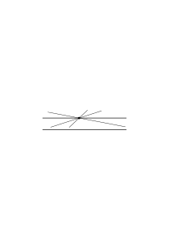
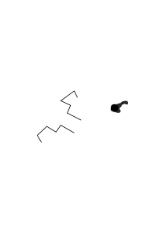
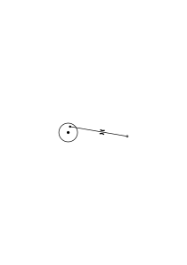
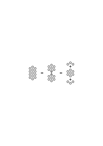

# Bemerkungen über die Grundlagen der Mathematik – IV

### [Ms-125](/ms-125/#5v.4): [5v\[4\]](https://cdn.wittgensteinnachlass.com/2000px/webp/Ms-125/5v.webp)

1. “Die Axiome eines mathematischen Axiomsystems sollen einleuchtend sein.” Wie leuchten sie denn ein?

### [Ms-125](/ms-125/#6r.1): [6r\[1\]](https://cdn.wittgensteinnachlass.com/2000px/webp/Ms-125/6r.webp)

Wie wenn ich sagte: _so_ kann ich mir's am leichtesten vorstellen. Und hier ist Vorstellen nicht ein bestimmter seelischer Vorgang bei dem man zumeist die Augen schließt, oder mit den Händen bedeckt.

### [Ms-125](/ms-125/#6r.2+6v.1): [6r\[2\]](https://cdn.wittgensteinnachlass.com/2000px/webp/Ms-125/6r.webp),[6v\[1\]](https://cdn.wittgensteinnachlass.com/2000px/webp/Ms-125/6v.webp)

2. Was sagen wir, wenn uns so ein Axiom dargeboten wird, z.B. das Parallelenaxiom? Hat Erfahrung uns gezeigt, daß es sich so verhält?

Nun vielleicht; aber _welche_ Erfahrung? Ich meine: Erfahrung spielt eine Rolle; aber nicht die, die man unmittelbar erwarten würde. Denn man hat ja doch nicht Versuche gemacht & gefunden, daß wirklich nur _eine_ Gerade die andre Gerade nicht durch den Punkt schneidet. Und doch leuchtet der Satz ein. – Wenn ich nun sagte: es ist ganz gleichgültig, warum er einleuchtet. Genug: wir nehmen ihn an. Wichtig ist nur, wie wir ihn gebrauchen.

### [Ms-125](/ms-125/#6v.2): [6v\[2\]](https://cdn.wittgensteinnachlass.com/2000px/webp/Ms-125/6v.webp)

Der Satz beschreibt ein Bild. Nämlich dieses:

### [Ms-125](/ms-125/#7r.1): [7r\[1\]](https://cdn.wittgensteinnachlass.com/2000px/webp/Ms-125/7r.webp)

Dies Bild ist uns annehmbar. Wie es uns annehmbar ist, die ungenaue Kenntnis einer Zahl durch Abrunden auf ein Vielfaches von 10 anzudeuten.

### [Ms-125](/ms-125/#7r.2): [7r\[2\]](https://cdn.wittgensteinnachlass.com/2000px/webp/Ms-125/7r.webp)

‘Wir nehmen diesen Satz an.’ Aber als _was_ nehmen wir ihn an?

### [Ms-125](/ms-125/#7r.3+7v.1): [7r\[3\]](https://cdn.wittgensteinnachlass.com/2000px/webp/Ms-125/7r.webp),[7v\[1\]](https://cdn.wittgensteinnachlass.com/2000px/webp/Ms-125/7v.webp)

3. Ich will sagen: Wenn der Wortlaut des Parallelen-Axioms, z.B., gegeben ist (& wir die Sprache verstehen) so ist die Art der Verwendung dieses Satzes, & also sein Sinn, noch gar nicht bestimmt. Und wenn wir sagen, er leuchtet uns ein, so haben wir damit, ohne es zu wissen, schon eine bestimmte Art der Verwendung des Satzes gewählt. Der Satz ist kein mathematisches Axiom, wenn wir ihn nicht gerade _dazu_ verwenden.

### [Ms-125](/ms-125/#7v.2+8r.1): [7v\[2\]](https://cdn.wittgensteinnachlass.com/2000px/webp/Ms-125/7v.webp),[8r\[1\]](https://cdn.wittgensteinnachlass.com/2000px/webp/Ms-125/8r.webp)

Daß wir nämlich hier nicht Versuche machen, sondern das Einleuchten gelten lassen legt schon die Verwendung fest. Denn wir sind ja nicht so naiv, das Einleuchten statt des Versuchs gelten zu lassen.

### [Ms-125](/ms-125/#8r.2): [8r\[2\]](https://cdn.wittgensteinnachlass.com/2000px/webp/Ms-125/8r.webp)

Nicht, daß er uns als wahr einleuchtet, sondern daß wir das Einleuchten gelten lassen, macht ihn zum mathem. Satz.

### [Ms-125](/ms-125/#8r.3+8v.1): [8r\[3\]](https://cdn.wittgensteinnachlass.com/2000px/webp/Ms-125/8r.webp),[8v\[1\]](https://cdn.wittgensteinnachlass.com/2000px/webp/Ms-125/8v.webp)

4. Lehrt uns die Erfahrung daß zwischen je 2 Punkten eine Gerade möglich ist? Oder, daß zwei verschiedene Farben nicht an einem Orte sein können? Man könnte sagen: die _Vorstellung_ lehrt es uns. Und darin liegt die Wahrheit; man muß es nur recht verstehen.

### [Ms-125](/ms-125/#8v.2): [8v\[2\]](https://cdn.wittgensteinnachlass.com/2000px/webp/Ms-125/8v.webp)

_Vor_ dem Satz ist der Begriff noch geschmeidig.

### [Ms-125](/ms-125/#8v.3): [8v\[3\]](https://cdn.wittgensteinnachlass.com/2000px/webp/Ms-125/8v.webp)

Aber könnten nicht Erfahrungen uns bestimmen das Axiom zu verwerfen?!

Ja. Und dennoch spielt es nicht die Rolle des Erfahrungssatzes.

### [Ms-125](/ms-125/#8v.4+9r.1): [8v\[4\]](https://cdn.wittgensteinnachlass.com/2000px/webp/Ms-125/8v.webp),[9r\[1\]](https://cdn.wittgensteinnachlass.com/2000px/webp/Ms-125/9r.webp)

Warum sind die Newtonschen Gesetze keine Axiome der Mathematik? Weil man sich sehr wohl vorstellen könnte, daß es sich anders verhielte. Aber – will ich sagen – dies schreibt jenen Sätzen nur eine gewisse Rolle im Gegensatz zu einer andern zu. D.h.: von einem Satz zu sagen: ‘man könnte sich das auch anders vorstellen’ oder ‘man kann sich auch das Gegenteil davon vorstellen’, schreibt ihm die Rolle des Erfahrungssatzes zu.

### [Ms-125](/ms-125/#9r.2+9v.1): [9r\[2\]](https://cdn.wittgensteinnachlass.com/2000px/webp/Ms-125/9r.webp),[9v\[1\]](https://cdn.wittgensteinnachlass.com/2000px/webp/Ms-125/9v.webp)

Der Satz den man sich nicht anders als wahr soll vorstellen können hat eine andere _Funktion_ als der für den es sich nicht so verhält.

### [Ms-125](/ms-125/#9v.2): [9v\[2\]](https://cdn.wittgensteinnachlass.com/2000px/webp/Ms-125/9v.webp)

5. Die mathem. Axiome funktionieren dergestalt, daß, wenn Erfahrung uns dazu bewegte, ein Axiom aufzugeben, sein Gegenteil damit nicht zum Axiom würde. ‘2 × 2 ≠ 5’ heißt nicht, ‘2 × 2 = 5’ habe sich nicht bewährt.

### [Ms-125](/ms-125/#9v.3): [9v\[3\]](https://cdn.wittgensteinnachlass.com/2000px/webp/Ms-125/9v.webp)

Man könnte den Axiomen, sozusagen, ein spezielles Behauptungszeichen vorsetzen.

### [Ms-125](/ms-125/#9v.4+10r.1): [9v\[4\]](https://cdn.wittgensteinnachlass.com/2000px/webp/Ms-125/9v.webp),[10r\[1\]](https://cdn.wittgensteinnachlass.com/2000px/webp/Ms-125/10r.webp)

Axiom ist etwas nicht _dadurch_, daß wir es als äußerst wahrscheinlich, ja als gewiß, anerkennen, sondern dadurch, daß _wir_ ihm eine bestimmte Funktion zuerkennen & eine, die der des Erfahrungssatzes widerstreitet.

### [Ms-125](/ms-125/#10r.2): [10r\[2\]](https://cdn.wittgensteinnachlass.com/2000px/webp/Ms-125/10r.webp)

Wir geben dem Axiom eine andere Art der Anerkennung als dem Erfahrungssatz. Und damit meine ich nicht daß der ‘seelische Akt des Anerkennens’ ein andrer ist.

### [Ms-125](/ms-125/#10v.1): [10v\[1\]](https://cdn.wittgensteinnachlass.com/2000px/webp/Ms-125/10v.webp)

Das Axiom ist, möchte ich sagen, ein andrer Redeteil.

### [Ms-125](/ms-125/#10v.2): [10v\[2\]](https://cdn.wittgensteinnachlass.com/2000px/webp/Ms-125/10v.webp)

6. Man nimmt, wenn man das math. Axiom, das & das sei möglich, hört, ohne weiters an, man wisse, was hier ‘möglich sein’ bedeutet; weil die Satzform uns natürlich geläufig ist.

### [Ms-125](/ms-125/#10v.3+11r.1): [10v\[3\]](https://cdn.wittgensteinnachlass.com/2000px/webp/Ms-125/10v.webp),[11r\[1\]](https://cdn.wittgensteinnachlass.com/2000px/webp/Ms-125/11r.webp)

Man wird nicht gewahr, wie verschiedenerlei die Verwendung der Aussage, etwas sei möglich, ist & kommt nicht auf den Gedanken, nach der besondern Verwendung in diesem Fall, zu fragen.

### [Ms-125](/ms-125/#11r.2): [11r\[2\]](https://cdn.wittgensteinnachlass.com/2000px/webp/Ms-125/11r.webp)

Ohne die Verwendung im geringsten zu übersehen, können wir hier gar nicht zweifeln, daß wir den Satz verstehen.

### [Ms-125](/ms-125/#11r.3+11v.1): [11r\[3\]](https://cdn.wittgensteinnachlass.com/2000px/webp/Ms-125/11r.webp),[11v\[1\]](https://cdn.wittgensteinnachlass.com/2000px/webp/Ms-125/11v.webp)

Ist der Satz, daß es keine Wirkung in die Ferne gibt von dem Geschlecht der math. Sätze? Man möchte da auch sagen: der Satz ist nicht dazu bestimmt eine Erfahrung auszudrücken, sondern daß man sich etwas nicht anders vorstellen könne.

### [Ms-125](/ms-125/#11v.2+12r.1): [11v\[2\]](https://cdn.wittgensteinnachlass.com/2000px/webp/Ms-125/11v.webp),[12r\[1\]](https://cdn.wittgensteinnachlass.com/2000px/webp/Ms-125/12r.webp)

Zu sagen zwischen zwei Punkten sei – geometrisch – immer eine Gerade möglich, heißt: Von mehr als zwei Punkten zu sagen, sie lägen auf einer Geraden ist eine Aussage; es von zweien zu sagen ist keine.

### [Ms-125](/ms-125/#12r.2): [12r\[2\]](https://cdn.wittgensteinnachlass.com/2000px/webp/Ms-125/12r.webp)

So wie man sich auch nicht fragt, was ein Satz der Form “Es gibt kein …” (z.B. “Es gibt keinen Beweis dieses Satzes”) im besonderen Fall bedeutet. Auf die Frage was er bedeutet antwortet man dem Anderen & sich selbst mit einem Beispiel des Nicht-existierens.

### [Ms-125](/ms-125/#12r.3+12v.1): [12r\[3\]](https://cdn.wittgensteinnachlass.com/2000px/webp/Ms-125/12r.webp),[12v\[1\]](https://cdn.wittgensteinnachlass.com/2000px/webp/Ms-125/12v.webp)

7. Der math. Satz steht auf vier Füßen, nicht auf dreien; er ist überbestimmt.

### [Ms-125](/ms-125/#12v.2): [12v\[2\]](https://cdn.wittgensteinnachlass.com/2000px/webp/Ms-125/12v.webp)

8. Wenn wir das Tun eines Menschen, z.B., durch eine Regel beschreiben, so wollen wir, daß der, dem wir die Beschreibung geben, durch Anwendung der Regel wisse, was im besonderen Fall geschieht. Gebe ich ihm nun durch die Regel eine indirekte Beschreibung?

### [Ms-125](/ms-125/#12v.3+13r.1): [12v\[3\]](https://cdn.wittgensteinnachlass.com/2000px/webp/Ms-125/12v.webp),[13r\[1\]](https://cdn.wittgensteinnachlass.com/2000px/webp/Ms-125/13r.webp)

Es gibt natürlich einen Satz, der sagt: wenn Einer die Zahlen … nach den & den Regeln zu multiplizieren trachtet so erhält er ‥‥․.

### [Ms-125](/ms-125/#13r.2): [13r\[2\]](https://cdn.wittgensteinnachlass.com/2000px/webp/Ms-125/13r.webp)

Eine Anwendung des math. Satzes muß immer das Rechnen selber sein. Das bestimmt das Verhältnis der Rechentätigkeit zum Sinn der math. Sätze.

### [Ms-125](/ms-125/#13r.3): [13r\[3\]](https://cdn.wittgensteinnachlass.com/2000px/webp/Ms-125/13r.webp)

Wir beurteilen Gleichheit & Übereinstimmung nach den Resultaten unseres Rechnens, darum können wir nicht das Rechnen mit Hilfe der Übereinstimmung erklären.

### [Ms-125](/ms-125/#13v.2): [13v\[2\]](https://cdn.wittgensteinnachlass.com/2000px/webp/Ms-125/13v.webp)

Wir beschreiben mit Hilfe der Regel: Wozu? Warum das ist eine andre Frage.

### [Ms-125](/ms-125/#13v.3+14r.1): [13v\[3\]](https://cdn.wittgensteinnachlass.com/2000px/webp/Ms-125/13v.webp),[14r\[1\]](https://cdn.wittgensteinnachlass.com/2000px/webp/Ms-125/14r.webp)

‘Die Regel, auf diese Zahlen angewandt, gibt jene’ könnte heißen: der Regelausdruck auf den Menschen angewendet läßt ihn aus diesen Zahlen jene erzeugen.

### [Ms-125](/ms-125/#14r.2): [14r\[2\]](https://cdn.wittgensteinnachlass.com/2000px/webp/Ms-125/14r.webp)

Man fühlt ganz richtig daß dies _kein_ math. Satz wäre.

### [Ms-125](/ms-125/#14r.3): [14r\[3\]](https://cdn.wittgensteinnachlass.com/2000px/webp/Ms-125/14r.webp)

Der math. Satz setzt einen gewissen Weg fest.

### [Ms-125](/ms-125/#14r.4+14v.1): [14r\[4\]](https://cdn.wittgensteinnachlass.com/2000px/webp/Ms-125/14r.webp),[14v\[1\]](https://cdn.wittgensteinnachlass.com/2000px/webp/Ms-125/14v.webp)

Es ist kein Widerspruch daß er eine Regel ist und nicht einfach festgesetzt, sondern nach Regeln erzeugt wird.

### [Ms-125](/ms-125/#14v.2): [14v\[2\]](https://cdn.wittgensteinnachlass.com/2000px/webp/Ms-125/14v.webp)

Wer mit einer Regel beschreibt, weiß selbst auch nicht mehr als er sagt. D.h., er sieht auch nicht die Anwendung voraus, die er im besondern Fall von der Regel machen wird. Wer “u.s.w.” sagt, weiß selbst auch nicht mehr als “u.s.w.”.

### [Ms-125](/ms-125/#14v.3+15r.1): [14v\[3\]](https://cdn.wittgensteinnachlass.com/2000px/webp/Ms-125/14v.webp),[15r\[1\]](https://cdn.wittgensteinnachlass.com/2000px/webp/Ms-125/15r.webp)

9. Wie könnte man Einem erklären, was der zu tun hat, der einer Regel folgen soll?

### [Ms-125](/ms-125/#15r.2+15v.1): [15r\[2\]](https://cdn.wittgensteinnachlass.com/2000px/webp/Ms-125/15r.webp),[15v\[1\]](https://cdn.wittgensteinnachlass.com/2000px/webp/Ms-125/15v.webp)

Man ist versucht zu erklären: vor allem tu das _Einfachste_ (wenn die Regel z.B. ist immer das gleiche zu wiederholen). Und daran ist natürlich etwas. Es ist von Bedeutung, daß wir sagen können, es sei einfacher eine Zahlenreihe anzuschreiben, in der jede Zahl gleich der vorhergehenden ist, als eine Reihe, in der jede Zahl um 1 größer ist als die vorhergehende. Und wieder, daß dies ein einfacheres Gesetz ist als das, abwechselnd 1 und 2 zu addieren.

### [Ms-125](/ms-125/#15v.2+16r.1): [15v\[2\]](https://cdn.wittgensteinnachlass.com/2000px/webp/Ms-125/15v.webp),[16r\[1\]](https://cdn.wittgensteinnachlass.com/2000px/webp/Ms-125/16r.webp)

10. Ist es denn nicht übereilt, einen Satz, den man an Stäbchen & Bohnen erprobt hat, auf Wellenlängen des Lichts anzuwenden? Ich meine: daß 2 × 5000 = 10000 ist. Rechnet man wirklich damit, daß, was sich in so viel Fällen bewahrheitet hat, auch für diese stimmen muß? Oder ist es nicht vielmehr, daß wir uns mit der arithmetischen Annahme noch _gar_ nicht binden?

### [Ms-125](/ms-125/#16r.2): [16r\[2\]](https://cdn.wittgensteinnachlass.com/2000px/webp/Ms-125/16r.webp)

11. Die Arithm. als die Naturgeschichte (Mineralogie) der Zahlen. _Wer_ spricht aber so von ihr? Unser ganzes Denken ist von dieser Idee durchsetzt.

### [Ms-125](/ms-125/#16r.3+16v.1+17r.1): [16r\[3\]](https://cdn.wittgensteinnachlass.com/2000px/webp/Ms-125/16r.webp),[16v\[1\]](https://cdn.wittgensteinnachlass.com/2000px/webp/Ms-125/16v.webp),[17r\[1\]](https://cdn.wittgensteinnachlass.com/2000px/webp/Ms-125/17r.webp)

Die Zahlen sind Gestalten (ich meine nicht die Zahlzeichen) & die Arithm. teilt uns die Eigenschaften dieser Gestalten mit. Aber die Schwierigkeit ist da, daß die Eigenschaften der Gestalten _Möglichkeiten_ sind; nicht die gestaltlichen Eigenschaften der Dinge, die die Gestalt haben. Und diese Möglichkeiten wieder entpuppen sich als physikalische, oder psychologische, Möglichkeiten (der Zerlegung, Zusammensetzung, etc.). Die Gestalten aber spielen (nur) die Rolle der Bilder, die man so & so verwendet. Nicht Eigenschaften von Gestalten ist es, was wir geben, sondern Transformationen von Gestalten, als irgendwelche Paradigmen aufgestellt.

### [Ms-125](/ms-125/#17r.2+17r.3): [17r\[2\]](https://cdn.wittgensteinnachlass.com/2000px/webp/Ms-125/17r.webp),[17r\[3\]](https://cdn.wittgensteinnachlass.com/2000px/webp/Ms-125/17r.webp)

12. Wir beurteilen nicht die Bilder, sondern mittels der Bilder. Wir erforschen sie nicht sondern mittels ihrer etwas anderes.

### [Ms-125](/ms-125/#17r.4+17v.1): [17r\[4\]](https://cdn.wittgensteinnachlass.com/2000px/webp/Ms-125/17r.webp),[17v\[1\]](https://cdn.wittgensteinnachlass.com/2000px/webp/Ms-125/17v.webp)

Du bringst ihn zu der Entscheidung dies Bild aufzunehmen. Und zwar durch Beweis, d.i., durch Vorführung einer Bilderreihe, oder einfach dadurch, daß Du ihm das Bild zeigst. Was zu dieser Entscheidung bewegt ist hier gleichgültig. Die Hauptsache ist, daß es sich um das Annehmen eines Bildes handelt.

### [Ms-125](/ms-125/#17v.2): [17v\[2\]](https://cdn.wittgensteinnachlass.com/2000px/webp/Ms-125/17v.webp)

Das Bild des Zusammensetzens _ist_ kein Zusammensetzen; das Bild einer Zerlegung keine Zerlegung; das Bild des Passens kein Passen. Aber diese Bilder sind von der größten Bedeutung. _So sieht es aus_, wenn zusammengesetzt wird; wenn zerlegt wird; usw.

### [Ms-125](/ms-125/#18r.1): [18r\[1\]](https://cdn.wittgensteinnachlass.com/2000px/webp/Ms-125/18r.webp)

13. Wie wäre es, wenn Tiere oder Kristalle so schöne Eigenschaften hätten wie die Zahlen? Es gäbe also z.B. eine Reihe von Gestalten, eine immer um eine Einheit größer als die andere.

### [Ms-125](/ms-125/#18r.2+18v.1): [18r\[2\]](https://cdn.wittgensteinnachlass.com/2000px/webp/Ms-125/18r.webp),[18v\[1\]](https://cdn.wittgensteinnachlass.com/2000px/webp/Ms-125/18v.webp)

Ich möchte darstellen können, wie es kommt, daß die Math. jetzt uns als Naturgeschichte des Zahlenreiches, jetzt wieder als eine Sammlung von Regeln erscheint.

### [Ms-125](/ms-125/#18v.2): [18v\[2\]](https://cdn.wittgensteinnachlass.com/2000px/webp/Ms-125/18v.webp)

Könnte man aber nicht Transformationen von Tiergestalten (z.B.) studieren? Aber wie ‘studieren’? Ich meine: könnte es nicht nützlich sein, sich Transformationen von Tiergestalten vorzuführen? Und doch wäre dies kein Zweig der Zoologie. –

### [Ms-125](/ms-125/#18v.3+19r.1): [18v\[3\]](https://cdn.wittgensteinnachlass.com/2000px/webp/Ms-125/18v.webp),[19r\[1\]](https://cdn.wittgensteinnachlass.com/2000px/webp/Ms-125/19r.webp)

Ein math. Satz wäre es dann (z.B.), daß _diese_ Transformation _diese_ Gestalt in _diese_ überleitet. (Die Gestalten & die Transformation wiedererkennbar.)

### [Ms-125](/ms-125/#19r.2+19v.1): [19r\[2\]](https://cdn.wittgensteinnachlass.com/2000px/webp/Ms-125/19r.webp),[19v\[1\]](https://cdn.wittgensteinnachlass.com/2000px/webp/Ms-125/19v.webp)

14. Wir müssen uns aber dessen erinnern, daß der math. Beweis durch seine Umformungen nicht nur zeichengeometrische Sätze, sondern Sätze des verschiedenartigsten _Inhalts_ beweist.

### [Ms-125](/ms-125/#19r.3): [19r\[3\]](https://cdn.wittgensteinnachlass.com/2000px/webp/Ms-125/19r.webp)

So beweist die Umformung eines Russellschen Beweises, daß dieser logische Satz mit Hilfe dieser Regeln sich aus den Grundgesetzen bilden lasse. Aber der Beweis wird als Beweis der Wahrheit des Schlußsatzes angesehen, oder als Beweis dafür, daß der Schlußsatz _nichts_ sagt. Das ist nun nur durch eine Beziehung des Satzes nach außen möglich; d.h. durch seine Beziehung zu andern Sätzen, z.B., & deren Anwendung.

### [Ms-125](/ms-125/#19v.2+20r.1): [19v\[2\]](https://cdn.wittgensteinnachlass.com/2000px/webp/Ms-125/19v.webp),[20r\[1\]](https://cdn.wittgensteinnachlass.com/2000px/webp/Ms-125/20r.webp)

‘Die Tautologie (‘p ⌵ ~p’, z.B.) sagt nichts’ ist ein Satz der sich auf das Sprachspiel bezieht, worin der Satz p angewendet wird. (Z.B.: “Es regnet, oder regnet nicht” ist keine Mitteilung über das Wetter.)

### [Ms-125](/ms-125/#20r.2): [20r\[2\]](https://cdn.wittgensteinnachlass.com/2000px/webp/Ms-125/20r.webp)

Die R.sche Logik sagt nichts darüber, welcher Art & Verwendung _Sätze_, ich meine nicht _logische_ Sätze, sind: Und doch erhält die Logik ihren ganzen Sinn (nur) von der supponierten Anwendung auf die Sätze.

### [Ms-125](/ms-125/#28v.1+29r.1): [28v\[1\]](https://cdn.wittgensteinnachlass.com/2000px/webp/Ms-125/28v.webp),[29r\[1\]](https://cdn.wittgensteinnachlass.com/2000px/webp/Ms-125/29r.webp)

15. Man kann sich denken daß Leute eine angewandte Mathematik haben ohne eine reine Mathematik. Sie können z.B. – nehmen wir an – die Bahn berechnen, welche gewisse sich bewegende Körper beschreiben & deren Ort zu einer gegebenen Zeit vorhersagen. Dazu benüutzen sie ein Koordinatensystem, die Gleichung von Kurven (_eine Form der Beschreibung wirklicher Bewegung_) & die Technik des Rechnens im Dezimalsystem.

Die Idee eines Satzes der reinen Mathematik kann ihnen ganz fremd sein. Diese Leute haben also Regeln denen gemäß sie die betreffenden Zeichen insbesondere z.B. Zahlzeichen transformieren zum Zweck der Voraussage des Eintreffens gewisser Ereignisse.

### [Ms-125](/ms-125/#29r.2+29v.1): [29r\[2\]](https://cdn.wittgensteinnachlass.com/2000px/webp/Ms-125/29r.webp),[29v\[1\]](https://cdn.wittgensteinnachlass.com/2000px/webp/Ms-125/29v.webp)

Aber wenn sie nun z.B. multiplizieren, werden sie da nicht einen Satz gewinnen, der sagt, daß das Resultat der Multiplikation das gleiche ist, wie immer man die Faktoren vertauscht? Das wird keine primäre Zeichenregel sein, aber auch kein Satz ihrer Physik. Nun, sie _brauchen_ so einen Satz nicht zu erhalten – selbst wenn sie das Vertauschen der Faktoren erlauben.

### [Ms-125](/ms-125/#29v.2+30r.1): [29v\[2\]](https://cdn.wittgensteinnachlass.com/2000px/webp/Ms-125/29v.webp),[30r\[1\]](https://cdn.wittgensteinnachlass.com/2000px/webp/Ms-125/30r.webp)

Ich denke mir die Sache so, daß diese Mathematik ganz in Form von _Geboten_ betrieben wird. “Du mußt _das & das_ tun” – um nämlich die Antwort darauf zu erhalten, ‘wo wird sich dieser Körper zu der & der Zeit befinden’. (Wie diese Menschen zu dieser Methode der Vorhersagung gekommen sind, ist ganz gleichgültig).

### [Ms-125](/ms-125/#30r.2): [30r\[2\]](https://cdn.wittgensteinnachlass.com/2000px/webp/Ms-125/30r.webp)

Der Schwerpunkt der Mathem. liegt für diese Menschen _ganz_ im _Tun_.

### [Ms-125](/ms-125/#30r.3): [30r\[3\]](https://cdn.wittgensteinnachlass.com/2000px/webp/Ms-125/30r.webp)

16. Ist das aber möglich? Ist es möglich, daß sie das kommutative Gesetz (z.B.) nicht als _Satz_ ansprechen?

### [Ms-125](/ms-125/#30r.4+30v.1): [30r\[4\]](https://cdn.wittgensteinnachlass.com/2000px/webp/Ms-125/30r.webp),[30v\[1\]](https://cdn.wittgensteinnachlass.com/2000px/webp/Ms-125/30v.webp)

Ich will doch sagen: Diese Leute sollen nicht zu der Auffassung kommen, daß sie mathem. Entdeckungen machen – sondern _nur_ physikalische Entdeckungen. [Wie sehr ich doch bei meinem Denken von Spengler beeinflußt bin!]

### [Ms-125](/ms-125/#30v.2+31r.1): [30v\[2\]](https://cdn.wittgensteinnachlass.com/2000px/webp/Ms-125/30v.webp),[31r\[1\]](https://cdn.wittgensteinnachlass.com/2000px/webp/Ms-125/31r.webp)

Frage: Müssen sie mathem. Entdeckungen als Entdeckungen machen? Was geht ihnen ab wenn sie keine machen? Könnten sie (z.B.) den Beweis des kommutativen Gesetzes gebrauchen, aber ohne die Auffassung, er gipfle in einem _Satz_, er habe also ein Resultat das ihren physikalischen Sätzen irgendwie vergleichbar sei?

### [Ms-125](/ms-125/#31r.2+31v.1): [31r\[2\]](https://cdn.wittgensteinnachlass.com/2000px/webp/Ms-125/31r.webp),[31v\[1\]](https://cdn.wittgensteinnachlass.com/2000px/webp/Ms-125/31v.webp)

17. Das bloße Bild

einmal als 4 Reihen zu 5 Punkten, einmal als 5 Kolumnen zu 4 Punkten betrachtet könnte jemand vom kommutativen Gesetz überzeugen. Und er könnte daraufhin Multiplikationen einmal in der einen, einmal in der andern Richtung ausführen.

### [Ms-125](/ms-125/#31v.2): [31v\[2\]](https://cdn.wittgensteinnachlass.com/2000px/webp/Ms-125/31v.webp)

06.04.1942

Ein Blick auf die Vorlage & die Steine überzeugt ihn, daß er mit ihnen die Figur wird legen können, d.h., er _unternimmt_ darauf, sie zu legen.

### [Ms-125](/ms-125/#31v.4+32r.1+32r.2+32v.1): [31v\[4\]](https://cdn.wittgensteinnachlass.com/2000px/webp/Ms-125/31v.webp),[32r\[1\]](https://cdn.wittgensteinnachlass.com/2000px/webp/Ms-125/32r.webp),[32r\[2\]](https://cdn.wittgensteinnachlass.com/2000px/webp/Ms-125/32r.webp),[32v\[1\]](https://cdn.wittgensteinnachlass.com/2000px/webp/Ms-125/32v.webp)

‘Ja, aber nur, wenn die Steine sich nicht ändern? – Wenn sie sich nicht ändern & wenn wir keinen unbegreiflichen Fehler machen, oder Steine unbemerkt verschwinden oder dazukommen. ‘Aber es ist doch wesentlich, daß sich die Figur tatsächlich allemal aus den Steinen legen läßt! Was geschähe wenn sie sich nicht legen ließe?’ – Vielleicht würden wir uns dann für geistesgestört halten. Aber – was weiter? – Vielleicht würden wir die Sache auch hinnehmen, wie sie ist. Und dann würde Frege sagen: “Hier haben wir eine neue Art der Verrücktheit”.

### [Ms-125](/ms-125/#32v.2): [32v\[2\]](https://cdn.wittgensteinnachlass.com/2000px/webp/Ms-125/32v.webp)

18. Es ist klar, daß die Mathematik als Technik des Umwandelns von Zeichen zum Zweck des Vorhersagens mit (der) Grammatik nichts zu tun hat.

### [Ms-125](/ms-125/#32v.3+33r.1): [32v\[3\]](https://cdn.wittgensteinnachlass.com/2000px/webp/Ms-125/32v.webp),[33r\[1\]](https://cdn.wittgensteinnachlass.com/2000px/webp/Ms-125/33r.webp)

19. (Jene) Leute, deren Mathematik nur eine solche Technik ist, sollen nun auch Beweise anerkennen, die sie von der Brauchbarkeit einer Zeichentechnik überzeugen.

### [Ms-125](/ms-125/#33r.2+33v.1): [33r\[2\]](https://cdn.wittgensteinnachlass.com/2000px/webp/Ms-125/33r.webp),[33v\[1\]](https://cdn.wittgensteinnachlass.com/2000px/webp/Ms-125/33v.webp)

20. Wenn uns das Rechnen als maschinelle Tätigkeit erscheint, so ist _der Mensch_, der die Rechnung ausführt, die Maschine.

### [Ms-125](/ms-125/#33v.2): [33v\[2\]](https://cdn.wittgensteinnachlass.com/2000px/webp/Ms-125/33v.webp)

Die Rechnung wäre dann gleichsam ein Diagramm, das ein Teil der Maschine hinschreibt.

### [Ms-125](/ms-125/#33v.3): [33v\[3\]](https://cdn.wittgensteinnachlass.com/2000px/webp/Ms-125/33v.webp)

21. Und das bringt mich darauf daß ein Bild uns sehr wohl davon überzeugen kann daß ein bestimmter Teil eines Mechanismus sich so & so bewegen werde wenn man den Mechanismus in Gang setzt.

### [Ms-125](/ms-125/#34r.1): [34r\[1\]](https://cdn.wittgensteinnachlass.com/2000px/webp/Ms-125/34r.webp)

So ein Bild (oder eine Bilderreihe) wirkt wie ein Beweis. So könnte ich z.B. konstruieren, wie der Punkt _x_ des Mechanismus

sich bewegen werde.

### [Ms-125](/ms-125/#34r.2): [34r\[2\]](https://cdn.wittgensteinnachlass.com/2000px/webp/Ms-125/34r.webp)

Ist es nicht _seltsam_, daß es nicht augenblicklich klar ist, _wie_ uns das Bild der Periode im Dividieren von der Wiederkehr der Ziffernreihe überzeugt?

### [Ms-125](/ms-125/#34v.3): [34v\[3\]](https://cdn.wittgensteinnachlass.com/2000px/webp/Ms-125/34v.webp)

(Es ist so schwer für mich, die innere Beziehung von der äußeren zu scheiden – das Bild von der Vorhersage.)

### [Ms-125](/ms-125/#35v.2): [35v\[2\]](https://cdn.wittgensteinnachlass.com/2000px/webp/Ms-125/35v.webp)

Der Doppelcharakter des math. Satzes – als _Gesetz_ & als _Regel_.

### [Ms-125](/ms-125/#36r.3+36v.1): [36r\[3\]](https://cdn.wittgensteinnachlass.com/2000px/webp/Ms-125/36r.webp),[36v\[1\]](https://cdn.wittgensteinnachlass.com/2000px/webp/Ms-125/36v.webp)

22. Wie, wenn man statt “Intuition” sagen würde “richtiges Erraten”? Das würde den Wert einer Intuition in einem ganz andern Lichte zeigen. Denn das Phänomen des Ratens ist ein psychologisches, aber nicht das des richtig Ratens.

### [Ms-125](/ms-125/#36v.2): [36v\[2\]](https://cdn.wittgensteinnachlass.com/2000px/webp/Ms-125/36v.webp)

23. Daß wir die Technik gelernt haben, macht, daß wir sie nun, auf den Anblick dieses Bildes hin, so & so abändern.

### [Ms-125](/ms-125/#39v.3): [39v\[3\]](https://cdn.wittgensteinnachlass.com/2000px/webp/Ms-125/39v.webp)

‘Wir entschließen uns zu einem neuen Sprachspiel.’ ‘Wir entschließen uns _spontan_ (möchte ich sagen) zu einem neuen Sprachspiel.’

### [Ms-125](/ms-125/#39v.4+40r.1): [39v\[4\]](https://cdn.wittgensteinnachlass.com/2000px/webp/Ms-125/39v.webp),[40r\[1\]](https://cdn.wittgensteinnachlass.com/2000px/webp/Ms-125/40r.webp)

24. Ja – es scheint: wenn unser Gedächtnis anders funktionierte, daß wir dann nicht so, wie wir's tun, rechnen könnten. Könnten wir aber dann Definitionen geben, wie wir es tun; so reden & schreiben, wie wir es tun? Wie aber können wir die Grundlage unsrer Sprache durch Erfahrungssätze ausdrücken?!

### [Ms-125](/ms-125/#40r.2+40v.1): [40r\[2\]](https://cdn.wittgensteinnachlass.com/2000px/webp/Ms-125/40r.webp),[40v\[1\]](https://cdn.wittgensteinnachlass.com/2000px/webp/Ms-125/40v.webp)

25. Angenommen, eine Division wenn wir sie ganz ausführen würde nicht zu demselben Resultat führen wie das Kopieren der Periode. Das könnte z.B. daher kommen, daß wir die Rechengesetzchen ohne uns dessen bewußt zu sein veränderten. (Es könnte aber auch daher kommen, daß wir anders kopieren.)

### [Ms-125](/ms-125/#40v.2+41r.1): [40v\[2\]](https://cdn.wittgensteinnachlass.com/2000px/webp/Ms-125/40v.webp),[41r\[1\]](https://cdn.wittgensteinnachlass.com/2000px/webp/Ms-125/41r.webp)

26. Was ist der Unterschied zwischen _nicht_ rechnen & _falsch_ rechnen. – Oder: ist eine _scharfe_ Grenze zwischen dem, die Zeit _nicht_ zu messen & sie _falsch_ messen? Keine Zeitmessung zu kennen & eine falsche?

### [Ms-125](/ms-125/#41r.2): [41r\[2\]](https://cdn.wittgensteinnachlass.com/2000px/webp/Ms-125/41r.webp)

27. Gib auf das Geschwätz acht, wodurch wir jemand von der Wahrheit eines math. Satzes überzeugen. Es gibt einen Aufschluß über die Funktion dieser Überzeugung. Ich meine das Geschwätz womit die Intuition wachgerufen wird. Womit also die Maschine einer Technik in Gang gesetzt wird.

### [Ms-125](/ms-125/#41v.1): [41v\[1\]](https://cdn.wittgensteinnachlass.com/2000px/webp/Ms-125/41v.webp)

28. Kann man sagen, daß, wer eine Technik lernt, sich dadurch von der Gleichförmigkeit der Resultate überzeugt??

### [Ms-125](/ms-125/#41v.2): [41v\[2\]](https://cdn.wittgensteinnachlass.com/2000px/webp/Ms-125/41v.webp)

29. Die Grenze der Empirie – ist die _Begriffsbildung_.

### [Ms-125](/ms-125/#41v.3+42r.1): [41v\[3\]](https://cdn.wittgensteinnachlass.com/2000px/webp/Ms-125/41v.webp),[42r\[1\]](https://cdn.wittgensteinnachlass.com/2000px/webp/Ms-125/42r.webp)

Welchen Übergang mache ich von “es wird so sein” zu “es _muß_ so sein”? Ich bilde einen andern Begriff. Einen, in dem inbegriffen ist was es früher nicht war. Wenn ich sage: “Wenn diese Ableitungen gleich sind, dann _muß_ …”, Bilde also meinen Begriff der Gleichheit um.

### [Ms-125](/ms-125/#42r.2+42v.1): [42r\[2\]](https://cdn.wittgensteinnachlass.com/2000px/webp/Ms-125/42r.webp),[42v\[1\]](https://cdn.wittgensteinnachlass.com/2000px/webp/Ms-125/42v.webp)

Wie aber, wenn Einer nun sagt: “Ich bin mir nicht dieser _zwei_ Vorgänge bewußt, ich bin mir nur der Empirie bewußt, nicht einer von ihr unabhängigen Begriffsbildung & Begriffsumbildung; alles scheint mir im Dienste der Empirie zu stehen.”? Mit andern Worten: wir scheinen nicht bald mehr, bald weniger rational zu werden, oder die Form unseres Denkens zu verändern, so daß damit sich _das_ ändert, _was wir “Denken” nennen_. Wir scheinen es nur immer der Erfahrung anzupassen.

### [Ms-125](/ms-125/#42v.2+43r.1): [42v\[2\]](https://cdn.wittgensteinnachlass.com/2000px/webp/Ms-125/42v.webp),[43r\[1\]](https://cdn.wittgensteinnachlass.com/2000px/webp/Ms-125/43r.webp)

Das ist klar: daß, wenn Einer sagt: “Wenn Du der _Regel_ folgst so _muß_ es so sein”, (daß) er keinen _klaren_ Begriff von Erfahrungen hat die dem Gegenteil entsprächen.

### [Ms-125](/ms-125/#43r.2): [43r\[2\]](https://cdn.wittgensteinnachlass.com/2000px/webp/Ms-125/43r.webp)

Oder auch so: Er hat keinen klaren Begriff davon, wie es aussähe, wenn es anders wäre. Und das ist sehr wichtig.

### [Ms-125](/ms-125/#43v.2+44r.1): [43v\[2\]](https://cdn.wittgensteinnachlass.com/2000px/webp/Ms-125/43v.webp),[44r\[1\]](https://cdn.wittgensteinnachlass.com/2000px/webp/Ms-125/44r.webp)

30. Was zwingt uns den Begriff der Gleichheit _so_ zu formen, daß wir etwa sagen: “wenn Du beidemale wirklich das Gleiche tust, muß auch dasselbe herauskommen”? – Was zwingt uns, nach einer Regel vorzugehen, etwas als Regel aufzufassen? Was zwingt uns mit uns selbst in den Formen der von uns gelernten Sprache zu reden

### [Ms-125](/ms-125/#44r.2): [44r\[2\]](https://cdn.wittgensteinnachlass.com/2000px/webp/Ms-125/44r.webp)

Denn das Wort “muß” drückt doch aus, daß wir von _diesem_ Begriff nicht abgehen können. (Oder soll ich sagen “wollen”?)

### [Ms-125](/ms-125/#44r.3+44v.1): [44r\[3\]](https://cdn.wittgensteinnachlass.com/2000px/webp/Ms-125/44r.webp),[44v\[1\]](https://cdn.wittgensteinnachlass.com/2000px/webp/Ms-125/44v.webp)

Ja, auch wenn ich von einer Begriffsbildung zu einer andern übergegangen bin, so bleibt der alte Begriff noch (immer) im Hintergrund.

### [Ms-125](/ms-125/#44v.2): [44v\[2\]](https://cdn.wittgensteinnachlass.com/2000px/webp/Ms-125/44v.webp)

Kann ich sagen: “Ein Beweis bringt uns zu einer gewissen Entscheidung, & zwar zu der, eine bestimmte Begriffsbildung anzunehmen”??

### [Ms-125](/ms-125/#45r.2): [45r\[2\]](https://cdn.wittgensteinnachlass.com/2000px/webp/Ms-125/45r.webp)

Sieh den Beweis nicht als einen Vorgang an der Dich _zwingt_, sondern der Dich _führt_. – Und zwar führt er Deine _Auffassung_ eines (gewissen) Sachverhalts.

### [Ms-125](/ms-125/#45v.1): [45v\[1\]](https://cdn.wittgensteinnachlass.com/2000px/webp/Ms-125/45v.webp)

Aber wie kommt es, daß er _jeden_ von uns so führt, daß wir übereinstimmend von ihm beeinflußt werden? Nun, wie kommt es daß wir übereinstimmend _zählen_? ‘Wir sind eben so abgerichtet’, kann man sagen, ‘und die Übereinstimmung die so erzeugt wird setzt sich durch die Beweise fort’.

### [Ms-125](/ms-125/#45v.2+46r.1): [45v\[2\]](https://cdn.wittgensteinnachlass.com/2000px/webp/Ms-125/45v.webp),[46r\[1\]](https://cdn.wittgensteinnachlass.com/2000px/webp/Ms-125/46r.webp)

_Während_ dieses Beweises haben wir eine Anschauungsweise von der 3-Teilung des Winkels gebildet, die eine Konstruktion mit Lineal & Zirkel ausschließt.

### [Ms-125](/ms-125/#46r.3+46v.1): [46r\[3\]](https://cdn.wittgensteinnachlass.com/2000px/webp/Ms-125/46r.webp),[46v\[1\]](https://cdn.wittgensteinnachlass.com/2000px/webp/Ms-125/46v.webp)

Dadurch, daß wir einen Satz als selbstverständlich anerkennen, sprechen wir ihn auch von jeder Verantwortung gegenüber der Erfahrung frei.

### [Ms-125](/ms-125/#46v.2): [46v\[2\]](https://cdn.wittgensteinnachlass.com/2000px/webp/Ms-125/46v.webp)

Während des Beweises wird unsere Anschauung geändert – & daß das mit Erfahrungen zusammenhängt tut dem keinen Eintrag.

### [Ms-125](/ms-125/#46v.3): [46v\[3\]](https://cdn.wittgensteinnachlass.com/2000px/webp/Ms-125/46v.webp)

Unsre Anschauung wird umgemodelt.

### [Ms-125](/ms-125/#46v.4+47r.1): [46v\[4\]](https://cdn.wittgensteinnachlass.com/2000px/webp/Ms-125/46v.webp),[47r\[1\]](https://cdn.wittgensteinnachlass.com/2000px/webp/Ms-125/47r.webp)

31. Es muß so sein, heißt nicht, es wird so sein. Im Gegenteil: ‘Es _wird_ so sein, wählt zwischen _einer_ & einer andern Möglichkeit. ‘Es muß so sein’ sieht nur _eine_ Möglichkeit.

### [Ms-125](/ms-125/#47r.2): [47r\[2\]](https://cdn.wittgensteinnachlass.com/2000px/webp/Ms-125/47r.webp)

Der Beweis leitet unsere Erfahrungen sozusagen in bestimmte Kanäle. Wer das & das immer wieder versucht hat gibt den Versuch Beweis auf.

### [Ms-125](/ms-125/#47r.3+47v.1): [47r\[3\]](https://cdn.wittgensteinnachlass.com/2000px/webp/Ms-125/47r.webp),[47v\[1\]](https://cdn.wittgensteinnachlass.com/2000px/webp/Ms-125/47v.webp)

Es versucht Einer ein gewisses Bild aus Steinen zusammenzulegen. Er sieht nun eine Vorlage in welcher ein _Teil_ jenes Bilds aus allen seinen Steinen zusammengelegt erscheint, & gibt nun seinen Versuch auf. Die Vorlage war der _Beweis_ dafür, daß sein Vorhaben unmöglich ist.

### [Ms-125](/ms-125/#47v.2+48r.1): [47v\[2\]](https://cdn.wittgensteinnachlass.com/2000px/webp/Ms-125/47v.webp),[48r\[1\]](https://cdn.wittgensteinnachlass.com/2000px/webp/Ms-125/48r.webp)

Auch die Vorlage, sowie die, die ihm zeigt daß er wird ein Bild aus diesen Steinen zusammensetzen können, ändert seinen _Begriff_. Denn er hat, könnte man sagen, das Zusammensetzen dieses Bildes aus diesen Steinen noch nie so angesehen.

### [Ms-125](/ms-125/#48r.2+48v.1): [48r\[2\]](https://cdn.wittgensteinnachlass.com/2000px/webp/Ms-125/48r.webp),[48v\[1\]](https://cdn.wittgensteinnachlass.com/2000px/webp/Ms-125/48v.webp)

Ist es gesagt, daß Einer, der sieht, daß man mit diesen Steinen einen Teil des Bildes legen kann, einsieht, daß man also auf keine Weise das ganze Bild aus ihnen wird legen können? Ist es nicht möglich, daß er versucht & versucht, ob nicht doch eine Stellung der Steine dies Ziel erreicht?

### [Ms-125](/ms-125/#48v.2): [48v\[2\]](https://cdn.wittgensteinnachlass.com/2000px/webp/Ms-125/48v.webp)

Muß man hier nicht zwischen (dem) Denken & dem praktischen Erfolg des Denkens unterscheiden?

### [Ms-125](/ms-125/#48v.3+49r.1): [48v\[3\]](https://cdn.wittgensteinnachlass.com/2000px/webp/Ms-125/48v.webp),[49r\[1\]](https://cdn.wittgensteinnachlass.com/2000px/webp/Ms-125/49r.webp)

32. “… die nicht, wie wir, gewisse Wahrheiten unmittelbar einsehen, sondern vielleicht auf den langwierigen Weg der Induktion angewiesen sind”, so sagt Frege. Aber was mich interessiert ist das unmittelbare Einsehen, ob es nun das einer Wahrheit ist, oder einer Falschheit. Ich frage: was ist das charakteristische Benehmen von Menschen, die etwas ‘unmittelbar einsehen’ – was immer der praktische Erfolg dieses Einsehens ist?

### [Ms-125](/ms-125/#49v.1): [49v\[1\]](https://cdn.wittgensteinnachlass.com/2000px/webp/Ms-125/49v.webp)

Mich interessiert nicht das unmittelbare Einsehen einer Wahrheit, sondern das Phänomen des unmittelbaren Einsehens. Nicht (zwar) als einer besondern seelischen Erscheinung sondern als einer Erscheinung im Handeln der Menschen.

### [Ms-125](/ms-125/#49v.2+50r.1): [49v\[2\]](https://cdn.wittgensteinnachlass.com/2000px/webp/Ms-125/49v.webp),[50r\[1\]](https://cdn.wittgensteinnachlass.com/2000px/webp/Ms-125/50r.webp)

33. Ja; es ist, als ob die Begriffsbildung unsre Erfahrung in bestimmte Kanäle leitete so daß man nun die eine Erfahrung mit der andern auf neue Weise zusammensieht. (Wie ein optisches Instrument Licht von verschiedenen Quellen auf bestimmte Art in einem Bild zusammenkommen läßt.)

### [Ms-125](/ms-125/#50r.2): [50r\[2\]](https://cdn.wittgensteinnachlass.com/2000px/webp/Ms-125/50r.webp)

Denke Dir, der Beweis wäre eine Dichtung ja ein Theaterstück. Kann mich das Ansehen eines solchen zu nichts bringen?

### [Ms-125](/ms-125/#50r.3+50v.1): [50r\[3\]](https://cdn.wittgensteinnachlass.com/2000px/webp/Ms-125/50r.webp),[50v\[1\]](https://cdn.wittgensteinnachlass.com/2000px/webp/Ms-125/50v.webp)

Ich wußte nicht wie es gehen werde, – aber ich sah ein Bild, & nun wurde ich überzeugt, daß es so gehen werde, wie im Bilde. Das Bild verhalf mir zur Vorhersage. Nicht als ein Experiment – – es war nur der Geburtshelfer der Vorhersage.

### [Ms-125](/ms-125/#50v.3+50r.1): [50v\[3\]](https://cdn.wittgensteinnachlass.com/2000px/webp/Ms-125/50v.webp),[50r\[1\]](https://cdn.wittgensteinnachlass.com/2000px/webp/Ms-125/50r.webp)

Denn, was immer meine Erfahrungen sind, oder waren, ich muß doch noch die Vorhersage _machen_. (Die Erfahrungen machen sie nicht für mich.)

### [Ms-125](/ms-125/#51v.1): [51v\[1\]](https://cdn.wittgensteinnachlass.com/2000px/webp/Ms-125/51v.webp)

Dann ist es ja kein so großes Wunder, daß der Beweis uns zur Vorhersage hilft. Ohne dieses Bild hätte ich nicht sagen können, wie es werden wird, aber wenn ich es sehe so ergreife ich es zur Vorhersage.

### [Ms-125](/ms-125/#51v.2+52r.1+52v.1): [51v\[2\]](https://cdn.wittgensteinnachlass.com/2000px/webp/Ms-125/51v.webp),[52r\[1\]](https://cdn.wittgensteinnachlass.com/2000px/webp/Ms-125/52r.webp),[52v\[1\]](https://cdn.wittgensteinnachlass.com/2000px/webp/Ms-125/52v.webp)

Welche Farbe eine chemische Verbindung haben wird kann ich nicht mit Hilfe eines Bildes vorhersagen, das mir die Substanzen in der Proberöhre & ihre Reaktion veranschaulicht. Zeigt das Bild ein Aufschäumen & am Ende rote Kristalle, so könnte ich nicht sagen: “Ja, _so_ muß es sein”, oder “Nein, so kann es nicht sein”. Anders aber ist es wenn ich das Bild eines Mechanismus in Bewegung setze; dieses kann mich lehren wie ein Teil sich wirklich bewegen wird. Stellte aber das Bild einen Mechanismus dar dessen Teile aus einem sehr weichen Material (etwa Teig) bestünde & sich daher im _Bild_ auf verschiedenste Art verbögen, so würde mir das Bild vielleicht wieder nicht zu einer Vorhersage verhelfen.

### [Ms-125](/ms-125/#52v.2+53r.1): [52v\[2\]](https://cdn.wittgensteinnachlass.com/2000px/webp/Ms-125/52v.webp),[53r\[1\]](https://cdn.wittgensteinnachlass.com/2000px/webp/Ms-125/53r.webp)

Kann man sagen: ein Begriff wird so gebildet daß er einer gewissen Vorhersage angepaßt ist, d.h., sie in den einfachsten Termini ermöglicht –?

### [Ms-125](/ms-125/#53r.2): [53r\[2\]](https://cdn.wittgensteinnachlass.com/2000px/webp/Ms-125/53r.webp)

34. Das philosophische Problem ist: wie können wir die Wahrheit sagen, & dabei diese starken Vorurteile _beruhigen_?

### [Ms-125](/ms-125/#53r.3+53v.1): [53r\[3\]](https://cdn.wittgensteinnachlass.com/2000px/webp/Ms-125/53r.webp),[53v\[1\]](https://cdn.wittgensteinnachlass.com/2000px/webp/Ms-125/53v.webp)

Es ist ein Unterschied: ob ich etwas als eine Täuschung meiner Sinne oder als ein äußeres Ereignis deute, ob ich diesen Gegenstand zum Maß jenes nehme, oder umgekehrt, ob ich mich entschließe, zwei Kriterien entscheiden zu lassen, oder nur eins.

### [Ms-125](/ms-125/#53v.2): [53v\[2\]](https://cdn.wittgensteinnachlass.com/2000px/webp/Ms-125/53v.webp)

35. Wenn richtig gerechnet wurde, so muß das herauskommen. Muß es dann immer _so_ herauskommen? Natürlich.

### [Ms-125](/ms-125/#53v.3): [53v\[3\]](https://cdn.wittgensteinnachlass.com/2000px/webp/Ms-125/53v.webp)

Indem wir zu einer Technik erzogen sind, sind wir auch zu einer Betrachtungsweise abgerichtet, die _ebenso fest_ sitzt als jene Technik.

### [Ms-125](/ms-125/#54r.1): [54r\[1\]](https://cdn.wittgensteinnachlass.com/2000px/webp/Ms-125/54r.webp)

Der math. Satz scheint weder von den Zeichen, noch von den Menschen zu handeln, & er _tut_ es daher auch nicht.

### [Ms-125](/ms-125/#54r.2): [54r\[2\]](https://cdn.wittgensteinnachlass.com/2000px/webp/Ms-125/54r.webp)

Er zeigt _die_ Verbindungen die wir als starr betrachten. Wir schauen aber sozusagen, von diesen Verbindungen weg & auf etwas anderes. Wir drehen ihnen sozusagen den Rücken. Oder: wir lehnen uns an sie oder fußen auf ihnen.

### [Ms-125](/ms-125/#54r.3+54v.1): [54r\[3\]](https://cdn.wittgensteinnachlass.com/2000px/webp/Ms-125/54r.webp),[54v\[1\]](https://cdn.wittgensteinnachlass.com/2000px/webp/Ms-125/54v.webp)

Nochmals: wir sehen den math. Satz nicht als einen Satz, der von Zeichen handelt an, & er _ist_ es daher auch nicht.

### [Ms-125](/ms-125/#54v.2): [54v\[2\]](https://cdn.wittgensteinnachlass.com/2000px/webp/Ms-125/54v.webp)

Wir erkennen ihn an, _indem_ wir ihn den Rücken drehen.

### [Ms-125](/ms-125/#54v.3): [54v\[3\]](https://cdn.wittgensteinnachlass.com/2000px/webp/Ms-125/54v.webp)

Wie ist es, z.B., mit den Grundgesetzen der Mechanik? Wer sie versteht, muß wissen, auf welche Erfahrungen sie sich stützen. Anders verhält es sich mit den Sätzen der reinen Mathematik.

### [Ms-125](/ms-125/#54v.4+55r.1): [54v\[4\]](https://cdn.wittgensteinnachlass.com/2000px/webp/Ms-125/54v.webp),[55r\[1\]](https://cdn.wittgensteinnachlass.com/2000px/webp/Ms-125/55r.webp)

36. Ein Satz kann ein Bild beschreiben & dieses Bild mannigfach in unserer Betrachtungsweise der Dinge, also in unserer Lebens- & Handlungsweise verankert sein.

### [Ms-125](/ms-125/#55r.3+55v.1): [55r\[3\]](https://cdn.wittgensteinnachlass.com/2000px/webp/Ms-125/55r.webp),[55v\[1\]](https://cdn.wittgensteinnachlass.com/2000px/webp/Ms-125/55v.webp)

Ist nicht der Beweis ein flimsy Grund die Suche nach einer Konstruktion der Dreiteilung ganz aufzugeben? Du bist nur ein oder zweimal diese Zeichenreihe durchgegangen & daraufhin willst Du Dich entschließen? Nur weil Du diese eine Transformation gesehen hast willst Du die Suche aufgeben?

### [Ms-125](/ms-125/#55v.2): [55v\[2\]](https://cdn.wittgensteinnachlass.com/2000px/webp/Ms-125/55v.webp)

Der Effekt des Beweises sei, daß sich in die neue Regel hineinstürzt.

### [Ms-125](/ms-125/#56r.1+56v.1): [56r\[1\]](https://cdn.wittgensteinnachlass.com/2000px/webp/Ms-125/56r.webp),[56v\[1\]](https://cdn.wittgensteinnachlass.com/2000px/webp/Ms-125/56v.webp)

Er hatte bisher nach der & der Regel gerechnet; nun zeigt ihm Einer den Beweis, man könne auch anders rechnen, & er schaltet nun (auf die andre Technik) um – nicht weil er sich sagt, es werde so auch gehen, sondern weil er die neue Technik mit der alten als identisch empfindet, weil er ihr denselben Sinn geben muß weil er sie als gleich anerkennt wie er diese Farbe als grün anerkennt. D.h.: das Einsehen der math. Relationen spielt eine ähnliche Rolle wie das Einsehen der Identität. Man könnte beinahe sagen, es ist eine kompliziertere Art der Identität.

### [Ms-125](/ms-125/#57r.2): [57r\[2\]](https://cdn.wittgensteinnachlass.com/2000px/webp/Ms-125/57r.webp)

Man könnte sagen: Die Gründe warum er nun auf eine andere Technik umschaltet, sind von gleicher Art wie die, die ihn eine neue Multiplikation so ausführen lassen, wie er sie ausführt; indem er die Technik als die _gleiche_ anerkennt, wie die, die er bei andern Multiplikationen angewandt hatte.

### [Ms-125](/ms-125/#57v.2+58r.1): [57v\[2\]](https://cdn.wittgensteinnachlass.com/2000px/webp/Ms-125/57v.webp),[58r\[1\]](https://cdn.wittgensteinnachlass.com/2000px/webp/Ms-125/58r.webp)

37. 18.05.1942

Ein Mensch ist in einem Zimmer _gefangen_, wenn die Türe unversperrt ist, sich nach innen öffnet; er aber nicht auf die Idee kommt zu _ziehen_, statt gegen sie zu drücken.

### [Ms-125](/ms-125/#58r.3+58v.1): [58r\[3\]](https://cdn.wittgensteinnachlass.com/2000px/webp/Ms-125/58r.webp),[58v\[1\]](https://cdn.wittgensteinnachlass.com/2000px/webp/Ms-125/58v.webp)

38. Wenn Weiß zu Schwarz wird, sagen manche Menschen “Es ist im wesentlichen noch immer dasselbe”. Und andere, wenn die Farbe um einen Grad dunkler wird, sagen “Es hat sich _ganz_ verändert”.

### [Ms-125](/ms-125/#59v.2+60r.1): [59v\[2\]](https://cdn.wittgensteinnachlass.com/2000px/webp/Ms-125/59v.webp),[60r\[1\]](https://cdn.wittgensteinnachlass.com/2000px/webp/Ms-125/60r.webp)

39. Die Sätze “a = a”, “p ⊃ p”, “Das Wort ‘Bismarck’ hat 8 Buchstaben”, “Es gibt kein rötlichgrün”, sind alle einleuchtend & Sätze über das Wesen: was haben sie gemeinsam? Sie sind offenbar jeder von andrer Art & anderem Gebrauch. Der vorletzte ist einem Erfahrungssatz am ähnlichsten. Und es ist verständlich daß man ihn einen synthetischen Satz a priori nennen kann. Man kann sagen: wenn einer die Zahlenreihe mit der Buchstabenreihe nicht _zusammenhält_, kann er nicht wissen, wieviel Buchstaben das Wort hat.

### [Ms-125](/ms-125/#60v.2): [60v\[2\]](https://cdn.wittgensteinnachlass.com/2000px/webp/Ms-125/60v.webp)

40. 15.09.1942

Eine Figur aus der andern nach einer Regel abgeleitet. (Etwa die Umkehrung vom Thema.)

### [Ms-125](/ms-125/#60v.3): [60v\[3\]](https://cdn.wittgensteinnachlass.com/2000px/webp/Ms-125/60v.webp)

Dann das Resultat als Äquivalent der Operation gesetzt.

### [Ms-125](/ms-125/#60v.4): [60v\[4\]](https://cdn.wittgensteinnachlass.com/2000px/webp/Ms-125/60v.webp)

41. Wenn ich schrieb “der Beweis muß übersichtlich sein” so hieß das: _Kausalität_ spielt im Beweis keine Rolle. Oder auch: der Beweis muß sich durch bloßes Kopieren reproduzieren lassen.

### [Ms-125](/ms-125/#61r.1): [61r\[1\]](https://cdn.wittgensteinnachlass.com/2000px/webp/Ms-125/61r.webp)

42. Daß bei der Fortsetzung der Division von 1 ÷ 3 immer wieder 3 herauskommen muß wird ebenso wenig durch Intuition erkannt, wie, daß die Multiplikation 25 × 25 wenn man sie wiederholt immer wieder dasselbe Produkt liefert.

### [Ms-125](/ms-125/#61r.2+61v.1): [61r\[2\]](https://cdn.wittgensteinnachlass.com/2000px/webp/Ms-125/61r.webp),[61v\[1\]](https://cdn.wittgensteinnachlass.com/2000px/webp/Ms-125/61v.webp)

43. Man könnte vielleicht sagen daß der synthetische Charakter der Sätze der Math. sich am klarsten in der unregelmäßigen Verteilung der Primzahlen zeigt.

### [Ms-125](/ms-125/#61v.2+62r.1): [61v\[2\]](https://cdn.wittgensteinnachlass.com/2000px/webp/Ms-125/61v.webp),[62r\[1\]](https://cdn.wittgensteinnachlass.com/2000px/webp/Ms-125/62r.webp)

Aber weil sie synthetisch sind (in diesem Sinne), sind sie drum nicht weniger a priori. Man könnte sagen, will ich sagen, daß sie nicht aus den Begriffen durch einen Vorgang der Analyse abgeleitet werden können dennoch aber einen Begriff nach der Hand bestimmen.

### [Ms-127](/ms-127/#13.2): [13\[2\]](https://cdn.wittgensteinnachlass.com/2000px/webp/Ms-127/13.webp)

Die Verteilung der Primzahlen wäre ein ideales Beispiel für das was man synthetisch a priori nennen könnte, denn man kann sagen, daß sie jedenfalls durch eine Analyse des Begriffs der Primzahl nicht zu finden ist.

### [Ms-125](/ms-125/#62v.1+63r.1+63v.1): [62v\[1\]](https://cdn.wittgensteinnachlass.com/2000px/webp/Ms-125/62v.webp),[63r\[1\]](https://cdn.wittgensteinnachlass.com/2000px/webp/Ms-125/63r.webp),[63v\[1\]](https://cdn.wittgensteinnachlass.com/2000px/webp/Ms-125/63v.webp)

44. Könnte man nicht wirklich von Intuition in der Math. reden? Nicht so aber, daß eine _mathem._ Wahrheit intuitiv erfaßt würde wohl aber eine physikalische, oder psychologische. So weiß ich mit _großer_ Sicherheit, daß ich jedesmal 625 errechnen werde, wenn ich zehnmal 25 mit 25 multipliziere. D.h. ich weiß die psychologische Tatsache, daß mir immer wieder diese Rechnung als richtig erscheinen wird; so wie ich weiß, wenn ich die Zahlenreihe von 1 bis 20 zehnmal nacheinander aus dem Gedächtnis aufschreibe, die Aufschreibungen sich beim Kollationieren als gleich erweisen werden. – Ist das nun eine Erfahrungstatsache? Freilich – und doch wäre es schwer Experimente anzugeben die mich von ihr überzeugen würden. Man könnte so etwas eine intuitiv erkannte **Erfahrungs**tatsache nennen.

### [Ms-125](/ms-125/#63v.3): [63v\[3\]](https://cdn.wittgensteinnachlass.com/2000px/webp/Ms-125/63v.webp)

45. Du willst sagen, daß jeder Beweis in einer oder der anderen Weise den Begriff des Beweises ändert.

### [Ms-125](/ms-125/#63v.4): [63v\[4\]](https://cdn.wittgensteinnachlass.com/2000px/webp/Ms-125/63v.webp)

Aber nach welchem Prinzip wird denn etwas als neuer Beweis anerkannt? Oder vielmehr gibt es da gewiß kein ‘Prinzip’.

### [Ms-125](/ms-125/#65r.2+65v.1): [65r\[2\]](https://cdn.wittgensteinnachlass.com/2000px/webp/Ms-125/65r.webp),[65v\[1\]](https://cdn.wittgensteinnachlass.com/2000px/webp/Ms-125/65v.webp)

46. Soll ich nun sagen: “wir sind überzeugt, daß immer wieder dasselbe Resultat herauskommen wird”? Nein, das ist nicht genug. Wir sind überzeugt, daß immer dieselbe Rechnung herauskommen, gerechnet werden, wird. Ist _das_ nun eine mathematische Überzeugung? Nein – denn würde nicht immer dasselbe gerechnet so könnten wir nicht folgern, daß die Rechnung einmal ein Resultat das andre mal, ein anderes ergiebt.

### [Ms-125](/ms-125/#65v.2): [65v\[2\]](https://cdn.wittgensteinnachlass.com/2000px/webp/Ms-125/65v.webp)

Wir sind _freilich_ auch überzeugt, daß wir beim wiederholten Rechnen das Bild der Rechnung reproduzieren werden. –

### [Ms-125](/ms-125/#69r.2+69v.1): [69r\[2\]](https://cdn.wittgensteinnachlass.com/2000px/webp/Ms-125/69r.webp),[69v\[1\]](https://cdn.wittgensteinnachlass.com/2000px/webp/Ms-125/69v.webp)

47. Könnte ich nicht sagen: wer die Multiplikation macht findet jedenfalls nicht das math. Faktum, aber den math. Satz? Denn, was er _findet_ ist das nicht-math. Faktum, & so den math. Satz. Denn der math. Satz ist eine Begriffsbestimmung die auf eine Entdeckung folgt.

### [Ms-125](/ms-125/#69v.2): [69v\[2\]](https://cdn.wittgensteinnachlass.com/2000px/webp/Ms-125/69v.webp)

Du _findest_ eine neue Physiognomie. Du kannst Dir sie z.B. jetzt _merken_ oder sie kopieren.

### [Ms-125](/ms-125/#69v.3+70r.1): [69v\[3\]](https://cdn.wittgensteinnachlass.com/2000px/webp/Ms-125/69v.webp),[70r\[1\]](https://cdn.wittgensteinnachlass.com/2000px/webp/Ms-125/70r.webp)

Es ist eine _neue_ Form gefunden, konstruiert worden. Aber sie wird dazu benützt mit der alten einen neuen Begriff zu geben:

Man ändert den Begriff so, daß das hat herauskommen _müssen_.

### [Ms-125](/ms-125/#70r.3+70v.1): [70r\[3\]](https://cdn.wittgensteinnachlass.com/2000px/webp/Ms-125/70r.webp),[70v\[1\]](https://cdn.wittgensteinnachlass.com/2000px/webp/Ms-125/70v.webp)

Ich finde nicht das Resultat; sondern ich finde, daß ich dahin gelange.

### [Ms-125](/ms-125/#70v.2): [70v\[2\]](https://cdn.wittgensteinnachlass.com/2000px/webp/Ms-125/70v.webp)

Und nicht das ist eine Erfahrungstatsache, daß _dieser_ Weg da anfängt & da endet; sondern, daß ich diesen Weg, oder einen Weg zu diesem Ende, gegangen bin.

### [Ms-125](/ms-125/#70v.3): [70v\[3\]](https://cdn.wittgensteinnachlass.com/2000px/webp/Ms-125/70v.webp)

48. Aber könnte man nicht sagen, daß die _Regeln_ diesen Weg führen, auch wenn niemand ihn gienge?

### [Ms-125](/ms-125/#71r.1+71v.1): [71r\[1\]](https://cdn.wittgensteinnachlass.com/2000px/webp/Ms-125/71r.webp),[71v\[1\]](https://cdn.wittgensteinnachlass.com/2000px/webp/Ms-125/71v.webp)

Denn das ist es ja, was man sagen möchte – und hier ist die Vorstellung von einem math. Mechanismus, einem, der nicht den Gesetzen der Physik, sondern nur denen der Math. gehorcht.

### [Ms-125](/ms-125/#71v.2+72r.1): [71v\[2\]](https://cdn.wittgensteinnachlass.com/2000px/webp/Ms-125/71v.webp),[72r\[1\]](https://cdn.wittgensteinnachlass.com/2000px/webp/Ms-125/72r.webp)

Ich will sagen: das Arbeiten der math. Maschine ist nur das _Bild_ des Arbeitens einer Maschine.

### [Ms-125](/ms-125/#72r.2): [72r\[2\]](https://cdn.wittgensteinnachlass.com/2000px/webp/Ms-125/72r.webp)

Die Regel _arbeitet_ nicht, denn, was immer der Regel nach geschieht, ist eine Interpretation der Regel.

### [Ms-125](/ms-125/#72r.3+72v.1): [72r\[3\]](https://cdn.wittgensteinnachlass.com/2000px/webp/Ms-125/72r.webp),[72v\[1\]](https://cdn.wittgensteinnachlass.com/2000px/webp/Ms-125/72v.webp)

49. Nehmen wir an, ich habe die Stadien der Bewegung von

im Bilde vor mir, so verhilft mir das zu einem Satz, den ich von diesem Bild gleichsam ablese. Der Satz enthält das Wort “ungefähr” & ist ein Satz der Geometrie.

### [Ms-125](/ms-125/#72v.2): [72v\[2\]](https://cdn.wittgensteinnachlass.com/2000px/webp/Ms-125/72v.webp)

Es ist seltsam, daß ich einen Satz von einem _Bild_ soll ablesen können.

### [Ms-125](/ms-125/#72v.3): [72v\[3\]](https://cdn.wittgensteinnachlass.com/2000px/webp/Ms-125/72v.webp)

Der Satz aber handelt nicht von dem Bild das ich sehe. Er sagt nicht, daß auf diesem Bild das & das zu sehen ist. Er sagt aber auch nicht, was der wirkliche Mechanismus tun wird, obwohl er dies andeutet.

### [Ms-125](/ms-125/#73r.1): [73r\[1\]](https://cdn.wittgensteinnachlass.com/2000px/webp/Ms-125/73r.webp)

Aber könnte ich von der Bewegung des Mechanismus wenn ihre Teile sich nicht ändern, auch andere Zeichnungen anfertigen? D.h., bin ich nicht _gezwungen_ eben dies als Bild der Bewegung, _unter diesen Bedingungen_, anzunehmen.

### [Ms-125](/ms-125/#73r.2+73v.1): [73r\[2\]](https://cdn.wittgensteinnachlass.com/2000px/webp/Ms-125/73r.webp),[73v\[1\]](https://cdn.wittgensteinnachlass.com/2000px/webp/Ms-125/73v.webp)

Denken wir uns die Konstruktion der Stadien des Mechanismus mit Strichen von wechselnder Farbe ausgeführt. Die Striche seien zum Teil schwarz auf weißem Grund, zum Teil weiß auf schwarzem Grund. Denke Dir die Konstruktionen im Euklid so ausgeführt; sie werden allen Augenschein verlieren.

### [Ms-125](/ms-125/#73v.2): [73v\[2\]](https://cdn.wittgensteinnachlass.com/2000px/webp/Ms-125/73v.webp)

50. Das umgekehrte Wort hat ein _neues_ Gesicht.

### [Ms-126](/ms-126/#12.2): [12\[2\]](https://cdn.wittgensteinnachlass.com/2000px/webp/Ms-126/12.webp)

Wie, wenn man sagte: Wer die Folge 1 2 3 umgekehrt hat, _lernt_ über sie, daß sie umgekehrt 3 2 1 ergibt? Und zwar ist, was er lernt, nicht eine Eigenschaft dieser Tintenstriche, sondern der Folge von _Formen_. Er lernt eine _formale_ Eigenschaft von Formen. Der Satz, welcher diese formale Eigenschaft aussagt, wird durch die Erfahrung bewiesen, die ihm die Entstehung der einen Form, in dieser Weise, aus der andern zeigt.

### [Ms-126](/ms-126/#13.1): [13\[1\]](https://cdn.wittgensteinnachlass.com/2000px/webp/Ms-126/13.webp)

Hat nun, wer das lernt, _zwei_ Eindrücke? Einen davon daß die Reihenfolge _umgekehrt_ wird, den andern davon daß 3 2 1 entsteht? Und könnte er die Erfahrung, den Eindruck, daß 1 2 3 umgekehrt wird nicht haben und doch nicht den daß 3 2 1 entsteht? Vielleicht wird man sagen: “nur durch eine seltsame Täuschung”. –

### [Ms-126](/ms-126/#13.2+14.1): [13\[2\]](https://cdn.wittgensteinnachlass.com/2000px/webp/Ms-126/13.webp),[14\[1\]](https://cdn.wittgensteinnachlass.com/2000px/webp/Ms-126/14.webp)

Warum man eigentlich nicht sagen kann, daß man jenen formalen Satz aus der Erfahrung lernt – weil man es erst dann diese Erfahrung nennt, wenn dieser Prozeß zu diesem Resultat führt. Die Erfahrung, die man meint, besteht schon aus diesem Prozeß mit diesem Resultat.

### [Ms-126](/ms-126/#14.2): [14\[2\]](https://cdn.wittgensteinnachlass.com/2000px/webp/Ms-126/14.webp)

Darum ist sie mehr wie die Erfahrung: ein Bild zu sehen.

### [Ms-126](/ms-126/#14.3+15.1+16.1): [14\[3\]](https://cdn.wittgensteinnachlass.com/2000px/webp/Ms-126/14.webp),[15\[1\]](https://cdn.wittgensteinnachlass.com/2000px/webp/Ms-126/15.webp),[16\[1\]](https://cdn.wittgensteinnachlass.com/2000px/webp/Ms-126/16.webp)

Kann eine Buchstabenreihe zwei Umkehrungen haben? Etwa eine akustische & eine andere optische Umkehrung. Angenommen ich erkläre jemandem was die Umkehrung eines Wortes auf dem Papier ist, was man so nennt. Und nun stellt sich heraus daß er eine akustische Umkehrung des Wortes hat, d.h., etwas was er so nennen möchte was aber nicht ganz mit der geschriebenen Buchstabenreihe übereinstimmt. So daß man sagen kann: er hört _das_ als Umkehrung des Wortes. Gleichsam als verzerrte sich ihm das Wort beim Umkehren. Und dies könnte etwa eintreten wenn er das Wort & die Umkehrung fließend ausspricht im Gegensatz zu dem Fall wenn er es buchstabiert. Oder die Umkehrung könnte anders scheinen, wenn er das Wort in _einem_ Zuge vor- & rückwärts spricht.

### [Ms-126](/ms-126/#16.2): [16\[2\]](https://cdn.wittgensteinnachlass.com/2000px/webp/Ms-126/16.webp)

Es wäre möglich, daß man das genaue Spiegelbild eines Profils sogleich nach diesem gesehen nie für das gleiche & nur in die andere Richtung gedrehte erklärte, sondern daß, um den Eindruck der genauen Umkehrung zu machen, das Profil in den Maßen etwas geändert werden müßte.

### [Ms-126](/ms-126/#17.1): [17\[1\]](https://cdn.wittgensteinnachlass.com/2000px/webp/Ms-126/17.webp)

Ich will doch sagen, man könne nicht sagen: wir mögen zwar über die korrekte Umkehrung, eines langen Wortes z.B., im Zweifel sein, aber wir _wissen_, daß das Wort nur _eine_ Umkehrung hat.

### [Ms-126](/ms-126/#17.2): [17\[2\]](https://cdn.wittgensteinnachlass.com/2000px/webp/Ms-126/17.webp)

‘Ja, aber wenn es eine Umkehrung in _diesem_ Sinne sein soll, dann kann es nur _eine_ geben!’ Heißt hier ‘in diesem Sinne’: nach diesen Regeln, oder: mit dieser Physiognomie. Im ersten Falle wäre der Satz tautologisch, im zweiten muß er nicht wahr sein.

### [Ms-125](/ms-125/#75r.2): [75r\[2\]](https://cdn.wittgensteinnachlass.com/2000px/webp/Ms-125/75r.webp)

51. Denk Dir eine Maschine, die ‘so konstruiert ist’, daß sie eine Buchstabenreihe umkehrt. Und nun den Satz, daß das Resultat im Falle

ABER

REBA ist. –

### [Ms-125](/ms-125/#76r.2+76v.1): [76r\[2\]](https://cdn.wittgensteinnachlass.com/2000px/webp/Ms-125/76r.webp),[76v\[1\]](https://cdn.wittgensteinnachlass.com/2000px/webp/Ms-125/76v.webp)

Die Regel, wie sie wirklich gemeint ist, scheint eine treibende Kraft zu sein, die eine ideale Reihe _so_ umkehrt, – was immer ein Mensch mit einer wirklichen Reihe tun mag. Dieser ist also der Mechanismus, der für den wirklichen als Maßstab, als Ideal zu gelten hat.

### [Ms-125](/ms-125/#76v.2+77r.1): [76v\[2\]](https://cdn.wittgensteinnachlass.com/2000px/webp/Ms-125/76v.webp),[77r\[1\]](https://cdn.wittgensteinnachlass.com/2000px/webp/Ms-125/77r.webp)

Und das ist verständlich. Denn wird das Resultat der Umkehrung zum Kriterium dafür daß die Reihe wirklich umgekehrt wurde, & drücken wir dies so aus, daß wir es einer idealen Maschine nachtun, so muß diese Maschine _unfehlbar_ dies Resultat erzeugen.

### [Ms-125](/ms-125/#77r.2): [77r\[2\]](https://cdn.wittgensteinnachlass.com/2000px/webp/Ms-125/77r.webp)

52. Kann man nun sagen: daß die Begriffe, die die Math. schafft, eine Bequemlichkeit sind, daß es, wesentlich auch, ohne sie ginge?

### [Ms-125](/ms-125/#77r.3): [77r\[3\]](https://cdn.wittgensteinnachlass.com/2000px/webp/Ms-125/77r.webp)

Zuvörderst drückt die Annahme dieser Begriffe die _sichere_ Erwartung gewisser Erfahrungen aus.

### [Ms-125](/ms-125/#77v.1): [77v\[1\]](https://cdn.wittgensteinnachlass.com/2000px/webp/Ms-125/77v.webp)

_Wir nehmen es z.B. nicht hin_, daß eine Multiplikation nicht jedesmal das gleiche Resultat ergibt.

### [Ms-125](/ms-125/#77v.2): [77v\[2\]](https://cdn.wittgensteinnachlass.com/2000px/webp/Ms-125/77v.webp)

Und was wir mit Sicherheit erwarten, ist für unser ganzes Leben wesentlich.

### [Ms-125](/ms-125/#77v.3+78r.1): [77v\[3\]](https://cdn.wittgensteinnachlass.com/2000px/webp/Ms-125/77v.webp),[78r\[1\]](https://cdn.wittgensteinnachlass.com/2000px/webp/Ms-125/78r.webp)

53. Warum soll ich aber dann nicht sagen, daß die math. Sätze eben jene bestimmten Erwartungen, d.h. also Erfahrungen ausdrücken? Nur weil sie es eben nicht tun. Die Annahme eines Begriffes ist eine Maßregel die ich vielleicht nicht ergreifen würde, wenn ich nicht das Eintreten gewisser Tatsachen mit Bestimmtheit erwartete; aber darum ist die Festsetzung dieses Maßes nicht äquivalent mit dem Aussprechen der Erwartungen.

### [Ms-125](/ms-125/#78r.2+78v.1+79r.1): [78r\[2\]](https://cdn.wittgensteinnachlass.com/2000px/webp/Ms-125/78r.webp),[78v\[1\]](https://cdn.wittgensteinnachlass.com/2000px/webp/Ms-125/78v.webp),[79r\[1\]](https://cdn.wittgensteinnachlass.com/2000px/webp/Ms-125/79r.webp)

54. Es ist schwer den Tatsachenkörper auf die richtige Fläche zu stellen: das Gegebene als gegeben zu betrachten. Es ist schwer den Körper anders aufzustellen als man gewohnt ist, ihn zu sehen. Ein Tisch in einer Rumpelkammer mag immer auf der Tischplatte liegen, aus Gründen der Raumersparnis, etwa So habe ich den Tatsachenkörper immer _so_ aufgestellt gesehen, aus mancherlei Gründen; & nun soll ich etwas anderes als seinen Anfang & etwas anderes als sein Ende ansehen. Das ist schwer. Er will gleichsam nicht so stehen, es sei denn daß man ihn in dieser Lage durch andere Vorrichtungen unterstützt.

### [Ms-127](/ms-127/#81.3): [81\[3\]](https://cdn.wittgensteinnachlass.com/2000px/webp/Ms-127/81.webp)

55. Es ist _eines_ eine mathem. Technik zu gebrauchen, die darin besteht, den Widerspruch zu vermeiden, & ein anderes gegen den Widerspruch in der Mathematik überhaupt zu philosophieren.

### [Ms-127](/ms-127/#83.2): [83\[2\]](https://cdn.wittgensteinnachlass.com/2000px/webp/Ms-127/83.webp)

56. Der Widerspruch. Warum grad dieses _eine_ Gespenst? Das ist doch sehr verdächtig.

### [Ms-127](/ms-127/#83.3): [83\[3\]](https://cdn.wittgensteinnachlass.com/2000px/webp/Ms-127/83.webp)

Warum sollte eine Rechnung zu einem praktischen Zweck angestellt die einen Widerspruch ergibt mir nicht sagen: “Tu wie Dir's beliebt, ich die Rechnung entscheide darüber nicht.”?

### [Ms-127](/ms-127/#83.4): [83\[4\]](https://cdn.wittgensteinnachlass.com/2000px/webp/Ms-127/83.webp)

Der Widerspruch könnte als Wink der Götter aufgefaßt werden, daß ich handeln soll & _nicht_ überlegen.

### [Ms-127](/ms-127/#80.3+81.1): [80\[3\]](https://cdn.wittgensteinnachlass.com/2000px/webp/Ms-127/80.webp),[81\[1\]](https://cdn.wittgensteinnachlass.com/2000px/webp/Ms-127/81.webp)

57. 04.03.1944

“Warum soll es in der Mathematik keinen Widerspruch geben dürfen?” – Nun, warum darf es in unsern einfachen Sprachspielen keinen geben? (Da besteht doch gewiß ein Zusammenhang.) Ist das also ein Grundgesetz, das alle denkbaren Sprachspiele beherrscht?

### [Ms-127](/ms-127/#81.2): [81\[2\]](https://cdn.wittgensteinnachlass.com/2000px/webp/Ms-127/81.webp)

Angenommen ein Widerspruch in einem Befehl z.B. bewirkt Staunen & Unentschlossenheit – & nun sagen wir: das eben ist der Zweck des Widerspruchs in diesem Sprachspiel.

### [Ms-127](/ms-127/#88.2+89.1): [88\[2\]](https://cdn.wittgensteinnachlass.com/2000px/webp/Ms-127/88.webp),[89\[1\]](https://cdn.wittgensteinnachlass.com/2000px/webp/Ms-127/89.webp)

58. Einer kommt zu Leuten & sagt: “Ich lüge immer”. Sie antworten: “Nun, dann können wir dir trauen!”. – Aber konnte _er_ meinen, was er sagte? Und warum nicht? Gibt es nicht ein Gefühl, man sei unfähig etwas wirklich Wahres zu sagen; sei es was immer. –

### [Ms-127](/ms-127/#89.2): [89\[2\]](https://cdn.wittgensteinnachlass.com/2000px/webp/Ms-127/89.webp)

“Ich lüge immer!” – Nun, & wie war's mit diesem Satz? – “Der war auch gelogen!” – Aber dann lügst du also nicht immer! – “Doch, alles ist gelogen!” Wir würden vielleicht von diesem Menschen sagen, er meint mit “wahr” & mit “lügen” nicht dasselbe was wir meinen. Er meine etwa, alles, was er sage, flimmere; oder nichts komme wirklich vom Herzen.

### [Ms-127](/ms-127/#89.3+90.1): [89\[3\]](https://cdn.wittgensteinnachlass.com/2000px/webp/Ms-127/89.webp),[90\[1\]](https://cdn.wittgensteinnachlass.com/2000px/webp/Ms-127/90.webp)

Man könnte auch sagen: sein “ich lüge immer” war eigentlich keine _Behauptung_. Eher war es ein Ausruf.

### [Ms-127](/ms-127/#90.2): [90\[2\]](https://cdn.wittgensteinnachlass.com/2000px/webp/Ms-127/90.webp)

Man kann also sagen: “Wenn er jenen Satz nicht ohne Gedanken aussprach, – so mußte er die Worte so & so meinen, er _konnte_ sie nicht auf die gewöhnliche Weise meinen”? aussprechen”?

### [Ms-125](/ms-125/#67r.2+67v.1): [67r\[2\]](https://cdn.wittgensteinnachlass.com/2000px/webp/Ms-125/67r.webp),[67v\[1\]](https://cdn.wittgensteinnachlass.com/2000px/webp/Ms-125/67v.webp)

59. Warum sollte man den Russellschen Widerspruch nicht als etwas Überpropositionales auffassen, etwas das über den Sätzen thront & nach beiden Seiten (wie ein Januskopf) schaut. N.B.: der Satz F(F) – in welchem F(ξ) = ~ξ(ξ) – enthält keine Variablen & könnte also als etwas Überlogisches, als etwas Unangreifbares, dessen Verneinung nur wieder es selber aussagt, gelten. Ja könnte man nicht sogar die Logik mit diesem Widerspruch anfangen? Und von ihm gleichsam zu den Sätzen niedersteigen.

### [Ms-125](/ms-125/#68r.1): [68r\[1\]](https://cdn.wittgensteinnachlass.com/2000px/webp/Ms-125/68r.webp)

Der sich selbst widersprechende Satz stünde wie ein Denkmal (mit einem Januskopf) über den Sätzen der Logik.

### [Ms-121](/ms-121/#74v.2+75r.1): [74v\[2\]](https://cdn.wittgensteinnachlass.com/2000px/webp/Ms-121/74v.webp),[75r\[1\]](https://cdn.wittgensteinnachlass.com/2000px/webp/Ms-121/75r.webp)

60. Nicht das ist ein Unglück, einen Widerspruch zu erzeugen in der Region, in der weder der widerspruchsfreie noch der widerspruchsvolle Satz eine Arbeit zu leisten hat; wohl aber das, nicht zu wissen, wo man in diese Region eingetreten ist wo der Widerspruch nicht mehr schadet.