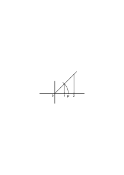
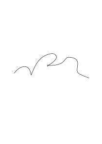

# Bemerkungen über die Grundlagen der Mathematik – V

### [Ms-126,28\[3\]](https://cdn.wittgensteinnachlass.com/2000px/webp/Ms-126/28.webp)

1. Es ist natürlich klar, daß der Mathematiker, insofern er wirklich ‘ein Spiel spielt’ keine _Schlüsse zieht_. Denn ‘spielen’ muß hier heißen: in Übereinstimmung mit gewissen Regeln _handeln_. Und schon das wäre ein Heraustreten aus dem bloßen Spiel; wenn er den Schluß zöge, daß er hier der allgemeinen Regel gemäß _so_ handeln dürfe.

### [Ms-126,30\[2\]](https://cdn.wittgensteinnachlass.com/2000px/webp/Ms-126/30.webp)

2. 28.10.1942

_Rechnet_ die Rechenmaschine?

### [Ms-126,30\[3\]](https://cdn.wittgensteinnachlass.com/2000px/webp/Ms-126/30.webp)

Denk Dir, eine Rechenmaschine wäre durch Zufall entstanden; & nun drückt Einer durch Zufall auf ihre Knöpfe (oder ein Tier läuft über sie) & sie rechnet das Produkt 25 × 20. –

### [Ms-126,30\[4\]](https://cdn.wittgensteinnachlass.com/2000px/webp/Ms-126/30.webp),[31\[1\]](https://cdn.wittgensteinnachlass.com/2000px/webp/Ms-126/31.webp)

Ich will sagen: Es ist der Mathematik wesentlich, daß ihre Zeichen auch _im Zivil_ gebraucht werden. Es ist der Gebrauch außerhalb der Mathematik, also die _Bedeutung_ der Zeichen, was das Zeichenspiel zur Mathematik macht.

### [Ms-126,31\[2\]](https://cdn.wittgensteinnachlass.com/2000px/webp/Ms-126/31.webp)

So, wie es ja auch kein logischer Schluß ist, wenn ich ein Gebilde in ein anderes transformiere (eine Anordnung von Stühlen etwa in eine andere) wenn diese Anordnungen nicht außerhalb dieser Transformation einen sprachlichen Gebrauch haben.

### [Ms-126,31\[3\]](https://cdn.wittgensteinnachlass.com/2000px/webp/Ms-126/31.webp),[32\[1\]](https://cdn.wittgensteinnachlass.com/2000px/webp/Ms-126/32.webp)

3. Aber ist nicht das wahr, daß Einer, der keine Ahnung von der Bedeutung der Russellschen Zeichen hätte, R's Beweise _nachrechnen_ könnte? Und also in einem wichtigen Sinne prüfen könnte ob sie richtig seien oder falsch?

### [Ms-126,33\[4\]](https://cdn.wittgensteinnachlass.com/2000px/webp/Ms-126/33.webp),[34\[1\]](https://cdn.wittgensteinnachlass.com/2000px/webp/Ms-126/34.webp)

29.10.1942

Man könnte eine menschliche Rechenmaschine so abrichten, daß sie, wenn ihr die Schlußregeln gezeigt & etwa an Beispielen vorgeführt wurden, die Beweise eines mathem. Systems (etwa des R'schen) durchliest & nach jedem richtig gezogenen Schluß mit dem Kopf nickt bei einem Fehler aber den Kopf schüttelt & zu rechnen aufhört. Dieses Wesen könnte man sich im übrigen vollkommen idiotisch vorstellen.

### [Ms-126,34\[2\]](https://cdn.wittgensteinnachlass.com/2000px/webp/Ms-126/34.webp)

Einen Beweis nennen wir etwas, was sich nachrechnen, aber auch kopieren läßt.

### [Ms-126,35\[1\]](https://cdn.wittgensteinnachlass.com/2000px/webp/Ms-126/35.webp)

4. Wenn die Math. ein Spiel ist, dann ist ein Spiel spielen Mathematik treiben, & warum dann nicht auch: Tanzen?

### [Ms-126,35\[3\]](https://cdn.wittgensteinnachlass.com/2000px/webp/Ms-126/35.webp),[36\[1\]](https://cdn.wittgensteinnachlass.com/2000px/webp/Ms-126/36.webp)

Denke Dir, daß Rechenmaschinen in der Natur vorkämen, ihre Gehäuse aber für die Menschen undurchdringlich (wären). Und diese Menschen benützten nun diese Vorrichtungen etwa wie wir das Rechnen, wovon sie aber gar nichts wissen. Sie machen also etwa Vorhersagungen mit Hilfe der Rechenmaschinen, aber für sie ist das Handhaben dieser seltsamen Gegenstände ein Experimentieren.

### [Ms-126,36\[2\]](https://cdn.wittgensteinnachlass.com/2000px/webp/Ms-126/36.webp)

30.10.1942

Diesen Leuten fehlen Begriffe, die wir haben; aber wodurch ersetzen sie diese?

### [Ms-126,36\[3\]](https://cdn.wittgensteinnachlass.com/2000px/webp/Ms-126/36.webp),[37\[1\]](https://cdn.wittgensteinnachlass.com/2000px/webp/Ms-126/37.webp)

Denke an den Mechanismus dessen Bewegung wir als geometrischen (kinematischen) Beweis ansahen: Das ist klar, das normalerweise von Einem der das Rad umtreibt nicht gesagt würde, er beweist etwas. Ist es nicht ebenso mit dem, der zum Spiel Zeichen aneinander reiht & diese Reihen verändert; auch wenn, was er hervorbringt als Beweis angesehen werden könnte?

### [Ms-126,37\[2\]](https://cdn.wittgensteinnachlass.com/2000px/webp/Ms-126/37.webp),[38\[1\]](https://cdn.wittgensteinnachlass.com/2000px/webp/Ms-126/38.webp)

Zu sagen, die Math. sei ein Spiel, soll heißen: wir brauchen beim Beweisen nirgends an die Bedeutung der Zeichen appellieren, also an ihre außermathematische Anwendung. Aber was heißt es denn überhaupt, an diese appellieren? Wie kann so ein Appell etwas fruchten?

Heißt das, aus der Mathematik heraustreten & wieder in sie zurückkehren, oder heißt es aus _einer_ math. Schlußweise in eine andre treten?

### [Ms-126,38\[2\]](https://cdn.wittgensteinnachlass.com/2000px/webp/Ms-126/38.webp)

Was heißt es, einen neuen Begriff von der Oberfläche einer Kugel gewinnen? In wiefern ist das dann ein Begriff von der Oberfläche einer _Kugel_? Doch nur insofern er sich auf wirkliche Kugeln anwenden läßt.

### [Ms-126,38\[3\]](https://cdn.wittgensteinnachlass.com/2000px/webp/Ms-126/38.webp)

Wieweit muß man einen Begriff vom ‘Satz’ haben, um die R'sche mathem. Logik zu verstehen?

### [Ms-126,39\[1\]](https://cdn.wittgensteinnachlass.com/2000px/webp/Ms-126/39.webp)

5. 01.11.1942

Wenn die intendierte Anwendung der Math. wesentlich ist, wie steht es da mit Teilen der Mathematik, deren Anwendung – wenigstens _das_, was Mathematiker für eine Anwendung hielten, – gänzlich phantastisch ist. So daß man, wie in der Mengenlehre, einen Zweig der Math. treibt, von dessen Anwendung man sich einen ganz falschen Begriff macht. Treibt man nun nicht _doch_ Mathematik?

### [Ms-126,39\[2\]](https://cdn.wittgensteinnachlass.com/2000px/webp/Ms-126/39.webp),[40\[1\]](https://cdn.wittgensteinnachlass.com/2000px/webp/Ms-126/40.webp)

02.11.1942

Wenn die arithm. Operationen lediglich zur Konstruktion einer Chiffre dienten wäre ihre Verwendung natürlich grundlegend von der unsern verschieden. Wären diese Operationen dann aber überhaupt mathematische Operationen?

### [Ms-126,40\[2\]](https://cdn.wittgensteinnachlass.com/2000px/webp/Ms-126/40.webp),[41\[1\]](https://cdn.wittgensteinnachlass.com/2000px/webp/Ms-126/41.webp)

Kann man von Dem, der eine Regel des Entzifferns anwendet, sagen, er vollziehe mathem. Operationen? Und doch lassen sich seine Transformationen so auffassen. Denn er könnte doch sagen, er berechne, was bei der Entzifferung des Zeichens … nach der und der Regel herauskommen müsse. Und der Satz: daß die Zeichen … dieser Regel gemäß entziffert … ergeben ist ein mathematischer. Sowie auch der Satz: daß man beim Schachspiel von _dieser_ Stellung zu jener kommen kann.

### [Ms-126,41\[2\]](https://cdn.wittgensteinnachlass.com/2000px/webp/Ms-126/41.webp)

Denke Dir die Geometrie des vierdimensionalen Raums zu dem Zweck betrieben, die Lebensbedingungen der Geister kennen zu lernen. Ist sie darum nicht Mathematik? Und kann ich nun sagen sie bestimme Begriffe?

### [Ms-126,41\[3\]](https://cdn.wittgensteinnachlass.com/2000px/webp/Ms-126/41.webp),[42\[1\]](https://cdn.wittgensteinnachlass.com/2000px/webp/Ms-126/42.webp)

Wäre es nicht seltsam von einem Kinde zu sagen, es könne bereits tausende & tausende von Multiplikationen machen – womit (nämlich) gemeint sein soll, es könne bereits im unbegrenzten Zahlenraum rechnen. Und zwar könnte das noch als eine äußerst bescheidene Ausdrucksweise gelten, da er (ja) nur ‘tausende & tausende’ statt ‘unendlich viele’ sagt.

### [Ms-126,42\[2\]](https://cdn.wittgensteinnachlass.com/2000px/webp/Ms-126/42.webp)

Könnte man sich Menschen denken, die im gewöhnlichen Leben etwa nur bis 1000 rechnen & die Rechnungen mit höheren Zahlen mathem. Untersuchungen über die Geisterwelt vorbehalten haben.

### [Ms-126,45\[3\]](https://cdn.wittgensteinnachlass.com/2000px/webp/Ms-126/45.webp),[46\[1\]](https://cdn.wittgensteinnachlass.com/2000px/webp/Ms-126/46.webp)

“Ob das nun von einer _wirklichen_ Kugelfläche gilt – von der mathematischen gilt es” – das erweckt den Anschein, als unterschiede sich der mathem. Satz von einem Erfahrungssatz besonders darin, daß wo die Wahrheit des Erfahrungssatzes schwankend & ungefähr ist, der mathem. Satz _sein_ Objekt exakt & unbedingt wahr beschreibt. Als wäre eben die ‘mathem. Kugel’ eine Kugel. Und man könnte sich etwa fragen ob es nur _eine_ solche Kugel, oder ob es mehrere gebe (eine Fregesche Fragestellung).

### [Ms-126,46\[2\]](https://cdn.wittgensteinnachlass.com/2000px/webp/Ms-126/46.webp),[47\[1\]](https://cdn.wittgensteinnachlass.com/2000px/webp/Ms-126/47.webp)

Tut ein Mißverständnis, die mögliche Anwendung betreffend, der Rechnung als einem Teil der Mathematik Eintrag?

### [Ms-126,47\[2\]](https://cdn.wittgensteinnachlass.com/2000px/webp/Ms-126/47.webp)

Und abgesehen von einem Mißverständnis, – wie ist es mit der bloßen Unklarheit?

### [Ms-126,47\[3\]](https://cdn.wittgensteinnachlass.com/2000px/webp/Ms-126/47.webp),[48\[1\]](https://cdn.wittgensteinnachlass.com/2000px/webp/Ms-126/48.webp)

Wer glaubt, die Mathematiker haben ein seltsames Wesen, die <math display="inline"><msqrt><mrow><mtext>‒</mtext><mn>1</mn></mrow></msqrt></math>, entdeckt, die quadriert nun doch ‒ 1 ergebe, kann der nicht doch ganz gut mit komplexen Zahlen rechnen & solche Rechnungen in der Physik anwenden? Und sind's darum weniger _Rechnungen_? In _einer_ Beziehung steht freilich sein Verständnis auf schwachen Füßen; aber er wird mit Sicherheit seine Schlüsse ziehen, & sein, Kalkül wird auf _festen_ Füßen stehen.

### [Ms-126,48\[2\]](https://cdn.wittgensteinnachlass.com/2000px/webp/Ms-126/48.webp)

Wäre es nun nicht lächerlich, zu sagen, dieser triebe nicht Mathematik?

### [Ms-126,48\[3\]](https://cdn.wittgensteinnachlass.com/2000px/webp/Ms-126/48.webp),[49\[1\]](https://cdn.wittgensteinnachlass.com/2000px/webp/Ms-126/49.webp)

Es erweitert Einer die Math., gibt neue Definitionen & findet neue Lehrsätze – – & in _gewisser_ Beziehung kann man sagen, er wisse nicht was er tut. – Er hat eine vage Vorstellung, etwas _entdeckt_ zu haben wie einen Raum (wobei er an ein Zimmer denkt), ein Reich erschlossen zu haben, & würde, darüber gefragt, viel Unsinn reden.

### [Ms-126,49\[2\]](https://cdn.wittgensteinnachlass.com/2000px/webp/Ms-126/49.webp)

Denken wir uns den primitiven Fall, daß Einer ungeheure Multiplikationen ausführte um wie er sagt: dadurch neue riesige Provinzen des Zahlenreichs zu gewinnen.

### [Ms-126,49\[3\]](https://cdn.wittgensteinnachlass.com/2000px/webp/Ms-126/49.webp),[50\[1\]](https://cdn.wittgensteinnachlass.com/2000px/webp/Ms-126/50.webp)

Denk Dir das Rechnen mit der <math display="inline"><msqrt><mrow><mtext>‒</mtext><mn>1</mn></mrow></msqrt></math> wäre von einem Narren erfunden worden, der bloß vom Paradoxen der Idee angezogen die Rechnung als eine Art Gottesdienst des Absurden treibt. Er bildet sich ein das Unmögliche aufzuschreiben & mit ihm zu operieren.

### [Ms-126,50\[2\]](https://cdn.wittgensteinnachlass.com/2000px/webp/Ms-126/50.webp)

Mit andern Worten: Wer an die mathematischen _Gegenstände_ glaubt & ihre seltsamen Eigenschaften, – kann der nicht doch Mathematik betreiben? Oder: – treibt der nicht auch Mathematik?

### [Ms-126,50\[3\]](https://cdn.wittgensteinnachlass.com/2000px/webp/Ms-126/50.webp),[51\[1\]](https://cdn.wittgensteinnachlass.com/2000px/webp/Ms-126/51.webp)

05.11.1942

‘Idealer Gegenstand’. “Das Zeichen ‘a’ bezeichnet einen idealen Gegenstand” soll offenbar etwas über die Bedeutung, also den Gebrauch von ‘a’ aussagen. Und es heißt natürlich, daß dieser Gebrauch _in_ gewisser Beziehung ähnlich ist dem eines Zeichens, das einen Gegenstand hat, & daß es (aber) keinen Gegenstand bezeichnet. Es ist aber interessant, was der Ausdruck ‘idealer Gegenstand’ aus diesem Faktum macht.

### [Ms-126,51\[3\]](https://cdn.wittgensteinnachlass.com/2000px/webp/Ms-126/51.webp),[52\[1\]](https://cdn.wittgensteinnachlass.com/2000px/webp/Ms-126/52.webp)

6. Man könnte unter Umständen von einer endlosen Kugelreihe reden. – Denken wir uns eine solche gerade endlose Reihe von Kugeln in gleichen Abständen & wir berechnen die Kraft, die alle diese Kugeln nach einem bestimmten Attraktionsgesetz auf einen bestimmten Körper ausüben. Die Zahl, die diese Rechnung liefert, betrachten wir als das Ideal der Genauigkeit für gewisse Messungen.

### [Ms-126,52\[2\]](https://cdn.wittgensteinnachlass.com/2000px/webp/Ms-126/52.webp)

Das Gefühl des _Seltsamen_ kommt hier von einem Mißverständnis. Der Art von Mißverständnis, die ein Daumenfangen des Verstandes erzeugt– – dem ich Einhalt gebieten will.

### [Ms-126,52\[3\]](https://cdn.wittgensteinnachlass.com/2000px/webp/Ms-126/52.webp),[53\[1\]](https://cdn.wittgensteinnachlass.com/2000px/webp/Ms-126/53.webp)

Der Einwand, daß ‘das Endliche nicht das Unendliche erfassen kann’ richtet sich _eigentlich_ gegen die Idee eines psychologischen Akts des Erfassens oder Verstehens.

### [Ms-126,53\[2\]](https://cdn.wittgensteinnachlass.com/2000px/webp/Ms-126/53.webp)

Oder denke Dir, wir sagen einfach: “Diese Kraft entspricht der Anziehung einer endlosen Kugelreihe die so & so angeordnet sind & den Körper nach diesem Attraktionsgesetz anziehen”. Oder wieder: “Berechne die Kraft die eine endlose Kugelreihe, von der & der Beschaffenheit, auf einen Körper ausübt!” – Dieser Befehl hat doch gewiß Sinn. Eine bestimmte Rechnung ist beschrieben.

### [Ms-126,54\[1\]](https://cdn.wittgensteinnachlass.com/2000px/webp/Ms-126/54.webp)

Wie wäre es mit dieser Aufgabe: “Berechne das Gewicht einer Säule von sovielen aufeinander liegenden Platten, als es Kardinalzahlen gibt; die unterste Platte wiegt 1 kg jede höhere immer die Hälfte der vorhergehenden.”

### [Ms-126,54\[2\]](https://cdn.wittgensteinnachlass.com/2000px/webp/Ms-126/54.webp)

Die Schwierigkeit ist _nicht_ die, daß wir uns keine Vorstellung machen können. Es ist leicht genug sich irgend eine Vorstellung einer unendlichen Reihe, z.B., zu machen. Es fragt sich: was nützt uns die Vorstellung.

### [Ms-126,54\[3\]](https://cdn.wittgensteinnachlass.com/2000px/webp/Ms-126/54.webp),[55\[1\]](https://cdn.wittgensteinnachlass.com/2000px/webp/Ms-126/55.webp)

Denke Dir unendliche Zahlen in: einem Märchen gebraucht. Die Zwerge haben soviele Goldstücke aufeinander gelegt, als es Kardinalzahlen gibt – etc. Was in einem Märchen vorkommen kann, muß doch Sinn haben. –

### [Ms-126,55\[2\]](https://cdn.wittgensteinnachlass.com/2000px/webp/Ms-126/55.webp)

7. Denke Dir die Mengenlehre wäre als eine Art Parodie der Mathematik von einem Satiriker erfunden worden. – Später hätte man dann einen Nutzen in ihr gesehen & sie in die Mathematik einbezogen. (Denn wenn der eine sie als das Paradies der Mathematiker ansehen kann, warum nicht ein andrer als einen Scherz?)

### [Ms-126,55\[3\]](https://cdn.wittgensteinnachlass.com/2000px/webp/Ms-126/55.webp),[56\[1\]](https://cdn.wittgensteinnachlass.com/2000px/webp/Ms-126/56.webp)

Die Frage ist: ist sie nun als Scherz nicht auch offenbar Mathematik? –

### [Ms-126,56\[2\]](https://cdn.wittgensteinnachlass.com/2000px/webp/Ms-126/56.webp)

Und warum ist sie offenbar Mathematik? – Weil sie ein Zeichenspiel nach Regeln ist?

### [Ms-126,56\[3\]](https://cdn.wittgensteinnachlass.com/2000px/webp/Ms-126/56.webp)

Werden hier nicht doch offenbar Begriffe gebildet, – auch wenn man sich über deren Anwendung nicht im Klaren ist? Aber wie kann man einen Begriff haben & sich über seine Anwendung nicht im Klaren sein?

### [Ms-126,56\[4\]](https://cdn.wittgensteinnachlass.com/2000px/webp/Ms-126/56.webp),[57\[1\]](https://cdn.wittgensteinnachlass.com/2000px/webp/Ms-126/57.webp)

8. 06.11.1942

Nimm die Konstruktion des Kräftepolygons: ist das nicht ein Stück angewandte Mathematik? & wo ist der Satz der _reinen_ Mathematik der bei dieser graphischen Berechnung zu Hülfe genommen wird? Ist dies nicht ein Fall wie der des Stammes, welcher eine rechnerische Technik zum Zweck gewisser Vorhersagungen hat, aber keine Sätze der reinen Mathematik?

### [Ms-126,57\[2\]](https://cdn.wittgensteinnachlass.com/2000px/webp/Ms-126/57.webp),[58\[1\]](https://cdn.wittgensteinnachlass.com/2000px/webp/Ms-126/58.webp)

Die Rechnung die zur Ausführung einer Zeremonie dient. Es werde z.B. nach einer bestimmten Technik aus dem Alter des Vaters & der Mutter & der Anzahl ihrer Kinder die Anzahl der Worte einer Segensformel abgeleitet die auf das Haus der Familie anzuwenden ist. In einem Gesetz wie dem Mosaischen könnte man sich Rechenvorgänge beschrieben denken. Und könnte man sich nicht denken, daß das Volk das diese zeremoniellen Rechenvorschriften besitzt im praktischen Leben nie rechnet?

### [Ms-126,58\[2\]](https://cdn.wittgensteinnachlass.com/2000px/webp/Ms-126/58.webp)

Dies wäre zwar ein _angewandtes_ Rechnen, aber es würde nicht dem Zweck einer Vorhersage dienen.

### [Ms-126,58\[3\]](https://cdn.wittgensteinnachlass.com/2000px/webp/Ms-126/58.webp)

07.11.1942

Wäre es ein Wunder wenn die Technik des Rechnens eine Familie von Anwendungen hätte?!

### [Ms-126,58\[4\]](https://cdn.wittgensteinnachlass.com/2000px/webp/Ms-126/58.webp),[59\[1\]](https://cdn.wittgensteinnachlass.com/2000px/webp/Ms-126/59.webp)

9. 08.11.1942

Wie seltsam die Frage ist ob in der unendlichen Entwicklung von π die Figur φ (eine gewisse Anordnung von Ziffern, z.B. ‘770’) vorkommen wird, sieht man erst wenn man die Frage in einer ganz hausbackenen Weise zu stellen versucht: Menschen sind darauf abgerichtet worden nach gewissen Regeln Zeichen zu setzen. Sie verfahren nun dieser Abrichtung gemäß & wir sagen es sei ein Problem, ob sie der gegebenen Regel folgend _jemals_ die Figur φ anschreiben werden.

### [Ms-126,60\[1\]](https://cdn.wittgensteinnachlass.com/2000px/webp/Ms-126/60.webp)

Was aber sagt der, der, wie Weyl, sagt, eines sei klar: man werde oder werde nicht, in der endlosen Entwicklung auf φ kommen?

### [Ms-126,60\[2\]](https://cdn.wittgensteinnachlass.com/2000px/webp/Ms-126/60.webp)

Mir scheint, wer dies sagt, stellt schon selbst eine Regel, oder ein Postulat auf.

### [Ms-126,60\[3\]](https://cdn.wittgensteinnachlass.com/2000px/webp/Ms-126/60.webp)

Wie, wenn man auf eine Frage hin erwiderte: ‘Auf diese Frage gibt es bis jetzt noch keine Antwort’?

### [Ms-126,60\[4\]](https://cdn.wittgensteinnachlass.com/2000px/webp/Ms-126/60.webp),[61\[1\]](https://cdn.wittgensteinnachlass.com/2000px/webp/Ms-126/61.webp)

So könnte etwa der Dichter antworten der gefragt wird ob der Held seiner Dichtung eine Schwester hat oder nicht – wenn er nämlich noch nichts darüber entschieden hat.

### [Ms-126,61\[2\]](https://cdn.wittgensteinnachlass.com/2000px/webp/Ms-126/61.webp)

Die Frage – will ich sagen – verändert ihren Status, wenn sie entscheidbar wird. Denn ein Zusammenhang wird dann gemacht, der früher nicht _da war_.

### [Ms-126,61\[3\]](https://cdn.wittgensteinnachlass.com/2000px/webp/Ms-126/61.webp),[62\[1\]](https://cdn.wittgensteinnachlass.com/2000px/webp/Ms-126/62.webp)

Man kann von dem Abgerichteten fragen: ‘wie _wird_ er die Regel für diesen Fall deuten?’, oder auch ‘wie _soll_ er die Regel für diesen Fall deuten’. Wie aber, wenn über diese Frage keine Entscheidung getroffen wurde? – Nun, dann ist die Antwort nicht: ‘er soll sie so deuten, daß φ in der Entwicklung vorkommt’ oder: ‘er soll sie so deuten daß es nicht vorkommt’, sondern: ‘darüber ist noch nichts entschieden’.

### [Ms-126,133\[3\]](https://cdn.wittgensteinnachlass.com/2000px/webp/Ms-126/133.webp),[134\[1\]](https://cdn.wittgensteinnachlass.com/2000px/webp/Ms-126/134.webp)

So seltsam es klingt: Die Weiterentwicklung einer irrationalen Zahl ist eine Weiterentwicklung der Mathematik.

### [Ms-126,62\[2\]](https://cdn.wittgensteinnachlass.com/2000px/webp/Ms-126/62.webp)

Wir mathematisieren mit den Begriffen. – Und mit gewissen Begriffen mehr als mit andern.

### [Ms-126,62\[3\]](https://cdn.wittgensteinnachlass.com/2000px/webp/Ms-126/62.webp)

10.11.1942

Ich will sagen: Es _scheint_, als ob ein Entscheidungsgrund bereits vorläge; & er muß erst erfunden werden.

### [Ms-126,63\[1\]](https://cdn.wittgensteinnachlass.com/2000px/webp/Ms-126/63.webp)

Käme das darauf hinaus, zu sagen: Man benutzt beim Reden über die gelernte Technik des Entwickelns das falsche Bild einer vollendeten Entwicklung (dessen, was man für gewöhnlich ‘Reihe’ nennt) & wird dadurch gezwungen unbeantwortbare Fragen zu stellen.

### [Ms-126,63\[2\]](https://cdn.wittgensteinnachlass.com/2000px/webp/Ms-126/63.webp),[64\[1\]](https://cdn.wittgensteinnachlass.com/2000px/webp/Ms-126/64.webp)

Denn schließlich müßte sich doch jede Frage über die Entwicklung von √2 auf eine praktische Frage, die Technik des Entwickelns betreffend, bringen lassen.

### [Ms-126,64\[2\]](https://cdn.wittgensteinnachlass.com/2000px/webp/Ms-126/64.webp)

Und es handelt sich hier natürlich nicht nur um den Fall der Entwicklung einer reellen Zahl oder überhaupt die Erzeugung mathematischer Zeichen, sondern um jeden analogen Vorgang, er sei ein Spiel, ein Tanz, etc. etc.

### [Ms-126,64\[3\]](https://cdn.wittgensteinnachlass.com/2000px/webp/Ms-126/64.webp),[65\[1\]](https://cdn.wittgensteinnachlass.com/2000px/webp/Ms-126/65.webp)

10. Wenn Einer den Satz vom ausgeschlossenen Dritten uns als größte Wahrheit vorhält, so ist klar, daß mit seiner Frage etwas nicht in Ordnung ist.

### [Ms-126,65\[2\]](https://cdn.wittgensteinnachlass.com/2000px/webp/Ms-126/65.webp)

Wenn einer den Satz vom ausgeschlossenen Dritten aufstellt so legt er uns gleichsam zwei Bilder zur Auswahl vor & sagt, eins müsse der Tatsache entsprechen. Wie aber, wenn es fraglich ist, ob sich die Bilder hier anwenden lassen?

### [Ms-126,65\[3\]](https://cdn.wittgensteinnachlass.com/2000px/webp/Ms-126/65.webp),[66\[1\]](https://cdn.wittgensteinnachlass.com/2000px/webp/Ms-126/66.webp)

Und wer von der endlosen Entwicklung sagt sie müsse die Figur φ enthalten oder sie nicht enthalten zeigt uns sozusagen das Bild einer in die Ferne verlaufenden unübersehbaren Reihe.

### [Ms-126,66\[2\]](https://cdn.wittgensteinnachlass.com/2000px/webp/Ms-126/66.webp)

Wie aber, wenn das Bild in weiter Ferne zu flimmern anfinge?

### [Ms-126,66\[3\]](https://cdn.wittgensteinnachlass.com/2000px/webp/Ms-126/66.webp)

11. Von einer unendlichen Reihe zu sagen, sie enthielte eine bestimmte Figur _nicht_, hat nur unter ganz gewissen Bedingungen Sinn.

### [Ms-126,66\[4\]](https://cdn.wittgensteinnachlass.com/2000px/webp/Ms-126/66.webp)

11.11.1942

D.h.: man hat diesem Satz für gewisse Fälle Sinn gegeben.

### [Ms-126,66\[5\]](https://cdn.wittgensteinnachlass.com/2000px/webp/Ms-126/66.webp),[67\[1\]](https://cdn.wittgensteinnachlass.com/2000px/webp/Ms-126/67.webp)

Ungefähr den: Es ist im _Gesetz_ dieser Reihe, keine Figur … zu enthalten. Ferner, man könnte sagen: Wie … Ferner: (So) wie ich die Entwicklung weiterrechne, errechne ich etwas neues über das Gesetz der Reihe.

### [Ms-126,67\[2\]](https://cdn.wittgensteinnachlass.com/2000px/webp/Ms-126/67.webp),[68\[1\]](https://cdn.wittgensteinnachlass.com/2000px/webp/Ms-126/68.webp)

“Nun gut, – so können wir sagen: ‘Es muß entweder im Gesetz der Reihe liegen, daß die Figur vorkommt, oder das Gegenteil’.” Aber ist das so? – “Nun, _determiniert_ das Entwicklungsgesetz die Reihe denn nicht vollkommen? Und wenn es das tut, keine Zweideutigkeiten läßt, dann muß es, implicite, alle Eigenschaften der Reihe bestimmen.” – Du denkst da an die endlichen Reihen.

### [Ms-126,68\[2\]](https://cdn.wittgensteinnachlass.com/2000px/webp/Ms-126/68.webp),[69\[1\]](https://cdn.wittgensteinnachlass.com/2000px/webp/Ms-126/69.webp)

‘Aber es sind doch alle Glieder der Reihe vom <math class="stacked" display="inline"><msup><mn>1</mn><mtext>sten</mtext></msup></math> bis zum <math class="stacked" display="inline"><mn>100</mn><msup><mn>0</mn><mtext>sten</mtext></msup></math>, bis zum 10¹⁰-ten, u.s.f., bestimmt; also sind doch _alle_ Glieder bestimmt.’ Das ist richtig, wenn es heißen soll es sei nicht (etwa) das so-&-so-vielte _nicht_ bestimmt. Aber Du siehst ja, daß _das_ Dir keinen Aufschluß darüber gibt, ob eine Figur in der Reihe erscheinen wird (wenn sie so weit nicht erschienen ist). _Wir sehen also_, daß wir ein irreführendes _Bild_ gebrauchen.

### [Ms-126,69\[2\]](https://cdn.wittgensteinnachlass.com/2000px/webp/Ms-126/69.webp)

Willst Du mehr über die Reihe wissen, so mußt Du, so zu sagen, in eine andere Dimension (gleichsam wie aus der Linie in die Ebene) gehen. – Aber ist denn nicht die Ebene _da_, wie die Linie, & nur zu _erforschen_, wenn man wissen will, wie es sich verhält?

### [Ms-126,70\[1\]](https://cdn.wittgensteinnachlass.com/2000px/webp/Ms-126/70.webp)

Nein, die Mathematik dieser weitern Dimension muß so gut erfunden werden, wie jede Mathematik.

### [Ms-126,70\[2\]](https://cdn.wittgensteinnachlass.com/2000px/webp/Ms-126/70.webp)

In einer Arithmetik, in der man nicht weiter als 5 zählt, hat die Frage, wieviel 4 + 3 ist noch keinen Sinn. Wohl aber kann das Problem existieren, dieser Frage einen Sinn zu geben. D.h.: die Frage hat _so wenig_ Sinn, wie der Satz vom ausgeschlossenen Dritten, auf sie angewendet.

### [Ms-126,70\[3\]](https://cdn.wittgensteinnachlass.com/2000px/webp/Ms-126/70.webp),[71\[1\]](https://cdn.wittgensteinnachlass.com/2000px/webp/Ms-126/71.webp)

12. Man meint in dem Satz vom ausgeschlossenen Dritten schon etwas Festes zu haben, was jedenfalls nicht in Zweifel zu ziehen ist. Während in Wahrheit der Sinn dieser Tautologie (wenn man so sagen darf) ebenso schwankend ist wie der der Frage, ob p oder ~p der Fall ist.

### [Ms-126,71\[2\]](https://cdn.wittgensteinnachlass.com/2000px/webp/Ms-126/71.webp),[72\[1\]](https://cdn.wittgensteinnachlass.com/2000px/webp/Ms-126/72.webp),[73\[1\]](https://cdn.wittgensteinnachlass.com/2000px/webp/Ms-126/73.webp)

12.11.1942

Denke, ich fragte: Was meint man damit “die Figur … kommt in dieser Entwickelung vor?”. So wird man antworten: “Du _weißt_ doch was das heißt. Sie kommt vor, wie die Figur … in der Entwicklung … tatsächlich vorkommt.” – Wohl; aber wie kann ich diese Analogie nun gebrauchen? Denn ich verstehe wohl, wenn man mir nun sagt: “Kommt die Figur 159 in den ersten 100 Stellen von √2 vor, wie sie in den ersten 10 Stellen von π vorkommt?” Denke Dir, man sagte: “Entweder sie kommt so vor, oder sie kommt nicht so vor”!

### [Ms-126,73\[2\]](https://cdn.wittgensteinnachlass.com/2000px/webp/Ms-126/73.webp)

‘Aber verstehst Du denn wirklich nicht, was gemeint ist?!’ – Aber kann ich nicht glauben, ich verstehe es & mich irren? –

### [Ms-126,73\[3\]](https://cdn.wittgensteinnachlass.com/2000px/webp/Ms-126/73.webp)

Wie weiß ich denn, was es heißt: die Figur … komme in der Entwicklung vor? Doch durch Beispiele – die mir zeigen, wie das ist, wenn … Diese Beispiele zeigen mir aber nicht, wie es ist, wenn die Figur in der Entwickelung _nicht_ vorkommt!

### [Ms-126,73\[4\]](https://cdn.wittgensteinnachlass.com/2000px/webp/Ms-126/73.webp),[74\[1\]](https://cdn.wittgensteinnachlass.com/2000px/webp/Ms-126/74.webp)

Könnte man nicht sagen: wenn ich wirklich ein Recht hätte zu sagen, diese Beispiele lehren mich, wie es ist wenn die Figur in der Entwicklung vorkommt, so müßten sie mir auch zeigen, was das Gegenteil des Satzes bedeutet.

### [Ms-126,74\[2\]](https://cdn.wittgensteinnachlass.com/2000px/webp/Ms-126/74.webp)

13. Der allgemeine Satz die Figur kommt in der Entwicklung nicht vor kann nur ein _Gebot_ sein.

### [Ms-126,74\[3\]](https://cdn.wittgensteinnachlass.com/2000px/webp/Ms-126/74.webp)

Wie wenn man die math. Sätze als Gebote ansieht & sie auch als solche ausspricht? “25² gebe 625!” Nun – ein Gebot hat eine innere & eine äußere Verneinung.

### [Ms-126,75\[1\]](https://cdn.wittgensteinnachlass.com/2000px/webp/Ms-126/75.webp)

Die Symbole “(x)․φx” & “(∃x)․φx” sind wohl nützlich in der Math., wenn man im übrigen die Technik der Beweise der Existenz oder Nicht-Existenz kennt auf den sich die Russellschen Zeichen _hier_ beziehen. Wird dies aber offen gelassen so sind diese Begriffe der alten Logik äußerst irreführend.

### [Ms-126,75\[2\]](https://cdn.wittgensteinnachlass.com/2000px/webp/Ms-126/75.webp),[76\[1\]](https://cdn.wittgensteinnachlass.com/2000px/webp/Ms-126/76.webp)

Wenn Einer sagt: “aber Du weißt doch was ‘die Figur kommt in der Entwicklung vor’ bedeutet, nämlich _das_” – & zeigt auf einen Fall des Vorkommens, – so kann ich nur erwidern, daß was er mir zeigt _verschiedene_ Fakten illustrieren kann. Man kann daher nicht sagen ich wisse was der Satz heißt, weil ich weiß, daß er ihn in diesem Fall gewiß anwenden wird.

### [Ms-126,76\[2\]](https://cdn.wittgensteinnachlass.com/2000px/webp/Ms-126/76.webp)

Das Gegenteil von “es besteht ein Gesetz, daß p” ist nicht: “es besteht ein Gesetz, daß ~p”. Drückt man aber das erste durch P, das zweite durch ~P aus, so wird man in Schwierigkeiten geraten.

### [Ms-126,76\[3\]](https://cdn.wittgensteinnachlass.com/2000px/webp/Ms-126/76.webp),[77\[1\]](https://cdn.wittgensteinnachlass.com/2000px/webp/Ms-126/77.webp)

14. 13.11.1942

Wie, wenn den Kindern beigebracht wird, die Erde sei eine unendliche Ebene; oder Gott habe eine unendliche Reihe von Sternen geschaffen; oder ein Stern fliege in einer geraden Linie gleichförmig immer weiter & weiter ohne je aufzuhören. Seltsam: wenn man so etwas als selbstverständlich, gleichsam ganz ruhig, aufnimmt, so verliert es alles Paradoxe. Es ist als sagte mir jemand: Beruhige Dich, diese Reihe, oder Bewegung, läuft fort & fort ohne je aufzuhören. Wir sind sozusagen der Mühe überhoben (je) an ein Ende zu denken.

### [Ms-126,78\[1\]](https://cdn.wittgensteinnachlass.com/2000px/webp/Ms-126/78.webp)

‘Wir werden ein Ende nicht in Betracht ziehen’. (We won't bother about an end.)

### [Ms-126,78\[2\]](https://cdn.wittgensteinnachlass.com/2000px/webp/Ms-126/78.webp)

Man könnte auch sagen: ‘für uns ist die Reihe endlos’.

### [Ms-126,78\[3\]](https://cdn.wittgensteinnachlass.com/2000px/webp/Ms-126/78.webp)

‘Wir werden uns um ein Ende der Reihe nicht bekümmern; für uns ist es immer unabsehbar.’

### [Ms-126,78\[4\]](https://cdn.wittgensteinnachlass.com/2000px/webp/Ms-126/78.webp),[79\[1\]](https://cdn.wittgensteinnachlass.com/2000px/webp/Ms-126/79.webp)

15. 14.11.1942

Nicht ‘abzählbar’ sollte es heißen – von den rationalen Zahlen etwa – sondern ‘abzählfähig’. Man kann die rationalen Zahlen nicht _abzählen_, weil man sie nicht zählen kann, aber man kann mittels der rationalen Zahlen zählen – so, wie mit den Kardinalzahlen. Die schiefe Ausdrucksweise gehört mit zu dem ganzen System der Vorspiegelung, daß wir mit dem neuen Apparat die unendlichen Mengen mit der selben Sicherheit behandeln, wie bis dahin nur die endlichen.

### [Ms-126,116\[2\]](https://cdn.wittgensteinnachlass.com/2000px/webp/Ms-126/116.webp),[117\[1\]](https://cdn.wittgensteinnachlass.com/2000px/webp/Ms-126/117.webp)

08.12.1942

“Abzählbar” dürfte es nicht heißen, dagegen hätte es Sinn zu sagen “numerierbar”. Und dieser Ausdruck läßt auch die Anwendung des Begriffs erkennen. Denn man kann zwar die rationalen Zahlen nicht abzählen wollen, wohl aber kann man ihnen Nummern zulegen wollen.

### [Ms-126,79\[2\]](https://cdn.wittgensteinnachlass.com/2000px/webp/Ms-126/79.webp),[80\[1\]](https://cdn.wittgensteinnachlass.com/2000px/webp/Ms-126/80.webp)

15.11.1942

Aber wo ist hier das Problem? Warum soll ich nicht sagen, was wir Mathematik nennen sei eine Familie von Tätigkeiten zu einer Familie von Zwecken. Die Menschen könnten z.B. Rechnungen zum Zweck einer Art von Wettrennen gebrauchen. Wie Kinder ja wirklich manchmal um die Wette rechnen; nur daß diese Verwendung bei uns keine große Rolle spielt.

### [Ms-126,80\[2\]](https://cdn.wittgensteinnachlass.com/2000px/webp/Ms-126/80.webp),[81\[1\]](https://cdn.wittgensteinnachlass.com/2000px/webp/Ms-126/81.webp)

Oder das Multiplizieren könnte uns viel schwerer fallen, als es tut – wenn wir z.B. nur mündlich rechneten, & um uns eine Multiplikation zu merken, sie also zu erfassen, wäre es nötig sie in die Form eines gereimten Gedichts zu bringen. Wäre dies dann einem Menschen gelungen, so hätte er das Gefühl, eine große, wunderbare Wahrheit gefunden zu haben. Es wäre sozusagen für jede neue Multiplikation eine neue individuelle Arbeit nötig.

### [Ms-126,81\[2\]](https://cdn.wittgensteinnachlass.com/2000px/webp/Ms-126/81.webp),[82\[1\]](https://cdn.wittgensteinnachlass.com/2000px/webp/Ms-126/82.webp)

Wenn diese Leute nun glaubten, die Zahlen wären Geister & durch ihre Rechnungen erforschten sie das Geisterreich, oder zwängen die Geister, sich zu offenbaren – wäre dies nun Arithmetik? Oder – wäre es auch dann Arithmetik, wenn diese Menschen die Rechnungen zu nichts anderm gebrauchten?

### [Ms-126,82\[3\]](https://cdn.wittgensteinnachlass.com/2000px/webp/Ms-126/82.webp)

16. Der Vergleich mit der Alchemie liegt nahe. Man könnte von einer Alchemie in der Mathematik reden.

### [Ms-126,83\[2\]](https://cdn.wittgensteinnachlass.com/2000px/webp/Ms-126/83.webp),[84\[1\]](https://cdn.wittgensteinnachlass.com/2000px/webp/Ms-126/84.webp)

Charakterisiert schon das die mathem. Alchimie, daß die mathem. Sätze als Aussagen über mathem. Gegenstände betrachtet werden, – also die Math. als die Erforschung dieser Gegenstände?

### [Ms-126,84\[2\]](https://cdn.wittgensteinnachlass.com/2000px/webp/Ms-126/84.webp)

In einem gewissen Sinn kann man in der Math. darum nicht an die Bedeutung der Zeichen appellieren, weil die Math. ihnen erst die Bedeutung gibt.

### [Ms-126,84\[3\]](https://cdn.wittgensteinnachlass.com/2000px/webp/Ms-126/84.webp),[85\[1\]](https://cdn.wittgensteinnachlass.com/2000px/webp/Ms-126/85.webp)

Es ist das Typische der Erscheinung von welcher ich rede, daß das _Mysteriöse_ an irgend einem mathem. Begriff nicht _sofort_ als irrige Auffassung, als Fehlbegriff, gedeutet wird; sondern als etwas, was jedenfalls nicht zu verachten, vielleicht sogar eher zu respektieren ist.

### [Ms-126,85\[2\]](https://cdn.wittgensteinnachlass.com/2000px/webp/Ms-126/85.webp)

Alles was ich machen kann ist einen leichten Weg aus dieser Unklarheit & dem Glitzern der Begriffe zeigen.

### [Ms-126,85\[3\]](https://cdn.wittgensteinnachlass.com/2000px/webp/Ms-126/85.webp)

Man kann seltsamerweise sagen, daß an allen diesen glänzenden Begriffsbildungen ein sozusagen solider Kern ist. Und ich möchte sagen, daß der es ist der sie zu mathem. Produkten macht.

### [Ms-126,86\[1\]](https://cdn.wittgensteinnachlass.com/2000px/webp/Ms-126/86.webp)

Man könnte sagen: Was Du siehst schaut freilich mehr wie eine glänzende Lufterscheinung aus; aber sieh sie von einem andern Winkel an & Du siehst (einen) soliden Körper, der nur von jener Richtung aus gesehen glänzt & unkörperlich aussieht.

### [Ms-126,87\[3\]](https://cdn.wittgensteinnachlass.com/2000px/webp/Ms-126/87.webp)

17. ‘Die Figur ist in der Reihe, oder sie ist nicht in der Reihe’ heißt: entweder schaut die Sache _so_ aus oder sie schaut nicht so aus.

### [Ms-126,87\[4\]](https://cdn.wittgensteinnachlass.com/2000px/webp/Ms-126/87.webp),[88\[1\]](https://cdn.wittgensteinnachlass.com/2000px/webp/Ms-126/88.webp)

Wie weiß man, was das Gegenteil des Satzes “φ kommt in der Reihe vor”, oder auch des Satzes “φ kommt nicht in der Reihe vor” bedeutet? Diese Frage klingt unsinnig, hat aber doch einen Sinn. Nämlich: wie weiß ich, daß ich den Satz, “φ kommt in der Reihe vor”, verstehe. Es ist wahr, ich kann Beispiele geben für das Vorkommen & Nicht-Vorkommen. Und sie sind Beispiele dafür, daß es eine Regel gibt, die das Vorkommen in einer bestimmten Zone, oder einer Reihe von Zonen, vorschreibt, oder bestimmt daß dies Vorkommen ausgeschlossen ist.

### [Ms-126,88\[2\]](https://cdn.wittgensteinnachlass.com/2000px/webp/Ms-126/88.webp),[89\[1\]](https://cdn.wittgensteinnachlass.com/2000px/webp/Ms-126/89.webp)

Wenn “Du tust es” heißt: Du mußt es tun, & “Du tust es nicht” heißt: Du darfst es nicht tun – dann ist “Du tust es, oder Du tust es nicht” nicht der Satz vom ausgeschlossenen Dritten.

### [Ms-126,89\[2\]](https://cdn.wittgensteinnachlass.com/2000px/webp/Ms-126/89.webp)

Jeder fühlt sich ungemütlich bei dem Gedanken, ein Satz sage aus, in der endlosen Reihe komme das & das nicht vor – dagegen hat es gar nichts Befremdliches ein Befehl sage in dieser Reihe dürfe, soweit sie auch fortgesetzt werde, das nicht vorkommen.

### [Ms-126,89\[3\]](https://cdn.wittgensteinnachlass.com/2000px/webp/Ms-126/89.webp),[90\[1\]](https://cdn.wittgensteinnachlass.com/2000px/webp/Ms-126/90.webp)

Woher aber dieser Unterschied zwischen: “soweit Du auch gehst, wirst Du das nie finden” – & “soweit Du auch gehst darfst Du das nie tun”?

### [Ms-126,90\[2\]](https://cdn.wittgensteinnachlass.com/2000px/webp/Ms-126/90.webp)

Auf jenen Satz kann man fragen: “wie kann man so etwas wissen”, aber nichts Analoges gilt vom Befehl.

### [Ms-126,90\[3\]](https://cdn.wittgensteinnachlass.com/2000px/webp/Ms-126/90.webp)

Die Aussage scheint sich zu übernehmen, der Befehl aber gar nicht.

### [Ms-126,90\[4\]](https://cdn.wittgensteinnachlass.com/2000px/webp/Ms-126/90.webp)

Kann man sich denken, daß alle mathematischen Sätze im Imperativ ausgesprochen würden? Z.B.: “10 × 10 sei 100”.

### [Ms-126,91\[1\]](https://cdn.wittgensteinnachlass.com/2000px/webp/Ms-126/91.webp)

Und wer nun sagt: “Es sei so, oder es sei nicht so”, der spricht nicht den Satz vom ausgeschlossenen Dritten aus, – sondern eine _Regel_. (Wie ich es schon weiter oben einmal gesagt habe.)

### [Ms-126,91\[2\]](https://cdn.wittgensteinnachlass.com/2000px/webp/Ms-126/91.webp)

18. 17.11.1942

Aber ist das wirklich ein Ausweg aus der Schwierigkeit? Denn wie verhält es sich dann mit allen anderen mathem. Sätzen, sagen wir 25² = 625, gilt für diese nicht der Satz vom ausgeschlossenen Dritten _innerhalb_ der Mathematik?

### [Ms-126,91\[3\]](https://cdn.wittgensteinnachlass.com/2000px/webp/Ms-126/91.webp),[92\[1\]](https://cdn.wittgensteinnachlass.com/2000px/webp/Ms-126/92.webp)

Wie wendet man denn den Satz vom ausgeschlossenen Dritten an?

### [Ms-126,92\[2\]](https://cdn.wittgensteinnachlass.com/2000px/webp/Ms-126/92.webp)

18.11.1942

“Es gibt entweder eine Regel die es gebietet, oder eine, die es verbietet”.

### [Ms-126,92\[3\]](https://cdn.wittgensteinnachlass.com/2000px/webp/Ms-126/92.webp)

Angenommen, es gibt keine Regel die das Vorkommen verbietet, – warum soll es dann eine geben, die es gebietet?

### [Ms-126,92\[4\]](https://cdn.wittgensteinnachlass.com/2000px/webp/Ms-126/92.webp),[93\[1\]](https://cdn.wittgensteinnachlass.com/2000px/webp/Ms-126/93.webp)

Hat es Sinn zu sagen: “Es gibt zwar keine Regel die das Vorkommen verbietet, die Figur kommt aber tatsächlich doch nicht vor”? – Und wenn das nun keinen Sinn hat – wie kann das Gegenteil davon Sinn haben, nämlich, die Figur komme vor?

### [Ms-126,93\[2\]](https://cdn.wittgensteinnachlass.com/2000px/webp/Ms-126/93.webp)

Nun, wenn ich sage, sie kommt vor, schwebt mir das Bild der Reihe vor, von ihrem Anfang bis zu jener Figur – wenn ich aber sage die Figur komme _nicht_ vor, so nützt mir kein solches Bild der Reihe.

### [Ms-126,93\[3\]](https://cdn.wittgensteinnachlass.com/2000px/webp/Ms-126/93.webp),[94\[1\]](https://cdn.wittgensteinnachlass.com/2000px/webp/Ms-126/94.webp)

Wie, wenn die Regel sich beim Gebrauch unmerklich biegen würde? Ich meine so, daß ich von verschiedenen Räumen sprechen könnte, in denen ich sie gebrauche.

### [Ms-126,94\[2\]](https://cdn.wittgensteinnachlass.com/2000px/webp/Ms-126/94.webp)

Das Gegenteil von “es darf nicht vorkommen” heißt “es darf vorkommen”. Für ein _endliches_ Stück der Reihe aber scheint das Gegenteil von “es darf in ihm nicht vorkommen” zu sein: “es _muß_ darin vorkommen”.

### [Ms-126,94\[3\]](https://cdn.wittgensteinnachlass.com/2000px/webp/Ms-126/94.webp),[95\[1\]](https://cdn.wittgensteinnachlass.com/2000px/webp/Ms-126/95.webp)

19.11.1942

Das Seltsame in der Alternative “φ kommt in der unendlichen Reihe vor, oder es kommt nicht vor” ist, daß wir uns die beiden Möglichkeiten einzeln vorstellen müssen, daß wir nach einer Vorstellung für jedes besonders suchen, & daß nicht wie sonst _eine_ für den negativen & für den positiven Fall zureicht.

### [Ms-126,95\[2\]](https://cdn.wittgensteinnachlass.com/2000px/webp/Ms-126/95.webp)

19. Wie weiß ich, daß der allgemeine Satz “Es gibt …” hier Sinn hat? Nun, wenn er zu einer Mitteilung über die Technik des Entwickelns in einem Sprachspiel verwendet werden kann.

### [Ms-126,95\[3\]](https://cdn.wittgensteinnachlass.com/2000px/webp/Ms-126/95.webp),[96\[1\]](https://cdn.wittgensteinnachlass.com/2000px/webp/Ms-126/96.webp),[97\[1\]](https://cdn.wittgensteinnachlass.com/2000px/webp/Ms-126/97.webp)

_Eine_ Mitteilung heißt: “es darf nicht vorkommen” – d.h.: wenn es vorkommt, hast Du falsch gerechnet. Eine heißt: “es darf vorkommen”, d.h., es existiert so ein Verbot nicht. Eine: “es muß in der & der Region (an diesen Stellen, immer in diesen Regionen) vorkommen”. Das Gegenteil davon aber scheint zu sein: “es darf dort & dort nicht vorkommen”– statt “es _muß_ dort nicht vorkommen”. Wie aber, wenn man die Regel gäbe, daß, z.B., überall, wo die Bildungsregel von π 4 ergibt, statt der 4 auch eine beliebige andere Ziffer gesetzt werden kann. Zieh auch die Regel in Betracht die an gewissen Stellen eine Ziffer verbietet, aber im übrigen die Wahl offen läßt.

### [Ms-126,97\[2\]](https://cdn.wittgensteinnachlass.com/2000px/webp/Ms-126/97.webp)

20.11.1942

Ist es nicht so? Die Begriffe in den mathematischen Sätzen von den unendlichen Dezimalbrüchen sind nicht Begriffe von Reihen, sondern von der unbegrenzten Technik des Entwickelns von Reihen.

### [Ms-126,97\[3\]](https://cdn.wittgensteinnachlass.com/2000px/webp/Ms-126/97.webp),[98\[1\]](https://cdn.wittgensteinnachlass.com/2000px/webp/Ms-126/98.webp)

Wir lernen eine endlose Technik: D.h., es wird uns etwas vorgemacht, wir machen es nach; es werden uns Regeln gesagt & wir machen Übungen in ihrer Befolgung, es wird dabei vielleicht auch ein Ausdruck wie “u.s.f. ad inf.” gebraucht, aber damit ist nicht von irgend einer riesigen Ausdehnung die Rede.

### [Ms-126,98\[2\]](https://cdn.wittgensteinnachlass.com/2000px/webp/Ms-126/98.webp)

_Das_ sind die Fakten. Und was heißt es nun: “φ kommt entweder in der Entwickelung vor, oder es kommt nicht vor”?

### [Ms-126,98\[3\]](https://cdn.wittgensteinnachlass.com/2000px/webp/Ms-126/98.webp),[99\[1\]](https://cdn.wittgensteinnachlass.com/2000px/webp/Ms-126/99.webp)

20. Aber heißt das nun, daß es kein Problem gibt: “Kommt die Figur φ in dieser Entwickelung vor?”? – Wer das fragt fragt & nach einer Regel das Vorkommen von φ betreffend. Und die Alternative des Existierens oder Nichtexistierens so einer Regel ist jedenfalls keine mathematische.

### [Ms-126,99\[2\]](https://cdn.wittgensteinnachlass.com/2000px/webp/Ms-126/99.webp)

Erst innerhalb einem, erst zu errichtenden, mathem. Gebäude wird die Frage zur mathematischen.

### [Ms-126,100\[1\]](https://cdn.wittgensteinnachlass.com/2000px/webp/Ms-126/100.webp)

21. Ist denn das Unendliche nicht wirklich – kann ich nicht sagen: “diese zwei Kanten der Platte schneiden sich im Unendlichen”?

### [Ms-126,100\[2\]](https://cdn.wittgensteinnachlass.com/2000px/webp/Ms-126/100.webp)

Nicht “der Kreis hat diese Eigenschaft weil er durch die beiden unendlich fernen Punkte … geht”; sondern: “die Eigenschaften des Kreises lassen sich aus dieser (merkwürdigen) Perspektive betrachten”.

### [Ms-126,100\[3\]](https://cdn.wittgensteinnachlass.com/2000px/webp/Ms-126/100.webp),[101\[1\]](https://cdn.wittgensteinnachlass.com/2000px/webp/Ms-126/101.webp)

Es ist wesentlich eine Perspektive; & eine weithergeholte. (Womit kein Tadel ausgesprochen ist.) Aber es muß immer ganz klar sein _wie weit_ hergeholt diese Anschauungsart ist. Denn sonst ist ihre eigentliche _Bedeutung_ im Dunkeln.

### [Ms-126,101\[2\]](https://cdn.wittgensteinnachlass.com/2000px/webp/Ms-126/101.webp)

22. Was heißt das: “der Mathematiker weiß nicht was er tut”, oder “er weiß was er tut”?

### [Ms-126,101\[3\]](https://cdn.wittgensteinnachlass.com/2000px/webp/Ms-126/101.webp),[102\[1\]](https://cdn.wittgensteinnachlass.com/2000px/webp/Ms-126/102.webp)

23. 23.11.1942

Kann man unendliche Vorhersagungen machen? – Nun, warum soll man nicht z.B. das Trägheitsgesetz eine solche nennen? Oder den Satz, daß ein Komet eine Parabel beschreibt? In gewissem Sinne wird freilich ihre Unendlichkeit nicht sehr ernst genommen.

### [Ms-126,102\[2\]](https://cdn.wittgensteinnachlass.com/2000px/webp/Ms-126/102.webp)

Wie ist es nun mit einer _Vorhersagung_: daß, wer π entwickelt, so weit er auch gehen mag, nie auf die Figur φ stoßen wird? – Nun, man könnte sagen, daß dies entweder eine _unmathematische_ Vorhersagung ist, oder (aber) eine mathematische Regel.

### [Ms-126,102\[3\]](https://cdn.wittgensteinnachlass.com/2000px/webp/Ms-126/102.webp),[103\[1\]](https://cdn.wittgensteinnachlass.com/2000px/webp/Ms-126/103.webp)

Jemand, der √2 entwickeln gelernt hat geht zu einer Wahrsagerin, & sie weissagt ihm, daß soweit er auch die √2 entwickeln mag, er nie zu einer Figur … gelangen wird. – Ist ihre Weissagung ein mathem. Satz? Nein. – Außer sie sagt: “wenn Du immer richtig entwickelst, wirst Du nie dahin kommen”. Aber ist das noch eine Vorhersage?

### [Ms-126,103\[2\]](https://cdn.wittgensteinnachlass.com/2000px/webp/Ms-126/103.webp),[104\[1\]](https://cdn.wittgensteinnachlass.com/2000px/webp/Ms-126/104.webp)

Es scheint nun, daß so eine _Vorhersage_ des richtig Entwickelten denkbar wäre und sich von einem mathem. Gesetz, daß es sich so & so verhalten _muß_, unterschiede. So daß es in der mathem. Entwickelung einen Unterschied gäbe zwischen dem, was tatsächlich so herauskommt – gleichsam zufällig – & dem, was herauskommen muß.

### [Ms-126,104\[2\]](https://cdn.wittgensteinnachlass.com/2000px/webp/Ms-126/104.webp)

24.11.1942

Wie soll man es entscheiden, ob eine unendliche Voraussage Sinn hat? So jedenfalls nicht, daß man sagt: “ich bin sicher, ich _meine_ etwas, wenn ich sage …”.

### [Ms-126,104\[3\]](https://cdn.wittgensteinnachlass.com/2000px/webp/Ms-126/104.webp),[105\[1\]](https://cdn.wittgensteinnachlass.com/2000px/webp/Ms-126/105.webp)

Auch ist wohl nicht so sehr die Frage, ob die Voraussage irgend einen Sinn hat, als: was für eine Art von Sinn sie hat. (Also, in welchen Sprachspielen sie vorkommt.)

### [Ms-126,108\[2\]](https://cdn.wittgensteinnachlass.com/2000px/webp/Ms-126/108.webp)

24. 28.11.1942

“Der unheilvolle Einbruch” der Logik in die Mathematik.

### [Ms-126,109\[3\]](https://cdn.wittgensteinnachlass.com/2000px/webp/Ms-126/109.webp)

In dem so vorbereiteten Feld ist _das_ ein Existenzbeweis.

### [Ms-126,109\[4\]](https://cdn.wittgensteinnachlass.com/2000px/webp/Ms-126/109.webp),[110\[1\]](https://cdn.wittgensteinnachlass.com/2000px/webp/Ms-126/110.webp)

Das Verderbliche der logischen Technik ist, daß sie uns die spezielle mathem. Technik vergessen läßt. Während die logische Technik nur eine Hilfstechnik in der Math. ist. Z.B. gewisse Verbindungen zwischen anderen Techniken herstellt.

### [Ms-126,110\[2\]](https://cdn.wittgensteinnachlass.com/2000px/webp/Ms-126/110.webp)

Es ist beinahe als wollte man sagen, daß das Tischlern im Leimen besteht.

### [Ms-126,112\[1\]](https://cdn.wittgensteinnachlass.com/2000px/webp/Ms-126/112.webp)

25. Der Beweis überzeugt Dich davon daß es eine Wurzel der Gleichung gibt (ohne Dir eine Ahnung zu geben _wo_) – – wie weißt Du, daß Du den Satz verstehst, es gebe eine Wurzel? Wie weißt Du daß Du wirklich von etwas überzeugt bist? Du magst davon überzeugt sein, daß sich die Anwendung des bewiesenen Satzes finden lassen wird. Aber Du verstehst ihn nicht solange Du sie nicht gefunden hast.

### [Ms-126,113\[1\]](https://cdn.wittgensteinnachlass.com/2000px/webp/Ms-126/113.webp)

Wenn ein Beweis allgemein beweist, _es gebe_ eine Wurzel, so kommt alles darauf an, in welcher Form er das beweist. Was es ist, das hier zu diesem Wortausdruck führt, der ein bloßer Schemen ist & die _Hauptsache_ verschweigt. Während er den Logikern nur die Nebensache zu verschweigen scheint.

### [Ms-126,117\[2\]](https://cdn.wittgensteinnachlass.com/2000px/webp/Ms-126/117.webp)

Das mathematisch Allgemeine steht zum mathematisch Besonderen nicht in dem Verhältnis wie sonst das Allgemeine zum Besondern.

### [Ms-126,117\[3\]](https://cdn.wittgensteinnachlass.com/2000px/webp/Ms-126/117.webp),[118\[1\]](https://cdn.wittgensteinnachlass.com/2000px/webp/Ms-126/118.webp)

Alles was ich sage kommt eigentlich darauf hinaus, daß man einen Beweis wohl kennen, & ihm Schritt für Schritt folgen kann, & dabei doch, was bewiesen wurde, nicht _versteht._

### [Ms-126,118\[2\]](https://cdn.wittgensteinnachlass.com/2000px/webp/Ms-126/118.webp)

Und das hängt wieder damit zusammen, daß man einen mathem. Satz grammatisch richtig bilden kann ohne seinen Sinn zu verstehen.

### [Ms-126,118\[3\]](https://cdn.wittgensteinnachlass.com/2000px/webp/Ms-126/118.webp),[119\[1\]](https://cdn.wittgensteinnachlass.com/2000px/webp/Ms-126/119.webp)

Wann versteht man ihn nun? – Ich glaube: wenn man ihn anwenden kann. Man könnte vielleicht sagen: wenn man ein klares Bild von seiner Anwendung hat. Dazu aber genügt es nicht, daß man ein klares Bild mit ihm verbindet. Vielmehr wäre besser gewesen zu sagen: wenn man eine klare Übersicht von seiner Anwendung hat. Und auch das ist schlecht, denn es handelt sich nur darum daß man die Anwendung nicht dort vermutet wo sie nicht ist; daß man sich von der Wortform des Satzes nicht täuschen läßt.

### [Ms-126,119\[2\]](https://cdn.wittgensteinnachlass.com/2000px/webp/Ms-126/119.webp),[120\[1\]](https://cdn.wittgensteinnachlass.com/2000px/webp/Ms-126/120.webp)

Wie kommt es aber nun daß man einen Satz, oder Beweis, auf diese Weise nicht verstehen, oder mißverstehen kann? Und was ist dann nötig um das Verständnis herbeizuführen?

### [Ms-126,120\[2\]](https://cdn.wittgensteinnachlass.com/2000px/webp/Ms-126/120.webp)

Es gibt da, glaube ich, Fälle in denen Einer den Satz (oder Beweis) zwar anwenden kann, über die Art der Anwendung aber nicht klar Rechenschaft zu geben im Stande ist. Und den Fall, daß er den Satz auch nicht anzuwenden weiß. (Mult. Ax.)

### [Ms-126,120\[3\]](https://cdn.wittgensteinnachlass.com/2000px/webp/Ms-126/120.webp)

Wie ist es in der Beziehung mit 0 × 0 = 0?

### [Ms-126,120\[4\]](https://cdn.wittgensteinnachlass.com/2000px/webp/Ms-126/120.webp),[121\[1\]](https://cdn.wittgensteinnachlass.com/2000px/webp/Ms-126/121.webp)

09.12.1942

Man möchte sagen, das Verständnis eines math. Satzes sei nicht durch seine Wortform garantiert, wie im Fall der meisten nicht-mathematischen Sätze. Das heißt – so scheint es – daß der Wortlaut das _Sprachspiel_ nicht bestimmt, in welchem der Satz funktioniert.

### [Ms-126,121\[2\]](https://cdn.wittgensteinnachlass.com/2000px/webp/Ms-126/121.webp)

Die logische Notation verschluckt die Struktur.

### [Ms-126,121\[3\]](https://cdn.wittgensteinnachlass.com/2000px/webp/Ms-126/121.webp),[122\[1\]](https://cdn.wittgensteinnachlass.com/2000px/webp/Ms-126/122.webp)

26. Um zu sehen, wie man etwas ‘Existenzbeweis’ nennen kann, was keine Konstruktion des Existierenden zuläßt, denke an die verschiedenen Bedeutungen des Wortes “wo” (z.B. des topologischen & des metrischen.)

### [Ms-126,122\[2\]](https://cdn.wittgensteinnachlass.com/2000px/webp/Ms-126/122.webp)

10.12.1942

Es kann ja der Existenzbeweis nicht nur den Ort des ‘Existierenden’ unbestimmt lassen, sondern es braucht auf einen solchen Ort gar nicht anzukommen. D.h.: wenn der bewiesene Satz lautet “es gibt eine Zahl, für die …” so muß es keinen Sinn haben zu fragen “und welches ist diese Zahl”, oder zu sagen “und diese Zahl ist …”

### [Ms-127,47\[4\]](https://cdn.wittgensteinnachlass.com/2000px/webp/Ms-127/47.webp),[48\[1\]](https://cdn.wittgensteinnachlass.com/2000px/webp/Ms-127/48.webp),[49\[1\]](https://cdn.wittgensteinnachlass.com/2000px/webp/Ms-127/49.webp)

27. 01.02.1943

Ein Beweis, daß 777 in der Entwicklung von π vorkommt, der nicht zeigt, wo, müßte diese Entwicklung von einem ganz neuen Standpunkt ansehen, sodaß er etwa Eigenschaften von Regionen der Entwickelung zeigte von denen wir nur wüßten, daß sie sehr weit entfernt liegen. Es schwebt mir dabei vor daß man sehr weit draußen in π sozusagen eine dunkle Zone von unbestimmter Länge annehmen müßte, wo unsere Rechenhilfsmittel nicht mehr verläßlich sind & noch weiter draußen dann eine Zone, wo man auf _andere_ Weise wieder etwas sehen kann.

### [Ms-126,122\[3\]](https://cdn.wittgensteinnachlass.com/2000px/webp/Ms-126/122.webp),[123\[1\]](https://cdn.wittgensteinnachlass.com/2000px/webp/Ms-126/123.webp),[124\[1\]](https://cdn.wittgensteinnachlass.com/2000px/webp/Ms-126/124.webp)

28. 11.12.1942

Vom Beweis durch reductio ad absurdum kann man sich immer vorstellen, er werde im Argument mit einem Opponenten gebraucht, der eine mathematisch unhaltbare Behauptung macht. Ich meine aber nicht eine _mathematische_ Behauptung. Etwa, er habe gesehen, wie der A den B mit den & den Figuren matt gesetzt habe – wenn das nach den Regeln nicht möglich ist.

### [Ms-126,124\[2\]](https://cdn.wittgensteinnachlass.com/2000px/webp/Ms-126/124.webp),[125\[1\]](https://cdn.wittgensteinnachlass.com/2000px/webp/Ms-126/125.webp)

Die Schwierigkeit, die man beim Beweis durch reductio ad absurdum in der Math. empfindet ist die: Was geht bei diesem Beweis vor? Etwas mathematisch Absurdes, also Unmathematisches? Wie kann man – möchte man fragen – das mathematisch Absurde überhaupt nur annehmen? Daß ich das physikalisch Falsche annehmen & ad absurdum führen kann macht mir keine Schwierigkeiten. Aber wie das sozusagen Undenkbare denken?!

### [Ms-126,125\[2\]](https://cdn.wittgensteinnachlass.com/2000px/webp/Ms-126/125.webp),[126\[1\]](https://cdn.wittgensteinnachlass.com/2000px/webp/Ms-126/126.webp)

Der indirekte Beweis sagt aber: “wenn Du es _so_ willst, darfst Du _das_ nicht annehmen: denn **da**mit ist nur das Gegenteil dessen vereinbar wovon Du nicht abgehen willst”.

### [Ms-126,131\[3\]](https://cdn.wittgensteinnachlass.com/2000px/webp/Ms-126/131.webp),[132\[1\]](https://cdn.wittgensteinnachlass.com/2000px/webp/Ms-126/132.webp)

29. 14.12.1942

Die geometrische Illustration der math. Analysis ist allerdings unwesentlich, nicht aber die geometrische Anwendung. Ursprünglich waren die geometrischen Illustrationen _Anwendungen der Analysis_. Wo sie aufhören dies zu sein, können sie leicht gänzlich irreführen. Hier haben wir dann die phantastische Anwendung. Die eingebildete Anwendung.

### [Ms-126,132\[2\]](https://cdn.wittgensteinnachlass.com/2000px/webp/Ms-126/132.webp)

Die Idee des ‘Schnittes’ ist so eine gefährliche Illustration.

### [Ms-126,132\[3\]](https://cdn.wittgensteinnachlass.com/2000px/webp/Ms-126/132.webp)

Nur soweit, als die Illustrationen auch Anwendungen sind, erzeugen sie nicht das gewisse Schwindelgefühl, das die Illustration erzeugt im Moment, wo sie aufhört eine mögliche Anwendung zu sein; wo sie also dumm wird.

### [Ms-126,110\[3\]](https://cdn.wittgensteinnachlass.com/2000px/webp/Ms-126/110.webp),[111\[1\]](https://cdn.wittgensteinnachlass.com/2000px/webp/Ms-126/111.webp)

30. So könnte man Dedekinds Theorem ableiten wenn, was wir irrationale Zahlen nennen _ganz unbekannt_ wäre, wenn es aber eine Technik gäbe, die Stellen vor Dezimalzahlen zu würfeln. Und dieses Theorem hätte dann seine Anwendung auch wenn es die Mathematik der irrationalen Zahlen nicht gäbe. Es ist nicht, als sähen die Dedekindschen Entwicklungen alle besonderen reellen Zahlen schon voraus. Es _scheint_ nur so, sobald man den Dedekindschen Kalkül mit den Kalkülen der besonderen reellen Zahlen vereinigt.

### [Ms-126,136\[3\]](https://cdn.wittgensteinnachlass.com/2000px/webp/Ms-126/136.webp),[137\[1\]](https://cdn.wittgensteinnachlass.com/2000px/webp/Ms-126/137.webp)

31. Man könnte fragen: Was könnte ein Kind von 10 Jahren am Beweis des Dedekindschen Satzes _nicht_ verstehen? – Ist denn dieser Beweis nicht viel einfacher, als alle die Rechnungen die das Kind beherrschen muß? – Und wenn nun jemand sagte: den tieferen Inhalt des Satzes kann es nicht verstehen – dann frage ich: wie kommt dieses Gesetz zu einem tiefen Inhalt?

### [Ms-126,138\[2\]](https://cdn.wittgensteinnachlass.com/2000px/webp/Ms-126/138.webp)

32. Das Bild der Zahlengeraden ist ein absolut natürliches bis zu einem gewissen Punkt: nämlich, soweit man es _nicht_ zu einer allgemeinen Theorie der reellen Zahlen gebraucht.

### [Ms-126,148\[2\]](https://cdn.wittgensteinnachlass.com/2000px/webp/Ms-126/148.webp),[149\[1\]](https://cdn.wittgensteinnachlass.com/2000px/webp/Ms-126/149.webp),[150\[1\]](https://cdn.wittgensteinnachlass.com/2000px/webp/Ms-126/150.webp)

33. Wenn Du die _reellen_ Zahlen in eine höhere & eine niedere Klasse teilen willst, so tu's erst einmal roh durch

zwei rationale Punkte P & Q. Dann halbiere P – Q & entscheide, in welcher Hälfte (wenn nicht im Teilungspunkt) der Schnitt liegen soll; wenn z.B. in der unteren, halbiere diese & mache eine genauere Entscheidung; u.s.f.. Hast Du ein Prinzip der unbegrenzten Fortsetzung, so kannst Du von diesem Prinzip sagen, es führe einen Schnitt aus, da es von jeder Zahl entscheidet, ob sie rechts oder links liegt. – Nun ist die Frage, ob ich durch ein solches Prinzip der Teilung _überall_ hin gelangen kann oder ob noch eine andere Art der Entscheidung nötig ist; & man könnte fragen, ob _nach_ der vollendeten Entscheidung durch das Prinzip oder _vor_ der Vollendung. Nun, jedenfalls nicht vor der Vollendung; denn solange noch die Frage ist in welchem endlichen Stück der Geraden der Punkt liegen soll, kann die weitere Teilung entscheiden. – Aber _nach_ der Entscheidung durch ein Prinzip ist noch Raum für eine weitere Entscheidung?

### [Ms-126,150\[2\]](https://cdn.wittgensteinnachlass.com/2000px/webp/Ms-126/150.webp)

Es ist mit dem Dedekindschen Satz wie mit dem Satz vom ausgeschlossenen Dritten: Er scheint ein Drittes auszuschließen, während von einem Dritten in ihm nicht die Rede ist.

### [Ms-126,151\[1\]](https://cdn.wittgensteinnachlass.com/2000px/webp/Ms-126/151.webp)

Der Beweis des D.schen Satzes arbeitet mit einem Bild, das _ihn_ nicht rechtfertigen kann, das eher vom Satz gerechtfertigt werden soll.

### [Ms-126,151\[2\]](https://cdn.wittgensteinnachlass.com/2000px/webp/Ms-126/151.webp)

Ein Prinzip der Teilung siehst Du leicht für eine unendlich fortgesetzte Teilung an, denn es entspricht jedenfalls keiner endlichen Teilung & scheint Dich weiter & weiter zu führen.

### [Ms-126,153\[2\]](https://cdn.wittgensteinnachlass.com/2000px/webp/Ms-126/153.webp),[154\[1\]](https://cdn.wittgensteinnachlass.com/2000px/webp/Ms-126/154.webp)

34. Man könnte auch so fragen: könnte man nicht die Lehre vom Limes, der Funktionen, der reellen Zahlen, mehr, als man es tut, _extensional vorbereiten_? auch wenn dieser vorbereitende Kalkül _sehr_ trivial & an sich nutzlos erscheinen sollte?

### [Ms-126,154\[2\]](https://cdn.wittgensteinnachlass.com/2000px/webp/Ms-126/154.webp),[155\[1\]](https://cdn.wittgensteinnachlass.com/2000px/webp/Ms-126/155.webp),[156\[1\]](https://cdn.wittgensteinnachlass.com/2000px/webp/Ms-126/156.webp),[157\[1\]](https://cdn.wittgensteinnachlass.com/2000px/webp/Ms-126/157.webp)

Die Schwierigkeit der bald intensionalen bald wieder extensionalen Betrachtungsweise beginnt schon beim Begriff des ‘Schnittes’. Daß man jede rationale Zahl ein Prinzip der Teilung der rationalen Zahlen nennen kann ist wohl klar. Nun _entdecken_ wir etwas anderes was wir Prinzip der Teilung nennen können, etwas das, welches der √2 entspricht. Dann andere ähnliche – & nun sind wir mit der Möglichkeit solcher Teilungen schon ganz wohlvertraut, & sehen sie unter dem Bild eines irgendwo entlang der Geraden geführten Schnittes, _also extensional._ Denn wenn ich _schneide_, so kann ich ja wählen, wo ich schneiden will. Ist aber ein _Prinzip_ der Teilung ein Schnitt, so ist es dies doch nur weil man von beliebigen rationalen Zahlen sagen kann sie seien oberhalb oder unterhalb des Schnitts. – Kann man nun sagen die Idee des Schnitts habe uns von den rationalen Zahlen zu irrationalen Zahlen geführt? Sind wir denn z.B. zur √2 durch den Begriff des Schnitts gelangt. Was ist nun ein Schnitt der reellen Zahlen? Nun, ein Prinzip der Teilung in eine untere & eine obere Klasse. So ein Prinzip gibt also jede rationale & irrationale Zahl ab. Denn wenn wir auch kein System der irrationalen Zahlen haben so zerfallen doch die, _die wir haben_, in obere & untere in Bezug auf den Schnitt (soweit sie mit ihm nämlich vergleichbar sind). Nun ist aber die Dedekindsche Idee, daß die Einteilung in eine obere & untere Klasse (mit den bekannten Bedingungen) die reelle Zahl ist.

### [Ms-126,157\[2\]](https://cdn.wittgensteinnachlass.com/2000px/webp/Ms-126/157.webp)

Der Schnitt ist eine extensive _Vorstellung_.

### [Ms-126,157\[3\]](https://cdn.wittgensteinnachlass.com/2000px/webp/Ms-126/157.webp),[158\[1\]](https://cdn.wittgensteinnachlass.com/2000px/webp/Ms-126/158.webp)

Es ist freilich wahr daß wenn ich ein mathematisches Kriterium habe um für eine beliebige rationale Zahl festzustellen ob sie zur oberen oder unteren Klasse gehört, es ein Leichtes ist mich dem Ort systematisch beliebig zu nähern, wo die beiden Klassen sich treffen.

### [Ms-126,158\[2\]](https://cdn.wittgensteinnachlass.com/2000px/webp/Ms-126/158.webp)

Wir machen bei Dedekind einen Schnitt nicht dadurch, daß wir schneiden also auf den Ort zeigen, sondern daß wir – wie beim Finden der Quadratwurzel aus 2 – uns den einander zugekehrten Enden der oberen & unteren Klasse nähern.

### [Ms-126,158\[3\]](https://cdn.wittgensteinnachlass.com/2000px/webp/Ms-126/158.webp),[159\[1\]](https://cdn.wittgensteinnachlass.com/2000px/webp/Ms-126/159.webp)

Nun soll bewiesen werden, daß keine anderen Zahlen, als nur die reellen, so einen Schnitt ausführen können.

### [Ms-126,159\[2\]](https://cdn.wittgensteinnachlass.com/2000px/webp/Ms-126/159.webp)

06.01.1943

Vergessen wir nicht, daß _ursprünglich_ die Teilung der rationalen Zahlen in zwei Klassen keinen Sinn hatte, bis wir auf Gewisses aufmerksam machten, was man so bezeichnen konnte. Der Begriff _ist vom täglichen Sprachgebrauch hergenommen_ & scheint darum auch für die Zahlen unmittelbar einen Sinn haben zu müssen.

### [Ms-126,159\[3\]](https://cdn.wittgensteinnachlass.com/2000px/webp/Ms-126/159.webp),[160\[1\]](https://cdn.wittgensteinnachlass.com/2000px/webp/Ms-126/160.webp),[161\[1\]](https://cdn.wittgensteinnachlass.com/2000px/webp/Ms-126/161.webp)

Wenn man nun die Idee eines Schnitts der _reellen_ Zahlen einführt, indem man sagt, es sei jetzt einfach der Begriff des Schnitts von den rationalen auf die reellen Zahlen auszudehnen; alles was wir brauchen ist eine Eigenschaft, die die reellen Zahlen in zwei Klassen einteilt (etc.) – so ist _zunächst_ nicht klar was mit so einer Eigenschaft gemeint ist, die _alle_ reellen Zahlen so einteilt. Nun kann man uns darauf aufmerksam machen, daß jede reelle Zahl dazu dienen kann. Aber das führt uns nur soweit & nicht weiter.

### [Ms-127,10\[1\]](https://cdn.wittgensteinnachlass.com/2000px/webp/Ms-127/10.webp)

35. 08.01.1943

Die extensionalen Erklärungen der Funktionen, der reellen Zahlen, etc. übergehen alles Intensionale – obwohl sie es voraussetzen – & beziehen sich auf die immer wiederkehrende äußere Form.

### [Ms-127,12\[2\]](https://cdn.wittgensteinnachlass.com/2000px/webp/Ms-127/12.webp),[13\[1\]](https://cdn.wittgensteinnachlass.com/2000px/webp/Ms-127/13.webp)

36. 09.01.1943

Unsre Schwierigkeit fängt eigentlich schon mit der unendlichen Geraden an; obwohl wir schon als Knaben lernen, eine Gerade habe kein Ende, & ich weiß nicht, daß diese Idee irgend jemand Schwierigkeiten bereitet hätte. Wie, wenn ein Finitist versuchte diesen Begriff durch den einer geraden Strecke von bestimmter Länge zu ersetzen?!

Aber die Gerade ist ein _Gesetz_ des Fortschreitens.*

### [Ms-127,17\[2\]](https://cdn.wittgensteinnachlass.com/2000px/webp/Ms-127/17.webp)

Der Begriff des Limes & der Stätigkeit, wie sie heute eingeführt werden, hängen, ohne daß dies ausgesprochen wird mit dem Begriff des _Beweises_ zusammen. Denn wir sagen <math class="stacked" display="inline"><mfrac linethickness="0"><mrow><mtext>lim</mtext></mrow><mrow><mtext>x→</mtext><mtext>∞</mtext></mrow></mfrac><mspace width="0.3em"/><mtext>f(</mtext><mtext>x)</mtext><mspace width="0.3em"/><mo>=</mo><mspace width="0.3em"/><mtext>ℓ</mtext></math>, wenn _bewiesen_ werden kann, daß … Das heißt, wir gebrauchen Begriffe, die unendlich viel schwerer zu fassen sind als die, die wir offen herzeigen.

### [Ms-127,20\[2\]](https://cdn.wittgensteinnachlass.com/2000px/webp/Ms-127/20.webp),[21\[1\]](https://cdn.wittgensteinnachlass.com/2000px/webp/Ms-127/21.webp),[21\[2\]](https://cdn.wittgensteinnachlass.com/2000px/webp/Ms-127/21.webp),[22\[1\]](https://cdn.wittgensteinnachlass.com/2000px/webp/Ms-127/22.webp)

37. 12.01.1943

Die irreführende Idee in der D'schen extensionalen Auffassung ist, daß die reellen Zahlen in der Zahlenlinie alle ausgebreitet da liegen. – Man kennt sie nicht alle, aber was macht das? Und so braucht man nur zu schneiden, oder in Klassen teilen & hat sie alle geteilt, die bekannten & die unbekannten.

Das Irreführende an der D'schen extensionalen Auffassung ist die Idee daß die reellen Zahlen in der Zahlenlinie ausgebreitet daliegen. Man mag sie kennen oder nicht; das macht nichts. Und so braucht man nur zu schneiden, oder in Klassen teilen & has dealt with them all.

### [Ms-127,22\[2\]](https://cdn.wittgensteinnachlass.com/2000px/webp/Ms-127/22.webp),[23\[1\]](https://cdn.wittgensteinnachlass.com/2000px/webp/Ms-127/23.webp)

Es ist durch die _Kombination_ der _Rechnung & der Konstruktion_, daß man die Idee erhält es müßte auf der Geraden ein Punkt ausgelassen werden, nämlich P,

wenn man nicht die √2 als ein Maß der Entfernung von O zuließe. ‘Denn, wenn ich wirklich genau konstruierte, so müßte dann der Kreis die Gerade _zwischen_ ihren Punkten hindurch schneiden’.

### [Ms-127,23\[2\]](https://cdn.wittgensteinnachlass.com/2000px/webp/Ms-127/23.webp)

Das ist ein schrecklich verwirrendes Bild.

### [Ms-127,23\[3\]](https://cdn.wittgensteinnachlass.com/2000px/webp/Ms-127/23.webp)

15.01.1943

Die irrationalen Zahlen sind – könnte man sagen – Einzelfälle.

### [Ms-127,24\[1\]](https://cdn.wittgensteinnachlass.com/2000px/webp/Ms-127/24.webp)

18.01.1943

Was ist die _Anwendung_ des Begriffes der Geraden, der ein Punkt fehlt? Die Anwendung muß ‘hausbacken’ sein. Der Ausdruck “Gerade, der ein Punkt fehlt” ist ein fürchterlich irreleitendes Bild. Der klaffende Spalt zwischen Illustration & Anwendung.

### [Ms-127,13\[3\]](https://cdn.wittgensteinnachlass.com/2000px/webp/Ms-127/13.webp),[14\[1\]](https://cdn.wittgensteinnachlass.com/2000px/webp/Ms-127/14.webp)

38. Die Allgemeinheit der Funktionen ist sozusagen eine _ungeordnete_ Allgemeinheit. Und unsere Mathematik ist auf so eine ungeordnete Allgemeinheit aufgebaut.

### [Ms-127,31\[4\]](https://cdn.wittgensteinnachlass.com/2000px/webp/Ms-127/31.webp),[32\[1\]](https://cdn.wittgensteinnachlass.com/2000px/webp/Ms-127/32.webp)

39. Wenn man sich den allgemeinen Funktionen-Kalkül ohne die Existenz von Beispielen denkt, dann sind eben die vagen Erklärungen durch Wertetafeln & Zeichnungen, wie man sie in den Lehrbüchern findet, am Platz, als _Andeutungen_, wie etwa diesem Kalkül einmal ein Sinn gegeben werden möchte.

### [Ms-127,32\[2\]](https://cdn.wittgensteinnachlass.com/2000px/webp/Ms-127/32.webp)

Denk' Dir Einer sagte: “Ich will eine Komposition hören, die _so_ geht:”

### [Ms-127,32\[3\]](https://cdn.wittgensteinnachlass.com/2000px/webp/Ms-127/32.webp),[33\[1\]](https://cdn.wittgensteinnachlass.com/2000px/webp/Ms-127/33.webp)

Müßte das unsinnig sein? Könnte es nicht eine Komposition geben von der sich zeigen ließe daß sie, in irgend einem wichtigen Sinne, dieser Linie entspräche?

### [Ms-127,36\[2\]](https://cdn.wittgensteinnachlass.com/2000px/webp/Ms-127/36.webp),[37\[1\]](https://cdn.wittgensteinnachlass.com/2000px/webp/Ms-127/37.webp)

Oder wie, wenn man die Stätigkeit als Eigenschaft des Zeichens “x² + y² = z²” ansähe – natürlich nur, wenn diese Gleichung & andere _gewohnheitsmäßig_ einer bestimmten Art der Prüfung unterzogen würden. ‘_So_ stellt sich diese Regel (Gleichung) zu dieser bestimmten Prüfung.’ Eine Prüfung die mit einem Streifblick auf eine Art Extension geschieht.

### [Ms-127,37\[2\]](https://cdn.wittgensteinnachlass.com/2000px/webp/Ms-127/37.webp),[38\[1\]](https://cdn.wittgensteinnachlass.com/2000px/webp/Ms-127/38.webp)

Es wird bei jener Prüfung der Gleichung etwas vorgenommen was mit gewissen Extensionen zusammenhängt. Aber nicht als handelte es sich da um eine Extension, die der Gleichung selbst irgendwie äquivalent wäre. Es wird nur auf gewisse Extensionen sozusagen, angespielt. – Nicht die Extension ist hier das Eigentliche, das nur faute de mieux intensional beschrieben wird; sondern die _Intension_ wird beschrieben – oder dargestellt – vermittels gewisser Extensionen, die sich da & dort aus ihr ergeben.

### [Ms-127,38\[2\]](https://cdn.wittgensteinnachlass.com/2000px/webp/Ms-127/38.webp),[39\[1\]](https://cdn.wittgensteinnachlass.com/2000px/webp/Ms-127/39.webp)

Der Verlauf gewisser Extensionen wirft ein _Streiflicht_ auf die algebraische Eigenschaft der Funktion. In diesem Sinne könnte man also sagen, es werfe die Zeichnung einer Hyperbel ein Streiflicht auf die Hyperbelgleichung.

### [Ms-127,39\[2\]](https://cdn.wittgensteinnachlass.com/2000px/webp/Ms-127/39.webp)

Dem widerspricht nicht, daß jene Extensionen die wichtigste Anwendung der Regel wären; denn es ist _eines_ eine Ellipse zeichnen, & ein anderes, sie _mittels ihrer Gleichung_ konstruieren.

### [Ms-127,39\[3\]](https://cdn.wittgensteinnachlass.com/2000px/webp/Ms-127/39.webp),[40\[1\]](https://cdn.wittgensteinnachlass.com/2000px/webp/Ms-127/40.webp)

25.01.1943

Wie, wenn ich sagte: Die extensionalen Überlegungen (z.B. der Heine-Borelsche Satz) zeigen: _so_ sollen die Intensionen behandelt werden.

### [Ms-127,40\[2\]](https://cdn.wittgensteinnachlass.com/2000px/webp/Ms-127/40.webp)

Das Theorem gibt uns, in großen Zügen, eine Methode, wie mit Intensionen zu verfahren ist. Es sagt etwa: ‘_So_ wird es ausschauen müssen’.

### [Ms-127,40\[3\]](https://cdn.wittgensteinnachlass.com/2000px/webp/Ms-127/40.webp),[41\[1\]](https://cdn.wittgensteinnachlass.com/2000px/webp/Ms-127/41.webp)

Und man wird dann etwa zu einem Verfahren mit bestimmten Intensionen eine bestimmte Illustration zeichnen können. Die Illustration ist ein Zeichen, eine Beschreibung, die besonders übersichtlich, einprägsam, ist.

### [Ms-127,41\[2\]](https://cdn.wittgensteinnachlass.com/2000px/webp/Ms-127/41.webp)

Die Illustration wird hier eben ein _Verfahren_ angeben.

### [Ms-127,42\[2\]](https://cdn.wittgensteinnachlass.com/2000px/webp/Ms-127/42.webp)

Die Lehre von den Funktionen als ein (allgemeines) Schema, in das, einerseits, eine Unmenge von Beispielen paßt, & das, anderseits, als ein Standard zur Klassifikation von Fällen aufgestellt ist.

### [Ms-127,42\[3\]](https://cdn.wittgensteinnachlass.com/2000px/webp/Ms-127/42.webp),[43\[1\]](https://cdn.wittgensteinnachlass.com/2000px/webp/Ms-127/43.webp)

Das Irreführende der üblichen Darstellung besteht darin, daß es scheint, als ließe sich die allgemeine auch ohne alle Beispiele, ohne einen Gedanken an Intension**en** (im Plural) ganz verstehen, da sich eigentlich alles extensional abmachen ließe, wenn es aus äußeren Gründen nicht unmöglich wäre.

### [Ms-127,43\[2\]](https://cdn.wittgensteinnachlass.com/2000px/webp/Ms-127/43.webp)

27.01.1943

Vergleiche die beiden Formen der Erklärung:

“Wir sagen <math class="stacked" display="inline"><mfrac linethickness="0"><mrow><mtext>lim</mtext></mrow><mrow><mtext>nx→</mtext><mtext>∞</mtext></mrow></mfrac><mspace width="0.3em"/><mtext>Φ(</mtext><mi>x</mi><mo>)</mo><mspace width="0.3em"/><mo>=</mo><mspace width="0.3em"/><mi>L</mi></math>,

_wenn es sich zeigen läßt_, daß ‥‥”, & “<math class="stacked" display="inline"><mfrac linethickness="0"><mrow><mtext>lim</mtext></mrow><mrow><mtext>n→</mtext><mtext>∞</mtext></mrow></mfrac><mspace width="0.3em"/><mtext>Φ(</mtext><mtext>n)</mtext><mspace width="0.3em"/><mo>=</mo><mspace width="0.3em"/><mi>L</mi></math> heißt:

_es gibt für jedes_ ε ein δ‥‥”

### [Ms-127,57\[4\]](https://cdn.wittgensteinnachlass.com/2000px/webp/Ms-127/57.webp),[58\[1\]](https://cdn.wittgensteinnachlass.com/2000px/webp/Ms-127/58.webp),[58\[2\]](https://cdn.wittgensteinnachlass.com/2000px/webp/Ms-127/58.webp),[59\[1\]](https://cdn.wittgensteinnachlass.com/2000px/webp/Ms-127/59.webp)

40. Dedekind gibt ein allgemeines Schema der Ausdrucksweise; sozusagen eine logische Form des Raisonnements. Eine allgemeine Formulierung des Vorgangs. Der Effekt ist ein ähnlicher, wie der der Einführung des Wortes “Zuordnung” zur allgemeinen Erklärung der Funktionen. Es wird eine allgemeine Redeweise eingeführt, die zur Charakterisierung eines mathem. Vorgangs sehr nützlich ist. (Ähnlich wie in der Aristotelischen Logik). Die Gefahr aber ist, daß man mit dieser allgemeinen Redeweise die vollständige Erklärung der einzelnen Fälle zu besitzen glaubt (die gleiche Gefahr wie in der Logik).

### [Ms-127,59\[2\]](https://cdn.wittgensteinnachlass.com/2000px/webp/Ms-127/59.webp),[60\[1\]](https://cdn.wittgensteinnachlass.com/2000px/webp/Ms-127/60.webp)

Wir bestimmen den Begriff _der Regel_ zur Bildung eines unendlichen Dezimalbruches weiter & weiter. Aber der Inhalt des Begriffes?! – Nun, können wir denn nicht das Begriffsgebäude ausbauen als Behältnis für welche Anwendung immer daherkommt? Kann ich denn nicht die _Form_ ausbauen (die Form zu der mir irgendein Inhalt die _Anregung_ geboten hat) & gleichsam eine Sprachform vorbereiten für mögliche Verwendung? Denn diese Form wird auch, wenn sie leer bleibt, die Gestalt der Mathematik bestimmen helfen.

### [Ms-127,60\[2\]](https://cdn.wittgensteinnachlass.com/2000px/webp/Ms-127/60.webp)

25.02.1943

Ist denn nicht die Subjekt-Prädikat-Form in dieser Weise offen & wartet auf die verschiedensten neuen Anwendungen?

### [Ms-127,60\[3\]](https://cdn.wittgensteinnachlass.com/2000px/webp/Ms-127/60.webp),[61\[1\]](https://cdn.wittgensteinnachlass.com/2000px/webp/Ms-127/61.webp)

D.h.: ist es wahr, daß die ganze Schwierigkeit, die Allgemeinheit des mathem. Funktionsbegriffs betreffend, schon in der Aristotelischen Logik auftritt, da die Allgemeinheit der Sätze & Prädikate von uns ebensowenig überblickt werden kann, wie die der mathem. Funktionen?

### [Ms-127,160\[2\]](https://cdn.wittgensteinnachlass.com/2000px/webp/Ms-127/160.webp),[161\[1\]](https://cdn.wittgensteinnachlass.com/2000px/webp/Ms-127/161.webp)

42. Würde man von Einem sagen, er verstehe den Satz “563 + 437 = 1000”, der nicht wüßte, wie man ihn beweisen kann? Kannst Du leugnen, daß es ein Zeichen des Verstehens des Satzes ist, wenn Einer weiß, wie er zu beweisen wäre?

### [Ms-127,161\[4\]](https://cdn.wittgensteinnachlass.com/2000px/webp/Ms-127/161.webp)

Das Problem eine mathematische Entscheidung eines Theorems zu finden könnte man mit einigem Recht das Problem nennen einer Formel mathematischen Sinn zu geben.

### [Ms-127,162\[1\]](https://cdn.wittgensteinnachlass.com/2000px/webp/Ms-127/162.webp)

Die Gleichung kuppelt (zwei) Begriffe; so daß ich nun von einem zum andern übergehen kann.

### [Ms-127,162\[5\]](https://cdn.wittgensteinnachlass.com/2000px/webp/Ms-127/162.webp),[163\[1\]](https://cdn.wittgensteinnachlass.com/2000px/webp/Ms-127/163.webp)

Die Gleichung bildet eine Begriffsbahn. Aber ist eine Begriffsbahn ein Begriff?? Und wenn nicht, ist eine scharfe Grenze zwischen ihnen?

### [Ms-127,163\[2\]](https://cdn.wittgensteinnachlass.com/2000px/webp/Ms-127/163.webp)

Denke Du hast jemand eine Technik des Multiplizierens gelehrt. Er verwendet sie in einem Sprachspiel. Damit er nun nicht immer von neuem multiplizieren muß, schreibt er sich die Multiplikation in verkürzter Form, als Gleichungen nämlich auf & benützt diese, wo er früher multipliziert hat.

### [Ms-127,164\[2\]](https://cdn.wittgensteinnachlass.com/2000px/webp/Ms-127/164.webp),[165\[1\]](https://cdn.wittgensteinnachlass.com/2000px/webp/Ms-127/165.webp)

Von der Technik des Multiplizierens sagt er, daß sie Verbindungen zwischen den Begriffen schlägt. Er wird dasselbe auch von der Multiplikation sagen. Und endlich auch von der Gleichung: Denn es ist ja wesentlich, daß sich der Übergang auch einfach durch das Schema der Gleichung muß darstellen lassen. Daß also der Übergang _nicht_ immer von neuem gemacht werden muß. Wird er nun aber geneigt sein, vom Prozeß des Multiplizierens zu sagen, er sei ein Begriff?

### [Ms-127,165\[2\]](https://cdn.wittgensteinnachlass.com/2000px/webp/Ms-127/165.webp)

Er ist doch eine _Bewegung_. Eine Bewegung, scheint es, zwischen zwei Ruhepunkten; diese sind die Begriffe.

### [Ms-127,165\[3\]](https://cdn.wittgensteinnachlass.com/2000px/webp/Ms-127/165.webp),[166\[1\]](https://cdn.wittgensteinnachlass.com/2000px/webp/Ms-127/166.webp)

Fasse ich den Beweis als eine _Bewegung_ von einem Begriff zum andern auf, dann werde ich von ihm nicht auch sagen wollen er gebe nur einen neuen Begriff Aber kann ich nicht die angeschriebene Multiplikation als _ein_ Bild auffassen vergleichbar einem Zahlzeichen, & kann sie nicht auch als Begriffszeichen funktionieren?

### [Ms-127,167\[1\]](https://cdn.wittgensteinnachlass.com/2000px/webp/Ms-127/167.webp)

43. Ich möchte sagen: Wenn wir einmal die eine, einmal die andre Seite der Gleichung verwenden, verwenden wir zwei Seiten desselben Begriffs.

### [Ms-127,168\[1\]](https://cdn.wittgensteinnachlass.com/2000px/webp/Ms-127/168.webp)

44. Ist der begriffliche Apparat ein Begriff?

### [Ms-127,172\[3\]](https://cdn.wittgensteinnachlass.com/2000px/webp/Ms-127/172.webp)

45. Wie zeigt denn einer, daß er einen mathematischen Satz versteht? Darin, etwa, daß er ihn anwendet. Also nicht auch darin, daß er ihn beweist?

### [Ms-127,172\[4\]](https://cdn.wittgensteinnachlass.com/2000px/webp/Ms-127/172.webp)

Ich möchte sagen: der Beweis zeigt mir einen neuen Zusammenhang, daher gibt er mir auch einen neuen Begriff.

### [Ms-127,173\[1\]](https://cdn.wittgensteinnachlass.com/2000px/webp/Ms-127/173.webp)

Ist der neue Begriff nicht der Beweis selbst?

### [Ms-127,173\[2\]](https://cdn.wittgensteinnachlass.com/2000px/webp/Ms-127/173.webp)

Du kannst doch gewiß, wenn der Beweis erbracht ist, ein neues Urteil bilden. Denn Du kannst doch nun von einer bestimmten Figur sagen, sie sei, oder sei nicht, dieser Beweis.

### [Ms-127,173\[3\]](https://cdn.wittgensteinnachlass.com/2000px/webp/Ms-127/173.webp),[174\[1\]](https://cdn.wittgensteinnachlass.com/2000px/webp/Ms-127/174.webp)

Ja, aber ist der Beweis als _Beweis_ betrachtet, gedeutet, eine Figur? Als _Beweis_, könnte ich sagen, soll er mich von etwas überzeugen. Ich soll, auf ihn hin, etwas tun, oder lassen. Und auf einen neuen Begriff hin tue, oder lasse ich nichts. Ich will also sagen: der Beweis ist das Beweisbild in bestimmter Art verwendet. Und das, wovon er mich überzeugt kann nun sehr verschiedener Art sein. (Denke an Beweise Russellscher Tautologien, Beweise in der Geometrie, & in der Algebra.)

### [Ms-127,174\[2\]](https://cdn.wittgensteinnachlass.com/2000px/webp/Ms-127/174.webp)

Der Mechanismus … kann mich von etwas überzeugen (kann etwas beweisen). Aber unter welchen Umständen – in welcher Umgebung von Tätigkeiten & Problemen – werde ich sagen er überzeuge mich von etwas?

### [Ms-127,176\[2\]](https://cdn.wittgensteinnachlass.com/2000px/webp/Ms-127/176.webp)

“Aber ein Begriff überzeugt mich doch von nichts, denn er zeigt mir nicht eine Tatsache.” – Aber warum soll mich ein Begriff nicht vor allem davon überzeugen, daß ich _ihn_ gebrauchen will.

### [Ms-127,176\[3\]](https://cdn.wittgensteinnachlass.com/2000px/webp/Ms-127/176.webp)

Warum soll der (neue) Begriff, einmal gebildet, mir nicht unmittelbar den Übergang zu einem Urteil gestatten?

### [Ms-127,184\[3\]](https://cdn.wittgensteinnachlass.com/2000px/webp/Ms-127/184.webp),[185\[1\]](https://cdn.wittgensteinnachlass.com/2000px/webp/Ms-127/185.webp)

46. “Einen math. Satz verstehen” das ist ein sehr vager Begriff. Sagst du aber “Auf's Verstehen kommt's überhaupt nicht an. Die math. Sätze sind nur Stellungen in einem Spiel” so ist das auch Unsinn! ‘Mathematik’ ist eben kein scharf umgrenzter Begriff.

### [Ms-127,185\[2\]](https://cdn.wittgensteinnachlass.com/2000px/webp/Ms-127/185.webp),[186\[1\]](https://cdn.wittgensteinnachlass.com/2000px/webp/Ms-127/186.webp)

Daher der Streit ob ein Existenzbeweis der keine Konstruktion ist ein wirklicher Existenzbeweis ist. Es frägt sich nämlich: _verstehe_ ich den Satz “Es gibt …” wenn ich keine Möglichkeit habe zu finden wo es existiert. Und da gibt es zwei Gesichtspunkte: Als deutschen Satz z.B. verstehe ich ihn soweit ich ihn nämlich erklären kann (& merke, wie weit meine Erklärung geht!). Was aber kann ich mit ihm anfangen? Nun nicht das was mit einem Konstruktionsbeweis. Und soweit, was ich mit dem Satz machen kann, das Kriterium seines Verstehens ist soweit ist es nicht _von vornherein_ klar, ob & wie weit ich ihn verstehe. Das ist der Fluch des Einbruchs der math. Logik in die Mathematik, daß nun jeder Satz sich in mathematischer Schreibung darstellen läßt & wir uns daher verpflichtet fühlen ihn zu verstehen. Obwohl ja diese Schreibweise nur die Übersetzung der vagen gewöhnlichen Prosa ist.

### [Ms-127,187\[3\]](https://cdn.wittgensteinnachlass.com/2000px/webp/Ms-127/187.webp),[188\[1\]](https://cdn.wittgensteinnachlass.com/2000px/webp/Ms-127/188.webp)

47. Ein Begriff ist nicht wesentlich ein Prädikat. Wir sagen zwar manchmal: “dieses Ding ist keine Flasche” aber es ist dem Sprachspiel mit dem Begriff Flasche gar nicht wesentlich daß solche Urteile darin gefällt werden. Achte eben darauf wie ein Begriffswort (z.B. “Platte”) in einem Sprachspiel gebraucht wird.

### [Ms-127,188\[2\]](https://cdn.wittgensteinnachlass.com/2000px/webp/Ms-127/188.webp)

Es brauchte z.B. gar keinen Satz “dies ist eine Platte” geben; sondern etwa nur den: “hier ist eine Platte”.

### [Ms-127,188\[3\]](https://cdn.wittgensteinnachlass.com/2000px/webp/Ms-127/188.webp),[189\[1\]](https://cdn.wittgensteinnachlass.com/2000px/webp/Ms-127/189.webp)

48. Die “mathem. Logik” hat das Denken von Mathematikern & Philosophen gänzlich verbildet, indem sie eine oberflächliche Deutung der Formen unserer Umgangssprache zur Analyse der Strukturen der Tatsachen erklärte. Sie hat hierin freilich nur auf der Aristotelischen Logik weiter gebaut.

### [Ms-127,194\[2\]](https://cdn.wittgensteinnachlass.com/2000px/webp/Ms-127/194.webp),[195\[1\]](https://cdn.wittgensteinnachlass.com/2000px/webp/Ms-127/195.webp)

49. Es ist schon wahr: das Zahlzeichen gehört zu einem Begriffswort & nur mit diesem ist es, sozusagen, ein Maß.

### [Ms-127,204\[1\]](https://cdn.wittgensteinnachlass.com/2000px/webp/Ms-127/204.webp),[205\[1\]](https://cdn.wittgensteinnachlass.com/2000px/webp/Ms-127/205.webp)

50. Wenn Du dieser Maus ins Maul schaust wirst du zwei lange Schneidezähne sehen. – Wie weißt du das? – Ich weiß daß alle Mäuse sie haben, also auch diese. (Und man sagt nicht: “& dieses Ding ist eine Maus, also hat auch sie …”) Warum ist das eine so wichtige Bewegung? Nun, wir studieren z.B. Tiere, Pflanzen etc. etc., bilden allgemeine Urteile & wenden sie im einzelnen Fall an. – Es ist aber doch eine Wahrheit daß diese Maus die Eigenschaft hat, _wenn alle_ Mäuse sie haben! Das ist eine Bestimmung über die Anwendung des Wortes “alle”: Die tatsächliche Allgemeinheit liegt wo anders. Nämlich _z.B._ in dem allgemeinen Vorkommen jener Untersuchungsmethode & ihrer Anwendung.

### [Ms-127,205\[2\]](https://cdn.wittgensteinnachlass.com/2000px/webp/Ms-127/205.webp)

Oder: “Dieser Mann ist ein Student der Math.”. Wie weißt du das? –“Alle Leute in diesem Zimmer sind Mathematiker; es sind nur solche zugelassen worden.” –

### [Ms-127,205\[3\]](https://cdn.wittgensteinnachlass.com/2000px/webp/Ms-127/205.webp),[206\[1\]](https://cdn.wittgensteinnachlass.com/2000px/webp/Ms-127/206.webp)

Das interessante Allgemeine ist, daß wir oft ein Mittel haben uns von dem allgemeinen Satz zu überzeugen, ehe wir besondere Fälle in Betracht ziehen: & daß wir dann mittels der allgemeinen Methode den besondern Fall beurteilen.

### [Ms-127,206\[2\]](https://cdn.wittgensteinnachlass.com/2000px/webp/Ms-127/206.webp)

Wir haben dem Pförtner den Befehl gegeben nur Leute mit Einladungen hereinzulassen & rechnen nun darauf, daß dieser Mensch, der hereingelassen wurde, eine Einladung hat.

### [Ms-127,206\[3\]](https://cdn.wittgensteinnachlass.com/2000px/webp/Ms-127/206.webp),[207\[1\]](https://cdn.wittgensteinnachlass.com/2000px/webp/Ms-127/207.webp)

Das interessante Allgemeine am logischen Satz ist nicht die Tatsache, die er auszusprechen scheint sondern die immer wiederkehrende Situation in der dieser Übergang gemacht wird.

### [Ms-127,229\[4\]](https://cdn.wittgensteinnachlass.com/2000px/webp/Ms-127/229.webp),[230\[1\]](https://cdn.wittgensteinnachlass.com/2000px/webp/Ms-127/230.webp)

51. Wenn man vom Beweis sagt, er zeige _wie_ (z.B.) 25 × 25 625 ergeben; so ist das natürlich eine seltsame Redeweise, da das arithmetische Ergeben ja kein zeitlicher Vorgang ist. Aber nun zeigt ja der Beweis auch keinen Vorgang.

### [Ms-127,230\[2\]](https://cdn.wittgensteinnachlass.com/2000px/webp/Ms-127/230.webp),[231\[1\]](https://cdn.wittgensteinnachlass.com/2000px/webp/Ms-127/231.webp)

Denke Dir eine Reihe von Bildern. Sie zeigen, wie zwei Leute nach den & den Regeln mit Rapieren fechten. Eine Bilderreihe kann das doch zeigen. Hier bezieht sich das Bild auf eine Wirklichkeit. Man kann nicht sagen, es zeige, _daß_ so gefochten wird, aber _wie_ gefochten wird. In einem andern Sinne kann man sagen, die Bilder zeigen, wie man in drei Bewegungen von dieser Lage in jene kommen kann. Und nun zeigen sie auch _daß_ man auf diese Weise in diese Lage kommen kann.

---

### [Ms-127,198\[3\]](https://cdn.wittgensteinnachlass.com/2000px/webp/Ms-127/198.webp)

52. Der Philosoph muß sich so drehen & wenden, daß er an den mathematischen Problemen herumkommt, nicht gegen eines rennt, – das gelöst werden müßte ehe er weitergehen kann.

### [Ms-127,198\[4\]](https://cdn.wittgensteinnachlass.com/2000px/webp/Ms-127/198.webp),[199\[1\]](https://cdn.wittgensteinnachlass.com/2000px/webp/Ms-127/199.webp)

Sein Arbeiten in der Philosophie ist gleichsam eine Faulheit in der Mathematik.

### [Ms-127,199\[3\]](https://cdn.wittgensteinnachlass.com/2000px/webp/Ms-127/199.webp)

Nicht ein neues Gebäude ist aufzuführen, oder eine neue Brücke zu schlagen, sondern die Geographie, _wie sie jetzt ist,_ zu beschreiben.

### [Ms-127,199\[4\]](https://cdn.wittgensteinnachlass.com/2000px/webp/Ms-127/199.webp)

Wir sehen wohl Stücke der Begriffe, aber nicht klar die Abhänge, die den einen in andere übergehen lassen.

### [Ms-127,200\[1\]](https://cdn.wittgensteinnachlass.com/2000px/webp/Ms-127/200.webp)

Darum hilft es in der Philosophie der Mathematik nichts Beweise in neue Formen zu bringen. Obwohl hier eine starke Versuchung liegt.

### [Ms-127,200\[2\]](https://cdn.wittgensteinnachlass.com/2000px/webp/Ms-127/200.webp)

Auch vor 500 Jahren konnte es eine Philosophie der Mathematik geben, dessen was damals die Mathematik war.

### [Ms-127,219\[4\]](https://cdn.wittgensteinnachlass.com/2000px/webp/Ms-127/219.webp),[220\[1\]](https://cdn.wittgensteinnachlass.com/2000px/webp/Ms-127/220.webp)

53. Der Philosoph ist der, der in sich viele Krankheiten des Verstandes heilen muß, ehe er zu den Notionen des gesunden Menschenverstandes kommen kann.