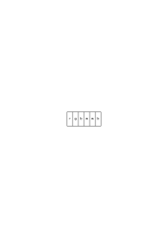
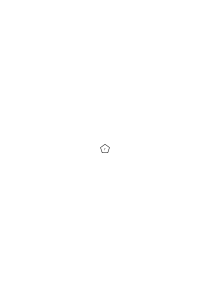
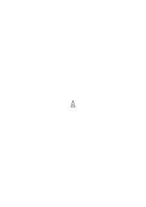
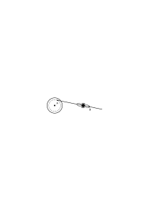

# Bemerkungen über die Grundlagen der Mathematik – VII

1941–1944, 391 remarks, Ms-124

### [Ms-124](/ms-124/#7.3+8.1) [7\[3\]](https://cdn.wittgensteinnachlass.com/2000px/webp/Ms-124/7.webp),[8\[1\]](https://cdn.wittgensteinnachlass.com/2000px/webp/Ms-124/8.webp) {#ms-124-7381}

1 08.06.1941

Die Rolle der Sätze, die von den Maßen handeln & nicht ‘Erfahrungssätze’ sind. – Jemand sagt mir: ‘Diese Strecke ist 240 Zoll lang’. Ich sage: ‘Das sind 20 Fuß, also ungefähr 7 Schritte & habe nun einen Begriff von der Länge erhalten. – Die Umformung beruht auf arithmetischen Sätzen & auf dem Satz, daß 12 Zoll = 1 Fuß ist.

### [Ms-124](/ms-124/#8.2) [8\[2\]](https://cdn.wittgensteinnachlass.com/2000px/webp/Ms-124/8.webp) {#ms-124-82}

Diesen letzteren Satz wird niemand für gewöhnlich, als Erfahrungssatz aussprechen. Man sagt er drückt ein Übereinkommen aus. Aber das Messen würde seinen gegenwärtigen Charakter gänzlich ändern, wenn nicht, z.B., die Aneinanderreihung von 12 Zollstücken für gewöhnlich eine Länge ergäbe, die sich wieder besonders aufbewahren läßt.

### [Ms-124](/ms-124/#8.3) [8\[3\]](https://cdn.wittgensteinnachlass.com/2000px/webp/Ms-124/8.webp) {#ms-124-83}

Muß ich darum sagen, der Satz “12 Zoll = 1 Fuß” sage alle diese Dinge aus, die dem Messen seine gegenwärtige Pointe geben?

### [Ms-124](/ms-124/#9.1) [9\[1\]](https://cdn.wittgensteinnachlass.com/2000px/webp/Ms-124/9.webp) {#ms-124-91}

Nein. Der Satz _ruht in_ einer Technik. Und, wenn Du willst, in den physikalischen und psychologischen Tatsachen, die diese Technik möglich machen. Aber darum ist sein Sinn nicht diese Bedingungen auszusprechen. Das Gegenteil jenes Satzes, ‘12 Zoll ≠ 1 Fuß’ sagt nicht, daß die Maßstäbe nicht starr genug sind, oder wir nicht Alle in gleicher Weise zählen & rechnen. Der Satz _ruht_ in einer Technik, beschreibt sie aber nicht.

### [Ms-124](/ms-124/#9.2) [9\[2\]](https://cdn.wittgensteinnachlass.com/2000px/webp/Ms-124/9.webp) {#ms-124-92}

2 Der Satz spielt die typische (damit aber nicht _einfache_) Rolle der Regel.

### [Ms-124](/ms-124/#9.3+10.1) [9\[3\]](https://cdn.wittgensteinnachlass.com/2000px/webp/Ms-124/9.webp),[10\[1\]](https://cdn.wittgensteinnachlass.com/2000px/webp/Ms-124/10.webp) {#ms-124-93101}

Ich kann mittels des Satzes 12 Zoll = 1 Fuß eine Voraussage machen; nämlich daß 12 zoll-lange Stücke Holz aneinander gelegt sich gleichlang mit einem auf andere Weise gemessenen Stück erweisen wird. Also ist der Witz jener Regel etwa, daß man mittels ihrer gewisse Voraussagen machen kann. Verliert sie nun dadurch den Charakter der _Regel_? –

### [Ms-124](/ms-124/#10.2) [10\[2\]](https://cdn.wittgensteinnachlass.com/2000px/webp/Ms-124/10.webp) {#ms-124-102}

Warum kann man jene Voraussage machen? Nun, – alle Maßstäbe sind gleich gearbeitet; sie verändern ihre Längen nicht beträchtlich; Stücke Holz, die man auf einen Zoll oder Fuß zugeschnitten hat, tun dies auch nicht; unser Gedächtnis ist gut genug, damit wir beim Zählen bis ‘12’ Ziffern nicht doppelt nehmen & nicht auslassen; u.a..

### [Ms-124](/ms-124/#10.3+11.1) [10\[3\]](https://cdn.wittgensteinnachlass.com/2000px/webp/Ms-124/10.webp),[11\[1\]](https://cdn.wittgensteinnachlass.com/2000px/webp/Ms-124/11.webp) {#ms-124-103111}

Aber kann man denn nun nicht die Regel durch einen Erfahrungssatz ersetzen, der sagt, daß Maßstäbe so & so gearbeitet sind, daß Leute sie _so_ handhaben? Man gäbe etwa eine ethnologische Beschreibung des Messens.

### [Ms-124](/ms-124/#11.2) [11\[2\]](https://cdn.wittgensteinnachlass.com/2000px/webp/Ms-124/11.webp) {#ms-124-112}

Nun es ist offenbar, daß diese Darstellung die Funktion einer Regel übernehmen könnte.

### [Ms-124](/ms-124/#11.4+12.1) [11\[4\]](https://cdn.wittgensteinnachlass.com/2000px/webp/Ms-124/11.webp),[12\[1\]](https://cdn.wittgensteinnachlass.com/2000px/webp/Ms-124/12.webp) {#ms-124-114121}

Wer einen math. Satz weiß, soll noch nichts wissen. Ist Verwirrung in unserm Rechnen, rechnet jeder anders & einmal so, einmal so, so liegt noch kein Rechnen vor; stimmen wir überein, nun dann haben wir nur unsre Uhren reguliert, doch noch keine Zeit gemessen. Wer einen math. Satz weiß, soll noch _nichts_ wissen. D.h., der math. Satz soll nur das Gerüst liefern für eine Beschreibung.

### [Ms-124](/ms-124/#12.2) [12\[2\]](https://cdn.wittgensteinnachlass.com/2000px/webp/Ms-124/12.webp) {#ms-124-122}

3 Wie kann die bloße Umformung des Ausdrucks von praktischer Konsequenz sein?

### [Ms-124](/ms-124/#12.3+13.1) [12\[3\]](https://cdn.wittgensteinnachlass.com/2000px/webp/Ms-124/12.webp),[13\[1\]](https://cdn.wittgensteinnachlass.com/2000px/webp/Ms-124/13.webp) {#ms-124-123131}

Daß ich 25 × 25 Nüsse habe, läßt sich verifizieren indem ich 625 Nüsse zähle, aber es läßt sich auch auf andre Weise herausfinden, die mit der Zahlangabe ‘25 × 25’ näher verknüpft ist. Und es ist natürlich die Verknüpfung dieser beiden Arten der Zahl**bestimmung**, in der ein Zweck des Multiplizierens ruht.

### [Ms-124](/ms-124/#13.2) [13\[2\]](https://cdn.wittgensteinnachlass.com/2000px/webp/Ms-124/13.webp) {#ms-124-132}

09.06.1941

Die Regel ist, als Regel, losgelöst, & steht, sozusagen, selbstherrlich da; obschon, was ihr Wichtigkeit gibt, die Tatsachen der täglichen Erfahrung sind.

### [Ms-124](/ms-124/#13.3+14.1) [13\[3\]](https://cdn.wittgensteinnachlass.com/2000px/webp/Ms-124/13.webp),[14\[1\]](https://cdn.wittgensteinnachlass.com/2000px/webp/Ms-124/14.webp) {#ms-124-133141}

Was ich zu tun habe, ist, sozusagen, das Amt eines Königs zu beschreiben: wobei ich nun nicht in den Fehler verfallen darf, sein Amt aus dessen Nützlichkeit zu erklären, noch die Nützlichkeit außer Acht zu lassen.

### [Ms-124](/ms-124/#14.2) [14\[2\]](https://cdn.wittgensteinnachlass.com/2000px/webp/Ms-124/14.webp) {#ms-124-142}

Ich richte mich beim praktischen Arbeiten nach dem Resultat der Verwandlung des Ausdrucks.

### [Ms-124](/ms-124/#14.3) [14\[3\]](https://cdn.wittgensteinnachlass.com/2000px/webp/Ms-124/14.webp) {#ms-124-143}

Wie kann ich dann aber noch sagen, daß es dasselbe heißt, ob ich sage “hier sind 625 Nüsse”, oder “hier sind 25 × 25 Nüsse”?

### [Ms-124](/ms-124/#14.4) [14\[4\]](https://cdn.wittgensteinnachlass.com/2000px/webp/Ms-124/14.webp) {#ms-124-144}

Wer den Satz “hier sind 625 …” verifiziert, verifiziert dadurch auch “hier sind 25 × 25 …”; u.u.. Doch steht die eine Form einer Art der Verifikation, die andre einer andern näher.

### [Ms-124](/ms-124/#14.5+15.1) [14\[5\]](https://cdn.wittgensteinnachlass.com/2000px/webp/Ms-124/14.webp),[15\[1\]](https://cdn.wittgensteinnachlass.com/2000px/webp/Ms-124/15.webp) {#ms-124-145151}

Wie kannst Du sagen, daß “… 625 …” & “…25 × 25 …” dasselbe sagen? – Erst durch unsere Arithmetik _werden_ sie _eins_.

### [Ms-124](/ms-124/#15.3) [15\[3\]](https://cdn.wittgensteinnachlass.com/2000px/webp/Ms-124/15.webp) {#ms-124-153}

Ich kann einmal die eine, einmal die andere Art der Beschreibung, durch Zählen z.B., erhalten. D.h., ich kann jede der beiden Formen auf jede Art erhalten; aber auf verschiedenem Weg.

### [Ms-124](/ms-124/#15.4+16.1) [15\[4\]](https://cdn.wittgensteinnachlass.com/2000px/webp/Ms-124/15.webp),[16\[1\]](https://cdn.wittgensteinnachlass.com/2000px/webp/Ms-124/16.webp) {#ms-124-154161}

Man könnte nun fragen: Wenn der Satz “…625 …” einmal so, einmal anders verifiziert wurde, sagte er da beidemale dasselbe? Oder: Was geschieht, wenn eine Methode des Verifizierens ‘625’, die andre nicht ‘25 × 25’ ergibt? – Ist da “… 625 …” wahr & “ …25 × 25 …” falsch? Nein! – Das eine anzweifeln heißt, das andre anzweifeln: Das ist die Grammatik, die unsre Arithmetik diesen Zeichen gibt.

### [Ms-124](/ms-124/#16.2) [16\[2\]](https://cdn.wittgensteinnachlass.com/2000px/webp/Ms-124/16.webp) {#ms-124-162}

Wenn die beiden Arten des Zählens als Begründung einer _Zahlangabe_ gebraucht werden, dann ist nur _eine_ Zahlangabe, wenn auch in verschiedenen Formen, vorgesehen. Dagegen kann man ohne Widerspruch sagen: “Mir kommt bei der einen Art des Zählens 25 × 25 [& also 625] heraus, bei der anderen nicht 625 [also nicht 25 × 25]”. (Die Arithmetik hat hiergegen keinen Einwand.)

### [Ms-124](/ms-124/#16.3+17.1) [16\[3\]](https://cdn.wittgensteinnachlass.com/2000px/webp/Ms-124/16.webp),[17\[1\]](https://cdn.wittgensteinnachlass.com/2000px/webp/Ms-124/17.webp) {#ms-124-163171}

Daß die Arithmetik die beiden Ausdrücke einander gleichsetzt, ist, könnte man sagen, ein grammatischer Trick. Sie sperrt damit eine bestimmte Art der Beschreibung ab & leitet sie in andere Kanäle. (Und daß dies mit den Tatsachen der Erfahrung zusammenhängt braucht nicht erst gesagt zu werden.)

### [Ms-124](/ms-124/#17.2+18.1) [17\[2\]](https://cdn.wittgensteinnachlass.com/2000px/webp/Ms-124/17.webp),[18\[1\]](https://cdn.wittgensteinnachlass.com/2000px/webp/Ms-124/18.webp) {#ms-124-172181}

4 Nimm an, ich habe jemand multiplizieren gelehrt, aber nicht mit Hilfe einer ausgesprochenen allgemeinen Regel, sondern nur dadurch daß er sieht wie ich ihm Beispiele vorrechne. Ich kann ihm dann eine _neue_ Aufgabe anschreiben, & sagen: “mach dasselbe mit _diesen_ beiden Zahlen, was ich mit den früheren getan habe”. Aber ich kann auch sagen: “Wenn Du mit diesen beiden machst, was ich mit den andern gemacht habe, so wirst Du zu der Zahl … kommen”. Was ist das für ein Satz? “Du wirst das & das schreiben” ist eine Vorhersage. ‘Wenn Du das & das schreiben wirst, wirst Du's so gemacht haben, wie ich Dir's gezeigt habe’ bestimmt, was er “seinem Beispiel folgen” nennt.

### [Ms-124](/ms-124/#18.2) [18\[2\]](https://cdn.wittgensteinnachlass.com/2000px/webp/Ms-124/18.webp) {#ms-124-182}

‘Die Lösung dieser Aufgabe ist …’ – Wenn ich das lese, ehe ich die Aufgabe gerechnet habe, – was ist das für ein Satz?

### [Ms-124](/ms-124/#18.4+19.1) [18\[4\]](https://cdn.wittgensteinnachlass.com/2000px/webp/Ms-124/18.webp),[19\[1\]](https://cdn.wittgensteinnachlass.com/2000px/webp/Ms-124/19.webp) {#ms-124-184191}

“Wenn Du mit diesen Zahlen machst, was ich Dir mit den andern vorgemacht habe, wirst Du … erhalten” – das heißt doch: ‘Das Resultat dieser Rechnung ist …” – & das ist keine Vorhersage, sondern ein mathematischer Satz. Aber es ist dennoch auch eine Vorhersage! – Eine Vorhersage besonderer Art. Wie der, der am Ende findet daß sich beim Addieren der Kolumne wirklich das & das ergibt, wirklich überrascht sein kann; z.B. ausrufen kann: ja, bei Gott, es kommt heraus! Denke Dir nur diesen Vorgang des Vorhersagens & der Bestätigung als ein besonderes Sprachspiel – ich meine: isoliert von dem Übrigen der Arithmetik & ihrer Anwendung.

### [Ms-124](/ms-124/#24.2+25.1) [24\[2\]](https://cdn.wittgensteinnachlass.com/2000px/webp/Ms-124/24.webp),[25\[1\]](https://cdn.wittgensteinnachlass.com/2000px/webp/Ms-124/25.webp) {#ms-124-242251}

11.06.1941

Was ist an diesem Vorhersagespiel so sonderbar? Was mir sonderbar erscheint, würde entfernt, wenn die Vorhersage lautete: “Wenn Du glauben wirst, meinem Beispiel gefolgt zu sein, wirst Du _das_ herausgebracht haben.” , oder: “Wenn Dir alles richtig scheinen wird, wird das das Resultat sein.” Dies Spiel konnte man sich (z.B.) mit dem Eingeben eines bestimmten Giftes verbunden denken, & die Vorhersage wäre, daß die Injektion unsere Fähigkeiten, unser Gedächtnis z.B., in der & der Weise beeinflußt. – Aber, wenn wir uns das Spiel mit dem Eingeben eines Giftes denken können, warum nicht mit dem Eingeben eines Heilmittels? Aber auch dann kann das Schwergewicht der Vorhersage noch immer darauf ruhen, daß der _gesunde_ Mensch _das_ als Resultat ansieht. Oder vielleicht: daß den gesunden Menschen _das_ befriedigt.

### [Ms-124](/ms-124/#25.3) [25\[3\]](https://cdn.wittgensteinnachlass.com/2000px/webp/Ms-124/25.webp) {#ms-124-253}

“Folge mir, so wirst Du das herausbringen.” heißt natürlich nicht: “Folge mir, dann wirst Du mir folgen” – noch: “Rechne _so_ dann wirst Du _so_ rechnen”. – Aber was heißt “Folge mir”? Im Sprachspiel kann es einfach ein Befehl sein: “Folge mir jetzt!”.

### [Ms-124](/ms-124/#26.1) [26\[1\]](https://cdn.wittgensteinnachlass.com/2000px/webp/Ms-124/26.webp) {#ms-124-261}

Was ist der Unterschied zwischen den Vorhersagen: “Wenn Du richtig rechnest, wirst Du _das_ erhalten” – &: “Wenn Du glauben wirst, daß Du richtig rechnest, wirst Du _das_ erhalten”? Wer sagt nun, daß in meinem obigen Sprachspiel die Vorhersage nicht eben das letztere bedeutet? Es scheint, sie bedeutet das nicht – – aber wie _zeigt_ sich das? Frage Dich _unter welchen Umständen_ würde die Vorhersage das eine, unter welchen das andere vorherzusagen scheinen. Denn es ist klar: es kommt hier auf die übrigen Umstände an.

### [Ms-124](/ms-124/#26.2) [26\[2\]](https://cdn.wittgensteinnachlass.com/2000px/webp/Ms-124/26.webp) {#ms-124-262}

Wer mir vorhersagt, daß ich _das_ herausbringen werde, sagt der nicht eben vorher daß ich dieses Resultat für richtig halten werde? – “Aber” – sagst Du vielleicht – “nur eben weil es wirklich richtig _ist_!” – Aber was heißt das: “Ich halte die Rechnung für richtig weil sie richtig ist”?

### [Ms-124](/ms-124/#26.3+27.1) [26\[3\]](https://cdn.wittgensteinnachlass.com/2000px/webp/Ms-124/26.webp),[27\[1\]](https://cdn.wittgensteinnachlass.com/2000px/webp/Ms-124/27.webp) {#ms-124-263271}

Und doch kann man sagen: In meinem Sprachspiel denkt der Rechnende nicht daran, daß die Tatsache, daß er _dies_ herausbringt, eine Eigentümlichkeit _seines_ Wesens ist; die Tatsache erscheint ihm nicht als eine psychologische. Eher stelle ich mir ihn unter dem Eindruck vor, daß er nur einem bereits vorhandenen Faden gefolgt ist. Und das Wie des Folgens als eine Selbstverständlichkeit hinnimmt; & nur _eine_ Erklärung seiner Handlung kennt, nämlich: den Lauf des Fadens.

### [Ms-124](/ms-124/#27.2+28.1) [27\[2\]](https://cdn.wittgensteinnachlass.com/2000px/webp/Ms-124/27.webp),[28\[1\]](https://cdn.wittgensteinnachlass.com/2000px/webp/Ms-124/28.webp) {#ms-124-272281}

Er läßt sich allerdings ablaufen, indem er der Regel, oder den Beispielen folgt, aber was er tut betrachtet er nun nicht als Besonderheit _seines_ Ablaufs, er sagt nicht: “also _so_ bin ich abgelaufen”, sondern: “also _so_ läuft es ab”.

### [Ms-124](/ms-124/#28.2) [28\[2\]](https://cdn.wittgensteinnachlass.com/2000px/webp/Ms-124/28.webp) {#ms-124-282}

Aber wenn nun Einer dennoch am Ende der Rechnung in unserm Sprachspiel sagte: “also _so_ bin ich abgelaufen!” – oder: “also _dieser_ Ablauf befriedigt mich!” – Kann ich nun sagen, er habe das (ganze) Sprachspiel mißverstanden? Doch gewiß nicht! Wenn er nicht sonst eine unerwünschte Anwendung von ihm macht.

### [Ms-124](/ms-124/#28.3) [28\[3\]](https://cdn.wittgensteinnachlass.com/2000px/webp/Ms-124/28.webp) {#ms-124-283}

5 Ist es nicht die _Anwendung_ der Rechnung die jene Auffassung hervorruft, daß die Rechnung abläuft und nicht wir?

### [Ms-124](/ms-124/#29.1) [29\[1\]](https://cdn.wittgensteinnachlass.com/2000px/webp/Ms-124/29.webp) {#ms-124-291}

Die verschiedenen ‘Auffassungen’ müssen verschiedenen Anwendungen entsprechen.

### [Ms-124](/ms-124/#29.3) [29\[3\]](https://cdn.wittgensteinnachlass.com/2000px/webp/Ms-124/29.webp) {#ms-124-293}

Denn es ist allerdings ein Unterschied dazwischen: überrascht zu sein, daß ich _davon_ befriedigt bin; überrascht zu sein, daß die Ziffern auf dem Papier sich _so_ zu benehmen scheinen; & überrascht zu sein darüber, daß _das_ herauskommt. Aber in jedem Fall sehe ich die Rechnung in anderm Zusammenhang.

### [Ms-124](/ms-124/#29.4+30.1) [29\[4\]](https://cdn.wittgensteinnachlass.com/2000px/webp/Ms-124/29.webp),[30\[1\]](https://cdn.wittgensteinnachlass.com/2000px/webp/Ms-124/30.webp) {#ms-124-294301}

Ich rede von dem Gefühl des ‘Herausbekommens’, wenn wir etwa eine längere Kolumne von Zahlen verschiedener Gestalt addieren & so eine Zahl wie 1000000 herauskommt, wie uns zuvor gesagt worden war. “Ja, bei Gott, wieder eine Null –” sagen wir. “Man sähe es den Zahlen nicht an –”, könnte ich auch sagen.

### [Ms-124](/ms-124/#30.2) [30\[2\]](https://cdn.wittgensteinnachlass.com/2000px/webp/Ms-124/30.webp) {#ms-124-302}

Wie wäre es, wenn wir sagten– statt: ‘6 × 6 ergibt 36’ – : ‘Das Ergeben der Zahl 36 durch 6 × 6’? – Den _Satz_ ersetzen durch einen substantivischen Ausdruck. (Der Beweis zeigt _das Ergeben_.)

### [Ms-124](/ms-124/#30.4) [30\[4\]](https://cdn.wittgensteinnachlass.com/2000px/webp/Ms-124/30.webp) {#ms-124-304}

Warum willst Du die Mathematik immer unter dem Aspekt des Findens & nicht des Tuns betrachten?

### [Ms-124](/ms-124/#30.5) [30\[5\]](https://cdn.wittgensteinnachlass.com/2000px/webp/Ms-124/30.webp) {#ms-124-305}

Von großem Einflusse muß es sein, daß wir die Wörter “richtig” & “wahr” & “falsch” & die Form der Aussage im Rechnen gebrauchen. (Kopfschütteln & Nicken)

### [Ms-124](/ms-124/#31.1) [31\[1\]](https://cdn.wittgensteinnachlass.com/2000px/webp/Ms-124/31.webp) {#ms-124-311}

Warum soll ich sagen, daß das Wissen, daß alle Menschen, die rechnen gelernt haben, _so_ rechnen, kein _mathematisches_ Wissen ist? Weil es auf einen andern Zusammenhang hindeutet.

### [Ms-124](/ms-124/#31.3) [31\[3\]](https://cdn.wittgensteinnachlass.com/2000px/webp/Ms-124/31.webp) {#ms-124-313}

Ist also Berechnen, was Einer durch Rechnung herauskriegen wird, schon angewandte Mathematik? – & also auch: Berechnen, was ich selbst herauskriegen werde?

### [Ms-124](/ms-124/#34.1) [34\[1\]](https://cdn.wittgensteinnachlass.com/2000px/webp/Ms-124/34.webp) {#ms-124-341}

6 13.06.1941

Es ist ja gar kein Zweifel, daß math. Sätze _in gewissen Sprachspielen_ die Rolle von Regeln der Darstellung spielen, im Gegensatz zu Sätzen der Darstellung.

### [Ms-124](/ms-124/#34.3) [34\[3\]](https://cdn.wittgensteinnachlass.com/2000px/webp/Ms-124/34.webp) {#ms-124-343}

Aber das sagt nicht, daß dieser Gegensatz nicht nach allen Richtungen hin abfällt. Und _das_ wieder nicht, daß der Gegensatz nicht von der größten Wichtigkeit ist.

### [Ms-124](/ms-124/#35.1) [35\[1\]](https://cdn.wittgensteinnachlass.com/2000px/webp/Ms-124/35.webp) {#ms-124-351}

Das piédestal der Mathematik, ist die Rolle, welche ihre Sätze in unsern Sprachspielen spielen.

### [Ms-124](/ms-124/#36.2) [36\[2\]](https://cdn.wittgensteinnachlass.com/2000px/webp/Ms-124/36.webp) {#ms-124-362}

Was der math. Beweis demonstriert wird als interne Relation hingestellt & dem Zweifel entzogen.

### [Ms-124](/ms-124/#36.3+37.1) [36\[3\]](https://cdn.wittgensteinnachlass.com/2000px/webp/Ms-124/36.webp),[37\[1\]](https://cdn.wittgensteinnachlass.com/2000px/webp/Ms-124/37.webp) {#ms-124-363371}

7 Was ist einem mathematischen Satz & einem mathematischen Beweis gemein, daß sie beide “mathematisch” heißen? Nicht, daß der math. Satz mathematisch bewiesen sein muß; nicht, daß der math. Beweis einen math. Satz beweisen muß. Was hat der unbewiesene Satz (das Axiom) mathematisches? (&) was hat er gemein mit einem mathematischen _Beweis_?

### [Ms-124](/ms-124/#37.2) [37\[2\]](https://cdn.wittgensteinnachlass.com/2000px/webp/Ms-124/37.webp) {#ms-124-372}

Soll ich antworten: ‘Die Schlußregeln des math. Beweises sind immer math. Sätze’? Oder: ‘Math. Sätze & Beweise dienen dem Schließen’? Das wäre schon näher dem Wahren.

### [Ms-124](/ms-124/#37.3+38.1) [37\[3\]](https://cdn.wittgensteinnachlass.com/2000px/webp/Ms-124/37.webp),[38\[1\]](https://cdn.wittgensteinnachlass.com/2000px/webp/Ms-124/38.webp) {#ms-124-373381}

8 Der Beweis muß eine interne Relation etablieren, nicht eine äußere. Denn wir könnten uns auch einen Vorgang der Transformation eines Satzes durchs _Experiment_ denken & eine, die zum Vorhersagen des vom transformierten Satz Behaupteten benützt würde. Man könnte sich z.B. (ganz gut) denken, daß Zeichen durch hinzulegen anderer Zeichen sich solchermaßen verschöben, daß sie eine wahre Vorhersage bilden auf der Grundlage der in ihrer Anfangslage ausgedrückten Bedingungen. Ja, wenn Du willst, kannst Du den rechnenden Menschen als einen Apparat dieser Art betrachten.

### [Ms-124](/ms-124/#38.2) [38\[2\]](https://cdn.wittgensteinnachlass.com/2000px/webp/Ms-124/38.webp) {#ms-124-382}

Denn, daß ein Mensch das Resultat _errechnet_, in dem Sinne: daß er nicht gleich das Resultat, sondern erst verschiedenes anderes hinschreibt, macht ihn nicht weniger zu einem physikalisch-chemischen Hilfsmittel, eine Zahl zu erzeugen, wenn gewisse andere ihm zugebracht werden.

### [Ms-124](/ms-124/#38.3+39.1) [38\[3\]](https://cdn.wittgensteinnachlass.com/2000px/webp/Ms-124/38.webp),[39\[1\]](https://cdn.wittgensteinnachlass.com/2000px/webp/Ms-124/39.webp) {#ms-124-383391}

Ich müßte also sagen: Der bewiesene Satz ist nicht: diejenige Zeichenfolge, welche der so & so abgerichtete Mensch unter den & den Umständen erzeugt.

### [Ms-124](/ms-124/#39.2) [39\[2\]](https://cdn.wittgensteinnachlass.com/2000px/webp/Ms-124/39.webp) {#ms-124-392}

14.06.1941

Wenn wir den Beweis so betrachten, ändert sich, was wir erblicken, gänzlich. Die Zwischenstufen werden ein uninteressantes Nebenprodukt. (Wie im Innern des Automaten ein Geräusch, ehe er uns die Ware zuwirft.)

### [Ms-124](/ms-124/#39.5+40.1) [39\[5\]](https://cdn.wittgensteinnachlass.com/2000px/webp/Ms-124/39.webp),[40\[1\]](https://cdn.wittgensteinnachlass.com/2000px/webp/Ms-124/40.webp) {#ms-124-395401}

9 Wir sagen: der Beweis sei ein Bild. Aber dies Bild bedarf doch der Approbation, die wir ihm (nämlich) beim Nachrechnen erteilen. –

### [Ms-124](/ms-124/#40.2) [40\[2\]](https://cdn.wittgensteinnachlass.com/2000px/webp/Ms-124/40.webp) {#ms-124-402}

Wohl wahr; aber wenn es von dem Einen die Approbation erhielte, von dem Andern nicht & sie sich nicht _verständigen_ könnten – hätten wir dann ein Rechnen? Also ist es nicht die Approbation allein, die es zur Rechnung macht, sondern die Gleichheit der Approbationen.

### [Ms-124](/ms-124/#40.3) [40\[3\]](https://cdn.wittgensteinnachlass.com/2000px/webp/Ms-124/40.webp) {#ms-124-403}

Denn es ließe sich ja auch ein Spiel denken, in welchem Menschen durch Ausdrücke, etwa ähnlich denen allgemeiner Regeln, angeregt, für bestimmte praktische Aufgaben, also ad hoc, sich Zeichenfolgen einfallen lassen, & daß sich dies sogar bewährte. Und hier brauchen die ‘Rechnungen’, wenn man sie so nennen wollte, nicht miteinander übereinstimmen. (Hier könnte man von ‘Intuition’ reden.)

### [Ms-124](/ms-124/#41.1) [41\[1\]](https://cdn.wittgensteinnachlass.com/2000px/webp/Ms-124/41.webp) {#ms-124-411}

Die Übereinstimmung der Approbationen ist die Vorbedingung unsers Sprachspiels, sie wird nicht in ihm konstatiert.

### [Ms-124](/ms-124/#44.3+45.1) [44\[3\]](https://cdn.wittgensteinnachlass.com/2000px/webp/Ms-124/44.webp),[45\[1\]](https://cdn.wittgensteinnachlass.com/2000px/webp/Ms-124/45.webp) {#ms-124-443451}

Wenn die Rechnung ein Experiment ist & _die Bedingungen sind erfüllt_ dann müssen wir als Ausgang nehmen, was kommt; & wenn die Rechnung ein Experiment ist, so ist der Satz, daß sie das & das ergibt, doch der Satz, daß unter solchen Bedingungen diese Art von Zeichen entsteht. Und entsteht also unter diesen Bedingungen einmal ein, einmal ein anderes Resultat, so darf man nun nicht sagen “da stimmt etwas nicht”, oder “beide Rechnungen können nicht in Ordnung sein”, sondern man müßte sagen: diese Rechnung ergibt nicht immer das gleiche Resultat (_warum_, muß nicht bekannt sein). Aber obwohl der Vorgang nun ebenso interessant, ja vielleicht noch interessanter ist, haben wir nun keine Rechnung mehr. Und das ist natürlich wieder eine grammatische Bemerkung über den Gebrauch des Wortes “Rechnung”. Und natürlich hat diese Grammatik eine Pointe.

### [Ms-124](/ms-124/#46.1) [46\[1\]](https://cdn.wittgensteinnachlass.com/2000px/webp/Ms-124/46.webp) {#ms-124-461}

Was heißt es, sich über einen Unterschied im Resultat einer Rechnung _verständigen_? Es heißt doch, zu einem gleichförmigen Rechnen zu gelangen. Und kann man das nicht so kann nun Einer nicht sagen, der Andre rechne auch; nur eben mit anderen Ergebnissen.

### [Ms-124](/ms-124/#46.2) [46\[2\]](https://cdn.wittgensteinnachlass.com/2000px/webp/Ms-124/46.webp) {#ms-124-462}

10 Wie ist es nun, – soll ich sagen: Der gleiche Sinn könne nur _einen_ Beweis haben? Oder: wenn ein Beweis gefunden wird, ändere sich der Sinn? Freilich würden Einige sich dagegen wehren, sagen: ‘So kann man also nie den Beweis eines Satzes finden, denn, hat man ihn gefunden, so ist er nicht mehr Beweis _dieses_ Satzes.’ Aber das sagt noch gar nichts. –

### [Ms-124](/ms-124/#47.1) [47\[1\]](https://cdn.wittgensteinnachlass.com/2000px/webp/Ms-124/47.webp) {#ms-124-471}

Es kommt eben darauf an, _was_ den Sinn des Satzes festlegt. Wovon wir sagen wollen, es lege den Sinn des Satzes fest. Der Gebrauch muß ihn festlegen. Aber was rechnen wir zum Gebrauch? –

### [Ms-124](/ms-124/#47.2) [47\[2\]](https://cdn.wittgensteinnachlass.com/2000px/webp/Ms-124/47.webp) {#ms-124-472}

16.06.1941

Die Beweise beweisen denselben Satz, heißt etwa: beide erweisen ihn für uns als ein brauchbares Instrument zu dem Gleichen.

### [Ms-124](/ms-124/#47.3) [47\[3\]](https://cdn.wittgensteinnachlass.com/2000px/webp/Ms-124/47.webp) {#ms-124-473}

Und der Zweck ist eine Anspielung auf Außermathematisches.

### [Ms-124](/ms-124/#47.4+48.1) [47\[4\]](https://cdn.wittgensteinnachlass.com/2000px/webp/Ms-124/47.webp),[48\[1\]](https://cdn.wittgensteinnachlass.com/2000px/webp/Ms-124/48.webp) {#ms-124-474481}

Ich sagte einmal: ‘Wenn Du wissen willst, was ein math. Satz sagt, sieh', was sein Beweis beweist. Nun, ist darin nicht Wahres & Falsches? Ist der Sinn, der Witz, eines math. Satzes wirklich klar, wenn man nur seinen Beweis versteht?

### [Ms-124](/ms-124/#48.2) [48\[2\]](https://cdn.wittgensteinnachlass.com/2000px/webp/Ms-124/48.webp) {#ms-124-482}

Dem Russellschen “~f (f)” fehlt vor allem die Anwendung, & daher der Sinn. Wendet man diese Form aber dennoch an, dann ist nicht gesagt, daß ‘f(f)’ ein Satz in irgendeinem gewohnten Sinn sein muß, oder ‘f (ξ)’ eine Satzfunktion. Denn der Begriff des Satzes, außer der des Satzes der Logik, ist ja durch Russell nur in allgemeinen, herkömmlichen Zügen erklärt. Man sieht hier auf die Sprache, ohne auf das Sprachspiel zu sehen.

### [Ms-124](/ms-124/#48.3+49.1) [48\[3\]](https://cdn.wittgensteinnachlass.com/2000px/webp/Ms-124/48.webp),[49\[1\]](https://cdn.wittgensteinnachlass.com/2000px/webp/Ms-124/49.webp) {#ms-124-483491}

Wenn wir von verschiedenen Bilderreihen sagen, sie demonstrierten, z.B., daß 25 × 25 = 625, so ist leicht genug zu erkennen, was den _Ort_ dieses Satzes fixiert, den beide Wege erreichen.

### [Ms-124](/ms-124/#49.3+50.1) [49\[3\]](https://cdn.wittgensteinnachlass.com/2000px/webp/Ms-124/49.webp),[50\[1\]](https://cdn.wittgensteinnachlass.com/2000px/webp/Ms-124/50.webp) {#ms-124-493501}

Der andre Beweis reiht den Satz in eine neue Ordnung ein; dabei findet oft ein Übersetzen einer Art von Operation in eine gänzlich andere statt. Wie wenn wir Gleichungen in Kurven übertragen. Und dann sehen wir etwas für die Kurven ein & dadurch für die Gleichungen.

Aber mit welchem Rechte überzeugen wir uns durch einen Gedankengang, der dem Gegenstand unsrer Gedanken scheinbar ganz heterogen ist? Nun, unsre Operationen liegen jenem Gegenstand auch nicht ferner, als, etwa, das Dividieren im Dezimalsystem, dem verteilen von Nüssen. Besonders, wenn man sich vorstellt (was man leicht kann) daß jene Operation ursprünglich zu einem andern Zweck als dem des Teilens u. dergl. erfunden worden wäre.

### [Ms-124](/ms-124/#50.2+51.1) [50\[2\]](https://cdn.wittgensteinnachlass.com/2000px/webp/Ms-124/50.webp),[51\[1\]](https://cdn.wittgensteinnachlass.com/2000px/webp/Ms-124/51.webp) {#ms-124-502511}

Fragst Du: “Mit welchem Recht?” so ist die Antwort: Vielleicht mit gar keinem. – Mit welchem Recht sagst Du, daß die Fortsetzung dieses Systems mit jenem immer parallel laufen wird? (Es ist als ob Du Zoll & Fuß _beide_ als Einheit festsetztest & behauptetest, 12n Zoll werden immer mit n Fuß gleich lang sein.)

### [Ms-124](/ms-124/#51.2+52.1) [51\[2\]](https://cdn.wittgensteinnachlass.com/2000px/webp/Ms-124/51.webp),[52\[1\]](https://cdn.wittgensteinnachlass.com/2000px/webp/Ms-124/52.webp) {#ms-124-512521}

17.06.1941

Wenn zwei Beweise denselben Satz beweisen, so kann man sich allerdings Umstände denken, in denen die ganze diese Beweise verbindende Umgebung wegfiele, sodaß sie allein & nackt dastünden & kein Grund vorhanden wäre, zu sagen sie hätten eine gemeinsame Pointe, sie bewiesen denselben Satz. Man muß sich nur denken, daß die Beweise ohne den, sie beide umhüllenden & verbindenden, Organismus der Anwendungen, sozusagen nackt & und bloß, dastünden. (Wie zwei Knochen aus dem ungeheuer mannigfachen Zusammenhang des Organismus gelöst; in dem allein wir gewohnt sind, an sie zu denken.)

### [Ms-124](/ms-124/#52.2+53.1) [52\[2\]](https://cdn.wittgensteinnachlass.com/2000px/webp/Ms-124/52.webp),[53\[1\]](https://cdn.wittgensteinnachlass.com/2000px/webp/Ms-124/53.webp) {#ms-124-522531}

11 Nimm an, man rechnete mit Zahlen & verwendet manchmal auch die Division durch Ausdrücke von der Form (n ‒ n), & erhielte auf diese Weise hie & da andere als die normalen Resultate des Multiplizierens, etc. Das störe aber niemand. – Vergleiche damit: Man legt Listen, Verzeichnisse, von Personen an, aber nicht wie wir es tun, alphabetisch; & so kommt es, daß der gleiche Name in mancher Liste öfters als einmal figuriert. – Aber nun kann man annehmen, daß das niemandem auffällt; oder, daß die Leute es sehen, es ihnen aber weiters nichts macht. Wie man Leute eines Stammes denken könnte, die, wenn sie Münzen zur Erde fallen lassen, es nicht der Mühe Wert halten sie aufzuheben. (Sie haben dann etwa eine Redensart: “Es gehört den Andern” oder dergleichen.)

### [Ms-124](/ms-124/#53.2) [53\[2\]](https://cdn.wittgensteinnachlass.com/2000px/webp/Ms-124/53.webp) {#ms-124-532}

Nun aber ändert sich die Zeit, & die Menschen fangen an (zuerst nur wenige) Exaktheit zu fordern. Mit Recht, mit Unrecht? – Waren die früheren Verzeichnisse _nicht_ eigentlich Verzeichnisse? –

### [Ms-124](/ms-124/#53.3+54.1) [53\[3\]](https://cdn.wittgensteinnachlass.com/2000px/webp/Ms-124/53.webp),[54\[1\]](https://cdn.wittgensteinnachlass.com/2000px/webp/Ms-124/54.webp) {#ms-124-533541}

Sagen wir, wir erhielten manche unsrer Rechenresultate durch einen versteckten Widerspruch. Nun – sind sie dadurch illegitim? – Aber wenn wir nun solche Resultate durchaus nicht anerkennen wollen & doch fürchten, es könnten welche durchschlüpfen. – Nun dann haben wir also eine Idee die einem neuen Kalkül als Vorbild dienen soll. Wie man die Idee zu einem Spiel haben kann.

### [Ms-124](/ms-124/#54.2) [54\[2\]](https://cdn.wittgensteinnachlass.com/2000px/webp/Ms-124/54.webp) {#ms-124-542}

Der R'sche Widerspruch ist nicht, weil er ein Widerspruch ist, beunruhigend, sondern weil das ganze Gewächs, dessen Ende er ist, ein Krebsgewächs ist, das zweck- & sinnlos aus dem normalen Körper herauszuwachsen scheint.

### [Ms-124](/ms-124/#54.3) [54\[3\]](https://cdn.wittgensteinnachlass.com/2000px/webp/Ms-124/54.webp) {#ms-124-543}

Kann man nun sagen: “Wir wollen einen Kalkül, der uns sicherer die Wahrheit sagt”?

### [Ms-124](/ms-124/#54.4+55.1) [54\[4\]](https://cdn.wittgensteinnachlass.com/2000px/webp/Ms-124/54.webp),[55\[1\]](https://cdn.wittgensteinnachlass.com/2000px/webp/Ms-124/55.webp) {#ms-124-544551}

18.06.1941

Aber Du kannst doch einen Widerspruch nicht gelten lassen! – Warum nicht? Wir gebrauchen ihn ja manchmal in unsrer Rede, freilich selten – aber man könnte sich eine Sprachtechnik denken, in der er ein ständiges Implement ist. Man könnte z.B. von einem Objekt in Bewegung sagen, es existiere & es existiere nicht an diesem Ort; Veränderung könnte durch den Widerspruch ausgedrückt werden.

### [Ms-124](/ms-124/#55.2) [55\[2\]](https://cdn.wittgensteinnachlass.com/2000px/webp/Ms-124/55.webp) {#ms-124-552}

Nimm ein Thema, wie das Haydnsche (Chorale St. Antoni), nimm den Teil der Brahmsschen Variationen, der dem ersten Teil des Themas entspricht & stell die Aufgabe den zweiten Teil der Variation im Stil ihres ersten Teiles zu konstruieren. Das ist ein Problem (sehr) ähnlich den mathematischen Problemen. Ist die Lösung gefunden, etwa wie Brahms sie gibt, so zweifelt man nicht, daß dies die Lösung sei.

### [Ms-124](/ms-124/#55.3+56.1) [55\[3\]](https://cdn.wittgensteinnachlass.com/2000px/webp/Ms-124/55.webp),[56\[1\]](https://cdn.wittgensteinnachlass.com/2000px/webp/Ms-124/56.webp) {#ms-124-553561}

Mit diesem Weg sind wir einverstanden. Und doch ist es hier klar, daß es leicht verschiedene Wege geben kann, kann mit deren jedem wir uns einverstanden erklären können, deren jeden wir konsequent nennen können.

### [Ms-124](/ms-124/#56.3+57.1) [56\[3\]](https://cdn.wittgensteinnachlass.com/2000px/webp/Ms-124/56.webp),[57\[1\]](https://cdn.wittgensteinnachlass.com/2000px/webp/Ms-124/57.webp) {#ms-124-563571}

‘Wir machen lauter legitime – d.h. in den Regeln erlaubte – Schritte, & auf einmal kommt ein Widerspruch heraus. Also ist das Regelverzeichnis, wie es ist, nichts nutz, denn der Widerspruch wirft das ganze Spiel um.’ Warum läßt Du ihn es umwerfen? Aber ich will, daß man nach der Regel soll _mechanisch_ weiter schließen können, ohne je zu widersprechenden Resultaten zu gelangen. Nun, welche Art der Voraussicht willst Du? Eine, die Dein gegenwärtiger Kalkül nicht zuläßt? Nun, dadurch ist er nicht ein schlechtes Stück Mathematik, oder, nicht im vollsten Sinne Mathematik. Der Sinn des Wortes “mechanisch” verführt Dich.

### [Ms-124](/ms-124/#57.3) [57\[3\]](https://cdn.wittgensteinnachlass.com/2000px/webp/Ms-124/57.webp) {#ms-124-573}

12 Wenn Du zu einem praktischen Zweck einen Widerspruch mechanisch vermeiden willst, wie Dein Kalkül es jetzt nicht kann, so ist das etwa, wie wenn Du nach einer Konstruktion des …-Ecks suchst, das Du bis jetzt nur durch Probieren hast zeichnen können; oder nach einer Lösung der Gleichung 3ten Grades, die Du bisher nur approximiert hast. Nicht schlechte Mathematik wird hier verbessert, sondern ein neues Stück Mathematik geschaffen.

### [Ms-124](/ms-124/#57.4+58.1) [57\[4\]](https://cdn.wittgensteinnachlass.com/2000px/webp/Ms-124/57.webp),[58\[1\]](https://cdn.wittgensteinnachlass.com/2000px/webp/Ms-124/58.webp) {#ms-124-574581}

19.06.1941

Nimm an, ich wollte eine Irrationalzahl so bestimmen, daß in ihrer Entwicklung nicht die Figur ‘777’ vorkommt. Ich könnte π nehmen & bestimmen: wenn jene Figur entsteht setzen wir statt ihr ‘000’. Nun sagt man mir: das genügt nicht, denn der, welcher die Stellen berechnet, ist verhindert, auf die vorhergehenden zurückzuschauen. Nun brauche ich einen andern Kalkül; einen in dem ich mich zum Voraus versichern kann, er könne ‘777’ nicht liefern. Ein mathematisches Problem.

### [Ms-124](/ms-124/#58.2+59.1) [58\[2\]](https://cdn.wittgensteinnachlass.com/2000px/webp/Ms-124/58.webp),[59\[1\]](https://cdn.wittgensteinnachlass.com/2000px/webp/Ms-124/59.webp) {#ms-124-582591}

‘Solange die Widerspruchsfreiheit nicht bewiesen ist, kann ich nie ganz sicher sein, daß mir jemand, der gedankenlos, aber gemäß den Regeln, rechnet, nicht irgend etwas Falsches herausrechnet.’ So lange also jene Voraussicht nicht gewonnen ist, ist der Kalkül unzuverlässig. – Aber denke, ich fragte: “_Wie_ unzuverlässig?”– Wenn wir von Graden der Unzuverlässigkeit redeten, könnten wir ihr dadurch nicht den metaphysischen Stachel nehmen? Waren die ersten Regeln des Kalküls nicht gut? Nun, wir gaben sie nur _weil_ sie gut waren. – Wenn sich später ein Widerspruch ergibt, – haben sie _nicht_ ihre Pflicht getan? Nicht doch, sie waren für diese Anwendung nicht gegeben worden.

### [Ms-124](/ms-124/#59.2) [59\[2\]](https://cdn.wittgensteinnachlass.com/2000px/webp/Ms-124/59.webp) {#ms-124-592}

Ich kann meinem Kalkül eine bestimmte Art der Voraussicht geben wollen. Sie macht ihn nicht zu einem _eigentlicheren_ Stück Mathematik, aber, etwa, zu gewissem Zweck brauchbarer.

### [Ms-124](/ms-124/#59.3+60.1) [59\[3\]](https://cdn.wittgensteinnachlass.com/2000px/webp/Ms-124/59.webp),[60\[1\]](https://cdn.wittgensteinnachlass.com/2000px/webp/Ms-124/60.webp) {#ms-124-593601}

Die Idee des Mechanisierens der Math.. Die Mode des axiomatischen Systems.

### [Ms-124](/ms-124/#60.4+61.1) [60\[4\]](https://cdn.wittgensteinnachlass.com/2000px/webp/Ms-124/60.webp),[61\[1\]](https://cdn.wittgensteinnachlass.com/2000px/webp/Ms-124/61.webp) {#ms-124-604611}

13 Aber nehmen wir an, die ‘Axiome’ & ‘Schlußweisen’ seien nicht nur irgendwelche Konstruktionsweisen, sondern sie überzeugten uns auch durchaus von dem Konstruierten! Nun, dann heißt das, daß es Fälle gibt, in denen die Konstruktion aus diesen Bausteinen _nicht_ überzeugt. Und tatsächlich sind die logischen Axiome gar nicht überzeugend, wenn wir für die Satzvariablen Strukturen einsetzen, die niemand ursprünglich als mögliche Werte vorhergesehen hat, als man nämlich ihrer Wahrheit (im Anfang) die unbedingte Anerkennung gab.

### [Ms-124](/ms-124/#61.2) [61\[2\]](https://cdn.wittgensteinnachlass.com/2000px/webp/Ms-124/61.webp) {#ms-124-612}

Wie aber, wenn man sagt: die Axiome und Schlußweisen sollen doch so gewählt werden, daß sie keinen falschen Satz beweisen können?

### [Ms-124](/ms-124/#61.3) [61\[3\]](https://cdn.wittgensteinnachlass.com/2000px/webp/Ms-124/61.webp) {#ms-124-613}

‘Wir wollen nicht nur einen ziemlich zuverlässigen, sondern einen _absolut_ zuverlässigen Kalkül. Die Mathematik muß _absolut_ sein.’

### [Ms-124](/ms-124/#61.4+62.1) [61\[4\]](https://cdn.wittgensteinnachlass.com/2000px/webp/Ms-124/61.webp),[62\[1\]](https://cdn.wittgensteinnachlass.com/2000px/webp/Ms-124/62.webp) {#ms-124-614621}

Nimm an, ich hätte die Regeln für's Spiel ‘Fuchs & Jäger’ aufgestellt – stellte mir das Spiel unterhaltlich & hübsch vor – später finde ich, daß die Jäger immer gewinnen können, wenn man einmal weiß, wie. Ich bin nun, sagen wir, mit meinem Spiel unzufrieden. Die von mir gegebenen Regeln haben ein Resultat gezeitigt, daß ich nicht vorausgesehen hatte & das mir das Spiel verdirbt.

### [Ms-124](/ms-124/#62.2) [62\[2\]](https://cdn.wittgensteinnachlass.com/2000px/webp/Ms-124/62.webp) {#ms-124-622}

14 20.06.1941

‘N. kam darauf, daß man bei den Berechnungen oft durch Ausdrücke der Form ‘(n ‒ n)’ gekürzt hatte. Er wies die dadurch entstehende Diskrepanz der Resultate nach & zeigte, wie Menschenleben durch diese Art des Rechnens verloren worden waren.’

### [Ms-124](/ms-124/#62.3+63.1) [62\[3\]](https://cdn.wittgensteinnachlass.com/2000px/webp/Ms-124/62.webp),[63\[1\]](https://cdn.wittgensteinnachlass.com/2000px/webp/Ms-124/63.webp) {#ms-124-623631}

Aber nehmen wir an, auch die Andern hätten jene Widersprüche gemerkt, nur sich nicht darüber Rechenschaft geben können woher sie kämen. Sie hätten, sozusagen, mit schlechtem Gewissen gerechnet. Sie hätten zwischen widersprechenden Resultaten _eins_ gewählt, aber mit Unsicherheit, während ihnen N's Entdeckung vollkommene Sicherheit gegeben hätte. – Aber sagten sie sich: ‘mit unserm Kalkül ist etwas nicht in Ordnung’? War ihre Unsicherheit von der Art der unsern, wenn wir eine physikalische Berechnung anstellen, aber nicht sicher sind, ob diese Formeln hier wirklich das richtige Resultat ergeben? Oder war es ein Zweifel darüber, ob ihre Mathematik wirklich Mathematik sei? In diesem Falle: was taten sie, um sich davon zu überzeugen?

### [Ms-124](/ms-124/#64.2) [64\[2\]](https://cdn.wittgensteinnachlass.com/2000px/webp/Ms-124/64.webp) {#ms-124-642}

Die Leute haben bisher nur verhältnismäßig selten vom Kürzen durch Ausdrücke vom Wert 0 Gebrauch gemacht. Irgendeinmal entdeckt Einer, daß sie auf diese Weise wirklich jedes beliebige Resultat ausrechnen können. – Was tun sie nun? Nun, wir könnten uns sehr verschiedenes vorstellen. Sie können, z.B., nun erklären, diese Art des Rechnens habe (damit) ihren Witz verloren, & _so_ sei künftig nicht (mehr) zu rechnen.

### [Ms-124](/ms-124/#64.3) [64\[3\]](https://cdn.wittgensteinnachlass.com/2000px/webp/Ms-124/64.webp) {#ms-124-643}

‘Er glaubt, er rechnet – möchte man sagen – er rechnet tatsächlich nicht.’

### [Ms-124](/ms-124/#64.4+65.1) [64\[4\]](https://cdn.wittgensteinnachlass.com/2000px/webp/Ms-124/64.webp),[65\[1\]](https://cdn.wittgensteinnachlass.com/2000px/webp/Ms-124/65.webp) {#ms-124-644651}

15 Wenn die Rechnung für mich ihren Witz verloren hat, sobald ich weiß, wie ich nun alles Beliebige errechnen kann – hat sie keinen gehabt, solang ich das _nicht_ wußte?

### [Ms-124](/ms-124/#65.2) [65\[2\]](https://cdn.wittgensteinnachlass.com/2000px/webp/Ms-124/65.webp) {#ms-124-652}

Ich mag freilich jetzt alle diese Rechnungen als nichtig erklären – ich führe sie eben jetzt nicht mehr aus – aber waren es darum keine Rechnungen?

### [Ms-124](/ms-124/#65.3) [65\[3\]](https://cdn.wittgensteinnachlass.com/2000px/webp/Ms-124/65.webp) {#ms-124-653}

Ich habe (einmal), ohne es zu wissen, über einen Widerspruch geschlossen. Ist mein Resultat nun falsch, oder doch unrecht erworben?

### [Ms-124](/ms-124/#65.4) [65\[4\]](https://cdn.wittgensteinnachlass.com/2000px/webp/Ms-124/65.webp) {#ms-124-654}

Wenn der Widerspruch wirklich so gut versteckt ist, daß wir ihn nicht merken, warum sollen wir nicht das, was wir jetzt tun das eigentliche Rechnen nennen?

### [Ms-124](/ms-124/#65.5+66.1) [65\[5\]](https://cdn.wittgensteinnachlass.com/2000px/webp/Ms-124/65.webp),[66\[1\]](https://cdn.wittgensteinnachlass.com/2000px/webp/Ms-124/66.webp) {#ms-124-655661}

Wir sagen, der Widerspruch würde den Kalkül _vernichten_. Aber wenn er nun sozusagen in winzigen Dosen aufträte, gleichsam blitzweise, nicht als ein ständiges Rechenmittel, würde er da das Spiel auch vernichten?

### [Ms-124](/ms-124/#66.2) [66\[2\]](https://cdn.wittgensteinnachlass.com/2000px/webp/Ms-124/66.webp) {#ms-124-662}

21.06.1941

Denk' Dir, die Leute hätten sich eingebildet (a + b)² müsse gleich sein a² + b². (Ist das eine Einbildung von der Art: es müsse eine Dreiteilung des Winkels mit Lineal und Zirkel geben?) Kann man sich also so einbilden, zwei Rechnungsweisen müßten dasselbe ergeben, wenn es nicht der Fall ist?

### [Ms-124](/ms-124/#66.3+67.1) [66\[3\]](https://cdn.wittgensteinnachlass.com/2000px/webp/Ms-124/66.webp),[67\[1\]](https://cdn.wittgensteinnachlass.com/2000px/webp/Ms-124/67.webp) {#ms-124-663671}

Ich addiere eine Kolumne, addiere sie auf verschiedene Weise, nehme z.B. die Zahlen in verschiedener Reihenfolge & kriege immer wieder, regellos, etwas andres heraus. – Ich werde vielleicht sagen: “Ich bin ganz verwirrt; ich mache entweder regellos Rechenfehler, oder ich mache gewisse Rechenfehler in bestimmten Verbindungen: etwa, auf ‘6 + 3 = 9’ sage ich immer ‘7 + 7 = 15’. Oder ich könnte mir denken, daß ich plötzlich einmal in der Rechnung subtrahiere statt zu addieren, aber nicht denke, daß ich da etwas anderes tue.

### [Ms-124](/ms-124/#67.2) [67\[2\]](https://cdn.wittgensteinnachlass.com/2000px/webp/Ms-124/67.webp) {#ms-124-672}

Nun könnte es sein, daß ich den Fehler nicht fände & mich für geistesgestört hielte. Aber das müßte meine Reaktion nicht sein.

### [Ms-124](/ms-124/#67.3) [67\[3\]](https://cdn.wittgensteinnachlass.com/2000px/webp/Ms-124/67.webp) {#ms-124-673}

‘Der Widerspruch hebt den Kalkül auf’ – woher diese Sonderstellung? Sie ist, glaube ich, durch etwas Phantasie gewiß zu erschüttern.

### [Ms-124](/ms-124/#67.4+68.1) [67\[4\]](https://cdn.wittgensteinnachlass.com/2000px/webp/Ms-124/67.webp),[68\[1\]](https://cdn.wittgensteinnachlass.com/2000px/webp/Ms-124/68.webp) {#ms-124-674681}

Um diese philosophischen Probleme zu lösen muß man Dinge miteinander vergleichen, die noch niemand ernstlich miteinander verglichen hat.

### [Ms-124](/ms-124/#68.2) [68\[2\]](https://cdn.wittgensteinnachlass.com/2000px/webp/Ms-124/68.webp) {#ms-124-682}

Man kann auf diesem Gebiete allerlei fragen, was zwar zur Sache gehört, aber nicht durch die Mitte der Sache führt. Eine bestimmte Reihe von Fragen führt durch die Mitte, ins Freie. Die andern werden nebenbei beantwortet. Den Weg durch die Mitte zu finden ist ungeheuer schwer.

### [Ms-124](/ms-124/#68.3) [68\[3\]](https://cdn.wittgensteinnachlass.com/2000px/webp/Ms-124/68.webp) {#ms-124-683}

Er geht über _neue_ Beispiele & Vergleiche. Die abgebrauchten zeigen ihn nicht.

### [Ms-124](/ms-124/#69.1) [69\[1\]](https://cdn.wittgensteinnachlass.com/2000px/webp/Ms-124/69.webp) {#ms-124-691}

23.06.1941

Nehmen wir an, der R'sche Widerspruch wäre nie gefunden worden. Nun – ist es ganz klar, daß wir dann einen falschen Kalkül besessen hätten? Gibt es denn hier nicht verschiedene Möglichkeiten?

### [Ms-124](/ms-124/#69.2) [69\[2\]](https://cdn.wittgensteinnachlass.com/2000px/webp/Ms-124/69.webp) {#ms-124-692}

Und wie, wenn man den Widerspruch zwar gefunden, sich aber weiter nicht über ihn aufgeregt, & etwa bestimmt hätte, es seien aus ihm keine Schlüsse zu ziehen. (Wie ja auch niemand aus dem ‘Lügner’ Schlüsse zieht.) Wäre das ein offenbarer Fehler gewesen?

### [Ms-124](/ms-124/#69.3+70.1) [69\[3\]](https://cdn.wittgensteinnachlass.com/2000px/webp/Ms-124/69.webp),[70\[1\]](https://cdn.wittgensteinnachlass.com/2000px/webp/Ms-124/70.webp) {#ms-124-693701}

“Aber dann ist doch das kein eigentlicher Kalkül! Er verliert ja alle _Strenge_!” Nun, nicht _alle_. Und er hat nur dann nicht die volle Strenge, wenn man ein bestimmtes Ideal der Strenge hat, einen bestimmten Stil der Mathematik baut.

### [Ms-124](/ms-124/#70.2) [70\[2\]](https://cdn.wittgensteinnachlass.com/2000px/webp/Ms-124/70.webp) {#ms-124-702}

‘Aber ein Widerspruch in der Math. verträgt sich doch nicht mit ihrer Anwendung. Er macht, wenn er konsequent, d.h. zur Erzeugung _beliebiger_ Resultate verwendet wird, die Anwendung der Math. zu einer Farce, oder einer Art überflüssiger Zeremonie. Seine Wirkung ist etwa die, unstarrer Maßstäbe, die durch Dehnen & Zusammendrücken verschiedene Messungsresultate zulassen.’ Aber war das Messen durch Abschreiten _kein_ Messen? Und wenn die Menschen mit Maßstäben aus Teig arbeiteten, wäre das an sich schon falsch zu nennen?

### [Ms-124](/ms-124/#70.3) [70\[3\]](https://cdn.wittgensteinnachlass.com/2000px/webp/Ms-124/70.webp) {#ms-124-703}

Könnte man sich nicht leicht Gründe denken, weshalb eine gewisse Dehnbarkeit der Maßstäbe erwünscht sein könnte?

### [Ms-124](/ms-124/#71.1) [71\[1\]](https://cdn.wittgensteinnachlass.com/2000px/webp/Ms-124/71.webp) {#ms-124-711}

‘Aber ist es nicht richtig, die Maßstäbe aus immer härterem, unveränderlicherm Material herzustellen? Gewiß ist es richtig; wenn man es so will.’

### [Ms-124](/ms-124/#71.2) [71\[2\]](https://cdn.wittgensteinnachlass.com/2000px/webp/Ms-124/71.webp) {#ms-124-712}

‘Also redest Du dem Widerspruch das Wort?!’ Durchaus nicht; so wenig, wie den weichen Maßstäben.

### [Ms-124](/ms-124/#71.3) [71\[3\]](https://cdn.wittgensteinnachlass.com/2000px/webp/Ms-124/71.webp) {#ms-124-713}

_Ein_ Fehler ist zu vermeiden: Man denkt, der Widerspruch _muß_ sinnlos sein: d.h., wenn man z.B. die Zeichen ‘p’, ‘~’, ‘ ∙ ’ _konsequent_ benützt, so kann ‘p ∙ ~p’ nichts sagen. – Aber denke: was heißt, den & den Gebrauch ‘konsequent fortsetzen’? (‘Dieses Kurvenstück konsequent fortsetzen’.)

### [Ms-124](/ms-124/#71.4+72.1) [71\[4\]](https://cdn.wittgensteinnachlass.com/2000px/webp/Ms-124/71.webp),[72\[1\]](https://cdn.wittgensteinnachlass.com/2000px/webp/Ms-124/72.webp) {#ms-124-714721}

16 Wozu braucht die Mathematik eine Grundlegung?! Sie braucht sie, glaube ich, ebenso wenig, wie die Sätze über physikalische Gegenstände oder Sinnesdaten, eine _Analyse_. Wohl aber bedürfen die mathematischen, sowie jene andern Sätze einer Klarlegung ihrer Grammatik.

### [Ms-124](/ms-124/#72.2) [72\[2\]](https://cdn.wittgensteinnachlass.com/2000px/webp/Ms-124/72.webp) {#ms-124-722}

Die _mathematischen_ Probleme der sogenannten Grundlagen liegen für uns der Math. so wenig zu Grunde, wie der gemalte Fels einer gemalten Burg.

### [Ms-124](/ms-124/#72.3) [72\[3\]](https://cdn.wittgensteinnachlass.com/2000px/webp/Ms-124/72.webp) {#ms-124-723}

‘Aber wurde die Fregesche Logik durch den Widerspruch zur Grundlegung der Arithmetik nicht untauglich? Doch! Aber wer sagte denn auch, daß sie zu diesem Zweck tauglich sein müsse?!

### [Ms-124](/ms-124/#72.4+73.1) [72\[4\]](https://cdn.wittgensteinnachlass.com/2000px/webp/Ms-124/72.webp),[73\[1\]](https://cdn.wittgensteinnachlass.com/2000px/webp/Ms-124/73.webp) {#ms-124-724731}

24.06.1941

Man könnte sich sogar denken, daß man die Fregesche Logik einem Wilden als Instrument gegeben hätte, um damit arithm. Sätze abzuleiten. Er habe den Widerspruch abgeleitet, ohne zu merken, daß es einer ist, & aus ihm nun beliebige wahre & falsche Sätze.

### [Ms-124](/ms-124/#73.2) [73\[2\]](https://cdn.wittgensteinnachlass.com/2000px/webp/Ms-124/73.webp) {#ms-124-732}

‘Ein guter Engel hat uns bisher bewahrt, _diesen_ Weg zu gehen.’ Nun, was willst Du mehr? Man könnte, glaube ich, sagen: Ein guter Engel wird immer nötig sein, was immer Du tust.

### [Ms-124](/ms-124/#73.3+74.1) [73\[3\]](https://cdn.wittgensteinnachlass.com/2000px/webp/Ms-124/73.webp),[74\[1\]](https://cdn.wittgensteinnachlass.com/2000px/webp/Ms-124/74.webp) {#ms-124-733741}

17 Man sagt: das Rechnen sei ein Experiment, um dadurch zu zeigen, wie es so praktisch sein kann. Denn vom Experiment weiß man, daß es wirklich praktischen Wert hat. Nur vergißt man, daß es diesen Wert besitzt vermöge einer Technik, die ein naturgeschichtliches Faktum ist, deren Regeln aber nicht die Rolle von Sätzen der Naturgeschichte haben.

### [Ms-124](/ms-124/#74.2) [74\[2\]](https://cdn.wittgensteinnachlass.com/2000px/webp/Ms-124/74.webp) {#ms-124-742}

“Die Grenzen der Empirie” – (Leben wir, weil es praktisch ist zu leben? Denken wir, weil zu denken praktisch ist?)

### [Ms-124](/ms-124/#74.3) [74\[3\]](https://cdn.wittgensteinnachlass.com/2000px/webp/Ms-124/74.webp) {#ms-124-743}

25.06.1941

Daß ein Experiment praktisch ist, das weiß er; also ist die Rechnung ein Experiment.

### [Ms-124](/ms-124/#74.4) [74\[4\]](https://cdn.wittgensteinnachlass.com/2000px/webp/Ms-124/74.webp) {#ms-124-744}

Unsre experimentellen Handlungen haben allerdings ein charakteristisches Gesicht. Wenn ich jemand in einem Laboratorium eine Flüssigkeit in eine Proberöhre gießen & über einer Bunsenflamme erhitzen sehe, bin ich geneigt zu sagen, er mache ein Experiment.

### [Ms-124](/ms-124/#74.5+75.1) [74\[5\]](https://cdn.wittgensteinnachlass.com/2000px/webp/Ms-124/74.webp),[75\[1\]](https://cdn.wittgensteinnachlass.com/2000px/webp/Ms-124/75.webp) {#ms-124-745751}

Nehmen wir an, Leute, welche zählen können, wollen – so wie wir – zu verschiedenerlei praktischen Zwecken Zahlen erfahren. Und dazu fragen sie gewisse Leute, die, wenn ihnen das praktische Problem erklärt wurde, die Augen schließen, & sich die dem Zweck entsprechende Zahl einfallen ließen – – so läge hier keine Rechnung vor, wie verläßlich immer die Zahlangabe sein mag. Ja diese Zahlbestimmung könnte praktisch viel verläßlicher sein, als jede Rechnung.

### [Ms-124](/ms-124/#75.2) [75\[2\]](https://cdn.wittgensteinnachlass.com/2000px/webp/Ms-124/75.webp) {#ms-124-752}

Eine Rechnung – könnte man sagen – ist etwa ein Teil der Technik eines Experiments, aber allein kein Experiment.

### [Ms-124](/ms-124/#75.3) [75\[3\]](https://cdn.wittgensteinnachlass.com/2000px/webp/Ms-124/75.webp) {#ms-124-753}

27.06.1941

Vergißt man denn, daß zum Experiment eine bestimmte _Anwendung_ des Vorgangs gehört? Und die Rechnung vermittelt die Anwendung.

### [Ms-124](/ms-124/#76.1) [76\[1\]](https://cdn.wittgensteinnachlass.com/2000px/webp/Ms-124/76.webp) {#ms-124-761}

Würde denn jemand daran _denken_, das Übersetzen einer Chiffre mittels eines Schlüssels ein Experiment zu nennen?

### [Ms-124](/ms-124/#76.3) [76\[3\]](https://cdn.wittgensteinnachlass.com/2000px/webp/Ms-124/76.webp) {#ms-124-763}

Wenn ich zweifle, ob die Zahlen n und m multipliziert 𝓁 ergeben werden, so bin ich nicht _darüber_ im Zweifel, ob eine Verwirrung in unserm Rechnen ausbrechen wird & etwa die Hälfte der Menschen eines – die andere Hälfte etwas andres für richtig erklären werden.

### [Ms-124](/ms-124/#76.4+77.1) [76\[4\]](https://cdn.wittgensteinnachlass.com/2000px/webp/Ms-124/76.webp),[77\[1\]](https://cdn.wittgensteinnachlass.com/2000px/webp/Ms-124/77.webp) {#ms-124-764771}

‘Experiment’ ist eine Handlung nur von einem gewissen Gesichtspunkt gesehen. Und es ist _klar_, daß die Rechnungshandlung auch ein Experiment sein kann. Ich kann z.B. prüfen wollen, was dieser Mensch unter solchen Umständen, auf diese Aufgabenstellung hin, rechnet. – Aber, ist es nicht eben das, was Du fragst, wenn Du wissen willst, wieviel 52 × 63 ist! Das mag ich wohl fragen – meine Frage mag sogar in diesen Worten ausgedrückt sein. (Vergl. damit: Ist der Satz “Horch, sie stöhnt!” ein Satz über ihr Benehmen, oder über ihr Leiden?) Aber wie ist es nun, wenn ich seine Rechnung vielleicht _nachrechne_? – ‘Nun, dann mache ich noch ein Experiment um ganz sicher herauszufinden, daß alle normalen Menschen so reagieren.’ – Und wenn sie nun _nicht_ gleichförmig reagieren –: welches ist das mathematische Resultat?

### [Ms-124](/ms-124/#77.2+78.1) [77\[2\]](https://cdn.wittgensteinnachlass.com/2000px/webp/Ms-124/77.webp),[78\[1\]](https://cdn.wittgensteinnachlass.com/2000px/webp/Ms-124/78.webp) {#ms-124-772781}

18 “Soll die Rechnung praktisch sein, so muß sie Tatsachen mitteilen. Und das kann nur das Experiment.” Aber welches sind ‘Tatsachen’? Glaubst Du, Du kannst zeigen, welche Tatsache gemeint ist, indem Du etwa mit dem Finger auf sie zeigst? Macht das schon die Rolle klar, welche die ‘Feststellung’ einer Tatsache spielt? – Wenn nun die Mathematik erst den _Charakter_ dessen bestimmte, was Du ‘Tatsache’ nennst! ‘Es ist interessant zu wissen _wieviele_ Schwingungen dieser Ton hat.’ Aber die Arithmetik hat Dich diese Frage erst gelehrt. Sie hat Dich gelehrt, diese Art von Tatsachen zu sehen.

### [Ms-124](/ms-124/#78.2) [78\[2\]](https://cdn.wittgensteinnachlass.com/2000px/webp/Ms-124/78.webp) {#ms-124-782}

Die Mathematik – will ich sagen – lehrt Dich nicht einfach die Antwort auf eine Frage; sondern ein ganzes Sprachspiel, mit Fragen & Antworten.

### [Ms-124](/ms-124/#78.3) [78\[3\]](https://cdn.wittgensteinnachlass.com/2000px/webp/Ms-124/78.webp) {#ms-124-783}

Sollen wir sagen, die _Mathematik_ lehre uns zählen?

### [Ms-124](/ms-124/#79.1) [79\[1\]](https://cdn.wittgensteinnachlass.com/2000px/webp/Ms-124/79.webp) {#ms-124-791}

Kann man von der Mathematik sagen, sie lehre uns experimentelle _Forschungsweisen_? Oder sie helfe uns, solche Forschungsweisen finden?

### [Ms-124](/ms-124/#79.2) [79\[2\]](https://cdn.wittgensteinnachlass.com/2000px/webp/Ms-124/79.webp) {#ms-124-792}

‘Die Mathematik, um praktisch zu sein, muß uns Tatsachen lehren.’ – Aber müssen diese Tatsachen die _mathematischen_ Tatsachen sein? – Aber warum soll sie nicht, statt uns ‘Tatsachen zu lehren‘, die Formen dessen schaffen, was wir Tatsachen nennen?

### [Ms-124](/ms-124/#79.3) [79\[3\]](https://cdn.wittgensteinnachlass.com/2000px/webp/Ms-124/79.webp) {#ms-124-793}

“Ja aber es bleibt doch empirische Tatsache, daß die Menschen so rechnen!” – Ja, aber damit werden ihre Rechensätze nicht zu empirischen Sätzen.

### [Ms-124](/ms-124/#79.4+80.1) [79\[4\]](https://cdn.wittgensteinnachlass.com/2000px/webp/Ms-124/79.webp),[80\[1\]](https://cdn.wittgensteinnachlass.com/2000px/webp/Ms-124/80.webp) {#ms-124-794801}

“Ja, aber es muß doch unser Rechnen auf empirischen Tatsachen beruhen!” Gewiß. Der Zusammenhang besteht (eben) darin, daß die Rechnung das Bild eines Experiments ist; & zwar den Gang zeigt, den es so gut wie immer nimmt. Von den anderen erhält es seine Pointe, seine Physiognomie: aber das sagt durchaus nicht, daß die _Sätze_ der Mathematik die Funktionen der empirischen Sätze haben. (Das wäre beinahe, als glaubte Einer: weil doch nur die Schauspieler im Stücke auftreten, so könnten auf der Bühne des Theaters auch keine andern Leute nützlich beschäftigt sein.)

### [Ms-124](/ms-124/#80.2) [80\[2\]](https://cdn.wittgensteinnachlass.com/2000px/webp/Ms-124/80.webp) {#ms-124-802}

In der Rechnung _gibt es keine_ kausalen Zusammenhänge, nur die Zusammenhänge des Bildes.

### [Ms-124](/ms-124/#82.4+85.1) [82\[4\]](https://cdn.wittgensteinnachlass.com/2000px/webp/Ms-124/82.webp),[85\[1\]](https://cdn.wittgensteinnachlass.com/2000px/webp/Ms-124/85.webp) {#ms-124-824851}

02.07.1941

‘Die Minute hat 60 Sekunden.’ Das ist ein Satz ganz _ähnlich_ einem mathematischen. Hängt seine Wahrheit von der Erfahrung ab? – Nun: könnten wir von Minuten und Sekunden reden, wenn es keinen Zeitsinn gäbe; wenn es keine Uhren gäbe, oder, aus physikalischen Gründen, nicht geben könnte; wenn alle die Zusammenhänge nicht statt hätten, die unsern Zeitmaßen Sinn & Bedeutung geben? In diesem Falle – würden wir sagen – hätte das Zeitmaß seinen Witz verloren (wie die Handlung des Mattsetzens ohne das Schachspiel) – oder es hätte dann einen ganz anderen Sinn. – Macht aber die eine so beschriebene Erfahrung den Satz falsch, die andre wahr? Nein; _das_ beschriebe nicht seine Funktion. Er funktioniert ganz anders.

### [Ms-124](/ms-124/#84.2) [84\[2\]](https://cdn.wittgensteinnachlass.com/2000px/webp/Ms-124/84.webp) {#ms-124-842}

‘Das Rechnen, um praktisch sein zu können, muß auf empirischen Tatsachen beruhen.’ – Warum soll es nicht lieber bestimmen, was empirische Tatsachen _sind_?

### [Ms-124](/ms-124/#81.3) [81\[3\]](https://cdn.wittgensteinnachlass.com/2000px/webp/Ms-124/81.webp) {#ms-124-813}

Erwäge: ‘Unsre Mathematik wandelt Experimente in Definitionen um.’

### [Ms-124](/ms-124/#81.2) [81\[2\]](https://cdn.wittgensteinnachlass.com/2000px/webp/Ms-124/81.webp) {#ms-124-812}

19 Aber können wir uns keine menschliche Gesellschaft denken, in der es ebensowenig ein Rechnen, ganz in unserm Sinn, wie ein Messen, ganz in unserm Sinn, gibt? – Doch. – Aber wozu will ich mich dann bemühen, was Mathematik ist, herauszuarbeiten? Weil es bei uns eine Mathematik gibt & eine besondere Auffassung derselben, ein Ideal, gleichsam, ihrer Stellung & Funktion, – & dieses muß klar herausgearbeitet werden.

### [Ms-124](/ms-124/#82.1) [82\[1\]](https://cdn.wittgensteinnachlass.com/2000px/webp/Ms-124/82.webp) {#ms-124-821}

Fordere nicht zuviel, & fürchte nicht, daß Deine gerechte Forderung in's Nichts zerrinnen wird.

### [Ms-124](/ms-124/#82.2) [82\[2\]](https://cdn.wittgensteinnachlass.com/2000px/webp/Ms-124/82.webp) {#ms-124-822}

Meine Aufgabe ist es nicht, Russells Logik von _innen_ anzugreifen, sondern von außen.

### [Ms-124](/ms-124/#82.3) [82\[3\]](https://cdn.wittgensteinnachlass.com/2000px/webp/Ms-124/82.webp) {#ms-124-823}

D.h.: nicht, sie mathematisch anzugreifen – sonst triebe ich Mathematik – sondern ihre Stellung, ihr Amt.

### [Ms-124](/ms-124/#84.3) [84\[3\]](https://cdn.wittgensteinnachlass.com/2000px/webp/Ms-124/84.webp) {#ms-124-843}

Meine Aufgabe ist es nicht über den Gödelschen Beweis (z.B.) zu reden; sondern an ihm vorbei zu reden.

### [Ms-124](/ms-124/#84.4+84.5+85.1) [84\[4\]](https://cdn.wittgensteinnachlass.com/2000px/webp/Ms-124/84.webp),[84\[5\]](https://cdn.wittgensteinnachlass.com/2000px/webp/Ms-124/84.webp),[85\[1\]](https://cdn.wittgensteinnachlass.com/2000px/webp/Ms-124/85.webp) {#ms-124-844845851}

20 Die Aufgabe, die Zahl der Wege zu finden, auf denen man den Fugen dieser Mauern ohne abzusetzen & ohne Wiederholung entlangfahren kann, erkennt

jeder als _mathematische_ Aufgabe. – Wäre die Zeichnung viel komplizierter & größer, nicht zu überblicken, so könnte man annehmen sie ändere sich, ohne das wir's merken, & dann wäre die Aufgabe, jene Zahl (die sich vielleicht gesetzmäßig ändert) zu finden, keine mathematische mehr. Aber auch wenn sie gleichbleibt, ist die Aufgabe dann nicht mathematisch. – Aber auch wenn die Mauer zu überblicken ist, so heißt das nicht, die Aufgabe ist eine mathematische – als sagte man: _diese_ Aufgabe ist nun eine der Embryologie. Vielmehr: _hier_ brauchen wir eine mathematische Lösung. (Wie: hier ist, was wir bedürfen, eine _Vorlage_.)

### [Ms-124](/ms-124/#85.2) [85\[2\]](https://cdn.wittgensteinnachlass.com/2000px/webp/Ms-124/85.webp) {#ms-124-852}

‘Erkannten’ wir das Problem als mathematisches, weil die Mathematik vom Nachfahren von Zeichnungen handelt?

### [Ms-124](/ms-124/#85.3+86.1) [85\[3\]](https://cdn.wittgensteinnachlass.com/2000px/webp/Ms-124/85.webp),[86\[1\]](https://cdn.wittgensteinnachlass.com/2000px/webp/Ms-124/86.webp) {#ms-124-853861}

Warum sind wir also geneigt, _dieses_ Problem schlechtweg ein ‘mathematisches’ zu nennen? Weil wir es ihm gleich ansehen, daß hier die Beantwortung einer _mathematischen_ Frage _so gut wie_ alles ist, was wir brauchen. Obschon man das Problem, z.B., leicht als ein psychologisches sehen könnte. Ähnliches von der Aufgabe, aus einem Blatt Papier das & das zu falten.

### [Ms-124](/ms-124/#86.2+87.1) [86\[2\]](https://cdn.wittgensteinnachlass.com/2000px/webp/Ms-124/86.webp),[87\[1\]](https://cdn.wittgensteinnachlass.com/2000px/webp/Ms-124/87.webp) {#ms-124-862871}

Es kann so ausschauen, als ob die Mathematik hier eine Wissenschaft ist, die mit _Einheiten_ Experimente macht, Experimente, bei denen es nämlich nicht auf die Arten der Einheiten ankommt, also nicht darauf, ob sie Erbsen, Glaskugeln, Striche, usw. sind. – Nur was von _allen_ diesen gilt findet sie heraus. Also nichts über ihren Schmelzpunkt, aber, daß 2 und 2 von ihnen 4 sind. Und das Problem der Mauer № 1 ist eben ein mathematisches, d.h.: kann durch _diese_ Art von Experiment gelöst werden. – Und worin das math. Experiment besteht? Nun, im Hinlegen & Verschieben von Dingen, Ziehen von Strichen, Anschreiben von Ausdrücken, Sätzen, etc. Und man muß sich dadurch nicht stören lassen, daß die äußere Erscheinung dieser Experimente nicht die physikalischer & chemischer, etc. hat, es Nur eine Schwierigkeit ist da: der Vorgang ist leicht genug zu sehen, zu beschreiben – aber _wie_ ist es als Experiment anzuschauen? Welches ist hier der Kopf, welches der Fuß des Experiments? Welches sind die Bedingungen des Experiments, welches sein Resultat? Ist das Resultat das Rechnungsergebnis, oder das Rechnungsbild, oder die Zustimmung (worin immer diese besteht) des Rechnenden?

### [Ms-124](/ms-124/#87.2) [87\[2\]](https://cdn.wittgensteinnachlass.com/2000px/webp/Ms-124/87.webp) {#ms-124-872}

Werden aber, etwa, die Prinzipien der Dynamik zu Sätzen der reinen Mathematik dadurch, daß man ihre Interpretation offen läßt & sie nur zum Erzeugen eines Maßsystems verwendet?

### [Ms-124](/ms-124/#87.3) [87\[3\]](https://cdn.wittgensteinnachlass.com/2000px/webp/Ms-124/87.webp) {#ms-124-873}

“Der math. Beweis muß übersichtlich sein” – das hängt mit der Übersichtlichkeit jener Figur zusammen.

### [Ms-124](/ms-124/#87.4+88.1) [87\[4\]](https://cdn.wittgensteinnachlass.com/2000px/webp/Ms-124/87.webp),[88\[1\]](https://cdn.wittgensteinnachlass.com/2000px/webp/Ms-124/88.webp) {#ms-124-874881}

21 Vergiß nicht: der Satz, der von sich selbst aussagt, er sei unbeweisbar, ist als _mathematische_ Aussage aufzufassen – – denn das ist nicht _selbstverständlich_. Es ist nicht selbstverständlich, daß der Satz, die & die Struktur sei so & so nicht konstruierbar, als mathematischer Satz aufzufassen sei.

### [Ms-124](/ms-124/#88.2) [88\[2\]](https://cdn.wittgensteinnachlass.com/2000px/webp/Ms-124/88.webp) {#ms-124-882}

D.h.: wenn man sagt: “er sagt von sich selbst aus” – so ist das auf eine spezielle Weise zu verstehen. Hier nämlich entsteht leicht Verwirrung durch den bunten Gebrauch des Ausdrucks “dieser Satz sagt etwas von … aus“.

### [Ms-124](/ms-124/#88.3) [88\[3\]](https://cdn.wittgensteinnachlass.com/2000px/webp/Ms-124/88.webp) {#ms-124-883}

In diesem Sinne sagt der Satz 625 = 25 × 25 auch etwas über sich selbst aus: daß nämlich die linke Ziffer erhalten wird, wenn man die rechts stehenden multipliziert.

### [Ms-124](/ms-124/#88.4) [88\[4\]](https://cdn.wittgensteinnachlass.com/2000px/webp/Ms-124/88.webp) {#ms-124-884}

Der Gödelsche Satz, der etwas über sich selbst aussagt, _erwähnt_ sich selbst nicht.

### [Ms-124](/ms-124/#89.2) [89\[2\]](https://cdn.wittgensteinnachlass.com/2000px/webp/Ms-124/89.webp) {#ms-124-892}

‘Der Satz sagt, daß diese Zahl aus diesen Zahlen auf diese Weise nicht erhältlich ist.’ – Aber bist Du auch sicher, daß Du ihn recht ins Deutsche übersetzt hast? Ja gewiß, es scheint so. – Aber kann man da nicht fehlgehen?

### [Ms-124](/ms-124/#89.4+90.1) [89\[4\]](https://cdn.wittgensteinnachlass.com/2000px/webp/Ms-124/89.webp),[90\[1\]](https://cdn.wittgensteinnachlass.com/2000px/webp/Ms-124/90.webp) {#ms-124-894901}

Könnte man sagen: Gödel sagt, daß man einem math. Beweis auch muß trauen können, wenn man ihn, praktisch, als den Beweis der Konstruierbarkeit der Satzfigur nach den Beweisregeln auffassen will? Oder: Ein math. Satz muß als Satz einer auf sich selbst wirklich anwendbaren Geometrie aufgefaßt werden können. Und tut man das so zeigt es sich, daß man sich auf einen Beweis in gewissen Fällen nicht verlassen kann.

### [Ms-124](/ms-124/#90.3) [90\[3\]](https://cdn.wittgensteinnachlass.com/2000px/webp/Ms-124/90.webp) {#ms-124-903}

Die Grenzen der Empirie sind nicht unverbürgte Annahmen, oder intuitiv als richtig erkannte; sondern Arten & Weisen des Vergleichs & des Handelns.

### [Ms-124](/ms-124/#90.4+91.1+92.1) [90\[4\]](https://cdn.wittgensteinnachlass.com/2000px/webp/Ms-124/90.webp),[91\[1\]](https://cdn.wittgensteinnachlass.com/2000px/webp/Ms-124/91.webp),[92\[1\]](https://cdn.wittgensteinnachlass.com/2000px/webp/Ms-124/92.webp) {#ms-124-904911921}

22 03.07.1941

‘Nehmen wir an, wir haben einen arithmetischen Satz, der sagt, eine bestimmte Zahl … könne nicht aus den Zahlen …, …, …, durch die & die Operationen gewonnen werden. Und nehmen wir an, es ließe sich eine Übersetzungsregel geben, nach welcher dieser arithm. Satz in die Ziffer jener ersten Zahl – die Axiome, aus denen wir versuchen ihn zu beweisen, in die Ziffern jener andern Zahlen – & unsere Schlußregeln in die im Satz erwähnten Operationen sich übersetzen ließen. – Hätten wir dann _den arithm Satz_ aus den Axiomen nach unsern Schlußregeln abgeleitet, so hätten wir _dadurch_ seine Ableitbarkeit demonstriert, aber auch einen Satz bewiesen, den man nach jener Übersetzungsregel dahin aussprechen kann: dieser arithm. Satz (nämlich unserer) sei unableitbar. Was wäre nun da zu tun? Ich denke mir, wir schenken unserer _Konstruktion_ des _Satzzeichens_ glauben, also dem _geometrischen_ Beweis. Wir sagen also, diese ‘Satzfigur’ ist aus jenen so & so gewinnbar. Und übertragen, nur, in eine andre Notation heißt das: diese Ziffer ist mittels dieser Operationen aus jenen zu gewinnen. Soweit hat der Satz & sein Beweis nichts mit einer besondern _Logik_ zu tun. Hier war jener konstruierte Satz einfach eine andere Schreibweise der konstruierten Ziffer; sie hatte die _Form_ eines Satzes aber wir verglichen sie nicht mit andern Sätzen als Zeichen, welches dies oder jenes _sagt_, einen _Sinn_ hat.

### [Ms-124](/ms-124/#92.2) [92\[2\]](https://cdn.wittgensteinnachlass.com/2000px/webp/Ms-124/92.webp) {#ms-124-922}

Aber freilich ist zu sagen daß jenes Zeichen weder als Satzzeichen noch als Zahlzeichen angesehen werden braucht. – Frage Dich: was macht es zu dem einen, was zu dem anderen?

### [Ms-124](/ms-124/#92.3+93.1) [92\[3\]](https://cdn.wittgensteinnachlass.com/2000px/webp/Ms-124/92.webp),[93\[1\]](https://cdn.wittgensteinnachlass.com/2000px/webp/Ms-124/93.webp) {#ms-124-923931}

Lesen wir nun den konstruierten Satz (oder die Ziffer) als Satz der mathematischen Sprache (etwa auf Deutsch), so spricht er das Gegenteil von dem, was wir eben als bewiesen betrachtet. Wir haben also den wörtlichen Sinn des Satzes als falsch demonstriert & ihn zu gleicher Zeit _bewiesen_ – wenn wir nämlich seine Konstruktion aus den zugelassenen Axiomen mittels der zugelassenen Schlußregeln als Beweis betrachten.

### [Ms-124](/ms-124/#93.2) [93\[2\]](https://cdn.wittgensteinnachlass.com/2000px/webp/Ms-124/93.webp) {#ms-124-932}

Wenn jemand uns einwürfe, wir könnten solche _Annahmen_ nicht machen, da es _logische_ oder _mathematische_ Annahmen wären, so antworten wir, daß nur nötig ist anzunehmen jemand habe einen Rechenfehler gemacht & sei _dadurch_ zu dem Resultat gelangt, das wir ‘annehmen’, & er könne diesen Rechenfehler vorderhand nicht finden.

### [Ms-124](/ms-124/#94.1) [94\[1\]](https://cdn.wittgensteinnachlass.com/2000px/webp/Ms-124/94.webp) {#ms-124-941}

Hier kommen wir wieder auf den Ausdruck “der Beweis überzeugt uns” zurück. Und was uns hier an der Überzeugung interessiert, ist weder ihr Ausdruck durch Stimme oder Gebärde, noch das Gefühl der Befriedigung oder ähnliches; sondern ihre Betätigung in der Verwendung des Bewiesenen.

### [Ms-124](/ms-124/#94.2) [94\[2\]](https://cdn.wittgensteinnachlass.com/2000px/webp/Ms-124/94.webp) {#ms-124-942}

Man könnte mit Recht fragen, welche Wichtigkeit Gödel's Beweis für unsre Arbeit habe. Denn ein Stück Mathematik kann nicht Probleme von der Art der unsern lösen. – Die Antwort ist: daß die _Situation_ uns interessiert, in die ein solcher Beweis uns bringt. ‘Was sollen wir nun sagen?’ – das ist unser Thema.

### [Ms-124](/ms-124/#95.2) [95\[2\]](https://cdn.wittgensteinnachlass.com/2000px/webp/Ms-124/95.webp) {#ms-124-952}

So seltsam es klingt, so scheint meine Aufgabe das Gödelsche Theorem betreffend (bloß) darin zu bestehen, klar zu stellen, was in der Mathematik so ein Satz bedeutet, wie: “angenommen, man könnte dies beweisen”.

### [Ms-124](/ms-124/#95.1) [95\[1\]](https://cdn.wittgensteinnachlass.com/2000px/webp/Ms-124/95.webp) {#ms-124-951}

23 04.07.1941

Es kommt uns viel zu selbstverständlich vor, daß wir “wieviele?” fragen & darauf zählen & rechnen!

### [Ms-124](/ms-124/#95.3) [95\[3\]](https://cdn.wittgensteinnachlass.com/2000px/webp/Ms-124/95.webp) {#ms-124-953}

Zählen wir, weil es praktisch ist zu zählen? Wir zählen! – Und so rechnen wir auch.

### [Ms-124](/ms-124/#95.5) [95\[5\]](https://cdn.wittgensteinnachlass.com/2000px/webp/Ms-124/95.webp) {#ms-124-955}

Man kann auf Grund eines Experiments – oder wie man es sonst nennen will – manchmal die Maßzahl des Gemessenen, manchmal aber auch das geeignete Maß bestimmen.

### [Ms-124](/ms-124/#96.1) [96\[1\]](https://cdn.wittgensteinnachlass.com/2000px/webp/Ms-124/96.webp) {#ms-124-961}

So ist also die Maßeinheit das Resultat von Messungen? Ja & nein. Nicht das Messungsresultat, aber vielleicht die _Folge_ von Messungen.

### [Ms-124](/ms-124/#96.2) [96\[2\]](https://cdn.wittgensteinnachlass.com/2000px/webp/Ms-124/96.webp) {#ms-124-962}

Es wäre also _eine_ Frage: “hat uns die Erfahrung gelehrt, _so_ zu rechnen?” – & eine andre: “ist die Rechnung ein Experiment?”.

### [Ms-124](/ms-124/#96.3+97.1) [96\[3\]](https://cdn.wittgensteinnachlass.com/2000px/webp/Ms-124/96.webp),[97\[1\]](https://cdn.wittgensteinnachlass.com/2000px/webp/Ms-124/97.webp) {#ms-124-963971}

24 05.03.1944

Aber läßt sich nicht alles aus allem nach irgend einer Regel – ja nach _jeder_ Regel mit entsprechender Deutung – ableiten? Was heißt es, wenn ich z.B. sage: Diese Zahl läßt sich durch Multiplikation jener beiden erhalten? Frage Dich: wann gebraucht man diesen Satz? Nun, es ist z.B. kein psychologischer Satz, der sagen soll, was Menschen unter gewissen Bedingungen tun werden, was sie befriedigen wird; es ist auch kein physikalischer das Benehmen von Zeichen auf dem Papier betreffend. Er wird nämlich in einer andern Umgebung, als ein psychologischer, oder physikalischer, angewandt.

### [Ms-124](/ms-124/#97.2) [97\[2\]](https://cdn.wittgensteinnachlass.com/2000px/webp/Ms-124/97.webp) {#ms-124-972}

Nimm an Menschen lernen rechnen, ungefähr, wie sie es tatsächlich tun; aber stell Dir nun verschiedene ‘Umgebungen’ vor, die das Rechnen einmal zu einem psychologischen Experiment, einmal zu einem physikalischen mit den Rechenzeichen, einmal zu etwas anderem macht! Wir nehmen an die Kinder lernen zählen & die einfachen Rechnungsarten durch Nachahmen, Aufmunterung & Zurechtweisung. Aber von einem gewissen Punkt wird nun die Nichtübereinstimmung der Rechnenden (also etwa die Rechenfehler) nicht als etwas Schlechtes, sondern als etwas psychologisch Interessantes behandelt. “Also das hieltest Du damals für richtig?” heißt es, “wir Andern haben es alle _so_ gemacht”.

### [Ms-124](/ms-124/#98.1) [98\[1\]](https://cdn.wittgensteinnachlass.com/2000px/webp/Ms-124/98.webp) {#ms-124-981}

Ich will sagen: daß das, was wir Mathematik, die _mathematische_ Auffassung des Satzes 13 × 14 = 182, nennen mit der besondern Stellung zusammenhängt, die wir zu der Tätigkeit des Rechnens einnehmen. Oder, die besondere Stellung, die die Rechnung … in unserm Leben, in unsern übrigen Tätigkeiten hat. Das Sprachspiel in dem sie steht.

### [Ms-124](/ms-124/#98.2) [98\[2\]](https://cdn.wittgensteinnachlass.com/2000px/webp/Ms-124/98.webp) {#ms-124-982}

Man kann ein Musikstück auswendig lernen, um es richtig spielen zu können; aber auch in einem psychologischen Experiment, um das Arbeiten des musikalischen Gedächtnisses zu untersuchen. Man könnte es aber auch dem Gedächtnis einprägen um danach irgendwelche Veränderungen in der Partitur zu beurteilen.

### [Ms-124](/ms-124/#98.3+99.1) [98\[3\]](https://cdn.wittgensteinnachlass.com/2000px/webp/Ms-124/98.webp),[99\[1\]](https://cdn.wittgensteinnachlass.com/2000px/webp/Ms-124/99.webp) {#ms-124-983991}

25 Ein Sprachspiel: Ich rechne Multiplikationen & sage dem Andern: wenn Du richtig rechnest wird das & das herauskommen; worauf er die Rechnung ausführt und sich der Richtigkeit, & manchmal der Falschheit, meiner Voraussage freut. Was setzt dieses Sprachspiel voraus? Daß ‘Rechenfehler’ leicht zu finden sind & immer Übereinstimmung über Richtigkeit, oder Falschheit der Rechnung rasch erzielt wird.

### [Ms-124](/ms-124/#99.2) [99\[2\]](https://cdn.wittgensteinnachlass.com/2000px/webp/Ms-124/99.webp) {#ms-124-992}

“Wenn Du mit jedem Schritt übereinstimmen wirst, wirst Du zu diesem Resultat gelangen.”

### [Ms-124](/ms-124/#99.3) [99\[3\]](https://cdn.wittgensteinnachlass.com/2000px/webp/Ms-124/99.webp) {#ms-124-993}

Was ist das Kriterium dafür, daß ein Schritt der Rechnung richtig ist; ist es nicht, daß mir der Schritt richtig erscheint, & anderes von der gleichen Art? Was ist das Kriterium dafür, daß ich zweimal die gleiche Ziffer hinschreibe? Ist es nicht, daß mir die Ziffern gleich _erscheinen_, & ähnliches?

### [Ms-124](/ms-124/#99.4) [99\[4\]](https://cdn.wittgensteinnachlass.com/2000px/webp/Ms-124/99.webp) {#ms-124-994}

Was ist das Kriterium dafür, daß ich hier dem Paradigma gefolgt bin?

### [Ms-124](/ms-124/#100.1) [100\[1\]](https://cdn.wittgensteinnachlass.com/2000px/webp/Ms-124/100.webp) {#ms-124-1001}

“Wenn Du sagen wirst, daß jeder Schritt richtig ist, wirst Du das herausbekommen.”

### [Ms-124](/ms-124/#100.2) [100\[2\]](https://cdn.wittgensteinnachlass.com/2000px/webp/Ms-124/100.webp) {#ms-124-1002}

Die Voraussage ist eigentlich: Du wirst, wenn Du Dein Tun für richtig hältst, _das_ tun. Du wirst, sofern Du jeden Schritt für richtig anerkennst, diesen Weg gehen. – Daher auch zu diesem Ende gelangen.

### [Ms-124](/ms-124/#100.3) [100\[3\]](https://cdn.wittgensteinnachlass.com/2000px/webp/Ms-124/100.webp) {#ms-124-1003}

_Logisch_ wird geschlossen, wenn keine Erfahrung der Konklusion widerstreiten kann, sie widerstreite denn den Prämissen. D.h., wenn der Schluß nur eine Bewegung in der Darstellung ist.

### [Ms-124](/ms-124/#100.4+101.1) [100\[4\]](https://cdn.wittgensteinnachlass.com/2000px/webp/Ms-124/100.webp),[101\[1\]](https://cdn.wittgensteinnachlass.com/2000px/webp/Ms-124/101.webp) {#ms-124-10041011}

26 In einem Sprachspiel werden Sätze gebraucht; Meldungen, Befehle, u. dergl. Und nun werden auch Rechensätze von den Personen verwendet. Sie sagen sie etwa zu sich selbst, zwischen den Befehlen und Meldungen.

### [Ms-124](/ms-124/#101.2+102.1) [101\[2\]](https://cdn.wittgensteinnachlass.com/2000px/webp/Ms-124/101.webp),[102\[1\]](https://cdn.wittgensteinnachlass.com/2000px/webp/Ms-124/102.webp) {#ms-124-10121021}

06.03.1944

Ein Sprachspiel, in dem Einer nach einer Regel rechnet & nach den Rechnungsresultaten Steine eines Baues setzt. Er hat gelernt mit Schriftzeichen nach Regeln zu operieren. – Wer den Vorgang dieses Lehrens & Lernens beschreibt hat alles gesagt, was sich über das richtige Handeln nach der Regel sagen läßt. Wir können nicht weiter gehen. Es nützt z.B. nichts zum Begriff der Übereinstimmung zurück zu gehen, weil es nicht sicherer ist, daß eine Handlung mit einer andern übereinstimmt, als daß die Handlung einer Regel gemäß geschehen ist. Es ist ja, nach einer Regel vorgehen, auch auf eine Übereinstimmung gegründet

### [Ms-124](/ms-124/#102.2) [102\[2\]](https://cdn.wittgensteinnachlass.com/2000px/webp/Ms-124/102.webp) {#ms-124-1022}

Wie gesagt, worin einer Regel (richtig) folgen besteht, kann man nicht _näher_ beschreiben, als indem man das _Lernen_ des ‘Vorgehens nach der Regel’ beschreibt. Und diese Beschreibung ist natürlich eine alltägliche, wie die des Kochens, oder Nähens etwa. Sie setzt schon soviel voraus, wie diese. Sie unterscheidet Eins vom Andern; informiert also einen Menschen, der etwas ganz bestimmtes nicht weiß. (Vergl. Bemerkung: die Philosophie verwende keine vorbereitende Sprache etc.)

### [Ms-124](/ms-124/#102.3+103.1) [102\[3\]](https://cdn.wittgensteinnachlass.com/2000px/webp/Ms-124/102.webp),[103\[1\]](https://cdn.wittgensteinnachlass.com/2000px/webp/Ms-124/103.webp) {#ms-124-10231031}

07.03.1944

Denn wer mir beschreibt, wie Leute zum Befolgen einer Regel abgerichtet werden & wie sie richtig drauf reagieren, wird selber in der Beschreibung eine Regel gebrauchen & ihr Verständnis bei mir voraussetzen.

### [Ms-124](/ms-124/#103.2) [103\[2\]](https://cdn.wittgensteinnachlass.com/2000px/webp/Ms-124/103.webp) {#ms-124-1032}

Wir haben also jemand die Technik des Multiplizierens beigebracht. Dabei verwenden wir Wörter der Aufmunterung & der Zurückweisung. Wir werden ihm auch manchmal das _Ziel_ der Multiplikation anschreiben. “Das mußt Du erhalten, wenn es richtig sein soll” können wir ihm sagen.

### [Ms-124](/ms-124/#103.3+104.1) [103\[3\]](https://cdn.wittgensteinnachlass.com/2000px/webp/Ms-124/103.webp),[104\[1\]](https://cdn.wittgensteinnachlass.com/2000px/webp/Ms-124/104.webp) {#ms-124-10331041}

Kann nun der Schüler aber widersprechen & sagen: ‘Woher weißt Du das? Und ist, was Du willst, daß ich der Regel folgen soll, oder daß ich dies Resultat erhalten soll? Denn die beiden brauchen ja nicht zusammen zu treffen.” Nun, wir nehmen nicht an, daß der Schüler das sagen kann; wir nehmen an daß er die Regel von beiden Seiten her gelten läßt. Daß er den einzelnen Schritt _&_ das Rechnungsbild – & also das Rechnungsresultat – als Kriterien der Richtigkeit auffaßt, & daß, wenn diese nicht übereinstimmen er an eine Verwirrung der Sinne glaubt.

### [Ms-124](/ms-124/#104.2) [104\[2\]](https://cdn.wittgensteinnachlass.com/2000px/webp/Ms-124/104.webp) {#ms-124-1042}

27 Ist es nun denkbar, daß einer der Regel richtig folgt & zu verschiedenen Malen beim Multiplizieren 15 × 13 doch verschiedenes errechnet? Daß kommt darauf an, _welche Kriterien_ er für das richtige Folgen gelten läßt. In der Mathematik ist das Resultat selbst auch ein Kriterium des richtigen Rechnens. So aufgefaßt ist es also undenkbar der Regel richtig zu folgen & verschiedene Rechnungsbilder zu erhalten.

### [Ms-124](/ms-124/#104.3+105.1) [104\[3\]](https://cdn.wittgensteinnachlass.com/2000px/webp/Ms-124/104.webp),[105\[1\]](https://cdn.wittgensteinnachlass.com/2000px/webp/Ms-124/105.webp) {#ms-124-10431051}

Das Nicht-Geltenlassen des Widerspruchs charakterisiert die Technik der Verwendung der Wahrheitsfunktionen. Lassen wir den Widerspruch gelten, so heißt das, daß wir die Verwendung der Wahrheitsfunktionen ändern; als faßten wir z.B. eine doppelte Verneinung nicht mehr als Bejahung auf. Und diese Änderung wäre von Bedeutung, da die Technik unserer Logik ihrem Charakter nach zusammenhängt mit – – –

### [Ms-124](/ms-124/#105.2) [105\[2\]](https://cdn.wittgensteinnachlass.com/2000px/webp/Ms-124/105.webp) {#ms-124-1052}

“Die Regeln zwingen mich zu etwas”, nun das kann man schon sagen, weil, was mir mit der Regel übereinzustimmen scheint ja nicht von meiner Willkür abhängt. Daher kann es ja geschehen daß ich die Regeln eines Brettspiels ersinne & nachträglich herausfinde daß in diesem Spiel wer anfängt gewinnen _muß_. Und so ähnlich ist es ja, wenn ich finde, daß die Regeln zu einem Widerspruch führen.

### [Ms-124](/ms-124/#105.3) [105\[3\]](https://cdn.wittgensteinnachlass.com/2000px/webp/Ms-124/105.webp) {#ms-124-1053}

08.03.1944

Ich bin nun gezwungen anzuerkennen, daß das eigentlich kein Spiel ist.

### [Ms-124](/ms-124/#106.1) [106\[1\]](https://cdn.wittgensteinnachlass.com/2000px/webp/Ms-124/106.webp) {#ms-124-1061}

‘Die Regeln des Multiplizierens, einmal angenommen, zwingen mich nun anzuerkennen, daß … × … gleich … ist.’ Angenommen, daß es mir unangenehm wäre, dies anzuerkennen. Soll ich sagen: “Nun, das kommt von dieser Art Abrichtung. Menschen die so abgerichtet, so konditioniert, sind, kommen dann in solche Schwierigkeiten.”?

### [Ms-124](/ms-124/#106.2+107.1) [106\[2\]](https://cdn.wittgensteinnachlass.com/2000px/webp/Ms-124/106.webp),[107\[1\]](https://cdn.wittgensteinnachlass.com/2000px/webp/Ms-124/107.webp) {#ms-124-10621071}

‘Wie zählen wir im Dezimalsystem?’ – “Wir schreiben auf 1, 2, auf 2, 3 … – auf 13 14 … auf 123 124, _u.s.f._” – Das ist eine Erklärung für den, der zwar irgend etwas nicht wußte, das ‘u.s.f.’ aber verstand. Und es verstehen, heißt, es nicht als Abkürzung verstehen; es heißt _nicht_, daß er jetzt im Geiste eine viel längere Reihe als die meiner Beispiele sieht. Daß er es versteht, zeigt sich darin, daß er nun gewisse Anwendungen macht, in gewissen Fällen _dies_ sagt & _so_ handelt.

### [Ms-124](/ms-124/#107.2) [107\[2\]](https://cdn.wittgensteinnachlass.com/2000px/webp/Ms-124/107.webp) {#ms-124-1072}

“Wie zählen wir im Dezimalsystem?” – … – Nun, ist das keine Antwort? – Aber nicht für den, der das “u.s.f.” nicht versteht. – Aber kann unsere Erklärung es ihm nicht begreiflich gemacht haben? Kann er durch sie nicht die Idee der Regel erhalten haben? – Frage Dich, was die Kriterien dafür sind, daß er diese Idee nun erhalten hat.

### [Ms-124](/ms-124/#107.3) [107\[3\]](https://cdn.wittgensteinnachlass.com/2000px/webp/Ms-124/107.webp) {#ms-124-1073}

Was zwingt mich denn? – Der Ausdruck der Regel? – Ja; wenn ich einmal so erzogen bin. Aber kann ich sagen, er zwingt mich, ihm zu folgen? Ja; wenn man sich hier die Regel nicht als Linie denkt, der ich nachfahre, sondern als Zauberspruch der uns im Bann hält.

[“schlichter Unsinn, & Beulen …”]

### [Ms-124](/ms-124/#107.4+108.1) [107\[4\]](https://cdn.wittgensteinnachlass.com/2000px/webp/Ms-124/107.webp),[108\[1\]](https://cdn.wittgensteinnachlass.com/2000px/webp/Ms-124/108.webp) {#ms-124-10741081}

28 Warum soll man nicht sagen der Widerspruch, z.B. ‘heteronom’ ∊ heteronom ≡ = ~ (‘heteronom’ ∊ heteronom), zeige eine logische Eigenschaft des Begriffs ‘heteronom’?

### [Ms-124](/ms-124/#108.2) [108\[2\]](https://cdn.wittgensteinnachlass.com/2000px/webp/Ms-124/108.webp) {#ms-124-1082}

“‘Zweisilbig’ ist heteronom”, oder “dreisilbig ist nicht heteronom” sind Erfahrungssätze. Es könnte in irgend einem Zusammenhang wichtig sein, herauszufinden, ob Eigenschaftswörter die Eigenschaften besitzen, die sie bezeichnen, oder nicht. Man gebraucht dann in einem Sprachspiel das Wort “heteronom”. Aber soll nun der Satz “‘h’ ∊ h” ein Erfahrungssatz sein? Er ist es offenbar nicht & wir würden ihn auch, wenn wir den Widerspruch nicht gefunden haben, nicht als einen Satz in unserm Sprachspiel zulassen.

### [Ms-124](/ms-124/#108.3+109.1) [108\[3\]](https://cdn.wittgensteinnachlass.com/2000px/webp/Ms-124/108.webp),[109\[1\]](https://cdn.wittgensteinnachlass.com/2000px/webp/Ms-124/109.webp) {#ms-124-10831091}

09.03.1944

‘h’ ∊ h ≡ ~ (‘h’ ∊ h) könnte man ‘eine wahre Kontradiktion’ nennen. – Aber diese Kontradiktion ist doch kein sinnvoller Satz! Wohl, aber die Tautologien der Logik sind es ja auch nicht.

### [Ms-124](/ms-124/#109.2) [109\[2\]](https://cdn.wittgensteinnachlass.com/2000px/webp/Ms-124/109.webp) {#ms-124-1092}

‘Die Kontradiktion ist wahr’ heißt hier: sie ist bewiesen; abgeleitet aus den Regeln für das Wort “h”. Ihre Verwendung ist, zu zeigen, daß “h” eines jener Wörter ist, welche in “ξ ∊ b” eingesetzt keinen Satz ergeben.

### [Ms-124](/ms-124/#109.3) [109\[3\]](https://cdn.wittgensteinnachlass.com/2000px/webp/Ms-124/109.webp) {#ms-124-1093}

“Die Kontradiktion ist wahr” heißt: Das ist wirklich ein Widerspruch, & Du darfst also das Wort ‘h’ als Argument von ‘ξ ∊ h’ nicht verwenden.

### [Ms-124](/ms-124/#109.4+110.1) [109\[4\]](https://cdn.wittgensteinnachlass.com/2000px/webp/Ms-124/109.webp),[110\[1\]](https://cdn.wittgensteinnachlass.com/2000px/webp/Ms-124/110.webp) {#ms-124-10941101}

29 Ich bestimme ein Spiel & sage: “Machst Du diese Art Zug, so ziehe ich _so_, machst Du jene, so ziehe ich _so_. – Jetzt spiele!” Und nun macht er einen Zug, oder etwas, was ich auch als Zug anerkennen muß, & wenn ich nach meinen Regeln weiterspielen will, so erweist sich, was immer ich tue, als unrichtig. Wie konnte das geschehen? Als ich Regeln aufstellte, da _sagte_ ich etwas. Ich folgte einem gewissen Brauch. Ich sah nicht voraus, was wir weiter tun würden, oder sah nur eine bestimmte Möglichkeit. Es war nicht anders, als hätte ich Einem gesagt: „Mit diesen Figuren kannst Du nicht mattsetzen” & hätte eine bestehende Möglichkeit des Mattsetzens übersehen.

### [Ms-124](/ms-124/#110.2+111.1) [110\[2\]](https://cdn.wittgensteinnachlass.com/2000px/webp/Ms-124/110.webp),[111\[1\]](https://cdn.wittgensteinnachlass.com/2000px/webp/Ms-124/111.webp) {#ms-124-11021111}

Die verschiedenen, halb scherzhaften, Einkleidungen des logischen Paradoxes sind nur in sofern interessant als sie einen daran erinnern, daß eine ernsthafte Einkleidung des Paradoxes von Nöten ist, um seine Funktion eigentlich zu verstehen. Es fragt sich: Welche Rolle kann ein solcher ‘logischer Irrtum’ in einem Sprachspiel spielen?

### [Ms-124](/ms-124/#111.2) [111\[2\]](https://cdn.wittgensteinnachlass.com/2000px/webp/Ms-124/111.webp) {#ms-124-1112}

Man gibt jemandem etwa Instruktionen, wie er in dem & dem Fall zu handeln hat; & diese Instruktionen erweisen sich später als _unsinnig_.

### [Ms-124](/ms-124/#111.3) [111\[3\]](https://cdn.wittgensteinnachlass.com/2000px/webp/Ms-124/111.webp) {#ms-124-1113}

30 Das logische Schließen ist ein Teil eines Sprachspiels. Und zwar folgt, der im Sprachspiel logische Schlüsse ausführt, gewissen Instruktionen, die beim Lernen des Sprachspiels selber gegeben wurden. Baut der Gehilfe etwa nach gewissen Befehlen ein Haus, so hat er das Herbeitragen der Baustoffe etc. von Zeit zu Zeit zu unterbrechen & gewisse Operationen mit Zeichen auf einem Papier auszuführen; worauf er, dem Resultat entsprechend, wieder zu seiner Bauarbeit zurückkehrt.

### [Ms-124](/ms-124/#112.1) [112\[1\]](https://cdn.wittgensteinnachlass.com/2000px/webp/Ms-124/112.webp) {#ms-124-1121}

Denke Dir einen Vorgang, in welchem jemand, der einen Karren schiebt darauf gekommen ist, daß er die Radachse reinigen muß, wenn der Karren sich zu schwer schieben läßt. Ich meine nicht, daß er zu sich sagt: “immer, wenn der Karren sich nicht schieben läßt, …”. Sondern er _handelt_ einfach so. Und nun kommt er darauf einem Andern zuzurufen: “Der Karren geht nicht; reinige die Achse, oder auch: “Der Karren geht nicht. Also muß die Achse gereinigt werden”. Nun das ist ein Schluß. Kein logischer, freilich.

### [Ms-124](/ms-124/#112.2) [112\[2\]](https://cdn.wittgensteinnachlass.com/2000px/webp/Ms-124/112.webp) {#ms-124-1122}

Kann ich nun sagen: “Der nicht-logische Schluß kann sich als falsch erweisen; der logische nicht“?

### [Ms-124](/ms-124/#112.3+113.1) [112\[3\]](https://cdn.wittgensteinnachlass.com/2000px/webp/Ms-124/112.webp),[113\[1\]](https://cdn.wittgensteinnachlass.com/2000px/webp/Ms-124/113.webp) {#ms-124-11231131}

Ist der logische Schluß richtig, wenn er den Regeln gemäß gezogen wurde; oder, wenn er _richtigen_ Regeln gemäß gezogen wird? Wäre es z.B. falsch, wenn man sagte, aus ~p solle immer p gefolgert werden? Aber warum soll man nicht lieber sagen: so eine Regel gäbe den Zeichen “~p” & “p” nicht ihre gewöhnliche Bedeutung?

### [Ms-124](/ms-124/#113.2) [113\[2\]](https://cdn.wittgensteinnachlass.com/2000px/webp/Ms-124/113.webp) {#ms-124-1132}

Man kann es so auffassen – will ich sagen – daß die Schlußregeln den Zeichen ihre Bedeutung geben, weil sie Regeln der Verwendung dieser Zeichen sind. Daß die Schlußregeln zur Bestimmung der Bedeutung der Zeichen gehören. In diesem Sinne können die Schlußregeln nicht falsch, oder richtig sein.

### [Ms-124](/ms-124/#113.3) [113\[3\]](https://cdn.wittgensteinnachlass.com/2000px/webp/Ms-124/113.webp) {#ms-124-1133}

A hat beim Bau die Länge & Breite einer Fläche gemessen & gibt dem B den Befehl: “Bring 15 × 18 Platten”. B ist dazu abgerichtet zu multiplizieren & dem Resultat entsprechend eine Menge von Platten abzuzählen.

### [Ms-124](/ms-124/#113.4+114.1) [113\[4\]](https://cdn.wittgensteinnachlass.com/2000px/webp/Ms-124/113.webp),[114\[1\]](https://cdn.wittgensteinnachlass.com/2000px/webp/Ms-124/114.webp) {#ms-124-11341141}

Der Satz “15 × 18 = 270” braucht natürlich nie ausgesprochen zu werden.

### [Ms-124](/ms-124/#114.2) [114\[2\]](https://cdn.wittgensteinnachlass.com/2000px/webp/Ms-124/114.webp) {#ms-124-1142}

10.03.1944

Man könnte sagen: Experiment – Rechnung sind Pole, zwischen welchen sich menschliche Handlungen bewegen.

### [Ms-124](/ms-124/#114.3) [114\[3\]](https://cdn.wittgensteinnachlass.com/2000px/webp/Ms-124/114.webp) {#ms-124-1143}

31 Wir konditionieren einen Menschen in dieser & dieser Weise; wirken dann auf ihn durch eine Frage ein; & erhalten ein Zahlzeichen. Dieses verwenden wir weiter zu unsern Zwecken & es erweist sich als praktisch. Das ist das Rechnen. – Noch nicht! Dies könnte ein sehr _zweckmäßiger_ Vorgang sein – muß aber nicht sein, was wir ‘rechnen’ nennen. Wie man sich denken könnte, daß zu Zwecken denen heute unsere Sprache dient Laute ausgestoßen würden, die doch keine Sprache bildeten. Zum Rechnen gehört, daß alle die richtig rechnen dasselbe Rechnungsbild produzieren. Und ‘richtig rechnen’ heißt nicht: bei klarem Verstande, oder ungestört rechnen, sondern _so_ rechnen.

### [Ms-124](/ms-124/#115.2) [115\[2\]](https://cdn.wittgensteinnachlass.com/2000px/webp/Ms-124/115.webp) {#ms-124-1152}

Jeder math. Beweis stellt das math. Regelgebäude auf einen neuen Fuß.

### [Ms-124](/ms-124/#115.3) [115\[3\]](https://cdn.wittgensteinnachlass.com/2000px/webp/Ms-124/115.webp) {#ms-124-1153}

32 Ich habe mich gefragt: Ist Mathematik mit rein phantastischer Anwendung nicht auch wirkliche Mathematik? – Aber es frägt sich: Nennen wir es ‘Mathematik’ nicht etwa nur darum weil es hier Übergänge, Brücken gibt von der phantastischen zur nichtphantastischen Anwendung? D.h.: würden wir sagen, Leute besäßen eine Mathematik, die das Rechnen, Operieren mit Zeichen, _bloß_ zu okkulten Zwecken benützten?

### [Ms-124](/ms-124/#115.4+116.1) [115\[4\]](https://cdn.wittgensteinnachlass.com/2000px/webp/Ms-124/115.webp),[116\[1\]](https://cdn.wittgensteinnachlass.com/2000px/webp/Ms-124/116.webp) {#ms-124-11541161}

33 Aber ist es dann doch nicht unrichtig zu sagen: das der Mathematik _Wesentliche_ sei, daß sie Begriffe bilde? – Denn die Mathematik ist doch ein anthropologisches Phänomen. Wir können es also als das Wesentliche in einem großen Teil der Mathematik (dessen was ‘Mathematik’ genannt wird) erkennen & doch sagen, es spiele keine Rolle in anderen Gebieten. Diese Einsicht allein wird freilich nicht ohne Einfluß auf die sein, die die Mathematik nun so sehen lernen. Mathematik ist also eine Familie; aber das sagt nicht daß es uns also gleich sein wird, was alles in sie aufgenommen wird.

### [Ms-124](/ms-124/#116.2) [116\[2\]](https://cdn.wittgensteinnachlass.com/2000px/webp/Ms-124/116.webp) {#ms-124-1162}

Man könnte sagen: verstündest Du _keinen_ mathematischen Satz besser als (Du) das Mult. Ax. verstehst, so verstündest Du Mathematik _nicht_.

### [Ms-124](/ms-124/#117.4+118.1) [117\[4\]](https://cdn.wittgensteinnachlass.com/2000px/webp/Ms-124/117.webp),[118\[1\]](https://cdn.wittgensteinnachlass.com/2000px/webp/Ms-124/118.webp) {#ms-124-11741181}

34 – Hier ist ein Widerspruch. Aber wir sehen ihn nicht & ziehen Schlüsse aus ihm. Etwa auf mathematische Sätze; & auf falsche. Aber wir erkennen diese Schlüsse an. – Und bricht nun eine von uns berechnete Brücke zusammen, so finden wir dafür eine andere Ursache, oder sagen, Gott habe es so gewollt. War nun unsre Rechnung falsch; oder war es keine Rechnung? Gewiß, wenn wir als Forschungsreisende nun die Leute betrachten, die es so machen, werden wir vielleicht sagen: diese Leute rechnen überhaupt nicht. Oder: in ihren Rechnungen sei ein Element der Willkür, welches das Wesen ihrer Mathematik von dem der unsern unterscheidet. Und doch würden wir nicht leugnen können daß die Leute eine Mathematik haben.

### [Ms-124](/ms-124/#118.2+119.1) [118\[2\]](https://cdn.wittgensteinnachlass.com/2000px/webp/Ms-124/118.webp),[119\[1\]](https://cdn.wittgensteinnachlass.com/2000px/webp/Ms-124/119.webp) {#ms-124-11821191}

Was für Regeln muß der König geben, damit er der unangenehmen Situation von nun an entgeht, in die ihn sein Gefangener gebracht hat? – Was für eine Art Problem ist das? – Es ist doch ähnlich diesem: Wie muß ich die Regeln dieses Spiels abändern, daß die & die Situation nicht eintreten kann. Und das ist eine mathematische Aufgabe.

### [Ms-124](/ms-124/#119.2) [119\[2\]](https://cdn.wittgensteinnachlass.com/2000px/webp/Ms-124/119.webp) {#ms-124-1192}

Aber kann es denn eine mathematische Aufgabe sein, die Mathematik zur Mathematik zu machen?

### [Ms-124](/ms-124/#119.3) [119\[3\]](https://cdn.wittgensteinnachlass.com/2000px/webp/Ms-124/119.webp) {#ms-124-1193}

Kann man sagen: “Nachdem dies mathematische Problem gelöst war, begannen die Menschen eigentlich zu rechnen”?

### [Ms-124](/ms-124/#119.4+120.1) [119\[4\]](https://cdn.wittgensteinnachlass.com/2000px/webp/Ms-124/119.webp),[120\[1\]](https://cdn.wittgensteinnachlass.com/2000px/webp/Ms-124/120.webp) {#ms-124-11941201}

35 11.03.1944

Was ist das für eine Sicherheit, wenn sie darauf beruht, daß unsre Banken tatsächlich im allgemeinen nicht von allen ihren Kunden auf einmal überrannt _werden_; aber bankrott würden, wenn es doch geschähe?! Nun es ist eine _andere_ Art von Sicherheit als die primitivere; aber es ist doch eine Sicherheit. Ich meine: wenn nun wirklich in der Arithmetik ein Widerspruch gefunden würde – nun so bewiese das nur, daß eine Arithmetik mit einem _solchen_ Widerspruch sehr gute Dienste leisten konnte; & es besser sein wird, wenn wir unsern Begriff der notwendigen Sicherheit modifizieren als zu sagen, das wäre eigentlich noch keine rechte Arithmetik gewesen.

### [Ms-124](/ms-124/#120.2) [120\[2\]](https://cdn.wittgensteinnachlass.com/2000px/webp/Ms-124/120.webp) {#ms-124-1202}

“Aber es ist doch nicht die ideale Sicherheit?” – Ideal, – für welchen Zweck?

### [Ms-124](/ms-124/#120.3) [120\[3\]](https://cdn.wittgensteinnachlass.com/2000px/webp/Ms-124/120.webp) {#ms-124-1203}

Die Regeln des logischen Schließens sind Regeln des _Sprachspiels_.

### [Ms-124](/ms-124/#122.1) [122\[1\]](https://cdn.wittgensteinnachlass.com/2000px/webp/Ms-124/122.webp) {#ms-124-1221}

36 12.03.1944

Was für eine _Art_ von Satz ist: “Die Klasse der Löwen ist kein Löwe, aber die Klasse der Klassen eine Klasse”. Wie wird er verifiziert? Wie könnte man ihn _verwenden_? – So viel ich sehe, nur als grammatische Aussage. Jemand drauf aufmerksam zu machen, daß der Ausdruck “die Klasse der Löwen” nicht die Bezeichnung eines Löwen ist, daß aber Klassen eine Klasse bilden können.

### [Ms-124](/ms-124/#122.2) [122\[2\]](https://cdn.wittgensteinnachlass.com/2000px/webp/Ms-124/122.webp) {#ms-124-1222}

Man kann sagen, daß Wort “Klasse” werde reflexiv gebraucht, auch wenn man, z.B., die Russellsche Theorie der Typen anerkennt. Denn es wird ja doch auch in ihr reflexiv verwendet.

### [Ms-124](/ms-124/#122.3+123.1) [122\[3\]](https://cdn.wittgensteinnachlass.com/2000px/webp/Ms-124/122.webp),[123\[1\]](https://cdn.wittgensteinnachlass.com/2000px/webp/Ms-124/123.webp) {#ms-124-12231231}

Freilich ist, in diesem Sinn zu sagen, die Klasse der Löwen sei kein Löwe etc., ähnlich, als sagte jemand, er habe ein “e” für ein “n” gehalten, wenn er eine Kugel für einen Kegel ansieht.

### [Ms-124](/ms-124/#123.2) [123\[2\]](https://cdn.wittgensteinnachlass.com/2000px/webp/Ms-124/123.webp) {#ms-124-1232}

Das plötzliche Umwechseln der Auffassung des Bildes eines Würfels & die Unmöglichkeit “Löwe” & “Klasse” als vergleichbare Begriffe zu sehen.

### [Ms-124](/ms-124/#123.3) [123\[3\]](https://cdn.wittgensteinnachlass.com/2000px/webp/Ms-124/123.webp) {#ms-124-1233}

Der Widerspruch sagt: “Nimm Dich in Acht …”.

### [Ms-124](/ms-124/#123.4) [123\[4\]](https://cdn.wittgensteinnachlass.com/2000px/webp/Ms-124/123.webp) {#ms-124-1234}

Wie aber wenn man einem bestimmten Löwen (dem König der Löwen etwa) den Namen “Löwe” gibt? Nun wirst Du sagen: aber es ist doch klar daß im Satz “Löwe ist ein Löwe” das Wort “Löwe” auf zwei verschiedene Arten gebraucht wird. (Log. Phil. Abh.) Aber kann ich sie nicht zu _einer_ Art des Gebrauchs zählen?

### [Ms-124](/ms-124/#123.5+124.1) [123\[5\]](https://cdn.wittgensteinnachlass.com/2000px/webp/Ms-124/123.webp),[124\[1\]](https://cdn.wittgensteinnachlass.com/2000px/webp/Ms-124/124.webp) {#ms-124-12351241}

Aber wenn in dieser Weise der Satz “Löwe ist ein Löwe” gebraucht würde: würde ich den auf nichts aufmerksam machen, den ich auf die Verschiedenheit der Verwendung der beiden “Löwe” aufmerksam machte?

### [Ms-124](/ms-124/#124.2) [124\[2\]](https://cdn.wittgensteinnachlass.com/2000px/webp/Ms-124/124.webp) {#ms-124-1242}

Man kann ein Tier daraufhin untersuchen, ob es eine Katze ist. Aber den Begriff Katze kann man so jedenfalls nicht untersuchen.

### [Ms-124](/ms-124/#124.3) [124\[3\]](https://cdn.wittgensteinnachlass.com/2000px/webp/Ms-124/124.webp) {#ms-124-1243}

Wenn auch “die Klasse der Löwen ist kein Löwe” wie ein Unsinn erscheint, dem man nur aus Höflichkeit einen Sinn beilegen könne; so will ich diesen Satz doch nicht so auffassen, sondern als (einen) rechten Satz, wenn er nur richtig aufgefaßt wird. (Also nicht so wie in Log. Phil. Abh.) Meine Auffassung ist also hier sozusagen anders. Aber das heißt, daß ich sage: es gibt auch ein Sprachspiel mit _diesem_ Satz.

### [Ms-124](/ms-124/#124.4) [124\[4\]](https://cdn.wittgensteinnachlass.com/2000px/webp/Ms-124/124.webp) {#ms-124-1244}

“Die Klasse der Katzen ist keine Katze.” – Woher weißt Du das?

### [Ms-124](/ms-124/#124.5+125.1) [124\[5\]](https://cdn.wittgensteinnachlass.com/2000px/webp/Ms-124/124.webp),[125\[1\]](https://cdn.wittgensteinnachlass.com/2000px/webp/Ms-124/125.webp) {#ms-124-12451251}

13.03.1944

In der Tierfabel heißt es: “Der Löwe ging mit dem Fuchs spazieren”, nicht _ein_ Löwe mit einem Fuchs; noch auch der Löwe so & so mit dem Fuchs so & so. Und hier ist es doch wirklich so, als ob die Gattung Löwe als ein Löwe gesehen würde. (Es ist nicht so, wie Lessing sagt, als ob statt irgendeinem Löwen ein bestimmter gesetzt würde. “Grimmbart der Dachs” heißt nicht: ein Dachs mit Namen “Grimmbart”.)

### [Ms-124](/ms-124/#126.1) [126\[1\]](https://cdn.wittgensteinnachlass.com/2000px/webp/Ms-124/126.webp) {#ms-124-1261}

Denk Dir eine Sprache, in der die Klasse der Löwen “der Löwe aller Löwen genannt wird”, die Klasse der Bäume “der Baum aller Bäume”, etc. – weil sie sich vorstellen alle Löwen bildeten _einen_ großen Löwen. [Wir sagen: “Gott hat den Menschen geschaffen”.] Dann könnte jemand das Paradox aufstellen, es gäbe keine bestimmte Anzahl aller Löwen. Etc.

### [Ms-124](/ms-124/#126.2) [126\[2\]](https://cdn.wittgensteinnachlass.com/2000px/webp/Ms-124/126.webp) {#ms-124-1262}

Wäre es aber etwa unmöglich, in so einer Sprache zu zählen & zu rechnen?

### [Ms-124](/ms-124/#126.3) [126\[3\]](https://cdn.wittgensteinnachlass.com/2000px/webp/Ms-124/126.webp) {#ms-124-1263}

37 Man könnte sich fragen: Welche Rolle kann ein Satz, wie “Ich lüge immer”, im menschlichen Leben spielen? Und da kann man sich Verschiedenes vorstellen.

### [Ms-124](/ms-124/#126.4) [126\[4\]](https://cdn.wittgensteinnachlass.com/2000px/webp/Ms-124/126.webp) {#ms-124-1264}

38 14.03.1944

Ist die Umrechnung einer Länge von Zoll auf cm ein logischer Schluß? “Der Würfel ist 2 Zoll lang. – Also ist er ungefähr 50 mm lang.” Ist das ein _logischer_ Schluß?

### [Ms-124](/ms-124/#127.1) [127\[1\]](https://cdn.wittgensteinnachlass.com/2000px/webp/Ms-124/127.webp) {#ms-124-1271}

Ja aber ist nicht eine Regel etwas willkürliches? Etwas, was ich _festsetze_? Und könnte ich festsetzen, daß die Multiplikation 18 × 15 _nicht_ 270 ergeben solle? – Warum nicht? – Aber dann ist sie eben nicht nach der Regel geschehen, die ich zuerst festgesetzt, & deren Gebrauch ich eingeübt hatte. Ist denn etwas, was aus einer Regel folgt, (wieder) eine Regel? Und wenn nicht, – was für eine Art von Satz soll ich es nennen?

### [Ms-124](/ms-124/#127.2+128.1+129.1) [127\[2\]](https://cdn.wittgensteinnachlass.com/2000px/webp/Ms-124/127.webp),[128\[1\]](https://cdn.wittgensteinnachlass.com/2000px/webp/Ms-124/128.webp),[129\[1\]](https://cdn.wittgensteinnachlass.com/2000px/webp/Ms-124/129.webp) {#ms-124-127212811291}

“Es ist den Menschen … unmöglich einen Gegenstand als von sich selbst verschieden anzuerkennen.” Ja, wenn ich nur eine Ahnung hätte, wie es gemacht wird, – ich versuchte es gleich! – Aber wenn es uns unmöglich ist einen Gegenstand als von sich selbst verschieden anzuerkennen, so ist es also wohl möglich zwei Gegenstände als von einander verschieden anzuerkennen? Ich habe also etwa zwei Sessel vor mir & erkenne an daß es _zwei_ sind. Aber da kann ich doch unter Umständen auch glauben, daß es nur _einer_ ist; & in _diesem_ Sinne kann ich auch einen für zwei halten. – Aber damit erkenne ich doch nicht den Sessel als von sich selbst verschieden an! Wohl; aber dann habe ich auch nicht die zwei als voneinander verschieden anerkannt. Wer glaubt, er könne dies tun –, & eine Art psychologisches Spiel spielt, der übersetze dies in ein Spiel der Gesten. Wenn er zwei Gegenstände vor sich hat, zeige er mit jeder Hand auf einen von ihnen; gleichsam als wolle er ihnen andeuten, daß sie autonom seien. Hat er nur einen Gegenstand vor sich, so deutet er mit beiden Händen auf ihn um anzudeuten, daß man keinen Unterschied zwischen ihm & ihm selbst machen kann. – Warum soll man nun aber nicht das Spiel in umgekehrter Weise spielen?

### [Ms-124](/ms-124/#129.2+130.1) [129\[2\]](https://cdn.wittgensteinnachlass.com/2000px/webp/Ms-124/129.webp),[130\[1\]](https://cdn.wittgensteinnachlass.com/2000px/webp/Ms-124/130.webp) {#ms-124-12921301}

39 15.03.1944

Die Worte “richtig” & “falsch” werden beim Unterricht im Vorgehen nach der Regel gebraucht. Das Wort “richtig” läßt den Schüler gehen, das Wort “falsch” hält ihn zurück. Könnte man nun dem Schüler diese Worte erklären indem man statt ihrer setzt: “das stimmt mit der Regel überein – das nicht”? Nun, wenn er einen Begriff vom Übereinstimmen hat. Aber wie, wenn dieser eben erst gebildet werden muß? (Es kommt darauf an, wie er auf das Wort “übereinstimmen” reagiert.)

### [Ms-124](/ms-124/#130.2) [130\[2\]](https://cdn.wittgensteinnachlass.com/2000px/webp/Ms-124/130.webp) {#ms-124-1302}

Man lernt nicht einer Regel folgen, indem man zuerst den Gebrauch des Wortes “Übereinstimmung” lernt.

### [Ms-124](/ms-124/#130.3) [130\[3\]](https://cdn.wittgensteinnachlass.com/2000px/webp/Ms-124/130.webp) {#ms-124-1303}

Vielmehr lernt man die Bedeutung von “Übereinstimmen”, indem man einer Regel folgen lernt.

### [Ms-124](/ms-124/#130.4) [130\[4\]](https://cdn.wittgensteinnachlass.com/2000px/webp/Ms-124/130.webp) {#ms-124-1304}

Wer verstehen will, was es heißt: “einer Regel folgen”, der muß doch selbst einer Regel folgen können.

### [Ms-124](/ms-124/#130.5+131.1) [130\[5\]](https://cdn.wittgensteinnachlass.com/2000px/webp/Ms-124/130.webp),[131\[1\]](https://cdn.wittgensteinnachlass.com/2000px/webp/Ms-124/131.webp) {#ms-124-13051311}

“Wenn Du diese Regel annimmst, _mußt_ Du das tun.” – Das kann heißen: die Regel läßt Dir hier nicht zwei Wege offen. (Ein mathematischer Satz.) Ich meine aber: die Regel führt Dich wie ein Gang mit festen Mauern. Aber dagegen kann man doch einwenden, die Regel ließe sich auf alle mögliche Weisen deuten. – Die Regel steht hier wie ein _Befehl_. Und _wirkt_ auch wie ein Befehl.

### [Ms-124](/ms-124/#131.2+132.1) [131\[2\]](https://cdn.wittgensteinnachlass.com/2000px/webp/Ms-124/131.webp),[132\[1\]](https://cdn.wittgensteinnachlass.com/2000px/webp/Ms-124/132.webp) {#ms-124-13121321}

40 Ein Sprachspiel: Etwas _Anderes_ bringen; das _Gleiche_ bringen. Nun wir können uns vorstellen, wie es gespielt wird. – Aber wie kann ich es Einem erklären? Ich kann ihm _diesen_ Unterricht geben. – Aber wie weiß er dann, was er das nächste Mal als ‘Gleiches’ bringen soll – mit welchem Recht kann _ich_ sagen, daß er das richtige, oder falsche, gebracht hat? – Ja, ich weiß freilich, daß (hier) in gewissen Fällen Menschen auf mich einstürmen würden mit den Zeichen der Mißbilligung. Und heißt das nun etwa, die Definition von “Gleich” wäre die: gleich sei, was alle Menschen für gleich hielten? – Freilich nicht.

### [Ms-124](/ms-124/#132.2) [132\[2\]](https://cdn.wittgensteinnachlass.com/2000px/webp/Ms-124/132.webp) {#ms-124-1322}

Denn, um Gleichheit zu konstatieren, benütze ich ja natürlich nicht die Übereinstimmung der Menschen. Welches Kriterium verwendest Du also? Gar keins.

### [Ms-124](/ms-124/#132.3) [132\[3\]](https://cdn.wittgensteinnachlass.com/2000px/webp/Ms-124/132.webp) {#ms-124-1323}

Das Wort ohne Rechtfertigung zu gebrauchen, heißt nicht, es zu Unrecht gebrauchen.

### [Ms-124](/ms-124/#133.2) [133\[2\]](https://cdn.wittgensteinnachlass.com/2000px/webp/Ms-124/133.webp) {#ms-124-1332}

Das Problem des vorigen Sprachspiels [№ …] gibt es natürlich auch in dem: Bringe mir etwas Rotes. Denn woran erkenne ich, daß etwas rot ist? An der Übereinstimmung der Farbe mit einem Muster? – Mit welchem Recht sage ich: “Ja, das ist rot.”? Nun, ich sage es; & es läßt sich nicht rechtfertigen. Und auch für dieses Sprachspiel, wie für das vorige, ist es charakteristisch, daß es sich unter der ruhigen Zustimmung aller Menschen vollzöge.

### [Ms-124](/ms-124/#135.2) [135\[2\]](https://cdn.wittgensteinnachlass.com/2000px/webp/Ms-124/135.webp) {#ms-124-1352}

Ein unentschiedener Satz der Mathematik ist etwas, was weder als Regel, noch als das Gegenteil einer Regel anerkannt ist & die Form einer mathematischen Aussage hat. – Ist diese Form aber ein klar umschriebener Begriff?

### [Ms-124](/ms-124/#135.3) [135\[3\]](https://cdn.wittgensteinnachlass.com/2000px/webp/Ms-124/135.webp) {#ms-124-1353}

Denke Dir den <math class="stacked" display="inline"><mfrac linethickness="0"><mrow><mtext>lim</mtext></mrow><mrow><mtext>n→</mtext><mtext>∞</mtext></mrow></mfrac><mspace width="0.3em"/><mtext>φn</mtext><mspace width="0.3em"/><mo>=</mo><mspace width="0.3em"/><mtext>ℓ</mtext></math> als eine Eigenschaft eines Musikstücks (etwa). Aber natürlich nicht _so_ daß das Stück endlos weiterliefe, sondern als eine dem Ohr erkennbare Eigenschaft (gleichsam _algebraische_ Eigenschaft) des Stückes.

### [Ms-124](/ms-124/#137.2) [137\[2\]](https://cdn.wittgensteinnachlass.com/2000px/webp/Ms-124/137.webp) {#ms-124-1372}

Denk Dir Gleichungen als Ornamente (Tapetenmuster) verwendet; & nun eine Prüfung dieser Ornamente daraufhin, welcher Art Kurven sie entsprechen. Die Prüfung wäre analog der kontrapunktischen Eigenschaften eines Musikstücks.

### [Ms-124](/ms-124/#138.3+139.1) [138\[3\]](https://cdn.wittgensteinnachlass.com/2000px/webp/Ms-124/138.webp),[139\[1\]](https://cdn.wittgensteinnachlass.com/2000px/webp/Ms-124/139.webp) {#ms-124-13831391}

41 Ein Beweis der zeigt, daß die Figur “777” in der Extension von π vorkommt aber nicht zeigt _wo_. Nun, so bewiesen wäre dieser ‘Existenzsatz’ für gewisse Zwecke _keine Regel_. Aber könnte er nicht z.B. als Mittel der Einteilung von Entwicklungsregeln dienen. Es wäre etwa auf analoge Art bewiesen daß “777” in π² nicht vorkomme, wohl aber in π ∙ e. etc. Die Frage wäre nun: Ist es vernünftig von dem betreffenden Beweis zu sagen: er beweise die Existenz von “777” in dieser Entwicklung. Dies kann einfach irreführend sein. Das ist eben der Fluch der Prosa, & besonders der Russellschen Prosa, in der Mathematik.

### [Ms-124](/ms-124/#139.2) [139\[2\]](https://cdn.wittgensteinnachlass.com/2000px/webp/Ms-124/139.webp) {#ms-124-1392}

Was schadet es, z.B., zu sagen, Gott kenne _alle_ irrationalen Zahlen? Oder: sie seien schon alle da, wenn wir auch nur gewisse kennen? Warum sind diese Bilder nicht harmlos? Einmal verstecken sie gewisse Probleme. –

### [Ms-124](/ms-124/#175.2) [175\[2\]](https://cdn.wittgensteinnachlass.com/2000px/webp/Ms-124/175.webp) {#ms-124-1752}

Angenommen die Menschen berechnen die Entwicklung von π immer weiter & weiter. Der allwissende Gott weiß also, ob sie bis zur Zeit des Weltuntergangs zu einer Figur 777 gekommen sein werden. Aber kann seine _Allwissenheit_ entscheiden, ob die Menschen nach dem Weltuntergang zu jener Figur gekommen _wären_? Sie kann es nicht. Ich will sagen: Auch Gott kann Mathematisches nur durch Mathematik entscheiden. Auch für ihn kann die bloße Regel des Entwickelns nichts entscheiden, was sie für uns nicht entscheidet.

### [Ms-124](/ms-124/#175.3+176.1) [175\[3\]](https://cdn.wittgensteinnachlass.com/2000px/webp/Ms-124/175.webp),[176\[1\]](https://cdn.wittgensteinnachlass.com/2000px/webp/Ms-124/176.webp) {#ms-124-17531761}

Man könnte das so sagen: Ist uns die Regel der Entwicklung gegeben, so kann uns nun eine _Rechnung_ lehren, daß an der fünften Stelle die Ziffer “2” steht. Hätte Gott dies, ohne diese Rechnung, bloß aus der Entwicklungsregel wissen können? Ich will sagen: Nein.

### [Ms-124](/ms-124/#139.3) [139\[3\]](https://cdn.wittgensteinnachlass.com/2000px/webp/Ms-124/139.webp) {#ms-124-1393}

42 Wenn ich von der Mathematik sagte, ihre Sätze bestimmen Begriffe, so ist das _vag_; denn “2 + 2 = 4” bildet einen Begriff in anderem Sinne, als “p ⊃ p”, “(x)․fx ⊃ fa”, oder der Dedekindsche Satz. Es gibt hier eben eine Familie von Fällen.

### [Ms-124](/ms-124/#139.4+140.1) [139\[4\]](https://cdn.wittgensteinnachlass.com/2000px/webp/Ms-124/139.webp),[140\[1\]](https://cdn.wittgensteinnachlass.com/2000px/webp/Ms-124/140.webp) {#ms-124-13941401}

Der Begriff der Regel zur Bildung eines unendlichen Dezimalbruchs ist – natürlich – kein spezifisch mathematischer. Es ist ein Begriff in Zusammenhang mit einer bestimmten _Tätigkeit_ im menschlichen Leben. Der Begriff dieser Regel ist nicht mathematischer, als der: der Regel zu folgen. Oder auch: dieser letztere ist nicht weniger scharf definiert, als der Begriff so einer Regel selbst. – Ja, der Ausdruck der Regel & sein Sinn ist nur ein Teil des Sprachspiels: Der Regel folgen.

### [Ms-124](/ms-124/#140.2) [140\[2\]](https://cdn.wittgensteinnachlass.com/2000px/webp/Ms-124/140.webp) {#ms-124-1402}

Man kann mit dem _gleichen_ Recht allgemein von solchen Regeln reden, als von den Tätigkeiten, ihnen zu folgen.

### [Ms-124](/ms-124/#140.3) [140\[3\]](https://cdn.wittgensteinnachlass.com/2000px/webp/Ms-124/140.webp) {#ms-124-1403}

Man sagt freilich “das liegt alles schon in unserm Begriff” von der Regel, z.B. – aber das heißt nur: zu _diesen_ Begriffsbestimmungen neigen wir. Denn was haben wir denn im Kopf, was alle diese Bestimmungen schon enthält?!

### [Ms-124](/ms-124/#140.4+141.1) [140\[4\]](https://cdn.wittgensteinnachlass.com/2000px/webp/Ms-124/140.webp),[141\[1\]](https://cdn.wittgensteinnachlass.com/2000px/webp/Ms-124/141.webp) {#ms-124-14041411}

Die Zahl ist, wie Frege sagt, eine Eigenschaft eines Begriffs – – aber in der Mathematik ist sie ein Merkmal eines mathematischen Begriffs. <math class="stacked" display="inline"><msub><mtext>ℵ</mtext><mi>o</mi></msub></math> ist ein _Merkmal_ des Begriffs (der) Kardinalzahl; & die _Eigenschaft_ einer Technik. <math class="stacked" display="inline"><msup><mn>2</mn><msub><mtext>ℵ</mtext><mi>o</mi></msub></msup></math> ist ein Merkmal des Begriffs des unendlichen Dezimalbruchs, aber wovon ist diese Zahl eine Eigenschaft? D.h.: von welcher Art von Begriff kann man sie empirisch aussagen?

---

### [Ms-124](/ms-124/#141.2) [141\[2\]](https://cdn.wittgensteinnachlass.com/2000px/webp/Ms-124/141.webp) {#ms-124-1412}

43 Der Beweis des Satzes zeigt mir, was ich auf die Wahrheit des Satzes hin wagen will. Und verschiedene Beweise können mich wohl dazu bringen dasselbe zu wagen.

### [Ms-124](/ms-124/#141.3) [141\[3\]](https://cdn.wittgensteinnachlass.com/2000px/webp/Ms-124/141.webp) {#ms-124-1413}

Das Überraschende, Paradoxe ist paradox nur in einer gewissen, gleichsam mangelhaften, Umgebung. Man muß diese Umgebung so ergänzen, daß, was paradox schien nicht länger so erscheint.

### [Ms-124](/ms-124/#141.4+142.1) [141\[4\]](https://cdn.wittgensteinnachlass.com/2000px/webp/Ms-124/141.webp),[142\[1\]](https://cdn.wittgensteinnachlass.com/2000px/webp/Ms-124/142.webp) {#ms-124-14141421}

Wenn ich bewiesen habe, daß 18 × 15 = 270 ist, so habe ich damit auch den geometrischen Satz bewiesen, daß man durch Anwendung der Transformationsregeln auf das Zeichen “18 × 15” das Zeichen “270” erhält. – Angenommen nun, die Menschen, durch irgendein Gift am klaren Sehen, oder richtigen Erinnern gehindert (wie wir jetzt sagen wollen) erhielten bei dieser Rechnung nicht “270”. – Ist die Rechnung, wenn man mit ihr nicht richtig voraussagen kann, was Einer unter normalen Umständen herausbringen wird, nicht nutzlos? Nun, auch wenn sie es ist, so zeigt das nicht daß der Satz 18 × 15 = 270 der Erfahrungssatz sei: die Menschen rechneten im allgemeinen _so_.

### [Ms-124](/ms-124/#142.2+143.1) [142\[2\]](https://cdn.wittgensteinnachlass.com/2000px/webp/Ms-124/142.webp),[143\[1\]](https://cdn.wittgensteinnachlass.com/2000px/webp/Ms-124/143.webp) {#ms-124-14221431}

Anderseits ist es nicht klar, daß die allgemeine Übereinstimmung der Rechnenden ein charakteristisches Merkmal alles dessen ist was man “Rechnen” nennt. Ich könnte mir denken, daß Leute die rechnen gelernt haben unter bestimmten Umständen, etwa unter dem Einfluß des Opiums, anfingen Einer verschieden vom Andern zu rechnen, & von diesen Rechnungen Gebrauch machten; & daß man nun nicht sagte, sie rechneten ja gar nicht & seien unzurechnungsfähig, sondern daß man ihre Rechnungen als berechtigtes Vorgehen hinnähme. Aber müssen sie nicht wenigstens zum gleichen Rechnen abgerichtet werden? Gehört _das_ nicht zum Begriff des Rechnens? Ich glaube, man könnte sich auch da Abweichungen vorstellen.

### [Ms-124](/ms-124/#144.3+145.1) [144\[3\]](https://cdn.wittgensteinnachlass.com/2000px/webp/Ms-124/144.webp),[145\[1\]](https://cdn.wittgensteinnachlass.com/2000px/webp/Ms-124/145.webp) {#ms-124-14431451}

44 Kann man sagen, daß die Mathematik eine experimentelle Forschungsweise, Fragestellung, lehrt? [→ ] Nun kann man nicht sagen, sie lehre mich z.B. zu fragen, ob ein gewisser Körper sich einer Parabelgleichung gemäß bewegt? – Was tut aber die Mathematik in diesem Fall? Ohne sie oder ohne die Mathematiker wären wir freilich nicht zur Definition dieser Kurve gelangt. War aber, diese Kurve definieren schon Mathematik? Bedingte es z.B. Mathematik, wenn Leute die Bewegung von Körpern darauf hin untersuchten, ob ihre Bahn sich durch eine Ellipsenkonstruktion mit einem Faden & zwei Nägeln darstellen lasse? Wer diese Art der Untersuchung erfunden hätte, hätte der Mathematik getrieben? Er hat doch einen neuen _Begriff_ geschaffen. Aber war es auf die Art wie die Mathematik dies tut? War es, wie uns die Multiplikation 18 × 15 = 270 einen neuen Begriff gibt?

### [Ms-124](/ms-124/#145.2) [145\[2\]](https://cdn.wittgensteinnachlass.com/2000px/webp/Ms-124/145.webp) {#ms-124-1452}

45 Kann man also _nicht_ sagen, die Mathematik lehrt uns zählen? Wenn sie uns aber zählen lehrt, warum nicht auch Farben miteinander vergleichen?

### [Ms-124](/ms-124/#145.3+146.1) [145\[3\]](https://cdn.wittgensteinnachlass.com/2000px/webp/Ms-124/145.webp),[146\[1\]](https://cdn.wittgensteinnachlass.com/2000px/webp/Ms-124/146.webp) {#ms-124-14531461}

Es ist klar: wer uns die Ellipsengleichung lehrt, lehrt uns einen neuen Begriff. Wer uns aber beweist, daß _diese_ Ellipse & _diese_ Gerade sich in _diesen_ Punkten schneiden; nun der gibt uns auch einen neuen Begriff.

### [Ms-124](/ms-124/#146.2) [146\[2\]](https://cdn.wittgensteinnachlass.com/2000px/webp/Ms-124/146.webp) {#ms-124-1462}

Uns die Ellipsengleichung lehren ist ähnlich wie, uns zählen lehren. Aber auch ähnlich wie, uns die Frage lehren: “sind hier hundertmal soviel Kugeln als dort?“.

### [Ms-124](/ms-124/#146.3) [146\[3\]](https://cdn.wittgensteinnachlass.com/2000px/webp/Ms-124/146.webp) {#ms-124-1463}

Wenn ich nun jemand in einem Sprachspiele diese Frage & eine Methode sie zu beantworten gelehrt hätte, hätte ich ihn Mathematik gelehrt? Oder nur, wenn er mit Zeichen operiert hat?

### [Ms-124](/ms-124/#146.4) [146\[4\]](https://cdn.wittgensteinnachlass.com/2000px/webp/Ms-124/146.webp) {#ms-124-1464}

(Wäre das etwa als fragte man: “wäre auch das eine Geometrie, die _nur_ aus den Euklidschen Axiomen bestünde?”)

### [Ms-124](/ms-124/#147.1) [147\[1\]](https://cdn.wittgensteinnachlass.com/2000px/webp/Ms-124/147.webp) {#ms-124-1471}

Wenn die Arithmetik uns die Frage “wieviel?” lehrt, warum nicht auch die Frage “Wie dunkel?”?

### [Ms-124](/ms-124/#147.2) [147\[2\]](https://cdn.wittgensteinnachlass.com/2000px/webp/Ms-124/147.webp) {#ms-124-1472}

Aber die Frage “sind hier hundertmal soviel Kugeln als dort” ist doch keine mathematische Frage & ihre Antwort kein mathematischer Satz. Eine mathematische Frage wäre: “Sind 170 Kugeln hundertmal soviel als 3 Kugeln?” (Und zwar ist dies eine Frage der reinen, nicht der angewandten Mathematik.)

### [Ms-124](/ms-124/#147.3) [147\[3\]](https://cdn.wittgensteinnachlass.com/2000px/webp/Ms-124/147.webp) {#ms-124-1473}

Soll ich nun sagen, daß, wer uns Dinge zählen lehrt, & ähnliches, uns neue Begriffe gibt, _& auch_ der, welcher uns reine Mathematik mit solchen Begriffen lehrt?

### [Ms-124](/ms-124/#147.4) [147\[4\]](https://cdn.wittgensteinnachlass.com/2000px/webp/Ms-124/147.webp) {#ms-124-1474}

Ist eine neue Begriffsverknüpfung ein neuer Begriff? Und schafft die Mathematik Begriffsverknüpfungen?

### [Ms-124](/ms-124/#147.5) [147\[5\]](https://cdn.wittgensteinnachlass.com/2000px/webp/Ms-124/147.webp) {#ms-124-1475}

Das Wort “Begriff” ist ganz & gar zu vag.

### [Ms-124](/ms-124/#148.1) [148\[1\]](https://cdn.wittgensteinnachlass.com/2000px/webp/Ms-124/148.webp) {#ms-124-1481}

Die Mathematik lehrt uns auf neue Weise mit den Begriffen operieren. Und man kann daher sagen, sie ändert unsere Begriffstätigkeit.

### [Ms-124](/ms-124/#148.2) [148\[2\]](https://cdn.wittgensteinnachlass.com/2000px/webp/Ms-124/148.webp) {#ms-124-1482}

Aber erst der bewiesene, oder als Postulat angenommene mathematische Satz tut das, nicht der problematische.

---

### [Ms-124](/ms-124/#148.3+149.1) [148\[3\]](https://cdn.wittgensteinnachlass.com/2000px/webp/Ms-124/148.webp),[149\[1\]](https://cdn.wittgensteinnachlass.com/2000px/webp/Ms-124/149.webp) {#ms-124-14831491}

46 Kann man aber nicht doch mathematisch experimentieren? Z.B. versuchen, ob sich aus einem quadratischen Papier ein Katzenkopf falten läßt, wobei die _physikalischen_ Eigenschaften des Papiers, seine Festigkeit, Dehnbarkeit, etc. nicht in Frage gezogen werden? Nun man redet doch hier gewiß von einem Versuchen. Und warum nicht von einem Experimentieren? Dieser Fall ist doch ähnlich dem, Zahlenpaare versuchsweise in die Gleichung x ² + y ² = 25 einzusetzen, um eines zu finden das die Gleichung befriedigt. Und kommt man also endlich auf 3² + 4² = 25, ist dieser Satz nun das Resultat eines Experiments? Warum nannte man den Vorgang denn ein Versuchen? Hätten wir es auch so genannt, wenn Einer immer aufs erste Mal mit völliger Sicherheit (den Zeichen der Sicherheit) aber ohne Rechnung, solche Probleme löste? Worin bestünde hier das Experimentieren? Angenommen, ehe er die Lösung gibt, erscheint sie ihm als Vision. –

### [Ms-124](/ms-124/#149.2) [149\[2\]](https://cdn.wittgensteinnachlass.com/2000px/webp/Ms-124/149.webp) {#ms-124-1492}

47 18.03.1944

Wenn eine Regel Dich nicht zwingt, so _folgst_ Du keiner Regel.

### [Ms-124](/ms-124/#149.3) [149\[3\]](https://cdn.wittgensteinnachlass.com/2000px/webp/Ms-124/149.webp) {#ms-124-1493}

Aber wie soll ich ihr denn folgen; wenn ich ihr doch folgen kann, wie ich will?

### [Ms-124](/ms-124/#149.4+150.1) [149\[4\]](https://cdn.wittgensteinnachlass.com/2000px/webp/Ms-124/149.webp),[150\[1\]](https://cdn.wittgensteinnachlass.com/2000px/webp/Ms-124/150.webp) {#ms-124-14941501}

Wie soll ich dem Wegweiser folgen, wenn alles was ich tue ein Folgen ist?

### [Ms-124](/ms-124/#150.2) [150\[2\]](https://cdn.wittgensteinnachlass.com/2000px/webp/Ms-124/150.webp) {#ms-124-1502}

Aber daß alles (auch) als ein Folgen _gedeutet_ werden kann, heißt doch nicht, daß alles ein Folgen ist.

### [Ms-124](/ms-124/#150.3) [150\[3\]](https://cdn.wittgensteinnachlass.com/2000px/webp/Ms-124/150.webp) {#ms-124-1503}

Aber wie deutet denn also der Lehrer dem Schüler die Regel? (Denn der soll ihr doch gewiß eine bestimmte Deutung geben.) – Nun, wie anders, als durch Worte & Abrichtung? Und der Schüler hat die Regel (_so_ gedeutet) inne, wenn er so & so auf sie reagiert. _Das_ aber ist wichtig, daß diese Reaktion, die uns das Verständnis verbürgt, bestimmte Umstände, bestimmte Lebens- & Sprachformen als Umgebung, voraussetzt. (Wie es keinen Gesichtsausdruck gibt ohne Gesicht.) Dies ist eine wichtige Gedankenbewegung.)

### [Ms-124](/ms-124/#151.3+152.1) [151\[3\]](https://cdn.wittgensteinnachlass.com/2000px/webp/Ms-124/151.webp),[152\[1\]](https://cdn.wittgensteinnachlass.com/2000px/webp/Ms-124/152.webp) {#ms-124-15131521}

48 Zwingt mich eine Linie dazu ihr nachzufahren? – Nein; aber wenn ich mich dazu entschlossen habe sie _so_ als Vorlage zu gebrauchen, dann zwingt sie mich. – Nein; dann zwinge _ich_ mich sie so zu gebrauchen. Ich halte mich gleichsam an ihr fest. – Aber wichtig ist hier doch, daß ich sozusagen ein für allemal den Entschluß mit der (allgemeinen) Deutung fassen & halten kann, & nicht bei jedem Schritt von frischem _deute_.

### [Ms-124](/ms-124/#152.2) [152\[2\]](https://cdn.wittgensteinnachlass.com/2000px/webp/Ms-124/152.webp) {#ms-124-1522}

Die Linie, könnte man sagen, gibt's mir ein, wie ich gehen soll. Aber das ist natürlich nur ein Bild. Und gäbe sie mir jedesmal etwas andres ein, so folgte ich ihr _nicht_ als Regel. Und was “anderes”, & was “das Gleiche” heißt, das kann nur das Leben entscheiden.

### [Ms-124](/ms-124/#152.3) [152\[3\]](https://cdn.wittgensteinnachlass.com/2000px/webp/Ms-124/152.webp) {#ms-124-1523}

“Die Linie gibt mir ein, wie ich gehen soll”: das paraphrasiert nur, daß sie meine _letzte_ Instanz dafür ist, wie ich gehen soll.

### [Ms-124](/ms-124/#152.4+153.1) [152\[4\]](https://cdn.wittgensteinnachlass.com/2000px/webp/Ms-124/152.webp),[153\[1\]](https://cdn.wittgensteinnachlass.com/2000px/webp/Ms-124/153.webp) {#ms-124-15241531}

49 Denke dir Einer folgte einer Linie als Regel auf diese Weise: Er hält einen Zirkel, dessen eine Spitze er der Regel entlang führt, während die andre Spitze _die_ Linie zieht, die der Regel folgt. Und wie er so der Regel-Linie entlang geht, öffnet & schließt er den Zirkel, anscheinend mit großer Genauigkeit, wobei er immer auf die Regel schaut, als bestimme _sie_ sein Tun. Wir nun, die wir ihm zusehen, sehen keinerlei Regelmäßigkeit in diesem Öffnen & Schließen. Wir können daher seine Art, der Linie zu folgen, von ihm auch nicht lernen. Wir glauben ihm aber, die Linie habe ihm eingegeben, was er tat.

### [Ms-124](/ms-124/#153.2) [153\[2\]](https://cdn.wittgensteinnachlass.com/2000px/webp/Ms-124/153.webp) {#ms-124-1532}

Wir würden hier (vielleicht) wirklich sagen: “Die Vorlage scheint ihm _einzugeben_, wie er zu gehen hat. Aber sie ist keine Regel.”

### [Ms-124](/ms-124/#153.3) [153\[3\]](https://cdn.wittgensteinnachlass.com/2000px/webp/Ms-124/153.webp) {#ms-124-1533}

50 Nimm an einer folgt der Reihe x = 1, 3, 5, 7, … indem er die Reihe der x² + 1 hinschreibt; & er fragte sich: “aber tue ich auch immer das Gleiche, oder jedesmal etwas anderes?” Wer von einem Tag auf den andern verspricht: “morgen werde ich das Rauchen aufgeben”, sagt der jeden Tag das Gleiche; oder jeden Tag etwas anderes?

### [Ms-124](/ms-124/#153.4+154.1) [153\[4\]](https://cdn.wittgensteinnachlass.com/2000px/webp/Ms-124/153.webp),[154\[1\]](https://cdn.wittgensteinnachlass.com/2000px/webp/Ms-124/154.webp) {#ms-124-15341541}

Wie ist das zu entscheiden, ob er immer das gleiche tut, wenn ihm die Linie eingibt, wie er gehen soll?

### [Ms-124](/ms-124/#154.2) [154\[2\]](https://cdn.wittgensteinnachlass.com/2000px/webp/Ms-124/154.webp) {#ms-124-1542}

51 Wollte ich nicht sagen: Nur das gesamte Bild der Verwendung des Wortes “gleich” in seiner Verwebung mit den Verwendungen der andern Wörter kann entscheiden, ob er das Wort verwendet wie wir?

### [Ms-124](/ms-124/#154.3) [154\[3\]](https://cdn.wittgensteinnachlass.com/2000px/webp/Ms-124/154.webp) {#ms-124-1543}

Tut er nicht immer das Gleiche, nämlich, es sich von der Linie eingeben zu lassen, wie er gehen soll? Wie aber, wenn er sagt, die Linie gebe ihm einmal dies, einmal jenes ein? Könnte er nun nicht sagen: er tue in _einem_ Sinne immer das Gleiche, aber einer Regel folge er doch nicht? Und kann aber auch nicht der, der einer Regel folgt, doch sagen, in einem gewissen Sinne tue er jedesmal etwas Anderes? So bestimmt also, ob er das Gleiche tut, oder immer etwas anderes, nicht, ob er einer Regel folgt.

### [Ms-124](/ms-124/#154.4+155.1) [154\[4\]](https://cdn.wittgensteinnachlass.com/2000px/webp/Ms-124/154.webp),[155\[1\]](https://cdn.wittgensteinnachlass.com/2000px/webp/Ms-124/155.webp) {#ms-124-15441551}

Nur _so_ kann man den Vorgang, einer Regel folgen, beschreiben, daß man in anderer Weise beschreibt, was wir dabei tun.

### [Ms-124](/ms-124/#155.2) [155\[2\]](https://cdn.wittgensteinnachlass.com/2000px/webp/Ms-124/155.webp) {#ms-124-1552}

Hätte es einen Sinn zu sagen: “Wenn er jedesmal etwas _anderes_ täte, würden wir nicht sagen: er folge einer Regel”? Das hat _keinen_ Sinn.

### [Ms-124](/ms-124/#155.3+156.1) [155\[3\]](https://cdn.wittgensteinnachlass.com/2000px/webp/Ms-124/155.webp),[156\[1\]](https://cdn.wittgensteinnachlass.com/2000px/webp/Ms-124/156.webp) {#ms-124-15531561}

52 Einer Regel folgen ist ein bestimmtes Sprachspiel. Wie kann man es beschreiben? Wann sagen wir, er habe die Beschreibung verstanden? – Wir tun dies & das; wenn er nun so & so reagiert, hat er das Spiel verstanden. Und dieses ‘dies & das’ & ‘so & so’ enthält kein “und so weiter”. – Oder: verwendete ich bei der Beschreibung ein “und so weiter” & würde ich gefragt, was das bedeutet, müßte ich es wieder durch eine Aufzählung von Beispielen erklären; oder etwa durch eine Geste. Und ich würde es dann als Zeichen des Verständnisses ansehen, wenn er die Geste etwa mit einem verständnisvollen Gesichtsausdruck wiederholte, & in speziellen Fällen so & so handelte.

### [Ms-124](/ms-124/#156.2) [156\[2\]](https://cdn.wittgensteinnachlass.com/2000px/webp/Ms-124/156.webp) {#ms-124-1562}

“Aber reicht denn nicht das Verständnis weiter, als alle Beispiele?” Ein sehr merkwürdiger Ausdruck, & ganz natürlich.

### [Ms-124](/ms-124/#156.3) [156\[3\]](https://cdn.wittgensteinnachlass.com/2000px/webp/Ms-124/156.webp) {#ms-124-1563}

Wenn man Beispiele aufzählt & dann sagt “und so weiter”, so wird dieser letztere Ausdruck auf andere Weise erklärt, als die Beispiele.

### [Ms-124](/ms-124/#156.4) [156\[4\]](https://cdn.wittgensteinnachlass.com/2000px/webp/Ms-124/156.webp) {#ms-124-1564}

Denn das “und so weiter” könnte man einerseits durch einen Pfeil ersetzen der anzeigt, daß das Ende der Beispielreihe nicht ein Ende ihrer Anwendung bedeuten soll. Anderseits heißt “und so weiter” auch: es ist genug, Du hast mich verstanden; wir brauchen keine weiteren Beispiele.

### [Ms-124](/ms-124/#156.5+157.1) [156\[5\]](https://cdn.wittgensteinnachlass.com/2000px/webp/Ms-124/156.webp),[157\[1\]](https://cdn.wittgensteinnachlass.com/2000px/webp/Ms-124/157.webp) {#ms-124-15651571}

Wenn wir den Ausdruck durch eine Geste ersetzen, so könnte es ja sein, daß die Menschen unsre Beispielreihe nur dann verstünden,, wie sie sollten, (nur dann ihr richtig folgten,) wenn wir am Schluß diese Geste machten. Diese wäre also ganz analog der des Zeigens auf einen Gegenstand, oder Ort.

### [Ms-124](/ms-124/#157.2) [157\[2\]](https://cdn.wittgensteinnachlass.com/2000px/webp/Ms-124/157.webp) {#ms-124-1572}

53 Nimm an, eine Linie gebe mir ein, wie ich ihr folgen soll; d.h., wenn ich ihr mit den Augen nachgehe, so sagt mir etwa eine innere Stimme: zieh _so_. – Nun, was ist der Unterschied zwischen diesem Vorgang, einer Art Inspiration zu folgen & dem, einer Regel zu folgen? Denn sie sind doch nicht das Gleiche. In dem Fall der Inspiration _warte_ ich auf die Anweisung. Ich werde einen Andern nicht meine ‘Technik’ lehren können, der Linie zu folgen. Es sei denn, ich lehre ihn eine Art des Hinhorchens, der Rezeptivität, etc. Aber dann kann ich natürlich nicht erwarten, daß er der Linie so folgt, wie ich.

### [Ms-124](/ms-124/#157.3+158.1) [157\[3\]](https://cdn.wittgensteinnachlass.com/2000px/webp/Ms-124/157.webp),[158\[1\]](https://cdn.wittgensteinnachlass.com/2000px/webp/Ms-124/158.webp) {#ms-124-15731581}

Man könnte sich auch so einen Unterricht in einer Art von Rechnen denken. Die Kinder können dann, ein jeder auf seine Weise, rechnen; solange sie nur auf die innere Stimme horchen & ihr folgen. – Dieses Rechnen wäre wie ein Komponieren.

### [Ms-124](/ms-124/#158.2) [158\[2\]](https://cdn.wittgensteinnachlass.com/2000px/webp/Ms-124/158.webp) {#ms-124-1582}

Denn gehört nicht zum Befolgen einer Regel die _Möglichkeit_ einen Andern im Folgen abzurichten? Und zwar durch Beispiele. Und das Kriterium seines Verständnisses muß die Übereinstimmung der einzelnen Handlungen sein. Also nicht wie beim Unterricht in der Rezeptivität.

### [Ms-124](/ms-124/#158.3) [158\[3\]](https://cdn.wittgensteinnachlass.com/2000px/webp/Ms-124/158.webp) {#ms-124-1583}

54 Wie folgst Du der Regel? – “Ich mach es _so_: “ … & nun folgen allgemeine Erklärungen & Beispiele. ‒ ‒ Wie folgst Du der Stimme der Linie? – “Ich sehe auf sie hin, schließe alle Gedanken aus, etc. etc.”

### [Ms-124](/ms-124/#158.4) [158\[4\]](https://cdn.wittgensteinnachlass.com/2000px/webp/Ms-124/158.webp) {#ms-124-1584}

“Ich würde nicht sagen, daß sie mir immer etwas anderes eingebe, wenn ich ihr als Regel folgte.’ Kann man das sagen?

### [Ms-124](/ms-124/#159.2) [159\[2\]](https://cdn.wittgensteinnachlass.com/2000px/webp/Ms-124/159.webp) {#ms-124-1592}

55 19.03.1944

Kannst du Dir absolutes Gehör vorstellen, wenn Du es nicht hast? Kannst Du es Dir vorstellen, _wenn_ Du es hast? – Kann ein Blinder sich das Sehen von rot vorstellen? Kann _ich_ mir es vorstellen? Kann ich mir vorstellen, daß ich so & so spontan reagiere, wenn ich's nicht tue? Kann ich mir's besser vorstellen, wenn ich's tue?

### [Ms-124](/ms-124/#159.3) [159\[3\]](https://cdn.wittgensteinnachlass.com/2000px/webp/Ms-124/159.webp) {#ms-124-1593}

Kann ich aber das Sprachspiel spielen, wenn ich nicht so reagiere?

### [Ms-124](/ms-124/#159.4+160.1) [159\[4\]](https://cdn.wittgensteinnachlass.com/2000px/webp/Ms-124/159.webp),[160\[1\]](https://cdn.wittgensteinnachlass.com/2000px/webp/Ms-124/160.webp) {#ms-124-15941601}

56 20.03.1944

Man fühlt nicht, daß man immer des Winks (der Eingebung) der Regel gewärtig sein muß. Im Gegenteil. Wir sind nicht gespannt darauf, was sie uns jetzt sagen wird, sondern sie sagt uns immer dasselbe, & wir tun, was sie uns sagt. Man könnte sagen: wir sehen, was wir beim Befolgen der Regel tun, unter dem Gesichtspunkt des _immer Gleichen_ an.

### [Ms-124](/ms-124/#160.2) [160\[2\]](https://cdn.wittgensteinnachlass.com/2000px/webp/Ms-124/160.webp) {#ms-124-1602}

Man könnte dem, den man abzurichten anfängt, sagen: “Sieh, ich tu immer das Gleiche: …”.

### [Ms-124](/ms-124/#160.3) [160\[3\]](https://cdn.wittgensteinnachlass.com/2000px/webp/Ms-124/160.webp) {#ms-124-1603}

57 Wann sagen wir: “Die Linie gibt mir das _als Regel_ ein – immer das Gleiche.” Und anderseits: “Sie gibt mir immer wieder ein, was ich zu tun habe – sie ist keine Regel.“ Im ersten Fall heißt es: ich habe keine weitere Instanz dafür, was ich zu tun habe. Die Regel tut es ganz allein; ich brauche ihr nur zu folgen (& folgen ist eben _eins_). Ich fühle nicht z.B., es ist seltsam, daß mir die Linie immer etwas sagt. – Der andre Satz sagt: Ich weiß nicht, was ich tun werde; die Linie wird's mir sagen.

### [Ms-124](/ms-124/#160.4+161.1) [160\[4\]](https://cdn.wittgensteinnachlass.com/2000px/webp/Ms-124/160.webp),[161\[1\]](https://cdn.wittgensteinnachlass.com/2000px/webp/Ms-124/161.webp) {#ms-124-16041611}

Die Kunstrechner, die zum richtigen Resultat gelangen, aber nicht sagen können, wie. Sollen wir sagen: sie rechnen nicht? (Eine Familie von Fällen.)

### [Ms-124](/ms-124/#161.2) [161\[2\]](https://cdn.wittgensteinnachlass.com/2000px/webp/Ms-124/161.webp) {#ms-124-1612}

Diese Dinge sind feiner gesponnen, als grobe Hände ahnen.

### [Ms-124](/ms-124/#161.3) [161\[3\]](https://cdn.wittgensteinnachlass.com/2000px/webp/Ms-124/161.webp) {#ms-124-1613}

58 Kann ich nicht einer Regel zu folgen _glauben_? Gibt es diesen Fall nicht? Und kann ich dann nicht auch _keiner_ Regel zu folgen glauben & doch einer folgen? Würden wir nicht auch etwas _so_ nennen?

### [Ms-124](/ms-124/#161.4+162.1) [161\[4\]](https://cdn.wittgensteinnachlass.com/2000px/webp/Ms-124/161.webp),[162\[1\]](https://cdn.wittgensteinnachlass.com/2000px/webp/Ms-124/162.webp) {#ms-124-16141621}

59 Wie kann ich das Wort “gleich” erklären? – Nun, durch Beispiele. – Aber ist das _alles_? gibt es nicht eine noch tiefere Erklärung; oder muß nicht doch das _Verständnis_ der Erklärung tiefer sein? – Ja, hab ich denn selbst ein tieferes Verständnis? _Habe_ ich mehr, als ich in der Erklärung gebe? Woher dann aber das Gefühl, ich hätte mehr, als ich sagen kann? Ist es, daß ich das nicht Begrenzte als Länge deute, die über jede Länge hinausreicht? (Die nicht begrenzte Erlaubnis, als Erlaubnis zu etwas Grenzenlosem.)

### [Ms-124](/ms-124/#162.2) [162\[2\]](https://cdn.wittgensteinnachlass.com/2000px/webp/Ms-124/162.webp) {#ms-124-1622}

Die Vorstellung die mit dem Grenzenlosen geht, ist die von etwas so großem, daß wir sein Ende nicht sehen können.

### [Ms-124](/ms-124/#162.3) [162\[3\]](https://cdn.wittgensteinnachlass.com/2000px/webp/Ms-124/162.webp) {#ms-124-1623}

Die Verwendung des Wortes “Regel” ist mit der Verwendung des Wortes “gleich” verwoben.

### [Ms-124](/ms-124/#162.4) [162\[4\]](https://cdn.wittgensteinnachlass.com/2000px/webp/Ms-124/162.webp) {#ms-124-1624}

Überlege Dir: Unter welchen Umständen wird der Forschungsreisende sagen: Das Wort “ …” dieses Stammes heißt soviel wie unser “und so weiter”? Stelle Dir Einzelheiten ihres Lebens & ihrer Sprache vor, die ihn dazu berechtigen würden.

### [Ms-124](/ms-124/#162.5) [162\[5\]](https://cdn.wittgensteinnachlass.com/2000px/webp/Ms-124/162.webp) {#ms-124-1625}

“Ich weiß doch, was ‘gleich’ heißt!” – Daran zweifle ich nicht; ich weiß es auch.

### [Ms-124](/ms-124/#162.6+163.1) [162\[6\]](https://cdn.wittgensteinnachlass.com/2000px/webp/Ms-124/162.webp),[163\[1\]](https://cdn.wittgensteinnachlass.com/2000px/webp/Ms-124/163.webp) {#ms-124-16261631}

60 “Die Linie gibt's mir ein …” Hier ist der Ton auf dem _Ungreifbaren_ dieses Eingebens. Eben darauf, daß _nichts_ meine Handlung von der Regel trennt, daß nichts zwischen ihr & der Handlung steht.

### [Ms-124](/ms-124/#163.3) [163\[3\]](https://cdn.wittgensteinnachlass.com/2000px/webp/Ms-124/163.webp) {#ms-124-1633}

Man könnte sich aber denken, daß einer mit solchen Gefühlen multipliziert, richtig multipliziert; immer wieder sagt: “Ich weiß nicht – jetzt gibt mir die Regel auf einmal _das_ ein!” & daß wir antworten: “Freilich; Du gehst ja ganz nach der Regel vor.”

### [Ms-124](/ms-124/#163.4+164.1) [163\[4\]](https://cdn.wittgensteinnachlass.com/2000px/webp/Ms-124/163.webp),[164\[1\]](https://cdn.wittgensteinnachlass.com/2000px/webp/Ms-124/164.webp) {#ms-124-16341641}

Einer Regel folgen: das läßt sich verschiedenem entgegensetzen. Der Forschungsreisende wird, unter anderm, auch die Umstände beschreiben (können), unter denen ein Einzelner dieser Leute nicht von sich selbst sagt, er folge einer Regel. Nämlich auch dann, wenn es in mancher Beziehung so aussieht.

### [Ms-124](/ms-124/#164.2) [164\[2\]](https://cdn.wittgensteinnachlass.com/2000px/webp/Ms-124/164.webp) {#ms-124-1642}

Aber könnten wir nicht auch rechnen, wie wir rechnen (Alle übereinstimmend, etc.) & doch bei jedem Schritt das Gefühl haben, von den Regeln wie von einem Zauber geleitet zu werden; erstaunt darüber vielleicht, daß wir übereinstimmen? (Der Gottheit etwa für diese Übereinstimmung dankend.)

### [Ms-124](/ms-124/#164.3) [164\[3\]](https://cdn.wittgensteinnachlass.com/2000px/webp/Ms-124/164.webp) {#ms-124-1643}

Daraus siehst Du nur, wieviel zu der Physiognomie dessen gehört, was wir im alltäglichen Leben “einer Regel folgen” nennen!

### [Ms-124](/ms-124/#164.4) [164\[4\]](https://cdn.wittgensteinnachlass.com/2000px/webp/Ms-124/164.webp) {#ms-124-1644}

Man folgt der Regel ‘_mechanisch_’. Man vergleicht sich also mit einem Mechanismus.

### [Ms-124](/ms-124/#164.5) [164\[5\]](https://cdn.wittgensteinnachlass.com/2000px/webp/Ms-124/164.webp) {#ms-124-1645}

“Mechanisch”, das heißt: ohne zu denken. Aber _ganz_ ohne zu denken? Ohne _nachzudenken_.

### [Ms-124](/ms-124/#165.1) [165\[1\]](https://cdn.wittgensteinnachlass.com/2000px/webp/Ms-124/165.webp) {#ms-124-1651}

Der Forscher könnte sagen: “Sie folgen Regeln, aber es sieht doch ganz anders aus, als bei uns.”

### [Ms-124](/ms-124/#165.2) [165\[2\]](https://cdn.wittgensteinnachlass.com/2000px/webp/Ms-124/165.webp) {#ms-124-1652}

“Sie gibt mir, verantwortungslos, dies, oder das ein” heißt: ich kann es Dich nicht lehren, _wie_ ich der Linie folge. Ich setze nicht voraus, daß Du ihr folgen wirst wie ich, auch wenn Du ihr folgst.

### [Ms-124](/ms-124/#165.3) [165\[3\]](https://cdn.wittgensteinnachlass.com/2000px/webp/Ms-124/165.webp) {#ms-124-1653}

61 21.03.1944

Eine Addition von Formen, in der gewisse Glieder verschmelzen spielt in unserm Leben eine sehr geringe Rolle. – Wie wenn

 &

die Figur

ergeben. Aber wäre dies eine _wichtige_ Operation, so hätten wir vielleicht einen andern geläufigen Begriff von der arithmetischen Addition.

### [Ms-124](/ms-124/#165.4+166.1) [165\[4\]](https://cdn.wittgensteinnachlass.com/2000px/webp/Ms-124/165.webp),[166\[1\]](https://cdn.wittgensteinnachlass.com/2000px/webp/Ms-124/166.webp) {#ms-124-16541661}

Daß man ein Boot, einen Hut, etc. aus einem quadratischen Stück Papier (nach gewissen Regeln) falten kann, ist uns natürlich als geometrische Tatsache zu betrachten, nicht der Physik. Aber ist Geometrie, so verstanden, nicht ein Teil der Physik? Nein; wir spalten die Geometrie von der Physik ab. Die geometrische Möglichkeit von der physikalischen. Aber wie, wenn man sie beisammen ließe? Wenn man einfach sagte: “wenn Du das & das & das mit dem Stück Papier tust, wird _dies_ herauskommen”? Was zu tun ist, könnte durch einen Reim gegeben werden. Ist es denn nicht möglich, daß jemand zwischen den beiden Möglichkeiten gar nicht unterscheidet? Wie etwa ein Kind, das diese Technik lernt. Es weiß nicht, & denkt nicht darüber nach, ob diese Resultate des Faltens nur möglich sind weil das Papier sich dabei in der & der Weise dehnt, verzerrt, oder, weil es sich _nicht_ verzerrt.

### [Ms-124](/ms-124/#166.2+167.1) [166\[2\]](https://cdn.wittgensteinnachlass.com/2000px/webp/Ms-124/166.webp),[167\[1\]](https://cdn.wittgensteinnachlass.com/2000px/webp/Ms-124/167.webp) {#ms-124-16621671}

Und ist es nun nicht auch so in der Arithmetik? Warum sollten Leute nicht rechnen lernen können ohne einen Begriff von einer mathematischen & einer physikalischen Tatsache. Sie wissen nur, daß das immer herauskommt, wenn sie gut achtgeben & tun was man sie gelehrt hat. Denken wir uns, während wir rechneten veränderten sich die Ziffern sprungweise auf dem Papier. Eine Eins würde plötzlich zu einer 6 dann zu einer 5, dann wieder zu einer 1 u.s.f. Und ich will einmal annehmen, das änderte an der Rechnung gar nichts, weil, sowie ich eine Ziffer ablese um mit ihr zu rechnen, oder sie anzuwenden, sie wieder zu der würde, die wir bei _unserm_ Rechnen vor uns haben. Dabei sähe man aber wohl während des Rechnens wie die Ziffern sich ändern; wir sind aber instruiert uns darum weiter nicht zu kümmern. Dieses Rechnen könnte natürlich, auch wenn wir die obige Annahme nicht machen, zu brauchbaren Resultaten führen. Wir rechnen hier streng nach Regeln, & doch _muß_ dies Resultat nicht herauskommen. – Ich nehme an, daß wir keinerlei Gesetzmäßigkeit in dem Wechsel der Ziffern sehen.

### [Ms-124](/ms-124/#167.2+168.1) [167\[2\]](https://cdn.wittgensteinnachlass.com/2000px/webp/Ms-124/167.webp),[168\[1\]](https://cdn.wittgensteinnachlass.com/2000px/webp/Ms-124/168.webp) {#ms-124-16721681}

Ich will sagen: Man könnte dieses Rechnen wirklich als ein Experimentieren auffassen, & z.B. sagen: “versuchen wir was jetzt herauskommt, wenn ich diese Regel anwende”.

### [Ms-124](/ms-124/#168.2) [168\[2\]](https://cdn.wittgensteinnachlass.com/2000px/webp/Ms-124/168.webp) {#ms-124-1682}

Oder auch: “Machen wir dieses Experiment: schreiben wir die Ziffern mit einer Tinte von dieser Zusammensetzung … & rechnen nach der Regel ….

### [Ms-124](/ms-124/#168.3) [168\[3\]](https://cdn.wittgensteinnachlass.com/2000px/webp/Ms-124/168.webp) {#ms-124-1683}

Nun könntest Du natürlich sagen: “Dieses Manipulieren von Ziffern nach Regeln ist (nun) kein Rechnen.

### [Ms-124](/ms-124/#168.4) [168\[4\]](https://cdn.wittgensteinnachlass.com/2000px/webp/Ms-124/168.webp) {#ms-124-1684}

“Wir rechnen nur, wenn hinter dem Resultat ein Muß steht.” – Aber wenn wir nun nur dieses Muß nicht wissen, – liegt es da dennoch in der Rechnung? Oder rechnen wir nicht, wenn wir es sozusagen ganz naiv tun?

### [Ms-124](/ms-124/#168.5+169.1) [168\[5\]](https://cdn.wittgensteinnachlass.com/2000px/webp/Ms-124/168.webp),[169\[1\]](https://cdn.wittgensteinnachlass.com/2000px/webp/Ms-124/169.webp) {#ms-124-16851691}

Wie ist es _damit_: Der rechnet nicht, der, wenn ihm einmal das, einmal jenes herauskommt & er einen Fehler nicht finden kann, sich damit abfindet & sagt: es zeige sich eben, daß gewisse noch unbekannte Umstände das Ergebnis beeinflussen.

### [Ms-124](/ms-124/#169.2) [169\[2\]](https://cdn.wittgensteinnachlass.com/2000px/webp/Ms-124/169.webp) {#ms-124-1692}

Man könnte das so ausdrücken: Wer die Rechnung zum Finden eines kausalen Zusammenhangs verwendet, rechnet nicht.

### [Ms-124](/ms-124/#169.3) [169\[3\]](https://cdn.wittgensteinnachlass.com/2000px/webp/Ms-124/169.webp) {#ms-124-1693}

Die Kinder werden nicht nur im Rechnen geübt, sondern auch in einer ganz bestimmten Stellungnahme gegen einen Rechenfehler.

### [Ms-124](/ms-124/#169.4) [169\[4\]](https://cdn.wittgensteinnachlass.com/2000px/webp/Ms-124/169.webp) {#ms-124-1694}

Was ich sage, kommt darauf hinaus, die Mathematik sei _normativ_. Aber “Norm” bedeutet nicht dasselbe, wie “Ideal”.

### [Ms-124](/ms-124/#171.2) [171\[2\]](https://cdn.wittgensteinnachlass.com/2000px/webp/Ms-124/171.webp) {#ms-124-1712}

62 22.03.1944

Die Einführung einer neuen Schlußregel kann man als Übergang zu einem neuen Sprachspiel auffassen. Ich stelle mir eines vor, in welchem etwa eine Person ‘p ⊃ q’ aussagt, eine andere ‘p’, & eine dritte den Schluß zieht.

### [Ms-124](/ms-124/#171.3) [171\[3\]](https://cdn.wittgensteinnachlass.com/2000px/webp/Ms-124/171.webp) {#ms-124-1713}

63 Ist es möglich, zu beobachten, daß eine Fläche rot & blau gefärbt ist; & nicht zu beobachten, daß sie rot ist? Denk Dir, man verwende eine Art Farbadjektiv für Dinge, die halb rot halb blau sind: Man sagt sie seien ‘bu’. Könnte nun jemand nicht darauf trainiert sein, zu beobachten, ob etwas bu ist; & nicht darauf, ob es auch rot ist? Dieser würde dann nur zu melden wissen: “bu”, oder “nicht bu”. Und wir würden aus der ersten Meldung den Schluß ziehen, die Fläche enthalte rot.

### [Ms-124](/ms-124/#172.1) [172\[1\]](https://cdn.wittgensteinnachlass.com/2000px/webp/Ms-124/172.webp) {#ms-124-1721}

23.03.1944

Ich stelle mir vor, daß die Beobachtung durch ein psychologisches Sieb geschieht, das z.B. nur das Faktum durchläßt, die Fläche sei blau-weiß-rot (französische Trikolore), oder sei es nicht.

### [Ms-124](/ms-124/#172.2) [172\[2\]](https://cdn.wittgensteinnachlass.com/2000px/webp/Ms-124/172.webp) {#ms-124-1722}

Ist es nun eine besondere Beobachtung, die Fläche sei zum Teil rot, wie kann dies logisch aus dem Vorigen folgen. Die Logik kann uns doch nicht sagen, was wir beobachten müssen.

### [Ms-124](/ms-124/#172.3) [172\[3\]](https://cdn.wittgensteinnachlass.com/2000px/webp/Ms-124/172.webp) {#ms-124-1723}

Jemand zählt Äpfel in einer Kiste; er zählt bis 100. Ein Andrer sagt: “also sind jedenfalls 50 Äpfel in der Kiste” (das ist alles, was ihn interessiert). Das ist doch ein logischer Schluß; ist es aber nicht auch eine besondere Erfahrung?

### [Ms-124](/ms-124/#172.4+173.1) [172\[4\]](https://cdn.wittgensteinnachlass.com/2000px/webp/Ms-124/172.webp),[173\[1\]](https://cdn.wittgensteinnachlass.com/2000px/webp/Ms-124/173.webp) {#ms-124-17241731}

64 Eine Fläche, in eine Anzahl von Streifen geteilt, wird von mehreren Leuten beobachtet. Die Farben der Streifen ändern sich, alle

zu gleicher Zeit, immer nach je einer Minute. _Jetzt_ sind die Farben: rot, grün, blau, schwarz, schwarz, blau. Es wird beobachtet: rot ∙ blau ⊃ schwarz ․⊃․ weiß Es wird auch beobachtet: ~ grün ⊃ ~ weiß und Einer zieht den Schluß: ~ grün ⊃ rot ∙ blau ∙ ~ schwarz Und diese Implikationen sind ‘material implications’ in Russells Sinn.

### [Ms-124](/ms-124/#173.2+174.1) [173\[2\]](https://cdn.wittgensteinnachlass.com/2000px/webp/Ms-124/173.webp),[174\[1\]](https://cdn.wittgensteinnachlass.com/2000px/webp/Ms-124/174.webp) {#ms-124-17321741}

Aber kann man denn, daß

r ․ b ⊃ s ․⊃․ w,

_beobachten_? Beobachtet man nicht _Farben-Zusammenstellungen_, also etwa, daß r ∙ b ∙ s ∙ w; & leitet dann jenen Satz ab? Aber kann Einer bei der Beobachtung einer Fläche nicht ganz von der Frage eingenommen sein, ob sie sich grün, oder nicht grün färben wird; & wenn er nun sieht: ~g, muß er auf die besondere Farbe der Fläche aufmerksam sein? Und könnte einer nicht ganz von dem Aspekt r ∙ b ⊃ s ․⊃․ w eingenommen sein? Wenn er z.B. dazu angelernt worden wäre, alles andere vergessend, nur unter diesem Gesichtspunkt die Fläche zu betrachten. (Es könnte den Menschen unter bestimmten Verhältnissen gleichgültig sein, ob Gegenstände rot, oder grün sind; von Wichtigkeit aber, ob sie eine dieser Farben, oder eine dritte besitzen. Und es könnte in diesem Falle ein Farbwort für “rot oder grün” geben.)

### [Ms-124](/ms-124/#174.2) [174\[2\]](https://cdn.wittgensteinnachlass.com/2000px/webp/Ms-124/174.webp) {#ms-124-1742}

Wenn man aber beobachten kann, daß

r ∙ b ⊃ s ․⊃․ w

&

~g ⊃ ~w,

dann kann man ja auch beobachten, & nicht bloß schließen, daß

~g ⊃ r ∙ b ∙ ~s.

### [Ms-124](/ms-124/#175.1) [175\[1\]](https://cdn.wittgensteinnachlass.com/2000px/webp/Ms-124/175.webp) {#ms-124-1751}

Wenn dies drei Beobachtungen sind, dann muß es auch möglich sein, daß, die dritte Beobachtung, nicht mit dem logischen Schluß aus den beiden ersten übereinstimmt.

### [Ms-124](/ms-124/#176.2) [176\[2\]](https://cdn.wittgensteinnachlass.com/2000px/webp/Ms-124/176.webp) {#ms-124-1762}

24.03.1944

[→ ←] Ist es denn also denkbar, daß einer beim Beobachten einer Fläche die Verbindung Rot-&-Schwarz sieht (etwa als Flagge), aber, wenn er sich (nun) drauf einstellt, _eine_ der beiden Hälften zu sehen, statt des Rot ein Blau sieht? Nun, Du hast es gerade beschrieben. – Es wäre etwa so, wie wenn jemand auf eine Gruppe von Äpfeln schaute & sie ihm immer als zwei Gruppen von je zwei Äpfeln erschienen, so wie er aber versuchte, sie mit dem Blick zusammenzufassen, erschienen sie ihm als 5. Dies wäre ein sehr merkwürdiges Phänomen. Und es ist keines, von deren Möglichkeit wir Notiz nehmen.

### [Ms-124](/ms-124/#176.3+177.1) [176\[3\]](https://cdn.wittgensteinnachlass.com/2000px/webp/Ms-124/176.webp),[177\[1\]](https://cdn.wittgensteinnachlass.com/2000px/webp/Ms-124/177.webp) {#ms-124-17631771}

25.03.1944

Erinnere Dich dran, daß ein Rhombus, als Raute angesehen, nicht wie ein Parallelogramm ausschaut. Nicht aber, als schienen seine gegenüberliegenden Seiten nicht parallel zu sein, sondern der Parallelismus fällt uns nicht auf.

### [Ms-124](/ms-124/#177.2) [177\[2\]](https://cdn.wittgensteinnachlass.com/2000px/webp/Ms-124/177.webp) {#ms-124-1772}

65 Ich könnte mir denken, daß Einer sagt, er sähe einen weiß & gelben Stern aber nichts Gelbes – weil er den Stern gleichsam als eine _Verbindung_ von Farbteilen sieht, die er nicht zu trennen vermag.

### [Ms-124](/ms-124/#177.3) [177\[3\]](https://cdn.wittgensteinnachlass.com/2000px/webp/Ms-124/177.webp) {#ms-124-1773}

Er hatte z.B. Figuren vor sich, wie diese

Gefragt, ob er ein rotes Fünfeck sieht & würde er ‘ja’ sagen; gefragt ob er ein gelbes sieht: ‘nein’. Ebenso sagt er er sehe ein blaues Dreieck, aber kein rotes. – Aufmerksam gemacht sagte er etwa: “Ja, jetzt seh ich's; ich hatte die Sterne nicht so aufgefaßt.” Und so könnte es ihm auch vorkommen, man könne die Farben im Stern nicht trennen, weil man die Formen nicht trennen kann.

### [Ms-124](/ms-124/#177.4+178.1) [177\[4\]](https://cdn.wittgensteinnachlass.com/2000px/webp/Ms-124/177.webp),[178\[1\]](https://cdn.wittgensteinnachlass.com/2000px/webp/Ms-124/178.webp) {#ms-124-17741781}

Der kann die Geographie einer Landschaft nicht übersehen lernen, der so langsam in ihr sich fortbewegt, daß er das eine Stück vergessen hat, wenn er zu einem andern kommt.

### [Ms-124](/ms-124/#178.3+179.1) [178\[3\]](https://cdn.wittgensteinnachlass.com/2000px/webp/Ms-124/178.webp),[179\[1\]](https://cdn.wittgensteinnachlass.com/2000px/webp/Ms-124/179.webp) {#ms-124-17831791}

66 29.03.1944

Warum rede ich immer vom Zwang durch die Regel; warum nicht davon, daß ich ihr folgen _wollen_ kann? Denn das ist ja ebenso wichtig. Aber ich will auch nicht sagen, die Regel zwinge mich so & so zu handeln, sondern sie mache es mir möglich, mich an ihr anzuhalten & von ihr zwingen zu lassen.

### [Ms-124](/ms-124/#179.2) [179\[2\]](https://cdn.wittgensteinnachlass.com/2000px/webp/Ms-124/179.webp) {#ms-124-1792}

Und wer, z.B., ein Spiel spielt, der hält sich an seine Regeln. Und es ist eine interessante Tatsache, daß Menschen zum Vergnügen Regeln aufstellen & sich dann nach ihnen halten.

### [Ms-124](/ms-124/#179.3+180.1) [179\[3\]](https://cdn.wittgensteinnachlass.com/2000px/webp/Ms-124/179.webp),[180\[1\]](https://cdn.wittgensteinnachlass.com/2000px/webp/Ms-124/180.webp) {#ms-124-17931801}

Meine Frage war eigentlich: “wie kann man sich an eine Regel _halten_?” Und das Bild, das einem hier vorschweben könnte, wäre das eines kurzen Stücks Geländer, durch das ich mich weiter soll führen lassen, als das Geländer reicht. [Aber da _ist_ doch nichts; aber da ist doch nicht _nichts_!] Denn wenn ich Frage “wie _kann_ man sich …”, so heißt es, daß mir hier etwas _paradox_ erscheint; also ein Bild mich verwirrt.

### [Ms-124](/ms-124/#180.2) [180\[2\]](https://cdn.wittgensteinnachlass.com/2000px/webp/Ms-124/180.webp) {#ms-124-1802}

“Daß das auch rot ist, daran habe ich gar nicht gedacht; ich habe es nur als Teil des mehrfärbigen Ornaments gesehen.”

### [Ms-124](/ms-124/#180.3) [180\[3\]](https://cdn.wittgensteinnachlass.com/2000px/webp/Ms-124/180.webp) {#ms-124-1803}

Logischer Schluß ist ein Übergang der gerechtfertigt ist, wenn er einem bestimmten Paradigma folgt & dessen Rechtmäßigkeit von sonst nichts abhängt.

### [Ms-124](/ms-124/#180.4) [180\[4\]](https://cdn.wittgensteinnachlass.com/2000px/webp/Ms-124/180.webp) {#ms-124-1804}

67 Wir sagen: “Wenn ihr beim Multiplizieren wirklich der Regel folgt, _muß_ das Gleiche herauskommen.” Nun, wenn dies nur die etwas hysterische Ausdrucksweise der Universitätssprache ist, so braucht sie uns nicht sehr zu interessieren. Es ist aber der Ausdruck einer Einstellung zu der Technik des Rechnens, die sich überall in unserm Leben zeigt. Die Emphase des Muß entspricht nur der Unerbittlichkeit dieser Einstellung sowohl zur Technik des Rechnens, als auch zu unzähligen verwandten Techniken.

### [Ms-124](/ms-124/#181.1) [181\[1\]](https://cdn.wittgensteinnachlass.com/2000px/webp/Ms-124/181.webp) {#ms-124-1811}

Das mathematische Muß ist nur ein andrer Ausdruck dafür, daß die Mathematik Begriffe bildet. Und Begriffe dienen zum Begreifen. Sie entsprechen einer bestimmten Behandlung der Sachlagen.

### [Ms-124](/ms-124/#181.2) [181\[2\]](https://cdn.wittgensteinnachlass.com/2000px/webp/Ms-124/181.webp) {#ms-124-1812}

Die Mathematik bildet ein Netz von Normen.

### [Ms-124](/ms-124/#181.5+182.1) [181\[5\]](https://cdn.wittgensteinnachlass.com/2000px/webp/Ms-124/181.webp),[182\[1\]](https://cdn.wittgensteinnachlass.com/2000px/webp/Ms-124/182.webp) {#ms-124-18151821}

68 Es ist möglich, den Komplex aus A & B sehen, ohne A, oder B, zu sehen. Es ist auch möglich, den Komplex einen “Komplex von A & B” zu nennen & zu denken, diese Benennung deutete nur auf eine Art Verwandtschaft dieses Ganzen mit A & mit B hin. Es ist also möglich, zu sagen, man sehe den Komplex von A & B, aber weder A noch B. Etwa wie man sagen könnte, es sei hier ein rötlich-gelb, aber weder rot noch gelb.

### [Ms-124](/ms-124/#182.2) [182\[2\]](https://cdn.wittgensteinnachlass.com/2000px/webp/Ms-124/182.webp) {#ms-124-1822}

Kann ich nun A & B vor mir haben & auch beide sehen, aber nur A⌵B beobachten? Nun, in gewissem Sinne ist das doch möglich. Und zwar dachte ich mir es so, daß der Beobachter von einem gewissen Aspekt eingenommen sei; daß er etwa eine bestimmte Art von Paradigma vor sich habe, in einer bestimmten Routine der Anwendung begriffen sei. – Und wie er nun auf A⌵B eingestellt sein kann, so (doch) auch auf A ∙ B. Es fällt ihm also nur A ∙ B auf & nicht, z.B., A. Auf A⌵B eingestellt sein heiße, könnte man sagen, mit dem Begriff ‘A⌵B’ auf die & die Situation zu reagieren. Und genauso kann man's natürlich auch mit A ∙ B tun.

### [Ms-124](/ms-124/#182.3+183.1) [182\[3\]](https://cdn.wittgensteinnachlass.com/2000px/webp/Ms-124/182.webp),[183\[1\]](https://cdn.wittgensteinnachlass.com/2000px/webp/Ms-124/183.webp) {#ms-124-18231831}

Sagen wir: es interessiert Einen nur A ∙ B, & er urteilt also, was immer geschieht, nur “A ∙ B”, oder “~ (A ∙ B)”; so kann ich mir denken, daß er “A ∙ B” urteilt & auf die Frage “siehst Du B?” sagt “nein, ich sehe A ∙ B”. Etwa wie mancher der A ∙ B sieht nicht zugeben wird, er sehe A⌵B.

### [Ms-124](/ms-124/#183.2) [183\[2\]](https://cdn.wittgensteinnachlass.com/2000px/webp/Ms-124/183.webp) {#ms-124-1832}

69 30.03.1944

Aber die Fläche ‘ganz rot sehen’ & ‘ganz blau sehen’ sind doch gewiß ‘echte’ Erfahrungen, & doch sagen wir, Einer könne sie nicht zugleich haben.

### [Ms-124](/ms-124/#183.3) [183\[3\]](https://cdn.wittgensteinnachlass.com/2000px/webp/Ms-124/183.webp) {#ms-124-1833}

Wenn er uns nun versicherte, er sehe diese Fläche ganz rot & zugleich ganz blau? Wir müßten sagen: “Du machst Dich uns nicht verständlich”.

### [Ms-124](/ms-124/#183.4) [183\[4\]](https://cdn.wittgensteinnachlass.com/2000px/webp/Ms-124/183.webp) {#ms-124-1834}

Der Satz 1 Fuß = … cm ist bei uns zeitlos. Man könnte sich aber auch den Fall denken, in welchem sich das Fußmaß & das Metermaß nach & nach etwas veränderten & dann immer wieder verglichen werden müßten um in einander umgerechnet zu werden.

### [Ms-124](/ms-124/#183.5) [183\[5\]](https://cdn.wittgensteinnachlass.com/2000px/webp/Ms-124/183.webp) {#ms-124-1835}

Ist aber nicht auch bei uns das Verhältnis der Längen des Meters & Fußes experimentell bestimmt worden? Doch; aber das Ergebnis wurde zu einer Regel gestempelt.

### [Ms-124](/ms-124/#189.2) [189\[2\]](https://cdn.wittgensteinnachlass.com/2000px/webp/Ms-124/189.webp) {#ms-124-1892}

70 Inwiefern kann man sagen, ein Satz der Arithmetik gebe uns einen Begriff? Nun, denken wir uns ihn nicht als Satz, als Entscheidung einer Frage, sondern als eine, irgendwie anerkannte, Verbindung von Begriffen.

### [Ms-124](/ms-124/#191.3) [191\[3\]](https://cdn.wittgensteinnachlass.com/2000px/webp/Ms-124/191.webp) {#ms-124-1913}

Das gleichgesetzte 25² & 625 gibt mir nun, könnte man sagen, einen neuen Begriff. Und der Beweis zeigt, was es mit dieser Gleichheit für eine Bewandtnis hat. – “Einen neuen Begriff geben” kann nur heißen, eine neue Begriffsverwendung einführen, eine neue Praxis.

### [Ms-124](/ms-124/#192.1) [192\[1\]](https://cdn.wittgensteinnachlass.com/2000px/webp/Ms-124/192.webp) {#ms-124-1921}

“Wie kann man den Satz von seinem Beweis loslösen?” Dieser Satz zeigt natürlich eine falsche Auffassung.

### [Ms-124](/ms-124/#192.2) [192\[2\]](https://cdn.wittgensteinnachlass.com/2000px/webp/Ms-124/192.webp) {#ms-124-1922}

Der Beweis ist eine _Umgebung_ des Satzes.

### [Ms-124](/ms-124/#192.3) [192\[3\]](https://cdn.wittgensteinnachlass.com/2000px/webp/Ms-124/192.webp) {#ms-124-1923}

‘Begriff’ ist ein vager Begriff.

### [Ms-124](/ms-124/#192.4) [192\[4\]](https://cdn.wittgensteinnachlass.com/2000px/webp/Ms-124/192.webp) {#ms-124-1924}

71 Nicht in jedem Sprachspiel gibt es etwas, was man “Begriffe” nennen wird.

### [Ms-124](/ms-124/#192.5) [192\[5\]](https://cdn.wittgensteinnachlass.com/2000px/webp/Ms-124/192.webp) {#ms-124-1925}

Begriff ist etwas wie ein Bild, womit man Gegenstände vergleicht.

### [Ms-124](/ms-124/#192.6+193.1) [192\[6\]](https://cdn.wittgensteinnachlass.com/2000px/webp/Ms-124/192.webp),[193\[1\]](https://cdn.wittgensteinnachlass.com/2000px/webp/Ms-124/193.webp) {#ms-124-19261931}

Gibt es im Sprachspiel (2) Begriffe? Aber man könnte es leicht so erweitern, daß “Platte”, “Würfel”, etc. zu Begriffswörtern würden. Z.B. durch eine Technik des Beschreibens oder Abbildens jener Gegenstände. Es ist natürlich keine scharfe Grenze zwischen Sprachspielen, die mit Begriffen arbeiten, & andern. Wichtig ist, daß das Wort “Begriff” sich auf eine Art von Behelf im Mechanismus der Sprachspiele bezieht.

### [Ms-124](/ms-124/#193.2+194.1) [193\[2\]](https://cdn.wittgensteinnachlass.com/2000px/webp/Ms-124/193.webp),[194\[1\]](https://cdn.wittgensteinnachlass.com/2000px/webp/Ms-124/194.webp) {#ms-124-19321941}

72 Betrachte einen Mechanismus. Etwa den:

Während der Punkt A einen Kreis beschreibt, beschreibt B eine Acht. Wir schreiben das nun als einen kinematischen Satz. Indem ich den Mechanismus umtreibe, beweist mir seine Bewegung den Satz; wie eine Konstruktion auf dem Papier es täte. Der Satz entspricht etwa einem Bild des Mechanismus mit den eingezeichneten Bahnen der Punkte A & B. Er ist also in gewisser Beziehung ein Bild jener Bewegung. Er hält das fest, wovon mich der _Beweis_ überzeugt. Oder – wozu er mich überredet.

### [Ms-124](/ms-124/#194.3) [194\[3\]](https://cdn.wittgensteinnachlass.com/2000px/webp/Ms-124/194.webp) {#ms-124-1943}

Wenn der Beweis das Vorgehn nach der Regel registriert, so erzeugt er (dadurch) einen neuen Begriff.

### [Ms-124](/ms-124/#194.4+195.1) [194\[4\]](https://cdn.wittgensteinnachlass.com/2000px/webp/Ms-124/194.webp),[195\[1\]](https://cdn.wittgensteinnachlass.com/2000px/webp/Ms-124/195.webp) {#ms-124-19441951}

Indem er einen neuen Begriff erzeugt, überzeugt er mich von etwas. Denn zu dieser Überzeugung ist es wesentlich, daß das Vorgehn nach diesen Regeln immer das gleiche Bild erzeugen muß. (‘Gleich’ nämlich nach unsern gewöhnlichen Regeln des Vergleichens & Kopierens.)

### [Ms-124](/ms-124/#195.2) [195\[2\]](https://cdn.wittgensteinnachlass.com/2000px/webp/Ms-124/195.webp) {#ms-124-1952}

Damit hängt es zusammen, daß man sagen kann, der Beweis müsse das Bestehen einer internen Relation zeigen. Denn die interne Relation ist die Operation, die eine Struktur aus der andern erzeugt als äquivalent angesehen mit dem Bild dieses Übergangs selbst – so daß nun der Übergang dieser Bilderreihe gemäß eo ipso ein Übergang jenen Regeln gemäß ist.

### [Ms-124](/ms-124/#195.3) [195\[3\]](https://cdn.wittgensteinnachlass.com/2000px/webp/Ms-124/195.webp) {#ms-124-1953}

Indem der Beweis einen Begriff erzeugt, überzeugt er mich von etwas. Wovon er mich überzeugt, ist in dem Satz ausgesprochen, den er bewiesen hat.

### [Ms-124](/ms-124/#195.4+196.1) [195\[4\]](https://cdn.wittgensteinnachlass.com/2000px/webp/Ms-124/195.webp),[196\[1\]](https://cdn.wittgensteinnachlass.com/2000px/webp/Ms-124/196.webp) {#ms-124-19541961}

Problem: Bedeutet das Wort “mathematisch” jedesmal das Gleiche: wenn wir von ‘mathematischen’ Begriffen, von ‘mathematischen’ Sätzen & von ‘mathematischen’ Beweisen reden? |

### [Ms-124](/ms-124/#196.2) [196\[2\]](https://cdn.wittgensteinnachlass.com/2000px/webp/Ms-124/196.webp) {#ms-124-1962}

19.04.1944

Was hat nun der bewiesene Satz mit dem Begriff zu tun den der Beweis schuf? Oder, was hat der bewiesene Satz mit der internen Relation zu tun, die der Beweis demonstrierte?

### [Ms-124](/ms-124/#196.3) [196\[3\]](https://cdn.wittgensteinnachlass.com/2000px/webp/Ms-124/196.webp) {#ms-124-1963}

Das Beweisbild ist ein Instrument des Überzeugens.

### [Ms-124](/ms-124/#196.4) [196\[4\]](https://cdn.wittgensteinnachlass.com/2000px/webp/Ms-124/196.webp) {#ms-124-1964}

Es ist klar, man kann auch den unbewiesenen math. Satz anwenden; ja auch den falschen. Der math. Satz sagt mir dann: Verfahre so!

### [Ms-124](/ms-124/#196.5) [196\[5\]](https://cdn.wittgensteinnachlass.com/2000px/webp/Ms-124/196.webp) {#ms-124-1965}

73 “Wenn uns der Beweis überzeugt, dann müssen wir auch von den Axiomen überzeugt sein“. Nicht als von empirischen Sätzen; das ist ihre Rolle nicht. Sie sind im Sprachspiel von der Verifikation durch die Erfahrung ausgeschlossen. Sind nicht Erfahrungssätze sondern Prinzipien des Urteilens.

### [Ms-124](/ms-124/#197.2) [197\[2\]](https://cdn.wittgensteinnachlass.com/2000px/webp/Ms-124/197.webp) {#ms-124-1972}

Ein Sprachspiel: Wie habe ich mir eins vorzustellen, in dem Axiome, Beweise & bewiesene Sätze auftreten?

### [Ms-124](/ms-124/#197.3+198.1) [197\[3\]](https://cdn.wittgensteinnachlass.com/2000px/webp/Ms-124/197.webp),[198\[1\]](https://cdn.wittgensteinnachlass.com/2000px/webp/Ms-124/198.webp) {#ms-124-19731981}

Wer in der Schule zum erstenmal ein bißchen von der Logik hört, der ist sogleich davon überzeugt, wenn man ihm sagt, ein Satz implizierte sich selbst, oder wenn er nun den Satz vom Widerspruch lernt, oder des ausgeschlossenen Dritten. – Warum ist er gleich davon überzeugt? Nun, diese Gesetze passen ganz in den Gebrauch der Sprache, der ihm so geläufig ist. Dann lernt er etwa kompliziertere Sätze der Logik beweisen. Die Beweise werden ihm vorgeführt, & er ist wieder überzeugt; oder er erfindet einen Beweis selber. Er lernt so neue Techniken des Schließens. Und auch, auf welche Rechnung es zu setzen ist, wenn (nun) Fehler sich zeigen.

### [Ms-124](/ms-124/#198.2) [198\[2\]](https://cdn.wittgensteinnachlass.com/2000px/webp/Ms-124/198.webp) {#ms-124-1982}

Der Beweis überzeugt ihn, daß er an dem Satz, an der Technik, die er vorschreibt, festhalten muß; aber er zeigt ihm zugleich, wie er an dem Satz festhalten kann, ohne Gefahr zu laufen mit einer Erfahrung in Konflikt zu geraten.

### [Ms-124](/ms-124/#198.4) [198\[4\]](https://cdn.wittgensteinnachlass.com/2000px/webp/Ms-124/198.webp) {#ms-124-1984}

74 Jeder Beweis in der angewandten Mathematik kann aufgefaßt werden als ein Beweis der reinen Mathematik, welcher beweist daß _dieser_ Satz aus _diesen_ Sätzen folgt, oder aus ihnen durch die & die Operationen zu erhalten ist; etc.

### [Ms-124](/ms-124/#198.5) [198\[5\]](https://cdn.wittgensteinnachlass.com/2000px/webp/Ms-124/198.webp) {#ms-124-1985}

Der Beweis ist ein bestimmter _Gang_. Wenn wir ihn beschreiben, so werden Ursachen nicht genannt.

### [Ms-124](/ms-124/#199.1) [199\[1\]](https://cdn.wittgensteinnachlass.com/2000px/webp/Ms-124/199.webp) {#ms-124-1991}

Ich handle auf den Beweis hin. – Aber wie? – Dem Satz gemäß der bewiesen wurde.

### [Ms-124](/ms-124/#199.2) [199\[2\]](https://cdn.wittgensteinnachlass.com/2000px/webp/Ms-124/199.webp) {#ms-124-1992}

Der Beweis hat mich etwa eine Technik des Approximierens gelehrt. Aber er hat doch _etwas_ bewiesen, mich von etwas überzeugt. _Das_ spricht der Satz aus. _Er_ sagt, was ich nun auf den Beweis hin tun werde.

### [Ms-124](/ms-124/#199.3) [199\[3\]](https://cdn.wittgensteinnachlass.com/2000px/webp/Ms-124/199.webp) {#ms-124-1993}

Der Beweis gehört zum Hintergrund des Satzes. Zum System, in dem der Satz wirkt.

### [Ms-124](/ms-124/#199.4) [199\[4\]](https://cdn.wittgensteinnachlass.com/2000px/webp/Ms-124/199.webp) {#ms-124-1994}

Sieh', _so_ geben 3 und 2 5. Merk Dir diesen Vorgang!

### [Ms-124](/ms-124/#199.5+200.1) [199\[5\]](https://cdn.wittgensteinnachlass.com/2000px/webp/Ms-124/199.webp),[200\[1\]](https://cdn.wittgensteinnachlass.com/2000px/webp/Ms-124/200.webp) {#ms-124-19952001}

Jeder Erfahrungssatz kann als Regel dienen wenn man ihn – wie einen Maschinenteil – feststellt, unbeweglich macht, so daß sich nun alle Darstellung um ihn dreht & er zu einem Teil des Koordinatensystems wird & unabhängig von den Tatsachen.

### [Ms-124](/ms-124/#200.2) [200\[2\]](https://cdn.wittgensteinnachlass.com/2000px/webp/Ms-124/200.webp) {#ms-124-2002}

“So ist es, wenn dieser Satz aus diesen abgeleitet wird. Das mußt Du doch zugeben.” – Was ich zugebe ist, daß ich so einen Vorgang _so_ nenne.

---