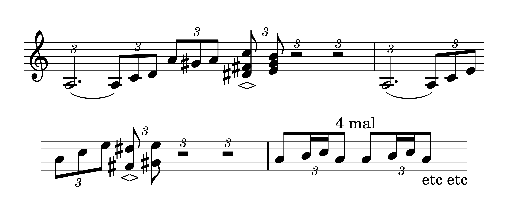

# Vermischte Bemerkungen

1914–1951, 587 remarks, Ms-101, Ms-106, Ms-105, Ms-107, and 53 more

### [Ms-101](/ms-101/#7r.2): [7r\[2\]](https://cdn.wittgensteinnachlass.com/2000px/webp/Ms-101/7r.webp)

21.08.1914

Der Leutnant & ich haben schon oft über alles Mögliche gesprochen; ein sehr netter Mensch. Er kann mit den größten Halunken umgehen & freundlich sein ohne sich etwas zu vergeben. Wenn wir einen Chinesen hören so sind wir geneigt sein Sprechen für ein unartikuliertes Gurgeln zu halten. Einer der Chinesisch versteht wird darin die _Sprache_ erkennen. So kann ich oft nicht den _Menschen_ im Menschen erkennen etc.. Ein wenig aber erfolglos gearbeitet.

---

### [Ms-106](/ms-106/#58.4+60.1): [58\[4\]](https://cdn.wittgensteinnachlass.com/2000px/webp/Ms-106/58.webp),[60\[1\]](https://cdn.wittgensteinnachlass.com/2000px/webp/Ms-106/60.webp)

In keiner religiösen Konfession ist soviel durch den Mißbrauch metaphorischer Ausdrücke gesündigt worden wie in der Mathematik.

### [Ms-106](/ms-106/#247.5): [247\[5\]](https://cdn.wittgensteinnachlass.com/2000px/webp/Ms-106/247.webp)

Der menschliche Blick hat es an sich daß er die Dinge kostbar machen kann, allerdings werden sie dann auch teurer.

### [Ms-105](/ms-105/#46.2): [46\[2\]](https://cdn.wittgensteinnachlass.com/2000px/webp/Ms-105/46.webp)

Meine Art des Philosophierens ist mir selbst immer noch, & immer wieder, neu, & daher muß ich mich so oft wiederholen. Einer anderen Generation wird sie in Fleisch & Blut übergegangen sein & sie wird die Wiederholungen langweilig finden. Für mich sind sie notwendig. – Diese Methode ist im Wesentlichen der Übergang von der Frage nach der _Wahrheit_ zur Frage nach dem _Sinn_.

### [Ms-105](/ms-105/#67.7): [67\[7\]](https://cdn.wittgensteinnachlass.com/2000px/webp/Ms-105/67.webp)

Es ist gut daß ich mich nicht beeinflussen lasse!

### [Ms-105](/ms-105/#73.6): [73\[6\]](https://cdn.wittgensteinnachlass.com/2000px/webp/Ms-105/73.webp)

Ein gutes Gleichnis erfrischt den Verstand.

### [Ms-105](/ms-105/#85.2): [85\[2\]](https://cdn.wittgensteinnachlass.com/2000px/webp/Ms-105/85.webp)

Es ist schwer einem Kurzsichtigen einen Weg zu beschreiben. Weil man ihm nicht sagen kann „schau auf den Kirchturm dort 10 Meilen von uns und geh in dieser Richtung.”

### [Ms-107](/ms-107/#70.4): [70\[4\]](https://cdn.wittgensteinnachlass.com/2000px/webp/Ms-107/70.webp)

Laß nur die Natur sprechen & über der Natur kenne nur _ein_ höheres, aber nicht das was die anderen denken könnten.

### [Ms-107](/ms-107/#72.2): [72\[2\]](https://cdn.wittgensteinnachlass.com/2000px/webp/Ms-107/72.webp)

Die Tragödie besteht darin daß sich der Baum nicht biegt sondern bricht. Die Tragödie ist etwas unjüdisches. Mendelssohn ist wohl der untragischste Komponist. Das tragische Festhalten, das trotzige Festhalten an einer tragischen Situation in der Liebe erscheint mir immer meinem Ideal ganz fremd. Ist mein Ideal darum schwächlich? Ich kann _& soll es nicht beurteilen_. Ist es schwächlich so ist es schlecht. Ich glaube ich habe im Grunde ein sanftes & ruhiges Ideal. Aber Gott behüte mein Ideal vor der Schwäche & Süßlichkeit!

### [Ms-107](/ms-107/#82.6): [82\[6\]](https://cdn.wittgensteinnachlass.com/2000px/webp/Ms-107/82.webp)

(Ein neues Wort ist wie ein frischer Same der in den Boden der Diskussion geworfen wird.)

### [Ms-107](/ms-107/#82.8): [82\[8\]](https://cdn.wittgensteinnachlass.com/2000px/webp/Ms-107/82.webp)

Jeden Morgen muß man wieder durch das tote Gerölle dringen um zum lebendigen, warmen Kern zu kommen.

### [Ms-107](/ms-107/#97.8): [97\[8\]](https://cdn.wittgensteinnachlass.com/2000px/webp/Ms-107/97.webp)

Mit dem vollen philosophischen Rucksack kann ich nur langsam den Berg der Mathematik steigen.

### [Ms-107](/ms-107/#98.8): [98\[8\]](https://cdn.wittgensteinnachlass.com/2000px/webp/Ms-107/98.webp)

Mendelssohn ist nicht eine Spitze sondern eine Hochebene. Das Englische an ihm.

### [Ms-107](/ms-107/#100.2): [100\[2\]](https://cdn.wittgensteinnachlass.com/2000px/webp/Ms-107/100.webp)

Niemand kann einen Gedanken für mich denken, wie mir niemand als ich den Hut aufsetzen kann.

### [Ms-107](/ms-107/#116.3): [116\[3\]](https://cdn.wittgensteinnachlass.com/2000px/webp/Ms-107/116.webp)

Wer ein Kind mit Verständnis schreien hört, der wird wissen, daß andere seelische Kräfte, furchtbare, darin schlummern als man gewöhnlich annimmt. Tiefe Wut & Schmerz & Zerstörungssucht.

### [Ms-107](/ms-107/#120.5): [120\[5\]](https://cdn.wittgensteinnachlass.com/2000px/webp/Ms-107/120.webp)

Mendelssohn ist wie ein Mensch, der nur lustig ist, wenn alles ohnehin lustig ist, oder gut wenn alle um ihn gut sind, & nicht eigentlich wie ein Baum der fest steht, wie er steht, was immer um ihn vorgehen mag. Ich selber bin auch so ähnlich & neige dazu es zu sein.

### [Ms-107](/ms-107/#130.6): [130\[6\]](https://cdn.wittgensteinnachlass.com/2000px/webp/Ms-107/130.webp)

Mein Ideal ist eine gewisse Kühle. Ein Tempel der den Leidenschaften als Umgebung dient ohne in sie hineinzureden.

### [Ms-107](/ms-107/#156.9+157.1): [156\[9\]](https://cdn.wittgensteinnachlass.com/2000px/webp/Ms-107/156.webp),[157\[1\]](https://cdn.wittgensteinnachlass.com/2000px/webp/Ms-107/157.webp)

10.10.1929

Ich denke oft darüber, ob mein Kulturideal ein neues, d.h. ein zeitgemäßes oder eines aus der Zeit Schumanns ist. Zum mindesten scheint es mir eine Fortsetzung dieses Ideals zu sein und zwar nicht die Fortsetzung die es damals tatsächlich erhalten hat. Also unter Ausschluß der zweiten Hälfte des 19. Jahrhunderts. Ich muß sagen, daß das rein instinktmäßig so geworden ist & nicht als Resultat einer Überlegung.

### [Ms-107](/ms-107/#176.5): [176\[5\]](https://cdn.wittgensteinnachlass.com/2000px/webp/Ms-107/176.webp)

24.10.1929

Wenn wir an die Zukunft der Welt denken so meinen wir immer den Ort wo sie sein wird wenn sie so weiter läuft wie wir sie jetzt laufen sehen und denken nicht daß sie nicht gerade läuft sondern in einer Kurve & ihre Richtung sich konstant ändert.

### [Ms-107](/ms-107/#184.4+185.1): [184\[4\]](https://cdn.wittgensteinnachlass.com/2000px/webp/Ms-107/184.webp),[185\[1\]](https://cdn.wittgensteinnachlass.com/2000px/webp/Ms-107/185.webp)

Ich glaube, das gute Österreichische (Grillparzer, Lenau, Bruckner, Labor) ist besonders schwer zu verstehen. Es ist in gewissem Sinne _subtiler_ als alles andere, und seine Wahrheit ist nie auf Seiten der Wahrscheinlichkeit.

### [Ms-107](/ms-107/#192.5): [192\[5\]](https://cdn.wittgensteinnachlass.com/2000px/webp/Ms-107/192.webp)

Wenn etwas gut ist, so ist es auch göttlich. Damit ist seltsamerweise meine Ethik zusammengefaßt.

### [Ms-107](/ms-107/#192.6): [192\[6\]](https://cdn.wittgensteinnachlass.com/2000px/webp/Ms-107/192.webp)

Nur das Übernatürliche kann das Übernatürliche ausdrücken.

### [Ms-107](/ms-107/#196.4): [196\[4\]](https://cdn.wittgensteinnachlass.com/2000px/webp/Ms-107/196.webp)

Man kann die Menschen nicht zum Guten führen; man kann sie nur irgendwohin führen; das Gute liegt außerhalb des Tatsachenraumes.

### [Ms-107](/ms-107/#229.4+230.1): [229\[4\]](https://cdn.wittgensteinnachlass.com/2000px/webp/Ms-107/229.webp),[230\[1\]](https://cdn.wittgensteinnachlass.com/2000px/webp/Ms-107/230.webp)

Ich sagte neulich zu Arvid mit dem ich im Kino einen uralten Film gesehen hatte: Ein jetziger Film verhielte sich zum alten wie ein heutiges Automobil zu einem von vor 25 Jahren. Er wirkt ebenso lächerlich & ungeschickt wie dieses & die Verbesserung des Films entspricht einer technischen Verbesserung wie der des Automobils. Sie entspricht nicht der Verbesserung – wenn man das so nennen darf – eines Kunststils. Ganz ähnlich müßte es auch in der modernen Tanzmusik gehen. Ein Jazztanz müßte sich verbessern lassen wie ein Film. Das was alle diese Entwicklung von dem Werden eines _Stils_ unterscheidet ist die Unbeteiligung des Geistes.

### [Ms-107](/ms-107/#230.2): [230\[2\]](https://cdn.wittgensteinnachlass.com/2000px/webp/Ms-107/230.webp)

11.01.1930

Der Unterschied zwischen einem guten & einem schlechten Architekten besteht heute darin, daß dieser jeder Versuchung erliegt während der rechte ihr standhält.

### [Ms-107](/ms-107/#230.3): [230\[3\]](https://cdn.wittgensteinnachlass.com/2000px/webp/Ms-107/230.webp)

Ich habe einmal, & vielleicht mit Recht, gesagt: Aus der früheren Kultur wird ein Trümmerhaufen & am Schluß ein Aschenhaufen werden; aber es werden Geister über der Asche schweben.

### [Ms-107](/ms-107/#242.2): [242\[2\]](https://cdn.wittgensteinnachlass.com/2000px/webp/Ms-107/242.webp)

16.01.1930

Die Lücken die der Organismus des Kunstwerks aufweist will man mit Stroh ausstopfen, um aber das Gewissen zu beruhigen nimmt man das _beste_ Stroh.

### [Ms-108](/ms-108/#207.2): [207\[2\]](https://cdn.wittgensteinnachlass.com/2000px/webp/Ms-108/207.webp)

Wenn einer die Lösung des Problems des Lebens gefunden zu haben glaubt & sich sagen wollte jetzt ist alles ganz leicht so brauchte er sich zu seiner Widerlegung nur sagen daß es eine Zeit gegeben hat wo diese „Lösung” nicht gefunden war; aber auch zu _der_ Zeit mußte man leben können & im Hinblick auf sie erscheint die gefundene Lösung wie ein Zufall. Und so geht es uns in der Logik. Wenn es eine „Lösung der logischen (philosophischen) Probleme” gäbe so müßten wir uns nur vorhalten daß sie ja einmal nicht gelöst waren (und auch da mußte man leben & denken können) – – –

### [Ms-109](/ms-109/#28.2+29.1+30.1): [28\[2\]](https://cdn.wittgensteinnachlass.com/2000px/webp/Ms-109/28.webp),[29\[1\]](https://cdn.wittgensteinnachlass.com/2000px/webp/Ms-109/29.webp),[30\[1\]](https://cdn.wittgensteinnachlass.com/2000px/webp/Ms-109/30.webp)

22.08.1930

Engelmann sagte mir, wenn er zu Hause in seiner Lade voll von seinen Manuskripten krame so kämen sie ihm so wunderschön vor daß er denke sie wären es wert den anderen Menschen gegeben zu werden. (Das sei auch der Fall wenn er Briefe seiner verstorbenen Verwandten durchsehe.) Wenn er sich aber eine Auswahl davon herausgegeben denkt so verliere die Sache jeden Reiz & Wert & werde unmöglich. Ich sagte wir hätten hier einen Fall ähnlich folgendem: Es könnte nichts merkwürdiger sein als einen Menschen bei irgend einer ganz einfachen alltäglichen Tätigkeit wenn er sich unbeobachtet glaubt zu sehen. Denken wir uns ein Theater, der Vorhang ginge auf & wir sähen einen Menschen allein in seinem Zimmer auf & ab gehen, sich eine Zigarette anzünden, sich niedersetzen u.s.f. so daß wir plötzlich von außen einen Menschen sähen wie man sich sonst nie sehen kann; wenn wir quasi ein Kapitel einer Biographie mit eigenen Augen sähen, – das müßte unheimlich & wunderbar zugleich sein. Wunderbarer als irgend etwas was ein Dichter auf der Bühne spielen oder sprechen lassen könnte. Wir würden das Leben selbst sehen. – Aber das sehen wir ja alle Tage & es macht uns nicht den mindesten Eindruck! Ja, aber wir sehen es nicht in _der_ Perspektive. – So wenn E. seine Schriften ansieht & sie herrlich findet (die er doch einzeln nicht veröffentlichen möchte) so sieht er sein Leben, als ein Kunstwerk Gottes, & als das ist es allerdings betrachtenswert, jedes Leben & Alles. Doch kann nur der Künstler das Einzelne so darstellen daß es uns als Kunstwerk erscheint; jene Manuskripte verlieren _mit Recht_ ihren Wert wenn man sie einzeln & überhaupt wenn man sie un**voreingenommen**, das heißt ohne schon vorher begeistert zu sein, betrachtet. Das Kunstwerk zwingt uns – sozusagen – zu der richtigen Perspektive, ohne die Kunst aber ist der Gegenstand ein Stück Natur wie jedes andre & daß _wir_ es durch die Begeisterung erheben können das berechtigt niemand es uns vorzusetzen. (Ich muß immer an eine jener faden Naturaufnahmen denken die der, der sie aufgenommen interessant findet weil er dort selbst war, etwas erlebt hat, der dritte aber mit berechtigter Kälte betrachtet; wenn es überhaupt gerechtfertigt ist ein Ding mit Kälte zu betrachten. Nun scheint mir aber, gibt es außer der Arbeit des Künstlers noch eine andere, die Welt sub specie äterni einzufangen. Es ist – glaube ich – der Weg des Gedankens der gleichsam über die Welt hinfliegt & sie so läßt wie sie ist, – sie von oben im Fluge betrachtend.

### [Ms-109](/ms-109/#200.3+201.1): [200\[3\]](https://cdn.wittgensteinnachlass.com/2000px/webp/Ms-109/200.webp),[201\[1\]](https://cdn.wittgensteinnachlass.com/2000px/webp/Ms-109/201.webp)

05.11.1930

Ich lese in Renan Peuple d'Israel: „La naissance, la maladie, la mort, le délire, la catalepsie, le sommeil, les rêves frappaient infiniment, et, même aujourd'hui, il n'est donné qu'à un petit nombre de voir clairement que ces phénomènes ont leurs causes dans notre organisation.” Im Gegenteil es besteht gar kein Grund sich über diese Dinge zu wundern; weil sie so alltäglich sind. Wenn sich der primitive Mensch über sie wundern _muß_, wieviel mehr der Hund & der Affe. Oder nimmt man an daß die Menschen quasi plötzlich aufgewacht sind & diese Dinge die schon immer da waren plötzlich bemerkten & begreiflicherweise erstaunt waren? – Ja, etwas Ähnliches könnte man sogar annehmen; aber nicht daß sie diese Dinge zum erstenmal wahrnahmen sondern daß sie plötzlich anfingen sich über sie zu wundern. Das aber hat wieder nichts mit ihrer Primitivität zu tun. Es sei denn daß man es primitiv nennt sich nicht über die Dinge zu wundern, dann aber sind gerade die heutigen Menschen & Renan selbst primitiv wenn er glaubt die Erklärung der Wissenschaft könne das Staunen heben. Als ob der Blitz heute alltäglicher oder weniger staunenswert wäre als vor 2000 Jahren. Zum Staunen muß der Mensch – und vielleicht Völker – aufwachen. Die Wissenschaft ist ein Mittel um ihn wieder einzuschläfern.

### [Ms-109](/ms-109/#201.2+202.1): [201\[2\]](https://cdn.wittgensteinnachlass.com/2000px/webp/Ms-109/201.webp),[202\[1\]](https://cdn.wittgensteinnachlass.com/2000px/webp/Ms-109/202.webp)

D.h. einfach es ist falsch zu sagen: Natürlich, diese primitiven Völker _mußten_ alle Phänomene anstaunen. Vielleicht aber richtig diese Völker, _haben_ alle Dinge ihrer Umgebung angestaunt. – Daß sie sie anstaunen mußten ist ein primitiver Aberglaube. (Wie der, daß sie sich vor allen Naturkräften fürchten _mußten_ & wir uns natürlich nicht fürchten müssen. Aber die Erfahrung mag lehren daß gewisse primitive Stämme sehr zur Furcht vor den Naturphänomenen neigen. Es ist aber nicht ausgeschlossen daß hochzivilisierte Völker wieder zu eben dieser Furcht neigen werden & ihre Zivilisation & die wissenschaftliche Kenntnis wird sie nicht davor schützen. Freilich ist es wahr, daß der _Geist_ in dem die Wissenschaft heute betrieben wird mit einer solchen Furcht nicht vereinbar ist.)

### [Ms-109](/ms-109/#202.2): [202\[2\]](https://cdn.wittgensteinnachlass.com/2000px/webp/Ms-109/202.webp)

Wenn Renan vom bon sens précoce der semitischen Rassen spricht (eine Idee die mir vor langer Zeit schon vorgeschwebt ist) so ist das das _Undichterische_, unmittelbar auf's Konkrete Gehende. Das was meine Philosophie bezeichnet. Die Dinge liegen unmittelbar da vor unsern Augen, kein Schleier über ihnen. – Hier trennen sich Religion & Kunst.

### [Ms-109](/ms-109/#204.4+205.1+206.1): [204\[4\]](https://cdn.wittgensteinnachlass.com/2000px/webp/Ms-109/204.webp),[205\[1\]](https://cdn.wittgensteinnachlass.com/2000px/webp/Ms-109/205.webp),[206\[1\]](https://cdn.wittgensteinnachlass.com/2000px/webp/Ms-109/206.webp)

Zu einem Vorwort:

Dieses Buch ist für diejenigen geschrieben, die dem Geist in dem es geschrieben ist freundlich gegenüberstehn. Dieser Geist ist, glaube ich, ein anderer als der der großen europäischen & amerikanischen Zivilisation. Der Geist dieser Zivilisation dessen Ausdruck die Industrie, Architektur, Musik, der Faschismus & Sozialismus der Jetztzeit ist, ist ein dem Verfasser fremder & unsympathischer Geist. Dies ist kein Werturteil. Nicht als ob ich nicht wüßte daß was sich heute als Architektur ausgibt nicht Architektur ist & nicht als ob er dem was moderne Musik heißt nicht das größte Mißtrauen entgegenbrächte ohne ihre Sprache zu verstehen, aber das Verschwinden der Künste rechtfertigt kein absprechendes Urteil über eine Menschheit. Denn echte & starke Naturen wenden sich eben in dieser Zeit von dem Gebiet der Künste ab & anderen Dingen zu & der Wert des Einzelnen kommt irgendwie zum Ausdruck. Freilich nicht wie zur Zeit einer großen Kultur. Die Kultur ist gleichsam eine große Organisation die jedem der zu ihr gehört seinen Platz anweist an dem er im Geist des Ganzen arbeiten kann und seine Kraft kann mit gewissem Recht an seinem Erfolg im Sinne des Ganzen gemessen werden.

Zur Zeit der Unkultur aber zersplittern sich die Kräfte und die Kraft des Einzelnen wird durch entgegengesetzte Kräfte & Reibungswiderstände verbraucht & kommt nicht in der Länge des durchlaufenen Weges zum Ausdruck sondern vielleicht nur in der Wärme die er beim Überwinden der Reibungswiderstände erzeugt hat. Aber Energie bleibt Energie & wenn so das Schauspiel das dieses Zeitalter bietet auch nicht das des Werdens eines großen Kulturwerkes ist in dem die Besten dem gleichen großen Ziele zuarbeiten sondern das wenig imposante Schauspiel einer Menge deren Beste nur privaten Zielen nachstreben so dürfen wir nicht vergessen, daß es auf das Schauspiel nicht ankommt. Ist es mir so klar daß das Verschwinden einer Kultur nicht das Verschwinden menschlichen Wertes bedeutet sondern bloß gewisser Ausdrucksmittel dieses Werts so bleibt dennoch die Tatsache bestehen daß ich dem Strom der europäischen Zivilisation ohne Sympathie zusehe, ohne Verständnis für die Ziele wenn sie welche hat. Ich schreibe also eigentlich für Freunde welche in Winkeln der Welt verstreut sind.

### [Ms-109](/ms-109/#206.2): [206\[2\]](https://cdn.wittgensteinnachlass.com/2000px/webp/Ms-109/206.webp)

Ob ich von dem typischen westlichen Wissenschaftler verstanden oder geschätzt werde ist mir gleichgültig weil er den Geist in dem ich schreibe doch nicht versteht.

### [Ms-109](/ms-109/#207.1): [207\[1\]](https://cdn.wittgensteinnachlass.com/2000px/webp/Ms-109/207.webp)

Unsere Zivilisation ist durch das Wort Fortschritt charakterisiert. Der Fortschritt ist ihre Form nicht eine ihrer Eigenschaften daß sie fortschreitet. Sie ist typisch aufbauend. Ihre Tätigkeit ist es ein immer komplizierteres Gebilde zu konstruieren. Und auch die Klarheit dient doch nur wieder diesem Zweck & ist nicht Selbstzweck. Mir dagegen ist die Klarheit die Durchsichtigkeit Selbstzweck. Es interessiert mich nicht ein Gebäude aufzuführen sondern die Grundlagen der möglichen Gebäude durchsichtig vor mir zu haben. Mein Ziel ist also ein anderes als das der Wissenschaftler & meine Denkbewegung von der ihrigen verschieden.

### [Ms-109](/ms-109/#207.2): [207\[2\]](https://cdn.wittgensteinnachlass.com/2000px/webp/Ms-109/207.webp)

Jeder Satz den ich schreibe meint immer schon das Ganze also immer wieder dasselbe & es sind quasi nur Ansichten eines Gegenstandes unter verschiedenen Winkeln betrachtet.

### [Ms-109](/ms-109/#207.3+208.1): [207\[3\]](https://cdn.wittgensteinnachlass.com/2000px/webp/Ms-109/207.webp),[208\[1\]](https://cdn.wittgensteinnachlass.com/2000px/webp/Ms-109/208.webp)

Ich könnte sagen: Wenn der Ort zu dem ich gelangen will nur auf einer Leiter zu ersteigen wäre, ich gäbe es auf dahin zu gelangen. Denn dort wo ich wirklich hin muß, dort muß ich eigentlich schon sein. Was auf einer Leiter erreichbar ist interessiert mich nicht.

### [Ms-109](/ms-109/#208.2): [208\[2\]](https://cdn.wittgensteinnachlass.com/2000px/webp/Ms-109/208.webp)

Die eine Bewegung reiht einen Gedanken an den andern, die andere zielt immer nach demselben Ort.

### [Ms-109](/ms-109/#208.3): [208\[3\]](https://cdn.wittgensteinnachlass.com/2000px/webp/Ms-109/208.webp)

Die eine Bewegung baut & nimmt Stein auf Stein (in die Hand), die andere greift immer wieder nach dem Selben.

### [Ms-109](/ms-109/#208.4+209.1): [208\[4\]](https://cdn.wittgensteinnachlass.com/2000px/webp/Ms-109/208.webp),[209\[1\]](https://cdn.wittgensteinnachlass.com/2000px/webp/Ms-109/209.webp)

07.11.1930

Die Gefahr eines langen Vorworts ist die daß der Geist eines Buches sich in diesem zeigen muß & nicht beschrieben werden kann. Denn ist ein Buch nur für wenige geschrieben so wird sich das eben dadurch zeigen daß nur wenige es verstehen. Das Buch muß automatisch die Scheidung derer bewirken die es verstehen & die es nicht verstehen. Auch das Vorwort ist eben für solche geschrieben, die das Buch verstehen. Es hat keinen Sinn jemandem etwas zu sagen was er nicht versteht, auch wenn man hinzusetzt daß er es nicht verstehen kann. (Das geschieht so oft mit einem Menschen den man liebt.) Willst Du nicht daß gewisse Menschen in ein Zimmer gehen so hänge ein Schloß vor wozu sie keinen Schlüssel haben. Aber es ist sinnlos darüber mit ihnen zu reden, außer Du willst doch daß sie das Zimmer von außen bewundern! Anständigerweise hänge ein Schloß vor die Türe das nur die anzieht die es öffnen können & den andern nicht auffällt. Aber es ist richtig zu sagen daß das Buch meiner Meinung nach mit der fortschreitenden europäischen & amerikanischen Zivilisation nichts zu tun hat. Daß diese Zivilisation vielleicht die notwendige Umgebung dieses Geistes ist aber daß sie verschiedene Ziele haben. Alles Rituelle (quasi Hohepriesterliche) ist streng zu vermeiden weil es sofort fault. Ein Kuß ist freilich auch ein Ritus & er fault nicht; aber eben nur soviel Ritus ist erlaubt als so echt ist wie ein Kuß.

### [Ms-109](/ms-109/#209.2): [209\[2\]](https://cdn.wittgensteinnachlass.com/2000px/webp/Ms-109/209.webp)

Es ist eine große Versuchung den Geist explicit machen zu wollen.

### [Ms-109](/ms-109/#212.3): [212\[3\]](https://cdn.wittgensteinnachlass.com/2000px/webp/Ms-109/212.webp)

Wo man an die Grenze seiner eigenen Anständigkeit stößt dort entsteht quasi ein Wirbel der Gedanken (&) ein endloser Regreß: man mag _sagen_ was man will, es führt einen nicht weiter.

### [Ms-110](/ms-110/#5.7+6.1): [5\[7\]](https://cdn.wittgensteinnachlass.com/2000px/webp/Ms-110/5.webp),[6\[1\]](https://cdn.wittgensteinnachlass.com/2000px/webp/Ms-110/6.webp)

Ich lese in Lessing: (über die Bibel) „Setzt hierzu noch die Einkleidung und den Stil ……, durchaus voll Tautologien, aber solchen, die den Scharfsinn üben, indem sie bald etwas anderes zu sagen scheinen, und doch das nämliche sagen, bald das nämliche zu sagen scheinen, und im Grunde etwas anderes bedeuten oder bedeuten können: …”

### [Ms-110](/ms-110/#10.2): [10\[2\]](https://cdn.wittgensteinnachlass.com/2000px/webp/Ms-110/10.webp)

Wenn ich nicht recht weiß wie ein Buch anfangen so kommt das daher das noch etwas unklar ist. Denn ich möchte mit dem der Philosophie Gegebenen, den geschriebenen & gesprochenen Sätzen, quasi den Büchern anfangen. Und hier begegnet man der Schwierigkeit des „Alles fließt”. Und mit ihr ist vielleicht überhaupt anzufangen.

### [Ms-110](/ms-110/#11.5): [11\[5\]](https://cdn.wittgensteinnachlass.com/2000px/webp/Ms-110/11.webp)

25.12.1930

Wer seiner Zeit nur voraus ist, den holt sie einmal ein.

### [Ms-110](/ms-110/#12.4): [12\[4\]](https://cdn.wittgensteinnachlass.com/2000px/webp/Ms-110/12.webp)

12.01.1931

Die Musik scheint manchem eine primitive Kunst zu sein mit ihren wenigen Tönen & Rhythmen. Aber einfach ist nur ihre Oberfläche während der Körper der die Deutung dieses manifesten Inhalts ermöglicht die ganze unendliche Komplexität besitzt die wir in dem Äußeren der anderen Künste angedeutet finden & die die Musik verschweigt. Sie ist in gewissem Sinne die raffinierteste aller Künste.

### [Ms-110](/ms-110/#12.5+13.1): [12\[5\]](https://cdn.wittgensteinnachlass.com/2000px/webp/Ms-110/12.webp),[13\[1\]](https://cdn.wittgensteinnachlass.com/2000px/webp/Ms-110/13.webp)

16.01.1931

Es gibt Probleme an die ich nie herankomme, die nicht in meiner Linie oder in meiner Welt liegen. Probleme der Abendländischen Gedankenwelt an die Beethoven (& vielleicht teilweise Goethe) herangekommen ist & mit denen er gerungen hat die aber kein Philosoph je angegangen hat (vielleicht ist Nietzsche an ihnen vorbeigekommen). Und vielleicht sind sie für die abendländische Philosophie verloren d.h. es wird niemand da sein der den Fortgang dieser Kultur als Epos empfindet also beschreiben kann. Oder richtiger sie ist eben kein Epos mehr oder doch nur für den der sie von außen betrachtet & vielleicht hat dies Beethoven vorschauend getan (wie Spengler einmal andeutet). Man könnte sagen die Zivilisation muß ihren Epiker voraushaben. Wie man den eigenen Tod nur voraussehen und vorausschauend beschreiben nicht als Gleichzeitiger von ihm berichten kann. Man könnte also sagen: Wenn Du das Epos einer ganzen Kultur geschrieben sehen willst so mußt Du es unter den Werken der Größten dieser Kultur also zu einer Zeit suchen in der das Ende dieser Kultur nur hat **voraus**gesehen werden können, denn später ist niemand mehr da es zu beschreiben. Und so ist es also kein Wunder wenn es nur in der dunklen Sprache der Voraussicht geschrieben ist & für die Wenigsten verständlich.

### [Ms-110](/ms-110/#13.2+14.1): [13\[2\]](https://cdn.wittgensteinnachlass.com/2000px/webp/Ms-110/13.webp),[14\[1\]](https://cdn.wittgensteinnachlass.com/2000px/webp/Ms-110/14.webp)

Ich aber komme zu diesen Problemen überhaupt nicht. Wenn ich „have done with the world” so habe ich eine amorphe (durchsichtige) Masse geschaffen & die Welt mit ihrer ganzen Vielfältigkeit bleibt wie eine uninteressante Gerümpelkammer links liegen. Oder vielleicht richtiger: das ganze Resultat der ganzen Arbeit ist das Linksliegenlassen der Welt. (Das In-die-Rumpelkammer-werfen der ganzen Welt.)

### [Ms-110](/ms-110/#14.2): [14\[2\]](https://cdn.wittgensteinnachlass.com/2000px/webp/Ms-110/14.webp)

Eine Tragik gibt es in dieser Welt (der meinen) nicht & damit all das Unendliche nicht was eben die Tragik (als Resultat) hervorbringt. Es ist sozusagen alles in dem Äther löslich; es gibt keine Härten. Das heißt die Härte und der Konflikt wird nicht zu etwas Herrlichem sondern zu einem _Fehler_.

### [Ms-110](/ms-110/#14.3): [14\[3\]](https://cdn.wittgensteinnachlass.com/2000px/webp/Ms-110/14.webp)

Der Konflikt löst sich etwa wie die Spannung einer Feder in einem Mechanismus, den man schmilzt (oder in Salpetersäure auflöst). In dieser Lösung gibt es keine Spannungen mehr.

### [Ms-110](/ms-110/#18.3): [18\[3\]](https://cdn.wittgensteinnachlass.com/2000px/webp/Ms-110/18.webp)

Wenn ich sage daß mein Buch nur für einen kleinen Kreis von Menschen bestimmt ist (wenn man das einen Kreis nennen kann) so will ich damit nicht sagen daß dieser Kreis meiner Auffassung nach die Elite der Menschheit ist aber es ist der Kreis an den ich mich wende (nicht weil sie besser oder schlechter sind als die andern sondern) weil sie mein Kulturkreis sind gleichsam die Menschen meines Vaterlandes im Gegensatz zu den anderen, die mir _fremd_ sind.

### [Ms-110](/ms-110/#61.2): [61\[2\]](https://cdn.wittgensteinnachlass.com/2000px/webp/Ms-110/61.webp)

Die Grenze der Sprache zeigt sich in der Unmöglichkeit die Tatsache zu beschreiben, die einem Satz entspricht (seine Übersetzung ist) ohne eben den Satz zu wiederholen.

### [Ms-110](/ms-110/#61.3): [61\[3\]](https://cdn.wittgensteinnachlass.com/2000px/webp/Ms-110/61.webp)

(Wir haben es hier mit der Kant'schen Lösung des Problems der Philosophie zu tun.)

### [Ms-110](/ms-110/#67.1): [67\[1\]](https://cdn.wittgensteinnachlass.com/2000px/webp/Ms-110/67.webp)

Kann ich sagen, das Drama hat seine eigene Zeit die nicht ein Abschnitt der historischen Zeit ist. D.h. ich kann in ihm von früher und später reden, aber die Frage hat _keinen Sinn_ ob die Ereignisse, etwa, vor oder nach Cäsars Tod geschehen sind.

### [Ms-153a](/ms-153a/#4v.2): [4v\[2\]](https://cdn.wittgensteinnachlass.com/2000px/webp/Ms-153a/4v.webp)

10.05.1931

[Die liebliche Temperaturdifferenz der Teile eines menschlichen Körpers.]

### [Ms-153a](/ms-153a/#12v.1): [12v\[1\]](https://cdn.wittgensteinnachlass.com/2000px/webp/Ms-153a/12v.webp)

[Es ist beschämend sich als leerer Schlauch zeigen zu müssen der nur vom Geist aufgeblasen wird.]

### [Ms-153a](/ms-153a/#18v.1): [18v\[1\]](https://cdn.wittgensteinnachlass.com/2000px/webp/Ms-153a/18v.webp)

[Niemand will den Andern gerne verletzt haben; darum tut es jedem so gut wenn der Andere sich nicht verletzt zeigt. Niemand will gerne eine beleidigte Leberwurst vor sich haben. Das merke Dir. Es ist viel leichter dem Beleidiger geduldig – & duldend – aus dem Weg gehen, als ihm freundlich entgegengehen. Dazu gehört auch Mut.]

### [Ms-153a](/ms-153a/#29v.4+30r.1): [29v\[4\]](https://cdn.wittgensteinnachlass.com/2000px/webp/Ms-153a/29v.webp),[30r\[1\]](https://cdn.wittgensteinnachlass.com/2000px/webp/Ms-153a/30r.webp)

[ Zu dem der Dich nicht mag gut zu sein erfordert nicht nur viel Gutmütigkeit sondern auch viel _Takt_.]

### [Ms-153a](/ms-153a/#35r.1): [35r\[1\]](https://cdn.wittgensteinnachlass.com/2000px/webp/Ms-153a/35r.webp)

Wir kämpfen mit der Sprache.

### [Ms-153a](/ms-153a/#35r.2): [35r\[2\]](https://cdn.wittgensteinnachlass.com/2000px/webp/Ms-153a/35r.webp)

Wir stehen im Kampf mit der Sprache.

### [Ms-153a](/ms-153a/#35v.2+36r.1): [35v\[2\]](https://cdn.wittgensteinnachlass.com/2000px/webp/Ms-153a/35v.webp),[36r\[1\]](https://cdn.wittgensteinnachlass.com/2000px/webp/Ms-153a/36r.webp)

Die Lösung philosophischer Probleme verglichen mit dem Geschenk im Märchen das im Zauberschloß zauberisch erscheint und wenn man es draußen beim Tag betrachtet nichts ist als ein gewöhnliches Stück Eisen (oder dergleichen).

### [Ms-153a](/ms-153a/#90v.2): [90v\[2\]](https://cdn.wittgensteinnachlass.com/2000px/webp/Ms-153a/90v.webp)

Der Denker gleicht sehr dem Zeichner. Der alle Zusammenhänge nachzeichnen will.

### [Ms-153a](/ms-153a/#127v.2+128r.1): [127v\[2\]](https://cdn.wittgensteinnachlass.com/2000px/webp/Ms-153a/127v.webp),[128r\[1\]](https://cdn.wittgensteinnachlass.com/2000px/webp/Ms-153a/128r.webp)

Kompositionen die am Klavier, auf dem Klavier, komponiert sind, solche, die mit der Feder denkend & solche die mit dem inneren Ohr allein komponiert sind, müssen ganz verschiedener Art sein & einen Eindruck ganz verschiedener Art machen. Ich glaube bestimmt daß Bruckner nur mit dem inneren Ohr & einer Vorstellung vom spielenden Orchester, Brahms mit der Feder komponiert hat. Das ist natürlich einfacher dargestellt als es ist. _Eine_ Charakteristik aber ist damit getroffen.

### [Ms-153a](/ms-153a/#128v.1): [128v\[1\]](https://cdn.wittgensteinnachlass.com/2000px/webp/Ms-153a/128v.webp)

Eine Tragödie könnte doch immer anfangen mit den Worten: „Es wäre gar nichts geschehen, wenn nicht ….”

### [Ms-153a](/ms-153a/#128v.3): [128v\[3\]](https://cdn.wittgensteinnachlass.com/2000px/webp/Ms-153a/128v.webp)

Aber ist das nicht eine einseitige Betrachtung der Tragödie die sie nur zeigen läßt, daß eine Begegnung unser ganzes Leben entscheiden kann.

### [Ms-153a](/ms-153a/#129r.1+129v.1): [129r\[1\]](https://cdn.wittgensteinnachlass.com/2000px/webp/Ms-153a/129r.webp),[129v\[1\]](https://cdn.wittgensteinnachlass.com/2000px/webp/Ms-153a/129v.webp)

Ich glaube daß es heute ein Theater geben könnte wo mit Masken gespielt würde. Die Figuren wären eben stilisierte Menschen. In den Schriften Kraus's ist das deutlich zu sehen. Seine Stücke könnten, oder müßten, in Masken aufgeführt werden. Dies entspricht natürlich einer gewissen Abstraktheit dieser Produkte. Und das Maskentheater ist, wie ich es meine, überhaupt der Ausdruck eines spiritualistischen Charakters. Es werden daher (auch) vielleicht nur die Juden zu diesem Theater neigen.

### [Ms-153a](/ms-153a/#137r.3+137v.1): [137r\[3\]](https://cdn.wittgensteinnachlass.com/2000px/webp/Ms-153a/137r.webp),[137v\[1\]](https://cdn.wittgensteinnachlass.com/2000px/webp/Ms-153a/137v.webp)

Frida Schanz:

Nebeltag. Der graue Herbst geht um.

Das Lachen scheint verdorben;

die Welt liegt heut so stumm,

als sei sie nachts gestorben. Im golden roten Hag

brauen die Nebeldrachen;

und schlummernd liegt der Tag.

Der Tag will nicht erwachen.

_─────── ∙ ───────_

### [Ms-153a](/ms-153a/#138r.2+138v.1): [138r\[2\]](https://cdn.wittgensteinnachlass.com/2000px/webp/Ms-153a/138r.webp),[138v\[1\]](https://cdn.wittgensteinnachlass.com/2000px/webp/Ms-153a/138v.webp)

Das Gedicht auf der vorigen Seite habe ich aus einem „Rösselsprung” entnommen wo natürlich die Interpunktion fehlte. Ich weiß daher z.B. nicht ob das Wort „Nebeltag” der Titel ist, oder ob es zur ersten Zeile gehört, wie ich es geschrieben habe. Und es ist merkwürdig wie trivial das Gedicht klingt, wenn es nicht mit dem Wort „Nebeltag” sondern mit „Der graue” beginnt. Der Rhythmus des _ganzen_ Gedichts ändert sich dadurch.

### [Ms-153a](/ms-153a/#141r.2): [141r\[2\]](https://cdn.wittgensteinnachlass.com/2000px/webp/Ms-153a/141r.webp)

Was Du geleistet hast kann Andern nicht mehr bedeuten als Dir selbst.

### [Ms-153a](/ms-153a/#141r.3): [141r\[3\]](https://cdn.wittgensteinnachlass.com/2000px/webp/Ms-153a/141r.webp)

Soviel (als) es Dich gekostet hat, soviel werden sie zahlen.

### [Ms-153a](/ms-153a/#160v.3): [160v\[3\]](https://cdn.wittgensteinnachlass.com/2000px/webp/Ms-153a/160v.webp)

(Der Jude ist eine wüste Gegend unter deren dünner Gesteinsschicht aber die feurig-flüssigen Massen des Geistigen liegen.)

### [Ms-153b](/ms-153b/#3r.1): [3r\[1\]](https://cdn.wittgensteinnachlass.com/2000px/webp/Ms-153b/3r.webp)

Grillparzer: „Wie leicht bewegt man sich im Großen & im Fernen, wie schwer faßt sich, was nah & einzeln an ….”

### [Ms-153b](/ms-153b/#29r.1-relocated): [29r\[1\]-relocated](https://cdn.wittgensteinnachlass.com/2000px/webp/Ms-153b/29r.webp)

Welches Gefühl hätten wir wenn wir nicht von Christus gehört hätten? Hätten wir das Gefühl der Dunkelheit & Verlassenheit? Haben wir es nur insofern nicht als es ein Kind nicht hat wenn es weiß daß jemand mit ihm im Zimmer ist? Religiöser Wahnsinn ist Wahnsinn aus Irreligiosität.

### [Ms-153b](/ms-153b/#39v.1): [39v\[1\]](https://cdn.wittgensteinnachlass.com/2000px/webp/Ms-153b/39v.webp)

Sehe die Photographien von korsischen Briganten und denke mir: die Gesichter sind zu hart & meines zu weich als daß das Christentum darauf schreiben könnte. Die Gesichter der Briganten sind schrecklich anzusehen & doch sind sie gewiß nicht weiter von einem guten Leben entfernt & nur auf einer andern Seite desselben gelegen als ich.

---

### [Ms-154](/ms-154/#1r.1): [1r\[1\]](https://cdn.wittgensteinnachlass.com/2000px/webp/Ms-154/1r.webp)

Eine Beichte muß ein Teil des neuen Lebens sein.

### [Ms-154](/ms-154/#1v.1): [1v\[1\]](https://cdn.wittgensteinnachlass.com/2000px/webp/Ms-154/1v.webp)

Ich drücke, was ich ausdrücken will doch immer nur „mit halbem Gelingen” aus. Ja auch das nicht, sondern vielleicht nur mit einem Zehntel. Das will doch etwas besagen. Mein Schreiben ist oft nur ein „Stammeln”.

### [Ms-154](/ms-154/#15v.2): [15v\[2\]](https://cdn.wittgensteinnachlass.com/2000px/webp/Ms-154/15v.webp)

Das jüdische “Genie” ist nur ein Heiliger. Der größte jüdische Denker ist nur ein Talent. (Ich z.B.)

### [Ms-154](/ms-154/#15v.3+16r.1): [15v\[3\]](https://cdn.wittgensteinnachlass.com/2000px/webp/Ms-154/15v.webp),[16r\[1\]](https://cdn.wittgensteinnachlass.com/2000px/webp/Ms-154/16r.webp)

Es ist, glaube ich eine Wahrheit darin wenn ich denke, daß ich eigentlich in meinem Denken nur reproduktiv bin. Ich glaube ich habe nie eine Gedankenbewegung _erfunden_ sondern sie wurde mir immer von jemand anderem gegeben & ich habe sie nur sogleich leidenschaftlich zu meinem Klärungswerk aufgegriffen. So haben mich Boltzmann, Hertz, Schopenhauer, Frege, Russell, Kraus, Loos, Weininger, Spengler, Sraffa beeinflußt. Kann man als ein Beispiel der jüdischen Reproduktivität Breuer & Freud heranziehen? – Was ich erfinde sind neue _Gleichnisse_.

### [Ms-154](/ms-154/#16r.2+16v.1): [16r\[2\]](https://cdn.wittgensteinnachlass.com/2000px/webp/Ms-154/16r.webp),[16v\[1\]](https://cdn.wittgensteinnachlass.com/2000px/webp/Ms-154/16v.webp)

Als ich seinerzeit den Kopf für Drobil modellierte so war auch die Anregung wesentlich ein Werk Drobils & meine Arbeit war eigentlich wieder die des Klärens. Ich glaube das Wesentliche ist daß die Tätigkeit des Klärens mit _Mut_ betrieben werden muß: fehlt der so wird sie ein bloßes gescheites Spiel.

### [Ms-154](/ms-154/#16v.2): [16v\[2\]](https://cdn.wittgensteinnachlass.com/2000px/webp/Ms-154/16v.webp)

Der Jude muß im eigentlichen Sinn „sein Sach' auf nichts stellen”. Aber das fällt gerade ihm besonders schwer, weil er, sozusagen, nichts hat. Es ist viel schwerer freiwillig arm zu sein, wenn man arm sein _muß_ als, wenn man auch reich sein könnte.

### [Ms-154](/ms-154/#16v.3+17r.1+17v.1): [16v\[3\]](https://cdn.wittgensteinnachlass.com/2000px/webp/Ms-154/16v.webp),[17r\[1\]](https://cdn.wittgensteinnachlass.com/2000px/webp/Ms-154/17r.webp),[17v\[1\]](https://cdn.wittgensteinnachlass.com/2000px/webp/Ms-154/17v.webp)

Man könnte sagen (ob es nun stimmt oder nicht) daß der jüdische Geist nicht im Stande ist auch nur ein Gräschen oder Blümchen hervorzubringen daß es aber seine Art ist das Gräschen oder die Blume die im andern Geist gewachsen ist abzuzeichnen & damit ein umfassendes Bild zu entwerfen. Das ist nun nicht die Angabe eines Lasters & es ist alles in Ordnung solange das nur völlig klar bleibt. Gefährlich wird es erst wenn man die Art des Jüdischen mit der des Nicht-jüdischen Werks verwechselt & besonders wenn das der Schöpfer des ersteren selbst tut, was so nahe liegt. („Sieht er nicht so stolz aus als ob er selbst gemolken wäre”.) Es ist dem jüdischen Geiste typisch das Werk eines Andern besser zu verstehen als der es selbst versteht.

### [Ms-154](/ms-154/#17v.2+18r.1+18v.1): [17v\[2\]](https://cdn.wittgensteinnachlass.com/2000px/webp/Ms-154/17v.webp),[18r\[1\]](https://cdn.wittgensteinnachlass.com/2000px/webp/Ms-154/18r.webp),[18v\[1\]](https://cdn.wittgensteinnachlass.com/2000px/webp/Ms-154/18v.webp)

Ich habe mich oft dabei ertappt wenn ich ein Bild entweder richtig hatte rahmen lassen oder in die richtige Umgebung gehangen hatte so stolz zu sein als hätte ich das Bild gemalt. Das ist eigentlich nicht richtig; nicht „so stolz als hätte ich es gemalt” sondern so stolz als hätte ich es malen geholfen, als hätte ich sozusagen einen kleinen Teil davon gemalt. Es ist so als würde der außerordentliche Arrangeur von Gräsern am Schluß denken daß er doch, wenigstens ein ganz winziges Gräschen, selbst erzeugt habe. Während er sich klar sein muß, daß seine Arbeit auf einem gänzlich andern Gebiet liegt.

Der Vorgang der Entstehung auch des winzigsten & schäbigsten Gräschens ist ihm gänzlich fremd & unbekannt.

### [Ms-154](/ms-154/#18v.2+19r.1): [18v\[2\]](https://cdn.wittgensteinnachlass.com/2000px/webp/Ms-154/18v.webp),[19r\[1\]](https://cdn.wittgensteinnachlass.com/2000px/webp/Ms-154/19r.webp)

Das genaueste Bild eines ganzen Apfelbaumes hat in gewissem Sinne unendlich viel weniger Ähnlichkeit mit ihm als das kleinste Maßliebchen mit dem Baum hat. Und in diesem Sinne ist eine Brucknersche Symphonie mit einer Symphonie der heroischen Zeit unendlich näher verwandt als eine Mahlerische. Wenn diese ein Kunstwerk ist, dann eines _gänzlich_ andrer Art. (Diese Betrachtung aber selbst ist eigentlich Spenglerisch.)

### [Ms-154](/ms-154/#19r.2): [19r\[2\]](https://cdn.wittgensteinnachlass.com/2000px/webp/Ms-154/19r.webp)

Als ich übrigens in Norwegen war, im Jahre 1913-14 hatte ich eigene Gedanken, so scheint es mir jetzt wenigstens. Ich meine, es kommt mir so vor, als hätte ich damals in mir neue Denkbewegungen geboren (Aber vielleicht irre ich mich). Während ich jetzt nur mehr alte anzuwenden scheine.

### [Ms-154](/ms-154/#20v.3): [20v\[3\]](https://cdn.wittgensteinnachlass.com/2000px/webp/Ms-154/20v.webp)

Rousseau hat etwas Jüdisches in seiner Natur.

### [Ms-154](/ms-154/#21v.3+22r.1): [21v\[3\]](https://cdn.wittgensteinnachlass.com/2000px/webp/Ms-154/21v.webp),[22r\[1\]](https://cdn.wittgensteinnachlass.com/2000px/webp/Ms-154/22r.webp)

Wenn manchmal gesagt wird die Philosophie (eines Menschen) sei Temperamentssache, so ist auch darin eine Wahrheit. Die Bevorzugung gewisser Gleichnisse ist das was man Temperamentssache nennt & auf ihr beruhen viel mehr Gegensätze als es vielleicht ursprünglich den Anschein hat.

### [Ms-154](/ms-154/#20r.2): [20r\[2\]](https://cdn.wittgensteinnachlass.com/2000px/webp/Ms-154/20r.webp)

„Betrachte diese Warze als ein regelrechtes Glied deines Körpers!” Kann man das, auf Befehl?

### [Ms-154](/ms-154/#22v.1+23r.1+23v.1): [22v\[1\]](https://cdn.wittgensteinnachlass.com/2000px/webp/Ms-154/22v.webp),[23r\[1\]](https://cdn.wittgensteinnachlass.com/2000px/webp/Ms-154/23r.webp),[23v\[1\]](https://cdn.wittgensteinnachlass.com/2000px/webp/Ms-154/23v.webp)

Ist es in meiner Macht willkürlich ein Ideal von meinem Körper zu haben oder nicht? Die Geschichte der Juden wird darum in der Geschichte der europäischen Völker nicht mit der Ausführlichkeit behandelt wie es ihr Eingriff in die europäischen Ereignisse eigentlich verdiente, weil sie als eine Art Krankheit, Anomalie, in dieser Geschichte empfunden werden & niemand gern eine Krankheit mit dem normalen Leben gleichsam auf eine Stufe stellt. Man kann sagen: diese Beule kann nur dann als ein Glied des Körpers betrachtet werden, wenn sich das ganze Gefühl für den Körper ändert (wenn sich das ganze Nationalgefühl für den Körper ändert). Sonst kann man sie höchstens _dulden_.

Vom einzelnen Menschen kann man so eine Duldung erwarten oder auch daß er sich über diese Dinge hinwegsetzt; nicht aber von der Nation, die ja nur dadurch Nation ist daß sie sich darüber nicht hinwegsetzt. D.h. es ist ein Widerspruch zu erwarten daß einer das alte ästhetische Gefühl für seinen Körper behalten _&_ die Beule willkommen heißen wird.

### [Ms-154](/ms-154/#23v.2+24r.1): [23v\[2\]](https://cdn.wittgensteinnachlass.com/2000px/webp/Ms-154/23v.webp),[24r\[1\]](https://cdn.wittgensteinnachlass.com/2000px/webp/Ms-154/24r.webp)

Macht & Besitz sind nicht _dasselbe_. Obwohl uns der Besitz auch Macht gibt. Wenn man sagt die Juden hätten keinen Sinn für den Besitz so ist das wohl vereinbar damit daß sie gerne reich sind; denn das Geld ist für sie eine bestimmte Art von Macht nicht Besitz. (Ich möchte z.B. nicht, daß meine Leute arm werden, denn ich wünsche ihnen eine gewisse Macht. Freilich auch daß sie diese Macht recht gebrauchen möchten.)

### [Ms-154](/ms-154/#23r.2+24v.1): [23r\[2\]](https://cdn.wittgensteinnachlass.com/2000px/webp/Ms-154/23r.webp),[24v\[1\]](https://cdn.wittgensteinnachlass.com/2000px/webp/Ms-154/24v.webp)

Zwischen Brahms & Mendelssohn herrscht entschieden eine gewisse Verwandtschaft; & zwar meine ich nicht die welche sich in einzelnen Stellen in Brahmsschen Werken zeigt, die an Mendelssohnsche Stellen erinnern sondern man könnte die Verwandtschaft von der ich rede dadurch ausdrücken daß man sagt, Brahms tue das mit ganzer Strenge was Mendelssohn mit halber getan hat. Oder: Brahms ist oft fehlerfreier Mendelssohn.

### [Ms-154](/ms-154/#25r.1): [25r\[1\]](https://cdn.wittgensteinnachlass.com/2000px/webp/Ms-154/25r.webp)

Leidenschaftlich

Das wäre das Ende eines Themas, das ich nicht weiß. Es fiel mir heute ein als ich über meine Arbeit in der Philosophie nachdachte & mir vorsagte: „I destroy, I destroy, I destroy –”

### [Ms-154](/ms-154/#25v.2+26r.1): [25v\[2\]](https://cdn.wittgensteinnachlass.com/2000px/webp/Ms-154/25v.webp),[26r\[1\]](https://cdn.wittgensteinnachlass.com/2000px/webp/Ms-154/26r.webp)

Man hat manchmal gesagt daß die Heimlichkeit & Verstecktheit der Juden durch die lange Verfolgung hervorgebracht worden sei. Das ist gewiß unwahr; dagegen ist es gewiß, daß sie, trotz dieser Verfolgung nur darum noch existieren, weil sie die Neigung zu dieser Heimlichkeit haben. Wie man sagen könnte daß das & das Tier nur darum noch nicht ausgerottet sei weil es die Möglichkeit oder Fähigkeit hat sich zu verstecken. Ich meine natürlich nicht, daß man darum diese Möglichkeit preisen soll, durchaus nicht.

### [Ms-154](/ms-154/#26r.2+26v.1): [26r\[2\]](https://cdn.wittgensteinnachlass.com/2000px/webp/Ms-154/26r.webp),[26v\[1\]](https://cdn.wittgensteinnachlass.com/2000px/webp/Ms-154/26v.webp)

Die Musik Bruckners hat nichts mehr von dem langen & schmalen (nordischen?) Gesicht Nestroys, Grillparzers, Haydns etc. sondern hat ganz & gar ein rundes volles (alpenländisches?) Gesicht, von noch ungemischterem Typus als das Schuberts war.

### [Ms-154](/ms-154/#26v.2+27r.1): [26v\[2\]](https://cdn.wittgensteinnachlass.com/2000px/webp/Ms-154/26v.webp),[27r\[1\]](https://cdn.wittgensteinnachlass.com/2000px/webp/Ms-154/27r.webp)

Die alles gleich machende Gewalt der Sprache die sich am krassesten im _Wörterbuch_ zeigt & die es möglich macht daß _die Zeit_ personifiziert werden konnte, was nicht weniger merkwürdig ist als es wäre wenn wir Gottheiten der logischen Konstanten hätten.

### [Ms-155](/ms-155/#29r.2+29v.1): [29r\[2\]](https://cdn.wittgensteinnachlass.com/2000px/webp/Ms-155/29r.webp),[29v\[1\]](https://cdn.wittgensteinnachlass.com/2000px/webp/Ms-155/29v.webp)

[Ein schönes Kleid das sich in Würmer & Schlangen verwandelt (gleichsam koaguliert) wenn der welcher es trägt sich darin selbstgefällig in dem Spiegel schönt].

### [Ms-155](/ms-155/#46r.2): [46r\[2\]](https://cdn.wittgensteinnachlass.com/2000px/webp/Ms-155/46r.webp)

<s>[Die Freude an meinen Gedanken ist die Freude an meinem eigenen seltsamen Leben. Ist das Lebensfreude?]</s>

### [Ms-110](/ms-110/#200.3): [200\[3\]](https://cdn.wittgensteinnachlass.com/2000px/webp/Ms-110/200.webp)

Beiläufig gesprochen hat es in der alten Auffassung – etwa der, der (großen) westlichen Philosophen – zwei Arten von Problemen im wissenschaftlichen Sinne gegeben: wesentliche, große, universelle, & unwesentliche, quasi akzidentelle Probleme. Und dagegen ist unsere Auffassung daß es kein _großes_, wesentliches Problem im Sinne der Wissenschaft gibt.

### [Ms-110](/ms-110/#226.3): [226\[3\]](https://cdn.wittgensteinnachlass.com/2000px/webp/Ms-110/226.webp)

(Struktur und Gefühl in der Musik. Die Gefühle begleiten das Auffassen eines Musikstücks wie sie die Vorgänge des Lebens begleiten.)

### [Ms-110](/ms-110/#231.6): [231\[6\]](https://cdn.wittgensteinnachlass.com/2000px/webp/Ms-110/231.webp)

(Der Ernst Labors ist ein sehr später Ernst.)

### [Ms-110](/ms-110/#238.6): [238\[6\]](https://cdn.wittgensteinnachlass.com/2000px/webp/Ms-110/238.webp)

(Das Talent ist ein Quell woraus immer wieder neues Wasser fließt. Aber diese Quelle wird wertlos, wenn sie nicht in rechter Weise benutzt wird, nämlich.)

### [Ms-110](/ms-110/#257.5+258.1): [257\[5\]](https://cdn.wittgensteinnachlass.com/2000px/webp/Ms-110/257.webp),[258\[1\]](https://cdn.wittgensteinnachlass.com/2000px/webp/Ms-110/258.webp)

„Was der Gescheite weiß, ist schwer zu wissen.” Hat die Verachtung Goethes für das Experiment im Laboratorium und die Aufforderung in die freie Natur zu gehen & dort zu lernen, hat dies mit dem Gedanken zu tun daß die Hypothese (unrichtig aufgefaßt) schon eine Fälschung der Wahrheit ist? Und mit dem Anfang den ich mir jetzt für mein Buch denke der in einer Naturbeschreibung bestehen könnte?

### [Ms-110](/ms-110/#260.3): [260\[3\]](https://cdn.wittgensteinnachlass.com/2000px/webp/Ms-110/260.webp)

Wenn Menschen eine Blume oder ein Tier häßlich finden so stehen sie immer unter dem Eindruck, es sei ein Kunstprodukt. „Es schaut so aus wie …”, heißt es dann. Das wirft ein Licht auf die Bedeutung der Worte „häßlich” und „schön”.

### [Ms-111](/ms-111/#2.2): [2\[2\]](https://cdn.wittgensteinnachlass.com/2000px/webp/Ms-111/2.webp)

(Labor ist, wo er gute Musik schreibt absolut unromantisch. Das ist ein sehr merkwürdiges & bedeutsames Zeichen.)

### [Ms-111](/ms-111/#55.3): [55\[3\]](https://cdn.wittgensteinnachlass.com/2000px/webp/Ms-111/55.webp)

(Wenn man die Sokratischen Dialoge liest, so hat man das Gefühl: welche fürchterliche Zeitvergeudung! Wozu diese Argumente die nichts beweisen & nichts klären.)

### [Ms-111](/ms-111/#77.2): [77\[2\]](https://cdn.wittgensteinnachlass.com/2000px/webp/Ms-111/77.webp)

[Die Geschichte des Peter Schlemihl sollte, wie mir scheint, so gehen: Er verschreibt seine Seele um Geld dem Teufel. Dann reut es ihn & nun verlangt der Teufel den Schatten als Lösegeld. Peter Schlemihl aber bleibt die Wahl seine Seele dem Teufel zu schenken, oder mit dem Schatten auf das Gemeinschaftsleben der Menschen zu verzichten.]

### [Ms-111](/ms-111/#115.1): [115\[1\]](https://cdn.wittgensteinnachlass.com/2000px/webp/Ms-111/115.webp)

[Im Christentum sagt der liebe Gott gleichsam zu den Menschen: Spielt nicht Tragödie, das heißt Himmel & Hölle auf Erden, Himmel & Hölle habe _ich_ mir vorbehalten.]

### [Ms-111](/ms-111/#119.1+120.1): [119\[1\]](https://cdn.wittgensteinnachlass.com/2000px/webp/Ms-111/119.webp),[120\[1\]](https://cdn.wittgensteinnachlass.com/2000px/webp/Ms-111/120.webp)

(So könnte Spengler besser verstanden werden wenn er sagte: ich _vergleiche_ verschiedene Kulturperioden dem Leben von Familien; innerhalb der Familie gibt es eine Familienähnlichkeit, während es auch zwischen Mitgliedern verschiedener Familien eine Ähnlichkeit gibt; die Familienähnlichkeit unterscheidet sich von der andern Ähnlichkeit so & so etc.. Ich meine: das Vergleichsobjekt, der Gegenstand von welchem diese Betrachtungsweise abgezogen ist, muß uns angegeben werden, damit nicht in die Diskussion immer Ungerechtigkeiten einfließen. Denn da wird dann alles, was für das Urbild der Betrachtung wahr ist nolens volens auch von dem Objekt worauf wir die Betrachtung anwenden behauptet; & behauptet „es _müsse_, _immer_ …”. Das kommt nun daher, daß man den Merkmalen des Urbilds einen Halt in der Betrachtung geben will. Da man aber Urbild & Objekt vermischt dem Objekt dogmatisch beilegen muß, was nur das Urbild charakterisieren muß. Anderseits glaubt man die Betrachtung ermangle ja der Allgemeinheit die man ihr geben will, wenn sie nur für den einen Fall wirklich stimmt. Aber das Urbild soll ja eben als solches hingestellt werden; daß es die ganze Betrachtung charakterisiert, ihre Form bestimmt. Es steht also an der Spitze und ist dadurch allgemein gültig, daß es die Form der Betrachtung bestimmt, nicht dadurch, daß alles was nur von ihm gilt von allen Objekten der Betrachtung ausgesagt wird. Man möchte so bei allen übertriebenen dogmatisierenden Behauptungen immer fragen: Was ist denn nun daran wirklich wahr. Oder auch: In welchem Fall stimmt denn das nun wirklich.)

### [Ms-111](/ms-111/#132.3): [132\[3\]](https://cdn.wittgensteinnachlass.com/2000px/webp/Ms-111/132.webp)

23.08.1931

(Aus dem Simplicissimus: Rätsel der Technik. (Bild: Zwei Professoren vor einer im Bau befindlichen Brücke) Stimme von oben: „Laß abi – – hüah – – laß abi sag' i – – nacha drah'n mer'n anders um!” – – – – „Es ist doch unfaßbar Herr Kollega, daß eine so komplizierte & exakte Arbeit in dieser Sprache zustande kommen kann”.)

### [Ms-111](/ms-111/#133.5+134.1): [133\[5\]](https://cdn.wittgensteinnachlass.com/2000px/webp/Ms-111/133.webp),[134\[1\]](https://cdn.wittgensteinnachlass.com/2000px/webp/Ms-111/134.webp)

24.08.1931

Man hört immer wieder die Bemerkung daß die Philosophie eigentlich keinen Fortschritt mache, daß die gleichen philosophischen Probleme die schon die Griechen beschäftigten uns noch beschäftigen. Die das aber sagen verstehen nicht den Grund warum es so ist. Der ist aber, daß unsere Sprache sich gleich geblieben ist & uns immer wieder zu denselben Fragen verführt. Solange es ein Verbum ‚sein’ geben wird das zu funktionieren scheint wie ‚essen’ & ‚trinken’, solange es Adjektive ‚identisch’, ‚wahr’, ‚falsch’, ‚möglich’ geben wird, solange von einem Fluß der Zeit & von einer Ausdehnung des Raumes die Rede sein wird, u.s.w., u.s.w., solange werden die Menschen immer wieder an die gleichen rätselhaften Schwierigkeiten stoßen & auf etwas starren was keine Erklärung scheint wegheben zu können. Und dies befriedigt im übrigen ein Verlangen nach dem Überirdischen denn indem sie die „Grenze des menschlichen Verstandes” zu sehen glauben, glauben sie natürlich über ihn hinaussehen zu können.

### [Ms-111](/ms-111/#134.2): [134\[2\]](https://cdn.wittgensteinnachlass.com/2000px/webp/Ms-111/134.webp)

Ich lese „… philosophers are no nearer to the meaning of ‚Reality’ than Plato got; …”. Welche sonderbare Sachlage. Wie sonderbar daß Plato dann überhaupt so weit hat kommen können! Oder, daß wir dann nicht weiter kommen konnten! War es, weil Plato _so_ gescheit war?

### [Ms-111](/ms-111/#173.3): [173\[3\]](https://cdn.wittgensteinnachlass.com/2000px/webp/Ms-111/173.webp)

(Kleist schrieb einmal, es wäre dem Dichter am liebsten, er könnte die Gedanken an sich ohne Worte übertragen. (Welch seltsames Eingeständnis.))

### [Ms-111](/ms-111/#180.5): [180\[5\]](https://cdn.wittgensteinnachlass.com/2000px/webp/Ms-111/180.webp)

[Es wird oft gesagt, daß die neue Religion die Götter der alten zu Teufeln stempelt. Aber in Wirklichkeit sind diese dann wohl schon zu Teufeln geworden.]

### [Ms-111](/ms-111/#194.5): [194\[5\]](https://cdn.wittgensteinnachlass.com/2000px/webp/Ms-111/194.webp)

[Die Werke der großen Meister sind Sterne, die um uns her auf- & untergehen. So wird die Zeit für jedes große Werk wiederkommen, das jetzt untergegangen ist.]

### [Ms-111](/ms-111/#195.3): [195\[3\]](https://cdn.wittgensteinnachlass.com/2000px/webp/Ms-111/195.webp)

(Mendelssohns Musik, wo sie vollkommen ist, sind musikalische Arabesken. Daher empfinden wir bei ihm jeden Mangel an Strenge peinlich.)

### [Ms-111](/ms-111/#195.4+196.1): [195\[4\]](https://cdn.wittgensteinnachlass.com/2000px/webp/Ms-111/195.webp),[196\[1\]](https://cdn.wittgensteinnachlass.com/2000px/webp/Ms-111/196.webp)

Der Jude wird in der westlichen Zivilisation immer mit Maßen gemessen, die auf ihn nicht passen. Daß die griechischen Denker weder im westlichen Sinn Philosophen, noch im westlichen Sinn Wissenschaftler waren, daß die Teilnehmer der Olympischen Spiele nicht Sportler waren & in kein westliches Fach passen, ist vielen klar. Aber so geht es auch den Juden.

Und indem uns die Wörter unserer Sprache als die Maße schlechthin erscheinen, tun wir ihm immer Unrecht. Und er wird bald überschätzt bald unterschätzt. Richtig reiht daher Spengler Weininger nicht unter die westlichen Philosophen.

### [Ms-111](/ms-111/#196.2): [196\[2\]](https://cdn.wittgensteinnachlass.com/2000px/webp/Ms-111/196.webp)

Nichts was man tut läßt sich endgültig verteidigen. Sondern nur in Bezug auf etwas anderes Festgesetztes. D.h., es läßt sich kein Grund angeben, warum man _so_ handeln soll (oder hat handeln sollen), als der sagt, daß dadurch dieser Sachverhalt hervorgerufen werde, den man wieder als Ziel _hinnehmen_ muß.

### [Ms-112](/ms-112/#1v.1): [1v\[1\]](https://cdn.wittgensteinnachlass.com/2000px/webp/Ms-112/1v.webp)

05.10.1931

(Das Unaussprechbare (das, was mir geheimnisvoll erscheint & ich nicht auszusprechen vermag) gibt vielleicht den Hintergrund, auf dem das, was ich aussprechen könnte, Bedeutung bekommt.)

### [Ms-112](/ms-112/#24r.1): [24r\[1\]](https://cdn.wittgensteinnachlass.com/2000px/webp/Ms-112/24r.webp)

Die Arbeit an der Philosophie ist – wie vielfach die Arbeit in der Architektur – eigentlich mehr die Arbeit an Einem selbst. An der eignen Auffassung. Daran, wie man die Dinge sieht. (Und was man von ihnen verlangt.)

### [Ms-112](/ms-112/#31r.4): [31r\[4\]](https://cdn.wittgensteinnachlass.com/2000px/webp/Ms-112/31r.webp)

Der Philosoph kommt leicht in die Lage eines ungeschickten Direktors, der, statt _seine_ Arbeit zu tun & nur darauf zu schaun daß seine Angestellten ihre Arbeit richtig machen ihnen ihre Arbeit abnimmt & sich so eines Tages mit fremder Arbeit überladen sieht, während die Angestellten zuschauen und ihn kritisieren.

### [Ms-112](/ms-112/#39r.5+39v.1): [39r\[5\]](https://cdn.wittgensteinnachlass.com/2000px/webp/Ms-112/39r.webp),[39v\[1\]](https://cdn.wittgensteinnachlass.com/2000px/webp/Ms-112/39v.webp)

[Der Gedanke ist schon vermudelt, & läßt sich nicht mehr gebrauchen. (Eine ähnliche Bemerkung hörte ich einmal von Labor, musikalische Gedanken betreffend.) Wie Silberpapier, das einmal verknittert ist, sich nie mehr ganz glätten läßt. Fast alle meine Gedanken sind etwas verknittert.]

### [Ms-112](/ms-112/#58r.5): [58r\[5\]](https://cdn.wittgensteinnachlass.com/2000px/webp/Ms-112/58r.webp)

[Ich denke tatsächlich mit der Feder, denn mein Kopf weiß oft nichts von dem, was meine Hand schreibt.]

### [Ms-112](/ms-112/#58r.6+58v.1): [58r\[6\]](https://cdn.wittgensteinnachlass.com/2000px/webp/Ms-112/58r.webp),[58v\[1\]](https://cdn.wittgensteinnachlass.com/2000px/webp/Ms-112/58v.webp)

(Die Philosophen sind oft wie kleine Kinder die zuerst mit ihrem Bleistift beliebige Striche auf ein Papier kritzeln & nun den Erwachsenen fragen „was ist das?” – Das ging so zu: Der Erwachsene hatte dem Kind öfters etwas vorgezeichnet & gesagt: „das ist ein Mann”, „das ist ein Haus” u.s.w.. Und nun macht das Kind auch Striche & fragt: was ist nun _das_?)

### [Ms-112](/ms-112/#70v.5+71r.1): [70v\[5\]](https://cdn.wittgensteinnachlass.com/2000px/webp/Ms-112/70v.webp),[71r\[1\]](https://cdn.wittgensteinnachlass.com/2000px/webp/Ms-112/71r.webp)

01.11.1931

(Ramsey war ein bürgerlicher Denker. D.h. seine Gedanken hatten den Zweck die Dinge in einer gegebenen Gemeinde zu ordnen. Er dachte nicht über das Wesen des Staates nach – oder doch nicht gerne – sondern darüber wie man _diesen_ Staat vernünftig einrichten könne. Der Gedanke daß dieser Staat nicht der einzig mögliche sei beunruhigte ihn teils, teils langweilte er ihn. Er wollte so geschwind als möglich dahin kommen über die Grundlagen – _dieses_ Staates nachzudenken. Hier lag seine Fähigkeit & sein eigentliches Interesse; während die eigentliche philosophische Überlegung ihn beunruhigte bis er ihr Resultat (wenn sie eins hatte) als trivial zur Seite schob.)

### [Ms-112](/ms-112/#77v.4+78r.1): [77v\[4\]](https://cdn.wittgensteinnachlass.com/2000px/webp/Ms-112/77v.webp),[78r\[1\]](https://cdn.wittgensteinnachlass.com/2000px/webp/Ms-112/78r.webp)

11.11.1931

(Es könnte sich eine seltsame Analogie daraus ergeben, daß das Okular auch des riesigsten Fernrohrs nicht größer sein darf, als unser Auge.)

### [Ms-112](/ms-112/#111v.2+112r.1): [111v\[2\]](https://cdn.wittgensteinnachlass.com/2000px/webp/Ms-112/111v.webp),[112r\[1\]](https://cdn.wittgensteinnachlass.com/2000px/webp/Ms-112/112r.webp)

(Tolstoy: die Bedeutung (Bedeutsamkeit) eines Gegenstandes liegt in seiner allgemeinen Verständlichkeit. Das ist wahr & falsch. Das, was den Gegenstand schwer verständlich macht, ist – wenn er bedeutend, wichtig, ist – nicht, daß irgend eine besondere Instruktion über abstruse Dinge zu seinem Verständnis erforderlich wäre, sondern der Gegensatz zwischen dem Verstehen des Gegenstandes & dem, was die meisten Menschen sehen _wollen_. Dadurch kann gerade das Naheliegendste am allerschwersten verständlich werden. Nicht eine Schwierigkeit des Verstandes, sondern des Willens ist zu überwinden.)

### [Ms-112](/ms-112/#112v.2): [112v\[2\]](https://cdn.wittgensteinnachlass.com/2000px/webp/Ms-112/112v.webp)

(Wer heute Philosophie lehrt, gibt dem Andern Speisen, nicht, weil sie ihm schmecken, sondern, um seinen Geschmack zu ändern.)

### [Ms-112](/ms-112/#113v.4): [113v\[4\]](https://cdn.wittgensteinnachlass.com/2000px/webp/Ms-112/113v.webp)

(Ich soll nur der Spiegel sein, in welchem mein Leser sein eigenes Denken mit allen seinen Unförmigkeiten sieht & mit dieser Hilfe zurechtrichten kann.)

### [Ms-112](/ms-112/#116v.2): [116v\[2\]](https://cdn.wittgensteinnachlass.com/2000px/webp/Ms-112/116v.webp)

Die Sprache hat für Alle die gleichen Fallen bereit; das ungeheure Netz gut erhaltener Irrwege. Und so sehen wir also Einen nach dem Andern die gleichen Wege gehn & wissen schon, wo er jetzt abbiegen wird, wo er geradaus fortgehen wird, ohne die Abzweigung zu bemerken, etc., etc.. Ich sollte also an allen den Stellen wo falsche Wege abzweigen Tafeln aufstellen, die über die gefährlichen Punkte hinweghelfen.

### [Ms-112](/ms-112/#116v.3): [116v\[3\]](https://cdn.wittgensteinnachlass.com/2000px/webp/Ms-112/116v.webp)

Was Eddington über ‚die Richtung der Zeit’ & den Entropiesatz sagt, läuft darauf hinaus, daß die Zeit ihre Richtung umkehren würde, wenn die Menschen eines Tages anfingen rückwärts zu gehen. Wenn man will, kann man das freilich so nennen; man muß dann nur darüber klar sein, daß man damit nichts anderes sagt als, daß die Menschen ihre Gehrichtung geändert haben.

### [Ms-112](/ms-112/#117r.2): [117r\[2\]](https://cdn.wittgensteinnachlass.com/2000px/webp/Ms-112/117r.webp)

Einer teilt die Menschen ein in Käufer & Verkäufer, & vergißt, daß Käufer auch Verkäufer sind. Wenn ich ihn daran erinnere, wird seine Grammatik geändert??

### [Ms-112](/ms-112/#117v.3): [117v\[3\]](https://cdn.wittgensteinnachlass.com/2000px/webp/Ms-112/117v.webp)

(Das eigentliche Verdienst eines Kopernikus oder Darwin war nicht die Entdeckung einer wahren Theorie, sondern eines fruchtbaren neuen Aspekts.)

### [Ms-112](/ms-112/#128v.2): [128v\[2\]](https://cdn.wittgensteinnachlass.com/2000px/webp/Ms-112/128v.webp)

Ich glaube, was Goethe eigentlich hat finden wollen, war keine physiologische sondern eine psychologische Theorie der Farben.

### [Ms-113](/ms-113/#41r.4): [41r\[4\]](https://cdn.wittgensteinnachlass.com/2000px/webp/Ms-113/41r.webp)

Die Philosophen, welche sagen: „nach dem Tod wird ein zeitloser Zustand eintreten”, oder „mit dem Tod tritt ein zeitloser Zustand ein”, & nicht merken, daß sie im zeitlichen Sinne „nach” & „mit” & „tritt ein” gesagt haben & daß die Zeitlichkeit in ihrer Grammatik liegt.

### [Ms-156a](/ms-156a/#25r.2): [25r\[2\]](https://cdn.wittgensteinnachlass.com/2000px/webp/Ms-156a/25r.webp)

Erinnere dich an den Eindruck guter Architektur, daß sie einen Gedanken ausdrückt. Man möchte auch ihr mit einer Geste folgen.

### [Ms-156a](/ms-156a/#30v.2): [30v\[2\]](https://cdn.wittgensteinnachlass.com/2000px/webp/Ms-156a/30v.webp)

Spiele nicht mit den Tiefen des Andern!

### [Ms-156a](/ms-156a/#49r.3): [49r\[3\]](https://cdn.wittgensteinnachlass.com/2000px/webp/Ms-156a/49r.webp)

Das Gesicht ist die Seele des Körpers.

### [Ms-156a](/ms-156a/#49v.2): [49v\[2\]](https://cdn.wittgensteinnachlass.com/2000px/webp/Ms-156a/49v.webp)

Man kann den eigenen Charakter sowenig von Außen betrachten wie die _eigene Schrift_. Ich habe zu meiner Schrift eine einseitige Stellung die mich verhindert, sie auf gleichem Fuß mit anderen Schriften zu sehen & zu vergleichen.

### [Ms-156a](/ms-156a/#57r.2): [57r\[2\]](https://cdn.wittgensteinnachlass.com/2000px/webp/Ms-156a/57r.webp)

In der Kunst ist es schwer etwas zu sagen, was so gut ist wie: nichts zu sagen.

### [Ms-156a](/ms-156a/#58v.2): [58v\[2\]](https://cdn.wittgensteinnachlass.com/2000px/webp/Ms-156a/58v.webp)

An meinem Denken, wie an dem jedes Menschen hängen die verdorrten Hüllen meiner früheren (abgestorbenen) Gedanken.

### [Ms-156b](/ms-156b/#14v.3): [14v\[3\]](https://cdn.wittgensteinnachlass.com/2000px/webp/Ms-156b/14v.webp)

[Die musikalische _Gedankenstärke_ bei Brahms.]

### [Ms-156b](/ms-156b/#23v.2): [23v\[2\]](https://cdn.wittgensteinnachlass.com/2000px/webp/Ms-156b/23v.webp)

Die verschiedenen Pflanzen & ihr menschlicher Charakter: Rose, Efeu, Gras, Eiche, Apfelbaum, Getreide, Palme. Verglichen mit dem verschiedenen Charakter der Wörter.

### [Ms-156b](/ms-156b/#24v.3+25r.1): [24v\[3\]](https://cdn.wittgensteinnachlass.com/2000px/webp/Ms-156b/24v.webp),[25r\[1\]](https://cdn.wittgensteinnachlass.com/2000px/webp/Ms-156b/25r.webp)

Wenn man das Wesen der Mendelssohnschen Musik charakterisieren wollte, so könnte man es dadurch tun daß man sagte, es gäbe vielleicht keine schwer verständliche Mendelssohnsche Musik.

### [Ms-156b](/ms-156b/#32r.2+32v.1): [32r\[2\]](https://cdn.wittgensteinnachlass.com/2000px/webp/Ms-156b/32r.webp),[32v\[1\]](https://cdn.wittgensteinnachlass.com/2000px/webp/Ms-156b/32v.webp)

[Jeder Künstler ist von Andern beeinflußt worden & zeigt (die) Spuren dieser Beeinflussung in seinen Werken; aber was wir an ihm haben ist doch nur seine eigene Persönlichkeit. Was vom Andern stammt können nur Eierschalen sein. Daß sie da sind mögen wir mit Nachsicht behandeln aber unsere geistige Nahrung werden sie nicht sein.]

### [Ms-156b](/ms-156b/#32v.2): [32v\[2\]](https://cdn.wittgensteinnachlass.com/2000px/webp/Ms-156b/32v.webp)

[Es kommt mir (manchmal) vor als philosophierte ich schon mit einem zahnlosen Mund & als schiene mir das Sprechen mit einem zahnlosen Mund als das eigentliche, wertvollere. Bei Kraus sehe ich etwas Ähnliches. Statt daß ich es als Verfall erkennte.]

### [Ms-145](/ms-145/#27.3): [27\[3\]](https://cdn.wittgensteinnachlass.com/2000px/webp/Ms-145/27.webp)

Wenn etwa jemand sagt “A's Augen haben einen schöneren Ausdruck als B's”, so will ich sagen daß er mit dem Wort schön gewiß nicht dasjenige meint was allem was wir schön nennen gemeinsam ist. Vielmehr spielt er ein Spiel von ganz geringem Umfang mit diesem Wort. Aber worin drückt sich das aus? Schwebte mir denn eine bestimmte enge Erklärung des Wortes “schön” vor? Gewiß nicht. – Aber ich werde vielleicht nicht einmal die Schönheit des Ausdrucks der Augen mit der Schönheit der Form der Nase vergleichen wollen. Ja man könnte etwa sagen: Wenn es in einer Sprache zwei Wörter gäbe & also das Gemeinsame in diesen Fällen nicht bezeichnet wäre so würde ich für meinen Fall ruhig eines der beiden speziellen Wörter nehmen & es wäre uns nicht vom Sinn verloren gegangen.

### [Ms-145](/ms-145/#28.1): [28\[1\]](https://cdn.wittgensteinnachlass.com/2000px/webp/Ms-145/28.webp)

Man könnte sagen: wie würde ich dann in dem besonderen Fall das Wort “Regel”, oder “Pflanze” erklären? Das wird zeigen ‘was ich damit meine’. Ich hatte etwa gesagt: “der Gärtner zieht sehr schöne Pflanzen in diesem Glashaus”. Damit will ich doch dem andern etwas mitteilen; & er fragt sich: muß er dazu wissen, was allem was wir “Pflanze” nennen ‘gemeinsam’ ist? Nein. Die Erklärung für den gegenwärtigen Fall hätte ich ihm ganz gut durch einige Beispiele oder ein paar Bilder geben können. Ebenso wenn ich sage: “ich werde Dir einmal die Regel dieses Spiel erklären”, setze ich voraus daß der andere wisse, was allem was wir “Regel” nennen gemeinsam ist?

### [Ms-145](/ms-145/#34.3): [34\[3\]](https://cdn.wittgensteinnachlass.com/2000px/webp/Ms-145/34.webp)

Wenn ich sage A. habe schöne Augen, so kann man mich fragen: was findest Du an seinen Augen schön & ich werde etwa antworten: die Mandelform, die langen Wimpern, die zarten Lider. Was ist das Gemeinsame dieser Augen mit einer gothischen Kirche die ich auch schön finde? Soll ich sagen sie machen mir einen ähnlichen Eindruck? Wie, wenn ich sagte: das Gemeinsame ist daß meine Hand versucht ist sie beide nachzuzeichnen? Das wäre jedenfalls eine _enge Definition_ des Schönen.

### [Ms-145](/ms-145/#35.1): [35\[1\]](https://cdn.wittgensteinnachlass.com/2000px/webp/Ms-145/35.webp)

Man wird oft sagen können: frage nach den Gründen warum Du etwas gut oder schön nennst & die besondere Grammatik des Wortes ‘gut’ in diesem Fall wird sich zeigen.

### [Ms-146](/ms-146/#25v.1): [25v\[1\]](https://cdn.wittgensteinnachlass.com/2000px/webp/Ms-146/25v.webp)

<s> Ich glaube meine Stellung zur Philosophie dadurch zusammengefaßt zu haben indem ich sagte: Philosophie dürfte man eigentlich nur **dichten**. Daraus muß sich, scheint mir, ergeben, wie weit mein Denken der Gegenwart Zukunft oder der Vergangenheit angehört. Denn ich habe mich damit auch als einen bekannt, der nicht ganz kann was er zu können wünscht.

---

</s>

### [Ms-146](/ms-146/#35v.2): [35v\[2\]](https://cdn.wittgensteinnachlass.com/2000px/webp/Ms-146/35v.webp)

Wenn man in der Logik einen Trick anwendet, wen kann man täuschen außer sich selbst?

### [Ms-146](/ms-146/#44v.2): [44v\[2\]](https://cdn.wittgensteinnachlass.com/2000px/webp/Ms-146/44v.webp)

Namen der Komponisten. Manchmal ist es die Projektionsmethode die wir als gegeben betrachten. Wenn wir uns etwa fragen: Welcher Name würde den Charakter dieses Menschen treffen. Manchmal aber projizieren wir den Charakter in den Namen & sehe diesen als das Gegebene an. So scheint es uns daß die uns wohlbekannten großen Meister gerade die Namen haben die zu ihrem Werk passen.

### [Ms-147](/ms-147/#16r.2): [16r\[2\]](https://cdn.wittgensteinnachlass.com/2000px/webp/Ms-147/16r.webp)

Wenn Einer prophezeit die künftige Generation werde sich mit diesen Problemen befassen & sie lösen so ist das meist nur eine Art Wunschtraum in welchem er sich für das entschuldigt was er hätte leisten sollen & nicht geleistet hat. Der Vater möchte daß der Sohn das erreicht, was er nicht erreicht hat damit die Aufgabe die er ungelöst ließ, doch eine Lösung fände. Aber der Sohn kriegt eine _neue_ Aufgabe. Ich meine: der Wunsch die Aufgabe möge nicht unfertig bleiben hüllt sich in die Voraussicht sie werde von der nächsten Generation weitergeführt werden.

### [Ms-147](/ms-147/#22r.2): [22r\[2\]](https://cdn.wittgensteinnachlass.com/2000px/webp/Ms-147/22r.webp)

[Das überwältigende _Können_ bei Brahms.]

### [Ms-157a](/ms-157a/#2r.2): [2r\[2\]](https://cdn.wittgensteinnachlass.com/2000px/webp/Ms-157a/2r.webp)

Wenn ich sage: “das ist das einzige was wirklich gesehen ist” so deute ich vor mich hin: deutete ich aber seitwärts oder hinter mich – auf Dinge die ich nicht sähe – so verlöre dieses Deuten jeden Sinn für mich. Das heißt aber, daß ich vor mich hindeute im Gegensatz zu nichts. (Wer Eile hat wird in einem Wagen sitzend unwillkürlich anschieben, obwohl er sich sagen kann, daß er den Wagen gar nicht schiebt.)

### [Ms-157a](/ms-157a/#22v.4): [22v\[4\]](https://cdn.wittgensteinnachlass.com/2000px/webp/Ms-157a/22v.webp)

[Ich habe auch, in meinen künstlerischen Tätigkeiten, nur _gute Manieren_.]

### [Ms-157a](/ms-157a/#44v.3+45r.1): [44v\[3\]](https://cdn.wittgensteinnachlass.com/2000px/webp/Ms-157a/44v.webp),[45r\[1\]](https://cdn.wittgensteinnachlass.com/2000px/webp/Ms-157a/45r.webp)

In den Zeiten der stummen Filme hat man alle Klassiker zu den Filmen gespielt aber nicht Brahms & Wagner. Brahms nicht weil er zu abstrakt ist. Ich kann mir eine aufregende Stelle in einem Film mit Beethovenscher oder Schubertscher Musik begleitet denken & könnte eine Art Verständnis für die Musik durch den Film bekommen. Aber nicht ein Verständnis Brahmsscher Musik. Dagegen geht Bruckner zu einem Film.

### [Ms-116](/ms-116/#56.2): [56\[2\]](https://cdn.wittgensteinnachlass.com/2000px/webp/Ms-116/56.webp)

2 Die seltsame Ähnlichkeit einer philosophischen Untersuchung (vielleicht besonders in der Mathematik) mit einer ästhetischen. (Z.B., was an diesem Kleid schlecht ist, wie es gehörte, etc..)

### [Ms-157a](/ms-157a/#57r.3): [57r\[3\]](https://cdn.wittgensteinnachlass.com/2000px/webp/Ms-157a/57r.webp)

Das _Gebäude deines Stolzes_ ist abzutragen. Und das gibt furchtbare Arbeit.

### [Ms-157a](/ms-157a/#57r.5): [57r\[5\]](https://cdn.wittgensteinnachlass.com/2000px/webp/Ms-157a/57r.webp)

In einem Tag kann man die Schrecken der Hölle erleben; es ist reichlich genug Zeit dazu.

### [Ms-157a](/ms-157a/#58r.2+58v.1): [58r\[2\]](https://cdn.wittgensteinnachlass.com/2000px/webp/Ms-157a/58r.webp),[58v\[1\]](https://cdn.wittgensteinnachlass.com/2000px/webp/Ms-157a/58v.webp)

Es ist ein großer Unterschied zwischen den Wirkungen einer Schrift die man leicht & fließend lesen kann & einer die man schreiben aber nicht _leicht_ entziffern kann. Man schließt in ihr die Gedanken ein, wie in einer Schatulle.

### [Ms-157a](/ms-157a/#62v.2): [62v\[2\]](https://cdn.wittgensteinnachlass.com/2000px/webp/Ms-157a/62v.webp)

(Die größere ‘Reinheit’ der nicht auf die Sinne wirkenden Gegenstände, z.B., der Zahlen.)

### [Ms-157a](/ms-157a/#66v.2): [66v\[2\]](https://cdn.wittgensteinnachlass.com/2000px/webp/Ms-157a/66v.webp)

Wenn Du ein Opfer bringst & dann darauf eitel bist, so wirst du mit samt deinem Opfer verdammt.

### [Ms-157a](/ms-157a/#67v.2): [67v\[2\]](https://cdn.wittgensteinnachlass.com/2000px/webp/Ms-157a/67v.webp)

Das Licht der Arbeit ist ein schönes Licht, das aber nur dann wirklich schön leuchtet, wenn es von noch einem andern Licht erleuchtet wird.

### [Ms-157b](/ms-157b/#9v.4): [9v\[4\]](https://cdn.wittgensteinnachlass.com/2000px/webp/Ms-157b/9v.webp)

“Ja so ist es,” sagst Du, “denn so _muß_ es sein!”

### [Ms-157b](/ms-157b/#15v.3+16r.1): [15v\[3\]](https://cdn.wittgensteinnachlass.com/2000px/webp/Ms-157b/15v.webp),[16r\[1\]](https://cdn.wittgensteinnachlass.com/2000px/webp/Ms-157b/16r.webp)

Nur so nämlich können wir der Ungerechtigkeit – oder Leere unserer Behauptungen entgehen, indem wir das Ideal als das was es _ist_, nämlich als Vergleichsobjekt – sozusagen als Maßstab – in unsrer Betrachtung hinstellen, & nicht als das Vorurteil, dem Alles konformieren _muß_. Dies nämlich ist der Dogmatismus.

### [Ms-157b](/ms-157b/#16r.2+16v.1): [16r\[2\]](https://cdn.wittgensteinnachlass.com/2000px/webp/Ms-157b/16r.webp),[16v\[1\]](https://cdn.wittgensteinnachlass.com/2000px/webp/Ms-157b/16v.webp)

Was ist denn aber das Verhältnis einer Betrachtung wie der Spenglers & der meinen? … in dem die Philosophie so leicht verfallen kann. Die Ungerechtigkeit bei Spengler: Das Ideal verliert nichts von seiner Würde, wenn es als Prinzip der Betrachtungsform hingestellt wird. Eine gute Maßeinheit. –

### [Ms-118](/ms-118/#17r.2+17v.1): [17r\[2\]](https://cdn.wittgensteinnachlass.com/2000px/webp/Ms-118/17r.webp),[17v\[1\]](https://cdn.wittgensteinnachlass.com/2000px/webp/Ms-118/17v.webp)

27.08.1937

Etwas besser geschlafen. Lebendige Träume. Etwas niedergedrückt; Wetter & Befinden. Die Lösung des Problems, das Du im Leben siehst, ist eine Art zu leben, die das Problemhafte zum Verschwinden bringt. Daß das Leben problematisch ist, heißt, daß Dein Leben nicht in die Form des Lebens paßt. Du mußt dann Dein Leben verändern, & paßt es in die Form, dann verschwindet das Problematische. Aber haben wir nicht das Gefühl, daß der, welcher nicht darin ein Problem sieht für etwas Wichtiges, ja das Wichtigste, blind ist? Möchte ich nicht sagen, der lebe so dahin – eben blind, gleichsam wie ein Maulwurf, & wenn er bloß sehen könnte, so sähe er das Problem? Oder soll ich nicht sagen: daß wer richtig lebt, das Problem nicht als _Traurigkeit_, also doch nicht problematisch, empfindet, sondern vielmehr als eine Freude; also gleichsam als einen lichten Äther um sein Leben, nicht als einen fraglichen Hintergrund.

### [Ms-118](/ms-118/#20r.2+20v.1): [20r\[2\]](https://cdn.wittgensteinnachlass.com/2000px/webp/Ms-118/20r.webp),[20v\[1\]](https://cdn.wittgensteinnachlass.com/2000px/webp/Ms-118/20v.webp)

Beinahe ähnlich, wie man sagt, daß die alten Physiker plötzlich gefunden haben, daß sie zu wenig Mathematik verstehen, um die Physik bewältigen zu können, kann man sagen, daß die jungen Menschen heutzutage plötzlich in der Lage sind, daß der normale, gute Verstand für die seltsamen Ansprüche des Lebens nicht mehr ausreicht. Es ist alles so verzwickt geworden, daß zu seiner Bewältigung ein ausnahmsweiser Verstand gehörte. Denn es genügt nicht mehr, das Spiel gut spielen zu können, sondern die Frage ist immer wieder: was für ein Spiel ist jetzt überhaupt zu spielen?

### [Ms-118](/ms-118/#21v.2): [21v\[2\]](https://cdn.wittgensteinnachlass.com/2000px/webp/Ms-118/21v.webp)

In Macaulay's Essays ist vieles ausgezeichnet; nur seine _Werturteile_ über Menschen sind lästig, & überflüssig. Man möchte ihm sagen: laß die Gestikulation! & sag nur, was Du zu sagen hast.

### [Ms-118](/ms-118/#35r.4): [35r\[4\]](https://cdn.wittgensteinnachlass.com/2000px/webp/Ms-118/35r.webp)

Auch Gedanken fallen manchmal unreif vom Baum.

### [Ms-118](/ms-118/#45r.4): [45r\[4\]](https://cdn.wittgensteinnachlass.com/2000px/webp/Ms-118/45r.webp)

Es ist für mich wichtig beim Philosophieren immer meine Lage zu verändern, nicht zu lange auf _einem_ Bein zu stehen, um nicht steif zu werden. Wie, wer lange bergauf geht, ein Stückchen rückwärts geht, sich zu erfrischen, andre Muskeln anzuspannen.

### [Ms-118](/ms-118/#56r.3+56v.1): [56r\[3\]](https://cdn.wittgensteinnachlass.com/2000px/webp/Ms-118/56r.webp),[56v\[1\]](https://cdn.wittgensteinnachlass.com/2000px/webp/Ms-118/56v.webp)

04.09.1937

Etwas verkühlt & denkunfähig. Grausliches Wetter. – Das Christentum ist keine Lehre, ich meine, keine Theorie darüber, was mit der Seele des Menschen geschehen ist & geschehen wird, sondern eine Beschreibung eines tatsächlichen Vorgangs im Leben des Menschen. Denn die ‘Erkenntnis der Sünde’ ist ein tatsächlicher Vorgang & die Verzweiflung desgleichen & die Erlösung durch den Glauben desgleichen. Die, die davon sagen, (wie Bunyan), beschreiben einfach, was ihnen geschehen ist; was immer einer dazu sagen will!

### [Ms-118](/ms-118/#71v.2): [71v\[2\]](https://cdn.wittgensteinnachlass.com/2000px/webp/Ms-118/71v.webp)

09.09.1937

Wenn ich mir Musik vorstelle, was ich ja täglich & oft tue so reibe ich dabei – ich glaube immer – meine oberen & unteren Vorderzähne rhythmisch aneinander. Es ist mir schon früher aufgefallen geschieht aber für gewöhnlich ganz unbewußt. Und zwar ist es als würden die Töne meiner Vorstellung durch diese Bewegung erzeugt.

Ich glaube, daß diese Art, im Innern Musik zu hören, vielleicht sehr allgemein ist. Ich kann mir natürlich auch ohne die Bewegung meiner Zähne Musik vorstellen, die Töne sind aber dann viel schemenhafter, viel undeutlicher, weniger prägnant.

### [Ms-118](/ms-118/#86v.2+87r.1): [86v\[2\]](https://cdn.wittgensteinnachlass.com/2000px/webp/Ms-118/86v.webp),[87r\[1\]](https://cdn.wittgensteinnachlass.com/2000px/webp/Ms-118/87r.webp)

Wenn man z.B. gewisse bildhafte Sätze als Dogmen des Denkens für die Menschen festlegt, so zwar, daß man damit nicht Meinungen bestimmt, aber den _Ausdruck_ der Meinungen völlig beherrscht, so wird dies eine sehr eigentümliche Wirkung haben. Die Menschen werden unter einer unbedingten, fühlbaren Tyrannei leben, ohne doch sagen zu können, daß sie nicht frei sind. Ich meine, daß die Katholische Kirche es irgendwie ähnlich macht. Denn das Dogma hat die Form des Ausdrucks einer Behauptung, & es ist an ihm nicht zu rütteln, & dabei _kann_ man jede praktische Meinung mit ihm in Einklang bringen; freilich manche leichter, manche schwerer. Es ist keine _Wand_ die Meinung zu beschränken, sondern wie eine _Bremse_, die aber praktisch den gleichen Dienst tut; etwa als hängte man, um Deine Bewegungsfreiheit zu beschränken, ein Gewicht an Deinen Fuß. Dadurch nämlich wird das Dogma unwiderlegbar & dem Angriff entzogen.

### [Ms-118](/ms-118/#87r.3+87v.1): [87r\[3\]](https://cdn.wittgensteinnachlass.com/2000px/webp/Ms-118/87r.webp),[87v\[1\]](https://cdn.wittgensteinnachlass.com/2000px/webp/Ms-118/87v.webp)

Auch im Denken gibt es eine Zeit des Pflügens & eine Zeit der Ernte. Es ist mir eine Befriedigung, jeden Tag _viel_ zu schreiben. Dies ist kindlich, aber so ist es.

### [Ms-118](/ms-118/#94v.2): [94v\[2\]](https://cdn.wittgensteinnachlass.com/2000px/webp/Ms-118/94v.webp)

15.09.1937

Wenn ich für mich denke ohne ein Buch schreiben zu wollen, so springe ich um das Thema herum; das ist die einzige mir natürliche Denkweise. In einer Reihe gezwungen fortzudenken ist mir eine Qual. Soll ich es nun überhaupt probieren?? Ich _verschwende_ unsägliche Mühe auf ein Anordnen der Gedanken, das vielleicht gar keinen Wert hat.

### [Ms-118](/ms-118/#113r.2+113v.1+114r.1): [113r\[2\]](https://cdn.wittgensteinnachlass.com/2000px/webp/Ms-118/113r.webp),[113v\[1\]](https://cdn.wittgensteinnachlass.com/2000px/webp/Ms-118/113v.webp),[114r\[1\]](https://cdn.wittgensteinnachlass.com/2000px/webp/Ms-118/114r.webp)

Leute haben mir manchmal gesagt, sie könnten das & das nicht beurteilen, sie hätten nicht Philosophie gelernt. Dies ist ein irritierender Unsinn, es wird vorgegeben, die Philosophie sei irgend eine Wissenschaft. Und man redet von ihr etwa wie von der Medizin. – – Das aber kann man sagen, daß Leute, die nie eine Untersuchung philosophischer Art angestellt haben, wie die meisten Mathematiker z.B., nicht mit den richtigen Sehwerkzeugen für so eine Untersuchung oder Prüfung ausgerüstet sind. Beinahe, wie Einer der nicht gewohnt ist im Wald nach Beeren zu suchen, keine findet, weil sein Auge für sie nicht geschärft ist & er nicht weiß, wo insbesondere man nach ihnen ausschauen muß. So geht der in der Philosophie Ungeübte an allen Stellen vorbei, wo Schwierigkeiten unter dem Gras verborgen liegen, während der Geübte dort stehenbleibt & fühlt, hier sei eine Schwierigkeit, obwohl er sie noch nicht sieht. – Und, kein Wunder, wenn man weiß wie lange auch der Geübte, der wohl merkt, hier liege eine Schwierigkeit, suchen muß, um sie zu finden. Wenn etwas gut versteckt ist, ist es schwer zu finden.

### [Ms-118](/ms-118/#117v.3+118r.1+118v.1+BCr.1): [117v\[3\]](https://cdn.wittgensteinnachlass.com/2000px/webp/Ms-118/117v.webp),[118r\[1\]](https://cdn.wittgensteinnachlass.com/2000px/webp/Ms-118/118r.webp),[118v\[1\]](https://cdn.wittgensteinnachlass.com/2000px/webp/Ms-118/118v.webp),[BCr\[1\]](https://cdn.wittgensteinnachlass.com/2000px/webp/Ms-118/BCr.webp)

Man kann von religiösen Gleichnissen sagen, sie bewegen sich am Rande des Abgrundes. Z.B. von der Allegorie Bunyans. Denn wie, wenn wir bloß dazusetzen: “und alle diese Fallen, Sümpfe, Abwege, sind vom Herrn des Weges angelegt, die Ungeheuer, Diebe, Räuber von ihm geschaffen worden”? Gewiß, das ist nicht der Sinn des Gleichnisses! aber diese Fortsetzung liegt zu nahe! Sie nimmt dem Gleichnis, für Viele & für mich, seine Kraft. Dann aber besonders, wenn dies – sozusagen – verschwiegen wird. Anders wäre es, wenn auf Schritt & Tritt offen gesagt würde: ‘Ich brauche dies als Gleichnis, aber schau: hier stimmt es nicht’. Dann hätte man nicht das Gefühl, daß man hintergangen wird, daß jemand versucht auch auf Schleichwegen zu überzeugen. Man kann Einem z.B. sagen: “Danke Gott für das Gute, was Du empfängst, aber beklage Dich nicht über das Übel, wie Du es natürlich tätest, wenn ein Mensch Dir abwechselnd Gutes & Übles widerfahren ließe”. Es werden Lebensregeln in Bilder gekleidet. Und diese Bilder können mir dienen, zu _beschreiben_, was wir tun sollen, aber nicht dazu, es zu _begründen_. Denn um begründen zu können, dazu müßten sie auch weiter stimmen. Ich kann sagen: “Danke diesen Bienen für ihren Honig, als wären es gute Menschen, die ihn für Dich bereitet haben”; das ist _verständlich_ & beschreibt, wie ich wünsche, Du sollest Dich benehmen. Aber nicht: “Danke ihnen, denn sieh', wie gut sie sind!” – denn sie können Dich im nächsten Augenblick stechen. Die Religion sagt: _Tu dies_! – _Denk so_! – aber sie kann es nicht begründen, & versucht sie es auch nur, so stößt sie ab; denn zu jedem Grund, den sie gibt, gibt es einen stichhältigen Gegengrund. Überzeugender ist es, zu sagen: “Denke so! – so seltsam dies scheinen mag. –” Oder: “Möchtest Du das nicht tun? – so abstoßend es ist. –”

### [Ms-118](/ms-118/#BCr.2): [BCr\[2\]](https://cdn.wittgensteinnachlass.com/2000px/webp/Ms-118/BCr.webp)

Gnadenwahl: So darf man nur schreiben unter den fürchterlichsten Leiden – & dann heißt es etwas ganz anderes. Aber darum darf dies auch niemand als Wahrheit zitieren, es sei denn, er selbst sage es unter Qualen. – Es ist eben keine Theorie. – Oder auch: Ist dies Wahrheit, so ist es nicht die, die damit auf den ersten Blick ausgesprochen zu sein scheint. Eher als eine Theorie, ist es ein Seufzer, oder ein Schrei.

---

### [Ms-119](/ms-119/#59.2+60.1+61.1): [59\[2\]](https://cdn.wittgensteinnachlass.com/2000px/webp/Ms-119/59.webp),[60\[1\]](https://cdn.wittgensteinnachlass.com/2000px/webp/Ms-119/60.webp),[61\[1\]](https://cdn.wittgensteinnachlass.com/2000px/webp/Ms-119/61.webp)

01.10.1937

Russell tat im Laufe unserer Gespräche oft den Ausspruch: “Logic 's hell!” – Und dies drückt _ganz_ aus, was wir beim Nachdenken über die logischen Probleme empfanden; nämlich ihre ungeheure Schwierigkeit. Ihre Härte – ihre Härte & _Glätte_. Der Hauptgrund dieser Empfindung war, glaube ich, das Faktum: daß jede neue Erscheinung der Sprache, an die man nachträglich denken mochte die frühere Erklärung als unbrauchbar erweisen konnte. Das aber ist die Schwierigkeit in die Sokrates verwickelt wird, wenn er versucht, Begriffe zu definieren. Immer wieder taucht eine Anwendung des Wortes auf, die mit dem Begriff nicht vereinbar erscheint, zu dem uns andere Anwendungen geleitet haben. Man sagt: es _ist_ doch nicht so! – aber es _ist_ doch so! – & kann nichts tun als sich diese Gegensätze beständig zu wiederholen.

### [Ms-119](/ms-119/#71.2+72.1): [71\[2\]](https://cdn.wittgensteinnachlass.com/2000px/webp/Ms-119/71.webp),[72\[1\]](https://cdn.wittgensteinnachlass.com/2000px/webp/Ms-119/72.webp)

Die Quelle, die in den Evangelien ruhig & klar fließt, scheint in den Briefen des Paulus zu _schäumen_. Oder, so scheint es _mir_. Vielleicht ist es eben bloß meine eigene Unreinheit, die hier die Trübung hineinsieht; denn warum sollte diese Unreinheit nicht das klare verunreinigen können? Aber _mir_ ist es, als sähe ich hier menschliche Leidenschaft, etwas wie Stolz oder Zorn, was sich nicht mit der Demut der _Evangelien_ reimt. Als wäre hier _doch_ ein Betonen der eigenen Person, _& zwar als religiöser Akt_, was dem Evangelium fremd ist. Ich möchte fragen – & möge dies keine Blasphemie sein – : “Was hätte wohl Christus zu Paulus gesagt?” Aber man könnte mit Recht darauf antworten: Was geht Dich das an? Schau, daß _Du_ anständiger wirst! Wie Du bist, kannst Du überhaupt nicht verstehen, was hier die Wahrheit sein mag.

### [Ms-119](/ms-119/#72.2+73.1): [72\[2\]](https://cdn.wittgensteinnachlass.com/2000px/webp/Ms-119/72.webp),[73\[1\]](https://cdn.wittgensteinnachlass.com/2000px/webp/Ms-119/73.webp)

In den Evangelien – so scheint mir – ist alles _schlichter_, demütiger, einfacher. Dort sind Hütten, – bei Paulus eine Kirche. Dort sind alle Menschen gleich & Gott selbst ein Mensch; bei Paulus gibt es schon etwas wie eine Hierarchie; Würden, & Ämter. – So sagt quasi mein _Geruchssinn_.

### [Ms-119](/ms-119/#83.2): [83\[2\]](https://cdn.wittgensteinnachlass.com/2000px/webp/Ms-119/83.webp)

Laß uns menschlich sein. –

### [Ms-119](/ms-119/#83.3+84.1): [83\[3\]](https://cdn.wittgensteinnachlass.com/2000px/webp/Ms-119/83.webp),[84\[1\]](https://cdn.wittgensteinnachlass.com/2000px/webp/Ms-119/84.webp)

Nahm soeben Äpfel aus einem Papiersack, wo sie lang gelegen hatten; viele mußte ich zur Hälfte wegschneiden & wegwerfen. Als ich dann einen Satz von mir abschrieb, dessen letzte Hälfte schlecht war, sah ich ihn gleich als zur Hälfte faulen Apfel. Und so geht es mir überhaupt. Alles was mir in den Weg kommt wird mir zum Bild dessen, worüber ich nachdenke. (Ist dies eine gewisse Weiblichkeit der Einstellung?)

### [Ms-119](/ms-119/#108.1): [108\[1\]](https://cdn.wittgensteinnachlass.com/2000px/webp/Ms-119/108.webp)

Mir geht es bei dieser Arbeit so, wie vielen geht, wenn sie sich vergebens anstrengen (sich) einen Namen in die Erinnerung zu rufen; man sagt da: “denk an etwas anderes, dann wird es Dir einfallen” – & so mußte ich immer wieder an anderes denken, damit mir das einfallen konnte, wonach ich lange _gesucht_ hatte.

### [Ms-119](/ms-119/#146.4+147.1): [146\[4\]](https://cdn.wittgensteinnachlass.com/2000px/webp/Ms-119/146.webp),[147\[1\]](https://cdn.wittgensteinnachlass.com/2000px/webp/Ms-119/147.webp)

Der Ursprung & die primitive Form des Sprachspiels ist eine Reaktion; erst auf dieser können die komplizierteren Formen wachsen. Die Sprache – will ich sagen – ist eine Verfeinerung, ‘im Anfang war die Tat’.

### [Ms-119](/ms-119/#76r.2+76v.1+77r.1+77v.1): [76r\[2\]](https://cdn.wittgensteinnachlass.com/2000px/webp/Ms-119/76r.webp),[76v\[1\]](https://cdn.wittgensteinnachlass.com/2000px/webp/Ms-119/76v.webp),[77r\[1\]](https://cdn.wittgensteinnachlass.com/2000px/webp/Ms-119/77r.webp),[77v\[1\]](https://cdn.wittgensteinnachlass.com/2000px/webp/Ms-119/77v.webp)

Kierkegaard schreibt: Wenn das Christentum so leicht & gemütlich wäre, wozu hätte Gott in seiner Schrift Himmel & Erde in Bewegung gesetzt, mit _ewigen_ Strafen gedroht –. – Frage: Warum aber ist dann diese Schrift so undeutlich? Wenn man jemand vor furchtbarer Gefahr warnen will, tut man es, indem man ihm ein Rätsel zu raten gibt, dessen Lösung etwa die Warnung ist? – Aber wer sagt, daß die Schrift wirklich undeutlich ist: ist es nicht möglich, daß es hier wesentlich war, ein Rätsel aufzugeben? Daß eine direktere Warnung dennoch die _falsche_ Wirkung hätte haben müssen? Gott läßt das Leben des Gottmenschen von _vier_ Menschen berichten, von jedem anders, & widersprechend – aber kann man nicht sagen: Es ist wichtig, daß dieser Bericht nicht mehr als sehr gewöhnliche historische Wahrscheinlichkeit habe, _damit_ diese nicht für das Wesentliche, Ausschlaggebende gehalten werde. Damit der _Buchstabe_ nicht mehr Glaube fände, als ihm gebührt & der _Geist_ sein Recht behalte. D.h.: Was Du sehen sollst läßt sich auch durch den besten, genauesten Geschichtsschreiber nicht vermitteln; _darum_ genügt, ja ist vorzuziehen, eine mittelmäßige Darstellung. Denn was Dir mitgeteilt werden soll, kann die auch mitteilen. (Ähnlich etwa, wie eine mittelmäßige Theaterdekoration besser sein kann als eine raffinierte, gemalte Bäume besser als wirkliche, – die die Aufmerksamkeit von dem ablenken, worauf es ankommt.) Das Wesentliche, für Dein Leben Wesentliche aber legt der Geist in diese Worte. Du _sollst_ gerade nur das deutlich sehen, was auch _diese_ Darstellung deutlich zeigt. (Ich weiß nicht sicher, wieweit dies alles genau im Geiste Kierkegaards ist.)

---

### [Ms-120](/ms-120/#4r.2+4v.1): [4r\[2\]](https://cdn.wittgensteinnachlass.com/2000px/webp/Ms-120/4r.webp),[4v\[1\]](https://cdn.wittgensteinnachlass.com/2000px/webp/Ms-120/4v.webp)

In der Religion müßte es so sein, daß jeder Stufe der Religiosität eine Art des Ausdrucks entspräche, die auf einer niedrigeren Stufe keinen Sinn hat. Für den jetzt auf der niedrigern Stufe Stehenden ist diese Lehre, die auf der höheren Bedeutung hat, null & nichtig; sie _kann_ nur _falsch_ verstanden werden, & daher gelten diese Worte für diesen Menschen _nicht_. Die Lehre z.B. von der Gnadenwahl, bei Paulus, ist auf meiner Stufe Irreligiosität, ein häßlicher Unsinn. Daher gehört sie nicht für mich da ich das mir gebotene Bild nur falsch anwenden kann. Ist es ein frommes & gutes Bild, dann für eine ganz andere Stufe, auf der es gänzlich anders im Leben muß angewandt werden, als ich es anwenden könnte.

### [Ms-120](/ms-120/#41v.2+42r.1): [41v\[2\]](https://cdn.wittgensteinnachlass.com/2000px/webp/Ms-120/41v.webp),[42r\[1\]](https://cdn.wittgensteinnachlass.com/2000px/webp/Ms-120/42r.webp)

Das Christentum gründet sich nicht auf eine historische Wahrheit, sondern es gibt uns eine (historische) Nachricht & sagt: jetzt glaube! Aber nicht glaube diese Nachricht mit dem Glauben, der zu einer geschichtlichen Nachricht gehört, – sondern: glaube, durch dick und dünn & das kannst Du nur als Resultat eines Lebens. _Hier hast Du eine Nachricht! – verhalte Dich zu ihr nicht, wie zu einer andern historischen Nachricht!_ Laß sie eine _ganz andere_ Stelle in Deinem Leben einnehmen. – Daran ist nichts _Paradoxes_!

### [Ms-120](/ms-120/#42r.2+42v.1+43r.1): [42r\[2\]](https://cdn.wittgensteinnachlass.com/2000px/webp/Ms-120/42r.webp),[42v\[1\]](https://cdn.wittgensteinnachlass.com/2000px/webp/Ms-120/42v.webp),[43r\[1\]](https://cdn.wittgensteinnachlass.com/2000px/webp/Ms-120/43r.webp)

09.12.1937

Sähe ich ganz ein wie gemein & klein ich bin, so würde ich bescheidener werden. _Niemand kann mit Wahrheit von sich selbst sagen, daß er Dreck ist_. Denn wenn ich es sage, so kann es in einem Sinne wahr sein, aber ich kann nicht selbst von dieser Wahrheit durchdrungen sein: sonst müßte ich wahnsinnig werden, oder mich ändern.

Mit Anna Rebni Kaffee getrunken; es war nicht so wie früher, aber es war auch nicht _schlecht_. So sonderbar es klingt: Die historischen Berichte der Evangelien könnten, im historischen Sinn, erweislich falsch sein, & der Glaube verlöre doch nichts dadurch: aber _nicht_, weil er sich etwa auf ‘allgemeine Vernunftwahrheiten’ bezöge! sondern, weil der historische Beweis (das historische Beweis-Spiel) den Glauben gar nichts angeht. Diese Nachricht (die Evangelien) wird glaubend (d.h. liebend) vom Menschen ergriffen: _Das_ ist die Sicherheit dieses Für-Wahr-Haltens; nichts _Anderes_. Der Glaubende hat zu diesen Nachrichten _weder_ das Verhältnis zur historischen Wahrheit (Wahrscheinlichkeit), _noch_ das zu einer Lehre von ‘Vernunftwahrheiten’. Das gibt's. – (Man hat ja sogar zu verschiedenen Arten dessen, was man Dichtung nennt, ganz verschiedene Einstellungen!)

---

### [Ms-120](/ms-120/#51v.2): [51v\[2\]](https://cdn.wittgensteinnachlass.com/2000px/webp/Ms-120/51v.webp)

Es ist unmöglich wahrer über sich selbst zu schreiben, als man _ist_! Das ist der Unterschied zwischen dem Schreiben über sich & über äußere Gegenstände. Über sich schreibt man nicht auf Stelzen oder auf einer Leiter sondern auf den bloßen Füßen.

### [Ms-120](/ms-120/#54r.2+54v.1+55r.1+55v.1): [54r\[2\]](https://cdn.wittgensteinnachlass.com/2000px/webp/Ms-120/54r.webp),[54v\[1\]](https://cdn.wittgensteinnachlass.com/2000px/webp/Ms-120/54v.webp),[55r\[1\]](https://cdn.wittgensteinnachlass.com/2000px/webp/Ms-120/55r.webp),[55v\[1\]](https://cdn.wittgensteinnachlass.com/2000px/webp/Ms-120/55v.webp)

Große Wohltat für mich _heute_ arbeiten zu können. Aber ich vergesse alle Wohltaten so leicht! Ich lese: “Niemand kann Jesum einen Herrn heißen, außer durch den Heiligen Geist.” – Und es ist wahr: ich kann ihn keinen _Herrn_ heißen; weil mir das gar nichts sagt. Ich könnte ihn ‘das Vorbild’, ja ‘Gott’ nennen oder eigentlich: ich kann verstehen wenn er so genannt wird; aber das Wort “Herr” kann ich nicht mit Sinn aussprechen. _Weil ich nicht glaube_, daß er kommen wird mich zu richten; weil mir das nichts sagt. Und das könnte mir nur etwas sagen, wenn ich _ganz_ anders lebte. Was neigt auch mich zu dem Glauben an die Auferstehung Christi hin? Ich spiele gleichsam mit dem Gedanken. – Ist er nicht auferstanden, so ist er im Grab verwest, wie jeder Mensch. _Er ist tot & verwest._ Dann ist er ein Lehrer, wie jeder andere & kann nicht mehr _helfen_; & wir sind wieder verwaist & allein. Und können uns mit der Weisheit & Spekulation begnügen. Wir sind gleichsam in einer Hölle, wo wir nur träumen können & vom Himmel, durch eine Decke gleichsam, abgeschlossen. Wenn ich aber _wirklich_ erlöst werden soll, – so brauche ich _Gewißheit_ – nicht Weisheit, Träumen, Spekulation – und diese Gewißheit ist der Glaube. Und der Glaube ist Glaube an das, was mein _Herz_, meine _Seele_ braucht, nicht mein spekulierender Verstand. Denn meine Seele, mit ihren Leidenschaften, gleichsam mit ihrem Fleisch & Blut muß erlöst werden, nicht mein abstrakter Geist. Man kann vielleicht sagen: Nur die _Liebe_ kann die Auferstehung glauben. Oder: Es ist die _Liebe_, was die Auferstehung glaubt. Man könnte sagen: Die erlösende Liebe glaube auch an die Auferstehung; hält auch an der Auferstehung fest. Was den Zweifel bekämpft, ist gleichsam die _Erlösung_. Das Festhalten an _ihr_ muß das Festhalten an diesem Glauben sein. ⋎ Das heißt also: sei erst erlöst & halte an Deiner Erlösung (halte Deine Erlösung) fest – dann wirst Du sehen daß Du an diesem Glauben festhältst. Das kann also nur geschehen, wenn Du dich nicht mehr auf diese Erde stützst, sondern am Himmel hängst. Dann ist _alles_ anders und es ist ‘kein Wunder’, wenn Du dann kannst, was du jetzt nicht kannst. Anzusehen ist freilich der Hängende wie der Stehende aber das Kräftespiel in ihm ist ja ein ganz anderes & er kann daher ganz Anderes tun als der Stehende.)

### [Ms-120](/ms-120/#56v.2): [56v\[2\]](https://cdn.wittgensteinnachlass.com/2000px/webp/Ms-120/56v.webp)

02.01.1938

Freud's Idee: Das Schloß ist im Wahnsinn nicht zerstört nur verändert; der alte Schlüssel kann es nicht mehr aufsperren, aber ein anders gebildeter Schlüssel könnte es.

### [Ms-120](/ms-120/#71r.5): [71r\[5\]](https://cdn.wittgensteinnachlass.com/2000px/webp/Ms-120/71r.webp)

Von einer Brucknerschen Symphonie kann man sagen, sie habe _zwei_ Anfänge: den Anfang des ersten & den Anfang des zweiten Gedankens. Diese beiden Gedanken verhalten sich nicht wie Blutsverwandte zu einander sondern wie Mann und Weib.

### [Ms-120](/ms-120/#71v.1): [71v\[1\]](https://cdn.wittgensteinnachlass.com/2000px/webp/Ms-120/71v.webp)

Die Brucknersche Neunte ist gleichsam ein _Protest_ gegen die Beethovensche & dadurch wird sie erträglich, was sie, als eine Art Nachahmung, nicht wäre. Sie verhält sich zur Beethovenschen sehr ähnlich, wie der Lenausche Faust zum Goetheschen, nämlich der katholische Faust zum aufgeklärten etc. etc.

### [Ms-120](/ms-120/#141v.3): [141v\[3\]](https://cdn.wittgensteinnachlass.com/2000px/webp/Ms-120/141v.webp)

Nichts ist so schwer, als sich nicht betrügen.

### [Ms-120](/ms-120/#144v.3): [144v\[3\]](https://cdn.wittgensteinnachlass.com/2000px/webp/Ms-120/144v.webp)

20.4.

Longfellow:

In the elder days of art,\

Builders wrought with greatest care\

Each minute & unseen part,\

For the gods are everywhere.

(Könnte mir als ein Motto dienen.)

### [Ms-121](/ms-121/#26v.3): [26v\[3\]](https://cdn.wittgensteinnachlass.com/2000px/webp/Ms-121/26v.webp)

25.05.1938

Erscheinungen mit sprachähnlichem Charakter in der Musik oder Architektur. Die sinnvolle Unregelmäßigkeit – in der Gotik z.B. (mir schweben auch die Türme der Basiliuskathedrale vor). Die Musik Bachs ist sprachähnlicher als die Mozarts & Haydns. Die Rezitative der Bässe im 4ten Satz der 9ten Symphonie von Beethoven. (Vergleiche auch Schopenhauers Bemerkung über die _allgemeine_ Musik zu einem _besonderen_ Text.)

### [Ms-121](/ms-121/#35v.4+36r.1): [35v\[4\]](https://cdn.wittgensteinnachlass.com/2000px/webp/Ms-121/35v.webp),[36r\[1\]](https://cdn.wittgensteinnachlass.com/2000px/webp/Ms-121/36r.webp)

11.06.1938

Im Rennen der Philosophie gewinnt, wer am langsamsten laufen kann. Oder: der, der das Ziel zuletzt erreicht.

### [Ms-122](/ms-122/#65r.3+65v.1): [65r\[3\]](https://cdn.wittgensteinnachlass.com/2000px/webp/Ms-122/65r.webp),[65v\[1\]](https://cdn.wittgensteinnachlass.com/2000px/webp/Ms-122/65v.webp)

30.12.1939

Sich psychoanalysieren lassen ist irgendwie ähnlich vom Baum der Erkenntnis essen. Die Erkenntnis, die man dabei erhält, stellt uns (neue) ethische Probleme; trägt aber nichts zu ihrer Lösung bei.

### [Ms-162a](/ms-162a/#18.2): [18\[2\]](https://cdn.wittgensteinnachlass.com/2000px/webp/Ms-162a/18.webp)

[Was fehlt der Mendelssohnschen Musik? Eine ‘mutige’ Melodie?]

### [Ms-162b](/ms-162b/#16v.2+17r.1): [16v\[2\]](https://cdn.wittgensteinnachlass.com/2000px/webp/Ms-162b/16v.webp),[17r\[1\]](https://cdn.wittgensteinnachlass.com/2000px/webp/Ms-162b/17r.webp)

Das alte Testament gesehen als der Körper ohne Kopf; das neue Testament: der Kopf; die Briefe der Apostel: die Krone auf dem Haupt. Wenn ich an die Judenbibel denke, das alte Testament allein, möchte ich sagen: diesem Körper fehlt (noch) der Kopf. Diesen Problemen fehlt die Lösung. Diesen Hoffnungen die Erfüllung. Aber ich denke mir nicht notwendigerweise einen Kopf mit einer _Krone_.

---

### [Ms-162b](/ms-162b/#21v.2): [21v\[2\]](https://cdn.wittgensteinnachlass.com/2000px/webp/Ms-162b/21v.webp)

Der Neid ist etwas oberflächliches – d.h.: die typische Farbe des Neides reicht nicht tief – weiter unten hat die Leidenschaft eine andere Färbung. (_Das_ macht den Neid, natürlich, nicht weniger real.)

### [Ms-162b](/ms-162b/#22r.2+22v.1): [22r\[2\]](https://cdn.wittgensteinnachlass.com/2000px/webp/Ms-162b/22r.webp),[22v\[1\]](https://cdn.wittgensteinnachlass.com/2000px/webp/Ms-162b/22v.webp)

Das Maß des Genies ist der Charakter, – wenn auch der Charakter an sich _nicht_ das Genie ausmacht. Genie ist nicht ‘Talent _und_ Charakter’, sondern Charakter der sich in der Form eines speziellen Talents kundgibt. Wie ein Mensch aus Mut einem ins Wasser nachspringt, so schreibt ein anderer aus Mut eine Symphonie. (Dies ist ein schwaches Beispiel.)

### [Ms-162b](/ms-162b/#24r.3): [24r\[3\]](https://cdn.wittgensteinnachlass.com/2000px/webp/Ms-162b/24r.webp)

Das Genie hat nicht mehr Licht als ein andrer, rechtschaffener Mensch – aber es sammelt dies Licht durch eine bestimmte Art von Linse in einem Brennpunkt.

### [Ms-162b](/ms-162b/#24r.4+24v.1): [24r\[4\]](https://cdn.wittgensteinnachlass.com/2000px/webp/Ms-162b/24r.webp),[24v\[1\]](https://cdn.wittgensteinnachlass.com/2000px/webp/Ms-162b/24v.webp)

Worin wird die Seele von eiteln Gedanken bewegt, – wenn sie doch eitel sind? Nun sie _wird_ von ihnen bewegt. (Wie kann der Wind den Baum bewegen, wo er doch nur Wind ist? Nun er _bewegt_ ihn; & vergiß es nicht.)

### [Ms-162b](/ms-162b/#37r.2): [37r\[2\]](https://cdn.wittgensteinnachlass.com/2000px/webp/Ms-162b/37r.webp)

Man _kann_ nicht die Wahrheit sagen, wenn man sich noch nicht selber bezwungen hat. Man _kann_ sie nicht sagen; – aber nicht, weil man noch nicht gescheit genug ist.

### [Ms-162b](/ms-162b/#37r.3+37v.1): [37r\[3\]](https://cdn.wittgensteinnachlass.com/2000px/webp/Ms-162b/37r.webp),[37v\[1\]](https://cdn.wittgensteinnachlass.com/2000px/webp/Ms-162b/37v.webp)

Nur der kann sie sagen der schon in ihr _ruht_; nicht der, der noch in der Unwahrheit ruht, & nur einmal aus der Unwahrheit heraus nach ihr langt.

### [Ms-162b](/ms-162b/#42v.3): [42v\[3\]](https://cdn.wittgensteinnachlass.com/2000px/webp/Ms-162b/42v.webp)

Auf seinen Lorbeeren auszuruhen ist so gefährlich, wie auf einer Schneewanderung ausruhen. Du nickst ein & stirbst im Schlaf.

### [Ms-162b](/ms-162b/#53r.3+53v.1): [53r\[3\]](https://cdn.wittgensteinnachlass.com/2000px/webp/Ms-162b/53r.webp),[53v\[1\]](https://cdn.wittgensteinnachlass.com/2000px/webp/Ms-162b/53v.webp)

Die ungeheure Eitelkeit der Wünsche zeigt sich dadurch, daß ich z.B. den Wunsch habe, ein schönes Schreibebuch sobald wie möglich vollzuschreiben. Ich habe _nichts_ davon; ich wünsche es nicht etwa, weil es nur meine Produktivität anzeigt; es ist bloß das _Verlangen_, etwas schon Gewohntes recht bald los zu werden; obwohl ich ja, sobald ich es los geworden bin, ein neues anfangen werde & sich dasselbe wiederholen muß.

### [Ms-162b](/ms-162b/#55v.2+56r.1): [55v\[2\]](https://cdn.wittgensteinnachlass.com/2000px/webp/Ms-162b/55v.webp),[56r\[1\]](https://cdn.wittgensteinnachlass.com/2000px/webp/Ms-162b/56r.webp)

Schopenhauer, könnte man sagen, ist ein ganz _roher_ Geist. D.h.: Er hat Verfeinerung, aber in einer gewissen Tiefe hört diese plötzlich auf & er ist so roh, wie der Roheste. Dort, wo eigentliche Tiefe anfängt, hört die seine auf.

### [Ms-162b](/ms-162b/#56r.2): [56r\[2\]](https://cdn.wittgensteinnachlass.com/2000px/webp/Ms-162b/56r.webp)

Man könnte von Schopenhauer sagen: er geht nie in sich.

### [Ms-162b](/ms-162b/#56r.3): [56r\[3\]](https://cdn.wittgensteinnachlass.com/2000px/webp/Ms-162b/56r.webp)

Ich sitze auf dem Leben, wie der schlechte Reiter auf dem Roß. Ich verdanke es nur der Gutmütigkeit des Pferdes, daß ich jetzt gerade nicht abgeworfen werde.

### [Ms-162b](/ms-162b/#59r.2+59v.1): [59r\[2\]](https://cdn.wittgensteinnachlass.com/2000px/webp/Ms-162b/59r.webp),[59v\[1\]](https://cdn.wittgensteinnachlass.com/2000px/webp/Ms-162b/59v.webp)

‘Der Eindruck (den diese Melodie macht) ist völlig unbeschreibbar.’ – Das heißt: eine Beschreibung tut's (für meinen Zweck) nicht; Du mußt die Melodie _hören_. Wenn die Kunst dazu dient ‘Gefühle zu erzeugen’, ist, am Ende, ihre sinnliche Wahrnehmung auch unter diesen Gefühlen?

### [Ms-162b](/ms-162b/#59v.4+60r.1+60v.1): [59v\[4\]](https://cdn.wittgensteinnachlass.com/2000px/webp/Ms-162b/59v.webp),[60r\[1\]](https://cdn.wittgensteinnachlass.com/2000px/webp/Ms-162b/60r.webp),[60v\[1\]](https://cdn.wittgensteinnachlass.com/2000px/webp/Ms-162b/60v.webp)

Meine Originalität, (wenn das das richtige Wort ist), ist, glaube ich, eine Originalität des Bodens, nicht des Samens. (Ich habe vielleicht keinen eigenen Samen.) Wirf einen Samen in meinen Boden, & er wird anders wachsen, als in irgend einem andern Boden. Auch die Originalität Freud's war, glaube ich, von dieser Art. Ich habe immer geglaubt – ohne daß ich weiß, warum – daß der eigentliche Same der Psychoanalyse von Breuer, nicht von Freud herrührt. Das Samenkorn Breuers kann natürlich nur ganz winzig gewesen sein. (_Mut_ ist immer originell.)

### [Ms-162b](/ms-162b/#60v.2): [60v\[2\]](https://cdn.wittgensteinnachlass.com/2000px/webp/Ms-162b/60v.webp)

Die Menschen heute glauben, die Wissenschaftler seien da, sie zu belehren, die Dichter & Musiker etc., sie zu erfreuen. _Daß diese sie etwas zu lehren haben_; kommt ihnen nicht in dem Sinn.

### [Ms-162b](/ms-162b/#60v.3+61r.1): [60v\[3\]](https://cdn.wittgensteinnachlass.com/2000px/webp/Ms-162b/60v.webp),[61r\[1\]](https://cdn.wittgensteinnachlass.com/2000px/webp/Ms-162b/61r.webp)

Das Klavierspielen, ein Tanz der menschlichen Finger.

### [Ms-162b](/ms-162b/#61r.4+61v.1): [61r\[4\]](https://cdn.wittgensteinnachlass.com/2000px/webp/Ms-162b/61r.webp),[61v\[1\]](https://cdn.wittgensteinnachlass.com/2000px/webp/Ms-162b/61v.webp)

Shakespeare, könnte man sagen, zeigt den Tanz der menschlichen Leidenschaften. Er muß daher objektiv sein, sonst würde er ja nicht den Tanz der menschlichen Leidenschaften zeigen – sondern etwa über ihn reden. Aber er zeigt sie uns im Tanz, nicht naturalistisch. (Diese Idee habe ich von Paul Engelmann.)

### [Ms-162b](/ms-162b/#63r.1): [63r\[1\]](https://cdn.wittgensteinnachlass.com/2000px/webp/Ms-162b/63r.webp)

Die Gleichnisse des N.T. lassen jede beliebige Tiefe der Interpretation zu. Sie sind ohne Boden.

### [Ms-162b](/ms-162b/#63r.2): [63r\[2\]](https://cdn.wittgensteinnachlass.com/2000px/webp/Ms-162b/63r.webp)

_Sie_ haben weniger Stil, als das erste Sprechen eines Kindes. Auch im höchsten Kunstwerk ist noch etwas, was man ‘Stil’, ja auch, was man ‘Manier’ nennen kann.

### [Ms-122](/ms-122/#88r.2+88v.1): [88r\[2\]](https://cdn.wittgensteinnachlass.com/2000px/webp/Ms-122/88r.webp),[88v\[1\]](https://cdn.wittgensteinnachlass.com/2000px/webp/Ms-122/88v.webp)

10.01.1940

In aller großen Kunst ist ein _wildes_ Tier: _gezähmt_. Bei Mendelssohn, z.B., nicht. Alle große Kunst hat als ihren Grundbaß die primitiven Triebe des Menschen. Sie sind nicht die _Melodie_ (wie, vielleicht, bei Wagner), aber das was der Melodie die _Tiefe_ & Gewalt gibt. In _diesem_ Sinne kann man Mendelssohn einen “_reproduktiven_” Künstler nennen. –

Im gleichen Sinn: mein Haus für Gretl ist das Resultat entschiedener Feinhörigkeit, _guter_ Manieren, der Ausdruck eines großen _Verständnisses_ (für eine Kultur, etc.). Aber das _ursprüngliche_ Leben, das _wilde_ Leben, welches sich austoben möchte – fehlt. Man könnte also auch sagen, es fehlt ihm die _Gesundheit_ (Kierkegaard). (Treibhauspflanze.)

### [Ms-122](/ms-122/#95v.3+96r.1): [95v\[3\]](https://cdn.wittgensteinnachlass.com/2000px/webp/Ms-122/95v.webp),[96r\[1\]](https://cdn.wittgensteinnachlass.com/2000px/webp/Ms-122/96r.webp)

Ein Lehrer, der während des Unterrichts gute, oder sogar erstaunliche Resultate aufweisen kann, ist darum kein guter Lehrer, denn es ist möglich, daß er seine Schüler, während sie unter seinem unmittelbaren Einfluß stehen, zu einer ihnen unnatürlichen Höhe emporzieht, ohne sie doch zu dieser Höhe zu entwickeln, so daß sie sofort zusammensinken, wenn der Lehrer die Schulstube verläßt. Dies gilt vielleicht von mir; ich habe daran gedacht. (Mahlers Lehraufführungen waren ausgezeichnet, wenn er sie leitete; das Orchester schien sofort zusammenzusinken, wenn er es nicht selbst leitete.)

### [Ms-122](/ms-122/#118r.4+118v.1): [118r\[4\]](https://cdn.wittgensteinnachlass.com/2000px/webp/Ms-122/118r.webp),[118v\[1\]](https://cdn.wittgensteinnachlass.com/2000px/webp/Ms-122/118v.webp)

01.02.1940

‘Zweck der Musik: Gefühle zu vermitteln.’

### [Ms-117](/ms-117/#151.4): [151\[4\]](https://cdn.wittgensteinnachlass.com/2000px/webp/Ms-117/151.webp)

Not funk but funk conquered is what is worthy of admiration & makes life worth having been lived. Der Mut, nicht die Geschicklichkeit; nicht einmal wie Inspiration, ist das Senfkorn, das zum großen Baum emporwächst. Soviel Mut, soviel Zusammenhang mit Leben & Tod. (Ich dachte an Labor's & Mendelssohn's Orgelmusik.) Aber dadurch, daß man den Mangel an Mut in einem Andern einsieht, erhält man selbst nicht Mut.

### [Ms-117](/ms-117/#152.2): [152\[2\]](https://cdn.wittgensteinnachlass.com/2000px/webp/Ms-117/152.webp)

Man könnte sagen: “Genie ist _Mut im Talent_”.

### [Ms-117](/ms-117/#153.3): [153\[3\]](https://cdn.wittgensteinnachlass.com/2000px/webp/Ms-117/153.webp)

Trachte geliebt & nicht-bewundert zu werden.

### [Ms-117](/ms-117/#156.2): [156\[2\]](https://cdn.wittgensteinnachlass.com/2000px/webp/Ms-117/156.webp)

Man muß manchmal einen Ausdruck aus der Sprache herausnehmen, ihn zum Reinigen geben, – & kann ihn dann wieder in den Verkehr einführen.

### [Ms-117](/ms-117/#160.4): [160\[4\]](https://cdn.wittgensteinnachlass.com/2000px/webp/Ms-117/160.webp)

Wie schwer fällt mir zu sehen, was _vor meinen Augen liegt_!

### [Ms-117](/ms-117/#168.4): [168\[4\]](https://cdn.wittgensteinnachlass.com/2000px/webp/Ms-117/168.webp)

17.02.1940

Du kannst nicht die Lüge nicht aufgeben wollen & die Wahrheit sagen.

### [Ms-117](/ms-117/#225.2): [225\[2\]](https://cdn.wittgensteinnachlass.com/2000px/webp/Ms-117/225.webp)

Den richtigen Stil schreiben heißt, den Wagen genau auf's Geleise setzen.

### [Ms-117](/ms-117/#237.2): [237\[2\]](https://cdn.wittgensteinnachlass.com/2000px/webp/Ms-117/237.webp)

06.03.1940

Wenn dieser Stein sich jetzt nicht bewegen will, wenn er eingekeilt ist, beweg' erst andre Steine, um ihn herum. –

### [Ms-117](/ms-117/#237.3): [237\[3\]](https://cdn.wittgensteinnachlass.com/2000px/webp/Ms-117/237.webp)

Wir wollen Dich nur richtig auf die Bahn setzen, wenn Dein Wagen schief auf den Schienen steht; fahren lassen wir Dich dann allein.

### [Ms-117](/ms-117/#253.2): [253\[2\]](https://cdn.wittgensteinnachlass.com/2000px/webp/Ms-117/253.webp)

(Mörtel abkratzen ist viel leichter, als einen Stein zu bewegen. Nun, man muß das erste tun, bis man einmal das andre tun kann.)

### [Ms-162b](/ms-162b/#67r.4+67v.1): [67r\[4\]](https://cdn.wittgensteinnachlass.com/2000px/webp/Ms-162b/67r.webp),[67v\[1\]](https://cdn.wittgensteinnachlass.com/2000px/webp/Ms-162b/67v.webp)

02.07.1940

Das Verführerische der kausalen Betrachtungsweise ist, daß sie einen dazu führt zu sagen: “Natürlich, so muß es geschehen.” Während man denken sollte: _so_, & auf viele andere Weisen kann es geschehen sein.

### [Ms-162b](/ms-162b/#67v.2): [67v\[2\]](https://cdn.wittgensteinnachlass.com/2000px/webp/Ms-162b/67v.webp)

Wenn wir die ethnologische Betrachtungsweise verwenden, heißt das, daß wir die Philosophie für Ethnologie erklären? Nein es heißt nur, daß wir unsern Standpunkt weit draußen einnehmen, um die Dinge _objektiver_ sehen zu können.

### [Ms-162b](/ms-162b/#68v.2): [68v\[2\]](https://cdn.wittgensteinnachlass.com/2000px/webp/Ms-162b/68v.webp)

Eine meiner wichtigsten Methoden ist es mir den historischen Gang der Entwicklung unsrer Gedanken anders vorzustellen als er in Wirklichkeit verlaufen ist. Tut man das so zeigt uns das Problem eine ganz neue Seite.

### [Ms-162b](/ms-162b/#69v.2): [69v\[2\]](https://cdn.wittgensteinnachlass.com/2000px/webp/Ms-162b/69v.webp)

19.08.1940

Dasjenige, wogegen ich mich wehre, ist der Begriff einer idealen Exaktheit der uns sozusagen a priori gegeben wäre. Zu verschiedenen Zeiten sind unsere Ideale der Exaktheit verschieden; & keines ist das höchste.

### [Ms-162b](/ms-162b/#70r.2): [70r\[2\]](https://cdn.wittgensteinnachlass.com/2000px/webp/Ms-162b/70r.webp)

21.08.1940

Es ist oft nur sehr wenig unangenehmer die Wahrheit zu sagen, als eine Lüge; etwa nur so sehr wie bittern Kaffee zu trinken als süßen; & doch neige ich auch dann stark dazu, die Lüge zu sagen.

### [Ms-123](/ms-123/#56r.2): [56r\[2\]](https://cdn.wittgensteinnachlass.com/2000px/webp/Ms-123/56r.webp)

(Mein Stil gleicht schlechtem musikalischen Satz.)

### [Ms-123](/ms-123/#56r.3): [56r\[3\]](https://cdn.wittgensteinnachlass.com/2000px/webp/Ms-123/56r.webp)

Entschuldige nichts, verwische nichts, sieh & sag, wie es wirklich ist – aber Du mußt das sehen, was ein neues Licht auf die Tatsachen wirft.

### [Ms-124](/ms-124/#3.3): [3\[3\]](https://cdn.wittgensteinnachlass.com/2000px/webp/Ms-124/3.webp)

Unsere größten Dummheiten können sehr weise sein.

### [Ms-124](/ms-124/#25.2): [25\[2\]](https://cdn.wittgensteinnachlass.com/2000px/webp/Ms-124/25.webp)

Es ist unglaublich, wie eine neue Lade, an geeignetem Ort in unserem filing cabinet, hilft.

### [Ms-124](/ms-124/#28.4): [28\[4\]](https://cdn.wittgensteinnachlass.com/2000px/webp/Ms-124/28.webp)

Du mußt Neues sagen & doch lauter Altes. (N.)

### [Ms-124](/ms-124/#28.5): [28\[5\]](https://cdn.wittgensteinnachlass.com/2000px/webp/Ms-124/28.webp)

Du mußt allerdings nur Altes sagen – aber _doch_ etwas Neues!

### [Ms-124](/ms-124/#29.1): [29\[1\]](https://cdn.wittgensteinnachlass.com/2000px/webp/Ms-124/29.webp)

Die verschiedenen ‘Auffassungen’ müssen verschiedenen Anwendungen entsprechen.

### [Ms-124](/ms-124/#29.2): [29\[2\]](https://cdn.wittgensteinnachlass.com/2000px/webp/Ms-124/29.webp)

Auch der Dichter muß sich immer fragen: ‘ist denn, was ich schreibe, wirklich wahr?’ – was nicht heißen muß: ‘geschieht es so in Wirklichkeit?’.

### [Ms-124](/ms-124/#30.3): [30\[3\]](https://cdn.wittgensteinnachlass.com/2000px/webp/Ms-124/30.webp)

Du mußt freilich Altes herbeitragen. Aber zu einem _Bau_. – (W.)

### [Ms-124](/ms-124/#31.4+32.1): [31\[4\]](https://cdn.wittgensteinnachlass.com/2000px/webp/Ms-124/31.webp),[32\[1\]](https://cdn.wittgensteinnachlass.com/2000px/webp/Ms-124/32.webp)

(Im Alter _entschlüpfen_ uns wieder die Probleme, so wie in der Jugend. Wir können sie nicht nur nicht aufknacken, wir können sie auch nicht halten.)

### [Ms-124](/ms-124/#49.2): [49\[2\]](https://cdn.wittgensteinnachlass.com/2000px/webp/Ms-124/49.webp)

Welche seltsame Stellungnahme der Wissenschaftler –: “Das wissen wir noch nicht; aber es läßt sich wissen, & es ist nur eine Frage der Zeit, so wird man es wissen”! Als ob es sich von selbst verstünde. –

### [Ms-124](/ms-124/#56.2): [56\[2\]](https://cdn.wittgensteinnachlass.com/2000px/webp/Ms-124/56.webp)

Ich konnte mir denken, daß Einer meinte, die Namen “Fortnum” & “Mason” paßten zusammen.

### [Ms-124](/ms-124/#82.1): [82\[1\]](https://cdn.wittgensteinnachlass.com/2000px/webp/Ms-124/82.webp)

Fordere nicht zuviel, & fürchte nicht, daß Deine gerechte Forderung in's Nichts zerrinnen wird.

### [Ms-124](/ms-124/#93.3): [93\[3\]](https://cdn.wittgensteinnachlass.com/2000px/webp/Ms-124/93.webp)

Die Menschen die immerfort ‘warum’ fragen, sind wie die Touristen, die, im Baedeker lesend, vor einem Gebäude stehen & durch das Lesen der Entstehungsgeschichte etc. etc. daran gehindert werden, das Gebäude zu _sehen_.

### [Ms-163](/ms-163/#25r.4+25v.1+26r.1): [25r\[4\]](https://cdn.wittgensteinnachlass.com/2000px/webp/Ms-163/25r.webp),[25v\[1\]](https://cdn.wittgensteinnachlass.com/2000px/webp/Ms-163/25v.webp),[26r\[1\]](https://cdn.wittgensteinnachlass.com/2000px/webp/Ms-163/26r.webp)

Der Kontrapunkt könnte für einen Komponisten ein außerordentlich schwieriges Problem darstellen; das Problem nämlich: in welches Verhältnis soll _ich_ mit _meinen_ Neigungen mich zum Kontrapunkt stellen. Er mochte ein konventionelles Verhältnis gefunden haben aber wohl fühlen, daß es nicht das _seine_ sei. Daß die Bedeutung nicht klar sei, welche der Kontrapunkt für ihn haben _solle_. (Ich dachte dabei an Schubert; daran, daß er am Ende seines Lebens noch Unterricht im Kontrapunkt zu nehmen wünschte. Ich meine, sein Ziel sei vielleicht nicht gewesen, einfach mehr Kontrapunkt zu lernen, als vielmehr sein Verhältnis zum Kontrapunkt zu finden.)

### [Ms-163](/ms-163/#34r.3+34v.1): [34r\[3\]](https://cdn.wittgensteinnachlass.com/2000px/webp/Ms-163/34r.webp),[34v\[1\]](https://cdn.wittgensteinnachlass.com/2000px/webp/Ms-163/34v.webp)

Wagners Motive könnte man musikalische Prosasätze nennen. Und so, wie es ‘gereimte Prosa’ gibt kann man diese Motive allerdings zur melodischen Form zusammenfügen, aber sie ergeben nicht _eine_ Melodie. Und so ist auch das Wagnersche Drama kein Drama, sondern eine Aneinanderreihung von Situationen, die wie auf einem Faden aufgefädelt sind, der selbst nur _klug_ gesponnen aber nicht, wie die Motive & Situationen, inspiriert ist.

### [Ms-163](/ms-163/#39r.2): [39r\[2\]](https://cdn.wittgensteinnachlass.com/2000px/webp/Ms-163/39r.webp)

Laß Dich nicht von dem Beispiel Anderer führen, sondern von der Natur!

### [Ms-163](/ms-163/#47v.1): [47v\[1\]](https://cdn.wittgensteinnachlass.com/2000px/webp/Ms-163/47v.webp)

Die Sprache der Philosophen ist schon eine, gleichsam durch zu enge Schuhe, deformierte.

### [Ms-163](/ms-163/#64v.2+65r.1): [64v\[2\]](https://cdn.wittgensteinnachlass.com/2000px/webp/Ms-163/64v.webp),[65r\[1\]](https://cdn.wittgensteinnachlass.com/2000px/webp/Ms-163/65r.webp)

Die Personen eines Dramas erregen unsere Teilnahme, sie sind uns wie Bekannte, oft wie Menschen die wir lieben oder hassen: Die Personen im zweiten Teil des Faust erregen unsere Teilnahme gar nicht! Wir haben nie die Empfindung als kennten wir sie. Sie ziehen an uns vorüber wie Gedanken nicht wie Menschen.

### [Ms-125](/ms-125/#3v.1): [3v\[1\]](https://cdn.wittgensteinnachlass.com/2000px/webp/Ms-125/3v.webp)

Der Mathematiker (Pascal) der die Schönheit eines Theorems der Zahlentheorie bewundert; er bewundert gleichsam eine Naturschönheit. Es ist wunderbar, sagt er, welch herrliche Eigenschaften die Zahlen haben. Es ist als bewunderte er die Gesetzmäßigkeiten eines Kristalls

### [Ms-125](/ms-125/#3v.2): [3v\[2\]](https://cdn.wittgensteinnachlass.com/2000px/webp/Ms-125/3v.webp)

Man könnte sagen: welch herrliche Gesetze hat der Schöpfer in die Zahlen gelegt!

### [Ms-125](/ms-125/#4r.1): [4r\[1\]](https://cdn.wittgensteinnachlass.com/2000px/webp/Ms-125/4r.webp)

Wolken kann man nicht _bauen_. Und darum wird die _erträumte_ Zukunft nie wahr.

### [Ms-125](/ms-125/#4r.2+4v.1): [4r\[2\]](https://cdn.wittgensteinnachlass.com/2000px/webp/Ms-125/4r.webp),[4v\[1\]](https://cdn.wittgensteinnachlass.com/2000px/webp/Ms-125/4v.webp)

Ehe man ein Flugzeug hatte hat man Flugzeuge erträumt & wie die Welt mit ihnen aussehen würde. Aber, wie die Wirklichkeit nichts weniger als diesem Traume glich, so hat man überhaupt keinen Grund zu glauben, die Wirklichkeit werde sich zu dem entwickeln, was man träumt. Denn unsre Träume sind voll Tand, gleichsam Papiermützen & Kostüme.

### [Ms-125](/ms-125/#23r.2): [23r\[2\]](https://cdn.wittgensteinnachlass.com/2000px/webp/Ms-125/23r.webp)

Die populär-wissenschaftlichen Schriften unserer Wissenschaftler drücken nicht (harte) Arbeit aus, sondern das Ruhn auf den Lorbeeren.

### [Ms-125](/ms-125/#23r.3+23v.1): [23r\[3\]](https://cdn.wittgensteinnachlass.com/2000px/webp/Ms-125/23r.webp),[23v\[1\]](https://cdn.wittgensteinnachlass.com/2000px/webp/Ms-125/23v.webp)

Wenn Du die Liebe eines Menschen _hast_, so kannst Du sie mit keinem Opfer überzahlen aber jedes Opfer ist zu groß, um Dir sie zu _erkaufen_.

### [Ms-125](/ms-125/#43r.3+43v.1): [43r\[3\]](https://cdn.wittgensteinnachlass.com/2000px/webp/Ms-125/43r.webp),[43v\[1\]](https://cdn.wittgensteinnachlass.com/2000px/webp/Ms-125/43v.webp)

Förmlich wie es einen _tiefen_ & einen seichten Schlaf gibt, so gibt es Gedanken die tief im Innern vor sich gehen & Gedanken die sich an der Oberfläche herumtummeln.

### [Ms-125](/ms-125/#45r.1): [45r\[1\]](https://cdn.wittgensteinnachlass.com/2000px/webp/Ms-125/45r.webp)

Du kannst den Keim nicht aus dem Boden ziehen. Du kannst ihm nur Wärme, Feuchtigkeit & Licht geben & dann muß er wachsen. (Nur mit Vorsicht darfst Du ihn selbst _berühren_.)

### [Ms-125](/ms-125/#57r.3): [57r\[3\]](https://cdn.wittgensteinnachlass.com/2000px/webp/Ms-125/57r.webp)

[Was hübsch ist, kann nicht schön sein. – – –]

### [Ms-125](/ms-125/#57v.2+58r.1): [57v\[2\]](https://cdn.wittgensteinnachlass.com/2000px/webp/Ms-125/57v.webp),[58r\[1\]](https://cdn.wittgensteinnachlass.com/2000px/webp/Ms-125/58r.webp)

18.05.1942

Ein Mensch ist in einem Zimmer _gefangen_, wenn die Türe unversperrt ist, sich nach innen öffnet; er aber nicht auf die Idee kommt zu _ziehen_, statt gegen sie zu drücken.

### [Ms-125](/ms-125/#58r.2): [58r\[2\]](https://cdn.wittgensteinnachlass.com/2000px/webp/Ms-125/58r.webp)

Bring den Menschen in die unrichtige Atmosphäre & nichts wird funktionieren wie es soll. Er wird an allen Teilen ungesund erscheinen. Bring ihn wieder in das richtige Element, & alles wird sich entfalten & gesund erscheinen. Wenn er nun aber im unrechten Element ist? Dann muß er sich also damit abfinden, als Krüppel zu erscheinen.

### [Ms-125](/ms-125/#58r.3+58v.1): [58r\[3\]](https://cdn.wittgensteinnachlass.com/2000px/webp/Ms-125/58r.webp),[58v\[1\]](https://cdn.wittgensteinnachlass.com/2000px/webp/Ms-125/58v.webp)

Wenn Weiß zu Schwarz wird, sagen manche Menschen “Es ist im wesentlichen noch immer dasselbe”. Und andere, wenn die Farbe um einen Grad dunkler wird, sagen “Es hat sich _ganz_ verändert”.

### [Ms-126](/ms-126/#33.3): [33\[3\]](https://cdn.wittgensteinnachlass.com/2000px/webp/Ms-126/33.webp)

Architektur ist eine _Geste_. Nicht jede zweckmäßige Bewegung des menschlichen Körpers ist eine Geste. Sowenig, wie jedes zweckmäßige Gebäude Architektur.

### [Ms-126](/ms-126/#133.2): [133\[2\]](https://cdn.wittgensteinnachlass.com/2000px/webp/Ms-126/133.webp)

15.12.1942

Wir kämpfen jetzt gegen eine Richtung. Aber diese Richtung wird sterben, durch andere Richtungen verdrängt. Und dann wird man unsere Argumentation gegen sie nicht mehr verstehen; nicht begreifen, warum man all das hat sagen müssen.

### [Ms-126](/ms-126/#136.2): [136\[2\]](https://cdn.wittgensteinnachlass.com/2000px/webp/Ms-126/136.webp)

17.12.1942

Den Fehler in einem schiefen Raisonnement suchen & Fingerhut-Verstecken.

### [Ms-127](/ms-127/#27.2+28.1): [27\[2\]](https://cdn.wittgensteinnachlass.com/2000px/webp/Ms-127/27.webp),[28\[1\]](https://cdn.wittgensteinnachlass.com/2000px/webp/Ms-127/28.webp)

20.01.1943

Denk' Dir jemand hätte vor 2000 Jahren die _Form_

erfunden & gesagt, sie werde einmal die Form eines Instruments der Fortbewegung sein. Oder vielleicht: es hätte jemand den vollständigen _Mechanismus_ der Dampfmaschine konstruiert, ohne die geringste Ahnung, wie er als Motor benützt werden könnte

### [Ms-127](/ms-127/#70.3): [70\[3\]](https://cdn.wittgensteinnachlass.com/2000px/webp/Ms-127/70.webp)

04.04.1943

Was Du für ein Geschenk hältst, ist ein Problem das Du lösen sollst.

### [Ms-127](/ms-127/#70.4): [70\[4\]](https://cdn.wittgensteinnachlass.com/2000px/webp/Ms-127/70.webp)

Genie ist das, was uns das Talent des Meisters vergessen macht.

### [Ms-127](/ms-127/#70.5+71.1): [70\[5\]](https://cdn.wittgensteinnachlass.com/2000px/webp/Ms-127/70.webp),[71\[1\]](https://cdn.wittgensteinnachlass.com/2000px/webp/Ms-127/71.webp)

Genie ist das, was uns das Talent vergessen macht.

### [Ms-127](/ms-127/#71.2): [71\[2\]](https://cdn.wittgensteinnachlass.com/2000px/webp/Ms-127/71.webp)

Wo das Genie dünn ist kann das Geschick durchschauen. (Meistersinger Vorspiel.)

### [Ms-127](/ms-127/#71.3): [71\[3\]](https://cdn.wittgensteinnachlass.com/2000px/webp/Ms-127/71.webp)

Genie ist das, was macht daß wir das Talent des Meisters nicht sehen können.

### [Ms-127](/ms-127/#71.4): [71\[4\]](https://cdn.wittgensteinnachlass.com/2000px/webp/Ms-127/71.webp)

Nur wo das Genie dünn ist, kann man das Talent sehen.

### [Ms-127](/ms-127/#72.1+73.1): [72\[1\]](https://cdn.wittgensteinnachlass.com/2000px/webp/Ms-127/72.webp),[73\[1\]](https://cdn.wittgensteinnachlass.com/2000px/webp/Ms-127/73.webp)

27.02.1944

Warum soll ich nicht Ausdrücke entgegen ihrem ursprünglichen Gebrauch verwenden? Tut das z.B. nicht Freud, wenn er auch einen Angsttraum einen Wunschtraum nennt? Wo ist der Unterschied? In der wissenschaftlichen Betrachtung ist der neue Gebrauch durch eine _Theorie_ gerechtfertigt. Und ist diese Theorie falsch, dann ist auch der neue, ausgedehnte Gebrauch aufzugeben. In der Philosophie aber sind es nicht wahre oder falsche Meinungen über Naturvorgänge, auf die sich der ausgedehnte Gebrauch stützt. Keine Tatsache rechtfertigt ihn (&) keine kann ihn stützen.

### [Ms-127](/ms-127/#73.2+74.1): [73\[2\]](https://cdn.wittgensteinnachlass.com/2000px/webp/Ms-127/73.webp),[74\[1\]](https://cdn.wittgensteinnachlass.com/2000px/webp/Ms-127/74.webp)

Wir sagen: “Du verstehst doch diesen Ausdruck? Nun, so wie Du ihn immer verstehst, so gebrauche auch ich ihn.” [Nicht: “… in _der_ Bedeutung …”]

Als wäre die Bedeutung eine Aura, die das Wort in jederlei Verwendung herübernimmt.

### [Ms-127](/ms-127/#82.1): [82\[1\]](https://cdn.wittgensteinnachlass.com/2000px/webp/Ms-127/82.webp)

Friede in den Gedanken.

### [Ms-127](/ms-127/#219.4+220.1): [219\[4\]](https://cdn.wittgensteinnachlass.com/2000px/webp/Ms-127/219.webp),[220\[1\]](https://cdn.wittgensteinnachlass.com/2000px/webp/Ms-127/220.webp)

Der Philosoph ist der, der in sich viele Krankheiten des Verstandes heilen muß, ehe er zu den Notionen des gesunden Menschenverstandes kommen kann.

### [Ms-127](/ms-127/#222.2+223.1): [222\[2\]](https://cdn.wittgensteinnachlass.com/2000px/webp/Ms-127/222.webp),[223\[1\]](https://cdn.wittgensteinnachlass.com/2000px/webp/Ms-127/223.webp)

Wenn wir im Leben vom Tod umgeben sind, so auch in der Gesundheit des Verstands vom Wahnsinn.

### [Ms-127](/ms-127/#224.3+225.1): [224\[3\]](https://cdn.wittgensteinnachlass.com/2000px/webp/Ms-127/224.webp),[225\[1\]](https://cdn.wittgensteinnachlass.com/2000px/webp/Ms-127/225.webp)

Denken _wollen_ ist eins; Talent zum Denken haben, ein Anderes.

### [Ms-127](/ms-127/#235.3): [235\[3\]](https://cdn.wittgensteinnachlass.com/2000px/webp/Ms-127/235.webp)

Wenn etwas an der Freudschen Lehre von der Traumdeutung ist; so zeigt sie, in wie _komplizierter_ Weise der menschliche Geist Bilder der Tatsachen macht.

### [Ms-127](/ms-127/#235.4+236.1): [235\[4\]](https://cdn.wittgensteinnachlass.com/2000px/webp/Ms-127/235.webp),[236\[1\]](https://cdn.wittgensteinnachlass.com/2000px/webp/Ms-127/236.webp)

So kompliziert, so unregelmäßig ist die Art der Abbildung, daß man sie _kaum_ mehr eine Abbildung nennen kann.

### [Ms-129](/ms-129/#181.2): [181\[2\]](https://cdn.wittgensteinnachlass.com/2000px/webp/Ms-129/181.webp)

Es wird schwierig sein, meiner Darstellung zu folgen: denn sie sagt Neues, dem doch die Eierschalen des Alten ankleben.

### [Ms-165](/ms-165/#200.2): [200\[2\]](https://cdn.wittgensteinnachlass.com/2000px/webp/Ms-165/200.webp)

Ob es eine unerfüllte Sehnsucht ist, die einen Menschen wahnsinnig macht? (Ich dachte an Schumann, aber auch an mich.)

### [Ms-165](/ms-165/#204.2): [204\[2\]](https://cdn.wittgensteinnachlass.com/2000px/webp/Ms-165/204.webp)

Revolutionär wird der sein, der sich selbst revolutionieren kann.

### [Ms-128](/ms-128/#46.5): [46\[5\]](https://cdn.wittgensteinnachlass.com/2000px/webp/Ms-128/46.webp)

Menschen sind in dem Maße religiös, als sie sich nicht so sehr _unvollkommen_, als _krank_ glauben.

### [Ms-128](/ms-128/#46.6): [46\[6\]](https://cdn.wittgensteinnachlass.com/2000px/webp/Ms-128/46.webp)

Jeder halbwegs anständige Mensch glaubt sich höchst unvollkommen, aber der religiöse glaubt sich _elend_.

### [Ms-128](/ms-128/#47.2): [47\[2\]](https://cdn.wittgensteinnachlass.com/2000px/webp/Ms-128/47.webp)

A miracle is, as it were, a _gesture_ which God makes. As a man sits quietly & then makes an impressive gesture, God lets the world run on smoothly & then accompanies the words of a saint by a symbolic occurrence, a gesture of nature. It would be an instance if, when a saint has spoken, the trees around him bowed as if in reverence. – Now do I believe that this happens? I don't.

### [Ms-128](/ms-128/#47.3): [47\[3\]](https://cdn.wittgensteinnachlass.com/2000px/webp/Ms-128/47.webp)

The only way for me to believe in a miracle in this sense would be to be _impressed_ by an occurrence in this particular way. So that I should say e.g.: “It was _impossible_ to see these trees & not to feel that they were responding to the words.” Just as I might say “It is impossible to see the face of this dog & not to see that he is alert & full of attention to what his master is doing.” And I can imagine that the mere report of the _words_ & life of a saint can make someone believe the reports that the trees bowed. But I am not so impressed.

### [Ms-128](/ms-128/#47.4): [47\[4\]](https://cdn.wittgensteinnachlass.com/2000px/webp/Ms-128/47.webp)

When I came home I expected a surprise & there was no surprise for me, so, of course, I was surprised.

### [Ms-128](/ms-128/#49.5): [49\[5\]](https://cdn.wittgensteinnachlass.com/2000px/webp/Ms-128/49.webp)

Glaube Du! Es schadet nicht.

### [Ms-128](/ms-128/#49.6+50.1): [49\[6\]](https://cdn.wittgensteinnachlass.com/2000px/webp/Ms-128/49.webp),[50\[1\]](https://cdn.wittgensteinnachlass.com/2000px/webp/Ms-128/50.webp)

‘Glauben’ heißt, sich einer Autorität unterwerfen. Hat man sich ihr unterworfen, so kann man sie nun nicht, ohne sich gegen sie aufzulehnen, wieder in Frage ziehen & auf's neue glaubwürdig finden.

### [Ms-128](/ms-128/#50.2): [50\[2\]](https://cdn.wittgensteinnachlass.com/2000px/webp/Ms-128/50.webp)

Ein Notschrei kann nicht größer sein, als der _eines_ Menschen.

### [Ms-128](/ms-128/#50.3): [50\[3\]](https://cdn.wittgensteinnachlass.com/2000px/webp/Ms-128/50.webp)

Oder auch _keine_ Not kann größer sein, als die, in der ein einzelner Mensch sein kann.

### [Ms-128](/ms-128/#50.4): [50\[4\]](https://cdn.wittgensteinnachlass.com/2000px/webp/Ms-128/50.webp)

Ein Mensch kann daher in unendlicher Not sein & also unendliche Hilfe brauchen.

### [Ms-128](/ms-128/#50.5): [50\[5\]](https://cdn.wittgensteinnachlass.com/2000px/webp/Ms-128/50.webp)

Die christliche Religion ist nur für den, der unendliche Hilfe braucht, also nur für den der unendliche Not fühlt.

### [Ms-128](/ms-128/#50.6): [50\[6\]](https://cdn.wittgensteinnachlass.com/2000px/webp/Ms-128/50.webp)

Der ganze Erdball kann nicht in größerer Not sein als _eine_ Seele.

### [Ms-128](/ms-128/#50.7): [50\[7\]](https://cdn.wittgensteinnachlass.com/2000px/webp/Ms-128/50.webp)

Der christliche Glaube – so meine ich – ist die Zuflucht in dieser _höchsten_ Not.

### [Ms-128](/ms-128/#51.1): [51\[1\]](https://cdn.wittgensteinnachlass.com/2000px/webp/Ms-128/51.webp)

Wem so in dieser Not gegeben ist sein Herz zu öffnen statt es zusammenzuziehen, der nimmt das Heilmittel ins Herz auf.

### [Ms-128](/ms-128/#51.2): [51\[2\]](https://cdn.wittgensteinnachlass.com/2000px/webp/Ms-128/51.webp)

Wer das Herz so öffnet im reuigen Bekenntnis zu Gott, öffnet es auch für die Anderen. Er verliert damit seine Würde als besonderer Mensch & wird daher wie ein Kind. Nämlich ohne Amt, Würde, & Abstand vor den Andern. Sich vor den Andern öffnen kann man nur aus einer besonderen Art von Liebe. Die gleichsam anerkennt, daß wir alle böse Kinder sind.

### [Ms-128](/ms-128/#51.3): [51\[3\]](https://cdn.wittgensteinnachlass.com/2000px/webp/Ms-128/51.webp)

Man könnte auch sagen: Der Haß zwischen den Menschen kommt davon her, daß wir uns von einander absondern. Weil wir nicht wollen, daß der Andere in uns hineinschaut, weil es darin nicht schön ausschaut.

### [Ms-128](/ms-128/#51.4): [51\[4\]](https://cdn.wittgensteinnachlass.com/2000px/webp/Ms-128/51.webp)

Man soll nun zwar fortfahren sich seines Innern zu schämen, aber nicht sich seiner vor den Mitmenschen zu schämen.

### [Ms-128](/ms-128/#52.1): [52\[1\]](https://cdn.wittgensteinnachlass.com/2000px/webp/Ms-128/52.webp)

Größere Not kann nicht empfunden werden, als von einem Menschen. Denn wenn sich ein Mensch verloren fühlt so ist das die höchste Not!

### [Ms-179](/ms-179/#10v.1): [10v\[1\]](https://cdn.wittgensteinnachlass.com/2000px/webp/Ms-179/10v.webp)

Worte sind Taten.

### [Ms-179](/ms-179/#13v.3): [13v\[3\]](https://cdn.wittgensteinnachlass.com/2000px/webp/Ms-179/13v.webp)

Nur ein sehr unglücklicher Mensch hat das Recht einen andern zu bedauern.

### [Ms-179](/ms-179/#14r.2): [14r\[2\]](https://cdn.wittgensteinnachlass.com/2000px/webp/Ms-179/14r.webp)

Man kann vernünftigerweise nicht einmal auf Hitler eine Wut haben; wieviel weniger auf Gott.

### [Ms-180a](/ms-180a/#14v.1): [14v\[1\]](https://cdn.wittgensteinnachlass.com/2000px/webp/Ms-180a/14v.webp)

Wenn Leute gestorben sind, so sehen wir ihr Leben in einem versöhnlichen Licht. Sein Leben scheint uns durch einen Dunst abgerundet. Aber für _ihn_ war's nicht abgerundet, sondern zackig & unvollständig. Für ihn gibt es keine Versöhnung; sein Leben ist nackt & elend.

### [Ms-180a](/ms-180a/#33r.4+33v.1): [33r\[4\]](https://cdn.wittgensteinnachlass.com/2000px/webp/Ms-180a/33r.webp),[33v\[1\]](https://cdn.wittgensteinnachlass.com/2000px/webp/Ms-180a/33v.webp)

(Es ist als hätte ich mich verirrt & fragte jemand um den Weg nach Hause. Er sagt er wird mich ihn führen & geht mit mir einen schönen ebenen Weg. Der kommt plötzlich zu einem Ende. Und nun sagt mein Freund: “Alles was Du zu tun hast ist jetzt noch von hier an den Weg nach Hause finden.”)

### [Ms-130](/ms-130/#239.5+240.1): [239\[5\]](https://cdn.wittgensteinnachlass.com/2000px/webp/Ms-130/239.webp),[240\[1\]](https://cdn.wittgensteinnachlass.com/2000px/webp/Ms-130/240.webp)

Je weniger sich Einer selbst kennt & versteht um so weniger groß ist er, wie groß auch sein Talent sein mag. Darum sind unsre Wissenschaftler nicht groß. Darum sind Freud, Spengler, Kraus, Einstein nicht groß.

### [Ms-130](/ms-130/#283.2): [283\[2\]](https://cdn.wittgensteinnachlass.com/2000px/webp/Ms-130/283.webp)

Schubert ist irreligiös & schwermütig.

### [Ms-130](/ms-130/#291.3+292.1): [291\[3\]](https://cdn.wittgensteinnachlass.com/2000px/webp/Ms-130/291.webp),[292\[1\]](https://cdn.wittgensteinnachlass.com/2000px/webp/Ms-130/292.webp)

Sind _alle_ Leute große Menschen? Nein. – Nur, wie kannst _du_ dann hoffen, ein großer Mensch zu sein! Warum soll mir etwas zuteil werden, was deinen Nachbarn nicht zu teil wird? Wofür?! – Wenn es nicht der _Wunsch_ ist, reich zu sein, der dich glauben macht du seist reich, so muß es doch eine Beobachtung, eine Erfahrung sein die dir das zeigt! Und welche Erfahrung hast du (außer der der Eitelkeit)? Nur die eines _Talents_. Und meine Einbildung, ich sei ein außerordentlicher Mensch, ist ja _viel_ älter, als meine Erfahrung, meines besonderen Talents.

### [Ms-131](/ms-131/#2.2): [2\[2\]](https://cdn.wittgensteinnachlass.com/2000px/webp/Ms-131/2.webp)

Von den Melodien Schuberts kann man sagen, sie seien voller _Pointen_, & das kann man von denen Mozarts nicht sagen; Schubert ist barock. Man kann auf gewisse Stellen einer Schubertschen Melodie zeigen & sagen: siehst Du, das ist der Witz dieser Melodie, hier spitzt sich der Gedanke zu.

### [Ms-131](/ms-131/#2.3+3.1): [2\[3\]](https://cdn.wittgensteinnachlass.com/2000px/webp/Ms-131/2.webp),[3\[1\]](https://cdn.wittgensteinnachlass.com/2000px/webp/Ms-131/3.webp)

Auf die Melodien der verschiedenen Komponisten kann man jenes Prinzip der Betrachtung anwenden: jede Baumart sei in anderem _Sinne_ ‘Baum’. D.h.: Laß Dich nicht irreführen dadurch, daß man sagt, alles dies seien Melodien. Es sind Stufen auf einem Weg, der von etwas, was Du keine Melodie nennen würdest zu etwas führt, was Du auch keine nennen würdest. Wenn man bloß die Tonfolgen & den Wechsel der Tonarten ansieht, so erscheinen alle diese Gebilde allerdings in Koordination. Siehst Du aber das Feld an, in dem sie stehen (also ihre Bedeutung), so wird man geneigt sein zu sagen: Hier ist die Melodie etwas ganz anderes als dort (sie hat hier einen andern Ursprung, spielt eine andere Rolle, u.a.).

### [Ms-131](/ms-131/#19.2): [19\[2\]](https://cdn.wittgensteinnachlass.com/2000px/webp/Ms-131/19.webp)

Der Gedanke, der sich an's Licht arbeitet.

### [Ms-131](/ms-131/#27.2): [27\[2\]](https://cdn.wittgensteinnachlass.com/2000px/webp/Ms-131/27.webp)

Die Bemerkung des Jucundus im ‘Verlorenen Lachen’ seine Religion bestünde daraus: er wisse, – wenn es ihm jetzt gut geht, – sein Schicksal könne sich zum Schlechten wenden. – Dies drückt eigentlich die gleiche Religion aus, wie das Wort “Der Herr hat's gegeben, der Herr hat's genommen.”

### [Ms-131](/ms-131/#38.3): [38\[3\]](https://cdn.wittgensteinnachlass.com/2000px/webp/Ms-131/38.webp)

Es ist schwer sich recht zu verstehen, denn dasselbe, was man aus Größe & Güte tun _könnte_, kann man aus Feigheit oder Gleichgültigkeit tun. Man kann sich freilich so & so aus wahrer Liebe benehmen, aber auch aus Hinterlist & auch aus Kälte des Herzens. Sowie nicht alle Milde Güte ist. Und nur wenn ich in Religion untergehen könnte, könnten diese Zweifel schweigen. Denn nur Religion könnte die Eitelkeit zerstören & in alle Spalten dringen.

### [Ms-131](/ms-131/#43.2+44.1): [43\[2\]](https://cdn.wittgensteinnachlass.com/2000px/webp/Ms-131/43.webp),[44\[1\]](https://cdn.wittgensteinnachlass.com/2000px/webp/Ms-131/44.webp)

Ich will also sagen: Wer – z.B. – das Wort “pas” in “je ne sais pas” nicht als “Schritt” _empfinden_ kann, dem kann man nicht einen Ausdruck der Stimme beibringen, indem man ihm sagt “sprich es in dieser Bedeutung aus”. Wenn man vorliest & _gut_ vorlesen will, begleitet man die Worte mit stärkeren Vorstellungen. Wenigstens ist es _oft_ so. Manchmal aber [“Nach Korinthus von Athen …”] ist es die Interpunktion, d.h., die genaue Intonation & die Länge der Pausen, auf die uns alles ankommt.

### [Ms-131](/ms-131/#46.1): [46\[1\]](https://cdn.wittgensteinnachlass.com/2000px/webp/Ms-131/46.webp)

Es ist merkwürdig, wie schwer es fällt zu glauben, was wir nicht selbst einsehen. Wenn ich z.B. bewundernde Äußerungen der bedeutenden Männer mehrerer Jahrhunderte über Shakespeare höre, so kann ich mich eines Mißtrauens nie erwehren, es sei eine Konvention gewesen, ihn zu preisen; obwohl ich mir doch sagen muß, daß es so nicht ist. Ich brauche die Autorität eines _Milton_ um wirklich überzeugt zu sein. Bei diesem nehme ich an, daß er unbestechlich war. – Damit meine ich aber natürlich nicht, daß nicht eine ungeheure Menge Lobes ohne Verständnis & aus falschen Gründen Shakespeare gespendet worden ist & wird, von tausend Professoren der Literatur.

### [Ms-131](/ms-131/#48.4+49.1): [48\[4\]](https://cdn.wittgensteinnachlass.com/2000px/webp/Ms-131/48.webp),[49\[1\]](https://cdn.wittgensteinnachlass.com/2000px/webp/Ms-131/49.webp)

Die Schwierigkeit _tief_ fassen, ist das Schwere. Denn seicht gefaßt, bleibt sie eben Schwierigkeit. Sie ist mit der Wurzel auszureißen; & das heißt, man muß auf neue Art anfangen, über diese Dinge zu denken. Die Änderung ist z.B. eine so entschiedene, wie die von der alchemistischen zur chemischen Denkungsweise. – Es ist die neue Denkweise, die so schwer festzulegen ist.

### [Ms-131](/ms-131/#49.2): [49\[2\]](https://cdn.wittgensteinnachlass.com/2000px/webp/Ms-131/49.webp)

Ist sie festgelegt, so verschwinden die alten Probleme; ja es wird schwer, sie wieder zu erfassen. Denn sie sitzen in der Ausdrucksweise; & wird eine neue angezogen, so streift man die alten Probleme mit dem alten Gewand ab.

### [Ms-131](/ms-131/#66.2+67.1): [66\[2\]](https://cdn.wittgensteinnachlass.com/2000px/webp/Ms-131/66.webp),[67\[1\]](https://cdn.wittgensteinnachlass.com/2000px/webp/Ms-131/67.webp)

19.08.1946

Die hysterische Angst, die die Öffentlichkeit jetzt vor der Atom-Bombe hat, oder doch ausdrückt, ist beinahe ein Zeichen, daß hier einmal wirklich eine heilsame Erfindung gemacht worden ist. Wenigstens macht die Furcht den Eindruck der, vor einer wirklich wirksamen bitteren Medizin. Ich kann mich des Gedankens nicht erwehren: wenn hier nicht etwas Gutes vorläge, würden die _Philister_ kein Geschrei anheben. Aber vielleicht ist auch das ein kindischer Gedanke. Denn alles, was ich meinen kann, ist doch nur, daß die Bombe das Ende, die Zerstörung eines gräßlichen Übels, der ekelhaften, seifenwäßrigen Wissenschaft, in Aussicht stellt. Und das ist freilich kein unangenehmer Gedanke; aber wer sagt, was auf eine solche Zerstörung _folgen_ würde? Die Leute, die heute gegen die Erzeugung der Bombe reden, sind freilich der _Auswurf_ der Intelligenz, aber auch das beweist nicht unbedingt, daß das zu preisen ist, was sie verabscheuen.

### [Ms-131](/ms-131/#79.2): [79\[2\]](https://cdn.wittgensteinnachlass.com/2000px/webp/Ms-131/79.webp)

Menschen sind in vorigen Zeiten ins Kloster gegangen. Waren das etwa dumme, oder stumpfe Menschen? – Nun, wenn solche Leute solche Mittel ergriffen haben um weiter leben zu können, kann das Problem nicht leicht sein!

### [Ms-131](/ms-131/#80.4): [80\[4\]](https://cdn.wittgensteinnachlass.com/2000px/webp/Ms-131/80.webp)

Der Mensch ist das beste Bild der menschlichen Seele.

### [Ms-131](/ms-131/#163.3+164.1): [163\[3\]](https://cdn.wittgensteinnachlass.com/2000px/webp/Ms-131/163.webp),[164\[1\]](https://cdn.wittgensteinnachlass.com/2000px/webp/Ms-131/164.webp)

Die Gleichnisse Shakespeare's sind, _im gewöhnlichen Sinne_, schlecht. Sind sie also dennoch gut – & ob sie es sind, weiß ich nicht – so müssen sie ihr eigenes Gesetz sein. Ihr Klang könnte sie z.B. wahrscheinlich, & zur Wahrheit, machen. Es könnte sein, daß bei Shakespeare die Leichtigkeit, die Selbstherrlichkeit das Wesentliche ist, daß man ihn also hinnehmen müßte, um ihn wirklich bewundern zu können, wie man die Natur, eine Landschaft z.B., hinnimmt. Wenn ich darin Recht habe, so würde das heißen, daß der Stil des ganzen Werkes, ich meine, seiner gesamten Werke, hier das Wesentliche, & Rechtfertigende, ist.

### [Ms-131](/ms-131/#164.2): [164\[2\]](https://cdn.wittgensteinnachlass.com/2000px/webp/Ms-131/164.webp)

Daß ich ihn _nicht_ verstehe, wäre dann damit zu erklären, daß ich ihn nicht _mit Leichtigkeit_ lesen kann. Nicht so, also, wie man eine herrliche Landschaft besieht.

### [Ms-131](/ms-131/#176.3+177.1): [176\[3\]](https://cdn.wittgensteinnachlass.com/2000px/webp/Ms-131/176.webp),[177\[1\]](https://cdn.wittgensteinnachlass.com/2000px/webp/Ms-131/177.webp)

Der Mensch sieht wohl, was er hat, aber nicht, was er ist. Was er ist, ist gleichsam wie seine Höhe über dem Meeresspiegel, die man meistens nicht ohne weiteres beurteilen kann. Und die Größe, oder Kleinheit eines Werks hängt davon ab, wo der steht, der es gemacht hat. Man kann aber auch sagen: Der ist nie groß, der sich selbst verkennt: der sich einen blauen Dunst vormacht.

### [Ms-131](/ms-131/#180.4): [180\[4\]](https://cdn.wittgensteinnachlass.com/2000px/webp/Ms-131/180.webp)

Welch ein kleiner Gedanke doch ein ganzes Leben füllen kann!

### [Ms-131](/ms-131/#181.1): [181\[1\]](https://cdn.wittgensteinnachlass.com/2000px/webp/Ms-131/181.webp)

Wie man doch sein ganzes Leben lang dasselbe kleine Ländchen bereisen kann, & meinen, es gäbe nichts außer ihm! Man sieht alles in einer merkwürdigen Perspektive (oder Projektion): das Land, was man unaufhörlich bereist, kommt einem ungeheuer groß vor; alle umgebenden Länder sieht man wie schmale Randgebiete.

### [Ms-131](/ms-131/#182.2): [182\[2\]](https://cdn.wittgensteinnachlass.com/2000px/webp/Ms-131/182.webp)

Um in die Tiefe zu steigen, braucht man nicht weit reisen; you can do it in your own back-garden.

### [Ms-131](/ms-131/#186.2+186.1): [186\[2\]](https://cdn.wittgensteinnachlass.com/2000px/webp/Ms-131/186.webp),[186\[1\]](https://cdn.wittgensteinnachlass.com/2000px/webp/Ms-131/186.webp)

03.09.1946

Es ist sehr _merkwürdig_, daß man zu meinen geneigt ist, die Zivilisation – die Häuser, Straßen, Wagen, etc. – entfernten den Menschen von seinem Ursprung, vom Hohen, Unendlichen, u.s.f.. Es scheint dann, als wäre die zivilisierte Umgebung, auch die Bäume & Pflanzen in ihr, billig, eingewickelt in Zellophan, & isoliert von allem Großen & sozusagen von Gott. Es ist ein merkwürdiges Bild, was sich einem da aufdrängt.

### [Ms-131](/ms-131/#218.2): [218\[2\]](https://cdn.wittgensteinnachlass.com/2000px/webp/Ms-131/218.webp)

Meine ‘Errungenschaft’ ist sehr ähnlich der eines Mathematikers, der einen Kalkül erfindet.

### [Ms-131](/ms-131/#219.4): [219\[4\]](https://cdn.wittgensteinnachlass.com/2000px/webp/Ms-131/219.webp)

Wenn die Menschen nicht manchmal Dummheiten machten, geschähe überhaupt nichts Gescheites.

### [Ms-131](/ms-131/#221.2): [221\[2\]](https://cdn.wittgensteinnachlass.com/2000px/webp/Ms-131/221.webp)

Das rein Körperliche kann unheimlich sein. Vergleiche die Art & Weise, wie man Engel & Teufel darstellt. Was man “Wunder” nennt, muß damit zusammenhängen. Es muß sozusagen eine _heilige Gebärde_ sein.

### [Ms-132](/ms-132/#8.2): [8\[2\]](https://cdn.wittgensteinnachlass.com/2000px/webp/Ms-132/8.webp)

Wie Du das Wort “Gott” verwendest, zeigt nicht, _wen_ Du _meinst_, sondern was Du meinst.

### [Ms-132](/ms-132/#12.2): [12\[2\]](https://cdn.wittgensteinnachlass.com/2000px/webp/Ms-132/12.webp)

Beim Stierkampf ist der Stier der Held einer Tragödie. Zuerst durch Schmerzen toll gemacht, stirbt er einen langen & furchtbaren Tod.

### [Ms-132](/ms-132/#46.2+47.1): [46\[2\]](https://cdn.wittgensteinnachlass.com/2000px/webp/Ms-132/46.webp),[47\[1\]](https://cdn.wittgensteinnachlass.com/2000px/webp/Ms-132/47.webp)

22.09.1946

Ein Held sieht dem Tod ins Angesicht, dem wirklichen Tod, nicht bloß dem Bild des Todes. Sich in einer Krise anständig zu benehmen, heißt nicht einen Helden, gleichsam wie auf dem Theater, gut darstellen können, sondern es heißt dem Tod _selbst_ ins Auge schauen können. Denn der Schauspieler kann eine Menge Rollen spielen, aber am Ende muß er doch _selbst_ als Mensch sterben.

### [Ms-132](/ms-132/#51.3): [51\[3\]](https://cdn.wittgensteinnachlass.com/2000px/webp/Ms-132/51.webp)

Worin besteht es: einer musikalischen Phrase mit Verständnis folgen? Ein Gesicht mit einem Gefühl für seinen Ausdruck betrachten? Den Ausdruck des Gesichts eintrinken?

### [Ms-132](/ms-132/#52.1): [52\[1\]](https://cdn.wittgensteinnachlass.com/2000px/webp/Ms-132/52.webp)

Denk an das Benehmen Eines, der das Gesicht mit Verständnis für seinen Ausdruck zeichnet. An das Gesicht an die Bewegungen des Zeichnenden; – wie drückt es sich aus, daß jeder Strich, den er macht, von dem Gesicht diktiert ist, daß nichts an seiner Zeichnung willkürlich ist, daß es ein _feines_ Instrument ist? Ist denn das wirklich ein _Erlebnis_? Ich meine: kann man sagen, daß dies ein Erlebnis ausdrückt?

### [Ms-132](/ms-132/#52.2+53.1): [52\[2\]](https://cdn.wittgensteinnachlass.com/2000px/webp/Ms-132/52.webp),[53\[1\]](https://cdn.wittgensteinnachlass.com/2000px/webp/Ms-132/53.webp)

Noch einmal: Worin besteht es, einer musikalischen Phrase mit Verständnis folgen, oder, sie mit Verständnis spielen? Sieh nicht in Dich selbst. Frag Dich lieber, was Dich sagen macht, _der Andre_ tue dies. Und _was_ veranlaßt Dich, zu sagen, _er_ habe ein bestimmtes Erlebnis? Ja, sagt man das überhaupt? Würde ich nicht eher vom Andern sagen, er habe eine Menge Erlebnisse? Ich würde wohl sagen “Er erlebt das Thema intensiv”; aber bedenke, was hiervon der Ausdruck ist?

### [Ms-132](/ms-132/#53.2+54.1): [53\[2\]](https://cdn.wittgensteinnachlass.com/2000px/webp/Ms-132/53.webp),[54\[1\]](https://cdn.wittgensteinnachlass.com/2000px/webp/Ms-132/54.webp)

Da könnte man nun wieder meinen das intensive Erleben des Themas ‘_bestünde_’ in den Empfindungen der Bewegung etc. womit wir es begleiten. Und das scheint (wieder) eine beruhigende Erklärung. Aber hast Du irgend einen Grund, zu glauben es sei so? Ich meine, z.B., eine Erinnerung an diese Erfahrung? Ist diese Theorie nicht wieder bloß ein Bild? Nein, es ist nicht so: Die Theorie ist nur ein Versuch, die Ausdrucksbewegungen mit einer ‘Empfindung’ zu kuppeln.

### [Ms-132](/ms-132/#54.2): [54\[2\]](https://cdn.wittgensteinnachlass.com/2000px/webp/Ms-132/54.webp)

Fragst Du: wie ich das Thema empfunden habe, – so werde ich vielleicht sagen: “Als Frage” oder dergleichen, oder ich werde es mit Ausdruck pfeifen etc.

### [Ms-132](/ms-132/#59.2): [59\[2\]](https://cdn.wittgensteinnachlass.com/2000px/webp/Ms-132/59.webp)

25.09.1946

“Er erlebt das Thema intensiv. Es geht etwas in ihm vor, wenn er es hört.” Und _was_?

### [Ms-132](/ms-132/#59.3+60.1): [59\[3\]](https://cdn.wittgensteinnachlass.com/2000px/webp/Ms-132/59.webp),[60\[1\]](https://cdn.wittgensteinnachlass.com/2000px/webp/Ms-132/60.webp)

Weist das Thema auf nichts außer sich? Oh ja! Das heißt aber: – Der Eindruck, den es mir macht, läuft mit Dingen in seiner Umgebung zusammen – z.B. mit der Existenz der deutschen Sprache & ihrer Intonation, das heißt aber mit dem ganzen Feld unsrer Sprachspiele. Wenn ich z.B. sage: Es ist, als ob hier ein Schluß gezogen würde, oder, als ob hier etwas bekräftigt würde, oder, also ob _dies_ eine Antwort auf das Frühere wäre, – so setzt mein Verständnis eben die Vertrautheit mit Schlüssen, Bekräftigungen, Antworten, voraus.

### [Ms-132](/ms-132/#60.2): [60\[2\]](https://cdn.wittgensteinnachlass.com/2000px/webp/Ms-132/60.webp)

Ein Thema hat nicht weniger einen Gesichtsausdruck, als ein Gesicht.

### [Ms-132](/ms-132/#60.3+61.1): [60\[3\]](https://cdn.wittgensteinnachlass.com/2000px/webp/Ms-132/60.webp),[61\[1\]](https://cdn.wittgensteinnachlass.com/2000px/webp/Ms-132/61.webp)

“Die Wiederholung ist _notwendig_”. Inwiefern ist sie notwendig. Nun singe es, so wirst Du sehen, daß ihm erst die Wiederholung seine ungeheure Kraft gibt. – Ist es uns denn nicht, als müsse hier eine Vorlage für das Thema in der Wirklichkeit existieren, & das Thema käme ihr nur dann nahe, entspräche ihr nur, wenn dieser Teil wiederholt würde? Oder soll ich die Dummheit sagen: “Es klingt eben schöner mit der Wiederholung”? (Da sieht man übrigens welche dumme Rolle das Wort “schön” in der Ästhetik spielt.) Und doch _ist_ da eben kein Paradigma außerhalb des Themas. Und doch _ist_ auch wieder ein Paradigma außerhalb des Themas: nämlich der Rhythmus unsrer Sprache, unseres Denkens & Empfindens. Und das Thema ist auch wieder ein _neuer_ Teil unsrer Sprache, es wird in sie einverleibt; wir lernen eine neue _Gebärde_.

### [Ms-132](/ms-132/#61.2): [61\[2\]](https://cdn.wittgensteinnachlass.com/2000px/webp/Ms-132/61.webp)

Das Thema ist in Wechselwirkung mit der Sprache.

### [Ms-132](/ms-132/#61.3): [61\[3\]](https://cdn.wittgensteinnachlass.com/2000px/webp/Ms-132/61.webp)

Eines ist in Gedanken säen, eines, in Gedanken ernten.

### [Ms-132](/ms-132/#62.1): [62\[1\]](https://cdn.wittgensteinnachlass.com/2000px/webp/Ms-132/62.webp)

Die beiden letzten Takte des “Tod & Mädchen” Themas, das <math display="inline"><msub><mrow></mrow><mtext>𝆗</mtext></msub></math>; man kann zuerst meinen, daß diese Figur konventionell, gewöhnlich, ist, bis man ihren tiefern Ausdruck versteht. D.h., bis man versteht, daß hier das gewöhnliche sinnerfüllt ist.

### [Ms-132](/ms-132/#62.2+63.1): [62\[2\]](https://cdn.wittgensteinnachlass.com/2000px/webp/Ms-132/62.webp),[63\[1\]](https://cdn.wittgensteinnachlass.com/2000px/webp/Ms-132/63.webp)

“Lebt wohl!” “Eine ganze Welt des Schmerzes liegt in diesen Worten”. Wie _kann_ sie in ihnen leben? – Sie hängt mit ihnen zusammen. Die Worte sind wie die Eichel aus der ein _Eichenbaum_ wachsen kann. Aber wo ist das Gesetz niedergelegt, wonach aus der Eichel der Baum wächst? Nun, das Bild ist durch die Erfahrung unserem Denken einverleibt.

### [Ms-132](/ms-132/#69.2): [69\[2\]](https://cdn.wittgensteinnachlass.com/2000px/webp/Ms-132/69.webp)

Esperanto. Das Gefühl des Ekels, wenn wir ein _erfundenes_ Wort mit erfundenen Ableitungssilben aussprechen. Das Wort ist kalt, hat keine Assoziationen & spielt doch ‘Sprache’. Ein bloß geschriebenes Zeichensystem würde uns nicht so anekeln.

### [Ms-132](/ms-132/#75.3+76.1): [75\[3\]](https://cdn.wittgensteinnachlass.com/2000px/webp/Ms-132/75.webp),[76\[1\]](https://cdn.wittgensteinnachlass.com/2000px/webp/Ms-132/76.webp)

Man könnte Gedanken Preise anheften. Manche kosten viel manche wenig. [Broad's Gedanken kosten alle _sehr_ wenig.] Und womit zahlt man für Gedanken? Ich glaube: mit Mut.

### [Ms-132](/ms-132/#136.2+137.1): [136\[2\]](https://cdn.wittgensteinnachlass.com/2000px/webp/Ms-132/136.webp),[137\[1\]](https://cdn.wittgensteinnachlass.com/2000px/webp/Ms-132/137.webp)

Wenn das Leben schwer erträglich wird, denkt man an Verbesserungen. Aber die wichtigste & wirksamste Verbesserung, die des eigenen Verhaltens, kommt uns kaum in den Sinn, & zu ihr können wir uns am aller schwersten entschließen.

### [Ms-132](/ms-132/#145.2): [145\[2\]](https://cdn.wittgensteinnachlass.com/2000px/webp/Ms-132/145.webp)

Man kann einen Stil schreiben, der in der Form unoriginell ist – wie der meine – aber mit gut gewählten Wörtern; oder aber einen, dessen _Form_ originell, aus dem Innern neu gewachsen, ist. (Und natürlich auch einen, der nur irgendwie aus alten Möbeln zusammengestopplt ist.)

### [Ms-132](/ms-132/#167.2+168.1): [167\[2\]](https://cdn.wittgensteinnachlass.com/2000px/webp/Ms-132/167.webp),[168\[1\]](https://cdn.wittgensteinnachlass.com/2000px/webp/Ms-132/168.webp)

11.10.1946

Das Christentum sagt unter anderm, glaube ich, daß alle guten Lehren nichts nützen. Man müsse das _Leben_ ändern. (Oder die _Richtung_ des Lebens.) Daß alle Weisheit kalt ist; & daß man mit ihr das Leben so wenig in Ordnung bringen kann, wie man Eisen _kalt_ schmieden kann. Eine gute Lehre nämlich muß einen nicht _ergreifen_; man kann ihr folgen, wie einer Vorschrift des Arzts. – Aber hier muß man von etwas ergriffen & umgedreht werden. – (D.h., so verstehe ich's.) Ist man umgedreht, dann muß man umgedreht _bleiben_. Weisheit ist leidenschaftslos. Dagegen nennt Kierkegaard den Glauben eine _Leidenschaft_.

### [Ms-132](/ms-132/#190.3): [190\[3\]](https://cdn.wittgensteinnachlass.com/2000px/webp/Ms-132/190.webp)

Die Religion ist sozusagen der tiefste ruhige Meeresgrund, der ruhig bleibt, wie hoch auch die Wellen oben gehen. –

### [Ms-132](/ms-132/#191.4+192.1): [191\[4\]](https://cdn.wittgensteinnachlass.com/2000px/webp/Ms-132/191.webp),[192\[1\]](https://cdn.wittgensteinnachlass.com/2000px/webp/Ms-132/192.webp)

“Ich habe nie früher an Gott geglaubt” – das versteh ich. Aber nicht: “Ich habe nie früher wirklich an Ihn geglaubt.”

### [Ms-132](/ms-132/#197.1): [197\[1\]](https://cdn.wittgensteinnachlass.com/2000px/webp/Ms-132/197.webp)

Ich fürchte mich oft vor dem Wahnsinn. Hab ich irgend einen Grund anzunehmen, daß diese Furcht nicht sozusagen einer optischen Täuschung entspringt: ich halte irgend etwas für einen nahen Abgrund, was keiner ist? Die einzige _Erfahrung_ von der ich weiß, die dafür spricht, daß dies keine Täuschung ist, ist der Fall Lenaus. In seinem “Faust” nämlich finden sich Gedanken der Art, wie ich sie auch kenne. Lenau legt sie in den Mund Fausts, aber es sind gewiß seine eigenen über sich selbst. Das Wichtige ist, was Faust über seine _Einsamkeit_, oder _Vereinsamung_ sagt.

### [Ms-132](/ms-132/#197.2+198.1): [197\[2\]](https://cdn.wittgensteinnachlass.com/2000px/webp/Ms-132/197.webp),[198\[1\]](https://cdn.wittgensteinnachlass.com/2000px/webp/Ms-132/198.webp)

Auch sein Talent kommt mir dem meinen ähnlich vor: Viel Spreu – aber einige _schöne_ Gedanken. Die Erzählungen im Faust sind alle schlecht, aber die Betrachtungen oft wahr & groß.

### [Ms-132](/ms-132/#202.4+203.1): [202\[4\]](https://cdn.wittgensteinnachlass.com/2000px/webp/Ms-132/202.webp),[203\[1\]](https://cdn.wittgensteinnachlass.com/2000px/webp/Ms-132/203.webp)

Lenaus Faust ist in sofern merkwürdig, als es der Mensch hier nun mit dem Teufel zu tun hat. Gott rührt sich nicht.

### [Ms-132](/ms-132/#205.2+206.1+207.1): [205\[2\]](https://cdn.wittgensteinnachlass.com/2000px/webp/Ms-132/205.webp),[206\[1\]](https://cdn.wittgensteinnachlass.com/2000px/webp/Ms-132/206.webp),[207\[1\]](https://cdn.wittgensteinnachlass.com/2000px/webp/Ms-132/207.webp)

Ich glaube, Bacon war kein _scharfer Denker_. Er hatte große, sozusagen breite, Visionen. Aber wer nur diese hat, der muß im Versprechen großartig, im Erfüllen ungenügend sein. Man kann eine Flugmaschine _erdichten_, ohne es mit ihren Einzelheiten genau zu nehmen. Ihr Äußeres mag man sich sehr ähnlich dem eines richtigen Aeroplans vorstellen, & ihre Wirkungen malerisch beschreiben. Es ist auch nicht klar, daß so eine Erfindung wertlos sein muß. Vielleicht spornt sie Andere zu einer anderen Art von Arbeit an. – Ja, während diese, sozusagen von fern her, die Vorbereitungen treffen, zum Bauen eines Aeroplans, der wirklich fliegt, beschäftigt Jener sich damit, zu träumen, wie dieses Aeroplan aussehen muß, & was er leisten wird. Über den Wert dieser Tätigkeiten ist damit noch _nichts_ gesagt. Die des Träumers _mag_ wertlos sein – & auch die andere.

### [Ms-133](/ms-133/#2r.2+2v.1): [2r\[2\]](https://cdn.wittgensteinnachlass.com/2000px/webp/Ms-133/2r.webp),[2v\[1\]](https://cdn.wittgensteinnachlass.com/2000px/webp/Ms-133/2v.webp)

Den Wahnsinn _muß_ man nicht als Krankheit ansehen. Warum nicht als eine plötzliche – mehr oder _weniger_ plötzliche – Charakteränderung? Jeder Mensch ist (oder die Meisten sind) mißtrauisch, & vielleicht gegen die Verwandten mehr, als gegen Andere. Hat das Mißtrauen einen Grund? Ja & nein. Man kann dafür Gründe angeben, aber sie

sind nicht zwingend. Warum soll ein Mensch nicht plötzlich gegen die Menschen _viel_ mißtrauischer werden? Warum nicht _viel_ verschlossener? oder liebeleer? Werden Menschen dies nicht auch im gewöhnlichen Verlauf? – Wo ist hier die Grenze zwischen Wollen & Können? _Will_ ich mich niemandem mehr mitteilen, oder _kann_ ich's nicht? Wenn so vieles seinen Reiz verlieren kann, warum nicht Alles? Wenn der Mensch auch im gewöhnlichen Leben verschlagen ist, warum soll er nicht – & _vielleicht_ plötzlich – noch _viel_ verschlagener werden? Und _viel_ unzugänglicher.

### [Ms-133](/ms-133/#4r.3): [4r\[3\]](https://cdn.wittgensteinnachlass.com/2000px/webp/Ms-133/4r.webp)

24.10.1946

Eine Pointe im Gedicht ist _überspitzt_, wenn die Verstandesspitzen nackt zu Tage treten, nicht überkleidet vom Herzen.

### [Ms-133](/ms-133/#7r.2): [7r\[2\]](https://cdn.wittgensteinnachlass.com/2000px/webp/Ms-133/7r.webp)

Oh es kann ein Schlüssel für ewig da liegen, wohin ihn der Meister gelegt hat, & nie verwendet werden, das Schloß aufzuschließen, dafür der Meister ihn geschmiedet hat.

### [Ms-133](/ms-133/#10r.3): [10r\[3\]](https://cdn.wittgensteinnachlass.com/2000px/webp/Ms-133/10r.webp)

“Es ist höchste Zeit, daß wir diese Erscheinung mit etwas _anderem_ vergleichen” – kann man sagen. – Ich denke da, z.B., an Geisteskrankheiten.

### [Ms-133](/ms-133/#11v.3): [11v\[3\]](https://cdn.wittgensteinnachlass.com/2000px/webp/Ms-133/11v.webp)

Freud hat durch seine phantastischen Pseudo-Erklärungen (gerade weil sie geistreich sind) einen schlimmen Dienst erwiesen. (Jeder Esel hat sie nun zur Hand, mit ihrer Hilfe Krankheitserscheinungen zu ‘erklären’.)

### [Ms-133](/ms-133/#16r.1): [16r\[1\]](https://cdn.wittgensteinnachlass.com/2000px/webp/Ms-133/16r.webp)

Die Ironie in der Musik. Bei Wagner z.B. in den Meistersingern. Unvergleichlich tiefer im ersten Satz der IX. im Fugato. Hier ist etwas, was in der Rede dem Ausdruck grimmiger Ironie entspricht.

### [Ms-133](/ms-133/#16r.2+16v.1): [16r\[2\]](https://cdn.wittgensteinnachlass.com/2000px/webp/Ms-133/16r.webp),[16v\[1\]](https://cdn.wittgensteinnachlass.com/2000px/webp/Ms-133/16v.webp)

02.11.1946

Ich hätte auch sagen können: das Verzerrte in der Musik. In dem Sinne in dem man von gramverzerrten Zügen spricht. Wenn Grillparzer sagt, Mozart habe in der Musik nur das “Schöne” zugelassen, so heißt das, glaube ich, daß er nicht das Verzerrte, Gräßliche zugelassen habe, daß in seiner Musik sich nichts findet, was _diesem_ entspricht. Ob das ganz wahr ist, will ich nicht sagen, aber angenommen, es ist so, so ist es ein Vorurteil Grillparzer, daß es von Rechts wegen nicht anders sein dürfe. Daß die Musik nach Mozart (besonders natürlich durch Beethoven) ihr Sprachgebiet erweitert hat ist weder zu preisen, noch zu beklagen, sondern: _so_ verhält es sich. In Grillparzers Verhalten ist eine Art von Undankbarkeit. Wollte er _noch_ einen Mozart haben? Könnte er sich etwas vorstellen, was so einer nun komponieren würde? Hätte er sich Mozart vorstellen können, wenn er ihn nicht gekannt hätte? Hier hat auch der Begriff “das Schöne” manchen Unfug angestellt.

### [Ms-133](/ms-133/#16v.2): [16v\[2\]](https://cdn.wittgensteinnachlass.com/2000px/webp/Ms-133/16v.webp)

Begriffe _können_ einen Unfug erleichtern oder erschweren; begünstigen, oder hemmen.

### [Ms-133](/ms-133/#35r.2): [35r\[2\]](https://cdn.wittgensteinnachlass.com/2000px/webp/Ms-133/35r.webp)

12.11.1946

The fundamental insecurity of life. Jammer, wohin man sieht. Die grinsenden Gesichter der Dummen können uns allerdings glauben machen, _sie_ hätten kein wirkliches Leid; aber sie haben es, nur wo anders als der Gescheitere. Sie haben, sozusagen, keinen **Kopf**schmerz, aber so viel anderes Elend, wie jeder Andere. Es muß ja nicht alles Elend den _gleichen_ Gesichtsausdruck hervorrufen. Ein edlerer Mensch in seinem Leiden wird anders anschaun als ich.

### [Ms-133](/ms-133/#42r.2): [42r\[2\]](https://cdn.wittgensteinnachlass.com/2000px/webp/Ms-133/42r.webp)

Ich kann nicht niederknien, zu beten, weil gleichsam meine Knie steif sind. Ich fürchte mich vor der Auflösung (vor meiner Auflösung) wenn ich weich würde.

### [Ms-133](/ms-133/#42r.4): [42r\[4\]](https://cdn.wittgensteinnachlass.com/2000px/webp/Ms-133/42r.webp)

Ich zeige meinen Schülern Ausschnitte aus einer ungeheuern Landschaft, in der sie sich unmöglich auskennen können.

### [Ms-133](/ms-133/#46r.1): [46r\[1\]](https://cdn.wittgensteinnachlass.com/2000px/webp/Ms-133/46r.webp)

07.01.1947

Die apokalyptische Ansicht der Welt ist eigentlich die, daß sich die Dinge _nicht_ wiederholen. Es ist z.B. nicht unsinnig, zu glauben, daß das wissenschaftliche & technische Zeitalter der Anfang vom Ende der Menschheit ist; daß die Idee vom großen Fortschritt eine Verblendung ist, wie auch von der endlichen Erkenntnis der Wahrheit; daß an der wissenschaftlichen Erkenntnis nichts Gutes oder Wünschenswertes ist & daß die Menschheit, die nach ihr strebt, in eine Falle läuft. Es ist durchaus nicht klar, daß dies nicht so ist.

### [Ms-133](/ms-133/#60r.4): [60r\[4\]](https://cdn.wittgensteinnachlass.com/2000px/webp/Ms-133/60r.webp)

Was ein Mann träumt, das erfüllt sich so gut wie nie.

### [Ms-133](/ms-133/#95r.3+95v.1): [95r\[3\]](https://cdn.wittgensteinnachlass.com/2000px/webp/Ms-133/95r.webp),[95v\[1\]](https://cdn.wittgensteinnachlass.com/2000px/webp/Ms-133/95v.webp)

27.02.1947

Sokrates, der den Sophisten immer zum Schweigen bringt – bringt er ihn _mit Recht_ zum Schweigen? – Ja, der Sophist weiß nicht, was er zu wissen glaubte; aber das ist kein Triumph für Sokrates. Weder kann es heißen “Sieh da! Du weißt es nicht!” – noch, triumphierend, “Also wissen wir Alle nichts!” Denn ich will nicht denken, _bloß_ um mich selbst, oder gar den Andern, der Unklarheit zu überführen. Ich trachte nicht, etwas zu verstehen, _nur_ um zu sehen, daß ich's noch nicht verstehe.

### [Ms-134](/ms-134/#9.3): [9\[3\]](https://cdn.wittgensteinnachlass.com/2000px/webp/Ms-134/9.webp)

Die Weisheit ist etwas Kaltes, & insofern Dummes. (Der Glaube dagegen, eine Leidenschaft.) Man könnte auch sagen: Die Weisheit _verhehlt_ Dir nur das Leben. (Die Weisheit ist wie kalte, graue Asche, die die Glut verdeckt.)

### [Ms-134](/ms-134/#20.5): [20\[5\]](https://cdn.wittgensteinnachlass.com/2000px/webp/Ms-134/20.webp)

Scheue Dich _ja_ nicht davor, Unsinn zu reden! Nur mußt Du auf Deinen Unsinn lauschen.

### [Ms-134](/ms-134/#26.3+27.1): [26\[3\]](https://cdn.wittgensteinnachlass.com/2000px/webp/Ms-134/26.webp),[27\[1\]](https://cdn.wittgensteinnachlass.com/2000px/webp/Ms-134/27.webp)

10.03.1947

Die Wunder der Natur. Man könnte sagen: die Kunst _zeige_ uns die Wunder der Natur. Sie basiere auf dem _Begriff_ der Wunder der Natur. (Die sich öffnende Blüte. Was ist an ihr _herrlich_?) Man sagt: “Sieh, wie sie sich öffnet!”

### [Ms-134](/ms-134/#28.2): [28\[2\]](https://cdn.wittgensteinnachlass.com/2000px/webp/Ms-134/28.webp)

Auch der Mathematiker kann natürlich die Wunder (das Kristall) der Natur anstaunen; aber kann er es, wenn es einmal problematisch geworden ist, _was_ er sieht? Ist es wirklich möglich, solange eine philosophische Trübe das verschleiert, was das Staunenswerte oder Angestaunte ist? Ich könnte mir denken, daß Einer Bäume bewundert, & auch die Schatten, oder Spiegelungen von Bäumen, die er für Bäume hält. Sagt er sich aber einmal, daß dies doch keine Bäume sind & wird es für ihn problematisch, was sie sind, oder was ihre Beziehung zu Bäumen ist, dann hat die Bewunderung einen Riß, der erst der erst zu heilen ist.

### [Ms-134](/ms-134/#76.4+77.1): [76\[4\]](https://cdn.wittgensteinnachlass.com/2000px/webp/Ms-134/76.webp),[77\[1\]](https://cdn.wittgensteinnachlass.com/2000px/webp/Ms-134/77.webp)

Manchmal kann ein Satz nur verstanden werden, wenn man ihn im _richtigen Tempo_ liest. Meine Sätze sind alle _langsam_ zu lesen.

### [Ms-134](/ms-134/#78.1): [78\[1\]](https://cdn.wittgensteinnachlass.com/2000px/webp/Ms-134/78.webp)

30.03.1947

Die ‘Notwendigkeit’, mit der der zweite Gedanke auf den ersten folgt. (Figaro Ouvertüre.) Nichts dümmer, als zu sagen, es sei _‘angenehm’_ den einen nach dem andern zu hören! – Aber das Paradigma, wonach das alles _richtig_ ist, ist freilich dunkel. ‘Es ist die natürliche Entwicklung.’ Man macht eine Handbewegung, möchte sagen: “natürlich!” – Man könnte den Übergang auch einem Übergang (dem Eintritt einer neuen Figur) in einer Geschichte, z.B., oder einem Gedicht, vergleichen. _So_ paßt dies Stück in die Welt unsrer Gedanken & Gefühle hinein.

### [Ms-134](/ms-134/#80.3): [80\[3\]](https://cdn.wittgensteinnachlass.com/2000px/webp/Ms-134/80.webp)

Die Falten meines Herzens wollen immer zusammenkleben, & um es zu öffnen müßte ich sie immer wieder auseinanderreißen.

### [Ms-134](/ms-134/#89.2): [89\[2\]](https://cdn.wittgensteinnachlass.com/2000px/webp/Ms-134/89.webp)

Der amerikanische dumme & naive Film kann in aller seiner Dummheit & _durch_ sie belehren. Der trottelhafte, nicht-naive englische Film kann nicht belehren. Ich habe oft aus einem dummen amerikanischen Film eine Lehre gezogen.

### [Ms-134](/ms-134/#95.2): [95\[2\]](https://cdn.wittgensteinnachlass.com/2000px/webp/Ms-134/95.webp)

Ist, was ich tue überhaupt der Mühe wert? Doch nur, wenn es von oben her ein Licht empfängt. Und ist es so, – warum sollte ich mich sorgen, daß mir die Früchte meiner Arbeit nicht gestohlen werden? Wenn, was ich schreibe, wirklich wertvoll ist, wie sollte man mir das Wertvolle stehlen? Ist das Licht von oben _nicht_ da, so kann ich ja doch nur geschickt sein.

### [Ms-134](/ms-134/#100.2+101.1): [100\[2\]](https://cdn.wittgensteinnachlass.com/2000px/webp/Ms-134/100.webp),[101\[1\]](https://cdn.wittgensteinnachlass.com/2000px/webp/Ms-134/101.webp)

Ich verstehe es vollkommen, wie Einer es _hassen_ kann, wenn ihm die Priorität seiner Erfindung, oder Entdeckung streitig gemacht wird, wie er diese Priorität with tooth & claw zu verteidigen willens sein kann. _Und doch_ ist sie nur eine Chimäre. Es scheint mir freilich zu billig, all zu leicht, wenn _Claudius_ über die Prioritätsstreitigkeiten zwischen Newton & Leibniz spottet; aber es ist, glaube ich, doch wahr, daß dieser Streit nur üblen Schwächen entspringt & von _üblen_ Menschen genährt wird. _Was_ hätte Newton verloren, wenn er die Originalität Leibnizens anerkannt hätte? Gar nichts! Er hätte viel gewonnen. Und doch, wie schwer ist dieses Anerkennen, das Einem, der es versucht, wie ein Eingeständnis des eigenen Unvermögens vorkommt. Nur Menschen, die einen schätzen & zugleich _lieben_, können einem dieses Benehmen _leicht_ machen. Es handelt sich natürlich um _Neid_. Und wer ihn fühlt, müßte sich immer sagen: “Es ist ein Irrtum! Es ist ein Irrtum! –”

### [Ms-134](/ms-134/#105.3): [105\[3\]](https://cdn.wittgensteinnachlass.com/2000px/webp/Ms-134/105.webp)

05.04.1947

Im Gefolge jeder Idee, die viel kostet, kommen eine Menge billiger; darunter auch einige, die nützlich sind.

### [Ms-134](/ms-134/#105.4): [105\[4\]](https://cdn.wittgensteinnachlass.com/2000px/webp/Ms-134/105.webp)

Manchmal sieht man Ideen, wie der Astronom von uns aus weit entlegene Sternenwelten. (Oder es scheint doch so.)

### [Ms-134](/ms-134/#106.2): [106\[2\]](https://cdn.wittgensteinnachlass.com/2000px/webp/Ms-134/106.webp)

Wenn ich einen _guten_ Satz geschrieben hätte, & durch Zufall wären es zwei reimende Zeilen, so wäre dies ein _Fehler_.

### [Ms-134](/ms-134/#106.3+107.1): [106\[3\]](https://cdn.wittgensteinnachlass.com/2000px/webp/Ms-134/106.webp),[107\[1\]](https://cdn.wittgensteinnachlass.com/2000px/webp/Ms-134/107.webp)

Aus Tolstois falschem Theorisieren, das Kunstwerk übertrage ‘ein Gefühl’, könnte man _viel_ lernen. – Und doch könnte man es, wenn nicht den Ausdruck eines Gefühls, einen Gefühlsausdruck nennen, oder einen gefühlten Ausdruck. Und man könnte auch sagen, daß die Menschen, die ihn verstehen, gleichermaßen zu ihm ‘schwingen’, auf ihn antworten. Man könnte sagen: Das Kunstwerk will nicht _etwas anderes_ übertragen, sondern sich selbst. Wie, wenn ich Einen besuche, ich nicht bloß die & die Gefühle in ihm zu erzeugen wünsche, sondern vor allem ihn besuchen, & freilich auch gut aufgenommen werden will. Und schon erst recht unsinnig ist es, zu sagen, der Künstler wünsche, das, was er beim Schreiben, der Andre beim Lesen fühlen solle. Ich kann wohl glauben, ein Gedicht (z.B.) zu verstehen, es so zu verstehen, wie sein Erzeuger es sich wünschen würde, – aber was _er_ beim Schreiben gefühlt haben mag, das kümmert mich _gar_ nicht.

### [Ms-134](/ms-134/#108.4+109.1): [108\[4\]](https://cdn.wittgensteinnachlass.com/2000px/webp/Ms-134/108.webp),[109\[1\]](https://cdn.wittgensteinnachlass.com/2000px/webp/Ms-134/109.webp)

So, wie ich keine Verse schreiben kann, so kann ich auch Prosa nur _soweit_, & nicht weiter, schreiben. Meiner Prosa ist eine ganz bestimmte Grenze gesetzt, & ich kann ebenso wenig über _sie_ hinaus, als ich es vermöchte, ein Gedicht zu schreiben. Mein Apparat ist _so_ beschaffen; nur dieser Apparat steht mir zur Verfügung. Es ist, wie wenn Einer sagte: Ich kann in diesem Spiel nur _diesen_ Grad der Vollkommenheit erreichen, & nicht _jenen_.

### [Ms-134](/ms-134/#120.3+121.1): [120\[3\]](https://cdn.wittgensteinnachlass.com/2000px/webp/Ms-134/120.webp),[121\[1\]](https://cdn.wittgensteinnachlass.com/2000px/webp/Ms-134/121.webp)

Es ist _möglich_, daß Jeder, der eine bedeutende Arbeit leistet, eine Fortsetzung, eine Folge, seiner Arbeit im Geiste vor sich sieht, träumt; aber es wäre doch merkwürdig, wenn es nun wirklich so käme, wie er es geträumt hat. Heute nicht an die eigenen Träume zu glauben, ist freilich leicht.

### [Ms-134](/ms-134/#124.6+125.1): [124\[6\]](https://cdn.wittgensteinnachlass.com/2000px/webp/Ms-134/124.webp),[125\[1\]](https://cdn.wittgensteinnachlass.com/2000px/webp/Ms-134/125.webp)

Nietzsche schreibt einmal, daß auch die besten Dichter & Denker Mittelmäßiges & Schlechtes geschrieben, nur eben das Gute davon geschieden haben. Aber ganz so ist es nicht. Ein Gärtner hat in seinem Garten freilich neben den Rosen auch den Dünger & Kehricht & Stroh, aber sie unterscheiden sich nicht nur in der Güte, sondern vor allem auch in der Funktion im Garten. Was wie ein schlechter Satz ausschaut, kann der _Kern_ zu einem guten sein.

### [Ms-134](/ms-134/#129.2): [129\[2\]](https://cdn.wittgensteinnachlass.com/2000px/webp/Ms-134/129.webp)

Die Fähigkeit des ‘Geschmacks’ kann keinen Organismus schaffen, nur einen schon vorhandenen regulieren. Der Geschmack lockert Schrauben & zieht Schrauben an, er schafft nicht ein neues Uhrwerk.

### [Ms-134](/ms-134/#129.3): [129\[3\]](https://cdn.wittgensteinnachlass.com/2000px/webp/Ms-134/129.webp)

Der Geschmack reguliert, gebiert nicht.

### [Ms-134](/ms-134/#129.4): [129\[4\]](https://cdn.wittgensteinnachlass.com/2000px/webp/Ms-134/129.webp)

Der Geschmack macht _annehmbar_.

### [Ms-134](/ms-134/#129.5): [129\[5\]](https://cdn.wittgensteinnachlass.com/2000px/webp/Ms-134/129.webp)

(Darum braucht, glaube ich, der große Schöpfer keinen Geschmack; das Kind kommt wohlgeschaffen zur Welt.) Feilen ist _manchmal_ Tätigkeit des Geschmacks, manchmal nicht. _Ich_ habe Geschmack.

### [Ms-134](/ms-134/#130.1): [130\[1\]](https://cdn.wittgensteinnachlass.com/2000px/webp/Ms-134/130.webp)

Der _feinste_ Geschmack hat mit Schöpferkraft _nichts_ zu tun.

### [Ms-134](/ms-134/#130.2): [130\[2\]](https://cdn.wittgensteinnachlass.com/2000px/webp/Ms-134/130.webp)

Geschmack ist Feinheit der Empfindung; Empfindung aber _tut_ nicht, sie nimmt nur auf.

### [Ms-134](/ms-134/#130.3): [130\[3\]](https://cdn.wittgensteinnachlass.com/2000px/webp/Ms-134/130.webp)

Ich kann _nicht_ beurteilen, ob ich nur Geschmack, oder auch Originalität habe. Jenen sehe ich klar, diese nicht, oder ganz undeutlich. Und vielleicht muß es so sein, & man sieht nur, was man _hat_, nicht was man ist. Wenn Einer nicht lügt, ist er originell genug. Denn die Originalität, die wünschenswert wäre, kann doch nicht eine Art Kunststück sein, oder eine Eigenheit, wie immer ausgeprägt. Ja schon das ist ein Anfang guter Originalität, nicht sein zu wollen, was man nicht ist. Und alles das ist von Andern schon _viel_ besser gesagt worden.

### [Ms-134](/ms-134/#131.1): [131\[1\]](https://cdn.wittgensteinnachlass.com/2000px/webp/Ms-134/131.webp)

Geschmack kann entzücken, aber nicht ergreifen.

### [Ms-134](/ms-134/#133.3+134.1): [133\[3\]](https://cdn.wittgensteinnachlass.com/2000px/webp/Ms-134/133.webp),[134\[1\]](https://cdn.wittgensteinnachlass.com/2000px/webp/Ms-134/134.webp)

Man kann einen alten Stil gleichsam in einer neuen Sprache wiedergeben, ihn sozusagen neuaufführen in einer Weise, die unsrer Zeit gemäß ist. Man ist dann eigentlich nur reproduktiv. Das habe ich beim Bauen getan. Was ich meine, ist aber _nicht_ ein neues Zurechtstutzen eines alten Stils. Man nimmt nicht die alten Formen & richtet sie dem neuen Geschmack entsprechend her. Sondern man spricht, vielleicht unbewußt, wirklich die alte Sprache, spricht sie aber in einer Art & Weise, die der neuern Welt, darum aber nicht notwendigerweise ihrem Geschmacke, angehört.

### [Ms-134](/ms-134/#141.2+142.1): [141\[2\]](https://cdn.wittgensteinnachlass.com/2000px/webp/Ms-134/141.webp),[142\[1\]](https://cdn.wittgensteinnachlass.com/2000px/webp/Ms-134/142.webp)

Der Mensch reagiert _so_: er sagt “Nicht _das_!” – & kämpft es an. Daraus entstehen vielleicht Zustände, die ebenso unerträglich sind; & vielleicht ist dann die Kraft zu weiterer Revolte verausgabt. Man sagt “Hättest _du_ nicht _das_ getan, so wäre das Übel nicht gekommen.” Aber mit welchem Recht? Wer kennt die Gesetze, nach denen die Gesellschaft sich entwickelt? Ich bin überzeugt, daß auch der Gescheiteste keine Ahnung hat. Kämpfst Du, so kämpfst Du. Hoffst Du, so hoffst Du. Man kann kämpfen, hoffen & auch glauben, ohne _wissenschaftlich_ zu glauben.

### [Ms-134](/ms-134/#142.2): [142\[2\]](https://cdn.wittgensteinnachlass.com/2000px/webp/Ms-134/142.webp)

Die Wissenschaft: Bereicherung & Verarmung. Die _eine_ Methode drängt alle andern beiseite. Mit dieser verglichen scheinen sie alle ärmlich, höchstens Vorstufen. Du mußt zu den Quellen niedersteigen um sie alle nebeneinander zu sehen, die vernachlässigten & die bevorzugten.

### [Ms-134](/ms-134/#143.3): [143\[3\]](https://cdn.wittgensteinnachlass.com/2000px/webp/Ms-134/143.webp)

Kann _ich_ nur eine Schule gründen, oder kann es ein Philosoph nie? Ich kann keine Schule gründen, weil ich eigentlich nicht nachgeahmt werden will. Jedenfalls nicht von denen, die Artikel in philosophischen Zeitschriften veröffentlichen.

### [Ms-134](/ms-134/#143.4+144.1+145.1+146.1): [143\[4\]](https://cdn.wittgensteinnachlass.com/2000px/webp/Ms-134/143.webp),[144\[1\]](https://cdn.wittgensteinnachlass.com/2000px/webp/Ms-134/144.webp),[145\[1\]](https://cdn.wittgensteinnachlass.com/2000px/webp/Ms-134/145.webp),[146\[1\]](https://cdn.wittgensteinnachlass.com/2000px/webp/Ms-134/146.webp)

14.04.1947

Der Gebrauch des Wortes “Schicksal”. Unser Verhalten zur Zukunft & Vergangenheit. Wieweit halten wir uns für die Zukunft verantwortlich. Wieviel spekulieren wir über die Zukunft. Wie denken wir über Vergangenheit & Zukunft. Wenn etwas Unangenehmes geschieht: – fragen wir “Wer ist schuld?”, sagen wir “Jemand muß dran schuld sein”, – oder sagen wir “Es war Gottes Wille”, “Es war Schicksal”? Wie, eine Frage stellen, auf ihre Antwort dringen, oder sie nicht stellen, ein anderes Verhalten, eine andere Art des Lebens ausdrückt, _so_, in diesem Sinne, auch ein Ausspruch wie “Es ist Gottes Wille” oder “Wir sind nicht Herren über unser Schicksal”. Was dieser Satz tut, oder doch Ähnliches, könnte auch ein Gebot tun. Auch eins, was man sich selbst gibt. Und umgekehrt kann ein Gebot, z.B. “Murre nicht!” als Feststellung einer Wahrheit ausgesprochen werden. Warum nun bin ich so ängstlich, die Verwendungsarten der ‘Behauptungssätze’ auseinander zu halten? Ist es denn nötig? Haben die Menschen wirklich früher nicht recht verstanden, was sie mit einem Satze wollten? Ist es Pedanterie? – Es ist nur ein Versuch, jeder Art zu ihrem Recht zu verhelfen. Also wohl eine Reaktion gegen die Überschätzung der Wissenschaft. Die Verwendung des Wortes “Wissenschaft” für “alles, was sich ohne Unsinn sagen läßt”, drückt schon diese Überschätzung aus. Denn dies heißt in Wirklichkeit, Aussagen in zwei Klassen zu teilen: gute & schlechte; & schon darin liegt die Gefahr. Es ist ähnlich, als teilte man alle Tiere, Pflanzen & Gesteine ein in nützliche & schädliche. Aber natürlich drücken die Worte “zu ihrem Recht verhelfen” & “Überschätzung” meine Stellungnahme aus. Ich hätte ja auch sagen können: “Ich will dem & dem wieder zu Ansehn verhelfen.”; nur seh ich's nicht so.

### [Ms-134](/ms-134/#146.2): [146\[2\]](https://cdn.wittgensteinnachlass.com/2000px/webp/Ms-134/146.webp)

Das Schicksal steht im Gegensatz zum Naturgesetz. Das Naturgesetz will man ergründen, & verwenden, das Schicksal nicht.

### [Ms-134](/ms-134/#146.3): [146\[3\]](https://cdn.wittgensteinnachlass.com/2000px/webp/Ms-134/146.webp)

Es ist mir durchaus nicht klar, daß ich eine Fortsetzung meiner Arbeit durch Andre mehr wünsche, als eine Veränderung der Lebensweise, die alle diese Fragen überflüssig macht. (Darum könnte ich nie eine Schule gründen.)

### [Ms-134](/ms-134/#146.4+147.1): [146\[4\]](https://cdn.wittgensteinnachlass.com/2000px/webp/Ms-134/146.webp),[147\[1\]](https://cdn.wittgensteinnachlass.com/2000px/webp/Ms-134/147.webp)

Der Philosoph sagt “Sieh' die Dinge _so_ an!” – aber damit ist erstens nicht gesagt, daß die Leute sie so ansehen werden, zweitens mag er überhaupt mit seiner Mahnung zu spät kommen, & es ist auch möglich, daß so eine Mahnung überhaupt nichts ausrichten kann & der Impuls zu dieser Änderung der Anschauung von anderswo kommen muß. So ist es ganz unklar, ob Bacon irgend etwas bewegt hat, außer die Oberfläche der Gemüter seiner Leser.

### [Ms-134](/ms-134/#147.2+148.1): [147\[2\]](https://cdn.wittgensteinnachlass.com/2000px/webp/Ms-134/147.webp),[148\[1\]](https://cdn.wittgensteinnachlass.com/2000px/webp/Ms-134/148.webp)

Nichts kommt mir weniger wahrscheinlich vor, als daß ein Wissenschaftler, oder Mathematiker, der mich liest, dadurch in seiner Arbeitsweise ernstlich beeinflußt werden sollte. (In sofern sind meine Warnungen wie die Plakate an den Kartenschaltern der englischen Bahnhöfe “Is your journey really necessary?” Als ob Einer, der das liest sich sagen würde “On second thoughts, _no_”.) Hier muß man mit ganz anderen Geschützen kommen, als ich im Stande bin in's Feld zu führen. Am ehesten könnte ich noch dadurch eine Wirkung erzielen, daß vor allem, auf meine Anregung hin eine _große_ Menge Dreck geschrieben wird, & daß _vielleicht_ dieser die Anregung zu etwas Gutem gibt. Ich dürfte immer nur auf die aller indirekteste Wirkung hoffen.

### [Ms-134](/ms-134/#148.2): [148\[2\]](https://cdn.wittgensteinnachlass.com/2000px/webp/Ms-134/148.webp)

Z.B. nichts dümmer, als das Geschwätz über Ursache & Wirkung in Büchern über Geschichte; nichts verkehrter, weniger durchdacht. – Aber wer könnte dem Einhalt tun, dadurch daß er das _sagte_?

(Es ist, als wollte ich durch Reden die Männer- & Frauenmode ändern.)

### [Ms-134](/ms-134/#156.5+157.1): [156\[5\]](https://cdn.wittgensteinnachlass.com/2000px/webp/Ms-134/156.webp),[157\[1\]](https://cdn.wittgensteinnachlass.com/2000px/webp/Ms-134/157.webp)

11.05.1947

Denke dran, wie man von Labor's Spiel gesagt hat “Er _spricht_”. Wie eigentümlich! Was war es, was einen in diesem Spiel so an ein Sprechen gemahnt hat? Und wie merkwürdig, daß diese Ähnlichkeit mit dem Sprechen nicht etwas uns Nebensächliches, sondern etwas Wichtiges & Großes ist! – Die Musik, & gewiß _manche_ Musik, möchten wir eine Sprache nennen, _manche_ Musik gewiß nicht. (Nicht, daß damit ein Werturteil gefällt sein muß!)

### [Ms-134](/ms-134/#157.3): [157\[3\]](https://cdn.wittgensteinnachlass.com/2000px/webp/Ms-134/157.webp)

Das Buch ist voller Leben – nicht wie ein Mensch, sondern wie ein Ameisenhaufen.

### [Ms-134](/ms-134/#180.2): [180\[2\]](https://cdn.wittgensteinnachlass.com/2000px/webp/Ms-134/180.webp)

Man vergißt immer wieder, auf den Grund zu gehen. Man setzt die Fragezeichen nicht _tief_ genug.

### [Ms-134](/ms-134/#180.3): [180\[3\]](https://cdn.wittgensteinnachlass.com/2000px/webp/Ms-134/180.webp)

Die Wehen bei der Geburt neuer Begriffe.

### [Ms-134](/ms-134/#181.1): [181\[1\]](https://cdn.wittgensteinnachlass.com/2000px/webp/Ms-134/181.webp)

“Die Weisheit ist grau.” Das Leben aber & die Religion sind farbenreich.

### [Ms-135](/ms-135/#7v.3+8r.1): [7v\[3\]](https://cdn.wittgensteinnachlass.com/2000px/webp/Ms-135/7v.webp),[8r\[1\]](https://cdn.wittgensteinnachlass.com/2000px/webp/Ms-135/8r.webp)

Es könnte sein, daß die Wissenschaft & Industrie, & ihr Fortschritt, das Bleibendste der heutigen Welt ist. Daß jede Mutmaßung eines Zusammenbruchs der Wissenschaft & Industrie einstweilen, & auf _lange_ Zeit, ein bloßer Traum sei & daß Wissenschaft & Industrie noch & mit unendlichem Jammer die Welt einigen werden, ich meine, sie zu _einem_ Reich zusammenfassen werden, in dem dann freilich alles eher als der Friede wohnen wird. Denn die Wissenschaft & die Industrie entscheiden doch die Kriege, oder so scheint es.

### [Ms-135](/ms-135/#12r.1): [12r\[1\]](https://cdn.wittgensteinnachlass.com/2000px/webp/Ms-135/12r.webp)

Interessier Dich nicht für das, was, vermeintlich, Du allein tust!

### [Ms-135](/ms-135/#43r.1): [43r\[1\]](https://cdn.wittgensteinnachlass.com/2000px/webp/Ms-135/43r.webp)

Der Kreis meiner Gedanken ist wahrscheinlich viel enger, als ich ahne.

### [Ms-135](/ms-135/#51r.4): [51r\[4\]](https://cdn.wittgensteinnachlass.com/2000px/webp/Ms-135/51r.webp)

Die Gedanken steigen, langsam, wie Blasen an die Oberfläche.

### [Ms-135](/ms-135/#51v.1): [51v\[1\]](https://cdn.wittgensteinnachlass.com/2000px/webp/Ms-135/51v.webp)

Manchmal ist es, als sähe man einen Gedanken, eine Idee, als undeutlichen Punkt fern am Horizont; & dann kommt er oft mit überraschender Geschwindigkeit näher.

### [Ms-135](/ms-135/#51v.4+52r.1): [51v\[4\]](https://cdn.wittgensteinnachlass.com/2000px/webp/Ms-135/51v.webp),[52r\[1\]](https://cdn.wittgensteinnachlass.com/2000px/webp/Ms-135/52r.webp)

Wo schlechte Wirtschaft im Staat ist wird, glaube ich, auch schlechte Wirtschaft in den Familien begünstigt. Der jederzeit zum Streite bereite Arbeiter wird auch seine Kinder nicht zur Ordnung erziehen.

### [Ms-135](/ms-135/#52r.3): [52r\[3\]](https://cdn.wittgensteinnachlass.com/2000px/webp/Ms-135/52r.webp)

Möge Gott dem Philosophen Einsicht geben in das, was vor aller Augen liegt.

### [Ms-135](/ms-135/#55v.3): [55v\[3\]](https://cdn.wittgensteinnachlass.com/2000px/webp/Ms-135/55v.webp)

Das Leben ist wie ein Weg auf einer Bergschneide; rechts & links glatte Abhänge, auf denen Du in dieser, oder jener Richtung unaufhaltsam hinunterrutscht. Immer wieder sehe ich Menschen so rutschen & sage “Wie könnte sich ein Mensch da helfen!”. Und _das_ heißt: “den freien Willen leugnen”. Das ist die Stellungnahme, die sich in diesem ‘Glauben’ ausdrückt. Es ist aber kein _wissenschaftlicher_ Glaube, hat nichts mit wissenschaftlichen Überzeugungen zu tun.

### [Ms-135](/ms-135/#56r.1): [56r\[1\]](https://cdn.wittgensteinnachlass.com/2000px/webp/Ms-135/56r.webp)

Die Verantwortung _leugnen_, heißt, den Menschen nicht zur Verantwortung _ziehen_.

### [Ms-135](/ms-135/#67r.2): [67r\[2\]](https://cdn.wittgensteinnachlass.com/2000px/webp/Ms-135/67r.webp)

Manche Menschen haben einen Geschmack, der sich zu einem ausgebildeten verhält, wie der Gesichtseindruck eines halb blinden Auges zu dem eines normalen. Wo das normale Auge klare Artikulation sieht, sieht das schwache verwaschene Farbflecke.

### [Ms-135](/ms-135/#96r.4): [96r\[4\]](https://cdn.wittgensteinnachlass.com/2000px/webp/Ms-135/96r.webp)

Wer zu viel weiß, für den ist es schwer nicht zu lügen.

### [Ms-135](/ms-135/#96v.1): [96v\[1\]](https://cdn.wittgensteinnachlass.com/2000px/webp/Ms-135/96v.webp)

[Ich habe eine solche Angst davor, daß jemand im Hause Klavier spielt, daß ich, wenn es geschehen ist & das Klimpern aufgehört hat, noch eine Art Halluzination habe, als ginge es weiter. Ich kann es dann ganz deutlich hören, obwohl ich weiß daß es nur in meiner Einbildung ist.]

### [Ms-136](/ms-136/#16b.3+17a.1): [16b\[3\]](https://cdn.wittgensteinnachlass.com/2000px/webp/Ms-136/16b.webp),[17a\[1\]](https://cdn.wittgensteinnachlass.com/2000px/webp/Ms-136/17a.webp)

Es kommt mir vor als könne ein religiöser Glaube nur (etwas wie) das leidenschaftliche sich entscheiden zu einem Koordinatensystem sein. Also obgleich es _Glaube_ ist, doch eine Art des Lebens, oder eine Art das Leben zu beurteilen. Ein leidenschaftliches Ergreifen _dieser_ Auffassung. Und die Instruktion in einem religiösen Glauben müßte also die Darstellung, Beschreibung jenes Bezugssystems sein & zugleich ein in's-Gewissen-reden. Und diese beiden müßten am Schluß bewirken, daß der Instruierte selber, aus eigenem, jenes Bezugssystem leidenschaftlich erfaßt. Es wäre als ließe mich jemand auf der einen Seite meine hoffnungslose Lage sehen, auf der andern stellte er mir das Rettungswerkzeug dar, bis ich, aus eigenem, oder doch jedenfalls nicht von dem _Instrukteur_ an der Hand geführt, auf den zustürzte & ihn ergriffe.

### [Ms-136](/ms-136/#18b.2): [18b\[2\]](https://cdn.wittgensteinnachlass.com/2000px/webp/Ms-136/18b.webp)

Einmal wird vielleicht aus dieser Zivilisation eine Kultur entspringen. Dann wird es eine wirkliche Geschichte der Erfindungen des 18., 19. & 20. Jahrhunderts geben, die voll von tiefem Interesse sein wird.

### [Ms-136](/ms-136/#31a.5): [31a\[5\]](https://cdn.wittgensteinnachlass.com/2000px/webp/Ms-136/31a.webp)

Wir sagen in einer wissenschaftlichen Untersuchung alles Mögliche; machen viele Aussagen, deren Rolle in der Untersuchung wir nicht verstehen. Denn wir sagen ja nicht etwa alles mit einem bewußten Zweck, sondern unser Mund geht eben. Wir gehen durch herkömmliche Gedankenbewegungen, machen, automatisch, Übergänge gemäß den Techniken, die wir gelernt haben. Und nun müssen wir erst was wir gesagt haben sichten. Wir haben eine ganze Menge unnütze, ja zweckwidrige Bewegungen gemacht, müssen nun unsre Gedankenbewegungen philosophisch klären.

### [Ms-136](/ms-136/#37a.5+37b.1): [37a\[5\]](https://cdn.wittgensteinnachlass.com/2000px/webp/Ms-136/37a.webp),[37b\[1\]](https://cdn.wittgensteinnachlass.com/2000px/webp/Ms-136/37b.webp)

Mir scheint, ich bin noch weit von dem Verständnis dieser Dinge, nämlich von dem Punkt, wo ich weiß, worüber ich sprechen muß, & worüber ich nicht zu sprechen brauche. Ich verwickle mich immer noch in Einzelheiten, ohne zu wissen, ob ich über diese Dinge überhaupt reden sollte; & es kommt mir vor daß ich vielleicht ein großes Gebiet begehe, nur um es einmal aus der Betrachtung auszuschließen. Auch in diesem Falle aber wären diese Betrachtungen nicht wertlos; wenn sie sich nämlich nicht etwa nur im Kreise herumbewegen.

### [Ms-167](/ms-167/#10v.2): [10v\[2\]](https://cdn.wittgensteinnachlass.com/2000px/webp/Ms-167/10v.webp)

Architektur verherrlicht etwas (denn sie dauert). Sie verherrlicht ihren Zweck.

### [Ms-167](/ms-167/#10v.4): [10v\[4\]](https://cdn.wittgensteinnachlass.com/2000px/webp/Ms-167/10v.webp)

Architektur verewigt & verherrlicht etwas. Darum kann es nicht Architektur geben, wo nichts (zu verewigen &) zu verherrlichen ist.

### [Ms-167](/ms-167/#11r.4): [11r\[4\]](https://cdn.wittgensteinnachlass.com/2000px/webp/Ms-167/11r.webp)

Architektur verherrlicht etwas (denn sie dauert). Darum kann es Architektur nicht geben, wo nichts zu verherrlichen ist.

### [Ms-136](/ms-136/#51a.4): [51a\[4\]](https://cdn.wittgensteinnachlass.com/2000px/webp/Ms-136/51a.webp)

Beim Philosophieren muß man in's alte Chaos hinabsteigen, & sich dort wohlfühlen.

### [Ms-136](/ms-136/#59a.4+59b.1): [59a\[4\]](https://cdn.wittgensteinnachlass.com/2000px/webp/Ms-136/59a.webp),[59b\[1\]](https://cdn.wittgensteinnachlass.com/2000px/webp/Ms-136/59b.webp)

Genie ist das Talent, worin der Charakter sich ausspricht. Darum, möchte ich sagen, hatte Kraus Talent, ein außerordentliches Talent, aber nicht Genie. Es gibt freilich Genieblitze, bei denen man dann, trotz des _großen_ Talenteinsatzes, das Talent nicht merkt. Beispiel: “Denn tun können auch die Ochsen & die Esel ‥‥‥”. Es ist merkwürdig, daß das z.B. so viel größer ist, als irgendetwas, was Kraus je geschrieben hat. Es ist hier eben nicht ein Verstandesskelett, sondern ein ganzer Mensch. Das ist auch der Grund, warum die Größe dessen, was Einer schreibt, von allem Übrigen abhängt, was er schreibt & tut.

### [Ms-136](/ms-136/#60b.3): [60b\[3\]](https://cdn.wittgensteinnachlass.com/2000px/webp/Ms-136/60b.webp)

Im Traum, & auch _lange_ nach dem Erwachen, können uns Traumworte die höchste Bedeutung zu haben scheinen. Ist nicht die gleiche Illusion auch im Wachen möglich? Es kommt mir so vor, als unterläge _ich_ ihr jetzt manchmal. Bei Verrückten scheint es oft so.

### [Ms-136](/ms-136/#62a.2): [62a\[2\]](https://cdn.wittgensteinnachlass.com/2000px/webp/Ms-136/62a.webp)

Was ich hier schreibe, mag schwächliches Zeug sein; nun, dann bin ich nicht im Stande, das Große, Wichtige herauszubringen. Aber es liegen in diesen schwächlichen Bemerkungen große Ausblicke verborgen.

### [Ms-136](/ms-136/#80a.2): [80a\[2\]](https://cdn.wittgensteinnachlass.com/2000px/webp/Ms-136/80a.webp)

Schiller schreibt in einem Brief (ich glaube an Goethe) von einer ‘poetischen Stimmung’. Ich glaube, ich weiß was er meint, ich glaube sie selbst zu kennen. Es ist die Stimmung in welcher man für die Natur empfänglich ist & in welcher die Gedanken so lebhaft erscheinen, wie die Natur. Merkwürdig ist aber, daß Schiller nicht besseres hervorgebracht hat (oder so scheint es mir) & ich bin daher auch gar nicht sicher überzeugt, daß, was _ich_ in solcher Stimmung hervorbringe wirklich etwas wert ist. Es ist wohl möglich, daß meine Gedanken ihren Glanz dann nur von einem Licht, das _hinter_ ihnen steht, empfangen. Daß sie nicht _selbst_ leuchten.

### [Ms-136](/ms-136/#80a.3): [80a\[3\]](https://cdn.wittgensteinnachlass.com/2000px/webp/Ms-136/80a.webp)

Wo Andre weitergehn, dort bleib ich stehn.

### [Ms-136](/ms-136/#81a.3): [81a\[3\]](https://cdn.wittgensteinnachlass.com/2000px/webp/Ms-136/81a.webp)

[→ ] Nicht ohne Widerstreben übergebe ich das Buch der Öffentlichkeit. Die Hände, in die es geraten wird, sind zumeist nicht diejenigen, in denen ich es mir gerne vorstelle. Möge es – das wünsche ich ihm – bald gänzlich von den philosophischen Journalisten vergessen werden, & so vielleicht einer edleren Art von Lesern aufbewahrt bleiben.

### [Ms-136](/ms-136/#81b.2): [81b\[2\]](https://cdn.wittgensteinnachlass.com/2000px/webp/Ms-136/81b.webp)

Von den Sätzen, die ich hier niederschreibe macht immer nur jeder so & so vielte einen Fortschritt; die andern sind wie das Klappern der Schere des Haarschneiders, der sie in Bewegung erhalten muß, um mit ihr im rechten Moment einen Schnitt zu machen.

### [Ms-136](/ms-136/#89a.2): [89a\[2\]](https://cdn.wittgensteinnachlass.com/2000px/webp/Ms-136/89a.webp)

Sowie ich auf entlegeneren Gebieten fortwährend Fragen antreffe, die ich nicht beantworten kann, wird es klar, warum ich mich in weniger entlegenen auch nicht auskenne. Denn wie weiß ich, daß, was hier die Antwort aufhält, nicht eben das ist, was dort mich hindert, den Nebel zu zerstreuen?

### [Ms-136](/ms-136/#91b.5+92a.1): [91b\[5\]](https://cdn.wittgensteinnachlass.com/2000px/webp/Ms-136/91b.webp),[92a\[1\]](https://cdn.wittgensteinnachlass.com/2000px/webp/Ms-136/92a.webp)

Rosinen mögen das Beste an einem Kuchen sein; aber ein Sack Rosinen ist nicht besser als ein Kuchen; & wer im Stande ist uns einen Sackvoll Rosinen zu geben kann damit noch keinen Kuchen backen, geschweige daß er etwas besseres kann. Ich denke an Kraus & seine Aphorismen, aber auch an mich selbst & meine philosophischen Bemerkungen. Ein Kuchen das ist nicht gleichsam: verdünnte Rosinen.

### [Ms-136](/ms-136/#92b.2): [92b\[2\]](https://cdn.wittgensteinnachlass.com/2000px/webp/Ms-136/92b.webp)

Farben regen zum Philosophieren an. Vielleicht erklärt das die Leidenschaft Goethes für die Farbenlehre. Die Farben scheinen uns ein Rätsel aufzugeben, ein Rätsel, das uns anregt, – nicht aufregt.

### [Ms-136](/ms-136/#107a.3): [107a\[3\]](https://cdn.wittgensteinnachlass.com/2000px/webp/Ms-136/107a.webp)

Der Mensch kann alles Schlechte in sich als Verblendung ansehen.

### [Ms-136](/ms-136/#110b.2+111a.1): [110b\[2\]](https://cdn.wittgensteinnachlass.com/2000px/webp/Ms-136/110b.webp),[111a\[1\]](https://cdn.wittgensteinnachlass.com/2000px/webp/Ms-136/111a.webp)

Wenn es wahr ist, wie ich glaube, daß Mahlers Musik nichts wert ist, dann ist die Frage, was er, meines Erachtens, mit seinem Talent hätte tun sollen. Denn ganz offenbar gehörten doch _eine Reihe sehr seltener Talente_ dazu, diese schlechte Musik zu machen. Hätte er z.B. seine Symphonien schreiben & verbrennen sollen? oder hätte er sich Gewalt antun, & sie nicht schreiben sollen? Hätte er sie schreiben & einsehen sollen daß sie sie nichts wert seien? Aber wie hätte er das einsehen können? Ich sehe es, weil ich seine Musik mit der der großen Komponisten vergleichen kann. Aber _er_ konnte das nicht; denn wem das eingefallen ist, der mag wohl gegen den Wert des Produkts _mißtrauisch_ sein, weil er ja wohl sieht, daß er nicht, sozusagen, die Natur der andern großen Komponisten habe, – aber die Wertlosigkeit wird er deswegen nicht einsehen; denn er kann sich immer sagen, daß er zwar _anders_ ist, als die Übrigen (die er aber bewundert) aber in einer anderen Art wertvoll. Man könnte vielleicht sagen: Wenn Keiner, den Du bewunderst, so ist wie Du, dann glaubst Du wohl nur darum an Deinen Wert, weil _Du_'s bist. – Sogar wer gegen die Eitelkeit kämpft, aber darin nicht ganz erfolgreich ist, wird sich immer über den Wert seines Produktes täuschen. Am Gefährlichsten aber scheint es zu sein, wenn man seine Arbeit irgendwie in die Stellung bringt, wo sie, zuerst von einem selbst & dann, von Andern mit den alten großen Werken verglichen wird. An so einen Vergleich sollte man gar nicht denken. Denn wenn die Umstände heute wirklich so anders sind, als die frühern, daß man sein Werk der _Art_ nach nicht mit den früheren Werken vergleichen kann, dann kann man auch den _Wert_ nicht mit dem eines andern vergleichen. Ich selbst mache immer wieder den Fehler, von dem hier die Rede ist. Unbestechlichkeit ist alles.

### [Ms-136](/ms-136/#111a.2): [111a\[2\]](https://cdn.wittgensteinnachlass.com/2000px/webp/Ms-136/111a.webp)

Konglomerat: Nationalgefühl, z.B..

### [Ms-136](/ms-136/#113a.4): [113a\[4\]](https://cdn.wittgensteinnachlass.com/2000px/webp/Ms-136/113a.webp)

Tiere kommen auf den Zuruf ihres Namens. Ganz wie Menschen.

### [Ms-136](/ms-136/#117a.3): [117a\[3\]](https://cdn.wittgensteinnachlass.com/2000px/webp/Ms-136/117a.webp)

Ich frage unzählige irrelevante Fragen. Möge ich durch diesen Wald mich durchschlagen können!

### [Ms-136](/ms-136/#128b.4): [128b\[4\]](https://cdn.wittgensteinnachlass.com/2000px/webp/Ms-136/128b.webp)

Ich möchte eigentlich durch fortwährende Interpunktionszeichen das Tempo des Lesens verzögern. Denn ich möchte langsam gelesen werden. (Wie ich selbst lese.)

### [Ms-136](/ms-136/#129b.3+130a.1): [129b\[3\]](https://cdn.wittgensteinnachlass.com/2000px/webp/Ms-136/129b.webp),[130a\[1\]](https://cdn.wittgensteinnachlass.com/2000px/webp/Ms-136/130a.webp)

Ich glaube, Bacon ist in seiner Philosophie stecken geblieben, & diese Gefahr droht auch mir. Er hatte eine lebhafte Vorstellung eines riesigen Gebäudes, sie entschwand ihm aber doch, wenn er wirklich in's Einzelne gehen wollte. Es war, als hätten Menschen seiner Zeit begonnen, ein großes Gebäude von den Fundamenten aufzuführen; & als hätte _er_ in der Phantasie so etwas Ähnliches, die Erscheinung so eines Gebäudes, gesehen; sie noch stolzer gesehen, als die vielleicht, die am Bau arbeiteten. Dazu war eine _Ahnung_ der Methode nötig, aber durchaus nicht Talent zum Bauen. Das Schlimme aber war, daß er polemisch gegen die eigentlichen Bauleute vorging & _seine_ Grenzen entweder nicht kannte, oder nicht erkennen wollte. Anderseits ist es aber ungeheuer schwierig diese Grenzen zu sehen, & d.h., klar darzustellen. Also, sozusagen, eine Malweise zu finden, dieses Unklare darzustellen. Denn ich möchte mir immer sagen: “Mal wirklich nur, was Du siehst!”

### [Ms-136](/ms-136/#137a.2+137b.1): [137a\[2\]](https://cdn.wittgensteinnachlass.com/2000px/webp/Ms-136/137a.webp),[137b\[1\]](https://cdn.wittgensteinnachlass.com/2000px/webp/Ms-136/137b.webp)

22.01.1948

Der Traum wird bei der Freudschen Analyse sozusagen zersetzt. Er verliert seinen ersten Sinn _völlig_. Man könnte sich denken daß er auf dem Theater gespielt würde, daß die Handlung des Stücks manchmal etwas unverständlich aber zum Teil auch ganz verständlich wäre, oder auch doch uns schiene, & als würde nun diese Handlung in kleine Teile zerrissen & jedem Teil ein gänzlich andrer Sinn gegeben. Man könnte es sich auch so denken: Es wird auf ein großes Blatt Papier ein Bild gezeichnet & das Blatt nun solcher Art gefältelt, daß im ersten Bild ganz unzusammengehörige Stücke fürs Auge aneinanderstoßen & ein neues, sinnvolles oder sinnloses, Bild entsteht (dies wäre der geträumte Traum, das erste Bild der ‘latente Traumgedanke’). Ich könnte mir nun denken, daß Einer, der das entfaltete Bild sieht, ausriefe “Ja, das ist die Lösung, das ist, was ich geträumt habe, aber ohne Lücken & Entstellungen.” Es wäre dann eben diese Anerkennung, die die Lösung zur Lösung machte. Sowie, wenn Du beim Schreiben ein Wort suchst & nun sagst: “_Das_ ist es, _das_ sagt, was ich wollte!” – Deine Anerkennung, das Wort zum gefundenen, also gesuchten stempelt. (Hier könnte man wirklich sagen: erst wenn man gefunden hat, wisse man, was man gesucht hat – ähnlich wie Russell über das Wünschen redet.)

### [Ms-136](/ms-136/#137b.2+138a.1): [137b\[2\]](https://cdn.wittgensteinnachlass.com/2000px/webp/Ms-136/137b.webp),[138a\[1\]](https://cdn.wittgensteinnachlass.com/2000px/webp/Ms-136/138a.webp)

Was am Traum intriguiert, ist nicht sein _kausaler_ Zusammenhang mit Geschehnissen meines Lebens, etc., sondern eher dies, daß er wie ein Teil einer Geschichte wirkt, & zwar ein sehr _lebendiger_ wovon der Rest im Dunkeln liegt. (Man möchte sagen: “Woher kam diese Gestalt nur, & was ist aus ihr geworden?”) Ja; auch wenn mir Einer nun zeigt, daß diese Geschichte gar keine richtige Geschichte war; daß in Wirklichkeit eine ganz andere ihr zugrunde lag, so daß ich enttäuscht ausrufen möchte “Ach, _so_ war es?”, so ist mir doch scheinbar etwas gestohlen worden. Freilich, die erste Geschichte zerfällt nun, wie sich das Papier auseinanderfaltet; der Mann, den ich sah, war von _da_ genommen, seine Worte von _dort_, die Umgebung im Traume wieder von woanders; aber die Traumgeschichte hat dennoch ihren eigenen Reiz, wie ein Gemälde, das uns anzieht & inspiriert. Man kann nun freilich sagen, daß wir das Traumbild inspiriert _betrachten_, daß wir eben inspiriert _sind_. Denn, wenn wir einem Andern unsern Traum erzählen, so inspiriert ihn das Bild meistens nicht. Der Traum ist wie eine ausführungsschwangere Idee.

### [Ms-137](/ms-137/#17a.3): [17a\[3\]](https://cdn.wittgensteinnachlass.com/2000px/webp/Ms-137/17a.webp)

10.02.1948

Schlage Geld aus jedem Fehler.

### [Ms-137](/ms-137/#20b.5+21a.1): [20b\[5\]](https://cdn.wittgensteinnachlass.com/2000px/webp/Ms-137/20b.webp),[21a\[1\]](https://cdn.wittgensteinnachlass.com/2000px/webp/Ms-137/21a.webp)

15.02.1948

Das Verstehen & die Erklärung einer musikalischen Phrase. – Die einfachste Erklärung ist manchmal eine Geste; eine andere wäre etwa ein Tanzschritt, oder Worte die einen Tanz beschreiben. – Aber ist denn nicht das Verstehen der Phrase ein Erlebnis während wir sie hören? & was tut nun die Erklärung? Sollen wir an _sie_ denken, während wir die Musik hören? Sollen wir uns den Tanz, oder was immer es ist dabei vorstellen? Und wenn wir's tun, – warum soll man _das_ ein verständnisvolles Hören der Musik nennen?? Kommt's auf's Sehen des Tanzes an, so wäre es ja besser _er_ würde vorgeführt statt der Musik. Alles das aber ist ein Mißverständnis. Ich gebe Einem eine Erklärung, sage ihm “Es ist wie wenn ‥‥”; nun sagt er “Ja jetzt versteh ich's” oder “Ja jetzt weiß ich wie es zu spielen ist”. Vor allem mußte er ja die Erklärung nicht _annehmen_; es ist ja nicht, als hätte ich ihm sozusagen überzeugende Gründe dafür gegeben, daß diese Stelle vergleichbar ist dem & dem. Ich erklärte ihm ja z.B. nicht aus Äußerungen des Komponisten, diese Stelle habe das & das darzustellen.

### [Ms-137](/ms-137/#21a.2+21b.1): [21a\[2\]](https://cdn.wittgensteinnachlass.com/2000px/webp/Ms-137/21a.webp),[21b\[1\]](https://cdn.wittgensteinnachlass.com/2000px/webp/Ms-137/21b.webp)

Wenn ich nun frage “Was erlebe ich denn eigentlich, wenn ich dies Thema höre & mit Verständnis höre?” – so kommen mir nichts als Dummheiten in den Kopf zur Antwort. So etwas wie Vorstellungen, Bewegungsempfindungen, Gedanken u. dergl.. Ich sage freilich “Ich gehe mit” – aber was heißt das? Es _könnte_ so etwas heißen wie ich begleite die Musik mit Gebärden. Und wenn man darauf hinweist, daß das doch meistens nur in sehr rudimentärem Maße vor sich geht, erhält man etwa die Antwort, die rudimentären Bewegungen werden durch Vorstellungen ergänzt. Aber nehmen wir doch an, es begleite Einer die Musik in vollem Maße durch Bewegungen, – inwiefern ist _das_ ihr Verständnis? Und will ich sagen, die Bewegungen seien das Verstehen; oder seine Bewegungsempfindungen? (Was weiß ich von denen?) – Wahr ist, daß ich seine Bewegungen, unter Umständen, als Zeichen seines Verständnisses ansehen werde.

### [Ms-137](/ms-137/#21b.2): [21b\[2\]](https://cdn.wittgensteinnachlass.com/2000px/webp/Ms-137/21b.webp)

Soll ich aber (wenn ich Vorstellungen, Bewegungsempfindungen, etc. als Erklärungen, zurückweise) sagen, es sei eben das Verstehen ein spezifisches nicht weiter analysierbares Erlebnis? Nun, das ginge an, wenn es nicht heißen soll: es sei ein spezifischer _Erlebnisinhalt_. Denn bei _diesen_ Worten denkt man eigentlich an Unterschiede wie die zwischen Sehen, Hören & Riechen.

### [Ms-137](/ms-137/#21b.3+22a.1): [21b\[3\]](https://cdn.wittgensteinnachlass.com/2000px/webp/Ms-137/21b.webp),[22a\[1\]](https://cdn.wittgensteinnachlass.com/2000px/webp/Ms-137/22a.webp)

Wie erklärt man denn Einem, was es heißt “Musik verstehen”? Indem man ihm die Vorstellungen, Bewegungsempfindungen, etc. nennt, die der Verstehende hat? _Eher noch_, indem man ihm die Ausdrucksbewegungen des Verstehenden zeigt. – Ja, die Frage ist auch, welche Funktion hat das Erklären hier? & was heißt es: verstehen, was es heißt Musik zu verstehen? Mancher würde ja sagen: das zu verstehen heiße: selbst Musik zu verstehen. Und die Frage wäre also “Kann man Einem denn lehren, Musik zu verstehen”, denn nur so ein Unterricht wäre eine Erklärung der Musik zu nennen. Das Verständnis der Musik hat einen gewissen _Ausdruck_, sowohl während des Hörens & Spielens, als auch zu andern Zeiten. Zu diesem Ausdruck gehören manchmal Bewegungen, manchmal aber nur, wie der Verstehende das Stück spielt, oder summt, auch hie & da Vergleiche, die er zieht & Vorstellungen, die die Musik gleichsam illustrieren. Wer Musik versteht, wird anders (mit andrem Gesichtsausdruck, z.B.) zuhören, anders spielen, anders summen, anders über das Stück reden, als der es nicht versteht. Sein Verständnis eines Themas wird sich aber nicht nur in Phänomenen zeigen die das Hören oder Spielen dieses Themas begleiten, sondern in einem Verständnis für Musik im allgemeinen.

### [Ms-137](/ms-137/#22a.2): [22a\[2\]](https://cdn.wittgensteinnachlass.com/2000px/webp/Ms-137/22a.webp)

Das Verständnis der Musik ist eine Lebensäußerung der Menschen. Wie wäre sie Einem zu beschreiben? Nun, vor allen müßte man wohl die _Musik_ beschreiben. Dann könnte man beschreiben, wie sich Menschen zu ihr verhalten. Aber ist das alles, was dazu nötig ist, oder gehört dazu, daß wir ihm selbst Verständnis beibringen? Nun, ihm Verständnis beibringen wird ihm in _anderem_ Sinne lehren, was Verständnis ist, als eine Lehre, die dies nicht tut. Ja auch, ihm Verständnis für Gedichte oder Malerei beibringen, kann zur Erklärung dessen gehören, was Verständnis für Musik sei.

### [Ms-137](/ms-137/#30b.6+31a.1): [30b\[6\]](https://cdn.wittgensteinnachlass.com/2000px/webp/Ms-137/30b.webp),[31a\[1\]](https://cdn.wittgensteinnachlass.com/2000px/webp/Ms-137/31a.webp)

Unsre Kinder lernen schon in der Schule Wasser _bestehe_ aus den Gasen Wasserstoff & Sauerstoff, oder Zucker aus Kohlenstoff Wasserstoff & Sauerstoff. Wer es nicht versteht ist dumm. Die wichtigsten Fragen werden zugedeckt.

### [Ms-137](/ms-137/#34b.5): [34b\[5\]](https://cdn.wittgensteinnachlass.com/2000px/webp/Ms-137/34b.webp)

Die Schönheit einer Sternfigur – eines Sechseck-Sterns etwa – wird beeinträchtigt, wenn man sie symmetrisch bezüglich einer bestimmten Achse sieht.

### [Ms-137](/ms-137/#40b.2): [40b\[2\]](https://cdn.wittgensteinnachlass.com/2000px/webp/Ms-137/40b.webp)

Bach hat gesagt, er habe alles nur durch Fleiß geleistet. Aber ein solcher Fleiß setzt eben Demut & eine ungeheure Leidensfähigkeit, also Kraft, voraus. Und wer sich dann vollkommen ausdrücken kann, spricht eben zu uns die Sprache eines großen Menschen.

### [Ms-137](/ms-137/#42a.6+42b.1): [42a\[6\]](https://cdn.wittgensteinnachlass.com/2000px/webp/Ms-137/42a.webp),[42b\[1\]](https://cdn.wittgensteinnachlass.com/2000px/webp/Ms-137/42b.webp)

Ich glaube, daß die Erziehung der Menschen heute dahingeht, die Leidensfähigkeit zu verringern. Eine Schule gilt heute für gut, if the children have a good time. Und das war früher _nicht_ der Maßstab. Und die Eltern möchten daß die Kinder werden, wie sie selbst sind (only more so) & doch lassen sie sie durch eine Erziehung gehen, die von der ihren _ganz_ verschieden ist. – Auf die Leidensfähigkeit gibt man nichts, denn Leiden soll es nicht geben, sie sind eigentlich veraltet.

### [Ms-137](/ms-137/#42b.2): [42b\[2\]](https://cdn.wittgensteinnachlass.com/2000px/webp/Ms-137/42b.webp)

“Die Tücke des Objekts” – Ein unnötiger Anthropomorphismus. Man könnte von einer Tücke der _Welt_ reden; sich leicht vorstellen, der Teufel habe die Welt geschaffen, oder einen Teil von ihr. Und es ist _nicht_ nötig ein Eingreifen des Dämons von Fall zu Fall sich vorzustellen; es kann alles ‘den Naturgesetzen entsprechend’ vor sich gehen; es ist dann eben der ganze Plan von vornherein auf's Schlimme angelegt. Der Mensch aber befindet sich in dieser Welt in der die Dinge zerbrechen, rutschen, alles mögliche Unheil anstiften. Und er ist natürlich eins von den Dingen. – Die ‘Tücke’ des Objekts ist ein dummer Anthropomorphismus. Denn die Wahrheit ist viel ernster als diese Fiktion.

### [Ms-137](/ms-137/#43a.1): [43a\[1\]](https://cdn.wittgensteinnachlass.com/2000px/webp/Ms-137/43a.webp)

Ein stilistischer Behelf mag praktisch sein, & mir doch verboten. Das Schopenhauer'sche “als welcher” z.B.. Es würde den Ausdruck manchmal bequemer, deutlicher, machen, kann aber nicht von dem gebraucht werden, der es als altväterisch empfindet; & er darf sich nicht über diese Empfindung hinwegsetzen.

### [Ms-137](/ms-137/#48b.3): [48b\[3\]](https://cdn.wittgensteinnachlass.com/2000px/webp/Ms-137/48b.webp)

Religiöser Glaube & Aberglaube sind ganz verschieden. Der eine entspringt aus _Furcht_ & ist eine Art falsche Wissenschaft. Der andre ist ein Vertraun.

### [Ms-137](/ms-137/#49a.7): [49a\[7\]](https://cdn.wittgensteinnachlass.com/2000px/webp/Ms-137/49a.webp)

(Es wäre beinahe seltsam, wenn es nicht Tiere mit dem Seelenleben von Pflanzen gäbe. D.h. mit dem mangelnden Seelenleben.)

### [Ms-137](/ms-137/#49b.3): [49b\[3\]](https://cdn.wittgensteinnachlass.com/2000px/webp/Ms-137/49b.webp)

Als ein Grundgesetz der Naturgeschichte könnte man es, glaube ich, betrachten, daß, wo immer etwas in der Natur ‘eine Funktion hat’, ‘einen Zweck erfüllt’, dieses selbe auch vorkommt, wo es keinen erfüllt, ja ‘unzweckdienlich’ ist. Erhalten die Träume manchmal den Schlaf, so kannst Du darauf rechnen, daß sie ihn manchmal stören ; erfüllt die Traumhalluzination manchmal einen _plausiblen_ Zweck (der eingebildeten Wunscherfüllung), so rechne darauf, daß sie auch das Gegenteil tut. Eine ‘dynamische Theorie der Träume’ gibt es nicht.

### [Ms-137](/ms-137/#51a.3+51b.1): [51a\[3\]](https://cdn.wittgensteinnachlass.com/2000px/webp/Ms-137/51a.webp),[51b\[1\]](https://cdn.wittgensteinnachlass.com/2000px/webp/Ms-137/51b.webp)

Worin liegt die Wichtigkeit des genauen Ausmalens von Anomalien? Kann man es nicht, so zeigt das, daß man sich in den Begriffen nicht auskennt.

### [Ms-137](/ms-137/#54b.3): [54b\[3\]](https://cdn.wittgensteinnachlass.com/2000px/webp/Ms-137/54b.webp)

25.06.1948

[Ich bin zu weich, zu schwach, & darum zu faul, um Bedeutendes zu leisten. Der Fleiß der Großen ist, unter andrem, ein Zeichen ihrer _Kraft_, abgesehen auch von ihrem _inneren_ Reichtum.]

### [Ms-137](/ms-137/#57a.2): [57a\[2\]](https://cdn.wittgensteinnachlass.com/2000px/webp/Ms-137/57a.webp)

Wenn Gott wirklich die zu errettenden Menschen _wählt_, dann ist kein Grund, warum er sie nicht nach Nationen, Rassen, oder Temperamenten wählen soll. Warum die Wahl nicht in den Naturgesetzen ihren Ausdruck haben soll. (Er _konnte_ ja auch so wählen, daß die Wahl einem Gesetz folgt.) Ich habe in Auszügen aus den Schriften von St. John of the Cross gelesen, Leute seien zu Grunde gegangen weil sie nicht das Glück hatten im richtigen Moment einen weisen geistlichen Führer zu finden. Und wie kann man dann sagen, Gott versuche den Menschen nicht über seine Kräfte? Ich bin hier zwar geneigt zu sagen, daß schiefe Begriffe viel Unheil angerichtet haben, aber die Wahrheit ist, daß ich gar _nicht weiß_, was Heil & was Unheil anstiftet.

### [Ms-137](/ms-137/#57b.3): [57b\[3\]](https://cdn.wittgensteinnachlass.com/2000px/webp/Ms-137/57b.webp)

30.06.1948

Wir dürfen nicht vergessen: auch unsere feineren, mehr philosophischen, Bedenken haben eine instinktive Grundlage. Z.B. das ‘Man kann nie wissen ‥‥’ Das Zugänglichbleiben für weitere Argumente. Leute, denen man das nicht beibringen könnte, kämen uns geistig minderwertig vor. _Noch_ unfähig einen gewissen Begriff zu bilden.

### [Ms-137](/ms-137/#65b.6): [65b\[6\]](https://cdn.wittgensteinnachlass.com/2000px/webp/Ms-137/65b.webp)

Wenn Nachtträume eine ähnliche Funktion haben wie Tagträume, so dienen sie zum Teil dazu, den Menschen auf _jede_ Möglichkeit (auch die schlimmste) vorzubereiten.

### [Ms-137](/ms-137/#67a.3): [67a\[3\]](https://cdn.wittgensteinnachlass.com/2000px/webp/Ms-137/67a.webp)

Wenn Einer mit voller Sicherheit an Gott glauben kann, warum dann nicht an des Andern Seele?

### [Ms-137](/ms-137/#67a.6): [67a\[6\]](https://cdn.wittgensteinnachlass.com/2000px/webp/Ms-137/67a.webp)

Diese musikalische Phrase ist für mich eine Gebärde. Sie schleicht sich in mein Leben ein. Ich mache sie mir zu eigen.

### [Ms-137](/ms-137/#67a.7+67b.1): [67a\[7\]](https://cdn.wittgensteinnachlass.com/2000px/webp/Ms-137/67a.webp),[67b\[1\]](https://cdn.wittgensteinnachlass.com/2000px/webp/Ms-137/67b.webp)

Die menschlichen Variationen des Lebens sind unserm Leben wesentlich. Und also eben der Gepflogenheit des Lebens. Ausdruck _besteht_ für uns in Unberechenbarkeit. Wüßte ich genau wie er sein Gesicht verziehen sich bewegen wird, so wäre kein Gesichtsausdruck, keine Gebärde vorhanden. – Stimmt das aber? – Ich kann mir doch ein Musikstück das ich (ganz) auswendig weiß immer wieder anhören; & es könnte auch auf einer Spieluhr gespielt werden. Seine Gebärden blieben für mich immer Gebärden obgleich ich immer weiß, was kommen wird. Ja, ich kann sogar immer wieder überrascht sein. (In einem bestimmten Sinne.)

### [Ms-137](/ms-137/#67b.4): [67b\[4\]](https://cdn.wittgensteinnachlass.com/2000px/webp/Ms-137/67b.webp)

05.07.1948

Der ehrliche religiöse Denker ist wie ein Seiltänzer. Er geht, dem Anscheine nach, beinahe nur auf der Luft. Sein Grund ist der schmalste, der sich denken läßt. Und doch läßt sich auf ihm wirklich gehen.

### [Ms-137](/ms-137/#70b.2): [70b\[2\]](https://cdn.wittgensteinnachlass.com/2000px/webp/Ms-137/70b.webp)

Der feste Glaube. (An eine Verheißung z.B.) Ist er weniger sicher als die Überzeugung von einer mathematischen Wahrheit? – Aber werden dadurch die Sprachspiele ähnlicher!)

### [Ms-137](/ms-137/#71a.3): [71a\[3\]](https://cdn.wittgensteinnachlass.com/2000px/webp/Ms-137/71a.webp)

Es ist für unsre Betrachtung wichtig, daß es Menschen gibt, von denen jemand fühlt, er werde nie wissen, was in ihnen vorgeht. Er werde sie nie verstehen. (Engländerinnen für Europäer.)

### [Ms-137](/ms-137/#72b.6): [72b\[6\]](https://cdn.wittgensteinnachlass.com/2000px/webp/Ms-137/72b.webp)

14.07.1948

Ich glaube es ist eine wichtige & merkwürdige Tatsache, daß ein musikalisches Thema, wenn es in (sehr) verschiedenen Tempi gespielt wird seinen _Charakter_ ändert. Übergang von der Quantität zur Qualität.

### [Ms-137](/ms-137/#73b.2): [73b\[2\]](https://cdn.wittgensteinnachlass.com/2000px/webp/Ms-137/73b.webp)

25.07.1948

Die Probleme des Lebens sind an der Oberfläche unlösbar, & nur in der Tiefe zu lösen. In den Dimensionen der Oberfläche sind sie unlösbar.

### [Ms-137](/ms-137/#75b.2): [75b\[2\]](https://cdn.wittgensteinnachlass.com/2000px/webp/Ms-137/75b.webp)

In einer Konversation: Einer wirft einen Ball; der Andre weiß nicht: soll er ihm zurückwerfen, oder einem Dritten zuwerfen, oder liegen lassen, oder aufheben & in die Tasche stecken, etc..

### [Ms-137](/ms-137/#76a.5): [76a\[5\]](https://cdn.wittgensteinnachlass.com/2000px/webp/Ms-137/76a.webp)

19.10.1948

Der große Architekt in einer schlechten Periode (Van der Nüll) hat eine ganz andere Aufgabe als der große Architekt in einer guten Periode. Man darf sich wieder nicht durch das allgemeine Begriffswort täuschen lassen. Nimm nicht die Vergleichbarkeit, sondern die Unvergleichbarkeit als selbstverständlich hin.

### [Ms-137](/ms-137/#78b.2): [78b\[2\]](https://cdn.wittgensteinnachlass.com/2000px/webp/Ms-137/78b.webp)

Nichts ist doch wichtiger, als die Bildung von fiktiven Begriffen, die uns die unseren erst verstehen lehren.

### [Ms-137](/ms-137/#81b.6+82a.1): [81b\[6\]](https://cdn.wittgensteinnachlass.com/2000px/webp/Ms-137/81b.webp),[82a\[1\]](https://cdn.wittgensteinnachlass.com/2000px/webp/Ms-137/82a.webp)

“Denken ist schwer.” (Ward) Was heißt das eigentlich? Warum ist es schwer? – Es ist beinahe ähnlich, als sagte man “Schauen ist schwer”. Denn angestrengtes Schauen ist schwer. Und man kann angestrengt schauen & doch nichts sehen, oder immer wieder etwas zu sehen glauben, & doch nicht klar sehen können. Man kann müde werden vom Schauen, auch wenn man nichts sieht.

### [Ms-137](/ms-137/#88a.5): [88a\[5\]](https://cdn.wittgensteinnachlass.com/2000px/webp/Ms-137/88a.webp)

Wenn man einen Knäuel nicht entwirren kann, so ist das Gescheiteste, was man tun kann, das einzusehen; & das Anständigste, es zuzugestehen. [Antisemitismus.] Was man tun soll, das Übel zu heilen, ist _nicht_ klar. Was man _nicht_ tun darf, ist von Fall zu Fall klar.|

### [Ms-137](/ms-137/#88b.2): [88b\[2\]](https://cdn.wittgensteinnachlass.com/2000px/webp/Ms-137/88b.webp)

Es ist merkwürdig, daß man die Zeichnungen von Busch oft ‘metaphysisch’ nennen kann. So gibt es also eine Zeichenweise, die metaphysisch ist. – “Gesehen, mit dem Ewigen als Hintergrund” könnte man sagen. Aber doch bedeuten diese Striche das nur in einer ganzen Sprache. Und es ist eine Sprache ohne Grammatik, man könnte ihre Regeln nicht angeben.

### [Ms-137](/ms-137/#89b.2): [89b\[2\]](https://cdn.wittgensteinnachlass.com/2000px/webp/Ms-137/89b.webp)

Karl der Große hat im Alter vergebens versucht Schreiben zu lernen: & so kann Einer auch vergebens trachten eine Gedankenbewegung zu erlernen. Sie wird ihm nie geläufig.

### [Ms-137](/ms-137/#97b.3): [97b\[3\]](https://cdn.wittgensteinnachlass.com/2000px/webp/Ms-137/97b.webp)

Eine Sprache, in der im Takt geredet wird, so daß man auch nach dem _Metronom_ reden kann. Es ist nicht selbstverständlich, daß Musik sich, wie die unsere, wenigstens beiläufig, metronomieren läßt. (Das Thema aus der 8. Symphonie genau nach dem Metronom zu spielen.)

### [Ms-137](/ms-137/#97b.6): [97b\[6\]](https://cdn.wittgensteinnachlass.com/2000px/webp/Ms-137/97b.webp)

Schon in Menschen, die sämtlich die gleichen Gesichtszüge hätten, konnten wir uns nicht finden.

### [Ms-137](/ms-137/#100a.2): [100a\[2\]](https://cdn.wittgensteinnachlass.com/2000px/webp/Ms-137/100a.webp)

Ist ein falscher Gedanke nur einmal kühn & klar ausgedrückt, so ist damit schon viel gewonnen.

### [Ms-137](/ms-137/#102a.8): [102a\[8\]](https://cdn.wittgensteinnachlass.com/2000px/webp/Ms-137/102a.webp)

Nur wenn man noch viel verrückter denkt, als die Philosophen, kann man ihre Probleme lösen.

### [Ms-137](/ms-137/#104a.2): [104a\[2\]](https://cdn.wittgensteinnachlass.com/2000px/webp/Ms-137/104a.webp)

Denk jemand sähe ein Pendel an & dachte dabei: So läßt Gott es gehen. Hat denn Gott nicht das Recht, auch einmal in Übereinstimmung mit einer Rechnung zu handeln?

### [Ms-137](/ms-137/#104a.3): [104a\[3\]](https://cdn.wittgensteinnachlass.com/2000px/webp/Ms-137/104a.webp)

Ein weit talentierterer Schriftsteller als ich hätte noch immer geringes Talent.

### [Ms-137](/ms-137/#104b.2): [104b\[2\]](https://cdn.wittgensteinnachlass.com/2000px/webp/Ms-137/104b.webp)

Es ist ein _körperliches_ Bedürfnis des Menschen, sich bei der Arbeit zu sagen “Jetzt lassen wir's schon einmal”, & daß man immer wieder gegen dieses Bedürfnis beim Philosophieren denken muß, macht diese Arbeit so anstrengend.

### [Ms-137](/ms-137/#106b.6): [106b\[6\]](https://cdn.wittgensteinnachlass.com/2000px/webp/Ms-137/106b.webp)

Du mußt die Fehler Deines eigenen Stiles _hinnehmen_. Beinahe wie die Unschönheiten des eigenen Gesichts.

### [Ms-137](/ms-137/#111b.2): [111b\[2\]](https://cdn.wittgensteinnachlass.com/2000px/webp/Ms-137/111b.webp)

Steige immer von den kahlen Höhen der Gescheitheit in die grünenden Täler der Dummheit.

### [Ms-137](/ms-137/#112b.7+113a.1): [112b\[7\]](https://cdn.wittgensteinnachlass.com/2000px/webp/Ms-137/112b.webp),[113a\[1\]](https://cdn.wittgensteinnachlass.com/2000px/webp/Ms-137/113a.webp)

29.11.1948

Ich habe eines von diesen Talenten, das immer wieder aus der Not eine Tugend machen muß.

### [Ms-137](/ms-137/#113a.2): [113a\[2\]](https://cdn.wittgensteinnachlass.com/2000px/webp/Ms-137/113a.webp)

Tradition ist nichts, was Jeder aufnehmen kann, ist nicht ein Faden, den Einer aufnehmen kann, wenn es ihm gefällt; sowenig, wie es möglich ist, sich die eigenen Ahnen auszusuchen. Wer eine Tradition nicht hat & sie haben möchte, der ist wie ein unglücklich Verliebter.

### [Ms-137](/ms-137/#113a.3): [113a\[3\]](https://cdn.wittgensteinnachlass.com/2000px/webp/Ms-137/113a.webp)

Der glücklich Verliebte & der unglücklich Verliebte haben Jeder sein eigenes Pathos. Aber es ist schwerer gut unglücklich verliebt sein, als gut glücklich verliebt.

### [Ms-137](/ms-137/#120a.6): [120a\[6\]](https://cdn.wittgensteinnachlass.com/2000px/webp/Ms-137/120a.webp)

Moore hat mit seinem Paradox in ein philosophisches Wespennest gestochen; & wenn die Wespen nicht gehörig aufgeflogen sind, so ist es nur, weil sie zu träg waren.

_---_

### [Ms-137](/ms-137/#122a.5): [122a\[5\]](https://cdn.wittgensteinnachlass.com/2000px/webp/Ms-137/122a.webp)

Im Geistigen läßt sich ein Unternehmen meistens nicht fortsetzen, soll auch gar nicht fortgesetzt werden. Diese Gedanken düngen den Boden für neue Gedanken.|

### [Ms-137](/ms-137/#127a.3): [127a\[3\]](https://cdn.wittgensteinnachlass.com/2000px/webp/Ms-137/127a.webp)

So bist Du also ein schlechter Philosoph, wenn, was Du schreibst, schwer verständlich ist. Wärest Du besser, so würdest Du das Schwere leicht verständlich machen. – Aber wer sagt, daß das möglich ist?! [Tolstoy.]

### [Ms-137](/ms-137/#130a.3): [130a\[3\]](https://cdn.wittgensteinnachlass.com/2000px/webp/Ms-137/130a.webp)

22.12.1948

Das größte Glück des Menschen ist die Liebe. Angenommen, Du sagst vom Schizophrenischen: er liebt nicht, er kann nicht lieben, er will nicht lieben – wo ist der Unterschied?!

### [Ms-137](/ms-137/#130a.4): [130a\[4\]](https://cdn.wittgensteinnachlass.com/2000px/webp/Ms-137/130a.webp)

“Er will nicht …” heißt: es ist in seiner Macht. Und _wer_ will das sagen?!

### [Ms-137](/ms-137/#130a.5): [130a\[5\]](https://cdn.wittgensteinnachlass.com/2000px/webp/Ms-137/130a.webp)

Wovon sagt man denn “es ist in meiner Macht”? – Man sagt es wo man einen Unterschied machen will. _Dies_ Gewicht kann ich heben, will's aber nicht heben; jenes _kann_ ich nicht heben.

### [Ms-137](/ms-137/#130a.6): [130a\[6\]](https://cdn.wittgensteinnachlass.com/2000px/webp/Ms-137/130a.webp)

“Gott hat es befohlen, also muß man's tun können.” Das heißt gar nichts. Hier ist kein ‘_also_’. Die beiden Ausdrücke könnten höchstens das _gleiche_ bedeuten.

### [Ms-137](/ms-137/#130a.7): [130a\[7\]](https://cdn.wittgensteinnachlass.com/2000px/webp/Ms-137/130a.webp)

“Er hat es befohlen” heißt hier ungefähr: Er wird strafen, wer es nicht tut. Und daraus folgt nichts über das Können. Und _das_ ist der Sinn der ‘Gnadenwahl.’.

### [Ms-137](/ms-137/#130a.8+130b.1): [130a\[8\]](https://cdn.wittgensteinnachlass.com/2000px/webp/Ms-137/130a.webp),[130b\[1\]](https://cdn.wittgensteinnachlass.com/2000px/webp/Ms-137/130b.webp)

Das heißt aber nicht, daß es richtig ist zu sagen: “Er straft, obgleich man nicht anders _kann_.” – Wohl aber könnte man sagen: Hier wird gestraft, wo der Mensch nicht strafen dürfte. Und der Begriff der ‘Strafe’ überhaupt ändert sich hier. Denn die alten Illustrationen lassen sich hier nicht mehr anwenden, oder müssen nun ganz anders angewendet werden. Sieh Dir nur eine Allegorie an wie “The Pilgrim's Progress” & wie hier alles – im menschlichen Sinne – nicht stimmt. – Aber stimmt sie nicht doch? d.h.: läßt sie nicht anwenden? Sie ist ja angewendet worden. (Auf den Bahnhöfen gibt es Zifferblätter mit zwei Zeigern, sie zeigen an, wann der nächste Zug abfährt. Sie schauen aus wie Uhren & sind keine; haben aber eine Verwendung.) (Es gäbe hier ein besseres Gleichnis.)

### [Ms-137](/ms-137/#130b.2): [130b\[2\]](https://cdn.wittgensteinnachlass.com/2000px/webp/Ms-137/130b.webp)

Dem Menschen, der bei dieser Allegorie unwillig wird, könnte man sagen: Verwende sie anders oder kümmere Dich nicht um sie! (Aber _Manchen_ wird sie weit mehr verwirren, als sie ihm helfen kann.)

### [Ms-137](/ms-137/#134b.4): [134b\[4\]](https://cdn.wittgensteinnachlass.com/2000px/webp/Ms-137/134b.webp)

Was der Leser auch kann, das überlaß dem Leser.

### [Ms-137](/ms-137/#134b.7): [134b\[7\]](https://cdn.wittgensteinnachlass.com/2000px/webp/Ms-137/134b.webp)

(Ich schreibe beinahe immer Selbstgespräche mit mir selbst Sachen, die ich mir unter vier Augen sage.)

### [Ms-137](/ms-137/#135a.4): [135a\[4\]](https://cdn.wittgensteinnachlass.com/2000px/webp/Ms-137/135a.webp)

27.12.1948

Ehrgeiz ist der Tod des Denkens.

### [Ms-137](/ms-137/#135a.6): [135a\[6\]](https://cdn.wittgensteinnachlass.com/2000px/webp/Ms-137/135a.webp)

28.12.1948

Humor ist keine Stimmung; sondern eine Weltanschauung. Und darum, wenn es richtig ist, zu sagen, im Nazi-Deutschland sei der Humor vertilgt worden, so heißt das nicht so etwas wie, man sei nicht guter Laune gewesen, sondern etwas viel Tieferes & Wichtigeres.

### [Ms-137](/ms-137/#136b.3): [136b\[3\]](https://cdn.wittgensteinnachlass.com/2000px/webp/Ms-137/136b.webp)

31.12.1948

Zwei Menschen die zusammen, über einen Witz etwa, lachen. Einer hat gewisse etwas ungewöhnliche Worte gesagt & nun brechen sie beide in eine Art von Meckern aus. Das könnte Einem, der aus anderer Umgebung zu uns kommt _sehr_ sonderbar vorkommen. Während wir es ganz _vernünftig_ finden. (Ich beobachtete diese Szene neulich in einem Omnibus & konnte mich in Einen hineindenken, der das nicht gewohnt ist. Es kam mir dann ganz irrational vor & wie die Reaktionen eines uns fremden _Tiers_.)

### [Ms-168](/ms-168/#1r.1): [1r\[1\]](https://cdn.wittgensteinnachlass.com/2000px/webp/Ms-168/1r.webp)

16.01.1949

Die Traumerzählung, ein Gemenge von Erinnerungen. Oft zu einem sinnvollen & rätselhaften Ganzen. Gleichsam zu einem Fragment, das uns _stark_ beeindruckt (_manchmal_ nämlich), so daß wir nach einer Erklärung, nach Zusammenhängen suchen. Aber warum kamen _jetzt diese_ Erinnerungen? Wer will's sagen? – Es kann mit unserm gegenwärtigen Leben, also auch mit unsern Wünschen, Befürchtungen, etc., zusammenhängen. – “Aber willst Du sagen, daß diese Erscheinung im bestimmten ursächlichen Zusammenhang stehen müsse?” – Ich will sagen, daß es nicht notwendigerweise Sinn haben muß, von einem Auffinden ihrer Ursache zu reden.

### [Ms-168](/ms-168/#1r.2+1v.1): [1r\[2\]](https://cdn.wittgensteinnachlass.com/2000px/webp/Ms-168/1r.webp),[1v\[1\]](https://cdn.wittgensteinnachlass.com/2000px/webp/Ms-168/1v.webp)

1.49. Shakespeare & der Traum. Ein Traum ist ganz unrichtig, absurd, zusammengesetzt, & doch ganz richtig: er macht in _dieser_ seltsamen Zusammensetzung einen Eindruck. Warum? Ich weiß es nicht. Und wenn Shakespeare groß ist, wie von ihm ausgesagt wird, dann muß man von ihm sagen können: Es ist alles falsch, _stimmt nicht_ – & ist doch ganz richtig nach einem eigenen Gesetz. Man könnte das auch so sagen: Wenn Shakespeare groß ist, kann er es nur in der _Masse_ seiner Dramen sein, die sich ihre _eigene_ Sprache & Welt schaffen. Er ist also ganz unrealistisch. (Wie der Traum.)

### [Ms-169](/ms-169/#58v.2): [58v\[2\]](https://cdn.wittgensteinnachlass.com/2000px/webp/Ms-169/58v.webp)

Wenn das Christentum die Wahrheit ist, dann ist alle Philosophie darüber falsch.

### [Ms-169](/ms-169/#62v.2): [62v\[2\]](https://cdn.wittgensteinnachlass.com/2000px/webp/Ms-169/62v.webp)

Kultur ist eine Ordensregel. Oder setzt doch eine Ordensregel voraus.

### [Ms-137](/ms-137/#137a.4): [137a\[4\]](https://cdn.wittgensteinnachlass.com/2000px/webp/Ms-137/137a.webp)

Der Begriff des ‘Festes’. Für uns mit Lustbarkeit verbunden; zu einer andern Zeit möglicherweise nur mit Furcht & Grauen. Was wir “Witz” & was wir “Humor” nennen, hat es gewiß in andern Zeiten nicht gegeben. Und diese beiden ändern sich stätig.

### [Ms-137](/ms-137/#140a.8+140b.1): [140a\[8\]](https://cdn.wittgensteinnachlass.com/2000px/webp/Ms-137/140a.webp),[140b\[1\]](https://cdn.wittgensteinnachlass.com/2000px/webp/Ms-137/140b.webp)

“Le stile c'est l'homme” “Le stile c'est l'homme même.” Der erste Ausdruck hat eine billige epigrammatische Kürze. Der zweite, richtige, eröffnet eine ganz andere Perspektive. Er sagt, daß der Stil das _Bild_ des Menschen sei.

### [Ms-137](/ms-137/#140b.2): [140b\[2\]](https://cdn.wittgensteinnachlass.com/2000px/webp/Ms-137/140b.webp)

Es gibt Bemerkungen, die säen, & Bemerkungen, die ernten.

### [Ms-137](/ms-137/#141a.4): [141a\[4\]](https://cdn.wittgensteinnachlass.com/2000px/webp/Ms-137/141a.webp)

Die Landschaft dieser Begriffsverhältnisse aus ihren einzelnen Stücken zusammenzustellen ist _zu schwer_ für mich. Ich kann es nur sehr unvollkommen tun.

### [Ms-137](/ms-137/#143a.4): [143a\[4\]](https://cdn.wittgensteinnachlass.com/2000px/webp/Ms-137/143a.webp)

Wenn ich mich für eine Eventualität vorbereite, kannst Du ziemlich sicher sein, daß sie nicht eintreten wird. U.u..

### [Ms-137](/ms-137/#143a.5): [143a\[5\]](https://cdn.wittgensteinnachlass.com/2000px/webp/Ms-137/143a.webp)

08.01.1949

Es ist _schwer_ etwas zu wissen, & zu handeln als wüßte man's nicht.

### [Ms-138](/ms-138/#2a.3): [2a\[3\]](https://cdn.wittgensteinnachlass.com/2000px/webp/Ms-138/2a.webp)

17.01.1949

Es gibt wirklich die Fälle, in denen einem der Sinn dessen, was man sagen will, viel klarer vorschwebt, als er ihn in Worten auszudrücken vermag. (Mir geschieht dies sehr oft.) Es ist dann, als erinnerte man sich deutlich eines Traumes, könnte ihn aber nicht gut erzählen. Ja, das Bild steht für den Schreiber (mich) oft bleibend hinter den Worten, so daß sie es _für mich_ zu beschreiben _scheinen_.

### [Ms-138](/ms-138/#2a.4+2b.1): [2a\[4\]](https://cdn.wittgensteinnachlass.com/2000px/webp/Ms-138/2a.webp),[2b\[1\]](https://cdn.wittgensteinnachlass.com/2000px/webp/Ms-138/2b.webp)

Ein mittelmäßiger Schriftsteller muß sich hüten, einen rohen, inkorrekten Ausdruck zu schnell durch einen korrekten zu ersetzen. Dadurch tötet er den ersten Einfall, der doch noch ein lebendes Pflänzchen war. Und nun ist er dürr & _gar_ nichts mehr wert. Man kann ihn nun auf den Mist werfen. Während das armselige Pflänzlein noch immer einen gewissen Nutzen hatte.

### [Ms-138](/ms-138/#3a.3): [3a\[3\]](https://cdn.wittgensteinnachlass.com/2000px/webp/Ms-138/3a.webp)

18.01.1949

Das Veralten von Schriftstellern, die schließlich etwas _waren_, hängt damit zusammen, daß ihre Schriften, von der ganzen Umgebung ihrer Zeit ergänzt, stark zu den Menschen sprechen, daß sie aber ohne diese Ergänzung sterben, gleichsam der Beleuchtung beraubt, die ihnen Farbe gab. Und damit, glaube ich, hängt die Schönheit mathematischer Demonstrationen zusammen, wie sie selbst von Pascal empfunden wurde. In _dieser_ Anschauung der Welt hatten diese Demonstrationen _Schönheit_ – nicht das, was oberflächliche Menschen Schönheit nennen. Auch ein Kristall ist nicht in jeder ‘Umgebung’ schön – obwohl vielleicht in jeder _reizvoll_. –

### [Ms-138](/ms-138/#3a.4): [3a\[4\]](https://cdn.wittgensteinnachlass.com/2000px/webp/Ms-138/3a.webp)

Wie sich ganze Zeiten nicht aus den Zangen gewisser Begriffe befreien können – des Begriffes ‘schön & Schönheit’ z.B..

### [Ms-138](/ms-138/#4a.2): [4a\[2\]](https://cdn.wittgensteinnachlass.com/2000px/webp/Ms-138/4a.webp)

Mein eigenes Denken über Kunst & Werte ist weit desillusionierter, als es das der Menschen vor 100 Jahren sein _konnte_. Und doch heißt das nicht, daß es deswegen richtiger ist. Es heißt nur, daß im Vordergrund meines Geistes Untergänge sind, die nicht im _Vordergrund_ jener waren.

### [Ms-138](/ms-138/#4b.3): [4b\[3\]](https://cdn.wittgensteinnachlass.com/2000px/webp/Ms-138/4b.webp)

Sorgen sind wie Krankheiten; man muß sie hinnehmen: das Schlimmste, was man tun kann, ist, sich gegen sie auflehnen. Sie kommen auch in Anfällen, durch innere, oder äußere Anlässe ausgelöst. Und man muß sich dann sagen: “Wieder ein Anfall.”.

### [Ms-138](/ms-138/#5b.3): [5b\[3\]](https://cdn.wittgensteinnachlass.com/2000px/webp/Ms-138/5b.webp)

Wissenschaftliche Fragen können mich interessieren, aber nie wirklich fesseln. Das tun für mich nur _begriffliche_ & _ästhetische_ Fragen. Die Lösung wissenschaftlicher Probleme ist mir, im Grunde, gleichgültig; jener andern Fragen aber nicht.

### [Ms-138](/ms-138/#8a.2): [8a\[2\]](https://cdn.wittgensteinnachlass.com/2000px/webp/Ms-138/8a.webp)

Auch wenn man nicht in Kreisen denkt, so geht man doch, manchmal geradenwegs durch's Walddickicht der Fragen in's Freie hinaus, manchmal auf verschlungenen, oder Zickzackwegen, die uns nicht in's Freie führen.

### [Ms-138](/ms-138/#8b.3): [8b\[3\]](https://cdn.wittgensteinnachlass.com/2000px/webp/Ms-138/8b.webp)

Der Sabbat ist nicht einfach die Zeit der Ruhe, der Erholung. Wir sollen unsre Arbeit von außen betrachten, nicht nur von innen.

### [Ms-138](/ms-138/#9a.1): [9a\[1\]](https://cdn.wittgensteinnachlass.com/2000px/webp/Ms-138/9a.webp)

Der Gruß der Philosophen untereinander sollte sein: “Laß Dir Zeit!”

### [Ms-138](/ms-138/#9a.3): [9a\[3\]](https://cdn.wittgensteinnachlass.com/2000px/webp/Ms-138/9a.webp)

Für den Menschen ist das Ewige, Wichtige, oft durch einen undurchdringlichen Schleier verdeckt. Er weiß: da drunter ist etwas, aber er _sieht_ es nicht; der Schleier reflektiert das Tageslicht.

### [Ms-138](/ms-138/#9b.2): [9b\[2\]](https://cdn.wittgensteinnachlass.com/2000px/webp/Ms-138/9b.webp)

Warum soll der Mensch nicht todunglücklich werden? Es ist eine seiner Möglichkeiten. Wie im ‘Corinthian Bagatel’ dieser Weg der Kugel einer der möglichen Wege. Und vielleicht nicht einmal einer der seltenen.

### [Ms-138](/ms-138/#11a.1): [11a\[1\]](https://cdn.wittgensteinnachlass.com/2000px/webp/Ms-138/11a.webp)

28.01.1949

In den Tälern der Dummheit wächst für den Philosophen noch immer mehr Gras, als auf den kahlen Höhen der Gescheitheit.

### [Ms-138](/ms-138/#12a.3): [12a\[3\]](https://cdn.wittgensteinnachlass.com/2000px/webp/Ms-138/12a.webp)

Die Zeitgleichheit der Uhr & die Zeitgleichheit in der Musik. Sie sind durchaus nicht gleiche Begriffe. _Streng_ im Takt gespielt, heißt nicht genau nach dem Metronom gespielt. Es wäre aber möglich, daß eine gewisse _Art_ von Musik nach dem Metronom zu spielen wäre. (Ist das Anfangsthema der 8. Symphonie von dieser Art?)

### [Ms-138](/ms-138/#13b.2): [13b\[2\]](https://cdn.wittgensteinnachlass.com/2000px/webp/Ms-138/13b.webp)

Könnte man den Begriff der Höllenstrafen auch anders, als durch den Begriff der Strafe erklären? Oder den Begriff der Güte Gottes auch anders als durch den Begriff der Güte? Wenn Du mit deinen Worten die rechte _Wirkung_ erzielen willst, gewiß nicht.

### [Ms-138](/ms-138/#13b.3): [13b\[3\]](https://cdn.wittgensteinnachlass.com/2000px/webp/Ms-138/13b.webp)

Denke, es würde Einem gelehrt: Es gibt ein Wesen, welches Dich, wenn Du das & das tust, so & so lebst, nach Deinem Tod an einen Ort der ewigen Qual bringen wird; die meisten Menschen kommen dorthin, eine geringe Anzahl an einen Ort der ewigen Freude. – Jenes Wesen hat von Vornherein die ausgewählt, die an den guten Ort kommen sollen, &, da nur die an den Ort der Qual kommen, die eine bestimmte Art des Lebens geführt haben, die andern auch, von vornherein, zu dieser Art des Lebens bestimmt. Wie so eine Lehre wohl wirken würde?

### [Ms-138](/ms-138/#13b.4): [13b\[4\]](https://cdn.wittgensteinnachlass.com/2000px/webp/Ms-138/13b.webp)

Es ist hier also von Strafe keine Rede, sondern eher von einer Art Naturgesetzlichkeit. Und, wem man es in diesem Lichte darstellt, der könnte nur Verzweiflung oder Unglauben daraus ziehen.

### [Ms-138](/ms-138/#13b.5): [13b\[5\]](https://cdn.wittgensteinnachlass.com/2000px/webp/Ms-138/13b.webp)

Diese Lehre könnte keine ethische Erziehung sein. Und wen man ethisch erziehen & dennoch so lehren wollte, dem müßte man die Lehre, _nach_ der ethischen Erziehung, als eine Art unbegreiflichen Geheimnisses darstellen.

### [Ms-138](/ms-138/#14a.2): [14a\[2\]](https://cdn.wittgensteinnachlass.com/2000px/webp/Ms-138/14a.webp)

“Er hat sie, in seiner Güte, erwählt & er wird Dich strafen” hat ja keinen Sinn. Die beiden Hälften gehören zu verschiedenen Betrachtungsarten. Die zweite Hälfte ist ethisch & die erste ist es nicht. Und mit der ersten zusammen ist die zweite absurd.

---

### [Ms-138](/ms-138/#25a.6): [25a\[6\]](https://cdn.wittgensteinnachlass.com/2000px/webp/Ms-138/25a.webp)

Der Reim von ‘Rast’ mit ‘Hast’ ist ein Zufall. Aber ein glücklicher Zufall, & Du kannst diesen glücklichen Zufall _entdecken_.

### [Ms-138](/ms-138/#28a.4): [28a\[4\]](https://cdn.wittgensteinnachlass.com/2000px/webp/Ms-138/28a.webp)

In Beethovens Musik findet sich zum ersten Mal, was man den Ausdruck der Ironie nennen kann. Z.B. im ersten Satz der Neunten und zwar ist er bei ihm eine fürchterliche Ironie, etwa die des Schicksals. – Bei Wagner kommt die Ironie wieder, aber in's Bürgerliche gewendet. Man könnte wohl sagen, daß Wagner & Brahms, jeder in andrer Art, Beethoven nachgeahmt haben; aber was bei ihm kosmisch war, ist bei ihnen irdisch. Es kommen bei ihm die gleichen Ausdrücke vor, aber sie folgen andern Gesetzen.

### [Ms-138](/ms-138/#28a.5+28b.1): [28a\[5\]](https://cdn.wittgensteinnachlass.com/2000px/webp/Ms-138/28a.webp),[28b\[1\]](https://cdn.wittgensteinnachlass.com/2000px/webp/Ms-138/28b.webp)

Das Schicksal spielt ja auch in Mozarts oder Haydens Musik keinerlei Rolle. Damit _beschäftigt_ sich diese Musik nicht. Tovey, dieser Esel, sagt einmal dies, oder etwas Ähnliches, habe damit zu tun, daß Mozart Lektüre einer gewissen Art gar nicht zugänglich gewesen sei. Als ob es ausgemacht wäre, daß nur die Bücher die Musik der Meister bestimmt hätten. Freilich hängen Musik & Bücher zusammen. Aber wenn Mozart in seiner Lektüre nicht große _Tragik_ fand, fand er sie darum nicht im _Leben_? Und sehen Komponisten immer nur durch die Brillen der Dichter?

### [Ms-138](/ms-138/#28b.5): [28b\[5\]](https://cdn.wittgensteinnachlass.com/2000px/webp/Ms-138/28b.webp)

Einen dreifachen Kontrapunkt gibt es nur in einer ganz bestimmten musikalischen Umgebung.

### [Ms-138](/ms-138/#29a.4): [29a\[4\]](https://cdn.wittgensteinnachlass.com/2000px/webp/Ms-138/29a.webp)

01.03.1949

Der seelenvolle Ausdruck in der Musik. Er ist nicht nach Graden der Stärke & des Tempos zu beschreiben. Sowenig wie der seelenvolle Gesichtsausdruck durch räumliche Maße. Ja er ist auch nicht durch ein Paradigma zu erklären, denn das gleiche Stück kann auf unzählige Arten mit echtem Ausdruck gespielt werden.

### [Ms-138](/ms-138/#30b.3): [30b\[3\]](https://cdn.wittgensteinnachlass.com/2000px/webp/Ms-138/30b.webp)

Das Wesen Gottes verbürge seine Existenz – d.h. eigentlich, daß es sich hier um eine Existenz nicht handelt.

### [Ms-138](/ms-138/#30b.4): [30b\[4\]](https://cdn.wittgensteinnachlass.com/2000px/webp/Ms-138/30b.webp)

Könnte man denn nicht auch sagen, das Wesen der Farbe verbürge ihre Existenz? Im Gegensatz etwa zum weißen Elephanten. Denn es heißt ja nur: Ich kann nicht erklären, was ‘Farbe’ ist, was das Wort “Farbe” bedeutet, außer an der Hand der Farbmuster. Es gibt also hier nicht ein Erklären, ‘wie es _wäre_, wenn es Farben _gäbe_’.

### [Ms-138](/ms-138/#30b.5): [30b\[5\]](https://cdn.wittgensteinnachlass.com/2000px/webp/Ms-138/30b.webp)

Und man könnte nun sagen: Es läßt sich beschreiben, wie es wäre, wenn es Götter auf dem Olymp gäbe – aber nicht: ‘wie es wäre, wenn es Gott gäbe’. Und damit wird der Begriff ‘Gott’ näher bestimmt.

### [Ms-138](/ms-138/#30b.6): [30b\[6\]](https://cdn.wittgensteinnachlass.com/2000px/webp/Ms-138/30b.webp)

Wie wird uns das Wort “Gott” beigebracht (d.h. sein Gebrauch)? Ich kann davon keine ausführliche systematische Beschreibung geben. Aber ich kann sozusagen Beiträge zu der Beschreibung machen; ich kann darüber manches sagen & etwa mit der Zeit eine Art Beispielsammlung anlegen.

### [Ms-138](/ms-138/#30b.7+31a.1): [30b\[7\]](https://cdn.wittgensteinnachlass.com/2000px/webp/Ms-138/30b.webp),[31a\[1\]](https://cdn.wittgensteinnachlass.com/2000px/webp/Ms-138/31a.webp)

Bedenke hier, daß man in einem Wörterbuch vielleicht gern solche Gebrauchsbeschreibungen gäbe, in Wirklichkeit aber nur einige wenige Beispiele & Erklärungen gibt. Ferner aber, daß mehr auch nicht nötig ist. Was könnten wir mit einer ungeheuer langen Beschreibung anfangen? – Nun wir könnten nichts mit ihr anfangen, wenn es sich um den Gebrauch von Wörtern uns geläufiger Sprachen handelte. Aber wie, wenn wir so eine Beschreibung des Gebrauchs eines assyrischen Worts vorfänden? Und in welcher Sprache? Nun, in einer andern uns bekannten. – In der Beschreibung wird oft das Wort “manchmal” vorkommen, oder “öfters”, oder “für gewöhnlich”, oder “fast immer”, oder “fast nie”.

### [Ms-138](/ms-138/#31a.2): [31a\[2\]](https://cdn.wittgensteinnachlass.com/2000px/webp/Ms-138/31a.webp)

Es ist schwer, sich ein gutes Bild einer solcher Beschreibung zu machen.

### [Ms-138](/ms-138/#31a.3): [31a\[3\]](https://cdn.wittgensteinnachlass.com/2000px/webp/Ms-138/31a.webp)

Und ich bin im Grunde doch ein Maler, & oft ein sehr schlechter Maler.

### [Ms-138](/ms-138/#32b.3): [32b\[3\]](https://cdn.wittgensteinnachlass.com/2000px/webp/Ms-138/32b.webp)

20.05.1949

Wie ist es denn, wenn Leute nicht den gleichen Sinn für Humor haben? Sie reagieren nicht richtig auf einander. Es ist, als wäre es unter gewissen Menschen Sitte einem Andern einen Ball zuzuwerfen, welcher ihn auffangen & zurückwerfen soll; aber gewisse Leute würfen ihm nicht zurück sondern steckten ihn in die Tasche.

### [Ms-138](/ms-138/#32b.4): [32b\[4\]](https://cdn.wittgensteinnachlass.com/2000px/webp/Ms-138/32b.webp)

Oder wie ist es, wenn Einer den Geschmack des Andern gar nicht zu erraten versteht.

### [Ms-138](/ms-138/#32b.6+33a.1): [32b\[6\]](https://cdn.wittgensteinnachlass.com/2000px/webp/Ms-138/32b.webp),[33a\[1\]](https://cdn.wittgensteinnachlass.com/2000px/webp/Ms-138/33a.webp)

Ein in uns festes Bild kann man freilich dem Aberglauben vergleichen, aber doch auch sagen, daß man _immer_ auf irgend einen festen Grund kommen muß, sei er nun ein Bild, oder nicht, & also sei ein Bild am Grunde alles Denkens zu respektieren & nicht als ein Aberglaube zu behandeln.

### [Ms-173](/ms-173/#17r.1): [17r\[1\]](https://cdn.wittgensteinnachlass.com/2000px/webp/Ms-173/17r.webp)

30.03.1950

Es ist nicht unerhört, daß der Charakter des Menschen von der Außenwelt beeinflußt werden kann (Weininger). Denn das heißt ja nur, daß erfahrungsgemäß die Menschen sich mit den Umständen ändern. Fragt man: Wie _könnte_ die Umgebung den Menschen, das Ethische in ihm _zwingen_? – so ist die Antwort, daß er zwar sagen mag “Kein Mensch muß müssen”, aber doch unter solchen Umständen so & so handeln _wird_. ‘Du _mußt_ nicht, ich kann Dir einen (andern) Ausweg sagen, – aber Du wirst ihn nicht ergreifen.’

### [Ms-173](/ms-173/#35r.2): [35r\[2\]](https://cdn.wittgensteinnachlass.com/2000px/webp/Ms-173/35r.webp)

Ich glaube nicht, daß man Shakespeare mit einem andern Dichter zusammenhalten kann. War er vielleicht eher ein _Sprachschöpfer_ als ein Dichter?

### [Ms-173](/ms-173/#35r.3): [35r\[3\]](https://cdn.wittgensteinnachlass.com/2000px/webp/Ms-173/35r.webp)

Ich könnte Shakespeare nur anstaunen; nie etwas mit ihm anfangen.

### [Ms-173](/ms-173/#35r.4+35v.1): [35r\[4\]](https://cdn.wittgensteinnachlass.com/2000px/webp/Ms-173/35r.webp),[35v\[1\]](https://cdn.wittgensteinnachlass.com/2000px/webp/Ms-173/35v.webp)

Ich habe ein _tiefes_ Mißtraun gegen die aller meisten Bewunderer Shakespeares. Ich glaube, das Unglück ist, daß er, in der westlichen Kultur zum mindesten, einzig dasteht, & man ihn daher, um ihn einzureihen, falsch einreihen muß.

### [Ms-173](/ms-173/#35v.2): [35v\[2\]](https://cdn.wittgensteinnachlass.com/2000px/webp/Ms-173/35v.webp)

Es ist _nicht_, als ob Shakespeare Typen von Menschen gut portraitierte & insofern _wahr_ wäre. Er ist _nicht_ naturwahr. Aber er hat eine so gelenke Hand & einen so eigenartigen _Strich_, daß jede seiner Figuren _bedeutend_, sehenswert ausschaut.

### [Ms-173](/ms-173/#35v.3): [35v\[3\]](https://cdn.wittgensteinnachlass.com/2000px/webp/Ms-173/35v.webp)

“Das große Herz Beethovens” – niemand könnte sagen “das große Herz Shakespeares”. ‘Die gelenke Hand, die neue Naturformen der Sprache geschaffen hat’ schiene mir richtiger.

### [Ms-173](/ms-173/#35v.4+36r.1): [35v\[4\]](https://cdn.wittgensteinnachlass.com/2000px/webp/Ms-173/35v.webp),[36r\[1\]](https://cdn.wittgensteinnachlass.com/2000px/webp/Ms-173/36r.webp)

Der Dichter kann eigentlich nicht von sich sagen “Ich singe wie der Vogel singt” – aber Shakespeare hätte es vielleicht von sich sagen können.

### [Ms-173](/ms-173/#69r.3+69v.1): [69r\[3\]](https://cdn.wittgensteinnachlass.com/2000px/webp/Ms-173/69r.webp),[69v\[1\]](https://cdn.wittgensteinnachlass.com/2000px/webp/Ms-173/69v.webp)

Ein & dasselbe Thema hat in Moll einen andern Charakter als in Dur, aber von einem Charakter des Moll im Allgemeinen zu sprechen ist ganz falsch. (Bei Schubert klingt das Dur oft trauriger als das Moll). Und so ist es, glaube ich, müßig & ohne Nutzen für das Verständnis der Malerei von den Charakteren der einzelnen Farben zu reden. Man denkt eigentlich dabei nur an spezielle Verwendungen. Daß Grün als Farbe einer Tischdecke die, Rot jene Wirkung hat, läßt auf ihre Wirkung in einem Bild keinen Schluß zu.

### [Ms-173](/ms-173/#75v.2): [75v\[2\]](https://cdn.wittgensteinnachlass.com/2000px/webp/Ms-173/75v.webp)

Ich glaube nicht, daß Shakespeare über das ‘Dichterlos’ hätte nachdenken können.

### [Ms-173](/ms-173/#75v.3): [75v\[3\]](https://cdn.wittgensteinnachlass.com/2000px/webp/Ms-173/75v.webp)

Er konnte sich auch nicht selbst als Prophet oder Lehrer der Menschheit betrachten. Die Menschen staunen ihn an beinahe wie ein Naturschauspiel. Sie fühlen nicht, daß sie dadurch mit einem großen _Menschen_ in Berührung kommen. Sondern mit einem Phänomen.

### [Ms-173](/ms-173/#76r.1): [76r\[1\]](https://cdn.wittgensteinnachlass.com/2000px/webp/Ms-173/76r.webp)

Ich glaube, um einen Dichter zu genießen, dazu muß man auch die Kultur, zu der er gehört, _gern haben_. Ist die einem gleichgültig oder zuwider, so erkaltet die Bewunderung.

### [Ms-173](/ms-173/#92r.1+92v.1+93r.1): [92r\[1\]](https://cdn.wittgensteinnachlass.com/2000px/webp/Ms-173/92r.webp),[92v\[1\]](https://cdn.wittgensteinnachlass.com/2000px/webp/Ms-173/92v.webp),[93r\[1\]](https://cdn.wittgensteinnachlass.com/2000px/webp/Ms-173/93r.webp)

Wenn der an Gott glaubende um sich sieht & fragt “Woher ist alles, was ich sehe?” “Woher das alles?”, verlangt er _keine_ (kausale) Erklärung; und der Witz seiner Frage ist, daß sie der Ausdruck dieses Verlangens ist. Er drückt also eine Stellungnahme zu allen Erklärungen aus. – Aber wie zeigt sich die in seinem Leben? Es ist die Einstellung, die eine bestimmte Sache ernst nimmt, sie aber dann an einem bestimmten Punkte doch nicht ernst nimmt, & erklärt, etwas anderes sei noch ernster. So kann Einer sagen, es ist sehr ernst, daß der & der gestorben ist, ehe er ein bestimmtes Werk vollenden konnte; & in anderem Sinne kommt's darauf gar nicht an. Hier gebraucht man die Worte “in einem tiefern Sinne.” Eigentlich möchte ich sagen, daß es auch hier nicht auf die _Worte_ ankommt, die man ausspricht oder auf das was man dabei denkt, sondern auf den Unterschied, den sie an verschiedenen Stellen im Leben machen. Wie weiß ich, daß zwei Menschen das gleiche meinen, wenn jeder sagt, er glaube an Gott? Und ganz dasselbe kann man bezüglich der 3 Personen sagen. Die Theologie, die auf den Gebrauch _gewisser_ Worte & Phrasen dringt & andere verbannt, macht nichts klarer. (Karl Barth) Sie fuchtelt sozusagen mit Worten herum weil sie etwas sagen will & es nicht auszudrücken weiß. _Die Praxis_ gibt den Worten ihren Sinn.

### [Ms-174](/ms-174/#1v.2+2r.1): [1v\[2\]](https://cdn.wittgensteinnachlass.com/2000px/webp/Ms-174/1v.webp),[2r\[1\]](https://cdn.wittgensteinnachlass.com/2000px/webp/Ms-174/2r.webp)

Ein Gottesbeweis sollte eigentlich etwas sein, wodurch man sich von der Existenz Gottes überzeugen kann. Aber ich denke mir, daß die _Gläubigen_ die solche Beweise lieferten, ihren ‘Glauben’ mit ihrem Verstand analysieren & begründen wollten, obgleich sie selbst durch solche Beweise nie zum Glauben gekommen wären. Einen von der ‘Existenz Gottes überzeugen’ könnte man vielleicht durch eine Art Erziehung, dadurch daß man sein Leben so & so gestaltet. Das Leben kann zum ‘Glauben an Gott’ erziehen. Und es sind auch _Erfahrungen_, die dies tun; aber nicht Visionen, oder sonstige Sinneserfahrungen, die uns die ‘Existenz dieses Wesens’ zeigen, sondern z.B. Leiden verschiedener Art. Und sie zeigen uns Gott nicht wie ein Sinneseindruck einen Gegenstand, noch lassen sie ihn _vermuten_. Erfahrungen, Gedanken, – das Leben kann uns diesen Begriff aufzwingen.

### [Ms-174](/ms-174/#2r.2): [2r\[2\]](https://cdn.wittgensteinnachlass.com/2000px/webp/Ms-174/2r.webp)

Er ist dann etwa ähnlich dem Begriff “Gegenstand”.

### [Ms-174](/ms-174/#5r.1): [5r\[1\]](https://cdn.wittgensteinnachlass.com/2000px/webp/Ms-174/5r.webp)

Ich kann Shakespeare darum nicht verstehen, weil ich in der gänzlichen Asymmetrie die Symmetrie finden will.

### [Ms-174](/ms-174/#5r.2): [5r\[2\]](https://cdn.wittgensteinnachlass.com/2000px/webp/Ms-174/5r.webp)

Mir kommt vor, seine Stücke seien, gleichsam, enorme _Skizzen_, nicht Gemälde; sie seien _hingeworfen_, von einem, der sich sozusagen _alles_ erlauben kann. Und ich verstehe, wie man das bewundern & es die _höchste_ Kunst nennen kann, aber ich mag es nicht. – Wer daher vor diesen Stücken sprachlos steht, den kann ich verstehen; wer sie aber bewundert, so wie man Beethoven etwa bewundert, der scheint mir Shakespeare mißzuverstehen.

### [Ms-174](/ms-174/#5v.2): [5v\[2\]](https://cdn.wittgensteinnachlass.com/2000px/webp/Ms-174/5v.webp)

Eine Zeit mißversteht die andere; & eine _kleine_ Zeit mißversteht alle andern in ihrer eigenen häßlichen Weise.

### [Ms-174](/ms-174/#7v.2+8r.1): [7v\[2\]](https://cdn.wittgensteinnachlass.com/2000px/webp/Ms-174/7v.webp),[8r\[1\]](https://cdn.wittgensteinnachlass.com/2000px/webp/Ms-174/8r.webp)

Wie Gott den Menschen beurteilt, das kann man sich gar nicht vorstellen: Wenn er dabei wirklich die Stärke der Versuchung & die Schwäche der Natur in Anschlag bringt, wen kann er dann verurteilen? Wenn aber nicht, so ergibt eben die Resultierende dieser beiden Kräfte das Ziel, zu dem er prädestiniert wurde. Er wurde also geschaffen, um entweder durch das Zusammenspiel der Kräfte zu siegen, oder unterzugehen. Und das ist überhaupt kein religiöser Gedanke, sondern eher eine wissenschaftliche Hypothese. Wenn Du also im Religiösen bleiben willst, mußt Du _kämpfen_.

### [Ms-174](/ms-174/#8r.3): [8r\[3\]](https://cdn.wittgensteinnachlass.com/2000px/webp/Ms-174/8r.webp)

Sieh Dir die Menschen an: Der eine ist Gift für den andern. Die Mutter für den Sohn, und umgekehrt, etc. etc. Aber die Mutter ist blind & der Sohn ist es auch. Vielleicht haben sie schlechtes Gewissen, aber was hilft ihnen das? Das Kind ist böse, aber niemand lehrt es anders sein, & die Eltern verderben es nur durch ihre dumme Zuneigung; & wie sollen sie es verstehen, & wie soll das Kind es verstehen? Sie sind sozusagen _alle_ böse & _alle_ unschuldig.

### [Ms-174](/ms-174/#10r.4+10v.1): [10r\[4\]](https://cdn.wittgensteinnachlass.com/2000px/webp/Ms-174/10r.webp),[10v\[1\]](https://cdn.wittgensteinnachlass.com/2000px/webp/Ms-174/10v.webp)

Die Philosophie hat keinen Fortschritt gemacht? – Wenn Einer kratzt wo es ihn juckt, muß ein Fortschritt zu sehen sein? ist es sonst kein echtes Kratzen, oder kein echtes Jucken? Und kann nicht diese Reaktion auf die Reizung lange Zeit so weitergehen, ehe ein Mittel gegen das Jucken gefunden wird?

### [Ms-175](/ms-175/#56r.2): [56r\[2\]](https://cdn.wittgensteinnachlass.com/2000px/webp/Ms-175/56r.webp)

Gott kann mir sagen: “Ich richte Dich aus Deinem eigenen Munde. Du hast Dich vor Ekel vor Deinen eigenen Handlungen geschüttelt, wenn Du sie an Andern gesehen hast.”

### [Ms-175](/ms-175/#63v.2): [63v\[2\]](https://cdn.wittgensteinnachlass.com/2000px/webp/Ms-175/63v.webp)

Ist der Sinn des Glaubens an den Teufel der, daß nicht alles, was als eine Eingebung zu uns kommt, gut ist?

### [Ms-176](/ms-176/#55v.2): [55v\[2\]](https://cdn.wittgensteinnachlass.com/2000px/webp/Ms-176/55v.webp)

Man kann sich nicht beurteilen, wenn man sich in den Kategorien nicht auskennt. (Freges Schreibart ist manchmal _groß_; Freud schreibt ausgezeichnet, & es ist ein Vergnügen, ihn zu lesen, aber er ist nie _groß_ in seinem Schreiben.)